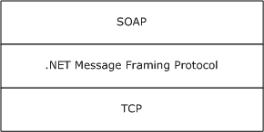

[MS-NMFTB]:

.NET Message Framing TCP Binding Protocol

Intellectual Property Rights Notice for Open Specifications Documentation

  Technical Documentation. Microsoft publishes Open Specifications documentation (“this

documentation”) for protocols, file formats, data portability, computer languages, and standards
support. Additionally, overview documents cover inter-protocol relationships and interactions.

  Copyrights. This documentation is covered by Microsoft copyrights. Regardless of any other

terms that are contained in the terms of use for the Microsoft website that hosts this
documentation, you can make copies of it in order to develop implementations of the technologies
that are described in this documentation and can distribute portions of it in your implementations
that use these technologies or in your documentation as necessary to properly document the
implementation. You can also distribute in your implementation, with or without modification, any
schemas, IDLs, or code samples that are included in the documentation. This permission also
applies to any documents that are referenced in the Open Specifications documentation.
  No Trade Secrets. Microsoft does not claim any trade secret rights in this documentation.
  Patents. Microsoft has patents that might cover your implementations of the technologies

described in the Open Specifications documentation. Neither this notice nor Microsoft's delivery of
this documentation grants any licenses under those patents or any other Microsoft patents.
However, a given Open Specifications document might be covered by the Microsoft Open
Specifications Promise or the Microsoft Community Promise. If you would prefer a written license,
or if the technologies described in this documentation are not covered by the Open Specifications
Promise or Community Promise, as applicable, patent licenses are available by contacting
iplg@microsoft.com.

  License Programs. To see all of the protocols in scope under a specific license program and the

associated patents, visit the Patent Map.

  Trademarks. The names of companies and products contained in this documentation might be
covered by trademarks or similar intellectual property rights. This notice does not grant any
licenses under those rights. For a list of Microsoft trademarks, visit
www.microsoft.com/trademarks.

  Fictitious Names. The example companies, organizations, products, domain names, email

addresses, logos, people, places, and events that are depicted in this documentation are fictitious.
No association with any real company, organization, product, domain name, email address, logo,
person, place, or event is intended or should be inferred.

Reservation of Rights. All other rights are reserved, and this notice does not grant any rights other
than as specifically described above, whether by implication, estoppel, or otherwise.

Tools. The Open Specifications documentation does not require the use of Microsoft programming
tools or programming environments in order for you to develop an implementation. If you have access
to Microsoft programming tools and environments, you are free to take advantage of them. Certain
Open Specifications documents are intended for use in conjunction with publicly available standards
specifications and network programming art and, as such, assume that the reader either is familiar
with the aforementioned material or has immediate access to it.

Support. For questions and support, please contact dochelp@microsoft.com.

[MS-NMFTB] - v20190313
.NET Message Framing TCP Binding Protocol
Copyright © 2019 Microsoft Corporation
Release: March 13, 2019

1 / 24

Revision Summary

Date

Revision
History

Revision
Class

Comments

3/12/2010

0.1

Major

First release.

4/23/2010

0.1.1

Editorial

Changed language and formatting in the technical content.

6/4/2010

0.1.2

Editorial

Changed language and formatting in the technical content.

7/16/2010

1.0

Major

Updated and revised the technical content.

8/27/2010

1.0

10/8/2010

1.0

11/19/2010  1.0

1/7/2011

1.0

2/11/2011

1.0

3/25/2011

1.0

5/6/2011

1.0

None

None

None

None

None

None

None

No changes to the meaning, language, or formatting of the
technical content.

No changes to the meaning, language, or formatting of the
technical content.

No changes to the meaning, language, or formatting of the
technical content.

No changes to the meaning, language, or formatting of the
technical content.

No changes to the meaning, language, or formatting of the
technical content.

No changes to the meaning, language, or formatting of the
technical content.

No changes to the meaning, language, or formatting of the
technical content.

6/17/2011

1.1

Minor

Clarified the meaning of the technical content.

9/23/2011

1.1

None

No changes to the meaning, language, or formatting of the
technical content.

12/16/2011  2.0

Major

Updated and revised the technical content.

3/30/2012

2.0

None

No changes to the meaning, language, or formatting of the
technical content.

7/12/2012

2.1

Minor

Clarified the meaning of the technical content.

10/25/2012  2.1

1/31/2013

2.1

8/8/2013

2.1

11/14/2013  2.1

2/13/2014

2.1

5/15/2014

2.1

None

None

None

None

None

None

No changes to the meaning, language, or formatting of the
technical content.

No changes to the meaning, language, or formatting of the
technical content.

No changes to the meaning, language, or formatting of the
technical content.

No changes to the meaning, language, or formatting of the
technical content.

No changes to the meaning, language, or formatting of the
technical content.

No changes to the meaning, language, or formatting of the
technical content.

[MS-NMFTB] - v20190313
.NET Message Framing TCP Binding Protocol
Copyright © 2019 Microsoft Corporation
Release: March 13, 2019

2 / 24

Date

Revision
History

Revision
Class

Comments

6/30/2015

3.0

Major

Significantly changed the technical content.

10/16/2015  3.0

7/14/2016

3.0

None

None

No changes to the meaning, language, or formatting of the
technical content.

No changes to the meaning, language, or formatting of the
technical content.

3/16/2017

4.0

Major

Significantly changed the technical content.

6/1/2017

4.0

None

No changes to the meaning, language, or formatting of the
technical content.

3/13/2019

5.0

Major

Significantly changed the technical content.

[MS-NMFTB] - v20190313
.NET Message Framing TCP Binding Protocol
Copyright © 2019 Microsoft Corporation
Release: March 13, 2019

3 / 24

Table of Contents

1.1
1.2

1.2.1
1.2.2

1  Introduction ............................................................................................................ 6
Glossary ........................................................................................................... 6
References ........................................................................................................ 7
Normative References ................................................................................... 7
Informative References ................................................................................. 8
Overview .......................................................................................................... 8
Relationship to Other Protocols ............................................................................ 8
Prerequisites/Preconditions ................................................................................. 8
Applicability Statement ....................................................................................... 9
Versioning and Capability Negotiation ................................................................... 9
Vendor-Extensible Fields ..................................................................................... 9
Standards Assignments ....................................................................................... 9

1.3
1.4
1.5
1.6
1.7
1.8
1.9

2.1
2.2

2  Messages ............................................................................................................... 10
Transport ........................................................................................................ 10
Common Message Syntax ................................................................................. 10
Namespaces .............................................................................................. 10
Messages ................................................................................................... 10
Elements ................................................................................................... 10
Complex Types ........................................................................................... 10
Simple Types ............................................................................................. 10
Attributes .................................................................................................. 11
Groups ...................................................................................................... 11
Attribute Groups ......................................................................................... 11

2.2.1
2.2.2
2.2.3
2.2.4
2.2.5
2.2.6
2.2.7
2.2.8

3.1

3.2

3.2.1

3.1.6.2.1

3.2.1.1
3.2.1.2

3.1.6.1
3.1.6.2

3.1.1
3.1.2
3.1.3
3.1.4
3.1.5
3.1.6

3  Protocol Details ..................................................................................................... 12
Common Details .............................................................................................. 12
Abstract Data Model .................................................................................... 12
Timers ...................................................................................................... 13
Initialization ............................................................................................... 13
Message Processing Events and Sequencing Rules .......................................... 13
Timer Events .............................................................................................. 13
Other Local Events ...................................................................................... 13
TCP Connection Aborted ........................................................................ 13
Higher-Layer Triggered Events ............................................................... 13
Abort the TCP Connection ................................................................. 13
Initiator Details ................................................................................................ 13
Abstract Data Model .................................................................................... 13
CONNECTED State ................................................................................ 14
BUSY State .......................................................................................... 14
Timers ...................................................................................................... 14
Initialization ............................................................................................... 14
Message Processing Events and Sequencing Rules .......................................... 14
Timer Events .............................................................................................. 14
Other Local Events ...................................................................................... 14
End Framing Session ............................................................................. 14
Higher-Layer Triggered Events ............................................................... 14
Connect ......................................................................................... 14
Receiver Details ............................................................................................... 15
Abstract Data Model .................................................................................... 15
Timers ...................................................................................................... 15
Initialization ............................................................................................... 15
Message Processing Events and Sequencing Rules .......................................... 15
Timer Events .............................................................................................. 15
Other Local Events ...................................................................................... 15

3.3.1
3.3.2
3.3.3
3.3.4
3.3.5
3.3.6

3.2.2
3.2.3
3.2.4
3.2.5
3.2.6

3.2.6.1
3.2.6.2

3.2.6.2.1

3.3

[MS-NMFTB] - v20190313
.NET Message Framing TCP Binding Protocol
Copyright © 2019 Microsoft Corporation
Release: March 13, 2019

4 / 24

3.3.6.1

End Framing Session ............................................................................. 15

4  Protocol Examples ................................................................................................. 17

5  Security ................................................................................................................. 18
Security Considerations for Implementers ........................................................... 18
Index of Security Parameters ............................................................................ 18

5.1
5.2

6  Appendix A: Full WSDL .......................................................................................... 19

7  Appendix B: Product Behavior ............................................................................... 20

8  Change Tracking .................................................................................................... 22

9  Index ..................................................................................................................... 23

[MS-NMFTB] - v20190313
.NET Message Framing TCP Binding Protocol
Copyright © 2019 Microsoft Corporation
Release: March 13, 2019

5 / 24

1  Introduction

The .NET Message Framing TCP Binding Protocol specifies how the .NET Message Framing Protocol
[MC-NMF] is used for framing SOAP messages over TCP [RFC793].

Note  This specification does not define any SOAP messages. Rather, it specifies how SOAP messages
defined by a higher-layer protocol are framed for transport over TCP.

Sections 1.5, 1.8, 1.9, 2, and 3 of this specification are normative. All other sections and examples in
this specification are informative.

1.1  Glossary

This document uses the following terms:

authority: A hierarchical element in a URI scheme used for delegating governance of the name

space defined by the remainder of the URI, as defined in [RFC3986] section 3.2.

connection: A logical communication path identified by a pair of sockets, as defined in [RFC793].

endpoint: In the context of a web service, a network target to which a SOAP message can be

addressed. See [WSADDR].

fragment: A component of a URI that allows for indirect identification of a secondary resource by

reference to a primary resource, as defined in [RFC3986] section 3.5.

host: A subcomponent of the naming authority in a URI scheme, as defined in [RFC3986] section

3.2.2.

initiator: The node that initiates the connection over which a protocol stream flows.

port: A subcomponent of the naming authority in a URI scheme ([RFC3986] section 3.2.3).

query: Contains nonhierarchical data used to identify a resource within the scope of a URI scheme

and naming authority, as defined in [RFC3986] section 3.4.

receiver: The node that is the receiver of the protocol stream.

SOAP: A lightweight protocol for exchanging structured information in a decentralized, distributed

environment. SOAP uses XML technologies to define an extensible messaging framework, which
provides a message construct that can be exchanged over a variety of underlying protocols. The
framework has been designed to be independent of any particular programming model and
other implementation-specific semantics. SOAP 1.2 supersedes SOAP 1.1. See [SOAP1.2-
1/2003].

SOAP message: An XML document consisting of a mandatory SOAP envelope, an optional SOAP
header, and a mandatory SOAP body. See [SOAP1.2-1/2007] section 5 for more information.

Transmission Control Protocol (TCP): A protocol used with the Internet Protocol (IP) to send
data in the form of message units between computers over the Internet. TCP handles keeping
track of the individual units of data (called packets) that a message is divided into for efficient
routing through the Internet.

transport session: A group of messages correlated into conversation by the transport.

Uniform Resource Identifier (URI): A string that identifies a resource. The URI is an addressing
mechanism defined in Internet Engineering Task Force (IETF) Uniform Resource Identifier (URI):
Generic Syntax [RFC3986].

[MS-NMFTB] - v20190313
.NET Message Framing TCP Binding Protocol
Copyright © 2019 Microsoft Corporation
Release: March 13, 2019

6 / 24

Web Services Description Language (WSDL): An XML format for describing network services

as a set of endpoints that operate on messages that contain either document-oriented or
procedure-oriented information. The operations and messages are described abstractly and are
bound to a concrete network protocol and message format in order to define an endpoint.
Related concrete endpoints are combined into abstract endpoints, which describe a network
service. WSDL is extensible, which allows the description of endpoints and their messages
regardless of the message formats or network protocols that are used.

XML namespace: A collection of names that is used to identify elements, types, and attributes in
XML documents identified in a URI reference [RFC3986]. A combination of XML namespace and
local name allows XML documents to use elements, types, and attributes that have the same
names but come from different sources. For more information, see [XMLNS-2ED].

XML Schema (XSD): A language that defines the elements, attributes, namespaces, and data

types for XML documents as defined by [XMLSCHEMA1/2] and [XMLSCHEMA2/2] standards. An
XML schema uses XML syntax for its language.

MAY, SHOULD, MUST, SHOULD NOT, MUST NOT: These terms (in all caps) are used as defined
in [RFC2119]. All statements of optional behavior use either MAY, SHOULD, or SHOULD NOT.

1.2  References

Links to a document in the Microsoft Open Specifications library point to the correct section in the
most recently published version of the referenced document. However, because individual documents
in the library are not updated at the same time, the section numbers in the documents may not
match. You can confirm the correct section numbering by checking the Errata.

1.2.1  Normative References

We conduct frequent surveys of the normative references to assure their continued availability. If you
have any issue with finding a normative reference, please contact dochelp@microsoft.com. We will
assist you in finding the relevant information.

[MC-NBFSE] Microsoft Corporation, ".NET Binary Format: SOAP Extension".

[MC-NBFS] Microsoft Corporation, ".NET Binary Format: SOAP Data Structure".

[MC-NMF] Microsoft Corporation, ".NET Message Framing Protocol".

[RFC2119] Bradner, S., "Key words for use in RFCs to Indicate Requirement Levels", BCP 14, RFC
2119, March 1997, https://www.rfc-editor.org/info/rfc2119

[RFC3986] Berners-Lee, T., Fielding, R., and Masinter, L., "Uniform Resource Identifier (URI): Generic
Syntax", STD 66, RFC 3986, January 2005, https://www.rfc-editor.org/info/rfc3986

[RFC793] Postel, J., Ed., "Transmission Control Protocol: DARPA Internet Program Protocol
Specification", RFC 793, September 1981, https://www.rfc-editor.org/info/rfc793

[SOAP1.1] Box, D., Ehnebuske, D., Kakivaya, G., et al., "Simple Object Access Protocol (SOAP) 1.1",
W3C Note, May 2000, https://www.w3.org/TR/2000/NOTE-SOAP-20000508/

[SOAP1.2-1/2003] Gudgin, M., Hadley, M., Mendelsohn, N., et al., "SOAP Version 1.2 Part 1:
Messaging Framework", W3C Recommendation, June 2003, http://www.w3.org/TR/2003/REC-soap12-
part1-20030624

[WSDLSOAP] Angelov, D., Ballinger, K., Butek, R., et al., "WSDL 1.1 Binding Extension for SOAP 1.2",
W3C Member Submission, April 2006, http://www.w3.org/Submission/2006/SUBM-wsdl11soap12-
20060405/

7 / 24

[MS-NMFTB] - v20190313
.NET Message Framing TCP Binding Protocol
Copyright © 2019 Microsoft Corporation
Release: March 13, 2019

<!-- Extracted images from page 8 -->

<!-- /Extracted images from page 8 -->

[WSDL] Christensen, E., Curbera, F., Meredith, G., and Weerawarana, S., "Web Services Description
Language (WSDL) 1.1", W3C Note, March 2001, https://www.w3.org/TR/2001/NOTE-wsdl-20010315

[XMLNS-2ED] Bray, T., Hollander, D., Layman, A., and Tobin, R., Eds., "Namespaces in XML 1.0
(Second Edition)", W3C Recommendation, August 2006, https://www.w3.org/TR/2006/REC-xml-
names-20060816/

[XMLSCHEMA1] Thompson, H., Beech, D., Maloney, M., and Mendelsohn, N., Eds., "XML Schema Part
1: Structures", W3C Recommendation, May 2001, https://www.w3.org/TR/2001/REC-xmlschema-1-
20010502/

[XMLSCHEMA2] Biron, P.V., Ed. and Malhotra, A., Ed., "XML Schema Part 2: Datatypes", W3C
Recommendation, May 2001, https://www.w3.org/TR/2001/REC-xmlschema-2-20010502/

1.2.2  Informative References

[MS-NETOD] Microsoft Corporation, "Microsoft .NET Framework Protocols Overview".

1.3  Overview

The .NET Message Framing TCP Binding Protocol specifies how the mechanism for framing messages
over any transport protocol, as defined in the .NET Message Framing Protocol [MC-NMF], can be
applied over the TCP [RFC793] transport protocol.

The .NET Message Framing TCP Binding Protocol also defines the net.tcp URI scheme and a URI for
identifying this protocol as the transport for sending SOAP 1.1 messages [SOAP1.1] or SOAP 1.2
messages [SOAP1.2-1/2003].

1.4  Relationship to Other Protocols

The .NET Message Framing TCP Binding Protocol uses TCP as the transport [RFC793].

This protocol uses .NET Message Framing [MC-NMF] to send SOAP 1.1 messages [SOAP1.1] or SOAP
1.2 messages [SOAP1.2-1/2003].

The following figure shows the protocol stack:

Figure 1: .NET Message Framing TCP Binding Protocol transport stack

1.5  Prerequisites/Preconditions

The .NET Message Framing TCP Binding Protocol requires that an initiator can connect to a receiver
over TCP [RFC793].

8 / 24

[MS-NMFTB] - v20190313
.NET Message Framing TCP Binding Protocol
Copyright © 2019 Microsoft Corporation
Release: March 13, 2019

1.6  Applicability Statement

The .NET Message Framing TCP Binding Protocol is applicable in scenarios where an initiator and a
receiver require a communication mechanism to send and receive SOAP messages over TCP
[RFC793].

1.7  Versioning and Capability Negotiation

This document covers versioning issues in the following areas:

  Supported Transports: This protocol requires TCP [RFC793] as specified in section 2.1.

  Protocol Versions: This protocol requires .NET Message Framing Protocol version 1.0 [MC-NMF].

When this protocol is implemented using SOAP, the use of SOAP version 1.1 [SOAP1.1] or SOAP
version 1.2 [SOAP1.2-1/2003] is required.

  Capability Negotiation: This protocol does not support negotiation of the version or capabilities

to use.

1.8  Vendor-Extensible Fields

This protocol has no vendor-extensible fields.

1.9  Standards Assignments

There are no standards assignments for this protocol.

[MS-NMFTB] - v20190313
.NET Message Framing TCP Binding Protocol
Copyright © 2019 Microsoft Corporation
Release: March 13, 2019

9 / 24

2  Messages

2.1  Transport

The .NET Message Framing TCP Binding Protocol requires TCP [RFC793].

An endpoint that uses the .NET Message Framing TCP Binding Protocol with [SOAP1.2-1/2003] MUST
set the value of the transport attribute of the wsoap12:binding element [WSDLSOAP] to
http://schemas.microsoft.com/soap/tcp.

An endpoint that uses the .NET Message Framing TCP Binding Protocol with [SOAP1.1] MUST set the
value of the transport attribute of the soap:binding element [WSDL] to
http://schemas.microsoft.com/soap/tcp.

2.2  Common Message Syntax

This section contains common definitions used by this protocol. The syntax of the definitions uses XML
Schema as defined in [XMLSCHEMA1] and [XMLSCHEMA2], and Web Services Description
Language as defined in [WSDL].

2.2.1  Namespaces

This specification defines and references various XML namespaces using the mechanisms specified in
[XMLNS-2ED]. Although this specification associates a specific XML namespace prefix for each XML
namespace that is used, the choice of any particular XML namespace prefix is implementation-specific
and not significant for interoperability.

Prefix  Namespace URI

Reference

soap

http://schemas.xmlsoap.org/wsdl/soap

[WSDL]

soap12  http://schemas.xmlsoap.org/wsdl/soap12/

[WSDLSOAP]

wsdl

http://schemas.xmlsoap.org/wsdl/

[WSDL]

2.2.2  Messages

This specification does not define any common XML Schema message definitions.

2.2.3  Elements

This specification does not define any common XML Schema element definitions.

2.2.4  Complex Types

This specification does not define any common XML Schema complex type definitions.

2.2.5  Simple Types

This specification does not define any common XML Schema simple type definitions.

[MS-NMFTB] - v20190313
.NET Message Framing TCP Binding Protocol
Copyright © 2019 Microsoft Corporation
Release: March 13, 2019

10 / 24

2.2.6  Attributes

This specification does not define any common XML Schema attribute definitions.

2.2.7  Groups

This specification does not define any common XML Schema group definitions.

2.2.8  Attribute Groups

This specification does not define any common XML Schema attribute group definitions.

[MS-NMFTB] - v20190313
.NET Message Framing TCP Binding Protocol
Copyright © 2019 Microsoft Corporation
Release: March 13, 2019

11 / 24

3  Protocol Details

A participant in this protocol can behave in one of two roles:



Initiator

  Receiver

An initiator initiates the process by establishing a TCP connection, as specified in [RFC793] section
3.4, to a receiver. The resulting TCP connection is used as the transport for performing the .NET
Message Framing Protocol [MC-NMF].

3.1  Common Details

3.1.1  Abstract Data Model

A net.tcp URI identifies a resource that listens for TCP connections and assumes the receiver role of
this protocol.

A net.tcp URI is a URI that satisfies the following constraints:













The scheme, as defined in [RFC3986] section 3.1, component of the URI MUST be net.tcp.

The URI MUST be a hierarchical URI, as defined in [RFC3986].

The authority, as defined in [RFC3986] section 3.2, component of the URI MUST be specified.

The authority component of the URI MUST NOT include user information, as defined in [RFC3986]
section 3.2.1.

The URI SHOULD NOT include the query URI component.<1>

The URI SHOULD NOT include the fragment URI, as defined in [RFC3986] section 3.5,
component.<2>

If the authority component of a net.tcp URI does not specify a port, then the default port MUST be
considered to be 808.

The protocol MUST maintain the following data elements for each TCP connection:

TCP Protocol Configuration Object (TPCO): A configuration object as defined in [MC-NMF] section
3.1.1 that satisfies the following constraints:













The Via, as defined in [MC-NMF] section 2.2.3.3, specified by the TPCO MUST be a net.tcp URI as
specified in this section.

The Via, as defined in [MC-NMF] section 2.2.3.3, specified by the TPCO MUST be an absolute URI.

The protocol version specified by the TPCO MUST be 1.0.

The communication mode specified by the TPCO MUST NOT be Simplex, as defined in [MC-NMF]
section 2.2.3.2.<3>

The communication mode specified by the TPCO MUST NOT be Singleton-Sized, as defined in
[MC-NMF] section 2.2.3.2.<4>

If the communication mode is Duplex, as defined in [MC-NMF] section 2.2.3.2, then the encoding
specified by the TPCO MUST NOT be Binary [MC-NBFS]. The transport in this mode uses a
transport session.<5>

12 / 24

[MS-NMFTB] - v20190313
.NET Message Framing TCP Binding Protocol
Copyright © 2019 Microsoft Corporation
Release: March 13, 2019



If the communication mode is Singleton-Unsized, as defined in [MC-NMF] section 2.2.3.2, then the
encoding specified by the TPCO MUST NOT be Binary with in-band dictionary [MC-NBFSE]. The
transport in this mode uses a transport session.<6>

3.1.2  Timers

None.

3.1.3  Initialization

A TPCO with an uninitialized transport is made available to the protocol as part of a higher-layer
triggered event.

3.1.4  Message Processing Events and Sequencing Rules

This specification does not define any common XML Schema operation definitions.

3.1.5  Timer Events

None.

3.1.6  Other Local Events

3.1.6.1  TCP Connection Aborted

If the TCP connection is aborted at any time, then the protocol MUST:

  Close the framing session (if one exists)

  Discard any state associated with the TCP connection



Terminate

3.1.6.2  Higher-Layer Triggered Events

3.1.6.2.1 Abort the TCP Connection

The protocol MUST abort the TCP connection.

The protocol MUST discard any state associated with the TCP connection and framing session and then
terminate.

3.2  Initiator Details

3.2.1  Abstract Data Model

The initiator role MUST maintain the following data elements for each TCP connection (in addition to
the TPCO):

Connection State: One of two possible values.

  CONNECTED, see section 3.2.1.1

  BUSY, see section 3.2.1.2

[MS-NMFTB] - v20190313
.NET Message Framing TCP Binding Protocol
Copyright © 2019 Microsoft Corporation
Release: March 13, 2019

13 / 24

3.2.1.1  CONNECTED State

CONNECTED is the initial state. The following events are processed in the CONNECTED state:

  Connect, as specified in section 3.2.6.2.1

  Abort the TCP connection, as specified in section 3.1.6.2.1

3.2.1.2  BUSY State

The following events are processed in the BUSY state:



End the framing session, as specified in section 3.2.6.1

  Abort the TCP connection, as specified in section 3.1.6.2.1

3.2.2  Timers

None.

3.2.3  Initialization

When a new TCP connection is created, the Connection State for the TCP connection MUST be set to
CONNECTED.

3.2.4  Message Processing Events and Sequencing Rules

This specification does not define any XML Schema operation definitions for the initiator role.

3.2.5  Timer Events

None.

3.2.6  Other Local Events

3.2.6.1  End Framing Session

The End Framing session event occurs due to one of the following conditions:







The initiator has both received an end message and has sent an end message. For details about
the end message, see [MC-NMF] section 2.2.3.9.

The initiator sends a Fault Record. For details about the Fault Record, see [MC-NMF] section 2.2.5.

The initiator receives a Fault Record.

When the framing session, as defined in [MC-NMF] section 1.3, has ended for a given TCP connection,
the initiator MUST set the Connection State to CONNECTED (see section 3.2.1.1).

3.2.6.2  Higher-Layer Triggered Events

3.2.6.2.1 Connect

The initiator MUST establish a TCP connection with the host, as defined in [RFC3986] section 3.2.2,
that is specified by the authority component of the Via URI from the TPCO. The manner in which the
TCP connection is established (for example, by creating a new connection or by reusing an existing

14 / 24

[MS-NMFTB] - v20190313
.NET Message Framing TCP Binding Protocol
Copyright © 2019 Microsoft Corporation
Release: March 13, 2019

one) is implementation-specific. The initiator MUST NOT reuse a TCP connection in the BUSY
Connection State (see section 3.2.1.2). Once the TCP connection is established, the initiator MUST
set the Connection State for that TCP connection to BUSY.

If the initiator fails to establish a TCP connection, then the initiator MUST notify the higher layer of the
error and then discard all state for the TCP connection.

An implementation SHOULD NOT leave a connection in the CONNECTED state indefinitely (see section
3.2.1.1).<7>

Once a TCP connection has been established, the initiator MUST set the TPCO transport to the TCP
connection. The initiator MUST store the TPCO for the TCP connection. The initiator MUST then
assume the initiator role, as defined in [MC-NMF] in section 3.2.

The initiator MUST use the TPCO stored for the TCP connection to initialize new framing sessions.

3.3  Receiver Details

3.3.1  Abstract Data Model

None.

3.3.2  Timers

None.

3.3.3  Initialization

The following initialization requirements are in addition to the initialization requirements specified in
section 3.1.3.

The receiver MUST listen for a TCP connection at the host and port specified by the authority
component of the Via URI from the TPCO.

Once a TCP connection has been established, the receiver MUST set the TPCO transport to the TCP
connection. The receiver MUST then assume the receiver role as defined in [MC-NMF] section 3.3.

The receiver MUST use the TPCO to initialize new sessions.

If the receiver fails to start listening for TCP connections, then the receiver MUST notify the higher
layer of the error and terminate.

3.3.4  Message Processing Events and Sequencing Rules

This specification does not define any XML Schema operation definitions for the receiver role.

3.3.5  Timer Events

None.

3.3.6  Other Local Events

3.3.6.1  End Framing Session

The End Framing session event occurs due to one of the following conditions:

15 / 24

[MS-NMFTB] - v20190313
.NET Message Framing TCP Binding Protocol
Copyright © 2019 Microsoft Corporation
Release: March 13, 2019





The receiver has both received an end message and has sent an end message. For more
information about the end message, see [MC-NMF] section 2.2.3.9.

The receiver sends a Fault Record. For more information about the Fault Record, see [MC-NMF]
section 2.2.5.



The receiver receives a Fault Record.

When the framing session has ended for a given TCP connection, the receiver MUST reassume the
receiver role using the TPCO stored with the connection, as defined in [MC-NMF] section 3.3.

[MS-NMFTB] - v20190313
.NET Message Framing TCP Binding Protocol
Copyright © 2019 Microsoft Corporation
Release: March 13, 2019

16 / 24

4  Protocol Examples

The protocol is initialized with the following TPCO:





Transport: <no value>

Protocol version: 1.0

  Mode: 0x02 (Duplex)

  Via: net.tcp://SampleServer/SampleApp/



Encoding: Binary

The receiver listens for connections at the address 192.168.2.13 on port 802.

The initiator actively establishes a connection to the host at 192.168.2.13 on port 802 (a TCP
connection for the specified Via does not already exist).

Both the initiator and the receiver store the TPCO with the established TCP connection as the
transport and assume the initiator and receiver roles for the .NET Message Framing Protocol [MC-NMF]
respectively.

The protocol exchange proceeds as described in [MC-NMF] section 4.1.

When the initiator receives the final end record, as defined in [MC-NMF] section 2.2.3.9, the higher
layer protocol aborts the connection.

[MS-NMFTB] - v20190313
.NET Message Framing TCP Binding Protocol
Copyright © 2019 Microsoft Corporation
Release: March 13, 2019

17 / 24

5  Security

5.1  Security Considerations for Implementers

None.

5.2  Index of Security Parameters

None.

[MS-NMFTB] - v20190313
.NET Message Framing TCP Binding Protocol
Copyright © 2019 Microsoft Corporation
Release: March 13, 2019

18 / 24

6  Appendix A: Full WSDL

The following WSDL specifies the WSDL 1.1 binding extension transport URI with the version of
SOAP as indicated.

WSDL 1.1 binding extension transport URI with SOAP 1.2 [SOAP1.2-1/2003]

 <?xml version="1.0" encoding="utf-8"?>
 <wsdl:definitions xmlns:wsdl="http://schemas.xmlsoap.org/wsdl/"
                   xmlns:soap12="http://schemas.xmlsoap.org/wsdl/soap12/">
   <!-- ommitted elements -->
   <wsdl:binding name="MyBinding" type="MyPortType">
     <soap12:binding transport="http://schemas.microsoft.com/soap/tcp"/>
     <wsdl:operation name="MyOperation">
       <!-- ommitted elements -->
     </wsdl:operation>
   </wsdl:binding>
   <wsdl:service name="MyService">
     <wsdl:port name="MyPort" binding="MyBinding">
       <soap12:address location="net.tcp://myhost/" />
     </wsdl:port>
   </wsdl:service>
 </wsdl:definitions>

WSDL 1.1 binding extension transport URI with SOAP 1.1 [SOAP1.1]

 <?xml version="1.0" encoding="utf-8"?>
 <wsdl:definitions xmlns:wsdl="http://schemas.xmlsoap.org/wsdl/"
                   xmlns:soap="http://schemas.xmlsoap.org/wsdl/soap/">
   <!-- ommitted elements -->
   <wsdl:binding name="MyBinding" type="MyPortType">
     <soap:binding transport="http://schemas.microsoft.com/soap/tcp"/>
     <wsdl:operation name="MyOperation">
       <!-- ommitted elements -->
     </wsdl:operation>
   </wsdl:binding>
   <wsdl:service name="MyService">
     <wsdl:port name="MyPort" binding="MyBinding">
       <soap:address location="net.tcp://myhost/" />
     </wsdl:port>
   </wsdl:service>
 </wsdl:definitions>

[MS-NMFTB] - v20190313
.NET Message Framing TCP Binding Protocol
Copyright © 2019 Microsoft Corporation
Release: March 13, 2019

19 / 24

7  Appendix B: Product Behavior

The information in this specification is applicable to the following Microsoft products or supplemental
software. References to product versions include updates to those products.

This document specifies version-specific details in the Microsoft .NET Framework. For information
about which versions of the .NET Framework are available in each released Windows product or as
supplemental software, see [MS-NETOD] section 4.

  Microsoft .NET Framework 3.0

  Microsoft .NET Framework 3.5

  Microsoft .NET Framework 4.0

  Microsoft .NET Framework 4.5

  Microsoft .NET Framework 4.6

  Microsoft .NET Framework 4.7

  Microsoft .NET Framework 4.8

Exceptions, if any, are noted in this section. If an update version, service pack or Knowledge Base
(KB) number appears with a product name, the behavior changed in that update. The new behavior
also applies to subsequent updates unless otherwise specified. If a product edition appears with the
product version, behavior is different in that product edition.

Unless otherwise specified, any statement of optional behavior in this specification that is prescribed
using the terms "SHOULD" or "SHOULD NOT" implies product behavior in accordance with the
SHOULD or SHOULD NOT prescription. Unless otherwise specified, the term "MAY" implies that the
product does not follow the prescription.

<1> Section 3.1.1: The Windows implementation of this protocol ignores the query and fragment
components of the Via URI specified by the TPCO.

<2> Section 3.1.1: The Windows implementation of this protocol ignores the query and fragment
components of the Via URI specified by the TPCO.

<3> Section 3.1.1: While establishing the framing session as defined in section 3.2.6.2.1, if the
communication mode specified by the initiator is Simplex, the Windows implementation of the
receiver sends an UnsupportedMode Fault Record to the initiator, as specified in [MC-NMF] section
2.2.5.

<4> Section 3.1.1: While establishing the framing session as defined in section 3.2.6.2.1, if the
communication mode specified by the initiator is Singleton-Sized, the Windows implementation of the
receiver sends an UnsupportedMode Fault Record to the initiator, as specified in [MC-NMF] section
2.2.5.

<5> Section 3.1.1: While establishing the framing session as defined in section 3.2.6.2.1, if the
communication mode specified by the initiator is Duplex and the encoding is Binary, the Windows
implementation of the receiver sends a ContentTypeInvalid Fault Record to the initiator, as specified in
[MC-NMF] section 2.2.5.

<6> Section 3.1.1: While establishing the framing session as defined in section 3.2.6.2.1, if the
communication mode specified by the initiator is Singleton-Unsized and the encoding is Binary with in-
band dictionary, the Windows implementation of the receiver sends a ContentTypeInvalid Fault Record
to the initiator, as specified in [MC-NMF] section 2.2.5.

[MS-NMFTB] - v20190313
.NET Message Framing TCP Binding Protocol
Copyright © 2019 Microsoft Corporation
Release: March 13, 2019

20 / 24

<7> Section 3.2.6.2.1: The Windows implementation of this protocol aborts the TCP connection if the
connection is in the CONNECTED state for longer than two minutes, or if a connection in the
CONNECTED state has existed for longer than five minutes.

[MS-NMFTB] - v20190313
.NET Message Framing TCP Binding Protocol
Copyright © 2019 Microsoft Corporation
Release: March 13, 2019

21 / 24

8  Change Tracking

This section identifies changes that were made to this document since the last release. Changes are
classified as Major, Minor, or None.

The revision class Major means that the technical content in the document was significantly revised.
Major changes affect protocol interoperability or implementation. Examples of major changes are:

  A document revision that incorporates changes to interoperability requirements.
  A document revision that captures changes to protocol functionality.

The revision class Minor means that the meaning of the technical content was clarified. Minor changes
do not affect protocol interoperability or implementation. Examples of minor changes are updates to
clarify ambiguity at the sentence, paragraph, or table level.

The revision class None means that no new technical changes were introduced. Minor editorial and
formatting changes may have been made, but the relevant technical content is identical to the last
released version.

The changes made to this document are listed in the following table. For more information, please
contact dochelp@microsoft.com.

Section

Description

Revision class

7 Appendix B: Product Behavior  Added .NET Framework v4.8 to the applicability list.  Major

[MS-NMFTB] - v20190313
.NET Message Framing TCP Binding Protocol
Copyright © 2019 Microsoft Corporation
Release: March 13, 2019

22 / 24

9  Index
A

Abstract data model
   initiator
      BUSY state 14
      CONNECTED state 14
      overview (section 3.1.1 12, section 3.2.1 13)
   receiver (section 3.1.1 12, section 3.3.1 15)
Applicability 9
Attribute groups 11
Attributes 11

C

Capability negotiation 9
Change tracking 22
Complex types 10

D

Data model - abstract
   initiator
      BUSY state 14
      CONNECTED state 14
      overview (section 3.1.1 12, section 3.2.1 13)
   receiver (section 3.1.1 12, section 3.3.1 15)

E

Events
   local
      initiator
         End Framing session event 14
         TCP connection aborted 13
      receiver
         End Framing session event 15
         TCP connection aborted 13
   timer
      initiator (section 3.1.5 13, section 3.2.5 14)
      receiver (section 3.1.5 13, section 3.3.5 15)
Examples - overview 17

F

Fields - vendor-extensible 9
Full WSDL 19

G

Glossary 6
Groups 11

H

Higher-layer triggered events
   initiator
      Connect 14
      TCP connection 13
   receiver - TCP connection 13

I

[MS-NMFTB] - v20190313
.NET Message Framing TCP Binding Protocol
Copyright © 2019 Microsoft Corporation
Release: March 13, 2019

Implementer - security considerations 18
Index of security parameters 18
Informative references 8
Initialization
   initiator (section 3.1.3 13, section 3.2.3 14)
   receiver (section 3.1.3 13, section 3.3.3 15)
Initiator
   abstract data model
      BUSY state 14
      CONNECTED state 14
      overview (section 3.1.1 12, section 3.2.1 13)
   higher-layer triggered events
      Connect 14
      TCP connection 13
   initialization (section 3.1.3 13, section 3.2.3 14)
   local events
      End Framing session event 14
      TCP connection aborted 13
   message processing (section 3.1.4 13, section

3.2.4 14)
   overview 12
   sequencing rules (section 3.1.4 13, section 3.2.4

14)

   timer events (section 3.1.5 13, section 3.2.5 14)
   timers (section 3.1.2 13, section 3.2.2 14)
Introduction 6

L

Local events
   initiator
      End Framing session event 14
      TCP connection aborted 13
   receiver
      End Framing session event 15
      TCP connection aborted 13

M

Message processing
   initiator (section 3.1.4 13, section 3.2.4 14)
   receiver (section 3.1.4 13, section 3.3.4 15)
Messages
   attribute groups 11
   attributes 11
   complex types 10
   elements 10
   enumerated 10
   groups 11
   namespaces 10
   simple types 10
   syntax 10
   transport 10

N

Namespaces 10
Normative references 7

O

23 / 24

   simple 10

V

Vendor-extensible fields 9
Versioning 9

W

WSDL 19

Overview (synopsis) 8

P

Parameters - security index 18
Preconditions 8
Prerequisites 8
Product behavior 20
Protocol Details
   overview 12

R

Receiver
   abstract data model (section 3.1.1 12, section

3.3.1 15)

   higher-layer triggered events - TCP connection 13
   initialization (section 3.1.3 13, section 3.3.3 15)
   local events
      End Framing session event 15
      TCP connection aborted 13
   message processing (section 3.1.4 13, section

3.3.4 15)
   overview 12
   sequencing rules (section 3.1.4 13, section 3.3.4

15)

   timer events (section 3.1.5 13, section 3.3.5 15)
   timers (section 3.1.2 13, section 3.3.2 15)
References 7
   informative 8
   normative 7
Relationship to other protocols 8

S

Security
   implementer considerations 18
   parameter index 18
Sequencing rules
   initiator (section 3.1.4 13, section 3.2.4 14)
   receiver (section 3.1.4 13, section 3.3.4 15)
Simple types 10
Standards assignments 9
Syntax
   messages - overview 10
Syntax - messages - overview 10

T

Timer events
   initiator (section 3.1.5 13, section 3.2.5 14)
   receiver (section 3.1.5 13, section 3.3.5 15)
Timers
   initiator (section 3.1.2 13, section 3.2.2 14)
   receiver (section 3.1.2 13, section 3.3.2 15)
Tracking changes 22
Transport 10
Triggered events
   initiator
      Connect 14
      TCP connection 13
   receiver - TCP connection 13
Types
   complex 10

[MS-NMFTB] - v20190313
.NET Message Framing TCP Binding Protocol
Copyright © 2019 Microsoft Corporation
Release: March 13, 2019

24 / 24

