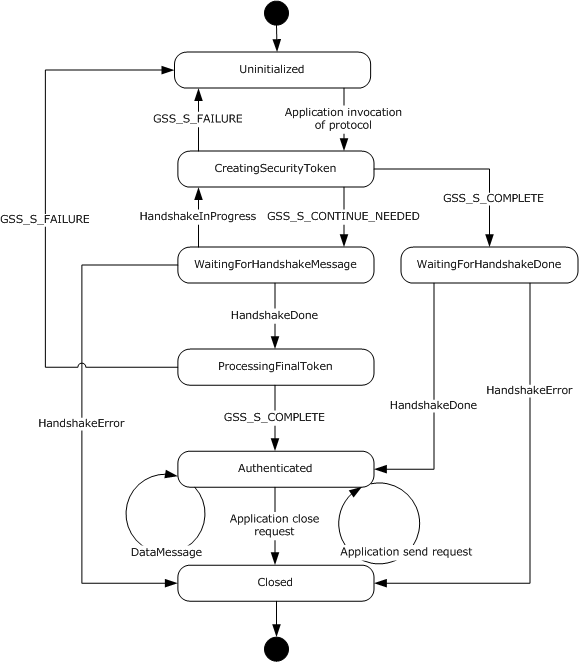
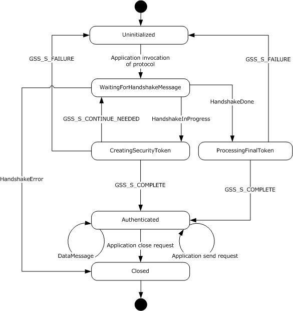
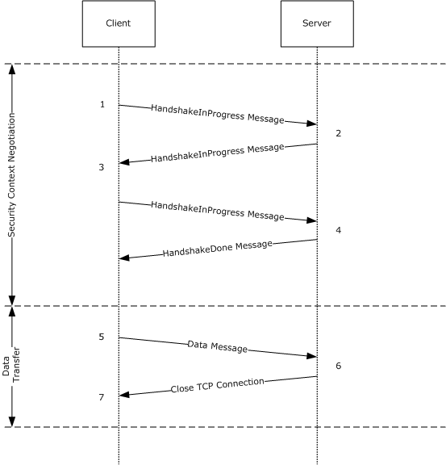
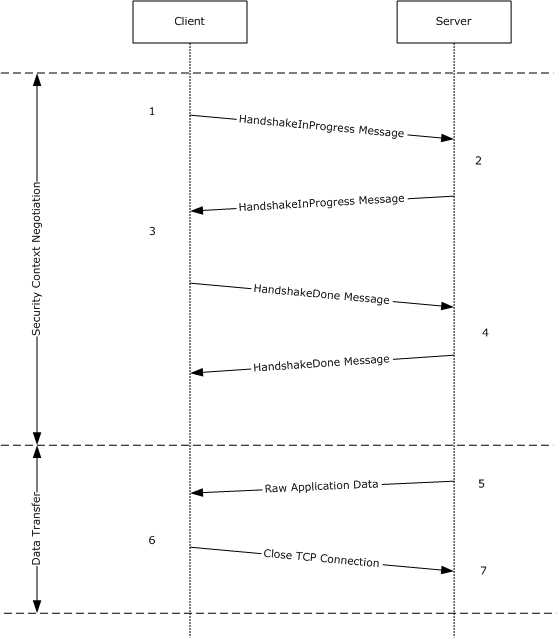
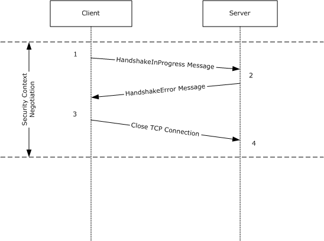

[MS-NNS]:

.NET NegotiateStream Protocol

Intellectual Property Rights Notice for Open Specifications Documentation

  Technical Documentation. Microsoft publishes Open Specifications documentation (“this

documentation”) for protocols, file formats, data portability, computer languages, and standards
support. Additionally, overview documents cover inter-protocol relationships and interactions.

  Copyrights. This documentation is covered by Microsoft copyrights. Regardless of any other

terms that are contained in the terms of use for the Microsoft website that hosts this
documentation, you can make copies of it in order to develop implementations of the technologies
that are described in this documentation and can distribute portions of it in your implementations
that use these technologies or in your documentation as necessary to properly document the
implementation. You can also distribute in your implementation, with or without modification, any
schemas, IDLs, or code samples that are included in the documentation. This permission also
applies to any documents that are referenced in the Open Specifications documentation.
  No Trade Secrets. Microsoft does not claim any trade secret rights in this documentation.
  Patents. Microsoft has patents that might cover your implementations of the technologies

described in the Open Specifications documentation. Neither this notice nor Microsoft's delivery of
this documentation grants any licenses under those patents or any other Microsoft patents.
However, a given Open Specifications document might be covered by the Microsoft Open
Specifications Promise or the Microsoft Community Promise. If you would prefer a written license,
or if the technologies described in this documentation are not covered by the Open Specifications
Promise or Community Promise, as applicable, patent licenses are available by contacting
iplg@microsoft.com.

  License Programs. To see all of the protocols in scope under a specific license program and the

associated patents, visit the Patent Map.

  Trademarks. The names of companies and products contained in this documentation might be
covered by trademarks or similar intellectual property rights. This notice does not grant any
licenses under those rights. For a list of Microsoft trademarks, visit
www.microsoft.com/trademarks.

  Fictitious Names. The example companies, organizations, products, domain names, email

addresses, logos, people, places, and events that are depicted in this documentation are fictitious.
No association with any real company, organization, product, domain name, email address, logo,
person, place, or event is intended or should be inferred.

Reservation of Rights. All other rights are reserved, and this notice does not grant any rights other
than as specifically described above, whether by implication, estoppel, or otherwise.

Tools. The Open Specifications documentation does not require the use of Microsoft programming
tools or programming environments in order for you to develop an implementation. If you have access
to Microsoft programming tools and environments, you are free to take advantage of them. Certain
Open Specifications documents are intended for use in conjunction with publicly available standards
specifications and network programming art and, as such, assume that the reader either is familiar
with the aforementioned material or has immediate access to it.

Support. For questions and support, please contact dochelp@microsoft.com.

[MS-NNS] - v20190313
.NET NegotiateStream Protocol
Copyright © 2019 Microsoft Corporation
Release: March 13, 2019

1 / 35

Revision Summary

Date

Revision
History

Revision
Class

Comments

7/20/2007

0.1

Major

MCPP Milestone 5 Initial Availability

9/28/2007

0.1.1

Editorial

Changed language and formatting in the technical content.

10/23/2007  0.1.2

Editorial

Changed language and formatting in the technical content.

11/30/2007  0.1.3

Editorial

Changed language and formatting in the technical content.

1/25/2008

1.0

Major

Updated and revised the technical content.

3/14/2008

1.0.1

Editorial

Changed language and formatting in the technical content.

6/20/2008

1.1

7/25/2008

2.0

Minor

Major

Clarified the meaning of the technical content.

Updated and revised the technical content.

8/29/2008

2.0.1

Editorial

Changed language and formatting in the technical content.

10/24/2008  3.0

Major

Updated and revised the technical content.

12/5/2008

3.0.1

Editorial

Changed language and formatting in the technical content.

1/16/2009

3.0.2

Editorial

Changed language and formatting in the technical content.

2/27/2009

3.0.3

Editorial

Changed language and formatting in the technical content.

4/10/2009

3.0.4

Editorial

Changed language and formatting in the technical content.

5/22/2009

3.0.5

Editorial

Changed language and formatting in the technical content.

7/2/2009

3.0.6

Editorial

Changed language and formatting in the technical content.

8/14/2009

3.0.7

Editorial

Changed language and formatting in the technical content.

9/25/2009

3.1

Minor

Clarified the meaning of the technical content.

11/6/2009

3.1.1

Editorial

Changed language and formatting in the technical content.

12/18/2009  3.1.2

Editorial

Changed language and formatting in the technical content.

1/29/2010

3.1.3

Editorial

Changed language and formatting in the technical content.

3/12/2010

3.1.4

Editorial

Changed language and formatting in the technical content.

4/23/2010

3.1.5

Editorial

Changed language and formatting in the technical content.

6/4/2010

3.1.6

Editorial

Changed language and formatting in the technical content.

7/16/2010

4.0

Major

Updated and revised the technical content.

8/27/2010

4.0

10/8/2010

4.0

11/19/2010  4.0

1/7/2011

4.0

None

None

None

None

No changes to the meaning, language, or formatting of the
technical content.

No changes to the meaning, language, or formatting of the
technical content.

No changes to the meaning, language, or formatting of the
technical content.

No changes to the meaning, language, or formatting of the

[MS-NNS] - v20190313
.NET NegotiateStream Protocol
Copyright © 2019 Microsoft Corporation
Release: March 13, 2019

2 / 35

Date

Revision
History

Revision
Class

Comments

technical content.

2/11/2011

4.0

3/25/2011

4.0

5/6/2011

4.0

None

None

None

No changes to the meaning, language, or formatting of the
technical content.

No changes to the meaning, language, or formatting of the
technical content.

No changes to the meaning, language, or formatting of the
technical content.

6/17/2011

4.1

Minor

Clarified the meaning of the technical content.

9/23/2011

4.1

None

No changes to the meaning, language, or formatting of the
technical content.

12/16/2011  5.0

Major

Updated and revised the technical content.

3/30/2012

5.0

None

No changes to the meaning, language, or formatting of the
technical content.

7/12/2012

5.1

Minor

Clarified the meaning of the technical content.

10/25/2012  5.1

1/31/2013

5.1

8/8/2013

5.1

11/14/2013  5.1

2/13/2014

5.1

5/15/2014

5.1

None

None

None

None

None

None

No changes to the meaning, language, or formatting of the
technical content.

No changes to the meaning, language, or formatting of the
technical content.

No changes to the meaning, language, or formatting of the
technical content.

No changes to the meaning, language, or formatting of the
technical content.

No changes to the meaning, language, or formatting of the
technical content.

No changes to the meaning, language, or formatting of the
technical content.

6/30/2015

6.0

Major

Significantly changed the technical content.

10/16/2015  6.0

7/14/2016

6.0

None

None

No changes to the meaning, language, or formatting of the
technical content.

No changes to the meaning, language, or formatting of the
technical content.

3/16/2017

7.0

Major

Significantly changed the technical content.

6/1/2017

7.0

12/1/2017

7.0

None

None

No changes to the meaning, language, or formatting of the
technical content.

No changes to the meaning, language, or formatting of the
technical content.

3/13/2019

8.0

Major

Significantly changed the technical content.

[MS-NNS] - v20190313
.NET NegotiateStream Protocol
Copyright © 2019 Microsoft Corporation
Release: March 13, 2019

3 / 35

Table of Contents

1.1
1.2

1.2.1
1.2.2

1  Introduction ............................................................................................................ 6
Glossary ........................................................................................................... 6
References ........................................................................................................ 6
Normative References ................................................................................... 6
Informative References ................................................................................. 7
Overview .......................................................................................................... 7
Relationship to Other Protocols ............................................................................ 8
Prerequisites/Preconditions ................................................................................. 8
Applicability Statement ....................................................................................... 8
Versioning and Capability Negotiation ................................................................... 8
Vendor-Extensible Fields ..................................................................................... 9
Standards Assignments ....................................................................................... 9

1.3
1.4
1.5
1.6
1.7
1.8
1.9

2.1
2.2

2  Messages ............................................................................................................... 10
Transport ........................................................................................................ 10
Message Syntax ............................................................................................... 10
Handshake Message .................................................................................... 10
Data Message ............................................................................................ 11

2.2.1
2.2.2

3.1

3.1.1

3.1.2
3.1.3
3.1.4

3.1.1.1
3.1.1.2
3.1.1.3
3.1.1.4
3.1.1.5
3.1.1.6
3.1.1.7
3.1.1.8
3.1.1.9
3.1.1.10
3.1.1.11

3  Protocol Details ..................................................................................................... 13
Client Details ................................................................................................... 13
Abstract Data Model .................................................................................... 13
Underlying TCP Connection .................................................................... 14
Stream State ........................................................................................ 14
Required Protection Level ....................................................................... 14
Negotiated Protection Level .................................................................... 14
Allowed Impersonation Level .................................................................. 14
Negotiated Impersonation Level .............................................................. 15
Client Credentials .................................................................................. 15
Security Provider Context....................................................................... 15
Framing Buffer ..................................................................................... 15
Channel Binding Token .......................................................................... 15
Target Name ........................................................................................ 15
Timers ...................................................................................................... 15
Initialization ............................................................................................... 15
Higher-Layer Triggered Events ..................................................................... 15
Application Invocation of the .NET NegotiateStream Protocol ...................... 15
Application Request to Send Data ........................................................... 16
Application Request to Close Stream ....................................................... 16
Message Processing Events and Sequencing Rules .......................................... 16
GSS_Init_sec_context Returns While in the CreatingSecurityToken State ..... 16
Receiving Data in the WaitingForHandshakeMessage State ......................... 17
GSS_Init_sec_context Returns While in the ProcessingFinalToken State ....... 17
Receiving Data in the WaitingForHandshakeDone State ............................. 18
Receiving Data in the Authenticated State ................................................ 18
Timer Events .............................................................................................. 18
Other Local Events ...................................................................................... 18
Server Details .................................................................................................. 19
Abstract Data Model .................................................................................... 19
Underlying TCP Connection .................................................................... 19
Stream State ........................................................................................ 20
Required Protection Level ....................................................................... 20
Negotiated Protection Level .................................................................... 20
Required Impersonation Level ................................................................ 20
Negotiated Impersonation Level .............................................................. 20

3.2.1.1
3.2.1.2
3.2.1.3
3.2.1.4
3.2.1.5
3.2.1.6

3.1.5.1
3.1.5.2
3.1.5.3
3.1.5.4
3.1.5.5

3.1.4.1
3.1.4.2
3.1.4.3

3.1.6
3.1.7

3.2.1

3.1.5

3.2

[MS-NNS] - v20190313
.NET NegotiateStream Protocol
Copyright © 2019 Microsoft Corporation
Release: March 13, 2019

4 / 35

3.2.1.7
3.2.1.8
3.2.1.9
3.2.1.10

3.2.2
3.2.3
3.2.4

3.2.4.1
3.2.4.2
3.2.4.3

3.2.5

3.2.5.1
3.2.5.2
3.2.5.3
3.2.5.4

3.2.6
3.2.7

Server Credentials ................................................................................ 20
Security Provider Context....................................................................... 21
Framing Buffer ..................................................................................... 21
Expected Channel Binding ...................................................................... 21
Timers ...................................................................................................... 21
Initialization ............................................................................................... 21
Higher-Layer Triggered Events ..................................................................... 21
Application Invocation of the .NET NegotiateStream Protocol ...................... 21
Application Request to Send Data ........................................................... 21
Application Request to Close Stream ....................................................... 22
Message Processing Events and Sequencing Rules .......................................... 22
Receiving Data in the WaitingForHandshakeMessage State ......................... 22
GSS_Accept_sec_context Returns While in the CreatingSecurityToken State  22
GSS_Accept_sec_context Returns While in the ProcessingFinalToken State .. 23
Receiving Data in the Authenticated State ................................................ 23
Timer Events .............................................................................................. 24
Other Local Events ...................................................................................... 24

4  Protocol Examples ................................................................................................. 25

5  Security ................................................................................................................. 30
Security Considerations for Implementers ........................................................... 30
Index of Security Parameters ............................................................................ 30

5.1
5.2

6  Appendix A: Product Behavior ............................................................................... 31

7  Change Tracking .................................................................................................... 32

8  Index ..................................................................................................................... 33

[MS-NNS] - v20190313
.NET NegotiateStream Protocol
Copyright © 2019 Microsoft Corporation
Release: March 13, 2019

5 / 35

1  Introduction

The .NET NegotiateStream Protocol provides mutually authenticated and confidential communication
over a TCP connection. It defines a framing mechanism used to transfer Generic Security Service
Application Program Interface (GSS-API) security tokens between a client and server. It also defines
a framing mechanism used to transfer signed and/or encrypted application data once the GSS-API
security context initialization has completed. It uses the Simple and Protected Generic Security
Service Application Program Interface (GSS-API) Negotiation (SPNEGO) mechanism for security
services (authentication, key derivation, and data encryption and decryption).

Sections 1.5, 1.8, 1.9, 2, and 3 of this specification are normative. All other sections and examples in
this specification are informative.

1.1  Glossary

This document uses the following terms:

Kerberos: An authentication system that enables two parties to exchange private information

across an otherwise open network by assigning a unique key (called a ticket) to each user that
logs on to the network and then embedding these tickets into messages sent by the users. For
more information, see [MS-KILE].

little-endian: Multiple-byte values that are byte-ordered with the least significant byte stored in

the memory location with the lowest address.

Security Support Provider Interface (SSPI): An API that allows connected applications to call
one of several security providers to establish authenticated connections and to exchange data
securely over those connections. It is equivalent to Generic Security Services (GSS)-API, and
the two are on-the-wire compatible.

security token: An opaque message or data packet produced by a Generic Security Services

(GSS)-style authentication package and carried by the application protocol. The application has
no visibility into the contents of the token.

MAY, SHOULD, MUST, SHOULD NOT, MUST NOT: These terms (in all caps) are used as defined
in [RFC2119]. All statements of optional behavior use either MAY, SHOULD, or SHOULD NOT.

1.2  References

Links to a document in the Microsoft Open Specifications library point to the correct section in the
most recently published version of the referenced document. However, because individual documents
in the library are not updated at the same time, the section numbers in the documents may not
match. You can confirm the correct section numbering by checking the Errata.

1.2.1  Normative References

We conduct frequent surveys of the normative references to assure their continued availability. If you
have any issue with finding a normative reference, please contact dochelp@microsoft.com. We will
assist you in finding the relevant information.

[MS-ERREF] Microsoft Corporation, "Windows Error Codes".

[MS-NLMP] Microsoft Corporation, "NT LAN Manager (NTLM) Authentication Protocol".

[MS-SPNG] Microsoft Corporation, "Simple and Protected GSS-API Negotiation Mechanism (SPNEGO)
Extension".

[MS-NNS] - v20190313
.NET NegotiateStream Protocol
Copyright © 2019 Microsoft Corporation
Release: March 13, 2019

6 / 35

[RFC2119] Bradner, S., "Key words for use in RFCs to Indicate Requirement Levels", BCP 14, RFC
2119, March 1997, https://www.rfc-editor.org/info/rfc2119

[RFC2743] Linn, J., "Generic Security Service Application Program Interface Version 2, Update 1", RFC
2743, January 2000, https://www.rfc-editor.org/info/rfc2743

[RFC4178] Zhu, L., Leach, P., Jaganathan, K., and Ingersoll, W., "The Simple and Protected Generic
Security Service Application Program Interface (GSS-API) Negotiation Mechanism", RFC 4178, October
2005, https://www.rfc-editor.org/info/rfc4178

1.2.2  Informative References

[MS-KILE] Microsoft Corporation, "Kerberos Protocol Extensions".

[MS-NETOD] Microsoft Corporation, "Microsoft .NET Framework Protocols Overview".

[RFC4120] Neuman, C., Yu, T., Hartman, S., and Raeburn, K., "The Kerberos Network Authentication
Service (V5)", RFC 4120, July 2005, https://www.rfc-editor.org/rfc/rfc4120

[RFC5246] Dierks, T., and Rescorla, E., "The Transport Layer Security (TLS) Protocol Version 1.2",
RFC 5246, August 2008, https://www.rfc-editor.org/info/rfc5246

1.3  Overview

The .NET NegotiateStream Protocol was introduced to address the need for a simple and lightweight
authentication and security mechanism between a client and a server when the client or server needs
direct access to the TCP stream. A key benefit is that authentication is accomplished without the use
of digital certificates, as is required by the Transport Layer Security (TLS) protocol [RFC5246]. The
.NET NegotiateStream Protocol provides a means for framing GSS-API Negotiation (as specified in
[RFC4178]) over a TCP stream. This is used to negotiate the security context for communication
between a client and a server. The client and server can then exchange data protected by the
negotiated security context.

The .NET NegotiateStream Protocol uses the SPNEGO mechanism to determine which underlying
security protocol to use. The .NET NegotiateStream Protocol can also forego negotiation with SPNEGO
and use NTLM authentication directly.

This protocol enables:

  Client and/or server authentication

  Data confidentiality and integrity

The .NET NegotiateStream Protocol performs these functions in two phases: a security context
negotiation phase and a data transfer phase.

The security context negotiation allows for the selection of mechanisms to protect the authenticity and
confidentiality of data that will be subsequently exchanged. SPNEGO is used to select the underlying
security protocol, and the security context is negotiated between the client and server in a set of
opaque security tokens generated by the SPNEGO GSS-API mechanism, which are transferred
between client and server over a TCP connection by use of a message framing protocol defined in this
document. This context negotiation is initiated by the client, and several messages can be exchanged
before the security context negotiation is complete. When the negotiation is completed, the client and
server have agreed upon the necessary authentication, data integrity, and confidentiality mechanisms.
These mechanisms will be used to secure subsequent data exchanges between the client and the
server.

After the security context has been successfully negotiated, the client and server exchange data that
is protected using the agreed-upon authentication, integrity, and confidentiality mechanisms. The

7 / 35

[MS-NNS] - v20190313
.NET NegotiateStream Protocol
Copyright © 2019 Microsoft Corporation
Release: March 13, 2019

server can initiate a data transfer to the client, or the client can initiate a data transfer to the server. A
data transfer can happen at any time after the security context negotiation is complete.

An error in the negotiation process or the data transfer process invalidates the stream, and a new
security context has to be renegotiated. The reason for the failure to negotiate a security context is
communicated to the other application taking part in the negotiation. An error in the data transfer
process can include transfer of data with an authentication, integrity, or confidentiality mechanism
different from what was negotiated.

1.4  Relationship to Other Protocols

The .NET NegotiateStream Protocol relies on TCP for transport, and it relies on the SPNEGO security
protocol and the NTLM security protocol for authentication and message security. If the client
application requests data integrity protection or confidentiality, the .NET NegotiateStream Protocol
performs authentication and negotiates a security protocol to be used to provide these features
through the exchange of opaque security tokens generated by the SPNEGO GSS-API mechanism. If
the client application protocol does not request either of these features, the .NET NegotiateStream
Protocol performs authentication through the exchange of opaque security tokens generated by the
NTLM GSS-API mechanism.

The .NET NegotiateStream Protocol provides an alternative to other security protocols, such as TLS
[RFC5246], which provide for authentication, integrity protection, and encryption of data exchanged
by a higher-level protocol. Whereas TLS requires the client and server to maintain valid digital
certificates with private keys to authenticate each other and establish key material for signing and
encrypting application data, the .NET NegotiateStream Protocol allows authentication and key
exchange to be performed securely without the need for digital certificates through the use of SPNEGO
and NTLM.

1.5  Prerequisites/Preconditions

This protocol assumes that a TCP connection has been established between client and server.

1.6  Applicability Statement

The .NET NegotiateStream Protocol is designed to secure information transmitted between a client and
a server. The protocol provides security services without using digital certificates, and is thus useful to
secure network traffic when the use of certificates is not an option. The .NET NegotiateStream Protocol
uses SPNEGO (which selects between Kerberos and NTLM) to determine the underlying security
protocol to use. Therefore, this protocol is best suited for environments in which a Kerberos
infrastructure is deployed (see [MS-KILE] and [RFC4120]). Using SPNEGO, the .NET NegotiateStream
Protocol enables:

  Client and/or server authentication

  Data integrity and confidentiality

1.7  Versioning and Capability Negotiation

This document covers versioning issues in the following areas:

Protocol Versions: The .NET NegotiateStream Protocol supports versioning and is currently at

version 1.0. The versioning capability is outlined in section 2.2.1. Version 1.0 is the only defined
version of the .NET NegotiateStream Protocol. Therefore, no version negotiation semantics are
described in this specification.

[MS-NNS] - v20190313
.NET NegotiateStream Protocol
Copyright © 2019 Microsoft Corporation
Release: March 13, 2019

8 / 35

Security and Authentication Methods: The .NET NegotiateStream Protocol supports the use of the
SPNEGO and NTLM security protocols. The use of these security protocols is discussed in sections
2.2, 3.1.4, and 3.2.5.

Capability Negotiation: This protocol performs explicit negotiation of a security method for providing
authentication, data integrity, and data confidentiality as specified in sections 2.2, 3.1.4, and
3.2.5.

1.8  Vendor-Extensible Fields

This protocol uses HRESULT values as defined in [MS-ERREF] section 2.1. Vendors can define their
own HRESULT values, provided they set the C bit (0x20000000) for each vendor-defined value,
indicating the value is a customer code.

1.9  Standards Assignments

None.

[MS-NNS] - v20190313
.NET NegotiateStream Protocol
Copyright © 2019 Microsoft Corporation
Release: March 13, 2019

9 / 35

2  Messages

2.1  Transport

The .NET NegotiateStream Protocol transports messages using a TCP stream. This protocol specifies a
framing for messages over a TCP stream (see section 2.2 for message syntax). The protocol does not
define a mechanism to establish the TCP connection; rather, an established TCP connection is a
precondition for this protocol.

2.2  Message Syntax

There are two types of messages defined by the .NET NegotiateStream Protocol: Handshake messages
and Data messages. Handshake messages are used to carry GSS-API security tokens used to
establish a security context. Once the security context has been established, Data messages are used
to carry application data that has been signed and/or encrypted by the negotiated security
mechanism.

All multi-byte integer fields are transmitted using little-endian representation.

2.2.1  Handshake Message

The Handshake message structure is defined as follows.

0  1  2  3  4  5  6  7  8  9

1
0  1  2  3  4  5  6  7  8  9

2
0  1  2  3  4  5  6  7  8  9

3
0  1

MessageId

MajorVersion

MinorVersion

HighByteOfPayloadSize

LowByteOfPayloadSize

AuthPayload (variable)

...

MessageId (1 byte): The type of Handshake message. The value of this field MUST be a value from

the following table.

Value

Meaning

HandshakeDone

The handshake has completed successfully.

0x14

HandshakeError

0x15

An error occurred during the handshake. The AuthPayload field contains an
HRESULT. See the description of the AuthPayload field for further information.

HandshakeInProgress

0x16

The message is part of the handshake phase and is not the final message from the
host. The final Handshake message from a host is always transferred in a
HandshakeDone message.

MajorVersion (1 byte): An unsigned integer that, along with the MinorVersion field, specifies the

version of the .NET NegotiateStream Protocol being used. This field MUST be set to 0x01.

MinorVersion (1 byte): An unsigned integer that, along with the MajorVersion field, defines the
version of the .NET NegotiateStream Protocol being used. This field MUST be set to 0x00.

[MS-NNS] - v20190313
.NET NegotiateStream Protocol
Copyright © 2019 Microsoft Corporation
Release: March 13, 2019

10 / 35

HighByteOfPayloadSize (1 byte): An unsigned integer that, along with the

LowByteOfPayloadSize field, defines the size, in bytes, of the AuthPayload field. This field
represents the high-order byte of the payload size.

LowByteOfPayloadSize (1 byte): An unsigned integer that, along with the

HighByteOfPayloadSize field, defines the size, in bytes, of the AuthPayload field. This field
represents the low-order byte of the payload size.

AuthPayload (variable): When the Handshake message has a MessageId of HandshakeDone or
HandshakeInProgress, this field contains the authentication tokens generated by the Security
Support Provider Interface (SSPI) security packages (SPNEGO and NTLM) used by the .NET
NegotiateStream Protocol. The formats for these tokens are defined in [MS-SPNG] section 2.2 and
[MS-NLMP] section 2.2 respectively. When the Handshake message has a MessageId of
HandshakeInProgress, this field MUST have a non-zero length. When the Handshake message has
a MessageId of HandshakeDone, this field MUST be of zero length if the remote side's security
package did not return a security token when indicating successful initialization of the security
context. When the Handshake message has a MessageId of HandshakeError, the AuthPayload
field MUST have a length of 8 bytes, and contain either an HRESULT error code describing an error
encountered by the security package or the Win32 error code ERROR_TRUST_FAILURE
(0x000006FE) indicating that the security package was able to successfully authenticate, but the
negotiated security parameters were unacceptable to the remote side.

The following structure MUST be used to format this error code within the AuthPayload field:

0  1  2  3  4  5  6  7  8  9

1
0  1  2  3  4  5  6  7  8  9

2
0  1  2  3  4  5  6  7  8  9

3
0  1

Reserved

ErrorCode

Reserved (4 bytes): This field is reserved and MUST be set to zero. The recipient MUST ignore

the value.

ErrorCode (4 bytes): An HRESULT describing an error encountered by the remote side's security

package, or the value 0x000006FE.

2.2.2  Data Message

This section defines the structure of the data exchange messages. These messages are used to
transfer application-specific data after the handshake phase is complete. The .NET NegotiateStream
Protocol only frames application data using the format noted in the following table if the negotiation of
security services during the handshake phase resulted in both the client and server agreeing to sign or
encrypt and sign the data to be transferred. Thus, if the negotiated security context in the handshake
phase results in a context that supports neither message confidentiality nor integrity, then the data
transferred is not framed, and does not follow the format specified in this section (that is, application-
supplied data is written directly to the underlying TCP stream).

0  1  2  3  4  5  6  7  8  9

1
0  1  2  3  4  5  6  7  8  9

2
0  1  2  3  4  5  6  7  8  9

3
0  1

PayloadSize

Payload (variable)

...

[MS-NNS] - v20190313
.NET NegotiateStream Protocol
Copyright © 2019 Microsoft Corporation
Release: March 13, 2019

11 / 35

PayloadSize (4 bytes): The unsigned size, in bytes, of the Payload field. The maximum value for

this field is 0x0000FC30 (64,560).

Payload (variable): The application-specific data to transfer between the client and server that has

been secured by the selected security mechanism.

[MS-NNS] - v20190313
.NET NegotiateStream Protocol
Copyright © 2019 Microsoft Corporation
Release: March 13, 2019

12 / 35

<!-- Extracted images from page 13 -->

<!-- /Extracted images from page 13 -->

3  Protocol Details

3.1  Client Details

The following figure represents the client state machine for the .NET NegotiateStream Protocol. The
remainder of this section will discuss the state machine in depth.

Figure 1: Client details

3.1.1  Abstract Data Model

This section describes a conceptual model of possible data organization that an implementation
maintains to participate in this protocol. This specification does not mandate that implementations

13 / 35

[MS-NNS] - v20190313
.NET NegotiateStream Protocol
Copyright © 2019 Microsoft Corporation
Release: March 13, 2019

adhere to this model, as long as their external behavior is consistent with that specified in this
specification.

3.1.1.1  Underlying TCP Connection

The .NET NegotiateStream Protocol uses the Underlying TCP Connection to exchange data with the
server.

3.1.1.2  Stream State

The .NET NegotiateStream Protocol uses the Stream State to keep track of the state of the stream.
The possible values for the state of the stream are:

  Uninitialized

  CreatingSecurityToken

  WaitingForHandshakeMessage

  ProcessingFinalToken

  WaitingForHandshakeDone

  Authenticated

  Closed

3.1.1.3  Required Protection Level

The .NET NegotiateStream Protocol uses the Required Protection Level to keep track of the
protection level required by the client application. The possible values for the Required Protection
Level and Negotiated Protection Level are:

  None

  Sign



EncryptAndSign

3.1.1.4  Negotiated Protection Level

The .NET NegotiateStream Protocol uses the Negotiated Protection Level to keep track of the
protection level agreed upon during the security context negotiation with the server. The possible
values are the same as those for the Required Protection Level.

3.1.1.5  Allowed Impersonation Level

The .NET NegotiateStream Protocol uses the Allowed Impersonation Level to keep track of the way
in which the client application has specified that its credentials can be used by the server application.
The possible values for the Allowed Impersonation Level and Negotiated Impersonation Level
are:





Identification

Impersonation

  Delegation

[MS-NNS] - v20190313
.NET NegotiateStream Protocol
Copyright © 2019 Microsoft Corporation
Release: March 13, 2019

14 / 35

3.1.1.6  Negotiated Impersonation Level

The .NET NegotiateStream Protocol uses the Negotiated Impersonation Level to keep track of the
impersonation level agreed upon during the security context negotiation with the server. The possible
values are the same as those for the Allowed Impersonation Level.

3.1.1.7  Client Credentials

The .NET NegotiateStream Protocol uses the Client Credentials to store a GSS-API handle to the
credentials specified by the client application for authenticating to the server.

3.1.1.8  Security Provider Context

The .NET NegotiateStream Protocol tracks the context of the current security provider chosen during
the handshake phase.

3.1.1.9  Framing Buffer

The .NET NegotiateStream Protocol employs a buffer mechanism to handle the receiving and
processing of full frames while in the handshake phase, and when the data payloads are signed,
and/or encrypted.

3.1.1.10

Channel Binding Token

The .NET NegotiateStream Protocol uses the Channel Binding Token to store the channel binding
token provided by the application.

3.1.1.11

Target Name

The .NET NegotiateStream Protocol uses the Target Name to store the target name of the server
provided by the application.

3.1.2  Timers

The .NET NegotiateStream Protocol does not use timers. Protocols above and below this protocol layer
are responsible for implementing any timers for time-out events.

3.1.3  Initialization

The .NET NegotiateStream Protocol initialization for the client role is triggered by an application event.
See section 3.1.4.1 for more details.

3.1.4  Higher-Layer Triggered Events

3.1.4.1  Application Invocation of the .NET NegotiateStream Protocol

The .NET NegotiateStream Protocol is triggered by an invocation from the application while in the
Uninitialized state. If an application invocation is received when the Stream State is not equal to
Uninitialized, an error MUST be returned to the application. The application specifies an underlying TCP
connection to the server, the desired name to be used for client authentication, a channel binding
token, the target name of the server, a required protection level, and an allowed impersonation level.
The Underlying TCP Connection, Required Protection Level, Allowed Impersonation Level,
Channel Binding Token, and Target Name MUST be set based on these inputs. The application-
specified desired_name MUST be passed to the GSS_Acquire_cred function ([RFC2743] section

15 / 35

[MS-NNS] - v20190313
.NET NegotiateStream Protocol
Copyright © 2019 Microsoft Corporation
Release: March 13, 2019

2.1.1). If the Required Protection Level is None, the implementation MUST pass a desired_mechs
parameter indicating the NTLM mechanism. Otherwise, the implementation MUST pass a
desired_mechs parameter indicating the SPNEGO mechanism. The cred_usage parameter MUST be set
to INITIATE-ONLY and the lifetime_req parameter MUST be set to 0.

If the function returns any major_status other than GSS_S_COMPLETE, the implementation MUST
notify the application of the failure without sending anything over the Underlying TCP Connection.
Otherwise, the implementation MUST store the returned credential handle as the Client Credentials,
and MUST set the Stream State to CreatingSecurityToken. The implementation MUST pass the Client
Credentials to the GSS_Init_sec_context function ([RFC2743] section 2.2.1). The
input_context_handle parameter MUST be GSS_C_NO_CONTEXT. The targ_name parameter MUST be
the Target Name. The mech_type parameter MUST be the same as that passed to
GSS_Acquire_cred. The deleg_req_flag MUST be true if and only if Allowed Impersonation Level
is Delegation. The conf_req_flag MUST be true if and only if the Required Protection Level is
EncryptAndSign. The integ_req_flag MUST be true if and only if the Required Protection Level is
Sign or EncryptAndSign. The mutual_req_flag, replay_det_req_flag, and sequence_req_flag MUST be
true. The anon_req_flag MUST be false. The chan_bindings parameter MUST be the Channel Binding
Token. The input_token MUST be NULL, and the lifetime_req MUST be 0.

If the conf_avail return value is true, the integ_avail return value will also be true, and the
Negotiated Protection Level is EncryptAndSign. If the conf_avail return value is false and the
integ_avail return value is true, the Negotiated Protection Level is Sign. Otherwise, the
Negotiated Protection Level is None.

3.1.4.2  Application Request to Send Data

When the Stream State is set to Authenticated, the application can at any time request that the
protocol transfer an application-specific data message to the server. If the application requests that
data be transferred while not in the Authenticated state, an error MUST be returned. If the
Negotiated Protection Level is None, the application data MUST be transferred directly over the
Underlying TCP Connection. Otherwise, the application data MUST be passed as the input_message
parameter to the GSS_Wrap function ([RFC2743] section 2.3.3), along with the Securty Provider
Context in the context_handle parameter. The conf_req_flag MUST be set if and only if the
Negotiated Protection Level is EncryptAndSign, and the qop_req parameter MUST be set to 0. If
the function returns a major_status of GSS_COMPLETE, the output_message MUST be wrapped in a
Data Message (as specified in section 2.2.2) and transmitted to the server via the Underlying TCP
Connection. If any other major_status is returned, the client application MUST be notified of the
failure without writing anything to the Underlying TCP Connection.

3.1.4.3  Application Request to Close Stream

The application can at any time request that the stream be closed. When this trigger is received, the
Security Provider Context MUST be deleted, the Underlying TCP Connection MUST be closed,
and the Stream State MUST be set to Closed.

3.1.5  Message Processing Events and Sequencing Rules

3.1.5.1  GSS_Init_sec_context Returns While in the CreatingSecurityToken State

If GSS_Init_sec_context returns a major_status of GSS_S_COMPLETE, the Negotiated Protection
Level and Negotiated Impersonation Level MUST be set based on the returned state flags. The
Security Provider Context MUST be set to the output_context_handle. If the Negotiated
Impersonation Level is not equal to the Allowed Impersonation Level or the Negotiated
Protection Level is lower than the Required Protection Level, the value 0x000006FE MUST be
wrapped in the AuthPayload field of a Handshake message with the HandshakeId set to
HandshakeError (as specified in section 2.2) and transmitted to the server. The Security Provider

16 / 35

[MS-NNS] - v20190313
.NET NegotiateStream Protocol
Copyright © 2019 Microsoft Corporation
Release: March 13, 2019

Context MUST be deleted and the Stream State MUST be set to Uninitialized. Otherwise, the
output_token MUST be wrapped in the AuthPayload field of a Handshake message with the
HandshakeId set to HandshakeDone (as specified in section 2.2) and transmitted to the server. In
this case, the Stream State MUST be set to WaitingForHandshakeDone.

If GSS_Init_sec_context returns a major status of GSS_S_CONTINUE_NEEDED, the Security
Provider Context MUST be set to the output_context_handle and the output_token MUST be
wrapped in the AuthPayload field of a Handshake message with the HandshakeId set to
HandshakeInProgress (as specified in section 2.2) and sent to the server. The Stream State MUST be
set to WaitingForHandshakeMessage.

If any other major_status is returned, an HRESULT error code describing the error MUST be wrapped
in the AuthPayload of a Handshake message with the HandshakeId set to HandshakeError (as
specified in section 2.2) and sent to the server. The Stream State MUST be set to Uninitialized.

3.1.5.2  Receiving Data in the WaitingForHandshakeMessage State

The first five bytes received MUST be interpreted as the header of a Handshake message (as
specified in section 2.2). The payload size MUST be reassembled from the HighByteOfPayloadSize
and LowByteOfPayloadSize fields. The MajorVersion and MinorVersion MUST be ignored. The
implementation MUST continue to receive data from the Underlying TCP Connection (storing it in
the Framing Buffer) until the entire payload has been received. When a full frame has been received,
the client MUST check the HandshakeId field of the message to see if it matches one of the three
known message IDs for .NET NegotiateStream Handshake messages. If the message ID received
matches the message ID for:

  A HandshakeInProgress message: Upon receipt of a message of this type, the Stream State

MUST be set to CreatingSecurityToken. The client MUST take the token from the AuthPayload
field of the message and pass it to the GSS_Init_sec_context function ([RFC2743] section
2.2.1), along with the Security Provider Context, Client Credentials, Target Name, Channel
Binding Token, and the same other parameters as the first call to GSS_Init_sec_context (see
section 3.1.4.1).

  A HandshakeDone message:Upon receipt of a message of this type, the Stream State MUST be
set to ProcessingFinalToken. The client MUST take the token from the AuthPayload field of the
message and pass it to the GSS_Init_sec_context function ([RFC2743] section 2.2.1) along with
the Security Provider Context, Client Credentials, Target Name, Channel Binding Token,
and the same other parameters as the first call to GSS_Init_sec_context (see section 3.1.4.1).

  A HandshakeError message: Upon receipt of a message of this type, the Security Provider

Context MUST be deleted, the Underlying TCP Connection MUST be closed, and the Stream
State MUST be set to Closed. The application MUST be notified of the HRESULT contained in the
AuthPayload field. (If the application wishes to retry the authentication, it can do so by invoking
a new instance of the protocol with a new Underlying TCP Connection.)

  None of the preceding handshake message types: The message type is invalid. The Security

Provider Context MUST be deleted, the Underlying TCP Connection MUST be closed, and the
Stream State MUST be set to Closed. The application MUST be notified of the failure. (If the
application wishes to retry the authentication, it can do so by invoking a new instance of the
protocol with a new Underlying TCP Connection.)

3.1.5.3  GSS_Init_sec_context Returns While in the ProcessingFinalToken State

If GSS_Init_sec_context returns a major_status of GSS_S_COMPLETE, the Negotiated Protection
Level and Negotiated Impersonation Level MUST be set based on the returned state flags. If the
Negotiated Impersonation Level is not equal to the Allowed Impersonation Level or the
Negotiated Protection Level is less than the Required Protection Level, the value 0x000006FE
MUST be wrapped in the AuthPayload field of a Handshake message with the HandshakeId set to

17 / 35

[MS-NNS] - v20190313
.NET NegotiateStream Protocol
Copyright © 2019 Microsoft Corporation
Release: March 13, 2019

HandshakeError (as specified in section 2.2) and transmitted to the server. The Security Provider
Context MUST be deleted, and the Stream State MUST be set to Uninitialized. Otherwise, the
Stream State MUST be set to Authenticated and the client application MUST be notified of the
successful authentication.

If the function returns any other major_status, an HRESULT describing the error MUST be wrapped in
a Handshake message with the HandshakeId set to HandshakeError (as specified in section 2.2) and
transmitted to the server. The Security Provider Context MUST be deleted and the Stream State
MUST be set to Uninitialized. The application MUST be notified of the authentication failure.

3.1.5.4  Receiving Data in the WaitingForHandshakeDone State

The first five bytes received MUST be interpreted as the header of a Handshake message (as specified
in section 2.2). The payload size MUST be reassembled from the HighByteOfPayloadSize and
LowByteOfPayloadSize fields. The MajorVersion and MinorVersion MUST be ignored. The
implementation MUST continue to receive data from the Underlying TCP Connection (storing it in
the Framing Buffer) until the entire payload has been received. If the message has a HandshakeId
of HandshakeDone, the AuthPayload field MUST be ignored. The Stream State MUST be set to
Authenticated, and the client application MUST be notified of a successful authentication.

If the message has a HandshakeId of HandshakeError, the Security Provider Context MUST be
deleted, the Underlying TCP Connection MUST be closed, and the Stream State MUST be set to
Closed. The application MUST be notified of the HRESULT contained in the AuthPayload field. (If the
application wishes to retry the authentication, it can do so by invoking a new instance of the protocol
with a new Underlying TCP Connection.)

If the message has any other HandshakeId (including HandshakeInProgress) the message type is
invalid. The Security Provider Context MUST be deleted, the Underlying TCP Connection MUST
be closed, and the Stream State MUST be set to Closed. The application MUST be notified of the
failure. (If the application wishes to retry the authentication, it can do so by invoking a new instance
of the protocol with a new Underlying TCP Connection.)

3.1.5.5  Receiving Data in the Authenticated State

When data arrives on the Underlying TCP Connection, the following actions MUST be taken:



If the Negotiated Protection Level is None, any bytes received MUST be delivered unmodified
to the application.

  Otherwise, the first four bytes received MUST be interpreted as the PayloadSize field of a Data

message (as specified in section 2.2). The implementation MUST then continue to receive data
from the Underlying TCP Connection (storing it in the Framing Buffer) until PayloadSize
bytes have been received. When a full frame has been received, it MUST be passed to the
GSS_Unwrap function ([RFC2743] section 2.3.4) along with the Security Provider Context. If
the function returns a major_status of GSS_S_COMPLETE, the output_message MUST be delivered
to the application. If the function returns any other major_status, the application MUST be notified
of the failure and the buffered message MUST be discarded.

3.1.6  Timer Events

None.

3.1.7  Other Local Events

If the server closes the Underlying TCP Connection, the Security Provider Context MUST be
deleted, the Underlying TCP Connection MUST be closed, and the Stream State MUST be set to
Closed. The application MUST be notified that the server has closed the connection.

18 / 35

[MS-NNS] - v20190313
.NET NegotiateStream Protocol
Copyright © 2019 Microsoft Corporation
Release: March 13, 2019

<!-- Extracted images from page 19 -->

<!-- /Extracted images from page 19 -->

3.2  Server Details

The following figure represents the server state machine for the .NET NegotiateStream Protocol. The
remainder of this section will discuss the state machine in depth.

Figure 2: Server details

3.2.1  Abstract Data Model

This section describes a conceptual model of possible data organization that an implementation
maintains to participate in this protocol. This specification does not mandate that implementations
adhere to this model as long as their external behavior is consistent with that specified in this
specification.

3.2.1.1  Underlying TCP Connection

The .NET NegotiateStream Protocol uses the Underlying TCP Connection to exchange data with the
client.

19 / 35

[MS-NNS] - v20190313
.NET NegotiateStream Protocol
Copyright © 2019 Microsoft Corporation
Release: March 13, 2019

3.2.1.2  Stream State

The .NET NegotiateStream Protocol uses the Stream State to keep track of the state of the stream.
The possible values for the state of the stream are:

  Uninitialized

  CreatingSecurityToken

  WaitingForHandshakeMessage



ProcessingFinalToken

  Authenticated

  Closed

3.2.1.3  Required Protection Level

The .NET NegotiateStream Protocol uses the Required Protection Level to keep track of the
protection level required by the server application. The possible values for Required Protection
Level and Negotiated Protection Level are:

  None

  Sign



EncryptAndSign

3.2.1.4  Negotiated Protection Level

The .NET NegotiateStream Protocol uses the Negotiated Protection Level to keep track of the
protection level agreed upon during the security context negotiation with the client. The possible
values are the same as those for the Required Protection Level.

3.2.1.5  Required Impersonation Level

The .NET NegotiateStream Protocol uses the Required Impersonation Level to keep track of the
way in which the server application intends to use the credentials specified by the client. The possible
values for the Required Impersonation Level and Negotiated Impersonation Level are:





Identification

Impersonation

  Delegation

3.2.1.6  Negotiated Impersonation Level

The .NET NegotiateStream Protocol uses the Negotiated Impersonation Level to keep track of the
impersonation level agreed upon during the security context negotiation with the client. The possible
values are the same as those for the Required Impersonation Level.

3.2.1.7  Server Credentials

The .NET NegotiateStream Protocol uses the Server Credentials to store a GSS-API handle to the
credentials specified by the server application for authenticating itself to the client.

20 / 35

[MS-NNS] - v20190313
.NET NegotiateStream Protocol
Copyright © 2019 Microsoft Corporation
Release: March 13, 2019

3.2.1.8  Security Provider Context

The .NET NegotiateStream Protocol tracks the context of the current security provider chosen during
the handshake phase.

3.2.1.9  Framing Buffer

The .NET NegotiateStream Protocol employs a buffer mechanism to handle the receiving and
processing of full frames while in the handshake phase, and when the data payloads are signed,
and/or encrypted.

3.2.1.10

Expected Channel Binding

The .NET NegotiateStream Protocol uses the Expected Channel Binding to store the channel binding
token, which the client is expected to provide along with its credentials.

3.2.2  Timers

The .NET NegotiateStream Protocol does not use timers. Protocols above and below this protocol layer
are responsible for implementing any timers for time-out events.

3.2.3  Initialization

The .NET NegotiateStream Protocol initialization for the server role is triggered by an application
event. See section 3.2.4.1 for more details.

3.2.4  Higher-Layer Triggered Events

3.2.4.1  Application Invocation of the .NET NegotiateStream Protocol

The .NET NegotiateStream Protocol is triggered by an invocation from the application while the
Stream State is set to Uninitialized. If an application invocation is received when the Stream State
is not equal to Uninitialized, an error MUST be returned to the application. The application specifies an
underlying TCP connection to the client, the desired name to be used for server authentication, an
expected channel binding, a required protection level, and a required impersonation level. The
Underlying TCP Connection, Expected Channel Binding, Required Protection Level, and
Required Impersonation Level MUST be set based on these inputs. The application-specified
desired_name MUST be passed to the GSS_Acquire_cred function ([RFC2743] section 2.1.1). The
implementation MUST pass a desired_mechs parameter indicating the SPNEGO mechanism. The
cred_usage parameter MUST be set to ACCEPT-ONLY, and the lifetime_req parameter MUST be set to
0.

If the function returns a major_status other than GSS_S_COMPLETE, the implementation MUST notify
the application of the failure without writing anything to the Underlying TCP Connection. Otherwise,
the implementation MUST store the returned credential handle as the Server Credentials and set the
Stream State to WaitingForHandshakeMessage.

3.2.4.2  Application Request to Send Data

When the Stream State is set to Authenticated, the application can at any time request that the
protocol transfer an application-specific data message to the client. If the application requests that
data be transferred while not in the Authenticated state, an error MUST be returned. If the
Negotiated Protection Level is None, the application data MUST be transferred directly over the
Underlying TCP Connection. Otherwise, the application data MUST be passed as the input_message
parameter to the GSS_Wrap function ([RFC2743] section 2.3.3) along with the Security Provider

21 / 35

[MS-NNS] - v20190313
.NET NegotiateStream Protocol
Copyright © 2019 Microsoft Corporation
Release: March 13, 2019

Context as the context_handle parameter. The conf_req_flag MUST be set if and only if the
Negotiated Protection Level is EncryptAndSign, and the qop_req parameter MUST be set to 0. If
the function returns a major_status of GSS_S_COMPLETE, the output_message MUST be wrapped in a
Data message (as specified in section 2.2) and transmitted to the client via the Underlying TCP
Connection. If any other major_status is returned, the server application MUST be notified of the
failure without writing anything to the Underlying TCP Connection.

3.2.4.3  Application Request to Close Stream

The application can at any time request that the stream be closed. When this trigger is received, the
Security Provider Context MUST be deleted, the Underlying TCP Connection MUST be closed,
and the Stream State MUST be set to Closed.

3.2.5  Message Processing Events and Sequencing Rules

3.2.5.1  Receiving Data in the WaitingForHandshakeMessage State

The first five bytes received MUST be interpreted as the header of a Handshake message (as specified
in section 2.2). The payload size MUST be reassembled from the HighByteOfPayloadSize and
LowByteOfPayloadSize fields. The MajorVersion and MinorVersion MUST be ignored. The
implementation MUST continue to receive data from the Underlying TCP Connection (storing it in
the Framing Buffer) until the entire payload has been received. When a full frame has been received,
the server MUST check the HandshakeId field of the message to see whether it matches one of the
three known message IDs for .NET NegotiateStream Handshake messages. If the message ID received
matches the message ID for:

  A HandshakeInProgress message: Upon receipt of a message of this type, the Stream State

MUST be set to CreatingSecurityToken. The server MUST take the token from the AuthPayload
field of the message and pass it to the GSS_Accept_sec_context function ([RFC2743] section
2.2.2) along with the Server Credentials and Expected Channel Binding. If no Security
Provider Context has been saved from a previous call to GSS_Accept_sec_context, the
input_context_handle MUST be set to GSS_C_NO_CONTEXT. Otherwise, the saved Security
Provider Context MUST be passed.

  A HandshakeDone message: Upon receipt of a message of this type, the Stream State MUST be

set to ProcessingLastToken. The server MUST take the token from the AuthPayload field of the
message and pass it to the GSS_Accept_sec_context function ([RFC2743] section 2.2.2) along
with the Security Provider Context, Server Credentials, and Expected Channel Binding.

  A HandshakeError message: Upon receipt of a message of this type, the Security Provider

Context MUST be deleted, the Underlying TCP Connection MUST be closed, and the Stream
State MUST be set to Closed. The application MUST be notified of the HRESULT contained in the
AuthPayload field. (If the application wishes to retry the authentication, it can do so by invoking
a new instance of the protocol with a new Underlying TCP Connection.)

  None of the preceding handshake message types: The message type is invalid. The Security

Provider Context MUST be deleted, the Underlying TCP Connection MUST be closed, and the
Stream State MUST be set to Closed. The application MUST be notified of the failure. (If the
application wishes to retry the authentication, it can do so by invoking a new instance of the
protocol with a new Underlying TCP Connection.)

3.2.5.2  GSS_Accept_sec_context Returns While in the CreatingSecurityToken State

If GSS_Accept_sec_context returns a major_status of GSS_S_COMPLETE, the Negotiated Protection
Level and Negotiated Impersonation Level MUST be set based on the returned state flags. The
Security Provider Context MUST be set to the output_context_handle. If the Negotiated
Impersonation Level is less than the Required Impersonation Level or the Negotiated

22 / 35

[MS-NNS] - v20190313
.NET NegotiateStream Protocol
Copyright © 2019 Microsoft Corporation
Release: March 13, 2019

Protection Level is less than the Required Protection Level, the value 0x000006FE MUST be
wrapped in the AuthPayload field of a Handshake message with the HandshakeId set to
HandshakeError (as specified in section 2.2) and transmitted to the client. The Security Provider
Context MUST be deleted, and the Stream State MUST be set to Uninitialized. Otherwise, the
output_token MUST be wrapped in the AuthPayload field of a Handshake message with the
HandshakeId set to HandshakeDone (as specified in section 2.2) and transmitted to the client. The
Stream State MUST be set to Authenticated, and the server application MUST be notified of a
successful authentication.

If the function returns a major_status of GSS_S_CONTINUE_NEEDED, the output_token MUST be
wrapped in the AuthPayload field of a Handshake message with the HandshakeId set to
HandshakeInProgress (as specified in section 2.2) and transmitted to the client. If the Security
Provider Context has not yet been set, it MUST be set to the output_context_handle. The Stream
State MUST be set to WaitingForHandshakeMessage.

If the function returns any other major_status, an HRESULT describing the error MUST be wrapped in
the AuthPayload field of a Handshake message with the HandshakeId set to HandshakeError (as
specified in section 2.2) and transmitted to the client. The Security Provider Context MUST be
deleted, and the Stream State MUST be set to Uninitialized.

3.2.5.3  GSS_Accept_sec_context Returns While in the ProcessingFinalToken State

If GSS_Accept_sec_context returns a major_status of GSS_S_COMPLETE, the Negotiated Protection
Level and Negotiated Impersonation Level MUST be set based on the returned state flags. The
Security Provider Context MUST be set to the output_context_handle. If the Negotiated
Impersonation Level is less than the Required Impersonation Level, or the Negotiated
Protection Level is less than the Required Protection Level, the value 0x000006FE MUST be
wrapped in the AuthPayload field of a Handshake message with the HandshakeId set to
HandshakeError (as specified in section 2.2) and transmitted to the client. The Security Provider
Context MUST be deleted, and the Stream State MUST be set to Uninitialized. Otherwise, a
Handshake message with the HandshakeId set to HandshakeDone MUST be constructed with a zero-
length AuthPayload and transmitted to the client. The Stream State MUST be set to Authenticated
and the server application MUST be notified of the successful authentication.

If the function returns any other major_status, an HRESULT describing the error MUST be wrapped in
the AuthPayload field of a Handshake message with the HandshakeId set to HandshakeError (as
specified in section 2.2) and transmitted to the client. The Security Provider Context MUST be
deleted and the Stream State MUST be set to Uninitialized. The application MUST be notified of the
authentication failure.

3.2.5.4  Receiving Data in the Authenticated State

After sending a HandshakeDone message to the client, the server can receive Data messages from the
client at any time. When data arrives on the Underlying TCP Connection, the following actions
MUST be taken:



If the Negotiated Protection Level is None, any bytes received MUST be delivered unmodified
to the application.

  Otherwise, the first four bytes received MUST be interpreted as the PayloadSize field of a Data

message (as defined in section 2.2). The implementation MUST then continue to receive data from
the Underlying TCP Connection (storing it in the Framing Buffer) until PayloadSize bytes
have been received. When a full frame has been received, it MUST be passed to the GSS_Unwrap
function ([RFC2743] section 2.3.4) along with the Security Provider Context. If the function
returns a major_status of GSS_S_COMPLETE, the output_message MUST be delivered to the
application. If the function returns any other major_status, the application MUST be notified of the
failure and the buffered message MUST be discarded.

23 / 35

[MS-NNS] - v20190313
.NET NegotiateStream Protocol
Copyright © 2019 Microsoft Corporation
Release: March 13, 2019

3.2.6  Timer Events

None.

3.2.7  Other Local Events

If the client closes the Underlying TCP Connection, the Security Provider Context MUST be
deleted, the Underlying TCP Connection MUST be closed, and the Stream State MUST be set to
Closed. The application MUST be notified that the client has closed the connection.

[MS-NNS] - v20190313
.NET NegotiateStream Protocol
Copyright © 2019 Microsoft Corporation
Release: March 13, 2019

24 / 35

<!-- Extracted images from page 25 -->

<!-- /Extracted images from page 25 -->

4  Protocol Examples

Figure 3: Protocol sequence example

The previous figure gives a simple example of handshake, data transfer, and closing of the connection
when the client and server negotiate a security mechanism that authenticates both the client and
server and provides data integrity and confidentiality protections.

1.  To initiate the connection, the client first calls the GSS_Init_sec_context function to obtain a

security token. This security token is placed in the AuthPayload field of a HandshakeInProgress
message and sent to the server.

2.  Upon receipt of this HandshakeInProgress message, the server passes the AuthPayload to the
GSS_Accept_sec_context function. In this example, this function returns an output token and
indicates that the security context negotiation is not yet complete.

The server takes the token returned from GSS_Accept_sec_context, places this in the
AuthPayload field of a HandShakeInProgress message, and sends this message to the client.

25 / 35

[MS-NNS] - v20190313
.NET NegotiateStream Protocol
Copyright © 2019 Microsoft Corporation
Release: March 13, 2019

3.  The client receives the HandshakeInProgress message, and passes the token in the AuthPayload

to GSS_Init_sec_context. The number of HandshakeInProgress messages exchanged between
the client and server is dependent on the authentication level selected by the client and the
authentication protocol that was negotiated between the client and server. In this example, the
return code of GSS_Init_sec_context indicates that the handshake is not complete. The client
takes the token returned from GSS_Init_sec_context, and places it in the AuthPayload field of
a HandshakeInProgress message.

The client sends the HandshakeInProgress message to the server.

4.  After the server receives the HandshakeInProgress message from the client, the server passes the

AuthPayload to the GSS_Accept_sec_context function. In this example, this function returns
an output token and indicates that the security context negotiation is complete. The server takes
the token returned from GSS_Accept_sec_context, places this in the AuthPayload field of a
HandShakeDone message, and sends this message to the client. The server now enters the data
transfer phase.

5.  When the client receives the HandshakeDone message from the server, it also transitions to the
data transfer phase. In this example, the client chooses to send a single message to the server.
The client creates this message as specified in section 2.2.2, using the negotiated security context
from the handshake phase. The client then sends this message to the server.

6.  The server receives the message, and in this example chooses to end the connection at this time.

The server closes the underlying TCP connection to the client.

7.  The client application is notified that the server has closed the connection.

[MS-NNS] - v20190313
.NET NegotiateStream Protocol
Copyright © 2019 Microsoft Corporation
Release: March 13, 2019

26 / 35

<!-- Extracted images from page 27 -->

<!-- /Extracted images from page 27 -->

Figure 4: Protocol sequence example

The previous figure gives another simple example of handshake, data transfer, and closing of the
connection when the client and server negotiate a security mechanism that authenticates only the
client and does not provide data integrity or confidentiality protections.

1.  To initiate the connection, the client first calls the GSS_Init_sec_context function to obtain a

security token. This security token is placed in the AuthPayload field of a HandshakeInProgress
message, which is sent to the server.

2.  Upon receipt of this HandshakeInProgress message, the server passes the AuthPayload to the
GSS_Accept_sec_context function. In this example, this function returns an output token and
indicates that the security context negotiation is not yet complete.

The server takes the token returned from GSS_Accept_sec_context, places this in the
AuthPayload field of a HandShakeInProgress message, and sends this message to the client.

27 / 35

[MS-NNS] - v20190313
.NET NegotiateStream Protocol
Copyright © 2019 Microsoft Corporation
Release: March 13, 2019

<!-- Extracted images from page 28 -->

<!-- /Extracted images from page 28 -->

3.  The client receives the HandshakeInProgress message, and passes the token in the AuthPayload
to GSS_Init_sec_context. In this example, the return code of GSS_Init_sec_context indicates
that the handshake is complete. The client takes the token returned from
GSS_Init_sec_context, and places it in the AuthPayload field of a HandshakeDone message.

The client sends the HandshakeDone message to the server.

4.  After the server receives the HandshakeDone message from the client, the server passes the

AuthPayload to the GSS_Accept_sec_context function. In this example, this function indicates
that the security context negotiation is complete as well. No token is returned, so the server sends
a HandshakeDone message with no AuthPayload to the client. The server now enters the data
transfer phase.

5.  In this example, the server chooses to send a single message to the client. No data integrity or
confidentiality protections have been negotiated, so the data is sent directly over the underlying
TCP connection.

6.  The client receives the message and in this example chooses to end the connection at this time.

The client closes the underlying TCP connection to the server.

7.  The server application is notified that the client has closed the connection.

Figure 5: Protocol sequence example

The previous figure gives a final simple example of handshake in which the server rejects the client's
credentials.

1.  To initiate the connection, the client first calls the GSS_Init_sec_context function to obtain a

security token. This security token is placed in the AuthPayload field of a HandshakeInProgress
message, which is sent to the server.

28 / 35

[MS-NNS] - v20190313
.NET NegotiateStream Protocol
Copyright © 2019 Microsoft Corporation
Release: March 13, 2019

2.  Upon receipt of this HandshakeInProgress message, the server passes the AuthPayload to the

GSS_Accept_sec_context function. In this example, this function returns an error indicating
that the client's credentials have been rejected.

The server constructs a HandshakeError message containing the HRESULT
SEC_E_LOGON_DENIED (0x8009030C) and sends it to the client to indicate the failure.

3.  The client receives the HandshakeError message, notifies the application that the provided

credentials have been rejected, and closes the underlying TCP connection.

4.  The server application is notified that the client has closed the connection.

[MS-NNS] - v20190313
.NET NegotiateStream Protocol
Copyright © 2019 Microsoft Corporation
Release: March 13, 2019

29 / 35

5  Security

5.1  Security Considerations for Implementers

The .NET NegotiateStream Protocol is dependent on the security services of the SPNEGO and NTLM
security packages. Before using the .NET NegotiateStream Protocol, implementers will want to
carefully review the characteristics of the NTLM security package and all security providers used by
SPNEGO on the platforms where the implementation will be used.

5.2  Index of Security Parameters

 Security Parameter

Client Role: Credentials, Required Protection Level, Allowed Impersonation Level, Channel Binding
Token, Target Name

Section

3.1.4.1

Server Role: Credentials, Required Protection Level, Required Impersonation Level, Expected Channel
Binding

3.2.4.1

[MS-NNS] - v20190313
.NET NegotiateStream Protocol
Copyright © 2019 Microsoft Corporation
Release: March 13, 2019

30 / 35

6  Appendix A: Product Behavior

The information in this specification is applicable to the following Microsoft products or supplemental
software. References to product versions include updates to those products.

This document specifies version-specific details in the Microsoft .NET Framework. For information
about which versions of .NET Framework are available in each released Windows product or as
supplemental software, see [MS-NETOD] section 4.

  Microsoft .NET Framework 2.0

  Microsoft .NET Framework 3.0

  Microsoft .NET Framework 3.5

  Microsoft .NET Framework 3.5 Service Pack 1 (SP1)

  Microsoft .NET Framework 4.0

  Microsoft .NET Framework 4.5

  Microsoft .NET Framework 4.6

  Microsoft .NET Framework 4.7

  Microsoft .NET Framework 4.8

Exceptions, if any, are noted in this section. If an update version, service pack or Knowledge Base
(KB) number appears with a product name, the behavior changed in that update. The new behavior
also applies to subsequent updates unless otherwise specified. If a product edition appears with the
product version, behavior is different in that product edition.

Unless otherwise specified, any statement of optional behavior in this specification that is prescribed
using the terms "SHOULD" or "SHOULD NOT" implies product behavior in accordance with the
SHOULD or SHOULD NOT prescription. Unless otherwise specified, the term "MAY" implies that the
product does not follow the prescription.

[MS-NNS] - v20190313
.NET NegotiateStream Protocol
Copyright © 2019 Microsoft Corporation
Release: March 13, 2019

31 / 35

7  Change Tracking

This section identifies changes that were made to this document since the last release. Changes are
classified as Major, Minor, or None.

The revision class Major means that the technical content in the document was significantly revised.
Major changes affect protocol interoperability or implementation. Examples of major changes are:

  A document revision that incorporates changes to interoperability requirements.
  A document revision that captures changes to protocol functionality.

The revision class Minor means that the meaning of the technical content was clarified. Minor changes
do not affect protocol interoperability or implementation. Examples of minor changes are updates to
clarify ambiguity at the sentence, paragraph, or table level.

The revision class None means that no new technical changes were introduced. Minor editorial and
formatting changes may have been made, but the relevant technical content is identical to the last
released version.

The changes made to this document are listed in the following table. For more information, please
contact dochelp@microsoft.com.

Section

Description

2.2.2 Data
Message

6 Appendix A:
Product
Behavior

9333 : Corrected the maximum size of the PayloadSize field by changing it
from '0x0000FC00' to '0x0000FC30', to accommodate for both the application
data size and the size increase that occurs when this protocol signs or
encrypts the data to be transferred.

Added .NET Framework v4.8 to the applicability list.

Revision
class

Major

Major

[MS-NNS] - v20190313
.NET NegotiateStream Protocol
Copyright © 2019 Microsoft Corporation
Release: March 13, 2019

32 / 35

8  Index
A

Abstract data model
   client 13
      channel binding token 15
      client credentials 15
      framing buffer 15
      impersonation level
         allowed 14
         negotiated 15
      overview 13
      protection level
         negotiated 14
         required 14
      security provider context 15
      Stream state 14
      target name 15
      TCP connection - underlying 14
   server 19
      channel binding - expected 21
      framing buffer 21
      impersonation level
         negotiated 20
         required 20
      overview 19
      protection level
         negotiated 20
         required 20
      security provider context 21
      server credentials 20
      Stream state 20
      TCP connection - underlying 19
Applicability 8

C

Capability negotiation 8
Change tracking 32
Client
   abstract data model 13
      channel binding token 15
      client credentials 15
      framing buffer 15
      impersonation level
         allowed 14
         negotiated 15
      overview 13
      protection level
         negotiated 14
         required 14
      security provider context 15
      Stream state 14
      target name 15
      TCP connection - underlying 14
   higher-layer triggered events
      application
         invocation of the .NET NegotiateStream

Protocol 15

         request
            close stream 16
            send data 16

[MS-NNS] - v20190313
.NET NegotiateStream Protocol
Copyright © 2019 Microsoft Corporation
Release: March 13, 2019

   initialization 15
   local events 18
   message processing
      GSS_Init_sec_context returns
         CreatingSecurityToken state 16
         ProcessingFinalToken state 17
      receiving data
         Authenticated state 18
         WaitingForHandshakeDone state 18
         WaitingForHandshakeMessage state 17
   other local events 18
   overview 13
   sequencing rules
      GSS_Init_sec_context returns
         CreatingSecurityToken state 16
         ProcessingFinalToken state 17
      receiving data
         Authenticated state 18
         WaitingForHandshakeDone state 18
         WaitingForHandshakeMessage state 17
   timer events 18
   timers 15

D

Data Message message 11
Data model - abstract
   client 13
      channel binding token 15
      client credentials 15
      framing buffer 15
      impersonation level
         allowed 14
         negotiated 15
      overview 13
      protection level
         negotiated 14
         required 14
      security provider context 15
      Stream state 14
      target name 15
      TCP connection - underlying 14
   server 19
      channel binding - expected 21
      framing buffer 21
      impersonation level
         negotiated 20
         required 20
      overview 19
      protection level
         negotiated 20
         required 20
      security provider context 21
      server credentials 20
      Stream state 20
      TCP connection - underlying 19
dataMessage packet 11

E

Examples - overview 25

33 / 35

F

Fields - vendor-extensible 9

G

Glossary 6

H

Handshake Message message 10
handshake packet 10
Higher-layer triggered events
   client
      application
         invocation of the .NET NegotiateStream

Protocol 15

         request
            close stream 16
            send data 16
   server
      application
         invocation of the .NET NegotiateStream

protocol 21

         request
            close stream 22
            send data 21

I

Implementer - security considerations 30
Index of security parameters 30
Informative references 7
Initialization
   client 15
   server 21
Introduction 6

L

Local events
   client 18
   server 24

M

Message processing
   client
      GSS_Init_sec_context returns
         CreatingSecurityToken state 16
         ProcessingFinalToken state 17
      receiving data
         Authenticated state 18
         WaitingForHandshakeDone state 18
         WaitingForHandshakeMessage state 17
   server
      GSS_Accept_sec_context returns
         CreatingSecurityToken state 22
         ProcessingFinalToken state 23
      receiving data
         Authenticated state 23
         WaitingForHandshakeMessage state 22
Messages

[MS-NNS] - v20190313
.NET NegotiateStream Protocol
Copyright © 2019 Microsoft Corporation
Release: March 13, 2019

   Data Message 11
   Handshake Message 10
   syntax 10
   transport 10

N

Normative references 6

O

Other local events
   client 18
   server 24
Overview (synopsis) 7

P

Parameters - security index 30
Preconditions 8
Prerequisites 8
Product behavior 31

R

References 6
   informative 7
   normative 6
Relationship to other protocols 8

S

Security
   implementer considerations 30
   parameter index 30
Sequencing rules
   client
      GSS_Init_sec_context returns
         CreatingSecurityToken state 16
         ProcessingFinalToken state 17
      receiving data
         Authenticated state 18
         WaitingForHandshakeDone state 18
         WaitingForHandshakeMessage state 17
   server
      GSS_Accept_sec_context returns
         CreatingSecurityToken state 22
         ProcessingFinalToken state 23
      receiving data
         Authenticated state 23
         WaitingForHandshakeMessage state 22
Server
   abstract data model 19
      channel binding - expected 21
      framing buffer 21
      impersonation level
         negotiated 20
         required 20
      overview 19
      protection level
         negotiated 20
         required 20
      security provider context 21
      server credentials 20

34 / 35

      Stream state 20
      TCP connection - underlying 19
   higher-layer triggered events
      application
         invocation of the .NET NegotiateStream

protocol 21

         request
            close stream 22
            send data 21
   initialization 21
   local events 24
   message processing
      GSS_Accept_sec_context returns
         CreatingSecurityToken state 22
         ProcessingFinalToken state 23
      receiving data
         Authenticated state 23
         WaitingForHandshakeMessage state 22
   other local events 24
   overview 19
   sequencing rules
      GSS_Accept_sec_context returns
         CreatingSecurityToken state 22
         ProcessingFinalToken state 23
      receiving data
         Authenticated state 23
         WaitingForHandshakeMessage state 22
   timer events 24
   timers 21
Standards assignments 9
Syntax 10

T

Timer events
   client 18
   server 24
Timers
   client 15
   server 21
Tracking changes 32
Transport 10
Triggered events - higher-layer
   client
      application
         invocation of the .NET NegotiateStream

Protocol 15

         request
            close stream 16
            send data 16
   server
      application
         invocation of the .NET NegotiateStream

protocol 21

         request
            close stream 22
            send data 21

V

Vendor-extensible fields 9
Versioning 8

[MS-NNS] - v20190313
.NET NegotiateStream Protocol
Copyright © 2019 Microsoft Corporation
Release: March 13, 2019

35 / 35

