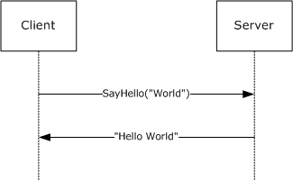
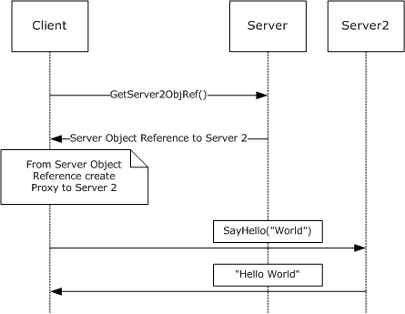
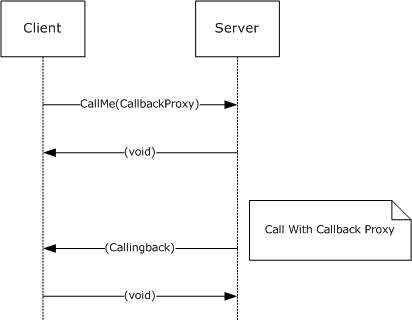
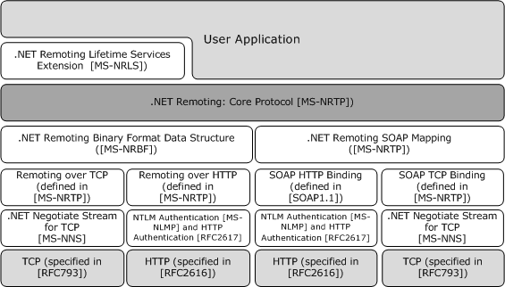
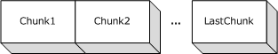
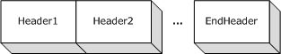
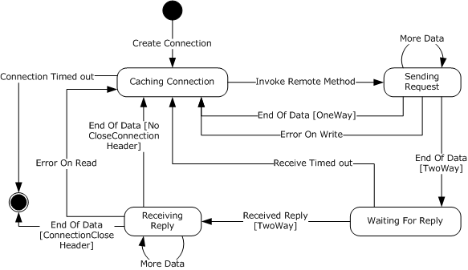
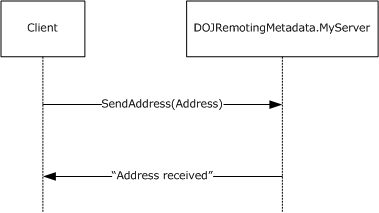

[MS-NRTP]:

.NET Remoting: Core Protocol

Intellectual Property Rights Notice for Open Specifications Documentation

  Technical Documentation. Microsoft publishes Open Specifications documentation (“this

documentation”) for protocols, file formats, data portability, computer languages, and standards
support. Additionally, overview documents cover inter-protocol relationships and interactions.

  Copyrights. This documentation is covered by Microsoft copyrights. Regardless of any other

terms that are contained in the terms of use for the Microsoft website that hosts this
documentation, you can make copies of it in order to develop implementations of the technologies
that are described in this documentation and can distribute portions of it in your implementations
that use these technologies or in your documentation as necessary to properly document the
implementation. You can also distribute in your implementation, with or without modification, any
schemas, IDLs, or code samples that are included in the documentation. This permission also
applies to any documents that are referenced in the Open Specifications documentation.
  No Trade Secrets. Microsoft does not claim any trade secret rights in this documentation.
  Patents. Microsoft has patents that might cover your implementations of the technologies

described in the Open Specifications documentation. Neither this notice nor Microsoft's delivery of
this documentation grants any licenses under those patents or any other Microsoft patents.
However, a given Open Specifications document might be covered by the Microsoft Open
Specifications Promise or the Microsoft Community Promise. If you would prefer a written license,
or if the technologies described in this documentation are not covered by the Open Specifications
Promise or Community Promise, as applicable, patent licenses are available by contacting
iplg@microsoft.com.

  License Programs. To see all of the protocols in scope under a specific license program and the

associated patents, visit the Patent Map.

  Trademarks. The names of companies and products contained in this documentation might be
covered by trademarks or similar intellectual property rights. This notice does not grant any
licenses under those rights. For a list of Microsoft trademarks, visit
www.microsoft.com/trademarks.

  Fictitious Names. The example companies, organizations, products, domain names, email

addresses, logos, people, places, and events that are depicted in this documentation are fictitious.
No association with any real company, organization, product, domain name, email address, logo,
person, place, or event is intended or should be inferred.

Reservation of Rights. All other rights are reserved, and this notice does not grant any rights other
than as specifically described above, whether by implication, estoppel, or otherwise.

Tools. The Open Specifications documentation does not require the use of Microsoft programming
tools or programming environments in order for you to develop an implementation. If you have access
to Microsoft programming tools and environments, you are free to take advantage of them. Certain
Open Specifications documents are intended for use in conjunction with publicly available standards
specifications and network programming art and, as such, assume that the reader either is familiar
with the aforementioned material or has immediate access to it.

Support. For questions and support, please contact dochelp@microsoft.com.

[MS-NRTP] - v20190313
.NET Remoting: Core Protocol
Copyright © 2019 Microsoft Corporation
Release: March 13, 2019

1 / 93

Revision Summary

Date

Revision
History

Revision
Class

Comments

7/20/2007

0.1

9/28/2007

1.0

Major

Major

MCPP Milestone 5 Initial Availability

Updated and revised the technical content.

10/23/2007  1.0.1

Editorial

Changed language and formatting in the technical content.

11/30/2007  2.0

Major

Added and updated sections.

1/25/2008

2.0.1

Editorial

Changed language and formatting in the technical content.

3/14/2008

2.0.2

Editorial

Changed language and formatting in the technical content.

5/16/2008

2.0.3

Editorial

Changed language and formatting in the technical content.

6/20/2008

3.0

7/25/2008

4.0

8/29/2008

4.1

10/24/2008  5.0

12/5/2008

5.1

1/16/2009

6.0

2/27/2009

6.1

Major

Major

Minor

Major

Minor

Major

Minor

Updated and revised the technical content.

Updated and revised the technical content.

Clarified the meaning of the technical content.

Updated and revised the technical content.

Clarified the meaning of the technical content.

Updated and revised the technical content.

Clarified the meaning of the technical content.

4/10/2009

6.1.1

Editorial

Changed language and formatting in the technical content.

5/22/2009

6.1.2

Editorial

Changed language and formatting in the technical content.

7/2/2009

6.1.3

Editorial

Changed language and formatting in the technical content.

8/14/2009

6.1.4

Editorial

Changed language and formatting in the technical content.

9/25/2009

6.2

Minor

Clarified the meaning of the technical content.

11/6/2009

6.2.1

Editorial

Changed language and formatting in the technical content.

12/18/2009  6.3

1/29/2010

6.4

3/12/2010

7.0

4/23/2010

8.0

Minor

Minor

Major

Major

Clarified the meaning of the technical content.

Clarified the meaning of the technical content.

Updated and revised the technical content.

Updated and revised the technical content.

6/4/2010

8.0.1

Editorial

Changed language and formatting in the technical content.

7/16/2010

9.0

Major

Updated and revised the technical content.

8/27/2010

9.0

10/8/2010

9.0

11/19/2010  9.0

None

None

None

No changes to the meaning, language, or formatting of the
technical content.

No changes to the meaning, language, or formatting of the
technical content.

No changes to the meaning, language, or formatting of the
technical content.

[MS-NRTP] - v20190313
.NET Remoting: Core Protocol
Copyright © 2019 Microsoft Corporation
Release: March 13, 2019

2 / 93

Date

Revision
History

Revision
Class

Comments

1/7/2011

10.0

Major

Updated and revised the technical content.

2/11/2011

10.0

None

No changes to the meaning, language, or formatting of the
technical content.

3/25/2011

10.0

None

No changes to the meaning, language, or formatting of the
technical content.

5/6/2011

10.0

None

No changes to the meaning, language, or formatting of the
technical content.

6/17/2011

10.1

Minor

Clarified the meaning of the technical content.

9/23/2011

10.1

None

No changes to the meaning, language, or formatting of the
technical content.

12/16/2011  11.0

Major

Updated and revised the technical content.

3/30/2012

11.0

None

No changes to the meaning, language, or formatting of the
technical content.

7/12/2012

11.1

Minor

Clarified the meaning of the technical content.

10/25/2012  11.1

None

No changes to the meaning, language, or formatting of the
technical content.

1/31/2013

11.1

None

No changes to the meaning, language, or formatting of the
technical content.

8/8/2013

11.1

None

No changes to the meaning, language, or formatting of the
technical content.

11/14/2013  11.1

None

No changes to the meaning, language, or formatting of the
technical content.

2/13/2014

11.1

None

No changes to the meaning, language, or formatting of the
technical content.

5/15/2014

11.1

None

No changes to the meaning, language, or formatting of the
technical content.

6/30/2015

12.0

Major

Significantly changed the technical content.

10/16/2015  12.0

None

No changes to the meaning, language, or formatting of the
technical content.

7/14/2016

12.0

None

No changes to the meaning, language, or formatting of the
technical content.

3/16/2017

13.0

Major

Significantly changed the technical content.

6/1/2017

13.0

None

No changes to the meaning, language, or formatting of the
technical content.

3/13/2019

14.0

Major

Significantly changed the technical content.

[MS-NRTP] - v20190313
.NET Remoting: Core Protocol
Copyright © 2019 Microsoft Corporation
Release: March 13, 2019

3 / 93

Table of Contents

1.3

1.1
1.2

1.2.1
1.2.2

1  Introduction ............................................................................................................ 8
Glossary ........................................................................................................... 8
References ...................................................................................................... 13
Normative References ................................................................................. 13
Informative References ............................................................................... 14
Overview ........................................................................................................ 14
Remote Method Invocation Model ................................................................. 15
Passing Server Objects ................................................................................ 16
Server Object Instantiation and Binding ........................................................ 17
Relationship to Other Protocols .......................................................................... 17
Prerequisites/Preconditions ............................................................................... 18
Applicability Statement ..................................................................................... 19
Versioning and Capability Negotiation ................................................................. 19
Vendor-Extensible Fields ................................................................................... 19
Standards Assignments ..................................................................................... 19

1.4
1.5
1.6
1.7
1.8
1.9

1.3.1
1.3.2
1.3.3

2.1

2.1.3

2.1.2

2.1.1

2.1.3.1

2.1.2.2

2.1.2.1

2.1.1.2

2.1.1.1

2.1.3.1.1

2.1.2.1.1
2.1.2.1.2

2.1.1.2.1
2.1.1.2.2

2.1.1.1.1
2.1.1.1.2

2.1.2.2.1
2.1.2.2.2

2  Messages ............................................................................................................... 20
Transport ........................................................................................................ 20
TCP Transport ............................................................................................ 20
Client Details ........................................................................................ 20
Sending Request ............................................................................. 20
Receiving Reply ............................................................................... 20
Server Details ....................................................................................... 21
Receiving Request ........................................................................... 21
Sending Reply ................................................................................. 21
HTTP Transport .......................................................................................... 22
Client Details ........................................................................................ 22
Sending Request ............................................................................. 22
Receiving Reply ............................................................................... 22
Server Details ....................................................................................... 23
Receiving Request ........................................................................... 23
Sending Reply ................................................................................. 23
SOAP Transport .......................................................................................... 23
SOAP on HTTP ...................................................................................... 24
Client Details .................................................................................. 24
Sending Request ........................................................................ 24
Receiving Reply ......................................................................... 24
Server Details ................................................................................. 24
Receiving Request ...................................................................... 24
Sending Reply ........................................................................... 24
SOAP on TCP ........................................................................................ 25
Client Details .................................................................................. 25
Sending Request ........................................................................ 25
Receiving Reply ......................................................................... 25
Server Details ................................................................................. 25
Receiving Request ...................................................................... 25
2.1.3.2.2.1
2.1.3.2.2.2
Sending Reply ........................................................................... 25
Message Syntax ............................................................................................... 25
Common Patterns ....................................................................................... 25
IdentifierName ..................................................................................... 26
RemotingTypeName .............................................................................. 26
LibraryName ........................................................................................ 26
Method Signature .................................................................................. 27
Common Types .......................................................................................... 27
ObjRef ................................................................................................. 27

2.2.1.1
2.2.1.2
2.2.1.3
2.2.1.4

2.1.3.2.1.1
2.1.3.2.1.2

2.1.3.1.1.1
2.1.3.1.1.2

2.1.3.1.2.1
2.1.3.1.2.2

2.1.3.2.1

2.1.3.2.2

2.1.3.1.2

2.2.2.1

2.1.3.2

2.2.2

2.2.1

2.2

[MS-NRTP] - v20190313
.NET Remoting: Core Protocol
Copyright © 2019 Microsoft Corporation
Release: March 13, 2019

4 / 93

2.2.3

2.2.3.1

2.2.3.1.1
2.2.3.1.2
2.2.3.1.3
2.2.3.1.4
2.2.3.1.5
2.2.3.1.6

TypeInfo .............................................................................................. 28
2.2.2.2
EnvoyInfo ............................................................................................ 28
2.2.2.3
ChannelInfo ......................................................................................... 29
2.2.2.4
ChannelDataStore ................................................................................. 29
2.2.2.5
DictionaryEntry ..................................................................................... 29
2.2.2.6
System.Exception ................................................................................. 30
2.2.2.7
SystemException .................................................................................. 31
2.2.2.8
RemotingException ............................................................................... 31
2.2.2.9
SerializationException ............................................................................ 31
2.2.2.10
2.2.2.11
System.Type ........................................................................................ 31
2.2.2.12  UnitySerializationHolder ......................................................................... 32
2.2.2.13  MemberInfoSerializationHolder ............................................................... 32
2.2.2.14  DelegateEntry ...................................................................................... 33
2.2.2.15  DelegateSerializationHolder .................................................................... 34
CallContextRemotingData ...................................................................... 35
2.2.2.16
ServerFault .......................................................................................... 35
2.2.2.17
TCP Message Syntax ................................................................................... 36
Common Enumerations .......................................................................... 36
OperationType ................................................................................ 36
ContentDistribution .......................................................................... 36
HeaderToken .................................................................................. 37
HeaderDataFormat .......................................................................... 37
StringEncoding ................................................................................ 37
TCPStatusCode ............................................................................... 38
Common Types ..................................................................................... 38
CountedString ................................................................................. 38
TcpUriString ................................................................................... 38
ChunkDelimiter ............................................................................... 39
Message Frame Structure....................................................................... 39
Single Message Content ................................................................... 39
Chunked Message Content ................................................................ 40
Frame Headers................................................................................ 42
EndHeader ................................................................................ 42
CustomHeader ........................................................................... 42
StatusCodeHeader ..................................................................... 42
StatusPhraseHeader ................................................................... 43
RequestUriHeader ...................................................................... 43
CloseConnectionHeader .............................................................. 44
ContentTypeHeader ................................................................... 44
UnknownHeader ........................................................................ 44
SOAP Serialization Format ........................................................................... 45
SOAP Action String ................................................................................ 45
Remoting Type Name Encoding ............................................................... 45
Method Name Encoding ......................................................................... 45
Method Signature SOAP Header .............................................................. 45
Call Context SOAP Header ...................................................................... 46
.NET Remoting Description Notation .............................................................. 46

2.2.3.3.3.1
2.2.3.3.3.2
2.2.3.3.3.3
2.2.3.3.3.4
2.2.3.3.3.5
2.2.3.3.3.6
2.2.3.3.3.7
2.2.3.3.3.8

2.2.4.1
2.2.4.2
2.2.4.3
2.2.4.4
2.2.4.5

2.2.3.3.1
2.2.3.3.2
2.2.3.3.3

2.2.3.2.1
2.2.3.2.2
2.2.3.2.3

2.2.3.3

2.2.3.2

2.2.4

2.2.5

3.1

3.1.1
3.1.2
3.1.3
3.1.4
3.1.5

3  Protocol Details ..................................................................................................... 49
Common Details .............................................................................................. 49
Abstract Data Model .................................................................................... 49
Timers ...................................................................................................... 53
Initialization ............................................................................................... 53
Higher-Layer Triggered Events ..................................................................... 53
Message Processing Events and Sequencing Rules .......................................... 54
Mapping to Binary Format ...................................................................... 54
Mapping Remote Method Request ...................................................... 54
Mapping Remote Method Invocation Reply .......................................... 55

3.1.5.1.1
3.1.5.1.2

3.1.5.1

[MS-NRTP] - v20190313
.NET Remoting: Core Protocol
Copyright © 2019 Microsoft Corporation
Release: March 13, 2019

5 / 93

3.1.5.3

3.2

3.1.6
3.1.7

3.2.1
3.2.2
3.2.3
3.2.4

3.2.4.1
3.2.4.2
3.2.4.3

3.2.5

3.2.5.1

3.1.5.2

Mapping Remote Field Get ................................................................ 56
3.1.5.1.3
Mapping Remote Field Set ................................................................ 56
3.1.5.1.4
Mapping Library Information ............................................................. 57
3.1.5.1.5
Mapping Class Instances .................................................................. 57
3.1.5.1.6
Mapping Array Instances .................................................................. 58
3.1.5.1.7
Mapping Primitive Values .................................................................. 58
3.1.5.1.8
Mapping Enum Values ...................................................................... 58
3.1.5.1.9
3.1.5.1.10  Mapping Delegate ............................................................................ 58
3.1.5.1.11  Mapping String Values ..................................................................... 58
3.1.5.1.12  Mapping Null Object ......................................................................... 58
Mapping Remoting Data Model to SOAP Format ........................................ 59
Mapping Remote Method Invocation .................................................. 59
3.1.5.2.1
Mapping Remote Method Invocation Reply .......................................... 59
3.1.5.2.2
Mapping Remote Field Get ................................................................ 60
3.1.5.2.3
Mapping Remote Field Set ................................................................ 60
3.1.5.2.4
Mapping Class Instances .................................................................. 60
3.1.5.2.5
Mapping Array Instances .................................................................. 60
3.1.5.2.6
Mapping Primitive Values .................................................................. 60
3.1.5.2.7
Mapping Enum Values ...................................................................... 60
3.1.5.2.8
3.1.5.2.9
Mapping Delegate ............................................................................ 60
3.1.5.2.10  Mapping Null Object ......................................................................... 61
3.1.5.2.11  Mapping Exception........................................................................... 61
Resolving Object Reference .................................................................... 61
Timer Events .............................................................................................. 61
Other Local Events ...................................................................................... 61
Server Details .................................................................................................. 62
Abstract Data Model .................................................................................... 62
Timers ...................................................................................................... 62
Initialization ............................................................................................... 62
Higher-Layer Triggered Events ..................................................................... 63
Register SAO ServerType ....................................................................... 63
Marshal Server Object ........................................................................... 63
Unmarshal Server Object ....................................................................... 63
Message Processing Events and Sequencing Rules .......................................... 63
Receiving a Message ............................................................................. 63
Process the Message Frame .............................................................. 63
Binding to Server Object .................................................................. 64
De-Serializing the Message Content ................................................... 64
Dispatching the Call ......................................................................... 65
Serializing the Reply ........................................................................ 65
Serializing to Binary Serialization Format ...................................... 65
Serializing to SOAP Serialization Format ....................................... 65
Marshaling Server Objects and Proxy Instances ............................. 65
Sending Reply ................................................................................. 66
Constructing Exception Messages ...................................................... 66
Constructing SerializationException .............................................. 66
Constructing a Remoting Exception .............................................. 67
Timer Events .............................................................................................. 67
Other Local Events ...................................................................................... 67
Client Details ................................................................................................... 67
Abstract Data Model .................................................................................... 67
Timers ...................................................................................................... 67
Initialization ............................................................................................... 68
Higher-Layer Triggered Events ..................................................................... 68
Get SAO Proxy ...................................................................................... 68
Creating Proxy from Request URI and Server Type .............................. 68
Remote Method Invocation ..................................................................... 68
Serializing the Request ..................................................................... 68

3.2.5.1.1
3.2.5.1.2
3.2.5.1.3
3.2.5.1.4
3.2.5.1.5

3.2.5.1.5.1
3.2.5.1.5.2
3.2.5.1.5.3

3.2.5.1.7.1
3.2.5.1.7.2

3.2.5.1.6
3.2.5.1.7

3.3.4.1.1

3.3.4.2.1

3.3

3.2.6
3.2.7

3.3.1
3.3.2
3.3.3
3.3.4

3.3.4.1

3.3.4.2

[MS-NRTP] - v20190313
.NET Remoting: Core Protocol
Copyright © 2019 Microsoft Corporation
Release: March 13, 2019

6 / 93

3.3.4.2.2
3.3.4.2.3
3.3.4.2.4
3.3.4.2.5

3.3.4.2.1.1
3.3.4.2.1.2

Serializing to Binary Serialization Format ...................................... 68
Serializing to SOAP Serialization Format ....................................... 69
Sending the Request ........................................................................ 69
Reading the Reply ........................................................................... 69
De-Serializing the Response ............................................................. 70
Completing the Invocation ................................................................ 70
Message Processing Events and Sequencing Rules .......................................... 70
Timer Events .............................................................................................. 70
Other Local Events ...................................................................................... 70

3.3.5
3.3.6
3.3.7

4  Protocol Examples ................................................................................................. 71
Two-Way Method Invocation Using TCP-Binary .................................................... 71
Two-Way Method Invocation Using SOAP Over HTTP ............................................ 76
Faults in SOAP Over HTTP ................................................................................. 79
One-Way Method Invocation Using SOAP Over TCP .............................................. 80
One-Way Method Invocation Using HTTP-Binary ................................................... 81

4.1
4.2
4.3
4.4
4.5

5  Security ................................................................................................................. 83
Security Considerations for Implementers ........................................................... 83
Index of Security Parameters ............................................................................ 83

5.1
5.2

6  Appendix A: Product Behavior ............................................................................... 84

7  Change Tracking .................................................................................................... 90

8  Index ..................................................................................................................... 91

[MS-NRTP] - v20190313
.NET Remoting: Core Protocol
Copyright © 2019 Microsoft Corporation
Release: March 13, 2019

7 / 93

1  Introduction

The .NET Remoting: Core Protocol Specification specifies a mechanism by which a calling program can
invoke a method in a different address space over the network. Arguments are passed along as part of
the invocation message and return values are sent in the response.

Sections 1.5, 1.8, 1.9, 2, and 3 of this specification are normative. All other sections and examples in
this specification are informative.

1.1  Glossary

This document uses the following terms:

AppDomain: An isolated environment where .NET applications execute. AppDomains provide
isolation, unloading, and security boundaries for executing .NET managed code. For more
information see [MSDN-AppDomain].

argument: A named Data Value that is passed as part of a Remote Method invocation or

returned as part of the results of a Remote Method invocation. For more information about
Remote Method invocation, see [MS-NRTP] section 3.1.1.

array: A Remoting Type that is an ordered collection of values. The values are identified by their
position and position is determined by a set of integer indices. The number of indices required to
represent the position is called the Rank of the Array. An Array is part of the Remoting Data
Model and also specifies the Remoting Type of its items. For more information, [MS-NRTP]
section 3.1.1.

Assignable: A reference to the ability of a Data Value to be assigned to a Remoting Type. This

ability is determined by a set of rules described in the Abstract Data Model (section 3.1.1) under
Data Values.

authentication: The ability of one entity to determine the identity of another entity.

base64 encoding: A binary-to-text encoding scheme whereby an arbitrary sequence of bytes is

converted to a sequence of printable ASCII characters, as described in [RFC4648].

binary format identifier: A string that is contained in the message frame. The binary format
identifier identifies the serialization format of the message content as specified in [MS-
NRBF]. Its value is 'application/octet-stream'.

Call Context: A mechanism to pass data that is not part of the method Arguments between client
and server. It is a collection of name-value pairs that is carried with the execution of a Remote
Method. This collection is sent along with other method Arguments from client to server, and
is transmitted back, along with the Return Values and output Arguments, from the server to
the client. For more information, see [MS-NRTP] section 1.3.

certificate: A certificate is a collection of attributes and extensions that can be stored persistently.
The set of attributes in a certificate can vary depending on the intended usage of the certificate.
A certificate securely binds a public key to the entity that holds the corresponding private key. A
certificate is commonly used for authentication and secure exchange of information on open
networks, such as the Internet, extranets, and intranets. Certificates are digitally signed by the
issuing certification authority (CA) and can be issued for a user, a computer, or a service. The
most widely accepted format for certificates is defined by the ITU-T X.509 version 3
international standards. For more information about attributes and extensions, see [RFC3280]
and [X509] sections 7 and 8.

channel: An entry point through which a server gets connection requests from a client. A Channel
contains information about the chosen transport (for example, TCP) and supports one or more

8 / 93

[MS-NRTP] - v20190313
.NET Remoting: Core Protocol
Copyright © 2019 Microsoft Corporation
Release: March 13, 2019

formats (for example, binary or SOAP). A server can host one or more Channels. For more
information, see [MS-NRTP] section 3.2.3.

channel URI: A part of a Request-URI message. It contains the URI scheme, host name, and

optionally a port number for a channel, as described in [RFC3986].

chunked encoding: A transport-specific encoding of message content that breaks the content
up into a series of octet segments. This allows dynamically produced content to be transferred,
along with the information necessary for the recipient to verify that it has received the full
message. For more information on HTTP chunking, see HTTP Transport (section 2.1.2). For
more information on TCP chunking, see TCP Transport (section 2.1.1).

class: A Remoting Type that encapsulates a set of named values and a set of methods that

operate on those values. The named values are called Members of the Class. A Class is part of
the Remoting Data Model. For more information, see [MS-NRTP] section 3.1.1.

credential: Previously established, authentication data that is used by a security principal to

establish its own identity. When used in reference to the Netlogon Protocol, it is the data that is
stored in the NETLOGON_CREDENTIAL structure.

data value: An instance of a Remoting Type, which can be a Class, Array, Enum, or Primitive.

A Data Value is part of the Remoting Data Model. For more information, see [MS-NRTP]
section 3.1.1.

delegate: A user or resource that has permissions to act on behalf of another user or resource.

deserialize: See unmarshal.

digest: The fixed-length output string from a one-way hash function that takes a variable-length
input string and is probabilistically unique for every different input string. Also, a cryptographic
checksum of a data (octet) stream.

Digest Access Authentication: A mechanism built on top of HTTP that allows a client program to

provide credentials without having to send a user name and password in plaintext when
making a request. For more information, see [RFC2617].

Enum: A Primitive type whose members are constrained to a set of values. The Primitive type is

considered to be an underlying Remoting Type of the Enum. Each value has a name
associated with it. An Enum is part of the Remoting Data Model, and an abbreviation for
"enumeration." For more information, see [MS-NRTP] section 3.1.1.

Envoy Sink Information: A Data Value associated with a Server Object or Server Type. When
a Server Object reference to an associated Server Object or Server Type is transmitted to a
client, the Envoy Sink Information is sent as well. The Envoy Sink Information contents are
undefined, and can be used by application authors to send arbitrary data. For more information,
see the example in Protocol Overview (section 1.3).

Exception: A Class that indicates an error in the execution of a Remote Method. It is sent as

part of the return message from a server to a client. An Exception contains a human-readable
message that indicates what the error is, and can also have additional data to identify the error.
An Exception is part of the Remoting Data Model. For more information, see [MS-NRTP]
section 3.1.1.

Generic Argument: A formal argument used in a Generic Type or a Generic Remote Method
to represent a parameterized Remoting Type. Generic Arguments can be referenced in the
Class or the method as opaque Remoting Types. They are replaced by the actual types when
the Class or the method is used. For more information, see Generic Type and Methods in
[ECMA-335].

[MS-NRTP] - v20190313
.NET Remoting: Core Protocol
Copyright © 2019 Microsoft Corporation
Release: March 13, 2019

9 / 93

Generic Remote Method: A Remote Method that is parameterized by one or more Remoting
Types. The method caller has to provide the actual Remoting Types (in addition to the Input
Arguments). For more information, see [MS-NRTP] section 3.1.1.

Generic Type: A Class, Server Type, or Server Interface that is parameterized by one or more

Remoting Types. A Generic Type contains GenericArguments as a placeholder for the
parameterized Remoting Types. A Generic Type cannot have any instances. For more
information, see Generic Types and Methods in [ECMA-335].

Hypertext Transfer Protocol (HTTP): An application-level protocol for distributed, collaborative,
hypermedia information systems (text, graphic images, sound, video, and other multimedia
files) on the World Wide Web.

Input Argument: A named Data Value that is passed as part of a Remote Method invocation
from the client to the server. For more information, see Remote Method in the Abstract Data
Model (section 3.1.1).

Instantiated Generic Type: A Remoting Type that is the result of replacing the Generic

Arguments of a Generic Type with the actual Remoting Types. An Instantiated Generic
Class can have instances. For more information, see Generic Types and Methods in [ECMA-
335].

IPv4 address in string format: A string representation of an IPv4 address in dotted-decimal

notation, as described in [RFC1123] section 2.1.

IPv6 address in string format: A string representation of an IPv6 address, as described in

[RFC4291] section 2.2.

Library: Part of the Remoting Data Model. A Library is a named unit that contains a collection

of Remoting Types. For more information, see Library in [MS-NRTP] section 3.1.1.

local name: A string value that, together with an XML namespace, identifies XML element and

attribute names. For more information, see [XMLNS-2ED].

logical call ID: An optional string value that identifies the logical thread of execution. This value

is passed as part of the Call Context and can be used in implementation-specific local threading
models on the server.

marshaled server object (MSO): A Marshaled Server Object is a Server Object that is

created by a higher layer, and not in response to an incoming request. For more information on
server objects, (see Server-Activated Object (SAO) for more information on the latter).. The
.NET Remoting Lifetime Services Protocol [MS-NRLS] provides a mechanism for controlling the
lifetimes of marshaled server objects.

member: See Class.

message content: The serialized body of a message.

message frame: A transport-specific structure for adding headers to a message. When using

HTTP, message frames are represented as HTTP headers. For more information, see HTTP
Transport (section 2.1.2). When using TCP, message frames are represented as defined in
Message Frame Structure (section 2.2.3.3).

Message Properties: A collection of implementation-specific, name-value pairs that are

transmitted as part of a Remote Method invocation. Message Properties are used to
exchange implementation-specific data between clients and servers.

method signature: A list of the remoting types of the arguments of a remote method.

NT LAN Manager (NTLM) Authentication Protocol: A protocol using a challenge-response

mechanism for authentication in which clients are able to verify their identities without sending a

10 / 93

[MS-NRTP] - v20190313
.NET Remoting: Core Protocol
Copyright © 2019 Microsoft Corporation
Release: March 13, 2019

password to the server. It consists of three messages, commonly referred to as Type 1
(negotiation), Type 2 (challenge) and Type 3 (authentication).

Null Object: Part of the Remoting Data Model. Null Object is a special value that can be used

in place of an instance of a Class, Array, or String. It indicates that no instance is being
specified. For more information, see [MS-NRTP] section 3.1.1.

One-Way Method: A Remote Method that has no application response sent from the

implementation of the Remote Method back to the caller. This pattern is sometimes referred to
as "fire and forget".

Output Argument: A named Data Value that is returned as part of the results of a Remote

Method invocation. For more information, see Remote Method in Abstract Data Model (section
3.1.1).

Primitive Type: Part of the Remoting Data Model. Primitive Types are predefined Remoting
Types such as Byte, Int16, Int32, Int64, and so on. For more information, see [MS-NRTP]
section 3.1.1

Primitive Value: Part of the Remoting Data Model. A Primitive Value is an instance of a

Primitive Type.

proxy: Part of the Remoting Data Model. A Proxy forwards the invocations of Remote

Methods from the client to the Server Object for execution. The Proxy contains the Request
URI of the Server Object. For more information, see [MS-NRTP] section 3.1.1.

Remote Field: Part of the Remoting Data Model. A Remote Field is a remotely accessible field.

For more information, see [MS-NRTP] section 3.1.1.

Remote Method: Part of the Remoting Data Model. A Remote Method is a remotely callable

operation. A Remote Method can either be One-Way or Two-Way. In the case of a One-Way
Method, there is no reply from the implementation. For more information, see [MS-NRTP]
section 3.1.1

Remoting Data Model: A model that is used to represent higher-layer–defined data structures
and values, and to represent a Remote Method invocation and the Return Value or error
information from that invocation. A protocol, such as [MS-NRLS], that is built on top of this
protocol can be defined by using the Remoting Data Model, and can be agnostic to the
serialization format. For more information, see Abstract Data Model (section 3.1.1).

Remoting Type: Part of the Remoting Data Model. Class, Array, Enum, and Primitive are

different kinds of Remoting Types. All Remoting Types are identified by a name that is case
sensitive. For more information, see [MS-NRTP] section 3.1.1

Request URI: A URI that provides an address of a Server Object. The Request URI has two

major components: a component that is used by the underlying transport to route the message
to an appropriate transport endpoint (Channel URI); and another component to map the
message to a Server Object within a server (Server Object URI).

Return Value: A Data Value that is returned as part of the results of a Remote Method

invocation. For more information, see Remote Method in Abstract Data Model (section 3.1.1).

serialization: A mechanism by which an application converts an object into an XML

representation.

Serialization Format: The structure of the serialized message content, which can be either binary
or SOAP. Binary serialization format is specified in [MS-NRBF]. SOAP serialization format is
specified in [MS-NRTP].

[MS-NRTP] - v20190313
.NET Remoting: Core Protocol
Copyright © 2019 Microsoft Corporation
Release: March 13, 2019

11 / 93

serialize: The process of taking an in-memory data structure, flat or otherwise, and turning it into

a flat stream of bytes. See also marshal.

server interface: A set of method declarations that are implemented on a protocol server and are

part of a FAST middleware implementation.

server object: Part of the Remoting Data Model. A server object is an instance of a Server

Type. A server object is either an SAO or an MSO.

Server Object Reference: A representation of an SAO or MSO that can be passed between a
client and a server. It contains sufficient information to construct a proxy to invoke Remote
Methods on the SAO or MSO.

Server Object Table: A table that contains the list of available Server Objects in the server.

Server Object URI: A relative URI that identifies a Server Object in a given server. It is the

path part of Request URI, excluding the leading forward slash (/).

Server Type: Part of the Remoting Data Model. A Server Type contains Remote Methods.

server-activated object (SAO): A server object that is created on demand in response to a client

request. See also marshaled server object.

Simple and Protected GSS-API Negotiation Mechanism (SPNEGO): An authentication
mechanism that allows Generic Security Services (GSS) peers to determine whether their
credentials support a common set of GSS-API security mechanisms, to negotiate different
options within a given security mechanism or different options from several security
mechanisms, to select a service, and to establish a security context among themselves using
that service. SPNEGO is specified in [RFC4178].

Single-Call SAO: An SAO that is created every time a Remote Method on its Server Type is

called. For longer-lived SAOs, see Singleton SAO.

Singleton SAO: An SAO that is created the first time a method on its server type is called;

subsequent calls to the remote methods on the server type reuse the existing SAO unless it
expires. For shorter-lived SAOs, see single-call SAO.

SOAP: A lightweight protocol for exchanging structured information in a decentralized, distributed
environment. SOAP uses XML technologies to define an extensible messaging framework,
which provides a message construct that can be exchanged over a variety of underlying
protocols. The framework has been designed to be independent of any particular programming
model and other implementation-specific semantics. SOAP 1.2 supersedes SOAP 1.1. See
[SOAP1.2-1/2003].

SOAP Format Identifier: A string that is contained in the message frame. It identifies the

serialization format of the message content as specified in [SOAP1.1]. Its value is 'text/xml;
charset="utf-8"'.

System Library: A specially designated library that can be used to reduce the wire size for

commonly used data types. The name of the library is agreed to by both the server and the
client.

System.Object: Part of the Remoting Data Model. System.Object is a Class that has no

Members. A Class that does not extend another Class is considered to extend
System.Object.

Transmission Control Protocol (TCP): A protocol used with the Internet Protocol (IP) to send
data in the form of message units between computers over the Internet. TCP handles keeping
track of the individual units of data (called packets) that a message is divided into for efficient
routing through the Internet.

12 / 93

[MS-NRTP] - v20190313
.NET Remoting: Core Protocol
Copyright © 2019 Microsoft Corporation
Release: March 13, 2019

Two-Way Method: A Remote Method that has a response sent from the implementation of the

Remote Method back to the caller.

Unicode: A character encoding standard developed by the Unicode Consortium that represents

almost all of the written languages of the world. The Unicode standard [UNICODE5.0.0/2007]
provides three forms (UTF-8, UTF-16, and UTF-32) and seven schemes (UTF-8, UTF-16, UTF-16
BE, UTF-16 LE, UTF-32, UTF-32 LE, and UTF-32 BE).

Uniform Resource Identifier (URI): A string that identifies a resource. The URI is an addressing
mechanism defined in Internet Engineering Task Force (IETF) Uniform Resource Identifier (URI):
Generic Syntax [RFC3986].

user agent: An HTTP user agent, as specified in [RFC2616].

UTF-8: A byte-oriented standard for encoding Unicode characters, defined in the Unicode standard.

Unless specified otherwise, this term refers to the UTF-8 encoding form specified in
[UNICODE5.0.0/2007] section 3.9.

XML: The Extensible Markup Language, as described in [XML1.0].

XML namespace: A collection of names that is used to identify elements, types, and attributes in
XML documents identified in a URI reference [RFC3986]. A combination of XML namespace and
local name allows XML documents to use elements, types, and attributes that have the same
names but come from different sources. For more information, see [XMLNS-2ED].

MAY, SHOULD, MUST, SHOULD NOT, MUST NOT: These terms (in all caps) are used as defined
in [RFC2119]. All statements of optional behavior use either MAY, SHOULD, or SHOULD NOT.

1.2  References

Links to a document in the Microsoft Open Specifications library point to the correct section in the
most recently published version of the referenced document. However, because individual documents
in the library are not updated at the same time, the section numbers in the documents may not
match. You can confirm the correct section numbering by checking the Errata.

1.2.1  Normative References

We conduct frequent surveys of the normative references to assure their continued availability. If you
have any issue with finding a normative reference, please contact dochelp@microsoft.com. We will
assist you in finding the relevant information.

[MS-DTYP] Microsoft Corporation, "Windows Data Types".

[MS-NLMP] Microsoft Corporation, "NT LAN Manager (NTLM) Authentication Protocol".

[MS-NNS] Microsoft Corporation, ".NET NegotiateStream Protocol".

[MS-NRBF] Microsoft Corporation, ".NET Remoting: Binary Format Data Structure".

[MS-NRLS] Microsoft Corporation, ".NET Remoting: Lifetime Services Extension".

[MS-OAUT] Microsoft Corporation, "OLE Automation Protocol".

[RFC1034] Mockapetris, P., "Domain Names - Concepts and Facilities", STD 13, RFC 1034, November
1987, https://www.rfc-edit.org/info/rfc1034

[RFC1123] Braden, R., "Requirements for Internet Hosts - Application and Support", RFC 1123,
October 1989, https://www.rfc-editor.org/info/rfc1123

13 / 93

[MS-NRTP] - v20190313
.NET Remoting: Core Protocol
Copyright © 2019 Microsoft Corporation
Release: March 13, 2019

[RFC1766] Alvestrand, H., "Tags for the Identification of Languages", RFC 1766, March 1995,
https://www.rfc-editor.org/info/rfc1766

[RFC1945] Berners-Lee, T., Fielding, R., and Frystyk, H., "Hypertext Transfer Protocol -- HTTP/1.0",
RFC 1945, May 1996, https://www.rfc-editor.org/info/rfc1945

[RFC2119] Bradner, S., "Key words for use in RFCs to Indicate Requirement Levels", BCP 14, RFC
2119, March 1997, https://www.rfc-editor.org/info/rfc2119

[RFC2616] Fielding, R., Gettys, J., Mogul, J., et al., "Hypertext Transfer Protocol -- HTTP/1.1", RFC
2616, June 1999, https://www.rfc-editor.org/info/rfc2616

[RFC2617] Franks, J., Hallam-Baker, P., Hostetler, J., et al., "HTTP Authentication: Basic and Digest
Access Authentication", RFC 2617, June 1999, https://www.rfc-editor.org/info/rfc2617

[RFC3513] Hinden, R. and Deering, S., "Internet Protocol Version 6 (IPv6) Addressing Architecture",
RFC 3513, April 2003, https://www.rfc-editor.org/info/rfc3513

[RFC3986] Berners-Lee, T., Fielding, R., and Masinter, L., "Uniform Resource Identifier (URI): Generic
Syntax", STD 66, RFC 3986, January 2005, https://www.rfc-editor.org/info/rfc3986

[RFC4234] Crocker, D., Ed., and Overell, P., "Augmented BNF for Syntax Specifications: ABNF", RFC
4234, October 2005, https://www.rfc-editor.org/info/rfc4234

[RFC793] Postel, J., Ed., "Transmission Control Protocol: DARPA Internet Program Protocol
Specification", RFC 793, September 1981, https://www.rfc-editor.org/info/rfc793

[SOAP1.1] Box, D., Ehnebuske, D., Kakivaya, G., et al., "Simple Object Access Protocol (SOAP) 1.1",
W3C Note, May 2000, https://www.w3.org/TR/2000/NOTE-SOAP-20000508/

[UNICODENORMFORMS] Davis, M., "Unicode Normalization Forms", November, 1999,
https://www.unicode.org/reports/tr15/tr15-18.html

1.2.2  Informative References

[ECMA-335] ECMA, "Common Language Infrastructure (CLI): Partitions I through VI", Standard ECMA-
335, https://ecma-international.org/publications-and-standards/standards/ecma-335/

[MS-NETOD] Microsoft Corporation, "Microsoft .NET Framework Protocols Overview".

1.3  Overview

The .NET Remoting Protocol specifies a mechanism by which a calling program on one machine can
invoke a method on a different machine. Arguments are passed along as part of the invocation
message, and Return Values are sent in the response.

This protocol defines a simple type system that is a generalization of the common features found in
type systems in programming languages. The components of the type system are specified in Abstract
Data Model (section 3.1.1). If data can be represented as a Remoting Type, it can be serialized into
the .NET Remoting Binary Format, as defined in [MS-NRBF], or the SOAP format as specified in
[SOAP1.1]. The rules for serialization of data that is represented using the Remoting Data Model
into the .NET Remoting Binary Format are specified in Mapping to Binary Format (section 3.1.5.1). The
rules for serialization of data represented using the Remoting Data Model into the SOAP format are
defined in Mapping Remoting Data Model to SOAP Format (section 3.1.5.2). The .NET Remoting: Core
Protocol Specification introduces a notation for the higher layer to define types and methods in the
Remoting Data Model. The grammar for the notation is given in .NET Remoting Description
Notation (section 2.2.5). This notation can be used by any protocol that depends on the .NET
Remoting Protocol. The notation is used in this specification and in [MS-NRLS].

14 / 93

[MS-NRTP] - v20190313
.NET Remoting: Core Protocol
Copyright © 2019 Microsoft Corporation
Release: March 13, 2019

<!-- Extracted images from page 15 -->

<!-- /Extracted images from page 15 -->

This section presents a brief overview of the following:

  Remote Method Invocation Model



Passing Server Objects

  Server Objects Instantiation and Binding

1.3.1  Remote Method Invocation Model

 The .NET Remoting Protocol specifies a mechanism to invoke a method where the calling program
and the target method are in different address spaces. Following is an example.

Figure 1: The .NET Remoting Protocol

This protocol defines two roles: client and server. A client initiates communication by calling a
Remote Method with Input Arguments using a Proxy. The server responds by executing the
method in an implementation-specific manner. The Remote Method can be either a One-Way or a
Two-Way Method. If the method is One-Way, then no response is sent back to the client. If the
method is Two-Way, then the server sends back a response that can contain a Return Value and
Output Arguments.

The protocol defines two mechanisms for exchanging additional data with each Remote Method call:
Call Context and Message Properties.

A Call Context is a collection of name-value pairs. A client can add name-value pairs to the Call
Context of a Remote Method. The Call Context is then transmitted when the Remote Method is
invoked. The server can then modify the Call Context before it transmits the updated Call Context
back to the client.

Message Properties is another collection of name-value pairs that behaves in the same way as Call
Context. Values in the Call Context are intended to be used for transmitting application-defined
values, while the Message Properties are intended to be used for infrastructure-defined values. This
protocol does not define any values that are carried as Message Properties or Call Context values.

Remote Method implementations can choose to return an Exception to the caller to indicate an error
in processing. Server-side errors such as a connection error, a data validity error, or a server
availability error are returned to the client as one of two Exceptions: Remoting Exception or
Serialization Exception.

15 / 93

[MS-NRTP] - v20190313
.NET Remoting: Core Protocol
Copyright © 2019 Microsoft Corporation
Release: March 13, 2019

<!-- Extracted images from page 16 -->

<!-- /Extracted images from page 16 -->

Remote Method Arguments, Return Value, Call Context, Message Properties, and Exceptions are all
represented by Data Values.

1.3.2  Passing Server Objects

The Server Object or a Proxy can be part of a graph of nodes of a Data Value. However, unlike
other Data Values, when a graph that contains a Server Object or a Proxy is passed as part of a
Remote Method invocation they are transmitted as Server Object References.

When a client receives a Server Object Reference from a server, it might receive additional,
application-specific data in a part of the Server Object Reference called the Envoy Sink Information.
Data sent as the Envoy Sink Information is implementation specific, and the semantics of that
information have to be agreed between the client and server out of band. An example of Envoy Sink
Information is a set of rules to validate Remote Method Arguments. This protocol does not define any
data sent in the Envoy Sink Information.<1>

The following example shows a server sending a Server Object Reference from a server to a client.

Figure 2: A server sending a Server Object Reference from a server to a client

The following example shows a client sending a Server Object Reference to a server. The server uses
the Server Object Reference to call back the client.

[MS-NRTP] - v20190313
.NET Remoting: Core Protocol
Copyright © 2019 Microsoft Corporation
Release: March 13, 2019

16 / 93

<!-- Extracted images from page 17 -->

<!-- /Extracted images from page 17 -->

Figure 3: A Server Object Reference being sent by the client and then used by the server to
call back the client

1.3.3  Server Object Instantiation and Binding

A client's Remote Method invocation is targeted to a given Server Object by the passing of the
Request URI of the Server Object as part of the call. A server implementation uses the Request URI
to bind the call to the appropriate Server Object. A server implementation can bind the Request URI to
a Server Type or Server Object.

If the binding is to a Server Type, then the server implementation creates a new Server Object by
instantiating the Server Type. The created Server Object can then be used to dispatch the method call
in an implementation-specific way. Such Server Objects are called Server-Activated Objects
(SAOs). Server implementations can be configured to save created SAOs for future calls. Such SAOs
are called Singleton SAOs. If the SAO is not configured to be saved, every subsequent call results in
the creation of a new instance of the SAO. Such SAOs are called Single-Call SAOs.

Some Server Objects are created by a higher-layer on the server, and not in response to a client
request. These Server Objects are called Marshaled Server Objects (MSO). When a Request URI is
bound to such an object, the object is used to dispatch the server call in an implementation-specific
way.

1.4  Relationship to Other Protocols

This protocol defines the central mechanisms of the .NET Remoting Protocol stack, which convert a
Remote Method invocation into an exchange of encoded messages. This protocol depends on other
structures and protocols for the encoding and transport of its messages. Further protocols can extend
this protocol to provide additional services, such as .NET Remoting Lifetime Services [MS-NRLS] which

17 / 93

[MS-NRTP] - v20190313
.NET Remoting: Core Protocol
Copyright © 2019 Microsoft Corporation
Release: March 13, 2019

<!-- Extracted images from page 18 -->

<!-- /Extracted images from page 18 -->

defines additional message and semantics to add activation and distributed lifetime management to
.NET Remoting. User applications are layered on top of this protocol and use its services for
application-specific purposes.

Before a message is sent, the Remote Method is converted to a serialized form for transmission on
the wire. A binary encoding for .NET Remoting is specified in .NET Remoting Binary Format [MS-
NRBF]. When the binary encoding is used, .NET Remoting can be bound to either TCP [RFC793] or
HTTP [RFC2616]. The TCP binding is specified in TCP Transport (section 2.1.1), and the HTTP binding
is specified in HTTP Transport (section 2.1.2).

.NET remoting can also use SOAP1.1, which includes both encoding semantics and transport bindings.
The SOAP encoding is specified in [SOAP1.1], with .NET remoting-specific portions of the mapping
specified in SOAP Serialization Format (section 2.2.4) of this specification. When SOAP is used, .NET
remoting can be bound to either TCP [RFC793] or HTTP [RFC2616]. The TCP binding to SOAP is
specified in SOAP on TCP (section 2.1.3.2), and the HTTP binding can be found in [SOAP1.1] section 6,
with .NET remoting-specific portions of the mapping specified in SOAP on HTTP (section 2.1.3.1) of
this specification.

Figure 4: Relationships between .NET Remoting protocols

1.5  Prerequisites/Preconditions

If the HTTPS transport is used, a server certificate must be deployed and a client certificate can be
deployed.

This protocol does not define any means for activating a server or a client. The server must be
configured and begin listening in an implementation-specific way on a Channel. For more information
on Channels, see Initialization (section 3.2.3). The client must know the format and transport used by
the server (for example, binary format over HTTP).

The client needs the Request URI of the server, and both the client and server need to agree on the
following:

1.  Definitions of the Remote Method

2.  The Types of Data Values to be exchanged

[MS-NRTP] - v20190313
.NET Remoting: Core Protocol
Copyright © 2019 Microsoft Corporation
Release: March 13, 2019

18 / 93

3.  The names of the Libraries that contain the types

4.  The Library that is the System Library

1.6  Applicability Statement

This protocol is useful for transferring object method invocation information in a distributed
environment. This protocol is designed for use on private networks, and is not appropriate for use on
public networks. See Security Considerations for Implementers (section 5.1) for more details.

1.7  Versioning and Capability Negotiation

This specification covers versioning issues in the following areas:

  Supported transports: This protocol can use SOAP, TCP, HTTP, or HTTPS as a transport.

Details are provided in Transport (section 2.1).

  Protocol versions: Only one version of this protocol is currently defined.

  Security and authentication methods: This protocol relies on the security provided by the

following:



.NET Negotiate Stream for TCP as defined in [MS-NNS], HTTPS, HTTP Basic Access, and
Digest Access

  NTLM authentication as defined in [RFC2617] and [MS-NLMP]

This protocol does not have security and authentication provisions of its own.

  Capability negotiation: An implementation of this protocol with SOAP over HTTP can

interoperate with other implementations of SOAP over HTTP that implement [SOAP1.1]. This
protocol provides a mechanism to distinguish an implementation of this protocol from other
implementations of SOAP over HTTP. A client role of this protocol indicates this by using the User-
Agent header as specified in Versioning and Capability Negotiation (section 2.1.3.1.1.1). The
server role uses this information when sending a SOAP fault as specified in
ServerFault (section 2.2.2.17).

1.8  Vendor-Extensible Fields

This protocol allows custom headers to be added to the message frame structure when TCP is used
as a transport, as specified in CustomHeader (section 2.2.3.3.3.2). Custom headers added to the TCP
message frame are ignored by .NET remoting. This protocol does not include vendor-extensible fields
when HTTP is used as a transport. However, this protocol does not preclude implementers from
adding HTTP headers, as specified in [RFC2616] section 4.2. This protocol also does not preclude
implementers from adding SOAP headers as specified in [SOAP1.1] section 4.2.

1.9  Standards Assignments

No standards assignments are made by this protocol.

[MS-NRTP] - v20190313
.NET Remoting: Core Protocol
Copyright © 2019 Microsoft Corporation
Release: March 13, 2019

19 / 93

2  Messages

2.1  Transport

2.1.1  TCP Transport

This section specifies the protocol to use TCP as specified in [RFC793] to transmit method invocation
and return information.

If instructed by a higher-level protocol in an implementation-specific way, an implementation of this
protocol MUST require the implementation of the [MS-NNS] protocol on the server to authenticate the
TCP client using SPNEGO.

The higher-level protocol MUST provide, in an implementation-specific way, the required credentials
for the authentication. Implementations of this protocol MUST NOT process the credentials or
authentication information before transmission. Such processing typically happens entirely inside
implementations of lower protocol layers. An extension of this protocol MAY use the credentials from
the lower protocol layers for authorization or impersonation.

2.1.1.1  Client Details

2.1.1.1.1 Sending Request

In the client role, an implementation MUST first establish a TCP connection to the server. A client
implementation MAY cache and reuse a connection to a specific server port or create a new
connection.<2>

After a connection is established, a client implementation MUST transmit the message content that
contains information to perform invocation of the target Remote Method identified by the higher
layer as specified in Remote Method Invocation.

The implementation MUST construct a message frame structure as specified in Message Frame
Structure with the following additional constraints:









The implementation SHOULD use single message content (section 2.2.3.3.1) but MAY use chunked
message content (section 2.2.3.3.2).<3>

The implementation MUST set the OperationType field of the message frame to
OneWayRequest(1) if the Remote Method is a One-Way Method; otherwise, the field MUST be
set to Request(0).

The implementation MUST send a request message that consists of the message frame and the
message content using the previously established TCP connection. The message content MUST be
sent as specified in Message Frame Structure. If any error occurs while the message is being
written, the implementation MAY reestablish the connection and retransmit the message.

If the Remote Method is One-Way then the connection MAY be reused after the message has been
sent. If the Remote Method is Two-Way then the connection MUST NOT be used to send any
other requests to the server until the response for the request is received.<4>

2.1.1.1.2 Receiving Reply

If the OperationType of the message is Request(0), an implementation MUST wait for the Two-Way
Reply message in the same connection. The implementation MAY have an implementation-specific
time-out period. If the server does not reply within the time-out period, the higher layer MAY be
notified of the time-out error.<5>

20 / 93

[MS-NRTP] - v20190313
.NET Remoting: Core Protocol
Copyright © 2019 Microsoft Corporation
Release: March 13, 2019

If the message frame of the reply message does not conform to the structure specified in Message
Frame Structure (section 2.2.3.3) or if the OperationType field of the message frame is not Reply(2),
then the implementation MUST notify the higher layer of the error.

An implementation MAY process implementation-defined CustomHeaders in an implementation-specific
way. The implementation MUST ignore any CustomHeaders that it does not understand.

The data in the transport buffer MUST be consumed so that the connection can be reused.

 An implementation of the protocol MAY cache the connection after reading the reply, unless the
message frame has a CloseConnectionHeader.

2.1.1.2  Server Details

2.1.1.2.1 Receiving Request

The server implementation of this protocol MUST listen on the TCP port as specified in section 3.2.3.
When a connection is available, the implementation of the protocol MUST process the message from
the connection stream as follows. An implementation MUST NOT send anything other than the reply to
this request in this connection.

If the message frame of the request message does not conform to the structure specified in Message
Frame Structure (section 2.2.3.3) or if the OperationType field of the message frame is neither
Request(0) nor OneWayRequest(1) then an implementation MUST send back a fault as specified
below.

An implementation MAY process implementation-defined CustomHeaders in an implementation-specific
way. The implementation MUST ignore any CustomHeaders that it does not understand.<6>

A transport fault MUST be sent as a reply as specified in Sending Reply (section 2.1.1.2.2) with
additional constraints on the message frame construction as follows:











The ContentDistribution field MUST be written as NotChunked.

The ContentLength field MUST be written as zero.

The StatusCode header MUST be written with a value of 1 (Error).

The StatusPhrase header SHOULD contain helpful text about the error.

The CloseConnection header MUST be written to indicate that the connection must not be cached
after processing this message.



The implementation MUST NOT write any MessageContent.

2.1.1.2.2 Sending Reply

If the OperationType of the request message is OneWayRequest(1), then an implementation MUST
NOT send any response. The rest of this section applies only to incoming request messages where the
OperationType of the message is Request(0).

An implementation MUST construct a TCP message frame as specified in Message Frame
Structure (section 2.2.3.3) with the following constraints:



The implementation SHOULD use single message content (section 2.2.3.3.1) but MAY use chunked
message content (section 2.2.3.3.2).<7>



The OperationType MUST be written as Reply(2).

[MS-NRTP] - v20190313
.NET Remoting: Core Protocol
Copyright © 2019 Microsoft Corporation
Release: March 13, 2019

21 / 93



The associated Method Type of the target Remote Method obtained as specified in Dispatching
the Call (section 3.2.5.1.4) MUST be obtained in an implementation-specific way. If the Method
Type is One-Way, then the reply MUST contain an empty message content.

Finally, the implementation MUST package the message content following the message frame as
specified in Message Frame Structure (section 2.2.3.3).

A server implementation MUST send the reply in the same connection that the request came in. The
implementation MAY use the Close Connection header specified in the CloseConnectionHeader
subsection under the Message Frame Structure (section 2.2.3.3) to indicate the client should not send
any more messages in this connection.

2.1.2  HTTP Transport

This section specifies the protocol to use HTTP transport as specified in [RFC1945] and [RFC2616] to
transmit method invocation and return information. At a high level, the message request of a Remote
Method invocation MUST be sent as part of an HTTP request and the reply from the server MUST be
sent as part of the HTTP response. In the case of a one-way method, the HTTP response body MUST
be empty, as specified in Sending Reply (section 2.1.2.2.2).

Port 80 is the standard port assignment for HTTP and port 443 is the standard port assignment for
HTTPS. However, an implementation MUST support other ports if specified by a higher-level protocol
in an implementation-defined way.

If instructed by a higher-level protocol in an implementation-specific way, implementations of this
protocol MUST require that the HTTP implementation on the server use Basic or Digest Access
Authentication for HTTP to authenticate the HTTP client, as specified in [RFC2617] or NTLM
authentication [MS-NLMP] for HTTP.

The higher-level protocol MUST provide in an implementation-specific way either credentials in the
form of user name/password or a client-side certificate. Implementations of this protocol MUST NOT
process the credentials or authentication information. Such processing typically happens entirely
inside implementations of lower protocol layers.

2.1.2.1  Client Details

2.1.2.1.1 Sending Request

A Remote Method invocation request MUST be mapped to an HTTP request and MUST have the
following HTTP headers:

  An implementation MAY use HTTP/1.0 or HTTP/1.1.<8><9>











The HTTP Method SHOULD be a POST. The HTTP Method MAY be M-POST.

The Request-URI of the HTTP request message MUST be set to the Server Object URI of the
Remote Method.

The User-Agent SHOULD contain the string "MS .NET Remoting".<10>

The Content-Type MUST be either a binary format identifier or a SOAP format identifier.

The message content MUST be transmitted as the HTTP request message body. The message
body MAY be sent using chunked transfer coding as specified in [RFC2616] section 3.6.1. If the
message body is not chunked then the Content-Length entity header MUST contain the length of
the message body in decimal number of octets.<11>

2.1.2.1.2 Receiving Reply

[MS-NRTP] - v20190313
.NET Remoting: Core Protocol
Copyright © 2019 Microsoft Corporation
Release: March 13, 2019

22 / 93

If the target Remote Method that is identified by the higher layer as specified in Remote Method
Invocation (section 3.3.4.2) is Two-Way, then the implementation MUST wait for a response. If a
response is not received before an implementation-defined time-out, the implementation SHOULD
cancel the request and report an error to the higher layer.<12>

For Two-Way Remote Methods, if the status code of the HTTP response is one of the successful codes
as specified in [RFC2616] section 10.2 or one of the server-error codes as specified in [RFC2616]
section 10.5, the response MUST be processed further as specified in section 3.3.4.2.4. If the Status-
Code is one of the client-error codes as specified in [RFC2616] section 10.4, the response MUST NOT
be processed any further.

For both Two-Way and One-Way Remote Methods an implementation MAY handle other status
codes in an implementation-specific way that complies with [RFC2616]. If an error occurs in
processing of the other status codes, the response MUST NOT be processed any further.<13>

2.1.2.2  Server Details

2.1.2.2.1 Receiving Request

A Remote Method invocation request is mapped to an HTTP request. An implementation MUST
accept request messages that are sent using either HTTP/1.0 or HTTP/1.1. If the HTTP method is
neither POST nor M-POST or if the Content-Type is neither a binary format identifier nor a SOAP
format identifier, then an implementation MUST send back a transport fault as specified in the
following list.

An implementation MUST send back an HTTP response:







The HTTP Status-Code of the response MUST be 400.

The Reason-Phrase SHOULD be "Bad Request".

The Body of the response MUST be empty.

2.1.2.2.2 Sending Reply

A Remote Method reply is mapped to an HTTP response and MUST have the following HTTP header
fields:



The Content-Type of the response MUST match the Content-Type of the request.

  An implementation MUST return an HTTP response with a Status-Code and message body as

shown in the following table. The Reason-Phrase value SHOULD be as follows.

Request message  Status-Code  Reason-Phrase  Message body

One-Way Method

202

Accepted

Empty

Two-Way Method  200

OK

Serialized message content

2.1.3  SOAP Transport

At a high level, a Two-Way Remote Method invocation is modeled as a SOAP request message with
an associated response message. A One-Way Remote Method invocation is modeled as a SOAP
request message with no response message.

A request message MUST be constructed as follows:

23 / 93

[MS-NRTP] - v20190313
.NET Remoting: Core Protocol
Copyright © 2019 Microsoft Corporation
Release: March 13, 2019





The content of the request message MUST be a valid Envelope infoset per [SOAP1.1] section 4.

The SOAP body infoset MUST contain a valid method request struct per [SOAP1.1] section 7.

  Any method parameters MUST be encoded as a valid serialization of the [SOAP1.1] section 5

encoding.

A response message MUST be constructed as follows:





The content of the response message MUST be a valid Envelope infoset per [SOAP1.1] section 4.

The SOAP body infoset MUST contain a valid method response struct per [SOAP1.1] section 7.

  Any method parameters MUST be encoded as a valid serialization of the [SOAP1.1] section 5

encoding.

When using .NET Remoting over the SOAP protocol, .NET Remoting can be bound to HTTP or TCP.



For HTTP, .NET Remoting method invocation MUST be bound to an HTTP request/response pair per
[SOAP1.1] section 6.



For TCP, see section 2.1.1 (raw TCP binding).

2.1.3.1  SOAP on HTTP

When using HTTP, the message MUST be transmitted as specified in [SOAP1.1] section 6.

2.1.3.1.1 Client Details

2.1.3.1.1.1  Sending Request

HTTP request MUST be constructed as specified in [SOAP1.1] section 6 with the following additional
constraints:







The Request-URI of the HTTP request message MUST be set to the Server Object URI of the
Remote Method.

The User-Agent SHOULD contain the string "MS .NET Remoting".<14>

The charset of the Content-Type SHOULD be UTF-8.

2.1.3.1.1.2  Receiving Reply

An HTTP response MUST be processed as specified in [SOAP1.1] section 6.

An implementation MAY handle status codes—other than successful codes specified in [RFC2616]
section 10.2 or one of the server-error codes as specified in [RFC2616] section 10.5—in an
implementation-specific way that complies with [RFC2616]. If an error occurs in the processing of the
other status codes, the response MUST NOT be processed any further.<15>

2.1.3.1.2 Server Details

2.1.3.1.2.1  Receiving Request

HTTP request MUST be processed as specified in [SOAP1.1] section 6.

2.1.3.1.2.2  Sending Reply

[MS-NRTP] - v20190313
.NET Remoting: Core Protocol
Copyright © 2019 Microsoft Corporation
Release: March 13, 2019

24 / 93

HTTP response MUST be constructed as specified in [SOAP1.1] section 6 with the following additional
constraint:



The charset of the Content-Type SHOULD be UTF-8.

2.1.3.2  SOAP on TCP

This section specifies a binding of SOAP to TCP for use in .NET Remoting:







The TCP connection MUST be a duplex connection.

The SOAP request and the SOAP response MUST be transmitted through the same connection. The
connection MUST be exclusive for a request-response until the response is completely processed
by the client.

The payload MUST include enough information outside the SOAP Envelope (as transport frame
header) to identify the Server Object and the format identifier.

  SOAP Faults have no impact on the TCP Message Frame structure.

2.1.3.2.1 Client Details

2.1.3.2.1.1  Sending Request

A SOAP request parameter using TCP transport MUST be sent as specified in the Sending Request
subsection under the TCP Transport section with the following additional constraint:



The Content-Type header MUST be set to a SOAP format identifier.

2.1.3.2.1.2  Receiving Reply

A SOAP reply using TCP transport MUST be processed as specified in the Receiving Reply subsection
under the TCP Transport section.

2.1.3.2.2 Server Details

2.1.3.2.2.1  Receiving Request

A SOAP request parameter using TCP transport MUST be processed as specified in the Receiving
Request subsection under the TCP Transport section with the following additional constraint:



If the Content-Type is not a SOAP format identifier, the message does not belong to this
transport protocol. A transport fault MUST be sent back as specified in the Receiving Request
subsection under the TCP Transport section.

2.1.3.2.2.2  Sending Reply

A SOAP reply parameter using TCP transport MUST be sent as specified in the Sending Reply
subsection under the TCP Transport section.

2.2  Message Syntax

2.2.1  Common Patterns

This section specifies common string patterns using Augmented Backus-Naur Form (ABNF) syntax
specified in [RFC4234].

25 / 93

[MS-NRTP] - v20190313
.NET Remoting: Core Protocol
Copyright © 2019 Microsoft Corporation
Release: March 13, 2019

2.2.1.1  IdentifierName

IdentifierName MUST follow Annex 7 of Technical Report 15 of the Unicode Standard 3.0 governing
the set of characters permitted to start and be included in identifiers as specified in
[UNICODENORMFORMS]. Identifiers MUST be in the canonical format defined by Unicode
Normalization Form C.

For more information see [ECMA-335] section 8.5.1.

2.2.1.2  RemotingTypeName

A value that complies with this pattern identifies a Remoting Type. It MUST be of the following
format.

Formats for type names

TypeName

=

 0*1(NamespaceIdentifier '.') TypeIdentifier 0*1(TypeParameterList)
0*1(Dimension)

Dimension

=

'[' '*' / 0*(',') ']'

TypeIdentifier              =  0*(TypeIdentifier '+') IDENTIFIER 0*1(TypeParameterCount)

TypeParameterCount

=

'`' 1*('0'-'9')

TypeParameterList

=

'[' '[' QualifiedTypeName ']' 0*(',' '[' QualifiedTypeName ']') ']' <16>

NamespaceIdentifier

=

IDENTIFIER 0*('.' IDENTIFIER)

IDENTIFIER

=  See IdentifierName (section 2.2.1.1)

QualifiedTypeName

=  TypeName ',' LibraryName

2.2.1.3  LibraryName

A value complying with this pattern identifies a Library in the Remoting Data Model. It MUST be of
the following format.

Formats for library names

LibraryName

=  LibraryIdentifier *(',' LibraryProperty)

LibraryIdentifier

=

IDENTIFIER; as specified in IdentifierName (section 2.2.1.1)

LibraryProperty                =  VersionProperty / PublicKeyTokenProperty / CultureProperty /

RetargetableProperty

VersionProperty

=

'Version' '=' VersionValue

RetargetableProperty

=

'Retargetable' '=' 'Yes' / 'No'

VersionValue

=  UInt16 '.' UInt16 '.' UInt16 '.' UInt16

UInt16

=  1*5(DIGIT) ; Range from 0 to 65536

PublicKeyTokenProperty

=

'PublicKeyToken' '=' TokenValue

TokenValue

=  16*16(HEXDIG) / NULLSTRING

[MS-NRTP] - v20190313
.NET Remoting: Core Protocol
Copyright © 2019 Microsoft Corporation
Release: March 13, 2019

26 / 93

Formats for library names

NULLSTRING

=

'null'

CultureProperty

=  Culture of the Library in [RFC1766] format, or "neutral" for language-

independent (nonsatellite) assemblies.

2.2.1.4  Method Signature

A value complying with this pattern uniquely identifies a Method in a Class. The value MUST be of the
following format.

 Formats for Method Signature

Method

=  TypeName IDENTIFIER TypeIdentifierList ArgumentList

ArgumentList

=

'(' 0*1(Argument 0*(',' Argument ) ) ')' ';'

Argument

=  TypeName 0*1('ByRef'')

TypeIdentifierList  =

'[' '[' TypeIdentifier ']' 0*(',' '[' TypeIdentifier ']') ']'

IDENTIFIER

=  See IdentifierName (section 2.2.1.1)

TypeIdentifier

=  See RemotingTypeName (section 2.2.1.2)

2.2.2  Common Types

This section defines Classes that are used by this protocol. The Class definitions in this section use
the notation defined in section 2.2.5. The definitions correspond to the Remoting Data Model and
can be mapped to the formats specified in [MS-NRBF] or [SOAP1.1]. The instructions to map the
Classes to the binary format specified in [MS-NRBF] are specified in 3.1.5.1. The instructions to map
the Classes to the SOAP format [SOAP1.1] are specified in 3.1.5.2.

2.2.2.1  ObjRef

ObjRef is a Class. The Library name of the Class is "mscorlib". It represents a Server Object
Reference. It is Assignable to Remoting Types of all Server Objects.

 namespace System.Runtime.Remoting
 {
   class ObjRef
   {
     String                               uri;
     Int32                                objRefFlags;
     System.Runtime.Remoting.TypeInfo     typeInfo;
     System.Runtime.Remoting.EnvoyInfo    envoyInfo;
     System.Runtime.Remoting.ChannelInfo  channelInfo;
     Bool                                 fIsMarshalled;
   }
 }

uri: A URI that identifies the Server Object.

[MS-NRTP] - v20190313
.NET Remoting: Core Protocol
Copyright © 2019 Microsoft Corporation
Release: March 13, 2019

27 / 93

objRefFlags: An Int32 value that indicates whether the ObjRef is created from a MSO or from a

SAO. If the second lowest bit (value of 2) is set, then ObjRef is created from an SAO.
Otherwise, it is created from an MSO.

typeInfo: A TypeInfo instance that contains name, Base Class, and Interfaces of the Server Type.

envoyInfo: An instance of EnvoyInfo that contains the Envoy Sink Information of the Server

Object.

channelInfo: A ChannelInfo instance that contains a list of ServerURIs.

fIsMarshalled: An Int32 value that specifies whether ObjRef is well-formed. An ObjRef is well-

formed if all of the following are true:





The ObjRef Class is not a Null Object.

The uri field is not a Null Object.

  One of the following is true:





The second lowest bit of objRefFlags (value of 2) is set.

The channelInfo field is not a Null Object.

If the second lowest bit (value of 2) is set, then the value of the uri field MUST be an absolute
URI. Otherwise, the value of the uri field MUST be a relative URI.

2.2.2.2  TypeInfo

TypeInfo is a Class. The Library name of the Class is "mscorlib". It contains information about the
Server Type and is used in an ObjRef class.

 namespace System.Runtime.Remoting
 {
   class TypeInfo
   {
     String   serverType;
     String[] serverHierarchy;
     String[] interfacesImplemented;
   }
 }

serverType: A String value that identifies the Server Type. The format of the String value is

specified as QualifiedTypeName in section TypeName.

serverHierarchy: An Array of String values that identifies the Base Classes of the Server Type.

The format of the String is specified as QualifiedTypeName in section TypeName.

interfacesImplemented: An Array of String that identifies the Server Interfaces implemented
by Server Type. The format of the String value is specified as QualifiedTypeName in section
TypeName.

2.2.2.3  EnvoyInfo

EnvoyInfo is a Class. The Library name of the Class is "mscorlib". An instance of this Class contains
Envoy Sink Information.

 namespace System.Runtime.Remoting

[MS-NRTP] - v20190313
.NET Remoting: Core Protocol
Copyright © 2019 Microsoft Corporation
Release: March 13, 2019

28 / 93

 {
   class EnvoyInfo
   {
     System.Object envoySinks;
   }
 }

envoySinks: A Data Value that represents the Envoy Sink Information of a Server Object. The

value of this field MUST NOT be a Server Object or a Proxy.

2.2.2.4  ChannelInfo

ChannelInfo is a Class. The Library name of the Class is "mscorlib". It contains the information about
available channels in the server. It is used by ObjRef.

 namespace System.Runtime.Remoting
 {
   class ChannelInfo
   {
     System.Object[] channelData;
   }
 }

channelData: An Array that can contain instances of ChannelDataStore specified in

ChannelDataStore (section 2.2.2.5).

2.2.2.5  ChannelDataStore

ChannelDataStore is a Class. The Library name of the Class is "mscorlib". It is an item in the
'channelData' Array in the ChannelInfo Class.

 namespace System.Runtime.Remoting
 {
   class ChannelDataStore
   {
     String[]                      _channelURIs;
     System.Collections.DictionaryEntry[] extraData;
   }
 }

_channelURIs: Contains a Channel URI. The Array MUST contain at least one item.

extraData: This field SHOULD be a Null Object. Readers MUST ignore this field.

2.2.2.6  DictionaryEntry

DictionaryEntry is a Class. The Library name of the Class is "mscorlib". It is defined as follows.

 namespace System.Collection
 {
   class DictionaryEntry
   {
     System.Object _key;
     System.Object _value;
   }

[MS-NRTP] - v20190313
.NET Remoting: Core Protocol
Copyright © 2019 Microsoft Corporation
Release: March 13, 2019

29 / 93

 }

key: _An instance of any Remoting Type.

_value: An instance of any Remoting Type.

2.2.2.7  System.Exception

System.Exception is a Class. The Library name of the Class is "mscorlib". This is the Base Class for all
Exception Classes.

 namespace System
 {
   class Exception
   {
     String    ClassName;
     String    Message;
     System.Exception InnerException;
     String    HelpUrl;
     String    StackTraceString;
     String    RemoteStackTraceString;
     Int32     RemoteStackIndex;
     String    ExceptionMethod;
     Int32     HResult;
     String    Source;
     System.Object  Data;

   }
 }

ClassName: The TypeName of the Exception Class. If the instance is a Derived Class of this Class

then this field MUST contain the TypeName of the most Derived Class.

Message: A String value that represents a human-readable text that describes the Exception. The

string MAY be localized.<17>

InnerException: An instance assignable to System.Exception that is wrapped by this Exception. If

this Exception does not wrap any other Exception, then the value of this field MUST be
NullObject.

HelpUrl: Link to a page that contains additional information about the Exception. This field is

optional and its value MAY be NullObject.

RemoteStackTraceString: String representation of the call stack when the Exception was thrown
on the server side. If the Exception was thrown across multiple remoting boundaries, then this
field SHOULD contain a concatenation of the stack traces of all the remoting servers. The stack
traces MUST be ordered from the ultimate Remoting Server to the first Remoting Server that
was called by the client.

RemoteStackIndex: An int representing the number of Remoting boundaries that the Exception

has propagated beyond the first one. This value MUST be zero for a simple client server
scenario.

ExceptionMethod: A string value that provides information about the method that throws the

Exception.

HResult: An Int32 value that specifies the numerical error code.

30 / 93

[MS-NRTP] - v20190313
.NET Remoting: Core Protocol
Copyright © 2019 Microsoft Corporation
Release: March 13, 2019

Source: A string value that is set by the code that throws the Exception. This MAY be any string.

Data: An instance of any Data Value that provides additional information about the Exception.

The semantics of the value are not part of this protocol.<18>

2.2.2.8  SystemException

SystemException is a Derived Class of System.Exception. The Library name of the Class is "mscorlib".
There are no Members other than the Members inherited from the System.Exception Class. This Class
has an additional constraint: The HResult MUST be hex value 0x80131501.

 namespace System
 {
   class SystemException : System.Exception
   {
   }
 }

2.2.2.9  RemotingException

RemotingException is a Derived Class of SystemException. The Library name of the Class is
"mscorlib". There are no Members other than the Members inherited from the System.Exception
Class. This Class has an additional constraint: The HResult MUST be hex value 0x8013150B.

 namespace System.Runtime.Remoting
 {
   class RemotingException : System.SystemException
   {
   }
 }

2.2.2.10

SerializationException

SerializationException is a Derived Class of SystemException. The Library name of the Class is
"mscorlib". There are no Members other than the Members inherited from the System.Exception
Class. This Class has an additional constraint: The HResult MUST be hex value 0x8013150C.

 namespace System.Runtime.Serialization
 {
   class SerializationException : System.SystemException
   {
   }
 }

2.2.2.11

System.Type

System.Type is a Class contained in the System Assembly. An instance of System.Type represents a
Remoting Type. The instance can be part of a Data Value graph. The Class has no Members. It
relies on Classes that are assignable to System.Type to provide the information about the Remoting
Type. For further information, see UnitySerializationHolder (section 2.2.2.12).

 namespace System
 {

[MS-NRTP] - v20190313
.NET Remoting: Core Protocol
Copyright © 2019 Microsoft Corporation
Release: March 13, 2019

31 / 93

   class System.Type
   {
   }
 }

This Class has no Members.

2.2.2.12

UnitySerializationHolder

UnitySerializationHolder is a Class. The Library name of the Class is "mscorlib". It contains metadata
that provides information about a Remoting Type. It is Assignable to System.Type.

 namespace System
 {
   class UnitySerializationHolder
   {
     Int32                UnityType;
     String               _Data;
     String               AssemblyName;
     System.Type[]        GenericArguments;
   }
 }

UnityType: An Int32 value that indicates whether the Remoting Type is a Generic Type as shown

in the following table.

UnityType value  Remoting Type category

4

8

All types except Instantiated Generic Type

Instantiated Generic Type

Data: _A String value that contains the name of the Remoting Type. The value MUST conform to

the format specified in TypeName (section 2.2.1.2).

AssemblyName: A String value that contains the name of the Library that contains the Remoting

Type. The value MUST conform to the format specified in LibraryName (section 2.2.1.3).

GenericArguments: A System.Type Array value that contains the information about the

Remoting Type of the actual parameters that were used to construct the Instantiated Generic
Type. This field MUST be present if UnityType is 8. This field MUST NOT be present for other
values of UnityType. This field MUST have at least one entry and MUST NOT contain any null
entries.<19>

2.2.2.13

MemberInfoSerializationHolder

MemberInfoSerializationHolder is a Class. The Library name of the Class is "mscorlib". It contains
information about a Member. The Class is defined as follows.

 namespace System.Reflection
 {
     class MemberInfoSerializationHolder
    {
      String               Name;
      String               AssemblyName;
      String               ClassName;

[MS-NRTP] - v20190313
.NET Remoting: Core Protocol
Copyright © 2019 Microsoft Corporation
Release: March 13, 2019

32 / 93

      String               Signature;
      Int32                MemberType;
      System.Type[]        GenericArguments;
    }
 }

Name: A String value that contains the name of the Member.

AssemblyName: A String value that represents the name of the Library containing the Class that

contains the Member. The value MUST conform to the format specified in
LibraryName (section 2.2.1.3).

ClassName: A String value that represents the name of the Class that contains the Member. The

value MUST conform to the format specified in RemotingTypeName (section 2.2.1.2).

Signature: A String value that uniquely identifies a Member in the given Remoting Type.

MemberType: An Int32 value that indicates the type of the Member. The possible values of the

field are as follows.

The possible values of the MemberType field

Constructor

Indicates that the Member is a constructor of a .NET Class. Its value is 1.

Event

Indicates that the Member is a .NET Event. Its value is 2.

Field

Indicates that the Member is a field of a .NET Class. Its value is 4.

Method

Indicates that the Member is a method of a .NET Class. Its value is 8.

NestedType

Indicates that the Member is a nested .NET Class. Its value is 128.

Property

Indicates that the Member is a property of a .NET Class. Its value is 16.

GenericArguments: A System.Type Array value that contains the information about the

Remoting Type of the actual parameters that were used to construct the Instantiated Generic
Method. If the Member is not generic, then this field MUST contain Null Object.<20>

2.2.2.14

DelegateEntry

DelegateEntry is a Class. The Library name of the Class is "mscorlib". The full name of the Class is
System.DelegateSerializationHolder+DelegateEntry. It is a linked list that has one node for each
Remote Method. Each entry contains information about the Delegate itself, the Remote Method,
and Target object. It is defined as follows.

 namespace System
 {
   class DelegateSerializationHolder+DelegateEntry
   {
    String assembly;
    System.DelegateSerializationHolder+DelegateEntry    delegateEntry;
    String methodName;
    System.Object target;
    String targetTypeAssembly;
    String targetTypeName;
    String type;
  }
 }

[MS-NRTP] - v20190313
.NET Remoting: Core Protocol
Copyright © 2019 Microsoft Corporation
Release: March 13, 2019

33 / 93

assembly: A String value that contains the name of a Library that contains the Delegate. The

value MUST conform to the format specified in LibraryName (section 2.2.1.3).

delegateEntry: A DelegateEntry value that contains a reference to another DelegateEntry. The

value MUST be a Null Object if there are no additional DelegateEntries.

methodName: A String value that contains the name of a Remote Method of the Delegate.

target: A String value that contains the name of a Member of DelegateSerializationHolder. The
DelegateSerializationHolder instance that contains this DelegateEntry MUST contain a Member
with this name.

targetTypeAssembly: A String value that contains the name of the Library that contains the
Remoting Type target of the Delegate. The value MUST conform to the format specified in
LibraryName (section 2.2.1.3).

targetTypeName: A String value that contains the name of the Remoting Type target of the

Delegate. The value MUST conform to the format specified in
RemotingTypeName (section 2.2.1.2).

type: A String value that contains the name of the Delegate. The value MUST conform to the

format specified in RemotingTypeName (section 2.2.1.2).

2.2.2.15

DelegateSerializationHolder

DelegateSerializationHolder is a Class. The Library name of the Class is "mscorlib". Its full name is
'System.DelegateSerializationHolder'. It contains information about a Delegate.

The DelegateSerializationHolder has a Member called Delegate, whose type is a
DelegateEntry (section 2.2.2.14) value. The DelegateSerializationHolder is structured as a linked list,
with each instance of DelegateEntry providing a reference to information about a Remote Method
and its target in the Delegate.

For each Remote Method target of the Delegate, there is a Member to contain the Target Proxy for the
Method. The Member is typed to the Server Type of the Remote Method. As specified in section
2.2.2.14, the value of the target field of the DelegateEntry for the Remote Method MUST match the
name of this Member. An implementation MAY use any naming scheme to name the target
Member.<21>

For each Remote Method, there is an optional Member that is typed to
System.Reflection.MemberInfoSerializationHolder that contains information about the Method. To
represent a Method, the Members of MemberInfoSerializationHolder MUST be set as follows:



The field Signature MUST contain the Method Signature of the Delegate. It MUST conform to
the format specified in Method Signature (section 2.2.1.4).



The value of the field MemberType MUST be 8.

If the Method Member is present, then the method name specified by the Name field of
MemberInfoSerializationHolder MUST match the methodName in the DelegateEntry.

The Method Member MUST be of the following format.

 Format for Member names

MethodMemberName  =

'Method' Index

Index

=  1*('0'-'9')

[MS-NRTP] - v20190313
.NET Remoting: Core Protocol
Copyright © 2019 Microsoft Corporation
Release: March 13, 2019

34 / 93

For a given DelegateSerializationHolder, the value of the Index MUST start from 0 and MUST increase
by 1 for each Method Member. The Index value MUST match the index of the DelegateEntry for the
Remote Method in the linked list.<22>

2.2.2.16

CallContextRemotingData

CallContextRemotingData is a Class. The Library name of the Class is "mscorlib". It is used to send
Logical Call ID as part of the Call Context.

 namespace System.Runtime.Remoting.Messaging
 {
   class CallContextRemotingData
   {
     String ___logicalCallID;
   }
 }

_logicalCallID: A string value that represents the Logical Call ID. The value MAY be any Unicode

string.

2.2.2.17

ServerFault

ServerFault is a Class. The Library name of the Class is "mscorlib". It contains fault detail information
that is used as part of SOAP fault.

 namespace System.Runtime.Serialization.Formatters
 {
   class ServerFault
   {
     String              exceptionType;
     String              message;
     String              stackTrace;
     System.Exception    exception;
   }
 }

  exceptionType: A String that contains the name of the Remoting Type of the Exception. The

format of the string is as specified in section 2.2.1.2.

  message: A String that contains a human-readable text message that describes the fault.



stackTrace: A String that contains the StackTrace field of the Exception.

  exception: A Data Value that is assignable to System.Exception. The exception object is

serialized as specified in [SOAP1.1] section 5. The structure of the System.Exception Class is
specified in section 2.2.2.7.

If the client is an implementation of the .NET Remoting Protocol, then the Exception field MUST have a
valid value and the other elements MUST contain a serialized Null Object. Otherwise, the Exception
field MUST contain a Null Object and other elements MUST contain a valid value.

The client is considered to be an implementation of the .NET Remoting Protocol if one of the following
is true:





The transport is TCP.

The transport is HTTP and the User-Agent header contains "MS .Net Remoting" (case sensitive).

35 / 93

[MS-NRTP] - v20190313
.NET Remoting: Core Protocol
Copyright © 2019 Microsoft Corporation
Release: March 13, 2019

2.2.3  TCP Message Syntax

The Remote Method payload is transmitted in message content between clients and server. The
protocol does not consume or modify the message content (except in the case of chunked encoding
where the message content is encoded into one or more chunks). The protocol inserts a message
frame before the message content and consumes it on the receiving end. The message frame
contains the following information:

1.  OperationType that specifies whether the message is a Two-Way Request, Two-Way Response or

One-Way message.

2.  Request URI that identifies the Server Object.

3.  Content Type that identifies the serialization format.

4.  ContentDistribution that specifies whether or not the message content is transmitted as

chunked encoding.

5.  Close Connection header that indicates whether the connection must be closed after reading the

message.

6.  Custom Headers from higher layers.

2.2.3.1  Common Enumerations

2.2.3.1.1 OperationType

The type of the values of this enumeration is UInt16. The enumeration is used in the OperationType
field of the TCP message frame. The possible values of the enumeration and their meanings are
given as follows.

Constant/value  Description

Request

Identifies a request message of a Two-Way Method.

0

OneWayRequest

Identifies a request message of a One-Way Method.

1

Reply

2

Identifies a reply message of a Two-Way Method.

2.2.3.1.2 ContentDistribution

The type of the values of this enumeration is UInt16. The enumeration is used in the
ContentDistribution field of the TCP message frame. The possible values of the enumeration and
their meanings are given as follows.

Constant/value  Description

NotChunked

Message content is not written as chunked encoding.

0

Chunked

Message content is written as chunked encoding.

1

[MS-NRTP] - v20190313
.NET Remoting: Core Protocol
Copyright © 2019 Microsoft Corporation
Release: March 13, 2019

36 / 93

2.2.3.1.3 HeaderToken

The type of the values of this enumeration is UInt16. The enumeration is used to identify the message
frame headers. The possible values of the enumeration and their meanings are given as follows.

Constant/value  Description

EndHeaders

Identifies the EndHeader.

0

Custom

1

Identifies a CustomHeader.

StatusCode

Identifies a StatusCodeHeader.

2

StatusPhrase

Identifies a StatusPhraseHeader.

3

RequestUri

Identifies the RequestURIHeader.

4

CloseConnection

Identifies a CloseConnectionHeader.

5

ContentType

Identifies a ContentTypeHeader.

6

2.2.3.1.4 HeaderDataFormat

The type of the values of this enumeration is Byte. A value of the enumeration is contained in a
message frame header and identifies the type of the data contained in the header. The possible
HeaderDataFormat constants and their meanings are as follows.

Constant/value  Description

Void

0

Indicates that there is no data in the containing header.

CountedString

Indicates that the following data is a CountedString.

1

Byte

2

Uint16

3

Int32

4

Indicates that the following data is a BYTE.

Indicates that the following data is a UINT16.

Indicates that the following data is an INT32.

2.2.3.1.5 StringEncoding

[MS-NRTP] - v20190313
.NET Remoting: Core Protocol
Copyright © 2019 Microsoft Corporation
Release: March 13, 2019

37 / 93

The type of the values of this enumeration is Byte. The enumeration is used in the CountedString
type. The values for the StringEncoding constant are as follows.

Constant/value  Description

Unicode

Byte that identifies the string as a Unicode-encoded string.

0

UTF8

1

Byte that identifies the string as a UTF-8-encoded string.

2.2.3.1.6 TCPStatusCode

The type of the values of this enumeration is UInt16. The enumeration is used in the
StatusCodeHeader. The possible values and their meanings are as follows.

Constant/value  Description

Success

No Error.

0

Error

1

Error when processing the message frame.

2.2.3.2  Common Types

2.2.3.2.1 CountedString

The strings in the header section are defined as CountedString. The CountedString has a one-byte
format identifier, followed by the length of the encoded string in bytes and the encoded bytes.

0  1  2  3  4  5  6  7  8  9

1
0  1  2  3  4  5  6  7  8  9

2
0  1  2  3  4  5  6  7  8  9

3
0  1

StringEncoding

Length

...

StringData (variable)

...

StringEncoding (1 byte): A StringEncoding value that identifies whether the string encoding is UTF-

8 or Unicode.

Length (4 bytes): An int32 value that specifies the length of StringData in bytes.

StringData (variable): The string data whose length is specified in the Length field and encoding

specified in the StringEncoding field.

2.2.3.2.2 TcpUriString

This is the Request URI for the TCP transport. The format of the URI MUST conform to the form
specified in [RFC3986] section 3 with the following constraints:

38 / 93

[MS-NRTP] - v20190313
.NET Remoting: Core Protocol
Copyright © 2019 Microsoft Corporation
Release: March 13, 2019









The URI string MUST have the scheme as "tcp".

The server host address MUST be in the host subcomponent of the URI. It MAY be a Domain Name
System (DNS) name as specified in [RFC1034] section 3, an IPv4 address as specified in
[RFC1123] section 2.1, or an IPv6 address as specified in [RFC3513] section 2.2.<23>

There are no fixed ports for this protocol. The URI MUST contain the port subcomponent.

The Server Object URI path MUST be the path subcomponent.

2.2.3.2.3 ChunkDelimiter

When a message frame contains multiple chunks of message content, an instance of the
ChunkDelimiter type is used at the end of each chunk.

0  1  2  3  4  5  6  7  8  9

1
0  1  2  3  4  5  6  7  8  9

2
0  1  2  3  4  5  6  7  8  9

3
0  1

DelimiterValue

DelimiterValue (2 bytes): This field contains a UInt16 value that indicates a delimiter. Its value

MUST be hex 0x0D0A ('\r' '\n').

2.2.3.3  Message Frame Structure

The message body consists of a message frame structure followed by the message content. The
protocol allows writing all of the message content in a single chunk after the message frame or as
multiple chunks that appear contiguously after the message frame. Each chunk is prefixed by the
length of the chunk and the last chunk as a length of 0 bytes.<24>

2.2.3.3.1 Single Message Content

The message content follows the message frame. The message frame's ContentLength field
indicates this with a value of 0 followed by an int32 value that indicates the length of the message
content.

0  1  2  3  4  5  6  7  8  9

1
0  1  2  3  4  5  6  7  8  9

2
0  1  2  3  4  5  6  7  8  9

3
0  1

MajorVersion

MinorVersion

OperationType

ProtocolId

ContentLength (variable)

...

Headers (variable)

...

MessageContent (variable)

...

[MS-NRTP] - v20190313
.NET Remoting: Core Protocol
Copyright © 2019 Microsoft Corporation
Release: March 13, 2019

39 / 93

<!-- Extracted images from page 40 -->

<!-- /Extracted images from page 40 -->

ProtocolId (4 bytes): This field contains an Int32 value that identifies the protocol. Its value MUST

be hex 0x54454E2E.

MajorVersion (1 byte): This field contains a byte value that identifies the major version of the

protocol. Its value MUST be 1.

MinorVersion (1 byte): This field contains a byte value that identifies the minor version of the

protocol. Its value MUST be 0.

OperationType (2 bytes): The field is of type OperationType. This field identifies whether the

message is for a One-Way Method or Two-Way Method and, if the message is for a Two-Way
Method, the field identifies whether the message is a request message or reply message.

ContentLength (variable): A field that follows the operation field. This field is of variable length. It

contains a UInt16 and can optionally contain an Int32.

0  1  2  3  4  5  6  7  8  9

1
0  1  2  3  4  5  6  7  8  9

2
0  1  2  3  4  5  6  7  8  9

3
0  1

ContentDistribution

Length (optional)

...

ContentDistribution (2 bytes): A value that specifies whether the content is chunked or not. Its

value MUST be 0.

Length (4 bytes): An Int32 value that specifies the length of the data in the message content.
This field MUST be present if the ContentDistribution field is 0 (Not Chunked); otherwise,
this field MUST NOT be present.

Headers (variable): A combination of frame header packets as defined in section Frame Headers

(section 2.2.3.3.3).

MessageContent (variable): A stream of bytes that contains the content. The number of bytes in

the stream MUST equal the value of the Length field of the ContentLength field of the message
frame.

2.2.3.3.2 Chunked Message Content

In this mode, the message content is segmented into multiple parts. The mode is indicated with a
value of 1 in the ContentDistribution field of the message frame. A chunked message content is
shown as follows.

Figure 5: Layout of chunked message content

The message is of the following format.

0  1  2  3  4  5  6  7  8  9

1
0  1  2  3  4  5  6  7  8  9

2
0  1  2  3  4  5  6  7  8  9

3
0  1

ProtocolId

[MS-NRTP] - v20190313
.NET Remoting: Core Protocol
Copyright © 2019 Microsoft Corporation
Release: March 13, 2019

40 / 93

MajorVersion

MinorVersion

OperationType

ContentDistribution

Headers (variable)

...

Chunk1Size

MessageContentChunk1 (variable)

...

...

LastChunkSize

Trailer1

LastTrailer

MoreChunks (variable)

ProtocolId (4 bytes): This field contains an Int32 value that identifies the protocol. Its value MUST

be hex 0x54454E2E.

MajorVersion (1 byte): This field contains a byte value that identifies the major version of the

protocol. Its value MUST be 1.

MinorVersion (1 byte): This field contains a byte value that identifies the minor version of the

protocol. Its value MUST be 0.

OperationType (2 bytes): The field is of type OperationType. This field identifies whether the

message is for a One-Way Method or Two-Way Method and, if the message is for a Two-Way
Method, identifies whether the message is a request message or reply message.

ContentDistribution (2 bytes): A value that specifies whether the content is chunked or not. Its

value MUST be 1.

Headers (variable): A combination of frame header packets as specified in section Frame Headers

(section 2.2.3.3.3).

Chunk1Size (4 bytes): This field is of type Int32 and specifies the length of the message content

chunk.

MessageContentChunk1 (variable): A segment of the message content data whose length is

specified by the last field (Chunk1Size). The number of bytes in the MessageContentChunk1
segment MUST equal the value of the Chunk1Size field.

Trailer1 (2 bytes): Indicates the end of a chunk. The type of this field is ChunkDelimiter.

MoreChunks (variable): Additional segments of the message content. Each segment consists of a
ChunkSize, MessageContentChunk, and Trailer, as previously specified for the first segment. The
number of bytes in MessageContentChunk MUST equal the value of the ChunkSize field.

LastChunkSize (4 bytes): This field is of type Int32 and specifies the length of the message content

chunk. The size of the last chunk MUST be zero.

LastTrailer (2 bytes): Indicates the end of a chunk. The type of this field is ChunkDelimiter.

41 / 93

[MS-NRTP] - v20190313
.NET Remoting: Core Protocol
Copyright © 2019 Microsoft Corporation
Release: March 13, 2019

<!-- Extracted images from page 42 -->

<!-- /Extracted images from page 42 -->

2.2.3.3.3 Frame Headers

Message frames SHOULD have one or more frame headers. The last frame header MUST be an
EndHeader that marks the end of headers. The following diagram describes the layout of headers in a
message frame.

Figure 6: Layout of headers in a message frame

For more information on the Members of the message frame structure, refer to section Message
Frame Structure (section 2.2.3.3).

The following sections describe the headers that are available for the Headers and EndHeader sections
of this packet.

2.2.3.3.3.1  EndHeader

The EndHeader marks the end of the headers.

0  1  2  3  4  5  6  7  8  9

1
0  1  2  3  4  5  6  7  8  9

2
0  1  2  3  4  5  6  7  8  9

3
0  1

EndHeadersToken

EndHeadersToken (2 bytes): The field contains a HeaderToken value that identifies the EndHeader

type. Its value MUST be 0.

2.2.3.3.3.2  CustomHeader

The CustomHeader is used for passing implementation-specific information.

0  1  2  3  4  5  6  7  8  9

1
0  1  2  3  4  5  6  7  8  9

2
0  1  2  3  4  5  6  7  8  9

3
0  1

CustomHeaderToken

HeaderName (variable)

...

HeaderValue (variable)

...

CustomHeaderToken (2 bytes): A HeaderToken enumeration that identifies the custom header. Its

value MUST be 1.

HeaderName (variable): A CountedString value that represents the name of the custom header.

HeaderValue (variable): A CountedString value that represents the value of the custom header.

2.2.3.3.3.3  StatusCodeHeader

[MS-NRTP] - v20190313
.NET Remoting: Core Protocol
Copyright © 2019 Microsoft Corporation
Release: March 13, 2019

42 / 93

The StatusCodeHeader is included in reply messages of Two-Way Method invocation.
StatusCodeHeader contains the error code for any error that occurred when the server interpreted the
request message frame.

0  1  2  3  4  5  6  7  8  9

1
0  1  2  3  4  5  6  7  8  9

2
0  1  2  3  4  5  6  7  8  9

3
0  1

StatusCodeHeaderToken

DataType

StatusCodeValue

...

StatusCodeHeaderToken (2 bytes): A HeaderToken enumeration that indicates the header type.

Its value MUST be 2.

DataType (1 byte): A HeaderDataFormat enumeration indicating the type of the data to be UInt16.

Its value MUST be 3.

StatusCodeValue (2 bytes): A TCPStatusCode enumeration that indicates the status code.

2.2.3.3.3.4  StatusPhraseHeader

The StatusPhraseHeader header is optionally included along with StatusCodeHeader with an error
code. It contains a human-readable message about the error.

0  1  2  3  4  5  6  7  8  9

1
0  1  2  3  4  5  6  7  8  9

2
0  1  2  3  4  5  6  7  8  9

3
0  1

StatusPhraseHeaderToken

DataType

StatusPhraseValue
(variable)

...

StatusPhraseHeaderToken (2 bytes): A HeaderToken enumeration that indicates the Header type.

Its value MUST be 3.

DataType (1 byte): A HeaderDataFormat enumeration that indicates the type of the data to be

CountedString. Its value MUST be 1.

StatusPhraseValue (variable): A CountedString value that represents the human-readable

message.

This header MAY accompany StatusCodeHeader to indicate the error in human-readable form. A
missing header implies a value of empty string.

2.2.3.3.3.5  RequestUriHeader

The RequestUriHeader header contains the RequestURI.

0  1  2  3  4  5  6  7  8  9

1
0  1  2  3  4  5  6  7  8  9

2
0  1  2  3  4  5  6  7  8  9

3
0  1

RequestUriHeaderToken

DataType

UriValue (variable)

...

[MS-NRTP] - v20190313
.NET Remoting: Core Protocol
Copyright © 2019 Microsoft Corporation
Release: March 13, 2019

43 / 93

RequestUriHeaderToken (2 bytes): A HeaderToken enumeration that indicates the Header type.

Its value MUST be 4.

DataType (1 byte): A HeaderDataFormat enumeration that indicates the type of the data to be

CountedString. Its value MUST be 1.

UriValue (variable): A TcpUriString value that represents the RequestURI.

The requested URI can be a relative or an absolute URI.

2.2.3.3.3.6  CloseConnectionHeader

The CloseConnectionHeader packet header indicates that the receiver is not supposed to cache the
connection after processing message containing this header.

0  1  2  3  4  5  6  7  8  9

1
0  1  2  3  4  5  6  7  8  9

2
0  1  2  3  4  5  6  7  8  9

3
0  1

CloseConnectionHeaderToken

DataType

CloseConnectionHeaderToken (2 bytes): A HeaderToken enumeration that indicates the Header

type. Its value MUST be 5.

DataType (1 byte): A HeaderDataFormat enumeration that indicates the type of the data. Its value

MUST be 0 indicating that there is no Data for this record.

2.2.3.3.3.7  ContentTypeHeader

 The ContentTypeHeader header indicates the serialization format of the message content.

0  1  2  3  4  5  6  7  8  9

1
0  1  2  3  4  5  6  7  8  9

2
0  1  2  3  4  5  6  7  8  9

3
0  1

ContentTypeHeaderToken

DataType

ContentTypeValue
(variable)

...

ContentTypeHeaderToken (2 bytes): A HeaderToken enumeration that indicates the Header type.

Its value MUST be 6.

DataType (1 byte): A HeaderDataFormat enumeration that indicates the type of the data to be

CountedString. Its value MUST be 1.

ContentTypeValue (variable): A CountedString value that represents the content-type of the

message content.

2.2.3.3.3.8  UnknownHeader

An UnknownHeader header has an unknown HeaderToken. It is meant for handling the addition of
headers in future. An implementation MUST NOT write this header. However this header MUST be
ignored on read.

0  1  2  3  4  5  6  7  8  9

1
0  1  2  3  4  5  6  7  8  9

2
0  1  2  3  4  5  6  7  8  9

3
0  1

UnknownHeaderToken

DataType

DataValue (variable)

[MS-NRTP] - v20190313
.NET Remoting: Core Protocol
Copyright © 2019 Microsoft Corporation
Release: March 13, 2019

44 / 93

...

UnknownHeaderToken (2 bytes): An UInt16 value. Its value MUST be greater than 6.

DataType (1 byte): A HeaderDataFormat enumeration that indicates the type of the data.

DataValue (variable): The type of this field is as specified in the table in HeaderDataFormat.

2.2.4  SOAP Serialization Format

2.2.4.1  SOAP Action String

A SOAP Action string is a URI that is used as the SOAP Action field in the HTTP header as specified in
[SOAP1.1] section 6. The SOAP action is derived from the Remote Method. An implementation MUST
define its own mechanism to create a SOAP action for the given Remote Method. The client and server
MUST agree on the mechanism so that a given Remote Method ends up with the same SOAP action on
both sides.<25>

2.2.4.2  Remoting Type Name Encoding

SOAP XML messages use qualified names to identify Remoting Type names, which consist of an
XML namespace and a local name. An implementation MUST define its own mechanism to derive
the XML namespace and local name for the given Remoting Type. The client and the server MUST
agree on the mechanism so that a given Remoting Type ends up with the same qualified name on
both sides.<26>

2.2.4.3  Method Name Encoding

As specified in [SOAP1.1] section 7, the Remoting Method MUST be mapped to a SOAP struct. The
name of the struct MUST be a qualified name and MUST be distinct for request and response. An
implementation MUST define its own mechanism to derive the XML namespace and local name for
the request and response. The client and the server MUST agree on the mechanism so that a given
method ends up with the same qualified names on both sides.<27>

2.2.4.4  Method Signature SOAP Header

The Method Signature in SOAP is serialized as an element whose schema is as follows.

 <xs:schema xmlns:tns="http://schemas.microsoft.com/clr/soap/
 messageProperties" elementFormDefault="qualified"
 targetNamespace="http://schemas.microsoft.com/clr/soap/messageProperties"
 xmlns:xs="http://www.w3.org/2001/XMLSchema">
   <xs:element name="__MethodSignature">
     <xs:simpleType>
       <xs:list itemType="xs:QName" />
     </xs:simpleType>
   </xs:element>
 </xs:schema>

MethodSignature is an element whose local name is "__MethodSignature" and whose XML
namespace is "http://schemas.microsoft.com/clr/soap/messageProperties". The value of the header
contains a list of qualified names separated by a SPACE (x20). Each qualified name identifies the
Remoting Type of a parameter encoded as specified in the Remoting Type Name Encoding section.

[MS-NRTP] - v20190313
.NET Remoting: Core Protocol
Copyright © 2019 Microsoft Corporation
Release: March 13, 2019

45 / 93

2.2.4.5  Call Context SOAP Header

The Call Context MUST be encoded as a SOAP header element. The element's local name MUST be
"__CallContext" and its XML namespace MUST be
"http://schemas.microsoft.com/clr/soap/messageProperties". It MUST be encoded as a struct, as
specified in [SOAP1.1] section 5. The name of the struct MUST be "LogicalCallContext" from
"http://schemas.microsoft.com/clr/ns/System.Runtime.Remoting.Messaging" namespace. Each name-
value pair of the Call Context MUST be mapped to a Member name and a Member value of the struct.
The Member values MUST be encoded as specified in [SOAP1.1] section 5.

2.2.5  .NET Remoting Description Notation

This section specifies a description notation to describe the metadata of the Remoting Data Model.
The notation is meant for higher-level services such as [MS-NRLS] that are layered on top of this
protocol to define their protocol in a remote procedure call (RPC) style.

The notation provides a way to describe the following components of the Remoting Data Model that is
defined in Abstract Data Model (section 3.1.1).

Primitive Types are mapped to the following keywords in the notation:

 Data model type

 Notation keyword

BOOLEAN

BYTE

INT8

INT16

INT32

INT64

UINT16

UINT32

UINT64

bool

Byte

SByte

Int16

Int32

Int64

UInt16

UInt32

UInt64

Decimal

Decimal

Char

String

Double

Single

Char

String

Double

Single

TimeSpan

TimeSpan

DateTime

DateTime

A Class is defined with the keyword class followed by the name of the Class. The Generic Arguments
of a Class are defined inside a pair of angle brackets '<', '>' following the name of the Class and are
separated by commas. The Base Class of a Class is defined following the Generic Arguments and is
separated from the Generic Argument with a colon ':'. The body of the Class is defined inside a pair of
braces '{', '}'. A Class definition consists of a list of Member definitions. Each Member definition

[MS-NRTP] - v20190313
.NET Remoting: Core Protocol
Copyright © 2019 Microsoft Corporation
Release: March 13, 2019

46 / 93

consists of a Remoting Type name followed by the name of the Member terminated with a semicolon
';'.

An Array is constructed by appending opening and closing brackets '[]' to the item Remoting Type
name. The Rank of an Array is indicated by putting a comma ',' inside the brackets '[]'. The number of
commas inside a pair of brackets '[]' is one less than the value of the Rank. For example, an Array
with a Rank of 2 is '[,]'. The notation does not have a way to represent the lower bounds or upper
bounds of an Array.

An Enum is defined with the keyword enum followed by the name of the Enum. The underlying
Remoting Type of the Enum is defined following the Enum name separated by a colon ':'. The
Members of the Enum are defined inside a pair of braces '{', '}' following the name of the Enum.
Each Member definition consists of a Member name followed by an '=' and the value of the Member.
Member definitions are separated by a ','.

A Server Interface is defined with the keyword interface followed by the name of the Server
Interface. The Generic Arguments of the Server Interface are defined inside a pair of angle brackets
'<', '>' following the name of the Server Interface and are separated by commas. The Base Interfaces
are defined following the Generic Arguments and are separated from the Generic Arguments with a
colon ':' The Base Interfaces are separated by a comma ','. The body of the Server Interface is defined
inside opening and closing braces '{', '}'. A Server Interface definition consists of a list of Method and
Member definitions.

Each Remote Field is defined as a Member consisting of a Remoting Type name followed by the
name of the Remote Field terminated with a semicolon ';'.

Each Remote Method definition consists of a Remoting Type name followed by the name of the
Remote Method. The Generic Arguments of the Remote Method are defined inside a pair of angle
brackets '<', '>' following the name of the Remote Method and are separated by commas. The
Arguments of the Remote Method are defined inside a pair of parentheses '(', ')' following the Generic
Arguments and are separated by commas. Each Arguments definition consists of the name of the
Remoting Type of an Arguments followed by the Arguments name. An Argument can be prefixed with
a 'out' or 'ref' keyword to indicate an out or ref Arguments. If neither 'out' nor 'ref' is specified, then it
indicates the Argument to be an 'in' Argument.

A Delegate is defined with the keyword delegate followed by the declaration of the Remote Method.

The grammar for the subset used by this specification and by [MS-NRLS] is specified in the following
table with the ABNF syntax specified in [RFC4234].

Grammar

CompilationUnit

=  0*(Namespace)

Namespace

=

'namespace' NamespaceIdentifier '{' 0*(Class / Interface / Enum / Delegate) '}'

Class

=

'class' IDENTIFIER TypeVariableList Base ClassBody

ClassBase

=  0*1(':' TypeIdentifier)

ClassBody

=

'{' 0*(Member) '}'

Member

=  TypeName IDENTIFIER ';'

Interface

=

'interface' IDENTIFIER TypeVariableList InterfaceBase InterfaceBody

InterfaceBase

=  0*1(':' TypeIdentifier 0*(',' TypeIdentifier))

InterfaceBody

=

'{' 0*(Method / Member) '}'

Method

=  TypeName IDENTIFIER TypeVariableList ArgumentList

47 / 93

[MS-NRTP] - v20190313
.NET Remoting: Core Protocol
Copyright © 2019 Microsoft Corporation
Release: March 13, 2019

Grammar

ArgumentList

=

'(' 0*1(Argument 0*(',' Argument ) ) ')' ';'

Argument

=

(0*1('ref' / 'out')) TypeName IDENTIFIER

Enum

=

'enum' IDENTIFIER ':' EnumBase EnumBody

EnumBase

=  NumericType

EnumBody

=

'{' 0*1(EnumMember 0*(',' EnumMember) ) '}'

EnumMember

=

IDENTIFIER '=' 1*(DIGIT)

Delegate

=

'delegate' Method

TypeVariableList

=  0*1( '<' IDENTIFIER 0*(',' IDENTIFIER) '>')

TypeName

=

(TypeIdentifier / PrimitiveType )

Dimension

=  0*('[' 0* ( ',') ']')

TypeIdentifier

=  NamespaceIdentifier TypeArgumentList

TypeArgumentList

=  0*1(',' TypeName 0*(',' TypeName) '.') <28>

PrimitiveType

=  NumericType / 'String'/ 'Decimal' / 'TimeSpan' / 'DateTime' / 'Double' / 'Single' /

'Char'/ 'Bool'

NumericType

=

'SByte' / 'Int16' / 'Int32' / 'Int64' / 'Byte' / 'UInt16' / 'UInt32' / 'UInt64'

NamespaceIdentifier  =  0*(IDENTIFIER '.') IDENTIFIER

IDENTIFIER

=  See section IdentifierName (Identifier Name)

[MS-NRTP] - v20190313
.NET Remoting: Core Protocol
Copyright © 2019 Microsoft Corporation
Release: March 13, 2019

48 / 93

3  Protocol Details

3.1  Common Details

3.1.1  Abstract Data Model

This section describes a conceptual model of possible data organization that an implementation
maintains to participate in this protocol. The described organization is provided to facilitate the
explanation of how the protocol behaves. This document does not mandate that implementations
adhere to this model as long as their external behavior is consistent with that described in this
document.

The Remoting Data Model represents higher-layer-defined data structures and values as directed
edge-labeled graphs of nodes. Also, the Remoting Data Model can represent a Remote Method
invocation and the Return Value or error information from the invocation. Providing a mapping to
any specific programming language is beyond the scope of this document. Section 2.2.5 contains an
informal notation to describe the Remoting Data Model.

Mapping to Binary Format (section 3.1.5.1) provides a mapping to binary format structures from the
Remoting Data Model. Mapping RDM to SOAP Format (section 3.1.5.2) provides a mapping between
the Remoting Data Model and the SOAP Data Model.

Remoting Type

A Remoting Type defines the structure of data. Class, Array, Enum, Primitive Type, Server
Interface, and Server Type are different kinds of Remoting Types. Remoting Types are contained in
a Library. All Remoting Types are identified by a name that is unique when qualified with the name of
the containing Library. Remoting Type names are case sensitive. A Remoting Type name consists of a
namespace and a name. The format of the name of a Remoting Type is defined in
RemotingTypeName (section 2.2.1.2).

Library

A Library is a named unit that contains a collection of Remoting Types. The names of the Remoting
Types in a Library are unique within the Library. The Library name includes a version, culture string,
and a hash value that together uniquely identify the Library.  The format of the name of a Library is
defined in LibraryName (section 2.2.1.3).<29>

System Library

A designated library that can be used to reduce the wire size for commonly used data types. The
name of the Library <30> is agreed to by both the server and the client implementations of the
protocol. The protocol provides mechanisms to convey the Library information in an implicit way. For
more information about the specific mechanisms, see section 2.2.4.2 in this document; also see
BinaryTypeEnum and Class Record definitions in [MS-NRBF].

Data Value

A Data Value is an instance of a Remoting Type that can be a Class, Array, Enum, Primitive or Server
Type.  Data Values are logically structured as directed edge-labeled graphs of nodes where nodes are
also Data Values.  Instances of Primitive Types and Enums have no outbound edges. Instances of
Server Types, Arrays, and Classes have outbound edges. A single-reference graph node has a single
inbound edge. A multireference graph node has multiple inbound edges.

A Data Value is defined to be Assignable to a Server Type if one of the following is true:



The Data Value is of the specified Server Type.

49 / 93

[MS-NRTP] - v20190313
.NET Remoting: Core Protocol
Copyright © 2019 Microsoft Corporation
Release: March 13, 2019







The Data Value is Null Object and the specified Remoting Type is a Class, Array, String, Server
Interface, or Server Type.

The Remoting Type of the Data Value is specified to be Assignable to the specified Remoting Type.

If a Remoting Type is Assignable to a Class, then it is Assignable to its Base Class.

Primitive Types

Primitive Types are predefined Remoting Types.  The Remoting Data Model supports the following
Primitive Types specified in [MS-DTYP]:

  BOOLEAN

  BYTE









INT8

INT16

INT32

INT64

  UINT16

  UINT32

  UINT64

The Remoting Data Model supports the Type Decimal specified in [MS-OAUT].

It also supports the following Primitive Types:

  Char: Represents a Unicode character value.

  String: Represents a string of Unicode characters.

  Double: Represents a 64-bit double-precision floating-point value. A double value ranges from

negative 1.79769313486232e308 to positive 1.79769313486232e308.

  Single: Represents a 32-bit single-precision floating-point value. A Single value ranges from -

3.402823e38 to positive 3.402823e38.

  TimeSpan: Represents time duration as an integer value that specifies the number of 100

nanoseconds. The values range from -10675199 days, 2 hours, 48 minutes and 05.4775808
seconds to 10675199 days, 2 hours, 48 minutes and 05.4775807 seconds.

  DateTime: Represents an instant of time as an INT64 value that specifies the number of 100

nanoseconds that had elapsed since 12:00:00, January 1, 0001.  The value can represent time
instants in a granularity of 100 nanoseconds until 23:59:59.9999999, December 31, 9999. A
DateTime value can also indicate information about the time zone as follows.

 Value

 Meaning of field 'ticks'

Unspecified  Time zone information is not specified.

UTC

The time specified is in the Coordinated Universal Time (UTC) time zone.

Local

The time specified is in the local time zone.<31>

Null Object

[MS-NRTP] - v20190313
.NET Remoting: Core Protocol
Copyright © 2019 Microsoft Corporation
Release: March 13, 2019

50 / 93

Null Object is a special value that can be used in place of an instance of a Server Type, Class, Array,
or String. Null Object indicates that no instance is being specified.

Class

A Class is a Remoting Type that contains a set of named values. The named values are called
Members of the Class. Every Member of a Class is defined to be of a specific Remoting Type called
the Member Type. The value of a Member is a Data Value that is Assignable to the Member Type. See
Data Value for rules about when a Data Value is Assignable to a Remoting Type.

The Remoting Data Model supports a Class extending another Class. The extended Class is called the
Base Class. The extending Class is called the Derived Class. A Derived Class can be extended by
another Class. For example Class B extends Class A and Class C extends Class B. In this case both
Class A and B are Base Classes of Class C and both Class B and C are Derived Classes of A. A Derived
Class inherits the Members of its Base Classes. If a Class does not extend any Class then it is
considered to implicitly extend a Class called System.Object. System.Object is a Class that has no
Members.

Array

An Array is a Remoting Type that is an ordered collection of items. The items are identified by their
position. Position is determined by a set of integer indices. The number of indices that are required to
represent the position is called the Rank of the Array. An Array with Rank equal to 1 is said to be
single-dimensional; an Array with Rank greater than 1 is said to be multidimensional. The Array
supports specifying the lower and the upper bounds of the indices. Unless a lower bound is specified,
an index value's lower bound is 0. Unless an upper bound is specified an index has no upper bounds.

An Array also specifies the Remoting Type of its items, called the Item Type. In an instance of an
Array, the value of an item is a Data Value that is Assignable to the Item Type. See Data Value for
rules about when a Data Value is Assignable to a Remoting Type.

Enum

Enum (short for Enumeration) is a Primitive Type whose values are constrained to a set of values. The
Primitive Type is considered to be the underlying Remoting Type of the Enum. Each value of the Enum
has a name associated with it that is unique within the values of the Enum.

Server Interface

A Server Interface is a Remoting Type that contains a collection of Remote Methods and Remote
Field declarations. A Remote Method defined in a Server Interface does not have an implementation.
A Server Interface does not have any instances.

Server Type

A Server Type is a Remoting Type that implements the Remote Methods in one or more Interfaces.
The Remoting Data Model allows Server Types that extend Server Types. An Extending Server Type
inherits the Methods of the extending Server Type.

Server Object

A Server Object is an instance of a Server Type.

Proxy

A Proxy is an instance of a Server Type that forwards references to Remote Methods to the Server
Object for execution.

Remote Field

[MS-NRTP] - v20190313
.NET Remoting: Core Protocol
Copyright © 2019 Microsoft Corporation
Release: March 13, 2019

51 / 93

A Remote Field is a remotely accessible field declared in a Server Interface or a Server Type. A
definition of a Remote Field includes the following:

  Name: A String value representing the name of the Remote Field.

  Type: The Remoting Type of the value contained by the field Remote Field.

Remote Method

A Remote Method is a remotely callable method declared in a Server Interface or a Server Type. A
definition of a Remote Method includes the following:

  Name: A String value representing the name of the Remote Method.

  Arguments: An ordered collection of Arguments where each Argument has a name, direction,

and a Remoting Type. The direction is defined as follows:



in: The Arguments appears in the Remote Method invocation request.

  out: The Arguments appears in the Remote Method invocation reply.



ref: The Arguments appears in both the Remote Method invocation request and the Remote
Method invocation reply.

  Return Type: The Remoting Type of the value returned by the Remote Method.

  Method Type: An enumeration indicating whether the Remote Method is One-Way or Two-Way.

A One-Way Method invocation does not expect any replies.

A Method is uniquely identified in a Server Interface or a Server Type with the name of the Method
and the ordered collection of Remoting Types of the Arguments, called the Method Signature.

The Remote Method invocation request consists of the following:



Input Arguments: An ordered collection of named Data Values, one for each Argument whose
direction is 'in' or 'ref'. A Data Value corresponding to an Argument MUST be Assignable to the
Remoting Type of the Argument. See Data Value for rules about when a Data Value is Assignable
to a Remoting Type.

  CallContext: A collection of name-value pairs. The collection supports any valid String as the

name and any Data Value as its value. The names MUST be unique in the collection.

  Method Signature: An ordered collection of Remoting Types. Each Remoting Type in the collection

corresponds to an Argument of the Method.

The information returned by a Remote Method consists of the following:

  Return Value: A Data Value that is Assignable to the Return Type of the Method.

  Output Arguments: An ordered collection of named Data Values, one for each Argument whose

direction is 'out' or 'ref'. A Data Value corresponding to an Argument MUST be Assignable to the
Remoting Type of the Argument. See Data Value for rules about when a Data Value is Assignable
to a Remoting Type.

  Exception: A Data Value that is Assignable to the System.Exception Class. The structure of

System.Exception is specified in section 2.2.2.7.

  CallContext: A collection of name-value pairs. The collection supports any valid String as the

name and any Data Value as its value. The names MUST be unique in the collection.

An Exception is returned to indicate a failure in the execution of a Remote Method. When a Remote
Method's execution fails there are no Return Values or Output Arguments.

52 / 93

[MS-NRTP] - v20190313
.NET Remoting: Core Protocol
Copyright © 2019 Microsoft Corporation
Release: March 13, 2019

<!-- Extracted images from page 53 -->

<!-- /Extracted images from page 53 -->

Generic Remote Method

A Generic Remote Method is a Remote Method that is parameterized by one or more Remoting Types.
The method caller must provide the actual Remoting Types (in addition to the Input Arguments). It
adds the following to the definition of a Method:

  Generic Method Arguments: An ordered collection of Generic Arguments

The Remote Method invocation request consists of the following in addition to what is defined in

  Generic Argument Values: An Array of System.Type classes that contains the values for the

parameterized Remoting Types.<32>

Delegate

A Delegate is a part of the Remoting Data Model. It contains references to one or more Remote
Methods. A Delegate has a fixed Method Signature, and each Remote Method referenced by the
Delegate has the same Method Signature.

Client Connection State Diagram

The following state diagram captures the state transitions during the lifetime of a client connection.

Figure 7: State transitions during the lifetime of a client connection

3.1.2  Timers

There are no timers that are common to the server and the client.

3.1.3  Initialization

There is no initialization that is common to the server and the client.

3.1.4  Higher-Layer Triggered Events

There are no higher-layer triggered events that are common to the server and the client.

[MS-NRTP] - v20190313
.NET Remoting: Core Protocol
Copyright © 2019 Microsoft Corporation
Release: March 13, 2019

53 / 93

3.1.5  Message Processing Events and Sequencing Rules

3.1.5.1  Mapping to Binary Format

3.1.5.1.1 Mapping Remote Method Request

Information required to perform a Remote Method invocation consists of a Server Type or Server
Interface name, a Remote Method name, Input Arguments, Generic Arguments values, Method
Signature, and a Call Context.

The implementation MAY construct an Array of System.Object classes called Message Properties
in order to transmit implementation-specific information to the server. The Array, if constructed, MUST
contain items whose Remoting Types are instances of the DictionaryEntry Class as specified in
DictionaryEntry (section 2.2.2.6). Each DictionaryEntry item MUST contain the name and the value of
the implementation-specific information.<33>

The request is serialized into the serialization stream by using the records specified in [MS-NRBF], as
follows:

A SerializationHeaderRecord record as specified in [MS-NRBF] MUST be serialized. The Remote Method
invocation request is serialized using a BinaryMethodCall record and a MethodCallArray record. The
Server Type or the Server Interface name MUST be serialized in the TypeName field of the
BinaryMethodCall record. The Remote Method name is serialized in the MethodName field of the
BinaryMethodCall record. The MethodCallArray record is conditional and the rules for the presence of
the MethodCallArray record are given in the following table. The table specifies the rules for serializing
the request and the values for the MessageEnum field of the BinaryMethodCall record.

 Item name

 Condition

 MessageEnum field
bits

 Item's serialized
location

Input Arguments

No Arguments

NoArgs

-NA-

Input Arguments

All Arguments are primitive

ArgsInLine

Input Arguments

At least one nonprimitive
Argument and no
GenericArgumentsValues,
MethodSignature, CallContext, or
Message Properties

ArgsIsArray

Input Arguments

Otherwise

ArgsInArray

Args field of the
BinaryMethodCall
record

A separate
ArraySingleObject
record that follows the
BinaryMethodCall
record

An item in the
MethodCallArray
record

GenericArgumentsValues  Absent

0

-NA-

GenericArgumentsValues  Present

Generic Method

An item in the
MethodCallArray
record

Method Signature

Absent

0

-NA-

Method Signature

Present

MethodSignatureInArray  An item in the

Call Context

LogicalCallID Only

ContextInLine

[MS-NRTP] - v20190313
.NET Remoting: Core Protocol
Copyright © 2019 Microsoft Corporation
Release: March 13, 2019

MethodCallArray
record

CallContext field of
the BinaryMethodCall
record

54 / 93

 Item name

 Condition

 MessageEnum field
bits

 Item's serialized
location

Call Context

Otherwise

ContextInArray

An item in the
MethodCallArray
record

Message Properties

Absent

0

-NA-

Message Properties

Present

PropertiesInArray

An item in the
MethodCallArray
record

If none of the items in the preceding table ended up in a MethodCallArray record then the record
MUST be not present.

Following this, the Data Values contained in the Input Arguments, Generic Arguments values, Method
Signature, Call Context, and Message Properties MUST be serialized. Each node in the Data Value
graph MUST be iterated and each node MUST be serialized exactly once as specified in the following
sections.

3.1.5.1.2 Mapping Remote Method Invocation Reply

The Remote Method invocation reply consists of Return Value, OutputArguments, Exception, and
Call Context.

The implementation MAY construct an Array of System.Object classes called Message Properties
in order to transmit implementation-specific information to the client. The Array, if constructed, MUST
contain items whose Remoting Types are instances of the DictionaryEntry Class as defined in
DictionaryEntry (section 2.2.2.6). Each DictionaryEntry item MUST contain the name and the value of
the implementation-specific information.<34>

The reply is serialized into the serialization stream by using the records defined in [MS-NRBF], as
follows:

A SerializationHeader record as defined in [MS-NRBF] MUST be serialized. Following the
SerializationHeader record, the Remote Method invocation reply MUST be serialized using a
BinaryMethodReturn record and a MethodReturnCallArray record. The MethodReturnCallArray record is
conditional and the rules for the presence of the MethodReturnCallArray record are given in the
following table. The table specifies the rules for serializing reply and the values for the MessageEnum
field of the BinaryMethodReturn record.

 Item
name

Return
value

Return
value

Return
value

Return
value

 Condition

 MessageEnum bit

 Item's serialized location

None

Null

ReturnValueVoid

-NA-

NoReturnValue

-NA-

Primitive Value

ReturnValueInline

ReturnValue field of the
BinaryMethodReturn record

non-Primitive Value

ReturnValueInArray  An item in the

MethodReturnCallArray record

Output
Argument

None

NoArgs

-NA-

Output

All Primitive

ArgsInLine

Args field of the

55 / 93

[MS-NRTP] - v20190313
.NET Remoting: Core Protocol
Copyright © 2019 Microsoft Corporation
Release: March 13, 2019

 Item
name

Argument

Output
Argument

Output
Argumen

t

 Condition

 MessageEnum bit

 Item's serialized location

BinaryMethodReturn record

At least one non-primitive
Argument and no Exception, Call
Context, or Message Properties

ArgsIsArray

A separate ArraySingleObject record
that follows the BinaryMethodReturn
record

Otherwise

ArgsInArray

An item in the
MethodReturnCallArray record

Exception

Absent

0

-NA-

Exception

Present

ExceptionInArray

Call Context  LogicalCallID Only

ContextInLine

Call Context  Otherwise

ContextInArray

An item in the
MethodReturnCallArray record

The Call Context field of the
BinaryMethodReturn record

An item in the
MethodReturnCallArray record

Message
Properties

Message
Properties

Absent

Present

0

-NA-

PropertiesInArray

An item in the
MethodReturnCallArray record

If none of the items in the preceding table ended up in the MethodReturnCallArray record, then the
record MUST be not present.

Following this, the Data Value contained in the Return Value, OutputArguments, Exception, Call
Context, and Message Properties MUST be serialized. Each node in the Data Value graph MUST be
iterated and each node MUST be serialized exactly once as specified in the following sections.

3.1.5.1.3 Mapping Remote Field Get

An implementation MUST implement getting the value of a Remote Field as a Remote Method
invocation of the method FieldGetter as specified in [MS-NRLS] section 3.5.4.1, with the following
constraints:





The fieldName Argument MUST be set to the name of the Remote Field.

The typeName Argument MUST be set to the name of the Server Interface containing the
Remote Field.

The output value of the val Argument MUST be used as the Field value.

3.1.5.1.4 Mapping Remote Field Set

An implementation MUST implement setting the value of a Remote Field as a Remote Method
invocation of the method FieldSetter as specified in [MS-NRLS] section 3.5.4.2, with the following
constraints:





The fieldName Argument MUST be set to the name of the Remote Field.

The typeName Argument MUST be set to the name of the Server Interface containing the
Remote Field.



The val Argument MUST be set to the new value of the field.

56 / 93

[MS-NRTP] - v20190313
.NET Remoting: Core Protocol
Copyright © 2019 Microsoft Corporation
Release: March 13, 2019

3.1.5.1.5 Mapping Library Information

The following records defined in [MS-NRBF] reference a Library:

  BinaryArray

  ClassWithMembersAndTypes

Each of the preceding records references a BinaryLibrary record by LibraryId field. Before serializing
any of the preceding records, the referenced BinaryLibrary record MUST be written.

3.1.5.1.6 Mapping Class Instances

A Class instance MUST be serialized by using the Class records specified in [MS-NRBF].

The first instance in the serialization stream of a Class in a Library other than the System Library
SHOULD be serialized by using the ClassWithMembersAndTypes record. The
ClassWithMembersAndTypes record allows a receiver to de-serialize the Class instance without
requiring the receiver to have any out-of-band information about the Class. If the Member Type
information is available to the receiver through an implementation-specific out-of-band mechanism,
then a sender MAY perform serialization by using the ClassWithMembers record in order to reduce the
size of data transmitted.

If the receiver is unable to process a ClassWithMembers record because it does not have the Member
Type information for the record, the receiver MUST treat the case as a serialization error and abort
processing. Sections 3.2.5.1.3 and 3.3.4.2.4 specify the error handling mechanism for the server and
the client implementation, respectively.

Subsequent instances of the Class SHOULD be serialized by using the ClassWithId record but MAY be
serialized like the first instance of the Class.<35>

The first instance in the serialization stream of a Class in the System Library SHOULD be serialized by
using the SystemClassWithMembersAndTypes record. The SystemClassWithMembersAndTypes record
allows a receiver to de-serialize the Class instance without requiring the receiver to have any out-of-
band information about the Class. If the Member Type information is available to the receiver through
an implementation-specific out-of-band mechanism, then a sender MAY perform serialization by using
the SystemClassWithMembers record in order to reduce the size of data transmitted.

 If the receiver is unable to process a SystemClassWithMembers record because it does not have the
Member Type information for the record, the receiver MUST treat the case as a serialization error and
abort processing. Sections 3.2.5.1.3 and 3.3.4.2.4 specify the error handling mechanism for the
server and the client implementation respectively.

The first instance in the serialization stream of a Class in the System Library MAY instead be serialized
using a ClassWithMembersAndTypes or ClassWithMembers record. In such cases the Library name
MUST be serialized as specified in section 3.1.5.1.5 and the Library Identifier part of the Library name
as specified in section 2.2.1.3 MUST be the name of the System Library.

Subsequent instances of the Class SHOULD be serialized using the ClassWithId record but MAY be
serialized like the first instance of the Class.<36>

The names of the Class Members whose values are serialized are set in the MemberNames field of
the ClassInfo structure of the Class records. For ClassWithMembersAndTypes and
SystemClassWithMembersAndTypes records, the MemberTypeInfo field MUST be set by using the
Member Types of the Class as specified in the MemberTypeInfo structure.

The values of all the Members MUST be serialized following this record. The record types that MUST be
used for various types of Member values are as follows.

[MS-NRTP] - v20190313
.NET Remoting: Core Protocol
Copyright © 2019 Microsoft Corporation
Release: March 13, 2019

57 / 93

 Data value type

 Binary record

Primitive Type

MemberPrimitiveUnTyped, if MemberType was Primitive Type

MemberPrimitiveTyped, if MemberType was System.Object

String

Class

Array

Enum

BinaryObjectString or MemberReferenceRecord

MemberReference or Class records

Member ReferenceRecord

MemberReference or Class records

3.1.5.1.7 Mapping Array Instances

An Array with more than one dimension or with a dimension whose first index is not 0 MUST be
serialized by using the BinaryArray record.

A single-dimensional Array of string whose lower bound is 0 SHOULD be serialized by using the
ArraySingleString record. The Array MAY be serialized by using the BinaryArray record.

A single-dimensional Array of primitive whose lower bound is 0 SHOULD be serialized by using the
ArraySinglePrimitive record. It MAY be serialized by using the BinaryArray record.

A single-dimensional Array of System.Object whose lower bound is 0 MAY be serialized as an
ArraySingleObject record. The Array MAY be serialized by using the BinaryArray record.<37>

The values of the Array items MUST be serialized following the BinaryArray, ArraySingleString,
ArraySinglePrimitive or ArraySingleObject record. The record types that MUST be used for various
types of Array item values are given in the table in the Mapping Class Instances section.

3.1.5.1.8 Mapping Primitive Values

Primitive Values in Classes and Arrays MUST be serialized as part of MemberPrimitiveUnTyped or
MemberPrimitiveTyped. If the value is part of Arguments inlined in the BinaryMethodCall or
BinaryMethodReturn record then they MUST be serialized as ValueWithCode.

3.1.5.1.9 Mapping Enum Values

An Enum MUST be serialized as a Class with a single Member called "value__". The Member Type
MUST be the underlying Primitive Type of the Enum.

3.1.5.1.10  Mapping Delegate

 A Delegate MUST be serialized as the DelegateSerializationHolder Class, as specified in section
2.2.2.15. Each Remote Method of the Delegate is mapped to a Method and each Proxy is mapped to
a Target in the DelegateSerializationHolder instance.

3.1.5.1.11  Mapping String Values

String values in Classes and Arrays MUST be serialized as part of BinaryObjectString, as specified
in [MS-NRBF]. If the value is part of Arguments inlined in the BinaryMethodCall or
BinaryMethodReturn record, as specified in [MS-NRBF], then they MUST be serialized as
StringValueWithCode, as specified in [MS-NRBF] section 2.2.2.2.

3.1.5.1.12  Mapping Null Object

[MS-NRTP] - v20190313
.NET Remoting: Core Protocol
Copyright © 2019 Microsoft Corporation
Release: March 13, 2019

58 / 93

A Null Object in Classes and Arrays MUST be serialized using ObjectNull, ObjectNullMultiple or
ObjectNullMultiple256 records, as specified in [MS-NRBF]. A Null Object in Arguments inlined in the
BinaryMethodCall or BinaryMethodReturn record, as specified in [MS-NRBF], MUST be serialized as
ValueWithCode, as specifed in [MS-NRBF] section 2.2.2.1, with the value of the PrimitiveTypeEnum
field set to 17 (Null).

3.1.5.2  Mapping Remoting Data Model to SOAP Format

3.1.5.2.1 Mapping Remote Method Invocation

The message content of a Remote Method call MUST be encoded as a SOAP Envelope as specified
in [SOAP1.1] section 4:















The encodingStyle attribute SHOULD be written as part of the SOAP Envelope element with a
value of http://schemas.xmlsoap.org/soap/encoding/.

The Call Context of a Remote Method call MUST be encoded as specified in Call Context SOAP
Header (section 2.2.4.5)

The implementation MAY add implementation-defined SOAP header elements (children of the
soap:Header element) to the SOAP request in order to transmit implementation-specific
information to the server. Any implementation-defined SOAP header elements SHOULD use the
namepace "http://schemas.microsoft.com/clr/soap/messageProperties".<38>

If a Method Signature is present then it MUST be mapped as a SOAP header element as
specified in Method Signature SOAP Header (section 2.2.4.4) with additional constraint that the
order of the qualified names MUST match the parameter order.

The qualified name of the method struct MUST be derived as specified in Method Name
Encoding (section 2.2.4.3).

The Input Arguments MUST be mapped as specified in [SOAP1.1] section 7.1.

Each Data Value in the Arguments MUST be encoded by using the SOAP encoding style. The
specification for SOAP encoding is specified in [SOAP1.1] section 5.

3.1.5.2.2 Mapping Remote Method Invocation Reply

The message content of a Remote Method invocation reply MUST be encoded as a SOAP Envelope
as specified in [SOAP1.1] section 4:











The encodingStyle attribute SHOULD be written as part of the SOAP Envelope element with a
value of http://schemas.xmlsoap.org/soap/encoding/.

The Call Context of a Remote Method invocation reply MUST be encoded as specified in Call
Context SOAP Header (section 2.2.4.5).

The implementation MAY add implementation-defined SOAP header elements (children of the
soap:Header element) to the SOAP response in order to transmit implementation-specific
information to the client. Any implementation-defined SOAP header elements SHOULD use the
namespace "http://schemas.microsoft.com/clr/soap/messageProperties".<39>

If the method was executed without any Exception, then the Return Value and the Output
Arguments MUST be mapped as specified in section 7.1 of [SOAP1.1].<40>

Each Data Value in the Return Value and Arguments MUST be encoded by using SOAP
encoding. The specification for SOAP encoding can be found in [SOAP1.1] section 5.

[MS-NRTP] - v20190313
.NET Remoting: Core Protocol
Copyright © 2019 Microsoft Corporation
Release: March 13, 2019

59 / 93

If the method resulted in an Exception, then the Exception MUST be encoded as a SOAP fault as
specified in the Mapping Exception section.

3.1.5.2.3 Mapping Remote Field Get

An implementation MUST implement getting the value of a Remote Field as a Remote Method
invocation of the method FieldGetter as specified in [MS-NRLS] section 3.5.4.1, with the following
constraints:





The fieldName Argument MUST be set to the name of the Remote Field.

The typeName Argument MUST be set to the name of the Server Interface that contains the
Remote Field.

The output value of the val Argument MUST be used as the Remote Field value.

3.1.5.2.4 Mapping Remote Field Set

An implementation MUST implement setting the value of a Remote Field as a Remote Method
invocation of the FieldSetter method as specified in [MS-NRLS] section 3.5.4.2, with the following
constraints:





The fieldName Argument MUST be set to the name of the Remote Field.

The typeName Argument MUST be set to the name of the Server Interface that contains the
Remote Field.



The val Argument MUST be set to the new value of the Remote Field.

3.1.5.2.5 Mapping Class Instances

Classes MUST be encoded as SOAP structs as specified in [SOAP1.1] section 5.4.1, where the
Member names are the accessor names. The Class name MUST be encoded as specified in Remoting
Type Name Encoding (section 2.2.4.2).

3.1.5.2.6 Mapping Array Instances

Arrays MUST be encoded as SOAP Arrays as specified in [SOAP1.1] section 5.4.2. The Remoting
Type name of the Array MUST be encoded as specified in the Remoting Type Name Encoding section.
An Array with a lower bound greater than 0 is encoded as Partial Arrays as specified in [SOAP1.1]
section 5.4.2.

An Array of bytes MUST be encoded as specified in [SOAP1.1] section 5.2.3.

3.1.5.2.7 Mapping Primitive Values

Primitive Type Values MUST be encoded as SOAP simple values as specified in [SOAP1.1] section
5.2.

3.1.5.2.8 Mapping Enum Values

Enum Values MUST be encoded using the name associated with the value as SOAP enumerations as
specified in [SOAP1.1] section 5.2.2.

3.1.5.2.9 Mapping Delegate

 A Delegate MUST be serialized as the DelegateSerializationHolder Class, as specified in section
2.2.2.15. Each Remote Method of the Delegate is mapped to a Method and each Proxy is mapped to
a Target in the DelegateSerializationHolder instance.

60 / 93

[MS-NRTP] - v20190313
.NET Remoting: Core Protocol
Copyright © 2019 Microsoft Corporation
Release: March 13, 2019

3.1.5.2.10  Mapping Null Object

Null Object MUST be encoded as specified in [SOAP1.1] section 5.

3.1.5.2.11  Mapping Exception

Exceptions returned by the server MUST be turned into SOAP faults as specified in [SOAP1.1]
section 4.4:

faultcode: MUST be set as specified in [SOAP1.1] section 4.4.

faultstring: SHOULD be set to a human-readable message as specified in [SOAP1.1] section 4.4.

faultactor: SHOULD be a URI that identifies the source as specified in [SOAP1.1] section 4.4.<41>

detail: As specified in [SOAP1.1] section 4.4, this element is intended for carrying application-specific
error information. In .NET Remoting, the detail MUST contain a serialized instance of ServerFault
as specified in section 2.2.2.17. The instance MUST be encoded as specified in [SOAP1.1] section
5.

3.1.5.3  Resolving Object Reference

When de-serializing the message content, if an ObjRef is encountered and has the fIsMarshalled
field set to true, then it MUST be converted either into a Proxy or a Server Object. To create a Proxy,
an implementation requires a Request URI and a Server Type. The Server Type MUST be obtained
from the typeInfo field of the ObjRef. The Request URI MUST be obtained as follows:

  As specified in ObjRef (section 2.2.2.1), if the value of the objRefFlags field has the second

lowest bit (value of 2), then the uri field of the ObjRef has an absolute URI that MUST be used
as the Request URI.



If the value of the objRefFlags field has the second lowest bit (value of 2) not set, then the uri
field contains a relative URI. ObjRef.ChannelInfo.ChannelData contains information about the
available channel, including any intraprocess and interprocess channel. An implementation MUST
ignore ChannelData information if the implementation does not understand the structure. An
implementation MAY choose any one of the channels. The implementation MUST combine the
relative URI specified in the uri field with the Channel URI of the chosen channel to get the
Request URI.<42>

If the host subcomponent of the Request URI refers to the implementation's machine and if the
Server Object URI part of the Request URI is present in the Server Object Table, then the ObjRef
is resolved to the actual Server Object in the ServerObjectTable. In this case, the de-serialized object
graph contains the actual Server Object. Otherwise, a new Proxy MUST be created from the Request
URI and the Server Type, as specified in Creating Proxy from Request URI and Server
Type (section 3.3.4.1.1).

3.1.6  Timer Events

There are no timer events that are common to the server and the client.

3.1.7  Other Local Events

There are no other local events that are common to the server and the client.

[MS-NRTP] - v20190313
.NET Remoting: Core Protocol
Copyright © 2019 Microsoft Corporation
Release: March 13, 2019

61 / 93

3.2  Server Details

3.2.1  Abstract Data Model

This section describes a conceptual model of possible data organization that an implementation
maintains to participate in this protocol. The described organization is provided to facilitate the
explanation of how the protocol behaves. This document does not mandate that implementations
adhere to this model as long as their external behavior is consistent with that described in this
document.

Server Type Table

This table contains entries of Server Object URI, the Server Types of SAO, and a Boolean value
that specifies whether the SAO is a Singleton.

Server Object Table

This table contains Server Object URIs and the corresponding Server Objects. The Server Objects
can be Singleton SAOs or MSOs.

Channel Table

This table contains an entry for each Channel instance. Each entry has the following items.

  Channel: The instance of the Channel set up on the server.

  Channel URI: URI for the Server Channel.

  Format Identifier: A string value that identifies the serialization format. Valid values are a

binary format identifier and a SOAP format identifier.

  Transport: A string value that indicates which transport protocol to use. Valid values are "TCP",

"SOAP-TCP", "HTTP", and "SOAP-HTTP".

3.2.2  Timers

There are no timers used by this protocol.

3.2.3  Initialization

The server Channel Table is initialized by the higher layer. Each Channel has a Channel URI.
Higher-level protocols MUST indicate in an implementation-specific way the following information
about the Transport:

  Whether the Channel uses TCP, HTTP, SOAP-TCP (SOAP protocol over the underlying TCP
transport) or SOAP-HTTP (SOAP protocol over the underlying HTTP transport) Transport.





If the transport is HTTP (with or without SOAP), then the authentication mechanism as none,
Basic, Digest, or NTLM, required credentials, and client certification to use in the case of
HTTPS.

If the transport is TCP then the authentication mechanism as none or .NET NegotiateStream
Protocol and the required credentials as specified in [MS-NNS].

For each Channel, the server MUST listen at the port indicated by the Channel's Channel URI.

[MS-NRTP] - v20190313
.NET Remoting: Core Protocol
Copyright © 2019 Microsoft Corporation
Release: March 13, 2019

62 / 93

3.2.4  Higher-Layer Triggered Events

3.2.4.1  Register SAO ServerType

When the higher-layer registers a Server Type with a Server Object URI and a Boolean value
specifying whether the SAO is singleton, an implementation MUST do the following:





If the URI is already present in the Server Type Table or the Server Object Table, the
implementation MUST notify the higher layer about the error.

If there were no errors then the implementation MUST add the Server Type, Server Object URI,
and the boolean value to the Server Type Table.

3.2.4.2  Marshal Server Object

When the higher layer registers a Server Object with a Server Object URI, the implementation MUST
do the following:





If the URI is already present in the Server Type Table or the Server Object Table, the
implementation MUST notify the higher layer about the error.

If there were no errors, then the implementation MUST add the Server Object URI and Server
Object to the Server Object Table.

3.2.4.3  Unmarshal Server Object

When the higher layer unregisters a Server Object using its Server Object URI, an implementation
MUST do the following:



If the Server Object URI is not found in the Server Object Table, then the higher layer MUST be
notified about the error and not do the following:

  Remove the entry with the Server Object URI from the Server Object Table.



The requests that are being processed, if any, MUST be allowed to complete.

3.2.5  Message Processing Events and Sequencing Rules

3.2.5.1  Receiving a Message

On receiving a message, an implementation of the protocol MUST perform the following actions:

1.  Process the message frame.

2.  Bind to an appropriate Server Object.

3.  De-serialize the Request message content.

4.  Validate and Dispatch call.

5.  Serialize the Reply message content.

6.  Send the Reply.

3.2.5.1.1 Process the Message Frame

[MS-NRTP] - v20190313
.NET Remoting: Core Protocol
Copyright © 2019 Microsoft Corporation
Release: March 13, 2019

63 / 93

 An implementation MUST determine the Channel associated with the received message in an
implementation-specific way. How the message frame is processed depends on the transport
information of the associated Channel, as specified in the following table.

Transport

TCP

SOAP-

TCP

HTTP

SOAP-
HTTP

 Section
specifying the
process

 Server Object URI

 Format identifier

Receiving Request
under TCP Transport

The path subcomponent of the URI
extracted from the RequestURIHeader of
the message frame

The Content Type field of
the ContentTypeHeader

Receiving Request
under SOAP on TCP

The path subcomponent of the URI
extracted from the RequestURIHeader of
the message frame

The Content Type field of
the ContentTypeHeader

Receiving Request
under HTTP
Transport

Receiving Request
under SOAP on
HTTP

Request URI in the Request-Line of the
HTTP message

Content-Type entity-header
field

Request URI in the Request-Line of the
HTTP message

Content-Type entity-header
field

3.2.5.1.2 Binding to Server Object

An implementation MUST look up the Server Object URI got from the message in the Server Object
Table. If Server Object Table does not have the Server Object, then the Server Type Table MUST be
looked up for the specified Server Object URI. If the Server Object URI is not found in both the tables,
then a RemotingException MUST be constructed as specified in Constructing a Remoting
Exception (section 3.2.5.1.7.2) and the Exception MUST be sent back to the client.

If the Server Object URI is found in the Server Object Table, then the corresponding Server Object in
the table MUST be used to dispatch the call. Otherwise, if the Server Object URI is found in the
Server Type Table, then a new Server Object MUST be created. If the Boolean value for the Server
Object URI in the Server Object Table indicated that the SAO is a singleton then the Server Object
MUST be added to the Server Object Table.

3.2.5.1.3 De-Serializing the Message Content

An implementation MUST use the Content Type retrieved from the message to identify the
serialization format of the message content as specified in the following table.

 Content Type

 Serialization format specification

 Mapping section

Binary format identifier  Binary format as specified in [MS-NRBF]  Section 3.1.5.1

SOAP format identifier

SOAP format as specified in [SOAP1.1]

Section 3.1.5.2

The message content MUST be de-serialized to produce the Server Type or Server Interface
name, Remote Method name, Input Arguments, Call Context, and the Method Signature. If the
message content does not conform to the structure specified in the appropriate serialization format
specification (as specified in the preceding table) or if mapping (as specified in the preceding table)
the data from the serialization stream to the Remoting Data Model resulted in an error, then a
SerializationException instance MUST be constructed as specified in Constructing
SerializationException (section 3.2.5.1.7.1) and the Exception MUST be returned to the client. The
Exception message SHOULD convey the nature of the structural error. If the Data Values in the

64 / 93

[MS-NRTP] - v20190313
.NET Remoting: Core Protocol
Copyright © 2019 Microsoft Corporation
Release: March 13, 2019

message content contain ObjRefs they MUST be resolved as specified in Resolving Object
Reference (section 3.1.5.3).

3.2.5.1.4 Dispatching the Call

This section defines the mechanism to invoke the Remote Method implementation targeted for the
Server Object that was bound to the Server Object URI as specified in Binding to Server
Object (section 3.2.5.1.2) using the values de-serialized from the message content.

The Server Type or Server Interface de-serialized from the message content has to fulfill one of the
following conditions:







The Remoting Type of the Server Object is the Server Type.

The Remoting Type of the Server Object is a derived Class of the Server Type.

The Remoting Type of the Server Object implements the Server Interface.

If none of the above conditions is true, then a RemotingException MUST be constructed as specified in
Constructing a Remoting Exception (section 3.2.5.1.7.2) and the Exception MUST be sent back to the
client.

An implementation of this protocol MAY use this information in an implementation-specific way to bind
to the Remote Method implementation. An implementation MAY also perform integrity checks of this
information in an implementation-specific way. If any error is encountered in this process, then a
RemotingException MUST be constructed as specified in the Constructing a Remoting
Exception (section 3.2.5.1.7.2) and the Exception MUST be sent back to the client.<43>

An implementation of the protocol MUST invoke the Remote Method targeted for the Server Object
with the Input Arguments and CallContext got by de-serialization as specified in De-Serializing the
Message Content (section 3.2.5.1.3).<44>

3.2.5.1.5 Serializing the Reply

The completion of a Remote Method can yield a Return Value, Output Arguments, or Exception. The
values of the Call Context that were part of the request message MUST be returned back as part of
the reply unless the Remote Method implementation removed the values explicitly. These values MUST
be serialized into the message content. The serialization format MUST be the same as that of
the request. If there is any error during serialization then a SerializationException instance MUST be
constructed as specified in Constructing SerializationException (section 3.2.5.1.7.1) and the Exception
MUST be returned to the client.

3.2.5.1.5.1  Serializing to Binary Serialization Format

An implementation MUST construct a BinaryMethodReturn record and insert any additional required
records as defined in Mapping Remote Method Invocation Reply (section 3.1.5.1.2) using the Return
Value, Output Arguments, Call Context, and Exception values.

3.2.5.1.5.2  Serializing to SOAP Serialization Format

An implementation MUST serialize the Return Value, Output Arguments, Call Context, and
Exception values as specified in Mapping Remote Method Invocation Reply (section 3.1.5.2.2).

3.2.5.1.5.3  Marshaling Server Objects and Proxy Instances

A Data Value that is being serialized can contain a Server Object or a Proxy. These MUST be
serialized as ObjRef instances.

[MS-NRTP] - v20190313
.NET Remoting: Core Protocol
Copyright © 2019 Microsoft Corporation
Release: March 13, 2019

65 / 93

In case of a Server Object, the Server Object MUST be marshaled as specified in the Marshal Server
Object section if it is not already marshaled. An implementation MUST provide a valid Server Object
URI but MAY use any algorithm to create it.<45>

 For a Data Value containing a Server Object or MSO Proxy instance, an ObjRef MUST be constructed
as specified in the following table.

 Field

 Value

uri

Server Object URI of the Server Object

typeInfo

Names of the Server Type, its Base Classes, and interfaces as specified in the TypeInfo section

objRefFlags

0

fIsMarshalled  True

ChannelInfo

Must be initialized as specified in the ChannelInfo section with each instance of ChannelData
containing a Channel URI for each initialized channel.

For a Data Value containing an SAO Proxy, an ObjRef MUST be constructed as specified in the
following table.

 Field

 Value

uri

Request-URI for the Proxy

typeInfo

Names of the Server Type, its Base Classes, and interfaces as specified in the TypeInfo section

objRefFlags

2

fIsMarshalled  True

ChannelInfo  Null Object

3.2.5.1.6 Sending Reply

The serialized message content of the reply MUST be sent back as the reply. The mechanism to
send the reply message is dependent on the transport that is used. The actual mechanism is specified
in the Transport (section 2.1) section. The reply message MUST have the same Content-Type as the
request. How the reply message is transmitted depends on the transport information of the associated
Channel, as specified in the following table.

 Transport

 Section specifying the process

TCP

Sending Reply under TCP Transport (section 2.1.1)

SOAP-TCP

Sending Reply under the SOAP on TCP (section 2.1.3.2)

HTTP

Sending Reply under HTTP Transport (section 2.1.2)

SOAP-HTTP  Sending Reply under the SOAP on HTTP (section 2.1.3.1)

3.2.5.1.7 Constructing Exception Messages

3.2.5.1.7.1  Constructing SerializationException

[MS-NRTP] - v20190313
.NET Remoting: Core Protocol
Copyright © 2019 Microsoft Corporation
Release: March 13, 2019

66 / 93

An instance of SerializationException as specified in section 2.2.2.10 MUST be constructed with the
InnerException field as a Null Object. The value of the field Data MUST be a Null Object.<46>

3.2.5.1.7.2  Constructing a Remoting Exception

A RemotingException (as specified in section 2.2.2.9) MUST be constructed with the InnerException
field as a Null Object. The value of the field Data MUST be a Null Object.<47>

3.2.6  Timer Events

There are no timer events in this protocol.

3.2.7  Other Local Events

There are no other local events.

3.3  Client Details

3.3.1  Abstract Data Model

This section describes a conceptual model of possible data organization that an implementation
maintains to participate in this protocol. The described organization is provided to facilitate the
explanation of how the protocol behaves. This document does not mandate that implementations
adhere to this model as long as their external behavior is consistent with that described in this
document.

Proxy Table

The Proxy Table is used to associate a Proxy with appropriate Server Object, transport,
serialization format, and the address of the Server Object. It contains an entry for each Proxy
instance. Each entry has the following items.

Proxy: The instance of the Proxy that is being looked up.

Request URI: URI for the Server Object.

ServerTypeName:  QualifiedTypeName, as specified in RemotingTypeName (section 2.2.1.2), that

identifies the Server Type.

Format Identifier: A string value that identifies the serialization format. Valid values are a binary

format identifier and a SOAP format identifier.

Transport: A string value that indicates which transport protocol to use. Valid values are "TCP",

"SOAP-TCP", "HTTP", and "SOAP-HTTP".

3.3.2  Timers

There are no timers used by this protocol.

[MS-NRTP] - v20190313
.NET Remoting: Core Protocol
Copyright © 2019 Microsoft Corporation
Release: March 13, 2019

67 / 93

3.3.3  Initialization

3.3.4  Higher-Layer Triggered Events

3.3.4.1  Get SAO Proxy

When the higher layer requests a Proxy for a Request URI and a Server Type name, an
implementation MUST create a Proxy as specified in the following section.

3.3.4.1.1 Creating Proxy from Request URI and Server Type

If the Request URI is not well-formed, the higher layer MUST be notified of the error. The format of
the Request URI for TCP is specified in the TcpUriString section. The format of the Request URI for
HTTP is specified in [RFC2616] section 3.2.2.

The implementation MUST create a new Proxy instance and add the Proxy, Request URI, Server Type
name, Transport Protocol information, and the serialization format to the Proxy Table. The
mechanism for determining the serialization format and the Transport Protocol for the given
Request URI is implementation-specific and beyond the scope of this protocol.

3.3.4.2  Remote Method Invocation

When the higher layer invokes a Remote Method using a Proxy that passes Arguments and Call
Context, the implementation MUST do the following:

1.  Serialize the Request.

2.  Send the message to the server.

3.  Wait for the response from the server.

4.  Read the response from the connection stream.

5.  De-serialize the response message content.

6.  Pass the de-serialized values to the higher layer that invoked the Remote Method.

3.3.4.2.1 Serializing the Request

An implementation MUST look up the Proxy Table to get the Request URI, ServerTypeName,
Transport, and Content-Type. If the Proxy Table does not contain the Proxy, then the higher layer
MUST be notified of the error. An instance of Method Signature MAY be constructed from the
Remoting Types of the Arguments of the Remote Method that is being invoked.<48>

The Server Type name, Remote Method name, Method Signature, Input Arguments and
CallContext MUST be serialized into message content. The serialization format of the message
content is specified by the Content-Type value, specified as follows.

 Format identifier

 Serializaton format

Binary format identifier  Binary format as specified in [MS-NRBF]

SOAP format identifier

SOAP format as specified in [SOAP1.1]

3.3.4.2.1.1  Serializing to Binary Serialization Format

[MS-NRTP] - v20190313
.NET Remoting: Core Protocol
Copyright © 2019 Microsoft Corporation
Release: March 13, 2019

68 / 93

An implementation MUST construct a BinaryMethodCall record and insert any additional required
records as defined in Mapping Remote Method Request (section 3.1.5.1.1) using the Server Type
name, Remote Method name, Method Signature, Input Arguments, and Call Context.

3.3.4.2.1.2  Serializing to SOAP Serialization Format

An implementation MUST serialize the Server Type name, Remote Method name, Method
Signature, Input Arguments, and Call Context as specified in Mapping Remote Method
Invocation (section 3.1.5.2.1).

When using the SOAP protocol, the value of the SOAP Action MUST be encoded as specified in Soap
Action String (section 2.2.4.1) and set in the message frame as specified in the following list:





If SOAP is bound to HTTP, then the value of SOAP Action MUST be set as the "SOAPAction" HTTP
header.

If SOAP is bound to TCP then, the value of SOAP Action MUST be encoded as a CustomHeader
with "SOAPAction" as the name as specified in Custom Header (section 2.2.3.3.3.2).

If the serialized Data Values contain a Server Object or a Proxy, they MUST be serialized as specified
in Marshaling Server Objects and Proxy instances (section 3.2.5.1.5.3).

3.3.4.2.2 Sending the Request

 How the Request URI and Content-Type are transmitted depends on the transport information
associated with the Proxy, which was obtained in an earlier step, "Serializing the Request" (section
3.3.4.2.1). The Request MUST be transmitted as specified in the following table.

Transport

 Request URI

 Content Type

 Specification for
sending message

TCP

MUST be set in the RequestURIHeader of
the message frame.

MUST be set in the
ContentTypeHeader of the
message frame.

Sending Request
under TCP
Transport

SOAP-

TCP

HTTP

SOAP-
HTTP

MUST be set in the RequestURIHeader of
the message frame.

MUST be set in the
ContentTypeHeader of the
message frame.

Sending Request
under SOAP on TCP

The Server Object URIpart of the Request
URI MUST be set as the Request-URI in the
Request-Line of the HTTP Request.

MUST be set in the Content-
Type entity-header field.

Sending Request
under HTTP
Transport

The Server Object URI part of the Request
URI MUST be set as the Request-URI in the
Request-Line of the HTTP Request.

MUST be set in the Content-
Type entity-header field
section.

Sending Request
under SOAP on
HTTP

3.3.4.2.3 Reading the Reply

For a One-Way Method, there is no reply message and hence an implementation MUST NOT wait for
a reply. For a Two-Way Method, the implementation MUST wait for the reply. How the Reply
message is processed depends on the transport information associated with the Proxy, which was
obtained in an earlier step, "Serializing the Request" (section 3.3.4.2.1). The Reply message MUST be
processed as specified in the sections listed in the following table.

 Transport

 Section specifying the process

TCP

Receiving Reply under TCP Transport section

[MS-NRTP] - v20190313
.NET Remoting: Core Protocol
Copyright © 2019 Microsoft Corporation
Release: March 13, 2019

69 / 93

 Transport

 Section specifying the process

SOAP-TCP

Receiving Reply under the SOAP on TCP section

HTTP

Receiving Reply under HTTP Transport section

SOAP-HTTP  Receiving Reply under the SOAP on HTTP section

3.3.4.2.4 De-Serializing the Response

The Return Value and Output Arguments or an Exception along with values MUST be obtained by
de-serializing the message content. The serialization format MUST be the same as that specified
in the Sending the Request section. The serialization format and the mapping to the Remoting Data
Model for a Content Type are specified in the following table.

 Content Type

 Serialization format specification

 Mapping section

Binary format identifier  Binary format as specified in [MS-NRBF]  Section 3.1.5.1

SOAP format identifier

SOAP format as specified in [SOAP1.1]

Section 3.1.5.2

If the message content does not conform to the structure specified in the appropriate serialization
format specification (as specified in the preceding table) or if mapping (as specified in the preceding
table) the data from the serialization stream to the Remoting Data Model resulted in an error, then the
higher layer MUST be notified of the error. In case of an error the implementation MAY stop reading
the message further. If the Data Values in the message content contain ObjRefs they MUST be
resolved as specified in Resolving Object Reference (section 3.1.5.3)

3.3.4.2.5 Completing the Invocation

The de-serialized values MUST be returned to the calling method as ReturnValue, Output
Arguments, Call Context, or Exception. If the Remoting Type of any of the de-serialized values
does not match the Remoting Types expected by the remote method, then the higher-layer
abstraction MUST be notified of the type mismatch error.

3.3.5  Message Processing Events and Sequencing Rules

There are no events processed by the client role.

3.3.6  Timer Events

There are no timer events in the client role.

3.3.7  Other Local Events

There are no other local events in the client role.

[MS-NRTP] - v20190313
.NET Remoting: Core Protocol
Copyright © 2019 Microsoft Corporation
Release: March 13, 2019

70 / 93

4  Protocol Examples

4.1  Two-Way Method Invocation Using TCP-Binary

This code sample illustrates the message exchanged for a Remote Method invocation.

In this sample the client invokes the SendAddress method defined in the Server Interface
RemotingTest.MyServer defined as follows.

 namespace RemotingTest
 {
   interface MyServer
   {
     System.String SendAddress(Address address);
   }

   class Address
   {
     System.String Street;
     System.String City;
     System.String State;
     System.String Zip;
   }
 }

The client invokes the method with the following values for the parameters:

Address.Street = "One Microsoft Way",

Address.City = "Redmond",

Address.State = "WA"

Address.Zip = "98054".

The server is configured to support TCP and the messages are expected to be encoded in [MS-NRBF].
The remoting server is a Single-Call SAO at "tcp://RemotingMachine:8080/MyServer.Rem".

The Remote Method returns a value of "Address received" in the response message to the client.

A sequence diagram for the preceding message exchange pattern is provided in the following figure.

[MS-NRTP] - v20190313
.NET Remoting: Core Protocol
Copyright © 2019 Microsoft Corporation
Release: March 13, 2019

71 / 93

<!-- Extracted images from page 72 -->

<!-- /Extracted images from page 72 -->

Figure 8: A sequence diagram for the preceding message exchange pattern

A dump of the request message is as follows.

 0000
 0010
 0020
 0030
 0040
 0050

2E 4E 45 54 01 00 00 00 00 00 74 01 00 00 04 00
 01 01 22 00 00 00 74 63 70 3A 2F 2F 6D 61 68 65
73 68 64 65 76 32 3A 38 30 38 30 2F 4D 79 53 65
 72 76 65 72 2E 72 65 6D 06 00 01 01 18 00 00 00
61 70 70 6C 69 63 61 74 69 6F 6E 2F 6F 63 74 65
 74 2D 73 74 72 65 61 6D 00 00

.NET......t.....
.."...tcp://mahe
shdev2:8080/MySe
rver.rem........
application/octe

                  t-stream..

The interpretation of the preceding message frame is as follows.

 ProtocolIdentifier: 0x54454E2E
 MajorVersion: 1 (0x1)
 MinorVersion: 0 (0x0)
 OperationType: Request (0x00)
 ContentLength
 ContentDistribution : ContentLength (0x00)
 ContentLength: 314 (0x13A)
 Header 1:
       RequestUriHeader
             HeaderToken: RequestUri (0x04)
             DataType:  CountedString (0x01)
             StringEncoding: UTF8 (0x01)
             UriValue : tcp://RemotingTestMachine:8080/MyServer.rem
 Header 2:
       ContentTypeHeader:
             HeaderToken: ContentType (0x06)

      DataType: CountedString (0x01)
      ContentTypeValue: application/octet-stream

 Header 3:
       EndHeader:
             HeaderToken: EndOfHeaders(0x00)



The OperationType field indicates this is a Request message of a Two-Way Method.

72 / 93

[MS-NRTP] - v20190313
.NET Remoting: Core Protocol
Copyright © 2019 Microsoft Corporation
Release: March 13, 2019











The ContentDistribution field indicates that the message content is not chunked.

The ContentLength field indicates the length of the message content in bytes.

The RequestUriHeader header contains the Request URI of the server.

The ContentTypeHeader header indicates the format identifier to be binary serialization format.

The EndHeader header indicates the end of the headers and the message frame.

 0000
 0010
 0020
 0030
 0040
 0050
 0060
 0070
 0080
 0090
 00A0
 00B0
 00C0
 00D0
 00E0
 00F0
 0100
 0110
 0120
 0130
 0140
 0150
 0160
 0170

00 01 00 00 00 FF FF FF FF 01 00 00 00 00 00 00 .....ÿÿÿÿ.......

 00 15 14 00 00 00 12 0B 53 65 6E 64 41 64 64 72 ........SendAddr
 65 73 73 12 6F 44 4F 4A 52 65 6D 6F 74 69 6E 67 ess.oDOJRemoting
4D 65 74 61 64 61 74 61 2E 4D 79 53 65 72 76 65 Metadata.MyServe
72 2C 20 44 4F 4A 52 65 6D 6F 74 69 6E 67 4D 65 r, DOJRemotingMe
74 61 64 61 74 61 2C 20 56 65 72 73 69 6F 6E 3D tadata, Version=
31 2E 30 2E 32 36 32 32 2E 33 31 33 32 36 2C 20 1.0.2622.31326,
43 75 6C 74 75 72 65 3D 6E 65 75 74 72 61 6C 2C Culture=neutral,
20 50 75 62 6C 69 63 4B 65 79 54 6F 6B 65 6E 3D  PublicKeyToken=
6E 75 6C 6C 10 01 00 00 00 01 00 00 00 09 02 00 null............
00 00 0C 03 00 00 00 51 44 4F 4A 52 65 6D 6F 74 .......QDOJRemot
69 6E 67 4D 65 74 61 64 61 74 61 2C 20 56 65 72 ingMetadata, Ver
73 69 6F 6E 3D 31 2E 30 2E 32 36 32 32 2E 33 31 sion=1.0.2622.31
33 32 36 2C 20 43 75 6C 74 75 72 65 3D 6E 65 75 326, Culture=neu
74 72 61 6C 2C 20 50 75 62 6C 69 63 4B 65 79 54 tral, PublicKeyT
6F 6B 65 6E 3D 6E 75 6C 6C 05 02 00 00 00 1B 44 oken=null......D
4F 4A 52 65 6D 6F 74 69 6E 67 4D 65 74 61 64 61 OJRemotingMetada
74 61 2E 41 64 64 72 65 73 73 04 00 00 00 06 53 ta.Address.....S
74 72 65 65 74 04 43 69 74 79 05 53 74 61 74 65 treet.City.State
03 5A 69 70 01 01 01 01 03 00 00 00 06 04 00 00 .Zip............
00 11 4F 6E 65 20 4D 69 63 72 6F 73 6F 66 74 20 ..One Microsoft
57 61 79 06 05 00 00 00 07 52 65 64 6D 6F 6E 64 Way......Redmond
06 06 00 00 00 02 57 41 06 07 00 00 00 05 39 38 ......WA......98
30 35 34 0B

                                    054.

The interpretation of the preceding message content is as follows.

 Binary Serialization Format
 SerializationHeaderRecord:
       BinaryHeaderEnum: SerializedStreamHeader (0x00)
       TopId: 0 (0x0)
       HeaderId: -1 (0xFFFFFFFF)
       MajorVersion: 1 (0x1)
       MinorVersion: 0 (0x0)
 BinaryMethodCall:
       BinaryHeaderEnum: BinaryMethodCall (0x15)
       MessageEnum: 00000014
             NoArgs:                 (...............................0)
             ArgsInline:             (..............................0.)
             ArgsIsArray:            (.............................1..)
             ArgsInArray:            (............................0...)
             NoContext:              (...........................1....)
             ContextInline:          (..........................0.....)
             ContextInArray:         (.........................0......)
             MethodSignatureInArray: (........................0.......)
             PropertyInArray:        (.......................0........)
             NoReturnValue:          (......................0.........)
             ReturnValueVoid:        (.....................0..........)
             ReturnValueInline:      (....................0...........)
             ReturnValueInArray:     (...................0............)
             ExceptionInArray:       (..................0.............)
             Reserved:               (000000000000000000..............)
       MethodName:

[MS-NRTP] - v20190313
.NET Remoting: Core Protocol
Copyright © 2019 Microsoft Corporation
Release: March 13, 2019

73 / 93

             PrimitiveTypeEnum: String (0x12)
             Data: SendAddress
       TypeName:
             PrimitiveTypeEnum: String (0x12)

             Data: RemotingTest.MyServer, RemotingTest, Version=1.0.2616.21414,
 Culture=neutral, PublicKeyToken=null
   MethodCallArray:(ArraySingleObject)
             BinaryHeaderEnum: ArraySingleObject (0x10)
             ObjectId: 1 (0x01)
             Length: 1 (0x1)
   MemberReference:
             BinaryHeaderEnum: MemberReference (0x09)
             IdRef: 2 (0x02)
   BinaryLibrary:
             BinaryHeaderEnum: BinaryLibrary (0x0C)
             AssemId: 3 (0x03)
             LibraryString: LibraryString:RemotingTest,
 Version=1.0.2621.26113, Culture=neutral, PublicKeyToken=null
   ClassWithMembersAndTypes:
             BinaryHeaderEnum: ClassWithMembersAndTypes (0x05)
             ObjectId: 2 (0x02)
             Name: RemotingTest.MyData
             NumMembers: 4 (0x04)
                   MemberNames:
                         Data: Street
                   MemberNames:
                         Data: City
                   MemberNames:
                         Data: State
                   MemberNames:
                         Data: Zip
             BinaryTypeEnumA:
                   String  (0x01)
                   String  (0x01)
                   String  (0x01)
                   String  (0x01)
             AssemId: 3 (0x03)
   BinaryObjectString:
             BinaryHeaderEnum: BinaryObjectString (0x06)
             ObjectId: 04 (0x04)
             Length: 17 (0x11)
             Value: One Microsoft Way
   BinaryObjectString:
             BinaryHeaderEnum: BinaryObjectString (0x06)
             ObjectId: 05 (0x04)
             Length: 7 (0x07)
             Value: Redmond
   BinaryObjectString:
             BinaryHeaderEnum: BinaryObjectString (0x06)
             ObjectId: 06 (0x04)
             Length: 2 (0x02)
             Value: WA
   BinaryObjectString:
             BinaryHeaderEnum: BinaryObjectString (0x06)
             ObjectId: 07 (0x04)
             Length: 5 (0x05)
             Value: 98054
   MessageEnd:
             BinaryHeaderEnum: MessageEnd (0x11)



The BinaryMethodCall record contains the Server Type name and the Remote Method name. The
ArgsIsArray flag in the MessageEnum field indicates that the Arguments are passed as part of a
MethodCallArray record. The NoContext flag in the MessageEnum field indicates that there is no
CallContext that is sent as part of this message.

74 / 93

[MS-NRTP] - v20190313
.NET Remoting: Core Protocol
Copyright © 2019 Microsoft Corporation
Release: March 13, 2019







The MethodCallArray record contains one entry for the only Argument.

The MemberReference record provides a reference to the actual value.

The BinaryLibrary record associates the Id value of 3 to the Library name RemotingTest,
Version=1.0.2621.26113, Culture=neutral, PublicKeyToken=null.

  ClassWithMembersAndTypes record contains the Input Argument passed. It lists the four

Member names and their Remoting Types (all strings in this case).



Four BinaryObjectString records contain the string values of the four Members (Street, City,
State and Zip).

The message frame and the message content for the response message from the server are as
follows.

 0000

2E 4E 45 54 01 00 02 00 00 00 27 00 00 00 00 00

.NET......'.....

The interpretation of the preceding message frame is as follows.

 ProtocolIdentifier: 54454E2E
 MajorVersion: 1 (0x1)
 MinorVersion: 0 (0x0)
 OperationType: Response (0x02)
 ContentLength
       ContentDistribution : ContentLength (0x00)
       ContentLength: 39 (0x27)
 Header 1:
       EndHeader:
             HeaderToken: EndOfHeaders(0x00)









The OperationType field indicates that this is a Response message of a Two-Way Method.

The ContentDistribution field indicates that the message content is not chunked.

The ContentLength field indicates the length of the message content in bytes.

The EndHeader header indicates the end of the headers and the message frame.

 0000
 0010
 0020

00 00 00 00 00 00 00 00 00 01 00 00 00 00 00 00 ................

00 16 11 08 00 00 12 10 41 64 64 72 65 73 73 20 ........Address
72 65 63 65 69 76 65 64 0B

                     received.

The interpretation of the preceding message content is as follows.

 Binary Serialization Format
   SerializationHeaderRecord:
         BinaryHeaderEnum: SerializedStreamHeader (0x00)
       TopId: 0 (0x0)
       HeaderId: 0 (0x0)
       MajorVersion: 1 (0x1)
       MinorVersion: 0 (0x0)
   BinaryMethodReturn:

[MS-NRTP] - v20190313
.NET Remoting: Core Protocol
Copyright © 2019 Microsoft Corporation
Release: March 13, 2019

75 / 93

       BinaryHeaderEnum: BinaryMethodReturn (0x16)
       MessageEnum: 00000811
             NoArgs:                 (...............................1)
             ArgsInline:             (..............................0.)
             ArgsIsArray:            (.............................0..)
             ArgsInArray:            (............................0...)
             NoContext:              (...........................1....)
             ContextInline:          (..........................0.....)
             ContextInArray:         (.........................0......)
             MethodSignatureInArray: (........................0.......)
             PropertyInArray:        (.......................0........)
             NoReturnValue:          (......................0.........)
             ReturnValueVoid:        (.....................0..........)
             ReturnValueInline:      (....................1...........)
             ReturnValueInArray:     (...................0............)
             ExceptionInArray:       (..................0.............)
             Reserved:               (000000000000000000..............)
       ReturnValue:
             PrimitiveTypeEnum: String (0x12)
             Data: Address received
       ArgsCount: 0 (0x0)
   MessageEnd:
             BinaryHeaderEnum: MessageEnd (0x0B)

The BinaryMethodReturn record indicates that the message content is a response to a message. The
NoArgs and the NoContext flags in the MessageEnum field indicate that there is no Output
Arguments or Call Context associated with this call. The ReturnValueInline flag in the
MessageEnum field indicates that the Return Value is part of the Method Return record. The actual
value is encoded as StringValueWithCode.

4.2  Two-Way Method Invocation Using SOAP Over HTTP

The next example shows the message trace using the SOAP transport with HTTP. In this sample, the
client invokes the SendAddress method defined in the Server Interface RemotingTest.MyServer
defined as follows.

 namespace RemotingTest
 {
   interface MyServer
   {
     Address SendAddress(Array a, int I);
   }

   class Address
   {
     String Street;
     String City;
     String State;
     String Zip;
   }
 }

The client invokes the method with the following values for the parameters:

a = new int[-1..8][4..5],

I = 42

The remoting server is a Single-Call SAO at "http://RemotingMachine:8080/MyServer.soap".

[MS-NRTP] - v20190313
.NET Remoting: Core Protocol
Copyright © 2019 Microsoft Corporation
Release: March 13, 2019

76 / 93

The HTTP headers of the request message are shown as follows.

 POST /MyServer.soap HTTP/1.1
 User-Agent: Mozilla/4.0+(compatible; MSIE 6.0; Windows 6.0.6000.0; MS .NET
 Remoting; MS .NET CLR 2.0.50727.1318 )
 Content-Type: text/xml; charset="utf-8"
 SOAPAction: "http://schemas.microsoft.com/clr/nsassem/
 RemotingTest.MyServer/RemotingTest#DoIt"
 Host: localhost:8080
 Content-Length: 1582
 Expect: 100-continue
 Connection: Keep-Alive

The request is an HTTP/1.1 request. The HTTP headers are set as specified in the Sending Request
subsection of SOAP on HTTP. The "MyServer.soap" is the Server Object URI. The
"http://schemas.microsoft.com/clr/nsassem/RemotingTest.MyServer/RemotingTest#DoIt" is the
SOAPAction created from the name of the Remote Method and the Server Type name as specified
in SOAP Action String (section 2.2.4.1).

The body of the message is as follows.

 <SOAP-ENV:Envelope
   xmlns:xsi="http://www.w3.org/2001/XMLSchema-instance"
   xmlns:xsd="http://www.w3.org/2001/XMLSchema"
   xmlns:SOAP-ENC="http://schemas.xmlsoap.org/soap/encoding/"
   xmlns:SOAP-ENV="http://schemas.xmlsoap.org/soap/envelope/"
   xmlns:clr="http://schemas.microsoft.com/soap/encoding/clr/1.0"
   SOAP-ENV:encodingStyle="http://schemas.xmlsoap.org/soap/encoding/">

   <SOAP-ENV:Header>
     <h3:__MethodSignature xsi:type="SOAP-ENC:methodSignature"
       SOAP-ENC:root="1"
       xmlns:h3="http://schemas.microsoft.com/clr/soap/messageProperties"
       xmlns:a1="http://schemas.microsoft.com/clr/ns/System">
         a1:Array xsd:int
     </h3:__MethodSignature>
     <h3:__CallContext href="#ref-4" SOAP-ENC:root="1"
       xmlns:h3="http://schemas.microsoft.com/clr/soap/messageProperties" />
     <a2:LogicalCallContext id="ref-4"
       xmlns:a2="http://schemas.microsoft.com/clr/ns/System.Runtime.Remoting.Messaging">
       <Hdr1 id="ref-5">HeaderValue</Hdr1>
     </a2:LogicalCallContext>
   </SOAP-ENV:Header>

   <SOAP-ENV:Body>
     <i6:DoIt id="ref-1"
       xmlns:i6="http://schemas.microsoft.com/clr/nsassem/RemotingTest.MyServer/RemotingTest">
       <a href="#ref-7"/>
       <i>42</i>
     </i6:DoIt>
     <SOAP-ENC:Array id="ref-7"
       SOAP-ENC:arrayType="xsd:int[10,2]" SOAP-ENC:offset="[-1,4]">
       <item>0</item>
       <item>0</item>
       <item>0</item>
       <item>0</item>
       <item>0</item>
       <item>0</item>
       <item>0</item>
       <item>0</item>
       <item>0</item>
       <item>0</item>
       <item>0</item>
       <item>0</item>

77 / 93

[MS-NRTP] - v20190313
.NET Remoting: Core Protocol
Copyright © 2019 Microsoft Corporation
Release: March 13, 2019

       <item>0</item>
       <item>0</item>
       <item>0</item>
       <item>0</item>
       <item>0</item>
       <item>0</item>
       <item>0</item>
       <item>0</item>
     </SOAP-ENC:Array>
   </SOAP-ENV:Body>
 </SOAP-ENV:Envelope>

The message is a SOAP envelope. There are two SOAP headers: MethodSignature and CallContext.
The MethodSignature header contains the string "a1:Array xsd:int", which is a list of qualified names
as specified in Mapping Remoting Data Model to SOAP Format (section 3.1.5.2), subsection Mapping
Remote Method Invocation (section 3.1.5.2.1). The CallContext header contains a single name-value
pair encoded as specified in Call Context SOAP Header (section 2.2.4.5). The name is "Hdr1" and the
value is "HeaderValue". The SOAP body consists of a single element called "DoIt" from the
"http://schemas.microsoft.com/clr/nsassem/RemotingTest.MyServer/RemotingTest" namespace. The
local name and the XML namespace of this element are encoded as specified in the Windows
behavior of Method Name Encoding (section 2.2.4.3). The Arguments "a" and "I" are represented by
the two child elements of DoIt. Argument "I" is a simple value (42). Argument "a" is a two-
dimensional Array with the dimension of the first Array spanning from -1 to 8 (10 items) and the
second Array spanning from 4 to 5 (2 items). The 20 items of the Array are encoded inside the Array
element.

The server returns an instance of the Address Class as Return Value as follows:

Address.Street = "One Microsoft Way",

Address.City = "Redmond",

Address.State = "WA"

Address.Zip = "98054".

The HTTP headers of the reply message are shown as follows. The reply message is encoded as
specified in the Sending Reply subsection under SOAP on HTTP (section 2.1.3.1). The StatusCode is
200. The Content-Type is text/xml;charset="utf-8" which is the SOAP Format Identifier.

 Version=1.1, Status-Code=200, Reason-Phrase=OK.
 Content-Length: 1497
 Content-Type: text/xml; charset="utf-8"
 Server: MS .NET Remoting, MS .NET CLR 2.0.50727.1318

The HTTP body of the reply message is given as follows. The body is a SOAP Envelope. The reply
echoes the CallContext and MethodSignature headers. The SOAP body of the reply message contains a
single element called DoItResponse. It is encoded as specified in the Windows behavior of Method
Name Encoding (section 2.2.4.3). The element contains one child element called "return" that contains
a reference to the Return Value. The Return Value is serialized under the "Address" element.

 <SOAP-ENV:Envelope
   xmlns:xsi="http://www.w3.org/2001/XMLSchema-instance"
   xmlns:xsd="http://www.w3.org/2001/XMLSchema"
   xmlns:SOAP-ENC="http://schemas.xmlsoap.org/soap/encoding/"
   xmlns:SOAP-ENV="http://schemas.xmlsoap.org/soap/envelope/"
   xmlns:clr="http://schemas.microsoft.com/soap/encoding/clr/1.0"
   SOAP-ENV:encodingStyle="http://schemas.xmlsoap.org/soap/encoding/">

78 / 93

[MS-NRTP] - v20190313
.NET Remoting: Core Protocol
Copyright © 2019 Microsoft Corporation
Release: March 13, 2019

   <SOAP-ENV:Header>
     <h3:__MethodSignature xsi:type="SOAP-ENC:methodSignature"
       SOAP-ENC:root="1"
       xmlns:h3="http://schemas.microsoft.com/clr/soap/messageProperties"
       xmlns:a1="http://schemas.microsoft.com/clr/ns/System">
       a1:Array xsd:int
     </h3:__MethodSignature>
     <h3:__CallContext href="#ref-4"
       xmlns:h3="http://schemas.microsoft.com/clr/soap/messageProperties"
       SOAP-ENC:root="1"/>
     <a2:LogicalCallContext id="ref-4"
       xmlns:a2="http://schemas.microsoft.com/clr/ns/System.Runtime.Remoting.
 Messaging">
       <Hdr1 id="ref-5">HeaderValue</Hdr1>
     </a2:LogicalCallContext>
   </SOAP-ENV:Header>

   <SOAP-ENV:Body>
     <i6:DoItResponse id="ref-1"
       xmlns:i6="http://schemas.microsoft.com/clr/nsassem/RemotingTest.MyServer/
 RemotingTest">
       <return href="#ref-8"/>
     </i6:DoItResponse>
     <a3:Address id="ref-8"       xmlns:a3="http://schemas.microsoft.com/clr/
 nsassem/RemotingTest/RemotingTest%2C%20Version%3D1.0.0.0%2C%20Culture%
 3Dneutral%2C%20PublicKeyToken%3Dnull">
       <Street id="ref-9">One Microsoft Way</Street>
       <City id="ref-10">Redmond</City>
       <State id="ref-11">WA</State>
       <Zip id="ref-12">98052</Zip>
     </a3:Address>.
   </SOAP-ENV:Body>
 </SOAP-ENV:Envelope>

4.3  Faults in SOAP Over HTTP

If the Remoting Method implementation of "DoIt" throws an Exception, then it is returned to the
client as a SOAP fault. The HTTP headers of the reply message are shown in the following code
example. The reply message is encoded as specified in Sending Reply (section 2.1.3.1.2.2) under
SOAP on HTTP (section 2.1.3.1). The Status-Code is 500. The Content-Type is text/xml;charset="utf-
8" which is the SOAP Format Identifier.

 Version=1.1, Status-Code=500, Reason-Phrase=Internal Server Error.Content-Length: 2312
 Content-Type: text/xml; charset="utf-8"
 Server: MS .NET Remoting, MS .NET CLR 2.0.50727.1318

The HTTP body of the reply message is given in the following sample. The body is a SOAP Envelope.
The reply echoes the CallContext and MethodSignature headers. The SOAP body of the reply message
contains the SOAP Fault element. It is encoded as specified in Mapping Exception (section 3.1.5.2.11).
The faultcode value of SOAP-ENV:Server conveys the fault is on the server side. The faultstring
contains the Exception message thrown by the application. The detail value consists of the serialized
instance of the Exception. The other elements—exceptionType, message, and stackTrace—have null
values. The structure of the serialized Exception message can be found in
SystemException (section 2.2.2.9).

 <SOAP-ENV:Envelope
   xmlns:xsi="http://www.w3.org/2001/XMLSchema-instance"
   xmlns:xsd="http://www.w3.org/2001/XMLSchema"
   xmlns:SOAP-ENC="http://schemas.xmlsoap.org/soap/encoding/"
   xmlns:SOAP-ENV="http://schemas.xmlsoap.org/soap/envelope/"

[MS-NRTP] - v20190313
.NET Remoting: Core Protocol
Copyright © 2019 Microsoft Corporation
Release: March 13, 2019

79 / 93

   xmlns:clr="http://schemas.microsoft.com/soap/encoding/clr/1.0"
   SOAP-ENV:encodingStyle="http://schemas.xmlsoap.org/soap/encoding/">

   <SOAP-ENV:Header>
     <h4:__CallContext href="#ref-3"
       xmlns:h4="http://schemas.microsoft.com/clr/soap/
 messageProperties"
       SOAP-ENC:root="1"/>
     <a1:LogicalCallContext id="ref-3"
       xmlns:a1="http://schemas.microsoft.com/clr/ns/System.Runtime.
 Remoting.Messaging">
       <Hdr1 id="ref-5">HeaderValue</Hdr1>
     </a1:LogicalCallContext>
   </SOAP-ENV:Header>

   <SOAP-ENV:Body>
     <SOAP-ENV:Fault id="ref-1">
       <faultcode id="ref-6">SOAP-ENV:Server</faultcode>
       <faultstring id="ref-7">
         **** System.Exception - Invalid Arguments
       </faultstring>
       <detail xsi:type="a2:ServerFault"
 xmlns:a2="http://schemas.microsoft.com/clr/ns/System.Runtime.
 Serialization.Formatters">
         <exceptionType xsi:null="1"/>
         <message xsi:null="1"/>
         <stackTrace xsi:null="1"/>
         <exception href="#ref-8"/>
       </detail>
     </SOAP-ENV:Fault>
     <a3:Exception id="ref-8"
       xmlns:a3="http://schemas.microsoft.com/clr/ns/System">
       <ClassName id="ref-9">System.Exception</ClassName>
       <Message id="ref-10">Invalid Arguments</Message>
       <InnerException xsi:null="1"/>
       <HelpURL xsi:null="1"/>
       <StackTraceString id="ref-11">
         at RemotingTest.MyServer.DoIt(Array a, Int32 I) in
 C:\temp\RemotingTest\RemotingSinkTest\RemotingTest\Program.cs:line 245
         at System.Runtime.Remoting.Messaging.StackBuilderSink.
 _PrivateProcessMessage(IntPtr md, Object[] args, Object server,
 Int32 methodPtr, Boolean fExecuteInContext, Object[] outArgs)
         at System.Runtime.Remoting.Messaging.StackBuilderSink.
 SyncProcessMessage(IMessage msg, Int32 methodPtr, Boolean
 fExecuteInContext)
       </StackTraceString>
       <RemoteStackTraceString xsi:null="1"/>
       <RemoteStackIndex>0</RemoteStackIndex>
       <ExceptionMethod id="ref-12">8.DoIt.RemotingTest,
 Version=1.0.0.0, Culture=neutral, PublicKeyToken=null.RemotingTest.
 MyServer.RemotingTest.Method1 DoIt(System.Array, Int32)</ExceptionMethod>
       <HResult>-2146233079</HResult>
       <Source id="ref-13">RemotingTest</Source>
     </a3:Exception>
   </SOAP-ENV:Body>
 </SOAP-ENV:Envelope>

4.4  One-Way Method Invocation Using SOAP Over TCP

The SOAP envelope is constructed in the same way as SOAP over HTTP. However, a TCP message
frame is used as specified in the Sending Request subsection under the SOAP on TCP section.

The TCP message frame for a One-Way Method with SOAP payload is as follows.

 0000
 0010

2E 4E 45 54 01 00 01 00 00 00 52 02 00 00 04 00 .NET......R.....

01 01 22 00 00 00 74 63 70 3A 2F 2F 6D 61 68 65 .."...tcp://mahe

80 / 93

[MS-NRTP] - v20190313
.NET Remoting: Core Protocol
Copyright © 2019 Microsoft Corporation
Release: March 13, 2019

 0020
 0030
 0040
 0050
 0060
 0070
 0080
 0090
 00A0
 00B0
 00C0
 00D0

73 68 64 65 76 32 3A 38 30 38 30 2F 4D 79 53 65 shdev2:8080/MySe
72 76 65 72 2E 72 65 6D 06 00 01 01 19 00 00 00 rver.rem........
74 65 78 74 2F 78 6D 6C 3B 20 63 68 61 72 73 65 text/xml; charse
74 3D 22 75 74 66 2D 38 22 01 00 01 0A 00 00 00 t="utf-8".......
53 4F 41 50 41 63 74 69 6F 6E 01 64 00 00 00 22 SOAPAction.d..."
68 74 74 70 3A 2F 2F 73 63 68 65 6D 61 73 2E 6D http://schemas.m
69 63 72 6F 73 6F 66 74 2E 63 6F 6D 2F 63 6C 72 icrosoft.com/clr
2F 6E 73 61 73 73 65 6D 2F 44 4F 4A 52 65 6D 6F /nsassem/DOJRemo
74 69 6E 67 4D 65 74 61 64 61 74 61 2E 4D 79 53 tingMetadata.MyS
65 72 76 65 72 2F 44 4F 4A 52 65 6D 6F 74 69 6E erver/DOJRemotin
67 4D 65 74 61 64 61 74 61 23 53 61 79 48 65 6C gMetadata#SayHel
6C 6F 22 00 00                                  lo"..

The interpretation of the preceding trace is as follows.

 ProtocolIdentifier: 0x54454E2E
 MajorVersion: 1 (0x1)
 MinorVersion: 0 (0x0)
 OperationType: OneWay (0x01)
 ContentLength
       ContentDistribution : Not Chunked (0x01)
       ContentLength: 594 (0x252)
 Header 1
       RequestUriHeader
             HeaderToken : RequestUri (0x04)
             DataType : CountedString (0x01)
             UriValue: tcp://maheshdev2:8080/MyServer.rem
 Header 2:
       ContentTypeHeader
             HeaderToken: ContentType (0x06)
             DataType : CountedString (0x01)
             ContentTypeValue : text/xml; charset="utf-8"
 Header 3:
       Custom Header
       StringEncoding: UTF8 (0x01)
             Name: SOAPAction
             StringEncoding: UTF8 (0x01)
             Value: "http://schemas.microsoft.com/clr/nsassem/
                      DOJRemotingMetadata.MyServer/
                      DOJRemotingMetadata#SayHello"
 Header 3:
       EndHeader:
             HeaderToken: EndOfHeaders(0x00)

The key field to note for a One-Way Method request is the OperationType field. It contains a value of
1 indicating the request as One-Way. Because the payload is SOAP, the content-type is text/xml and
the message frame has a custom header for SOAPAction.

4.5  One-Way Method Invocation Using HTTP-Binary

The binary message content of HTTP with binary is constructed the same way as TCP with binary as
shown in the Two-Way Method Invocation Using TCP-Binary section. However, the message frame is
made of HTTP headers as specified in the Sending Request subsection under the HTTP Transport
section.

The HTTP headers for a One-Way Method with Binary payload is shown as follows.

 POST /MyServer.soap HTTP/1.1
 User-Agent: Mozilla/4.0+(compatible; MSIE 6.0; Windows 6.0.6000.0;

81 / 93

[MS-NRTP] - v20190313
.NET Remoting: Core Protocol
Copyright © 2019 Microsoft Corporation
Release: March 13, 2019

 MS .NET Remoting; MS .NET CLR 2.0.50727.1318 )
 Content-Type: application/octet-stream
 Host: localhost:8080
 Content-Length: 607
 Expect: 100-continue
 Connection: Keep-Alive

The HTTP request header "Content-Type" contains "application/octet-stream" indicating that the
payload is binary. For HTTP there is no field in the request headers to indicate that the request is One-
Way.

The server returns an HTTP response with a Status-Code of 202, as follows.

 Version=1.1, Status-Code=202, Reason-Phrase=Accepted.
 Content-Length: 0
 Server: MS .NET Remoting, MS .NET CLR 2.0.50727.1318

[MS-NRTP] - v20190313
.NET Remoting: Core Protocol
Copyright © 2019 Microsoft Corporation
Release: March 13, 2019

82 / 93

5  Security

5.1  Security Considerations for Implementers

As specified in [MS-NRBF], the .NET Remoting Binary Format has constructs that could lead to security
attacks. Such attacks are also possible in the SOAP encoding, where the Array sizes can be specified
in the wire. To mitigate these attacks, it is recommended that implementers consider building
implementations that use or encourage the use of HTTPS and that enforce use of HTTP
authentication or TCP with authentication and encryption (as specified in [MS-NNS]). Alternatively,
an implementation can allow the higher layer to configure an upper limit for the size.

The .NET Remoting Protocol allows Server Objects to be marshaled transparently when a graph of
Data Values containing a Server Object is sent across. This inadvertent exposing of new service
endpoints can result in security issues. To mitigate such attacks, it is recommended that implementers
consider building implementations that require explicit opt-in by the application to enable the
transparent marshaling.

De-serialization results in the creation of an instance of a Remoting Type whose information is
provided in the message content. It might be unsafe to create an instance of certain Remoting
Types. It is recommended that an implementation protect against attacks in which the message
content includes unsafe Remoting Types. Such attacks can be mitigated by authentication.
Alternatively, an implementation can allow the higher layer to configure a list of Remoting Types in an
implementation-specific way and disallow de-serialization of any Remoting Type that is not in the list.

5.2  Index of Security Parameters

 Security parameter

 Section

TCP authentication

TCP Transport (section 2.1.1)

HTTP authentication

HTTP Transport (section 2.1.2)

HTTPS

HTTP Transport (section 2.1.2)

[MS-NRTP] - v20190313
.NET Remoting: Core Protocol
Copyright © 2019 Microsoft Corporation
Release: March 13, 2019

83 / 93

6  Appendix A: Product Behavior

The information in this specification is applicable to the following Microsoft products or supplemental
software. References to product versions include updates to those products.

This document specifies version-specific details in the Microsoft .NET Framework. The following
versions of .NET Framework are available in the following released Windows product or as
supplemental software, see [MS-NETOD] section 4.

The terms "earlier" and "later", when used with a product version, refer to either all preceding
versions or all subsequent versions, respectively. The term "through" refers to the inclusive range of
versions. Applicable Microsoft products are listed chronologically in this section.

  Microsoft .NET Framework 1.0

  Microsoft .NET Framework 2.0

  Microsoft .NET Framework 3.0

  Microsoft .NET Framework 3.5

  Microsoft .NET Framework 4.0

  Microsoft .NET Framework 4.5

  Microsoft .NET Framework 4.6

  Microsoft .NET Framework 4.7

  Microsoft .NET Framework 4.8

Exceptions, if any, are noted in this section. If an update version, service pack or Knowledge Base
(KB) number appears with a product name, the behavior changed in that update. The new behavior
also applies to subsequent updates unless otherwise specified. If a product edition appears with the
product version, behavior is different in that product edition.

Unless otherwise specified, any statement of optional behavior in this specification that is prescribed
using the terms "SHOULD" or "SHOULD NOT" implies product behavior in accordance with the
SHOULD or SHOULD NOT prescription. Unless otherwise specified, the term "MAY" implies that the
product does not follow the prescription.

<1> Section 1.3.2: Windows allows applications to plug in extensions called Envoy Sinks that are run
when a Remote Method is invoked. The actual interface of the extension is beyond the scope of this
protocol. Windows uses the Envoy Sink Information to send a list of Envoy Sinks from the server to
the client to carry out any client-side behavior such as validating parameters. If there is no
application-provided data, this field is a NullObject in Windows.

<2> Section 2.1.1.1.1: Windows maintains a pool of connections for a given ServerObject (identified
by its address). Each pool has a receive time-out and a connection time-out. Connections are
preserved until the connection time-out expires. A new connection is created if there are no cached
connections or if the connection is configured to do SPNEGO authentication.

<3> Section 2.1.1.1.1: Windows never writes chunked messages. However, it can consume chunked
messages.

<4> Section 2.1.1.1.1: Windows with .NET Framework 1.0 or Microsoft .NET Framework 1.1
retransmits a message once upon failure. Windows with .NET Framework 2.0 and later versions allows
users to configure the number of retransmissions. The default count is 1.

<5> Section 2.1.1.1.2: A Receive time-out can be configured by the higher layer.

84 / 93

[MS-NRTP] - v20190313
.NET Remoting: Core Protocol
Copyright © 2019 Microsoft Corporation
Release: March 13, 2019

<6> Section 2.1.1.2.1: If the serialization format is SOAP, then the SOAPAction in the CustomHeader
of a request message is processed as specified in the first Windows behavior note in section 3.2.5.1.4.

<7> Section 2.1.1.2.2: Windows never writes chunked messages. However, it can consume chunked
messages.

<8> Section 2.1.2.1.1: In Windows the client always sends request in HTTP/1.1. The request has the
following request headers set:

  Host request header is set to the host and the port number of the server.



Expect request header is set to 100-continue.

  Connection request header is set to Keep-Alive.

<9> Section 2.1.2.1.1: IPv6 address is supported only on .NET Framework 2.0 and later versions.

<10> Section 2.1.2.1.1: Windows sets the User-Agent to "Mozilla/4.0+(compatible; MSIE 6.0;
Windows <Windows-Ver>; MS .NET Remoting; MS .NET CLR <.NET-Ver> )" where "Windows-Ver"
refers to the version of Windows and ".NET-Ver" refers to the version of .NET Framework.

<11> Section 2.1.2.1.1: Windows never sends messages by using chunked transfer coding.

<12> Section 2.1.2.1.2: The response time-out can be configured by the higher layer.

<13> Section 2.1.2.1.2: Windows supports HTTP redirection (status code specified in [RFC2616]
section 10.3). The higher layer can configure to disable HTTP redirection. If disabled, the higher layer
is notified of the error. The informational codes (the status code specified in section [RFC2616] 10.1)
are handled as specified in [RFC2616] and are not propagated to the higher layer.

<14> Section 2.1.3.1.1.1: Windows sets the User-Agent to "Mozilla/4.0+(compatible; MSIE 6.0;
Windows <Windows-Ver>; MS .NET Remoting; MS .NET CLR <.NET-Ver> )" where "Windows-Ver"
refers to the version of Windows and ".NET-Ver" refers to the version of .NET Framework.

<15> Section 2.1.3.1.1.2: Windows supports HTTP redirection (status code specified in [RFC2616]
section 10.3). The higher layer can configure to disable HTTP redirection. If disabled, the higher layer
is notified of the error. The informational codes (status code specified in [RFC2616] section 10.1) are
handled as specified in [RFC2616] and are not propagated to the higher layer.

<16> Section 2.2.1.2: TypeParameterList is always empty in .NET Framework 1.0 and .NET
Framework 1.1.

<17> Section 2.2.2.7: This field is localized in Windows.

<18> Section 2.2.2.7: The Data field is present only in .NET Framework 2.0 and later versions.

<19> Section 2.2.2.12: A UnityType value of 8 is valid only in .NET Framework 2.0 and later versions.

<20> Section 2.2.2.13: The GenericArguments field is present only in .NET Framework 2.0 and
later versions.

<21> Section 2.2.2.15: Windows names the target Member as specified by the following format.

 Format for target Member name

TargetMemberName  =

'Target' Index

Index

=  1*('0'-'9')

[MS-NRTP] - v20190313
.NET Remoting: Core Protocol
Copyright © 2019 Microsoft Corporation
Release: March 13, 2019

85 / 93

For a given DelegateSerializationHolder, the Index value starts from 0 and increases by 1 for each
target Member. The Index value matches the index of the DelegateEntry for the Remote Method in the
linked list.

<22> Section 2.2.2.15: The Method Member is present only in .NET Framework 2.0 and later
versions.

<23> Section 2.2.3.2.2: IPv6 addresses are supported only on .NET Framework 2.0 and later
versions.

<24> Section 2.2.3.3: Windows never writes chunked messages. However, it can consume chunked
messages.

<25> Section 2.2.4.1: Windows allows the application to associate a SOAP action with a Remote
Method. In the absence of such an association, Windows derives SOAPAction from the Remote Method
name by concatenating the XML namespace of the Server Type and the Remote Method name
separated by a number sign ('#').

SoapAction = XML namespace of Server Type '#' Remote Method Name where XML namespace of a
Server Type is constructed as specified in section Remoting Type Name Encoding.

<26> Section 2.2.4.2: Windows allows the application to associate an XML namespace and a local
name with a Remoting Type. In the absence of such an association, Windows derives the qualified
name from the Remoting Type name and the Library name.

If the Library name of the Remoting Type is "mscorlib", then the XML namespace is defined as follows.

XML namespace definition

SystemNamespace                   =   CLRNSPREFIX '/' ClrNamespace( TypeName )

CLRNSPREFIX

=

'http://schemas.microsoft.com/clr/ns'

ClrNamespace( TypeName )

=   ClrNamespace nonterminal token in TypeName in the Common Patterns

section

If the Library name of the Remoting Type is not "mscorlib", then the XML namespace is defined by
using the ABNF syntax specified in [RFC4234] as follows.

XML namespace definition

NonSystemNamespace                   =   CLRNSASSEMPREFIX '/' ClrNamespace( TypeName ) '/' UriEncoded(

LibraryName )

CLRNSASSEMPREFIX

=

'http://schemas.microsoft.com/clr/nsassem'

ClrNamespace( TypeName )

=   ClrNamespace nonterminal token in TypeName in the Common Patterns

section

UriEncoded(LibraryName )

=   LibraryName as defined in the Common Patterns section with characters
' ' (SPACE) replaced with '%20', '=' replaced with '%3D' and ',' replaced
with '%2C'

If the application did not explicitly define it, the local name is defined by the LocalName nonterminal
token in TypeName in the Common Patterns section.

<27> Section 2.2.4.3: Windows allows the application to associate an XML namespace and a local
name for the request and response. In the absence of such an association, Windows derives the XML
namespace from the Server Type name and the Library name by using the ABNF syntax defined in
[RFC4234], specified as follows.

86 / 93

[MS-NRTP] - v20190313
.NET Remoting: Core Protocol
Copyright © 2019 Microsoft Corporation
Release: March 13, 2019

How Windows derives an XML namespace from the Server Type name and the Library name

MethodNamespace                   =  CLRNSASSEMPREFIX '/' ClrNamespace( TypeName ) '/' LibraryIdentifier(

LibraryName) '/' LocalName( ) '/' LocalName( TypeName )

CLRNSASSEMPREFIX

=

'http://schemas.microsoft.com/clr/nsassem'

ClrNamespace( TypeName )

=   ClrNamespace nonterminal token in TypeName in the Common Patterns

section

LibraryIdentifier (
LibraryName )

=   The LibraryIdentifier nonterminal token in LibraryName as defined in the

Common Patterns section

LocalName( TypeName )

=   The LocalName nonterminal token in TypeName in the Common Patterns

section

The LocalName of the request is the same as the name of the Remote Method.

The LocalName of the response is the name of the request appended with the string "Response".

<28> Section 2.2.5: TypeArgumentList is always empty in .NET Framework version 1.0 and .NET
Framework version 1.1.

<29> Section 3.1.1: In Windows a Library is called an assembly.

<30> Section 3.1.1: The name of the System Library in Windows is "mscorlib".

<31> Section 3.1.1: In .NET Framework 1.0 and .NET Framework 1.1, the DateTime value supports
only Unspecified. UTC and Local are supported only in .NET Framework 2.0 and later versions.

<32> Section 3.1.1: In Windows, the Generic Remote Method is supported only on .NET
Framework 2.0 and later versions.

<33> Section 3.1.5.1.1: Windows allows extensions of its implementation to participate in the
serialization of a message. It allows the extensions to provide a collection of DictionaryEntry items
that are serialized as Message Properties.

<34> Section 3.1.5.1.2: Windows allows extensions of its implementation to participate in the
serialization of a message. It allows the extensions to provide a collection of DictionaryEntry items
that are serialized as Message Properties.

<35> Section 3.1.5.1.6: Windows always writes using the ClassWithMembersAndTypes for Classes
that are not in the System Library. Windows can read all the versions. Windows uses the ClassWithId
record to write subsequent instances of a Class unless the Members that are serialized vary from one
instance to another; in that case, Windows uses the Class records with Member information.

<36> Section 3.1.5.1.6: Windows always writes using the SystemClassWithMembersAndTypes for
classes that are in the System Library and ClassWithMembersAndTypes for Classes that are not in the
System Library. Windows can read all the versions. Windows uses the ClassWithId record to write
subsequent instances of a Class unless the Members that are serialized vary from one instance to
another; in that case, Windows uses the Class records with Member information.

<37> Section 3.1.5.1.7: Windows always writes:

  ArraySingleString for single-dimensional string Arrays with a lower bound of 0.

  ArraySinglePrimitive for single-dimensional primitive Arrays with a lower bound of 0.

  ArraySingleObject for single-dimensional System.Object Arrays with a lower bound of 0.

[MS-NRTP] - v20190313
.NET Remoting: Core Protocol
Copyright © 2019 Microsoft Corporation
Release: March 13, 2019

87 / 93

<38> Section 3.1.5.2.1: Windows allows extensions of its implementation to participate in the
serialization of a message. Windows allows the extensions to provide a collection of name-value pairs.
The name is written as the local name of the header element. The namespace of the header element
is "http://schemas.microsoft.com/clr/soap/messageProperties". The value is encoded as specified in
Mapping Remoting Data Model to SOAP Format (section 3.1.5.2).

<39> Section 3.1.5.2.2: Windows allows extensions of its implementation to participate in the
serialization of a message. It allows the extensions to provide a collection of name-value pairs. The
name is written as the local name of the header element. The namespace of the header element is
"http://schemas.microsoft.com/clr/soap/messageProperties". The value is encoded as specified in the
Data Values Encoding section.

<40> Section 3.1.5.2.2: Windows gets the name of the response struct (child of the SOAP Body
element in the response message) by appending the name of the request struct (child of the SOAP
Body element in the request message) with the string "Response". The name of the Return Value
accessor in Windows is "return".

<41> Section 3.1.5.2.11: Windows server implementation never writes the faultactor field. However
it can consume a SOAP fault message with the faultactor field present.

<42> Section 3.1.5.3: Windows chooses a Channel URI based on the registered schemes specified in
Creating Proxy from Request URI and Server Type (section 3.3.4.1.1). It picks the first Channel URI
whose scheme is registered in the client Channel Table.

<43> Section 3.2.5.1.4: The Windows mechanism for binding to a Remote Method is as follows:

If there is no method in the Server Type with the Remote Method name that was de-serialized, then
a RemotingException is constructed as specified in the Constructing a Remoting
Exception (section 3.2.5.1.7.2) section and the Exception is sent back to the client.

If there is more than one Remote Method in the Server Type with the given name, Windows uses the
Method Signature de-serialized to disambiguate. For each of the matching Remote Methods, the
Remoting Types in the Method Signature are checked against the Remoting Type of the Remote
Method's Argument. If all the Remoting Types match, then the Remote Method is chosen. If no
Remote Method matches the Method Signature or if there are multiple matches and no Method
Signature, then a RemotingException is constructed as specified in the Constructing a Remoting
Exception (section 3.2.5.1.7.2) section, and the Exception is sent back to the client.

When using the SOAP protocol, if the Message Frame has a SOAP-Action header then the SOAP-
Action is compared with the SOAP-Action inferred for the Remote Method as specified in the SOAP
Action String (section 2.2.4.1) section. If they do not match, then a RemotingException is constructed
as specified in the Constructing a Remoting Exception (section 3.2.5.1.7.2) section and the Exception
is sent back to the client.

<44> Section 3.2.5.1.4: The Server Object is a CLR object whose type is Server Type and the Remote
Method maps to a method in the Class. The Array of Data Values is passed as parameters to the
method. The CallContext is passed as thread-specific CallContext values in the CLR.

<45> Section 3.2.5.1.5.3: Windows generates unique Server Object URIs as shown in the following
table.

 Format of the dynamically generated Server Object URI

 ServerObjectURI  =

 GuidPart '/ 'BytesPart '_' SequenceId '.rem'

 GuidPart

=

 8*8(HEXDIGIT) 3*3 ('_' 4*4(HEXDIGHT)) '_' 12*12(HEXDIGIT)

 BytesPart

=

 24 * 24 (DIGIT / ('A'-'Z') / ('a'-'z') / '+' / '_')

 SequenceId

=

 1*10(DIGIT)

88 / 93

[MS-NRTP] - v20190313
.NET Remoting: Core Protocol
Copyright © 2019 Microsoft Corporation
Release: March 13, 2019

The GuidPart is a string representation of a GUID with '-' replaced by '_'. Windows uses the same
GUID for all the Server Object URIs hosted in an AppDomain. The BytePart consists of 18 randomly
generated bytes that are Base64 encoded. The bytes are generated for every Marshaled Server
Object. SequenceId is an integer ranging from -2,147,483,648 to 2,147,483,647. It starts from 1 and
is incremented for every Marshaled Server Object. Incrementing SequenceId value from
2,147,483,647 wraps it to be -2,147,483,648.

<46> Section 3.2.5.1.7.1: Windows populates the Message field with a localized text message
describing the error. The StackTraceString contains text describing the call stack from where the
Exception is thrown. The RemoteStackTraceString is NullObject. RemoteStackIndex is 0.
ExceptionMethod contains text that lists the Method name, Library name and Remoting Type name.
Source contains text representing the name of the Application.

<47> Section 3.2.5.1.7.2: Windows populates the Message field with a localized text message
describing the error. The StackTraceString contains text describing the call stack from where the
Exception is thrown. The RemoteStackTraceString is NullObject. RemoteStackIndex is 0.
ExceptionMethod contains text that lists the Method Name, Library name, and Remoting Type name.
Source contains text representing the name of the Application.

<48> Section 3.3.4.2.1: Windows constructs a MethodSignature when there is more than one method
with the same name in a Server Type. In this case the MethodSignature is used to disambiguate the
methods.

[MS-NRTP] - v20190313
.NET Remoting: Core Protocol
Copyright © 2019 Microsoft Corporation
Release: March 13, 2019

89 / 93

7  Change Tracking

This section identifies changes that were made to this document since the last release. Changes are
classified as Major, Minor, or None.

The revision class Major means that the technical content in the document was significantly revised.
Major changes affect protocol interoperability or implementation. Examples of major changes are:

  A document revision that incorporates changes to interoperability requirements.
  A document revision that captures changes to protocol functionality.

The revision class Minor means that the meaning of the technical content was clarified. Minor changes
do not affect protocol interoperability or implementation. Examples of minor changes are updates to
clarify ambiguity at the sentence, paragraph, or table level.

The revision class None means that no new technical changes were introduced. Minor editorial and
formatting changes may have been made, but the relevant technical content is identical to the last
released version.

The changes made to this document are listed in the following table. For more information, please
contact dochelp@microsoft.com.

Section

Description

3.1.5.1.11
Mapping String
Values

9220 : Added a reference to [MS-NRBF] section 2.2.2.2 for information
about serializing string values for inline arguments in a BinaryMethodCall
or BinaryMethodReturn record.

3.1.5.1.12
Mapping Null
Object

9220 : Added a reference to [MS-NRBF] section 2.2.2.1 for information
about serializing a Null Object  for inline arguments in a BinaryMethodCall
or BinaryMethodReturn record.

6 Appendix A:
Product Behavior

Added .NET Framework v4.8 to the applicability list.

Revision
class

Major

Major

Major

[MS-NRTP] - v20190313
.NET Remoting: Core Protocol
Copyright © 2019 Microsoft Corporation
Release: March 13, 2019

90 / 93

8  Index
.

.NET Remoting Description Notation message 46

A

Abstract data model
   client (section 3.1.1 49, section 3.3.1 67)
   server (section 3.1.1 49, section 3.2.1 62)
Applicability 19

B

Binding 17
Binding to Server Object 64
Byte 37

C

Call Context SOAP header 46
CallContextRemotingData 35
Capability negotiation 19
Change tracking 90
ChannelDataStore 29
ChannelInfo 29
ChunkDelimiter packet 39
Chunked 36
Chunked_Message_Content packet 40
Client
   abstract data model (section 3.1.1 49, section

3.3.1 67)

   higher-layer triggered events (section 3.1.4 53,

section 3.3.4 68)

   initialization (section 3.1.3 53, section 3.3.3 68)
   local events (section 3.1.7 61, section 3.3.7 70)
   message processing (section 3.1.5 54, section

3.3.5 70)

   other local events 70
   sequencing rules (section 3.1.5 54, section 3.3.5

70)

   timer events (section 3.1.6 61, section 3.3.6 70)
   timers (section 3.1.2 53, section 3.3.2 67)
CloseConnection 37
CloseConnectionHeader packet 44
Common Patterns message 25
Common Types message 27
Completing the Invocation 70
Constructing
   Remoting Exception 67
   SerializationException 66
ContentType 37
ContentTypeHeader packet 44
CountedString 37
CountedString packet 38
Creating Proxy from Request URI and Server Type

68
Custom 37
CustomHeader packet 42

D

[MS-NRTP] - v20190313
.NET Remoting: Core Protocol
Copyright © 2019 Microsoft Corporation
Release: March 13, 2019

Data model - abstract
   client (section 3.1.1 49, section 3.3.1 67)
   server (section 3.1.1 49, section 3.2.1 62)
De-Serializing the Message Content 64
De-Serializing the Response 70
DictionaryEntry 29
Dispatching the Call 65

E

EndHeader packet 42
EndHeaders 37
EnvoyInfo 28
Error 38
Examples 71
Exception 30

F

Faults in SOAP over HTTP 79
Fields - vendor-extensible 19
Frame headers 42

G

Get SAO Proxy 68
Glossary 8

H

Higher-layer triggered events
   client (section 3.1.4 53, section 3.3.4 68)
   server (section 3.1.4 53, section 3.2.4 63)
HTTP - Binary - OneWay Method Invocation 81
HTTP transport
   client - receiving reply 22
   client - sending request 22
   overview 22
   server - receiving request 23
   server - sending reply 23

I

IdentifierName 26
Implementer - security considerations 83
Index of security parameters 83
Informative references 14
Initialization
   client (section 3.1.3 53, section 3.3.3 68)
   server (section 3.1.3 53, section 3.2.3 62)
Int32 37
Introduction 8

L

LibraryName 26
Local events
   client (section 3.1.7 61, section 3.3.7 70)
   server (section 3.1.7 61, section 3.2.7 67)

M

91 / 93

Mapping
   Array Instances (section 3.1.5.1.7 58, section

3.1.5.2.6 60)

   Class Instances (section 3.1.5.1.6 57, section

3.1.5.2.5 60)

   Enum Values (section 3.1.5.1.9 58, section

3.1.5.2.8 60)

   Exception 61
   Library Information 57
   Null Object (section 3.1.5.1.12 58, section

3.1.5.2.10 61)

   Primitive Values (section 3.1.5.1.8 58, section

3.1.5.2.7 60)

   Remote Field Get (section 3.1.5.1.3 56, section

3.1.5.2.3 60)

   Remote Field Set (section 3.1.5.1.4 56, section

3.1.5.2.4 60)
   Remote Method
      Invocation 59
      invocation reply (section 3.1.5.1.2 55, section

3.1.5.2.2 59)

      request 54
   String Values 58
Marshal Server Object 63
Marshaling Server Objects 65
Message frame structure 39
Message processing
   client (section 3.1.5 54, section 3.3.5 70)
   server (section 3.1.5 54, section 3.2.5 63)
Messages
   .NET Remoting Description Notation 46
   Common Patterns 25
   common patterns - overview 25
   Common Types 27
   common types - overview 27
   SOAP serialization format 45
   syntax - TCP
      common enumerations 36
      common types 38
      frame headers 42
      message frame structure 39
   syntax - TCP - overview 36
   TCP Message Syntax 36
   transport 20
Method name encoding 45
Method Signature SOAP Header 45

N

Normative references 13
NotChunked 36

O

ObjRef 27
OneWay Method Invocation
   HTTP - Binary 81
   SOAP over TCP 80
OneWayRequest 36
Other local events
   client 70
   server 67
Overview (synopsis) 14

[MS-NRTP] - v20190313
.NET Remoting: Core Protocol
Copyright © 2019 Microsoft Corporation
Release: March 13, 2019

P

Parameters - security index 83
Passing Server Objects 16
Preconditions 18
Prerequisites 18
Process the Message Frame 63
Product behavior 84
Proxy 68
Proxy instances 65

R

Reading the Reply 69
Receiving a message - overview 63
References 13
   informative 14
   normative 13
Register SAO ServerType 63
Relationship to other protocols 17
Remote Method Invocation
   model 15
   overview 68
Remoting Type name encoding 45
RemotingException 31
Reply 36
Request 36
Request URI 68
RequestUri 37
RequestUriHeader packet 43

S

Security
   implementer considerations 83
   parameter index 83
Sending Reply 66
Sending the Request 69
Sequencing rules
   client (section 3.1.5 54, section 3.3.5 70)
   server (section 3.1.5 54, section 3.2.5 63)
SerializationException 31
Serializing
   the Reply 65
   the request 68
   to Binary Serialization Format (section 3.2.5.1.5.1

65, section 3.3.4.2.1.1 68)

   to SOAP Serialization Format (section 3.2.5.1.5.2

65, section 3.3.4.2.1.2 69)

Server
   abstract data model (section 3.1.1 49, section

3.2.1 62)

   higher-layer triggered events (section 3.1.4 53,

section 3.2.4 63)

   initialization (section 3.1.3 53, section 3.2.3 62)
   local events (section 3.1.7 61, section 3.2.7 67)
   message processing (section 3.1.5 54, section

3.2.5 63)

   other local events 67
   sequencing rules (section 3.1.5 54, section 3.2.5

63)

   timer events (section 3.1.6 61, section 3.2.6 67)
   timers (section 3.1.2 53, section 3.2.2 62)
Server Object Instantiation 17
Server Type 68

92 / 93

V

Vendor-extensible fields 19
Versioning 19
Void 37

ServerFault 35
Single_Message_Content packet 39
SOAP action string 45
SOAP on HTTP
   client - receiving reply 24
   client - sending request 24
   overview 24
   server - receiving request 24
   server - sending reply 24
SOAP on TCP
   client - receiving reply 25
   client - sending request 25
   overview 25
   server - receiving request 25
   server - sending reply 25
SOAP over HTTP - TwoWay Method Invocation 76
SOAP over TCP - OneWay Method Invocation 80
SOAP serialization format 45
Standards assignments 19
StatusCode 37
StatusCodeHeader packet 42
StatusPhrase 37
StatusPhraseHeader packet 43
Success 38
Syntax 25
System.Type 31
SystemException 31

T

TCP 36
TCP Message Syntax message 36
TCP transport
   client - receiving reply 20
   client - sending request 20
   overview 20
   server - receiving request 21
   server - sending reply 21
TCP-Binary - TwoWay Method Invocation 71
TcpUriString 38
Timer events
   client (section 3.1.6 61, section 3.3.6 70)
   server (section 3.1.6 61, section 3.2.6 67)
Timers
   client (section 3.1.2 53, section 3.3.2 67)
   server (section 3.1.2 53, section 3.2.2 62)
Tracking changes 90
Transport 20
Triggered events - higher-layer
   client (section 3.1.4 53, section 3.3.4 68)
   server (section 3.1.4 53, section 3.2.4 63)
TwoWay Method Invocation
   SOAP over HTTP 76
   TCP-Binary 71
TypeInfo 28
TypeName 26

U

Uint16 37
Unicode 37
UnitySerializationHolder 32
UnknownHeader packet 44
Unmarshal Server Object 63
UTF8 37

[MS-NRTP] - v20190313
.NET Remoting: Core Protocol
Copyright © 2019 Microsoft Corporation
Release: March 13, 2019

93 / 93

