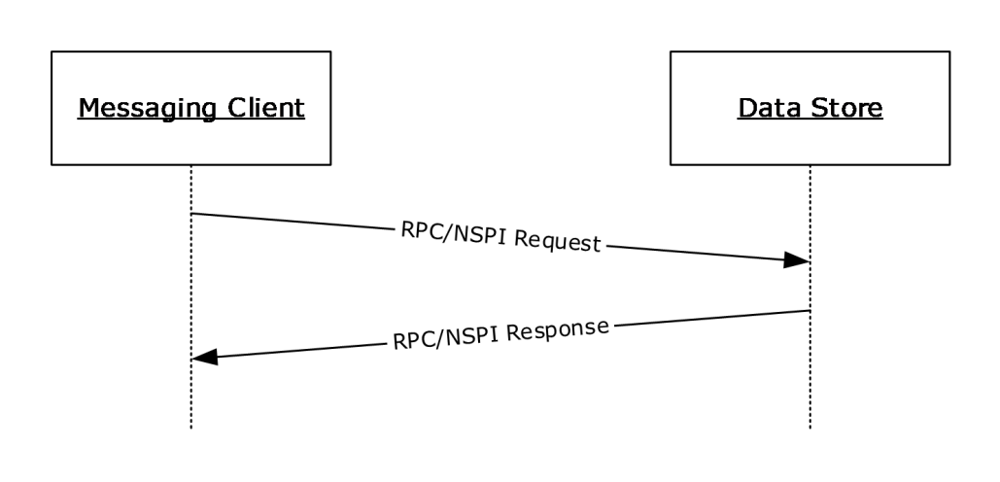
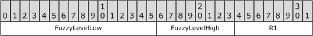
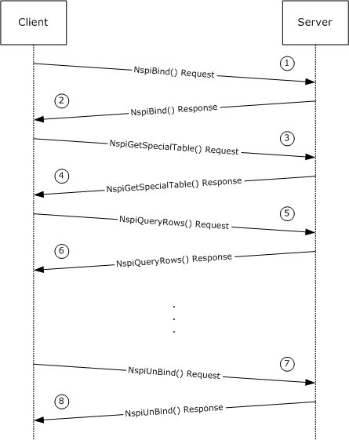

[MS-NSPI]:

Name Service Provider Interface (NSPI) Protocol

Intellectual Property Rights Notice for Open Specifications Documentation

  Technical Documentation. Microsoft publishes Open Specifications documentation (“this

documentation”) for protocols, file formats, data portability, computer languages, and standards
support. Additionally, overview documents cover inter-protocol relationships and interactions.

  Copyrights. This documentation is covered by Microsoft copyrights. Regardless of any other

terms that are contained in the terms of use for the Microsoft website that hosts this
documentation, you can make copies of it in order to develop implementations of the technologies
that are described in this documentation and can distribute portions of it in your implementations
that use these technologies or in your documentation as necessary to properly document the
implementation. You can also distribute in your implementation, with or without modification, any
schemas, IDLs, or code samples that are included in the documentation. This permission also
applies to any documents that are referenced in the Open Specifications documentation.
  No Trade Secrets. Microsoft does not claim any trade secret rights in this documentation.
  Patents. Microsoft has patents that might cover your implementations of the technologies

described in the Open Specifications documentation. Neither this notice nor Microsoft's delivery of
this documentation grants any licenses under those patents or any other Microsoft patents.
However, a given Open Specifications document might be covered by the Microsoft Open
Specifications Promise or the Microsoft Community Promise. If you would prefer a written license,
or if the technologies described in this documentation are not covered by the Open Specifications
Promise or Community Promise, as applicable, patent licenses are available by contacting
iplg@microsoft.com.

  License Programs. To see all of the protocols in scope under a specific license program and the

associated patents, visit the Patent Map.

  Trademarks. The names of companies and products contained in this documentation might be
covered by trademarks or similar intellectual property rights. This notice does not grant any
licenses under those rights. For a list of Microsoft trademarks, visit
www.microsoft.com/trademarks.

  Fictitious Names. The example companies, organizations, products, domain names, email

addresses, logos, people, places, and events that are depicted in this documentation are fictitious.
No association with any real company, organization, product, domain name, email address, logo,
person, place, or event is intended or should be inferred.

Reservation of Rights. All other rights are reserved, and this notice does not grant any rights other
than as specifically described above, whether by implication, estoppel, or otherwise.

Tools. The Open Specifications documentation does not require the use of Microsoft programming
tools or programming environments in order for you to develop an implementation. If you have access
to Microsoft programming tools and environments, you are free to take advantage of them. Certain
Open Specifications documents are intended for use in conjunction with publicly available standards
specifications and network programming art and, as such, assume that the reader either is familiar
with the aforementioned material or has immediate access to it.

Support. For questions and support, please contact dochelp@microsoft.com.

[MS-NSPI] - v20240423
Name Service Provider Interface (NSPI) Protocol
Copyright © 2024 Microsoft Corporation
Release: April 23, 2024

1 / 103

Revision Summary

Date

Revision
History

Revision
Class

Comments

4/8/2008

0.1

4/25/2008

0.2

6/30/2008

1.0

New

Minor

Major

Version 0.1 release

Version 0.2 release

Version 1.0 release

7/25/2008

1.0.1

Editorial

Changed language and formatting in the technical content.

8/29/2008

1.1

10/24/2008  2.0

Minor

Major

Clarified the meaning of the technical content.

Updated and revised the technical content.

12/5/2008

2.0.1

Editorial

Changed language and formatting in the technical content.

1/16/2009

2.0.2

Editorial

Changed language and formatting in the technical content.

2/27/2009

2.0.3

Editorial

Changed language and formatting in the technical content.

4/10/2009

2.0.4

Editorial

Changed language and formatting in the technical content.

5/22/2009

2.0.5

Editorial

Changed language and formatting in the technical content.

7/2/2009

2.0.6

Editorial

Changed language and formatting in the technical content.

8/14/2009

2.0.7

Editorial

Changed language and formatting in the technical content.

9/25/2009

2.1

11/6/2009

3.0

12/18/2009  3.1

1/29/2010

3.2

Minor

Major

Minor

Minor

Clarified the meaning of the technical content.

Updated and revised the technical content.

Clarified the meaning of the technical content.

Clarified the meaning of the technical content.

3/12/2010

3.2.1

Editorial

Changed language and formatting in the technical content.

4/23/2010

3.2.2

Editorial

Changed language and formatting in the technical content.

6/4/2010

3.2.3

Editorial

Changed language and formatting in the technical content.

7/16/2010

3.3

Minor

Clarified the meaning of the technical content.

8/27/2010

3.3

None

No changes to the meaning, language, or formatting of the
technical content.

10/8/2010

4.0

Major

Updated and revised the technical content.

11/19/2010  4.0

1/7/2011

4.0

None

None

No changes to the meaning, language, or formatting of the
technical content.

No changes to the meaning, language, or formatting of the
technical content.

2/11/2011

5.0

Major

Updated and revised the technical content.

3/25/2011

5.0

None

No changes to the meaning, language, or formatting of the
technical content.

5/6/2011

6.0

Major

Updated and revised the technical content.

[MS-NSPI] - v20240423
Name Service Provider Interface (NSPI) Protocol
Copyright © 2024 Microsoft Corporation
Release: April 23, 2024

2 / 103

Date

Revision
History

Revision
Class

Comments

6/17/2011

6.1

Minor

Clarified the meaning of the technical content.

9/23/2011

6.1

None

No changes to the meaning, language, or formatting of the
technical content.

12/16/2011  7.0

Major

Updated and revised the technical content.

3/30/2012

7.0

7/12/2012

7.0

10/25/2012  7.0

1/31/2013

8.0

8/8/2013

9.0

11/14/2013  10.0

2/13/2014

10.0

None

None

None

Major

Major

Major

None

No changes to the meaning, language, or formatting of the
technical content.

No changes to the meaning, language, or formatting of the
technical content.

No changes to the meaning, language, or formatting of the
technical content.

Updated and revised the technical content.

Updated and revised the technical content.

Updated and revised the technical content.

No changes to the meaning, language, or formatting of the
technical content.

5/15/2014

10.0

None

No changes to the meaning, language, or formatting of the
technical content.

6/30/2015

11.0

Major

Significantly changed the technical content.

10/16/2015  11.0

None

No changes to the meaning, language, or formatting of the
technical content.

7/14/2016

11.0

6/1/2017

12.0

9/15/2017

13.0

12/1/2017

13.0

9/12/2018

14.0

4/7/2021

15.0

4/23/2024

16.0

None

Major

Major

None

Major

Major

Major

No changes to the meaning, language, or formatting of the
technical content.

Significantly changed the technical content.

Significantly changed the technical content.

No changes to the meaning, language, or formatting of the
technical content.

Significantly changed the technical content.

Significantly changed the technical content.

Significantly changed the technical content.

[MS-NSPI] - v20240423
Name Service Provider Interface (NSPI) Protocol
Copyright © 2024 Microsoft Corporation
Release: April 23, 2024

3 / 103

## Table of Contents

- [1 Introduction](#1-introduction)
  - [1.1 Glossary](#11-glossary)
  - [1.2 References](#12-references)
    - [1.2.1 Normative References](#121-normative-references)
    - [1.2.2 Informative References](#122-informative-references)
  - [1.3 Overview](#13-overview)
  - [1.4 Relationship to Other Protocols](#14-relationship-to-other-protocols)
  - [1.5 Prerequisites/Preconditions](#15-prerequisitespreconditions)
  - [1.6 Applicability Statement](#16-applicability-statement)
  - [1.7 Versioning and Capability Negotiation](#17-versioning-and-capability-negotiation)
  - [1.8 Vendor-Extensible Fields](#18-vendor-extensible-fields)
  - [1.9 Standards Assignments](#19-standards-assignments)
- [2 Messages](#2-messages)
  - [2.1 Transport](#21-transport)
  - [2.2 Constant Value Definitions](#22-constant-value-definitions)
    - [2.2.1 Permitted Property Type Values](#221-permitted-property-type-values)
    - [2.2.2 Permitted Error Code Values](#222-permitted-error-code-values)
    - [2.2.3 Display Type Values](#223-display-type-values)
    - [2.2.4 Default Language Code Identifier](#224-default-language-code-identifier)
    - [2.2.5 Required Codepages](#225-required-codepages)
    - [2.2.6 Unicode Comparison Flags](#226-unicode-comparison-flags)
      - [2.2.6.1 Comparison Flags](#2261-comparison-flags)
    - [2.2.7 Permanent Entry ID GUID](#227-permanent-entry-id-guid)
    - [2.2.8 Positioning Minimal Entry IDs](#228-positioning-minimal-entry-ids)
    - [2.2.9 Ambiguous Name Resolution Minimal Entry IDs](#229-ambiguous-name-resolution-minimal-entry-ids)
    - [2.2.10 Table Sort Orders](#2210-table-sort-orders)
    - [2.2.11 NspiBind Flags](#2211-nspibind-flags)
    - [2.2.12 Retrieve Property Flags](#2212-retrieve-property-flags)
    - [2.2.13 NspiGetSpecialTable Flags](#2213-nspigetspecialtable-flags)
    - [2.2.14 NspiQueryColumns Flags](#2214-nspiquerycolumns-flags)
    - [2.2.15 NspiGetIDsFromNames Flags](#2215-nspigetidsfromnames-flags)
    - [2.2.16 NspiGetTemplateInfo Flags](#2216-nspigettemplateinfo-flags)
    - [2.2.17 NspiModLinkAtt Flags](#2217-nspimodlinkatt-flags)
  - [2.3 Common Data Types](#23-common-data-types)
    - [2.3.1 Property Values](#231-property-values)
      - [2.3.1.1 FlatUID_r](#2311-flatuidr)
      - [2.3.1.2 PropertyTagArray_r](#2312-propertytagarrayr)
      - [2.3.1.3 Binary_r](#2313-binaryr)
      - [2.3.1.4 ShortArray_r](#2314-shortarrayr)
      - [2.3.1.5 LongArray_r](#2315-longarrayr)
      - [2.3.1.6 StringArray_r](#2316-stringarrayr)
      - [2.3.1.7 BinaryArray_r](#2317-binaryarrayr)
      - [2.3.1.8 FlatUIDArray_r](#2318-flatuidarrayr)
      - [2.3.1.9 WStringArray_r](#2319-wstringarrayr)
      - [2.3.1.10 DateTimeArray_r](#23110-datetimearrayr)
      - [2.3.1.11 PROP_VAL_UNION](#23111-propvalunion)
      - [2.3.1.12 PropertyValue_r](#23112-propertyvaluer)
    - [2.3.2 PropertyRow_r](#232-propertyrowr)
    - [2.3.3 PropertyRowSet_r](#233-propertyrowsetr)
    - [2.3.4 Restrictions](#234-restrictions)
      - [2.3.4.1 AndRestriction_r, OrRestriction_r](#2341-andrestrictionr-orrestrictionr)
      - [2.3.4.2 NotRestriction_r](#2342-notrestrictionr)
      - [2.3.4.3 ContentRestriction_r](#2343-contentrestrictionr)
      - [2.3.4.4 BitMaskRestriction_r](#2344-bitmaskrestrictionr)
      - [2.3.4.5 PropertyRestriction_r](#2345-propertyrestrictionr)
      - [2.3.4.6 ComparePropsRestriction_r](#2346-comparepropsrestrictionr)
      - [2.3.4.7 SubRestriction_r](#2347-subrestrictionr)
      - [2.3.4.8 SizeRestriction_r](#2348-sizerestrictionr)
      - [2.3.4.9 ExistRestriction_r](#2349-existrestrictionr)
      - [2.3.4.10 RestrictionUnion_r](#23410-restrictionunionr)
      - [2.3.4.11 Restriction_r](#23411-restrictionr)
    - [2.3.5 Property Name/Property ID Structures](#235-property-nameproperty-id-structures)
      - [2.3.5.1 PropertyName_r](#2351-propertynamer)
      - [2.3.5.2 PropertyNameSet_r](#2352-propertynamesetr)
    - [2.3.6 String Arrays](#236-string-arrays)
      - [2.3.6.1 StringsArray_r](#2361-stringsarrayr)
      - [2.3.6.2 WStringsArray_r](#2362-wstringsarrayr)
    - [2.3.7 STAT](#237-stat)
    - [2.3.8 Entry IDs](#238-entry-ids)
      - [2.3.8.1 MinimalEntryID](#2381-minimalentryid)
      - [2.3.8.2 EphemeralEntryID](#2382-ephemeralentryid)
      - [2.3.8.3 PermanentEntryID](#2383-permanententryid)
    - [2.3.9 NSPI_HANDLE](#239-nspihandle)
- [3 Protocol Details](#3-protocol-details)
  - [3.1 Server Details](#31-server-details)
    - [3.1.1 Abstract Data Model](#311-abstract-data-model)
      - [3.1.1.1 Required Properties](#3111-required-properties)
      - [3.1.1.2 String Handling](#3112-string-handling)
        - [3.1.1.2.1 Required Native Categorizations](#31121-required-native-categorizations)
        - [3.1.1.2.2 Required Codepage Support](#31122-required-codepage-support)
        - [3.1.1.2.3 Conversion Rules for String Values Specified by the Server to the Client](#31123-conversion-rules-for-string-values-specified-by-the-server-to-the-client)
        - [3.1.1.2.4 Conversion Rules for String Values Specified by the Client to the Server](#31124-conversion-rules-for-string-values-specified-by-the-client-to-the-server)
        - [3.1.1.2.5 String Comparison](#31125-string-comparison)
          - [3.1.1.2.5.1 Unicode String Comparison](#311251-unicode-string-comparison)
          - [3.1.1.2.5.2 8-Bit String Comparison](#311252-8-bit-string-comparison)
        - [3.1.1.2.6 String Sorting](#31126-string-sorting)
      - [3.1.1.3 Tables](#3113-tables)
        - [3.1.1.3.1 Status-Based Tables](#31131-status-based-tables)
        - [3.1.1.3.2 Explicit Tables](#31132-explicit-tables)
          - [3.1.1.3.2.1 Restriction-Based Explicit Tables](#311321-restriction-based-explicit-tables)
          - [3.1.1.3.2.2 Property Value-Based Explicit Tables](#311322-property-value-based-explicit-tables)
        - [3.1.1.3.3 Specific Instantiations of Special Tables](#31133-specific-instantiations-of-special-tables)
          - [3.1.1.3.3.1 Address Book Hierarchy Table](#311331-address-book-hierarchy-table)
          - [3.1.1.3.3.2 Address Creation Table](#311332-address-creation-table)
      - [3.1.1.4 Positioning in a Table](#3114-positioning-in-a-table)
        - [3.1.1.4.1 Absolute Positioning](#31141-absolute-positioning)
        - [3.1.1.4.2 Fractional Positioning](#31142-fractional-positioning)
      - [3.1.1.5 Object Identity](#3115-object-identity)
      - [3.1.1.6 Ambiguous Name Resolution](#3116-ambiguous-name-resolution)
    - [3.1.2 Timers](#312-timers)
    - [3.1.3 Initialization](#313-initialization)
    - [3.1.4 Message Processing Events and Sequencing Rules](#314-message-processing-events-and-sequencing-rules)
      - [3.1.4.1 NspiBind (Opnum 0)](#3141-nspibind-opnum-0)
      - [3.1.4.2 NspiUnbind (Opnum 1)](#3142-nspiunbind-opnum-1)
      - [3.1.4.3 NspiGetSpecialTable (Opnum 12)](#3143-nspigetspecialtable-opnum-12)
      - [3.1.4.4 NspiUpdateStat (Opnum 2)](#3144-nspiupdatestat-opnum-2)
      - [3.1.4.5 NspiQueryColumns (Opnum 16)](#3145-nspiquerycolumns-opnum-16)
      - [3.1.4.6 NspiGetPropList (Opnum 8)](#3146-nspigetproplist-opnum-8)
      - [3.1.4.7 NspiGetProps (Opnum 9)](#3147-nspigetprops-opnum-9)
      - [3.1.4.8 NspiQueryRows (Opnum 3)](#3148-nspiqueryrows-opnum-3)
      - [3.1.4.9 NspiSeekEntries (Opnum 4)](#3149-nspiseekentries-opnum-4)
      - [3.1.4.10 NspiGetMatches (Opnum 5)](#31410-nspigetmatches-opnum-5)
      - [3.1.4.11 NspiResortRestriction (Opnum 6)](#31411-nspiresortrestriction-opnum-6)
      - [3.1.4.12 NspiCompareMIds (Opnum 10)](#31412-nspicomparemids-opnum-10)
      - [3.1.4.13 NspiDNToMId (Opnum 7)](#31413-nspidntomid-opnum-7)
      - [3.1.4.14 NspiModProps (Opnum 11)](#31414-nspimodprops-opnum-11)
      - [3.1.4.15 NspiModLinkAtt (Opnum 14)](#31415-nspimodlinkatt-opnum-14)
      - [3.1.4.16 NspiGetNamesFromIDs (Opnum 17)](#31416-nspigetnamesfromids-opnum-17)
      - [3.1.4.17 NspiGetIDsFromNames (Opnum 18)](#31417-nspigetidsfromnames-opnum-18)
      - [3.1.4.18 NspiResolveNames (Opnum 19)](#31418-nspiresolvenames-opnum-19)
      - [3.1.4.19 NspiResolveNamesW (Opnum 20)](#31419-nspiresolvenamesw-opnum-20)
      - [3.1.4.20 NspiGetTemplateInfo (Opnum 13)](#31420-nspigettemplateinfo-opnum-13)
    - [3.1.5 Timer Events](#315-timer-events)
    - [3.1.6 Other Local Events](#316-other-local-events)
  - [3.2 Client Details](#32-client-details)
    - [3.2.1 Abstract Data Model](#321-abstract-data-model)
    - [3.2.2 Timers](#322-timers)
    - [3.2.3 Initialization](#323-initialization)
    - [3.2.4 Message Processing Events and Sequencing Rules](#324-message-processing-events-and-sequencing-rules)
    - [3.2.5 Timer Events](#325-timer-events)
    - [3.2.6 Other Local Events](#326-other-local-events)
- [4 Protocol Examples](#4-protocol-examples)
- [5 Security](#5-security)
  - [5.1 Security Considerations for Implementers](#51-security-considerations-for-implementers)
  - [5.2 Index of Security Parameters](#52-index-of-security-parameters)
- [6 Appendix A: Full IDL](#6-appendix-a-full-idl)
- [7 Appendix B: Product Behavior](#7-appendix-b-product-behavior)
- [8 Change Tracking](#8-change-tracking)
- [9 Index](#9-index)

## 1 Introduction

The Name Service Provider Interface (NSPI) Protocol provides messaging clients a way to access and
manipulate addressing data stored by a server. This protocol consists of an abstract data model and a
single remote procedure call (RPC) interface to manipulate data in that model.

Sections 1.5, 1.8, 1.9, 2, and 3 of this specification are normative. All other sections and examples in
this specification are informative.

### 1.1 Glossary

This document uses the following terms:

address book container: An Address Book object that describes an address list.

address book hierarchy table: A collection of address book containers arranged in a

hierarchy.

Address Book object: An entity in an address book that contains a set of attributes, each

attribute with a set of associated values.

address creation table: A table containing information about the templates that an address book

server supports for creating new email addresses.

address creation template: A template that describes how to present a dialog to a messaging
user along with a script describing how to construct a new email address from the user's
response.

address list: A collection of distinct Address Book objects.

ambiguous name resolution (ANR): A search algorithm that permits a client to search multiple
naming-related attributes on objects by way of a single clause of the form "(anr=value)" in a
Lightweight Directory Access Protocol (LDAP) search filter. This permits a client to query for an
object when the client possesses some identifying material related to the object but does not
know which attribute of the object contains that identifying material.

code page: An ordered set of characters of a specific script in which a numerical index (code-point

value) is associated with each character. Code pages are a means of providing support for
character sets and keyboard layouts used in different countries/regions. Devices such as the
display and keyboard can be configured to use a specific code page and to switch from one code
page (such as the United States) to another (such as Portugal) at the user's request.

display template: A template that describes how to display or allow a user to modify information

about an Address Book object.

display type: A property of an Address Book object indicating the object's type that can be used

to choose a format when displaying the object.

distinguished name (DN): A name that uniquely identifies an object by using the relative

distinguished name (RDN) for the object, and the names of container objects and domains that
contain the object. The distinguished name (DN) identifies the object and its location in a tree.

dynamic endpoint: A network-specific server address that is requested and assigned at run time.

For more information, see [C706].

endpoint: A network-specific address of a remote procedure call (RPC) server process for remote

procedure calls. The actual name and type of the endpoint depends on the RPC protocol
sequence that is being used. For example, for RPC over TCP (RPC Protocol Sequence
ncacn_ip_tcp), an endpoint might be TCP port 1025. For RPC over Server Message Block (RPC

7 / 103

[MS-NSPI] - v20240423
Name Service Provider Interface (NSPI) Protocol
Copyright © 2024 Microsoft Corporation
Release: April 23, 2024

Protocol Sequence ncacn_np), an endpoint might be the name of a named pipe. For more
information, see [C706].

Ephemeral Entry ID: A property of an Address Book object that can be used to uniquely

identify the object.

globally unique identifier (GUID): A term used interchangeably with universally unique

identifier (UUID) in Microsoft protocol technical documents (TDs). Interchanging the usage of
these terms does not imply or require a specific algorithm or mechanism to generate the value.
Specifically, the use of this term does not imply or require that the algorithms described in
[RFC4122] or [C706] have to be used for generating the GUID. See also universally unique
identifier (UUID).

Interface Definition Language (IDL): The International Standards Organization (ISO) standard

language for specifying the interface for remote procedure calls. For more information, see
[C706] section 4.

Kerberos: An authentication system that enables two parties to exchange private information

across an otherwise open network by assigning a unique key (called a ticket) to each user that
logs on to the network and then embedding these tickets into messages sent by the users. For
more information, see [MS-KILE].

language code identifier (LCID): A 32-bit number that identifies the user interface human

language dialect or variation that is supported by an application or a client computer.

Minimal Entry ID (MId): A property of an Address Book object that can be used to uniquely

identify the object.

name service provider interface (NSPI): A method of performing address-book-related

operations on Active Directory.

Network Data Representation (NDR): A specification that defines a mapping from Interface
Definition Language (IDL) data types onto octet streams. NDR also refers to the runtime
environment that implements the mapping facilities (for example, data provided to NDR). For
more information, see [MS-RPCE] and [C706] section 14.

NT LAN Manager (NTLM) Authentication Protocol: A protocol using a challenge-response

mechanism for authentication in which clients are able to verify their identities without sending a
password to the server. It consists of three messages, commonly referred to as Type 1
(negotiation), Type 2 (challenge) and Type 3 (authentication).

opnum: An operation number or numeric identifier that is used to identify a specific remote

procedure call (RPC) method or a method in an interface. For more information, see [C706]
section 12.5.2.12 or [MS-RPCE].

Permanent Entry ID: A property of an Address Book object that can be used to uniquely

identify the object.

property ID: A 16-bit numeric identifier of a specific attribute. A property ID does not include any

property type information.

property type: A 16-bit quantity that specifies the data type of a property value.

proptag: A 32-bit, little-endian value comprising a Property Type and Property ID. The low-order

16 bits are the Property Type, and the high-order 16 bits are the Property ID.

remote procedure call (RPC): A communication protocol used primarily between client and

server. The term has three definitions that are often used interchangeably: a runtime
environment providing for communication facilities between computers (the RPC runtime); a set

[MS-NSPI] - v20240423
Name Service Provider Interface (NSPI) Protocol
Copyright © 2024 Microsoft Corporation
Release: April 23, 2024

8 / 103

of request-and-response message exchanges between computers (the RPC exchange); and the
single message from an RPC exchange (the RPC message).  For more information, see [C706].

RPC protocol sequence: A character string that represents a valid combination of a remote

procedure call (RPC) protocol, a network layer protocol, and a transport layer protocol, as
described in [C706] and [MS-RPCE].

RPC transport: The underlying network services used by the remote procedure call (RPC) runtime

for communications between network nodes. For more information, see [C706] section 2.

security provider: A pluggable security module that is specified by the protocol layer above the

remote procedure call (RPC) layer, and will cause the RPC layer to use this module to secure
messages in a communication session with the server. The security provider is sometimes
referred to as an authentication service. For more information, see [C706] and [MS-RPCE].

Teletex: A string value expressed as UTF-8 string restricted to characters with values between

0x20 and 0x7E, inclusive.

Unicode: A character encoding standard developed by the Unicode Consortium that represents

almost all of the written languages of the world. The Unicode standard [UNICODE5.0.0/2007]
provides three forms (UTF-8, UTF-16, and UTF-32) and seven schemes (UTF-8, UTF-16, UTF-16
BE, UTF-16 LE, UTF-32, UTF-32 LE, and UTF-32 BE).

universally unique identifier (UUID): A 128-bit value. UUIDs can be used for multiple

purposes, from tagging objects with an extremely short lifetime, to reliably identifying very
persistent objects in cross-process communication such as client and server interfaces, manager
entry-point vectors, and RPC objects. UUIDs are highly likely to be unique. UUIDs are also
known as globally unique identifiers (GUIDs) and these terms are used interchangeably in
the Microsoft protocol technical documents (TDs). Interchanging the usage of these terms does
not imply or require a specific algorithm or mechanism to generate the UUID. Specifically, the
use of this term does not imply or require that the algorithms described in [RFC4122] or [C706]
has to be used for generating the UUID.

UTF-16LE: The Unicode Transformation Format - 16-bit, Little Endian encoding scheme. It is used
to encode Unicode characters as a sequence of 16-bit codes, each encoded as two 8-bit bytes
with the least-significant byte first.

MAY, SHOULD, MUST, SHOULD NOT, MUST NOT: These terms (in all caps) are used as defined
in [RFC2119]. All statements of optional behavior use either MAY, SHOULD, or SHOULD NOT.

### 1.2 References

Links to a document in the Microsoft Open Specifications library point to the correct section in the
most recently published version of the referenced document. However, because individual documents
in the library are not updated at the same time, the section numbers in the documents may not
match. You can confirm the correct section numbering by checking the Errata.

#### 1.2.1 Normative References

We conduct frequent surveys of the normative references to assure their continued availability. If you
have any issue with finding a normative reference, please contact dochelp@microsoft.com. We will
assist you in finding the relevant information.

[C706] The Open Group, "DCE 1.1: Remote Procedure Call", C706, August 1997,
https://publications.opengroup.org/c706

Note Registration is required to download the document.

[MS-KILE] Microsoft Corporation, "Kerberos Protocol Extensions".

9 / 103

[MS-NSPI] - v20240423
Name Service Provider Interface (NSPI) Protocol
Copyright © 2024 Microsoft Corporation
Release: April 23, 2024

<!-- Extracted images from page 10 -->

<!-- /Extracted images from page 10 -->

[MS-NLMP] Microsoft Corporation, "NT LAN Manager (NTLM) Authentication Protocol".

[MS-OXCDATA] Microsoft Corporation, "Data Structures".

[MS-OXOABKT] Microsoft Corporation, "Address Book User Interface Templates Protocol".

[MS-OXOABK] Microsoft Corporation, "Address Book Object Protocol".

[MS-OXPROPS] Microsoft Corporation, "Exchange Server Protocols Master Property List".

[MS-RPCE] Microsoft Corporation, "Remote Procedure Call Protocol Extensions".

[MS-UCODEREF] Microsoft Corporation, "Windows Protocols Unicode Reference".

[RFC1510] Kohl, J., and Neuman, C., "The Kerberos Network Authentication Service (V5)", RFC 1510,
September 1993, https://www.rfc-editor.org/info/rfc1510

[RFC2119] Bradner, S., "Key words for use in RFCs to Indicate Requirement Levels", BCP 14, RFC
2119, March 1997, https://www.rfc-editor.org/info/rfc2119

[RFC4120] Neuman, C., Yu, T., Hartman, S., and Raeburn, K., "The Kerberos Network Authentication
Service (V5)", RFC 4120, July 2005, https://www.rfc-editor.org/rfc/rfc4120

#### 1.2.2 Informative References

None.

### 1.3 Overview

Messaging clients that implement a browsable address book need a way to communicate with a data
store that holds addressing data to access and manipulate that data. The NSPI Protocol enables
communication between a messaging client and a data store.<1>

The NSPI Protocol is a protocol layer that uses the remote procedure call (RPC) protocol as a
transport, with a series of interface methods as specified in this document, that clients can use to
communicate with an NSPI server.

The following diagram is a graphical representation of a typical communication sequence between a
messaging client and an NSPI server.

Figure 1: NSPI Protocol message sequence

[MS-NSPI] - v20240423
Name Service Provider Interface (NSPI) Protocol
Copyright © 2024 Microsoft Corporation
Release: April 23, 2024

10 / 103

### 1.4 Relationship to Other Protocols

The NSPI protocol depends on the following protocols:

















The remote procedure call (RPC) protocol [C706], [MS-RPCE] as a transport.

The Kerberos authentication protocols [MS-KILE], [RFC1510], and [RFC4120] for client
authentication.

The NT LAN Manager (NTLM) Authentication Protocol [MS-NLMP] for client authentication.

The Windows Protocol Unicode Reference [MS-UCODEREF] for data comparisons.

The Outlook Exchange Address Book Protocol [MS-OXOABK] for property definitions.

The Address Book User Interface Templates Protocol Specification [MS-OXOABKT] for the
definition of Address Book Templates.

The Data Structures Protocol [MS-OXCDATA] for common data structure definitions.

The Master Property List [MS-OXPROPS] for property type and property ID definitions.

### 1.5 Prerequisites/Preconditions

The NSPI client implementation is expected to possess the network address of the server. This
network address satisfies the requirements of a network address for the underlying transport of
remote procedure call (RPC). This allows the NSPI client to initiate communication with the NSPI
server using the RPC protocol.

The NSPI client and NSPI server are expected to share at least one security provider in common for
the RPC transport. This allows the NSPI server to authenticate the NSPI client.

The NSPI client is expected to possess credentials recognized by the server. These credentials are
obtained from the shared security provider. The mechanism for obtaining these credentials is specific
to the protocol of the security provider used.

The NSPI server is expected to have determined any local policies as specified in sections 2, 3, and 5.
This allows the server to provide consistent behavior for all communications in the protocol.

The server is expected to be configured to support the required codepages and language code
identifiers (LCID), as specified in sections 2.2.4 and 2.2.5. This allows the server to provide the
minimal required string conversions and sort orders.

The NSPI server is expected to be started and fully initialized before the protocol can start.

### 1.6 Applicability Statement

The NSPI Protocol is appropriate for messaging clients that implement online access to address books
for browsing and viewing of Address Book objects stored in a data store.

### 1.7 Versioning and Capability Negotiation

This document covers versioning issues in the following areas:

  Supported Transports: This protocol uses multiple RPC protocol sequences, as specified in

section 2.1.

  Protocol Versions: This protocol has a single interface version. This version is defined in section

2.1.

11 / 103

[MS-NSPI] - v20240423
Name Service Provider Interface (NSPI) Protocol
Copyright © 2024 Microsoft Corporation
Release: April 23, 2024

  Security and Authentication Methods: This protocol supports the following authentication

methods: NTLM and Kerberos.

  Localization: This protocol passes text strings in various methods. Localization considerations for

such strings are specified in String Handling (section 3.1.1.2).

  Capability Negotiation: The NSPI Protocol does not support negotiation. There is only one

interface version.

### 1.8 Vendor-Extensible Fields

None.

### 1.9 Standards Assignments

This protocol uses the following RPC UUID for the nspi interface.

Parameter

Value

Reference

Interface UUID  F5CC5A18-4264-101A-8C59-08002B2F8426

[C706] section A.2.5

[MS-NSPI] - v20240423
Name Service Provider Interface (NSPI) Protocol
Copyright © 2024 Microsoft Corporation
Release: April 23, 2024

12 / 103

## 2 Messages

The following sections specify transport methods of NSPI Protocol messages and common NSPI
Protocol data types.

Unless otherwise specified, all numeric values in this protocol are in little-endian format.

Unless otherwise specified, all Unicode string representations are in UTF-16LE format.

### 2.1 Transport

All remote procedure call (RPC) protocols use RPC dynamic endpoints as specified in Part 4 of
[C706].

The NSPI Protocol uses the following RPC protocol sequences:

  RPC over Named Pipes

  RPC over HTTP

  RPC over TCP

The protocol allows a server to be configured to use a specific port for RPC over TCP. The mechanism
for configuring an NSPI server to use a specific port is not constrained by the NSPI Protocol. The
mechanism for a client to discover this configured TCP port is not constrained by the NSPI Protocol.

This protocol MUST use the UUID F5CC5A18-4264-101A-8C59-08002B2F8426. The protocol MUST
use the RPC version number 56.0.

This protocol SHOULD<2> indicate to the RPC runtime that it is to perform a strict Network Data
Representation (NDR) data consistency check at target level 6.0, as specified in [MS-RPCE] section
3.

This protocol uses security information as described in [MS-RPCE]. The server MUST register one or
both of the security providers NT LAN Manager Protocol (NTLM) and Kerberos. Additionally, the
server MUST register the negotiation security provider.

The protocol does not require mutual authentication; the NSPI client and NSPI server MUST use an
authentication mechanism capable of authenticating the client to the server. The protocol does not
require that the NSPI client be capable of authenticating the NSPI server.

The protocol uses the underlying RPC protocol to retrieve the identity of the client that made the
method call as specified in [MS-RPCE]. The server MAY<3> use this identity to perform access checks
as specified in section 5 of this document.

The server MAY<4> enforce limits on the maximum RPC packet size that it will accept.

### 2.2 Constant Value Definitions

This section is used as a reference from one or more message syntax and message processing
sections.

#### 2.2.1 Permitted Property Type Values

These values are used to specify Property Types. They appear in various places in the NSPI Protocol.
All NSPI servers MUST recognize and be capable of accepting and returning these Property Types.
Values representing Property Types are defined in [MS-OXCDATA].

[MS-NSPI] - v20240423
Name Service Provider Interface (NSPI) Protocol
Copyright © 2024 Microsoft Corporation
Release: April 23, 2024

13 / 103

The values specified in [MS-OXCDATA] are 16-bit integers. The NSPI Protocol uses the same numeric
values but expressed as 32-bit integers. The high-order 16 bits of the 32-bit representation used by
the NSPI Protocol are always 0x0000. Permitted values for the NSPI Protocol listed in the following
table.

Name

Value as defined in [MS-OXCDATA]  Value as used in NSPI Protocol

PtypInteger16

0x0002

PtypInteger32

0x0003

PtypBoolean

0x000B

PtypString8

PtypBinary

PtypString

PtypGuid

PtypTime

0x001E

0x0102

0x001F

0x0048

0x0040

PtypErrorCode

0x000A

PtypMultipleInteger16  0x1002

PtypMultipleInteger32  0x1003

PtypMultipleString8

0x101E

PtypMultipleBinary

0x1102

PtypMultipleString

0x101F

PtypMultipleGuid

0x1048

PtypMultipleTime

0x1040

0x00000002

0x00000003

0x0000000B

0x0000001E

0x00000102

0x0000001F

0x00000048

0x00000040

0x0000000A

0x00001002

0x00001003

0x0000101E

0x00001102

0x0000101F

0x00001048

0x00001040

In addition to the Property Types defined in [MS-OXCDATA], all NSPI servers and clients MUST
recognize and be capable of accepting and returning the following Property Types.

 Name and value

 Description

PtypEmbeddedTable

Single 32-bit value, referencing an address list.

0x0000000D

PtypNull

0x00000001

Clients MUST NOT specify this Property Type in any method's input parameters.

The server MUST specify this Property Type in any method's output parameters to indicate
that a property has a value that cannot be expressed in the NSPI Protocol.

PtypUnspecified

0x00000000

Clients specify this Property Type in a method's input parameter to indicate that the client
will accept any Property Type the server chooses when returning propvalues.

Servers MUST NOT specify this Property Type in any method's output parameters except
the method NspiGetIDsFromNames.

All NSPI clients and servers MUST NOT use any other Property Types.

[MS-NSPI] - v20240423
Name Service Provider Interface (NSPI) Protocol
Copyright © 2024 Microsoft Corporation
Release: April 23, 2024

14 / 103

#### 2.2.2 Permitted Error Code Values

These values are used to specify status from an Name Service Provider Interface (NSPI) method.
They appear as return codes from NSPI methods and as values of properties with Property Type
PtypErrorCode. All NSPI servers MUST recognize and be capable of accepting and returning these
error codes. The values representing error codes are defined in [MS-OXCDATA]. Permitted values for
the NSPI Protocol are as follows:

  Success



ErrorsReturned

  GeneralFailure

  NotSupported



InvalidObject

  OutOfResources

  NotFound















LogonFailed

TooComplex

InvalidCodepage

InvalidLocale

TooBig

TableTooBig

InvalidBookmark

  AmbiguousRecipient

  AccessDenied

  NotEnoughMemory



InvalidParameter

All NSPI clients and servers MUST NOT use any other error codes.

#### 2.2.3 Display Type Values

These values are used to specify display types. They appear in various places in the NSPI Protocol as
object properties and as part of EntryIDs. Except where otherwise specified in the following table, all
NSPI servers MUST recognize and be capable of accepting and returning these display types.
Permitted values for the NSPI Protocol are as follows.

 Name and value

 Description

DT_MAILUSER

0x00000000

DT_DISTLIST

0x00000001

A typical messaging user.

A distribution list.

[MS-NSPI] - v20240423
Name Service Provider Interface (NSPI) Protocol
Copyright © 2024 Microsoft Corporation
Release: April 23, 2024

15 / 103

 Name and value

 Description

DT_FORUM

0x00000002

DT_AGENT

0x00000003

A forum, such as a bulletin board service or a public or shared folder.

An automated agent, such as Quote-Of-The-Day or a weather chart display.

DT_ORGANIZATION

0x00000004

An Address Book object defined for a large group, such as helpdesk, accounting,
coordinator, or department. Department objects usually have this display type.

DT_PRIVATE_DISTLIST

A private, personally administered distribution list.

0x00000005

DT_REMOTE_MAILUSER

An Address Book object known to be from a foreign or remote messaging system.

0x00000006

DT_CONTAINER

0x00000100

DT_TEMPLATE

0x00000101

DT_ADDRESS_TEMPLATE

0x00000102

DT_SEARCH

0x00000200

An address book hierarchy table container. An NSPI server MUST NOT return this
display type except as part of an EntryID of an object in the address book hierarchy
table.

A display template object. An NSPI server MUST NOT return this display type.

An address creation template. An NSPI server MUST NOT return this display type
except as part of an EntryID of an object in the address creation table.

A Search Template. An NSPI server MUST NOT return this display type.

All NSPI clients and servers MUST NOT use any other display types.

#### 2.2.4 Default Language Code Identifier

This value is the LCID associated with the minimal required sort order for Unicode strings. It appears
in input parameters to NSPI Protocol methods. It affects NSPI server string handling, as detailed in
3.1.1.2.

Name and value

Description

NSPI_DEFAULT_LOCALE

Represents the default LCID used for comparison of Unicode string representations.

0x00000409

#### 2.2.5 Required Codepages

These values are associated with the string handling in the NSPI Protocol, and they appear in input
parameters to methods in the NSPI Protocol. They affect NSPI server string handling, as detailed in
3.1.1.2.

Name and value  Description

CP_TELETEX

Represents the Teletex codepage.

0x00004F25

CP_WINUNICODE  Represents the Unicode codepage.

[MS-NSPI] - v20240423
Name Service Provider Interface (NSPI) Protocol
Copyright © 2024 Microsoft Corporation
Release: April 23, 2024

16 / 103

Name and value  Description

0x000004B0

#### 2.2.6 Unicode Comparison Flags

These values are associated with string handling in the NSPI Protocol. These values are defined in
terms of definitions from [MS-UCODEREF]. The server uses the constants
NSPI_DEFAULT_LOCALE_COMPARE_FLAGS and NSPI_NON_DEFAULT_LOCALE_COMPARE_FLAGS to
modify the behavior of comparisons of Unicode string representations, as detailed in section 3.1.1.2.

Name and value

Description

NSPI_DEFAULT_LOCALE_COMPARE_FLAGS

(NORM_IGNORECASE | \

 NORM_IGNOREKANATYPE | \

 NORM_IGNORENONSPACE | \

 NORM_IGNOREWIDTH | \

 SORT_STRINGSORT)

NSPI_NON_DEFAULT_LOCALE_COMPARE_FLAGS

(NORM_IGNORECASE | \

 NORM_IGNOREKANATYPE | \

 NORM_IGNORENONSPACE | \

 NORM_IGNOREWIDTH | \

 NORM_IGNORESYMBOLS | \

 SORT_STRINGSORT)

Flags used when comparing Unicode strings in the language
code identifier (LCID) represented by
NSPI_DEFAULT_LOCALE.

Flags used when comparing Unicode strings in any LCID
except the LCID represented by NSPI_DEFAULT_LOCALE.

##### 2.2.6.1 Comparison Flags

The following defines the comparison flags used by this protocol. The flags are presented in big-endian
byte order.

0  1  2  3  4  5  6  7  8  9

1
0  1  2  3  4  5  6  7  8  9

2
0  1  2  3  4  5  6  7  8  9

3
0  1

V  U  T  S  R  Q  P  O  N  M  L  K  J

I  H  G  F  E  D  C  B  A  9  8  7  6  5  4  3  2  1  0

Where the bits are defined as:

Value  Description

Unused

Unused

Unused

0

X

1

X

2

X

[MS-NSPI] - v20240423
Name Service Provider Interface (NSPI) Protocol
Copyright © 2024 Microsoft Corporation
Release: April 23, 2024

17 / 103

Value  Description

Unused

Unused

Unused

Unused

Unused

Unused

Unused

Unused

Unused

Unused

Unused

NORM IGNOREWIDTH: Ignore the difference between half-width and full-width characters.

NORM IGNOREKANATYPE: Do not differentiate between hinrangana and katanaka characters.
Corresponding hirangana and katanaka characters compare as equal.

Unused

Unused

Unused

SORT STRINGSORT: Treat punctuation the same as symbols.

Unused

Unused

3

X

4

X

5

X

6

X

7

X

8

X

9

X

A

X

B

X

C

X

D

X

E

IW

F

IK

G

X

H

X

I

X

J

SS

K

X

L

X

[MS-NSPI] - v20240423
Name Service Provider Interface (NSPI) Protocol
Copyright © 2024 Microsoft Corporation
Release: April 23, 2024

18 / 103

Value  Description

Unused

Unused

Unused

Unused

Unused

Unused

Unused

NORM IGNORESYMBOLS: Ignore symbols.

NORM IGNORENONSPACE: Ignore non-spacing characters.

NORM IGNORECASE: Ignore Case

M

X

N

X

O

X

P

X

Q

X

R

X

S

X

T

IB

U

INS

V

IC

#### 2.2.7 Permanent Entry ID GUID

This value is associated with the NSPI Protocol and appears in Permanent Entry IDs.

Name and value

GUID_NSPI

{0xDC, 0xA7, 0x40, 0xC8, 0xC0, 0x42, 0x10, 0x1A, 0xB4, 0xB9, 0x08,
0x00, 0x2B, 0x2F, 0xE1, 0x82}

Description

Represents the NSPI Protocol in
Permanent Entry IDs.

#### 2.2.8 Positioning Minimal Entry IDs

These values are used to specify objects in the address book as a function of their positions in tables.
They appear as Minimal Entry IDs (MIds) in the CurrentRec field of the STAT structure. Possible
values are as follows.

Name and value

Description

MID_BEGINNING_OF_TABLE

Specifies the position before the first row in the current address book container.

0x00000000

19 / 103

[MS-NSPI] - v20240423
Name Service Provider Interface (NSPI) Protocol
Copyright © 2024 Microsoft Corporation
Release: April 23, 2024

Name and value

Description

MID_END_OF_TABLE

Specifies the position after the last row in the current address book container.

0x00000002

MID_CURRENT

0x00000001

Specifies the current position in a table. This MId is only valid in the method
NspiUpdateStat. In all other cases, it is an invalid MId, guaranteed to not specify
any object in the address book.

#### 2.2.9 Ambiguous Name Resolution Minimal Entry IDs

These values are used to specify the outcome of the ambiguous name resolution (ANR) process.
They appear in return data from the methods NspiResolveNames and NspiResolveNamesW. Possible
values are as follows.

Name and value  Description

MID_UNRESOLVED

The ANR process was unable to map a string to any objects in the address book.

0x00000000

MID_AMBIGUOUS

The ANR process mapped a string to multiple objects in the address book.

0x0000001

MID_RESOLVED

The ANR process mapped a string to a single object in the address book.

0x0000002

#### 2.2.10 Table Sort Orders

These values are used to specify specific sort orders for tables, and they appear in the SortType field
of the STAT data structure.

Possible values are as follows.

Name and value

Description

SortTypeDisplayName

0x00000000

The table is sorted ascending on the property PidTagDisplayName, as defined in
[MS-OXPROPS]. All Name Service Provider Interface (NSPI) servers MUST
support this sort order for at least one LCID.

SortTypePhoneticDisplayName

0x00000003

The table is sorted ascending on the property
PidTagAddressBookPhoneticDisplayName, as defined in [MS-OXPROPS]. NSPI
servers SHOULD support this sort order. NSPI servers MAY support this only for
some LCIDs.<5>

SortTypeDisplayName_RO

0x000003E8

The table is sorted ascending on the property PidTagDisplayName. The client
MUST set this value only when using the NspiGetMatches method to open a
nonwritable table on an object-valued property.

SortTypeDisplayName_W

0x000003E9

The table is sorted ascending on the property PidTagDisplayName. The client
MUST set this value only when using the NspiGetMatches method to open a
writable table on an object-valued property.

[MS-NSPI] - v20240423
Name Service Provider Interface (NSPI) Protocol
Copyright © 2024 Microsoft Corporation
Release: April 23, 2024

20 / 103

#### 2.2.11 NspiBind Flags

This value is used to specify optional behavior to an NSPI server. It appears as a bit flag in the
NspiBind method.

Name and value  Description

fAnonymousLogin

Client requests that the server allow an anonymous logon.

0x00000020

#### 2.2.12 Retrieve Property Flags

These values are used to specify optional behavior to an NSPI server. They appear as bit flags in
methods that return property values to the client (NspiGetPropList, NspiGetProps, and
NspiQueryRows). Possible values are given in the following table.

Name and
value

fSkipObjects

0x00000001

Description

Client requires that the server MUST NOT include proptags with the Property Type
PtypEmbeddedTable in any lists of proptags that the server creates on behalf of the client.

fEphID

Client requires that the server MUST return Entry ID values in Ephemeral Entry ID form.

0x00000002

#### 2.2.13 NspiGetSpecialTable Flags

These values are used to specify optional behavior to an NSPI server. They appear as bit flags in the
NspiGetSpecialTable method. Possible values are given in the following table.

Name and value

Description

NspiAddressCreationTemplates

0x00000002

Specifies that the NSPI server MUST return the table of the Address Creation
Templates available. Specifying this flag causes the NSPI server to ignore the
NspiUnicodeStrings flag.

NspiUnicodeStrings

0x00000004

Specifies that the NSPI server MUST return all strings as Unicode
representations rather than as multibyte strings in the client's codepage.

#### 2.2.14 NspiQueryColumns Flags

This value is used to specify optional behavior to an NSPI server. It appears as a bit flag in the
NspiQueryColumns method.

Name and value

Description

NspiUnicodeProptypes

0x80000000

Specifies that the NSPI server MUST return all proptags specifying values with string
representations as having the Property Type PtypString. The default behavior is that the
NSPI server MUST return all proptags specifying values with string representations as
having the Property Type PtypString8.

21 / 103

[MS-NSPI] - v20240423
Name Service Provider Interface (NSPI) Protocol
Copyright © 2024 Microsoft Corporation
Release: April 23, 2024

#### 2.2.15 NspiGetIDsFromNames Flags

This value is used to specify optional behavior to an NSPI server. It appears as a flag in the
NspiGetIDsFromNames method.

Name and
value

Description

NspiVerifyNames

0x00000002

Specifies that the NSPI server MUST verify that all client specified names are recognized by
the server.

#### 2.2.16 NspiGetTemplateInfo Flags

These values are used to specify optional behavior to an NSPI server. They appear as bit flags in the
NspiGetTemplateInfo method. Possible values are as follows.

Name and value

Description

TI_TEMPLATE

0x00000001

TI_SCRIPT

0x00000004

TI_EMT

0x00000010

Specifies that the server is to return the value that represents a template.

Specifies that the server is to return the value of the script associated with a
template.

Specifies that the server is to return the email type associated with a template.

TI_HELPFILE_NAME

0x00000020

Specifies that the server is to return the name of the help file associated with a
template.

TI_HELPFILE_CONTENTS

0x00000040

Specifies that the server is to return the contents of the help file associated with a
template.

#### 2.2.17 NspiModLinkAtt Flags

These values are used to specify optional behavior to an NSPI server. They appear as bit flags in the
NspiModLinkAtt method. The following table lists the possible values of the flags.

Name and
Value

fDelete

0x00000001

Description

Specifies that the server is to remove values when modifying. The default behavior is that the
server adds values when modifying.

### 2.3 Common Data Types

This protocol enables the ms_union extension specified in [MS-RPCE] (section 2.2.4.5).

22 / 103

[MS-NSPI] - v20240423
Name Service Provider Interface (NSPI) Protocol
Copyright © 2024 Microsoft Corporation
Release: April 23, 2024

This protocol requests that the RPC runtime, via the strict_context_handle attribute, rejects the
use of context handles created by a method of a different RPC interface than this one, as specified in
[MS-RPCE] (section 3).

In addition to RPC base types and definitions specified in [C706] and [MS-RPCE], the NSPI protocol
uses additional data types.

The following table summarizes the types that are defined in this specification.

Name

FlatUID_r

Description

Byte order specified GUIDs

PropertyTagArray_r

Property value structure

Binary_r

Property value structure

ShortArray_r

Property value structure

LongArray_r

Property value structure

StringArray_r

Property value structure

BinaryArray_r

Property value structure

FlatUIDArray_r

Property value structure

WStringArray_r

Property value structure

DateTimeArray_r

Property value structure

PROP_VAL_UNION

Property value structure

PropertyValue_r

Property value structure

PropertyRow_r

Table row structure

PropertyRowSet_r

Table rows structure

AndRestriction_r

Table restriction structure

OrRestriction_r

Table restriction structure

NotRestriction_r

Table restriction structure

ContentRestriction_r

Table restriction structure

BitMaskRestriction_r

Table restriction structure

PropertyRestriction_r

Table restriction structure

ComparePropsRestriction_r  Table restriction structure

SubRestriction_r

Table restriction structure

SizeRestriction_r

Table restriction structure

ExistRestriction_r

Table restriction structure

RestrictionUnion_r

Table restriction structure

Restriction_r

Table restriction structure

PropertyName_r

Address book property specifier

[MS-NSPI] - v20240423
Name Service Provider Interface (NSPI) Protocol
Copyright © 2024 Microsoft Corporation
Release: April 23, 2024

23 / 103

Name

Description

PropertyNameSet_r

Collection of PropertyName_r structures

StringsArray_r

Collection of 8-bit character strings

WStringsArray_r

Collection of Unicode strings

STAT

Table status structure

MinimalEntryID

Address Book object identification

EphemeralEntryID

Address Book object identification

PermanentEntryID

Address Book object identification

NSPI_HANDLE

RPC context handle

#### 2.3.1 Property Values

The following structures are used to represent specific property values.

##### 2.3.1.1 FlatUID_r

The FlatUID_r structure is an encoding of the FlatUID data structure defined in [MS-OXCDATA]. The
semantic meaning is unchanged from the FlatUID data structure.

 typedef struct {
   BYTE ab[16];
 } FlatUID_r;

ab:  Encodes the ordered bytes of the FlatUID data structure.

##### 2.3.1.2 PropertyTagArray_r

The PropertyTagArray_r structure is an encoding of the PropTagArray data structure defined in [MS-
OXCDATA]. The permissible number of proptag values in the PropertyTagArray_r structure exceeds
that of the PropTagArray data structure. The semantic meaning is otherwise unchanged from the
PropTagArray data structure.

 typedef struct PropertyTagArray_r {
   DWORD cValues;
   [range(0,100001)] [size_is(cValues+1), length_is(cValues)]
     DWORD aulPropTag[];
 } PropertyTagArray_r;

cValues:  Encodes the Count field of PropTagArray. This field MUST NOT exceed 100,000.

aulPropTag:  Encodes the PropertyTags field of PropTagArray.

##### 2.3.1.3 Binary_r

The Binary_r structure encodes an array of uninterpreted bytes.

[MS-NSPI] - v20240423
Name Service Provider Interface (NSPI) Protocol
Copyright © 2024 Microsoft Corporation
Release: April 23, 2024

24 / 103

 typedef struct Binary_r {
   [range(0,2097152)] DWORD cb;
   [size_is(cb)] BYTE* lpb;
 } Binary_r;

cb:  The number of uninterpreted bytes represented in this structure. This value MUST NOT exceed

2,097,152.

lpb:  The uninterpreted bytes.

##### 2.3.1.4 ShortArray_r

The ShortArray_r structure encodes an array of 16-bit integers.

 typedef struct ShortArray_r {
   [range(0,100000)] DWORD cValues;
   [size_is(cValues)] short int* lpi;
 } ShortArray_r;

cValues:  The number of 16-bit integer values represented in the ShortArray_r structure. This value

MUST NOT exceed 100,000.

lpi:  The 16-bit integer values.

##### 2.3.1.5 LongArray_r

The LongArray_r structure encodes an array of 32-bit integers.

 typedef struct _LongArray_r {
   [range(0,100000)] DWORD cValues;
   [size_is(cValues)] long* lpl;
 } LongArray_r;

cValues:  The number of 32-bit integers represented in this structure. This value MUST NOT exceed

100,000.

lpl:  The 32-bit integer values.

##### 2.3.1.6 StringArray_r

The StringArray_r structure encodes an array of references to 8-bit character strings.

 typedef struct _StringArray_r {
   [range(0,100000)] DWORD cValues;
   [size_is(cValues)] [string] char** lppszA;
 } StringArray_r;

cValues:  The number of 8-bit character strings references represented in the StringArray_r

structure. This value MUST NOT exceed 100,000.

lppszA:  The 8-bit character string references. The strings referred to are NULL-terminated.

[MS-NSPI] - v20240423
Name Service Provider Interface (NSPI) Protocol
Copyright © 2024 Microsoft Corporation
Release: April 23, 2024

25 / 103

##### 2.3.1.7 BinaryArray_r

The BinaryArray_r structure is an array of Binary_r data structures.

 typedef struct _BinaryArray_r {
   [range(0,100000)] DWORD cValues;
   [size_is(cValues)] Binary_r* lpbin;
 } BinaryArray_r;

cValues:  The number of Binary_r data structures represented in the BinaryArray_r structure. This

value MUST NOT exceed 100,000.

lpbin:  The Binary_r data structures.

##### 2.3.1.8 FlatUIDArray_r

The FlatUIDArray_r structure encodes an array of FlatUID_r data structures.

 typedef struct _FlatUIDArray_r {
   [range(0,100000)] DWORD cValues;
   [size_is(cValues)] FlatUID_r** lpguid;
 } FlatUIDArray_r;

cValues:  The number of FlatUID_r structures represented in the FlatUIDArray_r structure. This value

MUST NOT exceed 100,000.

lpguid:   The FlatUID_r data structures.

##### 2.3.1.9 WStringArray_r

The WStringArray_r structure encodes an array of references to Unicode strings.

 typedef struct _WStringArray_r {
   [range(0,100000)] DWORD cValues;
   [size_is(cValues)] [string] wchar_t** lppszW;
 } WStringArray_r;

cValues:  The number of Unicode character strings references represented in the WStringArray_r

structure. This value MUST NOT exceed 100,000.

lppszW:  The Unicode character string references. The strings referred to are NULL-terminated.

##### 2.3.1.10 DateTimeArray_r

The DateTimeArray_r structure encodes an array of FILETIME structures.

 typedef struct _DateTimeArray_r {
   [range(0,100000)] DWORD cValues;
   [size_is(cValues)] FILETIME* lpft;
 } DateTimeArray_r;

cValues:  The number of FILETIME data structures represented in the DateTimeArray_r structure.

This value MUST NOT exceed 100,000.

lpft:  The FILETIME data structures.

[MS-NSPI] - v20240423
Name Service Provider Interface (NSPI) Protocol
Copyright © 2024 Microsoft Corporation
Release: April 23, 2024

26 / 103

##### 2.3.1.11 PROP_VAL_UNION

The PROP_VAL_UNION structure encodes a single instance of any type of property value. It is an
aggregation data structure, allowing a single parameter to an NSPI method to contain any type of
property value.

 typedef
 [switch_type(long)]
 union _PV_r {
   [case(0x00000002)]
     short int i;
   [case(0x00000003)]
     long l;
   [case(0x0000000B)]
     unsigned short int b;
   [case(0x0000001E)]
     [string] char* lpszA;
   [case(0x00000102)]
     Binary_r bin;
   [case(0x0000001F)]
     [string] wchar_t* lpszW;
   [case(0x00000048)]
     FlatUID_r* lpguid;
   [case(0x00000040)]
     FILETIME ft;
   [case(0x0000000A)]
     long err;
   [case(0x00001002)]
     ShortArray_r MVi;
   [case(0x00001003)]
     LongArray_r MVl;
   [case(0x0000101E)]
     StringArray_r MVszA;
   [case(0x00001102)]
     BinaryArray_r MVbin;
   [case(0x00001048)]
     FlatUIDArray_r MVguid;
   [case(0x0000101F)]
     WStringArray_r MVszW;
   [case(0x00001040)]
     DateTimeArray_r MVft;
   [case(0x00000001, 0x0000000D)]
     long lReserved;
 } PROP_VAL_UNION;

i:  PROP_VAL_UNION contains an encoding of the value of a property that can contain a single 16-bit

integer value.

l:  PROP_VAL_UNION contains an encoding of the value of a property that can contain a single 32-bit

integer value.

b:  PROP_VAL_UNION contains an encoding of the value of a property that can contain a single

Boolean value. The client and server MUST NOT set this to values other than 1 or 0.

lpszA:  PROP_VAL_UNION contains an encoding of the value of a property that can contain a single 8-

bit character string value. This value is NULL-terminated.

bin:  PROP_VAL_UNION contains an encoding of the value of a property that can contain a single
binary data value. The number of bytes that can be encoded in this structure is 2,097,152.

lpszW:  PROP_VAL_UNION contains an encoding of the value of a property that can contain a single

Unicode string value. This value is NULL-terminated.

[MS-NSPI] - v20240423
Name Service Provider Interface (NSPI) Protocol
Copyright © 2024 Microsoft Corporation
Release: April 23, 2024

27 / 103

lpguid:  PROP_VAL_UNION contains an encoding of the value of a property that can contain a single

GUID value. The value is encoded as a FlatUID_r data structure.

ft:  PROP_VAL_UNION contains an encoding of the value of a property that can contain a single 64-bit

integer value. The value is encoded as a FILETIME structure.

err:  PROP_VAL_UNION contains an encoding of the value of a property that can contain a single

PtypErrorCode value.

MVi:  PROP_VAL_UNION contains an encoding of the values of a property that can contain multiple

16-bit integer values. The number of values that can be encoded in this structure is 100,000.

MVl:  PROP_VAL_UNION contains an encoding of the values of a property that can contain multiple

32-bit integer values. The number of values that can be encoded in this structure is 100,000.

MVszA:  PROP_VAL_UNION contains an encoding of the values of a property that can contain multiple
8-bit character string values. These string values are NULL-terminated. The number of values that
can be encoded in this structure is 100,000.

MVbin:  PROP_VAL_UNION contains an encoding of the values of a property that can contain multiple
binary data values. The number of bytes that can be encoded in each value of this structure is
2,097,152. The number of values that can be encoded in this structure is 100,000.

MVguid:  PROP_VAL_UNION contains an encoding of the values of a property that can contain

multiple GUID values. The values are encoded as FlatUID_r data structures. The number of values
that can be encoded in this structure is 100,000.

MVszW:  PROP_VAL_UNION contains an encoding of the values of a property that can contain

multiple Unicode string values. These string values are NULL-terminated. The number of values
that can be encoded in this structure is 100,000.

MVft:  PROP_VAL_UNION contains an encoding of the value of a property that can contain multiple

64-bit integer values. The values are encoded as FILETIME structures. The number of values that
can be encoded in this structure is 100,000.

lReserved:  Reserved. All clients and servers MUST set this value to the constant 0x00000000.

##### 2.3.1.12 PropertyValue_r

The PropertyValue_r structure is an encoding of the PropertyValue data structure defined in [MS-
OXCDATA].

For property values with uninterpreted byte values, the permissible number of bytes in the
PropertyValue_r structure exceeds that of the PropertyValue data structure. For property values with
multiple values, the permissible number of values in the PropertyValue_r structure exceeds that of the
PropertyValue data structure. The semantic meaning is otherwise unchanged from the
PropertyValue data structure.

 typedef struct _PropertyValue_r {
   DWORD ulPropTag;
   DWORD ulReserved;
   [switch_is((long)(ulPropTag & 0x0000FFFF))]
     PROP_VAL_UNION Value;
 } PropertyValue_r;

ulPropTag:  Encodes the proptag of the property whose value is represented by the PropertyValue_r

data structure.

ulReserved:  Reserved. All clients and servers MUST set this value to the constant 0x00000000.

28 / 103

[MS-NSPI] - v20240423
Name Service Provider Interface (NSPI) Protocol
Copyright © 2024 Microsoft Corporation
Release: April 23, 2024

Value:  Encodes the actual value of the property represented by the PropertyValue_r data structure.
The type value held is specified by the Property Type of the proptag in the field ulPropTag.

#### 2.3.2 PropertyRow_r

The PropertyRow_r structure is an encoding of the StandardPropertyRow data structure defined in
[MS-OXCDATA]. The semantic meaning is unchanged from the StandardPropertyRow data
structure.

 typedef struct _PropertyRow_r {
   DWORD Reserved;
   [range(0,100000)] DWORD cValues;
   [size_is(cValues)] PropertyValue_r* lpProps;
 } PropertyRow_r;

Reserved:  Reserved. All clients and servers MUST set this value to the constant 0x00000000.

cValues:  The number of PropertyValue_r structures represented in the PropertyRow_r structure. This

value MUST NOT exceed 100,000.

lpProps:  Encodes the ValueArray field of the StandardPropertyRow data structure.

#### 2.3.3 PropertyRowSet_r

The PropertyRowSet_r structure is an encoding of the PropertyRowSet data structure defined in
[MS-OXCDATA] section 2.19.2, PropertyRowSet.

The permissible number of PropertyRows in the PropertyRowSet_r data structure exceeds that of the
PropertyRowSet data structure. The semantic meaning is otherwise unchanged from the
PropertyRowSet data structure.

 typedef struct _PropertyRowSet_r {
   [range(0,100000)] DWORD cRows;
   [size_is(cRows)] PropertyRow_r aRow[];
 } PropertyRowSet_r;

cRows:   Encodes the RowCount field of the PropertyRowSet data structures. This value MUST

NOT exceed 100,000.

aRow:  Encodes the Rows field of the PropertyRowSet data structure.

#### 2.3.4 Restrictions

The following structures are used to represent restrictions of a table, as defined in [MS-OXCDATA].

##### 2.3.4.1 AndRestriction_r, OrRestriction_r

The AndRestriction_r, OrRestriction_r restriction types share a single RPC encoding. The
AndOrRestriction_r structure is an encoding of the both the AndRestriction data structure and the
OrRestriction data structure defined in [MS-OXCDATA]. These two data structures share the same
data layout, so a single encoding is included in the NSPI Protocol. The sense of the data structure's
use is derived from the context of its inclusion in the RestrictionUnion_r data structure defined in this
specification.

The permissible number of Restriction structures in the AndRestriction_r and OrRestriction_r data
structures exceeds that of the AndRestriction and OrRestriction structures. The semantic meaning

29 / 103

[MS-NSPI] - v20240423
Name Service Provider Interface (NSPI) Protocol
Copyright © 2024 Microsoft Corporation
Release: April 23, 2024

<!-- Extracted images from page 30 -->

<!-- /Extracted images from page 30 -->

is otherwise unchanged from the AndRestriction and OrRestriction data structures, as context
dictates.

 typedef struct _AndOrRestriction_r {
   [range(0,100000)] DWORD cRes;
   [size_is(cRes)] Restriction_r* lpRes;
 } AndRestriction_r,
  OrRestriction_r;

cRes:  Encodes the RestrictCount field of the AndRestriction and OrRestriction data structures.

This value MUST NOT exceed 100,000.

lpRes:  Encodes the Restricts field of the AndRestriction and OrRestriction data structures.

##### 2.3.4.2 NotRestriction_r

The NotRestriction_r structure is an encoding of the NotRestriction data structure defined in [MS-
OXCDATA]. The semantic meaning is unchanged from the NotRestriction data structure.

 typedef struct _NotRestriction_r {
   Restriction_r* lpRes;
 } NotRestriction_r;

lpRes:  Encodes the Restriction field of the NotRestriction data structure.

##### 2.3.4.3 ContentRestriction_r

The ContentRestriction_r structure is an encoding of the ContentRestriction data structure defined in
[MS-OXCDATA]. The semantic meaning is unchanged from the ContentRestriction data structure.

 typedef struct _ContentRestriction_r {
   DWORD ulFuzzyLevel;
   DWORD ulPropTag;
   PropertyValue_r * lpProp;
 } ContentRestriction_r;

ulFuzzyLevel:  Encodes the FuzzyLevelLow and  FuzzyLevelHigh fields of the ContentRestriction data

structure.

FuzzyLevelLow:  Encodes the FuzzyLevelLow field of the ContentRestriction data structure.

FuzzyLevelHigh:  Encodes the FuzzyLevelHigh field of the ContentRestriction data structure.

R1:  Reserved. All clients and servers MUST set this value to the constant 0x00.

ulPropTag:  Encodes the PropertyTag field of the ContentRestriction data structure.

lpProp:  Encodes the TaggedValue field of the ContentRestriction data structure.

[MS-NSPI] - v20240423
Name Service Provider Interface (NSPI) Protocol
Copyright © 2024 Microsoft Corporation
Release: April 23, 2024

30 / 103

##### 2.3.4.4 BitMaskRestriction_r

The BitMaskRestriction_r structure is an encoding of the BitMaskRestriction data structure defined in
[MS-OXCDATA]. The semantic meaning is unchanged from the BitMaskRestriction data structure.

 typedef struct _BitMaskRestriction_r {
   DWORD relBMR;
   DWORD ulPropTag;
   DWORD ulMask;
 } BitMaskRestriction_r;

relBMR:  Encodes the BitmapRelOp field of the BitMaskRestriction data structure.

ulPropTag:  Encodes the PropTag field of the BitMaskRestriction data structure.

ulMask:  Encodes the Mask field of the BitMaskRestriction data structure.

##### 2.3.4.5 PropertyRestriction_r

The PropertyRestriction_r structure is an encoding of the PropertyRestriction data structure defined
in [MS-OXCDATA]. The semantic meaning is unchanged from the PropertyRestriction data
structure.

 typedef struct _PropertyRestriction_r {
   DWORD relop;
   DWORD ulPropTag;
   PropertyValue_r* lpProp;
 } PropertyRestriction_r;

relop:   Encodes the RelOp field of the PropertyRestriction data structure.

ulPropTag:  Encodes the PropTag field of the PropertyRestriction data structure.

lpProp:  Encodes the TaggedValue field of the PropertyRestriction data structure.

##### 2.3.4.6 ComparePropsRestriction_r

The ComparePropsRestriction_r structure is an encoding of the ComparePropsRestriction data
structure defined in [MS-OXCDATA]. The semantic meaning is unchanged from the
ComparePropsRestriction data structure.

 typedef struct _ComparePropsRestriction_r {
   DWORD relop;
   DWORD ulPropTag1;
   DWORD ulPropTag2;
 } ComparePropsRestriction_r;

relop:  Encodes the RelOp field of the ComparePropsRestriction data structure.

ulPropTag1:  Encodes the PropTag1 field of the ComparePropsRestriction data structure.

ulPropTag2:  Encodes the PropTag2 field of the ComparePropsRestriction data structure.

[MS-NSPI] - v20240423
Name Service Provider Interface (NSPI) Protocol
Copyright © 2024 Microsoft Corporation
Release: April 23, 2024

31 / 103

##### 2.3.4.7 SubRestriction_r

The SubRestriction_r structure is an encoding of the SubObjectRestriction data structure defined in
[MS-OXCDATA]. The semantic meaning is unchanged from the SubObjectRestriction data structure.

 typedef struct _SubRestriction_r {
   DWORD ulSubObject;
   Restriction_r* lpRes;
 } SubRestriction_r;

ulSubObject:  Encodes the SubObject field of the SubObjectRestriction data structure.

lpRes:  Encodes the Restriction field of the SubObjectRestriction data structure.

##### 2.3.4.8 SizeRestriction_r

The SizeRestriction_r structure is an encoding of the SizeRestriction data structure defined in [MS-
OXCDATA]. The semantic meaning is unchanged from the SizeRestriction data structure.

 typedef struct _SizeRestriction_r {
   DWORD relop;
   DWORD ulPropTag;
   DWORD cb;
 } SizeRestriction_r;

relop:  Encodes the RelOp field of the SizeRestriction data structure.

ulPropTag:  Encodes the PropTag field of the SizeRestriction data structure.

cb:  Encodes the Size field of the SizeRestriction data structure.

##### 2.3.4.9 ExistRestriction_r

The ExistRestriction_r structure is an encoding of the ExistRestriction data structure defined in [MS-
OXCDATA]. The semantic meaning is unchanged from the ExistRestriction data structure.

 typedef struct _ExistRestriction_r {
   DWORD ulReserved1;
   DWORD ulPropTag;
   DWORD ulReserved2;
 } ExistRestriction_r;

ulReserved1:  Reserved. All clients and servers MUST set this value to the constant 0x00000000.

ulPropTag:  Encodes the PropTag field of the ExistRestriction data structure.

ulReserved2:  Reserved. All clients and servers MUST set this value to the constant 0x00000000.

##### 2.3.4.10 RestrictionUnion_r

The RestrictionUnion_r structure encodes a single instance of any type of restriction. It is an
aggregation data structure, allowing a single parameter to a Name Service Provider Interface
(NSPI) method to contain any type of restriction data structure.

 typedef
 [switch_type(long)]

[MS-NSPI] - v20240423
Name Service Provider Interface (NSPI) Protocol
Copyright © 2024 Microsoft Corporation
Release: April 23, 2024

32 / 103

 union _RestrictionUnion_r {
   [case(0x00000000)]
     AndRestriction_r resAnd;
   [case(0x00000001)] OrRestriction_r resOr;
   [case(0x00000002)]
     NotRestriction_r resNot;
   [case(0x00000003)]
     ContentRestriction_r resContent;
   [case(0x00000004)]
     PropertyRestriction_r resProperty;
   [case(0x00000005)]
     ComparePropsRestriction_r resCompareProps;
   [case(0x00000006)]
     BitMaskRestriction_r resBitMask;
   [case(0x00000007)]
     SizeRestriction_r resSize;
   [case(0x00000008)]
     ExistRestriction_r resExist;
   [case(0x00000009)]
     SubRestriction_r resSubRestriction;
 } RestrictionUnion_r;

resAnd:  RestrictionUnion_r contains an encoding of an AndRestriction.

resOr:  RestrictionUnion_r contains an encoding of an OrRestriction.

resNot:  RestrictionUnion_r contains an encoding of a NotRestriction.

resContent:  RestrictionUnion_r contains an encoding of a ContentRestriction.

resProperty:  RestrictionUnion_r contains an encoding of a PropertyRestriction.

resCompareProps:  RestrictionUnion_r contains an encoding of a CompareRestriction.

resBitMask:  RestrictionUnion_r contains an encoding of a BitMaskRestriction.

resSize:  RestrictionUnion_r contains an encoding of a SizeRestriction.

resExist:  RestrictionUnion_r contains an encoding of an ExistRestriction.

resSubRestriction:  RestrictionUnion_r contains an encoding of a SubRestriction.

##### 2.3.4.11 Restriction_r

The Restriction_r structure is an encoding of the Restriction filters defined in [MS-OXCDATA].

The permissible number of Restriction structures encoded in AndRestriction_r and OrRestriction_r
data structures recursively included in the Restriction_r data type exceeds that of the AndRestriction_r
and OrRestriction_r data structures recursively included in the Restriction filters. The semantic
meaning is otherwise unchanged from the Restriction filters.

 typedef struct _Restriction_r {
   DWORD rt;
   [switch_is((long)rt)] RestrictionUnion_r res;
 } Restriction_r;

rt:  Encodes the RestrictType field common to all restriction structures.

res:  Encodes the actual restriction specified by the type in the rt field.

[MS-NSPI] - v20240423
Name Service Provider Interface (NSPI) Protocol
Copyright © 2024 Microsoft Corporation
Release: April 23, 2024

33 / 103

#### 2.3.5 Property Name/Property ID Structures

The following structures are used to represent named properties, as specified in [MS-OXCDATA].

##### 2.3.5.1 PropertyName_r

The PropertyName_r structure is an encoding of the PropertyName data structure defined in [MS-
OXCDATA]. The semantic meaning is unchanged from the PropertyName data structure.

 typedef struct PropertyName_r {
   FlatUID_r* lpguid;
   DWORD ulReserved;
   long lID;
 } PropertyName_r;

lpguid:  Encodes the GUID field of the PropertyName data structure. This field is encoded as a

FlatUID_r data structure.

ulReserved:  Reserved. All clients and servers MUST set this value to the constant 0x00000000.

lID:  Encodes the lID field of the PropertyName data structure. In addition to the definition of the
LID field, this field is always present in the PropertyName_r data structure; it is not optional.

##### 2.3.5.2 PropertyNameSet_r

The PropertyNameSet_r structure is used to aggregate a number of PropertyName_r structures into a
single data structure.

 typedef struct PropertyNameSet_r {
   [range(0,100000)] DWORD cNames;
   [size_is(cNames)] PropertyName_r aNames[];
 } PropertyNameSet_r;

cNames:  The number of PropertyName_r structures in this aggregation. The value MUST NOT exceed

100,000.

aNames:  The list of PropertyName_r structures in this aggregation.

#### 2.3.6 String Arrays

The following structures are used to aggregate a number of strings into a single data structure.

##### 2.3.6.1 StringsArray_r

The StringsArray_r structure is used to aggregate a number of character type strings into a single
data structure.

 typedef struct _StringsArray {
   [range(0,100000)] DWORD Count;
   [size_is(Count)] [string] char* Strings[];
 } StringsArray_r;

Count:  The number of character string structures in this aggregation. The value MUST NOT exceed

100,000.

[MS-NSPI] - v20240423
Name Service Provider Interface (NSPI) Protocol
Copyright © 2024 Microsoft Corporation
Release: April 23, 2024

34 / 103

Strings:  The list of character type strings in this aggregation. The strings in this list are NULL-

terminated.

##### 2.3.6.2 WStringsArray_r

The WStringsArray_r structure is used to aggregate a number of wchar_t type strings into a single
data structure.

 typedef struct _WStringsArray {
   [range(0,100000)] DWORD Count;
   [size_is(Count)] [string] wchar_t* Strings[];
 } WStringsArray_r;

Count:  The number of character strings structures in this aggregation. The value MUST NOT exceed

100,000.

Strings:  The list of wchar_t type strings in this aggregation. The strings in this list are NULL-

terminated.

#### 2.3.7 STAT

The STAT structure is used to specify the state of a table and location information that applies to that
table. It appears as both an input parameter and an output parameter in many Name Service
Provider Interface (NSPI) methods.

 typedef struct _STAT {
   DWORD SortType;
   DWORD ContainerID;
   DWORD CurrentRec;
   long Delta;
   DWORD NumPos;
   DWORD TotalRecs;
   DWORD CodePage;
   DWORD TemplateLocale;
   DWORD SortLocale;
 } STAT;

SortType:  This field contains a DWORD representing a sort order. The client sets this field to specify
the sort type of this table. Possible values are specified in Table Sort Orders (section 2.2.10). The
server MUST NOT modify this field.

ContainerID:  This field contains a MId. The client sets this field to specify the MId of the address
book container that this STAT represents. The client obtains these MIds from the server's
address book hierarchy table. The server MUST NOT modify this field in any NSPI method
except NspiGetMatches.

CurrentRec:  This field contains a MId. The client sets this field to specify a beginning position in the

table for the start of an NSPI method. The server sets this field to report the end position in the
table after processing an NSPI method.

Delta:  This field contains a long value. The client sets this field to specify an offset from the

beginning position in the table for the start of an NSPI method. If the NSPI method returns a
success value, the server MUST set this field to 0.

NumPos:  This field contains a DWORD value specifying a position in the table. The client sets this

field to specify a fractional position for the beginning position in the table for the start of an NSPI
method (section 3.1.1.4.2). The server sets this field to specify the approximate fractional position
at the end of an NSPI method. This value is a zero index; the first element in a table has the

35 / 103

[MS-NSPI] - v20240423
Name Service Provider Interface (NSPI) Protocol
Copyright © 2024 Microsoft Corporation
Release: April 23, 2024

numeric position 0. Although the protocol places no boundary or requirements on the accuracy of
the approximation the server reports, it is recommended that implementations maximize the
accuracy of the approximation to improve usability of the NSPI server for clients.

TotalRecs:  This field contains a DWORD specifying the number of rows in the table. The client sets
this field to specify a fractional position for the beginning position in the table for the start of an
NSPI method (section 3.1.1.4.2). The server sets this field to specify the total number of rows in
the table. Unlike the NumPos field, the server MUST report this number accurately; an
approximation is insufficient.

CodePage:  This field contains a DWORD value representing a codepage. The client sets this field to
specify the codepage the client uses for non-Unicode strings. The server MUST use this value
during string handling (section 3.1.1.2). The server MUST NOT modify this field.

TemplateLocale:  This field contains a DWORD value representing a language code identifier

(LCID). The client sets this field to specify the LCID associated with the template the client wishes
the server to return. The server MUST NOT modify this field.

SortLocale:  This field contains a DWORD value representing an LCID. The client sets this field to

specify the LCID that it wishes the server to use when sorting any strings. The server MUST use
this value during sorting (section 3.1.1.2). The server MUST NOT modify this field.

#### 2.3.8 Entry IDs

Each object in the address book is identified by one or more Entry IDs (section 3.1.1.5). There are
three types of Entry IDs, as specified in the following table.

 Name

 Description

MinimalEntryID

A minimal identifier

EphemeralEntryID  An ephemeral identifier

PermanentEntryID  A permanent identifier

##### 2.3.8.1 MinimalEntryID

A Minimal Entry ID (MId) is a single DWORD value that identifies a specific object in the address
book. MIds with values less than 0x00000010 are used by NSPI clients as signals to trigger specific
behaviors in specific NSPI methods. Except in those places where the protocol defines a specific
behavior for these MIds, the server MUST treat these MIds as MIds that do not specify an object in the
address book. Specific values used in this way are defined in sections 2.2.8 and 2.2.9.

MIds are created and assigned by NSPI server. The algorithm used by a server to create a MId is not
restricted by this protocol. A MId is valid only to servers that respond to a NspiBind (Section 3.1.4.1)
with same server GUID as that used by the server that created the MId. It is not possible for a client
to predict a MId.

This type is declared as follows:

 typedef DWORD MinEntryID;

[MS-NSPI] - v20240423
Name Service Provider Interface (NSPI) Protocol
Copyright © 2024 Microsoft Corporation
Release: April 23, 2024

36 / 103

##### 2.3.8.2 EphemeralEntryID

The EphemeralEntryID is a structure that identifies a specific object in the address book. Additionally,
it encodes the NSPI server that issued the Ephemeral Entry ID and enough information for a client
to make a decision as to how to display the object to an end user.

A server MUST NOT change an object's Ephemeral Entry ID during the lifetime of an NSPI session.

0  1  2  3  4  5  6  7  8  9

1
0  1  2  3  4  5  6  7  8  9

2
0  1  2  3  4  5  6  7  8  9

3
0  1

ID Type

R1

R2

R3

ProviderUID (16 bytes)

...

...

R4

Display Type

MId

ID Type (1 byte): The type of this ID. The value is the constant 0x87. The server uses the presence

of this value to identify this Entry ID as an Ephemeral Entry ID rather than a Permanent Entry
ID.

R1 (1 byte): Reserved. All clients and servers MUST set this value to the constant 0x00.

R2 (1 byte): Reserved. All clients and servers MUST set this value to the constant 0x00.

R3 (1 byte): Reserved. All clients and servers MUST set this value to the constant 0x00.

ProviderUID (16 bytes): A FlatUID_r value containing the GUID of the server that issued this

Ephemeral Entry ID (section 3.1.3). A server MUST treat any value other than its own GUID as an
error condition.

R4 (4 bytes): Reserved. All clients and servers MUST set this value to the constant 0x00000001.

Display Type (4 bytes): The display type of the object specified by this Ephemeral Entry ID. This
value is expressed in little-endian format. Valid values for this field are specified in 2.2.3. The
display type is not considered part of the object's identity; it is set in the EphemeralEntryID by the
NSPI server as a convenience to NSPI clients. The NSPI server MUST set this field when this data
structure is returned in an output parameter. An NSPI server MUST ignore values of this field on
input parameters.

MId (4 bytes): The MId of this object, as specified in section 2.3.8.1. This value is expressed in

little-endian format.

##### 2.3.8.3 PermanentEntryID

The PermanentEntryID is a structure that identifies a specific object in the address book. Additionally,
it encodes the constant NSPI Protocol interface (via the ProviderUID field) and enough information
for a client to make a decision as to how to display the object to an end user.

37 / 103

[MS-NSPI] - v20240423
Name Service Provider Interface (NSPI) Protocol
Copyright © 2024 Microsoft Corporation
Release: April 23, 2024

Permanent Entry IDs are transmitted in the protocol as values with the Property Type PtypBinary.

An NSPI server MAY allow an object's distinguished name (DN) to change. If this happens, the
server SHOULD map a Permanent Entry ID containing the old DN to the object with the new DN. When
returning a PermanentEntryID to satisfy a query from an NSPI client, an NSPI server MUST use the
most current version of an object's DN.<6>

0  1  2  3  4  5  6  7  8  9

1
0  1  2  3  4  5  6  7  8  9

2
0  1  2  3  4  5  6  7  8  9

3
0  1

ID Type

R1

R2

R3

ProviderUID (16 bytes)

...

...

R4

Display Type String

Distinguished Name (variable)

...

ID Type (1 byte): The type of this ID. The value is the constant 0x00. The server uses the presence

of this value to identify this Entry ID as a Permanent Entry ID rather than an Ephemeral Entry
ID.

R1 (1 byte): Reserved. All clients and servers MUST set this value to the constant 0x00.

R2 (1 byte): Reserved. All clients and servers MUST set this value to the constant 0x00.

R3 (1 byte): Reserved. All clients and servers MUST set this value to the constant 0x00.

ProviderUID (16 bytes): A FlatUID_r value, containing the constant GUID specified in Permanent

Entry ID GUID (section 2.2.7). A server MUST treat any other value as an error condition.

R4 (4 bytes): Reserved. All clients and servers MUST set this value to the constant 0x00000001.

Display Type String (4 bytes): The display type of the object specified by this Permanent Entry
ID. This value is expressed in little-endian format. Valid values for this field are specified in
Display Types (section 2.2.3). The display type is not considered part of the object's identity; it is
set in the PermanentEntryID by the NSPI server as a convenience to NSPI clients. An NSPI server
MUST set this field when this data structure is returned in an output parameter. An NSPI server
MUST ignore values of this field on input parameters.

Distinguished Name (variable): The DN of the object specified by this Permanent Entry ID. The

value is expressed as a DN, as specified in [MS-OXOABK].

#### 2.3.9 NSPI_HANDLE

The NSPI_HANDLE type is an RPC context handle that is used to share a session between method
calls.

[MS-NSPI] - v20240423
Name Service Provider Interface (NSPI) Protocol
Copyright © 2024 Microsoft Corporation
Release: April 23, 2024

38 / 103

The RPC context handle as specified in [C706], chapter 2.3.1, "Binding Handles".

This type is declared as follows:

 typedef [context_handle] void* NSPI_HANDLE;

[MS-NSPI] - v20240423
Name Service Provider Interface (NSPI) Protocol
Copyright © 2024 Microsoft Corporation
Release: April 23, 2024

39 / 103

## 3 Protocol Details

The client side of this protocol is simply a pass-through. That is, no additional timers or other state is
required on the client side of this protocol. Calls made by the higher-layer protocol or application are
passed directly to the transport, and the results returned by the transport are passed directly back to
the higher-layer protocol or application.

The client MUST call the NSPI method NspiBind in order to obtain an RPC context handle used in all
other NSPI methods. The NSPI method NspiUnbind destroys this context handle. Therefore, it is not
possible to call any methods other than NspiBind immediately after a call to NspiUnbind. The final
method an NSPI client MUST call is NspiUnbind.

### 3.1 Server Details

This protocol enables address book access to a directory data store. This includes address book
hierarchy table discovery, address creation template table discovery, address book container
access and browsing, and read and modification of individual address book entries. In addition to the
abstract data model specified here, this specification uses the address book data model, as specified in
the entire document of [MS-OXOABK], for the server of this protocol. This specification uses the
definitions of object properties from [MS-OXPROPS].

#### 3.1.1 Abstract Data Model

This section describes a conceptual model of possible data organization that an implementation
maintains to participate in this protocol. The described organization is provided to facilitate the
explanation of how the protocol behaves. This document does not mandate that implementations
adhere to this model as long as their external behavior is consistent with that described in this
document.

##### 3.1.1.1 Required Properties

For every object in the address book, the server MUST minimally maintain the following properties,
which are defined in [MS-OXPROPS]:

  PidTagObjectType

  PidTagInitialDetailsPane

  PidTag7BitDisplayName

  PidTagAddressBookContainerId

  PidTagEntryId

  PidTagInstanceKey

  PidTagSearchKey

  PidTagRecordKey

  PidTagAddressType

  PidTagEmailAddress

  PidTagDisplayType

  PidTagTemplateid

  PidTagTransmittableDisplayName

[MS-NSPI] - v20240423
Name Service Provider Interface (NSPI) Protocol
Copyright © 2024 Microsoft Corporation
Release: April 23, 2024

40 / 103

  PidTagDisplayName

  PidTagMappingSignature

  PidTagAddressBookObjectDistinguishedName

The server MUST maintain the following properties, which are defined in [MS-OXPROPS], for every
object that has a PidTagObjectType with the value DISTLIST (defined in [MS-OXOABK]):

  PidTagContainerContents

  PidTagContainerFlags

##### 3.1.1.2 String Handling

An NSPI server holds values of properties for objects. Some of these values are strings. The NSPI
Protocol allows string values to be represented as 8-bit character strings or Unicode strings. All string
valued properties held by an NSPI server are categorized as either natively of Property Type
PtypString or natively of Property Type PtypString8. Those properties natively of Property Type
PtypString8 are further categorized as either case-sensitive or case-insensitive.

###### 3.1.1.2.1 Required Native Categorizations

Unless specified here, the NSPI Protocol does not constrain the categorization of properties, and
clients and servers MUST NOT require specific categorizations. However, because the protocol intends
for clients to be able to persist sorted string values across multiple NSPI connections to an NSPI
server, a server MUST NOT modify its native categorization for string properties once the
categorization has been determined, as doing so would lead to inconsistent behavior of NSPI methods
across multiple NSPI sessions.

The following table specifies those properties whose categorization is specified by the NSPI Protocol,
and the categorization of those properties.

 Property

 String categorization

PidTagDisplayName

PtypString

PidTagAddressBookPhoneticDisplayName  PtypString

PidTag7BitDisplayName

PtypString8, case sensitive

###### 3.1.1.2.2 Required Codepage Support

While processing an NSPI method, a server associates a codepage with all strings expressed as
parameters in the method. The server MUST at a minimum be able to convert string representations
between the Unicode codepage CP_WINUNICODE and the TELETEX codepage CP_TELETEX. Clients
specify a desired codepage for 8-bit strings in input parameters to server methods. This protocol does
not specify conversion rules. However, because the protocol allows for clients to be able to reliably
access data that has been so converted, once a server uses an algorithm, it MUST NOT modify its
algorithm for converting between string representations in different codepages. Doing so would lead to
inconsistent behavior of NSPI methods across multiple NSPI sessions.

###### 3.1.1.2.3 Conversion Rules for String Values Specified by the Server to the Client

When returning string values as output parameters for methods where the method allows for both
Unicode and 8-bit character representations, the server MUST follow these conversion rules.

41 / 103

[MS-NSPI] - v20240423
Name Service Provider Interface (NSPI) Protocol
Copyright © 2024 Microsoft Corporation
Release: April 23, 2024

If the native type of a property is PtypString and the client has requested that property with the type
PtypString8, the server MUST convert the Unicode representation to an 8-bit character representation
in the codepage specified by the CodePage field of the pStat parameter prior to returning the value.

If the native type of a property is PtypString and the client has requested that property with the type
PtypString, the server MUST return the Unicode representation unmodified.

If the native type of a property is PtypString8 and the client has requested that property with the type
PtypString, the server MUST convert the 8-bit character representation to a Unicode representation
prior to returning the value. The 8-bit character representation is considered to be in the codepage
CP_TELETEX.

If the native type of a property is PtypString8 and the client has requested that property with the type
PtypString8, the server MUST return the 8-bit character representation unmodified.

Servers MAY<7> undertake other conversions and substitutions for specific properties.

The following table specifies NSPI methods, that are capable of returning string values in both
Unicode and 8-bit character representations, and the methods for which the conversion rules are
applicable.

 Method

 Description

NspiGetTemplateInfo  String values can be returned in the output parameter ppData.

NspiGetSpecialTable

String values can be returned in the output parameter ppRows.

NspiGetProps

String values can be returned in the output parameter ppRows.

NspiQueryRows

String values can be returned in the output parameter ppRows.

NspiGetMatches

String values can be returned in the output parameter ppRows.

NspiSeekEntries

String values can be returned in the output parameter ppRows.

NspiResolveNames

String values can be returned in the output parameter ppRows.

NspiResolveNamesW  String values can be returned in the output parameter ppRows.

###### 3.1.1.2.4 Conversion Rules for String Values Specified by the Client to the Server

When accepting strings as input parameters for methods where the method allows for both Unicode
and 8-bit character representations, the server MUST follow these conversion rules:

If the native type of a property is PtypString8 and the client has specified a property value with the
type PtypString, the server MUST convert the Unicode representation to an 8-bit character
representation in the codepage specified by the CodePage field of the pStat parameter prior to
processing the method.

If the native type of a property is PtypString8 and the client has specified a property value with the
type PtypString8, the server MUST leave the 8-bit character representation unmodified while
processing the method.

If the native type of a property is PtypString and the client has specified a property value with the
type PtypString8, the server MUST convert the 8-bit character representation to a Unicode
representation prior to processing the method. The 8-bit character representation is considered to be
in the codepage specified by the CodePage field of the pStat parameter.

[MS-NSPI] - v20240423
Name Service Provider Interface (NSPI) Protocol
Copyright © 2024 Microsoft Corporation
Release: April 23, 2024

42 / 103

If the native type of a property is PtypString and the client has specified a property value with the
type PtypString, the server MUST leave the Unicode representation unmodified while processing the
method.

The following table specifies NSPI methods, which are capable of specifying input parameters
containing string values in both Unicode and 8-bit character representations, and methods for which
these conversion rules are applicable.

 Method

 Description

NspiModProps

String values can be specified in the input parameter pRow.

NspiSeekEntries

String values can be specified in the input parameter pTarget.

NspiGetMatches

String values can be specified in the input parameter Filter.

NspiResolveNames

String values can be specified in the input parameter paStr.

NspiResolveNamesW  String values can be specified in the input parameter paWStr.

###### 3.1.1.2.5 String Comparison

NSPI servers MUST implement comparison between string values. This comparison yields the normal
semantics of less than, equal to, and greater than.

###### 3.1.1.2.5.1 Unicode String Comparison

NSPI servers MUST compare Unicode representations of strings according to [MS-UCODEREF]. All
methods in which a server is required to perform such Unicode string comparison include LCID as part
of the input parameters. The server SHOULD compare the strings using the closest supported
LCID.<8> The NSPI Protocol does not constrain how a server chooses this closest supported LCID.
However, because the protocol intends for clients to be able to persist sorted string values across
multiple NSPI connections to an NSPI server, a server SHOULD NOT modify its algorithm for choosing
the closest LCID once an algorithm has been implemented because doing so would lead to inconsistent
behavior of NSPI methods across multiple NSPI sessions. The server MUST minimally support the
LCID NSPI_DEFAULT_LOCALE flag (2.2.4). When making comparisons of Unicode string values, if
the server uses LCID NSPI_DEFAULT_LOCALE, the server MUST also use the flag
NSPI_DEFAULT_LOCALE_COMPARE_FLAGS for the comparison.  Otherwise, the server MUST use
the flag NSPI_NON_DEFAULT_LOCALE_COMPARE_FLAGS.

###### 3.1.1.2.5.2 8-Bit String Comparison

When making comparisons of 8-bit character string values, the NSPI server MUST compare according
to the following series of steps:

1.  If the strings are categorized as case-sensitive, the NSPI server MUST implement a case-sensitive
buffer comparison. If the strings are case-insensitive, the NSPI server MUST implement a case-
insensitive buffer comparison. The NSPI Protocol does not constrain how a server implements
these comparison functions. However, because the protocol intends for clients to be able to persist
sorted string values across multiple NSPI connections to an NSPI server, a server MUST NOT
modify its algorithm for either of these buffer comparison functions, because doing so would lead
to inconsistent behavior of NSPI methods across multiple NSPI sessions.

2.  If the buffer representing one of the string values is shorter than the buffer representing the other

string value, then the NSPI server considers the string value represented by the shorter buffer to
be less than the string represented by the longer buffer.  No further comparison steps are taken.

43 / 103

[MS-NSPI] - v20240423
Name Service Provider Interface (NSPI) Protocol
Copyright © 2024 Microsoft Corporation
Release: April 23, 2024

3.  If the buffers representing the two string values have equal lengths, the comparison function
implemented by the server MUST determine that one buffer is less than the other, or that the
buffers are equal.

4.  If the comparison function determines that one of the buffers is less than the other, then the NSPI

server considers the string value represented by the lesser buffer to be less than the string value
represented by the greater buffer.  No further comparison steps are taken.

5.  If the comparison function determines that the two buffers are equal, then the NSPI server

considers the two string values to be equal.

###### 3.1.1.2.6 String Sorting

Every NSPI server MUST support sorting on Unicode string representations for the property
PidTagDisplayName. If the server supports the SortTypePhoneticDisplayName property, it MUST
also support sorting on Unicode string representation for the property
PidTagAddressBookPhoneticDisplayName. The server MUST minimally support the LCID
NSPI_DEFAULT_LOCALE flag. This sorting adheres to [MS-UCODEREF] and section 3.1.1.2.5 in this
specification.

##### 3.1.1.3 Tables

In order to achieve the primary goal of the NSPI Protocol (browsing address book containers), the
protocol defines a data model based on tables. Two types of tables are used in the data model for the
NSPI Protocol.

###### 3.1.1.3.1 Status-Based Tables

The first type of table specified by the NSPI Protocol is the Status-Based Table. This table directly
represents an address book container. A Status-Based Table is specified in the protocol by the use
of a STAT data structure. The data structure identifies an address book container, the order of objects
in the address book container as exposed by the table, and positioning in the address book container.

The server is not required to maintain any state for a Status-Based Table; the state of the table is
entirely specified by the fields of the STAT data structure, which is passed back and forth between the
client and the server. Therefore, a single client can have multiple instances of an "open" address book
container, each specified by a separate STAT structure.

###### 3.1.1.3.2 Explicit Tables

The second type of table specified by the NSPI Protocol is the Explicit Table. This table is implemented
as a list of MIds. The list is instantiated in the protocol either as an array of DWORDs or as a
PropertyTagArray_r. This kind of table is used to implement Restriction-Based Explicit Tables and
Property Value-Based Explicit Tables.

###### 3.1.1.3.2.1 Restriction-Based Explicit Tables

When a restriction on a table is specified to the NSPI server via the NspiGetMatches method, the
server locates all the objects that meet the restriction criteria, and the list of the MIds of those
objects is constructed. This list is passed back to the client. Therefore, these Explicit Tables are
"snapshots" of the base table. That is, if an object is placed in an Explicit Table, even if the object is
deleted from the server, the MId that specifies that object will still be in the Explicit Table.

###### 3.1.1.3.2.2 Property Value-Based Explicit Tables

When a specific object in the address book and a property on that object is specified to the NSPI
server via the NspiGetMatches method, the server reads the values of that property and constructs a
list of MIds based on a mapping between the values and other objects in the address book. This is not

44 / 103

[MS-NSPI] - v20240423
Name Service Provider Interface (NSPI) Protocol
Copyright © 2024 Microsoft Corporation
Release: April 23, 2024

possible on all properties, only on those properties for which the server can establish a reference
between the value of the property and some object in the address book. The NSPI Protocol does not
constrain how a server establishes this reference. Clients can identify the properties that the server
can map by attempting to obtain such a table. The server MUST return an error when it cannot make
such a mapping (3.1.4.10).

###### 3.1.1.3.3 Specific Instantiations of Special Tables

The NSPI Protocol requires servers to maintain two special tables, in addition to any tables they
maintain for normal browsing. The two required special tables are described in the following two
sections.

###### 3.1.1.3.3.1 Address Book Hierarchy Table

Each NSPI server MUST maintain an address book hierarchy table according to [MS-OXOABK].

###### 3.1.1.3.3.2 Address Creation Table

Each NSPI server MUST maintain an address creation table to clients according to [MS-OXOABKT].

##### 3.1.1.4 Positioning in a Table

In order to achieve the primary goal of the NSPI Protocol (browsing address lists), in addition to the
concept of tables, a server MUST support the concept of position in Status-Based and Explicit Tables.
Each such table has a Current Position, which specifies a specific row in the table. Methods such as
NspiQueryRows return values based on the Current Position in the table, and methods such as
NspiUpdateStat and NspiQueryRows modify the Current Position. Positioning in an Explicit Table is
defined specifically in the semantics of the NSPI methods that operate on them.

When specifying position in a STAT structure based table, the client sets the CurrentRec, Delta,
ContainerID, SortType, and SortLocale fields of the STAT structure to specify to the server the
Current Position in the table at the beginning of an NSPI method. The server sets the CurrentRec,
NumPos, and TotalRecs fields to specify to the client the Current Position in the table at the end of
an NSPI method. There are two ways for the client to specify position in a STAT-based table in the
NSPI Protocol: Absolute Positioning and Fractional Positioning.

###### 3.1.1.4.1 Absolute Positioning

The first form of specifying position in a STAT structure–based table is called Absolute Positioning.
The client specifies this type of positioning by setting any value in the field CurrentRec field other
than MID_CURRENT. The server uses the following steps to identify the Current Position specified by
the client:

1.  First, the server MUST determine the LCID that it supports that is closest to the LCID specified by
SortLocale. The server can choose this closest LCID in any way. See the product behavior note
cited in section 3.1.1.2.5.1 for more information.

2.  The server sorts the objects in the address book container specified by ContainerID by the

sort type specified in the SortType field and the LCID identified in step 1.

3.  The server identifies the number of objects in the sorted table. The server reports this in the

TotalRecs field of the STAT structure.

4.  The server locates the object specified by the CurrentRec field. If the server cannot locate the

object, the Current Position in the table is undefined. The server MUST support the special MId
MID_BEGINNING_OF_TABLE and MID_END_OF_TABLE (section 2.2.8).

[MS-NSPI] - v20240423
Name Service Provider Interface (NSPI) Protocol
Copyright © 2024 Microsoft Corporation
Release: April 23, 2024

45 / 103

5.  The server verifies that the object located in step 4 is in the container specified by the

ContainerID field. If the server cannot verify this, the Current Position in the table is
undefined.

6.  The server moves the Current Position by the number of rows specified by the absolute value of
the Delta field of the STAT structure. If the value of Delta is negative, the Current Position is
moved toward the beginning of the table. If the value of Delta is positive, the Current Position
is moved toward the end of the table. A Delta with the value 0 results in no change to the
Current Position.

7.  If applying the Delta as described in step 6 would move the Current Position to be before the
first row of the table, the server sets the Current Position to the first row of the table and sets
the CurrentRec to the MId of the object occupying the first row of the table.

8.  If applying the Delta as described in step 6 would move the Current Position to be after the end
of the table, the server sets the Current Position to a location one row past the last valid row of
the table and sets the CurrentRec to the value MID_END_OF_TABLE.

9.  The server sets the field CurrentRec to the MId of the object occupying the row specified by the

Current Position.

10. The server identifies the numeric row of the Current Position in the sorted table. This numeric
row is 0-based. That is, the first valid row in the table has the numeric position 0. This is the
Numeric Position of the Current Position of the table. The server reports this in the NumPos
field of the STAT structure. The server MAY report an approximate value for the Numeric
Position. Although the protocol places no boundary or requirements on the accuracy of the
approximate value the server returns, it is recommended that implementations maximize the
accuracy of the approximation to improve usability of the NSPI server for clients.

###### 3.1.1.4.2 Fractional Positioning

The second form of specifying position in a STAT structure–based table is called Fractional
Positioning. The client specifies this type of positioning by setting the field CurrentRec to the value
MID_CURRENT. Fractional positioning is defined as only an approximation in the NSPI Protocol. The
server MAY<9> be inaccurate both in locating a row based on fractional positioning and in reporting
the resultant actual fractional position. The server uses the following steps to identify the Current
Position specified by the client:

1.  First, the server identifies the LCID it supports that is closest to the LCID specified by the

SortLocale field. The server can choose this closest LCID in any way. See the product behavior
note cited in section 3.1.1.2.5.1 for more information.

2.  The server sorts the objects in the address book container specified by the ContainerID field

by the sort type specified in the SortType field and the LCID identified in step 1.

3.  The server identifies the number of objects in the sorted table. The server reports this in the

TotalRecs field of the STAT structure.

4.  The server calculates the Intended Numeric Position in the table as the TotalRecs multiplied
by the NumPos field of the STAT structure divided by the value of TotalRecs as specified by the
client. The value is truncated to its integral part.

5.  If the Intended Numeric Position thus calculated is greater than TotalRecs, the intended

Intended Numeric Position is TotalRecs (that is, the last row in the table).

6.  Once the server has identified the Intended Numeric Position, the server sets Numeric

Position to an approximation of that value. Although the protocol places no boundary or
requirements on the accuracy of the approximation the server uses to set the Numeric Position,
it is recommended that implementations maximize accuracy of the approximation to improve
usability of the NSPI server for clients.

46 / 103

[MS-NSPI] - v20240423
Name Service Provider Interface (NSPI) Protocol
Copyright © 2024 Microsoft Corporation
Release: April 23, 2024

7.  The server moves the Current Position to the row chosen in step 6.

8.  The server moves the Current Position by the number of rows specified by the absolute value of
the Delta field of the STAT structure. If the value of Delta is negative, the Current Position is
moved toward the beginning of the table. If the value of Delta is positive, the Current Position
is moved toward the end of the table. A Delta field with the value 0 results in no change to the
Current Position.

9.  If applying the Delta as described in step 8 would move the Current Position to be before the

beginning of the table, the server sets the Current Position to the beginning of the table and
sets the CurrentRec field to the MId of the object occupying the first row of the table.

10. If applying Delta as described in step 8 would move the Current Position to be after the end of

the table, the server sets the Current Position to a location one row past the last valid row of the
table and sets the CurrentRec to the value MID_END_OF_TABLE.

11. The server sets the field CurrentRec to the MId of the object occupying the row specified by the

Current Position.

12. The server identifies the numeric row of the Current Position in the sorted table. This numeric
row is 0-based. That is, the first valid row in the table has the numeric position 0. This is the
Numeric Position of the Current Position of the table. The server reports this in the NumPos
field of the STAT structure.

##### 3.1.1.5 Object Identity

Objects maintained by the NSPI server need to be identified in the NSPI Protocol. The NSPI Protocol
makes use of three kinds of identifiers, differentiated primarily by their intended lifespan.

Permanent Identifier: A Permanent Identifier specifies a specific object across all NSPI sessions.
The display type of the object is included in the Permanent Identifier.

Ephemeral Identifier: An Ephemeral Identifier specifies a specific object in a single NSPI session.
The display type of the object is included in the Ephemeral Identifier. A server MUST NOT change an
object's Ephemeral Identifier during the lifetime of an NSPI session. If a server uses the same NSPI
session GUID (that is, the GUID returned by the server in the pServerGuid output parameter of the
NspiBind method) for multiple NSPI sessions, the server MUST use the same Ephemeral Identifier for
the same specific object in both sessions.

Minimal Identifier: A Minimal Identifier specifies a specific object in a single NSPI session. A server
MUST NOT change an object's Minimal Entry ID (MId) during the lifetime of an NSPI session. If a
server uses the same NSPI session GUID (that is, the GUID returned by the server in the in the
pServerGuid output parameter of the NspiBind method) for multiple NSPI sessions, the server MUST
use the same Minimal Identifier for the same specific object in all sessions.

##### 3.1.1.6 Ambiguous Name Resolution

Ambiguous Name Resolution (ANR) is a process by which a server maps a string to a specific object in
a specific address book container. The string is provided by the client and is interpreted by the
server according to section 3.1.1.2.

The specific algorithm used to map the string to an object is not prescribed by this protocol and is left
to each server instance to define as local policy. The intended usage is an end user of a computer
program entering free-form text and finding a unique object in an address book most closely matching
the user's requirements. The specific result of an ANR process is a MId. There are three possible
outcomes to the ANR process:

1.  If the server is unable to map the string to any objects in the address book, the result of the ANR

process is the MId with the value MID_UNRESOLVED.

47 / 103

[MS-NSPI] - v20240423
Name Service Provider Interface (NSPI) Protocol
Copyright © 2024 Microsoft Corporation
Release: April 23, 2024

2.  If the server is able to map the string to more than one object in the address book, the result of

the ANR process is the MId with the value MID_AMBIGUOUS.

3.  If the server is able to map the string to exactly one object in the address book, the result of the

ANR process is the MId with the value MID_RESOLVED.

The server MUST map the NULL string to the MId MID_UNRESOLVED.

The server MUST map a zero-length string to the MId MID_UNRESOLVED.

#### 3.1.2 Timers

This protocol does not introduce any timers. For any transport-level timers, see [MS-RPCE].

#### 3.1.3 Initialization

Each NSPI server MUST have at least one unique GUID, used to identify an NSPI session (section
3.1.4.1). The server MUST acquire this GUID before it is prepared to respond to NSPI Protocol
methods. The protocol does not constrain how a server acquires this GUID. The server MUST maintain
this GUID for the duration of an NSPI session. Although the protocol places no further boundary or
requirements on the time period for which the server maintains this GUID, it is recommended that
implementations maximize this time period to improve the usability of the NSPI server for clients.

Each NSPI server maintains a set of Address Book objects and containers, according to [MS-
OXOABK]. The NSPI Protocol does not constrain how an NSPI server obtains its initial data set, nor
does it constrain the contents of this initial data set. How an NSPI server obtains this data is an
implementation-specific detail.

When an NSPI server is prepared to respond to NSPI Protocol methods, it creates an RPC listening
endpoint, according to section 2.1.

#### 3.1.4 Message Processing Events and Sequencing Rules

This protocol MUST indicate to the RPC runtime via the strict_context_handle property that it is to
reject use of context handles created by a method of a different RPC interface than this one, as
specified in [MS-RPCE].

This protocol MUST indicate to the RPC runtime via the type_strict_context_handle property that it
is to reject use of context handles created by a method that creates a different type of context handle,
as specified in [MS-RPCE].

This interface includes the following methods.

Methods in RPC Opnum Order

Method

NspiBind

Description

Initiate a session with the NSPI server.

Opnum: 0

NspiUnbind

Conclude a session with the NSPI server.

Opnum: 1

NspiUpdateStat

Update the logical position in a specified table.

Opnum: 2

NspiQueryRows

Return information about a set of rows in a table.

Opnum: 3

[MS-NSPI] - v20240423
Name Service Provider Interface (NSPI) Protocol
Copyright © 2024 Microsoft Corporation
Release: April 23, 2024

48 / 103

Method

Description

NspiSeekEntries

Seek forward in a specified table and update the logical position in that table

Opnum: 4

NspiGetMatches

Restrict a specific table based on input parameters and return the resultant Explicit
Table.

Opnum: 5

NspiResortRestriction

Change the sort order of an Explicit Table.

Opnum: 6

NspiDNToMId

Translate a DN to a MId.

Opnum: 7

NspiGetPropList

Return a list of all the properties which exist on a specific object in the address book.

Opnum: 8

NspiGetProps

Return a list of properties and their values for a specific object in the address book.

Opnum: 9

NspiCompareMIds

Compare the position of two rows in a table.

Opnum: 10

NspiModProps

Modify a property of a row in the address book.

Opnum: 11

NspiGetSpecialTable

Retrieve the address book hierarchy table of the NSPI server, or retrieve the
address creation table from the NSPI server.

Opnum: 12

NspiGetTemplateInfo

Retrieve addressing or display templates from the NSPI server.

Opnum: 13

NspiModLinkAtt

Modify a property of a row in the address book. Applies only to rows that support the
PtypEmbeddedTable Property Type.

Opnum: 14

Opnum15NotUsedOnWire  Opnum: 15

NspiQueryColumns

Retrieve a list of all the proptags the NSPI server recognizes.

Opnum: 16

NspiGetNamesFromIDs

Retrieve the property names associated with Property IDs from the NSPI server.

Opnum: 17

NspiGetIDsFromNames

Retrieve the Property IDs associated with property names from the NSPI server.

Opnum: 18

NspiResolveNames

Perform ANR on a set of provided names. The names are specified in the codepage
of the client.

Opnum: 19

NspiResolveNamesW

Perform ANR on a set of provided names. The names are specified in the Unicode
character set.

Opnum: 20

No exceptions are thrown beyond those thrown by the underlying RPC protocol, as specified in [MS-
RPCE].

49 / 103

[MS-NSPI] - v20240423
Name Service Provider Interface (NSPI) Protocol
Copyright © 2024 Microsoft Corporation
Release: April 23, 2024

The server MUST return the value NotEnoughMemory if unable to complete processing a method due
to errors allocating memory.

The server MUST return the value OutOfResources if unable to complete processing a method due to
lack of some nonmemory resource.

The server MUST return the value GeneralFailure if unable to complete processing a method for
reasons other than those specified here or in the methods details.

The server MUST return the value Success if it completes without some other return value being
specified in the method details.

Note  Gaps in the opnum numbering sequence represent opnums that are reserved for local use. The
server behavior is undefined, because it does not affect interoperability.<10>

##### 3.1.4.1 NspiBind (Opnum 0)

The NspiBind method initiates a session between a client and the NSPI server.

 long NspiBind(
   [in] handle_t hRpc,
   [in] DWORD dwFlags,
   [in] STAT* pStat,
   [in, out, unique] FlatUID_r* pServerGuid,
   [out, ref] NSPI_HANDLE* contextHandle
 );

hRpc: An RPC binding handle parameter, as specified in [C706] section 2.

dwFlags:  A DWORD value containing a set of bit flags. The server MUST ignore values other than the

bit flag fAnonymousLogin.

pStat: A pointer to a STAT block describing a logical position in a specific address book container.

This parameter is used to specify both input parameters from the client and return values from the
NSPI server.

pServerGuid: The value NULL or a pointer to a GUID value associated with the specific NSPI server.

contextHandle: An RPC context handle as specified in section 2.3.9.

Return Values: The server returns a long value specifying the return status of the method.

Exceptions Thrown

No exceptions are thrown beyond those thrown by the underlying RPC protocol, as specified in [MS-
RPCE].

Server Processing Rules

Upon receiving this message, the server MUST process the data from the message subject to the
following constraints:

1.  If the CodePage field of the input parameter pStat contains the value CP_WINUNICODE, the

server MUST return one of the return values specified in section 2.2.2. No further constraints are
applied to server processing of this method; in this case server behavior is undefined. Note
especially that there is no constraint on the data the server returns in any output parameter other
than the return value, nor is there any constraint on how or if the server changes its state.

2.  If the server returns any return value other than Success, the server MUST return a NULL for the

output parameter pServerGuid.

50 / 103

[MS-NSPI] - v20240423
Name Service Provider Interface (NSPI) Protocol
Copyright © 2024 Microsoft Corporation
Release: April 23, 2024

3.  The server MAY<11> make additional validations including but not limited to limiting the number
of concurrent connections to any specific client or checking the data access rights of the client. If
these checks fail, the server MUST return LogonFailed.

4.  A value of fAnonymousLogin in the input parameter dwFlags indicates that the server did not
validate that the client is an authenticated user. The server MAY<12> ignore this request.

5.  Subject to constraint 4, the server MAY<13> authenticate the client. How a server authenticates a

client is an implementation-specific detail.

6.  The CodePage field of the input parameter pStat specifies the codepage to use in this session. If
the server will not service connections using that codepage, the server MUST return the error code
InvalidCodepage.

7.  Subject to the prior constraints, if the input parameter pServerGuid is not NULL, the server MUST

set the output parameter pServerGuid to a GUID associated with the NSPI server. The NSPI server
MAY<14> use a different GUID for each RPC connection. Each NSPI server MUST use a different
GUID.

8.  If no other return code has been set, the server MUST return the value Success.

##### 3.1.4.2 NspiUnbind (Opnum 1)

The NspiUnbind method destroys the context handle. No other action is taken.

 DWORD NspiUnbind(
   [in, out] NSPI_HANDLE* contextHandle,
   [in] DWORD Reserved
 );

contextHandle: An RPC context handle as specified in section 2.3.9.

Reserved: A DWORD value reserved for future use. MUST be ignored by the server.

Return Values: The server returns a DWORD value specifying the return status of the method.

Exceptions Thrown

No exceptions are thrown beyond those thrown by the underlying RPC protocol, as specified in [MS-
RPCE].

Server Processing Rules

Upon receiving this message, the server MUST process the data from the message subject to the
following constraints:

1.  If the input parameter contextHandle is NULL, the server MUST return the value 2.

2.  If the server successfully destroys the context handle, the server MUST return the value 1.

3.  If no other return code has been set, the server MUST return the value 2.

4.  The server MUST set the output parameter contextHandle to NULL.

##### 3.1.4.3 NspiGetSpecialTable (Opnum 12)

The NspiGetSpecialTable method returns the rows of a special table to the client. The special table can
be an Address Book Hierarchy Table or an Address Creation Table.

[MS-NSPI] - v20240423
Name Service Provider Interface (NSPI) Protocol
Copyright © 2024 Microsoft Corporation
Release: April 23, 2024

51 / 103

 long NspiGetSpecialTable(
   [in] NSPI_HANDLE hRpc,
   [in] DWORD dwFlags,
   [in] STAT* pStat,
   [in, out] DWORD* lpVersion,
   [out] PropertyRowSet_r** ppRows
 );

hRpc: An RPC context handle as specified in section 2.3.9.

dwFlags:  A DWORD value containing a set of bit flags. The server MUST ignore values other than the

bit flags NspiAddressCreationTemplates and NspiUnicodeStrings.

pStat: A pointer to a STAT block describing a logical position in a specific address book container.

This parameter is used to both specify input parameters from the client and return values from the
NSPI server.

lpVersion: A reference to a DWORD. On input, holds the value of the version number of the address

book hierarchy table that the client has.

ppRows:  An PropertyRowSet_r. On return, holds the rows for the table that the client is requesting.

Return Values: The server returns a long value specifying the return status of the method.

Exceptions Thrown

No exceptions are thrown beyond those thrown by the underlying RPC protocol, as specified in [MS-
RPCE].

Server Processing Rules

Upon receiving this message, the server MUST process the data from the message subject to the
following constraints:

1.  If the input parameter dwFlags does not contain the value NspiUnicodeStrings, and the input
parameter dwFlags does not contain the value NspiAddressCreationTemplates, and the
CodePage field of the input parameter pStat contains the value CP_WINUNICODE, the server
MUST return one of the return values documented in section 2.2.2.  No further constraints are
applied to server processing of this method; in this case server behavior is undefined.  Note
especially that there is no constraint on the data the server returns in any output parameter other
than the return value, nor is there any constraint on how or if the server changes its state.

2.  If the server returns any return value other than Success, the server MUST return a NULL for the

output parameter ppRows.

3.  The server MAY make additional validations according to section 5. If the server chooses to limit
the visibility of data based on these validations, the server MUST proceed as if that data did not
exist in the address book. See the product behavior note cited in section 5.1 for more information.

4.  If the input parameter dwFlags contains both the value NspiAddressCreationTemplates and the
value NspiUnicodeStrings, the server MUST ignore the value NspiUnicodeStrings and proceed
as if the parameter dwFlags contained only the value NspiAddressCreationTemplates.

5.  If the input parameter dwFlags does not contain the value NspiAddressCreationTemplates, the
client is requesting the rows of the server's address book hierarchy table (section 3.1.1.3.3.1).

6.  If the client is requesting the rows of the server's address book hierarchy table and the server is

not maintaining an address book hierarchy table, the server MUST return the error code
OutOfResources.

[MS-NSPI] - v20240423
Name Service Provider Interface (NSPI) Protocol
Copyright © 2024 Microsoft Corporation
Release: April 23, 2024

52 / 103

7.  If the client is requesting the rows of the server's address book hierarchy table, the input

parameter lpVersion contains a version number. If the version number of the address book
hierarchy table the server is holding matches this version number, the server MUST proceed as if
the address book hierarchy table had no rows.

8.  If the client is requesting the rows of the server's address book hierarchy table and the server

returns the value Success, the server MUST set the output parameter lpVersion to the version of
the server's address book hierarchy table.

9.  If the input parameter dwFlags contains the value NspiAddressCreationTemplates, the client is

requesting the rows of an Address Creation Table (section 3.1.1.3.3.2).

10. There is no constraint on the parameter lpVersion if the client is requesting the rows of an

address creation table.

11. If the client is requesting the rows of an address creation table, the TemplateLocale field of the

input parameter pStat specifies the LCID for which the client requires an address creation table. If
the server does not maintain an address creation table for that LCID, the server MUST proceed as
if it maintained an address creation table with no rows for that LCID. That is, the server MUST
NOT return an error code if it does not maintain an address creation table for that LCID.

12. If the input parameter dwFlags contains the value NspiUnicodeStrings and the client is

requesting the rows of the server's address book hierarchy table, the server MUST express string-
valued properties in the table as Unicode values (section 3.1.1.2).

13. If the input parameter dwFlags does not contain the value NspiUnicodeStrings and the client is

requesting the rows of the server's  hierarchy table, and the CodePage field of the input
parameter pStat does not contain the value CP_WINUNICODE, the server MUST express string-
valued properties as 8-bit strings in the codepage specified by the field CodePage in the input
parameter pStat. See section 3.1.1.2.

14. Subject to the prior constraints, the server returns the rows of the table requested by the client in

the output parameter ppRows.

15. If no error condition has been specified by the previous constraints, the server MUST return the

value Success.

##### 3.1.4.4 NspiUpdateStat (Opnum 2)

The NspiUpdateStat method updates the STAT block representing position in a table to reflect
positioning changes requested by the client.

 long NspiUpdateStat(
   [in] NSPI_HANDLE hRpc,
   [in] DWORD Reserved,
   [in, out] STAT* pStat,
   [in, out, unique] long* plDelta
 );

hRpc: An RPC context handle as specified in section 2.3.9.

Reserved: A DWORD value. Reserved for future use. Ignored by the server.

pStat: A pointer to a STAT block describing a logical position in a specific address book container.

This parameter is used to specify both input parameters from the client and return values from the
NSPI server.

plDelta: The value NULL or a pointer to a long value indicating movement within the address book

container specified by the input parameter pStat.

53 / 103

[MS-NSPI] - v20240423
Name Service Provider Interface (NSPI) Protocol
Copyright © 2024 Microsoft Corporation
Release: April 23, 2024

Return Values: The server returns a long value specifying the return status of the method.

Exceptions Thrown

No exceptions are thrown beyond those thrown by the underlying RPC protocol, as specified in [MS-
RPCE].

Server Processing Rules

Upon receiving this message, the server MUST process the data from the message subject to the
following constraints:

1.  If the CodePage field of the input parameter pStat contains the value CP_WINUNICODE, the

server MUST return one of the return values specified in section 2.2.2. No further constraints are
applied to server processing of this method; in this case server behavior is undefined. Note
especially that there is no constraint on the data the server returns in any output parameter other
than the return value, nor is there any constraint on how or if the server changes its state.

2.  If the server returns any return value other than Success, the server MUST NOT modify the output

parameter pStat.

3.  The server MAY make additional validations according to section 5. If the server chooses to limit
the visibility of data based on these validations, the server MUST proceed as if that data did not
exist in the address book. See the product behavior note cited in section 5.1 for more information.

4.  If the server is unable to locate the address book container specified by the ContainerID field in

the input parameter pStat, the server MUST return the return value InvalidBookmark.

5.  The server locates the initial position row in the table specified by the ContainerID field of the

input parameter pStat as follows:

1.  If the row specified by the CurrentRec field of the input parameter pStat is not

MID_CURRENT, the server locates that row as the initial position row. If the row cannot be
found, the NSPI server MUST return the error NotFound.

2.  If the row specified by the CurrentRec field of the input parameter pStat is MID_CURRENT,

the server locates the initial position row using the fractional position specified in the NumPos
field of the input parameter pStat as specified in section 3.1.1.4.2.

6.  After locating the initial position row in the current table, the server locates the final position row

by moving forward or backward in the table from the current position row as specified in the Delta
field of the input parameter pStat, with the constraints specified in section 3.1.1.4 with respect to
movement beyond the beginning or end of a table.

7.  If the input parameter plDelta is not null, the server MUST set it to the actual number of rows

between the initial position row and the final position row.

8.  The server MUST set the CurrentRec field of the parameter pStat to the MId of the current row

in the current address book container.

9.  The server MUST set the NumPos field of the parameter pStat to the approximate numeric

position of the current row of the current address book container according to section 3.1.1.4.2.

10. The server MUST set the TotalRecs field of the parameter pStat to the number of rows in the

current address book container according to section 3.1.1.4.2.

11. The server MUST leave all other fields of the parameter pStat unchanged.

12. If no error condition has been specified by the previous constraints, the server MUST return

Success.

54 / 103

[MS-NSPI] - v20240423
Name Service Provider Interface (NSPI) Protocol
Copyright © 2024 Microsoft Corporation
Release: April 23, 2024

##### 3.1.4.5 NspiQueryColumns (Opnum 16)

The NspiQueryColumns method returns a list of all the properties the NSPI server is aware of. It
returns this list as an array of proptags.

 long NspiQueryColumns(
   [in] NSPI_HANDLE hRpc,
   [in] DWORD Reserved,
   [in] DWORD dwFlags,
   [out] PropertyTagArray_r** ppColumns
 );

hRpc: An RPC context handle as specified in section 2.3.9.

Reserved: A DWORD value reserved for future use. Ignored by the server.

dwFlags: A DWORD value containing a set of bit flags. The server MUST ignore values other than the

bit flag NspiUnicodeProptypes.

ppColumns: A reference to a PropertyTagArray_r structure. On return, contains a list of proptags.

Return Values: The server returns a long value specifying the return status of the method.

Exceptions Thrown

No exceptions are thrown beyond those thrown by the underlying RPC protocol, as specified in [MS-
RPCE].

Server Processing Rules

Upon receiving this message, the server MUST process the data from the message subject to the
following constraints:

1.  If the server returns any return value other than Success, the server MUST return a NULL for the

output parameter ppColumns.

2.  The server MAY make additional validations according to section 5. If the server chooses to limit
the visibility of data based on these validations, the server MUST proceed as if that data did not
exist in the address book. See the product behavior note cited in section 5.1 for more information.

3.  If the input parameter dwFlags contains the bit flag NspiUnicodeProptypes, then the server

MUST report the Property Type of all string valued properties as PtypString.

4.  If the input parameter dwFlags does not contain the bit flag NspiUnicodeProptypes, the server

MUST report the Property Type of all string valued properties as PtypString8.

5.  Subject to the prior constraints, the server MUST construct a list of all the properties it is aware of
and return that list as an SPropTagArray in the output parameter ppColumns. The protocol does
not constrain the order of this list.

6.  If no error condition has been specified by the previous constraints, the server MUST return the

value Success.

##### 3.1.4.6 NspiGetPropList (Opnum 8)

The NspiGetPropList method returns a list of all the properties that have values on a specified object.

 long NspiGetPropList(
   [in] NSPI_HANDLE hRpc,
   [in] DWORD dwFlags,

[MS-NSPI] - v20240423
Name Service Provider Interface (NSPI) Protocol
Copyright © 2024 Microsoft Corporation
Release: April 23, 2024

55 / 103

   [in] DWORD dwMId,
   [in] DWORD CodePage,
   [out] PropertyTagArray_r** ppPropTags
 );

hRpc: An RPC context handle as specified in section 2.3.9.

dwFlags: A DWORD value, containing a set of bit flags. The server MUST ignore values other than the

bit flag fSkipObjects.

dwMId: A DWORD value, containing a MId.

CodePage: The codepage in which the client wishes the server to express string values properties.

ppPropTags: A PropertyTagArray_r value. On return, it holds a list of properties.

Return Values: The server returns a long value specifying the return status of the method.

Exceptions Thrown

No exceptions are thrown beyond those thrown by the underlying RPC protocol, as specified in [MS-
RPCE].

Server Processing Rules

Upon receiving this message, the server MUST process the data from the message subject to the
following constraints:

1.  If the server returns any return value other than Success, the server MUST return a NULL for the

output parameter ppPropTags.

2.  The server MAY make additional validations according to section 5. If the server chooses to limit
the visibility of data based on these validations, the server MUST proceed as if that data did not
exist in the address book. See the product behavior note cited in section 5.1 for more information.

3.  If the input parameter CodePage does not specify a codepage the NSPI server supports, the

server MUST return the return value InvalidCodepage.

4.  If the input parameter dwMId does not specify an object in the Address Book, the server MUST

return the value GeneralFailure.

5.  If the input parameter dwFlags contains the bit flag fSkipObjects, the server MUST NOT return
any proptags with the Property Type PtypEmbeddedTable in the output parameter ppPropTags.

6.  If the input parameter CodePage is CP_WINUNICODE, the server MUST return all string valued

properties as having the Property Type PtypString.

7.  If the input parameter CodePage is not CP_WINUNICODE, the server MUST return all string valued

properties as having the Property Type PtypString8.

8.  Subject to the previous constraints, the server constructs a list of all proptags corresponding to
values on the object specified in the input parameter dwMId. The server MUST return this list in
the output parameter ppPropTags. The protocol does not constrain the order of this list.

9.  If no error condition has been specified by the previous constraints, the server MUST return the

value Success.

[MS-NSPI] - v20240423
Name Service Provider Interface (NSPI) Protocol
Copyright © 2024 Microsoft Corporation
Release: April 23, 2024

56 / 103

##### 3.1.4.7 NspiGetProps (Opnum 9)

The NspiGetProps method returns an address book row containing a set of the properties and values
that exist on an object.

 long NspiGetProps(
   [in] NSPI_HANDLE hRpc,
   [in] DWORD dwFlags,
   [in] STAT* pStat,
   [in, unique] PropertyTagArray_r* pPropTags,
   [out] PropertyRow_r** ppRows
 );

hRpc: An RPC context handle as specified in section 2.3.9.

dwFlags: A DWORD value, containing a set of bit flags. The server MUST ignore values other than the

bit flags fEphID and fSkipObjects.

pStat: A pointer to a STAT block describing a logical position in a specific address book container.

This parameter is used to both specify input parameters from the client and return values from the
NSPI server.

pPropTags: The value NULL or a reference to a PropertyTagArray_r value. Contains list of the

proptags of the properties that the client wants to be returned.

ppRows: A reference to a PropertyRow_r value. Contains the address book container row the server

returns in response to the request.

Return Values: The server returns a long value specifying the return status of the method.

Exceptions Thrown

No exceptions are thrown beyond those thrown by the underlying RPC protocol, as specified in [MS-
RPCE].

Server Processing Rules

Upon receiving this message, the server MUST process the data from the message subject to the
following constraints:

1.  If the CodePage field of the input parameter pStat is set to the value CP_WINUNICODE and the
type of the proptags in the input parameter pPropTags is PtypString8, then the server MUST
return one of the return values specified in section 2.2.2. No further constraints are applied to
server processing of this method; in this case server behavior is undefined. Note especially that
there is no constraint on the data the server returns in any output parameter other than the
return value, nor is there any constraint on how or if the server changes its state.

2.  If the server returns any return values other than ErrorsReturned or Success, the server MUST

return a NULL for the output parameter ppRows.

3.  The server MAY make additional validations according to section 5. If the server chooses to limit
the visibility of data based on these validations, the server MUST proceed as if that data did not
exist in the address book. See the product behavior note cited in section 5.1 for more information.

4.  If the server is unable to locate the address book container specified by the ContainerID field in

the input parameter pStat, the server MUST return the return value InvalidBookmark.

5.  The server constructs a list of proptags for which it will return property values as follows:

[MS-NSPI] - v20240423
Name Service Provider Interface (NSPI) Protocol
Copyright © 2024 Microsoft Corporation
Release: April 23, 2024

57 / 103

1.  If the input parameter pPropTags is not NULL, the client is requesting the server return only
those properties and their values in the output parameter ppRows. The server MUST use this
list.

2.  If the input parameter pPropTags is NULL, the client is requesting that the server constructs a
list of proptags on its behalf. The server MUST construct a proptag list that is exactly the same
list that would be returned to the client in the pPropTags output parameter of the method
NspiGetPropList (section 3.1.4.6) using the following parameters as inputs to method
NspiGetPropList:

1.  The NspiGetProps parameter hRpc is used as the NspiGetPropList parameter hRpc.

2.  The NspiGetProps parameter dwFlags is used as the NspiGetPropList parameter dwFlags.

3.  The field CurrentRec of the NspiGetProps parameter pStat is used as the NspiGetPropList

parameter dwMId.

4.  The field CodePage of the NspiGetProps parameter pStat is used as the NspiGetPropList

parameter CodePage.

If a call to the NspiGetPropList method with these parameters and relaxed constraints would
return anything other than Success, the server MUST return that error code as the return
value for the NspiGetProps method.

6.  If the length of the list of proptags for which the server will return property values is excessive,
the server MUST return the return value TableBig. The NSPI Protocol does not prescribe what
constitutes an excessive length.

7.  If input parameter dwFlags contains the bit flag fEphID and the property PidTagEntryId is

present in the list of proptags, the server MUST return the values of the property PidTagEntryId
in the Ephemeral Entry ID format as specified in section 2.3.8.2.

8.  If input parameter dwFlags does not contain the bit flag fEphID and the property PidTagEntryId

is present in the list of proptags, the server MUST return the values of the property
PidTagEntryId in the Permanent Entry ID format as specified in section 2.3.8.3.

9.  The server MUST return string-valued properties in the codepage specified in CodePage field of

the input parameter pStat, as specified in section 3.1.1.2.

10. If the server is able to locate the object specified in the CurrentRec field of the input parameter

pStat, the server MUST return values associated with this object.

11. If the server is unable to locate the object specified in the CurrentRec field of the input

parameter pStat, the server MUST proceed as if the object was located but had no values for any
properties.

12. If a property in the proptag list has no value on the object specified by the CurrentRec field, the

server MUST return the error code ErrorsReturned. The server MUST set the aulPropTag member
corresponding to the proptag with no value with the proptag that has no value with the Property
Type PtypErrorCode. Subject to the prior constraints, the server constructs a list of properties
and their values as a single PropertyRow_r with a one-to-one order preserving correspondence
between the values in the proptag list specified by input parameters and the returned properties
and values in the RowSet. If there are duplicate properties in the proptag list, the server MUST
create duplicate values in the parameter RowSet. The server MUST return this RowSet in the
output parameter ppRows.

13. If no other return values have been specified by these constraints, the server MUST return the

return value Success.

[MS-NSPI] - v20240423
Name Service Provider Interface (NSPI) Protocol
Copyright © 2024 Microsoft Corporation
Release: April 23, 2024

58 / 103

##### 3.1.4.8 NspiQueryRows (Opnum 3)

The NspiQueryRows method returns to the client a number of rows from a specified table. The server
MUST return no more rows than the number specified in the input parameter Count. Although the
protocol places no further boundary or requirements on the minimum number of rows the server
returns, implementations SHOULD return as many rows as possible subject to this maximum limit to
improve usability of the NSPI server for clients.

 long NspiQueryRows(
   [in] NSPI_HANDLE hRpc,
   [in] DWORD dwFlags,
   [in, out] STAT* pStat,
   [in, range(0,100000)] DWORD dwETableCount,
   [in, unique, size_is(dwETableCount)]
     DWORD* lpETable,
   [in] DWORD Count,
   [in, unique] PropertyTagArray_r* pPropTags,
   [out] PropertyRowSet_r** ppRows
 );

hRpc: An RPC context handle as specified in section 2.3.9.

dwFlags:  A DWORD value, containing a set of bit flags. The server MUST ignore values other than

the bit flags fEphID and fSkipObjects.

pStat: A pointer to a STAT block describing a logical position in a specific address book container.

This parameter is used to specify both input parameters from the client and return values from the
NSPI server.

dwETableCount: A DWORD value containing the number values in the input parameter lpETable. This

value is limited to 100,000.

lpETable:  An array of DWORD values, representing an Explicit Table (see Explicit

Tables (section 3.1.1.3.2)).

Count: A DWORD value containing the number of rows the client is requesting.

pPropTags: The value NULL or a reference to a PropertyTagArray_r value, containing a list of the

proptags of the properties that client requires to be returned for each row returned.

ppRows: A reference to a PropertyRowSet_r value. Contains the address book container rows the

server returns in response to the request.

Return Values:  The server returns a long value specifying the return status of the method.

Exceptions Thrown

No exceptions are thrown beyond those thrown by the underlying RPC protocol, as specified in [MS-
RPCE].

Server Processing Rules

Upon receiving this message, the server MUST process the data from the message subject to the
following constraints:

1.  If the CodePage field of the input parameter pStat contains the value CP_WINUNICODE, the

server MUST return one of the return values documented in section 2.2.2.  No further constraints
are applied to server processing of this method; in this case server behavior is undefined.  Note
especially that there is no constraint on the data the server returns in any output parameter other
than the return value, nor is there any constraint on how or if the server changes its state.

59 / 103

[MS-NSPI] - v20240423
Name Service Provider Interface (NSPI) Protocol
Copyright © 2024 Microsoft Corporation
Release: April 23, 2024

2.  If the input parameter lpETable is NULL and the input parameter Count is 0, the server MUST

return one of the return values documented in section 2.2.2.  No further constraints are applied to
server processing of this method; in this case server behavior is undefined.  Note especially that
there is no constraint on the data the server returns in any output parameter other than the
return value, nor is there any constraint on how or if the server changes its state.

3.  If the server returns any return values other than Success, the server MUST return a NULL for the

output parameter ppRows and MUST NOT modify the output parameter pStat.

4.  The server MAY make additional validations as described in section 5. If the server chooses to limit
the visibility of data based on these validations, the server MUST proceed as if that data did not
exist in the address book. See the product behavior note cited in section 5.1 for more information.

5.  If the input parameter lpETable is NULL and the server is unable to locate the address book

container specified by the ContainerID field in the input parameter pStat, the server MUST return
the return value InvalidBookmark.

6.  The server constructs a list of proptags for which it will return property values as follows:

1.  If the input parameter pPropTags is not NULL, the client is requesting the server return only
those properties and their values in the output parameter ppRows. The server MUST use this
list.

2.  If the input parameter pPropTags is NULL, the client is requesting that the server construct a
list of proptags on its behalf. This server MUST use the following proptag list (using proptags
defined in [MS-OXPROPS]), in this order:

 {PidTagAddressBookContainerId,
 PidTagObjectType,
 PidTagDisplayType,
 PidTagDisplayName with the Property Type PtypString8,
 PidTagPrimaryTelephoneNumber with the Property Type PtypString8,
 PidTagDepartmentName with the Property Type PtypString8,
 PidTagOfficeLocation with the Property Type PtypString8}

7.  If the input parameter lpETable is NULL, the server MUST use the table specified by the input

parameter pStat when constructing the return parameter ppRows.

8.  If the input parameter lpETable is not NULL, it contains an Explicit Table. The server MUST use

that table when constructing the return parameter ppRows.

9.  If there are any rows that satisfy the client's query, the server MUST return at least one row.

10. The server MUST return as many rows as possible, up to the number value specified in the input

parameter Count. The server MAY return fewer for any reason.

11. The server MUST return rows in the order they exist in the table being used.

12. If the server is using the table specified by the input parameter pStat, the server MUST process
rows starting from the current position in the table specified in that parameter (including any
values of the field Delta).

13. If the server is using the table specified by the input parameter lpETable, the server MUST process

rows starting from the beginning of the table.

14. The server constructs a RowSet. Each row in the RowSet corresponds to a row in the table

specified by input parameters. The rows in the RowSet are in a one-to-one order preserving
correspondence with the rows in the table specified by input parameters. The Rows placed into the
RowSet are exactly those Rows that would be returned to the client in the ppRows output
parameter of the method NspiGetProps (see section 3.1.4.7) using the following parameters:

60 / 103

[MS-NSPI] - v20240423
Name Service Provider Interface (NSPI) Protocol
Copyright © 2024 Microsoft Corporation
Release: April 23, 2024

1.  The NspiQueryRows parameter hRpc is used as the NspiGetProps parameter hRpc.

2.  The NspiQueryRows parameter dwFlags is used as the NspiGetProps parameter dwFlags.

3.  The NspiQueryRows parameter pStat is used as the NspiGetProps parameter pStat. The
CurrentRec field is set to the Minimal Entry ID (MId) of the row being returned.

4.  The list of proptags the server constructs as specified by constraint 5 is used as the

NspiGetProps parameter pPropTags.

If a call to the NspiGetProps method with these parameters would return any value other than
Success or ErrorsReturned, the server MUST return that error code as the return value for the
NspiQueryRows method. Otherwise, the server MUST return the RowSet constructed in the output
parameter ppRows.

15. If the server has no rows that satisfy this query, the server MUST place an PropertyRpw_r Set with

0 rows in the output parameter ppRows. The server MUST return the return value Success.

16. If the server is using the table specified by the input parameter pStat, the server MUST update the

status of the table. This update MUST be exactly the same update that would occur via the
method NspiUpdateStat with the following parameters:

1.  The NspiQueryRows parameter hRpc is used as the NspiUpdateStat parameter hRpc.

2.  The value 0 is used as NspiUpdateStat parameter Reserved.

3.  The NspiQueryRows parameter pStat is used as the NspiGetProps parameter pStat. The

number of rows returned in the NspiQueryRows output parameter ppRows is added to the
Delta field.

4.  The value NULL is used as the NspiUpdateStat parameter lpDelta. The list of proptags the
server constructs as specified by constraint 5 is used as the NspiGetProps parameter
pPropTags.

17. If no other return values have been specified by these constraints, the server MUST return the

return value Success.

##### 3.1.4.9 NspiSeekEntries (Opnum 4)

The NspiSeekEntries method searches for and sets the logical position in a specific table to the first
entry greater than or equal to a specified value. Optionally, it might also return information about
rows in the table.

 long NspiSeekEntries(
   [in] NSPI_HANDLE hRpc,
   [in] DWORD Reserved,
   [in, out] STAT* pStat,
   [in] PropertyValue_r* pTarget,
   [in, unique] PropertyTagArray_r* lpETable,
   [in, unique] PropertyTagArray_r* pPropTags,
   [out] PropertyRowSet_r** ppRows
 );

hRpc:  An RPC context handle as specified in section 2.3.9.

Reserved: A DWORD value reserved for future use. Ignored by the server.

pStat: A pointer to a STAT block describing a logical position in a specific address book container.

This parameter is used to both specify input parameters from the client and return values from the
NSPI server.

61 / 103

[MS-NSPI] - v20240423
Name Service Provider Interface (NSPI) Protocol
Copyright © 2024 Microsoft Corporation
Release: April 23, 2024

pTarget: A PropertyValue_r value holding the value that is being sought.

lpETable: The value NULL or a PropertyTagArray_r value. It holds a list of Mids that comprises a

restricted address book container.

pPropTags: The value NULL or a reference to a PropertyTagArray_r value. Contains list of the

proptags of the columns that client wants to be returned for each row returned.

ppRows: A reference to a PropertyRowSet_r value. Contains the address book container rows the

server returns in response to the request.

Return Values: The server returns a long value specifying the return status of the method.

Exceptions Thrown

No exceptions are thrown beyond those thrown by the underlying RPC protocol, as specified in [MS-
RPCE].

Server Processing Rules

Upon receiving this message, the server MUST process the data from the message subject to the
following constraints:

1.  If the CodePage field of the input parameter pStat contains the value CP_WINUNICODE, the

server MUST return one of the return values documented in section 2.2.2.  No further constraints
are applied to server processing of  this method; in this case server behavior is undefined.  Note
especially that there is no constraint on the data the server returns in any output parameter other
than the return value, nor is there any constraint on how or if the server changes its state.

2.  If the input parameter lpETable is not NULL and does not contain an Explicit Table both containing
a restriction of the table specified by the input parameter pStat and sorted as specified by the
SortType field of the input parameter pStat, the server MUST return one of the return values
documented in section 2.2.2.  No further constraints are applied to server processing of this
method; in this case server behavior is undefined.  Note especially that there is no constraint on
the data the server returns in any output parameter other than the return value, nor is there any
constraint on how or if the server changes its state.

3.  If the input parameter Reserved contains any value other than 0, the server MUST return one of
the return values documented in section 2.2.2.  No further constraints are applied to server
processing of this method; in this case server behavior is undefined.  Note especially that there is
no constraint on the data the server returns in any output parameter other than the return value,
nor is there any constraint on how or if the server changes its state.

4.  If the server returns any return values other than Success, the server MUST return a NULL for the

output parameter ppRows and MUST NOT modify the value of the parameter pStat.

5.  The server MAY make additional validations as described in Security (section 5). If the server

chooses to limit the visibility of data based on these validations, the server MUST proceed as if
that data did not exist in the address book. See the product behavior note cited in section 5.1 for
more information.

6.  If the server is unable to locate the address book container specified by the ContainerID field in

the input parameter pStat, the server MUST return the return value InvalidBookmark.

7.  If the input parameter lpETable is NULL, the server MUST use the table specified by the input

parameter pStat when constructing the return parameter ppRows.

8.  If the input parameter lpETable contains an Explicit Table, the server MUST use that table when

constructing the return parameter ppRows.

[MS-NSPI] - v20240423
Name Service Provider Interface (NSPI) Protocol
Copyright © 2024 Microsoft Corporation
Release: April 23, 2024

62 / 103

9.  If the server does not support the SortTypePhoneticDisplayName and the SortType field of the
input parameter pStat has the value SortTypePhoneticDisplayName, the server MUST return the
value GeneralFailure.

10. If the SortType field in the input parameter pStat has any value other than SortTypeDisplayName

or SortTypePhoneticDisplayName, the server MUST return the value GeneralFailure.

11. If the SortType field in the input parameter pStat is SortTypeDisplayName and the property

specified in the input parameter pTarget is anything other than PidTagDisplayName (with either
the Property Type PtypString8 or PtypString), the server MUST return the value GeneralFailure.

12. If the SortType field in the input parameter pStat is SortTypePhoneticDisplayName and the

property specified in the input parameter pTarget is anything other than
PidTagAddressBookPhoneticDisplayName (with either the Property Type PtypString8 or
PtypString), the server MUST return the value GeneralFailure.

13. The server MUST locate the first row in the specified table that has a value equal to or greater

than the value specified in the input parameter pTarget. If no such row exists, the server MUST
return the value NotFound.

14. If a qualifying row was found, the server MUST update the position information in the parameter

pStat.

1.  The server MUST set CurrentRec field of the parameter pStat to the MId of the qualifying

row.

2.  If the server is using the table specified by the input parameter lpETable, the server MUST set
the NumPos field of the parameter pStat to the accurate numeric position of the qualifying
row in the table.

3.  If the server is using the table specified by the input parameter pStat, the server MUST set the
NumPos field of the parameter pStat to the approximate numeric position of the qualifying
row in the table.

4.  The TotalRecs field of the parameter pStat MUST be set to the accurate number of records in

the table used.

5.  The server MUST NOT modify any other fields of the parameter pStat.

15. If the input parameter pPropTags is not NULL, the client is requesting the server to return an

PropertyRowSet_r. Subject to the prior constraints, the server MUST construct an
PropertyRowSet_r to return to the client in the output parameter ppRows. This PropertyRowSet_r
MUST be exactly the same PropertyRowSet_r that would be returned in the ppRows parameter of
a call to the NspiQueryRows method with the following parameters:

1.  The NspiSeekEntries parameter hRpc is used as the NspiQueryRows parameter hRpc.

2.  The value fEphID is used as the NspiQueryRows parameter dwFlag.

3.  The NspiSeekEntries output parameter pStat (as modified by the prior constraints) is used as

the NspiQueryRows parameter pStat.

4.  If the NspiSeekEntries input parameter lpETable is NULL, the value 0 is used as the

NspiQueryRows parameter dwETableCount, and the value NULL is used as the NspiQueryRows
parameter lpETable.

5.  If the NspiSeekEntries input parameter lpETable is not NULL, the server constructs an explicit
table from the table specified by lpETable by copying rows in order from lpETable to the new
explicit table. The server begins copying from the row specified by the NumPos field of the
pStat parameter (as modified by the prior constraints), and continues until all remaining rows
are added to the new table. The number of rows in this new table is used as the

63 / 103

[MS-NSPI] - v20240423
Name Service Provider Interface (NSPI) Protocol
Copyright © 2024 Microsoft Corporation
Release: April 23, 2024

NspiQueryRows parameter dwETableCount, and the new table is used as the NspiQueryRows
lpETable parameter.

6.  The list of MIds in the input parameter lpETable starting with the qualifying row is used as the

NspiQueryRows parameter lpETable. These MIds are expressed as a simple array of DWORD
values rather than as a PropertyTagArray_r value. Note that the qualifying row is included in
this list, and that the order of the MIds from the input parameter lpETable is preserved in this
list.

7.  If the NspiSeekEntries input parameter lpETable is NULL, the server MUST choose a value for
the NspiQueryRows parameter Count. The NSPI Protocol does not prescribe any particular
algorithm. The server MUST use a value greater than 0.

8.  If the NspiSeekEntries input parameter lpETable is not NULL, the value used for the

NspiQueryRows parameter dwETableCount is used for the NspiQueryRows parameter Count.

9.  The NspiSeekEntries parameter pPropTags is used as the NspiQueryRows parameter

pPropTags.

Note that the server MUST NOT modify the return value of the NspiSeekEntry output parameter
pStat in any way in the process of constructing the output PropertyRowSet_r.

16. If no other return values have been specified by these constraints, the server MUST return the

return value Success.

##### 3.1.4.10 NspiGetMatches (Opnum 5)

The NspiGetMatches method returns an Explicit Table. The rows in the table are chosen based on a
two possible criteria: a restriction applied to an address book container or the values of a property
on a single object that hold references to other objects.

 long NspiGetMatches(
   [in] NSPI_HANDLE hRpc,
   [in] DWORD Reserved1,
   [in, out] STAT* pStat,
   [in, unique] PropertyTagArray_r* pReserved,
   [in] DWORD Reserved2,
   [in, unique] Restriction_r* Filter,
   [in, unique] PropertyName_r* lpPropName,
   [in] DWORD ulRequested,
   [out] PropertyTagArray_r** ppOutMIds,
   [in, unique] PropertyTagArray_r* pPropTags,
   [out] PropertyRowSet_r** ppRows
 );

hRpc: An RPC context handle as specified in section 2.3.9.

Reserved1: A DWORD value reserved for future use.

pStat: A reference to a STAT block describing a logical position in a specific address book container.

pReserved: A PropertyTagArray_r reserved for future use.

Reserved2: A DWORD value reserved for future use. Ignored by the server.

Filter: The value NULL or a Restriction_r value. Holds a logical restriction to apply to the rows in the

address book container specified in the pStat parameter.

lpPropName: The value NULL or a PropertyName_r value. Holds the property to be opened as a

restricted address book container.

64 / 103

[MS-NSPI] - v20240423
Name Service Provider Interface (NSPI) Protocol
Copyright © 2024 Microsoft Corporation
Release: April 23, 2024

ulRequested: A DWORD value. Contains the maximum number of rows to return in a restricted

address book container.

ppOutMIds:  A PropertyTagArray_r value. On return, it holds a list of MId that comprise a restricted

address book container.

pPropTags:  The value NULL or a reference to a PropertyTagArray_r value. Contains list of the

proptags of the columns that client wants to be returned for each row returned.

ppRows:  A reference to a PropertyRowSet_r value. Contains the address book container rows the

server returns in response to the request.

Return Values: The server returns a long value specifying the return status of the method.

Exceptions Thrown

No exceptions are thrown beyond those thrown by the underlying RPC protocol, as specified in [MS-
RPCE].

Server Processing Rules

Upon receiving this message, the server MUST process the data from the message subject to the
following constraints:

1.  If the CodePage field of the input parameter pStat contains the value CP_WINUNICODE, the

server MUST return one of the return values documented in section 2.2.2.  No further constraints
are applied to server processing of this method; in this case server behavior is undefined.  Note
especially that there is no constraint on the data the server returns in any output parameter other
than the return value, nor is there any constraint on how or if the server changes its state.

2.  If the input parameter Filter contains any value other than NULL and the SortOrder field of the

input parameter pStat contains any value other than SortTypeDisplayName or
SortTypePhoneticDisplayName, the server MUST return one of the return values documented in
section 2.2.2.  No further constraints are applied to server processing of this method; in this case
server behavior is undefined.  Note especially that there is no constraint on the data the server
returns in any output parameter other than the return value, nor is there any constraint on how or
if the server changes its state.

3.  If the input parameter Reserved1 contains any value other than 0, the server MUST return one of
the return values documented in section 2.2.2.  No further constraints are applied to server
processing of this method; in this case server behavior is undefined.  Note especially that there is
no constraint on the data the server returns in any output parameter other than the return value,
nor is there any constraint on how or if the server changes its state.

4.  If the server returns any return values other than Success, the server MUST return a NULL for the
output parameters ppOutMIds and ppRows and MUST NOT modify the value of the parameter
pStat.

5.  The server MAY make additional validations as described in section 5. If the server chooses to limit
the visibility of data based on these validations, the server MUST proceed as if that data did not
exist in the address book. See the product behavior note cited in section 5.1 for more information.

6.  If the reserved input parameter pReserved contains any value other than NULL, the server MUST

return the value TooComplex.

7.  If the server does not support the SortTypePhoneticDisplayName and the SortType field of the
input parameter pStat has the value SortTypePhoneticDisplayName, the server MUST return the
value GeneralFailure.

8.  If the input SortType field of the input parameter pStat is SortTypeDisplayName or

SortTypePhoneticDisplayName and the server is unable to locate the address book container

65 / 103

[MS-NSPI] - v20240423
Name Service Provider Interface (NSPI) Protocol
Copyright © 2024 Microsoft Corporation
Release: April 23, 2024

specified by the ContainerID field in the input parameter pStat, the server MUST return the
return value InvalidBookmark.

9.  If the input parameter Filter is not NULL, the server constructs an Explicit Table as follows:

1.  If the input parameter Filter is not NULL, it specifies a restriction, according to [MS-

OXCDATA].

2.  If the server will not support the call because the search is too complex, the server MUST

return the value TooComplex. The NSPI Protocol does not prescribe what constitutes a search
that is too complex.

3.  If the server will support the filter, it identifies the rows in the table specified in the input

parameter pStat for which the filter is true. The Minimal IDs of these rows are inserted into
the Explicit Table, maintaining their order from the originating table.

10. If the input parameter Filter is NULL, the server constructs an Explicit Table as follows:

1.  The MId of the object the server is to read values from is specified in the CurrentRec field of

the input parameter pStat. The server MUST ignore any values of the Delta and ContainerID
fields while locating the object. That is, the server MUST NOT enforce any restrictions that the
object specified by CurrentRec is actually in any particular address book container. Note that
this is an exceptional use of the pStat parameter for position, not conforming to the semantic
meaning of this field in all other NSPI methods.

2.  If the input parameter lpPropName is not NULL, it specifies the property the server is to read
the values of. If the input parameter lpPropName is NULL, the server is to read the values of
the property specified as a proptag value in the ContainerID field of the input parameter
pStat. Note, this is an exceptional use of this field, not conforming to the semantic meaning of
this field in all other NSPI methods.

3.  The server locates the object specified by the client, subject to these restraints. If the server is

unable to locate the object, the server MUST return the value GeneralFailure.

4.  If the field SortType of the input parameter pStat has the value SortTypeDisplayName_W and

the server does not support modifying the value of the property specified by the client on the
object specified by the client, the server MUST return the value NotSupported.

5.  If the server is unable to locate objects in the address book based on values of the property
specified by the client on the object specified by the client, the server MUST return the value
NotSupported. Note that this constraint is intended to apply in the case where the server is
categorically unable to locate specific objects based on the value of the property, not the case
where the property has no values.

6.  The server reads the values of the property specified by the client. For each value read, the

server attempts to locate a specific object in the address book corresponding to this value. If a
specific object is located, the Minimal ID of the object is inserted into the Explicit Table.

7.  The server MUST sort the rows in Explicit Table by the Unicode representation of the value of

the property PidTagDisplayName, as specified in String Handling (section 3.1.1.2).

8.  If the server returns Success, the server MUST set the ContainerID field of the output

parameter pStat to be equal to the CurrentRec field of the input parameter pStat. The server
MUST NOT modify any other fields in this parameter.

11. If the number of rows in the constructed Explicit Table is greater than the input parameter

ulRequested, the server MUST return the value TableTooBig.

[MS-NSPI] - v20240423
Name Service Provider Interface (NSPI) Protocol
Copyright © 2024 Microsoft Corporation
Release: April 23, 2024

66 / 103

12. If the server will not support the call because the Explicit Table is larger than the server will allow,

the server MUST return the value TableTooBig. The NSPI Protocol does not prescribe what
constitutes a table that is too large.

13. If the input parameter proptags is not NULL, the client is requesting the server to return an

PropertyRowSet_r. Subject to the prior constraints, the server MUST construct an
PropertyRowSet_r to return to the client in the output parameter ppRows. This PropertyRowSet_r
MUST be exactly the same PropertyRowSet_r that would be returned in the ppRows parameter of
a call to the method NspiQueryRows with the following parameters:

1.  The NspiGetMatches parameter hRpc is used as the NspiQueryRows parameter hRpc.

2.  The value fEphID is used as the NspiQueryRows parameter dwFlags.

3.  The NspiGetMatches output parameter pStat (as modified by the prior constraints) is used as

the NspiQueryRows parameter pStat.

4.  The number of MIds in the constructed Explicit Table is used as the NspiQueryRows parameter

dwETableCount.

5.  The constructed Explicit Table is used as the NspiQueryRows parameter lpETable. These MIds
are expressed as a simple array of DWORD values rather than as a PropertyTagArray_r value.

6.  The number of MIds in the constructed Explicit Table is used as the NspiQueryRows parameter

Count.

7.  The NspiGetMatches parameter proptags is used as the NspiQueryRows parameter proptags.

Note that the server MUST NOT modify the return value of the NspiSeekEntries output parameter
pStat in any way in the process of constructing the output PropertyRowSet_r. The server MUST
return the constructed PropertyRowSet_r in the output parameter ppRows.

14. If no other return values have been specified by these constraints, the server MUST return the

return value Success.

##### 3.1.4.11 NspiResortRestriction (Opnum 6)

The NspiResortRestriction method applies a sort order to the objects in a restricted address book
container.

 long NspiResortRestriction(
   [in] NSPI_HANDLE hRpc,
   [in] DWORD Reserved,
   [in, out] STAT* pStat,
   [in] PropertyTagArray_r* pInMIds,
   [in, out] PropertyTagArray_r** ppOutMIds
 );

hRpc: An RPC context handle as specified in section 2.3.9.

Reserved: A DWORD value reserved for future use. Ignored by the server.

pStat: A reference to a STAT block describing a logical position in a specific address book container.

pInMIds: A PropertyTagArray_r value. It holds a list of MIds that comprise a restricted address book

container.

ppOutMIds: A PropertyTagArray_r value. On return, it holds a list of MIds that comprise a restricted

address book container.

67 / 103

[MS-NSPI] - v20240423
Name Service Provider Interface (NSPI) Protocol
Copyright © 2024 Microsoft Corporation
Release: April 23, 2024

Return Values: The server returns a long value specifying the return status of the method.

Exceptions Thrown

No exceptions are thrown beyond those thrown by the underlying RPC protocol, as specified in [MS-
RPCE].

Server Processing Rules

Upon receiving this message, the server MUST process the data from the message subject to the
following constraints:

1.  If the CodePage field of the input parameter pStat contains the value CP_WINUNICODE, the

server MUST return one of the return values documented in section 2.2.2.  No further constraints
are applied to server processing of this method; in this case server behavior is undefined.  Note
especially that there is no constraint on the data the server returns in any output parameter other
than the return value, nor is there any constraint on how or if the server changes its state.

2.  If the SortType field of the input parameter pStat contains any value other than

SortTypeDisplayName or SortTypePhoneticDisplayName, the server MUST return one of the return
values documented in section 2.2.2.  No further constraints are applied to server processing of
this method; in this case server behavior is undefined.  Note especially that there is no constraint
on the data the server returns in any output parameter other than the return value, nor is there
any constraint on how or if the server changes its state.

3.  If the server returns any return values other than Success, the server MUST return a NULL for the

output parameter ppOutMIds and MUST NOT modify the value of the parameter pStat

4.  The server MAY make additional validations as described in section 5. If the server chooses to limit
the visibility of data based on these validations, the server MUST proceed as if that data did not
exist in the address book. See the product behavior note cited in section 5.1 for more information.

5.  If the server does not support the SortTypePhoneticDisplayName and the SortType field of the
input parameter pStat has the value SortTypePhoneticDisplayName, the server MUST return the
value GeneralFailure.

6.  The server constructs an Explicit Table as follows:

1.  The server locates all the objects specified in the Explicit Table specified by the input value

pInMIds. The server MUST ignore any MIds that do not specify an object.

2.  For each such object located, a row is inserted into the constructed Explicit Table.

3.  The server MUST sort the rows in the constructed explicit table by the property specified in the

SortType field of the input parameter pStat.

7.  The server MUST return the constructed Explicit Table in the output parameter ppOutMIds.

8.  The server MUST update the output parameter pStat as follows:

1.  The TotalRecs field is set to the number of objects in the constructed Explicit Table.

2.  If the object specified by the CurrentRec field of the input parameter pStat is not in the

constructed Explicit Table, the CurrentRec field of the output parameter pStat is set to the
value MID_BEGINNING_OF_TABLE and the NumPos field of the output parameter pStat is set
to the value 0.

3.  If the object specified by the CurrentRec field of the input parameter pStat is in the

constructed Explicit Table, the NumPos field of the output parameter pStat is set to the
numeric position in the Explicit Table.

68 / 103

[MS-NSPI] - v20240423
Name Service Provider Interface (NSPI) Protocol
Copyright © 2024 Microsoft Corporation
Release: April 23, 2024

4.  The server MUST NOT modify any other fields of the output parameter pStat.

9.  If no other return values have been specified by these constraints, the server MUST return the

return value Success.

##### 3.1.4.12 NspiCompareMIds (Opnum 10)

The NspiCompareMIds method compares the position in an address book container of two objects
identified by MId and returns the value of the comparison.

 long NspiCompareMIds(
   [in] NSPI_HANDLE hRpc,
   [in] DWORD Reserved,
   [in] STAT* pStat,
   [in] DWORD MId1,
   [in] DWORD MId2,
   [out] long* plResult
 );

hRpc:  An RPC context handle as specified in section 2.3.9.

Reserved: A DWORD value reserved for future use. Ignored by the server.

pStat: pStat: A reference to a STAT block describing a logical position in a specific address book

container.

MId1: A DWORD value containing a MId.

MId2: A DWORD value containing a MId.

plResult: A DWORD value. On return, it contains the result of the comparison.

Return Values: The server returns a long value specifying the return status of the method.

Exceptions Thrown

No exceptions are thrown beyond those thrown by the underlying RPC protocol, as specified in [MS-
RPCE].

Server Processing Rules

Upon receiving this message, the server MUST process the data from the message subject to the
following constraints:

1.  If the CodePage field of the input parameter pStat contains the value CP_WINUNICODE, the

server MUST return one of the return values documented in section 2.2.2.  No further constraints
are applied to server processing of this method; in this case server behavior is undefined.  Note
especially that there is no constraint on the data the server returns in any output parameter other
than the return value, nor is there any constraint on how or if the server changes its state.

2.  The server MAY make additional validations as described in Security (section 5). If the server

chooses to limit the visibility of data based on these validations, the server MUST proceed as if
that data did not exist in the address book. See the product behavior note cited in section 5.1 for
more information.

3.  If the server is unable to locate the address book container specified by the ContainerID field in

the input parameter pStat, the server MUST return the return value InvalidBookmark.

4.  If the server returns any return value other than Success, the protocol does not constrain the

value in the return parameter plResult.

69 / 103

[MS-NSPI] - v20240423
Name Service Provider Interface (NSPI) Protocol
Copyright © 2024 Microsoft Corporation
Release: April 23, 2024

5.  If the server is unable to locate the objects specified by the input parameters MId1 or MId2 in the
table specified by the ContainerID field of the input parameter pStat, the server MUST return the
return value GeneralFailure.

6.  If the position of the object specified by MId1 comes before the position of the object specified by
MId2 in the table specified by the field ContainerID of the input parameter pStat, the server
MUST return a value less than 0 in the output parameter plResult.

7.  If the position of the object specified by MId1 comes after the position of the object specified by
MId2 in the table specified by the field ContainerID of the input parameter pStat, the server
MUST return a value greater than 0 in the output parameter plResult.

8.  If the position of the object specified by MId1 is the same as the position of the object specified by
MId2 in the table specified by the field ContainerID of the input parameter pStat (that is, they
specify the same object), the server MUST return a value of 0 in the output parameter plResult.

9.  If no other return values have been specified by these constraints, the server MUST return the

return value Success.

##### 3.1.4.13 NspiDNToMId (Opnum 7)

The NspiDNToMId method maps a set of DN to a set of MId.

 long NspiDNToMId(
   [in] NSPI_HANDLE hRpc,
   [in] DWORD Reserved,
   [in] StringsArray_r* pNames,
   [out] PropertyTagArray_r** ppOutMIds
 );

hRpc:  An RPC context handle as specified in section 2.3.9.

Reserved: A DWORD value reserved for future use. Ignored by the server.

pNames: A StringsArray_r value. It holds a list of strings containing DNs, according to [MS-OXOABK].

ppOutMIds: A PropertyTagArray_r value. On return, it holds a list of MIds.

Return Values: The server returns a long value specifying the return status of the method.

Exceptions Thrown

No exceptions are thrown beyond those thrown by the underlying RPC protocol, as specified in [MS-
RPCE].

Server Processing Rules

Upon receiving this message, the server MUST process the data from the message subject to the
following constraints:

1.  If the server returns any return value other than Success, the server MUST return the value NULL

in the return parameter ppOutMIds.

2.  The server MAY make additional validations as described in Security (section 5). If the server

chooses to limit the visibility of data based on these validations, the server MUST proceed as if
that data did not exist in the address book. See the product behavior note cited in section 5.1 for
more information.

3.  If the server is unable to locate an appropriate mapping between a DN and a MId, it MUST map

the DN to a MId with the value 0.

70 / 103

[MS-NSPI] - v20240423
Name Service Provider Interface (NSPI) Protocol
Copyright © 2024 Microsoft Corporation
Release: April 23, 2024

4.  The server constructs a list of MIds to return to the client, encoding the mappings. The list is in a
one-to-one order preserving correspondence with the list of DNs in the input parameter pNames.
The server MUST return the list in the output parameter ppOutMIds.

5.  If no other return values have been specified by these constraints, the server MUST return the

return value Success.

##### 3.1.4.14 NspiModProps (Opnum 11)

The NspiModProps method is used to modify the properties of an object in the address book.

 long NspiModProps(
   [in] NSPI_HANDLE hRpc,
   [in] DWORD Reserved,
   [in] STAT* pStat,
   [in, unique] PropertyTagArray_r* pPropTags,
   [in] PropertyRow_r* pRow
 );

hRpc:  An RPC context handle as specified in section 2.3.9.

Reserved: A DWORD value reserved for future use.

pStat:  A reference to a STAT block describing a logical position in a specific address book

container.

pPropTags: The value NULL or a reference to a PropertyTagArray_r. Contains list of the proptags of

the columns that client requests all values to be removed from.

pRow: A PropertyRow_r value. Contains an address book row.

Return Values: The server returns a long value specifying the return status of the method.

Exceptions Thrown

No exceptions are thrown beyond those thrown by the underlying RPC protocol, as specified in [MS-
RPCE].

Server Processing Rules

Upon receiving this message, the server MUST process the data from the message subject to the
following constraints:

1.  If the CodePage field of the input parameter pStat contains the value CP_WINUNICODE, the

server MUST return one of the return values documented in section 2.2.2.  No further constraints
are applied to server processing of this method; in this case server behavior is undefined.  Note
especially that there is no constraint on the data the server returns in any output parameter other
than the return value, nor is there any constraint on how or if the server changes its state.

2.  If the server returns any return value other than Success, the server MUST NOT modify any

properties of any objects in the address book.

3.  The server MAY make additional validations as described in Security (section 5). If the server

chooses to limit the visibility of data based on these validations, the server MUST proceed as if
that data did not exist in the address book. See the product behavior note cited in section 5.1 for
more information.

4.  If the reserved input parameter Reserved contains any value other than 0, the server MUST return

the value CallFailed.

71 / 103

[MS-NSPI] - v20240423
Name Service Provider Interface (NSPI) Protocol
Copyright © 2024 Microsoft Corporation
Release: April 23, 2024

5.  If the input parameter pPropTags is NULL, the server MUST return the value InvalidParameter.

6.  If the server is unable to locate the object specified by the CurrentRec field of the input

parameter pStat, the server MUST return the value InvalidParameter.

7.  If the server is able to locate the object, but will not allow modifications to the object due to its

display type, the server MUST return the value InvalidObject.

8.  The server MUST remove all values for all properties specified in the input parameter pPropTags

from the object specified by the field CurrentRec in the input parameter pStat.

9.  The server MUST remove all values for all properties specified in the input parameter pRow from

the object specified by the field CurrentRec in the input parameter pStat.

10. The server MUST add all values for all properties specified in the input parameter pRow to the

object specified by the field CurrentRec in the input parameter pStat.

11. If the server is unable to apply the modifications specified for any other reason, the server MUST

return the value AccessDenied.

12. If no other return values have been specified by these constraints, the server MUST return the

return value Success.

##### 3.1.4.15 NspiModLinkAtt (Opnum 14)

The NspiModLinkAtt method modifies the values of a specific property of a specific row in the address
book.

 long NspiModLinkAtt(
   [in] NSPI_HANDLE hRpc,
   [in] DWORD dwFlags,
   [in] DWORD ulPropTag,
   [in] DWORD dwMId,
   [in] BinaryArray_r* lpEntryIds
 );

hRpc: An RPC context handle as specified in section 2.3.9.

dwFlags: A DWORD value containing a set of bit flags. The server MUST ignore values other than the

bit flag fDelete.

ulPropTag: A DWORD value. Contains the proptag of the property that the client wishes to modify.

dwMId:  A DWORD value containing the MId of the address book row that the client wishes to

modify.

lpEntryIds: A BinaryArray value. Contains a list of Entry IDs to be used to modify the requested
property on the requested address book row. These Entry IDs can be either Ephemeral Entry
IDs or Permanent Entry IDs or both.

Return Values: The server returns a long value specifying the return status of the method.

Exceptions Thrown

No exceptions are thrown beyond those thrown by the underlying RPC protocol, as specified in [MS-
RPCE].

Server Processing Rules

[MS-NSPI] - v20240423
Name Service Provider Interface (NSPI) Protocol
Copyright © 2024 Microsoft Corporation
Release: April 23, 2024

72 / 103

Upon receiving this message, the server MUST process the data from the message subject to the
following constraints:

1.  If the server returns any return value other than Success, the server MUST NOT modify any

properties of any objects in the address book.

2.  The server MAY make additional validations as described in Security (section 5). If the server

chooses to limit the visibility of data based on these validations, the server MUST proceed as if
that data did not exist in the address book. See the product behavior note cited in section 5.1 for
more information.

3.  If the input parameter ulPropTag does not specify a proptag the server recognizes, the server

MUST return NotFound.

4.  If the server is unable to locate the object specified by the input parameter dwMId, the server

MUST return the value InvalidParameter.

5.  If the server is able to locate the object, but will not allow modifications to the object due to its
display type, the server MUST NOT modify any properties of any objects in the address book,
and the server MUST return the value Success.

6.  If the input parameter dwFlags contains the bit value fDelete, the server MUST remove all values
specified by the input parameter lpEntryIDs from the property specified by ulPropTag for the
object specified by input parameter dwMId. The server MUST ignore any values specified by
lpEntryIDs that are not present on the object specified by dwMId.

7.  If the input parameter dwFlags does not contain the bit value fDelete, the server MUST add all

values specified by the input parameter lpEntryIDs to the property specified by ulPropTag for the
object specified by the input parameter dwMId. The server MUST ignore any values specified by
lpEntryIDs that are already present on the object specified by dwMId.

8.  If the server is unable to apply the modifications specified, the server MUST return the value

AccessDenied.

9.  If no other return values have been specified by these constraints, the server MUST return the

return value Success.

##### 3.1.4.16 NspiGetNamesFromIDs (Opnum 17)

The NspiGetNamesFromIDs method returns a list of property names for a set of proptags.

 long NspiGetNamesFromIDs(
   [in] NSPI_HANDLE hRpc,
   [in] DWORD Reserved,
   [in, unique] FlatUID_r* lpguid,
   [in, unique] PropertyTagArray_r* pPropTags,
   [out] PropertyTagArray_r** ppReturnedPropTags,
   [out] PropertyNameSet_r** ppNames
 );

hRpc: An RPC context handle as specified in section 2.3.9.

Reserved: A DWORD value reserved for future use. Ignored by the server.

lpguid: The value NULL or a FlatUID_r value. Specifies the property set about which the client is

requesting information.

pPropTags: The value NULL or a PropertyTagArray_r value. Specifies the specific Property IDs

about which the client is requesting information.

73 / 103

[MS-NSPI] - v20240423
Name Service Provider Interface (NSPI) Protocol
Copyright © 2024 Microsoft Corporation
Release: April 23, 2024

ppReturnedPropTags: Contains an SPropTagArray. On return, it contains a list of all the proptags in
the property set specified in the input parameter lpguid. If lpguid is NULL, this value MUST be
NULL.

ppNames:  A PropertyNameSet_r value. On return, it contains a list of property names satisfying the

client's request.

Return Values: The server returns a long value specifying the return status of the method.

Exceptions Thrown

No exceptions are thrown beyond those thrown by the underlying RPC protocol, as specified in [MS-
RPCE].

Server Processing Rules

Upon receiving this message, the server MUST process the data from the message subject to the
following constraints:

1.  If the server returns any return value other than Success, the server MUST return a NULL for the

output parameters ppReturnedPropTags and ppNames.

2.  The server MAY make additional validations as described in section 5. If the server chooses to limit
the visibility of data based on these validations, the server MUST proceed as if that data did not
exist in the address book. See the product behavior note cited in section 5.1 for more information.

3.  If the input parameter pPropTags has the value NULL and the input parameter lpGuid has the

value PS_MAPI, as defined in [MS-OXCDATA], the server MUST return the value NotSupported.

4.  The server constructs a list of property sets as follows:

1.  If the input parameter lpGuid is not NULL, the list of property sets contains only the property

set specified by the value of lpGuid.

2.  If the input parameter lpGuid is NULL, the list of property sets contains all property sets

supported by the NSPI server.

5.  The server constructs a list of proptags as follows:

1.  If the input parameter pPropTags is not NULL, the list of proptags contains the proptags

specified by the value of pPropTags. The list is ordered in one-to-one order preserving
correspondence with the proptags specified by the input parameter pPropTags.

2.  If the input parameter pPropTags is NULL, the list of proptags contains all the proptags

supported by the NSPI server. The ordering of the list is not specified.

6.  If the input parameter pPropTags has the value NULL and the input parameter lpGuid has the

value NULL, the server MUST NOT return any names from the property set PS_MAPI as defined in
[MS-OXCDATA].

7.  The server constructs a list of PropertyName_r structures. This list MUST be in a one-to-one order

preserving correspondence with the constructed list of proptags. The values in this list are
constructed as follows:

1.  If the proptag in the constructed list of proptags is not a member of one of the property sets

in the constructed list of property sets, the server MUST map that proptag to a
PropertyName_r structure with the lpGuid field set to the property set value NULL and the lID
field set to the value 0.

2.  If the server is able to identify a proptag as being a member of a property set in the

constructed list of property sets, it maps the proptag to a PropertyName_r structure with the

74 / 103

[MS-NSPI] - v20240423
Name Service Provider Interface (NSPI) Protocol
Copyright © 2024 Microsoft Corporation
Release: April 23, 2024

lpGuid field set to the property set the proptag is a member of and the lID field set to the
value of the proptag.

3.  If the server is otherwise unable to map a proptag to a PropertyName_r structure, the server

MUST map that property to a PropertyName_r structure with the lpGuid field set to the
property set value NULL and the lID field set to the value 0.

8.  The server MUST return the constructed list of PropertyName_r structures in the output parameter

ppNames.

9.  If the value of the input parameter pPropTags is NULL, the server constructs a list of proptags
from the elements of the list of PropertyName_r structures in the parameter ppNames. The
proptags in the list of proptags are in a one-to-one order preserving correspondence with the list
of PropertyName_r structures in ppNames. The server MUST return this list in the output
parameter ppReturnedPropTags.

10. If the value of the input parameter pPropTags is not NULL, the server MUST set the value of the

output parameter ppReturnedPropTags to NULL.

11. If no other return values have been specified by these constraints, the server MUST return the

return value Success.

##### 3.1.4.17 NspiGetIDsFromNames (Opnum 18)

The NspiGetIDsFromNames method returns a list of proptags for a set of property names.

 long NspiGetIDsFromNames(
   [in] NSPI_HANDLE hRpc,
   [in] DWORD Reserved,
   [in] DWORD dwFlags,
   [in, range(0,100000)] DWORD cPropNames,
   [in, size_is(cPropNames)] PropertyName_r** pNames,
   [out] PropertyTagArray_r** ppPropTags
 );

hRpc: An RPC context handle as specified in section 2.3.9.

Reserved: A DWORD value reserved for future use. Ignored by the server.

dwFlags: A DWORD value. All clients MUST set this value to either 0 or the flag NspiVerifyNames.

cPropNames: A DWORD value containing the number property names supplied by the client. The

value is limited to 100,000.

pNames: A reference to a PropertyName_r value. Contains a list of property names supplied by the

client.

ppPropTags: A reference to a PropertyTagArray_r value. On successful return to the client, contains

a list of proptags.

Return Values: The server returns a long value specifying the return status of the method.

Exceptions Thrown

No exceptions are thrown beyond those thrown by the underlying RPC protocol, as specified in [MS-
RPCE].

Server Processing Rules

[MS-NSPI] - v20240423
Name Service Provider Interface (NSPI) Protocol
Copyright © 2024 Microsoft Corporation
Release: April 23, 2024

75 / 103

Upon receiving this message, the server MUST process the data from the message subject to the
following constraints:

1.  If the server returns any return value other than Success or ErrorsReturned, the server MUST

return a NULL for the output parameters ppPropTags.

2.  The server MAY make additional validations as described in section 5. If the server chooses to limit
the visibility of data based on these validations, the server MUST proceed as if that data did not
exist in the address book. See the product behavior note cited in section 5.1 for more information.

3.  The server constructs a list of proptags. This list MUST be in a one-to-one order preserving

correspondence with the list of names specified in the input parameter pNames. The values in this
list are constructed as follows:

1.  If the lpGuid field of the PropertyName_r structure that the pNames input parameter points to

is NULL, the server MUST insert the proptag value 0x0000000A into the list.

2.  If the server is unable to locate a proptag corresponding to a property name, the server MUST

insert the proptag value 0x0000000A into the list.

3.  If the server is able to locate a proptag corresponding to a property name, the server MUST
insert the proptag thus mapped into the list. However, the Property Type of the proptag
inserted into the list is modified to be UnspecifiedType, regardless of the original Property
Type in the proptag thus mapped.

4.  If the proptag value 0x0000000A appears in the constructed list of proptags and the flag

NspiVerifyNames appears in the input parameter dwFlags, the server MUST return the value
AccessDenied.

5.  If the proptag value 0x0000000A appears in the constructed list of proptags and the flag

NspiVerifyNames does not appear in the input parameter dwFlags, the server MUST return the
value ErrorsReturned.

6.  Subject to the prior constraints, the server MUST return the constructed list of proptags in the

output parameter ppPropTags.

7.  If no other return values have been specified by these constraints, the server MUST return the

return value Success.

##### 3.1.4.18 NspiResolveNames (Opnum 19)

The NspiResolveNames method takes a set of string values in an 8-bit character set and performs
ANR (as specified in 3.1.1.6) on those strings. The server reports the MId that are the result of the
ANR process. Certain property values are returned for any valid MIds identified by the ANR process.

 long NspiResolveNames(
   [in] NSPI_HANDLE hRpc,
   [in] DWORD Reserved,
   [in] STAT* pStat,
   [in, unique] PropertyTagArray_r* pPropTags,
   [in] StringsArray_r* paStr,
   [out] PropertyTagArray_r** ppMIds,
   [out] PropertyRowSet_r** ppRows
 );

hRpc: An RPC context handle as specified in section 2.3.9.

Reserved: A DWORD value reserved for future use.

[MS-NSPI] - v20240423
Name Service Provider Interface (NSPI) Protocol
Copyright © 2024 Microsoft Corporation
Release: April 23, 2024

76 / 103

pStat: A reference to a STAT block describing a logical position in a specific address book

container.

pPropTags: The value NULL or a reference to a PropertyTagArray_r value containing a list of the
proptags of the columns that the client requests to be returned for each row returned.

paStr: A StringsArray_r value. Specifies the values the client is requesting the server to do ANR on.

The server MUST apply any necessary character set conversion as specified in String
Handling (section 3.1.1.2).

ppMIds: A PropertyTagArray_r value. On return, contains a list of MIds matching the array of strings,

as specified in the input parameter paStr.

ppRows: A reference to a PropertyRowSet_r value. Contains the address book container rows that the

server returns in response to the request.

Return Values: The server returns a long value specifying the return status of the method.

Exceptions Thrown

No exceptions are thrown beyond those thrown by the underlying RPC protocol, as specified in [MS-
RPCE].

Server Processing Rules

Upon receiving this message, the server MUST process the data from the message subject to the
following constraints:

1.  If the CodePage field of the input parameter pStat contains the value CP_WINUNICODE, the

server MUST return one of the return values documented in section 2.2.2.  No further constraints
are applied to server processing of this method; in this case server behavior is undefined.  Note
especially that there is no constraint on the data the server returns in any output parameter other
than the return value, nor is there any constraint on how or if the server changes its state.

2.  If the input parameter Reserved1 contains any value other than 0, the server MUST return one of

the return values documented in section 2.2.2.  No further constraints are applied to server
processing of this method; in this case server behavior is undefined.  Note especially that there is
no constraint on the data the server returns in any output parameter other than the return value,
nor is there any constraint on how or if the server changes its state.

3.  If the server returns any return value other than Success, the server MUST return the value NULL

in the return parameters ppMIds and ppRows.

4.  The server MAY make additional validations as described in section 5. If the server chooses to limit
the visibility of data based on these validations, the server MUST proceed as if that data did not
exist in the address book. See the product behavior note cited in section 5.1 for more information.

5.  If the server is unable to locate the address book container specified by the ContainerID field in

the input parameter pStat, the server MUST return the return value InvalidBookmark.

6.  The server constructs a list of the MIds defined in section 2.2.9 to return to the client. These MIds
are those that result from applying the ANR process (see section 3.1.1.6) to the strings in the
input parameter paStr. This list is in a one-to-one order preserving correspondence with the
strings in the input parameter paStr. The server MUST return this list of MIds in the output
parameter ppMIds.

7.  Subject to the prior constraints, the server MUST construct an PropertyRowSet_r to return to the

client. This PropertyRowSet_r MUST be exactly the same PropertyRowSet_r that would be
returned via the method NspiQueryRows with the following parameters:

1.  The NspiResolveNames parameter hRpc is used as the NspiQueryRows parameter hRpc.

77 / 103

[MS-NSPI] - v20240423
Name Service Provider Interface (NSPI) Protocol
Copyright © 2024 Microsoft Corporation
Release: April 23, 2024

2.  The value 0 is used as the NspiQueryRows parameter dwFlag.

3.  The NspiResolveNames parameter pStat is used as the NspiQueryRows parameter pStat.

4.  The number of valid MIds constructed for the NspiResolveNames output parameter ppMIds
(that is, all those MIds not equal to MID_AMBIGUOUS or MID_UNRESOLVED) is used as the
NspiQueryRows parameter dwETableCount.

5.  The list of valid MIds constructed for the NspiResolveNames output parameter ppMIds (that is,

all those MIds not equal to MID_AMBIGUOUS or MID_UNRESOLVED) is used as the
NspiQueryRows parameter lpETable. These MIds are expressed as a simple array of DWORD
values rather than as a PropertyTagArray_r value.

6.  The number of valid MIds constructed for the NspiResolveNames output parameter ppMIds
(that is, all those MIds not equal to MID_AMBIGUOUS or MID_UNRESOLVED) is used as the
NspiQueryRows parameter Count.

7.  The NspiResolveNames parameter pPropTags is used as the NspiQueryRows parameter

pPropTags.

And the additional constraint:



If the NspiQueryRows returns Success or ErrorsReturned, the method MUST return the
number of rows specified by the input parameter Count.

If the method NspiQueryRows with the specified parameters and additional constraint would return
any value other than Success or ErrorsReturned, the NspiResolveNames method MUST return that
error code. If the NspiQueryRows would return either Success or ErrorsReturned, the server MUST
return the constructed PropertyRowSet_r in the output parameter ppRows.

8.  If no other return values have been specified by these constraints, the server MUST return the

return value Success.

##### 3.1.4.19 NspiResolveNamesW (Opnum 20)

The NspiResolveNamesW method takes a set of string values in the Unicode character set and
performs ANR (as specified in 3.1.1.6) on those strings. The server reports the MId that are the
result of the ANR process. Certain property values are returned for any valid MIds identified by the
ANR process.

 long NspiResolveNamesW(
   [in] NSPI_HANDLE hRpc,
   [in] DWORD Reserved,
   [in] STAT* pStat,
   [in, unique] PropertyTagArray_r* pPropTags,
   [in] WStringsArray_r* paWStr,
   [out] PropertyTagArray_r** ppMIds,
   [out] PropertyRowSet_r** ppRows
 );

hRpc: An RPC context handle as specified in section 2.3.9.

Reserved: A DWORD value reserved for future use.

pStat: A reference to a STAT block describing a logical position in a specific address book

container.

pPropTags: The value NULL or a reference to a PropertyTagArray_r containing a list of the proptags

of the columns that the client requests to be returned for each row returned.

78 / 103

[MS-NSPI] - v20240423
Name Service Provider Interface (NSPI) Protocol
Copyright © 2024 Microsoft Corporation
Release: April 23, 2024

paWStr: A WStringsArray_r value. Specifies the values on which the client is requesting that the

server perform ANR. The server MUST apply any necessary character set conversion as specified
in String Handling (section 3.1.1.2).

ppMIds: A PropertyTagArray_r value. On return, contains a list of MIds matching the array of strings,

as specified in the input parameter paWStr

ppRows: A reference to a PropertyRowSet_r. Contains the address book container rows that the

server returns in response to the request.

Return Values: The server returns a long value specifying the return status of the method.

Exceptions Thrown

No exceptions are thrown beyond those thrown by the underlying RPC protocol, as specified in [MS-
RPCE].

Server Processing Rules

Upon receiving this message, the server MUST process the data from the message subject to the
following constraints:

1.  If the CodePage field of the input parameter pStat contains the value CP_WINUNICODE, the

server MUST return one of the return values documented in section 2.2.2.  No further constraints
are applied to server processing of this method; in this case server behavior is undefined.  Note
especially that there is no constraint on the data the server returns in any output parameter other
than the return value, nor is there any constraint on how or if the server changes its state.

2.  If the input parameter Reserved1 contains any value other than 0, the server MUST return one of

the return values documented in section 2.2.2.  No further constraints are applied to server
processing of this method; in this case server behavior is undefined.  Note especially that there is
no constraint on the data the server returns in any output parameter other than the return value,
nor is there any constraint on how or if the server changes its state.

3.  If the server returns any return value other than Success, the server MUST return the value NULL

in the return parameters ppMIds and ppRows.

4.  The server MAY make additional validations as described in Security (section 5). If the server

chooses to limit the visibility of data based on these validations, the server MUST proceed as if
that data did not exist in the address book. See the product behavior note cited in section 5.1 for
more information.

5.  If the server is unable to locate the address book container specified by the ContainerID field in

the input parameter pStat, the server MUST return the return value InvalidBookmark.

6.  The server constructs a list of the MIds defined in section 2.2.9 to return to the client. These MIds

are those that result from the ANR process (see section 3.1.1.6) to the strings in the input
parameter paStr. This list is in a one-to-one order preserving correspondence with the strings in
the input parameter paStr. The server MUST return this list of MIds in the output parameter
ppMIds.

7.  Subject to the prior constraints, the server MUST construct an PropertyRowSet_r to return to the

client. This PropertyRowSet_r MUST be exactly the same PropertyRowSet_r that would be
returned via the method NspiQueryRows with the following parameters:

1.  The NspiResolveNamesW parameter hRpc is used as the NspiQueryRows parameter hRpc.

2.  The value 0 is used as the NspiQueryRows parameter dwFlag.

3.  The NspiResolveNamesW parameter pStat is used as the NspiQueryRows parameter pStat.

[MS-NSPI] - v20240423
Name Service Provider Interface (NSPI) Protocol
Copyright © 2024 Microsoft Corporation
Release: April 23, 2024

79 / 103

4.  The number of valid MIds constructed for the NspiResolveNamesW output parameter ppMIds

(that is, all those MIds not equal to MID_AMBIGUOUS or MID_UNRESOLVED) is used as the
NspiQueryRows parameter dwETableCount.

5.  The list of valid MIds constructed for the NspiResolveNamesW output parameter ppMIds (that

is, all those MIds not equal to MID_AMBIGUOUS or MID_UNRESOLVED) is used as the
NspiQueryRows parameter lpETable. These MIds are expressed as a simple array of DWORD
values rather than as a PropertyTagArray_r value.

6.  The number of valid MIds constructed for the NspiResolveNamesW output parameter ppMIds

(that is, all those MIds not equal to MID_AMBIGUOUS or MID_UNRESOLVED) is used as the
NspiQueryRows parameter Count.

7.  The NspiResolveNamesW parameter pPropTags is used as the NspiQueryRows parameter

pPropTags.

The additional constraint applies:



If the NspiQueryRows returns Success or ErrorsReturned, the server MUST return the number
of rows specified by the input parameter Count.

If the method NspiQueryRows with the specified parameters and additional constraint would return
any value other than Success or ErrorsReturned, the NspiResolveNamesW method MUST return
that error code. If the NspiQueryRows would return either Success or ErrorsReturned, the server
MUST return the constructed PropertyRowSet_r in the output parameter ppRows.

8.  If no other return values have been specified by these constraints, the server MUST return the

return value Success.

##### 3.1.4.20 NspiGetTemplateInfo (Opnum 13)

The NspiGetTemplateInfo method returns information about template objects in the address book.

 long NspiGetTemplateInfo(
   [in] NSPI_HANDLE hRpc,
   [in] DWORD dwFlags,
   [in] DWORD ulType,
   [in, unique] [string] char* pDN,
   [in] DWORD dwCodePage,
   [in] DWORD dwLocaleID,
   [out] PropertyRow_r** ppData
 );

hRpc: An RPC context handle as specified in section 2.3.9.

dwFlags: A DWORD value containing a set of bit flags. The server MUST ignore values other than the
bit flags TI_HELPFILE_NAME, TI_HELPFILE_CONTENTS, TI_SCRIPT, TI_TEMPLATE, and TI_EMT.

ulType: A DWORD value. Specifies the display type of the template for which information is

requested.

pDN: The value NULL or the DN of the template requested. The value is NULL-terminated.

dwCodePage: A DWORD value. Specifies the codepage of the template for which information is

requested.

dwLocaleID: A DWORD value. Specifies the LCID of the template for which information is requested.

ppData: A reference to a PropertyRow_r value. On return, it contains the information requested.

80 / 103

[MS-NSPI] - v20240423
Name Service Provider Interface (NSPI) Protocol
Copyright © 2024 Microsoft Corporation
Release: April 23, 2024

Return Values: The server returns a long value specifying the return status of the method.

Exceptions Thrown

No exceptions are thrown beyond those thrown by the underlying RPC protocol, as specified in [MS-
RPCE].

Server Processing Rules

Upon receiving this message, the server MUST process the data from the message subject to the
following constraints:

1.  If the server returns any return value other than Success, the server MUST return the value NULL

in the return parameters ppData.

2.  The server MAY make additional validations as described in section 5. If the server chooses to limit
the visibility of data based on these validations, the server MUST proceed as if that data did not
exist in the address book. See the product behavior note cited in section 5.1 for more information.

3.  If the codepage specified in the dwCodePage input parameter has the value CP_WINUNICODE, the

server MUST return the value InvalidCodePage.

4.  If the server does not recognize the codepage specified in the dwCodePage input parameter as a

supported codepage, the server MUST return the value InvalidCodePage.

5.  The server locates the template for which it will return information as follows:

1.  If the input parameter pDN is NULL, the server MUST choose an appropriate template object

for the display type specified by the input parameter ulType and for the LCID specified by the
input parameter dwLocaleID. The specific choice of an appropriate template object is defined
by local policy, and is not constrained by the NSPI Protocol. See [MS-OXOABKT].

2.  If the input parameter pDN is not NULL, it specifies the DN of a template object in the address
book. In this case, the server MUST ignore the input parameters ulDispType and dwLocaleID.

3.  If the server is unable to locate a specific object based on these constraints, the server MUST

return the value InvalidLocale.

6.  The server constructs an PropertyRow_rvalue. This property values in this PropertyRow_rare

specified as follows:

1.  If the input parameter dwFlags has the TI_HELPFILE_NAME bit set, the client is requesting

the helpfile name data for the template, as described in [MS-OXOABKT]. The server MUST
place this data into the PropertyRow_r.

2.  If the input parameter dwFlags has the TI_HELPFILE_CONTENTS bit set, the client is

requesting the helpfile contents data for the template, as described in [MS-OXOABKT]. The
server MUST place this data into the PropertyRow_r.

3.  If the input parameter dwFlags has the TI_SCRIPT bit set, the client is requesting the script
data for the template, as described in [MS-OXOABKT]. The server MUST place this data into
the PropertyRow_r.

4.  If the input parameter dwFlags has the TI_TEMPLATE bit set, the client is requesting the user
interface data for the template, as described in the [MS-OXOABKT]. The server MUST place
this data into the PropertyRow_r.

5.  If the input parameter dwFlags has the TI_EMT set, the client is requesting the address type

data for the template, as described in [MS-OXOABKT]. The server MUST place this data into
the PropertyRow_r.

81 / 103

[MS-NSPI] - v20240423
Name Service Provider Interface (NSPI) Protocol
Copyright © 2024 Microsoft Corporation
Release: April 23, 2024

7.  The server MUST return the constructed PropertyRow_rin the output parameter ppData.

8.  If no other return values have been specified by these constraints, the server MUST return the

return value Success.

#### 3.1.5 Timer Events

No timer events. For any transport-level timers, see [MS-RPCE].

#### 3.1.6 Other Local Events

None.

### 3.2 Client Details

#### 3.2.1 Abstract Data Model

There is no normative data model for the client. The input data might come from any source, and the
returned data can be processed by the client in any manner.

#### 3.2.2 Timers

None.

#### 3.2.3 Initialization

None.

#### 3.2.4 Message Processing Events and Sequencing Rules

In order to obtain any context handle to the server, the NspiBind method MUST be called initially. With
the contextHandle parameter returned from this method, it is possible to call any associated methods
on the handle. See section 4 for an example.

This protocol MUST indicate to the RPC runtime via the strict_context_handle attribute that it is to
reject use of context handles created by a method of a different RPC interface than this one, as
specified in [MS-RPCE] section 3.

This protocol MUST indicate to the RPC runtime via the type_strict_context_handle attribute that it is
to reject use of context handles created by a method that creates a different type of context handle,
as specified in [MS-RPCE] section 3.

#### 3.2.5 Timer Events

No timer events. For any transport-level timers, see [MS-RPCE].

#### 3.2.6 Other Local Events

None.

[MS-NSPI] - v20240423
Name Service Provider Interface (NSPI) Protocol
Copyright © 2024 Microsoft Corporation
Release: April 23, 2024

82 / 103

<!-- Extracted images from page 83 -->

<!-- /Extracted images from page 83 -->

## 4 Protocol Examples

This section illustrates the call sequence of obtaining the address book hierarchy table at the NSPI
layer. It further illustrates how a messaging client can use this table to retrieve properties of the
address objects using NspiQueryRows.

It is assumed that the messaging client has established an RPC connection to the NSPI server.

Note  Only parts of the details of client request parameters and server response parameters are
documented, to show only the relevant information.

[MS-NSPI] - v20240423
Name Service Provider Interface (NSPI) Protocol
Copyright © 2024 Microsoft Corporation
Release: April 23, 2024

83 / 103

Figure 2: Example NSPI session message sequence

1.  Client initiates a session to the NSPI server by calling NspiBind. Messaging clients send the

following values to the server.

Note  Not all parameters are shown, only relevant information.

 dwFlags        0x00000000unsigned long
 pStat
     SortType        0x00000000     unsigned long
     ContainerID   0x00000000     unsigned long
     CurrentRec   0x00000000     unsigned long
     Delta   0x00000000     long
     NumPos         0x00000000     unsigned long
     TotalRecs   0x00000000     unsigned long
     CodePage         0x000004e4     unsigned long
     TemplateLocale   0x00000409     unsigned long
     SortLocale   0x00000409     unsigned long
 pServerGuid   pointer to an array of 16 unsigned char to be returned by the server

2.  Server responds to NspiBind call with return code Success and a valid server GUID.

Typical parameters look like this.

 pServerGuid
    [0x0]0xab 0xbc 0x8b 0x86 0x79 0x33 0xc4 0x48 0xa1 0xef
    [0xa]0x1b 0x53 0xe6 0x3b 0xdc 0x46

 contextHandle
    <a token>

3.  Client requests the address book hierarchy table from the server by calling NspiGetSpecialTable

with dwFlags typically set to the NspiUnicodeStrings bit flag. More importantly, the client does
not set the NspiAddressCreationTemplates flag.

Typical parameters look like this.

 dwFlags0x00000004unsigned long
 pStat
      SortType         0x00000000     unsigned long
      ContainerID     0x00000000     unsigned long
      CurrentRec     0x00000000     unsigned long
      Delta     0x00000000     long
      NumPos     0x00000000     unsigned long
      TotalRecs     0x00000000     unsigned long
      CodePage     0x000004e4     unsigned long
      TemplateLocale     0x00000409     unsigned long
      SortLocale     0x00000409     unsigned long
 ppRows
 <memory location that holds _PropertyRowSet_r** returned by the
   server>

4.  Server responds to the NspiGetSpecialTable call with return code Success, and the rows of the

address book hierarchy table typically have the following columns set: PidTagEntryId,
PidTagContainerFlags, PidTagDepth, PidTagAddressBookContainerId,
PidTagDisplayName, and PidTagAddressBookIsMaster as described in [MS-OXOABK]. In this
example, the server did not return the optional PidTagAddressBookParentEntryId.

Note  Not all return parameters are shown, only relevant information.

[MS-NSPI] - v20240423
Name Service Provider Interface (NSPI) Protocol
Copyright © 2024 Microsoft Corporation
Release: April 23, 2024

84 / 103

A typical table looks like this.

 ppRows_PropertyRowSet_r * *
       {
           cRows=0x00000007
           aRow=<a pointer to an array of rows>
       }

In this example, the server has returned a total of 0x7 rows denoted as [0x0]...[0x6], and each
row typically looks like this.

 aRow[0x0] ... [0x6]_PropertyRow_r  *
      {
          Reserved=0x00000000
          cValues=0x00000006
          lpProps=<a pointer to an array of columns>
      }

In this example, the server has returned a column set of six properties, and each column looks like
this.

 [0x0]_PropertyValue_r
       {
       ulPropTag=PidTagEntryId
         dwAlignPad=0x00000000
         Value={...}
       }
 [0x1]_PropertyValue_r
      {
         ulPropTag=PidTagContainerFlags
         dwAlignPad=0x00000000
         Value={...}
      }
 [0x2]_PropertyValue_r
      {
        ulPropTag=PidTagDepth
        dwAlignPad=0x00000000
        Value={...}
      }
 [0x3]_PropertyValue_r
      {
        ulPropTag=PidTagAddressBookContainerId
        dwAlignPad=0x00000000
        Value={...}
      }
 [0x4]_PropertyValue_r
      {
        ulPropTag=PidTagDisplayName
        dwAlignPad=0x00000000
        Value={...}
      }
 [0x5]_PropertyValue_r
      {
        ulPropTag=PidTagAddressBookIsMaster
        dwAlignPad=0x00000000
        Value={...}
      }

Note  Client can invoke additional NSPI calls to access other information from the server before
calling NspiUnbind.

[MS-NSPI] - v20240423
Name Service Provider Interface (NSPI) Protocol
Copyright © 2024 Microsoft Corporation
Release: April 23, 2024

85 / 103

5.  Messaging clients call NspiQueryRows to retrieve various properties of Address Book objects.
The following example illustrates the client requesting the server a total of two rows containing
specific properties PidTagEntryId, PidTagDisplayName, PidTagSmtpAddress, and
PidTagTitle. Also, the client is requesting the server to use the pStat structure for table
information by setting lpETable NULL and setting relevant values in the pStat structure. It typically
looks like this.<15>

Note  Not all return parameters are shown, only relevant information.

 pStat
      SortType         0x00000000     unsigned long
      ContainerID    0x00000000     unsigned long
      CurrentRec    0x00000000     unsigned long
      Delta    0x00000000    long
      NumPos      0x00000000     unsigned long
      TotalRecs      0xffffffff     unsigned long
      CodePage      0x000004e4     unsigned long
      TemplateLocale0x00000409     unsigned long
      SortLocale0x00000409     unsigned long
 dwETableCount00x00000000     unsigned long
 lpETable0x00000000     unsigned long *
 Count0x00000002     unsigned long
 Flags0x00000000     unsigned long
 pPropTags_PropertyTagArray_r *
      {
         cValues=0x00000004
         aulPropTag=<a pointer to an array of properties>
      }
      aulPropTag<array of 4 PropTags>
       [0x0]PidTagEntryIdunsigned long
       [0x1]PidTagDisplayNameunsigned long
       [0x2]PidTagSmtpAddressunsigned long
       [0x3]PidTagTitleunsigned long

6.  The server responds to the NspiQueryRows call with return code Success and a row set.

Note  Not all parameters are shown, only relevant information.

Typical return parameters are as follows.

 dwFlags    0x00000000unsigned long
 pStat
      SortType         0x00000000     unsigned long
      ContainerID     0x00000000     unsigned long
      CurrentRec     0x00001928     unsigned long
      Delta     0x00000000     long
      NumPos     0x00000002     unsigned long
      TotalRecs     0x00000016     unsigned long
      CodePage     0x000004e4     unsigned long
      TemplateLocale     0x00000409     unsigned long
      SortLocale     0x00000409     unsigned long

 dwETableCount   0x00000000     unsigned long
 lpETable       0x00000000     unsigned long *
 Count       0x00000002     unsigned long
 pPropTags_PropertyRowSet_r * *
 {
           cRows=0x00000002
           aRow=<a pointer to an array of rows>
 }

In this example, the server has returned a total of 0x2 rows denoted as [0x0]...[0x1] equal to the
number of rows requested by the client. Each row typically looks like this.

86 / 103

[MS-NSPI] - v20240423
Name Service Provider Interface (NSPI) Protocol
Copyright © 2024 Microsoft Corporation
Release: April 23, 2024

 aRow[0x0] ... [0x1]_PropertyRow_r  *
 {
     Reserved=0x00000000
     cValues=0x00000004
     lpProps=<a pointer to an array of columns>
 }

In this example, the server has returned a column set of four properties equal to the number of
properties requested by the client. Each column looks like this.

 [0x0]_PropertyValue_r
      {
          ulPropTag= PidTagEntryId
          dwAlignPad=0x00000000
          Value={...}
     }
 [0x1]_PropertyValue_r
      {
         ulPropTag= PidTagDisplayName
         dwAlignPad=0x00000000
         Value={...}
      }
 [0x2]_PropertyValue_r
      {
         ulPropTag= PidTagSmtpAddress
         dwAlignPad=0x00000000
         Value={...}
      }
 [0x3]_PropertyValue_r
      {
        ulPropTag= PidTagTitle
        dwAlignPad=0x00000000
        Value={...}
      }

7.  The client terminates the connection by calling NspiUnbind with a token that the server returned in

response to the NspiBind call.

 contextHandleNSPI_HANDLE  *
 <a token>
 dwFlags0x00000000unsigned long

8.  Server responds with return code 0x00000001 and destroys the token that the client passed.

[MS-NSPI] - v20240423
Name Service Provider Interface (NSPI) Protocol
Copyright © 2024 Microsoft Corporation
Release: April 23, 2024

87 / 103

## 5 Security

### 5.1 Security Considerations for Implementers

The NSPI Protocol is not suited for general administration of the data held by an NSPI server. It is
suitable for client read access to data with limited modification of existing objects, not including
address book container objects. Administration tasks the NSPI Protocol does not support include
(but are not limited to) adding new objects to an address book, removing existing objects, and moving
existing objects from one address book to another.

Beyond the basic support for address book browsing, an NSPI server can apply local security policies.
When applying these security policies, an NSPI server can limit a client's access to data, either reading
access and/or modification access. The simplest form of local security policy is the empty set; all data
held by the NSPI server is accessible to all clients of the NSPI Protocol for both reading and modifying,
regardless of the identity of the client. Local security policy is, with one exception, an implementation-
specific detail and is not constrained by the NSPI Protocol. If local security policy allows a client read
access to an object, the server is required to allow the client read access to the properties of the
object specifying the objects identity. The following properties specify an object's identity:

  PidTagTransmittableDisplayName

  PidTagDisplayName

  PidTag7BitDisplayName

  PidTagEmailAddress

  PidTagAddressType

  PidTagInitialDetailsPane

  PidTagInstanceKey

  PidTagAddressBookContainerId

  PidTagObjectType

  PidTagContainerContents

  PidTagContainerFlags

  PidTagDisplayType

  PidTagTemplateid

  PidTagEntryId

  PidTagMappingSignature

  PidTagRecordKey

  PidTagSearchKey

The protocol does not provide support for administration of local security policy or for client discovery
of a server's security policy.

The protocol carries identity information from the client to the server in the form of an authenticated
remote procedure call (RPC) connection. The client has to create a secure RPC session such that
the server can identify and determine the authorization for the client. For information on secure RPC,
see [MS-RPCE]. This requirement exists so that the server can implement its security model.

88 / 103

[MS-NSPI] - v20240423
Name Service Provider Interface (NSPI) Protocol
Copyright © 2024 Microsoft Corporation
Release: April 23, 2024

The server can use this information to apply local security policy. How the server uses this information
is an implementation-specific detail and not constrained by the protocol.

Note: For information about whether and how local security policies are applied in the Microsoft
implementation, and the limitations that result, see the following product behavior note:<16>

### 5.2 Index of Security Parameters

 Security parameter

 Section

RPC connection security  Transport (section 2.1)

[MS-NSPI] - v20240423
Name Service Provider Interface (NSPI) Protocol
Copyright © 2024 Microsoft Corporation
Release: April 23, 2024

89 / 103

## 6 Appendix A: Full IDL

For ease of implementation, the following full Interface Definition Language (IDL) is provided,
where "ms-rpce.idl" is the IDL, as specified in [MS-RPCE] 6.

 import "ms-dtyp.idl";

 [
  uuid (F5CC5A18-4264-101A-8C59-08002B2F8426),
  version(56.0)
  ]

 interface nspi {

   typedef struct {
     BYTE ab[16];
   } FlatUID_r;

   typedef struct PropertyTagArray_r {
     DWORD cValues;
     [range(0, 100001)]
 [size_is(cValues + 1),
 length_is(cValues)] DWORD aulPropTag[];
   } PropertyTagArray_r;

   typedef struct Binary_r {
     [range(0, 2097152)] DWORD cb;
     [size_is(cb)] BYTE * lpb;
   } Binary_r;

   typedef struct ShortArray_r {
     [range(0, 100000)] DWORD cValues;
     [size_is(cValues)] short int * lpi;
   } ShortArray_r;

   typedef struct _LongArray_r {
     [range(0, 100000)] DWORD cValues;
     [size_is(cValues)] long * lpl;
   } LongArray_r;

   typedef struct _StringArray_r {
     [range(0, 100000)] DWORD cValues;
     [size_is(cValues)] [string] char ** lppszA;
   } StringArray_r;

   typedef struct _BinaryArray_r {
     [range(0, 100000)] DWORD cValues;
     [size_is(cValues)] Binary_r * lpbin;
   } BinaryArray_r;

   typedef struct _FlatUIDArray_r {
     [range(0, 100000)] DWORD cValues;
     [size_is(cValues)] FlatUID_r** lpguid;
   } FlatUIDArray_r;

   typedef struct _WStringArray_r {
     [range(0, 100000)] DWORD cValues;
     [size_is(cValues)] [string] wchar_t ** lppszW;
   } WStringArray_r;

   typedef struct _DateTimeArray_r {
     [range(0, 100000)] DWORD cValues;
     [size_is(cValues)] FILETIME * lpft;
   } DateTimeArray_r;

   typedef struct _PropertyValue_r PropertyValue_r;

[MS-NSPI] - v20240423
Name Service Provider Interface (NSPI) Protocol
Copyright © 2024 Microsoft Corporation
Release: April 23, 2024

90 / 103

   typedef struct _PropertyRow_r {
     DWORD Reserved;
     [range(0, 100000)] DWORD cValues;
     [size_is(cValues)] PropertyValue_r * lpProps;
   } PropertyRow_r;

   typedef struct _PropertyRowSet_r {
     [range(0, 100000)] DWORD cRows;
     [size_is(cRows)] PropertyRow_r aRow[];
   } PropertyRowSet_r;

   typedef struct _Restriction_r Restriction_r;

   typedef struct _AndOrRestriction_r {
     [range(0, 100000)] DWORD cRes;
     [size_is(cRes)] Restriction_r * lpRes;
   } AndRestriction_r, OrRestriction_r;

   typedef struct _NotRestriction_r {
     Restriction_r * lpRes;
   } NotRestriction_r;

   typedef struct _ContentRestriction_r {
     DWORD ulFuzzyLevel;
     DWORD ulPropTag;
     PropertyValue_r * lpProp;
   } ContentRestriction_r;

   typedef struct _BitMaskRestriction_r {
     DWORD relBMR;
     DWORD ulPropTag;
     DWORD ulMask;
   } BitMaskRestriction_r;

   typedef struct _PropertyRestriction_r {
     DWORD relop;
     DWORD ulPropTag;
     PropertyValue_r * lpProp;
   } PropertyRestriction_r;

   typedef struct _ComparePropsRestriction_r {
     DWORD relop;
     DWORD ulPropTag1;
     DWORD ulPropTag2;
   } ComparePropsRestriction_r;

   typedef struct _SubRestriction_r {
     DWORD ulSubObject;
     Restriction_r * lpRes;
   } SubRestriction_r;

   typedef struct _SizeRestriction_r {
     DWORD relop;
     DWORD ulPropTag;
     DWORD cb;
   } SizeRestriction_r;

   typedef struct _ExistRestriction_r {
     DWORD ulReserved1;
     DWORD ulPropTag;
     DWORD ulReserved2;
   } ExistRestriction_r;

   typedef [switch_type(long)] union _RestrictionUnion_r {
     [case (0x00000000)] AndRestriction_r resAnd;
     [case (0x00000001)] OrRestriction_r resOr;
     [case (0x00000002)] NotRestriction_r resNot;

[MS-NSPI] - v20240423
Name Service Provider Interface (NSPI) Protocol
Copyright © 2024 Microsoft Corporation
Release: April 23, 2024

91 / 103

     [case (0x00000003)] ContentRestriction_r resContent;
     [case (0x00000004)] PropertyRestriction_r resProperty;
     [case (0x00000005)] ComparePropsRestriction_r resCompareProps;
     [case (0x00000006)] BitMaskRestriction_r resBitMask;
     [case (0x00000007)] SizeRestriction_r resSize;
     [case (0x00000008)] ExistRestriction_r resExist;
     [case (0x00000009)] SubRestriction_r resSubRestriction;
   } RestrictionUnion_r;

   struct _Restriction_r {
     DWORD rt;
     [switch_is((long)rt)] RestrictionUnion_r res;
   };

   typedef struct PropertyName_r {
     FlatUID_r * lpguid;
     DWORD ulReserved;
     long lID;
   } PropertyName_r;

   typedef struct PropertyNameSet_r {
     [range(0, 100000)] DWORD cNames;
     [size_is(cNames)] PropertyName_r aNames[];
   } PropertyNameSet_r;

   typedef struct _StringsArray {
     [range(0, 100000)] DWORD Count;
     [size_is(Count)] [string] char * Strings[];
   } StringsArray_r;

   typedef struct _WStringsArray {
     [range(0, 100000)] DWORD Count;
     [size_is(Count)] [string] wchar_t * Strings[];
   } WStringsArray_r;

   typedef struct _STAT {
     DWORD SortType;
     DWORD ContainerID;
     DWORD CurrentRec;
     long Delta;
     DWORD NumPos;
     DWORD TotalRecs;
     DWORD CodePage;
     DWORD TemplateLocale;
     DWORD SortLocale;
   }STAT;

   typedef [switch_type(long)] union _PV_r {
     [case (0x00000002)] short int i;
     [case (0x00000003)] long l;
     [case (0x0000000B)] unsigned short int b;
     [case (0x0000001E)] [string] char * lpszA;
     [case (0x00000102)] Binary_r bin;
     [case (0x0000001F)] [string] wchar_t * lpszW;
     [case (0x00000048)] FlatUID_r * lpguid;
     [case (0x00000040)] FILETIME ft;
     [case (0x0000000A)] long err;
     [case (0x00001002)] ShortArray_r MVi;
     [case (0x00001003)] LongArray_r MVl;
     [case (0x0000101E)] StringArray_r MVszA;
     [case (0x00001102)] BinaryArray_r MVbin;
     [case (0x00001048)] FlatUIDArray_r MVguid;
     [case (0x0000101F)] WStringArray_r MVszW;
     [case (0x00001040)] DateTimeArray_r MVft;
     [case (0x00000001, 0x0000000D)] long lReserved;
   } PROP_VAL_UNION;

[MS-NSPI] - v20240423
Name Service Provider Interface (NSPI) Protocol
Copyright © 2024 Microsoft Corporation
Release: April 23, 2024

92 / 103

   struct _PropertyValue_r {
     DWORD ulPropTag;
     DWORD ulReserved;
     [switch_is ((long)(ulPropTag & 0x0000FFFF))]
 PROP_VAL_UNION Value;
   };

   typedef [context_handle ] void * NSPI_HANDLE;

 //opnum 0
 long
    NspiBind(
      [in] handle_t hRpc,
      [in] DWORD dwFlags,
      [in] STAT * pStat,
      [in,out,unique] FlatUID_r * pServerGuid,
      [out,ref] NSPI_HANDLE * contextHandle
      );

 //opnum 1
 DWORD
     NspiUnbind(
        [in,out] NSPI_HANDLE * contextHandle,
        [in] DWORD Reserved
        );

   //opnum 2
   long
     NspiUpdateStat(
    [in] NSPI_HANDLE hRpc,
    [in] DWORD Reserved,
    [in,out] STAT * pStat,
    [in,out,unique] long * plDelta
    );

   //opnum 3
   long
     NspiQueryRows(
   [in] NSPI_HANDLE hRpc,
   [in] DWORD dwFlags,
   [in, out] STAT * pStat,
   [in, range(0, 100000)] DWORD dwETableCount,
   [in, unique, size_is(dwETableCount)] DWORD * lpETable,
   [in] DWORD Count,
   [in,unique] PropertyTagArray_r * pPropTags,
   [out] PropertyRowSet_r ** ppRows
   );

   //opnum 4
   long
     NspiSeekEntries(
     [in] NSPI_HANDLE hRpc,
     [in] DWORD Reserved,
     [in,out] STAT * pStat,
     [in] PropertyValue_r * pTarget,
     [in, unique] PropertyTagArray_r * lpETable,
     [in,unique] PropertyTagArray_r * pPropTags,
     [out] PropertyRowSet_r ** ppRows
     );

   //opnum 5
   long
     NspiGetMatches(
    [in] NSPI_HANDLE hRpc,
    [in] DWORD Reserved1,
    [in,out] STAT * pStat,
    [in, unique] PropertyTagArray_r * pReserved,

[MS-NSPI] - v20240423
Name Service Provider Interface (NSPI) Protocol
Copyright © 2024 Microsoft Corporation
Release: April 23, 2024

93 / 103

    [in] DWORD Reserved2,
    [in,unique] Restriction_r * Filter,
    [in,unique] PropertyName_r * lpPropName,
    [in] DWORD ulRequested,
    [out] PropertyTagArray_r ** ppOutMIds,
    [in,unique] PropertyTagArray_r * pPropTags,
    [out] PropertyRowSet_r ** ppRows
    );

   //opnum 6
   long
     NspiResortRestriction(
   [in] NSPI_HANDLE hRpc,
   [in] DWORD Reserved,
   [in,out] STAT * pStat,
   [in] PropertyTagArray_r * pInMIds,
   [in,out] PropertyTagArray_r ** ppOutMIds
   );

   //opnum 7
   long
     NspiDNToMId(
 [in] NSPI_HANDLE hRpc,
 [in] DWORD Reserved,
 [in] StringsArray_r * pNames,
 [out] PropertyTagArray_r ** ppOutMIds
 );

   //opnum 8
   long
      NspiGetPropList(
     [in] NSPI_HANDLE hRpc,
     [in] DWORD dwFlags,
     [in] DWORD dwMId,
     [in] DWORD CodePage,
     [out] PropertyTagArray_r ** ppPropTags
     );

   //opnum 9
   long
     NspiGetProps(
  [in] NSPI_HANDLE hRpc,
  [in] DWORD dwFlags,
  [in] STAT * pStat,
  [in,unique] PropertyTagArray_r * pPropTags,
  [out] PropertyRow_r ** ppRows
  );

   //opnum 10
   long
     NspiCompareMIds(
     [in] NSPI_HANDLE hRpc,
     [in] DWORD Reserved,
     [in] STAT * pStat,
     [in] DWORD MId1,
     [in] DWORD MId2,
     [out] long * plResult
     );

   //opnum 11
   long
     NspiModProps(
     [in] NSPI_HANDLE hRpc,
     [in] DWORD Reserved,
     [in] STAT * pStat,
     [in, unique] PropertyTagArray_r * pPropTags,
     [in] PropertyRow_r * pRow
     );

[MS-NSPI] - v20240423
Name Service Provider Interface (NSPI) Protocol
Copyright © 2024 Microsoft Corporation
Release: April 23, 2024

94 / 103

   //opnum 12
   long
     NspiGetSpecialTable(
    [in] NSPI_HANDLE hRpc,
    [in] DWORD dwFlags,
    [in] STAT * pStat,
    [in, out] DWORD * lpVersion,
    [out] PropertyRowSet_r ** ppRows
    );

   //opnum 13
   long
     NspiGetTemplateInfo(
    [in] NSPI_HANDLE hRpc,
    [in] DWORD dwFlags,
    [in] DWORD ulType,
    [in,unique] [string] char * pDN,
    [in] DWORD dwCodePage,
    [in] DWORD dwLocaleID,
    [out] PropertyRow_r ** ppData
 );

   //opnum 14
   long
     NspiModLinkAtt(
     [in] NSPI_HANDLE hRpc,
     [in] DWORD dwFlags,
     [in] DWORD ulPropTag,
     [in] DWORD dwMId,
     [in] BinaryArray_r * lpEntryIds
     );

   //opnum 15
   long
    Opnum15NotUsedOnWire(
       [in] NSPI_HANDLE Reserved1,
       [in] DWORD Reserved2,
       [in] DWORD Reserved3,
       [in] BinaryArray_r * Reserved4
       );

   //opnum 16
   long
     NspiQueryColumns(
      [in] NSPI_HANDLE hRpc,
      [in] DWORD Reserved,
      [in] DWORD dwFlags,
      [out] PropertyTagArray_r ** ppColumns
      );

   //opnum 17
   long
     NspiGetNamesFromIDs(
    [in] NSPI_HANDLE hRpc,
    [in] DWORD Reserved,
    [in, unique] FlatUID_r * lpguid,
    [in, unique] PropertyTagArray_r * pPropTags,
    [out] PropertyTagArray_r ** ppReturnedPropTags,
    [out] PropertyNameSet_r ** ppNames
    );

   //opnum 18
   long
     NspiGetIDsFromNames(
    [in] NSPI_HANDLE hRpc,
    [in] DWORD Reserved,
    [in] DWORD dwFlags,
    [in, range(0, 100000)] DWORD cPropNames,
    [in, size_is(cPropNames)] PropertyName_r ** pNames,

[MS-NSPI] - v20240423
Name Service Provider Interface (NSPI) Protocol
Copyright © 2024 Microsoft Corporation
Release: April 23, 2024

95 / 103

    [out] PropertyTagArray_r ** ppPropTags
    );

   //opnum 19
   long
     NspiResolveNames(
      [in] NSPI_HANDLE hRpc,
      [in] DWORD Reserved,
      [in] STAT * pStat,
      [in, unique] PropertyTagArray_r * pPropTags,
      [in] StringsArray_r * paStr,
      [out] PropertyTagArray_r ** ppMIds,
      [out] PropertyRowSet_r ** ppRows
      );

   //opnum 20
   long
     NspiResolveNamesW(
       [in] NSPI_HANDLE hRpc,
       [in] DWORD Reserved,
       [in] STAT * pStat,
       [in, unique] PropertyTagArray_r * pPropTags,
       [in] WStringsArray_r * paWStr,
       [out] PropertyTagArray_r ** ppMIds,
       [out] PropertyRowSet_r ** ppRows
       );

 }

[MS-NSPI] - v20240423
Name Service Provider Interface (NSPI) Protocol
Copyright © 2024 Microsoft Corporation
Release: April 23, 2024

96 / 103

## 7 Appendix B: Product Behavior

The information in this specification is applicable to the following Microsoft products or supplemental
software. References to product versions include updates to those products.

The terms "earlier" and "later", when used with a product version, refer to either all preceding
versions or all subsequent versions, respectively. The term "through" refers to the inclusive range of
versions. Applicable Microsoft products are listed chronologically in this section.

Microsoft Outlook

  Microsoft Office Outlook 2003

  Microsoft Office Outlook 2007

  Microsoft Outlook 2010

  Microsoft Outlook 2013

  Microsoft Outlook 2016

Microsoft Exchange Server

  Microsoft Exchange Server 2003

  Microsoft Exchange Server 2007

  Microsoft Exchange Server 2010

  Microsoft Exchange Server 2013

  Microsoft Exchange Server 2016

Windows Server

  Windows 2000 Server operating system

  Windows Server 2003 operating system

  Windows Server 2008 operating system

  Windows Server 2008 R2 operating system

  Windows Server 2012 operating system

  Windows Server 2012 R2 operating system

  Windows Server 2016 operating system

  Windows Server operating system

  Windows Server 2019 operating system

  Windows Server 2022 operating system

  Windows Server 2025 operating system

Exceptions, if any, are noted in this section. If an update version, service pack or Knowledge Base
(KB) number appears with a product name, the behavior changed in that update. The new behavior
also applies to subsequent updates unless otherwise specified. If a product edition appears with the
product version, behavior is different in that product edition.

97 / 103

[MS-NSPI] - v20240423
Name Service Provider Interface (NSPI) Protocol
Copyright © 2024 Microsoft Corporation
Release: April 23, 2024

Unless otherwise specified, any statement of optional behavior in this specification that is prescribed
using the terms "SHOULD" or "SHOULD NOT" implies product behavior in accordance with the
SHOULD or SHOULD NOT prescription. Unless otherwise specified, the term "MAY" implies that the
product does not follow the prescription.

<1> Section 1.3: The NSPI client is provided by Microsoft Outlook. The NSPI server is provided by
Microsoft Exchange Server.

<2> Section 2.1: When Microsoft Exchange is running on Windows 2000 Server and Windows Server
2003, the NSPI server enforces a target level of 5.0.

<3> Section 2.1: The NSPI server applies local security policies. All versions limit access to data, both
read and modification access, based on these security policies. All versions apply local security policies
on a per property, per object, and per container basis, as outlined in section 5. These policies render
some data inaccessible to some clients. All versions use the identity information from the RPC
connection when applying security policies. These policies are not configurable or discoverable via the
NSPI Protocol.

<4> Section 2.1: When Microsoft Exchange is running on Windows Server 2003 and later, the NSPI
server limits the maximum allowable RPC packet to be 13 megabytes.

<5> Section 2.2.10: When Microsoft Exchange is running on Windows 2000 Server, the NSPI server
does not support the SortTypePhoneticDisplayName sort order.

When Microsoft Exchange is running on Windows Server 2003 and later, the NSPI server supports the
SortTypePhoneticDisplayName sort order, but only for the LCID_JAPANESE LCID, and only when the
server has been configured to do so. This is not configurable via the NSPI Protocol.

<6> Section 2.3.8.3: The NSPI server allows an object's distinguished name (DN) to be modified.
There is no mechanism for performing this modification via the NSPI Protocol. When an object's DN is
modified, the NSPI server continues to map Permanent Entry IDs containing the old DN to the
original object.

<7> Section 3.1.1.2.3: The NSPI server applies special handling to the string representations of the
following properties when specified by the server to the client:

  PidTag7BitDisplayName



This value is natively of type PtypString8. The NSPI server constructs this value as follows:

1.  If the server has a stored value for this property, the value is used.

2.  If step 1 did not yield a value, the server reads the value of the property with the

Property ID 0x8202. This value is natively Unicode. The server converts this value to an
8-bit character representation in the codepage specified by the client. If the server can
convert the Unicode representation to an 8-bit character representation without the use of
any default characters, the converted value is used.

3.  If step 2 did not yield a value, the constant 8-bit character string "Unavailable" is used.

  PidTagTransmittableDisplayName

  PidTagDisplayName



These values are natively of type PtypString. The NSPI server constructs these values as
follows:

1.  If the server has a stored value for this property, the value is used.

[MS-NSPI] - v20240423
Name Service Provider Interface (NSPI) Protocol
Copyright © 2024 Microsoft Corporation
Release: April 23, 2024

98 / 103

2.  If step 1 did not yield a value, the server obtains the value of PidTag7BitDisplayName

and converts the 8-bit representation to a Unicode representation and uses the converted
value.

3.  If the client requests the PtypString8 version of these properties, the server converts the

Unicode representation to an 8-bit representation in the client's codepage. If the server
can convert the Unicode representation to an 8-bit character representation without the
use of any default characters, the converted value is used. Otherwise, the value of
PidTag7BitDisplayName is used.

When these properties are specified by the client to the server, no such conversion is done. It is
therefore possible for a client to read these properties from an object and then apply the value read as
a restriction, and have the resultant set of objects returned from the server be empty.

<8> Section 3.1.1.2.5.1: When Microsoft Exchange is running on Windows 2000 Server, the NSPI
server does not support locating a closest LCID. If the server does not support the explicit LCID
specified by the client, the results of the string representation conversions are undefined. All
comparing and sorting of strings is done using the protocol's required default LCID.

When Microsoft Exchange is running on Windows Server 2003 and later, the NSPI server locates a
closest supported LCID as follows:

1.  If the server supports the LCID specified by the client, the server uses that LCID. Otherwise:

2.  The server removes any sublocale information from the LCID specified by the client. If the server

supports the resultant LCID, the server uses that LCID. Otherwise:

3.  The server uses the server's default LCID.

The LCID chosen by the server is not discoverable via the NSPI Protocol.

<9> Section 3.1.1.4.2: For the NSPI server, approximate positioning in tables (both in servicing client
position requests and in reporting approximate numeric positions) has no upper bound on the possible
error of the approximation. That is, the server cannot guarantee where in a table it has actually set
current position when applying an approximate location received from the client. Also, it cannot
guarantee that the approximate position reported to the client is accurate.

<10> Section 3.1.4: The gaps in the opnum numbering sequence apply to the products as follows.

Opnum  Description

15

Used only locally, never remotely.

<11> Section 3.1.4.1: When Microsoft Exchange is running on Windows Server 2008 and later, the
NSPI server limits the number of simultaneous NSPI connections from a single client. The limit is not
configurable or discoverable via the NSPI Protocol.

<12> Section 3.1.4.1: When Microsoft Exchange is running on Windows 2000 Server, the NSPI server
always honors the fAnonymous flag for the NspiBind method.

When Microsoft Exchange is running on Windows Server 2003 and later, the NSPI server can be
configured to honor or ignore the fAnonymous flag. This setting is not configurable or discoverable
via the NSPI Protocol.

<13> Section 3.1.4.1: When verifying an RPC client, the NSPI server authenticates RPC clients by
verifying the client's identity as a member of the Windows domains Authenticated Users well known
group.

99 / 103

[MS-NSPI] - v20240423
Name Service Provider Interface (NSPI) Protocol
Copyright © 2024 Microsoft Corporation
Release: April 23, 2024

<14> Section 3.1.4.1: The NSPI server uses a single GUID for multiple NSPI sessions for as long as
the server can guarantee no object's Minimal Entry ID (MId) has changed. Modifications to the data
stored in the NSPI server by mechanisms outside of the NSPI Protocol can result in the modification of
an object's MId. These modifications can only take place while there are no active NSPI sessions.

<15> Section 4: When processing the NspiQueryRows method, the NSPI server enforces time and size
constraints, limiting the number of rows returned to be less than the number of rows requested, if the
limits of the constraints are reached. These constraints are local policy and are not configurable or
discoverable via the NSPI Protocol.

<16> Section 5.1: The NSPI server applies local security policies. The NSPI server limits access to
data, for both read and modification access, based on these security policies. The NSPI server applies
local security policies on a per-property, per-object, and per-container basis. These policies render
some data inaccessible to some clients. The NSPI server uses the identity information from the RPC
connection when applying security policies. These policies are not configurable or discoverable through
the NSPI Protocol.

[MS-NSPI] - v20240423
Name Service Provider Interface (NSPI) Protocol
Copyright © 2024 Microsoft Corporation
Release: April 23, 2024

100 / 103

## 8 Change Tracking

This section identifies changes that were made to this document since the last release. Changes are
classified as Major, Minor, or None.

The revision class Major means that the technical content in the document was significantly revised.
Major changes affect protocol interoperability or implementation. Examples of major changes are:

  A document revision that incorporates changes to interoperability requirements.
  A document revision that captures changes to protocol functionality.

The revision class Minor means that the meaning of the technical content was clarified. Minor changes
do not affect protocol interoperability or implementation. Examples of minor changes are updates to
clarify ambiguity at the sentence, paragraph, or table level.

The revision class None means that no new technical changes were introduced. Minor editorial and
formatting changes may have been made, but the relevant technical content is identical to the last
released version.

The changes made to this document are listed in the following table. For more information, please
contact dochelp@microsoft.com.

Section

Description

7 Appendix B: Product
Behavior

Added Windows Server 2025 to the list of applicable
products.

Revision
class

Major

[MS-NSPI] - v20240423
Name Service Provider Interface (NSPI) Protocol
Copyright © 2024 Microsoft Corporation
Release: April 23, 2024

101 / 103

## 9 Index
A

Abstract data model
   client 82
   server 40
AndRestriction_r structure 29
Applicability 11

B

Binary_r structure 24
BinaryArray_r structure 26
BitMaskRestriction_r structure 31

C

Capability negotiation 11
Change tracking 101
Client
   abstract data model 82
   initialization 82
   local events 82
   message processing 82
   other local events 82
   sequencing rules 82
   timer events 82
   timers 82
Common data types 22
ComparePropsRestriction_r structure 31
Constant value definitions 13

D

Data model - abstract
   client 82
   server 40
Data types 22
DateTimeArray_r structure 26

E

EphemeralEntryID packet 37
Examples - overview 83
ExistRestriction_r structure 32

F

Fields - vendor-extensible 12
FlatUID_r structure 24
FlatUIDArray_r structure 26
Full IDL 90

G

Glossary 7

I

Informative references 10
Initialization
   client 82
   server 48
Introduction 7

L

Local events - client 82
LongArray_r structure 25

M

Message processing
   client 82
   server 48
Messages
   constant value definitions 13
   data types 22
   overview 13
   transport 13

N

Normative references 9
NotRestriction_r structure 30
NspiBind method 50
NspiCompareMIds method 69
NspiDNToMId method 70
NspiGetIDsFromNames method 75
NspiGetMatches method 64
NspiGetNamesFromIDs method 73
NspiGetPropList method 55
NspiGetProps method 57
NspiGetSpecialTable method 51
NspiGetTemplateInfo method 80
NspiModLinkAtt method 72
NspiModProps method 71
NspiQueryColumns method 55
NspiQueryRows method 59
NspiResolveNames method 76
NspiResolveNamesW method 78
NspiResortRestriction method 67
NspiSeekEntries method 61
NspiUnbind method 51
NspiUpdateStat method 53

O

OrRestriction_r 29
Other local events
   client 82
   server 82
Overview 10
Overview (synopsis) 10

P

IDL 90
Implementer - security considerations 88
Index of security parameters 89

packet 17
Parameters - security index 89
PermanentEntryID packet 37

102 / 103

[MS-NSPI] - v20240423
Name Service Provider Interface (NSPI) Protocol
Copyright © 2024 Microsoft Corporation
Release: April 23, 2024

W

WStringArray_r structure 26
WStringsArray_r structure 35

Preconditions 11
Prerequisites 11
Product behavior 97
PropertyName_r structure 34
PropertyNameSet_r structure 34
PropertyRestriction_r structure 31
PropertyRow_r structure 29
PropertyRowSet_r structure 29
PropertyTagArray_r structure 24
PropertyValue_r structure 28
Protocol Details
   overview 40

R

References 9
   informative 10
   normative 9
Relationship to other protocols 11
Restriction_r structure 33

S

Security
   implementer considerations 88
   parameter index 89
Sequencing rules
   client 82
   server 48
Server
   abstract data model 40
   initialization 48
   message processing 48
   other local events 82
   overview 40
   sequencing rules 48
   timer events 82
   timers 48
ShortArray_r structure 25
SizeRestriction_r structure 32
Standards assignments 12
STAT structure 35
StringArray_r structure 25
StringsArray_r structure 34
structure 30
SubRestriction_r structure 32

T

Timer events
   client 82
   server 82
Timer events - client 82
Timers
   client 82
   server 48
Tracking changes 101
Transport 13

V

Vendor-extensible fields 12
Versioning 11

[MS-NSPI] - v20240423
Name Service Provider Interface (NSPI) Protocol
Copyright © 2024 Microsoft Corporation
Release: April 23, 2024

103 / 103

