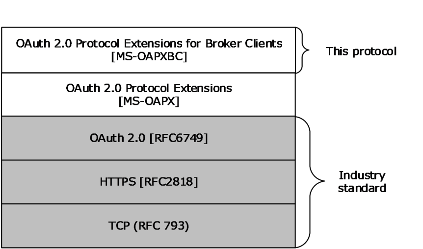

[MS-OAPXBC]:

OAuth 2.0 Protocol Extensions for Broker Clients

Intellectual Property Rights Notice for Open Specifications Documentation

  Technical Documentation. Microsoft publishes Open Specifications documentation (“this

documentation”) for protocols, file formats, data portability, computer languages, and standards
support. Additionally, overview documents cover inter-protocol relationships and interactions.

  Copyrights. This documentation is covered by Microsoft copyrights. Regardless of any other

terms that are contained in the terms of use for the Microsoft website that hosts this
documentation, you can make copies of it in order to develop implementations of the technologies
that are described in this documentation and can distribute portions of it in your implementations
that use these technologies or in your documentation as necessary to properly document the
implementation. You can also distribute in your implementation, with or without modification, any
schemas, IDLs, or code samples that are included in the documentation. This permission also
applies to any documents that are referenced in the Open Specifications documentation.
  No Trade Secrets. Microsoft does not claim any trade secret rights in this documentation.
  Patents. Microsoft has patents that might cover your implementations of the technologies

described in the Open Specifications documentation. Neither this notice nor Microsoft's delivery of
this documentation grants any licenses under those patents or any other Microsoft patents.
However, a given Open Specifications document might be covered by the Microsoft Open
Specifications Promise or the Microsoft Community Promise. If you would prefer a written license,
or if the technologies described in this documentation are not covered by the Open Specifications
Promise or Community Promise, as applicable, patent licenses are available by contacting
iplg@microsoft.com.

  License Programs. To see all of the protocols in scope under a specific license program and the

associated patents, visit the Patent Map.

  Trademarks. The names of companies and products contained in this documentation might be
covered by trademarks or similar intellectual property rights. This notice does not grant any
licenses under those rights. For a list of Microsoft trademarks, visit
www.microsoft.com/trademarks.

  Fictitious Names. The example companies, organizations, products, domain names, email

addresses, logos, people, places, and events that are depicted in this documentation are fictitious.
No association with any real company, organization, product, domain name, email address, logo,
person, place, or event is intended or should be inferred.

Reservation of Rights. All other rights are reserved, and this notice does not grant any rights other
than as specifically described above, whether by implication, estoppel, or otherwise.

Tools. The Open Specifications documentation does not require the use of Microsoft programming
tools or programming environments in order for you to develop an implementation. If you have access
to Microsoft programming tools and environments, you are free to take advantage of them. Certain
Open Specifications documents are intended for use in conjunction with publicly available standards
specifications and network programming art and, as such, assume that the reader either is familiar
with the aforementioned material or has immediate access to it.

Support. For questions and support, please contact dochelp@microsoft.com.

[MS-OAPXBC] - v20260414
OAuth 2.0 Protocol Extensions for Broker Clients
Copyright © 2026 Microsoft Corporation
Release: April 14, 2026

1 / 42

Revision Summary

Date

Revision
History

Revision
Class

Comments

10/16/2015  1.0

7/14/2016

2.0

9/26/2016

3.0

6/1/2017

4.0

6/13/2017

5.0

9/15/2017

6.0

12/1/2017

6.0

9/12/2018

7.0

4/7/2021

8.0

6/25/2021

8.0

10/6/2021

9.0

9/20/2023

10.0

10/9/2023

10.0

11/15/2023  11.0

2/14/2024

12.0

4/23/2024

13.0

4/14/2026

14.0

New

Major

Major

Major

Major

Major

None

Major

Major

None

Major

Major

None

Major

Major

Major

Major

Released new document.

Significantly changed the technical content.

Significantly changed the technical content.

Significantly changed the technical content.

Significantly changed the technical content.

Significantly changed the technical content.

No changes to the meaning, language, or formatting of the
technical content.

Significantly changed the technical content.

Significantly changed the technical content.

No changes to the meaning, language, or formatting of the
technical content.

Significantly changed the technical content.

Significantly changed the technical content.

No changes to the meaning, language, or formatting of the
technical content.

Significantly changed the technical content.

Significantly changed the technical content.

Significantly changed the technical content.

Significantly changed the technical content.

[MS-OAPXBC] - v20260414
OAuth 2.0 Protocol Extensions for Broker Clients
Copyright © 2026 Microsoft Corporation
Release: April 14, 2026

2 / 42

Table of Contents

1.1
1.2

1.2.1
1.2.2

1  Introduction ............................................................................................................ 5
Glossary ........................................................................................................... 5
References ........................................................................................................ 6
Normative References ................................................................................... 6
Informative References ................................................................................. 7
Overview .......................................................................................................... 8
Relationship to Other Protocols ............................................................................ 8
Prerequisites/Preconditions ................................................................................. 8
Applicability Statement ....................................................................................... 9
Versioning and Capability Negotiation ................................................................... 9
Vendor-Extensible Fields ..................................................................................... 9
Standards Assignments ....................................................................................... 9

1.3
1.4
1.5
1.6
1.7
1.8
1.9

2.2.1

2.1
2.2

2  Messages ............................................................................................................... 10
Transport ........................................................................................................ 10
Common Data Types ........................................................................................ 10
HTTP Headers ............................................................................................ 10
x-ms-RefreshTokenCredential ................................................................. 10
x-ms-DeviceCredential .......................................................................... 10
x-ms-SsoFlags ...................................................................................... 11
x-ms-SsoFlagsSubstatus ........................................................................ 11
Data Structures .......................................................................................... 11
krctx ................................................................................................... 11
Directory Service Schema Elements ................................................................... 12

2.2.1.1
2.2.1.2
2.2.1.3
2.2.1.4

2.2.2.1

2.2.2

2.3

3.1

3.1.5.1

3.1.5.1.2

3.1.5.1.1

3.1.1
3.1.2
3.1.3
3.1.4
3.1.5

3.1.5.1.1.1
3.1.5.1.1.2
3.1.5.1.1.3

3  Protocol Details ..................................................................................................... 13
OAuthBrokerExtension Client Details .................................................................. 13
Abstract Data Model .................................................................................... 13
Timers ...................................................................................................... 13
Initialization ............................................................................................... 13
Higher-Layer Triggered Events ..................................................................... 14
Message Processing Events and Sequencing Rules .......................................... 14
Token endpoint (/token) ........................................................................ 14
POST (Request for Nonce) ................................................................ 14
Request Body ............................................................................ 14
Response Body .......................................................................... 14
Processing Details ...................................................................... 14
POST (Request for Primary Refresh Token) ......................................... 14
Request Body ............................................................................ 15
Response Body .......................................................................... 15
Processing Details ...................................................................... 15
POST (Exchange Primary Refresh Token for Access Token) ................... 15
Request Body ............................................................................ 15
Response Body .......................................................................... 15
Processing Details ...................................................................... 15
POST (Exchange Primary Refresh Token for User Authentication Certificate)
 ..................................................................................................... 16
Request Body ............................................................................ 16
Response Body .......................................................................... 16
Processing Details ...................................................................... 16
Authorization endpoint (/authorize) ......................................................... 17
GET ............................................................................................... 17
Request Body ............................................................................ 17
Response Body .......................................................................... 17
Processing Details ...................................................................... 17

3.1.5.1.4.1
3.1.5.1.4.2
3.1.5.1.4.3

3.1.5.2.1.1
3.1.5.2.1.2
3.1.5.2.1.3

3.1.5.1.3.1
3.1.5.1.3.2
3.1.5.1.3.3

3.1.5.1.2.1
3.1.5.1.2.2
3.1.5.1.2.3

3.1.5.1.4

3.1.5.2.1

3.1.5.1.3

3.1.5.2

[MS-OAPXBC] - v20260414
OAuth 2.0 Protocol Extensions for Broker Clients
Copyright © 2026 Microsoft Corporation
Release: April 14, 2026

3 / 42

3.2

3.1.6
3.1.7

3.2.1
3.2.2
3.2.3
3.2.4
3.2.5

3.2.5.1

3.2.5.1.1

3.2.5.1.2

3.2.5.1.2.1

3.2.5.1.1.1
3.2.5.1.1.2
3.2.5.1.1.3

3.2.5.1.2.1.1
3.2.5.1.2.1.2
3.2.5.1.2.1.3
3.2.5.1.2.1.4

Timer Events .............................................................................................. 18
Other Local Events ...................................................................................... 18
OAuthBrokerExtension Server Details ................................................................. 18
Abstract Data Model .................................................................................... 18
Timers ...................................................................................................... 18
Initialization ............................................................................................... 18
Higher-Layer Triggered Events ..................................................................... 18
Message Processing Events and Sequencing Rules .......................................... 18
Token endpoint (/token) ........................................................................ 19
POST (Request for Nonce) ................................................................ 19
Request Body ............................................................................ 19
Response Body .......................................................................... 19
Processing Details ...................................................................... 20
POST (Request for Primary Refresh Token) ......................................... 20
Request Body ............................................................................ 20
Username Password Authentication ........................................ 21
User JWT Authentication ........................................................ 21
Refresh Token Authentication................................................. 22
User Certificate Authentication ............................................... 22
Response Body .......................................................................... 22
Processing Details ...................................................................... 23
POST (Exchange Primary Refresh Token for Access Token) ................... 24
Request Body ............................................................................ 24
Response Body .......................................................................... 25
Processing Details ...................................................................... 26
POST (Exchange Primary Refresh Token for User Authentication Certificate)
 ..................................................................................................... 26
Request Body ............................................................................ 26
Response Body .......................................................................... 27
Processing Details ...................................................................... 28
Authorization endpoint (/authorize) ......................................................... 30
GET ............................................................................................... 30
Request Body ............................................................................ 30
x-ms-RefreshTokenCredential HTTP header format ................... 30
x-ms-DeviceCredential HTTP header format ............................. 31
Response Body .......................................................................... 31
Processing Details ...................................................................... 31
Timer Events .............................................................................................. 32
Other Local Events ...................................................................................... 32

3.2.5.1.3.1
3.2.5.1.3.2
3.2.5.1.3.3

3.2.5.1.4.1
3.2.5.1.4.2
3.2.5.1.4.3

3.2.5.2.1.1.1
3.2.5.2.1.1.2

3.2.5.2.1.2
3.2.5.2.1.3

3.2.5.1.2.2
3.2.5.1.2.3

3.2.5.2.1.1

3.2.5.1.3

3.2.5.1.4

3.2.5.2

3.2.5.2.1

3.2.6
3.2.7

4  Protocol Examples ................................................................................................. 33
Obtain a Nonce ................................................................................................ 33
Obtain a Primary Refresh Token ......................................................................... 33
Obtain an Access Token .................................................................................... 34
Obtain a User Authentication Certificate .............................................................. 35

4.1
4.2
4.3
4.4

5  Security ................................................................................................................. 37
Security Considerations for Implementers ........................................................... 37
Index of Security Parameters ............................................................................ 37

5.1
5.2

6  Appendix A: Product Behavior ............................................................................... 38

7  Change Tracking .................................................................................................... 40

8  Index ..................................................................................................................... 41

[MS-OAPXBC] - v20260414
OAuth 2.0 Protocol Extensions for Broker Clients
Copyright © 2026 Microsoft Corporation
Release: April 14, 2026

4 / 42

1  Introduction

The OAuth 2.0 Protocol Extensions for Broker Clients (OAPXBC) specify extensions to the OAuth 2.0
Authorization Framework, specified in [RFC6749], that allow a high privilege broker client to obtain
access tokens on behalf of calling clients and how these tokens are accessed through the browser.

Sections 1.5, 1.8, 1.9, 2, and 3 of this specification are normative. All other sections and examples in
this specification are informative.

1.1  Glossary

This document uses the following terms:

Active Directory: The Windows implementation of a general-purpose directory service, which uses

LDAP as its primary access protocol. Active Directory stores information about a variety of
objects in the network such as user accounts, computer accounts, groups, and all related
credential information used by Kerberos [MS-KILE]. Active Directory is either deployed as
Active Directory Domain Services (AD DS) or Active Directory Lightweight Directory
Services (AD LDS), which are both described in [MS-ADOD]: Active Directory Protocols
Overview.

Active Directory Domain Services (AD DS): A directory service (DS) implemented by a domain
controller (DC). The DS provides a data store for objects that is distributed across multiple
DCs. The DCs interoperate as peers to ensure that a local change to an object replicates
correctly across DCs.  AD DS is a deployment of Active Directory [MS-ADTS].

Active Directory Federation Services (AD FS): A Microsoft implementation of a federation

services provider, which provides a security token service (STS) that can issue security tokens
to a caller using various protocols such as WS-Trust, WS-Federation, and Security Assertion
Markup Language (SAML) version 2.0.

AD FS behavior level: A specification of the functionality available in an AD FS server. Possible
values such as AD_FS_BEHAVIOR_LEVEL_1 and AD_FS_BEHAVIOR_LEVEL_2 are described in
[MS-OAPX].

AD FS server: See authorization server in [RFC6749].

base64 encoding: A binary-to-text encoding scheme whereby an arbitrary sequence of bytes is

converted to a sequence of printable ASCII characters, as described in [RFC4648].

Certificate Management Messages over CMS (CMC): An internet standard for transport

mechanisms for CMS [RFC2797].

Cryptographic Message Syntax (CMS): A public standard that defines how to digitally sign,

digest, authenticate, or encrypt arbitrary message content, as specified in [RFC3852].

domain controller (DC): The service, running on a server, that implements Active Directory, or
the server hosting this service. The service hosts the data store for objects and interoperates
with other DCs to ensure that a local change to an object replicates correctly across all DCs.
When Active Directory is operating as Active Directory Domain Services (AD DS), the DC
contains full NC replicas of the configuration naming context (config NC), schema naming
context (schema NC), and one of the domain NCs in its forest. If the AD DS DC is a global
catalog server (GC server), it contains partial NC replicas of the remaining domain NCs in its
forest. For more information, see [MS-AUTHSOD] section 1.1.1.5.2 and [MS-ADTS]. When
Active Directory is operating as Active Directory Lightweight Directory Services (AD LDS),
several AD LDS DCs can run on one server. When Active Directory is operating as AD DS,
only one AD DS DC can run on one server. However, several AD LDS DCs can coexist with one
AD DS DC on one server. The AD LDS DC contains full NC replicas of the config NC and the

5 / 42

[MS-OAPXBC] - v20260414
OAuth 2.0 Protocol Extensions for Broker Clients
Copyright © 2026 Microsoft Corporation
Release: April 14, 2026

schema NC in its forest. The domain controller is the server side of Authentication Protocol
Domain Support [MS-APDS].

JavaScript Object Notation (JSON): A text-based, data interchange format that is used to

transmit structured data, typically in Asynchronous JavaScript + XML (AJAX) web applications,
as described in [RFC7159]. The JSON format is based on the structure of ECMAScript (Jscript,
JavaScript) objects.

JSON Web Token (JWT): A string representing a set of claims as a JSON object that is encoded

in a JWS or JWE, enabling the claims to be digitally signed or integrity protected with a Message
Authentication Code (MAC) and/or encrypted. For more information, see [RFC7519].

key: In the registry, a node in the logical tree of the data store.

OAuth logon certificate request: An OAuth request in which a resource, or relying party, acts as

a client and uses a previously received access token to request an X.509 certificate. The
resulting certificate represents the same identity represented by the access token.

public key: One of a pair of keys used in public-key cryptography. The public key is distributed
freely and published as part of a digital certificate. For an introduction to this concept, see
[CRYPTO] section 1.8 and [IEEE1363] section 3.1.

relying party (RP): A web application or service that consumes security tokens issued by a

security token service (STS).

Uniform Resource Identifier (URI): A string that identifies a resource. The URI is an addressing
mechanism defined in Internet Engineering Task Force (IETF) Uniform Resource Identifier (URI):
Generic Syntax [RFC3986].

X.509: An ITU-T standard for public key infrastructure subsequently adapted by the IETF, as

specified in [RFC3280].

MAY, SHOULD, MUST, SHOULD NOT, MUST NOT: These terms (in all caps) are used as defined
in [RFC2119]. All statements of optional behavior use either MAY, SHOULD, or SHOULD NOT.

1.2  References

Links to a document in the Microsoft Open Specifications library point to the correct section in the
most recently published version of the referenced document. However, because individual documents
in the library are not updated at the same time, the section numbers in the documents may not
match. You can confirm the correct section numbering by checking the Errata.

1.2.1  Normative References

We conduct frequent surveys of the normative references to assure their continued availability. If you
have any issue with finding a normative reference, please contact dochelp@microsoft.com. We will
assist you in finding the relevant information.

[FIPS180-2] National Institute of Standards and Technology, "Secure Hash Standard", FIPS PUB 180-
2, August 2002, http://csrc.nist.gov/publications/fips/fips180-2/fips180-2.pdf

[MS-ADA1] Microsoft Corporation, "Active Directory Schema Attributes A-L".

[MS-ADA2] Microsoft Corporation, "Active Directory Schema Attributes M".

[MS-ADSC] Microsoft Corporation, "Active Directory Schema Classes".

[MS-ADTS] Microsoft Corporation, "Active Directory Technical Specification".

[MS-OAPXBC] - v20260414
OAuth 2.0 Protocol Extensions for Broker Clients
Copyright © 2026 Microsoft Corporation
Release: April 14, 2026

6 / 42

[MS-KPP] Microsoft Corporation, "Key Provisioning Protocol".

[MS-OAPX] Microsoft Corporation, "OAuth 2.0 Protocol Extensions".

[MS-OIDCE] Microsoft Corporation, "OpenID Connect 1.0 Protocol Extensions".

[MS-WCCE] Microsoft Corporation, "Windows Client Certificate Enrollment Protocol".

[MSKB-4022723] Microsoft Corporation, "June 27, 2017 - KB4022723 (OS Build 14393.1378)",
https://support.microsoft.com/en-us/kb/4022723

[MSKB-4088889] Microsoft Corporation, "March 22, 2018 - KB4088889 (OS Build 14393.2155)",
https://support.microsoft.com/en-us/help/4088889

[OIDCCore] Sakimura, N., Bradley, J., Jones, M., de Medeiros, B., and Mortimore, C., "OpenID
Connect Core 1.0 incorporating errata set 1", November 2014, http://openid.net/specs/openid-
connect-core-1_0.html

[RFC2119] Bradner, S., "Key words for use in RFCs to Indicate Requirement Levels", BCP 14, RFC
2119, March 1997, https://www.rfc-editor.org/info/rfc2119

[RFC2818] Rescorla, E., "HTTP Over TLS", RFC 2818, May 2000, https://www.rfc-
editor.org/info/rfc2818

[RFC4648] Josefsson, S., "The Base16, Base32, and Base64 Data Encodings", RFC 4648, October
2006, https://www.rfc-editor.org/info/rfc4648

[RFC6749] Hardt, D., Ed., "The OAuth 2.0 Authorization Framework", RFC 6749, October 2012,
https://www.rfc-editor.org/info/rfc6749

[RFC7515] Jones, M., Bradley, J., and Sakimura, N., "JSON Web Signature (JWS)", RFC 7515, May
2015, https://www.rfc-editor.org/info/rfc7515

[RFC7516] Jones, M., and Hildebrand, J., "JSON Web Encryption (JWE)", RFC 7516, May 2015,
https://www.rfc-editor.org/info/rfc7516

[RFC7519] Internet Engineering Task Force, "JSON Web Token (JWT)", https://www.rfc-
editor.org/info/rfc7519

[SP800-108] National Institute of Standards and Technology., "Special Publication 800-108,
Recommendation for Key Derivation Using Pseudorandom Functions", October 2009,
https://csrc.nist.gov/publications/detail/sp/800-108/final

1.2.2  Informative References

[MSFT-CVE-2021-33781] Microsoft Corporation, "Azure AD Security Feature Bypass Vulnerability",
CVE-2021-33781, July 13, 2021, https://msrc.microsoft.com/update-guide/vulnerability/CVE-2021-
33781

[MSFT-CVE-2023-35348] Microsoft Corporation, "CVE-2023-35348 Security Vulnerability", CVE-2023-
35348, https://msrc.microsoft.com/update-guide/vulnerability/

[MSFT-CVE-2026-27928] Microsoft Corporation, "Windows Hello Security Feature Bypass
Vulnerability", CVE-2026-27928, April 14, 2026, https://msrc.microsoft.com/update-
guide/vulnerability/CVE-2026-27928

[MS-OAPXBC] - v20260414
OAuth 2.0 Protocol Extensions for Broker Clients
Copyright © 2026 Microsoft Corporation
Release: April 14, 2026

7 / 42

<!-- Extracted images from page 8 -->

<!-- /Extracted images from page 8 -->

1.3  Overview

The OAuth 2.0 Protocol Extensions for Broker Clients (OAPXBC) specify extensions to the OAuth 2.0
Authorization Framework defined in [RFC6749]. These extensions allow a high privilege broker client
to obtain access tokens on behalf of calling clients and how these tokens are accessed through the
browser.

Active Directory Federation Services (AD FS) implements parts of the OAuth 2.0 Authorization
Framework defined in [RFC6749] as well as the extensions described in [MS-OAPX]. In addition to
these, AD FS also implements extensions to enable broker clients to retrieve tokens from an
authorization server on behalf of other clients. When no AD FS behavior level is specified, the details
apply to all AD FS behavior levels.

Note: Throughout this specification, the fictitious names "client.example.com" and
"server.example.com" are used as they are used in [RFC6749].

1.4  Relationship to Other Protocols

The OAuth 2.0 Protocol Extensions for Broker Clients specify extensions to the industry standard
OAuth 2.0 Authorization Framework that is defined in [RFC6749] and the extensions described in [MS-
OAPX]. These extensions are therefore dependent on the OAuth 2.0 protocol and the extensions in
[MS-OAPX] and use HTTPS [RFC2818] as the underlying transport protocol. The following figure shows
the relationships of these RFCs and protocols.

Figure 1: Protocol dependency

1.5  Prerequisites/Preconditions

The OAuth 2.0 Protocol Extensions for Broker Clients define extensions to [RFC6749] and [MS-OAPX].
A prerequisite to implementing the OAuth 2.0 Protocol Extensions is that the REQUIRED parts of
[RFC6749] have been implemented on the AD FS server.

These extensions also assume that if the OAuth 2.0 client requests authorization for a particular
resource, or relying party, secured by the AD FS server, the client knows the identifier of that
resource. These extensions also assume that the OAuth 2.0 client knows its own client identifier and
all relevant client authentication information if it is a confidential client.

The client runs on a device for which there is a corresponding msDS-Device object in Active Directory
with the following additional requirements:

[MS-OAPXBC] - v20260414
OAuth 2.0 Protocol Extensions for Broker Clients
Copyright © 2026 Microsoft Corporation
Release: April 14, 2026

8 / 42





The client has access to the private key of a device certificate (defined in section 3.1.1). The
public portion of the device certificate is stored in the altSecurityIdentities attribute of the
device's msDS-Device object in Active Directory.

The client has access to the private key of a session transport key (STK) (defined in section
3.1.1). The public portion of the STK is stored in the msDS-KeyCredentialLink attribute of the
device's msDS-Device object in Active Directory.

The OAuth 2.0 Protocol Extensions for Broker Clients assume that they, the OAuth 2.0 Protocol
Extensions [MS-OAPX], and the OpenID Connect 1.0 Protocol Extensions [MS-OIDCE], if being used,
are all be running on the same AD FS server.

1.6  Applicability Statement

The OAuth 2.0 Protocol Extensions for Broker Clients are supported by all AD FS servers that are at
an AD FS behavior level of AD_FS_BEHAVIOR_LEVEL_2 or higher. See [MS-OAPX] section 3.2.1.1
for the formal definition of AD FS behavior level.

1.7  Versioning and Capability Negotiation

This document covers versioning issues in the following areas:

Supported Transports: The OAuth 2.0 Protocol Extensions for Broker Clients support only HTTPS
[RFC2818] as the transport protocol.

Protocol Versions: The OAuth 2.0 Protocol Extensions for Broker Clients do not define protocol
versions.

Localization: The OAuth 2.0 Protocol Extensions for Broker Clients do not return localized strings.

Capability Negotiation: The OAuth 2.0 Protocol Extensions for Broker Clients do not support
capability negotiation.

1.8  Vendor-Extensible Fields

None.

1.9  Standards Assignments

None.

[MS-OAPXBC] - v20260414
OAuth 2.0 Protocol Extensions for Broker Clients
Copyright © 2026 Microsoft Corporation
Release: April 14, 2026

9 / 42

2  Messages

2.1  Transport

The HTTPS protocol [RFC2818] MUST be used as the transport.

2.2  Common Data Types

2.2.1  HTTP Headers

The messages exchanged in the OAuth 2.0 Protocol Extensions for Broker Clients use the following
HTTP headers in addition to the existing set of standard HTTP headers.

Header

Description

x-ms-
RefreshTokenCredential

This optional header can be used by the client to specify a primary refresh token
when contacting the authorization endpoint.

x-ms-DeviceCredential

This optional header can be used by the client to prove the identity of the device
from which the request is sent when contacting the authorization endpoint.

x-ms-SsoFlags

This optional header can be used by the client to provide the state of the automatic
app sign in policy when contracting the authorization endpoint.

x-ms-SsoFlagsSubstatus

This optional header can be used by the client to provide additional information for
the x-ms-SsoFlags. The value for this header MUST be base64-encoded JSON
format.

2.2.1.1  x-ms-RefreshTokenCredential

The x-ms-RefreshTokenCredential HTTP header is optional and can be specified by the client role
of the OAuth 2.0 Protocol Extensions for Broker Clients. This header is used to pass a previously
obtained primary refresh token to the authorization endpoint of the AD FS server. The primary
refresh token can be used by the server to authenticate the user and the device on which the client
runs when processing the authorization request.

The value of the x-ms-RefreshTokenCredential HTTP header MUST be a signed JWT. The signed
JWT format is defined in [RFC7519]. The format for the x-ms-RefreshTokenCredential header is as
follows.

 String = *(%x20-7E)
 x-ms-RefreshTokenCredential = String

2.2.1.2  x-ms-DeviceCredential

The x-ms-DeviceCredential HTTP header is optional and can be specified by the client role of the
OAuth 2.0 Protocol Extensions for Broker Clients. This header is used to authenticate the device on
which the client is running.

The value of the x-ms-DeviceCredential HTTP header MUST be a signed JWT. The signed JWT
format is defined in [RFC7519]. The format for the x-ms-DeviceCredential header is as follows.

 String = *(%x20-7E)

[MS-OAPXBC] - v20260414
OAuth 2.0 Protocol Extensions for Broker Clients
Copyright © 2026 Microsoft Corporation
Release: April 14, 2026

10 / 42

 x-ms-DeviceCredential = String

2.2.1.3  x-ms-SsoFlags

The x-ms-SsoFlags HTTP header is optional. This header is used to provide the state of the
automatic app sign in policy on the device which the client is running.

The value of the x-ms-SsoFlags HTTP header is strings. The format for the x-ms-SsoFlags header is
as follows.

 x-ms-SsoFlags = <Flag 1>|<Flag 2>|<Flag 3>

2.2.1.4  x-ms-SsoFlagsSubstatus

The x-ms-SsoFlagsSubstatus HTTP header is optional. This header is used to provide additional
information for the x-ms-SsoFlags policy state.

The value of the x-ms-SsoFlagsSubstatus HTTP header MUST be base64-encoded JSON. The
format for the x-ms-SsoFlagsSubstatus header is as follows.

 x-ms-SsoFlagsSubstatus = Based64Encoded({"<key1>":"<value1>", "<key2>:"<value2>"})

2.2.2  Data Structures

The following table summarizes the set of common data structures that are defined by this
specification.

Data structure

Section

Description

krctx

2.2.2.1

OPTIONAL. The OAuth 2.0 client includes this parameter in the POST
body of a request when the OAuth logon certificate request needs
to be authorized.

2.2.2.1  krctx

 POST /token HTTP/1.1
 Host: server.example.com
 Content-Type: application/x-www-form-urlencoded
 grant_type={grant_type}&client_id={client_id}&redirect_uri={redirect_uri}&requested_token_use
={requested_token_use}&assertion={assertion}&csr={csr}&csr_type={csr_type}&krctx={krctx}

Note: For details about the requested_token_use and assertion parameters, see [MS-OAPX] section
2.2.3.

OPTIONAL

The krctx parameter is optional and can be specified by the client role of the OAuth 2.0 Protocol
Extensions for Broker Clients in the POST body when making a request to the token endpoint (section
3.1.5.1). The client provides a base64-encoded JSON value in the krctx parameter when making an
OAuth logon certificate request.

[MS-OAPXBC] - v20260414
OAuth 2.0 Protocol Extensions for Broker Clients
Copyright © 2026 Microsoft Corporation
Release: April 14, 2026

11 / 42

The AD FS server ignores this parameter unless its AD FS behavior level  is
AD_FS_BEHAVIOR_LEVEL_3 or higher ([MS-OAPX] section 3.2.1.1) and the AD FS server is capable of
processing the parameter, as indicated by the value "winhello_cert_kr" being included in the
capabilities field of the OpenID Provider Metadata ([MS-OIDCE] section 2.2.3.2).<1>

The format for the krctx parameter is as follows:

 String = *(%x20-7E)
 krctx = String

where the value of krctx has the following structure:

 {
         "Data": {
             "type": "string"
         },
         "Format": {
             "type": "integer"
         },
         "Version": {
             "type": "integer"
         }
 }

Property

Value

Data

Format

Version

A base64-encoded JSON Web Token (JWT). This property is used to authorize the OAuth
logon certificate request (section 3.1.5.1.4.1).

MUST be set to "1".

MUST be set to "1".

2.3  Directory Service Schema Elements

This protocol accesses the Directory Service schema classes and attributes that are listed in the
following table(s).

For the syntax of <Class> or <Class><Attribute> pairs, refer to one of the following:

  Active Directory Domain Services (AD DS) [MS-ADA1] [MS-ADA2] [MS-ADSC]

Class

msDS-Device

Attribute

altSecurityIdentities

msDS-KeyCredentialLink

user

msDS-KeyCredentialLink

[MS-OAPXBC] - v20260414
OAuth 2.0 Protocol Extensions for Broker Clients
Copyright © 2026 Microsoft Corporation
Release: April 14, 2026

12 / 42

3  Protocol Details

3.1  OAuthBrokerExtension Client Details

The client role of the OAuth 2.0 Protocol Extensions for Broker Clients is the initiator of requests for
access tokens on behalf of other clients. The client role also stores data that is important to these
requests such as a nonce and the primary refresh token.

3.1.1  Abstract Data Model

This section describes a conceptual model of possible data organization that an implementation
maintains to participate in this protocol. The described organization is provided to facilitate the
explanation of how the protocol behaves. This document does not mandate that implementations
adhere to this model as long as their external behavior is consistent with that described in this
document.

The client role is expected to be aware of the relying party or resource identifier of the resource
server if it requests authorization for a particular resource. See [MS-OAPX] section 3.2.5.2.1.1 for
information about the resource parameter.

The following elements are defined by this protocol:

Client Identifier: An identifier, represented as a string, that uniquely identifies the client to the

server.

Nonce: An opaque, base64-encoded value that is provided by the server and used in requests for a

primary refresh token.

Primary Refresh Token: A refresh token that the client can exchange for access tokens from the

server.

Session Key: A key used to sign access token requests and decrypt access token responses. The

client receives this key from the server in the response that is described in section 3.1.5.1.2.2.
This key MUST be stored in a secure manner.

Device Certificate: An X.509 certificate that represents the device on which the client runs. The

client MUST have access to the private key. The altSecurityIdentities attribute of an msDS-Device
object in Active Directory is used to store and access the public portion of the certificate.

Session Transport Key: A key used to decrypt the session key. The msDS-KeyCredentialLink

attribute of an msDS-Device object in Active Directory is used to store and access the key. The
msDS-Device object MUST be the same object in Active Directory that contains the public portion
of the Device Certificate.

User Authentication Key: A key used to authenticate an end user. The msDS-KeyCredentialLink

attribute of a user object in Active Directory is used to store and access the public portion of the
key.

3.1.2  Timers

None.

3.1.3  Initialization

The OAuth 2.0 Protocol Extensions for Broker Clients do not define any special initialization
requirements.

13 / 42

[MS-OAPXBC] - v20260414
OAuth 2.0 Protocol Extensions for Broker Clients
Copyright © 2026 Microsoft Corporation
Release: April 14, 2026

3.1.4  Higher-Layer Triggered Events

None.

3.1.5  Message Processing Events and Sequencing Rules

The resources that are accessed and manipulated by this protocol are defined in [RFC6749] and
shown below for reference.

Resource

Description

Token endpoint (/token)

For a description, see section 3.2.5.

Authorization endpoint (/authorize)  For a description, see section 3.2.5.

The HTTP responses to all the HTTP methods are defined in corresponding sections of [RFC6749].

3.1.5.1  Token endpoint (/token)

The following HTTP method is allowed to be performed on this resource.

HTTP method  Description

POST

For a description, see section 3.2.5.1.

3.1.5.1.1 POST (Request for Nonce)

This method requests a nonce value from the server that the client then includes in a future request
for a primary refresh token, as defined in section 3.1.5.1.2.

This operation is transported by an HTTP POST and can be invoked through the following URI:

 /token

3.1.5.1.1.1  Request Body

The format of the request is defined in section 3.2.5.1.1.1.

3.1.5.1.1.2  Response Body

The format of the response is defined in section 3.2.5.1.1.2.

3.1.5.1.1.3  Processing Details

The nonce that is received in the response body of this request is stored in the Nonce abstract data
model element (section 3.1.1). This nonce is used in a future request for a primary refresh token, as
defined in section 3.1.5.1.2.

3.1.5.1.2 POST (Request for Primary Refresh Token)

This method requests a primary refresh token that the client can then exchange for access tokens or
user authentication certificates, as defined in sections 3.1.5.1.3 and 3.1.5.1.4.

This operation is transported by an HTTP POST and can be invoked through the following URI:

14 / 42

[MS-OAPXBC] - v20260414
OAuth 2.0 Protocol Extensions for Broker Clients
Copyright © 2026 Microsoft Corporation
Release: April 14, 2026

 /token

3.1.5.1.2.1  Request Body

The format of the request is defined in section 3.2.5.1.2.1.

3.1.5.1.2.2  Response Body

The format of the response is defined in section 3.2.5.1.2.2.

3.1.5.1.2.3  Processing Details

Request processing:

The client uses the Nonce abstract data model (ADM) element value (section 3.1.1) that it received
from the server in a previous nonce request (section 3.1.5.1.1) to populate the request_nonce field
of the request. If using user JSON Web Token (JWT) authentication, as described in section
3.2.5.1.2.1.2, the same Nonce should be populated as a request_nonce field in the JWT assertion
before signing it.

Note: This feature is supported by the operating systems specified in [MSFT-CVE-2023-35348], each
with its related KB article download installed.

The client signs the request JWT described in section 3.1.5.1.2.1 using the private key of the Device
Certificate ADM element (section 3.1.1).

If using user JWT authentication as described in section 3.2.5.1.2.1.2, the client signs the assertion
JWT using the private key of the User Authentication Key ADM element (section 3.1.1), and sets
the kid field of the assertion JWT to the SHA-256 hash (see [FIPS180-2] section 6.2.2) of the public
key of the User Authentication Key ADM element (section 3.1.1).

Response processing:

The client stores the refresh_token field of the response in the Primary Refresh Token ADM
element (section 3.1.1).

The client decrypts the session_key_jwe field of the response by following the process described in
[RFC7516] section 5.2 and by using the Session Transport Key ADM element (section 3.1.1).  The
client stores the decrypted key in the Session Key ADM element.

3.1.5.1.3 POST (Exchange Primary Refresh Token for Access Token)

This method exchanges a primary refresh token for an access token.

This operation is transported by an HTTP POST and can be invoked through the following URI:

 /token

3.1.5.1.3.1  Request Body

The format of the request is defined in section 3.2.5.1.3.1.

3.1.5.1.3.2  Response Body

The format of the response is defined in section 3.2.5.1.3.2.

3.1.5.1.3.3  Processing Details

[MS-OAPXBC] - v20260414
OAuth 2.0 Protocol Extensions for Broker Clients
Copyright © 2026 Microsoft Corporation
Release: April 14, 2026

15 / 42

The client first requests a primary refresh token from the server as defined in sections 3.1.5.1.2 and
3.2.5.1.2. It then uses the Primary Refresh Token ADM element (section 3.1.1) to populate the
refresh_token field in this request for the access token.

The client derives a signing key from the Session Key ADM element (section 3.1.1), the constant
label "AzureAD-SecureConversation", and the ctx value provided in the JWT header of the request by
using the process described in [SP800-108]. The client uses this signing key to sign the request. If the
capabilities field of the OpenID Provider Metadata ([MS-OIDCE] section 2.2.3.2) from the server
includes the value "kdf_ver2", the client can use KDFv2 version<2> for deriving the Session Key. If
the client chooses to use KDFv2, the client MUST use SHA256(ctx || assertion payload) instead of ctx
as the context for deriving the signing key. The client MUST also add the JWT header field "kdf_ver"
with value set to 2 to communicate that KDFv2 was used to create the derived signing key.

3.1.5.1.4 POST (Exchange Primary Refresh Token for User Authentication Certificate)

This method exchanges a primary refresh token for a user authentication certificate.<3>

This operation is transported by an HTTP POST and can be invoked through the following URI:

 /token

3.1.5.1.4.1  Request Body

The format of the request is defined in section 3.2.5.1.4.1.

3.1.5.1.4.2  Response Body

The format of the response is defined in section 3.2.5.1.4.2.

3.1.5.1.4.3  Processing Details

When the client obtains the OpenID Provider Metadata from the server ([MS-OIDCE] section 2.2.3.2),
it checks for the capabilities field. If the field exists in the metadata and includes the value
"winhello_cert", the client can proceed with this request for a user authentication certificate.

The client first requests a primary refresh token from the server as defined in sections 3.1.5.1.2 and
3.2.5.1.2. It then uses the Primary Refresh Token ADM element (section 3.1.1) to populate the
refresh_token field in this request for the user authentication certificate. If the capabilities field of
the OpenID Provider Metadata ([MS-OIDCE] section 2.2.3.2) from the server includes the value
"kdf_ver2", the client can use KDFv2 version for deriving the Session Key. If the client chooses to
use KDFv2, the client MUST use SHA256(ctx || assertion payload) instead of ctx as the context for
deriving the signing key. The client MUST also add the JWT header field "kdf_ver" with the value set
to 2 to communicate that KDFv2 was used for creating the derived signing key.

The client constructs a base64-encoded PKCS #10 certificate request ([MS-WCCE] section 2.2.2.6.1)
using the User Authentication Key ADM element (section 3.1.1), and uses it to populate the csr
field in this request for the user authentication certificate.

In some cases, the client will have previously registered the public portion of the key that is stored in
the User Authentication Key ADM element (section 3.1.1) via the Key request defined in [MS-KPP]
section 3.1.5.1. In those cases, the client might have received a value in the pctx field of that
response ([MS-KPP] section 3.1.5.1.1.2) and stored it in the Data Store Information ADM element
of [MS-KPP] section 3.2.1. If this is true, then the client SHOULD populate the pctx field of this
request with that value.

The client derives a signing key from the Session Key ADM element (section 3.1.1), the constant
label "AzureAD-SecureConversation", and the ctx value provided in the JWT header of the request by
using the process described in [SP800-108]. The client uses this signing key to sign the request.

16 / 42

[MS-OAPXBC] - v20260414
OAuth 2.0 Protocol Extensions for Broker Clients
Copyright © 2026 Microsoft Corporation
Release: April 14, 2026

If the capabilities field of the OpenID Provider Metadata from the server includes the value
"winhello_cert_kr", the client can include the krctx parameter, set to a value that contains a JWT. The
JWT is structured as defined in section 2.2.2.1 and contains the data defined in section 3.2.5.1.4.3.
The "winhello_cert_kr" value is supported on the AD FS server only if its AD FS behavior level is
AD_FS_BEHAVIOR_LEVEL_3 or higher. See section 2.2.2.1 for additional support information.

3.1.5.2  Authorization endpoint (/authorize)

As defined in [RFC6749] section 3.1 (Authorization Endpoint), the authorization endpoint on the
authorization server is used to interact with the resource owner and obtain an authorization grant. The
following HTTP method is allowed to be performed on this endpoint.

HTTP method  Description

GET

For a description, see section 3.2.5.2.

3.1.5.2.1 GET

For the syntax and semantics of the GET method, see section 3.2.5.2.1.

The request, response, and processing details are the same as those specified in [MS-OAPX] section
3.1.5.1.1, with the following additions.

3.1.5.2.1.1  Request Body

The format of the request is defined in section 3.2.5.2.1.1.

3.1.5.2.1.2  Response Body

The response body of this method is the same as that specified in [MS-OAPX] section 3.1.5.1.1.2.

3.1.5.2.1.3  Processing Details

The processing details are the same as those specified in [MS-OAPX] section 3.1.5.1.1.3, with the
following addition.

If a primary refresh token is available to the client in the Primary Refresh Token ADM element
(section 3.1.1), the client can choose to include the token in the optional x-ms-
RefreshTokenCredential HTTP header. The format of the x-ms-RefreshTokenCredential HTTP header is
a signed JWT as defined in section 2.2.1.1, with the fields described in section 3.2.5.2.1.1.1. The
client populates the header as follows:





The client uses the Primary Refresh Token ADM element to populate the required
refresh_token field of the x-ms-RefreshTokenCredential HTTP header.

The client uses the Nonce ADM element value (section 3.1.1) that it received from the server in a
previous nonce request (section 3.1.5.1.1) to populate the required request_nonce field of the x-
ms-RefreshTokenCredential HTTP header.

The client derives a signing key from the Session Key ADM element (section 3.1.1), the constant
label "AzureAD-SecureConversation", and the ctx value provided in the JWT header of the request by
using the process described in [SP800-108]. The client uses this signing key to sign the JWT. If the
capabilities field of the OpenID Provider Metadata ([MS-OIDCE] section 2.2.3.2) from the server
includes the value "kdf_ver2", the client can use KDFv2 version for deriving the Session Key. If the
client chooses to use KDFv2, the client MUST use SHA256(ctx || assertion payload) instead of ctx as

[MS-OAPXBC] - v20260414
OAuth 2.0 Protocol Extensions for Broker Clients
Copyright © 2026 Microsoft Corporation
Release: April 14, 2026

17 / 42

the context for deriving the signing key. The client MUST also add the JWT header field "kdf_ver" with
value set to 2 to communicate that KDFv2 was used for creating the derived signing key.

If a certificate is available to the client in the Device Certificate ADM element (section 3.1.1), the
client can include the optional x-ms-DeviceCredential HTTP header. The format of the x-ms-
DeviceCredential HTTP header is a signed JWT as defined in section 2.2.1.2, with the fields described
in section 3.2.5.2.1.1.2. The client populates the header as follows:



The client uses the Nonce ADM element value (section 3.1.1) that it received from the server in a
previous nonce request (section 3.1.5.1.1) to populate the request_nonce field of the request.

The client signs the request JWT described in section 3.1.5.1.2.1 using the private key of the Device
Certificate ADM element.

Note The client can include both the x-ms-RefreshTokenCredential HTTP header and the x-ms-
DeviceCredential HTTP header in a request, but the server ignores the x-ms-DeviceCredential HTTP
header if the x-ms-RefreshTokenCredential HTTP header that is provided is valid.

3.1.6  Timer Events

None.

3.1.7  Other Local Events

None.

3.2  OAuthBrokerExtension Server Details

The server role of the OAuth 2.0 Protocol Extensions for Broker Clients corresponds to the notion of an
authorization server as defined in [RFC6749] section 1.1 (Roles). The server role responds to the
client's requests for a nonce, a primary refresh token, and access tokens.

3.2.1  Abstract Data Model

None.

3.2.2  Timers

None.

3.2.3  Initialization

The OAuth 2.0 Protocol Extensions for Broker Clients do not define any special initialization
requirements.

3.2.4  Higher-Layer Triggered Events

None.

3.2.5  Message Processing Events and Sequencing Rules

The resources accessed and manipulated by this protocol are defined in [RFC6749] and are shown
below for reference.

[MS-OAPXBC] - v20260414
OAuth 2.0 Protocol Extensions for Broker Clients
Copyright © 2026 Microsoft Corporation
Release: April 14, 2026

18 / 42

Resource

Description

Token endpoint
(/token)

As defined in [RFC6749] section 3.2 (Token Endpoint), the token endpoint on the
authorization server is used by an OAuth 2.0 client to obtain an access token by
presenting its authorization grant or refresh token.

Authorization
endpoint (/authorize)

As defined in [RFC6749] section 3.1 (Authorization Endpoint), the authorization endpoint
is used to interact with the resource owner and obtain an authorization grant.

The HTTP responses to all the HTTP methods are defined in corresponding sections of [RFC6749].

3.2.5.1  Token endpoint (/token)

As defined in [RFC6749] section 3.2 (Token Endpoint), the token endpoint on the AD FS server is
used by an OAuth 2.0 client to obtain an access token by presenting its authorization grant or refresh
token. The following HTTP method is allowed to be performed on this endpoint.

HTTP
method

POST

Description

An access token request issued by the OAuth 2.0 client to the token endpoint of the AD FS server
in accordance with the requirements of [RFC6749] section 4.1.3 (Access Token Request).

3.2.5.1.1 POST (Request for Nonce)

This method requests a nonce value from the server that the client then includes in a future request
for a primary refresh token, as defined in section 3.2.5.1.2.

This operation is transported by an HTTP POST and can be invoked through the following URI:

 /token

3.2.5.1.1.1  Request Body

To request a nonce, the client creates and sends the following request body.

 POST /token HTTP/1.1
 Content-Type: application/x-www-form-urlencoded

 grant_type=srv_challenge

3.2.5.1.1.2  Response Body

The server sends the following response body for this request.

 HTTP/1.1 200 OK
 Cache-Control: no-store
 Pragma: no-cache
 Content-Type: application/json;charset=UTF-8

 {"Nonce":<nonce>}

The response contains a JSON object with one element:

[MS-OAPXBC] - v20260414
OAuth 2.0 Protocol Extensions for Broker Clients
Copyright © 2026 Microsoft Corporation
Release: April 14, 2026

19 / 42

Nonce (REQUIRED): An opaque, base64 URL-encoded value ([RFC4648] section 5). Padding is not

required ([RFC4648] section 3.2).  It is to be used by the client in a future request for a primary
refresh token.

3.2.5.1.1.3  Processing Details

Generation of the Nonce field of the response is implementation specific, provided that the nonce
meets the following requirements:







The server MUST be able to verify that any nonce value received from the client in a request for a
primary refresh token (section 3.2.5.1.2) matches a nonce that was previously issued by the
server.

The server SHOULD be able to verify that any nonce value received from the client in a request for
a primary refresh token matches a nonce that was issued recently (see section 3.2.5.1.2.3).

The server SHOULD use a method that makes it difficult for an attacker to guess valid nonce
values.

3.2.5.1.2 POST (Request for Primary Refresh Token)

This method requests a primary refresh token that the client can then exchange for access tokens or
user authentication certificates, as defined in sections 3.2.5.1.3 and 3.2.5.1.4.

This operation is transported by an HTTP POST and can be invoked through the following URI:

 /token

3.2.5.1.2.1  Request Body

A signed request is passed as a JSON Web Token (JWT), as specified in [OIDCCore] section 6.1,
and the JWT is signed with a device key.

The format of the signed request is as follows:

 POST /token HTTP/1.1
 Content-Type: application/x-www-form-urlencoded
 grant_type=urn:ietf:params:oauth:grant-type:jwt-bearer&request=<signed JWT>

The signed JWT format is defined in [RFC7519].

The JWT fields MUST be given the following values:

client_id (REQUIRED): A unique identifier for the broker client.<4>

scope (REQUIRED): MUST contain at least the scopes "aza" and "openid". Additional scopes can be

included and follow the format described in [RFC6749] section 3.3.

request_nonce (REQUIRED): A nonce previously obtained from the server by making the request

described in section 3.1.5.1.1.

Additionally, the client MUST provide user authentication in the request. The client does this by
including the JWT fields from one of the following:

  Section 3.2.5.1.2.1.1 for username and password authentication.

  Section 3.2.5.1.2.1.2 if using a signed JWT for authentication.

[MS-OAPXBC] - v20260414
OAuth 2.0 Protocol Extensions for Broker Clients
Copyright © 2026 Microsoft Corporation
Release: April 14, 2026

20 / 42

  Section 3.2.5.1.2.1.3 if using a previous refresh token for authentication.

The signature header fields MUST be given the following values:

typ (REQUIRED): "JWT"

alg (REQUIRED): "RS256"

x5c (REQUIRED): The certificate used to sign the request, following the format described in

[RFC7515] section 4.1.6.

kdf_ver (OPTIONAL): If the capabilities field of the OpenID Provider Metadata ([MS-OIDCE] section
2.2.3.2) from the server includes the value "kdf_ver2", the client can use KDFv2 version for
creating context, which is used in deriving the Session Key. This is used in flows to exchange a
Primary Refresh token for another token or user authentication certificate, as defined in sections
3.1.5.1.3 and 3.1.5.1.4.

3.2.5.1.2.1.1  Username Password Authentication

If authenticating the user by using username and password, the client includes the following fields in
the JWT described in section 3.2.5.1.2.1:

grant_type (REQUIRED): "password"

username (REQUIRED): The username of the user for which the primary refresh token is requested.

password (REQUIRED): The password of the user for which the primary refresh token is requested.

3.2.5.1.2.1.2  User JWT Authentication

If authenticating the user by using a signed JWT, the client includes the following fields in the JWT
described in section 3.2.5.1.2.1:

grant_type (REQUIRED): "urn:ietf:params:oauth:grant-type:jwt-bearer"

assertion (REQUIRED): A signed JWT used to authenticate the user.

The JWT fields for the JWT provided in the assertion field MUST be given the following values:

iss (REQUIRED): The username of the user for which the primary refresh token is requested.

iat (REQUIRED): See [OIDCCore] section 2.

exp (REQUIRED): See [OIDCCore] section 2.

aud (REQUIRED): The Issuer Identifier ([OIDCCore] section 1.2) of the server that the client

is sending the request to.

request_nonce (REQUIRED): This is the same value as request_nonce as contained in the

request body (section 3.2.5.1.2.1).

Note: The request_nonce value is supported in the assertion field by the operating systems
specified in [MSFT-CVE-2023-35348], each with its related KB article download installed.

The signature header fields of the assertion field MUST be given the following values:

typ (REQUIRED): "JWT"

alg (REQUIRED): "RS256"

kid (REQUIRED): The identifier for the key used to sign the request.

[MS-OAPXBC] - v20260414
OAuth 2.0 Protocol Extensions for Broker Clients
Copyright © 2026 Microsoft Corporation
Release: April 14, 2026

21 / 42

use (REQUIRED): "ngc"

3.2.5.1.2.1.3  Refresh Token Authentication

If authenticating the user by using a previously obtained refresh token, the client includes the
following fields in the JWT described in section 3.2.5.1.2.1:

grant_type (REQUIRED): "refresh_token"

refresh_token (REQUIRED): A refresh token ([RFC6749] section 1.5) that was previously obtained
from the server.

3.2.5.1.2.1.4  User Certificate Authentication

If authenticating the user by using a signed JWT, the client includes the following fields in the JWT
described in section 3.2.5.1.2.1:

grant_type (REQUIRED): "urn:ietf:params:oauth:grant-type:jwt-bearer"

assertion (REQUIRED): A signed JWT used to authenticate the user based upon a certificate that

identifies the user.

The JWT fields for the JWT that is provided in the assertion field MUST be given the following
values:

iss (REQUIRED): The username of the user for which the primary refresh token is requested.

iat (REQUIRED): See [OIDCCore] section 2.

exp (REQUIRED): See [OIDCCore] section 2.

aud (REQUIRED): The Issuer Identifier ([OIDCCore] section 1.2) of the server that the client

is sending the request to.

The signature header fields of the assertion field MUST be given the following values:

typ (REQUIRED): "JWT"

alg (REQUIRED): "RS256"

x5c (REQUIRED): The certificate used to sign the request, following the format described in

[RFC7515] section 4.1.6.

3.2.5.1.2.2  Response Body

The response to the request is a JSON object with the following fields:

token_type (REQUIRED): The string "pop", indicating that the returned refresh token requires proof

of possession.

refresh_token (REQUIRED): A primary refresh token. Like a refresh token described in [RFC6749]
section 1.5, this can be used by clients to obtain fresh access tokens. Unlike the refresh tokens
described in [RFC6749], the primary refresh token requires additional proof of possession to use
as described in section 3.2.5.1.3, and can be used by any client known to the server.

refresh_token_expires_in (REQUIRED): The validity interval for the primary refresh token in

seconds, as an integer.

session_key_jwe (REQUIRED): A base64 URL–encoded and encrypted key value. The key is

encrypted using the JSON Web Encryption (JWE) standard [RFC7516]. The relevant part of the

[MS-OAPXBC] - v20260414
OAuth 2.0 Protocol Extensions for Broker Clients
Copyright © 2026 Microsoft Corporation
Release: April 14, 2026

22 / 42

JWE is the encrypted key section, which the client will use for future signature and decryption
operations as described in section 3.1.5.1.3.

id_token (REQUIRED): An ID token for the user that is authenticated in the request, as described in
[OIDCCore]. The audience for the ID token, that is, the aud field, is the same value given in
section 3.2.5.1.2.1 for the client_id field. The token does not need to be signed.

Note that id_token may include upn and email claims. Although these are marked as optional
(see [MS-OIDCE] section 2.2.3.1), a client broker that follows this specification requires one or the
other, but not both.

3.2.5.1.2.3  Processing Details

After receiving the request, the server verifies the signature of the request and also verifies that the
request_nonce is a nonce value previously issued by the server as defined in section 3.2.5.1.1. The
server SHOULD also verify that the nonce was issued recently.<5> If the signature or nonce are
invalid, the server returns the error "invalid_grant" using the format described in [RFC6749] section
5.2.

The server then processes the request as a resource owner password credentials grant (see
[RFC6749] section 4.3) using the client_id field of the request with the following modifications:



The server authenticates the user based on the fields of the request:









If the request uses username and password authentication as in section 3.2.5.1.2.1.1, the
server authenticates the user as in a resource owner password credentials grant ([RFC6749]
section 4.3) using the client_id, scope, and password fields of the request.

If the request uses user JWT authentication as in section 3.2.5.1.2.1.2, the server processes
the request as follows:

1.  The server finds the user object in Active Directory with a user principal name ([MS-ADTS]

section 5.1.1.1.1) matching the iss field of the assertion JWT.

2.  It finds the public key for the signature by finding the value of the msDS-

KeyCredentialLink attribute on the user object for which the SHA-256 hash ([FIPS180-2]
section 6.2.2) of the attribute value matches the kid field of the assertion JWT.

If the kid of the authenticated device does not match the kid of the assertion JWT, the
server SHOULD verify that the assertion contains the request_nonce field and that it
also matches the request_nonce present in the request body (section 3.2.5.1.2.1).
Otherwise, the server MUST return the "invalid_grant" error using the format described in
section 5 of [RFC6749].

Note: This behavior is supported by the operating systems specified in [MSFT-CVE-2023-
35348], each with its related KB article download installed.

3.  The server then verifies the signature of the assertion JWT by using the public key that

was found in the previous step.

4.  If any of the corresponding objects or values cannot be found or the signature of the

assertion JWT is not valid, the server returns the "invalid_grant" error using the format
described in [RFC6749] section 5.2.

If the request uses refresh token authentication as in section 3.2.5.1.2.1.3, the server
validates the refresh token as in [RFC6749] section 6.

If the request uses user certificate authentication as in section 3.2.5.1.2.1.4, the server
verifies the signature of the assertion JWT and authenticates the user for whom the
certificate in the x5c header field was issued.

23 / 42

[MS-OAPXBC] - v20260414
OAuth 2.0 Protocol Extensions for Broker Clients
Copyright © 2026 Microsoft Corporation
Release: April 14, 2026









The server uses the response format described in section 3.2.5.1.2.2 for successful responses;
error responses are returned as described in [RFC6749] section 5.2.

If the server requires user interaction at the authorization endpoint ([MS-OAPX] section 3.2.5.1)
before processing this request (for example, to give consent or to provide additional
authentication), the server returns the interaction_required error using the format described in
[RFC6749] section 5.2.

The server does NOT issue an access token.

The server MUST issue a primary refresh token (in place of a normal refresh token) and include it
in the refresh_token field of the response.

Note: Primary refresh tokens are opaque to the client. The structure and content of a primary
refresh token is implementation-specific. However, it must include information that allows the
server to find the associated user in the identity data store that is being used (for example,
Active Directory).



The server MUST include an ID token [OIDCCore] in the id_token field response.

The server finds the msDS-Device object in Active Directory that has an altSecurityIdentities value
matching the value of the x5c parameter of the request header. The server then populates the
session_key_jwe field of the response by creating a session key and encrypting it by following the
process in [RFC7516] section 5.1 and by using the session transport key found in the msDS-
KeyCredentialLink attribute of the previously located msDS-Device object.

3.2.5.1.3 POST (Exchange Primary Refresh Token for Access Token)

Given the primary refresh token that was obtained in section 3.2.5.1.2, this method requests an
access token.

This operation is transported by an HTTP POST and can be invoked through the following URI:

 /token

3.2.5.1.3.1  Request Body

A signed request is passed as a JSON Web Token (JWT), as specified in [OIDCCore] section 6.1,
and the JWT is signed with a session key.

The format of the signed request is as follows:

 POST /token HTTP/1.1
 Content-Type: application/x-www-form-urlencoded
 grant_type=urn:ietf:params:oauth:grant-type:jwt-bearer&request=<signed JWT>

The signed JWT format is defined in [RFC7519].

The JWT fields MUST be given the following values:

client_id (REQUIRED): The client identifier for the client ([RFC6749] section 1.1) to which an access

token is to be issued. If the request is made through a broker client, then this is the client
identifier of the client that the broker is acting on behalf of.

scope (REQUIRED): The scope that the client requests for the access token, as defined in [RFC6749]
section 3.3. The client MUST include the scope "openid" in the request. If the scope "aza" is
included in the request, the server includes a new primary refresh token in the response.

[MS-OAPXBC] - v20260414
OAuth 2.0 Protocol Extensions for Broker Clients
Copyright © 2026 Microsoft Corporation
Release: April 14, 2026

24 / 42

resource (OPTIONAL): The resource for which the access token is requested, as defined in [MS-

OAPX] section 2.2.3.

iat (REQUIRED): See [OIDCCore] section 2.

exp (REQUIRED): See [OIDCCore] section 2.

grant_type (REQUIRED): "refresh_token"

refresh_token (REQUIRED): A primary refresh token that was previously received from the server.

See section 3.1.5.1.2.

The JWT header fields MUST be given the following values:

alg (REQUIRED): The supported value is "HS256", which indicates the algorithm used for the

signature. See [RFC7515] section 4.

ctx (REQUIRED): The base64-encoded bytes used for signature key derivation. Refer to section

3.1.5.1.3.3 for details.

kdf_ver (OPTIONAL): If ctx was created using KDFv2, the client MUST include the JWT header with

the kdf_ver field set to 2.

3.2.5.1.3.2  Response Body

The response format is an encrypted JWT. The encrypted JWT (or JWE) format is described in
[RFC7516].

The JWT header fields MUST be given the following values:

alg (REQUIRED): "dir"

enc (REQUIRED): "A256GCM"

ctx (REQUIRED): The base64-encoded binary value used for encryption key derivation.

kid (REQUIRED): "session"

After decryption, the JWT response MUST contain the following elements:

access_token (REQUIRED): An access token for the client. See the access_token parameter in

[RFC6749] section 5.1.

token_type (REQUIRED): "bearer"

expires_in (REQUIRED): The lifetime, in seconds, of the access token. See the expires_in parameter

in [RFC6749] section 5.1.

refresh_token (OPTIONAL): The new primary refresh token.

refresh_token_expires_in (OPTIONAL): The lifetime, in seconds, of the primary refresh token

returned in the refresh_token field of the response.

scope (REQUIRED): The scopes included in the access token.

id_token (OPTIONAL): An ID token for the user that was authenticated in the request, as defined in
[OIDCCore]. The audience for the ID token, that is, the aud field, is the same value given in
section 3.2.5.1.3.1 for the client_id field. The token does not need to be signed.

Note that id_token may include upn and email claims. Although these are marked as optional
(see [MS-OIDCE] section 2.2.3.1), a client broker that follows this specification requires one or the
other, but not both.

25 / 42

[MS-OAPXBC] - v20260414
OAuth 2.0 Protocol Extensions for Broker Clients
Copyright © 2026 Microsoft Corporation
Release: April 14, 2026

3.2.5.1.3.3  Processing Details

The server verifies that the request was signed by the client with a key derived from the session key
previously issued to the client using the process for deriving the signing key described in section
3.1.5.1.3.3. If the signature is invalid, the server returns the error "invalid_grant" using the format
described in [RFC6749] section 5.2.

If the resource query parameter is invalid or is not found to be registered on the AD FS server, the
AD FS server responds to the OAuth 2.0 client according to the requirements of [RFC6749] section
4.1.2.1 (Error Response). The REQUIRED error parameter of the response MUST be set to the
invalid_resource error code, which is defined in [MS-OAPX] section 2.2.4.1.

The server then issues an access token for the requested resource following the process in [RFC6749]
section 6, using the scope and refresh_token values provided in the request, with the following
exceptions:









The response format is as described in section 3.2.5.1.3.2 for successful responses; error
responses are returned as described in [RFC6749] section 5.2.

If the server requires user interaction at the authorization endpoint ([MS-OAPX] section 3.2.5.1)
before processing this request (for example, to give consent or to provide additional
authentication), the server returns the interaction_required error using the format described in
[RFC6749] section 5.2.

If the scope parameter contains the scope "aza", the server issues a new primary refresh token
and sets it in the refresh_token field of the response, as well as setting the
refresh_token_expires_in field to the lifetime of the new primary refresh token if one is
enforced.

The scope of the issued access token is always returned in the scope response field, even if it is
the same as the scope in the request.



The server can include an ID token (see [OIDCCore]) in the id_token field of the response.

The server encrypts the response using a key that was derived by using the same process as that
used for deriving the signing key, as defined in section 3.1.5.1.3.3.

3.2.5.1.4 POST (Exchange Primary Refresh Token for User Authentication Certificate)

Given the primary refresh token that was obtained in section 3.2.5.1.2, this method requests a
certificate that can be used to authenticate the user.<6>

This operation is transported by an HTTP POST and can be invoked through the following URI:

 /token

3.2.5.1.4.1  Request Body

A signed request is passed as a JSON Web Token (JWT), as specified in [OIDCCore] section 6.1,
and the JWT is signed with a session key.

The format of the signed request is as follows:

 POST /token HTTP/1.1
 Content-Type: application/x-www-form-urlencoded
 grant_type=urn:ietf:params:oauth:grant-type:jwt-bearer&request=<signed JWT>

The signed JWT format is defined in [RFC7519].

[MS-OAPXBC] - v20260414
OAuth 2.0 Protocol Extensions for Broker Clients
Copyright © 2026 Microsoft Corporation
Release: April 14, 2026

26 / 42

The JWT fields MUST be given the following values:

client_id (REQUIRED): The client identifier for the client ([RFC6749] section 1.1) to which an access

token is to be issued. If the request is made through a broker client, then this is the client
identifier of the client that the broker is acting on behalf of.

scope (REQUIRED): The scope that the client requests for the access token, as defined in [RFC6749]
section 3.3. The client MUST include the scope "winhello_cert" in the request. If the scope "aza" is
included in the request, the server includes a new primary refresh token in the response.

resource (REQUIRED): "urn:microsoft:winhello:cert:prov:server"

cert_token_use (REQUIRED): "winhello_cert"

csr_type (REQUIRED): "http://schemas.microsoft.com/windows/pki/2009/01/enrollment#PKCS10"

csr (REQUIRED): A base64-encoded PKCS #10 certificate request, which has been constructed as
defined in section 3.1.5.1.4.3.

pctx (OPTIONAL): A value with data-store information, which has been constructed as defined in

section 3.1.5.1.4.3.

krctx (OPTIONAL): A value with JWT information, which has been constructed as defined in section

2.2.2.1.

iat (REQUIRED): See [OIDCCore] section 2.

exp (REQUIRED): See [OIDCCore] section 2.

grant_type (REQUIRED): "refresh_token"

refresh_token (REQUIRED): A primary refresh token that was previously received from the server.

See section 3.1.5.1.2.

The JWT header fields MUST be given the following values:

alg (REQUIRED): The supported value is "HS256", which indicates the algorithm used for the

signature. See [RFC7515] section 4.

ctx (REQUIRED): The base64-encoded bytes used for signature key derivation. Refer to section

3.1.5.1.4.3 for details.

kdf_ver (OPTIONAL): If ctx was created using KDFv2, the client MUST include the JWT header with

the kdf_ver field set to 2.

3.2.5.1.4.2  Response Body

The response format is an encrypted JWT. The encrypted JWT (or JSON Web Encryption (JWE))
format is described in [RFC7516].

The JWT header fields MUST be given the following values:

alg (REQUIRED): "dir"

enc (REQUIRED): "A256GCM"

ctx (REQUIRED): The base64-encoded binary value used for encryption-key derivation.

kid (REQUIRED): "session"

After decryption, the JWT response MUST contain the following elements:

[MS-OAPXBC] - v20260414
OAuth 2.0 Protocol Extensions for Broker Clients
Copyright © 2026 Microsoft Corporation
Release: April 14, 2026

27 / 42

x5c (REQUIRED): A base64-encoded Cryptographic Message Syntax (CMS) certificate chain or a
Certificate Management Messages over CMS (CMC) full PKI response (see [MS-WCCE]
section 2.2.2.8) containing a certificate that can be used to authenticate the user.

token_type (REQUIRED): "bearer"

expires_in (REQUIRED): An integer value. See the expires_in parameter in [RFC6749] section 5.1.

Clients MUST ignore this value.

refresh_token (OPTIONAL): The new primary refresh token.

refresh_token_expires_in (OPTIONAL): The lifetime, in seconds, of the primary refresh token

returned in the refresh_token field of the response.

scope (REQUIRED): The scopes that were granted for this request.

id_token (REQUIRED): An ID token for the user that was authenticated in the request, as defined in
[OIDCCore]. The audience for the ID token, that is, the aud field, is the same value given in
section 3.2.5.1.4.1 for the client_id field. The token does not need to be signed.

Note that id_token may include upn and email claims. Although these are marked as optional
(see [MS-OIDCE] section 2.2.3.1), a client broker that follows this specification requires one or the
other, but not both.

3.2.5.1.4.3  Processing Details

The server verifies that the request was signed by the client with a key derived from the session key
previously issued to the client using the process for deriving the signing key described in section
3.1.5.1.4.3. If the signature is invalid, the server returns the error "invalid_grant" using the format
described in [RFC6749] section 5.2.

If the request includes the krctx parameter, the server uses the following rules to verify the JWT
contained in the parameter, and then uses the claims in the JWT to authorize the request:









The JWT MUST contain the deviceid claim, whose value matches the device identifier of the
authenticated device.<7>

The JWT MUST contain the tid claim, whose value matches the tenant identifier configured on the
AD FS server.<8>

The JWT MUST contain the ngc_key claim, whose value matches the PKCS #10 public key value
from the csr field.

The JWT MUST contain the onprem_sid claim, whose value matches the sid claim value from the
primary refresh token that the client previously received from the AD FS server (section
3.2.5.1.2).



The JWT MUST be signed with a certificate that is trusted by the server.

If the resource parameter is invalid, the AD FS server responds to the OAuth 2.0 client according to
the requirements of [RFC6749] section 4.1.2.1 (Error Response). The REQUIRED error parameter of
the response MUST be set to the invalid_resource error code, which is defined in [MS-OAPX] section
2.2.4.1.



If the csr_type field of the request is not present or is not set to a value of
"http://schemas.microsoft.com/windows/pki/2009/01/enrollment#PKCS10", the AD FS server
MUST send an error response to the OAuth 2.0 client according to the requirements of [RFC6749]
section 5.2 (Error Response). The REQUIRED error parameter of the response MUST be set to
invalid_request.

[MS-OAPXBC] - v20260414
OAuth 2.0 Protocol Extensions for Broker Clients
Copyright © 2026 Microsoft Corporation
Release: April 14, 2026

28 / 42





If the csr field of the request is not present or is not a valid base64-encoded PKCS #10 request
([MS-WCCE] section 2.2.2.6.1), the AD FS server MUST send an error response to the OAuth 2.0
client according to the requirements of [RFC6749] section 5.2 (Error Response). The REQUIRED
error parameter of the response MUST be set to invalid_request.

The server validates that the PKCS #10 request in the csr field was built using a public key that is
registered to the user represented in the refresh_token field of the request:





The server finds the corresponding user object in Active Directory for the user represented
in the refresh_token field of the request. If the client provided a value in the pctx field of
the request and that value is well-formed and has a valid signature, the server uses the hint
provided when choosing a domain controller (DC) to search. The format of the pctx value is
described in [MS-KPP] section 3.1.5.1.1.2.

It checks the values of the msDS-KeyCredentialLink attribute on the user object for any that
match the public key provided in the SubjectPublicKeyInfo ([MS-WCCE] section 2.2.2.6.1)
portion of the PKCS #10 request provided in the csr request field. If no match is found, the
server returns the "invalid_request" error using the format described in [RFC6749] section
5.2.

The server then issues an access token for the requested resource following the process in [RFC6749]
section 6, using the scope and refresh_token values provided in the request, with the following
exceptions:













The response format is as defined in section 3.2.5.1.4.2 for successful responses; error responses
are returned as described in [RFC6749] section 5.2.

The AD FS server provides a base64-encoded CMS certificate chain or a CMC full PKI response
([MS-WCCE] section 2.2.2.8) in the x5c response field. The response that is given in the x5c field
is created based upon the request in the csr request field, as described in [MS-WCCE] section
3.2.1.4.2.1.4.1, with the following exceptions:

  All fields in the original request except for SubjectPublicKeyInfo ([MS-WCCE] section

2.2.2.6.1) are ignored.



The Subject field of the x5c response field MUST match the identity that is represented by
the refresh token provided in the refresh_token request field.

If the server requires user interaction at the authorization endpoint ([MS-OAPX] section 3.2.5.1)
before processing this request (for example, to give consent or to provide additional
authentication), the server returns the interaction_required error using the format described in
[RFC6749] section 5.2.

If the scope parameter contains the scope "aza", the server issues a new primary refresh token
and sets it in the refresh_token field of the response, as well as setting the
refresh_token_expires_in field to the lifetime of the new primary refresh token if one is
enforced.

The scope of the issued access token is always returned in the scope response field, even if it is
the same as the scope in the request.

The server can include an ID token [OIDCCore] in the id_token field of the response, regardless
of whether the client requests the openid scope.

The server encrypts the response using a key that was derived by using the same process as that
used for deriving the signing key, as defined in section 3.1.5.1.4.3.

[MS-OAPXBC] - v20260414
OAuth 2.0 Protocol Extensions for Broker Clients
Copyright © 2026 Microsoft Corporation
Release: April 14, 2026

29 / 42

3.2.5.2  Authorization endpoint (/authorize)

As defined in [RFC6749] section 3.1 (Authorization Endpoint), the authorization endpoint on the
authorization server is used to interact with the resource owner and obtain an authorization grant. The
following HTTP method is allowed to be performed on this endpoint.

HTTP
method

GET

Description

An authorization request issued by the OAuth 2.0 client to the authorization endpoint of the AD FS
server in accordance with the requirements of [RFC6749] section 4.1.1 (Authorization Request).

3.2.5.2.1 GET

This method is transported by an HTTP GET.

The request, response, and processing details of this method are the same as those specified in [MS-
OAPX] section 3.2.5.1.1, with the following additions.

3.2.5.2.1.1  Request Body

The request body of this method is the same as that specified in [MS-OAPX] section 3.2.5.1.1.1, with
the following addition.

When this method is used in the OAuth 2.0 Protocol Extensions for Broker Clients, the request
message for this method can also contain the following optional HTTP headers. The header syntax is
defined in section 2.2.1.

Request header

Usage

Value

x-ms-
RefreshTokenCredential

This optional header can be used by the
client to specify a primary refresh token
when contacting the authorization
endpoint.

A JWT containing a primary refresh
token that the client has previously
obtained from the AD FS server,
formatted as described in section
2.2.1.1.

x-ms-DeviceCredential

This optional header can be used by the
client to authenticate the device on
which the client is running when
contacting the authorization endpoint.

A JWT signed with a device certificate,
formatted as described in section
2.2.1.2.

3.2.5.2.1.1.1  x-ms-RefreshTokenCredential HTTP header format

The x-ms-RefreshTokenCredential HTTP header is a signed JWT, as defined in section 2.2.1.1.

The JWT fields MUST be given the following values:

iat (OPTIONAL): See [OIDCCore] section 2.

refresh_token (REQUIRED): A primary refresh token that was previously received from the server.

See section 3.1.5.1.2.

request_nonce (REQUIRED): A nonce previously obtained from the server by making the request.

See section 3.1.5.1.1.

ua_client_id (OPTIONAL): A client_id of the user-agent using this header.

30 / 42

[MS-OAPXBC] - v20260414
OAuth 2.0 Protocol Extensions for Broker Clients
Copyright © 2026 Microsoft Corporation
Release: April 14, 2026

ua_redirect_uri (OPTIONAL): A redirect_uri of the user-agent using this header

x_client_platform (OPTIONAL): The value is used to inform the AAD/server the platform on which

this header is created.<9>

win_ver (OPTIONAL): This claim has the operating system version information.<10>

windows_api_version (OPTIONAL): The version value is "2.0.1". This information is used to indicate

to the server that the client has the ability to handle nonce challenges.

The JWT header fields MUST be given the following values:

alg (REQUIRED): The supported value is "HS256", which indicates the algorithm that is used for the

signature. See [RFC7515] section 4.

ctx (REQUIRED): The base64-encoded bytes used for signature key derivation. Refer to section
3.1.5.2.1.3 for details.

kdf_ver (OPTIONAL): If ctx was created using KDFv2, the client MUST include the JWT header with
this field value set to 2.

3.2.5.2.1.1.2  x-ms-DeviceCredential HTTP header format

The x-ms-DeviceCredential HTTP header is a signed JWT, as defined in section 2.2.1.2,.

The JWT fields MUST be given the following values:<11>

grant_type (OPTIONAL): Set to "device_auth" if present.

iss (OPTIONAL): Set to "aad:brokerplugin" if present.

request_nonce (REQUIRED): A nonce previously obtained from the server by making the request.

See section 3.1.5.1.1.

ua_client_id (OPTIONAL): A client_id of the user-agent using this header.

ua_redirect_uri (OPTIONAL): A redirect_uri of the user-agent using this header.

x_client_platform (OPTIONAL): The value is used to inform AAD/server the platform on which this

header is created.<12>

win_ver (OPTIONAL): This claim has the operating system version information.<13>

windows_api_version (OPTIONAL): The version value is "2.0.1". This information is used to indicate

to the server that the client has the ability to handle nonce challenges.

The signature header fields MUST be given the following values:

typ (REQUIRED): "JWT"

alg (REQUIRED): "RS256"

x5c (REQUIRED): The certificate is used to sign the request, following the format specified in
[RFC7515] section 4.1.6.

3.2.5.2.1.2  Response Body

The response body of this method is the same as that specified in [MS-OAPX] section 3.2.5.1.1.2.

3.2.5.2.1.3  Processing Details

[MS-OAPXBC] - v20260414
OAuth 2.0 Protocol Extensions for Broker Clients
Copyright © 2026 Microsoft Corporation
Release: April 14, 2026

31 / 42

The processing details are the same as those specified in [MS-OAPX] section 3.2.5.1.1.3, with the
following additions.

The AD FS server processes the x-ms-RefreshTokenCredential HTTP header as follows.

1.  The AD FS server checks the security policy of the resource owner to verify that user

credentials received from a previously issued token can be used to authenticate and authorize
users.

2.  The server verifies the signature of the header and also verifies that the request_nonce is a

nonce value previously issued by the server as defined in section 3.2.5.1.1. The server
SHOULD<14> also verify that the nonce was issued recently. If the signature or
request_nonce are invalid, the server ignores the x-ms-RefreshTokenCredential HTTP
header; if the x-ms-DeviceCredential HTTP header is present, the client processes it as
follows, otherwise it continues processing the request as in [MS-OAPX] section 3.2.5.1.1.3.

3.  The AD FS server extracts the primary refresh token from the refresh_token field of the x-
ms-RefreshTokenCredential HTTP header. If the refresh token provided is a valid primary
refresh token that was previously issued by the server, then the AD FS server authenticates
the user and device to which the primary refresh token was issued and continues processing
the request as in [MS-OAPX] section 3.2.5.1.1.3.

If the AD FS server did not receive a valid x-ms-RefreshTokenCredential HTTP header, then it
processes a received x-ms-DeviceCredential HTTP header as follows:

1.  The server verifies the signature of the header and also verifies that the request_nonce is a

nonce value previously issued by the server as defined in section 3.2.5.1.1. The server
SHOULD<15> also verify that the nonce was issued recently. If the signature or
request_nonce are invalid, the server ignores the x-ms-DeviceCredential HTTP header and
continues processing the request. If the signature is valid, then the AD FS server
authenticates the device and continues processing the request as in [MS-OAPX] section
3.2.5.1.1.3.

If the client provided a referred token-binding ID using the tbidv2 POST body parameter ([MS-OAPX]
section 2.2.3), the AD FS Server secures the response Access Token with the referred token-binding
ID that was provided.

3.2.6  Timer Events

 None.

3.2.7  Other Local Events

None.

[MS-OAPXBC] - v20260414
OAuth 2.0 Protocol Extensions for Broker Clients
Copyright © 2026 Microsoft Corporation
Release: April 14, 2026

32 / 42

4  Protocol Examples

The following sections show examples of the requests and responses that are defined by the OAuth
2.0 Protocol Extensions for Broker Clients.

Note: Throughout these examples, the fictitious name "server.example.com" is used as it is used in
[RFC6749].

Note: Throughout these examples, the HTTP samples line breaks were added and irrelevant fields
were removed to enhance readability.

4.1  Obtain a Nonce

The following example shows a request from the broker client to the AD FS server for a nonce (section
3.2.5.1.1.1) and the response from the AD FS server that contains the nonce (section 3.2.5.1.1.2).

Request:

 POST https://server.example.com/adfs/oauth2/token/
 HTTP/1.1
 {
  Content-Type=application/x-www-form-urlencoded,
  Host=server.example.com,
  Content-Length=24,
  Expect=[100-continue]
 }
 grant_type=srv_challenge

Response:

 HTTP/1.1 200 OK
 {
  Content-Length=1200,
  Content-Type=application/json;charset=UTF-8
 }
 {"Nonce":"eyJWZXJza..."}

4.2  Obtain a Primary Refresh Token

The following example shows a request from the broker client to the AD FS server for a primary
refresh token (section 3.2.5.1.2.1) using the obtained nonce (section 4.1) and the response from the
AD FS server that contains the primary refresh token (section 3.2.5.1.2.2).

Request:

 POST https://server.example.com/adfs/oauth2/token/
 HTTP/1.1
 {
  Content-Type=application/x-www-form-urlencoded,
  Host=server.example.com,
  Content-Length=4176,
  Expect=[100-continue]
 }
 MessageOffset:251
 grant_type=urn%3Aietf%3Aparams%3Aoauth%3Agrant-type%3Ajwt-bearer
 &request=eyJ0eXAiOiJKV1...

[MS-OAPXBC] - v20260414
OAuth 2.0 Protocol Extensions for Broker Clients
Copyright © 2026 Microsoft Corporation
Release: April 14, 2026

33 / 42

As described in sections 3.2.5.1.2.1 and 3.2.5.1.2.1.1, the content of the request parameter above is
a signed JWT. An example of the raw JWT with header is given below.

 {
   "typ":"JWT",
   "alg":"RS256",
   "x5c":["MIIEMzC..."]
 }
 {
   "client_id":"38aa3b87-a06d-4817-b275-7a316988d93b",
   "scope":"aza openid",
   "grant_type":"password",
   "username":"janedoe@example.com",
   "password":"password",
   "request_nonce":"eyJWZXJza..."
 }

Response:

 HTTP/1.1 200 OK
 {
  Content-Length=6123,
  Content-Type=application/json;charset=UTF-8
 }
 {
  "token_type":"pop",
  "refresh_token":"rghyF1xMq2YQTbE..."
  "refresh_token_expires_in":604800,
  "session_key_jwe":"eyJlbmMiOiJBMjU2R0NNIi...",
  "id_token":"eyJ0eXAiOiJKV1QiLCJhbGci..."
 }

4.3  Obtain an Access Token

The following example shows a request from the broker client to the AD FS server for an access token
(section 3.2.5.1.3.1) using the obtained primary refresh token (section 4.2) and the response from
the AD FS server that contains the access token (section 3.2.5.1.3.2).

Request:

 POST https://server.example.com/adfs/oauth2/token/
 HTTP/1.1
 {
  Content-Type=application/x-www-form-urlencoded,
  Host=server.example.com,
  Content-Length=4630,
  Expect=[100-continue]
 }
 grant_type=urn%3Aietf%3Aparams%3Aoauth%3Agrant-type%3Ajwt-bearer
 &request=eyJhbGciOiJIUz...

As described in section 3.2.5.1.3.1, the content of the request parameter above is a signed JWT. An
example of the raw JWT with header is given below.

 {
   "alg":"HS256",
   "ctx":"alusEDoF8fY+3p3EPnLFzBjl2DUty0Ov",
 }
 {
   "client_id":"s6BhdRkqt3",

[MS-OAPXBC] - v20260414
OAuth 2.0 Protocol Extensions for Broker Clients
Copyright © 2026 Microsoft Corporation
Release: April 14, 2026

34 / 42

   "scope":"aza openid",
   "resource":"https://resource_server1",
   "iat":1443739462,
   "exp":1443743062,
   "grant_type":"refresh_token",
   "refresh_token":"rghyF1xMq2YQTbE..."
 }

Response:

 HTTP/1.1 200 OK
 {
  Content-Length=8739,
  Content-Type=application/json;charset=UTF-8
 }
 eyJhbGciOiJka...

As described in section 3.2.5.1.3.2, the content of the response above is an encrypted JWT. An
example of the decrypted JWT with header is given below.

 {
   "alg":"dir",
   "enc":"A256GCM",
   "ctx":"alusEDoF8fY+3p3EPnLFzBjl2DUty0Ov",
   "kid":"session"
 }
 {
   "access_token":"eyJ0eXAiOiJKV1QiL...",
   "token_type":"bearer",
   "expires_in":3600,
   "refresh_token":"xWsRetnGYw6T...",
   "refresh_token_expires_in":604800,
   "scope":"profile",
   "id_token":"eyJ0eXAiOiJKV1..."
 }

4.4  Obtain a User Authentication Certificate

The following example shows a request from the broker client to the AD FS server for a user
authentication certificate (section 3.2.5.1.4.1) using the obtained primary refresh token (section 4.2)
and the response from the AD FS server that contains the user authentication certificate (section
3.2.5.1.4.2).

Request:

 POST https://server.example.com/adfs/oauth2/token/
 HTTP/1.1
 {
  Content-Type=application/x-www-form-urlencoded,
  Host=server.example.com,
  Content-Length=4630,
  Expect=[100-continue]
 }
 grant_type=urn%3Aietf%3Aparams%3Aoauth%3Agrant-type%3Ajwt-bearer
 &request=eyJhbGciOiJIUz...

As described in section 3.2.5.1.4.1, the content of the request parameter is a signed JWT. The
following is an example of the raw JWT with header.

35 / 42

[MS-OAPXBC] - v20260414
OAuth 2.0 Protocol Extensions for Broker Clients
Copyright © 2026 Microsoft Corporation
Release: April 14, 2026

 {
   "alg":"HS256",
   "ctx":"alusEDoF8fY+3p3EPnLFzBjl2DUty0Ov",
 }
 {
   "client_id":"s6BhdRkqt3",
   "scope":"aza openid winhello_cert",
   "resource":"urn:microsoft:winhello:cert:prov:server",
   "csr_type":"http://schemas.microsoft.com/windows/pki/2009/01/enrollment#PKCS10",
   "cert_token_use":"winhello_cert"
   "csr":"MIIEpjCCA44...",
   "iat":1443739462,
   "exp":1443743062,
   "grant_type":"refresh_token",
   "refresh_token":"rghyF1xMq2YQTbE..."
 }

Response:

 HTTP/1.1 200 OK
 {
  Content-Length=8739,
  Content-Type=application/json;charset=UTF-8
 }
 eyJhbGciOiJka...

As described in section 3.2.5.1.4.2, the content of the response is an encrypted JWT. The following is
an example of the decrypted JWT with header.

 {
   "alg":"dir",
   "enc":"A256GCM",
   "ctx":"alusEDoF8fY+3p3EPnLFzBjl2DUty0Ov",
   "kid":"session"
 }
 {
   "x5c":"MIISwgYJKoZIhvcNAQcCoIIS... ",
   "token_type":"bearer",
   "expires_in":3600,
   "refresh_token":"xWsRetnGYw6T...",
   "refresh_token_expires_in":604800,
   "scope":"profile",
   "id_token":"eyJ0eXAiOiJKV1..."
 }

[MS-OAPXBC] - v20260414
OAuth 2.0 Protocol Extensions for Broker Clients
Copyright © 2026 Microsoft Corporation
Release: April 14, 2026

36 / 42

5  Security

5.1  Security Considerations for Implementers

None.

5.2  Index of Security Parameters

None.

[MS-OAPXBC] - v20260414
OAuth 2.0 Protocol Extensions for Broker Clients
Copyright © 2026 Microsoft Corporation
Release: April 14, 2026

37 / 42

6  Appendix A: Product Behavior

The information in this specification is applicable to the following Microsoft products or supplemental
software. References to product versions include updates to those products.

The terms "earlier" and "later", when used with a product version, refer to either all preceding
versions or all subsequent versions, respectively. The term "through" refers to the inclusive range of
versions. Applicable Microsoft products are listed chronologically in this section.

The following tables show the relationships between Microsoft product versions or supplemental
software and the roles they perform.

Windows Client release

OAuthBrokerExtension Client
role

OAuthBrokerExtension Server
role

Windows 10 v1511 operating
system

Yes

Windows 11 operating system

Yes

No

No

Windows Server release

Windows Server 2016 operating
system

Windows Server 2019 operating
system

Windows Server 2022 operating
system

Windows Server 2025 operating
system

OAuthBrokerExtension Client
role

OAuthBrokerExtension Server
role

Yes

Yes

No

No

Yes

Yes

Yes

Yes

Exceptions, if any, are noted in this section. If an update version, service pack or Knowledge Base
(KB) number appears with a product name, the behavior changed in that update. The new behavior
also applies to subsequent updates unless otherwise specified. If a product edition appears with the
product version, behavior is different in that product edition.

Unless otherwise specified, any statement of optional behavior in this specification that is prescribed
using the terms "SHOULD" or "SHOULD NOT" implies product behavior in accordance with the
SHOULD or SHOULD NOT prescription. Unless otherwise specified, the term "MAY" implies that the
product does not follow the prescription.

<1> Section 2.2.2.1:  Even though AD_FS_BEHAVIOR_LEVEL_3 is supported on Windows Server
2016, the krctx parameter and the "winhello_cert_kr" value are supported on Windows Server 2016
only if [MSKB-4088889] is installed.

<2> Section 3.1.5.1.3.3: This protocol now supports KDF Version 2 for creating derived keys, which is
used by clients to create a signed JWT. KDF Version 2 is supported on the operating systems specified
in [MSFT-CVE-2021-33781], each with its related KB article download installed.

<3> Section 3.1.5.1.4:  The POST (Exchange Primary Refresh Token for User Authentication
Certificate) method is not supported in Windows 10 v1511 or Windows 10 v1607 operating system.

38 / 42

[MS-OAPXBC] - v20260414
OAuth 2.0 Protocol Extensions for Broker Clients
Copyright © 2026 Microsoft Corporation
Release: April 14, 2026

This method is exercised in Windows 10 v1703 operating system and later only if [MSKB-4022723] is
installed on Windows Server 2016 or if a later version of the product is being used for the server role.

<4> Section 3.2.5.1.2.1:  Windows clients use the identifier "38aa3b87-a06d-4817-b275-
7a316988d93b" to represent the broker client.

<5> Section 3.2.5.1.2.3:  The Windows implementation of the AD FS server verifies that the nonce
was issued within the last 10 minutes.

<6> Section 3.2.5.1.4:  The POST (Exchange Primary Refresh Token for User Authentication
Certificate) method is not supported in Windows Server 2016 without [MSKB-4022723] installed.

<7> Section 3.2.5.1.4.3:  This verification rule is not enforced on Windows Server 2016 through
Windows Server 2025 AD FS server without [MSFT-CVE-2026-27928] installed.

<8> Section 3.2.5.1.4.3:  This verification rule is not enforced on Windows Server 2016 through
Windows Server 2025 AD FS server without [MSFT-CVE-2026-27928] installed.

<9> Section 3.2.5.2.1.1.1: The default value is "windows" for the Windows platform.

<10> Section 3.2.5.2.1.1.1: The win_ver value is the Windows version information.

<11> Section 3.2.5.2.1.1.2: The Windows implementation of the client role supplies the values
specified for grant_type and iss, but the Windows implementation of the server role ignores them.

<12> Section 3.2.5.2.1.1.2: The default value is "windows" for the Windows platform.

<13> Section 3.2.5.2.1.1.2: The win_ver value is the Windows version information.

<14> Section 3.2.5.2.1.3:  The Windows implementation of the AD FS server verifies that the nonce
was issued within the last 10 minutes.

<15> Section 3.2.5.2.1.3:  The Windows implementation of the AD FS server verifies that the nonce
was issued within the last 10 minutes.

[MS-OAPXBC] - v20260414
OAuth 2.0 Protocol Extensions for Broker Clients
Copyright © 2026 Microsoft Corporation
Release: April 14, 2026

39 / 42

7  Change Tracking

This section identifies changes that were made to this document since the last release. Changes are
classified as Major, Minor, or None.

The revision class Major means that the technical content in the document was significantly revised.
Major changes affect protocol interoperability or implementation. Examples of major changes are:

  A document revision that incorporates changes to interoperability requirements.
  A document revision that captures changes to protocol functionality.

The revision class Minor means that the meaning of the technical content was clarified. Minor changes
do not affect protocol interoperability or implementation. Examples of minor changes are updates to
clarify ambiguity at the sentence, paragraph, or table level.

The revision class None means that no new technical changes were introduced. Minor editorial and
formatting changes may have been made, but the relevant technical content is identical to the last
released version.

The changes made to this document are listed in the following table. For more information, please
contact dochelp@microsoft.com.

Section

Description

Revision
class

3.2.5.1.2.2 Response
Body

11895 : Added information about conditions for including upn and
email claims in id_token.

Major

3.2.5.1.3.2 Response
Body

11895 : Added information about conditions for including upn and
email claims in id_token.

Major

3.2.5.1.4.2 Response
Body

11895 : Added information about conditions for including upn and
email claims in id_token.

Major

3.2.5.1.4.3 Processing
Details

Updated krctx validation rules for issuing User Authentication
Certificate for PRT.

Major

[MS-OAPXBC] - v20260414
OAuth 2.0 Protocol Extensions for Broker Clients
Copyright © 2026 Microsoft Corporation
Release: April 14, 2026

40 / 42

8  Index
A

Abstract data model
   client 13
   server 18
Applicability 9
Authorization endpoint
   message processing 30
   obtaining an authorization grant 30
   sequencing rules 30

C

Capability negotiation 9
Change tracking 40
Client
   abstract data model 13
   higher-layer triggered events 14
   initialization 13
   message processing 14
      authorization endpoint 17
      token endpoint 14
   other local events 18
   overview 13
   sequencing rules 14
      authorization endpoint 17
      token endpoint 14
   timer events 18
   timers 13

D

Data model – abstract
   client 13
   server 18
Directory service schema elements 12
   msDS-Device 12
   user 12

E

Elements - directory service schema 12
Examples
   Obtain a Nonce example 33
   Obtain a Primary Refresh Token example 33
   Obtain a User Authentication Certificate example

35

   Obtain an Access Token example 34
Examples - overview 33

F

Fields - vendor-extensible 9

G

Glossary 5

H

Higher-layer triggered events

[MS-OAPXBC] - v20260414
OAuth 2.0 Protocol Extensions for Broker Clients
Copyright © 2026 Microsoft Corporation
Release: April 14, 2026

   client 14
   server 18
HTTP headers 10
   x-ms-DeviceCredential 10
   x-ms-RefreshTokenCredential 10
   x-ms-SsoFlags 11
   x-ms-SsoFlagsSubstatus 11

I

Implementer - security considerations 37
Index of security parameters 37
Informative references 7
Initialization
   client 13
   server 18
Introduction 5

L

Local events
   client 18
   server 32

M

Message processing
   client 14
      authorization endpoint 17
      token endpoint 14
   server
      authorization endpoint 30
      token endpoint 19
Messages
   transport 10

N

Normative references 6

O

Oauthbrokerextension client
   Abstract data model 13
   Higher-layer triggered events 14
   Initialization 13
   Message processing events and sequencing rules

14

   Other local events 18
   Timer events 18
   Timers 13
Oauthbrokerextension server
   Abstract data model 18
   Higher-layer triggered events 18
   Initialization 18
   Message processing events and sequencing rules

18

   Other local events 32
   Timer events 32
   Timers 18
Overview (synopsis) 8

41 / 42

P

Parameters - security index 37
Preconditions 8
Prerequisites 8
Product behavior 38
Protocol Details
   OAuthBrokerExtension Client 13
   OAuthBrokerExtension Server 18
Protocol examples 33
   Obtain a Nonce 33
   Obtain a Primary Refresh Token 33
   Obtain a User Authentication Certificate 35
   Obtain an Access Token 34

R

References
   informative 7
   normative 6
Relationship to other protocols 8
Resource code table
   client 14
   server 18

S

Schema elements – directory service 12
Security
   implementer considerations 37
   parameter index 37
Sequencing rules
   client 14
      authorization endpoint 17
      token endpoint 14
   server
      authorization endpoint 30
      token endpoint 19
Server
   abstract data model 18
   higher-layer triggered events 18
   initialization 18
   message processing 18
      authorization endpoint 30
      token endpoint 19
   other local events 32
   overview 18
   sequencing rules 18
      authorization endpoint 30
      token endpoint 19
   timer events 32
   timers 18
Standards assignments 9

T

Timer events
   client 18
   server 32
Timers
   client 13
   server 18
Token endpoint
   message processing 19

[MS-OAPXBC] - v20260414
OAuth 2.0 Protocol Extensions for Broker Clients
Copyright © 2026 Microsoft Corporation
Release: April 14, 2026

   obtaining an access token 19
   sequencing rules 19
Tracking changes 40
Transport 10
   Directory service schema elements 12
Triggered events
   client 14
   server 18

V

Vendor-extensible fields 9
Versioning 9

X

x-ms-DeviceCredential header 10
x-ms-RefreshTokenCredential header 10
x-ms-SsoFlags header 11
x-ms-SsoFlagsSubstatus header 11

42 / 42

