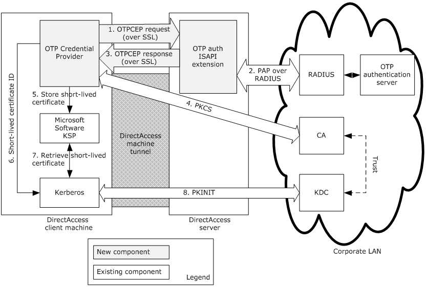
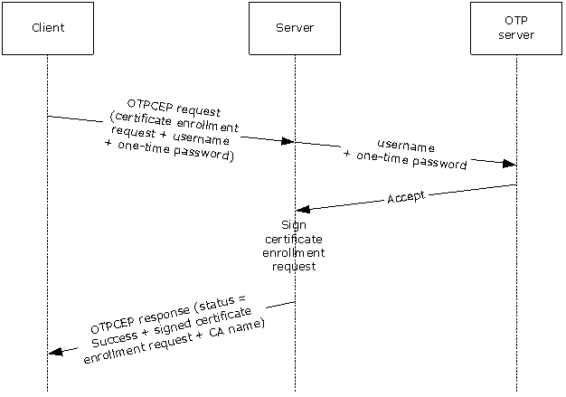
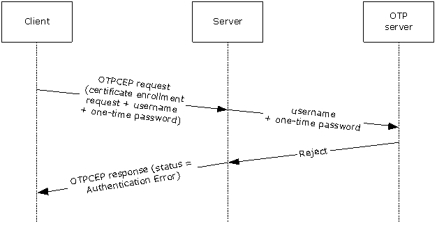
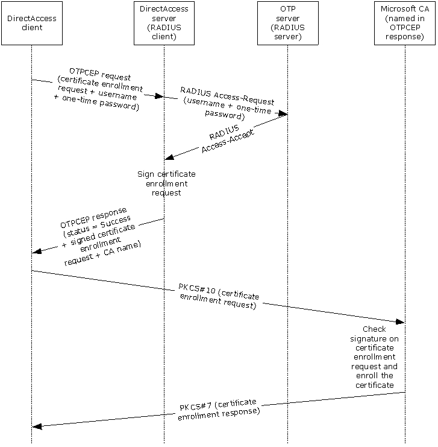

[MS-OTPCE]:

One-Time Password Certificate Enrollment Protocol

Intellectual Property Rights Notice for Open Specifications Documentation

  Technical Documentation. Microsoft publishes Open Specifications documentation (“this

documentation”) for protocols, file formats, data portability, computer languages, and standards
support. Additionally, overview documents cover inter-protocol relationships and interactions.

  Copyrights. This documentation is covered by Microsoft copyrights. Regardless of any other

terms that are contained in the terms of use for the Microsoft website that hosts this
documentation, you can make copies of it in order to develop implementations of the technologies
that are described in this documentation and can distribute portions of it in your implementations
that use these technologies or in your documentation as necessary to properly document the
implementation. You can also distribute in your implementation, with or without modification, any
schemas, IDLs, or code samples that are included in the documentation. This permission also
applies to any documents that are referenced in the Open Specifications documentation.
  No Trade Secrets. Microsoft does not claim any trade secret rights in this documentation.
  Patents. Microsoft has patents that might cover your implementations of the technologies

described in the Open Specifications documentation. Neither this notice nor Microsoft's delivery of
this documentation grants any licenses under those patents or any other Microsoft patents.
However, a given Open Specifications document might be covered by the Microsoft Open
Specifications Promise or the Microsoft Community Promise. If you would prefer a written license,
or if the technologies described in this documentation are not covered by the Open Specifications
Promise or Community Promise, as applicable, patent licenses are available by contacting
iplg@microsoft.com.

  License Programs. To see all of the protocols in scope under a specific license program and the

associated patents, visit the Patent Map.

  Trademarks. The names of companies and products contained in this documentation might be
covered by trademarks or similar intellectual property rights. This notice does not grant any
licenses under those rights. For a list of Microsoft trademarks, visit
www.microsoft.com/trademarks.

  Fictitious Names. The example companies, organizations, products, domain names, email

addresses, logos, people, places, and events that are depicted in this documentation are fictitious.
No association with any real company, organization, product, domain name, email address, logo,
person, place, or event is intended or should be inferred.

Reservation of Rights. All other rights are reserved, and this notice does not grant any rights other
than as specifically described above, whether by implication, estoppel, or otherwise.

Tools. The Open Specifications documentation does not require the use of Microsoft programming
tools or programming environments in order for you to develop an implementation. If you have access
to Microsoft programming tools and environments, you are free to take advantage of them. Certain
Open Specifications documents are intended for use in conjunction with publicly available standards
specifications and network programming art and, as such, assume that the reader either is familiar
with the aforementioned material or has immediate access to it.

Support. For questions and support, please contact dochelp@microsoft.com.

[MS-OTPCE] - v20240423
One-Time Password Certificate Enrollment Protocol
Copyright © 2024 Microsoft Corporation
Release: April 23, 2024

1 / 29

Revision Summary

Date

Revision
History

Revision
Class

Comments

12/16/2011  1.0

3/30/2012

1.0

New

None

Released new document.

No changes to the meaning, language, or formatting of the
technical content.

7/12/2012

2.0

Major

Significantly changed the technical content.

10/25/2012  2.0

1/31/2013

2.0

None

None

No changes to the meaning, language, or formatting of the
technical content.

No changes to the meaning, language, or formatting of the
technical content.

8/8/2013

3.0

Major

Significantly changed the technical content.

11/14/2013  3.0

2/13/2014

3.0

5/15/2014

3.0

None

None

None

No changes to the meaning, language, or formatting of the
technical content.

No changes to the meaning, language, or formatting of the
technical content.

No changes to the meaning, language, or formatting of the
technical content.

6/30/2015

4.0

Major

Significantly changed the technical content.

10/16/2015  4.0

None

No changes to the meaning, language, or formatting of the
technical content.

7/14/2016

4.0

6/1/2017

5.0

9/15/2017

6.0

12/1/2017

6.0

9/12/2018

7.0

4/7/2021

8.0

6/25/2021

9.0

4/23/2024

10.0

None

Major

Major

None

Major

Major

Major

Major

No changes to the meaning, language, or formatting of the
technical content.

Significantly changed the technical content.

Significantly changed the technical content.

No changes to the meaning, language, or formatting of the
technical content.

Significantly changed the technical content.

Significantly changed the technical content.

Significantly changed the technical content.

Significantly changed the technical content.

[MS-OTPCE] - v20240423
One-Time Password Certificate Enrollment Protocol
Copyright © 2024 Microsoft Corporation
Release: April 23, 2024

2 / 29

## Table of Contents

- [1 Introduction](#1-introduction)
  - [1.1 Glossary](#11-glossary)
  - [1.2 References](#12-references)
    - [1.2.1 Normative References](#121-normative-references)
    - [1.2.2 Informative References](#122-informative-references)
  - [1.3 Overview](#13-overview)
  - [1.4 Relationship to Other Protocols](#14-relationship-to-other-protocols)
  - [1.5 Prerequisites/Preconditions](#15-prerequisitespreconditions)
  - [1.6 Applicability Statement](#16-applicability-statement)
  - [1.7 Versioning and Capability Negotiation](#17-versioning-and-capability-negotiation)
  - [1.8 Vendor-Extensible Fields](#18-vendor-extensible-fields)
  - [1.9 Standards Assignments](#19-standards-assignments)
- [2 Messages](#2-messages)
  - [2.1 Transport](#21-transport)
  - [2.2 Message Syntax](#22-message-syntax)
    - [2.2.1 Namespaces](#221-namespaces)
    - [2.2.2 SignCert Request](#222-signcert-request)
    - [2.2.3 SignCert Response](#223-signcert-response)
- [3 Protocol Details](#3-protocol-details)
  - [3.1 Client Details](#31-client-details)
    - [3.1.1 Abstract Data Model](#311-abstract-data-model)
    - [3.1.2 Timers](#312-timers)
    - [3.1.3 Initialization](#313-initialization)
    - [3.1.4 Higher-Layer Triggered Events](#314-higher-layer-triggered-events)
    - [3.1.5 Message Processing Events and Sequencing Rules](#315-message-processing-events-and-sequencing-rules)
      - [3.1.5.1 Creating A SignCert Request Message](#3151-creating-a-signcert-request-message)
      - [3.1.5.2 Processing A SignCert Response Message](#3152-processing-a-signcert-response-message)
    - [3.1.6 Timer Events](#316-timer-events)
    - [3.1.7 Other Local Events](#317-other-local-events)
  - [3.2 Server Details](#32-server-details)
    - [3.2.1 Abstract Data Model](#321-abstract-data-model)
    - [3.2.2 Timers](#322-timers)
    - [3.2.3 Initialization](#323-initialization)
    - [3.2.4 Higher-Layer Triggered Events](#324-higher-layer-triggered-events)
    - [3.2.5 Message Processing Events and Sequencing Rules](#325-message-processing-events-and-sequencing-rules)
      - [3.2.5.1 Processing A SignCert Request Message](#3251-processing-a-signcert-request-message)
    - [3.2.6 Timer Events](#326-timer-events)
    - [3.2.7 Other Local Events](#327-other-local-events)
- [4 Protocol Examples](#4-protocol-examples)
  - [4.1 Accepted SignCert Request Example](#41-accepted-signcert-request-example)
  - [4.2 SignCert Request with Invalid Credentials Example](#42-signcert-request-with-invalid-credentials-example)
  - [4.3 Challenged SignCert Request Example](#43-challenged-signcert-request-example)
  - [4.4 Invalid SignCert Request Example](#44-invalid-signcert-request-example)
- [5 Security](#5-security)
  - [5.1 Security Considerations for Implementers](#51-security-considerations-for-implementers)
  - [5.2 Index of Security Parameters](#52-index-of-security-parameters)
- [6 Appendix A: Full XML Schema](#6-appendix-a-full-xml-schema)
- [7 Appendix B: Product Behavior](#7-appendix-b-product-behavior)
- [8 Change Tracking](#8-change-tracking)
- [9 Index](#9-index)

## 1 Introduction

The One-Time Password Certificate Enrollment Protocol was created to enhance the network security
of remote access connections. The protocol uses different components to increase network security.
For example, the one-time password (OTP) authentication mechanism provides enhanced security
for remote clients connecting to a server by using different passwords for each logon session. Another
component used by the protocol is a short-lived smart card logon certificate template.

Sections 1.5, 1.8, 1.9, 2, and 3 of this specification are normative. All other sections and examples in
this specification are informative.

### 1.1 Glossary

This document uses the following terms:

Active Directory: The Windows implementation of a general-purpose directory service, which uses

LDAP as its primary access protocol. Active Directory stores information about a variety of
objects in the network such as user accounts, computer accounts, groups, and all related
credential information used by Kerberos [MS-KILE]. Active Directory is either deployed as
Active Directory Domain Services (AD DS) or Active Directory Lightweight Directory Services
(AD LDS), which are both described in [MS-ADOD]: Active Directory Protocols Overview.

certificate template: A list of attributes that define a blueprint for creating an X.509 certificate. It

is often referred to in non-Microsoft documentation as a "certificate profile". A certificate
template is used to define the content and purpose of a digital certificate, including issuance
requirements (certificate policies), implemented X.509 extensions such as application policies,
key usage, or extended key usage as specified in [X509], and enrollment permissions.
Enrollment permissions define the rules by which a certification authority (CA) will issue or
deny certificate requests. In Windows environments, certificate templates are stored as
objects in the Active Directory and used by Microsoft enterprise CAs.

certification authority (CA): A third party that issues public key certificates. Certificates serve to
bind public keys to a user identity. Each user and certification authority (CA) can decide whether
to trust another user or CA for a specific purpose, and whether this trust is to be transitive. For
more information, see [RFC3280].

DirectAccess: A collection of different component policies, including Name Resolution Policy and

IPsec, which allows seamless connectivity to corporate resources when not physically connected
to the corporate network.

enhanced key usage (EKU): An extension that is a collection of object identifiers (OIDs) that

indicate the applications that use the key.

Group Policy: A mechanism that allows the implementer to specify managed configurations for

users and computers in an Active Directory service environment.

Hypertext Transfer Protocol (HTTP): An application-level protocol for distributed, collaborative,
hypermedia information systems (text, graphic images, sound, video, and other multimedia
files) on the World Wide Web.

Hypertext Transfer Protocol Secure (HTTPS): An extension of HTTP that securely encrypts and
decrypts web page requests. In some older protocols, "Hypertext Transfer Protocol over Secure
Sockets Layer" is still used (Secure Sockets Layer has been deprecated). For more information,
see [SSL3] and [RFC5246].

Kerberos: An authentication system that enables two parties to exchange private information

across an otherwise open network by assigning a unique key (called a ticket) to each user that

[MS-OTPCE] - v20240423
One-Time Password Certificate Enrollment Protocol
Copyright © 2024 Microsoft Corporation
Release: April 23, 2024

5 / 29

logs on to the network and then embedding these tickets into messages sent by the users. For
more information, see [MS-KILE].

Key Distribution Center (KDC): The Kerberos service that implements the authentication and
ticket granting services specified in the Kerberos protocol. The service runs on computers
selected by the administrator of the realm or domain; it is not present on every machine on the
network. It has to have access to an account database for the realm that it serves. KDCs are
integrated into the domain controller role. It is a network service that supplies tickets to clients
for use in authenticating to services.

key storage provider (KSP): A Cryptography API: Next Generation (CNG) component which can

be used to create, delete, export, import, open and store keys.

one-time password (OTP): A password that is valid for only one logon session or transaction in

the One-Time Password Certificate Enrollment Protocol.

Public Key Cryptography Standards (PKCS): A group of Public Key Cryptography Standards

published by RSA Laboratories.

public key infrastructure (PKI): The laws, policies, standards, and software that regulate or

manipulate certificates and public and private keys. In practice, it is a system of digital
certificates, certificate authorities (CAs), and other registration authorities that verify and
authenticate the validity of each party involved in an electronic transaction. For more
information, see [X509] section 6.

Remote Authentication Dial-In User Service (RADIUS): A protocol for carrying authentication,

authorization, and configuration information between a network access server (NAS) that
prefers to authenticate connection requests from endpoints and a shared server that performs
authentication, authorization, and accounting.

Secure Sockets Layer (SSL): A security protocol that supports confidentiality and integrity of

messages in client and server applications that communicate over open networks. SSL supports
server and, optionally, client authentication using X.509 certificates [X509] and [RFC5280]. SSL
is superseded by Transport Layer Security (TLS). TLS version 1.0 is based on SSL version 3.0
[SSL3].

smart card: A portable device that is shaped like a business card and is embedded with a memory
chip and either a microprocessor or some non-programmable logic. Smart cards are often used
as authentication tokens and for secure key storage. Smart cards used for secure key storage
have the ability to perform cryptographic operations with the stored key without allowing the
key itself to be read or otherwise extracted from the card.

Unicode: A character encoding standard developed by the Unicode Consortium that represents

almost all of the written languages of the world. The Unicode standard [UNICODE5.0.0/2007]
provides three forms (UTF-8, UTF-16, and UTF-32) and seven schemes (UTF-8, UTF-16, UTF-16
BE, UTF-16 LE, UTF-32, UTF-32 LE, and UTF-32 BE).

XML: The Extensible Markup Language, as described in [XML1.0].

XML namespace: A collection of names that is used to identify elements, types, and attributes in
XML documents identified in a URI reference [RFC3986]. A combination of XML namespace and
local name allows XML documents to use elements, types, and attributes that have the same
names but come from different sources. For more information, see [XMLNS-2ED].

MAY, SHOULD, MUST, SHOULD NOT, MUST NOT: These terms (in all caps) are used as defined
in [RFC2119]. All statements of optional behavior use either MAY, SHOULD, or SHOULD NOT.

[MS-OTPCE] - v20240423
One-Time Password Certificate Enrollment Protocol
Copyright © 2024 Microsoft Corporation
Release: April 23, 2024

6 / 29

### 1.2 References

Links to a document in the Microsoft Open Specifications library point to the correct section in the
most recently published version of the referenced document. However, because individual documents
in the library are not updated at the same time, the section numbers in the documents may not
match. You can confirm the correct section numbering by checking the Errata.

#### 1.2.1 Normative References

We conduct frequent surveys of the normative references to assure their continued availability. If you
have any issue with finding a normative reference, please contact dochelp@microsoft.com. We will
assist you in finding the relevant information.

[MS-ADTS] Microsoft Corporation, "Active Directory Technical Specification".

[RFC1334] Lloyd, B., and Simpson, W., "PPP Authentication Protocols", RFC 1334, October 1992,
https://www.rfc-editor.org/info/rfc1334

[RFC2119] Bradner, S., "Key words for use in RFCs to Indicate Requirement Levels", BCP 14, RFC
2119, March 1997, https://www.rfc-editor.org/info/rfc2119

[RFC2315] Kaliski, B., "PKCS #7: Cryptographic Message Syntax Version 1.5", RFC 2315, March 1998,
https://www.rfc-editor.org/info/rfc2315

[RFC2616] Fielding, R., Gettys, J., Mogul, J., et al., "Hypertext Transfer Protocol -- HTTP/1.1", RFC
2616, June 1999, https://www.rfc-editor.org/info/rfc2616

[RFC2818] Rescorla, E., "HTTP Over TLS", RFC 2818, May 2000, https://www.rfc-
editor.org/info/rfc2818

[RFC2986] Nystrom, M. and Kaliski, B., "PKCS#10: Certificate Request Syntax Specification", RFC
2986, November 2000, http://www.rfc-editor.org/info/rfc2986

[XMLNS-2ED] Bray, T., Hollander, D., Layman, A., and Tobin, R., Eds., "Namespaces in XML 1.0
(Second Edition)", W3C Recommendation, August 2006, https://www.w3.org/TR/2006/REC-xml-
names-20060816/

[XMLSCHEMA1] Thompson, H., Beech, D., Maloney, M., and Mendelsohn, N., Eds., "XML Schema Part
1: Structures", W3C Recommendation, May 2001, https://www.w3.org/TR/2001/REC-xmlschema-1-
20010502/

[XML] World Wide Web Consortium, "Extensible Markup Language (XML) 1.0 (Fourth Edition)", W3C
Recommendation 16 August 2006, edited in place 29 September 2006,
http://www.w3.org/TR/2006/REC-xml-20060816/

#### 1.2.2 Informative References

[MS-GPNRPT] Microsoft Corporation, "Group Policy: Name Resolution Policy Table (NRPT) Data
Extension".

[MS-PKCA] Microsoft Corporation, "Public Key Cryptography for Initial Authentication (PKINIT) in
Kerberos Protocol".

[MSFT-OTP] Microsoft Corporation, "Strong Authentication with One-Time Passwords in Windows 7
and Windows Server 2008 R2", February 2011, http://technet.microsoft.com/en-
us/library/gg637807(WS.10).aspx

[MS-OTPCE] - v20240423
One-Time Password Certificate Enrollment Protocol
Copyright © 2024 Microsoft Corporation
Release: April 23, 2024

7 / 29

<!-- Extracted images from page 8 -->

<!-- /Extracted images from page 8 -->

[MSFT-TEMPLATES] Microsoft Corporation, "Implementing and Administering Certificate Templates in
Windows Server 2003", July 2004, http://technet.microsoft.com/en-us/library/c25f57b0-5459-4c17-
bb3f-2f657bd23f78

### 1.3 Overview

The One-Time Password Certificate Enrollment Protocol is a stateless application-layer protocol. This
protocol defines one type of request message, sent from the client to the server, and one type of
response message, returned by the server to the client. The request message consists of the user
name, one-time password (OTP), and certificate enrollment request. The response message
consists of the return code, an optional signed certificate enrollment request (the same request that
was sent by the client to the server), and (also optional) the name of the certification authority
(CA) from which to enroll the certificate.

This protocol was created for OTP authentication with DirectAccess as described in [MSFT-OTP]. It is
used as part of the mechanism that transforms OTP credentials into a short-lived smart card logon
certificate that is used for Kerberos smart card authentication. The certificate is short-lived to
minimize the risk of it being reused for future authentication sessions. It is configured to the minimum
lifetime supported by the public key infrastructure (PKI) in use. The following figure shows how
the protocol is used in DirectAccess authentication.

Figure 1: DirectAccess OTP authentication process

In the DirectAccess implementation of the One-Time Password Certificate Enrollment Protocol, the
following events take place.

1.  The DirectAccess client sends OTP credentials along with a short-lived smart card logon certificate
enrollment request to the DirectAccess server over a Secure Sockets Layer (SSL) tunnel, where
both client and server are mutually authenticated by certificates.

2.  The DirectAccess server communicates with an OTP authentication server using the Password

Authentication Protocol (PAP) [RFC1334] over Remote Authentication Dial-In User Service
(RADIUS) in order to validate the OTP credentials.

8 / 29

[MS-OTPCE] - v20240423
One-Time Password Certificate Enrollment Protocol
Copyright © 2024 Microsoft Corporation
Release: April 23, 2024

<!-- Extracted images from page 9 -->

<!-- /Extracted images from page 9 -->

3.  The DirectAccess server signs the certificate enrollment request with a dedicated signing

certificate only the DirectAccess server possesses. After that, the signed certificate request and
the name of the CA (from which the DirectAccess client enrolls the short-lived smart card logon
certificate) are sent to the DirectAccess client by using the OTPCE protocol.

4.  The DirectAccess client communicates with the certification authority (CA) using a Public Key

Cryptography Standards (PKCS) #10 request [RFC2986] and a PKCS #7 response [RFC2315]
in order to enroll a short-lived smart card logon certificate. The enrolled short-lived certificate is
used by the PKINIT Protocol ([MS-PKCA]) to acquire a new Kerberos ticket from the Key
Distribution Center (KDC) for the user.

The following figure shows a protocol message exchange of successful OTP credential validation by the
OTP server and the subsequent signing of the certificate enrollment request by the server.

Figure 2: Successful sequence for certificate enrollment

The following figure shows a typical protocol message exchange in which invalid OTP credentials are
rejected by the OTP server. In this case, the server returns an error and does not proceed with the
signing of the certificate enrollment request.

[MS-OTPCE] - v20240423
One-Time Password Certificate Enrollment Protocol
Copyright © 2024 Microsoft Corporation
Release: April 23, 2024

9 / 29

<!-- Extracted images from page 10 -->

<!-- /Extracted images from page 10 -->

Figure 3: Typical sequence of a certificate enrollment with erroneous credentials

The following figure shows the use of the OTPCE protocol in Windows DirectAccess OTP authentication.

[MS-OTPCE] - v20240423
One-Time Password Certificate Enrollment Protocol
Copyright © 2024 Microsoft Corporation
Release: April 23, 2024

10 / 29

<!-- Extracted images from page 11 -->

<!-- /Extracted images from page 11 -->

Figure 4: DirectAccess OTP authentication end to end flow

### 1.4 Relationship to Other Protocols

The One-Time Password Certificate Enrollment Protocol is a Hypertext Transfer Protocol (HTTP)-
based protocol. Every protocol request is a single pair of HTTP POST and HTTP response messages.
Failure to carry out the request due to server error is reported by an HTTP response code.

The parameters of the protocol's requests and responses are carried in XML-formatted body of the
message. The full XML schema (XSD) is described in section 6.

### 1.5 Prerequisites/Preconditions

For One-Time Password Certificate Enrollment Protocol communication to begin, the prerequisite
configuration is as follows:

1.  The administrator sets up an OTP authentication solution from an OTP vendor that includes an

OTP authentication server and hardware/software OTP tokens for end users.

[MS-OTPCE] - v20240423
One-Time Password Certificate Enrollment Protocol
Copyright © 2024 Microsoft Corporation
Release: April 23, 2024

11 / 29

2.  The administrator establishes one or more implementation-specific<1> CA servers, configures a

new, unique application-policy enhanced key usage (EKU) in Active Directory, and configures
two certificate templates on it:

1.  A short-lived smart card logon certificate template.

2.  A signing certificate template with the new, unique application-policy EKU.

The CA server requires permissions to enroll certificates by using this certificate template. The
administrator grants users read and enroll permissions to the short-lived smart card logon certificate
template. The administrator grants the OTPCEP server enroll and auto enroll permissions to the
signing certificate template.

In addition, configure the CA to verify that any short-lived smart card logon certificate request is
signed by the signing certificate.

### 1.6 Applicability Statement

The One-Time Password Certificate Enrollment Protocol was designed to support OTP authentication
for DirectAccess.

The use of this protocol is appropriate as the basis for any network authentication scenario that
involves sending a request with OTP credentials and a certificate enrollment request, and receiving a
signed certificate enrollment request.

### 1.7 Versioning and Capability Negotiation

For versioning control, a proprietary HTTP header "X-OTPCEP-version" is introduced and is mandatory
in both the request and response. It is required to have the value of "1.0".

### 1.8 Vendor-Extensible Fields

None.

### 1.9 Standards Assignments

None.

[MS-OTPCE] - v20240423
One-Time Password Certificate Enrollment Protocol
Copyright © 2024 Microsoft Corporation
Release: April 23, 2024

12 / 29

## 2 Messages

### 2.1 Transport

The One-Time Password Certificate Enrollment Protocol does not provide its own secure transport. It
MUST be transmitted over a secured channel, for example, Hypertext Transfer Protocol over
Secure Sockets Layer (HTTPS), as specified in [RFC2818].

This protocol is encapsulated within and depends on HTTP, as specified in [RFC2616], for delivery of
messages. The protocol does not impose any message retransmissions or other requirements on this
transport.

### 2.2 Message Syntax

This section contains common definitions used by this protocol. The protocol is HTTP-based protocol.
"Content-type" header is always set to Application/xml;charset=utf-8. The syntax of the definitions
uses the XML schema as specified in [XMLSCHEMA1].

#### 2.2.1 Namespaces

This specification defines and references various XML namespaces that are using the mechanisms
specified in [XMLNS-2ED]. Although this document associates a specific XML namespace prefix for
each XML namespace that is used, the choice of any particular XML namespace prefix is
implementation-specific and not significant for interoperability.

Prefixes and XML namespaces used in this specification are as follows:

Prefix  Namespace URI

Reference

  xs

http://www.w3.org/2001/XMLSchema

 [XMLSCHEMA1]

otpcep  http://schemas.microsoft.com/otpcep/1.0/protocol

#### 2.2.2 SignCert Request

The SignCert Request is the message sent by a client when the end user is asked to provide OTP
credentials in order to perform OTP authentication.

The message MUST be a Unicode XML 1.0 document that uses the following XML namespace as its
default:

http://schemas.microsoft.com/otpcep/1.0/protocol

The XML document MUST contain a signCertRequest element. The message MUST NOT include
additional data before or after the XML document. The XML document MAY contain trailing whitespace
as part of the encoded content, as specified in [XML] section 2.1.

 <xs:element name="signCertRequest">
   <xs:complexType>
     <xs:attribute name="username" type="xs:string"
          use="required" />
     <xs:attribute name="oneTimePassword" type="xs:string"
          use="required" />
     <xs:attribute name="certRequest" type="otpcep:CertificateRequestBase64Binary"
          use="required" />

13 / 29

[MS-OTPCE] - v20240423
One-Time Password Certificate Enrollment Protocol
Copyright © 2024 Microsoft Corporation
Release: April 23, 2024

   </xs:complexType>
 </xs:element>

The signCertRequest element contains the following attributes:

username:  A NULL-terminated string that contains the user name.

oneTimePassword:  A NULL-terminated string that contains the user's one-time credentials. The
one-time credentials MUST contain an ever-changing one-time password (OTP) part. The one-
time credentials MAY contain a static password (PIN) part.

certRequest:  The certificate enrollment request in PKCS #10 format ([RFC2986]). The request

MUST be created by using the certificate template as defined in section 1.5.

The request MUST be digitally signed with a valid signature, as specified in [RFC2986].

#### 2.2.3 SignCert Response

A SignCert Response message is returned by the OTPCEP server as a response to a SignCert
Request message (section 2.2.2) received from the client.

The message MUST be a Unicode XML 1.0 document that uses the following XML namespace as its
default:

http://schemas.microsoft.com/otpcep/1.0/protocol

The document MUST contain a signCertResponse element. The message MUST NOT include
additional data before or after the XML document. The XML document MAY contain trailing whitespace
as part of the encoded content, as specified in [XML] section 2.1.

 <xs:complexType name="SignCertResponse">
       <xs:sequence>
         <xs:element name="IssuingCA" type="xs:anyURI" minOccurs="0" maxOccurs="unbounded" />
       </xs:sequence>
       <xs:attribute name="statusCode" type="otpcep:SignCertStatusCode" use="required" />
       <xs:attribute name="SignedCertRequest" type="otpcep:CertificateBase64Binary"
use="optional" />
     </xs:complexType>

The signCertResponse element contains the following attributes:

IssuingCA (optional):  If the user credentials are valid and the statusCode attribute equals

Success, the names of one or more CA servers from which the client enrolls the short-lived
smart card certificate are included in the SignCert Response message. Otherwise, this field
MUST be empty.

statusCode:  Can be one of the following enumeration values.

Value

Success

Meaning

Certificate enrollment request was signed successfully.

AuthenticationError

User credentials validation failed.

ChallengeResponseRequired  User credentials were challenged.

OtherError

Other error occurred during the validation of the OTP credentials or during signing
of the certificate enrollment request.

[MS-OTPCE] - v20240423
One-Time Password Certificate Enrollment Protocol
Copyright © 2024 Microsoft Corporation
Release: April 23, 2024

14 / 29

SignedCertRequest (optional):  If the user credentials are valid and the statusCode attribute
equals Success, a signed certificate enrollment request is included in the SignCert Response
message. Otherwise, this field MUST be empty.

[MS-OTPCE] - v20240423
One-Time Password Certificate Enrollment Protocol
Copyright © 2024 Microsoft Corporation
Release: April 23, 2024

15 / 29

## 3 Protocol Details

### 3.1 Client Details

#### 3.1.1 Abstract Data Model

This section describes a conceptual model of possible data organization that an implementation
maintains to participate in this protocol. The described organization is provided to facilitate the
explanation of how the protocol behaves. This document does not mandate that implementations
adhere to this model as long as their external behavior is consistent with that described in this
document.

Server Name: A null-terminated Unicode string that represents the name of the server the client
can communicate with in order to authenticate the user and enroll certificates for accessing
corporate resources. A list of strings representing available servers can be used for high
availability.

OTP Certificate Template Name:  A null-terminated string representing the name of the short-

lived smart card certificate template that is in use.

#### 3.1.2 Timers

None.

#### 3.1.3 Initialization

The Abstract Data Model (ADM) elements defined in section 3.1.1 are initialized during the client
startup. They are configured by the administrator<2> and stored in persistent storage. On client
startup, the configuration is read from the persistent storage and set in the ADM elements.

#### 3.1.4 Higher-Layer Triggered Events

The One-Time Password Certificate Enrollment Protocol is invoked when a user logs on to a client
computer from outside the corporate network by using a username/password, smart card, or any
other user credentials available for login, and then attempts to connect to a corporate resource using
a connection that requires one-time password (OTP) authentication. The client MUST create and
send a SignCert Request message (section 2.2.2), as specified in section 3.1.5.2.

#### 3.1.5 Message Processing Events and Sequencing Rules

##### 3.1.5.1 Creating A SignCert Request Message

When the user performs an OTP authentication, the client performs the following steps.

1.  The client creates a SignCert Request message (section 2.2.2) with the following attributes:





The logon name of the user is set as the username attribute in the SignCert Request
message. The name is in the domain\username format.

The one-time credentials that the user provides after the logon are set in the
oneTimePassword attribute of the SignCert Request message. The oneTimePassword
attribute contains an ever-changing OTP part. The oneTimePassword attribure MAY contain
a static password (PIN) part. The existence of the PIN part and the PIN and one-time
password (OTP) concatenating format depend on the OTP vendor implementation.

16 / 29

[MS-OTPCE] - v20240423
One-Time Password Certificate Enrollment Protocol
Copyright © 2024 Microsoft Corporation
Release: April 23, 2024



The client creates the certificate PKCS #10 request, as specified in [RFC2986], by using the
template referred by the OTP Certificate Template Name ADM element, and sets it as the
CertRequest attribute in the SignCert Request message.

2.  The client sends the SignCert Request message to the server.

##### 3.1.5.2 Processing A SignCert Response Message

Upon receiving the SignCert Response message (section 2.2.3), the client MUST send an enrollment
request to the  Certification Authority (CA) server using the signed certificate request, and MUST
store the certificate issued by the CA using a key storage provider (KSP) to be used by the upper
layer for authentication, thus enabling connectivity to the corporate resources.

If the statusCode attribute does not equal Success, the client fails the operation. The client MAY<3>
display an error message to the user indicating that the operation failed.

#### 3.1.6 Timer Events

None.

#### 3.1.7 Other Local Events

None.

### 3.2 Server Details

#### 3.2.1 Abstract Data Model

This section describes a conceptual model of possible data organization that an implementation
maintains to participate in this protocol. The described organization is provided to facilitate the
explanation of how the protocol behaves. This document does not mandate that implementations
adhere to this model as long as their external behavior is consistent with that described in this
document.

OTP servers information:  A structure that represents the OTP servers that are available for

credentials validation on the server. The information in the structure MAY contain a server name
or IP address, port, and other connectivity-related attributes. A sorted list of available servers
can be used for high availability or load balancing.

CA servers list:  A null-terminated Unicode string that represents the names of the CAs available
for issuing OTP certificates. A sorted list of strings representing available CAs can be used for
high availability or load balancing.

Signing Certificate Template Name:  A null-terminated string representing the name of the

signing certificate template that is in use.

#### 3.2.2 Timers

None.

#### 3.2.3 Initialization

The ADM elements defined in section 3.2.1 are initialized during the server startup. They are
configured by the administrator<4> and stored in persistent storage. On server startup, the
configuration is read from persistent storage and set in the ADM elements.

17 / 29

[MS-OTPCE] - v20240423
One-Time Password Certificate Enrollment Protocol
Copyright © 2024 Microsoft Corporation
Release: April 23, 2024

#### 3.2.4 Higher-Layer Triggered Events

None.

#### 3.2.5 Message Processing Events and Sequencing Rules

##### 3.2.5.1 Processing A SignCert Request Message

Upon receiving a SignCert Request message (section 2.2.2), the server performs the following
steps:

1.  Validate the certificate request received in the SignCert Request message:







The user name inside the certificate request MUST match the OTP user name received in the
username attribute of the SignCert Request message. If the user name appears in multiple
places in the certificate request, all instances MUST match the OTP user name.

The certificate template named in the user certificate request MUST NOT be empty and it
MUST be the one that is configured in the server.

The certificate request MUST be digitally signed with a valid signature, as specified in
[RFC2986].

If the validations fail, the server MUST stop processing the request and send a SignCert
Response message (section 2.2.3) to the client with a status of OtherError, without setting
the SignedCertRequest and IssuingCA attributes.

2.  Validate that the user name is listed in Active Directory, as specified in [MS-ADTS]. If the

validation fails, the server MUST stop processing the request and send a SignCert Response
message to the client with a status of AuthenticationError, without setting the
SignedCertRequest and IssuingCA attributes.

3.  Validate user name, static password (if available), and one-time password (OTP) with the first OTP

server represented in the OTP servers information ADM element using the Password
Authentication Protocol (PAP) [RFC1334] over Remote Authentication Dial-In User Service
(RADIUS) to validate the OTP credentials. If the validation fails, the server MUST stop the
processing and send a SignCert Response message with an error status corresponding to the
response received from OTP server:







If the OTP server cannot be reached, the server MUST send a status of OtherError to the
client.

If the response from the OTP server is Access-Reject, the server MUST send a status message
of AuthenticationError to the client.

If the response from OTP server is Challenge-Response, the server MUST send a status
message of ChallengeResponseRequired to the client.

The SignedCertRequest and IssuingCA attributes are not set upon failure.

4.  Sign the certificate request that was part of the SignCert Request message using the dedicated
signing certificate. If this operation fails, the server MUST send a status message of OtherError to
the client.

The SignedCertRequest and IssuingCA attributes are not set upon failure.

5.  Verify that the list of CA servers in the CA servers list ADM element is not empty and pick the
first CA server from the list. If this operation fails, the server MUST send a status message of
OtherError to the client.

18 / 29

[MS-OTPCE] - v20240423
One-Time Password Certificate Enrollment Protocol
Copyright © 2024 Microsoft Corporation
Release: April 23, 2024

6.  When a certificate is successfully signed, the server MUST create a SignCert Response message

with the following values in it:







The statusCode attribute is set to Success.

The SignedCertRequest attribute value is set to the signed certificate enrollment request.

The IssuingCA attribute is set to the name of the first or several high-ranked CA servers from
the CA servers list ADM element.

Then the server MUST send the response back to the client.

#### 3.2.6 Timer Events

None.

#### 3.2.7 Other Local Events

None.

[MS-OTPCE] - v20240423
One-Time Password Certificate Enrollment Protocol
Copyright © 2024 Microsoft Corporation
Release: April 23, 2024

19 / 29

## 4 Protocol Examples

The following sections describe four examples of the SignCert Request message (section 2.2.2) and
the SignCert Response message (section 2.2.3).

### 4.1 Accepted SignCert Request Example

The following example describes an accepted SignCert Request message (section 2.2.2).

 <?xml version="1.0" encoding="UTF-8"?>
 <signCertRequest xmlns="http://schemas.microsoft.com/otpcep/1.0/protocol"
username="DOMAIN1\user1" oneTimePassword="Pa$$word1"
certRequest="MIIEjzCCA3cCAQAwfjETMBEGCgmSJomT8ixkARkWA2NvbTEXMBUGCgmSJomT8ixk&#xA;ARkWB2NvbXB
hbnkxFDASBgoJkiaJk/IsZAEZFgRjb3JwMRcwFQYKCZImiZPyLGQB&#xA;GRYHZG9tYWluMTEOMAwGA1UEAwwFVXNlcnM
xDzANBgNVBAMMBlVzZXIgMTCCASIw&#xA;DQYJKoZIhvcNAQEBBQADggEPADCCAQoCggEBAL/jy9vhdLG3yZJYw7VC6PG
FwA2c&#xA;yG7G9TaRX5z23o26qe8AQIsKsMkepv4qCv8xEs0Q4grSkEmTXOPbMsxeogzKt9/E&#xA;el7Hg0bdrGWyoS
l6lykVB9gu8blx7LXmj4E2p1rjO4O1Z5be3hVbPijuGa6M8mh9&#xA;n3pDar5sbe8YY4gwNU9gtgWSg7N9FCIyRm9hjq
F60M55totkCTa11+K4n+vL/71c&#xA;IxFUKqeYiHD8pbhEaKUesfGQl1TsXhUjMWCxJLJaeclCXkms2wky9fbbA8Xvfc
4j&#xA;V101XcaL7nns/ymmVZLig8LPimcvr8wY+t+Bbzlx7BPcYap8b3+NeiZrzTUCAwEA&#xA;AaCCAcowGgYKKwYBB
AGCNw0CAzEMFgo2LjIuODMxMS4yMFMGCSsGAQQBgjcVFDFG&#xA;MEQCAQUMIENMSUVOVDIuZG9tYWluMS5jb3JwLmNvb
XBhbnkuY29tDBBET01BSU4x&#xA;XENMSUVOVDIkDAtMb2dvblVJLmV4ZTBmBgorBgEEAYI3DQICMVgwVgIBAB5OAE0A&
#xA;aQBjAHIAbwBzAG8AZgB0ACAAUwBvAGYAdAB3AGEAcgBlACAASwBlAHkAIABTAHQA&#xA;bwByAGEAZwBlACAAUABy
AG8AdgBpAGQAZQByAwEAMIHuBgkqhkiG9w0BCQ4xgeAw&#xA;gd0wOwYJKwYBBAGCNxUHBC4wLAYkKwYBBAGCNxUIjcRr
39UihpmHLoHq2CGG1OV5&#xA;S4e7th2DlIhxAgFkAgEFMBUGA1UdJQQOMAwGCisGAQQBgjcUAgIwDgYDVR0PAQH/&#xA
;BAQDAgWgMB0GCSsGAQQBgjcVCgQQMA4wDAYKKwYBBAGCNxQCAjA5BgNVHREEMjAw&#xA;oC4GCisGAQQBgjcUAgOgIAw
edXNlcjFAZG9tYWluMS5jb3JwLmNvbXBhbnkuY29t&#xA;MB0GA1UdDgQWBBQqn0jnsdeugKhWrG0ts4ucmuuRvzANBgk
qhkiG9w0BAQUFAAOC&#xA;AQEAn7/yTQYMpLsn+ktTRUwvHdJQ7Prelccssn7hChTRm0GCarrS+KlID0WXDU8W&#xA;tY
AEXv8fA6MXFoYK4rrdtyZImqpkuxhO5H5XnuytTY6K3WqtIviDSFYNahNCAUBN&#xA;6syO9ydrXWJ21BBtsPlhoczkLE
mIsV/bRSdfrYh2rUtBP+P4s9TqRtZ3WtBsOaXH&#xA;Tqq4rUqGXCTarm2ESe9z0PlIroKVD9qv4ZjxXbpuId3NKYeso9
BNO9rtNS/unNBY&#xA;wI2mD6W7wigK/jQUpxuWljhzCy1GxvIxN9iZNq4VBIV7cJsz5X7OlTo1AIjM0NfI&#xA;kpEgw
EeOg7h3Mwqft6zPV9shBA==&#xA;"/>

The following example describes the SignCert Response message (section 2.2.3) for the accepted
request. The statusCode attribute equals Success.

 <?xml version="1.0" encoding="UTF-8"?>
 <signCertResponse xmlns="http://schemas.microsoft.com/otpcep/1.0/protocol"
statusCode="Success"
SignedCertRequest="MIINbgYJKoZIhvcNAQcCoIINXzCCDVsCAQMxCzAJBgUrDgMCGgUAMIIFIwYIKwYB&#xA;BQUHD
AKgggUVBIIFETCCBQ0waTBnAgECBgorBgEEAYI3CgoBMVYwVAIBADADAgEB&#xA;MUowSAYJKwYBBAGCNxUUMTswOQIBB
QwcREExLmRvbWFpbjEuY29ycC5jb21wYW55&#xA;LmNvbQwMRE9NQUlOMVxEQTEkDAh3M3dwLmV4ZTCCBJqgggSWAgEBM
IIEjzCCA3cC&#xA;AQAwfjETMBEGCgmSJomT8ixkARkWA2NvbTEXMBUGCgmSJomT8ixkARkWB2NvbXBh&#xA;bnkxFDAS
BgoJkiaJk/IsZAEZFgRjb3JwMRcwFQYKCZImiZPyLGQBGRYHZG9tYWlu&#xA;MTEOMAwGA1UEAwwFVXNlcnMxDzANBgNV
BAMMBlVzZXIgMTCCASIwDQYJKoZIhvcN&#xA;AQEBBQADggEPADCCAQoCggEBAL/jy9vhdLG3yZJYw7VC6PGFwA2cyG7G
9TaRX5z2&#xA;3o26qe8AQIsKsMkepv4qCv8xEs0Q4grSkEmTXOPbMsxeogzKt9/Eel7Hg0bdrGWy&#xA;oSl6lykVB9g
u8blx7LXmj4E2p1rjO4O1Z5be3hVbPijuGa6M8mh9n3pDar5sbe8Y&#xA;Y4gwNU9gtgWSg7N9FCIyRm9hjqF60M55tot
kCTa11+K4n+vL/71cIxFUKqeYiHD8&#xA;pbhEaKUesfGQl1TsXhUjMWCxJLJaeclCXkms2wky9fbbA8Xvfc4jV101Xca
L7nns&#xA;/ymmVZLig8LPimcvr8wY+t+Bbzlx7BPcYap8b3+NeiZrzTUCAwEAAaCCAcowGgYK&#xA;KwYBBAGCNw0CAz
EMFgo2LjIuODMxMS4yMFMGCSsGAQQBgjcVFDFGMEQCAQUMIENM&#xA;SUVOVDIuZG9tYWluMS5jb3JwLmNvbXBhbnkuY2
9tDBBET01BSU4xXENMSUVOVDIk&#xA;DAtMb2dvblVJLmV4ZTBmBgorBgEEAYI3DQICMVgwVgIBAB5OAE0AaQBjAHIAbw
Bz&#xA;AG8AZgB0ACAAUwBvAGYAdAB3AGEAcgBlACAASwBlAHkAIABTAHQAbwByAGEAZwBl&#xA;ACAAUAByAG8AdgBpA
GQAZQByAwEAMIHuBgkqhkiG9w0BCQ4xgeAwgd0wOwYJKwYB&#xA;BAGCNxUHBC4wLAYkKwYBBAGCNxUIjcRr39UihpmHL
oHq2CGG1OV5S4e7th2DlIhx&#xA;AgFkAgEFMBUGA1UdJQQOMAwGCisGAQQBgjcUAgIwDgYDVR0PAQH/BAQDAgWgMB0G&
#xA;CSsGAQQBgjcVCgQQMA4wDAYKKwYBBAGCNxQCAjA5BgNVHREEMjAwoC4GCisGAQQB&#xA;gjcUAgOgIAwedXNlcjFA
ZG9tYWluMS5jb3JwLmNvbXBhbnkuY29tMB0GA1UdDgQW&#xA;BBQqn0jnsdeugKhWrG0ts4ucmuuRvzANBgkqhkiG9w0B
AQUFAAOCAQEAn7/yTQYM&#xA;pLsn+ktTRUwvHdJQ7Prelccssn7hChTRm0GCarrS+KlID0WXDU8WtYAEXv8fA6MX&#xA
;FoYK4rrdtyZImqpkuxhO5H5XnuytTY6K3WqtIviDSFYNahNCAUBN6syO9ydrXWJ2&#xA;1BBtsPlhoczkLEmIsV/bRSd
frYh2rUtBP+P4s9TqRtZ3WtBsOaXHTqq4rUqGXCTa&#xA;rm2ESe9z0PlIroKVD9qv4ZjxXbpuId3NKYeso9BNO9rtNS/
unNBYwI2mD6W7wigK&#xA;/jQUpxuWljhzCy1GxvIxN9iZNq4VBIV7cJsz5X7OlTo1AIjM0NfIkpEgwEeOg7h3&#xA;Mw
qft6zPV9shBDAAMACgggWbMIIFlzCCBH+gAwIBAgIKYV+kUAAAAAAAQDANBgkq&#xA;hkiG9w0BAQUFADByMRMwEQYKCZ
ImiZPyLGQBGRYDY29tMRcwFQYKCZImiZPyLGQB&#xA;GRYHY29tcGFueTEUMBIGCgmSJomT8ixkARkWBGNvcnAxFzAVBg
oJkiaJk/IsZAEZ&#xA;Fgdkb21haW4xMRMwEQYDVQQDEwpSb290Q0EtREMxMB4XDTEyMDQxMDEwMjgxNloX&#xA;DTEyM
DQxMjEwMjgxNlowADCCASIwDQYJKoZIhvcNAQEBBQADggEPADCCAQoCggEB&#xA;ALMeQgmLbcP2pYDav6ZndelJbuS/D

[MS-OTPCE] - v20240423
One-Time Password Certificate Enrollment Protocol
Copyright © 2024 Microsoft Corporation
Release: April 23, 2024

20 / 29

wz3DxVRRZrgB7u9xK/vM8uJLVbkOeXB3yvr&#xA;WwgoZ/n2MPqgb/SFAVnRcT/zugY7myGQgqPO8TP4Ds7M4oPZkFl+G
vm30dpclUWK&#xA;2alz+FqJ0OhL5BetISr8pR8aEtC6CGF+ZOvmLgQaPmctu0izTlA9TUj60UyHrNvY&#xA;tPRcqWrM
HAVPZgrl+cceUBM8gSLQzFrI3JCA2WrRBVepEwQ7DaLmN52KnOMnRaWx&#xA;4uLRtS9c+HgiLYjWhz2ZAel1UL+1C5by
ofUKyKuxymlZyAK8htG6ZjcpblgJ+tHp&#xA;Bo/H9LqeXxV1hGm1iaklRJ8CAwEAAaOCAp8wggKbMDsGCSsGAQQBgjcV
BwQuMCwG&#xA;JCsGAQQBgjcVCI3Ea9/VIoaZhy6B6tghhtTleUuBv/1bhNObdQIBZAIBAjAVBgNV&#xA;HSUEDjAMBgo
rBgEEAYI3UQEBMA4GA1UdDwEB/wQEAwIHgDAdBgkrBgEEAYI3FQoE&#xA;EDAOMAwGCisGAQQBgjdRAQEwHQYDVR0OBBY
EFJ1BItqJOcAV4x48mx6N5PIYAnUg&#xA;MB8GA1UdIwQYMBaAFKBJofXgEOVQXMoEy3jGrNnwhuHzMIHXBgNVHR8Egc8
wgcww&#xA;gcmggcaggcOGgcBsZGFwOi8vL0NOPVJvb3RDQS1EQzEsQ049REMxLENOPUNEUCxD&#xA;Tj1QdWJsaWMlMj
BLZXklMjBTZXJ2aWNlcyxDTj1TZXJ2aWNlcyxDTj1Db25maWd1&#xA;cmF0aW9uLERDPWRvbWFpbjEsREM9Y29ycCxEQz
1jb21wYW55LERDPWNvbT9jZXJ0&#xA;aWZpY2F0ZVJldm9jYXRpb25MaXN0P2Jhc2U/b2JqZWN0Q2xhc3M9Y1JMRGlzdH
Jp&#xA;YnV0aW9uUG9pbnQwgc8GCCsGAQUFBwEBBIHCMIG/MIG8BggrBgEFBQcwAoaBr2xk&#xA;YXA6Ly8vQ049Um9vd
ENBLURDMSxDTj1BSUEsQ049UHVibGljJTIwS2V5JTIwU2Vy&#xA;dmljZXMsQ049U2VydmljZXMsQ049Q29uZmlndXJhd
GlvbixEQz1kb21haW4xLERD&#xA;PWNvcnAsREM9Y29tcGFueSxEQz1jb20/Y0FDZXJ0aWZpY2F0ZT9iYXNlP29iamVj&
#xA;dENsYXNzPWNlcnRpZmljYXRpb25BdXRob3JpdHkwKgYDVR0RAQH/BCAwHoIcREEx&#xA;LmRvbWFpbjEuY29ycC5j
b21wYW55LmNvbTANBgkqhkiG9w0BAQUFAAOCAQEANqGM&#xA;G1cNVQxFsWc9/RYrMAGatUG2YnqrE6IQMEeLGUv2XoHv
QFwyX43+58h0rlmNdRVt&#xA;MQ6VvzsWz1gFUZBzUJ3YfugQNR8IAWd7XKgYTcRJ8GlcTEPvU7XeCpMesXuYzvop&#xA
;NuTdpP6R1OiAJmv3H7Y8qyVCb9m6AWZkmfR3hLiXgBBk0yhMLsi2MogmEoO7wuwS&#xA;owbikkHqxGamlf1wr0RqmcV
C0ywS+FDgTJ3BNatQGoHnLCGH7/2fBnIxuDcD8vgc&#xA;amtDlZkvvjGdrr8uhD2oKtbVSj/U7Z/VbGzgtoTOfhtrqpb
0uVrAZQ/CbAorbQOQ&#xA;tEYEaROefOskvHqK7zGCAoEwgZYCAQEwIjAdMRswGQYJKwYBBAGCNxUJEwxEdW1t&#xA;eS
BTaWduZXICAQAwCQYFKw4DAhoFAKA+MBcGCSqGSIb3DQEJAzEKBggrBgEFBQcM&#xA;AjAjBgkqhkiG9w0BCQQxFgQUnU
Moa0CcmKMAyCl9SWFV0Y419l8wDAYIKwYBBQUH&#xA;BgIFAAQUuQKxuLM8spZptYmlzo4u8cPm8r4wggHkAgEBMIGAMH
IxEzARBgoJkiaJ&#xA;k/IsZAEZFgNjb20xFzAVBgoJkiaJk/IsZAEZFgdjb21wYW55MRQwEgYKCZImiZPy&#xA;LGQBG
RYEY29ycDEXMBUGCgmSJomT8ixkARkWB2RvbWFpbjExEzARBgNVBAMTClJv&#xA;b3RDQS1EQzECCmFfpFAAAAAAAEAwC
QYFKw4DAhoFAKA+MBcGCSqGSIb3DQEJAzEK&#xA;BggrBgEFBQcMAjAjBgkqhkiG9w0BCQQxFgQUnUMoa0CcmKMAyCl9S
WFV0Y419l8w&#xA;DQYJKoZIhvcNAQEBBQAEggEAipLGv8ke7ktQzupRn93FMrp+5V3UPqdbSI7UVWq2&#xA;CUTr49K2
HHTCpNfQFgCdnrEWkHvunoGszIlvHQaVi0mRc8RK9Q9xM+QMQwXyAu25&#xA;YdX6Zqrof9f+VzdkPdmAeVLuxRe9CAFD
95RjGGTR59EJTIjwp43LUYyaXG7eGjVi&#xA;Y7yQuYNlO+HUYmbu0yPR2DkOtk7NHfmVZHu6Y0yQarjhMuHGlUn6Rmqw
V8bW5HAQ&#xA;4bFOKlCNxpGhtbCueCgisN0S1ig9P/rcHsi73fEdpuN55CIB/AcZLvxA3yQCz/s2&#xA;HxFXnepVhjB
HLPGl87oaTjS4aDQaC3PxLHoltFs3UZnAbw==&#xA;"><IssuingCA
xmlns="http://schemas.microsoft.com/otpcep/1.0/protocol">DC1.domain1.corp.company.com\RootCA-
DC1</IssuingCA></signCertResponse>

### 4.2 SignCert Request with Invalid Credentials Example

The following example describes a SignCert Request message (section 2.2.2) with an authentication
error, where the user credentials validation failed.

 <?xml version="1.0" encoding="UTF-8"?>
 <signCertRequest xmlns="http://schemas.microsoft.com/otpcep/1.0/protocol"
certRequest="MIIElzCCA38CAQAwfjETMBEGCgmSJomT8ixkARkWA2NvbTEXMBUGCgmSJomT8ixk
ARkWB2NvbXBhbnkxFDASBgoJkiaJk/IsZAEZFgRjb3JwMRcwFQYKCZImiZPyLGQB
GRYHZG9tYWluMTEOMAwGA1UEAwwFVXNlcnMxDzANBgNVBAMMBlVzZXIgMTCCASIw
DQYJKoZIhvcNAQEBBQADggEPADCCAQoCggEBAK79jEXP6OFccV9x0+mH22Up+56X
TLHLompiiu/iH+NOUMj95qqKtqstUCjM2ij/0lMYTp3NPx/Z+FrDCJ1o/83x1Adi
o/Y6DkgiAxt268adVKQ+WgZjVB1N8LSsJmOEjl+9zXKUsnJIP4JCHgmnAwxr/Ok2
vxw4EpLcI97Lr5JmkpIsm5k9bTxJCZdYptAW889gFY0dXHVeq9wZU3jEKycOl72X
cJSvgMdxuUq3d+/cgdz6DAkVeP2NTR6tzeCY4gVMFQl2OIfylKZFkKIFBTuBC/jv
Ionbb0TSznshInSVof6IOcylJUzLjhcqq+fO0WXPuY2QNym1natV4LaCW6sCAwEA
AaCCAdIwGgYKKwYBBAGCNw0CAzEMFgo2LjIuODA1OC4yMFwGCSsGAQQBgjcVFDFP
ME0CAQUMIENMSUVOVDIuZG9tYWluMS5jb3JwLmNvbXBhbnkuY29tDA1ET01BSU4x
XHVzZXIxDBdUZXN0RXZlbnRMb2dCYWRDZXJ0LmV4ZTBmBgorBgEEAYI3DQICMVgw
VgIBAB5OAE0AaQBjAHIAbwBzAG8AZgB0ACAAUwBvAGYAdAB3AGEAcgBlACAASwBl
AHkAIABTAHQAbwByAGEAZwBlACAAUAByAG8AdgBpAGQAZQByAwEAMIHtBgkqhkiG
9w0BCQ4xgd8wgdwwOgYJKwYBBAGCNxUHBC0wKwYjKwYBBAGCNxUIjcRr39UihpmH
LoHq2CGG1OV5S7SgJYfGrhQCAWQCAQMwFQYDVR0lBA4wDAYKKwYBBAGCNxQCAjAO
BgNVHQ8BAf8EBAMCBaAwHQYJKwYBBAGCNxUKBBAwDjAMBgorBg" oneTimePassword="aPa$$word1"
username="domain1\user1" xmlns:xsd="http://www.w3.org/2001/XMLSchema"
xmlns:xsi="http://www.w3.org/2001/XMLSchema-instance"/>

The following example describes the SignCert Response message (section 2.2.3) for the request that
contained invalid data. The statusCode attribute equals AuthenticationError.

 <?xml version="1.0" encoding="UTF-8"?>

[MS-OTPCE] - v20240423
One-Time Password Certificate Enrollment Protocol
Copyright © 2024 Microsoft Corporation
Release: April 23, 2024

21 / 29

 <signCertResponse statusCode="AuthenticationError"
xmlns="http://schemas.microsoft.com/otpcep/1.0/protocol"/>

### 4.3 Challenged SignCert Request Example

The following example describes a SignCert Request message (section 2.2.2) that is challenged by
the OTP server.

 <?xml version="1.0" encoding="UTF-8"?>
 <signCertRequest xmlns="http://schemas.microsoft.com/otpcep/1.0/protocol"
certRequest="MIIElzCCA38CAQAwfjETMBEGCgmSJomT8ixkARkWA2NvbTEXMBUGCgmSJomT8ixk
ARkWB2NvbXBhbnkxFDASBgoJkiaJk/IsZAEZFgRjb3JwMRcwFQYKCZImiZPyLGQB
GRYHZG9tYWluMTEOMAwGA1UEAwwFVXNlcnMxDzANBgNVBAMMBlVzZXIgMTCCASIw
DQYJKoZIhvcNAQEBBQADggEPADCCAQoCggEBALA9+uJTdQSiAvW3n4hJZ6Eec89G
bjE+bC9ZsnyO19Wn/qffppXAjOKp4g1Bn/DUJNYEtFUL0eeNZG2qv3ZAsplchiAq
03FcEblAEyz4hVSF/bAF83Snz08m2/DZONl4pMd0RLf3KNu7ERGuJQ1/pDKUMU1t
NOm6qDM2nAT/OpsPjcfOD7W7LlPFH8sDzFgcipPQ237aoAIw2c7coott7gg8CwDN
k6Dccmt5ThD9KWYveDZxSMYfGH/+P6GhFHMZDf74lzegSahIgrTFiGXc3tnyr8e5
MLEnHDMNtJP83yrSLmlx3oVzdhujtMsD/euz56K3ltz+f7PojI7mLBip4HECAwEA
AaCCAdIwGgYKKwYBBAGCNw0CAzEMFgo2LjIuODA1OC4yMFwGCSsGAQQBgjcVFDFP
ME0CAQUMIENMSUVOVDIuZG9tYWluMS5jb3JwLmNvbXBhbnkuY29tDA1ET01BSU4x
XHVzZXIxDBdUZXN0RXZlbnRMb2dCYWRDZXJ0LmV4ZTBmBgorBgEEAYI3DQICMVgw
VgIBAB5OAE0AaQBjAHIAbwBzAG8AZgB0ACAAUwBvAGYAdAB3AGEAcgBlACAASwBl
AHkAIABTAHQAbwByAGEAZwBlACAAUAByAG8AdgBpAGQAZQByAwEAMIHtBgkqhkiG
9w0BCQ4xgd8wgdwwOgYJKwYBBAGCNxUHBC0wKwYjKwYBBAGCNxUIjcRr39UihpmH
LoHq2CGG1OV5S7SgJYfGrhQCAWQCAQMwFQYDVR0lBA4wDAYKKwYBBAGCNxQCAjAO
BgNVHQ8BAf8EBAMCBaAwHQYJKwYBBAGCNxUKBBAwDjAMBgorBgEE" oneTimePassword="05278361"
username="domain1\user1" xmlns:xsd="http://www.w3.org/2001/XMLSchema"
xmlns:xsi="http://www.w3.org/2001/XMLSchema-instance"/>

The following example describes the SignCert Response message (section 2.2.3) for the challenged
request. The statusCode attribute equals ChallengeResponseRequired.

 <?xml version="1.0" encoding="UTF-8"?>
 <signCertResponse statusCode="ChallengeResponseRequired"
xmlns="http://schemas.microsoft.com/otpcep/1.0/protocol"/>

### 4.4 Invalid SignCert Request Example

The following example describes a SignCert Request message (section 2.2.2) that contains an
invalid value for the certRequest attribute.

 <?xml version="1.0" encoding="UTF-8"?>
 <signCertRequest xmlns="http://schemas.microsoft.com/otpcep/1.0/protocol" certRequest="asdf"
oneTimePassword="Pa$$word1" username="domain1\user1"
xmlns:xsd="http://www.w3.org/2001/XMLSchema" xmlns:xsi="http://www.w3.org/2001/XMLSchema-
instance"/>

The following example describes the SignCert Response message (section 2.2.3) for the request that
contains the invalid field value. The statusCode attribute equals OtherError.

 <?xml version="1.0" encoding="UTF-8"?>
 <signCertResponse certificate="" statusCode="OtherError"
xmlns="http://schemas.microsoft.com/otpcep/1.0/protocol"/>

[MS-OTPCE] - v20240423
One-Time Password Certificate Enrollment Protocol
Copyright © 2024 Microsoft Corporation
Release: April 23, 2024

22 / 29

## 5 Security

### 5.1 Security Considerations for Implementers

The One-Time Password Certificate Enrollment Protocol does not provide message-level signing or
message-level encryption for either SignCert Request messages (section 2.2.2) or SignCert
Response messages (section 2.2.3). Implementers can make use of available transport protection as
available in HTTPS to provide security to the client/server interaction.

### 5.2 Index of Security Parameters

None.

[MS-OTPCE] - v20240423
One-Time Password Certificate Enrollment Protocol
Copyright © 2024 Microsoft Corporation
Release: April 23, 2024

23 / 29

## 6 Appendix A: Full XML Schema

For ease of implementation, the following is the full XML schema (XSD) for this protocol.

 <?xml version="1.0" encoding="utf-8"?>
 <!-- Copyright (c) Microsoft Corporation. All Rights Reserved. -->
   <xs:schema targetNamespace="http://schemas.microsoft.com/otpcep/1.0/protocol"
       elementFormDefault="qualified"
       xmlns="http://schemas.microsoft.com/otpcep/1.0/protocol"
       xmlns:otpcep="http://schemas.microsoft.com/otpcep/1.0/protocol"
       xmlns:xs="http://www.w3.org/2001/XMLSchema">

     <xs:import namespace="http://schemas.microsoft.com/otpcep/1.0/common" />

     <xs:simpleType name="SignCertStatusCode">
       <xs:restriction base="xs:string">
         <xs:enumeration value="Success"/>
         <xs:enumeration value="AuthenticationError" />
         <xs:enumeration value="ChallengeResponseRequired" />
         <xs:enumeration value="OtherError" />
       </xs:restriction>
     </xs:simpleType>

     <xs:simpleType name="CertificateRequestBase64Binary">
       <xs:restriction base="xs:base64Binary">
       </xs:restriction>
     </xs:simpleType>

     <xs:simpleType name="CertificateBase64Binary">
       <xs:restriction base="xs:base64Binary">
       </xs:restriction>
     </xs:simpleType>

     <xs:complexType name="SignCertRequest">
       <xs:attribute name="username" type="xs:string" use="required" />
       <xs:attribute name="oneTimePassword" type="xs:string" use="required" />
       <xs:attribute name="certRequest" type="otpcep:CertificateRequestBase64Binary"
use="required" />
     </xs:complexType>

     <xs:complexType name="SignCertResponse">
       <xs:sequence>
         <xs:element name="IssuingCA" type="xs:anyURI" minOccurs="0" maxOccurs="unbounded" />
       </xs:sequence>
       <xs:attribute name="statusCode" type="otpcep:SignCertStatusCode" use="required" />
       <xs:attribute name="SignedCertRequest" type="otpcep:CertificateBase64Binary"
use="optional" />
     </xs:complexType>

     <xs:simpleType name="SignedCertBase64Binary">
       <xs:restriction base="xs:base64Binary">
       </xs:restriction>
     </xs:simpleType>

     <xs:element name="signCertRequest" type="otpcep:SignCertRequest" />
     <xs:element name="signCertResponse" type="otpcep:SignCertResponse" />
   </xs:schema>

[MS-OTPCE] - v20240423
One-Time Password Certificate Enrollment Protocol
Copyright © 2024 Microsoft Corporation
Release: April 23, 2024

24 / 29

## 7 Appendix B: Product Behavior

The information in this specification is applicable to the following Microsoft products or supplemental
software. References to product versions include updates to those products.

The following table shows the relationships between Microsoft product versions or supplemental
software and the roles they perform.

Windows Release

Client Role

Server Role

Windows 7 operating system

Windows 8 operating system

Windows Server 2012 operating
system

Windows 8.1 operating system

Windows Server 2012 R2 operating
system

Windows 10 operating system

Windows Server 2016 operating
system

Windows Server operating system

Windows Server 2019 operating
system

Windows Server 2022 operating
system

Windows 11 operating system

Windows Server 2025 operating
system

Yes

Yes

No

Yes

No

Yes

No

No

No

No

Yes

No

No

No

Yes

No

Yes

No

Yes

Yes

Yes

Yes

No

Yes

Exceptions, if any, are noted in this section. If an update version, service pack or Knowledge Base
(KB) number appears with a product name, the behavior changed in that update. The new behavior
also applies to subsequent updates unless otherwise specified. If a product edition appears with the
product version, behavior is different in that product edition.

Unless otherwise specified, any statement of optional behavior in this specification that is prescribed
using the terms "SHOULD" or "SHOULD NOT" implies product behavior in accordance with the
SHOULD or SHOULD NOT prescription. Unless otherwise specified, the term "MAY" implies that the
product does not follow the prescription.

<1> Section 1.5:  The Microsoft CA implementation uses the certificate template as described
in [MSFT-TEMPLATES].

<2> Section 3.1.3:  On Windows, implementations depend on the administrator for configuration. The
administrator configures this manually or by using Group Policy as specified in [MS-GPNRPT].

<3> Section 3.1.5.2: On Windows implementations, if the statusCode attribute equals Challenge, an
error message is displayed to the user.

[MS-OTPCE] - v20240423
One-Time Password Certificate Enrollment Protocol
Copyright © 2024 Microsoft Corporation
Release: April 23, 2024

25 / 29

<4> Section 3.2.3: On Windows, implementations depend on the administrator for configuration. The
administrator configures this manually or by using Group Policy as specified in [MS-GPNRPT].

[MS-OTPCE] - v20240423
One-Time Password Certificate Enrollment Protocol
Copyright © 2024 Microsoft Corporation
Release: April 23, 2024

26 / 29

## 8 Change Tracking

This section identifies changes that were made to this document since the last release. Changes are
classified as Major, Minor, or None.

The revision class Major means that the technical content in the document was significantly revised.
Major changes affect protocol interoperability or implementation. Examples of major changes are:

  A document revision that incorporates changes to interoperability requirements.
  A document revision that captures changes to protocol functionality.

The revision class Minor means that the meaning of the technical content was clarified. Minor changes
do not affect protocol interoperability or implementation. Examples of minor changes are updates to
clarify ambiguity at the sentence, paragraph, or table level.

The revision class None means that no new technical changes were introduced. Minor editorial and
formatting changes may have been made, but the relevant technical content is identical to the last
released version.

The changes made to this document are listed in the following table. For more information, please
contact dochelp@microsoft.com.

Section

Description

7 Appendix B: Product
Behavior

Added Windows Server 2025 to the list of applicable
products.

Revision
class

Major

[MS-OTPCE] - v20240423
One-Time Password Certificate Enrollment Protocol
Copyright © 2024 Microsoft Corporation
Release: April 23, 2024

27 / 29

## 9 Index
A

Abstract data model
   client 15
   server 16
Accepted SignCert Request message example 19
Applicability 11

C

Capability negotiation 11
Challenged SignCert Request message example 21
Change tracking 26
Client
   abstract data model 15
   higher-layer triggered events 15
   initialization 15
   message processing
      creating SignCert Request message 15
      SignCert Response message 16
   other local events 16
   sequencing rules
      creating SignCert Request message 15
      processing SignCert Response message 16
   timer events 16
   timers 15

D

Data model - abstract
   client 15
   server 16

E

Examples
   accepted SignCert Request message 19
   challenged SignCert Request message 21
   invalid SignCert Request message 21
   SignCert Request message with invalid credentials

20

F

Fields - vendor-extensible 11
Full XML schema 23

G

Glossary 4

H

Higher-layer triggered events
   client 15
   server 17

I

Implementer - security considerations 22
Index of security parameters 22

[MS-OTPCE] - v20240423
One-Time Password Certificate Enrollment Protocol
Copyright © 2024 Microsoft Corporation
Release: April 23, 2024

Informative references 6
Initialization
   client 15
   server 16
Introduction 4
Invalid SignCert Request message example 21

M

Message processing
   client
      creating SignCert Request message 15
      SignCert Response message 16
Messages
   Namespaces 12
   Namespaces message 12
   SignCert Request 12
   SignCert Request message 12
   SignCert Response 13
   SignCert Response message 13
   transport 12

N

Namespaces message 12
Normative references 6

O

Other local events
   client 16
   server 18
Overview (synopsis) 7

P

Parameters - security index 22
Preconditions 10
Prerequisites 10
Product behavior 24

R

References 5
   informative 6
   normative 6
Relationship to other protocols 10

S

Security
   implementer considerations 22
   parameter index 22
Sequencing rules
   client
      creating SignCert Request message 15
      processing SignCert Response message 16
Server
   abstract data model 16
   higher-layer triggered events 17
   initialization 16

28 / 29

   other local events 18
   timer events 18
   timers 16
SignCert Request message 12
SignCert Request message with invalid credentials

example 20

SignCert Response message 13
Standards assignments 11

T

Timer events
   client 16
   server 18
Timers
   client 15
   server 16
Tracking changes 26
Transport 12
Triggered events - higher-layer
   client 15
   server 17

V

Vendor-extensible fields 11
Versioning 11

X

XML schema 23

[MS-OTPCE] - v20240423
One-Time Password Certificate Enrollment Protocol
Copyright © 2024 Microsoft Corporation
Release: April 23, 2024

29 / 29

