[MS-PAN]:

Print System Asynchronous Notification Protocol

Intellectual Property Rights Notice for Open Specifications Documentation

  Technical Documentation. Microsoft publishes Open Specifications documentation (“this

documentation”) for protocols, file formats, data portability, computer languages, and standards
support. Additionally, overview documents cover inter-protocol relationships and interactions.

  Copyrights. This documentation is covered by Microsoft copyrights. Regardless of any other

terms that are contained in the terms of use for the Microsoft website that hosts this
documentation, you can make copies of it in order to develop implementations of the technologies
that are described in this documentation and can distribute portions of it in your implementations
that use these technologies or in your documentation as necessary to properly document the
implementation. You can also distribute in your implementation, with or without modification, any
schemas, IDLs, or code samples that are included in the documentation. This permission also
applies to any documents that are referenced in the Open Specifications documentation.
  No Trade Secrets. Microsoft does not claim any trade secret rights in this documentation.
  Patents. Microsoft has patents that might cover your implementations of the technologies

described in the Open Specifications documentation. Neither this notice nor Microsoft's delivery of
this documentation grants any licenses under those patents or any other Microsoft patents.
However, a given Open Specifications document might be covered by the Microsoft Open
Specifications Promise or the Microsoft Community Promise. If you would prefer a written license,
or if the technologies described in this documentation are not covered by the Open Specifications
Promise or Community Promise, as applicable, patent licenses are available by contacting
iplg@microsoft.com.

  License Programs. To see all of the protocols in scope under a specific license program and the

associated patents, visit the Patent Map.

  Trademarks. The names of companies and products contained in this documentation might be
covered by trademarks or similar intellectual property rights. This notice does not grant any
licenses under those rights. For a list of Microsoft trademarks, visit
www.microsoft.com/trademarks.

  Fictitious Names. The example companies, organizations, products, domain names, email

addresses, logos, people, places, and events that are depicted in this documentation are fictitious.
No association with any real company, organization, product, domain name, email address, logo,
person, place, or event is intended or should be inferred.

Reservation of Rights. All other rights are reserved, and this notice does not grant any rights other
than as specifically described above, whether by implication, estoppel, or otherwise.

Tools. The Open Specifications documentation does not require the use of Microsoft programming
tools or programming environments in order for you to develop an implementation. If you have access
to Microsoft programming tools and environments, you are free to take advantage of them. Certain
Open Specifications documents are intended for use in conjunction with publicly available standards
specifications and network programming art and, as such, assume that the reader either is familiar
with the aforementioned material or has immediate access to it.

Support. For questions and support, please contact dochelp@microsoft.com.

[MS-PAN] - v20240423
Print System Asynchronous Notification Protocol
Copyright © 2024 Microsoft Corporation
Release: April 23, 2024

1 / 91

Revision Summary

Date

Revision
History

Revision
Class

Comments

10/22/2006  0.01

1/19/2007

1.0

3/2/2007

1.1

4/3/2007

1.2

5/11/2007

1.3

New

Major

Minor

Minor

Minor

Version 0.01 release

Version 1.0 release

Version 1.1 release

Version 1.2 release

Version 1.3 release

6/1/2007

1.3.1

Editorial

Changed language and formatting in the technical content.

7/3/2007

1.3.2

Editorial

Changed language and formatting in the technical content.

7/20/2007

1.3.3

Editorial

Changed language and formatting in the technical content.

8/10/2007

1.4

9/28/2007

1.5

10/23/2007  1.6

11/30/2007  1.7

1/25/2008

1.8

3/14/2008

2.0

Minor

Minor

Minor

Minor

Minor

Major

Clarified the meaning of the technical content.

Clarified the meaning of the technical content.

Clarified the meaning of the technical content.

Clarified the meaning of the technical content.

Clarified the meaning of the technical content.

Updated and revised the technical content.

5/16/2008

2.0.1

Editorial

Changed language and formatting in the technical content.

6/20/2008

2.1

7/25/2008

3.0

8/29/2008

3.1

Minor

Major

Minor

Clarified the meaning of the technical content.

Updated and revised the technical content.

Added protocol relationship diagram.

10/24/2008  3.1.1

Editorial

Changed language and formatting in the technical content.

12/5/2008

3.2

1/16/2009

4.0

2/27/2009

5.0

4/10/2009

5.1

5/22/2009

5.2

7/2/2009

6.0

8/14/2009

6.1

9/25/2009

6.2

Minor

Major

Major

Minor

Minor

Major

Minor

Minor

Clarified the meaning of the technical content.

Updated and revised the technical content.

Updated and revised the technical content.

Clarified the meaning of the technical content.

Clarified the meaning of the technical content.

Updated and revised the technical content.

Clarified the meaning of the technical content.

Clarified the meaning of the technical content.

11/6/2009

6.2.1

Editorial

Changed language and formatting in the technical content.

12/18/2009  6.3

1/29/2010

6.4

Minor

Minor

Clarified the meaning of the technical content.

Clarified the meaning of the technical content.

[MS-PAN] - v20240423
Print System Asynchronous Notification Protocol
Copyright © 2024 Microsoft Corporation
Release: April 23, 2024

2 / 91

Date

Revision
History

Revision
Class

Comments

3/12/2010

6.5

Minor

Clarified the meaning of the technical content.

4/23/2010

6.5.1

Editorial

Changed language and formatting in the technical content.

6/4/2010

7.0

7/16/2010

7.1

8/27/2010

7.1

10/8/2010

7.1

11/19/2010  7.1

1/7/2011

7.1

2/11/2011

7.1

Major

Minor

None

None

None

None

None

Updated and revised the technical content.

Clarified the meaning of the technical content.

No changes to the meaning, language, or formatting of the
technical content.

No changes to the meaning, language, or formatting of the
technical content.

No changes to the meaning, language, or formatting of the
technical content.

No changes to the meaning, language, or formatting of the
technical content.

No changes to the meaning, language, or formatting of the
technical content.

3/25/2011

7.2

Minor

Clarified the meaning of the technical content.

5/6/2011

7.2

6/17/2011

7.3

9/23/2011

8.0

12/16/2011  9.0

3/30/2012

10.0

7/12/2012

11.0

10/25/2012  11.1

1/31/2013

11.1

None

Minor

Major

Major

Major

Major

Minor

None

No changes to the meaning, language, or formatting of the
technical content.

Clarified the meaning of the technical content.

Updated and revised the technical content.

Updated and revised the technical content.

Updated and revised the technical content.

Updated and revised the technical content.

Clarified the meaning of the technical content.

No changes to the meaning, language, or formatting of the
technical content.

8/8/2013

12.0

Major

Updated and revised the technical content.

11/14/2013  12.0

None

No changes to the meaning, language, or formatting of the
technical content.

2/13/2014

12.0

None

No changes to the meaning, language, or formatting of the
technical content.

5/15/2014

12.0

None

No changes to the meaning, language, or formatting of the
technical content.

6/30/2015

13.0

Major

Significantly changed the technical content.

10/16/2015  13.0

7/14/2016

14.0

6/1/2017

14.0

None

Major

None

No changes to the meaning, language, or formatting of the
technical content.

Significantly changed the technical content.

No changes to the meaning, language, or formatting of the

[MS-PAN] - v20240423
Print System Asynchronous Notification Protocol
Copyright © 2024 Microsoft Corporation
Release: April 23, 2024

3 / 91

Date

Revision
History

Revision
Class

Comments

technical content.

9/15/2017

15.0

9/12/2018

16.0

4/7/2021

17.0

6/25/2021

18.0

4/23/2024

19.0

Major

Major

Major

Major

Major

Significantly changed the technical content.

Significantly changed the technical content.

Significantly changed the technical content.

Significantly changed the technical content.

Significantly changed the technical content.

[MS-PAN] - v20240423
Print System Asynchronous Notification Protocol
Copyright © 2024 Microsoft Corporation
Release: April 23, 2024

4 / 91

## Table of Contents

- [1 Introduction](#1-introduction)
  - [1.1 Glossary](#11-glossary)
  - [1.2 References](#12-references)
    - [1.2.1 Normative References](#121-normative-references)
    - [1.2.2 Informative References](#122-informative-references)
  - [1.3 Overview](#13-overview)
  - [1.4 Relationship to Other Protocols](#14-relationship-to-other-protocols)
  - [1.5 Prerequisites/Preconditions](#15-prerequisitespreconditions)
  - [1.6 Applicability Statement](#16-applicability-statement)
  - [1.7 Versioning and Capability Negotiation](#17-versioning-and-capability-negotiation)
  - [1.8 Vendor-Extensible Fields](#18-vendor-extensible-fields)
  - [1.9 Standards Assignments](#19-standards-assignments)
- [2 Messages](#2-messages)
  - [2.1 Transport](#21-transport)
  - [2.2 Common Data Types](#22-common-data-types)
    - [2.2.1 PrintAsyncNotificationType](#221-printasyncnotificationtype)
    - [2.2.2 PrintAsyncNotifyUserFilter](#222-printasyncnotifyuserfilter)
    - [2.2.3 PrintAsyncNotifyConversationStyle](#223-printasyncnotifyconversationstyle)
    - [2.2.4 PRPCREMOTEOBJECT](#224-prpcremoteobject)
    - [2.2.5 PNOTIFYOBJECT](#225-pnotifyobject)
    - [2.2.6 AsyncUI Default Resource File String Resources](#226-asyncui-default-resource-file-string-resources)
    - [2.2.7 AsyncUI XML Notification and Response Formats](#227-asyncui-xml-notification-and-response-formats)
      - [2.2.7.1 Common AsyncUI Elements](#2271-common-asyncui-elements)
        - [2.2.7.1.1 asyncPrintUIRequest Element](#22711-asyncprintuirequest-element)
        - [2.2.7.1.2 asyncPrintUIResponse Element](#22712-asyncprintuiresponse-element)
        - [2.2.7.1.3 title Element](#22713-title-element)
        - [2.2.7.1.4 body Element](#22714-body-element)
        - [2.2.7.1.5 parameter Element](#22715-parameter-element)
      - [2.2.7.2 AsyncUIBalloon](#2272-asyncuiballoon)
        - [2.2.7.2.1 action Element](#22721-action-element)
        - [2.2.7.2.2 balloonUI Element](#22722-balloonui-element)
      - [2.2.7.3 AsyncUIMessageBox](#2273-asyncuimessagebox)
        - [2.2.7.3.1 button Element](#22731-button-element)
        - [2.2.7.3.2 buttons Element](#22732-buttons-element)
        - [2.2.7.3.3 bitmap Element](#22733-bitmap-element)
        - [2.2.7.3.4 messageBoxUI Element](#22734-messageboxui-element)
      - [2.2.7.4 AsyncUIMessageBoxUIReply](#2274-asyncuimessageboxuireply)
        - [2.2.7.4.1 buttonID Element](#22741-buttonid-element)
        - [2.2.7.4.2 messageBoxUI Element](#22742-messageboxui-element)
      - [2.2.7.5 AsyncUICustomUI](#2275-asyncuicustomui)
        - [2.2.7.5.1 customUI Element](#22751-customui-element)
      - [2.2.7.6 AsyncUICustomUIReply](#2276-asyncuicustomuireply)
        - [2.2.7.6.1 CustomUI Element](#22761-customui-element)
      - [2.2.7.7 AsyncUICustomData](#2277-asyncuicustomdata)
        - [2.2.7.7.1 customData Element](#22771-customdata-element)
    - [2.2.8 Printer Configuration Notification Formats](#228-printer-configuration-notification-formats)
      - [2.2.8.1 Printer Configuration Notification](#2281-printer-configuration-notification)
        - [2.2.8.1.1 Notification Element](#22811-notification-element)
        - [2.2.8.1.2 Schema Element](#22812-schema-element)
        - [2.2.8.1.3 BIDI_STRING Element](#22813-bidistring-element)
        - [2.2.8.1.4 BIDI_TEXT Element](#22814-biditext-element)
        - [2.2.8.1.5 BIDI_ENUM Element](#22815-bidienum-element)
        - [2.2.8.1.6 BIDI_INT Element](#22816-bidiint-element)
        - [2.2.8.1.7 BIDI_FLOAT Element](#22817-bidifloat-element)
        - [2.2.8.1.8 BIDI_BOOL Element](#22818-bidibool-element)
        - [2.2.8.1.9 BIDI_BLOB Element](#22819-bidiblob-element)
        - [2.2.8.1.10 ReducedSchema Element](#228110-reducedschema-element)
- [3 Protocol Details](#3-protocol-details)
  - [3.1 Server Details](#31-server-details)
    - [3.1.1 IRPCAsyncNotify Server Details](#311-irpcasyncnotify-server-details)
      - [3.1.1.1 Abstract Data Model](#3111-abstract-data-model)
      - [3.1.1.2 Timers](#3112-timers)
      - [3.1.1.3 Initialization](#3113-initialization)
      - [3.1.1.4 Message Processing Events and Sequencing Rules](#3114-message-processing-events-and-sequencing-rules)
        - [3.1.1.4.1 IRPCAsyncNotify_RegisterClient (Opnum 0)](#31141-irpcasyncnotifyregisterclient-opnum-0)
        - [3.1.1.4.2 IRPCAsyncNotify_UnregisterClient (Opnum 1)](#31142-irpcasyncnotifyunregisterclient-opnum-1)
        - [3.1.1.4.3 IRPCAsyncNotify_GetNewChannel (Opnum 3)](#31143-irpcasyncnotifygetnewchannel-opnum-3)
        - [3.1.1.4.4 IRPCAsyncNotify_GetNotificationSendResponse (Opnum 4)](#31144-irpcasyncnotifygetnotificationsendresponse-opnum-4)
        - [3.1.1.4.5 IRPCAsyncNotify_GetNotification (Opnum 5)](#31145-irpcasyncnotifygetnotification-opnum-5)
        - [3.1.1.4.6 IRPCAsyncNotify_CloseChannel (Opnum 6)](#31146-irpcasyncnotifyclosechannel-opnum-6)
      - [3.1.1.5 Timer Events](#3115-timer-events)
      - [3.1.1.6 Other Local Events](#3116-other-local-events)
        - [3.1.1.6.1 Unidirectional Notification Generated](#31161-unidirectional-notification-generated)
        - [3.1.1.6.2 Bidirectional Notification Channel Opened](#31162-bidirectional-notification-channel-opened)
        - [3.1.1.6.3 Bidirectional Notification Generated](#31163-bidirectional-notification-generated)
        - [3.1.1.6.4 Bidirectional Notification Channel Closed](#31164-bidirectional-notification-channel-closed)
        - [3.1.1.6.5 Impersonate Client](#31165-impersonate-client)
    - [3.1.2 IRPCRemoteObject Server Details](#312-irpcremoteobject-server-details)
      - [3.1.2.1 Abstract Data Model](#3121-abstract-data-model)
      - [3.1.2.2 Timers](#3122-timers)
      - [3.1.2.3 Initialization](#3123-initialization)
      - [3.1.2.4 Message Processing Events and Sequencing Rules](#3124-message-processing-events-and-sequencing-rules)
        - [3.1.2.4.1 IRPCRemoteObject_Create (Opnum 0)](#31241-irpcremoteobjectcreate-opnum-0)
        - [3.1.2.4.2 IRPCRemoteObject_Delete (Opnum 1)](#31242-irpcremoteobjectdelete-opnum-1)
      - [3.1.2.5 Timer Events](#3125-timer-events)
      - [3.1.2.6 Other Local Events](#3126-other-local-events)
    - [3.1.3 AsyncUI Server Details](#313-asyncui-server-details)
      - [3.1.3.1 Abstract Data Model](#3131-abstract-data-model)
      - [3.1.3.2 Timers](#3132-timers)
      - [3.1.3.3 Initialization](#3133-initialization)
      - [3.1.3.4 Message Processing Events and Sequencing Rules](#3134-message-processing-events-and-sequencing-rules)
        - [3.1.3.4.1 IRPCAsyncNotify_RegisterClient (Opnum 0)](#31341-irpcasyncnotifyregisterclient-opnum-0)
        - [3.1.3.4.2 IRPCAsyncNotify_GetNotificationSendResponse (Opnum 4)](#31342-irpcasyncnotifygetnotificationsendresponse-opnum-4)
        - [3.1.3.4.3 IRPCAsyncNotify_GetNotification (Opnum 5)](#31343-irpcasyncnotifygetnotification-opnum-5)
        - [3.1.3.4.4 IRPCAsyncNotify_CloseChannel (Opnum 6)](#31344-irpcasyncnotifyclosechannel-opnum-6)
      - [3.1.3.5 Timer Events](#3135-timer-events)
      - [3.1.3.6 Other Local Events](#3136-other-local-events)
    - [3.1.4 Printer Configuration Server Details](#314-printer-configuration-server-details)
      - [3.1.4.1 Abstract Data Model](#3141-abstract-data-model)
      - [3.1.4.2 Timers](#3142-timers)
      - [3.1.4.3 Initialization](#3143-initialization)
      - [3.1.4.4 Message Processing Events and Sequencing Rules](#3144-message-processing-events-and-sequencing-rules)
        - [3.1.4.4.1 IRPCAsyncNotify_RegisterClient (Opnum 0)](#31441-irpcasyncnotifyregisterclient-opnum-0)
        - [3.1.4.4.2 IRPCAsyncNotify_GetNotification (Opnum 5)](#31442-irpcasyncnotifygetnotification-opnum-5)
      - [3.1.4.5 Timer Events](#3145-timer-events)
      - [3.1.4.6 Other Local Events](#3146-other-local-events)
  - [3.2 Client Details](#32-client-details)
    - [3.2.1 IRPCRemoteObject Client Details](#321-irpcremoteobject-client-details)
      - [3.2.1.1 Abstract Data Model](#3211-abstract-data-model)
      - [3.2.1.2 Timers](#3212-timers)
      - [3.2.1.3 Initialization](#3213-initialization)
      - [3.2.1.4 Message Processing Events and Sequencing Rules](#3214-message-processing-events-and-sequencing-rules)
      - [3.2.1.5 Timer Events](#3215-timer-events)
      - [3.2.1.6 Other Local Events](#3216-other-local-events)
    - [3.2.2 IRPCAsyncNotify Client Details](#322-irpcasyncnotify-client-details)
      - [3.2.2.1 Abstract Data Model](#3221-abstract-data-model)
      - [3.2.2.2 Timers](#3222-timers)
      - [3.2.2.3 Initialization](#3223-initialization)
      - [3.2.2.4 Message Processing Events and Sequencing Rules](#3224-message-processing-events-and-sequencing-rules)
      - [3.2.2.5 Timer Events](#3225-timer-events)
      - [3.2.2.6 Other Local Events](#3226-other-local-events)
    - [3.2.3 AsyncUI Client Details](#323-asyncui-client-details)
      - [3.2.3.1 Abstract Data Model](#3231-abstract-data-model)
      - [3.2.3.2 Timers](#3232-timers)
      - [3.2.3.3 Initialization](#3233-initialization)
      - [3.2.3.4 Message Processing Events and Sequencing Rules](#3234-message-processing-events-and-sequencing-rules)
        - [3.2.3.4.1 AsyncUIBalloon Notification](#32341-asyncuiballoon-notification)
        - [3.2.3.4.2 AsyncUIMessageBox Notification](#32342-asyncuimessagebox-notification)
        - [3.2.3.4.3 AsyncUICustomUI Notification](#32343-asyncuicustomui-notification)
        - [3.2.3.4.4 AsyncUICustomData Notification](#32344-asyncuicustomdata-notification)
      - [3.2.3.5 Timer Events](#3235-timer-events)
      - [3.2.3.6 Other Local Events](#3236-other-local-events)
    - [3.2.4 Printer Configuration Client Details](#324-printer-configuration-client-details)
      - [3.2.4.1 Abstract Data Model](#3241-abstract-data-model)
      - [3.2.4.2 Timers](#3242-timers)
      - [3.2.4.3 Initialization](#3243-initialization)
      - [3.2.4.4 Message Processing Events and Sequencing Rules](#3244-message-processing-events-and-sequencing-rules)
        - [3.2.4.4.1 Printer Configuration Notification](#32441-printer-configuration-notification)
      - [3.2.4.5 Timer Events](#3245-timer-events)
      - [3.2.4.6 Other Local Events](#3246-other-local-events)
- [4 Protocol Examples](#4-protocol-examples)
  - [4.1 Unidirectional Communication Mode](#41-unidirectional-communication-mode)
  - [4.2 AsyncUI Notification in Unidirectional Communication Mode](#42-asyncui-notification-in-unidirectional-communication-mode)
  - [4.3 Bidirectional Communication Mode](#43-bidirectional-communication-mode)
  - [4.4 AsyncUI Notification in Bidirectional Communication Mode](#44-asyncui-notification-in-bidirectional-communication-mode)
- [5 Security](#5-security)
  - [5.1 Security Considerations for Implementers](#51-security-considerations-for-implementers)
  - [5.2 Index of Security Parameters](#52-index-of-security-parameters)
- [6 Appendix A: Full IDL](#6-appendix-a-full-idl)
  - [6.1 Appendix A.1: IRPCAsyncNotify.IDL](#61-appendix-a1-irpcasyncnotifyidl)
  - [6.2 Appendix A.2: IRPCRemoteObject.IDL](#62-appendix-a2-irpcremoteobjectidl)
- [7 Appendix B: Product Behavior](#7-appendix-b-product-behavior)
- [8 Change Tracking](#8-change-tracking)
- [9 Index](#9-index)

## 1 Introduction

The Print System Asynchronous Notification Protocol is used asynchronously by clients to receive print
status notifications from a server and to send back responses to those notifications. A set of
notifications and responses are defined together as a notification type.

This protocol is based on remote procedure call (RPC) [C706] [MS-RPCE]. The interfaces and
methods defined by this protocol provide a transport mechanism for arbitrary notification types.

The Print System Asynchronous Notification Protocol defines a notification type called AsyncUI. The
AsyncUI notification type enables a notification source on a server to request the display of an
informative alert on a client, the client to send back user input requested by the alert, and the
notification source to request the execution of code that is resident on the client.

Sections 1.5, 1.8, 1.9, 2, and 3 of this specification are normative. All other sections and examples in
this specification are informative.

### 1.1 Glossary

This document uses the following terms:

access control entry (ACE): An entry in an access control list (ACL) that contains a set of user
rights and a security identifier (SID) that identifies a principal for whom the rights are
allowed, denied, or audited.

ASCII: The American Standard Code for Information Interchange (ASCII) is an 8-bit character-
encoding scheme based on the English alphabet. ASCII codes represent text in computers,
communications equipment, and other devices that work with text. ASCII refers to a single 8-bit
ASCII character or an array of 8-bit ASCII characters with the high bit of each character set to
zero.

AsyncUI: A notification type that can be used by server-resident notification sources to send
informational alerts and user inquiries to a print client component that presents them to users
and to execute client-resident printer driver code.

authenticated user identity: The principal that is provided by the underlying protocol. See

retrieval of client identity in [MS-RPCE] sections 3.2.3.4.2 and 3.3.3.4.3 for details.

authentication: The ability of one entity to determine the identity of another entity.

authentication level: A numeric value indicating the level of authentication or message

protection that remote procedure call (RPC) will apply to a specific message exchange. For
more information, see [C706] section 13.1.2.1 and [MS-RPCE].

bidirectional communication mode: A communication mode in which a server sends

notifications to a single print client; the client replies to the notifications, and the server
accepts that client's response.

bitmap: A collection of structures that contain a representation of a graphical image, a logical

palette, dimensions and other information.

bitmap resource: A bitmap stored in a resource file that can be retrieved with a key.

default resource file: The resource file that is used by an AsyncUI client to look up icons,
bitmaps, and string resources that are referenced in notifications that do not explicitly
name a resource file. String resources that are present in the default resource file are
specified in section 2.2.6.

[MS-PAN] - v20240423
Print System Asynchronous Notification Protocol
Copyright © 2024 Microsoft Corporation
Release: April 23, 2024

8 / 91

discretionary access control list (DACL): An access control list (ACL) that is controlled by the
owner of an object and that specifies the access particular users or groups can have to the
object.

Domain Name System (DNS): A hierarchical, distributed database that contains mappings of
domain names to various types of data, such as IP addresses. DNS enables the location of
computers and services by user-friendly names, and it also enables the discovery of other
information stored in the database.

driver-file name: The name of file that is part of a printer driver that was previously installed on

an AsyncUI client via point-and-print. Driver-file names are relative to the directories that
contain them.

HRESULT: An integer value that indicates the result or status of an operation. A particular

HRESULT can have different meanings depending on the protocol using it. See [MS-ERREF]
section 2.1 and specific protocol documents for further details.

icon: A graphical image used to supplement alphanumeric text in the visual identification of an
object on a computer monitor. Icons are typically small, relative to the size of the area on
which they are displayed.

icon resource: An icon stored in a resource file that can be retrieved with a key.

Interface Definition Language (IDL): The International Standards Organization (ISO) standard

language for specifying the interface for remote procedure calls. For more information, see
[C706] section 4.

Internet Protocol version 4 (IPv4): An Internet protocol that has 32-bit source and destination

addresses. IPv4 is the predecessor of IPv6.

Internet Protocol version 6 (IPv6): A revised version of the Internet Protocol (IP) designed to
address growth on the Internet. Improvements include a 128-bit IP address size, expanded
routing capabilities, and support for authentication and privacy.

NetBIOS: A particular network transport that is part of the LAN Manager protocol suite. NetBIOS

uses a broadcast communication style that was applicable to early segmented local area
networks. A protocol family including name resolution, datagram, and connection services. For
more information, see [RFC1001] and [RFC1002].

Network Data Representation (NDR): A specification that defines a mapping from Interface
Definition Language (IDL) data types onto octet streams. NDR also refers to the runtime
environment that implements the mapping facilities (for example, data provided to NDR). For
more information, see [MS-RPCE] and [C706] section 14.

notification: A typed buffer of data sent by a print server to a print client as a result of an

event on the server.

notification channel: A shareable, server-side object capable of routing notifications from a

print server to appropriately registered print clients.

notification source: A print-server-resident software component, such as a printer driver, which
generates notifications conforming to a particular notification type, or set of notification
types, and processes any responses required by those notifications.

notification type: A set of notification and response data formats and their associated

semantics. A notification type can be thought of as a higher-level protocol that is transported
via the Print System Asynchronous Notification Protocol.

notification type identifier: A 128-bit value that either uniquely identifies a notification type or
is a reserved value defined for special purposes by the Print Asynchronous Notification Protocol.

9 / 91

[MS-PAN] - v20240423
Print System Asynchronous Notification Protocol
Copyright © 2024 Microsoft Corporation
Release: April 23, 2024

Although defined in Interface Definition Language (IDL) as a GUID, a notification type
identifier is considered to be an opaque 128-bit value. This protocol makes no assumptions
about the format of those 128 bits or about the mechanism used by the creator of a
notification type to assure uniqueness of its notification type identifier.

opnum: An operation number or numeric identifier that is used to identify a specific remote

procedure call (RPC) method or a method in an interface. For more information, see [C706]
section 12.5.2.12 or [MS-RPCE].

position parameter replacement tags: Indicators within a string that can be replaced by

parameter data during a formatting process. The indicators show which parameter of an ordered
list is to be used for the replacement. For more information, see [MSDN-FMT].

principal: An authenticated entity that initiates a message or channel in a distributed system.

print client: The application or user that is trying to apply an operation on the print system either
by printing a job or by managing the data structures or devices maintained by the print system.

print queue: The logical entity to which jobs can be submitted for a particular print device.

Associated with a print queue is a print driver, a user's print configuration in the form of a
DEVMODE structure, and a system print configuration stored in the system registry.

print server: A machine that hosts the print system and all its different components.

printer driver: The interface component between the operating system and the printer device. It
is responsible for processing the application data into a page description language (PDL) that
can be interpreted by the printer device.

remote object: An unshared, server-side object capable of representing a registration.

remote procedure call (RPC): A communication protocol used primarily between client and

server. The term has three definitions that are often used interchangeably: a runtime
environment providing for communication facilities between computers (the RPC runtime); a set
of request-and-response message exchanges between computers (the RPC exchange); and the
single message from an RPC exchange (the RPC message).  For more information, see [C706].

resource file: A file that contains one or more icons, bitmaps, or string resources that can be

retrieved with an integer key and used by other software components.

response: A typed buffer of data sent by the client to the server in response to a notification.

RPC context handle: A representation of state maintained between a remote procedure call (RPC)
client and server. The state is maintained on the server on behalf of the client. An RPC context
handle is created by the server and given to the client. The client passes the RPC context handle
back to the server in method calls to assist in identifying the state. For more information, see
[C706].

RPC dynamic endpoint: A network-specific server address that is requested and assigned at run

time, as described in [C706].

security descriptor: A data structure containing the security information associated with a

securable object. A security descriptor identifies an object's owner by its security identifier
(SID). If access control is configured for the object, its security descriptor contains a
discretionary access control list (DACL) with SIDs for the security principals who are
allowed or denied access. Applications use this structure to set and query an object's security
status. The security descriptor is used to guard access to an object as well as to control which
type of auditing takes place when the object is accessed. The security descriptor format is
specified in [MS-DTYP] section 2.4.6; a string representation of security descriptors, called
SDDL, is specified in [MS-DTYP] section 2.5.1.

[MS-PAN] - v20240423
Print System Asynchronous Notification Protocol
Copyright © 2024 Microsoft Corporation
Release: April 23, 2024

10 / 91

security identifier (SID): An identifier for security principals that is used to identify an account
or a group. Conceptually, the SID is composed of an account authority portion (typically a
domain) and a smaller integer representing an identity relative to the account authority, termed
the relative identifier (RID). The SID format is specified in [MS-DTYP] section 2.4.2; a string
representation of SIDs is specified in [MS-DTYP] section 2.4.2 and [MS-AZOD] section 1.1.1.2.

security provider: A pluggable security module that is specified by the protocol layer above the

remote procedure call (RPC) layer, and will cause the RPC layer to use this module to secure
messages in a communication session with the server. The security provider is sometimes
referred to as an authentication service. For more information, see [C706] and [MS-RPCE].

string resource: A string that is stored in a resource file and that can be retrieved with a key. A

string resource is localizable into multiple languages. It is up to an AsyncUI client
implementation to determine which language string to retrieve for a given key.

Transmission Control Protocol (TCP): A protocol used with the Internet Protocol (IP) to send
data in the form of message units between computers over the Internet. TCP handles keeping
track of the individual units of data (called packets) that a message is divided into for efficient
routing through the Internet.

Unicode: A character encoding standard developed by the Unicode Consortium that represents

almost all of the written languages of the world. The Unicode standard [UNICODE5.0.0/2007]
provides three forms (UTF-8, UTF-16, and UTF-32) and seven schemes (UTF-8, UTF-16, UTF-16
BE, UTF-16 LE, UTF-32, UTF-32 LE, and UTF-32 BE).

unidirectional communication mode: A communication mode in which a server sends

notifications to a client without requesting or accepting responses.

Uniform Resource Identifier (URI): A string that identifies a resource. The URI is an addressing
mechanism defined in Internet Engineering Task Force (IETF) Uniform Resource Identifier (URI):
Generic Syntax [RFC3986].

Universal Naming Convention (UNC): A string format that specifies the location of a resource.

For more information, see [MS-DTYP] section 2.2.57.

universally unique identifier (UUID): A 128-bit value. UUIDs can be used for multiple

purposes, from tagging objects with an extremely short lifetime, to reliably identifying very
persistent objects in cross-process communication such as client and server interfaces, manager
entry-point vectors, and RPC objects. UUIDs are highly likely to be unique. UUIDs are also
known as globally unique identifiers (GUIDs) and these terms are used interchangeably in the
Microsoft protocol technical documents (TDs). Interchanging the usage of these terms does not
imply or require a specific algorithm or mechanism to generate the UUID. Specifically, the use of
this term does not imply or require that the algorithms described in [RFC4122] or [C706] has to
be used for generating the UUID.

user identity filter: A mechanism supported by this protocol that allows notifications to be

directed to a particular user.

UTF-16LE: The Unicode Transformation Format - 16-bit, Little Endian encoding scheme. It is used
to encode Unicode characters as a sequence of 16-bit codes, each encoded as two 8-bit bytes
with the least-significant byte first.

UTF-16LE (Unicode Transformation Format, 16-bits, little-endian): The encoding scheme

specified in [UNICODE5.0.0/2007] section 2.6 for encoding Unicode characters as a sequence of
16-bit codes, each encoded as two 8-bit bytes with the least-significant byte first.

XML: The Extensible Markup Language, as described in [XML1.0].

MAY, SHOULD, MUST, SHOULD NOT, MUST NOT: These terms (in all caps) are used as defined
in [RFC2119]. All statements of optional behavior use either MAY, SHOULD, or SHOULD NOT.

11 / 91

[MS-PAN] - v20240423
Print System Asynchronous Notification Protocol
Copyright © 2024 Microsoft Corporation
Release: April 23, 2024

### 1.2 References

Links to a document in the Microsoft Open Specifications library point to the correct section in the
most recently published version of the referenced document. However, because individual documents
in the library are not updated at the same time, the section numbers in the documents may not
match. You can confirm the correct section numbering by checking the Errata.

#### 1.2.1 Normative References

We conduct frequent surveys of the normative references to assure their continued availability. If you
have any issue with finding a normative reference, please contact dochelp@microsoft.com. We will
assist you in finding the relevant information.

[C706] The Open Group, "DCE 1.1: Remote Procedure Call", C706, August 1997,
https://publications.opengroup.org/c706

Note Registration is required to download the document.

[MS-DTYP] Microsoft Corporation, "Windows Data Types".

[MS-ERREF] Microsoft Corporation, "Windows Error Codes".

[MS-RPCE] Microsoft Corporation, "Remote Procedure Call Protocol Extensions".

[MS-SPNG] Microsoft Corporation, "Simple and Protected GSS-API Negotiation Mechanism (SPNEGO)
Extension".

[RFC1001] Network Working Group, "Protocol Standard for a NetBIOS Service on a TCP/UDP
Transport: Concepts and Methods", RFC 1001, March 1987, https://www.rfc-editor.org/info/rfc1001

[RFC2119] Bradner, S., "Key words for use in RFCs to Indicate Requirement Levels", BCP 14, RFC
2119, March 1997, https://www.rfc-editor.org/info/rfc2119

[RFC2616] Fielding, R., Gettys, J., Mogul, J., et al., "Hypertext Transfer Protocol -- HTTP/1.1", RFC
2616, June 1999, https://www.rfc-editor.org/info/rfc2616

[RFC2781] Hoffman, P., and Yergeau, F., "UTF-16, an encoding of ISO 10646", RFC 2781, February
2000, https://www.rfc-editor.org/info/rfc2781

[RFC3986] Berners-Lee, T., Fielding, R., and Masinter, L., "Uniform Resource Identifier (URI): Generic
Syntax", STD 66, RFC 3986, January 2005, https://www.rfc-editor.org/info/rfc3986

[RFC819] Su, Z.S. and Postel, J., "The Domain Naming Convention for Internet User Applications",
RFC 819, August 1982, https://www.rfc-editor.org/info/rfc819

[W3C-XSD] World Wide Web Consortium, "XML Schema Part 2: Datatypes Second Edition", 28
October 2004, http://www.w3.org/TR/2004/REC-xmlschema-2-20041028

[XML1.0] Bray, T., Paoli, J., Sperberg-McQueen, C.M., and Maler, E., "Extensible Markup Language
(XML) 1.0 (Second Edition)", W3C Recommendation, October 2000,
https://www.w3.org/TR/2000/REC-xml-20001006

[XMLNS] Bray, T., Hollander, D., Layman, A., et al., Eds., "Namespaces in XML 1.0 (Third Edition)",
W3C Recommendation, December 2009, https://www.w3.org/TR/2009/REC-xml-names-20091208/

[XMLSCHEMA1/2] Thompson, H., Beech, D., Maloney, M., and Mendelsohn, N., Eds., "XML Schema
Part 1: Structures Second Edition", W3C Recommendation, October 2004,
https://www.w3.org/TR/2004/REC-xmlschema-1-20041028/

[MS-PAN] - v20240423
Print System Asynchronous Notification Protocol
Copyright © 2024 Microsoft Corporation
Release: April 23, 2024

12 / 91

#### 1.2.2 Informative References

[MS-AZOD] Microsoft Corporation, "Authorization Protocols Overview".

[MS-RPRN] Microsoft Corporation, "Print System Remote Protocol".

[MS-WPO] Microsoft Corporation, "Windows Protocols Overview".

[MSDN-ASYNC] Microsoft Corporation, "Asynchronous Printing Notification Reference",
http://msdn.microsoft.com/en-us/library/ff686795.aspx

[MSDN-AUTHN] Microsoft Corporation, "Authentication-Service Constants",
http://msdn.microsoft.com/en-us/library/aa373556.aspx

[MSDN-BIDI] Microsoft Corporation, "Bidirectional Communication", https://learn.microsoft.com/en-
us/windows-hardware/drivers/print/bidirectional-communication

[MSDN-MPD] Microsoft Corporation, "Microsoft Print Drivers", http://msdn.microsoft.com/en-
us/library/ff556565.aspx

[UNICODE] The Unicode Consortium, "The Unicode Consortium Home Page", http://www.unicode.org/

### 1.3 Overview

The Print System Asynchronous Notification Protocol serves two primary functions:

  A print server sending status notifications to a print client.

  A print server receiving the client's response to the notifications.

This protocol has two modes of operation:

  bidirectional communication mode

  unidirectional communication mode

In bidirectional communication mode, data can flow in two directions between a server and client.
After a client registers with a server, the client requests a bidirectional notification channel from the
server. The client uses the channel to request predefined print status notifications from the server.
When the client subsequently receives a notification, the client also uses the channel to send a
response back to the server.

In bidirectional communication mode, if multiple clients open the same bidirectional notification
channel and attempt to respond to the channel's initial notification, the server accepts only the first
response received and continues to send further notifications only to the client whose response was
accepted. Subsequent exchanges of notifications and responses on the channel take place only
between the server and that client. Because bidirectional notifications each require a response, the
initial notification intended to be transmitted on a bidirectional notification channel cannot be
discarded before a registered client sends a response on that channel (or the channel is closed).

The following diagram shows bidirectional communication.

[MS-PAN] - v20240423
Print System Asynchronous Notification Protocol
Copyright © 2024 Microsoft Corporation
Release: April 23, 2024

13 / 91

<!-- Extracted images from page 14 -->
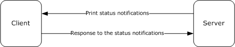
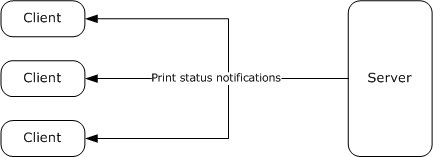
<!-- /Extracted images from page 14 -->

Figure 1: Bidirectional communication

In unidirectional communication mode, multiple clients can register for the same notifications. The
server sends a given notification to all clients that have registered for it. Because unidirectional
notifications do not require a response, the server can discard the notifications in the absence of an
appropriately registered client.

The following diagram shows unidirectional communication.

Figure 2: Unidirectional communication

Server-resident notification sources create, on behalf of print clients, notification channels to send
notifications as printing events occur. Each channel is created to send only a given notification type
in a single communication mode, unidirectional or bidirectional.

Each notification channel is created to send notifications to registered clients, irrespective of their
authenticated user identity, or to send notifications to the subset of registered clients with
associated authenticated user identity matching that of a specific print client. When registering for
notifications, clients specify the notification type identifier, communication mode, and user
identity filter for the notifications they are interested in receiving.

Unidirectional notification channels are closed only by the notification source that created the channel.
Bidirectional notification channels can be closed by the client that acquired the channel or by the
notification source that created the channel. The interaction with notification sources is described in
3.1.1.6.

The Print System Asynchronous Notification Protocol is based on the RPC Protocol, and it defines the
following two RPC interfaces, which are called by the client and implemented by the server:



IRPCAsyncNotify, which is used to register and deregister clients, establish notification channels,
and send data back and forth between the client and the server.



IRPCRemoteObject, which is used to create and destroy remote objects that refer to printers.

This specification also defines the AsyncUI notification type, which exists to support a client
component that receives and interprets notifications from server-hosted notification sources, such as
printer drivers. The AsyncUI client component can be used to display an informative message, send

14 / 91

[MS-PAN] - v20240423
Print System Asynchronous Notification Protocol
Copyright © 2024 Microsoft Corporation
Release: April 23, 2024

<!-- Extracted images from page 15 -->
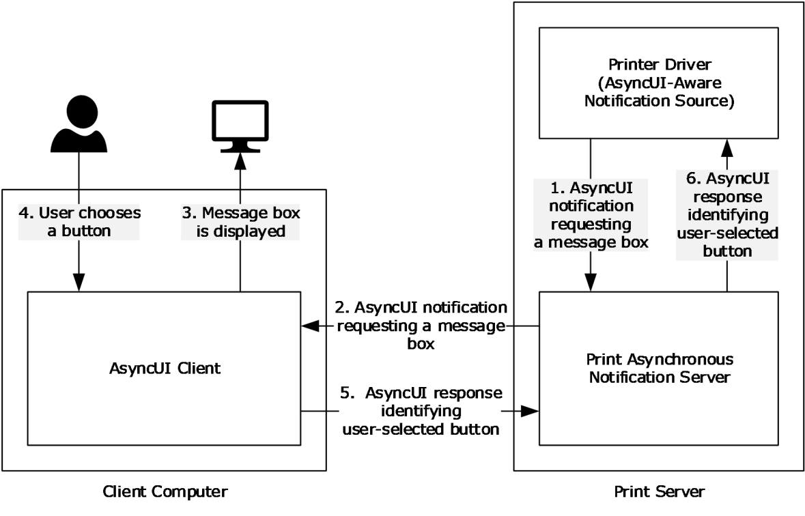
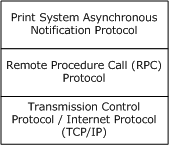
<!-- /Extracted images from page 15 -->

user input back to the notification source on the server, or trigger the execution of printer driver code
on the client computer. The following diagram illustrates the relationship between a notification source
and an AsyncUI client.

Figure 3: Relationship between a notification source and an AsyncUI client

### 1.4 Relationship to Other Protocols

The Print System Asynchronous Notification protocol is dependent on RPC [MS-RPCE] running on
TCP/IP. These protocol relationships are shown in the following figure:

Figure 4: Protocol Relationships

No protocols are dependent on the Print System Asynchronous Notification protocol.

### 1.5 Prerequisites/Preconditions

The Print System Asynchronous Notification Protocol has the prerequisites common to RPC interfaces
([MS-RPCE] section 1.5). It is a precondition of invoking this protocol that a client obtains the name of
a server that supports this protocol.

15 / 91

[MS-PAN] - v20240423
Print System Asynchronous Notification Protocol
Copyright © 2024 Microsoft Corporation
Release: April 23, 2024

This specification assumes that a server that generates AsyncUI notifications and the clients that
receive them both agree on resource files, resource keys within those files, and positional
parameters within string resources that are referenced in those notifications.

### 1.6 Applicability Statement

The Print System Asynchronous Notification Protocol is applicable only for printing operations between
a machine functioning as a client and a machine functioning as a print server. The protocol is
intended for the communication of notifications and responses between notification sources
operating on a print server and client applications.

The protocol can be used in a broad set of scenarios ranging from home use, where one computer
makes its printer available for use by other computers, to enterprise use, where a print server
provides printing services for many computers.

The protocol is not applicable outside client/server printing and monitoring print operations.

### 1.7 Versioning and Capability Negotiation

This specification covers versioning issues in the following areas:

Supported Transports: The Print System Asynchronous Notification Protocol uses RPC over TCP only
(section 2.1).

Protocol Versions: There is only one version of this protocol. It has a built-in versioning and
extensibility feature that can be used to send and receive new data formats by defining new
notification types and creating associated notification type identifiers (section 2.2.1).

Security and Authentication Methods: This protocol uses Simple and Protected Generic Security
Service Application Program Interface Negotiation Mechanism (SPNEGO) Protocol Extensions [MS-
SPNG] and RPC packet authentication level for security and authentication (section 2.1).

Localization: The AsyncUI notification types pass string resource keys in various message data
formats. Localization considerations for the associated string resources are specified in section 2.2.6.

Capability Negotiation: There is no capability negotiation mechanism built into the protocol itself. A
vendor can, however, define a new notification type identifier and associate it with a set of
notification and response data formats and sequencing rules (section 2.2.1).

### 1.8 Vendor-Extensible Fields

The Print System Asynchronous Notification Protocol uses HRESULT method return values [MS-
ERREF]. In addition to the values defined in this specification and those defined in [MS-ERREF],
vendors are free to choose their own values for this field, but the C bit (0x20000000) MUST be set,
indicating it is a customer code.

Unless otherwise stated in this specification, a client of this protocol MUST NOT interpret returned
error codes. The client MUST simply return error codes to the invoking application without taking any
protocol action.

The set of notification types used by this protocol is extensible. New notification types can be
defined and associated with new notification type identifiers. This mechanism (section 2.2.1)
enables future versioning and extensibility.

[MS-PAN] - v20240423
Print System Asynchronous Notification Protocol
Copyright © 2024 Microsoft Corporation
Release: April 23, 2024

16 / 91

### 1.9 Standards Assignments

 Parameter

 Value

Reference

RPC UUID for the IRPCAsyncNotify
interface (section 3.1)

0b6edbfa-4a24-4fc6-8a23-
942b1eca65d1

[C706], Appendix A. For more
information, see section 3.1.1.

RPC UUID for the IRPCRemoteObject
interface (section 3.2)

ae33069b-a2a8-46ee-a235-
ddfd339be281

[C706] Appendix A. For more
information, see section 3.1.2.

[MS-PAN] - v20240423
Print System Asynchronous Notification Protocol
Copyright © 2024 Microsoft Corporation
Release: April 23, 2024

17 / 91

## 2 Messages

### 2.1 Transport

The Print System Asynchronous Notification Protocol MUST use:



The transport RPC over TCP/IP ([MS-RPCE] section 2.1.1.1).

  RPC dynamic endpoints ([C706] chapter 6).

  UUIDs (section 1.9).

A server of this protocol MUST use:

  A security provider that supports SPNEGO Protocol Extensions ([MS-RPCE] section 3 and [MS-

SPNG]).



The default server principal name for the security provider, which is the authentication-service
constant RPC_C_AUTHN_GSS_NEGOTIATE. For information concerning Windows
authentication-service constants [MSDN-AUTHN].

A client of this protocol MUST use:

  A security provider that supports SPNEGO Protocol Extensions ([MS-RPCE] section 3 and [MS-

SPNG]).

  A principal name constructed by appending the name of the print server to the string "host/".



Packet authentication level ([MS-RPCE] section 3).

### 2.2 Common Data Types

This protocol MUST indicate to the RPC runtime that it is to support both the Network Data
Representation (NDR) and NDR64 transfer syntaxes, and provide a negotiation mechanism for
determining which transfer syntax will be used ([MS-RPCE] section 3).

In addition to RPC base types and definitions ([C706] section 4.2.9 and [MS-RPCE] section 2.2.1),
additional data types are defined in the following sections.

#### 2.2.1 PrintAsyncNotificationType

The PrintAsyncNotificationType data type supports the definition of unique functional categories of
notifications for the Print System Asynchronous Notification Protocol. This type is used for matching
notifications from the server to appropriate clients.

This type is declared as follows:

 typedef GUID PrintAsyncNotificationType;

PrintAsyncNotificationType MUST be a notification type identifier.

This protocol defines a reserved notification type identifier value, NOTIFICATION_RELEASE
(ba9a5027-a70e-4ae7-9b7d-eb3e06ad4157). This value is not associated with any specific set of
notification and response data formats, but rather has special meaning in the definition of this
protocol. This value indicates that a client or server is not accepting further communication (sections
3.1.1.4.4, 3.1.1.4.5, and 3.1.1.4.6).

[MS-PAN] - v20240423
Print System Asynchronous Notification Protocol
Copyright © 2024 Microsoft Corporation
Release: April 23, 2024

18 / 91

This protocol also defines the notification and response data formats for the AsyncUI notification
type. Associated with the AsyncUI notification type is its notification type identifier. The value
AsyncPrintNotificationType_AsyncUI (f6853f92-eb31-4e23-b6e7-fd69056153f0) indicates that the
notification data byte arrays contain AsyncUI data formats. For details, see sections 2.2.7, 3.1.3, and
3.2.3.

Finally, this protocol defines notification and response data formats for the printer configuration
notification type. The value AsyncPrintNotificationType_PrinterConfiguration (2abad223-b994-
4aca-82fd4571b1b585ac) indicates that the notification data byte arrays contain printer configuration
data formats. For details, see sections 2.2.8, 3.1.4, and 3.2.4.

#### 2.2.2 PrintAsyncNotifyUserFilter

The PrintAsyncNotifyUserFilter enumeration is used by clients when they register to receive
notifications from server-resident notification sources. The following types of notifications can be
requested:

  Notifications intended specifically for a particular client's user identity.

  Notifications intended for all registered client user identities.

 typedef [v1_enum] enum
 {
   kPerUser = 0,
   kAllUsers = 1,
 } PrintAsyncNotifyUserFilter;

kPerUser:  Indicates that the client is requesting notifications that are intended specifically for its own

user identity and notifications that are intended for all registered user identities.

kAllUsers:  Indicates that the client is requesting every notification, whether intended for a specific

user identity or for all registered user identities.

#### 2.2.3 PrintAsyncNotifyConversationStyle

The PrintAsyncNotifyConversationStyle enumeration MUST specify the communication mode expected
between the sender and a registered client.

 typedef [v1_enum] enum
 {
   kBiDirectional = 0,
   kUniDirectional = 1,
 } PrintAsyncNotifyConversationStyle;

kBiDirectional:  Bidirectional communication mode is specified. The sender expects the client to

send responses to notifications.

kUniDirectional:  Unidirectional communication mode is specified. The sender does not expect

the client to respond to notifications.

#### 2.2.4 PRPCREMOTEOBJECT

The PRPCREMOTEOBJECT data type defines an RPC context handle, which corresponds to the server
remote object representing a client registration. A client MUST call IRPCRemoteObject_Create to
create a PRPCREMOTEOBJECT handle, and IRPCRemoteObject_Delete to delete a PRPCREMOTEOBJECT
handle (section 3.1.2.4).

19 / 91

[MS-PAN] - v20240423
Print System Asynchronous Notification Protocol
Copyright © 2024 Microsoft Corporation
Release: April 23, 2024

This type is declared as follows:

 typedef [context_handle] void* PRPCREMOTEOBJECT;

#### 2.2.5 PNOTIFYOBJECT

The PNOTIFYOBJECT data type defines an RPC context handle, which corresponds to the server
object representing a notification channel. This handle is used in bidirectional communication
mode only.

This type is declared as follows:

 typedef [context_handle] void* PNOTIFYOBJECT;

#### 2.2.6 AsyncUI Default Resource File String Resources

AsyncUI default resource file string resources are used to specify localizable text for the user interface
of the Print System Asynchronous Notification protocol. Each string resource defines a unique key
and a corresponding localizable text string. An AsyncUI client uses the key to retrieve the text string
from a resource file.

String resources that convey information equivalent to the localizable text in the following table MUST
be present in a default resource file. The string resources MUST include the same number of
position parameter replacement tags as are present in the table, with equivalent meanings.

In the text strings that follow, position parameter replacement tags are indicated by "%" characters.
Reading from left to right, "%1" is the first parameter, "%2" is the second parameter, and so on. The
"!format string!" after a position parameter replacement tag specifies the format of the parameter.
Specifically, in the case of the string resource localizable text with resource key 2702, the notation
"%1!d!" indicates that the first parameter is formatted as a signed decimal integer.

String resource
key

String resource localizable text

100

101

102

103

104

105

106

107

108

109

110

"..."

"This document was sent to the printer"

"Document: %1\nPrinter: %2\nTime: %3\nTotal pages: %4"

"Printer out of paper"

"Printer '%1' is out of paper."

"This document failed to print"

"Document: %1\nPrinter: %2\nTime: %3\nTotal pages: %4"

"Printer door open"

"The door on '%1' is open."

"Printer in an error state"

"'%1' is in an error state."

[MS-PAN] - v20240423
Print System Asynchronous Notification Protocol
Copyright © 2024 Microsoft Corporation
Release: April 23, 2024

20 / 91

String resource
key

String resource localizable text

111

112

113

114

115

116

117

118

119

120

121

122

123

124

125

126

127

128

129

130

131

132

600

601

1000

1001

1002

1003

1004

1005

1006

"Printer out of toner/ink"

"'%1' is out of toner/ink."

"Printer not available"

"'%1' is not available for printing."

"Printer offline"

"'%1' is offline."

"Printer out of memory"

"'%1' has run out of memory."

"Printer output bin full"

"The output bin on '%1' is full."

"Printer paper jam"

"Paper is jammed in '%1'."

"Printer out of paper"

"'%1' is out of paper."

"Printer paper problem"

"'%1' has a paper problem."

"Printer paused"

"'%1' is paused."

"Printer needs user intervention"

"'%1' has a problem that requires your intervention."

"Printer is low on toner/ink"

"'%1' is low on toner/ink."

"OK"

"Cancel"

"Document: %1\n"

"Printer: %1\n"

"Paper size: %1\n"

"Ink: %1\n"

"Cartridge: %1\n"

"Paper jam area: %1\n"

"A printer problem occurred"

[MS-PAN] - v20240423
Print System Asynchronous Notification Protocol
Copyright © 2024 Microsoft Corporation
Release: April 23, 2024

21 / 91

String resource
key

String resource localizable text

1007

1008

1009

1100

1101

1102

1200

1201

1202

1203

1204

1300

1301

1302

1400

1401

1402

1403

1500

1501

1502

1503

1600

1601

1700

1701

1800

1801

1802

"Please check the printer for any problems."

"Please check the printer status and settings."

"Check if the printer is online and ready to print."

"The printer is ready to print on the other side of the paper."

"To finish double-sided printing, remove the paper from the output tray. Re-insert the paper
in the input tray, facing up."

"To finish double-sided printing, remove the paper from the output tray. Re-insert the paper
in the input tray, facing down."

"Press the Resume button on the printer when done."

"Press the Cancel button on the printer when done."

"Press the OK button on the printer when done."

"Press the Online button on the printer when done."

"Press the Reset button on the printer when done."

"The printer is offline."

"Windows could not connect to your printer. Please check the connection between the
computer and the printer."

"The printer is not responding. Please check the connection between your computer and the
printer."

"Paper Jam"

"Your printer has a paper jam."

"Please check the printer and clear the paper jam. The printer cannot print until the paper
jam is cleared."

"Please clear the paper jam on the printer."

"Your printer is out of paper."

"Please check the printer and add more paper."

"Please check the printer and add more paper in tray %1."

"Please check the printer and add more %1 paper in tray %2."

"The output tray on your printer is full."

"Please empty the output tray on the printer."

"Your printer has a paper problem"

"Please check your printer for paper problems."

"Your printer is out of ink"

"The ink cartridge in your printer is empty."

"Your printer is out of toner."

[MS-PAN] - v20240423
Print System Asynchronous Notification Protocol
Copyright © 2024 Microsoft Corporation
Release: April 23, 2024

22 / 91

String resource
key

String resource localizable text

1803

1804

1805

2000

2001

2002

2003

2004

2005

2006

2007

2008

2009

2010

2011

2012

2013

2014

2015

2016

2017

2018

2100

2101

2102

2103

2104

2105

2106

2200

2201

"Please check the printer and add more ink."

"Please check the printer and replace the ink cartridge."

"Please check the printer and add toner."

"Cyan"

"Magenta"

"Yellow"

"Black"

"Light Cyan"

"Light Magenta"

"Red"

"Green"

"Blue"

"Gloss optimizer"

"Photo Black"

"Matte Black"

"Photo Cyan"

"Photo Magenta"

"Light Black"

"Ink optimizer"

"Blue photo"

"Gray photo"

"Tricolor photo"

"Cyan cartridge"

"Magenta cartridge"

"Black cartridge"

"CMYK cartridge"

"Gray cartridge"

"Color cartridge"

"Photo cartridge"

"A door on your printer is open."

"A cover on your printer is open."

[MS-PAN] - v20240423
Print System Asynchronous Notification Protocol
Copyright © 2024 Microsoft Corporation
Release: April 23, 2024

23 / 91

String resource
key

String resource localizable text

2202

2203

2300

2301

2302

2303

2400

2401

2402

2403

2404

2405

2500

2501

2502

2503

2504

2505

2506

2600

2601

2602

2700

2701

2702

2703

"Please check the printer and close any open doors. The printer cannot print while a door is
open."

"Please check the printer and close any open covers. The printer cannot print while a cover
is open."

"Your printer is not printing"

"Please check your printer"

"Your printer is out of memory"

"Your document might not print correctly. Please see online help."

"Your printer is low on ink"

"The ink cartridge in your printer is almost empty."

"Your printer is low on toner"

"Please check the printer and add more ink when needed."

"Please check the printer and replace the ink cartridge when needed."

"Please check the printer and add toner when needed."

"The ink system in your printer is not working"

"The ink cartridge in your printer is not working"

"The toner system in your printer is not working"

"Please check the ink system in your printer."

"Please check the ink cartridge in your printer."

"Please check the toner system in your printer."

"Please check that the ink cartridge was installed correctly in the printer."

"Printer has been paused"

"'%1' cannot print, because it has been put into a paused state at the device."

"'%1' cannot print, because it has been put into an offline state at the device."

"Your document has been printed."

"Your document is in the output tray."

"%1!d! document(s) pending for %2"

"<unknown>"

#### 2.2.7 AsyncUI XML Notification and Response Formats

This section specifies the data formats for notifications and responses associated with the notification
type identifier value AsyncPrintNotificationType_AsyncUI (section 2.2.1). The data formats are
specified by using a combination of prose and XML schema syntax [W3C-XSD].

24 / 91

[MS-PAN] - v20240423
Print System Asynchronous Notification Protocol
Copyright © 2024 Microsoft Corporation
Release: April 23, 2024

The XML schema fragments contained in this section are drawn from two separate XML schema
documents, one for AsyncUI notifications and one for AsyncUI responses. Both schema documents
specify a value of "qualified" for the elementFormDefault attribute of the root "schema" element.

The XML schema document for AsyncUI notifications MUST specify a targetNamespace attribute
value of "http://schemas.microsoft.com/2003/print/asyncui/v1/request" and also MUST use that URI
as the schema document's default namespace ([XMLNS] sections 2.1 and 3.0).

The XML schema document for AsyncUI responses MUST specify a targetNamespace attribute value
of "http://schemas.microsoft.com/2003/print/asyncui/v1/response", and also MUST use that URI as
the schema document's default namespace.

Server-resident notification sources such as printer drivers can use the AsyncUI notification
type to display printing-related, interactive UIs on client systems.

The XML data contained within AsyncUI notifications and responses MUST obey the syntax of well-
formed XML 1.0 documents ([XML1.0] section 2.1). Furthermore, those documents MUST be encoded
in UTF-16LE (Unicode Transformation Format, 16-bits, little-endian) ([RFC2781] section 4.2).

Note that XML 1.0 [XML1.0], restricts the set of legal characters that can be used. Values that cannot
be expressed in XML MUST NOT be represented in an XML document contained within an AsyncUI
notification or response. Furthermore, some legal characters, such as "<" and "&", require some form
of escaping when encoded in XML. Implementations MUST use an XML-defined mechanism, such as
CDATA ([XML1.0] sections 2.4 and 2.7) or numeric character references ([XML1.0] section 4.1), to
encode such characters within XML documents.

##### 2.2.7.1 Common AsyncUI Elements

The following sections define XML elements common to some of the AsyncUI notification data
formats.

###### 2.2.7.1.1 asyncPrintUIRequest Element

The asyncPrintUIRequest XML element MUST be the root element of XML documents used in the
AsyncUIBalloon (section 2.2.7.2), AsyncUIMessageBox (section 2.2.7.3), AsyncUICustomUI
(section 2.2.7.5), and AsyncUICustomData (section 2.2.7.7) server-to-client notification formats.

The document markup MUST be schema-valid according to the following XML schema, which refers to
additional schema fragments (section 2.2.7). Schema-Validity Assessment of the document's root
element MUST result in a value of "valid" for the [validity] property ([XMLSCHEMA1/2] section
3.3.5).

 <xs:element name="asyncPrintUIRequest">
   <xs:complexType>
     <xs:sequence>
       <xs:element name="v1">
         <xs:complexType>
           <xs:sequence>
             <xs:element name="requestOpen">
               <xs:complexType>
                 <xs:choice>
                   <xs:element
                     ref="balloonUI"
                    />
                   <xs:element
                     ref="messageBoxUI"
                    />
                   <xs:element
                     ref="customUI"
                    />
                   <xs:element

[MS-PAN] - v20240423
Print System Asynchronous Notification Protocol
Copyright © 2024 Microsoft Corporation
Release: April 23, 2024

25 / 91

                     ref="customData"
                    />
                 </xs:choice>
               </xs:complexType>
             </xs:element>
           </xs:sequence>
         </xs:complexType>
       </xs:element>
     </xs:sequence>
   </xs:complexType>
 </xs:element>

Child Elements

Element

Type

Description

v1

N/A

A required element within an asyncPrintUIRequest element that MUST contain
exactly one requestOpen element.

requestOpen

N/A

A required element that MUST contain exactly one balloonUI, messageBoxUI,
customUI, or customData element.

balloonUI

balloonUI

 See section 2.2.7.2.2.

messageBoxUI  messageBoxUI

 See section 2.2.7.3.4.

customUI

customUI

 See section 2.2.7.5.1.

customData

customData

 See section 2.2.7.7.1.

###### 2.2.7.1.2 asyncPrintUIResponse Element

The asyncPrintUIResponse XML element MUST be the root element of the XML documents used in the
AsyncUIMessageBoxReply (section 2.2.7.4) and AsyncUICustomUIReply (section 2.2.7.6) client-
to-server response formats.

The document markup MUST be schema-valid according to the following XML schema, which refers to
additional schema fragments (section 2.2.7). Schema-Validity Assessment of the document's root
element MUST result in a value of "valid" for the [validity] property ([XMLSCHEMA1/2] section
3.3.5).

 <xs:element name="asyncPrintUIResponse">
   <xs:complexType>
     <xs:sequence>
       <xs:element name="v1">
         <xs:complexType>
           <xs:sequence>
             <xs:element name="requestClose">
               <xs:complexType>
                 <xs:choice>
                   <xs:element
                     ref="CustomUI"
                    />
                   <xs:element
                     ref="messageBoxUI"
                    />
                 </xs:choice>
               </xs:complexType>
             </xs:element>
           </xs:sequence>
         </xs:complexType>

[MS-PAN] - v20240423
Print System Asynchronous Notification Protocol
Copyright © 2024 Microsoft Corporation
Release: April 23, 2024

26 / 91

       </xs:element>
     </xs:sequence>
   </xs:complexType>
 </xs:element>

Child Elements

Element

Type

Description

v1

N/A

A required element within an asyncPrintUIResponse element that MUST
contain exactly one requestClose element.

requestClose

N/A

A required element that MUST contain exactly one messageBoxUI or CustomUI
element.

CustomUI

CustomUI

 See section 2.2.7.6.1.

messageBoxUI  messageBoxUI

 See section 2.2.7.3.4.

###### 2.2.7.1.3 title Element

The title XML element specifies a string using attributes or nested text, optionally combined with
nested parameter elements, that SHOULD be used by the AsyncUI client as the displayable title of a
printer event.

If any of the strings specified by attributes or nested text contains position parameter replacement
tags, the client MUST replace the parameters with strings that are constructed from the sequence of
parameter elements.

 <xs:element name="title">
   <xs:complexType
     mixed="true"
   >
     <xs:sequence>
       <xs:element
         minOccurs="0"
         maxOccurs="unbounded"
         ref="parameter"
        />
     </xs:sequence>
     <xs:attribute name="stringID"
       type="xs:integer"
       use="optional"
      />
     <xs:attribute name="resourceDll"
       type="xs:string"
       use="optional"
      />
   </xs:complexType>
 </xs:element>

Child Elements

Element

Type

Description

parameter  parameter

 See section 2.2.7.1.5.

Attributes

[MS-PAN] - v20240423
Print System Asynchronous Notification Protocol
Copyright © 2024 Microsoft Corporation
Release: April 23, 2024

27 / 91

Name

Type

Description

stringID

xs:integer  The value of this optional attribute, if present, is the key of a string resource in the
resource file specified by the resourceDll attribute. If the resourceDll attribute is
not specified, stringID MUST be used as the key of a string resource in the default
resource file.

String resources that are present in the default resource file are specified in section
2.2.6.

resourceDll  xs:string

The value of this optional attribute, if present, is the driver-file name of a resource
file on the client system that contains the string resources used in this message.

If no value is specified, a default resource file MUST be used.

If the stringID attribute is not specified, the text content in the title element MUST be present, and it
MUST be used by the client as the string to display.

If the stringID attribute is specified, the title element MUST NOT contain nested text, and the client
MUST treat the presence of such text as an error.

Nested text MUST NOT follow a parameter element.

###### 2.2.7.1.4 body Element

The body XML element specifies a string using attributes or nested text, optionally combined with
nested parameter elements that SHOULD be used by the AsyncUI client as the displayable
description of a printer event.

If any of the strings specified by attributes or nested text contains position parameter replacement
tags, the client MUST replace the parameters with strings that are constructed from the sequence of
parameter elements.

If a single notification contains multiple body elements, the client MUST concatenate the text
resulting from the processing of each successive body element to determine the complete displayable
description. The client SHOULD interpose a single space character between each pair of concatenated
strings.

 <xs:element name="body">
   <xs:complexType
     mixed="true"
   >
     <xs:sequence>
       <xs:element
         minOccurs="0"
         maxOccurs="unbounded"
         ref="parameter"
        />
     </xs:sequence>
     <xs:attribute name="stringID"
       type="xs:integer"
       use="optional"
      />
     <xs:attribute name="resourceDll"
       type="xs:string"
       use="optional"
      />
   </xs:complexType>
 </xs:element>

Child Elements

[MS-PAN] - v20240423
Print System Asynchronous Notification Protocol
Copyright © 2024 Microsoft Corporation
Release: April 23, 2024

28 / 91

Element

Type

Description

parameter  parameter

 See section 2.2.7.1.5.

Attributes

Name

Type

Description

stringID

xs:integer  The value of this optional attribute, if present, is the key of a string resource in the
resource file specified by the resourceDll attribute. If the resourceDll attribute is
not specified, stringID MUST be used as the key of a string resource in the default
resource file.

String resources that are present in the default resource file are specified in section
2.2.6.

resourceDll  xs:string

The value of this optional attribute, if present, is the driver-file name of a resource
file on the client system that contains the string resources used in this message. If no
value is specified, a default resource file MUST be used.

If the stringID attribute is not specified, the text content in the body element MUST be present, and
it MUST be used by the client as the string to display.

If the stringID attribute is specified, then the body element MUST NOT contain nested text and the
client MUST treat the presence of such text as an error.

Nested text MUST NOT follow a parameter element.

###### 2.2.7.1.5 parameter Element

The parameter XML element specifies a string using attributes or nested text that provides parameter
substitution information for a string specified by a body or title element.

 <xs:element name="parameter">
   <xs:complexType>
     <xs:simpleContent>
       <xs:extension
         base="xs:string"
       >
         <xs:attribute name="type"
           type="xs:string"
           use="optional"
          />
         <xs:attribute name="stringID"
           type="xs:integer"
           use="optional"
          />
         <xs:attribute name="resourceDll"
           type="xs:string"
           use="optional"
          />
       </xs:extension>
     </xs:simpleContent>
   </xs:complexType>
 </xs:element>

Attributes

Name

Type

Description

type

xs:string

The value of this optional attribute, if present, MUST be the string "PrinterName". If
this value is specified, then the client MUST ignore the stringID and resourceDll

29 / 91

[MS-PAN] - v20240423
Print System Asynchronous Notification Protocol
Copyright © 2024 Microsoft Corporation
Release: April 23, 2024

Name

Type

Description

attributes. For string resource formatting purposes, the client SHOULD use a
recognizable name for the printer that triggered the notification.

stringID

xs:integer  The value of this optional attribute, if present, is the key of a string resource in the

resource file specified by the resourceDll attribute. If the resourceDll attribute is
not specified, stringID MUST be used as the key of a string resource in the default
resource file.

String resources that are present in the default resource file are specified in section
2.2.6.

resourceDll  xs:string

The value of this optional attribute, if present, is the driver-file name of a resource
file on the client system that contains the string resources used in this message. If
neither a type attribute nor a resourceDll attribute is specified, then the default
resource file MUST be used.

If neither the type nor the stringID attribute is specified, then the text content in the parameter
element MUST be present and MUST be used by the client when processing position parameter
replacement tags within a string specified by a title or body element.

If the type attribute is specified, then the parameter element SHOULD NOT contain nested text and
the client SHOULD treat the presence of such text as an error. If stringID is present but the client is
unable to load a corresponding string resource, the client SHOULD use the nested text.

##### 2.2.7.2 AsyncUIBalloon

AsyncUIBalloon is a string that contains a well-formed XML document ([XML1.0] section 2.1). The
root element of the document MUST be the asyncPrintUIRequest element (section 2.2.7.1.1). A
balloonUI element (section 2.2.7.2.2) MUST be nested within the AsyncPrintUIRequest markup at
the point where it is referenced in the XML schema.

AsyncUIBalloon SHOULD be used by a printer driver on a server to deliver to a client UI the details
of an event or a change in device status. Print servers SHOULD also use AsyncUIBalloon to send
details about printer configuration changes, when available, to a client UI.<1>

###### 2.2.7.2.1 action Element

The action XML element directs the client to execute a method at a specific entry point in a specific
file on the client computer.

The action element SHOULD contain text data, encoded as a null-terminated UTF-16LE string
([RFC2781] section 4.2), to pass to the method indicated by the entrypoint attribute. The
mechanism by which the client invokes the executable code is specific to the client
implementation.<2>

 <xs:element name="action">
   <xs:complexType>
     <xs:simpleContent>
       <xs:extension
         base="xs:string"
       >
         <xs:attribute name="dll"
           type="xs:string"
           use="required"
          />
         <xs:attribute name="entrypoint"
           type="xs:string"
           use="required"
          />
       </xs:extension>

[MS-PAN] - v20240423
Print System Asynchronous Notification Protocol
Copyright © 2024 Microsoft Corporation
Release: April 23, 2024

30 / 91

     </xs:simpleContent>
   </xs:complexType>
 </xs:element>

Attributes

Name

Type

Description

dll

xs:string  The value of this attribute is a string that contains the driver-file name of a file on the

client system that contains executable code. The driver-file name MUST NOT contain any
of the following Unicode standard [UNICODE] characters:

 \ (character code U+005C)

/ (character code U+002F)

? (character code U+003F)

* (character code U+002A)

< (character code U+003C)

> (character code U+003E)

" (character code U+0022)

| (character code U+007C)

: (character code U+003A)

entrypoint  xs:string  The value of this attribute is a string that specifies a public method in the file designated

by the dll attribute.

###### 2.2.7.2.2 balloonUI Element

The balloonUI XML element contains information on a printer event that can be displayed on the client
computer. The notification MUST contain references to string resources that pertain to printer
events.

A balloonUI element can optionally call for the execution of code on the client system by means of a
nested action element.

 <xs:element name="balloonUI">
   <xs:complexType>
     <xs:sequence>
       <xs:element
         ref="title"
        />
       <xs:element
         maxOccurs="unbounded"
         ref="body"
        />
       <xs:element
         minOccurs="0"
         ref="action"
        />
     </xs:sequence>
     <xs:attribute name="iconID"
       type="xs:integer"
       use="optional"
      />
     <xs:attribute name="resourceDll"
       type="xs:string"
       use="optional"
      />
   </xs:complexType>

[MS-PAN] - v20240423
Print System Asynchronous Notification Protocol
Copyright © 2024 Microsoft Corporation
Release: April 23, 2024

31 / 91

 </xs:element>

Child Elements

Element  Type  Description

title

title

 See section 2.2.7.1.3.

body

body

 See section 2.2.7.1.4.

action

action

 See section 2.2.7.2.1

Attributes

Name

Type

Description

iconID

xs:integer  The value of this optional attribute, if present, is the key of an icon resource in the

resource file specified by the resourceDll attribute. If an iconID is provided, a
resourceDll MUST also be specified.

resourceDll  xs:string

The value of this optional attribute, if present, is the driver-file name of a resource
file on the client system that contains the icon resource specified by the iconID
attribute. If this attribute is not specified, a generic icon SHOULD be used.

##### 2.2.7.3 AsyncUIMessageBox

AsyncUIMessageBox is a string that contains a well-formed XML document ([XML1.0] section 2.1).

The root element of the document MUST be the asyncPrintUIRequest element (section 2.2.7.1.1). A
messageBoxUI element (section 2.2.7.3.4) MUST be nested within the AsyncPrintUIRequest markup at
the point where it is referenced in the XML schema.

AsyncUIMessageBox SHOULD be used by a printer driver on a server to deliver to a client UI the
details of an event or a change in device status and to request input from the user to guide its
handling of the event or change in status.

###### 2.2.7.3.1 button Element

The button XML element contains information on a button control in the UI that SHOULD be displayed
on the client computer.

 <xs:element name="button">
   <xs:complexType>
     <xs:sequence />
     <xs:attribute name="stringID"
       type="xs:integer"
       use="optional"
      />
     <xs:attribute name="resourceDll"
       type="xs:string"
       use="optional"
      />
     <xs:attribute name="buttonID"
       use="required"
     >
       <xs:simpleType>
         <xs:restriction
           base="xs:string"

[MS-PAN] - v20240423
Print System Asynchronous Notification Protocol
Copyright © 2024 Microsoft Corporation
Release: April 23, 2024

32 / 91

         >
           <xs:pattern
             value="IDOK|IDCANCEL|\s*(\-|\+)?[0-9]+\s*"
            />
         </xs:restriction>
       </xs:simpleType>
     </xs:attribute>
   </xs:complexType>
 </xs:element>

Attributes

Name

Type

Description

stringID

xs:integer  This attribute MUST be present if the value of the buttonID attribute is neither "IDOK"

nor "IDCANCEL". If present, the value of this attribute MUST be the key of a string
resource in the resource file specified by the resourceDll attribute. If the
resourceDll attribute is not specified, stringID MUST be the key of a string resource
in the default resource file.

String resources that are present in the default resource file are specified in section
2.2.6.

resourceDll  xs:string

The value of this optional attribute, if present, is the driver-file name of a resource
file on the client system, which contains the string resources used in this message. If
no value is specified, the default resource file MUST be used.

buttonID

xs:string

The value of this attribute MUST be a string representation of an integer, or one of the
following case-sensitive strings:

"IDOK" The button SHOULD correspond to OK button behavior in the dialog.

"IDCANCEL" The button SHOULD correspond to Cancel button behavior in the dialog.

If the attribute value is "IDOK" or "IDCANCEL", the stringID and resourceDll values
MUST be ignored.

###### 2.2.7.3.2 buttons Element

The buttons XML element contains a collection of button elements. The client can display these
buttons to present the user with a choice of actions.

 <xs:element name="buttons">
   <xs:complexType>
     <xs:sequence>
       <xs:element
         maxOccurs="5"
         ref="button"
        />
     </xs:sequence>
   </xs:complexType>
 </xs:element>

Child Elements

Element  Type

Description

button

button

 See section 2.2.7.3.1.

[MS-PAN] - v20240423
Print System Asynchronous Notification Protocol
Copyright © 2024 Microsoft Corporation
Release: April 23, 2024

33 / 91

###### 2.2.7.3.3 bitmap Element

The bitmap XML element, if present, specifies a bitmap that can be displayed on the client computer
to describe a printer event.

This element can be used to add an informational graphic to the UI for printer events. For example, in
the case of a paper jam, a schematic could be displayed that indicates where the paper jam occurred.

 <xs:element name="bitmap">
   <xs:complexType>
     <xs:sequence />
     <xs:attribute name="bitmapID"
       type="xs:integer"
       use="required"
      />
     <xs:attribute name="resourceDll"
       type="xs:string"
       use="optional"
      />
   </xs:complexType>
 </xs:element>

Attributes

Name

Type

Description

bitmapID

xs:integer  The value of this attribute is the key of a bitmap resource in the resource file

specified by the resourceDll attribute. If no resourceDll value is specified,
bitmapID MUST be the key of a bitmap resource in a default resource file.

resourceDll  xs:string

The value of this optional attribute is the driver-file name of a resource file on the
client system that contain the bitmap resource used in this message.

###### 2.2.7.3.4 messageBoxUI Element

The messageBoxUI XML element specifies elements that compose a message box for display in a
client UI.

 <xs:element name="messageBoxUI">
   <xs:complexType>
     <xs:sequence>
       <xs:element
         ref="title"
        />
       <xs:element
         minOccurs="0"
         ref="bitmap"
        />
       <xs:element
         maxOccurs="unbounded"
         ref="body"
        />
       <xs:element
         ref="buttons"
        />
     </xs:sequence>
   </xs:complexType>
 </xs:element>

[MS-PAN] - v20240423
Print System Asynchronous Notification Protocol
Copyright © 2024 Microsoft Corporation
Release: April 23, 2024

34 / 91

Child Elements

Element  Type

Description

title

title

 See section 2.2.7.1.3.

bitmap

bitmap

 See section 2.2.7.3.3.

body

body

 See section 2.2.7.1.4.

buttons

buttons

 See section 2.2.7.3.2.

##### 2.2.7.4 AsyncUIMessageBoxUIReply

AsyncUIMessageBoxUIReply is a string that contains a well-formed XML document ([XML1.0] section
2.1).

The root element of the document MUST be an asyncPrintUIResponse element. A messageBoxUI
element MUST be nested within the asyncPrintUIResponse markup at the point where it is referenced
in the XML schema.

The AsyncUIMessageBoxUIReply carries the response from a client to an AsyncUIMessageBoxUIReply
notification.

###### 2.2.7.4.1 buttonID Element

The buttonID XML element specifies the button element from an AsyncUIMessageBox string that was
selected by the user.

If the selected button element has a buttonID attribute value of "IDOK", the buttonID element MUST
contain the value 1. If the selected button element has a buttonID attribute value of "IDCANCEL",
the buttonID element MUST contain the value 2. If the selected button element holds an integer value,
the buttonID element MUST contain that value.

 <xs:element name="buttonID"
   type="xs:integer"
  />

###### 2.2.7.4.2 messageBoxUI Element

The messageBoxUI XML element contains a buttonID element that identifies the button that was
selected by the user.

 <xs:element name="messageBoxUI">
   <xs:complexType>
     <xs:sequence>
       <xs:element
         ref="buttonID"
        />
     </xs:sequence>
   </xs:complexType>
 </xs:element>

Child Elements

[MS-PAN] - v20240423
Print System Asynchronous Notification Protocol
Copyright © 2024 Microsoft Corporation
Release: April 23, 2024

35 / 91

Element  Type

Description

buttonID  buttonID

 See section 2.2.7.4.1 .

##### 2.2.7.5 AsyncUICustomUI

AsyncUICustomUI is a string that contains a well-formed XML document ([XML1.0] section 2.1).

The root element of the document MUST be an asyncPrintUIRequest element (section 2.2.7.1.1). A
customUI element MUST be nested within the asyncPrintUIRequest markup at the point where it is
referenced in the XML schema.

AsyncUICustomUI (or the similar AsyncUICustomData) SHOULD be used by a printer driver on a
server when it requires client-side handling of an event or a change in device status that cannot be
expressed by using an AsyncUIMessageBox or AsyncUIBalloon notification. The AsyncUICustomUI
notification calls for the execution of client-resident code that is associated with the server-resident
printer driver.

###### 2.2.7.5.1 customUI Element

The customUI XML element directs the client to execute a method at a specific entry point in a specific
file on the client computer. This element can also direct the client to respond with the result of the
execution.

The customUI element SHOULD contain text data, encoded as a null-terminated UTF-16LE string
([RFC2781] section 4.2), to pass to the method indicated by the entrypoint attribute. The
mechanism by which the client invokes the executable code is specific to the client
implementation.<3>

If the bidi attribute value is "true", the entrypoint method MUST return a text value encoded as a
null-terminated UTF-16LE string in the AsyncUICustomUIReply response (section 2.2.7.6) to this
notification.

 <xs:element name="customUI">
   <xs:complexType>
     <xs:simpleContent>
       <xs:extension
         base="xs:string"
       >
         <xs:attribute name="dll"
           type="xs:string"
           use="required"
          />
         <xs:attribute name="entrypoint"
           type="xs:string"
           use="required"
          />
         <xs:attribute name="bidi"
           use="required"
         >
           <xs:simpleType>
             <xs:restriction
               base="xs:string"
             >
               <xs:enumeration
                 value="true"
                />
               <xs:enumeration
                 value="false"
                />

[MS-PAN] - v20240423
Print System Asynchronous Notification Protocol
Copyright © 2024 Microsoft Corporation
Release: April 23, 2024

36 / 91

             </xs:restriction>
           </xs:simpleType>
         </xs:attribute>
       </xs:extension>
     </xs:simpleContent>
   </xs:complexType>
 </xs:element>

Attributes

Name

Type

Description

dll

xs:string

The value of this attribute is a string that contains the driver-file name of a file on
the client system that contains executable code. The driver-file name MUST NOT
contain any of the following Unicode standard [UNICODE] characters:

 \ (character code U+005C)

/ (character code U+002F)

? (character code U+003F)

* (character code U+002A)

< (character code U+003C)

> (character code U+003E)

" (character code U+0022)

| (character code U+007C)

: (character code U+003A)

entrypoint  xs:string

The value of this attribute is a string that specifies a public method in the file
designated by the dll attribute.

bidi

enumeration  The value of this attribute MUST specify whether the client is expected to send a

response to the server. The case-sensitive string MUST be one of the following
values.

Value  Description

true

Indicates that the notification containing the customUI element MUST
have been sent over a bidirectional notification channel, and the
client MUST send a response back to the print server. The method
specified by entrypoint MUST return a string, which MUST be returned
to the server in an AsyncUICustomUIReply response.

false

Indicates that the notification containing the customUI element MUST
NOT have been sent over a bidirectional notification channel, and the
client MUST NOT send a response back to the print server.

##### 2.2.7.6 AsyncUICustomUIReply

AsyncUICustomUIReply is a string that contains a well-formed XML document ([XML1.0] section 2.1).

The root element of the document MUST be the asyncPrintUIResponse element. A CustomUI element
MUST be nested within the asyncPrintUIResponse markup at the point where it is referenced in the
XML schema.

AsyncUICustomUIReply MUST carry the response from a client to an AsyncUICustomUI or
AsyncUICustomData notification.

###### 2.2.7.6.1 CustomUI Element

[MS-PAN] - v20240423
Print System Asynchronous Notification Protocol
Copyright © 2024 Microsoft Corporation
Release: April 23, 2024

37 / 91

The CustomUI XML element contains text that encodes the value returned by the call to the
entrypoint method, which is identified in the customUI element of an AsyncUICustomUI notification
or in the customData element of an AsyncUICustomData notification.

 <xs:element name="CustomUI"
   type="xs:string"
  />

##### 2.2.7.7 AsyncUICustomData

AsyncUICustomData is a null-terminated string containing a well-formed XML document ([XML1.0]
section 2.1) followed by binary data.

The root element of the document MUST be the asyncPrintUIRequest element (section 2.2.7.1.1). A
customData element MUST be nested within the asyncPrintUIRequest markup at the point where it is
referenced in the XML schema.

The entry point specified in the customData element MUST be called, passing the binary data as an
argument.

AsyncUICustomData can be used in any case where a printer driver on a server might choose to use
AsyncUICustomUI. However, because AsyncUICustomData encodes the data passed to the specified
entry point in binary form, the AsyncUICustomData notification can transport argument values that
cannot be expressed in legal XML within an AsyncUICustomUI notification.

###### 2.2.7.7.1 customData Element

The customData XML element directs the client to execute a method at a specific entry point in a
specific file on the client computer. This element can also direct the client to respond with the result of
the execution.

The customData element SHOULD contain binary data following the null-terminated XML document to
pass to the method indicated by the entrypoint attribute. The mechanism by which the client invokes
the executable code is specific to the client implementation.<4>

If the bidi attribute value is "true", the entrypoint method MUST return a text value encoded as a
null-terminated UTF-16LE string in the AsyncUICustomUIReply response (section 2.2.7.6) to this
notification.

 <xs:element name="customData">
   <xs:complexType>
     <xs:sequence />
     <xs:attribute name="dll"
       type="xs:string"
       use="required"
      />
     <xs:attribute name="entrypoint"
       type="xs:string"
       use="required"
      />
     <xs:attribute name="bidi"
       use="required"
     >
       <xs:simpleType>
         <xs:restriction
           base="xs:string"
         >
           <xs:enumeration
             value="true"
            />
           <xs:enumeration

[MS-PAN] - v20240423
Print System Asynchronous Notification Protocol
Copyright © 2024 Microsoft Corporation
Release: April 23, 2024

38 / 91

             value="false"
            />
         </xs:restriction>
       </xs:simpleType>
     </xs:attribute>
   </xs:complexType>
 </xs:element>

Attributes

Name

Type

Description

dll

xs:string

The value of this attribute is a string that contains the driver-file name of a file on
the client system that contains executable code. The driver-file name MUST NOT
contain any of the following Unicode standard [UNICODE] characters:

 \ (character code U+005C)

/ (character code U+002F)

? (character code U+003F)

* (character code U+002A)

< (character code U+003C)

> (character code U+003E)

" (character code U+0022)

| (character code U+007C)

: (character code U+003A)

entrypoint  xs:string

The value of this attribute is a string that specifies the entry point of a public method
in the file designated by the dll attribute.

bidi

enumeration  The value of this attribute MUST specify whether the client is expected to send a

response to the server. The case-sensitive string MUST be one of the following
values.

Value  Description

true

Indicates that the notification containing the customData element MUST
have been sent over a bidirectional notification channel and the client
MUST send a response back to the print server. The method specified
by entrypoint MUST return a string that MUST be returned to the
server in an AsyncUICustomUIReply response.

false

Indicates that the notification containing the customData element MUST
NOT have been sent over a bidirectional notification channel and the
client MUST NOT send a response back to the print server.

#### 2.2.8 Printer Configuration Notification Formats

This section specifies the data formats for notifications associated with the notification type identifier
value AsyncPrintNotificationType_PrinterConfiguration (see section 2.2.1). The data formats are
specified by using a combination of text and XML schema syntax (see [W3C-XSD]).

The XML schema document for printer bidirectional notifications MUST specify a targetNamespace
attribute value of "http://schemas.microsoft.com/windows/2005/03/printing/bidi" and also MUST use
that URI as the schema document's default namespace ([XMLNS] sections 2.1 and 3.0).

[MS-PAN] - v20240423
Print System Asynchronous Notification Protocol
Copyright © 2024 Microsoft Corporation
Release: April 23, 2024

39 / 91

Print servers can use the printer configuration notification type to update clients when the printer
configuration changes. Clients MUST use the unidirectional communication mode for this
notification type.

The XML data contained within printer configuration notifications MUST conform to the syntax of well-
formed XML 1.0 documents ([XML1.0] section 2.1). Furthermore, those documents MUST be encoded
in UTF-16LE ([RFC2781] section 4.2).

Note that XML 1.0 [XML1.0], restricts the set of legal characters that can be used. Values that cannot
be expressed in XML MUST NOT be represented in an XML document contained within an AsyncUI
notification or response. Furthermore, some legal characters, such as "<" and "&", require some form
of escaping when encoded in XML. Implementations MUST use an XML-defined mechanism, such as
CDATA ([XML1.0] sections 2.4 and 2.7) or numeric character references ([XML1.0] section 4.1), to
encode such characters within XML documents.

##### 2.2.8.1 Printer Configuration Notification

Printer Configuration Notification is a string that contains a well-formed XML document ([XML1.0]
section 2.1). The root element of the document MUST be the Notification element (section 2.2.8.1.1).
Notification SHOULD be used by a print server to notify a client of change in printer configuration; the
Notification element SHOULD contain one or more Schema elements (section 2.2.8.1.2) representing
the names and values for the new printer configuration settings. If the size of the Printer Configuration
Notification containing all of the changed printer configuration settings exceeds the server's maximum
notification size, the server MUST replace Schema elements in the Printer Configuration Notification
message with ReducedSchema elements (section 2.2.8.1.10) until the size of the Printer Configuration
Notification message is smaller than the maximum notification size.

The document markup MUST be valid according to the following XML schema, whose elements are
described in more detail in the following sections. Schema-Validity Assessment of the document's root
element MUST result in a value of "valid" for the [validity] property ([XMLSCHEMA1/2] section 3.3.5).

 <xs:element name='Notification'>
   <xs:complexType>
     <xs:choice maxOccurs='unbounded'>
       <xs:element name='Schema'>
         <xs:complexType>
           <xs:choice>
             <xs:element name='BIDI_STRING' type='string'/>
             <xs:element name='BIDI_TEXT'   type='string'/>
             <xs:element name='BIDI_ENUM'   type='string'/>
             <xs:element name='BIDI_INT'    type='integer'/>
             <xs:element name='BIDI_FLOAT'  type='float'/>
             <xs:element name='BIDI_BOOL'   type='boolean'/>
             <xs:element name='BIDI_BLOB'   type='base64Binary'/>
           </xs:choice>
           <xs:attribute name='name' use='required'>
             <xs:simpleType>
               <xs:restriction base='string'>
                 <xs:pattern value='\\\w+(\.\w+)*\:\w+'/>
               </xs:restriction>
             </xs:simpleType>
           </xs:attribute>
         </xs:complexType>
       </xs:element>
       <xs:element name='ReducedSchema'>
         <xs:complexType>
           <xs:attribute name='name' use='required'>
             <xs:simpleType>
               <xs:restriction base='string'>
                 <xs:pattern value='\\(\w+(\.\w+)*(\:\w+)?)?'/>
               </xs:restriction>
             </xs:simpleType>
           </xs:attribute>

[MS-PAN] - v20240423
Print System Asynchronous Notification Protocol
Copyright © 2024 Microsoft Corporation
Release: April 23, 2024

40 / 91

         </xs:complexType>
       </xs:element>
     </xs:choice>
     <xs:attribute name='printerName' type='string' use='required'/>
   </xs:complexType>
 </xs:element>

###### 2.2.8.1.1 Notification Element

The Notification element represents changes in the configuration of a printer and contains a list of
Schema elements (section 2.2.8.1.2) and ReducedSchema elements (section 2.2.8.1.10) representing
these changes.

Name

Type

Description

printerName  xs:string  The value of this attribute is a string that contains the name of the print queue whose

configuration has changed.

###### 2.2.8.1.2 Schema Element

The Schema XML element represents a configuration setting for a printer. It contains exactly one
BIDI_STRING (section 2.2.8.1.3), BIDI_TEXT (section 2.2.8.1.4), BIDI_ENUM (section 2.2.8.1.5),
BIDI_INT (section 2.2.8.1.6), BIDI_FLOAT (section 2.2.8.1.7), BIDI_BOOL (section 2.2.8.1.8), or
BIDI_BLOB (section 2.2.8.1.9) element representing the value of the new configuration for the printer.

Name  Type

Description

name

xs:string  The name of the configuration attribute that has changed, corresponding to a name in the

implementation-specific list of printer configuration attributes.<5>

###### 2.2.8.1.3 BIDI_STRING Element

The BIDI_STRING XML element represents a configuration attribute of a printer. It contains a string
that is the value of the configuration setting represented by the Schema element (section 2.2.8.1.2)
containing the BIDI_STRING element.

###### 2.2.8.1.4 BIDI_TEXT Element

The BIDI_TEXT XML element represents a configuration attribute of a printer. It contains a string that
is the value for the configuration setting represented by the Schema element (section 2.2.8.1.2)
containing the BIDI_TEXT element.

###### 2.2.8.1.5 BIDI_ENUM Element

The BIDI_ENUM XML element represents a configuration attribute for a printer. It contains a string
that is the value of the configuration setting represented by the Schema element (section 2.2.8.1.2)
containing the BIDI_ENUM element.

###### 2.2.8.1.6 BIDI_INT Element

[MS-PAN] - v20240423
Print System Asynchronous Notification Protocol
Copyright © 2024 Microsoft Corporation
Release: April 23, 2024

41 / 91

The BIDI_INT XML element represents a configuration attribute for a printer. It contains an integer
that is the value of the configuration setting represented by the Schema element (section 2.2.8.1.2)
containing the BIDI_INT element.

###### 2.2.8.1.7 BIDI_FLOAT Element

The BIDI_FLOAT XML element represents a configuration attribute of a printer. It contains a value of
the float datatype, as defined in [W3C-XSD] section 3.2.4, which is the value of the configuration
setting represented by the Schema element (section 2.2.8.1.2) containing the BIDI_FLOAT element.

###### 2.2.8.1.8 BIDI_BOOL Element

The BIDI_BOOL XML element represents a configuration attribute for a printer. It contains a value of
the Boolean datatype, as defined in [W3C-XSD] section 3.2.2, which is the value of the configuration
setting represented by the Schema element (section 2.2.8.1.2) containing the BIDI_BOOL element.

###### 2.2.8.1.9 BIDI_BLOB Element

The BIDI_BLOB XML element represents a configuration attribute for a printer. It contains a value of
the base64Binary datatype, as defined in [W3C-XSD] section 3.2.16, which is the value of the
configuration setting represented by the Schema element (section 2.2.8.1.2) containing the
BIDI_BLOB element.

###### 2.2.8.1.10 ReducedSchema Element

The ReducedSchema XML element represents only the name of a configuration setting for a printer.
Print servers SHOULD use it only when using the Schema element (section 2.2.8.1.2), which includes
the value of the configuration setting, results in a Printer Configuration Notification (section 2.2.8.1)
message that is too large.

Name  Type

Description

name

xs:string  The name of the configuration attribute that has changed, corresponding to a name in the

implementation-specific list of printer configuration attributes.<6>

[MS-PAN] - v20240423
Print System Asynchronous Notification Protocol
Copyright © 2024 Microsoft Corporation
Release: April 23, 2024

42 / 91

<!-- Extracted images from page 43 -->
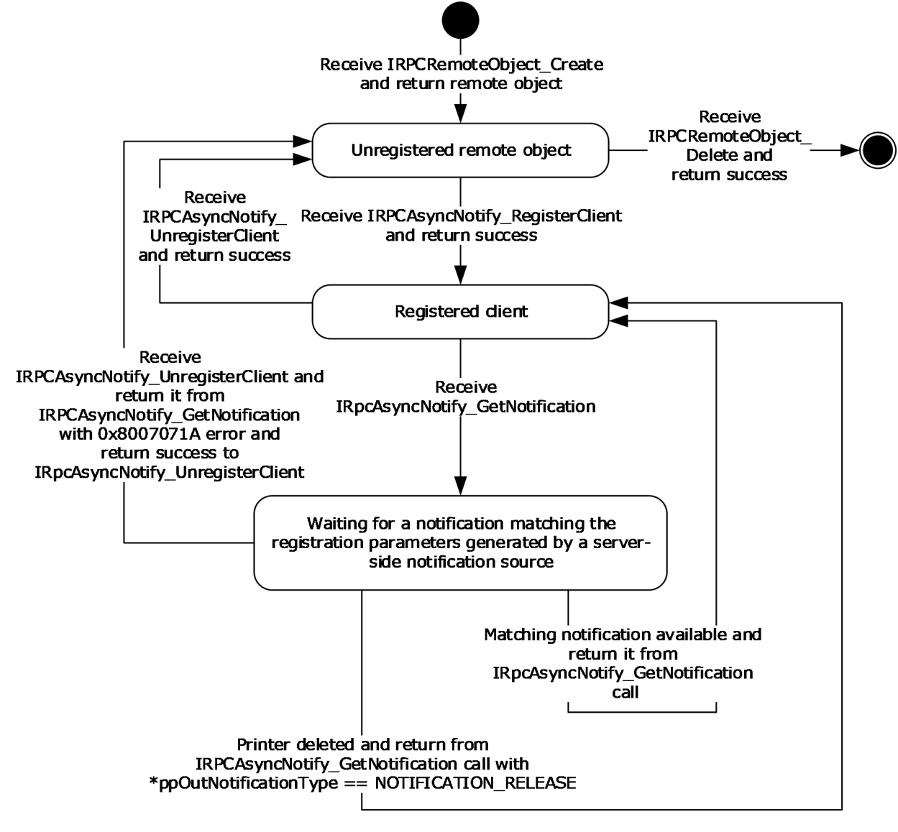
<!-- /Extracted images from page 43 -->

## 3 Protocol Details

The IRPCAsyncNotify interface is identified by UUID 0b6edbfa-4a24-4fc6-8a23-942b1eca65d1.

The IRPCRemoteObject interface is identified by UUID ae33069b-a2a8-46ee-a235-ddfd339be281.

### 3.1 Server Details

#### 3.1.1 IRPCAsyncNotify Server Details

Unidirectional message passing mode in the IRPCAsyncNotify interface is illustrated by the following
server state diagram.

Figure 5: Unidirectional message passing mode

Bidirectional message passing mode is illustrated by the following two server state diagrams. The first
diagram illustrates remote object creation and deletion, client registration, and the opening of

43 / 91

[MS-PAN] - v20240423
Print System Asynchronous Notification Protocol
Copyright © 2024 Microsoft Corporation
Release: April 23, 2024

<!-- Extracted images from page 44 -->
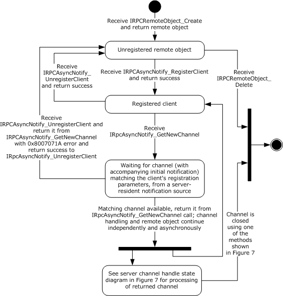
<!-- /Extracted images from page 44 -->

notification channels. The second diagram details the processing of an open channel, including its
eventual closure.

Figure 6: Bidirectional message passing mode

The following diagram illustrates the processing of a single open channel.

[MS-PAN] - v20240423
Print System Asynchronous Notification Protocol
Copyright © 2024 Microsoft Corporation
Release: April 23, 2024

44 / 91

<!-- Extracted images from page 45 -->
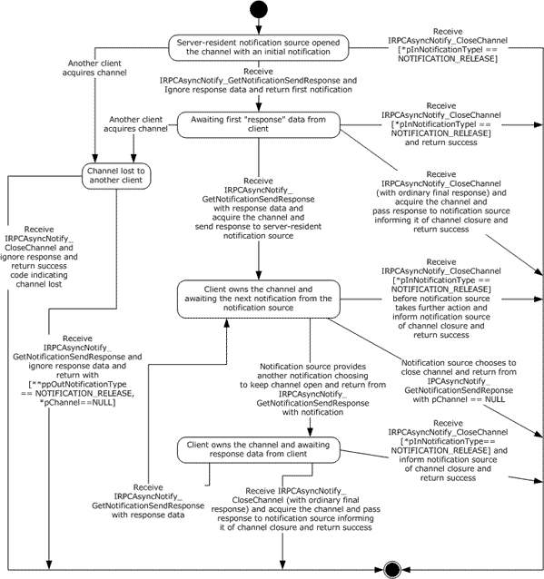
<!-- /Extracted images from page 45 -->

Figure 7: Processing a single open channel

##### 3.1.1.1 Abstract Data Model

This section describes a conceptual model of the possible data organization that an implementation
SHOULD maintain to participate in this protocol. The organization that is described in this section is
provided to facilitate the explanation of how the protocol behaves. This specification does not mandate
that implementations adhere to this model as long as their external behavior is consistent with the
behavior described in this specification.

[MS-PAN] - v20240423
Print System Asynchronous Notification Protocol
Copyright © 2024 Microsoft Corporation
Release: April 23, 2024

45 / 91

This section describes the Print System Asynchronous Notification Protocol in terms of an abstract data
model that represents physical devices as objects and provides interfaces for communication and
configuration management.

Current Authenticated User: A print server data structure scoped to the context of processing a
particular message. This data structure holds an implementation-specific identifier for the
authenticated user identity.

Client Registration: A print server data structure that holds all the information provided by a print
client via input parameters in its call to IRPCAsyncNotify_RegisterClient (section 3.1.1.4.1), as well as
the Current Authenticated User when the server processed the message for the clients call. The
Client Registration maps directly to a registered PRPCREMOTEOBJECT (section 2.2.4). The server
MUST use this information to filter Bidirectional Notification Channels and unidirectional
notifications that are sent to the client from notification sources. Other Local
Events (section 3.1.1.6) specifies this filtering mechanism, which is based upon information associated
with requests that originate from notification sources.

Unidirectional Notification Queue: Associated with each Client Registration in unidirectional
communication mode, a queue of unidirectional notifications that have been initiated by server-
resident notification sources, but which have not yet been returned to the client of the Client
Registration by IRPCAsyncNotify_GetNotification (section 3.1.1.4.5).

Bidirectional Notification Channel Queue: Associated with each Client Registration in
bidirectional communication mode, a queue of bidirectional notification channels that have
been opened by server-resident notification sources, but which have not yet been acquired by a client,
as specified in IRPCAsyncNotify_GetNotificationSendResponse (section 3.1.1.4.4).

Bidirectional Notification Channel: A notification channel that is created for use by a single
notification source in bidirectional communication mode. Associated with each Bidirectional
Notification Channel are PrintAsyncNotificationType and PrintAsyncNotifyUserFilter values (sections
2.2.1 and 2.2.2), and an authenticated user identity, which are provided by the notification source
when the channel is opened, as specified by the local event Bidirectional Notification Channel Opened
(section 3.1.1.6.2).

The Bidirectional Notification Channel is exposed to zero, one, or more clients as a
PNOTIFYOBJECT (section 2.2.5) that is returned by
IRPCAsyncNotify_GetNewChannel (section 3.1.1.4.3). Each client is distinguished by a specific
PNOTIFYOBJECT, and one client, at most, can be marked as having acquired the Bidirectional
Notification Channel. After a particular client has acquired the channel, none of the responses from
other clients will be successfully accepted by the server. This continues even after the channel is
closed; once acquired, the channel can never be acquired again.

Zero or one unsent notifications can be associated with the Bidirectional Notification Channel. Held
notifications are discussed in Bidirectional Notification Generated (section 3.1.1.6.3). A held unsent
notification is used for the initial notification mediating behavior specified in
IRPCAsyncNotify_GetNotificationSendResponse (Opnum 4) (section 3.1.1.4.4).

Note  The preceding conceptual data can be implemented using a variety of techniques.

##### 3.1.1.2 Timers

No timer events are required on the client outside of the timers required in the underlying RPC ([MS-
RPCE] section 3).

##### 3.1.1.3 Initialization

The server MUST listen on dynamically assigned endpoints ([C706] section 6.2.2).

[MS-PAN] - v20240423
Print System Asynchronous Notification Protocol
Copyright © 2024 Microsoft Corporation
Release: April 23, 2024

46 / 91

##### 3.1.1.4 Message Processing Events and Sequencing Rules

This protocol MUST direct the RPC runtime ([MS-RPCE] section 3) to do the following:



Perform a strict NDR data consistency check at target level 6.0.

  Reject a null unique or full pointer with a nonzero conforming value.

Methods in RPC Opnum Order

Method

Description

IRPCAsyncNotify_RegisterClient

This method is called by clients to register to receive
notifications and to associate the parameters describing the
set of notifications they are registering to receive with a
remote object.

Opnum: 0

IRPCAsyncNotify_UnregisterClient

This method is called by registered clients to unregister remote
objects.

Opnum2NotUsedOnWire

Reserved for local use.

Opnum: 2

Opnum: 1

IRPCAsyncNotify_GetNewChannel

This method returns an array of pointers to print notification
channels.

Opnum: 3

IRPCAsyncNotify_GetNotificationSendResponse  This method sends a client response to the server and returns

the next notification sent by way of the same channel when it
becomes available.

Opnum: 4

IRPCAsyncNotify_GetNotification

This method returns notification data from the server.

Opnum: 5

IRPCAsyncNotify_CloseChannel

This method sends a final response on the notification channel
and closes it.

Opnum: 6

In the preceding table, the term "Reserved for local use" means that the client MUST NOT send the
opnum, and the server behavior is undefined<7> because it does not affect interoperability.

###### 3.1.1.4.1 IRPCAsyncNotify_RegisterClient (Opnum 0)

The IRPCAsyncNotify_RegisterClient method is called by clients to register to receive notifications and
to associate the parameters describing the set of notifications they are registering to receive with a
remote object.

 HRESULT IRPCAsyncNotify_RegisterClient(
   [in] PRPCREMOTEOBJECT pRegistrationObj,
   [in, string, unique] const wchar_t* pName,
   [in] PrintAsyncNotificationType* pInNotificationType,
   [in] PrintAsyncNotifyUserFilter NotifyFilter,
   [in] PrintAsyncNotifyConversationStyle conversationStyle,
   [out, string] wchar_t** ppRmtServerReferral
 );

[MS-PAN] - v20240423
Print System Asynchronous Notification Protocol
Copyright © 2024 Microsoft Corporation
Release: April 23, 2024

47 / 91

pRegistrationObj: MUST be the remote object context handle that was returned by the server in the
ppRemoteObject output parameter of a prior call to IRPCRemoteObject_Create (section 3.1.2.4.1).
This value MUST NOT be NULL.

pName: MUST be NULL or a pointer to a NULL-terminated string, encoded in Unicode UTF-16LE

([RFC2781] section 4.2), which specifies the full UNC name of the print queue from which the
print client is registering to receive notifications.

This UNC name MUST be in the following format:

 "\\" SERVER_NAME "\" LOCAL_PRINTER_NAME

SERVER_NAME is a DNS, NetBIOS, IPv4, or IPv6 host name.

LOCAL_PRINTER_NAME is a string that MUST NOT contain the characters "\" or ",".

DNS names are specified in [RFC819] section 2, and NetBIOS names are specified in [RFC1001]
section 14. Basic notational conventions are specified in [RFC2616] section 2, and "host" is defined in
[RFC3986] section 3.2.2.

If pName is NULL, the registration MUST be made for the remote print server itself.

pInNotificationType: MUST be a pointer to a PrintAsyncNotificationType structure that specifies the

notification type identifier for the notifications that the client is registering to receive.

NotifyFilter: MUST be a value of type PrintAsyncNotifyUserFilter that specifies whether the client is
registering to receive notifications that are issued to all registered clients, irrespective of their
authenticated user identity, or to receive notifications that are issued only to the specific
authenticated user identity of the registering RPC client.

conversationStyle: MUST be a value of type PrintAsyncNotifyConversationStyle that specifies

whether the client is registering for bidirectional communication mode or unidirectional
communication mode.

ppRmtServerReferral: Servers SHOULD return NULL for this parameter, and clients MUST ignore it

on receipt.

Return Values: This method MUST return zero to indicate success, or an HRESULT error value ([MS-
ERREF] section 2.1.1) to indicate failure. Protocol-specific error values are defined in the following
table. The client SHOULD treat all error return values the same, except where noted.

Return
value

Description

0x80070005

The client does not have authorization to register for notifications with the set of parameters
specified in this call.

If this error value is returned, the client SHOULD NOT retry this call; the client SHOULD consider
the error to be fatal and report it to the higher level caller.

0x8007000E

The server does not have enough memory for the new registration.

0x80070015

The server has reached its maximum registration limit.

0x8007007B

The pName parameter does not conform to the format specified above.

If this error value is returned, the client SHOULD NOT retry this call; the client SHOULD consider
the error to be fatal and report it to the higher level caller.

Exceptions Thrown: No exceptions are thrown beyond those thrown by the underlying RPC protocol

[MS-RPCE].

48 / 91

[MS-PAN] - v20240423
Print System Asynchronous Notification Protocol
Copyright © 2024 Microsoft Corporation
Release: April 23, 2024

Unless specified otherwise, if a failure is indicated by an error return or an exception, the client
SHOULD retry this method call by performing the following steps:

1.  Call IRPCRemoteObject_Create to generate a new PRPCREMOTEOBJECT (section 2.2.4).

2.  Call IRPCAsyncNotify_RegisterClient with the new PRPCREMOTEOBJECT.

Retries SHOULD be separated by time intervals decaying from 1 second to 1 minute to reduce a
potential burden on the server.

The IRPCAsyncNotify_RegisterClient method MUST be called by clients to register for receiving
notifications. Servers MUST associate the given remote object with the registration parameters
specified.

A client MUST NOT call IRPCAsyncNotify_RegisterClient if a prior call to
IRPCAsyncNotify_RegisterClient succeeded using the same PRPCREMOTEOBJECT value, unless a later
call to IRPCAsyncNotify_UnregisterClient also succeeded.

If registering for unidirectional communication mode, a client SHOULD call
IRPCAsyncNotify_GetNotification after a successful call to IRPCAsyncNotify_RegisterClient using the
same PRPCREMOTEOBJECT value.

If registering for bidirectional communication mode, a client SHOULD call
IRPCAsyncNotify_GetNewChannel after a successful call to IRPCAsyncNotify_RegisterClient using the
same PRPCREMOTEOBJECT value.

Servers MUST support the concurrent registration of multiple remote objects with different registration
parameters, including notification type, filter, and communication mode.

Servers SHOULD consider the security and privacy context prior to letting clients monitor and receive
notifications for all user identities. Relevant access rights are defined in the following table.

Name/Value

Description

SERVER_ALL_ACCESS

0x000F0003

Combines the WO (Write Owner), WD (Write DACL), RC (Read Control), and DE
(Delete) bits of the ACCESS_MASK data type ([MS-DTYP] section 2.4.3) with the
following protocol-specific bits:





0x00000001 (bit 31): Access rights to administer print servers.

0x00000002 (bit 30): Access rights to enumerate print servers.

These printing-specific access rights allow a client to administer the server and to
enumerate server components such as print queues.

PRINTER_ALL_ACCESS

0x000F000C

Combines the WO (Write Owner), WD (Write DACL), RC (Read Control), and DE
(Delete) bits of the ACCESS_MASK data type with the following protocol-specific bits:





0x00000004 (bit 29): Access rights for printers to perform administrative tasks.

0x00000008 (bit 28): Access rights for printers to perform basic printing
operations.

These printing-specific access rights allow a client basic and administrative use of print
queues.

For calls to IRPCAsyncNotify_RegisterClient with NotifyFilter set to kAllUsers, if pName is set to NULL,
the server SHOULD fail the call if the calling principal lacks any of the server access rights specified by
SERVER_ALL_ACCESS. If pName points to the name of a print queue, the server SHOULD fail the

49 / 91

[MS-PAN] - v20240423
Print System Asynchronous Notification Protocol
Copyright © 2024 Microsoft Corporation
Release: April 23, 2024

call if the calling principal lacks any of the print queue access rights specified by
PRINTER_ALL_ACCESS. For additional information concerning access rights, see [MS-AZOD] section
1.1.1.5.

###### 3.1.1.4.2 IRPCAsyncNotify_UnregisterClient (Opnum 1)

The IRPCAsyncNotify_UnregisterClient method is called by registered clients to unregister previously-
registered remote objects. For this call to succeed, the remote object MUST have already
successfully called IRPCAsyncNotify_RegisterClient.

 HRESULT IRPCAsyncNotify_UnregisterClient(
   [in] PRPCREMOTEOBJECT pRegistrationObj
 );

pRegistrationObj: MUST be the remote object context handle that MUST have been successfully

registered by a prior call to IRPCAsyncNotify_RegisterClient. This value MUST NOT be NULL.

Return Values: This method MUST return an HRESULT success value ([MS-ERREF] section 2.1.1) to
indicate success, or an HRESULT error value to indicate failure. The client MUST consider all error
return values fatal and report them to the higher-level caller.

Exceptions Thrown: No exceptions are thrown beyond those thrown by the underlying RPC protocol

[MS-RPCE].

If a client call to IRPCAsyncNotify_GetNewChannel or IRPCAsyncNotify_GetNotification is blocked on
the server waiting for a notification channel or notification to become available, the server MUST
process a client call to IRPCAsyncNotify_UnregisterClient without waiting for the notification channel or
notification.

A server MUST NOT do the following:





Indicate success to a client call of IRPCAsyncNotify_UnregisterClient unless a prior call to
IRPCAsyncNotify_RegisterClient succeeded using the same PRPCREMOTEOBJECT value.

Indicate success to a client call of IRPCAsyncNotify_UnregisterClient following a prior successful
call to IRPCAsyncNotify_UnregisterClient by using the same PRPCREMOTEOBJECT value.

A client MUST NOT do the following:

  Call IRPCAsyncNotify_UnregisterClient, unless a prior call to IRPCAsyncNotify_RegisterClient

succeeded by using the same PRPCREMOTEOBJECT value.

  Call IRPCAsyncNotify_UnregisterClient following a prior call to IRPCAsyncNotify_UnregisterClient

by using the same PRPCREMOTEOBJECT value.

###### 3.1.1.4.3 IRPCAsyncNotify_GetNewChannel (Opnum 3)

The IRPCAsyncNotify_GetNewChannel method returns an array of pointers to print notification
channels. This method MUST only be used with bidirectional communication mode.

 HRESULT IRPCAsyncNotify_GetNewChannel(
   [in] PRPCREMOTEOBJECT pRemoteObj,
   [out] unsigned long* pNoOfChannels,
   [out, size_is( , *pNoOfChannels)]
     PNOTIFYOBJECT** ppChannelCtxt
 );

pRemoteObj: MUST be the remote object context handle. This handle is obtained from

IRPCRemoteObject_Create (section 3.1.2.4.1). This remote object MUST have been registered for

50 / 91

[MS-PAN] - v20240423
Print System Asynchronous Notification Protocol
Copyright © 2024 Microsoft Corporation
Release: April 23, 2024

bidirectional communication mode by a prior successful call to
IRPCAsyncNotify_RegisterClient (section 3.1.1.4.1).

pNoOfChannels: MUST specify the number of notification channels returned. The array of notification

channels is specified by the ppChannelCtxt parameter.

The server SHOULD return all not-yet-acquired bidirectional channels in response to a single
IRPCAsyncNotify_GetNewChannel call. The server SHOULD return such channels regardless of
whether they were created before or after client registration or the call to
IRPCAsyncNotify_GetNewChannel.

ppChannelCtxt: MUST specify a pointer to the array of returned notification channels. This data is

represented by a Bidirectional Notification Channel structure in the Abstract Data
Model (section 3.1.1.1).

Return Values: This method MUST return zero to indicate success, or an HRESULT error value ([MS-
ERREF] section 2.1.1) to indicate failure. Protocol-specific error values are defined in the following
table. The client SHOULD treat all error return values the same, except where noted.

Return
value

Description

0x8004000C

The server has not yet returned from a previous call to this method with the same remote object.

If this error value is returned, the client SHOULD NOT retry this call before the previous call to
this method with the specified remote object has completed.

0x8007000E

The server does not have enough memory for the new channel.

0x8007071A

Incoming notifications have been terminated. Upon completion of this call with this return value,
the server MUST fail subsequent calls to this method with the same remote object.

If this error value is returned, the client SHOULD NOT retry this call.

Exceptions Thrown: An exception code of 0x8004000C or 0x8007071A SHOULD be thrown by the
server under the circumstances described in the preceding table for the corresponding return
values. The client MUST treat these exception codes exactly as it would treat the same return
values. No additional exceptions are thrown beyond those thrown by the underlying RPC protocol
[MS-RPCE].

Unless specified otherwise, if a failure is indicated by an error return or an exception, the client
SHOULD retry this method call by performing the following steps:

1.  Call IRPCRemoteObject_Create to generate a new PRPCREMOTEOBJECT (section 2.2.4).

2.  Call IRPCAsyncNotify_RegisterClient with the new PRPCREMOTEOBJECT.

3.  Call IRPCAsyncNotify_GetNewChannel with the new PRPCREMOTEOBJECT.

Retries SHOULD be separated by time intervals decaying from 1 second to 1 minute to reduce a
potential burden on the server. Retries SHOULD terminate when the above sequence succeeds or the
client determines that it is no longer interested in notifications for the particular combination of
notification type, print queue name, conversation style, and user identity filter that were
originally specified in the call to IRPCAsyncNotify_RegisterClient.

If successful, the IRPCAsyncNotify_GetNewChannel method MUST return an array of pointers to print
notification channels.

A server MUST NOT do the following:



Indicate success to a client call of IRPCAsyncNotify_GetNewChannel unless a prior call to
IRPCAsyncNotify_RegisterClient succeeded using the same PRPCREMOTEOBJECT value.

51 / 91

[MS-PAN] - v20240423
Print System Asynchronous Notification Protocol
Copyright © 2024 Microsoft Corporation
Release: April 23, 2024



Indicate success to a client call of IRPCAsyncNotify_GetNewChannel following a prior successful
call to IRPCAsyncNotify_UnregisterClient using the same PRPCREMOTEOBJECT value.

  Complete a call to IRPCAsyncNotify_GetNewChannel unless an unreturned notification channel is

available on the Bidirectional Notification Channel Queue associated with the Client
Registration (Abstract Data Model, section 3.1.1.1), or an abnormal event happened, such as an
initiated server shutdown sequence.

A client SHOULD do the following:

  Call IRPCAsyncNotify_GetNewChannel in response to a prior successful return from

IRPCAsyncNotify_RegisterClient or IRPCAsyncNotify_GetNewChannel.

  Call IRPCAsyncNotify_GetNotificationSendResponse in response to a prior successful return from

IRPCAsyncNotify_GetNewChannel.

A client MUST NOT do the following:

  Call IRPCAsyncNotify_GetNewChannel, unless a prior call to IRPCAsyncNotify_RegisterClient

succeeded by using the same PRPCREMOTEOBJECT value.<8>

  Call IRPCAsyncNotify_GetNewChannel following a prior call to IRPCAsyncNotify_UnregisterClient by

using the same PRPCREMOTEOBJECT value.<9>

###### 3.1.1.4.4 IRPCAsyncNotify_GetNotificationSendResponse (Opnum 4)

The IRPCAsyncNotify_GetNotificationSendResponse method sends a client response to the server and
returns the next notification sent by way of the same channel when it becomes available. This
method MUST be used only with bidirectional communication mode.

 HRESULT IRPCAsyncNotify_GetNotificationSendResponse(
   [in, out] PNOTIFYOBJECT* pChannel,
   [in, unique] PrintAsyncNotificationType* pInNotificationType,
   [in] unsigned long InSize,
   [in, size_is(InSize), unique] byte* pInNotificationData,
   [out] PrintAsyncNotificationType** ppOutNotificationType,
   [out] unsigned long* pOutSize,
   [out, size_is( , *pOutSize)] byte** ppOutNotificationData
 );

pChannel: A pointer to a notification channel that MUST NOT be closed or zero, and which MUST
have been returned by the server in the ppChannelCtxt output parameter of a prior call to
IRPCAsyncNotify_GetNewChannel. If the server closes the notification channel, it MUST set the
pChannel value to NULL upon return from this method. If the notification channel was acquired by
a different client, the server MUST set the pChannel value to NULL upon return from this method.

pInNotificationType: A NULL value or a pointer to a PrintAsyncNotificationType structure that

specifies the notification type identifier of the notification type in which the registered client
is interested.

On the first call to this method, the value of pInNotificationType MUST be NULL. On subsequent
calls to this method, the value of pInNotificationType MUST be a pointer to a
PrintAsyncNotificationType structure that specifies the notification type identifier for which the
client has registered.

InSize: The size, in bytes, of the input data that the pInNotificationData parameter points to. The

server SHOULD impose an upper limit of 0x00A00000 on this value. If the client exceeds the
server-imposed limit, the server MUST return an error result.

[MS-PAN] - v20240423
Print System Asynchronous Notification Protocol
Copyright © 2024 Microsoft Corporation
Release: April 23, 2024

52 / 91

pInNotificationData: A pointer to input data holding the client's response to the previous notification

that was received on the same bidirectional notification channel.

On the first call to this method for a given channel, the client SHOULD provide zero bytes of
response data and the server MUST ignore any response data sent. On subsequent calls to this
method, the response format MUST conform to the requirements of the notification channel's
notification type, and those notification type requirements determine whether or a not a zero-byte
response is acceptable.

If the value of InSize is not 0x00000000, pInNotificationData MUST NOT be NULL.

ppOutNotificationType: A pointer to the returned pointer to the notification type identifier of the

server-to-client notification. If the notification channel was acquired by a different client, the value
MUST be NOTIFICATION_RELEASE (section 2.2.1). If the server needs to close the notification
channel without sending a final response, the value SHOULD be NOTIFICATION_RELEASE. In all
other cases, the value MUST be the same as the notification type identifier of the notification type
for which the client has registered.

pOutSize: A pointer to the returned length of server-to-client notification data, in number of bytes.

The client MAY impose an upper limit on this value that is smaller than the maximum unsigned 32-
bit integer. If the notification channel was acquired by a different client, the server SHOULD set
the value of pOutSize to 0x00000000. If the value of ppOutNotificationType points to
NOTIFICATION_RELEASE, the server SHOULD set the value of pOutSize to 0x00000000.

ppOutNotificationData: A pointer to the returned pointer to server-to-client notification data in a

format that MUST conform to the notification channel's notification type. If the notification channel
was acquired by a different client, the server SHOULD set the value of ppOutNotificationData to
NULL. If the value of ppOutNotificationType points to NOTIFICATION_RELEASE, the client MUST
ignore the content of ppOutNotificationData.

Return Values: This method MUST return zero to indicate success, or an HRESULT error value ([MS-
ERREF] section 2.1.1) to indicate failure. Protocol-specific error values are defined in the following
table. The client MUST consider all error return values fatal and report them to the higher-level
caller.

Return
value

Description

0x80040008

The notification channel represented by pChannel was previously closed.

0x8004000C

The server has not yet returned from a previous call to
IRPCAsyncNotify_GetNotificationSendResponse or
IRPCAsyncNotify_CloseChannel (section 3.1.1.4.6) with the same notification channel.

0x80040012

The size of the client-to-server response exceeded the maximum size.

0x80040014

The notification type identifier is different from the notification type of the notification channel.

0x8007000E

The server does not have enough memory to complete the request.

Exceptions Thrown: No exceptions are thrown beyond those thrown by the underlying RPC protocol

[MS-RPCE].

If a failure is indicated by an error return or an exception, the client SHOULD close the channel.

The first call to this method on the newly opened notification channel serves as a mediator among all
the clients that registered themselves for the given notification type. This MUST be done by blocking
all calls from clients until a matching server-side event occurs, including the following:



The channel issues a notification.

53 / 91

[MS-PAN] - v20240423
Print System Asynchronous Notification Protocol
Copyright © 2024 Microsoft Corporation
Release: April 23, 2024

  An abnormal condition occurs, such as an initiated server shutdown sequence.



The server receives a client request to close the channel.

The server MUST do the following.

  Choose the first client that sent a response, whether by calling this method or by calling

IRPCAsyncNotify_CloseChannel with a notification type identifier other than
NOTIFICATION_RELEASE, and assign the opened notification channel to that client.



For all other clients, set the value of the ppOutNotificationType output parameter to
NOTIFICATION_RELEASE and the value of the pChannel parameter to NULL.

  Return an HRESULT success value [MS-ERREF] to all the other clients that have outstanding

blocked calls to this method.

All subsequent calls to this method MUST take the response provided by the client that was assigned
to the notification channel and pass it to the server-resident notification source that opened the
notification channel. The call MUST return when a subsequent notification is sent from a notification
source using the bidirectional notification channel; the channel is closed; or an abnormal event
happens, such as the print spooler server terminating its execution.

The server MUST NOT indicate success to a client call to this method if a prior call to
IRPCAsyncNotify_CloseChannel succeeded specifying the same notification channel.

A client MUST NOT call IRPCAsyncNotify_GetNotificationSendResponse following a prior successful
return from IRPCAsyncNotify_GetNotificationSendResponse with a NULL output value of the pChannel
parameter or following a prior successful return from IRPCAsyncNotify_CloseChannel.

A client SHOULD call IRPCAsyncNotify_GetNotificationSendResponse or IRPCAsyncNotify_CloseChannel
following a prior successful return from IRPCAsyncNotify_GetNotificationSendResponse with a non-
NULL output value of the pChannel parameter.

###### 3.1.1.4.5 IRPCAsyncNotify_GetNotification (Opnum 5)

The IRPCAsyncNotify_GetNotification method returns notification data from the print server. This
method MUST NOT be used with bidirectional communication mode.

 HRESULT IRPCAsyncNotify_GetNotification(
   [in] PRPCREMOTEOBJECT pRemoteObj,
   [out] PrintAsyncNotificationType** ppOutNotificationType,
   [out] unsigned long* pOutSize,
   [out, size_is(, *pOutSize)] byte** ppOutNotificationData
 );

pRemoteObj: MUST be the remote object context handle. This remote object MUST have been

registered for unidirectional communication mode by a prior successful call to
IRPCAsyncNotify_RegisterClient (section 3.1.1.4.1).

ppOutNotificationType: MUST return a pointer to the notification type identifier of the server-to-

client notification. If the registered remote object has been deleted, the value MUST be
NOTIFICATION_RELEASE (section 2.2.1). In all other cases the value MUST be the same as the
notification type identifier of the notification type for which the print client has registered.

pOutSize: MUST be the length of server-to-client notification data, in number of bytes. The client MAY
impose an upper limit on this value that is smaller than the maximum unsigned 32-bit integer.

ppOutNotificationData: MUST be a pointer to server-to-client notification data in a format that

MUST conform to the channel's notification type.

54 / 91

[MS-PAN] - v20240423
Print System Asynchronous Notification Protocol
Copyright © 2024 Microsoft Corporation
Release: April 23, 2024

Return Values: This method MUST return zero to indicate success, or an HRESULT error value ([MS-
ERREF] section 2.1.1) to indicate failure. Protocol-specific error values are defined in the following
table. The client SHOULD treat all error return values the same, except where noted.

Return
value

Description

0x8004000C

The server has not yet returned from a previous call to this method with the same remote object.

If this error value is returned, the client SHOULD NOT retry this call before the previous call to
this method with the specified remote object has completed.

0x8007000E

The server does not have enough memory to complete the request.

0x8007071A

Incoming notifications have been terminated. Upon completion of this call with this return value,
the server MUST fail subsequent calls to this method with the same remote object.

If this error value is returned, the client SHOULD NOT retry this call.

Exceptions Thrown: An exception code of 0x08004000C or 0x8007071A SHOULD be thrown by the
server under the circumstances described in the preceding table for the corresponding return
values. The client MUST treat these exception codes exactly as it would treat the same return
values. No additional exceptions are thrown beyond those thrown by the underlying RPC protocol
[MS-RPCE].

Unless specified otherwise, if a failure is indicated by an error return or an exception, the client
SHOULD retry this method call by performing the following steps:

1.  Call IRPCRemoteObject_Create (section 3.1.2.4.1) to generate a new

PRPCREMOTEOBJECT (section 2.2.4).

2.  Call IRPCAsyncNotify_RegisterClient with the new PRPCREMOTEOBJECT.

3.  Call IRPCAsyncNotify_GetNotification with the new PRPCREMOTEOBJECT.

Retries SHOULD be separated by time intervals decaying from 1 second to 1 minute to reduce a
potential burden on the server. Retries SHOULD terminate when the above sequence succeeds or the
client determines that it is no longer interested in notifications for the particular combination of
notification type, print queue name, conversation style, and user identity filter that were originally
specified in the call to IRPCAsyncNotify_RegisterClient.

The IRPCAsyncNotify_GetNotification method MUST return data from the server that matches the
registration for the given remote object.

A server MUST NOT do the following:





Indicate success to a client call of IRPCAsyncNotify_GetNotification unless a prior call to
IRPCAsyncNotify_RegisterClient succeeded using the same PRPCREMOTEOBJECT value.

Indicate success to a client call of IRPCAsyncNotify_GetNotification following a prior successful call
to IRPCAsyncNotify_UnregisterClient using the same PRPCREMOTEOBJECT value.

  Complete a call to IRPCAsyncNotify_GetNotification until the Unidirectional Notification Queue
associated with the Client Registration (Abstract Data Model (section 3.1.1.1)) contains an
unreturned notification, or an abnormal condition occurs. An example of an abnormal condition is
an initiated server shutdown sequence or remote object unregistration. An abnormal condition will
result in a failure error code returned prior to the server having data.

A server SHOULD do the following:

  Discard unidirectional notifications in the absence of corresponding registered clients.

[MS-PAN] - v20240423
Print System Asynchronous Notification Protocol
Copyright © 2024 Microsoft Corporation
Release: April 23, 2024

55 / 91

  Buffer unidirectional notifications, up to some implementation-defined limit,<10> for each

registered client that does not have pending IRPCAsyncNotify_GetNotification calls.

If a client wants to receive further notifications from the server, the client SHOULD call
IRPCAsyncNotify_GetNotification in response to a prior successful return from
IRPCAsyncNotify_GetNotification. When the client no longer wants to receive notifications from the
server, it SHOULD call IRPCAsyncNotify_UnregisterClient, either before or after the return from
IRPCAsyncNotify_GetNotification.

A client MUST NOT do the following:

  Call IRPCAsyncNotify_GetNotification unless a prior call to IRPCAsyncNotify_RegisterClient

succeeded, using the same PRPCREMOTEOBJECT value.

  Call IRPCAsyncNotify_GetNotification following a prior call to IRPCAsyncNotify_UnregisterClient by

using the same PRPCREMOTEOBJECT value.

###### 3.1.1.4.6 IRPCAsyncNotify_CloseChannel (Opnum 6)

The IRPCAsyncNotify_CloseChannel method sends a final response on the notification channel and
closes it. This method MUST NOT be used with unidirectional communication mode.

 HRESULT IRPCAsyncNotify_CloseChannel(
   [in, out] PNOTIFYOBJECT* pChannel,
   [in] PrintAsyncNotificationType* pInNotificationType,
   [in] unsigned long InSize,
   [in, size_is(InSize), unique] byte* pReason
 );

pChannel: MUST be a pointer to a notification channel that MUST NOT be closed or zero and that

MUST have been returned by the server in the ppChannelCtxt output parameter of a prior call to
IRPCAsyncNotify_GetNewChannel. Upon receipt, the server MUST set the pChannel value to
NULL.

pInNotificationType: MUST be a pointer to a PrintAsyncNotificationType value. If the client needs to

close the notification channels without sending a final response, then this value SHOULD point to
NOTIFICATION_RELEASE. In all other cases, this value MUST point to the notification type
identifier of the notification type for which the client has registered.

InSize: The server SHOULD impose an upper limit on this value that is smaller than the maximum
unsigned 32-bit integer. That limit SHOULD be 0x00A00000. If the client exceeds the server-
imposed limit, the server MUST return an error result.

If pInNotificationType is NOTIFICATION_RELEASE, then InSize SHOULD be 0x00000000.

pReason: MUST be a pointer to a sequence of bytes conveying final client-to-server response data.
The number of bytes MUST be provided in the InSize parameter. If InSize is not 0x00000000,
then pReason MUST NOT be NULL.

If pInNotificationType is NOTIFICATION_RELEASE, then the client SHOULD provide zero bytes of

response data and the server MUST ignore any response data pointed to by pReason. If
pInNotificationType is not NOTIFICATION_RELEASE, then the response format MUST
conform to the requirements of the notification channel's notification type and those notification
type requirements determine whether or not a zero-byte response is acceptable.

Return Values: This method MUST return zero or an HRESULT success value ([MS-ERREF] section

2.1.1) to indicate success, or an HRESULT error value to indicate failure.

Protocol-specific success values are defined in the following table.

56 / 91

[MS-PAN] - v20240423
Print System Asynchronous Notification Protocol
Copyright © 2024 Microsoft Corporation
Release: April 23, 2024

Return value  Description

0x00040010

Another client has acquired the channel.

Protocol-specific error values are defined in the following table. The client MUST consider all error
return values fatal and report them to the higher-level caller.

Return value  Description

0x80040012

The response exceeds the maximum size allowed by the server.

0x80040014

The notification type identifier is different from the notification type of the notification channel.

0x8007000E

The server does not have enough memory to complete the request.

Exceptions Thrown: No exceptions are thrown beyond those thrown by the underlying RPC protocol

[MS-RPCE].

If a client call to IRPCAsyncNotify_GetNotificationSendResponse is blocked on the server, waiting for a
notification to become available on a notification channel, then the server MUST process a client call to
this method on the same notification channel without waiting for a notification.

A client MUST NOT call IRPCAsyncNotify_CloseChannel following a prior successful return from
IRPCAsyncNotify_GetNotificationSendResponse with a NULL value of pChannel parameter or following
a prior successful return from IRPCAsyncNotify_CloseChannel.<11>

##### 3.1.1.5 Timer Events

No timer events are required on the server outside of the timers required in the underlying RPC
Protocol ([MS-RPCE] section 3).

##### 3.1.1.6 Other Local Events

This protocol does not define the set of printing events that cause notification sources to trigger
notifications.

When a notification source opens a Bidirectional Notification Channel (section 3.1.1.1) or sends a
unidirectional notification, it MUST associate a PrintAsyncNotificationType value (section 2.2.1) with
the request. That value SHOULD be used to match the request to a Client Registration (section
3.1.1.1). The notification source MUST also associate a PrintAsyncNotifyUserFilter value (section 2.2.2)
with the request, to facilitate the application of a user identity filter in performing such matches. If
the PrintAsyncNotifyUserFilter value is kPerUser, the notification source MUST also associate with the
request the authenticated user identity of the user who is the intended target for receiving the
notifications. The rules for interpreting PrintAsyncNotifyUserFilter values to apply a user identity filter
are specified in section 2.2.2.

###### 3.1.1.6.1 Unidirectional Notification Generated

A notification source that provides unidirectional notifications to a print client MUST provide the
following with each notification:

  A PrintAsyncNotificationType value (section 2.2.1).

  A PrintAsyncNotifyUserFilter value (section 2.2.2).

  An authenticated user identity.

###### 3.1.1.6.2 Bidirectional Notification Channel Opened

[MS-PAN] - v20240423
Print System Asynchronous Notification Protocol
Copyright © 2024 Microsoft Corporation
Release: April 23, 2024

57 / 91

A notification source that initiates the exchange of a sequence of one or more notifications and
responses with a print client MUST open a Bidirectional Notification Channel (section 3.1.1.1) to
do so. When opening a Bidirectional Notification Channel, the notification source MUST provide the
following:

  A PrintAsyncNotificationType value (section 2.2.1).

  A PrintAsyncNotifyUserFilter value (section 2.2.2).

  An authenticated user identity.

###### 3.1.1.6.3 Bidirectional Notification Generated

When generating a bidirectional notification, a notification source MUST identify an opened
Bidirectional Notification Channel (section 3.1.1.1). In order to successfully generate a
bidirectional notification, a notification source MUST NOT identify a particular bidirectional notification
channel if a prior notification sent on that channel has not been responded to by a client’s call to
IRPCAsyncNotify_GetNotificationSendResponse (Opnum 4) (section 3.1.1.4.4) or
IRPCAsyncNotify_CloseChannel (Opnum 6) (section 3.1.1.4.6).

When a notification source generates the initial notification for a bidirectional notification channel, the
server MUST hold that notification until one of two events occurs.

  A client acquires the channel by sending a response as an input parameter to a call to

IRPCAsyncNotify_GetNotificationSendResponse (Opnum 4) or IRPCAsyncNotify_CloseChannel
(Opnum 6).



The bidirectional notification channel is closed by the notification source.

When a notification source generates any subsequent notification for a bidirectional notification
channel, the server MUST immediately send it to the client as an output parameter to the
IRPCAsyncNotify_GetNotificationSendResponse (Opnum 4) call that was used by the client to send its
response to the preceding notification.

###### 3.1.1.6.4 Bidirectional Notification Channel Closed

A notification source that terminates the exchange of a sequence of notifications and responses with
a print client MUST close the Bidirectional Notification Channel (section 3.1.1.1). Such a closure
can be due to normal processing or a critical failure in the notification source.

###### 3.1.1.6.5 Impersonate Client

This protocol uses local interfaces provided by the server implementation of [MS-RPCE] to
impersonate the user associated to the security context defined in [MS-RPCE] sections 3.1.1.1.1 and
3.2.1.4.1.1. This local interface is specified in [MS-RPCE] sections 3.1.1.4.2. This event stores an
implementation-specific identifier for the authenticated user identity for the duration of processing
the message reflected in the abstract data model as Current Authenticated User. This local event
occurs for the processing of all messages in section 3.1.1.4.

#### 3.1.2 IRPCRemoteObject Server Details

The IRPCRemoteObject server interface provides methods that allow a client to define a generic
remote object on a server. The version for this interface is 1.0. To receive incoming remote calls for
this interface, the client MUST establish an RPC dynamic endpoint by using the UUID ae33069b-
a2a8-46ee-a235-ddfd339be281.

[MS-PAN] - v20240423
Print System Asynchronous Notification Protocol
Copyright © 2024 Microsoft Corporation
Release: April 23, 2024

58 / 91

##### 3.1.2.1 Abstract Data Model

No abstract data model is required.

##### 3.1.2.2 Timers

No protocol timer events are required on the client beyond the timers required in the underlying RPC
protocol ([MS-RPCE] section 3).

##### 3.1.2.3 Initialization

The server MUST listen on dynamically assigned endpoints (see [C706] section 6.2.2).

##### 3.1.2.4 Message Processing Events and Sequencing Rules

This protocol MUST direct the RPC protocol ([MS-RPCE] section 3) runtime to the following:



Perform a strict NDR data consistency check at target level 6.0.

  Reject a NULL unique or full pointer with non-zero conforming value.

The sections that follow specify the syntax and behavior for each method defined in this interface:

Methods in RPC Opnum Order

Method

Description

IRPCRemoteObject_Create  The method creates a remote object on a server and returns it to the client.

Opnum: 0

IRPCRemoteObject_Delete  The method destroys the specified remote object.

Opnum: 1

###### 3.1.2.4.1 IRPCRemoteObject_Create (Opnum 0)

The IRPCRemoteObject_Create method creates a remote object on a server and returns it to the
client.

 HRESULT IRPCRemoteObject_Create(
   [in] handle_t hRemoteBinding,
   [out] PRPCREMOTEOBJECT* ppRemoteObj
 );

hRemoteBinding: MUST be a client-generated RPC binding handle ([C706] section 2.3) by using a
Universal Naming Convention (UNC) name that MUST uniquely identify a print server on the
network.

ppRemoteObj: MUST be a remote object context handle returned by the server. It MUST be a non-

NULL value.

Return Values: This method MUST return zero to indicate success, or an HRESULT error value ([MS-
ERREF] section 2.1.1) to indicate failure. The client MUST consider all error return values fatal and
report them to the higher-level caller.

[MS-PAN] - v20240423
Print System Asynchronous Notification Protocol
Copyright © 2024 Microsoft Corporation
Release: April 23, 2024

59 / 91

Exceptions Thrown: No exceptions are thrown beyond those thrown by the underlying RPC protocol

[MS-RPCE].

###### 3.1.2.4.2 IRPCRemoteObject_Delete (Opnum 1)

The IRPCRemoteObject_Delete method destroys the specified remote object.

 void IRPCRemoteObject_Delete(
   [in, out] PRPCREMOTEOBJECT* ppRemoteObj
 );

ppRemoteObj: MUST be the remote object to delete. The handle MUST have been returned by the
server in the ppRemoteObj output parameter of a prior call to IRPCRemoteObject_Create and
MUST NOT have been previously deleted. If this handle were previously registered by a successful
call to IRPCAsyncNotify_RegisterClient, then it MUST have been subsequently unregistered by a
call to IRPCAsyncNotify_UnregisterClient. It MUST NOT be NULL.

Upon receipt, the server MUST set the ppRemoteObj value to NULL.

Return Values: This method has no return values.

Exceptions Thrown: No exceptions are thrown beyond those thrown by the underlying RPC protocol

[MS-RPCE].

##### 3.1.2.5 Timer Events

No protocol timer events are required on the server outside of the timers required in the underlying
RPC protocol ([MS-RPCE] section 3).

##### 3.1.2.6 Other Local Events

No higher-level triggered events are processed.

#### 3.1.3 AsyncUI Server Details

The AsyncUI notification type allows for a print-server-resident notification source to request the
following:







The display of an informative alert on a client machine.

The client sends user input requested by the alert back to the server.

The client executes code that is resident on the client machine.

The AsyncUI notification type MUST use the notification type identifier value
AsyncPrintNotificationType_AsyncUI (section 2.2.1).

##### 3.1.3.1 Abstract Data Model

No abstract data model is required.

##### 3.1.3.2 Timers

No timer events are required on the client besides those required in the underlying RPC protocol
([MS-RPCE] section 3).

[MS-PAN] - v20240423
Print System Asynchronous Notification Protocol
Copyright © 2024 Microsoft Corporation
Release: April 23, 2024

60 / 91

##### 3.1.3.3 Initialization

A remote object server (section 3.1.2) and an asynchronous notification server (section 3.1.1)
MUST be fully initialized on the server.

##### 3.1.3.4 Message Processing Events and Sequencing Rules

The Print System Asynchronous Notification Protocol MUST specify the notification type identifier
AsyncPrintNotificationType_AsyncUI when registering for notifications or when requesting or returning
notifications or response data using the methods of the IRPCAsyncNotify interface. The sections that
follow specify the AsyncUI server syntax and behavior for the parameters for those methods.

Methods in RPC Opnum Order

Method

Description

IRPCAsyncNotify_RegisterClient

AsyncUI server parameter details are specified in section
3.1.3.4.1.

Opnum: 0

IRPCAsyncNotify_UnregisterClient

There are no AsyncUI server parameter details for this method.

Opnum2NotUsedOnWire

Opnum: 1

Reserved for local use

Opnum: 2

IRPCAsyncNotify_GetNewChannel

There are no AsyncUI server parameter details for this method.

Opnum: 3

IRPCAsyncNotify_GetNotificationSendResponse  AsyncUI server parameter details are specified in section

3.1.3.4.2.

Opnum: 4

IRPCAsyncNotify_GetNotification

AsyncUI server parameter details are specified in section
3.1.3.4.3.

Opnum: 5

IRPCAsyncNotify_CloseChannel

AsyncUI server parameter details are specified in section
3.1.3.4.4.

Opnum: 6

The specific notification and response formats referenced are defined in section 2.2.7. The behavior
of methods reserved for local use is specified in section 3.1.1.4.

There is no AsyncUI server syntax or behavior for methods of the IRPCRemoteObject
interface (section 3.2).

###### 3.1.3.4.1 IRPCAsyncNotify_RegisterClient (Opnum 0)

The IRPCAsyncNotify_RegisterClient method is specified in section 3.1.1.4.1. Additional AsyncUI-
specific server parameter details are defined here.

pInNotificationType: MUST hold the notification type identifier value.
AsyncPrintNotificationType_AsyncUI (section 2.2.1).

###### 3.1.3.4.2 IRPCAsyncNotify_GetNotificationSendResponse (Opnum 4)

The IRPCAsyncNotify_GetNotificationSendResponse method is specified in section 3.1.1.4.4. Additional
AsyncUI-specific server parameter details are defined here.

61 / 91

[MS-PAN] - v20240423
Print System Asynchronous Notification Protocol
Copyright © 2024 Microsoft Corporation
Release: April 23, 2024

pInNotificationType: MUST hold the notification type identifier value
AsyncPrintNotificationType_AsyncUI (section 2.2.1).

InSize: SHOULD be 0 (section 3.1.1.4.4) on the first IRPCAsyncNotify_GetNotificationSendResponse
call using a given notification channel, the client SHOULD provide 0 bytes of data, and the server
MUST ignore any response data. The AsyncUI notification type requires that any response to the
initial notification sent on a bidirectional notification channel MUST be sent using a call to
IRPCAsyncNotify_CloseChannel and MUST NOT be sent by using a call to
IRPCAsyncNotify_GetNotificationSendResponse.

pInNotificationData: SHOULD be NULL, consistent with the guidance of section 3.1.1.4.4 and the
specification of the InSize parameter.

ppOutNotificationData: MUST hold server-to-client notification data, which conforms to the format
for AsyncUIMessageBox (section 2.2.7.3), AsyncUICustomUI (section 2.2.7.5), or
AsyncUICustomData (section 2.2.7.7). If the notification is of format AsyncUICustomUI (section
2.2.7.5.1) or AsyncUICustomData (section 2.2.7.7.1), the value of the bidi attribute of the
contained "customUI" or "customData" element, specified in sections and respectively, MUST be
"true".

###### 3.1.3.4.3 IRPCAsyncNotify_GetNotification (Opnum 5)

The IRPCAsyncNotify_GetNotification method is specified in section 3.1.1.4.5. Additional AsyncUI-
specific server parameter details are defined here.

ppOutNotificationType: MUST hold either notification type identifier value
AsyncPrintNotificationType_AsyncUI or NOTIFICATION_RELEASE, as specified in section 2.2.1.

ppOutNotificationData: MUST hold server-to-client notification data, which conforms to the data
format for AsyncUIBalloon (section 2.2.7.2), AsyncUICustomUI (section 2.2.7.5), or
AsyncUICustomData (section 2.2.7.7). If the notification is of format AsyncUICustomUI (section
2.2.7.5.1) or AsyncUICustomData (section 2.2.7.7.1), the value of the bidi attribute of the
contained "customUI" or "customData" element, MUST be "false".

###### 3.1.3.4.4 IRPCAsyncNotify_CloseChannel (Opnum 6)

The IRPCAsyncNotify_CloseChannel method is specified in section 3.1.1.4.6. Additional AsyncUI-
specific server parameter details are defined here.

pInNotificationType: MUST hold either notification type identifier value
AsyncPrintNotificationType_AsyncUI or NOTIFICATION_RELEASE (section 2.2.1).

pReason: If pInNotificationType does hold NOTIFICATION_RELEASE, pReason MUST hold
client-to-server response data conforming to the data format for AsyncUIMessageBoxReply
(section 2.2.7.4) or AsyncUICustomUIReply (section 2.2.7.6). The client sequencing rules defining
the conditions under which each response format is sent can be found in section 3.2.3.4.

##### 3.1.3.5 Timer Events

No timer events are required on the server beyond the timers required in the underlying RPC protocol
([MS-RPCE] section 3).

##### 3.1.3.6 Other Local Events

This protocol does not define the set of printing events that cause notification sources to trigger
notifications.

[MS-PAN] - v20240423
Print System Asynchronous Notification Protocol
Copyright © 2024 Microsoft Corporation
Release: April 23, 2024

62 / 91

#### 3.1.4 Printer Configuration Server Details

The printer configuration notification type allows for a print server-resident notification source to
notify a print client of a change in the configuration of a printer on the print server.

The printer configuration notification type MUST use the notification type identifier value
AsyncPrintNotificationType_PrinterConfiguration (section 2.2.1).

##### 3.1.4.1 Abstract Data Model

No abstract data model is required.

##### 3.1.4.2 Timers

No timer events are required on the client beyond those required in the underlying RPC protocol (see
[MS-RPCE] section 3).

##### 3.1.4.3 Initialization

A remote object server (section 3.1.2) and an asynchronous notification server (section 3.1.1) MUST
be fully initialized on the server.

##### 3.1.4.4 Message Processing Events and Sequencing Rules

The Print System Asynchronous Notification Protocol MUST specify the notification type identifier
AsyncPrintNotificationType_PrinterConfiguration when registering for notifications or returning
notification data using the methods of the IRPCAsyncNotify interface and MUST use the
unidirectional communication mode. The sections that follow specify the printer configuration
server syntax and behavior for the parameters of those methods.

Methods in RPC Opnum order:

Method

Description

IRPCAsyncNotify_RegisterClient

Printer configuration server parameter details are specified in
section 3.1.4.4.1.

Opnum: 0

IRPCAsyncNotify_UnregisterClient

There are no printer configuration server parameter details for
this method.

Opnum2NotUsedOnWire

Reserved for local use.

Opnum: 2

Opnum: 1

IRPCAsyncNotify_GetNewChannel

There are no printer configuration server parameter details for
this method.

Opnum: 3

IRPCAsyncNotify_GetNotificationSendResponse  There are no printer configuration server parameter details for
this method.

Opnum: 4

IRPCAsyncNotify_GetNotification

Printer configuration server parameter details are specified in
section 3.1.4.4.2.

Opnum: 5

[MS-PAN] - v20240423
Print System Asynchronous Notification Protocol
Copyright © 2024 Microsoft Corporation
Release: April 23, 2024

63 / 91

Method

Description

IRPCAsyncNotify_CloseChannel

There are no printer configuration server parameter details for
this method.

Opnum: 6

The specific notification and response formats referenced are defined in section 2.2.7. The behavior of
methods reserved for local use is specified in section 3.1.1.4.

There is no printer configuration server syntax or behavior for methods of the IRPCRemoteObject
interface (section 3.2).

###### 3.1.4.4.1 IRPCAsyncNotify_RegisterClient (Opnum 0)

The IRPCAsyncNotify_RegisterClient method is specified in section 3.1.1.4.1. Additional printer
configuration-specific server parameter details are defined here.

pInNotificationType: MUST hold the notification type identifier value

AsyncPrintNotificationType_PrinterConfiguration as specified in section 2.2.1).

conversationStyle: MUST be the conversation style value kUniDirectional (see section 2.2.3).

###### 3.1.4.4.2 IRPCAsyncNotify_GetNotification (Opnum 5)

The IRPCAsyncNotify_GetNotification method is specified in section 3.1.1.4.5. Additional printer
configuration-specific server parameter details are defined here.

ppOutNotificationType: MUST hold either notification type identifier value

AsyncPrintNotificationType_PrinterConfiguration or NOTIFICATION_RELEASE, as
specified in section 2.2.1.

ppOutNotificationData: MUST hold server-to-client notification data that conforms to the data

format for a Printer Configuration Notification (section 2.2.8.1).

##### 3.1.4.5 Timer Events

No timer events are required on the server beyond the timers required in the underlying RPC protocol
(see [MS-RPCE] section 3).

##### 3.1.4.6 Other Local Events

This protocol does not define the set of printing events that cause notification sources to trigger
notifications.

### 3.2 Client Details

#### 3.2.1 IRPCRemoteObject Client Details

##### 3.2.1.1 Abstract Data Model

No abstract data model is required.

[MS-PAN] - v20240423
Print System Asynchronous Notification Protocol
Copyright © 2024 Microsoft Corporation
Release: April 23, 2024

64 / 91

##### 3.2.1.2 Timers

No timers are required beyond those used internally by the RPC Protocol ([MS-RPCE] section 3) to
implement resiliency to network outages.

##### 3.2.1.3 Initialization

The client creates an RPC binding handle ([C706] section 2.3), to the server RPC dynamic endpoint
when an RPC method is called.

##### 3.2.1.4 Message Processing Events and Sequencing Rules

This protocol MUST direct the RPC Protocol ([MS-RPCE] section 3) runtime to do the following:



Perform a strict NDR data consistency check at target level 6.0.

  Reject a NULL unique or full pointer with a non-zero conforming value.

Remote object clients MUST manage the lifetime of the remote objects. Specifically, clients MUST
call IRPCRemoteObject_Delete (section 3.1.2.4) for each successful call to IRPCRemoteObject_Create
(section 3.1.2.4). These methods are specified in section 3.1.2.4.

##### 3.2.1.5 Timer Events

No protocol timer events are required on the client beyond the timers required in the underlying RPC
Protocol ([MS-RPCE] section 3).

##### 3.2.1.6 Other Local Events

A client's invocation of each method is typically the result of local application activity. No other higher-
layer triggered events are processed.

#### 3.2.2 IRPCAsyncNotify Client Details

Unidirectional message passing mode is illustrated by the following client state diagram. This diagram
represents a client that is registering and receiving notifications of a predetermined notification type
and user filter in the IRPCAsyncNotify_RegisterClient parameters.

[MS-PAN] - v20240423
Print System Asynchronous Notification Protocol
Copyright © 2024 Microsoft Corporation
Release: April 23, 2024

65 / 91

<!-- Extracted images from page 66 -->
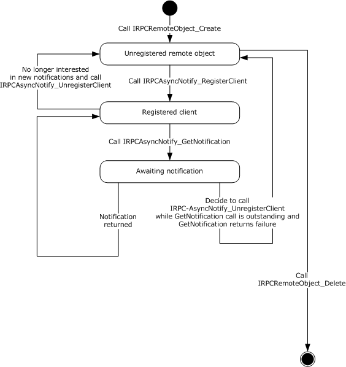
<!-- /Extracted images from page 66 -->

Figure 8: Client registering and receiving notifications of a predetermined notification type

Bidirectional message passing mode is illustrated by the following two client state diagrams. The first
diagram illustrates remote object creation and deletion, client registration, and the opening of
notification channels. The second diagram provides the details of the processing of an open
channel, including its eventual closure.

[MS-PAN] - v20240423
Print System Asynchronous Notification Protocol
Copyright © 2024 Microsoft Corporation
Release: April 23, 2024

66 / 91

<!-- Extracted images from page 67 -->
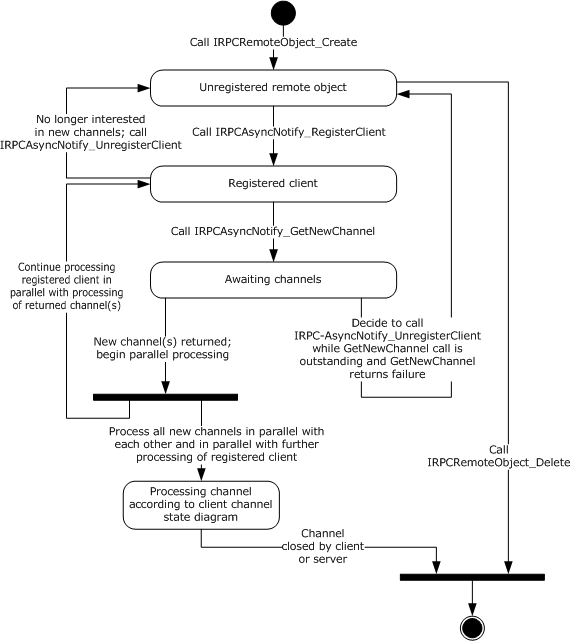
<!-- /Extracted images from page 67 -->

Figure 9: Remote object creation and deletion, client registration, and opening of
notification channels

The following diagram illustrates the processing of a single open channel.

[MS-PAN] - v20240423
Print System Asynchronous Notification Protocol
Copyright © 2024 Microsoft Corporation
Release: April 23, 2024

67 / 91

<!-- Extracted images from page 68 -->
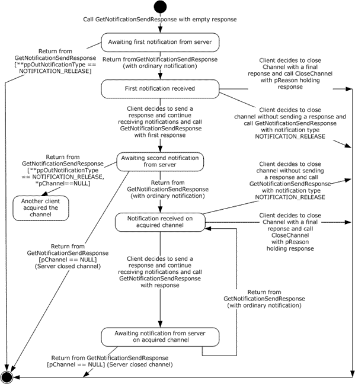
<!-- /Extracted images from page 68 -->

Figure 10: Processing a single open channel

##### 3.2.2.1 Abstract Data Model

No abstract data model is required.

##### 3.2.2.2 Timers

No timers are required outside of those used internally by the RPC Protocol ([MS-RPCE] section 3) to
implement resiliency to network outages.

Note  Although timers are not required, the methods
IRPCAsyncNotify_RegisterClient (section 3.1.1.4.1),

68 / 91

[MS-PAN] - v20240423
Print System Asynchronous Notification Protocol
Copyright © 2024 Microsoft Corporation
Release: April 23, 2024

IRPCAsyncNotify_GetNewChannel (section 3.1.1.4.3) , and
IRPCAsyncNotify_GetNotification (section 3.1.1.4.5) specify the use of a decaying time interval to
separate retries until the connection is reestablished or the client unregisters the remote object.

##### 3.2.2.3 Initialization

The client MUST create a RPC binding handle to the server RPC dynamic endpoint when an RPC
method is called ([C706] section 2.3).

##### 3.2.2.4 Message Processing Events and Sequencing Rules

This protocol MUST direct the RPC ([MS-RPCE] section 3) runtime to do the following:



Perform a strict NDR data consistency check at target level 6.0.

  Reject a NULL unique or full pointer with a non-zero conforming value.

Clients MUST manage registrations throughout their lifetimes. Specifically, clients MUST call
IRPCAsyncNotify_UnregisterClient for each successful call to IRPCAsyncNotify_RegisterClient.

When either IRPCAsyncNotify_GetNewChannel or IRPCAsyncNotify_GetNotification returns with a
success code, the client SHOULD issue the next call of the same kind as soon as possible in order to
minimize the amount of buffering and risk of event loss on the server.

The syntax and behavior for the methods of the IRPCAsyncNotify interface are fully specified in section
3.1.1.4.

##### 3.2.2.5 Timer Events

No timer events are required on the client except the timers that are required in the underlying RPC
Protocol ([MS-RPCE] section 3).

##### 3.2.2.6 Other Local Events

A client's registration is typically the result of printing activity.

#### 3.2.3 AsyncUI Client Details

The AsyncUI notification type MUST use the notification type identifier value
AsyncPrintNotificationType_AsyncUI (section 2.2.1).

The AsyncUI notification type includes some notifications that are sent in unidirectional
communication mode and others that are sent in bidirectional communication mode. In
bidirectional communication mode, the type of notification received by a client determines the
required response type. A client of the AsyncUI notification type that uses the Print System
Asynchronous Notification Protocol to process notification in bidirectional communication mode has the
following state diagram when dealing with a single communication channel.

[MS-PAN] - v20240423
Print System Asynchronous Notification Protocol
Copyright © 2024 Microsoft Corporation
Release: April 23, 2024

69 / 91

<!-- Extracted images from page 70 -->
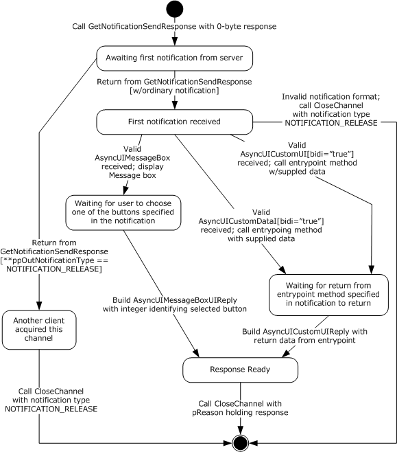
<!-- /Extracted images from page 70 -->

Figure 11: Client state diagram when dealing with a single communication channel

##### 3.2.3.1 Abstract Data Model

No abstract data model is required.

##### 3.2.3.2 Timers

No timer events are required on the client outside of the timers required in the underlying RPC
protocol ([MS-RPCE] section 3).

[MS-PAN] - v20240423
Print System Asynchronous Notification Protocol
Copyright © 2024 Microsoft Corporation
Release: April 23, 2024

70 / 91

##### 3.2.3.3 Initialization

A remote object client (section 3.2.1) and an asynchronous notification client (section 3.2.2) MUST
be fully initialized on the client.

##### 3.2.3.4 Message Processing Events and Sequencing Rules

An AsyncUI client MUST specify a notification type identifier value
AsyncPrintNotificationType_AsyncUI (section 2.2.1) when registering for, requesting, or
responding to notifications or response data, using the methods of the Print System Asynchronous
Notification Protocol.

The AsyncUI-specific syntax and behavior for each method specified in section 3.1.3.4.

There is no AsyncUI-specific syntax or behavior for the IRPCRemoteObject interface methods
described in section 3.1.2.4.

The sections that follow specify the processing of AsyncUI notifications that are delivered to a client
from a printer driver using this protocol.

###### 3.2.3.4.1 AsyncUIBalloon Notification

The AsyncUIBalloon notification MUST use unidirectional communication mode and MUST be
delivered by way of an output parameter of an IRPCAsyncNotify_GetNotification call.

Before acting on a notification, the client SHOULD verify that the notification complies with the
requirements for the AsyncUIBalloon type, but SHOULD accept as compliant the following
inconsistencies with the AsyncUIBalloon specification:

  Clients SHOULD accept XML-element names that differ in ASCII case from those specified in the

XML schema.

  Clients SHOULD accept values of the bidi and buttonID attributes that differ in ASCII case from

those specified in the XML schema.

  Where the XML schema specifies an ordering for sibling elements, clients SHOULD accept as

compliant those elements in any order.

  Clients SHOULD ignore and consider as compliant XML attributes with unrecognized names.

  Where this specification calls for an integer to be encoded as a string, clients SHOULD accept any

string as compliant, and SHOULD interpret the string as follows:





If leading, contiguous non-white-space characters of the string can be decoded as an integer,
clients SHOULD accept the integer and discard remaining characters.

If no leading characters can be decoded as an integer, clients SHOULD treat the string as if it
held the value "0".

  Clients SHOULD accept as compliant any string for the value of the bidi attribute, and treat any

value other than "true" as if it were "false".

  Clients SHOULD accept as compliant a "messageBoxUI" or "balloonUI" element that lacks the

required "body" element.

If a compliance error is detected, the client MUST NOT take any further action based on the
notification data, but rather MUST continue with a subsequent call to IRPCAsyncNotify_GetNotification.

After validating the notification, an AsyncUI client MUST process the request as follows:

71 / 91

[MS-PAN] - v20240423
Print System Asynchronous Notification Protocol
Copyright © 2024 Microsoft Corporation
Release: April 23, 2024





The client SHOULD format a display by using AsyncUI "title", "body", and "parameter" elements,
as well as iconID and resourceDll attributes from the "balloonUI" element (sections 2.2.7.1.3,
2.2.7.1.4, and 2.2.7.1.5).

If an "action" element is specified, the client MUST call the method identified by the entrypoint
and dll attributes of that element (section 2.2.7.1). If the method entry point cannot be called
successfully for any reason, the client MUST ignore the error and continue with a subsequent call
to IRPCAsyncNotify_GetNotification.

###### 3.2.3.4.2 AsyncUIMessageBox Notification

The AsyncUIMessageBox notification MUST use bidirectional communication mode and MUST be
delivered by way of an output parameter of an IRPCAsyncNotify_GetNotificationSendResponse call.
Once the notification has been processed, a client MUST NOT make an additional call to
IRPCAsyncNotify_GetNotificationSendResponse by using the same pChannel parameter and MUST
send a response using a call to IRPCAsyncNotify_CloseChannel.

Before acting on a notification, a client SHOULD verify that the notification complies with the
requirements specified for AsyncUIMessageBox (section 2.2.7.3), but SHOULD accept as compliant
any of the inconsistencies described in section 3.2.3.4.1.

If a compliance error is detected, the client MUST NOT send any further response on the same
notification channel and MUST close the channel by calling IRPCAsyncNotify_CloseChannel with its
pInNotificationType parameter holding NOTIFICATION_RELEASE.

After successfully validating the notification:



The client SHOULD format a display by using AsyncUI title, body, parameter, button, and bitmap
elements and wait for the user to select one of the buttons.



The client MUST:



Identify a selected button.

  Construct an AsyncUIMessageBoxReply string. The buttonID element MUST specify the

buttonID attribute of the button element that was selected (section 2.2.7.3).

  Send the AsyncUIMessageBoxReply to the server in the pReason parameter of an

IRPCAsyncNotify_CloseChannel call.

###### 3.2.3.4.3 AsyncUICustomUI Notification

The AsyncUICustomUI notification can be sent by using either unidirectional communication mode
or bidirectional communication mode.

A notification sent by using unidirectional communication mode MUST be delivered by way of an
output parameter of an IRPCAsyncNotify_GetNotification call.

A notification sent by using bidirectional communication mode MUST be delivered by way of an output
parameter of an IRPCAsyncNotify_GetNotificationSendResponse call.

Once a bidirectional notification has been processed, the client MUST NOT make an additional call to
IRPCAsyncNotify_GetNotificationSendResponse using the same pChannel parameter and MUST send
a response using IRPCAsyncNotify_CloseChannel.

Before acting on a notification, the client SHOULD verify that the notification complies with the
requirements specified for AsyncUICustomUI (section 2.2.7.5), but SHOULD accept as compliant any
of the inconsistencies described in section 3.2.3.4.1.

[MS-PAN] - v20240423
Print System Asynchronous Notification Protocol
Copyright © 2024 Microsoft Corporation
Release: April 23, 2024

72 / 91

If a compliance error is detected, the client MUST NOT take any further action based on the
notification data. If the invalid notification was sent in unidirectional communication mode, the client
MUST continue with a subsequent call to IRPCAsyncNotify_GetNotification. If the invalid notification
was sent in bidirectional communication mode, the client MUST NOT send any further response on the
same notification channel and MUST close the channel by calling IRPCAsyncNotify_CloseChannel
with its pInNotificationType parameter holding NOTIFICATION_RELEASE.

After successfully validating the notification:



The client MUST call the executable method identified by the entrypoint and dll attributes of the
customUI element.



If the entrypoint cannot be successfully called for any reason:



If the bidi attribute is "false", the client MUST ignore the error and MUST continue with a
subsequent call to IRPCAsyncNotify_GetNotification.



If the bidi attribute is "true":







The client MUST stop further processing of this notification.

The client MUST NOT send any further response on the same notification channel.

The client MUST close the notification channel by calling IRPCAsyncNotify_CloseChannel
with its pInNotificationType parameter holding NOTIFICATION_RELEASE.

  Otherwise, if the entrypoint is successful and the bidi attribute is "true":





The client MUST construct an AsyncUICustomUIReply string. The CustomUI element MUST
contain a string that is returned by the called method.

The client MUST send the AsyncUICustomUIReply to the server in the pReason parameter of
an IRPCAsyncNotify_CloseChannel call.

###### 3.2.3.4.4 AsyncUICustomData Notification

The AsyncUICustomData notification can be sent using either unidirectional communication mode
or bidirectional communication mode.

A notification that is sent using unidirectional communication mode MUST be delivered by an output
parameter from IRPCAsyncNotify_GetNotification.

A notification that is sent using bidirectional communication mode MUST be delivered by an output
parameter from IRPCAsyncNotify_GetNotificationSendResponse.

After a bidirectional notification has been processed, the client MUST NOT make an additional call to
IRPCAsyncNotify_GetNotificationSendResponse using the same pChannel parameter. The client MUST
send a response using IRPCAsyncNotify_CloseChannel.

Before acting on a notification, the client SHOULD verify that the notification complies with the
requirements specified for AsyncUICustomData (section 2.2.7.7), but SHOULD accept as compliant the
following inconsistencies with the AsyncUIBalloon specification.

If a compliance error is detected, the client MUST NOT take any further action based on the
notification data. If the invalid notification was sent in unidirectional communication mode, the client
MUST continue with a subsequent call to IRPCAsyncNotify_GetNotification. If the invalid notification
was sent in bidirectional communication mode, the client MUST NOT send any further response on the
same notification channel and MUST close the channel by calling IRPCAsyncNotify_CloseChannel
with its pInNotificationType parameter set to NOTIFICATION_RELEASE.

After successfully validating the notification, the following actions MUST be taken:

73 / 91

[MS-PAN] - v20240423
Print System Asynchronous Notification Protocol
Copyright © 2024 Microsoft Corporation
Release: April 23, 2024





The client MUST call the executable method identified by the entrypoint and dll attributes of the
customData element (section 2.2.7.7.1).

If the entrypoint cannot be successfully called for any reason, the following actions MUST be
taken:



If the bidi attribute is "false", the client MUST ignore the error and MUST continue with a
subsequent call to IRPCAsyncNotify_GetNotification.



If the bidi attribute is "true", the following actions MUST be taken:







The client MUST stop further processing of this notification.

The client MUST NOT send any further response on the same notification channel.

The client MUST close the notification channel by calling IRPCAsyncNotify_CloseChannel
with its pInNotificationType parameter set to NOTIFICATION_RELEASE.

  Otherwise, if the entrypoint is successful and the bidi attribute is "true", the following action

MUST be taken:





The client MUST construct an AsyncUICustomUIReply string. The CustomUI element (section
2.2.7.6.1) MUST contain a string that is returned by the called method.

The client MUST send the AsyncUICustomUIReply string to the server in the pReason
parameter of an IRPCAsyncNotify_CloseChannel call.

##### 3.2.3.5 Timer Events

No timer events are required on the client beyond the timers required in the underlying RPC protocol
([MS-RPCE] section 3).

##### 3.2.3.6 Other Local Events

There are no AsyncUI-specific local events.

#### 3.2.4 Printer Configuration Client Details

The printer configuration notification client MUST use the notification type identifier value
AsyncPrintNotificationType_PrinterConfiguration as specified in section 2.2.1.

The printer configuration notification type includes only notifications that are sent in unidirectional
communication mode.

##### 3.2.4.1 Abstract Data Model

No abstract data model is required.

##### 3.2.4.2 Timers

No timer events are required on the client beyond the timers required in the underlying RPC protocol
((see [MS-RPCE] section 3).

##### 3.2.4.3 Initialization

A remote object client (section 3.2.1) and an asynchronous notification client (section 3.2.2) MUST
be fully initialized on the client.

74 / 91

[MS-PAN] - v20240423
Print System Asynchronous Notification Protocol
Copyright © 2024 Microsoft Corporation
Release: April 23, 2024

##### 3.2.4.4 Message Processing Events and Sequencing Rules

An AsyncUI client MUST specify a notification type identifier value
AsyncPrintNotificationType_PrinterConfiguration (section 2.2.1) when registering for,
requesting, or responding to notifications or response data, using the methods of the Print System
Asynchronous Notification Protocol.

The printer configuration-specific syntax and behavior for each method is specified in section 3.1.4.4.

There is no printer configuration-specific syntax or behavior for the IRPCRemoteObject interface
methods described in section 3.1.2.4.

The sections that follow specify the processing of printer configuration notifications that are delivered
to a client from a print server using this protocol.

###### 3.2.4.4.1 Printer Configuration Notification

The printer configuration notification MUST use unidirectional communication mode and MUST be
delivered by way of an output parameter of an IRPCAsyncNotify_GetNotification (section 3.1.4.4.2)
call.

Before acting on a notification, the client SHOULD verify that the notification complies with the
requirements for the printer configuration notification type.

If a compliance error is detected, the client MUST NOT take any further action based on the
notification data, but rather MUST continue with a subsequent call to IRPCAsyncNotify_GetNotification.

##### 3.2.4.5 Timer Events

No timer events are required on the client beyond the timers required in the underlying RPC protocol
(see [MS-RPCE] section 3).

##### 3.2.4.6 Other Local Events

There are no printer configuration-specific local events.

[MS-PAN] - v20240423
Print System Asynchronous Notification Protocol
Copyright © 2024 Microsoft Corporation
Release: April 23, 2024

75 / 91

<!-- Extracted images from page 76 -->
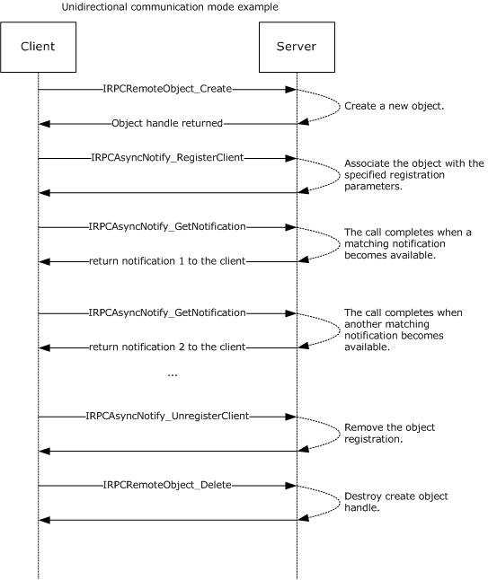
<!-- /Extracted images from page 76 -->

## 4 Protocol Examples

### 4.1 Unidirectional Communication Mode

This section presents an example of unidirectional communication mode, which illustrates a
single-server to single-client scenario. If multiple clients register with matching parameters, including
notification type identifier and user privileges, then each registered client would receive a copy of
the notification.

Figure 12: Unidirectional communication mode: single-server to single-client

[MS-PAN] - v20240423
Print System Asynchronous Notification Protocol
Copyright © 2024 Microsoft Corporation
Release: April 23, 2024

76 / 91

<!-- Extracted images from page 77 -->
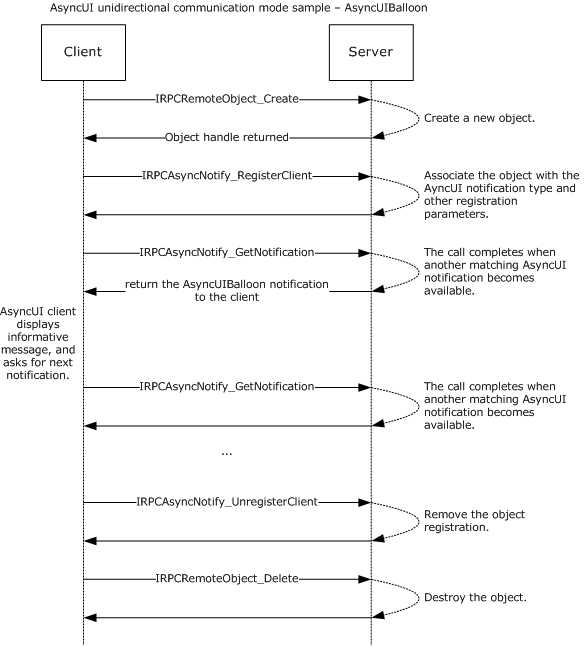
<!-- /Extracted images from page 77 -->

### 4.2 AsyncUI Notification in Unidirectional Communication Mode

The following diagram illustrates the processing of an AsyncUI notification in unidirectional
communication mode. In this example, the printer driver uses the notification type identifier
value AsyncPrintNotificationType_AsyncUI (section 2.2.1) to request the client to display an
informative message to the user without requesting any response to that message.

All text within the message box is identified by using references to a string resource contained
within a client-resident resource file.

Figure 13: Processing an AsyncUI notification in unidirectional communication mode

The following is a sample notification.

 <?xml version="1.0" ?>
 <asyncPrintUIRequest xmlns=
 "http://schemas.microsoft.com/2003/print/asyncui/v1/request">

77 / 91

[MS-PAN] - v20240423
Print System Asynchronous Notification Protocol
Copyright © 2024 Microsoft Corporation
Release: April 23, 2024

<!-- Extracted images from page 78 -->
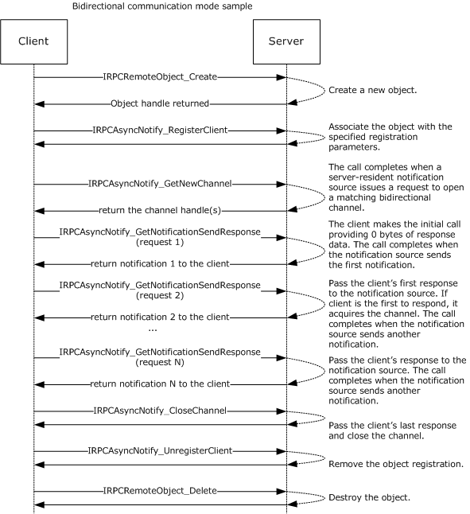
<!-- /Extracted images from page 78 -->

  <v1>
   <requestOpen>
    <balloonUI iconID="1" resourceDll="IHV.dll">
     <title stringID="1234" resourceDll="IHV.dll" />
     <body stringID="100" resourceDll="IHV.dll" />
    </balloonUI>
   </requestOpen>
  </v1>
 </asyncPrintUIRequest>

### 4.3 Bidirectional Communication Mode

This section presents an example of bidirectional communication mode, in which only the first
notification is sent to all clients registered with matching parameters, including notification type
identifier and user privileges. After the first notification, the first client to send a response to that
notification acquires the notification channel. All other clients are notified that the notification
channel was acquired by another client.

[MS-PAN] - v20240423
Print System Asynchronous Notification Protocol
Copyright © 2024 Microsoft Corporation
Release: April 23, 2024

78 / 91

<!-- Extracted images from page 79 -->
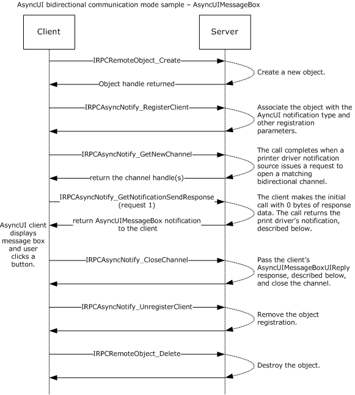
<!-- /Extracted images from page 79 -->

Figure 14: Bidirectional communication mode

### 4.4 AsyncUI Notification in Bidirectional Communication Mode

This section presents an example of processing an AsyncUI notification in bidirectional
communication mode. In this example, a printer driver uses the notification type identifier value
AsyncPrintNotificationType_AsyncUI (section 2.2.1) to request the client to display a message
box containing multiple buttons. The client then sends back a response identifying the selected
button.

All text within the message box is identified by using references to a string resource contained
within a client-resident resource file.

Figure 15: Processing an AsyncUI notification in bidirectional communication mode

Sample notification:

79 / 91

[MS-PAN] - v20240423
Print System Asynchronous Notification Protocol
Copyright © 2024 Microsoft Corporation
Release: April 23, 2024

 <asyncPrintUIRequest xmlns=
 "http://schemas.microsoft.com/2003/print/asyncui/v1/request">
  <v1>
   <requestOpen>
    <messageBoxUI>
     <title stringID="100" resourceDll="IHV.dll" />
     <body stringID="101" resourceDll="IHV.dll" />
     <buttons>
      <button stringID="102" resourceDll="IHV.dll" buttonID="3"/>
      <button stringID="103" resourceDll="IHV.dll" buttonID="4"/>
     </buttons>
    </messageBoxUI>
   </requestOpen>
  </v1>
 </asyncPrintUIRequest>

Sample response:

 <asyncPrintUIResponse xmlns=
 "http://schemas.microsoft.com/2003/print/asyncui/v1/response">
  <v1>
   <requestClose>
    <messageBoxUI>
     <buttonID>4</buttonID>
    </messageBoxUI >
   </requestClose>
  </v1>
 </asyncPrintUIResponse>

[MS-PAN] - v20240423
Print System Asynchronous Notification Protocol
Copyright © 2024 Microsoft Corporation
Release: April 23, 2024

80 / 91

## 5 Security

### 5.1 Security Considerations for Implementers

The Print System Asynchronous Notification Protocol treats the print server and print queues as
securable resources in its security model. See section 2.1 for relevant security specifications; basic
concepts of the security model are described in [MS-WPO] section 9; and security considerations for
implementers of print clients that use authenticated RPC are specified in [MS-RPCE] section 3.

The print server and print queues each has an associated security descriptor that contains the
security information for that printing resource. The security descriptor identifies the owner of the
resource, and it contains a discretionary access control list (DACL). The DACL contains access
control entries (ACEs) that specify the security identifier (SID) of a user or group of users and
whether access rights are to be allowed, denied, or audited. For resources on a print server, the ACEs
specify operations including printing, managing printers, and managing documents in a print queue.

Each RPC client has an associated access token that contains the SID of the user making the RPC call.
The print server checks the client's access to resources by comparing the security information of the
caller against the security descriptor of the resource. Prior to allowing a user to monitor and receive
notifications, security and privacy contexts are considered.
IRPCAsyncNotify_RegisterClient (section 3.1.1.4.1) specifies the security and privacy checks
performed by the server before it allows the registration of the client to succeed.

There is the risk of an AsyncUI client being used to execute arbitrary client-resident code, as identified
by an entrypoint attribute within an executable driver file that is identified by a dll attribute (sections
2.2.7.2.1, 2.2.7.5.1, and 2.2.7.7.1). By enforcing the character restrictions specified for the
entrypoint attribute, the client can ensure that the driver-file name refers to a constituent file of a
printer driver. An AsyncUI client can further reduce risk of execution of arbitrary code by minimizing
the active permissions when calling an entrypoint.

### 5.2 Index of Security Parameters

 There are no security parameters associated with this protocol.

[MS-PAN] - v20240423
Print System Asynchronous Notification Protocol
Copyright © 2024 Microsoft Corporation
Release: April 23, 2024

81 / 91

## 6 Appendix A: Full IDL

For ease of implementation, the following sections provide the full IDL for this protocol.

IDL name

ms-pan_IRPCAsyncNotify

ms-pan_IRPCRemoteObject

Section

6.1

6.2

### 6.1 Appendix A.1: IRPCAsyncNotify.IDL

This IDL uses definitions from the IRPCRemoteObject interface (section 6.2) and RPC extensions
defined in [MS-RPCE].

import "ms-pan_irpcremoteobject.idl";

 [
     uuid(0b6edbfa-4a24-4fc6-8a23-942b1eca65d1),
     version(1.0),
     pointer_default(unique)
 ]
 interface IRPCAsyncNotify {

 // [MS-PAN] enumerations
 typedef [v1_enum] enum {
     kBiDirectional = 0,
     kUniDirectional = 1,
 } PrintAsyncNotifyConversationStyle;

 typedef [v1_enum] enum {
     kPerUser = 0,
     kAllUsers = 1,
 } PrintAsyncNotifyUserFilter;

 // [MS-PAN] data types
 typedef GUID  PrintAsyncNotificationType;
 typedef [context_handle] void* PNOTIFYOBJECT;

 // [MS-PAN] methods
 HRESULT
 IRPCAsyncNotify_RegisterClient(
     [in] PRPCREMOTEOBJECT pRegistrationObj,
     [in,string,unique] const wchar_t* pName,
     [in] PrintAsyncNotificationType* pInNotificationType,
     [in] PrintAsyncNotifyUserFilter NotifyFilter,
     [in] PrintAsyncNotifyConversationStyle conversationStyle,
     [out, string] wchar_t** ppRmtServerReferral
 );

 HRESULT
 IRPCAsyncNotify_UnregisterClient(
     [in] PRPCREMOTEOBJECT pRegistrationObj
 );

 void Opnum2NotUsedOnWire(void);

 HRESULT
 IRPCAsyncNotify_GetNewChannel(
     [in] PRPCREMOTEOBJECT pRemoteObj,
     [out] unsigned long* pNoOfChannels,
     [out,size_is( , *pNoOfChannels)] PNOTIFYOBJECT** ppChannelCtxt

[MS-PAN] - v20240423
Print System Asynchronous Notification Protocol
Copyright © 2024 Microsoft Corporation
Release: April 23, 2024

82 / 91

 );

 HRESULT
 IRPCAsyncNotify_GetNotificationSendResponse(
     [in, out] PNOTIFYOBJECT* pChannel,
     [in, unique] PrintAsyncNotificationType* pInNotificationType,
     [in] unsigned long InSize,
     [in, size_is(InSize), unique] byte* pInNotificationData,
     [out] PrintAsyncNotificationType** ppOutNotificationType,
     [out] unsigned long* pOutSize,
     [out, size_is( , *pOutSize)]  byte** ppOutNotificationData
 );

 HRESULT
 IRPCAsyncNotify_GetNotification(
     [in] PRPCREMOTEOBJECT pRemoteObj,
     [out] PrintAsyncNotificationType** ppOutNotificationType,
     [out] unsigned long* pOutSize,
     [out, size_is( , *pOutSize)] byte** ppOutNotificationData
 );

 HRESULT
 IRPCAsyncNotify_CloseChannel(
     [in, out] PNOTIFYOBJECT* pChannel,
     [in] PrintAsyncNotificationType* pInNotificationType,
     [in] unsigned long InSize,
     [in, size_is(InSize), unique] byte* pReason
 );
 }

### 6.2 Appendix A.2: IRPCRemoteObject.IDL

This IDL uses definitions from the full IDL in [MS-DTYP] and RPC extensions defined in [MS-RPCE].

 import "ms-dtyp.idl";

 [
     uuid(ae33069b-a2a8-46ee-a235-ddfd339be281),
     version(1.0),
     pointer_default(unique)
 ]

 interface IRPCRemoteObject
 {
 // [MS-PAN] data types
 typedef [context_handle] void* PRPCREMOTEOBJECT;

 // [MS-PAN] methods
 HRESULT
 IRPCRemoteObject_Create(
     [in]     handle_t          hRemoteBinding,
     [out]    PRPCREMOTEOBJECT* ppRemoteObj
 );

 void
 IRPCRemoteObject_Delete(
     [in,out] PRPCREMOTEOBJECT* ppRemoteObj
 );
 }

[MS-PAN] - v20240423
Print System Asynchronous Notification Protocol
Copyright © 2024 Microsoft Corporation
Release: April 23, 2024

83 / 91

## 7 Appendix B: Product Behavior

The information in this specification is applicable to the following Microsoft products or supplemental
software. References to product versions include updates to those products.

  Windows XP operating system

  Windows Server 2003 operating system

  Windows Vista operating system

  Windows Server 2008 operating system

  Windows 7 operating system

  Windows Server 2008 R2 operating system

  Windows 8 operating system

  Windows Server 2012 operating system

  Windows 8.1 operating system

  Windows Server 2012 R2 operating system

  Windows 10 operating system

  Windows Server 2016 operating system

  Windows Server operating system

  Windows Server 2019 operating system

  Windows Server 2022 operating system

  Windows 11 operating system

  Windows Server 2025 operating system

Exceptions, if any, are noted in this section. If an update version, service pack or Knowledge Base
(KB) number appears with a product name, the behavior changed in that update. The new behavior
also applies to subsequent updates unless otherwise specified. If a product edition appears with the
product version, behavior is different in that product edition.

Unless otherwise specified, any statement of optional behavior in this specification that is prescribed
using the terms "SHOULD" or "SHOULD NOT" implies product behavior in accordance with the
SHOULD or SHOULD NOT prescription. Unless otherwise specified, the term "MAY" implies that the
product does not follow the prescription.

<1> Section 2.2.7.2: For print queues using a printer driver with a driver version of 0x00000004 (see
cVersion in [MS-RPRN] section 2.2.1.3.1), Windows print servers use AsyncUIBalloon messages to
send details about configuration status changes to client UI components. In these messages, the
balloonUI element contains exactly one action element (section 2.2.7.2.1). The action element
contains the dll attribute "PrintConfig.dll" and the entrypoint attribute "NotifyEntry". The text data in
the action element is an XML fragment of the following form:

 <Envelope printer="…" reason="{23bb1328-63de-4293-915b-a6a23d929acb}" detail="…">
   <Schema … />
   …
 </Envelope>

[MS-PAN] - v20240423
Print System Asynchronous Notification Protocol
Copyright © 2024 Microsoft Corporation
Release: April 23, 2024

84 / 91

The Envelope element contains the following attributes:

printer: A string containing the name of the print queue whose configuration has changed.

reason: The GUID {23bb1328-63de-4293-915b-a6a23d929acb}.

detail: A GUID provided by the printer driver excluding the GUID {ec8f261f-267c-469f-b5d6-

3933023c29cc} which is reserved.

The Envelope element contains one or more Schema elements (section 2.2.8.1.2), each of which
represents one of the configuration changes.

<2> Section 2.2.7.2.1: For all Windows versions, the function signature of the method specified by
the entrypoint attribute is as follows.

 void entrypoint(void * data);

data: The data from the action element.

Windows clients load the file indicated by the dll attribute as a dynamic linked library and call the
method in the library indicated by the entrypoint attribute, passing in data by using the data
parameter.

<3> Section 2.2.7.5.1: For all Windows versions, the function signature of the method specified by
the entrypoint attribute varies depending on the bidi attribute value, as shown in the following table.

bidi value

 Method prototype

"true"

void * entrypoint(void * data:)

"false"

void entrypoint(void * data:)

data: The data from the customUI element.

Windows clients load the file indicated by the dll attribute as a dynamic linked library and call the
method in the library indicated by the entrypoint attribute, passing in data by using the data
parameter.

<4> Section 2.2.7.7.1: For all Windows versions, the function signature of the method specified by
the entrypoint attribute depends on the bidi attribute value as shown in the following table.

bidi value

 Method prototype

"true"

void * entrypoint(void * data)

"false"

void entrypoint(void * data)

data: The data from the customData element.

Windows clients load the file indicated by the dll attribute as a dynamic linked library and call the
method in the library indicated by the entrypoint attribute, passing in data by using the data
parameter.

<5> Section 2.2.8.1.2: In Windows, these attributes correspond to printer attributes in the
bidirectional communications schema. This schema is a hierarchy of printer attributes, some of which
are properties, and the rest are values or value entries. Bidirectional communications interfaces are
implemented by printer-specific components. A detailed description of printer drivers and the
bidirectional communications schema can be found in [MSDN-MPD] and [MSDN-BIDI].

85 / 91

[MS-PAN] - v20240423
Print System Asynchronous Notification Protocol
Copyright © 2024 Microsoft Corporation
Release: April 23, 2024

<6> Section 2.2.8.1.10: In Windows, these attributes correspond to printer attributes in the
bidirectional communications schema. This schema is a hierarchy of printer attributes, some of which
are properties, and the rest are values or value entries. Bidirectional communications interfaces are
implemented by printer-specific components. A detailed description of printer drivers and the
bidirectional communications schema can be found in [MSDN-MPD] and [MSDN-BIDI].

<7> Section 3.1.1.4: Opnums reserved for local use apply to Windows as follows.

opnum  Description

2

Not used by Windows.

<8> Section 3.1.1.4.3: When a local client directly calls the local API equivalent of
IRPCAsyncNotify_GetNewChannel (CreatePrintAsyncNotifyChannel as described in [MSDN-ASYNC])
without a prior successful call to IRPCAsyncNotify_RegisterClient using the same PRPCREMOTEOBJECT
value, the local server fails the call immediately and returns the HRESULT error value ([MS-ERREF]
section 2.1.1) 0x8004000D. This action is not supported on Windows XP or Windows Server 2003.

<9> Section 3.1.1.4.3: When a local client directly calls the local API equivalent of
IRPCAsyncNotify_GetNewChannel (CreatePrintAsyncNotifyChannel as described in [MSDN-ASYNC])
following a prior call to IRPCAsyncNotify_UnregisterClient using the same PRPCREMOTEOBJECT value,
the server fails the call immediately and returns the HRESULT error value ([MS-ERREF] section 2.1.1)
0x8004000E. This action is not supported on Windows XP or Windows Server 2003.

<10> Section 3.1.1.4.5: For all Windows versions, the server by default limits the number of buffered
unidirectional notifications to 100.

The default limit of 100 can be changed by creating a REG_DWORD value in the registry at
HKEY_LOCAL_MACHINE\Software\Policies\Microsoft\Windows
NT\Printers\InternalQueueSizeForUniDiChannel and setting this value to the desired limit for the
number of buffered unidirectional notifications. This action is not supported on Windows XP, Windows
Server 2003, Windows Vista, or Windows Server 2008.

<11> Section 3.1.1.4.6: When a local client directly calls the local API equivalent of
IRPCAsyncNotify_CloseChannel (IPrintAsyncNotifyChannel::CloseChannel as described in [MSDN-
ASYNC]) following a successful return from IRPCAsyncNotify_GetNotificationSendResponse with a
NULL value returned for the pChannel parameter, or following a prior successful return from
IRPCAsyncNotify_CloseChannel, the server fails the call immediately and returns the HRESULT error
value ([MS-ERREF] section 2.1.1) 0x80040008. This action is not supported on Windows XP or
Windows Server 2003.

[MS-PAN] - v20240423
Print System Asynchronous Notification Protocol
Copyright © 2024 Microsoft Corporation
Release: April 23, 2024

86 / 91

## 8 Change Tracking

This section identifies changes that were made to this document since the last release. Changes are
classified as Major, Minor, or None.

The revision class Major means that the technical content in the document was significantly revised.
Major changes affect protocol interoperability or implementation. Examples of major changes are:

  A document revision that incorporates changes to interoperability requirements.
  A document revision that captures changes to protocol functionality.

The revision class Minor means that the meaning of the technical content was clarified. Minor changes
do not affect protocol interoperability or implementation. Examples of minor changes are updates to
clarify ambiguity at the sentence, paragraph, or table level.

The revision class None means that no new technical changes were introduced. Minor editorial and
formatting changes may have been made, but the relevant technical content is identical to the last
released version.

The changes made to this document are listed in the following table. For more information, please
contact dochelp@microsoft.com.

Section

Description

7 Appendix B: Product
Behavior

Added Windows Server 2025 to the list of applicable
products.

Revision
class

Major

[MS-PAN] - v20240423
Print System Asynchronous Notification Protocol
Copyright © 2024 Microsoft Corporation
Release: April 23, 2024

87 / 91

## 9 Index
A

Abstract data model
   client
      AsyncUI 70
      IRPCAsyncNotify 68
      IRPCRemoteObject 64
      printer configuration 74
   server
      AsyncUI 60
      IRPCAsyncNotify 45
      IRPCRemoteObject 59
      printer configuration 63
Applicability 16
AsyncUI
   default resource file string resources 20
   elements - common 25
   interface
      client 69
      server 60
   notification
      bidirectional communication mode example 79
      unidirectional communication mode example 77
   XML notification and response formats
      elements - common 25
      overview 24
Asyncui notification in bidirectional communication

mode example 79

Asyncui notification in unidirectional communication

mode example 77

AsyncUIBalloon Notification method 71
AsyncUIBalloon string 30
AsyncUICustomData Notification method 73
AsyncUICustomData string 38
AsyncUICustomUI Notification method 72
AsyncUICustomUI string 36
AsyncUICustomUIReply string 37
AsyncUIMessageBox Notification method 72
AsyncUIMessageBox string 32
AsyncUIMessageBoxUIReply string 35

B

Bidirectional communication mode example 78

C

Capability negotiation 16
Change tracking 87
Client
   AsyncUI
      abstract data model 70
      initialization 71
      interface 69
      local events 74
      message processing 71
      overview 69
      sequencing rules 71
      timer events 74
      timers 70
   AsyncUIBalloon Notification method 71

[MS-PAN] - v20240423
Print System Asynchronous Notification Protocol
Copyright © 2024 Microsoft Corporation
Release: April 23, 2024

   AsyncUICustomData Notification method 73
   AsyncUICustomUI Notification method 72
   AsyncUIMessageBox Notification method 72
   IRPCAsyncNotify
      abstract data model 68
      initialization 69
      interface 65
      local events 69
      message processing 69
      overview 65
      sequencing rules 69
      timer events 69
      timers 68
   IRPCRemoteObject
      abstract data model 64
      initialization 65
      local events 65
      message processing 65
      sequencing rules 65
      timer events 65
      timers 65
   printer configuration
      abstract data model 74
      initialization 74
      local events 75
      message processing 75
      overview 74
      sequencing rules 75
      timer events 75
      timers 74
   printer configuration interface 74
   Printer Configuration Notification method 75
Common data types 18

D

Data model - abstract
   client
      AsyncUI 70
      IRPCAsyncNotify 68
      IRPCRemoteObject 64
      printer configuration 74
   server
      AsyncUI 60
      IRPCAsyncNotify 45
      IRPCRemoteObject 59
      printer configuration 63
Data types
   common 18
   common - overview 18
   PNOTIFYOBJECT 20
   PrintAsyncNotificationType 18
   PRPCREMOTEOBJECT 19

E

Enumerations
   PrintAsyncNotifyConversationStyle 19
   PrintAsyncNotifyUserFilter 19
Events
   local

88 / 91

      client
         AsyncUI 74
         IRPCAsyncNotify 69
         IRPCRemoteObject 65
         printer configuration 75
      server
         AsyncUI 62
         IRPCAsyncNotify 57
         IRPCRemoteObject 60
         printer configuration 64
   timer
      client
         AsyncUI 74
         IRPCAsyncNotify 69
         IRPCRemoteObject 65
         printer configuration 75
      server
         AsyncUI 62
         IRPCAsyncNotify 57
         IRPCRemoteObject 60
         printer configuration 64
Examples
   AsyncUI notification
      bidirectional communication mode 79
      unidirectional communication mode 77
   asyncui notification in bidirectional communication

mode 79

   asyncui notification in unidirectional

communication mode 77

   bidirectional communication mode 78
   unidirectional communication mode 76

      printer configuration 63
Introduction 8
IRPCAsyncNotify interface
   client 65
IRPCAsyncNotify_CloseChannel (Opnum 6) method
(section 3.1.1.4.6 56, section 3.1.3.4.4 62)

IRPCAsyncNotify_CloseChannel method 56
IRPCAsyncNotify_GetNewChannel (Opnum 3)

method 50

IRPCAsyncNotify_GetNewChannel method 50
IRPCAsyncNotify_GetNotification (Opnum 5) method
(section 3.1.1.4.5 54, section 3.1.3.4.3 62,
section 3.1.4.4.2 64)

IRPCAsyncNotify_GetNotification method 54
IRPCAsyncNotify_GetNotificationSendResponse
(Opnum 4) method (section 3.1.1.4.4 52,
section 3.1.3.4.2 61)

IRPCAsyncNotify_GetNotificationSendResponse

method 52

IRPCAsyncNotify_RegisterClient (Opnum 0) method
(section 3.1.1.4.1 47, section 3.1.3.4.1 61,
section 3.1.4.4.1 64)

IRPCAsyncNotify_RegisterClient method 47
IRPCAsyncNotify_UnregisterClient (Opnum 1)

method 50

IRPCAsyncNotify_UnregisterClient method 50
IRPCRemoteObject_Create (Opnum 0) method 59
IRPCRemoteObject_Create method 59
IRPCRemoteObject_Delete (Opnum 1) method 60
IRPCRemoteObject_Delete method 60

F

Fields - vendor-extensible 16
Full IDL 82

G

Glossary 8

I

IDL 82
Implementer - security considerations 81
Index of security parameters 81
Informative references 13
Initialization
   client
      AsyncUI 71
      IRPCAsyncNotify 69
      IRPCRemoteObject 65
      printer configuration 74
   server
      AsyncUI 61
      IRPCAsyncNotify 46
      IRPCRemoteObject 59
      printer configuration 63
Interfaces
   client
      AsyncUI 69
      IRPCAsyncNotify 65
      printer configuration 74
   server
      AsyncUI 60

[MS-PAN] - v20240423
Print System Asynchronous Notification Protocol
Copyright © 2024 Microsoft Corporation
Release: April 23, 2024

L

Local events
   client
      AsyncUI 74
      IRPCAsyncNotify 69
      IRPCRemoteObject 65
      printer configuration 75
   server
      AsyncUI 62
      IRPCAsyncNotify 57
      IRPCRemoteObject 60
      printer configuration 64

M

Message processing
   client
      AsyncUI 71
      IRPCAsyncNotify 69
      IRPCRemoteObject 65
      printer configuration 75
   server
      AsyncUI 61
      IRPCAsyncNotify 47
      IRPCRemoteObject 59
      printer configuration 63
Messages
   AsyncUI
      default resource file string resources 20
      elements - common 25
      XML notification and response formats 24
   AsyncUIBalloon string 30
   AsyncUICustomData string 38

89 / 91

   AsyncUICustomUI string 36
   AsyncUICustomUIReply string 37
   AsyncUIMessageBox string 32
   AsyncUIMessageBoxUIReply string 35
   common data types 18
   PNOTIFYOBJECT data type 20
   PrintAsyncNotificationType data type 18
   PrintAsyncNotifyConversationStyle enumeration 19
   PrintAsyncNotifyUserFilter enumeration 19
   PRPCREMOTEOBJECT data type 19
   transport 18
Methods
   AsyncUIBalloon Notification 71
   AsyncUICustomData Notification 73
   AsyncUICustomUI Notification 72
   AsyncUIMessageBox Notification 72
   IRPCAsyncNotify_CloseChannel (Opnum 6)

(section 3.1.1.4.6 56, section 3.1.3.4.4 62)
   IRPCAsyncNotify_GetNewChannel (Opnum 3) 50
   IRPCAsyncNotify_GetNotification (Opnum 5)

(section 3.1.1.4.5 54, section 3.1.3.4.3 62,
section 3.1.4.4.2 64)

   IRPCAsyncNotify_GetNotificationSendResponse
(Opnum 4) (section 3.1.1.4.4 52, section
3.1.3.4.2 61)

   IRPCAsyncNotify_RegisterClient (Opnum 0)

(section 3.1.1.4.1 47, section 3.1.3.4.1 61,
section 3.1.4.4.1 64)

   IRPCAsyncNotify_UnregisterClient (Opnum 1) 50
   IRPCRemoteObject_Create (Opnum 0) 59
   IRPCRemoteObject_Delete (Opnum 1) 60
   Printer Configuration Notification 75

N

Normative references 12
Notification and response formats - AsyncUI XML -

overview 24

O

Overview (synopsis) 13

P

Parameters - security index 81
PNOTIFYOBJECT data type 20
Preconditions 15
Prerequisites 15
PrintAsyncNotificationType data type 18
PrintAsyncNotifyConversationStyle enumeration 19
PrintAsyncNotifyUserFilter enumeration 19
Printer configuration interface
   client 74
   server 63
Printer Configuration Notification method 75
Product behavior 84
Protocol Details
   overview 43
PRPCREMOTEOBJECT data type 19

R

References 12
   informative 13

[MS-PAN] - v20240423
Print System Asynchronous Notification Protocol
Copyright © 2024 Microsoft Corporation
Release: April 23, 2024

   normative 12
Relationship to other protocols 15

S

Security
   implementer considerations 81
   parameter index 81
Sequencing rules
   client
      AsyncUI 71
      IRPCAsyncNotify 69
      IRPCRemoteObject 65
      printer configuration 75
   server
      AsyncUI 61
      IRPCAsyncNotify 47
      IRPCRemoteObject 59
      printer configuration 63
Server
   AsyncUI
      abstract data model 60
      initialization 61
      interface 60
      local events 62
      message processing 61
      overview 60
      sequencing rules 61
      timer events 62
      timers 60
   IRPCAsyncNotify
      abstract data model 45
      initialization 46
      local events 57
      message processing 47
      sequencing rules 47
      timer events 57
      timers 46
   IRPCAsyncNotify_CloseChannel (Opnum 6) method
(section 3.1.1.4.6 56, section 3.1.3.4.4 62)
   IRPCAsyncNotify_GetNewChannel (Opnum 3)

method 50

   IRPCAsyncNotify_GetNotification (Opnum 5)

method (section 3.1.1.4.5 54, section 3.1.3.4.3
62, section 3.1.4.4.2 64)

   IRPCAsyncNotify_GetNotificationSendResponse
(Opnum 4) method (section 3.1.1.4.4 52,
section 3.1.3.4.2 61)

   IRPCAsyncNotify_RegisterClient (Opnum 0)

method (section 3.1.1.4.1 47, section 3.1.3.4.1
61, section 3.1.4.4.1 64)

   IRPCAsyncNotify_UnregisterClient (Opnum 1)

method 50
   IRPCRemoteObject
      abstract data model 59
      initialization 59
      local events 60
      message processing 59
      sequencing rules 59
      timer events 60
      timers 59
   IRPCRemoteObject_Create (Opnum 0) method 59
   IRPCRemoteObject_Delete (Opnum 1) method 60
   printer configuration
      abstract data model 63

90 / 91

      initialization 63
      interface 63
      local events 64
      message processing 63
      overview 63
      sequencing rules 63
      timer events 64
      timers 63
Standards assignments 17
Strings
   AsyncUIBalloon 30
   AsyncUICustomData 38
   AsyncUICustomUI 36
   AsyncUICustomUIReply 37
   AsyncUIMessageBox 32
   AsyncUIMessageBoxUIReply 35
   resources - AsyncUI default resource file 20

T

Timer events
   client
      AsyncUI 74
      IRPCAsyncNotify 69
      IRPCRemoteObject 65
      printer configuration 75
   server
      AsyncUI 62
      IRPCAsyncNotify 57
      IRPCRemoteObject 60
      printer configuration 64
Timers
   client
      AsyncUI 70
      IRPCAsyncNotify 68
      IRPCRemoteObject 65
      printer configuration 74
   server
      AsyncUI 60
      IRPCAsyncNotify 46
      IRPCRemoteObject 59
      printer configuration 63
Tracking changes 87
Transport 18

U

Unidirectional communication mode example 76

V

Vendor-extensible fields 16
Versioning 16

[MS-PAN] - v20240423
Print System Asynchronous Notification Protocol
Copyright © 2024 Microsoft Corporation
Release: April 23, 2024

91 / 91

