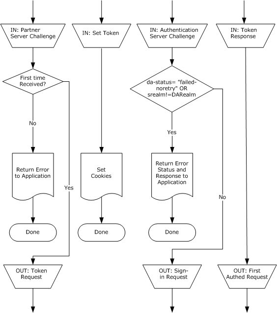
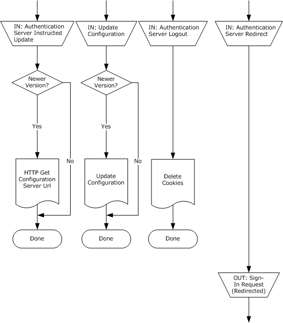
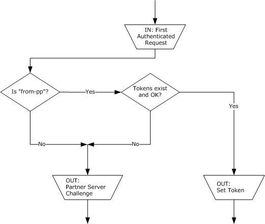
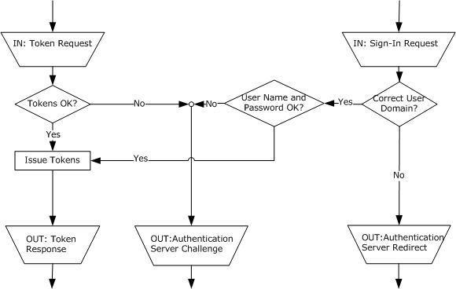
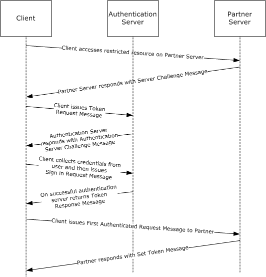

[MS-PASS]:

Passport Server Side Include (SSI) Version 1.4 Protocol

Intellectual Property Rights Notice for Open Specifications Documentation

  Technical Documentation. Microsoft publishes Open Specifications documentation (“this

documentation”) for protocols, file formats, data portability, computer languages, and standards
support. Additionally, overview documents cover inter-protocol relationships and interactions.

  Copyrights. This documentation is covered by Microsoft copyrights. Regardless of any other

terms that are contained in the terms of use for the Microsoft website that hosts this
documentation, you can make copies of it in order to develop implementations of the technologies
that are described in this documentation and can distribute portions of it in your implementations
that use these technologies or in your documentation as necessary to properly document the
implementation. You can also distribute in your implementation, with or without modification, any
schemas, IDLs, or code samples that are included in the documentation. This permission also
applies to any documents that are referenced in the Open Specifications documentation.
  No Trade Secrets. Microsoft does not claim any trade secret rights in this documentation.
  Patents. Microsoft has patents that might cover your implementations of the technologies

described in the Open Specifications documentation. Neither this notice nor Microsoft's delivery of
this documentation grants any licenses under those patents or any other Microsoft patents.
However, a given Open Specifications document might be covered by the Microsoft Open
Specifications Promise or the Microsoft Community Promise. If you would prefer a written license,
or if the technologies described in this documentation are not covered by the Open Specifications
Promise or Community Promise, as applicable, patent licenses are available by contacting
iplg@microsoft.com.

  License Programs. To see all of the protocols in scope under a specific license program and the

associated patents, visit the Patent Map.

  Trademarks. The names of companies and products contained in this documentation might be
covered by trademarks or similar intellectual property rights. This notice does not grant any
licenses under those rights. For a list of Microsoft trademarks, visit
www.microsoft.com/trademarks.

  Fictitious Names. The example companies, organizations, products, domain names, email

addresses, logos, people, places, and events that are depicted in this documentation are fictitious.
No association with any real company, organization, product, domain name, email address, logo,
person, place, or event is intended or should be inferred.

Reservation of Rights. All other rights are reserved, and this notice does not grant any rights other
than as specifically described above, whether by implication, estoppel, or otherwise.

Tools. The Open Specifications documentation does not require the use of Microsoft programming
tools or programming environments in order for you to develop an implementation. If you have access
to Microsoft programming tools and environments, you are free to take advantage of them. Certain
Open Specifications documents are intended for use in conjunction with publicly available standards
specifications and network programming art and, as such, assume that the reader either is familiar
with the aforementioned material or has immediate access to it.

Support. For questions and support, please contact dochelp@microsoft.com.

[MS-PASS] - v20240423
Passport Server Side Include (SSI) Version 1.4 Protocol
Copyright © 2024 Microsoft Corporation
Release: April 23, 2024

1 / 39

Revision Summary

Date

Revision
History

Revision
Class

Comments

3/2/2007

1.0

4/3/2007

1.1

5/11/2007

1.2

New

Minor

Minor

Version 1.0 release

Clarified the meaning of the technical content.

Version 1.2 release

6/1/2007

1.2.1

Editorial

Changed language and formatting in the technical content.

7/3/2007

1.3

Minor

Clarified the meaning of the technical content.

8/10/2007

1.3.1

Editorial

Changed language and formatting in the technical content.

9/28/2007

1.3.2

Editorial

Changed language and formatting in the technical content.

10/23/2007  2.0

Major

Converted document to unified format and updated technical
content.

1/25/2008

2.0.1

Editorial

Changed language and formatting in the technical content.

3/14/2008

2.0.2

Editorial

Changed language and formatting in the technical content.

6/20/2008

2.0.3

Editorial

Changed language and formatting in the technical content.

7/25/2008

2.0.4

Editorial

Changed language and formatting in the technical content.

8/29/2008

2.1

10/24/2008  3.0

12/5/2008

4.0

1/16/2009

5.0

Minor

Major

Major

Major

Clarified technical content.

Updated and revised the technical content.

Updated and revised the technical content.

Updated and revised the technical content.

2/27/2009

5.0.1

Editorial

Changed language and formatting in the technical content.

4/10/2009

5.0.2

Editorial

Changed language and formatting in the technical content.

5/22/2009

5.0.3

Editorial

Changed language and formatting in the technical content.

7/2/2009

5.0.4

Editorial

Changed language and formatting in the technical content.

8/14/2009

5.0.5

Editorial

Changed language and formatting in the technical content.

9/25/2009

5.1

Minor

Clarified the meaning of the technical content.

11/6/2009

5.1.1

Editorial

Changed language and formatting in the technical content.

12/18/2009  5.1.2

Editorial

Changed language and formatting in the technical content.

1/29/2010

5.1.3

Editorial

Changed language and formatting in the technical content.

3/12/2010

5.1.4

Editorial

Changed language and formatting in the technical content.

4/23/2010

6.0

6/4/2010

6.1

7/16/2010

6.2

8/27/2010

7.0

Major

Minor

Minor

Major

Updated and revised the technical content.

Clarified the meaning of the technical content.

Clarified the meaning of the technical content.

Updated and revised the technical content.

[MS-PASS] - v20240423
Passport Server Side Include (SSI) Version 1.4 Protocol
Copyright © 2024 Microsoft Corporation
Release: April 23, 2024

2 / 39

Date

Revision
History

Revision
Class

Comments

10/8/2010

7.0

11/19/2010  8.0

1/7/2011

9.0

2/11/2011

9.0

None

Major

Major

None

No changes to the meaning, language, or formatting of the
technical content.

Updated and revised the technical content.

Updated and revised the technical content.

No changes to the meaning, language, or formatting of the
technical content.

3/25/2011

9.0

None

No changes to the meaning, language, or formatting of the
technical content.

5/6/2011

9.0

6/17/2011

9.1

9/23/2011

10.0

12/16/2011  11.0

3/30/2012

11.0

None

Minor

Major

Major

None

No changes to the meaning, language, or formatting of the
technical content.

Clarified the meaning of the technical content.

Updated and revised the technical content.

Updated and revised the technical content.

No changes to the meaning, language, or formatting of the
technical content.

7/12/2012

11.0

None

No changes to the meaning, language, or formatting of the
technical content.

10/25/2012  11.0

None

No changes to the meaning, language, or formatting of the
technical content.

1/31/2013

11.0

None

No changes to the meaning, language, or formatting of the
technical content.

8/8/2013

12.0

Major

Updated and revised the technical content.

11/14/2013  12.0

None

No changes to the meaning, language, or formatting of the
technical content.

2/13/2014

12.0

None

No changes to the meaning, language, or formatting of the
technical content.

5/15/2014

12.0

None

No changes to the meaning, language, or formatting of the
technical content.

6/30/2015

13.0

Major

Significantly changed the technical content.

10/16/2015  13.0

None

No changes to the meaning, language, or formatting of the
technical content.

7/14/2016

13.0

None

No changes to the meaning, language, or formatting of the
technical content.

6/1/2017

13.0

9/15/2017

14.0

9/12/2018

15.0

4/7/2021

16.0

None

Major

Major

Major

No changes to the meaning, language, or formatting of the
technical content.

Significantly changed the technical content.

Significantly changed the technical content.

Significantly changed the technical content.

[MS-PASS] - v20240423
Passport Server Side Include (SSI) Version 1.4 Protocol
Copyright © 2024 Microsoft Corporation
Release: April 23, 2024

3 / 39

Date

Revision
History

Revision
Class

Comments

6/25/2021

17.0

4/23/2024

18.0

Major

Major

Significantly changed the technical content.

Significantly changed the technical content.

[MS-PASS] - v20240423
Passport Server Side Include (SSI) Version 1.4 Protocol
Copyright © 2024 Microsoft Corporation
Release: April 23, 2024

4 / 39

## Table of Contents

- [1 Introduction](#1-introduction)
  - [1.4 Protocol is based on HTTP (as specified in [RFC2616]) for authenticating a client to a server](#14-protocol-is-based-on-http-as-specified-in-rfc2616-for-authenticating-a-client-to-a-server)
  - [1.5 Prerequisites/Preconditions](#15-prerequisitespreconditions)
  - [1.6 Applicability Statement](#16-applicability-statement)
  - [1.7 Versioning and Capability Negotiation](#17-versioning-and-capability-negotiation)
  - [1.8 Vendor-Extensible Fields](#18-vendor-extensible-fields)
  - [1.9 Standards Assignments](#19-standards-assignments)
- [2 Messages](#2-messages)
  - [2.1 Transport](#21-transport)
  - [2.2 Message Syntax](#22-message-syntax)
    - [2.2.1 Common Definitions](#221-common-definitions)
    - [2.2.2 Authentication Server Challenge Message](#222-authentication-server-challenge-message)
    - [2.2.3 Authentication Server-Instructed Update Message](#223-authentication-server-instructed-update-message)
    - [2.2.4 Authentication Server Logout Message](#224-authentication-server-logout-message)
    - [2.2.5 Authentication Server Redirect Message](#225-authentication-server-redirect-message)
    - [2.2.6 First Authenticated Request Message](#226-first-authenticated-request-message)
    - [2.2.7 Sign-in Request Message](#227-sign-in-request-message)
    - [2.2.8 Partner Server Challenge Message](#228-partner-server-challenge-message)
    - [2.2.9 Set Token Message](#229-set-token-message)
    - [2.2.10 Token Request Message](#2210-token-request-message)
    - [2.2.11 Token Response Message](#2211-token-response-message)
    - [2.2.12 Update Configuration Message](#2212-update-configuration-message)
- [3 Protocol Details](#3-protocol-details)
  - [3.1 Client Details](#31-client-details)
    - [3.1.1 Abstract Data Model](#311-abstract-data-model)
    - [3.1.2 Timers](#312-timers)
    - [3.1.3 Initialization](#313-initialization)
    - [3.1.4 Higher-Layer Triggered Events](#314-higher-layer-triggered-events)
      - [3.1.4.1 Opening a Passport Session](#3141-opening-a-passport-session)
      - [3.1.4.2 Closing a Passport Session](#3142-closing-a-passport-session)
    - [3.1.5 Processing Events and Sequencing Rules](#315-processing-events-and-sequencing-rules)
      - [3.1.5.1 Processing Partner Server Challenge Messages](#3151-processing-partner-server-challenge-messages)
      - [3.1.5.2 Processing Authentication Server Challenge Messages](#3152-processing-authentication-server-challenge-messages)
      - [3.1.5.3 Processing Authentication Server-Instructed Update Messages](#3153-processing-authentication-server-instructed-update-messages)
      - [3.1.5.4 Updating Configuration Messages](#3154-updating-configuration-messages)
      - [3.1.5.5 Processing Authentication Server Logout Messages](#3155-processing-authentication-server-logout-messages)
      - [3.1.5.6 Processing Authentication Server Redirect Messages](#3156-processing-authentication-server-redirect-messages)
      - [3.1.5.7 Processing Token Response Messages](#3157-processing-token-response-messages)
      - [3.1.5.8 Processing Set Token Messages](#3158-processing-set-token-messages)
    - [3.1.6 Timer Events](#316-timer-events)
    - [3.1.7 Other Local Events](#317-other-local-events)
  - [3.2 Partner Server Details](#32-partner-server-details)
    - [3.2.1 Abstract Data Model](#321-abstract-data-model)
    - [3.2.2 Timers](#322-timers)
    - [3.2.3 Initialization](#323-initialization)
    - [3.2.4 Higher-Layer Triggered Events](#324-higher-layer-triggered-events)
    - [3.2.5 Processing Events and Sequencing Rules](#325-processing-events-and-sequencing-rules)
      - [3.2.5.1 Processing First Authenticated Request Messages](#3251-processing-first-authenticated-request-messages)
      - [3.2.5.2 Attempting to Access a Restricted Resource](#3252-attempting-to-access-a-restricted-resource)
    - [3.2.6 Timer Events](#326-timer-events)
    - [3.2.7 Other Local Events](#327-other-local-events)
  - [3.3 Authentication Server Details](#33-authentication-server-details)
    - [3.3.1 Abstract Data Model](#331-abstract-data-model)
    - [3.3.2 Timers](#332-timers)
    - [3.3.3 Initialization](#333-initialization)
    - [3.3.4 Higher-Layer Triggered Events](#334-higher-layer-triggered-events)
    - [3.3.5 Processing Events and Sequencing Rules](#335-processing-events-and-sequencing-rules)
      - [3.3.5.1 Processing Sign-in Request Messages](#3351-processing-sign-in-request-messages)
      - [3.3.5.2 Processing Token Request Messages](#3352-processing-token-request-messages)
    - [3.3.6 Timer Events](#336-timer-events)
    - [3.3.7 Other Local Events](#337-other-local-events)
  - [3.4 Configuration Server Details](#34-configuration-server-details)
    - [3.4.1 Abstract Data Model](#341-abstract-data-model)
    - [3.4.2 Timers](#342-timers)
    - [3.4.3 Initialization](#343-initialization)
    - [3.4.4 Higher-Layer Triggered Events](#344-higher-layer-triggered-events)
      - [3.4.4.1 Processing HTTP GET](#3441-processing-http-get)
    - [3.4.5 Processing Events and Sequencing Rules](#345-processing-events-and-sequencing-rules)
    - [3.4.6 Timer Events](#346-timer-events)
    - [3.4.7 Other Local Events](#347-other-local-events)
- [4 Protocol Examples](#4-protocol-examples)
- [5 Security](#5-security)
  - [5.1 Security Considerations for Implementers](#51-security-considerations-for-implementers)
  - [5.2 Index of Security Parameters](#52-index-of-security-parameters)
- [6 Appendix A: Product Behavior](#6-appendix-a-product-behavior)
- [7 Change Tracking](#7-change-tracking)
- [8 Index](#8-index)

## 1 Introduction

This document specifies the Passport Server Side Include (SSI) Version 1.4 Protocol (or the Passport
SSI Version 1.4 Protocol), also known as the "Passport Tweener" protocol. The Passport SSI Version
### 1.4 Protocol is based on HTTP (as specified in [RFC2616]) for authenticating a client to a server
with the assistance of an authentication server.

Sections 1.5, 1.8, 1.9, 2, and 3 of this specification are normative. All other sections and examples in
this specification are informative.

1.1  Glossary

This document uses the following terms:

authentication: The act of proving an identity to a server while providing key material that binds

the identity to subsequent communications.

authentication server: The entity that verifies that a person or thing is who or what it claims to

be (typically using a cryptographic protocol) and issues a ticket or token attesting to the validity
of the claim.

Authentication Service (AS): A service that issues ticket granting tickets (TGTs), which are used

for authenticating principals within the realm or domain served by the Authentication
Service.

client: The software that is used by a user to access the service. It represents the user in [MS-

PASS]. A synonym is client application.

co-branding: The inclusion of a party's logo, text, or other branding content in a second party's

software or site.

configuration server: The service or server that serves configuration data (packaged in HTTP

headers) describing the topography of the network. It includes information on the distribution of
member accounts among the Authentication Services (AS) and the URLs of particular
resources in each AS.

configuration version: Integer value indicating the version of the configuration data given out by

the configuration server.

cookie: An HTTP header that carries state information between participating origin servers and

user agents. For more information, see [RFC2109].

credential: Previously established, authentication data that is used by a security principal to

establish its own identity. When used in reference to the Netlogon Protocol, it is the data that is
stored in the NETLOGON_CREDENTIAL structure.

partner: In the context of [MS-PASS], an organization in a business relationship with the

Authentication Service (AS). A partner needs to be able to access the token issued by the
AS. Typically, a partner site is the actual service or site a consumer visits and, in the process,
is authenticated by the AS. Examples of partners are the MSN Money and MSN Messenger
sites.

partner server: The server or service used by a partner to represent it in the Passport SSI

Version 1.4 Protocol.

realm: A collection of users, partners, and authentication servers bound by a common

authentication policy.

[MS-PASS] - v20240423
Passport Server Side Include (SSI) Version 1.4 Protocol
Copyright © 2024 Microsoft Corporation
Release: April 23, 2024

7 / 39

resource: An object that a client is requesting access to, typically referenced by a Uniform
Resource Locator (URL) or Uniform Resource Identifier (URI), as specified in [RFC3986].

token: A block of data that is issued to a user on successful authentication by the

authentication server. Such a token is presented to a service to prove one's identity and
attributes to a service. The token is used in the process of determining the user's authorization
and access privileges.

Uniform Resource Locator (URL): A string of characters in a standardized format that identifies

a document or resource on the World Wide Web. The format is as specified in [RFC1738].

user: The real person who has a member account. The user is authenticated by being asked to

prove knowledge of the secret password associated with the user name.

UTF-8: A byte-oriented standard for encoding Unicode characters, defined in the Unicode standard.

Unless specified otherwise, this term refers to the UTF-8 encoding form specified in
[UNICODE5.0.0/2007] section 3.9.

MAY, SHOULD, MUST, SHOULD NOT, MUST NOT: These terms (in all caps) are used as defined
in [RFC2119]. All statements of optional behavior use either MAY, SHOULD, or SHOULD NOT.

1.2  References

Links to a document in the Microsoft Open Specifications library point to the correct section in the
most recently published version of the referenced document. However, because individual documents
in the library are not updated at the same time, the section numbers in the documents may not
match. You can confirm the correct section numbering by checking the Errata.

1.2.1  Normative References

We conduct frequent surveys of the normative references to assure their continued availability. If you
have any issue with finding a normative reference, please contact dochelp@microsoft.com. We will
assist you in finding the relevant information.

[RFC1738] Berners-Lee, T., Masinter, L., and McCahill, M., Eds., "Uniform Resource Locators (URL)",
RFC 1738, December 1994, https://www.rfc-editor.org/info/rfc1738

[RFC2109] Kristol, D., and Montulli, L., "HTTP State Management Mechanism", RFC 2109, February
1997, https://www.rfc-editor.org/info/rfc2109

[RFC2119] Bradner, S., "Key words for use in RFCs to Indicate Requirement Levels", BCP 14, RFC
2119, March 1997, https://www.rfc-editor.org/info/rfc2119

[RFC2396] Berners-Lee, T., Fielding, R., and Masinter, L., "Uniform Resource Identifiers (URI):
Generic Syntax", RFC 2396, August 1998, https://www.rfc-editor.org/info/rfc2396

[RFC2616] Fielding, R., Gettys, J., Mogul, J., et al., "Hypertext Transfer Protocol -- HTTP/1.1", RFC
2616, June 1999, https://www.rfc-editor.org/info/rfc2616

[RFC2617] Franks, J., Hallam-Baker, P., Hostetler, J., et al., "HTTP Authentication: Basic and Digest
Access Authentication", RFC 2617, June 1999, https://www.rfc-editor.org/info/rfc2617

[RFC2818] Rescorla, E., "HTTP Over TLS", RFC 2818, May 2000, https://www.rfc-
editor.org/info/rfc2818

[RFC3629] Yergeau, F., "UTF-8, A Transformation Format of ISO 10646", STD 63, RFC 3629,
November 2003, https://www.rfc-editor.org/info/rfc3629

[MS-PASS] - v20240423
Passport Server Side Include (SSI) Version 1.4 Protocol
Copyright © 2024 Microsoft Corporation
Release: April 23, 2024

8 / 39

[RFC4234] Crocker, D., Ed., and Overell, P., "Augmented BNF for Syntax Specifications: ABNF", RFC
4234, October 2005, https://www.rfc-editor.org/info/rfc4234

1.2.2  Informative References

None.

1.3  Overview

The Passport SSI Version 1.4 Protocol, also known as the "Passport Tweener" Protocol, is an HTTP-
based protocol (as specified in [RFC2616]) for authenticating a client to a partner server with the
assistance of an authentication server. The authentication exchange between the client and the
partner server in the Passport SSI Version 1.4 Protocol resembles the exchanges in other HTTP
authentication mechanisms (as specified in [RFC2616] and [RFC2617]).

When a client makes an HTTP request to the partner server, the partner server might respond with a
Passport SSI Version 1.4 Protocol message (as specified in section 2.2.8) indicating that the URL
requires Passport SSI Version 1.4 Protocol authentication. The client then contacts the authentication
server (as specified in section 2.2.10) to obtain a partner token that authenticates the user to the
partner server, and then retries the HTTP request, this time attaching the partner token (as specified
in section 2.2.6).

If this authentication fails, the partner indicates failure and restates that Passport SSI Version 1.4
Protocol authentication is required. If authentication succeeds, the partner responds with the content
that required authentication, along with the same partner token (as specified in section 2.2.9) in HTTP
cookie form, using the HTTP cookie mechanism (as specified in [RFC2109]). The client thereby
automatically resends the cookie-encoded token to the partner server every time it returns to the
partner server.

When the client contacts the authentication server in response to a partner server's request for
authentication, the client provides credentials (that is, a user name and password; for more
information, see section 2.2.7). The authentication server verifies the credentials and, if they are
valid, supplies the client with a partner token (opaque to the client) that can be used to authenticate
to the partner server (as specified in section 2.2.11). The authentication server also supplies the client
with an authentication token in HTTP cookie form (as previously described) so that on subsequent
visits to the authentication server to obtain partner tokens for other partner servers, the
authentication server can automatically retrieve the user's authentication information based on the
accompanying cookie, instead of requiring the client to resend the actual credentials every time.

The client can delete its tokens or cookies at any time. One point of departure from the traditional
HTTP framework is that the authentication server can instruct the client to delete an authentication
token it previously obtained (as specified in section 2.2.4). In this case, the client deletes the
authentication token.

The Passport SSI Version 1.4 Protocol allows for the implementation of distributed authentication
servers by allowing an authentication server to redirect clients to an alternate authentication server
using an HTTP redirect response (as specified in section 2.2.5). The protocol also supports multiple
independent realms in which each realm consists of an authentication server (single or distributed)
capable of helping a specific set of users authenticate to a specific set of partner servers. A user's
credentials are stored at the authentication server for a specific realm, which in turn allows that user
to authenticate to any of the set of partner servers associated with that realm.

Each realm also has a configuration server, which provides the client with information on the
authentication server for that realm, such as its URL. A client is initially configured with the URL of the
configuration server for some realm. This can occur, for example, when the user enrolls in or joins a
realm. If the client has no configuration data, or if its configuration data is out of date, the
authentication server can provide an up-to-date configuration version number to the client any time
the client authenticates (as specified in section 2.2.3). The client issues a standard HTTP GET request

9 / 39

[MS-PASS] - v20240423
Passport Server Side Include (SSI) Version 1.4 Protocol
Copyright © 2024 Microsoft Corporation
Release: April 23, 2024

to the configuration server's URL to obtain updated configuration information. For more information,
see section 3.1.5.3.

1.4  Relationship to Other Protocols

The Passport SSI Version 1.4 Protocol is built on HTTP (as specified in [RFC2617]) and HTTP over
Transport Layer Security (TLS) (as specified in [RFC2818]). No other higher-layer protocols explicitly
depend on the Passport SSI Version 1.4 Protocol.

### 1.5 Prerequisites/Preconditions

The following prerequisites and preconditions are required by the Passport SSI Version 1.4 Protocol:









The client is configured with the URL of the configuration server for its realm.<1>

The client has the capability to obtain credentials (that is, a user name and password) from the
user. A Passport SSI Version 1.4 Protocol client can utilize local code to obtain the credentials
locally, and to provide those cached credentials to the authentication server. The cache might
be shared by many such applications, and each application might be capable of obtaining the
credentials from users and caching them, using the same local code.

The authentication server for the client's realm might be able to validate the credentials (that is, a
user name and password) of any user registered with that realm. The authentication server is
configured with its realm name and any co-branding information that is to be passed to the client
(as specified in section 2.2.2) as well as the current version number for the configuration server's
configuration data (as specified in section 2.2.3). If the authentication server is implemented in a
distributed manner, it has a method for determining to what authentication server URL to redirect
a given client within its realm (based on the client's presented credentials or authentication
token), as specified in section 2.2.5.

The partner server and authentication server share a partner token format along with a set of
criteria for recognizing if a given partner token is valid. They also share a set of definitions for the
information that will be transported from the partner server to the authentication server when a
client attempts to authenticate to the partner server, as specified in section 2.2.8. This information
is received in a protocol message by the client (as specified in section 2.2.8) and encoded in a
format chosen by the realm. It is then sent to the authentication server by the client in a
subsequent message, as specified in sections 2.2.7 and 2.2.10.

Finally, the partner server and authentication server agree on a URL to which the client is to be
sent after it is successfully authenticated at the request of the partner server, as specified in
section 2.2.11.



The configuration server for the realm is provisioned with all the configuration data necessary to
construct an update configuration message, as specified in section 2.2.12.

### 1.6 Applicability Statement

The Passport SSI Version 1.4 Protocol applies to environments in which one or more services require
HTTP-based authentication (as specified in [RFC2616] section 11) of members of a common base of
users. In such cases, they might prefer to use a shared Authentication Service (AS). For example,
if multiple enterprises prefer to offer web-based services specifically to members of a particular
organization enrolled in such a shared AS, then they can choose to form a realm. The enterprises
would become partner services associated with the realm, and members would be able to
authenticate themselves to any of the partner servers using the shared AS and the Passport SSI
Version 1.4 Protocol.

[MS-PASS] - v20240423
Passport Server Side Include (SSI) Version 1.4 Protocol
Copyright © 2024 Microsoft Corporation
Release: April 23, 2024

10 / 39

### 1.7 Versioning and Capability Negotiation

Versioning and capability negotiation does not apply to the Passport SSI Version 1.4 Protocol.

### 1.8 Vendor-Extensible Fields

The ExtraParams parameter (as specified in section 2.2.1) can be used to extend the Passport SSI
Version 1.4 Protocol.

### 1.9 Standards Assignments

The only standards assignments for the Passport SSI Version 1.4 Protocol are those inherited from its
transport protocols, as specified in [RFC2616] and [RFC2818].

[MS-PASS] - v20240423
Passport Server Side Include (SSI) Version 1.4 Protocol
Copyright © 2024 Microsoft Corporation
Release: April 23, 2024

11 / 39

## 2 Messages

The following sections specify how Passport SSI Version 1.4 Protocol messages are transported and
message syntax.

### 2.1 Transport

The Passport SSI Version 1.4 Protocol MUST use HTTP (as specified in [RFC2616]) or HTTP over TLS
(as specified in [RFC2818]) as the transport layer. The use of HTTP over TLS is triggered by the
specification of an "https" URL rather than an "http" URL by one of the servers (the partner server,
the configuration server, or the authentication server) when redirecting or configuring the client.
Messages and data are sent via HTTP headers included in HTTP requests and responses. When a
message is sent as a header in an HTTP response message, its receiver MUST process the message if
the response's status code is one of those specified in the message definition, and MUST NOT do so
otherwise.

The Passport SSI Version 1.4 Protocol also uses the HTTP cookie mechanism (as specified in
[RFC2109]) as a transport and state management mechanism. The HTTP cookie mechanism allows
named data items to be sent from one party to another as part of an HTTP message stored by the
receiving party and returned automatically to the original party as part of all subsequent HTTP
messages to that party.

### 2.2 Message Syntax

#### 2.2.1 Common Definitions

Except where noted, the headers in this document are specified using the Augmented Backus-Naur
Form (ABNF) grammar, as specified in [RFC4234] section 2.2. The following common constructions
are used throughout this document.

These constructions are used solely for convenience in constructing other types and have no
semantics in and of themselves.

 httpURL = 1*(ALPHA / DIGIT / ":" / "." / "\" / "/" / "%" / "_" / "&" / "?")

The following constructions are used in protocol header definitions:

 scheme = "Passport1.4"
 ExtraParams = *("," ptoken) ptoken
 challenge = ExtraParams
 OrgVerb = "OrgVerb=" ptoken
 OrgURL = "OrgUrl=" httpURL
 tname = "tname=" ptoken
 from-PP = "from-PP=" ptoken
 ptoken   = 1*<any CHAR except CTLs or ",">
 ConfigVersion = "ConfigVersion=" 1*DIGIT

scheme: Identifier for the Passport SSI Version 1.4 Protocol authentication scheme.

ExtraParams: Additional parameters not interpreted by this protocol that MAY be used for vendor

extensibility.

challenge: A comma-separated list of parameters returned by a server for use by a client in the

process of proving its identity.

[MS-PASS] - v20240423
Passport Server Side Include (SSI) Version 1.4 Protocol
Copyright © 2024 Microsoft Corporation
Release: April 23, 2024

12 / 39

OrgVerb: A string containing the HTTP verb that triggered the original server challenge, for example,

"GET".

OrgURL: The URL in an HTTP request that triggered a server challenge.

tname: An informational parameter that contains the name of a cookie specified on a response. A

client SHOULD ignore this parameter.

ptoken: A string that can contain any alphanumeric characters and separators, except for a comma.

from-PP: A string that is opaque to the client. This value is received from a server and MUST be

passed back unchanged on a subsequent request.<2>

#### 2.2.2 Authentication Server Challenge Message

The Authentication Server Challenge message is sent by the authentication server to the client and
indicates that the sign-in request or token request failed.

This message is processed only when returned with a 401 HTTP status code. The return value MUST
be as follows.

 Authentication-Server-Challenge-Message = "WWW-Authenticate:"
  scheme 1*SP da-status "," srealm ["," customtoken]  [","     prompt]
  ["," cburl] ["," cbtxt]
 status-codes = "failed" / "failed-noretry"
 da-status = "da-status=" status-codes
 srealm = "srealm=" ptoken
 cburl = "cburl=" httpURL
 cbtxt = "cbtxt=" ptoken
 prompt = "prompt"
 customtoken = ptoken

da-status: Specifies if the receiving client MUST retry the request. The client's precise interpretation

of the possible values of "da-status" is specified in section 3.1.5.2.

srealm: A string that MUST contain the realm name of the authentication server.

cburl: Specifies a co-branding URL.

Cbtxt: Specifies optional co-branding text.

prompt: Specifies, by its presence, that the client MUST prompt the user for credentials.

customtoken: Custom parameter that an authentication server MAY add to the response. Not

explicitly part of the protocol.

This token is interpreted by the authentication server only. The client MUST not interpret the
value. The client MUST send the token unchanged to the authentication server in a subsequent
Sign-in Request message.

Example:

 WWW-Authenticate: Passport1.4 da-status=failed,
 srealm=Passport.NET,ts=-2,prompt

[MS-PASS] - v20240423
Passport Server Side Include (SSI) Version 1.4 Protocol
Copyright © 2024 Microsoft Corporation
Release: April 23, 2024

13 / 39

#### 2.2.3 Authentication Server-Instructed Update Message

The Authentication Server-Instructed Update message MAY be included by the authentication
server in any of its response messages to the client to indicate the current configuration version.
<3>

 Authentication-Server-Instructed-Update-Message = "PassportConfig:"
  ConfigVersion

ConfigVersion: MUST specify the current authentication server version number.

Example:

 PassportConfig: ConfigVersion=14

#### 2.2.4 Authentication Server Logout Message

The Authentication Server Logout message MUST be sent by the authentication server to the client
to indicate that the user has successfully logged out.

This message is processed when included in an HTTP response with any status code.

 Authentication-Server-Logout-Message = "Authentication-Info:"
  scheme 1*SP "da-status=logout"

Example:

 Authentication-Info: Passport1.4 da-status=logout

#### 2.2.5 Authentication Server Redirect Message

The Authentication Server Redirect message is used to indicate that the client SHOULD redirect its
Sign-in Request message or its Token Request message to a different authentication server. It is
sent from the authentication server to the client. The HTTP response message to which this message
is attached MUST be an HTTP 302 redirect (as specified in [RFC2616] section 10.3.3) in which the
HTTP Location header MUST contain the URL of the correct authentication server.

 Authentication-Server-Redirect-Message = "Authentication-Info:"
  scheme 1*SP "da-status=redir"

Example:

 Authentication-Info: Passport1.4 da-status=redir

#### 2.2.6 First Authenticated Request Message

The client MUST issue a First Authenticated Request message to the partner server after receiving a
partner token from the authentication server.

 First-Authenticated-Request-Message = "Authorization:" scheme 1*SP from-PP

14 / 39

[MS-PASS] - v20240423
Passport Server Side Include (SSI) Version 1.4 Protocol
Copyright © 2024 Microsoft Corporation
Release: April 23, 2024

Example:

 Authorization: Passport1.4 from-PP=1puV5BFuLD

#### 2.2.7 Sign-in Request Message

This message contains the user's credentials and is sent by the client to the authentication
server. It MUST contain the parameters in the Authentication Server Challenge message received
from the partner server that originally initiated authentication.

 Sign-in-Request-Message = "Authorization:" scheme 1*SP sign-in ","
  pwd "," elapsed-time "," OrgVerb "," OrgURL ["," customtoken] "," challenge

 sign-in = "sign-in=" signin-name
 pwd = "pwd=" passphrase
 elapsed-time = "elapsed-time=" 1*DIGIT
 signin-name = signin-str "@" signin-str "." signin-str
 signin-str = 1*(%d39 / %d45 / %d46 / %d48-57 / %d65-90 / %d95 / %d97-122)
 passphrase = 1*(%d33-126)

sign-in: A string that MUST specify the user's sign-in name. It MUST be UTF-8–encoded (as specified

in [RFC3629]) and unsafe character-escaped (as specified in [RFC2396]). The name MUST be an
email name and can contain alphanumeric characters, hyphens, and periods.

pwd: A string that MUST specify the user's password. It MUST be UTF-8–encoded (as specified in

[RFC3629]) and unsafe character-escaped (as specified in [RFC2396]). Alphanumeric and special
characters MAY be used. If a comma is used in the password, it MUST be escaped, as specified in
[RFC2396].

elapsed-time: A non-negative integer that MUST specify the duration, in seconds, since the sign-in
name and password were placed in the token cache by the client. A value of 0 specifies that the
user was prompted for credentials and cached credentials are not being sent.

customtoken: Optional token received from the authentication server in an Authentication Server

Challenge message.

Example:

 Authorization: Passport1.4 sign-in=user1%40example.com,pwd=password,
 elapsed-time=0, OrgVerb=GET,OrgUrl=https://partner.example.com/auth.asp,
  param1,param2

Note  The challenge is in whatever format the partners in the realm and the AS agree to use, and is
not part of the protocol. It MUST be a comma-separated set of ptoken elements, as specified in the
ABNF in section 2.2.1.

#### 2.2.8 Partner Server Challenge Message

The Partner Server Challenge message, sent by the partner server to the client, indicates that the
client's request failed and MUST describe the partner token needed to gain access to the URL.

This message can contain any number of comma-separated ptoken elements, specified in section
2.2.1, as the challenge. The client MUST treat the challenge as-is and pass it along to the
authentication server in a Token Request message or a Sign-in Request message.

[MS-PASS] - v20240423
Passport Server Side Include (SSI) Version 1.4 Protocol
Copyright © 2024 Microsoft Corporation
Release: April 23, 2024

15 / 39

This message SHOULD be processed only when included in an HTTP response with a 302 or 401 status
code.<4>

 Partner-Server-Challenge-Message = "WWW-Authenticate:" scheme 1*SP challenge["," upgrade]

 upgrade = "Negotiate2SupportedIf=" condition
 condition = 1*(ALPHA / DIGIT)

Example:

 WWW-Authenticate: Passport1.4 param1,param2,Negotiate2SupportedIf=LiveSSP

#### 2.2.9 Set Token Message

The Set Token message MUST be sent by the partner server to the client in response to successful
processing of a First Authenticated Request message. Successful processing here means that the
client was successfully authenticated. The partner server uses this message to set its own tokens as
cookies.

This message SHOULD be processed for any HTTP status code.<5>

 Set-Token-Message = "Authentication-Info:" scheme 1*SP [tname *("," tname)]

Example:

 Authentication-Info: Passport1.4 tname=MSPAuth,tname=MSPProf

#### 2.2.10 Token Request Message

The Token Request message is sent by the client to the authentication server to retrieve a new
partner token. The request MUST contain the challenge from the Partner Server Challenge message
the client just received. The challenge itself is opaque to the client and is outside the Passport SSI
Version 1.4 Protocol. If the client already has an authentication token, it MUST be passed
automatically to the authentication server in an HTTP cookie.

 Token-Request-Message = "Authorization:" scheme 1*SP "tname=,"
  OrgVerb "," OrgUrl "," challenge

The parameters from the Authentication Server Challenge message MUST NOT have names from the
preceding list.

Example:

 Authorization: Passport1.4 tname=,OrgVerb=GET,OrgUrl=
 https://partner.example.com/auth.asp,param1,param2

Note  The challenge, as in the preceding example, can be any number of comma-separated elements,
as specified in section 2.2.1.

[MS-PASS] - v20240423
Passport Server Side Include (SSI) Version 1.4 Protocol
Copyright © 2024 Microsoft Corporation
Release: April 23, 2024

16 / 39

#### 2.2.11 Token Response Message

The authentication server sends a Token Response message to the client when it can issue a
partner token or tokens that are satisfactory to the partner server.

This message MUST be processed when included in an HTTP response with any status code.

 Token-Response-Message = "Authentication-Info:" scheme 1*SP
  "da-status=success" *("," tname) "," from-PP "," ru

 ru = "ru=" httpURL

ru: Specifies a URL to which the client MUST issue its next First Authenticated Request message.

Example:

 Authentication-Info: Passport1.4 da-status=success,
 from-PP=1puV5BFuLD,
 ru=http://partner.example.com/default.asp

#### 2.2.12 Update Configuration Message

The Update Configuration message is sent from the configuration server to the client and contains
configuration information.

This message MUST be processed when included in an HTTP response with any status code.

 Update-Configuration-Message = "PassportURLs:" DARealm "," DALogin ","
  DAReg "," Properties "," Privacy "," GeneralRedir "," Help "," ConfigVersion
 DARealm = "DARealm=" token
 DALogin = "DALogin=" httpURL
 DAReg = "DAReg=" httpURL
 Properties = "Properties=" httpURL
 Privacy = "Privacy=" httpURL
 GeneralRedir = "GeneralRedir=" httpURL
 Help = "Help=" httpURL

DARealm: A string that MUST specify the name of an authentication server realm. The protocol

does not impose restrictions on the DARealm string format.

DALogin: MUST specify the URL of the authentication server for the realm identified by DARealm.

The URL MUST be valid in form, as specified in [RFC1738].

DAReg: Specifies the URL (in the format specified in [RFC1738]) in which a user can register for an

account in the realm identified by DARealm.

Properties: Specifies a URL that displays the properties of a user account in the realm identified by

DARealm.

Privacy: Specifies the URL of the human-readable privacy policy for the realm identified by DARealm.

GeneralRedir: Specifies a general-purpose redirector URL.

Help: The URL in which the Help page SHOULD be located for the realm identified by DARealm.

ConfigVersion: An integer that specifies the version number of this collection of configuration

information.

[MS-PASS] - v20240423
Passport Server Side Include (SSI) Version 1.4 Protocol
Copyright © 2024 Microsoft Corporation
Release: April 23, 2024

17 / 39

Example:

 PassportURLs: DARealm=Passport.Net,DALogin=sign-in.live.com/login2.srf,
 DAReg=https://accountservices.passport.net/UIXPWiz.srf,
 Properties=https://accountservices.msn.com/editprof.srf,
 Privacy=https://accountservices.passport.net/PPPrivacyStatement.srf,
 GeneralRedir=http://nexusrdr.passport.com/redirect.asp,
 Help=https://accountservices.passport.net,ConfigVersion=14

[MS-PASS] - v20240423
Passport Server Side Include (SSI) Version 1.4 Protocol
Copyright © 2024 Microsoft Corporation
Release: April 23, 2024

18 / 39

## 3 Protocol Details

The following sections specify details of the Passport SSI Version 1.4 Protocol, including abstract data
models and message processing rules.

An implementation SHOULD implement the client role specified in section 3.1.

An implementation MAY implement the partner server role specified in section 3.2.

An implementation MAY implement the authentication server role specified in section 3.3.

### 3.1 Client Details

#### 3.1.1 Abstract Data Model

This section describes a conceptual model of possible data organization that an implementation
maintains to participate in this protocol. The described organization is provided to facilitate the
explanation of how the protocol behaves. This document does not mandate that implementations
adhere to this model as long as their external behavior is consistent with what is described in this
document.

In addition to the information with which clients MUST initially be configured, such as a
configuration server URL (as specified in section 1.5), clients MUST store the following states:

  Passport Session Table: A set of states for each passport session. Each entry in the passport

session table is created and deleted as specified in sections 3.1.4.1 and 3.1.4.2, respectively, and
has the following states:

  Passport Configuration Data: All of the name/value pairs sent in the Update

Configuration (section 2.2.12) message.

  Original HTTP Verb: The HTTP verb for every HTTP request sent that has not yet received a
response or whose response has included a Partner Server Challenge Message (section 2.2.8).

  Original HTTP URL: The HTTP URL for every HTTP request sent that has not yet received a

response, or whose response has included a Partner Server Challenge Message.

  Last Sign-in Request: The most recently sent Sign-in Request message, in case it must be

resent due to a redirect (as specified in section 3.1.5.6).

  Sent First Authenticated Request: A flag that indicates whether the client has previously

sent a First Authenticated Request Message (section 2.2.6).

  Passport Cookies: All HTTP cookies returned by authentication servers and partner

servers.

  Partner Challenge: The challenge information provided in the Partner Server Challenge Message,

as specified in section 2.2.8.

  Cached User Credentials: An optional user name and password pair with timestamp to the

second at which the credentials were stored.<6>

#### 3.1.2 Timers

None.

[MS-PASS] - v20240423
Passport Server Side Include (SSI) Version 1.4 Protocol
Copyright © 2024 Microsoft Corporation
Release: April 23, 2024

19 / 39

#### 3.1.3 Initialization

Passport Session Table is initialized to empty.

#### 3.1.4 Higher-Layer Triggered Events

None.

##### 3.1.4.1 Opening a Passport Session

When a higher-layer application initiates an HTTP request that supports the Passport SSI Version 1.4
Protocol, it creates a new entry in the Passport Session Table to be used with the HTTP request.
When a new entry is created, its state is initialized as follows:

  Passport Configuration Data is initialized to empty.

  Original HTTP Verb is initialized to empty.

  Original HTTP URL is initialized to empty.

  Last Sign-in Request is initialized to empty.

  Sent First Authenticated Request is initialized to FALSE.

##### 3.1.4.2 Closing a Passport Session

When a higher-layer application completes an HTTP request (including the Passport processing
described in section 3.1.5), its entry in the Passport Session Table is deleted.

#### 3.1.5 Processing Events and Sequencing Rules

The following two diagrams illustrate message processing at the client:

[MS-PASS] - v20240423
Passport Server Side Include (SSI) Version 1.4 Protocol
Copyright © 2024 Microsoft Corporation
Release: April 23, 2024

20 / 39

<!-- Extracted images from page 21 -->

<!-- /Extracted images from page 21 -->

Figure 1: Message processing at the client part A

[MS-PASS] - v20240423
Passport Server Side Include (SSI) Version 1.4 Protocol
Copyright © 2024 Microsoft Corporation
Release: April 23, 2024

21 / 39

<!-- Extracted images from page 22 -->

<!-- /Extracted images from page 22 -->

Figure 2: Message processing at the client part B (continued)

##### 3.1.5.1 Processing Partner Server Challenge Messages

After receiving a Partner Server Challenge message with Sent First Authenticated Request set to
FALSE, the client MUST send the authentication server a Token Request message. The client MUST
pass the parameters from the Partner Server Challenge message as-is to the authentication server in
the Token Request message and store them in Partner Challenge. The values for the OrgVerb and
OrgUrl parameters MUST be the Original HTTP Verb and Original HTTP URL  stored (as specified in
section 3.1.1) for the HTTP request whose response included the received Partner Server Challenge
message.

If the client receives a Partner Server Challenge message with Sent First Authenticated Request
set to TRUE (that is, a second time from the same partner server before receiving a Set Token
message from that partner server), the client MUST pass an error up to the application.

22 / 39

[MS-PASS] - v20240423
Passport Server Side Include (SSI) Version 1.4 Protocol
Copyright © 2024 Microsoft Corporation
Release: April 23, 2024

If the client receives an upgrade token it MAY evaluate the condition. The client MAY then choose to
ignore the Passport Tweener WWW-Authenticate header. <7>

##### 3.1.5.2 Processing Authentication Server Challenge Messages

If the received "da-status" value in the Authentication Server Challenge message is set to "fail-
noretry", or if the received value of srealm does not equal the value of DARealm in the client's
stored Passport Configuration Data (as specified in section 3.1.1), the client MUST handle the error
by passing to the application the HTTP 401 status along with any HTML content contained in the
accompanying HTTP response. Otherwise, the client MUST respond with a Sign-in Request message to
the authentication server and store this message as Last Sign-in Request for reuse in case of a
redirect (as specified in section 3.1.5.6).

If the received Authentication Server Challenge message includes a prompt predicate parameter, the
user MUST be prompted for a user name and password, which MUST then be used to assign the
values of sign-in and Pwd in the Sign-in Request message. Otherwise, the client MAY take the values
of sign-in and Pwd from its stored credentials, Cached User Credentials, as specified in section
3.1.1. That is, a Passport SSI Version 1.4 Protocol client MAY utilize local code to obtain the
credentials locally and provide those cached credentials to the authentication server.<8>

If Cached User Credentials are used, the elapsed-time value in the outgoing message MUST be set
to the number of seconds between the current time and the "time entered" value stored with the
Cached User Credentials, as specified in section 3.1.1. However, if the user is prompted to enter
the credentials, the elapsed-time value MUST be set to zero. The values of OrgVerb and OrgUrl MUST
then be set to the values in the client's stored state for Original HTTP Verb and Original HTTP URL
(as specified in section 3.1.1). The value of Challenge is retrieved from Partner Challenge.

If present, the cburl and cbtxt parameters indicate co-branding URL and text that the client SHOULD
pass to the application to be displayed to the user.

##### 3.1.5.3 Processing Authentication Server-Instructed Update Messages

The client MUST compare the version number of its stored Passport Configuration Data (as
specified in section 3.1.1) to the version number supplied in this message. If the client's stored
version number is lower than the version number supplied in the message, the client MUST issue an
HTTP GET to the configuration server URL (as specified in section 1.5). Handling of the response to
this HTTP GET message is specified in section 3.1.5.4.

##### 3.1.5.4 Updating Configuration Messages

The client MUST update its Passport Configuration Data with the name/value pairs from this
message if it does not have a value stored for "ConfigVersion", or if the stored value is less than that
of the version returned by the configuration server. The client MUST NOT update its Passport
Configuration Data if its stored "ConfigVersion" value is equal to or greater than the "ConfigVersion"
value returned by the configuration server.

##### 3.1.5.5 Processing Authentication Server Logout Messages

The client MUST delete the cookie containing the authentication token for the authentication
server (identified by the domain in the URL) from its store of Passport Cookies (as specified in
section 3.1.1).

##### 3.1.5.6 Processing Authentication Server Redirect Messages

On receiving an Authentication Server Redirect message, the client MUST retry the sign-in request by
sending an exact duplicate of the most recently sent Sign-in Request message stored in Last Sign-in

23 / 39

[MS-PASS] - v20240423
Passport Server Side Include (SSI) Version 1.4 Protocol
Copyright © 2024 Microsoft Corporation
Release: April 23, 2024

Request to the indicated URL. This duplicate MUST be retrieved from the client's stored state, as
specified in section 3.1.1.

##### 3.1.5.7 Processing Token Response Messages

The client MUST respond by sending a First Authenticated Request message to the URL indicated by
the ru parameter (typically the original partner server's URL) and setting Sent First Authenticated
Request to TRUE. Its from-PP value MUST be set to the value of the from-PP value in the just-
received Token Response message. The tname parameter values, if present, are strictly informational
and MAY be ignored. However, the Passport Cookies, set on the client by the authentication
server as part of the accompanying HTTP response, MUST be passed to the authentication server (as
specified in [RFC2109]) every time an HTTP request is issued to that server until they are deleted,
either by user action or in response to an Authentication Server Logout message (see section
3.1.5.5).<9>

##### 3.1.5.8 Processing Set Token Messages

The tname parameter values, if present, are strictly informational and MAY be ignored. However, the
Passport Cookies set on the client by the authentication server as part of the accompanying
HTTP response MUST be passed to the partner server (as specified in [RFC2109]) every time an
HTTP request is issued to that server until they are deleted by user action.<10>

#### 3.1.6 Timer Events

None.

#### 3.1.7 Other Local Events

None.

### 3.2 Partner Server Details

#### 3.2.1 Abstract Data Model

Partner servers are stateless and store no data that changes during the running of the protocol.
They do, however, store some static, preconfigured information, as specified in section 1.5.

#### 3.2.2 Timers

None.

#### 3.2.3 Initialization

None.

#### 3.2.4 Higher-Layer Triggered Events

None.

#### 3.2.5 Processing Events and Sequencing Rules

The following diagram illustrates messages processing at the partner server.

[MS-PASS] - v20240423
Passport Server Side Include (SSI) Version 1.4 Protocol
Copyright © 2024 Microsoft Corporation
Release: April 23, 2024

24 / 39

<!-- Extracted images from page 25 -->

<!-- /Extracted images from page 25 -->

Figure 3: Message processing at partner server

##### 3.2.5.1 Processing First Authenticated Request Messages

The partner server MUST examine the from-PP parameter in the First Authenticated Request
message and determine if it contains valid tokens, according to the validity criteria previously agreed
on with the authentication server (as specified in section 1.5).

If the tokens are not valid, the partner server MUST respond with a Partner Server Challenge
message. The text strings included in this message are, as in the case of an unauthenticated access
attempt (as specified in section 3.2.5.2), strictly a matter of prior agreement between the partner
server and the authentication server (as specified in section 1.5).

If the tokens are valid, the partner server MUST respond with a Set Token message. As part of the
HTTP response that contains the Set Token message, the partner server MUST set the values of one or
more HTTP cookies on the client (as specified in [RFC2109]) containing the value of the from-PP
parameter in the received First Authenticated Request message. One or more corresponding tname
parameter values MAY be included in the Set Token message. If included, they MUST contain the
names of the HTTP cookies set on the client.

##### 3.2.5.2 Attempting to Access a Restricted Resource

On receiving an HTTP request for a URL designated by the partner server as requiring Passport SSI
Version 1.4 Protocol authentication, the partner server MUST send the client a Partner Server
Challenge message. The parameter names and values in this message are strictly a matter of prior
agreement between the partner server and the authentication server, as specified in section 1.5.

25 / 39

[MS-PASS] - v20240423
Passport Server Side Include (SSI) Version 1.4 Protocol
Copyright © 2024 Microsoft Corporation
Release: April 23, 2024

#### 3.2.6 Timer Events

None.

#### 3.2.7 Other Local Events

None.

### 3.3 Authentication Server Details

#### 3.3.1 Abstract Data Model

Authentication servers are stateless and store no data that changes during the running of the
protocol. They do, however, store some static, preconfigured information, as specified in section 1.5.

#### 3.3.2 Timers

None.

#### 3.3.3 Initialization

None.

#### 3.3.4 Higher-Layer Triggered Events

None.

#### 3.3.5 Processing Events and Sequencing Rules

The following diagram illustrates messages processing at the authentication server.

[MS-PASS] - v20240423
Passport Server Side Include (SSI) Version 1.4 Protocol
Copyright © 2024 Microsoft Corporation
Release: April 23, 2024

26 / 39

<!-- Extracted images from page 27 -->

<!-- /Extracted images from page 27 -->

Figure 4: Message processing at authentication server

##### 3.3.5.1 Processing Sign-in Request Messages

The authentication server MUST determine, based on the sign-in parameter in the message, if it is
the correct authentication server to handle this Sign-in Request message based on its configuration
(as specified in section 1.5). If the authentication server is not the correct one to handle the Sign-in
Request message for the user's domain, it MUST respond with an Authentication Server Redirect
message attached to an HTTP 302 error response to the request that carried the Sign-in Request
message. The HTTP response MUST include a Location header whose value is the URL of the correct
authentication server.

If the authentication server is the correct one to handle the received Sign-in Request message, and
the parameters relayed from the partner server are valid, according to the predetermined criteria
(as specified in section 1.5), but the authentication server's validation of the given credentials (as
specified in section 1.5) determines them to be invalid, the authentication server MUST respond with
an Authentication Server Challenge message with da-status="failed". The authentication server MAY
use the elapsed-time parameter to enforce a validity period for cached credentials.

If the authentication server is the correct one to handle the received Sign-in Request message, but
the parameters relayed from the partner server are invalid, according to the predetermined criteria
(as specified in section 1.5), the authentication server MUST respond with an Authentication Server
Challenge message with da-status="failed-noretry".

In the two preceding cases, the values of srealm, cburl, and cbtxt MUST be taken from the
authentication server's preconfigured realm name, co-branding URL, and co-branding text,
respectively (as specified in section 1.5).

If the authentication server is the correct one to handle the received Sign-in Request message, the
credentials are valid, and the parameters relayed from the partner server are valid, according to the
predetermined criteria (as specified in section 1.5), the authentication server MUST respond with a
Token Response message. The value of from-PP MUST be a valid token for the user, according to the
criteria previously agreed to between the authentication server and partner server (as specified in
section 1.5). Likewise, the value of ru MUST be the URL to which the client MUST send its HTTP

27 / 39

[MS-PASS] - v20240423
Passport Server Side Include (SSI) Version 1.4 Protocol
Copyright © 2024 Microsoft Corporation
Release: April 23, 2024

request to access the partner server on successful authentication, as previously agreed between the
authentication server and partner server (as specified in section 1.5).

As part of the HTTP response that includes the Token Response message, the authentication server
MUST set the values of one or more HTTP cookies on the client (as specified in [RFC2109]), which,
taken together, form a valid authentication token for the client. One or more corresponding tname
parameter values MAY be included in the Token Response message. If included, they MUST contain
the names of the HTTP cookies set on the client.<11>

An Authentication Server-Instructed Update message containing the current configuration version,
as configured on the authentication server (as specified in section 1.5), MAY be sent to the client
along with the Token Response message.<12>

##### 3.3.5.2 Processing Token Request Messages

If the parameters relayed from the partner server are valid, according to the predetermined criteria
(as specified in section 1.5), and the Token Request message is accompanied by an HTTP cookie or
cookies that together contain a valid authentication token, then the authentication server MUST
respond with a Token Response message as follows:



The value of from-PP MUST be set to a valid partner token for the user, according to the criteria
previously agreed to between the authentication server and partner server (as specified in section
1.5). Likewise, the value of ru MUST be the URL to which the client MUST send its HTTP request
to access the partner server on successful authentication, as previously agreed to between the
authentication server and partner server (as specified in section 1.5).

  As part of the HTTP response that contains the Token Response message, the authentication

server MAY set the values of one or more HTTP cookies on the client (as specified in [RFC2109]),
which, taken together, form a valid authentication token for the client. One or more corresponding
tname parameter values MAY be included in the Token Response message. If included, they MUST
contain the names of the HTTP cookies set on the client.<13>

  An Authentication Server-Instructed Update message containing the current configuration

version, as configured on the authentication server (as specified in section 1.5) MAY be sent to
the client along with the Token Response message.<14>

If the parameters relayed from the partner server are valid, according to the predetermined criteria
(as specified in section 1.5), but this message is not accompanied by an HTTP cookie or cookies
containing an authentication token, or the authentication token contained in the cookie is not valid,
the authentication server MUST respond with an Authentication Server Challenge message with da-
status="failed".

If this message is not accompanied by an HTTP cookie or cookies, which together contain a valid
authentication token, and the parameters relayed from the partner server are invalid, according to the
predetermined criteria (as specified in section 1.5), the authentication server MUST respond with an
Authentication Server Challenge message with da-status="failed-noretry".

In the two preceding cases, the values of srealm, cburl, and cbtxt MUST be set to the preconfigured
values for the authentication server's realm name, co-branding URL, and co-branding text,
respectively (as specified in section 1.5). The value of ts is for the private use of the authentication
server and can be any value.

If the Token Request message is accompanied by an HTTP cookie or cookies, which together contain a
valid authentication token, but the parameters relayed from the partner server are invalid, according
to the predetermined criteria (as specified in section 1.5), the authentication server MUST respond
with an Authentication Server Challenge message containing the da-status="failed-noretry"
parameter.

[MS-PASS] - v20240423
Passport Server Side Include (SSI) Version 1.4 Protocol
Copyright © 2024 Microsoft Corporation
Release: April 23, 2024

28 / 39

If the value of either the OrgVerb parameter or the OrgUrl parameter is invalid, the processing of the
Token Request message is implementation-specific.

#### 3.3.6 Timer Events

None.

#### 3.3.7 Other Local Events

None.

### 3.4 Configuration Server Details

#### 3.4.1 Abstract Data Model

Configuration servers are stateless and store no data that changes during the running of the
protocol. They do, however, store some static, preconfigured information, as specified in section 1.5.

#### 3.4.2 Timers

None.

#### 3.4.3 Initialization

None.

#### 3.4.4 Higher-Layer Triggered Events

##### 3.4.4.1 Processing HTTP GET

On receiving an HTTP GET from a client, the configuration server MUST send a response containing
an Update Configuration message. The parameters of the message MUST be set to the configuration
server's preprovisioned configuration data, as specified in section 1.5.

#### 3.4.5 Processing Events and Sequencing Rules

None.

#### 3.4.6 Timer Events

None.

#### 3.4.7 Other Local Events

None.

[MS-PASS] - v20240423
Passport Server Side Include (SSI) Version 1.4 Protocol
Copyright © 2024 Microsoft Corporation
Release: April 23, 2024

29 / 39

<!-- Extracted images from page 30 -->

<!-- /Extracted images from page 30 -->

## 4 Protocol Examples

This example illustrates how a user obtains access to a restricted resource using the Passport SSI
Version 1.4 Protocol.

Figure 5: How a user obtains access to a restricted resource

1.  The user attempts to navigate to a site that requires authentication. The browser issues the

following request:

 GET http://www.msn.com/passport/passport_default.asp HTTP/1.1

2.  The partner resource requires authentication and responds with the following Partner Server

Challenge message:

 HTTP/1.1 302 Redirect
 Location : http://login.passport.com/login.srf?param1&param2

[MS-PASS] - v20240423
Passport Server Side Include (SSI) Version 1.4 Protocol
Copyright © 2024 Microsoft Corporation
Release: April 23, 2024

30 / 39

 WWW-Authenticate : Passport1.4
 param1,param2

3.  The Passport SSI Version 1.4 Protocol client recognizes this response as a Partner Server

Challenge message and proceeds with the client/server exchange, first issuing a Token Request
message with an empty token:

 GET /login2.srf HTTP/1.1
 Host : login.passport.com
 Authorization: Passport1.4
 tname=,OrgVerb=GET,OrgUrl=http://www.msn.com/passport/passport_default.asp,
 param1,param2

4.  The client has no authentication token. Therefore, the authentication server responds with an

Authentication Server Challenge message:

 HTTP/1.1 401 Unauthorized
 WWW-Authenticate : Passport1.4
    da-status=failed,srealm=Passport.NET, ts=0, param3

5.  The client recognizes that it has to collect credentials from the user. It acknowledges this to the

client application, which calls the appropriate dialog box. The user enters the sign-in name,
"someone@example.com", and password, "goalkeeper", and then clicks OK.

The client sends these credentials in a Sign-in Request message over Secure Sockets Layer (SSL):

 GET /login2.srf HTTP/1.1
 Host : login.passport.com
 Authorization: Passport1.4
 sign-in=rusty%40hotmail.com,
 pwd=goalkeeper,OrgVerb=GET,
 OrgUrl=http://www.msn.com/passport/passport_default.asp,param1,param2

6.  The authentication server responds over SSL with the Token Response message:

 HTTP/1.1 200 OK
 Authentication-Info : Passport1.4
    da-status=success,tname=PPAuth,from-PP=1puV5BFuLD,
    ru=http://www.msn.com/passport/passport_default.asp
       Set-Cookie : PPAuth = "da-auth blob in passport.com" ;

7.  The client recognizes the token contained in the from-PP parameter and stores it to be sent to the

partner server. The client uses this to retry the request at the return URL in a First
Authenticated Request message:

 GET /passport/passport_default.asp HTTP/1.1
 Host: www.msn.com
 Authorization: Passport1.4
    from-PP=1puV5BFuLD

8.  The server running at this URL recognizes the header in the request. Because this is the first

authenticated request, it responds with a Set Token message:

[MS-PASS] - v20240423
Passport Server Side Include (SSI) Version 1.4 Protocol
Copyright © 2024 Microsoft Corporation
Release: April 23, 2024

31 / 39

 HTTP/1.1 200 OK
 Authentication-Info : Passport1.4
    tname=MSPAuth,tname=MSPProf
 Set-Cookie : MSPAuth = "auth blob in msn.com" ;
 Set-Cookie : MSPProf = "prof blob in msn.com" ;

The client recognizes and stores the token. The user is now authenticated to the site.

[MS-PASS] - v20240423
Passport Server Side Include (SSI) Version 1.4 Protocol
Copyright © 2024 Microsoft Corporation
Release: April 23, 2024

32 / 39

## 5 Security

The following sections specify security considerations for implementers of the Passport SSI Version 1.4
Protocol.

### 5.1 Security Considerations for Implementers

Communications to the authentication server and configuration server should use HTTP over TLS,
as specified in [RFC2818].

### 5.2 Index of Security Parameters

None.

[MS-PASS] - v20240423
Passport Server Side Include (SSI) Version 1.4 Protocol
Copyright © 2024 Microsoft Corporation
Release: April 23, 2024

33 / 39

## 6 Appendix A: Product Behavior

The information in this specification is applicable to the following Microsoft products or supplemental
software. References to product versions include updates to those products.

Windows Releases

  Windows Server 2003 operating system

  Windows XP operating system

  Windows Vista operating system

  Windows Server 2008 operating system

  Windows 7 operating system

  Windows Server 2008 R2 operating system

  Windows 8 operating system

  Windows Server 2012 operating system

  Windows 8.1 operating system

  Windows Server 2012 R2 operating system

  Windows 10 operating system

  Windows Server 2016 operating system

  Windows Server operating system

  Windows Server 2019 operating system

  Windows Server 2022 operating system

  Windows 11 operating system

  Windows Server 2025 operating system

Exceptions, if any, are noted in this section. If an update version, service pack or Knowledge Base
(KB) number appears with a product name, the behavior changed in that update. The new behavior
also applies to subsequent updates unless otherwise specified. If a product edition appears with the
product version, behavior is different in that product edition.

Unless otherwise specified, any statement of optional behavior in this specification that is prescribed
using the terms "SHOULD" or "SHOULD NOT" implies product behavior in accordance with the
SHOULD or SHOULD NOT prescription. Unless otherwise specified, the term "MAY" implies that the
product does not follow the prescription.

<1> Section 1.5: The configuration server URL is stored in registry key
HKEY_LOCAL_MACHINE\SOFTWARE\Microsoft\Windows\CurrentVersion\Internet Settings\Passport
and, by default, contains the value "http://nexus.passport.com/rdr/pprdr.asp".

<2> Section 2.2.1: On Windows, the client sends this value to the partner server via an HTTP
redirect after it receives it from the AS.

<3> Section 2.2.3: On Windows, Passport authentication server implementations include an
Authentication Server-Instructed Update message with every Token Response message.

[MS-PASS] - v20240423
Passport Server Side Include (SSI) Version 1.4 Protocol
Copyright © 2024 Microsoft Corporation
Release: April 23, 2024

34 / 39

<4> Section 2.2.8: On Windows, the client processes the Partner Server Challenge message only
when returned with a 302 HTTP status code.

<5> Section 2.2.9: On Windows, the client processes the tokens, which are set as cookies, as part
of the message. On Windows, the client does process the Authentication-Info header in the message.
On Windows, the client also does normal processing of any HTTP status codes per the HTTP standard.

<6> Section 3.1.1: On Windows, the client does store this state.

<7> Section 3.1.5.1: On Windows, the client compares the condition to the list of installed security
support providers (SSPs) on the box.

<8> Section 3.1.5.2: The client always takes the values of sign-in and Pwd from its Cached User
Credentials if credentials are stored there and if the prompt predicate parameter is absent from the
Authentication Server Challenge message.

<9> Section 3.1.5.7: All tname parameter values sent to the client are ignored.

<10> Section 3.1.5.8: All tname parameter values sent to the client are ignored.

<11> Section 3.3.5.1: The Microsoft Passport authentication server implementation does not include
any tname parameter values in its Token Response messages.

<12> Section 3.3.5.1: The Microsoft Passport authentication server includes an Authentication Server-
Instructed Update message with every Token Response message.

<13> Section 3.3.5.2: The Microsoft Passport authentication server implementation does not include
any tname parameter values in its Token Response messages.

The Microsoft Passport authentication server sets cookies only if cookies are not already set, or if
cookies are set and the authentication server performed additional verification on the data contained
in the cookies. Verification consists of verifying user account status and is Passport authentication
server-specific.

<14> Section 3.3.5.2: The Microsoft Passport authentication server includes an Authentication Server-
Instructed Update message with every Token Response message.

[MS-PASS] - v20240423
Passport Server Side Include (SSI) Version 1.4 Protocol
Copyright © 2024 Microsoft Corporation
Release: April 23, 2024

35 / 39

## 7 Change Tracking

This section identifies changes that were made to this document since the last release. Changes are
classified as Major, Minor, or None.

The revision class Major means that the technical content in the document was significantly revised.
Major changes affect protocol interoperability or implementation. Examples of major changes are:

  A document revision that incorporates changes to interoperability requirements.
  A document revision that captures changes to protocol functionality.

The revision class Minor means that the meaning of the technical content was clarified. Minor changes
do not affect protocol interoperability or implementation. Examples of minor changes are updates to
clarify ambiguity at the sentence, paragraph, or table level.

The revision class None means that no new technical changes were introduced. Minor editorial and
formatting changes may have been made, but the relevant technical content is identical to the last
released version.

The changes made to this document are listed in the following table. For more information, please
contact dochelp@microsoft.com.

Section

Description

6 Appendix A: Product
Behavior

Added Windows Server 2025 to the list of applicable
products.

Revision
class

Major

[MS-PASS] - v20240423
Passport Server Side Include (SSI) Version 1.4 Protocol
Copyright © 2024 Microsoft Corporation
Release: April 23, 2024

36 / 39

## 8 Index
A

Abstract data model
   authentication server 26
   client 19
   configuration server 29
   partner server 24
   server (section 3.2.1 24, section 3.3.1 26, section

3.4.1 29)

Access attempt - restricted resource 25
Applicability 10
Authentication server
   abstract data model 26
   higher-layer triggered events 26
   initialization 26
   local events 29
   message processing 26
   sequencing rules 26
   Sign-in Request message 27
   timer events 29
   timers 26
   Token Request message 28
Authentication Server Challenge message
   client 23
   overview 13
Authentication Server Challenge Message message

13

Authentication Server Logout message
   client 23
   overview 14
Authentication Server Logout Message message 14
Authentication Server Redirect message
   client 23
   overview 14
Authentication Server Redirect Message message 14
Authentication Server-Instructed Update message
   client 23
   overview 14
Authentication Server-Instructed Update Message

message 14

C

Capability negotiation 10
Change tracking 36
Client
   abstract data model 19
   higher-layer triggered events 20
   initialization 20
   local events 24
   message processing 20
   other local events 24
   sequencing rules 20
   timer events 24
   timers 19
Common Definitions message 12
Configuration server
   abstract data model 29
   higher-layer triggered events 29
   HTTP GET 29
   initialization 29

[MS-PASS] - v20240423
Passport Server Side Include (SSI) Version 1.4 Protocol
Copyright © 2024 Microsoft Corporation
Release: April 23, 2024

   local events 29
   message processing 29
   sequencing rules 29
   timer events 29
   timers 29

D

Data model - abstract
   authentication server 26
   client 19
   configuration server 29
   partner server 24
   server (section 3.2.1 24, section 3.3.1 26, section

3.4.1 29)
Definitions 12

E

Examples 30

F

Fields - vendor-extensible 11
First Authenticated Request message
   overview 14
   partner server 25
First Authenticated Request Message message 14

G

Glossary 7

H

Higher-layer triggered events
   authentication server 26
   client 20
   configuration server 29
   partner server 24
   server (section 3.2.4 24, section 3.3.4 26)
HTTP GET 29

I

Implementer - security considerations 33
Implementers - security considerations 33
Index of security parameters 33
Informative references 9
Initialization
   authentication server 26
   client 20
   configuration server 29
   partner server 24
   server (section 3.2.3 24, section 3.3.3 26, section

3.4.3 29)
Introduction 7

L

Local events

37 / 39

   authentication server 29
   client 24
   configuration server 29

M

Message processing
   authentication server 26
   client 20
   configuration server 29
   partner server 24
Messages
   Authentication Server Challenge Message 13
   Authentication Server Logout Message 14
   Authentication Server Redirect Message 14
   Authentication Server-Instructed Update Message

14

   Common Definitions 12
   First Authenticated Request Message 14
   overview 12
   Partner Server Challenge Message 15
   Set Token Message 16
   Sign-in Request Message 15
   syntax 12
   Token Request Message 16
   Token Response Message 17
   transport 12
   Update Configuration Message 17

N

Normative references 8

O

Other local events
   client 24
   server (section 3.2.7 26, section 3.3.7 29, section

3.4.7 29)

Overview (synopsis) 9

P

Parameters - security 33
Parameters - security index 33
Partner server
   abstract data model 24
   First Authenticated Request message 25
   higher-layer triggered events 24
   initialization 24
   message processing 24
   sequencing rules 24
   timer events 26
   timers 24
Partner Server Challenge message
   client 22
   overview 15
Partner Server Challenge Message message 15
Preconditions 10
Prerequisites 10
Product behavior 34
Protocol Details
   overview 19

[MS-PASS] - v20240423
Passport Server Side Include (SSI) Version 1.4 Protocol
Copyright © 2024 Microsoft Corporation
Release: April 23, 2024

R

References 8
   informative 9
   normative 8
Relationship to other protocols 10
Restricted resource - access attempt 25

S

Security 33
   implementer considerations 33
   parameter index 33
Sequencing rules
   authentication server 26
   client 20
   configuration server 29
   partner server 24
Server
   abstract data model (section 3.2.1 24, section

3.3.1 26, section 3.4.1 29)

   higher-layer triggered events (section 3.2.4 24,

section 3.3.4 26)

   initialization (section 3.2.3 24, section 3.3.3 26,

section 3.4.3 29)

   other local events (section 3.2.7 26, section 3.3.7

29, section 3.4.7 29)

   timer events (section 3.2.6 26, section 3.3.6 29,

section 3.4.6 29)

   timers (section 3.2.2 24, section 3.3.2 26, section

3.4.2 29)
Set Token message
   client 24
   overview 16
Set Token Message message 16
Sign-in Request message
   authentication server 27
   overview 15
Sign-in Request Message message 15
Standards assignments 11
Syntax - message 12

T

Timer events
   authentication server 29
   client 24
   configuration server 29
   server (section 3.2.6 26, section 3.3.6 29, section

3.4.6 29)

Timer events - partner server 26
Timers
   authentication server 26
   client 19
   configuration server 29
   partner server 24
   server (section 3.2.2 24, section 3.3.2 26, section

3.4.2 29)

Token Request message
   authentication server 28
   overview 16
Token Request Message message 16
Token Response message
   client 24
   overview 17

38 / 39

Token Response Message message 17
Tracking changes 36
Transport 12
Transport - message 12
Triggered events - higher-layer
   authentication server 26
   client 20
   configuration server 29
   partner server 24
   server (section 3.2.4 24, section 3.3.4 26)

U

Update Configuration message
   client 23
   overview 17
Update Configuration Message message 17

V

Vendor-extensible fields 11
Versioning 10

[MS-PASS] - v20240423
Passport Server Side Include (SSI) Version 1.4 Protocol
Copyright © 2024 Microsoft Corporation
Release: April 23, 2024

39 / 39

