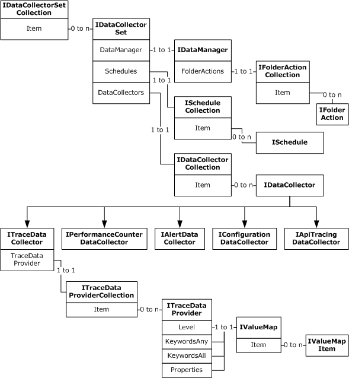
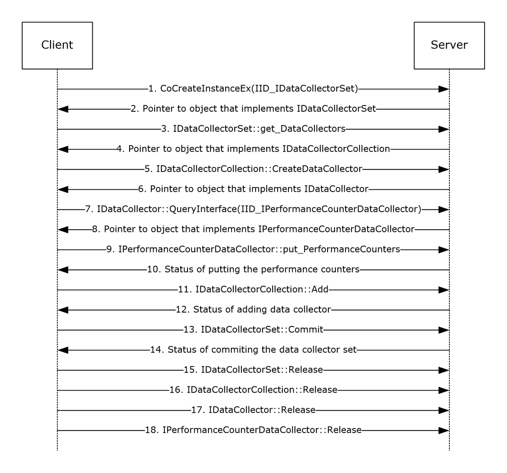
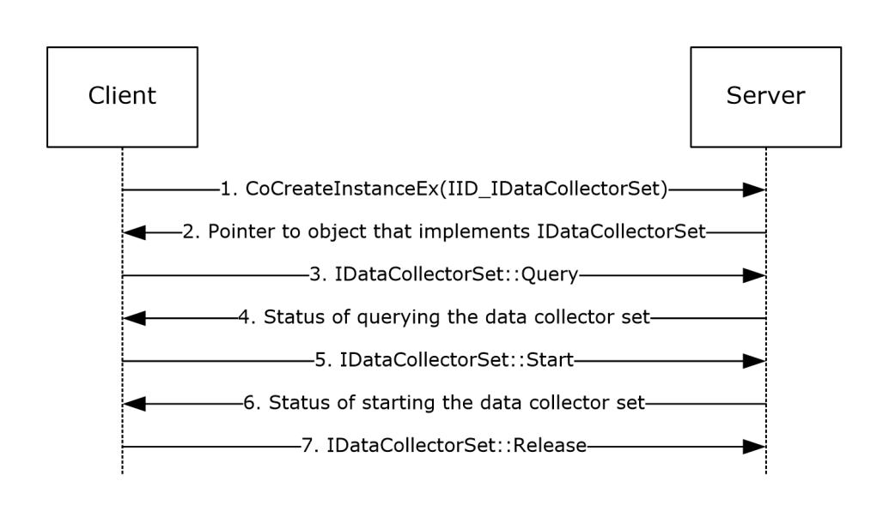
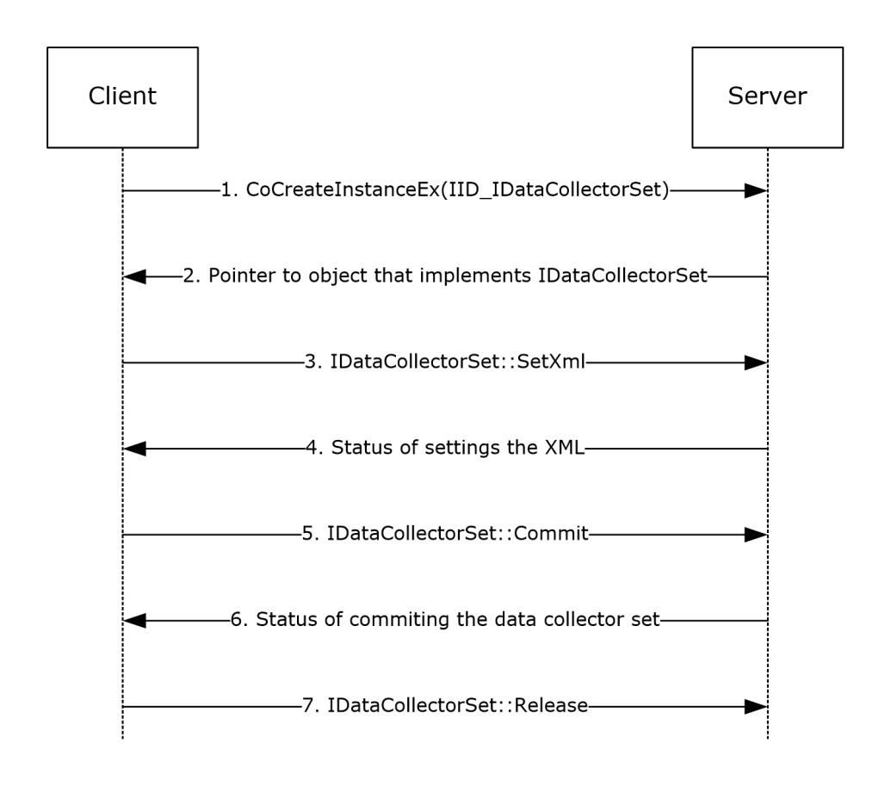

[MS-PLA]:

Performance Logs and Alerts Protocol

Intellectual Property Rights Notice for Open Specifications Documentation

  Technical Documentation. Microsoft publishes Open Specifications documentation (“this

documentation”) for protocols, file formats, data portability, computer languages, and standards
support. Additionally, overview documents cover inter-protocol relationships and interactions.

  Copyrights. This documentation is covered by Microsoft copyrights. Regardless of any other

terms that are contained in the terms of use for the Microsoft website that hosts this
documentation, you can make copies of it in order to develop implementations of the technologies
that are described in this documentation and can distribute portions of it in your implementations
that use these technologies or in your documentation as necessary to properly document the
implementation. You can also distribute in your implementation, with or without modification, any
schemas, IDLs, or code samples that are included in the documentation. This permission also
applies to any documents that are referenced in the Open Specifications documentation.
  No Trade Secrets. Microsoft does not claim any trade secret rights in this documentation.
  Patents. Microsoft has patents that might cover your implementations of the technologies

described in the Open Specifications documentation. Neither this notice nor Microsoft's delivery of
this documentation grants any licenses under those patents or any other Microsoft patents.
However, a given Open Specifications document might be covered by the Microsoft Open
Specifications Promise or the Microsoft Community Promise. If you would prefer a written license,
or if the technologies described in this documentation are not covered by the Open Specifications
Promise or Community Promise, as applicable, patent licenses are available by contacting
iplg@microsoft.com.

  License Programs. To see all of the protocols in scope under a specific license program and the

associated patents, visit the Patent Map.

  Trademarks. The names of companies and products contained in this documentation might be
covered by trademarks or similar intellectual property rights. This notice does not grant any
licenses under those rights. For a list of Microsoft trademarks, visit
www.microsoft.com/trademarks.

  Fictitious Names. The example companies, organizations, products, domain names, email

addresses, logos, people, places, and events that are depicted in this documentation are fictitious.
No association with any real company, organization, product, domain name, email address, logo,
person, place, or event is intended or should be inferred.

Reservation of Rights. All other rights are reserved, and this notice does not grant any rights other
than as specifically described above, whether by implication, estoppel, or otherwise.

Tools. The Open Specifications documentation does not require the use of Microsoft programming
tools or programming environments in order for you to develop an implementation. If you have access
to Microsoft programming tools and environments, you are free to take advantage of them. Certain
Open Specifications documents are intended for use in conjunction with publicly available standards
specifications and network programming art and, as such, assume that the reader either is familiar
with the aforementioned material or has immediate access to it.

Support. For questions and support, please contact dochelp@microsoft.com.

[MS-PLA] - v20240423
Performance Logs and Alerts Protocol
Copyright © 2024 Microsoft Corporation
Release: April 23, 2024

1 / 234

Revision Summary

Date

Revision
History

Revision
Class

Comments

4/3/2007

0.01

7/3/2007

1.0

7/20/2007

2.0

8/10/2007

3.0

9/28/2007

4.0

10/23/2007  5.0

11/30/2007  6.0

1/25/2008

7.0

3/14/2008

8.0

5/16/2008

9.0

6/20/2008

10.0

New

Major

Major

Major

Major

Major

Major

Major

Major

Major

Major

Version 0.01 release

MLonghorn+90

Updated and revised the technical content.

Updated and revised the technical content.

Updated and revised the technical content.

Updated and revised the technical content.

Updated and revised the technical content.

Updated and revised the technical content.

Updated and revised the technical content.

Updated and revised the technical content.

Updated and revised the technical content.

7/25/2008

10.0.1

Editorial

Changed language and formatting in the technical content.

8/29/2008

11.0

10/24/2008  12.0

12/5/2008

13.0

1/16/2009

14.0

2/27/2009

15.0

Major

Major

Major

Major

Major

Updated and revised the technical content.

Updated and revised the technical content.

Updated and revised the technical content.

Updated and revised the technical content.

Updated and revised the technical content.

4/10/2009

15.0.1

Editorial

Changed language and formatting in the technical content.

5/22/2009

16.0

Major

Updated and revised the technical content.

7/2/2009

16.0.1

Editorial

Changed language and formatting in the technical content.

8/14/2009

16.0.2

Editorial

Changed language and formatting in the technical content.

9/25/2009

16.1

Minor

Clarified the meaning of the technical content.

11/6/2009

16.1.1

Editorial

Changed language and formatting in the technical content.

12/18/2009  16.1.2

Editorial

Changed language and formatting in the technical content.

1/29/2010

17.0

3/12/2010

18.0

4/23/2010

18.1

6/4/2010

18.2

7/16/2010

18.2

8/27/2010

18.2

Major

Major

Minor

Minor

None

None

Updated and revised the technical content.

Updated and revised the technical content.

Clarified the meaning of the technical content.

Clarified the meaning of the technical content.

No changes to the meaning, language, or formatting of the
technical content.

No changes to the meaning, language, or formatting of the

2 / 234

[MS-PLA] - v20240423
Performance Logs and Alerts Protocol
Copyright © 2024 Microsoft Corporation
Release: April 23, 2024

Date

Revision
History

Revision
Class

Comments

technical content.

10/8/2010

18.2

None

No changes to the meaning, language, or formatting of the
technical content.

11/19/2010  18.2

None

No changes to the meaning, language, or formatting of the
technical content.

1/7/2011

18.2

None

No changes to the meaning, language, or formatting of the
technical content.

2/11/2011

18.2

None

No changes to the meaning, language, or formatting of the
technical content.

3/25/2011

18.2

None

No changes to the meaning, language, or formatting of the
technical content.

5/6/2011

18.2

6/17/2011

18.3

9/23/2011

18.4

12/16/2011  19.0

3/30/2012

19.0

None

Minor

Minor

Major

None

No changes to the meaning, language, or formatting of the
technical content.

Clarified the meaning of the technical content.

Clarified the meaning of the technical content.

Updated and revised the technical content.

No changes to the meaning, language, or formatting of the
technical content.

7/12/2012

19.0

None

No changes to the meaning, language, or formatting of the
technical content.

10/25/2012  19.0

None

No changes to the meaning, language, or formatting of the
technical content.

1/31/2013

19.0

None

No changes to the meaning, language, or formatting of the
technical content.

8/8/2013

20.0

Major

Updated and revised the technical content.

11/14/2013  20.0

None

No changes to the meaning, language, or formatting of the
technical content.

2/13/2014

20.0

None

No changes to the meaning, language, or formatting of the
technical content.

5/15/2014

20.0

None

No changes to the meaning, language, or formatting of the
technical content.

6/30/2015

21.0

Major

Significantly changed the technical content.

10/16/2015  21.0

None

No changes to the meaning, language, or formatting of the
technical content.

7/14/2016

21.0

None

No changes to the meaning, language, or formatting of the
technical content.

6/1/2017

21.0

None

No changes to the meaning, language, or formatting of the
technical content.

9/15/2017

22.0

Major

Significantly changed the technical content.

[MS-PLA] - v20240423
Performance Logs and Alerts Protocol
Copyright © 2024 Microsoft Corporation
Release: April 23, 2024

3 / 234

Date

Revision
History

Revision
Class

Comments

9/12/2018

23.0

4/7/2021

24.0

6/25/2021

25.0

4/23/2024

26.0

Major

Major

Major

Major

Significantly changed the technical content.

Significantly changed the technical content.

Significantly changed the technical content.

Significantly changed the technical content.

[MS-PLA] - v20240423
Performance Logs and Alerts Protocol
Copyright © 2024 Microsoft Corporation
Release: April 23, 2024

4 / 234

## Table of Contents

- [1 Introduction](#1-introduction)
  - [1.1 Glossary](#11-glossary)
  - [1.2 References](#12-references)
    - [1.2.1 Normative References](#121-normative-references)
    - [1.2.2 Informative References](#122-informative-references)
  - [1.3 Overview](#13-overview)
  - [1.4 Relationship to Other Protocols](#14-relationship-to-other-protocols)
  - [1.5 Prerequisites/Preconditions](#15-prerequisitespreconditions)
  - [1.6 Applicability Statement](#16-applicability-statement)
  - [1.7 Versioning and Capability Negotiation](#17-versioning-and-capability-negotiation)
  - [1.8 Vendor-Extensible Fields](#18-vendor-extensible-fields)
  - [1.9 Standards Assignments](#19-standards-assignments)
- [2 Messages](#2-messages)
  - [2.1 Transport](#21-transport)
  - [2.2 Common Data Types](#22-common-data-types)
    - [2.2.1 HRESULT Return Codes](#221-hresult-return-codes)
    - [2.2.2 Enumerations](#222-enumerations)
      - [2.2.2.1 AutoPathFormat](#2221-autopathformat)
      - [2.2.2.2 ClockType](#2222-clocktype)
      - [2.2.2.3 CommitMode](#2223-commitmode)
      - [2.2.2.4 DataCollectorSetStatus](#2224-datacollectorsetstatus)
      - [2.2.2.5 DataCollectorType](#2225-datacollectortype)
      - [2.2.2.6 DataManagerSteps](#2226-datamanagersteps)
      - [2.2.2.7 FileFormat](#2227-fileformat)
      - [2.2.2.8 FolderActionSteps](#2228-folderactionsteps)
      - [2.2.2.9 ResourcePolicy](#2229-resourcepolicy)
      - [2.2.2.10 StreamMode](#22210-streammode)
      - [2.2.2.11 ValueMapType](#22211-valuemaptype)
      - [2.2.2.12 WeekDays](#22212-weekdays)
    - [2.2.3 Formatting Rules](#223-formatting-rules)
      - [2.2.3.1 File and Subdirectory Name Formatting](#2231-file-and-subdirectory-name-formatting)
      - [2.2.3.2 API Name Formatting](#2232-api-name-formatting)
      - [2.2.3.3 Report Schema Formatting](#2233-report-schema-formatting)
      - [2.2.3.4 Rules Schema Formatting](#2234-rules-schema-formatting)
    - [2.2.4 Set Variable Action](#224-set-variable-action)
    - [2.2.5 Insert Node Action](#225-insert-node-action)
    - [2.2.6 Insert Attribute Action](#226-insert-attribute-action)
    - [2.2.7 Delete Action](#227-delete-action)
    - [2.2.8 Insert Warning Action](#228-insert-warning-action)
    - [2.2.9 ExtendedModes](#229-extendedmodes)
    - [2.2.10 Performance Counter Path](#2210-performance-counter-path)
    - [2.2.11 Trace Provider using Filter Data](#2211-trace-provider-using-filter-data)
      - [2.2.11.1 Filtering Support](#22111-filtering-support)
        - [2.2.11.1.1 Level](#221111-level)
        - [2.2.11.1.2 Keywords](#221112-keywords)
        - [2.2.11.1.3 Filter Data](#221113-filter-data)
      - [2.2.11.2 Creating an ETW Provider](#22112-creating-an-etw-provider)
        - [2.2.11.2.1 Creating an Instrumentation Manifest](#221121-creating-an-instrumentation-manifest)
        - [2.2.11.2.2 Registering an Instrumentation Manifest](#221122-registering-an-instrumentation-manifest)
        - [2.2.11.2.3 Creating an Enable Callback](#221123-creating-an-enable-callback)
        - [2.2.11.2.4 Registering the Trace Provider](#221124-registering-the-trace-provider)
    - [2.2.12 Controlling the trace provider](#2212-controlling-the-trace-provider)
      - [2.2.12.1 Configuring the Trace Provider with ITraceDataProvider](#22121-configuring-the-trace-provider-with-itracedataprovider)
    - [2.2.13 Performance Counter](#2213-performance-counter)
      - [2.2.13.1 Performance Counter Provider](#22131-performance-counter-provider)
      - [2.2.13.2 Performance Counter Consumer](#22132-performance-counter-consumer)
      - [2.2.13.3 Querying for a Performance Counter with PLA](#22133-querying-for-a-performance-counter-with-pla)
- [3 Protocol Details](#3-protocol-details)
  - [3.1 Pla Client Details](#31-pla-client-details)
    - [3.1.1 Abstract Data Model](#311-abstract-data-model)
    - [3.1.2 Timers](#312-timers)
    - [3.1.3 Initialization](#313-initialization)
    - [3.1.4 Message Processing Events and Sequencing Rules](#314-message-processing-events-and-sequencing-rules)
      - [3.1.4.1 Processing Server Replies to Method Calls](#3141-processing-server-replies-to-method-calls)
    - [3.1.5 Timer Events](#315-timer-events)
    - [3.1.6 Other Local Events](#316-other-local-events)
  - [3.2 Pla Server Details](#32-pla-server-details)
    - [3.2.1 Abstract Data Model](#321-abstract-data-model)
    - [3.2.2 Timers](#322-timers)
    - [3.2.3 Initialization](#323-initialization)
    - [3.2.4 Message Processing Events and Sequencing Rules](#324-message-processing-events-and-sequencing-rules)
      - [3.2.4.1 IDataCollectorSet](#3241-idatacollectorset)
        - [3.2.4.1.1 DataCollectors (Get) (Opnum 7)](#32411-datacollectors-get-opnum-7)
        - [3.2.4.1.2 Duration (Get) (Opnum 8)](#32412-duration-get-opnum-8)
        - [3.2.4.1.3 Duration (Put) (Opnum 9)](#32413-duration-put-opnum-9)
        - [3.2.4.1.4 Description (Get) (Opnum 10)](#32414-description-get-opnum-10)
        - [3.2.4.1.5 Description (Put) (Opnum 11)](#32415-description-put-opnum-11)
        - [3.2.4.1.6 DescriptionUnresolved (Get) (Opnum 12)](#32416-descriptionunresolved-get-opnum-12)
        - [3.2.4.1.7 DisplayName (Get) (Opnum 13)](#32417-displayname-get-opnum-13)
        - [3.2.4.1.8 DisplayName (Put) (Opnum 14)](#32418-displayname-put-opnum-14)
        - [3.2.4.1.9 DisplayNameUnresolved (Get) (Opnum 15)](#32419-displaynameunresolved-get-opnum-15)
        - [3.2.4.1.10 Keywords (Get) (Opnum 16)](#324110-keywords-get-opnum-16)
        - [3.2.4.1.11 Keywords (Put) (Opnum 17)](#324111-keywords-put-opnum-17)
        - [3.2.4.1.12 LatestOutputLocation (Get) (Opnum 18)](#324112-latestoutputlocation-get-opnum-18)
        - [3.2.4.1.13 LatestOutputLocation (Put) (Opnum 19)](#324113-latestoutputlocation-put-opnum-19)
        - [3.2.4.1.14 Name (Get) (Opnum 20)](#324114-name-get-opnum-20)
        - [3.2.4.1.15 OutputLocation (Get) (Opnum 21)](#324115-outputlocation-get-opnum-21)
        - [3.2.4.1.16 RootPath (Get) (Opnum 22)](#324116-rootpath-get-opnum-22)
        - [3.2.4.1.17 RootPath (Put) (Opnum 23)](#324117-rootpath-put-opnum-23)
        - [3.2.4.1.18 Segment (Get) (Opnum 24)](#324118-segment-get-opnum-24)
        - [3.2.4.1.19 Segment (Put) (Opnum 25)](#324119-segment-put-opnum-25)
        - [3.2.4.1.20 SegmentMaxDuration (Get) (Opnum 26)](#324120-segmentmaxduration-get-opnum-26)
        - [3.2.4.1.21 SegmentMaxDuration (Put) (Opnum 27)](#324121-segmentmaxduration-put-opnum-27)
        - [3.2.4.1.22 SegmentMaxSize (Get) (Opnum 28)](#324122-segmentmaxsize-get-opnum-28)
        - [3.2.4.1.23 SegmentMaxSize (Put) (Opnum 29)](#324123-segmentmaxsize-put-opnum-29)
        - [3.2.4.1.24 SerialNumber (Get) (Opnum 30)](#324124-serialnumber-get-opnum-30)
        - [3.2.4.1.25 SerialNumber (Put) (Opnum 31)](#324125-serialnumber-put-opnum-31)
        - [3.2.4.1.26 Server (Get) (Opnum 32)](#324126-server-get-opnum-32)
        - [3.2.4.1.27 Status (Get) (Opnum 33)](#324127-status-get-opnum-33)
        - [3.2.4.1.28 Subdirectory (Get) (Opnum 34)](#324128-subdirectory-get-opnum-34)
        - [3.2.4.1.29 Subdirectory (Put) (Opnum 35)](#324129-subdirectory-put-opnum-35)
        - [3.2.4.1.30 SubdirectoryFormat (Get) (Opnum 36)](#324130-subdirectoryformat-get-opnum-36)
        - [3.2.4.1.31 SubdirectoryFormat (Put) (Opnum 37)](#324131-subdirectoryformat-put-opnum-37)
        - [3.2.4.1.32 SubdirectoryFormatPattern (Get) (Opnum 38)](#324132-subdirectoryformatpattern-get-opnum-38)
        - [3.2.4.1.33 SubdirectoryFormatPattern (Put) (Opnum 39)](#324133-subdirectoryformatpattern-put-opnum-39)
        - [3.2.4.1.34 Task (Get) (Opnum 40)](#324134-task-get-opnum-40)
        - [3.2.4.1.35 Task (Put) (Opnum 41)](#324135-task-put-opnum-41)
        - [3.2.4.1.36 TaskRunAsSelf (Get) (Opnum 42)](#324136-taskrunasself-get-opnum-42)
        - [3.2.4.1.37 TaskRunAsSelf (Put) (Opnum 43)](#324137-taskrunasself-put-opnum-43)
        - [3.2.4.1.38 TaskArguments (Get) (Opnum 44)](#324138-taskarguments-get-opnum-44)
        - [3.2.4.1.39 TaskArguments (Put) (Opnum 45)](#324139-taskarguments-put-opnum-45)
        - [3.2.4.1.40 TaskUserTextArguments (Get) (Opnum 46)](#324140-taskusertextarguments-get-opnum-46)
        - [3.2.4.1.41 TaskUserTextArguments (Put) (Opnum 47)](#324141-taskusertextarguments-put-opnum-47)
        - [3.2.4.1.42 Schedules (Get) (Opnum 48)](#324142-schedules-get-opnum-48)
        - [3.2.4.1.43 SchedulesEnabled (Get) (Opnum 49)](#324143-schedulesenabled-get-opnum-49)
        - [3.2.4.1.44 SchedulesEnabled (Put) (Opnum 50)](#324144-schedulesenabled-put-opnum-50)
        - [3.2.4.1.45 UserAccount (Get) (Opnum 51)](#324145-useraccount-get-opnum-51)
        - [3.2.4.1.46 Xml (Get) (Opnum 52)](#324146-xml-get-opnum-52)
        - [3.2.4.1.47 Security (Get) (Opnum 53)](#324147-security-get-opnum-53)
        - [3.2.4.1.48 Security (Put) (Opnum 54)](#324148-security-put-opnum-54)
        - [3.2.4.1.49 StopOnCompletion (Get) (Opnum 55)](#324149-stoponcompletion-get-opnum-55)
        - [3.2.4.1.50 StopOnCompletion (Put) (Opnum 56)](#324150-stoponcompletion-put-opnum-56)
        - [3.2.4.1.51 DataManager (Get) (Opnum 57)](#324151-datamanager-get-opnum-57)
        - [3.2.4.1.52 SetCredentials (Opnum 58)](#324152-setcredentials-opnum-58)
        - [3.2.4.1.53 Query (Opnum 59)](#324153-query-opnum-59)
        - [3.2.4.1.54 Commit (Opnum 60)](#324154-commit-opnum-60)
        - [3.2.4.1.55 Delete (Opnum 61)](#324155-delete-opnum-61)
        - [3.2.4.1.56 Start (Opnum 62)](#324156-start-opnum-62)
        - [3.2.4.1.57 Stop (Opnum 63)](#324157-stop-opnum-63)
        - [3.2.4.1.58 SetXml (Opnum 64)](#324158-setxml-opnum-64)
        - [3.2.4.1.59 SetValue (Opnum 65)](#324159-setvalue-opnum-65)
        - [3.2.4.1.60 GetValue (Opnum 66)](#324160-getvalue-opnum-66)
      - [3.2.4.2 IDataManager](#3242-idatamanager)
        - [3.2.4.2.1 Enabled (Get) (Opnum 7)](#32421-enabled-get-opnum-7)
        - [3.2.4.2.2 Enabled (Put) (Opnum 8)](#32422-enabled-put-opnum-8)
        - [3.2.4.2.3 CheckBeforeRunning (Get) (Opnum 9)](#32423-checkbeforerunning-get-opnum-9)
        - [3.2.4.2.4 CheckBeforeRunning (Put) (Opnum 10)](#32424-checkbeforerunning-put-opnum-10)
        - [3.2.4.2.5 MinFreeDisk (Get) (Opnum 11)](#32425-minfreedisk-get-opnum-11)
        - [3.2.4.2.6 MinFreeDisk (Put) (Opnum 12)](#32426-minfreedisk-put-opnum-12)
        - [3.2.4.2.7 MaxSize (Get) (Opnum 13)](#32427-maxsize-get-opnum-13)
        - [3.2.4.2.8 MaxSize (Put) (Opnum 14)](#32428-maxsize-put-opnum-14)
        - [3.2.4.2.9 MaxFolderCount (Get) (Opnum 15)](#32429-maxfoldercount-get-opnum-15)
        - [3.2.4.2.10 MaxFolderCount (Put) (Opnum 16)](#324210-maxfoldercount-put-opnum-16)
        - [3.2.4.2.11 ResourcePolicy (Get) (Opnum 17)](#324211-resourcepolicy-get-opnum-17)
        - [3.2.4.2.12 ResourcePolicy (Put) (Opnum 18)](#324212-resourcepolicy-put-opnum-18)
        - [3.2.4.2.13 FolderActions (Get) (Opnum 19)](#324213-folderactions-get-opnum-19)
        - [3.2.4.2.14 ReportSchema (Get) (Opnum 20)](#324214-reportschema-get-opnum-20)
        - [3.2.4.2.15 ReportSchema (Put) (Opnum 21)](#324215-reportschema-put-opnum-21)
        - [3.2.4.2.16 ReportFileName (Get) (Opnum 22)](#324216-reportfilename-get-opnum-22)
        - [3.2.4.2.17 ReportFileName (Put) (Opnum 23)](#324217-reportfilename-put-opnum-23)
        - [3.2.4.2.18 RuleTargetFileName (Get) (Opnum 24)](#324218-ruletargetfilename-get-opnum-24)
        - [3.2.4.2.19 RuleTargetFileName (Put) (Opnum 25)](#324219-ruletargetfilename-put-opnum-25)
        - [3.2.4.2.20 EventsFileName (Get) (Opnum 26)](#324220-eventsfilename-get-opnum-26)
        - [3.2.4.2.21 EventsFileName (Put) (Opnum 27)](#324221-eventsfilename-put-opnum-27)
        - [3.2.4.2.22 Rules (Get) (Opnum 28)](#324222-rules-get-opnum-28)
        - [3.2.4.2.23 Rules (Put) (Opnum 29)](#324223-rules-put-opnum-29)
        - [3.2.4.2.24 Run (Opnum 30)](#324224-run-opnum-30)
        - [3.2.4.2.25 Extract (Opnum 31)](#324225-extract-opnum-31)
      - [3.2.4.3 IFolderAction](#3243-ifolderaction)
        - [3.2.4.3.1 Age (Get) (Opnum 7)](#32431-age-get-opnum-7)
        - [3.2.4.3.2 Age (Put) (Opnum 8)](#32432-age-put-opnum-8)
        - [3.2.4.3.3 Size (Get) (Opnum 9)](#32433-size-get-opnum-9)
        - [3.2.4.3.4 Size (Put) (Opnum 10)](#32434-size-put-opnum-10)
        - [3.2.4.3.5 Actions (Get) (Opnum 11)](#32435-actions-get-opnum-11)
        - [3.2.4.3.6 Actions (Put) (Opnum 12)](#32436-actions-put-opnum-12)
        - [3.2.4.3.7 SendCabTo (Get) (Opnum 13)](#32437-sendcabto-get-opnum-13)
        - [3.2.4.3.8 SendCabTo (Put) (Opnum 14)](#32438-sendcabto-put-opnum-14)
      - [3.2.4.4 IFolderActionCollection](#3244-ifolderactioncollection)
        - [3.2.4.4.1 Count (Get) (Opnum 7)](#32441-count-get-opnum-7)
        - [3.2.4.4.2 Item (Get) (Opnum 8)](#32442-item-get-opnum-8)
        - [3.2.4.4.3 _NewEnum (Get) (Opnum 9)](#32443-newenum-get-opnum-9)
        - [3.2.4.4.4 Add (Opnum 10)](#32444-add-opnum-10)
        - [3.2.4.4.5 Remove (Opnum 11)](#32445-remove-opnum-11)
        - [3.2.4.4.6 Clear (Opnum 12)](#32446-clear-opnum-12)
        - [3.2.4.4.7 AddRange (Opnum 13)](#32447-addrange-opnum-13)
        - [3.2.4.4.8 CreateFolderAction (Opnum 14)](#32448-createfolderaction-opnum-14)
      - [3.2.4.5 IDataCollector](#3245-idatacollector)
        - [3.2.4.5.1 DataCollectorSet (Get) (Opnum 7)](#32451-datacollectorset-get-opnum-7)
        - [3.2.4.5.2 DataCollectorType (Get) (Opnum 9)](#32452-datacollectortype-get-opnum-9)
        - [3.2.4.5.3 FileName (Get) (Opnum 10)](#32453-filename-get-opnum-10)
        - [3.2.4.5.4 FileName (Put) (Opnum 11)](#32454-filename-put-opnum-11)
        - [3.2.4.5.5 FileNameFormat (Get) (Opnum 12)](#32455-filenameformat-get-opnum-12)
        - [3.2.4.5.6 FileNameFormat (Put) (Opnum 13)](#32456-filenameformat-put-opnum-13)
        - [3.2.4.5.7 FileNameFormatPattern (Get) (Opnum 14)](#32457-filenameformatpattern-get-opnum-14)
        - [3.2.4.5.8 FileNameFormatPattern (Put) (Opnum 15)](#32458-filenameformatpattern-put-opnum-15)
        - [3.2.4.5.9 LatestOutputLocation (Get) (Opnum 16)](#32459-latestoutputlocation-get-opnum-16)
        - [3.2.4.5.10 LatestOutputLocation (Put) (Opnum 17)](#324510-latestoutputlocation-put-opnum-17)
        - [3.2.4.5.11 LogAppend (Get) (Opnum 18)](#324511-logappend-get-opnum-18)
        - [3.2.4.5.12 LogAppend (Put) (Opnum 19)](#324512-logappend-put-opnum-19)
        - [3.2.4.5.13 LogCircular (Get) (Opnum 20)](#324513-logcircular-get-opnum-20)
        - [3.2.4.5.14 LogCircular (Put) (Opnum 21)](#324514-logcircular-put-opnum-21)
        - [3.2.4.5.15 LogOverwrite (Get) (Opnum 22)](#324515-logoverwrite-get-opnum-22)
        - [3.2.4.5.16 LogOverwrite (Put) (Opnum 23)](#324516-logoverwrite-put-opnum-23)
        - [3.2.4.5.17 Name (Get) (Opnum 24)](#324517-name-get-opnum-24)
        - [3.2.4.5.18 Name (Put) (Opnum 25)](#324518-name-put-opnum-25)
        - [3.2.4.5.19 OutputLocation (Get) (Opnum 26)](#324519-outputlocation-get-opnum-26)
        - [3.2.4.5.20 Index (Get) (Opnum 27)](#324520-index-get-opnum-27)
        - [3.2.4.5.21 Xml (Get) (Opnum 29)](#324521-xml-get-opnum-29)
        - [3.2.4.5.22 SetXml (Opnum 30)](#324522-setxml-opnum-30)
      - [3.2.4.6 IPerformanceCounterDataCollector](#3246-iperformancecounterdatacollector)
        - [3.2.4.6.1 DataSourceName (Get) (Opnum 32)](#32461-datasourcename-get-opnum-32)
        - [3.2.4.6.2 DataSourceName (Put) (Opnum 33)](#32462-datasourcename-put-opnum-33)
        - [3.2.4.6.3 PerformanceCounters (Get) (Opnum 34)](#32463-performancecounters-get-opnum-34)
        - [3.2.4.6.4 PerformanceCounters (Put) (Opnum 35)](#32464-performancecounters-put-opnum-35)
        - [3.2.4.6.5 LogFileFormat (Get) (Opnum 36)](#32465-logfileformat-get-opnum-36)
        - [3.2.4.6.6 LogFileFormat (Put) (Opnum 37)](#32466-logfileformat-put-opnum-37)
        - [3.2.4.6.7 SampleInterval (Get) (Opnum 38)](#32467-sampleinterval-get-opnum-38)
        - [3.2.4.6.8 SampleInterval (Put) (Opnum 39)](#32468-sampleinterval-put-opnum-39)
        - [3.2.4.6.9 SegmentMaxRecords (Get) (Opnum 40)](#32469-segmentmaxrecords-get-opnum-40)
        - [3.2.4.6.10 SegmentMaxRecords (Put) (Opnum 41)](#324610-segmentmaxrecords-put-opnum-41)
      - [3.2.4.7 IConfigurationDataCollector](#3247-iconfigurationdatacollector)
        - [3.2.4.7.1 FileMaxCount (Get) (Opnum 32)](#32471-filemaxcount-get-opnum-32)
        - [3.2.4.7.2 FileMaxCount (Put) (Opnum 33)](#32472-filemaxcount-put-opnum-33)
        - [3.2.4.7.3 FileMaxRecursiveDepth (Get) (Opnum 34)](#32473-filemaxrecursivedepth-get-opnum-34)
        - [3.2.4.7.4 FileMaxRecursiveDepth (Put) (Opnum 35)](#32474-filemaxrecursivedepth-put-opnum-35)
        - [3.2.4.7.5 FileMaxTotalSize (Get) (Opnum 36)](#32475-filemaxtotalsize-get-opnum-36)
        - [3.2.4.7.6 FileMaxTotalSize (Put) (Opnum 37)](#32476-filemaxtotalsize-put-opnum-37)
        - [3.2.4.7.7 Files (Get) (Opnum 38)](#32477-files-get-opnum-38)
        - [3.2.4.7.8 Files (Put) (Opnum 39)](#32478-files-put-opnum-39)
        - [3.2.4.7.9 ManagementQueries (Get) (Opnum 40)](#32479-managementqueries-get-opnum-40)
        - [3.2.4.7.10 ManagementQueries (Put) (Opnum 41)](#324710-managementqueries-put-opnum-41)
        - [3.2.4.7.11 QueryNetworkAdapters (Get) (Opnum 42)](#324711-querynetworkadapters-get-opnum-42)
        - [3.2.4.7.12 QueryNetworkAdapters (Put) (Opnum 43)](#324712-querynetworkadapters-put-opnum-43)
        - [3.2.4.7.13 RegistryKeys (Get) (Opnum 44)](#324713-registrykeys-get-opnum-44)
        - [3.2.4.7.14 RegistryKeys (Put) (Opnum 45)](#324714-registrykeys-put-opnum-45)
        - [3.2.4.7.15 RegistryMaxRecursiveDepth (Get) (Opnum 46)](#324715-registrymaxrecursivedepth-get-opnum-46)
        - [3.2.4.7.16 RegistryMaxRecursiveDepth (Put) (Opnum 47)](#324716-registrymaxrecursivedepth-put-opnum-47)
        - [3.2.4.7.17 SystemStateFile (Get) (Opnum 48)](#324717-systemstatefile-get-opnum-48)
        - [3.2.4.7.18 SystemStateFile (Put) (Opnum 49)](#324718-systemstatefile-put-opnum-49)
      - [3.2.4.8 IAlertDataCollector](#3248-ialertdatacollector)
        - [3.2.4.8.1 AlertThresholds (Get) (Opnum 32)](#32481-alertthresholds-get-opnum-32)
        - [3.2.4.8.2 AlertThresholds (Put) (Opnum 33)](#32482-alertthresholds-put-opnum-33)
        - [3.2.4.8.3 EventLog (Get) (Opnum 34)](#32483-eventlog-get-opnum-34)
        - [3.2.4.8.4 EventLog (Put) (Opnum 35)](#32484-eventlog-put-opnum-35)
        - [3.2.4.8.5 SampleInterval (Get) (Opnum 36)](#32485-sampleinterval-get-opnum-36)
        - [3.2.4.8.6 SampleInterval (Put) (Opnum 37)](#32486-sampleinterval-put-opnum-37)
        - [3.2.4.8.7 Task (Get) (Opnum 38)](#32487-task-get-opnum-38)
        - [3.2.4.8.8 Task (Put) (Opnum 39)](#32488-task-put-opnum-39)
        - [3.2.4.8.9 TaskRunAsSelf (Get) (Opnum 40)](#32489-taskrunasself-get-opnum-40)
        - [3.2.4.8.10 TaskRunAsSelf (Put) (Opnum 41)](#324810-taskrunasself-put-opnum-41)
        - [3.2.4.8.11 TaskArguments (Get) (Opnum 42)](#324811-taskarguments-get-opnum-42)
        - [3.2.4.8.12 TaskArguments (Put) (Opnum 43)](#324812-taskarguments-put-opnum-43)
        - [3.2.4.8.13 TaskUserTextArguments (Get) (Opnum 44)](#324813-taskusertextarguments-get-opnum-44)
        - [3.2.4.8.14 TaskUserTextArguments (Put) (Opnum 45)](#324814-taskusertextarguments-put-opnum-45)
        - [3.2.4.8.15 TriggerDataCollectorSet (Get) (Opnum 46)](#324815-triggerdatacollectorset-get-opnum-46)
        - [3.2.4.8.16 TriggerDataCollectorSet (Put)(Opnum 47)](#324816-triggerdatacollectorset-putopnum-47)
      - [3.2.4.9 ITraceDataCollector](#3249-itracedatacollector)
        - [3.2.4.9.1 BufferSize (Get) (Opnum 32)](#32491-buffersize-get-opnum-32)
        - [3.2.4.9.2 BufferSize (Put) (Opnum 33)](#32492-buffersize-put-opnum-33)
        - [3.2.4.9.3 BuffersLost (Get) (Opnum 34)](#32493-bufferslost-get-opnum-34)
        - [3.2.4.9.4 BuffersWritten (Get) (Opnum 36)](#32494-bufferswritten-get-opnum-36)
        - [3.2.4.9.5 ClockType (Get) (Opnum 38)](#32495-clocktype-get-opnum-38)
        - [3.2.4.9.6 ClockType (Put) (Opnum 39)](#32496-clocktype-put-opnum-39)
        - [3.2.4.9.7 EventsLost (Get) (Opnum 40)](#32497-eventslost-get-opnum-40)
        - [3.2.4.9.8 ExtendedModes (Get) (Opnum 42)](#32498-extendedmodes-get-opnum-42)
        - [3.2.4.9.9 ExtendedModes (Put) (Opnum 43)](#32499-extendedmodes-put-opnum-43)
        - [3.2.4.9.10 FlushTimer (Get) (Opnum 44)](#324910-flushtimer-get-opnum-44)
        - [3.2.4.9.11 FlushTimer (Put) (Opnum 45)](#324911-flushtimer-put-opnum-45)
        - [3.2.4.9.12 FreeBuffers (Get) (Opnum 46)](#324912-freebuffers-get-opnum-46)
        - [3.2.4.9.13 Guid (Get) (Opnum 48)](#324913-guid-get-opnum-48)
        - [3.2.4.9.14 Guid (Put) (Opnum 49)](#324914-guid-put-opnum-49)
        - [3.2.4.9.15 IsKernelTrace (Get) (Opnum 50)](#324915-iskerneltrace-get-opnum-50)
        - [3.2.4.9.16 MaximumBuffers (Get) (Opnum 51)](#324916-maximumbuffers-get-opnum-51)
        - [3.2.4.9.17 MaximumBuffers (Put) (Opnum 52)](#324917-maximumbuffers-put-opnum-52)
        - [3.2.4.9.18 MinimumBuffers (Get) (Opnum 53)](#324918-minimumbuffers-get-opnum-53)
        - [3.2.4.9.19 MinimumBuffers (Put) (Opnum 54)](#324919-minimumbuffers-put-opnum-54)
        - [3.2.4.9.20 NumberOfBuffers (Get) (Opnum 55)](#324920-numberofbuffers-get-opnum-55)
        - [3.2.4.9.21 NumberOfBuffers (Put) (Opnum 56)](#324921-numberofbuffers-put-opnum-56)
        - [3.2.4.9.22 PreallocateFile (Get) (Opnum 57)](#324922-preallocatefile-get-opnum-57)
        - [3.2.4.9.23 PreallocateFile (Put) (Opnum 58)](#324923-preallocatefile-put-opnum-58)
        - [3.2.4.9.24 ProcessMode (Get) (Opnum 59)](#324924-processmode-get-opnum-59)
        - [3.2.4.9.25 ProcessMode (Put) (Opnum 60)](#324925-processmode-put-opnum-60)
        - [3.2.4.9.26 RealTimeBuffersLost (Get) (Opnum 61)](#324926-realtimebufferslost-get-opnum-61)
        - [3.2.4.9.27 SessionId (Get) (Opnum 63)](#324927-sessionid-get-opnum-63)
        - [3.2.4.9.28 SessionName (Get) (Opnum 65)](#324928-sessionname-get-opnum-65)
        - [3.2.4.9.29 SessionName (Put) (Opnum 66)](#324929-sessionname-put-opnum-66)
        - [3.2.4.9.30 SessionThreadId (Get) (Opnum 67)](#324930-sessionthreadid-get-opnum-67)
        - [3.2.4.9.31 StreamMode (Get) (Opnum 69)](#324931-streammode-get-opnum-69)
        - [3.2.4.9.32 StreamMode (Put) (Opnum 70)](#324932-streammode-put-opnum-70)
        - [3.2.4.9.33 TraceDataProviders (Get) (Opnum 71)](#324933-tracedataproviders-get-opnum-71)
      - [3.2.4.10 IApiTracingDataCollector](#32410-iapitracingdatacollector)
        - [3.2.4.10.1 LogApiNamesOnly (Get) (Opnum 32)](#324101-logapinamesonly-get-opnum-32)
        - [3.2.4.10.2 LogApiNamesOnly (Put) (Opnum 33)](#324102-logapinamesonly-put-opnum-33)
        - [3.2.4.10.3 LogApisRecursively (Get) (Opnum 34)](#324103-logapisrecursively-get-opnum-34)
        - [3.2.4.10.4 LogApisRecursively (Put) (Opnum 35)](#324104-logapisrecursively-put-opnum-35)
        - [3.2.4.10.5 ExePath (Get) (Opnum 36)](#324105-exepath-get-opnum-36)
        - [3.2.4.10.6 ExePath (Put) (Opnum 37)](#324106-exepath-put-opnum-37)
        - [3.2.4.10.7 LogFilePath (Get) (Opnum 38)](#324107-logfilepath-get-opnum-38)
        - [3.2.4.10.8 LogFilePath (Put) (Opnum 39)](#324108-logfilepath-put-opnum-39)
        - [3.2.4.10.9 IncludeModules (Get) (Opnum 40)](#324109-includemodules-get-opnum-40)
        - [3.2.4.10.10 IncludeModules (Put) (Opnum 41)](#3241010-includemodules-put-opnum-41)
        - [3.2.4.10.11 IncludeApis (Get) (Opnum 42)](#3241011-includeapis-get-opnum-42)
        - [3.2.4.10.12 IncludeApis (Put) (Opnum 43)](#3241012-includeapis-put-opnum-43)
        - [3.2.4.10.13 ExcludeApis (Get) (Opnum 44)](#3241013-excludeapis-get-opnum-44)
        - [3.2.4.10.14 ExcludeApis (Put) (Opnum 45)](#3241014-excludeapis-put-opnum-45)
      - [3.2.4.11 ITraceDataProvider](#32411-itracedataprovider)
        - [3.2.4.11.1 DisplayName (Get) (Opnum 7)](#324111-displayname-get-opnum-7)
        - [3.2.4.11.2 DisplayName (Put) (Opnum 8)](#324112-displayname-put-opnum-8)
        - [3.2.4.11.3 Guid (Get) (Opnum 9)](#324113-guid-get-opnum-9)
        - [3.2.4.11.4 Guid (Put) (Opnum 10)](#324114-guid-put-opnum-10)
        - [3.2.4.11.5 Level (Get) (Opnum 11)](#324115-level-get-opnum-11)
        - [3.2.4.11.6 KeywordsAny (Get) (Opnum 12)](#324116-keywordsany-get-opnum-12)
        - [3.2.4.11.7 KeywordsAll (Get) (Opnum 13)](#324117-keywordsall-get-opnum-13)
        - [3.2.4.11.8 Properties (Get) (Opnum 14)](#324118-properties-get-opnum-14)
        - [3.2.4.11.9 FilterEnabled (Get) (Opnum 15)](#324119-filterenabled-get-opnum-15)
        - [3.2.4.11.10 FilterEnabled (Put) (Opnum 16)](#3241110-filterenabled-put-opnum-16)
        - [3.2.4.11.11 FilterType (Get) (Opnum 17)](#3241111-filtertype-get-opnum-17)
        - [3.2.4.11.12 FilterType (Put) (Opnum 18)](#3241112-filtertype-put-opnum-18)
        - [3.2.4.11.13 FilterData (Get) (Opnum 19)](#3241113-filterdata-get-opnum-19)
        - [3.2.4.11.14 FilterData (Put) (Opnum 20)](#3241114-filterdata-put-opnum-20)
        - [3.2.4.11.15 Query (Opnum 21)](#3241115-query-opnum-21)
        - [3.2.4.11.16 Resolve (Opnum 22)](#3241116-resolve-opnum-22)
        - [3.2.4.11.17 SetSecurity (Opnum 23)](#3241117-setsecurity-opnum-23)
        - [3.2.4.11.18 GetSecurity (Opnum 24)](#3241118-getsecurity-opnum-24)
        - [3.2.4.11.19 GetRegisteredProcesses (Opnum 25)](#3241119-getregisteredprocesses-opnum-25)
      - [3.2.4.12 ISchedule](#32412-ischedule)
        - [3.2.4.12.1 StartDate (Get) (Opnum 7)](#324121-startdate-get-opnum-7)
        - [3.2.4.12.2 StartDate (Put) (Opnum 8)](#324122-startdate-put-opnum-8)
        - [3.2.4.12.3 EndDate (Get) (Opnum 9)](#324123-enddate-get-opnum-9)
        - [3.2.4.12.4 EndDate (Put) (Opnum 10)](#324124-enddate-put-opnum-10)
        - [3.2.4.12.5 StartTime (Get) (Opnum 11)](#324125-starttime-get-opnum-11)
        - [3.2.4.12.6 StartTime (Put) (Opnum 12)](#324126-starttime-put-opnum-12)
        - [3.2.4.12.7 Days (Get) (Opnum 13)](#324127-days-get-opnum-13)
        - [3.2.4.12.8 Days (Put) (Opnum 14)](#324128-days-put-opnum-14)
      - [3.2.4.13 ITraceDataProviderCollection](#32413-itracedataprovidercollection)
        - [3.2.4.13.1 Count (Get) (Opnum 7)](#324131-count-get-opnum-7)
        - [3.2.4.13.2 Item (Get) (Opnum 8)](#324132-item-get-opnum-8)
        - [3.2.4.13.3 _NewEnum (Get) (Opnum 9)](#324133-newenum-get-opnum-9)
        - [3.2.4.13.4 Add (Opnum 10)](#324134-add-opnum-10)
        - [3.2.4.13.5 Remove (Opnum 11)](#324135-remove-opnum-11)
        - [3.2.4.13.6 Clear (Opnum 12)](#324136-clear-opnum-12)
        - [3.2.4.13.7 AddRange (Opnum 13)](#324137-addrange-opnum-13)
        - [3.2.4.13.8 CreateTraceDataProvider (Opnum 14)](#324138-createtracedataprovider-opnum-14)
        - [3.2.4.13.9 GetTraceDataProviders (Opnum 15)](#324139-gettracedataproviders-opnum-15)
        - [3.2.4.13.10 GetTraceDataProvidersByProcess (Opnum 16)](#3241310-gettracedataprovidersbyprocess-opnum-16)
      - [3.2.4.14 IScheduleCollection](#32414-ischedulecollection)
        - [3.2.4.14.1 Count (Get) (Opnum 7)](#324141-count-get-opnum-7)
        - [3.2.4.14.2 Item (Get) (Opnum 8)](#324142-item-get-opnum-8)
        - [3.2.4.14.3 _NewEnum (Get) (Opnum 9)](#324143-newenum-get-opnum-9)
        - [3.2.4.14.4 Add (Opnum 10)](#324144-add-opnum-10)
        - [3.2.4.14.5 Remove (Opnum 11)](#324145-remove-opnum-11)
        - [3.2.4.14.6 Clear (Opnum 12)](#324146-clear-opnum-12)
        - [3.2.4.14.7 AddRange (Opnum 13)](#324147-addrange-opnum-13)
        - [3.2.4.14.8 CreateSchedule (Opnum 14)](#324148-createschedule-opnum-14)
      - [3.2.4.15 IDataCollectorCollection](#32415-idatacollectorcollection)
        - [3.2.4.15.1 Count (Get) (Opnum 7)](#324151-count-get-opnum-7)
        - [3.2.4.15.2 Item (Get) (Opnum 8)](#324152-item-get-opnum-8)
        - [3.2.4.15.3 _NewEnum (Get) (Opnum 9)](#324153-newenum-get-opnum-9)
        - [3.2.4.15.4 Add (Opnum 10)](#324154-add-opnum-10)
        - [3.2.4.15.5 Remove (Opnum 11)](#324155-remove-opnum-11)
        - [3.2.4.15.6 Clear (Opnum 12)](#324156-clear-opnum-12)
        - [3.2.4.15.7 AddRange (Opnum 13)](#324157-addrange-opnum-13)
        - [3.2.4.15.8 CreateDataCollectorFromXml (Opnum 14)](#324158-createdatacollectorfromxml-opnum-14)
        - [3.2.4.15.9 CreateDataCollector (Opnum 15)](#324159-createdatacollector-opnum-15)
      - [3.2.4.16 IDataCollectorSetCollection](#32416-idatacollectorsetcollection)
        - [3.2.4.16.1 Count (Get) (Opnum 7)](#324161-count-get-opnum-7)
        - [3.2.4.16.2 Item (Get) (Opnum 8)](#324162-item-get-opnum-8)
        - [3.2.4.16.3 _NewEnum (Get) (Opnum 9)](#324163-newenum-get-opnum-9)
        - [3.2.4.16.4 Add (Opnum 10)](#324164-add-opnum-10)
        - [3.2.4.16.5 Remove (Opnum 11)](#324165-remove-opnum-11)
        - [3.2.4.16.6 Clear (Opnum 12)](#324166-clear-opnum-12)
        - [3.2.4.16.7 AddRange (Opnum 13)](#324167-addrange-opnum-13)
        - [3.2.4.16.8 GetDataCollectorSets (Opnum 14)](#324168-getdatacollectorsets-opnum-14)
      - [3.2.4.17 IValueMapItem](#32417-ivaluemapitem)
        - [3.2.4.17.1 Description (Get) (Opnum 7)](#324171-description-get-opnum-7)
        - [3.2.4.17.2 Description (Put) (Opnum 8)](#324172-description-put-opnum-8)
        - [3.2.4.17.3 Enabled (Get) (Opnum 9)](#324173-enabled-get-opnum-9)
        - [3.2.4.17.4 Enabled (Put) (Opnum 10)](#324174-enabled-put-opnum-10)
        - [3.2.4.17.5 Key (Get) (Opnum 11)](#324175-key-get-opnum-11)
        - [3.2.4.17.6 Key (Put) (Opnum 12)](#324176-key-put-opnum-12)
        - [3.2.4.17.7 Value (Get) (Opnum 13)](#324177-value-get-opnum-13)
        - [3.2.4.17.8 Value (Put) (Opnum 14)](#324178-value-put-opnum-14)
        - [3.2.4.17.9 ValueMapType (Get) (Opnum 15)](#324179-valuemaptype-get-opnum-15)
        - [3.2.4.17.10 ValueMapType (Put) (Opnum 16)](#3241710-valuemaptype-put-opnum-16)
      - [3.2.4.18 IValueMap](#32418-ivaluemap)
        - [3.2.4.18.1 Count (Get) (Opnum 7)](#324181-count-get-opnum-7)
        - [3.2.4.18.2 Item (Get) (Opnum 8)](#324182-item-get-opnum-8)
        - [3.2.4.18.3 _NewEnum (Get) (Opnum 9)](#324183-newenum-get-opnum-9)
        - [3.2.4.18.4 Description (Get) (Opnum 10)](#324184-description-get-opnum-10)
        - [3.2.4.18.5 Description (Put) (Opnum 11)](#324185-description-put-opnum-11)
        - [3.2.4.18.6 Value (Get) (Opnum 12)](#324186-value-get-opnum-12)
        - [3.2.4.18.7 Value (Put) (Opnum 13)](#324187-value-put-opnum-13)
        - [3.2.4.18.8 ValueMapType (Get) (Opnum 14)](#324188-valuemaptype-get-opnum-14)
        - [3.2.4.18.9 ValueMapType (Put) (Opnum 15)](#324189-valuemaptype-put-opnum-15)
        - [3.2.4.18.10 Add (Opnum 16)](#3241810-add-opnum-16)
        - [3.2.4.18.11 Remove (Opnum 17)](#3241811-remove-opnum-17)
        - [3.2.4.18.12 Clear (Opnum 18)](#3241812-clear-opnum-18)
        - [3.2.4.18.13 AddRange (Opnum 19)](#3241813-addrange-opnum-19)
        - [3.2.4.18.14 CreateValueMapItem (Opnum 20)](#3241814-createvaluemapitem-opnum-20)
      - [3.2.4.19 Schema](#32419-schema)
    - [3.2.5 Timer Events](#325-timer-events)
    - [3.2.6 Other Local Events](#326-other-local-events)
- [4 Protocol Examples](#4-protocol-examples)
  - [4.1 An Example Controlling a Provider](#41-an-example-controlling-a-provider)
  - [4.2 An Example of Querying Performance Counters](#42-an-example-of-querying-performance-counters)
- [5 Security](#5-security)
  - [5.1 Security Considerations for Implementers](#51-security-considerations-for-implementers)
  - [5.2 Index of Security Parameters](#52-index-of-security-parameters)
- [6 Appendix A: Full IDL](#6-appendix-a-full-idl)
- [7 Appendix B: Product Behavior](#7-appendix-b-product-behavior)
- [8 Change Tracking](#8-change-tracking)
- [9 Index](#9-index)

## 1 Introduction

The Performance Logs and Alerts (PLA) protocol is a set of Distributed Component Object Model
(DCOM) interfaces (as specified in [MS-DCOM]) for logging diagnosis data on a remote computer.

The PLA Protocol allows users to:

  Specify the diagnostic data to be collected and logged.

  Specify the data retention and reporting policies for the logged data.

  Specify alert conditions.

  Start, stop, or schedule the collection.

Sections 1.5, 1.8, 1.9, 2, and 3 of this specification are normative. All other sections and examples in
this specification are informative.

### 1.1 Glossary

This document uses the following terms:

data collector: An object entity that defines data collection, including a list of performance and

diagnosis data to be collected and a log file name.

data collector set: An object entity that represents a group of data collectors, including

scheduling information, stop conditions, and a directory for log files.

data management: The ability to set a data retention policy against logged data and define post-

actions of the collection (for example, delete largest log file, compress log file).

diagnosis data: Data that indicates the health status or performance of a system. The types of
diagnosis data collected by this protocol include performance counter data, event tracing
data, registry key data, Windows Management Instrumentation (WMI), network adapters data,
and API tracing data and files.

disk: A persistent storage device that can include physical hard disks, removable disk units, optical

drive units, and logical unit numbers (LUNs) unmasked to the system.

dynamic endpoint: A network-specific server address that is requested and assigned at run time.

For more information, see [C706].

ETW: Event Tracing for Windows. For more information, see [MSDN-ETW].

folder: A file system construct. File systems organize a volume's data by providing a hierarchy of
objects, which are referred to as folders or directories, that contain files and can also contain
other folders.

fully qualified domain name (FQDN): An unambiguous domain name that gives an absolute

location in the Domain Name System's (DNS) hierarchy tree, as defined in [RFC1035] section
3.1 and [RFC2181] section 11.

globally unique identifier (GUID): A term used interchangeably with universally unique

identifier (UUID) in Microsoft protocol technical documents (TDs). Interchanging the usage of
these terms does not imply or require a specific algorithm or mechanism to generate the value.
Specifically, the use of this term does not imply or require that the algorithms described in
[RFC4122] or [C706] have to be used for generating the GUID. See also universally unique
identifier (UUID).

[MS-PLA] - v20240423
Performance Logs and Alerts Protocol
Copyright © 2024 Microsoft Corporation
Release: April 23, 2024

13 / 234

Interface Definition Language (IDL): The International Standards Organization (ISO) standard

language for specifying the interface for remote procedure calls. For more information, see
[C706] section 4.

object: In COM, an instance of an object class. Each object implements one or more interfaces

that can be obtained from each other by using the IUnknown interface.

opnum: An operation number or numeric identifier that is used to identify a specific remote

procedure call (RPC) method or a method in an interface. For more information, see [C706]
section 12.5.2.12 or [MS-RPCE].

path: When referring to a file path on a file system, a hierarchical sequence of folders. When
referring to a connection to a storage device, a connection through which a machine can
communicate with the storage device.

performance counter: A numeric measurement of the performance of one or more computing

resources. Bandwidth, Throughputs, and Availability are examples of performance counters.

Performance Logs and Alerts Unique Identifier (PLA-UID): A 128-bit unique identifier.

Although the behavior of the PLA protocol does not depend on particular values of this PLA-UID,
in order to avoid conflict between PLA-UIDs, the PLA-UID is to be generated as specified in
[RFC4122].

remote procedure call (RPC): A communication protocol used primarily between client and

server. The term has three definitions that are often used interchangeably: a runtime
environment providing for communication facilities between computers (the RPC runtime); a set
of request-and-response message exchanges between computers (the RPC exchange); and the
single message from an RPC exchange (the RPC message).  For more information, see [C706].

segmentation: A process of creating new log files or stopping a data collector set based on

conditions (for example, duration, file size).

UncPath: The location of a file in a network of computers, as specified in Universal Naming

Convention (UNC) syntax.

universally unique identifier (UUID): A 128-bit value. UUIDs can be used for multiple

purposes, from tagging objects with an extremely short lifetime, to reliably identifying very
persistent objects in cross-process communication such as client and server interfaces, manager
entry-point vectors, and RPC objects. UUIDs are highly likely to be unique. UUIDs are also
known as globally unique identifiers (GUIDs) and these terms are used interchangeably in
the Microsoft protocol technical documents (TDs). Interchanging the usage of these terms does
not imply or require a specific algorithm or mechanism to generate the UUID. Specifically, the
use of this term does not imply or require that the algorithms described in [RFC4122] or [C706]
has to be used for generating the UUID.

MAY, SHOULD, MUST, SHOULD NOT, MUST NOT: These terms (in all caps) are used as defined
in [RFC2119]. All statements of optional behavior use either MAY, SHOULD, or SHOULD NOT.

### 1.2 References

Links to a document in the Microsoft Open Specifications library point to the correct section in the
most recently published version of the referenced document. However, because individual documents
in the library are not updated at the same time, the section numbers in the documents may not
match. You can confirm the correct section numbering by checking the Errata.

[MS-PLA] - v20240423
Performance Logs and Alerts Protocol
Copyright © 2024 Microsoft Corporation
Release: April 23, 2024

14 / 234

#### 1.2.1 Normative References

We conduct frequent surveys of the normative references to assure their continued availability. If you
have any issue with finding a normative reference, please contact dochelp@microsoft.com. We will
assist you in finding the relevant information.

[C706] The Open Group, "DCE 1.1: Remote Procedure Call", C706, August 1997,
https://publications.opengroup.org/c706

Note Registration is required to download the document.

[MS-DCOM] Microsoft Corporation, "Distributed Component Object Model (DCOM) Remote Protocol".

[MS-DTYP] Microsoft Corporation, "Windows Data Types".

[MS-ERREF] Microsoft Corporation, "Windows Error Codes".

[MS-OAUT] Microsoft Corporation, "OLE Automation Protocol".

[MS-PCQ] Microsoft Corporation, "Performance Counter Query Protocol".

[MS-RPCE] Microsoft Corporation, "Remote Procedure Call Protocol Extensions".

[MS-RRP] Microsoft Corporation, "Windows Remote Registry Protocol".

[MS-TSCH] Microsoft Corporation, "Task Scheduler Service Remoting Protocol".

[MS-WMI] Microsoft Corporation, "Windows Management Instrumentation Remote Protocol".

[RFC2119] Bradner, S., "Key words for use in RFCs to Indicate Requirement Levels", BCP 14, RFC
2119, March 1997, https://www.rfc-editor.org/info/rfc2119

[XPATH] Clark, J. and DeRose, S., "XML Path Language (XPath), Version 1.0", W3C Recommendation,
November 1999, http://www.w3.org/TR/1999/REC-xpath-19991116/

#### 1.2.2 Informative References

[MSDN-AUTHLEV] Microsoft Corporation, "RPC_C_AUTHN_LEVEL_xxx", http://msdn.microsoft.com/en-
us/library/ms678435.aspx

[MSDN-COUNT] Microsoft Corporation, "Performance Counters", http://msdn.microsoft.com/en-
us/library/aa373083.aspx

[MSDN-EVENT_TRACE_PROPERTIES] Microsoft Corporation, "EVENT_TRACE_PROPERTIES structure",
http://msdn.microsoft.com/en-us/library/aa363784.aspx

[MSDN-IMPLVL] Microsoft Corporation, "RPC_C_IMP_LEVEL_xxx", http://msdn.microsoft.com/en-
us/library/ms693790.aspx

[MSDN-LMC] Microsoft Corporation, "Logging Mode Constants", http://msdn.microsoft.com/en-
us/library/aa364080.aspx

[MSDN-LUACCESS] Microsoft Corporation, "Limited User Access Support",
http://msdn.microsoft.com/en-us/library/aa372183.aspx

[MSDN-PC/W2K8] Microsoft Corporation, "Windows Server 2008 Performance Counters", 2008,
http://technet.microsoft.com/en-us/library/cc774901(v=WS.10).aspx

[MS-PLA] - v20240423
Performance Logs and Alerts Protocol
Copyright © 2024 Microsoft Corporation
Release: April 23, 2024

15 / 234

[MSDN-PLA-EnableCallBack] Microsoft Corporation, "EnableCallback Callback function",
http://msdn.microsoft.com/en-us/library/aa363707.aspx

[MSDN-PLA-EventReg] Microsoft Corporation, "EventRegister function",
http://msdn.microsoft.com/en-us/library/aa363744.aspx

[MSDN-PLA-Instru-Manifests] Microsoft Corporation, "Instrumentation Manifests for Event Publishers",
http://msdn.microsoft.com/en-us/library/aa385619.aspx

[MSDN-PLA-KeywordType] Microsoft Corporation, "KeywordType Complex Type",
http://msdn.microsoft.com/en-us/library/aa382786.aspx

[MSDN-PLA-LevelType] Microsoft Corporation, "LevelType Complex Type",
http://msdn.microsoft.com/en-us/library/aa382793.aspx

[MSDN-PLA-Lodctr] Microsoft Corporation, "Lodctr", http://technet.microsoft.com/en-
us/library/cc755887.aspx

[MSDN-PLA-PCIF] Microsoft Corporation, "PerfCreateInstance function",
http://msdn.microsoft.com/en-us/library/aa373072.aspx

[MSDN-PLA-PCS] Microsoft Corporation, "Performance Counters Schema",
http://msdn.microsoft.com/en-us/library/aa373092(VS.85).aspx

[MSDN-PLA-PSCRVF] Microsoft Corporation, "PerfSetCounterRefValue function",
http://msdn.microsoft.com/en-us/library/aa373115(VS.85).aspx

[MSDN-PLA-PSCSIF] Microsoft Corporation, "PerfSetCounterSetInfo function",
http://msdn.microsoft.com/en-us/library/aa373119.aspx

[MSDN-PLA-PSPF] Microsoft Corporation, "PerfStartProvider function", http://msdn.microsoft.com/en-
us/library/aa373138.aspx

[MSDN-PLA-PSTPF] Microsoft Corporation, "PerfStopProvider function", http://msdn.microsoft.com/en-
us/library/aa373140(VS.85).aspx

[MSDN-PLA-PSUCVF] Microsoft Corporation, "PerfSetULongCounterValue function",
http://msdn.microsoft.com/en-us/library/aa373125(VS.85).aspx

[MSDN-PLA-PSULCVF] Microsoft Corporation, "PerfSetULongLongCounterValue function",
http://msdn.microsoft.com/en-us/library/aa373131(VS.85).aspx

### 1.3 Overview

Software components can be designed to assist in serviceability, manageability, supportability, and
diagnostic ability. For instance, performance counters are a simple way of exposing state
information that can be sampled or polled. Event-based instrumentation typically generates a state
change notification. Alerts are a simple way of turning a sampled counter into an event notification,
based on a threshold value.

System administrators often want to collect diagnosis data on a remote system in a periodic or
ongoing basis to better support and diagnose problems on the systems. Furthermore, the collected
data can be processed by tools for in-depth problem analysis.

The Performance Logs and Alerts Protocol provides a set of DCOM interfaces to control data collection
on a remote system. The control includes creating, starting, stopping, scheduling, and configuring
data collector objects and the creation of alerts.

The capabilities of the Performance Logs and Alerts Protocol are summarized as follows:

16 / 234

[MS-PLA] - v20240423
Performance Logs and Alerts Protocol
Copyright © 2024 Microsoft Corporation
Release: April 23, 2024





Performance Counter Logging (section 3.2.4.6): The Performance Logs and Alerts Protocol allows
users to log performance counters' data of resources on a remote system. A resource can be
hardware (for example, CPU, memory) or software (for example, application, process). The logged
performance counter data is often useful for the analysis of performance trends and bottlenecks.
The PLA Protocol also supports logging performance counter data in a SQL database format
(section 3.2.4.6). This option defines the name of an existing SQL database and log set within the
database where the performance counter data will be read or written. This file format is useful
when collecting and analyzing performance counter data at an enterprise level rather than on a
per-computer basis.

Event Trace Logging (section 3.2.4.9): The Performance Logs and Alerts Protocol allows users to
log event tracing data of resources on a remote system. The event provider is software that can
create event notifications and generate events when certain activities, such as a disk I/O
operation or a page fault, occur. The application that uses the Performance Logs and Alerts
Protocol can enable or disable event providers and selectively log the events of interest into a file.

  API Trace Logging (section 3.2.4.10): The Performance Logs and Alerts Protocol allows users to

log the API call activity of an executable on a remote system. Observing API call activity is useful
for the diagnosis of various executable issues (for example, detecting unnecessary API calls.)

  Configuration Data Logging (section 3.2.4.7): The Performance Logs and Alerts Protocol allows

users to log the computer configuration information on a remote system. Readjustment of an
incorrect setting is one of the common diagnosis root causes.

  Alerts (section 3.2.4.8): The Performance Logs and Alerts Protocol allows users to create alerts
based on performance counter values on a remote system. An alert can trigger running a
program, logging the alert as an event, or starting another data collection.

  Data Collector Set (section 3.2.4.1): The Performance Logs and Alerts Protocol allows users to
group multiple logging entities' data collectors and apply operations to them at once. The
operations include start (section 3.2.4.1.56), stop (section 3.2.4.1.57), schedule (section
3.2.4.1.20), and configure (section 3.2.4.1).

  Data Management (section 3.2.4.2): The Performance Logs and Alerts Protocol allows users to set
a data retention policy against logged data and define post-actions of the collection. The post-
actions, such as delete largest log file and compress log file, can be defined with the Performance
Logs and Alerts Protocol interfaces.

### 1.4 Relationship to Other Protocols

The Performance Logs and Alerts Protocol relies on [MS-DCOM], which uses RPC as its transport.

### 1.5 Prerequisites/Preconditions

This protocol is implemented over DCOM and RPC, and, as a result, has the prerequisites specified in
[MS-DCOM] and [MS-RPCE] as being common to DCOM and RPC interfaces.

It is assumed that a client has obtained the fully qualified domain name (FQDN) of a remote
computer that supports the Performance Logs and Alerts Protocol before the protocol is invoked.

It is assumed that the server can delegate the rights of a user to a process when given the correct
username and password of the user, both specified as BSTRs. This is required to support the
IDataCollectorSet::SetCredentials method, which allows a user to save his or her credentials (a
username/password pair) in a data collector set and to have that data collector set run with his or
her rights when it is started.

[MS-PLA] - v20240423
Performance Logs and Alerts Protocol
Copyright © 2024 Microsoft Corporation
Release: April 23, 2024

17 / 234

### 1.6 Applicability Statement

This protocol is appropriate for managing the collection and logging of diagnosis data on a local or
remote computer, as well as managing and reporting on the collected data. This protocol is not
appropriate for diagnosing or monitoring diagnosis data in real time.

### 1.7 Versioning and Capability Negotiation

This document covers versioning issues in the following areas:

  Security and Authentication methods: As specified in [MS-DCOM] and [MS-RPCE], and section 2.1.

  Capability Negotiation: This protocol does not enforce any version negotiation.

### 1.8 Vendor-Extensible Fields

This protocol uses HRESULT values, as specified in [MS-ERREF] section 2.1.  Vendors are free to
choose their own values for this field, as long as the C bit (0x20000000) is set, indicating it is a
customer code.

### 1.9 Standards Assignments

No standards assignments have been received for this protocol. All values used in these extensions
are in private ranges. The following table contains the RPC Interface UUIDs for all the interfaces that
are part of the Performance Logs and Alerts Protocol object model.

Parameter

Value

RPC Interface UUID for IDataCollectorSet

RPC Interface UUID for IDataManager

RPC Interface UUID for IFolderAction

RPC Interface UUID for IFolderActionCollection

RPC Interface UUID for IDataCollector

03837520-098b-11d8-9414-
505054503030

03837541-098b-11d8-9414-
505054503030

03837543-098b-11d8-9414-
505054503030

03837544-098b-11d8-9414-
505054503030

038374ff-098b-11d8-9414-
505054503030

RPC Interface UUID for
IPerformanceCounterDataCollector

03837506-098b-11d8-9414-
505054503030

RPC Interface UUID for IConfigurationDataCollector   03837514-098b-11d8-9414-

RPC Interface UUID for IAlertDataCollector

RPC Interface UUID for ITraceDataCollector

RPC Interface UUID for IApiTracingDataCollector

RPC Interface UUID for ITraceDataProvider

505054503030

03837516-098b-11d8-9414-
505054503030

0383750b-098b-11d8-9414-
505054503030

0383751a-098b-11d8-9414-
505054503030

03837512-098b-11d8-9414-
505054503030

[MS-PLA] - v20240423
Performance Logs and Alerts Protocol
Copyright © 2024 Microsoft Corporation
Release: April 23, 2024

Reference

As specified in
3.2.4.1

As specified in
3.2.4.2

As specified in
3.2.4.3

As specified in
3.2.4.4

As specified in
3.2.4.5

 As specified in
3.2.4.6

 As specified in
3.2.4.7

 As specified in
3.2.4.8

 As specified in
3.2.4.9

 As specified in
3.2.4.10

 As specified in
3.2.4.11

18 / 234

Parameter

Value

RPC Interface UUID for ISchedule

RPC Interface UUID for
ITraceDataProviderCollection

RPC Interface UUID for IScheduleCollection

RPC Interface UUID for IDataCollectorCollection

0383753a-098b-11d8-9414-
505054503030

03837510-098b-11d8-9414-
505054503030

0383753d-098b-11d8-9414-
505054503030

03837502-098b-11d8-9414-
505054503030

RPC Interface UUID for IDataCollectorSetCollection   03837524-098b-11d8-9414-

RPC Interface UUID for IValueMapItem

RPC Interface UUID for IValueMap

505054503030

03837533-098b-11d8-9414-
505054503030

03837534-098b-11d8-9414-
505054503030

Reference

 As specified in
3.2.4.12

 As specified in
3.2.4.13

 As specified in
3.2.4.14

 As specified in
3.2.4.15

 As specified in
3.2.4.16

 As specified in
3.2.4.17

 As specified in
3.2.4.18

[MS-PLA] - v20240423
Performance Logs and Alerts Protocol
Copyright © 2024 Microsoft Corporation
Release: April 23, 2024

19 / 234

## 2 Messages

The following sections specify how Performance Logs and Alerts Protocol messages are transported
and common data types.

### 2.1 Transport

This protocol MUST use the DCOM Remote Protocol, as specified in [MS-DCOM], as its transport. On
its behalf, the DCOM Remote Protocol uses the following RPC protocol sequence: RPC over TCP, as
specified in [MS-RPCE].

This protocol uses RPC dynamic endpoints, as specified in [C706] part 4.<1> The server SHOULD
designate an RPC authentication level of RPC_C_AUTHN_LEVEL_PKT_PRIVACY, and the server MUST
require an RPC authentication level that is not less than RPC_C_AUTHN_LEVEL_PKT_PRIVACY.

This protocol uses the flags RPC_C_IMP_LEVEL_IMPERSONATE and
RPC_C_AUTHN_LEVEL_PKT_PRIVACY. For more information, see [MSDN-IMPLVL] and [MSDN-
AUTHLEV].

### 2.2 Common Data Types

This section defines a number of fields containing flags that can be combined by using a logical OR
operation. Except where otherwise specified, all undefined flags MUST be set to zero and ignored on
receipt.

In addition to RPC base types and definitions specified in [C706] and [MS-DTYP], data types are
defined in the following sections.

For all methods that have an array as an output parameter, or any output argument of which type is
not a primitive type, the memory for the array is allocated by the server and freed by the client.
Details on DCOM memory allocation mechanisms are specified in [MS-DCOM].

This protocol MUST indicate to the RPC runtime that it is to associate the size in bytes specified by the
byte_count parameter with the memory indicated by the pointer, as specified in [MS-RPCE] section 3.

#### 2.2.1 HRESULT Return Codes

An HRESULT return code defined in [MS-ERREF] MUST be returned by the server to indicate additional
information about the result of a method call or the reason that a call failed. If the result is an error
rather than simple status information, the most significant bit of the HRESULT is set, as specified by
[MS-ERREF]. The following list contains HRESULTs specified in [MS-ERREF], and the methods from
which the HRESULTs can be returned, that correspond to error conditions specific to the operation of
the PLA Protocol.

Note that the preceding HRESULTs are necessarily returned from the specified PLA Protocol methods;
other HRESULTs defined in [MS-ERREF] can be returned from the method in place of those listed in
the preceding table.

Return value/code

Description

0x80300002

The data collector set was not found.

PLA_E_DCS_NOT_FOUND

This HRESULT can be returned from the following methods:

IDataCollectorSet::Commit: Name does not refer to an existing data
collector set, and mode is set to plaModify.

IDataCollectorSet::Query: Name does not refer to an existing data
collector set.

20 / 234

[MS-PLA] - v20240423
Performance Logs and Alerts Protocol
Copyright © 2024 Microsoft Corporation
Release: April 23, 2024

Return value/code

Description

IDataCollector::DataCollectorSet(Get): Data collector was never added to
a data collector set.

IDataCollectorSet::LatestOutputLocation: Data collector was never added
to a data collector set or it was removed from a data collector set.

IDataCollectorSet::Delete: IDataCollectorSet::Commit was not called on
the data collector set.

0x803000AA

The data collector set or one of its dependencies is already in use.

PLA_E_DCS_IN_USE

This HRESULT can be returned from the following method:

IDataCollectorSet::Start: Data collector set is already started.

0x803000B7

The data collector set already exists.

PLA_E_DCS_ALREADY_EXISTS

This HRESULT can be returned from the following method:

IDataCollectorSet::Commit: The data collector set already exists, and
mode is set to CreateNew.

0x00300100

The property value will be ignored.

PLA_S_PROPERTY_IGNORED

0x80300101

Property value conflict. See section 2.2.2.11 for more information.

PLA_E_PROPERTY_CONFLICT

0x80300105

PLA_E_CONFLICT_INCL_EXCL_API

A conflict was detected in the list of include/exclude APIs. Do not specify
the same API in both the include and exclude lists.

This HRESULT can be returned from the following method:

IDataCollectorSet::Commit: Elements in the IncludeApis and ExcludeApis
arrays overlap.

0x80300106

The specified executable path refers to a network share or UncPath.

PLA_E_NETWORK_EXE_NOT_VALID

This HRESULT can be returned from the following method:

IDataCollectorSet::Start: IApiTracingDataCollector::ExePath refers to a
nonlocal location.

0x80300107

The specified executable path is already configured for API tracing.

PLA_E_EXE_ALREADY_CONFIGURED

This HRESULT can be returned from the following method:

IDataCollectorSet::Start: IApiTracingDataCollector::ExePath refers to an
executable that is already being traced.

0x80300108

PLA_E_EXE_PATH_NOT_VALID

The specified executable path does not exist. Verify that the specified path
is correct.

This HRESULT can be returned from the following method:

IDataCollectorSet::Start: IApiTracingDataCollector::ExePath does not
point to a file.

0x80300109

The data collector already exists.

PLA_E_DC_ALREADY_EXISTS

This HRESULT can be returned from the following method:

IDataCollectorCollection::Add: Data collector collection already contains a
data collector with the same name.

0x8030010A

The wait for the data collector set start notification has timed out.

PLA_E_DCS_START_WAIT_TIMEOUT

This HRESULT can be returned from the following method:

IDataCollectorSet::Start: Synchronous start was requested but the
request timed out.

0x8030010D

Duplicate items are not allowed.

PLA_E_NO_DUPLICATES

This HRESULT can be returned from the following methods:

21 / 234

[MS-PLA] - v20240423
Performance Logs and Alerts Protocol
Copyright © 2024 Microsoft Corporation
Release: April 23, 2024

Return value/code

Description

IConfigurationDataCollector::RegistryKeys(Put): Duplicate registry keys
are specified in the RegistryKeys property.

IPerformanceCounterDataCollector::PerformanceCounters(Put): Duplicate
performance counters are specified in the PerformanceCounters property.

ITraceDataProviderCollection::Add: Duplicate providers are specified in
the collection.

IDataCollector::Xml(Get): Duplicate providers are specified in the
collection.

IDataCollector::SetXml: Duplicate providers are specified in the collection.

0x8030010E

PLA_E_EXE_FULL_PATH_REQUIRED

When specifying the executable file that needs to be traced, the caller
MUST specify a full path to the executable file and not just a file name.

This HRESULT can be returned from the following method:

IApiTracingDataCollector: IApiTracingDataCollector::ExePath: was not an
absolute path.

#### 2.2.2 Enumerations

##### 2.2.2.1 AutoPathFormat

The AutoPathFormat enumeration defines the information to be appended to the file name or
subdirectory name. Any combination of the bits is allowed; multiple bits specify strings to be
appended to the file name. When a combination with than one of these bits is specified, the strings
are appended in the following order: plaComputer, plaPattern, plaMonthDayHour, plaSerialNumber,
plaYearDayOfYear, plaYearMonth, plaYearMonthDay, plaYearMonthDayHour, plaMonthDayHourMinute.
Consequently, if all bits are set, the name is represented as follows:
[plaComputer]base_name[plaPattern][plaMonthDayHour][plaSerialNumber][plaYearDayOfYear][plaYe
arMonth][plaYearMonthDay][plaYearMonthDayHour][plaMonthDayHourMinute].

 typedef  enum
 {
   plaNone = 0x0000,
   plaPattern = 0x0001,
   plaComputer = 0x0002,
   plaMonthDayHour = 0x0100,
   plaSerialNumber = 0x0200,
   plaYearDayOfYear = 0x0400,
   plaYearMonth = 0x0800,
   plaYearMonthDay = 0x1000,
   plaYearMonthDayHour = 0x2000,
   plaMonthDayHourMinute = 0x4000
 } AutoPathFormat;

plaNone:   Does not append any information to the name.

plaPattern:  Adds a pattern specified in IDataCollectorSet::SubdirectoryFormatPattern 3.2.4.1.32 or

IDataCollector::FileNameFormatPattern 3.2.4.5.7 to the name.

plaComputer:  Prefixes the name with the computer name.

plaMonthDayHour:  Appends the month, day, and hour to the name in the form, MMddHH.

plaSerialNumber:  Appends the serial number specified in IDataCollectorSet::SerialNumber to the

subdirectory name in the form, NNNNNN.

22 / 234

[MS-PLA] - v20240423
Performance Logs and Alerts Protocol
Copyright © 2024 Microsoft Corporation
Release: April 23, 2024

plaYearDayOfYear:  Appends the year and day of the year to the name in the form, yyyyDDD.

plaYearMonth:  Appends the year and month to the name in the form, yyyyMM.

plaYearMonthDay:  Appends the year, month, and day to the name in the form, yyyyMMdd.

plaYearMonthDayHour:  Appends the year, month, day, and hour to the name in the form,

yyyyMMddHH.

plaMonthDayHourMinute:  Appends the month, day, hour, and minute to the name in the form,

MMddHHmm.

##### 2.2.2.2 ClockType

The ClockType enumeration defines the clock resolution to use when tracing events.

 typedef  enum
 {
   plaTimeStamp = 0,
   plaPerformance = 1,
   plaSystem = 2,
   plaCycle = 3
 } ClockType;

plaTimeStamp:  Use the raw (unconverted) time stamp.

plaPerformance:  Query performance counter (QPC). Provides a high-resolution (100

nanoseconds) time stamp that is more expensive to retrieve.

plaSystem:  System time. Provides a low-resolution (10 milliseconds) time stamp that is less

expensive to retrieve.

plaCycle:  CPU cycle counter. MAY provide the highest resolution time stamp and is the least

expensive to retrieve. However, the CPU counter is unreliable and its use is not recommended.

##### 2.2.2.3 CommitMode

The CommitMode enumeration defines the type of actions to be performed when the changes are
committed to the data collector set. Any combination of bits MUST be allowed.

 typedef  enum
 {
   plaCreateNew = 0x0001,
   plaModify = 0x0002,
   plaCreateOrModify = 0x0003,
   plaUpdateRunningInstance = 0x0010,
   plaFlushTrace = 0x0020,
   plaValidateOnly = 0x1000
 } CommitMode;

plaCreateNew:  For a persistent data collector set, save it to storage. The set MUST not have existed

previously on storage.

plaModify:  Update a previously committed data collector set.

plaCreateOrModify:  For a persistent data collector set, save it to storage. If the set already exists,

the PLA Protocol will update it.

[MS-PLA] - v20240423
Performance Logs and Alerts Protocol
Copyright © 2024 Microsoft Corporation
Release: April 23, 2024

23 / 234

plaUpdateRunningInstance:  If the data collector set is running, apply the updated property values

to it.

plaFlushTrace:  If multiple data collector sets are running, flush the event trace data collectors

memory buffers to storage or real-time consumers.

plaValidateOnly:  Perform validation only on the data collector set.

##### 2.2.2.4 DataCollectorSetStatus

The DataCollectorSetStatus enumeration defines the running status of the data collector set.

 typedef  enum
 {
   plaStopped = 0,
   plaRunning = 1,
   plaCompiling = 2,
   plaPending = 3,
   plaUndefined = 4
 } DataCollectorSetStatus;

plaStopped:  The data collector set is stopped.

plaRunning:  The data collector set is running.

plaCompiling:  The data collector set is performing data management (see section 3.2.4.2). A

running data collector set transitions from running to compiling if the data manager is enabled.

plaPending:  Not used.

plaUndefined:  Cannot determine the status but no error has occurred. Typically, this status is set for

boot trace sessions.

##### 2.2.2.5 DataCollectorType

The DataCollectorType enumeration defines the data collector types.

 typedef  enum
 {
   plaPerformanceCounter = 0,
   plaTrace = 1,
   plaConfiguration = 2,
   plaAlert = 3,
   plaApiTrace = 4
 } DataCollectorType;

plaPerformanceCounter:  Collects performance counter data. The

IPerformanceCounterDataCollector interface represents this data collector.

plaTrace:  Collects events from an event trace session. The ITraceDataCollector interface represents

this data collector.

plaConfiguration:  Collects computer configuration information. The IConfigurationDataCollector

interface represents this data collector.

plaAlert:  Monitors performance counters and performs actions if the counter value crosses the given

threshold. The IAlertDataCollector interface represents this data collector.

[MS-PLA] - v20240423
Performance Logs and Alerts Protocol
Copyright © 2024 Microsoft Corporation
Release: April 23, 2024

24 / 234

plaApiTrace:  Logs API calls made by the process. The IApiTracingDataCollector interface represents

this data collector.

##### 2.2.2.6 DataManagerSteps

The DataManagerSteps enumeration defines the actions that the data manager takes when it runs.
Any combination of the bits are allowed.

 typedef  enum
 {
   plaCreateReport = 0x01,
   plaRunRules = 0x02,
   plaCreateHtml = 0x04,
   plaFolderActions = 0x08,
   plaResourceFreeing = 0x10
 } DataManagerSteps;

plaCreateReport:  Creates a report if data is available. The file name MUST be

IDataManager::RuleTargetFileName, and IDataManager::ReportSchema can be used to customize
the way the report is created. This value indicates the run of TraceRpt.exe by using as input all of
the binary performance files (.blg) and event trace files (.etl) in the collection.

plaRunRules:  If a report exists, the PLA Protocol MUST apply the rules specified in

IDataManager::Rules to the report. The IDataManager::RuleTargetFileName(Get) returns the
name of the file to which the rules are applied.

plaCreateHtml:  Converts the XML file obtained by IDataManager::RuleTargetFileName(Get) to HTML

format. The HTML format is written to the file specified in IDataManager::ReportFileName.

plaFolderActions:  Apply the folder actions obtained by IDataManager::FolderActions(Get) to all

folders defined in the collection.

plaResourceFreeing:  If IDataManager::MaxFolderCount, IDataManager::MaxSize, or MinFreeDisk

exceeds its limit, the PLA Protocol MUST apply the resource policy specified in
IDataManager::ResourcePolicy.

##### 2.2.2.7 FileFormat

The FileFormat enumeration defines the format of the data in the log file.

 typedef  enum
 {
   plaCommaSeparated = 0,
   plaTabSeparated = 1,
   plaSql = 2,
   plaBinary = 3
 } FileFormat;

plaCommaSeparated:  Comma-separated log file. The first line in the text file contains column

headers followed by comma-separated data in the remaining lines of the log file.

plaTabSeparated:  Tab-separated log file. The first line in the text file contains column headers

followed by tab-separated data in the remaining lines of the log file.

plaSql:  The data is saved into a SQL database, instead of to a file. The SQL database contains three

tables: CounterData, CounterDetails, and DisplayToId. All three tables are specified below.

[MS-PLA] - v20240423
Performance Logs and Alerts Protocol
Copyright © 2024 Microsoft Corporation
Release: April 23, 2024

25 / 234

The CounterData table contains a row for each counter that is collected at a particular time. There
will be a large number of these rows. The GUID, CounterID, and RecordIndex fields make up the
primary key for this table.

The CounterData table defines the following fields:

  GUID(uniqueidentifier, NOT NULL): GUID, as specified in [MS-DTYP] section 2.3.4, for this

data set. Use this key to join with the DisplayToID table.

  CounterID(int, NOT NULL): Identifies the counter. Use this key to join with the CounterDetails

table.

  RecordIndex(int, NOT NULL): The sample index for a specific counter identifier and collection

PLA-UID. The value increases for each successive sample in this log file.

  CounterDateTime(char(24), NOT NULL): The time the collection was started, in UTC time.

  CounterValue(float, NOT NULL): The formatted value of the counter. This value can be zero for

the first record if the counter requires two samples to compute a displayable value.





FirstValueA(int): Combine this 32-bit value with the value of FirstValueB to create the
FirstValue member of PDH_RAW_COUNTER. FirstValueA contains the low-order bits.

FirstValueB(int): Combine this 32-bit value with the value of FirstValueA to create the
FirstValue member of PDH_RAW_COUNTER. FirstValueB contains the high-order bits.

  SecondValueA(int): Combine this 32-bit value with the value of SecondValueB to create the

SecondValue member of PDH_RAW_COUNTER. SecondValueA contains the low-order bits.

  SecondValueB(int): Combine this 32-bit value with the value of SecondValueA to create the
SecondValue member of PDH_RAW_COUNTER. SecondValueB contains the high order bits.

The CounterDetails table describes a specific counter on a particular computer. The
CounterDetails table defines the following fields:

  CounterID(int, IDENTITY PRIMARY KEY): A unique identifier in the database that maps to a

specific counter name text string. This field is the primary key of this table.

  MachineName(varchar(1024), NOT NULL): The name of the computer that logged this data

set.

  ObjectName(varchar(1024), NOT NULL): The name of the performance object.

  CounterName(varchar(1024), NOT NULL): The name of the counter.

  CounterType(int, NOT NULL): The counter type.

  DefaultScale(int, NOT NULL): The default scaling to be applied to the raw performance

counter data.







InstanceName(varchar(1024)): The name of the counter instance.

InstanceIndex(int): The index number of the counter instance.

ParentName(varchar(1024)): Some counters are logically associated with others, and are
referred to as parents. For example, the parent of a thread is a process and the parent of a
logical disk driver is a physical drive. This field contains the name of the parent. Either the
value in this field or the ParentObjectID field identifies a specific parent instance. If the value
in this field is NULL, the value in the ParentObjectID field will be checked to identify the
parent. If the values in both fields are NULL, the counter does not have a parent.

26 / 234

[MS-PLA] - v20240423
Performance Logs and Alerts Protocol
Copyright © 2024 Microsoft Corporation
Release: April 23, 2024



ParentObjectID(int): The unique identifier of the parent. The value in either this field or the
ParentName field identifies a specific parent instance. If the value in this field is NULL, the
value in the ParentName field will be checked to identify the parent.

The DisplayToID table relates the user-friendly string displayed by the System Monitor to the
PLA-UID stored in the other tables. The DisplayToID table defines the following fields:

  GUID(uniqueidentifier, NOT NULL PRIMARY KEY): A PLA-UID generated for a log. This field is

the primary key of this table. Note that these do not correspond to the values in:
HKEY_LOCAL_MACHINE \SYSTEM \CurrentControlSet \Services \SysmonLog \Log Queries\

  RunID(int): Reserved for internal use.

  DisplayString(varchar(1024), NOT NULL UNIQUE): Name of the log file as displayed in the

System Monitor.





LogStartTime(char(24)): Time the logging process started in yyyy-mm-dd hh:mm:ss:nnn
format.

LogStopTime(char(24)): Time the logging process stopped in yyyy-mm-dd hh:mm:ss:nnn
format. Multiple log files with the same DisplayString value can be differentiated by using the
value in this and the LogStartTime fields. The values in the LogStartTime and LogStopTime
fields also allow the total collection time to be accessed quickly.

  NumberOfRecords(int): Number of samples stored in the table for each log collection.

  MinutesToUTC(int): Value used to convert the row data stored in UTC time to local time.



TimeZoneName(char(32)): Name of the time zone where the data was collected. If collecting
or analyzing relogged data from a file collected on systems in the user's time zone, this field
will state the location.

plaBinary:  Binary log file.

##### 2.2.2.8 FolderActionSteps

The FolderActionSteps enumeration defines the action that the data manager takes when both the age
and size limits are met. Any combination of the bits MUST be allowed.

 typedef  enum
 {
   plaCreateCab = 0x01,
   plaDeleteData = 0x02,
   plaSendCab = 0x04,
   plaDeleteCab = 0x08,
   plaDeleteReport = 0x10
 } FolderActionSteps;

plaCreateCab:  Creates a cabinet file. The name of the cabinet file is <name of the subfolder>.cab.

For example, if the name of the subfolder was "MyFolder", the cab file would be named
"MyFolder.cab". The name of the subfolder is specified by the combination of the Subdirectory,
SubdirectoryFormat, and SubdirectoryFormatPattern properties of the IDataCollectorSet. The
Subdirectory property provides the base name for the Subfolder, the SubdirectoryFormat property
specifies the suffix and prefix that will be appended and prepended to the base name, and the
SubdirectoryFormatPattern specifies the pattern that will be used in the suffix. The
SubdirectoryFormat is specified in section 2.2.2.1. The SubdirectoryFormatPattern is specified in
section 2.2.3.1.

plaDeleteData:  Deletes all files in the folder, except the report and cabinet file.

27 / 234

[MS-PLA] - v20240423
Performance Logs and Alerts Protocol
Copyright © 2024 Microsoft Corporation
Release: April 23, 2024

plaSendCab:  Sends the cabinet file to the location specified in the IFolderAction::SendCabTo

property.

plaDeleteCab:  Deletes the cabinet file.

plaDeleteReport:  Deletes the report file.

##### 2.2.2.9 ResourcePolicy

The ResourcePolicy enumeration defines the order in which folders are deleted when one of the disk
resource limits is exceeded.

 typedef  enum
 {
   plaDeleteLargest = 0,
   plaDeleteOldest = 1
 } ResourcePolicy;

plaDeleteLargest:  Deletes the largest folders first.

plaDeleteOldest:  Deletes the oldest folders first.

##### 2.2.2.10 StreamMode

The StreamMode enumeration defines where the trace events are delivered.

 typedef  enum
 {
   plaFile = 0x0001,
   plaRealTime = 0x0002,
   plaBoth = 0x0003,
   plaBuffering = 0x0004
 } StreamMode;

plaFile:  Writes the trace events to a log file.

plaRealTime:  Delivers the trace events to a real time consumer.

plaBoth:  Writes the trace events to a log file and delivers them to a real-time consumer.

plaBuffering:   Keeps events in a circular buffer in memory only. For more information, see the

EVENT_TRACE_BUFFERING_MODE logging mode in [MSDN-LMC].

##### 2.2.2.11 ValueMapType

The ValueMapType enumeration defines a value map type. A value map defines a named-value pair. A
value map can be used in different ways. A value map type defines which way the value map is to be
used; each type has a different way of evaluating the "value" of the "value map" based on the
"values" of each individual "value map item".

 typedef  enum
 {
   plaIndex = 1,
   plaFlag = 2,
   plaFlagArray = 3,
   plaValidation = 4
 } ValueMapType;

[MS-PLA] - v20240423
Performance Logs and Alerts Protocol
Copyright © 2024 Microsoft Corporation
Release: April 23, 2024

28 / 234

plaIndex:  Only one item in the collection can be enabled. The enabled item is the value of

IValueMap::Value. If more than one is enabled, the first enabled item MUST be used as the value.

plaFlag:  One or more items in the collection can be enabled. The enabled items in the collection are

combined together by using the bitwise OR operation to become the value of IValueMap::Value.

plaFlagArray:  One or more items in the collection can be enabled. An item in the collection

represents a 32-bit unsigned value (ULONG). The enabled items are not combined together as
they are for the plaFlag type, but rather each item can be retrieved separately.<2>

plaValidation:  The collection contains a list of HRESULT values that are returned in an IValueMap by
the validation process. The validation process occurs when IDataCollectorSet::Commit is called. In
the validation process, the PLA Protocol analyzes the values of all the properties in the
IDataCollectorSet, including the values of the IDataCollectors contained in the IDataCollectorSet
and inserts a ValueMapItem into the ValueMap for any property that is problematic. The
ValueMapItem holds the name of the property and the HRESULT describing why it is problematic.
The following codes can be set in a validation ValueMap:

Name/value

Description

PLA_S_PROPERTY_IGNORED/(0x00300100)

[MS-PLA] - v20240423
Performance Logs and Alerts Protocol
Copyright © 2024 Microsoft Corporation
Release: April 23, 2024

This value can be returned anytime the value of a
property is being ignored by this implementation of the
protocol. The code is intended to inform the client
when a property is not needed or supported by an
implementation.

The following is a list of properties for the different
types of data collectors (that are encapsulated within a
data collector set) that MUST be ignored by the server
when the client calls the Commit method on the data
collector set; the server MUST return the property
name and PLA_S_PROPERTY_IGNORED in the
IValueMapItem for each property that it ignored. Note
that certain properties can pertain to the base
DataCollector interface.

If there is no task specified, the TaskArguments
property of the DataCollectorSet MUST be ignored. If
the SubdirectoryFormat property is not set to
plaPattern, the SubdirectoryFormatPattern property is
ignored.

For the base DataCollector, if the SegmentMaxSize
property is zero and LogCircular is false, LogCircular is
ignored. If the LogOverwrite property is true or the
LogCircular is true, and the LogAppend property is
false, LogAppend is ignored.

For the AlertDataCollector data collector, the following
properties MUST be ignored: FileName,
FileNameFormat, FileNameFormatPattern, LogAppend,
LogCircular, and LogOverwrite.

For the ApiTracingDataCollector data collector, the
following properties MUST be ignored:
FileNameFormat, FileNameFormatPattern, LogAppend,
and LogOverwrite.

For the ApiTracingDataCollector data collector, the
following properties MUST be ignored: FileName and
LogCircular. <3>

For the ConfigurationDataCollector data collector, the
following properties MUST be ignored: LogCircular and
LogAppend.

For the PerformanceCounterDataCollector data
collector, the following properties MUST be ignored if

29 / 234

Name/value

Description

the LogFileFormat property is set to plaSql:
LogCircular, LogOverwrite, and LogAppend. LogAppend
is also returned if the LogFileFormat property is set to
plaTabSeparated or plaCommaSeparated.

For the TraceDataCollector data collector, the following
properties MUST be ignored if the StreamMode is not
plaFile: FileName, LogAppend, LogCircular,
LogOverwrite, FileNameFormat, and
FileNameFormatPattern.

For TraceSession, the following properties MUST be
ignored: RootPath, Duration, Description, Keywords,
Segment, SegmentMaxDuration, SerialNumber,
Subdirectory, SubdirectoryFormat,
SubdirectoryFormatPattern, Task, Schedules,
TraceDataCollector[1]/FileNameFormat,
TraceDataCollector[1]/FileNameFormatPattern, and
TraceDataCollector[1]/LogOverwrite.

If IDataCollectorSet::Commit() with the flag
plaUpdateRunningInstance set is called on an
IDataCollectorSet of type TraceSession, as specified in
section 3.2.1, the following properties MUST be
ignored: TraceDataCollector[1]/BufferSize,
TraceDataCollector[1]/MinimumBuffers,
TraceDataCollector[1]/NumberOfBuffers,
TraceDataCollector[1]/ClockType,
TraceDataCollector[1]/ProcessMode,
TraceDataCollector[1]/PreallocateFile, and
SegmentMaxSize.

This value can be returned anytime two properties are
in conflict. This code can be returned for the following
properties under the following conditions:















IApiTracingDataCollector::ExePath: Returned when
ExePath is equal to the empty string.

IDataCollector::FileNameFormatPattern: Returned
when IDataCollector::FileNameFormat is equal to
plaPattern and FileNameFormatPattern is equal to
the empty string.

IDataCollector::LogCircular: Returned when
IDataCollectorSet::SegmentMaxSize is equal to 0
and LogCircular is equal to true.

IDataCollector::LogAppend: Returned when either
IDataCollector::LogCircular is true or
IDataCollector::LogOverwrite is true and
LogAppend is true.

IPerformanceCounterDataCollector::DataSourceNa
me: Returned when DataSourceName is equal to
the empty string and
IPerformanceCounterDataCollector::LogFileFormat
is set to plaSql.

ITraceDataCollector::MaximumBuffers: Returned
when MaximumBuffers is less than
ITraceDataCollector::MinimumBuffers.<4>

ITraceDataCollector::TraceDataProviders:
Returned if ITraceDataProviderCollection::Count is

30 / 234

PLA_E_PROPERTY_CONFLICT/(0x80300101)

[MS-PLA] - v20240423
Performance Logs and Alerts Protocol
Copyright © 2024 Microsoft Corporation
Release: April 23, 2024

Name/value

Description

greater than 1 and isKernelTrace is TRUE.



ITraceDataCollector::Guid: Returned if
isKernelTrace is true and the specific PLA-UID does
not match the kernel PLA-UID.<5>

PLA_E_EXE_FULL_PATH_REQUIRED/0x8030010E)  This value can be returned anytime a relative path,

PLA_E_EXE_PATH_NOT_VALID/(0x80300108)

with respect to the current working directory, to a file
is provided when a full path is required. This code can
be returned for the following properties under the
following conditions:



IApiTracingDataCollector::ExePath: Returned when
the provided path is relative to the current working
directory instead of absolute.

This value can be returned when the executable
referenced by the ExePath property for an
IApiTracingDataCollector does not exist. This code can
be returned for the following properties under the
following conditions:



IApiTracingDataCollector::ExePath: Returned when
the executable referenced by the ExePath property
does not exist.

PLA_E_NETWORK_EXE_NOT_VALID/(0x80300106  This value can be returned when the executable

referenced by the ExePath is on a remote machine.
This code can be returned for the following properties
under the following conditions:



IApiTracingDataCollector::ExePath: Returned when
the executable referenced by the ExePath is on a
remote machine.

##### 2.2.2.12 WeekDays

The WeekDays enumeration defines the days of the week on which to run the data collector set. Any
combination of the bits MUST be allowed.

 typedef  enum
 {
   plaRunOnce = 0x00,
   plaSunday = 0x01,
   plaMonday = 0x02,
   plaTuesday = 0x04,
   plaWednesday = 0x08,
   plaThursday = 0x10,
   plaFriday = 0x20,
   plaSaturday = 0x40,
   plaEveryday = 0x7F

[MS-PLA] - v20240423
Performance Logs and Alerts Protocol
Copyright © 2024 Microsoft Corporation
Release: April 23, 2024

31 / 234

 } WeekDays;

plaRunOnce:  Run only once on the given start date and time.

plaSunday:  Run on Sunday.

plaMonday:   Run on Monday.

plaTuesday:  Run on Tuesday.

plaWednesday:  Run on Wednesday.

plaThursday:  Run on Thursday.

plaFriday:  Run on Friday.

plaSaturday:  Run on Saturday.

plaEveryday:  Run every day of the week.

#### 2.2.3 Formatting Rules

##### 2.2.3.1 File and Subdirectory Name Formatting

If the plaPattern bit is set in the AutoPathFormat, the PLA Protocol MUST append a pattern to the file
name or subdirectory name. The following table details the meaning of each pattern.

Pattern   Description

D

Day of the year.

DDD

Day of the year with leading zeros, if applicable.

d

dd

Day of the month.

Day of the month with a leading zero, if applicable.

ddd

The abbreviated name of the weekday, for example, "Tue" for Tuesday.

dddd

Full name of the weekday.

M

Month.

MM

Month with leading zero, if applicable.

MMM

The abbreviated name of the month, for example, "Jan" for January.

MMMM

Full name of the month.

y

yy

Year without the century.

Year without the century but with a leading zero, if applicable.

yyyy

Year with the century.

h

hh

H

Hour in a 12-hour clock.

Hour in a 12-hour clock with a leading zero, if applicable.

Hour in a 24-hour clock.

[MS-PLA] - v20240423
Performance Logs and Alerts Protocol
Copyright © 2024 Microsoft Corporation
Release: April 23, 2024

32 / 234

Pattern   Description

HH

m

Hour in a 24-hour clock with a leading zero, if applicable.

Minute.

mm

Minute with a leading zero, if applicable.

s

ss

t

tt

z

zz

N

\c

Second.

Second with a leading zero, if applicable.

The first character of the AM/PM designator.

The AM/PM designator.

Time zone offset.

Time zone offset with a leading zero, if applicable.

Serial number. The number of leading zeros is defined by the number of characters; for example, if
the serial number is 32 and the pattern is NNN, the serial number used is 032.

Escaped character where "c" is any character. Unrecognized characters that are not "escaped",
excluding white space, will result in an error.

For example, the pattern "MMMM d, yyyy \a\t h:mmTt" could yield "January 31, 2005 at 4:20AM". If
the file name is MyFile, the decorated file name would be "MyFile January 31, 2005 at 4:20AM".<6>

##### 2.2.3.2 API Name Formatting

The format of an executable file and module names is as follows:

[Directory]\[Executable file/module name], for example, c:\windows\notepad.exe,
c:\windows\system32\advapi32.dll

The format of API name is as follows:

[Module name]![API name], for example, advapi32!RegQueryValueExW

##### 2.2.3.3 Report Schema Formatting

This section contains the XSD for the IDataManager ReportSchema property.

  <?xml version="1.0" encoding="utf-8"?>
  <xs:schema targetNamespace="http://schemas.microsoft.com/diagnostics/2007/02/tracerpt"
elementFormDefault="qualified"
xmlns:man="http://schemas.microsoft.com/diagnostics/2007/02/tracerpt"
xmlns:xs="http://www.w3.org/2001/XMLSchema">
    <xs:simpleType name="GUIDType">
      <xs:restriction base="xs:string">
        <xs:pattern value="\{[0-9a-fA-F]{8}-[0-9a-fA-F]{4}-[0-9a-fA-F]{4}-[0-9a-fA-F]{4}-
          [0-9a-fA-F]{12}\}" />
      </xs:restriction>
    </xs:simpleType>
    <xs:element name="Report">
      <xs:annotation>
        <xs:documentation>Contains the specification of the report schema as well as
          localization information.</xs:documentation>
      </xs:annotation>
      <xs:complexType>

33 / 234

[MS-PLA] - v20240423
Performance Logs and Alerts Protocol
Copyright © 2024 Microsoft Corporation
Release: April 23, 2024

        <xs:sequence minOccurs="1" maxOccurs="1">
          <xs:element ref="man:Import" minOccurs="0" maxOccurs="unbounded" />
          <xs:element name="Sections" minOccurs="0" maxOccurs="1">
            <xs:annotation>
              <xs:documentation>Starting tag for &lt;Section&gt;, which is the logical
                category for tables.Tables from different providers can be grouped
                under one section.  For example, a TCP/IP table belongs to
                &quot;Network&quot; section and &quot;UDP/IP&quot; table also belongs
                to &quot;Network&quot; section.There are one more &lt;Section&gt;
                under &lt;Sections&gt;.</xs:documentation>
            </xs:annotation>
            <xs:complexType>
              <xs:sequence minOccurs="1" maxOccurs="1">
                <xs:element name="Section" minOccurs="1" maxOccurs="unbounded">
                  <xs:annotation>
                    <xs:documentation>Logical category for tables in
                      the report.</xs:documentation>
                  </xs:annotation>
                  <xs:complexType>
                    <xs:sequence minOccurs="1" maxOccurs="unbounded">
                      <xs:choice minOccurs="1" maxOccurs="1">
                        <xs:element ref="man:EventTable" />
                        <xs:element ref="man:CounterTable" />
                      </xs:choice>
                    </xs:sequence>
                    <xs:attribute name="name" type="xs:string" use="required">
                      <xs:annotation>
                        <xs:documentation>Section title (localizable).</xs:documentation>
                      </xs:annotation>
                    </xs:attribute>
                    <xs:attribute name="key" type="xs:nonNegativeInteger" use="required">
                      <xs:annotation>
                        <xs:documentation>Used to sort the sections.</xs:documentation>
                      </xs:annotation>
                    </xs:attribute>
                    <xs:attribute name="note" type="xs:string" use="optional">
                      <xs:annotation>
                        <xs:documentation>Note text (localizable).</xs:documentation>
                      </xs:annotation>
                    </xs:attribute>
                  </xs:complexType>
                </xs:element>
              </xs:sequence>
            </xs:complexType>
          </xs:element>
          <xs:element name="StringTable" minOccurs="0" maxOccurs="1">
            <xs:annotation>
              <xs:documentation>
                  Defines the localized strings.  This tag is optional under &lt;Report&gt;.
                  All localizable strings in the manifest serves as a string ID
                  corresponding to the string in the string table. If there is no matching
                  string in the string table, the localizable string won't be translated,
                  but shows the original content instead.
              </xs:documentation>
            </xs:annotation>
            <xs:complexType>
              <xs:sequence>
                <xs:element minOccurs="1" maxOccurs="unbounded" name="String">
                  <xs:annotation>
                    <xs:documentation>
                        Defines each localized string. This tag is required
                        under &lt;StringTable&gt;.</xs:documentation>
                  </xs:annotation>
                  <xs:complexType>
                    <xs:simpleContent>
                      <xs:extension base="xs:string">
                        <xs:attribute name="ID" type="xs:string" use="required">
                          <xs:annotation>

[MS-PLA] - v20240423
Performance Logs and Alerts Protocol
Copyright © 2024 Microsoft Corporation
Release: April 23, 2024

34 / 234

                            <xs:documentation>The ID of the localized string.
                              Referenced by the name attribute of the Report, EventTable,
                              CounterTable and Column elements.
                            </xs:documentation>
                          </xs:annotation>
                        </xs:attribute>
                        <xs:attribute name="loc.comment" type="xs:string" use="optional">
                          <xs:annotation>
                            <xs:documentation>Comment used to inform the person
                                localizing this string as to how this string is
                                used.</xs:documentation>
                          </xs:annotation>
                        </xs:attribute>
                      </xs:extension>
                    </xs:simpleContent>
                  </xs:complexType>
                </xs:element>
              </xs:sequence>
            </xs:complexType>
          </xs:element>
        </xs:sequence>
        <xs:attribute name="version" type="xs:unsignedByte" use="required">
          <xs:annotation>
            <xs:documentation>Report version.</xs:documentation>
          </xs:annotation>
        </xs:attribute>
        <xs:attribute name="name" type="xs:string" use="required">
          <xs:annotation>
            <xs:documentation>Report title (localizable).</xs:documentation>
          </xs:annotation>
        </xs:attribute>
        <xs:attribute name="threshold" type="xs:nonNegativeInteger" use="optional">
          <xs:annotation>
            <xs:documentation>Number of rows to display.  By default it is
              25.</xs:documentation>
          </xs:annotation>
        </xs:attribute>
      </xs:complexType>
    </xs:element>
    <xs:element name="Import">
      <xs:annotation>
        <xs:documentation>This is used to avoid repeating definitions if the report is
            already defined in other files.  There will be multiple &lt;Report&gt;
            defining the report attributes with this feature; however, only the
            &lt;Report&gt;attribute in the file will be used.  Other &lt;Report&gt;
            attributes written in other imported files will simply be
            ignored.</xs:documentation>
      </xs:annotation>
      <xs:complexType>
        <xs:attribute name="file" type="xs:string" use="required">
          <xs:annotation>
            <xs:documentation>File path (absolute or relative) to other report
              file</xs:documentation>
          </xs:annotation>
        </xs:attribute>
      </xs:complexType>
    </xs:element>
    <xs:element name="EqualJoin">
      <xs:annotation>
        <xs:documentation>
          Specifies the relationship between two different data sources.
          Event data source is identified by (providerID, payloadId, version).
          The idea is similar to SQL table equal join.
          Note that we only allow two providers in a join operation and thus fields under
          &lt;EqualJoin&gt; need to come from two different data sources.</xs:documentation>
      </xs:annotation>
      <xs:complexType>
        <xs:sequence minOccurs="2" maxOccurs="2">
          <xs:element name="EventJoinField" minOccurs="1" maxOccurs="1">

35 / 234

[MS-PLA] - v20240423
Performance Logs and Alerts Protocol
Copyright © 2024 Microsoft Corporation
Release: April 23, 2024

            <xs:annotation>
              <xs:documentation>
                Specifies the data source from an event provider for join operation.
                It is a subset of &lt;EventField&gt;.
                In addition, it cannot use a composite field</xs:documentation>
            </xs:annotation>
            <xs:complexType>
              <xs:complexContent>
                <xs:extension base="man:BaseEventField">
                </xs:extension>
              </xs:complexContent>
            </xs:complexType>
          </xs:element>
        </xs:sequence>
      </xs:complexType>
    </xs:element>
    <xs:element name="SubTable">
      <xs:annotation>
        <xs:documentation>
          Defines the child table of a parent table.
          A child table can be used to display more detailed information than its
          parent table.
          The report does not expand the child table, but shows a &quot;+&quot; sign.
          Users can choose to read the child table by clicking the &quot;+&quot; sign.
          This tag is optional under &lt;table&gt;
          &lt;Column&gt; is required under &lt;SubTable&gt;.
          &lt;Column&gt; fields need to come from the same provider(s) as &lt;table&gt; has.
          The &lt;Column&gt; under &lt;SubTable&gt; is almost the same as &lt;Column&gt;
          under &lt;EventTable&gt;, except groupby and aggregate cannot apply to subtable
          columns.</xs:documentation>
      </xs:annotation>
      <xs:complexType>
        <xs:sequence>
          <xs:element ref="man:Column" minOccurs="1" maxOccurs="unbounded"/>
        </xs:sequence>
      </xs:complexType>
    </xs:element>
    <xs:element name="Column">
      <xs:annotation>
        <xs:documentation>Defines each column of the table. This tag is required under
            &lt;EventTable&gt; and &lt;SubTable&gt;.</xs:documentation>
      </xs:annotation>
      <xs:complexType>
        <xs:sequence minOccurs="1" maxOccurs="1">
          <xs:element name="EventField" minOccurs="1" maxOccurs="1">
            <xs:annotation>
              <xs:documentation>Specifies the data source from an event
                  provider.</xs:documentation>
            </xs:annotation>
            <xs:complexType>
              <xs:complexContent>
                <xs:extension base="man:BaseEventField">
                  <xs:attribute name="aggregate" use="optional">
                    <xs:annotation>
                      <xs:documentation>
                        Count the column values and show the calculation in the bucket.
                        A field with aggregate attribute is defined as an aggregation
                        field.
                        This aggregate attribute also only applies to numeric fields.
                        Aggregate functions perform a calculation on a set of values
                        and return a single value.
                        Aggregation needs to be used with the groupby column, which is
                        defined with the groupby attribute value is true.
                        We put the following restrictions on the use of aggregation:
                        This groupby column cannot have an aggregation field.
                        A table with group by column(s) MUST has other columns with
                        aggregation fields.
                        Aggregation can only apply to numeric fields.
                        We define such a table as an aggregation table: groupby

36 / 234

[MS-PLA] - v20240423
Performance Logs and Alerts Protocol
Copyright © 2024 Microsoft Corporation
Release: April 23, 2024

                        column(s) and one or more aggregation columns.
                        Note that not all numeric fields can be aggregated in a
                        meaningful way, for example, aggregation on error code or disk
                        ID does not make sense in a report.
                        As described in &lt;Column&gt; section, aggregate attribute in
                        &lt;EventField&gt; cannot apply to &lt;EventField&gt; under
                        &lt;SubTable&gt;, either
                      </xs:documentation>
                    </xs:annotation>
                    <xs:simpleType>
                      <xs:restriction base="xs:token">
                        <xs:enumeration value="total">
                          <xs:annotation>
                            <xs:documentation>The sum of the column
                                values.</xs:documentation>
                          </xs:annotation>
                        </xs:enumeration>
                        <xs:enumeration value="average">
                          <xs:annotation>
                            <xs:documentation>The sum divided by the number of
                              events.</xs:documentation>
                          </xs:annotation>
                        </xs:enumeration>
                        <xs:enumeration value="rate">
                          <xs:annotation>
                            <xs:documentation>The sum divided by the trace
duration.</xs:documentation>
                          </xs:annotation>
                        </xs:enumeration>
                      </xs:restriction>
                    </xs:simpleType>
                  </xs:attribute>
                  <xs:attribute name="note" type="xs:string" use="optional">
                    <xs:annotation>
                      <xs:documentation>Note text (localizable).</xs:documentation>
                    </xs:annotation>
                  </xs:attribute>
                </xs:extension>
              </xs:complexContent>
            </xs:complexType>
          </xs:element>
        </xs:sequence>
        <xs:attribute name="name" type="xs:string" use="required">
          <xs:annotation>
            <xs:documentation>The title of the column (localizable, unique in
              the table)</xs:documentation>
          </xs:annotation>
        </xs:attribute>
        <xs:attribute name="align" use="optional">
          <xs:annotation>
            <xs:documentation>Alignment of the column value. The default is
              right.</xs:documentation>
          </xs:annotation>
          <xs:simpleType>
            <xs:restriction base="xs:token">
              <xs:enumeration value="left" />
              <xs:enumeration value="right" />
            </xs:restriction>
          </xs:simpleType>
        </xs:attribute>
        <xs:attribute name="format" type="xs:string" use="optional">
          <xs:annotation>
            <xs:documentation>An XSLT number format mask.</xs:documentation>
          </xs:annotation>
        </xs:attribute>
        <xs:attribute name="sort" use="optional">
          <xs:annotation>
            <xs:documentation>Primary or secondary sorting column.</xs:documentation>
          </xs:annotation>

[MS-PLA] - v20240423
Performance Logs and Alerts Protocol
Copyright © 2024 Microsoft Corporation
Release: April 23, 2024

37 / 234

          <xs:simpleType>
            <xs:restriction base="xs:token">
              <xs:enumeration value="primary" />
              <xs:enumeration value="secondary" />
            </xs:restriction>
          </xs:simpleType>
        </xs:attribute>
        <xs:attribute name="order" use="optional">
          <xs:annotation>
            <xs:documentation>Defines the order of rows shown in the table.
              The default is descending. There will be at most one primary sort column and
            one secondary sort column.</xs:documentation>
          </xs:annotation>
          <xs:simpleType>
            <xs:restriction base="xs:token">
              <xs:enumeration value="ascending">
                <xs:annotation>
                  <xs:documentation>Small to big A-Z or 0-9.</xs:documentation>
                </xs:annotation>
              </xs:enumeration>
              <xs:enumeration value="descending">
                <xs:annotation>
                  <xs:documentation>Big to small Z-A or 9-0</xs:documentation>
                </xs:annotation>
              </xs:enumeration>
            </xs:restriction>
          </xs:simpleType>
        </xs:attribute>
        <xs:attribute name="outType" type="xs:string" use="optional">
          <xs:annotation>
            <xs:documentation>An XSD type descriptor.</xs:documentation>
          </xs:annotation>
        </xs:attribute>
        <xs:attribute name="visible" type="xs:boolean" use="optional">
          <xs:annotation>
            <xs:documentation>Describe whether this column is visible in the rendered
              view of the table.  Default is true.</xs:documentation>
          </xs:annotation>
        </xs:attribute>
        <xs:attribute name="summary" use="optional">
          <xs:annotation>
            <xs:documentation>Put table footer for all the column values. The possible
              value of summary attribute is total and average. Note that this attribute
              only applies to the numeric fields.</xs:documentation>
          </xs:annotation>
          <xs:simpleType>
            <xs:restriction base="xs:token">
              <xs:enumeration value="total">
                <xs:annotation>
                  <xs:documentation>Sum up the rows of the column.</xs:documentation>
                </xs:annotation>
              </xs:enumeration>
              <xs:enumeration value="average">
                <xs:annotation>
                  <xs:documentation>Calculate the average of the rows of the
                    column.</xs:documentation>
                </xs:annotation>
              </xs:enumeration>
            </xs:restriction>
          </xs:simpleType>
        </xs:attribute>
        <xs:attribute name="groupby" type="xs:boolean" use="optional">
          <xs:annotation>
            <xs:documentation>Related to aggregation function of the &lt;EventField&gt;
                element.
              It can only apply to &lt;Column&gt; under &lt;EventTable&gt;.
              They are not applicable to &lt;Column&gt; under &lt;SubTable&gt;
            </xs:documentation>
          </xs:annotation>

[MS-PLA] - v20240423
Performance Logs and Alerts Protocol
Copyright © 2024 Microsoft Corporation
Release: April 23, 2024

38 / 234

        </xs:attribute>
        <xs:attribute name="note" type="xs:string" use="optional">
          <xs:annotation>
            <xs:documentation>Note text (localizable).</xs:documentation>
          </xs:annotation>
        </xs:attribute>
      </xs:complexType>
    </xs:element>
    <xs:element name="CounterTable">
      <xs:annotation>
        <xs:documentation>
          Defines the basic building block, the table, in a report for counter data source.
          Every attribute is the same as &lt;EventTable&gt;, except an additional
          attribute, object, is added.
          Every counter table will have four or five columns: counter, instance, mean, min,
          and max.
          If the object has instances, instance column will be added to the table.
          Otherwise, instance column is not shown.</xs:documentation>
      </xs:annotation>
      <xs:complexType>
        <xs:sequence minOccurs="0" maxOccurs="unbounded">
          <xs:choice minOccurs="1" maxOccurs="1">
            <xs:element ref="man:Exclude" minOccurs="1" maxOccurs="1" />
            <xs:element ref="man:Include" minOccurs="1" maxOccurs="1" />
          </xs:choice>
        </xs:sequence>
        <xs:attribute name="name" type="xs:string" use="required">
          <xs:annotation>
            <xs:documentation>Table title (localizable).</xs:documentation>
          </xs:annotation>
        </xs:attribute>
        <xs:attribute name="topic" type="xs:string" use="required">
          <xs:annotation>
            <xs:documentation>Topic title (localizable).</xs:documentation>
          </xs:annotation>
        </xs:attribute>
        <xs:attribute name="object" type="xs:string" use="required">
          <xs:annotation>
            <xs:documentation>Counter object name.</xs:documentation>
          </xs:annotation>
        </xs:attribute>
        <xs:attribute name="level" use="optional">
          <xs:annotation>
            <xs:documentation>
              Range 1 to 5. Used to control whether this table will be generated or not.
              If the level of the table is less than or equal to the tracerpt system level,
              this table will be generated.
              By setting system level in tracerpt by a command-line switch, only those
              tables with proper level will be generated.
              The table level and tracerpt system level are 1 by default.
            </xs:documentation>
          </xs:annotation>
          <xs:simpleType>
            <xs:restriction base="xs:integer">
              <xs:minInclusive value="1"/>
              <xs:maxInclusive value="5"/>
            </xs:restriction>
          </xs:simpleType>
        </xs:attribute>
        <xs:attribute name="key" type="xs:positiveInteger" use="optional">
          <xs:annotation>
            <xs:documentation>Used to sort the tables.</xs:documentation>
          </xs:annotation>
        </xs:attribute>
        <xs:attribute name="note" type="xs:string" use="optional">
          <xs:annotation>
            <xs:documentation>Note text (localizable).</xs:documentation>
          </xs:annotation>
        </xs:attribute>

[MS-PLA] - v20240423
Performance Logs and Alerts Protocol
Copyright © 2024 Microsoft Corporation
Release: April 23, 2024

39 / 234

        <xs:attribute name="threshold" type="xs:positiveInteger" use="optional">
          <xs:annotation>
            <xs:documentation>Number of rows in the table.</xs:documentation>
          </xs:annotation>
        </xs:attribute>
      </xs:complexType>
    </xs:element>
    <xs:element name="Exclude">
      <xs:annotation>
        <xs:documentation>
          Specifies the exclusive counter name pattern string.
          The object counter table will not include these counters in the rows.
          For example, &lt;Exclude counter=&quot;i/avg*/&quot;/&lt; will exclude those
          counter names with the pattern:
          starting with string &quot;avg&quot; (case-insensitive comparison).
        </xs:documentation>
      </xs:annotation>
      <xs:complexType>
        <xs:attribute name="counter" type="xs:string" use="optional">
          <xs:annotation>
            <xs:documentation>The counter name pattern string.
              Pattern Modifiers:
              i - Case-insensitive.
              Pattern Matches:
              / - Starting and ending sequence.
              ? - Any one character.
              * - Zero or more characters.
              \ - Escape character.
            </xs:documentation>
          </xs:annotation>
        </xs:attribute>
        <xs:attribute name="column" type="xs:string" use="optional">
          <xs:annotation>
            <xs:documentation>The name of the column to exclude.  Options are:
              machine, min, max, or mean.</xs:documentation>
          </xs:annotation>
        </xs:attribute>
      </xs:complexType>
    </xs:element>
    <xs:element name="Include">
      <xs:annotation>
        <xs:documentation>
          Specifies the inclusive instance name pattern string.
          The object counter table will only include these counters in the rows.
          For example, &lt;Include instance=&quot;i/cmd*/&quot;/&gt; will only include
          those counters with the instance pattern string:
          starting with string &quot;cmd&quot; (case-insensitive comparison).
        </xs:documentation>
      </xs:annotation>
      <xs:complexType>
        <xs:attribute name="instance" type="xs:string" use="required">
          <xs:annotation>
            <xs:documentation>The instance name pattern string.
              Pattern Modifiers:
              i - Case-insensitive.
              Pattern Matches:
              / - Starting and ending sequence.
              ? - Any one character.
              * - Zero or more characters.
              \ - Escape character.
            </xs:documentation>
          </xs:annotation>
        </xs:attribute>
      </xs:complexType>
    </xs:element>
    <xs:element name="EventTable">
      <xs:annotation>
        <xs:documentation>The basic building block in a report for an event data
          source.</xs:documentation>

[MS-PLA] - v20240423
Performance Logs and Alerts Protocol
Copyright © 2024 Microsoft Corporation
Release: April 23, 2024

40 / 234

      </xs:annotation>
      <xs:complexType>
        <xs:sequence>
          <xs:element ref="man:Column" minOccurs="1" maxOccurs="unbounded" />
          <xs:element ref="man:EqualJoin" minOccurs="0" maxOccurs="1"/>
          <xs:element ref="man:SubTable" minOccurs="0" maxOccurs="1"/>
        </xs:sequence>
        <xs:attribute name="name" type="xs:string" use="required">
          <xs:annotation>
            <xs:documentation>Table title (localizable).</xs:documentation>
          </xs:annotation>
        </xs:attribute>
        <xs:attribute name="topic" type="xs:string" use="optional">
          <xs:annotation>
            <xs:documentation>Topic title (localizable). A conceptual subsection under
              section to group tables</xs:documentation>
          </xs:annotation>
        </xs:attribute>
        <xs:attribute name="level" use="optional" >
          <xs:annotation>
            <xs:documentation>Range 1 to 5. Used to control if this table will be
              generated or not.
              If the level of the table is less than or equal to the tracerpt system level,
              this table will be generated.
              By setting system level in tracerpt by a command-line switch, only those
              tables with proper level will be generated.
              The table level and tracerpt system level are 1 by default.</xs:documentation>
          </xs:annotation>
          <xs:simpleType>
            <xs:restriction base="xs:integer">
              <xs:minInclusive value="1"/>
              <xs:maxInclusive value="5"/>
            </xs:restriction>
          </xs:simpleType>
        </xs:attribute>
        <xs:attribute name="key" type="xs:string" use="optional">
          <xs:annotation>
            <xs:documentation>Used to sort the tables.</xs:documentation>
          </xs:annotation>
        </xs:attribute>
        <xs:attribute name="note" type="xs:string" use="optional">
          <xs:annotation>
            <xs:documentation>Note text (localizable).</xs:documentation>
          </xs:annotation>
        </xs:attribute>
        <xs:attribute name="threshold" type="xs:positiveInteger" use="optional">
          <xs:annotation>
            <xs:documentation>The number of rows shown in the table when the report XML
              file is rendered in Internet Explorer.
              However, the real number of rows could be greater than the threshold value.
            </xs:documentation>
          </xs:annotation>
        </xs:attribute>
        <xs:attribute name="rowcount" type="xs:positiveInteger" use="optional">
          <xs:annotation>
            <xs:documentation>
              The number of rows in the report file and it can be used to control the report
file size.
            </xs:documentation>
          </xs:annotation>
        </xs:attribute>
        <xs:attribute name="transaction" type="xs:boolean" use="optional">
          <xs:annotation>
            <xs:documentation>
              Boolean attribute to indicate if this table is about transaction statistics.
              A transaction is defined as an activity in the same provider between an event
              with opcode START/DC_START/DEQUEUE, called start event, and an event with
              opcode STOP/DC_STOP/CHECKPOINT, called end event, with the same thread ID.
              There are a few restrictions on a transactional table:

41 / 234

[MS-PLA] - v20240423
Performance Logs and Alerts Protocol
Copyright © 2024 Microsoft Corporation
Release: April 23, 2024

              There is no &lt;EqualJoin&gt; allowed for a transactional table.
              Fields &quot;sys:CPUPercent&quot; and &quot;sys:ResponseTime&quot; are only
              allowed in a transactional table.
              Maximum number of event field sources is still two
              (see &lt;EventField&gt; for definition of event field source).
            </xs:documentation>
          </xs:annotation>
        </xs:attribute>
      </xs:complexType>
    </xs:element>
    <xs:complexType name="BaseEventField">
        <xs:attribute name="field" type="xs:string" use="required">
          <xs:annotation>
            <xs:documentation>
              The name of the field. The name of the property in the event payload.
              Note that not only event payload property can be counted and reported, but
              also the event header fields.
              To differentiate the normal event properties from the event header fields,
              a prefix &quot;sys:&quot; is used for those event header fields.
              In addition, there are several useful values to show in the table.
              They are not in the event payload or in the event header.
              They are calculated from the event header fields.
              The fields include CPU Utilization, Response Time, and Request Rate.
              A transaction is defined as an activity between an event with opcode start,
              called start event, and an event with opcode end, called end event with the
              same thread ID.
              Response time is that the time difference between the time stamp of a start
              event and the time stamp of an end event.
              CPU utilization is that the CPU time consumed by the same thread in a
              transaction divided by the response time.
              Request rate is that the number of events divided by the event trace duration.
              Note that users can specify task (optional attribute) for these three system
              fields such that its calculations is on per-task per-provider basis.  Otherwise,
              the three system fields are calculated on per-provider basis.
              System Fields:
              sys:Opcode - The opcode (type) of the event.
              sys:Task - The task of the event.
              sys:ProviderName - The name of the event provider.
              sys:TID -The Thread ID of the event.
              sys:PID - The Process ID of the event.
              sys:Timestamp - The time stamp of the event (in units of 100ns).
              sys:KCPU - The kernel-mode CPU time (in units of ms).
              sys:UCPU - The user-mode CPU time (in units of ms).
              sys:CPUPercent - The CPU utilization in units of percentage.
              sys:ResponseTime - The transaction response time (in unitd of ms).
              sys:RequestRate - The event rate (in units of request per second).
              sys:ActivityId - The event activity ID.
            </xs:documentation>
          </xs:annotation>
        </xs:attribute>
        <xs:attribute name="payloadGuid" type="man:GUIDType" use="required">
          <xs:annotation>
            <xs:documentation>A PLA-UID in the event header. The provider PLA-UID in XML event
              manfiest and event PLA-UID in the WBEM MOF schema.</xs:documentation>
          </xs:annotation>
        </xs:attribute>
        <xs:attribute name="payloadId" type="xs:string" use="required">
          <xs:annotation>
            <xs:documentation>Refers to payloadId in the XML event manifest and type in the
              WBEM MOF schema.
              PayloadId plus version can identify an event payload within an event provider.
            </xs:documentation>
          </xs:annotation>
        </xs:attribute>
        <xs:attribute name="version" type="xs:string" use="optional">
          <xs:annotation>
            <xs:documentation>Event version.</xs:documentation>
          </xs:annotation>
        </xs:attribute>

42 / 234

[MS-PLA] - v20240423
Performance Logs and Alerts Protocol
Copyright © 2024 Microsoft Corporation
Release: April 23, 2024

      </xs:complexType>
 </xs:schema>

The following tables refer to elements that are specified above in the XSD as well as the semantic
meaning of the attributes that are associated with those elements.

The Report element is the outermost element in the report schema and defines certain properties
about the report. The Report element contains within it an optional StringTable section which contains
the localization information; the Report element can also have either one Sections element or multiple
Import elements as child elements.

 <Report>
    <Import>...</Import>
    <Sections>...</Sections>
    <StringTable>...</StringTable>
 </Report>

Attributes  Required/Optional  Description

name

Required

This is the name of the report that is being generated, and can be a
localizable name.

version

Required

This is the version of the report that is being generated.

threshold

Optional

The number of rows to display in the table that is generated. If this value is
not specified, then a default of 25 rows is used.

The Import element can be used to link to reports that might be defined in other XML files; this will
not make duplicate definitions necessary.

Attributes  Required/Optional  Description

file

Required

The path to the XML file that includes the report definition to be included.
This path can be an absolute or relative path.

The Sections element is used to indicate the beginning of a sequence of Section elements, where each
Section refers to a logical entity or category that would be of interest in the report. There can be one
or more Section elements within a Sections element:

 <Sections>
    <Section>...</Section>
 </Sections>

There are no attributes for this element; it is only used to indicate that one or more Section elements
will follow.

Each Section element describes a category, and within this category, there can be a grouping of either
performance counters or events. For example, all performance counters and events related to
TCP/IP can be under a "Networking" Section element. The performance counters and events that are
organized into a Section are described using EventTable and CounterTable elements, respectively.
There can be one or more EventTable and CounterTable elements within a Section. The following is
the layout of the Section part of the XML:

43 / 234

[MS-PLA] - v20240423
Performance Logs and Alerts Protocol
Copyright © 2024 Microsoft Corporation
Release: April 23, 2024

 <Section>
    <EventTable>...</EventTable>
    <CounterTable>...</CounterTable>
 </Section>

Attributes

Required/
Optional

Description

name

Required

The title of the section; this string can be localized.

key

Required

This is a non-negative number that is used to indicate in what position in the
report the section will be displayed; the sections are displayed in ascending
order.

note

Optional

This is an optional description of the section; the string can be localized.

Each Section can have one or more EventTable elements. Each EventTable element is used to define a
table that will include event information, possibly from different event providers. The EventTable will
consist of one or more columns, which will be used to display information about the event. In addition,
it could be necessary to join two types of events from different event providers, much like a SQL join:
this is done using the EqualJoin element. Finally, the EventTable can also have a SubTable, one that
contains extra information that is not shown by default; the user can expand it to see more
information.

The following is the XML definition of the EventTable:

 <EventTable>
    <Column>...</Column>
    <EqualJoin>...</EqualJoin>
    <SubTable>...</SubTable>
 </EventTable>

There can be one or more columns in the EventTable, but there can only be one EqualJoin and one
SubTable; the elements need to be in the order specified above.

Attributes  Required/Optional  Description

name

Required

The title of the event table; this string can be localized.

topic

level

Required

Optional

This is the category of the events that are described in the table.

Level at which to generate this table; this value MUST be between 1 and 5.
If not specified, then each table MUST be assigned a default level of 1. Tools
that generate the report ought to only generate those tables that have a
level less than or equal to what is specified to the tools.

key

Optional

This key is a non-negative number used to indicate in what order the event
tables will be generated within the Section; they are displayed in ascending
order, followed by tables with no key.

note

Optional

This is a description about the event table; it can be localized.

threshold

Optional

This value indicates the number of rows to display in the table by default.
Tools that display the report ought to allow the user to page through the
table if there are more rows in the table and the threshold is set below the
total number of rows.

44 / 234

[MS-PLA] - v20240423
Performance Logs and Alerts Protocol
Copyright © 2024 Microsoft Corporation
Release: April 23, 2024

Attributes  Required/Optional  Description

rowcount

Optional

transaction  Optional

This value indicates the total number of rows that ought to be in the table.
This value is used to restrain the table size; if not specified, then all possible
rows will be included.

A Boolean value which indicates whether the events in the table correspond
to a transaction. Events can only correspond to a transaction if there are
events of type "start" and type "stop" to indicate the beginning and ending
of a transaction, respectively. If this is TRUE, then there cannot be an
EqualJoin element.

The EventTable consists of one or more columns. Each column is used to display a property of the
event; this can either be a part of the event header or the event payload that indicates the context in
which the event was raised. There can be at most one field of an event that is displayed in a single
column. The order that the columns are defined in the report is important because columns can be
used to group by certain data fields when aggregation is performed on other data fields; this
bucketizes the result of aggregation operations. For example, it is possible to group by process ID in
one column, and then have a second following column which aggregates the event that is raised when
a disk write takes place, with the event payload containing the number of bytes being written; in this
way, the process which has been writing the most number of bytes to the disk can be determined. In
order for this to happen correctly, the process ID column needs to be defined before the column that
issues the disk write event. All the events that are defined in a table need to be from one event
provider; the EqualJoin element is used to combine events from two event providers in a single table.

Each column contains one field from an event. The XML definition is:

 <Column>
    <EventField>...</EventField>
 </Column>

Attributes  Required/Optional  Description

name

Required

This is the name of the column; this can be localized and MUST be unique
within the column.

align

Optional

format

Optional

visible

Optional

summary

Optional

groupby

Optional

This indicates how the values of the column will be aligned. The value of this
attribute can either be "left" or "right". The default is "right".

This is an XSLT format number which indicates how numeric values will be
displayed.

This attribute indicates whether the tool displaying the report will show the
column. The possible values are "true" or "false"; the default is "true".

If this attribute is specified, the result either a "total" or "average" operation
will be added to the footer of the table. The "total" operation sums the
values of the rows in the column, while "average" will calculate the average
of all the row values. This is only valid for columns that have numeric
values.

This indicates that the values of the event field that is displayed in the row
ought to be grouped by unique values. This is often specified when an
aggregation is being performed in another column. Thus, there will be as
many rows as there are unique values in the column. The possible values
are "true" or "false"; when not specified, the default is "false".

sort

Optional

When multiple columns are specified, a column can serve as a primary
sorter for the table or a secondary sorter. If it is designated as a primary

45 / 234

[MS-PLA] - v20240423
Performance Logs and Alerts Protocol
Copyright © 2024 Microsoft Corporation
Release: April 23, 2024

Attributes  Required/Optional  Description

sorter by setting the attribute to "primary", then when the table is created,
the values in the column will be sorted in the manner specified in the
"order" attribute. If it is designated as a secondary sorter by setting the
attribute value to "secondary", then the primary column will be sorted first,
and then this will be sorted in the manner specified in the "order" attribute,
and within the constraints of the primary column; this is only valid when the
column that is serving as the primary sorter has the groupby attribute
specified.

When a column is being sorted, the values can either be sorted from
smallest to largest or from largest to smallest. To sort in the format of the
former, the attribute needs to be set to "ascending", and in the format of
the latter, it needs to be set to "descending".

order

Optional

outtype

Optional

The format of the data values of the column when they are displayed to the
user. See below for possible outTypes.

When the data in a column is displayed to the user, the values in the column can be formatted to a
particular type; this is specified using the "outtype" attribute of the column definition. The following
outtypes can be specified:































xs:string: XML string data type.

xs:dateTime: XML date time data type.

xs:byte: XML signed byte data type. (1 byte)

xs:unsignedByte: XML unsigned byte data type. (1 byte)

xs:short: XML signed short integer data type. (2 bytes)

xs:unsignedShort: XML unsigned short integer data type. (2 bytes)

xs:int: XML signed integer data type. (4 bytes)

xs:unsignedInt: XML unsigned integer data type. (4 bytes)

xs:long: XML signed long integer data type. (8 bytes)

xs:unsignedLong: XML unsigned long integer data type. (8 bytes)

xs:float: XML single-precision 32-bit floating point type.

xs:double: XML double-precision 64-bit floating point type.

xs:boolean: XML Boolean data type. (true, false, 1, 0)

xs:GUID: A PLA-UID.

xs:hexBinary: Contains a sequence of hexadecimal digits.

  win:HexInt8: A hexadecimal number preceded by "0x".









 win:HexInt16: A hexadecimal number preceded by "0x".

 win:HexInt32: A hexadecimal number preceded by "0x".

 win:HexInt64: A hexadecimal number preceded by "0x".

 win:PID: Same as xs:int, represents a process ID.

[MS-PLA] - v20240423
Performance Logs and Alerts Protocol
Copyright © 2024 Microsoft Corporation
Release: April 23, 2024

46 / 234

















 win:TID: Same as xs:int, represents a thread ID.

 win:Port: Same as xs:int, represents an IP address port.

 win:IPv4: Dot separated IP address, valid for UInt32 or any string (in which case it is in the
dotted string form).

 win:IPv6: IPv6 string format for 128-bit binary or any string (in which case it is in string form).

 win:SocketAddress: A 128-bit binary value that is displayed with the IP address followed by the
port number; the port and IP address are separated by a dot.

 win:CIMDateTime: Valid for any string, represents CIM date/time.

 win:Xml: Valid for any string, represents any valid XML.

 win:ErrorCode: Valid for win:UInt32 and represents a standard Windows error code.

When a column is defined, the rows in the column need to contain some value; the value to pull from
the event is specified by the EventField element. The EventField element can refer to either a header
field in an ETW event or a payload field. Moreover, an aggregation method can be performed on the
data field, assuming that there is a column that has been defined before the column with the
aggregate values that indicates how the aggregation ought to be grouped (specified using the
"groupby" attribute of the column).

As mentioned above, the column row can either be a property from the header of an ETW event or a
payload field. The ETW event header fields that can be used is specified in a table below; the field
name needs to be prefixed with a "sys:".

The attributes of the EventField element are as follows:

Attributes

Required/Optional  Description

field

Required

The name of the field of the event. This field can either be a header field
(see the table below), or the name of the payload field.

payloadGuid  Required

payloadId

Required

version

Optional

aggregate

Optional

This is the PLA-UID that was logged with the event. This can either refer
to the event PLA-UID or the PLA-UID of the ETW provider that logged the
event. This PLA-UID is used in conjunction with the payloadId to use the
right event in the column, as well as find the right field name since
different event definitions might have the same payload field name.

This is the id of the event whose field indicated by the attribute field will be
used to populate the column; this is used in conjunction with the value of
the payloadGuid attribute.

This is the version of the event, and can be used in conjunction with the
payloadGuid and payloadId attributes to find the event whose field
specified by the attribute field will be used to populate the column. If this
is not specified, then it is set to a default value of 0.

This attribute indicates whether any operations ought to be performed on
the field pointed to by the field attribute; this is used when there is another
column that indicates how the results of the aggregation ought to be
grouped. This attribute can take three values: total, average and rate.

note

Optional

A description for the field that is used to populate the rows of the column;
this string can be localized.

Generally, the field attribute will point to a field in the payload of the event, which is uniquely defined
by the values of the payloadGuid and payloadId attributes. However, a system field of that event can
be used; only certain ETW event header fields can be used. They are as follows:

47 / 234

[MS-PLA] - v20240423
Performance Logs and Alerts Protocol
Copyright © 2024 Microsoft Corporation
Release: April 23, 2024





















"Sys:Opcode": This is the opcode, or type, of the event.

"sys:ProviderName": This is the name of the ETW provider that logged the event.

"sys:TID": This is the ID of the thread from which the event was logged.

"sys:PID": This is the ID of the process from which the event was logged.

"sys:Timestamp": This is the time at which the event was logged, in units of 100 nanoseconds.

"sys:KCPU": This is the kernel CPU time of the thread, or the amount of time the process executed
privileged instructions, at the time the event was logged, specified in units of milliseconds.

"sys:UCPU": This is the user CPU time of the thread, or the amount of time the process executed
unprivileged instructions, at the time the event was logged, specified in units of milliseconds.

"sys:CPUPercent": This is not a standard ETW header field, but rather is valid only when the
transaction attribute is set to TRUE for the EventTable. This is calculated by taking the sum of the
KCPU and UCPU values of a thread and dividing that value by the difference between a "stop"
event and "start" event type (denoting the ending and beginning of a transaction, respectively) on
that same thread, and then normalizing to a percentage.

"sys:ResponseTime": This is not a standard ETW header field, but rather is valid only when the
transaction attribute is set to TRUE for the EventTable. This is the time difference between a
"stop" type event and a "start" type event (denoting the ending and beginning of a transaction,
respectively) on the same thread.

"sys:RequestRate": This is not a standard ETW header field. This value is calculated by taking the
total number of events and then dividing that value by the total duration of time when event
collection was enabled.



"sys:AggregateCount": The total number of rows in a sub-table after an aggregation is performed

As specified in the attribute table above, there are three possible aggregation operations that can be
performed: "total", "average" and "rate". These aggregation operations can be specified only when a
previous column has a "groupby" attribute set to TRUE. Then, for each unique row in the column that
has "groupby" set to TRUE, the aggregation operation will be performed for all events that fall under
the bucket (indicated by one row in column with the groupby set to TRUE). If there are multiple
columns with the "groupby" set to TRUE, then the grouping is processed from the first column
definition moving to the next column definition and so on. The column that has "groupby" set to TRUE
MUST NOT have an EventField element that has an "aggregate" attribute specified. The aggregation
operations that can be performed are:







"Total": For each unique bucket that is defined by the columns where "groupby" is set to TRUE,
the values of the field indicated by the "field" attribute are summed together. This is only valid for
numeric fields.

"Average": For each unique bucket that is defined by the columns where "groupby" is set to TRUE,
the values of the field indicated by the "field" attribute are averaged; the values will be summed
and then divided by the number of events that fit that bucket. This is only valid for numeric fields.

"Rate": For each unique bucket that is defined by the columns where "groupby" is set to TRUE, the
values of the field indicated by the "field" attribute are summed, and that result is then divided by
the total duration of event collection. This is only valid for numeric fields.

In certain cases, it is necessary to combine the data from two event providers based on a common
field, similar to the SQL Join operation. In such a case, the EqualJoin element needs to be specified
under the EventTable element. The join can only take place on a single common field between two
ETW event providers; a single provider is referenced by a EventJoinField element:

[MS-PLA] - v20240423
Performance Logs and Alerts Protocol
Copyright © 2024 Microsoft Corporation
Release: April 23, 2024

48 / 234

 <EqualJoin>
    <EventJoinField>...</EventJoinField>
    <EventJoinField>...</EventJoinField>
 </EqualJoin>

The EventJoinField element indicates what fields will be combined between the two event providers.
For example, all values from the field "Field1" from event provider A can be matched to the values of
the field "Field2" from event provider B. This, in turn, allows the EventTable table to contain
information from two event providers instead of just one. The following describe the attributes of the
EventJoinField element:

Attributes

Required/Optional  Description

field

Required

The name of the field on which the join operation will be performed.

payloadGuid  Required

payloadId

Required

version

Optional

The PLA-UID of the event provider which logs the event on which the join
will be performed. This is used in conjunction with the value from the
payloadId attribute to find the right event that defines the field indicated
by the field attribute.

The Id of the event whose field indicated by the field attribute will be used
in the join operation. This is used in addition to the payloadGuid attribute
to find the event.

The version of the event whose field indicated by the field attribute will be
used in the join operation. If this attribute is not specified, it is set to a
default value of 0.

When displaying information to the user, often it is necessary to hide details, and only display this
additional information to the user when required. This is often accomplished through the "expand"
operation on a field. This report schema allows for defining sub-tables, with multiple columns, that can
contain detailed information that SHOULD NOT be displayed to the user automatically; the table will
display only when the user asks for more detailed information.

A Subtable can contain one or more columns; this is similar to the parent EventTable element, which
can contain one or more columns. However, unlike the parent EventTable element, grouping and
aggregation operations cannot be performed on the columns which belong to a subtable. The subtable,
of which there can only be one under a given EventTable, is defined as follows:

 <SubTable>
    <Column>...</Column>
 </SubTable>

For each row that is defined in the parent EventTable, there will be an associated SubTable element.
The user will "expand" the row to uncover the SubTable and its columns. The data in the SubTable will
only correspond to the single row in the parent table that is being expanded.

Under the Section element, there can be either an EventTable element, which addresses events, or a
CounterTable element, which address performance counter data. There can be one or more
CounterTable elements under a Section element. The CounterTable defines which performance
counters to include in the report, and which performance counters to exclude in the report. The
following define the elements under the CounterTable element:

[MS-PLA] - v20240423
Performance Logs and Alerts Protocol
Copyright © 2024 Microsoft Corporation
Release: April 23, 2024

49 / 234

 <CounterTable>
    <Exclude>...</Exclude>
    <Include>...</Include>
 </CounterTable>

The following are the attributes for the CounterTable:

Attributes

Required
/Optional

Description

name

Required

The title of the table; this string is localizable.

 topic

Required

The category or topic of the table; this string is localizable.

object

Required

The name of the counter object which contains the counter.

level

Optional

Level at which to generate this table; acceptable values are from 1 to 5. If not
specified, then each table is assigned a default level of 1. Tools that use this report
ought to allow the user to specify a level (this is similar to "verbosity"). Only tables
that have a level less than or equal to what the user specifies will be generated. If
the user does not specify a level, then the default of 1 is used.

key

Optional

This is a non-negative value used to indicate in what order the event tables will be
generated within the Section; they are displayed in ascending order, followed by
tables with no keys.

note

Optional

An optional string which describes the table; this string is localizable.

threshold

Optional

This value indicates the number of rows to display in the table by default. Tools that
display the report ought to allow the user to page through the table if there are
more rows in the table and the threshold is set below the total number of rows.

When the CounterTable is generated, not all counters need to be included. Hence, the elements
Include and Exclude allow specifying which particular counters will be included or excluded from the
table, respectively.

The Exclude element specifies which counters belonging to the counter object specified in the object
attribute of the CounterTable will not be included when the table is generated, or which columns will
be excluded if a column name is specified.

Attributes  Required/Optional  Description

 counter

 Optional

This is the name pattern string of the counter that will be excluded. If the
attribute has the letter "i", then the counter name matching will be case-
insensitive. Characters that indicate pattern matching are as follows:







"/" followed by a sequence of characters means that counter names
with either begin or end with that sequence of characters will be
excluded.

"*" represents zero or more characters.

"\" represents an escape character, and is used to escape the above
three characters.

For example, setting this to "i/avg*/" will exclude all counters beginning
with "avg" by using a case-insensitive comparison.

 column

 Optional

This attribute indicates if certain columns will not be generated in the
column table. The possible values are: "counter", "instance", "machine",

50 / 234

[MS-PLA] - v20240423
Performance Logs and Alerts Protocol
Copyright © 2024 Microsoft Corporation
Release: April 23, 2024

Attributes  Required/Optional  Description

"mean", "min" and "max".

The Include element specifies which counters belonging to the counter object specified in the object
attribute of the CounterTable will be included when the table is generated.

Attributes

Required
/Optional

Description

instance

Required

This is the name pattern string of the counter that will be included. If the attribute
has the letter "i", then the counter name matching will be case-insensitive.
Characters that indicate pattern matching are as follows:

 "/" followed by a sequence of characters means that counter names with either
begin or end with that sequence of characters will be included.

 "*" represents zero or more characters.

 "\" represents an escape character, and is used to escape the above three
characters.

 For example, setting this to "i/avg*/" will include counters beginning with "avg"
by using a case-insensitive comparison.

When the CounterTable is generated, the table will have predefined columns that have not been
explicitly excluded using the Exclude element. This will include the counter name, machine name,
instance name, mean value ("mean"), maximum value ("max") and minimum value ("min"). The
instance column will only display if the counter object that is specified in the object attribute of the
CounterTable element actually has multiple instances. If there is only a single instance of that counter
object, then the column SHOULD NOT be displayed.

All localizable strings in the manifest need to be placed in a StringTable section of the report. All
localizable strings, such as table names, will be identified with a string ID; the StringTable is what will
match the StringId to the correct localized string. The StringTable element can contain one or more
String elements, with each String element corresponding to a localized string:

 <StringTable>
    <String>...</String>
 </StringTable>

The <String> element describes a single localized string; the localized string is matched by using the
ID attribute:

Attributes  Required/Optional  Description

ID

Required

The ID of the localized string. This ID is specified for all fields that can
contain a localized string, such as the table names. That ID is then matched
with this ID in the string table, where the element value is the localized
string to display.

##### 2.2.3.4 Rules Schema Formatting

This section describes the XML format of the IDataManager Rules property. The PLA Protocol provides
an XML language of rules for defining well-known patterns in data as well as a means for adding
content to the final report, which alerts the user to the presence of these patterns. After the Data
Manager runs during the Report phase, control is passed to the PLA Rules Manager. The PLA Rules

51 / 234

[MS-PLA] - v20240423
Performance Logs and Alerts Protocol
Copyright © 2024 Microsoft Corporation
Release: April 23, 2024

Manager loads the document specified by the RuleTargetFileName property of the Data Manager, or, if
absent, the file report.xml applies a set of rules that inspect the data collected for patterns. When
these patterns are found, certain actions can be taken, including raising an ETW event or injecting
XML into the report that display as warnings when the XML is rendered as HTML. The set of rules
applied by the PLA Rules Manager is specified by an XML document. This XML document is stored as a
property of the Data Manager.

The Rules node denotes the beginning of the XML document that is passed to the PLA Rules Manager.
The Logging element is used to enable PLA Rules Manager debug logging. By default, the logging level
is 0, which provides no debug logging. The logging level is controlled by the level attribute of the
Logging element. The file attribute of the Logging element sets the name of the file where the debug
information is written. By default, the file name is rules.log.

By default, the output of the PLA Rules Manager is an HTML file called report.html. This name can be
controlled by the ReportFileName property of the Data Manager. After the PLA Rules Manager
executes, PLA applies an XSLT transformation on the XML output to convert it to HTML. The content of
this rule target file is HTML regardless of the extension of the file specified by ReportFileName. Also,
the .html extension will not be added to the file, if absent.

The root Rules node of the rules XML is a series of rule Group elements paired with StringTable
elements. The StringTable element is defined in a similar manner as the StringTable element from the
Report Schema, as specified in section 2.2.3.3. The following XML snippet focuses on the syntax of the
Group element.

 <Group name="$(GroupDisk)" enabled="true|false">
   <Rule>...</Rule>
 </Group>

The following table describes the Group attributes.

Name

Required or
Optional

Description

name

Required

Group name as seen in debug logging. It is localized based on the matching
StringTable entry if the $(*) syntax is used. If no matching entry is found, the Group
and subsequent Groups will not run.

enabled  Optional

true|false

Denotes if the PLA Rules Manager will execute the rules in this group. By default, the
Group is enabled.

Each Group can define one or more Rule child elements. The following XML snippet illustrates the
generic syntax of the Rule element.

 <Rule name="$(RuleCheckQueueLength)" enabled="true|false">
   <Step>...</Step>
 </Rule>

The following table describes the name attribute of the Rule element.

Name

Required or
Optional

Description

name

Required

Rule name as seen in the debug logging. It is localized based on the matching
StringTable entry if the $(*) syntax is used. If no matching entry is found, the Rule is

52 / 234

[MS-PLA] - v20240423
Performance Logs and Alerts Protocol
Copyright © 2024 Microsoft Corporation
Release: April 23, 2024

Name

Required or
Optional

Description

skipped by the PLA Rules Manager.

Each Rule defines one or more Step child elements. The following XML snippet illustrates the generic
syntax of the Step element.

 <Step select="XPath expression" fatal="true|false" sortType="all|min|max"
sortDataType="string|number" sortNode="XPath expression" enabled="true|false">
   <Variable>...</Variable>
   <Exists>
     <When></When>
     <Otherwise></Otherwise>
   </Exists>
   <Otherwise>...</Otherwise>
  </Step>

The following table describes the Step attributes.

Name

Required
or Optional  Description

select

Required

The XPath [XPATH] expression used to create a context for evaluating
When/Otherwise expressions and setting variables.

fatal

Optional

true|false

If set to true, and the Step fails, the entire rule execution stops, and the Rules
Manager moves on to the next Rule or, if no more Rules exist in the current
Group, to the next Group. If set to false, and the Step fails, then execution will
move to the next Step in the Rule. If there are no more Steps, then execution
moves to the next Rule.

sortType

Optional

all|min|max

If set to all, all nodes matching the select XPath expression are used to set the
context for XPath expressions used in sub elements.

If set to max, the sortNode attribute is used to sort the nodes returned by the
XPath expression, and the one with the maximum value according to the
sortDataType attribute is used to set the context for XPath expressions used in
sub elements.

If set to min, the sortNode attribute is used to sort the nodes returned by the
XPath expression, and the one with the minimum value according to the
sortDataType attribute is used to set the context for XPath expressions used in
sub elements.

sortDataType  Optional

string|number

If the sortType is min or max, this is used to determine how the sortNode is
interpreted for sorting purposes.

sortNode

Optional

If the sortType is min or max, this XPath expression is evaluated on each XML
node returned by the Select XPath expression. The result of this expression is
used to sort the result set based on the sortDataType.

The purpose of a Step is to set a context for evaluating expressions that look for patterns in the
collected data. The context is specified by the select attribute that is an XPath expression. If the
context the Step is selecting exists, the flow of control enters the Exists block. If the context does not
exist, the flow of control enters the Otherwise block. Both the Exists and Otherwise elements are
optional children of the Step element.

[MS-PLA] - v20240423
Performance Logs and Alerts Protocol
Copyright © 2024 Microsoft Corporation
Release: April 23, 2024

53 / 234

The context created by the Step element can either be a single XML node or a set of nodes. This
depends on the use of the sortType attribute and the related sortDataType/sortNode attributes. The
semantics of these attributes are described in the table above.

After selecting the context for the Step, and prior to executing the Exists or Otherwise block, one can
use the Variable action to set a variable. See the definition of the Variable element.

If no XML block is evaluated after the Step context is created, the step is said to have failed. This
includes failing to find an Otherwise block when all the When conditions evaluate to false. If a step
declared as fatal fails, the execution of the whole rule is aborted at this point.

The primary child elements of the Step element consists of the Exists/Otherwise block. The following
XML snippet illustrates the generic syntax of this set of elements.

 <Exists>
   <When expression="XPath expression" >
     <!-- Action -->
   </When>
   <Otherwise>
     <!-- Action -->
   </Otherwise>
 </Exists>
 <Otherwise>
   <!-- Action -->
 </Otherwise>

The following table describes the attributes of the When element.

 Name

Required or
Optional

Description

expression  Required

XPath expression that is evaluated to determine if the content of this XML
element will be evaluated. The XPath expression is expected to return a Boolean
value.

The When/Otherwise block within the Exists element acts like a giant case statement. Each When
element defines a condition under which its child elements is evaluated. The child elements are
considered to be Actions. The actions useful to most content developers are: Set Variable, Insert
Node, Insert Attribute, Delete, and Insert Warning. Each is described in turn in the following sections.

#### 2.2.4 Set Variable Action

The most common and useful action is to set a PLA Variable. This is because the value of this variable
can be referenced in XPath expressions specified in When elements. It can be referenced in any XPath
expression used after it is defined. It can also be used to populate XML that is inserted into the final
report or to set other PLA Variables. The following XML snippet demonstrates two ways to set a
variable.

 <Variable name="variable name" expression="XPath expression" />
 <Variable name="variable name">text or string table reference</Variable>

The following table describes the attributes of the Variable element.

[MS-PLA] - v20240423
Performance Logs and Alerts Protocol
Copyright © 2024 Microsoft Corporation
Release: April 23, 2024

54 / 234

Name

Required or
Optional

Description

name

Required

The identifier by which this PLA variable will be referenced in the future. Surround
the name with curly braces (that is, {variable name}) to reference this PLA
variable. Variable names cannot have spaces and use lowercase letters and
numbers.

expression  Optional

XPath expression that is evaluated when setting the PLA variable. If this attribute is
not present, the contents of the XML element are used to set the variable.

As mentioned previously, there are two ways to set a variable. One technique is to use the expression
attribute, which represents an XPath expression. The XPath expression can select a node or evaluate a
Boolean XPath expression, and can even reference other PLA variables using the {} syntax. The
variable is set to the result of the XPath Expression. A second technique to set a variable is to omit the
expression attribute and fill the contents of the Variable element with the value. This is typically done
when setting the variable to a text string or a StringTable reference. To refer to an entry in the
StringTable, surround the String ID with $(). Examples of these usage patterns can be found in PLA
Examples (section 4).

#### 2.2.5 Insert Node Action

Another action is to insert an XML node into the final report. This can be used to inject into the final
report a formatted message about a pattern discovered in the data or data collected, which is stored
in an XML file. Referencing a file as the source of the XML to inject is the way one inserts data
collected by a ConfigurationDataCollector into the final report. The following XML snippet provides
generic examples of the two ways to use the Insert Node syntax.

 <Insert select="XPath expression">
   <Node document="file name" axis="child|following-sibling|preceding-sibling" select="XPath
Expression" />
 </Insert>
 <Insert select="XPath expression">
   <Node axis="child|following-sibling|preceding-sibling">
    <XmlNode>...</XmlNode>
   </Node>
 </Insert>

The select attribute of the Insert element defines an insertion point for the node using an XPath
expression. This XPath is evaluated using the current context (that is, the node(s) returned by the
Step element) and is assumed to be relative to this context. This can be circumvented by using an
absolute XPath, that is, one that begins with "\". If it is not specified, then the current context is used.
The following table describes the attributes of the Node element:

Name

Required or
Optional

Description

axis

Required

child|following-sibling|preceding-sibling

Defines the relationship between the XML node specified by the select attribute of
the surrounding Insert element and the XML node to be inserted.

document  Optional

The file name of the document to use as the source for selecting the XML node to
insert.

select

Optional

The XPath expression that is evaluated to determine if the contents of this XML
element will be evaluated. The XPath expression is expected to return a Boolean
value.

55 / 234

[MS-PLA] - v20240423
Performance Logs and Alerts Protocol
Copyright © 2024 Microsoft Corporation
Release: April 23, 2024

When the document and select attributes of the Node element are omitted, the contents of the Node
element are used as the source of the XML injected into the final report.

#### 2.2.6 Insert Attribute Action

An action that is similar to inserting an XML node into the final report is inserting an attribute on a
node in the final report. The following XML snippet provides a generic example of how to use the
Insert element along with the Attribute element.

 <Insert select="XPath expression">
   <Attribute name="attribute name" value="attribute value" />
 </Insert>

The select attribute of the Insert element defines an insertion point for the node using an XPath
expression. This XPath is evaluated using the current context (that is, the nodes returned by the Step
element) and is assumed to be relative to this context. This can be circumvented by using an absolute
XPath, that is, one that begins with "\". If it is not specified then the current context is used.

The following table describes the attributes of the Attribute element.

Name

Required or
Optional

Description

name

Required

The name of the attribute to insert on the Node selected by the XPath expression
contained in the Insert element's select attribute. It is supposed to follow the XML
attribute naming conventions.

value

Required

The value of the attribute to insert. This can reference a PLA variable using the {}
syntax.

Multiple attributes can be inserted at once by using multiple Attribute elements within one Insert
element.

#### 2.2.7 Delete Action

As a parallel to inserting XML into the final report, the Delete action can be used to remove XML from
the final report. This can be useful as a way to remove irrelevant or sensitive information from the
report. The following XML snippet provides a generic example of the Delete element.

 <Delete select="XPath expression" />

The following table describes the <Delete> element's attribute:

Name

Required or
Optional

select

Required

Description

The XPath expression used to select the nodes or attributes that will be deleted
from the final report.

#### 2.2.8 Insert Warning Action

The Warning element is the last action. This is similar to the Insert element, except it is used to
generate XML nodes in the final report, which highlight patterns found in the data. Not only does the

56 / 234

[MS-PLA] - v20240423
Performance Logs and Alerts Protocol
Copyright © 2024 Microsoft Corporation
Release: April 23, 2024

Warning element specify the edit point and the XML to insert into the final report, but it also allows the
user to call out a Data or Table node in the report that the Warning will reference. The following XML
snippet provides a generic example of the Warning element.

 <Warning select="XPath Expression" table="XPath Expression" tag="label">
   <Item>
     <Data name="symptom" img="warning" message="label"
     link="label">text and/or variable</Data>
     <Data name="cause"
     message="label">text and/or variable</Data>
     <Data name="details"
     message="label">text and/or variable</Data>
     <Data name="resolution"
     message="label">text and/or variable</Data>
   </Item>
 </Warning>

The following table describes the Warning element's attributes:

Name

Required or
Optional

Description

select

Required

The XPath expression used to select the Data or Table node in the report that
contains more information about the Warning.

table

Required

The XPath expression used to select the Table node where this warning message will
be inserted. It is expected that this Table exists prior to executing this Action.

tag

Required

The id/label used to connect the Warning with a Data or Table node in the report.

The value of the tag attribute of the Warning element is important to call out. This value is repeated in
the XML within the Warning element as the value of the link attribute of the "symptom" Data element.
This creates an HTML anchor link in the final report from the text of the "symptom" Data element and
the node selected by the XPath expression found in the select attribute of the Warning element. The
tag attribute is also referenced by the message attribute found on all Data elements within the
Warning element. This is used to create a tooltip-like message when one hovers over the element in
the HTML report, which corresponds to the node selected by the XPath expression found in the select
attribute of the Warning element.

#### 2.2.9 ExtendedModes

ExtendedModes is a subset of the LogFileMode constants, for more information see [MSDN-
EVENT_TRACE_PROPERTIES]. The following values are valid for ExtendedModes.

Constant/value

Description

EVENT_TRACE_PRIVATE_LOGGER_MODE

0x00000800

Uses a private trace session for logging events. A private event
tracing session is a tracing session that runs in the same process as
the event trace provider that is logging events to that session. The
memory for buffers comes from the process memory.

To create a unique log file name, ETW will append the process
identifier to the log file name. For example, if the log file name is
myprivatelog.etl, the log file that will be created is
myprivatelog.etl_nnnn where nnnn is the process identifier.

ETW imposes the following restrictions on private event tracing
sessions:



A private session can record events only for the threads of the

57 / 234

[MS-PLA] - v20240423
Performance Logs and Alerts Protocol
Copyright © 2024 Microsoft Corporation
Release: April 23, 2024

Constant/value

Description

process in which it is executing.

ETW only supports a private session for user-mode event tracing
providers. ETW does not support private session tracing for
kernel-mode providers.

There can be only one private session per process.

Private sessions cannot be used when
ITraceDataCollector::StreamMode is set to plaRealTime.







  Only the 'LocalSystem' account, the administrator, and users in
the administrator group that run in an elevated process can
create a private session.

EVENT_TRACE_USE_GLOBAL_SEQUENCE

0x00004000

Uses sequence numbers that are unique across event tracing
sessions.

EVENT_TRACE_USE_LOCAL_SEQUENCE

0x00008000

Uses sequence numbers that are unique only for an individual event
tracing session

EVENT_TRACE_USE_PAGED_MEMORY

0x01000000

Uses paged memory. This setting is recommended so that events do
not use up the nonpaged memory. Nonpaged buffers use expensive
nonpaged memory for buffer space. Because nonpaged buffers are
never paged out, a logging session performs well. Using pageable
buffers is less costly. Tracing sessions that are to receive events from
kernel mode components at an interrupt request level (IRQL) higher
than passive level cannot use paged pool buffers.

EVENT_TRACE_USE_GLOBAL_SEQUENCE and EVENT_TRACE_USE_LOCAL_SEQUENCE are mutually
exclusive.

#### 2.2.10 Performance Counter Path

The syntax of a counter path is:

\\Computer\PerfObject(ParentInstance/ObjectInstance#InstanceIndex)\Counter

The Computer element specifies the name or IP address of the computer from which to query
performance data. The computer name is optional if the counter is located on the local computer.

The PerfObject element specifies the performance object to query. A performance object can be a
physical component, such as processors, disks, and memory, or a system object, such as processes
and threads. Each system object is related to a functional element within the computer and has a set
of standard counters assigned to it. Each computer can have a different set of performance objects
and counters installed on it because applications can install their own performance objects and
counters.

The ParentInstance, ObjectInstance, and InstanceIndex are included in the path if multiple instances
of the object can exist. For example, processes and threads are multiple instance objects because
more than one process or thread can run at the same time. If an object can have more than one
instance, the counter path needs to specify an object instance.

The format of the instance related elements depends on the object type. If the object has simple
instances, then the format is only the instance name enclosed in parentheses. For example:

(Explorer) If the instance of this object also requires a parent instance name, the parent instance
name needs to come before the object instance and be separated by a forward slash character. For

58 / 234

[MS-PLA] - v20240423
Performance Logs and Alerts Protocol
Copyright © 2024 Microsoft Corporation
Release: April 23, 2024

example, threads belong to processes. If a thread object is queried, the process to which it belongs
also needs to be specified, as shown in the following example:

(Explorer/0) If the object has multiple instances that have the same name string, they can be indexed
sequentially by specifying the instance index prefixed by a pound sign. Instance indexes are 0-based.
If you want to query the first instance, do not include #0—just specify the instance name. To specify
the second instance, use #1; to specify the third instance, use #2; and so on. For example:

(Explorer/0#1) The Counter element specifies the performance counter to query for the given the
performance object.

The Counter is specified by appending either a '>' or '<' sign along with a value.

The PLA protocol cannot be used to discover which performance counters are available either on the
target remote or local machine; the PLA protocol can only be used to query for performance counter
values on the target machine (please see section 2.2.13 for an example of how this is done). Clients
that are interested in discovering which performance counters are available can either use the [MS-
RRP] or [MS-PCQ] protocols. Once a client has determined the performance counters whose values it
wishes to query for, the client can then use the PLA protocol to do so, specifying each performance
counter using the syntax described in this section.

#### 2.2.11 Trace Provider using Filter Data

Trace providers, once created, can be controlled using the methods provided by the
ITraceDataProvider interface of the PLA protocol. A particular focus is given to modifying provider
behavior through the use of keywords, levels, and filter data.

The tracing subsystem ETW is used by applications and drivers to log state information for diagnostic
or performance analysis. A trace provider is a logical entity which groups events that are raised by an
application or the system; in effect, the provider serves as the owner of the event, and allows analysis
tools to quickly ascertain which component raised the event. A trace provider is uniquely identified by
a PLA-UID. An example using pseudo-code is available in section 4.1.

##### 2.2.11.1 Filtering Support

In order for an ETW trace provider to log events, it needs to be enabled to an ETW session, which is
constituted by a collection of buffers in the operating system memory. The controller is the entity
which enables a particular trace provider to an ETW session. When a controller enables a provider, it
can specify metadata that will control the type of events that are raised by a particular provider; this
metadata is defined by the trace provider in an XML manifest.

The metadata that a controller can specify includes event filters such that it can minimize the flow of
events from the provider to only those in which it is really interested, level which indicates the
severity of events that will be logged by the trace provider, and keywords, which represent event
subcategories or groups.

###### 2.2.11.1.1 Level

The Level of the event conveys to the user the importance of the event. There are 6 default severities,
and explained in [MSDN-PLA-LevelType]. In addition, providers have the ability to define their own
severities as well. ETW allows for the definition of 255 different severities. The event tracing
subsystem will automatically check the Level value of the event being logged by the trace provider
against the Level that was specified when the controller enabled the provider to that session, and if
the severity of the event is greater than or equal to that of the session, the event will be logged to the
proper session. For example, a network trace provider might utilize two pre-defined levels, "Critical"
and "Informational". The network provider logs "Critical" events when it encounters an error either
sending or receiving a packet, while all other events which convey state information about the packet
have an "Informational" severity.

59 / 234

[MS-PLA] - v20240423
Performance Logs and Alerts Protocol
Copyright © 2024 Microsoft Corporation
Release: April 23, 2024

###### 2.2.11.1.2 Keywords

The second piece of metadata a controller can provide when enabling a provider to a session are the
keywords. The keyword is a bitmask that indicates to which subcategories an event belongs, and is
represented by a 64-bit bitmask. A controller can specify which keywords to enable for a particular
provider using the KeywordsAny and KeywordsAll fields that ETW exposes. The KeywordsAny bitmask
tells ETW that any event raised by the provider with any of the keywords specified in the mask will be
logged, assuming that it also passes the KeywordsAll check. The KeywordsAll flag is a collection of
keywords that the event needs to have in order to be logged to the session. The following table is an
example of what events will be logged if the controller specifies KeywordsAny to be B and C, but
KeywordsAll to be A.

Controller enables provider with KeywordsAny={B,C} and KeywordsAll={A}

Keywords on Trace Provider Event  Event Logged

A and B and C

A and B

A and C

B and C

A

B

C

True

True

True

False

False

False

False

There are 16 keywords that have been reserved (16 bits of the 64-bit keyword), so a provider can
freely define 48 different keywords that it exposes to controllers. The ETW system simply checks the
keyword of the event against that KeywordsAll and KeywordsAny values, and if that returns TRUE,
logs the event to the appropriate session. <7> For example, a network trace provider defines two
keywords, "Send" and "Receive". Events with the "Send" keyword are logged by the network provider
as packets are being sent from the server, while those events with the "Receive" keyword are logged
when packets are being received by the network provider.

###### 2.2.11.1.3 Filter Data

The controller can also optionally specify FilterData, in addition to the levels and keywords, to control
which events are logged by the trace provider. FilterData is an additional level of filtering that a
specific provider might support. The FilterData corresponds to additional specific filtering that a
provider might support, such as filtering on the payload field value of an event, and a controller needs
to be aware of what the provider expects if it is to pass back FilterData. For example, a networking
trace provider could support filtering based on IP address; if a controller specifies an IP address
through the Filter Data parameter when it enables the trace provider to a specific session, the
networking trace provider will only log events that correspond to the IP address that the controller
specified. Note that, unlike the levels and keywords described above, this filtering support is not
enforced by ETW, and thus event consumers cannot rely on events only from that IP address being
present. Neither ETW nor the PLA protocol retain knowledge about the filter data once it is delivered to
the trace provider, and thus cannot enforce whether the provider is filtering its events correctly based
on the value of the filter data. Neither ETW nor the PLA protocol has any knowledge of how the
provider will use the FilterData, or even if it is used at all. For example, the network tracing provider
supports filtering events based on IP address; when a controller passes an IP address, such as
"12.84.150.40", through use of the FilterData back to the network provider, then the network trace
provider will only log those events that correspond to packets being either sent to, or received, from
that IP address.

60 / 234

[MS-PLA] - v20240423
Performance Logs and Alerts Protocol
Copyright © 2024 Microsoft Corporation
Release: April 23, 2024

##### 2.2.11.2 Creating an ETW Provider

Creating a new trace provider requires four steps. First, an XML instrumentation manifest needs to be
written which describes the provider, its PLA-UID, and the events that the provider logs. After the
executable which contains the provider has been built, the instrumentation manifest needs to be
registered on the system; this will enable generic analysis tools to find the information needed to
decode the events from the provider.

Third, an enablement callback needs to be implemented if the provider supports filtering with
FilterData. The enablement callback is called by ETW when the provider is enabled by a controller,
upon which ETW will deliver the controller-defined FilterData, keywords, and levels, to the provider.
Finally, the provider itself needs to first register with ETW using the PLA-UID that it specified in the
manifest before it begins logging its events.

###### 2.2.11.2.1 Creating an Instrumentation Manifest

An instrumentation manifest is an XML document that defines the PLA-UID that identifies the
provider, metadata about the provider such as its name, and the events that the provider can raise.
The schema for the instrumentation manifest, as well as sample manifests, is available at [MSDN-PLA-
Instru-Manifests]. During compilation, the manifest will be compiled and attached as a resource to the
provider binary. In this XML manifest, the provider declares which keywords and levels that it defines.
For example, in the manifest the network trace provider will define its PLA-UID, {A68CA8B7-004F-
D7B6-A698-07E2DE0F1F5D}, and the keywords "Send" and "Receive" (because the network trace
provider is using pre-defined levels, it does not need to redefine them in the XML manifest).
Controllers and other applications can now discover keywords and levels that are supported by the
network trace provider. This can be done by reading the resource information into which the XML
manifest is compiled. Unlike the levels and keywords, however, the Filter Data is not defined in the
manifest, and thus is not discoverable by controllers or other tools.

###### 2.2.11.2.2 Registering an Instrumentation Manifest

When the binary to which the provider belongs is being installed on the server, the manifest needs to
be registered on the system.<8>

###### 2.2.11.2.3 Creating an Enable Callback

When the provider registers with ETW, it might be necessary to define an enable callback function to
handle any additional configuration information that can be requested by the trace controller when the
trace provider is enabled. The trace provider accepts four types of configuration data: Level,
KeywordsAny, KeywordsAll, and FilterData. <9> In the case of the network trace provider, because it
supports filtering based on IP address, when it registers with ETW, the network provider will provide a
callback method. When this callback method is invoked, the levels, keywords and filter data that are
specified by the controller enabling the network trace provider will be passed as parameters into the
callback method.

###### 2.2.11.2.4 Registering the Trace Provider

Before a provider raises an event to the sessions to which it is enabled, the provider will first register
with ETW.<10> When the method returns, ETW returns a handle that is then used in subsequent calls
to log events to ETW. When the enable callback is called, its parameters include the levels, keywords
and filter data that was specified by the provider. If the provider does not register a callback, then
ETW will not pass back the information that was given to it by the controller. However, the default
filtering capabilities that are supported by ETW, through the use of the keywords and level, will still be
enforced automatically. Because the FilterData parameter is unique to the provider, ETW has no way
to understand or interpret the FilterData. Thus, the provider needs to specify a callback method when
it registers such that ETW will deliver the filter information when the controller enables the provider to
a session. In the case of the network trace provider, because it supports filtering based on IP address,
it will pass in the callback method when it registers with ETW.

61 / 234

[MS-PLA] - v20240423
Performance Logs and Alerts Protocol
Copyright © 2024 Microsoft Corporation
Release: April 23, 2024

#### 2.2.12 Controlling the trace provider

After a trace provider is registered with ETW, it can be controlled using the PLA protocol. The provider
is configured using the ITraceDataProvider interface. The ITraceDataProvider is then added to the
ITraceDataProviderCollection for an ITraceDataProvider by calling ITraceDataProviderCollection::Add
on the ITraceDataProviderCollection returned from ITraceDataCollector::get_TraceDataProviders.

Next, the ITraceDataCollector is added to the IDataCollectorCollection for an IDataCollectorSet by
calling IDataCollectorCollection::Add on the IDataCollectorCollection returned from
IDataCollectorSet::get_DataCollectors.

Finally, the trace provider is enabled by calling IDataCollectorSet::Start and can then be disabled by
calling IDataCollectorSet::Stop.

##### 2.2.12.1 Configuring the Trace Provider with ITraceDataProvider

The ITraceDataProvider needs to be provided with the PLA-UID of the registered trace provider in
order to enable that provider. To set the PLA-UID of the ITraceDataProvider,
ITraceDataProvider::put_GUID() needs to be called. The ITraceDataProvider can additionally be used
to configure the KeywordsAny, KeywordsAll, Level, and FilterData for the provider. KeywordsAny,
KeywordsAll, and Level can all be set by calling IValueMap::put_Value on the IValueMap returned from
the appropriate function (ITraceDataProvider::get_KeywordsAny,
ITraceDataProvider::get_KeywordsAll, and ITraceDataProvider::get_Level). The FilterData for the
provider can be provided by calling ITraceDataProvider::put_FilterEnabled and calling
ITraceDataProvider::put_FilterEnabled. Alternatively, all the properties of the ITraceDataProvider
(including PLA-UID, level, keywords, and filter data) can be set by calling ITraceDataProvider::SetXml.

#### 2.2.13 Performance Counter

It is important to note that the PLA protocol is used only to collect performance counter values, using
the IPerformanceCounterDataCollecter interface, from a particular server. The protocol does not have
special knowledge of the performance counters that are registered on a machine nor can it be used to
register performance counters on a particular machine.

A performance counter provider refers to an application, driver, or operating system component that
surfaces numerical data used for performance analysis. A performance counter consumer refers to an
application that queries for performance data from performance counter providers in order to perform
performance analysis. The performance counter subsystem acts as a broker between performance
counter providers and performance counter consumers. The PLA protocol is used by clients such as a
performance counter consumers as one mechanism to call into the performance counter subsystem
and collect performance counters exposed by such a performance counter provider. An example using
pseudo-code is available in section 4.2.

For more information on performance counters see [MSDN-PC/W2K8].

##### 2.2.13.1 Performance Counter Provider

Each performance counter provider that exposes performance data with the Performance Counter
subsystem defines a logical provider entity. This logical entity, which is identified by a PLA-UID, is
registered with the Performance Counter subsystem and enables the subsystem to identify the data
provider.

Performance counters that are exposed by a performance counter provider are grouped into logical
entities called counter sets. A counter set is a collection of related performance counters and is
uniquely identified by a PLA-UID; each performance counter is identified by an integer identifier that is
unique within the counter set. There might be multiple instances of a single counter set. For example,
the disk performance provider can choose to expose read performance metrics, such as the number of

62 / 234

[MS-PLA] - v20240423
Performance Logs and Alerts Protocol
Copyright © 2024 Microsoft Corporation
Release: April 23, 2024

disk reads per second, of different physical disks with different instances of the physical disk counter
set.<11>

##### 2.2.13.2 Performance Counter Consumer

A performance counter consumer collects the values of one or more performance counters that are
exposed by one or more performance counter providers. When a performance counter consumer
wishes to query for performance data, it will provide the path to the performance counter in the
format specified in section 2.2.10. For reference, it is duplicated here:
\\Computer\PerfObject(ParentInstance/ObjectInstance#InstanceIndex)\Counter. Computer can be
omitted if the performance counter consumer is querying for local performance counters. The
PerfObject refers to the counter set or counter object to which the performance counter belongs. If
there are multiple instances of a counter set or object, then the specific instance is specified after the
"#" character. Finally, the specific counter that the performance counter consumer is interested in is
specified. Note that wildcard characters can also be used when a full reference to either the counter
set, counter object, or counter is not available; it can also be used to specify more than one instance.
For example, a performance counter consumer would specify "\Process(*)\% Processor Time" to query
for the "% Processor Time" counter for each process on the local machine.

##### 2.2.13.3 Querying for a Performance Counter with PLA

Clients of the PLA protocol, such as performance counter consumers, can use the PLA protocol to
query for the values of performance counters on a target machine. Clients cannot use the PLA Protocol
to discover what performance counters are registered on the target machine (such as their XML
manifest file was registered on the target machine). Clients can use the PLA Protocol to query for
performance counter values once they have established which performance counters to query. Other
protocols, such as those specified in [MS-RRP] or [MS-PCQ], can be used to determine which
performance counters are available on the target machine. Once a performance counter consumer has
determined which performance counters on the target machine are available and of interest, it then
specifies this (according to the format specified in section 2.2.10) in the
IPerformanceCounterDataCollector::PerformanceCounters property. The interval at which to query for
performance counter values is specified in the IPerformanceCounterDataCollector::SampleInterval
property. The maximum number of samples to collect is specified in the
IPerformanceCounterDataCollector::SegmentMaxRecords property.

[MS-PLA] - v20240423
Performance Logs and Alerts Protocol
Copyright © 2024 Microsoft Corporation
Release: April 23, 2024

63 / 234

## 3 Protocol Details

The client side of the Performance Logs and Alerts Protocol is simply a pass-through. That is, there are
no additional timers or other state required on the client side of this protocol. Calls made by the
application are passed directly to the transport, and the results returned by the transport are passed
directly back to the higher-layer protocol or application.

### 3.1 Pla Client Details

#### 3.1.1 Abstract Data Model

The Performance Logs and Alerts Protocol is presented to the client as a set of interfaces that define
an object model; communication between the client and the server MUST use [MS-DCOM]. The
Performance Logs and Alerts protocol consists of several interfaces that enable a client to collect and
manage information on the server for manageability and diagnostic purposes. The foundation of the
protocol is the concept of a data collector set. A data collector set is an entity that is comprised of
one or more data collectors. Both the data collector set, and its constitutent data collectors, are
controlled by a set of interfaces, whose instance PLA-UIDs are noted in section 1.9. The following
diagram demonstrates the relationship between these different interfaces.

[MS-PLA] - v20240423
Performance Logs and Alerts Protocol
Copyright © 2024 Microsoft Corporation
Release: April 23, 2024

64 / 234

<!-- Extracted images from page 65 -->

<!-- /Extracted images from page 65 -->

Figure 1: PLA Protocol object model

The previous figure illustrates the relationship between the different interfaces. Each box represents a
different interface and lists the properties that return other interfaces, with lines connecting the
property name and the respective interface; arrows indicate inheritance (for example,
ITraceDataCollector inherits from IDataCollector).

#### 3.1.2 Timers

No timer is required.

#### 3.1.3 Initialization

No initialization is required.

[MS-PLA] - v20240423
Performance Logs and Alerts Protocol
Copyright © 2024 Microsoft Corporation
Release: April 23, 2024

65 / 234

#### 3.1.4 Message Processing Events and Sequencing Rules

This protocol MUST indicate to the RPC runtime that it is to perform a strict NDR data consistency
check at target level 6.0, as specified in [MS-RPCE] section 3.

This protocol MUST indicate to the RPC runtime that it is to reject a NULL unique or full pointer with a
nonzero conformant value, as specified in [MS-RPCE] section 3.

A list of full interfaces is specified in section 3.2.4.

##### 3.1.4.1 Processing Server Replies to Method Calls

Upon receiving a reply from the server in response to a method call, the client MUST validate the
return code. Return codes from all method calls are HRESULTs. If the HRESULT indicates success, the
client can assume that any output parameters are present and valid.

#### 3.1.5 Timer Events

No timer event requires special processing on the client.

#### 3.1.6 Other Local Events

No other special events require special processing on the client.

### 3.2 Pla Server Details

#### 3.2.1 Abstract Data Model

This section describes a conceptual model of possible data organization that an implementation
maintains to participate in this protocol. The described organization is provided to facilitate the
explanation of how the protocol behaves. This document does not mandate that implementations
adhere to this model as long as their external behavior is consistent with that described in this
document.

A data collector set is the basic unit that describes all aspects of data collection, management and
reporting. It includes the list of data collectors, scheduling data, data management policies, and
reporting configuration. Section 3.2.4 specifies all the interfaces.

Data collector sets are categorized into four different categories; each category references a particular
group of data collector sets. A client exercises the PLA protocol by specifying the category of the data
collector set it wants to create or control on the server. From the server perspective, the category of
the data collector set dictates how it ought to execute the data collector set. The categories are
defined as follows:

1.  SystemDataCollectorSet: This is a specific category of data collector sets that MUST run either in
the context that is specified through the IDataCollectorSet::SetCredential method or in the
context of the client; if no user is specified by the IDataCollectorSet::SetCredential method which
has been called, then this category of data collector sets will run at the highest permission level on
the server. This category of data collector sets can include the TraceDataCollector,
PerformanceCounterDatacollector, ConfigurationDataCollector, and ApiTracingDataCollector; the
methods of the IDataManager can also be used to manage the data that is generated by these
data collectors. These constituent data collectors can be started, stopped, and queried by a client.
However, a client cannot modify any properties of these constituent data collectors; the
IDataCollectorSet::Commit method MUST return E_NOTIMPL.

2.  ServerDataCollectorSet: This category of data collector sets supports all of the capabilities that are
exposed by the IDataCollectorSet and its derived classes. Clients can use this category to create

66 / 234

[MS-PLA] - v20240423
Performance Logs and Alerts Protocol
Copyright © 2024 Microsoft Corporation
Release: April 23, 2024

and delete data collector sets on the server that include the TraceDataCollector,
PerformanceCounterDataCollector, ConfigurationDataCollector, and ApiTracingDataCollector. In
addition, the methods of the IDataManager interface can be used to manage the data that is
generated by the constituent data collectors.

3.  TraceSession: This category references the TraceSession data collector set that is used to control

the collection of event traces on the server; the TraceSession data collector set MUST contain a
trace data collector. A client can use the PLA protocol to create and control the TraceSession data
collector set on the server. However, information about the data collector sets MUST NOT be
persisted across server reboots. Moreover, the TraceSession data collector set MUST ignore the
segmentation propreties of IDataCollectorSet as well as the ISchedule and IDataManager
properties. Please see section 2.2.2.11 for specific properties that are ignored by the TraceSession
data collector set. Note that although this functionality can be achieved by using the
ServerDataCollectorSet class, the TraceSession class provides a "lightweight" mechanism to
control the TraceSession data collector set.

4.  BootTraceSession: This category references a TraceSession data collector set that MUST be

started by the server automatically during boot; the TraceSession data collector set MUST contain
a trace data collector. A client can use the PLA protocol to create the data collector set; however,
if a client attempts to start the data collector set, the server MUST return E_NOTIMPL because the
data collector set can only be started upon reboot. Moreover, the server MUST return E_NOTIMPL
if the client tries to stop the data collector set once it has started. The BootTraceSession data
collector set MUST ignore the same properties that are ignored by the TraceSession data collector
set; please see section 2.2.2.11 for these specific properties.

Each of the above categories is identified by two PLA-UIDs that MUST be understood by the server;
one PLA-UID is used by a client when it wants to discover all of the data collector sets on the server
that belong to that category, while the second PLA-UID is used by the client to actually control a
specific data collector set within that category on the server. The below table lists the PLA-UIDs for
each category, with the word "collection" appended to the category name to denote a discovery PLA-
UID (as opposed to the query PLA-UID).

Parameter

TraceSession

Value

0383751c-098b-11d8-9414-505054503030

TraceSessionCollection

03837530-098b-11d8-9414-505054503030

ServerDataCollectorSet

03837531-098b-11d8-9414-505054503030

ServerDataCollectorSetCollection

03837532-098b-11d8-9414-505054503030

SystemDataCollectorSet

03837546-098b-11d8-9414-505054503030

SystemDataCollectorSetCollection  03837547-098b-11d8-9414-505054503030

BootTraceSession

03837538-098b-11d8-9414-505054503030

BootTraceSessionCollection

03837539-098b-11d8-9414-505054503030

#### 3.2.2 Timers

No timers are required.

#### 3.2.3 Initialization

At startup, the server registers PLA DCOM classes.

[MS-PLA] - v20240423
Performance Logs and Alerts Protocol
Copyright © 2024 Microsoft Corporation
Release: April 23, 2024

67 / 234

#### 3.2.4 Message Processing Events and Sequencing Rules

For all of the following methods, the server SHOULD obtain the identity and authorization information
about the client from the underlying DCOM or RPC runtime before processing the method.

This protocol MUST indicate to the RPC runtime that it is to perform a strict NDR data consistency
check at target level 6.0, as specified in [MS-RPCE] section 3.

This protocol MUST indicate to the RPC runtime that it is to reject a NULL unique or full pointer with
nonzero conformant value, as specified in [MS-RPCE] section 3.

The following sections describe the PLA interfaces, methods, and properties. Note that each property
can be set or retrieved by put and get functions, respectively. For instance, the ExcludeApis property
of IApiTracingDataCollector interface can be set and retrieved by ExcludeApis(Get) and
ExcludeApis(Put), respectively. All PLA interfaces inherit from IDispatch.

##### 3.2.4.1 IDataCollectorSet

The IDataCollectorSet interface is used to query, update, and control a data collector set.

Objects that implement this interface represent a data collector set. The following are the properties
that MUST be implemented by objects that implement the IDataCollectorSet interface.

Property

Read/write   Description

DataCollectors

DataManager

R

R

List of data collectors in this set.

Object that defines the policies for data retention and report
generation. An example of data retention policies include when and
if to compress data to a cabinet file or delete it. Example report
generation policies include the steps to take to generate the report.
The IDataManager interface, which the DataManager object
implements, is specified in section 3.2.4.2.

Description

RW

The localizable description of the data collector set.

DescriptionUnresolved

R

The description of the data collector set in its raw form (prior to
localization).

DisplayName

RW

The localizable display name of the data collector set.

DisplayNameUnresolved

R

The display name of the data collector set in its raw form (prior to
localization).

Duration

Keywords

RW

RW

Determines the maximum amount of time that a data collector set
MUST run. A value of 0 indicates that the data collector set MUST
NOT not be stopped automatically.

List of keywords associated with the data collector sets. Keywords
are metadata for describing a data collector set; they are not parsed
by the data collector set. They are intended to help the end user
understand the contents of the data collector set, and serve no
functional purpose as to how the data collector set is executed on
the server. There MUST be at most 256 keywords that are
associated with a data collector set; each keyword MUST NOT be
more than 1024 characters in length. The keyword string cannot be
the empty string, nor can the keyword string contain the semicolon
(";") character.

LatestOutputLocation

RW

The full path of the directory where data was stored the last time
the data collector set ran.

[MS-PLA] - v20240423
Performance Logs and Alerts Protocol
Copyright © 2024 Microsoft Corporation
Release: April 23, 2024

68 / 234

Property

Read/write   Description

Name

OutputLocation

RootPath

Schedules

R

R

RW

R

SchedulesEnabled

RW

Security

RW

Segment

RW

SegmentMaxDuration

RW

[MS-PLA] - v20240423
Performance Logs and Alerts Protocol
Copyright © 2024 Microsoft Corporation
Release: April 23, 2024

Name of the data collector set.

The full path of the directory where data would be stored if the data
collector set were to start now.

The full path of the directory under which the data collector set
stores its files. When subdirectories are used, they are created
under this root directory.

List of schedules that determines when the data collector set runs
automatically. Each schedule specifies a time when the data
collector will be started, the first day it will be started at that time,
the last day it will be started at that time, and the days of the week
it will be started. Each schedule is specified by an object
implementing the ISchedule interface, specified in section 3.2.4.12.

Determines if the automatic start of the data collector set based on
its schedules MUST be enabled or disabled. If enabled, the data
collector set is automatically started when the conditions for one of
the schedules (stored in the Schedules property) is met. If the data
collector set is already running when a schedule condition is met, it
is not restarted, and instead continues to run. If disabled, the data
collector set can only be started manually. A data collector set is
manually started by a call to Start, as specified in section
3.2.4.1.56.

The security descriptor of the data collector set that determines the
access rights of groups or users. The security descriptor is
expressed using the Security Descriptor Description Language
(SDDL), as specified in [MS-DTYP] section 2.5.1. Changing the
security descriptor can impact the ability of both local and remote
users to read, modify, run, and delete the data collector set.

If this property is set to TRUE, the server MUST stop all data
collectors when a segmentation condition occurs, increment the
SerialNumber property, update LatestOutputLocation property, and
restart all the data collectors, which begins logging to the new
LatestOutputLocation. The FileNameFormat and
SubdirectoryNameFormat properties are used to determine the new
value of LatestOutputLocation. If both FileNameFormatPattern and
SubdirectoryFormatPattern are set to plaNone, or both are set to
plaPattern but no value is specified for FileNameFormatPattern and
SubdirectoryFormatPattern, then the value of the
LatestOutputLocation is not changed. In this case, the retention of
the data that was obtained during the previous execution of the data
collector depends on the respective properties of the data collector.
For example, if LogAppend is specified for a data collector, then the
events generated in the new segment are appended to the events
that were added to the file during the previous segment execution.
If this property is set to FALSE, the server MUST stop all the data
collectors when a segmentation condition occurs. The segmentation
condition is specified either by SegmentMaxDuration or
SegmentMaxSize.

PLA SHOULD NOT<12> stop the data collector set when the size of
the active log file reaches SegmentMaxSize; rather, it creates a new
file to enable the data collector set to continue logging information.

Determines for how long a data collector set MUST run, in seconds,
before a new segment MUST be created. A value of 0 indicates that
there is no segment time limit. The default value is zero. Any
unsigned long is a valid value for this property.

69 / 234

Property

Read/write   Description

SegmentMaxSize

RW

SerialNumber

RW

Server

Status

R

R

StopOnCompletion

RW

Determines the maximum size, in megabytes, of a log file. When the
size is reached, a new log file MUST be created. A value of 0
indicates that there is no segment size limit. The segment size is
unlimited. The default value is zero. Any unsigned long is a valid
value for this property.

The serial number of the data collector set. Each time the data
collector set runs it is assigned a serial number. The serial number
for each data collector set starts at 1 and is incremented each time
the data collector set runs. Each run of the data collector set has a
serial number that is unique across all runs of the data collector set.
Accordingly, each run of the data collector set has its own serial
number and no two runs of the same data collector set have the
same serial number. However, it is possible that two different runs
of two different data collector sets will have the same serial number
(the serial number is unique among all runs of one data collector
set; it is not unique among all runs of all data collector sets). The
serial number can optionally be used by an AutoPathFormat, which
will cause the serial number to be appended to the name of the
directory or files pertaining to each run of the data collector set.
Using the serial number as an AutoPathFormat prevents possible
collisions in directory or file naming.

This property serves as a serial number across all runs of a
particular data collector set on a particular machine, not across all
data collector sets or all machines.

Any unsigned long is a valid value for this property.

Name of the server this data collector set belongs to.

Status of the data collector set.

Determines whether a data collector set MUST stop when all data
collectors complete. A data collector completes when the first
segment is collected. The definition of completion depends on the
data collector type, and is not generally defined as the point at
which the data collector has collected all possible data. For an
IConfigurationDataCollector, completion occurs when all data has
been collected. For an IAlertDataCollector or
IApiTracingDataCollector, completion occurs immediately (that is, no
data will be collected if this property is set to true). For an
IPerformanceCounterDataCollector or ITraceDataCollector,
completion occurs immediately if no limit is set on the output file
size or time spent writing to the output file. If there is a maximum
file size per output file, or a maximum duration per output file,
completion occurs when the data collector has finished writing to the
current file.

Subdirectory

RW

Retrieves or sets a base subdirectory of the root path where the
next instance of the data collector set will write its logs.

SubdirectoryFormat

RW

Determines what to include in the decoration the subdirectory name.

SubdirectoryFormatPattern  RW

If patterns are to be included in the decoration of subdirectory
names, determines the pattern to use.

Task

RW

[MS-PLA] - v20240423
Performance Logs and Alerts Protocol
Copyright © 2024 Microsoft Corporation
Release: April 23, 2024

 Name of the task that is executed when the data collector set stops
or prior to switching to a new segment. The name of the task needs
to correspond to the name of a job stored in the Task Scheduler.
When a task is created, the creator of a task specifies its name as a
BSTR.

 More information on the names of Task Scheduler jobs (referred to
as paths in the Task Scheduler documentation) is specified in [MS-

70 / 234

Property

Read/write   Description

TaskArguments

TaskRunAsSelf

RW

RW

TaskUserTextArguments

RW

UserAccount

Xml

R

R

TSCH] section 2.3.11. This documentation describes the semantics
of the task name and explains the restrictions on task names.

If a task is to run, this specifies what arguments MUST be passed to
it.

When a Task Scheduler job is executed by the DataCollectorSet, this
property determines which user it will run as. If the property is set
to true, the Task Scheduler job runs as the same user that the
DataCollectorSet is running as. By default, this means the Task
Scheduler job will run with System credentials. Consequently, it is
not advisable to set this property to true when the task to be run is
not fully trusted, unless the UserAccount property for the
DataCollectorSet has been carefully configured. When the property
is set to false, the Task Scheduler job will run with the credentials it
was created with.

 The mechanism in use here is delegation. When the creator of a
data collector set sets this property to true, this task is thereby
granted the same rights that the data collector set has.

 When the RunAsSelf property is set to false, no delegation occurs.
The task will run only with the permissions it was created with. The
credentials that the task runs with are initially created with
SchRpcRegisterTask specified in [MS-TSCH] section 3.2.5.4.2 and
can be updated by SASetAccountInformation specified in [MS-TSCH]
section 3.2.5.3.4.

If a task is to run and the arguments, as specified in section
3.2.4.1.38, include the {usertext} variable, this property determines
the value of this variable.

Determines the user account under which the data collector set will
run.

The XML representation of the data collector set.

A data collector set can be represented as an XML file, which can be used to serialize (using
IDataCollectorSet::Xml (Get)3.2.4.1.46) and deserialize (using IDataCollectorSet::SetXml 3.2.4.1.58)
it. The format of the XML that defines a data collector set is as follows. All the elements of the data
collector set, as well as all child elements within the data collector set element, are specified in section
3.2.4.19:

 <DataCollectorSet>
    <Status></Status>
   <Duration></Duration>
   <Description></Description>
   <DescriptionUnresolved></DescriptionUnresolved>
   <DisplayName></DisplayName>
   <DisplayNameUnresolved></DisplayNameUnresolved>
   <SchedulesEnabled></SchedulesEnabled>
   <Schedule>
      <StartDate/>
      <EndDate/>
      <StartTime/>
      <Days/>
   </Schedule>
   <LatestOutputLocation></LatestOutputLocation>
   <Name></Name>
   <OutputLocation></OutputLocation>
   <RootPath></RootPath>
   <Segment></Segment>
   <SegmentMaxDuration></SegmentMaxDuration>
   <SegmentMaxSize></SegmentMaxSize>

[MS-PLA] - v20240423
Performance Logs and Alerts Protocol
Copyright © 2024 Microsoft Corporation
Release: April 23, 2024

71 / 234

   <SerialNumber></SerialNumber>
   <Server></Server>
   <Subdirectory></Subdirectory>
   <SubdirectoryFormat></SubdirectoryFormat>
   <SubdirectoryFormatPattern></SubdirectoryFormatPattern>
   <Task></Task>
   <TaskRunAsSelf></TaskRunAsSelf>
   <TaskArguments></TaskArguments>
   <TaskUserTextArguments></TaskUserTextArguments>
   <UserAccount></UserAccount>
   <Security></Security>
   <StopOnCompletion></StopOnCompletion>
   <!-- elements for different data collector types…please see respective sections -->
 </DataCollectorSet:>

The nodes "Keyword", "Schedule", and "FolderAction" can have multiple copies—one for each
keyword, schedule, or folder action, respectively. For each data collector, one node under the
"DataCollectorSet" node is also added; the name of the node depends on the type of data collector,
and is documented in the data collector section.

The Keywords property is a safearray, which is translated into XML as a series of Keyword nodes. For
example, if Keywords is set to {"A", "B", "C"}, there are three Keyword nodes, one for each keyword.

Similarly, Schedules is a collection of Schedule objects, which means that if the Schedules property
contains three schedules, three nodes called "Schedule" are created for each schedule.

DataCollectors is not in XML for the same reason as Schedules. However, because data collectors have
types instead of having a number of "DataCollector" nodes, there are a number of typed data collector
nodes. For example, "AlertDataCollector" or "PerformanceCounterDataCollector".

Methods in RPC Opnum order:

Method

Description

DataCollectors (Get)

List of data collectors in this data collector set.

Opnum: 7

Duration (Get)

Retrieves the Duration property.

Opnum: 8

Duration (Put)

Sets the Duration property.

Opnum: 9

Description (Get)

Retrieves the Description property.

Opnum: 10

Description (Put)

Sets the Description property.

Opnum: 11

DescriptionUnresolved (Get)

Retrieves the DescriptionUnresolved property.

Opnum: 12

DisplayName (Get)

Retrieves the display name of the data collector set .

Opnum: 13

DisplayName (Put)

Sets the DisplayName property.

Opnum: 14

[MS-PLA] - v20240423
Performance Logs and Alerts Protocol
Copyright © 2024 Microsoft Corporation
Release: April 23, 2024

72 / 234

Method

Description

DisplayNameUnresolved (Get)

Receives the display name of the data collector set in its original form.

Opnum: 15

Keywords (Get)

Retrieves the Keywords property.

Opnum: 16

Keywords (Put)

Sets the Keywords property.

Opnum: 17

LatestOutputLocation (Get)

Retrieves the LatestOutputLocation property.

Opnum: 18

LatestOutputLocation (Put)

Sets the LatestOutputLocation property.

Opnum: 19

Name (Get)

Retrieves the Name property.

Opnum: 20

OutputLocation (Get)

Retrieves the OutputLocation property.

Opnum: 21

RootPath (Get)

Retrieves the RootPath property.

Opnum: 22

RootPath (Put)

Sets the RootPath property.

Opnum: 23

Segment (Get)

Retrieves the Segment property.

Opnum: 24

Segment (Put)

Sets the Segment property.

Opnum: 25

SegmentMaxDuration (Get)

Retrieves the SegmentMaxDuration property.

Opnum: 26

SegmentMaxDuration (Put)

Sets the SegmentMaxDuration property.

Opnum: 27

SegmentMaxSize (Get)

Retrieves the SegmentMaxSize property.

Opnum: 28

SegmentMaxSize (Put)

Sets the SegmentMaxSize property.

Opnum: 29

SerialNumber (Get)

Retrieves the SerialNumber property.

Opnum: 30

SerialNumber (Put)

Sets the SerialNumber property.

Opnum: 31

Server (Get)

Retrieves the Server property.

Opnum: 32

Status (Get)

Retrieves the Status property.

Opnum: 33

[MS-PLA] - v20240423
Performance Logs and Alerts Protocol
Copyright © 2024 Microsoft Corporation
Release: April 23, 2024

73 / 234

Method

Description

Subdirectory (Get)

Retrieves the Subdirectory property.

Opnum: 34

Subdirectory (Put)

Sets the Subdirectory property.

Opnum: 35

SubdirectoryFormat (Get)

Retrieves the SubdirectoryFormat property.

Opnum: 36

SubdirectoryFormat (Put)

Sets the SubdirectoryFormat property.

Opnum: 37

SubdirectoryFormatPattern
(Get)

SubdirectoryFormatPattern
(Put)

Retrieves the SubdirectoryFormatPattern property.

Opnum: 38

Sets the SubdirectoryFormatPattern property.

Opnum: 39

Task (Get)

Retrieves the Task property.

Opnum: 40

Task (Put)

Sets the Task property.

Opnum: 41

TaskRunAsSelf (Get)

Retrieves the TaskRunAsSelf property.

Opnum: 42

TaskRunAsSelf (Put)

Sets the TaskRunAsSelf property.

Opnum: 43

TaskArguments (Get)

Retrieves the TaskArguments property.

Opnum: 44

TaskArguments (Put)

 Sets the TaskArguments property.

Opnum: 45

TaskUserTextArguments (Get)  Retrieves the TaskUserTextArguments property.

Opnum: 46

TaskUserTextArguments (Put)

Sets the TaskUserTextArguments property.

Opnum: 47

Schedules (Get)

Retrieves the Schedules property.

Opnum: 48

SchedulesEnabled (Get)

Retrieves the SchedulesEnabled property.

Opnum: 49

SchedulesEnabled (Put)

Sets the SchedulesEnabled property.

Opnum: 50

UserAccount (Get)

Retrieves the UserAccount property.

Opnum: 51

Xml (Get)

Retrieves the Xml property.

Opnum: 52

[MS-PLA] - v20240423
Performance Logs and Alerts Protocol
Copyright © 2024 Microsoft Corporation
Release: April 23, 2024

74 / 234

Method

Description

Security (Get)

Retrieves the Security property.

Opnum: 53

Security (Put)

Sets the Security property.

Opnum: 54

StopOnCompletion (Get)

Retrieves the StopOnCompletion property.

Opnum: 55

StopOnCompletion (Put)

Sets the StopOnCompletion property.

Opnum: 56

DataManager (Get)

Retrieves the DataManager property.

Opnum: 57

SetCredentials

Specifies the user account under which the data collector set runs.

Opnum: 58

Query

Commit

Loads the properties of a data collector set from storage to memory.

Opnum: 59

Updates, validates, or saves a data collector set or flushes the event trace data
collectors of a data collector set.

Opnum: 60

Delete

Removes the data collector set from storage if it is not running.

Start

Stop

Opnum: 61

Manually starts the data collector set.

Opnum: 62

Manually stops the data collector set.

Opnum: 63

SetXml

Sets the property values of the data collector set based on an XML file.

Opnum: 64

SetValue

Sets a user-defined value.

Opnum: 65

GetValue

Retrieves a user-defined value.

Opnum: 66

Opnums 0, 1, and 2 are reserved for the IUnknown interface. Opnums 3, 4, 5, and 6 are reserved for
the IDispatch interface.

###### 3.2.4.1.1 DataCollectors (Get) (Opnum 7)

The DataCollectors (Get) method retrieves the DataCollectors property.

 [propget] HRESULT DataCollectors(
   [out, retval] IDataCollectorCollection** collectors
 );

collectors: Receives the pointer to the data collector collection object.

[MS-PLA] - v20240423
Performance Logs and Alerts Protocol
Copyright © 2024 Microsoft Corporation
Release: April 23, 2024

75 / 234

Return Values: This method MUST return an HRESULT with the severity bit clear on success as

specified in [MS-ERREF]; otherwise, it MUST return one of the errors as defined in 2.2.1 or one of
the errors as defined in [MS-ERREF] section 2.1.

###### 3.2.4.1.2 Duration (Get) (Opnum 8)

The Duration (Get) method retrieves the Duration property.

 [propget] HRESULT Duration(
   [out, retval] unsigned long* seconds
 );

seconds: Receives the maximum number of seconds for which the data collector set MUST run.

Return Values: This method MUST return an HRESULT with the severity bit clear on success as

specified in [MS-ERREF]; otherwise, it MUST return one of the errors as defined in 2.2.1 or one of
the errors as defined in [MS-ERREF] section 2.1.

###### 3.2.4.1.3 Duration (Put) (Opnum 9)

The Duration (Put) method sets the Duration property.

 [propput] HRESULT Duration(
   [in] unsigned long seconds
 );

seconds: Supplies the maximum number of seconds for which the data collector set MUST run. If

zero, the data collector set MUST NOT be stopped automatically. The default is zero.

Return Values: This method MUST return an HRESULT with the severity bit clear on success as

specified in [MS-ERREF]; otherwise, it MUST return one of the errors as defined in 2.2.1 or one of
the errors as defined in [MS-ERREF] section 2.1.

###### 3.2.4.1.4 Description (Get) (Opnum 10)

The Description (Get) method retrieves the Description property.

 [propget] HRESULT Description(
   [out, retval] BSTR* description
 );

description:  Receives the description of the data collector set.

Return Values: This method MUST return an HRESULT with the severity bit clear on success as

specified in [MS-ERREF]; otherwise, it MUST return one of the errors as defined in 2.2.1 or one of
the errors as defined in [MS-ERREF] section 2.1.

###### 3.2.4.1.5 Description (Put) (Opnum 11)

The Description (Put) method sets the Description property.

 [propput] HRESULT Description(
   [in] BSTR description
 );

[MS-PLA] - v20240423
Performance Logs and Alerts Protocol
Copyright © 2024 Microsoft Corporation
Release: April 23, 2024

76 / 234

description: Supplies the description of the data collector set.<13>

Return Values: This method MUST return an HRESULT with the severity bit clear on success as

specified in [MS-ERREF]; otherwise, it MUST return one of the errors as defined in 2.2.1 or one of
the errors as defined in [MS-ERREF] section 2.1.

###### 3.2.4.1.6 DescriptionUnresolved (Get) (Opnum 12)

The DescriptionUnresolved (Get) method retrieves the DescriptionUnresolved property.

This method MUST return the description as originally set by the IDataCollectorSet::Description
method, as specified in section 3.2.4.1.5.

 [propget] HRESULT DescriptionUnresolved(
   [out, retval] BSTR* Descr
 );

Descr: Receives the description of the data collector set in its raw form.

Return Values: This method MUST return an HRESULT with the severity bit clear on success as

specified in [MS-ERREF]; otherwise, it MUST return one of the errors as defined in 2.2.1 or one of
the errors as defined in [MS-ERREF] section 2.1.

###### 3.2.4.1.7 DisplayName (Get) (Opnum 13)

The DisplayName (Get) method retrieves the display name property.

 [propget] HRESULT DisplayName(
   [out, retval] BSTR* DisplayName
 );

DisplayName: Receives the display name of the data collector set.

Return Values: This method MUST return an HRESULT with the severity bit clear on success as

specified in [MS-ERREF]; otherwise, it MUST return one of the errors as defined in 2.2.1 or one of
the errors as defined in [MS-ERREF] section 2.1.

###### 3.2.4.1.8 DisplayName (Put) (Opnum 14)

The DisplayName (Put) method sets the DisplayName property.

 [propput] HRESULT DisplayName(
   [in] BSTR DisplayName
 );

DisplayName: Supplies the display name of the data collector set.<14>

Return Values: This method MUST return an HRESULT with the severity bit clear on success as

specified in [MS-ERREF]; otherwise, it MUST return one of the errors as defined in 2.2.1 or one of
the errors as defined in [MS-ERREF] section 2.1.

###### 3.2.4.1.9 DisplayNameUnresolved (Get) (Opnum 15)

The DisplayNameUnresolved (Get) method retrieves the DisplayNameUnresolved property.

 [propget] HRESULT DisplayNameUnresolved(

[MS-PLA] - v20240423
Performance Logs and Alerts Protocol
Copyright © 2024 Microsoft Corporation
Release: April 23, 2024

77 / 234

   [out, retval] BSTR* name
 );

name: Receives the display name of the data collector set in its original form.

Return Values: This method MUST return an HRESULT with the severity bit clear on success as

specified in [MS-ERREF]; otherwise, it MUST return one of the errors as defined in 2.2.1 or one of
the errors as defined in [MS-ERREF] section 2.1.

###### 3.2.4.1.10 Keywords (Get) (Opnum 16)

The Keywords (Get) method retrieves the Keywords property, as specified in the property table in
section 3.2.4.1.

 [propget] HRESULT Keywords(
   [out, retval] SAFEARRAY(BSTR)* keywords
 );

keywords: Receives an array of BSTRs that contains the keywords of the data collector set. There

can be at most 256 separate strings in the array.

Return Values: This method MUST return an HRESULT with the severity bit clear on success as

specified in [MS-ERREF]; otherwise, it MUST return one of the errors as defined in 2.2.1 or one of
the errors as defined in [MS-ERREF] section 2.1.

###### 3.2.4.1.11 Keywords (Put) (Opnum 17)

The Keywords (Put) method sets the Keywords property, as specified in the property table in section
3.2.4.1.

 [propput] HRESULT Keywords(
   [in] SAFEARRAY(BSTR) keywords
 );

Keywords: Supplies an array of BSTRs that contains the keywords of the data collector set. There

can be at most 256 separate strings in the array.

Return Values: This method MUST return an HRESULT with the severity bit clear on success as

specified in [MS-ERREF]; otherwise, it MUST return one of the errors as defined in 2.2.1 or one of
the errors as defined in [MS-ERREF] section 2.1.

###### 3.2.4.1.12 LatestOutputLocation (Get) (Opnum 18)

The LatestOutputLocation (Get) method retrieves the LatestOutputLocation property.

 [propget] HRESULT LatestOutputLocation(
   [out, retval] BSTR* path
 );

path: Receives the folder name.

Return Values: This method MUST return an HRESULT with the severity bit clear on success as

specified in [MS-ERREF]; otherwise, it MUST return one of the errors as defined in 2.2.1 or one of
the errors as defined in [MS-ERREF] section 2.1.

78 / 234

[MS-PLA] - v20240423
Performance Logs and Alerts Protocol
Copyright © 2024 Microsoft Corporation
Release: April 23, 2024

###### 3.2.4.1.13 LatestOutputLocation (Put) (Opnum 19)

The LatestOutputLocation (Put) method sets the LatestOutputLocation property.

 [propput] HRESULT LatestOutputLocation(
   [in] BSTR path
 );

path: Supplies the folder name.

Return Values: This method MUST return an HRESULT with the severity bit clear on success as

specified in [MS-ERREF]; otherwise, it MUST return one of the errors as defined in 2.2.1 or one of
the errors as defined in [MS-ERREF] section 2.1.

###### 3.2.4.1.14 Name (Get) (Opnum 20)

The Name (Get) method retrieves the Name property, as specified in the property table in section
3.2.4.1.

 [id(DISPID_VALUE), propget] HRESULT Name(
   [out, retval] BSTR* name
 );

name:  Receives the name.

Return Values: This method MUST return an HRESULT with the severity bit clear on success as

specified in [MS-ERREF]; otherwise, it MUST return one of the errors as defined in 2.2.1 or one of
the errors as defined in [MS-ERREF] section 2.1.

###### 3.2.4.1.15 OutputLocation (Get) (Opnum 21)

The OutputLocation (Get) method retrieves the OutputLocation property.

 [propget] HRESULT OutputLocation(
   [out, retval] BSTR* path
 );

path: Receives the name of folder.

Return Values: This method MUST return an HRESULT with the severity bit clear on success as

specified in [MS-ERREF]; otherwise, it MUST return one of the errors as defined in 2.2.1 or one of
the errors as defined in [MS-ERREF] section 2.1.

###### 3.2.4.1.16 RootPath (Get) (Opnum 22)

The RootPath (Get) method retrieves the RootPath property, as specified in the property table in
section 3.2.4.1.

 [propget] HRESULT RootPath(
   [out, retval] BSTR* folder
 );

folder: Receives the root path.

[MS-PLA] - v20240423
Performance Logs and Alerts Protocol
Copyright © 2024 Microsoft Corporation
Release: April 23, 2024

79 / 234

Return Values: This method MUST return an HRESULT with the severity bit clear on success as

specified in [MS-ERREF]; otherwise, it MUST return one of the errors as defined in 2.2.1 or one of
the errors as defined in [MS-ERREF] section 2.1.

###### 3.2.4.1.17 RootPath (Put) (Opnum 23)

The RootPath (Put) method sets the RootPath property, as specified in the property table in section
3.2.4.1.

 [propput] HRESULT RootPath(
   [in] BSTR folder
 );

folder: Supplies the root path. The path can contain environment variables.

Return Values: This method MUST return an HRESULT with the severity bit clear on success as

specified in [MS-ERREF]; otherwise, it MUST return one of the errors as defined in 2.2.1 or one of
the errors as defined in [MS-ERREF] section 2.1.

###### 3.2.4.1.18 Segment (Get) (Opnum 24)

The Segment (Get) method retrieves the Segment property, as specified in the property table in
section 3.2.4.1.

 [propget] HRESULT Segment(
   [out, retval] VARIANT_BOOL* segment
 );

segment: Receives a Boolean indicating whether segmentation is enabled or disabled.

Return Values: This method MUST return an HRESULT with the severity bit clear on success as

specified in [MS-ERREF]; otherwise, it MUST return one of the errors as defined in 2.2.1 or one of
the errors as defined in [MS-ERREF] section 2.1.

###### 3.2.4.1.19 Segment (Put) (Opnum 25)

The Segment (Put) method sets the Segment property, as specified in the property table in section
3.2.4.1.

 [propput] HRESULT Segment(
   [in] VARIANT_BOOL segment
 );

segment: Supplies a Boolean indicating whether segmentation is to be enabled or disabled.

Return Values: This method MUST return an HRESULT with the severity bit clear on success as

specified in [MS-ERREF]; otherwise, it MUST return one of the errors as defined in 2.2.1 or one of
the errors as defined in [MS-ERREF] section 2.1.

###### 3.2.4.1.20 SegmentMaxDuration (Get) (Opnum 26)

The SegmentMaxDuration (Get) method retrieves the SegmentMaxDuration property, as specified in
the property table in section 3.2.4.1.

 [propget] HRESULT SegmentMaxDuration(
   [out, retval] unsigned long* seconds

[MS-PLA] - v20240423
Performance Logs and Alerts Protocol
Copyright © 2024 Microsoft Corporation
Release: April 23, 2024

80 / 234

 );

seconds: Receives the duration, in seconds, that the data collector set can run before it triggers a

segmentation.

Return Values: This method MUST return an HRESULT with the severity bit clear on success as

specified in [MS-ERREF]; otherwise, it MUST return one of the errors as defined in 2.2.1 or one of
the errors as defined in [MS-ERREF] section 2.1.

###### 3.2.4.1.21 SegmentMaxDuration (Put) (Opnum 27)

The SegmentMaxDuration (Put) method sets the SegmentMaxDuration property, as specified in the
property table in section 3.2.4.1.

 [propput] HRESULT SegmentMaxDuration(
   [in] unsigned long seconds
 );

seconds: Supplies the duration, in seconds, that the data collector set can run before it triggers a

segmentation. If zero, there is no duration. The default MUST be zero.

Return Values: This method MUST return an HRESULT with the severity bit clear on success as

specified in [MS-ERREF]; otherwise, it MUST return one of the errors as defined in 2.2.1 or one of
the errors as defined in [MS-ERREF] section 2.1.

###### 3.2.4.1.22 SegmentMaxSize (Get) (Opnum 28)

The SegmentMaxSize (Get) method retrieves the SegmentMaxSize property, as specified in the
property table in section 3.2.4.1.

 [propget] HRESULT SegmentMaxSize(
   [out, retval] unsigned long* size
 );

size: Receives the maximum specified log file size, in MB, for the data collector set. The valid range

is from 0x00000000 to 0xFFFFFFFF inclusive.

Return Values: This method MUST return an HRESULT with the severity bit clear on success as

specified in [MS-ERREF]; otherwise, it MUST return one of the errors as defined in 2.2.1 or one of
the errors as defined in [MS-ERREF] section 2.1.

###### 3.2.4.1.23 SegmentMaxSize (Put) (Opnum 29)

The SegmentMaxSize (Put) method sets the SegmentMaxSize property, as specified in the property
table in section 3.2.4.1.

 [propput] HRESULT SegmentMaxSize(
   [in] unsigned long size
 );

size: Supplies the maximum log file size, in MB, for the data collector set. The valid range is from

0x00000000 to 0xFFFFFFFF inclusive. The Performance Logs and Alerts Protocol SHOULD
NOT<15> stop the data collector set when the size of the active log file reaches SegmentMaxSize;
it creates a new file to enable the data collector set to continue logging information.

81 / 234

[MS-PLA] - v20240423
Performance Logs and Alerts Protocol
Copyright © 2024 Microsoft Corporation
Release: April 23, 2024

Return Values: This method MUST return an HRESULT with the severity bit clear on success as

specified in [MS-ERREF]; otherwise, it MUST return one of the errors as defined in section 2.2.1 or
one of the errors as defined in [MS-ERREF] section 2.1.

###### 3.2.4.1.24 SerialNumber (Get) (Opnum 30)

The SerialNumber (Get) method retrieves the SerialNumber property, as specified in the property
table in section 3.2.4.1.

 [propget] HRESULT SerialNumber(
   [out, retval] unsigned long* index
 );

index: Receives the number of times that this data collector set has been started, including

segments. The valid range is from 0x00000000 to 0xFFFFFFFF inclusive.

Return Values: This method MUST return an HRESULT with the severity bit clear on success as

specified in [MS-ERREF]; otherwise, it MUST return one of the errors as defined in 2.2.1 or one of
the errors as defined in [MS-ERREF] section 2.1.

###### 3.2.4.1.25 SerialNumber (Put) (Opnum 31)

The SerialNumber (Put) method sets the SerialNumber property, as specified in the property table in
section 3.2.4.1.

 [propput] HRESULT SerialNumber(
   [in] unsigned long index
 );

index: Supplies the number of times that this data collector set has been started, including

segments. The default is zero. The valid range is from 0x00000000 to 0xFFFFFFFF inclusive.

Return Values: This method MUST return an HRESULT with the severity bit clear on success as

specified in [MS-ERREF]; otherwise, it MUST return one of the errors as defined in 2.2.1 or one of
the errors as defined in [MS-ERREF] section 2.1.

###### 3.2.4.1.26 Server (Get) (Opnum 32)

The Server (Get) method retrieves the Server property.

 [propget] HRESULT Server(
   [out, retval] BSTR* server
 );

server: Receives the name of the server where the data collector set runs.

Return Values: This method MUST return an HRESULT with the severity bit clear on success as

specified in [MS-ERREF]; otherwise, it MUST return one of the errors as defined in 2.2.1 or one of
the errors as defined in [MS-ERREF] section 2.1.

###### 3.2.4.1.27 Status (Get) (Opnum 33)

The Status (Get) method retrieves the Status property.

 [propget] HRESULT Status(
   [out, retval] DataCollectorSetStatus* status

[MS-PLA] - v20240423
Performance Logs and Alerts Protocol
Copyright © 2024 Microsoft Corporation
Release: April 23, 2024

82 / 234

 );

status: Receives the status of the data collector set. The status of the data collector set is defined

by one of the DataCollectorSetStatus enumeration values.

Return Values: This method MUST return an HRESULT with the severity bit clear on success as

specified in [MS-ERREF]; otherwise, it MUST return one of the errors as defined in 2.2.1 or one of
the errors as defined in [MS-ERREF] section 2.1.

###### 3.2.4.1.28 Subdirectory (Get) (Opnum 34)

The Subdirectory (Get) method retrieves the Subdirectory property.

 [propget] HRESULT Subdirectory(
   [out, retval] BSTR* folder
 );

folder: Receives the base subdirectory of the root path where the next instance of the data collector

set will write its logs.

Return Values: This method MUST return an HRESULT with the severity bit clear on success as

specified in [MS-ERREF]; otherwise, it MUST return one of the errors as defined in 2.2.1 or one of
the errors as defined in [MS-ERREF] section 2.1.

###### 3.2.4.1.29 Subdirectory (Put) (Opnum 35)

The Subdirectory (Put) method sets the Subdirectory property.

 [propput] HRESULT Subdirectory(
   [in] BSTR folder
 );

folder: Supplies the base subdirectory of the root path where the next instance of the data collector

set will write its logs.

Return Values: This method MUST return an HRESULT with the severity bit clear on success as

specified in [MS-ERREF]; otherwise, it MUST return one of the errors as defined in 2.2.1 or one of
the errors as defined in [MS-ERREF] section 2.1.

###### 3.2.4.1.30 SubdirectoryFormat (Get) (Opnum 36)

The SubdirectoryFormat (Get) method retrieves the SubdirectoryFormat property.

 [propget] HRESULT SubdirectoryFormat(
   [out, retval] AutoPathFormat* format
 );

format: Receives the subdirectory format that is determined by the AutoPathFormat enumeration.

Return Values: This method MUST return an HRESULT with the severity bit clear on success as

specified in [MS-ERREF]; otherwise, it MUST return one of the errors as defined in 2.2.1 or one of
the errors as defined in [MS-ERREF] section 2.1.

###### 3.2.4.1.31 SubdirectoryFormat (Put) (Opnum 37)

83 / 234

[MS-PLA] - v20240423
Performance Logs and Alerts Protocol
Copyright © 2024 Microsoft Corporation
Release: April 23, 2024

The SubdirectoryFormat (Put) method sets the SubdirectoryFormat property.

 [propput] HRESULT SubdirectoryFormat(
   [in] AutoPathFormat format
 );

format: Supplies the subdirectory format which is determined by the AutoPathFormat enumeration.

Return Values: This method MUST return an HRESULT with the severity bit clear on success as

specified in [MS-ERREF]; otherwise, it MUST return one of the errors as defined in 2.2.1 or one of
the errors as defined in [MS-ERREF] section 2.1.

###### 3.2.4.1.32 SubdirectoryFormatPattern (Get) (Opnum 38)

The section SubdirectoryFormatPattern method retrieves the SubdirectoryFormatPattern property.

 [propget] HRESULT SubdirectoryFormatPattern(
   [out, retval] BSTR* pattern
 );

pattern: Receives the format pattern to use when appending the folder name. The format is specified

in section 2.2.3.1.

Return Values: This method MUST return an HRESULT with the severity bit clear on success as

specified in [MS-ERREF]; otherwise, it MUST return one of the errors as defined in 2.2.1 or one of
the errors as defined in [MS-ERREF] section 2.1.

###### 3.2.4.1.33 SubdirectoryFormatPattern (Put) (Opnum 39)

The SubdirectoryFormatPattern (Put) method sets the SubdirectoryFormatPattern property.

 [propput] HRESULT SubdirectoryFormatPattern(
   [in] BSTR pattern
 );

pattern: Supplies the format pattern to use when appending the folder name. The format is specified

in section 2.2.3.1.

Return Values: This method MUST return an HRESULT with the severity bit clear on success as

specified in [MS-ERREF]; otherwise, it MUST return one of the errors as defined in 2.2.1 or one of
the errors as defined in [MS-ERREF] section 2.1.

###### 3.2.4.1.34 Task (Get) (Opnum 40)

The Task (Get) method retrieves the Task property, as specified in the property table in section
3.2.4.1.

 [propget] HRESULT Task(
   [out, retval] BSTR* task
 );

task:  Receives the name of a task to be executed when data collection stops.

[MS-PLA] - v20240423
Performance Logs and Alerts Protocol
Copyright © 2024 Microsoft Corporation
Release: April 23, 2024

84 / 234

Return Values: This method MUST return an HRESULT with the severity bit clear on success as

specified in [MS-ERREF]; otherwise, it MUST return one of the errors as defined in 2.2.1 or one of
the errors as defined in [MS-ERREF] section 2.1.

###### 3.2.4.1.35 Task (Put) (Opnum 41)

The Task (Put) method sets the Task property, as specified in the property table in section 3.2.4.1.

 [propput] HRESULT Task(
   [in] BSTR task
 );

task: Supplies the name of a task to be executed when data collection stops.

Return Values: This method MUST return an HRESULT with the severity bit clear on success as

specified in [MS-ERREF]; otherwise, it MUST return one of the errors as defined in 2.2.1 or one of
the errors as defined in [MS-ERREF] section 2.1.

###### 3.2.4.1.36 TaskRunAsSelf (Get) (Opnum 42)

The TaskRunAsSelf (Get) method retrieves the TaskRunAsSelf property, as specified in the property
table in section 3.2.4.1.

 [propget] HRESULT TaskRunAsSelf(
   [out, retval] VARIANT_BOOL* RunAsSelf
 );

RunAsSelf: Receives a Boolean indicating whether the task MUST run as self. If a task is to run, this
property determines whether it MUST run as the same user as the data collector set, or as the
user it was created to run as.

Return Values: This method MUST return an HRESULT with the severity bit clear on success as

specified in [MS-ERREF]; otherwise, it MUST return one of the errors as defined in 2.2.1 or one of
the errors as defined in [MS-ERREF] section 2.1.

###### 3.2.4.1.37 TaskRunAsSelf (Put) (Opnum 43)

The TaskRunAsSelf (Put) method sets the TaskRunAsSelf property, as specified in the property table in
section 3.2.4.1.

 [propput] HRESULT TaskRunAsSelf(
   [in] VARIANT_BOOL RunAsSelf
 );

RunAsSelf: Supplies a Boolean indicating whether the task MUST run as self.

Return Values: This method MUST return an HRESULT with the severity bit clear on success as

specified in [MS-ERREF]; otherwise, it MUST return one of the errors as defined in 2.2.1 or one of
the errors as defined in [MS-ERREF] section 2.1.

###### 3.2.4.1.38 TaskArguments (Get) (Opnum 44)

The TaskArguments (Get) method retrieves the TaskArguments property.

 [propget] HRESULT TaskArguments(
   [out, retval] BSTR* task

[MS-PLA] - v20240423
Performance Logs and Alerts Protocol
Copyright © 2024 Microsoft Corporation
Release: April 23, 2024

85 / 234

 );

task: Receives the command-line arguments to pass to the task. The arguments need to be formatted
as command-line arguments. PLA MUST provide the following substitution variables that can be
included in the arguments string. If there are one or more of these variables included in the task
arguments, PLA performs the substitution for the variables when the task is triggered.

Variable

Description

{name}

Name of the alert data collector.

{counter}

The path of the performance counter that crossed the threshold.

{date}

Time that the threshold was crossed.

{threshold}  Value of the threshold.

{value}

Value of the performance counter.

{usertext}

String from TaskUserTextArguments.

{logs}

Space-delimited list of full paths to the current data collector files.

{state}

Indicates if the set is running (1 for running, 0 for stopped).

{key}

Space-delimited list of key values that were specified using IDataCollectorSet::SetValue (to
clarify, the SetValue function takes in a Key parameter and a Value parameter, and the list
created here contains the Value parameters, not the Key parameters). Each individual value
can be any non-empty string.

The values themselves are user-provided and their use is to contain additional data that the
user could want stored with the data collector set. The values are not interpreted by PLA
and they are stored for the user's convenience.

Return Values: This method MUST return an HRESULT with the severity bit clear on success as

specified in [MS-ERREF]; otherwise, it MUST return one of the errors as defined in 2.2.1 or one of
the errors as defined in [MS-ERREF] section 2.1.

###### 3.2.4.1.39 TaskArguments (Put) (Opnum 45)

The TaskArguments (Put) method sets the TaskArguments property.

 [propput] HRESULT TaskArguments(
   [in] BSTR task
 );

task: Supplies the command-line arguments to pass to the task. The arguments are intended to be

formatted as command-line arguments. PLA MUST provide the following substitution variables that
can be included in the arguments string. If one or more of these variables is included in the task
arguments, PLA performs the substitution for the variables when the task is triggered.

Variable

Description

{name}

Name of the data collector set.

{counter}

Path of the performance counter that crossed the threshold.

{date}

Time that the threshold was crossed.

[MS-PLA] - v20240423
Performance Logs and Alerts Protocol
Copyright © 2024 Microsoft Corporation
Release: April 23, 2024

86 / 234

Variable

Description

{threshold}   Value of the threshold.

{value}

Value of the performance counter.

{usertext}

String from TaskUserTextArguments.

{logs}

Space-delimited list of full paths to the current data collector files.

{state}

Indicates if the set is running (1 for running, 0 for stopped).

{key}

Space-delimited list of key values that were specified using IDataCollectorSet::SetValue (to
clarify, the SetValue function takes in a Key parameter and a Value parameter, and the list
created here contains the Value parameters, not the Key parameters). Each individual value
can be any non-empty string.

The values themselves are user-provided and their use is to contain additional data that the
user could want stored with the data collector set. The values are not interpreted by PLA and
they are stored for the user's convenience.

Return Values: This method MUST return an HRESULT with the severity bit clear on success as

specified in [MS-ERREF]; otherwise, it MUST return one of the errors as defined in 2.2.1 or one of
the errors as defined in [MS-ERREF] section 2.1.

###### 3.2.4.1.40 TaskUserTextArguments (Get) (Opnum 46)

The TaskUserTextArguments (Get) method retrieves the TaskUserTextArguments property, as
specified in the property table in section 3.2.4.1.

 [propget] HRESULT TaskUserTextArguments(
   [out, retval] BSTR* UserText
 );

UserText: Receives the value of the TaskUserTextArguments property.

Return Values: This method MUST return an HRESULT with the severity bit clear on success as

specified in [MS-ERREF]; otherwise, it MUST return one of the errors as defined in 2.2.1 or one of
the errors as defined in [MS-ERREF] section 2.1.

###### 3.2.4.1.41 TaskUserTextArguments (Put) (Opnum 47)

The TaskUserTextArguments (Put) method sets the TaskUserTextArguments property, as specified in
the property table in section 3.2.4.1.

 [propput] HRESULT TaskUserTextArguments(
   [in] BSTR UserText
 );

UserText: Supplies the value of the TaskUserTextArguments property.

Return Values: This method MUST return an HRESULT with the severity bit clear on success as

specified in [MS-ERREF]; otherwise, it MUST return one of the errors as defined in 2.2.1 or one of
the errors as defined in [MS-ERREF] section 2.1.

###### 3.2.4.1.42 Schedules (Get) (Opnum 48)

The Schedules (Get) method retrieves the Schedules property, as specified in the property table in
section 3.2.4.1.

87 / 234

[MS-PLA] - v20240423
Performance Logs and Alerts Protocol
Copyright © 2024 Microsoft Corporation
Release: April 23, 2024

 [propget] HRESULT Schedules(
   [out, retval] IScheduleCollection** ppSchedules
 );

ppSchedules: Receives a pointer to the schedule collection object. Schedules are created with the

CreateSchedule method.

Return Values: This method MUST return an HRESULT with the severity bit clear on success as

specified in [MS-ERREF]; otherwise, it MUST return one of the errors as defined in 2.2.1 or one of
the errors as defined in [MS-ERREF] section 2.1.

###### 3.2.4.1.43 SchedulesEnabled (Get) (Opnum 49)

The SchedulesEnabled (Get) method retrieves the SchedulesEnabled property, as specified in the
property table in section 3.2.4.1.

 [propget] HRESULT SchedulesEnabled(
   [out, retval] VARIANT_BOOL* enabled
 );

enabled: Receives a Boolean indicating whether schedules are enabled or disabled.

Return Values: This method MUST return an HRESULT with the severity bit clear on success as

specified in [MS-ERREF]; otherwise, it MUST return one of the errors as defined in 2.2.1 or one of
the errors as defined in [MS-ERREF] section 2.1.

###### 3.2.4.1.44 SchedulesEnabled (Put) (Opnum 50)

The SchedulesEnabled (Put) method sets the SchedulesEnabled property, as specified in the property
table in section 3.2.4.1.

 [propput] HRESULT SchedulesEnabled(
   [in] VARIANT_BOOL enabled
 );

enabled: Supplies a Boolean indicating whether schedules are enabled or disabled.

Return Values: This method MUST return an HRESULT with the severity bit clear on success as

specified in [MS-ERREF]; otherwise, it MUST return one of the errors as defined in 2.2.1 or one of
the errors as defined in [MS-ERREF] section 2.1.

###### 3.2.4.1.45 UserAccount (Get) (Opnum 51)

The UserAccount (Get) method retrieves the UserAccount property.

 [propget] HRESULT UserAccount(
   [out, retval] BSTR* user
 );

user: Receives the user account under which the data collector set will run. The value of the string

that is returned will be that which was passed as a parameter to the
IDataCollectorSet::SetCredentials method if that method was called after the last
IDataCollectorSet::Query method was called. If the SetCredentials method was not called, then
the string that is returned will be that of the user which the data collector set is registered to run

88 / 234

[MS-PLA] - v20240423
Performance Logs and Alerts Protocol
Copyright © 2024 Microsoft Corporation
Release: April 23, 2024

as. In such a case, if the machine is joined to a domain and the user is a member of that domain,
then the form of the returned string will be domain\user or user@domain.

Return Values: This method MUST return an HRESULT with the severity bit clear on success as

specified in [MS-ERREF]; otherwise, it MUST return one of the errors as defined in 2.2.1 or one of
the errors as defined in [MS-ERREF] section 2.1.

###### 3.2.4.1.46 Xml (Get) (Opnum 52)

The Xml (Get) method retrieves the Xml property.

 [propget] HRESULT Xml(
   [out, retval] BSTR* xml
 );

xml: Receives the XML representation of the data collector set.

Return Values: This method MUST return an HRESULT with the severity bit clear on success as

specified in [MS-ERREF]; otherwise, it MUST return one of the errors as defined in 2.2.1 or one of
the errors as defined in [MS-ERREF] section 2.1.

###### 3.2.4.1.47 Security (Get) (Opnum 53)

The Security (Get) method retrieves the Security property, as specified in the property table in section
3.2.4.1.

 [propget] HRESULT Security(
   [out, retval] BSTR* pbstrSecurity
 );

pbstrSecurity: Receives the security descriptor of the data collector set.

Return Values: This method MUST return an HRESULT with the severity bit clear on success as

specified in [MS-ERREF]; otherwise, it MUST return one of the errors as defined in 2.2.1 or one of
the errors as defined in [MS-ERREF] section 2.1.

###### 3.2.4.1.48 Security (Put) (Opnum 54)

The Security (Put) method sets the Security property, as specified in the property table in section
3.2.4.1.

 [propput] HRESULT Security(
   [in] BSTR bstrSecurity
 );

bstrSecurity: Supplies the security descriptor of the data collector set, using the Security

Descriptor Description Language (SDDL), as specified in [MS-DTYP] section 2.5.1.

Return Values: This method MUST return an HRESULT with the severity bit clear on success as

specified in [MS-ERREF]; otherwise, it MUST return one of the errors as defined in 2.2.1 or one of
the errors as defined in [MS-ERREF] section 2.1.

###### 3.2.4.1.49 StopOnCompletion (Get) (Opnum 55)

The StopOnCompletion (Get) method retrieves the StopOnCompletion property, as specified in the
property table in section 3.2.4.1.

89 / 234

[MS-PLA] - v20240423
Performance Logs and Alerts Protocol
Copyright © 2024 Microsoft Corporation
Release: April 23, 2024

 [propget] HRESULT StopOnCompletion(
   [out, retval] VARIANT_BOOL* Stop
 );

Stop: Receives a Boolean indicating whether the data collector set MUST stop when data

collectors complete.

Return Values: This method MUST return an HRESULT with the severity bit clear on success as

specified in [MS-ERREF]; otherwise, it MUST return one of the errors as defined in 2.2.1 or one of
the errors as defined in [MS-ERREF] section 2.1.

###### 3.2.4.1.50 StopOnCompletion (Put) (Opnum 56)

The StopOnCompletion (Put) method sets the StopOnCompletion property, as specified in the property
table in section 3.2.4.1.

 [propput] HRESULT StopOnCompletion(
   [in] VARIANT_BOOL Stop
 );

Stop: Supplies a Boolean indicating whether the data collector set MUST stop when data collectors

complete.

Return Values: This method MUST return an HRESULT with the severity bit clear on success as

specified in [MS-ERREF]; otherwise, it MUST return one of the errors as defined in 2.2.1 or one of
the errors as defined in [MS-ERREF] section 2.1.

###### 3.2.4.1.51 DataManager (Get) (Opnum 57)

The DataManager (Get) method retrieves the DataManager property, as specified in the property table
in section 3.2.4.1.

 [propget] HRESULT DataManager(
   [out, retval] IDataManager** DataManager
 );

DataManager: Receives a pointer to the data manager object.

Return Values: This method MUST return an HRESULT with the severity bit clear on success as

specified in [MS-ERREF]; otherwise, it MUST return one of the errors as defined in 2.2.1 or one of
the errors as defined in [MS-ERREF] section 2.1.

###### 3.2.4.1.52 SetCredentials (Opnum 58)

The SetCredentials method specifies the user account under which the data collector set runs. If
both parameters are set to NULL, the Performance Logs and Alerts Protocol MUST clear the existing
cached credentials. If no credentials are cached, the data collector set runs with the credentials for the
'LocalSystem' account. Changing the credentials under which the data collector set runs will impact
future runs of the data collector set, irrespective of whether they are started locally or remotely. <16>

 HRESULT SetCredentials(
   BSTR user,
   BSTR password
 );

[MS-PLA] - v20240423
Performance Logs and Alerts Protocol
Copyright © 2024 Microsoft Corporation
Release: April 23, 2024

90 / 234

user: Supplies the user account under which the data collector set runs. The user name can be

specified in the following forms: domain\user or user@domain.

password:  Supplies the password of the user account.

Return Values: This method MUST return an HRESULT with the severity bit clear on success as

specified in [MS-ERREF]; otherwise, it MUST return one of the errors as defined in 2.2.1 or one of
the errors as defined in [MS-ERREF] section 2.1.

###### 3.2.4.1.53 Query (Opnum 59)

The Query method overwrites the properties of the data collector set object with the properties of
another data collector set specified by the parameter 'name'. The properties of the data collector set
'name' are loaded from a file on the disk. The parameter 'name' is the name of the data collector set,
not the name or path to the file containing its properties.

 HRESULT Query(
   [in] BSTR name,
   [in, unique] BSTR server
 );

name: Supplies the name of the data collector set to retrieve. The name is not case sensitive.

server: Not used.

Return Values: This method MUST return an HRESULT with the severity bit clear on success as

specified in [MS-ERREF]; otherwise, it MUST return one of the errors as defined in 2.2.1 or one of
the errors as defined in [MS-ERREF] section 2.1.

###### 3.2.4.1.54 Commit (Opnum 60)

The Commit method updates, validates, or saves a data collector set, or flushes the event trace
data collectors of a data collector set.

 HRESULT Commit(
   [in] BSTR name,
   [in, unique] BSTR server,
   CommitMode mode,
   [out, retval] IValueMap** validation
 );

name: Supplies a unique name used to identify a data collector set.

server: Supplies a name string that MUST be less than 1024 characters in length. PLA MUST return

this name from the IDataCollectorSet::Server(Get) method defined in section 3.2.4.1.26;
otherwise, this string is not used by PLA.

mode: Supplies the actions to perform. See section 2.2.2.3 for a description of possible actions.

validation: Receives a validation value map with a list of properties for this data collector set (and its

encapsulated objects) that are invalid or ignored. For each property of the data collector set and
its associated objects, passed in by the client, that could not be set, the server MUST return in an
IValueMap. Each IValueMapItem in the IValueMap represents a property of the data collector set
and its encapsulated objects that could not be set by the server. The Names property of the
IValueMapItem represents the property name, while the Values property of the IValueMap
represents the HRESULT describing the specific property corresponding to that property. The
ValueMapType property of the IValueMap is plaValidation; more information can be found in
section 2.2.11. Note that the client MAY choose to ignore any warnings or errors that are returned

91 / 234

[MS-PLA] - v20240423
Performance Logs and Alerts Protocol
Copyright © 2024 Microsoft Corporation
Release: April 23, 2024

by the server; however, if it does so, the data collector set might not be executed by the server as
the client expects. The client MUST ignore the validation property if the Commit method fails. The
validation property will be NULL, and an error code returned, in the case that the data collector set
contains an IApiTracingDataCollectorSet and there are array elements that are part of both the
IApiTracingDataCollectorSet::IncludeApis array and IApiTracingDataCollectorSet::ExcludeApis
array (in other words, there is overlap between the two arrays).

Return Values: This method MUST return an HRESULT with the severity bit clear on success as

specified in [MS-ERREF]; otherwise, it MUST return one of the errors as defined in 2.2.1 or one of
the errors as defined in [MS-ERREF] section 2.1.

###### 3.2.4.1.55 Delete (Opnum 61)

The Delete method removes the data collector set from storage if it is not running.

 HRESULT Delete();

This method has no parameters.

Return Values: This method MUST return an HRESULT with the severity bit clear on success as

specified in [MS-ERREF]; otherwise, it MUST return one of the errors as defined in 2.2.1 or one of
the errors as defined in [MS-ERREF] section 2.1.

###### 3.2.4.1.56 Start (Opnum 62)

The Start method manually starts the data collector set.

 HRESULT Start(
   [in] VARIANT_BOOL Synchronous
 );

Synchronous:  Supplies a Boolean indicating whether the start operation MUST be synchronous or
asynchronous. In asynchronous mode, the method returns after queuing or failing to queue the
data collector set start. The HRESULT returned from the Start function only specifies whether the
queuing operation failed or succeeded. If the queuing operation succeeded, (S_OK) is returned
even if the data collector set did not start. The only method for detecting that the asynchronous
start failed is to poll the Status property to check if the data collector set is still running. In
synchronous mode, the method returns when the data collector set actually starts, and the
HRESULT only returns (S_OK) if the data collector set started successfully.

Return Values: This method MUST return an HRESULT with the severity bit clear on success as

specified in [MS-ERREF]; otherwise, it MUST return one of the errors as defined in 2.2.1 or one of
the errors as defined in [MS-ERREF] section 2.1.

###### 3.2.4.1.57 Stop (Opnum 63)

The Stop method manually stops the data collector set.

 HRESULT Stop(
   [in] VARIANT_BOOL Synchronous
 );

Synchronous: Supplies a Boolean indicating whether the stop operation MUST be synchronous or
asynchronous. In synchronous mode, the method returns when the data collector set actually
stops. In asynchronous mode, the method returns after queuing or failing to queue the data
collector set stop. The HRESULT returned from the Stop function only specifies whether the

92 / 234

[MS-PLA] - v20240423
Performance Logs and Alerts Protocol
Copyright © 2024 Microsoft Corporation
Release: April 23, 2024

queuing operation failed or succeeded. If the queuing operation succeeded, (S_OK) is returned
even if the data collector set did not stop. The only method for detecting that the asynchronous
stop failed is to poll the Status property to check if the data collector set is still running. In
synchronous mode, the method returns when the data collector set actually stops and the
HRESULT only returns (S_OK) if the data collector set stopped successfully.

Return Values: This method MUST return an HRESULT with the severity bit clear on success as

specified in [MS-ERREF]; otherwise, it MUST return one of the errors as defined in 2.2.1 or one of
the errors as defined in [MS-ERREF] section 2.1.

###### 3.2.4.1.58 SetXml (Opnum 64)

The SetXml method sets the property values of the data collector set based on an XML file.

 HRESULT SetXml(
   [in] BSTR xml,
   [out, retval] IValueMap** validation
 );

xml: Supplies the XML that contains the properties to set. Each data collector set property has a

corresponding XML tag that can be used in this string to set the value of that property. The format
of the XML to supply is given in section 3.2.4.1.

validation: Receives a validation value map with a list of properties for this data collector set (and its

encapsulated objects) that are invalid or ignored. For each property of the data collector set and
its associated objects, passed in by the client, that could not be set, the server MUST return in an
IValueMap. Each IValueMapItem in the IValueMap represents a property of the data collector set
and its encapsulated objects that could not be set by the server. The Names property of the
IValueMapItem represents the property name, while the Values property of the IValueMap
represents the HRESULT describing the specific property corresponding to that property. The
ValueMapType property of the IValueMap is plaValidation; more information can be found in
section 2.2.11. Note that the client MAY choose to ignore any warnings or errors that are returned
by the server; however, if it does so, the data collector set might not be executed by the server as
the client expects.

Return Values: This method MUST return an HRESULT with the severity bit clear on success as

specified in [MS-ERREF]; otherwise, it MUST return one of the errors as defined in 2.2.1 or one of
the errors as defined in [MS-ERREF] section 2.1.

###### 3.2.4.1.59 SetValue (Opnum 65)

The SetValue method sets a user-defined value. The SetValue method takes a name and value pair as
BSTRs. This pair can either be used as metadata for the data collector set, in which case it has no
effect on the execution of the data collector set, or it can be used as arguments for task execution. For
example, when a performance counter crosses a specified threshold, a scheduled task can run. In
the event that there exists a key/value pair that matches a task argument, PLA will substitute the
value as an argument to pass into the execution of that task. For more information about using the
Value field as task argument, see section 3.2.4.1.39.

 HRESULT SetValue(
   BSTR key,
   BSTR value
 );

key: Supplies the name of the value. The key cannot be the empty BSTR, but any other BSTR is a

valid value. This key is associated with, and can be used to retrieve, the value field.

93 / 234

[MS-PLA] - v20240423
Performance Logs and Alerts Protocol
Copyright © 2024 Microsoft Corporation
Release: April 23, 2024

value: Supplies the value associated with the key. This is any BSTR that is metadata that needs to be

associated with the data collector set or be passed as an argument when a specified task
executes.

Return Values: This method MUST return an HRESULT with the severity bit clear on success as

specified in [MS-ERREF]; otherwise, it MUST return one of the errors as defined in 2.2.1 or one of
the errors as defined in [MS-ERREF] section 2.1.

###### 3.2.4.1.60 GetValue (Opnum 66)

The GetValue method retrieves a user-defined value. The GetValue method retrieves a name and
value pair that was set using the SetValue method. This pair can either be used as metadata for the
data collector set, in which case it has no effect on the execution of the data collector set, or it can
be used as arguments for task execution. For example, when a performance counter crosses a
specified threshold, a scheduled task can run. In the event that there exists a key/value pair that
matches a task argument, PLA will substitute the value as an argument to pass into the execution of
that task. For more information about using the Value field as task argument, see section 3.2.4.1.39.

 HRESULT GetValue(
   BSTR key,
   [out, retval] BSTR* value
 );

key: Supplies the key of the value to retrieve. The key cannot be null or the empty BSTR. Any other

BSTR is a valid value.

value: Receives the value associated with the key. The value that is returned, associated with the key

that was passed as a parameter into this method, was set by calling the SetValue method.

Return Values: This method MUST return an HRESULT with the severity bit clear on success as

specified in [MS-ERREF]; otherwise, it MUST return one of the errors as defined in 2.2.1 or one of
the errors as defined in [MS-ERREF] section 2.1.

##### 3.2.4.2 IDataManager

The IDataManager interface is used to manage data generated by the data collectors, including
report generation, data retention policy, and data transfer.

The following properties MUST be implemented by the objects that implement the IDataManager
interface.

Property

Read/write   Description

CheckBeforeRunning  RW

Enabled

RW

Indicates whether maximum folder count and minimum free disk space
thresholds MUST be checked before running the data collector set. If set
to VARIANT_TRUE and either one of the conditions is not met, the data
collector set MUST fail the start. If set to VARIANT_FALSE, the thresholds
will still be used after collection to determine if the resource policy will be
invoked. The ResourcePolicy property is defined below.

The MaxSize threshold is never checked before running an IDataManager,
irrespective of the value of this property.

Determines whether data management is enabled. If set to
VARIANT_FALSE, all other settings of this object are ignored and no data
management operations (such as creating a report) execute; the data
manager is not run. If set to VARIANT_TRUE, all other properties of this
object are used and the data manager is run. The properties that are used
when the data manager runs are as follows:

94 / 234

[MS-PLA] - v20240423
Performance Logs and Alerts Protocol
Copyright © 2024 Microsoft Corporation
Release: April 23, 2024

Property

Read/write   Description







CheckBeforeRunning

EventsFileName

FolderAction

  MaxFolderCount

  MaxSize

  MinFreeDisk











ReportFileName

ReportSchema

ResourcePolicy

Rules

RulesTargetFileName

EventsFileName

RW

Specifies the name of the file that MUST be created by the Performance
Logs and Alerts Protocol, during report generation. This file contains all the
events that were collected, serialized to XML. This file differs from the
report file because the events are not normalized, performance data is not
included, and rules are not run against this file.

FolderActions

R

List of actions to be performed on the subfolders that match the criteria.
The IFolderAction interface is specified in section 3.2.4.3.

MaxFolderCount

RW

MaxSize

RW

MinFreeDisk

RW

Specifies the threshold for the maximum number of subfolders under the
data collector sets root path. If this threshold is violated, the action
specified by the ResourcePolicy property is invoked. If this property is set
to zero, there is no maximum. The default value is zero. Any unsigned
long is a valid value for this property.

Specifies the maximum size, in megabytes, of all files under the data
collector set root path. If this threshold is violated, the action specified by
the ResourcePolicy property is invoked. If this property is set to zero, there
is no maximum. The default value is zero. Any unsigned long is a valid
value for this property.

Specifies the minimum free space, in MB, that MUST remain available in
the data collector set root path volume. If this threshold is violated, the
data collector set will not start collecting data. If this property is set to
zero, there is no minimum. The default value is zero. Any unsigned long is
a valid value for this property.

ReportFileName

RW

Specifies the name of the HTML file that results from converting the file in
RuleTargetFileName from XML to HTML.

ReportSchema

RW

Specifies the XML used to customize the report generated from the data.
The XSD that defines the format of the XML is specified in section 2.2.3.3 .

ResourcePolicy

RW

Specifies the action to be performed if one of the disk resource limits is
violated. The limits are the maximum folder count, the maximum size and
the minimum free disk space. The possible actions are described in the
ResourcePolicy enumeration in section 2.2.2.9.

Rules

RW

The rules to be applied to the report file. The rules are specified in an XML

95 / 234

[MS-PLA] - v20240423
Performance Logs and Alerts Protocol
Copyright © 2024 Microsoft Corporation
Release: April 23, 2024

Property

Read/write   Description

format, which is specified in section 2.2.3.4.

RuleTargetFileName

RW

Specifies the name of the file where the report data is stored before rules
are run against it and it is converted to HTML.

Methods in RPC Opnum Order

Method

Description

Enabled (Get)

Retrieves the Enabled property.

Opnum: 7

Enabled (Put)

Sets the Enabled property.

Opnum: 8

CheckBeforeRunning (Get)  Retrieves the CheckBeforeRunning property.

Opnum: 9

CheckBeforeRunning (Put)  Sets the CheckBeforeRunning property.

Opnum: 10

MinFreeDisk (Get)

Retrieves the MinFreeDisk property.

Opnum: 11

MinFreeDisk (Put)

Sets the MinFreeDisk property.

Opnum: 12

MaxSize (Get)

Retrieves the MaxSize property.

Opnum: 13

MaxSize (Put)

Sets the MaxSize property.

Opnum: 14

MaxFolderCount (Get)

Retrieves the MaxFolderCount property.

Opnum: 15

MaxFolderCount (Put)

Sets the MaxFolderCount property.

Opnum: 16

ResourcePolicy (Get)

Retrieves the ResourcePolicy property.

Opnum: 17

ResourcePolicy (Put)

Sets the ResourcePolicy property.

Opnum: 18

FolderActions (Get)

Retrieves the FolderAction property.

Opnum: 19

ReportSchema (Get)

Retrieves the ReportSchema property.

Opnum: 20

ReportSchema (Put)

Sets the ReportSchema property.

Opnum: 21

ReportFileName (Get)

Retrieves the ReportFileName property.

Opnum: 22

[MS-PLA] - v20240423
Performance Logs and Alerts Protocol
Copyright © 2024 Microsoft Corporation
Release: April 23, 2024

96 / 234

Method

Description

ReportFileName (Put)

Sets the ReportFileName property.

Opnum: 23

RuleTargetFileName (Get)

 Retrieves the RuleTargetFileName property.

Opnum: 24

RuleTargetFileName (Put)

Sets the RuleTargetFileName property.

Opnum: 25

EventsFileName (Get)

Retrieves the EventsFileName property.

Opnum: 26

EventsFileName (Put)

Sets the EventsFileName property.

Opnum: 27

Rules (Get)

Retrieves the Rules property.

Opnum: 28

Rules (Put)

Sets the Rules property.

Opnum: 29

Run

Manually runs the data manager.

Opnum: 30

Extract

Extracts the specified CAB file.

Opnum: 31

Opnums 0, 1, and 2 are reserved for the IUnknown interface. Opnums 3, 4, 5, and 6 are reserved for
the IDispatch interface.

###### 3.2.4.2.1 Enabled (Get) (Opnum 7)

The Enabled (Get) method retrieves the Enabled property, as specified in the property table in section
3.2.4.2.

 [propget] HRESULT Enabled(
   [out, retval] VARIANT_BOOL* pfEnabled
 );

pfEnabled: Receives a Boolean indicating whether the data management is enabled or disabled. All
properties of the DataManager object are enabled when this property is set to VARIANT_TRUE.

Return Values: This method MUST return an HRESULT with the severity bit clear on success as

specified in [MS-ERREF]; otherwise, it MUST return one of the errors as defined in 2.2.1 or one of
the errors as defined in [MS-ERREF] section 2.1.

###### 3.2.4.2.2 Enabled (Put) (Opnum 8)

The Enabled (Put) method sets the Enabled property, as specified in the property table in section
3.2.4.2.

 [propput] HRESULT Enabled(
   [in] VARIANT_BOOL fEnabled
 );

[MS-PLA] - v20240423
Performance Logs and Alerts Protocol
Copyright © 2024 Microsoft Corporation
Release: April 23, 2024

97 / 234

fEnabled: Supplies a Boolean indicating whether the data management is enabled or disabled. All
properties of the DataManager object are enabled when this property is set to VARIANT_TRUE.

Return Values: This method MUST return an HRESULT with the severity bit clear on success as

specified in [MS-ERREF]; otherwise, it MUST return one of the errors as defined in 2.2.1 or one of
the errors as defined in [MS-ERREF] section 2.1.

###### 3.2.4.2.3 CheckBeforeRunning (Get) (Opnum 9)

The CheckBeforeRunning (Get) method retrieves the CheckBeforeRunning property, as specified in the
property table in section 3.2.4.2.

 [propget] HRESULT CheckBeforeRunning(
   [out, retval] VARIANT_BOOL* pfCheck
 );

pfCheck: Receives a Boolean indicating whether or not resource policy MUST be checked before

starting a data collector set. The ResourcePolicy property is specified in the property table, rows
CheckBeforeRunning and Enabled, in section 3.2.4.2.

Return Values: This method MUST return an HRESULT with the severity bit clear on success as

specified in [MS-ERREF]; otherwise, it MUST return one of the errors as defined in 2.2.1 or one of
the errors as defined in [MS-ERREF] section 2.1.

###### 3.2.4.2.4 CheckBeforeRunning (Put) (Opnum 10)

The CheckBeforeRunning (Put) method sets the CheckBeforeRunning property, as specified in the
property table in section 3.2.4.2.

 [propput] HRESULT CheckBeforeRunning(
   [in] VARIANT_BOOL fCheck
 );

fCheck: Supplies a Boolean indicating whether or not resource policy MUST be checked before

starting a data collector set. The ResourcePolicy property is specified in the property table, rows
CheckBeforeRunning and Enabled, in section 3.2.4.2.

Return Values: This method MUST return an HRESULT with the severity bit clear on success as

specified in [MS-ERREF]; otherwise, it MUST return one of the errors as defined in 2.2.1 or one of
the errors as defined in [MS-ERREF] section 2.1.

###### 3.2.4.2.5 MinFreeDisk (Get) (Opnum 11)

The MinFreeDisk (Get) method retrieves the MinFreeDisk property, as specified in the property table in
section 3.2.4.2.

 [propget] HRESULT MinFreeDisk(
   [out, retval] ULONG* MinFreeDisk
 );

MinFreeDisk: Receives the minimum free disk space, in MB. The valid range is 0x00000000 through

0xFFFFFFFF.

Return Values: This method MUST return an HRESULT with the severity bit clear on success as

specified in [MS-ERREF]; otherwise, it MUST return one of the errors as defined in 2.2.1 or one of
the errors as defined in [MS-ERREF] section 2.1.

98 / 234

[MS-PLA] - v20240423
Performance Logs and Alerts Protocol
Copyright © 2024 Microsoft Corporation
Release: April 23, 2024

###### 3.2.4.2.6 MinFreeDisk (Put) (Opnum 12)

The MinFreeDisk (Put) method sets the MinFreeDisk property, as specified in the property table in
section 3.2.4.2.

 [propput] HRESULT MinFreeDisk(
   [in] ULONG MinFreeDisk
 );

MinFreeDisk: Supplies the minimum free disk space, in MB. The valid range is 0x00000000 through

0xFFFFFFFF.

Return Values: This method MUST return an HRESULT with the severity bit clear on success as

specified in [MS-ERREF]; otherwise, it MUST return one of the errors as defined in 2.2.1 or one of
the errors as defined in [MS-ERREF] section 2.1.

###### 3.2.4.2.7 MaxSize (Get) (Opnum 13)

The MaxSize (Get) method retrieves the MaxSize property, as specified in the property table in section
3.2.4.2.

 [propget] HRESULT MaxSize(
   [out, retval] ULONG* pulMaxSize
 );

pulMaxSize: Receives the maximum disk space, in MB. The valid range is 0x00000000 through

0xFFFFFFFF.

Return Values: This method MUST return an HRESULT with the severity bit clear on success as

specified in [MS-ERREF]; otherwise, it MUST return one of the errors as defined in 2.2.1 or one of
the errors as defined in [MS-ERREF] section 2.1.

###### 3.2.4.2.8 MaxSize (Put) (Opnum 14)

The MaxSize (Put) method sets the MaxSize property, as specified in the property table in section
3.2.4.2.

 [propput] HRESULT MaxSize(
   [in] ULONG ulMaxSize
 );

ulMaxSize: Supplies the maximum disk space, in MB. The valid range is 0x00000000 through

0xFFFFFFFF.

Return Values: This method MUST return an HRESULT with the severity bit clear on success as

specified in [MS-ERREF]; otherwise, it MUST return one of the errors as defined in 2.2.1 or one of
the errors as defined in [MS-ERREF] section 2.1.

###### 3.2.4.2.9 MaxFolderCount (Get) (Opnum 15)

The MaxFolderCount (Get) method retrieves the MaxFolderCount property, as specified in the property
table in section 3.2.4.2.

 [propget] HRESULT MaxFolderCount(
   [out, retval] ULONG* pulMaxFolderCount

[MS-PLA] - v20240423
Performance Logs and Alerts Protocol
Copyright © 2024 Microsoft Corporation
Release: April 23, 2024

99 / 234

 );

pulMaxFolderCount: Receives the maximum number of folders to be used by all data collectors in

the data collector set. The valid range is 0x00000000 through 0xFFFFFFFF.

Return Values: This method MUST return an HRESULT with the severity bit clear on success as

specified in [MS-ERREF]; otherwise, it MUST return one of the errors as defined in 2.2.1 or one of
the errors as defined in [MS-ERREF] section 2.1.

###### 3.2.4.2.10 MaxFolderCount (Put) (Opnum 16)

The MaxFolderCount (Put) method sets the MaxFolderCount property, as specified in the property
table in section 3.2.4.2.

 [propput] HRESULT MaxFolderCount(
   [in] ULONG ulMaxFolderCount
 );

ulMaxFolderCount: Supplies the maximum number of folders to be used by all data collectors in

the data collector set. The valid range is 0x00000000 through 0xFFFFFFFF.

Return Values: This method MUST return an HRESULT with the severity bit clear on success as

specified in [MS-ERREF]; otherwise, it MUST return one of the errors as defined in 2.2.1 or one of
the errors as defined in [MS-ERREF] section 2.1.

###### 3.2.4.2.11 ResourcePolicy (Get) (Opnum 17)

The ResourcePolicy (Get) method retrieves the ResourcePolicy property, as specified in the property
table in section 3.2.4.2.

 [propget] HRESULT ResourcePolicy(
   [out, retval] ResourcePolicy* pPolicy
 );

pPolicy: Receives the action to take when resource limits are exceeded.

Return Values: This method MUST return an HRESULT with the severity bit clear on success as

specified in [MS-ERREF]; otherwise, it MUST return one of the errors as defined in 2.2.1 or one of
the errors as defined in [MS-ERREF] section 2.1.

###### 3.2.4.2.12 ResourcePolicy (Put) (Opnum 18)

The ResourcePolicy (Put) method sets the ResourcePolicy property, as specified in the property table
in section 3.2.4.2.

 [propput] HRESULT ResourcePolicy(
   [in] ResourcePolicy Policy
 );

Policy: Supplies the action to take when resource limits are exceeded.

Return Values: This method MUST return an HRESULT with the severity bit clear on success as

specified in [MS-ERREF]; otherwise, it MUST return one of the errors as defined in 2.2.1 or one of
the errors as defined in [MS-ERREF] section 2.1.

[MS-PLA] - v20240423
Performance Logs and Alerts Protocol
Copyright © 2024 Microsoft Corporation
Release: April 23, 2024

100 / 234

###### 3.2.4.2.13 FolderActions (Get) (Opnum 19)

The FolderActions (Get) method retrieves the FolderAction property, as specified in the property table
in section 3.2.4.2.

 [propget] HRESULT FolderActions(
   [out, retval] IFolderActionCollection** Actions
 );

Actions: Receives a pointer to a folder action collection object.

Return Values: This method MUST return an HRESULT with the severity bit clear on success as

specified in [MS-ERREF]; otherwise, it MUST return one of the errors as defined in 2.2.1 or one of
the errors as defined in [MS-ERREF] section 2.1.

###### 3.2.4.2.14 ReportSchema (Get) (Opnum 20)

The ReportSchema (Get) method retrieves the ReportSchema property, as specified in the property
table in section 3.2.4.2.

 [propget] HRESULT ReportSchema(
   [out, retval] BSTR* ReportSchema
 );

ReportSchema: Receives the XML that contains the schema used to customize the report.

Return Values: This method MUST return an HRESULT with the severity bit clear on success as

specified in [MS-ERREF]; otherwise, it MUST return one of the errors as defined in 2.2.1 or one of
the errors as defined in [MS-ERREF] section 2.1.

###### 3.2.4.2.15 ReportSchema (Put) (Opnum 21)

The ReportSchema (Put) method sets the ReportSchema property, as specified in the property table in
section 3.2.4.2.

 [propput] HRESULT ReportSchema(
   [in] BSTR ReportSchema
 );

ReportSchema: Supplies the XML that contains the schema used to customize the report.

Return Values: This method MUST return an HRESULT with the severity bit clear on success as

specified in [MS-ERREF]; otherwise, it MUST return one of the errors as defined in 2.2.1 or one of
the errors as defined in [MS-ERREF] section 2.1.

###### 3.2.4.2.16 ReportFileName (Get) (Opnum 22)

The ReportFileName (Get) method retrieves the ReportFileName property.

 [propget] HRESULT ReportFileName(
   [out, retval] BSTR* pbstrFilename
 );

pbstrFilename: Receives the name of the report file.

[MS-PLA] - v20240423
Performance Logs and Alerts Protocol
Copyright © 2024 Microsoft Corporation
Release: April 23, 2024

101 / 234

Return Values: This method MUST return an HRESULT with the severity bit clear on success as

specified in [MS-ERREF]; otherwise, it MUST return one of the errors as defined in 2.2.1 or one of
the errors as defined in [MS-ERREF] section 2.1.

###### 3.2.4.2.17 ReportFileName (Put) (Opnum 23)

The ReportFileName (Put) method sets the ReportFileName property.

 [propput] HRESULT ReportFileName(
   [in] BSTR pbstrFilename
 );

pbstrFilename: Supplies the name of the report file.

Return Values: This method MUST return an HRESULT with the severity bit clear on success as

specified in [MS-ERREF]; otherwise, it MUST return one of the errors as defined in 2.2.1 or one of
the errors as defined in [MS-ERREF] section 2.1.

###### 3.2.4.2.18 RuleTargetFileName (Get) (Opnum 24)

The RuleTargetFileName (Get) method retrieves the RuleTargetFileName property, as specified in the
property table in section 3.2.4.2.

 [propget] HRESULT RuleTargetFileName(
   [out, retval] BSTR* Filename
 );

Filename: Receives the name of the report file.

Return Values: This method MUST return an HRESULT with the severity bit clear on success as

specified in [MS-ERREF]; otherwise, it MUST return one of the errors as defined in 2.2.1 or one of
the errors as defined in [MS-ERREF] section 2.1.

###### 3.2.4.2.19 RuleTargetFileName (Put) (Opnum 25)

The RuleTargetFileName (Put) method sets the RuleTargetFileName property, as specified in the
property table in section 3.2.4.2.

 [propput] HRESULT RuleTargetFileName(
   [in] BSTR Filename
 );

Filename: Supplies the name of the report file.

Return Values: This method MUST return an HRESULT with the severity bit clear on success as

specified in [MS-ERREF]; otherwise, it MUST return one of the errors as defined in 2.2.1 or one of
the errors as defined in [MS-ERREF] section 2.1.

###### 3.2.4.2.20 EventsFileName (Get) (Opnum 26)

The EventsFileName (Get) method retrieves the EventsFileName property, as specified in the property
table in section 3.2.4.2.

 [propget] HRESULT EventsFileName(
   [out, retval] BSTR* pbstrFilename

[MS-PLA] - v20240423
Performance Logs and Alerts Protocol
Copyright © 2024 Microsoft Corporation
Release: April 23, 2024

102 / 234

 );

pbstrFilename: Receives the name of the events file.

Return Values: This method MUST return an HRESULT with the severity bit clear on success as

specified in [MS-ERREF]; otherwise, it MUST return one of the errors as defined in 2.2.1 or one of
the errors as defined in [MS-ERREF] section 2.1.

###### 3.2.4.2.21 EventsFileName (Put) (Opnum 27)

The EventsFileName (Put) method sets the EventsFileName property, as specified in the property table
in section 3.2.4.2.

 [propput] HRESULT EventsFileName(
   [in] BSTR pbstrFilename
 );

bstrFilename: Supplies the name of the events file.

Return Values: This method MUST return an HRESULT with the severity bit clear on success as

specified in [MS-ERREF]; otherwise, it MUST return one of the errors as defined in 2.2.1 or one of
the errors as defined in [MS-ERREF] section 2.1.

###### 3.2.4.2.22 Rules (Get) (Opnum 28)

The Rules (Get) method retrieves the Rules property, as specified in the property table in section
3.2.4.2.

 [propget] HRESULT Rules(
   [out, retval] BSTR* pbstrXml
 );

pbstrXml: Receives the XML string that contains the rules to apply to the report.

Return Values: This method MUST return an HRESULT with the severity bit clear on success as

specified in [MS-ERREF]; otherwise, it MUST return one of the errors as defined in 2.2.1 or one of
the errors as defined in [MS-ERREF] section 2.1.

###### 3.2.4.2.23 Rules (Put) (Opnum 29)

The Rules (Put) method sets the Rules property, as specified in the property table in section 3.2.4.2.

 [propput] HRESULT Rules(
   [in] BSTR bstrXml
 );

bstrXml: Supplies the XML string that contains the rules to apply to the report.

Return Values: This method MUST return an HRESULT with the severity bit clear on success as

specified in [MS-ERREF]; otherwise, it MUST return one of the errors as defined in 2.2.1 or one of
the errors as defined in [MS-ERREF] section 2.1.

###### 3.2.4.2.24 Run (Opnum 30)

[MS-PLA] - v20240423
Performance Logs and Alerts Protocol
Copyright © 2024 Microsoft Corporation
Release: April 23, 2024

103 / 234

The Run method is used to manually run the data manager. When the data manager is run, the
actions specified in the Steps parameter are executed on the data stored in the folder specified by the
bstrFolder. Actions taken can include creating an XML report from binary performance files (.blg) or
event trace files (.etl), running XPath expressions against the report, transforming the report to HTML,
cabbing the report and sending it to a remote server, and deleting files in the directory specified by
bstrFolder.

 HRESULT Run(
   [in] DataManagerSteps Steps,
   [in] BSTR bstrFolder,
   [out, retval] IValueMap** Errors
 );

Steps: Supplies the actions to be performed by the data manager. For more information, see section

2.2.2.6.

bstrFolder: Supplies the name of the subfolder where the report will be generated, rules applied,

and/or HTML created.

Errors: Receives a validation value map, stored as an IValueMap, containing a list of subfolders on

which the data manager did not successfully run; each subfolder is represented as an
IValueMapItem. The Names property of the IValueMapItem represents the path to a subfolder,
while the Values property of the IValueMapItem represents the HRESULT describing the specific
problem with that subfolder. The ValueMapType of the IValueMap is plaValidation; more
information can be found in section 2.2.11.

Return Values: This method MUST return an HRESULT with the severity bit clear on success as

specified in [MS-ERREF]; otherwise, it MUST return one of the errors as defined in 2.2.1 or one of
the errors as defined in [MS-ERREF] section 2.1.

###### 3.2.4.2.25 Extract (Opnum 31)

The Extract method extracts the specified CAB file.

 HRESULT Extract(
   [in] BSTR CabFilename,
   [in] BSTR DestinationPath
 );

CabFilename: The name of the CAB file to extract.

DestinationPath: The destination path for where to place the CAB file.

Return Values: This method MUST return an HRESULT with the severity bit clear on success as

specified in [MS-ERREF]; otherwise, it MUST return one of the errors as defined in 2.2.1 or one of
the errors as defined in [MS-ERREF] section 2.1.

##### 3.2.4.3 IFolderAction

The IFolderAction interface is used to specify the actions that the data manager is to take on each
folder under the data collector set root path if both age and size conditions are met.

The following properties MUST be implemented by the objects that implement the IFolderAction
interface.

[MS-PLA] - v20240423
Performance Logs and Alerts Protocol
Copyright © 2024 Microsoft Corporation
Release: April 23, 2024

104 / 234

Property   Read/write   Description

Actions

RW

Age

RW

SendCabTo  RW

Size

RW

Specifies the actions that the data manager is to take if both conditions (age and
size) are met.

The minimum age of a folder, in days, before it can be considered for these actions.
The age of the folder is the number of days since the folder was created. If set to
zero, no folders will be excluded because of age. The default value is zero. Any
unsigned long is a valid value for this property.

Specifies the path for sending the CAB file, if the action includes sending the CAB
file. The path needs to be formatted as a UncPath. If the cab cannot be sent
(because the destination does not exist or the DataCollectorSet does not have write
privileges to the destination), the DataManager does not fail and data
management continues.

Specifies the minimum size, in megabytes (MB), of any folder against which the
actions specified in the Actions property will be executed. If set to zero, no folders
will be excluded because of size. The default value is zero. Any unsigned long is a
valid value for this property.

Methods in RPC Opnum Order

Method

Description

Age (Get)

Retrieves the Age property.

Opnum: 7

Age (Put)

Sets the Age property.

Opnum: 8

Size (Get)

Retrieves the Size property.

Opnum: 9

Size (Put)

Sets the Size property.

Opnum: 10

Actions (Get)

Retrieves the Actions property.

Opnum: 11

Actions (Put)

Sets the Actions property.

Opnum: 12

SendCabTo (Get)  Retrieves the SendCabTo property.

Opnum: 13

SendCabTo (Put)  Sets the SendCabTo property.

Opnum: 14

Opnums 0, 1, and 2 are reserved for the IUnknown interface. Opnums 3, 4, 5, and 6 are reserved for
the IDispatch interface.

###### 3.2.4.3.1 Age (Get) (Opnum 7)

The Age (Get) method retrieves the Age property, as specified in the property table in section 3.2.4.3.

 [propget] HRESULT Age(
   [out, retval] ULONG* pulAge
 );

[MS-PLA] - v20240423
Performance Logs and Alerts Protocol
Copyright © 2024 Microsoft Corporation
Release: April 23, 2024

105 / 234

pulAge: Receives the minimum age, in days, of a folder before this action will be applied to it. If a
folder is younger than the minimum age (created less than pulAge days ago) then this action is
not applied to it. The valid range is from 0x00000000 through 0xFFFFFFFF inclusive.

Return Values: This method MUST return an HRESULT with the severity bit clear on success as

specified in [MS-ERREF]; otherwise, it MUST return one of the errors as defined in 2.2.1 or one of
the errors as defined in [MS-ERREF] section 2.1.

###### 3.2.4.3.2 Age (Put) (Opnum 8)

The Age (Put) method sets the Age property, as specified in the property table in section 3.2.4.3.

 [propput] HRESULT Age(
   [in] ULONG ulAge
 );

ulAge: Supplies the minimum age, in days, of a folder before this action will be applied to it. If a

folder is younger than the minimum age (created less than pulAge days ago) then this action is
not applied to it. The valid range is from 0x00000000 through 0xFFFFFFFF inclusive.

Return Values: This method MUST return an HRESULT with the severity bit clear on success as

specified in [MS-ERREF]; otherwise, it MUST return one of the errors as defined in 2.2.1 or one of
the errors as defined in [MS-ERREF] section 2.1.

###### 3.2.4.3.3 Size (Get) (Opnum 9)

The Size (Get) method retrieves the Size property, as specified in the property table in section
3.2.4.3.

 [propget] HRESULT Size(
   [out, retval] ULONG* pulAge
 );

pulAge: Receives the size, in MB. The valid range is from: 0x00000000 through 0xFFFFFFFF inclusive.

Return Values: This method MUST return an HRESULT with the severity bit clear on success as

specified in [MS-ERREF]; otherwise, it MUST return one of the errors as defined in 2.2.1 or one of
the errors as defined in [MS-ERREF] section 2.1.

###### 3.2.4.3.4 Size (Put) (Opnum 10)

The Size (Put) method sets the Size property, as specified in the property table in section 3.2.4.3.

 [propput] HRESULT Size(
   [in] ULONG ulAge
 );

ulAge: Supplies the size, in MB. The valid range is from: 0x00000000 through 0xFFFFFFFF inclusive.

Return Values: This method MUST return an HRESULT with the severity bit clear on success as

specified in [MS-ERREF]; otherwise, it MUST return one of the errors as defined in 2.2.1 or one of
the errors as defined in [MS-ERREF] section 2.1.

###### 3.2.4.3.5 Actions (Get) (Opnum 11)

The Actions (Get) method retrieves the Actions property.

106 / 234

[MS-PLA] - v20240423
Performance Logs and Alerts Protocol
Copyright © 2024 Microsoft Corporation
Release: April 23, 2024

 [propget] HRESULT Actions(
   [out, retval] FolderActionSteps* Steps
 );

Steps: Receives the actions, as specified in section 2.2.2.8.

Return Values: This method MUST return an HRESULT with the severity bit clear on success as

specified in [MS-ERREF]; otherwise, it MUST return one of the errors as defined in 2.2.1 or one of
the errors as defined in [MS-ERREF] section 2.1.

###### 3.2.4.3.6 Actions (Put) (Opnum 12)

The Actions (Put) method sets the Actions property.

 [propput] HRESULT Actions(
   [in] FolderActionSteps Steps
 );

Steps: Supplies the actions, as specified in section 2.2.2.8.

Return Values: This method MUST return an HRESULT with the severity bit clear on success as

specified in [MS-ERREF]; otherwise, it MUST return one of the errors as defined in 2.2.1 or one of
the errors as defined in [MS-ERREF] section 2.1.

###### 3.2.4.3.7 SendCabTo (Get) (Opnum 13)

The SendCabTo (Get) method retrieves the SendCabTo property, as specified in the property table in
section 3.2.4.3.

 [propget] HRESULT SendCabTo(
   [out, retval] BSTR* pbstrDestination
 );

pbstrDestination: Receives the destination path for the CAB file.

Return Values: This method MUST return an HRESULT with the severity bit clear on success as

specified in [MS-ERREF]; otherwise, it MUST return one of the errors as defined in 2.2.1 or one of
the errors as defined in [MS-ERREF] section 2.1.

###### 3.2.4.3.8 SendCabTo (Put) (Opnum 14)

The SendCabTo (Put) method sets the SendCabTo property, as specified in the property table in
section 3.2.4.3.

 [propput] HRESULT SendCabTo(
   [in] BSTR bstrDestination
 );

bstrDestination: Supplies the destination path for the CAB file.

Return Values: This method MUST return an HRESULT with the severity bit clear on success as

specified in [MS-ERREF]; otherwise, it MUST return one of the errors as defined in 2.2.1 or one of
the errors as defined in [MS-ERREF] section 2.1.

[MS-PLA] - v20240423
Performance Logs and Alerts Protocol
Copyright © 2024 Microsoft Corporation
Release: April 23, 2024

107 / 234

##### 3.2.4.4 IFolderActionCollection

The IFolderActionCollection interface is used to manage a collection of FolderAction objects.

The following properties MUST be implemented by the objects that implement the
IFolderActionCollection interface.

Property   Read/write   Description

_NewEnum  R

Count

Item

R

R

An enumeration object of type IEnumVariant containing a snapshot of the
IFolderAction in this collection. The enumeration object is specified in [MS-OAUT]
section 3.3

Number of folder actions in this collection.

Retrieves the requested folder action from the collection.

Methods in RPC Opnum Order

Method

Description

Count (Get)

Retrieves the Count property.

Opnum: 7

Item (Get)

Retrieves the Item property.

Opnum: 8

_NewEnum (Get)

Retrieves the NewEnum property.

Opnum: 9

Add

Adds a folder action to the collection.

Opnum: 10

Remove

Removes a folder action from the collection.

Opnum: 11

Clear

Removes all folder actions from the collection.

Opnum: 12

AddRange

Adds one or more folder actions to the collection.

Opnum: 13

CreateFolderAction  Creates a folder action object.

Opnum: 14

Opnums 0, 1, and 2 are reserved for the IUnknown interface. Opnums 3, 4, 5, and 6 are reserved for
the IDispatch interface.

###### 3.2.4.4.1 Count (Get) (Opnum 7)

The Count (Get) method retrieves the Count property.

 [propget, id(1)] HRESULT Count(
   [out, retval] ULONG* Count
 );

Count: Receives the number of folder actions in the collection.

[MS-PLA] - v20240423
Performance Logs and Alerts Protocol
Copyright © 2024 Microsoft Corporation
Release: April 23, 2024

108 / 234

Return Values: This method MUST return an HRESULT with the severity bit clear on success as

specified in [MS-ERREF]; otherwise, it MUST return one of the errors as defined in 2.2.1 or one of
the errors as defined in [MS-ERREF] section 2.1.

###### 3.2.4.4.2 Item (Get) (Opnum 8)

The Item (Get) method retrieves the Item property.

 [propget, id(DISPID_VALUE)] HRESULT Item(
   [in] VARIANT Index,
   [out, retval] IFolderAction** Action
 );

Index: Supplies a zero-based index of the folder action to retrieve from the collection. Acceptable

variant data types are VT_I4 and VT_UI4.

Action: Receives a pointer to the folder action requested.

Return Values: This method MUST return an HRESULT with the severity bit clear on success as

specified in [MS-ERREF]; otherwise, it MUST return one of the errors as defined in 2.2.1 or one of
the errors as defined in [MS-ERREF] section 2.1.

###### 3.2.4.4.3 _NewEnum (Get) (Opnum 9)

The _NewEnum (Get) method retrieves the NewEnum property, as specified in the property table in
section 3.2.4.4.

 [propget, id(DISPID_NEWENUM)] HRESULT _NewEnum(
   [out, retval] IUnknown** Enum
 );

Enum: Receives a pointer to a variant enumeration object.

Return Values: This method MUST return an HRESULT with the severity bit clear on success as

specified in [MS-ERREF]; otherwise, it MUST return one of the errors as defined in 2.2.1 or one of
the errors as defined in [MS-ERREF] section 2.1.

###### 3.2.4.4.4 Add (Opnum 10)

The Add method adds a folder action to the collection.

 HRESULT Add(
   IFolderAction* Action
 );

Action: Supplies the folder action to be added.

Return Values: This method MUST return an HRESULT with the severity bit clear on success as

specified in [MS-ERREF]; otherwise, it MUST return one of the errors as defined in 2.2.1 or one of
the errors as defined in [MS-ERREF] section 2.1.

###### 3.2.4.4.5 Remove (Opnum 11)

The Remove method removes a folder action from the collection.

 HRESULT Remove(

[MS-PLA] - v20240423
Performance Logs and Alerts Protocol
Copyright © 2024 Microsoft Corporation
Release: April 23, 2024

109 / 234

   VARIANT Index
 );

Index: Supplies which folder action to remove. If the variant type is VT_I4 or VT_UI4, it is interpreted
as the zero-based index of the folder action to remove. If the variant type is VT_DISPATCH, it is
interpreted as a pointer to the folder action to remove.

Return Values: This method MUST return an HRESULT with the severity bit clear on success as

specified in [MS-ERREF]; otherwise, it MUST return one of the errors as defined in 2.2.1 or one of
the errors as defined in [MS-ERREF] section 2.1.

###### 3.2.4.4.6 Clear (Opnum 12)

The Clear method removes all folder actions from the collection.

 HRESULT Clear();

This method has no parameters.

Return Values: This method MUST return an HRESULT with the severity bit clear on success as

specified in [MS-ERREF]; otherwise, it MUST return one of the errors as defined in 2.2.1 or one of
the errors as defined in [MS-ERREF] section 2.1.

###### 3.2.4.4.7 AddRange (Opnum 13)

The AddRange method adds one or more folder actions to the collection.

 HRESULT AddRange(
   IFolderActionCollection* Actions
 );

Actions: Supplies a folder action collection object whose folder actions will be added to this folder

action collection.

Return Values: This method MUST return an HRESULT with the severity bit clear on success as

specified in [MS-ERREF]; otherwise, it MUST return one of the errors as defined in 2.2.1 or one of
the errors as defined in [MS-ERREF] section 2.1.

###### 3.2.4.4.8 CreateFolderAction (Opnum 14)

The CreateFolderAction method creates a folder action object.

 HRESULT CreateFolderAction(
   [out, retval] IFolderAction** FolderAction
 );

FolderAction: Receives a pointer to a newly created folder action.

Return Values: This method MUST return an HRESULT with the severity bit clear on success as

specified in [MS-ERREF]; otherwise, it MUST return one of the errors as defined in 2.2.1 or one of
the errors as defined in [MS-ERREF] section 2.1.

[MS-PLA] - v20240423
Performance Logs and Alerts Protocol
Copyright © 2024 Microsoft Corporation
Release: April 23, 2024

110 / 234

##### 3.2.4.5 IDataCollector

The following are the properties that MUST be implemented by the objects that implement the
IDataCollector interface.

Property

Read/write   Description

DataCollectorSet

DataCollectorType

FileName

FileNameFormat

R

R

RW

RW

FileNameFormatPattern  RW

The data collector set to which this data collector belongs.

The type of data collector.

The base name of the file containing the output of the data collector.

Determines how the name of the file storing the output of the data
collector will be formatted. The FileName property itself (described
above) is always included. The filename can optionally be decorated
with other information. These possible decorations are specified by the
AutoPathFormat enumeration. This property stores an AutoPathFormat
value.

 If the AutoPathFormat value specified by this property includes the
'plaPattern' bit, the FileNameFormatPattern (specified below) contains
the pattern that will be appended to the filename. The format of the
pattern is specified in section 2.2.3.1.

If patterns are to be included in the decoration of file names,
determines the pattern to use. Patterns are included in the decoration if
the value of the FileNameFormat property (specified above) includes the
'plaPattern' bit. The format of the pattern is specified in section 2.2.3.1.

Index

R

The index value of the data collector.

LatestOutputLocation

RW

Full path of the file where data was stored the last time the data
collector ran.

LogAppend

LogCircular

LogOverwrite

Name

OutputLocation

Xml

RW

RW

RW

RW

R

R

Specifies whether existing files MUST be appended.

Specifies whether files MUST be circular.

Specifies whether existing files MUST be overwritten.

Name of the data collector.

Full path of the file where data would be stored if the data collector
were to start now.

The XML representation of the data collector set.

A data collector can be represented as an XML file, which can be used to serialize (using Xml (Get)
3.2.4.5.21) and deserialize (using SetXml 3.2.4.5.22) it. The full XML is specified in section 3.2.4.19.
The format of the XML that defines a data collector, and is common to all types of data collectors, is as
follows:

 <DataCollectorType/>
     <FileName/>
     <FileNameFormat/>
     <FileNameFormatPattern/>
     <Index/>
     <LatestOutputLocation/>
     <LogAppend/>
     <LogCircular/>
     <LogOverwrite/>
     <Name/>
     <OutputLocation/>

[MS-PLA] - v20240423
Performance Logs and Alerts Protocol
Copyright © 2024 Microsoft Corporation
Release: April 23, 2024

111 / 234

Opnums 8, 28 and 31 are not used across the network. These opnums are reserved and MUST NOT
be reused by non-Microsoft implementations.<17>

Methods in RPC Opnum Order

Method

Description

DataCollectorSet (Get)

Retrieves the DataCollectorSet property.

Opnum: 7

Opnum8NotUsedOnWire

Reserved for local use.

Opnum: 8

DataCollectorType (Get)

Retrieves the DataCollectorType property.

Opnum: 9

FileName (Get)

Retrieves the FileName property.

Opnum: 10

FileName (Put)

Sets the FileName property.

Opnum: 11

FileNameFormat (Get)

Retrieves the FileNameFormat property.

Opnum: 12

FileNameFormat (Put)

Sets the FileNameFormat property.

Opnum: 13

FileNameFormatPattern (Get)

 Retrieves the FileNameFormatPattern property.

Opnum: 14

FileNameFormatPattern (Put)  Sets the FileNameFormatPattern property.

Opnum: 15

LatestOutputLocation (Get)

Retrieves the LatestOutputLocation property.

Opnum: 16

LatestOutputLocation (Put)

Sets the LatestOutputLocation property.

Opnum: 17

LogAppend (Get)

Retrieves the LogAppend property.

Opnum: 18

LogAppend (Put)

Sets the LogAppend property.

Opnum: 19

LogCircular (Get)

Retrieves the LogCircular property

Opnum: 20

LogCircular (Put)

Sets the LogCircular property.

Opnum: 21

LogOverwrite (Get)

Retrieves the LogOverwrite property.

Opnum: 22

LogOverwrite (Put)

Sets the LogOverwrite property.

[MS-PLA] - v20240423
Performance Logs and Alerts Protocol
Copyright © 2024 Microsoft Corporation
Release: April 23, 2024

112 / 234

Method

Description

Opnum: 23

Name (Get)

Retrieves the Name property.

Opnum: 24

Name (Put)

Sets the Name property.

Opnum: 25

OutputLocation (Get)

Retrieves the OutputLocation property.

Opnum: 26

Index (Get)

Retrieves the Index property.

Opnum: 27

Opnum28NotUsedOnWire

Reserved for local use.

Opnum: 28

Xml (Get)

Retrieves the XML property.

Opnum: 29

SetXml

Sets the properties of the data collector using the values in the XML file.

Opnum: 30

Opnum31NotUsedOnWire

Reserved for local use.

Opnum: 31

Opnums 0, 1, and 2 are reserved for the IUnknown interface. Opnums 3, 4, 5, and 6 are reserved for
the IDispatch interface.

###### 3.2.4.5.1 DataCollectorSet (Get) (Opnum 7)

The DataCollectorSet (Get) method retrieves the DataCollectorSet property.

 [propget] HRESULT DataCollectorSet(
   [out, retval] IDataCollectorSet** group
 );

group: Receives a pointer to the data collector set to which this data collector belongs.

Return Values: This method MUST return an HRESULT with the severity bit clear on success as

specified in [MS-ERREF]; otherwise, it MUST return one of the errors as defined in 2.2.1 or one of
the errors as defined in [MS-ERREF] section 2.1.

###### 3.2.4.5.2 DataCollectorType (Get) (Opnum 9)

The DataCollectorType (Get) method retrieves the DataCollectorType property.

 [propget] HRESULT DataCollectorType(
   [out, retval] DataCollectorType* type
 );

type: Receives the type of this data collector. For possible types, see the DataCollectorType

enumeration (section 2.2.2.5).

[MS-PLA] - v20240423
Performance Logs and Alerts Protocol
Copyright © 2024 Microsoft Corporation
Release: April 23, 2024

113 / 234

Return Values: This method MUST return an HRESULT with the severity bit clear on success as

specified in [MS-ERREF]; otherwise, it MUST return one of the errors as defined in 2.2.1 or one of
the errors as defined in [MS-ERREF] section 2.1.

###### 3.2.4.5.3 FileName (Get) (Opnum 10)

The FileName (Get) method retrieves the FileName property.

 [propget] HRESULT FileName(
   [out, retval] BSTR* name
 );

name: Receives the name of the file that will contain the data collector data.

Return Values: This method MUST return an HRESULT with the severity bit clear on success as

specified in [MS-ERREF]; otherwise, it MUST return one of the errors as defined in 2.2.1 or one of
the errors as defined in [MS-ERREF] section 2.1.

###### 3.2.4.5.4 FileName (Put) (Opnum 11)

The FileName (Put) method sets the FileName property.

 [propput] HRESULT FileName(
   [in] BSTR name
 );

name: Supplies the name of the file that will contain the data collector data.

Return Values: This method MUST return an HRESULT with the severity bit clear on success as

specified in [MS-ERREF]; otherwise, it MUST return one of the errors as defined in 2.2.1 or one of
the errors as defined in [MS-ERREF] section 2.1.

###### 3.2.4.5.5 FileNameFormat (Get) (Opnum 12)

The FileNameFormat (Get) method retrieves the FileNameFormat property, as specified in the
property table in section 3.2.4.5.

 [propget] HRESULT FileNameFormat(
   [out, retval] AutoPathFormat* format
 );

format: Receives the file name format. If patterns are to be included in the decoration of file names,

determines the pattern to use. Values are specified in AutoPathFormat.

Return Values: This method MUST return an HRESULT with the severity bit clear on success as

specified in [MS-ERREF]; otherwise, it MUST return one of the errors as defined in 2.2.1 or one of
the errors as defined in [MS-ERREF] section 2.1.

###### 3.2.4.5.6 FileNameFormat (Put) (Opnum 13)

The FileNameFormat (Put) method sets the FileNameFormat property, as specified in the property
table in section 3.2.4.5.

 [propput] HRESULT FileNameFormat(
   [in] AutoPathFormat format

[MS-PLA] - v20240423
Performance Logs and Alerts Protocol
Copyright © 2024 Microsoft Corporation
Release: April 23, 2024

114 / 234

 );

format:  Supplies the file name format. If patterns are to be included in the decoration of file names,

determines the pattern to use. Values are specified in AutoPathFormat.

Return Values: This method MUST return an HRESULT with the severity bit clear on success as

specified in [MS-ERREF]; otherwise, it MUST return one of the errors as defined in 2.2.1 or one of
the errors as defined in [MS-ERREF] section 2.1.

###### 3.2.4.5.7 FileNameFormatPattern (Get) (Opnum 14)

The FileNameFormatPattern (Get) method retrieves the FileNameFormatPattern property.

 [propget] HRESULT FileNameFormatPattern(
   [out, retval] BSTR* pattern
 );

pattern: Receives the format pattern to use when appending the file name. The possible formats are

defined in section 2.2.3.1. If patterns are to be included in the decoration of file names,
determines the pattern to use.

Return Values: This method MUST return an HRESULT with the severity bit clear on success as

specified in [MS-ERREF]; otherwise, it MUST return one of the errors as defined in 2.2.1 or one of
the errors as defined in [MS-ERREF] section 2.1.

###### 3.2.4.5.8 FileNameFormatPattern (Put) (Opnum 15)

The FileNameFormatPattern (Put) method sets the FileNameFormatPattern property.

 [propput] HRESULT FileNameFormatPattern(
   [in] BSTR pattern
 );

pattern: Supplies the format pattern to use when appending the file name. The possible formats are

defined in section 2.2.3.1. If patterns are to be included in the decoration of file names,
determines the pattern to use.

Return Values: This method MUST return an HRESULT with the severity bit clear on success as

specified in [MS-ERREF]; otherwise, it MUST return one of the errors as defined in 2.2.1 or one of
the errors as defined in [MS-ERREF] section 2.1.

###### 3.2.4.5.9 LatestOutputLocation (Get) (Opnum 16)

The LatestOutputLocation (Get) method retrieves the LatestOutputLocation property.

 [propget] HRESULT LatestOutputLocation(
   [out, retval] BSTR* path
 );

path: Receives the file name that PLA used the last time it created the file.

Return Values: This method MUST return an HRESULT with the severity bit clear on success as

specified in [MS-ERREF]; otherwise, it MUST return one of the errors as defined in 2.2.1 or one of
the errors as defined in [MS-ERREF] section 2.1.

[MS-PLA] - v20240423
Performance Logs and Alerts Protocol
Copyright © 2024 Microsoft Corporation
Release: April 23, 2024

115 / 234

###### 3.2.4.5.10 LatestOutputLocation (Put) (Opnum 17)

The LatestOutputLocation (Put) method sets the LatestOutputLocation property.

 [propput] HRESULT LatestOutputLocation(
   [in] BSTR Path
 );

Path: Supplies the file name that the PLA Protocol used the last time it created the file.

Return Values: This method MUST return an HRESULT with the severity bit clear on success as

specified in [MS-ERREF]; otherwise, it MUST return one of the errors as defined in 2.2.1 or one of
the errors as defined in [MS-ERREF] section 2.1.

###### 3.2.4.5.11 LogAppend (Get) (Opnum 18)

The LogAppend (Get) method retrieves the LogAppend property.

 [propget] HRESULT LogAppend(
   [out, retval] VARIANT_BOOL* append
 );

append: Receives a Boolean indicating whether append is enabled or disabled.

Return Values: This method MUST return an HRESULT with the severity bit clear on success as

specified in [MS-ERREF]; otherwise, it MUST return one of the errors as defined in 2.2.1 or one of
the errors as defined in [MS-ERREF] section 2.1.

###### 3.2.4.5.12 LogAppend (Put) (Opnum 19)

The LogAppend (Put) method sets the LogAppend property.

 [propput] HRESULT LogAppend(
   [in] VARIANT_BOOL append
 );

append: Supplies a Boolean indicating whether or not append is enabled.

Return Values: This method MUST return an HRESULT with the severity bit clear on success as

specified in [MS-ERREF]; otherwise, it MUST return one of the errors as defined in 2.2.1 or one of
the errors as defined in [MS-ERREF] section 2.1.

###### 3.2.4.5.13 LogCircular (Get) (Opnum 20)

The LogCircular (Get) method retrieves the LogCircular property.

 [propget] HRESULT LogCircular(
   [out, retval] VARIANT_BOOL* circular
 );

circular: Receives a Boolean indicating whether or not circular logging is enabled.

Return Values: This method MUST return an HRESULT with the severity bit clear on success as

specified in [MS-ERREF]; otherwise, it MUST return one of the errors as defined in 2.2.1 or one of
the errors as defined in [MS-ERREF] section 2.1.

116 / 234

[MS-PLA] - v20240423
Performance Logs and Alerts Protocol
Copyright © 2024 Microsoft Corporation
Release: April 23, 2024

###### 3.2.4.5.14 LogCircular (Put) (Opnum 21)

The LogCircular (Put) method sets the LogCircular property.

 [propput] HRESULT LogCircular(
   [in] VARIANT_BOOL circular
 );

circular: Supplies a Boolean indicating whether or not circular logging is enabled.

Return Values: This method MUST return an HRESULT with the severity bit clear on success as

specified in [MS-ERREF]; otherwise, it MUST return one of the errors as defined in 2.2.1 or one of
the errors as defined in [MS-ERREF] section 2.1.

###### 3.2.4.5.15 LogOverwrite (Get) (Opnum 22)

The LogOverwrite (Get) method retrieves the LogOverwrite property.

 [propget] HRESULT LogOverwrite(
   [out, retval] VARIANT_BOOL* overwrite
 );

overwrite: Receives a Boolean indicating whether or not file overwriting is enabled.

Return Values: This method MUST return an HRESULT with the severity bit clear on success as

specified in [MS-ERREF]; otherwise, it MUST return one of the errors as defined in 2.2.1 or one of
the errors as defined in [MS-ERREF] section 2.1.

###### 3.2.4.5.16 LogOverwrite (Put) (Opnum 23)

The LogOverwrite (Put) method sets the LogOverwrite property.

 [propput] HRESULT LogOverwrite(
   [in] VARIANT_BOOL overwrite
 );

overwrite: Supplies a Boolean indicating whether or not file overwriting is enabled.

Return Values: This method MUST return an HRESULT with the severity bit clear on success as

specified in [MS-ERREF]; otherwise, it MUST return one of the errors as defined in 2.2.1 or one of
the errors as defined in [MS-ERREF] section 2.1.

###### 3.2.4.5.17 Name (Get) (Opnum 24)

The Name (Get) method retrieves the Name property.

 [propget] HRESULT Name(
   [out, retval] BSTR* name
 );

name: Receives the name of the data collector. The name is used to identify the data collector.

Return Values: This method MUST return an HRESULT with the severity bit clear on success as

specified in [MS-ERREF]; otherwise, it MUST return one of the errors as defined in 2.2.1 or one of
the errors as defined in [MS-ERREF] section 2.1.

117 / 234

[MS-PLA] - v20240423
Performance Logs and Alerts Protocol
Copyright © 2024 Microsoft Corporation
Release: April 23, 2024

###### 3.2.4.5.18 Name (Put) (Opnum 25)

The Name (Put) method sets the Name property.

 [propput] HRESULT Name(
   [in] BSTR name
 );

name: Supplies the name of the data collector. The name is used to identify the data collector.

Return Values: This method MUST return an HRESULT with the severity bit clear on success as

specified in [MS-ERREF]; otherwise, it MUST return one of the errors as defined in 2.2.1 or one of
the errors as defined in [MS-ERREF] section 2.1.

###### 3.2.4.5.19 OutputLocation (Get) (Opnum 26)

The OutputLocation (Get) method retrieves the OutputLocation property.

 [propget] HRESULT OutputLocation(
   [out, retval] BSTR* path
 );

path: Receives the path.

Return Values: This method MUST return an HRESULT with the severity bit clear on success as

specified in [MS-ERREF]; otherwise, it MUST return one of the errors as defined in 2.2.1 or one of
the errors as defined in [MS-ERREF] section 2.1.

###### 3.2.4.5.20 Index (Get) (Opnum 27)

The Index (Get) method retrieves the Index property.

 [propget] HRESULT Index(
   [out, retval]long* index
 );

index: Receives the zero-based index of the data collector within the data collector set.

Return Values: This method MUST return an HRESULT with the severity bit clear on success as

specified in [MS-ERREF]; otherwise, it MUST return one of the errors as defined in 2.2.1 or one of
the errors as defined in [MS-ERREF] section 2.1.

###### 3.2.4.5.21 Xml (Get) (Opnum 29)

The Xml (Get) method retrieves the XML property.

 [propget] HRESULT Xml(
   [out, retval] BSTR* Xml
 );

Xml: Receives a BSTR that MUST contain an XML description of the data collector that the client had

specified. Each data collector can defined as a set of XML elements; the set of required elements
are described in the section of each data collector type: PerformanceDataCollector (section
3.2.4.6), ConfigurationDataCollector (section 3.2.4.7), AlertDataCollector (section 3.2.4.8),
TraceDataCollector (section 3.2.4.9) and ApiTracingDataCollector (section 3.2.4.10). The XML

118 / 234

[MS-PLA] - v20240423
Performance Logs and Alerts Protocol
Copyright © 2024 Microsoft Corporation
Release: April 23, 2024

elements are also specified in section 3.2.4.19, which contains the set of XML elements required to
define all data collector types within a data collector set.

Return Values: This method MUST return an HRESULT with the severity bit clear on success as

specified in [MS-ERREF]; otherwise, it MUST return one of the errors as defined in 2.2.1 or one of
the errors as defined in [MS-ERREF] section 2.1.

###### 3.2.4.5.22 SetXml (Opnum 30)

The SetXml method sets the properties of the data collector by using the values in the supplied XML
string.

 HRESULT SetXml(
   [in] BSTR Xml,
   [out, retval] IValueMap** Validation
 );

Xml:  Supplies a BSTR that MUST contain an XML description of the data collector. Each data collector
can defined as a set of XML elements; the set of required elements are described in the section of
each data collector type: PerformanceDataCollector (section 3.2.4.6), ConfigurationDataCollector
(section 3.2.4.7), AlertDataCollector (section 3.2.4.8), TraceDataCollector (section 3.2.4.9) and
ApiTracingDataCollector (section 3.2.4.10). The XML elements are also specified in section
3.2.4.19, which contains the set of XML elements required to define all data collector types within
a data collector set.

Validation: Receives a validation value map with a list of properties for this data collector set (and
its encapsulated objects) that are invalid or ignored. For each property of the data collector set
and its associated objects, passed in by the client, that could not be set, the server MUST return in
an IValueMap. Each IValueMapItem in the IValueMap represents a property of the data collector
set and its encapsulated objects that could not be set by the server. The Names property of the
IValueMapItem represents the property name, while the Values property of the IValueMap
represents the HRESULT describing the specific property corresponding to that property. The
ValueMapType property of the IValueMap is plaValidation; more information can be found in
section 2.2.11. Note that the client MAY choose to ignore any warnings or errors that are returned
by the server; however, if it does so, the data collector set might not be executed by the server as
the client expects.

Return Values: This method MUST return an HRESULT with the severity bit clear on success as

specified in [MS-ERREF]; otherwise, it MUST return one of the errors as defined in 2.2.1 or one of
the errors as defined in [MS-ERREF] section 2.1.

##### 3.2.4.6 IPerformanceCounterDataCollector

The IPerformanceCounterDataCollector interface is used to specify the performance counters to
query and the log file to which the counter data is written.

The following properties MUST be implemented by the objects that implement the
IPerformanceCounterDataCollector interface.

Property

Read/write   Description

DataSourceName

LogFileFormat

RW

RW

The data source name if the log file is an SQL log file.

The format in which data MUST be stored. The format is specified by the
FileFormat enumeration.

PerformanceCounters  RW

List of performance counters to be collected.

119 / 234

[MS-PLA] - v20240423
Performance Logs and Alerts Protocol
Copyright © 2024 Microsoft Corporation
Release: April 23, 2024

Property

Read/write   Description

SampleInterval

RW

The time, in seconds, between two consecutive samples. The default is 15
seconds. The minimum interval is 1 second. There is no maximum
interval.

SegmentMaxRecords

RW

Maximum number of samples to log in a segment. If set to 0, there is no
segment record limit. Any unsigned long is a valid value for this property.

A data collector can be represented as an XML file, which can be used to serialize (using Xml (Get)
3.2.4.5.21) and deserialize (using SetXml 3.2.4.5.22) it. The format of the XML that defines a
performance counter data collector is as follows(the full XML specification of the data collector set XML
is in section 3.2.4.19):

 <PerformanceCounterDataCollector>
    <!-- elements for DataCollectorType -->
    <DataSourceName/>
    <SampleInterval/>
    <SegmentMaxRecords/>
    <LogFileFormat/>
    <Counter/>
    <CounterDisplayName/>
 </PerformanceCounterDataCollector>

The XML given above does not show the property elements inherited from IDataCollector that also
need to be specified.

Methods in RPC Opnum Order

Method

Description

DataSourceName (Get)

Retrieves the DataSourceName property.

Opnum: 32

DataSourceName (Put)

Sets the DataSourceName property.

Opnum: 33

PerformanceCounters (Get)  Retrieves the PerformanceCounters property.

Opnum: 34

PerformanceCounters (Put)  Sets the PerformanceCounters property.

Opnum: 35

LogFileFormat (Get)

Retrieves the LogFileFormat property.

Opnum: 36

LogFileFormat (Put)

Sets the LogFileFormat property.

Opnum: 37

SampleInterval (Get)

Retrieves the SampleInterval property.

Opnum: 38

SampleInterval (Put)

Sets the SampleInterval property.

Opnum: 39

SegmentMaxRecords (Get)

Retrieves the SegmentMaxRecords property.

Opnum: 40

[MS-PLA] - v20240423
Performance Logs and Alerts Protocol
Copyright © 2024 Microsoft Corporation
Release: April 23, 2024

120 / 234

Method

Description

SegmentMaxRecords (Put)

Sets the SegmentMaxRecords property.

Opnum: 41

Opnums 0, 1, and 2 are reserved for the IUnknown interface. Opnums 3, 4, 5, and 6 are reserved for
the IDispatch interface. Opnums 7–31 are used by IDataCollector.

###### 3.2.4.6.1 DataSourceName (Get) (Opnum 32)

The DataSourceName (Get) method retrieves the DataSourceName property.

 [propget] HRESULT DataSourceName(
   [out, retval] BSTR* dsn
 );

dsn: Receives the data source name if the log file is a SQL log file.

Return Values: This method MUST return an HRESULT with the severity bit clear on success as

specified in [MS-ERREF]; otherwise, it MUST return one of the errors as defined in 2.2.1 or one of
the errors as defined in [MS-ERREF] section 2.1.

###### 3.2.4.6.2 DataSourceName (Put) (Opnum 33)

The DataSourceName (Put) method sets the DataSourceName property.

 [propput] HRESULT DataSourceName(
   [in] BSTR dsn
 );

dsn: Supplies the data source name if the data is stored into a SQL database. The format MUST be

SQL:DSN-Name!LogsetName, where DNS-Name is the ODBC data source name and LogsetName
is the user caption (the friendly name of the log file).

Return Values: This method MUST return an HRESULT with the severity bit clear on success as

specified in [MS-ERREF]; otherwise, it MUST return one of the errors as defined in 2.2.1 or one of
the errors as defined in [MS-ERREF] section 2.1.

###### 3.2.4.6.3 PerformanceCounters (Get) (Opnum 34)

The PerformanceCounters (Get) method retrieves the PerformanceCounters property.

 [propget] HRESULT PerformanceCounters(
   [out, retval] SAFEARRAY(BSTR)* counters
 );

counters: Receives an array of performance counter names to query.

Return Values: This method MUST return an HRESULT with the severity bit clear on success as

specified in [MS-ERREF]; otherwise, it MUST return one of the errors as defined in 2.2.1 or one of
the errors as defined in [MS-ERREF] section 2.1.

###### 3.2.4.6.4 PerformanceCounters (Put) (Opnum 35)

The PerformanceCounters (Put) method sets the PerformanceCounters property.

121 / 234

[MS-PLA] - v20240423
Performance Logs and Alerts Protocol
Copyright © 2024 Microsoft Corporation
Release: April 23, 2024

 [propput] HRESULT PerformanceCounters(
   [in] SAFEARRAY(BSTR) counters
 );

counters: Supplies an array of performance counter names to query.

Return Values: This method MUST return an HRESULT with the severity bit clear on success as

specified in [MS-ERREF]; otherwise, it MUST return one of the errors as defined in 2.2.1 or one of
the errors as defined in [MS-ERREF] section 2.1.

###### 3.2.4.6.5 LogFileFormat (Get) (Opnum 36)

The LogFileFormat (Get) method retrieves the LogFileFormat property.

 [propget] HRESULT LogFileFormat(
   [out, retval] FileFormat* format
 );

format: Receives the format of the log file.

Return Values: This method MUST return an HRESULT with the severity bit clear on success as

specified in [MS-ERREF]; otherwise, it MUST return one of the errors as defined in 2.2.1 or one of
the errors as defined in [MS-ERREF] section 2.1.

###### 3.2.4.6.6 LogFileFormat (Put) (Opnum 37)

The LogFileFormat (Put) method sets the LogFileFormat property.

 [propput] HRESULT LogFileFormat(
   [in] FileFormat format
 );

format: Supplies the format of the log file.

Return Values: This method MUST return an HRESULT with the severity bit clear on success as

specified in [MS-ERREF]; otherwise, it MUST return one of the errors as defined in 2.2.1 or one of
the errors as defined in [MS-ERREF] section 2.1.

###### 3.2.4.6.7 SampleInterval (Get) (Opnum 38)

The SampleInterval (Get) method retrieves the SampleInterval property, as specified in the property
table in section 3.2.4.6.

 [propget] HRESULT SampleInterval(
   [out, retval] unsigned long* interval
 );

interval: Receives the sample interval, in seconds. The valid range is from 0x00000001 through

0xFFFFFFFF inclusive.

Return Values: This method MUST return an HRESULT with the severity bit clear on success as

specified in [MS-ERREF]; otherwise, it MUST return one of the errors as defined in 2.2.1 or one of
the errors as defined in [MS-ERREF] section 2.1.

###### 3.2.4.6.8 SampleInterval (Put) (Opnum 39)

122 / 234

[MS-PLA] - v20240423
Performance Logs and Alerts Protocol
Copyright © 2024 Microsoft Corporation
Release: April 23, 2024

The SampleInterval (Put) method sets the SampleInterval property, as specified in the property table
in section 3.2.4.6.

 [propput] HRESULT SampleInterval(
   [in] unsigned long interval
 );

interval: Supplies the sample interval, in seconds. The valid range is from 0x00000001 through

0xFFFFFFFF inclusive. If the interval parameter is set to zero, this function will return
PLA_E_INVALID_ARG, as specified in section 2.2.1.

Return Values: This method MUST return an HRESULT with the severity bit clear on success as

specified in [MS-ERREF]; otherwise, it MUST return one of the errors as defined in 2.2.1 or one of
the errors as defined in [MS-ERREF] section 2.1.

###### 3.2.4.6.9 SegmentMaxRecords (Get) (Opnum 40)

The SegmentMaxRecords (Get) method retrieves the SegmentMaxRecords property, as specified in the
property table in section 3.2.4.6.

 [propget] HRESULT SegmentMaxRecords(
   [out, retval] unsigned long* records
 );

records: Receives the maximum number of samples to log. The valid range is 0x00000000 through

0xFFFFFFFF.

Return Values: This method MUST return an HRESULT with the severity bit clear on success as

specified in [MS-ERREF]; otherwise, it MUST return one of the errors as defined in 2.2.1 or one of
the errors as defined in [MS-ERREF] section 2.1.

###### 3.2.4.6.10 SegmentMaxRecords (Put) (Opnum 41)

The SegmentMaxRecords (Put) method sets the SegmentMaxRecords property, as specified in the
property table in section 3.2.4.6.

 [propput] HRESULT SegmentMaxRecords(
   [in] unsigned long records
 );

records: Supplies the maximum number of samples to log. The valid range is 0x00000000 through

0xFFFFFFFF.

Return Values: This method MUST return an HRESULT with the severity bit clear on success as

specified in [MS-ERREF]; otherwise, it MUST return one of the errors as defined in 2.2.1 or one of
the errors as defined in [MS-ERREF] section 2.1.

##### 3.2.4.7 IConfigurationDataCollector

The IConfigurationDataCollector is used to collect computer settings.

The following properties MUST be implemented by the objects that implement the
IConfigurationDataCollector interface.

[MS-PLA] - v20240423
Performance Logs and Alerts Protocol
Copyright © 2024 Microsoft Corporation
Release: April 23, 2024

123 / 234

Property

Read/write   Description

FileMaxCount

RW

FileMaxRecursiveDepth

RW

FileMaxTotalSize

RW

Files

RW

ManagementQueries

RW

QueryNetworkAdapters

RW

RegistryKeys

RW

RegistryMaxRecursiveDepth  RW

[MS-PLA] - v20240423
Performance Logs and Alerts Protocol
Copyright © 2024 Microsoft Corporation
Release: April 23, 2024

Specifies the maximum number of files to collect. If set to zero or
not set, there is no maximum. Any unsigned long is a valid value
for this property.

Specifies the maximum depth in a file system hierarchy that a
recursive file collection MUST attempt. If set to zero, the maximum
depth is 30. Any unsigned long is a valid value for this property.

Specifies the maximum size, in megabytes, of all files to collect. If
set to zero or not set, there is no maximum size. Any unsigned long
is a valid value for this property.

List of paths to files which will be copied to the output directory.
Any arbitrary files can be specified. Absolute, relative, and
UncPaths are supported. The '*' and '?' wildcards can be used, and
collection can be made recursive by using two backslashes ("\\") for
the last folder delimiter. If a specified file is not found, an error is
added to the output file but collection continues.

List of Windows Management Instrumentation (WMI) queries whose
results MUST be collected. The syntax for specifying the queries is
"namespace:WQL select statement". If a specified query cannot be
executed, an error is added to the output file but collection
continues. The format of ManagementQueries is specified in [MS-
WMI] section 2.

Specifies whether network adapter information MUST be queried. If
set to TRUE, the installed network adapters are enumerated along
with their IP addresses and offload capabilities.

When the client sets this property to VARIANT_TRUE, the server
SHOULD retrieve the network adapter information and store it
locally on the server. The PLA Protocol has no knowledge of what
information is captured by the server and written to an XML file,
and neither the contents of the XML file nor whether the server was
successful in writing the XML file can be retrieved by the client
using the PLA Protocol. Only the VARIANT_BOOL, which indicates
whether the server MUST query for network adapter information, is
transferred across the wire. If the client wants to read the network
adapter information from the server, it needs to use other means or
protocols. Whether the server queries for network adapter
information, and what information it queries, has no impact on the
behavior of the PLA Protocol. For more information about how
VARIANT_BOOL types are transferred over the wire, please see
[MS-OAUT].<18>

List of registry keys to be collected. If a specified registry key
cannot be queried, an error is added to the output file and
collection continues. The PLA Protocol allows users to log registry
keys to understand the configured status of a remote system.
Registry keys are used to refer to state information that is stored
on the system about an application, driver, or the system. For
example, what default settings the user has saved for an
application might be associated with a particular registry key; to
retrieve that information, the registry key is specified. The format
used for the registry keys is specified in [MS-RRP] section 3.1.1.1.

 Specifies the maximum depth in the registry hierarchy that a
recursive registry key collection MUST attempt. The maximum
depth is relative to the depth of the starting key, not absolute. If
this value is set to 0, or is not set, then registry keys at any depth
will be collected. Any unsigned long is a valid value for this
property.

124 / 234

Property

Read/write   Description

SystemStateFile

RW

Specifies the name of the file where the system state will be saved.
The system state is a set of kernel events generated by taking a
snapshot of the Circular Kernel Context Logger. The events of the
Circular Kernel Context Logger include process events, thread
events, disk operations, and other kernel information that provide
an indication of what action the operating system was performing
when the event was raised. Events for the Circular Kernel Context
Logger remain in the operating system memory and are only
written to file when a snapshot is taken of the Circular Kernel
Context Logger. This property indicates the name of the file to
which the contents of the Circular Kernel Context Logger will be
written; the file will reside on the local system. The file name needs
to be a file name only and cannot include the path to the file.

A data collector can be represented as an XML file, which can be used to serialize (using Xml (Get)
3.2.4.5.21) and deserialize (using SetXml 3.2.4.5.22)it (the full XML specification is available in
section 3.2.4.19). The format of the XML that defines a configuration data collector is as follows:

 <ConfigurationDataCollector>
   <!-- elements for DataCollectorType -->
   <Files/>
  <FileMaxCount/>
     <FileMaxRecursiveDepth/>
     <FileMaxTotalSize/>
  <Name/>
  <ManagementQuery/>
   <QueryNetworkAdapters/>
   <RegistryKey/>
   <SystemStateFile/>
 </ConfigurationDataCollector>

Note that the example does not show the property elements inherited from IDataCollector that the
caller also needs to specify.

Methods in RPC Opnum Order

Method

Description

FileMaxCount (Get)

Retrieves the FileMaxCount property.

Opnum: 32

FileMaxCount (Put)

Sets the FileMaxCount property.

Opnum: 33

FileMaxRecursiveDepth (Get)

Retrieves the FileMaxRecursiveDepth property.

Opnum: 34

FileMaxRecursiveDepth (Put)

Sets the FileMaxRecursiveDepth property.

Opnum: 35

FileMaxTotalSize (Get)

Retrieves the FileMaxTotalSize property.

Opnum: 36

FileMaxTotalSize (Put)

Sets the FileMaxTotalSize property.

Opnum: 37

[MS-PLA] - v20240423
Performance Logs and Alerts Protocol
Copyright © 2024 Microsoft Corporation
Release: April 23, 2024

125 / 234

Method

Files (Get)

Description

Retrieves the Files property.

Opnum: 38

Files (Put)

Sets the Files property.

Opnum: 39

ManagementQueries (Get)

Sets the ManagementQueries property.

Opnum: 40

ManagementQueries (Put)

Retrieves the ManagementQueries property.

Opnum: 41

QueryNetworkAdapters (Get)

Retrieves the QueryNetworkAdapters property.

Opnum: 42

QueryNetworkAdapters (Put)

Sets the QueryNetworkAdapters property.

Opnum: 43

RegistryKeys (Get)

Retrieves the RegistryKeys property.

Opnum: 44

RegistryKeys (Put)

Sets the RegistryKeys property.

Opnum: 45

RegistryMaxRecursiveDepth (Get)  Retrieves the RegistryMaxRecursiveDepth property.

Opnum: 46

RegistryMaxRecursiveDepth (Put)  Sets the RegistryMaxRecursiveDepth property.

Opnum: 47

SystemStateFile (Get)

Retrieves the SystemStateFile property.

Opnum: 48

SystemStateFile (Put)

Sets the SystemStateFile property.

Opnum: 49

Opnums 0, 1, and 2 are reserved for the IUnknown interface. Opnums 3, 4, 5, and 6 are reserved for
the IDispatch interface. Opnums 7–31 are used by IDataCollector.

###### 3.2.4.7.1 FileMaxCount (Get) (Opnum 32)

The FileMaxCount (Get) method retrieves the FileMaxCount property.

 [propget] HRESULT FileMaxCount(
   [out, retval] unsigned long* count
 );

count: Receives the maximum number of files to collect. The valid range for this property is

0x00000000 through 0xFFFFFFFF inclusive. If set to zero or not set, there is no maximum. Refer
to the property table in section 3.2.4.7 for the semantics of the FileMaxCount property.

Return Values: This method MUST return an HRESULT with the severity bit clear on success as

specified in [MS-ERREF]; otherwise, it MUST return one of the errors as defined in 2.2.1 or one of
the errors as defined in [MS-ERREF] section 2.1.

[MS-PLA] - v20240423
Performance Logs and Alerts Protocol
Copyright © 2024 Microsoft Corporation
Release: April 23, 2024

126 / 234

###### 3.2.4.7.2 FileMaxCount (Put) (Opnum 33)

The FileMaxCount (Put) method sets the FileMaxCount property.

 [propput] HRESULT FileMaxCount(
   [in] unsigned long count
 );

count: Supplies the maximum number of files to collect. The valid range for this property is

0x00000000 through 0xFFFFFFFF inclusive. If set to zero or not set, there is no maximum. Refer
to the property table in section 3.2.4.7 for the semantics of the FileMaxCount property.

Return Values: This method MUST return an HRESULT with the severity bit clear on success as

specified in [MS-ERREF]; otherwise, it MUST return one of the errors as defined in 2.2.1 or one of
the errors as defined in [MS-ERREF] section 2.1.

###### 3.2.4.7.3 FileMaxRecursiveDepth (Get) (Opnum 34)

The FileMaxRecursiveDepth (Get) method retrieves the FileMaxRecursiveDepth property.

 [propget] HRESULT FileMaxRecursiveDepth(
   [out, retval] unsigned long* depth
 );

depth: Receives the maximum recursive depth. The valid range for this property is 0x00000000

through 0xFFFFFFFF inclusive. Refer to the property table in section 3.2.4.7 for the semantics of
the FixMaxRecursiveDepth property.

Return Values: This method MUST return an HRESULT with the severity bit clear on success as

specified in [MS-ERREF]; otherwise, it MUST return one of the errors as defined in 2.2.1 or one of
the errors as defined in [MS-ERREF] section 2.1.

###### 3.2.4.7.4 FileMaxRecursiveDepth (Put) (Opnum 35)

The FileMaxRecursiveDepth (Put) method sets the FileMaxRecursiveDepth property.

 [propput] HRESULT FileMaxRecursiveDepth(
   [in] unsigned long depth
 );

depth: Supplies the maximum recursive depth. The valid range for this property is 0x00000000

through 0xFFFFFFFF inclusive. Refer to the property table in section 3.2.4.7 for the semantics of
the FixMaxRecursiveDepth property.

Return Values: This method MUST return an HRESULT with the severity bit clear on success as

specified in [MS-ERREF]; otherwise, it MUST return one of the errors as defined in 2.2.1 or one of
the errors as defined in [MS-ERREF] section 2.1.

###### 3.2.4.7.5 FileMaxTotalSize (Get) (Opnum 36)

The FileMaxTotalSize (Get) method retrieves the FileMaxTotalSize property, as specified in the
property table in section 3.2.4.7.

 [propget] HRESULT FileMaxTotalSize(
   [out, retval] unsigned long* size

[MS-PLA] - v20240423
Performance Logs and Alerts Protocol
Copyright © 2024 Microsoft Corporation
Release: April 23, 2024

127 / 234

 );

size: Receives the maximum total file size, in megabytes. The valid range for this property is

0x00000000 through 0xFFFFFFFF inclusive.

Return Values: This method MUST return an HRESULT with the severity bit clear on success as

specified in [MS-ERREF]; otherwise, it MUST return one of the errors as defined in 2.2.1 or one of
the errors as defined in [MS-ERREF] section 2.1.

###### 3.2.4.7.6 FileMaxTotalSize (Put) (Opnum 37)

The FileMaxTotalSize (Put) method sets the FileMaxTotalSize property, as specified in the property
table in section 3.2.4.7.

 [propput] HRESULT FileMaxTotalSize(
   [in] unsigned long size
 );

sSize: Supplies the maximum total file size, in megabytes. The valid range for this property is

0x00000000 through 0xFFFFFFFF inclusive.

Return Values: This method MUST return an HRESULT with the severity bit clear on success as

specified in [MS-ERREF]; otherwise, it MUST return one of the errors as defined in 2.2.1 or one of
the errors as defined in [MS-ERREF] section 2.1.

###### 3.2.4.7.7 Files (Get) (Opnum 38)

The Files (Get) method retrieves the Files property, as specified in the property table in section
3.2.4.7.

 [propget] HRESULT Files(
   [out, retval] SAFEARRAY(BSTR)* Files
 );

pFiles: Receives an array of BSTRs that contain the files to collect. Each element in this array can
represent any arbitrary file name on the server; each file in this array represents files that are
copied to the output directory. Only the file names are transferred between the client and the
server; this method is used when the client wants to collect any arbitrary file that allows it to
analyze the server state. For the semantics of the Files property, see the property table in section
3.2.4.7.

Return Values: This method MUST return an HRESULT with the severity bit clear on success as

specified in [MS-ERREF]; otherwise, it MUST return one of the errors as defined in 2.2.1 or one of
the errors as defined in [MS-ERREF] section 2.1.

###### 3.2.4.7.8 Files (Put) (Opnum 39)

The Files (Put) method sets the Files property, as specified in the property table in section 3.2.4.7.

 [propput] HRESULT Files(
   [in] SAFEARRAY(BSTR) Files
 );

Files: Supplies an array of BSTRs that contain the files to collect. The paths can be absolute, relative,
or Universal Naming Convention (UNC). Each element in this array can represent any arbitrary file

128 / 234

[MS-PLA] - v20240423
Performance Logs and Alerts Protocol
Copyright © 2024 Microsoft Corporation
Release: April 23, 2024

name on the server; each file in this array will be copied to the output directory. Only the file
names are transferred between the client and the server; this method is used when the client
wants to collect any arbitrary file that allows it to analyze the server state. For the semantics of
the Files property, see the property table in section 3.2.4.7.

Return Values: This method MUST return an HRESULT with the severity bit clear on success as

specified in [MS-ERREF]; otherwise, it MUST return one of the errors as defined in 2.2.1 or one of
the errors as defined in [MS-ERREF] section 2.1.

###### 3.2.4.7.9 ManagementQueries (Get) (Opnum 40)

The ManagementQueries (Get) method retrieves the ManagementQueries property, as specified in the
property table in section 3.2.4.7.

 [propget] HRESULT ManagementQueries(
   [out, retval] SAFEARRAY(BSTR)* Queries
 );

Queries: Receives an array of BSTRs that contain WMI queries to run. The format of

ManagementQueries is specified in [MS-WMI] section 2.

Return Values: This method MUST return an HRESULT with the severity bit clear on success as

specified in [MS-ERREF]; otherwise, it MUST return one of the errors as defined in 2.2.1 or one of
the errors as defined in [MS-ERREF] section 2.1.

###### 3.2.4.7.10 ManagementQueries (Put) (Opnum 41)

The ManagementQueries (Put) method retrieves the ManagementQueries property, as specified in the
property table in section 3.2.4.7.

 [propput] HRESULT ManagementQueries(
   [in] SAFEARRAY(BSTR) Queries
 );

Queries: Supplies an array of BSTRs that contain WMI queries to run. The form is in a

namespace:WQL select statement. The format of ManagementQueries is specified in [MS-WMI]
section 2.

Return Values: This method MUST return an HRESULT with the severity bit clear on success as

specified in [MS-ERREF]; otherwise, it MUST return one of the errors as defined in 2.2.1 or one of
the errors as defined in [MS-ERREF] section 2.1.

###### 3.2.4.7.11 QueryNetworkAdapters (Get) (Opnum 42)

The QueryNetworkAdapters (Get) method retrieves the QueryNetworkAdapters property, as specified
in the property table in section 3.2.4.7.

 [propget] HRESULT QueryNetworkAdapters(
   [out, retval] VARIANT_BOOL* network
 );

network: Receives a Boolean indicating whether or not network adapters are queried. Information
about the network adapters installed on the server includes the IP address and the offload
capabilities.

[MS-PLA] - v20240423
Performance Logs and Alerts Protocol
Copyright © 2024 Microsoft Corporation
Release: April 23, 2024

129 / 234

Return Values: This method MUST return an HRESULT with the severity bit clear on success as

specified in [MS-ERREF]; otherwise, it MUST return one of the errors as defined in 2.2.1 or one of
the errors as defined in [MS-ERREF] section 2.1.

###### 3.2.4.7.12 QueryNetworkAdapters (Put) (Opnum 43)

The QueryNetworkAdapters (Put) method sets the QueryNetworkAdapters property, as specified in the
property table in section 3.2.4.7.

 [propput] HRESULT QueryNetworkAdapters(
   [in] VARIANT_BOOL network
 );

network: Supplies a Boolean indicating whether or not network adapters will be queried. Information

about the network adapters installed on the server includes the IP address and the offload
capabilities.

Return Values: This method MUST return an HRESULT with the severity bit clear on success as

specified in [MS-ERREF]; otherwise, it MUST return one of the errors as defined in 2.2.1 or one of
the errors as defined in [MS-ERREF] section 2.1.

###### 3.2.4.7.13 RegistryKeys (Get) (Opnum 44)

The RegistryKeys (Get) method retrieves the RegistryKeys property, as specified in the property table
in section 3.2.4.7.

 [propget] HRESULT RegistryKeys(
   [out, retval] SAFEARRAY(BSTR)* query
 );

query: Receives an array of BSTRs that contain the registry keys to collect. Each BSTR element of the

array is a registry key on the server that is being collected. Please see the RegistryKeys property
in section 3.2.4.7 for more information.

Return Values: This method MUST return an HRESULT with the severity bit clear on success as

specified in [MS-ERREF]; otherwise, it MUST return one of the errors as defined in 2.2.1 or one of
the errors as defined in [MS-ERREF] section 2.1.

###### 3.2.4.7.14 RegistryKeys (Put) (Opnum 45)

The RegistryKeys (Put) method sets the RegistryKeys property, as specified in the property table in
section 3.2.4.7.

 [propput] HRESULT RegistryKeys(
   [in] SAFEARRAY(BSTR) query
 );

query: Supplies an array of BSTRs that contain the registry keys to collect. Each BSTR element of the

array is a registry key on the server that will be collected. For more information, see the
RegistryKeys property in section 3.2.4.7.<19>

Return Values: This method MUST return an HRESULT with the severity bit clear on success as

specified in [MS-ERREF]; otherwise, it MUST return one of the errors as defined in 2.2.1 or one of
the errors as defined in [MS-ERREF] section 2.1.

###### 3.2.4.7.15 RegistryMaxRecursiveDepth (Get) (Opnum 46)

130 / 234

[MS-PLA] - v20240423
Performance Logs and Alerts Protocol
Copyright © 2024 Microsoft Corporation
Release: April 23, 2024

The RegistryMaxRecursiveDepth (Get) method retrieves the RegistryMaxRecursiveDepth property, as
specified in the property table in section 3.2.4.7.

 [propget] HRESULT RegistryMaxRecursiveDepth(
   [out, retval] unsigned long* depth
 );

depth: Receives the maximum recursive depth when collecting registry keys. The valid range for this

property is 0x00000000 through 0xFFFFFFFF inclusive. If the depth is specified as 0x00000000,
then registry keys at any depth will be collected.

Return Values: This method MUST return an HRESULT with the severity bit clear on success as

specified in [MS-ERREF]; otherwise, it MUST return one of the errors as defined in 2.2.1 or one of
the errors as defined in [MS-ERREF] section 2.1.

###### 3.2.4.7.16 RegistryMaxRecursiveDepth (Put) (Opnum 47)

The RegistryMaxRecursiveDepth (Put) method sets the RegistryMaxRecursiveDepth property, as
specified in the property table in section 3.2.4.7.

 [propput] HRESULT RegistryMaxRecursiveDepth(
   [in] unsigned long depth
 );

depth: Supplies the maximum recursive depth when collecting registry keys. The valid range for this

property is 0x00000000 through 0xFFFFFFFF inclusive. If the depth is specified as 0x00000000,
then registry keys at any depth will be collected.

Return Values: This method MUST return an HRESULT with the severity bit clear on success as

specified in [MS-ERREF]; otherwise, it MUST return one of the errors as defined in 2.2.1 or one of
the errors as defined in [MS-ERREF] section 2.1.

###### 3.2.4.7.17 SystemStateFile (Get) (Opnum 48)

The SystemStateFile (Get) method retrieves the SystemStateFile property, as specified in the property
table in section 3.2.4.7.

 [propget] HRESULT SystemStateFile(
   [out, retval] BSTR* FileName
 );

FileName: Receives the name of the file to use when saving the system state.

Return Values: This method MUST return an HRESULT with the severity bit clear on success as

specified in [MS-ERREF]; otherwise, it MUST return one of the errors as defined in 2.2.1 or one of
the errors as defined in [MS-ERREF] section 2.1.

###### 3.2.4.7.18 SystemStateFile (Put) (Opnum 49)

The SystemStateFile (Put) method sets the SystemStateFile property, as specified in the property
table in section 3.2.4.7.

 [propput] HRESULT SystemStateFile(
   [in] BSTR FileName
 );

[MS-PLA] - v20240423
Performance Logs and Alerts Protocol
Copyright © 2024 Microsoft Corporation
Release: April 23, 2024

131 / 234

FileName: Supplies the name of the file use to when saving the system state.

Return Values: This method MUST return an HRESULT with the severity bit clear on success as

specified in [MS-ERREF]; otherwise, it MUST return one of the errors as defined in 2.2.1 or one of
the errors as defined in [MS-ERREF] section 2.1.

##### 3.2.4.8 IAlertDataCollector

The IAlertDataCollector is used to monitor performance counters and to perform actions each time
a counter value crosses the given threshold.

The following properties MUST be implemented by the objects that implement the IAlertDataCollector
interface.

Property

Read/write   Description

AlertThresholds

RW

EventLog

RW

SampleInterval

RW

Task

TaskArguments

RW

RW

TaskRunAsSelf

RW

TaskUserTextArguments  RW

[MS-PLA] - v20240423
Performance Logs and Alerts Protocol
Copyright © 2024 Microsoft Corporation
Release: April 23, 2024

List of Performance Counters to monitor, along with the threshold
values which are used to generate alerts. The threshold is specified by
appending either a '>' or '<' sign along with a value to the
Performance Counter path. This defines the threshold to be either
greater than or less than the provided value, respectively.

Specifies whether or not an event MUST be written to the Eventlog
each time the value of any counter specified in the AlertThresholds
property. If set to true and the threshold is crossed, then the event will
be logged; otherwise, if set to false, and even if the threshold is
crossed, the event is not logged. <20>

The time, in seconds, between two consecutive samples. The default
value is 15 seconds. The minimum sample interval is 1 second, and
there is no maximum sample interval. However, if the sample interval
is set to 0xFFFFFFFF, only one sample will ever be collected.

Name of the Task Scheduler job to be executed each time a
Performance Counter value crosses the specified threshold.

If a task is to run, this specifies the arguments that are passed to it.
The arguments need to be formatted as command-line arguments. See
section 3.2.4.8.11 for a table of the command line arguments.

When a Task Scheduler job is executed by this AlertDataCollector, this
property determines which user it runs as. If the property is set to
true, the Task Scheduler job runs with the same user credentials as the
DataCollectorSet. By default, this means the Task Scheduler job runs
with System credentials. Consequently, it is inadvisable to set this
property to true when the task to be run is not fully trusted unless the
UserAccount property for the DataCollectorSet has been carefully
configured. When the property is set to false, the Task Scheduler job
runs with the credentials it was created with.

 The mechanism in use here is delegation. When the creator of a data
collector set sets this property to true, he or she is granting this task
the same rights that the data collector set is running with.

 When the RunAsSelf property is set to false, no delegation occurs. The
task will run only with the permissions it was created with. The
credentials that the task runs with are initially created with
SchRpcRegisterTask specified in [MS-TSCH] section 3.2.5.4.2 and can
be updated by SASetAccountInformation specified in [MS-TSCH]
section 3.2.5.3.4.

If a task is to run and the arguments include the {usertext} variable,
this property determines the value of this variable. Any BSTR is
potentially a valid value for this property. For example a random string

132 / 234

Property

Read/write   Description

such as "ch&(26D@!k" is a valid value, as are the strings which would
normally reference other task arguments, such as "{name}". In no
case will only substring contained in the TaskUserTextArguments be
expanded (so if the string includes {name}, the string will be passed to
the Task with the {name}, not with the value of {name}. The put
method for this property will never fail. The actual semantic validity of
any particular BSTR depends on the task specified by the Task
property.

TriggerDataCollectorSet  RW

Name of the data collector set to be started each time a counter value
crosses the threshold.

A data collector can be represented as an XML file, which can be used to serialize (using Xml (Get)
3.2.4.5.21) and deserialize (using SetXml 3.2.4.5.22) it. The format of the XML that defines an alert
data collector is as follows (the full XML specification of the data collector set is in section 3.2.4.19):

 <AlertDataCollector>
   <!-- elements for DataCollectorType -->
   <Alert/>
   <AlertDisplayName/>
   <EventLog/>
   <SampleInterval/>
   <Task />
   <TaskRunAsSelf/>
   <TaskArguments />
   <TaskUserTextArguments />
   <TriggerDataCollectorSet />
 </AlertDataCollector>

The format of <Alert> is [performance counter] [<|>] [number]. For example: \Processor(_Total)\%
Processor Time>1. See [MSDN-COUNT] for the performance counter path representation.

The example does not show the property elements inherited from IDataCollector that also need to be
specified.

Methods in RPC Opnum Order

Method

Description

AlertThresholds (Get)

Retrieves the AlertThresholds property.

Opnum: 32

AlertThresholds (Put)

Sets the AlertThresholds property.

Opnum: 33

EventLog (Get)

Retrieves the EventLog property.

Opnum: 34

EventLog (Put)

Sets the EventLog property.

Opnum: 35

SampleInterval (Get)

Retrieves the SampleInterval property.

Opnum: 36

SampleInterval (Put)

Sets the SampleInterval property.

Opnum: 37

[MS-PLA] - v20240423
Performance Logs and Alerts Protocol
Copyright © 2024 Microsoft Corporation
Release: April 23, 2024

133 / 234

Method

Task (Get)

Description

Retrieves the Task property.

Opnum: 38

Task (Put)

Sets the Task property.

Opnum: 39

TaskRunAsSelf (Get)

Retrieves the TaskRunAsSelf property.

Opnum: 40

TaskRunAsSelf (Put)

Sets the TaskRunAsSelf property.

Opnum: 41

TaskArguments (Get)

Retrieves the TaskArguments property.

Opnum: 42

TaskArguments (Put)

Sets the TaskArguments property.

Opnum: 43

TaskUserTextArguments (Get)  Retrieves the TaskUserTextArguments property.

Opnum: 44

TaskUserTextArguments (Put)  Retrieves the TaskUserTextArguments property.

Opnum: 45

TriggerDataCollectorSet (Get)  Retrieves the TriggerDataCollectorSet property.

Opnum: 46

TriggerDataCollectorSet (Put)

Sets the TriggerDataCollectorSet property.

Opnum: 47

Opnums 0, 1, and 2 are reserved for the IUnknown interface. Opnums 3, 4, 5, and 6 are reserved for
the IDispatch interface. Opnums 7–31 are used by IDataCollector.

###### 3.2.4.8.1 AlertThresholds (Get) (Opnum 32)

The AlertThresholds (Get) method retrieves the AlertThresholds property, as specified in the property
table in section 3.2.4.8.

 [propget] HRESULT AlertThresholds(
   [out, retval] SAFEARRAY(BSTR)* alerts
 );

alerts: Receives an array of BSTRs that contain Performance Counter Paths and thresholds.

Return Values: This method MUST return an HRESULT with the severity bit clear on success as

specified in [MS-ERREF]; otherwise, it MUST return one of the errors as defined in 2.2.1 or one of
the errors as defined in [MS-ERREF] section 2.1.

###### 3.2.4.8.2 AlertThresholds (Put) (Opnum 33)

The AlertThresholds (Put) method sets the AlertThresholds property, as specified in the property table
in section 3.2.4.8.

 [propput] HRESULT AlertThresholds(
   [in] SAFEARRAY(BSTR) alerts

[MS-PLA] - v20240423
Performance Logs and Alerts Protocol
Copyright © 2024 Microsoft Corporation
Release: April 23, 2024

134 / 234

 );

alerts: Supplies an array of BSTRs that contain Performance Counter Paths and thresholds.

Return Values: This method MUST return an HRESULT with the severity bit clear on success as

specified in [MS-ERREF]; otherwise, it MUST return one of the errors as defined in 2.2.1 or one of
the errors as defined in [MS-ERREF] section 2.1.

###### 3.2.4.8.3 EventLog (Get) (Opnum 34)

The EventLog (Get) method retrieves the EventLog property, as specified in the property table in
section 3.2.4.8.

 [propget] HRESULT EventLog(
   [out, retval] VARIANT_BOOL* log
 );

log: Receives a Boolean indicating whether or not events are being written into the Eventlog when

performance counter thresholds are crossed.

Return Values: This method MUST return an HRESULT with the severity bit clear on success as

specified in [MS-ERREF]; otherwise, it MUST return one of the errors as defined in 2.2.1 or one of
the errors as defined in [MS-ERREF] section 2.1.

###### 3.2.4.8.4 EventLog (Put) (Opnum 35)

The EventLog (Put) method sets the EventLog property, as specified in the property table in section
3.2.4.8.

 [propput] HRESULT EventLog(
   [in] VARIANT_BOOL log
 );

log: Supplies a Boolean indicating whether or not events are being written into the Eventlog when

performance counter thresholds are crossed. <21>

Return Values: This method MUST return an HRESULT with the severity bit clear on success as

specified in [MS-ERREF]; otherwise, it MUST return one of the errors as defined in 2.2.1 or one of
the errors as defined in [MS-ERREF] section 2.1.

###### 3.2.4.8.5 SampleInterval (Get) (Opnum 36)

The SampleInterval (Get) method retrieves the SampleInterval property, as specified in the property
table in section 3.2.4.8.

 [propget] HRESULT SampleInterval(
   [out, retval] unsigned long* interval
 );

interval: Receives the sample interval, in seconds. The valid range for this property is 0x00000001

through 0xFFFFFFFF inclusive.

Return Values: This method MUST return an HRESULT with the severity bit clear on success as

specified in [MS-ERREF]; otherwise, it MUST return one of the errors as defined in 2.2.1 or one of
the errors as defined in [MS-ERREF] section 2.1.

135 / 234

[MS-PLA] - v20240423
Performance Logs and Alerts Protocol
Copyright © 2024 Microsoft Corporation
Release: April 23, 2024

###### 3.2.4.8.6 SampleInterval (Put) (Opnum 37)

The SampleInterval (Put) method sets the SampleInterval property, as specified in the property table
in section 3.2.4.8.

 [propput] HRESULT SampleInterval(
   [in] unsigned long interval
 );

interval: Supplies the sample interval, in seconds. The valid range for this property is 0x00000001

through 0xFFFFFFFF inclusive. If the interval parameter is set to zero, this function will return
PLA_E_INVALID_ARG as specified in section 2.2.1.

Return Values: This method MUST return an HRESULT with the severity bit clear on success as

specified in [MS-ERREF]; otherwise, it MUST return one of the errors as defined in 2.2.1 or one of
the errors as defined in [MS-ERREF] section 2.1.

###### 3.2.4.8.7 Task (Get) (Opnum 38)

The Task (Get) method retrieves the Task property, as specified in the property table in section
3.2.4.8.

 [propget] HRESULT Task(
   [out, retval] BSTR* task
 );

task: Receives the name of the task.

Return Values: This method MUST return an HRESULT with the severity bit clear on success as

specified in [MS-ERREF]; otherwise, it MUST return one of the errors as defined in 2.2.1 or one of
the errors as defined in [MS-ERREF] section 2.1.

###### 3.2.4.8.8 Task (Put) (Opnum 39)

The Task (Put) method sets the Task property, as specified in the property table in section 3.2.4.8.

 [propput] HRESULT Task(
   [in] BSTR task
 );

task: The name of the task.

Return Values: This method MUST return an HRESULT with the severity bit clear on success as

specified in [MS-ERREF]; otherwise, it MUST return one of the errors as defined in 2.2.1 or one of
the errors as defined in [MS-ERREF] section 2.1.

###### 3.2.4.8.9 TaskRunAsSelf (Get) (Opnum 40)

The TaskRunAsSelf (Get) method retrieves the TaskRunAsSelf property, as specified in the property
table in section 3.2.4.8.

 [propget] HRESULT TaskRunAsSelf(
   [out, retval] VARIANT_BOOL* RunAsSelf
 );

[MS-PLA] - v20240423
Performance Logs and Alerts Protocol
Copyright © 2024 Microsoft Corporation
Release: April 23, 2024

136 / 234

RunAsSelf: Receives a Boolean indicating whether or not TaskRunAsSelf is enabled.

Return Values: This method MUST return an HRESULT with the severity bit clear on success as

specified in [MS-ERREF]; otherwise, it MUST return one of the errors as defined in 2.2.1 or one of
the errors as defined in [MS-ERREF] section 2.1.

###### 3.2.4.8.10 TaskRunAsSelf (Put) (Opnum 41)

The TaskRunAsSelf (Put) method sets the TaskRunAsSelf property, as specified in the property table in
section 3.2.4.8.

 [propput] HRESULT TaskRunAsSelf(
   [in] VARIANT_BOOL RunAsSelf
 );

RunAsSelf: Supplies a Boolean indicating whether or not TaskRunAsSelf is enabled.

Return Values: This method MUST return an HRESULT with the severity bit clear on success as

specified in [MS-ERREF]; otherwise, it MUST return one of the errors as defined in 2.2.1 or one of
the errors as defined in [MS-ERREF] section 2.1.

###### 3.2.4.8.11 TaskArguments (Get) (Opnum 42)

The TaskArguments (Get) method retrieves the TaskArguments property.

 [propget] HRESULT TaskArguments(
   [out, retval] BSTR* task
 );

task: Receives the command-line arguments to pass to the task. The arguments need to be formatted
as command-line arguments. PLA MUST provide the following substitution variables that can be
included in the arguments string. If one or more of these variables is included in the task
arguments, PLA performs the substitution for the variables when the task is triggered.

Variable

Description

{name}

Name of the alert data collector.

{counter}

Path of the performance counter that crossed the threshold.

{date}

Time that the threshold was crossed.

{threshold}

 Value of the threshold.

{value}

 Value of the performance counter.

{usertext}

String from TaskUserTextArguments.

Return Values: This method MUST return an HRESULT with the severity bit clear on success as

specified in [MS-ERREF]; otherwise, it MUST return one of the errors as defined in 2.2.1 or one of
the errors as defined in [MS-ERREF] section 2.1.

###### 3.2.4.8.12 TaskArguments (Put) (Opnum 43)

The TaskArguments (Put) method sets the TaskArguments property.

 [propput] HRESULT TaskArguments(

137 / 234

[MS-PLA] - v20240423
Performance Logs and Alerts Protocol
Copyright © 2024 Microsoft Corporation
Release: April 23, 2024

   [in] BSTR task
 );

task: Supplies the command-line arguments to pass to the task. The arguments need to be formatted
as command-line arguments. PLA MUST provide the following substitution variables that can be
included in the arguments string. If one or more of these variables is included in the task
arguments, PLA performs the substitution for the variables when the task is triggered.

Variable

Description

{name}

Name of the alert data collector.

{counter}

Path of the performance counter that crossed the threshold.

{date}

Time that the threshold was crossed.

{threshold}

 Value of the threshold.

{value}

 Value of the performance counter.

{usertext}

String from TaskUserTextArguments.

Return Values: This method MUST return an HRESULT with the severity bit clear on success as

specified in [MS-ERREF]; otherwise, it MUST return one of the errors as defined in 2.2.1 or one of
the errors as defined in [MS-ERREF] section 2.1.

###### 3.2.4.8.13 TaskUserTextArguments (Get) (Opnum 44)

The TaskUserTextArguments (Get) methods retrieves the TaskUserTextArguments property.

 [propget] HRESULT TaskUserTextArguments(
   [out, retval] BSTR* task
 );

task: Receives the value of the TaskUserTextArguments property. See the property table in section

3.2.4.8 for the semantics of the TaskUserTextArguments property.

Return Values: This method MUST return an HRESULT with the severity bit clear on success as

specified in [MS-ERREF]; otherwise, it MUST return one of the errors as defined in 2.2.1 or one of
the errors as defined in [MS-ERREF] section 2.1.

###### 3.2.4.8.14 TaskUserTextArguments (Put) (Opnum 45)

The TaskUserTextArguments (Put) methods retrieves the TaskUserTextArguments property.

 [propput] HRESULT TaskUserTextArguments(
   [in] BSTR task
 );

task: Supplies the value of the TaskUserTextArguments property. Refer to the property table in

section 3.2.4.8 for the semantics of the TaskUserTextArguments property.

Return Values: This method MUST return an HRESULT with the severity bit clear on success as

specified in [MS-ERREF]; otherwise, it MUST return one of the errors as defined in 2.2.1 or one of
the errors as defined in [MS-ERREF] section 2.1.

[MS-PLA] - v20240423
Performance Logs and Alerts Protocol
Copyright © 2024 Microsoft Corporation
Release: April 23, 2024

138 / 234

###### 3.2.4.8.15 TriggerDataCollectorSet (Get) (Opnum 46)

The TriggerDataCollectorSet (Get) method retrieves the TriggerDataCollectorSet property.

 [propget] HRESULT TriggerDataCollectorSet(
   [out, retval] BSTR* name
 );

name: Receives the name of a data collector set name. The name of a data collector set to start

each time the counter value crosses the threshold.

Return Values: This method MUST return an HRESULT with the severity bit clear on success as

specified in [MS-ERREF]; otherwise, it MUST return one of the errors as defined in 2.2.1 or one of
the errors as defined in [MS-ERREF] section 2.1.

###### 3.2.4.8.16 TriggerDataCollectorSet (Put)(Opnum 47)

The TriggerDataCollectorSet (Put) method sets the TriggerDataCollectorSet property.

 [propput] HRESULT TriggerDataCollectorSet(
   [in] BSTR name
 );

name: Supplies the data collector set name to start each time the counter value crosses the

threshold.

Return Values: This method MUST return an HRESULT with the severity bit clear on success as

specified in [MS-ERREF]; otherwise, it MUST return one of the errors as defined in 2.2.1 or one of
the errors as defined in [MS-ERREF] section 2.1.

##### 3.2.4.9 ITraceDataCollector

The ITraceDataCollector interface is used to collect trace events from trace data providers.

The following properties MUST be implemented by the objects that implement the ITraceDataCollector
interface.

Property

Read/write

Description

BufferSize

RW

BuffersLost

R

Specifies the suggested buffer size, in kilobytes (KB), for each event
tracing session buffer. The minimum value of the BufferSize property is 1
kilobyte. The maximum value is 1,024 KB. The default value is 8 KB.

Specifies the number of buffers that could not be written to the log file.
Any unsigned long is a valid value for this property. This property is only
updated when the IDataCollectorSet::Start or IDataCollectorSet::Query
methods are called.<22>

BuffersWritten

R

If running, specifies the number of buffers written to the log file. Any
unsigned long is a valid value for this property.

ClockType

RW

Retrieves or sets the clock resolution to use when logging the time stamp
for each event.

EventsLost

R

If running, specifies the number of events that were lost due to the lack
of buffers to write to. Any unsigned long is a valid value for this property.
This property is only updated when the IDataCollectorSet::Start or
IDataCollectorSet::Query methods are called.<23>

139 / 234

[MS-PLA] - v20240423
Performance Logs and Alerts Protocol
Copyright © 2024 Microsoft Corporation
Release: April 23, 2024

Property

Read/write

Description

ExtendedModes

RW

FlushTimer

RW

FreeBuffers

R

Guid

RW

Retrieves or sets the log file modes that are not already set by this or
other objects. The valid values for ExtendedModes are specified in
section 2.2.9.

Specifies the time, in seconds, to wait before flushing buffers either to a
log file or by delivering the buffers to an event consuming the application
in real-time. If zero, the buffers are flushed as soon as they are filled. If
nonzero, all buffers containing at least one event are flushed every time
the number of seconds specified in this property elapse. Any unsigned
long is a valid value for this property.

If running, specifies the number of buffers that are allocated but unused
in the event tracing session's buffer pool. Any unsigned long is a valid
value for the FreeBuffers property. This property is only updated when
the IDataCollectorSet::Start or IDataCollectorSet::Query methods are
called.<24>

Specifies the PLA-UID of the session. If the supplied PLA-UID maps to a
Security Descriptor, the session will run using that Security Descriptor. If
no PLA-UID is supplied, a PLA-UID is generated. The PLA-UID is used for
internal state tracking and does not correspond to any of the DCOM GUID
subtypes. The valid range for this property is from 0000-0000-0000-
0000-0000-0000-0000-0001 to FFFF-FFFF-FFFF-FFFF-FFFF-FFFF-FFFF-
FFFF. Any PLA-UID other than 0000-0000-0000-0000-0000-0000-0000-
0000 is a valid value for this property. The Guid in this context refers to
the COM interface property which is used as a PLA-UID and does not
comply with the semantics of GUID specified in [C706].

IsKernelTrace

R

Specifies whether this trace data collector includes kernel event trace
data providers.

MaximumBuffers

RW

MinimumBuffers

RW

NumberOfBuffers

RW

[MS-PLA] - v20240423
Performance Logs and Alerts Protocol
Copyright © 2024 Microsoft Corporation
Release: April 23, 2024

Specifies the suggested maximum number of buffers to allocate for the
event tracing session's buffer pool. The value of the MaximumBuffers
property has to be greater than or equal to the value of the
MinimumBuffers property. Any unsigned long is a valid number of
maximum buffers to suggest, but there is no guarantee that the
suggestion will be followed. If the MaximumBuffers property is set to
zero, it implies that the user is requesting that no more than zero buffers
be used. As with any other possible value for the MaximumBuffers
property, the suggestion might or might not be followed depending on
whether the protocol implementation supports the requested value. No
error will occur if the suggestion is not followed, unless MaximumBuffers
was set to a lower value than MinimumBuffers, and it is not possible to
detect if the suggestion is followed. The protocol does not provide any
mechanism to discover the actual number of buffers being used.

Specifies the suggested minimum number of buffers to allocate for the
event tracing session's buffer pool. The value of the MinimumBuffers
property has to be less than or equal to the value of the MaximumBuffers
property. Any unsigned long is a valid number of minimum buffers to
suggest, but there is no guarantee that the suggestion will be followed. If
the MinimumBuffers property is set to zero, it implies that the user is
requesting that as few as zero buffers be used. As with any other
possible value for the MinimumBuffers property, the suggestion might or
might not be followed depending on whether the protocol implementation
supports the requested value. No error will occur if the suggestion is not
followed and it is not possible to detect if the suggestion is followed. The
protocol does not provide any mechanism to discover the actual number
of buffers being used.

Specifies the suggested number of buffers to use for logging. Any
unsigned long is a valid number of buffers to suggest, though there is no
guarantee that the suggestion will be followed. If the NumberOfBuffers

140 / 234

Property

Read/write

Description

property is set to zero, it implies that the user is requesting that zero
buffers be used. As with any other possible value for the
NumberOfBuffers property, the suggestion might or might not be
followed depending on whether the protocol implementation supports the
requested value. No error will occur if the suggestion is not followed and
it is not possible to detect if the suggestion is followed. The protocol does
not provide any mechanism to discover the actual number of buffers
being used.

Specifies whether or not PLA MUST allocate the
IDataCollectorSet::SegmentMaxSize on disk prior to the start of the trace
data collector. However, if IDataCollectorSet::SegmentMaxSize is set to
zero, then this property is ignored.

 Specifies whether or not a process-private logger MUST be used when
the ITraceDataCollector is executing on the server. When events are
logged using ETW, they are temporarily directed to buffers before they
are written to a file or delivered to a real-time monitoring application. If
this property is set to TRUE, then when the ITraceDataCollector begins
executing on the server, the buffers will not be allocated from kernel
memory, but from process memory. If this property is set to FALSE, then
the buffers will be allocated from kernel memory.

If this property is set to TRUE, and the ITraceDataProviderCollection is
empty or if any one of the specified trace providers is a kernel-mode
provider, then the IDataCollectorSet::Start method will fail and an error
code will be returned.

 The ITraceDataCollector specifies which providers to enable to this
process-private logger. The buffers will be allocated in the process-space
when the ITraceDataCollector begins executing. However, nothing will be
written to these buffers unless the provider, which is also specified in the
ITraceDataCollector, registers with ETW on the server and begins using
the ETW API to log events. If this property is set to TRUE, and the
provider registers multiple times with ETW from different processes, then
there will be different trace files that are generated, one for each
process. The file name is specified in the ITraceDataCollector, and to this
file name is appended the extension, etl, and the process ID. If the
process-private logger were running in a process with a process ID of 4,
and the file name specified in the ITraceDataCollector is MyFile, then the
file name that the events would be written to would be MyFile.etl_4. This
is not the case if this property is set to FALSE, since the different
provider instances from the different processes will all log to the buffers
that are allocated in kernel memory, and these buffers are associated
with a single trace file. As a result, no process ID is appended after the
file extension etl.

 If a process-private logger is used, the process in which the buffers are
allocated has the ability to modify the contents of the buffers. However,
because the buffers are in the process, they are only visible to that
process. While a process hosting a private session can edit the contents
of a buffer after an event is written to it, only that process can view
those buffers and consequently see those edits.

 If a process-private logger is not used, the buffers are allocated in the
kernel. In this case, all processes can potentially view the contents of
buffers, but no process has the ability to edit them.

If running, specifies the number of buffers that could not be delivered in
real time to the consumer. RealTimeBuffers are lost when the backup file
for storing events cannot be read or written to by the Event Tracing for
infrastructure. In these situations, the buffers are not recoverable. It is
not the case that the buffers are arriving late; instead, they are not
arriving at all. Any unsigned long is a valid value for
RealTimeBuffersLost. This property is only updated when the
IDataCollectorSet::Start or IDataCollectorSet::Query methods are

141 / 234

PreallocateFile

RW

ProcessMode

RW

RealTimeBuffersLost  R

[MS-PLA] - v20240423
Performance Logs and Alerts Protocol
Copyright © 2024 Microsoft Corporation
Release: April 23, 2024

Property

Read/write

Description

called.<25>

SessionId

R

 This property refers to the session identifier of the ETW trace session.
When an ITraceDataCollector executes, it starts an ETW trace session;
this session is marked with a numeric identifier. There can be up to 64
different sessions. Each of these sessions is marked by a different
numeric SessionId, which is specified in this property. Therefore, this
property can have the value of 0x0000000000000000 to
0x000000000000003F. The lower 2 bytes have the session IDs that are
possible (0x0000 to 0x003F) while the upper 6 bytes MUST be ignored.
This property is only updated when the IDataCollectorSet::Start or
IDataCollectorSet::Query methods are called.<26>

SessionName

RW

Specifies the name of the session to be created to collect event trace
data.

SessionThreadId

R

If running, specifies the ID of the thread performing the logging of the
session. This property is only updated when the IDataCollectorSet::Start
or IDataCollectorSet::Query methods are called.<27>

StreamMode

RW

Specifies the logging mode of the trace session.

TraceDataProviders

R (returned
object is
writable)

List of providers to be enabled for this trace session.

A data collector can be represented as an XML file, which can be used to serialize (using Xml (Get)
3.2.4.5.21) and deserialize (using SetXml 3.2.4.5.22) it. The format of the XML that defines a trace
data collector is as follows (note that the full specification of the data collector set XML is in section
3.2.4.19):

 <TraceDataCollector>
 <!-- elements for DataCollectorType -->
 <BufferSize/>
     <BuffersLost/>
     <BuffersWritten/>
     <ClockType/>
     <EventsLost/>
     <ExtendedMode/>
     <FlushTimer/>
     <FreeBuffers/>
     <Guid/>
     <IsKernelTrace/>
     <MaximumBuffers/>
     <MinimumBuffers/>
     <PreallocateFile/>
     <ProcessMode/>
     <RealTimeBuffersLost/>
     <SessionId/>
     <SessionName/>
     <SessionThreadId/>
     <StreamMode/>
     <TraceDataProvider>  <!-- Specify for each provider -->
         <AllKeywords/>
         <AnyKeywords/>
         <DisplayName/>
         <FilterData/>
         <FilterType/>
         <Guid/>
         <Level/>
         <Properties/>
     </TraceDataProvider>
 </TraceDataCollector>

[MS-PLA] - v20240423
Performance Logs and Alerts Protocol
Copyright © 2024 Microsoft Corporation
Release: April 23, 2024

142 / 234

The XML given above does not show the property elements inherited from IDataCollector that also
need to be specified.

Opnums 35, 37, 41, 47, 62, 64, and 68 are not used across the network. These opnums are reserved
and MUST NOT be reused by non-Microsoft implementations.

Methods in RPC Opnum Order

Method

Description

BufferSize (Get)

Retrieves the BufferSize property.

Opnum: 32

BufferSize (Put)

Sets the BufferSize property.

Opnum: 33

BuffersLost (Get)

Retrieves the BufferLost property.

Opnum: 34

Opnum35NotUsedOnWire

Reserved for local use.

Opnum: 35

BuffersWritten (Get)

Retrieves the BuffersWritten property.

Opnum: 36

Opnum37NotUsedOnWire

Reserved for local use.

Opnum: 37

ClockType (Get)

Retrieves the ClockType property.

Opnum: 38

ClockType (Put)

Sets the ClockType property.

Opnum: 39

EventsLost (Get)

Retrieves the EventsLost property.

Opnum: 40

Opnum41NotUsedOnWire

Reserved for local use.

Opnum: 41

ExtendedModes (Get)

Retrieves the ExtendedModes property.

Opnum: 42

ExtendedModes (Put)

Sets the ExtendedModes property.

Opnum: 43

FlushTimer (Get)

Retrieves the FlushTimer property.

Opnum: 44

FlushTimer (Put)

Sets the FlushTimer property.

Opnum: 45

FreeBuffers (Get)

Retrieves the FreeBuffers property.

Opnum: 46

[MS-PLA] - v20240423
Performance Logs and Alerts Protocol
Copyright © 2024 Microsoft Corporation
Release: April 23, 2024

143 / 234

Method

Description

Opnum47NotUsedOnWire

Reserved for local use.

Opnum: 47

Guid (Get)

Retrieves the Guid property.

Opnum: 48

Guid (Put)

Sets the Guid property.

Opnum: 49

IsKernelTrace (Get)

Retrieves the IsKernelTrace property.

Opnum: 50

MaximumBuffers (Get)

Retrieves the MaximumBuffers property.

Opnum: 51

MaximumBuffers (Put)

Sets the MaximumBuffers property.

Opnum: 52

MinimumBuffers (Get)

Retrieves the MinimumBuffers property.

Opnum: 53

MinimumBuffers (Put)

Sets the MinimumBuffers property.

Opnum: 54

NumberOfBuffers (Get)

Retrieves the NumberOfBuffers property.

Opnum: 55

NumberOfBuffers (Put)

Sets the NumberOfBuffers property.

Opnum: 56

PreallocateFile (Get)

Retrieves the PreallocateFile property.

Opnum: 57

PreallocateFile (Put)

Sets the PreallocateFile property.

Opnum: 58

ProcessMode (Get)

Retrieves the ProcessMode property.

Opnum: 59

ProcessMode (Put)

Sets the ProcessMode property.

Opnum: 60

RealTimeBuffersLost (Get)  Retrieves the RealTimeBuffersLost property.

Opnum: 61

Opnum62NotUsedOnWire

Reserved for local use.

Opnum: 62

SessionId (Get)

Retrieves the SessionId property.

Opnum: 63

Opnum64NotUsedOnWire

Reserved for local use.

Opnum: 64

SessionName (Get)

Retrieves the SessionName.

Opnum: 65

[MS-PLA] - v20240423
Performance Logs and Alerts Protocol
Copyright © 2024 Microsoft Corporation
Release: April 23, 2024

144 / 234

Method

Description

SessionName (Put)

Sets the SessionName

Opnum: 66

SessionThreadId (Get)

Retrieves the SessionThreadId property.

Opnum: 67

Opnum68NotUsedOnWire

Reserved for local use.

Opnum: 68

StreamMode (Get)

Retrieves the StreamMode property.

Opnum: 69

StreamMode (Put)

Retrieves the StreamMode property.

Opnum: 70

TraceDataProviders (Get)

Retrieves the TraceDataProviders property.

Opnum: 71

Opnums 0, 1, and 2 are reserved for the IUnknown interface. Opnums 3, 4, 5, and 6 are reserved for
the IDispatch interface. Opnums 7–31 are used by IDataCollector.

###### 3.2.4.9.1 BufferSize (Get) (Opnum 32)

The BufferSize (Get) method retrieves the BufferSize property, as specified in the property table in
section 3.2.4.9.

 [propget] HRESULT BufferSize(
   [out, retval] unsigned long* size
 );

size: Receives the amount of memory allocated for each event tracing session buffer. The amount of

memory allocated is specified in kilobytes. For example, if the size parameter is set to 1, then 1
kilobyte is allocated for each event tracing session buffer. The minimum value of the BufferSize
property is 1 kilobyte. The maximum value is 1024 kilobytes. For more information, see the
BufferSize member in [MSDN-EVENT_TRACE_PROPERTIES].

Return Values: This method MUST return an HRESULT with the severity bit clear on success as

specified in [MS-ERREF]; otherwise, it MUST return one of the errors as defined in 2.2.1 or one of
the errors as defined in [MS-ERREF] section 2.1.

###### 3.2.4.9.2 BufferSize (Put) (Opnum 33)

The BufferSize (Put) method sets the BufferSize property, as specified in the property table in section
3.2.4.9.

 [propput] HRESULT BufferSize(
   [in] unsigned long size
 );

size: Supplies the amount of memory allocated for each event tracing session buffer. The amount of
memory allocated is specified in kilobytes. For example, if the size parameter is set to 1, then 1
kilobyte is allocated for each event tracing session buffer. The minimum value of the BufferSize
property is 1 kilobyte. The maximum value is 1024 kilobytes. For more information, see the
BufferSize member in [MSDN-EVENT_TRACE_PROPERTIES].

145 / 234

[MS-PLA] - v20240423
Performance Logs and Alerts Protocol
Copyright © 2024 Microsoft Corporation
Release: April 23, 2024

Return Values: This method MUST return an HRESULT with the severity bit clear on success as

specified in [MS-ERREF]; otherwise, it MUST return one of the errors as defined in 2.2.1 or one of
the errors as defined in [MS-ERREF] section 2.1.

###### 3.2.4.9.3 BuffersLost (Get) (Opnum 34)

The BuffersLost (Get) method retrieves the BufferLost property, as specified in the property table in
section 3.2.4.9.

 [propget] HRESULT BuffersLost(
   [out, retval] unsigned long* buffers
 );

buffers: Receives the number of buffers that had to be discarded. Specifies the number of buffers

that could not be written to the log file. The valid range is from 0x00000000 through 0xFFFFFFFF
inclusive.

Return Values: This method MUST return an HRESULT with the severity bit clear on success as

specified in [MS-ERREF]; otherwise, it MUST return one of the errors as defined in 2.2.1 or one of
the errors as defined in [MS-ERREF] section 2.1.

###### 3.2.4.9.4 BuffersWritten (Get) (Opnum 36)

The BuffersWritten (Get) method retrieves the BuffersWritten property, as specified in the property
table in section 3.2.4.9.

 [propget] HRESULT BuffersWritten(
   [out, retval] unsigned long* buffers
 );

buffers: Receives the number of buffers accepted. The valid range is from 0x00000000 through

0xFFFFFFFF inclusive.

Return Values: This method MUST return an HRESULT with the severity bit clear on success as

specified in [MS-ERREF]; otherwise, it MUST return one of the errors as defined in 2.2.1 or one of
the errors as defined in [MS-ERREF] section 2.1.

###### 3.2.4.9.5 ClockType (Get) (Opnum 38)

The ClockType (Get) method retrieves the ClockType property.

 [propget] HRESULT ClockType(
   [out, retval] ClockType* clock
 );

clock: Receives the clock resolution to use when logging the time stamp for each event. For valid

values, see the ClockType enumeration specified in section 2.2.2.2.

Return Values: This method MUST return an HRESULT with the severity bit clear on success as

specified in [MS-ERREF]; otherwise, it MUST return one of the errors as defined in 2.2.1 or one of
the errors as defined in [MS-ERREF] section 2.1.

###### 3.2.4.9.6 ClockType (Put) (Opnum 39)

The ClockType (Put) method sets the ClockType property.

146 / 234

[MS-PLA] - v20240423
Performance Logs and Alerts Protocol
Copyright © 2024 Microsoft Corporation
Release: April 23, 2024

 [propput] HRESULT ClockType(
   [in] ClockType clock
 );

clock: Supplies the clock resolution to use when logging the time stamp for each event. For valid

values, see the ClockType enumeration specified in section 2.2.2.2.

Return Values: This method MUST return an HRESULT with the severity bit clear on success as

specified in [MS-ERREF]; otherwise, it MUST return one of the errors as defined in 2.2.1 or one of
the errors as defined in [MS-ERREF] section 2.1.

###### 3.2.4.9.7 EventsLost (Get) (Opnum 40)

The EventsLost (Get) method retrieves the EventsLost property, as specified in the property table in
section 3.2.4.9.

 [propget] HRESULT EventsLost(
   [out, retval] unsigned long* events
 );

events: Receives the number of events that were not written to the buffer. Specifies the number of
events that were lost due to the lack of buffers to write to. The valid range is from 0x00000000
through 0xFFFFFFFF inclusive.

Return Values: This method MUST return an HRESULT with the severity bit clear on success as

specified in [MS-ERREF]; otherwise, it MUST return one of the errors as defined in 2.2.1 or one of
the errors as defined in [MS-ERREF] section 2.1.

###### 3.2.4.9.8 ExtendedModes (Get) (Opnum 42)

The ExtendedModes (Get) method retrieves the ExtendedModes property, as specified in the property
table in section 3.2.4.9.

 [propget] HRESULT ExtendedModes(
   [out, retval] unsigned long* mode
 );

mode: Receives the log file mode not already set by this object using the other properties. The valid

values for ExtendedModes are specified in section 2.2.9.

Return Values: This method MUST return an HRESULT with the severity bit clear on success as

specified in [MS-ERREF]; otherwise, it MUST return one of the errors as defined in 2.2.1 or one of
the errors as defined in [MS-ERREF] section 2.1.

###### 3.2.4.9.9 ExtendedModes (Put) (Opnum 43)

The ExtendedModes (Put) method sets the ExtendedModes property, as specified in the property table
in section 3.2.4.9.

 [propput] HRESULT ExtendedModes(
   [in] unsigned long mode
 );

mode: Supplies the log file modes not already set by other methods. The valid values for

ExtendedModes are specified in section 2.2.9.

147 / 234

[MS-PLA] - v20240423
Performance Logs and Alerts Protocol
Copyright © 2024 Microsoft Corporation
Release: April 23, 2024

Return Values: This method MUST return an HRESULT with the severity bit clear on success as

specified in [MS-ERREF]; otherwise, it MUST return one of the errors as defined in 2.2.1 or one of
the errors as defined in [MS-ERREF] section 2.1.

###### 3.2.4.9.10 FlushTimer (Get) (Opnum 44)

The FlushTimer (Get) method retrieves the FlushTimer property, as specified in the property table in
section 3.2.4.9.

 [propget] HRESULT FlushTimer(
   [out, retval] unsigned long* seconds
 );

seconds: Receives the time, in seconds, to wait before flushing buffers. The valid range is from

0x00000000 through 0xFFFFFFFF inclusive. For more information, see the FlushTimer member in
[MSDN-EVENT_TRACE_PROPERTIES].

Return Values: This method MUST return an HRESULT with the severity bit clear on success as

specified in [MS-ERREF]; otherwise, it MUST return one of the errors as defined in 2.2.1 or one of
the errors as defined in [MS-ERREF] section 2.1.

###### 3.2.4.9.11 FlushTimer (Put) (Opnum 45)

The FlushTimer (Put) method sets the FlushTimer property, as specified in the property table in
section 3.2.4.9.

 [propput] HRESULT FlushTimer(
   [in] unsigned long seconds
 );

seconds: Supplies the time, in seconds, to wait before flushing buffers. The valid range is from

0x00000000 through 0xFFFFFFFF inclusive. For more information, see the FlushTimer member in
[MSDN-EVENT_TRACE_PROPERTIES].

Return Values: This method MUST return an HRESULT with the severity bit clear on success as

specified in [MS-ERREF]; otherwise, it MUST return one of the errors as defined in 2.2.1 or one of
the errors as defined in [MS-ERREF] section 2.1.

###### 3.2.4.9.12 FreeBuffers (Get) (Opnum 46)

The FreeBuffers (Get) method retrieves the FreeBuffers property, as specified in the property table in
section 3.2.4.9.

 [propget] HRESULT FreeBuffers(
   [out, retval] unsigned long* buffers
 );

buffers: Receives the number of buffers that are allocated but unused in the event tracing session's

buffer pool. The valid range is from 0x00000000 through 0xFFFFFFFF inclusive.

Return Values: This method MUST return an HRESULT with the severity bit clear on success as

specified in [MS-ERREF]; otherwise, it MUST return one of the errors as defined in 2.2.1 or one of
the errors as defined in [MS-ERREF] section 2.1.

###### 3.2.4.9.13 Guid (Get) (Opnum 48)

[MS-PLA] - v20240423
Performance Logs and Alerts Protocol
Copyright © 2024 Microsoft Corporation
Release: April 23, 2024

148 / 234

The Guid (Get) method retrieves the Guid property, as specified in the property table in section
3.2.4.9. The Guid in this context refers to the COM interface property, which is used as a PLA-UID
and does not comply with the semantics of GUID specified in [C706].

 [propget] HRESULT Guid(
   [out, retval] GUID* guid
 );

guid: Receives the session PLA-UID. Any PLA-UID other than the 0000-0000-0000-0000-0000-0000-

0000-0000 is a valid value for this property.

Return Values: This method MUST return an HRESULT with the severity bit clear on success as

specified in [MS-ERREF]; otherwise, it MUST return one of the errors as defined in 2.2.1 or one of
the errors as defined in [MS-ERREF] section 2.1.

###### 3.2.4.9.14 Guid (Put) (Opnum 49)

The Guid (Put) method sets the Guid property, as specified in the property table in section 3.2.4.9.
The Guid in this context refers to the COM interface property, which is used as a PLA-UID and does
not comply with the semantics of GUID specified in [C706].

 [propput] HRESULT Guid(
   [in] GUID guid
 );

guid: Supplies the session PLA-UID. Any PLA-UID other than the 0000-0000-0000-0000-0000-0000-

0000-0000 is a valid value for this property.

Return Values: This method MUST return an HRESULT with the severity bit clear on success as

specified in [MS-ERREF]; otherwise, it MUST return one of the errors as defined in 2.2.1 or one of
the errors as defined in [MS-ERREF] section 2.1.

###### 3.2.4.9.15 IsKernelTrace (Get) (Opnum 50)

The IsKernelTrace (Get) method retrieves the IsKernelTrace property.

 [propget] HRESULT IsKernelTrace(
   [out, retval] VARIANT_BOOL* kernel
 );

kernel: Receives VARIANT_TRUE if the trace contains kernel providers.

Return Values: This method MUST return an HRESULT with the severity bit clear on success as

specified in [MS-ERREF]; otherwise, it MUST return one of the errors as defined in 2.2.1 or one of
the errors as defined in [MS-ERREF] section 2.1.

###### 3.2.4.9.16 MaximumBuffers (Get) (Opnum 51)

The MaximumBuffers (Get) method retrieves the MaximumBuffers property, as specified in the
property table in section 3.2.4.9.

 [propget] HRESULT MaximumBuffers(
   [out, retval] unsigned long* buffers
 );

[MS-PLA] - v20240423
Performance Logs and Alerts Protocol
Copyright © 2024 Microsoft Corporation
Release: April 23, 2024

149 / 234

buffers: Receives the maximum number of buffers allocated for the event tracing session's buffer

pool. The valid range is from 0x00000000 through 0xFFFFFFFF inclusive.<28>

Return Values: This method MUST return an HRESULT with the severity bit clear on success as

specified in [MS-ERREF]; otherwise, it MUST return one of the errors as defined in section 2.2.1 or
one of the errors as defined in [MS-ERREF] section 2.1.

###### 3.2.4.9.17 MaximumBuffers (Put) (Opnum 52)

The MaximumBuffers (Put) method sets the MaximumBuffers property, as specified in the property
table in section 3.2.4.9.

 [propput] HRESULT MaximumBuffers(
   [in] unsigned long buffers
 );

buffers: Supplies the maximum number of buffers allocated for the event tracing session's buffer

pool. The valid range is from 0x00000000 through 0xFFFFFFFF inclusive. For more information,
see the MaximumBuffers member in [MSDN-EVENT_TRACE_PROPERTIES].<29>

Return Values: This method MUST return an HRESULT with the severity bit clear on success as

specified in [MS-ERREF]; otherwise, it MUST return one of the errors as defined in section 2.2.1 or
one of the errors as defined in [MS-ERREF] section 2.1.

###### 3.2.4.9.18 MinimumBuffers (Get) (Opnum 53)

The MinimumBuffers (Get) method retrieves the MinimumBuffers property, as specified in the property
table in section 3.2.4.9.

 [propget] HRESULT MinimumBuffers(
   [out, retval] unsigned long* buffers
 );

buffers: Receives the minimum number of buffers allocated for the event tracing session's buffer

pool. The valid range is from 0x00000000 through 0xFFFFFFFF inclusive.<30>

Return Values: This method MUST return an HRESULT with the severity bit clear on success as

specified in [MS-ERREF]; otherwise, it MUST return one of the errors as defined in section 2.2.1 or
one of the errors as defined in [MS-ERREF] section 2.1.

###### 3.2.4.9.19 MinimumBuffers (Put) (Opnum 54)

The MinimumBuffers (Put) method sets the MinimumBuffers property, as specified in the property
table in section 3.2.4.9.

 [propput] HRESULT MinimumBuffers(
   [in] unsigned long buffers
 );

buffers: Supplies the minimum number of buffers allocated for the event tracing session's buffer pool.

The valid range is from 0x00000000 through 0xFFFFFFFF inclusive. For more information, see the
MinimumBuffers member in [MSDN-EVENT_TRACE_PROPERTIES].<31>

Return Values: This method MUST return an HRESULT with the severity bit clear on success as

specified in [MS-ERREF]; otherwise, it MUST return one of the errors as defined in section 2.2.1 or
one of the errors as defined in [MS-ERREF] section 2.1.

150 / 234

[MS-PLA] - v20240423
Performance Logs and Alerts Protocol
Copyright © 2024 Microsoft Corporation
Release: April 23, 2024

###### 3.2.4.9.20 NumberOfBuffers (Get) (Opnum 55)

The NumberOfBuffers (Get) method retrieves the NumberOfBuffers property, as specified in the
property table in section 3.2.4.9.

 [propget] HRESULT NumberOfBuffers(
   [out, retval] unsigned long* buffers
 );

buffers: Receives the number of buffers to use for logging. The valid range is from 0x00000000

through 0xFFFFFFFF inclusive.<32>

Return Values: This method MUST return an HRESULT with the severity bit clear on success as

specified in [MS-ERREF]; otherwise, it MUST return one of the errors as defined in section 2.2.1 or
one of the errors as defined in [MS-ERREF] section 2.1.

###### 3.2.4.9.21 NumberOfBuffers (Put) (Opnum 56)

The NumberOfBuffers (Put) method sets the NumberOfBuffers property, as specified in the property
table in section 3.2.4.9.

 [propput] HRESULT NumberOfBuffers(
   [in] unsigned long buffers
 );

buffers: Supplies the number of buffers to use for logging. The valid range is from 0x00000000

through 0xFFFFFFFF inclusive.<33>

Return Values: This method MUST return an HRESULT with the severity bit clear on success as

specified in [MS-ERREF]; otherwise, it MUST return one of the errors as defined in section 2.2.1 or
one of the errors as defined in [MS-ERREF] section 2.1.

###### 3.2.4.9.22 PreallocateFile (Get) (Opnum 57)

The PreallocateFile (Get) method retrieves the PreallocateFile property.

 [propget] HRESULT PreallocateFile(
   [out, retval] VARIANT_BOOL* allocate
 );

allocate: Receives VARIANT_TRUE if the entire log file size is allocated before logging.

Return Values: This method MUST return an HRESULT with the severity bit clear on success as

specified in [MS-ERREF]; otherwise, it MUST return one of the errors as defined in 2.2.1 or one of
the errors as defined in [MS-ERREF] section 2.1.

###### 3.2.4.9.23 PreallocateFile (Put) (Opnum 58)

The PreallocateFile (Put) method sets the PreallocateFile property.

 [propput] HRESULT PreallocateFile(
   [in] VARIANT_BOOL allocate
 );

allocate: Supplies VARIANT_TRUE if the entire log file size is allocated before logging.

151 / 234

[MS-PLA] - v20240423
Performance Logs and Alerts Protocol
Copyright © 2024 Microsoft Corporation
Release: April 23, 2024

Return Values: This method MUST return an HRESULT with the severity bit clear on success as

specified in [MS-ERREF]; otherwise, it MUST return one of the errors as defined in 2.2.1 or one of
the errors as defined in [MS-ERREF] section 2.1.

###### 3.2.4.9.24 ProcessMode (Get) (Opnum 59)

The ProcessMode (Get) method retrieves the ProcessMode property, as specified in the property table
in section 3.2.4.9.

 [propget] HRESULT ProcessMode(
   [out, retval] VARIANT_BOOL* process
 );

process: Receives VARIANT_TRUE if the session is a private session. This VARIANT_BOOL type

indicates whether the ITraceDataCollector that is running on the server is using the ETW process-
private logger setting. For more information, see the ProcessMode property in section 3.2.4.9. No
other information about the ETW process-private logger setting is transferred between the client
and the server in this method call.

Return Values: This method MUST return an HRESULT with the severity bit clear on success as

specified in [MS-ERREF]; otherwise, it MUST return one of the errors as defined in 2.2.1 or one of
the errors as defined in [MS-ERREF] section 2.1.

###### 3.2.4.9.25 ProcessMode (Put) (Opnum 60)

The ProcessMode (Put) method sets the ProcessMode property, as specified in the property table in
section 3.2.4.9.

 [propput] HRESULT ProcessMode(
   [in] VARIANT_BOOL process
 );

process: Supplies VARIANT_TRUE if the session is a private session. This VARIANT_BOOL type

specifies whether the ITraceDataCollector that will run on the server will use the ETW process-
private logger setting. For more information, see the ProcessMode property in section 3.2.4.9. No
other information about the ETW process-private logger setting is transferred between the client
and the server in this method call.

Return Values: This method MUST return an HRESULT with the severity bit clear on success as

specified in [MS-ERREF]; otherwise, it MUST return one of the errors as defined in 2.2.1 or one of
the errors as defined in [MS-ERREF] section 2.1.

###### 3.2.4.9.26 RealTimeBuffersLost (Get) (Opnum 61)

The RealTimeBuffersLost (Get) method retrieves the RealTimeBuffersLost property, as specified in the
property table in section 3.2.4.9.

 [propget] HRESULT RealTimeBuffersLost(
   [out, retval] unsigned long* buffers
 );

buffers: The number of buffers that could not be delivered in real-time. The valid range is from

0x00000000 through 0xFFFFFFFF inclusive.

[MS-PLA] - v20240423
Performance Logs and Alerts Protocol
Copyright © 2024 Microsoft Corporation
Release: April 23, 2024

152 / 234

Return Values: This method MUST return an HRESULT with the severity bit clear on success as

specified in [MS-ERREF]; otherwise, it MUST return one of the errors as defined in 2.2.1 or one of
the errors as defined in [MS-ERREF] section 2.1.

###### 3.2.4.9.27 SessionId (Get) (Opnum 63)

The SessionId (Get) method retrieves the SessionId property, as specified in the property table in
section 3.2.4.9.

 [propget] HRESULT SessionId(
   [out, retval] ULONG64* id
 );

id: Receives the session identifier. Only the lower 2 bytes of the id value are specified; therefore, the

valid range of these lower 2 bytes is from 0x0000 to 0x003F. The upper 6 bytes of the id MUST be
ignored.

Return Values: This method MUST return an HRESULT with the severity bit clear on success as

specified in [MS-ERREF]; otherwise, it MUST return one of the errors as defined in 2.2.1 or one of
the errors as defined in [MS-ERREF] section 2.1.

###### 3.2.4.9.28 SessionName (Get) (Opnum 65)

The SessionName (Get) method retrieves the SessionName.

 [propget] HRESULT SessionName(
   [out, retval] BSTR* name
 );

name: Receives the name of the event tracing session.

Return Values: This method MUST return an HRESULT with the severity bit clear on success as

specified in [MS-ERREF]; otherwise, it MUST return one of the errors as defined in 2.2.1 or one of
the errors as defined in [MS-ERREF] section 2.1.

###### 3.2.4.9.29 SessionName (Put) (Opnum 66)

The SessionName (Put) method sets the SessionName.

 [propput] HRESULT SessionName(
   [in] BSTR name
 );

name: Supplies the name of the event tracing session.

Return Values: This method MUST return an HRESULT with the severity bit clear on success as

specified in [MS-ERREF]; otherwise, it MUST return one of the errors as defined in 2.2.1 or one of
the errors as defined in [MS-ERREF] section 2.1.

###### 3.2.4.9.30 SessionThreadId (Get) (Opnum 67)

The SessionThreadId (Get) method retrieves the SessionThreadId property.

 [propget] HRESULT SessionThreadId(
   [out, retval] unsigned long* tid

153 / 234

[MS-PLA] - v20240423
Performance Logs and Alerts Protocol
Copyright © 2024 Microsoft Corporation
Release: April 23, 2024

 );

tid: Receives the current thread of the log session, if running.

Return Values: This method MUST return an HRESULT with the severity bit clear on success as

specified in [MS-ERREF]; otherwise, it MUST return one of the errors as defined in 2.2.1 or one of
the errors as defined in [MS-ERREF] section 2.1.

###### 3.2.4.9.31 StreamMode (Get) (Opnum 69)

The StreamMode (Get) method retrieves the StreamMode property.

 [propget] HRESULT StreamMode(
   [out, retval] StreamMode* mode
 );

mode: Receives the logging mode of the trace session.

Return Values: This method MUST return an HRESULT with the severity bit clear on success as

specified in [MS-ERREF]; otherwise, it MUST return one of the errors as defined in 2.2.1 or one of
the errors as defined in [MS-ERREF] section 2.1.

###### 3.2.4.9.32 StreamMode (Put) (Opnum 70)

The StreamMode (Put) method retrieves the StreamMode property.

 [propput] HRESULT StreamMode(
   [in] StreamMode mode
 );

mode: Supplies the logging mode of the trace session. Valid values are specified in the StreamMode

enumeration (section 2.2.2.10).

Return Values: This method MUST return an HRESULT with the severity bit clear on success as

specified in [MS-ERREF]; otherwise, it MUST return one of the errors as defined in 2.2.1 or one of
the errors as defined in [MS-ERREF] section 2.1.

###### 3.2.4.9.33 TraceDataProviders (Get) (Opnum 71)

The TraceDataProviders (Get) method retrieves the TraceDataProviders property.

 [propget] HRESULT TraceDataProviders(
   [out, retval] ITraceDataProviderCollection** providers
 );

providers: Receives a pointer to the trace data provider collection object.

Return Values: This method MUST return an HRESULT with the severity bit clear on success as

specified in [MS-ERREF]; otherwise, it MUST return one of the errors as defined in 2.2.1 or one of
the errors as defined in [MS-ERREF] section 2.1.

[MS-PLA] - v20240423
Performance Logs and Alerts Protocol
Copyright © 2024 Microsoft Corporation
Release: April 23, 2024

154 / 234

##### 3.2.4.10 IApiTracingDataCollector

The IApiTraceDataCollector interface is used to specify the executables whose API calls are to be
logged.

The following properties MUST be implemented by the objects that implement the IApiTracing
DataCollector interface.

Property

Read/write   Description

ExcludeApis

ExePath

IncludeApis

RW

RW

RW

List of APIs to exclude from the log.

Specifies the full path to the executable whose API calls are to be logged.

List of APIs to include in the trace. All calls to these APIs that are made in
the specified executable are logged, even if the modules in which the APIs
are defined are not included.

IncludeModules

RW

List of modules to include in the trace. All calls to functions defined in these
modules that are made in the specified executable are logged.

LogApiNamesOnly

RW

Specifies whether PLA MUST log only the API name or the arguments and
return a value as well.

LogApisRecursively  RW

Specifies whether PLA MUST log only calls that are imported directly by the
application or all calls to the specified APIs.

LogFilePath

RW

Specifies the name of the file where data MUST be logged to.

A data collector can be represented as an XML file, which can be used to serialize (using Xml (Get)
3.2.4.5.21) and deserialize (using SetXml 3.2.4.5.22) it. The format of the XML that defines a data
collector is as follows (note that the full XML specification of the data collector set is in section
3.2.4.19):

 <ApiTracingDataCollector>
   <!-- elements for DataCollectorType -->
     <LogApiNamesOnly/>
     <ExePath/>
     <LogFilePath/>
     <IncludeModule/>
     <IncludeApis/>
     <ExcludeApis/>
 </ApiTracingDataCollector>

This does not show the property elements inherited from IDataCollector that also need to be specified.

Methods in RPC Opnum Order

Method

Description

LogApiNamesOnly (Get)

Retrieves the LogApiNamesOnly property.

Opnum: 32

LogApiNamesOnly (Put)

Sets the LogApiNamesOnly property.

Opnum: 33

LogApisRecursively (Get)  Retrieves the LogApisRecursively property.

Opnum: 34

[MS-PLA] - v20240423
Performance Logs and Alerts Protocol
Copyright © 2024 Microsoft Corporation
Release: April 23, 2024

155 / 234

Method

Description

LogApisRecursively (Put)  Sets the LogApisRecursively property.

Opnum: 35

ExePath (Get)

Retrieves the ExePath property.

Opnum: 36

ExePath (Put)

Sets the ExePath property.

Opnum: 37

LogFilePath (Get)

Retrieves the LogFilePath property.

Opnum: 38

LogFilePath (Put)

Sets the LogFilePath property.

Opnum: 39

IncludeModules (Get)

Retrieves the IncludeModules property.

Opnum: 40

IncludeModules (Put)

Sets the IncludeModules property.

Opnum: 41

IncludeApis (Get)

Retrieves the IncludeApis property.

Opnum: 42

IncludeApis (Put)

Sets the IncludeApis property.

Opnum: 43

ExcludeApis (Get)

Retrieves the ExcludeApis property.

Opnum: 44

ExcludeApis (Put)

Sets the ExcludeApis property.

Opnum: 45

Opnums 0, 1, and 2 are reserved for the IUnknown interface. Opnums 3, 4, 5, and 6 are reserved for
the IDispatch interface. Opnums 7–31 are used by IDataCollector.

###### 3.2.4.10.1 LogApiNamesOnly (Get) (Opnum 32)

The LogApiNamesOnly (Get) method retrieves the LogApiNamesOnly property.

 [propget] HRESULT LogApiNamesOnly(
   [out, retval] VARIANT_BOOL* logapinames
 );

logapinames: Receives the value of the LogApiNamesOnly property.

Return Values: This method MUST return an HRESULT with the severity bit clear on success as

specified in [MS-ERREF]; otherwise, it MUST return one of the errors as defined in 2.2.1 or one of
the errors as defined in [MS-ERREF] section 2.1.

###### 3.2.4.10.2 LogApiNamesOnly (Put) (Opnum 33)

The LogApiNamesOnly (Put) method sets the LogApiNamesOnly property.

 [propput] HRESULT LogApiNamesOnly(

156 / 234

[MS-PLA] - v20240423
Performance Logs and Alerts Protocol
Copyright © 2024 Microsoft Corporation
Release: April 23, 2024

   [in] VARIANT_BOOL logapinames
 );

logapinames: Supplies the value of the LogApiNamesOnly property.

Return Values: This method MUST return an HRESULT with the severity bit clear on success as

specified in [MS-ERREF]; otherwise, it MUST return one of the errors as defined in 2.2.1 or one of
the errors as defined in [MS-ERREF] section 2.1.

###### 3.2.4.10.3 LogApisRecursively (Get) (Opnum 34)

The LogApisRecursively (Get) method retrieves the LogApisRecursively property.

 [propget] HRESULT LogApisRecursively(
   [out, retval] VARIANT_BOOL* logrecursively
 );

logrecursively: Receives the value of the LogApisRecursively property.

Return Values: This method MUST return an HRESULT with the severity bit clear on success as

specified in [MS-ERREF]; otherwise, it MUST return one of the errors as defined in 2.2.1 or one of
the errors as defined in [MS-ERREF] section 2.1.

###### 3.2.4.10.4 LogApisRecursively (Put) (Opnum 35)

The LogApisRecursively (Put) method sets the LogApisRecursively property.

 [propput] HRESULT LogApisRecursively(
   [in] VARIANT_BOOL logrecursively
 );

logrecursively: Supplies the value of the LogApisRecursively property.

Return Values: This method MUST return an HRESULT with the severity bit clear on success as

specified in [MS-ERREF]; otherwise, it MUST return one of the errors as defined in 2.2.1 or one of
the errors as defined in [MS-ERREF] section 2.1.

###### 3.2.4.10.5 ExePath (Get) (Opnum 36)

The ExePath (Get) method retrieves the ExePath property.

 [propget] HRESULT ExePath(
   [out, retval] BSTR* exepath
 );

exepath: Receives the value of the ExePath property.

Return Values: This method MUST return an HRESULT with the severity bit clear on success as

specified in [MS-ERREF]; otherwise, it MUST return one of the errors as defined in 2.2.1 or one of
the errors as defined in [MS-ERREF] section 2.1.

###### 3.2.4.10.6 ExePath (Put) (Opnum 37)

The ExePath (Put) method sets the ExePath property. For more information on formatting, see section
2.2.3.2.

157 / 234

[MS-PLA] - v20240423
Performance Logs and Alerts Protocol
Copyright © 2024 Microsoft Corporation
Release: April 23, 2024

 [propput] HRESULT ExePath(
   [in] BSTR exepath
 );

exepath: Supplies the value of the ExePath property.

Return Values: This method MUST return an HRESULT with the severity bit clear on success as

specified in [MS-ERREF]; otherwise, it MUST return one of the errors as defined in 2.2.1 or one of
the errors as defined in [MS-ERREF] section 2.1.

###### 3.2.4.10.7 LogFilePath (Get) (Opnum 38)

The LogFilePath (Get) method retrieves the LogFilePath property.

 [propget] HRESULT LogFilePath(
   [out, retval] BSTR* logfilepath
 );

logfilepath: Receives the value of the LogFilePath property.

Return Values: This method MUST return an HRESULT with the severity bit clear on success as

specified in [MS-ERREF]; otherwise, it MUST return one of the errors as defined in 2.2.1 or one of
the errors as defined in [MS-ERREF] section 2.1.

###### 3.2.4.10.8 LogFilePath (Put) (Opnum 39)

The LogFilePath (Put) method sets the LogFilePath property.

 [propput] HRESULT LogFilePath(
   [in] BSTR logfilepath
 );

logfilepath: Supplies the value of the LogFilePath property.

Return Values: This method MUST return an HRESULT with the severity bit clear on success as

specified in [MS-ERREF]; otherwise, it MUST return one of the errors as defined in 2.2.1 or one of
the errors as defined in [MS-ERREF] section 2.1.

###### 3.2.4.10.9 IncludeModules (Get) (Opnum 40)

The IncludeModules (Get) method retrieves the IncludeModules property, as specified in the property
table in section 3.2.4.10.

 [propget] HRESULT IncludeModules(
   [out, retval] SAFEARRAY(BSTR)* includemodules
 );

includemodules: Receives an array of BSTRs that contains the full paths to the modules to include in

the trace.

Return Values: This method MUST return an HRESULT with the severity bit clear on success as

specified in [MS-ERREF]; otherwise, it MUST return one of the errors as defined in 2.2.1 or one of
the errors as defined in [MS-ERREF] section 2.1.

###### 3.2.4.10.10 IncludeModules (Put) (Opnum 41)

158 / 234

[MS-PLA] - v20240423
Performance Logs and Alerts Protocol
Copyright © 2024 Microsoft Corporation
Release: April 23, 2024

The IncludeModules (Put) method sets the IncludeModules property, as specified in the property table
in section 3.2.4.10.

 [propput] HRESULT IncludeModules(
   [in] SAFEARRAY(BSTR) includemodules
 );

includemodules: Supplies an array of BSTRs that contains the full paths to the modules to include in

the trace. For formatting, see section 2.2.3.2.

Return Values: This method MUST return an HRESULT with the severity bit clear on success as

specified in [MS-ERREF]; otherwise, it MUST return one of the errors as defined in 2.2.1 or one of
the errors as defined in [MS-ERREF] section 2.1.

###### 3.2.4.10.11 IncludeApis (Get) (Opnum 42)

The IncludeApis (Get) method retrieves the IncludeApis property, as specified in the property table in
section 3.2.4.10.

 [propget] HRESULT IncludeApis(
   [out, retval] SAFEARRAY(BSTR)* includeapis
 );

includeapis: Receives an array of BSTRs that contains the functions to include in the trace. The name

is specified as module name, and then function name.

Return Values: This method MUST return an HRESULT with the severity bit clear on success as

specified in [MS-ERREF]; otherwise, it MUST return one of the errors as defined in 2.2.1 or one of
the errors as defined in [MS-ERREF] section 2.1.

###### 3.2.4.10.12 IncludeApis (Put) (Opnum 43)

The IncludeApis (Put) method sets the IncludeApis property, as specified in the property table in
section 3.2.4.10.

 [propput] HRESULT IncludeApis(
   [in] SAFEARRAY(BSTR) includeapis
 );

includeapis: Supplies an array of BSTRs that contains the functions to include in the trace. Specify

the name as module name, and then function name. For formatting, see section 2.2.3.2.

Return Values: This method MUST return an HRESULT with the severity bit clear on success as

specified in [MS-ERREF]; otherwise, it MUST return one of the errors as defined in 2.2.1 or one of
the errors as defined in [MS-ERREF] section 2.1.

###### 3.2.4.10.13 ExcludeApis (Get) (Opnum 44)

The ExcludeApis (Get) method retrieves the ExcludeApis property.

 [propget] HRESULT ExcludeApis(
   [out, retval] SAFEARRAY(BSTR)* excludeapis
 );

[MS-PLA] - v20240423
Performance Logs and Alerts Protocol
Copyright © 2024 Microsoft Corporation
Release: April 23, 2024

159 / 234

excludeapis: Receives an array of BSTRs that contain the functions to exclude from the trace. The

name is specified as module name and then function name. For more information on formatting,
see section 2.2.3.2.

Return Values: This method MUST return an HRESULT with the severity bit clear on success as

specified in [MS-ERREF]; otherwise, it MUST return one of the errors as defined in 2.2.1 or one of
the errors as defined in [MS-ERREF] section 2.1.

###### 3.2.4.10.14 ExcludeApis (Put) (Opnum 45)

The ExcludeApis (Put) method sets the ExcludeApis property.

 [propput] HRESULT ExcludeApis(
   [in] SAFEARRAY(BSTR) excludeapis
 );

excludeapis: Supplies an array of BSTRs that contain the functions to exclude from the trace. The

name is specified as module name and then function name. For more information on formatting,
see section 2.2.3.2.

Return Values: This method MUST return an HRESULT with the severity bit clear on success as

specified in [MS-ERREF]; otherwise, it MUST return one of the errors as defined in 2.2.1 or one of
the errors as defined in [MS-ERREF] section 2.1.

##### 3.2.4.11 ITraceDataProvider

The ITraceDataProvider interface is used to specify the details on each provider that is to be enabled
to an event trace session.

The following properties MUST be implemented by objects that implement the ITraceDataProvider
interface.

Property
name

Read/write   Description

DisplayName

RW

Guid

RW

Level

R

The name of the provider. The name is provided by the user and can be read by
the user but is otherwise ignored by the PLA protocol. The field exists so that the
user can attach a semantically meaningful name to the ITraceDataProvider if he
or she so chooses rather than having to differentiate providers based on the Guid
property, defined below. The Guid in this context refers to the COM interface
property, which is used as a PLA-UID and does not comply with the semantics of
GUID specified in [C706].

The PLA-UID of the provider. On collection, this PLA-UID uniquely identifies the
provider to be enabled. The value 0000-0000-0000-0000-0000-0000-0000-0000
is never a valid provider PLA-UID, and therefore the Guid property is set to 0000-
0000-0000-0000-0000-0000-0000-0000 when no provider is specified. The Guid
in this context refers to the COM interface property, which is used as a PLA-UID
and does not comply with the semantics of GUID specified in [C706].

The valid range for this property is from 0000-0000-0000-0000-0000-0000-
0000-0001 to FFFF-FFFF-FFFF-FFFF-FFFF-FFFF-FFFF-FFFF.

The list of levels for the provider. On collection, events from this provider are
collected only if their levels are less than or equal to the value of the enabled
level; this property is used in conjunction with the KeywordsAny and KeywordsAll
properties to control which events are collected from a provider. The enabled
level is stored in the Value property of the Level property. The level denotes the
severity of event (as defined by the event provider). There are predefined trace
levels that can be used to control tracing; there can be more trace levels that are
defined in addition to these predefined levels. The maximum value of a level is

160 / 234

[MS-PLA] - v20240423
Performance Logs and Alerts Protocol
Copyright © 2024 Microsoft Corporation
Release: April 23, 2024

Property
name

Read/write   Description

0x000000FF. The possible pre-defined levels are:

1.  Log Always

2.  Critical

3.  Error

4.  Warning

5.

Informational

KeywordsAny  R

KeywordsAll

R

Properties

R

FilterEnabled

RW

If the enabled level has the value of 3, all events with level 3, 2, or 1 will be
collected. These levels semantically represent Warning, Error, and Critical events.
If the enabled level has the value of 0, then events with any level will be
collected. Setting the enabled level to 0 is equivalent to setting the enabled level
to 0x000000FF.

The list of keywords of the provider. The keywords determine the category of
events for the provider to write; this property is used in conjunction with the
Level and KeywordsAll properties. On collection, events from this provider are
collected only if their keywords include at least one of the keywords in
KeywordsAny and all of the keywords in KeywordsAll. If KeywordsAny is zero,
then the provider will successfully write all events assuming that the event's
keywords pass the KeywordsAll check. The Value property of the KeywordsAny
property stores the bitwise-or of the keywords in the KeywordsAny property.

The list of keywords of the provider. The keywords determine the category of
events for the provider to write; this is used in conjunction with the KeywordsAny
and Level properties. On collection, events from this provider are collected only if
their keywords include all of the keywords in KeywordsAll. The Value property of
the KeywordsAll property stores the bitwise-or of the keywords in the
KeywordsAll property. If KeywordsAll is zero, then the provider will successfully
write all events assuming that the event's keywords pass the KeywordsAny
check.

The list of extra information that can be collected when events from this provider
are collected. The possible properties are the user's security identifier, as
specified in [MS-DTYP] section 2.4.2.3, (value 1), or the session identifier that is
assigned by either the Remote Desktop Session Host server, Remote Desktop
Virtualization Host server, or virtual machine (value 2).

Determines whether provider-side filtering MUST be enabled. If the FilterEnabled
property is set to VARIANT_TRUE, the filter stored in the FilterData property (as
specified in section 3.2.4.11.10) will be used to filter the provider. Otherwise, the
FilterData property will be ignored.

FilterType

RW

Not used. Because the value is currently not used, any ULONG is a valid value, so
validation will always succeed for the property.

FilterData

RW

When the client enables tracing for a provider on the server, it has the option of
passing back data to that provider. This data is provider-specific, and the client
MUST know how the provider expects the FilterData to be formatted. The
FilterData property can contain any arbitrary type that is understood by the trace
provider but MUST NOT exceed 1 KB in total size. The PLA protocol has no
knowledge of how this FilterData is constructed and what are its possible values.
This data is opaque to the protocol. It serves as the transport for this data
between the client and the server, and the PLA protocol only restriction on this
property is that this data MUST NOT exceed 1 KB in size.

The FilterData that is specified by the client will be sent back to the server trace
provider being enabled if the FilterEnabled property is set to VARIANT_TRUE.

161 / 234

[MS-PLA] - v20240423
Performance Logs and Alerts Protocol
Copyright © 2024 Microsoft Corporation
Release: April 23, 2024

Property
name

Read/write   Description

Upon receiving this FilterData, the provider MUST use it to control which events
are logged; this property serves as a filter on the events that are logged by the
provider. The PLA protocol has no knowledge of whether or not the provider did
use the FilterData to control which events it logs.

For example, the client can specify an IP address as the value of the FilterData.
When the trace provider receives this FilterData, it can only log events that have
a matching IP address.

Methods in RPC Opnum Order

Method

Description

DisplayName (Get)

Retrieves the DisplayName property.

Opnum: 7

DisplayName (Put)

Sets the DisplayName property.

Opnum: 8

Guid (Get)

Retrieves the Guid property.

Opnum: 9

Guid (Put)

Sets the Guid property.

Opnum: 10

Level (Get)

Retrieves the Level property.

Opnum: 11

KeywordsAny (Get)

Retrieves the KeywordsAny property.

Opnum: 12

KeywordsAll (Get)

Retrieves the KeywordsAll property.

Opnum: 13

Properties (Get)

Retrieves the Properties property.

Opnum: 14

FilterEnabled (Get)

Retrieves the FilterEnabled property.

Opnum: 15

FilterEnabled (Put)

Sets the FilterEnabled property.

Opnum: 16

FilterType (Get)

Retrieves the FilterType property.

Opnum: 17

FilterType (Put)

Sets the FilterType property.

Opnum: 18

FilterData (Get)

Retrieves the FilterData property.

Opnum: 19

FilterData (Put)

Sets the FilterData property.

Opnum: 20

Query

Populates the other properties based on the local repository of providers.

Opnum: 21

162 / 234

[MS-PLA] - v20240423
Performance Logs and Alerts Protocol
Copyright © 2024 Microsoft Corporation
Release: April 23, 2024

Method

Resolve

Description

Used to resolve the properties.

Opnum: 22

SetSecurity

Updates the system-wide security descriptor of the provider.

Opnum: 23

GetSecurity

Retrieves the system-wide security descriptor of the provider.

Opnum: 24

GetRegisteredProcesses  Retrieves a list of processes that have registered as an event trace data provider.

Opnum: 25

Opnums 0, 1, and 2 are reserved for the IUnknown interface. Opnums 3, 4, 5, and 6 are reserved for
the IDispatch interface.

###### 3.2.4.11.1 DisplayName (Get) (Opnum 7)

The DisplayName (Get) method retrieves the DisplayName property, as specified in the property table
in section 3.2.4.11.

 [propget] HRESULT DisplayName(
   [out, retval] BSTR* name
 );

name: Receives the display name.

Return Values: This method MUST return an HRESULT with the severity bit clear on success as

specified in [MS-ERREF]; otherwise, it MUST return one of the errors as defined in 2.2.1 or one of
the errors as defined in [MS-ERREF] section 2.1.

###### 3.2.4.11.2 DisplayName (Put) (Opnum 8)

The DisplayName (Put) method sets the DisplayName property, as specified in the property table in
section 3.2.4.11.

 [propput] HRESULT DisplayName(
   [in] BSTR name
 );

name: Supplies the display name.

Return Values: This method MUST return an HRESULT with the severity bit clear on success as

specified in [MS-ERREF]; otherwise, it MUST return one of the errors as defined in 2.2.1 or one of
the errors as defined in [MS-ERREF] section 2.1.

###### 3.2.4.11.3 Guid (Get) (Opnum 9)

The Guid (Get) method retrieves the Guid property, as specified in the property table in section
3.2.4.11. The Guid in this context refers to the COM interface property which is used as a PLA-UID
and does not comply with the semantics of GUID specified in [C706].

 [propget] HRESULT Guid(
   [out, retval] GUID* guid
 );

[MS-PLA] - v20240423
Performance Logs and Alerts Protocol
Copyright © 2024 Microsoft Corporation
Release: April 23, 2024

163 / 234

guid: Receives the PLA-UID. Any PLA-UID other than the value 0000-0000-0000-0000-0000-0000-

0000-0000 is potentially a valid PLA-UID for a provider. Consequently, any value other than 0000-
0000-0000-0000-0000-0000-0000-0000 will be considered valid for this property.

Return Values: This method MUST return an HRESULT with the severity bit clear on success as

specified in [MS-ERREF]; otherwise, it MUST return one of the errors as defined in 2.2.1 or one of
the errors as defined in [MS-ERREF] section 2.1.

###### 3.2.4.11.4 Guid (Put) (Opnum 10)

The Guid (Put) method sets the Guid property, as specified in the property table in section 3.2.4.11.
The Guid in this context refers to the COM interface property, which is used as a PLA-UID and does
not comply with the semantics of GUID specified in [C706].

 [propput] HRESULT Guid(
   [in] GUID guid
 );

guid: Supplies the PLA-UID. Any PLA-UID other than value 0000-0000-0000-0000-0000-0000-0000-

0000 is potentially a valid PLA-UID for a provider. Consequently, any value other than 0000-0000-
0000-0000-0000-0000-0000-0000 will be considered valid for this property.

Return Values: This method MUST return an HRESULT with the severity bit clear on success as

specified in [MS-ERREF]; otherwise, it MUST return one of the errors as defined in 2.2.1 or one of
the errors as defined in [MS-ERREF] section 2.1.

###### 3.2.4.11.5 Level (Get) (Opnum 11)

The Level (Get) method retrieves the Level property, as specified in the property table in section
3.2.4.11.

 [propget] HRESULT Level(
   [out, retval] IValueMap** ppLevel
 );

ppLevel: Receives the level. The level is stored as an IValueMap. The value of the level is stored in

the Value property of the IValueMap; this refers to the level at which the trace provider is enabled.
Each IValueMapItem in the IValueMap refers to the levels that are supported by the trace
provider. The Names property of the IValueMapItem refers to the level name, while the Values
field of the IValueMapItem contains the numerical value of the level. The type of the IValueMap,
specified in the ValueMapType property, is plaIndex; more information can be found in section
2.2.11.

Return Values: This method MUST return an HRESULT with the severity bit clear on success as

specified in [MS-ERREF]; otherwise, it MUST return one of the errors as defined in 2.2.1 or one of
the errors as defined in [MS-ERREF] section 2.1.

###### 3.2.4.11.6 KeywordsAny (Get) (Opnum 12)

The KeywordsAny (Get) method retrieves the KeywordsAny property, as specified in the property table
in section 3.2.4.11.

 [propget] HRESULT KeywordsAny(
   [out, retval] IValueMap** ppKeywords
 );

[MS-PLA] - v20240423
Performance Logs and Alerts Protocol
Copyright © 2024 Microsoft Corporation
Release: April 23, 2024

164 / 234

ppKeywords: Receives the keywords. The keyword is stored as an IValueMap. The value of the level

is stored in the Value property of the IValueMap; this refers to the level at which the trace
provider is enabled. Each IValueMapItem in the IValueMap refers to the levels that are supported
by the trace provider. The Names property of the IValueMapItem refers to the level name, while
the Values field of the IValueMapItem contains the numerical value of the level. The type of the
IValueMap, specified in the ValueMapType property, is plaIndex; more information can be found in
section 2.2.11.

Return Values: This method MUST return an HRESULT with the severity bit clear on success as

specified in [MS-ERREF]; otherwise, it MUST return one of the errors as defined in 2.2.1 or one of
the errors as defined in [MS-ERREF] section 2.1.

###### 3.2.4.11.7 KeywordsAll (Get) (Opnum 13)

The KeywordsAll (Get) method retrieves the KeywordsAll property, as specified in the property table in
section 3.2.4.11.

 [propget] HRESULT KeywordsAll(
   [out, retval] IValueMap** ppKeywords
 );

ppKeywords: Receives the keywords. The keyword is stored as an IValueMap. The value of the level

is stored in the Value property of the IValueMap; this refers to the level at which the trace
provider is enabled. Each IValueMapItem in the IValueMap refers to the levels that are supported
by the trace provider. The Names property of the IValueMapItem refers to the level name, while
the Values field of the IValueMapItem contains the numerical value of the level. The type of the
IValueMap, specified in the ValueMapType property, is plaIndex; more information can be found in
section 2.2.11.

Return Values: This method MUST return an HRESULT with the severity bit clear on success as

specified in [MS-ERREF]; otherwise, it MUST return one of the errors as defined in 2.2.1 or one of
the errors as defined in [MS-ERREF] section 2.1.

###### 3.2.4.11.8 Properties (Get) (Opnum 14)

The Properties (Get) method retrieves the Properties property, as specified in the property table in
section 3.2.4.11.

 [propget] HRESULT Properties(
   [out, retval] IValueMap** ppProperties
 );

ppProperties: Receives the properties. The properties are stored as an IValueMap. The properties are

stored as an IValueMap. The value of the property is stored in the Value property of the
IValueMap. Each IValueMapItem in the IValueMap refers to an individual property. The Names
property of the IValueMapItem refers to the property name, while the Values field of the
IValueMapItem contains the numerical value of the property. The type of the IValueMap, specified
in the ValueMapType property, is plaFlag; more information can be found in section 2.2.11.

Return Values: This method MUST return an HRESULT with the severity bit clear on success as

specified in [MS-ERREF]; otherwise, it MUST return one of the errors as defined in 2.2.1 or one of
the errors as defined in [MS-ERREF] section 2.1.

###### 3.2.4.11.9 FilterEnabled (Get) (Opnum 15)

The FilterEnabled (Get) method retrieves the FilterEnabled property, as specified in the property table
in section 3.2.4.11.

165 / 234

[MS-PLA] - v20240423
Performance Logs and Alerts Protocol
Copyright © 2024 Microsoft Corporation
Release: April 23, 2024

 [propget] HRESULT FilterEnabled(
   [out, retval] VARIANT_BOOL* FilterEnabled
 );

FilterEnabled: Receives the filter enabled flag.

Return Values: This method MUST return an HRESULT with the severity bit clear on success as

specified in [MS-ERREF]; otherwise, it MUST return one of the errors as defined in 2.2.1 or one of
the errors as defined in [MS-ERREF] section 2.1.

###### 3.2.4.11.10 FilterEnabled (Put) (Opnum 16)

The FilterEnabled (Put) method sets the FilterEnabled property, as specified in the property table in
section 3.2.4.11.

 [propput] HRESULT FilterEnabled(
   [in] VARIANT_BOOL FilterEnabled
 );

FilterEnabled: Supplies the filter enabled flag.

Return Values: This method MUST return an HRESULT with the severity bit clear on success as

specified in [MS-ERREF]; otherwise, it MUST return one of the errors as defined in 2.2.1 or one of
the errors as defined in [MS-ERREF] section 2.1.

###### 3.2.4.11.11 FilterType (Get) (Opnum 17)

The FilterType (Get) method retrieves the FilterType property, as specified in the property table in
section 3.2.4.11. The FilterType property is currently not used.

 [propget] HRESULT FilterType(
   [out, retval] ULONG* pulType
 );

pulType: Receives the filter type. The valid range is from 0x00000000 through 0xFFFFFFFF inclusive.

Return Values: This method MUST return an HRESULT with the severity bit clear on success as

specified in [MS-ERREF]; otherwise, it MUST return one of the errors as defined in 2.2.1 or one of
the errors as defined in [MS-ERREF] section 2.1.

###### 3.2.4.11.12 FilterType (Put) (Opnum 18)

The FilterType (Put) method sets the FilterType property, as specified in the property table in section
3.2.4.11. The FilterType property is currently not used.

 [propput] HRESULT FilterType(
   [in] ULONG ulType
 );

ulType: Supplies the filter type. The valid range is from 0x00000000 through 0xFFFFFFFF inclusive.

Return Values: This method MUST return an HRESULT with the severity bit clear on success as

specified in [MS-ERREF]; otherwise, it MUST return one of the errors as defined in 2.2.1 or one of
the errors as defined in [MS-ERREF] section 2.1.

[MS-PLA] - v20240423
Performance Logs and Alerts Protocol
Copyright © 2024 Microsoft Corporation
Release: April 23, 2024

166 / 234

###### 3.2.4.11.13 FilterData (Get) (Opnum 19)

The FilterData (Get) method retrieves the FilterData property, as specified in the property table in
section 3.2.4.11.

 [propget] HRESULT FilterData(
   [out, retval] SAFEARRAY(BYTE)* ppData
 );

ppData: Receives the filter data. The FilterData is any arbitrary data, of total size that MUST NOT be
greater than 1 KB, that MAY be used by the trace provider to filter which events are logged.

Return Values: This method MUST return an HRESULT with the severity bit clear on success as

specified in [MS-ERREF]; otherwise, it MUST return one of the errors as defined in 2.2.1 or one of
the errors as defined in [MS-ERREF] section 2.1.

###### 3.2.4.11.14 FilterData (Put) (Opnum 20)

The FilterData (Put) method sets the FilterData property, as specified in the property table in section
3.2.4.11.

 [propput] HRESULT FilterData(
   [in] SAFEARRAY(BYTE) pData
 );

pData: Supplies the filter data. The FilterData is any arbitrary data, of total size that MUST NOT be
greater than 1 KB, that MAY be used by the trace provider to filter events which are logged.

Return Values: This method MUST return an HRESULT with the severity bit clear on success as

specified in [MS-ERREF]; otherwise, it MUST return one of the errors as defined in 2.2.1 or one of
the errors as defined in [MS-ERREF] section 2.1.

###### 3.2.4.11.15 Query (Opnum 21)

The Query method, takes the name (or PLA-UID) of an event trace data provider installed on the
system and populates the state of the ITraceDataProvider with the stored settings for that event trace
provider. Each event trace provider installed on the machine has to have a unique PLA-UID and name
which identify it so it is not possible for the name (or PLA-UID) to correspond to more than one of the
event trace providers installed on the system.

The DisplayName, Guid, Level, KeywordsAny, KeywordsAll, and Properties properties of the
ITraceDataProvider will be set by this method. The Guid in this context refers to the COM interface
property which is used as a PLA-UID and does not comply with the semantics of GUID specified in
[C706].See section 3.2.4.11. When these properties are set, any previous values will be lost.

 HRESULT Query(
   [in] BSTR bstrName,
   [in, unique] BSTR bstrServer
 );

bstrName: Supplies the name of the registered provider or the PLA-UID of the registered provider

formatted as a string.

bstrServer: Not used.

[MS-PLA] - v20240423
Performance Logs and Alerts Protocol
Copyright © 2024 Microsoft Corporation
Release: April 23, 2024

167 / 234

Return Values: This method MUST return an HRESULT with the severity bit clear on success as

specified in [MS-ERREF]; otherwise, it MUST return one of the errors as defined in 2.2.1 or one of
the errors as defined in [MS-ERREF] section 2.1.

###### 3.2.4.11.16 Resolve (Opnum 22)

The Resolve method, given another event trace data provider or a collection of event trace data
providers, updates the properties of the original provider with information from one of the passed-in
provider(s). If only one provider is passed-in, information from that provider is used. If multiple
providers are passed-in, information is used from the first provider in the collection that has the same
value for the ITraceDataProvider::Guid property as the original ITraceDataProvider. The Guid in this
context refers to the COM interface property which is used as a PLA-UID and does not comply with
the semantics of GUID specified in [C706].

If no provider from the passed-in collection has the same PLA-UID, the original provider is not
updated. If the original provider is updated, the DisplayName property of the original provider is
overwritten by the DisplayName of the passed-in provider, and the ValueMapItems in the Level,
KeywordsAny, and KeywordsAll properties of the passed-in provider replace the ValueMapItems for
the existing Level, KeywordsAny, and KeywordsAll properties of the original provider. However, actual
value of the Level, KeywordsAny, and KeywordsAll properties are not overwritten. Consequently, the
existing settings are not lost; that is, if the level is 5, the symbolic names of all the levels (which are
stored as ValueMapItems) are added, but the value of the level remains as 5. For ValueMaps, see
section 3.2.4.18.

Because only one provider is used to update the original provider, there is no possibility for conflicting
or duplicate properties.

 HRESULT Resolve(
   [in] IDispatch* pFrom
 );

pFrom: Supplies a pointer to a provider or provider collection object that is used to resolve the

properties.

Return Values: This method MUST return an HRESULT with the severity bit clear on success as

specified in [MS-ERREF]; otherwise, it MUST return one of the errors as defined in 2.2.1 or one of
the errors as defined in [MS-ERREF] section 2.1.

###### 3.2.4.11.17 SetSecurity (Opnum 23)

The SetSecurity method updates the system-wide security descriptor of the provider. Because the
security descriptor is system-wide, the update will impact the ability of all users (local or remote) to
view, modify, enable, or delete the provider.

 HRESULT SetSecurity(
   [in] BSTR Sddl
 );

Sddl: Supplies a string that describes the security descriptor for the object, using the Security

Descriptor Description Language (SDDL), as specified in [MS-DTYP] section 2.5.1.

Return Values: This method MUST return an HRESULT with the severity bit clear on success as

specified in [MS-ERREF]; otherwise, it MUST return one of the errors as defined in 2.2.1 or one of
the errors as defined in [MS-ERREF] section 2.1.

###### 3.2.4.11.18 GetSecurity (Opnum 24)

168 / 234

[MS-PLA] - v20240423
Performance Logs and Alerts Protocol
Copyright © 2024 Microsoft Corporation
Release: April 23, 2024

The GetSecurity method retrieves the system-wide security descriptor of the provider.

 HRESULT GetSecurity(
   [in] ULONG SecurityInfo,
   [out, retval] BSTR* Sddl
 );

SecurityInfo: Identifies the object related security information, using the Security Descriptor

Description Language (SDDL), as specified in [MS-DTYP] section 2.5.1.

Sddl: String that describes the security descriptor for the object, as specified in [MS-DTYP].

Return Values: This method MUST return an HRESULT with the severity bit clear on success as

specified in [MS-ERREF]; otherwise, it MUST return one of the errors as defined in 2.2.1 or one of
the errors as defined in [MS-ERREF] section 2.1.

###### 3.2.4.11.19 GetRegisteredProcesses (Opnum 25)

The GetRegisteredProcesses method retrieves a list of processes that have registered as an event
trace data provider.

 HRESULT GetRegisteredProcesses(
   [out] IValueMap** Processes
 );

Processes: Receives a value map object that contains the list of processes that have registered as

event trace data providers. The Key property MUST contain the name of the binary and value
MUST contain the process identifier (PID).

Return Values: This method MUST return an HRESULT with the severity bit clear on success as

specified in [MS-ERREF]; otherwise, it MUST return one of the errors as defined in 2.2.1 or one of
the errors as defined in [MS-ERREF] section 2.1.

##### 3.2.4.12 ISchedule

The ISchedule interface is used to specify when the data collector set runs.

The following properties MUST be implemented by the objects that implement the ISchedule interface.

Property   Read/write   Description

Days

RW

Specifies the days of the week on which the data collector set runs.

EndDate

RW

StartDate  RW

StartTime  RW

Specifies the ending date for when the schedule is valid. The value is stored in a
VARIANT. Any VARIANT of type Date is a legal value for this type. The format and
over-the-wire transmission of a VARIANT is specified in [MS-OAUT] section 2.2.29.
The time portion of the VARIANT is ignored; only the date portion is used.

Specifies the date that the schedule becomes valid. The value is stored in a VARIANT.
Any VARIANT of type Date is a legal value for this type. The format and over-the-wire
transmission of a VARIANT is specified in [MS-OAUT] section 2.2.29. The time portion
of the VARIANT is ignored; only the date portion is used.

Specifies the time of day when the data collector set starts. The value is stored in a
VARIANT. Any VARIANT of type Date is a legal value for this type. The format and
over-the-wire transmission of a VARIANT is specified in [MS-OAUT] section 2.2.29.
The date portion of the VARIANT is ignored; only the time portion is used.

[MS-PLA] - v20240423
Performance Logs and Alerts Protocol
Copyright © 2024 Microsoft Corporation
Release: April 23, 2024

169 / 234

Methods in RPC Opnum Order

Method

Description

StartDate (Get)  Retrieves the StartDate property.

Opnum: 7

StartDate (Put)

 Sets the StartDate property.

Opnum: 8

EndDate (Get)

Retrieves the EndDate property.

Opnum: 9

EndDate (Put)

Sets the EndDate property.

Opnum: 10

StartTime (Get)  Retrieves the StartTime property

Opnum: 11

StartTime (Put)  Sets the StartTime property

Opnum: 12

Days (Get)

Retrieves the Days property.

Opnum: 13

Days (Put)

Sets the Days property.

Opnum: 14

Opnums 0, 1, and 2 are reserved for the IUnknown interface. Opnums 3, 4, 5, and 6 are reserved for
the IDispatch interface.

###### 3.2.4.12.1 StartDate (Get) (Opnum 7)

The StartDate (Get) method retrieves the StartDate property, as specified in the property table in
section 3.2.4.12.

 [propget] HRESULT StartDate(
   [out, retval] VARIANT* start
 );

start: Receives the date when the schedule becomes valid.

Return Values: This method MUST return an HRESULT with the severity bit clear on success as

specified in [MS-ERREF]; otherwise, it MUST return one of the errors as defined in 2.2.1 or one of
the errors as defined in [MS-ERREF] section 2.1.

###### 3.2.4.12.2 StartDate (Put) (Opnum 8)

The StartDate (Put) method sets the StartDate property, as specified in the property table in section
3.2.4.12.

 [propput] HRESULT StartDate(
   [in] VARIANT start

 );

[MS-PLA] - v20240423
Performance Logs and Alerts Protocol
Copyright © 2024 Microsoft Corporation
Release: April 23, 2024

170 / 234

start: Supplies the date when the schedule becomes valid. The variant data type MUST be VT_DATE

or VT_EMPTY to unset the date.

Return Values: This method MUST return an HRESULT with the severity bit clear on success as

specified in [MS-ERREF]; otherwise, it MUST return one of the errors as defined in 2.2.1 or one of
the errors as defined in [MS-ERREF] section 2.1.

###### 3.2.4.12.3 EndDate (Get) (Opnum 9)

The EndDate (Get) method retrieves the EndDate property, as specified in the property table in
section 3.2.4.12.

 [propget] HRESULT EndDate(
   [out, retval] VARIANT* end
 );

end: Receives the end date that the schedule is valid.

Return Values: This method MUST return an HRESULT with the severity bit clear on success as

specified in [MS-ERREF]; otherwise, it MUST return one of the errors as defined in 2.2.1 or one of
the errors as defined in [MS-ERREF] section 2.1.

###### 3.2.4.12.4 EndDate (Put) (Opnum 10)

The EndDate (Put) method sets the EndDate property, as specified in the property table in section
3.2.4.12.

 [propput] HRESULT EndDate(
   [in] VARIANT end
 );

end: Supplies the end date that the schedule is valid. The variant data type MUST be VT_DATE or

VT_EMPTY to unset the date.

Return Values: This method MUST return an HRESULT with the severity bit clear on success as

specified in [MS-ERREF]; otherwise, it MUST return one of the errors as defined in 2.2.1 or one of
the errors as defined in [MS-ERREF] section 2.1.

###### 3.2.4.12.5 StartTime (Get) (Opnum 11)

The StartTime (Get) method retrieves the StartTime property, as specified in the property table in
section 3.2.4.12.

 [propget] HRESULT StartTime(
   [out, retval] VARIANT* start
 );

start: Receives the time of day when the data collector set runs.

Return Values: This method MUST return an HRESULT with the severity bit clear on success as

specified in [MS-ERREF]; otherwise, it MUST return one of the errors as defined in 2.2.1 or one of
the errors as defined in [MS-ERREF] section 2.1.

###### 3.2.4.12.6 StartTime (Put) (Opnum 12)

[MS-PLA] - v20240423
Performance Logs and Alerts Protocol
Copyright © 2024 Microsoft Corporation
Release: April 23, 2024

171 / 234

The StartTime (Put) method sets the StartTime property, as specified in the property table in section
3.2.4.12.

 [propput] HRESULT StartTime(
   [in] VARIANT start
 );

start: Supplies the time of day when the data collector set runs. The variant data type MUST be

VT_DATE or VT_EMPTY to unset the date.

Return Values: This method MUST return an HRESULT with the severity bit clear on success as

specified in [MS-ERREF]; otherwise, it MUST return one of the errors as defined in 2.2.1 or one of
the errors as defined in [MS-ERREF] section 2.1.

###### 3.2.4.12.7 Days (Get) (Opnum 13)

The Days (Get) method retrieves the Days property.

 [propget] HRESULT Days(
   [out, retval] WeekDays* days
 );

days: Receives the days on which to run the data collector set. For values, see the WeekDays

enumeration specified in section 2.2.2.12.

Return Values: This method MUST return an HRESULT with the severity bit clear on success as

specified in [MS-ERREF]; otherwise, it MUST return one of the errors as defined in 2.2.1 or one of
the errors as defined in [MS-ERREF] section 2.1.

###### 3.2.4.12.8 Days (Put) (Opnum 14)

The Days (Put) method sets the Days property.

 [propput] HRESULT Days(
   [in] WeekDays days
 );

days: Supplies the days on which to run the data collector set. For values, see the WeekDays

enumeration specified in section 2.2.2.12.

Return Values: This method MUST return an HRESULT with the severity bit clear on success as

specified in [MS-ERREF]; otherwise, it MUST return one of the errors as defined in 2.2.1 or one of
the errors as defined in [MS-ERREF] section 2.1.

##### 3.2.4.13 ITraceDataProviderCollection

The ITraceDataProviderCollection interface is used to manage a collection of TraceDataProvider
objects.

The following properties MUST be implemented by the objects that implement the
ITraceDataProviderCollection interface.

Property   Read/write   Description

_NewEnum  R

An enumeration object of type IEnumVariant containing a snapshot of the
ITraceDataProvider objects in this collection. The enumeration object is specified in

172 / 234

[MS-PLA] - v20240423
Performance Logs and Alerts Protocol
Copyright © 2024 Microsoft Corporation
Release: April 23, 2024

Property   Read/write   Description

Count

Item

R

R

[MS-OAUT] section 3.3.

Number of trace data providers in this collection.

Retrieves the requested trace data provider from the collection.

Methods in RPC Opnum Order

Method

Count (Get)

Description

Retrieves the Count property.

Opnum: 7

Item (Get)

Retrieves the Item property.

Opnum: 8

_NewEnum (Get)

Retrieves the NewEnum property.

Opnum: 9

Add

Adds a trace provider to the collection.

Opnum: 10

Remove

Removes a trace provider from the collection.

Opnum: 11

Clear

Removes all trace providers from the collection.

Opnum: 12

AddRange

Adds one or more trace providers to the collection.

Opnum: 13

CreateTraceDataProvider

Creates a trace data provider object.

Opnum: 14

GetTraceDataProviders

Populates the collection with the registered trace providers.

Opnum: 15

GetTraceDataProvidersByProcess  Populates the collection with the list of providers that were registered by the

given process.

Opnum: 16

Opnums 0, 1, and 2 are reserved for the IUnknown interface. Opnums 3, 4, 5, and 6 are reserved for
the IDispatch interface.

###### 3.2.4.13.1 Count (Get) (Opnum 7)

The Count (Get) method retrieves the Count property.

 [propget, id(1)] HRESULT Count(
   [out, retval] long* retVal
 );

retVal: Receives the number of trace providers in the collection.

[MS-PLA] - v20240423
Performance Logs and Alerts Protocol
Copyright © 2024 Microsoft Corporation
Release: April 23, 2024

173 / 234

Return Values: This method MUST return an HRESULT with the severity bit clear on success as

specified in [MS-ERREF]; otherwise, it MUST return one of the errors as defined in 2.2.1 or one of
the errors as defined in [MS-ERREF] section 2.1.

###### 3.2.4.13.2 Item (Get) (Opnum 8)

The Item (Get) method retrieves the Item property.

 [propget, id(DISPID_VALUE)] HRESULT Item(
   [in] VARIANT index,
   [out, retval] ITraceDataProvider** ppProvider
 );

index: Supplies a zero-based index of the trace provider to retrieve from the collection. Acceptable

variant data types are VT_I4 and VT_UI4.

ppProvider: Receives a pointer to the event trace data provider requested.

Return Values: This method MUST return an HRESULT with the severity bit clear on success as

specified in [MS-ERREF]; otherwise, it MUST return one of the errors as defined in 2.2.1 or one of
the errors as defined in [MS-ERREF] section 2.1.

###### 3.2.4.13.3 _NewEnum (Get) (Opnum 9)

The _NewEnum (Get) method retrieves the NewEnum property, as specified in the property table in
section 3.2.4.13.

 [propget, id(DISPID_NEWENUM)] HRESULT _NewEnum(
   [out, retval] IUnknown** retVal
 );

retVal: Receives a pointer to a variant enumeration object.

Return Values: This method MUST return an HRESULT with the severity bit clear on success as

specified in [MS-ERREF]; otherwise, it MUST return one of the errors as defined in 2.2.1 or one of
the errors as defined in [MS-ERREF] section 2.1.

###### 3.2.4.13.4 Add (Opnum 10)

The Add method adds a trace provider to the collection.

 HRESULT Add(
   ITraceDataProvider* pProvider
 );

pProvider: Supplies the event trace data provider to be added.

Return Values: This method MUST return an HRESULT with the severity bit clear on success as

specified in [MS-ERREF]; otherwise, it MUST return one of the errors as defined in 2.2.1 or one of
the errors as defined in [MS-ERREF] section 2.1.

###### 3.2.4.13.5 Remove (Opnum 11)

The Remove method removes a trace provider from the collection.

 HRESULT Remove(

[MS-PLA] - v20240423
Performance Logs and Alerts Protocol
Copyright © 2024 Microsoft Corporation
Release: April 23, 2024

174 / 234

   VARIANT vProvider
 );

vProvider: Supplies which provider to remove. If the variant type is VT_I4 or VT_UI4, it is interpreted

as the zero-based index of the provider to remove. If the variant type is VT_DISPATCH, it is
interpreted as a pointer to the provider to remove. VARIANT is a standard COM type and it is
defined in [MS-OAUT] section 2.2.29.2.

Return Values: This method MUST return an HRESULT with the severity bit clear on success as

specified in [MS-ERREF]; otherwise, it MUST return one of the errors as defined in 2.2.1 or one of
the errors as defined in [MS-ERREF] section 2.1.

###### 3.2.4.13.6 Clear (Opnum 12)

The Clear method removes all trace providers from the collection.

 HRESULT Clear();

This method has no parameters.

Return Values: This method MUST return an HRESULT with the severity bit clear on success as

specified in [MS-ERREF]; otherwise, it MUST return one of the errors as defined in 2.2.1 or one of
the errors as defined in [MS-ERREF] section 2.1.

###### 3.2.4.13.7 AddRange (Opnum 13)

The AddRange method adds one or more trace providers to the collection.

 HRESULT AddRange(
   ITraceDataProviderCollection* providers
 );

providers: Supplies an event trace data provider collection object whose event trace data providers

will be added to the event trace data provider collection.

Return Values: This method MUST return an HRESULT with the severity bit clear on success as

specified in [MS-ERREF]; otherwise, it MUST return one of the errors as defined in 2.2.1 or one of
the errors as defined in [MS-ERREF] section 2.1.

###### 3.2.4.13.8 CreateTraceDataProvider (Opnum 14)

The CreateTraceDataProvider method creates a trace data provider object.

 HRESULT CreateTraceDataProvider(
   [out, retval] ITraceDataProvider** Provider
 );

Provider: Receives a pointer to a newly create event trace data provider object.

Return Values: This method MUST return an HRESULT with the severity bit clear on success as

specified in [MS-ERREF]; otherwise, it MUST return one of the errors as defined in 2.2.1 or one of
the errors as defined in [MS-ERREF] section 2.1.

###### 3.2.4.13.9 GetTraceDataProviders (Opnum 15)

175 / 234

[MS-PLA] - v20240423
Performance Logs and Alerts Protocol
Copyright © 2024 Microsoft Corporation
Release: April 23, 2024

The GetTraceDataProviders method populates the collection with the registered trace providers.

 HRESULT GetTraceDataProviders(
   [in, unique] BSTR server
 );

server: Not used.

Return Values: This method MUST return an HRESULT with the severity bit clear on success as

specified in [MS-ERREF]; otherwise, it MUST return one of the errors as defined in 2.2.1 or one of
the errors as defined in [MS-ERREF] section 2.1.

###### 3.2.4.13.10 GetTraceDataProvidersByProcess (Opnum 16)

The GetTraceDataProvidersByProcess method populates the collection with the list of providers that
were registered by the given process.

 HRESULT GetTraceDataProvidersByProcess(
   [in, unique] BSTR Server,
   [in] ULONG Pid
 );

Server: Not used.

Pid: The Process identifier of the process that registered the providers.

Return Values: This method MUST return an HRESULT with the severity bit clear on success as

specified in [MS-ERREF]; otherwise, it MUST return one of the errors as defined in 2.2.1 or one of
the errors as defined in [MS-ERREF] section 2.1.

##### 3.2.4.14 IScheduleCollection

The IScheduleCollection interface is used to manage a collection of Schedule objects

The following properties MUST be implemented by the objects that implement the IScheduleCollection
interface.

Property   Read/write   Description

_NewEnum  R

Count

Item

R

R

An enumeration object of type IEnumVariant containing a snapshot of the ISchedule
objects in this collection. The enumeration object is specified in [MS-OAUT] section
3.3.

Number of schedules in this collection.

Retrieves the requested schedule from the collection.

Methods in RPC Opnum Order

Method

Description

Count (Get)

Retrieves the Count property.

Opnum: 7

Item (Get)

Retrieves the Item property.

Opnum: 8

[MS-PLA] - v20240423
Performance Logs and Alerts Protocol
Copyright © 2024 Microsoft Corporation
Release: April 23, 2024

176 / 234

Method

Description

_NewEnum (Get)  Retrieves the NewEnum property.

Opnum: 9

Add

Adds a schedule to the collection.

Opnum: 10

Remove

Removes a schedule from the collection.

Opnum: 11

Clear

Removes all schedules from the collection.

Opnum: 12

AddRange

Adds one or more schedules to the collection.

Opnum: 13

CreateSchedule

Creates a schedule object.

Opnum: 14

Opnums 0, 1, and 2 are reserved for the IUnknown interface. Opnums 3, 4, 5, and 6 are reserved for
the IDispatch interface.

###### 3.2.4.14.1 Count (Get) (Opnum 7)

The Count (Get) method retrieves the Count property.

 [propget, id(1)] HRESULT Count(
   [out, retval] LONG* retVal
 );

retVal: Receives the number of schedules in the collection.

Return Values: This method MUST return an HRESULT with the severity bit clear on success as

specified in [MS-ERREF]; otherwise, it MUST return one of the errors as defined in 2.2.1 or one of
the errors as defined in [MS-ERREF] section 2.1.

###### 3.2.4.14.2 Item (Get) (Opnum 8)

The Item (Get) method retrieves the Item property.

 [propget, id(DISPID_VALUE)] HRESULT Item(
   [in] VARIANT index,
   [out, retval] ISchedule** ppSchedule
 );

index: Supplies a zero-based index of the schedule to retrieve from the collection. Acceptable variant

data types are VT_I4 and VT_UI4.

ppSchedule: Receives a pointer to the schedule requested.

Return Values: This method MUST return an HRESULT with the severity bit clear on success as

specified in [MS-ERREF]; otherwise, it MUST return one of the errors as defined in 2.2.1 or one of
the errors as defined in [MS-ERREF] section 2.1.

###### 3.2.4.14.3 _NewEnum (Get) (Opnum 9)

177 / 234

[MS-PLA] - v20240423
Performance Logs and Alerts Protocol
Copyright © 2024 Microsoft Corporation
Release: April 23, 2024

The _NewEnum (Get) method retrieves the NewEnum property, as specified in the property table in
section 3.2.4.16.

 [propget, id(DISPID_NEWENUM)] HRESULT _NewEnum(
   [out, retval] IUnknown** retVal
 );

retVal: Receives a pointer to a variant enumeration object.

Return Values: This method MUST return an HRESULT with the severity bit clear on success as

specified in [MS-ERREF]; otherwise, it MUST return one of the errors as defined in 2.2.1 or one of
the errors as defined in [MS-ERREF] section 2.1.

###### 3.2.4.14.4 Add (Opnum 10)

The Add method adds a schedule to the collection.

 HRESULT Add(
   ISchedule* pSchedule
 );

pSchedule: Supplies the schedule to be added to the collection.

Return Values: This method MUST return an HRESULT with the severity bit clear on success as

specified in [MS-ERREF]; otherwise, it MUST return one of the errors as defined in 2.2.1 or one of
the errors as defined in [MS-ERREF] section 2.1.

###### 3.2.4.14.5 Remove (Opnum 11)

The Remove method removes a schedule from the collection.

 HRESULT Remove(
   VARIANT vSchedule
 );

vSchedule: Supplies which schedule to remove. If the variant type is VT_I4 or VT_UI4, it is
interpreted as the zero-based index of the schedule to remove. If the variant type is
VT_DISPATCH, it's interpreted as a pointer to the schedule to remove.

Return Values: This method MUST return an HRESULT with the severity bit clear on success as

specified in [MS-ERREF]; otherwise, it MUST return one of the errors as defined in 2.2.1 or one of
the errors as defined in [MS-ERREF] section 2.1.

###### 3.2.4.14.6 Clear (Opnum 12)

The Clear method removes all schedules from the collection.

 HRESULT Clear();

This method has no parameters.

Return Values: This method MUST return an HRESULT with the severity bit clear on success as

specified in [MS-ERREF]; otherwise, it MUST return one of the errors as defined in 2.2.1 or one of
the errors as defined in [MS-ERREF] section 2.1.

178 / 234

[MS-PLA] - v20240423
Performance Logs and Alerts Protocol
Copyright © 2024 Microsoft Corporation
Release: April 23, 2024

###### 3.2.4.14.7 AddRange (Opnum 13)

The AddRange method adds one or more schedules to the collection.

 HRESULT AddRange(
   IScheduleCollection* pSchedules
 );

pSchedules:  Supplies a schedule collection object whose schedules will be added to this schedule

collection.

Return Values: This method MUST return an HRESULT with the severity bit clear on success as

specified in [MS-ERREF]; otherwise, it MUST return one of the errors as defined in 2.2.1 or one of
the errors as defined in [MS-ERREF] section 2.1.

###### 3.2.4.14.8 CreateSchedule (Opnum 14)

The CreateSchedule method creates a schedule object.

 HRESULT CreateSchedule(
   [out, retval] ISchedule** Schedule
 );

Schedule: Receives a pointer to a newly created schedule.

Return Values: This method MUST return an HRESULT with the severity bit clear on success as

specified in [MS-ERREF]; otherwise, it MUST return one of the errors as defined in 2.2.1 or one of
the errors as defined in [MS-ERREF] section 2.1.

##### 3.2.4.15 IDataCollectorCollection

The IDataCollectorCollection interface is used to manage a collection of DataCollector objects.

The following properties MUST be implemented by the objects that implement the
IDataCollectorCollection interface.

Property   Read/write   Description

_NewEnum  R

Count

Item

R

R

An enumeration object of type IEnumVariant containing a snapshot of the
IDataCollector objects in this collection. The enumeration object is specified in [MS-
OAUT] section 3.3.

Number of data collectors in this collection.

Retrieves the requested data collector from the collection.

Methods in RPC Opnum Order

Method

Description

Count (Get)

Retrieves the Count property.

Opnum: 7

Item (Get)

Retrieves the Item property.

Opnum: 8

_NewEnum (Get)

Retrieves the NewEnum property.

[MS-PLA] - v20240423
Performance Logs and Alerts Protocol
Copyright © 2024 Microsoft Corporation
Release: April 23, 2024

179 / 234

Method

Description

Opnum: 9

Add

Adds a data collector to the collection.

Opnum: 10

Remove

Removes a data collector from the collection.

Opnum: 11

Clear

Removes all data collectors from the collection.

Opnum: 12

AddRange

Adds one or more data collectors to the collection.

Opnum: 13

CreateDataCollectorFromXml  Creates a data collector using XML.

Opnum: 14

CreateDataCollector

Creates a data collector of the specified type.

Opnum: 15

Opnums 0, 1, and 2 are reserved for the IUnknown interface. Opnums 3, 4, 5, and 6 are reserved for
the IDispatch interface.

###### 3.2.4.15.1 Count (Get) (Opnum 7)

The Count (Get) method retrieves the Count property.

 [proppget, id(1)] HRESULT Count(
   [out, retval] LONG* retVal
 );

retVal: Receives the number of schedules in the collection.

Return Values: This method MUST return an HRESULT with the severity bit clear on success as

specified in [MS-ERREF]; otherwise, it MUST return one of the errors as defined in 2.2.1 or one of
the errors as defined in [MS-ERREF] section 2.1.

###### 3.2.4.15.2 Item (Get) (Opnum 8)

The Item (Get) method retrieves the Item property.

 [propget, id(DISPID_VALUE)] HRESULT Item(
   [in] VARIANT index,
   [out, retval] IDataCollector** collector
 );

index:  Supplies a zero-based index of the data collector to retrieve from the collection. Acceptable

variant data types are VT_I4 and VT_UI4.

collector: Receives a pointer to the data collector requested.

Return Values: This method MUST return an HRESULT with the severity bit clear on success as

specified in [MS-ERREF]; otherwise, it MUST return one of the errors as defined in 2.2.1 or one of
the errors as defined in [MS-ERREF] section 2.1.

[MS-PLA] - v20240423
Performance Logs and Alerts Protocol
Copyright © 2024 Microsoft Corporation
Release: April 23, 2024

180 / 234

###### 3.2.4.15.3 _NewEnum (Get) (Opnum 9)

The _NewEnum (Get) method retrieves the NewEnum property, as specified in the property table in
section 3.2.4.15.

 [propget, id(DISPID_NEWENUM)] HRESULT _NewEnum(
   [out, retval] IUnknown** retVal
 );

retVal: Receives a pointer to a variant enumeration object.

Return Values: This method MUST return an HRESULT with the severity bit clear on success as

specified in [MS-ERREF]; otherwise, it MUST return one of the errors as defined in 2.2.1 or one of
the errors as defined in [MS-ERREF] section 2.1.

###### 3.2.4.15.4 Add (Opnum 10)

The Add method adds a data collector to the collection.

 HRESULT Add(
   IDataCollector* collector
 );

collector: Supplies the data collector to add to this collection.

Return Values: This method MUST return an HRESULT with the severity bit clear on success as

specified in [MS-ERREF]; otherwise, it MUST return one of the errors as defined in 2.2.1 or one of
the errors as defined in [MS-ERREF] section 2.1.

###### 3.2.4.15.5 Remove (Opnum 11)

The Remove method removes a data collector from the collection.

 HRESULT Remove(
   VARIANT collector
 );

collector: Supplies which data collector to remove. If the variant type is VT_I4 or VT_UI4, it is
interpreted as the zero-based index of the data collector to remove. If the variant type is
VT_DISPATCH, it's interpreted as a pointer to the data collector to remove.

Return Values: This method MUST return an HRESULT with the severity bit clear on success as

specified in [MS-ERREF]; otherwise, it MUST return one of the errors as defined in 2.2.1 or one of
the errors as defined in [MS-ERREF] section 2.1.

###### 3.2.4.15.6 Clear (Opnum 12)

The Clear method removes all data collectors from the collection.

 HRESULT Clear();

This method has no parameters.

[MS-PLA] - v20240423
Performance Logs and Alerts Protocol
Copyright © 2024 Microsoft Corporation
Release: April 23, 2024

181 / 234

Return Values: This method MUST return an HRESULT with the severity bit clear on success as

specified in [MS-ERREF]; otherwise, it MUST return one of the errors as defined in 2.2.1 or one of
the errors as defined in [MS-ERREF] section 2.1.

###### 3.2.4.15.7 AddRange (Opnum 13)

The AddRange method adds one or more data collectors to the collection.

 HRESULT AddRange(
   IDataCollectorCollection* collectors
 );

collectors: Supplies a data collectors collection object whose data collectors will be added to this data

collectors collection.<34>

Return Values: This method MUST return an HRESULT with the severity bit clear on success as

specified in [MS-ERREF]; otherwise, it MUST return one of the errors as defined in section 2.2.1 or
one of the errors as defined in [MS-ERREF] section 2.1.

###### 3.2.4.15.8 CreateDataCollectorFromXml (Opnum 14)

The CreateDataCollectorFromXml method creates a data collector using XML.

 HRESULT CreateDataCollectorFromXml(
   [in] BSTR bstrXml,
   [out] IValueMap** pValidation,
   [out, retval] IDataCollector** pCollector
 );

bstrXml: Supplies a string that contains the XML specifying the data collector to create. The possible
data collector definitions can be as follows: IPerformanceCounterDataCollector (section 3.2.4.6),
IConfigurationDataCollector (section 3.2.4.7), IAlertDataCollector (section 3.2.4.8),
ITraceDataCollector (section 3.2.4.9), and IApiTracingDataCollector (section 3.2.4.10). The XML
for each of those respective data collector types is in their corresponding sections; the overall XML
of the data collector set, which includes the XML for each type of data collector, specified in
section 3.2.4.19. The bStrXml parameter value is the set of XML elements corresponding to a
single type of data collector.

pValidation: Receives a validation value map with a list of properties from the input bstrXml for this

data collector set (and its encapsulated objects) that are invalid or ignored. For each property of
the data collector set and its associated objects, passed in by the client, that could not be set, the
server MUST return in an IValueMap. Each IValueMapItem in the IValueMap represents a property
of the data collector set and its encapsulated objects that could not be set by the server. The
Names property of the IValueMapItem represents the property name, while the Values property of
the IValueMap represents the HRESULT describing the specific property corresponding to that
property. The ValueMapType property of the IValueMap is plaValidation; more information can be
found in section 2.2.11. Note that the client MAY choose to ignore any warnings or errors that are
returned by the server; however, if it does so, the data collector set might not be executed by the
server as the client expects.

pCollector: Receives the newly created data collector.

Return Values: This method MUST return an HRESULT with the severity bit clear on success as

specified in [MS-ERREF]; otherwise, it MUST return one of the errors as defined in 2.2.1 or one of
the errors as defined in [MS-ERREF] section 2.1.

###### 3.2.4.15.9 CreateDataCollector (Opnum 15)

182 / 234

[MS-PLA] - v20240423
Performance Logs and Alerts Protocol
Copyright © 2024 Microsoft Corporation
Release: April 23, 2024

The CreateDataCollector method creates a data collector of the specified type.

 HRESULT CreateDataCollector(
   [in] DataCollectorType Type,
   [out, retval] IDataCollector** Collector
 );

Type: Supplies the type of data collector to create. For possible data collector types, see the

DataCollectorType enumeration in section 2.2.2.5.

Collector: Receives the newly created data collector.

Return Values: This method MUST return an HRESULT with the severity bit clear on success as

specified in [MS-ERREF]; otherwise, it MUST return one of the errors as defined in 2.2.1 or one of
the errors as defined in [MS-ERREF] section 2.1.

##### 3.2.4.16 IDataCollectorSetCollection

The IDataCollectorSetCollection interface is used to manage a collection of DataCollectorSet objects.

The following properties MUST be implemented by the objects that implement the
IDataCollectorSetCollection interface.

Property   Read/write   Description

_NewEnum  R

Count

Item

R

R

An enumeration object of type IEnumVariant containing a snapshot of the
IDataCollectorSet objects in this collection. The enumeration object is specified in
[MS-OAUT] section 3.3.

Number of data collector sets in this collection.

Retrieves the requested data collector set from the collection.

Methods in RPC Opnum Order

Method

Description

Count (Get)

Retrieves the Count property.

Opnum: 7

Item (Get)

Retrieves the Item property.

Opnum: 8

_NewEnum (Get)

Retrieves the NewEnum property.

Opnum: 9

Add

Adds a data collector set to the collection.

Opnum: 10

Remove

Removes a data collector set from the collection.

Opnum: 11

Clear

Removes all data collector sets from the collection.

Opnum: 12

AddRange

Adds one or more data collector set to the collection.

Opnum: 13

[MS-PLA] - v20240423
Performance Logs and Alerts Protocol
Copyright © 2024 Microsoft Corporation
Release: April 23, 2024

183 / 234

Method

Description

GetDataCollectorSets  Populates data collector set collection with the persisted data collector sets.

Opnum: 14

Opnums 0, 1, and 2 are reserved for the IUnknown interface. Opnums 3, 4, 5, and 6 are reserved for
the IDispatch interface.

###### 3.2.4.16.1 Count (Get) (Opnum 7)

The Count (Get) method retrieves the Count property.

 [propget, id(1)] HRESULT Count(
   [out, retval] LONG* retVal
 );

retVal: Receives the number of data collector sets in the collection.

Return Values: This method MUST return an HRESULT with the severity bit clear on success as

specified in [MS-ERREF]; otherwise, it MUST return one of the errors as defined in 2.2.1 or one of
the errors as defined in [MS-ERREF] section 2.1.

###### 3.2.4.16.2 Item (Get) (Opnum 8)

The Item (Get) method retrieves the Item property.

 [propget, id(DISPID_VALUE)] HRESULT Item(
   [in] VARIANT index,
   [out, retval] IDataCollectorSet** set
 );

index:  Supplies a zero-based index of the data collector set to retrieve from the collection.

Acceptable variant data types are VT_I4 and VT_UI4.

set: Receives a pointer to the data collector set requested.

Return Values: This method MUST return an HRESULT with the severity bit clear on success as

specified in [MS-ERREF]; otherwise, it MUST return one of the errors as defined in 2.2.1 or one of
the errors as defined in [MS-ERREF] section 2.1.

###### 3.2.4.16.3 _NewEnum (Get) (Opnum 9)

The _NewEnum (Get) method retrieves the NewEnum property, as specified in the property table in
section 3.2.4.16.

 [proppget, id(DISPID_NEWENUM)] HRESULT _NewEnum(
   [out, retval] IUnknown** retVal
 );

retVal: Receives a pointer to a variant enumeration object.

Return Values: This method MUST return an HRESULT with the severity bit clear on success as

specified in [MS-ERREF]; otherwise, it MUST return one of the errors as defined in 2.2.1 or one of
the errors as defined in [MS-ERREF] section 2.1.

[MS-PLA] - v20240423
Performance Logs and Alerts Protocol
Copyright © 2024 Microsoft Corporation
Release: April 23, 2024

184 / 234

###### 3.2.4.16.4 Add (Opnum 10)

The Add method adds a data collector set to the collection.

 HRESULT Add(
   IDataCollectorSet* set
 );

set: Supplies the data collector set to be added.

Return Values: This method MUST return an HRESULT with the severity bit clear on success as

specified in [MS-ERREF]; otherwise, it MUST return one of the errors as defined in 2.2.1 or one of
the errors as defined in [MS-ERREF] section 2.1.

###### 3.2.4.16.5 Remove (Opnum 11)

The Remove method removes a data collector set from the collection.

 HRESULT Remove(
   VARIANT set
 );

set: Supplies which data collector set to remove. If the variant type is VT_I4 or VT_UI4, it is

interpreted as the zero-based index of the data collector set to remove. If the variant type is
VT_DISPATCH, it's interpreted as a pointer to the data collector set to remove.

Return Values: This method MUST return an HRESULT with the severity bit clear on success as

specified in [MS-ERREF]; otherwise, it MUST return one of the errors as defined in 2.2.1 or one of
the errors as defined in [MS-ERREF] section 2.1.

###### 3.2.4.16.6 Clear (Opnum 12)

The Clear method removes all data collector sets from the collection.

 HRESULT Clear();

This method has no parameters.

Return Values: This method MUST return an HRESULT with the severity bit clear on success as

specified in [MS-ERREF]; otherwise, it MUST return one of the errors as defined in 2.2.1 or one of
the errors as defined in [MS-ERREF] section 2.1.

###### 3.2.4.16.7 AddRange (Opnum 13)

The AddRange method adds one or more data collector sets to the collection.

 HRESULT AddRange(
   IDataCollectorSetCollection* sets
 );

sets: Supplies a data collector set collection object whose data collector sets will be added to this data

collector set collection.

[MS-PLA] - v20240423
Performance Logs and Alerts Protocol
Copyright © 2024 Microsoft Corporation
Release: April 23, 2024

185 / 234

Return Values: This method MUST return an HRESULT with the severity bit clear on success as

specified in [MS-ERREF]; otherwise, it MUST return one of the errors as defined in 2.2.1 or one of
the errors as defined in [MS-ERREF] section 2.1.

###### 3.2.4.16.8 GetDataCollectorSets (Opnum 14)

The GetDataCollectorSets method populates data collector set collection with the persisted data
collector sets. A data collector set is considered to be persisted if either of the following conditions is
met:

1.  The data collector set is in a running state. A data collector set is considered to be in a running

state if a call to IDataCollectorSet::getState returns plaRunning. A data collector set enters a
running state by calling IDataCollectorSet::Start. A data collector set can be removed from a
running state by calling IDataCollectorSet::Stop.

2.  The data collector set is committed. A data collector set is committed after a successful call to

IDataCollectorSet::Commit where the CommitMode has any value other than plaValidateOnly. A
data collector set can be removed from a committed state by calling IDataCollectorSet::Delete.

Semantically, a data collector set is persisted if it has been committed to a permanent store, such as
the filesystem.<35>

 HRESULT GetDataCollectorSets(
   [in, unique] BSTR server,
   [in, unique] BSTR filter
 );

server: Not used.

filter: Not used.

Return Values: This method MUST return an HRESULT with the severity bit clear on success as

specified in [MS-ERREF]; otherwise, it MUST return one of the errors as defined in 2.2.1 or one of
the errors as defined in [MS-ERREF] section 2.1.

##### 3.2.4.17 IValueMapItem

The IValueMapItem interface is used to define a named-value pair.

The following properties MUST be implemented by the objects that implement the IValueMapItem
interface.

The following is an XML representation of a ValueMapItem.

 <Key> </Key>
 <Description></Description>
 <Enabled></Enabled>
 <Value></Value>

Property

Read/write   Description

Description

RW

Specifies the description of the item.

Enabled

RW

Specifies whether or not the item is enabled. If an item is not enabled, its Value
property will be ignored. In typical usage, a ValueMap will contain a
ValueMapItem for each of the multiple possible settings of the property that the
ValueMap is passed to (such as an entry for every Keyword or every Level that

186 / 234

[MS-PLA] - v20240423
Performance Logs and Alerts Protocol
Copyright © 2024 Microsoft Corporation
Release: April 23, 2024

Property

Read/write   Description

Key

RW

Value

RW

can be used by an ITraceDataProvider). This Enabled property indicates whether
or not the ValueMapItem will be used. Essentially, the ValueMap contains a
ValueMapItem for each of the multiple possible options, and the Enabled
property indicates which options are actually selected.

Specifies the name of the item. The name of the item can be any non-empty
BSTR. The semantics of the key depend on the ValueMapType property, specified
in section 3.2.4.18, of the IValueMap to which this IValueMapItem belongs. The
over-the-wire transmission of a BSTR is specified in [MS-OAUT] section 2.2.23.
The Performance Logs and Alerts Protocol does not have any predefined Key
values or semantic definitions. The only condition Performance Logs and Alerts
Protocol places on the Key is that it cannot be an empty BSTR.<36>

Specifies the value of the item. The value is stored in a VARIANT. The format and
over the wire transmission of a VARIANT is specified in [MS-OAUT] section
2.2.29. Any VARIANT is a legal value for this property. The ValueMapItem is a
generic container and the semantics of the Value property depend on what it is
being used to contain. The ValueMapType property contains information
regarding how the Value property will be interpreted. <37>

ValueMapType  RW

Specifies the type of ValueMap in which the ValueMapItem will be inserted.
Information on the different types of ValueMaps are specified in section 2.2.2.11.

The following is an XML representation of a ValueMapItem; please see section 3.2.4.19 the XML layout
of entire data collector set element.

 <Key> </Key>
 <Description></Description>
 <Enabled></Enabled>
 <Value></Value>

Methods in RPC Opnum Order

Method

Description

Description (Get)

Retrieves the Description property.

Opnum: 7

Description (Put)

Sets the Description property.

Opnum: 8

Enabled (Get)

Retrieves the Enabled property.

Opnum: 9

Enabled (Put)

Sets the Enabled property.

Opnum: 10

Key (Get)

Retrieves the Key property.

Opnum: 11

Key (Put)

Sets the Key property.

Opnum: 12

Value (Get)

Retrieves the Value property.

Opnum: 13

[MS-PLA] - v20240423
Performance Logs and Alerts Protocol
Copyright © 2024 Microsoft Corporation
Release: April 23, 2024

187 / 234

Method

Description

Value (Put)

Sets the Value property.

Opnum: 14

ValueMapType (Get)  Retrieves the ValueMapType property.

Opnum: 15

ValueMapType (Put)  Sets the ValueMapType property.

Opnum: 16

Opnums 0, 1, and 2 are reserved for the IUnknown interface. Opnums 3, 4, 5, and 6 are reserved for
the IDispatch interface.

###### 3.2.4.17.1 Description (Get) (Opnum 7)

The Description (Get) method retrieves the Description property.

 [propget] HRESULT Description(
   [out, retval] BSTR* description
 );

description: Receives the description of the item.

Return Values: This method MUST return an HRESULT with the severity bit clear on success as

specified in [MS-ERREF]; otherwise, it MUST return one of the errors as defined in 2.2.1 or one of
the errors as defined in [MS-ERREF] section 2.1.

###### 3.2.4.17.2 Description (Put) (Opnum 8)

The Description (Put) method sets the Description property.

 [propput] HRESULT Description(
   [in] BSTR description
 );

description: Supplies the description of the named-value pair item.

Return Values: This method MUST return an HRESULT with the severity bit clear on success as

specified in [MS-ERREF]; otherwise, it MUST return one of the errors as defined in 2.2.1 or one of
the errors as defined in [MS-ERREF] section 2.1.

###### 3.2.4.17.3 Enabled (Get) (Opnum 9)

The Enabled (Get) method retrieves the Enabled property, as specified in the property table in section
3.2.4.17.

 [propget] HRESULT Enabled(
   [out, retval] VARIANT_BOOL* enabled
 );

enabled: Receives a Boolean indicating whether the item is enabled.

Return Values: This method MUST return an HRESULT with the severity bit clear on success as

specified in [MS-ERREF]; otherwise, it MUST return one of the errors as defined in 2.2.1 or one of
the errors as defined in [MS-ERREF] section 2.1.

188 / 234

[MS-PLA] - v20240423
Performance Logs and Alerts Protocol
Copyright © 2024 Microsoft Corporation
Release: April 23, 2024

###### 3.2.4.17.4 Enabled (Put) (Opnum 10)

The Enabled (Put) method sets the Enabled property, as specified in the property table in section
3.2.4.17.

 [propput] HRESULT Enabled(
   [in] VARIANT_BOOL enabled
 );

enabled: Supplies a Boolean indicating whether the item is enabled.

Return Values: This method MUST return an HRESULT with the severity bit clear on success as

specified in [MS-ERREF]; otherwise, it MUST return one of the errors as defined in 2.2.1 or one of
the errors as defined in [MS-ERREF] section 2.1.

###### 3.2.4.17.5 Key (Get) (Opnum 11)

The Key (Get) method retrieves the Key property that is set in the IValueMapItem, as specified in the
property table in section 3.2.4.17. The semantics of what the key is used for depends on the
ValueMapType property of the IValueMap to which the IValueMapItem belongs. For example, if the
ValueMapType property (whose possible values are specified in section 2.2.2.11) is set to plaIndex,
the IValueMapItems in that IValueMap can be a collection of Levels (specified as a property of the
ITraceDataProvider in section 3.2.4.11) since only one level can be set on an ITraceDataProvider at a
time. In this example, the Key will be a string that refers to the name of the level. The key can be any
BSTR other than the empty BSTR. The Performance Logs and Alerts Protocol does not have any
predetermined values or semantics for this key.

 [propget] HRESULT Key(
   [out, retval] BSTR* key
 );

key: Receives the BSTR that contains the value of the key. The semantics of the key depend on the

ValueMapType property of the IValueMap to which the IValueMapItem belongs.

Return Values: This method MUST return an HRESULT with the severity bit clear on success as

specified in [MS-ERREF]; otherwise, it MUST return one of the errors as defined in 2.2.1 or one of
the errors as defined in [MS-ERREF] section 2.1.

###### 3.2.4.17.6 Key (Put) (Opnum 12)

The Key (Put) method sets the Key property in the IValueMapItem, as specified in the property table
in section 3.2.4.17. The semantics of what the key is used for depends on the ValueMapType property
of the IValueMap to which the IValueMapItem belongs. For example, if the ValueMapType property
(whose possible values are specified in section 2.2.2.11) is set to plaIndex, the IValueMapItems in
that IValueMap can be a collection of Levels (specified as a property of the ITraceDataProvider in
section 3.2.4.11) since only one level can be set on an ITraceDataProvider at a time. In this example,
the Key will be a string that refers to the name of the level. The key can be any BSTR other than the
empty BSTR. The Performance Logs and Alerts Protocol does not have any predetermined values or
semantics for this key.

 [propput] HRESULT Key(
   [in] BSTR key
 );

key: Supplies the key value, specified as a BSTR, to set in the IValueMapItem.

189 / 234

[MS-PLA] - v20240423
Performance Logs and Alerts Protocol
Copyright © 2024 Microsoft Corporation
Release: April 23, 2024

Return Values: This method MUST return an HRESULT with the severity bit clear on success as

specified in [MS-ERREF]; otherwise, it MUST return one of the errors as defined in 2.2.1 or one of
the errors as defined in [MS-ERREF] section 2.1.

###### 3.2.4.17.7 Value (Get) (Opnum 13)

The Value (Get) method retrieves the Value property, as specified in the property table in section
3.2.4.17.

 [propget] HRESULT Value(
   [out, retval] VARIANT* Value
 );

Value: Receives a value of the item.

Return Values: This method MUST return an HRESULT with the severity bit clear on success as

specified in [MS-ERREF]; otherwise, it MUST return one of the errors as defined in 2.2.1 or one of
the errors as defined in [MS-ERREF] section 2.1.

###### 3.2.4.17.8 Value (Put) (Opnum 14)

The Value (Put) method retrieves the Value property, as specified in the property table in section
3.2.4.17.

 [propput] HRESULT Value(
   [in] VARIANT Value
 );

Value: Supplies a value of the item.

Return Values: This method MUST return an HRESULT with the severity bit clear on success as

specified in [MS-ERREF]; otherwise, it MUST return one of the errors as defined in 2.2.1 or one of
the errors as defined in [MS-ERREF] section 2.1.

###### 3.2.4.17.9 ValueMapType (Get) (Opnum 15)

The ValueMapType (Get) method retrieves the ValueMapType property, as specified in the property
table in section 3.2.4.17.

 [propget] HRESULT ValueMapType(
   [out, retval] ValueMapType* type
 );

type: Receives the type of item, as specified in section 2.2.2.11.

Return Values: This method MUST return an HRESULT with the severity bit clear on success as

specified in [MS-ERREF]; otherwise, it MUST return one of the errors as defined in 2.2.1 or one of
the errors as defined in [MS-ERREF] section 2.1.

###### 3.2.4.17.10 ValueMapType (Put) (Opnum 16)

The ValueMapType (Put) method sets the ValueMapType property, as specified in the property table in
section 3.2.4.17.

 [propput] HRESULT ValueMapType(
   [in] ValueMapType type

[MS-PLA] - v20240423
Performance Logs and Alerts Protocol
Copyright © 2024 Microsoft Corporation
Release: April 23, 2024

190 / 234

 );

type: Supplies the type of item. For valid values, see the ValueMapType enumeration specified in

section 2.2.2.11.

Return Values: This method MUST return an HRESULT with the severity bit clear on success as

specified in [MS-ERREF]; otherwise, it MUST return one of the errors as defined in 2.2.1 or one of
the errors as defined in [MS-ERREF] section 2.1.

##### 3.2.4.18 IValueMap

The IValueMap interface is used to manage a collection of named-value pairs.

Objects that implement this interface represent value maps. The following properties MUST be
implemented by the objects that implement the IValueMap interface.

Property

Read/write   Description

_NewEnum

R

An enumeration object of type IEnumVariant containing a snapshot of the
IValueMapItem objects in this collection. The enumeration object is specified in
[MS-OAUT] section 3.3.

Count

R

The number of value map items in the value map.

Description

RW

Specifies the description of the value map.

Item

Value

R

RW

Retrieves the requested value map item from the value map.

Specifies the value of the value map. The value is stored in a VARIANT. Any
VARIANT is a legal value for this type. The Value property can be used for
several purposes. Most commonly, the APIs described in this document use the
Value property to indicate which ValueMapItem is considered to be currently
selected. In these cases, the ValueMapItems each represent a possible value for
a ValueMap, and the Value property stores the key to the ValueMapItem that is
currently selected.

ValueMapType  RW

Specifies the type of the value map. The possible types of the value map are
specified in section 2.2.2.11.

Methods in RPC Opnum Order

Method

Description

Count (Get)

Retrieves the Count property.

Opnum: 7

Item (Get)

Retrieves the Item property.

Opnum: 8

_NewEnum (Get)

Retrieves the NewEnum property.

Opnum: 9

Description (Get)

Retrieves the Description property.

Opnum: 10

Description (Put)

Sets the Description property.

Opnum: 11

Value (Get)

Retrieves the Value property.

[MS-PLA] - v20240423
Performance Logs and Alerts Protocol
Copyright © 2024 Microsoft Corporation
Release: April 23, 2024

191 / 234

Method

Description

Opnum: 12

Value (Put)

Sets the Value property.

Opnum: 13

ValueMapType (Get)  Retrieves the ValueMapType property.

Opnum: 14

ValueMapType (Put)

Sets the ValueMapType property.

Opnum: 15

Add

Adds an item to the collection.

Opnum: 16

Remove

Removes an item from the collection.

Opnum: 17

Clear

Removes all items from the collection

Opnum: 18

AddRange

Adds one or more items to the collection.

Opnum: 19

CreateValueMapItem  Creates a value map item object.

Opnum: 20

Opnums 0, 1, and 2 are reserved for the IUnknown interface. Opnums 3, 4, 5, and 6 are reserved for
the IDispatch interface.

The IValueMap is used by the Performance Logs and Alerts Protocol for primarily two purposes. The
first use of the IValueMap is to return properties of the data collector set (or its encapsulated
objects) that could not be set by the server. Sections 3.2.4.1.54, 3.2.4.1.58, 3.2.4.2.24, 3.2.4.5.22,
and 3.2.4.15.8 provide more information on how the IValueMap is used for this purpose. The second
primary use of IValueMap in the Performance Logs and Alerts Protocol is to return information about a
trace provider in the ITraceDataProvider interface. Sections 3.2.4.11.5, 3.2.4.11.6, and 3.2.4.11.7
detail how information about the trace provider is returned using the IValueMap.

###### 3.2.4.18.1 Count (Get) (Opnum 7)

The Count (Get) method retrieves the Count property.

 [propget, id(1)] HRESULT Count(
   [out, retval] LONG* retVal
 );

retVal: Receives the number of items in the collection.

Return Values: This method MUST return an HRESULT with the severity bit clear on success as

specified in [MS-ERREF]; otherwise, it MUST return one of the errors as defined in 2.2.1 or one of
the errors as defined in [MS-ERREF] section 2.1.

###### 3.2.4.18.2 Item (Get) (Opnum 8)

The Item (Get) method retrieves the Item property.

 [propget, id(DISPID_VALUE)] HRESULT Item(

[MS-PLA] - v20240423
Performance Logs and Alerts Protocol
Copyright © 2024 Microsoft Corporation
Release: April 23, 2024

192 / 234

   [in] VARIANT index,
   [out, retval] IValueMapItem** value
 );

index: Supplies a zero-based index of the value map item to retrieve from the value map. Acceptable

variant data types are VT_I4 and VT_UI4.

value: An IValueMapItem interface of the retrieved item.

Return Values: This method MUST return an HRESULT with the severity bit clear on success as

specified in [MS-ERREF]; otherwise, it MUST return one of the errors as defined in 2.2.1 or one of
the errors as defined in [MS-ERREF] section 2.1.

###### 3.2.4.18.3 _NewEnum (Get) (Opnum 9)

The _NewEnum (Get) method retrieves the NewEnum property, as specified in the property table in
section 3.2.4.18.

 [propget, id(DISPID_NEWENUM)] HRESULT _NewEnum(
   [out, retval] IUnknown** retVal
 );

retVal: Receives a pointer to a variant enumeration object.

Return Values: This method MUST return an HRESULT with the severity bit clear on success as

specified in [MS-ERREF]; otherwise, it MUST return one of the errors as defined in 2.2.1 or one of
the errors as defined in [MS-ERREF] section 2.1.

###### 3.2.4.18.4 Description (Get) (Opnum 10)

The Description (Get) method retrieves the Description property.

 [propget] HRESULT Description(
   [out, retval] BSTR* description
 );

description: Receives the description of the collection.

Return Values: This method MUST return an HRESULT with the severity bit clear on success as

specified in [MS-ERREF]; otherwise, it MUST return one of the errors as defined in 2.2.1 or one of
the errors as defined in [MS-ERREF] section 2.1.

###### 3.2.4.18.5 Description (Put) (Opnum 11)

The Description (Put) method sets the Description property.

 [propput] HRESULT Description(
   [in] BSTR description
 );

description: Supplies the description of the collection.

Return Values: This method MUST return an HRESULT with the severity bit clear on success as

specified in [MS-ERREF]; otherwise, it MUST return one of the errors as defined in 2.2.1 or one of
the errors as defined in [MS-ERREF] section 2.1.

193 / 234

[MS-PLA] - v20240423
Performance Logs and Alerts Protocol
Copyright © 2024 Microsoft Corporation
Release: April 23, 2024

###### 3.2.4.18.6 Value (Get) (Opnum 12)

The Value (Get) method retrieves the Value property, as specified in the property table in section
3.2.4.18.

 [propget] HRESULT Value(
   [out, retval] VARIANT* Value
 );

Value: Receives the value of the collection. Value can be a VARIANT type specified in [MS-OAUT]

section 2.2.29.2.

Return Values: This method MUST return an HRESULT with the severity bit clear on success as

specified in [MS-ERREF]; otherwise, it MUST return one of the errors as defined in 2.2.1 or one of
the errors as defined in [MS-ERREF] section 2.1.

###### 3.2.4.18.7 Value (Put) (Opnum 13)

The Value (Put) method sets the Value property, as specified in the property table in section 3.2.4.18.

 [propput] HRESULT Value(
   [in] VARIANT Value
 );

Value: Receives the value of the collection. Value can be a VARIANT type specified in [MS-OAUT]

section 2.2.29.2.

Return Values: This method MUST return an HRESULT with the severity bit clear on success as

specified in [MS-ERREF]; otherwise, it MUST return one of the errors as defined in 2.2.1 or one of
the errors as defined in [MS-ERREF] section 2.1.

###### 3.2.4.18.8 ValueMapType (Get) (Opnum 14)

The ValueMapType (Get) method retrieves the ValueMapType property, as specified in the property
table in section 3.2.4.18.

 [propget] HRESULT ValueMapType(
   [out, retval] ValueMapType* type
 );

type: Receives the type of items in the collection, as specified in the ValueMapType enumeration in

section 2.2.2.11.

Return Values: This method MUST return an HRESULT with the severity bit clear on success as

specified in [MS-ERREF]; otherwise, it MUST return one of the errors as defined in 2.2.1 or one of
the errors as defined in [MS-ERREF] section 2.1.

###### 3.2.4.18.9 ValueMapType (Put) (Opnum 15)

The ValueMapType (Put) method sets the ValueMapType property, as specified in the property table in
section 3.2.4.18.

 [propput] HRESULT ValueMapType(
   [in] ValueMapType type
 );

[MS-PLA] - v20240423
Performance Logs and Alerts Protocol
Copyright © 2024 Microsoft Corporation
Release: April 23, 2024

194 / 234

type: Supplies the type of items in the collection, as specified in the ValueMapType enumeration in

section 2.2.2.11.

Return Values: This method MUST return an HRESULT with the severity bit clear on success as

specified in [MS-ERREF]; otherwise, it MUST return one of the errors as defined in 2.2.1 or one of
the errors as defined in [MS-ERREF] section 2.1.

###### 3.2.4.18.10 Add (Opnum 16)

The Add method adds an item to the collection.

 HRESULT Add(
   VARIANT value
 );

value: Supplies the items to be added. If the variant type is VT_DISPATCH, then it is interpreted as a
value map item to be added. If the value is an integer (the variant type is VT_I4, VT_UI4, VT_I8,
or VT_UI8), then a value map item is created and added to the value map. If the value is a string
(the variant type is VT_BSTR), PLA MUST attempt to convert the string to an integer. The string is
a BSTR where the first character in the string can be a negative sign, and that can be followed by
"0x" for a hexadecimal value; each subsequent character is then the characters A-F or digits 0-9.
Because the value represented by the string can be negative, the integer is of type LONGLONG. If
successful, the PLA Protocol MUST add an item with the given integer value. If PLA cannot convert
the string, the PLA Protocol MUST search the collection for a key that matches the string. If found,
the PLA Protocol MUST enable the item; otherwise, the add fails.

Return Values: This method MUST return an HRESULT with the severity bit clear on success as

specified in [MS-ERREF]; otherwise, it MUST return one of the errors as defined in 2.2.1 or one of
the errors as defined in [MS-ERREF] section 2.1.

###### 3.2.4.18.11 Remove (Opnum 17)

The Remove method removes an item from the collection.

 HRESULT Remove(
   VARIANT value
 );

value: Supplies which value map item to remove. If the variant type is VT_I4 or VT_UI4, it is

interpreted as the zero-based index of the value map item to remove. If the variant type is
VT_DISPATCH, it is interpreted as a pointer to the value map item to remove.

Return Values: This method MUST return an HRESULT with the severity bit clear on success as

specified in [MS-ERREF]; otherwise, it MUST return one of the errors as defined in 2.2.1 or one of
the errors as defined in [MS-ERREF] section 2.1.

###### 3.2.4.18.12 Clear (Opnum 18)

The Clear method removes all items from the collection.

 HRESULT Clear();

This method has no parameters.

[MS-PLA] - v20240423
Performance Logs and Alerts Protocol
Copyright © 2024 Microsoft Corporation
Release: April 23, 2024

195 / 234

Return Values: This method MUST return an HRESULT with the severity bit clear on success as

specified in [MS-ERREF]; otherwise, it MUST return one of the errors as defined in 2.2.1 or one of
the errors as defined in [MS-ERREF] section 2.1.

###### 3.2.4.18.13 AddRange (Opnum 19)

The AddRange method adds one or more items to the collection.

 HRESULT AddRange(
   IValueMap* map
 );

map: Supplies a value map object whose value map items will be added to this value map.

Return Values: This method MUST return an HRESULT with the severity bit clear on success as

specified in [MS-ERREF]; otherwise, it MUST return one of the errors as defined in 2.2.1 or one of
the errors as defined in [MS-ERREF] section 2.1.

###### 3.2.4.18.14 CreateValueMapItem (Opnum 20)

The CreateValueMapItem method creates an object implementing the IValueMapItem interface. This
object can be configured and then passed to IValueMap::Add. This method exists to provide a means
for populating ValueMaps.

 HRESULT CreateValueMapItem(
   [out, retval] IValueMapItem** Item
 );

Item: Receives the newly created value map item.

Return Values: This method MUST return an HRESULT with the severity bit clear on success as

specified in [MS-ERREF]; otherwise, it MUST return one of the errors as defined in 2.2.1 or one of
the errors as defined in [MS-ERREF] section 2.1.

##### 3.2.4.19 Schema

The following XML elements are supported by the PLA Protocol. <38>

 <DataCollectorSet>
   <Status></Status>
   <Keyword></Keyword>
   <Duration></Duration>
   <Description></Description>
   <DescriptionUnresolved></DescriptionUnresolved>
   <DisplayName></DisplayName>
   <DisplayNameUnresolved></DisplayNameUnresolved>
   <SchedulesEnabled></SchedulesEnabled>
   <Schedule>
     <StartDate/>
     <EndDate/>
     <StartTime/>
     <Days/>
   </Schedule>
   <LatestOutputLocation></LatestOutputLocation>
   <Name></Name>
   <OutputLocation></OutputLocation>
   <RootPath></RootPath>
   <Segment></Segment>
   <SegmentMaxDuration></SegmentMaxDuration>

[MS-PLA] - v20240423
Performance Logs and Alerts Protocol
Copyright © 2024 Microsoft Corporation
Release: April 23, 2024

196 / 234

   <SegmentMaxSize></SegmentMaxSize>
   <SerialNumber></SerialNumber>
   <Server></Server>
   <Subdirectory></Subdirectory>
   <SubdirectoryFormat></SubdirectoryFormat>
   <SubdirectoryFormatPattern></SubdirectoryFormatPattern>
   <Task></Task>
   <TaskRunAsSelf></TaskRunAsSelf>
   <TaskArguments></TaskArguments>
   <TaskUserTextArguments></TaskUserTextArguments>
   <UserAccount></UserAccount>
   <Security></Security>
   <StopOnCompletion></StopOnCompletion>
   <PerformanceCounterDataCollector>
     <DataCollectorType></DataCollectorType>
     <Name></Name>
     <FileName></FileName>
     <FileNameFormat></FileNameFormat>
     <FileNameFormatPattern></FileNameFormatPattern>
     <LogAppend></LogAppend>
     <LogCircular></LogCircular>
     <LogOverwrite></LogOverwrite>
     <LatestOutputLocation></LatestOutputLocation>
     <DataSourceName></DataSourceName>
     <SampleInterval></SampleInterval>
     <SegmentMaxRecords></SegmentMaxRecords>
     <LogFileFormat></LogFileFormat>
     <Counter></Counter>
     <CounterDisplayName></CounterDisplayName>
   </PerformanceCounterDataCollector>
   <TraceDataCollector>
     <DataCollectorType></DataCollectorType>
     <Name></Name>
     <FileName></FileName>
     <FileNameFormat></FileNameFormat>
     <FileNameFormatPattern></FileNameFormatPattern>
     <LogAppend></LogAppend>
     <LogCircular></LogCircular>
     <LogOverwrite></LogOverwrite>
     <LatestOutputLocation></LatestOutputLocation>
     <Guid></Guid>
     <BufferSize></BufferSize>
     <BuffersLost></BuffersLost>
     <BuffersWritten></BuffersWritten>
     <ClockType></ClockType>
     <EventsLost></EventsLost>
     <ExtendedModes></ExtendedModes>
     <FlushTimer></FlushTimer>
     <FreeBuffers></FreeBuffers>
     <MaximumBuffers></MaximumBuffers>
     <MinimumBuffers></MinimumBuffers>
     <NumberOfBuffers></NumberOfBuffers>
     <PreallocateFile></PreallocateFile>
     <ProcessMode></ProcessMode>
     <RealTimeBuffersLost></RealTimeBuffersLost>
     <SessionName></SessionName>
     <SessionThreadId></SessionThreadId>
     <StreamMode></StreamMode>
     <TraceDataProvider>
        <DisplayName></DisplayName>
        <FilterEnabled></FilterEnabled>
        <FilterType></FilterType>
        <Level>
          <Description></Description>
          <ValueMapType></ValueMapType>
          <Value></Value>
          <ValueMapItem>
            <Key></Key>
            <Description></Description>

[MS-PLA] - v20240423
Performance Logs and Alerts Protocol
Copyright © 2024 Microsoft Corporation
Release: April 23, 2024

197 / 234

            <Enabled></Enabled>
            <Value></Value>
          </ValueMapItem>
        </Level>
        <KeywordsAny>
          <Description></Description>
          <ValueMapType></ValueMapType>
          <Value></Value>
          <ValueMapItem>
            <Key></Key>
            <Description></Description>
            <Enabled></Enabled>
            <Value></Value>
          </ValueMapItem>
        </KeywordsAny>
        <KeywordsAll>
          <Description></Description>
          <ValueMapType></ValueMapType>
          <Value></Value>
          <ValueMapItem>
            <Key></Key>
            <Description></Description>
            <Enabled></Enabled>
            <Value></Value>
          </ValueMapItem>
        </KeywordsAll>
        <Properties>
          <Description></Description>
          <ValueMapType></ValueMapType>
          <Value></Value>
          <ValueMapItem>
            <Key></Key>
            <Description></Description>
            <Enabled></Enabled>
            <Value>0x1</Value>
          </ValueMapItem>
        </Properties>
        <Guid></Guid>
        <FilterData></FilterData>
      </TraceDataProvider>
    </TraceDataCollector>
    <ConfigurationDataCollector>
      <DataCollectorType></DataCollectorType>
      <Name></Name>
     <FileName></FileName>
     <FileNameFormat></FileNameFormat>
     <FileNameFormatPattern></FileNameFormatPattern>
     <LogAppend></LogAppend>
     <LogCircular></LogCircular>
     <LogOverwrite></LogOverwrite>
     <LatestOutputLocation></LatestOutputLocation>
     <QueryNetworkAdapters></QueryNetworkAdapters>
     <RegistryKey></RegistryKey>
     <File></File>
     <ManagementQuery></ManagementQuery>
     <FileMaxCount></FileMaxCount>
     <FileMaxTotalSize></FileMaxTotalSize>
     <FileMaxRecursiveDepth></FileMaxRecursiveDepth>
     <RegistryMaxRecursiveDepth></RegistryMaxRecursiveDepth>
     <SystemStateFile></SystemStateFile>
   </ConfigurationDataCollector>
   <AlertDataCollector>
     <DataCollectorType></DataCollectorType>
     <Name></Name>
     <Alert></Alert>
     <AlertDisplayName></AlertDisplayName>
     <EventLog></EventLog>
     <SampleInterval></SampleInterval>
     <Task></Task>

[MS-PLA] - v20240423
Performance Logs and Alerts Protocol
Copyright © 2024 Microsoft Corporation
Release: April 23, 2024

198 / 234

     <TaskRunAsSelf></TaskRunAsSelf>
     <TaskArguments></TaskArguments>
     <TaskUserTextArguments></TaskUserTextArguments>
     <TriggerDataCollectorSet></TriggerDataCollectorSet>
   </AlertDataCollector>
   <ApiTracingDataCollector>
     <LogApiNamesOnly/>
     <ExePath/>
     <LogFilePath/>
     <IncludeModule/>
     <IncludeApis/>
     <ExcludeApis/>
   </ApiTracingDataCollector>
   <DataManager>
     <Enabled></Enabled>
     <CheckBeforeRunning></CheckBeforeRunning>
     <MinFreeDisk></MinFreeDisk>
     <MaxSize></MaxSize>
     <MaxFolderCount></MaxFolderCount>
     <ResourcePolicy></ResourcePolicy>
     <ReportFileName></ReportFileName>
     <RuleTargetFileName></RuleTargetFileName>
     <EventsFileName></EventsFileName>
     <Rules></Rules>
     <FolderAction>
       <Size></Size>
       <Age></Age>
       <Actions></Actions>
       <SendCabTo></SendCabTo>
       </FolderAction>
   </DataManager>
 </DataCollectorSet>

The following table lists the relevant sections for each of the key elements in the XML that is noted
above:

Element

DataCollectorSet

Section

3.2.4.1

PerformanceCounterDatacollector  3.2.4.6

TraceDataCollector

TraceDataProvider

3.2.4.9

3.2.4.11

ConfigurationDataCollector

3.2.4.7

AlertDataCollector

3.2.4.8

ApiTracingDataCollector

3.2.4.10

DataManager

Rules

FolderAction

ValueMapItem

3.2.4.2

3.2.4.4

3.2.4.3

3.2.4.17

There can be more than one of the same type of data collector type within a data collector set. There
can also be many ValueMapItems within the Level, KeywordsAny, KeywordsAll and Properties
elements.

199 / 234

[MS-PLA] - v20240423
Performance Logs and Alerts Protocol
Copyright © 2024 Microsoft Corporation
Release: April 23, 2024

#### 3.2.5 Timer Events

No timers are used.

#### 3.2.6 Other Local Events

None.

[MS-PLA] - v20240423
Performance Logs and Alerts Protocol
Copyright © 2024 Microsoft Corporation
Release: April 23, 2024

200 / 234

<!-- Extracted images from page 201 -->

<!-- /Extracted images from page 201 -->

## 4 Protocol Examples

To manually create a data collector set with a performance counter data collector:

Figure 2: Manually creating a data collector set with a performance counter data collector

1.  The client creates a data collector set object on the server by using CoCreateInstanceEx.

2.  The server returns a pointer to the newly created object.

3.  The client requests the data collector set's collection of data collector.

4.  The server returns a pointer to the collection of data collectors belonging to the data collector set.

5.  The client requests the creation of a Performance Counter Data Collectors.

6.  The server creates a new Performance Counter Data Collector and retuns a pointer to its

IDataCollector interface.

201 / 234

[MS-PLA] - v20240423
Performance Logs and Alerts Protocol
Copyright © 2024 Microsoft Corporation
Release: April 23, 2024

<!-- Extracted images from page 202 -->

<!-- /Extracted images from page 202 -->

7.  The client requests the IPerformanceCounterDataCollector interface of the returned data collector.

8.  The server returns a pointer to the IPerformanceCounterDataCollector interface of the data

collector.

9.  The client requests that the server updates the list of performance counters to be collected.

10. The server stores that list in the Data Collector object and returns the status of the operation.

11. The client requests that the server adds the performance counter data collector to the data

collector set collection.

12. The server adds the data collector to the collection and replies indicating whether the operation

was successful.

13. The client requests that the server commits the data collector set to storage.

14. The server commits the data collector set and replies indicating whether the operation was

successful.

15. The client releases a pointer to the data collector set object.

16. The client releases a pointer to the Data Collector Collection object.

17. The client releases a pointer to the data collector.

18. The client releases a pointer to the IPerformanceCounterDataCollector interface of the data

collector.

To start a data collector set:

Figure 3: Starting a data collector set

1.  The client creates a data collector set object on the server using CoCreateInstanceEx

2.  The server returns a pointer to the newly created object.

3.  The client requests that the settings of a previously committed data collector set be loaded into

the returned data collector set object.

202 / 234

[MS-PLA] - v20240423
Performance Logs and Alerts Protocol
Copyright © 2024 Microsoft Corporation
Release: April 23, 2024

<!-- Extracted images from page 203 -->

<!-- /Extracted images from page 203 -->

4.  The server loads the requested data collector set from storage into memory and replies indicating

whether the operation was successful.

5.  The client requests that the data collector set start.

6.  The server starts collecting the data described by the data collector set, and replies indicating

whether the operation was successful.

7.  The client releases pointer to the data collector set object.

To create a data collector set from an XML file:

Figure 4: Creating a data collector set from an XML file

1.  The client creates a data collector set object on the server using CoCreateInstanceEx.

2.  The server returns a pointer to the newly created object.

3.  The client requests that the settings specified in the XML be loaded into the returned data collector

set object.

4.  The server parses the XML, extracts the valid properties, applies valid properties to the data

collector set server, and replies indicating whether the operation was successful.

5.  The client requests that the server commit the data collector set to storage.

6.  The server commits the data collector set and replies indicating whether operation was successful.

7.  The client releases a pointer to the data collector set object.

203 / 234

[MS-PLA] - v20240423
Performance Logs and Alerts Protocol
Copyright © 2024 Microsoft Corporation
Release: April 23, 2024

### 4.1 An Example Controlling a Provider

The following example demonstrates how to utilize the PLA interfaces to enable the network provider
on the server. It explains how to capture all informational events related to sending packets to a
specific IP address, 12.84.150.40, from the network trace provider. The attributes of the provider that
are being enabled: Network Provider PLA-UID: {A68CA8B7-004F-D7B6-A698-07E2DE0F1F5D} Level:
0x5 (the Windows pre-defined value for an Informational Level) KeywordsAny: 0x1 (the network
provider defines this keyword value for the "Send" keyword) KeywordsAll: 0x1 Filter Data:
12.84.150.40. The following pseudocode demonstrates the PLA code to control this provider:

 HRESULT ControlTraceProvider (Machine, ProviderGuid, ProviderLevel,
                               ProviderKeywordsAny, ProviderKeywordsAll,
                               ProviderFilterData)
 {
   MULTI_QI mqi
    CoCreateInstance (Machine, NULL, Machine, COSERVERINFO, 1, mqi)
    DataSet = (IDataCollectorSet*)mqi.pItf
    Dataset->get_DataCollectors (DataCollectorCollection)
    DataCollectorCollection->CreateDataCollector (plaTrace, DataCollector)
    DataCollector->QueryInterface (TraceDataCollectorID, TraceCollector)
    TraceCollector->get_TraceDataProviders (TraceProviderCollection)
    TraceProviderCollection->CreateTraceDataProvider (TraceProvider)

    // Add the provider PLA-UID to the ITraceDataProvider
    TraceProvider->put_Guid (ProviderGuid)
   // Add the KeywordsAll to filter events from the provider
    TraceProvider->get_KeywordsAll (ValueMap)
    ValueMap->put_Value (ProviderKeywordsAll)
    // Add the KeywordsAny to filter events from the provider
    TraceProvider->get_KeywordsAny (ValueMap)
    ValueMap->put_Value (ProviderKeywordsAll);
    // Add the level to filter events from the provider
    TraceProvider->get_Level (ValueMap)
    ValueMap->put_Value (ProviderLevel)
    // Add the filter data to filter events from the provider
    TraceProvider->put_FilterEnabled (VARIANT_TRUE)
    TraceProvider->put_FilterData (ProviderFilterData)

    // Commit the data collector and start it
    DataSet->Commit (Name, NULL, plaCreateOrModify, NULL)
    DataSet->Start (VARIANT_TRUE)
 }
 Int main (char** argv, int argc)
 {
    //Setup the provider PLA-UID
    GuidFromString ("{A68CA8B7-004F-D7B6-A698-07E2DE0F1F5D}", Guid)
    //Setup the level
    Level.value = 5;
    //Setup the keywords
    KeywordsAny.Value = 1;
    KeywordsAll.Value = 1;
    //Setup the filter data
    FilterData = "12.84.150.40"
    FilterDataType = 1
    ControlTraceProvider (Guid, Level, KeywordsAny, KeywordsAll, FilterData, FilterDataType)
 }

### 4.2 An Example of Querying Performance Counters

The following example demonstrates how a PLA client, such as a performance counter consumer, uses
the Performance Logs and Alerts Protocol to query for performance counter values.

 HRESULT CollectPerformanceCounter (Machine, DCSName, CounterName, SampleInterval, MaxSamples)

204 / 234

[MS-PLA] - v20240423
Performance Logs and Alerts Protocol
Copyright © 2024 Microsoft Corporation
Release: April 23, 2024

 {
    // Create the DataCollectorSet and the IPerformanceCounterDataCollector
    MULTI_QI mqi
    CoCreateInstance (Machine, NULL, Machine, COSERVERINFO, 1, mqi)
    DataSet = (IDataCollectorSet*)mqi.pItf
    Dataset->get_DataCollectors (DataCollectorCollection)
    DataCollectorCollection->CreateDataCollector (plaPerformanceCounter, DataCollector)
    DataCollector->QueryInterface (PerformanceCounterDataCollectorID,
PerformanceCounterCollector)
    // Set the properties of the IPerformanceCounterDataCollector
    PerformanceCounterCollector->SampleInterval = SampleInterval
    PerformanceCounterCollector->SegmentMaxRecords = MaxSamples
    PerformanceCounterArray = SafeArrayCreateVector(VT_BSTR, 0, 1)
    SafeArrayPutElement(PerformanceCounterArray, 0, CounterName)
    PerformanceCounterCollector->PerformanceCounters (PerformanceCounterArray)
    // Commit the data collector and start it
    DataSet->Commit (DCSName, NULL, plaCreateOrModify, NULL)
    DataSet->Start (VARIANT_TRUE)
 }

 int main (char** argv, int argc)
 {
    // Network name of the PLA server
    Machine = target-machine
    // Name of the Data Collector Set to create
    DCSName = CounterSample
   // Counter to collect
    CounterName = \Process(*)\% Processor Time
    // Collect a sample every second
   SampleInterval = 1
   // Collect no more than 1000 samples
   MaxSamples = 1000
    CollectPerformanceCounter(Machine, DCSName, CounterName, SampleInterval, MaxSamples)
 }

[MS-PLA] - v20240423
Performance Logs and Alerts Protocol
Copyright © 2024 Microsoft Corporation
Release: April 23, 2024

205 / 234

## 5 Security

The following sections specify security considerations for implementers of the Performance Logs and
Alerts Protocol.

### 5.1 Security Considerations for Implementers

This protocol introduces no additional security considerations for transmissions over the wire beyond
those applicable to DCOM interfaces, as specified in [MS-DCOM] section 5. However, certain methods
in the protocol can introduce additional security considerations locally on the server, such as
permanently changing the security descriptor of a file on the filesystem. Those considerations are
discussed locally to the methods with such impacts. Those methods are listed in section 5.2.

### 5.2 Index of Security Parameters

Security Parameter

Section

ITraceDataProvider::SetSecurity

3.2.4.11.17

ITraceDataProvider::GetSecurity

3.2.4.11.18

ITraceDataCollector::ProcessMode  3.2.4.9 Property table the row labeled ProcessMode.

IDataCollectorSet::SetCredentials

3.2.4.1.52

IDataCollectorSet::Security

3.2.4.1 Property table the row labeled Security.

[MS-PLA] - v20240423
Performance Logs and Alerts Protocol
Copyright © 2024 Microsoft Corporation
Release: April 23, 2024

206 / 234

## 6 Appendix A: Full IDL

For ease of implementation, the full IDL is provided below.

This IDL imports the IDL from OLE Automation Protocol Specification (see [MS-OAUT], Appendix A), to
provide support for the VARIANT and SAFEARRAY type definitions.

 import "ms-dtyp.idl";
 import "ms-oaut.idl";
 #define SAFEARRAY(item) SAFEARRAY

  typedef byte BYTE;

 interface IDataCollectorSet;
 interface IDataManager;
 interface IFolderAction;
 interface IFolderActionCollection;
 interface IDataCollector;
 interface IPerformanceCounterDataCollector;
 interface ITraceDataCollector;
 interface IConfigurationDataCollector;
 interface IAlertDataCollector;
 interface IApiTracingDataCollector;
 interface IDataCollectorCollection;
 interface IDataCollectorSetCollection;
 interface ITraceDataProvider;
 interface ITraceDataProviderCollection;
 interface ISchedule;
 interface IScheduleCollection;
 interface IValueMapItem;
 interface IValueMap;

 typedef enum{
         plaPerformanceCounter   = 0,
         plaTrace                = 1,
         plaConfiguration        = 2,
         plaAlert                = 3,
         plaApiTrace             = 4
     } DataCollectorType;

     typedef enum {
         plaCommaSeparated = 0,
         plaTabSeparated = 1,
         plaSql = 2,
         plaBinary = 3
     } FileFormat;

     typedef enum {
         plaNone                = 0x0000,
         plaPattern             = 0x0001,
         plaComputer            = 0x0002,
         plaMonthDayHour        = 0x0100,
         plaSerialNumber        = 0x0200,
         plaYearDayOfYear       = 0x0400,
         plaYearMonth           = 0x0800,
         plaYearMonthDay        = 0x1000,
         plaYearMonthDayHour    = 0x2000,
         plaMonthDayHourMinute  = 0x4000
     } AutoPathFormat;

     typedef enum {
         plaStopped   = 0,
         plaRunning   = 1,
         plaCompiling = 2,
         plaPending   = 3,
         plaUndefined = 4

[MS-PLA] - v20240423
Performance Logs and Alerts Protocol
Copyright © 2024 Microsoft Corporation
Release: April 23, 2024

207 / 234

     } DataCollectorSetStatus;

     typedef enum {
         plaTimeStamp = 0,
         plaPerformance = 1,
         plaSystem = 2,
         plaCycle = 3
     } ClockType;

     typedef enum {
         plaFile      = 0x0001,
         plaRealTime  = 0x0002,
         plaBoth      = 0x0003,
         plaBuffering = 0x0004
     } StreamMode;

     typedef enum {
         plaCreateNew                = 0x0001,
         plaModify                   = 0x0002,
         plaCreateOrModify           = 0x0003,
         plaUpdateRunningInstance    = 0x0010,
         plaFlushTrace               = 0x0020,
         plaValidateOnly             = 0x1000
     } CommitMode;

     typedef enum {
         plaIndex = 1,
         plaFlag = 2,
         plaFlagArray = 3,
         plaValidation = 4
     } ValueMapType;

     typedef enum {
         plaRunOnce      = 0x00,
         plaSunday       = 0x01,
         plaMonday       = 0x02,
         plaTuesday      = 0x04,
         plaWednesday    = 0x08,
         plaThursday     = 0x10,
         plaFriday       = 0x20,
         plaSaturday     = 0x40,
         plaEveryday     = 0x7F
     } WeekDays;

     typedef enum {
         plaDeleteLargest = 0,
         plaDeleteOldest  = 1
     } ResourcePolicy;

     typedef enum {
         plaCreateReport    = 0x01,
         plaRunRules        = 0x02,
         plaCreateHtml      = 0x04,
         plaFolderActions   = 0x08,
         plaResourceFreeing = 0x10
     } DataManagerSteps;

     typedef enum {
         plaCreateCab    = 0x01,
         plaDeleteData   = 0x02,
         plaSendCab      = 0x04,
         plaDeleteCab    = 0x08,
         plaDeleteReport = 0x10
     } FolderActionSteps;

     [
         object,
         uuid(03837520-098b-11d8-9414-505054503030),
         dual,

[MS-PLA] - v20240423
Performance Logs and Alerts Protocol
Copyright © 2024 Microsoft Corporation
Release: April 23, 2024

208 / 234

         oleautomation,

     ]
     interface IDataCollectorSet : IDispatch
     {
         [propget] HRESULT DataCollectors([out, retval]IDataCollectorCollection** collectors);

         [propget] HRESULT Duration([out, retval]unsigned long* seconds);
         [propput] HRESULT Duration([in]unsigned long seconds);

         [propget] HRESULT Description([out, retval]BSTR* description);
         [propput] HRESULT Description([in]BSTR description);
         [propget] HRESULT DescriptionUnresolved([out, retval] BSTR *Descr);

         [propget] HRESULT DisplayName([out, retval]BSTR *DisplayName);
         [propput] HRESULT DisplayName([in]BSTR DisplayName);
         [propget] HRESULT DisplayNameUnresolved([out, retval] BSTR *name);

         [propget] HRESULT Keywords([out, retval] SAFEARRAY(BSTR) * keywords);
         [propput] HRESULT Keywords([in]SAFEARRAY(BSTR) keywords);

         [propget] HRESULT LatestOutputLocation([out, retval]BSTR* path);
         [propput] HRESULT LatestOutputLocation([in]BSTR path);

         [id(DISPID_VALUE), propget] HRESULT Name([out, retval]BSTR* name);

         [propget] HRESULT OutputLocation([out, retval]BSTR* path);

         [propget] HRESULT RootPath([out, retval]BSTR* folder);
         [propput] HRESULT RootPath([in]BSTR folder);

         [propget] HRESULT Segment([out, retval]VARIANT_BOOL* segment);
         [propput] HRESULT Segment([in]VARIANT_BOOL segment);

         [propget] HRESULT SegmentMaxDuration([out, retval]unsigned long* seconds);
         [propput] HRESULT SegmentMaxDuration([in]unsigned long seconds);

         [propget] HRESULT SegmentMaxSize([out, retval]unsigned long* size);
         [propput] HRESULT SegmentMaxSize([in]unsigned long size);

         [propget] HRESULT SerialNumber([out, retval]unsigned long* index);
         [propput] HRESULT SerialNumber([in]unsigned long index);

         [propget] HRESULT Server([out, retval]BSTR* server);

         [propget] HRESULT Status([out, retval]DataCollectorSetStatus* status);

         [propget] HRESULT Subdirectory([out, retval]BSTR* folder);
         [propput] HRESULT Subdirectory([in]BSTR folder);

         [propget] HRESULT SubdirectoryFormat([out, retval]AutoPathFormat* format);
         [propput] HRESULT SubdirectoryFormat([in]AutoPathFormat format);

         [propget] HRESULT SubdirectoryFormatPattern([out, retval]BSTR* pattern);
         [propput] HRESULT SubdirectoryFormatPattern([in]BSTR pattern);

         [propget] HRESULT Task([out, retval]BSTR* task);
         [propput] HRESULT Task([in]BSTR task);

         [propget] HRESULT TaskRunAsSelf([out, retval]VARIANT_BOOL *RunAsSelf);
         [propput] HRESULT TaskRunAsSelf([in] VARIANT_BOOL RunAsSelf);

         [propget] HRESULT TaskArguments([out, retval]BSTR* task);
         [propput] HRESULT TaskArguments([in]BSTR task);

         [propget] HRESULT TaskUserTextArguments([out, retval]BSTR *UserText);
         [propput] HRESULT TaskUserTextArguments([in]BSTR UserText);

         [propget] HRESULT Schedules([out, retval]IScheduleCollection** ppSchedules);

[MS-PLA] - v20240423
Performance Logs and Alerts Protocol
Copyright © 2024 Microsoft Corporation
Release: April 23, 2024

209 / 234

         [propget] HRESULT SchedulesEnabled([out, retval]VARIANT_BOOL* enabled);
         [propput] HRESULT SchedulesEnabled([in]VARIANT_BOOL enabled);

         [propget] HRESULT UserAccount([out, retval]BSTR* user);

         [propget] HRESULT Xml([out, retval]BSTR* xml);

         [propget] HRESULT Security([out, retval]BSTR *pbstrSecurity);
         [propput] HRESULT Security([in]BSTR bstrSecurity);

         [propget] HRESULT StopOnCompletion([out, retval]VARIANT_BOOL *Stop);
         [propput] HRESULT StopOnCompletion([in]VARIANT_BOOL Stop);

         [propget] HRESULT DataManager([out, retval] IDataManager **DataManager);

         HRESULT SetCredentials(BSTR user, BSTR password);
         HRESULT Query([in] BSTR name, [in, unique] BSTR server);
         HRESULT Commit([in] BSTR name, [in, unique] BSTR server, CommitMode mode, [out,
retval]IValueMap** validation);
         HRESULT Delete();
         HRESULT Start([in] VARIANT_BOOL Synchronous);
         HRESULT Stop([in] VARIANT_BOOL Synchronous);

         HRESULT SetXml([in]BSTR xml, [out, retval]IValueMap** validation);

         HRESULT SetValue(BSTR key, BSTR value);
         HRESULT GetValue(BSTR key, [out, retval] BSTR* value);
     }

     [
         object,
         uuid(03837541-098b-11d8-9414-505054503030),
         dual,
         oleautomation,
     ]
     interface IDataManager : IDispatch
     {
         [propget] HRESULT Enabled([out, retval] VARIANT_BOOL *pfEnabled);
         [propput] HRESULT Enabled([in] VARIANT_BOOL fEnabled);

         [propget] HRESULT CheckBeforeRunning([out, retval] VARIANT_BOOL *pfCheck);
         [propput] HRESULT CheckBeforeRunning([in] VARIANT_BOOL fCheck);

         [propget] HRESULT MinFreeDisk([out, retval] ULONG *MinFreeDisk);
         [propput] HRESULT MinFreeDisk([in] ULONG MinFreeDisk);

         [propget] HRESULT MaxSize([out, retval] ULONG *pulMaxSize);
         [propput] HRESULT MaxSize([in] ULONG ulMaxSize);

         [propget] HRESULT MaxFolderCount([out, retval] ULONG *pulMaxFolderCount);
         [propput] HRESULT MaxFolderCount([in] ULONG ulMaxFolderCount);

         [propget] HRESULT ResourcePolicy([out, retval] ResourcePolicy *pPolicy);
         [propput] HRESULT ResourcePolicy ([in] ResourcePolicy Policy);

         [propget] HRESULT FolderActions([out, retval] IFolderActionCollection **Actions);

         [propget] HRESULT ReportSchema([out, retval] BSTR *ReportSchema);
         [propput] HRESULT ReportSchema([in] BSTR ReportSchema);

         [propget] HRESULT ReportFileName([out, retval] BSTR *pbstrFilename);
         [propput] HRESULT ReportFileName([in] BSTR pbstrFilename);

         [propget] HRESULT RuleTargetFileName([out, retval] BSTR *Filename);
         [propput] HRESULT RuleTargetFileName([in] BSTR Filename);

         [propget] HRESULT EventsFileName([out, retval] BSTR *pbstrFilename);
         [propput] HRESULT EventsFileName([in] BSTR pbstrFilename);

[MS-PLA] - v20240423
Performance Logs and Alerts Protocol
Copyright © 2024 Microsoft Corporation
Release: April 23, 2024

210 / 234

         [propget] HRESULT Rules([out, retval] BSTR *pbstrXml);
         [propput] HRESULT Rules([in] BSTR bstrXml);

         HRESULT Run([in] DataManagerSteps Steps, [in] BSTR bstrFolder, [out, retval]
IValueMap **Errors);

         HRESULT Extract([in] BSTR CabFilename, [in] BSTR DestinationPath);
     }

     [
         object,
         uuid(03837543-098b-11d8-9414-505054503030),
         dual,
         oleautomation,
     ]
     interface IFolderAction : IDispatch
     {
         [propget] HRESULT Age([out, retval] ULONG *pulAge);
         [propput] HRESULT Age([in] ULONG ulAge);

         [propget] HRESULT Size([out, retval] ULONG *pulAge);
         [propput] HRESULT Size([in] ULONG ulAge);

         [propget] HRESULT Actions([out, retval] FolderActionSteps *Steps);
         [propput] HRESULT Actions([in] FolderActionSteps Steps);

         [propget] HRESULT SendCabTo([out, retval] BSTR *pbstrDestination);
         [propput] HRESULT SendCabTo([in] BSTR bstrDestination);
     }

     [
         object,
         uuid(03837544-098b-11d8-9414-505054503030),
         dual,
         oleautomation,
         nonextensible
     ]
     interface IFolderActionCollection : IDispatch
     {
         [propget, id(1)] HRESULT Count([out, retval] ULONG *Count);
         [propget, id(DISPID_VALUE)] HRESULT Item([in] VARIANT Index, [out, retval]
IFolderAction **Action);
         [propget, id(DISPID_NEWENUM)] HRESULT _NewEnum([out, retval] IUnknown **Enum);

         HRESULT Add(IFolderAction *Action);
         HRESULT Remove(VARIANT Index);
         HRESULT Clear();
         HRESULT AddRange(IFolderActionCollection *Actions);
         HRESULT CreateFolderAction([out, retval] IFolderAction **FolderAction);
     }

     [
         object,
         uuid(038374ff-098b-11d8-9414-505054503030),
         dual
     ]
     interface IDataCollector : IDispatch
     {
         [propget] HRESULT DataCollectorSet([out, retval]IDataCollectorSet** group);
         HRESULT Opnum8NotUsedOnWire(void);

         [propget] HRESULT DataCollectorType([out, retval]DataCollectorType* type);

         [propget] HRESULT FileName([out, retval]BSTR* name);
         [propput] HRESULT FileName([in]BSTR name);

         [propget] HRESULT FileNameFormat([out, retval]AutoPathFormat* format);
         [propput] HRESULT FileNameFormat([in]AutoPathFormat format);

[MS-PLA] - v20240423
Performance Logs and Alerts Protocol
Copyright © 2024 Microsoft Corporation
Release: April 23, 2024

211 / 234

         [propget] HRESULT FileNameFormatPattern([out, retval]BSTR* pattern);
         [propput] HRESULT FileNameFormatPattern([in]BSTR pattern);

         [propget] HRESULT LatestOutputLocation([out, retval]BSTR* path);
         [propput] HRESULT LatestOutputLocation([in]BSTR path);

         [propget] HRESULT LogAppend([out, retval]VARIANT_BOOL* append);
         [propput] HRESULT LogAppend([in]VARIANT_BOOL append);

         [propget] HRESULT LogCircular([out, retval]VARIANT_BOOL* circular);
         [propput] HRESULT LogCircular([in]VARIANT_BOOL circular);

         [propget] HRESULT LogOverwrite([out, retval]VARIANT_BOOL* overwrite);
         [propput] HRESULT LogOverwrite([in]VARIANT_BOOL overwrite);

         [propget] HRESULT Name([out, retval]BSTR* name);
         [propput] HRESULT Name([in]BSTR name);

         [propget] HRESULT OutputLocation([out, retval]BSTR* path);

         [propget] HRESULT Index([out, retval]long* index);
         HRESULT Opnum28NotUsedOnWire(void);

         [propget] HRESULT Xml([out, retval]BSTR *Xml);

         HRESULT SetXml([in]BSTR Xml, [out, retval]IValueMap** Validation);

         HRESULT Opnum31NotUsedOnWire(void);
     };

     [
         object,
         uuid(03837506-098b-11d8-9414-505054503030),
         dual
     ]
     interface IPerformanceCounterDataCollector : IDataCollector
     {
         [propget] HRESULT DataSourceName([out, retval]BSTR* dsn);
         [propput] HRESULT DataSourceName([in]BSTR dsn);

         [propget] HRESULT PerformanceCounters([out, retval]SAFEARRAY(BSTR)* counters);
         [propput] HRESULT PerformanceCounters([in]SAFEARRAY(BSTR) counters);

         [propget] HRESULT LogFileFormat([out, retval]FileFormat* format);
         [propput] HRESULT LogFileFormat([in]FileFormat format);

         [propget] HRESULT SampleInterval([out, retval]unsigned long* interval);
         [propput] HRESULT SampleInterval([in]unsigned long interval);

         [propget] HRESULT SegmentMaxRecords([out, retval]unsigned long* records);
         [propput] HRESULT SegmentMaxRecords([in]unsigned long records);

     };

     [
         object,
         uuid(03837514-098b-11d8-9414-505054503030),
         dual
     ]
     interface IConfigurationDataCollector : IDataCollector
     {
         [propget] HRESULT FileMaxCount([out, retval] unsigned long* count);
         [propput] HRESULT FileMaxCount([in] unsigned long count);

         [propget] HRESULT FileMaxRecursiveDepth([out, retval] unsigned long* depth);
         [propput] HRESULT FileMaxRecursiveDepth([in] unsigned long depth);

         [propget] HRESULT FileMaxTotalSize([out, retval] unsigned long* size);

[MS-PLA] - v20240423
Performance Logs and Alerts Protocol
Copyright © 2024 Microsoft Corporation
Release: April 23, 2024

212 / 234

         [propput] HRESULT FileMaxTotalSize([in] unsigned long size);

         [propget] HRESULT Files([out, retval] SAFEARRAY(BSTR) *Files);
         [propput] HRESULT Files([in] SAFEARRAY(BSTR) Files);

         [propget] HRESULT ManagementQueries([out, retval] SAFEARRAY(BSTR) *Queries);
         [propput] HRESULT ManagementQueries([in] SAFEARRAY(BSTR) Queries);

         [propget] HRESULT QueryNetworkAdapters([out, retval] VARIANT_BOOL *network);
         [propput] HRESULT QueryNetworkAdapters([in] VARIANT_BOOL network);

         [propget] HRESULT RegistryKeys([out, retval] SAFEARRAY(BSTR) *query);
         [propput] HRESULT RegistryKeys([in] SAFEARRAY(BSTR) query);

         [propget] HRESULT RegistryMaxRecursiveDepth([out, retval] unsigned long* depth);
         [propput] HRESULT RegistryMaxRecursiveDepth([in] unsigned long depth);

         [propget] HRESULT SystemStateFile([out, retval] BSTR *FileName);
         [propput] HRESULT SystemStateFile([in] BSTR FileName);
     };

     [
         object,
         uuid(03837516-098b-11d8-9414-505054503030),
         dual
     ]
     interface IAlertDataCollector : IDataCollector
     {
         [propget] HRESULT AlertThresholds([out, retval]SAFEARRAY(BSTR)* alerts);
         [propput] HRESULT AlertThresholds([in]SAFEARRAY(BSTR) alerts);

         [propget] HRESULT EventLog([out, retval]VARIANT_BOOL* log);
         [propput] HRESULT EventLog([in]VARIANT_BOOL log);

         [propget] HRESULT SampleInterval([out, retval]unsigned long* interval);
         [propput] HRESULT SampleInterval([in]unsigned long interval);

         [propget] HRESULT Task([out, retval]BSTR* task);
         [propput] HRESULT Task([in]BSTR task);

         [propget] HRESULT TaskRunAsSelf([out, retval]VARIANT_BOOL *RunAsSelf);
         [propput] HRESULT TaskRunAsSelf([in] VARIANT_BOOL RunAsSelf);

         [propget] HRESULT TaskArguments([out, retval]BSTR* task);
         [propput] HRESULT TaskArguments([in]BSTR task);

         [propget] HRESULT TaskUserTextArguments([out, retval]BSTR* task);
         [propput] HRESULT TaskUserTextArguments([in]BSTR task);

         [propget] HRESULT TriggerDataCollectorSet([out, retval]BSTR* name);
         [propput] HRESULT TriggerDataCollectorSet([in]BSTR name);
     };

     [
         object,
         uuid(0383750b-098b-11d8-9414-505054503030),
         dual
     ]
     interface ITraceDataCollector : IDataCollector
     {
         [propget] HRESULT BufferSize([out, retval]unsigned long* size);
         [propput] HRESULT BufferSize([in]unsigned long size);

         [propget] HRESULT BuffersLost([out, retval]unsigned long* buffers);
         HRESULT Opnum35NotUsedOnWire(void);

         [propget] HRESULT BuffersWritten([out, retval]unsigned long* buffers);
         HRESULT Opnum37NotUsedOnWire(void);

[MS-PLA] - v20240423
Performance Logs and Alerts Protocol
Copyright © 2024 Microsoft Corporation
Release: April 23, 2024

213 / 234

         [propget] HRESULT ClockType([out, retval]ClockType* clock);
         [propput] HRESULT ClockType([in]ClockType clock);

         [propget] HRESULT EventsLost([out, retval]unsigned long* events);
         HRESULT Opnum41NotUsedOnWire(void);

         [propget] HRESULT ExtendedModes([out, retval]unsigned long* mode);
         [propput] HRESULT ExtendedModes([in]unsigned long mode);

         [propget] HRESULT FlushTimer([out, retval]unsigned long* seconds);
         [propput] HRESULT FlushTimer([in]unsigned long seconds);

         [propget] HRESULT FreeBuffers([out, retval]unsigned long* buffers);
         HRESULT Opnum47NotUsedOnWire(void);

         [propget] HRESULT Guid([out, retval]GUID* guid);
         [propput] HRESULT Guid([in]GUID guid);

         [propget] HRESULT IsKernelTrace([out, retval]VARIANT_BOOL* kernel);

         [propget] HRESULT MaximumBuffers([out, retval]unsigned long* buffers);
         [propput] HRESULT MaximumBuffers([in]unsigned long buffers);

         [propget] HRESULT MinimumBuffers([out, retval]unsigned long* buffers);
         [propput] HRESULT MinimumBuffers([in]unsigned long buffers);

         [propget] HRESULT NumberOfBuffers([out, retval]unsigned long* buffers);
         [propput] HRESULT NumberOfBuffers([in]unsigned long buffers);

         [propget] HRESULT PreallocateFile([out, retval]VARIANT_BOOL* allocate);
         [propput] HRESULT PreallocateFile([in]VARIANT_BOOL allocate);

         [propget] HRESULT ProcessMode([out, retval]VARIANT_BOOL* process);
         [propput] HRESULT ProcessMode([in]VARIANT_BOOL process);

         [propget] HRESULT RealTimeBuffersLost([out, retval]unsigned long* buffers);
         HRESULT Opnum62NotUsedOnWire(void);

         [propget] HRESULT SessionId([out, retval]ULONG64* id);
         HRESULT Opnum64NotUsedOnWire(void);

         [propget] HRESULT SessionName([out, retval]BSTR* name);
         [propput] HRESULT SessionName([in]BSTR name);

         [propget] HRESULT SessionThreadId([out, retval]unsigned long* tid);
         HRESULT Opnum68NotUsedOnWire(void);

         [propget] HRESULT StreamMode([out, retval]StreamMode* mode);
         [propput] HRESULT StreamMode([in]StreamMode mode);

         [propget] HRESULT TraceDataProviders([out, retval]ITraceDataProviderCollection**
providers);
     };

     [
         object,
         uuid(0383751a-098b-11d8-9414-505054503030),
         dual
     ]
     interface IApiTracingDataCollector : IDataCollector
     {
         [propget] HRESULT LogApiNamesOnly([out, retval]VARIANT_BOOL* logapinames);
         [propput] HRESULT LogApiNamesOnly([in]VARIANT_BOOL logapinames);

         [propget] HRESULT LogApisRecursively([out, retval]VARIANT_BOOL* logrecursively);
         [propput] HRESULT LogApisRecursively([in]VARIANT_BOOL logrecursively);

         [propget] HRESULT ExePath([out, retval]BSTR* exepath);
         [propput] HRESULT ExePath([in]BSTR exepath);

[MS-PLA] - v20240423
Performance Logs and Alerts Protocol
Copyright © 2024 Microsoft Corporation
Release: April 23, 2024

214 / 234

         [propget] HRESULT LogFilePath([out, retval]BSTR* logfilepath);
         [propput] HRESULT LogFilePath([in]BSTR logfilepath);

         [propget] HRESULT IncludeModules([out, retval]SAFEARRAY(BSTR)* includemodules);
         [propput] HRESULT IncludeModules([in]SAFEARRAY(BSTR) includemodules);

         [propget] HRESULT IncludeApis([out, retval]SAFEARRAY(BSTR)* includeapis);
         [propput] HRESULT IncludeApis([in]SAFEARRAY(BSTR) includeapis);

         [propget] HRESULT ExcludeApis([out, retval]SAFEARRAY(BSTR)* excludeapis);
         [propput] HRESULT ExcludeApis([in]SAFEARRAY(BSTR) excludeapis);
     };

     [
         object,
         uuid(03837512-098b-11d8-9414-505054503030),
         dual
     ]
     interface ITraceDataProvider : IDispatch
     {
         [propget] HRESULT DisplayName([out, retval]BSTR* name);
         [propput] HRESULT DisplayName([in]BSTR name);

         [propget] HRESULT Guid([out, retval]GUID* guid);
         [propput] HRESULT Guid([in]GUID guid);

         [propget] HRESULT Level([out, retval] IValueMap **ppLevel);
         [propget] HRESULT KeywordsAny([out, retval] IValueMap **ppKeywords);
         [propget] HRESULT KeywordsAll([out, retval] IValueMap **ppKeywords);
         [propget] HRESULT Properties([out, retval] IValueMap **ppProperties);

         [propget] HRESULT FilterEnabled([out, retval] VARIANT_BOOL *FilterEnabled);
         [propput] HRESULT FilterEnabled([in] VARIANT_BOOL FilterEnabled);

         [propget] HRESULT FilterType([out, retval] ULONG *pulType);
         [propput] HRESULT FilterType([in] ULONG ulType);

         [propget] HRESULT FilterData([out, retval] SAFEARRAY(BYTE)*ppData);
         [propput] HRESULT FilterData([in] SAFEARRAY(BYTE) pData);

         HRESULT Query([in] BSTR bstrName, [in, unique] BSTR bstrServer);
         HRESULT Resolve([in] IDispatch* pFrom);

         HRESULT SetSecurity([in] BSTR Sddl);
         HRESULT GetSecurity([in] ULONG SecurityInfo, [out, retval] BSTR *Sddl);

         HRESULT GetRegisteredProcesses([out] IValueMap **Processes);
     };

     [
         object,
         uuid(0383753a-098b-11d8-9414-505054503030),
         dual
     ]
     interface ISchedule : IDispatch
     {
         [propget] HRESULT StartDate([out, retval]VARIANT* start);
         [propput] HRESULT StartDate([in]VARIANT start);

         [propget] HRESULT EndDate([out, retval]VARIANT* end);
         [propput] HRESULT EndDate([in]VARIANT end);

         [propget] HRESULT StartTime([out, retval]VARIANT* start);
         [propput] HRESULT StartTime([in]VARIANT start);

         [propget] HRESULT Days([out, retval]WeekDays* days);
         [propput] HRESULT Days([in]WeekDays days );
     };

[MS-PLA] - v20240423
Performance Logs and Alerts Protocol
Copyright © 2024 Microsoft Corporation
Release: April 23, 2024

215 / 234

     [
         object,
         uuid(03837510-098b-11d8-9414-505054503030),
         dual,
         oleautomation,
         nonextensible
     ]
     interface ITraceDataProviderCollection : IDispatch
     {
         [propget, id(1)] HRESULT Count([out, retval] long* retVal);
         [propget, id(DISPID_VALUE)] HRESULT Item([in] VARIANT index, [out, retval]
ITraceDataProvider** ppProvider);
         [propget, id(DISPID_NEWENUM)] HRESULT _NewEnum([out, retval] IUnknown** retVal);

         HRESULT Add(ITraceDataProvider* pProvider);
         HRESULT Remove(VARIANT vProvider);
         HRESULT Clear();
         HRESULT AddRange(ITraceDataProviderCollection* providers);
         HRESULT CreateTraceDataProvider([out, retval] ITraceDataProvider **Provider);

         HRESULT GetTraceDataProviders([in, unique] BSTR server);
         HRESULT GetTraceDataProvidersByProcess([in, unique] BSTR Server, [in] ULONG Pid);
     }

     [
         object,
         uuid(0383753d-098b-11d8-9414-505054503030),
         dual,
         oleautomation,
         nonextensible
     ]
     interface IScheduleCollection : IDispatch
     {
         [propget, id(1)] HRESULT Count([out, retval] long* retVal);
         [propget, id(DISPID_VALUE)] HRESULT Item([in] VARIANT index, [out, retval]
ISchedule** ppSchedule);
         [propget, id(DISPID_NEWENUM)] HRESULT _NewEnum([out, retval] IUnknown** retVal);

         HRESULT Add(ISchedule* pSchedule);
         HRESULT Remove(VARIANT vSchedule);
         HRESULT Clear();
         HRESULT AddRange(IScheduleCollection* pSchedules);
         HRESULT CreateSchedule([out, retval] ISchedule **Schedule);
     }

     [
         object,
         uuid(03837502-098b-11d8-9414-505054503030),
         dual,
         oleautomation,
         nonextensible
     ]
     interface IDataCollectorCollection : IDispatch
     {
         [propget, id(1)] HRESULT Count([out, retval] long* retVal);
         [propget, id(DISPID_VALUE)] HRESULT Item([in] VARIANT index, [out, retval]
IDataCollector** collector);
         [propget, id(DISPID_NEWENUM)] HRESULT _NewEnum([out, retval] IUnknown** retVal);

         HRESULT Add(IDataCollector* collector);
         HRESULT Remove(VARIANT collector);
         HRESULT Clear();
         HRESULT AddRange(IDataCollectorCollection* collectors);

         HRESULT CreateDataCollectorFromXml([in] BSTR bstrXml, [out] IValueMap** pValidation,
[out, retval] IDataCollector **pCollector);
         HRESULT CreateDataCollector([in] DataCollectorType Type, [out,retval] IDataCollector
**Collector);

216 / 234

[MS-PLA] - v20240423
Performance Logs and Alerts Protocol
Copyright © 2024 Microsoft Corporation
Release: April 23, 2024

     }

     [
         object,
         uuid(03837524-098b-11d8-9414-505054503030),
         dual,
         oleautomation,
         nonextensible
     ]
     interface IDataCollectorSetCollection : IDispatch
     {
         [propget, id(1)] HRESULT Count([out, retval] long* retVal);
         [propget, id(DISPID_VALUE)] HRESULT Item([in] VARIANT index, [out, retval]
IDataCollectorSet** set);
         [propget, id(DISPID_NEWENUM)] HRESULT _NewEnum([out, retval] IUnknown** retVal);

         HRESULT Add(IDataCollectorSet* set);
         HRESULT Remove(VARIANT set);
         HRESULT Clear();
         HRESULT AddRange(IDataCollectorSetCollection* sets);

         HRESULT GetDataCollectorSets([in, unique] BSTR server, [in, unique] BSTR filter);
     }

     [
         object,
         uuid(03837533-098b-11d8-9414-505054503030),
         dual,
         oleautomation,
         nonextensible
     ]
     interface IValueMapItem : IDispatch
     {
         [propget] HRESULT Description([out, retval]BSTR* description);
         [propput] HRESULT Description([in]BSTR description);

         [propget] HRESULT Enabled([out, retval]VARIANT_BOOL* enabled);
         [propput] HRESULT Enabled([in]VARIANT_BOOL enabled);

         [propget] HRESULT Key([out, retval]BSTR* key);
         [propput] HRESULT Key([in]BSTR key);

         [propget] HRESULT Value([out, retval] VARIANT *Value);
         [propput] HRESULT Value([in] VARIANT Value);

         [propget] HRESULT ValueMapType([out, retval]ValueMapType* type);
         [propput] HRESULT ValueMapType([in]ValueMapType type);
     }

     [
         object,
         uuid(03837534-098b-11d8-9414-505054503030),
         dual,
         oleautomation,
         nonextensible
     ]
     interface IValueMap : IDispatch
     {
         [propget, id(1)] HRESULT Count([out, retval] long* retVal);
         [propget, id(DISPID_VALUE)] HRESULT Item([in] VARIANT index, [out, retval]
IValueMapItem** value);
         [propget, id(DISPID_NEWENUM)] HRESULT _NewEnum([out, retval] IUnknown** retVal);

         [propget] HRESULT Description([out, retval]BSTR* description);
         [propput] HRESULT Description([in]BSTR description);

         [propget] HRESULT Value([out, retval] VARIANT *Value);
         [propput] HRESULT Value([in] VARIANT Value);

[MS-PLA] - v20240423
Performance Logs and Alerts Protocol
Copyright © 2024 Microsoft Corporation
Release: April 23, 2024

217 / 234

         [propget] HRESULT ValueMapType([out, retval]ValueMapType* type);
         [propput] HRESULT ValueMapType([in]ValueMapType type);

         HRESULT Add(VARIANT value);
         HRESULT Remove(VARIANT value);
         HRESULT Clear();
         HRESULT AddRange(IValueMap* map);
         HRESULT CreateValueMapItem([out, retval] IValueMapItem **Item);
     }

[MS-PLA] - v20240423
Performance Logs and Alerts Protocol
Copyright © 2024 Microsoft Corporation
Release: April 23, 2024

218 / 234

## 7 Appendix B: Product Behavior

The information in this specification is applicable to the following Microsoft products or supplemental
software. References to product versions include updates to those products.

  Windows Vista operating system

  Windows Server 2008 operating system

  Windows 7 operating system

  Windows Server 2008 R2 operating system

  Windows 8 operating system

  Windows Server 2012 operating system

  Windows 8.1 operating system

  Windows Server 2012 R2 operating system

  Windows 10 operating system

  Windows Server 2016 operating system

  Windows Server operating system

  Windows Server 2019 operating system

  Windows Server 2022 operating system

  Windows 11 operating system

  Windows Server 2025 operating system

Exceptions, if any, are noted in this section. If an update version, service pack or Knowledge Base
(KB) number appears with a product name, the behavior changed in that update. The new behavior
also applies to subsequent updates unless otherwise specified. If a product edition appears with the
product version, behavior is different in that product edition.

Unless otherwise specified, any statement of optional behavior in this specification that is prescribed
using the terms "SHOULD" or "SHOULD NOT" implies product behavior in accordance with the
SHOULD or SHOULD NOT prescription. Unless otherwise specified, the term "MAY" implies that the
product does not follow the prescription.

<1> Section 2.1: The authorization constraints in Windows are as follows: All performance logging
abilities are limited to members of the Administrators or Performance Logs User Group. For more
information, see [MSDN-LUACCESS].

<2> Section 2.2.2.11: The Performance Logs and Alerts Protocol uses the plaFlagArray type of the
IValueMapItem to set and retrieve kernel control flags that are used by ETW from the server. ETW
publicly documents 21 different categories of kernel flags (exposed through the EnableFlags property
of the EVENT_TRACE_PROPERTIES structure described in [MSDN-EVENT_TRACE_PROPERTIES]) that
enable specific kernel events to be logged to ETW; however, the Windows kernel internally has defined
13 more categories of kernel flags that are used for internal purposes and are not exposed publicly.
Together, both the publicly documented kernel event flags and Windows-internal kernel event flags
are represented via eight separate ULONG values that are attached at the end of the
EVENT_TRACE_PROPERTIES structure. Since these values are not meant to be OR'd together when
they are returned to the client, the plaFlagArray is used. The following table indicates the values of the
flags that enable Windows kernel ETW events:

219 / 234

[MS-PLA] - v20240423
Performance Logs and Alerts Protocol
Copyright © 2024 Microsoft Corporation
Release: April 23, 2024

Flag Name

Registry Events

Flag Value

0x00020000

Hard Page Fault Events

0x000f02000

Process and Thread Events

0x00000003

Process Events

Thread Events

Disk I/O Events

0x00000001

0x00000002

0x00000100

Disk I/O Events (Version 2)

0x00000400

Image Load/Unload Events

0x00000004

Page Fault Events

File Events

TCP/IP Network Events

ALPC Events

Split I/O Events

Process Counter Events

File I/O Events

0x00001000

0x00000200

0x00010000

0x00100000

0x00200000

0x00000008

0x02000000

File I/O Initialization Events

0x04000000

Print Kernel Debug Statements

0x00040000

Heap Range and Virtual Allocation Events  0x20000001

Sampling Profiler

0x20000002

Thread Context Switch Events

0x20000004

Enables Working Set Flush Markers

0x20000008

Driver Function Logging

0x20000010

Deferred Procedure Call Events

0x20000080

Context Switch Events: Compact Format

0x20000100

Thread Dispatching and Readying

0x20000200

Thread Priority Adjustment Events

0x20002000

Interrupt Service Routine Events

0x20004000

Virtual Memory Allocation Events

0x20008000

Kernel Spinlock Events (not in Vista)

0x20010000

Kernel Queue Events (not in Vista)

0x20020000

Periodic Memory List Information

0x20080000

Contiguous Page Allocation Events

0x20100000

[MS-PLA] - v20240423
Performance Logs and Alerts Protocol
Copyright © 2024 Microsoft Corporation
Release: April 23, 2024

220 / 234

Flag Name

Flag Value

System Call Entry/Exit Events

0x40000040

System Power Management Events

0x80008000

<3> Section 2.2.2.11: On Windows, PLA_S_PROPERTY_IGNORED is not added to the ValueMap for
IApiTracingDataCollector::FileName.

<4> Section 2.2.2.11: On Windows, PLA_E_PROPERTY_CONFLICT is not added to the ValueMap for
ITraceDataCollector::MaximumBuffers when MaximumBuffers is less than MinimumBuffers.

<5> Section 2.2.2.11: On Windows, PLA_E_PROPERTY_CONFLICT is not added to the ValueMap for
ITraceDataCollector::Guid when isKernelTrace is true and the specified PLA-UID does not match the
kernel PLA-UID.

<6> Section 2.2.3.1: On Windows, if the "z" or "zz" pattern is specified for the file or subdirectory
name, and the time zone offset is a positive value, then the value of the offset will be preceded by two
negative signs. For example, if the time zone offset is "+8", then the value that will be used for the
file or subdirectory name will be "--8" (two negative signs followed by the offset value).

<7> Section 2.2.11.1.2: Out of the 16 keywords reserved by Windows, 8 are currently in use and
they are explained in ([MSDN-PLA-KeywordType]).

<8> Section 2.2.11.2.2: On Windows this is done by using the wevtutil utility, which ships as part of
Windows Vista. To register the manifest, run the following command: "wevtutil.exe im
<ManifestFileName>".

<9> Section 2.2.11.2.3: The full signature of the callback function is described at [MSDN-PLA-
EnableCallBack].

<10> Section 2.2.11.2.4: It does so by calling the EventRegister method [MSDN-PLA-EventReg] in
user-mode, and EtwRegister ([MSDN-PLA-LevelType]) in kernel-mode, passing in its PLA-UID and the
enable callback as parameters.

<11> Section 2.2.13.1: The following describes how performance counters can be exposed on
Windows. Performance counter providers define the counter sets and performance counters in an XML
manifest file. The XML manifest needs to comply with the performance counter schema [MSDN-PLA-
PCS]. Before the performance counters that are defined in the XML file are discoverable, the XML
manifest file needs to be installed on the machine; Windows stores much of this information, including
the PLA-UIDs of the performance counter providers and counter sets, in the registry. This also
includes a link to the resource file that contains the localized name and description strings for the
performance counters. The XML manifest is installed on the machine by using the following command:
"lodctr.exe /M: <XML Manifest File>" [MSDN-PLA-Lodctr].

At runtime, the performance counter provider needs to register itself with the subsystem, and then
register the counter sets and their corresponding performance counters that it defined in the XML
manifest file. The provider registration, done by calling the PerfStartProvider method [MSDN-PLA-
PSPF], enables the performance subsystem to identify the performance counter provider, while the
second registration call, accomplished using the PerfSetCounterSetInfo method [MSDN-PLA-PSCSIF],
enables the subsystem to associate the performance counters to the data provider.

Once the provider has registered the different counter sets and their corresponding performance
counters through the PerfSetCounterSetInfo method, the data provider can then create instances of
the counter sets by calling the PerfCreateInstance method [MSDN-PLA-PCIF]. The subsystem is made
aware of each newly created counter set instance in order to expose this information to interested
performance counter consumers. Once this has been completed, the performance counter provider
can now update the performance counter values using the following methods that are exposed by the

221 / 234

[MS-PLA] - v20240423
Performance Logs and Alerts Protocol
Copyright © 2024 Microsoft Corporation
Release: April 23, 2024

subsystem (note that which method is used depends on the type of the performance counter):
PerfSetULongCounterValue [MSDN-PLA-PSUCVF], PerfSetULongLongCounterValue[MSDN-PLA-
PSULCVF], or PerfSetCouterRefValue [MSDN-PLA-PSCRVF]. A performance counter provider can
update the value of any instance of a performance counter using these methods at any arbitrary
interval. At the end, the performance counter provider unregisters with the subsystem using the
PerfStopProvider method [MSDN-PLA-PSTPF]; at this point, performance counter consumers cannot
query for those performance counter values that were unregistered.

<12> Section 3.2.4.1: In Windows Vista, if the Segment property is enabled (through the
IDataCollectorSet::Segment method) and the SegmentMaxSize is set to a value greater than zero,
PLA will stop the data collector set when the log file size reaches the SegmentMaxSize value.

<13> Section 3.2.4.1.5: Localized strings can be specified in the form @binary,#id, where binary is
the EXE or DLL that contains the localized resource string, and id is the string resource identifier.

If the description is set to the @binary,#id form, when retrieving the description the callers will
receive the localized string. To retrieve the original description string, the client can use the
IDataCollectorSet::DescriptionUnresolved method.

<14> Section 3.2.4.1.8: Localized strings can be specified in the form @binary,#id, where binary is
the EXE or DLL that contains the localized resource string and id is the string resource identifier. If the
display name is set to the @binary,#id form, it is returned as the localized string. The original display
name string can be retrieved by calling the IDataCollectorSet::DisplayNameUnresolved method, as
specified in section 3.2.4.1.9.

<15> Section 3.2.4.1.23: In Windows Vista, if the Segment property has been enabled (through the
IDataCollectorSet::Segment method) and the SegmentMaxSize is set to a value greater than zero, the
Performance Logs and Alerts Protocol stops the data collector set when the log file size reaches the
SegmentMaxSize value.

<16> Section 3.2.4.1.52: If credentials are not specified, the Performance Logs and Alerts Protocol
tries to run the set as LocalSystem if the current user is a member of the administrator group.

<17> Section 3.2.4.5: Gaps in the opnum numbering sequence apply to Windows as follows.

Opnum   Description

8

28

31

Only used locally by Windows, never remotely.

Only used locally by Windows, never remotely.

Only used locally by Windows, never remotely.

<18> Section 3.2.4.7: If QueryNetworkAdapters is specified, and a report is also being generated,
then the network adapter information is written into a table; the name of the table is
"networkInformation".

<19> Section 3.2.4.7.14: The Performance Logs and Alerts Protocol collects registry data from the
following registry hives:











 HKEY_CLASSES_ROOT

 HKEY_CURRENT_CONFIG

 HKEY_CURRENT_USER

 HKEY_LOCAL_MACHINE

 HKEY_USERS

[MS-PLA] - v20240423
Performance Logs and Alerts Protocol
Copyright © 2024 Microsoft Corporation
Release: April 23, 2024

222 / 234

To collect a registry value, specify the full path to the value name, for example,
\HKEY_LOCAL_MACHINE\MyKey\MyValue.

To collect all of the values under a registry key, specify the full path to the registry key, for example,
\HKEY_LOCAL_MACHINE\MyKey\.

To collect all of the values under a registry key and its subkeys, use two backslashes for the last path
delimiter, for example, \\computername\HKEY_LOCAL_MACHINE\MyKey\\. PLA recursively collects the
registry data down to the level specified in IConfigurationDataCollector::RegistryMaxRecursiveDepth.

To collect registry information from a remote computer, include the computer name at the beginning
of the registry path, for example, \\computername\HKEY_LOCAL_MACHINE\MyKey\MyValue.

<20> Section 3.2.4.8: In Windows, these events are logged to the Microsoft-Windows-Diagnosis-
PLA/Operational event log channel with Event ID 2031. This channel logs operational data for the
Performance, Logs, and Alerts service.

<21> Section 3.2.4.8.4: The event identifier of the event is 2031 and the channel used is Microsoft-
Windows-Diagnosis-Pla/Operational.

<22> Section 3.2.4.9: On Windows, the following properties of the ITraceDataCollector are only
updated when the IDataCollectorSet::Query method is called and only if the data collector set is of
type TraceSession or BootTraceSession: BuffersLost, BuffersWritten, EventsLost, FreeBuffers,
RealTimeBuffersLost, SessionThreadId. The values of these properties are not updated when the
IDataCollectorSet::Start method is called. The values of the above properties are not updated by
calling the IDataCollectorSet::Query or IDataCollectorSet::Start methods if the data collector set type
is SystemDataCollectorSet or ServerDataCollectorSet.

<23> Section 3.2.4.9: On Windows, the following properties of the ITraceDataCollector are only
updated when the IDataCollectorSet::Query method is called and only if the data collector set is of
type TraceSession or BootTraceSession: BuffersLost, BuffersWritten, EventsLost, FreeBuffers,
RealTimeBuffersLost, SessionThreadId. The values of these properties are not updated when the
IDataCollectorSet::Start method is called. The values of the above properties are not updated by
calling the IDataCollectorSet::Query or IDataCollectorSet::Start methods if the data collector set type
is SystemDataCollectorSet or ServerDataCollectorSet.

<24> Section 3.2.4.9: On Windows, the following properties of the ITraceDataCollector are only
updated when the IDataCollectorSet::Query method is called and only if the data collector set is of
type TraceSession or BootTraceSession: BuffersLost, BuffersWritten, EventsLost, FreeBuffers,
RealTimeBuffersLost, SessionThreadId. The values of these properties are not updated when the
IDataCollectorSet::Start method is called. The values of the above properties are not updated by
calling the IDataCollectorSet::Query or IDataCollectorSet::Start methods if the data collector set type
is SystemDataCollectorSet or ServerDataCollectorSet.

<25> Section 3.2.4.9: On Windows, the following properties of the ITraceDataCollector are only
updated when the IDataCollectorSet::Query method is called and only if the data collector set is of
type TraceSession or BootTraceSession: BuffersLost, BuffersWritten, EventsLost, FreeBuffers,
RealTimeBuffersLost, SessionThreadId. The values of these properties are not updated when the
IDataCollectorSet::Start method is called. The values of the above properties are not updated by
calling the IDataCollectorSet::Query or IDataCollectorSet::Start methods if the data collector set type
is SystemDataCollectorSet or ServerDataCollectorSet.

<26> Section 3.2.4.9: On Windows, the SessionId property is updated upon calling
IDataCollectorSet::Query or IDataCollectorSet::Start methods only if the type of the data collector set
is TraceSession or BootTraceSession. It is not updated by calling the IDataCollectorSet::Query or
IDataCollectorSet::Start methods if the data collector set is SystemDataCollectorSet or
ServerDataCollectorSet.

<27> Section 3.2.4.9: On Windows, the following properties of the ITraceDataCollector are only
updated when the IDataCollectorSet::Query method is called and only if the data collector set is of

223 / 234

[MS-PLA] - v20240423
Performance Logs and Alerts Protocol
Copyright © 2024 Microsoft Corporation
Release: April 23, 2024

type TraceSession or BootTraceSession: BuffersLost, BuffersWritten, EventsLost, FreeBuffers,
RealTimeBuffersLost, SessionThreadId. The values of these properties are not updated when the
IDataCollectorSet::Start method is called. The values of the above properties are not updated by
calling the IDataCollectorSet::Query or IDataCollectorSet::Start methods if the data collector set type
is SystemDataCollectorSet or ServerDataCollectorSet.

<28> Section 3.2.4.9.16: The Performance Logs and Alerts Protocol provides the client defined value
of MaximumBuffers; however, this cannot be the maximum allowed buffers on the server. Upon
receiving the user-defined MaximumBuffers supplied by this protocol, ETW on Windows checks to see
whether this value is greater than the system-defined number of minimum buffers; this value is set to
the number of processors on the system plus two (0x00000002). If it is NOT greater, then ETW
assigns MaximumBuffers the value of the system-defined minimum number of buffers and moves to
the next check. If it is greater, ETW leaves the value of MaximumBuffers that was passed in by the
user and moves to the next check. In this second check, ETW checks that the MaximumBuffers value
is less than the system-defined maximum allowed buffers. This system-defined value is calculated by
taking the total available memory (either paged or nonpaged depending on how the ETW session was
specified by the client calling the Performance Logs and Alerts Protocol), dividing it by 10 (the percent
of total memory at most that will be dedicated to ETW) and then dividing that intermediate result by
the specified buffer size. If this system-defined value is smaller than the value of MaximumBuffers,
then MaximumBuffers is assigned this system-defined value; otherwise, the MaximumBuffers value
remains the same.

<29> Section 3.2.4.9.17: The Performance Logs and Alerts Protocol provides the client defined value
of MaximumBuffers; however, this cannot be the maximum allowed buffers on the server. Upon
receiving the user-defined MaximumBuffers supplied by the protocol, ETW in Windows, checks to see
whether this value is greater than the system-defined number of minimum buffers; this value is set to
the number of processors on the system plus two (0x00000002). If it is not greater, ETW assigns
MaximumBuffers the value of the system-defined minimum number of buffers and moves to the next
check. If it is greater, ETW leaves the value of MaximumBuffers that was passed in by the user and
moves to the next check. In this second check, ETW ensures that the MaximumBuffers value is less
than the system-defined maximum allowed buffers. This system-defined value is calculated by taking
the total available memory (either paged or nonpaged depending on how the ETW session was
specified by the client calling the protocol), dividing it by 10 (the percentage of total memory at most
that will be dedicated to ETW), and dividing the intermediate result by the specified buffer size. If this
system-defined value is smaller than the value of MaximumBuffers, then MaximumBuffers is assigned
this system-defined value; otherwise, the MaximumBuffers value remains the same.

<30> Section 3.2.4.9.18: The client uses the Performance Logs and Alerts Protocol to specify the
value of MinimumBuffers; however, this cannot be the minimum number of buffers allocated on
applicable Windows Server releases. Upon receiving the user-defined MinimumBuffers supplied by the
protocol, ETW on Windows will first check to see whether this value is greater than the system-defined
number of minimum buffers; this value is set to the number of processors on the system plus two
(0x00000002). If it is NOT greater, then ETW will assign MinimumBuffers the value of the system-
defined minimum number of buffers and move to the next check. If it is greater, then ETW will leave
the value of MinimumBuffers that was passed in by the user and move to the next check. In this
second check, ETW will make sure that the MinimumBuffers value is less than the system-defined
maximum allowed buffers. This system-defined value is calculated by taking the total available
memory (either paged or non-paged depending on how the ETW session was specified by the client
calling the Performance Logs and Alerts Protocol), dividing it by 10 (the percentage of total memory at
most that will be dedicated to ETW) and then dividing that intermediate result by the specified buffer
size. If this system-defined value is smaller than the value of MinimumBuffers, then MinimumBuffers is
assigned this system-defined value; otherwise, the MinimumBuffers value remains the same.

<31> Section 3.2.4.9.19: The client uses the Performance Logs and Alerts Protocol to specify the
value of MinimumBuffers; however, this cannot be the minimum number of buffers allocated on
applicable Windows Server releases. Upon receiving the user-defined MinimumBuffers supplied by the
Performance Logs and Alerts Protocol, ETW on Windows, will first check to see whether this value is
greater than the system-defined number of minimum buffers; this value is set to the number of

224 / 234

[MS-PLA] - v20240423
Performance Logs and Alerts Protocol
Copyright © 2024 Microsoft Corporation
Release: April 23, 2024

processors on the system plus two (0x00000002). If it is NOT greater, then ETW will assign
MinimumBuffers the value of the system-defined minimum number of buffers and move to the next
check. If it is greater, then ETW will leave the value of MinimumBuffers that was passed in by the user
and move to the next check. In this second check, ETW will make sure that the MinimumBuffers value
is less than the system-defined maximum allowed buffers. This system-defined value is calculated by
taking the total available memory (either paged or non-paged depending on how the ETW session was
specified by the client calling the Performance Logs and Alerts Protocol), dividing it by 10 (the
percentage of total memory at most that will be dedicated to ETW) and then dividing that intermediate
result by the specified buffer size. If this system-defined value is smaller than the value of
MinimumBuffers, then MinimumBuffers is assigned this system-defined value; otherwise, the
MinimumBuffers value remains the same.

<32> Section 3.2.4.9.20: In Windows, NumberOfBuffers is an indication of how many buffers the ETW
system is using for a particular trace session. When the client sets this property, the only change that
will take place is that the NumberOfBuffers property of the ITraceDataCollector will be set to the client
value. If the client were then to retrieve this, it would get the same value that it had set. However, if
the Query method is executed on the IDataCollectorSet, and the IDataCollectorSet contains
ITraceDataCollectors, then the NumberOfBuffers will be updated to reflect the number of buffers that
ETW is using for its tracing session. In this case, the value of the NumberOfBuffers can be different
than what the client originally had specified, but will be greater than or equal to the value of the
MinimumBuffers property, and less than or equal to the value of the MaximumBuffers property.

<33> Section 3.2.4.9.21: In Windows, NumberOfBuffers is an indication of how many buffers the ETW
system is using for a particular trace session. When the client sets this property, the only change that
will take place is that the NumberOfBuffers property of the ITraceDataCollector will be set to the client
value. If the client were then to retrieve this, it would get the same value that it had set. However, if
the Query method is executed on the IDataCollectorSet, and the IDataCollectorSet contains
ITraceDataCollectors, then the NumberOfBuffers will be updated to reflect the number of buffers that
ETW is using for its tracing session. In this case, the value of the NumberOfBuffers can be different
than what the client originally had specified, but will be greater than or equal to the value of the
MinimumBuffers property, and less than or equal to the value of the MaximumBuffers property.

<34> Section 3.2.4.15.7: On Windows, the IDataCollectorCollection::AddRange method will return an
error that is defined in section 2.2.1 or [MS-ERREF] section 2.1.

<35> Section 3.2.4.16.8: The Windows implementation of the Performance Logs and Alerts Protocol
uses either the file system or the task schedule as a persistent store.

<36> Section 3.2.4.17: Although this protocol does not specify any values for key, the Windows
implementation does have certain reserved values for key. For the Level value map, the reserved key
values are listed below. They are given with respect to the property on an event, and how an ETW
controller would use it:

Value

Usage

win:LogAlways

Event: Events with this level are always be written to ETW.

Controller: Specifies this level when interested in events of all possible levels.

win:Critical

Event: Indicates a state change that requires immediate attention.

Controller: Specifies this level when only interested in events of this level.

win:Error

 Event: Indicates a transition to an errors state.

 Controller: Specifies this level when interested in events which have the following level:
win:Error and win:Critical.

win:Warning

 Event: Indicates a condition which could require attention.

 Controller: Specifies this level when interested in events which have the following levels:
win:Warning, win:Error, and win:Critical.

225 / 234

[MS-PLA] - v20240423
Performance Logs and Alerts Protocol
Copyright © 2024 Microsoft Corporation
Release: April 23, 2024

Value

Usage

win:Informational

 Event: Conveys information which could be of interest.

 Controller: Specifies this level when interested in events which have the following levels:
win:Informational, win:Warning, win:Error, and win:Critical.

win:Verbose

 Event: Conveys very detailed state information.

 Controller: Specifies this level when interested in events which have the following levels:
win:Verbose, win:Informational, win:Warning, win:Error, and win:Critical.

win:ReservedLevel6

 This level is reserved for use on future Windows versions.

win:ReservedLevel7

 This level is reserved for use on future Windows versions.

win:ReservedLevel8

 This level is reserved for use on future Windows versions.

win:ReservedLevel9

 This level is reserved for use on future Windows versions.

win:ReservedLevel10

 This level is reserved for use on future Windows versions.

win:ReservedLevel11

 This level is reserved for use on future Windows versions.

win:ReservedLevel12

 This level is reserved for use on future Windows versions.

win:ReservedLevel13

 This level is reserved for use on future Windows versions.

win:ReservedLevel14

 This level is reserved for use on future Windows versions.

win:ReservedLevel15

 This level is reserved for use on future Windows versions.

The following table lists the values used for KeywordsAll and KeywordsAny, along with their semantic
meaning:

Value

Description

win:AnyKeyword

 This keyword is used when no other keyword is specified, either on an event or by the
controller.

win:Reserved

 This keyword is reserved for use on future Windows versions.

win:WDIContext

 This keyword refers to context events which are raised by the Windows Diagnostic
Infrastructure.

win:WDIDiag

win:SQM

 This keyword refers to diagnostic events which are raised by the Windows Diagnostic
Infrastructure.

 This keyword refers to events which are directed to the Windows Software Quality
Metric infrastructure.

win:AuditFailure

 This keyword refers to failed security audit events.

win:AuditSuccess

 This keyword refers to successful security audit events.

win:CorrelationHint

 This keyword is used to correlate several events together.

win:EventlogClassic

 This keyword refers to events which are directed to the Eventlog mechanism which
existed prior to Windows Vista.

win:ReservedKeyword56

 This level is reserved for use on future Windows versions.

win:ReservedKeyword57

 This level is reserved for use on future Windows versions.

win:ReservedKeyword58

 This level is reserved for use on future Windows versions.

226 / 234

[MS-PLA] - v20240423
Performance Logs and Alerts Protocol
Copyright © 2024 Microsoft Corporation
Release: April 23, 2024

Value

Description

win:ReservedKeyword59

 This level is reserved for use on future Windows versions.

win:ReservedKeyword60

 This level is reserved for use on future Windows versions.

win:ReservedKeyword61

 This level is reserved for use on future Windows versions.

win:ReservedKeyword62

 This level is reserved for use on future Windows versions.

win:ReservedKeyword63

 This level is reserved for use on future Windows versions.

<37> Section 3.2.4.17: The following table shows the range of valid values for this property,
depending on what the ValueMapItem represents:

Type

 Level

Range of Values

 0x00 - 0xFF

 KeywordsAny

 0x00000000 - 0XFFFFFFFF

 KeywordsAll

 0x00000000 - 0xFFFFFFFF

The Microsoft implementation of the Performance Logs and Alerts Protocol has reserved values for
Level, KeywordsAny and KeywordsAll. The following tables list the values of the reserved fields for the
levels and keywords (both KeywordsAny and KeywordsAll):

Level Name

Value

win:LogAlways

0x00000000

win:Critical

0x00000001

win:Error

0x00000002

win:Warning

0x00000003

win:Informational

0x00000004

win:Verbose

0x00000005

win:ReservedLevel6

0x00000006

win:ReservedLevel7

0x00000007

win:ReservedLevel8

0x00000008

win:ReservedLevel9

0x00000009

win:ReservedLevel10  0x0000000A

win:ReservedLevel11  0x0000000B

win:ReservedLevel12  0x0000000C

win:ReservedLevel13  0x0000000D

win:ReservedLevel14  0x0000000E

win:ReservedLevel15  0x0000000F

[MS-PLA] - v20240423
Performance Logs and Alerts Protocol
Copyright © 2024 Microsoft Corporation
Release: April 23, 2024

227 / 234

Keyword Name

Value

win:AnyKeyword

0x0000000000000000

win:Reserved

0x0001000000000000

win:WDIContext

0x0002000000000000

win:WDIDiag

0x0004000000000000

win:SQM

0x0008000000000000

win:AuditFailure

0x0010000000000000

win:AuditSuccess

0x0020000000000000

win:CorrelationHint

0x0040000000000000

win:EventlogClassic

0x0080000000000000

win:ReservedKeyword56  0x0100000000000000

win:ReservedKeyword57  0x0200000000000000

win:ReservedKeyword58  0x0400000000000000

win:ReservedKeyword59  0x0800000000000000

win:ReservedKeyword60  0x1000000000000000

win:ReservedKeyword61  0x2000000000000000

win:ReservedKeyword62  0x4000000000000000

win:ReservedKeyword63  0x8000000000000000

<38> Section 3.2.4.19: The Microsoft implementation of the Performance Logs and Alerts Protocol
does not require that element placement follow a strict XSD. The Microsoft implementation of the
protocol, when looking for a specific element, is not concerned with where that element is specified in
the overall XML document. For example, when looking for the element TraceDataProvider, the
Microsoft implementation is not concerned with what elements could be before it or after it; it also
ensures that the TraceDataProvider element is within the scope of its parent, which is the
TraceDataCollector element. Therefore, several elements can be before and/or after the
TraceDataProvider element, all within the scope of the TraceDataCollector element, that would not
pass the strict validation of an XSD but is acceptable to the Microsoft implementation of the
Performance Logs and Alerts Protocol.

[MS-PLA] - v20240423
Performance Logs and Alerts Protocol
Copyright © 2024 Microsoft Corporation
Release: April 23, 2024

228 / 234

## 8 Change Tracking

This section identifies changes that were made to this document since the last release. Changes are
classified as Major, Minor, or None.

The revision class Major means that the technical content in the document was significantly revised.
Major changes affect protocol interoperability or implementation. Examples of major changes are:

  A document revision that incorporates changes to interoperability requirements.
  A document revision that captures changes to protocol functionality.

The revision class Minor means that the meaning of the technical content was clarified. Minor changes
do not affect protocol interoperability or implementation. Examples of minor changes are updates to
clarify ambiguity at the sentence, paragraph, or table level.

The revision class None means that no new technical changes were introduced. Minor editorial and
formatting changes may have been made, but the relevant technical content is identical to the last
released version.

The changes made to this document are listed in the following table. For more information, please
contact dochelp@microsoft.com.

Section

Description

7 Appendix B: Product
Behavior

Added Windows Server 2025 to the list of applicable
products.

Revision
class

Major

[MS-PLA] - v20240423
Performance Logs and Alerts Protocol
Copyright © 2024 Microsoft Corporation
Release: April 23, 2024

229 / 234

## 9 Index
_

_ExtendedModes method 147
_NewEnum method (section 3.2.4.4.3 109, section
3.2.4.13.3 174, section 3.2.4.14.3 177, section
3.2.4.15.3 181, section 3.2.4.16.3 184, section
3.2.4.18.3 193)

A

Abstract data model
   client 64
   server 66
Actions method (section 3.2.4.3.5 106, section

3.2.4.3.6 107)

Add method (section 3.2.4.4.4 109, section

3.2.4.13.4 174, section 3.2.4.14.4 178, section
3.2.4.15.4 181, section 3.2.4.16.4 185, section
3.2.4.18.10 195)

AddRange method (section 3.2.4.4.7 110, section

3.2.4.13.7 175, section 3.2.4.14.7 179, section
3.2.4.15.7 182, section 3.2.4.16.7 185, section
3.2.4.18.13 196)

Age method (section 3.2.4.3.1 105, section 3.2.4.3.2

106)

AlertThresholds method (section 3.2.4.8.1 134,

section 3.2.4.8.2 134)

An example controlling a provider example 204
An example of querying performance counters

example 204

API name formatting 33
Applicability 18
AutoPathFormat enumeration 22

B

BufferSize method (section 3.2.4.9.1 145, section

3.2.4.9.2 145)
BuffersLost method 146
BuffersWritten method 146

C

Capability negotiation 18
Change tracking 229
CheckBeforeRunning method (section 3.2.4.2.3 98,

section 3.2.4.2.4 98)

Clear method (section 3.2.4.4.6 110, section

3.2.4.13.6 175, section 3.2.4.14.6 178, section
3.2.4.15.6 181, section 3.2.4.16.6 185, section
3.2.4.18.12 195)

Client
   abstract data model 64
   initialization 65
   local events 66
   message processing 66
   Processing Server Replies to Method Calls method

66

   sequencing rules 66
   timer events 66
   timers 65

[MS-PLA] - v20240423
Performance Logs and Alerts Protocol
Copyright © 2024 Microsoft Corporation
Release: April 23, 2024

ClockType enumeration 23
ClockType method (section 3.2.4.9.5 146, section

3.2.4.9.6 146)
Commit method 91
CommitMode enumeration 23
Common data types 20
Count method (section 3.2.4.4.1 108, section

3.2.4.13.1 173, section 3.2.4.14.1 177, section
3.2.4.15.1 180, section 3.2.4.16.1 184, section
3.2.4.18.1 192)

CreateDataCollector method 182
CreateDataCollectorFromXml method 182
CreateFolderAction method 110
CreateSchedule method 179
CreateTraceDataProvider method 175
CreateValueMapItem method 196

D

Data model - abstract
   client 64
   server 66
Data types 20
   common - overview 20
DataCollectors method 75
DataCollectorSet method 113
DataCollectorSetStatus enumeration 24
DataCollectorType enumeration 24
DataCollectorType method 113
DataManager method 90
DataManagerSteps enumeration 25
DataSourceName method (section 3.2.4.6.1 121,

section 3.2.4.6.2 121)

Days method (section 3.2.4.12.7 172, section

3.2.4.12.8 172)

Delete method 92
Description method (section 3.2.4.1.4 76, section
3.2.4.1.5 76, section 3.2.4.17.1 188, section
3.2.4.17.2 188, section 3.2.4.18.4 193, section
3.2.4.18.5 193)

DescriptionUnresolved method 77
DisplayName method (section 3.2.4.1.7 77, section

3.2.4.1.8 77, section 3.2.4.11.1 163, section
3.2.4.11.2 163)

DisplayNameUnresolved method 77
Duration method (section 3.2.4.1.2 76, section

3.2.4.1.3 76)

E

Enabled method (section 3.2.4.2.1 97, section

3.2.4.2.2 97, section 3.2.4.17.3 188, section
3.2.4.17.4 189)

EndDate method (section 3.2.4.12.3 171, section

3.2.4.12.4 171)

Enumerations 22
EVENT_TRACE_PRIVATE_LOGGER_MODE 57
EVENT_TRACE_USE_GLOBAL_SEQUENCE 57
EVENT_TRACE_USE_LOCAL_SEQUENCE 57
EVENT_TRACE_USE_PAGED_MEMORY 57

230 / 234

EventLog method (section 3.2.4.8.3 135, section

Guid method (section 3.2.4.9.13 148, section

3.2.4.8.4 135)

Events
   local - client 66
   local - server 200
   timer - client 66
   timer - server 200
EventsFileName method (section 3.2.4.2.20 102,

section 3.2.4.2.21 103)

EventsLost method 147
Examples 201
   an example controlling a provider 204
   an example of querying performance counters 204
   overview 201
ExcludeApis method (section 3.2.4.10.13 159,

section 3.2.4.10.14 160)

ExePath method (section 3.2.4.10.5 157, section

3.2.4.10.6 157)

ExtendedModes method 147
Extract method 104

F

Fields - vendor-extensible 18
File name formatting 32
FileFormat enumeration 25
FileMaxCount method (section 3.2.4.7.1 126, section

3.2.4.7.2 127)

FileMaxRecursiveDepth method (section 3.2.4.7.3

127, section 3.2.4.7.4 127)

FileMaxTotalSize method (section 3.2.4.7.5 127,

section 3.2.4.7.6 128)

FileName method (section 3.2.4.5.3 114, section

3.2.4.5.4 114)

FileNameFormat method (section 3.2.4.5.5 114,

section 3.2.4.5.6 114)

FileNameFormatPattern method (section 3.2.4.5.7

115, section 3.2.4.5.8 115)

Files method (section 3.2.4.7.7 128, section

3.2.4.7.8 128)

FilterData method (section 3.2.4.11.13 167, section

3.2.4.11.14 167)

3.2.4.9.14 149, section 3.2.4.11.3 163, section
3.2.4.11.4 164)

I

IAlertDataCollector method 132
IApiTracingDataCollector method 155
IConfigurationDataCollector method 123
IDataCollector method 111
IDataCollectorCollection method 179
IDataCollectorSet method 68
IDataCollectorSetCollection method 183
IDataManager method 94
IDL 207
IFolderAction method 104
IFolderActionCollection method 108
Implementer - security considerations 206
IncludeApis method (section 3.2.4.10.11 159,

section 3.2.4.10.12 159)

IncludeModules method (section 3.2.4.10.9 158,

section 3.2.4.10.10 158)

Index method 118
Index of security parameters 206
Informative references 15
Initialization
   client 65
   server 67
Introduction 13
IPerformanceCounterDataCollector method 119
ISchedule method 169
IScheduleCollection method 176
IsKernelTrace method 149
Item method (section 3.2.4.4.2 109, section

3.2.4.13.2 174, section 3.2.4.14.2 177, section
3.2.4.15.2 180, section 3.2.4.16.2 184, section
3.2.4.18.2 192)

ITraceDataCollector method 139
ITraceDataProvider method 160
ITraceDataProviderCollection method 172
IValueMap method 191
IValueMapItem method 186

FilterEnabled method (section 3.2.4.11.9 166,

section 3.2.4.11.10 166)

FilterType method (section 3.2.4.11.11 166, section

K

3.2.4.11.12 166)

Key method (section 3.2.4.17.5 189, section

FlushTimer method (section 3.2.4.9.10 148, section

3.2.4.17.6 189)

3.2.4.9.11 148)
FolderActions method 101
FolderActionSteps enumeration 27
Formatting rules 32
FreeBuffers method 148
Full IDL 207

G

GetDataCollectorSets method 186
GetRegisteredProcesses method 169
GetSecurity method 169
GetTraceDataProviders method 175
GetTraceDataProvidersByProcess method 176
GetValue method 94
Glossary 13

[MS-PLA] - v20240423
Performance Logs and Alerts Protocol
Copyright © 2024 Microsoft Corporation
Release: April 23, 2024

Keywords method (section 3.2.4.1.10 78, section

3.2.4.1.11 78)
KeywordsAll method 165
KeywordsAny method 164

L

LatestOutputLocation method (section 3.2.4.1.12 78,
section 3.2.4.1.13 79, section 3.2.4.5.9 115,
section 3.2.4.5.10 116)

Level method 164
Local events
   client 66
   server 200
LogApiNamesOnly method (section 3.2.4.10.1 156,

section 3.2.4.10.2 156)

LogApisRecursively method (section 3.2.4.10.3 157,

section 3.2.4.10.4 157)

231 / 234

LogAppend method (section 3.2.4.5.11 116, section

3.2.4.5.12 116)

OutputLocation method (section 3.2.4.1.15 79,

LogCircular method (section 3.2.4.5.13 116, section

section 3.2.4.5.19 118)

3.2.4.5.14 117)

LogFileFormat method (section 3.2.4.6.5 122,

section 3.2.4.6.6 122)

Overview 16
Overview (synopsis) 16

LogFilePath method (section 3.2.4.10.7 158, section

P

3.2.4.10.8 158)

LogOverwrite method (section 3.2.4.5.15 117,

section 3.2.4.5.16 117)

M

ManagementQueries method (section 3.2.4.7.9 129,

section 3.2.4.7.10 129)

MaxFolderCount method (section 3.2.4.2.9 99,

section 3.2.4.2.10 100)

MaximumBuffers method (section 3.2.4.9.16 149,

section 3.2.4.9.17 150)

MaxSize method (section 3.2.4.2.7 99, section

3.2.4.2.8 99)

Message processing
   client 66
   server 68
Messages
   common data types 20
   data types 20
   overview 20
   transport 20
Method calls - server replies 66
Methods
   IAlertDataCollector 132
   IApiTracingDataCollector 155
   IConfigurationDataCollector 123
   IDataCollector 111
   IDataCollectorCollection 179
   IDataCollectorSet 68
   IDataCollectorSetCollection 183
   IDataManager 94
   IFolderAction 104
   IFolderActionCollection 108
   IPerformanceCounterDataCollector 119
   ISchedule 169
   IScheduleCollection 176
   ITraceDataCollector 139
   ITraceDataProvider 160
   ITraceDataProviderCollection 172
   IValueMap 191
   IValueMapItem 186
   Processing Server Replies to Method Calls 66
   Schema 196
MinFreeDisk method (section 3.2.4.2.5 98, section

3.2.4.2.6 99)

MinimumBuffers method (section 3.2.4.9.18 150,

section 3.2.4.9.19 150)

N

Name method (section 3.2.4.1.14 79, section

3.2.4.5.17 117, section 3.2.4.5.18 118)

Normative references 15
NumberOfBuffers method (section 3.2.4.9.20 151,

section 3.2.4.9.21 151)

O

[MS-PLA] - v20240423
Performance Logs and Alerts Protocol
Copyright © 2024 Microsoft Corporation
Release: April 23, 2024

Parameters - security index 206
PerformanceCounters method (section 3.2.4.6.3 121,

section 3.2.4.6.4 121)

PreallocateFile method (section 3.2.4.9.22 151,

section 3.2.4.9.23 151)

Preconditions 17
Prerequisites 17
Processing server replies to message calls 66
Processing Server Replies to Method Calls method 66
ProcessMode method (section 3.2.4.9.24 152,

section 3.2.4.9.25 152)

Product behavior 219
Properties method 165
Protocol Details
   overview 64

Q

Query method (section 3.2.4.1.53 91, section

3.2.4.11.15 167)

QueryNetworkAdapters method (section 3.2.4.7.11

129, section 3.2.4.7.12 130)

R

RealTimeBuffersLost method 152
References 14
   informative 15
   normative 15
RegistryKeys method (section 3.2.4.7.13 130,

section 3.2.4.7.14 130)

RegistryMaxRecursiveDepth method (section
3.2.4.7.15 130, section 3.2.4.7.16 131)

Relationship to other protocols 17
Remove method (section 3.2.4.4.5 109, section

3.2.4.13.5 174, section 3.2.4.14.5 178, section
3.2.4.15.5 181, section 3.2.4.16.5 185, section
3.2.4.18.11 195)

ReportFileName method (section 3.2.4.2.16 101,

section 3.2.4.2.17 102)

ReportSchema method (section 3.2.4.2.14 101,

section 3.2.4.2.15 101)

Resolve method 168
ResourcePolicy enumeration 28
ResourcePolicy method (section 3.2.4.2.11 100,

section 3.2.4.2.12 100)

RootPath method (section 3.2.4.1.16 79, section

3.2.4.1.17 80)

Rules method (section 3.2.4.2.22 103, section

3.2.4.2.23 103)

RuleTargetFileName method (section 3.2.4.2.18 102,

section 3.2.4.2.19 102)

Run method 103

S

232 / 234

SampleInterval method (section 3.2.4.6.7 122,

SetXml method (section 3.2.4.1.58 93, section

section 3.2.4.6.8 122, section 3.2.4.8.5 135,
section 3.2.4.8.6 136)

Schedules method 87
SchedulesEnabled method (section 3.2.4.1.43 88,

section 3.2.4.1.44 88)

Schema method 196
Security
   implementer considerations 206
   overview 206
   parameter index 206
Security method (section 3.2.4.1.47 89, section

3.2.4.1.48 89)

3.2.4.5.22 119)

Size method (section 3.2.4.3.3 106, section

3.2.4.3.4 106)

Standards assignments 18
Start method 92
StartDate method (section 3.2.4.12.1 170, section

3.2.4.12.2 170)

StartTime method (section 3.2.4.12.5 171, section

3.2.4.12.6 172)

Status method 82
Stop method 92
StopOnCompletion method (section 3.2.4.1.49 89,

Segment method (section 3.2.4.1.18 80, section

section 3.2.4.1.50 90)

3.2.4.1.19 80)

SegmentMaxDuration method (section 3.2.4.1.20

80, section 3.2.4.1.21 81)

StreamMode enumeration 28
StreamMode method (section 3.2.4.9.31 154,

section 3.2.4.9.32 154)

SegmentMaxRecords method (section 3.2.4.6.9 123,

Subdirectory method (section 3.2.4.1.28 83, section

section 3.2.4.6.10 123)

SegmentMaxSize method (section 3.2.4.1.22 81,

section 3.2.4.1.23 81)

3.2.4.1.29 83)

Subdirectory name formatting 32
SubdirectoryFormat method (section 3.2.4.1.30 83,

SendCabTo method (section 3.2.4.3.7 107, section

section 3.2.4.1.31 83)

3.2.4.3.8 107)

Sequencing rules
   client 66
   server 68
SerialNumber method (section 3.2.4.1.24 82, section

SubdirectoryFormatPattern method (section

3.2.4.1.32 84, section 3.2.4.1.33 84)

SystemStateFile method (section 3.2.4.7.17 131,

section 3.2.4.7.18 131)

3.2.4.1.25 82)

Server
   abstract data model 66
   IAlertDataCollector method 132
   IApiTracingDataCollector method 155
   IConfigurationDataCollector method 123
   IDataCollector method 111
   IDataCollectorCollection method 179
   IDataCollectorSet method 68
   IDataCollectorSetCollection method 183
   IDataManager method 94
   IFolderAction method 104
   IFolderActionCollection method 108
   initialization 67
   IPerformanceCounterDataCollector method 119
   ISchedule method 169
   IScheduleCollection method 176
   ITraceDataCollector method 139
   ITraceDataProvider method 160
   ITraceDataProviderCollection method 172
   IValueMap method 191
   IValueMapItem method 186
   local events 200
   message processing 68
   Schema method 196
   sequencing rules 68
   timer events 200
   timers 67
Server method 82
Server replies to method calls 66
SessionId method 153
SessionName method (section 3.2.4.9.28 153,

section 3.2.4.9.29 153)

SessionThreadId method 153
SetCredentials method 90
SetSecurity method 168
SetValue method 93

[MS-PLA] - v20240423
Performance Logs and Alerts Protocol
Copyright © 2024 Microsoft Corporation
Release: April 23, 2024

T

Task method (section 3.2.4.1.34 84, section

3.2.4.1.35 85, section 3.2.4.8.7 136, section
3.2.4.8.8 136)

TaskArguments method (section 3.2.4.1.38 85,

section 3.2.4.1.39 86, section 3.2.4.8.11 137,
section 3.2.4.8.12 137)

TaskRunAsSelf method (section 3.2.4.1.36 85,

section 3.2.4.1.37 85, section 3.2.4.8.9 136,
section 3.2.4.8.10 137)

TaskUserTextArguments method (section 3.2.4.1.40
87, section 3.2.4.1.41 87, section 3.2.4.8.13
138, section 3.2.4.8.14 138)

Timer events
   client 66
   server 200
Timers
   client 65
   server 67
TraceDataProviders method 154
Tracking changes 229
Transport 20
TriggerDataCollectorSet method (section 3.2.4.8.15

139, section 3.2.4.8.16 139)

U

UserAccount method 88

V

Value method (section 3.2.4.17.7 190, section

3.2.4.17.8 190, section 3.2.4.18.6 194, section
3.2.4.18.7 194)

ValueMapType enumeration 28

233 / 234

ValueMapType method (section 3.2.4.17.9 190,

section 3.2.4.17.10 190, section 3.2.4.18.8 194,
section 3.2.4.18.9 194)
Vendor-extensible fields 18
Versioning 18

W

WeekDays enumeration 31

X

Xml method (section 3.2.4.1.46 89, section

3.2.4.5.21 118)

[MS-PLA] - v20240423
Performance Logs and Alerts Protocol
Copyright © 2024 Microsoft Corporation
Release: April 23, 2024

234 / 234

