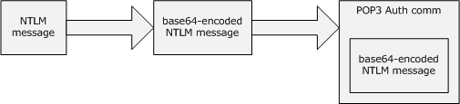
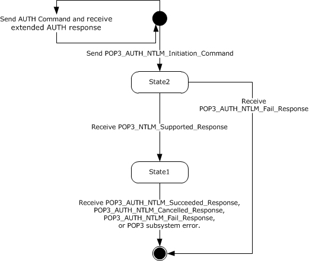
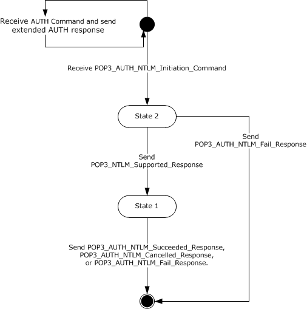
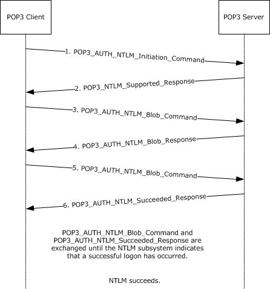
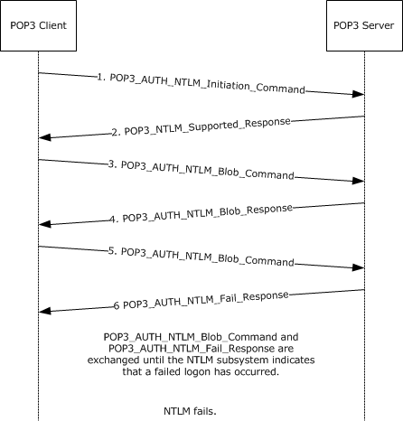

[MS-POP3]:

NT LAN Manager (NTLM) Authentication: Post Office
Protocol - Version 3 (POP3) Extension

Intellectual Property Rights Notice for Open Specifications Documentation

  Technical Documentation. Microsoft publishes Open Specifications documentation (“this

documentation”) for protocols, file formats, data portability, computer languages, and standards
support. Additionally, overview documents cover inter-protocol relationships and interactions.

  Copyrights. This documentation is covered by Microsoft copyrights. Regardless of any other

terms that are contained in the terms of use for the Microsoft website that hosts this
documentation, you can make copies of it in order to develop implementations of the technologies
that are described in this documentation and can distribute portions of it in your implementations
that use these technologies or in your documentation as necessary to properly document the
implementation. You can also distribute in your implementation, with or without modification, any
schemas, IDLs, or code samples that are included in the documentation. This permission also
applies to any documents that are referenced in the Open Specifications documentation.
  No Trade Secrets. Microsoft does not claim any trade secret rights in this documentation.
  Patents. Microsoft has patents that might cover your implementations of the technologies

described in the Open Specifications documentation. Neither this notice nor Microsoft's delivery of
this documentation grants any licenses under those patents or any other Microsoft patents.
However, a given Open Specifications document might be covered by the Microsoft Open
Specifications Promise or the Microsoft Community Promise. If you would prefer a written license,
or if the technologies described in this documentation are not covered by the Open Specifications
Promise or Community Promise, as applicable, patent licenses are available by contacting
iplg@microsoft.com.

  License Programs. To see all of the protocols in scope under a specific license program and the

associated patents, visit the Patent Map.

  Trademarks. The names of companies and products contained in this documentation might be
covered by trademarks or similar intellectual property rights. This notice does not grant any
licenses under those rights. For a list of Microsoft trademarks, visit
www.microsoft.com/trademarks.

  Fictitious Names. The example companies, organizations, products, domain names, email

addresses, logos, people, places, and events that are depicted in this documentation are fictitious.
No association with any real company, organization, product, domain name, email address, logo,
person, place, or event is intended or should be inferred.

Reservation of Rights. All other rights are reserved, and this notice does not grant any rights other
than as specifically described above, whether by implication, estoppel, or otherwise.

Tools. The Open Specifications documentation does not require the use of Microsoft programming
tools or programming environments in order for you to develop an implementation. If you have access
to Microsoft programming tools and environments, you are free to take advantage of them. Certain
Open Specifications documents are intended for use in conjunction with publicly available standards
specifications and network programming art and, as such, assume that the reader either is familiar
with the aforementioned material or has immediate access to it.

Support. For questions and support, please contact dochelp@microsoft.com.

[MS-POP3] - v20240423
NT LAN Manager (NTLM) Authentication: Post Office Protocol - Version 3 (POP3) Extension
Copyright © 2024 Microsoft Corporation
Release: April 23, 2024

1 / 31

Revision Summary

Date

Revision
History

Revision
Class

Comments

7/20/2007

0.1

9/28/2007

1.0

Major

Major

MCPP Milestone 5 Initial Availability

Updated and revised the technical content.

10/23/2007  1.0.1

Editorial

Changed language and formatting in the technical content.

11/30/2007  1.0.2

Editorial

Changed language and formatting in the technical content.

1/25/2008

1.0.3

Editorial

Changed language and formatting in the technical content.

3/14/2008

2.0

Major

Updated and revised the technical content.

5/16/2008

2.0.1

Editorial

Changed language and formatting in the technical content.

6/20/2008

3.0

7/25/2008

4.0

8/29/2008

4.1

Major

Major

Minor

Updated and revised the technical content.

Updated and revised the technical content.

Clarified the meaning of the technical content.

10/24/2008  4.1.1

Editorial

Changed language and formatting in the technical content.

12/5/2008

4.2

Minor

Clarified the meaning of the technical content.

1/16/2009

4.2.1

Editorial

Changed language and formatting in the technical content.

2/27/2009

4.2.2

Editorial

Changed language and formatting in the technical content.

4/10/2009

4.2.3

Editorial

Changed language and formatting in the technical content.

5/22/2009

4.2.4

Editorial

Changed language and formatting in the technical content.

7/2/2009

4.3

Minor

Clarified the meaning of the technical content.

8/14/2009

4.3.1

Editorial

Changed language and formatting in the technical content.

9/25/2009

4.4

Minor

Clarified the meaning of the technical content.

11/6/2009

4.4.1

Editorial

Changed language and formatting in the technical content.

12/18/2009  4.4.2

Editorial

Changed language and formatting in the technical content.

1/29/2010

4.5

Minor

Clarified the meaning of the technical content.

3/12/2010

4.5.1

Editorial

Changed language and formatting in the technical content.

4/23/2010

4.5.2

Editorial

Changed language and formatting in the technical content.

6/4/2010

4.5.3

Editorial

Changed language and formatting in the technical content.

7/16/2010

4.5.3

None

No changes to the meaning, language, or formatting of the
technical content.

8/27/2010

5.0

Major

Updated and revised the technical content.

10/8/2010

5.0

11/19/2010  5.0

None

None

No changes to the meaning, language, or formatting of the
technical content.

No changes to the meaning, language, or formatting of the
technical content.

[MS-POP3] - v20240423
NT LAN Manager (NTLM) Authentication: Post Office Protocol - Version 3 (POP3) Extension
Copyright © 2024 Microsoft Corporation
Release: April 23, 2024

2 / 31

Date

Revision
History

Revision
Class

Comments

1/7/2011

5.0

2/11/2011

5.0

3/25/2011

5.0

5/6/2011

5.0

None

None

None

None

No changes to the meaning, language, or formatting of the
technical content.

No changes to the meaning, language, or formatting of the
technical content.

No changes to the meaning, language, or formatting of the
technical content.

No changes to the meaning, language, or formatting of the
technical content.

6/17/2011

5.1

Minor

Clarified the meaning of the technical content.

9/23/2011

5.1

None

No changes to the meaning, language, or formatting of the
technical content.

12/16/2011  6.0

Major

Updated and revised the technical content.

3/30/2012

6.0

7/12/2012

6.0

10/25/2012  6.0

1/31/2013

7.0

8/8/2013

8.0

11/14/2013  8.0

2/13/2014

8.0

5/15/2014

8.0

None

None

None

Major

Major

None

None

None

No changes to the meaning, language, or formatting of the
technical content.

No changes to the meaning, language, or formatting of the
technical content.

No changes to the meaning, language, or formatting of the
technical content.

Updated and revised the technical content.

Updated and revised the technical content.

No changes to the meaning, language, or formatting of the
technical content.

No changes to the meaning, language, or formatting of the
technical content.

No changes to the meaning, language, or formatting of the
technical content.

6/30/2015

9.0

Major

Significantly changed the technical content.

10/16/2015  9.0

7/14/2016

9.0

6/1/2017

9.0

9/15/2017

10.0

9/12/2018

11.0

4/7/2021

12.0

6/25/2021

13.0

4/23/2024

14.0

None

None

None

Major

Major

Major

Major

Major

No changes to the meaning, language, or formatting of the
technical content.

No changes to the meaning, language, or formatting of the
technical content.

No changes to the meaning, language, or formatting of the
technical content.

Significantly changed the technical content.

Significantly changed the technical content.

Significantly changed the technical content.

Significantly changed the technical content.

Significantly changed the technical content.

[MS-POP3] - v20240423
NT LAN Manager (NTLM) Authentication: Post Office Protocol - Version 3 (POP3) Extension
Copyright © 2024 Microsoft Corporation
Release: April 23, 2024

3 / 31

## Table of Contents

- [1 Introduction](#1-introduction)
  - [1.1 Glossary](#11-glossary)
  - [1.2 References](#12-references)
    - [1.2.1 Normative References](#121-normative-references)
    - [1.2.2 Informative References](#122-informative-references)
  - [1.3 Overview](#13-overview)
  - [1.4 Relationship to Other Protocols](#14-relationship-to-other-protocols)
  - [1.5 Prerequisites/Preconditions](#15-prerequisitespreconditions)
  - [1.6 Applicability Statement](#16-applicability-statement)
  - [1.7 Versioning and Capability Negotiation](#17-versioning-and-capability-negotiation)
  - [1.8 Vendor-Extensible Fields](#18-vendor-extensible-fields)
  - [1.9 Standards Assignments](#19-standards-assignments)
- [2 Messages](#2-messages)
  - [2.1 Transport](#21-transport)
  - [2.2 Message Syntax](#22-message-syntax)
    - [2.2.1 AUTH Extensions](#221-auth-extensions)
    - [2.2.2 POP3 Server Messages](#222-pop3-server-messages)
    - [2.2.3 POP3 Client Messages](#223-pop3-client-messages)
- [3 Protocol Details](#3-protocol-details)
  - [3.1 Client Details](#31-client-details)
    - [3.1.1 Abstract Data Model](#311-abstract-data-model)
      - [3.1.1.1 POP3 State Model](#3111-pop3-state-model)
      - [3.1.1.2 NTLM Subsystem Interaction](#3112-ntlm-subsystem-interaction)
    - [3.1.2 Timers](#312-timers)
    - [3.1.3 Initialization](#313-initialization)
    - [3.1.4 Higher-Layer Triggered Events](#314-higher-layer-triggered-events)
    - [3.1.5 Message Processing Events and Sequencing Rules](#315-message-processing-events-and-sequencing-rules)
      - [3.1.5.1 Receiving a POP3_NTLM_Supported_Response Message](#3151-receiving-a-pop3ntlmsupportedresponse-message)
      - [3.1.5.2 Receiving a POP3_AUTH_NTLM_Fail_Response Message](#3152-receiving-a-pop3authntlmfailresponse-message)
      - [3.1.5.3 Receiving a POP3_AUTH_NTLM_Blob_Response Message](#3153-receiving-a-pop3authntlmblobresponse-message)
        - [3.1.5.3.1 Error from NTLM](#31531-error-from-ntlm)
        - [3.1.5.3.2 NTLM Reports Success and Returns an NTLM Message](#31532-ntlm-reports-success-and-returns-an-ntlm-message)
      - [3.1.5.4 Receiving a POP3_AUTH_NTLM_Succeeded_Response Message](#3154-receiving-a-pop3authntlmsucceededresponse-message)
      - [3.1.5.5 Receiving a POP3_AUTH_NTLM_Cancelled_Response Message](#3155-receiving-a-pop3authntlmcancelledresponse-message)
    - [3.1.6 Timer Events](#316-timer-events)
    - [3.1.7 Other Local Events](#317-other-local-events)
  - [3.2 Server Details](#32-server-details)
    - [3.2.1 Abstract Data Model](#321-abstract-data-model)
      - [3.2.1.1 POP3 State Model](#3211-pop3-state-model)
      - [3.2.1.2 NTLM Subsystem Interaction](#3212-ntlm-subsystem-interaction)
    - [3.2.2 Timers](#322-timers)
    - [3.2.3 Initialization](#323-initialization)
    - [3.2.4 Higher-Layer Triggered Events](#324-higher-layer-triggered-events)
    - [3.2.5 Message Processing Events and Sequencing Rules](#325-message-processing-events-and-sequencing-rules)
      - [3.2.5.1 Receiving a POP3_AUTH_NTLM_Initiation_Command Message](#3251-receiving-a-pop3authntlminitiationcommand-message)
      - [3.2.5.2 Receiving a POP3_AUTH_NTLM_Blob_Command Message](#3252-receiving-a-pop3authntlmblobcommand-message)
        - [3.2.5.2.1 NTLM Returns Success, Returning an NTLM Message](#32521-ntlm-returns-success-returning-an-ntlm-message)
        - [3.2.5.2.2 NTLM Returns Success, Indicating Authentication Completed Successfully](#32522-ntlm-returns-success-indicating-authentication-completed-successfully)
        - [3.2.5.2.3 NTLM Returns Status, Indicating User Name or Password Was Incorrect](#32523-ntlm-returns-status-indicating-user-name-or-password-was-incorrect)
        - [3.2.5.2.4 NTLM Returns a Failure Status, Indicating Any Other Error](#32524-ntlm-returns-a-failure-status-indicating-any-other-error)
      - [3.2.5.3 Receiving a POP3_AUTH_Cancellation_Command Message](#3253-receiving-a-pop3authcancellationcommand-message)
    - [3.2.6 Timer Events](#326-timer-events)
    - [3.2.7 Other Local Events](#327-other-local-events)
- [4 Protocol Examples](#4-protocol-examples)
  - [4.1 POP3 Client Successfully Authenticating to a POP3 Server](#41-pop3-client-successfully-authenticating-to-a-pop3-server)
  - [4.2 POP3 Client Unsuccessfully Authenticating to a POP3 Server](#42-pop3-client-unsuccessfully-authenticating-to-a-pop3-server)
- [5 Security](#5-security)
  - [5.1 Security Considerations for Implementers](#51-security-considerations-for-implementers)
  - [5.2 Index of Security Parameters](#52-index-of-security-parameters)
- [6 Appendix A: Product Behavior](#6-appendix-a-product-behavior)
- [7 Change Tracking](#7-change-tracking)
- [8 Index](#8-index)

## 1 Introduction

The NT LAN Manager (NTLM) Authentication: Post Office Protocol–Version 3 (POP3) Extension specifies
the use of NTLM authentication (see [MS-NLMP]) by the Post Office Protocol 3 (POP3) to facilitate
client authentication to a Windows POP3 server. POP3 specifies a protocol for the inquiry and retrieval
of electronic mail. For a detailed definition of POP3, see [RFC1939].

Note  For the purposes of this document, the NT LAN Manager (NTLM) Authentication: Post Office
Protocol–Version 3 (POP3) Extension is referred to in subsequent sections as the "NTLM POP3
Extension".

The NTLM POP3 Extension uses the POP3 AUTH command (see [RFC1734]) to negotiate NTLM
authentication and to send authentication data.

Sections 1.5, 1.8, 1.9, 2, and 3 of this specification are normative. All other sections and examples in
this specification are informative.

### 1.1 Glossary

This document uses the following terms:

Augmented Backus-Naur Form (ABNF): A modified version of Backus-Naur Form (BNF),

commonly used by Internet specifications. ABNF notation balances compactness and simplicity
with reasonable representational power. ABNF differs from standard BNF in its definitions and
uses of naming rules, repetition, alternatives, order-independence, and value ranges. For more
information, see [RFC5234].

AUTH command: A Post Office Protocol 3 (POP3) optional command that is used to send

authentication information as specified in [RFC1734]. The "mechanism" name defined in the RFC
is NTLM. The structure of the AUTH command as used in the POP3 AUTHentication Command
Protocol Extension is as follows: "AUTH NTLM<CR><LF>".

connection-oriented NTLM: A particular variant of NTLM designed to be used with connection-

oriented remote procedure call (RPC), as described in [MS-NLMP].

NT LAN Manager (NTLM): An authentication protocol that is based on a challenge-response

sequence for authentication.

NT LAN Manager (NTLM) Authentication Protocol: A protocol using a challenge-response

mechanism for authentication in which clients are able to verify their identities without sending a
password to the server. It consists of three messages, commonly referred to as Type 1
(negotiation), Type 2 (challenge) and Type 3 (authentication).

NTLM AUTHENTICATE_MESSAGE: The NTLM AUTHENTICATE_MESSAGE packet defines an

NTLM authenticate message that is sent from the client to the server after the NTLM
CHALLENGE_MESSAGE is processed by the client. Message structure and other details of this
packet are specified in [MS-NLMP].

NTLM CHALLENGE_MESSAGE: The NTLM CHALLENGE_MESSAGE packet defines an NTLM

challenge message that is sent from the server to the client. NTLM CHALLENGE_MESSAGE is
generated by the local NTLM software and passed to the application that supports embedded
NTLM authentication. This message is used by the server to challenge the client to prove its
identity. Message structure and other details of this packet are specified in [MS-NLMP].

NTLM message: A message that carries authentication information. Its payload data is passed to
the application that supports embedded NTLM authentication by the NTLM software installed on
the local computer. NTLM messages are transmitted between the client and server embedded
within the application protocol that is using NTLM authentication. There are three types of NTLM

[MS-POP3] - v20240423
NT LAN Manager (NTLM) Authentication: Post Office Protocol - Version 3 (POP3) Extension
Copyright © 2024 Microsoft Corporation
Release: April 23, 2024

6 / 31

messages: NTLM NEGOTIATE_MESSAGE, NTLM CHALLENGE_MESSAGE, and NTLM
AUTHENTICATE_MESSAGE.

NTLM NEGOTIATE_MESSAGE: The NEGOTIATE_MESSAGE packet defines an NTLM negotiate
message that is sent from the client to the server. The NTLM NEGOTIATE_MESSAGE is
generated by the local NTLM software and passed to the application that supports embedded
NTLM authentication. This message allows the client to specify its supported NTLM options to
the server. Message structure and other details are specified in [MS-NLMP].

NTLM software: Software that implements the NT LAN Manager (NTLM) Authentication

Protocol.

POP3 response: A message sent by a POP3 server in response to a message from a POP3 client.
The structure of this message, as specified in [RFC1939], is as follows: <+OK> <response
text><CR><LF> or <-ERR> <response text><CR><LF>.

Security Support Provider Interface (SSPI): An API that allows connected applications to call
one of several security providers to establish authenticated connections and to exchange data
securely over those connections. It is equivalent to Generic Security Services (GSS)-API, and
the two are on-the-wire compatible.

MAY, SHOULD, MUST, SHOULD NOT, MUST NOT: These terms (in all caps) are used as defined
in [RFC2119]. All statements of optional behavior use either MAY, SHOULD, or SHOULD NOT.

### 1.2 References

Links to a document in the Microsoft Open Specifications library point to the correct section in the
most recently published version of the referenced document. However, because individual documents
in the library are not updated at the same time, the section numbers in the documents may not
match. You can confirm the correct section numbering by checking the Errata.

#### 1.2.1 Normative References

We conduct frequent surveys of the normative references to assure their continued availability. If you
have any issue with finding a normative reference, please contact dochelp@microsoft.com. We will
assist you in finding the relevant information.

[MS-NLMP] Microsoft Corporation, "NT LAN Manager (NTLM) Authentication Protocol".

[RFC1521] Borenstein, N., and Freed, N., "MIME (Multipurpose Internet Mail Extensions) Part One:
Mechanisms for Specifying and Describing the Format of Internet Message Bodies", RFC 1521,
September 1993, https://www.rfc-editor.org/info/rfc1521

[RFC1734] Myers, J., "POP3 AUTHentication Command", RFC 1734, December 1994, http://www.rfc-
editor.org/rfc/rfc1734.txt

[RFC1939] Myers, J., and Rose, M., "Post Office Protocol - Version 3", STD 53, RFC 1939, May 1996,
https://www.rfc-editor.org/info/rfc1939

[RFC2119] Bradner, S., "Key words for use in RFCs to Indicate Requirement Levels", BCP 14, RFC
2119, March 1997, https://www.rfc-editor.org/info/rfc2119

[RFC5234] Crocker, D., Ed., and Overell, P., "Augmented BNF for Syntax Specifications: ABNF", STD
68, RFC 5234, January 2008, https://www.rfc-editor.org/info/rfc5234

[MS-POP3] - v20240423
NT LAN Manager (NTLM) Authentication: Post Office Protocol - Version 3 (POP3) Extension
Copyright © 2024 Microsoft Corporation
Release: April 23, 2024

7 / 31

<!-- Extracted images from page 8 -->

<!-- /Extracted images from page 8 -->

#### 1.2.2 Informative References

[SSPI] Microsoft Corporation, "SSPI", https://learn.microsoft.com/en-
us/windows/desktop/SecAuthN/sspi

### 1.3 Overview

Client applications that connect to the Post Office Protocol 3 (POP3) service included in Windows
Server 2003 operating system and Windows Server 2003 R2 operating system can use either standard
plaintext authentication, as specified in [RFC1939], or NT LAN Manager (NTLM) authentication.

The NTLM POP3 Extension specifies how a POP3 client and POP3 server can use the NT LAN Manager
(NTLM) Authentication Protocol, as specified in [MS-NLMP], so that the POP3 server can
authenticate the POP3 client. NTLM is a challenge/response authentication protocol that depends on
the application layer protocols to transport NTLM packets from client to server, and from server to
client.

This specification defines how the POP3 AUTH command [RFC1734] is used to perform
authentication using the NTLM authentication protocol. The POP3 Authentication command standard
defines an extensibility mechanism for arbitrary authentication protocols to be plugged into the core
protocol.

This specification describes an embedded protocol in which NTLM authentication data is first
transformed into a base64 representation, and then formatted by padding with POP3 keywords as
defined by the AUTH mechanism. The base64 encoding and the formatting are very rudimentary, and
are solely intended to make the NTLM data fit the framework specified in [RFC1734]. The following
diagram illustrates the sequence of transformations performed on an NTLM message to produce a
message that can be sent over POP3.

Figure 1: Relationship between NTLM message and POP3

This specification describes a pass-through protocol that does not specify the structure of NTLM
information. Instead, the protocol relies on the software that implements the NTLM Authentication
Protocol (as specified in [MS-NLMP]) to process each NTLM message to be sent or received.

This specification defines a server and a client role.

When POP3 performs an NTLM authentication, it needs to interact with the NTLM subsystem
appropriately. Below is an overview of this interaction.

If acting as a POP3 client:

1.  The NTLM subsystem returns the first NTLM message to the client, to be sent to the server.

2.  The client applies the base64-encoding and POP3-padding transformations mentioned earlier and

described in detail later in this document to produce a POP3 message and send this message to
the server.

[MS-POP3] - v20240423
NT LAN Manager (NTLM) Authentication: Post Office Protocol - Version 3 (POP3) Extension
Copyright © 2024 Microsoft Corporation
Release: April 23, 2024

8 / 31

3.  The client waits for a response from the server. When the response is received, the client checks
to see whether the response indicates the end of authentication (success or failure), or that
authentication is continuing.

4.  If the authentication is continuing, the response message is stripped of the POP3 padding, base64
decoded, and passed into the NTLM subsystem, upon which the NTLM subsystem might return
another NTLM message that needs to be sent to the server. Steps 2 through 4 are repeated until
authentication succeeds or fails.

If acting as a POP3 server:

1.  The server waits to receive the first POP3 authentication message from the client.

2.  When a POP3 message is received from the client, the POP3 padding is removed, the message is

base64 decoded, and the resulting NTLM message is passed into the NTLM subsystem.

3.  The NTLM subsystem will return a status indicating whether authentication completed successfully,
failed, or whether more NTLM messages need to be exchanged to complete the authentication.

4.  If the authentication is continuing, the NTLM subsystem will return an NTLM message that needs

to be sent to the client. This message is base64-encoded, the POP3 padding is applied and sent to
the client. Steps 2 through 4 are repeated until authentication succeeds or fails.

The sequence that follows shows the typical flow of packets between the client and the server once
NTLM authentication has been selected.

1.  The POP3 client sends an NTLM NEGOTIATE_MESSAGE embedded in a

POP3_AUTH_NTLM_Blob_Command packet to the server.

2.  On receiving the POP3 packet with an NTLM NEGOTIATE_MESSAGE, the POP3 server sends an

NTLM CHALLENGE_MESSAGE embedded in a POP3 packet to the client.

3.  In response, the POP3 client sends an NTLM AUTHENTICATE_MESSAGE embedded in a POP3

packet.

4.  The server then sends a POP3 Response to the client to successfully complete the authentication

process.

The NTLM NEGOTIATE_MESSAGE, NTLM CHALLENGE_MESSAGE, and NTLM AUTHENTICATE_MESSAGE
packets contain NTLM authentication data that is processed by the NTLM software installed on the
local computer. How to retrieve and process NTLM messages is specified in [MS-NLMP].

Implementers of this specification need to have a working knowledge of the following:





POP3, as specified in [RFC1734] and [RFC1939].

The Multipurpose Internet Mail Extensions (MIME) base64 encoding method, as specified in
[RFC1521].



The NTLM Authentication Protocol, as specified in [MS-NLMP].

### 1.4 Relationship to Other Protocols

The NTLM POP3 Extension uses the POP3 AUTH extension mechanism, as specified in [RFC1734], and
is an embedded protocol. Unlike standalone application protocols, such as Telnet or Hypertext Transfer
Protocol (HTTP), packets for this specification are embedded in POP3 commands and server responses.

POP3 specifies only the sequence in which a POP3 server and POP3 client exchange NTLM messages
to successfully authenticate the client to the server. It does not specify how the client obtains NTLM
messages from the local NTLM software, or how the POP3 server processes NTLM messages. The

[MS-POP3] - v20240423
NT LAN Manager (NTLM) Authentication: Post Office Protocol - Version 3 (POP3) Extension
Copyright © 2024 Microsoft Corporation
Release: April 23, 2024

9 / 31

POP3 client and POP3 server implementations depend on the availability of an implementation of the
NTLM Authentication Protocol (as specified in [MS-NLMP]) to obtain and process NTLM messages and
on the availability of the base64 encoding and decoding mechanisms (as specified in [RFC1521]) to
encode and decode the NTLM messages embedded in POP3 packets.

### 1.5 Prerequisites/Preconditions

Because POP3 depends on NTLM to authenticate the client to the server, both the server and the
client have to have access to an implementation of the NTLM Authentication Protocol (as specified in
[MS-NLMP]) that is capable of supporting connection-oriented NTLM.<1>

### 1.6 Applicability Statement

The NTLM POP3 Extension is used only when implementing a POP3 client that needs to authenticate to
a POP3 server by using NTLM authentication.<2>

### 1.7 Versioning and Capability Negotiation

This document covers versioning issues in the following areas:

  Security and Authentication Methods: The NTLM POP3 Extension supports the NTLMv1 and

NTLMv2 authentication methods, as specified in [MS-NLMP].

  Capability Negotiation: POP3 does not support negotiation of which version of the NTLM

Authentication Protocol to use. Instead, the NTLM Authentication Protocol version is configured on
both the client and the server prior to authentication. NTLM Authentication Protocol version
mismatches are handled by the NTLM Authentication Protocol implementation, not by POP3.

The client discovers whether the server supports NTLM AUTH through the AUTH command,
issued without any arguments (through a mechanism described in AUTH
Extensions (section 2.2.1)), upon which the server responds with a list of supported authentication
mechanisms followed by a line containing only a period (.). If NTLM is supported, the server
includes the word "NTLM" in the list. The messages involved are formally described in section 2.2.

### 1.8 Vendor-Extensible Fields

The NTLM POP3 Extension does not have any vendor-extensible fields.

### 1.9 Standards Assignments

The NTLM POP3 Extension does not use any standards assignments.

[MS-POP3] - v20240423
NT LAN Manager (NTLM) Authentication: Post Office Protocol - Version 3 (POP3) Extension
Copyright © 2024 Microsoft Corporation
Release: April 23, 2024

10 / 31

## 2 Messages

The following sections specify how the NTLM POP3 Extension messages are transported and NTLM
POP3 Extension message syntax.

### 2.1 Transport

The NTLM POP3 Extension does not establish transport connections. Instead, NTLM POP3 Extension
messages are encapsulated in POP3 commands and responses. How NTLM POP3 Extension messages
must be encapsulated in POP3 commands is specified in section 2.2.

### 2.2 Message Syntax

The NTLM POP3 Extension messages are divided into the three categories, depending on whether the
message was sent by the server or the client:

  AUTH extensions





POP3 server messages

POP3 client messages

#### 2.2.1 AUTH Extensions

The first category of POP3 messages is messages that fall within the AUTH extensibility framework.
These messages are specified in [RFC1734]. Some messages have parameters that must be
customized by the extensibility mechanism (such as NTLM). The following customizations are
introduced in this document:

  A client can query the server to learn whether or not NTLM is supported. This is accomplished by

issuing the AUTH command without any parameters. In the following definition, this command is
shown in Augmented Backus-Naur Form (ABNF) (for more information on ABNF, see
[RFC5234]).

  AUTH<SPACE><CR><LF>

where:

 <SPACE>

is defined as a single space character.

This mechanism is intended for clients that want to determine which authentication methods are
available. A client can either issue this command to query whether NTLM is available and then
initiate an NTLM auth session, or the client can simply try to initiate an NTLM session expecting it
to fail if NTLM is not supported. Issuing the AUTH command does not change the state of the
client; it is still in an unauthenticated state. In this state, the client can either issue another AUTH
command or start the authentication process.



The server responds to this message with a message followed by a list of supported authentication
mechanisms, followed by a list termination message. This sequence is shown in the following
ABNF definition.

 +OK<CR><LF>NTLM<CR><LF>.<CR><LF>

[MS-POP3] - v20240423
NT LAN Manager (NTLM) Authentication: Post Office Protocol - Version 3 (POP3) Extension
Copyright © 2024 Microsoft Corporation
Release: April 23, 2024

11 / 31









If NTLM is not supported, the POP3 server returns a failure status code as defined by [RFC1734]
and a POP3_AUTH_NTLM_Fail_Response message is returned in response to the
"AUTH<SPACE><CR><LF>" message. The only data in this message that is useful is -ERR. The
remaining data is human-readable and has no bearing on the authentication. The syntax of this
command is shown in the following ABNF definition. This syntax is referred to as
POP3_AUTH_NTLM_Fail_Response in this specification.

 -ERR <human_readable_string><CR><LF>

[RFC1734] section 2 defines the syntax of the AUTH command to initiate authentication. The
parameter "mechanism" is defined to be the string "NTLM" for NTLM POP3 Extension. The
command to initiate an NTLM conversation by a client is shown in the following ABNF definition.
This is referred to as POP3_AUTH_NTLM_Initiation_Command in this document.

 AUTH NTLM<CR><LF>

If NTLM is supported, the POP3 server will respond with a POP3 message to indicate that NTLM is
supported. The syntax of this command is shown in the following ABNF definition. This is referred
to as POP3_NTLM_Supported_Response in this document.

 +OK<CR><LF>

If NTLM is not supported, the POP3 server returns a failure status code as defined by [RFC1734].
The only data in this message that is useful is -ERR. The remaining data is human-readable data
and has no bearing on the authentication. The syntax of this command is shown in the following
ABNF definition. This is referred to as POP3_AUTH_NTLM_Fail_Response in this document.

 -ERR <human_readable_string> <CR><LF>

  At every point of time during the authentication exchange, the client must parse the responses in
the messages sent by the server and interpret them as defined by [RFC1734]. The responses
define various states such as success in authenticating, failure to authenticate, and any other
arbitrary failures that the software might encounter.

The client can receive any one of the following responses during authentication. Note that the
syntax and meaning of all these messages are completely defined by [RFC1734].





POP3_AUTH_NTLM_Blob_Response: This message is partially defined in [RFC1734]. The plus
sign (+) status code indicates ongoing authentication and indicates that <base64-encoded-
NTLM-message> is to be processed by the authentication subsystem. In this case, the client
must de-encapsulate the data and pass it to the NTLM subsystem.

 + <base64-encoded-NTLM-message><CR><LF>

POP3_AUTH_NTLM_Fail_Response: This message is defined in [RFC1734] and indicates that
the authentication has terminated unsuccessfully, either because the user name or password
was incorrect, or because of some other arbitrary error such as a software or data corruption
error.

 -ERR <human-readable-string><CR><LF>

[MS-POP3] - v20240423
NT LAN Manager (NTLM) Authentication: Post Office Protocol - Version 3 (POP3) Extension
Copyright © 2024 Microsoft Corporation
Release: April 23, 2024

12 / 31



POP3_AUTH_NTLM_Succeeded_Response: This message is defined in [RFC1734] and indicates
that the authentication negotiation has completed with the client successfully authenticating to
the server.

 +OK <human-readable-string><CR><LF>



POP3_AUTH_NTLM_Cancelled_Response: This message is defined in [RFC1734] and indicates
that the authentication negotiation has been canceled with the client.<3>

 -ERR <human-readable-string><CR><LF>

  NTLM messages encapsulated by the client and sent to the server, are referred to as

POP3_AUTH_NTLM_Blob_Command in this document. They have the following syntax defined in
ABNF and conform to the prescription of [RFC1734].

 <base64-encoded-NTLM-message><CR><LF>

  Once the POP3_AUTH_NTLM_Initiation_Command has been sent to start the authentication

process, the client is able to cancel the authentication request by issuing a
POP3_AUTH_Cancellation_Command. This has the following syntax, defined in ABNF.

 *<CR><LF>

As specified in [RFC1734], the client can cancel the authentication request at any point during the
exchange. Once sent, the client then remains in an unauthenticated state.

#### 2.2.2 POP3 Server Messages

This section defines the creation of POP3_AUTH_NTLM_Blob_Response messages. These are NTLM
messages that are sent by the server and that must be encapsulated as follows to conform to syntax
specified by the AUTH mechanism:

1.  Base64-encode the NTLM message data. This is needed because NTLM messages contain data

outside the ASCII character range, whereas POP3 supports only ASCII characters.

2.  To the base64-encoded string, prefix the POP3 response code with a plus sign (+).

3.  Suffix the <CR> and <LF> character (ASCII values 0x0D and 0x0A) as required by POP3.

The ABNF definition of a server message is as follows.

 + <base64-encoded-NTLM-message><CR><LF>

De-encapsulation of these messages by the client follows the reverse logic:

1.  Remove the <CR> and <LF> character (ASCII values 0x0D and 0x0A).

2.  Remove the POP3 response code (+).

3.  Decode the base64-encoded POP3 data to produce the original NTLM message data.

[MS-POP3] - v20240423
NT LAN Manager (NTLM) Authentication: Post Office Protocol - Version 3 (POP3) Extension
Copyright © 2024 Microsoft Corporation
Release: April 23, 2024

13 / 31

#### 2.2.3 POP3 Client Messages

This section defines the processing of POP3_AUTH_NTLM_Blob_Command messages. These NTLM
messages sent by the client are encapsulated as follows to conform to the AUTH mechanism:

1.  Base64-encode the NTLM message data. This is needed because NTLM messages contain data

outside the ASCII character range whereas POP3 supports only ASCII characters.

2.  Suffix the <CR> and <LF> character (ASCII values 0x0D and 0x0A) as required by POP3.

The ABNF definition of a client message is as follows.

 <base64-encoded-NTLM-message><CR><LF>

De-encapsulation of these messages by the server follows the reverse logic:

1.  Remove the <CR> and <LF> character (ASCII values 0x0D and 0x0A).

2.  Base64-decode the POP3 data to produce the original NTLM message data.

[MS-POP3] - v20240423
NT LAN Manager (NTLM) Authentication: Post Office Protocol - Version 3 (POP3) Extension
Copyright © 2024 Microsoft Corporation
Release: April 23, 2024

14 / 31

<!-- Extracted images from page 15 -->

<!-- /Extracted images from page 15 -->

## 3 Protocol Details

### 3.1 Client Details

#### 3.1.1 Abstract Data Model

##### 3.1.1.1 POP3 State Model

Figure 2: Client POP3 state model

The abstract data model for NTLM POP3 Extension has the following states:

1.  Start:

This is the state of the client before the POP3_AUTH_NTLM_Initiation_Command is sent.

2.  State 2: sent_authentication_request

This is the state of the client after the POP3_AUTH_NTLM_Initiation_Command is sent.

3.  State 1: inside_authentication

This is the state entered by a client after it receives a POP3_NTLM_Supported_Response. In this
state, the client initializes the NTLM subsystem and repeats the following steps:

[MS-POP3] - v20240423
NT LAN Manager (NTLM) Authentication: Post Office Protocol - Version 3 (POP3) Extension
Copyright © 2024 Microsoft Corporation
Release: April 23, 2024

15 / 31



Encapsulates the NTLM message, returned by the NTLM subsystem, into a POP3 message.

  Sends the POP3 message to the Server

  Waits for a response from the server.

  De-encapsulates received POP3 message data (if any) from the server and converts it to NTLM

message data.



Passes it to the NTLM subsystem.

This state terminates when:



The client receives a POP3_AUTH_NTLM_Succeeded_Response or
POP3_AUTH_NTLM_Fail_Response.

  A failure is reported by the NTLM subsystem.

4.

 Stop: completed_authentication.

This is the state of the client when it exits the inside_authentication state. The rules for exiting
the inside_authentication state are defined in Message Processing Events and Sequencing Rules
section 3.1.5. The behavior of POP3 in this state is not in the scope of this document—it
represents the end state of the authentication protocol.

##### 3.1.1.2 NTLM Subsystem Interaction

During the inside_authentication phase, the POP3 client invokes the NTLM subsystem as described in
[MS-NLMP] section 3.1. The NTLM protocol is used with these options:

1.  The negotiation is a connection-oriented NTLM negotiation.

2.  None of the flags specified in [MS-NLMP] section 3.1.1 is specific to NTLM.

The following is a description of how POP3 uses NTLM. All NTLM messages are encapsulated as
specified in section 2.1. [MS-NLMP] section 3.1.1 describes the data model, internal states, and
sequencing of NTLM messages in greater detail:

1.  The client initiates the authentication by invoking NTLM, upon which NTLM returns the NTLM

NEGOTIATE_MESSAGE packet to be sent to the server.

2.  Subsequently, the exchange of NTLM messages goes on as defined by the NTLM protocol, with the

POP3 client encapsulating the NTLM messages before sending them to the server, and de-
encapsulating POP3 messages to obtain the NTLM message before giving it to NTLM.

3.  The NTLM protocol completes authentication, either successfully or unsuccessfully, as follows:







The server sends the POP3_AUTH_NTLM_Succeeded_Response to the client. On receiving this
message, the client transitions to the completed_authentication state and SHOULD treat the
authentication attempt as successful.

The server sends the POP3_AUTH_NTLM_Fail_Response to the client. On receiving this
message, the client transitions to the completed_authentication state and SHOULD treat the
authentication attempt as failed.

Failures reported from the NTLM package (which can occur for any reason, including incorrect
data being passed in, or implementation-specific errors), are not reported to the client and
cause the client to transition to the completed_authentication state.

[MS-POP3] - v20240423
NT LAN Manager (NTLM) Authentication: Post Office Protocol - Version 3 (POP3) Extension
Copyright © 2024 Microsoft Corporation
Release: April 23, 2024

16 / 31

#### 3.1.2 Timers

None.

#### 3.1.3 Initialization

None.

#### 3.1.4 Higher-Layer Triggered Events

None.

#### 3.1.5 Message Processing Events and Sequencing Rules

The NTLM POP3 Extension is driven by a series of message exchanges between a POP3 server and a
POP3 client. The rules governing the sequencing of commands and the internal states of the client and
server are defined by a combination of [RFC1734] and [MS-NLMP]. Section 3.1.1 completely defines
how the rules specified in [RFC1734] and [MS-NLMP] govern POP3 authentication.

##### 3.1.5.1 Receiving a POP3_NTLM_Supported_Response Message

The expected state is sent_authentication_request.

On receiving this message, a client MUST generate the first NTLM message by calling the NTLM
subsystem. The NTLM subsystem then generates NTLM NEGOTIATE_MESSAGE as specified in [MS-
NLMP]. The NTLM message is then encapsulated as defined previously and sent to the server.

The state of the client is changed to inside_authentication.

##### 3.1.5.2 Receiving a POP3_AUTH_NTLM_Fail_Response Message

Expected state: sent_authentication_request

On receiving this message while in this state, a client MUST abort the NTLM authentication attempt.

Expected state: inside_authentication

On receiving this message while in this state, the POP3 client MUST change its internal state to
completed_authentication and consider that the authentication has failed. The client can then take any
action it considers appropriate; this document does not mandate any specific course of action.

##### 3.1.5.3 Receiving a POP3_AUTH_NTLM_Blob_Response Message

The expected state is inside_authentication.

On receiving this message, a client must de-encapsulate it to obtain the embedded NTLM message,
and pass it to the NTLM subsystem for processing. The NTLM subsystem can then either report an
error, or report success and return an NTLM message to be sent to the server.

###### 3.1.5.3.1 Error from NTLM

Any NTLM authentication error is reported as an authentication failure and the client MUST change its
internal state to completed_authentication and consider that the authentication has failed. The client
can then take any action it considers appropriate; this document does not mandate any specific course
of action.

[MS-POP3] - v20240423
NT LAN Manager (NTLM) Authentication: Post Office Protocol - Version 3 (POP3) Extension
Copyright © 2024 Microsoft Corporation
Release: April 23, 2024

17 / 31

Typical actions are to attempt other (nonauthentication-related) POP3 commands, or to disconnect the
connection.

###### 3.1.5.3.2 NTLM Reports Success and Returns an NTLM Message

The NTLM message is encapsulated and sent to the server. No change occurs in the state of the
client.

##### 3.1.5.4 Receiving a POP3_AUTH_NTLM_Succeeded_Response Message

Expected state: inside_authentication.

The POP3 client MUST change its internal state to completed_authentication and consider that the
authentication has succeeded. The client can then take any action it considers appropriate. This
document does not mandate any specific course of action.

##### 3.1.5.5 Receiving a POP3_AUTH_NTLM_Cancelled_Response Message

Expected state: inside_authentication

On receiving this message, the client MUST change its internal state to completed_authentication and
consider that the authentication has failed.

#### 3.1.6 Timer Events

None.

#### 3.1.7 Other Local Events

None.

[MS-POP3] - v20240423
NT LAN Manager (NTLM) Authentication: Post Office Protocol - Version 3 (POP3) Extension
Copyright © 2024 Microsoft Corporation
Release: April 23, 2024

18 / 31

<!-- Extracted images from page 19 -->

<!-- /Extracted images from page 19 -->

### 3.2 Server Details

#### 3.2.1 Abstract Data Model

##### 3.2.1.1 POP3 State Model

Figure 3: Server POP3 state model

The abstract data model for the NTLM POP3 Extension has the following states:

1.  Start:

This is the state of the server before the POP3_AUTH_NTLM_Initiation_Command is received.

2.  State 2: received_authentication_request

This is the state of the server after the POP3_AUTH_NTLM_Initiation_Command is received.

3.  State 1: inside_authentication

[MS-POP3] - v20240423
NT LAN Manager (NTLM) Authentication: Post Office Protocol - Version 3 (POP3) Extension
Copyright © 2024 Microsoft Corporation
Release: April 23, 2024

19 / 31

This is the state entered by a server after the server sends a POP3_NTLM_Supported_Response.
In this state, the server initializes the NTLM subsystem and repeats the following steps:

  Waits for a message from the client.

  De-encapsulates the received POP3 message-data from the other party and obtains the

embedded NTLM message data.

Passes the data to the NTLM subsystem.

Encapsulates the NTLM message returned by the NTLM subsystem into a POP3 message.





  Sends the POP3 message to the other party.

This state terminates when:



The NTLM subsystem reports completion with either a success or failed authentication status,
upon which the server sends the client a POP3_AUTH_NTLM_Succeeded_Response or
POP3_AUTH_NTLM_Fail_Response, as specified in [RFC1734]. These are the only responses
returned to the client.

4.

 Stop: completed_authentication

This is the state of the server after it exits the inside_authentication state. The rules for exiting
the inside_authentication state are defined in section 3.2.5. The behavior of POP3 in this state is
defined in [RFC1734]—it represents the end_state of the authentication protocol.

##### 3.2.1.2 NTLM Subsystem Interaction

During the inside_authentication state, the POP3 server invokes the NTLM subsystem as specified in
[MS-NLMP] section 3.1.1. The NTLM protocol is used with the following options:

1.  The negotiation is a connection-oriented NTLM negotiation.

2.  None of the flags specified in [MS-NLMP] section 3.1.1 are passed to NTLM.

The following is a description of how POP3 uses NTLM. For further details, see [MS-NLMP] section
3.1.1, which describes the data model and sequencing of NTLM packets in greater detail:

1.  The server, on receiving the NTLM NEGOTIATE_MESSAGE packet, passes it to the NTLM

subsystem and is returned the NTLM CHALLENGE_MESSAGE packet, if NTLM
NEGOTIATE_MESSAGE was valid.

2.  Subsequently, the exchange of NTLM messages goes on as defined by the NTLM protocol, with

the POP3 server encapsulating the NTLM messages returned by NTLM before sending them to the
client.

3.  When the NTLM protocol completes authentication, either successfully or unsuccessfully, the NTLM

subsystem notifies POP3:

  On successful completion, the server MUST exit the inside_authentication state and enter the
completed_authentication state and send the POP3_AUTH_NTLM_Succeeded_Response to the
client. On receiving this message, the client MUST also transition to the
completed_authentication state.





If a failure occurs due to an incorrect password error, as described in [MS-NLMP] section 3.3.1
and 3.3.2, the server SHOULD enter the completed_authentication state and send the client a
POP3_AUTH_NTLM_Fail_Response message.

If a failure occurs on the server due to any reason other than the incorrect password error, the
server enters the completed_authentication state and sends the client a

20 / 31

[MS-POP3] - v20240423
NT LAN Manager (NTLM) Authentication: Post Office Protocol - Version 3 (POP3) Extension
Copyright © 2024 Microsoft Corporation
Release: April 23, 2024

POP3_AUTH_NTLM_Fail_Response message. On receiving this message, the client MUST enter
the completed_authentication state.

#### 3.2.2 Timers

None.

#### 3.2.3 Initialization

None.

#### 3.2.4 Higher-Layer Triggered Events

None.

#### 3.2.5 Message Processing Events and Sequencing Rules

The NTLM POP3 Extension is driven by a series of message exchanges between a POP3 server and a
POP3 client. The rules governing the sequencing of commands and the internal states of the client and
server are defined by a combination of [RFC1734] and [MS-NLMP]. Abstract Data
Model (section 3.2.1) completely defines how the rules specified in [RFC1734] and [MS-NLMP] govern
POP3 authentication.

##### 3.2.5.1 Receiving a POP3_AUTH_NTLM_Initiation_Command Message

The expected state is start.

On receiving this message, the server MUST reply with the POP3_NTLM_Supported_Response, if it
supports NTLM, and change its state to the inside_authentication state.

If the server does not support NTLM, it MUST respond with the POP3_AUTH_NTLM_Fail_Response, and
change its internal state to completed_authentication.

##### 3.2.5.2 Receiving a POP3_AUTH_NTLM_Blob_Command Message

The expected state is inside_authentication.

On receiving this message, a server must de-encapsulate the message, obtain the embedded NTLM
message, and pass it to the NTLM subsystem. The NTLM subsystem can take one of the following
actions:

  Report success in processing the message and return an NTLM message to continue

authentication.

  Report that authentication completed successfully.

  Report that authentication failed due to a bad user name or password, as specified in [MS-NLMP].

  Report that authentication failed due to some other software error or message corruption, as

specified in [MS-NLMP].

###### 3.2.5.2.1 NTLM Returns Success, Returning an NTLM Message

The NTLM message must be encapsulated and sent to the client as the
POP3_AUTH_NTLM_Blob_Response message. The internal state of the POP3 server remains
unchanged.

[MS-POP3] - v20240423
NT LAN Manager (NTLM) Authentication: Post Office Protocol - Version 3 (POP3) Extension
Copyright © 2024 Microsoft Corporation
Release: April 23, 2024

21 / 31

###### 3.2.5.2.2 NTLM Returns Success, Indicating Authentication Completed Successfully

The server MUST return the POP3_AUTH_NTLM_Succeeded_Response and change its internal state to
completed_authentication.

###### 3.2.5.2.3 NTLM Returns Status, Indicating User Name or Password Was Incorrect

The server MUST return the POP3_AUTH_NTLM_Fail_Response and change its internal state to
completed_authentication.

###### 3.2.5.2.4 NTLM Returns a Failure Status, Indicating Any Other Error

If any other error occurs in the NTLM sub system, the server MUST return the
POP3_AUTH_NTLM_Fail_Response and change its internal state to completed_authentication.

##### 3.2.5.3 Receiving a POP3_AUTH_Cancellation_Command Message

The expected state is inside_authentication.

On receiving this message, the server MUST return the POP3_AUTH_NTLM_Cancelled_Response to the
client and change its internal state to completed_authentication.

#### 3.2.6 Timer Events

None.

#### 3.2.7 Other Local Events

None.

[MS-POP3] - v20240423
NT LAN Manager (NTLM) Authentication: Post Office Protocol - Version 3 (POP3) Extension
Copyright © 2024 Microsoft Corporation
Release: April 23, 2024

22 / 31

<!-- Extracted images from page 23 -->

<!-- /Extracted images from page 23 -->

## 4 Protocol Examples

The following section describes operations used in a common scenario to illustrate the function of the
Post Office Protocol 3 (POP3).

### 4.1 POP3 Client Successfully Authenticating to a POP3 Server

This section illustrates the NTLM POP3 Extension with a scenario in which a POP3 client successfully
authenticates to a POP3 server using NTLM.

Figure 4: POP3 client successfully authenticating to POP3 server

1.  The client sends a POP3_AUTH_NTLM_Initiation_Command to the server. This command is

specified in [RFC1734] and does not carry any POP3-specific data. It is included in this example to
provide a better understanding of the POP3 NTLM initiation command.

[MS-POP3] - v20240423
NT LAN Manager (NTLM) Authentication: Post Office Protocol - Version 3 (POP3) Extension
Copyright © 2024 Microsoft Corporation
Release: April 23, 2024

23 / 31

 AUTH NTLM

2.  The server sends the POP3_NTLM_Supported_Response message, indicating that it can perform

NTLM authentication.

 +OK

3.  The client sends a POP3_AUTH_NTLM_Blob_Command message containing a base64-encoded

NTLM NEGOTIATE_MESSAGE.

 TlRMTVNTUAABAAAAB4IIogAAAAAAAAAAAAAAAAAAAAAFASgKAAAADw==

 00000000:4e 54 4c 4d 53 53 50 00 01 00 00 00 07 82 08 a2    NTLMSSP......‚.¢
 00000010:00 00 00 00 00 00 00 00 00 00 00 00 00 00 00 00    ................
 00000020:05 01 28 0a 00 00 00 0f                            ..(.....

4.  The server sends a POP3_AUTH_NTLM_Blob_Response message containing a base64-encoded

NTLM CHALLENGE_MESSAGE.

 + TlRMTVNTUAACAAAAFAAUADgAAAAFgoqinziKqGYjdlEAAAAAAAAAAGQAZABMAAAABQ
 LODgAAAA9UAEUAUwBUAFMARQBSAFYARQBSAAIAFABUAEUAUwBUAFMARQBSAFYARQBSAA
 EAFABUAEUAUwBUAFMARQBSAFYARQBSAAQAFABUAGUAcwB0AFMAZQByAHYAZQByAAMAFA
 BUAGUAcwB0AFMAZQByAHYAZQByAAAAAAA=
 00000000:4e 54 4c 4d 53 53 50 00 02 00 00 00 14 00 14 00    NTLMSSP.........
 00000010:38 00 00 00 05 82 8a a2 9f 38 8a a8 66 23 76 51    8....‚Š¢Ÿ8Š¨f#vQ
 00000020:00 00 00 00 00 00 00 00 64 00 64 00 4c 00 00 00    ........d.d.L...
 00000030:05 02 ce 0e 00 00 00 0f 54 00 45 00 53 00 54 00    ..Î.....T.E.S.T.
 00000040:53 00 45 00 52 00 56 00 45 00 52 00 02 00 14 00    S.E.R.V.E.R.....
 00000050:54 00 45 00 53 00 54 00 53 00 45 00 52 00 56 00    T.E.S.T.S.E.R.V.
 00000060:45 00 52 00 01 00 14 00 54 00 45 00 53 00 54 00    E.R.....T.E.S.T.
 00000070:53 00 45 00 52 00 56 00 45 00 52 00 04 00 14 00    S.E.R.V.E.R.....
 00000080:54 00 65 00 73 00 74 00 53 00 65 00 72 00 76 00    T.e.s.t.S.e.r.v.
 00000090:65 00 72 00 03 00 14 00 54 00 65 00 73 00 74 00    e.r.....T.e.s.t.
 000000a0:53 00 65 00 72 00 76 00 65 00 72 00 00 00 00 00    S.e.r.v.e.r.....

5.  The client sends a POP3_AUTH_NTLM_Blob_Command message containing a base64-encoded

NTLM AUTHENTICATE_MESSAGE.

 TlRMTVNTUAADAAAAGAAYAGIAAAAYABgAegAAAAAAAABIAAAACAAIAEgAAAASABIAUAAA
 AAAAAACSAAAABYKIogUBKAoAAAAPdQBzAGUAcgBOAEYALQBDAEwASQBFAE4AVABKMiQ4
 djhcSgAAAAAAAAAAAAAAAAAAAAC7zUSgB0Auy98bRi6h3mwHMJfbKNtxmmo=
 00000000:4e 54 4c 4d 53 53 50 00 03 00 00 00 18 00 18 00    NTLMSSP.........
 00000010:62 00 00 00 18 00 18 00 7a 00 00 00 00 00 00 00    b.......z.......
 00000020:48 00 00 00 08 00 08 00 48 00 00 00 12 00 12 00    H.......H.......
 00000030:50 00 00 00 00 00 00 00 92 00 00 00 05 82 88 a2    P.......'....‚ˆ¢
 00000040:05 01 28 0a 00 00 00 0f 75 00 73 00 65 00 72 00    ..(.....u.s.e.r.
 00000050:4e 00 46 00 2d 00 43 00 4c 00 49 00 45 00 4e 00    N.F.-.C.L.I.E.N.
 00000060:54 00 4a 32 24 38 76 38 5c 4a 00 00 00 00 00 00    T.J2$8v8\J......
 00000070:00 00 00 00 00 00 00 00 00 00 bb cd 44 a0 07 40    ..........»ÍD .@
 00000080:2e cb df 1b 46 2e a1 de 6c 07 30 97 db 28 db 71    .Ëß.F.¡Þl.0—Û(Ûq
 00000090:9a 6a                                              šj

6.  The server sends a POP3_AUTH_NTLM_Succeeded_Response message.

 +OK User successfully logged on

[MS-POP3] - v20240423
NT LAN Manager (NTLM) Authentication: Post Office Protocol - Version 3 (POP3) Extension
Copyright © 2024 Microsoft Corporation
Release: April 23, 2024

24 / 31

<!-- Extracted images from page 25 -->

<!-- /Extracted images from page 25 -->

### 4.2 POP3 Client Unsuccessfully Authenticating to a POP3 Server

This section illustrates the NTLM POP3 Extension with a scenario in which a POP3 client attempts
NTLM authentication to a POP3 server and the authentication fails.

Figure 5: Client unsuccessfully authenticating to POP3 server

1-3. The same as in section 4.1.

4.  The server sends a POP3_AUTH_NTLM_Blob_Response message containing a base64-encoded

NTLM CHALLENGE_MESSAGE.

 + TlRMTVNTUAACAAAAFAAUADgAAAAFgoqieUWd5ES4Bi0AAAAAAAAAAGQAZABMAA
 AABQLODgAAAA9UAEUAUwBUAFMARQBSAFYARQBSAAIAFABUAEUAUwBUAFMARQBSAF
 YARQBSAAEAFABUAEUAUwBUAFMARQBSAFYARQBSAAQAFABUAGUAcwB0AFMAZQByAH
 YAZQByAAMAFABUAGUAcwB0AFMAZQByAHYAZQByAAAAAAA=

 00000000:4e 54 4c 4d 53 53 50 00 02 00 00 00 14 00 14 00    NTLMSSP.........
 00000010:38 00 00 00 05 82 8a a2 79 45 9d e4 44 b8 06 2d    8....‚Š¢yE□äD¸.-
 00000020:00 00 00 00 00 00 00 00 64 00 64 00 4c 00 00 00    ........d.d.L...

[MS-POP3] - v20240423
NT LAN Manager (NTLM) Authentication: Post Office Protocol - Version 3 (POP3) Extension
Copyright © 2024 Microsoft Corporation
Release: April 23, 2024

25 / 31

 00000030:05 02 ce 0e 00 00 00 0f 54 00 45 00 53 00 54 00    ..Î.....T.E.S.T.
 00000040:53 00 45 00 52 00 56 00 45 00 52 00 02 00 14 00    S.E.R.V.E.R.....
 00000050:54 00 45 00 53 00 54 00 53 00 45 00 52 00 56 00    T.E.S.T.S.E.R.V.
 00000060:45 00 52 00 01 00 14 00 54 00 45 00 53 00 54 00    E.R.....T.E.S.T.
 00000070:53 00 45 00 52 00 56 00 45 00 52 00 04 00 14 00    S.E.R.V.E.R.....
 00000080:54 00 65 00 73 00 74 00 53 00 65 00 72 00 76 00    T.e.s.t.S.e.r.v.
 00000090:65 00 72 00 03 00 14 00 54 00 65 00 73 00 74 00    e.r.....T.e.s.t.
 000000a0:53 00 65 00 72 00 76 00 65 00 72 00 00 00 00 00    S.e.r.v.e.r.....

5.  The client sends a POP3_AUTH_NTLM_Blob_Command message containing a base-64-encoded

NTLM AUTHENTICATE_MESSAGE.

 TlRMTVNTUAADAAAAGAAYAGIAAAAYABgAegAAAAAAAABIAAAACAAIAEgAAAASABIA
 UAAAAAAAAACSAAAABYKIogUBKAoAAAAPdQBzAGUAcgBOAEYALQBDAEwASQBFAE4A
 VAAOarJ6lZ5ZNwAAAAAAAAAAAAAAAAAAAACD9mD8jmWs4FkZe59/nNb1cF2HkL0C
 GZw=
 00000000:4e 54 4c 4d 53 53 50 00 03 00 00 00 18 00 18 00    NTLMSSP.........
 00000010:62 00 00 00 18 00 18 00 7a 00 00 00 00 00 00 00    b.......z.......
 00000020:48 00 00 00 08 00 08 00 48 00 00 00 12 00 12 00    H.......H.......
 00000030:50 00 00 00 00 00 00 00 92 00 00 00 05 82 88 a2    P.......'....‚ˆ¢
 00000040:05 01 28 0a 00 00 00 0f 75 00 73 00 65 00 72 00    ..(.....u.s.e.r.
 00000050:4e 00 46 00 2d 00 43 00 4c 00 49 00 45 00 4e 00    N.F.-.C.L.I.E.N.
 00000060:54 00 0e 6a b2 7a 95 9e 59 37 00 00 00 00 00 00    T..j²z•žY7......
 00000070:00 00 00 00 00 00 00 00 00 00 83 f6 60 fc 8e 65    ..........ƒö`üŽe
 00000080:ac e0 59 19 7b 9f 7f 9c d6 f5 70 5d 87 90 bd 02    ¬àY.{ŸœÖõp]‡□½.
 00000090:19 9c                                              .œ

6.  The server sends a POP3_AUTH_NTLM_Fail_Response message.

 -ERR Command not valid

[MS-POP3] - v20240423
NT LAN Manager (NTLM) Authentication: Post Office Protocol - Version 3 (POP3) Extension
Copyright © 2024 Microsoft Corporation
Release: April 23, 2024

26 / 31

## 5 Security

The following sections specify security considerations for implementers of the NTLM POP3 Extension.

### 5.1 Security Considerations for Implementers

Implementers have to be aware of the security considerations of using NTLM authentication.
Information about the security considerations for using NTLM authentication is specified in [MS-NLMP]
section 5.

### 5.2 Index of Security Parameters

There are no security parameters for this protocol.

[MS-POP3] - v20240423
NT LAN Manager (NTLM) Authentication: Post Office Protocol - Version 3 (POP3) Extension
Copyright © 2024 Microsoft Corporation
Release: April 23, 2024

27 / 31

## 6 Appendix A: Product Behavior

The information in this specification is applicable to the following Microsoft products or supplemental
software. References to product versions include updates to those products.

  Windows XP operating system

  Windows Server 2003 operating system

  Windows Server 2003 R2 operating system

  Windows Vista operating system

  Windows Server 2008 operating system

  Windows 7 operating system

  Windows Server 2008 R2 operating system

  Windows 8 operating system

  Windows Server 2012 operating system

  Windows 8.1 operating system

  Windows Server 2012 R2 operating system

  Windows 10 operating system

  Windows Server 2016 operating system

  Windows Server 2019 operating system

  Windows Server 2022 operating system

  Windows 11 operating system

  Windows Server 2025 operating system

Exceptions, if any, are noted in this section. If an update version, service pack or Knowledge Base
(KB) number appears with a product name, the behavior changed in that update. The new behavior
also applies to subsequent updates unless otherwise specified. If a product edition appears with the
product version, behavior is different in that product edition.

Unless otherwise specified, any statement of optional behavior in this specification that is prescribed
using the terms "SHOULD" or "SHOULD NOT" implies product behavior in accordance with the
SHOULD or SHOULD NOT prescription. Unless otherwise specified, the term "MAY" implies that the
product does not follow the prescription.

<1> Section 1.5: Windows POP3 server and POP3 client use the Security Support Provider
Interface (SSPI) to obtain and process NTLM messages. For more information about the SSPI, see
[SSPI].

<2> Section 1.6: The POP3 Server component shipped only with Windows Server 2003 and Windows
Server 2003 R2. Other versions of Windows (both client and server) that use either Outlook Express
or the Windows Mail Client use the client side portion of this protocol.

<3> Section 2.2.1: In Windows, the POP3_AUTH_NTLM_Cancelled_Response is "-ERR The AUTH
protocol exchange was canceled by the client".

[MS-POP3] - v20240423
NT LAN Manager (NTLM) Authentication: Post Office Protocol - Version 3 (POP3) Extension
Copyright © 2024 Microsoft Corporation
Release: April 23, 2024

28 / 31

## 7 Change Tracking

This section identifies changes that were made to this document since the last release. Changes are
classified as Major, Minor, or None.

The revision class Major means that the technical content in the document was significantly revised.
Major changes affect protocol interoperability or implementation. Examples of major changes are:

  A document revision that incorporates changes to interoperability requirements.
  A document revision that captures changes to protocol functionality.

The revision class Minor means that the meaning of the technical content was clarified. Minor changes
do not affect protocol interoperability or implementation. Examples of minor changes are updates to
clarify ambiguity at the sentence, paragraph, or table level.

The revision class None means that no new technical changes were introduced. Minor editorial and
formatting changes may have been made, but the relevant technical content is identical to the last
released version.

The changes made to this document are listed in the following table. For more information, please
contact dochelp@microsoft.com.

Section

Description

6 Appendix A: Product
Behavior

Added Windows Server 2025 to the list of applicable
products.

Revision
class

Major

[MS-POP3] - v20240423
NT LAN Manager (NTLM) Authentication: Post Office Protocol - Version 3 (POP3) Extension
Copyright © 2024 Microsoft Corporation
Release: April 23, 2024

29 / 31

## 8 Index
A

Abstract data model
   client
      NTLM subsystem interaction 16
      POP3 state model 15
   server
      NTLM subsystem interaction 20
      POP3 state model 19
Applicability 10
AUTH Extensions message 11

C

Capability negotiation 10
Change tracking 29
Client
   abstract data model
      NTLM subsystem interaction 16
      POP3 state model 15
   higher-layer triggered events 17
   initialization 17
   local events 18
   message processing 17
      overview 17
      POP3_AUTH_NTLM_Blob_Response message -

receiving 17

      POP3_AUTH_NTLM_Cancelled_Response

message - receiving 18

      POP3_AUTH_NTLM_Fail_Response message -

receiving 17

      POP3_AUTH_NTLM_Succeeded_Response

message - receiving 18

      POP3_NTLM_Supported_Response message -

receiving 17
   other local events 18
   sequencing rules 17
      overview 17
      POP3_AUTH_NTLM_Blob_Response message -

receiving 17

      POP3_AUTH_NTLM_Cancelled_Response

message - receiving 18

      POP3_AUTH_NTLM_Fail_Response message -

receiving 17

      POP3_AUTH_NTLM_Succeeded_Response

message - receiving 18

      POP3_NTLM_Supported_Response message -

receiving 17

   timer events 18
   timers 16

D

Data model - abstract
   client
      NTLM subsystem interaction 16
      POP3 state model 15
   server
      NTLM subsystem interaction 20
      POP3 state model 19

E

Examples
   POP3 client
      successfully authenticating to a POP3 server 23
      unsuccessfully authenticating to a POP3 server

25

F

Fields - vendor-extensible 10

G

Glossary 6

H

Higher-layer triggered events
   client 17
   server 21

I

Implementer - security considerations 27
Index of security parameters 27
Informative references 8
Initialization
   client 17
   server 21
Introduction 6

L

Local events
   client 18
   server 22

M

Message processing
   client 17
      overview 17
      POP3_AUTH_NTLM_Blob_Response message -

receiving 17

      POP3_AUTH_NTLM_Cancelled_Response

message - receiving 18

      POP3_AUTH_NTLM_Fail_Response message -

receiving 17

      POP3_AUTH_NTLM_Succeeded_Response

message - receiving 18

      POP3_NTLM_Supported_Response message -

receiving 17

   server 21
      overview 21
      POP3_AUTH_NTLM_Blob_Command message -

receiving 21

      POP3_AUTH_NTLM_Cancelled_Command

message - receiving 22

      POP3_AUTH_NTLM_Initiation_Command

message - receiving 21

30 / 31

[MS-POP3] - v20240423
NT LAN Manager (NTLM) Authentication: Post Office Protocol - Version 3 (POP3) Extension
Copyright © 2024 Microsoft Corporation
Release: April 23, 2024

      overview 21
      POP3_AUTH_NTLM_Blob_Command message -

receiving 21

      POP3_AUTH_NTLM_Cancelled_Command

message - receiving 22

      POP3_AUTH_NTLM_Initiation_Command

message - receiving 21

Server
   abstract data model
      NTLM subsystem interaction 20
      POP3 state model 19
   higher-layer triggered events 21
   initialization 21
   local events 22
   message processing 21
      overview 21
      POP3_AUTH_NTLM_Blob_Command message -

receiving 21

      POP3_AUTH_NTLM_Cancelled_Command

message - receiving 22

      POP3_AUTH_NTLM_Initiation_Command

message - receiving 21

   other local events 22
   sequencing rules 21
      overview 21
      POP3_AUTH_NTLM_Blob_Command message -

receiving 21

      POP3_AUTH_NTLM_Cancelled_Command

message - receiving 22

      POP3_AUTH_NTLM_Initiation_Command

message - receiving 21

   timer events 22
   timers 21
Standards assignments 10
Syntax 11

T

Timer events
   client 18
   server 22
Timers
   client 16
   server 21
Tracking changes 29
Transport 11
Triggered events - higher-layer
   client 17
   server 21

V

Vendor-extensible fields 10
Versioning 10

Messages
   AUTH Extensions 11
   POP3
      client 14
      server 13
   POP3 Client Messages 14
   POP3 Server Messages 13
   syntax 11
   transport 11

N

Normative references 7

O

Other local events
   client 18
   server 22
Overview (synopsis) 8

P

Parameters - security index 27
POP3
   client
      message 14
      successfully authenticating to a POP3 server

example 23

      unsuccessfully authenticating to a POP3 server

example 25
   server message 13
POP3 Client Messages message 14
POP3 Server Messages message 13
Preconditions 10
Prerequisites 10
Product behavior 28

R

References 7
   informative 8
   normative 7
Relationship to other protocols 9

S

Security
   implementer considerations 27
   parameter index 27
Sequencing rules
   client 17
      overview 17
      POP3_AUTH_NTLM_Blob_Response message -

receiving 17

      POP3_AUTH_NTLM_Cancelled_Response

message - receiving 18

      POP3_AUTH_NTLM_Fail_Response message -

receiving 17

      POP3_AUTH_NTLM_Succeeded_Response

message - receiving 18

      POP3_NTLM_Supported_Response message -

receiving 17

   server 21

[MS-POP3] - v20240423
NT LAN Manager (NTLM) Authentication: Post Office Protocol - Version 3 (POP3) Extension
Copyright © 2024 Microsoft Corporation
Release: April 23, 2024

31 / 31

