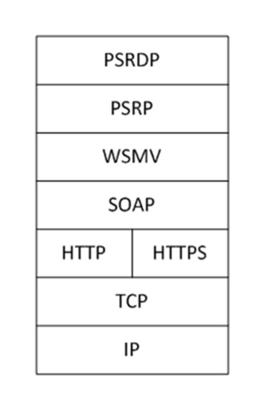
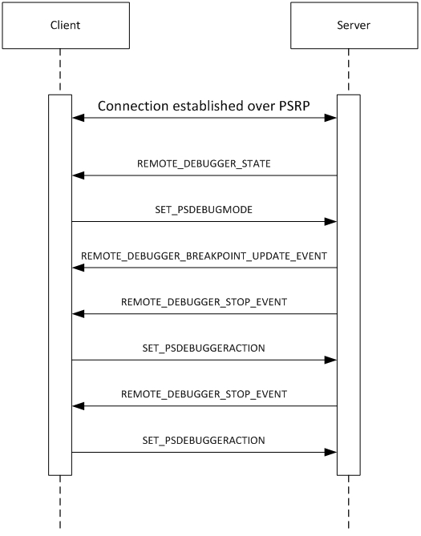

[MS-PSRDP]:

PowerShell Remote Debugging Protocol

Intellectual Property Rights Notice for Open Specifications Documentation

  Technical Documentation. Microsoft publishes Open Specifications documentation (“this

documentation”) for protocols, file formats, data portability, computer languages, and standards
support. Additionally, overview documents cover inter-protocol relationships and interactions.

  Copyrights. This documentation is covered by Microsoft copyrights. Regardless of any other

terms that are contained in the terms of use for the Microsoft website that hosts this
documentation, you can make copies of it in order to develop implementations of the technologies
that are described in this documentation and can distribute portions of it in your implementations
that use these technologies or in your documentation as necessary to properly document the
implementation. You can also distribute in your implementation, with or without modification, any
schemas, IDLs, or code samples that are included in the documentation. This permission also
applies to any documents that are referenced in the Open Specifications documentation.
  No Trade Secrets. Microsoft does not claim any trade secret rights in this documentation.
  Patents. Microsoft has patents that might cover your implementations of the technologies

described in the Open Specifications documentation. Neither this notice nor Microsoft's delivery of
this documentation grants any licenses under those patents or any other Microsoft patents.
However, a given Open Specifications document might be covered by the Microsoft Open
Specifications Promise or the Microsoft Community Promise. If you would prefer a written license,
or if the technologies described in this documentation are not covered by the Open Specifications
Promise or Community Promise, as applicable, patent licenses are available by contacting
iplg@microsoft.com.

  License Programs. To see all of the protocols in scope under a specific license program and the

associated patents, visit the Patent Map.

  Trademarks. The names of companies and products contained in this documentation might be
covered by trademarks or similar intellectual property rights. This notice does not grant any
licenses under those rights. For a list of Microsoft trademarks, visit
www.microsoft.com/trademarks.

  Fictitious Names. The example companies, organizations, products, domain names, email

addresses, logos, people, places, and events that are depicted in this documentation are fictitious.
No association with any real company, organization, product, domain name, email address, logo,
person, place, or event is intended or should be inferred.

Reservation of Rights. All other rights are reserved, and this notice does not grant any rights other
than as specifically described above, whether by implication, estoppel, or otherwise.

Tools. The Open Specifications documentation does not require the use of Microsoft programming
tools or programming environments in order for you to develop an implementation. If you have access
to Microsoft programming tools and environments, you are free to take advantage of them. Certain
Open Specifications documents are intended for use in conjunction with publicly available standards
specifications and network programming art and, as such, assume that the reader either is familiar
with the aforementioned material or has immediate access to it.

Support. For questions and support, please contact dochelp@microsoft.com.

[MS-PSRDP] - v20240423
PowerShell Remote Debugging Protocol
Copyright © 2024 Microsoft Corporation
Release: April 23, 2024

1 / 20

Revision Summary

Date

Revision
History

Revision
Class

Comments

5/15/2014

1.0

6/30/2015

2.0

10/16/2015  2.0

7/14/2016

2.0

6/1/2017

2.0

New

Major

None

None

None

Released new document.

Significantly changed the technical content.

No changes to the meaning, language, or formatting of the
technical content.

No changes to the meaning, language, or formatting of the
technical content.

No changes to the meaning, language, or formatting of the
technical content.

9/15/2017

3.0

Major

Significantly changed the technical content.

12/1/2017

3.0

9/12/2018

4.0

4/7/2021

5.0

6/25/2021

6.0

4/23/2024

7.0

None

Major

Major

Major

Major

No changes to the meaning, language, or formatting of the
technical content.

Significantly changed the technical content.

Significantly changed the technical content.

Significantly changed the technical content.

Significantly changed the technical content.

[MS-PSRDP] - v20240423
PowerShell Remote Debugging Protocol
Copyright © 2024 Microsoft Corporation
Release: April 23, 2024

2 / 20

Table of Contents

1.1
1.2

1.2.1
1.2.2

1  Introduction ............................................................................................................ 5
Glossary ........................................................................................................... 5
References ........................................................................................................ 5
Normative References ................................................................................... 5
Informative References ................................................................................. 5
Overview .......................................................................................................... 5
Relationship to Other Protocols ............................................................................ 6
Prerequisites/Preconditions ................................................................................. 6
Applicability Statement ....................................................................................... 6
Versioning and Capability Negotiation ................................................................... 6
Vendor-Extensible Fields ..................................................................................... 7
Standards Assignments ....................................................................................... 7

1.3
1.4
1.5
1.6
1.7
1.8
1.9

2.2

2.1

2.1.1
2.1.2
2.1.3
2.1.4

2  Messages ................................................................................................................. 8
Transport .......................................................................................................... 8
Transport of Client Messages.......................................................................... 8
Transport of REMOTE_DEBUGGER_STATE Message ........................................... 8
Transport of REMOTE_DEBUGGER_BREAKPOINT_UPDATED_EVENT Message ........ 8
Transport of REMOTE_DEBUGGER_STOP_EVENT Message ................................. 8
Message Syntax ................................................................................................. 8
Namespaces ................................................................................................ 8
SET_PSDEBUGMODE Message ........................................................................ 8
SET_PSDEBUGGERACTION Message................................................................ 8
GET_PSDEBUGGERSTOPARGS Message ........................................................... 9
SET_PSDEBUGGERSTEPMODE Message ........................................................... 9
SET_PSUNHANDLEDBREAKPOINTMODE Message .............................................. 9
REMOTE_DEBUGGER_STATE Message ............................................................. 9
REMOTE_DEBUGGER_BREAKPOINT_UPDATED_EVENT Message .......................... 9
REMOTE_DEBUGGER_STOP_EVENT Message .................................................. 10

2.2.1
2.2.2
2.2.3
2.2.4
2.2.5
2.2.6
2.2.7
2.2.8
2.2.9

3.1

3.1.5

3.1.1
3.1.2
3.1.3
3.1.4

3.1.4.1
3.1.4.2
3.1.4.3
3.1.4.4
3.1.4.5

3  Protocol Details ..................................................................................................... 11
Client Details ................................................................................................... 11
Abstract Data Model .................................................................................... 11
Initialization ............................................................................................... 11
Higher-Layer Triggered Events ..................................................................... 11
Message Processing Events and Sequencing Rules .......................................... 11
SET_PSDEBUGMODE Message ................................................................ 11
SET_PSDEBUGGERACTION Message ........................................................ 11
GET_PSDEBUGGERSTOPARGS Message ................................................... 12
SET_PSDEBUGGERSTEPMODE Message ................................................... 12
SET_PSUNHANDLEDBREAKPOINTMODE Message ...................................... 12
Other Local Events ...................................................................................... 12
Server Details .................................................................................................. 12
Abstract Data Model .................................................................................... 12
Initialization ............................................................................................... 12
Higher-Layer Triggered Events ..................................................................... 13
Message Processing Events and Sequencing Rules .......................................... 13
SET_PSDEBUGMODE Message ................................................................ 13
SET_PSDEBUGGERACTION Message ........................................................ 13
GET_PSDEBUGGERSTOPARGS Message ................................................... 13
SET_PSDEBUGGERSTEPMODE Message ................................................... 13
SET_PSUNHANDLEDBREAKPOINTMODE Message ...................................... 13
REMOTE_DEBUGGER_STATE Message ..................................................... 14
REMOTE_DEBUGGER_BREAKPOINT_UPDATED_EVENT Message .................. 14
REMOTE_DEBUGGER_STOP_EVENT Message ............................................ 14

3.2.4.1
3.2.4.2
3.2.4.3
3.2.4.4
3.2.4.5
3.2.4.6
3.2.4.7
3.2.4.8

3.2.1
3.2.2
3.2.3
3.2.4

3.2

[MS-PSRDP] - v20240423
PowerShell Remote Debugging Protocol
Copyright © 2024 Microsoft Corporation
Release: April 23, 2024

3 / 20

3.2.5

Other Local Events ...................................................................................... 14

4  Protocol Examples ................................................................................................. 15

5  Security ................................................................................................................. 16
Security Considerations for Implementers ........................................................... 16
Index of Security Parameters ............................................................................ 16

5.1
5.2

6  Appendix A: Product Behavior ............................................................................... 17

7  Change Tracking .................................................................................................... 18

8  Index ..................................................................................................................... 19

[MS-PSRDP] - v20240423
PowerShell Remote Debugging Protocol
Copyright © 2024 Microsoft Corporation
Release: April 23, 2024

4 / 20

1  Introduction

The PowerShell Remote Debugging Protocol (PSRDP) extends the existing PowerShell Remoting
Protocol (PSRP) specified in [MS-PSRP] to support debugging over a remote session.

Sections 1.5, 1.8, 1.9, 2, and 3 of this specification are normative. All other sections and examples in
this specification are informative.

1.1  Glossary

This document uses the following terms:

breakpoint: A temporary stopping place in executing code.

debugger: An application or function that is used to perform debugging actions.

debugging: The process of stopping and stepping through running code to analyze the behavior of

the code.

remote debugging: Debugging that operates over a remote session.

remote session: A session established from a client to a server via PSRP.

MAY, SHOULD, MUST, SHOULD NOT, MUST NOT: These terms (in all caps) are used as defined
in [RFC2119]. All statements of optional behavior use either MAY, SHOULD, or SHOULD NOT.

1.2  References

Links to a document in the Microsoft Open Specifications library point to the correct section in the
most recently published version of the referenced document. However, because individual documents
in the library are not updated at the same time, the section numbers in the documents may not
match. You can confirm the correct section numbering by checking the Errata.

1.2.1  Normative References

We conduct frequent surveys of the normative references to assure their continued availability. If you
have any issue with finding a normative reference, please contact dochelp@microsoft.com. We will
assist you in finding the relevant information.

[MS-PSRP] Microsoft Corporation, "PowerShell Remoting Protocol".

[RFC2119] Bradner, S., "Key words for use in RFCs to Indicate Requirement Levels", BCP 14, RFC
2119, March 1997, https://www.rfc-editor.org/info/rfc2119

1.2.2  Informative References

None.

1.3  Overview

This protocol extends the existing PowerShell Remoting Protocol (PSRP) specified in [MS-PSRP] to
support debugging over a remote session.

[MS-PSRDP] - v20240423
PowerShell Remote Debugging Protocol
Copyright © 2024 Microsoft Corporation
Release: April 23, 2024

5 / 20

<!-- Extracted images from page 6 -->

<!-- /Extracted images from page 6 -->

1.4  Relationship to Other Protocols

This protocol depends on PSRP specified in [MS-PSRP] for transport of messages between client and
server.

Figure 1: Relationship of the PowerShell Remote Debugging Protocol to other protocols

1.5  Prerequisites/Preconditions

Because this protocol is a higher layer than PSRP, a remote session established over PSRP is
required before this protocol can operate. The client must be aware of the Debugger_State,
Resume_Action, Debugger_Mode, Debugger_Breakpoint_Collection,
Debugger_Stop_Context, Debugger_Step_Mode, and
Debugger_UnhandledBreakpoint_Mode<1> abstract data model elements, specified in section
3.2.1, on the server.

1.6  Applicability Statement

This protocol can be used only in conjunction with PSRP that has been initialized with a single
runspace in its runspace pool as specified in [MS-PSRP] section 2.2.2.2 INIT_RUNSPACEPOOL
Message.

1.7  Versioning and Capability Negotiation

This document covers versioning issues in the following areas:

Capability Negotiation:  The client determines that the server supports remote debugging by

looking for Debugger_State data returned in the PSRP APPLICATION_PRIVATE_DATA message
specified in section 2.2.7, after session creation. If this data exists, the client determines that
the server capability includes remote debugging support.

[MS-PSRDP] - v20240423
PowerShell Remote Debugging Protocol
Copyright © 2024 Microsoft Corporation
Release: April 23, 2024

6 / 20

1.8  Vendor-Extensible Fields

None.

1.9  Standards Assignments

None.

[MS-PSRDP] - v20240423
PowerShell Remote Debugging Protocol
Copyright © 2024 Microsoft Corporation
Release: April 23, 2024

7 / 20

2  Messages

2.1  Transport

Messages are transported using PSRP.

2.1.1  Transport of Client Messages

Client to server messages MUST be sent as PSRP pipeline commands as specified in [MS-PSRP] section
2.2.2.10 and section 2.2.3.11.

2.1.2  Transport of REMOTE_DEBUGGER_STATE Message

The server MUST send the REMOTE_DEBUGGER_STATE message to the client as a PSRP
APPLICATION_PRIVATE_DATA message as specified in [MS-PSRP] section 2.2.2.13.

2.1.3  Transport of REMOTE_DEBUGGER_BREAKPOINT_UPDATED_EVENT Message

The server MUST send the REMOTE_DEBUGGER_BREAKPOINT_UPDATED_EVENT message to the client
as a PSRP USER_EVENT message as specified in [MS-PSRP] section 2.2.2.12.

2.1.4  Transport of REMOTE_DEBUGGER_STOP_EVENT Message

The server MUST send the REMOTE_DEBUGGER_STOP_EVENT message to the client as a PSRP
USER_EVENT message as specified in [MS-PSRP] section 2.2.2.12.

2.2  Message Syntax

All message data is passed using PSRP mechanisms and therefore MUST use the PSRP message
syntax as specified in [MS-PSRP] section 2.2.

2.2.1  Namespaces

All message data is passed using PSRP mechanisms and therefore MUST use namespaces as specified
in [MS-PSRP] section 2.2.5.

2.2.2  SET_PSDEBUGMODE Message

This message is a PSRP pipeline command sent from the client to the server.

This message MUST be sent as a PSRP pipeline command as specified in [MS-PSRP] section 2.2.2.10
and section 2.2.3.12.

The PSRP pipeline command name MUST be Set-PSDebugMode.

The PSRP pipeline command MUST take a single 32-bit argument (Debugger_Mode).

2.2.3  SET_PSDEBUGGERACTION Message

This message is a PSRP pipeline command message sent from the client to the server.

This message MUST be sent as a PSRP pipeline command as specified in [MS-PSRP] section 2.2.2.10
and section 2.2.3.12.

8 / 20

[MS-PSRDP] - v20240423
PowerShell Remote Debugging Protocol
Copyright © 2024 Microsoft Corporation
Release: April 23, 2024

The PSRP pipeline command name MUST be Set-PSDebuggerAction.

The PSRP pipeline command MUST take a single 32-bit argument (Resume_Action).

2.2.4  GET_PSDEBUGGERSTOPARGS Message

This message is a PSRP pipeline command sent from the client to the server.

This message MUST be sent as a PSRP pipeline command as specified in [MS-PSRP] section 2.2.2.10
and section 2.2.3.12.

The PSRP pipeline command name MUST be Get-PSDebuggerStopArgs.

The PSRP pipeline command MUST NOT take arguments.

The PSRP pipeline command MUST return a data structure containing the server debugger stop state
(Debugger_Stop_Context).

2.2.5  SET_PSDEBUGGERSTEPMODE Message

The SET_PSDEBUGGERSTEPMODE message<2> is a PSRP pipeline command sent from the client to
the server. It MUST be sent as a PSRP pipeline command as specified in [MS-PSRP] section 2.2.2.10
and [MS-PSRP] section 2.2.3.12.

The PSRP pipeline command name MUST be Set-PSDebuggerStepMode and take a single 32 bit
argument (Debugger_Step_Mode).

2.2.6  SET_PSUNHANDLEDBREAKPOINTMODE Message

The SET_PSUNHANDLEDBREAKPOINTMODE message<3> is a PSRP pipeline command sent from the
client to the server. It MUST be sent as a PSRP pipeline command as specified in [MS-PSRP] section
2.2.2.10 and [MS-PSRP] section 2.2.3.12.

The PSRP pipeline command name MUST be Set-PSUnhandledBreakpointMode and take a single 32 bit
argument (Debugger_UnhandledBreakpoint_Mode).

2.2.7  REMOTE_DEBUGGER_STATE Message

This message is sent from the server to the client.

This message MUST be sent as the PSRP APPLICATION_PRIVATE_DATA message as specified in [MS-
PSRP] section 2.2.2.13.

This message MUST contain a Debugger_State data structure.

The PSRP APPLICATION_PRIVATE_DATA message allows for a collection of multiple data structures to
be sent from the server to the client after a successful connection is established via PSRP. This
message is the same as the PSRP APPLICATION_PRIVATE_DATA message but includes the
Debugger_State data structure as defined by a higher layer.

2.2.8  REMOTE_DEBUGGER_BREAKPOINT_UPDATED_EVENT Message

This message is sent from the server to the client.

This message MUST be sent using the PSRP USER_EVENT event mechanism specified in [MS-PSRP]
section 2.2.2.12.

[MS-PSRDP] - v20240423
PowerShell Remote Debugging Protocol
Copyright © 2024 Microsoft Corporation
Release: April 23, 2024

9 / 20

The PSRP USER_EVENT source identifier string MUST be
PSInternalRemoteDebuggerBreakpointUpdatedEvent.

This event message MUST contain a server Debugger_Breakpoint_Collection data structure.

2.2.9  REMOTE_DEBUGGER_STOP_EVENT Message

This message is sent from the server to the client.

This message MUST be sent using the PSRP USER_EVENT event mechanism specified in [MS-PSRP]
section 2.2.2.12.

The PSRP USER_EVENT source identifier string MUST be PSInternalRemoteDebuggerStopEvent.

This event message MUST contain a server Debugger_Stop_Context data structure.

[MS-PSRDP] - v20240423
PowerShell Remote Debugging Protocol
Copyright © 2024 Microsoft Corporation
Release: April 23, 2024

10 / 20

3  Protocol Details

3.1  Client Details

The client can send three messages to the server.

1.  SET_PSDEBUGMODE (section 2.2.2). This message is sent to the server to set the

Debugger_Mode state on the server.

2.  SET_PSDEBUGGERACTION (section 2.2.3). This message is sent to the server in response to a
server REMOTE_DEBUGGER_STOP_EVENT message. It sets the Resume_Action state on the
server.

3.  GET_PSDEBUGGERSTOPARGS (section 2.2.4). This message queries the server for the

Debugger_Stop_Context information.

3.1.1  Abstract Data Model

None.

3.1.2  Initialization

This protocol is initialized when a remote session is established over PSRP. After this, the client
higher layer MAY<4> initialize the remote session for remote debugging by sending the
SET_PSDEBUGMODE message, as specified in section 2.2.2, to the server.

3.1.3  Higher-Layer Triggered Events

  When the client sends a SET_PSDEBUGMODE message (section 2.2.2) to the server, the server

uses the message argument value Debugger_Mode to update its state.

  When the client sends a SET_PSDEBUGGERACTION message (section 2.2.3) to the server, the

server uses the message argument value Resume_Action to update its state.

  When the client sends a GET_PSDEBUGGERSTOPARGS message (section 2.2.4) to the server, the
server returns the current Debugger_Stop_Context data to the client via the PSRP pipeline
command infrastructure specified in [MS-PSRP] section 2.2.2.10 and section 2.2.3.12.

  When the client sends a SET_PSDEBUGGERSTEPMODE message (section 2.2.5) to the server, the

server uses the message argument value Debugger_Step_Mode to update its state.

  When the client sends a SET_PSUNHANDLEDBREAKPOINTMODE message (section 2.2.6) to the

server, the server uses the message argument value Debugger_UnhandledBreakpoint_Mode
to update its state.

3.1.4  Message Processing Events and Sequencing Rules

3.1.4.1  SET_PSDEBUGMODE Message

This message is sent at the discretion of the client to set the server-side Debugger_Mode state.

[MS-PSRDP] - v20240423
PowerShell Remote Debugging Protocol
Copyright © 2024 Microsoft Corporation
Release: April 23, 2024

11 / 20

3.1.4.2  SET_PSDEBUGGERACTION Message

This message is sent by the client in response to a server REMOTE_DEBUGGER_STOP_EVENT message
as specified in section 2.2.9. The client sends this message to set the server-side Resume_Action
state.

3.1.4.3  GET_PSDEBUGGERSTOPARGS Message

This message is sent at the discretion of the client to retrieve the Debugger_Stop_Context
information from the server.

3.1.4.4  SET_PSDEBUGGERSTEPMODE Message

This message is sent at the discretion of the client to set the server-side Debugger_StepMode state.

3.1.4.5  SET_PSUNHANDLEDBREAKPOINTMODE Message

This message is sent at the discretion of the client to set the server-side
Debugger_UnhandledBreakpoint_Mode state.

3.1.5  Other Local Events

None.

3.2  Server Details

The server supports remote debugging by handling client messages and sending server state and
event data to the client.

3.2.1  Abstract Data Model

This section describes a conceptual model of possible data organization that an implementation
maintains to participate in this protocol. The described organization is provided to facilitate the
explanation of how the protocol behaves. This document does not mandate that implementations
adhere to this model as long as their external behavior is consistent with that described in this
document.

Debugger_Mode:  This is a 32-bit field representing the server-side debugger mode. The

interpretation of this field is defined at a higher layer.

Resume_Action:  This is a 32-bit field representing the action the server-side debugger takes
when resuming code execution. The interpretation of this field is defined at a higher layer.

Debugger_State:  This is a data structure representing the current state of the server debugger.

The specific form of this data structure is defined at a higher layer.

Debugger_Breakpoint_Collection:  This is a collection of data structures representing

breakpoints on the server. The specific form of this data structure is defined at a higher layer.

Debugger_Stop_Context:  This is a data structure that represents the server debugger stop

state. The specific form of this data structure is defined at a higher layer.

Debugger_Step_Mode:  This is a 32-bit field representing the server-side debugger stepping

mode state. The interpretation of this field is defined at a higher layer.

[MS-PSRDP] - v20240423
PowerShell Remote Debugging Protocol
Copyright © 2024 Microsoft Corporation
Release: April 23, 2024

12 / 20

Debugger_UnhandledBreakpoint_Mode:  This is a 32-bit field representing the server-side
state regarding the processing of unhandled breakpoints. The interpretation of this field is
defined at a higher layer.

3.2.2  Initialization

This protocol is initialized when a remote session is established over PSRP.

3.2.3  Higher-Layer Triggered Events

  When the remote session is first established, the server MUST send a
REMOTE_DEBUGGER_STATE message (section 2.2.7) to the client.

  When the server receives the SET_PSDEBUGMODE message (section 2.2.2) from the client, it

MUST set the server Debugger_Mode state.

  When server breakpoint state changes in the remote session, the server MUST send a

REMOTE_DEBUGGER_BREAKPOINT_UPDATED_EVENT message (section 2.2.8) to the client.

  When code execution is halted through debugger action in the remote session, the server MUST

send a REMOTE_DEBUGGER_STOP_EVENT message (section 2.2.9) to the client.

  When the server receives the SET_PSDEBUGGERACTION message (section 2.2.3) from the client,

it MUST set the server Resume_Action state.

  When the server receives the GET_PSDEBUGGERSTOPARGS message (section 2.2.4) from the

client, it MUST return the server Debugger_Stop_Context information.

  When the server receives the SET_PSDEBUGGERSTEPMODE message (section 2.2.5) from the

client, it MUST set the Debugger_Step_Mode state.

  When the server receives the SET_PSUNHANDLEDBREAKPOINTMODE message (section 2.2.6)

from the client, it MUST set the Debugger_UnhandledBreakpoint_Mode state.

3.2.4  Message Processing Events and Sequencing Rules

3.2.4.1  SET_PSDEBUGMODE Message

When the server receives this message, it MUST update its Debugger_Mode state as provided by the
message argument specified in section 2.2.2.

3.2.4.2  SET_PSDEBUGGERACTION Message

When the server receives this message, it MUST update its Resume_Action state as provided by the
message argument specified in section 2.2.3.

3.2.4.3  GET_PSDEBUGGERSTOPARGS Message

When the server receives this message, it MUST return a Debugger_Stop_Context data structure
corresponding to its current state.

3.2.4.4  SET_PSDEBUGGERSTEPMODE Message

When the server receives this message, it MUST update its Debugger_Step_Mode state as provided
by the message argument specified in section 2.2.5.

13 / 20

[MS-PSRDP] - v20240423
PowerShell Remote Debugging Protocol
Copyright © 2024 Microsoft Corporation
Release: April 23, 2024

3.2.4.5  SET_PSUNHANDLEDBREAKPOINTMODE Message

When the server receives this message, it MUST update its
Debugger_UnhandledBreakpoint_Mode state as provided by the message argument specified in
section 2.2.6.

3.2.4.6  REMOTE_DEBUGGER_STATE Message

The server MUST send this message after a remote session is successfully established over PSRP as
specified in section 2.2.7.

3.2.4.7  REMOTE_DEBUGGER_BREAKPOINT_UPDATED_EVENT Message

The server MUST send this message whenever its breakpoint state changes as specified in section
2.2.8.

3.2.4.8  REMOTE_DEBUGGER_STOP_EVENT Message

The server MUST send this message whenever running code is halted on the server for debugging
purposes as specified in section 2.2.9.

3.2.5  Other Local Events

None.

[MS-PSRDP] - v20240423
PowerShell Remote Debugging Protocol
Copyright © 2024 Microsoft Corporation
Release: April 23, 2024

14 / 20

<!-- Extracted images from page 15 -->

<!-- /Extracted images from page 15 -->

4  Protocol Examples

A common remote debugging sequence is as follows:

Figure 2: Common PowerShell Remote Debugging Protocol sequence

[MS-PSRDP] - v20240423
PowerShell Remote Debugging Protocol
Copyright © 2024 Microsoft Corporation
Release: April 23, 2024

15 / 20

5  Security

5.1  Security Considerations for Implementers

None.

5.2  Index of Security Parameters

None.

[MS-PSRDP] - v20240423
PowerShell Remote Debugging Protocol
Copyright © 2024 Microsoft Corporation
Release: April 23, 2024

16 / 20

6  Appendix A: Product Behavior

The information in this specification is applicable to the following Microsoft products or supplemental
software. References to product versions include updates to those products.

  Windows 7 operating system

  Windows Server 2008 R2 operating system

  Windows Server 2012 operating system

  Windows 8.1 operating system

  Windows Server 2012 R2 operating system

  Windows 10 operating system

  Windows Server 2016 operating system

  Windows Server operating system

  Windows Server 2019 operating system

  Windows Server 2022 operating system

  Windows 11 operating system

  Windows Server 2025 operating system

Exceptions, if any, are noted in this section. If an update version, service pack or Knowledge Base
(KB) number appears with a product name, the behavior changed in that update. The new behavior
also applies to subsequent updates unless otherwise specified. If a product edition appears with the
product version, behavior is different in that product edition.

Unless otherwise specified, any statement of optional behavior in this specification that is prescribed
using the terms "SHOULD" or "SHOULD NOT" implies product behavior in accordance with the
SHOULD or SHOULD NOT prescription. Unless otherwise specified, the term "MAY" implies that the
product does not follow the prescription.

<1> Section 1.5:  Debugger_Step_Mode and Debugger_UnhandledBreakpoint_Mode are not available
in Windows 7, Windows Server 2008 R2, Windows Server 2012, Windows 8.1, and Windows Server
2012 R2.

<2> Section 2.2.5:  SET_PSDEBUGGERSTEPMODE is not available in Windows 7, Windows Server
2008 R2, Windows Server 2012, Windows 8.1, and Windows Server 2012 R2.

<3> Section 2.2.6:  SET_PSUNHANDLEDBREAKPOINTMODE is not available in Windows 7, Windows
Server 2008 R2, Windows Server 2012, Windows 8.1, and Windows Server 2012 R2.

<4> Section 3.1.2:  In Windows PowerShell, remote script debugging is opt in, therefore the server-
side script debugger is created with remote debugging initially disabled. The Windows PowerShell
client enables remote session debugging by sending the SET_PSDEBUGMODE message to the
server.

[MS-PSRDP] - v20240423
PowerShell Remote Debugging Protocol
Copyright © 2024 Microsoft Corporation
Release: April 23, 2024

17 / 20

7  Change Tracking

This section identifies changes that were made to this document since the last release. Changes are
classified as Major, Minor, or None.

The revision class Major means that the technical content in the document was significantly revised.
Major changes affect protocol interoperability or implementation. Examples of major changes are:

  A document revision that incorporates changes to interoperability requirements.
  A document revision that captures changes to protocol functionality.

The revision class Minor means that the meaning of the technical content was clarified. Minor changes
do not affect protocol interoperability or implementation. Examples of minor changes are updates to
clarify ambiguity at the sentence, paragraph, or table level.

The revision class None means that no new technical changes were introduced. Minor editorial and
formatting changes may have been made, but the relevant technical content is identical to the last
released version.

The changes made to this document are listed in the following table. For more information, please
contact dochelp@microsoft.com.

Section

Description

6 Appendix A: Product
Behavior

Added Windows Server 2025 to the list of applicable
products.

Revision
class

Major

[MS-PSRDP] - v20240423
PowerShell Remote Debugging Protocol
Copyright © 2024 Microsoft Corporation
Release: April 23, 2024

18 / 20

8  Index
A

Abstract data model
   client 11
   server 12
Applicability 6

C

Capability negotiation 6
Change tracking 18
Client
   abstract data model 11
   higher-layer triggered events 11
   initialization 11
   other local events 12
   overview 11

D

Data model - abstract
   client 11
   server 12

F

Fields - vendor-extensible 7

G

REMOTE_DEBUGGER_BREAKPOINT_UPDATED_E
VENT Message message 9

   REMOTE_DEBUGGER_STATE Message 9
   REMOTE_DEBUGGER_STATE Message message 9
   REMOTE_DEBUGGER_STOP_EVENT Message 10
   REMOTE_DEBUGGER_STOP_EVENT Message

message 10

   SET_PSDEBUGGERACTION Message 8
   SET_PSDEBUGGERACTION Message message 8
   SET_PSDEBUGGERSTEPMODE Message 9
   SET_PSDEBUGGERSTEPMODE Message message 9
   SET_PSDEBUGMODE Message 8
   SET_PSDEBUGMODE Message message 8
   SET_PSUNHANDLEDBREAKPOINTMODE Message 9
   SET_PSUNHANDLEDBREAKPOINTMODE Message

message 9

   transport 8

N

Namespaces message 8
Normative references 5

O

Other local events
   client 12
   server 14
Overview (synopsis) 5

GET_PSDEBUGGERSTOPARGS Message message 9
Glossary 5

P

H

Higher-layer triggered events
   client 11
   server 13

I

Implementer - security considerations 16
Index of security parameters 16
Informative references 5
Initialization
   client 11
   server 12
Introduction 5

M

Messages
   GET_PSDEBUGGERSTOPARGS Message 9
   GET_PSDEBUGGERSTOPARGS Message message 9
   Namespaces 8
   Namespaces message 8

REMOTE_DEBUGGER_BREAKPOINT_UPDATED_E
VENT Message 9

[MS-PSRDP] - v20240423
PowerShell Remote Debugging Protocol
Copyright © 2024 Microsoft Corporation
Release: April 23, 2024

Parameters - security index 16
Preconditions 6
Prerequisites 6
Product behavior 17

R

References 5
   informative 5
   normative 5
Relationship to other protocols 6
REMOTE_DEBUGGER_BREAKPOINT_UPDATED_EVEN

T Message message 9

REMOTE_DEBUGGER_STATE Message message 9
REMOTE_DEBUGGER_STOP_EVENT Message

message 10

S

Security
   implementer considerations 16
   parameter index 16
Server
   abstract data model 12
   higher-layer triggered events 13
   initialization 12
   other local events 14
   overview 12

19 / 20

SET_PSDEBUGGERACTION Message message 8
SET_PSDEBUGGERSTEPMODE Message message 9
SET_PSDEBUGMODE Message message 8
SET_PSUNHANDLEDBREAKPOINTMODE Message

message 9

Standards assignments 7

T

Tracking changes 18
Transport 8
Triggered events - higher-layer
   client 11
   server 13

V

Vendor-extensible fields 7
Versioning 6

[MS-PSRDP] - v20240423
PowerShell Remote Debugging Protocol
Copyright © 2024 Microsoft Corporation
Release: April 23, 2024

20 / 20

