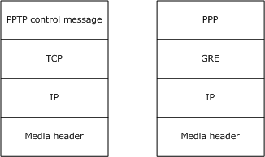

[MS-PTPT]:

Point-to-Point Tunneling Protocol (PPTP) Profile

Intellectual Property Rights Notice for Open Specifications Documentation

  Technical Documentation. Microsoft publishes Open Specifications documentation (“this

documentation”) for protocols, file formats, data portability, computer languages, and standards
support. Additionally, overview documents cover inter-protocol relationships and interactions.

  Copyrights. This documentation is covered by Microsoft copyrights. Regardless of any other

terms that are contained in the terms of use for the Microsoft website that hosts this
documentation, you can make copies of it in order to develop implementations of the technologies
that are described in this documentation and can distribute portions of it in your implementations
that use these technologies or in your documentation as necessary to properly document the
implementation. You can also distribute in your implementation, with or without modification, any
schemas, IDLs, or code samples that are included in the documentation. This permission also
applies to any documents that are referenced in the Open Specifications documentation.
  No Trade Secrets. Microsoft does not claim any trade secret rights in this documentation.
  Patents. Microsoft has patents that might cover your implementations of the technologies

described in the Open Specifications documentation. Neither this notice nor Microsoft's delivery of
this documentation grants any licenses under those patents or any other Microsoft patents.
However, a given Open Specifications document might be covered by the Microsoft Open
Specifications Promise or the Microsoft Community Promise. If you would prefer a written license,
or if the technologies described in this documentation are not covered by the Open Specifications
Promise or Community Promise, as applicable, patent licenses are available by contacting
iplg@microsoft.com.

  License Programs. To see all of the protocols in scope under a specific license program and the

associated patents, visit the Patent Map.

  Trademarks. The names of companies and products contained in this documentation might be
covered by trademarks or similar intellectual property rights. This notice does not grant any
licenses under those rights. For a list of Microsoft trademarks, visit
www.microsoft.com/trademarks.

  Fictitious Names. The example companies, organizations, products, domain names, email

addresses, logos, people, places, and events that are depicted in this documentation are fictitious.
No association with any real company, organization, product, domain name, email address, logo,
person, place, or event is intended or should be inferred.

Reservation of Rights. All other rights are reserved, and this notice does not grant any rights other
than as specifically described above, whether by implication, estoppel, or otherwise.

Tools. The Open Specifications documentation does not require the use of Microsoft programming
tools or programming environments in order for you to develop an implementation. If you have access
to Microsoft programming tools and environments, you are free to take advantage of them. Certain
Open Specifications documents are intended for use in conjunction with publicly available standards
specifications and network programming art and, as such, assume that the reader either is familiar
with the aforementioned material or has immediate access to it.

Support. For questions and support, please contact dochelp@microsoft.com.

[MS-PTPT] - v20240423
Point-to-Point Tunneling Protocol (PPTP) Profile
Copyright © 2024 Microsoft Corporation
Release: April 23, 2024

1 / 28

Revision Summary

Date

Revision
History

Revision
Class

Comments

4/10/2009

0.1

Major

First Release.

5/22/2009

0.1.1

Editorial

Changed language and formatting in the technical content.

7/2/2009

1.0

8/14/2009

2.0

9/25/2009

2.1

11/6/2009

3.0

12/18/2009  4.0

Major

Major

Minor

Major

Major

Updated and revised the technical content.

Updated and revised the technical content.

Clarified the meaning of the technical content.

Updated and revised the technical content.

Updated and revised the technical content.

1/29/2010

4.0.1

Editorial

Changed language and formatting in the technical content.

3/12/2010

5.0

4/23/2010

6.0

6/4/2010

7.0

7/16/2010

8.0

8/27/2010

9.0

10/8/2010

10.0

11/19/2010  10.0

Major

Major

Major

Major

Major

Major

None

Updated and revised the technical content.

Updated and revised the technical content.

Updated and revised the technical content.

Updated and revised the technical content.

Updated and revised the technical content.

Updated and revised the technical content.

No changes to the meaning, language, or formatting of the
technical content.

1/7/2011

10.0

None

No changes to the meaning, language, or formatting of the
technical content.

2/11/2011

10.0

None

No changes to the meaning, language, or formatting of the
technical content.

3/25/2011

10.0

None

No changes to the meaning, language, or formatting of the
technical content.

5/6/2011

10.0

None

No changes to the meaning, language, or formatting of the
technical content.

6/17/2011

10.1

Minor

Clarified the meaning of the technical content.

9/23/2011

10.1

None

No changes to the meaning, language, or formatting of the
technical content.

12/16/2011  11.0

Major

Updated and revised the technical content.

3/30/2012

11.0

None

No changes to the meaning, language, or formatting of the
technical content.

7/12/2012

11.0

None

No changes to the meaning, language, or formatting of the
technical content.

10/25/2012  11.0

1/31/2013

11.0

None

None

No changes to the meaning, language, or formatting of the
technical content.

No changes to the meaning, language, or formatting of the

[MS-PTPT] - v20240423
Point-to-Point Tunneling Protocol (PPTP) Profile
Copyright © 2024 Microsoft Corporation
Release: April 23, 2024

2 / 28

Date

Revision
History

Revision
Class

Comments

technical content.

8/8/2013

12.0

Major

Updated and revised the technical content.

11/14/2013  12.0

None

No changes to the meaning, language, or formatting of the
technical content.

2/13/2014

12.0

None

No changes to the meaning, language, or formatting of the
technical content.

5/15/2014

12.0

None

No changes to the meaning, language, or formatting of the
technical content.

6/30/2015

13.0

Major

Significantly changed the technical content.

10/16/2015  13.0

None

No changes to the meaning, language, or formatting of the
technical content.

7/14/2016

13.0

None

No changes to the meaning, language, or formatting of the
technical content.

6/1/2017

13.0

9/15/2017

14.0

9/12/2018

15.0

4/7/2021

16.0

6/25/2021

17.0

4/23/2024

18.0

None

Major

Major

Major

Major

Major

No changes to the meaning, language, or formatting of the
technical content.

Significantly changed the technical content.

Significantly changed the technical content.

Significantly changed the technical content.

Significantly changed the technical content.

Significantly changed the technical content.

[MS-PTPT] - v20240423
Point-to-Point Tunneling Protocol (PPTP) Profile
Copyright © 2024 Microsoft Corporation
Release: April 23, 2024

3 / 28

## Table of Contents

- [1 Introduction](#1-introduction)
  - [1.1 Glossary](#11-glossary)
  - [1.2 References](#12-references)
    - [1.2.1 Normative References](#121-normative-references)
    - [1.2.2 Informative References](#122-informative-references)
  - [1.3 Overview](#13-overview)
  - [1.4 Relationship to Other Protocols](#14-relationship-to-other-protocols)
  - [1.5 Prerequisites/Preconditions](#15-prerequisitespreconditions)
  - [1.6 Applicability Statement](#16-applicability-statement)
  - [1.7 Versioning and Capability Negotiation](#17-versioning-and-capability-negotiation)
  - [1.8 Vendor-Extensible Fields](#18-vendor-extensible-fields)
  - [1.9 Standards Assignments](#19-standards-assignments)
- [2 Messages](#2-messages)
  - [2.1 Transport](#21-transport)
  - [2.2 Message Syntax](#22-message-syntax)
- [3 Protocol Details](#3-protocol-details)
  - [3.1 Common (PAC/PNS) Details](#31-common-pacpns-details)
    - [3.1.1 Abstract Data Model](#311-abstract-data-model)
    - [3.1.2 Timers](#312-timers)
    - [3.1.3 Initialization](#313-initialization)
    - [3.1.4 Higher-Layer Triggered Events](#314-higher-layer-triggered-events)
    - [3.1.5 Processing Events and Sequencing Rules](#315-processing-events-and-sequencing-rules)
      - [3.1.5.1 Start-Control-Connection-Request Message](#3151-start-control-connection-request-message)
        - [3.1.5.1.1 Start-Control-Connection-Request Collision Handling](#31511-start-control-connection-request-collision-handling)
      - [3.1.5.2 Start-Control-Connection-Reply Message](#3152-start-control-connection-reply-message)
      - [3.1.5.3 Stop-Control-Connection-Request Message](#3153-stop-control-connection-request-message)
      - [3.1.5.4 Stop-Control-Connection-Reply Message](#3154-stop-control-connection-reply-message)
      - [3.1.5.5 Echo-Request Message](#3155-echo-request-message)
      - [3.1.5.6 Echo-Reply Message](#3156-echo-reply-message)
      - [3.1.5.7 Sliding Window Protocol](#3157-sliding-window-protocol)
      - [3.1.5.8 Handling Out-of-Sequence Packets](#3158-handling-out-of-sequence-packets)
      - [3.1.5.9 Acknowledgment Time-Outs](#3159-acknowledgment-time-outs)
    - [3.1.6 Timer Events](#316-timer-events)
    - [3.1.7 Other Local Events](#317-other-local-events)
      - [3.1.7.1 TCP Disconnect](#3171-tcp-disconnect)
  - [3.2 PAC/Server Details](#32-pacserver-details)
    - [3.2.1 Abstract Data Model](#321-abstract-data-model)
    - [3.2.2 Timers](#322-timers)
    - [3.2.3 Initialization](#323-initialization)
    - [3.2.4 Higher-Layer Triggered Events](#324-higher-layer-triggered-events)
    - [3.2.5 Processing Events and Sequencing Rules](#325-processing-events-and-sequencing-rules)
      - [3.2.5.1 Call ID Values](#3251-call-id-values)
      - [3.2.5.2 Outgoing-Call-Reply Message](#3252-outgoing-call-reply-message)
      - [3.2.5.3 Incoming-Call-Request Message](#3253-incoming-call-request-message)
      - [3.2.5.4 Incoming-Call-Connected Message](#3254-incoming-call-connected-message)
      - [3.2.5.5 Call-Disconnect–Notify Message](#3255-call-disconnectnotify-message)
      - [3.2.5.6 WAN-Error–Notify Message](#3256-wan-errornotify-message)
    - [3.2.6 Timer Events](#326-timer-events)
    - [3.2.7 Other Local Events](#327-other-local-events)
  - [3.3 PNS/Client Details](#33-pnsclient-details)
    - [3.3.1 Abstract Data Model](#331-abstract-data-model)
    - [3.3.2 Timers](#332-timers)
    - [3.3.3 Initialization](#333-initialization)
    - [3.3.4 Higher-Layer Triggered Events](#334-higher-layer-triggered-events)
      - [3.3.4.1 Establish PPTP Call Session](#3341-establish-pptp-call-session)
      - [3.3.4.2 Disconnect PPTP Call Session](#3342-disconnect-pptp-call-session)
    - [3.3.5 Processing Events and Sequencing Rules](#335-processing-events-and-sequencing-rules)
      - [3.3.5.1 Call ID Values](#3351-call-id-values)
      - [3.3.5.2 Outgoing-Call-Request Message](#3352-outgoing-call-request-message)
      - [3.3.5.3 Incoming-Call-Reply Message](#3353-incoming-call-reply-message)
      - [3.3.5.4 Call-Clear-Request Message](#3354-call-clear-request-message)
      - [3.3.5.5 Set-Link-Info Message](#3355-set-link-info-message)
    - [3.3.6 Timer Events](#336-timer-events)
    - [3.3.7 Other Local Events](#337-other-local-events)
- [4 Protocol Examples](#4-protocol-examples)
- [5 Security](#5-security)
  - [5.1 Security Considerations for Implementers](#51-security-considerations-for-implementers)
  - [5.2 Index of Security Parameters](#52-index-of-security-parameters)
- [6 Appendix A: Product Behavior](#6-appendix-a-product-behavior)
- [7 Change Tracking](#7-change-tracking)
- [8 Index](#8-index)

## 1 Introduction

The Point-to-Point Tunneling Protocol (PPTP) is an Internet Engineering Task Force (IETF) standard
protocol that allows the Point-to-Point Protocol (PPP) [RFC1661] to be tunneled through an IP
network. PPTP does not specify any changes to the PPP protocol, but instead describes a new vehicle
for carrying PPP. PPTP uses an enhanced GRE (Generic Routing Encapsulation) [RFC1701] and
[RFC1702] mechanism to provide a flow-and-congestion-controlled encapsulated datagram service for
carrying PPP packets. For an introduction to PPTP, see [RFC2637] section 1.

The Point-to-Point Tunneling Protocol (PPTP) Profile [MS-PTPT] specifies the profile of PPTP [RFC2637].
In this document, the terms PPTP Access Concentrator (PAC) and server, and the terms PPTP
Network Server (PNS) and client are used interchangeably. This document specifies the use of
voluntary tunneling where the PPTP tunnel endpoints and the PPP endpoints reside on PAC (as the
server) and PNS (as the remote client).

Sections 1.5, 1.8, 1.9, 2, and 3 of this specification are normative. All other sections and examples in
this specification are informative.

### 1.1 Glossary

This document uses the following terms:

peer: When used in context with [MS-PTPT], peer refers to either the PAC or PNS. A PAC's peer

is a PNS and vice versa.

PPTP Access Concentrator (PAC): A node that acts as one side of a PPTP tunnel endpoint and is
a peer to the PPTP Network Server (PNS). PAC refers to the server that terminates the PPTP
tunnel and provides VPN connectivity to a remote client.

PPTP Network Server (PNS): A node that acts as one side of a PPTP tunnel endpoint and is a

peer to the PPTP Access Concentrator (PAC). PNS refers to the remote client that requests
to establish a VPN connectivity using PPTP tunnel.

privilege attribute certificate (PAC): A Microsoft-specific authorization data present in the
authorization data field of a ticket. The PAC contains several logical components, including
group membership data for authorization, alternate credentials for non-Kerberos authentication
protocols, and policy control information for supporting interactive logon.

MAY, SHOULD, MUST, SHOULD NOT, MUST NOT: These terms (in all caps) are used as defined
in [RFC2119]. All statements of optional behavior use either MAY, SHOULD, or SHOULD NOT.

### 1.2 References

Links to a document in the Microsoft Open Specifications library point to the correct section in the
most recently published version of the referenced document. However, because individual documents
in the library are not updated at the same time, the section numbers in the documents may not
match. You can confirm the correct section numbering by checking the Errata.

#### 1.2.1 Normative References

We conduct frequent surveys of the normative references to assure their continued availability. If you
have any issue with finding a normative reference, please contact dochelp@microsoft.com. We will
assist you in finding the relevant information.

[RFC1702] Hanks, S., Li, T., Farinacci, D., and Traina, P., "Generic Routing Encapsulation over IPv4
networks", RFC 1702, October 1994, https://www.rfc-editor.org/info/rfc1702

[MS-PTPT] - v20240423
Point-to-Point Tunneling Protocol (PPTP) Profile
Copyright © 2024 Microsoft Corporation
Release: April 23, 2024

6 / 28

[RFC2119] Bradner, S., "Key words for use in RFCs to Indicate Requirement Levels", BCP 14, RFC
2119, March 1997, https://www.rfc-editor.org/info/rfc2119

[RFC2637] Hamzeh, K., Pall, G., Verthein, W., et al., "Point-to-Point Tunneling Protocol (PPTP)", RFC
2637, July 1999, https://www.rfc-editor.org/info/rfc2637

[RFC793] Postel, J., Ed., "Transmission Control Protocol: DARPA Internet Program Protocol
Specification", RFC 793, September 1981, https://www.rfc-editor.org/info/rfc793

#### 1.2.2 Informative References

[RFC1661] Simpson, W., Ed., "The Point-to-Point Protocol (PPP)", STD 51, RFC 1661, July 1994,
https://www.rfc-editor.org/info/rfc1661

[RFC1701] Hanks, S., Li, T., Farinacci, D., and Traina, P., "Generic Routing Encapsulation (GRE)", RFC
1701, October 1994, https://www.rfc-editor.org/info/rfc1701

### 1.3 Overview

The profile described in this document differs from the PPTP protocol defined in [RFC2637] as follows:















This profile only allows a remote system acting as a PNS to connect to PAC using PPTP. The
profile does not allow a remote system to connect to the PAC over a PPP link, such as a dial-up
link. For more information, see section 3.2.5.3.

The profile does not support Start Control Connection Initiation Request Collision avoidance, as
described in [RFC2637] section 3.1.3. For more information, see section 3.1.5.1.1.

The profile provides limited flow-control and congestion-control behavior. The profile does not
allow adaptive adjustment of time-outs as specified in [RFC2637] section 4.4. For more
information, see section 3.1.2.

The profile handles out-of-sequence packets as described in section 3.1.5.8, which is different
from the definition for this process as specified in [RFC2637] section 4.3. For more information,
see section 3.1.5.8.

The profile does not implement the sliding window protocol described in [RFC2637] section 4.2.
For more information, see section 3.1.5.7. Because the sliding window protocol is not supported,
the profile ignores the values of the Packet Recv. Window Size field from the peer.

The profile specifies a different timeout value as described in section 3.1.2, within which the
control connection has to be in the established state as specified in [RFC2637] section 3.1.4.

The profile does not support any of the Result Code field values for the Call-Disconnect–Notify
message as specified in [RFC2637] section 2.13. For the same reason, this profile does not
support specifying the value "General Error" for the Result Code and passing the general error
information in the Error Code field. This profile defines a new Result Code value of "0" as
specified in section 3.2.5.5.

### 1.4 Relationship to Other Protocols

PPTP has two parallel components, as specified in [RFC2637] section 1.3:

  A control connection between each PAC/PNS pair operating over TCP.

  An IP tunnel operating between the same PAC/PNS pair, which is used to transport GRE

encapsulated PPP packets for user sessions between the pair.

The following diagram demonstrates the relationship of these parallel components to PPTP.

7 / 28

[MS-PTPT] - v20240423
Point-to-Point Tunneling Protocol (PPTP) Profile
Copyright © 2024 Microsoft Corporation
Release: April 23, 2024

<!-- Extracted images from page 8 -->

<!-- /Extracted images from page 8 -->

Figure 1: Relationship of parallel components to PPTP

### 1.5 Prerequisites/Preconditions

None.

### 1.6 Applicability Statement

This protocol is applicable when the implementation uses PPTP [RFC2637].

### 1.7 Versioning and Capability Negotiation

PPTP is based on version 1, revision 0 of the Point-to-Point Tunneling Protocol (PPTP), as specified in
[RFC2637] section 1.4.

### 1.8 Vendor-Extensible Fields

None.

### 1.9 Standards Assignments

None.

[MS-PTPT] - v20240423
Point-to-Point Tunneling Protocol (PPTP) Profile
Copyright © 2024 Microsoft Corporation
Release: April 23, 2024

8 / 28

## 2 Messages

### 2.1 Transport

PPTP control packets are transported over a TCP connection, as described in [RFC2637] section 1.4.
PPP data frames are transported over the GRE tunnel, as described in [RFC2637] section 4.<1>

### 2.2 Message Syntax

PPTP uses the message format specified in [RFC2637]. The PPTP control message formats are
specified in [RFC2637] section 2. The GRE message format that is used to carry PPP frames is
specified in [RFC2637] section 4.

All optional fields and values described in this document are sent in network-byte order unless
otherwise indicated. All reserved bits MUST be set to 0 when sending messages and MUST be ignored
for incoming messages.

[MS-PTPT] - v20240423
Point-to-Point Tunneling Protocol (PPTP) Profile
Copyright © 2024 Microsoft Corporation
Release: April 23, 2024

9 / 28

## 3 Protocol Details

### 3.1 Common (PAC/PNS) Details

#### 3.1.1 Abstract Data Model

The PTPT state machine conforms to the state machine specified in [RFC2637] section 3.

#### 3.1.2 Timers

The following timers are used by the PAC/PNS.

Echo Timer: The "keep alive" timer used by the PAC/PNS for sending the Echo-Request
message (section 3.1.5.5) to the peer as specified in [RFC2637] section 3.1.4. The value of this timer
is 60 seconds.<2>

Packet Acknowledgment Timer: This timer is used to determine whether an acknowledgment for a
GRE packet has to be sent if there are no outstanding GRE packets to be sent, when a packet is
received by a PAC/PNS. The value of this timer is 100 milliseconds.

Control Connection Idle Timer: The timer used by the PAC/PNS to close a control connection when
the connection is not in the established state within the time period specified by this timer. The value
of this timer is 30 seconds, rather than 60 seconds as specified in [RFC2637] section 3.1.4. For more
information, see section 3.1.5.1.

#### 3.1.3 Initialization

The PAC/PNS SHOULD initialize and listen on the PPTP port as specified in [RFC2637] section
3.1.2.<3>

The PAC/PNS SHOULD initialize the echo timeout value specified in [RFC2637] section 3.1.4.<4><5>

#### 3.1.4 Higher-Layer Triggered Events

None.

#### 3.1.5 Processing Events and Sequencing Rules

Except as noted in this section, the message processing and sequencing rules are unchanged from
PPTP as specified in [RFC2637]. As a first step in establishing a PPTP call session, a control connection
MUST be established between the PAC/PNS, which is a TCP session to port 1723 as specified in
[RFC2637] section 1.4. Over this TCP connection, the control channel MUST first be established
followed by the call session through the exchange of control messages. The ordering and
retransmission of control messages is provided by the underlying TCP protocol [RFC793].

PAC and PNS MAY validate GRE packets received so that  the source IP address is the same as the
peer's IP address used in PPTP control channel establishment and for when packets do not validate
and are then subsequently dropped.<6>

##### 3.1.5.1 Start-Control-Connection-Request Message

The Start-Control-Connection-Request message specified in [RFC2637] section 2.1 is used to initialize
the tunnel. The originator SHOULD start the Control Connection Idle Timer (section 3.1.2) and enter
the wait_ctl_reply state after sending the Start-Control-Connection-Request message as specified in
[RFC2637] section 3.1.1. The originator SHOULD exit the wait_ctl_reply state either after receiving

10 / 28

[MS-PTPT] - v20240423
Point-to-Point Tunneling Protocol (PPTP) Profile
Copyright © 2024 Microsoft Corporation
Release: April 23, 2024

the Start-Control-Connection-Reply message from the peer or after the Control Connection Idle Timer
expires.

When the PAC/PNS receives an incoming connection on the PPTP TCP port (default 1723), it SHOULD
start the Control Connection Idle Timer and wait for the Start-Control-Connection-Request message. If
the PAC/PNS does not receive the Start-Control-Connection-Request message from the client of the
TCP connection before the Control Connection Idle Timer expires, it SHOULD discard the attempted
connection.

###### 3.1.5.1.1 Start-Control-Connection-Request Collision Handling

The Point-to-Point Tunneling Protocol (PPTP) Profile does not implement handling of the Start Control
Connection Initiation Request Collision message as specified in [RFC2637] section 3.1.3.

The PAC/PNS SHOULD be capable of having multiple control connections between them where each
control connection is independent of all other control connections.

##### 3.1.5.2 Start-Control-Connection-Reply Message

Start-Control-Connection-Reply is the control message sent in response to the Start-Control-
Connection-Request message. The format of this message is specified in [RFC2637] section 2.2.

##### 3.1.5.3 Stop-Control-Connection-Request Message

The Stop-Control-Connection-Request message is the control message sent by any peer to notify a
peer to close the control connection. The format of this message is specified in [RFC2637] section 2.3.

##### 3.1.5.4 Stop-Control-Connection-Reply Message

This control message is sent in response to the receipt of Stop-Control-Connection-Request. The
format of this message is specified in [RFC2637] section 2.4.

##### 3.1.5.5 Echo-Request Message

This control message is sent by either peer of a PAC/PNS control connection to inform the other peer
that this peer is alive as specified in [RFC2637] section 3.1.4. The PAC/PNS SHOULD send this
message whenever the Echo Timer (section 3.1.2) expires. The format of this message is specified in
[RFC2637] section 2.5.

##### 3.1.5.6 Echo-Reply Message

This control message is sent in response to the receipt of a Echo-Request message. The format of this
message is specified in [RFC2637] section 2.6.

##### 3.1.5.7 Sliding Window Protocol

The sliding window protocol for flow control is described in [RFC2637] section 4.2. The Point-to-Point
Tunneling Protocol (PPTP) Profile does not implement the sliding window protocol for flow control of
data packets. The PAC/PNS SHOULD ignore the received "Packet Recv. Window Size" value from the
peer.

##### 3.1.5.8 Handling Out-of-Sequence Packets

The process for handling out-of-sequence packets is described in [RFC2637] section 4.3. The
PAC/PNS SHOULD attempt to reorder packets before sending them to the higher layer.<7> However,

11 / 28

[MS-PTPT] - v20240423
Point-to-Point Tunneling Protocol (PPTP) Profile
Copyright © 2024 Microsoft Corporation
Release: April 23, 2024

when reordering is not possible, the packets SHOULD continue to be sent to the higher layer even
though the packets might be sent out of order.

Packets with duplicate sequence numbers SHOULD never occur, as specified in [RFC2637] section 4.3.
However, the PAC/PNS SHOULD continue to send packets to the higher layer even though packets
with duplicate sequence numbers might exist.

Note  Sending out-of-sequence packets to the higher layer is in direct contravention of [RFC2637]
section 4.3, which states that such behavior could cause problems because proper PPP protocol
operation is premised upon receiving packets in sequence.

##### 3.1.5.9 Acknowledgment Time-Outs

The PPTP profile does not implement acknowledgment-related time-outs as specified in [RFC2637]
section 4.4. The PAC/PNS SHOULD start the Packet Acknowledgment Timer (section 3.1.2) when it
receives a GRE data packet and there are no outstanding GRE packets to be sent. When the timer
expires and there are no outstanding GRE data packets to send, the PAC/PNS SHOULD send the
acknowledgment GRE packet to the peer; otherwise, the sent GRE data packets will also carry the
acknowledgment and the Packet Acknowledgment Timer SHOULD be stopped.

#### 3.1.6 Timer Events

None.

#### 3.1.7 Other Local Events

None.

##### 3.1.7.1 TCP Disconnect

When the underlying control channel (TCP connection) gets closed at any time, the call sessions
associated with the control channel SHOULD be closed automatically.

### 3.2 PAC/Server Details

#### 3.2.1 Abstract Data Model

The PPTP state machine conforms to the state machine specified in [RFC2637] section 3.2.

#### 3.2.2 Timers

No timers are defined beyond those described in section 3.1.2.

#### 3.2.3 Initialization

None.

#### 3.2.4 Higher-Layer Triggered Events

Events can be triggered from the higher-layer to disconnect a PPTP call session. When the PAC
receives a request to disconnect the PPTP call session from the higher-layer, the PAC MUST send a
Call-Disconnect–Notify message ([RFC2637] section 2.13) to the PNS, as specified in [RFC2637]
section 3.2.4.1. If no more call sessions exist with the PNS, the PAC SHOULD close the control

[MS-PTPT] - v20240423
Point-to-Point Tunneling Protocol (PPTP) Profile
Copyright © 2024 Microsoft Corporation
Release: April 23, 2024

12 / 28

connection with the PNS by sending the Stop-Control-Connection-Request message ([RFC2637]
section 2.3) to the PNS, as specified in [RFC2637] section 3.1.1.

#### 3.2.5 Processing Events and Sequencing Rules

None.

##### 3.2.5.1 Call ID Values

PAC assigns a Call ID value to each user session it requests or accepts, as specified in [RFC2637]
section 3.2.2.

##### 3.2.5.2 Outgoing-Call-Reply Message

The Outgoing-Call-Reply message is a PPTP control message sent by the PAC to the PNS in response
to a received Outgoing-Call-Request message (section 3.3.5.2). The format of this message is
specified in [RFC2637] section 2.8.<8>

In the Outgoing-Call-Reply message, the PAC SHOULD set the value of the Packet Recv. Window
Size field to 0 and the PNS MUST ignore the value of this field.<9>

##### 3.2.5.3 Incoming-Call-Request Message

Since the Point-to-Point Tunneling Protocol (PPTP) Profile does not allow a remote system to connect
to the PAC over a PPP link, such as a dial-up link, the PAC MUST NOT send an Incoming-Call-Request
message to the PNS. However, the PNS SHOULD handle this message, as specified in [RFC2637]
section 2.9.

##### 3.2.5.4 Incoming-Call-Connected Message

The Incoming-Call-Connected message is a PPTP control message sent by the PAC to the PNS in
response to a received Incoming-Call-Reply message (section 3.3.5.3). The format of this message is
specified in [RFC2637] section 2.11.

##### 3.2.5.5 Call-Disconnect–Notify Message

The Call-Disconnect–Notify message is a PPTP control message sent by the PAC to the PNS. It is
issued whenever a call is disconnected due to the receipt by the PAC of a Call-Clear-Request message
or for any other reason. The format of this message is specified in [RFC2637] section 2.13. The PAC
MUST set the value of the Result Code field in this message to 0 irrespective of the reason for the
disconnection, including general error conditions, as specified in [RFC2637] section 2.13. The PNS
MUST ignore the value of the Result Code field in this message.

##### 3.2.5.6 WAN-Error–Notify Message

PAC MUST NOT send this message to PNS. If PNS receives this message, it MUST ignore the
message.

#### 3.2.6 Timer Events

None.

[MS-PTPT] - v20240423
Point-to-Point Tunneling Protocol (PPTP) Profile
Copyright © 2024 Microsoft Corporation
Release: April 23, 2024

13 / 28

#### 3.2.7 Other Local Events

None.

### 3.3 PNS/Client Details

#### 3.3.1 Abstract Data Model

The PPTP state machine conforms to the state machine specified in [RFC2637] section 3.2.

#### 3.3.2 Timers

In addition to the timers specified in section 3.1.2, the PNS uses the following timer:

Dial out Timer: This timer specifies the period of time within which the control connection of the PNS
has to be in the established state as specified in [RFC2637] section 3.1.1. The value of this timer is 60
seconds.

#### 3.3.3 Initialization

None.

#### 3.3.4 Higher-Layer Triggered Events

The primary higher-layer trigger events include:





To establish a PPTP call session with the PAC.

To disconnect an established PPTP call session with the PAC.

##### 3.3.4.1 Establish PPTP Call Session

To establish a PPTP call session, the PNS MUST establish a control connection with the PAC, as
specified in [RFC2637] section 1.3.1, if a control connection is not already established. On the newly
created or existing control connection, the PNS MUST send the Outgoing-Call-Request message
([RFC2637] section 2.7) to the PAC to establish the PPTP call session with the PAC, as specified in
[RFC2637] section 3.2.4.2.

Before attempting to establish the connection, the PNS SHOULD start the Dial out
Timer (section 3.3.2) and the timer SHOULD be stopped only when the control connection is in the
established state. When the timer expires, the control connection MUST be closed.

##### 3.3.4.2 Disconnect PPTP Call Session

To disconnect a PPTP call session, the PNS MUST send a Call-Clear-Request message ([RFC2637]
section 2.12) to the PAC, as specified in [RFC2637] section 3.2.4.2. If no more call sessions exist with
the PAC, the PNS SHOULD close the control connection with the PAC by sending the Stop-Control-
Connection-Request message ([RFC2637] section 2.3) as specified in [RFC2637] section 3.1.1.

#### 3.3.5 Processing Events and Sequencing Rules

None.

[MS-PTPT] - v20240423
Point-to-Point Tunneling Protocol (PPTP) Profile
Copyright © 2024 Microsoft Corporation
Release: April 23, 2024

14 / 28

##### 3.3.5.1 Call ID Values

PNS assigns a Call ID value to each user session it requests or accepts, as specified in [RFC2637]
section 3.2.2.

##### 3.3.5.2 Outgoing-Call-Request Message

This control message is sent by the PNS to the PAC to initiate a call. The format of this message is
specified in [RFC2637] section 2.7.<10>

The PNS SHOULD set the value of the Packet Recv. Window Size field in the Outgoing-Call-Request
message to 0 and the PAC MUST ignore the value of the Packet Recv. Window Size field in the
message.<11>

##### 3.3.5.3 Incoming-Call-Reply Message

The PNS sends this message to the PAC in response to the Incoming-Call-Request
message (section 3.2.5.3). The format of this message is specified in [RFC2637] section
2.10.<12><13>

The PNS SHOULD set the value of the Packet Recv. Window Size field in the Incoming-Call-Reply
message to 0 and the PAC MUST ignore the value of the Packet Recv. Window Size field in the
message.<14>

##### 3.3.5.4 Call-Clear-Request Message

PNS sends this message to PAC to close a particular call. The format of this message is specified in
[RFC2637] section 2.12.

##### 3.3.5.5 Set-Link-Info Message

The Set-Link-Info message is a PPTP control message sent by the PNS to the PAC to set PPP
negotiated options. The format of this message is specified in [RFC2637] section 2.15.

#### 3.3.6 Timer Events

None.

#### 3.3.7 Other Local Events

None.

[MS-PTPT] - v20240423
Point-to-Point Tunneling Protocol (PPTP) Profile
Copyright © 2024 Microsoft Corporation
Release: April 23, 2024

15 / 28

## 4 Protocol Examples

The following example shows the sequence of messages exchanged when a machine running Windows
Vista operating system with Service Pack 1 (SP1) (name: "testclient.contoso.com") with IP address
1.1.1.1 (client 100 megabits per second connection) establishes a PPTP tunnel with a machine running
Windows Server 2008 operating system (name: "testserver.contoso.com") with IP address 2.2.2.2
(server, 100 megabits per second connection).

In this example, the machine "testclient.contoso.com" is PAC and the machine
"testserver.contoso.com" is PNS.

 In this example, PAC initiates the tunnel establishment process. A TCP connection with source
IP address 1.1.1.1 and dynamically chosen (ephemeral) source port to destination IP address
2.2.2.2 and destination port 1723 (by default) is established to begin the tunnel
establishment process.

 Start-Control-Connection-Request
 The Start-Control-Connection-Request is a PPTP control message used to establish the control
connection between a PNS and a PAC. Each PNS-PAC pair requires a dedicated control connection
to be established. The establishment of the control connection can be initiated by either the
PNS or PAC.
 The details of the PPTP packet are as follows.

     Packet Fields:
         Length: set to 156 (0x9C).
         PPTP Message Type: Set to 1 (Control Message)
         Magic Cookie: Set to 0x1A2B3C4D
         Control Message Type: Set to 1 (Start-Control-Connection-Request)
         Reserved0: Set to 0
         Protocol Version: Set to 0x0100 (version 1, revision 0)
         Reserved1: Set to 0
         Framing Capabilities: Set to 1 (Asynchronous Framing)
         Bearer Capabilities: Set to 1 (Analog access)
         Maximum Channels: Set to 0
         Firmware Revision: Set to 0
         Host Name: This field (64 bytes) is filled with octets of value 0
         Vendor Name: The first nine octets are set as
                     0x4D 0x69 0x63 0x72 0x6F 0x73 0x6F 0x66 0x74 (Microsoft)
                     The remaining 55 octets are filled with value 0.

 Start-Control-Connection-Reply
 The Start-Control-Connection-Reply is a PPTP control message sent in reply to a received
Start-Control-Connection-Request message.
 The details of the PPTP packet are as follows.

     Packet Fields:
         Length: set to 156 (0x9C).
         PPTP Message Type: Set to 1 (Control Message)
         Magic Cookie: Set to 0x1A2B3C4D
         Control Message Type: Set to 2 (Start-Control-Connection-Reply)
         Reserved0: Set to 0
         Protocol Version: Set to 0x0100 (version 1, revision 0)
         Result Code: Set to 1 (Successful)
         Error Code: Set to 0 (None)
         Framing Capabilities: Set to 1 (Asynchronous Framing)
         Bearer Capabilities: Set to 1 (Analog access)
         Maximum Channels: Set to 0
         Firmware Revision: Set to 0
         Host Name: This field (64 bytes) is filled with octets of value 0
         Vendor Name: The first nine octets are set as
                     0x4D 0x69 0x63 0x72 0x6F 0x73 0x6F 0x66 0x74 (Microsoft)
                     The remaining 55 octets are filled with value 0.

 Outgoing-Call-Request
 The Outgoing-Call-Request is a PPTP control message sent by the PNS to the PAC to indicate
that an outbound call from the PAC is to be established.

16 / 28

[MS-PTPT] - v20240423
Point-to-Point Tunneling Protocol (PPTP) Profile
Copyright © 2024 Microsoft Corporation
Release: April 23, 2024

     Packet Fields:
         Length: set to 168 (0xA8).
         PPTP Message Type: Set to 1 (Control Message)
         Magic Cookie: Set to 0x1A2B3C4D
         Control Message Type: Set to 7 (Outgoing-Call-Request)
         Reserved0: Set to 0
         Call ID: 64234 (0xFAEA)
         Call Serial Number: 1
         Minimum BPS: 300 (0x12C)
         Maximum BPS: 100000000 (0x5F5E100)
         Bearer Type: 3(Any type of channel)
         Framing Type: 3(Any type of framing)
         Packet Recv. Window Size: 64 (0x40)
         Packet Processing Delay:  0
         Phone Number Length: 0
         Reserved1: 0
         Phone Number: The field is filled with octets of value 0
         Subaddress: (All hex values)
 E3 57 2A 57 E0 A2 BD 41 B8 26 F1 45 41 06 F2 61 00 00 00 00 00 00 00 00 00 00 00 00 00 00 00
00 00 00 00 00 00 00 00 00 00 00 00 00 00 00 00 00 00 00 00 00 00 00 00 00 00 00 00 00 00 00
00 00
 The first 16 octets of this field are filled with a GUID (Correlation ID). The remainder of
this field is filled with octets of value 0.

 Outgoing-Call-reply
 The Outgoing-Call-Reply is a PPTP control message sent by the PAC to the PNS in response to a
received Outgoing-Call-Request message. The reply indicates the result of the outgoing call
attempt.

     Packet Fields:
         Length: set to 32 (0x20).
         PPTP Message Type: Set to 1 (Control Message)
         Magic Cookie: Set to 0x1A2B3C4D
         Control Message Type: Set to 8 (Outgoing-Call-Reply)
         Reserved0: Set to 0
         Call ID: 58378 (0xE40A)
         Peer's Call ID: 64234 (0xFAEA)
         Result Code: 1(Connected)
         Error Code: 0 (None)
         Cause Code: 0
         Connect Speed: 5317890 (0x512502)
         Packet Recv. Window Size: 16384 (0x4000)
         Packet Processing Delay: 0
         Physical Channel ID: 0

 GRE-Packet
 GRE packets are used to carry the PPP session (control and data).

     IP Header:
         Versions: 4 (IPv4)
         Header Length = 20 (5)
         Differentiated Services Field: DSCP: 0, ECN: 0
         Total Length: 48 (0x30)
         Identification: 9665 (0x25C1)
         Fragment Flags: 0 (0x0)
             Reserved:       (0...............)
             DF:             (.0..............) May Fragment
             MF:             (..0.............) Last fragment
             Fragment Offset:(...0000000000000) First fragment
         Time To Live: 126 (0x7E)
         Next Protocol: 47(0x2f, GRE, General Routing Encapsulation)
         Checksum: 22225 (0x56D1)
         Source Address: 1.1.1.1
         Destination Address: 2.2.2.2
     GRE Enhanced Header:
         flags: 0x3081
             C:      (0...............) Checksum Absent

[MS-PTPT] - v20240423
Point-to-Point Tunneling Protocol (PPTP) Profile
Copyright © 2024 Microsoft Corporation
Release: April 23, 2024

17 / 28

             R:      (.0..............) Offset Absent
             K:      (..1.............) Key Present
             S:      (...1............) Sequence Number Present
             ssr:    (....0...........) Strict Source Route Absent
             Recur:  (.....000........) Recursion Control
             A:      (........1.......) Acknowledgment sequence number Present
             Reserved Flags: (.........0000...)
             Version:       (.............001) 1
         Next Protocol: PPP (0x880B)
         Payload Length: 12 (0xC)
         Call ID: 64234 (0xFAEA)
         Sequence Number: 15 (0xF)
         Acknowledgment Number: 15 (0xF)

 Call-Clear-Request
 The Call-Clear-Request is a PPTP control message sent by the PNS to the PAC indicating that a
particular call is to be disconnected.

     Packet Fields:
         Length: set to 32 (0x20).
         PPTP Message Type: Set to 1 (Control Message)
         Magic Cookie: Set to 0x1A2B3C4D
         Control Message Type: Set to 12 (Call-Clear-Request)
         Reserved0: Set to 0
         Call ID: 64234 (0xFAEA)
         Reserved1: 0

 Call-Disconnect-Notify
 The Call-Disconnect-Notify message is a PPTP control message sent by the PAC to the PNS.  It
is issued whenever a call is disconnected, due to the receipt by the PAC of a Call-Clear-
Request or for any other reason.

     Packet Fields:
         Length: set to 148 (0x94).
         PPTP Message Type: Set to 1 (Control Message)
         Magic Cookie: Set to 0x1A2B3C4D
         Control Message Type: Set to 13 (Call-Disconnect-Notify)
         Reserved0: Set to 0
         Call ID: 58378 (0xE40A)
         Result Code: 0 (Undefined)
         Error Code: 0
         Cause Code: 0
         Call Statistics: This field is filled with 128 octets of value 0.

 Stop-Control-Connection-Request
 The Stop-Control-Connection-Request is a PPTP control message sent by one peer of a PAC-PNS
control connection to inform the other peer that the control connection should be closed.

     Packet Fields:
         Length: set to 16 (10).
         PPTP Message Type: Set to 1 (Control Message)
         Magic Cookie: Set to 0x1A2B3C4D
         Control Message Type: Set to 3 (Stop-Control-Connection-Request)
         Reserved0: Set to 0
         Reason: 1 (None)
         Reserved1: 0
         Reserved2: 0

 Stop-Control-Connection-Reply
 The Stop-Control-Connection-Reply is a PPTP control message sent by one peer of a PAC-PNS
control connection upon receipt of a Stop-Control-Connection-Request from the other peer.

     Packet Fields:
         Length: set to 16 (10).
         PPTP Message Type: Set to 1 (Control Message)
         Magic Cookie: Set to 0x1A2B3C4D
         Control Message Type: Set to 4 (Stop-Control-Connection-Reply)
         Reserved0: Set to 0
         Result Code: 1 (OK)

18 / 28

[MS-PTPT] - v20240423
Point-to-Point Tunneling Protocol (PPTP) Profile
Copyright © 2024 Microsoft Corporation
Release: April 23, 2024

         Error Code: 0
         Reserved1: 0

[MS-PTPT] - v20240423
Point-to-Point Tunneling Protocol (PPTP) Profile
Copyright © 2024 Microsoft Corporation
Release: April 23, 2024

19 / 28

## 5 Security

### 5.1 Security Considerations for Implementers

All security considerations applicable to PPTP [RFC2637] also apply to the extensions defined in this
document, the Point-to-Point Tunneling Protocol (PPTP) Profile.

### 5.2 Index of Security Parameters

None.

[MS-PTPT] - v20240423
Point-to-Point Tunneling Protocol (PPTP) Profile
Copyright © 2024 Microsoft Corporation
Release: April 23, 2024

20 / 28

## 6 Appendix A: Product Behavior

The information in this specification is applicable to the following Microsoft products or supplemental
software. References to product versions include updates to those products.

  Windows 2000 operating system

  Windows XP operating system

  Windows Server 2003 operating system

  Windows Vista operating system

  Windows Server 2008 operating system

  Windows 7 operating system

  Windows Server 2008 R2 operating system

  Windows 8 operating system

  Windows Server 2012 operating system

  Windows 8.1 operating system

  Windows Server 2012 R2 operating system

  Windows 10 operating system

  Windows Server 2016 operating system

  Windows Server operating system

  Windows Server 2019 operating system

  Windows Server 2022 operating system

  Windows 11 operating system

  Windows Server 2025 operating system

Exceptions, if any, are noted in this section. If an update version, service pack or Knowledge Base
(KB) number appears with a product name, the behavior changed in that update. The new behavior
also applies to subsequent updates unless otherwise specified. If a product edition appears with the
product version, behavior is different in that product edition.

Unless otherwise specified, any statement of optional behavior in this specification that is prescribed
using the terms "SHOULD" or "SHOULD NOT" implies product behavior in accordance with the
SHOULD or SHOULD NOT prescription. Unless otherwise specified, the term "MAY" implies that the
product does not follow the prescription.

<1> Section 2.1: PAC listens on a specified port number for the TCP connections. By default,
Windows uses port number 1723. However, the port number can be modified by changing the value in
the registry at <PPTP-Registry-Location>\TcpPortNumber.

<2> Section 3.1.2: The default timer value of 60 seconds can be changed by using the registry value
"<PPTP-Registry-Location>\InactivityIdleSeconds".

<3> Section 3.1.3: The Windows implementation obtains the PPTP port by reading the registry value
"<PPTP-Registry-Location>\TcpPortNumber". If this registry value is not present, the PAC/PNS uses
the default PPTP port 1723.

21 / 28

[MS-PTPT] - v20240423
Point-to-Point Tunneling Protocol (PPTP) Profile
Copyright © 2024 Microsoft Corporation
Release: April 23, 2024

<4> Section 3.1.3: The Windows implementation reads the registry value "<PPTP-Registry-
Location>\InactivityIdleSeconds" to obtain the echo timeout value. If this registry value is not
present, the PAC/PNS uses an echo timeout value of 60 seconds.

<5> Section 3.1.3: As part of the initialization process, the Windows implementation reads the
registry value "<PPTP-Registry-Location>\ValidateAddress" to initialize the flag that determines
whether the PAC/PNS validates the received GRE packets, as specified in section 3.1.5.

<6> Section 3.1.5: The source IP address validation for received packets can be enabled for Windows
using the registry key using registry value "<PPTP-Registry-Location>\ValidateAddress". If this
registry value is not present or is set to 0, IP validation is not performed.

Note  The <PPTP-Registry-Location> registry entry is located in the
HKEY_LOCAL_MACHINE\SYSTEM\CurrentControlSet\Control\Class\{4D36E972-E325-11CE-BFC1-
08002bE10318}\<number> registry subkey, where <number> is a placeholder for a number between
0001 and 0020, inclusive. The subkey that contains the PPTP registry entry is the subkey that contains
the DriverDesc REG_SZ entry with a populated WAN Miniport (PPTP) data value. To locate the
DriverDesc REG_SZ entry, click each <number> subkey and then look for "WAN Miniport (PPTP)"
(without quotes) in the Data column.

<7> Section 3.1.5.8: The Windows implementation maintains an ordered queue of packets based on
the sequence number. Any received packet is inserted into this ordered queue. A worker thread, which
gets triggered based on the presence of packets in the queue, performs the task of removing the
packets from the ordered queue and indicating them to the higher layer.

<8> Section 3.2.5.2: The PAC sends an Outgoing-Call-Reply message to PNS in response to the
receipt of an Outgoing-Call-Request message.

The PAC sends the following attributes in this message:

Result Code = 1 (Connected)

Packet Recv. Window Size = 16384

Packet Processing Delay = 0

Physical Channel ID = 0

<9> Section 3.2.5.2: In the Windows implementation of this profile, the PAC sets the value of the
Packet Recv. Window Size field to 16384 and the Packet Recv. Window Size field is ignored by
the PNS.

<10> Section 3.3.5.2: In the Windows implementation, the PNS sends the following attributes with
the Outgoing-Call-Request message.

Call Serial Number = An integer value starting at 1 and incremented for every Outgoing-Call-Request
message sent. The PAC overrides the Call Serial Number that was sent by the PNS in the Outgoing-
Call-Request message.

Minimum bits per second = 300

Maximum bits per second = 100000000

Bearer type = 3 (Call can be placed on any type of channel)

Framing Type = 3 (Call can use either type of framing)

Packet Recv. Window Size = 64

Packet Processing Delay = 0

[MS-PTPT] - v20240423
Point-to-Point Tunneling Protocol (PPTP) Profile
Copyright © 2024 Microsoft Corporation
Release: April 23, 2024

22 / 28

SubAddress = SubAddress has the Correlation ID (a GUID). The Correlation ID is randomly generated
once per session. It is a 16-byte long value. The remaining 48 bytes are filled by zeros. The peer
simply logs the Correlation ID specified in this field and does not use it with any packet exchange for
that session.

<11> Section 3.3.5.2: In the Windows implementation of this profile, the PNS sets the value of the
Packet Recv. Window Size field to 64 and the field is ignored by the PAC.

<12> Section 3.3.5.3: An Incoming-Call-Reply message sent by the Windows PNS in response to a
Incoming-Call-Request message received from the PAC contains the following attributes:

Packet Recv. Window Size = 16384

Packet transmit delay = 0

If the PNS does not have the resources to handle the new incoming connection request, it replies with
Result Code = 2 (General Error - The Incoming Call should not be established due to the reason
indicated in Error Code.) and Error Code = 4. For all other internal error conditions, the PNS does not
send the Incoming-Call-Reply message to the PAC and the PAC/PNS remains in the idle state.

<13> Section 3.3.5.3: The Windows PAC silently discards the Incoming-Call-Reply message received
from a PNS, since it never sends the Incoming-Call-Request message to the PNS as specified in
section 3.2.5.3. The silent discard operation is not normal protocol behavior; rather, it is exception
handling for the specific case when a reply message is received for a request message that is not
implemented by this protocol profile.

<14> Section 3.3.5.3: In the Windows implementation of this profile, the PNS sets the value of the
Packet Recv. Window Size field to 16384.

[MS-PTPT] - v20240423
Point-to-Point Tunneling Protocol (PPTP) Profile
Copyright © 2024 Microsoft Corporation
Release: April 23, 2024

23 / 28

## 7 Change Tracking

This section identifies changes that were made to this document since the last release. Changes are
classified as Major, Minor, or None.

The revision class Major means that the technical content in the document was significantly revised.
Major changes affect protocol interoperability or implementation. Examples of major changes are:

  A document revision that incorporates changes to interoperability requirements.
  A document revision that captures changes to protocol functionality.

The revision class Minor means that the meaning of the technical content was clarified. Minor changes
do not affect protocol interoperability or implementation. Examples of minor changes are updates to
clarify ambiguity at the sentence, paragraph, or table level.

The revision class None means that no new technical changes were introduced. Minor editorial and
formatting changes may have been made, but the relevant technical content is identical to the last
released version.

The changes made to this document are listed in the following table. For more information, please
contact dochelp@microsoft.com.

Section

Description

6 Appendix A: Product
Behavior

Added Windows Server 2025 to the list of applicable
products.

Revision
class

Major

[MS-PTPT] - v20240423
Point-to-Point Tunneling Protocol (PPTP) Profile
Copyright © 2024 Microsoft Corporation
Release: April 23, 2024

24 / 28

## 8 Index
A

Abstract data model
   client (section 3.1.1 10, section 3.3.1 14)
   server (section 3.1.1 10, section 3.2.1 12)
Acknowledgment time-outs 12
Applicability 8

C

Call ID value (section 3.2.5.1 13, section 3.3.5.1 15)
Call-Clear-Request message 15
Call-Disconnect-Notify message 13
Capability negotiation 8
Change tracking 24
Client
   abstract data model (section 3.1.1 10, section

3.3.1 14)

   timers 14
      Control Connection Idle 10
      Dial out 14
      Echo 10
      Packet Acknowledgment 10

D

Data model - abstract
   client (section 3.1.1 10, section 3.3.1 14)
   server (section 3.1.1 10, section 3.2.1 12)

E

Echo-Reply message 11
Echo-Request message 11
Examples - overview 16

   higher-layer triggered events (section 3.1.4 10,

F

section 3.3.4 14)

      overview 14
      PPTP call session
         disconnecting 14
         establishing 14
   initialization (section 3.1.3 10, section 3.3.3 14)
   local events (section 3.1.7 12, section 3.3.7 15)
   message processing
      acknowledgment time-outs 12
      Call ID value 15
      Call-Clear-Request message 15
      Echo-Reply message 11
      Echo-Request message 11
      handling out-of-sequence packets 11
      Incoming-Call-Reply message 15
      Outgoing-Call-Request message 15
      overview 10
      Set-Link-Info message 15
      sliding window protocol 11
      Start-Control-Connection-Reply message 11
      Start-Control-Connection-Request message 10
      Stop-Control-Connection-Reply message 11
      Stop-Control-Connection-Request message 11
   other local events 15
   sequencing rules
      acknowledgment time-outs 12
      Call ID value 15
      Call-Clear-Request message 15
      Echo-Reply message 11
      Echo-Request message 11
      handling out-of-sequence packets 11
      Incoming-Call-Reply message 15
      Outgoing-Call-Request message 15
      overview 10
      Set-Link-Info message 15
      sliding window protocol 11
      Start-Control-Connection-Reply message 11
      Start-Control-Connection-Request message 10
      Stop-Control-Connection-Reply message 11
      Stop-Control-Connection-Request message 11
   TCP disconnect 12
   timer events (section 3.1.6 12, section 3.3.6 15)

[MS-PTPT] - v20240423
Point-to-Point Tunneling Protocol (PPTP) Profile
Copyright © 2024 Microsoft Corporation
Release: April 23, 2024

Fields - vendor-extensible 8

G

Glossary 6

H

Higher-layer triggered events
   client (section 3.1.4 10, section 3.3.4 14)
      overview 14
      PPTP call session
         disconnecting 14
         establishing 14
   server (section 3.1.4 10, section 3.2.4 12)

I

Implementer - security considerations (section 5.1

20, section 5.2 20)

Incoming-Call-Connected message 13
Incoming-Call-Reply message 15
Incoming-Call-Request message 13
Index of security parameters (section 5.1 20, section

5.2 20)

Informative references 7
Initialization
   client (section 3.1.3 10, section 3.3.3 14)
   server (section 3.1.3 10, section 3.2.3 12)
Introduction 6

L

Local events
   client (section 3.1.7 12, section 3.3.7 15)
   server (section 3.1.7 12, section 3.2.7 14)

M

Message processing
   client

25 / 28

      acknowledgment time-outs 12
      Call ID value 15
      Call-Clear-Request message 15
      Echo-Reply message 11
      Echo-Request message 11
      handling out-of-sequence packets 11
      Incoming-Call-Reply message 15
      Outgoing-Call-Request message 15
      overview 10
      Set-Link-Info message 15
      sliding window protocol 11
      Start-Control-Connection-Reply message 11
      Start-Control-Connection-Request message 10
      Stop-Control-Connection-Reply message 11
      Stop-Control-Connection-Request message 11
   server
      acknowledgment time-outs 12
      Call ID value 13
      Call-Disconnect-Notify message 13
      Echo-Reply message 11
      Echo-Request message 11
      handling out-of-sequence packets 11
      Incoming-Call-Connected message 13
      Incoming-Call-Request message 13
      Outgoing-Call-Reply message 13
      overview 10
      sliding window protocol 11
      Start-Control-Connection-Reply message 11
      Start-Control-Connection-Request message 10
      Stop-Control-Connection-Reply message 11
      Stop-Control-Connection-Request message 11
      WAN-Error-Notify message 13
Messages
   syntax 9
   transport 9

N

Normative references 6

O

Other local events
   client 15
   server 14
Outgoing-Call-Reply message 13
Outgoing-Call-Request message 15
Overview (synopsis) 7

P

Parameters - security index (section 5.1 20, section

5.2 20)

PPTP Access Concentrator (PAC)
   abstract data model (section 3.1.1 10, section

3.2.1 12)

   higher-layer triggered events (section 3.1.4 10,

section 3.2.4 12)

   initialization (section 3.1.3 10, section 3.2.3 12)
   local events (section 3.1.7 12, section 3.2.7 14)
   message processing
      acknowledgment time-outs 12
      Call ID value 13
      Call-Disconnect-Notify message 13
      Echo-Reply message 11

[MS-PTPT] - v20240423
Point-to-Point Tunneling Protocol (PPTP) Profile
Copyright © 2024 Microsoft Corporation
Release: April 23, 2024

      Echo-Request message 11
      handling out-of-sequence packets 11
      Incoming-Call-Connected message 13
      Incoming-Call-Request message 13
      Outgoing-Call-Reply message 13
      overview 10
      sliding window protocol 11
      Start-Control-Connection-Reply message 11
      Start-Control-Connection-Request message 10
      Stop-Control-Connection-Reply message 11
      Stop-Control-Connection-Request message 11
      WAN-Error-Notify message 13
   sequencing rules
      acknowledgment time-outs 12
      Call ID value 13
      Call-Disconnect-Notify message 13
      Echo-Reply message 11
      Echo-Request message 11
      handling out-of-sequence packets 11
      Incoming-Call-Connected message 13
      Incoming-Call-Request message 13
      Outgoing-Call-Reply message 13
      overview 10
      sliding window protocol 11
      Start-Control-Connection-Reply message 11
      Start-Control-Connection-Request message 10
      Stop-Control-Connection-Reply message 11
      Stop-Control-Connection-Request message 11
      WAN-Error-Notify message 13
   TCP disconnect 12
   timer events (section 3.1.6 12, section 3.2.6 13)
   timers (section 3.1.2 10, section 3.2.2 12)
PPTP Network Server (PNS)
   abstract data model (section 3.1.1 10, section

3.3.1 14)

   higher-layer triggered events 10
      overview 14
      PPTP call session
         disconnecting 14
         establishing 14
   initialization (section 3.1.3 10, section 3.3.3 14)
   local events (section 3.1.7 12, section 3.3.7 15)
   message processing
      acknowledgment time-outs 12
      Call ID value 15
      Call-Clear-Request message 15
      Echo-Reply message 11
      Echo-Request message 11
      handling out-of-sequence packets 11
      Incoming-Call-Reply message 15
      Outgoing-Call-Request message 15
      overview 10
      Set-Link-Info message 15
      sliding window protocol 11
      Start-Control-Connection-Reply message 11
      Start-Control-Connection-Request message 10
      Stop-Control-Connection-Reply message 11
      Stop-Control-Connection-Request message 11
   sequencing rules
      acknowledgment time-outs 12
      Call ID value 15
      Call-Clear-Request message 15
      Echo-Reply message 11
      Echo-Request message 11
      handling out-of-sequence packets 11

26 / 28

      Incoming-Call-Reply message 15
      Outgoing-Call-Request message 15
      overview 10
      Set-Link-Info message 15
      sliding window protocol 11
      Start-Control-Connection-Reply message 11
      Start-Control-Connection-Request message 10
      Stop-Control-Connection-Reply message 11
      Stop-Control-Connection-Request message 11
   TCP disconnect 12
   timer events (section 3.1.6 12, section 3.3.6 15)
   timers (section 3.1.2 10, section 3.3.2 14)
Preconditions 8
Prerequisites 8
Product behavior 21

R

References 6
   informative 7
   normative 6
Relationship to other protocols 7

S

Security
   implementer considerations (section 5.1 20,

section 5.2 20)

   parameter index (section 5.1 20, section 5.2 20)
Sequencing rules
   client
      acknowledgment time-outs 12
      Call ID value 15
      Call-Clear-Request message 15
      Echo-Reply message 11
      Echo-Request message 11
      handling out-of-sequence packets 11
      Incoming-Call-Reply message 15
      Outgoing-Call-Request message 15
      overview 10
      Set-Link-Info message 15
      sliding window protocol 11
      Start-Control-Connection-Reply message 11
      Start-Control-Connection-Request message 10
      Stop-Control-Connection-Reply message 11
      Stop-Control-Connection-Request message 11
   server
      acknowledgment time-outs 12
      Call ID value 13
      Call-Disconnect-Notify message 13
      Echo-Reply message 11
      Echo-Request message 11
      handling out-of-sequence packets 11
      Incoming-Call-Connected message 13
      Incoming-Call-Request message 13
      Outgoing-Call-Reply message 13
      overview 10
      sliding window protocol 11
      Start-Control-Connection-Reply message 11
      Start-Control-Connection-Request message 10
      Stop-Control-Connection-Reply message 11
      Stop-Control-Connection-Request message 11
      WAN-Error-Notify message 13
Server

[MS-PTPT] - v20240423
Point-to-Point Tunneling Protocol (PPTP) Profile
Copyright © 2024 Microsoft Corporation
Release: April 23, 2024

   abstract data model (section 3.1.1 10, section

3.2.1 12)

   higher-layer triggered events (section 3.1.4 10,

section 3.2.4 12)

   initialization (section 3.1.3 10, section 3.2.3 12)
   local events (section 3.1.7 12, section 3.2.7 14)
   message processing
      acknowledgment time-outs 12
      Call ID value 13
      Call-Disconnect-Notify message 13
      Echo-Reply message 11
      Echo-Request message 11
      handling out-of-sequence packets 11
      Incoming-Call-Connected message 13
      Incoming-Call-Request message 13
      Outgoing-Call-Reply message 13
      overview 10
      sliding window protocol 11
      Start-Control-Connection-Reply message 11
      Start-Control-Connection-Request message 10
      Stop-Control-Connection-Reply message 11
      Stop-Control-Connection-Request message 11
      WAN-Error-Notify message 13
   other local events 14
   sequencing rules
      acknowledgment time-outs 12
      Call ID value 13
      Call-Disconnect-Notify message 13
      Echo-Reply message 11
      Echo-Request message 11
      handling out-of-sequence packets 11
      Incoming-Call-Connected message 13
      Incoming-Call-Request message 13
      Outgoing-Call-Reply message 13
      overview 10
      sliding window protocol 11
      Start-Control-Connection-Reply message 11
      Start-Control-Connection-Request message 10
      Stop-Control-Connection-Reply message 11
      Stop-Control-Connection-Request message 11
      WAN-Error-Notify message 13
   TCP disconnect 12
   timer events (section 3.1.6 12, section 3.2.6 13)
   timers 12
      Control Connection Idle 10
      Echo 10
      Packet Acknowledgment 10
Set-Link-Info message 15
Sliding window protocol 11
Standards assignments 8
Start-Control-Connection-Reply message 11
Start-Control-Connection-Request message
   collision handling 11
   overview 10
Stop-Control-Connection-Reply message 11
Stop-Control-Connection-Request message 11
Syntax 9

T

TCP disconnect
   client 12
   server 12
Timer events
   client (section 3.1.6 12, section 3.3.6 15)

27 / 28

   server (section 3.1.6 12, section 3.2.6 13)
Timers
   client 14
      Control Connection Idle 10
      Dial out 14
      Echo 10
      Packet Acknowledgment 10
   server 12
      Control Connection Idle 10
      Echo 10
      Packet Acknowledgment 10
Tracking changes 24
Transport 9
Triggered events - higher-layer
   client (section 3.1.4 10, section 3.3.4 14)
      overview 14
      PPTP call session
         disconnecting 14
         establishing 14
   server (section 3.1.4 10, section 3.2.4 12)

V

Vendor-extensible fields 8
Versioning 8

W

WAN-Error-Notify message 13

[MS-PTPT] - v20240423
Point-to-Point Tunneling Protocol (PPTP) Profile
Copyright © 2024 Microsoft Corporation
Release: April 23, 2024

28 / 28

