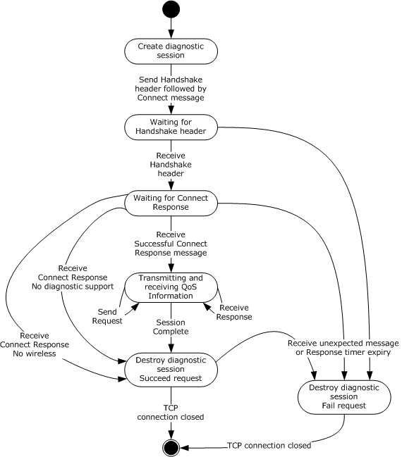
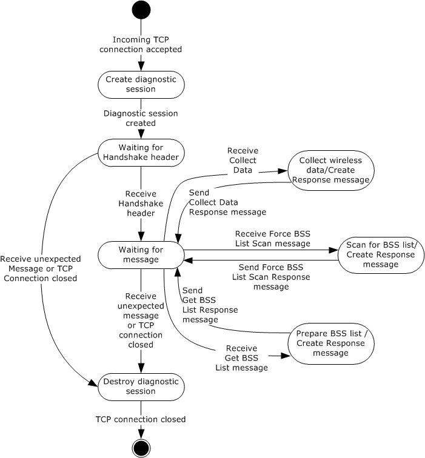
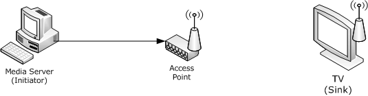
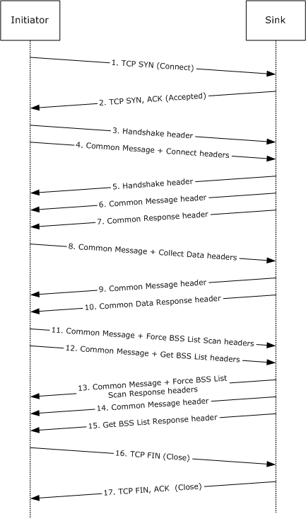
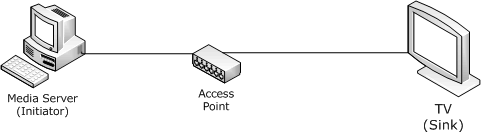
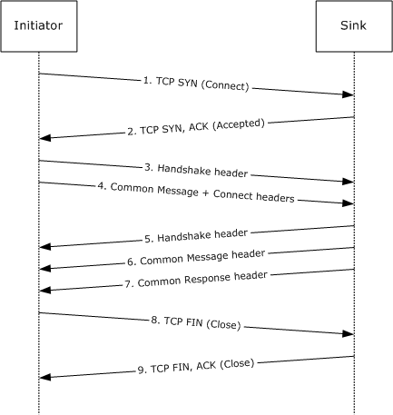

[MS-QDP]:

Quality Windows Audio/Video Experience (qWave):
Wireless Diagnostics Protocol

Intellectual Property Rights Notice for Open Specifications Documentation

  Technical Documentation. Microsoft publishes Open Specifications documentation (“this

documentation”) for protocols, file formats, data portability, computer languages, and standards
support. Additionally, overview documents cover inter-protocol relationships and interactions.

  Copyrights. This documentation is covered by Microsoft copyrights. Regardless of any other

terms that are contained in the terms of use for the Microsoft website that hosts this
documentation, you can make copies of it in order to develop implementations of the technologies
that are described in this documentation and can distribute portions of it in your implementations
that use these technologies or in your documentation as necessary to properly document the
implementation. You can also distribute in your implementation, with or without modification, any
schemas, IDLs, or code samples that are included in the documentation. This permission also
applies to any documents that are referenced in the Open Specifications documentation.
  No Trade Secrets. Microsoft does not claim any trade secret rights in this documentation.
  Patents. Microsoft has patents that might cover your implementations of the technologies

described in the Open Specifications documentation. Neither this notice nor Microsoft's delivery of
this documentation grants any licenses under those patents or any other Microsoft patents.
However, a given Open Specifications document might be covered by the Microsoft Open
Specifications Promise or the Microsoft Community Promise. If you would prefer a written license,
or if the technologies described in this documentation are not covered by the Open Specifications
Promise or Community Promise, as applicable, patent licenses are available by contacting
iplg@microsoft.com.

  License Programs. To see all of the protocols in scope under a specific license program and the

associated patents, visit the Patent Map.

  Trademarks. The names of companies and products contained in this documentation might be
covered by trademarks or similar intellectual property rights. This notice does not grant any
licenses under those rights. For a list of Microsoft trademarks, visit
www.microsoft.com/trademarks.

  Fictitious Names. The example companies, organizations, products, domain names, email

addresses, logos, people, places, and events that are depicted in this documentation are fictitious.
No association with any real company, organization, product, domain name, email address, logo,
person, place, or event is intended or should be inferred.

Reservation of Rights. All other rights are reserved, and this notice does not grant any rights other
than as specifically described above, whether by implication, estoppel, or otherwise.

Tools. The Open Specifications documentation does not require the use of Microsoft programming
tools or programming environments in order for you to develop an implementation. If you have access
to Microsoft programming tools and environments, you are free to take advantage of them. Certain
Open Specifications documents are intended for use in conjunction with publicly available standards
specifications and network programming art and, as such, assume that the reader either is familiar
with the aforementioned material or has immediate access to it.

Support. For questions and support, please contact dochelp@microsoft.com.

[MS-QDP] - v20210625
Quality Windows Audio/Video Experience (qWave): Wireless Diagnostics Protocol
Copyright © 2021 Microsoft Corporation
Release: June 25, 2021

1 / 41

Revision Summary

Date

Revision
History

Revision
Class

Comments

6/4/2010

0.1

Major

First Release.

7/16/2010

0.1

8/27/2010

1.0

10/8/2010

2.0

11/19/2010  3.0

1/7/2011

3.0

2/11/2011

3.0

3/25/2011

3.0

5/6/2011

3.0

None

Major

Major

Major

None

None

None

None

No changes to the meaning, language, or formatting of the
technical content.

Updated and revised the technical content.

Updated and revised the technical content.

Updated and revised the technical content.

No changes to the meaning, language, or formatting of the
technical content.

No changes to the meaning, language, or formatting of the
technical content.

No changes to the meaning, language, or formatting of the
technical content.

No changes to the meaning, language, or formatting of the
technical content.

6/17/2011

3.1

Minor

Clarified the meaning of the technical content.

9/23/2011

3.1

None

No changes to the meaning, language, or formatting of the
technical content.

12/16/2011  4.0

Major

Updated and revised the technical content.

3/30/2012

4.0

None

No changes to the meaning, language, or formatting of the
technical content.

7/12/2012

4.1

Minor

Clarified the meaning of the technical content.

10/25/2012  4.1

1/31/2013

4.1

None

None

No changes to the meaning, language, or formatting of the
technical content.

No changes to the meaning, language, or formatting of the
technical content.

8/8/2013

5.0

Major

Updated and revised the technical content.

11/14/2013  5.0

2/13/2014

5.0

5/15/2014

5.0

None

None

None

No changes to the meaning, language, or formatting of the
technical content.

No changes to the meaning, language, or formatting of the
technical content.

No changes to the meaning, language, or formatting of the
technical content.

6/30/2015

6.0

Major

Significantly changed the technical content.

10/16/2015  6.0

7/14/2016

6.0

None

None

No changes to the meaning, language, or formatting of the
technical content.

No changes to the meaning, language, or formatting of the
technical content.

[MS-QDP] - v20210625
Quality Windows Audio/Video Experience (qWave): Wireless Diagnostics Protocol
Copyright © 2021 Microsoft Corporation
Release: June 25, 2021

2 / 41

Date

Revision
History

Revision
Class

Comments

6/1/2017

6.0

None

No changes to the meaning, language, or formatting of the
technical content.

6/25/2021

7.0

Major

Significantly changed the technical content.

[MS-QDP] - v20210625
Quality Windows Audio/Video Experience (qWave): Wireless Diagnostics Protocol
Copyright © 2021 Microsoft Corporation
Release: June 25, 2021

3 / 41

Table of Contents

1.1
1.2

1.2.1
1.2.2

1  Introduction ............................................................................................................ 6
Glossary ........................................................................................................... 6
References ........................................................................................................ 7
Normative References ................................................................................... 8
Informative References ................................................................................. 8
Overview .......................................................................................................... 8
Relationship to Other Protocols ............................................................................ 9
Prerequisites/Preconditions ................................................................................. 9
Applicability Statement ....................................................................................... 9
Versioning and Capability Negotiation ................................................................... 9
Vendor-Extensible Fields ..................................................................................... 9
Standards Assignments ....................................................................................... 9

1.3
1.4
1.5
1.6
1.7
1.8
1.9

2.2.2

2.2.1

2.1
2.2

2.2.1.1
2.2.1.2

2.2.2.1
2.2.2.2
2.2.2.3
2.2.2.4

2  Messages ............................................................................................................... 10
Transport ........................................................................................................ 10
Message Syntax ............................................................................................... 10
Message Header Syntax .............................................................................. 10
Handshake Header ................................................................................ 10
Common Message Header ...................................................................... 10
Message-Specific Syntax ............................................................................. 11
Connect Message .................................................................................. 11
Connect Response Message .................................................................... 12
Collect Data Message ............................................................................ 13
Collect Data Response Message .............................................................. 13
RssiSampleDesc Item ...................................................................... 15
LinkSpeedSampleDesc Item .............................................................. 15
RetrySampleDesc Item..................................................................... 16
XmittedFragSampleDesc Item ........................................................... 16
FcsErrorSampleDesc Item ................................................................. 16
RecvdFragSampleDesc Item ............................................................. 16
Force BSS List Scan Message .................................................................. 17
Force BSS List Scan Response Message ................................................... 17
Get BSS List Message ............................................................................ 17
Get BSS List Response Message .............................................................. 17
BssDesc Item .................................................................................. 17

2.2.2.4.1
2.2.2.4.2
2.2.2.4.3
2.2.2.4.4
2.2.2.4.5
2.2.2.4.6

2.2.2.5
2.2.2.6
2.2.2.7
2.2.2.8

2.2.2.8.1

3.1

3.1.5

3.1.4.1

3.1.1
3.1.2
3.1.3
3.1.4

3  Protocol Details ..................................................................................................... 20
Initiator Details ................................................................................................ 20
Abstract Data Model .................................................................................... 21
Timers ...................................................................................................... 21
Initialization ............................................................................................... 22
Higher-Layer Triggered Events ..................................................................... 22
Requesting Diagnostics Data .................................................................. 22
Message Processing Events and Sequencing Rules .......................................... 22
Receiving a Handshake Header ............................................................... 22
Receiving a Connect Response Message ................................................... 23
Receiving a Collect Data Response Message ............................................. 23
Receiving a Force BSS List Scan Response Message .................................. 23
Receiving a Get BSS List Response Message ............................................. 24
Timer Events .............................................................................................. 24
Per-Session Response Timer Expiry ......................................................... 24
Other Local Events ...................................................................................... 24
Sink Details ..................................................................................................... 24
Abstract Data Model .................................................................................... 26
Timers ...................................................................................................... 27

3.1.5.1
3.1.5.2
3.1.5.3
3.1.5.4
3.1.5.5

3.2.1
3.2.2

3.1.6.1

3.1.6

3.1.7

3.2

[MS-QDP] - v20210625
Quality Windows Audio/Video Experience (qWave): Wireless Diagnostics Protocol
Copyright © 2021 Microsoft Corporation
Release: June 25, 2021

4 / 41

3.2.3
3.2.4

3.2.4.1
3.2.4.2

3.2.5

3.2.5.1
3.2.5.2
3.2.5.3
3.2.5.4
3.2.5.5

3.2.6

3.2.6.1

3.2.7

Initialization ............................................................................................... 28
Higher-Layer Triggered Events ..................................................................... 28
Startup Trigger ..................................................................................... 28
Incoming TCP Connection Accepted ......................................................... 28
Message Processing Events and Sequencing Rules .......................................... 28
Receiving a Handshake Header ............................................................... 28
Receiving a Connect Message ................................................................. 28
Receiving a Collect Data Message............................................................ 29
Receiving a Force BSS List Scan Message ................................................. 29
Receiving a Get BSS List Message ........................................................... 30
Timer Events .............................................................................................. 30
Per-Network Interface Object Wireless Statistics Monitor Timer Expiry ......... 30
Other Local Events ...................................................................................... 31

4  Protocol Examples ................................................................................................. 32
Example 1: Querying a Wireless Sink Supporting Runtime Diagnostics .................... 32
Example 2: Querying a Wired Sink ..................................................................... 34

4.1
4.2

5  Security ................................................................................................................. 37
Security Considerations for Implementers ........................................................... 37
Index of Security Parameters ............................................................................ 37

5.1
5.2

6  Appendix A: Product Behavior ............................................................................... 38

7  Change Tracking .................................................................................................... 39

8  Index ..................................................................................................................... 40

[MS-QDP] - v20210625
Quality Windows Audio/Video Experience (qWave): Wireless Diagnostics Protocol
Copyright © 2021 Microsoft Corporation
Release: June 25, 2021

5 / 41

1  Introduction

This is a specification of the Quality Windows Audio/Video Experience (qWave): Wireless Diagnostics
Protocol.

This protocol can be used by an application or higher-layer protocol to facilitate diagnosis of wireless
network issues. It can be used to obtain information about the wireless characteristics of a host or
device, including the channel it is on and whether it registers interference.

Sections 1.5, 1.8, 1.9, 2, and 3 of this specification are normative. All other sections and examples in
this specification are informative.

1.1  Glossary

This document uses the following terms:

access point: A network access server (NAS) that is implementing [IEEE802.11-2012], connecting

wireless devices to form a wireless network.

basic service set (BSS): A collection of devices controlled by a single coordination function that
joined a common IEEE 802.11 wireless network, as defined in [IEEE802.11-2007] section 3.7.

basic service set identifier (BSSID): A 48-bit structure that is used to identify an entity such as

the access point in a wireless network. This is typically a MAC address.

frame check sequence (FCS): The extra sequence of numbers added to a frame in a

communication protocol for the purpose of error detection and correction.

information element (IE): A unit of information transmitted as part of the management frames
in the IEEE 802.11 [IEEE802.11-2012] protocol. Wireless devices, such as access points,
communicate descriptive information about themselves in the form of one or more IEs in their
management frames.

initiator: A device that initiates a qWave-WD or qWave session.

Internet Protocol version 4 (IPv4): An Internet protocol that has 32-bit source and destination

addresses. IPv4 is the predecessor of IPv6.

Internet Protocol version 6 (IPv6): A revised version of the Internet Protocol (IP) designed to
address growth on the Internet. Improvements include a 128-bit IP address size, expanded
routing capabilities, and support for authentication and privacy.

Inter-Process Communication (IPC): A set of techniques used to exchange data among two or

more threads in one or more processes. These processes can also run on one or more
computers connected by a network.

ISO/OSI reference model: The International Organization for Standardization Open

Systems Interconnection (ISO/OSI) reference model is a layered architecture (plan) that
standardizes levels of service and types of interaction for computers that are exchanging
information through a communications network. Also called the OSI reference model.

MAC Management Protocol Data Unit (MMPDU): A term used in the context of the Institute of
Electrical and Electronics Engineers, Inc. (IEEE) 802.11 [IEEE802.11-2007] technologies to
identify a unit of data used for management purposes that is received from the LLC sub-layer.

MAC Protocol Data Unit (MPDU): A term used in the context of IEEE 802.11 [IEEE802.11-2007]

technologies to identify each fragment of an MSDU or MMPDU. MSDUs and MMPDUs are
fragmented to increase the probability of successful transmission.

[MS-QDP] - v20210625
Quality Windows Audio/Video Experience (qWave): Wireless Diagnostics Protocol
Copyright © 2021 Microsoft Corporation
Release: June 25, 2021

6 / 41

MAC Service Data Unit (MSDU): A term used in the context of IEEE 802.11 [IEEE802.11-2007]

technologies to identify a unit of data that is received from the LLC sub-layer.

network byte order: The order in which the bytes of a multiple-byte number are transmitted on a

network, most significant byte first (in big-endian storage). This does not always match the
order in which numbers are normally stored in memory for a particular processor.

network socket: An endpoint of a bidirectional process-to-process communication flow across an
IP based network, such as the Internet. A socket is an interface between an application process
or thread and the TCP/IP protocol stack provided by the operating system.

Quality of Service (QoS): A set of technologies that do network traffic manipulation, such as

packet marking and reshaping.

qWave-WD: The Quality Windows Audio/Video Experience (qWave): Wireless Diagnostics Protocol.

received signal strength indication (RSSI): A measurement of the power present in a received

signal in a wireless network environment. The range of values in a particular network
environment depends on the hardware being used.

service set identifier (SSID): A structure that contains a unique identifier that is used to

differentiate one wireless network from another.

session: A context for managing communication over qWave-WD among devices. This is

equivalent to a TCP connection.

session layer: The fifth layer in the Open Systems Interconnect (OSI) architectural model as

defined by the International Organization for Standardization (ISO). The session layer is used
for establishing a communication session, implementing security, and performing
authentication. The session layer responds to service requests from the presentation layer and
issues service requests to the transport layer.

sink: A device that is the target of a qWave-WDsession.

Transmission Control Protocol (TCP): A protocol used with the Internet Protocol (IP) to send
data in the form of message units between computers over the Internet. TCP handles keeping
track of the individual units of data (called packets) that a message is divided into for efficient
routing through the Internet.

wireless band: An IEEE 802.11 [IEEE802.11-2007] protocol family. For example, 802.11a is a

wireless band.

wireless channel: Each discrete division in a wireless band spectrum.

wireless diagnostics (WD): Information that enables applications to diagnose the state of a
wireless network, including various wireless network-related statistical counters as well as
standard wireless connection parameters.

wireless radio: The method for transmitting and receiving data over the air.

MAY, SHOULD, MUST, SHOULD NOT, MUST NOT: These terms (in all caps) are used as defined
in [RFC2119]. All statements of optional behavior use either MAY, SHOULD, or SHOULD NOT.

1.2  References

Links to a document in the Microsoft Open Specifications library point to the correct section in the
most recently published version of the referenced document. However, because individual documents
in the library are not updated at the same time, the section numbers in the documents may not
match. You can confirm the correct section numbering by checking the Errata.

[MS-QDP] - v20210625
Quality Windows Audio/Video Experience (qWave): Wireless Diagnostics Protocol
Copyright © 2021 Microsoft Corporation
Release: June 25, 2021

7 / 41

1.2.1  Normative References

We conduct frequent surveys of the normative references to assure their continued availability. If you
have any issue with finding a normative reference, please contact dochelp@microsoft.com. We will
assist you in finding the relevant information.

[IANAPORT] IANA, "Service Name and Transport Protocol Port Number Registry",
https://www.iana.org/assignments/service-names-port-numbers/service-names-port-numbers.xhtml

[IEEE802.11-2007] Institute of Electrical and Electronics Engineers, "Telecommunications and
Information Exchange Between Systems - Local and Metropolitan Area Networks - Specific
Requirements - Part 11: Wireless LAN Medium Access Control (MAC) and Physical Layer (PHY)
Specifications", IEEE 802.11-2007, https://standards.ieee.org/ieee/802.11/3605/

Note Subcription Login or purchase to download this document.

[RFC2119] Bradner, S., "Key words for use in RFCs to Indicate Requirement Levels", BCP 14, RFC
2119, March 1997, https://www.rfc-editor.org/info/rfc2119

[RFC2460] Deering, S., and Hinden, R., "Internet Protocol, Version 6 (IPv6) Specification", RFC 2460,
December 1998, https://www.rfc-editor.org/info/rfc2460

[RFC791] Postel, J., Ed., "Internet Protocol: DARPA Internet Program Protocol Specification", RFC 791,
September 1981, https://www.rfc-editor.org/info/rfc791

[RFC793] Postel, J., Ed., "Transmission Control Protocol: DARPA Internet Program Protocol
Specification", RFC 793, September 1981, https://www.rfc-editor.org/info/rfc793

1.2.2  Informative References

[MSDN-QWAVE] Microsoft Corporation, "Quality Windows Audio/Video Experience (qWAVE)",
http://msdn.microsoft.com/en-us/library/aa374110(VS.85).aspx

1.3  Overview

This document specifies the Quality Windows Audio/Video Experience (qWave): Wireless Diagnostics
Protocol (qWave-WD), which operates above the TCP/IP protocol. As the name suggests, the core
functions of the qWave-WD protocol enable applications to diagnose the state of a wireless network by
means of analyzing various wireless network related statistical counters as well as standard wireless
connection parameters.

The application that invokes the initiator role enlists qWave-WD to obtain relevant data from a
remote device that implements the sink role to allow it to make decisions and recommendations that
maximize the quality of the connection between the two devices. For example, by discovering the
characteristics of nearby wireless networks, an application can recommend changing the wireless
channel used to connect an access point, either relative to the initiator device or the sink device,
because it conflicts with that used by nearby wireless networks.

Note  The qWave-WD protocol does not attempt to define the mechanism that enables retrieval of
data from the initiator device itself; this is left up to the application. For example, an application can
implement the equivalent of the sink role on the initiator device and utilize a standard Inter-Process
Communication (IPC) mechanism to retrieve that data.

The qWave-WD protocol offers two classes of wireless diagnostics (WD) information:

  Static diagnostics: This involves taking a snapshot of connection parameters and then running a
series of algorithms on that data alone to derive interpretations. The term "static" implies that the
protocol expects that the parameters exposed are not likely to change during the lifetime of a
wireless network connection.

8 / 41

[MS-QDP] - v20210625
Quality Windows Audio/Video Experience (qWave): Wireless Diagnostics Protocol
Copyright © 2021 Microsoft Corporation
Release: June 25, 2021

  Runtime diagnostics: This involves the collection of statistical data over a period of time, usually

over the lifetime of a network connection, and problems are identified as they happen. Sink
devices that support runtime diagnostics are required to maintain a rolling history of statistical
counters over the lifetime of its wireless network connection. Due to the potential resource cost of
implementing this, support for runtime diagnostics is optional.

1.4  Relationship to Other Protocols

The qWave-WD protocol operates directly over the TCP/IP protocol, and is a stand-alone protocol. It
is designed to complement services like Quality of Service (QoS), revolving around the streaming of
multimedia and real-time content over variable bandwidth networks. For additional information see
[MSDN-QWAVE].

1.5  Prerequisites/Preconditions

None.

1.6  Applicability Statement

The qWave-WD protocol operates in the session layer of the ISO/OSI reference model. This
protocol is relevant only if it is operated between devices connected through the 802.11 [IEEE802.11-
2007] media.

The actual process of discovering eligible participants is not specified by this protocol.

1.7  Versioning and Capability Negotiation

This specification covers versioning issues in the following areas:

  Supported Transports: The qWave-WD protocol is implemented on top of TCP (2.1).

  Protocol Versions: Messages specified by this protocol include a version number for extensibility.

The current version is 3.

  Security and Authentication Methods: This protocol requires no authentication.

  Localization: This protocol has no locale-specific definitions or dependencies.

  Capability Negotiation: This protocol does not support capability negotiation.

1.8  Vendor-Extensible Fields

None.

1.9  Standards Assignments

The following standards are applied to the qWave-WD protocol.

Parameter   Value   Reference

TCP port

2177

[IANAPORT]

[MS-QDP] - v20210625
Quality Windows Audio/Video Experience (qWave): Wireless Diagnostics Protocol
Copyright © 2021 Microsoft Corporation
Release: June 25, 2021

9 / 41

2  Messages

2.1  Transport

qWave-WD messages MUST be transported over TCP [RFC793] port 2177 over either IPv4
[RFC791] or IPv6 [RFC2460].

2.2  Message Syntax

Unless otherwise specified, all multi-byte integer fields are in network byte order.

2.2.1  Message Header Syntax

All messages of the qWave-WD protocol MUST use and accept one of the following message header
formats:

  Handshake Header (section 2.2.1.1)

  Message Header (section 2.2.1.2)

2.2.1.1  Handshake Header

Handshake headers MUST be exchanged between the initiator and sink devices as part of
establishing a qWave-WD session.

0  1  2  3  4  5  6  7  8  9

1
0  1  2  3  4  5  6  7  8  9

2
0  1  2  3  4  5  6  7  8  9

3
0  1

Proto_ID

Reserved_1

Reserved_2

Version

Proto_ID (1 byte): An 8-bit unsigned integer that identifies the protocol. It MUST be 0x96.

Reserved_1 (1 byte): A value that MUST be zero and MUST be ignored on receipt.

Reserved_2 (1 byte): A value that MUST be zero and MUST be ignored on receipt.

Version (1 byte): An 8-bit unsigned integer that identifies the protocol version. It MUST be 0x03.

2.2.1.2  Common Message Header

A common message header MUST be present in every message after a qWave-WD session has
been established. Each message header contains a common header optionally followed by a
message-specific header.

0  1  2  3  4  5  6  7  8  9

1
0  1  2  3  4  5  6  7  8  9

2
0  1  2  3  4  5  6  7  8  9

3
0  1

Message_Size

Reserved

Message_ID

Reserved_2

Message_Specific_Header (variable)

[MS-QDP] - v20210625
Quality Windows Audio/Video Experience (qWave): Wireless Diagnostics Protocol
Copyright © 2021 Microsoft Corporation
Release: June 25, 2021

10 / 41

...

Message_Size (2 bytes): A 16-bit unsigned integer that specifies the size of the message. This

value includes the size of this header and the payload that follows.

Message_ID (2 bytes):  A 16-bit unsigned integer that specifies the type of message, which defines

the form of the payload that follows. The value of this field MUST be one of the following.

Value  Meaning

0x0009  Connect Message (section 2.2.2.1)

0x000A  Connect Response Message (section 2.2.2.2)

0x000B  Collect Data Message (section 2.2.2.3)

0x000C  Collect Data Response Message (section 2.2.2.4)

0x000D  Force BSS List Scan Message (section 2.2.2.5)

0x000E

Force BSS List Scan Response Message (section 2.2.2.6)

0x000F  Get BSS List Message (section 2.2.2.7)

0x0010  Get BSS List Response Message (section 2.2.2.8)

Reserved (2 bytes): A value that MUST be zero and ignored on receipt.

Reserved_2 (2 bytes): A value that MUST be zero and ignored on receipt.

Message_Specific_Header (variable): An optional message-specific header that corresponds to the
message type identified in the Message_ID field. The formats for message-specific headers for all
message types are defined in Message-Specific Syntax (section 2.2.2).

2.2.2  Message-Specific Syntax

All messages of the qWave-WD protocol MUST conform to the following message-specific formats:

  Connect Message (section 2.2.2.1)

  Connect Response Message (section 2.2.2.2)

  Collect Data Message (section 2.2.2.3)

  Collect Data Response Message (section 2.2.2.4)





Force BSS List Scan Message (section 2.2.2.5)

Force BSS List Scan Response Message (section 2.2.2.6)

  Get BSS List Message (section 2.2.2.7)

  Get BSS List Response Message (section 2.2.2.8)

2.2.2.1  Connect Message

An initiator device MUST send a connect message to request the profile of a target sink device.
This message MUST follow a successful session handshake.

[MS-QDP] - v20210625
Quality Windows Audio/Video Experience (qWave): Wireless Diagnostics Protocol
Copyright © 2021 Microsoft Corporation
Release: June 25, 2021

11 / 41

The connect message has no message-specific header following the Common Message
Header (section 2.2.1.2).

2.2.2.2  Connect Response Message

A sink device MUST send a connect response message in reply to a Connect
Message (section 2.2.2.1).

The Connect Response message MUST contain the following message-specific header following the
Common Message Header (section 2.2.1.2).

0  1  2  3  4  5  6  7  8  9

1
0  1  2  3  4  5  6  7  8  9

2
0  1  2  3  4  5  6  7  8  9

3
0  1

Diag_Support_Level

Reserved_1

BSSID

W

...

Reserved_2

SSID_Length

SSID (variable)

...

BSS_Type

Phy_Type

Channel

Reserved_3

Diag_Support_Level (4 bytes): A 32-bit unsigned integer that specifies the level of diagnostics

support that the sink device offers. This value MUST be one of the following.

Value

Meaning

0x00000000  No diagnostics support.

0x00000001  The sink device supports static diagnostics (section 1.3).

0x00000002  The sink device supports both static and runtime diagnostics (section 1.3).

Reserved_1 (31 bits): A value that MUST be zero and MUST be ignored on receipt.

W (1 bit): A flag that indicates whether the sink device is connected to a wireless network.

BSSID (6 bytes): The basic service set identifier (BSSID) of the wireless network to which the

sink is joined. If the device is not connected wirelessly, this structure MUST be zero.

Reserved_2 (2 bytes): A value that MUST be zero and MUST be ignored on receipt.

[MS-QDP] - v20210625
Quality Windows Audio/Video Experience (qWave): Wireless Diagnostics Protocol
Copyright © 2021 Microsoft Corporation
Release: June 25, 2021

12 / 41

SSID_Length (4 bytes): A 32-bit unsigned integer that specifies the length in octets of the SSID

field. If the device is not connected wirelessly, this value MUST be zero. Otherwise, this value
MUST be greater than zero and less than or equal to 0x00000020.

SSID (variable): The SSID of the basic service set (BSS) with which the wireless network

interface of the sink device is currently associated. The maximum length of this field is 32 octets.

BSS_Type (4 bytes): A 32-bit unsigned integer that specifies the method by which a sink device's
wireless network interface connects to the network. This value MUST be one of the following.

Value

Meaning

0x00000000  Unknown mode or device not connected wirelessly.

0x00000001  802.11 infrastructure mode [IEEE802.11-2007].

0x00000002  802.11 IBSS or ad-hoc mode [IEEE802.11-2007].

Phy_Type (4 bytes): A 32-bit unsigned integer that specifies the wireless band that the wireless
network interface of a sink device is using to connect to the network. This value MUST be one of
the following.

Value

Meaning

0x00000000  Unknown wireless band or device not connected wirelessly.

0x00000001  802.11b [IEEE802.11-2007]

0x00000002  802.11g [IEEE802.11-2007]

0x00000003  802.11a [IEEE802.11-2007]

Channel (1 byte): The wireless channel used by a sink device's wireless network interface when

connected to the access point. If the device is not connected wirelessly, this value MUST be zero.

Reserved_3 (3 bytes): A value that MUST be zero and MUST be ignored on receipt.

2.2.2.3  Collect Data Message

An initiator device sends a collect data message to request diagnostic data pertaining to the
wireless network to which the sink device is connected. The initiator device MAY<1> send this
message even if the sink does not report support for runtime diagnostics as indicated by the
Diag_Support_Level field in section 2.2.2.2.

The collect data message has no message-specific header following the Common Message
Header (section 2.2.1.2).

2.2.2.4  Collect Data Response Message

A sink device sends a collect data response message in reply to a Collect Data
Message (section 2.2.2.3). The sink device SHOULD send the response even if it is not connected to a
wireless network.

The collect data response message MUST contain the following message-specific header following
the Common Message Header (section 2.2.1.2).

[MS-QDP] - v20210625
Quality Windows Audio/Video Experience (qWave): Wireless Diagnostics Protocol
Copyright © 2021 Microsoft Corporation
Release: June 25, 2021

13 / 41

0  1  2  3  4  5  6  7  8  9

1
0  1  2  3  4  5  6  7  8  9

2
0  1  2  3  4  5  6  7  8  9

3
0  1

Reserved

C  L

History_Length

Sample_Index

Recv_Error_Average

Send_Error_Average

Recv_Error_Variance

Send_Error_Variance

RssiSampleDescs (variable)

LinkSpeedSampleDescs (variable)

RetrySampleDescs (variable)

XmittedFragSampleDescs (variable)

FcsErrorSampleDescs (variable)

RecvdFragSampleDescs (variable)

Reserved (14 bits): A field that MUST be zero and ignored on receipt.

C (1 bit): A flag that indicates whether network congestion was detected.

If set, network congestion was detected at the time the information sent in this message was
collected. How network congestion is detected is implementation-specific. A sink device MAY
choose to not implement network congestion detection, in which case it MUST clear this bit.

The protocol does not distinguish between a sink that has not detected network congestion and
one that does not implement network congestion detection.

Network congestion in this case is defined as the state where a link or node is servicing more data
than it was designed to handle, thereby reducing the quality of its service. This reduction will
persist for as long as the data rate remains higher than supported.

L (1 bit): If set, the network interface on the sink device is capable of reporting link speed changes.

History_Length (2 bytes): A 16-bit unsigned integer that specifies the count of sample entries in

each RssiSampleDescs, LinkSpeedSampleDescs, RetrySampleDescs,
XmittedFragSampleDescs, FcsErrorSampleDescs, or RecvdFragSampleDescs field that is
included as part of the message. This count MUST NOT exceed 120 entries. This field MUST be
zero if the sink does not support runtime diagnostics.

Sample_Index (4 bytes): A 32-bit unsigned integer that specifies the total count of sample entries

that have been collected by the sink device to date.

[MS-QDP] - v20210625
Quality Windows Audio/Video Experience (qWave): Wireless Diagnostics Protocol
Copyright © 2021 Microsoft Corporation
Release: June 25, 2021

14 / 41

Recv_Error_Average (4 bytes): A 32-bit unsigned integer that identifies the average of the most
recent 100 samples of Retry_Delta_Value (section 2.2.2.4.3) / Xmitted_Frag_Delta_Value
(section 2.2.2.4.4), expressed as 0.000001 units. More information is available in section 3.2.

Send_Error_Average (4 bytes): A 32-bit unsigned integer that identifies the average of the most

recent 100 samples of Fcs_Error_Delta_Value (section 2.2.2.4.5) / Recvd_Frag_Delta_Value
(section 2.2.2.4.6), expressed as 0.000001 units. More information is available in section 3.2.

Recv_Error_Variance (4 bytes): A 32-bit unsigned integer that identifies the variance in the most

recent 100 samples of Retry_Delta_Value (section 2.2.2.4.3) / Xmitted_Frag_Delta_Value
(section 2.2.2.4.4), expressed as 0.000001 units. More information is available in section 3.2.

Send_Error_Variance (4 bytes): A 32-bit unsigned integer that identifies the variance in the most

recent 100 samples of Fcs_Error_Delta_Value (section 2.2.2.4.5) / Recvd_Frag_Delta_Value
(section 2.2.2.4.6), expressed as 0.000001 units. More information is available in section 3.2.

RssiSampleDescs (variable): A list of RssiSampleDesc items (section 2.2.2.4.1). The ordering of

RssiSampleDesc items in this message MUST represent the actual recording time order, going
from oldest to latest. The count of RssiSampleDesc items is equal to the value of
History_Length.

LinkSpeedSampleDescs (variable): A list of LinkSpeedSampleDesc items (section 2.2.2.4.2). The

ordering of LinkSpeedSampleDesc items in this message MUST represent the actual recording time
order, going from oldest to latest. The count of LinkSpeedSampleDesc items is equal to the value
of History_Length.

RetrySampleDescs (variable): A list of RetrySampleDesc items (section 2.2.2.4.3). The ordering of
RetrySampleDesc items in this message MUST represent the actual recording time order, going
from oldest to latest. The count of RetrySampleDesc items is equal to the value of
History_Length.

XmittedFragSampleDescs (variable): A list of XmittedFragSampleDesc items (section 2.2.2.4.4).

The ordering of XmittedFragSampleDesc items in this message MUST represent the actual
recording time order, going from oldest to latest. The count of XmittedFragSampleDesc items is
equal to the value of History_Length.

FcsErrorSampleDescs (variable): A list of FcsErrorSampleDesc items (section 2.2.2.4.5). The

ordering of FcsErrorSampleDesc items in this message MUST represent the actual recording time
order, going from oldest to latest. The count of FcsErrorSampleDesc items is equal to the value of
History_Length.

RecvdFragSampleDescs (variable): A list of RecvdFragSampleDesc items (section 2.2.2.4.6). The
ordering of RecvdFragSampleDesc items in this message MUST represent the actual recording
time order, going from oldest to latest. The count of RecvdFragSampleDesc items is equal to the
value of History_Length.

2.2.2.4.1 RssiSampleDesc Item

Each RssiSampleDesc item MUST have the following 4-octet structure.

0  1  2  3  4  5  6  7  8  9

1
0  1  2  3  4  5  6  7  8  9

2
0  1  2  3  4  5  6  7  8  9

3
0  1

Rssi_Value

Rssi_Value (4 bytes): A 32-bit signed integer that identifies the recorded received signal strength

indication (RSSI) of the IEEE 802.11 [IEEE802.11-2007] network interface at a specific point in
time, in dBm. The normal range for an RSSI value is -10 dBm through -200 dBm.

[MS-QDP] - v20210625
Quality Windows Audio/Video Experience (qWave): Wireless Diagnostics Protocol
Copyright © 2021 Microsoft Corporation
Release: June 25, 2021

15 / 41

2.2.2.4.2 LinkSpeedSampleDesc Item

Each LinkSpeedSampleDesc item MUST have the following 4-octet structure.

0  1  2  3  4  5  6  7  8  9

1
0  1  2  3  4  5  6  7  8  9

2
0  1  2  3  4  5  6  7  8  9

3
0  1

Link_Speed_Value

Link_Speed_Value (4 bytes): A 32-bit unsigned integer that identifies the recorded link speed of

the network interface at a specific point in time. This is measured in bits per second.

2.2.2.4.3 RetrySampleDesc Item

 Each RetrySampleDesc item MUST have the following 4-octet structure.

0  1  2  3  4  5  6  7  8  9

1
0  1  2  3  4  5  6  7  8  9

2
0  1  2  3  4  5  6  7  8  9

3
0  1

Retry_Delta_Value

Retry_Delta_Value (4 bytes): A 32-bit unsigned integer that identifies the recorded change

between two successive samples in the number of MSDU/MMPDUs successfully transmitted after
one or more retransmissions for the IEEE 802.11 [IEEE802.11-2007] network interface at a
specific point in time.

2.2.2.4.4 XmittedFragSampleDesc Item

Each XmittedFragSampleDesc item MUST have the following 4-octet structure.

0  1  2  3  4  5  6  7  8  9

1
0  1  2  3  4  5  6  7  8  9

2
0  1  2  3  4  5  6  7  8  9

3
0  1

Xmitted_Frag_Delta_Value

Xmitted_Frag_Delta_Value (4 bytes): A 32-bit unsigned integer that identifies the recorded

change (between two successive samples) in the "number of MPDUs with an individual address in
the address 1 field and MPDUs that have a multicast address with types Data or Management" for
the IEEE 802.11 [IEEE802.11-2007] network interface at a specific point in time.

2.2.2.4.5 FcsErrorSampleDesc Item

Each FcsErrorSampleDesc item MUST have the following 4-octet structure.

0  1  2  3  4  5  6  7  8  9

1
0  1  2  3  4  5  6  7  8  9

2
0  1  2  3  4  5  6  7  8  9

3
0  1

Fcs_Error_Delta_Value

Fcs_Error_Delta_Value (4 bytes): A 32-bit unsigned integer that identifies the recorded change

(between two successive samples) in the "number of times a frame check sequence (FCS) error
has been detected in a received MPDU" for the IEEE 802.11 [IEEE802.11-2007] network interface
at a specific point in time.

2.2.2.4.6 RecvdFragSampleDesc Item

[MS-QDP] - v20210625
Quality Windows Audio/Video Experience (qWave): Wireless Diagnostics Protocol
Copyright © 2021 Microsoft Corporation
Release: June 25, 2021

16 / 41

Each RecvdFragSampleDesc item MUST have the following 4-octet structure.

0  1  2  3  4  5  6  7  8  9

1
0  1  2  3  4  5  6  7  8  9

2
0  1  2  3  4  5  6  7  8  9

3
0  1

Recvd_Frag_Delta_Value

Recvd_Frag_Delta_Value (4 bytes): A 32-bit unsigned integer that identifies the recorded change

(between two successive samples) in the "number of successfully received Data or Management
MPDUs" for the IEEE 802.11 [IEEE802.11-2007] network interface at a specific point in time.

2.2.2.5  Force BSS List Scan Message

An initiator device MUST send a force BSS list scan message to request that the sink update its list
of BSS entries.

The force BSS list scan message has no message-specific header following the Common Message
Header (section 2.2.1.2).

2.2.2.6  Force BSS List Scan Response Message

A sink device sends a force BSS list scan response message in reply to a Force BSS List Scan
Message (section 2.2.2.5). The sink device SHOULD send the response even if it is not connected to a
wireless network.

The Force BSS List Scan message has no message-specific header following the Common Message
Header (section 2.2.1.2).

2.2.2.7  Get BSS List Message

An initiator device MUST send a get BSS list message to request a list of BSS information from a
sink device. The sink device SHOULD send the response even if it is not connected to a wireless
network.

The Get BSS List message has no message-specific header following the Common Message
Header (section 2.2.1.2).

2.2.2.8  Get BSS List Response Message

A sink device sends a get BSS list response message in reply to a Get BSS List
Message (section 2.2.2.7).

The get BSS list response message MUST contain the following message-specific header following
the Common Message Header (section 2.2.1.2).

0  1  2  3  4  5  6  7  8  9

1
0  1  2  3  4  5  6  7  8  9

2
0  1  2  3  4  5  6  7  8  9

3
0  1

BssDescs (variable)

BssDescs (variable): A list of BssDesc (section 2.2.2.8.1) items. Each BssDesc item describes the
characteristics of a BSS that are visible at the sink device. Note that any two BssDesc items do
not have to be of the same size.

2.2.2.8.1 BssDesc Item

[MS-QDP] - v20210625
Quality Windows Audio/Video Experience (qWave): Wireless Diagnostics Protocol
Copyright © 2021 Microsoft Corporation
Release: June 25, 2021

17 / 41

Each BssDesc item has the following packet format.

0  1  2  3  4  5  6  7  8  9

1
0  1  2  3  4  5  6  7  8  9

2
0  1  2  3  4  5  6  7  8  9

3
0  1

Length

BSSID

...

Channel

Reserved

Frequency

SSID_Length

SSID (variable)

...

RSSI

BSS_Type

Phy_Type

IE_Length

IE_Data (variable)

...

Padding (variable)

Length (4 bytes): A 32-bit unsigned integer that specifies the size of this BssDesc item. This value

MUST be a multiple of 4.

BSSID (6 bytes): The BSSID of the wireless network to which this BssDesc item refers.

Channel (1 byte): The channel used by the wireless network.

Reserved (1 byte): A value that MUST be zero and MUST be ignored on receipt.

Frequency (4 bytes): The frequency of the center channel for the wireless network, in kilohertz

(kHz) units.

SSID_Length (4 bytes): A 32-bit unsigned integer that specifies the length in octets of the SSID

field. This value MUST be greater than zero and less than or equal to0x00000020.

SSID (variable): The SSID of the BSS of the wireless network. The maximum length of this field is

32 octets.

RSSI (4 bytes): A 32-bit signed integer that identifies the RSSI of the IEEE 802.11 network

[IEEE802.11-2007], in dBm. The normal range for an RSSI value is -10 dBm through -200 dBm.

BSS_Type (4 bytes): A 32-bit unsigned integer that specifies the wireless network connection

method.

[MS-QDP] - v20210625
Quality Windows Audio/Video Experience (qWave): Wireless Diagnostics Protocol
Copyright © 2021 Microsoft Corporation
Release: June 25, 2021

18 / 41

Value

Meaning

0x00000000  Unknown mode.

0x00000001  802.11 infrastructure mode [IEEE802.11-2007].

0x00000002  802.11 IBSS or ad-hoc mode [IEEE802.11-2007].

Phy_Type (4 bytes): A 32-bit unsigned integer that specifies the wireless band used by the wireless

network. Possible values are shown in the following table:

Value

Meaning

0x00000000  Unknown wireless band.

0x00000001  802.11b [IEEE802.11-2007]

0x00000002  802.11g [IEEE802.11-2007]

0x00000003  802.11a [IEEE802.11-2007]

IE_Length (4 bytes): A 32-bit unsigned integer that identifies the size in octets of the IE_Data

field.

IE_Data (variable): The 802.11 Information Elements data blob associated with the wireless

network [IEEE802.11-2007].

Padding (variable): An optional field that, if exists, MUST be zero and MUST be ignored on receipt.
The size of the field can be anywhere from 0 through 3 bytes. It exists to satisfy the requirement
of the Length field.

[MS-QDP] - v20210625
Quality Windows Audio/Video Experience (qWave): Wireless Diagnostics Protocol
Copyright © 2021 Microsoft Corporation
Release: June 25, 2021

19 / 41

<!-- Extracted images from page 20 -->

<!-- /Extracted images from page 20 -->

3  Protocol Details

In qWave-WD, a device MAY<2> take on the role of the initiator or the sink. An application that is
interested in enlisting the services of the qWave-WD Protocol invokes the role of the initiator. The
initiator needs to know the target device (the sink) that it needs to query. The actual process of
discovering the appropriate sink device is beyond the scope of the protocol and is left up to the
application.

3.1  Initiator Details

The following figure represents the state machine for the initiator role.

Figure 1: State machine for initiator role

[MS-QDP] - v20210625
Quality Windows Audio/Video Experience (qWave): Wireless Diagnostics Protocol
Copyright © 2021 Microsoft Corporation
Release: June 25, 2021

20 / 41

Applicable message request/response pairs for this role are defined as follows:

 Sent by initiator

 Sent by sink

Handshake Header (section 2.2.1.1)

Handshake Header (section 2.2.1.1)

Connect Message (section 2.2.2.1)

Connect Response Message (section 2.2.2.2)

Collect Data Message (section 2.2.2.3)

Collect Data Response Message (section 2.2.2.4)

Force BSS List Scan Message (section 2.2.2.5)  Force BSS List Scan Response Message (section 2.2.2.6)

Get BSS List Message (section 2.2.2.7)

Get BSS List Response Message (section 2.2.2.8)

If the Connect Response, Force BSS List Scan Response, or Get BSS List Response messages are
directed at a sink that is not connected to a wireless network, the sink SHOULD still send a response.

3.1.1  Abstract Data Model

This section describes a conceptual model of possible data organization that an implementation
maintains to participate in this protocol. The described organization is provided to facilitate the
explanation of how the protocol behaves. This document does not mandate that implementations
adhere to this model as long as their external behavior is consistent with that described in this
document.

The data elements required in typical sink implementations are:

  Diagnostic Session: Each Diagnostic Session stores the qWave-WD related states that are

relevant to a specific TCP connection that is accepted from an initiator device and MUST have the
following fields:

  Handshaking: This Boolean field identifies that the initiator is still handshaking with the sink

and thus is not prepared to accept certain messages.

  Pended Request: A request for which a corresponding response is expected. A pended

request is uniquely identified by its message type (the Message_Id field) in the Common
Message Header (section 2.2.1.2). The value in this field is only valid if the Diagnostic
Session's State field is set to Pending.

  Socket: Identifies the network socket object used to connect to the sink device. Every

message received from the network is correlated back to a Diagnostic Session using this
object.

  Connect Response Cache: Caches all the information contained in a Connect Response

Message (section 2.2.2.2).

  Collect Data Response Cache: Caches all the information contained in a Collect Data

Response Message (section 2.2.2.4)

  BSS List Response Cache: Caches all the BssDescs information contained in a Get BSS List

Response Message (section 2.2.2.8).

Note  The previous conceptual data can be implemented by using a variety of techniques. An
implementation is at liberty to implement such data in any way.

3.1.2  Timers

The initiator role has one timer:

[MS-QDP] - v20210625
Quality Windows Audio/Video Experience (qWave): Wireless Diagnostics Protocol
Copyright © 2021 Microsoft Corporation
Release: June 25, 2021

21 / 41

Per-Session Response timer: This one-shot timer, per Diagnostic Session entry, is used to
ensure timely response to a Handshake Header (section 2.2.1.1), Connect Message (section 2.2.2.1),
Collect Data Message (section 2.2.2.3), Force BSS List Scan Message (section 2.2.2.5), or Get BSS
List Message (section 2.2.2.7). This process works because only one such request can be pended per
session.

3.1.3  Initialization

None.

3.1.4  Higher-Layer Triggered Events

3.1.4.1  Requesting Diagnostics Data

When a higher-layer application or protocol requests diagnostics information from a sink identified by
name or IP address, the initiator MUST use the following procedure:

1.  The initiator MUST attempt to instantiate a Diagnostic Session. If the session cannot be

instantiated, the initiator MUST fail the request.

2.  The per-session Handshaking field MUST be set.

3.  A socket MUST be instantiated and an attempt MUST be made to connect to the sink device

indicated by the higher-layer application or protocol, on TCP port 2177. If this connection fails,
then the initiator MUST tear down the session and return failure of the request to the calling
layer.

Once a TCP connection is established to the sink, the initiator MUST send a Handshake
Header (section 2.2.1.1). It MAY<3> also send a Connect Message (section 2.2.2.1) immediately
following this. The Per-Session Response timer MUST be enabled and set to expire after 5
seconds.

The initiator now waits for a message to arrive in order to continue processing the request. The
request can only be completed when processing a message that has arrived or when the Response
timer has timed out.

Note  When this request is completed successfully, the contents of the Connect Response Cache,
Collect Data Response Cache, and BSS List Response Cache fields are also returned to the caller.

3.1.5  Message Processing Events and Sequencing Rules

3.1.5.1  Receiving a Handshake Header

1.  When a Handshake Header (section 2.2.1.1) arrives through a per-session Socket, the initiator
checks the Handshaking field. If it is not set, the initiator MUST tear down the Diagnostic
Session and return failure of the request to the calling layer.

Otherwise, the initiator checks that the fields of the Handshake Header are valid. If not, the
initiator MUST tear down the Diagnostic Session and return failure of the request to the calling
layer.

2.  The per-session Handshaking field MUST be cleared and the Pended Request MUST be set to

Connect (value 0x0009). The Per-Session Response timer MUST not be reset. The initiator now
waits for the Connect Response Message (section 2.2.2.2) to arrive before it can continue
processing.

[MS-QDP] - v20210625
Quality Windows Audio/Video Experience (qWave): Wireless Diagnostics Protocol
Copyright © 2021 Microsoft Corporation
Release: June 25, 2021

22 / 41

3.1.5.2  Receiving a Connect Response Message

1.  When a Connect Response Message (section 2.2.2.2) arrives through a per-session Socket, the
initiator checks if the Common Message Header (section 2.2.1.2) is valid. If not, the initiator
MUST tear down the Diagnostic Session and return failure of the request to the calling layer.

2.  Next, the initiator checks the state of the per-session Handshaking field. If it is set, the initiator
MUST tear down the Diagnostic Session and return failure of the request to the calling layer.

3.  Next, the initiator checks that the Pended Request is set to Connect. If not, the initiator MUST

tear down the Diagnostic Session and return failure of the request to the calling layer.

4.  The Per-Session Response timer MUST then be reset. The information returned in the Connect

Response Message-specific header MUST be copied into the per-session Connect Response
Cache field.

5.  If the W bit in the Connect Response Message-specific header is cleared, then the initiator MUST

tear down the Diagnostic Session and return success of the request to the calling layer.

6.  If the Diag_Support_Level field in the Connect Response Message-specific header is neither
0x00000001 nor 0x00000002, then the initiator MUST tear down the Diagnostic Session and
return success of the request to the calling layer. Otherwise, the Pended Request MUST be set to
Collect Data (value 0x000B). The initiator MUST send a Collect Data Message (section 2.2.2.3) to
the sink. The Per-Session Response timer MUST be enabled and set to expire after 5 seconds.

7.  The initiator then waits for a message to arrive in order to continue processing.

3.1.5.3  Receiving a Collect Data Response Message

1.  When a Collect Data Response Message (section 2.2.2.4) arrives through a per-session Socket,

the initiator checks if the Common Message Header (section 2.2.1.2) is valid. If not, the initiator
MUST tear down the Diagnostic Session and return failure of the request to the calling layer.

2.  The initiator checks the state of the Handshaking field. If it is set, the initiator MUST tear down

the Diagnostic Session and return failure of the request to the calling layer.

3.  The initiator checks that the Pended Request is set to Collect Data (value 0x000C). If not, the
initiator MUST tear down the Diagnostic session and return failure of the request to the calling
layer.

4.  The Per-Session Response timer MUST now be reset. The information returned in the Collect Data
Response Message-specific header MUST be copied into the per-session Collect Data Response
Cache field.

5.  The Pended Request MUST be set to Force BSS List Scan (value 0x000D). The initiator MUST

send a Force BSS List Scan Message (section 2.2.2.5) to the sink. It MAY<4> also send a Get BSS
List Message (section 2.2.2.7) immediately following this to the same sink. The Per-Session
Response timer MUST be enabled and set to expire after 5 seconds.

6.  The initiator now waits for a message to arrive in order to continue processing.

3.1.5.4  Receiving a Force BSS List Scan Response Message

1.  When a Force BSS List Scan Response Message (section 2.2.2.6) arrives through a per-session
Socket, the initiator checks if the Common Message Header (section 2.2.1.2) is valid. If not,
initiator MUST tear down the Diagnostic Session and return failure of the request to the calling
layer.

[MS-QDP] - v20210625
Quality Windows Audio/Video Experience (qWave): Wireless Diagnostics Protocol
Copyright © 2021 Microsoft Corporation
Release: June 25, 2021

23 / 41

2.  The initiator checks the state of the Handshaking field. If it is set, the initiator MUST tear down

the Diagnostic Session and return failure of the request to the calling layer.

3.  The initiator checks that the Pended Request is set to Force BSS List Scan (value 0x000E). If

not, the initiator MUST tear down the Diagnostic Session and return failure of the request to the
calling layer.

4.

 The Pended Request MUST be set to Get BSS List (value 0x000F). The Per-Session Response
timer MUST not be reset. The initiator now waits for the Get BSS List Response
Message (section 2.2.2.8) to arrive before it can continue processing.

3.1.5.5  Receiving a Get BSS List Response Message

1.  When a Get BSS List Response Message (section 2.2.2.8) arrives through a per-session Socket,
the initiator checks whether the Common Message Header (section 2.2.1.2) is valid. If not, the
initiator MUST tear down the Diagnostic Session and return failure of the request to the calling
layer.

2.  The initiator checks the state of the Handshaking field. If it is set, the initiator MUST tear down

the Diagnostic Session and return failure of the request to the calling layer.

3.  The initiator checks that the Pended Request is set to Get BSS List (value 0x000F). If there is no

match, the initiator MUST tear down the Diagnostic session and return failure of the request to
the calling layer.

4.  The Per-Session Response timer MUST then be reset. The BssDescs (2.2.2.8.1) information
returned in the Get BSS List Response Message-specific header MUST be copied into the per-
session BSS List Response Cache. The initiator MUST tear down the Diagnostic Session and
return success of the request to the calling layer.

3.1.6  Timer Events

3.1.6.1  Per-Session Response Timer Expiry

When this timer starts, the initiator MUST tear down the Diagnostic Session and return failure of
the request to the calling layer.

3.1.7  Other Local Events

None.

3.2  Sink Details

The following figure represents the state machine for the sink role.

[MS-QDP] - v20210625
Quality Windows Audio/Video Experience (qWave): Wireless Diagnostics Protocol
Copyright © 2021 Microsoft Corporation
Release: June 25, 2021

24 / 41

<!-- Extracted images from page 25 -->

<!-- /Extracted images from page 25 -->

Figure 2: State machine for sink role

Applicable message request/response pairs for this role are defined as follows.

Sent by initiator

Sent by sink

Handshake Header (section 2.2.1.1)

Handshake Header (section 2.2.1.1)

Connect Message (section 2.2.2.1)

Connect Response Message (section 2.2.2.2)

Collect Data Message (section 2.2.2.3)

Collect Data Response Message (section 2.2.2.4)

Force BSS List Scan Message (section 2.2.2.5)  Force BSS List Scan Response_Message (section 2.2.2.6)

Get BSS List Message (section 2.2.2.7)

Get BSS List Response Message (section 2.2.2.8)

If the Connect Response, Force BSS List Scan Response, or Get BSS List Response messages are
directed at a sink that is not connected to a wireless network, the sink SHOULD still send a response.

[MS-QDP] - v20210625
Quality Windows Audio/Video Experience (qWave): Wireless Diagnostics Protocol
Copyright © 2021 Microsoft Corporation
Release: June 25, 2021

25 / 41

3.2.1  Abstract Data Model

This section describes a conceptual model of possible data organization that an implementation
maintains to participate in this protocol. The described organization is provided to facilitate the
explanation of how the protocol behaves. This document does not mandate that implementations
adhere to this model as long as their external behavior is consistent with that described in this
document.

The data elements required in typical sink implementations are:

  Support Level: The level of diagnostics support as returned in the Diag_Support_Level field in
a Connect Message-specific header. The value of this field controls the sink's response to the
Collect Data Message (section 2.2.2.3).

  Network Interface Object: Each network interface object uniquely represents a specific

network interface and stores the state and statistics related to that interface.

  Wireless Connected: A Boolean value indicating that the sink device is connected to a

wireless access point on the associated network interface. The value of this field controls the
sink's response to the Connect Message (section 2.2.2.1) and the Get BSS List
Message (section 2.2.2.7).

  Wireless Statistics History: This data element specifies a collection of statistical counters

for the wireless network interface on the sink device. This history buffer is normally
implemented as a circular-buffer.

All statistical values MUST be sampled at 250-millisecond intervals. Devices MUST maintain at
least 30 seconds worth of history, which equates to 120 rows.

Each row in the collection MUST contain the following counters:

  RSSI: This is the RSSI level of the wireless network interface, in dBm. The normal range

for an RSSI value is -10 dBm through -200 dBm.

  Link Speed: This is the link speed of the wireless network interface in bits per second

(bps) units.

  Retry Delta: This counter represents the change in "number of MSDU/MMPDUs
successfully transmitted after one or more retransmissions" for the IEEE 802.11
[IEEE802.11-2007] network interface, relative to that from the previous interval.

  Transmitted Delta: This counter represents the change in "number of MPDUs with an
individual address in the address 1 field and MPDUs that have a multicast address with
types Data or Management" for the IEEE 802.11 [IEEE802.11-2007] network interface,
relative to that from the previous interval.

  FCS Error Delta: This counter represents the change in "number of times an FCS error
has been detected in a received MPDU" for the IEEE 802.11 [IEEE802.11-2007] network
interface, relative to that from the previous interval.

  Received Delta : This counter represents the change in "number of successfully received

Data or Management MPDUs" for the IEEE 802.11 [IEEE802.11-2007] network interface,
relative to that from the previous interval.

  Sample Index: This field counts the total number of samples that have, to date, been

recorded into the Wireless Statistics History.

  Normal Send Model History: This data element specifies a collection of scores, each

calculated by the formula (Retry Delta / Transmitted Delta) from a row in the Wireless
Statistics History. These scores are then used to maintain the average and variance of what

[MS-QDP] - v20210625
Quality Windows Audio/Video Experience (qWave): Wireless Diagnostics Protocol
Copyright © 2021 Microsoft Corporation
Release: June 25, 2021

26 / 41

could be considered the "normal" wireless condition. This history buffer is normally
implemented as a circular-buffer.

Devices MUST maintain at least 8 seconds worth of history, which equates to 32 rows.

  Normal Receive Model History: This data element specifies a collection of scores, each

calculated by the formula (FCS Error Delta / Received Delta) from a row in the Wireless
Statistics History. These scores are then used to maintain the average and variance of what
could be considered the "normal" wireless condition. This history buffer is normally
implemented as a circular-buffer.

Devices MUST maintain at least 8 seconds worth of history, which equates to 32 rows.

  Send Model Average: This field is recomputed each time Normal Send Model History is

updated. It is the average for all the scores.

  Send Model Variance: This field is recomputed each time Normal Send Model History is

updated. It is the variance for all the scores.

  Receive Model Average: This field is recomputed each time Normal Receive Model

History is updated. It is the average for all the scores.

  Receive Model Variance: This field is recomputed each time Normal Receive Model

History is updated. It is the variance for all the scores.

  BSS List: This data element specifies a collection of entries, each of which identifies the

properties of an IEEE 802.11 [IEEE802.11-2007] BSS or wireless network as seen by scanning
the wireless radio on the sink device. Each entry is the same as the
BssDesc (section 2.2.2.8.1) information returned in the Get BSS List Message-specific header.

  BSS List Updated: This Boolean field is used to indicate if an attempt was ever made to

update the BSS List.

  Last BSS Scan Time: This field specifies the last time at which the BSS List was updated.

This value prevents excessive query for the IEEE 802.11 [IEEE802.11-2007] BSS List which
can severely impact the power footprint profile on the sink device.

Devices MUST be prepared to update the BSS List at least once every 60 seconds.

  Diagnostic Session: Each Diagnostic Session stores the qWave-WD related states that are
relevant to a specific TCP connection accepted from the initiator device. Each Diagnostic
Session MUST have the following fields:

  Handshaking: A Boolean value indicating that the sink is still handshaking with the initiator

and is thus not prepared to accept certain messages.

  Socket: This field identifies the network socket object used to communicate with the

initiator device. Every message received from the network is correlated back to a Diagnostic
Session using this object.

Note  The previous conceptual data can be implemented by using a variety of techniques. An
implementation can implement such data in any way.

3.2.2  Timers

The sink role has one timer:

Per-Network Interface Object Wireless Statistics Monitor timer: This recurring timer is used to
collect runtime statistics on a specific wireless network interface.

[MS-QDP] - v20210625
Quality Windows Audio/Video Experience (qWave): Wireless Diagnostics Protocol
Copyright © 2021 Microsoft Corporation
Release: June 25, 2021

27 / 41

3.2.3  Initialization

During initialization, the following condition MUST be met:



The Support Level field is set to one of the values supported in the Diag_Support_Level field in
a Connect Response Message (section 2.2.2.2)-specific header. Typical implementations MAY<5>
set this field with the value 0x00000002 to indicate support for runtime as well as static
diagnostics (section 1.3).

3.2.4  Higher-Layer Triggered Events

3.2.4.1  Startup Trigger

Once the device is ready to perform the sink role, it MUST begin accepting TCP connections on port
2177.

3.2.4.2  Incoming TCP Connection Accepted

When a new TCP connection is accepted, the sink MUST instantiate a Diagnostic Session. The per-
session Handshaking field is set. The per-session Socket field is the typical network socket that is
returned on an accepted TCP connection. The sink then waits for a message to arrive for this new
session. This wait is usually done asynchronously.

3.2.5  Message Processing Events and Sequencing Rules

3.2.5.1  Receiving a Handshake Header

1.  When a Handshake Header (section 2.2.1.1) arrives through a per-session Socket, the sink
checks the Handshaking field. If it is not set, the sink MUST destroy the corresponding
Diagnostic Session and ignore the header.

Otherwise, the sink checks that the fields of the handshake header are valid. If not, the sink MUST
destroy the corresponding Diagnostic Session and ignore the header.

2.  The sink MUST clear per-session Handshaking field. The sink MUST then send a handshake

header back to the initiator.

3.

 The sink then waits for a message to arrive in order to continue processing.

3.2.5.2  Receiving a Connect Message

1.  When a Connect Message (section 2.2.2.1) arrives through a per-session Socket, the sink checks

if the Common Message Header (section 2.2.1.2) is valid. If not, the sink MUST destroy the
corresponding Diagnostic Session and ignore the message.

2.  The sink checks the per-session Handshaking field. If it is set, the sink MUST destroy the

corresponding Diagnostic Session and ignore the message.

3.  If a Network Interface Object already exists for the network interface on which the message is

received, then this step is skipped. Otherwise, one MUST be instantiated. If an object cannot be
created, the sink MUST destroy the corresponding Diagnostic Session and ignore the message.
The per-network interface object Wireless Connected field is set if the network interface is a
wireless network interface. Otherwise, it is cleared.  Sample Index MUST be set to zero.  BSS
List Updated MUST be cleared.

[MS-QDP] - v20210625
Quality Windows Audio/Video Experience (qWave): Wireless Diagnostics Protocol
Copyright © 2021 Microsoft Corporation
Release: June 25, 2021

28 / 41

4.  The sink MUST then reply to the initiator with a Connect Response Message (section 2.2.2.2).
The Diag_Support_Level field in the Connect Response Message-specific header MUST be
populated with the value of the Support Level. If the per-network interface object Wireless
Connected field is set, the W bit MUST be set in the Connect Response Message-specific header
and the sink queries its wireless network interface and populates the remaining BSSID,
SSID_Length, SSID, BSS_Type, Phy_Type, and Channel fields appropriately. Otherwise, if the
per-network interface object Wireless Connected field is not set, these fields are set to zero.

5.  If the per-network interface object Wireless Connected field is set, it MUST start the Per-

Network Interface Object Wireless Statistics Monitor recurring timer and set it to expire
every 250 milliseconds, if it has not already been started.

6.  The sink then waits for the next message to arrive in order to continue processing.

3.2.5.3  Receiving a Collect Data Message

1.  When a Collect Data Message (section 2.2.2.3) arrives through a per-session Socket, the sink

checks if the Common Message Header (section 2.2.1.2) is valid. If not, the sink MUST destroy the
corresponding Diagnostic Session and ignore the message.

2.  The sink checks the per-session Handshaking field. If it is set, the sink MUST destroy the

corresponding Diagnostic Session and ignore the message.

3.  The sink MUST then reply to the initiator with a Collect Data Response Message (section 2.2.2.4).

The Recv_Error_Average, Send_Error_Average, Recv_Error_Variance, and
Send_Error_Variance fields in the Collect Data Response Message-specific header are populated
from the per-network interface object Receive Model Average, Send Model Average, Receive
Model Variance, and Send Model Variance data items for the network interface on which the
message is received, respectively.

4.  The RssiSampleDescs field in the Collect Data Response Message is a snapshot of all the RSSI

counters in per-network interface object Wireless Statistics History. Likewise, the
LinkSpeedSampleDescs field is a snapshot of all the Link Speed counters, the
RetrySampleDescs field is a snapshot of Retry Delta counters, the XmittedFragSampleDescs
field is a snapshot of Transmitted Delta counters, the FcsErrorSampleDescs field is a snapshot
of FCS Error Delta counters, and the RecvdFragSampleDescs field is a snapshot of Received
Delta counters.

5.  The Sample_Index field in Collect Data Response Message is taken directly from the per-network

interface object Sample Index data item.

6.  If Support Level is not set to 0x00000002 (for example, the sink device does not support

runtime diagnostics) or if per-network interface object Wireless Connected is cleared, the sink
MUST make sure that the History_Length field in the Collect Data Response Message-specific
header is set to zero.

7.  Upon sending the Collect Data Response Message, the sink waits for the next message to arrive in

order to continue processing.

3.2.5.4  Receiving a Force BSS List Scan Message

1.  When a Force BSS List Scan Message (section 2.2.2.5) arrives through a per-session Socket, the
sink checks if the Common Message Header (section 2.2.1.2) is valid. If not, the sink MUST
destroy the corresponding Diagnostic Session and ignore the message.

2.  The sink checks the per-session Handshaking field. If it is set, the sink MUST destroy the

corresponding Diagnostic Session and ignore the message.

[MS-QDP] - v20210625
Quality Windows Audio/Video Experience (qWave): Wireless Diagnostics Protocol
Copyright © 2021 Microsoft Corporation
Release: June 25, 2021

29 / 41

3.  If the per-network interface object BSS List Updated value for the network interface on which

the message is received is cleared, or if the current time minus the value of per-network interface
object Last BSS Scan Time is greater than or equal to 60 seconds, then the sink MUST call its
wireless API to scan the wireless radio and update the BSS List with the results. The sink MUST
then ensure that the BSS List Updated is set and also set the Last BSS Scan Time to the
current time.

4.  The sink MUST send a Force BSS List Scan Response Message (section 2.2.2.6) to the initiator.

5.  Upon sending the Force BSS List Scan Response Message, the sink waits for the next message to

arrive in order to continue processing.

3.2.5.5  Receiving a Get BSS List Message

1.  When a Get BSS List Message (section 2.2.2.7) arrives through a per-session Socket, the sink

checks if the Common Message Header (section 2.2.1.2) is valid. If not, the sink MUST destroy the
corresponding Diagnostic Session and ignore the message.

2.  The sink checks the per-session Handshaking field. If it is set, the sink MUST destroy the

corresponding Diagnostic Session and ignore the message.

3.  The sink MUST send a Get BSS List Response Message (section 2.2.2.8) to the initiator. Each
BssDesc (section 2.2.2.8.1) item in the Get BSS List Response Message-specific header is
equivalent to a row in the per-network interface object BSS List for the network interface on
which the message is received. If the BSS List has not been initialized (the per-network interface
object BSS List Updated is cleared) or if it is empty, the Get BSS List Response Message-specific
header will be empty.

4.  Upon sending the Get BSS List Response Message, the sink waits for the next message to arrive in

order to continue processing.

3.2.6  Timer Events

3.2.6.1  Per-Network Interface Object Wireless Statistics Monitor Timer Expiry

When this timer starts, the sink MUST take a snapshot of the counters returned by the wireless
network interface associated with a Network Interface Object and it MUST add a new row to the
Wireless Statistics History. If the history reaches its maximum size, the oldest row MUST be
removed to make room for the new row of snapshot. Although the Retry Delta, Transmitted Delta,
FCS Error Delta, and Received Delta counters are tracked relative to those from the previous timer
expiry interval, if this is the first time the history is written to, the original absolute counter value
MUST be written to the history instead.

Next, the Normal Send Model History SHOULD be updated using the same snapshot data if the
Transmitted Delta is greater or equal to 100. In that case, the Send Model Average and Send
Model Variance MUST also be recomputed. The average is computed by adding up all scores from
Normal Send Model History divided by the number of history entries. The variance is computed by
adding up the square of each score from the history divided by the number of history entries.

The Normal Receive Model History SHOULD be updated using the same snapshot data if the
Received Delta is greater or equal to 100. In that case, the Receive Model Average and Receive
Model Variance MUST also be recomputed. The average is computed by adding up all scores from
the Normal Receive Model History divided by the number of history entries. The variance is
computed by adding up the square of each score from the history divided by the number of history
entries.

The sink MUST increment the Sample Index by one.

[MS-QDP] - v20210625
Quality Windows Audio/Video Experience (qWave): Wireless Diagnostics Protocol
Copyright © 2021 Microsoft Corporation
Release: June 25, 2021

30 / 41

3.2.7  Other Local Events

None.

[MS-QDP] - v20210625
Quality Windows Audio/Video Experience (qWave): Wireless Diagnostics Protocol
Copyright © 2021 Microsoft Corporation
Release: June 25, 2021

31 / 41

<!-- Extracted images from page 32 -->

<!-- /Extracted images from page 32 -->

4  Protocol Examples

The following sections describe several operations used in common scenarios to illustrate the
functioning of the qWave-WD protocol.

4.1  Example 1: Querying a Wireless Sink Supporting Runtime Diagnostics

The following figure shows the layout of an example network that interconnects a media server and a
TV with an integrated media player.

Figure 3: Example media server and TV (integrated media player network)

The media server is used to stream media content to the TV. The qWave-WD protocol can be used by
the media server to diagnose and optimize wireless connectivity between the access point and the TV.

The following figure shows the protocol exchange between the media server and the TV. The TV also
supports runtime diagnostics by returning additional counters. These counters can be used by an
advanced media server to diagnose wireless interference issues, such as microwave interference.

[MS-QDP] - v20210625
Quality Windows Audio/Video Experience (qWave): Wireless Diagnostics Protocol
Copyright © 2021 Microsoft Corporation
Release: June 25, 2021

32 / 41

<!-- Extracted images from page 33 -->

<!-- /Extracted images from page 33 -->

Figure 4: Protocol exchange between the initiator and the wireless sink device

The following list describes each step in the protocol exchange:

1.  The initiator initiates a TCP connection with the sink device at destination port 2177.

2.  The sink device accepts the TCP connection.

3.  The initiator constructs a Handshake Header (section 2.2.1.1) and sends it to the sink device.

[MS-QDP] - v20210625
Quality Windows Audio/Video Experience (qWave): Wireless Diagnostics Protocol
Copyright © 2021 Microsoft Corporation
Release: June 25, 2021

33 / 41

4.  The initiator constructs a Common Message Header (section 2.2.1.2) with the Message_ID field

set to 0x0009 (Connect) followed by the Connect Message (section 2.2.2.1)-specific header and
sends it to the sink device.

5.  The sink acknowledges the Handshake Header from step 3 and constructs its own Handshake

Header and sends it to the initiator.

6.  The sink acknowledges the Connect Message from step 4 and constructs a Common Message
Header with the Message_ID field set to 0x000A (Connect Response) and sends it to the
initiator.

7.  The sink follows up immediately with the rest of the Connect Response Message (section 2.2.2.2)

by sending the Connect Response Message-specific header.

8.  The initiator sees that the W bit is set in the Connect Response Message-specific header and then

constructs a Common Message Header with the Message_ID field set to 0x000B (Collect Data)
followed by the Collect Data Message (section 2.2.2.3)-specific header and sends it to the sink
device.

9.  The sink acknowledges the Collect Data Message from step 8 and constructs a Common Message
Header with the Message_ID field set to 0x000C (Collect Data Response) and sends it to the
initiator.

10. The sink follows up immediately with the rest of the Collect Data Response

Message (section 2.2.2.3) by sending the Collect Data Response Message-specific header.

11. The initiator constructs a Common Message Header with the Message_ID field set to 0x000D

(Force BSS List Scan) followed by the Force BSS List Scan Message (section 2.2.2.5)-specific
header and sends it to the sink device.

12. The initiator immediately follows up by constructing a Common Message Header with the

Message_ID field set to 0x000F (Get BSS List) followed by the Get BSS List
Message (section 2.2.2.7)-specific header and sends it to the sink device.

13. The sink acknowledges the Get BSS List Message from step 11 and constructs a Common Message
Header with the Message_ID field set to 0x000E (Force BSS List Scan Response) and sends it to
the initiator.

14. The sink acknowledges the Get BSS List Message from Step 12 and constructs a Common Message
Header with the Message_ID field set to 0x000F (Get BSS List Response) and sends it to the
initiator.

15. The sink follows up immediately with the rest of the Get BSS List Response

Message (section 2.2.2.7) by sending the Get BSS List Response Message-specific header.

16. The initiator has received all the information it requires, so it closes the TCP connection with the

sink.

17. The sink acknowledges the TCP connection close.

4.2  Example 2: Querying a Wired Sink

The following figure shows the layout of an example network that interconnects a media server and a
TV with an integrated media player.

[MS-QDP] - v20210625
Quality Windows Audio/Video Experience (qWave): Wireless Diagnostics Protocol
Copyright © 2021 Microsoft Corporation
Release: June 25, 2021

34 / 41

<!-- Extracted images from page 35 -->

<!-- /Extracted images from page 35 -->

Figure 5: Example media server and TV (integrated media player network)

The media server is used to stream media content to the TV.

The following figure shows the protocol exchange between the media server and the TV.

Figure 6: Protocol exchange between the initiator and the wired sink device

[MS-QDP] - v20210625
Quality Windows Audio/Video Experience (qWave): Wireless Diagnostics Protocol
Copyright © 2021 Microsoft Corporation
Release: June 25, 2021

35 / 41

The following list describes each step in the protocol exchange:

1.  The initiator initiates a TCP connection with the sink device at destination port 2177.

2.  The sink device accepts the TCP connection.

3.  The initiator constructs a Handshake Header (section 2.2.1.1) and sends it to the sink device.

4.  The initiator constructs a Common Message Header (section 2.2.1.2) with the Message_ID field

set to 0x0009 (Connect) followed by the Connect Message (section 2.2.2.1)-specific header and
sends it to the sink device.

5.  The sink acknowledges the Handshake Header from step 3 and constructs its own Handshake

Header and sends it to the initiator.

6.  The sink acknowledges the Connect Message from step 4 and constructs a Common Message
Header with the Message_ID field set to 0x000A (Connect Response) and sends it to the
initiator.

7.  The sink follows up immediately with the rest of the Connect Response Message (section 2.2.2.2)

by sending the Connect Response Message-specific header.

8.  The initiator sees that the W bit is cleared in the Connect Response Message-specific header and

closes the TCP connection with the sink.

9.  The sink acknowledges the TCP connection close.

[MS-QDP] - v20210625
Quality Windows Audio/Video Experience (qWave): Wireless Diagnostics Protocol
Copyright © 2021 Microsoft Corporation
Release: June 25, 2021

36 / 41

5  Security

5.1  Security Considerations for Implementers

None.

5.2  Index of Security Parameters

None.

[MS-QDP] - v20210625
Quality Windows Audio/Video Experience (qWave): Wireless Diagnostics Protocol
Copyright © 2021 Microsoft Corporation
Release: June 25, 2021

37 / 41

6  Appendix A: Product Behavior

The information in this specification is applicable to the following Microsoft products or supplemental
software. References to product versions include updates to those products.

  Windows Vista operating system

  Windows 7 operating system

  Windows 8 operating system

  Windows 8.1 operating system

  Windows 10 operating system

  Windows 11 operating system

Exceptions, if any, are noted in this section. If an update version, service pack or Knowledge Base
(KB) number appears with a product name, the behavior changed in that update. The new behavior
also applies to subsequent updates unless otherwise specified. If a product edition appears with the
product version, behavior is different in that product edition.

Unless otherwise specified, any statement of optional behavior in this specification that is prescribed
using the terms "SHOULD" or "SHOULD NOT" implies product behavior in accordance with the
SHOULD or SHOULD NOT prescription. Unless otherwise specified, the term "MAY" implies that the
product does not follow the prescription.

<1> Section 2.2.2.3: Windows initiator implementations always send the Collect Data
Message (section 2.2.2.3) even if the sink does not support runtime diagnostics.

<2> Section 3: Windows Vista supports both the initiator and sink roles. Windows 7, Windows 8,
Windows 8.1, and Windows 10 support only the initiator role.

<3> Section 3.1.4.1: Windows initiator implementations always send a Connect
Message (section 2.2.2.1) immediately following a Handshake Header (section 2.2.1.1), even before
the sink has responded to the header.

<4> Section 3.1.5.3: Windows initiator implementations always send back-to-back Force BSS List
Scan Message (section 2.2.2.5) and Get BSS List Message (section 2.2.2.7).

<5> Section 3.2.3: Windows sink implementations set the Support Level field to 0x00000001. In
other words, they do not support runtime diagnostics.

[MS-QDP] - v20210625
Quality Windows Audio/Video Experience (qWave): Wireless Diagnostics Protocol
Copyright © 2021 Microsoft Corporation
Release: June 25, 2021

38 / 41

7  Change Tracking

This section identifies changes that were made to this document since the last release. Changes are
classified as Major, Minor, or None.

The revision class Major means that the technical content in the document was significantly revised.
Major changes affect protocol interoperability or implementation. Examples of major changes are:

  A document revision that incorporates changes to interoperability requirements.
  A document revision that captures changes to protocol functionality.

The revision class Minor means that the meaning of the technical content was clarified. Minor changes
do not affect protocol interoperability or implementation. Examples of minor changes are updates to
clarify ambiguity at the sentence, paragraph, or table level.

The revision class None means that no new technical changes were introduced. Minor editorial and
formatting changes may have been made, but the relevant technical content is identical to the last
released version.

The changes made to this document are listed in the following table. For more information, please
contact dochelp@microsoft.com.

Section

Description

Revision class

6 Appendix A: Product Behavior  Updated for this version of Windows Client.  Major

[MS-QDP] - v20210625
Quality Windows Audio/Video Experience (qWave): Wireless Diagnostics Protocol
Copyright © 2021 Microsoft Corporation
Release: June 25, 2021

39 / 41

8  Index
A

Abstract data model
   initiator 21
   sink 26
Applicability 9

B

BssDesc packet 17

C

Capability negotiation 9
Change tracking 39
collect data response message 13
collect_data_message packet 13
common_message_header packet 10
connect message 11
connect_response_message packet 12

D

Data model - abstract
   initiator 21
   sink 26

E

Examples
   overview 32
   querying a wired sink 34
   querying a wireless sink supporting runtime

diagnostics 32

F

FcsErrorSampleDesc packet 16
Fields - vendor-extensible 9
force BSS list scan message 17
force BSS list scan response message 17

G

get BSS list message 17
get_bss_list_response_message packet 17
Glossary 6

H

handshake_header packet 10
Higher-layer triggered events
   initiator - requesting diagnostics data 22
   sink
      incoming TCP connection accepted 28
      startup trigger 28

I

Implementer - security considerations 37

Index of security parameters 37
Informative references 8
Initialization
   initiator 22
   sink 28
Initiator
   abstract data model 21
   higher-layer triggered events - requesting

diagnostics data 22

   initialization 22
   local events 24
   message processing
      Collect Data Response Message - receiving 23
      Connect Response Message - receiving 23
      Force BSS List Scan Response Message -

receiving 23

      Get BSS List Response Message - receiving 24
      Handshake Header - receiving 22
   overview 20
   sequencing rules
      Collect Data Response Message - receiving 23
      Connect Response Message - receiving 23
      Force BSS List Scan Response Message -

receiving 23

      Get BSS List Response Message - receiving 24
      Handshake Header - receiving 22
   timer events - per-session response timer expiry

24
   timers 21
Introduction 6

L

LinkSpeedSampleDesc packet 15
Local events
   initiator 24
   sink 31

M

Message header syntax 10
Message Header Syntax message 10
Message processing
   initiator
      Collect Data Response Message - receiving 23
      Connect Response Message - receiving 23
      Force BSS List Scan Response Message -

receiving 23

      Get BSS List Response Message - receiving 24
      Handshake Header - receiving 22
   sink
      Collect Data Message - receiving 29
      Connect Message - receiving 28
      Force BSS List Scan Message - receiving 29
      Get BSS List Message - receiving 30
      Handshake Header - receiving 28
Messages
   Message Header Syntax 10
   Message-Specific Syntax 11
   syntax
      message header 10

40 / 41

[MS-QDP] - v20210625
Quality Windows Audio/Video Experience (qWave): Wireless Diagnostics Protocol
Copyright © 2021 Microsoft Corporation
Release: June 25, 2021

   message processing
      Collect Data Message - receiving 29
      Connect Message - receiving 28
      Force BSS List Scan Message - receiving 29
      Get BSS List Message - receiving 30
      Handshake Header - receiving 28
   overview 24
   sequencing rules
      Collect Data Message - receiving 29
      Connect Message - receiving 28
      Force BSS List Scan Message - receiving 29
      Get BSS List Message - receiving 30
      Handshake Header - receiving 28
   timer events - per-network interface object

wireless statistics monitor timer expiry 30

   timers 27
Standards assignments 9
Syntax
   message header 10
   message-specific 11

T

Timer events
   initiator - per-session response timer expiry 24
   sink - per-network interface object wireless

statistics monitor timer expiry 30

Timers
   initiator 21
   sink 27
Tracking changes 39
Transport 10
Triggered events - higher-layer
   initiator - requesting diagnostics data 22
   sink
      incoming TCP connection accepted 28
      startup trigger 28

V

Vendor-extensible fields 9
Versioning 9

X

XmittedFragSampleDesc packet 16

      message-specific 11
   transport 10
Message-specific syntax 11
Message-Specific Syntax message 11

N

Normative references 8

O

Overview (synopsis) 8

P

Parameters - security index 37
Preconditions 9
Prerequisites 9
Product behavior 38
Protocol Details
   overview 20

Q

Querying a wired sink 34
Querying a wireless sink supporting runtime

diagnostics 32

R

RecvdFragSampleDesc packet 16
References 7
   informative 8
   normative 8
Relationship to other protocols 9
RetrySampleDesc packet 16
RssiSampleDesc packet 15

S

Security
   implementer considerations 37
   parameter index 37
Sequencing rules
   initiator
      Collect Data Response Message - receiving 23
      Connect Response Message - receiving 23
      Force BSS List Scan Response Message -

receiving 23

      Get BSS List Response Message - receiving 24
      Handshake Header - receiving 22
   sink
      Collect Data Message - receiving 29
      Connect Message - receiving 28
      Force BSS List Scan Message - receiving 29
      Get BSS List Message - receiving 30
      Handshake Header - receiving 28
Sink
   abstract data model 26
   higher-layer triggered events
      incoming TCP connection accepted 28
      startup trigger 28
   initialization 28
   local events 31

[MS-QDP] - v20210625
Quality Windows Audio/Video Experience (qWave): Wireless Diagnostics Protocol
Copyright © 2021 Microsoft Corporation
Release: June 25, 2021

41 / 41

