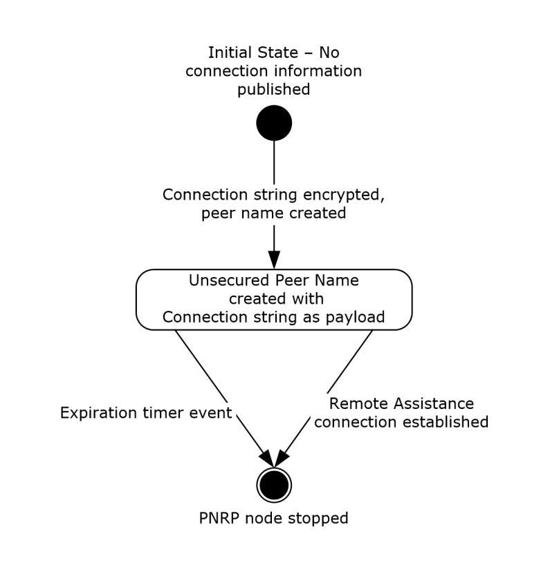
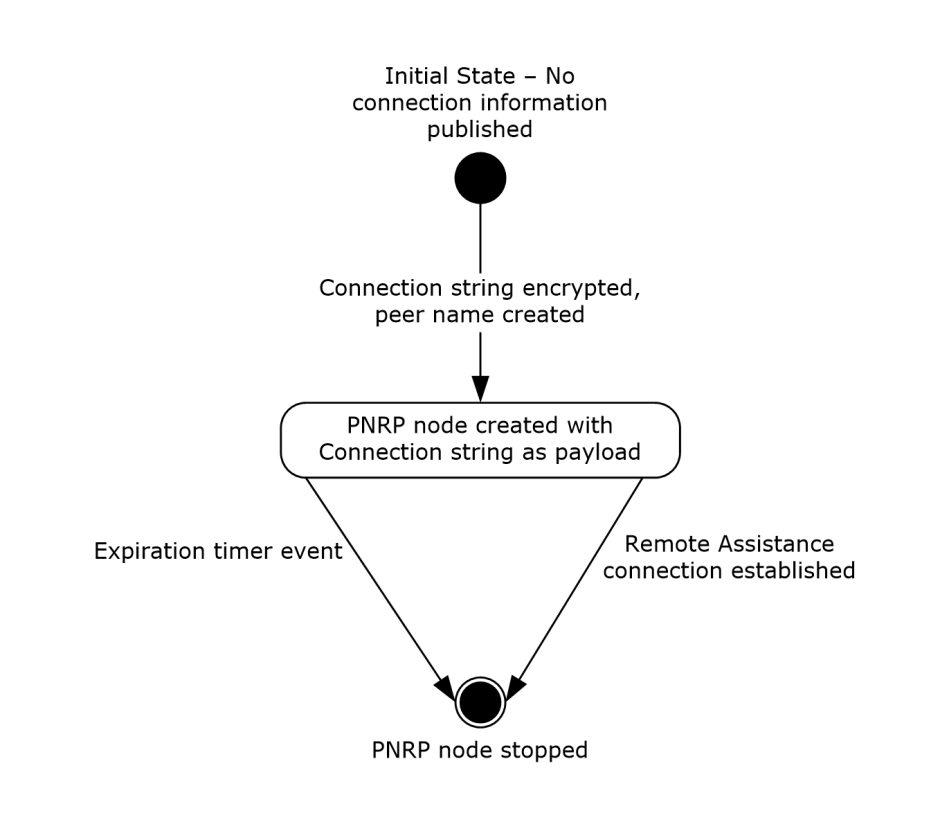

[MS-RAIOP]:

Remote Assistance Initiation over PNRP Protocol

Intellectual Property Rights Notice for Open Specifications Documentation

  Technical Documentation. Microsoft publishes Open Specifications documentation (“this

documentation”) for protocols, file formats, data portability, computer languages, and standards
support. Additionally, overview documents cover inter-protocol relationships and interactions.

  Copyrights. This documentation is covered by Microsoft copyrights. Regardless of any other

terms that are contained in the terms of use for the Microsoft website that hosts this
documentation, you can make copies of it in order to develop implementations of the technologies
that are described in this documentation and can distribute portions of it in your implementations
that use these technologies or in your documentation as necessary to properly document the
implementation. You can also distribute in your implementation, with or without modification, any
schemas, IDLs, or code samples that are included in the documentation. This permission also
applies to any documents that are referenced in the Open Specifications documentation.
  No Trade Secrets. Microsoft does not claim any trade secret rights in this documentation.
  Patents. Microsoft has patents that might cover your implementations of the technologies

described in the Open Specifications documentation. Neither this notice nor Microsoft's delivery of
this documentation grants any licenses under those patents or any other Microsoft patents.
However, a given Open Specifications document might be covered by the Microsoft Open
Specifications Promise or the Microsoft Community Promise. If you would prefer a written license,
or if the technologies described in this documentation are not covered by the Open Specifications
Promise or Community Promise, as applicable, patent licenses are available by contacting
iplg@microsoft.com.

  License Programs. To see all of the protocols in scope under a specific license program and the

associated patents, visit the Patent Map.

  Trademarks. The names of companies and products contained in this documentation might be
covered by trademarks or similar intellectual property rights. This notice does not grant any
licenses under those rights. For a list of Microsoft trademarks, visit
www.microsoft.com/trademarks.

  Fictitious Names. The example companies, organizations, products, domain names, email

addresses, logos, people, places, and events that are depicted in this documentation are fictitious.
No association with any real company, organization, product, domain name, email address, logo,
person, place, or event is intended or should be inferred.

Reservation of Rights. All other rights are reserved, and this notice does not grant any rights other
than as specifically described above, whether by implication, estoppel, or otherwise.

Tools. The Open Specifications documentation does not require the use of Microsoft programming
tools or programming environments in order for you to develop an implementation. If you have access
to Microsoft programming tools and environments, you are free to take advantage of them. Certain
Open Specifications documents are intended for use in conjunction with publicly available standards
specifications and network programming art and, as such, assume that the reader either is familiar
with the aforementioned material or has immediate access to it.

Support. For questions and support, please contact dochelp@microsoft.com.

[MS-RAIOP] - v20240423
Remote Assistance Initiation over PNRP Protocol
Copyright © 2024 Microsoft Corporation
Release: April 23, 2024

1 / 29

Revision Summary

Date

Revision
History

Revision
Class

12/5/2008

0.1

1/16/2009

1.0

Major

Major

Comments

Initial Availability

Updated and revised the technical content.

2/27/2009

1.0.1

Editorial

Changed language and formatting in the technical content.

4/10/2009

2.0

5/22/2009

3.0

7/2/2009

4.0

8/14/2009

5.0

9/25/2009

5.1

11/6/2009

6.0

Major

Major

Major

Major

Minor

Major

Updated and revised the technical content.

Updated and revised the technical content.

Updated and revised the technical content.

Updated and revised the technical content.

Clarified the meaning of the technical content.

Updated and revised the technical content.

12/18/2009  6.0.1

Editorial

Changed language and formatting in the technical content.

1/29/2010

6.1

Minor

Clarified the meaning of the technical content.

3/12/2010

6.1.1

Editorial

Changed language and formatting in the technical content.

4/23/2010

6.1.2

Editorial

Changed language and formatting in the technical content.

6/4/2010

7.0

Major

Updated and revised the technical content.

7/16/2010

7.0

8/27/2010

7.0

10/8/2010

7.0

11/19/2010  7.0

1/7/2011

7.0

2/11/2011

7.0

3/25/2011

7.0

5/6/2011

7.1

6/17/2011

7.2

9/23/2011

7.2

None

None

None

None

None

None

None

Minor

Minor

None

No changes to the meaning, language, or formatting of the
technical content.

No changes to the meaning, language, or formatting of the
technical content.

No changes to the meaning, language, or formatting of the
technical content.

No changes to the meaning, language, or formatting of the
technical content.

No changes to the meaning, language, or formatting of the
technical content.

No changes to the meaning, language, or formatting of the
technical content.

No changes to the meaning, language, or formatting of the
technical content.

Clarified the meaning of the technical content.

Clarified the meaning of the technical content.

No changes to the meaning, language, or formatting of the
technical content.

12/16/2011  8.0

Major

Updated and revised the technical content.

3/30/2012

8.0

None

No changes to the meaning, language, or formatting of the
technical content.

2 / 29

[MS-RAIOP] - v20240423
Remote Assistance Initiation over PNRP Protocol
Copyright © 2024 Microsoft Corporation
Release: April 23, 2024

Date

Revision
History

Revision
Class

Comments

7/12/2012

8.0

10/25/2012  8.0

1/31/2013

8.0

None

None

None

No changes to the meaning, language, or formatting of the
technical content.

No changes to the meaning, language, or formatting of the
technical content.

No changes to the meaning, language, or formatting of the
technical content.

8/8/2013

9.0

Major

Updated and revised the technical content.

11/14/2013  9.0

2/13/2014

9.0

5/15/2014

9.0

None

None

None

No changes to the meaning, language, or formatting of the
technical content.

No changes to the meaning, language, or formatting of the
technical content.

No changes to the meaning, language, or formatting of the
technical content.

6/30/2015

10.0

Major

Significantly changed the technical content.

10/16/2015  10.0

None

No changes to the meaning, language, or formatting of the
technical content.

7/14/2016

11.0

Major

Significantly changed the technical content.

6/1/2017

11.0

9/15/2017

12.0

9/12/2018

13.0

4/7/2021

14.0

6/25/2021

15.0

4/23/2024

16.0

None

Major

Major

Major

Major

Major

No changes to the meaning, language, or formatting of the
technical content.

Significantly changed the technical content.

Significantly changed the technical content.

Significantly changed the technical content.

Significantly changed the technical content.

Significantly changed the technical content.

[MS-RAIOP] - v20240423
Remote Assistance Initiation over PNRP Protocol
Copyright © 2024 Microsoft Corporation
Release: April 23, 2024

3 / 29

Table of Contents

1.1
1.2

1.2.1
1.2.2

1  Introduction ............................................................................................................ 6
Glossary ........................................................................................................... 6
References ........................................................................................................ 7
Normative References ................................................................................... 7
Informative References ................................................................................. 8
Overview .......................................................................................................... 8
Relationship to Other Protocols ............................................................................ 8
Prerequisites/Preconditions ................................................................................. 8
Applicability Statement ....................................................................................... 8
Versioning and Capability Negotiation ................................................................... 8
Vendor-Extensible Fields ..................................................................................... 9
Standards Assignments ....................................................................................... 9

1.3
1.4
1.5
1.6
1.7
1.8
1.9

2.1
2.2

2  Messages ............................................................................................................... 10
Transport ........................................................................................................ 10
Message Syntax ............................................................................................... 10
Remote Assistance Connection String ............................................................ 10
Peer Name ................................................................................................. 10
Payload ..................................................................................................... 10
FriendlyName ............................................................................................. 10

2.2.1
2.2.2
2.2.3
2.2.4

3.2

3.1

3.1.7

3.1.6

3.1.6.1

3.1.2.1

3.1.1
3.1.2

3.1.3
3.1.4
3.1.5

3.1.5.1
3.1.5.2
3.1.5.3

3  Protocol Details ..................................................................................................... 11
Unsecured Peer Name - Publisher Details ............................................................ 11
Abstract Data Model .................................................................................... 12
Timers ...................................................................................................... 12
Expiration Timer ................................................................................... 12
Initialization ............................................................................................... 12
Higher-Layer Triggered Events ..................................................................... 12
Message Processing Events and Sequencing Rules .......................................... 12
Deriving a Password .............................................................................. 12
Encrypting the Connection String ............................................................ 13
Creating the PNRP Node ......................................................................... 14
Timer Events .............................................................................................. 15
Expiration Timer event .......................................................................... 15
Other Local Events ...................................................................................... 15
Unsecured Peer Name Initiation - Consumer Details ............................................. 15
Abstract Data Model .................................................................................... 15
Timers ...................................................................................................... 15
Initialization ............................................................................................... 15
Higher-Layer Triggered Events ..................................................................... 15
Message Processing Events and Sequencing Rules .......................................... 15
Deriving an Unsecured Peer Name from a Password .................................. 16
Resolving the Unsecure Peer Name ......................................................... 16
Decrypting the Payload .......................................................................... 16
Timer Events .............................................................................................. 17
Other Local Events ...................................................................................... 17
Secure Peer Name Initiation - Publisher Details .................................................... 17
Abstract Data Model .................................................................................... 18
Timers ...................................................................................................... 18
Expiration Timer ................................................................................... 18
Initialization ............................................................................................... 18
Higher-Layer Triggered Events ..................................................................... 18
Message Processing Events and Sequencing Rules .......................................... 18
Generating the Required PNRP Data ........................................................ 18
Registering a Secure Peer Name ............................................................. 19

3.2.1
3.2.2
3.2.3
3.2.4
3.2.5

3.2.5.1
3.2.5.2
3.2.5.3

3.3.3
3.3.4
3.3.5

3.3.5.1
3.3.5.2

3.3.1
3.3.2

3.2.6
3.2.7

3.3.2.1

3.3

[MS-RAIOP] - v20240423
Remote Assistance Initiation over PNRP Protocol
Copyright © 2024 Microsoft Corporation
Release: April 23, 2024

4 / 29

3.3.6

3.3.7

3.3.6.1

3.4

Timer Events .............................................................................................. 19
Expiration Timer Event .......................................................................... 19
Other Local Events ...................................................................................... 19
Secure Peer Name Initiation - Consumer Details .................................................. 19
Abstract Data Model .................................................................................... 19
Timers ...................................................................................................... 19
Initialization ............................................................................................... 20
Higher-Layer Triggered Events ..................................................................... 20
Message Processing Events and Sequencing Rules .......................................... 20
Resolving a Secure Peer Name ............................................................... 20
Decrypting the Connection String ............................................................ 20
Timer Events .............................................................................................. 20
Other Local Events ...................................................................................... 20

3.4.1
3.4.2
3.4.3
3.4.4
3.4.5

3.4.6
3.4.7

3.4.5.1
3.4.5.2

4  Protocol Examples ................................................................................................. 21

4.1

4.2

Deriving a Password and Encrypting a Connection String for Unsecured Peer Name
Initiation ......................................................................................................... 21
Creating an Unsecured Peer Name from a Password ............................................. 22

5  Security ................................................................................................................. 24
Security Considerations for Implementers ........................................................... 24
Index of Security Parameters ............................................................................ 24

5.1
5.2

6  Appendix A: Product Behavior ............................................................................... 25

7  Change Tracking .................................................................................................... 26

8  Index ..................................................................................................................... 27

[MS-RAIOP] - v20240423
Remote Assistance Initiation over PNRP Protocol
Copyright © 2024 Microsoft Corporation
Release: April 23, 2024

5 / 29

1  Introduction

This document describes the Remote Assistance Initiation over PNRP Protocol, which is used to
establish a Remote Assistance connection between two computers. This protocol uses the Peer
Name Resolution Protocol (PNRP), as specified in [MS-PNRP], to transfer the Remote Assistance
connection string (section 2.2.1) securely between two computers. After the Remote Assistance
connection string is transferred, a Remote Assistance session can be established between the two
computers.

Sections 1.5, 1.8, 1.9, 2, and 3 of this specification are normative. All other sections and examples in
this specification are informative.

1.1  Glossary

This document uses the following terms:

base64 encoding: A binary-to-text encoding scheme whereby an arbitrary sequence of bytes is

converted to a sequence of printable ASCII characters, as described in [RFC4648].

consume: To resolve a Peer Name and decrypt the associated payload.

consumer: The side of a Remote Assistance connection that resolves a Peer Name. It is the

same as the expert role.

Coordinated Universal Time (UTC): A high-precision atomic time standard that approximately
tracks Universal Time (UT). It is the basis for legal, civil time all over the Earth. Time zones
around the world are expressed as positive and negative offsets from UTC. In this role, it is also
referred to as Zulu time (Z) and Greenwich Mean Time (GMT). In these specifications, all
references to UTC refer to the time at UTC-0 (or GMT).

expert: The side of a Remote Assistance connection that is able to view the remote screen of

the other computer in order to provide help.

extended payload: An arbitrary BLOB of data associated with a Peer Name and published by an

application.

Global PNRP cloud: A PNRP cloud as specified in [MS-PNRP] with a name "Global".

HexConvertedUnicodeString: A Unicode string created from a binary, byte-granular value. The
string is created by converting each byte, starting with the most significant byte and ending with
the least significant byte, into two Unicode characters. The characters are the hexadecimal
representation of each nibble of the byte, starting with the high-order nibble.

novice: The side of a Remote Assistance connection that shares its screen with the other

computer in order to receive help.

peer name: A string composed of an authority and a classifier. This is the string used by

applications to resolve to a list of endpoints and/or an extended payload. A peer name is not
required to be unique. For example, several nodes that provide the same service can register
the same Peer Name.

Peer Name Resolution Protocol (PNRP): The protocol that is specified in [MS-PNRP] and is
used for registering and resolving a name to a set of information, such as IP addresses.

public key: One of a pair of keys used in public-key cryptography. The public key is distributed
freely and published as part of a digital certificate. For an introduction to this concept, see
[CRYPTO] section 1.8 and [IEEE1363] section 3.1.

[MS-RAIOP] - v20240423
Remote Assistance Initiation over PNRP Protocol
Copyright © 2024 Microsoft Corporation
Release: April 23, 2024

6 / 29

publisher: The side of a Remote Assistance connection that registers a Peer Name. It is the

same as the novice role.

RAIOP: The protocol documented in this specification, Remote Assistance Initiation over PNRP

Protocol (RAIOP).

Remote Assistance connection: A communication framework that is established between two

computers that facilitates Remote Assistance.

Remote Assistance contact: After a Remote Assistance session is established, the expert
and novice can exchange contact information as specified in [MS-RA]. A Remote Assistance
contact is then created on the expert and novice computers. This allows Secure Peer Names to
be used in subsequent sessions.

Remote Assistance session: A Remote Assistance connection that has been accepted by the
novice. The expert is able to view the novice's screen once the Remote Assistance session is
started.

Rivest-Shamir-Adleman (RSA): A system for public key cryptography. RSA is specified in

[RFC8017].

secure peer name: A peer name that has a nonzero authority and is tied to a Peer Identity.

SHA-1 hash: A hashing algorithm as specified in [FIPS180-2] that was developed by the National

Institute of Standards and Technology (NIST) and the National Security Agency (NSA).

Unicode string: A Unicode 8-bit string is an ordered sequence of 8-bit units, a Unicode 16-bit
string is an ordered sequence of 16-bit code units, and a Unicode 32-bit string is an ordered
sequence of 32-bit code units. In some cases, it could be acceptable not to terminate with a
terminating null character. Unless otherwise specified, all Unicode strings follow the UTF-16LE
encoding scheme with no Byte Order Mark (BOM).

unsecured peer name: A Peer Name that has a "0" authority and is therefore not tied to a Peer

Identity. Any node can claim ownership of any Unsecured Peer Name.

MAY, SHOULD, MUST, SHOULD NOT, MUST NOT: These terms (in all caps) are used as defined
in [RFC2119]. All statements of optional behavior use either MAY, SHOULD, or SHOULD NOT.

1.2  References

Links to a document in the Microsoft Open Specifications library point to the correct section in the
most recently published version of the referenced document. However, because individual documents
in the library are not updated at the same time, the section numbers in the documents may not
match. You can confirm the correct section numbering by checking the Errata.

1.2.1  Normative References

We conduct frequent surveys of the normative references to assure their continued availability. If you
have any issue with finding a normative reference, please contact dochelp@microsoft.com. We will
assist you in finding the relevant information.

[FIPS180-2] National Institute of Standards and Technology, "Secure Hash Standard", FIPS PUB 180-
2, August 2002, http://csrc.nist.gov/publications/fips/fips180-2/fips180-2.pdf

[FIPS197] FIPS PUBS, "Advanced Encryption Standard (AES)", FIPS PUB 197, November 2001,
https://nvlpubs.nist.gov/nistpubs/FIPS/NIST.FIPS.197.pdf

[MS-PNRP] Microsoft Corporation, "Peer Name Resolution Protocol (PNRP) Version 4.0".

7 / 29

[MS-RAIOP] - v20240423
Remote Assistance Initiation over PNRP Protocol
Copyright © 2024 Microsoft Corporation
Release: April 23, 2024

[MS-RAI] Microsoft Corporation, "Remote Assistance Initiation Protocol".

[MS-RA] Microsoft Corporation, "Remote Assistance Protocol".

[RFC2119] Bradner, S., "Key words for use in RFCs to Indicate Requirement Levels", BCP 14, RFC
2119, March 1997, https://www.rfc-editor.org/info/rfc2119

[RFC4648] Josefsson, S., "The Base16, Base32, and Base64 Data Encodings", RFC 4648, October
2006, https://www.rfc-editor.org/info/rfc4648

1.2.2  Informative References

None.

1.3  Overview

This protocol is used to transfer the Remote Assistance Connection String (section 2.2.1) from the
novice to the expert. After the connection string, as defined in [MS-RAI] section 2.2.1, is transferred,
a Remote Assistance session can be established as specified in [MS-RA].

The protocol describes two methods based on PNRP to exchange the Remote Assistance Connection
String:

Using an Unsecured Peer Name: This method uses Unsecured Peer Names (as specified in [MS-
PNRP]) to transfer the Remote Assistance Connection String. The connection string is encrypted and
posted as an extended payload associated with the Unsecured Peer Name. When this method is
used, the novice relays a password to the expert. Using the password provided by the novice, the
expert locates the Unsecured Peer Name, downloads the payload, and decrypts the Remote Assistance
Connection String. Using the connection string, the expert can make a Remote Assistance
connection to the novice.

Using a Secure Peer Name: This method uses Secure Peer Names (as specified in [MS-PNRP]) to
transfer the Remote Assistance Connection String between the novice and the expert. The novice and
the expert can have Remote Assistance contacts for each other. This method does not require a
password. Using the Secure Peer Name, the expert can download the extended payload that contains
the Remote Assistance Connection String. Using the connection string, the expert can make a Remote
Assistance connection to the novice.

1.4  Relationship to Other Protocols

RAIOP assumes that the Peer Name Resolution Protocol [MS-PNRP] is available to transport the
Remote Assistance Connection String. After the Remote Assistance Connection String is transferred,
the expert can connect to the novice and initiate a Remote Assistance session as specified in
[MS-RA]. This protocol also uses Remote Assistance contacts as specified in [MS-RA].

1.5  Prerequisites/Preconditions

This protocol assumes that both computers do not have a UTC time offset that is greater than 1 hour.

1.6  Applicability Statement

This protocol can only be used between two computers if the Global PNRP cloud is visible to both the
novice and expert.

[MS-RAIOP] - v20240423
Remote Assistance Initiation over PNRP Protocol
Copyright © 2024 Microsoft Corporation
Release: April 23, 2024

8 / 29

1.7  Versioning and Capability Negotiation

 This protocol does not provide for version or capability negotiation.

1.8  Vendor-Extensible Fields

There are no vendor-extensible fields in the Remote Assistance Initiation over PNRP Protocol.

1.9  Standards Assignments

The Remote Assistance Initiation over PNRP Protocol does not use any standards assignments.

[MS-RAIOP] - v20240423
Remote Assistance Initiation over PNRP Protocol
Copyright © 2024 Microsoft Corporation
Release: April 23, 2024

9 / 29

2  Messages

2.1  Transport

This protocol uses the Peer Name Resolution Protocol, as specified in [MS-PNRP], for message
transport.

2.2  Message Syntax

2.2.1  Remote Assistance Connection String

The Remote Assistance Connection String referenced in this document is defined in [MS-RAI] as
Remote Assistance Connection String 2.

2.2.2  Peer Name

The Peer Name that is referenced in this document is defined in [MS-PNRP] as a Peer Name.
Unsecured Peer Names are Peer Names with an authority of "0".

2.2.3  Payload

The payload that is associated with a Peer Name and referenced in this document is defined in [MS-
PNRP] section 2.2.3.3 as an EXTENDED_PAYLOAD message.

2.2.4  FriendlyName

The FriendlyName that is associated with a Peer Name and referenced in this document is defined in
[MS-PNRP] section 2.2.3.1 as a FriendlyName string.

[MS-RAIOP] - v20240423
Remote Assistance Initiation over PNRP Protocol
Copyright © 2024 Microsoft Corporation
Release: April 23, 2024

10 / 29

<!-- Extracted images from page 11 -->

<!-- /Extracted images from page 11 -->

3  Protocol Details

3.1  Unsecured Peer Name - Publisher Details

The purpose of the Unsecured Peer Name Initiation is to allow a Remote Assistance Connection
String (defined in [MS-RA]) to be passed from the publisher of the string to the consumer. After the
string is passed, the consumer uses the string to initialize a Remote Assistance connection and to
view and share the publisher’s screen. After the Remote Assistance session is started, the Peer
Name SHOULD be unregistered by the publisher because it has no further purpose.

After the connection string is generated, the Global PNRP cloud MUST be joined as specified in [MS-
PNRP] section 1.3.3. After the cloud is discovered and joined, the publisher MUST register an
Unsecured Peer Name and associate the encrypted connection string as a payload to the Peer Name.

The task of initiating a Remote Assistance connection is shown in the following diagram.

Figure 1: Publishing connection information

Initial state: The initial state where the publisher has the string that will enable a Remote Assistance

connection to be established and wants to let the consumer know the contents of the string.

Unsecured Peer Name registered: An Unsecured Peer Name was registered with the encrypted

connection string associated as a payload.

Unsecured Peer Name unregistered: A Remote Assistance session was initialized or the expiration
timer event occurred and the payload in the Unsecured Peer Name is no longer useful. The Peer
Name SHOULD be unregistered.

[MS-RAIOP] - v20240423
Remote Assistance Initiation over PNRP Protocol
Copyright © 2024 Microsoft Corporation
Release: April 23, 2024

11 / 29

3.1.1  Abstract Data Model

This section describes a conceptual model of possible data organization that an implementation
maintains to participate in this protocol. The described organization is provided to facilitate the
explanation of how the protocol behaves. This document does not mandate that implementations
adhere to this model as long as their external behavior is consistent with the behavior described in
this document.

The publisher generates a password that is used to encrypt the payload containing a Remote
Assistance Connection String and to create an Unsecured Peer Name. The publisher registers the
Unsecured Peer Name, associating the encrypted payload, which will be resolved later by the
consumer. The publisher conveys the password to the consumer through some external means.

3.1.2  Timers

3.1.2.1  Expiration Timer

A 30-minute timer SHOULD be started after registration of the Unsecured Peer Name, as specified
in section 3.1.5.3.

3.1.3  Initialization

To initialize this protocol, the following MUST be done:

1.  The Global PNRP cloud MUST be discovered and joined as defined in [MS-PNRP] section 1.3.3.

2.  A connection string as defined in [MS-RAI] section 2.2 MUST be created.

3.1.4  Higher-Layer Triggered Events

None.

3.1.5  Message Processing Events and Sequencing Rules

After initialization, a password MUST be derived as defined in section 3.1.5.1 and the connection string
MUST be encrypted as defined in section 3.1.5.2. Next, an Unsecured Peer Name MUST be
registered with the encrypted connection string as the payload as defined in section 3.1.5.3.

After the Remote Assistance session is established, the Unsecured Peer Name SHOULD be
unregistered, as defined in [MS-PNRP] section 3.2.4.2.

3.1.5.1  Deriving a Password

When a password is derived from the connection string, only certain characters from the English
alphabet and digits are used. The string "BCDFGHJKLMNPQRSTVWXYZ23456789", which is referred to
as the Allowed Characters string, is used to define the only usable characters for deriving a password.
The derived password MUST be 6 characters in length.

The password that is used, both to encrypt the connection string and as the basis for generating a
Peer Name, MUST be created by using the following algorithm:

1.  Copy the Unicode connection string, not including any terminating NULL character, into a byte

buffer that is referred to as hash input. If the connection string is longer than 8,000 bytes, copy
only the first 8,000 bytes into the buffer. The hash input size is always the buffer size of the
Unicode connection string (or 8,000 bytes, whichever is smaller), plus 20 additional bytes that are

[MS-RAIOP] - v20240423
Remote Assistance Initiation over PNRP Protocol
Copyright © 2024 Microsoft Corporation
Release: April 23, 2024

12 / 29

used for the hash result in the following steps. For the initial hash input, the 20 bytes that are
used in subsequent steps for the hash result MUST be set to zero.

2.  Use the SHA-1 hash algorithm, as specified in [FIPS180-2], to derive a value that is referred to

as a hash result from the hash input.

3.  Concatenate the hash result to the original connection string and copy the result into the hash

input.

4.  Repeat steps 2 and 3 for 99,999 times, for a total of 100,000 hash operations.

5.  For each of the first 6 bytes derived from the hash result that is obtained from the 100,000th
iteration, convert the byte value into an index into the Allowed Characters string by using the
following formula:

 Index=FLOOR((Derived Byte/256.0)*Character Length of Allowed Characters)

The FLOOR function returns the largest integer that is less than or equal to the resultant
floating-point value of the previous expression. The values for Index, Derived Byte, and
Character Length of Allowed Characters MUST be integers.

6.  For each of these calculated indexes, convert the index into a letter or number by indexing into

the Allowed Characters string.

7.  The password is a concatenation of these 6 letters.

3.1.5.2  Encrypting the Connection String

To encrypt the connection string, a password MUST be derived as defined in section 3.1.5.1. To
encrypt the connection string, the following algorithm MUST be followed:

1.  Get the number of hours that have elapsed since January 1, 1970 UTC and convert the decimal

value into a Unicode-formatted string. For example, 338,540 hours is represented by the Unicode
string in the form "338540".

2.  Concatenate the derived password and the number of hours string. The resultant string MUST be a
Unicode-formatted string, which is referred to as the original concatenated Unicode string in the
following steps.

3.  Copy the original concatenated Unicode string into a byte buffer that is referred to as hash input.
The hash input includes the byte buffer of the Unicode string that is obtained in step 2, plus 20
additional bytes of the hash result that is obtained in step 4 of the previous hash operation, if any.
For the initial hash input, the last 20 bytes used for the hash result MUST be set to zero.

4.  Use the SHA-1 hash algorithm, as specified in [FIPS180-2], to derive a value that is referred to

as a hash result from the hash input.

5.  Concatenate the hash result to the original concatenated Unicode string, and copy the result into a

byte buffer that is referred to as the hash input.

6.  Repeat steps 4 and 5 for 99,999 times, for a total of 100,000 hash operations.

7.  Transform the first 16 bytes of the hash result into a HexConvertedUnicodeString. This

transformation uses each sequence of 4 bits as a zero-based index into the Unicode lookup string
"0123456789ABCDEF" to obtain a matching Unicode character. The order of the data is not
changed (that is, the most significant first 4 bits are used to obtain the first value, and least
significant last 4 bits are used to obtain the second value). The transformation produces a 32-
character Unicode string that is referred to as the key string. For example, the hash result {0x9A,
0xC1, 0x32, ..., 0xAB} would yield the HexConvertedUnicodeString "9AC132…AB" with the in-

13 / 29

[MS-RAIOP] - v20240423
Remote Assistance Initiation over PNRP Protocol
Copyright © 2024 Microsoft Corporation
Release: April 23, 2024

memory representation of {0x39, 0x00, 0x41, 0x00, 0x43, 0x00, 0x31, 0x00, 0x33, 0x00, 0x32,
0x00, … 0x41, 0x00, 0x42, 0x00}.

8.  Using the SHA-1 hash algorithm, hash the key string.

9.  Using the resultant hash, use the AES_128 algorithm, as specified in [FIPS197], to derive a cipher

key for encryption.

10. Encrypt the Unicode connection string by using the cipher key from step 9 and the AES_128

algorithm.

3.1.5.3  Creating the PNRP Node

To register an Unsecured Peer Name, a password MUST be derived as defined in section 3.1.5.1.
Also, the connection string MUST be encrypted as defined in section 3.1.5.2. To register an Unsecured
Peer Name, the following algorithm MUST be followed:

1.  Get the number of hours that have elapsed since January 1, 1970 UTC and convert the decimal

value into a Unicode-formatted string. For example, 338,540 hours is represented by the Unicode
string in the form "338540".

2.  Concatenate the derived password and the number of hours string. The resultant string MUST be a
Unicode-formatted string, which is referred to as the original concatenated Unicode string in the
following steps.

3.  Copy the original concatenated Unicode string into a byte buffer that is referred to as hash input.
The hash input includes the byte buffer of the Unicode string that is obtained in step 2, plus 20
additional bytes of the hash result that is obtained in step 4 of the previous hash operation, if any.
For the initial hash input, the last 20 bytes used for the hash result MUST be set to zero.

4.  Use the SHA-1 hash algorithm, as specified in [FIPS180-2], to derive a value that is referred to

as a hash result from the hash input.

5.  Concatenate the hash result to the original concatenated Unicode string, and copy the result into a

byte buffer that is referred to as the hash input.

6.  Repeat steps 4 and 5 for 99,999 times, for a total of 100,000 hash operations.

7.  Transform the first 16 bytes of the hash result into a HexConvertedUnicodeString. This

transformation uses each sequence of 4 bits as a zero-based index into the Unicode lookup string
"0123456789ABCDEF" to obtain a matching Unicode character. The order of the data is not
changed (that is, the most significant first 4 bits are used to obtain the first value, and least
significant last 4 bits are used to obtain the second value). The transformation produces a 32-
character Unicode string that is referred to as the key string. For example, the hash result {0x9A,
0xC1, 0x32, ..., 0xAB} would yield the HexConvertedUnicodeString "9AC132…AB" with the in-
memory representation of {0x39, 0x00, 0x41, 0x00, 0x43, 0x00, 0x31, 0x00, 0x33, 0x00, 0x32,
0x00, … 0x41, 0x00, 0x42, 0x00}.

8.  Use the HexConvertedUnicodeString generated in step 7 to register an Unsecured Peer Name by
using the HexConvertedUnicodeString as the classifier and an authority of "0". The encrypted
connection string MUST be set as the payload. (See [MS-PNRP] for registering an Unsecured Peer
Name.)

[MS-RAIOP] - v20240423
Remote Assistance Initiation over PNRP Protocol
Copyright © 2024 Microsoft Corporation
Release: April 23, 2024

14 / 29

3.1.6  Timer Events

3.1.6.1  Expiration Timer event

When the expiration timer elapses, the registered Unsecured Peer Name SHOULD be unregistered
for security reasons. The timer MUST NOT be restarted.

3.1.7  Other Local Events

When a Remote Assistance session is established, the registered Unsecured Peer Name SHOULD
be unregistered.

3.2  Unsecured Peer Name Initiation - Consumer Details

The purpose of the Unsecured Peer Name initiation is to allow a Remote Assistance Connection
String to pass from the publisher of the string to the consumer. After the string passes, the
consumer can use the string to initialize a Remote Assistance connection and view and share the
publisher’s screen.

3.2.1  Abstract Data Model

To retrieve the connection string from a remote machine, a password is conveyed from the publisher
to the consumer by external means. This password is converted into an Unsecured Peer Name that
was registered by the publisher, as well as the key that is used to decrypt the payload that is
associated with this Peer Name.

3.2.2  Timers

There are no timers associated with this section.

3.2.3  Initialization

The following steps initialize this protocol:

1.  The Global PNRP cloud MUST be discovered and joined as defined in [MS-PNRP] section 1.3.3.

2.  The password that is generated by the publisher when the connection information is published
MUST be available to the application that is consuming the Unsecured Peer Name initiation.

Note  The protocol does not provide for the password to be transmitted from the publisher to the
consumer.

3.2.4  Higher-Layer Triggered Events

None.

3.2.5  Message Processing Events and Sequencing Rules

To consume the Unsecured Peer Name initiation, the application MUST derive the Unsecured Peer
Name from the password that is provided by the publisher, as defined in section 3.2.5.1. After a Peer
Name is derived, the application MUST then resolve the Peer Name and obtain the payload that is
associated with it, as defined in section 3.2.5.2. When the payload is retrieved, it MUST be decrypted
as defined in section 3.2.5.3.

[MS-RAIOP] - v20240423
Remote Assistance Initiation over PNRP Protocol
Copyright © 2024 Microsoft Corporation
Release: April 23, 2024

15 / 29

3.2.5.1  Deriving an Unsecured Peer Name from a Password

To derive an Unsecured Peer Name from a password:

1.  Get the number of hours that have elapsed since January 1, 1970 UTC and convert the decimal

value into a Unicode-formatted string. For example, 338,540 hours is represented by the Unicode
string in the form "338540".

2.  Concatenate the password and the number of hours string. The resultant string MUST be a

Unicode-formatted string, which is referred to as the original concatenated Unicode string in the
following steps.

3.  Copy the original concatenated Unicode string into a byte buffer that is referred to as hash input.
The hash input includes the byte buffer of the Unicode string that is obtained in step 2, plus 20
additional bytes of the hash result that is obtained in step 4 of the previous hash operation, if any.
For the initial hash input, the last 20 bytes used for the hash result MUST be set to zero.

4.  Use the SHA-1 hash algorithm, as specified in [FIPS180-2], to derive a value that is referred to

as a hash result from the hash input.

5.  Concatenate the hash result to the original concatenated Unicode string, and copy the result into a

byte buffer that is referred to as the hash input.

6.  Repeat steps 4 and 5 for 99,999 times, for a total of 100,000 hash operations.

7.  Transform the first 16 bytes of the hash result into a HexConvertedUnicodeString. This

transformation uses each sequence of 4 bits as a zero-based index into the Unicode lookup string
"0123456789ABCDEF" to obtain a matching Unicode character. The order of the data is not
changed (that is, the most significant first 4 bits are used to obtain the first value, and least
significant last 4 bits are used to obtain the second value). The transformation produces a 32-
character Unicode string that is referred to as the key string. For example, the hash result {0x9A,
0xC1, 0x32, ..., 0xAB} would yield the HexConvertedUnicodeString "9AC132…AB" with the in-
memory representation of {0x39, 0x00, 0x41, 0x00, 0x43, 0x00, 0x31, 0x00, 0x33, 0x00, 0x32,
0x00, … 0x41, 0x00, 0x42, 0x00}.

8.  Use the HexConvertedUnicodeString generated in step 7 as a classifier and an authority value of

"0", an Unsecured Peer Name.

3.2.5.2  Resolving the Unsecure Peer Name

The derived Unsecured Peer Name (as defined in section 3.2.5.1) MUST be resolved as specified in
[MS-PNRP] section 3.1.4.4. If the consumer fails to resolve the address, the consumer repeats the
resolution up to two additional times until address resolution, each with a different initial value for the
Unsecured Peer Name derivation as specified in section 3.2.5.1. For the first repetition, this value
MUST be the number of hours elapsed since January 1, 1970, minus 1 hour. For the second repetition,
this value MUST be the number of hours elapsed since January 1st, 1970, plus 1 hour. The payload
associated with the Unsecured Peer Name is provided by the underlying Peer Name Resolution
Protocol.

3.2.5.3  Decrypting the Payload

To decrypt the payload, the following steps MUST be taken:

1.  Using the SHA-1 hash algorithm, as specified in [FIPS180-2], hash the

HexConvertedUnicodeString (as generated in step 7 of section 3.2.5.1) to obtain a byte buffer.

2.  Using the resulting hash, use the AES_128 algorithm, as specified in [FIPS197], to derive a cipher

key for decryption.

16 / 29

[MS-RAIOP] - v20240423
Remote Assistance Initiation over PNRP Protocol
Copyright © 2024 Microsoft Corporation
Release: April 23, 2024

<!-- Extracted images from page 17 -->

<!-- /Extracted images from page 17 -->

3.  Decrypt the payload (obtained in section 3.2.5.2) by using the cipher key from step 2 and the

AES_128 algorithm to obtain the Unicode Remote Assistance Connection String.

3.2.6  Timer Events

There are no timer events associated with this section.

3.2.7  Other Local Events

There are no local events that are necessary to process in this section.

3.3  Secure Peer Name Initiation - Publisher Details

The purpose of the Secure Peer Name initiation is to allow a Remote Assistance Connection String,
as defined in [MS-RA], to pass from the publisher of the string to the consumer. After the string is
passed, the consumer can use the string to initialize a Remote Assistance connection, and to view
and share the publisher's screen.

The task of initiating a Remote Assistance connection is shown in the following diagram.

Figure 2: Publishing connection information

Initial state: This state is the initial state where the publisher has the string that will enable a

Remote Assistance connection to be established and wants to let the consumer know the contents
of the string.

Secure Peer Name registered: A Secure Peer Name  has been registered with the encrypted

connection string associated as a payload.

17 / 29

[MS-RAIOP] - v20240423
Remote Assistance Initiation over PNRP Protocol
Copyright © 2024 Microsoft Corporation
Release: April 23, 2024

Secure Peer Name unregistered: After a Remote Assistance session has been initialized or the
expiration time event occurred, the payload in the Secure Peer Name is no longer useful. The
Secure Peer Name SHOULD be unregistered.

3.3.1  Abstract Data Model

To use this method of publication, the consumer MUST have provided the publisher with the
consumer's public key. In addition, the publisher MUST have provided the consumer with a public
key to allow for secure name registration (as defined in [MS-PNRP]).

The publisher MUST register a Secure Peer Name with a payload containing an encrypted Remote
Assistance Connection String. The payload MUST contain Remote Assistance connection
information, which the consumer MUST use to establish a Remote Assistance connection.

3.3.2  Timers

3.3.2.1  Expiration Timer

A 30-minute timer SHOULD be started after the registration of the Secure Peer Name, as specified in
section 3.3.5.2.

3.3.3  Initialization

To initialize this Secure Peer Name initiation, the Global PNRP cloud, MUST be discovered and
joined as defined in [MS-PNRP] section 1.3.3. A Secure Peer Name MUST be created as specified in
[MS-PNRP] and this secure name MUST be related to the public key that the consumer associated
with the publisher. The publisher MUST have a public key that matches a private key that the
consumer possesses.

3.3.4  Higher-Layer Triggered Events

None.

3.3.5  Message Processing Events and Sequencing Rules

To publish the connection string by using Secure Peer Name initiation, the connection string MUST
first be encrypted as defined in section 3.3.5.1. Next, a Secure Peer Name MUST be created as
specified in section 3.3.5.2.

The [MS-RA] protocol defines a Remote Assistance Contact Information message that is used after a
Remote Assistance connection is made using an Unsecured Peer Name. The Remote Assistance
Contact Information message allows the publisher and consumer to exchange public keys and Secure
Peer Names that match these public keys.

3.3.5.1  Generating the Required PNRP Data

To generate the encrypted connection string payload, the following algorithm MUST be followed:

1.  Generate a pseudo-random 256-bit cipher key to use with the AES_256 encryption algorithm, as

specified in [FIPS197].

2.  Encrypt the Unicode connection string by using the AES_256 encryption algorithm, as specified in
[FIPS197], and the cipher key that was generated in step 1, to produce the encrypted Connection
Data.

[MS-RAIOP] - v20240423
Remote Assistance Initiation over PNRP Protocol
Copyright © 2024 Microsoft Corporation
Release: April 23, 2024

18 / 29

3.  The publisher MUST obtain a public key that matches a private key that the consumer will use.

Encrypt the cipher key that was generated in step 1 using the public key of the consumer and the
Rivest-Shamir-Adleman (RSA) algorithm.

4.  Transform the encrypted cipher key generated in step 3 to a base64-encoded Unicode string as

specified in [RFC4648], and call it the exported AES key. The byte length of the exported AES key
MUST be used when the peer name is registered as specified in section 3.3.5.2.

5.  The encrypted connection string payload is obtained by appending the encrypted Connection Data

from step 2 to the end of the exported AES key from step 4.

3.3.5.2  Registering a Secure Peer Name

To register a Secure Peer Name, a public key from the public-private key pair that is known to the
consumer MUST be used as an authority and the Unicode string "RAContact" MUST be used as a
Peer identity to create a Secure Peer Name. The encrypted connection string payload that is generated
in section 3.3.5.1 MUST be used as the extended payload when this Peer Name is registered. PNRP
covers registering a Peer Name and designating a payload to associate with the Peer Name. The
FriendlyName (as specified in [MS-PNRP], section 3.2.4.1) string of the Peer Name MUST be set to
the byte length of the portion of the payload that is the exported AES key defined in section 3.3.5.1.
The byte length is expressed as a Unicode string containing the decimal equivalent of the value of the
byte length. For example, if the value of the byte length is 324, the comment section would contain
the Unicode string "324".

3.3.6  Timer Events

3.3.6.1  Expiration Timer Event

When the expiration timer elapses, the registered Secure Peer Name SHOULD be unregistered for
security reasons. The timer MUST NOT be restarted.

3.3.7  Other Local Events

When a Remote Assistance session is established, the registered Secure Peer Name SHOULD be
unregistered.

3.4  Secure Peer Name Initiation - Consumer Details

The purpose of the Secure Peer Name initiation is to allow a Remote Assistance Connection String
(defined in [MS-RA]) to be passed from the publisher of the string to the consumer. After the string is
passed, the consumer can use the string to initialize a Remote Assistance connection and view and
share the publisher's screen.

3.4.1  Abstract Data Model

To use this method of initiation, the consumer MUST have provided the publisher with the public key
of the consumer. In addition, the publisher MUST have provided the consumer with a public key to
allow for secure name resolution, as defined in [MS-PNRP]. The consumer MUST resolve the Secure
Peer Name of the publisher and retrieve the payload that is associated with the name. Finally, the
consumer MUST decrypt the connection information by using the associated private key.

3.4.2  Timers

There are no timers associated with this section.

[MS-RAIOP] - v20240423
Remote Assistance Initiation over PNRP Protocol
Copyright © 2024 Microsoft Corporation
Release: April 23, 2024

19 / 29

3.4.3  Initialization

To initialize Secure Peer Name initiation, the Global PNRP cloud MUST be discovered and joined as
defined in [MS-PNRP] section 1.3.3. The publisher MUST have a public key that matches a private
key that the consumer possesses.

3.4.4  Higher-Layer Triggered Events

None.

3.4.5  Message Processing Events and Sequencing Rules

To consume the connection string using Secure Peer Name initiation, the published Secure Peer
Name MUST first be resolved as specified in section 3.4.5.1. Next, the connection string MUST be
decrypted as defined in section 3.4.5.2.

The [MS-RA] protocol defines a Remote Assistance Contact Information message that is used in a
previous time to allow the publisher and consumer to exchange public keys and Secure Peer Names
that match these public keys.

3.4.5.1  Resolving a Secure Peer Name

A Secure Peer Name MUST be generated using the public key of the public-private key pair as an
authority and the Unicode string "RAContact" as a Peer identity. The public key is obtained as part of
the Remote Assistance Contact information as specified in [MS-RA] section 2.2.5. Resolving the
Secure Peer Name is defined in [MS-PNRP] section 3.1.4.4.

3.4.5.2  Decrypting the Connection String

To decrypt the connection string, the consumer MUST use a private key that matches a public key
that the publisher has. The following algorithm MUST be followed to decrypt the string:

1.  Separate the exported key and the encrypted connection string. This information MUST be
retrieved from the payload after the Peer Name has been resolved. The byte length of the
exported key MUST be retrieved from the FriendlyName (as specified in [MS-PNRP], section
3.2.4.1) string that is associated with the Peer Name.

2.  Decrypt the exported symmetric key by using the matching private key and the RSA algorithm.

3.  Decrypt the connection string by using the symmetric key that was obtained in step 2.

3.4.6  Timer Events

There are no timer events associated with this section.

3.4.7  Other Local Events

There are no local events that are necessary to process in this section.

[MS-RAIOP] - v20240423
Remote Assistance Initiation over PNRP Protocol
Copyright © 2024 Microsoft Corporation
Release: April 23, 2024

20 / 29

4  Protocol Examples

4.1  Deriving a Password and Encrypting a Connection String for Unsecured Peer

Name Initiation

This example follows the steps that appear in sections 3.1.5.1 and 3.1.5.2, which show how to derive
a password and encrypt a sample string:

1.  Assume for the connection string "SAMPLE", when encryption is done, 1218745079 seconds have

elapsed since January 1, 1970 UTC.

2.  The first hash input is the following, expressed in hexadecimal values.

 53 00 41 00 4d 00 50 00 4c 00 45 00 00 00 00 00 00 00 00 00
 00 00 00 00 00 00 00 00 00 00 00 00

3.  After the first hash iteration, the hash result is the following, expressed in hexadecimal values.

 00 df 01 a1 9d 25 89 60 e6 a4 4a a9 8b e9 c2 6f 00 29 22 39

4.  When the hash result is added back to the original input, a new hash input results, which is

expressed here in hexadecimal values.

 53 00 41 00 4d 00 50 00 4c 00 45 00 00 df 01 a1 9d 25 89 60
 e6 a4 4a a9 8b e9 c2 6f 00 29 22 39

5.  After the 100,000 iterations, the first sequence of 6 bytes of the hash result is the following,

expressed in hexadecimal values.

 1d f6 35 43 74 92

6.  Each byte is divided by 256 and then multiplied by 29 (the number of characters in the string).

The resulting fractions are discarded to obtain an index for each byte. The resulting index for each
byte is looked up in the password character string "BCDFGHJKLMNPQRSTVWXYZ23456789" to
obtain the corresponding character for that byte.

 First value: 0x1d is 29, (29/256) * 29 =3.29 -> 3
 Indexes: 3 27 6 7 13 16
 Resultant characters: F 8 J K R V

7.  When the number of seconds since Jan 1, 1970 is divided by 3600, the resulting figure is the

number of hours that have elapsed since Jan 1, 1970 UTC. This number is concatenated to the
derived characters to get the string "F8JKRV338540".

8.  The first hash input is the previous string copied into a byte buffer that is expressed in

hexadecimal values.

 46 00 38 00 4a 00 4b 00 52 00 56 00 33 00 33 00 38 00 35 00
 34 00 30 00 00 00 00 00 00 00 00 00 00 00 00 00 00 00 00 00
 00 00 00 00

[MS-RAIOP] - v20240423
Remote Assistance Initiation over PNRP Protocol
Copyright © 2024 Microsoft Corporation
Release: April 23, 2024

21 / 29

9.  The first hash result is the following value, expressed in hexadecimal.

 5f 3d 53 db 86 9a f1 ac 24 63 21 f4 c1 78 90 6d 91 a7 1a d5

10. The hash result is then copied into the byte buffer and expressed in the following hexadecimal

values.

 46 00 38 00 4a 00 4b 00 52 00 56 00 33 00 33 00 38 00 35 00
 34 00 30 00 5f 3d 53 db 86 9a f1 ac 24 63 21 f4 c1 78 90 6d
 91 a7 1a d5

11. The first 16 bytes of the final hash value, which occurs after 100,000 iterations, is expressed as

the following hexadecimal values.

 30 e3 db fb 31 4b 40 9a 70 bc ce 74 4c ad e6 5f

12. The previous value is then converted into a Unicode string and results in

"30E3DBFB314B409A70BCCE744CADE65F".

13. Using the SHA-1 hash algorithm, hash the key string from step 12 to obtain the following

hexadecimal values.

 bb 50 02 ab ff f3 f8 23 6d 84 7d 50 ee a9 9a ba 2b 2c 1e 45

14. XOR each byte from the result of step 13 with the constant 0x36 into a new buffer.

15. Hash the resulting buffer using the SHA-1 algorithm.

16. Use the first 16 bytes of the hash value as the derived cypher key for encryption using the AES

128 algorithm, as described in [FIPS197].

17. Encrypting the original connection string "SAMPLE" with the cipher key results in the following

encrypted value.

 7f d6 54 48 2f e0 92 73 d7 69 85 b0 1d 4b 7a 4b

4.2  Creating an Unsecured Peer Name from a Password

This example follows the steps that appear in sections 3.1.5.1, 3.1.5.2, and 3.1.5.3, which show how
to derive a password from an Unsecured Peer Name, encrypt the connection string, and then
register the Unsecured Peer Name.

1.  Assume a password of "XVY3PH" is used. Also assume that when conversion is performed,

1218665203 seconds have elapsed since January 1, 1970 UTC.

2.  Divide the seconds count by 3600 (the number of seconds in an hour), and for the figure 338518,

drop any fraction.

3.  Concatenate to form the base Peer Name, which is the Unicode-formatted string

"XVY3PH338518".

4.  Copy this string into a byte array that is large enough to hold both the base Peer Name and the

hash output. The first hash input looks like the following example (20 bytes per line, expressed in
hexadecimal values).

22 / 29

[MS-RAIOP] - v20240423
Remote Assistance Initiation over PNRP Protocol
Copyright © 2024 Microsoft Corporation
Release: April 23, 2024

 58 00 56 00 59 00 33 00 50 00 48 00 33 00 33 00 38 00 35 00
 31 00 38 00 00 00 00 00 00 00 00 00 00 00 00 00 00 00 00 00
 00 00 00 00

5.  Use the SHA-1 hash algorithm to convert this value, expressed in hexadecimal values.

 3c 51 c6 24 a0 02 95 33 28 44 cc e9 7b 3e 18 9f 08 1e 96 2a

6.  Concatenate this hash result to the end of the base string to form a new hash input, expressed in

hexadecimal values.

 58 00 56 00 59 00 33 00 50 00 48 00 33 00 33 00 38 00 35 00
 31 00 38 00 3c 51 c6 24 a0 02 95 33 28 44 cc e9 7b 3e 18 9f
 08 1e 96 2a

7.  After repeating these steps 100,000 times, the last hash result is expressed in the following

hexadecimal values.

 41 05 04 d4 1b 2c d6 3c 31 d0 c1 53 9a d9 33 1c

8.  Converting the hash result to a Unicode string yields the following value.

 410504D41B2CD63C31D0C1539AD9331C

9.  The resulting Unsecured Peer Name has no authority and is represented by "0." followed by a

classifier. The final Peer Name is "0.410504D41B2CD63C31D0C1539AD9331C".

[MS-RAIOP] - v20240423
Remote Assistance Initiation over PNRP Protocol
Copyright © 2024 Microsoft Corporation
Release: April 23, 2024

23 / 29

5  Security

5.1  Security Considerations for Implementers

This protocol uses SHA-1 hashing, which is less secure than other hashing methods.

5.2  Index of Security Parameters

None.

[MS-RAIOP] - v20240423
Remote Assistance Initiation over PNRP Protocol
Copyright © 2024 Microsoft Corporation
Release: April 23, 2024

24 / 29

6  Appendix A: Product Behavior

The information in this specification is applicable to the following Microsoft products or supplemental
software. References to product versions include updates to those products.

  Windows 7 operating system

  Windows Server 2008 R2 operating system

  Windows 8 operating system

  Windows Server 2012 operating system

  Windows 8.1 operating system

  Windows Server 2012 R2 operating system

  Windows 10 operating system

  Windows Server 2016 operating system

  Windows Server 2019 operating system

  Windows Server 2022 operating system

  Windows 11 operating system

  Windows Server 2025 operating system

Exceptions, if any, are noted in this section. If an update version, service pack or Knowledge Base
(KB) number appears with a product name, the behavior changed in that update. The new behavior
also applies to subsequent updates unless otherwise specified. If a product edition appears with the
product version, behavior is different in that product edition.

Unless otherwise specified, any statement of optional behavior in this specification that is prescribed
using the terms "SHOULD" or "SHOULD NOT" implies product behavior in accordance with the
SHOULD or SHOULD NOT prescription. Unless otherwise specified, the term "MAY" implies that the
product does not follow the prescription.

[MS-RAIOP] - v20240423
Remote Assistance Initiation over PNRP Protocol
Copyright © 2024 Microsoft Corporation
Release: April 23, 2024

25 / 29

7  Change Tracking

This section identifies changes that were made to this document since the last release. Changes are
classified as Major, Minor, or None.

The revision class Major means that the technical content in the document was significantly revised.
Major changes affect protocol interoperability or implementation. Examples of major changes are:

  A document revision that incorporates changes to interoperability requirements.
  A document revision that captures changes to protocol functionality.

The revision class Minor means that the meaning of the technical content was clarified. Minor changes
do not affect protocol interoperability or implementation. Examples of minor changes are updates to
clarify ambiguity at the sentence, paragraph, or table level.

The revision class None means that no new technical changes were introduced. Minor editorial and
formatting changes may have been made, but the relevant technical content is identical to the last
released version.

The changes made to this document are listed in the following table. For more information, please
contact dochelp@microsoft.com.

Section

Description

6 Appendix A: Product
Behavior

Added Windows Server 2025 to the list of applicable
products.

Revision
class

Major

[MS-RAIOP] - v20240423
Remote Assistance Initiation over PNRP Protocol
Copyright © 2024 Microsoft Corporation
Release: April 23, 2024

26 / 29

8  Index
A

Abstract data model
   secure peer name initiation - consumer 19
   secure peer name initiation - publisher 18
   unsecured peer name - publisher 12
   unsecured peer name initiation - consumer 15
Applicability 8

C

Capability negotiation 8
Change tracking 26
Common data types
   payload 10
   PNRP address 10
   Remote Assistance Connection String 10
Creating unsecured peer name from password 22

D

Data model - abstract
   secure peer name initiation - consumer 19
   secure peer name initiation - publisher 18
   unsecured peer name - publisher 12
   unsecured peer name initiation - consumer 15
Data types
   payload 10
   PNRP address 10
   Remote Assistance Connection String 10
Deriving password and encrypting connection string

for unsecured peer name initiation 21

E

Examples
   creating unsecured peer name from password 22
   deriving password and encrypting connection

string for unsecured peer name initiation 21

F

Fields - vendor-extensible 9
FriendlyName message 10

G

Glossary 6

H

Higher-layer triggered events
   secure peer name initiation - consumer 20
   secure peer name initiation - publisher 18
   unsecured peer name - publisher 12
   unsecured peer name initiation - consumer 15

I

Implementer - security considerations 24
Index of security parameters 24

[MS-RAIOP] - v20240423
Remote Assistance Initiation over PNRP Protocol
Copyright © 2024 Microsoft Corporation
Release: April 23, 2024

Informative references 8
Initialization
   secure peer name initiation - consumer 20
   secure peer name initiation - publisher 18
   unsecured peer name - publisher 12
   unsecured peer name initiation - consumer 15
Introduction 6

L

Local events
   secure peer name initiation - consumer 20
   secure peer name initiation - publisher 19
   unsecured peer name - publisher 15
   unsecured peer name initiation - consumer 17

M

Message processing
   secure peer name initiation - consumer
      decrypting connection string 20
      overview 20
      resolving secure peer name 20
   secure peer name initiation - publisher
      creating secured PNRP node 19
      encrypting connection string 18
      overview 18
   unsecured peer name - publisher
      creating PNRP node 14
      deriving password 12
      encrypting connection string 13
      overview 12
   unsecured peer name initiation - consumer
      decrypting payload 16
      deriving PNRP address from password 16
      overview 15
      resolving PNRP address 16
Messages
   data types
      payload 10
      PNRP address 10
      Remote Assistance Connection String 10
   FriendlyName 10
   Payload 10
   Peer Name 10
   Remote Assistance Connection String 10
   transport 10

N

Normative references 7

O

Overview (synopsis) 8

P

Parameters - security index 24
Payload message 10
Peer Name message 10

27 / 29

Preconditions 8
Prerequisites 8
Product behavior 25

R

References 7
   informative 8
   normative 7
Relationship to other protocols 8
Remote Assistance Connection String message 10

S

Secure peer name initiation - consumer
   abstract data model 19
   higher-layer triggered events 20
   initialization 20
   local events 20
   message processing
      decrypting connection string 20
      overview 20
      resolving secure peer name 20
   overview 19
   sequencing rules
      decrypting connection string 20
      overview 20
      resolving secure peer name 20
   timer events 20
   timers 19
Secure peer name initiation - publisher
   abstract data model 18
   higher-layer triggered events 18
   initialization 18
   local events 19
   message processing
      creating secured PNRP node 19
      encrypting connection string 18
      overview 18
   overview 17
   sequencing rules
      creating secured PNRP node 19
      encrypting connection string 18
      overview 18
   timer events 19
   timers 18
Security
   implementer considerations 24
   parameter index 24
Sequencing rules
   secure peer name initiation - consumer
      decrypting connection string 20
      overview 20
      resolving secure peer name 20
   secure peer name initiation - publisher
      creating secured PNRP node 19
      encrypting connection string 18
      overview 18
   unsecured peer name - publisher
      creating PNRP node 14
      deriving password 12
      encrypting connection string 13
      overview 12
   unsecured peer name initiation - consumer
      decrypting payload 16

[MS-RAIOP] - v20240423
Remote Assistance Initiation over PNRP Protocol
Copyright © 2024 Microsoft Corporation
Release: April 23, 2024

      deriving PNRP address from password 16
      overview 15
      resolving PNRP address 16
Standards assignments 9

T

Timer events
   secure peer name initiation - consumer 20
   secure peer name initiation - publisher 19
   unsecured peer name - publisher 15
   unsecured peer name initiation - consumer 17
Timers
   secure peer name initiation - consumer 19
   secure peer name initiation - publisher 18
   unsecured peer name - publisher 12
   unsecured peer name initiation - consumer 15
Tracking changes 26
Transport 10
Triggered events
   secure peer name initiation - consumer 20
   secure peer name initiation - publisher 18
   unsecured peer name - publisher 12
   unsecured peer name initiation - consumer 15

U

Unsecured peer name - publisher
   abstract data model 12
   higher-layer triggered events 12
   initialization 12
   local events 15
   message processing
      creating PNRP node 14
      deriving password 12
      encrypting connection string 13
      overview 12
   overview 11
   sequencing rules
      creating PNRP node 14
      deriving password 12
      encrypting connection string 13
      overview 12
   timer events 15
   timers 12
Unsecured peer name initiation - consumer
   abstract data model 15
   higher-layer triggered events 15
   initialization 15
   local events 17
   message processing
      decrypting payload 16
      deriving PNRP address from password 16
      overview 15
      resolving PNRP address 16
   overview 15
   sequencing rules
      decrypting payload 16
      deriving PNRP address from password 16
      overview 15
      resolving PNRP address 16
   timer events 17
   timers 15

V

28 / 29

Vendor-extensible fields 9
Versioning 8

[MS-RAIOP] - v20240423
Remote Assistance Initiation over PNRP Protocol
Copyright © 2024 Microsoft Corporation
Release: April 23, 2024

29 / 29

