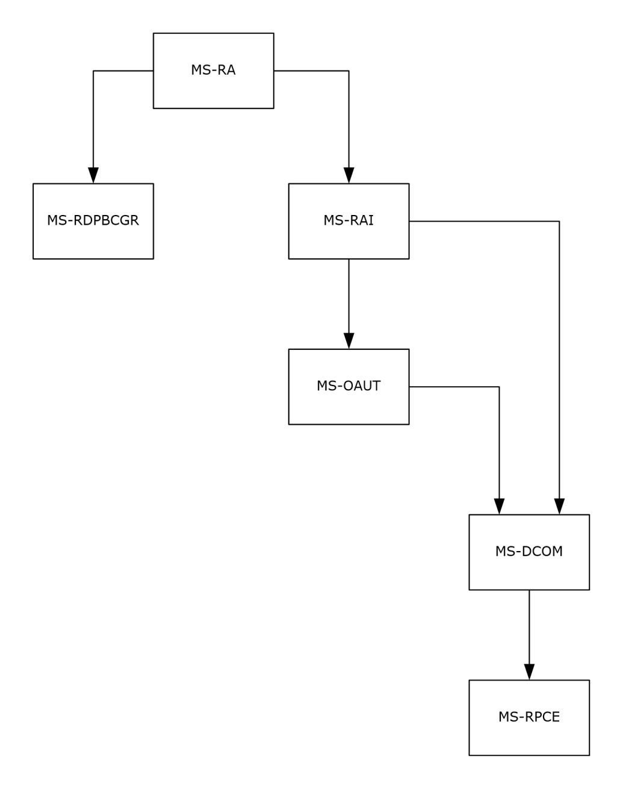
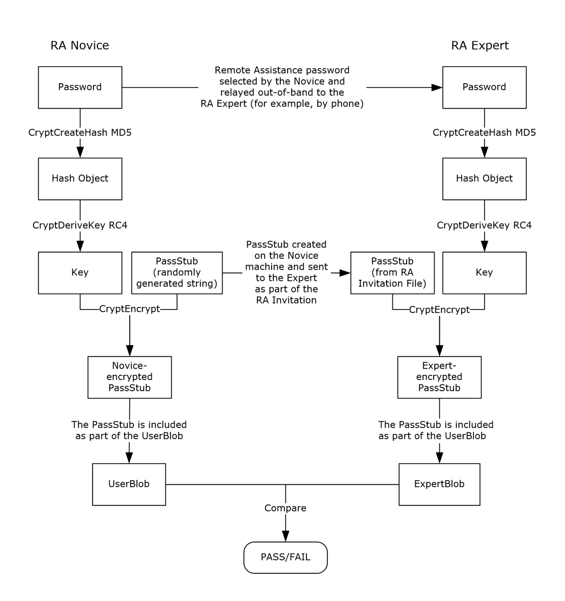
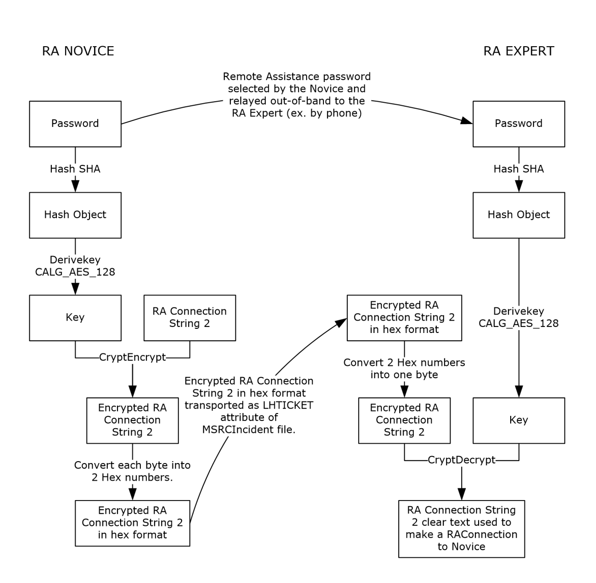

[MS-RAI]:

Remote Assistance Initiation Protocol

Intellectual Property Rights Notice for Open Specifications Documentation

  Technical Documentation. Microsoft publishes Open Specifications documentation (“this

documentation”) for protocols, file formats, data portability, computer languages, and standards
support. Additionally, overview documents cover inter-protocol relationships and interactions.

  Copyrights. This documentation is covered by Microsoft copyrights. Regardless of any other

terms that are contained in the terms of use for the Microsoft website that hosts this
documentation, you can make copies of it in order to develop implementations of the technologies
that are described in this documentation and can distribute portions of it in your implementations
that use these technologies or in your documentation as necessary to properly document the
implementation. You can also distribute in your implementation, with or without modification, any
schemas, IDLs, or code samples that are included in the documentation. This permission also
applies to any documents that are referenced in the Open Specifications documentation.
  No Trade Secrets. Microsoft does not claim any trade secret rights in this documentation.
  Patents. Microsoft has patents that might cover your implementations of the technologies

described in the Open Specifications documentation. Neither this notice nor Microsoft's delivery of
this documentation grants any licenses under those patents or any other Microsoft patents.
However, a given Open Specifications document might be covered by the Microsoft Open
Specifications Promise or the Microsoft Community Promise. If you would prefer a written license,
or if the technologies described in this documentation are not covered by the Open Specifications
Promise or Community Promise, as applicable, patent licenses are available by contacting
iplg@microsoft.com.

  License Programs. To see all of the protocols in scope under a specific license program and the

associated patents, visit the Patent Map.

  Trademarks. The names of companies and products contained in this documentation might be
covered by trademarks or similar intellectual property rights. This notice does not grant any
licenses under those rights. For a list of Microsoft trademarks, visit
www.microsoft.com/trademarks.

  Fictitious Names. The example companies, organizations, products, domain names, email

addresses, logos, people, places, and events that are depicted in this documentation are fictitious.
No association with any real company, organization, product, domain name, email address, logo,
person, place, or event is intended or should be inferred.

Reservation of Rights. All other rights are reserved, and this notice does not grant any rights other
than as specifically described above, whether by implication, estoppel, or otherwise.

Tools. The Open Specifications documentation does not require the use of Microsoft programming
tools or programming environments in order for you to develop an implementation. If you have access
to Microsoft programming tools and environments, you are free to take advantage of them. Certain
Open Specifications documents are intended for use in conjunction with publicly available standards
specifications and network programming art and, as such, assume that the reader either is familiar
with the aforementioned material or has immediate access to it.

Support. For questions and support, please contact dochelp@microsoft.com.

[MS-RAI] - v20240423
Remote Assistance Initiation Protocol
Copyright © 2024 Microsoft Corporation
Release: April 23, 2024

1 / 47

Revision Summary

Date

Revision
History

Revision
Class

Comments

2/22/2007

0.01

6/1/2007

1.0

New

Major

Version 0.01 release

Updated and revised the technical content.

7/3/2007

1.0.1

Editorial

Changed language and formatting in the technical content.

7/20/2007

1.1

8/10/2007

1.2

9/28/2007

1.3

Minor

Minor

Minor

Clarified the meaning of the technical content.

Clarified the meaning of the technical content.

Clarified the meaning of the technical content.

10/23/2007  1.3.1

Editorial

Changed language and formatting in the technical content.

11/30/2007  1.4

Minor

Clarified the meaning of the technical content.

1/25/2008

1.4.1

Editorial

Changed language and formatting in the technical content.

3/14/2008

1.4.2

Editorial

Changed language and formatting in the technical content.

5/16/2008

1.4.3

Editorial

Changed language and formatting in the technical content.

6/20/2008

1.5

Minor

Clarified the meaning of the technical content.

7/25/2008

1.5.1

Editorial

Changed language and formatting in the technical content.

8/29/2008

1.5.2

Editorial

Changed language and formatting in the technical content.

10/24/2008  1.5.3

Editorial

Changed language and formatting in the technical content.

12/5/2008

1.6

Minor

Clarified the meaning of the technical content.

1/16/2009

1.6.1

Editorial

Changed language and formatting in the technical content.

2/27/2009

1.6.2

Editorial

Changed language and formatting in the technical content.

4/10/2009

1.6.3

Editorial

Changed language and formatting in the technical content.

5/22/2009

1.7

7/2/2009

2.0

8/14/2009

2.1

9/25/2009

2.2

11/6/2009

2.3

12/18/2009  2.4

1/29/2010

2.5

Minor

Major

Minor

Minor

Minor

Minor

Minor

Clarified the meaning of the technical content.

Updated and revised the technical content.

Clarified the meaning of the technical content.

Clarified the meaning of the technical content.

Clarified the meaning of the technical content.

Clarified the meaning of the technical content.

Clarified the meaning of the technical content.

3/12/2010

2.5.1

Editorial

Changed language and formatting in the technical content.

4/23/2010

2.5.2

Editorial

Changed language and formatting in the technical content.

6/4/2010

2.5.3

Editorial

Changed language and formatting in the technical content.

7/16/2010

2.5.3

None

No changes to the meaning, language, or formatting of the
technical content.

[MS-RAI] - v20240423
Remote Assistance Initiation Protocol
Copyright © 2024 Microsoft Corporation
Release: April 23, 2024

2 / 47

Date

Revision
History

Revision
Class

Comments

8/27/2010

2.5.3

None

No changes to the meaning, language, or formatting of the
technical content.

10/8/2010

2.5.3

None

No changes to the meaning, language, or formatting of the
technical content.

11/19/2010  2.5.3

None

No changes to the meaning, language, or formatting of the
technical content.

1/7/2011

2.5.3

None

No changes to the meaning, language, or formatting of the
technical content.

2/11/2011

2.5.3

None

No changes to the meaning, language, or formatting of the
technical content.

3/25/2011

2.5.3

None

No changes to the meaning, language, or formatting of the
technical content.

5/6/2011

2.5.3

None

No changes to the meaning, language, or formatting of the
technical content.

6/17/2011

2.6

Minor

Clarified the meaning of the technical content.

9/23/2011

2.6

12/16/2011  3.0

3/30/2012

3.1

7/12/2012

4.0

10/25/2012  4.0

None

Major

Minor

Major

None

No changes to the meaning, language, or formatting of the
technical content.

Updated and revised the technical content.

Clarified the meaning of the technical content.

Updated and revised the technical content.

No changes to the meaning, language, or formatting of the
technical content.

1/31/2013

4.0

None

No changes to the meaning, language, or formatting of the
technical content.

8/8/2013

5.0

Major

Updated and revised the technical content.

11/14/2013  5.0

2/13/2014

5.0

5/15/2014

5.0

None

None

None

No changes to the meaning, language, or formatting of the
technical content.

No changes to the meaning, language, or formatting of the
technical content.

No changes to the meaning, language, or formatting of the
technical content.

6/30/2015

6.0

Major

Significantly changed the technical content.

10/16/2015  6.0

None

No changes to the meaning, language, or formatting of the
technical content.

7/14/2016

7.0

Major

Significantly changed the technical content.

6/1/2017

7.0

9/15/2017

8.0

12/1/2017

8.0

None

Major

None

No changes to the meaning, language, or formatting of the
technical content.

Significantly changed the technical content.

No changes to the meaning, language, or formatting of the

[MS-RAI] - v20240423
Remote Assistance Initiation Protocol
Copyright © 2024 Microsoft Corporation
Release: April 23, 2024

3 / 47

Date

Revision
History

Revision
Class

Comments

technical content.

9/12/2018

9.0

4/7/2021

10.0

6/25/2021

11.0

4/23/2024

12.0

Major

Major

Major

Major

Significantly changed the technical content.

Significantly changed the technical content.

Significantly changed the technical content.

Significantly changed the technical content.

[MS-RAI] - v20240423
Remote Assistance Initiation Protocol
Copyright © 2024 Microsoft Corporation
Release: April 23, 2024

4 / 47

## Table of Contents

- [1 Introduction](#1-introduction)
  - [1.1 Glossary](#11-glossary)
  - [1.2 References](#12-references)
    - [1.2.1 Normative References](#121-normative-references)
    - [1.2.2 Informative References](#122-informative-references)
  - [1.3 Overview](#13-overview)
  - [1.4 Relationship to Other Protocols](#14-relationship-to-other-protocols)
  - [1.5 Prerequisites/Preconditions](#15-prerequisitespreconditions)
  - [1.6 Applicability Statement](#16-applicability-statement)
  - [1.7 Versioning and Capability Negotiation](#17-versioning-and-capability-negotiation)
  - [1.8 Vendor-Extensible Fields](#18-vendor-extensible-fields)
  - [1.9 Standards Assignments](#19-standards-assignments)
- [2 Messages](#2-messages)
  - [2.1 Transport](#21-transport)
  - [2.2 Common Data Types](#22-common-data-types)
    - [2.2.1 Remote Assistance Connection String 1](#221-remote-assistance-connection-string-1)
    - [2.2.2 Remote Assistance Connection String 2](#222-remote-assistance-connection-string-2)
    - [2.2.3 SessionStateEnum](#223-sessionstateenum)
- [3 Protocol Details](#3-protocol-details)
  - [3.1 IPCHService Remote Assistance Server Details](#31-ipchservice-remote-assistance-server-details)
    - [3.1.1 Abstract Data Model](#311-abstract-data-model)
    - [3.1.2 Timers](#312-timers)
    - [3.1.3 Initialization](#313-initialization)
    - [3.1.4 Message Processing Events and Sequencing Rules](#314-message-processing-events-and-sequencing-rules)
      - [3.1.4.1 IPCHService](#3141-ipchservice)
        - [3.1.4.1.1 RemoteConnectionParms (Opnum 19)](#31411-remoteconnectionparms-opnum-19)
        - [3.1.4.1.2 RemoteUserSessionInfo (Opnum 20)](#31412-remoteusersessioninfo-opnum-20)
          - [3.1.4.1.2.1 IPCHCollection](#314121-ipchcollection)
            - [3.1.4.1.2.1.1 _NewEnum (Opnum 7)](#3141211-newenum-opnum-7)
            - [3.1.4.1.2.1.2 Item (Opnum 8)](#3141212-item-opnum-8)
            - [3.1.4.1.2.1.3 Count (Opnum 9)](#3141213-count-opnum-9)
          - [3.1.4.1.2.2 ISAFSession](#314122-isafsession)
            - [3.1.4.1.2.2.1 DomainName (Get) (Opnum 11)](#3141221-domainname-get-opnum-11)
            - [3.1.4.1.2.2.2 DomainName (Set) (Opnum 12)](#3141222-domainname-set-opnum-12)
            - [3.1.4.1.2.2.3 SessionID (Get) (Opnum 7)](#3141223-sessionid-get-opnum-7)
            - [3.1.4.1.2.2.4 SessionID (Set) (Opnum 8)](#3141224-sessionid-set-opnum-8)
            - [3.1.4.1.2.2.5 SessionState (Get) (Opnum 9)](#3141225-sessionstate-get-opnum-9)
            - [3.1.4.1.2.2.6 SessionState (Set) (Opnum 10)](#3141226-sessionstate-set-opnum-10)
            - [3.1.4.1.2.2.7 UserName (Get) (Opnum 13)](#3141227-username-get-opnum-13)
            - [3.1.4.1.2.2.8 UserName (Set) (Opnum 14)](#3141228-username-set-opnum-14)
    - [3.1.5 Timer Events](#315-timer-events)
    - [3.1.6 Other Local Events](#316-other-local-events)
  - [3.2 IPCHService Remote Assistance Client Details](#32-ipchservice-remote-assistance-client-details)
    - [3.2.1 Abstract Data Model](#321-abstract-data-model)
    - [3.2.2 Timers](#322-timers)
    - [3.2.3 Initialization](#323-initialization)
    - [3.2.4 Message Processing Events and Sequencing Rules](#324-message-processing-events-and-sequencing-rules)
    - [3.2.5 Timer Events](#325-timer-events)
    - [3.2.6 Other Local Events](#326-other-local-events)
  - [3.3 IRASrv Remote Assistance Server Details](#33-irasrv-remote-assistance-server-details)
    - [3.3.1 Abstract Data Model](#331-abstract-data-model)
    - [3.3.2 Timers](#332-timers)
    - [3.3.3 Initialization](#333-initialization)
    - [3.3.4 Message Processing Events and Sequencing Rules](#334-message-processing-events-and-sequencing-rules)
      - [3.3.4.1 IRASrv](#3341-irasrv)
        - [3.3.4.1.1 GetNoviceUserInfo (Opnum 7)](#33411-getnoviceuserinfo-opnum-7)
        - [3.3.4.1.2 GetSessionInfo (Opnum 8)](#33412-getsessioninfo-opnum-8)
    - [3.3.5 Timer Events](#335-timer-events)
    - [3.3.6 Other Local Events](#336-other-local-events)
  - [3.4 IRASrv Remote Assistance Client Details](#34-irasrv-remote-assistance-client-details)
    - [3.4.1 Abstract Data Model](#341-abstract-data-model)
    - [3.4.2 Timers](#342-timers)
    - [3.4.3 Initialization](#343-initialization)
    - [3.4.4 Message Processing Events and Sequencing Rules](#344-message-processing-events-and-sequencing-rules)
    - [3.4.5 Timer Events](#345-timer-events)
    - [3.4.6 Other Local Events](#346-other-local-events)
- [4 Protocol Examples](#4-protocol-examples)
- [5 Security](#5-security)
  - [5.1 Security Considerations for Implementers](#51-security-considerations-for-implementers)
  - [5.2 Index of Security Parameters](#52-index-of-security-parameters)
- [6 Appendix A: Remote Assistance Invitation File Format](#6-appendix-a-remote-assistance-invitation-file-format)
- [7 Appendix B: Full IDL](#7-appendix-b-full-idl)
- [8 Appendix C: Product Behavior](#8-appendix-c-product-behavior)
- [9 Change Tracking](#9-change-tracking)
- [10 Index](#10-index)

## 1 Introduction

The Remote Assistance Initiation Protocol is a set of Distributed Component Object Model
(DCOM) interfaces, as specified in [MS-DCOM], for initiating a Remote Assistance connection to
another computer in a domain. The Remote Assistance Initiation Protocol allows an authorized
expert to start Remote Assistance on a remote novice computer to retrieve data that is required to
make a Remote Assistance connection from the expert computer to the novice computer.

Sections 1.5, 1.8, 1.9, 2, and 3 of this specification are normative. All other sections and examples in
this specification are informative.

### 1.1 Glossary

This document uses the following terms:

class identifier (CLSID): A GUID that identifies a software component; for instance, a DCOM

object class or a COM class.

computer name: The DNS or NetBIOS name.

Distributed Component Object Model (DCOM): The Microsoft Component Object Model (COM)
specification that defines how components communicate over networks, as specified in [MS-
DCOM].

domain: A set of users and computers sharing a common namespace and management

infrastructure. At least one computer member of the set has to act as a domain controller (DC)
and host a member list that identifies all members of the domain, as well as optionally hosting
the Active Directory service. The domain controller provides authentication of members, creating
a unit of trust for its members. Each domain has an identifier that is shared among its members.
For more information, see [MS-AUTHSOD] section 1.1.1.5 and [MS-ADTS].

domain name: A domain name or a NetBIOS name that identifies a domain.

expert: The side of a Remote Assistance connection that is able to view the remote screen of

the other computer in order to provide help.

fully qualified domain name (FQDN): An unambiguous domain name that gives an absolute

location in the Domain Name System's (DNS) hierarchy tree, as defined in [RFC1035] section
3.1 and [RFC2181] section 11.

novice: The side of a Remote Assistance connection that shares its screen with the other

computer in order to receive help.

opnum: An operation number or numeric identifier that is used to identify a specific remote

procedure call (RPC) method or a method in an interface. For more information, see [C706]
section 12.5.2.12 or [MS-RPCE].

Remote Assistance (RA): A feature of the operating system that allows screen, keyboard, and

mouse sharing so that a computer user can be assisted by a remote helper.

Remote Assistance connection: A communication framework that is established between two

computers that facilitates Remote Assistance.

Remote Desktop Protocol (RDP): A multi-channel protocol that allows a user to connect to a
computer running Microsoft Terminal Services (TS). RDP enables the exchange of client and
server settings and also enables negotiation of common settings to use for the duration of the
connection, so that input, graphics, and other data can be exchanged and processed between
client and server.

7 / 47

[MS-RAI] - v20240423
Remote Assistance Initiation Protocol
Copyright © 2024 Microsoft Corporation
Release: April 23, 2024

remote procedure call (RPC): A communication protocol used primarily between client and

server. The term has three definitions that are often used interchangeably: a runtime
environment providing for communication facilities between computers (the RPC runtime); a set
of request-and-response message exchanges between computers (the RPC exchange); and the
single message from an RPC exchange (the RPC message).  For more information, see [C706].

terminal services (TS): A service on a server computer that allows delivery of applications, or

the desktop itself, to various computing devices. When a user runs an application on a terminal
server, the application execution takes place on the server computer and only keyboard, mouse,
and display information is transmitted over the network. Each user sees only his or her
individual session, which is managed transparently by the server operating system and is
independent of any other client session.

Unicode string: A Unicode 8-bit string is an ordered sequence of 8-bit units, a Unicode 16-bit
string is an ordered sequence of 16-bit code units, and a Unicode 32-bit string is an ordered
sequence of 32-bit code units. In some cases, it could be acceptable not to terminate with a
terminating null character. Unless otherwise specified, all Unicode strings follow the UTF-16LE
encoding scheme with no Byte Order Mark (BOM).

universally unique identifier (UUID): A 128-bit value. UUIDs can be used for multiple

purposes, from tagging objects with an extremely short lifetime, to reliably identifying very
persistent objects in cross-process communication such as client and server interfaces, manager
entry-point vectors, and RPC objects. UUIDs are highly likely to be unique. UUIDs are also
known as globally unique identifiers (GUIDs) and these terms are used interchangeably in the
Microsoft protocol technical documents (TDs). Interchanging the usage of these terms does not
imply or require a specific algorithm or mechanism to generate the UUID. Specifically, the use of
this term does not imply or require that the algorithms described in [RFC4122] or [C706] has to
be used for generating the UUID.

well-known endpoint: A preassigned, network-specific, stable address for a particular

client/server instance. For more information, see [C706].

MAY, SHOULD, MUST, SHOULD NOT, MUST NOT: These terms (in all caps) are used as defined
in [RFC2119]. All statements of optional behavior use either MAY, SHOULD, or SHOULD NOT.

### 1.2 References

Links to a document in the Microsoft Open Specifications library point to the correct section in the
most recently published version of the referenced document. However, because individual documents
in the library are not updated at the same time, the section numbers in the documents may not
match. You can confirm the correct section numbering by checking the Errata.

#### 1.2.1 Normative References

We conduct frequent surveys of the normative references to assure their continued availability. If you
have any issue with finding a normative reference, please contact dochelp@microsoft.com. We will
assist you in finding the relevant information.

[C706] The Open Group, "DCE 1.1: Remote Procedure Call", C706, August 1997,
https://publications.opengroup.org/c706

Note Registration is required to download the document.

[MS-DCOM] Microsoft Corporation, "Distributed Component Object Model (DCOM) Remote Protocol".

[MS-DTYP] Microsoft Corporation, "Windows Data Types".

[MS-ERREF] Microsoft Corporation, "Windows Error Codes".

8 / 47

[MS-RAI] - v20240423
Remote Assistance Initiation Protocol
Copyright © 2024 Microsoft Corporation
Release: April 23, 2024

[MS-OAUT] Microsoft Corporation, "OLE Automation Protocol".

[MS-RA] Microsoft Corporation, "Remote Assistance Protocol".

[MS-RDPBCGR] Microsoft Corporation, "Remote Desktop Protocol: Basic Connectivity and Graphics
Remoting".

[MS-RPCE] Microsoft Corporation, "Remote Procedure Call Protocol Extensions".

[RFC2119] Bradner, S., "Key words for use in RFCs to Indicate Requirement Levels", BCP 14, RFC
2119, March 1997, https://www.rfc-editor.org/info/rfc2119

#### 1.2.2 Informative References

[MSDN-CRYPTO] Microsoft Corporation, "Cryptography Reference", http://msdn.microsoft.com/en-
us/library/aa380256.aspx

### 1.3 Overview

The Remote Assistance Initiation Protocol provides a set of DCOM interfaces that enable an expert to
retrieve the Remote Assistance connection-specific data from the remote novice computer. This
Remote Assistance connection-specific data is subsequently used to initiate a Remote Assistance
connection as explained in the Remote Assistance Initiation Protocol.

The expert needs to have the IP address or fully qualified domain name (FQDN) of the novice
computer to use this protocol.

The expert is the DCOM client and the novice is the DCOM server.

 Before the expert's DCOM call is executed on the novice computer, DCOM performs a check to verify
that the expert is on the list of authorized Remote Assistance helpers on the novice computer.<1>

### 1.4 Relationship to Other Protocols

The Remote Assistance Initiation Protocol relies on the OLE Automation Protocol [MS-OAUT], the
Distributed Component Object Model (DCOM) Remote Protocol [MS-DCOM], and on the Microsoft
remote procedure call (RPC), as specified in the Remote Procedure Call Protocol Extensions [MS-
RPCE].

The Remote Assistance Protocol [MS-RA] is dependent on both the Remote Assistance Initiation
Protocol and the Remote Desktop Protocol: Basic Connectivity and Graphics Remoting [MS-RDPBCGR].

The following diagram illustrates the relationships between the preceding protocols.

[MS-RAI] - v20240423
Remote Assistance Initiation Protocol
Copyright © 2024 Microsoft Corporation
Release: April 23, 2024

9 / 47

<!-- Extracted images from page 10 -->

<!-- /Extracted images from page 10 -->

Figure 1: Relationships between protocols

### 1.5 Prerequisites/Preconditions

This protocol is implemented over DCOM and RPC, and, as a result, has the prerequisites specified in
the Distributed Component Object Model (DCOM) Remote Protocol [MS-DCOM] and Remote Procedure
Call Protocol Extensions [MS-RPCE] as being common to DCOM and RPC interfaces.

The Remote Assistance Initiation Protocol assumes that the expert has the IP Address or the FQDN of
the novice computer.

[MS-RAI] - v20240423
Remote Assistance Initiation Protocol
Copyright © 2024 Microsoft Corporation
Release: April 23, 2024

10 / 47

### 1.6 Applicability Statement

This protocol is used to perform the following functions:

  Using the novice IP address or FQDN, the expert queries the novice for a list of active terminal
services sessions running on the novice computer. Additional information about each terminal
services session—DomainName, UserName, terminal services SessionID, and terminal services
SessionState—is also obtained.

  Using the DomainName, UserName, and SessionID of a specific session on the novice computer,

the expert queries the novice for a Remote Assistance Connection String. The novice starts
Remote Assistance and returns a Remote Assistance Connection String. The novice is now
waiting for the expert to make a peer-to-peer connection to its terminal services session.

  After a Remote Assistance Connection String is obtained by the expert, it is used to make a peer-
to-peer Remote Assistance connection to the novice's Terminal Service session on the novice
computer.

### 1.7 Versioning and Capability Negotiation

This document covers versioning issues in the following areas.

Supported Transports: This protocol uses the DCOM  technology specified in [MS-DCOM], which
provides capabilities to query for interface versions.

Protocol Versions: This protocol is composed of the following two primary DCOM interfaces, which
are version 0.0:<2>





IPCHService

IRASrv

Both these interfaces offer similar functionality through their methods. An RPC client determines if a
method is supported by attempting to invoke the method; if the method is not supported, the RPC
server returns the "RPC_S_PROCNUM_OUT_OF_RANGE" error, as specified in [MS-RPCE] section
3.1.1.5.5.

When an expert attempts to connect using this protocol, it uses only one of these two interfaces.

The novice computer implements at least one of these two interfaces, and can implement both
interfaces.

The expert computer negotiates for a given set of server functionality by specifying the UUID
corresponding to the wanted RPC interface when binding to the novice.

### 1.8 Vendor-Extensible Fields

This protocol does not define any vendor-extensible fields.

### 1.9 Standards Assignments

No standards assignments have been received for this protocol. All values used in these extensions
are in private ranges specified in section 2.1.

 Parameter

 Value

 Reference

RPC Interface UUID for IPCHService

833E4200-AFF7-4AC3-AAC2-9F24C1457BCE

IPCHService

[MS-RAI] - v20240423
Remote Assistance Initiation Protocol
Copyright © 2024 Microsoft Corporation
Release: April 23, 2024

11 / 47

 Parameter

 Value

 Reference

RPC Interface UUID for IPCHCollection

 833E4100-AFF7-4AC3-AAC2-9F24C1457BCE

IPCHCollection

RPC Interface UUID for ISAFSession

 833E41AA-AFF7-4AC3-AAC2-9F24C1457BCE

ISAFSession

RPC Interface UUID for IRASrv

F120A684-B926-447F-9DF4-C966CB785648

IRASrv

CLSID for PCHService object

833E4010-AFF7-4AC3-AAC2-9F24C1457BCE

PCHService

CLSID for RASrv object

3C3A70A7-A468-49B9-8ADA-28E11FCCAD5D  RASrv

[MS-RAI] - v20240423
Remote Assistance Initiation Protocol
Copyright © 2024 Microsoft Corporation
Release: April 23, 2024

12 / 47

## 2 Messages

### 2.1 Transport

DCOM [MS-DCOM] is used as the transport protocol. The Remote Assistance Initiation Protocol
documented here relies upon DCOM [MS-DCOM] authentication and encryption for all protocol
messages.

This protocol MUST use these universally unique identifier (UUID) interfaces, as explained in
section 1.9:









(833E4200-AFF7-4AC3-AAC2-9F24C1457BCE)

(833E4100-AFF7-4AC3-AAC2-9F24C1457BCE)

(833E41AA-AFF7-4AC3-AAC2-9F24C1457BCE)

(F120A684-B926-447F-9DF4-C966CB785648)

The following two are the CLSIDs of the objects implementing these interfaces, as explained in
section 1.9:





(833E4010-AFF7-4AC3-AAC2-9F24C1457BCE)

(3C3A70A7-A468-49B9-8ADA-28E11FCCAD5D)

### 2.2 Common Data Types

In addition to RPC base types and definitions specified in [C706] and [MS-DTYP], additional data
types are defined in the following sections.

There are two version-specific forms of the Remote Assistance Connection String, appended with 1
and 2 to differentiate them.

#### 2.2.1 Remote Assistance Connection String 1

The Remote Assistance Connection String 1 contains the Remote Desktop Protocol parameters to
establish a Remote Assistance connection. The Remote Assistance Connection String 1 is a
comma-delimited Unicode string comprising the following pieces of data.<3>

 <ProtocolVersion>,<protocolType>,<machineAddressList>,<assistantAccountPwd>,
 <RASessionID>,<RASessionName>,<RASessionPwd>,<protocolSpecificParms>

The elements are defined as follows.

ProtocolVersion: Identifies the protocol version. The value MUST be 65,538.

protocolType: Identifies the protocol type. The value MUST be 1.

machineAddressList: Identifies network address of server machine. It is a semicolon-delimited list of

IPAddress(or computer name):PortID string pairs. The IPAddress is of type IPV4.

assistantAccountPwd: Password for Remote Assistance Account Name. This MUST be set to "*".

RASessionID: Remote Assistance session unique identifier.

RASessionName: Remote Assistance session name. This MUST be set to "*".

13 / 47

[MS-RAI] - v20240423
Remote Assistance Initiation Protocol
Copyright © 2024 Microsoft Corporation
Release: April 23, 2024

RASessionPwd: Remote Assistance session password. This MUST be set to "*".

protocolSpecificParms: Parameter specific to a Remote Desktop Protocol.

The following is an example of Remote Assistance Connection String 1.

 65538,1,172.31.243.138:3389;MIKE_HOME:3389,*,Uj7RpOlU80SibpRw
 RZ9+z1vbh7nIgVn89X1AiKp15Vc=,*,*,RcfwecK8dpcT1fjZ6iQ5M0+q7iU=

The values for the Remote Assistance Connection String 1 entities in the preceding example are as
follows.

 ProtocolVersion =  65538
 protocolType = 1
 machineAddressList = 172.31.243.138:3389;MIKE_HOME:3389
 assistantAccountPwd = *
 RASessionID = Uj7RpOlU80SibpRwRZ9+z1vbh7nIgVn89X1AiKp15Vc=
 RASessionName = *
 RASessionPwd = *
 protocolSpecificParms = RcfwecK8dpcT1fjZ6iQ5M0+q7iU=

#### 2.2.2 Remote Assistance Connection String 2

The second type of the Remote Assistance Connection String packet is a Unicode string in XML
format.<4> The details of this are as follows.

 <E>
     <A KH="Protocol-specific Parameter" KH2="Protocol-specific Parameter" ID="Authorization
String Identifier" />
     <C>
         <T ID="Transport ID" SID="Session ID">
               <L P="Port" N="Server Name" />
         </T>
     </C>
 </E>

The novice (server) generates the KH attribute of the Auth String Node <A> in the Remote Assistance
Connection String 2. The expert (client) validates the value of KH during the RDP connection
sequence.

The KH value is a base64-encoded string of the SHA1 hash of the PublicKeyBlob field of the server
certificate received in TS_UD_SC_SEC1. The length, in bytes, of the PublicKeyBlob is given by the
wPublicKeyBlobLen field as specified in [MS-RDPBCGR] sections 2.2.1.4.3 and 2.2.1.4.3.1.1.

In addition to the KH attribute, the novice (server) SHOULD<5> generate the KH2 attribute of the
Auth String Node <A> in the Remote Assistance Connection String 2. If this parameter is present in
the connection string, the expert (client) validates the value of KH2 during the RDP connection. If this
parameter is absent in the connection string, the client uses the KH parameter for validating the
server as described in the previous paragraph. The KH2 value is a composite of the hashing algorithm
used and the base64 encoded string of the PublicKeyBlob field of the server certificate received in
TS_UD_SC_SEC1. The hashing algorithm can be sha256, sha384, or sha512. The hashing algorithm
and base64 encoded string of the hash are separated by a colon (:).

The Remote Assistance Connection String 2 starts with the root Node <E>. This root Node contains
the following child nodes:

14 / 47

[MS-RAI] - v20240423
Remote Assistance Initiation Protocol
Copyright © 2024 Microsoft Corporation
Release: April 23, 2024

1.  The Auth String Node <A> has the following attributes.

Value  Meaning

KH

ID

Parameters specific to a Remote Desktop Protocol

Authstring identifier

KH2

Parameters specific to a Remote Desktop Protocol

2.  The Connector Node <C> has child nodes that give information on the underlying Transport used.

This Transport Node <T> has the following attributes.

Value  Meaning

ID

Transport Identifier

SID

Session Identifier

3.  The Transport Node has Listener child Nodes that give information about the Server IP and port.

This Listener node <L> has the following attributes.

Value  Meaning

P

N

U

Port: The dynamic port on which the Remote Assistance connection could happen.

Server Name: The name/IP address of the server, that is, the novice computer.

URI: The full URI if websocket listener is enabled. The U (URI) is used instead of the P (port)
attribute. N (server name) attribute is still included.

The following is an example of Remote Assistance Connection String 2:

 <E>
     <A KH="YiKwWUY8Ioq5NB3wAQHSbs5kwrM="
KH2="sha256:wKSAkAV3sBfa9WpuRFJcP9q1twJc6wOBuoJ9tsyXwpk="
ID="8rYm30RBW8/4dAWoUsWbFCF5jno/7jr5t
 NpHQc2goLbw4uuBBJvLsU02YYLlBMg5"/>
     <C>
         <T ID="1" SID="1440550163">
             <L P="49749" N="2001:4898:1a:5:79e2:3356:9b22:3470"/>
             <L P="49751" N="172.31.250.64"/>
         </T>
     </C>
 </E>

In the preceding example:

1.  The Auth String Node <A> has the attribute KH="YiKwWUY8Ioq5NB3wAQHSbs5kwrM=",

KH2="sha256:wKSAkAV3sBfa9WpuRFJcP9q1twJc6wOBuoJ9tsyXwpk=", and attribute ID =
"8rYm30RBW8/4dAWoUsWbFCF5jno/7jr5tNpHQc2goLbw4uuBBJvLsU02YYLlBMg5".  In this
example, the KH2 value contains the encoded string
"wKSAkAV3sBfa9WpuRFJcP9q1twJc6wOBuoJ9tsyXwpk=" and the hashing algorithm used is
SHA256.

2.  The Connector Node <C> has one Transport child Node <T> with the following attributes:

ID = "1"

[MS-RAI] - v20240423
Remote Assistance Initiation Protocol
Copyright © 2024 Microsoft Corporation
Release: April 23, 2024

15 / 47

Session ID - SID = "1440550163"

3.  The Transport Node has two Listener child Nodes <L> with the following server and port

information attributes:

Port - P = "49749"

Server Name - N = "2001:4898:1a:5:79e2:3356:9b22:3470", and

Port - P = "49751"

Server Name - N = "172.31.250.64".

#### 2.2.3 SessionStateEnum

The SessionStateEnum enumeration defines the states of a terminal services session.

 typedef  enum
 {
   pchActive = 0,
   pchConnected = 1,
   pchConnectQuery = 2,
   pchShadow = 3,
   pchDisconnected = 4,
   pchIdle = 5,
   pchListen = 6,
   pchReset = 7,
   pchDown = 8,
   pchInit = 9,
   pchStateInvalid = 10
 } SessionStateEnum;

pchActive:  The user is logged on and active.

pchConnected:  The server is connected to the client.

pchConnectQuery:  The server is in the process of connecting to the client.

pchShadow:  The session is shadowing another session.

pchDisconnected:  The client has disconnected from the session.

pchIdle:  The session is waiting for a client to connect.

pchListen:  The session is listening for a request for a new connection. No user is logged on to a
listener session. A listener session cannot be reset, shadowed, or changed to a regular client
session.

pchReset:  The session is being reset.

pchDown:  The session is down due to an error.

pchInit:  The session is initializing.

pchStateInvalid:  The session is in an unknown state.

[MS-RAI] - v20240423
Remote Assistance Initiation Protocol
Copyright © 2024 Microsoft Corporation
Release: April 23, 2024

16 / 47

## 3 Protocol Details

### 3.1 IPCHService Remote Assistance Server Details

The Remote Assistance server provides methods that allow a client to:

  Get the collection of the terminal services sessions on the remote novice computer.

  Get a Remote Assistance Connection String for a specific Terminal Server session.

The following sections specify server details of the IPCHService interface of the Remote Assistance
Initiation Protocol, including abstract data models, timers, and message processing rules.

#### 3.1.1 Abstract Data Model

 No abstract data model is used.

#### 3.1.2 Timers

No timers or time-out periods are associated with this section of the protocol.

#### 3.1.3 Initialization

The server MUST listen on the well-known endpoint defined for this RPC interface. For more
information, see section 2.1.

#### 3.1.4 Message Processing Events and Sequencing Rules

##### 3.1.4.1 IPCHService

The IPCHService interface is implemented by the novice to allow the expert to request a Remote
Assistance Connection String.<6>

The UUID for this interface is: "833E4200-AFF7-4AC3-AAC2-9F24C1457BCE".

Methods in RPC opnum order:

  Opnums 0, 1, and 2 are reserved for the IUnknown_QueryInterface, AddRef, and Release

methods used by the standard COM IUnknown interface specified in [MS-DCOM] section 3.1.1.5.8.

  Opnums 3 and 4 are not used across the network. These opnums are reserved and MUST NOT be

used.<7>

  Opnums 5 and 6 are reserved for the GetIDsOfNames and Invoke methods in the IDispatch

interface specified in [MS-OAUT] section 3.1.

  Opnums 7 through 18 and opnum 21 are not used by this protocol.

Method

Description

RemoteConnectionParms  Gets the Remote Assistance connection parameters for a specified UserName,

DomainName, and SessionID triple.

Opnum: 19

RemoteUserSessionInfo

Returns the collection of the terminal services sessions on the remote novice
computer. All the terminal services session information is returned as a standard

17 / 47

[MS-RAI] - v20240423
Remote Assistance Initiation Protocol
Copyright © 2024 Microsoft Corporation
Release: April 23, 2024

Method

Description

IPCHCollection interface. The members of this collection are objects of type
ISAFSession. ISAFSession includes the DomainName, UserName, SessionID, and User
SessionState for each session.

Opnum: 20

###### 3.1.4.1.1 RemoteConnectionParms (Opnum 19)

The RemoteConnectionParms method gets the Remote Assistance connection parameters for a
specific UserName, DomainName, and SessionID triple.

 [id(DISPID_PCH_SVC__REMOTECONNECTIONPARMS)] HRESULT RemoteConnectionParms(
   [in] BSTR bstrUserName,
   [in] BSTR bstrDomainName,
   [in] long lSessionID,
   [in] BSTR bstrUserHelpBlob,
   [out, retval] BSTR* pbstrConnectionString
 );

bstrUserName: The UserName part of the DomainName\UserName string corresponding to the

terminal services session for which the client is requesting a Remote Assistance Connection
String.

bstrDomainName: The DomainName part of the DomainName\UserName string corresponding to the
terminal services session for which the client is requesting a Remote Assistance Connection String.

lSessionID: Identifier of the terminal services session for which the client is requesting a Remote

Assistance Connection String.

bstrUserHelpBlob: A semicolon-delimited string that contains the domain and user names of the

expert requesting a Remote Assistance Connection String. The format of the string is as follows.

 <Length of the string>;
 <"UNSOLICITED=1"> (Note: no semicolon)
 <Length of the DomainName\UserName string>;
 <ID=DomainName\UserName>  (Note: characters 'ID=' count toward string length)

The following is an example.

 "13;UNSOLICITED=118;ID=EXDOMAIN\EXUSER"

pbstrConnectionString: A pointer to a Remote Assistance Connection String for the requested

session.

Return Values: A signed 32-bit value indicating return status. This method MUST return zero to

indicate success, or an HRESULT error value (as specified in [MS-ERREF] section 2.1.1) to indicate
failure. If the UserName and DomainName are valid BSTRs, the return code is one listed in the
following table. If the UserName and DomainName are invalid BSTRs, the HRESULT value returned
is the corresponding HRESULT to the system error code ERROR_NONE_MAPPED.

Return value/code

Description

0x00000000

The call was successful.

18 / 47

[MS-RAI] - v20240423
Remote Assistance Initiation Protocol
Copyright © 2024 Microsoft Corporation
Release: April 23, 2024

Return value/code

Description

S_OK

0x80070005

E_ACCESSDENIED

0x8007000E

E_OUTOFMEMORY

0x800704EC

ERROR_ACCESS_DISABLED_BY_POLICY

Exceptions Thrown:

General access denied error. <8>

Out of memory.

The program cannot be opened because of a software
restriction policy. For more information, contact the system
administrator.

No exceptions are thrown beyond those thrown by the underlying RPC protocol [MS-RPCE].

###### 3.1.4.1.2 RemoteUserSessionInfo (Opnum 20)

The RemoteUserSessionInfo method returns the collection of the terminal services sessions on the
remote novice machine. All the terminal services session information is returned as a standard
IPCHCollection interface. The members of this collection are objects of type ISAFSession. ISAFSession
includes the DomainName, SessionID, SessionState, and UserName for each session.

 [id(DISPID_PCH_SVC__REMOTEUSERSESSIONINFO)] HRESULT RemoteUserSessionInfo(
   [out, retval] IPCHCollection** pVal
 );

pVal: A pointer to an IPCHCollection interface containing terminal services sessions information on the

server.

Return Values: A signed 32-bit value indicating return status. This method MUST return zero to

indicate success, or an HRESULT error value (as specified in [MS-ERREF] section 2.1.1) to indicate
failure.

Return value/code

Description

0x00000000

S_OK

0x80070005

E_ACCESSDENIED

0x8007000E

E_OUTOFMEMORY

0x800704EC

ERROR_ACCESS_DISABLED_BY_POLICY

Exceptions Thrown:

The call was successful.

General access denied error. <9>

Out of memory.

The program cannot be opened because of a software restriction
policy. For more information, contact the system administrator.

No exceptions are thrown beyond those thrown by the underlying RPC protocol [MS-RPCE].

###### 3.1.4.1.2.1 IPCHCollection

The IPCHCollection interface provides methods to enumerate the elements of a collection.

19 / 47

[MS-RAI] - v20240423
Remote Assistance Initiation Protocol
Copyright © 2024 Microsoft Corporation
Release: April 23, 2024

The UUID for this interface is: "833E4100-AFF7-4AC3-AAC2-9F24C1457BCE".

Opnums 3 and 4 are not used across the network. These opnums are reserved and MUST NOT be
reused by non-Microsoft implementations.<10>

Methods in RPC Opnum Order

Method

Description

_NewEnum  Creates a copy of the collection.

Opnum: 7

Item

Retrieves an element.

Opnum: 8

Count

Retrieves the number of elements in the collection.

Opnum: 9

Opnums 0, 1, and 2 are reserved for the IUnknown_QueryInterface, AddRef, and Release methods
used by the standard COM IUnknown interface, as specified in [MS-DCOM] section 3.1.1.5.8. Opnums
5 and 6 are reserved for the GetIDsOfNames and Invoke methods in the IDispatch interface, as
specified in [MS-OAUT] section 3.1.

###### 3.1.4.1.2.1.1 _NewEnum (Opnum 7)

The _NewEnum method creates a copy of the collection.

 [propget, id(DISPID_NEWENUM)] HRESULT _NewEnum(
   [out, retval] IUnknown** pVal
 );

pVal: A pointer to a pointer to the IUnknown interface of a new copy of the collection.

Return Values: A signed 32-bit value indicating return status. This method MUST return zero to

indicate success, or an HRESULT error value (as specified in [MS-ERREF] section 2.1.1) to indicate
failure.

Return value/code  Description

0x00000000

The call was successful.

S_OK

0x80004003

E_POINTER

The method failed due to an invalid pointer.

0x8007000E

The method was unable to allocate required memory.

E_OUTOFMEMORY

Exceptions Thrown:

No exceptions are thrown beyond those thrown by the underlying RPC protocol [MS-RPCE].

###### 3.1.4.1.2.1.2 Item (Opnum 8)

The Item method retrieves an element.

 [propget, id(DISPID_VALUE)] HRESULT Item(

[MS-RAI] - v20240423
Remote Assistance Initiation Protocol
Copyright © 2024 Microsoft Corporation
Release: April 23, 2024

20 / 47

   [in] long vIndex,
   [out, retval] VARIANT* ppEntry
 );

vIndex: One-indexed number of the element to retrieve.

ppEntry: A pointer to the element at vIndex, of type VARIANT as defined in [MS-OAUT] section

2.2.29.2.

Return Values: A signed 32-bit value indicating return status. This method MUST return zero to

indicate success, or an HRESULT error value (as specified in [MS-ERREF] section 2.1.1) to indicate
failure.

Return value/code  Description

0x00000000

The call was successful.

S_OK

0x80004003

E_POINTER

The method failed due to an invalid pointer.

0x8007000E

The method was unable to allocate required memory.

E_OUTOFMEMORY

Exceptions Thrown:

No exceptions are thrown beyond those thrown by the underlying RPC protocol [MS-RPCE].

###### 3.1.4.1.2.1.3 Count (Opnum 9)

The Count method retrieves the number of elements in the collection.

 [propget, id(DISPID_PCH_COL__COUNT)] HRESULT Count(
   [out, retval] long* pVal
 );

pVal: A pointer to the number of elements in the collection.

Return Values: A signed 32-bit value indicating return status. This method MUST return zero to

indicate success, or an HRESULT error value (as specified in [MS-ERREF] section 2.1.1) to indicate
failure.

Return value/code  Description

0x00000000

The call was successful.

S_OK

0x80004003

E_POINTER

The method failed due to an invalid pointer.

0x8007000E

The method was unable to allocate required memory.

E_OUTOFMEMORY

Exceptions Thrown:

No exceptions are thrown beyond those thrown by the underlying RPC protocol [MS-RPCE].

21 / 47

[MS-RAI] - v20240423
Remote Assistance Initiation Protocol
Copyright © 2024 Microsoft Corporation
Release: April 23, 2024

###### 3.1.4.1.2.2 ISAFSession

The ISAFSession interface is implemented by servers to describe sessions.

The UUID for this interface is:

"833E41AA-AFF7-4AC3-AAC2-9F24C1457BCE".

Opnums 3 and 4 are not used across the network. These opnums are reserved and MUST NOT be
reused by non-Microsoft implementations.<11>

Methods in RPC Opnum Order

Method

Description

SessionID (Get)

Retrieves the identifier number of the session.

Opnum: 7

SessionID (Set)

Sets the identifier number of the session.

Opnum: 8

SessionState (Get)  Retrieves the state of the session.

Opnum: 9

SessionState (Set)

Sets the state of the session.

Opnum: 10

DomainName (Get)  Retrieves the domain name for the session user.

Opnum: 11

DomainName (Set)  Sets the domain name for the session user.

Opnum: 12

UserName (Get)

Retrieves the user name for the session.

Opnum: 13

UserName (Set)

Sets the user name for the session.

Opnum: 14

Opnums 0, 1, and 2 are reserved for the IUnknown_QueryInterface, AddRef, and Release methods
used by the standard COM IUnknown interface, as specified in [MS-DCOM] section 3.1.1.5.8. Opnums
5 and 6 are reserved for the GetIDsOfNames and Invoke methods in the IDispatch interface, as
specified in [MS-OAUT] section 3.1.

###### 3.1.4.1.2.2.1 DomainName (Get) (Opnum 11)

The DomainName (Get) method retrieves the domain name for the session user.

 [propget, id(DISPID_SAF_SESS__DOMAINNAME)] HRESULT DomainName(
   [out, retval] BSTR* pVal
 );

pVal: Pointer to the domain name for the session user.

Return Values: A signed 32-bit value indicating return status. This method MUST return zero to

indicate success, or an HRESULT error value (as specified in [MS-ERREF] section 2.1.1) to indicate
failure.

22 / 47

[MS-RAI] - v20240423
Remote Assistance Initiation Protocol
Copyright © 2024 Microsoft Corporation
Release: April 23, 2024

Return value/code  Description

0x00000000

The call was successful.

S_OK

0x80004003

E_POINTER

Exceptions Thrown:

The method failed due to an invalid pointer.

No exceptions are thrown beyond those thrown by the underlying RPC protocol [MS-RPCE].

###### 3.1.4.1.2.2.2 DomainName (Set) (Opnum 12)

The DomainName (Set) method sets the domain name for the session user.

 [propput, id(DISPID_SAF_SESS__DOMAINNAME)] HRESULT DomainName(
   [in] BSTR pVal
 );

pVal: Domain name to assign for the session user.

Return Values: A signed 32-bit value indicating return status. This method MUST return zero to

indicate success, or an HRESULT error value (as specified in [MS-ERREF] section 2.1.1) to indicate
failure.

Return value/code  Description

0x00000000

The call was successful.

S_OK

Exceptions Thrown:

No exceptions are thrown beyond those thrown by the underlying RPC protocol [MS-RPCE].

###### 3.1.4.1.2.2.3 SessionID (Get) (Opnum 7)

The SessionID (Get) method retrieves the identifier number of the session.

 [propget, id(DISPID_SAF_SESS__SESSIONID)] HRESULT SessionID(
   [out, retval] DWORD* pVal
 );

pVal: Pointer to the identifier number of the session.

Return Values: A signed 32-bit value indicating return status. This method MUST return zero to

indicate success, or an HRESULT error value (as specified in [MS-ERREF] section 2.1.1) to indicate
failure.

Return value/code  Description

0x00000000

The call was successful.

S_OK

0x80000003

One or more arguments are invalid.

E_INVALIDARG

[MS-RAI] - v20240423
Remote Assistance Initiation Protocol
Copyright © 2024 Microsoft Corporation
Release: April 23, 2024

23 / 47

Exceptions Thrown:

No exceptions are thrown beyond those thrown by the underlying RPC protocol [MS-RPCE].

###### 3.1.4.1.2.2.4 SessionID (Set) (Opnum 8)

The SessionID (Set) method sets the identifier number of the session.

 [propput, id(DISPID_SAF_SESS__SESSIONID)] HRESULT SessionID(
   [in] DWORD pVal
 );

pVal: Identifier number of the session to assign.

Return Values: A signed 32-bit value indicating return status. This method MUST return zero to

indicate success, or an HRESULT error value (as specified in [MS-ERREF] section 2.1.1) to indicate
failure.

Return value/code  Description

0x00000000

The call was successful.

S_OK

Exceptions Thrown:

No exceptions are thrown beyond those thrown by the underlying RPC protocol [MS-RPCE].

###### 3.1.4.1.2.2.5 SessionState (Get) (Opnum 9)

The SessionState (Get) method retrieves the state of the session.

 [propget, id(DISPID_SAF_SESS__SESSIONSTATE)] HRESULT SessionState(
   [out, retval] SessionStateEnum* pVal
 );

pVal: A pointer to an integer that represents the state of the session. The integer MUST be one of the

values of SessionStateEnum, as specified in section 2.2.3.

Return Values: A signed 32-bit value indicating return status. This method MUST return zero to

indicate success, or an HRESULT error value (as specified in [MS-ERREF] section 2.1.1) to indicate
failure.

Return value/code  Description

0x00000000

The call was successful.

S_OK

0x80000003

One or more arguments are invalid.

E_INVALIDARG

Exceptions Thrown:

No exceptions are thrown beyond those thrown by the underlying RPC protocol [MS-RPCE].

###### 3.1.4.1.2.2.6 SessionState (Set) (Opnum 10)

[MS-RAI] - v20240423
Remote Assistance Initiation Protocol
Copyright © 2024 Microsoft Corporation
Release: April 23, 2024

24 / 47

The SessionState (Set) method sets the state of the session.

 [propput, id(DISPID_SAF_SESS__SESSIONSTATE)] HRESULT SessionState(
   [in] SessionStateEnum pVal
 );

pVal: An integer that represents the state of the session. The integer MUST be one of the values of

the SessionStateEnum enumeration, as specified in section 2.2.3.

Return Values: A signed 32-bit value indicating return status. This method MUST return zero to

indicate success, or an HRESULT error value (as specified in [MS-ERREF] section 2.1.1) to indicate
failure.

Return value/code  Description

0x00000000

The call was successful.

S_OK

0x80000003

One or more arguments are invalid.

E_INVALIDARG

Exceptions Thrown:

No exceptions are thrown beyond those thrown by the underlying RPC protocol [MS-RPCE].

###### 3.1.4.1.2.2.7 UserName (Get) (Opnum 13)

The UserName (Get) method retrieves the user name for the session.

 [propget, id(DISPID_SAF_SESS__USERNAME)] HRESULT UserName(
   [out, retval] BSTR* pVal
 );

pVal: Pointer to the user name for the session.

Return Values: A signed 32-bit value indicating return status. This method MUST return zero to

indicate success, or an HRESULT error value (as specified in [MS-ERREF] section 2.1.1) to indicate
failure.

Return value/code  Description

0x00000000

The call was successful.

S_OK

0x80004003

E_POINTER

Exceptions Thrown:

The method failed due to an invalid pointer.

No exceptions are thrown beyond those thrown by the underlying RPC protocol [MS-RPCE].

###### 3.1.4.1.2.2.8 UserName (Set) (Opnum 14)

The UserName (Set) method sets the user name for the session.

 [propput, id(DISPID_SAF_SESS__USERNAME)] HRESULT UserName(

25 / 47

[MS-RAI] - v20240423
Remote Assistance Initiation Protocol
Copyright © 2024 Microsoft Corporation
Release: April 23, 2024

   [in] BSTR pVal
 );

pVal: User name to assign for the session.

Return Values: A signed 32-bit value indicating return status. This method MUST return zero to

indicate success, or an HRESULT error value (as specified in [MS-ERREF] section 2.1.1) to indicate
failure.

Return value/code  Description

0x00000000

The call was successful.

S_OK

Exceptions Thrown:

No exceptions are thrown beyond those thrown by the underlying RPC protocol [MS-RPCE].

#### 3.1.5 Timer Events

No timer events are required beyond the events maintained in the underlying RPC transport (see
section 2.1).

#### 3.1.6 Other Local Events

No additional local events are used beyond the events maintained in the underlying RPC transport
(see section 2.1).

### 3.2 IPCHService Remote Assistance Client Details

The following sections specify client details of the Remote Assistance Initiation Protocol, including
abstract data models, timers, and message processing rules.

#### 3.2.1 Abstract Data Model

The expert MUST specify the IP address or FQDN of the novice computer to use this protocol.

Using the specified IP address or FQDN of the novice computer, the expert connects to the novice
computer and invokes the RemoteUserSessionInfo method of IPCHService on the remote novice
computer and gets back a collection containing the DomainName, UserName, SessionID and
SessionState of the terminal services sessions from the novice computer.

The expert selects the terminal services session where Remote Assistance is to be offered and by
specifying the terminal services Session's DomainName, UserName and SessionID, invokes the
RemoteConnectionParms method of IPCHService on the remote novice computer to obtain the
Remote Assistance Connection String.

#### 3.2.2 Timers

No protocol timers are required other than those internal ones used in RPC to implement resiliency to
network outages, as specified in [MS-RPCE].

[MS-RAI] - v20240423
Remote Assistance Initiation Protocol
Copyright © 2024 Microsoft Corporation
Release: April 23, 2024

26 / 47

#### 3.2.3 Initialization

The client creates an RPC association (or binding) to the server RPC before an RPC method is called.
The client can either create a separate association for each method invocation, or it can reuse an
association for multiple invocations.

#### 3.2.4 Message Processing Events and Sequencing Rules

The following list shows the sequence of steps involved in a Remote Assistance Connection String
request:

1.  The client initiates the conversation with the server by performing DCOM activation, as specified in
[MS-DCOM] section 3.2.4.1.1, of the PCHService CLSID specified in section 1.9. As a result of
the activation, the client gets the PCHService's interface from the server.

2.  The client then obtains an additional IPCHService interface from the PCHService interface as

specified in [MS-DCOM] section 3.2.4.4.3.

3.  The client then invokes the RemoteUserSessionInfo method of the IPCHService interface to

retrieve an ISAFSession interface pointers' collection of type IPCHCollection.

4.  Enumerate the ISAFSession interfaces of the server by repeatedly calling the Item method of the
IPCHCollection interface. The collected list of session information is presented to the Remote
Assistance user, by means of an implementation-specific user interface, to decide which session
to connect to.

5.  From the collected ISAFSession interface values, a session is chosen by the Remote Assistance

user. The SessionID and corresponding DomainName and UserName are passed in a call to the
RemoteConnectionParms method of the IPCHService interface. This call returns the Remote
Assistance Connection String for the specified session. Sessions with no DomainName or
UserName MUST be ignored.

6.  This Remote Assistance Connection String is valid to begin the Remote Assistance connection.

#### 3.2.5 Timer Events

No protocol timer events are required on the client other than the events maintained in the underlying
RPC transport.

#### 3.2.6 Other Local Events

No additional local events are used on the client other than the events maintained in the underlying
RPC transport.

### 3.3 IRASrv Remote Assistance Server Details

The Remote Assistance Server provides methods to allow a client to:

  Get the collection of the terminal services sessions on the remote novice computer.

  Get a Remote Assistance Connection String for a specified user session on the remote novice

computer.

The following sections specify server details of the Remote Assistance Initiation Protocol, including
abstract data models, timers, and initialization.

[MS-RAI] - v20240423
Remote Assistance Initiation Protocol
Copyright © 2024 Microsoft Corporation
Release: April 23, 2024

27 / 47

#### 3.3.1 Abstract Data Model

No abstract data model is used.

#### 3.3.2 Timers

No protocol timers are required other than those internal ones used in RPC to implement resiliency to
network outages, as specified in [MS-RPCE].

#### 3.3.3 Initialization

The server MUST listen on the well-known endpoint defined for this RPC interface. For more
information, see section 2.1.

#### 3.3.4 Message Processing Events and Sequencing Rules

##### 3.3.4.1 IRASrv

The IRASrv interface is implemented by the novice computer to allow the expert computer to
request a Remote Assistance Connection String.<12>

The UUID for this interface is: "F120A684-B926-447F-9DF4-C966CB785648".

Opnums 3 and 4 are not used across the network. These opnums are reserved and MUST NOT be
reused by non-Microsoft implementations.<13>

Methods in RPC Opnum Order

Method

Description

GetNoviceUserInfo  Retrieves the Remote Assistance Connection String information for a specified terminal

services session.

Opnum: 7

GetSessionInfo

Returns the collection of the terminal services sessions on the remote novice computer. This
method also returns the number of terminal services sessions running on the novice
computer. All the terminal services session information is returned as a SAFEARRAY. The
elements of this SAFEARRAY are strings with information about the DomainName,
UserName, and SessionID for each terminal services session.

Opnum: 8

Opnums 0, 1, and 2 are reserved for the IUnknown_QueryInterface, AddRef, and Release methods
used by the standard COM IUnknown interface, as specified in [MS-DCOM] section 3.1.1.5.8. Opnums
5 and 6 are reserved for the GetIDsOfNames, and Invoke methods in the IDispatch interface, as
specified in [MS-OAUT] section 3.1.

###### 3.3.4.1.1 GetNoviceUserInfo (Opnum 7)

The GetNoviceUserInfo method is received by the server in an RPC_REQUEST packet. The method is
received in the terminal services session as specified by the Client. In response, the server returns
the Remote Assistance Connection String 2 for the specified terminal services session.

 [id(1), helpstring("method GetNoviceUserInfo")] HRESULT GetNoviceUserInfo(
   [in, out] LPWSTR* szName
 );

[MS-RAI] - v20240423
Remote Assistance Initiation Protocol
Copyright © 2024 Microsoft Corporation
Release: April 23, 2024

28 / 47

szName: A pointer to a NULL-terminated Unicode string that contains the Remote Assistance

Connection String 2 for the specified terminal services session.

Return Values: A signed 32-bit value indicating return status. This method MUST return zero to

indicate success, or an HRESULT error value (as specified in [MS-ERREF] section 2.1.1) to indicate
failure.

Return value/code

Description

0x00000000

 The call was successful.

S_OK

0x80004003

E_POINTER

 The method failed due to an invalid pointer for szName.

0x8007000E

 Out of memory.

E_OUTOFMEMORY

0x80070052

An instance of Remote Assistance is already running on the novice's machine.

ERROR_CANNOT_MAKE

Exceptions Thrown:

No exceptions are thrown beyond those thrown by the underlying RPC protocol [MS-RPCE].

###### 3.3.4.1.2 GetSessionInfo (Opnum 8)

The GetSessionInfo method is received by the server in an RPC_REQUEST packet. In response, the
server returns the terminal services session information for the various sessions on the computer.
The terminal services session information is returned as a SAFEARRAY of BSTRs. Each BSTR contains
the DomainName, UserName and SessionID in the format DomainName\UserName:SessionID.

This method also returns the count of the total number of sessions.

This method does not return Idle and Disconnected terminal services sessions. Any null values
returned in the SAFEARRAY can be ignored.

 [id(2), helpstring("method GetSessionInfo")] HRESULT GetSessionInfo(
   [in, out] SAFEARRAY(BSTR)* UserNames,
   [in, out] INT* Count
 );

UserNames: A pointer to a SAFEARRAY, as specified in [MS-OAUT], of BSTRs containing the terminal

services session information. Each BSTR element in the array contains the DomainName,
UserName, and SessionID in the format DomainName\UserName:SessionID. This is returned to
the expert.

Count: A pointer to an INT that returns the number of terminal services sessions on the novice.

Return Values: A signed 32-bit value indicating return status. This method MUST return zero to

indicate success, or an HRESULT error value (as specified in [MS-ERREF] section 2.1.1) to indicate
failure.

Return value/code  Description

0x00000000

The call was successful.

S_OK

[MS-RAI] - v20240423
Remote Assistance Initiation Protocol
Copyright © 2024 Microsoft Corporation
Release: April 23, 2024

29 / 47

Return value/code  Description

0x80004003

E_POINTER

The method failed due to an invalid pointer.

0x8007000E

The method was unable to allocate required memory.

E_OUTOFMEMORY

Exceptions Thrown:

No exceptions are thrown beyond those thrown by the underlying RPC protocol [MS-RPCE].

#### 3.3.5 Timer Events

No protocol timer events are required on the client other than the events maintained in the underlying
RPC transport.

#### 3.3.6 Other Local Events

No additional local events are used other than the events maintained in the underlying RPC transport.

### 3.4 IRASrv Remote Assistance Client Details

The following sections specify client details of the Remote Assistance Initiation Protocol, including
abstract data models, timers, and message processing rules.

#### 3.4.1 Abstract Data Model

The expert computer MUST specify the IP address or FQDN of the novice computer to use this
protocol.

Using the specified IP Address or FQDN of the novice computer, the expert computer connects to the
novice computer and invokes the GetSessionInfo method of IRASrv on the remote novice computer.
GetSessionInfo returns a SAFEARRAY of BSTRs containing the DomainName, UserName and SessionID
of the terminal services sessions from the novice computer.

The expert computer selects the terminal services session where Remote Assistance is to be offered
and invokes the GetNoviceUserInfo method of the IRASrv interface running on the remote novice
computer. The GetNoviceUserInfo method returns the Remote Assistance Connection String for the
terminal services session where it is being invoked.

#### 3.4.2 Timers

No protocol timers are required other than those internal ones used in RPC to implement resiliency to
network outages, as specified in [MS-RPCE].

#### 3.4.3 Initialization

The client creates an RPC association (or binding) to the server RPC before an RPC method is called.
The client can either create a separate association for each method invocation, or it can reuse an
association for multiple invocations.

[MS-RAI] - v20240423
Remote Assistance Initiation Protocol
Copyright © 2024 Microsoft Corporation
Release: April 23, 2024

30 / 47

#### 3.4.4 Message Processing Events and Sequencing Rules

The following list shows the sequence of steps involved in a Remote Assistance Connection String
request:

1.  The client initiates the conversation with the server by performing DCOM activation, as specified in
[MS-DCOM] section 3.2.4.1.1, of the RASrv CLSID specified in section 1.9. As a result of the
activation, the client gets the RASrv's interface from the server.

2.  The client then obtains an additional IRASrv interface from the RASrv interface as specified in

[MS-DCOM] section 3.2.4.4.3.

3.  The client then invokes the GetSessionInfo method of the IRASrv interface to retrieve the

terminal services session information as a SAFEARRAY of BSTRs and the count of the number of
sessions.

4.  From the collected terminal services session entries, choose a session and use the corresponding

SessionID to invoke the GetNoviceUserInfo method of IRASrv in the specified session. This call
returns the Remote Assistance Connection String for the specified session.

5.  This Remote Assistance Connection String is valid to begin the Remote Assistance connection from

the expert computer to the novice computer.

#### 3.4.5 Timer Events

No protocol timer events are required on the client other than the events maintained in the underlying
RPC transport.

#### 3.4.6 Other Local Events

No additional local events are used on the client other than the events maintained in the underlying
RPC transport.

[MS-RAI] - v20240423
Remote Assistance Initiation Protocol
Copyright © 2024 Microsoft Corporation
Release: April 23, 2024

31 / 47

## 4 Protocol Examples

The following example demonstrates the client and server for IPCHService interface, using the
RemoteUserSessionInfo and RemoteConnectionParms methods.

1.  The client (expert) calls the RemoteUserSessionInfo method on the server.

2.  The server (novice) returns with code 0x00000000 and with the IPCHCollection interface pointer.

3.  The client gets the count of the terminal services sessions in the collection by calling the Count

method on the IPCHCollection interface.

4.  The client indexes the collection from 1 through count using the Item method, and for each item

in the collection retrieves the ISAFSession interface pointer.

5.  From the ISAFSession interface the client gets:

1.  The DomainName using the DomainName(Get) method.

2.

 The UserName using the UserName(Get) method.

3.

 The SessionID using the SessionID(Get) method.

6.  The client selects a DomainName, UserName, and SessionID.

7.  The client formats the UserBlob, for example: "13;UNSOLICITED=119;ID=TESTDOMAIN\\Admin".

8.  The client calls the RemoteConnectionParms method using the UserName, DomainName,

SessionID, and UserBlob.

9.  The server returns with code 0x00000000, and with the Remote Assistance Connection String.

[MS-RAI] - v20240423
Remote Assistance Initiation Protocol
Copyright © 2024 Microsoft Corporation
Release: April 23, 2024

32 / 47

## 5 Security

### 5.1 Security Considerations for Implementers

This protocol relies on the security features provided by DCOM [MS-DCOM]. Review the security
considerations listed in [MS-RPCE] section 5.1, as these are also valid for DCOM and DCOM-based
protocols.<14>

### 5.2 Index of Security Parameters

There are no security parameters for this protocol.

[MS-RAI] - v20240423
Remote Assistance Initiation Protocol
Copyright © 2024 Microsoft Corporation
Release: April 23, 2024

33 / 47

## 6 Appendix A: Remote Assistance Invitation File Format

The purpose of the Remote Assistance Initiation Protocol is to obtain the Remote Assistance
Connection String using DCOM. However, the implementer is free to use alternative approaches to
obtain the connection string. One such alternative approach implemented in Windows is to transmit
the Remote Assistance Invitation File over email as an XML file.<15>

The expert computer parses the Remote Assistance Invitation File to extract the Remote Assistance
Connection String and other information.

There are two version-specific types of the Remote Assistance Invitation File.

The following is a sample Remote Assistance Invitation File of the first type:<16>

 <?xml version="1.0" encoding="Unicode" ?>
     <UPLOADINFO TYPE="Escalated">
         <UPLOADDATA
             USERNAME="jeff"
             RCTICKET="65538,1,192.168.1.65:3389;jeff_xp:3389,*,ot9B5Ut8n6FmiIOr2Aa91
             5WwuLcMdtNl5AoXFiA4wLg=,*,*,5nKH3X0Ikre0jjL9SaRlfN10p9o="
             RCTICKETENCRYPTED="1"
             DtStart="1160080069"
             DtLength="60"
             PassStub="o2*5GdBARK_JBB"
             L="0" />
     </UPLOADINFO>

The file contains the following pieces of information:

Value

Meaning

UPLOADINFO

The UPLOADINFO TYPE is set to "Escalated".

UPLOADDATA  The UPLOADDATA contains the following information:

USERNAME: The name of the Remote Assistance novice computer.

RCTICKET: The Remote Assistance Connection String.

RCTICKETENCRYPTED: Indicates whether the ticket identified by RCTICKET is encrypted.
RCTICKETENCRYPTED = 1 means the ticket is encrypted, zero means the ticket is not encrypted.

DtStart: The time when the Remote Assistance Connection String was created. This time is the
number of seconds elapsed since UTC 1/1/70.

DtLength: The duration for which the Remote Assistance Connection String is valid. This is
expressed in minutes. If the expert computer cannot connect to the novice computer successfully
within this time, Remote Assistance closes on the novice computer.

PassStub: The encrypted novice computer's password string. When the Remote Assistance
Connection String is sent as a file over email, to provide additional security, a password is
used.<17>

L: Indicates whether the novice computer is connected via a modem. L = 1 means MODEM is
used, 0 means high-speed connectivity is used.

The following diagram shows the password encryption flow for specific implementations.<18>

[MS-RAI] - v20240423
Remote Assistance Initiation Protocol
Copyright © 2024 Microsoft Corporation
Release: April 23, 2024

34 / 47

<!-- Extracted images from page 35 -->

<!-- /Extracted images from page 35 -->

Figure 2: Password encryption flow

The following is a sample Remote Assistance Invitation File of the second type:<19>

 <?xml version="1.0" encoding="Unicode" ?>
 <UPLOADINFO TYPE="Escalated">
     <UPLOADDATA
         USERNAME="jeff"
      LHTICKET="3CD9C8A0DB0628410E91EC277CAEB705E5422CE1DA55E0C118155A8BA465C3E81552DC
      B85D03F6A7F2F930C44C1D097239DB8B47339A01D4392F4F05985106757148AEA4C6832BA2AC7C46

35 / 47

[MS-RAI] - v20240423
Remote Assistance Initiation Protocol
Copyright © 2024 Microsoft Corporation
Release: April 23, 2024

      0B958BD4F47966DBBC76E72F6F47FEE1AC50844D654D2D86A760854286F9DAA3823F0346D41063C7
      6378535688017C2D00D263AC187F6BE26FDB854B01E1BC8E4328F54163DB2E901D3805E0D6CF2593
      7A2D43C959F51809124DA2E70807A737323968644CB8BC56ECDCD43AAA40B3B2BA7021198D98AA4D
      5B9818095053C0104A52743343489AD1E12AC0CB7001E56910718B9A8155A60AFF3CC26D2B163629
      46C32F7F9C22AE844D731740301FBF5951FCF765E052D793F526603AA6B7F86C0697BD02FEF32A8F
      4031E30AD55F9752FCA3DB60F8A12466D256F29B22131C1D8ED43E9ACA2BBD172C27D1FD284F825E
      E4E65F2D201E042C1C4DEE6C06522A3F015036F7603AAF16D8A6CB595E22CA80572C91F9E163028C
      AA4A3E7EA0152045BDAAE8C1221283FF2E23CCC53D34870348D6D9CBD5B93411D4F9BB8180062D6B
      573CF2D428FDB1CA7142885F6B2A966A149E19F5D00E22E18A3802612521C126455B675F4D7E12C3
      6B861C19A2795CE87ED592CCCB735A081E428CC50BC23B460794B53601221FFCCCB458090DEB9B59
      19C942A6FD6937F49F9951A9CD416E8E356A6293443EC11798DE204CC67B652C5B62491E37455098
      764EE6727AB8272827411A712C62012026C71BC408D09F6B5FEEB85BF9DE434A5A2BB6F514C4BD06
      4D643F0A0EEAE46CCACA4994A6E7CEC42B70EC020DD2CB42058DC919EBE2CBCBE34575F4A40D47D1
      EEA092653FC6723B2EC2E88231E46E98598218AA305810360CA972C935B5BCB73769197FD78B835C
      3A63A7D603E6CB51F6E84B377D731FEF38C6A9FE68640B58506486C76C33B7F53176E7A52D753DD2
      EAEE34FB2812663D94B5F6BEF6C878BCD7D41F1983A5B87F1F797D4D7504F9C83A9FE661EBBD57FB
      3A01CF82D2E7FF01AE38F70EB8FA8A77B2A4DAB5BDA0E0B458A8FC51F3A354AB9F104DD7B91144D5
      E8589F319CDB5ABD4A2B5DBB4B9C43E74309DE5C30102E7165507C5B2A5E613E30F784A0540E206C
      38965F1869EE53BD0CC8056B324C242F4DFD5D70EB55082F5A9F5513164D1097536037AB6964DBF4
      D3425CBC5F2564B8DBC13889782BFE2C3DB391992781A80B187F6DAE15D643C85BAB3E12B535FEB0
      E0BF79FF58"
      RCTICKET="65538,1,172.31.244.101:55646,*,BnrZvG4FglMwHBhZgo7SkJEqD90DrPYPnxtC/lv
      UcczDCZJacjm0w80gKyzCHTTc,*,*,VasNb+Ymg1mvJ/AJWSh56qq7pk4="
        RCTICKETENCRYPTED="1"
        DtStart="1160080069"
        DtLength="60"
        PassStub= "fg^2IkiL*z3j4U"
        L="0" />
 </UPLOADINFO>

The file contains the following pieces of information:

Value

Meaning

UPLOADINFO

The UPLOADINFO TYPE MUST be "Escalated".

UPLOADDATA  The UPLOADDATA contains the following information:

USERNAME: The name of the Remote Assistance novice.

LHTICKET: The encrypted Remote Assistance Connection String 2 where each byte is converted
to two HEX numbers<20>

RCTICKET: The version-specific<21> Remote Assistance Connection String.

RCTICKETENCRYPTED: Indicates whether the ticket identified by RCTICKET is encrypted.
RCTICKETENCRYPTED = 1 means the ticket is encrypted, zero means the ticket is not encrypted.

DtStart: The time when the Remote Assistance Connection String was created. This time is the
number of seconds elapsed since UTC 1/1/70.

DtLength: The duration for which the Remote Assistance Connection String is valid. This is
expressed in minutes. If the expert computer cannot connect to the novice computer successfully
within this time, Remote Assistance closes on the novice computer.

PassStub: The encrypted novice computer password string. When the Remote Assistance
Connection String is sent as a file over email, to provide additional security, a password is used.

L: Indicates whether the novice computer is connected via a modem. L = 1 means MODEM is
used, 0 means high-speed connectivity is used.

The following diagram shows the password encryption flow for specific implementations.<22>

[MS-RAI] - v20240423
Remote Assistance Initiation Protocol
Copyright © 2024 Microsoft Corporation
Release: April 23, 2024

36 / 47

<!-- Extracted images from page 37 -->

<!-- /Extracted images from page 37 -->

Figure 3: Password encryption flow

[MS-RAI] - v20240423
Remote Assistance Initiation Protocol
Copyright © 2024 Microsoft Corporation
Release: April 23, 2024

37 / 47

## 7 Appendix B: Full IDL

For ease of implementation, the full IDL is provided below.

This IDL imports the IDL from the OLE Automation Protocol [MS-OAUT], Appendix A, to provide
support for the type definitions VARIANT and SAFEARRAY.

 import "ms-oaut.idl";
 #define SAFEARRAY(type) SAFEARRAY
 #define DISPID_PCH_BASE                           0x08010000
 #define DISPID_PCH_BASE_COL                       (DISPID_PCH_BASE + 0x0000)
 #define DISPID_PCH_HELPSVC_BASE                   0x08000000
 #define DISPID_PCH_HELPSVC_BASE_SVC               (DISPID_PCH_HELPSVC_BASE + 0x0000)
 #define DISPID_PCH_SVC__REMOTECONNECTIONPARMS     (DISPID_PCH_HELPSVC_BASE_SVC  + 0x0040)
 #define DISPID_PCH_SVC__REMOTEUSERSESSIONINFO     (DISPID_PCH_HELPSVC_BASE_SVC  + 0x0041)
 #define DISPID_PCH_COL__COUNT                     (DISPID_PCH_BASE_COL  + 0x0000)

 #define DISPID_SAF_BASE                           0x08020000
 #define DISPID_SAF_BASE_RCD                       (DISPID_SAF_BASE + 0x0B00)
 #define DISPID_SAF_BASE_USER                      (DISPID_SAF_BASE + 0x0C00)
 #define DISPID_SAF_BASE_SESS                      (DISPID_SAF_BASE + 0x0D00)
 #define DISPID_SAF_USER__DOMAINNAME               (DISPID_SAF_BASE_USER + 0x0010)
 #define DISPID_SAF_USER__USERNAME                 (DISPID_SAF_BASE_USER + 0x0011)
 #define DISPID_SAF_SESS__SESSIONID                (DISPID_SAF_BASE_SESS + 0x0010)
 #define DISPID_SAF_SESS__SESSIONSTATE             (DISPID_SAF_BASE_SESS + 0x0011)
 #define DISPID_SAF_SESS__DOMAINNAME               (DISPID_SAF_BASE_SESS + 0x0012)
 #define DISPID_SAF_SESS__USERNAME                 (DISPID_SAF_BASE_SESS + 0x0013)

 typedef enum
 {
     pchActive                  = 0,
     pchConnected               = 1,
     pchConnectQuery            = 2,
     pchShadow                  = 3,
     pchDisconnected            = 4,
     pchIdle                    = 5,
     pchListen                  = 6,
     pchReset                   = 7,
     pchDown                    = 8,
     pchInit                    = 9,
     pchStateInvalid            = 10
 } SessionStateEnum;

 [
     object,
     uuid(833E4100-AFF7-4AC3-AAC2-9F24C1457BCE),
     dual,
     oleautomation,
     helpstring("IPCHCollection Interface"),
     pointer_default(unique)
 ]

 interface IPCHCollection : IDispatch
 {
     [propget, id(DISPID_NEWENUM)       ] HRESULT _NewEnum(
      [out, retval] IUnknown* *pVal    );
     [propget, id(DISPID_VALUE)         ] HRESULT Item    (
      [in] long vIndex,
        [out, retval] VARIANT   *ppEntry );
     [propget, id(DISPID_PCH_COL__COUNT)] HRESULT Count   (
      [out, retval] long      *pVal    );
 };

 [

[MS-RAI] - v20240423
Remote Assistance Initiation Protocol
Copyright © 2024 Microsoft Corporation
Release: April 23, 2024

38 / 47

     object,
     uuid(833E4200-AFF7-4AC3-AAC2-9F24C1457BCE),
     dual,
     oleautomation,
     helpstring("IPCHService Interface"),
     pointer_default(unique)
 ]
 interface IPCHService : IDispatch
 {
 HRESULT Opnum7NotUsedByProtocol(void);
 HRESULT Opnum8NotUsedByProtocol(void);
 HRESULT Opnum9NotUsedByProtocol(void);
 HRESULT Opnum10NotUsedByProtocol(void);
 HRESULT Opnum11NotUsedByProtocol(void);
 HRESULT Opnum12NotUsedByProtocol(void);
 HRESULT Opnum13NotUsedByProtocol(void);
 HRESULT Opnum14NotUsedByProtocol(void);
 HRESULT Opnum15NotUsedByProtocol(void);
 HRESULT Opnum16NotUsedByProtocol(void);
 HRESULT Opnum17NotUsedByProtocol(void);
 HRESULT Opnum18NotUsedByProtocol(void);
 [id(DISPID_PCH_SVC__REMOTECONNECTIONPARMS)] HRESULT RemoteConnectionParms(
      [in] BSTR bstrUserName,
      [in] BSTR bstrDomainName,
      [in] long lSessionID,
      [in] BSTR bstrUserHelpBlob,
      [out, retval] BSTR *pbstrConnectionString );
 [id(DISPID_PCH_SVC__REMOTEUSERSESSIONINFO)] HRESULT RemoteUserSessionInfo(
      [out, retval] IPCHCollection* *pVal );
 HRESULT Opnum21NotUsedByProtocol(void);
 };

 [
     object,
     uuid(833E41AA-AFF7-4AC3-AAC2-9F24C1457BCE),
     dual,
     oleautomation,
     helpstring("ISAFSession Interface"),
     pointer_default(unique)
 ]

 interface ISAFSession : IDispatch
 {
     [propget, id(DISPID_SAF_SESS__SESSIONID   )] HRESULT SessionID   (
      [out, retval] DWORD                   *pVal   );
     [propput, id(DISPID_SAF_SESS__SESSIONID   )] HRESULT SessionID   (
      [in         ] DWORD                    pVal   );
     [propget, id(DISPID_SAF_SESS__SESSIONSTATE)] HRESULT SessionState(
       [out, retval] SessionStateEnum       *pVal   );
     [propput, id(DISPID_SAF_SESS__SESSIONSTATE)] HRESULT SessionState(
      [in         ] SessionStateEnum         pVal   );
     [propget, id(DISPID_SAF_SESS__DOMAINNAME  )] HRESULT DomainName  (
      [out, retval] BSTR                    *pVal   );
     [propput, id(DISPID_SAF_SESS__DOMAINNAME  )] HRESULT DomainName  (
      [in         ] BSTR                     pVal   );
     [propget, id(DISPID_SAF_SESS__USERNAME    )] HRESULT UserName    (
      [out, retval] BSTR                    *pVal   );
     [propput, id(DISPID_SAF_SESS__USERNAME    )] HRESULT UserName    (
      [in         ] BSTR                     pVal   );
 };

 [
     object,
     uuid(F120A684-B926-447F-9DF4-C966CB785648),
     dual,
     nonextensible,
     helpstring("IRASrv Interface"),
     pointer_default(unique)
 ]

[MS-RAI] - v20240423
Remote Assistance Initiation Protocol
Copyright © 2024 Microsoft Corporation
Release: April 23, 2024

39 / 47

 interface IRASrv : IDispatch{
     [id(1), helpstring("method GetNoviceUserInfo")] HRESULT GetNoviceUserInfo(
      [in,out] LPWSTR * szName);
     [id(2), helpstring("method GetSessionInfo")] HRESULT GetSessionInfo(
      [in,out] SAFEARRAY(BSTR) * UserNames, [in,out] INT * Count);
 };

 [
     uuid(833E4010-AFF7-4AC3-AAC2-9F24C1457BCE),
     helpstring("PCHService Class")
 ]
 coclass PCHService
 {
     [default] interface IPCHService;
 }

 [
     uuid(3C3A70A7-A468-49B9-8ADA-28E11FCCAD5D),
     helpstring("RASrv Class")
 ]
 coclass RASrv
 {
     [default] interface IRASrv;
 };

[MS-RAI] - v20240423
Remote Assistance Initiation Protocol
Copyright © 2024 Microsoft Corporation
Release: April 23, 2024

40 / 47

## 8 Appendix C: Product Behavior

The information in this specification is applicable to the following Microsoft products or supplemental
software. References to product versions include updates to those products.

The terms "earlier" and "later", when used with a product version, refer to either all preceding
versions or all subsequent versions, respectively. The term "through" refers to the inclusive range of
versions. Applicable Microsoft products are listed chronologically in this section.

Windows Client

  Windows XP operating system

  Windows Vista operating system

  Windows 7 operating system

  Windows 8 operating system

  Windows 8.1 operating system

  Windows 10 operating system

  Windows 11 operating system

Windows Server

  Windows Server 2003 operating system

  Windows Server 2008 operating system

  Windows Server 2008 R2 operating system

  Windows Server 2012 operating system

  Windows Server 2012 R2 operating system

  Windows Server 2016 operating system

  Windows Server 2019 operating system

  Windows Server 2022 operating system

  Windows Server 2025 operating system

Exceptions, if any, are noted in this section. If an update version, service pack or Knowledge Base
(KB) number appears with a product name, the behavior changed in that update. The new behavior
also applies to subsequent updates unless otherwise specified. If a product edition appears with the
product version, behavior is different in that product edition.

Unless otherwise specified, any statement of optional behavior in this specification that is prescribed
using the terms "SHOULD" or "SHOULD NOT" implies product behavior in accordance with the
SHOULD or SHOULD NOT prescription. Unless otherwise specified, the term "MAY" implies that the
product does not follow the prescription.

<1> Section 1.3: Windows implements expert authentication using the Offer Remote Assistance
Helpers Group. DCOM will only allow members of this group to execute the Remote Assistance
Initiation Protocol methods.

<2> Section 1.7:

[MS-RAI] - v20240423
Remote Assistance Initiation Protocol
Copyright © 2024 Microsoft Corporation
Release: April 23, 2024

41 / 47

  Windows XP and Windows Server 2003 do not implement IRASrv. A novice running one of these

versions of Windows cannot be initiated through IRASrv.

  Windows XP and Windows Server 2003 implement IPCHService. A Windows XP or Windows Server

2003 novice can be initiated only through IPCHService.

  A Windows Vista and later and Windows Server 2008 and later expert first attempts to call IRASrv,

and if that fails, the expert then attempts to call the IPCHService interface.

  A Windows XP or Windows Server 2003 expert will only attempt to call IPCHService and will not be
able to connect to a novice running Windows Vista and later or Windows Server 2008 and later.

<3> Section 2.2.1: This form of the Remote Assistance Connection String is obtained from Remote
Assistance running on a Windows XP or Windows Server 2003 novice.

<4> Section 2.2.2: This form of the Remote Assistance Connection String is not available on Windows
XP and Windows Server 2003.

<5> Section 2.2.2:  The KH2 attribute is not implemented in Windows XP or later.

<6> Section 3.1.4.1: This interface and its called interfaces, IPCHCollection and ISAFSession, are only
called by Windows XP and Windows Server 2003.

<7> Section 3.1.4.1:  Opnums 3 and 4 are used used locally by Windows, never remotely.

<8> Section 3.1.4.1.1: Access denied error is returned only for Windows XP operating system Service
Pack 1 (SP1) and the initial release of Windows Server 2003.

<9> Section 3.1.4.1.2: Access denied error is returned only for Windows XP SP1 and the initial release
of Windows Server 2003.

<10> Section 3.1.4.1.2.1: Gaps in the opnum numbering sequence apply to Windows as follows.

Opnum    Description

3-4

Only used locally by Windows, never remotely.

<11> Section 3.1.4.1.2.2: Gaps in the opnum numbering sequence apply to Windows as follows.

Opnum    Description

3-4

Only used locally by Windows, never remotely.

<12> Section 3.3.4.1: This interface is not implemented in Windows XP and Windows Server 2003.

<13> Section 3.3.4.1: Gaps in the opnum numbering sequence apply to Windows as follows.

Opnum    Description

3-4

Only used locally by Windows, never remotely.

<14> Section 5.1: For DCOM authentication/authorization in Windows Vista and later and Windows
Server 2008 and later, the following are used:

[MS-RAI] - v20240423
Remote Assistance Initiation Protocol
Copyright © 2024 Microsoft Corporation
Release: April 23, 2024

42 / 47

  Authentication Service - RPC_C_AUTHN_WINNT

  Authorization Service - RPC_C_AUTHZ_DEFAULT

  Authentication Level - RPC_C_AUTHN_LEVEL_PKT_PRIVACY



Impersonation Level - RPC_C_IMP_LEVEL_IMPERSONATE

For DCOM authentication/authorization in Windows XP and Windows Server 2003, all defaults are
used.

<15> Section 6: In Windows, the XML file has the extension MSRCIncident.

<16> Section 6: This version is specific to Windows XP and Windows Server 2003.

<17> Section 6: A password can be used in Windows XP and Windows Server 2003. For security
reasons it is advisable to protect the Remote Assistance invitation file using a password.

In Windows XP and Windows Server 2003, when a password is used, it is encrypted using
PROV_RSA_FULL predefined Cryptographic provider with MD5 hashing and CALG_RC4, the RC4 stream
encryption algorithm. More details are in the Cryptography Reference [MSDN-CRYPTO].

The password is translated into a Unicode string before it is hashed. The passStub is a 14 character
Unicode string. Also, the passStub is prefixed with a four-byte integer that contains the number of
bytes in the following data string, as defined in BSTR data type ([MS-DTYP] section 2.2.5), when
performing the encryption.

<18> Section 6: This diagram applies to Windows XP and Windows Server 2003 implementations
only.

<19> Section 6: This type is specific to Windows Vista, Windows Server 2008, Windows 7, Windows
Server 2008 R2 operating system, Windows 8, and Windows Server 2012.

<20> Section 6: In Windows Vista, Windows Server 2008, Windows 7, Windows Server 2008 R2,
Windows 8, and Windows Server 2012, the password is mandatory and it is encrypted using the
MS_ENH_RSA_AES_PROV predefined Cryptographic provider with CALG_SHA hashing and the
CALG_AES_128 encryption algorithm. The cipher mode used can be CRYPT_MODE_CBC and the
password used during the encryption process is a Unicode string.

<21> Section 6: This attribute can be present for Windows XP and Windows Server 2003
compatibility.

<22> Section 6: This diagram applies to the following Windows implementations: Windows Vista,
Windows Server 2008, Windows 7, Windows Server 2008 R2, Windows 8, and Windows Server 2012.

[MS-RAI] - v20240423
Remote Assistance Initiation Protocol
Copyright © 2024 Microsoft Corporation
Release: April 23, 2024

43 / 47

## 9 Change Tracking

This section identifies changes that were made to this document since the last release. Changes are
classified as Major, Minor, or None.

The revision class Major means that the technical content in the document was significantly revised.
Major changes affect protocol interoperability or implementation. Examples of major changes are:

  A document revision that incorporates changes to interoperability requirements.
  A document revision that captures changes to protocol functionality.

The revision class Minor means that the meaning of the technical content was clarified. Minor changes
do not affect protocol interoperability or implementation. Examples of minor changes are updates to
clarify ambiguity at the sentence, paragraph, or table level.

The revision class None means that no new technical changes were introduced. Minor editorial and
formatting changes may have been made, but the relevant technical content is identical to the last
released version.

The changes made to this document are listed in the following table. For more information, please
contact dochelp@microsoft.com.

Section

Description

8 Appendix C: Product
Behavior

Added Windows Server 2025 to the list of applicable
products.

Revision
class

Major

[MS-RAI] - v20240423
Remote Assistance Initiation Protocol
Copyright © 2024 Microsoft Corporation
Release: April 23, 2024

44 / 47

## 10 Index
_

_NewEnum [Protocol] 20
_NewEnum method 20

A

Abstract data model
   client (section 3.2.1 26, section 3.4.1 30)
   IPCHService client 26
   IPCHService server 17
   IRASrv client 30
   IRASrv server 28
   server (section 3.1.1 17, section 3.3.1 28)
Applicability 11

C

Capability negotiation 11
Change tracking 44
Client
   abstract data model (section 3.2.1 26, section

3.4.1 30)

   initialization (section 3.2.3 27, section 3.4.3 30)
   ipchservice remote assistance interface 26
   irasrv remote assistance interface 30
   local events (section 3.2.6 27, section 3.4.6 31)
   message processing (section 3.2.4 27, section

3.4.4 31)

   overview (section 3.2 26, section 3.4 30)
   sequencing rules (section 3.2.4 27, section 3.4.4

31)

   timer events (section 3.2.5 27, section 3.4.5 31)
   timers (section 3.2.2 26, section 3.4.2 30)
Common data types 13
Count [Protocol] 21
Count method 21

D

Data model - abstract
   client (section 3.2.1 26, section 3.4.1 30)
   IPCHService client 26
   IPCHService server 17
   IRASrv client 30
   IRASrv server 28
   server (section 3.1.1 17, section 3.3.1 28)
Data types 13
   common - overview 13
DomainName [Protocol] (section 3.1.4.1.2.2.1 22,

section 3.1.4.1.2.2.2 23)

DomainName method (section 3.1.4.1.2.2.1 22,

section 3.1.4.1.2.2.2 23)

E

Events
   local - client (section 3.2.6 27, section 3.4.6 31)
   local - server (section 3.1.6 26, section 3.3.6 30)
   timer - client (section 3.2.5 27, section 3.4.5 31)
   timer - server (section 3.1.5 26, section 3.3.5 30)

[MS-RAI] - v20240423
Remote Assistance Initiation Protocol
Copyright © 2024 Microsoft Corporation
Release: April 23, 2024

Examples
   overview 32
Examples - overview 32

F

Fields - vendor-extensible 11
File formats 34
Formats - file 34
Full IDL 38

G

GetNoviceUserInfo method 28
GetSessionInfo method 29
Glossary 7

I

IDL 38
Implementer - security considerations 33
Index of security parameters 33
Informative references 9
Initialization
   client (section 3.2.3 27, section 3.4.3 30)
   IPCHService client 27
   IPCHService server 17
   IRASrv client 30
   IRASrv server 28
   server (section 3.1.3 17, section 3.3.3 28)
Interfaces - client
   ipchservice remote assistance 26
   irasrv remote assistance 30
Interfaces - server
   ipchservice remote assistance 17
   irasrv remote assistance 27
Introduction 7
IPCHCollection
   _NewEnum method [Protocol] 20
   Count method [Protocol] 21
   Item method [Protocol] 20
IPCHCollection [Protocol] 19
IPCHService
   RemoteConnectionParms method [Protocol] 18
   RemoteUserSessionInfo method [Protocol] 19
IPCHService [Protocol] - described 17
IPCHService client
   abstract data model 26
   initialization 27
   local events 27
   message processing 27
   overview 26
   sequencing rules 27
   timer events 27
   timers 26
IPCHService method 17
ipchservice remote assistance interface (section 3.1

17, section 3.2 26)

IPCHService server
   abstract data model 17
   initialization 17

45 / 47

   local events 26
   message processing 17
   overview 17
   sequencing rules 17
   timer events 26
   timers 17
IRASrv client
   abstract data model 30
   initialization 30
   local events 31
   message processing 31
   overview 30
   sequencing rules 31
   timer events 31
   timers 30
IRASrv method 28
irasrv remote assistance interface (section 3.3 27,

section 3.4 30)

IRASrv server
   abstract data model 28
   initialization 28
   local events 30
   message processing 28
   overview 27
   sequencing rules 28
   timer events 30
   timers 28
ISAFSession
   DomainName method [Protocol] (section

N

Normative references 8

O

Overview (synopsis) 9

P

Parameters - security index 33
Preconditions 10
Prerequisites 10
Product behavior 41

R

References 8
   informative 9
   normative 8
Relationship to other protocols 9
Remote_Assistance_Connection_String_1 packet 13
Remote_Assistance_Connection_String_2 packet 14
RemoteConnectionParms [Protocol] 18
RemoteConnectionParms method 18
RemoteUserSessionInfo [Protocol] 19
RemoteUserSessionInfo method 19

3.1.4.1.2.2.1 22, section 3.1.4.1.2.2.2 23)
   SessionID method [Protocol] (section 3.1.4.1.2.2.3

S

23, section 3.1.4.1.2.2.4 24)

   SessionState method [Protocol] (section

3.1.4.1.2.2.5 24, section 3.1.4.1.2.2.6 24)

   UserName method [Protocol] (section

3.1.4.1.2.2.7 25, section 3.1.4.1.2.2.8 25)

ISAFSession [Protocol] 21
Item [Protocol] 20
Item method 20

L

Local events
   client (section 3.2.6 27, section 3.4.6 31)
   IPCHService client 27
   IPCHService server 26
   IRASrv client 31
   IRASrv server 30
   server (section 3.1.6 26, section 3.3.6 30)

M

Message processing
   client (section 3.2.4 27, section 3.4.4 31)
   IPCHService client 27
   IPCHService server 17
   IRASrv client 31
   IRASrv server 28
Messages
   common data types 13
   data types 13
   transport 13
Methods
   IPCHService 17
   IRASrv 28

[MS-RAI] - v20240423
Remote Assistance Initiation Protocol
Copyright © 2024 Microsoft Corporation
Release: April 23, 2024

Security
   implementer considerations 33
   parameter index 33
Sequencing rules
   client (section 3.2.4 27, section 3.4.4 31)
   IPCHService client 27
   IPCHService server 17
   IRASrv client 31
   IRASrv server 28
Server
   abstract data model (section 3.1.1 17, section

3.3.1 28)

   initialization (section 3.1.3 17, section 3.3.3 28)
   IPCHService method 17
   ipchservice remote assistance interface 17
   IRASrv method 28
   irasrv remote assistance interface 27
   local events (section 3.1.6 26, section 3.3.6 30)
   overview (section 3.1 17, section 3.3 27)
   timer events (section 3.1.5 26, section 3.3.5 30)
   timers (section 3.1.2 17, section 3.3.2 28)
SessionID [Protocol] (section 3.1.4.1.2.2.3 23,

section 3.1.4.1.2.2.4 24)

SessionID method (section 3.1.4.1.2.2.3 23, section

3.1.4.1.2.2.4 24)

SessionState [Protocol] (section 3.1.4.1.2.2.5 24,

section 3.1.4.1.2.2.6 24)

SessionState method (section 3.1.4.1.2.2.5 24,

section 3.1.4.1.2.2.6 24)
SessionStateEnum [Protocol] 16
SessionStateEnum enumeration 16
Standards assignments 11

46 / 47

T

Timer events
   client (section 3.2.5 27, section 3.4.5 31)
   IPCHService client 27
   IPCHService server 26
   IRASrv client 31
   IRASrv server 30
   server (section 3.1.5 26, section 3.3.5 30)
Timers
   client (section 3.2.2 26, section 3.4.2 30)
   IPCHService client 26
   IPCHService server 17
   IRASrv client 30
   IRASrv server 28
   server (section 3.1.2 17, section 3.3.2 28)
Tracking changes 44
Transport 13

U

UserName [Protocol] (section 3.1.4.1.2.2.7 25,

section 3.1.4.1.2.2.8 25)

UserName method (section 3.1.4.1.2.2.7 25, section

3.1.4.1.2.2.8 25)

V

Vendor-extensible fields 11
Versioning 11

X

XML files 34

[MS-RAI] - v20240423
Remote Assistance Initiation Protocol
Copyright © 2024 Microsoft Corporation
Release: April 23, 2024

47 / 47

