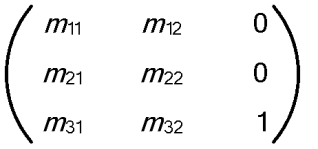
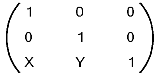
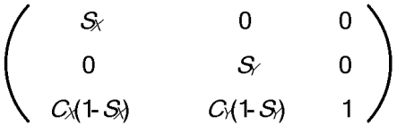
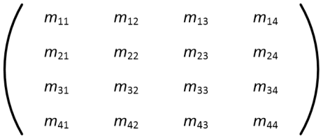
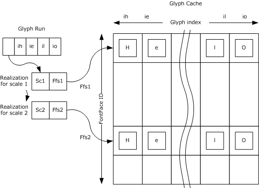
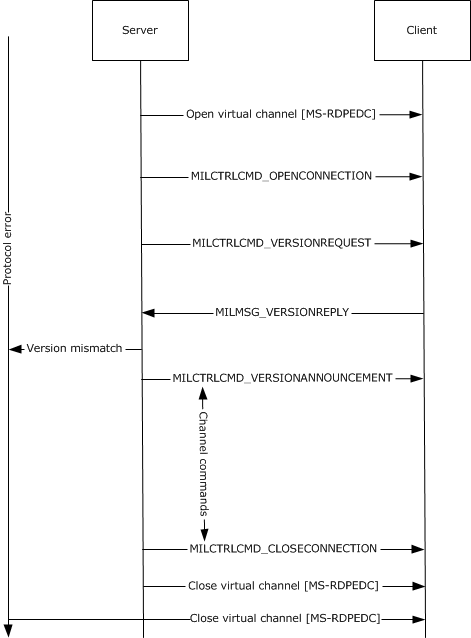
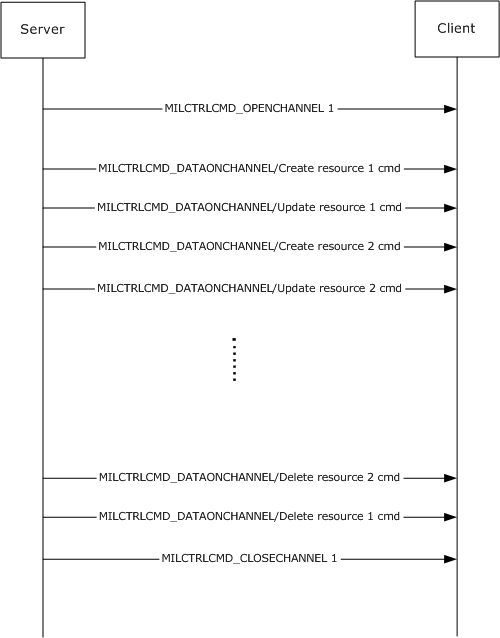
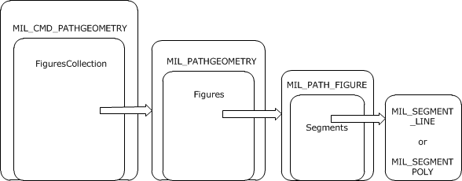

[MS-RDPCR2]:

Remote Desktop Protocol: Composited Remoting V2

Intellectual Property Rights Notice for Open Specifications Documentation

  Technical Documentation. Microsoft publishes Open Specifications documentation (“this

documentation”) for protocols, file formats, data portability, computer languages, and standards
support. Additionally, overview documents cover inter-protocol relationships and interactions.

  Copyrights. This documentation is covered by Microsoft copyrights. Regardless of any other

terms that are contained in the terms of use for the Microsoft website that hosts this
documentation, you can make copies of it in order to develop implementations of the technologies
that are described in this documentation and can distribute portions of it in your implementations
that use these technologies or in your documentation as necessary to properly document the
implementation. You can also distribute in your implementation, with or without modification, any
schemas, IDLs, or code samples that are included in the documentation. This permission also
applies to any documents that are referenced in the Open Specifications documentation.
  No Trade Secrets. Microsoft does not claim any trade secret rights in this documentation.
  Patents. Microsoft has patents that might cover your implementations of the technologies

described in the Open Specifications documentation. Neither this notice nor Microsoft's delivery of
this documentation grants any licenses under those patents or any other Microsoft patents.
However, a given Open Specifications document might be covered by the Microsoft Open
Specifications Promise or the Microsoft Community Promise. If you would prefer a written license,
or if the technologies described in this documentation are not covered by the Open Specifications
Promise or Community Promise, as applicable, patent licenses are available by contacting
iplg@microsoft.com.

  License Programs. To see all of the protocols in scope under a specific license program and the

associated patents, visit the Patent Map.

  Trademarks. The names of companies and products contained in this documentation might be
covered by trademarks or similar intellectual property rights. This notice does not grant any
licenses under those rights. For a list of Microsoft trademarks, visit
www.microsoft.com/trademarks.

  Fictitious Names. The example companies, organizations, products, domain names, email

addresses, logos, people, places, and events that are depicted in this documentation are fictitious.
No association with any real company, organization, product, domain name, email address, logo,
person, place, or event is intended or should be inferred.

Reservation of Rights. All other rights are reserved, and this notice does not grant any rights other
than as specifically described above, whether by implication, estoppel, or otherwise.

Tools. The Open Specifications documentation does not require the use of Microsoft programming
tools or programming environments in order for you to develop an implementation. If you have access
to Microsoft programming tools and environments, you are free to take advantage of them. Certain
Open Specifications documents are intended for use in conjunction with publicly available standards
specifications and network programming art and, as such, assume that the reader either is familiar
with the aforementioned material or has immediate access to it.

Support. For questions and support, please contact dochelp@microsoft.com.

[MS-RDPCR2] - v20170601
Remote Desktop Protocol: Composited Remoting V2
Copyright © 2017 Microsoft Corporation
Release: June 1, 2017

1 / 216

Revision Summary

Date

Revision
History

Revision
Class

Comments

12/5/2008

0.1

Major

Initial Availability

1/16/2009

0.1.1

Editorial

Changed language and formatting in the technical content.

2/27/2009

1.0

Major

Updated and revised the technical content.

4/10/2009

1.0.1

Editorial

Changed language and formatting in the technical content.

5/22/2009

2.0

7/2/2009

3.0

8/14/2009

4.0

9/25/2009

4.1

Major

Major

Major

Minor

Updated and revised the technical content.

Updated and revised the technical content.

Updated and revised the technical content.

Clarified the meaning of the technical content.

11/6/2009

4.1.1

Editorial

Changed language and formatting in the technical content.

12/18/2009  4.1.2

Editorial

Changed language and formatting in the technical content.

1/29/2010

5.0

3/12/2010

6.0

4/23/2010

7.0

6/4/2010

8.0

7/16/2010

9.0

8/27/2010

10.0

10/8/2010

11.0

11/19/2010  12.0

1/7/2011

13.0

2/11/2011

14.0

3/25/2011

14.0

Major

Major

Major

Major

Major

Major

Major

Major

Major

Major

None

Updated and revised the technical content.

Updated and revised the technical content.

Updated and revised the technical content.

Updated and revised the technical content.

Updated and revised the technical content.

Updated and revised the technical content.

Updated and revised the technical content.

Updated and revised the technical content.

Updated and revised the technical content.

Updated and revised the technical content.

No changes to the meaning, language, or formatting of the
technical content.

5/6/2011

14.0

None

No changes to the meaning, language, or formatting of the
technical content.

6/17/2011

14.1

Minor

Clarified the meaning of the technical content.

9/23/2011

14.1

None

No changes to the meaning, language, or formatting of the
technical content.

12/16/2011  15.0

Major

Updated and revised the technical content.

3/30/2012

15.0

None

No changes to the meaning, language, or formatting of the
technical content.

7/12/2012

15.0

10/25/2012  15.0

None

None

No changes to the meaning, language, or formatting of the
technical content.

No changes to the meaning, language, or formatting of the

2 / 216

[MS-RDPCR2] - v20170601
Remote Desktop Protocol: Composited Remoting V2
Copyright © 2017 Microsoft Corporation
Release: June 1, 2017

Date

Revision
History

Revision
Class

Comments

technical content.

1/31/2013

15.0

None

No changes to the meaning, language, or formatting of the
technical content.

8/8/2013

16.0

Major

Updated and revised the technical content.

11/14/2013  16.0

None

No changes to the meaning, language, or formatting of the
technical content.

2/13/2014

16.0

None

No changes to the meaning, language, or formatting of the
technical content.

5/15/2014

16.0

None

No changes to the meaning, language, or formatting of the
technical content.

6/30/2015

16.0

None

No changes to the meaning, language, or formatting of the
technical content.

10/16/2015  16.0

None

No changes to the meaning, language, or formatting of the
technical content.

7/14/2016

16.0

None

No changes to the meaning, language, or formatting of the
technical content.

6/1/2017

16.0

None

No changes to the meaning, language, or formatting of the
technical content.

[MS-RDPCR2] - v20170601
Remote Desktop Protocol: Composited Remoting V2
Copyright © 2017 Microsoft Corporation
Release: June 1, 2017

3 / 216

## Table of Contents

- [1 Introduction](#1-introduction)
  - [1.1 Glossary](#11-glossary)
  - [1.2 References](#12-references)
    - [1.2.1 Normative References](#121-normative-references)
    - [1.2.2 Informative References](#122-informative-references)
  - [1.3 Overview](#13-overview)
    - [1.3.1 Connections](#131-connections)
    - [1.3.2 Channels](#132-channels)
    - [1.3.3 Resources](#133-resources)
  - [1.4 Relationship to Other Protocols](#14-relationship-to-other-protocols)
  - [1.5 Prerequisites/Preconditions](#15-prerequisitespreconditions)
  - [1.6 Applicability Statement](#16-applicability-statement)
  - [1.7 Versioning and Capability Negotiation](#17-versioning-and-capability-negotiation)
  - [1.8 Vendor-Extensible Fields](#18-vendor-extensible-fields)
  - [1.9 Standards Assignments](#19-standards-assignments)
- [2 Messages](#2-messages)
  - [2.1 Transport](#21-transport)
  - [2.2 Message Syntax](#22-message-syntax)
    - [2.2.1 Resource Types](#221-resource-types)
    - [2.2.2 Enumerations](#222-enumerations)
      - [2.2.2.1 DXGI_FORMAT](#2221-dxgiformat)
      - [2.2.2.2 MilBitmapInterpolationMode](#2222-milbitmapinterpolationmode)
      - [2.2.2.3 MilBitmapScalingMode](#2223-milbitmapscalingmode)
      - [2.2.2.4 MilBrushMappingMode](#2224-milbrushmappingmode)
      - [2.2.2.5 MilCachingHint](#2225-milcachinghint)
      - [2.2.2.6 MilColorInterpolationMode](#2226-milcolorinterpolationmode)
      - [2.2.2.7 MilCompositingMode](#2227-milcompositingmode)
      - [2.2.2.8 MilCompositionDeviceState](#2228-milcompositiondevicestate)
      - [2.2.2.9 MilConnection](#2229-milconnection)
      - [2.2.2.10 MilFillRule](#22210-milfillrule)
      - [2.2.2.11 MilGeometryCombineMode](#22211-milgeometrycombinemode)
      - [2.2.2.12 MilGradientSpreadMethod](#22212-milgradientspreadmethod)
      - [2.2.2.13 MilHorizontalAlignment](#22213-milhorizontalalignment)
      - [2.2.2.14 MilPathFigureFlags](#22214-milpathfigureflags)
      - [2.2.2.15 MilPathGeometryFlags](#22215-milpathgeometryflags)
      - [2.2.2.16 MilPathSegmentFlags](#22216-milpathsegmentflags)
      - [2.2.2.17 MilPixelFormat](#22217-milpixelformat)
      - [2.2.2.18 MilRenderOptionFlags](#22218-milrenderoptionflags)
      - [2.2.2.19 MilRTInitialization](#22219-milrtinitialization)
      - [2.2.2.20 MilSegmentType](#22220-milsegmenttype)
      - [2.2.2.21 MilSourceModification](#22221-milsourcemodification)
      - [2.2.2.22 MilStretch](#22222-milstretch)
      - [2.2.2.23 MilTileMode](#22223-miltilemode)
      - [2.2.2.24 MilTransparencyFlags](#22224-miltransparencyflags)
      - [2.2.2.25 MilVerticalAlignment](#22225-milverticalalignment)
      - [2.2.2.26 MilVisualRenderParameterType](#22226-milvisualrenderparametertype)
      - [2.2.2.27 MilWindowLayerType](#22227-milwindowlayertype)
      - [2.2.2.28 MilWindowTargetCachingMode](#22228-milwindowtargetcachingmode)
    - [2.2.3 Structures](#223-structures)
      - [2.2.3.1 MAGN_UPDATE_TEXTURES_PARAM](#2231-magnupdatetexturesparam)
      - [2.2.3.2 Mil3x2Matrix](#2232-mil3x2matrix)
      - [2.2.3.3 Mil4x4Matrix](#2233-mil4x4matrix)
      - [2.2.3.4 MilColor](#2234-milcolor)
      - [2.2.3.5 MilColorTransform](#2235-milcolortransform)
      - [2.2.3.6 MilGlyphBitmap](#2236-milglyphbitmap)
      - [2.2.3.7 MilGraphicsAccelerationAssessment](#2237-milgraphicsaccelerationassessment)
      - [2.2.3.8 MilGraphicsAccelerationCaps](#2238-milgraphicsaccelerationcaps)
      - [2.2.3.9 MilPoint](#2239-milpoint)
      - [2.2.3.10 Mil3DPoint](#22310-mil3dpoint)
      - [2.2.3.11 MilRect](#22311-milrect)
      - [2.2.3.12 MilRectI](#22312-milrecti)
      - [2.2.3.13 MilRectRB](#22313-milrectrb)
      - [2.2.3.14 MilRenderOptions](#22314-milrenderoptions)
      - [2.2.3.15 MilSize](#22315-milsize)
      - [2.2.3.16 MilGradientStop](#22316-milgradientstop)
      - [2.2.3.17 MilVisualRenderParameter](#22317-milvisualrenderparameter)
      - [2.2.3.18 MilWindowMargins](#22318-milwindowmargins)
      - [2.2.3.19 OFFSCREEN_RT_OFFSET](#22319-offscreenrtoffset)
      - [2.2.3.20 OFFSCREEN_RT_OFFSETS](#22320-offscreenrtoffsets)
      - [2.2.3.21 OFFSCREEN_RT_TEXTURE](#22321-offscreenrttexture)
      - [2.2.3.22 OFFSCREEN_RT_TEXTURES](#22322-offscreenrttextures)
    - [2.2.4 Geometry Data Structures](#224-geometry-data-structures)
      - [2.2.4.1 MIL_SEGMENT_LINE](#2241-milsegmentline)
      - [2.2.4.2 MIL_SEGMENT_POLY](#2242-milsegmentpoly)
      - [2.2.4.3 MIL_PATHFIGURE](#2243-milpathfigure)
      - [2.2.4.4 MIL_PATHGEOMETRY](#2244-milpathgeometry)
    - [2.2.5 Connection Control Messages](#225-connection-control-messages)
      - [2.2.5.1 MILCTRLCMD_VERSIONREQUEST](#2251-milctrlcmdversionrequest)
      - [2.2.5.2 MILCTRLCMD_VERSIONANNOUNCEMENT](#2252-milctrlcmdversionannouncement)
      - [2.2.5.3 MILCTRLCMD_OPENCONNECTION](#2253-milctrlcmdopenconnection)
      - [2.2.5.4 MILCTRLCMD_CLOSECONNECTION](#2254-milctrlcmdcloseconnection)
      - [2.2.5.5 MILCTRLCMD_OPENCHANNEL](#2255-milctrlcmdopenchannel)
      - [2.2.5.6 MILCTRLCMD_CLOSECHANNEL](#2256-milctrlcmdclosechannel)
      - [2.2.5.7 MILCTRLCMD_DATAONCHANNEL](#2257-milctrlcmddataonchannel)
      - [2.2.5.8 MILCTRLCMD_HANDLESURFACEMANAGEREVENT](#2258-milctrlcmdhandlesurfacemanagerevent)
    - [2.2.6 Connection Notifications](#226-connection-notifications)
      - [2.2.6.1 MILCTRLCMD_CONNECTIONNOTIFICATION](#2261-milctrlcmdconnectionnotification)
      - [2.2.6.2 MILCTRLCMD_CHANNELNOTIFICATION](#2262-milctrlcmdchannelnotification)
      - [2.2.6.3 MILCTRLCMD_CONNECTIONBROADCAST](#2263-milctrlcmdconnectionbroadcast)
    - [2.2.7 Channel Messages](#227-channel-messages)
      - [2.2.7.1 MILCMD_TRANSPORT_SYNCFLUSH](#2271-milcmdtransportsyncflush)
      - [2.2.7.2 MILCMD_TRANSPORT_ROUNDTRIPREQUEST](#2272-milcmdtransportroundtriprequest)
      - [2.2.7.3 MILCMD_TRANSPORT_ASYNCFLUSH](#2273-milcmdtransportasyncflush)
      - [2.2.7.4 MILCMD_PARTITION_REGISTERFORNOTIFICATIONS](#2274-milcmdpartitionregisterfornotifications)
      - [2.2.7.5 MILCMD_CHANNEL_REQUESTTIER](#2275-milcmdchannelrequesttier)
      - [2.2.7.6 MILCMD_CHANNEL_CREATERESOURCE](#2276-milcmdchannelcreateresource)
      - [2.2.7.7 MILCMD_CHANNEL_DELETERESOURCE](#2277-milcmdchanneldeleteresource)
      - [2.2.7.8 MILCMD_CHANNEL_DUPLICATEHANDLE](#2278-milcmdchannelduplicatehandle)
      - [2.2.7.9 MILCMD_BITMAP_PIXELS](#2279-milcmdbitmappixels)
      - [2.2.7.10 MILCMD_BITMAP_COMPRESSEDPIXELS](#22710-milcmdbitmapcompressedpixels)
      - [2.2.7.11 MILCMD_DOUBLERESOURCE](#22711-milcmddoubleresource)
      - [2.2.7.12 MILCMD_COLORRESOURCE](#22712-milcmdcolorresource)
      - [2.2.7.13 MILCMD_POINTRESOURCE](#22713-milcmdpointresource)
      - [2.2.7.14 MILCMD_RECTRESOURCE](#22714-milcmdrectresource)
      - [2.2.7.15 MILCMD_SIZERESOURCE](#22715-milcmdsizeresource)
      - [2.2.7.16 MILCMD_MATRIXRESOURCE](#22716-milcmdmatrixresource)
      - [2.2.7.17 MILCMD_COLORTRANSFORMRESOURCE](#22717-milcmdcolortransformresource)
      - [2.2.7.18 MILCMD_RENDERDATA](#22718-milcmdrenderdata)
      - [2.2.7.19 MILCMD_TILEBRUSH_SETSOURCEMODIFICATIONS](#22719-milcmdtilebrushsetsourcemodifications)
      - [2.2.7.20 MILCMD_VISUAL_SETOFFSET](#22720-milcmdvisualsetoffset)
      - [2.2.7.21 MILCMD_VISUAL_SETTRANSFORM](#22721-milcmdvisualsettransform)
      - [2.2.7.22 MILCMD_VISUAL_SETCLIP](#22722-milcmdvisualsetclip)
      - [2.2.7.23 MILCMD_VISUAL_SETALPHA](#22723-milcmdvisualsetalpha)
      - [2.2.7.24 MILCMD_VISUAL_SETRENDEROPTIONS](#22724-milcmdvisualsetrenderoptions)
      - [2.2.7.25 MILCMD_VISUAL_SETCONTENT](#22725-milcmdvisualsetcontent)
      - [2.2.7.26 MILCMD_VISUAL_REMOVEALLCHILDREN](#22726-milcmdvisualremoveallchildren)
      - [2.2.7.27 MILCMD_VISUAL_REMOVECHILD](#22727-milcmdvisualremovechild)
      - [2.2.7.28 MILCMD_VISUAL_INSERTCHILDAT](#22728-milcmdvisualinsertchildat)
      - [2.2.7.29 MILCMD_VISUAL_SETCOLORTRANSFORM](#22729-milcmdvisualsetcolortransform)
      - [2.2.7.30 MILCMD_VISUAL_ADDRENDERPARAMETER](#22730-milcmdvisualaddrenderparameter)
      - [2.2.7.31 MILCMD_VISUAL_REMOVERENDERPARAMETER](#22731-milcmdvisualremoverenderparameter)
      - [2.2.7.32 MILCMD_VISUAL_SETCONTEXTUALIZEDOPACITY](#22732-milcmdvisualsetcontextualizedopacity)
      - [2.2.7.33 MILCMD_VISUAL_SETCOLORTRANSFORMROOT](#22733-milcmdvisualsetcolortransformroot)
      - [2.2.7.34 MILCMD_VISUAL_SETRENDERFORCAPTURE](#22734-milcmdvisualsetrenderforcapture)
      - [2.2.7.35 MILCMD_WINDOWNODE_CREATE](#22735-milcmdwindownodecreate)
      - [2.2.7.36 MILCMD_WINDOWNODE_DETACH](#22736-milcmdwindownodedetach)
      - [2.2.7.37 MILCMD_WINDOWNODE_SETBOUNDS](#22737-milcmdwindownodesetbounds)
      - [2.2.7.38 MILCMD_WINDOWNODE_UPDATESPRITEHANDLE](#22738-milcmdwindownodeupdatespritehandle)
      - [2.2.7.39 MILCMD_WINDOWNODE_SETSPRITEIMAGE](#22739-milcmdwindownodesetspriteimage)
      - [2.2.7.40 MILCMD_WINDOWNODE_SETLOGICALSURFACEIMAGE](#22740-milcmdwindownodesetlogicalsurfaceimage)
      - [2.2.7.41 MILCMD_WINDOWNODE_SETSPRITECLIP](#22741-milcmdwindownodesetspriteclip)
      - [2.2.7.42 MILCMD_WINDOWNODE_SETDXCLIP](#22742-milcmdwindownodesetdxclip)
      - [2.2.7.43 MILCMD_WINDOWNODE_SETSOURCEMODIFICATIONS](#22743-milcmdwindownodesetsourcemodifications)
      - [2.2.7.44 MILCMD_WINDOWNODE_SETALPHAMARGINS](#22744-milcmdwindownodesetalphamargins)
      - [2.2.7.45 MILCMD_WINDOWNODE_SETCOMPOSEONCE](#22745-milcmdwindownodesetcomposeonce)
      - [2.2.7.46 MILCMD_WINDOWNODE_COPYCOMPOSITOROWNEDRESOURCES](#22746-milcmdwindownodecopycompositorownedresources)
      - [2.2.7.47 MILCMD_WINDOWNODE_SETMAXIMIZEDCLIPMARGINS](#22747-milcmdwindownodesetmaximizedclipmargins)
      - [2.2.7.48 MILCMD_WINDOWNODE_NOTIFYVISRGNUPDATE](#22748-milcmdwindownodenotifyvisrgnupdate)
      - [2.2.7.49 MILCMD_WINDOWNODE_PROTECTCONTENT](#22749-milcmdwindownodeprotectcontent)
      - [2.2.7.50 MILCMD_VISUALGROUP](#22750-milcmdvisualgroup)
      - [2.2.7.51 MILCMD_HWNDTARGET_CREATE](#22751-milcmdhwndtargetcreate)
      - [2.2.7.52 MILCMD_TARGET_UPDATEWINDOWSETTINGS](#22752-milcmdtargetupdatewindowsettings)
      - [2.2.7.53 MILCMD_TARGET_SETROOT](#22753-milcmdtargetsetroot)
      - [2.2.7.54 MILCMD_TARGET_SETCLEARCOLOR](#22754-milcmdtargetsetclearcolor)
      - [2.2.7.55 MILCMD_TARGET_INVALIDATE](#22755-milcmdtargetinvalidate)
      - [2.2.7.56 MILCMD_TARGET_CAPTUREBITS](#22756-milcmdtargetcapturebits)
      - [2.2.7.57 MILCMD_METABITMAPRENDERTARGET_CAPTUREBITS](#22757-milcmdmetabitmaprendertargetcapturebits)
      - [2.2.7.58 MILCMD_METABITMAPRENDERTARGET_CREATE](#22758-milcmdmetabitmaprendertargetcreate)
      - [2.2.7.59 MILCMD_METABITMAPRENDERTARGET_SETTRANSFORM](#22759-milcmdmetabitmaprendertargetsettransform)
      - [2.2.7.60 MILCMD_METABITMAPRENDERTARGET_SETCOLORTRANSFORM](#22760-milcmdmetabitmaprendertargetsetcolortransform)
      - [2.2.7.61 MILCMD_METABITMAPRENDERTARGET](#22761-milcmdmetabitmaprendertarget)
      - [2.2.7.62 MILCMD_METABITMAPRENDERTARGET_SETFILTERLIST](#22762-milcmdmetabitmaprendertargetsetfilterlist)
      - [2.2.7.63 MILCMD_GLYPHCACHE_ADDBITMAPS](#22763-milcmdglyphcacheaddbitmaps)
      - [2.2.7.64 MILCMD_GLYPHCACHE_REMOVEBITMAPS](#22764-milcmdglyphcacheremovebitmaps)
      - [2.2.7.65 MILCMD_GLYPHRUN_CREATE](#22765-milcmdglyphruncreate)
      - [2.2.7.66 MILCMD_GLYPHRUN_ADDREALIZATION](#22766-milcmdglyphrunaddrealization)
      - [2.2.7.67 MILCMD_GLYPHRUN_REMOVEREALIZATION](#22767-milcmdglyphrunremoverealization)
      - [2.2.7.68 MILCMD_GDISPRITEBITMAP](#22768-milcmdgdispritebitmap)
      - [2.2.7.69 MILCMD_GDISPRITEBITMAP_UPDATEMARGINS](#22769-milcmdgdispritebitmapupdatemargins)
      - [2.2.7.70 MILCMD_GDISPRITEBITMAP_UPDATESURFACE](#22770-milcmdgdispritebitmapupdatesurface)
      - [2.2.7.71 MILCMD_GDISPRITEBITMAP_UNMAPSECTION](#22771-milcmdgdispritebitmapunmapsection)
      - [2.2.7.72 MILCMD_GDISPRITEBITMAP_NOTIFYDIRTY](#22772-milcmdgdispritebitmapnotifydirty)
      - [2.2.7.73 MILCMD_MESHGEOMETRY2D_SETCONSTANTOPACITY](#22773-milcmdmeshgeometry2dsetconstantopacity)
      - [2.2.7.74 MILCMD_CACHEDVISUALIMAGE_FREEZE](#22774-milcmdcachedvisualimagefreeze)
      - [2.2.7.75 MILCMD_GLYPHBITMAP](#22775-milcmdglyphbitmap)
      - [2.2.7.76 MILCMD_SCENE3D](#22776-milcmdscene3d)
      - [2.2.7.77 MILCMD_MATRIXCAMERA](#22777-milcmdmatrixcamera)
      - [2.2.7.78 MILCMD_MODEL3DGROUP](#22778-milcmdmodel3dgroup)
      - [2.2.7.79 MILCMD_AMBIENTLIGHT](#22779-milcmdambientlight)
      - [2.2.7.80 MILCMD_GEOMETRYMODEL3D](#22780-milcmdgeometrymodel3d)
      - [2.2.7.81 MILCMD_MESHGEOMETRY3D](#22781-milcmdmeshgeometry3d)
      - [2.2.7.82 MILCMD_MESHGEOMETRY2D](#22782-milcmdmeshgeometry2d)
      - [2.2.7.83 MILCMD_GEOMETRY2DGROUP](#22783-milcmdgeometry2dgroup)
      - [2.2.7.84 MILCMD_MATRIXTRANSFORM3D](#22784-milcmdmatrixtransform3d)
      - [2.2.7.85 MILCMD_CACHEDVISUALIMAGE](#22785-milcmdcachedvisualimage)
      - [2.2.7.86 MILCMD_TRANSFORMGROUP](#22786-milcmdtransformgroup)
      - [2.2.7.87 MILCMD_TRANSLATETRANSFORM](#22787-milcmdtranslatetransform)
      - [2.2.7.88 MILCMD_SCALETRANSFORM](#22788-milcmdscaletransform)
      - [2.2.7.89 MILCMD_MATRIXTRANSFORM](#22789-milcmdmatrixtransform)
      - [2.2.7.90 MILCMD_RECTANGLEGEOMETRY](#22790-milcmdrectanglegeometry)
      - [2.2.7.91 MILCMD_COMBINEDGEOMETRY](#22791-milcmdcombinedgeometry)
      - [2.2.7.92 MILCMD_PATHGEOMETRY](#22792-milcmdpathgeometry)
      - [2.2.7.93 MILCMD_SOLIDCOLORBRUSH](#22793-milcmdsolidcolorbrush)
      - [2.2.7.94 MILCMD_LINEARGRADIENTBRUSH](#22794-milcmdlineargradientbrush)
      - [2.2.7.95 MILCMD_IMAGEBRUSH](#22795-milcmdimagebrush)
    - [2.2.8 Render Data Drawing Instructions](#228-render-data-drawing-instructions)
      - [2.2.8.1 MILCMD_DRAW_BITMAP](#2281-milcmddrawbitmap)
      - [2.2.8.2 MILCMD_DRAW_GLASS](#2282-milcmddrawglass)
      - [2.2.8.3 MILCMD_DRAW_MESH2D](#2283-milcmddrawmesh2d)
      - [2.2.8.4 MILCMD_DRAW_OCCLUSIONRECTANGLE](#2284-milcmddrawocclusionrectangle)
      - [2.2.8.5 MILCMD_DRAW_VISUAL](#2285-milcmddrawvisual)
      - [2.2.8.6 MILCMD_DRAW_RECTANGLE](#2286-milcmddrawrectangle)
      - [2.2.8.7 MILCMD_DRAW_RECTANGLE_ANIMATE](#2287-milcmddrawrectangleanimate)
      - [2.2.8.8 MILCMD_DRAW_GEOMETRY](#2288-milcmddrawgeometry)
      - [2.2.8.9 MILCMD_DRAW_IMAGE](#2289-milcmddrawimage)
      - [2.2.8.10 MILCMD_DRAW_IMAGE_ANIMATE](#22810-milcmddrawimageanimate)
      - [2.2.8.11 MILCMD_DRAW_GLYPH_RUN](#22811-milcmddrawglyphrun)
      - [2.2.8.12 MILCMD_DRAW_SCENE3D](#22812-milcmddrawscene3d)
      - [2.2.8.13 MILCMD_PUSH_CLIP](#22813-milcmdpushclip)
      - [2.2.8.14 MILCMD_PUSH_OPACITY](#22814-milcmdpushopacity)
      - [2.2.8.15 MILCMD_PUSH_OPACITY_ANIMATE](#22815-milcmdpushopacityanimate)
      - [2.2.8.16 MILCMD_PUSH_TRANSFORM](#22816-milcmdpushtransform)
      - [2.2.8.17 MILCMD_POP](#22817-milcmdpop)
    - [2.2.9 Channel Notification Messages](#229-channel-notification-messages)
      - [2.2.9.1 MILMSG_SYNCFLUSHREPLY](#2291-milmsgsyncflushreply)
      - [2.2.9.2 MILMSG_CAPTUREBITSREPLY](#2292-milmsgcapturebitsreply)
      - [2.2.9.3 MILMSG_VERSIONREPLY](#2293-milmsgversionreply)
      - [2.2.9.4 MILMSG_HARDWARETIER](#2294-milmsghardwaretier)
      - [2.2.9.5 MILMSG_COMPOSITIONDEVICESTATECHANGE](#2295-milmsgcompositiondevicestatechange)
      - [2.2.9.6 MILMSG_PARTITIONISZOMBIE](#2296-milmsgpartitioniszombie)
      - [2.2.9.7 MILMSG_NOTIFYCOMPOSITIONTIMEEXCEEDED](#2297-milmsgnotifycompositiontimeexceeded)
      - [2.2.9.8 MILMSG_NOTIFYROUNDTRIPREPLY](#2298-milmsgnotifyroundtripreply)
      - [2.2.9.9 MILMSG_CONNECTIONLOST](#2299-milmsgconnectionlost)
      - [2.2.9.10 MILMSG_ASYNCFLUSHREPLY](#22910-milmsgasyncflushreply)
      - [2.2.9.11 MILMSG_RENDERSTATUS](#22911-milmsgrenderstatus)
      - [2.2.9.12 MILMSG_DISABLECOMPOSITION](#22912-milmsgdisablecomposition)
      - [2.2.9.13 MILMSG_METARTCAPTUREBITSREPLY](#22913-milmsgmetartcapturebitsreply)
- [3 Protocol Details](#3-protocol-details)
  - [3.1 Common Details](#31-common-details)
    - [3.1.1 Abstract Data Model](#311-abstract-data-model)
      - [3.1.1.1 Object Handles](#3111-object-handles)
      - [3.1.1.2 Resource Handle Duplication](#3112-resource-handle-duplication)
      - [3.1.1.3 Scene Graph](#3113-scene-graph)
        - [3.1.1.3.1 Visuals](#31131-visuals)
        - [3.1.1.3.2 Window Nodes](#31132-window-nodes)
        - [3.1.1.3.3 Render Targets](#31133-render-targets)
      - [3.1.1.4 Resource Model](#3114-resource-model)
      - [3.1.1.5 Resource Types](#3115-resource-types)
        - [3.1.1.5.1 2-D Drawing Resources](#31151-2-d-drawing-resources)
          - [3.1.1.5.1.1 Geometries](#311511-geometries)
          - [3.1.1.5.1.2 Text](#311512-text)
          - [3.1.1.5.1.3 Images](#311513-images)
          - [3.1.1.5.1.4 Brushes](#311514-brushes)
          - [3.1.1.5.1.5 Transforms](#311515-transforms)
          - [3.1.1.5.1.6 Color Transforms](#311516-color-transforms)
        - [3.1.1.5.2 3-D Drawing Resources](#31152-3-d-drawing-resources)
          - [3.1.1.5.2.1 3-D Geometries](#311521-3-d-geometries)
          - [3.1.1.5.2.2 Lights](#311522-lights)
          - [3.1.1.5.2.3 Cameras](#311523-cameras)
          - [3.1.1.5.2.4 3-D Transforms](#311524-3-d-transforms)
          - [3.1.1.5.2.5 Models](#311525-models)
          - [3.1.1.5.2.6 3-D Scene](#311526-3-d-scene)
        - [3.1.1.5.3 Value Resources and Animation](#31153-value-resources-and-animation)
      - [3.1.1.6 Drawing Text](#3116-drawing-text)
        - [3.1.1.6.1 Glyph Cache](#31161-glyph-cache)
        - [3.1.1.6.2 Glyph Run Resource](#31162-glyph-run-resource)
        - [3.1.1.6.3 Drawing Text](#31163-drawing-text)
      - [3.1.1.7 Drawing Instruction Streams](#3117-drawing-instruction-streams)
      - [3.1.1.8 Surface Management](#3118-surface-management)
    - [3.1.2 Timers](#312-timers)
    - [3.1.3 Initialization](#313-initialization)
    - [3.1.4 Higher-Layer Triggered Events](#314-higher-layer-triggered-events)
    - [3.1.5 Processing Events and Sequencing Rules](#315-processing-events-and-sequencing-rules)
      - [3.1.5.1 Initializing a Connection](#3151-initializing-a-connection)
      - [3.1.5.2 Protocol Errors](#3152-protocol-errors)
      - [3.1.5.3 Channel Message Flow](#3153-channel-message-flow)
    - [3.1.6 Timer Events](#316-timer-events)
    - [3.1.7 Other Local Events](#317-other-local-events)
  - [3.2 Server Details](#32-server-details)
    - [3.2.1 Abstract Data Model](#321-abstract-data-model)
    - [3.2.2 Timers](#322-timers)
    - [3.2.3 Initialization](#323-initialization)
      - [3.2.3.1 Opening the Connection](#3231-opening-the-connection)
    - [3.2.4 Higher-Layer Triggered Events](#324-higher-layer-triggered-events)
    - [3.2.5 Processing Events and Sequencing Rules](#325-processing-events-and-sequencing-rules)
      - [3.2.5.1 Connection Control Messages and Notifications](#3251-connection-control-messages-and-notifications)
        - [3.2.5.1.1 Channel Messages](#32511-channel-messages)
        - [3.2.5.1.2 Creating and Deleting Resources](#32512-creating-and-deleting-resources)
      - [3.2.5.2 Manipulating Render Target Resources](#3252-manipulating-render-target-resources)
        - [3.2.5.2.1 MILCMD_TARGET_SETROOT](#32521-milcmdtargetsetroot)
        - [3.2.5.2.2 MILCMD_TARGET_SETCLEARCOLOR](#32522-milcmdtargetsetclearcolor)
        - [3.2.5.2.3 MILCMD_TARGET_CAPTUREBITS](#32523-milcmdtargetcapturebits)
        - [3.2.5.2.4 MILCMD_METABITMAPRENDERTARGET_CREATE message](#32524-milcmdmetabitmaprendertargetcreate-message)
        - [3.2.5.2.5 MILCMD_METABITMAPRENDERTARGET_CAPTUREBITS message](#32525-milcmdmetabitmaprendertargetcapturebits-message)
        - [3.2.5.2.6 MILCMD_METABITMAPRENDERTARGET_SETTRANSFORM message](#32526-milcmdmetabitmaprendertargetsettransform-message)
        - [3.2.5.2.7 MILCMD_METABITMAPRENDERTARGET_SETCOLORTRANSFORM](#32527-milcmdmetabitmaprendertargetsetcolortransform)
        - [3.2.5.2.8 MILCMD_METABITMAPRENDERTARGET_SETFILTERLIST](#32528-milcmdmetabitmaprendertargetsetfilterlist)
      - [3.2.5.3 Manipulating Visual Resources](#3253-manipulating-visual-resources)
        - [3.2.5.3.1 MILCMD_VISUAL_INSERTCHILDAT](#32531-milcmdvisualinsertchildat)
        - [3.2.5.3.2 MILCMD_VISUAL_REMOVECHILD](#32532-milcmdvisualremovechild)
        - [3.2.5.3.3 MILCMD_VISUAL_REMOVEALLCHILDREN](#32533-milcmdvisualremoveallchildren)
        - [3.2.5.3.4 MILCMD_VISUAL_SETOFFSET](#32534-milcmdvisualsetoffset)
        - [3.2.5.3.5 MILCMD_VISUAL_SETTRANSFORM](#32535-milcmdvisualsettransform)
        - [3.2.5.3.6 MILCMD_VISUAL_SETCLIP](#32536-milcmdvisualsetclip)
        - [3.2.5.3.7 MILCMD_VISUAL_SETALPHA](#32537-milcmdvisualsetalpha)
        - [3.2.5.3.8 MILCMD_VISUAL_SETRENDEROPTIONS](#32538-milcmdvisualsetrenderoptions)
        - [3.2.5.3.9 MILCMD_VISUAL_SETCONTENT](#32539-milcmdvisualsetcontent)
        - [3.2.5.3.10 MILCMD_VISUAL_SETCOLORTRANSFORM](#325310-milcmdvisualsetcolortransform)
        - [3.2.5.3.11 MILCMD_VISUAL_ADDRENDERPARAMETER](#325311-milcmdvisualaddrenderparameter)
        - [3.2.5.3.12 MILCMD_VISUAL_REMOVERENDERPARAMETER](#325312-milcmdvisualremoverenderparameter)
        - [3.2.5.3.13 MILCMD_VISUAL SETCONEXTUALIZEDOPACITY](#325313-milcmdvisual-setconextualizedopacity)
        - [3.2.5.3.14 MILCMD_VISUAL_SETCOLORTRANSFORMROOT](#325314-milcmdvisualsetcolortransformroot)
        - [3.2.5.3.15 MILCMD_VISUAL_SETRENDERFORCAPTURE](#325315-milcmdvisualsetrenderforcapture)
      - [3.2.5.4 Manipulating Window Node Resources](#3254-manipulating-window-node-resources)
        - [3.2.5.4.1 MILCMD_WINDOWNODE_SETBOUNDS](#32541-milcmdwindownodesetbounds)
        - [3.2.5.4.2 MILCMD_WINDOWNODE_SETSPRITEIMAGE](#32542-milcmdwindownodesetspriteimage)
        - [3.2.5.4.3 MILCMD_WINDOWNODE_SETLOGICALSURFACEIMAGE](#32543-milcmdwindownodesetlogicalsurfaceimage)
        - [3.2.5.4.4 MILCMD_WINDOWNODE_SETSPRITECLIP](#32544-milcmdwindownodesetspriteclip)
        - [3.2.5.4.5 MILCMD_WINDOWNODE_SETDXCLIP](#32545-milcmdwindownodesetdxclip)
        - [3.2.5.4.6 MILCMD_WINDOWNODE_SETSOURCEMODIFICATIONS](#32546-milcmdwindownodesetsourcemodifications)
        - [3.2.5.4.7 MILCMD_WINDOWNODE_SETALPHAMARGINS](#32547-milcmdwindownodesetalphamargins)
        - [3.2.5.4.8 MILCMD_WINDOWNODE_SETCOMPOSEONCE](#32548-milcmdwindownodesetcomposeonce)
        - [3.2.5.4.9 MILCMD_WINDOWNODE_COPYCOMPOSITOROWNEDRESOURCES](#32549-milcmdwindownodecopycompositorownedresources)
        - [3.2.5.4.10 MILCMD_WINDOWNODE_SETMAXIMIZEDCLIPMARGINS](#325410-milcmdwindownodesetmaximizedclipmargins)
        - [3.2.5.4.11 MILCMD_WINDOWNODE_PROTECTCONTENT](#325411-milcmdwindownodeprotectcontent)
      - [3.2.5.5 Manipulating Geometry Resources](#3255-manipulating-geometry-resources)
        - [3.2.5.5.1 MILCMD_RECTANGLEGEOMETRY](#32551-milcmdrectanglegeometry)
        - [3.2.5.5.2 MILCMD_COMBINEDGEOMETRY](#32552-milcmdcombinedgeometry)
        - [3.2.5.5.3 MILCMD_PATHGEOMETRY](#32553-milcmdpathgeometry)
        - [3.2.5.5.4 MILCMD_MESHGEOMETRY2D](#32554-milcmdmeshgeometry2d)
        - [3.2.5.5.5 MILCMD_GEOMETRY2DGROUP](#32555-milcmdgeometry2dgroup)
        - [3.2.5.5.6 MILCMD_MESHGEOMETRY3D](#32556-milcmdmeshgeometry3d)
        - [3.2.5.5.7 MILCMD_GEOMETRYMODEL3D](#32557-milcmdgeometrymodel3d)
      - [3.2.5.6 Manipulating Text Resources](#3256-manipulating-text-resources)
        - [3.2.5.6.1 MILCMD_GLYPHCACHE_ADDBITMAPS](#32561-milcmdglyphcacheaddbitmaps)
        - [3.2.5.6.2 MILCMD_GLYPHCACHE_REMOVEBITMAPS](#32562-milcmdglyphcacheremovebitmaps)
        - [3.2.5.6.3 MILCMD_GLYPHRUN_CREATE](#32563-milcmdglyphruncreate)
        - [3.2.5.6.4 MILCMD_GLYPHRUN_ADDREALIZATION](#32564-milcmdglyphrunaddrealization)
        - [3.2.5.6.5 MILCMD_GLYPHRUN_REMOVEREALIZATION](#32565-milcmdglyphrunremoverealization)
      - [3.2.5.7 Manipulating and Handling Bitmap Resources](#3257-manipulating-and-handling-bitmap-resources)
        - [3.2.5.7.1 MILCMD_BITMAP_PIXELS](#32571-milcmdbitmappixels)
        - [3.2.5.7.2 MILCMD_BITMAP_COMPRESSEDPIXELS](#32572-milcmdbitmapcompressedpixels)
      - [3.2.5.8 Manipulating GDIBitmap Resources](#3258-manipulating-gdibitmap-resources)
        - [3.2.5.8.1 MILCMD_GDISPRITEBITMAP](#32581-milcmdgdispritebitmap)
        - [3.2.5.8.2 MILCMD_GDISPRITEBITMAP_UPDATEMARGINS](#32582-milcmdgdispritebitmapupdatemargins)
        - [3.2.5.8.3 MILCMD_GDISPRITEBITMAP_UPDATESURFACE](#32583-milcmdgdispritebitmapupdatesurface)
        - [3.2.5.8.4 MILCMD_GDISPRITEBITMAP_UNMAPSECTION](#32584-milcmdgdispritebitmapunmapsection)
        - [3.2.5.8.5 MILCMD_GDISPRITEBITMAP_NOTIFYDIRTY](#32585-milcmdgdispritebitmapnotifydirty)
      - [3.2.5.9 Manipulating Cached Visual Image Resources](#3259-manipulating-cached-visual-image-resources)
        - [3.2.5.9.1 MILCMD_CACHEDVISUALIMAGE](#32591-milcmdcachedvisualimage)
        - [3.2.5.9.2 MILCMD_CACHEDVISUALIMAGE_FREEZE](#32592-milcmdcachedvisualimagefreeze)
      - [3.2.5.10 Manipulating Brush Resources](#32510-manipulating-brush-resources)
        - [3.2.5.10.1 MILCMD_SOLIDCOLORBRUSH](#325101-milcmdsolidcolorbrush)
        - [3.2.5.10.2 MILCMD_LINEARGRADIENTBRUSH](#325102-milcmdlineargradientbrush)
        - [3.2.5.10.3 MILCMD_IMAGEBRUSH](#325103-milcmdimagebrush)
      - [3.2.5.11 Manipulating Transform Resources](#32511-manipulating-transform-resources)
        - [3.2.5.11.1 MILCMD_MATRIXTRANSFORM](#325111-milcmdmatrixtransform)
        - [3.2.5.11.2 MILCMD_TRANSLATETRANSFORM](#325112-milcmdtranslatetransform)
        - [3.2.5.11.3 MILCMD_SCALETRANSFORM](#325113-milcmdscaletransform)
        - [3.2.5.11.4 MILCMD_TRANSFORMGROUP](#325114-milcmdtransformgroup)
      - [3.2.5.12 Manipulating Value Resources](#32512-manipulating-value-resources)
      - [3.2.5.13 Manipulating Drawing Instruction Streams](#32513-manipulating-drawing-instruction-streams)
        - [3.2.5.13.1 MILCMD_RENDERDATA](#325131-milcmdrenderdata)
      - [3.2.5.14 Manipulating 3-D Scenes](#32514-manipulating-3-d-scenes)
        - [3.2.5.14.1 MILCMD_SCENE3D](#325141-milcmdscene3d)
        - [3.2.5.14.2 MILCMD_MODEL3DGROUP](#325142-milcmdmodel3dgroup)
        - [3.2.5.14.3 MILCMD_GEOMETRYMODEL3D](#325143-milcmdgeometrymodel3d)
        - [3.2.5.14.4 MILCMD_MATRIXCAMERA](#325144-milcmdmatrixcamera)
        - [3.2.5.14.5 MILCMD_MATRIXTRANSFORM3D](#325145-milcmdmatrixtransform3d)
      - [3.2.5.15 Closing the Connection](#32515-closing-the-connection)
    - [3.2.6 Timer Events](#326-timer-events)
    - [3.2.7 Other Local Events](#327-other-local-events)
  - [3.3 Client Details](#33-client-details)
    - [3.3.1 Abstract Data Model](#331-abstract-data-model)
    - [3.3.2 Timers](#332-timers)
    - [3.3.3 Initialization](#333-initialization)
    - [3.3.4 Higher-Layer Triggered Events](#334-higher-layer-triggered-events)
    - [3.3.5 Processing Events and Sequencing Rules](#335-processing-events-and-sequencing-rules)
      - [3.3.5.1 Connection Control Messages and Notifications](#3351-connection-control-messages-and-notifications)
        - [3.3.5.1.1 Channel Messages](#33511-channel-messages)
        - [3.3.5.1.2 Processing Resource Lifetime Messages](#33512-processing-resource-lifetime-messages)
      - [3.3.5.2 Processing Render Target Messages](#3352-processing-render-target-messages)
        - [3.3.5.2.1 MILCMD_HWNDTARGET_CREATE](#33521-milcmdhwndtargetcreate)
        - [3.3.5.2.2 MILCMD_TARGET_SETROOT](#33522-milcmdtargetsetroot)
        - [3.3.5.2.3 MILCMD_TARGET_SETCLEARCOLOR](#33523-milcmdtargetsetclearcolor)
        - [3.3.5.2.4 MILCMD_TARGET_CAPTUREBITS](#33524-milcmdtargetcapturebits)
        - [3.3.5.2.5 MILCMD_METABITMAPRENDERTARGET_CREATE](#33525-milcmdmetabitmaprendertargetcreate)
        - [3.3.5.2.6 MILCMD_METABITMAPRENDERTARGET_CAPTUREBITS](#33526-milcmdmetabitmaprendertargetcapturebits)
        - [3.3.5.2.7 MILCMD_METABITMAPRENDERTARGET_SETTRANSFORM](#33527-milcmdmetabitmaprendertargetsettransform)
        - [3.3.5.2.8 MILCMD_METABITMAPRENDERTARGET_SETCOLORTRANSFORM](#33528-milcmdmetabitmaprendertargetsetcolortransform)
        - [3.3.5.2.9 MILCMD_METABITMAPRENDERTARGET_SETFILTERLIST](#33529-milcmdmetabitmaprendertargetsetfilterlist)
      - [3.3.5.3 Processing Visual Resource Messages](#3353-processing-visual-resource-messages)
        - [3.3.5.3.1 MILCMD_VISUAL_INSERTCHILDAT](#33531-milcmdvisualinsertchildat)
        - [3.3.5.3.2 MILCMD_VISUAL_REMOVECHILD](#33532-milcmdvisualremovechild)
        - [3.3.5.3.3 MILCMD_VISUAL_REMOVEALLCHILDREN](#33533-milcmdvisualremoveallchildren)
        - [3.3.5.3.4 MILCMD_VISUAL_SETOFFSET](#33534-milcmdvisualsetoffset)
        - [3.3.5.3.5 MILCMD_VISUAL_SETTRANSFORM](#33535-milcmdvisualsettransform)
        - [3.3.5.3.6 MILCMD_VISUAL_SETCLIP](#33536-milcmdvisualsetclip)
        - [3.3.5.3.7 MILCMD_VISUAL_SETALPHA](#33537-milcmdvisualsetalpha)
        - [3.3.5.3.8 MILCMD_VISUAL_SETRENDEROPTIONS](#33538-milcmdvisualsetrenderoptions)
        - [3.3.5.3.9 MILCMD_VISUAL_SETCONTENT](#33539-milcmdvisualsetcontent)
        - [3.3.5.3.10 MILCMD_VISUAL_SETCOLORTRANSFORM](#335310-milcmdvisualsetcolortransform)
        - [3.3.5.3.11 MILCMD_VISUAL_ADDRENDERPARAMETER](#335311-milcmdvisualaddrenderparameter)
        - [3.3.5.3.12 MILCMD_VISUAL_REMOVERENDERPARAMETER](#335312-milcmdvisualremoverenderparameter)
        - [3.3.5.3.13 MILCMD_VISUAL SETCONEXTUALIZEDOPACITY](#335313-milcmdvisual-setconextualizedopacity)
        - [3.3.5.3.14 MILCMD_VISUAL_SETCOLORTRANSFORMROOT](#335314-milcmdvisualsetcolortransformroot)
        - [3.3.5.3.15 MILCMD_VISUAL_SETRENDERFORCAPTURE](#335315-milcmdvisualsetrenderforcapture)
      - [3.3.5.4 Processing Window Node Messages](#3354-processing-window-node-messages)
        - [3.3.5.4.1 MILCMD_WINDOWNODE_CREATE](#33541-milcmdwindownodecreate)
        - [3.3.5.4.2 MILCMD_WINDOWNODE_SETBOUNDS](#33542-milcmdwindownodesetbounds)
        - [3.3.5.4.3 MILCMD_WINDOWNODE_SETSPRITEIMAGE](#33543-milcmdwindownodesetspriteimage)
        - [3.3.5.4.4 MILCMD_WINDOWNODE_SETLOGICALSURFACEIMAGE](#33544-milcmdwindownodesetlogicalsurfaceimage)
        - [3.3.5.4.5 MILCMD_WINDOWNODE_SETSPRITECLIP](#33545-milcmdwindownodesetspriteclip)
        - [3.3.5.4.6 MILCMD_WINDOWNODE_SETDXCLIP](#33546-milcmdwindownodesetdxclip)
        - [3.3.5.4.7 MILCMD_WINDOWNODE_SETSOURCEMODIFICATIONS](#33547-milcmdwindownodesetsourcemodifications)
        - [3.3.5.4.8 MILCMD_WINDOWNODE_SETALPHAMARGINS](#33548-milcmdwindownodesetalphamargins)
        - [3.3.5.4.9 MILCMD_WINDOWNODE_SETCOMPOSEONCE](#33549-milcmdwindownodesetcomposeonce)
        - [3.3.5.4.10 MILCMD_WINDOWNODE_COPYCOMPOSITOROWNEDRESOURCES](#335410-milcmdwindownodecopycompositorownedresources)
        - [3.3.5.4.11 MILCMD_WINDOWNODE_SETMAXIMIZEDCLIPMARGINS](#335411-milcmdwindownodesetmaximizedclipmargins)
        - [3.3.5.4.12 MILCMD_WINDOWNODE_PROTECTCONTENT](#335412-milcmdwindownodeprotectcontent)
      - [3.3.5.5 Processing Geometry Resources](#3355-processing-geometry-resources)
        - [3.3.5.5.1 MILCMD_RECTANGLEGEOMETRY](#33551-milcmdrectanglegeometry)
        - [3.3.5.5.2 MILCMD_COMBINEDGEOMETRY](#33552-milcmdcombinedgeometry)
        - [3.3.5.5.3 MILCMD_PATHGEOMETRY](#33553-milcmdpathgeometry)
        - [3.3.5.5.4 MILCMD_MESHGEOMETRY2D](#33554-milcmdmeshgeometry2d)
        - [3.3.5.5.5 MILCMD_GEOMETRY2DGROUP](#33555-milcmdgeometry2dgroup)
        - [3.3.5.5.6 MILCMD_MESHGEOMETRY3D](#33556-milcmdmeshgeometry3d)
        - [3.3.5.5.7 MILCMD_GEOMETRYMODEL3D](#33557-milcmdgeometrymodel3d)
      - [3.3.5.6 Processing Text Resource Messages](#3356-processing-text-resource-messages)
        - [3.3.5.6.1 MILCMD_GLYPHCACHE_ADDBITMAPS](#33561-milcmdglyphcacheaddbitmaps)
        - [3.3.5.6.2 MILCMD_GLYPHCACHE_REMOVEBITMAPS](#33562-milcmdglyphcacheremovebitmaps)
        - [3.3.5.6.3 MILCMD_GLYPHRUN_CREATE](#33563-milcmdglyphruncreate)
        - [3.3.5.6.4 MILCMD_GLYPHRUN_ADDREALIZATION](#33564-milcmdglyphrunaddrealization)
        - [3.3.5.6.5 MILCMD_GLYPHRUN_REMOVEREALIZATION](#33565-milcmdglyphrunremoverealization)
      - [3.3.5.7 Processing Image Resource Messages](#3357-processing-image-resource-messages)
        - [3.3.5.7.1 MILCMD_BITMAP_PIXELS](#33571-milcmdbitmappixels)
        - [3.3.5.7.2 MILCMD_BITMAP_COMPRESSEDPIXELS](#33572-milcmdbitmapcompressedpixels)
      - [3.3.5.8 Processing GDIBitmap Resource Messages](#3358-processing-gdibitmap-resource-messages)
        - [3.3.5.8.1 MILCMD_GDISPRITEBITMAP](#33581-milcmdgdispritebitmap)
        - [3.3.5.8.2 MILCMD_GDISPRITEBITMAP_UPDATEMARGINS](#33582-milcmdgdispritebitmapupdatemargins)
        - [3.3.5.8.3 MILCMD_GDISPRITEBITMAP_UPDATESURFACE](#33583-milcmdgdispritebitmapupdatesurface)
        - [3.3.5.8.4 MILCMD_GDISPRITEBITMAP_UNMAPSECTION](#33584-milcmdgdispritebitmapunmapsection)
        - [3.3.5.8.5 MILCMD_GDISPRITEBITMAP_NOTIFYDIRTY](#33585-milcmdgdispritebitmapnotifydirty)
      - [3.3.5.9 Processing Cached Visual Image Messages](#3359-processing-cached-visual-image-messages)
        - [3.3.5.9.1 MILCMD_CACHEDVISUALIMAGE](#33591-milcmdcachedvisualimage)
        - [3.3.5.9.2 MILCMD_CACHEDVISUALIMAGE_FREEZE](#33592-milcmdcachedvisualimagefreeze)
      - [3.3.5.10 Processing Brush Resource Messages](#33510-processing-brush-resource-messages)
        - [3.3.5.10.1 MILCMD_SOLIDCOLORBRUSH](#335101-milcmdsolidcolorbrush)
        - [3.3.5.10.2 MILCMD_LINEARGRADIENTBRUSH](#335102-milcmdlineargradientbrush)
        - [3.3.5.10.3 MILCMD_IMAGEBRUSH](#335103-milcmdimagebrush)
      - [3.3.5.11 Processing Transform Resource Messages](#33511-processing-transform-resource-messages)
        - [3.3.5.11.1 MILCMD_MATRIXTRANSFORM](#335111-milcmdmatrixtransform)
        - [3.3.5.11.2 MILCMD_TRANSLATETRANSFORM](#335112-milcmdtranslatetransform)
        - [3.3.5.11.3 MILCMD_SCALETRANSFORM](#335113-milcmdscaletransform)
        - [3.3.5.11.4 MILCMD_TRANSFORMGROUP](#335114-milcmdtransformgroup)
        - [3.3.5.11.5 MILCMD_MATRIXTRANSFORM3D](#335115-milcmdmatrixtransform3d)
      - [3.3.5.12 Processing Value Resource Messages](#33512-processing-value-resource-messages)
      - [3.3.5.13 Processing Drawing Instruction Streams](#33513-processing-drawing-instruction-streams)
        - [3.3.5.13.1 MILCMD_RENDERDATA](#335131-milcmdrenderdata)
      - [3.3.5.14 Processing Scene 3-D Messages](#33514-processing-scene-3-d-messages)
        - [3.3.5.14.1 MILCMD_SCENE3D](#335141-milcmdscene3d)
        - [3.3.5.14.2 MILCMD_MODEL3DGROUP](#335142-milcmdmodel3dgroup)
        - [3.3.5.14.3 MILCMD_GEOMETRYMODEL3D](#335143-milcmdgeometrymodel3d)
        - [3.3.5.14.4 MILCMD_MATRIXCAMERA](#335144-milcmdmatrixcamera)
        - [3.3.5.14.5 MILCMD_MATRIXTRANSFORM3D](#335145-milcmdmatrixtransform3d)
    - [3.3.6 Timer Events](#336-timer-events)
    - [3.3.7 Other Local Events](#337-other-local-events)
- [4 Protocol Examples](#4-protocol-examples)
  - [4.1 Establishing a Connection](#41-establishing-a-connection)
    - [4.1.1 Opening a Connection](#411-opening-a-connection)
    - [4.1.2 Negotiating the Protocol Version](#412-negotiating-the-protocol-version)
      - [4.1.2.1 Requesting a List of Supported Protocol Versions](#4121-requesting-a-list-of-supported-protocol-versions)
      - [4.1.2.2 Replying with a List of Supported Protocol Versions](#4122-replying-with-a-list-of-supported-protocol-versions)
      - [4.1.2.3 Announcing a Protocol Version Selected for This Connection](#4123-announcing-a-protocol-version-selected-for-this-connection)
- [5 Security](#5-security)
  - [5.1 Security Considerations for Implementers](#51-security-considerations-for-implementers)
  - [5.2 Index of Security Parameters](#52-index-of-security-parameters)
- [6 Appendix A: Product Behavior](#6-appendix-a-product-behavior)
- [7 Change Tracking](#7-change-tracking)
- [8 Index](#8-index)

## 1 Introduction

The Remote Desktop Protocol: Composited Remoting V2 protocol is used to display the contents of a
desktop running on one machine (the server) and on a second, remote, machine (the client)
connected to the first via a network. The basic protocol supports the remote display of a single display
surface representing the entire desktop. This model corresponds to the way in which some traditional
operating systems draw applications on the screen. In recent advanced operating systems, there is
support for a desktop-rendering model in which each window is drawn to its own dedicated surface.
The surfaces for all windows are composed together by using three-dimensional (3-D) graphics
techniques, producing the appearance of one or more of the windows being slanted relative to the
display surface, and creating a composited desktop. This document specifies protocol extensions to
the Remote Desktop Protocol that allow a composited desktop to be displayed on a remote machine.

Sections 1.5, 1.8, 1.9, 2, and 3 of this specification are normative. All other sections and examples in
this specification are informative.

### 1.1 Glossary

This document uses the following terms:

channel: A conduit for resource messages, grouped in batches that are processed atomically by

the composition engine. Channels are referenced via handles. Channel handles are scoped to the
connection on which they are created. The server can create multiple channels per connection.

composition engine: A component that takes as an input a stream of messages that specifies one

or more scene graphs and produces one or more rasterizations as an output.

connection: An instantiation of the protocol that can be used as a scoping entity for channel. The

server can instantiate multiple simultaneous connections to the same client.

desktop: The topmost object in a hierarchical representation of the graphical output of a machine

in which the output from one or more applications is organized in windows.

glyph: A graphical representation of a character, a part of a character, or a sequence of

characters, in a font used for graphical output.

glyph run: A sequence of glyphs drawn with a common set of font and size parameters.

handle: A 32-bit numerical ID that uniquely identifies a resource or a channel. Handles are
allocated by the server and communicated to the client via resource or channel creation
messages.

HRESULT: An integer value that indicates the result or status of an operation. A particular

HRESULT can have different meanings depending on the protocol using it. See [MS-ERREF]
section 2.1 and specific protocol documents for further details.

locally unique identifier (LUID): A 64-bit value guaranteed to be unique within the scope of a

single machine.

logical surface: A 64-bit numerical ID that uniquely identifies a surface that is meant to be

composed with the rest of the desktop. The surface is allocated and populated externally to the
composition engine. The composition engine uses this ID to obtain surface contents and
receive surface update notifications.

meta-render target: An off-screen render target that allows the composition engine to

rasterize the desktop contents into surfaces that have a specified affinity to a display adapter.

rasterization: A bitmap that contains the result of drawing all of the instructions in a scene graph.

13 / 216

[MS-RDPCR2] - v20170601
Remote Desktop Protocol: Composited Remoting V2
Copyright © 2017 Microsoft Corporation
Release: June 1, 2017

Remote Desktop Protocol (RDP): A multi-channel protocol that allows a user to connect to a
computer running Microsoft Terminal Services (TS). RDP enables the exchange of client and
server settings and also enables negotiation of common settings to use for the duration of the
connection, so that input, graphics, and other data can be exchanged and processed between
client and server.

resource: An object created and retained by the composition engine running on the client, on

behalf of the server. Resources are referenced in the protocol via handles. Resource handles are
scoped to the channel on which they are created. The server can create multiple resources per
channel.

scene graph: A graph containing drawing instructions and structural elements representing the
spatial relationships between these drawing instructions, as well as all graphical resources
referenced by the drawing instructions. A scene graph retains all of the information necessary to
produce a rasterization without the need to issue any callbacks to the application that created it.

sprite: A top-level contained entity on a windowing system, such as a window, cursor, pop-up
menu, or outline-drag. Sprites are entities allocated by the server's window management
system, and are meant to describe compositional properties of surfaces. Sprites are most often
associated with windows, but they can also be free-floating. For example, a windowless sprite
might be used to hold an image of the mouse cursor.

surface: A part of system or video memory containing color data for a rectangular array of pixels.

top-level window: A window whose parent object in the window tree is the desktop object. In a
composed system as specified in this protocol, each top-level window is backed by its own
dedicated sprite.

visible region: A geometric shape that describes the area of the screen affected by the contents

of a window. The visible region geometry is always specified with coordinates relative to the top-
left corner of a window. It can be a simple rectangle with width and height equal to the width
and height of the window, or it can be a more complex shape. More complex shapes can occur if
the window is partially occluded by other windows, or if an application requested a different
shape for the clipping geometry. The visible region is always determined by the windowing
system running on the server.

window: An object in a hierarchical representation of the graphical output of a machine,

representing a single rectangular drawing surface of finite extent. Window objects belonging to a
desktop are organized in a tree structure. Windows can also have other associated properties,
such as transparency or opacity, which specify how the contents of the window are blended
against the contents of other windows behind it or the desktop, or a region that specifies which
parts of the rectangular surface are visible and which are clipped when the window is drawn.

MAY, SHOULD, MUST, SHOULD NOT, MUST NOT: These terms (in all caps) are used as defined
in [RFC2119]. All statements of optional behavior use either MAY, SHOULD, or SHOULD NOT.

### 1.2 References

Links to a document in the Microsoft Open Specifications library point to the correct section in the
most recently published version of the referenced document. However, because individual documents
in the library are not updated at the same time, the section numbers in the documents may not
match. You can confirm the correct section numbering by checking the Errata.

#### 1.2.1 Normative References

We conduct frequent surveys of the normative references to assure their continued availability. If you
have any issue with finding a normative reference, please contact dochelp@microsoft.com. We will
assist you in finding the relevant information.

14 / 216

[MS-RDPCR2] - v20170601
Remote Desktop Protocol: Composited Remoting V2
Copyright © 2017 Microsoft Corporation
Release: June 1, 2017

[IEEE754-2008] IEEE, "IEEE Standard for Binary Floating-Point Arithmetic", IEEE 754-2008, August
2008, http://standards.ieee.org/findstds/standard/754-2008.html

Note There is a charge to download the specification.

[MS-ERREF] Microsoft Corporation, "Windows Error Codes".

[MS-RDPBCGR] Microsoft Corporation, "Remote Desktop Protocol: Basic Connectivity and Graphics
Remoting".

[MS-RDPEDC] Microsoft Corporation, "Remote Desktop Protocol: Desktop Composition Virtual Channel
Extension".

[MS-RDPEDYC] Microsoft Corporation, "Remote Desktop Protocol: Dynamic Channel Virtual Channel
Extension".

[MS-RDPEGDI] Microsoft Corporation, "Remote Desktop Protocol: Graphics Device Interface (GDI)
Acceleration Extensions".

[RFC2119] Bradner, S., "Key words for use in RFCs to Indicate Requirement Levels", BCP 14, RFC
2119, March 1997, https://www.rfc-editor.org/info/rfc2119

#### 1.2.2 Informative References

[OPENGL] Segal, M. and Akeley, K., "The OpenGL Graphics System: A Specification, Version 2.1",
December 2006, http://www.opengl.org/registry/doc/glspec21.20061201.pdf

[PNG] ISO/IEC 15948:2004., "Portable Network Graphics PNG",
http://www.iso.org/iso/iso_catalogue/catalogue_tc/catalogue_detail.htm?csnumber=29581

[SVG1.1] World Wide Web Consortium, "Scalable Vector Graphics (SVG) 1.1 Specification", W3C
Recommendation, January 2003, http://www.w3.org/TR/2003/REC-SVG11-20030114/

### 1.3 Overview

This protocol is geared toward building and manipulating one or more retained scene graphs,
representing the contents of a single window or the entire desktop. The target of the protocol is a
composition engine, attached to a vector-based rasterization (2) engine, that maintains a copy of
the scene graph and automatically traverses it to produce one or more rasterizations as changes are
made to the scene graph. The implementation of the composition engine is independent from the
specification of this protocol. For instance, the protocol does not differentiate between a very simple
composition engine, that re-rasterizes the entire scene graph any time any change is made, and a
very complex engine, that includes detailed analysis of the scene graph that allows the composition
engine to schedule the process of applying changes to the scene graph and re-rasterize only a minimal
subset of the graph necessary to reflect the changes.

This protocol is hierarchical and based on the transport, connection, channel and resource
concepts. The transport is the higher-level Dynamic Virtual Channel transport protocol that
encapsulates this entire protocol. The Dynamic Virtual Channel transport protocol is specified in [MS-
RDPEDYC] . The other terms—connection, channel, and resource--are described in detail in sections
1.3.1, 1.3.2, and 1.3.3.

#### 1.3.1 Connections

The server establishes a single instance of this protocol representing the entirety of the graphical
objects to be drawn by the client. This protocol specifies that the client has to clean up all states
associated with a connection when that connection is terminated, so this structure is a convenient
way to manage per-server-process resources on the client.

15 / 216

[MS-RDPCR2] - v20170601
Remote Desktop Protocol: Composited Remoting V2
Copyright © 2017 Microsoft Corporation
Release: June 1, 2017

There are two ways in which a remote connection can be closed:

Graceful closure: The connection is closed explicitly by the server. For every open channel, the
server first deletes all resources on the channel and then closes the channel. Finally, after the
server closes all channels, it closes the connection. For more information see section 3.2.5.15.

Network disconnect: This occurs when the client's network connection has broken unexpectedly,
without the server explicitly closing the connection. In this case, the connection data is still
present on the client. When a network disconnect is detected, the client cleans up all data
structures associated with the connection and channels on that connection. This clean-up occurs
as if the server has explicitly closed the connection. When connectivity is re-established, the
server will recreate the connection to the client.

#### 1.3.2 Channels

A channel is a subdivision of a connection through which the server can send messages targeting
composition engine resources. The messages can be grouped in batches. This allows clients to be
built in a way that prevents visual artifacts, such as flashing and tearing in a predictable manner.

For each channel used to send messages from the server to the client, there is a corresponding back-
channel used to send messages from the client back to the server. The server receives only a small
set of messages from the client. These messages fall into three categories: response messages,
informational notifications, and critical notifications.

#### 1.3.3 Resources

A resource is an object created by the client on behalf of the server. The client retains state about
resources so that the server can send messages that perform incremental state updates. Resources
are specified in greater detail in section 3.1.

### 1.4 Relationship to Other Protocols

The Remote Desktop Protocol: Composited Remoting V2 is embedded in Dynamic Virtual Channel
Transport as specified in [MS-RDPEDYC] . This protocol is message-based, which assumes
preservation of the packet as a whole and does not allow fragmentation. There are no other
requirements to the underlying transport.

### 1.5 Prerequisites/Preconditions

The Remote Desktop Protocol: Composited Remoting V2 operates after Desktop Composition is
enabled as specified in [MS-RDPEDC], and after the Dynamic Virtual Channel transport, as specified in
[MS-RDPEDYC], is fully established. If the Dynamic Virtual Channel transport is terminated, no other
communication occurs over Remote Desktop Protocol: Composited Remoting V2.

### 1.6 Applicability Statement

The Remote Desktop Protocol: Composited Remoting V2 is designed to be run within the context of a
Remote Desktop Protocol (RDP) Virtual Channel established between a client and server. This protocol,
together with Remote Desktop Protocol (RDP), has the function of displaying the contents of a
server's desktop on a remote client machine. The client implementation of this protocol is designed for
machines with CPU and graphics resources capable of rendering the system desktop. In addition, this
protocol is applicable any time that the Remote Desktop Protocol: Basic Connectivity and Graphics
Remoting Specification [MS-RDPBCGR] is applicable.

[MS-RDPCR2] - v20170601
Remote Desktop Protocol: Composited Remoting V2
Copyright © 2017 Microsoft Corporation
Release: June 1, 2017

16 / 216

### 1.7 Versioning and Capability Negotiation

The version of the protocol is decided by a two-step handshake mechanism. On the first step, the
server requests a list of supported versions from the client. The server is free to pick any of the
protocol versions on that returned list, though it does pick the most recent version that it
understands. On the second step, the server informs the client which version was selected. This
handshake mechanism is specified in section 3.2.3.

Client capabilities are negotiated by using version-specific mechanisms. In this version of the protocol,
the client can expose only a very limited set of capabilities related to display-driver and hardware
capabilities. These are also specified in section 3.2.3.

### 1.8 Vendor-Extensible Fields

This protocol uses HRESULTs as specified in [MS-ERREF] section 2.1. Vendors are free to choose their
own values, as long as the C bit (0x20000000) is set, indicating it is a customer code.

### 1.9 Standards Assignments

This protocol has no standards assignments.

[MS-RDPCR2] - v20170601
Remote Desktop Protocol: Composited Remoting V2
Copyright © 2017 Microsoft Corporation
Release: June 1, 2017

17 / 216

## 2 Messages

The following sections specify how Remote Desktop Protocol: Composited Remoting V2 messages are
transported and its required message syntax.

This protocol makes use of a two-dimensional coordinate system. This coordinate system is measured
relative to the origin, which is located in the top-left corner.

All float and double values are in IEEE numeric format [IEEE754-2008].

### 2.1 Transport

All data for this protocol is encapsulated by Remote Desktop Protocol: Dynamic Channel Virtual
Channel Extension and sent as payload in a sequence as specified in [MS-RDPEDYC] section 2.2.3.1 or
section 2.2.3.2. That payload MUST be a connection control message as specified in section 2.2.5.
The name of the dynamic virtual channel is "dwmprox".

### 2.2 Message Syntax

#### 2.2.1 Resource Types

The following values specify the type of the resource to be created by a
MILCMD_CHANNEL_CREATERESOURCE message. This enumeration is also referenced by the
MILCMD_CHANNEL_DELETERESOURCE message.

Resource type

TYPE_SCENE3D

Value

Purpose

0x00000001  Represents a 3-D scene described by a set of models, a

camera, and a viewport rectangle.

TYPE_MATRIXCAMERA

0x00000003  Represents a camera that specifies the view and projection

transforms as 3-D matrix objects.

TYPE_MODEL3DGROUP

0x00000005  This resource represents a group of 3-D model resources

that can be treated as a single, compound 3-D model.

TYPE_AMBIENTLIGHT

0x00000007  This resource represents a light object that applies light to
objects uniformly, regardless of their shape.

TYPE_GEOMETRYMODEL3D

0x00000008  This resource represents a 3-D model comprised of a mesh

geometry 3-D and a material.

TYPE_MESHGEOMETRY3D

0x0000000A  This resource represents a triangle primitive for building a

3-D shape.

TYPE_MESHGEOMETRY2D

0x0000000C  This resource represents a mesh that draws a 2-D shape

by defining vertices and triangles.

TYPE_GEOMETRY2DGROUP

0x0000000D  This resource represents a group of 2-D geometry

resources, which can be treated as a single, compound 2-
D geometry.

TYPE_MATRIXTRANSFORM3D

0x00000010  This resource creates a transformation specified by a 4x4
matrix, used to manipulate objects or coordinate systems
in 3-D world space.

TYPE_GLYPHCACHE

0x00000011  The glyph cache is a resource used to cache glyph bitmaps
used by glyph run resources to render text.

[MS-RDPCR2] - v20170601
Remote Desktop Protocol: Composited Remoting V2
Copyright © 2017 Microsoft Corporation
Release: June 1, 2017

18 / 216

Resource type

Value

Purpose

TYPE_VISUAL

0x00000012  Represents a grouping of related graphical objects.

TYPE_WINDOWNODE

0x00000013  Represents a visual with a sprite or a child scene graph as

its content.

TYPE_GLYPHRUN

0x00000014  The GlypRun resource is used to render text as an array of

glyph bitmaps.

TYPE_RENDERDATA

0x00000015  Represents a drawing instruction stream.

TYPE_HWNDRENDERTARGET

0x00000018  Represents a window rendering target destination.

TYPE_DESKTOPRENDERTARGET

0x00000019  Represents a desktop rendering target destination.

TYPE_DOUBLERESOURCE

0x0000001C  Stores a single value of type 'double'.

TYPE_COLORRESOURCE

0x0000001D  Stores a single value of type 'color'.

TYPE_POINTRESOURCE

0x0000001E  Stores a single value of type 'point'.

TYPE_RECTRESOURCE

0x0000001F  Stores a single value of type 'rect'.

TYPE_SIZERESOURCE

0x00000020  Stores a single value of type 'size'.

TYPE_MATRIXRESOURCE

0x00000021  Stores a single value of type 'matrix'.

TYPE_COLORTRANSFORMRESOURCE  0x00000022  Stores a single value of type 'color transform'.

TYPE_METABITMAPRENDERTARGET

0x00000023  Represents an offscreen render target.

TYPE_CACHEDVISUALIMAGE

0x00000025  This resource represents a bitmap that contains a

rasterization of a visual tree. The rasterization is cached
from frame to frame such that if the contained visual tree
does not change, then traversing it is no longer necessary
in subsequent frames.

TYPE_TRANSFORMGROUP

0x00000027  This resource represents a group of transform resources,

which behave as a single, compound transform.

TYPE_TRANSLATETRANSFORM

0x00000028  This resource represents a translation transform of an

object in 2-D space.

TYPE_SCALETRANSFORM

0x00000029  This resource represents a scale transform of an object in

2-D space.

TYPE_MATRIXTRANSFORM

0x0000002A  This resource represents an arbitrary affine matrix

transformation that is used to manipulate objects or
coordinate systems in 2-D space.

TYPE_RECTANGLEGEOMETRY

0x0000002C  This resource represents a rectangle-shaped geometry

with optionally rounded corners.

TYPE_COMBINEDGEOMETRY

0x0000002D  This resource represents the result of the combination of

two geometry objects.

TYPE_PATHGEOMETRY

0x0000002E  This resource represents a complex shape. The path is

defined by a series of figures, each of which is defined by a
series of segments.

TYPE_SOLIDCOLORBRUSH

0x00000030  This resource represents a brush that fills an area with a

solid color.

TYPE_LINEARGRADIENTBRUSH

0x00000032  This resource represents a brush that fills an area with a

19 / 216

[MS-RDPCR2] - v20170601
Remote Desktop Protocol: Composited Remoting V2
Copyright © 2017 Microsoft Corporation
Release: June 1, 2017

Resource type

Value

Purpose

linear gradient.

TYPE_IMAGEBRUSH

0x00000034  This resource represents a brush that fills an area by tiling

an image.

TYPE_VISUALGROUP

0x00000035  Represents a group of visuals.

TYPE_BITMAPSOURCE

0x00000036  Represents a bitmap resource that can be rendered in a

drawing context.

TYPE_GDISPRITEBITMAP

0x00000038  Represents a GDI sprite.

#### 2.2.2 Enumerations

The enumerations specified in this section are used as fields in one or more messages or structures in
this protocol.

##### 2.2.2.1 DXGI_FORMAT

A DXGI_FORMAT enumeration specifies DirectX resource data formats, including fully typed and
typeless formats.

 typedef  enum _DXGI_FORMAT
 {
   DXGI_FORMAT_UNKNOWN = 0x00000000,
   DXGI_FORMAT_R32G32B32A32_TYPELESS = 0x00000001,
   DXGI_FORMAT_R32G32B32A32_FLOAT = 0x00000002,
   DXGI_FORMAT_R32G32B32A32_UINT = 0x00000003,
   DXGI_FORMAT_R32G32B32A32_SINT = 0x00000004,
   DXGI_FORMAT_R32G32B32_TYPELESS = 0x00000005,
   DXGI_FORMAT_R32G32B32_FLOAT = 0x00000006,
   DXGI_FORMAT_R32G32B32_UINT = 0x00000007,
   DXGI_FORMAT_R32G32B32_SINT = 0x00000008,
   DXGI_FORMAT_R16G16B16A16_TYPELESS = 0x00000009,
   DXGI_FORMAT_R16G16B16A16_FLOAT = 0x0000000A,
   DXGI_FORMAT_R16G16B16A16_UNORM = 0x0000000B,
   DXGI_FORMAT_R16G16B16A16_UINT = 0x0000000C,
   DXGI_FORMAT_R16G16B16A16_SNORM = 0x0000000D,
   DXGI_FORMAT_R16G16B16A16_SINT = 0x0000000E,
   DXGI_FORMAT_R32G32_TYPELESS = 0x0000000F,
   DXGI_FORMAT_R32G32_FLOAT = 0x00000010,
   DXGI_FORMAT_R32G32_UINT = 0x00000011,
   DXGI_FORMAT_R32G32_SINT = 0x00000012,
   DXGI_FORMAT_R32G8X24_TYPELESS = 0x00000013,
   DXGI_FORMAT_D32_FLOAT_S8X24_UINT = 0x00000014,
   DXGI_FORMAT_R32_FLOAT_X8X24_TYPELESS = 0x00000015,
   DXGI_FORMAT_X32_TYPELESS_G8X24_UINT = 0x00000016,
   DXGI_FORMAT_R10G10B10A2_TYPELESS = 0x00000017,
   DXGI_FORMAT_R10G10B10A2_UNORM = 0x00000018,
   DXGI_FORMAT_R10G10B10A2_UINT = 0x00000019,
   DXGI_FORMAT_R11G11B10_FLOAT = 0x0000001A,
   DXGI_FORMAT_R8G8B8A8_TYPELESS = 0x0000001B,
   DXGI_FORMAT_R8G8B8A8_UNORM = 0x0000001C,
   DXGI_FORMAT_R8G8B8A8_UNORM_SRGB = 0x0000001D,
   DXGI_FORMAT_R8G8B8A8_UINT = 0x0000001E,
   DXGI_FORMAT_R8G8B8A8_SNORM = 0x0000001F,
   DXGI_FORMAT_R8G8B8A8_SINT = 0x00000020,
   DXGI_FORMAT_R16G16_TYPELESS = 0x00000021,
   DXGI_FORMAT_R16G16_FLOAT = 0x00000022,
   DXGI_FORMAT_R16G16_UNORM = 0x00000023,

[MS-RDPCR2] - v20170601
Remote Desktop Protocol: Composited Remoting V2
Copyright © 2017 Microsoft Corporation
Release: June 1, 2017

20 / 216

   DXGI_FORMAT_R16G16_UINT = 0x00000024,
   DXGI_FORMAT_R16G16_SNORM = 0x00000025,
   DXGI_FORMAT_R16G16_SINT = 0x00000026,
   DXGI_FORMAT_R32_TYPELESS = 0x00000027,
   DXGI_FORMAT_D32_FLOAT = 0x00000028,
   DXGI_FORMAT_R32_FLOAT = 0x00000029,
   DXGI_FORMAT_R32_UINT = 0x0000002A,
   DXGI_FORMAT_R32_SINT = 0x0000002B,
   DXGI_FORMAT_R24G8_TYPELESS = 0x0000002C,
   DXGI_FORMAT_D24_UNORM_S8_UINT = 0x0000002D,
   DXGI_FORMAT_R24_UNORM_X8_TYPELESS = 0x0000002E,
   DXGI_FORMAT_X24_TYPELESS_G8_UINT = 0x0000002F,
   DXGI_FORMAT_R8G8_TYPELESS = 0x00000030,
   DXGI_FORMAT_R8G8_UNORM = 0x00000031,
   DXGI_FORMAT_R8G8_UINT = 0x00000032,
   DXGI_FORMAT_R8G8_SNORM = 0x00000033,
   DXGI_FORMAT_R8G8_SINT = 0x00000034,
   DXGI_FORMAT_R16_TYPELESS = 0x00000035,
   DXGI_FORMAT_R16_FLOAT = 0x00000036,
   DXGI_FORMAT_D16_UNORM = 0x00000037,
   DXGI_FORMAT_R16_UNORM = 0x00000038,
   DXGI_FORMAT_R16_UINT = 0x00000039,
   DXGI_FORMAT_R16_SNORM = 0x0000003A,
   DXGI_FORMAT_R16_SINT = 0x0000003B,
   DXGI_FORMAT_R8_TYPELESS = 0x0000003C,
   DXGI_FORMAT_R8_UNORM = 0x0000003D,
   DXGI_FORMAT_R8_UINT = 0x0000003E,
   DXGI_FORMAT_R8_SNORM = 0x0000003F,
   DXGI_FORMAT_R8_SINT = 0x00000040,
   DXGI_FORMAT_A8_UNORM = 0x00000041,
   DXGI_FORMAT_R1_UNORM = 0x00000042,
   DXGI_FORMAT_R9G9B9E5_SHAREDEXP = 0x00000043,
   DXGI_FORMAT_R8G8_B8G8_UNORM = 0x00000044,
   DXGI_FORMAT_G8R8_G8B8_UNORM = 0x00000045,
   DXGI_FORMAT_BC1_TYPELESS = 0x00000046,
   DXGI_FORMAT_BC1_UNORM = 0x00000047,
   DXGI_FORMAT_BC1_UNORM_SRGB = 0x00000048,
   DXGI_FORMAT_BC2_TYPELESS = 0x00000049,
   DXGI_FORMAT_BC2_UNORM = 0x0000004A,
   DXGI_FORMAT_BC2_UNORM_SRGB = 0x0000004B,
   DXGI_FORMAT_BC3_TYPELESS = 0x0000004C,
   DXGI_FORMAT_BC3_UNORM = 0x0000004D,
   DXGI_FORMAT_BC3_UNORM_SRGB = 0x0000004E,
   DXGI_FORMAT_BC4_TYPELESS = 0x0000004F,
   DXGI_FORMAT_BC4_UNORM = 0x00000050,
   DXGI_FORMAT_BC4_SNORM = 0x00000051,
   DXGI_FORMAT_BC5_TYPELESS = 0x00000052,
   DXGI_FORMAT_BC5_UNORM = 0x00000053,
   DXGI_FORMAT_BC5_SNORM = 0x00000054,
   DXGI_FORMAT_B5G6R5_UNORM = 0x00000055,
   DXGI_FORMAT_B5G5R5A1_UNORM = 0x00000056,
   DXGI_FORMAT_B8G8R8A8_UNORM = 0x00000057,
   DXGI_FORMAT_B8G8R8X8_UNORM = 0x00000058
 } DXGI_FORMAT;

DXGI_FORMAT_UNKNOWN:   An unknown format.

DXGI_FORMAT_R32G32B32A32_TYPELESS:  A four-component, 128-bit typeless format.

DXGI_FORMAT_R32G32B32A32_FLOAT:  A four-component, 128-bit floating-point format.

DXGI_FORMAT_R32G32B32A32_UINT:  A four-component, 128-bit unsigned-integer format.

DXGI_FORMAT_R32G32B32A32_SINT:  A four-component, 128-bit signed-integer format.

DXGI_FORMAT_R32G32B32_TYPELESS:  A three-component, 96-bit typeless format.

[MS-RDPCR2] - v20170601
Remote Desktop Protocol: Composited Remoting V2
Copyright © 2017 Microsoft Corporation
Release: June 1, 2017

21 / 216

DXGI_FORMAT_R32G32B32_FLOAT:  A three-component, 96-bit floating-point format.

DXGI_FORMAT_R32G32B32_UINT:  A three-component, 96-bit unsigned-integer format.

DXGI_FORMAT_R32G32B32_SINT:  A three-component, 96-bit signed-integer format.

DXGI_FORMAT_R16G16B16A16_TYPELESS:  A four-component, 64-bit typeless format.

DXGI_FORMAT_R16G16B16A16_FLOAT:  A four-component, 64-bit floating-point format.

DXGI_FORMAT_R16G16B16A16_UNORM:  A four-component, 64-bit unsigned-integer format.

DXGI_FORMAT_R16G16B16A16_UINT:  A four-component, 64-bit unsigned-integer format.

DXGI_FORMAT_R16G16B16A16_SNORM:  A four-component, 64-bit signed-integer format.

DXGI_FORMAT_R16G16B16A16_SINT:  A four-component, 64-bit signed-integer format.

DXGI_FORMAT_R32G32_TYPELESS:  A two-component, 64-bit typeless format.

DXGI_FORMAT_R32G32_FLOAT:  A two-component, 64-bit floating-point format.

DXGI_FORMAT_R32G32_UINT:  A two-component, 64-bit unsigned-integer format.

DXGI_FORMAT_R32G32_SINT:  A two-component, 64-bit signed-integer format.

DXGI_FORMAT_R32G8X24_TYPELESS:  A two-component, 64-bit typeless format.

DXGI_FORMAT_D32_FLOAT_S8X24_UINT:  A 32-bit floating-point component, and two unsigned-

integer components (with an additional 32 bits).

DXGI_FORMAT_R32_FLOAT_X8X24_TYPELESS:  A 32-bit floating-point component, and two

typeless components (with an additional 32 bits).

DXGI_FORMAT_X32_TYPELESS_G8X24_UINT:  A 32-bit typeless component, and two unsigned-

integer components (with an additional 32 bits).

DXGI_FORMAT_R10G10B10A2_TYPELESS:  A four-component, 32-bit typeless format.

DXGI_FORMAT_R10G10B10A2_UNORM:  A four-component, 32-bit unsigned-integer format.

DXGI_FORMAT_R10G10B10A2_UINT:  A four-component, 32-bit unsigned-integer format.

DXGI_FORMAT_R11G11B10_FLOAT:  A three-component, 32-bit floating-point format.

DXGI_FORMAT_R8G8B8A8_TYPELESS:  A three-component, 32-bit typeless format.

DXGI_FORMAT_R8G8B8A8_UNORM:  A four-component, 32-bit unsigned-integer format.

DXGI_FORMAT_R8G8B8A8_UNORM_SRGB:  A four-component, 32-bit unsigned-normalized

integer sRGB format.

DXGI_FORMAT_R8G8B8A8_UINT:  A four-component, 32-bit unsigned-integer format.

DXGI_FORMAT_R8G8B8A8_SNORM:  A three-component, 32-bit signed-integer format.

DXGI_FORMAT_R8G8B8A8_SINT:  A three-component, 32-bit signed-integer format.

DXGI_FORMAT_R16G16_TYPELESS:  A two-component, 32-bit typeless format.

DXGI_FORMAT_R16G16_FLOAT:  A two-component, 32-bit floating-point format.

DXGI_FORMAT_R16G16_UNORM:  A two-component, 32-bit unsigned-integer format.

22 / 216

[MS-RDPCR2] - v20170601
Remote Desktop Protocol: Composited Remoting V2
Copyright © 2017 Microsoft Corporation
Release: June 1, 2017

DXGI_FORMAT_R16G16_UINT:  A two-component, 32-bit unsigned-integer format.

DXGI_FORMAT_R16G16_SNORM:  A two-component, 32-bit signed-integer format.

DXGI_FORMAT_R16G16_SINT:  A two-component, 32-bit signed-integer format.

DXGI_FORMAT_R32_TYPELESS:  A single-component, 32-bit typeless format.

DXGI_FORMAT_D32_FLOAT:  A single-component, 32-bit floating-point format.

DXGI_FORMAT_R32_FLOAT:  A single-component, 32-bit floating-point format.

DXGI_FORMAT_R32_UINT:  A single-component, 32-bit unsigned-integer format.

DXGI_FORMAT_R32_SINT:  A single-component, 32-bit signed-integer format.

DXGI_FORMAT_R24G8_TYPELESS:  A two-component, 32-bit typeless format.

DXGI_FORMAT_D24_UNORM_S8_UINT:  A 32-bit z-buffer format that uses 24 bits for the depth

channel and 8 bits for the stencil channel.

DXGI_FORMAT_R24_UNORM_X8_TYPELESS:  A 32-bit format, that contains a 24-bit, single-

component, unsigned-normalized integer, with an additional typeless 8 bits.

DXGI_FORMAT_X24_TYPELESS_G8_UINT:  A 32-bit format, that contains a 24-bit, single-

component, typeless format, with an additional 8-bit unsigned integer component.

DXGI_FORMAT_R8G8_TYPELESS:  A two-component, 16-bit typeless format.

DXGI_FORMAT_R8G8_UNORM:  A two-component, 16-bit unsigned-integer format.

DXGI_FORMAT_R8G8_UINT:  A two-component, 16-bit unsigned-integer format.

DXGI_FORMAT_R8G8_SNORM:  A two-component, 16-bit signed-integer format.

DXGI_FORMAT_R8G8_SINT:  A two-component, 16-bit signed-integer format.

DXGI_FORMAT_R16_TYPELESS:  A single-component, 16-bit typeless format.

DXGI_FORMAT_R16_FLOAT:  A single-component, 16-bit floating-point format.

DXGI_FORMAT_D16_UNORM:  A single-component, 16-bit unsigned-normalized integer format.

DXGI_FORMAT_R16_UNORM:  A single-component, 16-bit unsigned-integer format.

DXGI_FORMAT_R16_UINT:  A single-component, 16-bit unsigned-integer format.

DXGI_FORMAT_R16_SNORM:  A single-component, 16-bit signed-integer format.

DXGI_FORMAT_R16_SINT:  A single-component, 16-bit signed-integer format.

DXGI_FORMAT_R8_TYPELESS:  A single-component, 8-bit typeless format.

DXGI_FORMAT_R8_UNORM:  A single-component, 8-bit unsigned-integer format.

DXGI_FORMAT_R8_UINT:  A single-component, 8-bit unsigned-integer format.

DXGI_FORMAT_R8_SNORM:  A single-component, 8-bit signed-integer format.

DXGI_FORMAT_R8_SINT:  A single-component, 8-bit signed-integer format.

DXGI_FORMAT_A8_UNORM:  A single-component, 8-bit unsigned-integer format.

[MS-RDPCR2] - v20170601
Remote Desktop Protocol: Composited Remoting V2
Copyright © 2017 Microsoft Corporation
Release: June 1, 2017

23 / 216

DXGI_FORMAT_R1_UNORM:  A single-component, 1-bit unsigned-normalized integer format.

DXGI_FORMAT_R9G9B9E5_SHAREDEXP:  A four-component, 32-bit floating-point format.

DXGI_FORMAT_R8G8_B8G8_UNORM:  A four-component, 32-bit unsigned-normalized integer

format.

DXGI_FORMAT_G8R8_G8B8_UNORM:  A four-component, 32-bit unsigned-normalized integer

format.

DXGI_FORMAT_BC1_TYPELESS:  A four-component typeless block-compression format.

DXGI_FORMAT_BC1_UNORM:  A four-component block-compression format.

DXGI_FORMAT_BC1_UNORM_SRGB:  A four-component block-compression format for sRGB data.

DXGI_FORMAT_BC2_TYPELESS:  A four-component typeless block-compression format.

DXGI_FORMAT_BC2_UNORM:  A four-component block-compression format.

DXGI_FORMAT_BC2_UNORM_SRGB:  A four-component block-compression format for sRGB data.

DXGI_FORMAT_BC3_TYPELESS:  A four-component typeless block-compression format.

DXGI_FORMAT_BC3_UNORM:  A four-component block-compression format.

DXGI_FORMAT_BC3_UNORM_SRGB:  A four-component block-compression format for sRGB data.

DXGI_FORMAT_BC4_TYPELESS:  A one-component typeless block-compression format.

DXGI_FORMAT_BC4_UNORM:  A one-component block-compression format.

DXGI_FORMAT_BC4_SNORM:  A one-component block-compression format.

DXGI_FORMAT_BC5_TYPELESS:  A two-component typeless block-compression format.

DXGI_FORMAT_BC5_UNORM:  A two-component block-compression format.

DXGI_FORMAT_BC5_SNORM:  A two-component block-compression format.

DXGI_FORMAT_B5G6R5_UNORM:  A three-component, 16-bit unsigned-normalized integer format.

DXGI_FORMAT_B5G5R5A1_UNORM:  A four-component, 16-bit unsigned-normalized integer

format that supports 1-bit alpha.

DXGI_FORMAT_B8G8R8A8_UNORM:  A four-component, 16-bit unsigned-normalized integer

format that supports 8-bit alpha.

DXGI_FORMAT_B8G8R8X8_UNORM:  A four-component, 16-bit unsigned-normalized integer

format.

##### 2.2.2.2 MilBitmapInterpolationMode

A MilBitmapInterpolationMode enumeration specifies what sampling filter or filters to use with a
bitmap source.

 typedef  enum
 {
   NearestNeighbor = 0x00000000,
   Linear = 0x00000001,
   Cubic = 0x00000002,
   Fant = 0x00000003,

[MS-RDPCR2] - v20170601
Remote Desktop Protocol: Composited Remoting V2
Copyright © 2017 Microsoft Corporation
Release: June 1, 2017

24 / 216

   TriLinear = 0x00000004,
   Anisotropic = 0x00000005,
   SuperSample = 0x00000006
 } MilBitmapInterpolationMode;

NearestNeighbor:  A point sampling filter.

Linear:  A bilinear sampling filter.

Cubic:  A bicubic sampling filter.

Fant:  A fant sampling filter.

TriLinear:  A mip-mapped sampling filter.

Anisotropic:  A trilinear with anisotropic filter.

SuperSample:  A super-sampling filter.

##### 2.2.2.3 MilBitmapScalingMode

A MilBitmapScalingMode enumeration specifies the sampling quality for scaled images.

 typedef  enum
 {
   Unspecified = 0x00000000,
   LowQuality = 0x00000001,
   HighQuality = 0x00000002
 } MilBitmapScalingMode;

Unspecified:  The rendering engine can choose the optimal algorithm.

LowQuality:  The rendering engine will use the fastest algorithm available to scale images, at the

expense of quality.

HighQuality:  The rendering engine will use the highest image quality scaling algorithm, at the

expense of speed.

##### 2.2.2.4 MilBrushMappingMode

A MilBrushMappingMode specifies whether the value of another property MUST be interpreted as
absolute local coordinates or as multiples of a bounding box's size.

 typedef  enum
 {
   Absolute = 0x00000000,
   RelativeToBoundingBox = 0x00000001
 } MilBrushMappingMode;

Absolute:  The value MUST be interpreted directly in local space.

RelativeToBoundingBox:  The value MUST be interpreted as a fraction of a bounding box measure.

##### 2.2.2.5 MilCachingHint

A MilCachingHint enumeration hints the rendering engine that rendered content can be cached.

25 / 216

[MS-RDPCR2] - v20170601
Remote Desktop Protocol: Composited Remoting V2
Copyright © 2017 Microsoft Corporation
Release: June 1, 2017

 typedef  enum
 {
   Unspecified = 0x00000000,
   Cache = 0x00000001
 } MilCachingHint;

Unspecified:  The rendering engine can decide whether or not to cache.

Cache:  The rendering engine will cache the rendered content whenever possible.

##### 2.2.2.6 MilColorInterpolationMode

The MilColorInterpolationMode enumeration determines how the colors in a gradient are interpolated.

 typedef  enum
 {
   ScRgbLinearInterpolation = 0x00000000,
   SRgbLinearInterpolation = 0x00000001
 } MilColorInterpolationMode;

ScRgbLinearInterpolation:  Colors are interpolated in the scRGB color space.

SRgbLinearInterpolation:  Colors are interpolated in the sRGB color space.

##### 2.2.2.7 MilCompositingMode

A MilCompositingMode enumeration specifies the blend operation to be used when composing two
objects.

 typedef  enum
 {
   SourceOver = 0x00000000,
   SourceCopy = 0x00000001,
   SourceAdd = 0x00000002,
   SourceAlphaMultiply = 0x00000003,
   SourceInverseAlphaMultiply = 0x00000004,
   SourceUnder = 0x00000005,
   SourceOverNonPremultiplied = 0x00000006,
   SourceInverseAlphaOverNonPremultiplied = 0x00000007,
   DestInvert = 0x00000008
 } MilCompositingMode;

SourceOver:  Result = Source + (1 - Source.Alpha) * Target

SourceCopy:  Result = Source

SourceAdd:  Result = Source + Target

SourceAlphaMultiply:  Result = Source.Alpha * Target

SourceInverseAlphaMultiply:  Result = (1 - Source.Alpha) * Target

SourceUnder:  Result = (1 - Target.Alpha) * Source + Target

SourceOverNonPremultiplied:  Result = Source.Alpha * Source + (1 - Source.Alpha) * Target

SourceInverseAlphaOverNonPremultiplied:  Result = (1 - Source.Alpha) * Source + Source.Alpha

* Target

26 / 216

[MS-RDPCR2] - v20170601
Remote Desktop Protocol: Composited Remoting V2
Copyright © 2017 Microsoft Corporation
Release: June 1, 2017

DestInvert:  If Source.ARGB = {0,1,1,1} then Result = 1 - Target else Result = (1 - Target) *

Source + Source.Alpha * Target

##### 2.2.2.8 MilCompositionDeviceState

A MilCompositionDeviceState enumeration specifies the possible states a composition device can be in.

 typedef  enum
 {
   Normal = 0x00000000,
   NoDevice = 0x00000001,
   Occluded = 0x00000002
 } MilCompositionDeviceState;

Normal:  The composition engine is functioning properly.

NoDevice:  The composition engine is not attached to a display device.

Occluded:  The composition engine is attached to a device, but its output is occluded.

##### 2.2.2.9 MilConnection

The MilConnection enumeration specifies behavioral options for a connection.

 typedef  enum _MilConnection
 {
   IsDwm = 0x00000001
 } MilConnection;

IsDwm:  Indicates that this connection is associated with the desktop composition.

##### 2.2.2.10 MilFillRule

A MilFillRule enumeration specifies the rule used to decide what points are inside a geometry.

 typedef  enum
 {
   EvenOdd = 0x00000000,
   Nonzero = 0x00000001
 } MilFillRule;

EvenOdd:  Points with an odd number of edge crossings are inside the geometry.

Nonzero:  Points with a nonzero sum of (signed) edge crossings are inside the geometry.

##### 2.2.2.11 MilGeometryCombineMode

The MilGeometryCombineMode enumeration specifies the type of geometric combination operation to
be performed.

 typedef  enum
 {
   Union = 0x00000000,
   Intersect = 0x00000001,
   Xor = 0x00000002,
   Exclude = 0x00000003

[MS-RDPCR2] - v20170601
Remote Desktop Protocol: Composited Remoting V2
Copyright © 2017 Microsoft Corporation
Release: June 1, 2017

27 / 216

 } MilGeometryCombineMode;

Union:  Produce a geometry representing the set of points contained in either the first or the second

geometry.

Intersect:  Produce a geometry representing the set of points common to the first and the second

geometries.

Xor:  Produce a geometry representing the set of points contained in the first geometry or the second

geometry, but not both.

Exclude:  Produce a geometry representing the set of points contained in the first geometry but not

the second geometry.

##### 2.2.2.12 MilGradientSpreadMethod

A MilGradientSpreadMethod enumeration specifies how a gradient fills the space outside its primary
area.

 typedef  enum
 {
   Pad = 0x00000000,
   Reflect = 0x00000001,
   Repeat = 0x00000002
 } MilGradientSpreadMethod;

Pad:  The final color in the gradient is used to fill the remaining area.

Reflect:  The gradient is mirrored and repeated indefinitely.

Repeat:  The gradient is repeated indefinitely.

##### 2.2.2.13 MilHorizontalAlignment

A MilHorizontalAlignment enumeration specifies how content MUST be positioned horizontally within a
container.

 typedef  enum
 {
   Left = 0x00000000,
   Center = 0x00000001,
   Right = 0x00000002
 } MilHorizontalAlignment;

Left:  Align contents to the left of a space.

Center:  Center contents horizontally in a space.

Right:  Align contents to the right of a space.

##### 2.2.2.14 MilPathFigureFlags

A MilPathFigureFlags enumeration specifies features of a path figure.

 typedef  enum
 {

[MS-RDPCR2] - v20170601
Remote Desktop Protocol: Composited Remoting V2
Copyright © 2017 Microsoft Corporation
Release: June 1, 2017

28 / 216

   PathFigureFlagsHasGaps = 0x00000001,
   PathFigureFlagsIsClosed = 0x00000004,
   PathFigureFlagsIsFillable = 0x00000008,
   PathFigureFlagsIsRectangleData = 0x00000010
 } MilPathFigureFlags;

PathFigureFlagsHasGaps:  The path figure has segments marked with the PathSegmentFlagsIsAGap

flag.

PathFigureFlagsIsClosed:  The path figure has a last segment end point equaling the path figure's

start point, and there MUST be a line join connecting the last segment to the first.

PathFigureFlagsIsFillable:  The path figure MUST be filled if the path geometry is filled with a

brush.

PathFigureFlagsIsRectangleData:  The path figure is an axis-aligned rectangle.

##### 2.2.2.15 MilPathGeometryFlags

A MilPathGeometryFlags enumeration specifies features of a path geometry. For information on path
geometry, see MIL_PATHGEOMETRY (section 2.2.4.4).

 typedef  enum
 {
   PathGeometryFlagsBoundsValid = 0x00000002,
   PathGeometryFlagsHasGaps = 0x00000004,
   PathGeometryFlagsHasHollows = 0x00000008,
   PathGeometryFlagsIsRegionData = 0x00000010
 } MilPathGeometryFlags;

PathGeometryFlagsBoundsValid:  The path geometry has a valid bounds field.

PathGeometryFlagsHasGaps:  The path geometry has segments marked with the

PathSegmentFlagsIsAGap flag.

PathGeometryFlagsHasHollows:  The path geometry has figures not marked with the

PathFigureFlagsIsFillable flag.

PathGeometryFlagsIsRegionData:  The path geometry consists of non-overlapping, axis-aligned,

rectangular figures.

##### 2.2.2.16 MilPathSegmentFlags

A MilPathSegmentFlags enumeration specifies properties of a path segment.

 typedef  enum
 {
   PathSegmentFlagsIsAGap = 0x00000004,
   PathSegmentFlagsSmoothJoin = 0x00000008,
   PathSegmentFlagsClosed = 0x00000010,
   PathSegmentFlagsIsCurved = 0x00000020
 } MilPathSegmentFlags;

PathSegmentFlagsIsAGap:  The segment MUST not be rendered.

PathSegmentFlagsSmoothJoin:  The join between the segment and the previous segment MUST be

rounded upon widening, regardless of the pen line join property.

29 / 216

[MS-RDPCR2] - v20170601
Remote Desktop Protocol: Composited Remoting V2
Copyright © 2017 Microsoft Corporation
Release: June 1, 2017

PathSegmentFlagsClosed:  When this bit is set on the first type, then the figure MUST be closed.

PathSegmentFlagsIsCurved:  The segment is curved.

##### 2.2.2.17 MilPixelFormat

The MilPixelFormat enumeration specifies the format of the bits of an image or surface.

 typedef  enum
 {
   MILPixelFormat1bppIndexed = 0x00000001,
   MILPixelFormat2bppIndexed = 0x00000002,
   MILPixelFormat4bppIndexed = 0x00000003,
   MILPixelFormat8bppIndexed = 0x00000004,
   MILPixelFormatBlackWhite = 0x00000005,
   MILPixelFormat2bppGray = 0x00000006,
   MILPixelFormat4bppGray = 0x00000007,
   MILPixelFormat8bppGray = 0x00000008,
   MILPixelFormat16bppBGR555 = 0x00000009,
   MILPixelFormat16bppBGR565 = 0x0000000A,
   MILPixelFormat16bppGray = 0x0000000B,
   MILPixelFormat24bppBGR = 0x0000000C,
   MILPixelFormat24bppRGB = 0x0000000D,
   MILPixelFormat32bppBGR = 0x0000000E,
   MILPixelFormat32bppBGRA = 0x0000000F,
   MILPixelFormat32bppPBGRA = 0x00000010,
   MILPixelFormat32bppGrayFloat = 0x00000011,
   MILPixelFormat48bppRGBFixedPoint = 0x00000012,
   MILPixelFormat16bppGrayFixedPoint = 0x00000013,
   MILPixelFormat32bppBGR101010 = 0x00000014,
   MILPixelFormat48bppRGB = 0x00000015,
   MILPixelFormat64bppRGBA = 0x00000016,
   MILPixelFormat64bppPRGBA = 0x00000017,
   MILPixelFormat96bppBGRFixedPoint = 0x00000018,
   MILPixelFormat128bppRGBAFloat = 0x00000019,
   MILPixelFormat128bppPRGBAFloat = 0x0000001A,
   MILPixelFormat128bppRGBFloat = 0x0000001B,
   MILPixelFormat32bppCMYK = 0x0000001C,
   MILPixelFormat64bppRGBAFixedPoint = 0x0000001D,
   MILPixelFormat128bppRGBAFixedPoint = 0x0000001E,
   MILPixelFormat64bppCMYK = 0x0000001F,
   MILPixelFormat40bppCMYKAlpha = 0x0000002C,
   MILPixelFormat80bppCMYKAlpha = 0x0000002D
 } MilPixelFormat;

MILPixelFormat1bppIndexed:  Paletted image with 2 colors.

MILPixelFormat2bppIndexed:  Paletted image with 4 colors.

MILPixelFormat4bppIndexed:  Paletted image with 16 colors.

MILPixelFormat8bppIndexed:  Paletted image with 256 colors.

MILPixelFormatBlackWhite:  Monochrome, 2-color image, black and white only.

MILPixelFormat2bppGray:  Image with 4 shades of gray.

MILPixelFormat4bppGray:  Image with 16 shades of gray.

MILPixelFormat8bppGray:  Image with 256 shades of gray.

MILPixelFormat16bppBGR555:  16 bpp SRGB format.

MILPixelFormat16bppBGR565:  16 bpp SRGB format.

[MS-RDPCR2] - v20170601
Remote Desktop Protocol: Composited Remoting V2
Copyright © 2017 Microsoft Corporation
Release: June 1, 2017

30 / 216

MILPixelFormat16bppGray:  Image with 65,535 shades of gray.

MILPixelFormat24bppBGR:  24 bpp SRGB format.

MILPixelFormat24bppRGB:  24 bpp SRGB format.

MILPixelFormat32bppBGR:  32 bpp SRGB format, leading byte padded.

MILPixelFormat32bppBGRA:  32 bpp SRGB+Alpha.

MILPixelFormat32bppPBGRA:  32 bpp SRGB+Premultiplied Alpha.

MILPixelFormat32bppGrayFloat:  32bpp Gray Floating Point format.

MILPixelFormat48bppRGBFixedPoint:  48 bpp ScRGB format.

MILPixelFormat16bppGrayFixedPoint:  16 bpp Fixed Point format.

MILPixelFormat32bppBGR101010:  32 bpp SRGB format, leadin 2 bits padded.

MILPixelFormat48bppRGB:  48 bpp SRGB format.

MILPixelFormat64bppRGBA:  64 bpp SRGB+Alpha format.

MILPixelFormat64bppPRGBA:  64 bpp SRGB+Premultiplied Alpha format.

MILPixelFormat96bppBGRFixedPoint:  96 bpp ScRGB fixed point.

MILPixelFormat128bppRGBAFloat:  128 bpp ScRGB+Alpha floating point.

MILPixelFormat128bppPRGBAFloat:  128 bpp ScRGB+Premultiplied Alpha floating point.

MILPixelFormat128bppRGBFloat:  128 bpp ScRGB format, leading 4 bytes padded.

MILPixelFormat32bppCMYK:  32 bpp CMYK format.

MILPixelFormat64bppRGBAFixedPoint:  64 bpp ScRGB+Alpha fixed point.

MILPixelFormat128bppRGBAFixedPoint:  128 bpp ScRGB+Alpha floating point.

MILPixelFormat64bppCMYK:  64 bpp CMYK format.

MILPixelFormat40bppCMYKAlpha:  40 bpp CMYK+Alpha format.

MILPixelFormat80bppCMYKAlpha:  80 bpp CMYK+Alpha format.

##### 2.2.2.18 MilRenderOptionFlags

The MilRenderOptionFlags enumeration specifies binary rendering options as well as which fields of a
MilRenderOptions structure contain values and which MUST be ignored.

 typedef  enum
 {
   BitmapScalingMode = 0x00000001,
   DisableTrilinearFiltering = 0x00000002,
   DisableZBuffer = 0x00000004,
   InterpolationMode = 0x00000010,
   CompositingMode = 0x00000020,
   DisableAnisotropicFiltering = 0x00000040
 } MilRenderOptionFlags;

BitmapScalingMode:  The BitmapScalingMode field of the MilRenderOptions structure is valid.

31 / 216

[MS-RDPCR2] - v20170601
Remote Desktop Protocol: Composited Remoting V2
Copyright © 2017 Microsoft Corporation
Release: June 1, 2017

DisableTrilinearFiltering:  Trilinear filtering is disabled. This flag is a performance optimization hint

for the composition engine and MAY be ignored by the client.

DisableZBuffer:  Z-buffering is disabled. This flag is a performance optimization hint for the

composition engine and MAY be ignored by the client.

InterpolationMode:  The InterpolationMode field of the MilRenderOptions structure is valid.

CompositingMode:  The CompositingMode field of the MilRenderOptions structure is valid.

DisableAnisotropicFiltering:  Anisotropic filtering is disabled. This flag is a performance

optimization hint for the composition engine and MAY be ignored by the client.

##### 2.2.2.19 MilRTInitialization

A MilRTInitialization enumeration specifies render target initialization flags. These flags can be
combined to describe more complex properties.

 typedef  enum
 {
   Default = 0x00000000,
   PresentImmediately = 0x00000004,
   PresentRetainContents = 0x00000008,
   FullScreen = 0x00000010,
   PresentFlip = 0x00000400,
   EnableOcclusion = 0x00010000
 } MilRTInitialization;

Default:  Implies that synchronization to reduce tearing is enabled and that no retention of contents

exists between scenes.

PresentImmediately:  Indicates that presentation MUST not wait for any specific time to promote

the results to the display. This can result in display tearing. This flag is a performance optimization
hint to the composition engine and MAY be ignored by the client.

PresentRetainContents:  Makes the render target retain the contents from one frame to the next.
Retaining the contents has performance implications. For scene changes with little to update,
retaining contents can help, but if most of the scene will be repainted anyway, retention can hurt
some scenarios. This flag is a performance optimization hint to the composition engine and MAY
be ignored by the client.

FullScreen:  Creates a full-screen render target. This flag is a performance optimization hint to the

composition engine and MAY be ignored by the client.

PresentFlip:  Enables tear-free composition by flipping frame buffers on presentation. This flag is a
performance optimization hint to the composition engine and MAY be ignored by the client.

EnableOcclusion:  Enables occlusion culling optimizations. This flag is a performance optimization

hint to the composition engine and MAY be ignored by the client.

##### 2.2.2.20 MilSegmentType

A MilSegmentType enumeration specifies the type of a path segment.

 typedef  enum
 {
   MilSegmentLine = 0x00000001,
   MilSegmentPolyLine = 0x00000005

[MS-RDPCR2] - v20170601
Remote Desktop Protocol: Composited Remoting V2
Copyright © 2017 Microsoft Corporation
Release: June 1, 2017

32 / 216

 } MilSegmentType;

MilSegmentLine:  The segment is a line segment.

MilSegmentPolyLine:  The segment is a series of line segments.

##### 2.2.2.21 MilSourceModification

A MilSourceModification enumeration specifies how pixel colors of an image MUST be interpreted for
transparency.

 typedef  enum
 {
   None = 0x00000000,
   IgnoreAlpha = 0x00000001,
   ColorKey = 0x00000002
 } MilSourceModification;

None:  The source is consumed and its inherent properties remain unchanged.

IgnoreAlpha:  The source is consumed as entirely opaque. The transparency properties of the source

are ignored.

ColorKey:  The source is passed through a color-keying filter before being consumed.

##### 2.2.2.22 MilStretch

The MilStretch enumeration specifies how a source rectangle MUST be stretched to fit a destination
rectangle.

 typedef  enum
 {
   None = 0x00000000,
   Fill = 0x00000001,
   Uniform = 0x00000002,
   UniformToFill = 0x00000003
 } MilStretch;

None:  The original size is preserved.

Fill:  The aspect ratio of the source is not preserved. The source rectangle is scaled to fully fit the

destination rectangle.

Uniform:  The aspect ratio of the source is preserved. The source rectangle is uniformly scaled to the

largest size that fits the entire source within the destination rectangle. If the source and
destination rectangles have different aspect ratios, some areas of the destination rectangle will be
left unfilled.

UniformToFill:  The aspect ratio of the source is preserved. The source rectangle is uniformly scaled

to the smallest size that fills the entire destination rectangle. If the source and destination
rectangles have different aspect ratios, the source rectangle is clipped.

##### 2.2.2.23 MilTileMode

A MilTileMode enumeration specifies how a TileBrush fills the area to be painted if the base tile is
smaller than the output area.

33 / 216

[MS-RDPCR2] - v20170601
Remote Desktop Protocol: Composited Remoting V2
Copyright © 2017 Microsoft Corporation
Release: June 1, 2017

 typedef  enum
 {
   Extend = 0x00000000
 } MilTileMode;

Extend:  The base tile is drawn, and the remaining area is filled, by extending out the edges of the

tile.

##### 2.2.2.24 MilTransparencyFlags

A MilTransparencyFlags specifies the transparency mode of a render target.

 typedef  enum
 {
   Opaque = 0x00000000,
   ConstantAlpha = 0x00000001,
   PerPixelAlpha = 0x00000002,
   ColorKey = 0x00000004
 } MilTransparencyFlags;

Opaque:  The render target is opaque.

ConstantAlpha:  The render target contains uniform transparency.

PerPixelAlpha:  The render target contains per-pixel transparency.

ColorKey:  The render target is opaque, but a range of colors MUST be treated as fully transparent.

##### 2.2.2.25 MilVerticalAlignment

A MilVerticalAlignment enumeration specifies how content MUST be positioned vertically within a
container.

 typedef  enum
 {
   Top = 0x00000000,
   Center = 0x00000001,
   Bottom = 0x00000002
 } MilVerticalAlignment;

Top:  Align contents to the top of a space.

Center:  Center contents vertically in a space.

Bottom:  Align contents to the bottom of a space.

##### 2.2.2.26 MilVisualRenderParameterType

The MilVisualRenderParameterType enumeration is used for identifying parameterized rendering types.

 typedef  enum
 {
   ContextualizedOpacityMultiplier = 0x00000002
 } MilVisualRenderParameterType;

[MS-RDPCR2] - v20170601
Remote Desktop Protocol: Composited Remoting V2
Copyright © 2017 Microsoft Corporation
Release: June 1, 2017

34 / 216

ContextualizedOpacityMultiplier:  The rendering engine will extract and apply the opacity multiplier

from the context.

##### 2.2.2.27 MilWindowLayerType

A MilWindowLayerType enumeration specifies the desired layer type for a window.

 typedef  enum
 {
   NotLayered = 0x00000000,
   SystemManagedLayer = 0x00000001,
   ApplicationManagedLayer = 0x00000002
 } MilWindowLayerType;

NotLayered:  The window is not layered. All its contents are treated as opaque.

SystemManagedLayer:  The window can be composed onto the desktop with constant opacity.

ApplicationManagedLayer:  The window can be composed onto the desktop with per-pixel opacity.

##### 2.2.2.28 MilWindowTargetCachingMode

A MilWindowTargetCachingMode enumeration specifies the caching mode for the hosted window
target.

 typedef  enum
 {
   NotCached = 0x00000000,
   Cached = 0x00000001
 } MilWindowTargetCachingMode;

NotCached:  Not cached, visuals are directly connected.

Cached:  Cached, single buffered.

#### 2.2.3 Structures

The structures specified in this section are used as fields in one or more messages or structures in this
protocol.

##### 2.2.3.1 MAGN_UPDATE_TEXTURES_PARAM

The MAGN_UPDATE_TEXTURES_PARAM structure describes a transformation in 2-D space to be
applied during rasterization of a meta-render target. The transformation described by this structure
specifies two components for convenience:



 A 3x2 affine matrix that MAY be derived from the OffsetX and OffsetY fields of this structure. This
matrix represents a 2-D translation transform. The affine 3x3 matrix MUST be derived as follows:
m[0,0] = 1, m[0,1] = 0, m[1,0]=0, m[1,1]=1, m[2,0]=OffsetX, m[2,1]= OffsetY.

  A 3x2 affine matrix that MAY be derived from m11, m22, dx, and dy fields of this structure. This
matrix describes a scale transform combined with an additional translation transform. The affine
3x3 matrix MUST be derived as follows: m[0,0] = m11, m[0,1] = 0, m[1,0]=0, m[1,1]=m22,
m[2,0]=dx, m[2,1]= dy.

Both of the transforms specified MUST be applied when rendering the scene. The OffsetX, OffsetY
translation transform MUST be applied first.

35 / 216

[MS-RDPCR2] - v20170601
Remote Desktop Protocol: Composited Remoting V2
Copyright © 2017 Microsoft Corporation
Release: June 1, 2017

0  1  2  3  4  5  6  7  8  9

1
0  1  2  3  4  5  6  7  8  9

2
0  1  2  3  4  5  6  7  8  9

3
0  1

OffsetX

OffsetY

m11

...

m22

...

dx

...

dy

...

OffsetX (4 bytes): A 32-bit signed integer. Describes the horizontal offset, in pixels, applied to the

root visual of a meta render target.

OffsetY (4 bytes): A 32-bit signed integer. Describes the vertical offset, in pixels, applied to the root

visual of a meta render target.

m11 (8 bytes): A 64-bit floating-point number. The value of the matrix's cell referenced by row 1

column 1.

m22 (8 bytes): A 64-bit floating-point number. The value of the matrix's cell referenced by row 2

column 2.

dx (8 bytes): A 64-bit floating-point number. The value of the matrix's cell referenced by row 3

column 1. This value represents the translation along the X-axis.

dy (8 bytes): A 64-bit floating-point number. The value of the matrix's cell referenced by row 3

column 2. This value represents the translation along the Y-axis.

##### 2.2.3.2 Mil3x2Matrix

The Mil3x2Matrix structure specifies a 3x2 affine matrix used for transformations in 2-D space.

0  1  2  3  4  5  6  7  8  9

1
0  1  2  3  4  5  6  7  8  9

2
0  1  2  3  4  5  6  7  8  9

3
0  1

m11

...

m12

[MS-RDPCR2] - v20170601
Remote Desktop Protocol: Composited Remoting V2
Copyright © 2017 Microsoft Corporation
Release: June 1, 2017

36 / 216

...

m21

...

m22

...

offsetX

...

offsetY

...

m11 (8 bytes): A 64-bit floating-point number. The value of the matrix's cell referenced by row 1

column 1.

m12 (8 bytes): A 64-bit floating-point number. The value of the matrix's cell referenced by row 1

column 2.

m21 (8 bytes): A 64-bit floating-point number. The value of the matrix's cell referenced by row 2

column 1.

m22 (8 bytes): A 64-bit floating-point number. The value of the matrix's cell referenced by row 2

column 2.

offsetX (8 bytes): A 64-bit floating-point number. The value of the matrix's cell referenced by row 3

column 1. This value represents the translation along the X-axis.

offsetY (8 bytes): A 64-bit floating-point number. The value of the matrix's cell referenced by row 3

column 2. This value represents the translation along the Y-axis.

##### 2.2.3.3 Mil4x4Matrix

The Mil4x4Matrix structure specifies a 4x4 matrix used for transformations in 3-D space.

0  1  2  3  4  5  6  7  8  9

1
0  1  2  3  4  5  6  7  8  9

2
0  1  2  3  4  5  6  7  8  9

3
0  1

m11

m12

m13

m14

m21

[MS-RDPCR2] - v20170601
Remote Desktop Protocol: Composited Remoting V2
Copyright © 2017 Microsoft Corporation
Release: June 1, 2017

37 / 216

m22

m23

m24

m31

m32

m33

m34

offsetX

offsetY

offsetZ

m44

m11 (4 bytes): A 4-byte floating-point number. The value of the matrix's cell referenced by row 1

column 1.

m12 (4 bytes): A 4-byte floating-point number. The value of the matrix's cell referenced by row 1

column 2.

m13 (4 bytes): A 4-byte floating-point number. The value of the matrix's cell referenced by row 1

column 3.

m14 (4 bytes): A 4-byte floating-point number. The value of the matrix's cell referenced by row 1

column 4.

m21 (4 bytes): A 4-byte floating-point number. The value of the matrix's cell referenced by row 2

column 1.

m22 (4 bytes): A 4-byte floating-point number. The value of the matrix's cell referenced by row 2

column 2.

m23 (4 bytes): A 4-byte floating-point number. The value of the matrix's cell referenced by row 2

column 3.

m24 (4 bytes): A 4-byte floating-point number. The value of the matrix's cell referenced by row 2

column 4.

m31 (4 bytes): A 4-byte floating-point number. The value of the matrix's cell referenced by row 3

column 1.

m32 (4 bytes): A 4-byte floating-point number. The value of the matrix's cell referenced by row 3

column 2.

m33 (4 bytes): A 4-byte floating-point number. The value of the matrix's cell referenced by row 3

column 3.

[MS-RDPCR2] - v20170601
Remote Desktop Protocol: Composited Remoting V2
Copyright © 2017 Microsoft Corporation
Release: June 1, 2017

38 / 216

m34 (4 bytes): A 4-byte floating-point number. The value of the matrix's cell referenced by row 3

column 4.

offsetX (4 bytes): A 4-byte floating-point number. The value of the matrix's cell referenced by row 4

column 1. This value represents the translation along the X-axis.

offsetY (4 bytes): A 4-byte floating-point number. The value of the matrix's cell referenced by row 4

column 2. This value represents the translation along the Y-axis.

offsetZ (4 bytes): A 4-byte floating-point number. The value of the matrix's cell referenced by row 4

column 3. This value represents the translation along the Z-axis.

m44 (4 bytes): A 4-byte floating-point number. The value of the matrix's cell referenced by row 4

column 4.

##### 2.2.3.4 MilColor

The MilColor structure describes a color in terms of red, green, blue and alpha channels interpreted as
sRGB values.

0  1  2  3  4  5  6  7  8  9

1
0  1  2  3  4  5  6  7  8  9

2
0  1  2  3  4  5  6  7  8  9

3
0  1

R

G

B

A

R (4 bytes): A 4-byte floating-point number. The red component of the color.

G (4 bytes): A 4-byte floating-point number. The green component of the color.

B (4 bytes): A 4-byte floating-point number. The blue component of the color.

A (4 bytes): A 4-byte floating-point number. The alpha component of the color.

##### 2.2.3.5 MilColorTransform

The MilColorTransform structure specifies a 5x5 matrix that transforms a color space into another
color space.

0  1  2  3  4  5  6  7  8  9

1
0  1  2  3  4  5  6  7  8  9

2
0  1  2  3  4  5  6  7  8  9

3
0  1

m11

m12

m13

m14

[MS-RDPCR2] - v20170601
Remote Desktop Protocol: Composited Remoting V2
Copyright © 2017 Microsoft Corporation
Release: June 1, 2017

39 / 216

m15

m21

m22

m23

m24

m25

m31

m32

m33

m34

m35

m41

m42

m43

m44

m45

m51

m52

m53

m54

m55

m11 (4 bytes): A 4-byte floating-point number. The value of the matrix's cell referenced by row 1

column 1.

m12 (4 bytes): A 4-byte floating-point number. The value of the matrix's cell referenced by row 1

column 2.

m13 (4 bytes): A 4-byte floating-point number. The value of the matrix's cell referenced by row 1

column 3.

[MS-RDPCR2] - v20170601
Remote Desktop Protocol: Composited Remoting V2
Copyright © 2017 Microsoft Corporation
Release: June 1, 2017

40 / 216

m14 (4 bytes): A 4-byte floating-point number. The value of the matrix's cell referenced by row 1

column 4.

m15 (4 bytes): A 4-byte floating-point number. The value of the matrix's cell referenced by row 1

column 5.

m21 (4 bytes): A 4-byte floating-point number. The value of the matrix's cell referenced by row 2

column 1.

m22 (4 bytes): A 4-byte floating-point number. The value of the matrix's cell referenced by row 2

column 2.

m23 (4 bytes): A 4-byte floating-point number. The value of the matrix's cell referenced by row 2

column 3.

m24 (4 bytes): A 4-byte floating-point number. The value of the matrix's cell referenced by row 2

column 4.

m25 (4 bytes): A 4-byte floating-point number. The value of the matrix's cell referenced by row 2

column 5.

m31 (4 bytes): A 4-byte floating-point number. The value of the matrix's cell referenced by row 3

column 1.

m32 (4 bytes): A 4-byte floating-point number. The value of the matrix's cell referenced by row 3

column 2.

m33 (4 bytes): A 4-byte floating-point number. The value of the matrix's cell referenced by row 3

column 3.

m34 (4 bytes): A 4-byte floating-point number. The value of the matrix's cell referenced by row 3

column 4.

m35 (4 bytes): A 4-byte floating-point number. The value of the matrix's cell referenced by row 3

column 5.

m41 (4 bytes): A 4-byte floating-point number. The value of the matrix's cell referenced by row 4

column 1.

m42 (4 bytes): A 4-byte floating-point number. The value of the matrix's cell referenced by row 4

column 2.

m43 (4 bytes): A 4-byte floating-point number. The value of the matrix's cell referenced by row 4

column 3.

m44 (4 bytes): A 4-byte floating-point number. The value of the matrix's cell referenced by row 4

column 4.

m45 (4 bytes): A 4-byte floating-point number. The value of the matrix's cell referenced by row 4

column 5.

m51 (4 bytes): A 4-byte floating-point number. The value of the matrix's cell referenced by row 5

column 1.

m52 (4 bytes): A 4-byte floating-point number. The value of the matrix's cell referenced by row 5

column 2.

m53 (4 bytes): A 4-byte floating-point number. The value of the matrix's cell referenced by row 5

column 3.

[MS-RDPCR2] - v20170601
Remote Desktop Protocol: Composited Remoting V2
Copyright © 2017 Microsoft Corporation
Release: June 1, 2017

41 / 216

m54 (4 bytes): A 4-byte floating-point number. The value of the matrix's cell referenced by row 5

column 4.

m55 (4 bytes): A 4-byte floating-point number. The value of the matrix's cell referenced by row 5

column 5.

##### 2.2.3.6 MilGlyphBitmap

The MilGlyphBitmap structure describes a bitmap stored in the glyph cache for later consumption by a
glyph run resource. The MilGlyphBitmap structure comprises a header, immediately followed by the
described bitmap elements. The bitmap is made up of 1-bit elements.

0  1  2  3  4  5  6  7  8  9

1
0  1  2  3  4  5  6  7  8  9

2
0  1  2  3  4  5  6  7  8  9

3
0  1

horOriginX

horOriginY

horAdvance

verOriginX

verOriginY

width

height

stride

bitmapElements (variable)

...

horOriginX (4 bytes): A 32-bit signed integer. Contains the offset along the X-axis that is applied

(added) to the glyph anchor point to get the coordinate of the left edge of rectangle where the
glyph MUST be placed. This value is used for regular text and is irrelevant when text is rendered
vertically. Measured in number of bitmap elements.

horOriginY (4 bytes): A 32-bit signed integer. Contains the offset along the Y-axis that is applied

(subtracted) from the glyph anchor point to get the coordinate of the top edge of rectangle where
the glyph MUST be placed. This value is used for regular text and is irrelevant when text is
rendered vertically. Measured in number of bitmap elements.

horAdvance (4 bytes): A 32-bit signed integer. Contains the offset along the X-axis that is

subtracted from the glyph position when the text is right-to-left. Measured in number of bitmap
elements.

verOriginX (4 bytes): A 32-bit signed integer. Contains the offset along the X-axis that is applied

(added) to the glyph anchor point to get the coordinate of left edge of rectangle where the glyph
MUST be placed. This value is used when text is rendered vertically and is irrelevant for regular
text. Measured in bitmap elements.

[MS-RDPCR2] - v20170601
Remote Desktop Protocol: Composited Remoting V2
Copyright © 2017 Microsoft Corporation
Release: June 1, 2017

42 / 216

verOriginY (4 bytes): A 32-bit signed integer. Contains the offset along the Y-axis that is applied

(added) to the glyph anchor point to get the coordinate of top edge of rectangle where the glyph
MUST be placed. This value is used when text is rendered vertically and is irrelevant for regular
text. Measured in number of bitmap elements.

width (4 bytes): A 32-bit unsigned integer. Specifies the bitmap width, measured in number of

bitmap elements.

height (4 bytes): A 32-bit unsigned integer. Specifies the bitmap height, measured in number of

bitmap elements.

stride (4 bytes): A 32-bit unsigned integer. Specifies the number of bytes stored in one row of

pixels. The stride field MUST be aligned to a 32-bit boundary.

bitmapElements (variable): An array of bitmap elements, each 1 bit in length. The length of this

field is x bytes, where x = stride * height.

##### 2.2.3.7 MilGraphicsAccelerationAssessment

The MilGraphicsAccelerationAssessment structure specifies measured display capabilities of the client
machine.

0  1  2  3  4  5  6  7  8  9

1
0  1  2  3  4  5  6  7  8  9

2
0  1  2  3  4  5  6  7  8  9

3
0  1

VideoMemoryBandwidth

VideoMemorySize

VideoMemoryBandwidth (4 bytes): A 32-bit unsigned integer. The assessment of the client

machine's video memory bandwidth, in megabytes per second, times one thousand (MB/sec *
1000.0).

VideoMemorySize (4 bytes): A 32-bit unsigned integer. The assessment, in bytes, of the client

machine's video memory size.

##### 2.2.3.8 MilGraphicsAccelerationCaps

The MilGraphicsAccelerationCaps structure specifies inherent display capabilities of the client machine.

0  1  2  3  4  5  6  7  8  9

1
0  1  2  3  4  5  6  7  8  9

2
0  1  2  3  4  5  6  7  8  9

3
0  1

TierValue

HasWDDMSupport

PixelShaderVersion

VertexShaderVersion

MaxTextureWidth

MaxTextureHeight

[MS-RDPCR2] - v20170601
Remote Desktop Protocol: Composited Remoting V2
Copyright © 2017 Microsoft Corporation
Release: June 1, 2017

43 / 216

WindowCompatibleMode

FullScreenCompatibleMode

BitsPerPixel

TierValue (4 bytes): A 32-bit signed integer. A value representing a very rough approximation of the

capabilities of the display machine. This value SHOULD be zero for display devices with no
hardware acceleration, 65,536 for display devices with hardware acceleration where pixel shader
operations are not hardware accelerated, or 131,072 for display devices with 3-D hardware
acceleration using pixel shaders.

HasWDDMSupport (4 bytes): A 32-bit integer Boolean value. If nonzero, the client machine is using

WDDM display drivers.<1>

PixelShaderVersion (4 bytes): A 32-bit unsigned integer. The pixel shader version supported by

the client machine.

VertexShaderVersion (4 bytes): A 32-bit unsigned integer. The vertex shader version supported by

the client machine.

MaxTextureWidth (4 bytes): A 32-bit unsigned integer. The maximum texture width supported by

the client machine.

MaxTextureHeight (4 bytes): A 32-bit unsigned integer. The maximum texture height supported by

the client machine.

WindowCompatibleMode (4 bytes): A 32-bit integer Boolean value. If nonzero, the client machine

supports hardware accelerated rendering in windowed mode.

FullScreenCompatibleMode (4 bytes): A 32-bit integer Boolean value. If nonzero, the client

machine supports hardware accelerated rendering in full-screen mode.

BitsPerPixel (4 bytes): A 32-bit unsigned integer. The pixel bit depth of the client machine display.

##### 2.2.3.9 MilPoint

The MilPoint structure specifies a point by its location in two-dimensional space. The point is specified
by its location relative to the origin. For more information on the origin in two-dimensional space, see
section 2.

0  1  2  3  4  5  6  7  8  9

1
0  1  2  3  4  5  6  7  8  9

2
0  1  2  3  4  5  6  7  8  9

3
0  1

x

...

y

...

x (8 bytes): A 64-bit floating-point number. The X-axis coordinate of the point.

y (8 bytes): A 64-bit floating-point number. The Y-axis coordinate of the point.

[MS-RDPCR2] - v20170601
Remote Desktop Protocol: Composited Remoting V2
Copyright © 2017 Microsoft Corporation
Release: June 1, 2017

44 / 216

##### 2.2.3.10 Mil3DPoint

The Mil3DPoint structure specifies a point. The point is specified by its location in three-dimensional
space relative to the origin.

0  1  2  3  4  5  6  7  8  9

1
0  1  2  3  4  5  6  7  8  9

2
0  1  2  3  4  5  6  7  8  9

3
0  1

x

y

z

x (4 bytes): A 32-bit floating-point number. The X-axis coordinate of the point.

y (4 bytes): A 32-bit floating-point number. The Y-axis coordinate of the point.

z (4 bytes): A 32-bit floating-point number. The Z-axis coordinate of the point.

##### 2.2.3.11 MilRect

The MilRect structure specifies a rectangle by the location of its top-left corner, its width and its
height.

0  1  2  3  4  5  6  7  8  9

1
0  1  2  3  4  5  6  7  8  9

2
0  1  2  3  4  5  6  7  8  9

3
0  1

x

...

y

...

width

...

height

...

x (8 bytes): A 64-bit floating-point number. The X-axis coordinate of the top-left corner of the

rectangle.

y (8 bytes): A 64-bit floating-point number. The Y-axis coordinate of the top-left corner of the

rectangle.

width (8 bytes): A 64-bit floating-point number. The width of the rectangle.

height (8 bytes): A 64-bit floating-point number. The height of the rectangle.

[MS-RDPCR2] - v20170601
Remote Desktop Protocol: Composited Remoting V2
Copyright © 2017 Microsoft Corporation
Release: June 1, 2017

45 / 216

##### 2.2.3.12 MilRectI

The MilRectI structure specifies a rectangle by the location of its top-left and bottom-right corners,
using integer values.

0  1  2  3  4  5  6  7  8  9

1
0  1  2  3  4  5  6  7  8  9

2
0  1  2  3  4  5  6  7  8  9

3
0  1

left

top

right

bottom

left (4 bytes): A 32-bit signed integer. The X-axis coordinate of the top-left corner of the rectangle.

top (4 bytes): A 32-bit signed integer. The Y-axis coordinate of the top-left corner of the rectangle.

right (4 bytes): A 32-bit signed integer. The X-axis coordinate of the bottom-right corner of the

rectangle.

bottom (4 bytes): A 32-bit signed integer. The Y-axis coordinate of the bottom-right corner of the

rectangle.

##### 2.2.3.13 MilRectRB

The MilRectRB structure specifies a rectangle by the location of its top-left and bottom-right corners.

0  1  2  3  4  5  6  7  8  9

1
0  1  2  3  4  5  6  7  8  9

2
0  1  2  3  4  5  6  7  8  9

3
0  1

left

...

top

...

right

...

bottom

...

left (8 bytes): A 64-bit floating-point number. The X-axis coordinate of the top-left corner of the

rectangle.

top (8 bytes): A 64-bit floating-point number. The Y-axis coordinate of the top-left corner of the

rectangle.

46 / 216

[MS-RDPCR2] - v20170601
Remote Desktop Protocol: Composited Remoting V2
Copyright © 2017 Microsoft Corporation
Release: June 1, 2017

right (8 bytes): A 64-bit floating-point number. The X-axis coordinate of the bottom-right corner of

the rectangle.

bottom (8 bytes): A 64-bit floating-point number. The Y-axis coordinate of the bottom-right corner

of the rectangle.

##### 2.2.3.14 MilRenderOptions

The MilRenderOptions structure specifies behavioral modifications to how a resource of type
TYPE_VISUAL or TYPE_WINDOWNODE is rasterized.

0  1  2  3  4  5  6  7  8  9

1
0  1  2  3  4  5  6  7  8  9

2
0  1  2  3  4  5  6  7  8  9

3
0  1

Flags

InterpolationMode

CompositingMode

BitmapScalingMode

reserved

Flags (4 bytes): A MilRenderOptionFlags enumeration. Specifies binary rendering options as well as

which fields of the structure contain values and which MUST be ignored.

InterpolationMode (4 bytes): A MilBitmapInterpolationMode enumeration. Specifies how the pixels

of a bitmap MUST be sampled when the bitmap is drawn larger than its natural size.

CompositingMode (4 bytes): A MilCompositingMode enumeration. Specifies how the rasterized

pixels of a TYPE_VISUAL or TYPE_WINDOWNODE resource MUST be blended with the background.

BitmapScalingMode (4 bytes): A MilBitmapScalingMode enumeration. Specifies the level of quality

to be used for scaling an image.

reserved (4 bytes): Reserved. MUST be set to zero when sent and MUST be ignored when received.

##### 2.2.3.15 MilSize

The MilSize structure specifies the size of a two-dimensional object.

0  1  2  3  4  5  6  7  8  9

1
0  1  2  3  4  5  6  7  8  9

2
0  1  2  3  4  5  6  7  8  9

3
0  1

width

...

height

...

width (8 bytes): A 64-bit floating-point number. The width of the object.

47 / 216

[MS-RDPCR2] - v20170601
Remote Desktop Protocol: Composited Remoting V2
Copyright © 2017 Microsoft Corporation
Release: June 1, 2017

height (8 bytes): A 64-bit floating-point number. The height of the object.

##### 2.2.3.16 MilGradientStop

The MilGradientStop structure describes the location and color of a transition point in a gradient.

0  1  2  3  4  5  6  7  8  9

1
0  1  2  3  4  5  6  7  8  9

2
0  1  2  3  4  5  6  7  8  9

3
0  1

Offset

...

R

G

B

A

Offset (8 bytes): A 64-bit floating-point number. Describes the location of the gradient stop within

the gradient vector.

R (4 bytes): A 4-byte floating-point number. The red component of the color of the gradient stop.

G (4 bytes): A 4-byte floating-point number. The green component of the color of the gradient stop.

B (4 bytes): A 4-byte floating-point number. The blue component of the color of the gradient stop.

A (4 bytes): A 4-byte floating-point number. The alpha component of the color of the gradient stop.

Also called the opacity component.

##### 2.2.3.17 MilVisualRenderParameter

The MilVisualRenderParameter structure describes a rendering parameter to be applied to a visual.

0  1  2  3  4  5  6  7  8  9

1
0  1  2  3  4  5  6  7  8  9

2
0  1  2  3  4  5  6  7  8  9

3
0  1

ParameterType

unused0 (20 bytes)

...

...

ContextualizedOpacityMultiplier

...

unused1

[MS-RDPCR2] - v20170601
Remote Desktop Protocol: Composited Remoting V2
Copyright © 2017 Microsoft Corporation
Release: June 1, 2017

48 / 216

ParameterType (4 bytes): A MilVisualRenderParameterType enumeration. Indicates the type of

rendering parameter described by this structure.

unused0 (20 bytes): An array of exactly five 32-bit unsigned integers. The value of this field is

unused and MUST be set to zero.

ContextualizedOpacityMultiplier (8 bytes): A 64-bit floating-point number. If the value of the

ParameterType field is equal to ContextualizedOpacityMultiplier (0x00000002), the value of this
field MUST be combined with the current rendering context and used to specify the opacity
multiplier to be applied to a visual and its subtree.

unused1 (4 bytes): A 32-bit unsigned integer. The value of this field is unused and MUST be set to

zero.

##### 2.2.3.18 MilWindowMargins

The MilWindowMargins structure specifies margins used in rasterizing the client area of a window.
Margins are used in the following messages:







The MILCMD_WINDOWNODE_SETALPHAMARGINS message uses margins to specify a window
node's image that MUST be drawn with per-pixel transparency.

The MILCMD_WINDOWNODE_SETMAXIMIZEDCLIPMARGINS message uses margins to specify a
window node's maximized clip.

The MILCMD_GDISPRITEBITMAP_UPDATEMARGINS message uses margins to specify a sprite
resource drawn by the composition engine.

0  1  2  3  4  5  6  7  8  9

1
0  1  2  3  4  5  6  7  8  9

2
0  1  2  3  4  5  6  7  8  9

3
0  1

cxLeftWidth

cxRightWidth

cyTopHeight

cyBottomHeight

cxLeftWidth (4 bytes): A 32-bit signed integer. Width of the left margin. Specifies the part of the

left border that extends into the client area.

cxRightWidth (4 bytes): A 32-bit signed integer. Width of the right margin. Specifies the part of the

right border that extends into the client area.

cyTopHeight (4 bytes): A 32-bit signed integer. Height of the top margin. Specifies the part of the

top border that extends into the client area.

cyBottomHeight (4 bytes): A 32-bit signed integer. Height of the bottom margin. Specifies the part

of the bottom border that extends into the client area.

##### 2.2.3.19 OFFSCREEN_RT_OFFSET

The OFFSCREEN_RT_OFFSET structure describes the results of an alternate desktop-view rasterization
process as requested using the corresponding OFFSCREEN_RT_TEXTURE structure. The rasterized
surface contents are returned in a payload of the MILMSG_METARTCAPTUREBITSREPLY message, and

[MS-RDPCR2] - v20170601
Remote Desktop Protocol: Composited Remoting V2
Copyright © 2017 Microsoft Corporation
Release: June 1, 2017

49 / 216

this structure specifies the relative address of the first byte of the rasterized image. Each of the
rasterized images is returned in the Portable Network Graphics [PNG] format.

0  1  2  3  4  5  6  7  8  9

1
0  1  2  3  4  5  6  7  8  9

2
0  1  2  3  4  5  6  7  8  9

3
0  1

Offset

unused0

AdapterID

...

MonitorID

...

Offset (4 bytes): A 32-bit unsigned integer. The value of this field specifies the address, relative to

the first byte of the MILMSG_METARTCAPTUREBITSREPLY message, of the first byte of the
rasterized image.

unused0 (4 bytes): A 32-bit unsigned integer. The value of this field is unused and MUST be set to

zero.

AdapterID (8 bytes): A 64-bit unsigned integer. The value of this field MUST be set to the unique
identifier of the graphics card adapter that was used to create the surface on the server.<2>

MonitorID (8 bytes): A 64-bit unsigned integer. The value of this field MUST be set to the unique

identifier of the display monitor that is used to display the surface.<3>

##### 2.2.3.20 OFFSCREEN_RT_OFFSETS

The OFFSCREEN_RT_OFFSETS structure describes an array of results of an alternate desktop view
rasterization process.

0  1  2  3  4  5  6  7  8  9

1
0  1  2  3  4  5  6  7  8  9

2
0  1  2  3  4  5  6  7  8  9

3
0  1

SurfacesCount

DxgiFormat

Width

Height

Surfaces (192 bytes)

...

...

[MS-RDPCR2] - v20170601
Remote Desktop Protocol: Composited Remoting V2
Copyright © 2017 Microsoft Corporation
Release: June 1, 2017

50 / 216

SurfacesCount (4 bytes): A 32-bit unsigned integer. Indicates the number of rasterization results

returned. The value of this field MUST be less than or equal to 0x00000008.

DxgiFormat (4 bytes): A DXGI_FORMAT enumeration. Indicates the pixel format shared by all of the

specified surfaces.

Width (4 bytes): A 32-bit unsigned integer. Specifies the width shared by all of the specified

surfaces.

Height (4 bytes): A 32-bit unsigned integer. Specifies the height shared by all of the specified

surfaces.

Surfaces (192 bytes): An array of exactly eight (8) OFFSCREEN_RT_OFFSET structures. Array
elements from zero through SurfacesCount (exclusive) MUST be properly initialized. Array
elements from SurfacesCount through seven (inclusive) MUST be set to zero.

##### 2.2.3.21 OFFSCREEN_RT_TEXTURE

This structure contains information about the graphics card and monitor used to create and display the
surface.

0  1  2  3  4  5  6  7  8  9

1
0  1  2  3  4  5  6  7  8  9

2
0  1  2  3  4  5  6  7  8  9

3
0  1

reserved0

...

hardwareId

...

monitorId

...

reserved0 (8 bytes): Reserved. MUST be set to zero when sent and MUST be ignored when

received.

hardwareId (8 bytes): This field MUST be set to a unique identifier corresponding to the graphics

card adapter that was used to create the surface on the server side.

monitorId (8 bytes):  This field MUST be set to a unique identifier corresponding to the display

monitor that is used to display the surface.

##### 2.2.3.22 OFFSCREEN_RT_TEXTURES

The OFFSCREEN_RT_TEXTURES structure describes an array of surfaces that will be used as render
targets for the purpose of rasterization of an alternate desktop view.

0  1  2  3  4  5  6  7  8  9

1
0  1  2  3  4  5  6  7  8  9

2
0  1  2  3  4  5  6  7  8  9

3
0  1

SurfacesCount

[MS-RDPCR2] - v20170601
Remote Desktop Protocol: Composited Remoting V2
Copyright © 2017 Microsoft Corporation
Release: June 1, 2017

51 / 216

DxgiFormat

Width

Height

Surfaces (192 bytes)

...

...

SurfacesCount (4 bytes): A 32-bit unsigned integer. Indicates the number of surfaces that will be

used to rasterize the alternate desktop views. The value of this field MUST be less than or equal to
0x00000008.

DxgiFormat (4 bytes): A DXGI_FORMAT enumeration. Indicates the pixel format shared by all the

specified surfaces.

Width (4 bytes): A 32-bit unsigned integer. Specifies the width shared by all the specified surfaces.

Height (4 bytes): A 32-bit unsigned integer. Specifies the height shared by all the specified surfaces.

Surfaces (192 bytes): An array of exactly eight (8) OFFSCREEN_RT_TEXTURE structures. Array

elements from zero up to SurfacesCount (exclusive) MUST BE properly initialized. Array elements
from SurfacesCount up to seven (inclusive) MUST BE set to zero.

#### 2.2.4 Geometry Data Structures

The structures specified in this section are sent from the server to the client as payloads of a
MILCMD_PATHGEOMETRY message. Each MILCMD_PATHGEOMETRY message contains a
MIL_PATHGEOMETRY structure, which in turn contains one or more MIL_PATHFIGURE structures,
which in turn contain one or more segment structures.

##### 2.2.4.1 MIL_SEGMENT_LINE

The MIL_SEGMENT_LINE packet describes the contents of a line segment.

0  1  2  3  4  5  6  7  8  9

1
0  1  2  3  4  5  6  7  8  9

2
0  1  2  3  4  5  6  7  8  9

3
0  1

Type

Flags

BackSize

reserved

Point (16 bytes)

...

[MS-RDPCR2] - v20170601
Remote Desktop Protocol: Composited Remoting V2
Copyright © 2017 Microsoft Corporation
Release: June 1, 2017

52 / 216

...

Type (4 bytes): A MilSegmentType enumeration. The value of this field MUST be equal to

0x00000001.

Flags (4 bytes): A MilPathSegmentFlags enumeration. The properties of this segment.

BackSize (4 bytes): A 32-bit unsigned integer. The offset to the first byte of this structure. The
offset is measured in bytes, relative to the first byte of the previous segment structure in the
current path figure. The value of this field MUST be set to zero if this is the first segment in the
current path figure. For information on path figures see MIL_PATHFIGURE (section 2.2.4.3).

reserved (4 bytes): Reserved. MUST be set to zero when sent, and MUST be ignored when received.

Point (16 bytes): A MilPoint structure. The end point of this line segment.

The start point of this segment is the end point of the previous segment. If this segment is the
first segment in the current path figure, the start point of this segment is the start point of the
current path figure. For information on path figures see MIL_PATHFIGURE (section 2.2.4.3).

##### 2.2.4.2 MIL_SEGMENT_POLY

The MIL_SEGMENT_POLY packet describes the control points of a poly segment (a segment consisting
of one or more line segments).

0  1  2  3  4  5  6  7  8  9

1
0  1  2  3  4  5  6  7  8  9

2
0  1  2  3  4  5  6  7  8  9

3
0  1

Type

Flags

BackSize

Count

ControlPoints (variable)

...

Type (4 bytes): A MilSegmentType enumeration. The value of this field MUST be set to 0x00000005,

which indicates a poly-line segment.

Flags (4 bytes): A MilPathSegmentFlags enumeration. The properties of this segment.

BackSize (4 bytes): A 32-bit unsigned integer. The offset to the first byte of this structure. The
offset is measured in bytes, relative to the first byte of the previous segment structure in the
current path figure. The value of this field MUST be set to zero if this is the first segment in the
current path figure.

Count (4 bytes): A 32-bit unsigned integer. The number of control points.

ControlPoints (variable): A variable-length array of MilPoint structures. This is the collection of

control points determining the shape of this poly segment.

[MS-RDPCR2] - v20170601
Remote Desktop Protocol: Composited Remoting V2
Copyright © 2017 Microsoft Corporation
Release: June 1, 2017

53 / 216

##### 2.2.4.3 MIL_PATHFIGURE

The MIL_PATHFIGURE packet describes the contents of a path figure. It is immediately followed by a
set of segment structures contained in the Segments field. The SegmentCount field specifies the
quantity of segment structures.

0  1  2  3  4  5  6  7  8  9

1
0  1  2  3  4  5  6  7  8  9

2
0  1  2  3  4  5  6  7  8  9

3
0  1

BackSize

Flags

SegmentCount

messageSize

StartPoint (16 bytes)

...

...

OffsetToLastSegment

reserved

Segments (variable)

...

BackSize (4 bytes): A 32-bit unsigned integer. The offset in bytes to the previous path figure

structure in the current path geometry. The value of this field MUST be set to zero if this is the
first path figure in the current path geometry.

Flags (4 bytes): A MilPathFigureFlags enumeration. The properties of this path figure.

SegmentCount (4 bytes): A 32-bit unsigned integer. The number of segments in this path figure.

messageSize (4 bytes): A 32-bit unsigned integer. The total size of this message and its payload in
bytes. The value of this field MUST be greater than or equal to 0x00000028 and MUST be divisible
by four.

StartPoint (16 bytes): A MilPoint structure. The start point of this path figure.

OffsetToLastSegment (4 bytes): A 32-bit unsigned integer. The offset of the start of this segment,

measured in bytes relative to the start of the last segment.

reserved (4 bytes): Reserved. MUST be set to zero when sent, and MUST be ignored when received.

Segments (variable): A variable-length array of either MIL_SEGMENT_LINE or MIL_SEGMENT_POLY

structures. This is the collection of segments contained in this path figure. The value of this field
MUST be a sequence of exactly SegmentCount valid segment structures along with their
payloads.

[MS-RDPCR2] - v20170601
Remote Desktop Protocol: Composited Remoting V2
Copyright © 2017 Microsoft Corporation
Release: June 1, 2017

54 / 216

##### 2.2.4.4 MIL_PATHGEOMETRY

The MIL_PATHGEOMETRY packet describes the contents of a path geometry. It is immediately followed
by a set of path figure structures, along with their payloads, in the Figures field. The FigureCount
field specifies the quantity of structures in the set.

0  1  2  3  4  5  6  7  8  9

1
0  1  2  3  4  5  6  7  8  9

2
0  1  2  3  4  5  6  7  8  9

3
0  1

messageSize

Flags

Bounds (32 bytes)

...

...

FigureCount

reserved

Figures (variable)

...

messageSize (4 bytes): A 32-bit unsigned integer. The total size of this message and its payload in
bytes. The value of this field MUST be greater than or equal to 0x00000030 and MUST be divisible
by four.

Flags (4 bytes): A MilPathGeometryFlags enumeration. The properties of this path geometry.

Bounds (32 bytes): A MilRectRB structure. The axis-aligned bounds of this path geometry.

FigureCount (4 bytes): A 32-bit unsigned integer. The number of path figures in this path

geometry.

reserved (4 bytes): Reserved. MUST be set to zero when sent, and MUST be ignored when received.

Figures (variable): A variable-length array of MIL_PATHFIGURE structures. This is the collection of
path figures contained in this path geometry. The value of this field MUST be a sequence of
exactly FigureCount valid MIL_PATHFIGURE structures along with their payloads.

#### 2.2.5 Connection Control Messages

The messages specified in this section are sent from the server to the client as payloads of the
encapsulating protocol.

##### 2.2.5.1 MILCTRLCMD_VERSIONREQUEST

The MILCTRLCMD_VERSIONREQUEST packet requests the list of protocol versions supported by the
client. The client MUST respond with a MILMSG_VERSIONREPLY message.

[MS-RDPCR2] - v20170601
Remote Desktop Protocol: Composited Remoting V2
Copyright © 2017 Microsoft Corporation
Release: June 1, 2017

55 / 216

0  1  2  3  4  5  6  7  8  9

1
0  1  2  3  4  5  6  7  8  9

2
0  1  2  3  4  5  6  7  8  9

3
0  1

controlCode

messageSize

reserved

...

controlCode (4 bytes): A 32-bit unsigned integer containing the control code for this message. The

value of this field MUST be equal to 0x00000001.

messageSize (4 bytes): A 32-bit unsigned integer. The size of this message in bytes. The value of

this field MUST be set to 0x00000010.

reserved (8 bytes): Reserved. MUST be set to zero when sent, and MUST be ignored when received.

##### 2.2.5.2 MILCTRLCMD_VERSIONANNOUNCEMENT

The MILCTRLCMD_VERSIONANNOUNCEMENT packet notifies the client about which protocol version
will be used. If the client does not support the specified version the server MUST disconnect the
channel in response to this message.

0  1  2  3  4  5  6  7  8  9

1
0  1  2  3  4  5  6  7  8  9

2
0  1  2  3  4  5  6  7  8  9

3
0  1

controlCode

messageSize

protocolVersion

reserved

controlCode (4 bytes): A 32-bit unsigned integer containing the control code for this message. The

value of this field MUST be equal to 0x00000002.

messageSize (4 bytes): A 32-bit unsigned integer. The size, in bytes, of this message. The value of

this field MUST be set to 0x00000010.

protocolVersion (4 bytes): A 32-bit unsigned integer. The protocol version identifier. For the

protocol specified in this document, this value MUST be set to MIL_SDK_VERSION (0x1042EA27).

reserved (4 bytes): Reserved. MUST be set to zero when sent, and MUST be ignored when received.

##### 2.2.5.3 MILCTRLCMD_OPENCONNECTION

The MILCTRLCMD_OPENCONNECTION packet opens a new connection to the client.

[MS-RDPCR2] - v20170601
Remote Desktop Protocol: Composited Remoting V2
Copyright © 2017 Microsoft Corporation
Release: June 1, 2017

56 / 216

0  1  2  3  4  5  6  7  8  9

1
0  1  2  3  4  5  6  7  8  9

2
0  1  2  3  4  5  6  7  8  9

3
0  1

controlCode

messageSize

unused

connectingFlags

controlCode (4 bytes): A 32-bit unsigned integer containing the control code for this message. The

value of this field MUST be equal to 0x00000003.

messageSize (4 bytes): A 32-bit unsigned integer. The size of this message in bytes. The value of

this field MUST be set to 0x00000010.

unused (4 bytes): A 32-bit unsigned integer. This field is unused and MUST be set to zero.

connectingFlags (4 bytes): A MilConnection enumeration. Describes the properties of the new

connection.

##### 2.2.5.4 MILCTRLCMD_CLOSECONNECTION

The MILCTRLCMD_CLOSECONNECTION packet indicates that the connection has been closed.

0  1  2  3  4  5  6  7  8  9

1
0  1  2  3  4  5  6  7  8  9

2
0  1  2  3  4  5  6  7  8  9

3
0  1

controlCode

messageSize

reserved

...

controlCode (4 bytes): A 32-bit unsigned integer containing the control code for this message. The

value of this field MUST be equal to 0x00000004.

messageSize (4 bytes): A 32-bit unsigned integer. The size of this message in bytes. The value of

this field MUST be set to 0x00000010.

reserved (8 bytes): Reserved. MUST be set to zero when sent, and MUST be ignored when received.

##### 2.2.5.5 MILCTRLCMD_OPENCHANNEL

The MILCTRLCMD_OPENCHANNEL packet opens a new channel on this connection.

0  1  2  3  4  5  6  7  8  9

1
0  1  2  3  4  5  6  7  8  9

2
0  1  2  3  4  5  6  7  8  9

3
0  1

controlCode

[MS-RDPCR2] - v20170601
Remote Desktop Protocol: Composited Remoting V2
Copyright © 2017 Microsoft Corporation
Release: June 1, 2017

57 / 216

messageSize

channelHandle

sourceChannelHandle

controlCode (4 bytes): A 32-bit unsigned integer containing the control code for this message. The

value of this field MUST be equal to 0x00000005.

messageSize (4 bytes): A 32-bit unsigned integer. The size of this message in bytes. The value of

this field MUST be set to 0x00000010.

channelHandle (4 bytes): A 32-bit unsigned integer. This handle value will be associated with the
newly created channel. The value of this field MUST be a channel handle valid for creation on this
connection.

sourceChannelHandle (4 bytes): A 32-bit unsigned integer. The value of this field MUST be either
set to zero or to a valid channel handle. If this value is nonzero then the new channel and the
channel specified by this handle will be related for the purposes of resource handle duplication, as
specified in section 3.1.1.2.

##### 2.2.5.6 MILCTRLCMD_CLOSECHANNEL

The MILCTRLCMD_CLOSECHANNEL packet closes a channel and releases all resources associated with
it.

0  1  2  3  4  5  6  7  8  9

1
0  1  2  3  4  5  6  7  8  9

2
0  1  2  3  4  5  6  7  8  9

3
0  1

controlCode

messageSize

channelHandle

reserved

controlCode (4 bytes): A 32-bit unsigned integer containing the control code for this message. The

value of this field MUST be equal to 0x00000006.

messageSize (4 bytes): A 32-bit unsigned integer. The size of this message in bytes. The value of

this field MUST be set to 0x00000010.

channelHandle (4 bytes): A 32-bit unsigned integer. This field MUST be set to a valid channel

handle. This handle identifies the channel that is the target for this message.

reserved (4 bytes): Reserved. MUST be set to zero when sent, and MUST be ignored when received.

##### 2.2.5.7 MILCTRLCMD_DATAONCHANNEL

The MILCTRLCMD_DATAONCHANNEL packet submits a batch of messages to a channel.

[MS-RDPCR2] - v20170601
Remote Desktop Protocol: Composited Remoting V2
Copyright © 2017 Microsoft Corporation
Release: June 1, 2017

58 / 216

0  1  2  3  4  5  6  7  8  9

1
0  1  2  3  4  5  6  7  8  9

2
0  1  2  3  4  5  6  7  8  9

3
0  1

controlCode

messageSize

hChannel

reserved

payload (variable)

...

controlCode (4 bytes): A 32-bit unsigned integer containing the control code for this message. The

value of this field MUST be equal to 0x00000007.

messageSize (4 bytes): A 32-bit unsigned integer. The total size of this message and its payload in
bytes. The value of this field MUST be set to a number greater than or equal to 0x00000010.

hChannel (4 bytes): A 32-bit unsigned integer. This field MUST be set to a valid channel handle. This

handle identifies the channel that is the target for this message.

reserved (4 bytes): Reserved. MUST be set to zero when sent, and MUST be ignored when received.

payload (variable): A variable-length byte array. The payload of this packet MUST be a contiguous

series of zero or more valid channel messages. Each of these messages MUST be of a size in bytes
that is divisible by four. The payload MUST be one of the channel messages as described in section
2.2.7.

##### 2.2.5.8 MILCTRLCMD_HANDLESURFACEMANAGEREVENT

The MILCTRLCMD_HANDLESURFACEMANAGEREVENT packet indicates that present history tokens are
available for processing by the compositor.

0  1  2  3  4  5  6  7  8  9

1
0  1  2  3  4  5  6  7  8  9

2
0  1  2  3  4  5  6  7  8  9

3
0  1

controlCode

messageSize

hSourceChannel

fSetHandleSFMEvent

controlCode (4 bytes): A 32-bit unsigned integer containing the control code for this message. The

value of this field MUST be equal to 0x0000000C.

messageSize (4 bytes): A 32-bit unsigned integer. The size of this message in bytes. The value of

this field MUST be set to 0x00000010.

hSourceChannel (4 bytes): A 32-bit unsigned integer. The source channel identifies the partition

required to process present history tokens.

59 / 216

[MS-RDPCR2] - v20170601
Remote Desktop Protocol: Composited Remoting V2
Copyright © 2017 Microsoft Corporation
Release: June 1, 2017

fSetHandleSFMEvent (4 bytes): A 32-bit integer Boolean value. If the value of this field is nonzero,

the partition identified by the hSourceChannel field will be used for the creation of
MILCMD_GDISPRITEBITMAP resources that will require looking up logical surface objects
constructed by the encapsulating protocol. For details on logical surfaces, see [MS-RDPEDC].

#### 2.2.6 Connection Notifications

##### 2.2.6.1 MILCTRLCMD_CONNECTIONNOTIFICATION

The MILCTRLCMD_CONNECTIONNOTIFICATION packet contains a notification control message.

0  1  2  3  4  5  6  7  8  9

1
0  1  2  3  4  5  6  7  8  9

2
0  1  2  3  4  5  6  7  8  9

3
0  1

controlCode

messageSize

reserved

...

notification (variable)

...

controlCode (4 bytes): A 32-bit unsigned integer containing the control code for this message. The

value of this field MUST be equal to 0x00000009.

messageSize (4 bytes): A 32-bit unsigned integer. The total size of this message and the

notification in bytes. The value of this field MUST be set to a number greater than or equal to
0x00000010.

reserved (8 bytes): Reserved. MUST be set to zero when sent, and MUST be ignored when received.

notification (variable): A variable-length byte array. Describes a connection notification message
that is used by the server to inform the connected client that an event has occurred. The size in
bytes of the notification payload MUST be added to the messageSize field of this message. The
message MUST be MILMSG_CONNECTIONLOST or MILMSG_VERSIONREPLY.

##### 2.2.6.2 MILCTRLCMD_CHANNELNOTIFICATION

The MILCTRLCMD_CHANNELNOTIFICATION packet contains a notification message intended for a
specific channel.

0  1  2  3  4  5  6  7  8  9

1
0  1  2  3  4  5  6  7  8  9

2
0  1  2  3  4  5  6  7  8  9

3
0  1

controlCode

messageSize

channelHandle

[MS-RDPCR2] - v20170601
Remote Desktop Protocol: Composited Remoting V2
Copyright © 2017 Microsoft Corporation
Release: June 1, 2017

60 / 216

reserved

notification (variable)

...

controlCode (4 bytes): A 32-bit unsigned integer containing the control code for this message. The

value of this field MUST be equal to 0x0000000A.

messageSize (4 bytes): A 32-bit unsigned integer. The total size of this message and the

notification in bytes. The value of this field MUST be set to a number greater than or equal to
0x00000010.

channelHandle (4 bytes): A 32-bit unsigned integer. This field MUST be set to a valid channel

handle. This handle identifies the channel that is the target for this message.

reserved (4 bytes): Reserved. MUST be set to zero when sent, and MUST be ignored when received.

notification (variable): A variable-length byte array. Describes a channel notification message. The
size in bytes of the notification payload MUST be added to the messageSize field of this message.
These MUST be any of the messages enumerated in section 2.2.6 Connection Notifications, except
for MILMSG_CONNECTIONLOST and MILMSG_VERSIONREPLY.

##### 2.2.6.3 MILCTRLCMD_CONNECTIONBROADCAST

The MILCTRLCMD_CONNECTIONBROADCAST packet contains a notification message intended for all
channels on this connection.

0  1  2  3  4  5  6  7  8  9

1
0  1  2  3  4  5  6  7  8  9

2
0  1  2  3  4  5  6  7  8  9

3
0  1

controlCode

messageSize

reserved

...

notification (variable)

...

controlCode (4 bytes): A 32-bit unsigned integer containing the control code for this message. The

value of this field MUST be equal to 0x0000000B.

messageSize (4 bytes): A 32-bit unsigned integer. The total size, in bytes, of this message and the
notification. The value of this field MUST be set to a number greater than or equal to 0x00000010.

reserved (8 bytes): Reserved. MUST be set to zero when sent, and MUST be ignored when received.

notification (variable): A variable-length byte array. Describes a notification message that is used
by the server to inform all connected clients of an event occurrence. The size, in bytes, of the
notification payload MUST be added to the messageSize field of this message.

61 / 216

[MS-RDPCR2] - v20170601
Remote Desktop Protocol: Composited Remoting V2
Copyright © 2017 Microsoft Corporation
Release: June 1, 2017

#### 2.2.7 Channel Messages

The messages specified in this section are sent from the server to the client as payloads of a
MILCTRLCMD_DATAONCHANNEL message.

##### 2.2.7.1 MILCMD_TRANSPORT_SYNCFLUSH

The MILCMD_TRANSPORT_SYNCFLUSH packet requests a notification to be sent by the client when the
current batch has been processed, composed, and presented. The client MUST respond with a
MILMSG_SYNCFLUSHREPLY notification.

0  1  2  3  4  5  6  7  8  9

1
0  1  2  3  4  5  6  7  8  9

2
0  1  2  3  4  5  6  7  8  9

3
0  1

messageSize

controlCode

messageSize (4 bytes): A 32-bit unsigned integer. The size of this message in bytes. The value of

this field MUST be set to 0x00000008.

controlCode (4 bytes): A 32-bit unsigned integer containing the control code for this message. The

value of this field MUST be equal to 0x00000001.

##### 2.2.7.2 MILCMD_TRANSPORT_ROUNDTRIPREQUEST

The MILCMD_TRANSPORT_ROUNDTRIPREQUEST packet requests a notification message to be sent by
the client when the current batch has been processed, composed and presented, and the resulting
frame has appeared on the screen. The client MUST respond with a MILMSG_NOTIFYROUNDTRIPREPLY
notification. This message/notification pair differs from MILCMD_TRANSPORT_SYNCFLUSH and
MILMSG_SYNCFLUSHREPLY only if the graphics system running on the client behaves asynchronously
from the composition engine. In that case, the reply to this message MUST wait the additional time
between frame presentation and actual frame appearance on the screen.

0  1  2  3  4  5  6  7  8  9

1
0  1  2  3  4  5  6  7  8  9

2
0  1  2  3  4  5  6  7  8  9

3
0  1

messageSize

controlCode

RequestUniquenessId

messageSize (4 bytes): A 32-bit unsigned integer. The size of this message in bytes. The value of

this field MUST be set to 0x0000000C.

controlCode (4 bytes): A 32-bit unsigned integer containing the control code for this message. The

value of this field MUST be equal to 0x00000003.

RequestUniquenessId (4 bytes): A 32-bit unsigned integer. A 32-bit numeric identifier that is
meant to be used by the server as a request context handle. When responding to a round trip
request with a MILMSG_NOTIFYROUNDTRIPREPLY notification, the client MUST use the identifier
used by the server to send the matching round trip request.

[MS-RDPCR2] - v20170601
Remote Desktop Protocol: Composited Remoting V2
Copyright © 2017 Microsoft Corporation
Release: June 1, 2017

62 / 216

##### 2.2.7.3 MILCMD_TRANSPORT_ASYNCFLUSH

The MILCMD_TRANSPORT_ASYNCFLUSH packet requests a notification message to be sent by the
client when all currently outstanding updates have been processed, composed and presented by the
composition engine. The client MUST respond with a MILMSG_ASYNCFLUSHREPLY notification. This
message/notification pair behaves identically to MILCMD_TRANSPORT_SYNCFLUSH and
MILMSG_SYNCFLUSHREPLY, with the exception that this message includes a token that is returned
with the notification.<4>

0  1  2  3  4  5  6  7  8  9

1
0  1  2  3  4  5  6  7  8  9

2
0  1  2  3  4  5  6  7  8  9

3
0  1

messageSize

controlCode

responseToken

reserved

messageSize (4 bytes): A 32-bit unsigned integer. The size of this message, in bytes. The value of

this field MUST be set to 0x00000010.

controlCode (4 bytes): A 32-bit unsigned integer containing the control code for this message. The

value of this field MUST be equal to 0x00000004.

responseToken (4 bytes): A 32-bit unsigned integer. A value that is returned in the responseToken
field of the MILMSG_ASYNCFLUSHREPLY notification that is sent by the client when this async
flush request is completed.

reserved (4 bytes): Reserved. MUST be ignored when received.

##### 2.2.7.4 MILCMD_PARTITION_REGISTERFORNOTIFICATIONS

The MILCMD_PARTITION_REGISTERFORNOTIFICATIONS packet requests that informational
notifications be sent or stop being sent by the client to this channel. The server MUST be prepared to
drop informational messages it is not interested in. This message does not affect whether other
channels receive informational notifications. Multiple channels MAY register for notifications
simultaneously. The initial state of a channel upon creation is that it is not registered for notifications.

0  1  2  3  4  5  6  7  8  9

1
0  1  2  3  4  5  6  7  8  9

2
0  1  2  3  4  5  6  7  8  9

3
0  1

messageSize

controlCode

Enable

messageSize (4 bytes): A 32-bit unsigned integer. The size of this message in bytes. The value of

this field MUST be set to 0x0000000C.

controlCode (4 bytes): A 32-bit unsigned integer containing the control code for this message. The

value of this field MUST be equal to 0x00000005.

[MS-RDPCR2] - v20170601
Remote Desktop Protocol: Composited Remoting V2
Copyright © 2017 Microsoft Corporation
Release: June 1, 2017

63 / 216

Enable (4 bytes): A 32-bit integer Boolean value. If this value is nonzero, informational notifications
MUST be sent to this channel. If this value is zero, information notifications MUST NOT be sent to
this channel.

##### 2.2.7.5 MILCMD_CHANNEL_REQUESTTIER

The MILCMD_CHANNEL_REQUESTTIER packet requests that the current hardware tier be sent to this
channel. The hardware tier is comprised of graphics capability information as defined by the
MILMSG_HARDWARETIER messages. The client MUST respond with a MILMSG_HARDWARETIER
notification.

0  1  2  3  4  5  6  7  8  9

1
0  1  2  3  4  5  6  7  8  9

2
0  1  2  3  4  5  6  7  8  9

3
0  1

messageSize

controlCode

ReturnCommonMinimum

messageSize (4 bytes): A 32-bit unsigned integer. The size of this message in bytes. The value of

this field MUST be set to 0x0000000C.

controlCode (4 bytes): A 32-bit unsigned integer containing the control code for this message. The

value of this field MUST be equal to 0x00000009.

ReturnCommonMinimum (4 bytes): A 32-bit integer Boolean value. This value affects the behavior

of this message when the client is connected to multiple display devices. If this value is zero, the
hardware tier of the primary device MUST be returned. Otherwise, a common minimum tier for all
display devices MUST be returned.

##### 2.2.7.6 MILCMD_CHANNEL_CREATERESOURCE

The MILCMD_CHANNEL_CREATERESOURCE packet creates a resource of a specified type with
reference count equal to one and associates this reference with a resource handle value. This handle
value will be used to address the resource created by this message.

0  1  2  3  4  5  6  7  8  9

1
0  1  2  3  4  5  6  7  8  9

2
0  1  2  3  4  5  6  7  8  9

3
0  1

messageSize

controlCode

hNewResource

resType

messageSize (4 bytes): A 32-bit unsigned integer. The size of this message in bytes. The value of

this field MUST be set to 0x00000010.

controlCode (4 bytes): A 32-bit unsigned integer containing the control code for this message. The

value of this field MUST be equal to 0x0000000A.

[MS-RDPCR2] - v20170601
Remote Desktop Protocol: Composited Remoting V2
Copyright © 2017 Microsoft Corporation
Release: June 1, 2017

64 / 216

hNewResource (4 bytes): A 32-bit unsigned integer. The value of this field MUST be a resource

handle that is not currently allocated on this channel. This handle value will be associated with the
newly created resource. This handle has to meet one of the following two conditions:





The handle has never been a handle in a
MILCMD_CHANNEL_CREATERESOURCE (section 2.2.7.6) message.

The handle has been deleted with a MILCMD_CHANNEL_DELETERESOURCE (section 2.2.7.7)
message.

resType (4 bytes): A 32-bit unsigned integer. The type of the resource to be created, as specified in

Resource Types (section 2.2.1).

##### 2.2.7.7 MILCMD_CHANNEL_DELETERESOURCE

The MILCMD_CHANNEL_DELETERESOURCE packet deletes a resource handle. If the reference count of
the resource associated with this handle reaches zero then the resource is also released.

0  1  2  3  4  5  6  7  8  9

1
0  1  2  3  4  5  6  7  8  9

2
0  1  2  3  4  5  6  7  8  9

3
0  1

messageSize

controlCode

hTargetResource

resType

messageSize (4 bytes): A 32-bit unsigned integer. The size of this message in bytes. The value of

this field MUST be set to 0x00000010.

controlCode (4 bytes): A 32-bit unsigned integer containing the control code for this message. The

value of this field MUST be equal to 0x0000000B.

hTargetResource (4 bytes): A 32-bit unsigned integer. This field MUST be set to a valid resource

handle. This handle MUST be deleted on this channel. After this message is issued, this handle
value becomes invalid for use in other messages, but it becomes valid for creation in a resource
creation message.

resType (4 bytes): A 32-bit unsigned integer. The type of the resource to be deleted. This value is

provided for verification purposes and MUST correspond to the type of the resource associated
with the resource handle that is being deleted.

##### 2.2.7.8 MILCMD_CHANNEL_DUPLICATEHANDLE

The MILCMD_CHANNEL_DUPLICATEHANDLE message indicates that the resource referenced by the
Original field (located on the receiving channel) MUST also be associated to the handle in the
Duplicate field (located on the channel specified by the TargetChannel field).

0  1  2  3  4  5  6  7  8  9

1
0  1  2  3  4  5  6  7  8  9

2
0  1  2  3  4  5  6  7  8  9

3
0  1

messageSize

[MS-RDPCR2] - v20170601
Remote Desktop Protocol: Composited Remoting V2
Copyright © 2017 Microsoft Corporation
Release: June 1, 2017

65 / 216

controlCode

Original

TargetChannel

Duplicate

messageSize (4 bytes): A 32-bit unsigned integer. The size of this message in bytes. The value of

this field MUST be set to 0x00000014.

controlCode (4 bytes): A 32-bit unsigned integer containing the control code for this message. The

value of this field MUST be equal to 0x0000000C.

Original (4 bytes): A 32-bit unsigned integer. This field MUST be set to a valid resource handle. The

resource referenced by this handle on this channel is associated with the new handle on the
destination channel.

TargetChannel (4 bytes): A 32-bit unsigned integer. This field MUST be set to a valid channel

handle. The newly created resource handle will be associated with this channel.

Duplicate (4 bytes): A 32-bit unsigned integer. The value of this field MUST be a resource handle

valid for creation on the target channel. This handle value will be associated with the resource
referenced by this message.

##### 2.2.7.9 MILCMD_BITMAP_PIXELS

The MILCMD_BITMAP_PIXELS packet updates the contents of a bitmap resource. This message
includes the bitmap image and an optional palette description, as specified by the imageBitmap and
imagePalette fields, respectively.

0  1  2  3  4  5  6  7  8  9

1
0  1  2  3  4  5  6  7  8  9

2
0  1  2  3  4  5  6  7  8  9

3
0  1

messageSize

controlCode

targetResource

width

height

format

stride

offset

reserved

[MS-RDPCR2] - v20170601
Remote Desktop Protocol: Composited Remoting V2
Copyright © 2017 Microsoft Corporation
Release: June 1, 2017

66 / 216

uiPaletteColorCount

dpiX

...

dpiY

...

imageBitmap (variable)

...

imagePalette (variable)

...

messageSize (4 bytes): A 32-bit unsigned integer. The total size, in bytes, of this message and its
payload. The value of this field MUST be set to a number divisible by four and greater than or
equal to 0x00000038.

controlCode (4 bytes): A 32-bit unsigned integer containing the control code for this message. The

value of this field MUST be equal to 0x0000000E.

targetResource (4 bytes): A 32-bit unsigned integer. The value of this field MUST be set to a valid

resource handle referencing a resource of type TYPE_BITMAPSOURCE. This handle identifies the
resource that is the target for this message.

width (4 bytes): A 32-bit unsigned integer. The width of the bitmap image in pixels.

height (4 bytes): A 32-bit unsigned integer. The height of the bitmap image in pixels.

format (4 bytes): A MilPixelFormat enumeration. The pixel format of the bitmap image.

stride (4 bytes): A 32-bit unsigned integer. The distance, in bytes, between first pixels in

consecutive rows of the bitmap image.

offset (4 bytes): A 32-bit unsigned integer. The distance, in bytes, between the first pixel in the first

row of the bitmap image and the first byte of the payload following this message.

reserved (4 bytes): Reserved. MUST be ignored when received.

uiPaletteColorCount (4 bytes): A 32-bit unsigned integer. The number of entries in the palette. The

value of this field MUST be less than or equal to 256.

dpiX (8 bytes): A 64-bit floating-point number. The horizontal DPI of the bitmap image.

dpiY (8 bytes): A 64-bit floating-point number. The vertical DPI of the bitmap image.

imageBitmap (variable): A variable-length array of 32-bit unsigned integers. The bitmap image
pixels in the format specified by the format field. This field MUST be of size, in bytes, equal to
value of the height field multiplied by the value of the stride field and then rounded up to an
integer value divisible by four.

[MS-RDPCR2] - v20170601
Remote Desktop Protocol: Composited Remoting V2
Copyright © 2017 Microsoft Corporation
Release: June 1, 2017

67 / 216

imagePalette (variable): A variable-length array of 32-bit unsigned integers. This field MUST be

present if and only if the format of this bitmap image as specified by the format field is palletized.
This field MUST be of size, in bytes, equal to the size of the palette as specified by the
uiPaletteColorCount field times four.

##### 2.2.7.10 MILCMD_BITMAP_COMPRESSEDPIXELS

The MILCMD_BITMAP_COMPRESSEDPIXELS packet updates the contents of a bitmap resource. This
message includes the bitmap image specified in the compressedImageBitmap field in Portable Network
Graphics [PNG] format.

0  1  2  3  4  5  6  7  8  9

1
0  1  2  3  4  5  6  7  8  9

2
0  1  2  3  4  5  6  7  8  9

3
0  1

messageSize

controlCode

targetResource

dpiX

...

dpiY

...

compressedImageBitmap (variable)

...

messageSize (4 bytes): A 32-bit unsigned integer. The total size of this message and its payload in
bytes. The value of this field MUST be set to a number divisible by four and greater than or equal
to 0x0000001C.

controlCode (4 bytes): A 32-bit unsigned integer containing the control code for this message. The

value of this field MUST be equal to 0x0000000F.

targetResource (4 bytes): A 32-bit unsigned integer. The value of this field MUST be set to a valid

resource handle referencing a resource of type TYPE_BITMAPSOURCE. This handle identifies the
resource that is the target for this message.

dpiX (8 bytes): A 64-bit floating-point number. The horizontal DPI of the bitmap image.

dpiY (8 bytes): A 64-bit floating-point number. The vertical DPI of the bitmap image.

compressedImageBitmap (variable): A variable-length array of 32-bit unsigned integers. The

bitmap image pixels in Portable Network Graphics [PNG] format.

##### 2.2.7.11 MILCMD_DOUBLERESOURCE

The MILCMD_DOUBLERESOURCE packet updates a value-type resource that holds a value of type
double.

[MS-RDPCR2] - v20170601
Remote Desktop Protocol: Composited Remoting V2
Copyright © 2017 Microsoft Corporation
Release: June 1, 2017

68 / 216

0  1  2  3  4  5  6  7  8  9

1
0  1  2  3  4  5  6  7  8  9

2
0  1  2  3  4  5  6  7  8  9

3
0  1

messageSize

controlCode

targetResource

Value

...

messageSize (4 bytes): A 32-bit unsigned integer. The size of this message in bytes. The value of

this field MUST be set to 0x00000014.

controlCode (4 bytes): A 32-bit unsigned integer containing the control code for this message. The

value of this field MUST be equal to 0x00000012.

targetResource (4 bytes): A 32-bit unsigned integer. The value of this field MUST be set to a valid

resource handle referencing a resource of type TYPE_DOUBLERESOURCE. This handle identifies
the resource that is the target for this message.

Value (8 bytes): A 64-bit floating-point number. The value to be associated with this resource.

##### 2.2.7.12 MILCMD_COLORRESOURCE

The MILCMD_COLORRESOURCE packet updates a value-type resource that holds a value of type
MilColor.

0  1  2  3  4  5  6  7  8  9

1
0  1  2  3  4  5  6  7  8  9

2
0  1  2  3  4  5  6  7  8  9

3
0  1

messageSize

controlCode

targetResource

Value (16 bytes)

...

...

messageSize (4 bytes): A 32-bit unsigned integer. The size of this message in bytes. The value of

this field MUST be set to 0x0000001C.

controlCode (4 bytes): A 32-bit unsigned integer containing the control code for this message. The

value of this field MUST be equal to 0x00000013.

targetResource (4 bytes): A 32-bit unsigned integer. The value of this field MUST be set to a valid
resource handle referencing a resource of type TYPE_COLORRESOURCE. This handle identifies the
resource that is the target for this message.

69 / 216

[MS-RDPCR2] - v20170601
Remote Desktop Protocol: Composited Remoting V2
Copyright © 2017 Microsoft Corporation
Release: June 1, 2017

Value (16 bytes): A MilColor structure. The value to be associated with this resource.

##### 2.2.7.13 MILCMD_POINTRESOURCE

The MILCMD_POINTRESOURCE packet updates a value-type resource that holds a value of type
MilPoint.

0  1  2  3  4  5  6  7  8  9

1
0  1  2  3  4  5  6  7  8  9

2
0  1  2  3  4  5  6  7  8  9

3
0  1

messageSize

controlCode

targetResource

Value (16 bytes)

...

...

messageSize (4 bytes): A 32-bit unsigned integer. The size of this message in bytes. The value of

this field MUST be set to 0x0000001C.

controlCode (4 bytes): A 32-bit unsigned integer containing the control code for this message. The

value of this field MUST be equal to 0x00000014.

targetResource (4 bytes): A 32-bit unsigned integer. The value of this field MUST be set to a valid
resource handle referencing a resource of type TYPE_POINTRESOURCE. This handle identifies the
resource that is the target for this message.

Value (16 bytes): A MilPoint structure. The value to be associated with this resource.

##### 2.2.7.14 MILCMD_RECTRESOURCE

The MILCMD_RECTRESOURCE packet updates a value-type resource that holds a value of type
MilRect.

0  1  2  3  4  5  6  7  8  9

1
0  1  2  3  4  5  6  7  8  9

2
0  1  2  3  4  5  6  7  8  9

3
0  1

messageSize

controlCode

targetResource

Value (32 bytes)

...

...

[MS-RDPCR2] - v20170601
Remote Desktop Protocol: Composited Remoting V2
Copyright © 2017 Microsoft Corporation
Release: June 1, 2017

70 / 216

messageSize (4 bytes): A 32-bit unsigned integer. The size of this message in bytes. The value of

this field MUST be set to 0x0000002C.

controlCode (4 bytes): A 32-bit unsigned integer containing the control code for this message. The

value of this field MUST be equal to 0x00000015.

targetResource (4 bytes): A 32-bit unsigned integer. The value of this field MUST be set to a valid
resource handle referencing a resource of type TYPE_RECTRESOURCE. This handle identifies the
resource that is the target for this message.

Value (32 bytes): A MilRect structure. The value to be associated with this resource.

##### 2.2.7.15 MILCMD_SIZERESOURCE

The MILCMD_SIZERESOURCE packet updates a value-type resource that holds a value of type MilSize.

0  1  2  3  4  5  6  7  8  9

1
0  1  2  3  4  5  6  7  8  9

2
0  1  2  3  4  5  6  7  8  9

3
0  1

messageSize

controlCode

targetResource

Value (16 bytes)

...

...

messageSize (4 bytes): A 32-bit unsigned integer. The size of this message in bytes. The value of

this field MUST be set to 0x0000001C.

controlCode (4 bytes): A 32-bit unsigned integer containing the control code for this message. The

value of this field MUST be equal to 0x00000016.

targetResource (4 bytes): A 32-bit unsigned integer. The value of this field MUST be set to a valid

resource handle referencing a resource of type TYPE_SIZERESOURCE. This handle identifies the
resource that is the target for this message.

Value (16 bytes): A MilSize structure. The value to be associated with this resource.

##### 2.2.7.16 MILCMD_MATRIXRESOURCE

The MILCMD_MATRIXRESOURCE packet updates a value-type resource that holds a value of type
Mil3x2Matrix.

0  1  2  3  4  5  6  7  8  9

1
0  1  2  3  4  5  6  7  8  9

2
0  1  2  3  4  5  6  7  8  9

3
0  1

messageSize

controlCode

[MS-RDPCR2] - v20170601
Remote Desktop Protocol: Composited Remoting V2
Copyright © 2017 Microsoft Corporation
Release: June 1, 2017

71 / 216

targetResource

Value (48 bytes)

...

...

messageSize (4 bytes): A 32-bit unsigned integer. The size of this message in bytes. The value of

this field MUST be set to 0x0000003C.

controlCode (4 bytes): A 32-bit unsigned integer containing the control code for this message. The

value of this field MUST be equal to 0x00000017.

targetResource (4 bytes): A 32-bit unsigned integer. The value of this field MUST be set to a valid

resource handle referencing a resource of type TYPE_MATRIXRESOURCE. This handle identifies the
resource that is the target for this message.

Value (48 bytes): A Mil3x2Matrix structure. The value to be associated with this resource.

##### 2.2.7.17 MILCMD_COLORTRANSFORMRESOURCE

The MILCMD_COLORTRANSFORMRESOURCE packet updates a value-type resource that holds a value
of type MilColorTransform.

0  1  2  3  4  5  6  7  8  9

1
0  1  2  3  4  5  6  7  8  9

2
0  1  2  3  4  5  6  7  8  9

3
0  1

messageSize

controlCode

targetResource

Value (100 bytes)

...

...

messageSize (4 bytes): A 32-bit unsigned integer. The size of this message in bytes. The value of

this field MUST be set to 0x00000070.

controlCode (4 bytes): A 32-bit unsigned integer containing the control code for this message. The

value of this field MUST be equal to 0x00000018.

targetResource (4 bytes): A 32-bit unsigned integer. The value of this field MUST be set to a valid
resource handle referencing a resource of type TYPE_COLORTRANSFORMRESOURCE. This handle
identifies the resource that is the target for this message.

Value (100 bytes): A MilColorTransform structure. The value to be associated with this resource.

[MS-RDPCR2] - v20170601
Remote Desktop Protocol: Composited Remoting V2
Copyright © 2017 Microsoft Corporation
Release: June 1, 2017

72 / 216

##### 2.2.7.18 MILCMD_RENDERDATA

The MILCMD_RENDERDATA packet updates the drawing instruction stream for a render data resource.

0  1  2  3  4  5  6  7  8  9

1
0  1  2  3  4  5  6  7  8  9

2
0  1  2  3  4  5  6  7  8  9

3
0  1

messageSize

controlCode

targetResource

cbData

renderData (variable)

...

messageSize (4 bytes): A 32-bit unsigned integer. The total size of this message and its payload in
bytes. The value of this field MUST be set to a number divisible by four and greater than or equal
to 0x00000010.

controlCode (4 bytes): A 32-bit unsigned integer containing the control code for this message. The

value of this field MUST be equal to 0x00000019.

targetResource (4 bytes): A 32-bit unsigned integer. The value of this field MUST be set to a valid
resource handle referencing a resource of type TYPE_RENDERDATA. This handle identifies the
resource that is the target for this message.

cbData (4 bytes): A 32-bit unsigned integer. The size of the renderData field in bytes.

renderData (variable): A variable-length array of 32-bit unsigned integers. This field represents the

payload of this message. The value of this field MUST consist of a series of valid drawing
instructions.

##### 2.2.7.19 MILCMD_TILEBRUSH_SETSOURCEMODIFICATIONS

The MILCMD_TILEBRUSH_SETSOURCEMODIFICATIONS packet updates source modification properties
for a tile brush.

0  1  2  3  4  5  6  7  8  9

1
0  1  2  3  4  5  6  7  8  9

2
0  1  2  3  4  5  6  7  8  9

3
0  1

messageSize

controlCode

targetResource

sourceModifications

LowColorKey

[MS-RDPCR2] - v20170601
Remote Desktop Protocol: Composited Remoting V2
Copyright © 2017 Microsoft Corporation
Release: June 1, 2017

73 / 216

HighColorKey

messageSize (4 bytes): A 32-bit unsigned integer. The size of this message in bytes. The value of

this field MUST be set to 0x00000018.

controlCode (4 bytes): A 32-bit unsigned integer containing the control code for this message. The

value of this field MUST be equal to 0x0000001A.

targetResource (4 bytes): A 32-bit unsigned integer. The value of this field MUST be set to a valid
resource handle referencing a resource of type TYPE_IMAGEBRUSH. This handle identifies the
resource that is the target for this message.

sourceModifications (4 bytes): A MilSourceModification enumeration. The source modifications.

LowColorKey (4 bytes): An unsigned 32-bit integer. The low end of the color range, which will be
drawn as transparent. This field is meaningful only if the sourceModifications field is set to
ColorKey (0x00000002). In B8G8R8A8 format.

HighColorKey (4 bytes): An unsigned 32-bit integer. The high end of the color range, which will be
drawn as transparent. This field is meaningful only if the sourceModifications field is set to
ColorKey (0x00000002). In B8G8R8A8 format.

##### 2.2.7.20 MILCMD_VISUAL_SETOFFSET

The MILCMD_VISUAL_SETOFFSET packet specifies how the coordinate space of a visual is transformed
relative to that of its parent visual.

0  1  2  3  4  5  6  7  8  9

1
0  1  2  3  4  5  6  7  8  9

2
0  1  2  3  4  5  6  7  8  9

3
0  1

messageSize

controlCode

targetResource

offsetX

...

offsetY

...

messageSize (4 bytes): A 32-bit unsigned integer. The size of this message in bytes. The value of

this field MUST be set to 0x0000001C.

controlCode (4 bytes): A 32-bit unsigned integer containing the control code for this message. The

value of this field MUST be equal to 0x0000001C.

targetResource (4 bytes): A 32-bit unsigned integer. The value of this field MUST be set to a valid

resource handle referencing a resource of type TYPE_VISUAL or TYPE_WINDOWNODE. This handle
identifies the resource that is the target for this message.

offsetX (8 bytes): A 64-bit floating-point number. The horizontal offset of the specified visual.

74 / 216

[MS-RDPCR2] - v20170601
Remote Desktop Protocol: Composited Remoting V2
Copyright © 2017 Microsoft Corporation
Release: June 1, 2017

offsetY (8 bytes): A 64-bit floating-point number. The vertical offset of the specified visual.

##### 2.2.7.21 MILCMD_VISUAL_SETTRANSFORM

The MILCMD_VISUAL_SETTRANSFORM packet specifies how the coordinate space of a visual is
transformed relative to that of its parent visual.

0  1  2  3  4  5  6  7  8  9

1
0  1  2  3  4  5  6  7  8  9

2
0  1  2  3  4  5  6  7  8  9

3
0  1

messageSize

controlCode

targetResource

hTransform

messageSize (4 bytes): A 32-bit unsigned integer. The size of this message in bytes. The value of

this field MUST be set to 0x00000010.

controlCode (4 bytes): A 32-bit unsigned integer containing the control code for this message. The

value of this field MUST be equal to 0x0000001D.

targetResource (4 bytes): A 32-bit unsigned integer. The value of this field MUST be set to a valid

resource handle referencing a resource of type TYPE_VISUAL or TYPE_WINDOWNODE. This handle
identifies the resource that is the target for this message.

hTransform (4 bytes): A 32-bit unsigned integer. The value of this field MUST either be set to zero
or set to a valid resource handle referencing a resource of type TYPE_TRANSLATETRANSFORM,
TYPE_SCALETRANSFORM, TYPE_MATRIXTRANSFORM, or TYPE_TRANSFORMGROUP. This resource
represents the transform of the specified visual. If this value is NULL, then the coordinate system
of the specified visual is either transformed as specified by a MILCMD_VISUAL_SETOFFSET
message or not transformed. Transformation occurs relative to the coordinate system of the
specified visual's parent.

##### 2.2.7.22 MILCMD_VISUAL_SETCLIP

The MILCMD_VISUAL_SETCLIP packet specifies the area to which the rendering of a visual will be
restricted.

0  1  2  3  4  5  6  7  8  9

1
0  1  2  3  4  5  6  7  8  9

2
0  1  2  3  4  5  6  7  8  9

3
0  1

messageSize

controlCode

targetResource

hClip

messageSize (4 bytes): A 32-bit unsigned integer. The size of this message in bytes. The value of

this field MUST be set to 0x00000010.

75 / 216

[MS-RDPCR2] - v20170601
Remote Desktop Protocol: Composited Remoting V2
Copyright © 2017 Microsoft Corporation
Release: June 1, 2017

controlCode (4 bytes): A 32-bit unsigned integer containing the control code for this message. The

value of this field MUST be equal to 0x0000001E.

targetResource (4 bytes): A 32-bit unsigned integer. The value of this field MUST be set to a valid

resource handle referencing a resource of type TYPE_VISUAL or TYPE_WINDOWNODE. This handle
identifies the resource that is the target for this message.

hClip (4 bytes): A 32-bit unsigned integer. The value of this field MUST either be set to zero or set to

a valid resource handle referencing a resource of type TYPE_RECTANGLEGEOMETRY,
TYPE_COMBINEDGEOMETRY, or TYPE_PATHGEOMETRY. This resource represents the geometry
that will clip the specified visual. If the TYPE_VISUAL or TYPE_WINDOWNODE resource already
has a TYPE_RECTANGLEGEOMETRY, TYPE_COMBINEDGEOMETRY, or TYPE_PATHGEOMETRY
resource set as a clip, the reference to the old clip MUST be removed and replaced with the new
TYPE_RECTANGLEGEOMETRY, TYPE_COMBINEDGEOMETRY, or TYPE_PATHGEOMETRY resource
referenced by the message. If the value of the hClip field is NULL, then the existing reference to a
TYPE_RECTANGLEGEOMETRY, TYPE_COMBINEDGEOMETRY, or TYPE_PATHGEOMETRY clip resource
MUST be removed. In this case, the TYPE_VISUAL or TYPE_WINDOWNODE resource targeted by
the message MUST be rendered with no clip.

##### 2.2.7.23 MILCMD_VISUAL_SETALPHA

The MILCMD_VISUAL_SETALPHA packet specifies how the rendering of a visual MUST be blended with
the background.

0  1  2  3  4  5  6  7  8  9

1
0  1  2  3  4  5  6  7  8  9

2
0  1  2  3  4  5  6  7  8  9

3
0  1

messageSize

controlCode

targetResource

alpha

...

messageSize (4 bytes): A 32-bit unsigned integer. The size of this message in bytes. The value of

this field MUST be set to 0x00000014.

controlCode (4 bytes): A 32-bit unsigned integer containing the control code for this message. The

value of this field MUST be equal to 0x0000001F.

targetResource (4 bytes): A 32-bit unsigned integer. The value of this field MUST be set to a valid

resource handle referencing a resource of type TYPE_VISUAL or TYPE_WINDOWNODE. This handle
identifies the resource that is the target for this message.

alpha (8 bytes): A 64-bit floating-point number. The opacity of the specified visual. A value of 0 or
less specifies that the visual is completely transparent, whereas a value of 1 or greater specifies
that the visual is completely opaque. This value MUST be greater than or equal to 0 and less than
or equal to 1.

##### 2.2.7.24 MILCMD_VISUAL_SETRENDEROPTIONS

The MILCMD_VISUAL_SETRENDEROPTIONS packet specifies rendering behavioral options for a visual.

[MS-RDPCR2] - v20170601
Remote Desktop Protocol: Composited Remoting V2
Copyright © 2017 Microsoft Corporation
Release: June 1, 2017

76 / 216

0  1  2  3  4  5  6  7  8  9

1
0  1  2  3  4  5  6  7  8  9

2
0  1  2  3  4  5  6  7  8  9

3
0  1

messageSize

controlCode

targetResource

renderOptions (20 bytes)

...

...

messageSize (4 bytes): A 32-bit unsigned integer. The size of this message in bytes. The value of

this field MUST be set to 0x00000020.

controlCode (4 bytes): A 32-bit unsigned integer containing the control code for this message. The

value of this field MUST be equal to 0x00000020.

targetResource (4 bytes): A 32-bit unsigned integer. The value of this field MUST be set to a valid

resource handle referencing a resource of type TYPE_VISUAL or TYPE_WINDOWNODE. This handle
identifies the resource that is the target for this message.

renderOptions (20 bytes): A MilRenderOptions enumeration. The render options that MUST be used

to render the specified visual.

##### 2.2.7.25 MILCMD_VISUAL_SETCONTENT

The MILCMD_VISUAL_SETCONTENT packet specifies the drawing content that is directly associated
with a visual.

0  1  2  3  4  5  6  7  8  9

1
0  1  2  3  4  5  6  7  8  9

2
0  1  2  3  4  5  6  7  8  9

3
0  1

messageSize

controlCode

targetResource

hContent

messageSize (4 bytes): A 32-bit unsigned integer. The size of this message in bytes. The value of

this field MUST be set to 0x00000010.

controlCode (4 bytes): A 32-bit unsigned integer containing the control code for this message. The

value of this field MUST be equal to 0x00000021.

targetResource (4 bytes): A 32-bit unsigned integer. The value of this field MUST be set to a valid

resource handle referencing a resource of type TYPE_VISUAL or TYPE_WINDOWNODE. This handle
identifies the resource that is the target for this message.

[MS-RDPCR2] - v20170601
Remote Desktop Protocol: Composited Remoting V2
Copyright © 2017 Microsoft Corporation
Release: June 1, 2017

77 / 216

hContent (4 bytes): A 32-bit unsigned integer. The value of this field MUST either be set to zero or
to a valid resource handle referencing a resource of type TYPE_RENDERDATA. This resource
represents the graphical elements drawn directly by this visual, behind those of its children. If this
value is NULL then the specified visual does not draw anything itself, though its properties will still
have an effect on the rendering of its child visuals.

##### 2.2.7.26 MILCMD_VISUAL_REMOVEALLCHILDREN

The MILCMD_VISUAL_REMOVEALLCHILDREN packet clears out the child collection of a visual.

0  1  2  3  4  5  6  7  8  9

1
0  1  2  3  4  5  6  7  8  9

2
0  1  2  3  4  5  6  7  8  9

3
0  1

messageSize

controlCode

targetResource

messageSize (4 bytes): A 32-bit unsigned integer. The size of this message in bytes. The value of

this field MUST be set to 0x0000000C.

controlCode (4 bytes): A 32-bit unsigned integer containing the control code for this message. The

value of this field MUST be equal to 0x00000022.

targetResource (4 bytes): A 32-bit unsigned integer. The value of this field MUST be set to a valid

resource handle referencing a resource of type TYPE_VISUAL or TYPE_WINDOWNODE. This handle
identifies the resource that is the target for this message.

##### 2.2.7.27 MILCMD_VISUAL_REMOVECHILD

The MILCMD_VISUAL_REMOVECHILD packet removes a visual from the child collection of another
visual.

The previous contents of the child collection of a visual are determined by the history of all
MILCMD_VISUAL_INSERTCHILDAT, MILCMD_VISUAL_REMOVECHILD and
MILCMD_VISUAL_REMOVEALLCHILDREN packets that targeted the visual since it was created. This will
include all such packets where the targetResource field had the same value as the targetResource
field in this packet, that were sent after the last MILCMD_CHANNEL_CREATERESOURCE packet in
which the hNewResource field had the same value as the targetResource field in this packet.

0  1  2  3  4  5  6  7  8  9

1
0  1  2  3  4  5  6  7  8  9

2
0  1  2  3  4  5  6  7  8  9

3
0  1

messageSize

controlCode

targetResource

hChild

messageSize (4 bytes): A 32-bit unsigned integer. The size of this message in bytes. The value of

this field MUST be set to 0x00000010.

78 / 216

[MS-RDPCR2] - v20170601
Remote Desktop Protocol: Composited Remoting V2
Copyright © 2017 Microsoft Corporation
Release: June 1, 2017

controlCode (4 bytes): A 32-bit unsigned integer containing the control code for this message. The

value of this field MUST be equal to 0x00000023.

targetResource (4 bytes): A 32-bit unsigned integer. The value of this field MUST be set to a valid

resource handle referencing a resource of type TYPE_VISUAL or TYPE_WINDOWNODE. This handle
identifies the resource that is the target for this message.

hChild (4 bytes): A 32-bit unsigned integer. The value of this field MUST either be set to zero or set

to a valid resource handle referencing a resource of type TYPE_VISUAL or TYPE_WINDOWNODE.
This resource MUST be a child of the target visual. After this message is processed this resource
will no longer be a child of the target visual.

##### 2.2.7.28 MILCMD_VISUAL_INSERTCHILDAT

The MILCMD_VISUAL_INSERTCHILDAT packet inserts a new visual into the child collection of another
visual at a specified offset.

The previous contents of the child collection of a visual are determined by the history of all
MILCMD_VISUAL_INSERTCHILDAT, MILCMD_VISUAL_REMOVECHILD and
MILCMD_VISUAL_REMOVEALLCHILDREN packets that targeted the visual since it was created. This will
include all such packets where the targetResource field had the same value as the targetResource
field in this packet, that were sent after the last MILCMD_CHANNEL_CREATERESOURCE packet in
which the hNewResource field had the same value as the targetResource field in this packet.

0  1  2  3  4  5  6  7  8  9

1
0  1  2  3  4  5  6  7  8  9

2
0  1  2  3  4  5  6  7  8  9

3
0  1

messageSize

controlCode

targetResource

hChild

index

messageSize (4 bytes): A 32-bit unsigned integer. The size of this message in bytes. The value of

this field MUST be set to 0x00000014.

controlCode (4 bytes): A 32-bit unsigned integer containing the control code for this message. The

value of this field MUST be equal to 0x00000024.

targetResource (4 bytes): A 32-bit unsigned integer. The value of this field MUST be set to a valid

resource handle referencing a resource of type TYPE_VISUAL or TYPE_WINDOWNODE. This handle
identifies the resource that is the target for this message.

hChild (4 bytes): A 32-bit unsigned integer. The value of this field MUST either be set to zero or set

to a valid resource handle referencing a resource of type TYPE_VISUAL or TYPE_WINDOWNODE.
This resource MUST NOT be a child of the target visual or any other visual. After this message is
processed this resource will be a child of the target visual.

index (4 bytes): A 32-bit unsigned integer. The value of this field MUST be less than or equal to the

number of visuals in the child collection. The visual resource associated with the hChild resource
handle will be inserted into the child collection at the specified index, shifting existing elements in
the collection starting at that index upward by one position.

79 / 216

[MS-RDPCR2] - v20170601
Remote Desktop Protocol: Composited Remoting V2
Copyright © 2017 Microsoft Corporation
Release: June 1, 2017

##### 2.2.7.29 MILCMD_VISUAL_SETCOLORTRANSFORM

The MILCMD_VISUAL_SETCOLORTRANSFORM packet specifies how the color space of a visual is
transformed relative to that of its parent visual.

0  1  2  3  4  5  6  7  8  9

1
0  1  2  3  4  5  6  7  8  9

2
0  1  2  3  4  5  6  7  8  9

3
0  1

messageSize

controlCode

targetResource

hTransform

messageSize (4 bytes): A 32-bit unsigned integer. The size of this message in bytes. The value of

this field MUST be set to 0x00000010.

controlCode (4 bytes): A 32-bit unsigned integer containing the control code for this message. The

value of this field MUST be equal to 0x00000025.

targetResource (4 bytes): A 32-bit unsigned integer. The value of this field MUST be set to a valid

resource handle referencing a resource of type TYPE_VISUAL or TYPE_WINDOWNODE. This handle
identifies the resource that is the target for this message.

hTransform (4 bytes): A 32-bit unsigned integer. The value of this field MUST either be set to zero

or set to a valid resource handle referencing a resource of type
TYPE_COLORTRANSFORMRESOURCE. If the hTransform field is nonzero, then this resource
represents the transformation that is applied to each pixel of the final rasterization of this visual,
before this visual is blended with the background. If the hTransform field is zero, then no color
transformation is applied to the rasterization of this visual.

##### 2.2.7.30 MILCMD_VISUAL_ADDRENDERPARAMETER

The MILCMD_VISUAL_ADDRENDERPARAMETER packet adds a rendering parameter to the list of
rendering parameters of a visual. The parameters will be used when rendering this visual's content
and visual subtree.

0  1  2  3  4  5  6  7  8  9

1
0  1  2  3  4  5  6  7  8  9

2
0  1  2  3  4  5  6  7  8  9

3
0  1

messageSize

controlCode

targetResource

RenderParameter (28 bytes)

...

...

[MS-RDPCR2] - v20170601
Remote Desktop Protocol: Composited Remoting V2
Copyright © 2017 Microsoft Corporation
Release: June 1, 2017

80 / 216

messageSize (4 bytes): A 32-bit unsigned integer. The size of this message, in bytes. The value of

this field MUST be set to 0x00000030.

controlCode (4 bytes): A 32-bit unsigned integer containing the control code for this message. The

value of this field MUST be equal to 0x00000026.

targetResource (4 bytes): A 32-bit unsigned integer. The value of this field MUST be set to a valid

resource handle referencing a resource of type TYPE_VISUAL or TYPE_WINDOWNODE. This handle
identifies the resource that is the target for this message.

RenderParameter (28 bytes): A MilVisualRenderParameter structure. The rendering parameter to

be added to the rendering parameters list of the specified visual.

##### 2.2.7.31 MILCMD_VISUAL_REMOVERENDERPARAMETER

The MILCMD_VISUAL_REMOVERENDERPARAMETER packet removes the first rendering parameter of
the specified type found in the list of rendering parameters of a visual. If no matching rendering
parameter is found, this packet MUST be ignored.

0  1  2  3  4  5  6  7  8  9

1
0  1  2  3  4  5  6  7  8  9

2
0  1  2  3  4  5  6  7  8  9

3
0  1

messageSize

controlCode

targetResource

ParameterType

messageSize (4 bytes): A 32-bit unsigned integer. The size of this message in bytes. The value of

this field MUST be set to 0x00000010.

controlCode (4 bytes): A 32-bit unsigned integer containing the control code for this message. The

value of this field MUST be equal to 0x00000027.

targetResource (4 bytes): A 32-bit unsigned integer. The value of this field MUST be set to a valid

resource handle referencing a resource of type TYPE_VISUAL or TYPE_WINDOWNODE. This handle
identifies the resource that is the target for this message.

ParameterType (4 bytes): A MilVisualRenderParameterType enumeration. The type of the
parameter to be removed from the rendering parameters list of the specified visual.

##### 2.2.7.32 MILCMD_VISUAL_SETCONTEXTUALIZEDOPACITY

The MILCMD_VISUAL_SETCONTEXTUALIZEDOPACITY packet instructs the composition engine how to
treat opacity modifiying rendering parameters.

0  1  2  3  4  5  6  7  8  9

1
0  1  2  3  4  5  6  7  8  9

2
0  1  2  3  4  5  6  7  8  9

3
0  1

messageSize

controlCode

[MS-RDPCR2] - v20170601
Remote Desktop Protocol: Composited Remoting V2
Copyright © 2017 Microsoft Corporation
Release: June 1, 2017

81 / 216

targetResource

ContextualizedOpacity

messageSize (4 bytes): A 32-bit unsigned integer. The size of this message in bytes. The value of

this field MUST be set to 0x00000010.

controlCode (4 bytes): A 32-bit unsigned integer containing the control code for this message. The

value of this field MUST be equal to 0x00000028.

targetResource (4 bytes): A 32-bit unsigned integer. The value of this field MUST be set to a valid

resource handle referencing a resource of type TYPE_VISUAL or TYPE_WINDOWNODE. This handle
identifies the resource that is the target for this message.

ContextualizedOpacity (4 bytes): A 32-bit integer Boolean value. If true, the composition engine

will establish an opacity modification context based upon the type of the render target being used
and the extra modification supplied with the request to update the content of the render target
(see the IncludeCursors field in MILCMD_METABITMAPRENDERTARGET_CAPTUREBITS).

When the ContextualizedOpacity field is set to TRUE, the server MUST determine the opacity of the
visual using the following algorithm.



If the render target requires cursors--that is, if the meta bitmap render target has
IncludeCursors set to 0x1 using the MILCMD_METABITMAPRENDERTARGET_CAPTUREBITS
message:





If the visual has been activated in a capture render pass using
MILCMD_VISUAL_SETRENDERFORCAPTURE, the ContextualizedOpacityMultiplier rendering
parameter for the specified visual will be used to derive the effective opacity of the visual.

If the visual has not been activated in a capture render pass, its opacity will be determined by
the original opacity of the node (set using the MILCMD_VISUAL_SETALPHA message) as
follows:





If the opacity was originally set to zero, the opacity MUST be set to 1.0. (The visual MUST
be made fully opaque.)

If the opacity was originally set to a nonzero value, the original opacity value will be
preserved.



If the render target does not require cursors (this is the default case), the
ContextualizedOpacityMultiplier rendering parameter of the specified visual MUST be used to
derive the effective opacity of the node.

##### 2.2.7.33 MILCMD_VISUAL_SETCOLORTRANSFORMROOT

The MILCMD_VISUAL_SETCOLORTRANSFORMROOT packet instructs the composition engine to treat a
specified visual as the root of the composition tree, or to stop treating a specified visual as the root.

The server MUST<5> emit this command packet for the root of a visual tree, with the
fColorTransformRoot field set to true. If the server changes the shape of the tree via a
MILCMD_TARGET_SETROOT packet such that a visual that was previously a root of a visual tree stops
being a root, then the server MUST emit this command packet for that visual with the
fColorTransformRoot field set to false.

The client MAY ignore this packet if any of the following conditions are true:



The client renders root and non-root visuals identically.

82 / 216

[MS-RDPCR2] - v20170601
Remote Desktop Protocol: Composited Remoting V2
Copyright © 2017 Microsoft Corporation
Release: June 1, 2017





The client can determine the root of a visual tree by traversing the tree.

The client determines the root of the visual tree by processing the MILCMD_TARGET_SETROOT
packet.

0  1  2  3  4  5  6  7  8  9

1
0  1  2  3  4  5  6  7  8  9

2
0  1  2  3  4  5  6  7  8  9

3
0  1

messageSize

controlCode

targetResource

fColorTransformRoot

messageSize (4 bytes): A 32-bit unsigned integer. The size of this message in bytes. The value of

this field MUST be set to 0x00000010.

controlCode (4 bytes): A 32-bit unsigned integer containing the control code for this message. The

value of this field MUST be equal to 0x00000029.

targetResource (4 bytes): A 32-bit unsigned integer. The value of this field MUST be set to a valid

resource handle referencing a resource of type TYPE_VISUAL or TYPE_WINDOWNODE. This handle
identifies the resource that is the target for this message.

fColorTransformRoot (4 bytes): A 32-bit integer Boolean value. If true, the specified visual MUST

be treated as the root of the composition tree.

##### 2.2.7.34 MILCMD_VISUAL_SETRENDERFORCAPTURE

The MILCMD_VISUAL_SETRENDERFORCAPTURE packet indicates whether or not the contents of a
visual will be rendered when executing a capture or read-back request. If this packet is never emitted
for a particular visual, then the visual will be rendered (the default behavior).

0  1  2  3  4  5  6  7  8  9

1
0  1  2  3  4  5  6  7  8  9

2
0  1  2  3  4  5  6  7  8  9

3
0  1

messageSize

controlCode

targetResource

renderForCapture

messageSize (4 bytes): A 32-bit unsigned integer containing the size, in bytes, of this message.

The value of this field MUST be set to 0x00000010.

controlCode (4 bytes): A 32-bit unsigned integer containing the control code for this message. The

value of this field MUST be equal to 0x0000002A.

targetResource (4 bytes): A 32-bit unsigned integer. This handle identifies the resource that is the
target for this message. The value of this field MUST be set to a valid resource handle referencing
a resource of type TYPE_VISUAL or TYPE_WINDOWNODE.

83 / 216

[MS-RDPCR2] - v20170601
Remote Desktop Protocol: Composited Remoting V2
Copyright © 2017 Microsoft Corporation
Release: June 1, 2017

renderForCapture (4 bytes): A 32-bit integer Boolean value. If this value is true, the visual MUST

always be rendered as part of the composition pass. If this value is false, the visual MUST NOT be
rendered when executing a screen capture or read-back request.

##### 2.2.7.35 MILCMD_WINDOWNODE_CREATE

The MILCMD_WINDOWNODE_CREATE packet initializes a window node resource.

0  1  2  3  4  5  6  7  8  9

1
0  1  2  3  4  5  6  7  8  9

2
0  1  2  3  4  5  6  7  8  9

3
0  1

messageSize

controlCode

targetResource

hsprite

...

hwnd

...

windowTargetCachingMode

messageSize (4 bytes): A 32-bit unsigned integer. The size of this message in bytes. The value of

this field MUST be set to 0x00000020.

controlCode (4 bytes): A 32-bit unsigned integer containing the control code for this message. The

value of this field MUST be equal to 0x0000002B.

targetResource (4 bytes): A 32-bit unsigned integer. The value of this field MUST be set to a valid
resource handle referencing a resource of type TYPE_WINDOWNODE. This handle identifies the
resource that is the target for this message.

hsprite (8 bytes): A 64-bit unsigned integer. The numerical identifier of the sprite associated with

this window node.

hwnd (8 bytes): A 64-bit unsigned integer. The numerical identifier of the window associated with

this window node.

windowTargetCachingMode (4 bytes): A MilWindowTargetCachingMode enumeration. Specifies the

desired caching mode for the window target hosted by the specified window node.

##### 2.2.7.36 MILCMD_WINDOWNODE_DETACH

The MILCMD_WINDOWNODE_DETACH packet detaches a window node from its associated window
target, if any.

[MS-RDPCR2] - v20170601
Remote Desktop Protocol: Composited Remoting V2
Copyright © 2017 Microsoft Corporation
Release: June 1, 2017

84 / 216

0  1  2  3  4  5  6  7  8  9

1
0  1  2  3  4  5  6  7  8  9

2
0  1  2  3  4  5  6  7  8  9

3
0  1

messageSize

controlCode

targetResource

messageSize (4 bytes): A 32-bit unsigned integer. The size of this message in bytes. The value of

this field MUST be set to 0x0000000C.

controlCode (4 bytes): A 32-bit unsigned integer containing the control code for this message. The

value of this field MUST be equal to 0x0000002C.

targetResource (4 bytes): A 32-bit unsigned integer. The value of this field MUST be set to a valid
resource handle referencing a resource of type TYPE_WINDOWNODE. This handle identifies the
resource that is the target for this message.

##### 2.2.7.37 MILCMD_WINDOWNODE_SETBOUNDS

The MILCMD_WINDOWNODE_SETBOUNDS packet updates the window, client, and content rectangle
properties for a window node.

0  1  2  3  4  5  6  7  8  9

1
0  1  2  3  4  5  6  7  8  9

2
0  1  2  3  4  5  6  7  8  9

3
0  1

messageSize

controlCode

targetResource

rcWindow (16 bytes)

...

...

rcClient (16 bytes)

...

...

rcContent (16 bytes)

...

...

[MS-RDPCR2] - v20170601
Remote Desktop Protocol: Composited Remoting V2
Copyright © 2017 Microsoft Corporation
Release: June 1, 2017

85 / 216

messageSize (4 bytes): A 32-bit unsigned integer. The size of this message in bytes. The value of

this field MUST be set to 0x0000003C.

controlCode (4 bytes): A 32-bit unsigned integer containing the control code for this message. The

value of this field MUST be equal to 0x0000002E.

targetResource (4 bytes): A 32-bit unsigned integer. The value of this field MUST be set to a valid

resource handle referencing a resource of type TYPE_WINDOWNODE. This handle identifies the
resource that is the target for this message.

rcWindow (16 bytes): A MilRectI structure. The bounding rectangle of the window associated with

this window node, including the non-client area.

rcClient (16 bytes): A MilRectI structure. The bounding rectangle of the client area of the window

associated with this window node.

rcContent (16 bytes): A MilRectI structure. The rectangle containing the client area as well as the

menu bar and scroll bars of the window associated with this window node.

##### 2.2.7.38 MILCMD_WINDOWNODE_UPDATESPRITEHANDLE

The MILCMD_WINDOWNODE_UPDATESPRITEHANDLE packet updates the sprite associated with this
window node.

0  1  2  3  4  5  6  7  8  9

1
0  1  2  3  4  5  6  7  8  9

2
0  1  2  3  4  5  6  7  8  9

3
0  1

messageSize

controlCode

targetResource

hsprite

...

messageSize (4 bytes): A 32-bit unsigned integer. The size of this message in bytes. The value of

this field MUST be set to 0x00000014.

controlCode (4 bytes): A 32-bit unsigned integer containing the control code for this message. The

value of this field MUST be equal to 0x00000030.

targetResource (4 bytes): A 32-bit unsigned integer. The value of this field MUST be set to a valid

resource handle referencing a resource of type TYPE_WINDOWNODE. This handle identifies the
resource that is the target for this message.

hsprite (8 bytes): A 64-bit unsigned integer. Contains the numerical identifier of the new sprite

associated with this window node.

##### 2.2.7.39 MILCMD_WINDOWNODE_SETSPRITEIMAGE

The MILCMD_WINDOWNODE_SETSPRITEIMAGE packet associates a window node with an image
resource representing a window sprite.

[MS-RDPCR2] - v20170601
Remote Desktop Protocol: Composited Remoting V2
Copyright © 2017 Microsoft Corporation
Release: June 1, 2017

86 / 216

0  1  2  3  4  5  6  7  8  9

1
0  1  2  3  4  5  6  7  8  9

2
0  1  2  3  4  5  6  7  8  9

3
0  1

messageSize

controlCode

targetResource

hImage

messageSize (4 bytes): A 32-bit unsigned integer. The size of this message in bytes. The value of

this field MUST be set to 0x00000010.

controlCode (4 bytes): A 32-bit unsigned integer containing the control code for this message. The

value of this field MUST be equal to 0x00000032.

targetResource (4 bytes): A 32-bit unsigned integer. The value of this field MUST be set to a valid

resource handle referencing a resource of type TYPE_WINDOWNODE. This handle identifies the
resource that is the target for this message.

hImage (4 bytes): A 32-bit unsigned integer. The value of this field MUST either be set to zero or
set to a valid resource handle referencing a resource of type TYPE_GDISPRITEBITMAP. This
resource represents the sprite associated with this window node. If the value of this field is zero,
the target window node has no sprite image associated with it, and any previous association is
removed.

##### 2.2.7.40 MILCMD_WINDOWNODE_SETLOGICALSURFACEIMAGE

The MILCMD_WINDOWNODE_SETLOGICALSURFACEIMAGE packet associates the window node with an
image resource representing a logical surface.

0  1  2  3  4  5  6  7  8  9

1
0  1  2  3  4  5  6  7  8  9

2
0  1  2  3  4  5  6  7  8  9

3
0  1

messageSize

controlCode

targetResource

hImage

messageSize (4 bytes): A 32-bit unsigned integer. The size of this message in bytes. The value of

this field MUST be set to 0x00000010.

controlCode (4 bytes): A 32-bit unsigned integer containing the control code for this message. The

value of this field MUST be equal to 0x00000034.

targetResource (4 bytes): A 32-bit unsigned integer. The value of this field MUST be set to a valid

resource handle referencing a resource of type TYPE_WINDOWNODE. This handle identifies the
resource that is the target for this message.

hImage (4 bytes): A 32-bit unsigned integer. The value of this field MUST either be set to zero or

set to a valid resource handle referencing a resource of type TYPE_GDISPRITEBITMAP. The image

87 / 216

[MS-RDPCR2] - v20170601
Remote Desktop Protocol: Composited Remoting V2
Copyright © 2017 Microsoft Corporation
Release: June 1, 2017

resource representing a logical surface. If the value of this field is zero, the target window node
has no logical image associated with it, and any previous association is removed.

##### 2.2.7.41 MILCMD_WINDOWNODE_SETSPRITECLIP

The MILCMD_WINDOWNODE_SETSPRITECLIP packet specifies the area to which the rendering of the
sprite associated with a window node will be restricted.

0  1  2  3  4  5  6  7  8  9

1
0  1  2  3  4  5  6  7  8  9

2
0  1  2  3  4  5  6  7  8  9

3
0  1

messageSize

controlCode

targetResource

fForDirtyAccum

hClip

messageSize (4 bytes): A 32-bit unsigned integer. The size of this message in bytes. The value of

this field MUST be set to 0x00000014.

controlCode (4 bytes): A 32-bit unsigned integer containing the control code for this message. The

value of this field MUST be equal to 0x00000035.

targetResource (4 bytes): A 32-bit unsigned integer. The value of this field MUST be set to a valid
resource handle referencing a resource of type TYPE_WINDOWNODE. This handle identifies the
resource that is the target for this message.

fForDirtyAccum (4 bytes): A 32-bit integer Boolean value. Specifies how the sprite associated with
the target window node will be clipped during rendering. If this value is false, the sprite rendering
MUST be clipped by the clip specified in the hClip field. If this value is true, the sprite rendering
MUST be clipped by the clip geometry being passed with the accumulation region returned by the
surface manager.

hClip (4 bytes): A 32-bit unsigned integer. The value of this field MUST either be set to zero or set to

a valid resource handle referencing a resource of type TYPE_PATHGEOMETRY. This resource
represents the geometry that will clip the specified sprite if and only if the value of the
fForDirtyAccum field is false. If the value of the fForDirtyAccum field is false and the value of
the hClip field is NULL, the rendering of the specified sprite is not clipped.

##### 2.2.7.42 MILCMD_WINDOWNODE_SETDXCLIP

The MILCMD_WINDOWNODE_SETDXCLIP packet updates the content clip property for a window
node.<6>

0  1  2  3  4  5  6  7  8  9

1
0  1  2  3  4  5  6  7  8  9

2
0  1  2  3  4  5  6  7  8  9

3
0  1

messageSize

controlCode

[MS-RDPCR2] - v20170601
Remote Desktop Protocol: Composited Remoting V2
Copyright © 2017 Microsoft Corporation
Release: June 1, 2017

88 / 216

targetResource

hClip

messageSize (4 bytes): A 32-bit unsigned integer. The size of this message in bytes. The value of

this field MUST be set to 0x00000010.

controlCode (4 bytes): A 32-bit unsigned integer containing the control code for this message. The

value of this field MUST be equal to 0x00000036.

targetResource (4 bytes): A 32-bit unsigned integer. The value of this field MUST be set to a valid
resource handle referencing a resource of type TYPE_WINDOWNODE. This handle identifies the
resource that is the target for this message.

hClip (4 bytes): A 32-bit unsigned integer. The value of this field MUST be set either to zero or to a

valid resource handle referencing a resource of type TYPE_RECTANGLEGEOMETRY,
TYPE_COMBINEDGEOMETRY, or TYPE_PATHGEOMETRY. This resource represents the geometry
that will clip the content of the specified window node. If this value is NULL then the rendering of
the content in question is unrestricted.

##### 2.2.7.43 MILCMD_WINDOWNODE_SETSOURCEMODIFICATIONS

The MILCMD_WINDOWNODE_SETSOURCEMODIFICATIONS packet specifies how the content of a
window node MUST be blended with the background.

0  1  2  3  4  5  6  7  8  9

1
0  1  2  3  4  5  6  7  8  9

2
0  1  2  3  4  5  6  7  8  9

3
0  1

messageSize

controlCode

targetResource

sourceModifications

LowColorKey

HighColorKey

messageSize (4 bytes): A 32-bit unsigned integer. The size of this message in bytes. The value of

this field MUST be set to 0x00000018.

controlCode (4 bytes): A 32-bit unsigned integer containing the control code for this message. The

value of this field MUST be equal to 0x00000037.

targetResource (4 bytes): A 32-bit unsigned integer. The value of this field MUST be set to a valid
resource handle referencing a resource of type TYPE_WINDOWNODE. This handle identifies the
resource that is the target for this message.

sourceModifications (4 bytes): A MilSourceModification enumeration. The source modification flags.

LowColorKey (4 bytes): An unsigned 32-bit integer. The low end of the color range, which will be
drawn as transparent. This field is meaningful only if the sourceModifications field is set to
ColorKey (0x00000002), in which case any pixels whose red, green, blue, and alpha values are

89 / 216

[MS-RDPCR2] - v20170601
Remote Desktop Protocol: Composited Remoting V2
Copyright © 2017 Microsoft Corporation
Release: June 1, 2017

greater than or equal to the value of the LowColorKey field and less than or equal to the value of
the HighColorKey field MUST be drawn as if they were fully transparent pixels, instead. This is in
B8R8G8A8 format.

HighColorKey (4 bytes): An unsigned 32-bit integer. The high end of the color range, which will be
drawn as transparent. This field is meaningful only if the sourceModifications field is set to
ColorKey (0x00000002), in which case any pixels whose red, green, blue, and alpha values are
greater than or equal to the value of the LowColorKey field and less than or equal to the value of
the HighColorKey field MUST be drawn as if they were fully transparent pixels, instead. This is in
B8R8G8A8 format.

##### 2.2.7.44 MILCMD_WINDOWNODE_SETALPHAMARGINS

The MILCMD_WINDOWNODE_SETALPHAMARGINS packet specifies the margins of the window node's
image which MUST be drawn with per-pixel transparency. The rest of the image is drawn fully
opaquely.

0  1  2  3  4  5  6  7  8  9

1
0  1  2  3  4  5  6  7  8  9

2
0  1  2  3  4  5  6  7  8  9

3
0  1

messageSize

controlCode

targetResource

margins (16 bytes)

...

...

messageSize (4 bytes): A 32-bit unsigned integer. The size of this message in bytes. The value of

this field MUST be set to 0x0000001C.

controlCode (4 bytes): A 32-bit unsigned integer containing the control code for this message. The

value of this field MUST be equal to 0x00000038.

targetResource (4 bytes): A 32-bit unsigned integer. The value of this field MUST be set to a valid

resource handle referencing a resource of type TYPE_WINDOWNODE. This handle identifies the
resource that is the target for this message.

margins (16 bytes): A MilWindowMargins structure. The new margins of the window node's image

which MUST be drawn with per-pixel transparency.

##### 2.2.7.45 MILCMD_WINDOWNODE_SETCOMPOSEONCE

The MILCMD_WINDOWNODE_SETCOMPOSEONCE packet specifies whether a window node MUST be
marked as a composed-once visual. A visual marked for composed-once accumulates rendering
instructions like a normal visual, but the instructions are executed only once at the next available
composition pass, and then they are discarded. This construct is useful for emulating direct writes to
the screen in a composed desktop environment.

[MS-RDPCR2] - v20170601
Remote Desktop Protocol: Composited Remoting V2
Copyright © 2017 Microsoft Corporation
Release: June 1, 2017

90 / 216

0  1  2  3  4  5  6  7  8  9

1
0  1  2  3  4  5  6  7  8  9

2
0  1  2  3  4  5  6  7  8  9

3
0  1

messageSize

controlCode

targetResource

fComposeOnce

messageSize (4 bytes): A 32-bit unsigned integer. The size of this message in bytes. The value of

this field MUST be set to 0x00000010.

controlCode (4 bytes): A 32-bit unsigned integer containing the control code for this message. The

value of this field MUST be equal to 0x00000039.

targetResource (4 bytes): A 32-bit unsigned integer. The value of this field MUST be set to a valid

resource handle referencing a resource of type TYPE_WINDOWNODE. This handle identifies the
resource that is the target for this message.

fComposeOnce (4 bytes): A 32-bit integer Boolean value. If this value is nonzero, the contents of
the sprite image associated with this window node MUST be rendered only once. If this value is
zero, the sprite image associated with this window node MUST be rendered using default rendering
rules as described in section 3.1.

##### 2.2.7.46 MILCMD_WINDOWNODE_COPYCOMPOSITOROWNEDRESOURCES

The MILCMD_WINDOWNODE_COPYCOMPOSITOROWNEDRESOURCES packet instructs a window node
to copy its sprite clip DX clip shapes from a source node.

0  1  2  3  4  5  6  7  8  9

1
0  1  2  3  4  5  6  7  8  9

2
0  1  2  3  4  5  6  7  8  9

3
0  1

messageSize

controlCode

targetResource

hSourceNode

messageSize (4 bytes): A 32-bit unsigned integer. The size of this message in bytes. The value of

this field MUST be set to 0x00000010.

controlCode (4 bytes): A 32-bit unsigned integer containing the control code for this message. The

value of this field MUST be equal to 0x0000003A.

targetResource (4 bytes): A 32-bit unsigned integer. The value of this field MUST be set to a valid

resource handle referencing a resource of type TYPE_WINDOWNODE. This handle identifies the
resource that is the target for this message.

hSourceNode (4 bytes): A 32-bit unsigned integer. The value of this field MUST either be set to zero

or set to a valid resource handle referencing a resource of type TYPE_WINDOWNODE. If this field

[MS-RDPCR2] - v20170601
Remote Desktop Protocol: Composited Remoting V2
Copyright © 2017 Microsoft Corporation
Release: June 1, 2017

91 / 216

is set to zero, the message MUST be ignored. If this field is not set to zero, the sprite and DX clip
resources associated with this resource will be copied into the target window node resource.

##### 2.2.7.47 MILCMD_WINDOWNODE_SETMAXIMIZEDCLIPMARGINS

The MILCMD_WINDOWNODE_SETMAXIMIZEDCLIPMARGINS packet updates the maximized clip
margins property of the target window node. This property defines the inset from the window
rectangle that the content will be clipped against. The amount that the content will be clipped is how
much into the content rectangle the inset rectangle is.

0  1  2  3  4  5  6  7  8  9

1
0  1  2  3  4  5  6  7  8  9

2
0  1  2  3  4  5  6  7  8  9

3
0  1

messageSize

controlCode

targetResource

maximizedClipMargins (16 bytes)

...

...

messageSize (4 bytes): A 32-bit unsigned integer. The size of this message in bytes. The value of

this field MUST be set to 0x0000001C.

controlCode (4 bytes): A 32-bit unsigned integer containing the control code for this message. The

value of this field MUST be equal to 0x0000003B.

targetResource (4 bytes): A 32-bit unsigned integer. The value of this field MUST be set to a valid
resource handle referencing a resource of type TYPE_WINDOWNODE. This handle identifies the
resource that is the target for this message.

maximizedClipMargins (16 bytes): A MilWindowMargins structure. The value of this field specifies

the new maximized clip margins.

##### 2.2.7.48 MILCMD_WINDOWNODE_NOTIFYVISRGNUPDATE

The MILCMD_WINDOWNODE_NOTIFYVISRGNUPDATE packet notifies the target window node that the
visible region of associated window has changed.

0  1  2  3  4  5  6  7  8  9

1
0  1  2  3  4  5  6  7  8  9

2
0  1  2  3  4  5  6  7  8  9

3
0  1

messageSize

controlCode

targetResource

messageSize (4 bytes): A 32-bit unsigned integer. The size of this message in bytes. The value of

this field MUST be set to 0x0000000C.

92 / 216

[MS-RDPCR2] - v20170601
Remote Desktop Protocol: Composited Remoting V2
Copyright © 2017 Microsoft Corporation
Release: June 1, 2017

controlCode (4 bytes): A 32-bit unsigned integer containing the control code for this message. The

value of this field MUST be equal to 0x0000003C.

targetResource (4 bytes): A 32-bit unsigned integer. The value of this field MUST be set to a valid

resource handle referencing a resource of type TYPE_WINDOWNODE. This handle identifies the
resource that is the target for this message.

##### 2.2.7.49 MILCMD_WINDOWNODE_PROTECTCONTENT

The MILCMD_WINDOWNODE_PROTECTCONTENT packet instructs the composition engine to replace
the contents of this window node with a black rectangle when rendering for the purpose of fulfilling a
capture or read-back request.

0  1  2  3  4  5  6  7  8  9

1
0  1  2  3  4  5  6  7  8  9

2
0  1  2  3  4  5  6  7  8  9

3
0  1

messageSize

controlCode

targetResource

Protected

messageSize (4 bytes): A 32-bit unsigned integer. The size of this message in bytes. The value of

this field MUST be set to 0x00000010.

controlCode (4 bytes): A 32-bit unsigned integer containing the control code for this message. The

value of this field MUST be equal to 0x0000003F.

targetResource (4 bytes): A 32-bit unsigned integer. The value of this field MUST be set to a valid

resource handle referencing a resource of type TYPE_WINDOWNODE. This handle identifies the
resource that is the target for this message.

Protected (4 bytes): A 32-bit integer Boolean value. If true and if ScreenReadback rendering

parameter is set for this window node and if rendering the window node to fulfill a capture or
read-back request, the compositor MUST replace the contents of this window node with a black
rectangle matching the size of the bounding box of the window node contents.

##### 2.2.7.50 MILCMD_VISUALGROUP

The MILCMD_VISUALGROUP packet updates all properties of a TYPE_VISUALGROUP resource.

The visual group resource provides a mechanism for implementations to include inclusionary and
exclusionary filters associated with an off-screen render target.

A render target is associated with a visual tree. The scene described by the visual tree is expected to
be rendered in the off-screen render target. The scene is composed by one or more visual nodes.
During a normal render walk, the visual nodes are included or excluded to the visual scene by explicit
properties (such as parameterized opacity).

The inclusionary and exclusionary filtering mechanism allows a further level of specialization. It
overrides those properties by explicitly including or excluding nodes for the render pass associated
with an off-screen render target.



The inclusionary and exclusionary filter lists are sets. If a visual appears more than once in the
same list, the filtering mechanism MUST behave as if the visual appears only once that list.

93 / 216

[MS-RDPCR2] - v20170601
Remote Desktop Protocol: Composited Remoting V2
Copyright © 2017 Microsoft Corporation
Release: June 1, 2017





The inclusionary list has higher priority than the exclusionary list. If a visual is in both the
inclusionary and exclusionary list, the filtering mechanism MUST behave exactly as if the visual
only appears in the inclusionary list.

If a subsequent MILCMD_VISUALGROUP packet is received, the filter lists MUST be treated with
higher priority, overriding information in lists received in packets sent prior.

0  1  2  3  4  5  6  7  8  9

1
0  1  2  3  4  5  6  7  8  9

2
0  1  2  3  4  5  6  7  8  9

3
0  1

messageSize

controlCode

targetResource

ExcludeVisualCollectionSize

IncludeVisualCollectionSize

ExcludeVisualCollection (variable)

...

IncludeVisualCollection (variable)

...

messageSize (4 bytes): A 32-bit unsigned integer. The total size of this message and its payload in
bytes. The value of this field MUST be set to a number divisible by four and greater than or equal
to 0x00000014.

controlCode (4 bytes): A 32-bit unsigned integer containing the control code for this message. The

value of this field MUST be equal to 0x00000041.

targetResource (4 bytes): A 32-bit unsigned integer. The value of this field MUST be set to a valid
resource handle referencing a resource of type TYPE_VISUALGROUP. This handle identifies the
resource that is the target for this message.

ExcludeVisualCollectionSize (4 bytes): A 32-bit unsigned integer. The size in bytes of the

ExcludeVisualCollection array.

IncludeVisualCollectionSize (4 bytes): A 32-bit unsigned integer. The size in bytes of the

IncludeVisualCollection array.

ExcludeVisualCollection (variable): A variable-length array of handles to resources of type

TYPE_VISUAL or TYPE_WINDOWNODE. This is the collection of visuals contained in this visual
group that will be excluded from the render pass, even if they would normally be included by
normal rendering options. The number of elements in this array MUST be equal to the value of the
ExcludeVisualCollectionSize field divided by four.

IncludeVisualCollection (variable): A variable-length array of handles to resources of type

TYPE_VISUAL or TYPE_WINDOWNODE. This is the collection of visuals contained in this visual
group that will be included in the render-pass, even if they would normally be excluded by
parameterized rendering options. The number of elements in this array MUST be equal to the
value of the IncludeVisualCollectionSize field divided by four.

94 / 216

[MS-RDPCR2] - v20170601
Remote Desktop Protocol: Composited Remoting V2
Copyright © 2017 Microsoft Corporation
Release: June 1, 2017

##### 2.2.7.51 MILCMD_HWNDTARGET_CREATE

The MILCMD_HWNDTARGET_CREATE packet initializes a window rendering target resource. This
message MUST be sent once and only once, for each instance of a window rendering target resource,
immediately after the instance has been created.

0  1  2  3  4  5  6  7  8  9

1
0  1  2  3  4  5  6  7  8  9

2
0  1  2  3  4  5  6  7  8  9

3
0  1

messageSize

controlCode

targetResource

reserved0

...

width

height

clearColor (16 bytes)

...

...

reserved1

reserved2

messageSize (4 bytes): A 32-bit unsigned integer. The size of this message in bytes. The value of

this field MUST be set to 0x00000034.

controlCode (4 bytes): A 32-bit unsigned integer containing the control code for this message. The

value of this field MUST be equal to 0x00000042.

targetResource (4 bytes): A 32-bit unsigned integer. The value of this field MUST be set to a valid

resource handle referencing a resource of type TYPE_HWNDRENDERTARGET or
TYPE_DESKTOPRENDERTARGET. This handle identifies the resource that is the target for this
message.

reserved0 (8 bytes): Reserved. MUST be ignored when received.

width (4 bytes): A 32-bit unsigned integer. The width of the render target in pixels.

height (4 bytes): A 32-bit unsigned integer. The height of the render target in pixels.

clearColor (16 bytes): A MilColor structure. The background color that MUST be used to clear the

render target at the beginning of a composition pass.

reserved1 (4 bytes): Reserved. MUST be ignored when received.

[MS-RDPCR2] - v20170601
Remote Desktop Protocol: Composited Remoting V2
Copyright © 2017 Microsoft Corporation
Release: June 1, 2017

95 / 216

reserved2 (4 bytes): Reserved. MUST be ignored when received.

##### 2.2.7.52 MILCMD_TARGET_UPDATEWINDOWSETTINGS

The MILCMD_TARGET_UPDATEWINDOWSETTINGS packet updates how this rendering target interacts
with the window to which it is drawing.

0  1  2  3  4  5  6  7  8  9

1
0  1  2  3  4  5  6  7  8  9

2
0  1  2  3  4  5  6  7  8  9

3
0  1

messageSize

controlCode

targetResource

windowRect (16 bytes)

...

...

windowLayerType

transparencyMode

constantAlpha

isChild

isRTL

renderingEnabled

colorKey (16 bytes)

...

...

disableCookie

messageSize (4 bytes): A 32-bit unsigned integer. The size of this message in bytes. The value of

this field MUST be set to 0x00000048.

controlCode (4 bytes): A 32-bit unsigned integer containing the control code for this message. The

value of this field MUST be equal to 0x00000043.

targetResource (4 bytes): A 32-bit unsigned integer. The value of this field MUST be set to a valid

resource handle referencing a resource of type TYPE_HWNDRENDERTARGET,
TYPE_DESKTOPRENDERTARGET, or TYPE_METABITMAPRENDERTARGET. This handle identifies the
resource that is the target for this message.

96 / 216

[MS-RDPCR2] - v20170601
Remote Desktop Protocol: Composited Remoting V2
Copyright © 2017 Microsoft Corporation
Release: June 1, 2017

windowRect (16 bytes): A MilRectI structure. This rectangle will be treated as the new window

rectangle for the window associated with the rendering target specified by the targetResource
field.

windowLayerType (4 bytes): A MilWindowLayerType enumeration. The requested window layer

type for this render target.

transparencyMode (4 bytes): A MilTransparencyFlags enumeration. The requested transparency

mode for this render target.

constantAlpha (4 bytes): A 4-byte floating-point number. The opacity of the window, if

transparency is enabled.

isChild (4 bytes): A 32-bit integer Boolean value. If this value is nonzero, the window associated
with the rendering target specified by the targetResource field MUST be treated as a child
window.

isRTL (4 bytes): A 32-bit integer Boolean value. If this value is nonzero, the window associated with
the rendering target specified by the targetResource field MUST be treated as a right-to-left
window.

renderingEnabled (4 bytes): A 32-bit integer Boolean value. If this value is set to zero, this render
target MUST be disabled and the value of the disableCookie field MUST be stored for later use. If
this value is nonzero, the value of the disableCookie field MUST be compared to the value of the
disableCookie field as stored when disabling this render target, and if these values are equal this
render target MUST be enabled.

colorKey (16 bytes): A MilColor structure. If the transparency mode flags specify that this render

target is color-keyed, this value MUST be used as the color key.

disableCookie (4 bytes): A 32-bit unsigned integer that is used to match multiple

MILCMD_TARGET_UPDATEWINDOWSETTINGS message instances sent to the same resource. If
the renderingEnabled field is zero, the server MUST disable rendering of this target and store
the value of the disableCookie field for later use. Otherwise, if the renderingEnabled field is
non-zero, the server MUST:

1.  Compare the value of this field with the value it stored the last time it received a

MILCMD_TARGET_UPDATEWINDOWSETTINGS message that targeted the same resource and
had a zero value for the renderingEnabled field.

2.  Re-enable rendering for this target if and only if the two values match.

##### 2.2.7.53 MILCMD_TARGET_SETROOT

The MILCMD_TARGET_SETROOT packet sets the root of the visual tree that draws into this render
target.

0  1  2  3  4  5  6  7  8  9

1
0  1  2  3  4  5  6  7  8  9

2
0  1  2  3  4  5  6  7  8  9

3
0  1

messageSize

controlCode

targetResource

hRoot

[MS-RDPCR2] - v20170601
Remote Desktop Protocol: Composited Remoting V2
Copyright © 2017 Microsoft Corporation
Release: June 1, 2017

97 / 216

messageSize (4 bytes): A 32-bit unsigned integer. The size of this message in bytes. The value of

this field MUST be set to 0x00000010.

controlCode (4 bytes): A 32-bit unsigned integer containing the control code for this message. The

value of this field MUST be equal to 0x00000045.

targetResource (4 bytes): A 32-bit unsigned integer. The value of this field MUST be set to a valid

resource handle referencing a resource of type TYPE_HWNDRENDERTARGET,
TYPE_DESKTOPRENDERTARGET or TYPE_METABITMAPRENDERTARGET. This handle identifies the
resource that is the target for this message.

hRoot (4 bytes): A 32-bit unsigned integer. The value of this field MUST either be set to zero or set
to a valid resource handle referencing a resource of type TYPE_VISUAL or TYPE_WINDOWNODE.
This visual will be the new root of the visual tree that draws into this render target.

##### 2.2.7.54 MILCMD_TARGET_SETCLEARCOLOR

The MILCMD_TARGET_SETCLEARCOLOR packet sets the background color of this rendering target.
The composition engine fills the target with this color before composing the visual tree.

0  1  2  3  4  5  6  7  8  9

1
0  1  2  3  4  5  6  7  8  9

2
0  1  2  3  4  5  6  7  8  9

3
0  1

messageSize

controlCode

targetResource

clearColor (16 bytes)

...

...

messageSize (4 bytes): A 32-bit unsigned integer. The size of this message in bytes. The value of

this field MUST be set to 0x0000001C.

controlCode (4 bytes): A 32-bit unsigned integer containing the control code for this message. The

value of this field MUST be equal to 0x00000046.

targetResource (4 bytes): A 32-bit unsigned integer. The value of this field MUST be set to a valid

resource handle referencing a resource of type TYPE_HWNDRENDERTARGET,
TYPE_DESKTOPRENDERTARGET or TYPE_METABITMAPRENDERTARGET. This handle identifies the
resource that is the target for this message.

clearColor (16 bytes): A MilColor structure. The background color that MUST be used to clear the

render target at the beginning of a composition pass.

##### 2.2.7.55 MILCMD_TARGET_INVALIDATE

The MILCMD_TARGET_INVALIDATE packet invalidates a rectangle of a rendering target. The
composition engine will re-compose the affected area to validate the contents.

[MS-RDPCR2] - v20170601
Remote Desktop Protocol: Composited Remoting V2
Copyright © 2017 Microsoft Corporation
Release: June 1, 2017

98 / 216

0  1  2  3  4  5  6  7  8  9

1
0  1  2  3  4  5  6  7  8  9

2
0  1  2  3  4  5  6  7  8  9

3
0  1

messageSize

controlCode

targetResource

rc (16 bytes)

...

...

messageSize (4 bytes): A 32-bit unsigned integer. The total size of this message and its payload in
bytes. The value of this field MUST be set to a number divisible by four and greater than or equal
to 0x0000001C.

controlCode (4 bytes): A 32-bit unsigned integer containing the control code for this message. The

value of this field MUST be equal to 0x00000047.

targetResource (4 bytes): A 32-bit unsigned integer. The value of this field MUST be set to a valid

resource handle referencing a resource of type TYPE_HWNDRENDERTARGET,
TYPE_DESKTOPRENDERTARGET or TYPE_METABITMAPRENDERTARGET. This handle identifies the
resource that is the target for this message.

rc (16 bytes): A MilRectI structure. The area of the render target to invalidate.

##### 2.2.7.56 MILCMD_TARGET_CAPTUREBITS

The MILCMD_TARGET_CAPTUREBITS packet enqueues a capture request to a rendering target. The
client MUST respond with a MILMSG_CAPTUREBITSREPLY notification containing the pixels
representing the rasterization of the specified area with any modifications specified by the
MILCMD_VISUALGROUP, MILCMD_VISUAL_ADDRENDERPARAMETER or
MILCMD_WINDOWNODE_PROTECTCONTENT packets.

0  1  2  3  4  5  6  7  8  9

1
0  1  2  3  4  5  6  7  8  9

2
0  1  2  3  4  5  6  7  8  9

3
0  1

messageSize

controlCode

targetResource

x

y

width

height

[MS-RDPCR2] - v20170601
Remote Desktop Protocol: Composited Remoting V2
Copyright © 2017 Microsoft Corporation
Release: June 1, 2017

99 / 216

dxgiFormat

unused

...

messageSize (4 bytes): A 32-bit unsigned integer. The size of this message in bytes. The value of

this field MUST be set to 0x00000028.

controlCode (4 bytes): A 32-bit unsigned integer containing the control code for this message. The

value of this field MUST be equal to 0x00000049.

targetResource (4 bytes): A 32-bit unsigned integer. The value of this field MUST be set to a valid

resource handle referencing a resource of type TYPE_HWNDRENDERTARGET,
TYPE_DESKTOPRENDERTARGET or TYPE_METABITMAPRENDERTARGET. This handle identifies the
resource that is the target for this message.

x (4 bytes): A 32-bit unsigned integer. The X-coordinate of the top-left corner of the requested

capture area.

y (4 bytes): A 32-bit unsigned integer. The Y-coordinate of the top-left corner of the requested

capture area.

width (4 bytes): A 32-bit unsigned integer. The width of the requested capture area in pixels.

height (4 bytes): A 32-bit unsigned integer. The height of the requested capture area in pixels.

dxgiFormat (4 bytes): A DXGI_FORMAT enumeration. The pixel format to be used by the

composition engine when capturing the specified area.

unused (8 bytes): A 64-bit unsigned integer. This field is unused and MUST be set to zero.

##### 2.2.7.57 MILCMD_METABITMAPRENDERTARGET_CAPTUREBITS

The MILCMD_METABITMAPRENDERTARGET_CAPTUREBITS packet enqueues a rasterization and
capture request to an offscreen render target. The client MUST respond with a
MILMSG_METARTCAPTUREBITSREPLY notification containing the pixels representing the rasterization
of the specified desktop area. The rasterization performed for the capture MUST adhere to the settings
received in MILCMD_WINDOWNODE_PROTECTCONTENT messages, and it MUST black out the visible
content area as specified by any received MILCMD_WINDOWNODE_PROTECTCONTENT messages.

0  1  2  3  4  5  6  7  8  9

1
0  1  2  3  4  5  6  7  8  9

2
0  1  2  3  4  5  6  7  8  9

3
0  1

messageSize

controlCode

targetResource

Width

Height

UpdateId

[MS-RDPCR2] - v20170601
Remote Desktop Protocol: Composited Remoting V2
Copyright © 2017 Microsoft Corporation
Release: June 1, 2017

100 / 216

...

IncludeCursors

unused

UpdateParam (40 bytes)

...

...

messageSize (4 bytes): A 32-bit unsigned integer. The size of this message, in bytes. The value of

this field MUST be set to 0x0000004C.

controlCode (4 bytes): A 32-bit unsigned integer containing the control code for this message. The

value of this field MUST be equal to 0x0000004A.

targetResource (4 bytes): A 32-bit unsigned integer. The value of this field MUST be set to a valid

resource handle referencing a resource of type TYPE_METABITMAPRENDERTARGET. This handle
identifies the resource that is the target for this message.

Width (4 bytes): A 32-bit unsigned integer. The width of the requested capture area in pixels.

Height (4 bytes): A 32-bit unsigned integer. The height of the requested capture area in pixels.

UpdateId (8 bytes): A 64-bit unsigned integer. Describes a unique identifier for the rasterization

request. This identifier MUST be used by the server to correlate
MILMSG_METARTCAPTUREBITSREPLY notifications with the outstanding rasterization requests.

IncludeCursors (4 bytes): A 32-bit unsigned integer. Describes how to render cursors during the
render pass. Cursors MUST be rendered if, and only if, the value of this field is set to a nonzero
value.

unused (4 bytes): A 32-bit unsigned integer. This field is unused and MUST be set to zero.

UpdateParam (40 bytes): A MAGN_UPDATE_TEXTURES_PARAM structure. Describes an affine

transform to be applied to the root node of the visual tree when rasterizing the requested render
target.

##### 2.2.7.58 MILCMD_METABITMAPRENDERTARGET_CREATE

The MILCMD_METABITMAPRENDERTARGET_CREATE packet instructs the composition engine to
initialize the offscreen render target with an offscreen render target texture set.

0  1  2  3  4  5  6  7  8  9

1
0  1  2  3  4  5  6  7  8  9

2
0  1  2  3  4  5  6  7  8  9

3
0  1

messageSize

controlCode

targetResource

[MS-RDPCR2] - v20170601
Remote Desktop Protocol: Composited Remoting V2
Copyright © 2017 Microsoft Corporation
Release: June 1, 2017

101 / 216

reserved

...

Textures (208 bytes)

...

...

messageSize (4 bytes): A 32-bit unsigned integer. The size of this message in bytes. The value of

this field MUST be set to 0x000000E4.

controlCode (4 bytes): A 32-bit unsigned integer containing the control code for this message. The

value of this field MUST be equal to 0x0000004B.

targetResource (4 bytes): A 32-bit unsigned integer. The value of this field MUST be set to a valid

resource handle referencing a resource of type TYPE_METABITMAPRENDERTARGET. This handle
identifies the resource that is the target for this message.

reserved (8 bytes): Reserved. Can be set to any value when sent and MUST be ignored upon

receipt.

Textures (208 bytes): An OFFSCREEN_RT_TEXTURES structure. Describes the set of surfaces to use

when rasterizing the offscreen render target.

##### 2.2.7.59 MILCMD_METABITMAPRENDERTARGET_SETTRANSFORM

The MILCMD_METABITMAPRENDERTARGET_SETTRANSFORM packet sets an additional transform to be
applied to the off-screen render target root visual.

0  1  2  3  4  5  6  7  8  9

1
0  1  2  3  4  5  6  7  8  9

2
0  1  2  3  4  5  6  7  8  9

3
0  1

messageSize

controlCode

targetResource

hTransform

messageSize (4 bytes): A 32-bit unsigned integer. The size of this message in bytes. The value of

this field MUST be set to 0x00000010.

controlCode (4 bytes): A 32-bit unsigned integer containing the control code for this message. The

value of this field MUST be equal to 0x0000004C.

targetResource (4 bytes): A 32-bit unsigned integer. The value of this field MUST be set to a valid

resource handle referencing a resource of type TYPE_METABITMAPRENDERTARGET. This handle
identifies the resource that is the target for this message.

hTransform (4 bytes): A 32-bit unsigned integer. The value of this field MUST be set either to zero
or to a valid resource handle referencing a resource of type TYPE_TRANSLATETRANSFORM,
TYPE_SCALETRANSFORM, TYPE_MATRIXTRANSFORM, or TYPE_TRANSFORMGROUP; the

102 / 216

[MS-RDPCR2] - v20170601
Remote Desktop Protocol: Composited Remoting V2
Copyright © 2017 Microsoft Corporation
Release: June 1, 2017

referenced resource represents the additional transform to be applied to the off-screen render
target root visual. If the value of this field is zero then no additional transform is to be applied.

##### 2.2.7.60 MILCMD_METABITMAPRENDERTARGET_SETCOLORTRANSFORM

The MILCMD_METABITMAPRENDERTARGET_SETCOLORTRANSFORM packet sets an additional color
transform to be applied to the offscreen render target root visual.

0  1  2  3  4  5  6  7  8  9

1
0  1  2  3  4  5  6  7  8  9

2
0  1  2  3  4  5  6  7  8  9

3
0  1

messageSize

controlCode

targetResource

hTransform

messageSize (4 bytes): A 32-bit unsigned integer. The size of this message in bytes. The value of

this field MUST be set to 0x00000010.

controlCode (4 bytes): A 32-bit unsigned integer containing the control code for this message. The

value of this field MUST be equal to 0x0000004D.

targetResource (4 bytes): A 32-bit unsigned integer. The value of this field MUST be set to a valid

resource handle referencing a resource of type TYPE_METABITMAPRENDERTARGET. This handle
identifies the resource that is the target for this message.

hTransform (4 bytes): A 32-bit unsigned integer. The value of this field MUST either be set to zero

or set to a valid resource handle referencing a resource of type
TYPE_COLORTRANSFORMRESOURCE; the referenced resource represents the additional color
transform to be applied to the off screen render target root visual. If the value of this field is zero
then no additional color transform is to be applied.

##### 2.2.7.61 MILCMD_METABITMAPRENDERTARGET

The MILCMD_METABITMAPRENDERTARGET packet instructs the composition engine to update the
offscreen render target to match the new offscreen render target texture set.

0  1  2  3  4  5  6  7  8  9

1
0  1  2  3  4  5  6  7  8  9

2
0  1  2  3  4  5  6  7  8  9

3
0  1

messageSize

controlCode

targetResource

Textures (208 bytes)

...

...

[MS-RDPCR2] - v20170601
Remote Desktop Protocol: Composited Remoting V2
Copyright © 2017 Microsoft Corporation
Release: June 1, 2017

103 / 216

messageSize (4 bytes): A 32-bit unsigned integer. The size of this message in bytes. The value of

this field MUST be set to 0x000000DC.

controlCode (4 bytes): A 32-bit unsigned integer containing the control code for this message. The

value of this field MUST be equal to 0x0000004E.

targetResource (4 bytes): A 32-bit unsigned integer. The value of this field MUST be set to a valid

resource handle referencing a resource of type TYPE_METABITMAPRENDERTARGET. This handle
identifies the resource that is the target for this message.

Textures (208 bytes): An OFFSCREEN_RT_TEXTURES structure.

##### 2.2.7.62 MILCMD_METABITMAPRENDERTARGET_SETFILTERLIST

The MILCMD_METABITMAPRENDERTARGET_SETFILTERLIST packet instructs the composition engine to
apply a visual inclusion/exclusion list when rasterizing the offscreen render target.

0  1  2  3  4  5  6  7  8  9

1
0  1  2  3  4  5  6  7  8  9

2
0  1  2  3  4  5  6  7  8  9

3
0  1

messageSize

controlCode

targetResource

hIncExcVisuals

messageSize (4 bytes): A 32-bit unsigned integer. The size of this message in bytes. The value of

this field MUST be set to 0x00000010.

controlCode (4 bytes): A 32-bit unsigned integer containing the control code for this message. The

value of this field MUST be equal to 0x00000050.

targetResource (4 bytes): A 32-bit unsigned integer. The value of this field MUST be set to a valid

resource handle referencing a resource of type TYPE_METABITMAPRENDERTARGET. This handle
identifies the resource that is the target for this message.

hIncExcVisuals (4 bytes): A 32-bit unsigned integer. The value of this field MUST either be set to

zero or set to a valid resource handle referencing a resource of type TYPE_VISUALGROUP; the
referenced resource represents the inclusion/exclusion list to be applied when rasterizing the
offscreen render target. If the value of this field is zero, then no inclusion/exclusion list is to be
applied.

##### 2.2.7.63 MILCMD_GLYPHCACHE_ADDBITMAPS

The MILCMD_GLYPHCACHE_ADDBITMAPS packet adds glyph run bitmaps to the glyph cache. The
bitmap data immediately follows the header of this message.

0  1  2  3  4  5  6  7  8  9

1
0  1  2  3  4  5  6  7  8  9

2
0  1  2  3  4  5  6  7  8  9

3
0  1

messageSize

controlCode

[MS-RDPCR2] - v20170601
Remote Desktop Protocol: Composited Remoting V2
Copyright © 2017 Microsoft Corporation
Release: June 1, 2017

104 / 216

targetResource

FontFaceHandle

GlyphCount

bitmapsToAdd (variable)

...

messageSize (4 bytes): A 32-bit unsigned integer. The total size of this message and its payload in
bytes. The value of this field MUST be set to a number divisible by four and greater than or equal
to 0x00000014.

controlCode (4 bytes): A 32-bit unsigned integer containing the control code for this message. The

value of this field MUST be equal to 0x00000052.

targetResource (4 bytes): A 32-bit unsigned integer. The value of this field MUST be set to a valid
resource handle referencing a resource of type TYPE_GLYPHCACHE. This handle identifies the
resource that is the target for this message.

FontFaceHandle (4 bytes): A 32-bit unsigned integer. The number to identify the font set of

bitmaps this bitmap belongs to.

GlyphCount (4 bytes): A 32-bit unsigned integer. The number of glyph bitmaps that follow the

message.

bitmapsToAdd (variable): An array of MilGlyphBitmap structures. The set of bitmaps to add.

##### 2.2.7.64 MILCMD_GLYPHCACHE_REMOVEBITMAPS

The MILCMD_GLYPHCACHE_REMOVEBITMAPS packet removes glyph run bitmaps from the glyph
cache.

0  1  2  3  4  5  6  7  8  9

1
0  1  2  3  4  5  6  7  8  9

2
0  1  2  3  4  5  6  7  8  9

3
0  1

messageSize

controlCode

targetResource

FontFaceHandle

GlyphCount

bitmapsToRemove (variable)

...

[MS-RDPCR2] - v20170601
Remote Desktop Protocol: Composited Remoting V2
Copyright © 2017 Microsoft Corporation
Release: June 1, 2017

105 / 216

messageSize (4 bytes): A 32-bit unsigned integer. The total size of this message and its payload in
bytes. The value of this field MUST be set to a number divisible by four and greater than or equal
to 0x00000014.

controlCode (4 bytes): A 32-bit unsigned integer containing the control code for this message. The

value of this field MUST be equal to 0x00000053.

targetResource (4 bytes): A 32-bit unsigned integer. The value of this field MUST be set to a valid
resource handle referencing a resource of type TYPE_GLYPHCACHE. This handle identifies the
resource that is the target for this message.

FontFaceHandle (4 bytes): A 32-bit unsigned integer. The number to identify the font set of

bitmaps this bitmap belongs to.

GlyphCount (4 bytes): A 32-bit unsigned integer. Number of glyph bitmaps to be removed.

bitmapsToRemove (variable): An array of 32-bit unsigned integers. A set of indices representing

the glyph bitmaps to remove from the glyph cache.

##### 2.2.7.65 MILCMD_GLYPHRUN_CREATE

The MILCMD_GLYPHRUN_CREATE packet creates or updates a GlyphRun resource. The server MUST
use this message to create a resource of type TYPE_GLYPHRUN, instead of the standard
MILCMD_CHANNEL_CREATERESOURCE message.

0  1  2  3  4  5  6  7  8  9

1
0  1  2  3  4  5  6  7  8  9

2
0  1  2  3  4  5  6  7  8  9

3
0  1

messageSize

controlCode

targetResource

hGlyphCache

GlyphCount

PrecontrastLevel

GlyphIndices (variable)

...

messageSize (4 bytes): A 32-bit unsigned integer. The total size of this message and its payload in
bytes. The value of this field MUST be set to a number divisible by four and greater than or equal
to 0x00000018.

controlCode (4 bytes): A 32-bit unsigned integer containing the control code for this message. The

value of this field MUST be equal to 0x00000054.

targetResource (4 bytes): A 32-bit unsigned integer. The value of this field MUST be set to a valid

resource handle referencing a resource of type TYPE_GLYPHRUN. This handle identifies the
resource that is the target for this message. If the handle is not associated with an existing glyph
run resource then it MUST be a resource handle valid for creation on this channel. In that case, a

[MS-RDPCR2] - v20170601
Remote Desktop Protocol: Composited Remoting V2
Copyright © 2017 Microsoft Corporation
Release: June 1, 2017

106 / 216

new glyph run resource will be created and this handle value will be associated with the new
resource.

hGlyphCache (4 bytes): A 32-bit unsigned integer. The value of this field MUST be set to a valid

resource handle referencing a resource of type TYPE_GLYPHCACHE. This resource represents the
glyph cache where the glyph bitmaps that will be used by this glyph run are stored.

GlyphCount (4 bytes): A 32-bit unsigned integer. The number of glyphs contained in the glyph run.

PrecontrastLevel (4 bytes): A 32-bit signed integer. Instructs the composition engine to thicken or

thin the glyphs. The value of this field MUST be larger than zero and MUST be less than or equal to
six.

GlyphIndices (variable): A variable-length array of 32-bit unsigned integers. An array containing
the glyph bitmap indices that are used to render this glyph run. Only the least significant 16 bits
of each integer in the array is relevant. The size of this array is specified by the GlyphCount field.

##### 2.2.7.66 MILCMD_GLYPHRUN_ADDREALIZATION

The MILCMD_GLYPHRUN_ADDREALIZATION packet adds a bitmap realization description to a glyph
run resource. See section 3.1.1.6.3 for a description of realizations.

0  1  2  3  4  5  6  7  8  9

1
0  1  2  3  4  5  6  7  8  9

2
0  1  2  3  4  5  6  7  8  9

3
0  1

messageSize

controlCode

targetResource

RealizationHandle

FontFaceHandle

messageSize (4 bytes): A 32-bit unsigned integer. The size of this message in bytes. The value of

this field MUST be set to 0x00000014.

controlCode (4 bytes): A 32-bit unsigned integer containing the control code for this message. The

value of this field MUST be equal to 0x00000055.

targetResource (4 bytes): A 32-bit unsigned integer. The value of this field MUST be set to a valid

resource handle referencing a resource of type TYPE_GLYPHRUN. This handle identifies the
resource that is the target for this message.

RealizationHandle (4 bytes): A 32-bit unsigned integer. The ID of the realization to update.

FontFaceHandle (4 bytes): A 32-bit unsigned integer. Indicates where glyph bitmaps MUST be
taken for this realization. Glyph runs can be served by only one glyph cache, but different
realizations can use different font faces in this glyph cache.

##### 2.2.7.67 MILCMD_GLYPHRUN_REMOVEREALIZATION

The MILCMD_GLYPHRUN_REMOVEREALIZATION packet removes a bitmap realization from a glyph run
resource.

[MS-RDPCR2] - v20170601
Remote Desktop Protocol: Composited Remoting V2
Copyright © 2017 Microsoft Corporation
Release: June 1, 2017

107 / 216

0  1  2  3  4  5  6  7  8  9

1
0  1  2  3  4  5  6  7  8  9

2
0  1  2  3  4  5  6  7  8  9

3
0  1

messageSize

controlCode

targetResource

RealizationHandle

messageSize (4 bytes): A 32-bit unsigned integer. The size of this message in bytes. The value of

this field MUST be set to 0x00000010.

controlCode (4 bytes): A 32-bit unsigned integer containing the control code for this message. The

value of this field MUST be equal to 0x00000056.

targetResource (4 bytes): A 32-bit unsigned integer. The value of this field MUST be set to a valid

resource handle referencing a resource of type TYPE_GLYPHRUN. This handle identifies the
resource that is the target for this message.

RealizationHandle (4 bytes): A 32-bit unsigned integer. The ID of the realization to remove, as

previously specified in a MILCMD_GLYPHRUN_ADDREALIZATION message.

##### 2.2.7.68 MILCMD_GDISPRITEBITMAP

The MILCMD_GDISPRITEBITMAP packet associates a GDI sprite bitmap resource with a logical surface
handle. The client MUST correlate the resource with a logical surface that it built via the encapsulating
protocol, by comparing the hlsurface field with the logical surface's ID received in the encapsulating
protocol [MS-RDPEDC].

0  1  2  3  4  5  6  7  8  9

1
0  1  2  3  4  5  6  7  8  9

2
0  1  2  3  4  5  6  7  8  9

3
0  1

messageSize

controlCode

targetResource

hsprite

...

hlsurface

...

messageSize (4 bytes): A 32-bit unsigned integer. The size of this message in bytes. The value of

this field MUST be set to 0x0000001C.

controlCode (4 bytes): A 32-bit unsigned integer containing the control code for this message. The

value of this field MUST be equal to 0x00000057.

[MS-RDPCR2] - v20170601
Remote Desktop Protocol: Composited Remoting V2
Copyright © 2017 Microsoft Corporation
Release: June 1, 2017

108 / 216

targetResource (4 bytes): A 32-bit unsigned integer. The value of this field MUST be set to a valid

resource handle referencing a resource of type TYPE_GDISPRITEBITMAP. This handle identifies the
resource that is the target for this message.

hsprite (8 bytes): A 64-bit unsigned integer. The ID of the sprite object that the target resource will

be associated with.

hlsurface (8 bytes): A 64-bit unsigned integer. The ID of the logical surface object with which the

target resource will be associated.

##### 2.2.7.69 MILCMD_GDISPRITEBITMAP_UPDATEMARGINS

The MILCMD_GDISPRITEBITMAP_UPDATEMARGINS packet updates the margins that specify what part
of a sprite will be wrapped with a bitmap resource. The area of the sprite outside of these margins
MUST NOT be drawn by the composition engine.

0  1  2  3  4  5  6  7  8  9

1
0  1  2  3  4  5  6  7  8  9

2
0  1  2  3  4  5  6  7  8  9

3
0  1

messageSize

controlCode

targetResource

margins (16 bytes)

...

...

messageSize (4 bytes): A 32-bit unsigned integer. The size of this message in bytes. The value of

this field MUST be set to 0x0000001C.

controlCode (4 bytes): A 32-bit unsigned integer containing the control code for this message. The

value of this field MUST be equal to 0x00000058.

targetResource (4 bytes): A 32-bit unsigned integer. The value of this field MUST be set to a valid

resource handle referencing a resource of type TYPE_GDISPRITEBITMAP. This handle identifies the
resource that is the target for this message.

margins (16 bytes): A MilWindowMargins structure. The new margins for the specified sprite

resource.

##### 2.2.7.70 MILCMD_GDISPRITEBITMAP_UPDATESURFACE

The MILCMD_GDISPRITEBITMAP_UPDATESURFACE packet updates the expected pixel format of the
surface associated with this image resource.

0  1  2  3  4  5  6  7  8  9

1
0  1  2  3  4  5  6  7  8  9

2
0  1  2  3  4  5  6  7  8  9

3
0  1

messageSize

controlCode

109 / 216

[MS-RDPCR2] - v20170601
Remote Desktop Protocol: Composited Remoting V2
Copyright © 2017 Microsoft Corporation
Release: June 1, 2017

targetResource

dxgiFmtRealization

messageSize (4 bytes): A 32-bit unsigned integer. The size of this message in bytes. The value of

this field MUST be set to 0x00000010.

controlCode (4 bytes): A 32-bit unsigned integer containing the control code for this message. The

value of this field MUST be equal to 0x00000059.

targetResource (4 bytes): A 32-bit unsigned integer. The value of this field MUST be set to a valid

resource handle referencing a resource of type TYPE_GDISPRITEBITMAP. This handle identifies the
resource that is the target for this message.

dxgiFmtRealization (4 bytes): A DXGI_FORMAT enumeration. The pixel format of the surface

associated with this image resource.

##### 2.2.7.71 MILCMD_GDISPRITEBITMAP_UNMAPSECTION

The MILCMD_GDISPRITEBITMAP_UNMAPSECTION packet notifies the client that the sprite object
referenced by this sprite resource will not be modified any further. After sending this packet, the
server MUST NOT emit any further packets that modify the sprite object referenced by this sprite
resource.

The client MAY ignore this message. If the client does not ignore this message, it MUST NOT release
the sprite object when this notification message is received. It can, however, can use this information
for performance optimizations, such as storage optimizations that are advantageous only when the
sprite is static.

This situation can arise, for example, if the server implements visual animations for a closing window.
During the closing animation, the server can stop sending graphical updates to the window's sprite.

0  1  2  3  4  5  6  7  8  9

1
0  1  2  3  4  5  6  7  8  9

2
0  1  2  3  4  5  6  7  8  9

3
0  1

messageSize

controlCode

targetResource

messageSize (4 bytes): A 32-bit unsigned integer. The size of this message in bytes. The value of

this field MUST be set to 0x0000000C.

controlCode (4 bytes): A 32-bit unsigned integer containing the control code for this message. The

value of this field MUST be equal to 0x0000005A.

targetResource (4 bytes): A 32-bit unsigned integer. The value of this field MUST be set to a valid

resource handle referencing a resource of type TYPE_GDISPRITEBITMAP. This handle identifies the
resource that is the target for this message.

##### 2.2.7.72 MILCMD_GDISPRITEBITMAP_NOTIFYDIRTY

The MILCMD_GDISPRITEBITMAP_NOTIFYDIRTY packet is used to notify the client when a sprite has
become dirty.

110 / 216

[MS-RDPCR2] - v20170601
Remote Desktop Protocol: Composited Remoting V2
Copyright © 2017 Microsoft Corporation
Release: June 1, 2017

0  1  2  3  4  5  6  7  8  9

1
0  1  2  3  4  5  6  7  8  9

2
0  1  2  3  4  5  6  7  8  9

3
0  1

messageSize

controlCode

targetResource

dirtyFlags

notificationCookie

...

messageSize (4 bytes): A 32-bit unsigned integer. The size of this message, in bytes. The value of

this field MUST be set to 0x00000018.

controlCode (4 bytes): A 32-bit unsigned integer containing the control code for this message. The

value of this field MUST be equal to 0x0000005B.

targetResource (4 bytes): A 32-bit unsigned integer. The value of this field MUST be set to a valid

resource handle referencing a resource of type TYPE_GDISPRITEBITMAP. This handle identifies
the resource that is the target for this message.

dirtyFlags (4 bytes): A 32-bit signed integer. Specifies whether the notification handler MUST

retrieve the invalidated region and the accumulated faux opacity clip.

notificationCookie (8 bytes): A 64-bit signed integer. A unique identifier that is used to match the

notification with the description of dirty region reported by the surface manager.

##### 2.2.7.73 MILCMD_MESHGEOMETRY2D_SETCONSTANTOPACITY

The MILCMD_MESHGEOMETRY2D_SETCONSTANTOPACITY packet sets the opacity value of all vertices
of a mesh geometry 2-D. This causes the mesh to be drawn with uniform opacity.

0  1  2  3  4  5  6  7  8  9

1
0  1  2  3  4  5  6  7  8  9

2
0  1  2  3  4  5  6  7  8  9

3
0  1

messageSize

controlCode

targetResource

Opacity

messageSize (4 bytes): A 32-bit unsigned integer. The size of this message in bytes. The value of

this field MUST be set to 0x00000010.

controlCode (4 bytes): A 32-bit unsigned integer containing the control code for this message. The

value of this field MUST be equal to 0x00000066.

[MS-RDPCR2] - v20170601
Remote Desktop Protocol: Composited Remoting V2
Copyright © 2017 Microsoft Corporation
Release: June 1, 2017

111 / 216

targetResource (4 bytes): A 32-bit unsigned integer. The value of this field MUST be set to a valid

resource handle referencing a resource of type TYPE_MESHGEOMETRY2D. This handle identifies
the resource that is the target for this message.

Opacity (4 bytes): A 32-bit signed integer. The opacity to be set for all vertices of this mesh

geometry 2-D resource.

##### 2.2.7.74 MILCMD_CACHEDVISUALIMAGE_FREEZE

The MILCMD_CACHEDVISUALIMAGE_FREEZE packet instructs the composition engine not to stop
updating contents of this cached visual image to reflect changes in the resources this cached visual
image resource refers to.

0  1  2  3  4  5  6  7  8  9

1
0  1  2  3  4  5  6  7  8  9

2
0  1  2  3  4  5  6  7  8  9

3
0  1

messageSize

controlCode

targetResource

messageSize (4 bytes): A 32-bit unsigned integer. The size of this message in bytes. The value of

this field MUST be set to 0x0000000C.

controlCode (4 bytes): A 32-bit unsigned integer containing the control code for this message. The

value of this field MUST be equal to 0x00000067.

targetResource (4 bytes): A 32-bit unsigned integer. The value of this field MUST be set to a valid

resource handle referencing a resource of type TYPE_CACHEDVISUALIMAGE. This handle identifies
the resource that is the target for this message.

##### 2.2.7.75 MILCMD_GLYPHBITMAP

The MILCMD_GLYPHBITMAP message is a payload of the
MILCMD_GLYPHCACHE_ADDBITMAPS (section 2.2.7.63) message. The MILCMD_GLYPHBITMAP is a
header that describes a bitmap following the header. This payloaded bitmap contain the glyph pixels.
As part of the MILCMD_GLYPHCACHE_ADDBITMAPS message, the glyph bitmaps described by
MILCMD_GLYPHBITMAP are stored in the glyph cache targeted by
MILCMD_GLYPHCACHE_ADDBITMAPS for later consumption by a TYPE_GLYPHRUN resource.

0  1  2  3  4  5  6  7  8  9

1
0  1  2  3  4  5  6  7  8  9

2
0  1  2  3  4  5  6  7  8  9

3
0  1

reserved0

reserved1

horOriginX

horOriginY

horAdvance

[MS-RDPCR2] - v20170601
Remote Desktop Protocol: Composited Remoting V2
Copyright © 2017 Microsoft Corporation
Release: June 1, 2017

112 / 216

verOriginX

verOriginY

width

height

stride

reserved0 (4 bytes): Can be set to any value when sent, and MUST be ignored when received.

reserved1 (4 bytes): Can be set to any value when sent, and MUST be ignored when received.

horOriginX (4 bytes): A 32-bit signed integer. Contains the offset along the X-axis that is applied

(added) to the glyph anchor point to get the coordinate of the left edge of rectangle where the
glyph MUST be placed. This value is used for regular text and is irrelevant when text is rendered
vertically. Measured in number of bitmap elements.

horOriginY (4 bytes): A 32-bit signed integer. Contains the offset along the Y-axis that is applied

(subtracted) from the glyph anchor point to get the coordinate of the top edge of rectangle where
the glyph MUST be placed. This value is used for regular text and is irrelevant when text is
rendered vertically. Measured in number of bitmap elements.

horAdvance (4 bytes): A 32-bit signed integer. Contains the offset along the X-axis that is

subtracted from the glyph position when the text is right-to-left. Measured in number of bitmap
elements.

verOriginX (4 bytes): A 32-bit signed integer. Contains the offset along the X-axis that is applied

(added) to the glyph anchor point to get the coordinate of left edge of rectangle where the glyph
MUST be placed. This value is used when text is rendered vertically and is irrelevant for regular
text. Measured in number of bitmap elements.

verOriginY (4 bytes): A 32-bit signed integer. Contains the offset along the Y-axis that is applied

(added) to the glyph anchor point to get the coordinate of top edge of rectangle where the glyph
MUST be placed. This value is used when text is rendered vertically and is irrelevant for regular
text. Measured in number of bitmap elements.

width (4 bytes): A 32-bit unsigned integer. Specifies the bitmap width, measured in number of

bitmap elements.

height (4 bytes): A 32-bit unsigned integer. Specifies the bitmap height, measured in number of

bitmap elements.

stride (4 bytes): A 32-bit unsigned integer. Specifies the bitmap stride, measured in bytes (offset

between neighboring rows of bitmap). This value MUST be a multiple of 4.

##### 2.2.7.76 MILCMD_SCENE3D

This message updates all properties of a resource of type TYPE_SCENE3D. Represents a 3-D scene
described by a set of models, a camera, and a viewport rectangle.

0  1  2  3  4  5  6  7  8  9

1
0  1  2  3  4  5  6  7  8  9

2
0  1  2  3  4  5  6  7  8  9

3
0  1

messageSize

113 / 216

[MS-RDPCR2] - v20170601
Remote Desktop Protocol: Composited Remoting V2
Copyright © 2017 Microsoft Corporation
Release: June 1, 2017

controlCode

targetResource

viewport (32 bytes)

...

...

hmodels

hcamera

hViewportAnimations

messageSize (4 bytes): A 32-bit unsigned integer. The size of this message in bytes. The value of

this field MUST be set to 0x00000038.

controlCode (4 bytes): A 32-bit unsigned integer containing the control code for this message. The

value of this field MUST be equal to 0x0000007A.

targetResource (4 bytes): A 32-bit unsigned integer. This field MUST be set to a valid resource

handle referencing a resource of type TYPE_SCENE3D. This handle identifies the resource that is
the target for this message.

viewport (32 bytes): A MilRect structure. The rectangle defining the 2-D bounds of the scene.

hmodels (4 bytes): A 32-bit unsigned integer. The value of this field MUST either be set to zero or

set to a valid resource handle referencing a resource of type TYPE_MODEL3DGROUP representing
the Model3Ds to be drawn. If the value of this field is zero, then the 3D scene represented by the
targetResource field does not produce any rasterization.

hcamera (4 bytes): A 32-bit unsigned integer. The value of this field MUST either be set to zero or
set to a valid resource handle referencing a resource of type TYPE_MATRIXCAMERA representing
the Camera specifying how the scene is looked at. If the value of this field is zero, then the 3D
scene represented by the targetResource field does not produce any rasterization.

hViewportAnimations (4 bytes): A 32-bit unsigned integer. The value of this field MUST either be

set to zero or set to a valid resource handle referencing a resource of type TYPE_RECTRESOURCE.
If the value of this field is nonzero, the referenced resource animates the value of the Viewport
property; otherwise, the viewport is static and is represented by the value of the viewport field.

##### 2.2.7.77 MILCMD_MATRIXCAMERA

This message updates all properties of a resource of type TYPE_MATRIXCAMERA. Represents a camera
which specifies the view and projection transforms as 3-D matrix objects.

0  1  2  3  4  5  6  7  8  9

1
0  1  2  3  4  5  6  7  8  9

2
0  1  2  3  4  5  6  7  8  9

3
0  1

messageSize

controlCode

114 / 216

[MS-RDPCR2] - v20170601
Remote Desktop Protocol: Composited Remoting V2
Copyright © 2017 Microsoft Corporation
Release: June 1, 2017

targetResource

viewMatrix (64 bytes)

...

...

projectionMatrix (64 bytes)

...

...

htransform

messageSize (4 bytes): A 32-bit unsigned integer. The size of this message in bytes. The value of

this field MUST be set to 0x00000090.

controlCode (4 bytes): A 32-bit unsigned integer containing the control code for this message. The

value of this field MUST be equal to 0x0000007B.

targetResource (4 bytes): A 32-bit unsigned integer. This field MUST be set to a valid resource

handle referencing a resource of type TYPE_MATRIXCAMERA. This handle identifies the resource
that is the target for this message.

viewMatrix (64 bytes): A Mil4x4Matrix structure. The viewing transformation.

projectionMatrix (64 bytes): A Mil4x4Matrix structure. The transformation that projects 3-D to 2-D.

htransform (4 bytes): A 32-bit unsigned integer. The value of this field MUST either be set to zero

or set to a valid resource handle referencing a resource of type TYPE_MATRIXTRANSFORM3D. This
resource represents the transformation applied to the Camera. If this field is zero, no
transformation matrix is applied to the Camera.

##### 2.2.7.78 MILCMD_MODEL3DGROUP

This message updates all properties of a resource of type TYPE_MODEL3DGROUP. This resource
represents a group of 3-D model resources, which can be treated as a single, compound 3-D model.

0  1  2  3  4  5  6  7  8  9

1
0  1  2  3  4  5  6  7  8  9

2
0  1  2  3  4  5  6  7  8  9

3
0  1

messageSize

controlCode

targetResource

htransform

ChildrenCollectionSize

[MS-RDPCR2] - v20170601
Remote Desktop Protocol: Composited Remoting V2
Copyright © 2017 Microsoft Corporation
Release: June 1, 2017

115 / 216

ChildrenCollection (variable)

...

messageSize (4 bytes): A 32-bit unsigned integer. The total size of this message and its payload in
bytes. The value of this field MUST be set to a number divisible by four and greater than or equal
to 0x00000014.

controlCode (4 bytes): A 32-bit unsigned integer containing the control code for this message. The

value of this field MUST be equal to 0x0000007C.

targetResource (4 bytes): A 32-bit unsigned integer. This field MUST be set to a valid resource

handle referencing a resource of type TYPE_MODEL3DGROUP. This handle identifies the resource
that is the target for this message.

htransform (4 bytes): A 32-bit unsigned integer. The value of this field MUST either be set to zero

or set to a valid resource handle referencing a resource of type TYPE_MATRIXTRANSFORM3D. This
resource represents the transformation applied to the model. If this field is set to zero, then no
transformation is applied to the model.

ChildrenCollectionSize (4 bytes): A 32-bit unsigned integer. The size in bytes of the

ChildrenCollection array.

ChildrenCollection (variable): A variable-length array of handles to resources of type

TYPE_GEOMETRYMODEL3D. This is the collection of 3-D models contained in this model 3-D
group. The number of elements in this array MUST be equal to the value of the
ChildrenCollectionSize field divided by four.

##### 2.2.7.79 MILCMD_AMBIENTLIGHT

This message updates all properties of a resource of type TYPE_AMBIENTLIGHT. This resource
represents a light object that applies light to objects uniformly, regardless of their shape.

0  1  2  3  4  5  6  7  8  9

1
0  1  2  3  4  5  6  7  8  9

2
0  1  2  3  4  5  6  7  8  9

3
0  1

messageSize

controlCode

targetResource

color (16 bytes)

...

...

htransform

hColorAnimations

messageSize (4 bytes): A 32-bit unsigned integer. The size of this message in bytes. The value of

this field MUST be set to 0x00000024.

116 / 216

[MS-RDPCR2] - v20170601
Remote Desktop Protocol: Composited Remoting V2
Copyright © 2017 Microsoft Corporation
Release: June 1, 2017

controlCode (4 bytes): A 32-bit unsigned integer containing the control code for this message. The

value of this field MUST be equal to 0x0000007D.

targetResource (4 bytes): A 32-bit unsigned integer. This field MUST be set to a valid resource

handle referencing a resource of type TYPE_AMBIENTLIGHT. This handle identifies the resource
that is the target for this message.

color (16 bytes): A MilColor structure. The color emitted by the light.

htransform (4 bytes): A 32-bit unsigned integer. The value of this field MUST either be set to zero

or set to a valid resource handle referencing a resource of type TYPE_MATRIXTRANSFORM3D. This
resource represents the transformation applied to the model. If the value of the field is zero, then
the transform for the target light is the identity transform.

hColorAnimations (4 bytes): A 32-bit unsigned integer. The value of this field MUST either be set to
zero or set to a valid resource handle referencing a resource of type TYPE_COLORRESOURCE. If
the value of this field is nonzero, the referenced resource animates the value of the Color
property; otherwise, the property is not animated.

##### 2.2.7.80 MILCMD_GEOMETRYMODEL3D

This message updates all properties of a resource of type TYPE_GEOMETRYMODEL3D. This resource
represents a 3-D model comprised of a mesh geometry 3-D and a material.

0  1  2  3  4  5  6  7  8  9

1
0  1  2  3  4  5  6  7  8  9

2
0  1  2  3  4  5  6  7  8  9

3
0  1

messageSize

controlCode

targetResource

htransform

hgeometry

hbrush

messageSize (4 bytes): A 32-bit unsigned integer. The size of this message in bytes. The value of

this field MUST be set to 0x00000018.

controlCode (4 bytes): A 32-bit unsigned integer containing the control code for this message. The

value of this field MUST be equal to 0x0000007E.

targetResource (4 bytes): A 32-bit unsigned integer. This field MUST be set to a valid resource
handle referencing a resource of type TYPE_GEOMETRYMODEL3D. This handle identifies the
resource that is the target for this message.

htransform (4 bytes): A 32-bit unsigned integer. The value of this field MUST either be set to zero

or set to a valid resource handle referencing a resource of type TYPE_MATRIXTRANSFORM3D. This
resource represents the transformation applied to the model. If the value of the field is zero, then
the transform for the target 3-D model is the identity transform.

hgeometry (4 bytes): A 32-bit unsigned integer. The value of this field MUST either be set to zero or
set to a valid resource handle referencing a resource of type MILCMD_MESHGEOMETRY3D. This

117 / 216

[MS-RDPCR2] - v20170601
Remote Desktop Protocol: Composited Remoting V2
Copyright © 2017 Microsoft Corporation
Release: June 1, 2017

resource represents the surface of the model. If the value of this field is zero, the 3-D model
represented by the targetResource field does not produce any rasterization.

hbrush (4 bytes): A 32-bit unsigned integer. The value of this field MUST be set either to zero or to

a valid resource handle referencing a resource of type TYPE_SOLIDCOLORBRUSH,
TYPE_LINEARGRADIENTBRUSH, or TYPE_IMAGEBRUSH. This resource represents the brush that
will be used as texture to be mapped on the surface of the model. If the value of this field is zero,
the 3-D model represented by targetResource does not produce any rasterization.

##### 2.2.7.81 MILCMD_MESHGEOMETRY3D

This message updates all properties of a resource of type TYPE_MESHGEOMETRY3D. This resource
represents a triangle primitive for building a 3-D shape.

0  1  2  3  4  5  6  7  8  9

1
0  1  2  3  4  5  6  7  8  9

2
0  1  2  3  4  5  6  7  8  9

3
0  1

messageSize

controlCode

targetResource

PositionsCollectionSize

TextureCoordinatesCollectionSize

TriangleIndicesCollectionSize

BlendColorsCollectionSize

PositionsCollection (variable)

...

TextureCoordinatesCollection (variable)

...

TriangleIndicesCollection (variable)

...

BlendColorsCollection (variable)

...

messageSize (4 bytes): A 32-bit unsigned integer. The total size of this message and its payload in
bytes. The value of this field MUST be set to a number divisible by four and greater than or equal
to 0x0000001C.

controlCode (4 bytes): A 32-bit unsigned integer containing the control code for this message. The

value of this field MUST be equal to 0x0000007F.

118 / 216

[MS-RDPCR2] - v20170601
Remote Desktop Protocol: Composited Remoting V2
Copyright © 2017 Microsoft Corporation
Release: June 1, 2017

targetResource (4 bytes): A 32-bit unsigned integer. This field MUST be set to a valid resource
handle referencing a resource of type TYPE_MESHGEOMETRY3D. This handle identifies the
resource that is the target for this message.

PositionsCollectionSize (4 bytes): A 32-bit unsigned integer. The size in bytes of the

PositionsCollection array.

TextureCoordinatesCollectionSize (4 bytes): A 32-bit unsigned integer. The size in bytes of the

TextureCoordinatesCollection array.

TriangleIndicesCollectionSize (4 bytes): A 32-bit unsigned integer. The size in bytes of the

TriangleIndicesCollection array.

BlendColorsCollectionSize (4 bytes): A 32-bit unsigned integer. The size in bytes of the

BlendColorsCollection array.

PositionsCollection (variable): A variable-length array of Mil3DPoint structures. Contains the

vertices of the mesh. The number of elements in this array MUST be equal to the value of the
PositionsCollectionSize field divided by 24.

TextureCoordinatesCollection (variable): A variable-length array of MilPoint structures. Contains

the coordinates that define the Brush-to-mesh mapping for each vertex. There MUST be exactly
one per vertex. The number of elements in this array MUST be equal to the value of the
TextureCoordinatesCollectionSize field divided by 16.

TriangleIndicesCollection (variable): A variable-length array of 32-bit signed integers. Contains

the indices into the Positions collection that define the triangles. If this collection is empty then the
triangles are implicitly defined by each set of three vertices starting with the first, second and
third, then the fourth, fifth and sixth, and so on. The number of elements in this array MUST be
equal to the value of the TriangleIndicesCollectionSize field divided by 4.

BlendColorsCollection (variable): A variable-length array of 32-bit integers. Contains the per-

vertex color that gets blended with the lighting result. These only work with DiffuseMaterial and
there MUST be one per vertex. The number of elements in this array MUST be equal to the value
of the BlendColorsCollectionSize field divided by 4.

##### 2.2.7.82 MILCMD_MESHGEOMETRY2D

This message updates all properties of a resource of type TYPE_MESHGEOMETRY2D. This resource
represents a mesh that draws a 2-D shape by defining vertices and triangles.

0  1  2  3  4  5  6  7  8  9

1
0  1  2  3  4  5  6  7  8  9

2
0  1  2  3  4  5  6  7  8  9

3
0  1

messageSize

controlCode

targetResource

PositionsCollectionSize

TextureCoordinatesCollectionSize

VertexOpacitiesCollectionSize

[MS-RDPCR2] - v20170601
Remote Desktop Protocol: Composited Remoting V2
Copyright © 2017 Microsoft Corporation
Release: June 1, 2017

119 / 216

TriangleIndicesCollectionSize

PositionsCollection (variable)

...

TextureCoordinatesCollection (variable)

...

VertexOpacitiesCollection (variable)

...

TriangleIndicesCollection (variable)

...

messageSize (4 bytes): A 32-bit unsigned integer. The total size of this message and its payload in
bytes. The value of this field MUST be set to a number divisible by four and greater than or equal
to 0x0000001C.

controlCode (4 bytes): A 32-bit unsigned integer containing the control code for this message. The

value of this field MUST be equal to 0x00000080.

targetResource (4 bytes): A 32-bit unsigned integer. This field MUST be set to a valid resource
handle referencing a resource of type TYPE_MESHGEOMETRY2D. This handle identifies the
resource that is the target for this message.

PositionsCollectionSize (4 bytes): A 32-bit unsigned integer. The size in bytes of the

PositionsCollection array.

TextureCoordinatesCollectionSize (4 bytes): A 32-bit unsigned integer. The size in bytes of the

TextureCoordinatesCollection array.

VertexOpacitiesCollectionSize (4 bytes): A 32-bit unsigned integer. The size in bytes of the

VertexOpacitiesCollection array.

TriangleIndicesCollectionSize (4 bytes): A 32-bit unsigned integer. The size in bytes of the

TriangleIndicesCollection array.

PositionsCollection (variable): A variable-length array of Mil3DPoint structures. Contains the

vertices on the mesh. The number of elements in this array MUST be equal to the value of the
PositionsCollectionSize field divided by 24.

TextureCoordinatesCollection (variable): A variable-length array of MilPoint structures. Contains

the coordinates that define the brush-to-mesh mapping for each vertex. There MUST be exactly
one per vertex. The number of elements in this array MUST be equal to the value of the
TextureCoordinatesCollectionSize field divided by 16.

VertexOpacitiesCollection (variable): A variable-length array of 32-bit integers. Contains the
opacity of each vertex in the mesh. There MUST be exactly one per vertex. The number of
elements in this array MUST be equal to the value of the VertexOpacitiesCollectionSize field
divided by 4.

[MS-RDPCR2] - v20170601
Remote Desktop Protocol: Composited Remoting V2
Copyright © 2017 Microsoft Corporation
Release: June 1, 2017

120 / 216

TriangleIndicesCollection (variable): A variable-length array of 32-bit integers. Contains the

indices into the Positions collection that define the triangles. If this collection is empty then the
triangles are implicitly defined by each set of three vertices starting with the first, second and
third, then the fourth, fifth and sixth, and so on. The number of elements in this array MUST be
equal to the value of the TriangleIndicesCollectionSize field divided by 4.

##### 2.2.7.83 MILCMD_GEOMETRY2DGROUP

This message updates all properties of a resource of type TYPE_GEOMETRY2DGROUP. This resource
represents a group of 2-D geometry resources, which can be treated as a single, compound 2-D
geometry.

0  1  2  3  4  5  6  7  8  9

1
0  1  2  3  4  5  6  7  8  9

2
0  1  2  3  4  5  6  7  8  9

3
0  1

messageSize

controlCode

targetResource

ChildrenCollectionSize

ChildrenCollection (variable)

...

messageSize (4 bytes): A 32-bit unsigned integer. The total size of this message and its payload in
bytes. The value of this field MUST be set to a number divisible by four and greater than or equal
to 0x00000010.

controlCode (4 bytes): A 32-bit unsigned integer containing the control code for this message. The

value of this field MUST be equal to 0x00000081.

targetResource (4 bytes): A 32-bit unsigned integer. This field MUST be set to a valid resource
handle referencing a resource of type TYPE_GEOMETRY2DGROUP. This handle identifies the
resource that is the target for this message.

ChildrenCollectionSize (4 bytes): A 32-bit unsigned integer. The size in bytes of the

ChildrenCollection array.

ChildrenCollection (variable): A variable-length array of handles to resources of type

TYPE_GEOMETRY2DGROUP or TYPE_MESHGEOMETRY2D (as defined in section 2.2.1). Describes
the 2-D geometry resources that are contained in this geometry 2-D group. The number of
elements in this array MUST be equal to the value of the ChildrenCollectionSize field divided by
four.

##### 2.2.7.84 MILCMD_MATRIXTRANSFORM3D

This message updates all properties of a resource of type TYPE_MATRIXTRANSFORM3D. This resource
creates a transformation specified by a 4x4 matrix, used to manipulate objects or coordinate systems
in 3-D world space.

[MS-RDPCR2] - v20170601
Remote Desktop Protocol: Composited Remoting V2
Copyright © 2017 Microsoft Corporation
Release: June 1, 2017

121 / 216

0  1  2  3  4  5  6  7  8  9

1
0  1  2  3  4  5  6  7  8  9

2
0  1  2  3  4  5  6  7  8  9

3
0  1

messageSize

controlCode

targetResource

matrix (64 bytes)

...

...

messageSize (4 bytes): A 32-bit unsigned integer. The size of this message in bytes. The value of

this field MUST be set to 0x0000004C.

controlCode (4 bytes): A 32-bit unsigned integer containing the control code for this message. The

value of this field MUST be equal to 0x00000082.

targetResource (4 bytes): A 32-bit unsigned integer. This field MUST be set to a valid resource
handle referencing a resource of type TYPE_MATRIXTRANSFORM3D. This handle identifies the
resource that is the target for this message.

matrix (64 bytes): A Mil4x4Matrix structure. The transformation matrix.

##### 2.2.7.85 MILCMD_CACHEDVISUALIMAGE

The MILCMD_CACHEDVISUALIMAGE message updates all properties of a resource of type
TYPE_CACHEDVISUALIMAGE. This resource represents a bitmap that contains a rasterization of a
visual tree. The rasterization is cached from frame to frame, such that if the contained visual tree does
not change then it does not need to be traversed in subsequent frames.

0  1  2  3  4  5  6  7  8  9

1
0  1  2  3  4  5  6  7  8  9

2
0  1  2  3  4  5  6  7  8  9

3
0  1

messageSize

controlCode

targetResource

Viewbox (32 bytes)

...

...

RealizationSize (16 bytes)

...

[MS-RDPCR2] - v20170601
Remote Desktop Protocol: Composited Remoting V2
Copyright © 2017 Microsoft Corporation
Release: June 1, 2017

122 / 216

...

hViewboxAnimations

hRealizationSizeAnimations

hVisual

ViewboxUnits

unused0

unused1

unused2

messageSize (4 bytes): A 32-bit unsigned integer. The size of this message in bytes. The value of

this field MUST be set to 0x00000058.

controlCode (4 bytes): A 32-bit unsigned integer containing the control code for this message. The

value of this field MUST be equal to 0x00000083.

targetResource (4 bytes): A 32-bit unsigned integer. This field MUST be set to a valid resource
handle referencing a resource of type TYPE_CACHEDVISUALIMAGE. This handle identifies the
resource that is the target for this message.

Viewbox (32 bytes): A MilRect structure. The position and dimensions of the content in this cached

visual image.

RealizationSize (16 bytes): A MilSize structure. The size in pixels of the intermediate render target
used to realize this cached visual image. If this value is zero, the size of the Viewbox is used
instead.

hViewboxAnimations (4 bytes): A 32-bit unsigned integer. The value of this field MUST either be

set to zero or set to a valid resource handle referencing a resource of type TYPE_RECTRESOURCE.
If the value of this field is nonzero, the referenced resource animates the value of the Viewbox
property; otherwise, the property is not animated.

hRealizationSizeAnimations (4 bytes): A 32-bit unsigned integer. The value of this field MUST

either be set to zero or set to a valid resource handle referencing a resource of type
TYPE_SIZERESOURCE. If the value of this field is nonzero, the referenced resource animates the
value of the RealizationSize property; otherwise, the property is not animated.

hVisual (4 bytes): A 32-bit unsigned integer. The value of this field MUST either be set to zero or set
to a valid resource handle referencing a resource of type TYPE_VISUAL or TYPE_WINDOWNODE.
This resource represents the root of the subtree whose rasterization is cached. If the value of this
field is zero, rendering MUST NOT be done into the cached visual image.

ViewboxUnits (4 bytes): A MilBrushMappingMode enumeration. Specifies whether the Viewbox
field value is relative to the bounding box of the tile brush contents or whether the value is
absolute.

unused0 (4 bytes): A 32-bit unsigned integer. The value of this field is unused and MUST be set to

zero.

[MS-RDPCR2] - v20170601
Remote Desktop Protocol: Composited Remoting V2
Copyright © 2017 Microsoft Corporation
Release: June 1, 2017

123 / 216

unused1 (4 bytes): A 32-bit unsigned integer. The value of this field is unused and MUST be set to

zero.

unused2 (4 bytes): A 32-bit unsigned integer. The value of this field is unused and MUST be set to

zero.

##### 2.2.7.86 MILCMD_TRANSFORMGROUP

This message updates all properties of a resource of type TYPE_TRANSFORMGROUP. This resource
represents a group of transform resources, which behave as a single, compound transform.

0  1  2  3  4  5  6  7  8  9

1
0  1  2  3  4  5  6  7  8  9

2
0  1  2  3  4  5  6  7  8  9

3
0  1

messageSize

controlCode

targetResource

ChildrenCollectionSize

ChildrenCollection (variable)

...

messageSize (4 bytes): A 32-bit unsigned integer. The total size of this message and its payload in
bytes. The value of this field MUST be set to a number divisible by four and greater than or equal
to 0x00000010.

controlCode (4 bytes): A 32-bit unsigned integer containing the control code for this message. The

value of this field MUST be equal to 0x00000084.

targetResource (4 bytes): A 32-bit unsigned integer. This field MUST be set to a valid resource
handle referencing a resource of type TYPE_TRANSFORMGROUP. This handle identifies the
resource that is the target for this message.

ChildrenCollectionSize (4 bytes): A 32-bit unsigned integer. The size in bytes of the

ChildrenCollection array.

ChildrenCollection (variable): A variable-length array of handles to resources of type

TYPE_TRANSLATETRANSFORM, TYPE_SCALETRANSFORM, TYPE_MATRIXTRANSFORM, or
TYPE_TRANSFORMGROUP. This is the collection of transforms contained in this transform group.
The number of elements in this array MUST be equal to the value of the ChildrenCollectionSize
field divided by four.

##### 2.2.7.87 MILCMD_TRANSLATETRANSFORM

This message updates all properties of a resource of type TYPE_TRANSLATETRANSFORM. This
resource represents a translation transform of an object in 2-D space.

0  1  2  3  4  5  6  7  8  9

1
0  1  2  3  4  5  6  7  8  9

2
0  1  2  3  4  5  6  7  8  9

3
0  1

messageSize

124 / 216

[MS-RDPCR2] - v20170601
Remote Desktop Protocol: Composited Remoting V2
Copyright © 2017 Microsoft Corporation
Release: June 1, 2017

controlCode

targetResource

X

...

Y

...

hXAnimations

hYAnimations

messageSize (4 bytes): A 32-bit unsigned integer. The size of this message in bytes. The value of

this field MUST be set to 0x00000024.

controlCode (4 bytes): A 32-bit unsigned integer containing the control code for this message. The

value of this field MUST be equal to 0x00000085.

targetResource (4 bytes): A 32-bit unsigned integer. This field MUST be set to a valid resource

handle referencing a resource of type TYPE_TRANSLATETRANSFORM. This handle identifies the
resource that is the target for this message.

X (8 bytes): A 64-bit floating-point number. The translation along the X-axis.

Y (8 bytes): A 64-bit floating-point number. The translation along the Y-axis.

hXAnimations (4 bytes): A 32-bit unsigned integer. The value of this field MUST either be set to

zero or set to a valid resource handle referencing a resource of type TYPE_DOUBLERESOURCE. If
the value of this field is nonzero, the referenced resource animates the value of the X property;
otherwise, the property is ignored and the horizontal offset is the value in the X field.

hYAnimations (4 bytes): A 32-bit unsigned integer. The value of this field MUST either be set to

zero or set to a valid resource handle referencing a resource of type TYPE_DOUBLERESOURCE. If
the value of this field is nonzero, the referenced resource animates the value of the Y property;
otherwise, the property is ignored and the vertical offset is the value in the Y field.

##### 2.2.7.88 MILCMD_SCALETRANSFORM

This message updates all properties of a resource of type TYPE_SCALETRANSFORM. This resource
represents a scale transform of an object in 2-D space.

0  1  2  3  4  5  6  7  8  9

1
0  1  2  3  4  5  6  7  8  9

2
0  1  2  3  4  5  6  7  8  9

3
0  1

messageSize

controlCode

targetResource

[MS-RDPCR2] - v20170601
Remote Desktop Protocol: Composited Remoting V2
Copyright © 2017 Microsoft Corporation
Release: June 1, 2017

125 / 216

ScaleX

...

ScaleY

...

CenterX

...

CenterY

...

hScaleXAnimations

hScaleYAnimations

hCenterXAnimations

hCenterYAnimations

messageSize (4 bytes): A 32-bit unsigned integer. The size of this message in bytes. The value of

this field MUST be set to 0x0000003C.

controlCode (4 bytes): A 32-bit unsigned integer containing the control code for this message. The

value of this field MUST be equal to 0x00000086.

targetResource (4 bytes): A 32-bit unsigned integer. This field MUST be set to a valid resource
handle referencing a resource of type TYPE_SCALETRANSFORM. This handle identifies the
resource that is the target for this message.

ScaleX (8 bytes): A 64-bit floating-point number. The amount to stretch or shrink an object along

the X-axis.

ScaleY (8 bytes): A 64-bit floating-point number. The amount to stretch or shrink an object along

the Y-axis.

CenterX (8 bytes): A 64-bit floating-point number. The X-coordinate of the center point of scaling.

CenterY (8 bytes): A 64-bit floating-point number. The Y-coordinate of the center point of scaling.

hScaleXAnimations (4 bytes): A 32-bit unsigned integer. The value of this field MUST either be set
to zero or set to a valid resource handle referencing a resource of type TYPE_DOUBLERESOURCE.
If the value of this field is nonzero, the referenced resource animates the value of the ScaleX
property; otherwise, the property is not animated.

hScaleYAnimations (4 bytes): A 32-bit unsigned integer. The value of this field MUST either be set
to zero or set to a valid resource handle referencing a resource of type TYPE_DOUBLERESOURCE.
If the value of this field is nonzero, the referenced resource animates the value of the ScaleY
property; otherwise, the property is not animated.

[MS-RDPCR2] - v20170601
Remote Desktop Protocol: Composited Remoting V2
Copyright © 2017 Microsoft Corporation
Release: June 1, 2017

126 / 216

hCenterXAnimations (4 bytes): A 32-bit unsigned integer. The value of this field MUST either be

set to zero or set to a valid resource handle referencing a resource of type
TYPE_DOUBLERESOURCE. If the value of this field is nonzero, the referenced resource animates
the value of the CenterX property; otherwise, the property is not animated.

hCenterYAnimations (4 bytes): A 32-bit unsigned integer. The value of this field MUST either be

set to zero or set to a valid resource handle referencing a resource of type
TYPE_DOUBLERESOURCE. If the value of this field is nonzero, the referenced resource animates
the value of the CenterY property; otherwise, the property is not animated.

##### 2.2.7.89 MILCMD_MATRIXTRANSFORM

This message updates all properties of a resource of type TYPE_MATRIXTRANSFORM. This resource
represents an arbitrary affine matrix transformation that is used to manipulate objects or coordinate
systems in 2-D space.

0  1  2  3  4  5  6  7  8  9

1
0  1  2  3  4  5  6  7  8  9

2
0  1  2  3  4  5  6  7  8  9

3
0  1

messageSize

controlCode

targetResource

Matrix (48 bytes)

...

...

hMatrixAnimations

messageSize (4 bytes): A 32-bit unsigned integer. The size of this message in bytes. The value of

this field MUST be set to 0x00000040.

controlCode (4 bytes): A 32-bit unsigned integer containing the control code for this message. The

value of this field MUST be equal to 0x00000087.

targetResource (4 bytes): A 32-bit unsigned integer. This field MUST be set to a valid resource
handle referencing a resource of type TYPE_MATRIXTRANSFORM. This handle identifies the
resource that is the target for this message.

Matrix (48 bytes): A Mil3x2Matrix structure. The matrix that defines this transform.

hMatrixAnimations (4 bytes): A 32-bit unsigned integer. The value of this field MUST either be set
to zero or set to a valid resource handle referencing a resource of type TYPE_MATRIXRESOURCE.
If the value of this field is nonzero, the referenced resource animates the value of the Matrix
property; otherwise, the property is not animated.

##### 2.2.7.90 MILCMD_RECTANGLEGEOMETRY

This message updates all properties of a resource of type TYPE_RECTANGLEGEOMETRY. This resource
represents a rectangle-shaped geometry with optionally rounded corners.

[MS-RDPCR2] - v20170601
Remote Desktop Protocol: Composited Remoting V2
Copyright © 2017 Microsoft Corporation
Release: June 1, 2017

127 / 216

0  1  2  3  4  5  6  7  8  9

1
0  1  2  3  4  5  6  7  8  9

2
0  1  2  3  4  5  6  7  8  9

3
0  1

messageSize

controlCode

targetResource

Rect (32 bytes)

...

...

hRectAnimations

messageSize (4 bytes): A 32-bit unsigned integer. The size of this message in bytes. The value of

this field MUST be set to 0x00000030.

controlCode (4 bytes): A 32-bit unsigned integer containing the control code for this message. The

value of this field MUST be equal to 0x00000088.

targetResource (4 bytes): A 32-bit unsigned integer. This field MUST be set to a valid resource
handle referencing a resource of type TYPE_RECTANGLEGEOMETRY. This handle identifies the
resource that is the target for this message.

Rect (32 bytes): A MilRect structure. The position and dimensions of the rectangle.

hRectAnimations (4 bytes): A 32-bit unsigned integer. The value of this field MUST either be set to
zero or set to a valid resource handle referencing a resource of type TYPE_RECTRESOURCE. If the
value of this field is nonzero, the referenced resource animates the value of the Rect property;
otherwise, the property is not animated.

##### 2.2.7.91 MILCMD_COMBINEDGEOMETRY

This message updates all properties of a resource of type TYPE_COMBINEDGEOMETRY. This resource
represents the result of the combination of two geometry objects.

0  1  2  3  4  5  6  7  8  9

1
0  1  2  3  4  5  6  7  8  9

2
0  1  2  3  4  5  6  7  8  9

3
0  1

messageSize

controlCode

targetResource

GeometryCombineMode

hGeometry1

hGeometry2

[MS-RDPCR2] - v20170601
Remote Desktop Protocol: Composited Remoting V2
Copyright © 2017 Microsoft Corporation
Release: June 1, 2017

128 / 216

messageSize (4 bytes): A 32-bit unsigned integer. The size of this message in bytes. The value of

this field MUST be set to 0x00000018.

controlCode (4 bytes): A 32-bit unsigned integer containing the control code for this message. The

value of this field MUST be equal to 0x00000089.

targetResource (4 bytes): A 32-bit unsigned integer. This field MUST be set to a valid resource
handle referencing a resource of type TYPE_COMBINEDGEOMETRY. This handle identifies the
resource that is the target for this message.

GeometryCombineMode (4 bytes): A MilGeometryCombineMode enumeration. Specifies how the

two geometries will be combined.

hGeometry1 (4 bytes): A 32-bit unsigned integer. The value of this field MUST either be set to zero
or set to a valid resource handle referencing a resource of type TYPE_RECTANGLEGEOMETRY,
TYPE_COMBINEDGEOMETRY, or TYPE_PATHGEOMETRY. This resource represents the first
geometry to be combined.

hGeometry2 (4 bytes): A 32-bit unsigned integer. The value of this field MUST either be set to zero
or set to a valid resource handle referencing a resource of type TYPE_RECTANGLEGEOMETRY,
TYPE_COMBINEDGEOMETRY, or TYPE_PATHGEOMETRY. This resource represents the second
geometry to be combined.

##### 2.2.7.92 MILCMD_PATHGEOMETRY

This message updates all properties of a resource of type TYPE_PATHGEOMETRY. This resource
represents a complex shape. The path is defined by a series of figures, each of which is defined by a
series of segments. Figures are laid out as described by MIL_PATHGEOMETRY (section 2.2.4.4), are
part of the message, and follow the MILCMD_PATHGEOMETRY header.

0  1  2  3  4  5  6  7  8  9

1
0  1  2  3  4  5  6  7  8  9

2
0  1  2  3  4  5  6  7  8  9

3
0  1

messageSize

controlCode

targetResource

FillRule

FiguresCollectionSize

FiguresCollection (variable)

...

messageSize (4 bytes): A 32-bit unsigned integer. The total size of this message and its payload in
bytes. The value of this field MUST be set to a number divisible by four and greater than or equal
to 0x00000014.

controlCode (4 bytes): A 32-bit unsigned integer containing the control code for this message. The

value of this field MUST be equal to 0x0000008A.

[MS-RDPCR2] - v20170601
Remote Desktop Protocol: Composited Remoting V2
Copyright © 2017 Microsoft Corporation
Release: June 1, 2017

129 / 216

targetResource (4 bytes): A 32-bit unsigned integer. This field MUST be set to a valid resource

handle referencing a resource of type TYPE_PATHGEOMETRY. This handle identifies the resource
that is the target for this message.

FillRule (4 bytes): A MilFillRule enumeration. Specifies how the intersecting areas contained in this

path geometry are combined.

FiguresCollectionSize (4 bytes): A 32-bit unsigned integer. The size in bytes of the

FiguresCollection array.

FiguresCollection (variable): A variable-length array of elements of type MIL_PATHGEOMETRY. The
collection of path figure objects contained in this path geometry. The number of elements in this
array MUST be equal to the value of the FiguresCollectionSize field divided by 28.

##### 2.2.7.93 MILCMD_SOLIDCOLORBRUSH

The MILCMD_SOLIDCOLORBRUSH message updates all properties of a resource of type
TYPE_SOLIDCOLORBRUSH. This resource represents a brush that fills an area with a solid color.

0  1  2  3  4  5  6  7  8  9

1
0  1  2  3  4  5  6  7  8  9

2
0  1  2  3  4  5  6  7  8  9

3
0  1

messageSize

controlCode

targetResource

Opacity

...

Color (16 bytes)

...

...

hOpacityAnimations

hTransform

hRelativeTransform

hColorAnimations

messageSize (4 bytes): A 32-bit unsigned integer. The size of this message in bytes. The value of

this field MUST be set to 0x00000034.

controlCode (4 bytes): A 32-bit unsigned integer containing the control code for this message. The

value of this field MUST be equal to 0x0000008B.

[MS-RDPCR2] - v20170601
Remote Desktop Protocol: Composited Remoting V2
Copyright © 2017 Microsoft Corporation
Release: June 1, 2017

130 / 216

targetResource (4 bytes): A 32-bit unsigned integer. This field MUST be set to a valid resource
handle referencing a resource of type TYPE_SOLIDCOLORBRUSH. This handle identifies the
resource that is the target for this message.

Opacity (8 bytes): A 64-bit floating-point number. The degree of opacity of this brush.

Color (16 bytes): A MilColor structure. The color of the brush.

hOpacityAnimations (4 bytes): A 32-bit unsigned integer. The value of this field MUST either be set

to zero or set to a valid resource handle referencing a resource of type TYPE_DOUBLERESOURCE.
If the value of this field is nonzero, the referenced resource animates the value of the Opacity
property; otherwise, the property is not animated.

hTransform (4 bytes): A 32-bit unsigned integer. The value of this field MUST either be set to zero
or set to a valid resource handle referencing a resource of type TYPE_TRANSLATETRANSFORM,
TYPE_SCALETRANSFORM, TYPE_MATRIXTRANSFORM, or TYPE_TRANSFORMGROUP. This resource
represents the transformation that is applied to the brush. This transformation is applied after the
brush's output has been mapped and positioned. If the value is zero, no transformation is applied
to the brush.

hRelativeTransform (4 bytes): A 32-bit unsigned integer. The value of this field MUST either be set

to zero or set to a valid resource handle referencing a resource of type
TYPE_TRANSLATETRANSFORM, TYPE_SCALETRANSFORM, TYPE_MATRIXTRANSFORM, or
TYPE_TRANSFORMGROUP. This resource represents the transformation that is applied to the brush
using relative coordinates. If the value is zero, no transformation is applied to the brush.

hColorAnimations (4 bytes): A 32-bit unsigned integer. The value of this field MUST either be set to
zero or set to a valid resource handle referencing a resource of type TYPE_COLORRESOURCE. If
the value of this field is nonzero, the referenced resource animates the value of the Color
property; otherwise, the property is not animated. If the value is zero, the color from the Color
field is used for the target resource.

##### 2.2.7.94 MILCMD_LINEARGRADIENTBRUSH

This message updates all properties of a resource of type TYPE_LINEARGRADIENTBRUSH. This
resource represents a brush that fills an area with a linear gradient.

0  1  2  3  4  5  6  7  8  9

1
0  1  2  3  4  5  6  7  8  9

2
0  1  2  3  4  5  6  7  8  9

3
0  1

messageSize

controlCode

targetResource

Opacity

...

StartPoint (16 bytes)

...

...

[MS-RDPCR2] - v20170601
Remote Desktop Protocol: Composited Remoting V2
Copyright © 2017 Microsoft Corporation
Release: June 1, 2017

131 / 216

EndPoint (16 bytes)

...

...

hOpacityAnimations

hTransform

hRelativeTransform

ColorInterpolationMode

MappingMode

SpreadMethod

GradientStopsCollectionSize

hStartPointAnimations

hEndPointAnimations

GradientStopsCollection (variable)

...

messageSize (4 bytes): A 32-bit unsigned integer. The total size of this message and its payload in
bytes. The value of this field MUST be set to a number divisible by four and greater than or equal
to 0x00000058.

controlCode (4 bytes): A 32-bit unsigned integer containing the control code for this message. The

value of this field MUST be equal to 0x0000008C.

targetResource (4 bytes): A 32-bit unsigned integer. This field MUST be set to a valid resource

handle referencing a resource of type TYPE_LINEARGRADIENTBRUSH. This handle identifies the
resource that is the target for this message.

Opacity (8 bytes): A 64-bit floating-point number. The degree of opacity of this brush.

StartPoint (16 bytes): A MilPoint structure. The starting coordinates of the linear gradient.

EndPoint (16 bytes): A MilPoint structure. The ending coordinates of the linear gradient.

hOpacityAnimations (4 bytes): A 32-bit unsigned integer. The value of this field MUST either be set

to zero or set to a valid resource handle referencing a resource of type TYPE_DOUBLERESOURCE.
If the value of this field is nonzero, the referenced resource animates the value of the Opacity
property; otherwise, the property is not animated. If the value is zero, the opacity from the
Opacity field is used.

hTransform (4 bytes): A 32-bit unsigned integer. The value of this field MUST either be set to zero
or set to a valid resource handle referencing a resource of type TYPE_TRANSLATETRANSFORM,
TYPE_SCALETRANSFORM, TYPE_MATRIXTRANSFORM, or TYPE_TRANSFORMGROUP. This resource

132 / 216

[MS-RDPCR2] - v20170601
Remote Desktop Protocol: Composited Remoting V2
Copyright © 2017 Microsoft Corporation
Release: June 1, 2017

represents the transformation that is applied to the brush. This transformation is applied after the
brush's output has been mapped and positioned. If the value is zero, no transform is applied to
the brush output.

hRelativeTransform (4 bytes): A 32-bit unsigned integer. The value of this field MUST either be set

to zero or set to a valid resource handle referencing a resource of type
TYPE_TRANSLATETRANSFORM, TYPE_SCALETRANSFORM, TYPE_MATRIXTRANSFORM, or
TYPE_TRANSFORMGROUP. This resource represents the transformation that is applied to the brush
using relative coordinates. If the value is zero no transform is applied to the brush output.

ColorInterpolationMode (4 bytes): A MilColorInterpolationMode enumeration. Specifies how the

gradient colors are interpolated.

MappingMode (4 bytes): A MilBrushMappingMode enumeration. Specifies whether the gradient

brush's positioning coordinates are absolute or relative to the output area.

SpreadMethod (4 bytes): A MilGradientSpreadMethod enumeration. Specifies how to draw a

gradient that starts or ends inside the bounds of the object to be painted.

GradientStopsCollectionSize (4 bytes): A 32-bit unsigned integer. The size in bytes of the

GradientStopsCollection array.

hStartPointAnimations (4 bytes): A 32-bit unsigned integer. The value of this field MUST either be

set to zero or set to a valid resource handle referencing a resource of type
TYPE_POINTRESOURCE. If the value of this field is nonzero, the referenced resource animates the
value of the StartPoint property; otherwise, the property is not animated.

hEndPointAnimations (4 bytes): A 32-bit unsigned integer. The value of this field MUST either be

set to zero or set to a valid resource handle referencing a resource of type
TYPE_POINTRESOURCE. If the value of this field is nonzero, the referenced resource animates the
value of the EndPoint property; otherwise, the property is not animated.

GradientStopsCollection (variable): A variable-length array of MilGradientStop structures. This is
the collection of this brush's gradient stops. The number of elements in this array MUST be equal
to the value of the GradientStopsCollectionSize field divided by 24.

##### 2.2.7.95 MILCMD_IMAGEBRUSH

This message updates all properties of a resource of type TYPE_IMAGEBRUSH. This resource
represents a brush that fills an area by tiling an image.

0  1  2  3  4  5  6  7  8  9

1
0  1  2  3  4  5  6  7  8  9

2
0  1  2  3  4  5  6  7  8  9

3
0  1

messageSize

controlCode

targetResource

Opacity

...

Viewport (32 bytes)

[MS-RDPCR2] - v20170601
Remote Desktop Protocol: Composited Remoting V2
Copyright © 2017 Microsoft Corporation
Release: June 1, 2017

133 / 216

...

...

Viewbox (32 bytes)

...

...

CacheInvalidationThresholdMinimum

...

CacheInvalidationThresholdMaximum

...

hOpacityAnimations

hTransform

hRelativeTransform

ViewportUnits

ViewboxUnits

hViewportAnimations

hViewboxAnimations

Stretch

TileMode

AlignmentX

AlignmentY

CachingHint

hImageSource

messageSize (4 bytes): A 32-bit unsigned integer. The size of this message in bytes. The value of

this field MUST be set to 0x00000098.

controlCode (4 bytes): A 32-bit unsigned integer containing the control code for this message. The

value of this field MUST be equal to 0x0000008D.

[MS-RDPCR2] - v20170601
Remote Desktop Protocol: Composited Remoting V2
Copyright © 2017 Microsoft Corporation
Release: June 1, 2017

134 / 216

targetResource (4 bytes): A 32-bit unsigned integer. This field MUST be set to a valid resource

handle referencing a resource of type TYPE_IMAGEBRUSH. This handle identifies the resource that
is the target for this message.

Opacity (8 bytes): A 64-bit floating-point number. The degree of opacity of this brush.

Viewport (32 bytes): A MilRect structure. The position and dimensions of the base tile for this tile

brush.

Viewbox (32 bytes): A MilRect structure. The position and dimensions of the content in this tile

brush tile.

CacheInvalidationThresholdMinimum (8 bytes): A 64-bit floating-point number. The cache

invalidation threshold minimum value for this tile brush. This value is used to determine when this
tile brush object MUST be regenerated due to changes in scale.

CacheInvalidationThresholdMaximum (8 bytes): A 64-bit floating-point number. The cache

invalidation threshold maximum value for this tile brush. This value is used to determine when this
tile brush object MUST be regenerated due to changes in scale.

hOpacityAnimations (4 bytes): A 32-bit unsigned integer. The value of this field MUST either be set

to zero or set to a valid resource handle referencing a resource of type TYPE_DOUBLERESOURCE.
If the value of this field is nonzero, the referenced resource animates the value of the Opacity
property; otherwise, the target resource opacity is set to the value of the Opacity field.

hTransform (4 bytes): A 32-bit unsigned integer. The value of this field MUST either be set to zero
or set to a valid resource handle referencing a resource of type TYPE_TRANSLATETRANSFORM,
TYPE_SCALETRANSFORM, TYPE_MATRIXTRANSFORM, or TYPE_TRANSFORMGROUP. This resource
represents the transformation that is applied to the brush. This transformation is applied after the
brush's output has been mapped and positioned. If this field is zero, no transformation is applied
to the brush output.

hRelativeTransform (4 bytes): A 32-bit unsigned integer. The value of this field MUST either be set

to zero or set to a valid resource handle referencing a resource of type
TYPE_TRANSLATETRANSFORM, TYPE_SCALETRANSFORM, TYPE_MATRIXTRANSFORM, or
TYPE_TRANSFORMGROUP. This resource represents the transformation that is applied to the brush
using relative coordinates. If this field is zero, no transformation is applied to the brush output.

ViewportUnits (4 bytes): A MilBrushMappingMode enumeration. Specifies whether the value of the
Viewport field, which indicates the size and position of the tile brush base tile, is relative to the
size of the output area.

ViewboxUnits (4 bytes): A MilBrushMappingMode enumeration. Specifies whether the Viewbox field
value is relative to the bounding box of the tile brush contents or whether the value is absolute.

hViewportAnimations (4 bytes): A 32-bit unsigned integer. The value of this field MUST either be

set to zero or set to a valid resource handle referencing a resource of type TYPE_RECTRESOURCE.
If the value of this field is nonzero, the referenced resource animates the value of the Viewport
property; otherwise, the resource viewport is set to the rectangle in the viewport field.

hViewboxAnimations (4 bytes): A 32-bit unsigned integer. The value of this field MUST either be

set to zero or set to a valid resource handle referencing a resource of type TYPE_RECTRESOURCE.
If the value of this field is nonzero, the referenced resource animates the value of the Viewbox
property; otherwise, the resource viewbox is set to the rectangle in the viewbox message.

Stretch (4 bytes): A MilStretch enumeration. Specifies how the content of this tile brush stretches to

fit its tiles.

TileMode (4 bytes): A MilTileMode enumeration. Specifies how a TileBrush fills the area to be

painted if the base tile is smaller than the output area.

135 / 216

[MS-RDPCR2] - v20170601
Remote Desktop Protocol: Composited Remoting V2
Copyright © 2017 Microsoft Corporation
Release: June 1, 2017

AlignmentX (4 bytes): A MilHorizontalAlignment enumeration. The horizontal alignment of content

in the tile brush base tile.

AlignmentY (4 bytes): A MilVerticalAlignment enumeration. The vertical alignment of content in the

tile brush base tile.

CachingHint (4 bytes): A MilCachingHint enumeration. The caching hint for this tile brush.

hImageSource (4 bytes): A 32-bit unsigned integer. The value of this field MUST be set either to

zero or to a valid resource handle referencing a resource of type TYPE_BITMAPSOURCE,
TYPE_CACHEDVISUALIMAGE, or TYPE_GDISPRITEBITMAP. This resource represents the image
displayed by this image brush. If this field is zero, nothing is rendered for the target resource.

#### 2.2.8 Render Data Drawing Instructions

The messages specified in this section are sent from the server to the client as payloads of a
MILCMD_RENDERDATA message. They represent the sequence of drawing primitives that draw the
render data resource. For all drawing primitives defined for render data, resource handle fields set to
zero indicate that the field is ignored. Drawing of this primitive is done by using the remaining drawing
primitive fields.

##### 2.2.8.1 MILCMD_DRAW_BITMAP

The MILCMD_DRAW_BITMAP packet instructs the compositor to draw a bitmap with the provided
resource of type TYPE_BITMAPSOURCE. If no bitmap is provided, this call is a no-op.

0  1  2  3  4  5  6  7  8  9

1
0  1  2  3  4  5  6  7  8  9

2
0  1  2  3  4  5  6  7  8  9

3
0  1

messageSize

controlCode

hBitmap

reserved

messageSize (4 bytes): A 32-bit unsigned integer. The size of this message in bytes. The value of

this field MUST be set to 0x00000010.

controlCode (4 bytes): A 32-bit unsigned integer containing the control code for this message. The

value of this field MUST be equal to 0x00000068.

hBitmap (4 bytes): A 32-bit unsigned integer. The value of this field MUST either be set to zero or
set to a valid resource handle referencing a resource of type TYPE_BITMAPSOURCE. The bitmap
resource referenced by this handle will be rendered in the current drawing context.

reserved (4 bytes): Reserved. MUST be set to zero when sent, and MUST be ignored when received.

##### 2.2.8.2 MILCMD_DRAW_GLASS

The MILCMD_DRAW_GLASS packet instructs the compositor to draw up to four geometries using the
glass shader as the brush. The geometries MUST be non-intersecting.

The geometries are specified with resource handles, and only those geometries whose handles are not
NULL are drawn. If all four handles are NULL, this packet has no effect.

136 / 216

[MS-RDPCR2] - v20170601
Remote Desktop Protocol: Composited Remoting V2
Copyright © 2017 Microsoft Corporation
Release: June 1, 2017

0  1  2  3  4  5  6  7  8  9

1
0  1  2  3  4  5  6  7  8  9

2
0  1  2  3  4  5  6  7  8  9

3
0  1

messageSize

controlCode

hGeometry0

hGeometry1

hGeometry2

hGeometry3

hColor

hAfterglow

hColorBalance

hAfterglowBalance

hBlurBalance

messageSize (4 bytes): A 32-bit unsigned integer. The size of this message in bytes. The value of

this field MUST be set to 0x0000002C.

controlCode (4 bytes): A 32-bit unsigned integer containing the control code for this message. The

value of this field MUST be equal to 0x00000069.

hGeometry0 (4 bytes): A 32-bit unsigned integer. The value of this field MUST either be set to zero
or set to a valid resource handle referencing a resource of type TYPE_RECTANGLEGEOMETRY,
TYPE_COMBINEDGEOMETRY, or TYPE_PATHGEOMETRY.

hGeometry1 (4 bytes): A 32-bit unsigned integer. The value of this field MUST either be set to zero
or set to a valid resource handle referencing a resource of type TYPE_RECTANGLEGEOMETRY,
TYPE_COMBINEDGEOMETRY, or TYPE_PATHGEOMETRY.

hGeometry2 (4 bytes): A 32-bit unsigned integer. The value of this field MUST either be set to zero
or set to a valid resource handle referencing a resource of type TYPE_RECTANGLEGEOMETRY,
TYPE_COMBINEDGEOMETRY, or TYPE_PATHGEOMETRY.

hGeometry3 (4 bytes): A 32-bit unsigned integer. The value of this field MUST either be set to zero
or set to a valid resource handle referencing a resource of type TYPE_RECTANGLEGEOMETRY,
TYPE_COMBINEDGEOMETRY, or TYPE_PATHGEOMETRY.

hColor (4 bytes): A 32-bit unsigned integer. The value of this field MUST either be set to zero or set
to a valid resource handle referencing a resource of type TYPE_COLORRESOURCE. A tinting color
that modifies the appearance of the glass blur effect.

hAfterglow (4 bytes): A 32-bit unsigned integer. The value of this field MUST either be set to zero

or set to a valid resource handle referencing a resource of type TYPE_COLORRESOURCE.

[MS-RDPCR2] - v20170601
Remote Desktop Protocol: Composited Remoting V2
Copyright © 2017 Microsoft Corporation
Release: June 1, 2017

137 / 216

hColorBalance (4 bytes): A 32-bit unsigned integer. The value of this field MUST either be set to
zero or set to a valid resource handle referencing a resource of type TYPE_DOUBLERESOURCE.

hAfterglowBalance (4 bytes): A 32-bit unsigned integer. The value of this field MUST either be set
to zero or set to a valid resource handle referencing a resource of type TYPE_DOUBLERESOURCE.

hBlurBalance (4 bytes): A 32-bit unsigned integer. The value of this field MUST either be set to zero

or set to a valid resource handle referencing a resource of type TYPE_DOUBLERESOURCE.

##### 2.2.8.3 MILCMD_DRAW_MESH2D

The MILCMD_DRAW_MESH2D packet instructs the compositor to draw the specified two-dimensional
mesh in the current drawing context.

0  1  2  3  4  5  6  7  8  9

1
0  1  2  3  4  5  6  7  8  9

2
0  1  2  3  4  5  6  7  8  9

3
0  1

messageSize

controlCode

hMesh

hImageSource

messageSize (4 bytes): A 32-bit unsigned integer. The size of this message in bytes. The value of

this field MUST be set to 0x00000010.

controlCode (4 bytes): A 32-bit unsigned integer containing the control code for this message. The

value of this field MUST be equal to 0x0000006A.

hMesh (4 bytes): A 32-bit unsigned integer. The value of this field MUST either be set to zero or set

to a valid resource handle referencing a resource of type TYPE_GEOMETRY2DGROUP or
TYPE_MESHGEOMETRY2D (as defined in section 2.2.1). The two-dimensional mesh described by
this resource will be drawn in the current drawing context.

hImageSource (4 bytes): A 32-bit unsigned integer. The value of this field MUST either be set to
zero or set to a valid resource handle referencing a resource of type TYPE_BITMAPSOURCE,
TYPE_CACHEDVISUALIMAGE, or TYPE_GDISPRITEBITMAP. This resource is used to texture the
mesh specified by the hMesh field.

##### 2.2.8.4 MILCMD_DRAW_OCCLUSIONRECTANGLE

The MILCMD_DRAW_OCCLUSIONRECTANGLE packet instructs the compositor to treat the specified
rectangle as if a part of the rendered scene was occluded by it. This allows the client to implement
optimizations around minimizing the section of the scene graph that is traversed to compose the
scene. The client MAY ignore this message.

0  1  2  3  4  5  6  7  8  9

1
0  1  2  3  4  5  6  7  8  9

2
0  1  2  3  4  5  6  7  8  9

3
0  1

messageSize

controlCode

[MS-RDPCR2] - v20170601
Remote Desktop Protocol: Composited Remoting V2
Copyright © 2017 Microsoft Corporation
Release: June 1, 2017

138 / 216

Rectangle (32 bytes)

...

...

messageSize (4 bytes): A 32-bit unsigned integer. The size of this message in bytes. The value of

this field MUST be set to 0x00000028.

controlCode (4 bytes): A 32-bit unsigned integer containing the control code for this message. The

value of this field MUST be equal to 0x0000006B.

Rectangle (32 bytes): A MilRect structure. The composition engine MAY assume that the part of the

scene delimited by this rectangle is occluded and is not necessary to redraw.

##### 2.2.8.5 MILCMD_DRAW_VISUAL

The MILCMD_DRAW_VISUAL packet instructs the compositor to draw the specified visual along with its
content and visual subtree in the current drawing context.

0  1  2  3  4  5  6  7  8  9

1
0  1  2  3  4  5  6  7  8  9

2
0  1  2  3  4  5  6  7  8  9

3
0  1

messageSize

controlCode

hVisual

messageSize (4 bytes): A 32-bit unsigned integer. The size of this message in bytes. The value of

this field MUST be set to 0x0000000C.

controlCode (4 bytes): A 32-bit unsigned integer containing the control code for this message. The

value of this field MUST be equal to 0x0000006C.

hVisual (4 bytes): A 32-bit unsigned integer. The value of this field MUST either be set to zero or set
to a valid resource handle referencing a resource of type TYPE_VISUAL or TYPE_WINDOWNODE.
This visual, along with its content and visual subtree, will be rendered in the current drawing
context.

##### 2.2.8.6 MILCMD_DRAW_RECTANGLE

The MILCMD_DRAW_RECTANGLE packet instructs the compositor to draw a rectangle with the
specified brush. If the brush is NULL, the execution of this message MUST result in no operation.

0  1  2  3  4  5  6  7  8  9

1
0  1  2  3  4  5  6  7  8  9

2
0  1  2  3  4  5  6  7  8  9

3
0  1

messageSize

controlCode

rectangle (32 bytes)

[MS-RDPCR2] - v20170601
Remote Desktop Protocol: Composited Remoting V2
Copyright © 2017 Microsoft Corporation
Release: June 1, 2017

139 / 216

...

...

hBrush

reserved

messageSize (4 bytes): A 32-bit unsigned integer. The size of this message in bytes. The value of

this field MUST be set to 0x00000030.

controlCode (4 bytes): A 32-bit unsigned integer containing the control code for this message. The

value of this field MUST be equal to 0x0000006D.

rectangle (32 bytes): A MilRect structure. The rectangle to fill and/or stroke.

hBrush (4 bytes): A 32-bit unsigned integer. The value of this field MUST either be set to zero or set

to a valid resource handle referencing a resource of type TYPE_SOLIDCOLORBRUSH,
TYPE_LINEARGRADIENTBRUSH or TYPE_IMAGEBRUSH. This resource represents the brush with
which to fill the rectangle. The value of this field MAY be NULL, in which case no fill is performed.

reserved (4 bytes): Reserved. MUST be ignored when received.

##### 2.2.8.7 MILCMD_DRAW_RECTANGLE_ANIMATE

The MILCMD_DRAW_RECTANGLE_ANIMATE packet instructs the compositor to draw a rectangle with
the specified brush. If the brush is NULL, the execution of this message MUST result in no operation.

0  1  2  3  4  5  6  7  8  9

1
0  1  2  3  4  5  6  7  8  9

2
0  1  2  3  4  5  6  7  8  9

3
0  1

messageSize

controlCode

rectangle (32 bytes)

...

...

hBrush

hRectangleAnimations

messageSize (4 bytes): A 32-bit unsigned integer. The size of this message in bytes. The value of

this field MUST be set to 0x00000030.

controlCode (4 bytes): A 32-bit unsigned integer containing the control code for this message. The

value of this field MUST be equal to 0x0000006E.

rectangle (32 bytes): A MilRect structure. The rectangle to fill and/or stroke.

[MS-RDPCR2] - v20170601
Remote Desktop Protocol: Composited Remoting V2
Copyright © 2017 Microsoft Corporation
Release: June 1, 2017

140 / 216

hBrush (4 bytes): A 32-bit unsigned integer. The value of this field MUST either be set to zero or set

to a valid resource handle referencing a resource of type TYPE_SOLIDCOLORBRUSH,
TYPE_LINEARGRADIENTBRUSH or TYPE_IMAGEBRUSH. This resource represents the brush with
which to fill the rectangle. The value of this field MAY be NULL, in which case no fill is performed.

hRectangleAnimations (4 bytes): A 32-bit unsigned integer. The value of this field MUST either be
set to zero or set to a valid resource handle referencing a resource of type TYPE_RECTRESOURCE.
If the value of this field is nonzero, the referenced resource animates the value of the Rectangle
property; otherwise, the property is not animated.

##### 2.2.8.8 MILCMD_DRAW_GEOMETRY

The MILCMD_DRAW_GEOMETRY packet instructs the compositor to draw a Geometry with the
provided brush. If the brush is NULL, no rendering is done as a result of processing this message.

0  1  2  3  4  5  6  7  8  9

1
0  1  2  3  4  5  6  7  8  9

2
0  1  2  3  4  5  6  7  8  9

3
0  1

messageSize

controlCode

hBrush

hGeometry

messageSize (4 bytes): A 32-bit unsigned integer. The size of this message in bytes. The value of

this field MUST be set to 0x00000010.

controlCode (4 bytes): A 32-bit unsigned integer containing the control code for this message. The

value of this field MUST be equal to 0x0000006F.

hBrush (4 bytes): A 32-bit unsigned integer. The value of this field MUST either be set to zero or set

to a valid resource handle referencing a resource of type TYPE_SOLIDCOLORBRUSH,
TYPE_LINEARGRADIENTBRUSH or TYPE_IMAGEBRUSH. This resource represents the brush with
which to fill the geometry. The value of this field MAY be set to NULL, in which case no fill is
performed.

hGeometry (4 bytes): A 32-bit unsigned integer. The value of this field MUST either be set to zero
or set to a valid resource handle referencing a resource of type TYPE_RECTANGLEGEOMETRY,
TYPE_COMBINEDGEOMETRY, or TYPE_PATHGEOMETRY. The geometry to fill and/or stroke.

##### 2.2.8.9 MILCMD_DRAW_IMAGE

The MILCMD_DRAW_IMAGE packet instructs the compositor to draw an image into the region specified
by a rectangle. The image will potentially be stretched and distorted to fit that rectangle.

0  1  2  3  4  5  6  7  8  9

1
0  1  2  3  4  5  6  7  8  9

2
0  1  2  3  4  5  6  7  8  9

3
0  1

messageSize

controlCode

rectangle (32 bytes)

[MS-RDPCR2] - v20170601
Remote Desktop Protocol: Composited Remoting V2
Copyright © 2017 Microsoft Corporation
Release: June 1, 2017

141 / 216

...

...

hImageSource

reserved

messageSize (4 bytes): A 32-bit unsigned integer. The size of this message in bytes. The value of

this field MUST be set to 0x00000030.

controlCode (4 bytes): A 32-bit unsigned integer containing the control code for this message. The

value of this field MUST be equal to 0x00000070.

rectangle (32 bytes): A MilRect structure. The rectangle into which the image source will be fit.

hImageSource (4 bytes): A 32-bit unsigned integer. The value of this field MUST either be set to
zero or set to a valid resource handle referencing a resource of type TYPE_BITMAPSOURCE,
TYPE_CACHEDVISUALIMAGE, or TYPE_GDISPRITEBITMAP. This resource represents the image
source to draw.

reserved (4 bytes): Reserved. MUST be set to zero when sent, and MUST be ignored when received.

##### 2.2.8.10 MILCMD_DRAW_IMAGE_ANIMATE

The MILCMD_DRAW_IMAGE_ANIMATE packet instructs the compositor to draw an image into the
region specified by a rectangle. The image will potentially be stretched and distorted to fit that
rectangle.

0  1  2  3  4  5  6  7  8  9

1
0  1  2  3  4  5  6  7  8  9

2
0  1  2  3  4  5  6  7  8  9

3
0  1

messageSize

controlCode

rectangle (32 bytes)

...

...

hImageSource

hRectangleAnimations

messageSize (4 bytes): A 32-bit unsigned integer. The size of this message in bytes. The value of

this field MUST be set to 0x00000030.

controlCode (4 bytes): A 32-bit unsigned integer containing the control code for this message. The

value of this field MUST be equal to 0x00000071.

rectangle (32 bytes): A MilRect structure. The rectangle into which the image source will be fit.

[MS-RDPCR2] - v20170601
Remote Desktop Protocol: Composited Remoting V2
Copyright © 2017 Microsoft Corporation
Release: June 1, 2017

142 / 216

hImageSource (4 bytes): A 32-bit unsigned integer. The value of this field MUST either be set to
zero or set to a valid resource handle referencing a resource of type TYPE_BITMAPSOURCE,
TYPE_CACHEDVISUALIMAGE, or TYPE_GDISPRITEBITMAP. This resource represents the image
source to draw.

hRectangleAnimations (4 bytes): A 32-bit unsigned integer. The value of this field MUST either be
set to zero or set to a valid resource handle referencing a resource of type TYPE_RECTRESOURCE.
If the value of this field is nonzero, the referenced resource animates the value of the Rectangle
property; otherwise, the property is not animated.

##### 2.2.8.11 MILCMD_DRAW_GLYPH_RUN

The MILCMD_DRAW_GLYPH_RUN packet instructs the compositor to draw a glyph run.

0  1  2  3  4  5  6  7  8  9

1
0  1  2  3  4  5  6  7  8  9

2
0  1  2  3  4  5  6  7  8  9

3
0  1

messageSize

controlCode

hForegroundBrush

hGlyphRun

messageSize (4 bytes): A 32-bit unsigned integer. The size of this message in bytes. The value of

this field MUST be set to 0x00000010.

controlCode (4 bytes): A 32-bit unsigned integer containing the control code for this message. The

value of this field MUST be equal to 0x00000072.

hForegroundBrush (4 bytes): A 32-bit unsigned integer. The value of this field MUST either be set

to zero or set to a valid resource handle referencing a resource of type TYPE_SOLIDCOLORBRUSH,
TYPE_LINEARGRADIENTBRUSH or TYPE_IMAGEBRUSH. This resource represents the foreground
brush to draw the glyph run with.

hGlyphRun (4 bytes): A 32-bit unsigned integer. The value of this field MUST either be set to zero or

set to a valid resource handle referencing a resource of type TYPE_GLYPHRUN. This resource
represents the glyph run to draw.

##### 2.2.8.12 MILCMD_DRAW_SCENE3D

The MILCMD_DRAW_SCENE3D packet instructs the compositor to draw a 3-D scene.

0  1  2  3  4  5  6  7  8  9

1
0  1  2  3  4  5  6  7  8  9

2
0  1  2  3  4  5  6  7  8  9

3
0  1

messageSize

controlCode

hScene3D

reserved

[MS-RDPCR2] - v20170601
Remote Desktop Protocol: Composited Remoting V2
Copyright © 2017 Microsoft Corporation
Release: June 1, 2017

143 / 216

messageSize (4 bytes): A 32-bit unsigned integer. The size of this message, in bytes. The value of

this field MUST be set to 0x00000010.

controlCode (4 bytes): A 32-bit unsigned integer containing the control code for this message. The

value of this field MUST be equal to 0x00000073.

hScene3D (4 bytes): A 32-bit unsigned integer. The value of this field MUST either be set to zero or

set to a valid resource handle referencing a resource of type TYPE_SCENE3D. This resource
represents the 3-D scene to draw.

reserved (4 bytes): Reserved. MUST be ignored when received.

##### 2.2.8.13 MILCMD_PUSH_CLIP

The MILCMD_PUSH_CLIP packet instructs the compositor to push a clip region, which will apply to all
drawing primitives until the corresponding pop call, as described in section 3.1.1.7.

0  1  2  3  4  5  6  7  8  9

1
0  1  2  3  4  5  6  7  8  9

2
0  1  2  3  4  5  6  7  8  9

3
0  1

messageSize

controlCode

hClipGeometry

reserved

messageSize (4 bytes): A 32-bit unsigned integer. The size of this message in bytes. The value of

this field MUST be set to 0x00000010.

controlCode (4 bytes): A 32-bit unsigned integer containing the control code for this message. The

value of this field MUST be equal to 0x00000074.

hClipGeometry (4 bytes): A 32-bit unsigned integer. The value of this field MUST either be set to

zero or set to a valid resource handle referencing a resource of type TYPE_RECTANGLEGEOMETRY,
TYPE_COMBINEDGEOMETRY, or TYPE_PATHGEOMETRY. This resource represents the geometry to
which we will clip.

reserved (4 bytes): Reserved. MUST be set to zero when sent, and MUST be ignored when received.

##### 2.2.8.14 MILCMD_PUSH_OPACITY

The MILCMD_PUSH_OPACITY packet instructs the compositor to push an opacity that will blend the
composite of all drawing primitives added until the corresponding pop call, as described in section
3.1.1.7.

0  1  2  3  4  5  6  7  8  9

1
0  1  2  3  4  5  6  7  8  9

2
0  1  2  3  4  5  6  7  8  9

3
0  1

messageSize

controlCode

opacity

[MS-RDPCR2] - v20170601
Remote Desktop Protocol: Composited Remoting V2
Copyright © 2017 Microsoft Corporation
Release: June 1, 2017

144 / 216

...

messageSize (4 bytes): A 32-bit unsigned integer. The size of this message in bytes. The value of

this field MUST be set to 0x00000010.

controlCode (4 bytes): A 32-bit unsigned integer containing the control code for this message. The

value of this field MUST be equal to 0x00000076.

opacity (8 bytes): A 64-bit floating-point number. The opacity with which to blend: 0 is transparent,

1 is opaque.

##### 2.2.8.15 MILCMD_PUSH_OPACITY_ANIMATE

The MILCMD_PUSH_OPACITY_ANIMATE packet instructs the compositor to push an opacity that will
blend the composite of all drawing primitives added until the corresponding pop call, as described in
section 3.1.1.7.

0  1  2  3  4  5  6  7  8  9

1
0  1  2  3  4  5  6  7  8  9

2
0  1  2  3  4  5  6  7  8  9

3
0  1

messageSize

controlCode

opacity

...

hOpacityAnimations

reserved

messageSize (4 bytes): A 32-bit unsigned integer. The size of this message in bytes. The value of

this field MUST be set to 0x00000018.

controlCode (4 bytes): A 32-bit unsigned integer containing the control code for this message. The

value of this field MUST be equal to 0x00000076.

opacity (8 bytes): A 64-bit floating-point number. The opacity with which to blend: 0 is transparent,

1 is opaque.

Value

Meaning

0x0000000000000000  Transparent opacity is used with blending.

0x0000000000000001  Drawing primitives are opaque.

hOpacityAnimations (4 bytes): A 32-bit unsigned integer. The value of this field MUST either be set

to zero or set to a valid resource handle referencing a resource of type TYPE_DOUBLERESOURCE.
If the value of this field is nonzero, the referenced resource animates the value of the Opacity
property; otherwise, the property is not animated.

reserved (4 bytes): Reserved. MUST be set to zero when sent, and MUST be ignored when received.

[MS-RDPCR2] - v20170601
Remote Desktop Protocol: Composited Remoting V2
Copyright © 2017 Microsoft Corporation
Release: June 1, 2017

145 / 216

##### 2.2.8.16 MILCMD_PUSH_TRANSFORM

The MILCMD_PUSH_TRANSFORM packet instructs the compositor to push a transform that will apply
to all drawing operations until the corresponding pop call, as described in section 3.1.1.7.

0  1  2  3  4  5  6  7  8  9

1
0  1  2  3  4  5  6  7  8  9

2
0  1  2  3  4  5  6  7  8  9

3
0  1

messageSize

controlCode

hTransform

reserved

messageSize (4 bytes): A 32-bit unsigned integer. The size of this message in bytes. The value of

this field MUST be set to 0x00000010.

controlCode (4 bytes): A 32-bit unsigned integer containing the control code for this message. The

value of this field MUST be equal to 0x00000077.

hTransform (4 bytes): A 32-bit unsigned integer. The value of this field MUST either be set to zero
or set to a valid resource handle referencing a resource of type TYPE_TRANSLATETRANSFORM,
TYPE_SCALETRANSFORM, TYPE_MATRIXTRANSFORM, or TYPE_TRANSFORMGROUP. This resource
represents the transform to push.

reserved (4 bytes): Reserved. MUST be set to zero when sent, and MUST be ignored when received.

##### 2.2.8.17 MILCMD_POP

The MILCMD_POP packet instructs the compositor to pop the most recently pushed value from the
appropriate rendering stack, as described in section 3.1.1.7.

0  1  2  3  4  5  6  7  8  9

1
0  1  2  3  4  5  6  7  8  9

2
0  1  2  3  4  5  6  7  8  9

3
0  1

messageSize

controlCode

messageSize (4 bytes): A 32-bit unsigned integer. The size of this message in bytes. The value of

this field MUST be set to 0x00000008.

controlCode (4 bytes): A 32-bit unsigned integer containing the control code for this message. The

value of this field MUST be equal to 0x00000078.

#### 2.2.9 Channel Notification Messages

The messages specified in this section are notifications sent from the client to the server. These
notifications each MUST be sent as the payload of either a MILCTRLCMD_CHANNELNOTIFICATION or a
MILCTRLCMD_CONNECTIONBROADCAST message, depending on the intended recipients. The only
exception is the MILMSG_VERSIONREPLY notification, which MUST be sent as the payload of a
MILCTRLCMD_CONNECTIONNOTIFICATION message.

[MS-RDPCR2] - v20170601
Remote Desktop Protocol: Composited Remoting V2
Copyright © 2017 Microsoft Corporation
Release: June 1, 2017

146 / 216

##### 2.2.9.1 MILMSG_SYNCFLUSHREPLY

The MILMSG_SYNCFLUSHREPLY packet is sent in response to a MILCMD_TRANSPORT_SYNCFLUSH
control message once the composition engine processes and composes the batch containing that
message. It is used for synchronization purposes.

0  1  2  3  4  5  6  7  8  9

1
0  1  2  3  4  5  6  7  8  9

2
0  1  2  3  4  5  6  7  8  9

3
0  1

controlCode

reserved0

hr

reserved1 (48 bytes)

...

...

controlCode (4 bytes): A 32-bit unsigned integer containing the control code for this message. The

value of this field MUST be equal to 0x00000001.

reserved0 (4 bytes): Reserved. MUST be set to zero when sent, and MUST be ignored when

received.

hr (4 bytes): An HRESULT indicating whether the flush completed successfully or was aborted due

to an error.

reserved1 (48 bytes): Reserved. MUST be set to zero when sent, and MUST be ignored when

received.

##### 2.2.9.2 MILMSG_CAPTUREBITSREPLY

The MILMSG_CAPTUREBITSREPLY packet is sent in response to a MILCMD_TARGET_CAPTUREBITS
message. It is followed by a byte payload containing the captured pixels. The size of the pixel buffer is
specified by the cbBitsSize field.

0  1  2  3  4  5  6  7  8  9

1
0  1  2  3  4  5  6  7  8  9

2
0  1  2  3  4  5  6  7  8  9

3
0  1

controlCode

reserved0

reserved1

...

cbBitsSize

dxgiFormat

[MS-RDPCR2] - v20170601
Remote Desktop Protocol: Composited Remoting V2
Copyright © 2017 Microsoft Corporation
Release: June 1, 2017

147 / 216

hr

reserved2 (32 bytes)

...

...

pixels (variable)

...

controlCode (4 bytes): A 32-bit unsigned integer containing the control code for this message. The

value of this field MUST be equal to 0x00000002.

reserved0 (4 bytes): Reserved. MUST be set to zero when sent, and MUST be ignored when

received.

reserved1 (8 bytes): Reserved. MUST be set to zero when sent, and MUST be ignored when

received.

cbBitsSize (4 bytes): A 32-bit unsigned integer. The size, in bytes, of the pixel buffer that follows

this notification.

dxgiFormat (4 bytes): A DXGI_FORMAT enumeration. The pixel format of the pixel buffer.

hr (4 bytes): An HRESULT code that indicates the result of the capture operation.

reserved2 (32 bytes): Reserved. MUST be set to zero when sent, and MUST be ignored when

received.

pixels (variable): A variable-length array of 32-bit unsigned integers. The pixels that represent the

captured render target.

##### 2.2.9.3 MILMSG_VERSIONREPLY

The MILMSG_VERSIONREPLY packet sent in response to a MILCTRLCMD_VERSIONREQUEST control
message. This is a variable-length notification. The header is immediately followed by an array of 32-
bit unsigned integer values representing the IDs of the message protocols supported by the client. The
supportedVersionsCount field indicates how many IDs are included after the header. The size of the
encapsulating MILCTRLCMD_CONNECTION_NOTIFICATION message MUST be set to 0x0000004C plus
the size in bytes of the array that follows the header of this message.

0  1  2  3  4  5  6  7  8  9

1
0  1  2  3  4  5  6  7  8  9

2
0  1  2  3  4  5  6  7  8  9

3
0  1

controlCode

reserved0

SupportedVersionsCount

reserved1 (48 bytes)

[MS-RDPCR2] - v20170601
Remote Desktop Protocol: Composited Remoting V2
Copyright © 2017 Microsoft Corporation
Release: June 1, 2017

148 / 216

...

...

supportedVersions (variable)

...

controlCode (4 bytes): A 32-bit unsigned integer containing the control code for this message. The

value of this field MUST be equal to 0x00000003.

reserved0 (4 bytes): Reserved. MUST be set to zero when sent, and MUST be ignored when

received.

SupportedVersionsCount (4 bytes): A 32-bit unsigned integer. The count of different protocol

versions supported by the composition engine.

reserved1 (48 bytes): Reserved. MUST be set to zero when sent, and MUST be ignored when

received.

supportedVersions (variable): A variable-length array of 32-bit unsigned integers. An array of IDs
of the protocol versions supported by the composition engine. This field MUST be of size, in bytes,
equal to the value of supportedVersionsCount field multiplied by four. For this version of the
protocol, the value MIL_SDK_VERSION (0x1042EA27) MUST be included in this field.

##### 2.2.9.4 MILMSG_HARDWARETIER

The MILMSG_HARDWARETIER packet notification message is used by the client to send the hardware
tier to the server. This notification MUST be sent in response to the MILCMD_CHANNEL_REQUESTTIER
message, or automatically to all channels registered for notifications with the
MILCMD_PARTITION_REGISTERFORNOTIFICATIONS whenever a possible tier change is detected in
the composition engine.

0  1  2  3  4  5  6  7  8  9

1
0  1  2  3  4  5  6  7  8  9

2
0  1  2  3  4  5  6  7  8  9

3
0  1

controlCode

reserved

CommonMinimumCaps

DisplayUniqueness

Caps (36 bytes)

...

...

Assessment

...

[MS-RDPCR2] - v20170601
Remote Desktop Protocol: Composited Remoting V2
Copyright © 2017 Microsoft Corporation
Release: June 1, 2017

149 / 216

controlCode (4 bytes): A 32-bit unsigned integer containing the control code for this message. The

value of this field MUST be equal to 0x00000004.

reserved (4 bytes): Reserved. MUST be set to zero when sent, and MUST be ignored when received.

CommonMinimumCaps (4 bytes): A 32-bit integer Boolean value. If nonzero, this message

specifies the common minimum capability across all the displays on the client machine. Otherwise,
this message describes the capability of the client machine's primary display.

DisplayUniqueness (4 bytes): A 32-bit unsigned integer. A value that represents the state of the

display device. The only way in which this field MUST be populated or interpreted is that when this
value changes it means the display has gone through a state reset.

Caps (36 bytes): A MilGraphicsAccelerationCaps structure. The inherent display capabilities of the

client machine.

Assessment (8 bytes): A MilGraphicsAccelerationAssessment structure. An assessment of the

performance characteristics of the client machine.

##### 2.2.9.5 MILMSG_COMPOSITIONDEVICESTATECHANGE

The MILMSG_COMPOSITIONDEVICESTATECHANGE packet indicates a change in the display device
state.

0  1  2  3  4  5  6  7  8  9

1
0  1  2  3  4  5  6  7  8  9

2
0  1  2  3  4  5  6  7  8  9

3
0  1

controlCode

reserved0

deviceStateOld

deviceStateNew

reserved1 (44 bytes)

...

...

controlCode (4 bytes): A 32-bit unsigned integer containing the control code for this message. The

value of this field MUST be equal to 0x00000005.

reserved0 (4 bytes): Reserved. MUST be set to zero when sent, and MUST be ignored when

received.

deviceStateOld (4 bytes): A MilCompositionDeviceState enumeration. The old device state.

deviceStateNew (4 bytes): A MilCompositionDeviceState enumeration. The new device state.

reserved1 (44 bytes): Reserved. MUST be set to zero when sent, and MUST be ignored when

received.

[MS-RDPCR2] - v20170601
Remote Desktop Protocol: Composited Remoting V2
Copyright © 2017 Microsoft Corporation
Release: June 1, 2017

150 / 216

##### 2.2.9.6 MILMSG_PARTITIONISZOMBIE

The MILMSG_PARTITIONISZOMBIE packet notifies the server that the partition to which this channel is
connected has encountered an error; in this event, the client MUST send this notification message and
MUST NOT continue rendering. The server MUST close the affected channel in response to this
message.

0  1  2  3  4  5  6  7  8  9

1
0  1  2  3  4  5  6  7  8  9

2
0  1  2  3  4  5  6  7  8  9

3
0  1

controlCode

reserved0

hrFailureCode

reserved1 (48 bytes)

...

...

controlCode (4 bytes): A 32-bit unsigned integer containing the control code for this message. The

value of this field MUST be equal to 0x00000006.

reserved0 (4 bytes): Reserved. MUST be set to zero when sent, and MUST be ignored when

received.

hrFailureCode (4 bytes): An HRESULT code indicating the nature of the error encountered by the

composition engine. Allowed codes are E_OUTOFMEMORY (0x8007000E),
UCEERR_RENDERTHREADFAILURE (0x89810406), and MILERR_QPC_TIME_WENT_BACKWARD
(0x8981009b).

reserved1 (48 bytes): Reserved. MUST be set to zero when sent, and MUST be ignored when

received.

##### 2.2.9.7 MILMSG_NOTIFYCOMPOSITIONTIMEEXCEEDED

The MILMSG_NOTIFYCOMPOSITIONTIMEEXCEEDED packet indicates that the composition time has
exceeded the allocated time per frame.

0  1  2  3  4  5  6  7  8  9

1
0  1  2  3  4  5  6  7  8  9

2
0  1  2  3  4  5  6  7  8  9

3
0  1

controlCode

reserved0

reserved1 (52 bytes)

...

...

[MS-RDPCR2] - v20170601
Remote Desktop Protocol: Composited Remoting V2
Copyright © 2017 Microsoft Corporation
Release: June 1, 2017

151 / 216

controlCode (4 bytes): A 32-bit unsigned integer containing the control code for this message. The

value of this field MUST be equal to 0x00000007.

reserved0 (4 bytes): Reserved. MUST be set to zero when sent, and MUST be ignored when

received.

reserved1 (52 bytes): Reserved. MUST be set to zero when sent, and MUST be ignored when

received.

##### 2.2.9.8 MILMSG_NOTIFYROUNDTRIPREPLY

The MILMSG_NOTIFYROUNDTRIPREPLY packet is sent in response to the
MILCMD_TRANSPORT_ROUNDTRIPREQUEST.

0  1  2  3  4  5  6  7  8  9

1
0  1  2  3  4  5  6  7  8  9

2
0  1  2  3  4  5  6  7  8  9

3
0  1

controlCode

reserved0

RequestUniquenessId

reserved1 (48 bytes)

...

...

controlCode (4 bytes): A 32-bit unsigned integer containing the control code for this message. The

value of this field MUST be equal to 0x00000008.

reserved0 (4 bytes): Reserved. MUST be set to zero when sent, and MUST be ignored when

received.

RequestUniquenessId (4 bytes): A 32-bit unsigned integer. The value of this field MUST be equal

to the value of the RequestUniquenessId field of the corresponding
MILCMD_TRANSPORT_ROUNDTRIPREQUEST message.

reserved1 (48 bytes): Reserved. MUST be set to zero when sent, and MUST be ignored when

received.

##### 2.2.9.9 MILMSG_CONNECTIONLOST

The MILMSG_CONNECTIONLOST packet instructs the server that the connection to the client was lost.

0  1  2  3  4  5  6  7  8  9

1
0  1  2  3  4  5  6  7  8  9

2
0  1  2  3  4  5  6  7  8  9

3
0  1

controlCode

reserved0

reserved1 (52 bytes)

[MS-RDPCR2] - v20170601
Remote Desktop Protocol: Composited Remoting V2
Copyright © 2017 Microsoft Corporation
Release: June 1, 2017

152 / 216

...

...

controlCode (4 bytes): A 32-bit unsigned integer containing the control code for this message. The

value of this field MUST be equal to 0x0000000B.

reserved0 (4 bytes): Reserved. MUST be set to zero when sent, and MUST be ignored when

received.

reserved1 (52 bytes): Reserved. MUST be set to zero when sent, and MUST be ignored when

received.

##### 2.2.9.10 MILMSG_ASYNCFLUSHREPLY

The MILMSG_ASYNCFLUSHREPLY packet is sent to notify the channel client that an async flush has
completed.

0  1  2  3  4  5  6  7  8  9

1
0  1  2  3  4  5  6  7  8  9

2
0  1  2  3  4  5  6  7  8  9

3
0  1

controlCode

reserved0

responseToken

hrCode

reserved1 (44 bytes)

...

...

controlCode (4 bytes): A 32-bit unsigned integer containing the control code for this message. The

value of this field MUST be equal to 0x0000000D.

reserved0 (4 bytes): Reserved. MUST be set to zero when sent, and MUST be ignored when

received.

responseToken (4 bytes): A 32-bit unsigned integer. The token for the async flush that triggered

this message, as specified in a MILCMD_TRANSPORT_ASYNCFLUSH message.

hrCode (4 bytes): An HRESULT that represents the result of the flush operation.

reserved1 (44 bytes): Reserved. MUST be set to zero when sent, and MUST be ignored when

received.

##### 2.2.9.11 MILMSG_RENDERSTATUS

The MILMSG_RENDERSTATUS packet is an information notification sent by the client after rendering a
frame for which it has encountered a recoverable graphics hardware rendering error. On the first
subsequent correctly rendered frame, the client MUST issue this message with the error field set to

153 / 216

[MS-RDPCR2] - v20170601
Remote Desktop Protocol: Composited Remoting V2
Copyright © 2017 Microsoft Corporation
Release: June 1, 2017

zero, indicating a successfully rendered frame. The hardware state that triggered the error is expected
to be transient and of short duration.<7>

0  1  2  3  4  5  6  7  8  9

1
0  1  2  3  4  5  6  7  8  9

2
0  1  2  3  4  5  6  7  8  9

3
0  1

controlCode

reserved0

hrCode

reserved1 (48 bytes)

...

...

controlCode (4 bytes): A 32-bit unsigned integer containing the control code for this message. The

value of this field MUST be equal to 0x0000000E.

reserved0 (4 bytes): Reserved. MUST be set to zero when sent, and MUST be ignored when

received.

hrCode (4 bytes): An HRESULT representing the result of the most recent composition pass.

reserved1 (48 bytes): Reserved. MUST be set to zero when sent, and MUST be ignored when

received.

##### 2.2.9.12 MILMSG_DISABLECOMPOSITION

The MILMSG_DISABLECOMPOSITION packet message is sent indicating that composition has been
disabled.

0  1  2  3  4  5  6  7  8  9

1
0  1  2  3  4  5  6  7  8  9

2
0  1  2  3  4  5  6  7  8  9

3
0  1

controlCode

reserved0

reserved1 (52 bytes)

...

...

controlCode (4 bytes): A 32-bit unsigned integer containing the control code for this message. The

value of this field MUST be equal to 0x0000000F.

reserved0 (4 bytes): Reserved. MUST be set to zero when sent, and MUST be ignored when

received.

154 / 216

[MS-RDPCR2] - v20170601
Remote Desktop Protocol: Composited Remoting V2
Copyright © 2017 Microsoft Corporation
Release: June 1, 2017

reserved1 (52 bytes): Reserved. MUST be set to zero when sent, and MUST be ignored when

received.

##### 2.2.9.13 MILMSG_METARTCAPTUREBITSREPLY

The MILMSG_METARTCAPTUREBITSREPLY packet describes the results of rasterization of an alternate
desktop view using an offscreen render target.

0  1  2  3  4  5  6  7  8  9

1
0  1  2  3  4  5  6  7  8  9

2
0  1  2  3  4  5  6  7  8  9

3
0  1

controlCode

reserved0

hr

cbBitsSize

reserved1

...

reserved2 (36 bytes)

...

...

SurfaceOffsets (208 bytes)

...

...

pixels (variable)

...

controlCode (4 bytes): A 32-bit unsigned integer containing the control code for this message. The

value of this field MUST be equal to 0x00000011.

reserved0 (4 bytes): Reserved. MUST be set to zero when sent, and MUST be ignored when

received.

hr (4 bytes): An HRESULT code that indicates the result of the alternate desktop view rasterization

operation.

cbBitsSize (4 bytes): A 32-bit unsigned integer. The size, in bytes, of the pixel buffers that follow

this notification.

reserved1 (8 bytes): Reserved. MUST be set to zero when sent, and MUST be ignored when

received.

155 / 216

[MS-RDPCR2] - v20170601
Remote Desktop Protocol: Composited Remoting V2
Copyright © 2017 Microsoft Corporation
Release: June 1, 2017

reserved2 (36 bytes): Reserved. MUST be set to zero when sent, and MUST be ignored when

received.

SurfaceOffsets (208 bytes): An OFFSCREEN_RT_OFFSETS structure. Describes how to interpret the

pixel buffer in terms of the matching capture bits request.

pixels (variable): A variable-length array of 32-bit unsigned integers. The pixels that represent the
rasterized alternate desktop view surfaces. Each of the surfaces returned in the SurfaceOffsets
array specifies an offset into this buffer that is the address of the first pixel of the surface relative
to the beginning of the buffer.

[MS-RDPCR2] - v20170601
Remote Desktop Protocol: Composited Remoting V2
Copyright © 2017 Microsoft Corporation
Release: June 1, 2017

156 / 216

## 3 Protocol Details

### 3.1 Common Details

#### 3.1.1 Abstract Data Model

##### 3.1.1.1 Object Handles

The protocol constructs and manipulates a set of objects referenced by 32-bit numerical IDs known as
handles. Only two types of objects are referenced by handle: channels and resources. A channel is
a partitioning of a connection, used to scope resources. All channel manipulations are done via control
messages, whereas resources are manipulated via channel messages. Before channels can be opened
and resources created on them, the connection must be initialized. Connection initialization is
described in section 3.1.3.

Channels and resources are created via specific creation messages (channels via control messages,
and resources via channel messages), which specify the handle that has to be associated with the
newly created object. The handle can later be reclaimed with a destroy message.

The value of each handle MUST be a nonzero 32-bit integer that, at creation time, is not associated
with any other object in the same scope. In other words, two objects in the same scope MUST have
different handles. Two objects in different scopes, however, can have the same handle value. In
particular, each connection has a single scope for channel handles, and each channel has its own
dedicated scope for resource handles. The server is responsible for allocating handle values when it
creates new objects. Although the protocol allows for arbitrary handle values, the server SHOULD
minimize the numerical values of the handles. For example, one possible implementation strategy is to
keep a table of handles currently in use for each scope, and to search that table for an unused handle
value, starting at 1, whenever a new creation message is to be issued.

Although channel messages are submitted in batches, the messages in a batch are processed in the
order in which they are submitted, so the handle lifetime can be tracked through a single batch. For
example, in the same batch, handle 52 can be released and then reassigned to a new object, as long
as it happens in that order.

After a handle is destroyed, it can be reused in the same scope for a different object, of a different
type, if so desired. The object that was associated with the handle, however, could not have been
destroyed if its reference count did not reach zero with the handle deletion. In that case, from that
point on, the object has no handle, and therefore it is no longer addressable by the server. However,
it can continue to have an effect on the behavior of the client because it can be referenced by other
objects.

##### 3.1.1.2 Resource Handle Duplication

The protocol specifies a method for assigning a second handle or more to an object already
associated with a handle. The new handle can, in fact, be on a different channel than the original
handle. Multiple handles allow an object to be accessed through multiple channels.

##### 3.1.1.3 Scene Graph

The protocol constructs and manipulates a scene graph, which is a set of objects representing
drawing instructions, with associated graphical resources and spatial relationships between those.
The scene graph is similar in concept to that as specified in [SVG1.1]. The main objects in a scene
graph are the visual and the rendering target.

###### 3.1.1.3.1 Visuals

[MS-RDPCR2] - v20170601
Remote Desktop Protocol: Composited Remoting V2
Copyright © 2017 Microsoft Corporation
Release: June 1, 2017

157 / 216

A visual is a grouping of related graphical objects that can contain a stream of drawing instructions as
well as one or more child visual objects. In this sense, a visual is conceptually similar to the "g" object
as specified in [SVG1.1]. The protocol requires that visuals have to support the following attributes:

  An array of child visuals.

  A transform that specifies how the coordinate space of a visual is transformed relative to that of

its parent visual.

  A clip that specifies the area to which the rendering of a visual will be restricted (this is in local

coordinate space).

  An alpha value that specifies how the rendering of a visual has to be blended with the background.

  A render option field that specifies rendering behavioral options for a visual (see section 2.2.3.14

MilRenderOptions).

  A content handle to a render data resource.

  A handle to a transform used to transform the visual color space. This transform resource

represents the transformation that is applied to each pixel of the final rasterization of this visual
before the visual is blended with the background.

  A render parameter list (see section 2.2.3.17).

###### 3.1.1.3.2 Window Nodes

This protocol supports the creation of a specialized visual resource called window node and a special
bitmap resource called GDIbitmap used to render surfaces created and rendered with related
protocols. These are:





[MS-RDPEDC] for external surface creation (logical surfaces).

[MS-RDPEGDI] and [MS-RDPBCGR] for logical surface rendering.

Each window node is a special visual that can be part of the scene graph. Each visual can render two
GDIBitmap resources that we label the spriteImage and the logicalSurfaceImage. The window
node's spriteImage has to be rendered first, followed by the logicalSurfaceImage. The window
node MAY have clips for both bitmaps. The spriteClip is used with the spriteImage and the dxClip is
used with the logicalSurfaceImage. The window node also has the following other attributes:





rcWindow: Bounding rectangle for the window node.

rcContent: Bounding rectangle for the window node contents (render data from visual and
bitmaps).

  Source modification flags as described in section 2.2.2.21.

  A MilWindowMargins attribute that specifies the margins of the window node's image that has to

be drawn with per-pixel transparency. The rest of the image is drawn fully opaque.

  A composed-once flag, indicating that the window node has to be marked as a composed-once
visual. A visual marked for composed-once accumulates rendering instructions like a normal
visual, but the instructions are executed only once at the next available composition pass, and
then they are discarded. This construct is useful for emulating direct writes to the screen in a
composed desktop environment.

  A protected content flag indicating that the contents of this window node have to be filled with a

black rectangle when rendering for the purpose of fulfilling a capture or read-back request.

[MS-RDPCR2] - v20170601
Remote Desktop Protocol: Composited Remoting V2
Copyright © 2017 Microsoft Corporation
Release: June 1, 2017

158 / 216

  Clip margins: When set, this clip is an inset from rcWindow used to clip content when

rendering.

###### 3.1.1.3.3 Render Targets

A rendering target represents a surface to which a scene graph is rasterized. It references a single
visual as the root of the scene graph. The rendering target has the following attributes:





The clearColor field is the clear color of the target

The width and height fields are the size of the render target

The protocol also supports a meta render target. This render target is used for offscreen rendering of
all or parts of the composition tree, and can be used alongside simple render targets described above.

##### 3.1.1.4 Resource Model

The visual and rendering target objects are two examples of composition engine resources. A
resource is any object that is explicitly created by the client on behalf of the server, upon receiving a
resource creation message. Resources are referenced by handles scoped to the channel in which
they are created. These handles follow the lifetime rules as specified in section 3.1.1.

Resources can reference other resources in the same scene graph. This appears in the protocol as a
message that contains two or more handle values, one representing the resource that is the target of
the message and the others representing resources to be referenced by the first. A resource is
considered live if it has a handle or is referenced by another live resource. This can be implemented
by a client by using a variety of schemes, such as reference counting or garbage collection. The
protocol does not specify any read-back capabilities. Therefore, once the server issues a handle
deletion message, the resource previously referenced by that handle becomes inaccessible to the
server. However, it can still have an effect on the scene graph, if it is referenced by another live
resource. A resource can only be deleted ultimately by the client when it is not associated with a
handle and not referenced by another live resource.

##### 3.1.1.5 Resource Types

All resources can be grouped into one of the following three categories:

  2-D resources

  3-D resources

  Value resources

###### 3.1.1.5.1 2-D Drawing Resources

Two-dimensional drawing resources represent all the information necessary to rasterize 2-D drawing
instructions. For example, a shape-drawing instruction references a geometry, which defines the
outline of the shape and a brush, which defines how the shape is filled. These resources are grouped
into five subcategories: geometries, text, imaging, brushes, and transforms.

###### 3.1.1.5.1.1 Geometries

A geometry resource is a vector description of an image, conceptually similar to the "path" element
as specified in [SVG1.1]. A geometry resource defines an outline of an area that can be filled, or used
as a clip. Geometries are organized as collections of figures, with each figure represented as a
collection of segments. The most general geometry type is the path geometry, which is comprised of a
stream of messages that specify the individual figures and segments. In addition, the protocol

[MS-RDPCR2] - v20170601
Remote Desktop Protocol: Composited Remoting V2
Copyright © 2017 Microsoft Corporation
Release: June 1, 2017

159 / 216

specifies a variety of specialized geometry resources such as the rectangle geometry resource. These
higher-level resources have a more compact protocol format and allow for more efficient updates.

The following are the types of geometries specified by this protocol:

Path: Specifies a shape defined by a collection of figures each with an arbitrary set of line segments.

Rectangle: Specifies a rectangular shape.

Combined geometry: The result of combining two geometries with a binary operator. The possible
operators are Exclude, which is the area inside the first geometry but not inside the second;
Intersect, which is the area inside both geometries; Union, which is the area inside either one or
both of the two geometries; and Xor, which is the area in one and only one of either of the two
geometries.

In addition, a special type of geometry called a "2-D mesh" is a collection of (point, texel) pairs that
represent how the pixels in an image have to be mapped to the rendering target at rasterization
time. The map is stored as an array of vertices representing destination coordinates and texturing
coordinates, and an array of indices into the vertex array that specify triangular sections of the mesh.

There are two types of mesh resources:

Mesh geometry 2D: A single mesh geometry. Each of the three values from the array of indices

defines a triangle to be drawn as part of the mesh.

Geometry 2D Group: A group of 2-D mesh resources that can be treated as a unit.

###### 3.1.1.5.1.2 Text

Text is represented by a resource called a glyph run. Each glyph run resource represents a segment
of a single line of homogeneously formatted text. The behavior of glyph run resources is specified in
more detail in section 3.1.7.

###### 3.1.1.5.1.3 Images

An image resource represents a finite rectangular area that contains color information. The most
common type of image is a bitmap, which is a simple two-dimensional array of pixel colors. However,
an image can also be procedurally generated from a scene graph. In total, there are three image
resources:

Bitmap: A reference to an actual surface containing color data. A bitmap has the following
attributes:

Width: Pixel width.

Height: Pixel height.

Stride: Pixel stride.

Format: Pixel format (MilPixelFormat).

Dpix, and Dpiy: Horizontal and vertical DPI.

paleteCount: If the bitmap has a pallet, this is the number of entries in the pallet. This MUST be

smaller than 256.

palletArray, pixelData: Bitmap pixels.

CachedVisualImage: This resource represents a bitmap that contains a rasterization of a visual
tree. The rasterization is cached from frame to frame, such that if the contained visual tree does not

160 / 216

[MS-RDPCR2] - v20170601
Remote Desktop Protocol: Composited Remoting V2
Copyright © 2017 Microsoft Corporation
Release: June 1, 2017

change, then it does not need to be traversed in subsequent frames. The cached visual image has the
following attributes:

ViewBox: A MilSize structure that holds the position and dimensions of the content in this cached

visual image.

RealizationSize: A MilSize structure that holds the size, in pixels, of the intermediate render target
used to realize this cached visual image. If this value is zero, the size of the ViewBox is used
instead.

hViewBoxAnimation: A 32-bit unsigned integer. The value of this field has to be either set to zero or
set to a valid resource handle referencing a resource of type TYPE_RECTRESOURCE. This optional
resource animates the value of the ViewBox property.

hRealizationSizeAnimations: A 32-bit unsigned integer. The value of this field has to be either set

to zero or set to a valid resource handle referencing a resource of type TYPE_SIZERESOURCE. This
optional resource animates the value of the RealizationSize property.

hVisual: A 32-bit unsigned integer. The value of this field has to be either set to zero or set to a valid

resource handle referencing a resource of type TYPE_VISUAL or TYPE_WINDOWNODE. This
resource represents the root of the subtree whose rasterization is cached.

ViewboxUnits: A MilBrushMappingMode enumeration. Specifies whether the ViewBox field value is

relative to the bounding box of the tile brush contents, or whether the value is absolute.

GDIBitmap: This is a bitmap that uses a logical surface handle to retrieve surface characteristics
and pixels from a logical surface created by the [MS-RDPEDC] protocol. The GDIBitap resource has the
following attributes:

hLusurface: A logical surface handle that is used to get surface size format and pixel data from the

[MS-RDPEDC] protocol.

Margins: A MilWindowMargins structure. When the client is rendering this bitmap, only the pixels

inside the margins can be used.

###### 3.1.1.5.1.4 Brushes

A brush defines how color values have to be assigned to pixels in a theoretically infinite plane. Brushes
are used to fill geometries.

The following are the types of brushes specified by this protocol.

Solid color brush: Fills the whole infinite plane with a single color. For a complete list of supported
resource attributes, see MILCMD_SOLIDCOLORBRUSH (section 2.2.7.93) message fields.

Linear gradient brush: Fills the infinite plane with a linear gradient similar to the linearGradient
element, as specified in [SVG1.1]. For a complete list of supported resource attributes, see
MILCMD_LINEARGRADIENTBRUSH (section 2.2.7.94) message fields.

Image brush: Fills the infinite plane with one or more copies of the pixels defined by an image

resource. The image brush is defined by graphical objects that have finite extent. These finite
extent objects can be stretched to fill the conceptual infinite plane, similar to the behavior of the
pattern element, as specified in [SVG1.1]. For a complete list of supported resource attributes, see
MILCMD_IMAGEBRUSH (section 2.2.7.95) message fields.

###### 3.1.1.5.1.5 Transforms

The default coordinate system for a rendering target has its origin at point (0, 0) at the upper-left
corner of the rendering target's bounds, with the X-coordinate growing larger towards the right and
the Y-coordinate growing larger toward the bottom. A transform resource modifies the coordinate

161 / 216

[MS-RDPCR2] - v20170601
Remote Desktop Protocol: Composited Remoting V2
Copyright © 2017 Microsoft Corporation
Release: June 1, 2017

<!-- Extracted images from page 162 -->

<!-- /Extracted images from page 162 -->

system of part of a scene graph, similar to the behavior of the transform attribute as specified in
[SVG1.1] section 7. For example, a line drawn in the default coordinate system from (0, 0) to (10, 10)
starts at the upper-left corner of the rendering target and ends 10 logical units to the right and 10
logical units below the top-left corner. If the line drawing instruction is in a visual that references a
scale transform with (x, y) values of (2, 3), then the line starts at the upper-left corner and ends 20
units to the right and 30 units below that.

The most generic type of transform is the matrix transform, which consists of a full affine
transformation matrix. Other transform types allow for higher-level semantics, which imply a smaller
protocol footprint. The following are the types of transforms specified by this protocol.

Matrix transform: A full affine matrix. The matrix entries are specified as follows in figure .

Figure 1: Matrix entries

The values m11, m12, m21, and m22 define the scale, rotation, and skew effects of the matrix,
whereas the values m31 and m32 define the x and y translation effects.

Translate transform: A transform that affects only the horizontal or vertical offset of the coordinate
system. The resource properties are interpreted as follows in figure .

Figure 2: Translate transform resource properties

Scale transform: A transform that changes the apparent size of the coordinate system. By default,
the scale is centered at the origin of the coordinate system, but that can be changed with the CenterX
and CenterY properties. The resource properties are interpreted as follows in figure .

Figure 3: Scale transform resource properties

Transform group: An array of transforms. The transformation matrix of the group is the product of
the transformation matrices of each transform in the array.

###### 3.1.1.5.1.6 Color Transforms

A Color Transform is a resource that changes a color space similarly to how a 2-D transform changes
a coordinate space. The transformation is performed by representing the color as a five-dimensional
vector, where the first four values are the red, green, blue, and alpha channels of the color and the
last value is 1, and multiplying it by a 5x5 matrix that represents the color transformation. The
resulting five-dimensional vector contains the representation of the new color. This protocol specifies
only one color transform resource, which is explicitly defined by a 5x5 matrix.

[MS-RDPCR2] - v20170601
Remote Desktop Protocol: Composited Remoting V2
Copyright © 2017 Microsoft Corporation
Release: June 1, 2017

162 / 216

The rasterization of the visual is changed by applying the color transform to the result of rasterizing
the visual and its subtree.

###### 3.1.1.5.2 3-D Drawing Resources

Three-Dimensional Drawing Resources represent all information necessary to rasterize 3-D objects.
Unlike 2-D primitives, 3-D objects are always built out of meshes, with no higher-level primitives
specified. These resources are grouped into five subcategories: 3-D geometries and meshes, cameras,
lights, transforms, and models. These resources are conceptually similar to those described in
[OPENGL], with the significant exception that the coordinate system specified by this protocol is left-
handed; that is, the direction of positive values for the Z-axis is away from the observer and toward
the screen.

###### 3.1.1.5.2.1 3-D Geometries

A 3-D Geometry resource is a resolution-independent description of a 3-D object. It defines a
representation of a surface, in the physical sense, that can be textured and lit to give the on-screen
appearance of a real 3-D object. A 3-D Geometry is positioned in space by a 3-D transform, lit by a
combination of a light resource, and a set of surface properties defined in a material resource, and
projected onto a 2-D surface by a camera resource.

This protocol specifies only one 3-D Geometry resource, called a 3-D mesh resource. A mesh is a
collection of vertices grouped in triads, each one representing a triangle to be drawn in 3-D space.
Each vertex is represented by a spatial position, a color, and a texture coordinate. Triangles are
represented as triads of indices into the vertex arrays.

###### 3.1.1.5.2.2 Lights

A Light is a resource that defines how texturing pixel colors defined by a material are converted to
pixel colors in the rasterized output, based on properties of the material and the relative positions and
orientations in the 3-D space of the model being lit, the light, and the camera. Lights implement a
mathematical model that represents the behavior of actual lights in the physical world, similar to those
specified in [OPENGL].

This protocol specifies only one type of light: ambient light.

Ambient light: Illuminates all pixels in a model uniformly, regardless of model or camera position. An

ambient light does not have a defined position in 3-D space.

###### 3.1.1.5.2.3 Cameras

A Camera is a resource that defines how the 3-D coordinate system in which models and lights are
defined is projected into a 2-D coordinate system for rasterization purposes. Conceptually, a Camera
represents an observer with a lens that warps the world in some particular way, similarly to the
behavior of projection matrices as specified in [OPENGL].

This protocol specifies only one type of camera:

Matrix camera: Provides direct control over the view and projection matrices.

###### 3.1.1.5.2.4 3-D Transforms

A 3-D Transform is a resource that modifies the coordinate system of a model or a camera, similar to
the behavior of transformation matrices as specified in [OPENGL]. Generally, models are defined in
"model space", that is, all coordinates are specified relative to some arbitrary origin that has no
relation to other objects in the 3-D scene, but serves only to establish the relative positions of the
vertices in that model. A 3-D Transform is then used to position the model as a whole in "world
space", which is the coordinate system that relates all models, lights, and cameras to each other.

163 / 216

[MS-RDPCR2] - v20170601
Remote Desktop Protocol: Composited Remoting V2
Copyright © 2017 Microsoft Corporation
Release: June 1, 2017

<!-- Extracted images from page 164 -->

<!-- /Extracted images from page 164 -->

The most generic type of 3-D Transform is the matrix 3-D transform, which consists of a full 4x4
transformation matrix. The matrix 3-D transform is the only transform specified by this protocol.

Matrix 3-D transform: A full 4x4 matrix. The matrix entries are specified in figure:

Figure 4: Matrix entries

###### 3.1.1.5.2.5 Models

A Model resource represents an object in a 3-D scene. This protocol specifies only one basic type of
model resources: the 3-D geometry model, which consists of a 3-D geometry plus a 3-D transform.
The 3-D geometry defines the shape of the object.

In addition to 3-D geometry models, the protocol also specifies a 3-D model group, which is an array
of 3-D models. The group resource allows for the creation of hierarchical models.

###### 3.1.1.5.2.6 3-D Scene

A 3-D Scene resource represents the integration of an entire 3-D Scene into a 2-D scene graph. It
contains a 3-D model group, a camera, and a rectangle that defines the viewport in which the scene is
rendered. This type of resource is as specified in the MILCMD_DRAW_SCENE3D (2.2.7.75) render data
instruction.

###### 3.1.1.5.3 Value Resources and Animation

A value resource contains a single-typed value. The following are the data types for which there exist
corresponding value resources:

  DOUBLE

  COLOR



POINT

  RECT

  SIZE

  MATRIX

  COLORTRANSFORM

These resources can be referenced by other resources to represent the value of some property. For
example, a solid color brush resource contains a color value, but can also reference a color resource,
in which case the value of the color resource defines the color of the brush.

Value resources are most useful for animations. An update message for a value resource is often
smaller than an update message for other resources.

[MS-RDPCR2] - v20170601
Remote Desktop Protocol: Composited Remoting V2
Copyright © 2017 Microsoft Corporation
Release: June 1, 2017

164 / 216

##### 3.1.1.6 Drawing Text

Text is drawn as a sequence of bitmaps that, when put together, form a line of text. Each bitmap
represents a glyph and has additional offset parameters that participate in the positioning of the
bitmap in the sequence. The bitmaps themselves must be produced by the server.

When drawing a glyph run, the rasterization engine picks the set of glyph bitmaps that most closely
match the final resolution at which the glyphs in the glyph run have to be drawn, based on the current
device transform. Each glyph bitmap of a set representing the same glyph is known as a realization of
that glyph. The server MAY provide any number of realizations for each glyph. It MUST provide at
least one realization for each glyph used in the scene graph. Determining the scaling factor at which
the glyphs are rendered is an implementation-specific detail and depends on the rasterizer logic.

###### 3.1.1.6.1 Glyph Cache

The client of this protocol MUST provide support for the sharing of glyph bitmaps across multiple
channels belonging to the same connection set as defined in section 3.1.1.1. The repository of shared
glyph bitmaps is known as the Glyph Cache.

The function of the Glyph Cache is to store unique bitmaps representing characters available in a font
set. The entries are grouped in font face sets identified by a font face handle. Within a font face set,
individual glyph bitmaps are identified by a glyph index. The server MUST create font face sets for all
the fonts used in the scene graph, and for all the scales at which it will render the fonts without
scaling. If, at rasterization time, a font face of the exact needed scale is not available, the
rasterization engine MUST pick the font face that is closest in scale.

###### 3.1.1.6.2 Glyph Run Resource

Lines of text are organized in units called glyph runs. A glyph run is a sequence of glyphs drawn
with a common set of font and size parameters. All of the information necessary to draw a glyph run is
retained by a Glyph Run Resource. This consists of a sequence of glyph indices and the pre-contrast
level that controls how the text is to be rendered. In addition, a Glyph Run Resource also references
one or more realizations for each glyph. Because a single glyph run can be encountered more than
once in a full traversal of the scene graph, the glyph run references a set of realizations for each
scale at which it will be drawn.

###### 3.1.1.6.3 Drawing Text

To draw text, the server MUST first create rasterizations of the glyph bitmaps for all glyphs to be
drawn and MUST then populate the glyph cache with these glyph bitmaps by using a sequence as
specified in 2.2.7.65. Next, the server MUST create a glyph run resource that contains an array of
glyph bitmap indices and reference that glyph run resource from a glyph run rendering instruction.
Finally, the server MUST add at least one realization to the glyph.

Realization: A description that indicates the font face set that has to be used for a specific scale.

Realizations are a collection of bitmaps that contain rasterizations for every font character used. A
realization is maintained for every font and font size. Bitmaps are added to the realization on first
use. Subsequent uses from other glyphs exploit the same realization entry. See figure  for an
example of a glyph run with two realizations.

When it is time to render a glyph run, the composition engine calculates the scale at which it needs
to be rendered and chooses from the realization list the font face that best matches that scale. The
combination of font face and glyph index is then used to address the specific glyph bitmap to be used
for each glyph. Figure  depicts a glyph run with two realizations that index glyph bitmaps in two font
face sets that are rasterized for two different scales.

[MS-RDPCR2] - v20170601
Remote Desktop Protocol: Composited Remoting V2
Copyright © 2017 Microsoft Corporation
Release: June 1, 2017

165 / 216

<!-- Extracted images from page 166 -->

<!-- /Extracted images from page 166 -->

Figure 5: Example glyph run with two realizations

To prepare a glyph run for rendering with a specified font at two different scales (as shown in the
previous figure), the following steps MUST be performed:

1.  Rasterize glyph bitmaps for the glyphs in the glyph run at scale Sc1.

2.  Allocate a font face handle Ffs1 for text that is rendered with scale Sc1.

3.  Allocate indices for the glyphs that are rasterized in step 1, and add the glyph bitmaps to the

glyph cache that addresses them with (Ffs1, glyph index) pairs.

4.  Rasterize glyph bitmaps for the glyphs in the glyph run at scale Sc2.

5.  Allocate a new font face handle Ffs2 for the text that is rendered with scale Sc2.

6.  Add the bitmaps that are rasterized for scale Sc2 to the cache using the new font face handle and

the same indices as used for Fsf1.

7.  Create a glyph run that contains the glyph indices that are allocated for the required text.

8.  Add two realizations to the newly created glyph run. The realizations are described by (scale, font

face id) pairs, in this example (Sc1, Ffs1) and (Sc2, Ffs2).

##### 3.1.1.7 Drawing Instruction Streams

The protocol specifies a declarative, retained rendering model. To draw anything, an application must
emit messages to create a set of resources and then emit a set of additional messages to represent
drawing instructions that reference those resources. The drawing instructions are emitted as a buffer
containing a list of drawing messages.

[MS-RDPCR2] - v20170601
Remote Desktop Protocol: Composited Remoting V2
Copyright © 2017 Microsoft Corporation
Release: June 1, 2017

166 / 216

Drawing instruction streams are retained by a resource known as a "render data" resource. A render
data resource can be updated, but not incrementally; that is, the drawing instruction stream can only
be replaced wholesale. The drawing instruction stream consists of a subprotocol, as specified in
Render Data Drawing Instructions (2.2.8).

The drawing instructions need to be executed with consideration of the effective transform and clip at
the visual that references the render data stream. For example, if the render data stream is
referenced by the root visual and that visual has a scale transform, then all rendering operations in
the render data stream will be scaled by the amount specified by the transform. The render data
stream can include instructions that modify the effective transform and clip. These instructions require
the client to maintain a stack of transforms and clips.

When a transform is pushed onto the stack, it is multiplied with the previous effective transform.
When it is popped, the previous transform comes into effect again. Similarly for clips: each new clip
pushed onto the stack is intersected with the previous clip. The instruction stream can also push an
opacity instruction. When this happens, the client rasterizes all subsequent rendering instructions to
an off-screen surface until a matching pop instruction is encountered, at which point the off-screen
surface needs to be blended with the background with the opacity previously specified by the push
instruction. There are three different instructions to push transforms, clips, and opacity values, but
there is only one pop instruction. Therefore, the client has to keep a single stack for all three kinds of
operations and match each pop with the last pushed instruction.

When the client finishes rendering any one individual render data instruction stream, it needs to clear
the transform, clip, and opacity stack, if it is not empty. Then, the client needs to restore the
transform, clip, and opacity stack rendering properties to the values they had before that particular
stream was rendered.

##### 3.1.1.8 Surface Management

The server maintains a hierarchical model of all graphics produced by all applications running on the
machine. The root object is the desktop, which can simply be a structural object, or it can contain
graphics of its own, such as a background image. Attached to the root object are zero or more top-
level windows, each of which, in turn, can contain zero or more child windows, and so on. This tree
is organized to draw to one or more surfaces. At least one surface MUST be created to represent the
entire desktop.

In a noncomposed desktop, all windows and the desktop itself draw directly to the same one surface,
according to information about the structure of the window tree and the properties of the windows. In
a composed desktop, as specified in this protocol, each top-level window has its own dedicated
surface. All windows in the subtree rooted at a particular top-level window draw to that top-level
window's surface. A composition engine then combines all top-level window surfaces and any
graphical contents belonging to the desktop itself to rasterize the surface representing the entire
desktop. In that case, the desktop is represented by a scene graph containing all window surfaces
and any extra graphical elements needed to draw the desktop. The topology of this scene graph is not
necessarily the same as that of the window tree. For example, the server MAY<8> decorate each top-
level window with an additional set of graphical elements that provide window-management
functionality.

Each window surface is represented by a sprite resource, which MAY be targeted by a set of
immediate-mode drawing primitives as specified in Remote Desktop Protocol: Graphics Devices
Interfaces (GDI) Acceleration Extension [MS-RDPEGDI] and Remote Desktop Protocol: Desktop
Composition Virtual Channel Extension [MS-RDPEDC], or it MAY be targeted by its own scene graph as
specified by this protocol. The sprite resource is referenced by a window node resource, which is a
special type of visual resource, and therefore can be inserted in larger tree of visuals representing the
desktop. The window node resource references a numerical identifier representing the window. Any
64-bit value is valid for this purpose<9> as long as each value is used only by a single window node
at any given time. In addition, window nodes can use zero as the window identifier. This is useful for
representing sprites that are not associated with windows.<10>

167 / 216

[MS-RDPCR2] - v20170601
Remote Desktop Protocol: Composited Remoting V2
Copyright © 2017 Microsoft Corporation
Release: June 1, 2017

#### 3.1.2 Timers

Some messages sent from the server to the client require the client to send back a response. For
these synchronous messages, the server MAY start a timer when the message is sent and ignore the
reply if it is not received by the time the timer expires. The client MUST process synchronous
messages immediately and issue a reply before the timer expires. The time-out period for all
synchronous messages is 20 seconds.

#### 3.1.3 Initialization

The figure in this section shows the message flow between server and client during the lifetime of the
connection initialization. All dynamic virtual channel errors that are returned due to sending or
receiving messages result in a protocol error. The connection state starts with version negotiation. On
successful version negotiation, channels are open and messages exchanged. At the end of the session,
the server MUST close the session by closing all channels and then the connection.

Version negotiation is done in two steps: first, the server asks the client for a list of supported
versions, and then the server tells the client which version MUST be used. The process is synchronous,
and the connection is not fully usable until this process is completed. If the server opens multiple
connections to the client, each connection MAY negotiate a separate protocol version.

The first message in this sequence is MILCTRLCMD_VERSIONREQUEST. After sending this message,
the server MUST wait for a reply for at least 20 seconds before sending another message or
terminating the connection. If the reply does not arrive within 20 seconds, the server MAY stop
waiting and terminate the connection.

When the client receives this message, it MUST send back to the server a
MILCTRLCMD_CONNECTIONNOTIFICATION message containing a MILMSG_VERSIONREPLY
notification, with the payload listing all of the protocol versions that the client supports. For the
version of the protocol specified in this document, the client MUST include the value
MIL_SDK_VERSION (0x1042EA27) as specified in section 2.2.9.3 MILMSG_VERSIONREPLY.

After the server receives the notification, it MUST decide which supported version to use. If none of
the returned versions are understood by the server, the connection MUST be closed by terminating the
dynamic virtual channel as specified in [MS-RDPEDYC]. Otherwise, the server MUST issue a
MILCTRLCMD_VERSIONANNOUNCEMENT message to complete the handshake with the client. The
protocolVersion field of the message MUST be set to the selected protocol version, which MUST be
one of the values returned by the client in the MILCTRLCMD_CONNECTIONNOTIFICATION message.
For the version of the protocol specified in this document, this value MUST be MIL_SDK_VERSION
(0x1042EA27). From this point on, the server is also done with versioning, and it MUST assume that
the connection has been successfully established.

Upon receiving the MILCTRLCMD_VERSIONANNOUNCEMENT message, the client MUST validate that
the specified protocol version is valid. All further messages MUST be interpreted according to the
specification of the protocol for the given version. From this point on the connection is fully
established.

[MS-RDPCR2] - v20170601
Remote Desktop Protocol: Composited Remoting V2
Copyright © 2017 Microsoft Corporation
Release: June 1, 2017

168 / 216

<!-- Extracted images from page 169 -->

<!-- /Extracted images from page 169 -->

Figure 6: Initializing a connection – message flow

#### 3.1.4 Higher-Layer Triggered Events

None.

[MS-RDPCR2] - v20170601
Remote Desktop Protocol: Composited Remoting V2
Copyright © 2017 Microsoft Corporation
Release: June 1, 2017

169 / 216

<!-- Extracted images from page 170 -->

<!-- /Extracted images from page 170 -->

#### 3.1.5 Processing Events and Sequencing Rules

##### 3.1.5.1 Initializing a Connection

The following figure shows the message flow between server and client during connection
initialization. All dynamic virtual channel errors that are returned due to sending or receiving
messages result in a protocol error.

Figure 7: Initializing a connection – message flow

[MS-RDPCR2] - v20170601
Remote Desktop Protocol: Composited Remoting V2
Copyright © 2017 Microsoft Corporation
Release: June 1, 2017

170 / 216

##### 3.1.5.2 Protocol Errors

Protocol errors are handled as follows:

  When unrecoverable errors occur during client processing of messages, the client MUST release all
protocol-created resources and state, and MUST send a MILMSG_PARTITIONISZOMBIE error
message back to the server. As a result, the server will close its connection, reset its state, and
open a new connection.

  When an error occurs while processing client-sent notifications on the server, the server closes its

connection and opens a new connection as needed.

##### 3.1.5.3 Channel Message Flow

Once a connection has been established, the server MUST open channels to send messages to the
client. The general message flow is outlined in figure  below. Any errors encountered on either the
server or client MUST be handled as outlined in section 3.1.5.2.

[MS-RDPCR2] - v20170601
Remote Desktop Protocol: Composited Remoting V2
Copyright © 2017 Microsoft Corporation
Release: June 1, 2017

171 / 216

<!-- Extracted images from page 172 -->

<!-- /Extracted images from page 172 -->

Figure 8: Channel message flow

Most channel messages only require notifications on error conditions that occur while processing the
message by the client. There are some connection and channel messages that require responses from
the client. A detailed description of messages that require responses is given in section 3.3.5.

#### 3.1.6 Timer Events

None.

[MS-RDPCR2] - v20170601
Remote Desktop Protocol: Composited Remoting V2
Copyright © 2017 Microsoft Corporation
Release: June 1, 2017

172 / 216

#### 3.1.7 Other Local Events

None.

### 3.2 Server Details

#### 3.2.1 Abstract Data Model

None.

#### 3.2.2 Timers

The server MAY start a 20-second timer when it sends a MILCTRLCMD_VERSIONREQUEST message or
a MILCMD_TRANSPORT_SYNCFLUSH message to the client.

The response for a MILCTRLCMD_VERSIONREQUEST message is a MILMSG_VERSIONREPLY message.
If the reply does not arrive before the timer expires, the server MAY terminate the connection on the
assumption that the requested version is unsupported.

The response for a MILCMD_TRANSPORT_SYNCFLUSH message is a MILMSG_SYNCFLUSHREPLY
message. If the reply does not arrive before the timer expires, the server MAY stop waiting and ignore
any reply that comes late.

#### 3.2.3 Initialization

##### 3.2.3.1 Opening the Connection

The protocol is in effect as soon as a dynamic channel is opened, as specified in Remote Desktop
Protocol: Dynamic Virtual Channel Extension [MS-RDPEDYC]. The server opens the dynamic channel
and initializes the protocol by sending a MILCTRLCMD_OPENCONNECTION message. This message
MUST be the very first message sent by the server.

#### 3.2.4 Higher-Layer Triggered Events

The Desktop Window Manager triggers switching desktop composition on and off on the server. This
has an effect on the high-level Remote Desktop state with regard to desktop composition. The server
sends a TS_COMPDESK_TOGGLE packet, as specified in section 2.2.1.1 of [MS-RDPEDC], to instruct
the client to stop running in desktop composition mode.

In response to the Desktop Window Manager turning desktop composition off on the server, the server
MUST close all connections of this protocol to the client. In response to the Desktop Window Manager
turning on desktop composition on the server, the server MUST establish a top-level connection and it
MAY establish one or more child connections.

#### 3.2.5 Processing Events and Sequencing Rules

The server receives messages from the client, sent through the back-channel. These messages fall
into three categories: response messages, informational notifications, and critical notifications.

Response messages are sent by the client only when the server sends a corresponding request
message. For example, if the server sends a MILCMD_TRANSPORT_SYNCFLUSH message to the client,
then the client MUST reply with a MILMSG_SYNCFLUSHREPLY message. The client MUST NOT send
response messages unless a request message is received. The following messages are response
messages:

[MS-RDPCR2] - v20170601
Remote Desktop Protocol: Composited Remoting V2
Copyright © 2017 Microsoft Corporation
Release: June 1, 2017

173 / 216

MILMSG_SYNCFLUSHREPLY: A channel message sent in response to

MILCMD_TRANSPORT_SYNCFLUSH. This message MUST be sent after all messages preceding the
MILCMD_TRANSPORT_SYNCFLUSH message have been executed.

MILMSG_CAPTUREBITSREPLY: A channel message sent in response to

MILCMD_TARGET_CAPTUREBITS. This message MUST be sent after all messages submitted before
the request have been completed.

MILMSG_METARTCAPTUREBITSREPLY: A channel message sent in response to

MILCMD_METABITMAPRENDERTARGET_CAPTUREBITS.

MILMSG_VERSIONREPLY: A connection-level message sent in response to

MILCTRLCMD_VERSIONREQUEST.

MILMSG_NOTIFYROUNDTRIPREPLY: Sent in response to MILCMD_TRANSPORT_ROUNDTRIPREQUEST.

This message MUST be sent after all preceding messages are completed.

MILMSG_ASYNCFLUSHREPLY: Sent in response to a MILCMD_TRANSPORT_ASYNCFLUSH message.

Informational notifications are issued autonomously by the client to inform the server of state
changes. The server MAY safely ignore these messages, or it MAY use them to modify the data it
sends to the client. For example, in response to the MILMSG_HARDWARETIER message, the server
can either degrade or enhance the complexity of the graphical data it sends to the client so as to
match the reported changing hardware capabilities. The following messages are informational
notifications:

  MILMSG_HARDWARETIER

  MILMSG_NOTIFYCOMPOSITIONTIMEEXCEEDED

The MILMSG_HARDWARETIER message is sent in two different situations:

  MILMSG_HARDWARETIER MUST be sent as a response to an explicit request, indicated by the

server with the MILCMD_CHANNEL_REQUESTTIER message.



The client MAY send this message after a display modification. In this case, the message is issued
by the client to any channel on which a MILCMD_PARTITION_REGISTERFORNOTIFICATIONS
message has been sent.

A display modification can, for example, include any combination of the following: mode change,
monitor topology change, resolution change, color depth change, or driver update.

Critical notifications are also issued autonomously by the client, but the server MUST process these
messages in specific ways. The following messages are critical notifications:

MILMSG_COMPOSITIONDEVICESTATECHANGE: Issued by the client if the composed desktop state

changes while the current scene is being rendered. The valid device states are enumerated by
MilCompositionDeviceState. In response to this message, the server MAY re-build mil
resources attached to composed desktop resources that could have become invalid.

MILMSG_PARTITIONISZOMBIE: Sent by the client whenever it encounters an error during protocol

parsing or scene rendering. The server will respond by shutting down all channels and
connections, and then rebuilding the rendering scene.

MILMSG_RENDERSTATUS: Sent by the client to indicate that the status of the composition engine

has changed. This notification MUST be sent when the client experiences a non-fatal asynchronous
rendering failure.

MILMSG_DISABLECOMPOSITION: Sent by the client to indicate that desktop composition has been
disabled. In response to this message, the server shuts down all channels and connections.

174 / 216

[MS-RDPCR2] - v20170601
Remote Desktop Protocol: Composited Remoting V2
Copyright © 2017 Microsoft Corporation
Release: June 1, 2017

MILMSG_CONNECTIONLOST: Sent by the client to indicate that its connection to the server has
been lost. In response to this message, the server shuts down all channels and connections.

##### 3.2.5.1 Connection Control Messages and Notifications

The following connection control messages can be used:

MILCTRLCMD_OPENCONNECTION: The server MUST send this message before any other

messages, after a dynamic virtual channel has been opened for this protocol.

MILCTRLCMD_CLOSECONNECTION: The server MUST send this message after all messages in a

connection session and before closing the dynamic virtual channel for this connection.

MILCTRLCMD_VERSIONREQUEST: The server SHOULD send this message to request the list of

supported protocol versions. The client MUST respond with a MILMSG_VERSIONREPLY notification.

MILCTRLCMD_VERSIONANNOUNCEMENT: The server MUST send this message in response to the

client sending a MILMSG_VESIONREPLY notification.

MILCTRLCMD_OPENCHANNEL, MILCTRLCMD_CLOSECHANNEL and

MILCTRLCMD_DATAONCHANNEL: These messages are sent by the server to open and to close
channels, and to send data on channels within a connection. Section 3.2.5.1.1 describes these
messages in more detail.

MILCTRLCMD_HANDLESURFACEMANAGEREVENT: The server SHOULD send this message to
indicate that the connection will render surfaces created by the [MS-RDPEDC] protocol.

Notifications: There are two types of notifications: connection notifications and channel notifications.
Connection notifications are notifications that are scoped to the entire connection. These are sent
using MILCTRLCMD_CONNECTIONNOTIFICATION. Channel notifications can be sent using
MILCTRLCMD_CHANNELNOTIFICATION and MILCTRLCMD_CONNECTIONBROADCAST.

The MILCTRLCMD_CONNECTIONNOTIFICATION payload is a connection notification that can be:

MILMSG_VERSIONREPLY: The client MUST send this notification in response to a

MILCTRLCMD_VERSIONREQUEST message.

MILMSG_CONNECTIONLOST: This MUST be sent by the client when it is about to terminate a

connection.

The MILCTRLCMD_CHANNELNOTIFICATION payload is a channel notification that MAY be sent as a
response to channel messages. The channelHandle field of the message contains the originating
channel. These messages can be any notification described in section 2.2.9. Sending rules are
described in section 3.3.5, where applicable.

###### 3.2.5.1.1 Channel Messages

To open a channel, the server MUST send a MILCTRLCMD_OPENCHANNEL message to the client. The
server MUST create a state that will allow it to allocate resource handles, which will be used to
identify resources across the protocol. The new channel is identified by the channelHandle field of
the MILCTRLCMD_OPENCHANNEL channel message. When a new channel is requested by the server, if
the sourceChannelHandle field is not NULL, the new channel is related to the set to which the
specified existing channel belongs. If the field is NULL, a new set of related channels is implicitly
requested. Related channels can have resources duplicated from one to the other.

To send a channel, the server MUST send a MILCTRLCMD_DATAONCHANNEL message to the client
where the payload of the channel message data MUST be the channel message. Channel messages
are either resource lifetime messages or resource manipulation messages. Lifetime messages are used

[MS-RDPCR2] - v20170601
Remote Desktop Protocol: Composited Remoting V2
Copyright © 2017 Microsoft Corporation
Release: June 1, 2017

175 / 216

for the creation and destruction of resources, while resource manipulation messages apply values from
fields within the message to resource attributes.

The order in which the server sends channel messages defines the order in which the client MUST
process the messages. All channel messages have the same header that contains:

messageSize: The size of the message.

controlCode: A value identifying the message type.

targetResource: A handle for a resource to which the message applies.

The server MAY receive an error notification if:







The target resource handle lookup fails on the client.

The target resource type does not match the message resource type on the client.

The message processing for the targeted resource generates a failure on the client.

###### 3.2.5.1.2 Creating and Deleting Resources

To create resources, the server MUST send resource create and resource destroy channel messages.

MILCMD_CHANNEL_CREATERESOURCE: Used to create a new resource of the type indicated by

the resType field. The server MUST assign a new resource handle. The server MUST then send a
MILCMD_CHANNEL_CREATERESOURCE message with the new handle in the hNewResource
message field.

MILCMD_CHANNEL_DELETERESOURCE: To delete a resource, the server MUST free the handle for

the resource and send a MILCMD_CHANNEL_DELETERESOURCE message. The server MUST NOT
send any other messages targeting the deleted handle until a new resource is created at that
handle.

MILCMD_CHANNEL_DUPLICATEHANDLE: To duplicate a resource from one channel to another, the
server MUST send a MILCMD_CHANNEL_DUPLICATEHANDLE message. The source and destination
channels MUST be part of a set of related channels. Special care must be taken with the new
handle value allocation and the order of this message and other messages in the batches of the
two channels involved in the duplication. The client learns about the handle duplication only when
the batch containing the MILCMD_CHANNEL_DUPLICATEHANDLE message is processed. The
server must consider this when allocating the new handle value on the destination channel. The
lifetime of handle values, as known to the client, includes only the effects of any batches
submitted on the destination channel before the batch that contains the handle duplication
message. Similarly, the new handle value will be in use on the destination channel as a result of
processing a batch on the source channel. Therefore, the following sequence of actions is
recommended for handle duplication:

1.  Any batches for the destination channel have to be submitted. This synchronizes the server's and

client's understanding of the lifetime of handles on that channel.

2.  The server has to allocate a new handle for the destination channel and add it to the

MILCMD_CHANNEL_DUPLICATEHANDLE message.

3.  The server has to submit the batch on the source channel. This again synchronizes the server's

and the client's understanding of the lifetime of the new handle.

4.  The server can now submit messages to the destination channel that reference the new handle.
When the server is done with the new handle, it can submit a destroy message in a batch on the
target channel.

[MS-RDPCR2] - v20170601
Remote Desktop Protocol: Composited Remoting V2
Copyright © 2017 Microsoft Corporation
Release: June 1, 2017

176 / 216

5.  It is important that step 3 happen before step 4, or the messages on the destination channel that
reference the new handle will be rejected by the client, as the handle value will be unknown at
that point. Submitting batches at steps 1 and 3 simplifies the bookkeeping that the server needs
to do to keep track of which handles are known to the client and which are not.

Once created, all resource types have messages associated with them that allow the resource
attributes to be set by using resource update messages. For all messages that set a reference to
another resource by resource handle as an attribute, sending a NULL handle will always mean clearing
that attribute resource reference.

##### 3.2.5.2 Manipulating Render Target Resources

The render target is the top-most resource of the composition tree. To create a render target, the
server MUST allocate a new handle and send a MILCMD_CHANNEL_CREATERESOURCE, with the type
field set to TYPE_DESKTOPRENDERTARGET and the hNewResource field set to the new resource
handle. After creating the render target, the server MUST configure the new resource with a
MILCMD_HWNDTARGET_CREATE message.

###### 3.2.5.2.1 MILCMD_TARGET_SETROOT

After creating the resource, the server SHOULD set a visual as the target's root node by sending a
MILCMD_TARGET_SETROOT with the hRoot field set to the root visual.

###### 3.2.5.2.2 MILCMD_TARGET_SETCLEARCOLOR

The server SHOULD set the render target root color by sending MILCMD_TARGET_SETCLEARCOLOR
with the new clear color value.

###### 3.2.5.2.3 MILCMD_TARGET_CAPTUREBITS

This message is sent by the server to request a copy of render target contents. The client MUST
respond by sending a MILMSG_CAPTUREBITSREPLY notification containing a copy of the render target
pixels. This message MUST be sent on the back channel corresponding to the channel on which the
MILCMD_TARGET_CAPTUREBITS message was received. The MILCMD_TARGET_CAPTUREBITS fields
are used as follows:

x, y: The offsets in render target coordinates from which pixels are to be read.

width, height: The width and height of the capture area in render target coordinates.

dxgiFormat: The DXGI_FORMAT pixel format for the returned render target area.

###### 3.2.5.2.4 MILCMD_METABITMAPRENDERTARGET_CREATE message

The server MUST send this command to configure the targeted TYPE_METABITMAPRENDERTARGET
resource as follows:







The targeted resource MUST be configured to have the same settings as the current
TYPE_DESKTOPTRENDERTARGET resource.

The following fields of the MILCMD_HWNDTARGET_CREATE message MUST exactly match the
desktop render target: width, height, clearColor, flags, and preFilteringDisabled.

The meta bitmap render target MUST use the same root visual that the desktop render target
uses. This root visual was sent to the desktop render target via the MILCMD_TARGET_SETROOT
message.

[MS-RDPCR2] - v20170601
Remote Desktop Protocol: Composited Remoting V2
Copyright © 2017 Microsoft Corporation
Release: June 1, 2017

177 / 216

If no current desktop render target exists, then the command MUST succeed, but the resource MUST
return a failure response to future MILCMD_METABITMAPRENDERTARGET_CAPTUREBITS request
messages.

###### 3.2.5.2.5 MILCMD_METABITMAPRENDERTARGET_CAPTUREBITS message

The server MAY request the retrieval of a captured bitmap from the meta bitmap render target by
sending this command. The capture bitmap size is specified by the Width and Height fields.

First, the meta bitmap render target MUST refresh its parameters as specified via the UpdateParam
field. Next, the server MUST re-render the content in the area to be captured. Finally, the server MUST
reply on the back channel with a MILMSG_METARTCAPTUREBITSREPLY.

The reply message MUST fill in the SurfaceOffsets field with a SurfacesCount of 1, and set the
DxgiFormat, Width, and Height in the reply to the same format as originally requested by the
caller. The pixels field MUST contain a PNG representation of the captured bitmap. The Surfaces
subfield of the SurfaceOffsets field MUST contain a nonzero AdapterID field and a nonzero
MonitorID field that uniquely identify the client machine's display adapter and monitor. The Surfaces
subfield of the SurfaceOffsets field MUST also have the Offset field set to zero, indicating that the
PNG bitmap data directly follows the message reply header.

On success, the cbData field of the response MUST be set to the size, in bytes, of the PNG bitmap,
and the hr field MUST be set to 0. If any failures occur, then the reply message must instead set the
cbSize field to zero and set the hr field to 0x80004005.

###### 3.2.5.2.6 MILCMD_METABITMAPRENDERTARGET_SETTRANSFORM message

The server SHOULD set a transform on a TYPE_METABITMAPRENDERTARGET resource by sending a
MILCMD_METABITMAPRENDERTARGET_SETTRANSFORM message. It MUST use the hTransform field
resource (which MUST be of TYPE_TRANSFORM) as the initial transform when rendering its root visual.
This will enable the meta bitmap render target to draw a transformed view of the desktop.

###### 3.2.5.2.7 MILCMD_METABITMAPRENDERTARGET_SETCOLORTRANSFORM

The server MAY set a color transform to a TYPE_METABITMAPRENDERTARGET by sending a
METABITMAPRENDERTARGET_SETCOLORTRANSFORM message to the targeted resource.

###### 3.2.5.2.8 MILCMD_METABITMAPRENDERTARGET_SETFILTERLIST

The server MAY exclude a set of TYPE_VISUAL or TYPE_WINDOWNODE resources from a
TYPE_METABITMAPRENDERTARGET by sending a
MILCMD_METABITMAPRENDERTARGET_SETFILTERLIST command to the targeted resource.

##### 3.2.5.3 Manipulating Visual Resources

Visuals are used as nodes in a scene graph that is built as a result of decoding this protocol.

To create a visual, the server MUST allocate a new handle and send a
MILCMD_CHANNEL_CREATERESOURCE with the resource type field set to TYPE_VISUAL or
TYPE_WINDOWNODE and the hNewResource field set to the new resource handle. Window node
resources inherit all behavior from visual resources, so all messages that apply to visual resources
also apply to window node resources. For more information, see section 3.2.5.4.

###### 3.2.5.3.1 MILCMD_VISUAL_INSERTCHILDAT

To insert a visual into another visual's child array, the server MUST send a
MILCMD_VISUAL_INSERTCHILDAT command targeting the parent visual. The message fields MUST be
set as follows:

178 / 216

[MS-RDPCR2] - v20170601
Remote Desktop Protocol: Composited Remoting V2
Copyright © 2017 Microsoft Corporation
Release: June 1, 2017

hChild: A handle to the child visual that is to be inserted in the visual targeted by this message. If

the resource dereferenced by hChild is not a visual, a protocol error must be returned.

Index: The index in the child array where the child MUST be inserted.

###### 3.2.5.3.2 MILCMD_VISUAL_REMOVECHILD

To remove a visual from the child array of its parent visual, the server MUST send a
MILCMD_VISUAL_REMOVECHILD targeting the parent with the hChild message field that is set to the
handle of the visual resource that is to be removed from targeted visuals child array.

###### 3.2.5.3.3 MILCMD_VISUAL_REMOVEALLCHILDREN

To remove all children from a visual, the server MUST send a MILCMD_VISUAL_REMOVEALLCHILDREN
to the target visual.

###### 3.2.5.3.4 MILCMD_VISUAL_SETOFFSET

To set an offset transform to a visual, the server MUST send a MILCMD_VISUAL_SETOFFSET to the
target visual. The offset MUST be set to the offsetX and offsetY message fields.

###### 3.2.5.3.5 MILCMD_VISUAL_SETTRANSFORM

To set a transform to a visual, the server MUST send a MILCMD_VISUAL_SETTRANSFORM to the
target visual. The transform resource handle MUST be set to the hTransform message field. If
hTransform is NULL, any existing transform is to be removed.

###### 3.2.5.3.6 MILCMD_VISUAL_SETCLIP

To set a clip to a visual, the server MUST send a MILCMD_VISUAL_SETCLIP to the target visual. The
geometry resource handle MUST be set to the hClip message field. If hClip is NULL, any exiting clip
is to be removed.

###### 3.2.5.3.7 MILCMD_VISUAL_SETALPHA

To set an alpha value to a visual, the server MUST send a MILCMD_VISUAL_SETALPHA to the targeted
visual. The alpha message field contains the requested alpha value.

###### 3.2.5.3.8 MILCMD_VISUAL_SETRENDEROPTIONS

To set the visual render options, the server must send a MILCMD_VISUAL_SETRENDEROPTIONS for
the targeted visual. See section 2.2.3.14 MilRenderOptions for details on render options.

###### 3.2.5.3.9 MILCMD_VISUAL_SETCONTENT

To set a render data resource as a visual's content, the server MUST send a
MILCMD_VISUAL_SETCONTENT message for the targeted visual. The hContent message field MUST
be set to a render data resource handle.

###### 3.2.5.3.10 MILCMD_VISUAL_SETCOLORTRANSFORM

To set the color transform of a visual, the server MUST send a
MILCMD_VISUAL_SETCOLORTRANSFORM message for the targeted visual. The hTransform field
MUST contain a handle to a TYPE_COLORTRANSFORMRESOURCE resource.

###### 3.2.5.3.11 MILCMD_VISUAL_ADDRENDERPARAMETER

[MS-RDPCR2] - v20170601
Remote Desktop Protocol: Composited Remoting V2
Copyright © 2017 Microsoft Corporation
Release: June 1, 2017

179 / 216

To add a render parameter to a visual, the server MUST send a
MILCMD_VISUAL_ADDRENDERPARAMETER message for the targeted resource. The server MUST set
the render parameter to the RenderParameter message field.

###### 3.2.5.3.12 MILCMD_VISUAL_REMOVERENDERPARAMETER

To remove a render parameter from a visual, the server MUST send a
MILCMD_VISUAL_REMOVERENDERPARAMETER message. The parameter to be removed MUST be set
to the ParameterType message field.

###### 3.2.5.3.13 MILCMD_VISUAL SETCONEXTUALIZEDOPACITY

To manipulate contextualized opacity settings for a visual, the server MUST send MILCMD_VISUAL
SETCONEXTUALIZEDOPACITY for the targeted visuals.

This message enables or disables contextualized opacity according to the value of the
ContextualizedOpacity message field. When the ContextualizedOpacity field is set to TRUE, the
server MUST determine the opacity of the visual by using the following algorithm.

1.  If the render target requires cursors—that is, if the meta bitmap render target has

IncludeCursors set to 0x1 using the MILCMD_METABITMAPRENDERTARGET_CAPTUREBITS
message:





If the visual has been activated in a capture render pass by using
MILCMD_VISUAL_SETRENDERFORCAPTURE, the ContextualizedOpacityMultiplier rendering
parameter (section 2.2.3.17) for the specified visual will be used to derive the effective
opacity of the visual.

If the visual has not been activated in a capture render pass, its opacity will be determined by
the original opacity of the node (set using the MILCMD_VISUAL_SETALPHA message) as
follows:





If the opacity was originally set to zero, the opacity MUST be set to 1.0. (The visual MUST
be made fully opaque.)

If the opacity was originally set to a nonzero value, the original opacity value will be
preserved.

2.  If the render target does not require cursors, the ContextualizedOpacityMultiplier rendering

parameter of the specified visual MUST be used to derive the effective opacity of the node. This is
the default case.

###### 3.2.5.3.14 MILCMD_VISUAL_SETCOLORTRANSFORMROOT

To set a visuals color transform root, the server MUST send a
MILCMD_VISUAL_SETCOLORTRANSFORMROOT message for the targeted visual. If the message
fColorTransformRoot field is set to true, this visual MUST be treated as the composition tree root.

###### 3.2.5.3.15 MILCMD_VISUAL_SETRENDERFORCAPTURE

To mark a composition tree under a visual as render for capture, the server MUST send a
MILCMD_VISUAL_SETRENDERFORCAPTURE with the renderForCapture message field set to true for
the targeted visual.

##### 3.2.5.4 Manipulating Window Node Resources

To create a window node resource, the server MUST allocate a new handle for the resource. The
server MUST send a MILCMD_CHANNEL_CREATERESOURCE with the resource type field set to

180 / 216

[MS-RDPCR2] - v20170601
Remote Desktop Protocol: Composited Remoting V2
Copyright © 2017 Microsoft Corporation
Release: June 1, 2017

TYPE_WINDOWNODE and the hNewResource field set to the new handle. Window node resources
inherit all behavior from visual resources, so all messages from section 3.2.5.3 can be used for
window node resources. Window node resources also support the additional messages in this section.

###### 3.2.5.4.1 MILCMD_WINDOWNODE_SETBOUNDS

The server MAY send this message to set bounds on the targeted window node.

###### 3.2.5.4.2 MILCMD_WINDOWNODE_SETSPRITEIMAGE

To set a GdiSpriteBitmap resource to the spriteImage window node attribute, the server MUST
send a MILCMD_WINDOWNODE_SETSPRITEIMAGE message with the GdiSpriteBitmap resource
handle set as the hImage field of the message.

###### 3.2.5.4.3 MILCMD_WINDOWNODE_SETLOGICALSURFACEIMAGE

To set a GdiSpriteBitmap resource to the logicalSurfaceImage window node attribute, the server
MUST send a MILCMD_WINDOWNODE_SETLOGICALSURFACEIMAGE message with the
GdiSpriteBitmap resource handle set as the hImage field of the message.

###### 3.2.5.4.4 MILCMD_WINDOWNODE_SETSPRITECLIP

To set a clip to be used when rendering a window nodes spriteImage, the server MAY send a
MILCMD_WINDOWNODE_SETSPRITECLIP message with the hClip message field set to a
TYPE_PATHGEOMETRY handle.

###### 3.2.5.4.5 MILCMD_WINDOWNODE_SETDXCLIP

To set a clip to be used when rendering a window node's logicalSurfaceImage, the server MAY
send a MILCMD_WINDOWNODE_SETDXCLIP message with the hClip message field set to a
TYPE_GEOMETRY handle.

###### 3.2.5.4.6 MILCMD_WINDOWNODE_SETSOURCEMODIFICATIONS

To set source modifications on a window node resource, the server MUST send a
MILCMD_WINDOWNODE_SETSOURCEMODIFICATIONS message to the targeted window node
resource. The sourceModifications and color key message fields specify how the content of the
targeted window node MUST be blended with the background:

sourceModifications: Contains the modification flags (MilSourceModification).

LowColorKey: Contains the low end of the color range, which will be drawn as transparent. This field
is meaningful only if the sourceModifications field is set to ColorKey (0x00000002). This is in
B8R8G8A8 format.

HighColorKey: Contains the high end of the color range, which will be drawn as transparent. This

field is meaningful only if the sourceModifications field is set to ColorKey (0x00000002). This is
in B8R8G8A8 format.

###### 3.2.5.4.7 MILCMD_WINDOWNODE_SETALPHAMARGINS

To set alpha margins, the server MAY send a MILCMD_WINDOWNODE_SETALPHAMARGINS for the
targeted window node resource. The message margins field is set to the window node.

###### 3.2.5.4.8 MILCMD_WINDOWNODE_SETCOMPOSEONCE

To mark a window node resource as composed-once, the server can send a
MILCMD_WINDOWNODE_SETCOMPOSEONCE message for the targeted window node.

181 / 216

[MS-RDPCR2] - v20170601
Remote Desktop Protocol: Composited Remoting V2
Copyright © 2017 Microsoft Corporation
Release: June 1, 2017

The fComposeOnce message field specifies whether the targeted window node MUST be marked as a
composed-once visual. A visual marked for composed-once accumulates rendering instructions like
a normal visual, but the instructions are executed only once at the next available composition pass,
and then they are discarded. This construct is useful for emulating direct writes to the screen in a
composed desktop environment.

###### 3.2.5.4.9 MILCMD_WINDOWNODE_COPYCOMPOSITOROWNEDRESOURCES

Indicates that the sprite and logical surfaces clips are to be copied from the window node
dereferenced by the hSourceNode field to the targeted window node.

###### 3.2.5.4.10 MILCMD_WINDOWNODE_SETMAXIMIZEDCLIPMARGINS

Copies the margins from the message's maximizedClipMargins field to the targeted window node
clip margins.

###### 3.2.5.4.11 MILCMD_WINDOWNODE_PROTECTCONTENT

Specifies that when rendering for filling a capture or read-back request, the contents of the targeted
window node MUST be replaced with a black rectangle.

##### 3.2.5.5 Manipulating Geometry Resources

###### 3.2.5.5.1 MILCMD_RECTANGLEGEOMETRY

After creating a TYPE_RECTANGLEGEOMETRY type resource, the server MUST configure the resource
with a MILCMD_RECTANGLEGEOMETRY resource.

The target resource for this message MUST be of type TYPE_RECTANGLEGEOMETRY. This message is
used to update all the properties of the target rectangle geometry resource. A MilRect structure that is
provided through this message updates the position and dimensions of the target resource.

An optional resource handle referencing a resource of type TYPE_RECTRESOURCE can be provided.
This optional resource animates the position and dimensions of the target rectangle geometry
resource.

###### 3.2.5.5.2 MILCMD_COMBINEDGEOMETRY

After creating a TYPE_COMBINEDGEOMETRY type resource, the server MUST configure the resource
with a MILCMD_COMBINEDGEOMETRY resource.

The target resource for this message MUST be of type TYPE_COMBINEDGEOMETRY. This message is
used to update all the properties of the target combined-geometry resource.

A combined geometry resource represents the result of the combination of two geometry objects. The
two combining geometry objects MUST be of TYPE_GEOMETRY. Because TYPE_GEOMETRY is the base
type of TYPE_RECTANGLEGEOMETRY, TYPE_PATHGEOMETRY and TYPE_COMBINEDGEOMETRY, any
resources of these types can be combined using this message.

The two geometry objects can be combined using the modes specified in MilGeometryCombineMode.

###### 3.2.5.5.3 MILCMD_PATHGEOMETRY

After creating a TYPE_PATHGEOMETRY type resource, the server MUST configure the resource with a
MILCMD_PATHGEOMETRY resource.

The target resource for this message MUST be of type TYPE_PATHGEOMETRY. This message is used to
update all the properties of the target path geometry resource.

182 / 216

[MS-RDPCR2] - v20170601
Remote Desktop Protocol: Composited Remoting V2
Copyright © 2017 Microsoft Corporation
Release: June 1, 2017

<!-- Extracted images from page 183 -->

<!-- /Extracted images from page 183 -->

A path geometry resource represents a complex geometric shape. Each MILCMD_PATHGEOMETRY
message contains a MIL_PATHGEOMETRY structure. The MIL_PATHGEOMETRY is defined by a series of
MIL_PATH_FIGURE structures, which in turn contains a series of segments (it could contain both
MIL_SEGMENT_LINE and MIL_SEGMENT_POLY).

The following figure shows the layout of MILCMD_PATHGEOMETRY as described in Geometry Data
Structures.

Figure 9: Layout of MILCMD_PATHGEOMETRY message

###### 3.2.5.5.4 MILCMD_MESHGEOMETRY2D

After creating a TYPE_MESHGEOMETRY2D type resource, the server MUST configure the resource
with a MILCMD_MESHGEOMETRY2D resource.

The target resource for this message MUST be of type TYPE_MESHGEOMETRY2D that represents a
mesh that draws a 2-D shape by defining vertices and triangles. This message updates all properties
of this resource.

This message requires the following four collections in order to build TYPE_MESHGEOMETRY2D
resource:

  A variable-length array of Mil3DPoint structures that represents the vertices on the mesh.

  A variable-length array of MilPoint structures that represents the coordinates that define the

brush-to-mesh mapping for each vertex. There MUST be exactly one per vertex.

  A variable-length array of 32-bit integers that represents the opacity of each vertex in the mesh.

There MUST be exactly one entry in the opacity array per vertex.

  A variable-length array of 32-bit integers that represents the indices into the Positions collection

that define the triangles. If this collection is empty, the triangles are implicitly defined by each set
of three vertices, starting with the first, second and third, then the fourth, fifth and sixth, and so
on.

###### 3.2.5.5.5 MILCMD_GEOMETRY2DGROUP

After creating a TYPE_GEOMETRY2DGROUP resource the server MUST send a
MILCMD_GEOMETRY2DGROUP message targeting the new resource. This message updates all
properties of this resource.

This message requires a variable-length array of handles to resources of type
TYPE_GEOMETRY2DGROUP or TYPE_MESHGEOMETRY2D that describes the 2-D geometry resources
contained in this geometry 2-D group.

183 / 216

[MS-RDPCR2] - v20170601
Remote Desktop Protocol: Composited Remoting V2
Copyright © 2017 Microsoft Corporation
Release: June 1, 2017

###### 3.2.5.5.6 MILCMD_MESHGEOMETRY3D

After creating a TYPE_MESHGEOMETRY3D resource, the server MUST send a
MILCMD_MESHGEOMETRY3D message targeting the new resource.

The TYPE_MESHGEOMETRY3D resource is a collection of vertices grouped in triads, each one
representing a triangle to be drawn in 3-D space. Each vertex is represented by a spatial position, a
color, and a texture coordinate. Triangles are represented as triads of indices into the vertex arrays.

This message updates all properties of this resource. This message requires the following 4 collections
in order to build TYPE_MESHGEOMETRY3D resource:

  A variable-length array of Mil3DPoint structures that represents the vertices on the mesh.

  A variable-length array of MilPoint structures that represents the coordinates that define the
brush-to-mesh mapping for each vertex. There MUST be exactly one entry in the coordinates
array per vertex.

  A variable-length array of 32-bit integers that represents the indices into the Positions collection

that define the triangles. If this collection is empty then the triangles are implicitly defined by each
set of three vertices, starting with the first, second and third, then the fourth, fifth and sixth, and
so on.

  A variable-length array of 32-bit integers that represents the color of each vertex in the mesh.

These only work with DiffuseMaterial. There MUST be one color entry per vertex.

###### 3.2.5.5.7 MILCMD_GEOMETRYMODEL3D

After creating a TYPE_GEOMETRYMODEL3D resource, the server MUST send a
MILCMD_GEOMETRYMODEL3D message targeting the new resource.

A 3-D geometry model resource consists of a 3-D mesh geometry resource, a 3-D transform, and a
brush that fills this geometry. This message updates all properties of this resource.

##### 3.2.5.6 Manipulating Text Resources

###### 3.2.5.6.1 MILCMD_GLYPHCACHE_ADDBITMAPS

The server MAY add glyph bitmaps to the glyph cache by sending this message for the targeted glyph
cache. For details on message fields and usage, see sections 2.2.7.63 and 3.1.1.6. The glyph bitmaps
included in the command's payload have MILCMD_GLYPHBITMAP headers followed by the glyph pixels
(section 2.2.7.75).

###### 3.2.5.6.2 MILCMD_GLYPHCACHE_REMOVEBITMAPS

The server MAY remove glyph bitmaps from a glyph cache by sending this message for the targeted
glyph cache. For details on message fields and usage, see sections 2.2.7.64 and 3.1.1.6.

###### 3.2.5.6.3 MILCMD_GLYPHRUN_CREATE

The server MAY set glyph bitmaps to a glyph run, by sending this message to the targeted
TYPE_GLYPHRUN resource. For details on message fields and usage, see sections 2.2.7.65 and
3.1.1.6.

###### 3.2.5.6.4 MILCMD_GLYPHRUN_ADDREALIZATION

[MS-RDPCR2] - v20170601
Remote Desktop Protocol: Composited Remoting V2
Copyright © 2017 Microsoft Corporation
Release: June 1, 2017

184 / 216

The server MUST add at least one realization to all glyph runs. It SHOULD do so by sending this
command to the targeted TYPE_GLYPHRUN resource. For details on message fields and usage, see
sections 2.2.7.66 and 3.1.1.6.

###### 3.2.5.6.5 MILCMD_GLYPHRUN_REMOVEREALIZATION

The server MAY remove realization from a TYPE_GLYPHRUN by sending this command. For details on
message fields and usage, see sections 2.2.7.67 and 3.1.1.6.

##### 3.2.5.7 Manipulating and Handling Bitmap Resources

###### 3.2.5.7.1 MILCMD_BITMAP_PIXELS

After creating a TYPE_BITMAPSOURCE type resource, the server MUST use this message to update
the contents and attributes of the newly created TYPE_BITMAPSOURCE resource.

###### 3.2.5.7.2 MILCMD_BITMAP_COMPRESSEDPIXELS

After creating a TYPE_BITMAPSOURCE, the server MUST use this message to update the contents and
attributes of the newly created TYPE_BITMAPSOURCE resource. The payloaded png data contains the
pixels and attributes for this resource.

##### 3.2.5.8 Manipulating GDIBitmap Resources

###### 3.2.5.8.1 MILCMD_GDISPRITEBITMAP

The server SHOULD set the logical surface handle for a TYPE_GDISPRITEBITMAP by sending a
MILCMD_GDISPRITEBITMAP message for the targeted resource. The server sets the logical surface
handle to the hlsurface message field. This handle is used by the client to get surface data and
attributes for a surface created by the client in response to messages received as part of the protocols
specified in [MS-RDPEDC], [MS-RDPEGDI], and [MS-RDPBCGR].

###### 3.2.5.8.2 MILCMD_GDISPRITEBITMAP_UPDATEMARGINS

The server MAY set the margins message field to the targeted resource margins attributes by
sending a MILCMD_GDISPRITEBITMAP_UPDATEMARGINS message for the targeted resource. The
margins specify what part of a sprite will be wrapped with a bitmap resource. The area of the sprite
outside of these margins MUST NOT be drawn by the composition engine.

###### 3.2.5.8.3 MILCMD_GDISPRITEBITMAP_UPDATESURFACE

The server MAY set the dxgiFmtRealization message field values to the targeted resource
pixelFormat attribute.

###### 3.2.5.8.4 MILCMD_GDISPRITEBITMAP_UNMAPSECTION

The MILCMD_GDISPRITEBITMAP_UNMAPSECTION packet indicates to the client that the sprite object
referenced by this sprite resource MUST NOT be modified any further. This situation can arise, for
example, if the server implements visual animations for a closing window. During the closing
animation, the server can stop sending graphical updates to the window's sprite. The client MUST NOT
release the sprite object at this time, but it can, for example, perform certain storage optimizations
that are advantageous only if the sprite is static. The client MAY ignore this message.

###### 3.2.5.8.5 MILCMD_GDISPRITEBITMAP_NOTIFYDIRTY

[MS-RDPCR2] - v20170601
Remote Desktop Protocol: Composited Remoting V2
Copyright © 2017 Microsoft Corporation
Release: June 1, 2017

185 / 216

The server MAY notify the targeted resource that the surface identified by its logical surface
handle is dirty.

##### 3.2.5.9 Manipulating Cached Visual Image Resources

###### 3.2.5.9.1 MILCMD_CACHEDVISUALIMAGE

The server MAY update all attributes of the targeted cached visual image resource. The values in the
message fields are set to the targeted resource attributes.

###### 3.2.5.9.2 MILCMD_CACHEDVISUALIMAGE_FREEZE

The client MUST stop updating the targeted cached visual image resource as a result of updates to
the composition subtree whose rasterization is cached.

##### 3.2.5.10 Manipulating Brush Resources

###### 3.2.5.10.1 MILCMD_SOLIDCOLORBRUSH

The server SHOULD update a TYPE_SOLIDCOLORBRUSH resource by sending a
MILCMD_SOLIDCOLORBRUSH command. The server MUST set requested attributes to corresponding
message fields: Opacity, color, hOpacityAnimations resource (type TYPE_DOUBLERESOURCE),
hTransform resource(TYPE_TRANSFORM), hRelativeTransform (TYPE_TRANSFORM), and
hColorAnimations (TYPE_COLORRESOURCE).

###### 3.2.5.10.2 MILCMD_LINEARGRADIENTBRUSH

The server SHOULD update a TYPE_LINEARGRADIENTBRUSH resource by sending a
MILCMD_LINEARGRADIENTBRUSH message. The server MUST set requested attributes to
corresponding message fields (section 2.2.7.94).

###### 3.2.5.10.3 MILCMD_IMAGEBRUSH

The server SHOULD update a TYPE_IMAGEBRUSH resource by sending a MILCMD_IMAGEBRUSH
message. The server MUST set requested attributes to corresponding message fields
(section 2.2.7.94).

##### 3.2.5.11 Manipulating Transform Resources

###### 3.2.5.11.1 MILCMD_MATRIXTRANSFORM

The server SHOULD send this message to update all the properties of a TYPE_MATRIXRESOURCE
resource. This resource represents an arbitrary affine matrix transformation that is used to
manipulate objects or coordinate systems in 2-D space.

This message consists of a Mil3x2Matrix structure that defines this transform.

An optional resource handle referencing resource of type TYPE_MATRIXRESOURCE can also be
provided. This optional resource animates the value of the matrix property. When
TYPE_MATRIXRESOURCE resource is modified using MILCMD_MATRIXRESOURCE (section 2.2.7.16), it
notifies the TYPE_MATRIXTRANSFORM resources to which it has been attached.

###### 3.2.5.11.2 MILCMD_TRANSLATETRANSFORM

The server SHOULD send this message to update all the properties of a TYPE_TRANSLATETRANSFORM
resource.

186 / 216

[MS-RDPCR2] - v20170601
Remote Desktop Protocol: Composited Remoting V2
Copyright © 2017 Microsoft Corporation
Release: June 1, 2017

This message consists of two 64-bit floating-point numbers that provide the translation along the x-
and y-axes.

Two optional resource handles referencing resources of type TYPE_DOUBLERESOURCE can also be
provided. These optional resources animate the X and Y translation of this resource. When
TYPE_DOUBLERESOURCE resource is modified using MILCMD_DOUBLERESOURCE (section 2.2.7.11),
it notifies the TYPE_TRANSLATETRANSFORM resources to which it has been attached.

###### 3.2.5.11.3 MILCMD_SCALETRANSFORM

The server SHOULD send this message to update all the properties of a TYPE_SCALETRANSFORM
resource.

This message consists of two 64-bit floating-point numbers that provide the amount to stretch or
shrink along x- and y-axes.

This message consists of two 64-bit floating-point numbers that provide the center coordinates of the
scaling.

Four optional resource handles referencing resources of type TYPE_DOUBLERESOURCE can also be
provided. These optional resources animate the scaleX, scaleY, centerX, and centerY of this resource.
When TYPE_DOUBLERESOURCE resource is modified using MILCMD_DOUBLERESOURCE (section
2.2.7.11), it notifies the TYPE_SCALETRANSFORM resources to which it has been attached.

###### 3.2.5.11.4 MILCMD_TRANSFORMGROUP

The server SHOULD send this message to update all the properties of a TYPE_TRANSFORMGROUP
resource.

This message has a variable-length array of handles to resources of type TYPE_TRANSFORM. Any
resource of type TYPE_TRANSLATETRANSFORM, TYPE_SCALETRANSFORM, TYPE_MATRIXTRANSFORM,
and TYPE_TRANSFORMGROUP can be passed in this array.

##### 3.2.5.12 Manipulating Value Resources

Value resources are resources that contain a single typed value. Value resources are of the following
types: TYPE_DOUBLERESOURCE, TYPE_COLORRESOURCE, TYPE_POINTRESOURCE,
TYPE_RECTRESOURCE, TYPE_MATRIXRESOURCE, and TYPE_COLORTRANSFORMRESOURCE.

All value resources have a single corresponding message defined. The server MAY manipulate a value
resource command by sending a message with the value field set to the desired value, for the
targeted value resource.

The corresponding value resource messages are: MILCMD_DOUBLERESOURCE,
MILCMD_COLORRESOURCE, MILCMD_POINTRESOURCE, MILCMD_RECTRESOURCE,
MILCMD_SIZERESOURCE, MILCMD_MATRIXRESOURCE, and MILCMD_COLORTRANSFORMRESOURCE.

##### 3.2.5.13 Manipulating Drawing Instruction Streams

Drawing stream instructions are command buffers contained in TYPE_RENDERDATA resources
(section 3.1.1.7). These resources are set as content of TYPE_VISUAL or TYPE_WINDOWNODE
resources. During a render walk of the tree, the contents of the TYPE_RENDERDATA resources of all
visuals are rendered at the visuals' current transform, clip, and opacity context. When a visual is
rendered, any drawing will be affected by the visuals offset, transform, and clip. In addition, the
visuals in the parent chain will also contribute their offset, transform, and clip as the tree is walked for
rendering. The combination will produce a modified coordinate space in which the visual is rendered.

[MS-RDPCR2] - v20170601
Remote Desktop Protocol: Composited Remoting V2
Copyright © 2017 Microsoft Corporation
Release: June 1, 2017

187 / 216

To draw in a visual, the server MAY create a TYPE_RENDERDATA resource. To do this, the server sets
a drawing instruction buffer to the TYPE_RENDERDATA resource by sending a MILCMD_RENDERDATA
message to the TYPE_RENDERDATA resource, with the TYPE_RENDERDATA sent as content of a
TYPE_VISUAL or TYPE_WINDOWNODE resource.

###### 3.2.5.13.1 MILCMD_RENDERDATA

The server SHOULD build a render data instruction buffer for a TYPE_RENDERDATA resource with the
following drawing instructions:

MILCMD_DRAW_BITMAP: Draws the specified hBitmap resource at its native size.

MILCMD_DRAW_GLASS: Executes a Gaussian blur effect of the existing render target pixels in the

areas specified by the four geometry resources.

MILCMD_DRAW_MESH2D: Draws the mesh geometry specified by the hMesh parameter by using

hImageSource as the source texture.

MILCMD_DRAW_VISUAL: Draws the visual tree as specified by the hVisual parameter.

MILCMD_DRAW: Fills the rectangle shape specified by the rectangle parameter with the hBrush

specified in the command.

MILCMD_DRAW_RECTANGLE: Fills the shape specified by the hRectangleAnimations resource. If
hRectangleAnimations is null, then the shape will be specified by the rectangle parameter. The
rectangle shape will be filled with the hBrush specified in the instruction.

MILCMD_DRAW_GEOMETRY: Fills the current shape specified by the hGeometry parameter with

the hBrush specified in the instruction.

MILCMD_DRAW_IMAGE: Draws the image specified by the hImageSource parameter into the

rectangle specified by the rectangle parameter.

MILCMD_DRAW_IMAGE_ANIMATE: Draws the image specified by the hImageSource parameter

into the rectangle shape specified by the hRectangleAnimations resource. If
hRectangleAnimations is null, then the shape will be specified by the rectangle parameter.

MILCMD_DRAW_GLYPH_RUN: Draws the glyphs specified in the hGlyphRun resource with the

brush specified by the hForegroundBrush parameter.

MILCMD_DRAW_SCENE3D: Draws the 3-D scene as described by the TYPE_SCENE3DhScene3D

resource.

MILCMD_PUSH_CLIP: Ensures that all future drawing is clipped by the specified hClipGeometry

resource. When the matching MILCMD_POP render data instruction is processed, the drawing will
no longer be clipped.

MILCMD_PUSH_OPACITY: Ensures that all future drawing is collected into an intermediate render
target resource. When the matching MILCMD_POP render data instruction is processed, the
intermediate render target must be blended with a fixed alpha value as specified by the opacity
parameter.

MILCMD_PUSH_OPACITY_ANIMATE: Ensures that all future drawing is collected into an

intermediate render target resource. When the matching MILCMD_POP render data instruction is
processed, the intermediate render target must be blended with a fixed alpha value as specified
by the hOpacityAnimations resource. If hOpacityAnimations is null, then the opacity is
specified by the opacity parameter.

[MS-RDPCR2] - v20170601
Remote Desktop Protocol: Composited Remoting V2
Copyright © 2017 Microsoft Corporation
Release: June 1, 2017

188 / 216

MILCMD_PUSH_TRANSFORM: Ensures that all future drawing is transformed by the hTransform

resource. When the matching MILCMD_POP render data instruction is processed, the drawing will
no longer be transformed.

MILCMD_POP: Ends the previous MILCMD_PUSH_CLIP, MILCMD_PUSH_OPACITY,

MILCMD_PUSH_OPACITY_ANIMATE, or MILCMD_PUSH_TRANSFORM instruction. The changes to
rendering that were affected by the previous push instruction will be undone and all state
restored.

##### 3.2.5.14 Manipulating 3-D Scenes

The server MAY request the rendering of 3-D scenes by creating TYPE_SCENE3D resources.

###### 3.2.5.14.1 MILCMD_SCENE3D

The server MUST send this message to configure TYPE_SCENE3D resources. See sections 2.2.7.76
and 3.1.1.5.2.6 for message field and usage details. The TYPE_SCENE3D resource requires the
following resources:

  A TYPE_MODEL3DGROUP resource that contains an array of TYPE_GEOMETRYMODEL3D. The array

contains TYPE_MESHGEOMETRY3D resources describing the scene.

  A TYPE_CAMERA resource used for the 3-D projection.

  A TYPE_RECTRESOURCE resource for the viewport or a MilRect viewport value.

###### 3.2.5.14.2 MILCMD_MODEL3DGROUP

The server MUST send this message to set an array of TYPE_GEOMETRYMODEL3D resources on a
TYPE_MODEL3DGROUP resource. See sections 2.2.7.78 and 3.1.1.5.2.6 for message field and usage
details.

###### 3.2.5.14.3 MILCMD_GEOMETRYMODEL3D

The server MUST send this message to set a MILCMD_MESHGEOMETRY3D resource on a
TYPE_GEOMETRYMODEL3D resource. See sections 2.2.7.80 and 3.1.1.5.2.6 for message field and
usage details.

###### 3.2.5.14.4 MILCMD_MATRIXCAMERA

The server MUST send this message to set camera parameters on a 3-D projection camera used to
render a 3-D scene. See sections 2.2.7.77 and 3.1.1.5.2.6 for message field and usage details.

###### 3.2.5.14.5 MILCMD_MATRIXTRANSFORM3D

The server MUST send this message to set the transform matrix on a TYPE_MATRIXTRANSFORM3D
transform. See sections 2.2.7.84 and 3.1.1.5.2.6 for message field and usage details.

##### 3.2.5.15 Closing the Connection

To gracefully close a connection, the server MUST do the following:

1.  Delete all resources by using the MILCMD_CHANNEL_DELETERESOURCE (section 2.2.7.7)

message.

2.  Close the channel by using the MILCTRLCMD_CLOSECHANNEL (section 2.2.5.6) message.

3.  Close the connection by using the MILCTRLCMD_CLOSECONNECTION (section 2.2.5.4) message.

189 / 216

[MS-RDPCR2] - v20170601
Remote Desktop Protocol: Composited Remoting V2
Copyright © 2017 Microsoft Corporation
Release: June 1, 2017

#### 3.2.6 Timer Events

None.

#### 3.2.7 Other Local Events

None.

### 3.3 Client Details

#### 3.3.1 Abstract Data Model

None.

#### 3.3.2 Timers

None.

#### 3.3.3 Initialization

In this protocol, the server opens connections to the client. The client MUST manage incoming
connections by observing the encapsulating protocol. Each connection MAY define its own protocol
version. Although this document contains only one version, and it is the first and only version of this
protocol, a client MUST perform the version negotiation steps specified in section 3.1.3, for future
compatibility.

#### 3.3.4 Higher-Layer Triggered Events

If a dynamic virtual channel associated with a connection is terminated [MS-RDPEDYC], the client
MUST release all the system resources that are associated with that connection. The client MUST also
break the hosting relationship between that connection and its parent connection, if one exists. As a
result, the client MUST recompose the rendering target of the parent connection as if the server had
gracefully closed the child connection. For more information, see section 3.2.5.15.

#### 3.3.5 Processing Events and Sequencing Rules

The client processes all messages by parsing headers that identify the message type. All messages
received by the client through the transport are connection control messages. The type of connection
control message is specified by the first four bytes of the message. If the server specifies a message
type that is not one of the messages in section 2.2.5, the server has issued an invalid message and
the client MUST close the connection. For all messages that MUST contain a payload composed of
other messages, the server MUST specify valid message types. That is, if the client cannot correctly
identify one of the enclosed messages, the server has issued an invalid message packet and the client
MUST close the connection. Connection messages received over a dynamic virtual channel as
specified by [MS-RDPEDC] belong to the same connection.

##### 3.3.5.1 Connection Control Messages and Notifications

Connection control messages: Connection control messages are handled as follows:

MILCTRLCMD_OPENCONNECTION: The client MUST initialize the state necessary to process

messages for this connection. This is the first message expected on a newly opened dynamic
virtual channel.

[MS-RDPCR2] - v20170601
Remote Desktop Protocol: Composited Remoting V2
Copyright © 2017 Microsoft Corporation
Release: June 1, 2017

190 / 216

MILCTRLCMD_CLOSECONNECTION: The dynamic virtual channel for this connection is about to be
closed. The client MUST release all data structures associated with this connection. Any other
messages received on this connection MUST be ignored.

MILCTRLCMD_VERSIONREQUEST: The server is requesting the list of supported protocol versions.

The client MUST respond with a MILMSG_VERSIONREPLY message (section 2.2.9.3).

MILCTRLCMD_VERSIONANNOUNCEMENT: This message specifies the version that the server will

use on this connection.

MILCTRLCMD_OPENCHANNEL, MILCTRLCMD_CLOSECHANNEL, and

MILCTRLCMD_DATAONCHANNEL: These messages are used to open and close channels and to
send data on channels within a connection. Section 3.3.5.1.1 describes these messages in more
detail.

MILCTRLCMD_HANDLESURFACEMANAGEREVENT: This connection will render surfaces created

by the [MS-RDPEDC] protocol.

Notifications: There are two types of notifications: connection notifications and channel notifications.

Connection notifications are scoped to the entire connection and are sent using
MILCTRLCMD_CONNECTIONNOTIFICATION. Channel notifications can be sent using
MILCTRLCMD_CHANNELNOTIFICATION and MILCTRLCMD_CONNECTIONBROADCAST.

The MILCTRLCMD_CONNECTIONNOTIFICATION payload is a connection notification that can be one of
the following:

MILMSG_VERSIONREPLY: The client MUST send this notification in response to a

MILCTRLCMD_VERSIONREQUEST message.

MILMSG_CONNECTIONLOST: The client MUST send this notification when it is about to terminate a

connection.

The MILCTRLCMD_CHANNELNOTIFICATION includes a channel notification payload that MAY be sent
as a response to channel message. The channelHandle field of the message contains the originating
channel. The notification can be any notification described in section 2.2.9. Applicable sending rules
are described in section 3.3.5.

###### 3.3.5.1.1 Channel Messages

When receiving a MILCTRLCMD_OPENCHANNEL message, the client MUST create state that will allow
it to handle resource manipulation channel messages on the new channel. The new channel is
identified by the channelHandle field of the MILCTRLCMD_OPENCHANNEL channel message. When a
new channel is created, if the sourceChannelHandle field is not NULL, the new channel is related to
the set to which the specified existing channel belongs. If the field is NULL, a new set of related
channels is implicitly created. Related channels can have resources duplicated from one to the other.

When receiving a MILCTRLCMD_DATAONCHANNEL message, the client MUST interpret the data at the
message payload offset as a channel message, and process that channel message. Channel messages
are either resource lifetime messages or resource manipulation messages. Lifetime messages are used
for the creation and destruction of resources, while resource manipulation messages update apply
fields pay-loaded by the message to resource attributes.

All channel messages MUST be processed in the order in which they are received. All channel
messages have the same header that contains the following fields:

messageSize: Size of the message.

controlCode: Value identifying the message type.

targetResource: Handle to a resource for which the message applies.

191 / 216

[MS-RDPCR2] - v20170601
Remote Desktop Protocol: Composited Remoting V2
Copyright © 2017 Microsoft Corporation
Release: June 1, 2017

A protocol error notification must be sent to the server if any of the following criteria are met:







The target resource handle lookup fails.

The target resource type does not match the message resource type.

The message processing for the targeted resource generates a failure.

###### 3.3.5.1.2 Processing Resource Lifetime Messages

Resources are created and destroyed in response to resource create and destroy channel messages.

MILCMD_CHANNEL_CREATERESOURCE: When the client receives a

MILCMD_CHANNEL_CREATERESOURCE message, it creates a new resource of the type in the
resType field of the message and assigns the new resources to the handle in the hNewResource
field of the message. All processing of subsequent messages targeting hNewResource MUST be
performed for the resource assigned to handle hNewResource. If a message type does not
match the resource type, a protocol error has occurred and the client MUST send an error
notification message.

MILCMD_CHANNEL_DELETERESOURCE: When the client receives a

MILCMD_CHANNEL_DELETERESOURCE message, it MUST remove the handle assignment to the
referenced resource. No other messages are expected for this resource. Messages sent to an
allocated handle are a protocol error.

MILCMD_CHANNEL_DUPLICATEHANDLE: When a client receives a

MILCMD_CHANNEL_DUPLICATEHANDLE message, the resource referenced by the Original field
(located on the receiving channel) MUST also be associated with the handle in the Duplicate field
(located on the channel specified by the TargetChannel field).

The source and destination channels MUST be part of a set of related channels. Related channels
are defined in section 3.3.5.1.1. Duplication is permitted only between any two channels belonging
to the same set.

##### 3.3.5.2 Processing Render Target Messages

The render target is the topmost resource of the composition tree. When receiving a
MILCMD_CHANNEL_CREATERESOURCE message, the client MUST create a render target with the type
set to TYPE_DESKTOPRENDERTARGET. After creation, the render target is configured with a
MILCMD_HWNDTARGET_CREATE message. The client MUST set the following attributes to values from
the MILCMD_HWNDTARGET_CREATE fields:

clearColor: The clear color of the target.

width, height: The size of the render target.

###### 3.3.5.2.1 MILCMD_HWNDTARGET_CREATE

When processing this message, the client MUST set the width, height, and clearColor message
fields values to the targeted render target attributes.

###### 3.3.5.2.2 MILCMD_TARGET_SETROOT

When processing this message, the client MUST set the visual dereferenced by the hRoot message
field as the targeted render target root. If hRoot does not dereference a visual resource, a protocol
error MUST be sent to the server.

###### 3.3.5.2.3 MILCMD_TARGET_SETCLEARCOLOR

192 / 216

[MS-RDPCR2] - v20170601
Remote Desktop Protocol: Composited Remoting V2
Copyright © 2017 Microsoft Corporation
Release: June 1, 2017

When processing this message, the client MUST set the color specified in the clearColor message field
as the targeted render target clear color.

###### 3.3.5.2.4 MILCMD_TARGET_CAPTUREBITS

This message is sent by the server to request a copy of render target contents. The client must
respond by sending a MILMSG_CAPTUREBITSREPLY notification containing a copy of the render target
pixels. This message MUST be sent on the backchannel corresponding to the channel on which the
MILCMD_TARGET_CAPTUREBITS message was received. The MILCMD_TARGET_CAPTUREBITS fields
are used as follows:

x, y: Specify the offsets in render target coordinates from which pixels are to be read.

width, height: The width and height of capture area in render target coordinates.

dxgiFormat: The DXGI_FORMAT pixel format for the returned render target area.

###### 3.3.5.2.5 MILCMD_METABITMAPRENDERTARGET_CREATE

The client MUST configure the targeted TYPE_METABITMAPRENDERTARGET resource as follows.

The targeted resource MUST be configured to have the same settings as the current
TYPE_DESKTOPTRENDERTARGET resource.

The following fields of the MILCMD_HWNDTARGET_CREATE message MUST exactly match the
desktop render target: width, height, clearColor, flags, and preFilteringDisabled.

The meta bitmap render target MUST use the same root visual that the desktop render target uses.
This root visual was sent to the desktop render target via the MILCMD_TARGET_SETROOT message. If
no current desktop render target exists, then the command MUST succeed but the resource MUST
return a failure in response to future MILCMD_METABITMAPRENDERTARGET_CAPTUREBITS request
messages.

###### 3.3.5.2.6 MILCMD_METABITMAPRENDERTARGET_CAPTUREBITS

The command indicates that the server requests the retrieval of a captured bitmap from the meta
bitmap render target. The capture bitmap size is specified by the Width and Height fields.

First, the meta bitmap render target MUST refresh its parameters as specified via the UpdateParam
field. Then, it MUST re-render the content in the area to be captured. Finally, it MUST reply on the
back channel with a MILMSG_METARTCAPTUREBITSREPLY.

The reply message MUST fill in the SurfaceOffsets field with a SurfacesCount of 1 and set the
DxgiFormat, Width, and Height in the reply to the same format as originally requested by the
caller. The pixels field MUST contain a PNG representation of the captured bitmap. The Surfaces
subfield of the SurfaceOffsets field MUST contain a nonzero AdapterID field and a nonzero
MonitorID field that uniquely identify the display adapter and monitor of the client machine. The
Surfaces subfield of the SurfaceOffsets field MUST also have the Offset field set to zero, indicating
that the PNG bitmap data directly follows the message reply header.

On success, the cbData field of the response MUST be set to the size, in bytes, of the PNG bitmap,
and the hr field must be set to 0. If any failures occur, then the reply message must instead set the
cbSize field to zero and set the hr field to 0x80004005.

###### 3.3.5.2.7 MILCMD_METABITMAPRENDERTARGET_SETTRANSFORM

When the client receives a MILCMD_METABITMAPRENDERTARGET_SETTRANSFORM message, it MUST
use the hTransform field resource (which MUST be of TYPE_TRANSFORM) as the initial transform

[MS-RDPCR2] - v20170601
Remote Desktop Protocol: Composited Remoting V2
Copyright © 2017 Microsoft Corporation
Release: June 1, 2017

193 / 216

when rendering its root visual. This will enable the meta bitmap render target to draw a transformed
view of the desktop.

###### 3.3.5.2.8 MILCMD_METABITMAPRENDERTARGET_SETCOLORTRANSFORM

When the client receives a MILCMD_METABITMAPRENDERTARGET_SETCOLORTRANSFORM message, it
MUST use the hTransform field resource (which must be of TYPE_COLORTRANSFORMRESOURCE) as
the initial color transform when rendering its root visual. This will enable the meta bitmap render
target to draw the desktop with a color transform.

###### 3.3.5.2.9 MILCMD_METABITMAPRENDERTARGET_SETFILTERLIST

When the client receives a MILCMD_METABITMAPRENDERTARGET_SETFILTERLIST message, it MUST
use the hIncExcVisuals field resource (which must be of TYPE_VISUALGROUP) as a list of visual
resources that MUST NOT be rendered during the processing of a
MILCMD_METABITMAPRENDERTARGET_CAPTUREBITS message. This will allow the meta bitmap
render target to draw the desktop but selectively exclude certain visual resources during the
rendering.

##### 3.3.5.3 Processing Visual Resource Messages

Visuals are used as nodes in scene graph built as a result of decoding this protocol. The client MUST
create a visual when decoding a MILCMD_CHANNEL_CREATERESOURCE message with the resource
type field set to TYPE_VISUAL.

###### 3.3.5.3.1 MILCMD_VISUAL_INSERTCHILDAT

When processing a MILCMD_VISUAL_INSERTCHILDAT message, the client MUST insert the visual
dereferenced by the hChild message field into the targeted visual's child array at the index message
field.

###### 3.3.5.3.2 MILCMD_VISUAL_REMOVECHILD

When processing this message, the client MUST remove the visual dereferenced by the message
hChild field from the targeted visual's child array.

###### 3.3.5.3.3 MILCMD_VISUAL_REMOVEALLCHILDREN

When processing this message, the client MUST remove all visual resource children from the targeted
visual's child array.

###### 3.3.5.3.4 MILCMD_VISUAL_SETOFFSET

When processing a MILCMD_VISUAL_SETOFFSET message, the client MUST set an offset transform
defined by offsetX and offsetY message fields on the targeted visual, where offsetX is the horizontal
offset and offsetY is the vertical offset.

###### 3.3.5.3.5 MILCMD_VISUAL_SETTRANSFORM

When processing a MILCMD_VISUAL_SETTRANSFORM message, the client MUST set the transform
resource dereferenced by the hTransform message field on the targeted visual. If hTransform does
not dereference a transform resource, a protocol error MUST be returned to the server.

###### 3.3.5.3.6 MILCMD_VISUAL_SETCLIP

[MS-RDPCR2] - v20170601
Remote Desktop Protocol: Composited Remoting V2
Copyright © 2017 Microsoft Corporation
Release: June 1, 2017

194 / 216

When processing a MILCMD_VISUAL_SETCLIP message, the client MUST set the geometry resource
dereferenced by hClip message field as a clip on the targeted visual. If hClip does not dereference a
geometry resource, a protocol error must be returned to the server.

###### 3.3.5.3.7 MILCMD_VISUAL_SETALPHA

When processing a MILCMD_VISUAL_SETALPHA message, the client MUST set the alpha value
specified in the alpha message field on the targeted visual.

###### 3.3.5.3.8 MILCMD_VISUAL_SETRENDEROPTIONS

When processing a MILCMD_VISUAL_SETRENDEROPTIONS message, the client MUST set the target
visual's render options to the renderOptions message field. See section 2.2.3.14 MilRenderOptions
for details on render options.

###### 3.3.5.3.9 MILCMD_VISUAL_SETCONTENT

When processing a MILCMD_VISUAL_SETCONTENT message, the client MUST set the render data
resource dereferenced by the hContent message field as the targeted visual's render data. If
hContent does not dereference a render data resource, a protocol error MUST be returned.

###### 3.3.5.3.10 MILCMD_VISUAL_SETCOLORTRANSFORM

When processing a MILCMD_VISUAL_SETCOLORTRANSFORM message, the client MUST set the
transform dereferenced by the hTransform message field as the targeted visual's color transform.
This resource represents the transformation that is applied to each pixel of the final rasterization of
this visual, before this visual is blended with the background.

###### 3.3.5.3.11 MILCMD_VISUAL_ADDRENDERPARAMETER

When processing a MILCMD_VISUAL_ADDRENDERPARAMETER message, the client MUST set the
targeted visual's render parameter to the RenderParameter message field. 2.2.3.17 defines values
for render parameters.

###### 3.3.5.3.12 MILCMD_VISUAL_REMOVERENDERPARAMETER

When processing a MILCMD_VISUAL_REMOVERENDERPARAMETER message, the client MUST remove
the render parameter of the type specified by the ParameterType message field.

###### 3.3.5.3.13 MILCMD_VISUAL SETCONEXTUALIZEDOPACITY

This message enables or disables contextualized opacity according to the value of the
ContextualizedOpacity message field. When the ContextualizedOpacity field is set to TRUE, the
server MUST decide the opacity of the visual by using the following algorithm:

1.  If the render target requires cursors—that is, if the meta bitmap render target has IncludeCursors

set to 0x1 using the MILCMD_METABITMAPRENDERTARGET_CAPTUREBITS message:





If the visual has been activated in a capture render pass by using
MILCMD_VISUAL_SETRENDERFORCAPTURE, the ContextualizedOpacityMultiplier rendering
parameter (section 2.2.3.17) for the specified visual will be used to derive the effective
opacity of the visual.

If the visual has not been activated in a capture render pass, its opacity will be determined by
the original opacity of the node (set using the MILCMD_VISUAL_SETALPHA message) as
follows:

[MS-RDPCR2] - v20170601
Remote Desktop Protocol: Composited Remoting V2
Copyright © 2017 Microsoft Corporation
Release: June 1, 2017

195 / 216





If the opacity was originally set to zero, the opacity MUST be set to 1.0. (The visual MUST
be made fully opaque.)

If the opacity was originally set to a nonzero value, the original opacity value will be
preserved.

2.  If the render target does not require cursors, the ContextualizedOpacityMultiplier rendering

parameter of the specified visual MUST be used to derive the effective opacity of the node. This is
the default case.

###### 3.3.5.3.14 MILCMD_VISUAL_SETCOLORTRANSFORMROOT

The client MUST treat the targeted visual as the visual tree root if fColorTransformRoot is set to
TRUE.

###### 3.3.5.3.15 MILCMD_VISUAL_SETRENDERFORCAPTURE

The targeted visual MUST NOT be included when rendering for a render-target capture, if the
renderForCapture message field is set to TRUE.

##### 3.3.5.4 Processing Window Node Messages

The client MUST create a visual when decoding a MILCMD_CHANNEL_CREATERESOURCE message with
the resource type field set to TYPE_WINDOWNODE.

###### 3.3.5.4.1 MILCMD_WINDOWNODE_CREATE

When processing this message, the client MUST set the targeted window node attributes to the
values from the message fields.

###### 3.3.5.4.2 MILCMD_WINDOWNODE_SETBOUNDS

When processing this message, the client MUST set bounds of the targeted window node resource
attributes to the bounds from the message fields.

###### 3.3.5.4.3 MILCMD_WINDOWNODE_SETSPRITEIMAGE

When processing this message, the client MUST set the GdiSpriteBitmap dereferenced by the hImage
message field as the targeted window nodes spriteImage bitmap. If hImage does not dereference
a TYPE_GDISPRITEBITMAP resource, a protocol error must be returned to the server.

###### 3.3.5.4.4 MILCMD_WINDOWNODE_SETLOGICALSURFACEIMAGE

When processing this message, the client MUST set the GdiSpriteBitmap dereferenced by the hImage
message field as the targeted window node's logicalSurfaceImage bitmap. If hImage does not
dereference a TYPE_GDISPRITEBITMAP, a protocol error must be returned.

###### 3.3.5.4.5 MILCMD_WINDOWNODE_SETSPRITECLIP

When processing this message, the client MUST set the geometry resource dereferenced by the
hClip message field as the clip to be used when rendering the targeted window node spriteImage
bitmap. If hClip does not dereference a TYPE_PATHGEOMETRY resource, a protocol error must be
returned to the server.

###### 3.3.5.4.6 MILCMD_WINDOWNODE_SETDXCLIP

[MS-RDPCR2] - v20170601
Remote Desktop Protocol: Composited Remoting V2
Copyright © 2017 Microsoft Corporation
Release: June 1, 2017

196 / 216

When processing this message, the client MUST set the geometry resource dereferenced by the
hClip message field as the clip to be used when rendering the targeted window node
logicalSurfaceImage bitmap. If hClip does not dereference a TYPE_PATHGEOMETRY resource, a
protocol error MUST be returned to the server.

###### 3.3.5.4.7 MILCMD_WINDOWNODE_SETSOURCEMODIFICATIONS

When processing this message, the client MUST set the targeted window node's source modification
and color key attributes to the message source modification and color key fields.

Specifies how the content of the targeted window node MUST be blended with the background:

sourceModifications: Contains the modification flags (MilSourceModification).

LowColorKey: Contains the low end of the color range, which will be drawn as transparent. This field
is meaningful only if the sourceModifications field is set to ColorKey (0x00000002). This is in
B8R8G8A8 format.

HighColorKey: Contains the high end of the color range, which will be drawn as transparent. This

field is meaningful only if the sourceModifications field is set to ColorKey (0x00000002). This is
in B8R8G8A8 format.

###### 3.3.5.4.8 MILCMD_WINDOWNODE_SETALPHAMARGINS

When processing this message, the client MUST set the targeted window alpha margins attribute to
the margins specified in the margins message field.

###### 3.3.5.4.9 MILCMD_WINDOWNODE_SETCOMPOSEONCE

The fComposeOnce message field specifies whether the targeted window node MUST be marked as a
composed-once visual. A visual marked for composed-once accumulates rendering instructions like
a normal visual, but the instructions are executed only once at the next available composition pass,
and then they are discarded. This construct is useful for emulating direct writes to the screen in a
composed desktop environment.

###### 3.3.5.4.10 MILCMD_WINDOWNODE_COPYCOMPOSITOROWNEDRESOURCES

Indicates that the sprite and logical surface clips are to be copied from the window node
dereferenced by the hSourceNode field to the targeted window node.

###### 3.3.5.4.11 MILCMD_WINDOWNODE_SETMAXIMIZEDCLIPMARGINS

When processing this message, the client MUST copy the margins from the message's
maximizedClipMargins field to the targeted window node clip margins.

###### 3.3.5.4.12 MILCMD_WINDOWNODE_PROTECTCONTENT

Specifies that the contents of the targeted window node MUST be replaced with a black rectangle
when rendering for filling a capture or read-back request. When processing this command, the client
MUST mark the targeted window node for rendering as described above.

##### 3.3.5.5 Processing Geometry Resources

###### 3.3.5.5.1 MILCMD_RECTANGLEGEOMETRY

The target resource for this message MUST be of type TYPE_RECTANGLEGEOMETRY. This message is
used to update all the properties of the target rectangle geometry resource. A MilRect structure
provided through this message updates the position and dimensions of the target resource.

197 / 216

[MS-RDPCR2] - v20170601
Remote Desktop Protocol: Composited Remoting V2
Copyright © 2017 Microsoft Corporation
Release: June 1, 2017

<!-- Extracted images from page 198 -->

<!-- /Extracted images from page 198 -->

An optional resource handle referencing a resource of type TYPE_RECTRESOURCE can be provided.
This optional resource animates the position and dimensions of the target rectangle geometry
resource.

###### 3.3.5.5.2 MILCMD_COMBINEDGEOMETRY

The target resource for this message MUST be of type TYPE_COMBINEDGEOMETRY. This message is
used to update all the properties of the target combined-geometry resource.

A combined geometry resource represents the result of the combination of two geometry objects. The
two combining geometry objects MUST be of TYPE_GEOMETRY. Because TYPE_GEOMETRY is the base
type of TYPE_RECTANGLEGEOMETRY, TYPE_PATHGEOMETRY and TYPE_COMBINEDGEOMETRY, any
resources of these types can be combined through this message.

The two geometry objects can be combined through the modes specified in
MilGeometryCombineMode.

###### 3.3.5.5.3 MILCMD_PATHGEOMETRY

The target resource for this message MUST be of type TYPE_PATHGEOMETRY. This message is used
to update all the properties of the target path geometry resource.

A path geometry resource represents a complex geometric shape. Each MILCMD_PATHGEOMETRY
message contains a MIL_PATHGEOMETRY structure. The MIL_PATHGEOMTRY is defined by a series of
MIL_PATH_FIGURE structures, each of which in turn contains a series of segments (it could contain
both MIL_SEGMENT_LINE and MIL_SEGMENT_POLY segments).

The following figure describes the layout of MILCMD_PATHGEOMETRY as described in Geometry data
structures.

Figure 10: Layout of MILCMD_PATHGEOMETRY

###### 3.3.5.5.4 MILCMD_MESHGEOMETRY2D

The target resource for this message MUST be a resource of type TYPE_MESHGEOMETRY2D that
represents a mesh that draws a 2-D shape by defining vertices and triangles. This message updates
all properties of this resource.

This message requires the following four collections in order to build TYPE_MESHGEOMETRY2D
resource:

  A variable-length array of Mil3DPoint structures that represents the vertices on the mesh.

[MS-RDPCR2] - v20170601
Remote Desktop Protocol: Composited Remoting V2
Copyright © 2017 Microsoft Corporation
Release: June 1, 2017

198 / 216

  A variable-length array of MilPoint structures that represents the coordinates that define the

brush-to-mesh mapping for each vertex. There MUST be exactly one MilPoint structure per vertex.

  A variable-length array of 32-bit integers that represents the opacity of each vertex in the mesh.

There MUST be exactly one opacity entry per vertex.

  A variable-length array of 32-bit integers that represents the indices into the Positions collection
that define the triangles. If this collection is empty, then the triangles are implicitly defined by
each set of three vertices, starting with the first, second and third, then the fourth, fifth and sixth,
and so on.

###### 3.3.5.5.5 MILCMD_GEOMETRY2DGROUP

The target resource for this message MUST be a resource of type TYPE_GEOMETRY2DGROUP that
represents a group of 2-D geometry resources, which can be treated as a single, compound 2-D
geometry. This message updates all properties of this resource.

This message requires a variable-length array of handles to resources of type
TYPE_GEOMETRY2DGROUP or TYPE_MESHGEOMETRY2D that describes the 2-D geometry resources
contained in this geometry 2-D group.

###### 3.3.5.5.6 MILCMD_MESHGEOMETRY3D

The target resource for this message MUST be a resource of type TYPE_MESHGEOMETRY3D that
represents a mesh that draws a 3-D shape. This 3-D mesh is a collection of vertices grouped in triads,
each one representing a triangle to be drawn in 3-D space. Each vertex is represented by a spatial
position, a color, and a texture coordinate. Triangles are represented as triads of indices into the
vertex arrays.

This message updates all properties of this resource. This message requires four collections to build a
TYPE_MESHGEOMETRY3D resource

  A variable-length array of Mil3DPoint structures that represents the vertices on the mesh.

  A variable-length array of MilPoint structures that represents the coordinates that define the

brush-to-mesh mapping for each vertex. There MUST be exactly one MilPoint structure per vertex.

  A variable-length array of 32-bit integers that represents the indices into the Positions collection
that define the triangles. If this collection is empty, then the triangles are implicitly defined by
each set of three vertices, starting with the first, second and third, then the fourth, fifth and sixth,
and so on.

  A variable-length array of 32-bit integers that represents the color of each vertex in the mesh.

These only work with DiffuseMaterial. There MUST be one entry in this array per vertex.

###### 3.3.5.5.7 MILCMD_GEOMETRYMODEL3D

The target resource for this message MUST be of type TYPE_GEOMETRYMODEL3D. A 3-D geometry
model resource consists of a 3-D mesh geometry resource, a 3-D transform, and a brush that fills this
geometry. This message updates all properties of this resource.

##### 3.3.5.6 Processing Text Resource Messages

###### 3.3.5.6.1 MILCMD_GLYPHCACHE_ADDBITMAPS

The client MUST process this message by adding the message glyph bitmaps to the targeted glyph
cache resource. For details on message fields and usage, see sections 2.2.7.63 and 3.1.1.6. The

[MS-RDPCR2] - v20170601
Remote Desktop Protocol: Composited Remoting V2
Copyright © 2017 Microsoft Corporation
Release: June 1, 2017

199 / 216

glyph bitmaps payloaded by the command have MILCMD_GLYPHBITMAP headers followed by the glyph
pixels (2.2.7.75).

###### 3.3.5.6.2 MILCMD_GLYPHCACHE_REMOVEBITMAPS

The client MUST process this message by removing the indexed message glyph bitmaps from the
targeted glyph cache resource. For details on message fields and usage, see sections 2.2.7.64 and
3.1.1.6.

###### 3.3.5.6.3 MILCMD_GLYPHRUN_CREATE

The client MUST process this message by setting the payloaded glyph indices to the targeted
TYPE_GLYPHRUN resource. For details on message fields and usage, see sections 2.2.7.65 and
3.1.1.6.

###### 3.3.5.6.4 MILCMD_GLYPHRUN_ADDREALIZATION

The client MUST process this message by adding a realization to the targeted TYPE_GLYPHRUN
resource. For details on message fields and usage, see sections 2.2.7.66 and 3.1.1.6.

###### 3.3.5.6.5 MILCMD_GLYPHRUN_REMOVEREALIZATION

The client MUST process this message by removing a realization from the targeted TYPE_GLYPHRUN
resource. For details on message fields and usage, see sections 2.2.7.67 and 3.1.1.6.

##### 3.3.5.7 Processing Image Resource Messages

###### 3.3.5.7.1 MILCMD_BITMAP_PIXELS

The client MUST use this message to update the contents and attributes of the targeted window.

###### 3.3.5.7.2 MILCMD_BITMAP_COMPRESSEDPIXELS

This client MUST use this message to update the contents and attributes of the targeted resource.
The payloaded PNG data has the pixels and attributes.

##### 3.3.5.8 Processing GDIBitmap Resource Messages

###### 3.3.5.8.1 MILCMD_GDISPRITEBITMAP

The client MUST set the logical surface handle message field to the targeted resource logical
surface handle attribute. This handle is used by the client to get surface data and attributes for a
surface created by the client in response to messages received as part of the protocols specified in
[MS-RDPEDC], [MS-RDPEGDI], and [MS-RDPBCGR].

###### 3.3.5.8.2 MILCMD_GDISPRITEBITMAP_UPDATEMARGINS

This client MUST set the margins message field to the targeted resource margins attributes. The
margins specify what part of a sprite will be wrapped with a bitmap resource. The area of the sprite
outside of these margins MUST NOT be drawn by the composition engine.

###### 3.3.5.8.3 MILCMD_GDISPRITEBITMAP_UPDATESURFACE

The client MUST set the dxgiFmtRealization message field values to the targeted resource
pixelFormat attribute.

[MS-RDPCR2] - v20170601
Remote Desktop Protocol: Composited Remoting V2
Copyright © 2017 Microsoft Corporation
Release: June 1, 2017

200 / 216

###### 3.3.5.8.4 MILCMD_GDISPRITEBITMAP_UNMAPSECTION

The MILCMD_GDISPRITEBITMAP_UNMAPSECTION packet indicates to the client that the sprite object
referenced by this sprite resource MUST NOT be modified any further. This situation can arise, for
example, if the server implements visual animations for a closing window.

During the closing animation, the server can stop sending graphical updates to the window's sprite.
The client MUST NOT release the sprite object at this time, but it can, for example, perform certain
storage optimizations that are advantageous only if the sprite is static. The client MAY ignore this
message.

###### 3.3.5.8.5 MILCMD_GDISPRITEBITMAP_NOTIFYDIRTY

When processing this message, the client MUST re-render its composition scene where the logical
surface referenced by the targeted resource is visible.

##### 3.3.5.9 Processing Cached Visual Image Messages

###### 3.3.5.9.1 MILCMD_CACHEDVISUALIMAGE

The client MUST update all attributes of the targeted cached visual image resource. The values in the
message fields are set to the targeted resource attributes.

###### 3.3.5.9.2 MILCMD_CACHEDVISUALIMAGE_FREEZE

The client MUST stop updating the targeted cached visual image resource as a result of updates to
the composition subtree whose rasterization is cached.

##### 3.3.5.10 Processing Brush Resource Messages

###### 3.3.5.10.1 MILCMD_SOLIDCOLORBRUSH

The target resource for this message MUST be TYPE_SOLIDCOLORBRUSH. The client MUST update
the targeted resource by applying the values of the following fields to the brush attributes: Opacity,
color, hOpacityAnimations resource (type TYPE_DOUBLERESOURCE), hTransform resource
(TYPE_TRANSFORM), hRelativeTransform (TYPE_TRANSFORM), and hColorAnimations
(TYPE_COLORRESOURCE).

###### 3.3.5.10.2 MILCMD_LINEARGRADIENTBRUSH

The targeted resource MUST be TYPE_LINEARGRADIENTBRUSH. The client MUST update the targeted
resource by applying all the fields that are specific to the message resource to the targeted resource
attributes (section 2.2.7.94).

###### 3.3.5.10.3 MILCMD_IMAGEBRUSH

The targeted resource MUST be TYPE_IMAGEBRUSH. The client MUST update the targeted resource
by applying all the fields that are specific to the message resource to the targeted resource attributes
(section 2.2.7.95).

##### 3.3.5.11 Processing Transform Resource Messages

###### 3.3.5.11.1 MILCMD_MATRIXTRANSFORM

The target resource for this message MUST be of type TYPE_MATRIXTRANSFORM. This message is
used to update all the properties of the target matrix transform resource. This resource represents an

201 / 216

[MS-RDPCR2] - v20170601
Remote Desktop Protocol: Composited Remoting V2
Copyright © 2017 Microsoft Corporation
Release: June 1, 2017

arbitrary affine matrix transformation that is used to manipulate objects or coordinate systems in 2-D
space.

This message consists of a Mil3x2Matrix structure that defines this transform.

An optional resource handle referencing resource of type TYPE_MATRIXRESOURCE can also be
provided. This optional resource animates the value of the matrix property. When
TYPE_MATRIXRESOURCE resource is modified using MILCMD_MATRIXRESOURCE (section 2.2.7.16), it
notifies the TYPE_MATRIXTRANSFORM resources to which it has been attached.

###### 3.3.5.11.2 MILCMD_TRANSLATETRANSFORM

The target resource for this message MUST be of type TYPE_TRANSLATETRANSFORM. This message
is used to update all the properties of the target translate transform resource.

This message consists of two 64-bit floating point numbers that provide the translation along the X-
and Y-axes.

Two optional resource handles referencing resources of type TYPE_DOUBLERESOURCE can also be
provided. These optional resources animate the X and Y translation of this resource. When
TYPE_DOUBLERESOURCE resource is modified using MILCMD_DOUBLERESOURCE (section 2.2.7.11),
it notifies the TYPE_TRANSLATETRANSFORM resources to which it has been attached.

###### 3.3.5.11.3 MILCMD_SCALETRANSFORM

The target resource for this message MUST be of type TYPE_SCALETRANSFORM. This message is
used to update all the properties of the target translate transform resource.

This message consists of two 64-bit floating-point numbers that provide the amount by which to
stretch or shrink along the X- and Y-axis.

This message consists of two 64-bit floating-point numbers that provide the center coordinates of the
scaling.

Four optional resource handles referencing resources of type TYPE_DOUBLERESOURCE can also be
provided. These optional resources animate the scaleX, scaleY, centerX, and centerY of this resource.
When TYPE_DOUBLERESOURCE resource is modified using MILCMD_DOUBLERESOURCE (section
2.2.7.11), it notifies the TYPE_SCALETRANSFORM resources to which it has been attached.

###### 3.3.5.11.4 MILCMD_TRANSFORMGROUP

The target resource for this message MUST be of type TYPE_TRANSFORMGROUP. This message is
used to update all the properties of the target transform group resource.

This message requires a variable-length array of handles to resources of type TYPE_TRANSFORM.
Any resource of type TYPE_TRANSLATETRANSFORM, TYPE_SCALETRANSFORM,
TYPE_MATRIXTRANSFORM, or TYPE_TRANSFORMGROUP can be passed in this array.

###### 3.3.5.11.5 MILCMD_MATRIXTRANSFORM3D

The target resource for this message MUST be of type TYPE_MATRIXTRANSFORM3D. This message is
used to update all the properties of the target 3-D matrix transform resource. This resource creates a
transformation specified by a 4x4 matrix, used to manipulate objects or coordinate systems in 3-D
world space.

This message consists of a Mil4x4Matrix structure that defines this transform.

[MS-RDPCR2] - v20170601
Remote Desktop Protocol: Composited Remoting V2
Copyright © 2017 Microsoft Corporation
Release: June 1, 2017

202 / 216

##### 3.3.5.12 Processing Value Resource Messages

Value resources are resources that contain a single typed value. Value resources are of the following
types: TYPE_DOUBLERESOURCE, TYPE_COLORRESOURCE, TYPE_POINTRESOURCE,
TYPE_RECTRESOURCE, TYPE_MATRIXRESOURCE, and TYPE_COLORTRANSFORMRESOURCE. All value
resources have a single corresponding defined message.

When the client receives a value resource command, it MUST set the target resources value attribute
to the value from the message. The corresponding value resource messages are
MILCMD_DOUBLERESOURCE, MILCMD_COLORRESOURCE, MILCMD_POINTRESOURCE,
MILCMD_RECTRESOURCE, MILCMD_SIZERESOURCE, MILCMD_MATRIXRESOURCE, and
MILCMD_COLORTRANSFORMRESOURCE.

##### 3.3.5.13 Processing Drawing Instruction Streams

Drawing stream instructions are command buffers contained in TYPE_RENDERDATA resources
(section 3.1.1.7). These resources are set as content of TYPE_VISUAL or TYPE_WINDOWNODE
resources. During a scene transversal for scene rendering, TYPE_RENDERDATA contents resources of
all visuals are rendered at the visual's current transform, clip, and opacity context. When a visual is
rendered, any drawing will be affected by the visual's offset, transform, and clip. In addition, the
visuals in the parent chain will also contribute their offset, transform, and clip as the tree is walked for
rendering. The combination will produce a modified coordinate space in which the visual renders.

###### 3.3.5.13.1 MILCMD_RENDERDATA

The target resource for this message must be TYPE_RENDERDATA. The client must set the drawing
command buffer from the message renderData field to the targeted resource. Drawing instructions
are enumerated as follows:

MILCMD_DRAW_BITMAP: When the client processes a MILCMD_DRAW_BITMAP render data

instruction, it MUST draw the specified hBitmap resource at its native size.

MILCMD_DRAW_GLASS: When the client processes a MILCMD_DRAW_GLASS render data

instruction, it MUST execute a Gaussian blur effect of the existing render target pixels in the areas
specified by the four geometry resources.

MILCMD_DRAW_MESH2D: When the client processes a MILCMD_DRAW_MESH2D render data
instruction, it MUST draw the mesh geometry specified by the hMesh parameter by using
hImageSource as the source texture.

MILCMD_DRAW_OCCLUSIONRECTANGLE: The client can ignore any

MILCMD_DRAW_OCCLUSIONRECTANGLE render data instructions.

MILCMD_DRAW_VISUAL: When the client processes a MILCMD_DRAW_VISUAL render data

instruction, it MUST draw the visual tree as specified by the hVisual parameter.

MILCMD_DRAW_RECTANGLE: When the client processes a MILCMD_DRAW_RECTANGLE render

data instruction, it MUST fill the rectangle shape specified by the rectangle parameter with the
hBrush specified in the command.

MILCMD_DRAW_RECTANGLE_ANIMATE: When the client processes a

MILCMD_DRAW_RECTANGLE_ANIMATE render data instruction, it MUST fill the shape specified by
the hRectangleAnimations resource. If hRectangleAnimations is null, then the shape MUST
be specified by the rectangle parameter. The rectangle shape MUST be filled with the hBrush
specified in the instruction.

MILCMD_DRAW_GEOMETRY: When the client processes a MILCMD_DRAW_GEOMETRY render data

instruction, it MUST fill the current shape specified by the hGeometry parameter with the hBrush
specified in the instruction.

203 / 216

[MS-RDPCR2] - v20170601
Remote Desktop Protocol: Composited Remoting V2
Copyright © 2017 Microsoft Corporation
Release: June 1, 2017

MILCMD_DRAW_IMAGE: When the client processes a MILCMD_DRAW_IMAGE render data

instruction, it MUST draw the image specified by the hImageSource parameter into the rectangle
specified by the rectangle parameter.

MILCMD_DRAW_IMAGE_ANIMATE: When the client processes a MILCMD_DRAW_IMAGE_ANIMATE

render data instruction, it MUST draw the image specified by the hImageSource parameter into
the rectangle shape specified by the hRectangleAnimations resource. If
hRectangleAnimations is null, then the shape MUST be specified by the rectangle parameter.

MILCMD_DRAW_GLYPH_RUN: When the client processes a MILCMD_DRAW_GLYPH_RUN render
data instruction, it MUST draw the glyphs specified in the hGlyphRun resource with the brush
specified by the hForegroundBrush parameter.

MILCMD_DRAW_SCENE3D: When the client processes a MILCMD_DRAW_SCENE3D render data

instruction, it MUST draw the 3-D scene as described by the TYPE_SCENE3D hScene3D resource.

MILCMD_PUSH_CLIP: When the client processes a MILCMD_PUSH_CLIP render data instruction, it
MUST ensure that all future drawing is clipped by the specified hClipGeometry resource. When
the matching MILCMD_POP render data instruction is processed, the drawing MUST no longer be
clipped.

MILCMD_PUSH_OPACITY: When the client processes a MILCMD_PUSH_OPACITY render data

instruction, it MUST ensure that all future drawing is collected into an intermediate render target
resource. When the matching MILCMD_POP render data instruction is processed, the intermediate
render target must be blended with a fixed alpha value as specified by the opacity parameter

MILCMD_PUSH_OPACITY_ANIMATE: When the client processes a

MILCMD_PUSH_OPACITY_ANIMATE render data instruction, it MUST ensure that all future drawing
is collected into an intermediate render target resource. When the matching MILCMD_POP render
data instruction is processed, the intermediate render target must be blended with a fixed alpha
value as specified by the hOpacityAnimations resource. If hOpacityAnimations is null, then
the opacity is specified by the opacity parameter.

MILCMD_PUSH_TRANSFORM: When the client processes a MILCMD_PUSH_TRANSFORM render
data instruction, it MUST ensure that all future drawing is transformed by the hTransform
resource. When the matching MILCMD_POP render data instruction is processed, the drawing
MUST no longer be transformed.

MILCMD_POP: When the client processes a MILCMD_POP render data instruction, it MUST end the
previous MILCMD_PUSH_CLIP, MILCMD_PUSH_OPACITY, MILCMD_PUSH_OPACITY_ANIMATE, or
MILCMD_PUSH_TRANSFORM instruction. The changes to rendering that were affected by the
previous push instruction MUST be undone and all state restored.

##### 3.3.5.14 Processing Scene 3-D Messages

###### 3.3.5.14.1 MILCMD_SCENE3D

The client MUST use this message to configure a TYPE_SCENE3D resource. See sections 2.2.7.76 and
3.1.1.5.2.6 for message field and usage details. The TYPE_SCENE3D resource requires the following
resources:

  A TYPE_MODEL3DGROUP resource that contains an array of TYPE_GEOMETRYMODEL3D, which in

turn contains TYPE_MESHGEOMETRY3D resources describing the scene.

  A TYPE_CAMERA resource used for the 3-D projection.

  A TYPE_RECTRESOURCE resource for the viewport or a MilRect viewport value.

###### 3.3.5.14.2 MILCMD_MODEL3DGROUP

204 / 216

[MS-RDPCR2] - v20170601
Remote Desktop Protocol: Composited Remoting V2
Copyright © 2017 Microsoft Corporation
Release: June 1, 2017

When processing this message, the client MUST set the commands array of
TYPE_GEOMETRYMODEL3D resources to the targeted TYPE_MODEL3DGROUP resource. See sections
2.2.7.78 and 3.1.1.5.2.6 for message field and usage details.

###### 3.3.5.14.3 MILCMD_GEOMETRYMODEL3D

When processing this message, the client MUST set the command's MILCMD_MESHGEOMETRY3D
resource to the targeted TYPE_GEOMETRYMODEL3D resource. See sections 2.2.7.80 and 3.1.1.5.2.6
for message field and usage details.

###### 3.3.5.14.4 MILCMD_MATRIXCAMERA

The server MUST send this message to set camera parameters on a 3-D projection camera used to
render a 3-D scene. See sections 2.2.7.77 and 3.1.1.5.2.6 for message field and usage details.

###### 3.3.5.14.5 MILCMD_MATRIXTRANSFORM3D

The server MUST send this message to set the transform matrix on a TYPE_MATRIXTRANSFORM3D
transform. See sections 2.2.7.84 and 3.1.1.5.2.6 for message field and usage details.

#### 3.3.6 Timer Events

None.

#### 3.3.7 Other Local Events

The client MAY send a set of informational notification messages to the server when the state of the
client machine changes in a way relevant to this protocol. The set of notifications that are considered
informational is specified in section 3.2.5. Although all information notifications are optional, the client
SHOULD monitor sufficient machine state to issue all informational notifications. Each notification is
specified in detail in section 2.2.9.

The only special case is MILMSG_HARDWARETIER, which MAY be sent as either an informational
notification or as a response notification. If the server issues a
MILCMD_PARTITION_REGISTERFORNOTIFICATIONS message, the client MUST send a
MILMSG_HARDWARETIER notification whenever the hardware tier changes. If the server issues a
MILCMD_CHANNEL_REQUESTTIER message, the client MUST send a MILMSG_HARDWARETIER
message as a reply.

[MS-RDPCR2] - v20170601
Remote Desktop Protocol: Composited Remoting V2
Copyright © 2017 Microsoft Corporation
Release: June 1, 2017

205 / 216

## 4 Protocol Examples

### 4.1 Establishing a Connection

 The server initiates the connection by sending a MILCTRLCMD_OPENCONNECTION message. This
message is followed by a MILCTRLCMD_VERSIONREQUEST message that initiates the protocol version
negotiation between the server and the client. Once the client processes both messages and replies
with a MILMSG_VERSIONREPLY connection notification, the server has to choose a protocol version
from the set of protocol versions supported by the client and proceed to announce it to the client by
sending a MILCTRLCMD_VERSIONANNOUNCEMENT message. The server has to choose to terminate
the connection if the client does not reply in time or if the reply does not contain a protocol version
identifier supported by the server.

#### 4.1.1 Opening a Connection

The following is an annotated dump of the MILCTRLCMD_OPENCONNECTION message.

 00000000    03 00 00 00 10 00 00 00-00 00 00 00 01 00 00 00    ................

 03 00 00 00   MILCTRLCMD_OPENCONNECTION::controlCode = 0x00000003
 10 00 00 00   MILCTRLCMD_OPENCONNECTION::messageSize = 0x10 = 16 bytes
 00 00 00 00   MILCTRLCMD_OPENCONNECTION::unused (4 bytes)
 01 00 00 00   MILCTRLCMD_OPENCONNECTION::connectingFlags = MilConnection::IsDwm

#### 4.1.2 Negotiating the Protocol Version

##### 4.1.2.1 Requesting a List of Supported Protocol Versions

The following example is an annotated dump of the MILCTRLCMD_VERSIONREQUEST message. The
server sends this message and expects the client to reply with a connection notification message
containing a MILMSG_VERSIONREPLY message that specifies a list of protocol versions supported by
the client.

 00000000    01 00 00 00 10 00 00 00-00 00 00 00 00 00 00 00    ................

 01 00 00 00               MILCTRLCMD_VERSIONREQUEST::controlCode = 0x00000001
 10 00 00 00               MILCTRLCMD_VERSIONREQUEST::messageSize = 0x10 = 16 bytes
 00 00 00 00 00 00 00 00   MILCTRLCMD_VERSIONREQUEST::unused (8 bytes)

##### 4.1.2.2 Replying with a List of Supported Protocol Versions

The following example is an annotated dump of the MILCTRLCMD_CONNECTIONNOTIFICATION
message followed by a MILMSG_VERSIONREPLY connection notification, followed by a variable-
length array of supported protocol version identifiers. This notification is sent by the client in response
to the MILCTRLCMD_VERSIONREQUEST message sent by the server.

 00000000    09 00 00 00 50 00 00 00-00 00 00 00 00 00 00 00  ....P...........
 00000010    03 00 00 00 00 00 00 00-01 00 00 00 00 00 00 00  ................
 00000020    00 00 00 00 00 00 00 00-00 00 00 00 00 00 00 00  ................
 00000030    00 00 00 00 00 00 00 00-00 00 00 00 00 00 00 00  ................
 00000040    00 00 00 00 00 00 00 00-00 00 00 00 8c 46 3d 61  .............F=a

 09 00 00 00               MILCTRLCMD_CONNECTIONNOTIFICATION::controlCode = 0x00000009

206 / 216

[MS-RDPCR2] - v20170601
Remote Desktop Protocol: Composited Remoting V2
Copyright © 2017 Microsoft Corporation
Release: June 1, 2017

 50 00 00 00               MILCTRLCMD_CONNECTIONNOTIFICATION::messageSize = 0x50 = 80 bytes
 00 00 00 00 00 00 00 00   MILCTRLCMD_CONNECTIONNOTIFICATION::unused (8 bytes)
 03 00 00 00               MILMSG_VERSIONREPLY::controlCode = 0x00000003
 00 00 00 00               MILMSG_VERSIONREPLY::unused (4 bytes)
 01 00 00 00               MILMSG_VERSIONREPLY::SupportedVersionsCount = 0x00000001
 00 00 00 00 (repeated 12 times)   MILMSG_VERSIONREPLY::unused (48 bytes)
 8c 46 3d 61               MILMSG_VERSIONREPLY::supportedVersions.

Because the SupportedVersionsCount field is set to 0x00000001, the supportedVersions array is
exactly 4 bytes in size and contains the MIL_SDK_VERSION identifier supported by the client.

##### 4.1.2.3 Announcing a Protocol Version Selected for This Connection

The following example is an annotated dump of the MILCTRLCMD_VERSIONANNOUNCEMENT
message.

 00000000    02 00 00 00 10 00 00 00-8c 46 3d 61 00 00 00 00  .........F=a....

 02 00 00 00   MILCTRLCMD_VERSIONANNOUNCEMENT::controlCode = 0x00000002
 10 00 00 00   MILCTRLCMD_VERSIONANNOUNCEMENT::messageSize = 0x00000010 (16 bytes)
 27 EA 42 10   MILCTRLCMD_VERSIONANNOUNCEMENT::protocolVersion = MIL_SDK_VERSION
 00 00 00 00   MILCTRLCMD_VERSIONANNOUNCEMENT::unused0 (4 bytes)

[MS-RDPCR2] - v20170601
Remote Desktop Protocol: Composited Remoting V2
Copyright © 2017 Microsoft Corporation
Release: June 1, 2017

207 / 216

## 5 Security

The following sections specify security considerations for implementers of the Remote Desktop
Protocol: Composited Remoting V2.

### 5.1 Security Considerations for Implementers

Content rasterization is a safe operation, so the only security consideration is information disclosure.
Privileged graphics might be transmitted from the server to the client. For example, visual
representations of confidential data. Cleartext passwords are also to be taken into consideration. This
protocol does not specify any security measures. The transport defines a security model to prevent
eavesdropping via user authentication and packet encryption.

### 5.2 Index of Security Parameters

This protocol specification includes no security parameters.

[MS-RDPCR2] - v20170601
Remote Desktop Protocol: Composited Remoting V2
Copyright © 2017 Microsoft Corporation
Release: June 1, 2017

208 / 216

## 6 Appendix A: Product Behavior

The information in this specification is applicable to the following Microsoft products or supplemental
software. References to product versions include updates to those products.

  Windows 7 operating system

  Windows Server 2008 R2 operating system

Exceptions, if any, are noted in this section. If an update version, service pack or Knowledge Base
(KB) number appears with a product name, the behavior changed in that update. The new behavior
also applies to subsequent updates unless otherwise specified. If a product edition appears with the
product version, behavior is different in that product edition.

Unless otherwise specified, any statement of optional behavior in this specification that is prescribed
using the terms "SHOULD" or "SHOULD NOT" implies product behavior in accordance with the
SHOULD or SHOULD NOT prescription. Unless otherwise specified, the term "MAY" implies that the
product does not follow the prescription.

<1> Section 2.2.3.8: Windows 7 and Windows Server 2008 R2 operating system only compose the
desktop over a remote desktop session if this field is set to true.

<2> Section 2.2.3.19: Windows 7 and Windows Server 2008 R2 set the value of this field to the
locally unique identifier (LUID) of the graphics card adapter that was used to create the surface on
the server side.

<3> Section 2.2.3.19: Windows 7 and Windows Server 2008 R2 set the value of this field to the
HMONITOR monitor handle of the display monitor that is used to display the surface.

<4> Section 2.2.7.3: Windows 7 and Windows Server 2008 R2 use this message instead of
MILCMD_TRANSPORT_SYNCFLUSH to indicate that the Windows Composition Engine enforces
synchronization with DirectX content for redirected windows. When running on the same machine and
process as the Desktop Window Manager, the Windows Composition Engine waits until any pending
asynchronous DirectX content is finished being rendered to redirected windows before sending the
reply notification. When running over the network, however, the behavior of the message/notification
pair is identical to that of MILCMD_TRANSPORT_SYNCFLUSH.

<5> Section 2.2.7.33: If this packet is not emitted correctly for the root visual, Windows 7 does not
render glass correctly when full-screen desktop magnification is turned on.

<6> Section 2.2.7.42: Windows only processes this packet if the window node specified in the
targetResource field is attached to a window target resource that rasterizes its own scene graph.

<7> Section 2.2.9.11: Examples of Windows 7 client-side states that would trigger these messages
are timeout detection and recovery events in which the driver has detected and recovered from
situations where a GPU stops operating.

Windows 7 and Windows Server 2008 R2 clients can send back the following possible error codes:

Value

Meaning

0x8898008D  No hardware is available.

0x88980006  Display state is invalid.

0x00000000  Success.

<8> Section 3.1.1.8: Windows 7 and Windows Server 2008 R2 decorate each top-level window with
a set of instructions that draw the glassy blur effect if the Aero theme is selected, on top of which it
draws a dynamic highlight effect that simulates environmental reflection and a set of nonclient

209 / 216

[MS-RDPCR2] - v20170601
Remote Desktop Protocol: Composited Remoting V2
Copyright © 2017 Microsoft Corporation
Release: June 1, 2017

elements, including the application icon, window title, and Minimize, Restore, Maximize, and Close
buttons, depending on window styles.

<9> Section 3.1.1.8: Windows 7 and Windows Server 2008 R2 use actual Win32 HWND values as the
window identifiers, as an implementation shortcut. The HWND values are not usable by the client
other than as specified by this protocol.

<10> Section 3.1.1.8: On Windows 7 and Windows Server 2008 R2, windowless sprites are used to
represent mouse cursors.

[MS-RDPCR2] - v20170601
Remote Desktop Protocol: Composited Remoting V2
Copyright © 2017 Microsoft Corporation
Release: June 1, 2017

210 / 216

## 7 Change Tracking

No table of changes is available. The document is either new or has had no changes since its last
release.

[MS-RDPCR2] - v20170601
Remote Desktop Protocol: Composited Remoting V2
Copyright © 2017 Microsoft Corporation
Release: June 1, 2017

211 / 216

## 8 Index
A

Abstract data model
   client 190
      drawing
         instruction streams 166
         text 165
      object handles 157
      overview 190
      resource
         handle duplication 157
         model 159
         types 159
      scene graph 157
      surface management 167
   server 173
      drawing
         instruction streams 166
         text 165
      object handles 157
      resource
         handle duplication 157
         model 159
         types 159
      scene graph 157
      surface management 167
Applicability 16

C

Capability negotiation 17
Change tracking 211
Channel
   messages 62
   notification messages 146
Channel Messages message 62
Channel Notification Messages message 146
Channels 16
Client 190
   abstract data model 190
      drawing
         instruction streams 166
         text 165
      object handles 157
      overview 190
      resource
         handle duplication 157
         model 159
         types 159
      scene graph 157
      surface management 167
   higher-layer triggered events (section 3.1.4 169,

section 3.3.4 190)

   initialization 190
      overview (section 3.1.3 168, section 3.3.3 190)
   local events (section 3.1.7 173, section 3.3.7 205)
   message processing
      channel message flow 171
      connection control messages and notifications

190

      drawing instruction streams - processing 203
      initializing connection 170

[MS-RDPCR2] - v20170601
Remote Desktop Protocol: Composited Remoting V2
Copyright © 2017 Microsoft Corporation
Release: June 1, 2017

      overview 190
      protocol errors 171
      render target messages - processing 192
      value resource messages - processing 203
      visual resource messages - processing 194
      window node messages - processing 196
   other local events 205
   sequencing rules
      channel message flow 171
      connection control messages and notifications

190

      drawing instruction streams - processing 203
      initializing connection 170
      overview 190
      protocol errors 171
      render target messages - processing 192
      value resource messages - processing 203
      visual resource messages - processing 194
      window node messages - processing 196
   timer events (section 3.1.6 172, section 3.3.6 205)
   timers (section 3.1.2 168, section 3.3.2 190)
Connection control messages 55
Connection Control Messages message 55
Connections 15

D

Data model - abstract
   client 190
      drawing
         instruction streams 166
         text 165
      object handles 157
      overview 190
      resource
         handle duplication 157
         model 159
         types 159
      scene graph 157
      surface management 167
   server 173
      drawing
         instruction streams 166
         text 165
      object handles 157
      resource
         handle duplication 157
         model 159
         types 159
      scene graph 157
      surface management 167
DXGI_FORMAT enumeration 20

E

Enumerations 20
Enumerations message 20
Establishing connection example
   negotiating protocol version
      announcing protocol version selected for this

connection 207

212 / 216

      replying with list of supported protocol versions

206

      requesting list of supported protocol versions

206

   opening connection 206
   overview 206
Examples - establishing connection 206

F

Fields - vendor-extensible 17

G

Geometry data structures 52
Geometry Data Structures message 52
Glossary 13

H

Higher-layer triggered events
   client (section 3.1.4 169, section 3.3.4 190)
   server (section 3.1.4 169, section 3.2.4 173)

I

Implementer - security considerations 208
Index of security parameters 208
Informative references 15
Initialization
   client 190
      overview (section 3.1.3 168, section 3.3.3 190)
   server
      opening connection 173
      overview 168
Introduction 13

L

Local events
   client (section 3.1.7 173, section 3.3.7 205)
   server (section 3.1.7 173, section 3.2.7 190)

M

MAGN_UPDATE_TEXTURES_PARAM packet 35
Message processing
   client
      channel message flow 171
      connection control messages and notifications

190

      drawing instruction streams - processing 203
      initializing connection 170
      overview 190
      protocol errors 171
      render target messages - processing 192
      value resource messages - processing 203
      visual resource messages - processing 194
      window node messages - processing 196
   server
      3-D scenes - manipulating 189
      channel message flow 171
      connection
         closing 189

[MS-RDPCR2] - v20170601
Remote Desktop Protocol: Composited Remoting V2
Copyright © 2017 Microsoft Corporation
Release: June 1, 2017

         control messages and notifications 175
      drawing instruction streams - manipulating 187
      initializing connection 170
      overview 173
      protocol errors 171
      render target resources - manipulating 177
      value resources - manipulating 187
      visual resources - manipulating 178
      window node resources - manipulating 180
Messages
   Channel Messages 62
   Channel Notification Messages 146
   Connection Control Messages 55
   Enumerations 20
   Geometry Data Structures 52
   overview 18
   Render Data Drawing Instructions 136
   Resource Types 18
   Structures 35
   syntax
      channel
         messages 62
         notification messages 146
      connection control messages 55
      enumerations 20
      geometry data structures 52
      render data drawing instructions 136
      resource types 18
      structures 35
   transport 18
MIL_PATHFIGURE packet 54
MIL_PATHGEOMETRY packet 55
MIL_SEGMENT_LINE packet 52
MIL_SEGMENT_POLY packet 53
Mil3DPoint packet 45
Mil3x2Matrix packet 36
Mil4x4Matrix packet 37
MilBitmapInterpolationMode enumeration 24
MilBitmapScalingMode enumeration 25
MilBrushMappingMode enumeration 25
MilCachingHint enumeration 25
MILCMD_AMBIENTLIGHT packet 116
MILCMD_BITMAP_COMPRESSEDPIXELS packet 68
MILCMD_BITMAP_PIXELS packet 66
MILCMD_CACHEDVISUALIMAGE packet 122
MILCMD_CACHEDVISUALIMAGE_FREEZE packet 112
MILCMD_CHANNEL_CREATERESOURCE packet 64
MILCMD_CHANNEL_DELETERESOURCE packet 65
MILCMD_CHANNEL_DUPLICATEHANDLE packet 65
MILCMD_CHANNEL_REQUESTTIER packet 64
MILCMD_COLORRESOURCE packet 69
MILCMD_COLORTRANSFORMRESOURCE packet 72
MILCMD_COMBINEDGEOMETRY packet 128
MILCMD_DOUBLERESOURCE packet 68
MILCMD_DRAW_BITMAP packet 136
MILCMD_DRAW_GEOMETRY packet 141
MILCMD_DRAW_GLASS packet 136
MILCMD_DRAW_GLYPH_RUN packet 143
MILCMD_DRAW_IMAGE packet 141
MILCMD_DRAW_IMAGE_ANIMATE packet 142
MILCMD_DRAW_MESH2D packet 138
MILCMD_DRAW_OCCLUSIONRECTANGLE packet 138
MILCMD_DRAW_RECTANGLE packet 139
MILCMD_DRAW_RECTANGLE_ANIMATE packet 140
MILCMD_DRAW_SCENE3D packet 143

213 / 216

MILCMD_DRAW_VISUAL packet 139
MILCMD_GDISPRITEBITMAP packet 108
MILCMD_GDISPRITEBITMAP_NOTIFYDIRTY packet

110

MILCMD_GDISPRITEBITMAP_UNMAPSECTION packet

110

MILCMD_TILEBRUSH_SETSOURCEMODIFICATIONS

packet 73

MILCMD_TRANSFORMGROUP packet 124
MILCMD_TRANSLATETRANSFORM packet 124
MILCMD_TRANSPORT_ASYNCFLUSH packet 63
MILCMD_TRANSPORT_ROUNDTRIPREQUEST packet

MILCMD_GDISPRITEBITMAP_UPDATEMARGINS

62

packet 109

MILCMD_GDISPRITEBITMAP_UPDATESURFACE

packet 109

MILCMD_GEOMETRY2DGROUP packet 121
MILCMD_GEOMETRYMODEL3D packet 117
MILCMD_GLYPHBITMAP packet 112
MILCMD_GLYPHCACHE_ADDBITMAPS packet 104
MILCMD_GLYPHCACHE_REMOVEBITMAPS packet 105
MILCMD_GLYPHRUN_ADDREALIZATION packet 107
MILCMD_GLYPHRUN_CREATE packet 106
MILCMD_GLYPHRUN_REMOVEREALIZATION packet

107

MILCMD_HWNDTARGET_CREATE packet 95
MILCMD_IMAGEBRUSH packet 133
MILCMD_LINEARGRADIENTBRUSH packet 131
MILCMD_MATRIXCAMERA packet 114
MILCMD_MATRIXRESOURCE packet 71
MILCMD_MATRIXTRANSFORM packet 127
MILCMD_MATRIXTRANSFORM3D packet 121
MILCMD_MESHGEOMETRY2D packet 119
MILCMD_MESHGEOMETRY2D_SETCONSTANTOPACIT

Y packet 111

MILCMD_MESHGEOMETRY3D packet 118
MILCMD_METABITMAPRENDERTARGET packet 103
MILCMD_METABITMAPRENDERTARGET_CAPTUREBIT

S packet 100

MILCMD_TRANSPORT_SYNCFLUSH packet 62
MILCMD_VISUAL_ADDRENDERPARAMETER packet 80
MILCMD_VISUAL_INSERTCHILDAT packet 79
MILCMD_VISUAL_REMOVEALLCHILDREN packet 78
MILCMD_VISUAL_REMOVECHILD packet 78
MILCMD_VISUAL_REMOVERENDERPARAMETER

packet 81

MILCMD_VISUAL_SETALPHA packet 76
MILCMD_VISUAL_SETCLIP packet 75
MILCMD_VISUAL_SETCOLORTRANSFORM packet 80
MILCMD_VISUAL_SETCOLORTRANSFORMROOT

packet 82

MILCMD_VISUAL_SETCONTENT packet 77
MILCMD_VISUAL_SETCONTEXTUALIZEDOPACITY

packet 81

MILCMD_VISUAL_SETOFFSET packet 74
MILCMD_VISUAL_SETRENDERFORCAPTURE packet

83

MILCMD_VISUAL_SETRENDEROPTIONS packet 76
MILCMD_VISUAL_SETTRANSFORM packet 75
MILCMD_VISUALGROUP packet 93
MILCMD_WINDOWNODE_COPYCOMPOSITOROWNED

RESOURCES packet 91

MILCMD_WINDOWNODE_CREATE packet 84
MILCMD_WINDOWNODE_DETACH packet 84
MILCMD_WINDOWNODE_NOTIFYVISRGNUPDATE

MILCMD_METABITMAPRENDERTARGET_CREATE

packet 92

packet 101

MILCMD_WINDOWNODE_PROTECTCONTENT packet

MILCMD_METABITMAPRENDERTARGET_SETCOLORTR

93

ANSFORM packet 103

MILCMD_WINDOWNODE_SETALPHAMARGINS packet

MILCMD_METABITMAPRENDERTARGET_SETFILTERLI

90

ST packet 104

MILCMD_METABITMAPRENDERTARGET_SETTRANSFO

MILCMD_WINDOWNODE_SETBOUNDS packet 85
MILCMD_WINDOWNODE_SETCOMPOSEONCE packet

RM packet 102

90

MILCMD_MODEL3DGROUP packet 115
MILCMD_PARTITION_REGISTERFORNOTIFICATIONS

MILCMD_WINDOWNODE_SETDXCLIP packet 88
MILCMD_WINDOWNODE_SETLOGICALSURFACEIMAG

packet 63

MILCMD_PATHGEOMETRY packet 129
MILCMD_POINTRESOURCE packet 70
MILCMD_POP packet 146
MILCMD_PUSH_CLIP packet 144
MILCMD_PUSH_OPACITY packet 144
MILCMD_PUSH_OPACITY_ANIMATE packet 145
MILCMD_PUSH_TRANSFORM packet 146
MILCMD_RECTANGLEGEOMETRY packet 127
MILCMD_RECTRESOURCE packet 70
MILCMD_RENDERDATA packet 73
MILCMD_SCALETRANSFORM packet 125
MILCMD_SCENE3D packet 113
MILCMD_SIZERESOURCE packet 71
MILCMD_SOLIDCOLORBRUSH packet 130
MILCMD_TARGET_CAPTUREBITS packet 99
MILCMD_TARGET_INVALIDATE packet 98
MILCMD_TARGET_SETCLEARCOLOR packet 98
MILCMD_TARGET_SETROOT packet 97
MILCMD_TARGET_UPDATEWINDOWSETTINGS

packet 96

[MS-RDPCR2] - v20170601
Remote Desktop Protocol: Composited Remoting V2
Copyright © 2017 Microsoft Corporation
Release: June 1, 2017

E packet 87

MILCMD_WINDOWNODE_SETMAXIMIZEDCLIPMARGI

NS packet 92

MILCMD_WINDOWNODE_SETSOURCEMODIFICATION

S packet 89

MILCMD_WINDOWNODE_SETSPRITECLIP packet 88
MILCMD_WINDOWNODE_SETSPRITEIMAGE packet

86

MILCMD_WINDOWNODE_UPDATESPRITEHANDLE

packet 86
MilColor packet 39
MilColorInterpolationMode enumeration 26
MilColorTransform packet 39
MilCompositingMode enumeration 26
MilCompositionDeviceState enumeration 27
MilConnection enumeration 27
MILCTRLCMD_CHANNELNOTIFICATION packet 60
MILCTRLCMD_CLOSECHANNEL packet 58
MILCTRLCMD_CLOSECONNECTION packet 57
MILCTRLCMD_CONNECTIONBROADCAST packet 61
MILCTRLCMD_CONNECTIONNOTIFICATION packet

60

214 / 216

MILCTRLCMD_DATAONCHANNEL packet 58
MILCTRLCMD_HANDLESURFACEMANAGEREVENT

packet 59

MILCTRLCMD_OPENCHANNEL packet 57
MILCTRLCMD_OPENCONNECTION packet 56
MILCTRLCMD_VERSIONANNOUNCEMENT packet 56
MILCTRLCMD_VERSIONREQUEST packet 55
MilFillRule enumeration 27
MilGeometryCombineMode enumeration 27
MilGlyphBitmap packet 42
MilGradientSpreadMethod enumeration 28
MilGradientStop packet 48
MilGraphicsAccelerationAssessment packet 43
MilGraphicsAccelerationCaps packet 43
MilHorizontalAlignment enumeration 28
MILMSG_ASYNCFLUSHREPLY packet 153
MILMSG_CAPTUREBITSREPLY packet 147
MILMSG_COMPOSITIONDEVICESTATECHANGE

packet 150

MILMSG_CONNECTIONLOST packet 152
MILMSG_DISABLECOMPOSITION packet 154
MILMSG_HARDWARETIER packet 149
MILMSG_METARTCAPTUREBITSREPLY packet 155
MILMSG_NOTIFYCOMPOSITIONTIMEEXCEEDED

packet 151

MILMSG_NOTIFYROUNDTRIPREPLY packet 152
MILMSG_PARTITIONISZOMBIE packet 151
MILMSG_RENDERSTATUS packet 153
MILMSG_SYNCFLUSHREPLY packet 147
MILMSG_VERSIONREPLY packet 148
MilPathFigureFlags enumeration 28
MilPathGeometryFlags enumeration 29
MilPathSegmentFlags enumeration 29
MilPixelFormat enumeration 30
MilPoint packet 44
MilRect packet 45
MilRectI packet 46
MilRectRB packet 46
MilRenderOptionFlags enumeration 31
MilRenderOptions packet 47
MilRTInitialization enumeration 32
MilSegmentType enumeration 32
MilSize packet 47
MilSourceModification enumeration 33
MilStretch enumeration 33
MilTileMode enumeration 33
MilTransparencyFlags enumeration 34
MilVerticalAlignment enumeration 34
MilVisualRenderParameter packet 48
MilVisualRenderParameterType enumeration 34
MilWindowLayerType enumeration 35
MilWindowMargins packet 49
MilWindowTargetCachingMode enumeration 35

N

Negotiating protocol version
   announcing protocol version selected for this

connection 207

   replying with list of supported protocol versions

206

   requesting list of supported protocol versions 206
Normative references 14

O

[MS-RDPCR2] - v20170601
Remote Desktop Protocol: Composited Remoting V2
Copyright © 2017 Microsoft Corporation
Release: June 1, 2017

OFFSCREEN_RT_OFFSET packet 49
OFFSCREEN_RT_OFFSETS packet 50
OFFSCREEN_RT_TEXTURE packet 51
OFFSCREEN_RT_TEXTURES packet 51
Opening connection 206
Other local events
   client 205
   server 190
Overview (synopsis) 15
   channels 16
   connections 15
   overview 15
   resources 16

P

Parameters - security index 208
Preconditions 16
Prerequisites 16
Product behavior 209

R

References 14
   informative 15
   normative 14
Relationship to other protocols 16
Render data drawing instructions 136
Render Data Drawing Instructions message 136
Resource types 18
Resource Types message 18

S

Security
   implementer considerations 208
   overview 208
   parameter index 208
Sequencing rules
   client
      channel message flow 171
      connection control messages and notifications

190

      drawing instruction streams - processing 203
      initializing connection 170
      overview 190
      protocol errors 171
      render target messages - processing 192
      value resource messages - processing 203
      visual resource messages - processing 194
      window node messages - processing 196
   server
      3-D scenes - manipulating 189
      channel message flow 171
      connection
         closing 189
         control messages and notifications 175
      drawing instruction streams - manipulating 187
      initializing connection 170
      overview 173
      protocol errors 171
      render target resources - manipulating 177
      value resources - manipulating 187
      visual resources - manipulating 178

215 / 216

      window node resources - manipulating 180
Server
   abstract data model 173
      drawing
         instruction streams 166
         text 165
      object handles 157
      resource
         handle duplication 157
         model 159
         types 159
      scene graph 157
      surface management 167
   higher-layer triggered events (section 3.1.4 169,

section 3.2.4 173)

   initialization
      opening connection 173
      overview 168
   local events (section 3.1.7 173, section 3.2.7 190)
   message processing
      3-D scenes - manipulating 189
      channel message flow 171
      connection
         closing 189
         control messages and notifications 175
      drawing instruction streams - manipulating 187
      initializing connection 170
      overview 173
      protocol errors 171
      render target resources - manipulating 177
      value resources - manipulating 187
      visual resources - manipulating 178
      window node resources - manipulating 180
   other local events 190
   sequencing rules
      3-D scenes - manipulating 189
      channel message flow 171
      connection
         closing 189
         control messages and notifications 175
      drawing instruction streams - manipulating 187
      initializing connection 170
      overview 173
      protocol errors 171
      render target resources - manipulating 177
      value resources - manipulating 187
      visual resources - manipulating 178
      window node resources - manipulating 180
   timer events (section 3.1.6 172, section 3.2.6 190)
   timers (section 3.1.2 168, section 3.2.2 173)
Standards assignments 17
Structures 35
Structures message 35
Syntax
   channel
      messages 62
      notification messages 146
   connection control messages 55
   enumerations 20
   geometry data structures 52
   render data drawing instructions 136
   resource types 18
   structures 35

T

[MS-RDPCR2] - v20170601
Remote Desktop Protocol: Composited Remoting V2
Copyright © 2017 Microsoft Corporation
Release: June 1, 2017

Timer events
   client (section 3.1.6 172, section 3.3.6 205)
   server (section 3.1.6 172, section 3.2.6 190)
Timers
   client (section 3.1.2 168, section 3.3.2 190)
   server (section 3.1.2 168, section 3.2.2 173)
Tracking changes 211
Transport 18
Triggered events - higher-layer
   client (section 3.1.4 169, section 3.3.4 190)
   server (section 3.1.4 169, section 3.2.4 173)

V

Vendor-extensible fields 17
Versioning 17

216 / 216

