[MS-RDPEGFX]:

Remote Desktop Protocol: Graphics Pipeline Extension

Intellectual Property Rights Notice for Open Specifications Documentation

  Technical Documentation. Microsoft publishes Open Specifications documentation (“this

documentation”) for protocols, file formats, data portability, computer languages, and standards
support. Additionally, overview documents cover inter-protocol relationships and interactions.

  Copyrights. This documentation is covered by Microsoft copyrights. Regardless of any other

terms that are contained in the terms of use for the Microsoft website that hosts this
documentation, you can make copies of it in order to develop implementations of the technologies
that are described in this documentation and can distribute portions of it in your implementations
that use these technologies or in your documentation as necessary to properly document the
implementation. You can also distribute in your implementation, with or without modification, any
schemas, IDLs, or code samples that are included in the documentation. This permission also
applies to any documents that are referenced in the Open Specifications documentation.
  No Trade Secrets. Microsoft does not claim any trade secret rights in this documentation.
  Patents. Microsoft has patents that might cover your implementations of the technologies

described in the Open Specifications documentation. Neither this notice nor Microsoft's delivery of
this documentation grants any licenses under those patents or any other Microsoft patents.
However, a given Open Specifications document might be covered by the Microsoft Open
Specifications Promise or the Microsoft Community Promise. If you would prefer a written license,
or if the technologies described in this documentation are not covered by the Open Specifications
Promise or Community Promise, as applicable, patent licenses are available by contacting
iplg@microsoft.com.

  License Programs. To see all of the protocols in scope under a specific license program and the

associated patents, visit the Patent Map.

  Trademarks. The names of companies and products contained in this documentation might be
covered by trademarks or similar intellectual property rights. This notice does not grant any
licenses under those rights. For a list of Microsoft trademarks, visit
www.microsoft.com/trademarks.

  Fictitious Names. The example companies, organizations, products, domain names, email

addresses, logos, people, places, and events that are depicted in this documentation are fictitious.
No association with any real company, organization, product, domain name, email address, logo,
person, place, or event is intended or should be inferred.

Reservation of Rights. All other rights are reserved, and this notice does not grant any rights other
than as specifically described above, whether by implication, estoppel, or otherwise.

Tools. The Open Specifications documentation does not require the use of Microsoft programming
tools or programming environments in order for you to develop an implementation. If you have access
to Microsoft programming tools and environments, you are free to take advantage of them. Certain
Open Specifications documents are intended for use in conjunction with publicly available standards
specifications and network programming art and, as such, assume that the reader either is familiar
with the aforementioned material or has immediate access to it.

Support. For questions and support, please contact dochelp@microsoft.com.

[MS-RDPEGFX] - v20260511
Remote Desktop Protocol: Graphics Pipeline Extension
Copyright © 2026 Microsoft Corporation
Release: May 11, 2026

1 / 145

Revision Summary

Date

Revision
History

Revision
Class

Comments

12/16/2011  1.0

3/30/2012

1.0

7/12/2012

2.0

10/25/2012  3.0

1/31/2013

4.0

8/8/2013

5.0

11/14/2013  6.0

2/13/2014

7.0

5/15/2014

7.0

6/30/2015

8.0

10/16/2015  9.0

7/14/2016

10.0

3/16/2017

11.0

6/1/2017

11.0

New

None

Major

Major

Major

Major

Major

Major

None

Major

Major

Major

Major

None

Released new document.

No changes to the meaning, language, or formatting of the
technical content.

Significantly changed the technical content.

Significantly changed the technical content.

Significantly changed the technical content.

Significantly changed the technical content.

Significantly changed the technical content.

Significantly changed the technical content.

No change to the meaning, language, or formatting of the
technical content.

Significantly changed the technical content.

Significantly changed the technical content.

Significantly changed the technical content.

Significantly changed the technical content.

No changes to the meaning, language, or formatting of the
technical content.

9/15/2017

12.0

Major

Significantly changed the technical content.

12/1/2017

12.0

3/16/2018

13.0

9/12/2018

14.0

8/26/2020

14.0

4/7/2021

15.0

6/25/2021

16.0

4/29/2022

16.0

6/3/2022

16.0

9/20/2023

17.0

4/23/2024

18.0

8/11/2025

18.1

5/11/2026

19.0

None

Major

Major

None

Major

Major

None

None

Major

Major

Minor

Major

No changes to the meaning, language, or formatting of the
technical content.

Significantly changed the technical content.

Significantly changed the technical content.

No changes to the meaning, language, or formatting of the
technical content.

Significantly changed the technical content.

Significantly changed the technical content.

No changes to the meaning, language, or formatting of the
technical content.

No changes to the meaning, language, or formatting of the
technical content.

Significantly changed the technical content.

Significantly changed the technical content.

Clarified the meaning of the technical content.

Significantly changed the technical content.

2 / 145

[MS-RDPEGFX] - v20260511
Remote Desktop Protocol: Graphics Pipeline Extension
Copyright © 2026 Microsoft Corporation
Release: May 11, 2026

Table of Contents

1.1
1.2

1.3
1.4
1.5

1.2.1
1.2.2

1  Introduction ............................................................................................................ 8
Glossary ........................................................................................................... 8
References ........................................................................................................ 8
Normative References ................................................................................... 9
Informative References ................................................................................. 9
Overview .......................................................................................................... 9
Relationship to Other Protocols .......................................................................... 11
Prerequisites/Preconditions ............................................................................... 11
Client Implementation Requirements............................................................. 11
Server Implementation Requirements ........................................................... 12
Applicability Statement ..................................................................................... 13
Versioning and Capability Negotiation ................................................................. 13
Vendor-Extensible Fields ................................................................................... 14
Standards Assignments ..................................................................................... 14

1.6
1.7
1.8
1.9

1.5.1
1.5.2

2.2.2

2.2.1

2.1
2.2

2.2.1.1
2.2.1.2
2.2.1.3
2.2.1.4
2.2.1.5
2.2.1.6

2.2.2.1
2.2.2.2
2.2.2.3
2.2.2.4
2.2.2.5
2.2.2.6
2.2.2.7
2.2.2.8
2.2.2.9
2.2.2.10
2.2.2.11
2.2.2.12
2.2.2.13
2.2.2.14
2.2.2.15
2.2.2.16

2  Messages ............................................................................................................... 15
Transport ........................................................................................................ 15
Message Syntax ............................................................................................... 15
Common Data Types ................................................................................... 15
RDPGFX_POINT16 ................................................................................. 15
RDPGFX_RECT16 .................................................................................. 15
RDPGFX_COLOR32 ................................................................................ 16
RDPGFX_PIXELFORMAT ......................................................................... 16
RDPGFX_HEADER .................................................................................. 16
RDPGFX_CAPSET .................................................................................. 18
Graphics Messages ..................................................................................... 19
RDPGFX_WIRE_TO_SURFACE_PDU_1 ...................................................... 19
RDPGFX_WIRE_TO_SURFACE_PDU_2 ...................................................... 21
RDPGFX_DELETE_ENCODING_CONTEXT_PDU........................................... 22
RDPGFX_SOLIDFILL_PDU ....................................................................... 22
RDPGFX_SURFACE_TO_SURFACE_PDU .................................................... 23
RDPGFX_SURFACE_TO_CACHE_PDU ....................................................... 24
RDPGFX_CACHE_TO_SURFACE_PDU ....................................................... 24
RDPGFX_EVICT_CACHE_ENTRY_PDU ....................................................... 25
RDPGFX_CREATE_SURFACE_PDU ............................................................ 25
RDPGFX_DELETE_SURFACE_PDU ............................................................ 26
RDPGFX_START_FRAME_PDU ................................................................. 26
RDPGFX_END_FRAME_PDU .................................................................... 27
RDPGFX_FRAME_ACKNOWLEDGE_PDU .................................................... 27
RDPGFX_RESET_GRAPHICS_PDU ............................................................ 28
RDPGFX_MAP_SURFACE_TO_OUTPUT_PDU .............................................. 29
RDPGFX_CACHE_IMPORT_OFFER_PDU .................................................... 30
RDPGFX_CACHE_ENTRY_METADATA .................................................. 30
RDPGFX_CACHE_IMPORT_REPLY_PDU ..................................................... 31
RDPGFX_CAPS_ADVERTISE_PDU ............................................................ 32
RDPGFX_CAPS_CONFIRM_PDU ............................................................... 32
RDPGFX_MAP_SURFACE_TO_WINDOW_PDU ............................................ 33
RDPGFX_QOE_FRAME_ACKNOWLEDGE_PDU ............................................ 33
RDPGFX_MAP_SURFACE_TO_SCALED_OUTPUT_PDU ................................. 34
RDPGFX_MAP_SURFACE_TO_SCALED_WINDOW_PDU ............................... 35
Capability Sets ........................................................................................... 36
RDPGFX_CAPSET_VERSION8 .................................................................. 36
RDPGFX_CAPSET_VERSION81 ................................................................ 37
RDPGFX_CAPSET_VERSION10 ................................................................ 37
RDPGFX_CAPSET_VERSION101 .............................................................. 38

2.2.2.17
2.2.2.18
2.2.2.19
2.2.2.20
2.2.2.21
2.2.2.22
2.2.2.23

2.2.3.1
2.2.3.2
2.2.3.3
2.2.3.4

2.2.2.16.1

2.2.3

[MS-RDPEGFX] - v20260511
Remote Desktop Protocol: Graphics Pipeline Extension
Copyright © 2026 Microsoft Corporation
Release: May 11, 2026

3 / 145

2.2.3.5
2.2.3.6
2.2.3.7
2.2.3.8
2.2.3.9
2.2.3.10

2.2.4

2.2.4.1

2.2.4.1.1

2.2.4.1.1.3

2.2.4.1.1.2

2.2.4.1.1.1

2.2.4.1.1.3.1

2.2.4.1.1.2.1

2.2.4.1.1.1.1

2.2.4.1.1.3.1.1

2.2.4.1.1.2.1.1

2.2.4.1.1.3.1.1.1
2.2.4.1.1.3.1.1.2

2.2.4.1.1.2.1.1.1
2.2.4.1.1.2.1.1.2
2.2.4.1.1.2.1.1.3

RDPGFX_CAPSET_VERSION102 .............................................................. 39
RDPGFX_CAPSET_VERSION103 .............................................................. 39
RDPGFX_CAPSET_VERSION104 .............................................................. 40
RDPGFX_CAPSET_VERSION105 .............................................................. 41
RDPGFX_CAPSET_VERSION106 .............................................................. 42
RDPGFX_CAPSET_VERSION107 .............................................................. 42
Bitmap Compression ................................................................................... 43
CLEARCODEC_BITMAP_STREAM ............................................................. 43
CLEARCODEC_COMPOSITE_PAYLOAD ................................................ 44
CLEARCODEC_RESIDUAL_DATA ................................................... 45
CLEARCODEC_RGB_RUN_SEGMENT ........................................ 45
CLEARCODEC_BANDS_DATA ....................................................... 46
CLEARCODEC_BAND ............................................................. 46
CLEARCODEC_VBAR ........................................................ 47
VBAR_CACHE_HIT ..................................................... 48
SHORT_VBAR_CACHE_HIT ......................................... 48
SHORT_VBAR_CACHE_MISS ....................................... 49
CLEARCODEC_SUBCODECS_DATA ............................................... 50
CLEARCODEC_SUBCODEC ..................................................... 50
CLEARCODEC_SUBCODEC_RLEX ....................................... 51
RLEX_RGB_TRIPLET .................................................. 52
CLEARCODEC_SUBCODEC_RLEX_SEGMENT .................. 52
RFX_PROGRESSIVE_BITMAP_STREAM ..................................................... 53
RFX_PROGRESSIVE_DATABLOCK ...................................................... 54
RFX_PROGRESSIVE_SYNC .......................................................... 55
RFX_PROGRESSIVE_FRAME_BEGIN .............................................. 55
RFX_PROGRESSIVE_FRAME_END ................................................. 56
RFX_PROGRESSIVE_CONTEXT ..................................................... 56
RFX_PROGRESSIVE_REGION ....................................................... 57
RFX_PROGRESSIVE_CODEC_QUANT ....................................... 59
RFX_COMPONENT_CODEC_QUANT ......................................... 59
RFX_PROGRESSIVE_TILE_SIMPLE .......................................... 60
RFX_PROGRESSIVE_TILE_FIRST ............................................ 62
RFX_PROGRESSIVE_TILE_UPGRADE ....................................... 64
ALPHACODEC_BITMAP_STREAM ............................................................. 66
CLEARCODEC_ALPHA_RLE_SEGMENT ................................................ 67
RFX_AVC420_BITMAP_STREAM .............................................................. 67
RFX_AVC420_METABLOCK................................................................ 68
RDPGFX_AVC420_QUANT_QUALITY ................................................... 68
RFX_AVC444_BITMAP_STREAM .............................................................. 69
RFX_AVC444V2_BITMAP_STREAM ........................................................... 70
Data Packaging .......................................................................................... 72
RDP_SEGMENTED_DATA ........................................................................ 72
RDP_DATA_SEGMENT ............................................................................ 73
RDP8_BULK_ENCODED_DATA ................................................................ 73
Directory Service Schema Elements ................................................................... 74

2.2.4.2.1.5.1
2.2.4.2.1.5.2
2.2.4.2.1.5.3
2.2.4.2.1.5.4
2.2.4.2.1.5.5

2.2.4.2.1.1
2.2.4.2.1.2
2.2.4.2.1.3
2.2.4.2.1.4
2.2.4.2.1.5

2.2.4.3

2.2.4.3.1

2.2.4.4

2.2.4.4.1
2.2.4.4.2

2.2.5

2.2.4.5
2.2.4.6

2.2.5.1
2.2.5.2
2.2.5.3

2.3

2.2.4.2

2.2.4.2.1

3.1

3.1.1
3.1.2
3.1.3
3.1.4
3.1.5

3  Protocol Details ..................................................................................................... 75
Common Details .............................................................................................. 75
Abstract Data Model .................................................................................... 75
Timers ...................................................................................................... 75
Initialization ............................................................................................... 75
Higher-Layer Triggered Events ..................................................................... 75
Message Processing Events and Sequencing Rules .......................................... 75
Processing a Graphics Message ............................................................... 75
Timer Events .............................................................................................. 75
Other Local Events ...................................................................................... 75
Bitmap Compression ................................................................................... 75

3.1.6
3.1.7
3.1.8

3.1.5.1

[MS-RDPEGFX] - v20260511
Remote Desktop Protocol: Graphics Pipeline Extension
Copyright © 2026 Microsoft Corporation
Release: May 11, 2026

4 / 145

3.2

3.2.1

3.2.1.1
3.2.1.2

3.2.2
3.2.3
3.2.4
3.2.5

3.1.8.1.6

3.1.9

3.1.9.1

3.1.9.1.1
3.1.9.1.2

3.1.8.1

3.1.8.1.1
3.1.8.1.2
3.1.8.1.3
3.1.8.1.4
3.1.8.1.5

3.1.8.1.5.1
3.1.8.1.5.2

RemoteFX Progressive Codec Compression ............................................... 75
General Terms and Concepts ............................................................ 75
Sub-Band Diffing ............................................................................. 76
Extra Quantization ........................................................................... 76
State Tracking ................................................................................ 77
Simplified Run-Length (SRL) ............................................................. 77
Zero Run-Length Encoding .......................................................... 77
Unary Encoding ......................................................................... 78
Summary of Terms .......................................................................... 78
Bulk Data Compression ............................................................................... 79
RDP 8.0 ............................................................................................... 79
Overview ........................................................................................ 79
Detailed Description ......................................................................... 79
De-Blocking .............................................................................. 80
3.1.9.1.2.1
Compressed Segment Header ...................................................... 80
3.1.9.1.2.2
Compressed Segment Bit Stream ................................................. 80
3.1.9.1.2.3
Compressed Segment Trailer ....................................................... 80
3.1.9.1.2.4
3.1.9.1.2.5
Bit Stream Encoding Examples .................................................... 83
Server Details .................................................................................................. 83
Abstract Data Model .................................................................................... 83
Bitmap Cache Map ................................................................................ 84
Unacknowledged Frames........................................................................ 84
Timers ...................................................................................................... 84
Initialization ............................................................................................... 84
Higher-Layer Triggered Events ..................................................................... 84
Message Processing Events and Sequencing Rules .......................................... 84
Sending an RDPGFX_WIRE_TO_SURFACE_PDU_1 message ........................ 84
Sending an RDPGFX_WIRE_TO_SURFACE_PDU_2 message ........................ 84
Sending an RDPGFX_DELETE_ENCODING_CONTEXT_PDU message ............. 84
Sending an RDPGFX_SOLIDFILL_PDU message ......................................... 85
Sending an RDPGFX_SURFACE_TO_SURFACE_PDU message ...................... 85
Sending an RDPGFX_SURFACE_TO_CACHE_PDU message ......................... 85
Sending an RDPGFX_CACHE_TO_SURFACE_PDU message ......................... 85
Sending an RDPGFX_EVICT_CACHE_ENTRY_PDU message ......................... 85
Sending an RDPGFX_CREATE_SURFACE_PDU message .............................. 85
Sending an RDPGFX_DELETE_SURFACE_PDU message .............................. 86
Sending an RDPGFX_START_FRAME_PDU message ................................... 86
Sending an RDPGFX_END_FRAME_PDU message ...................................... 86
Processing an RDPGFX_FRAME_ACKNOWLEDGE_PDU message ................... 86
Sending an RDPGFX_RESET_GRAPHICS_PDU message .............................. 86
Sending an RDPGFX_MAP_SURFACE_TO_OUTPUT_PDU message ................ 86
Processing an RDPGFX_CACHE_IMPORT_OFFER_PDU message ................... 87
Sending an RDPGFX_CACHE_IMPORT_REPLY_PDU message ....................... 87
Processing an RDPGFX_CAPS_ADVERTISE_PDU message ........................... 87
Sending an RDPGFX_CAPS_CONFIRM_PDU message ................................. 87
Sending an RDPGFX_MAP_SURFACE_TO_WINDOW_PDU message .............. 87
Processing an RDPGFX_QOE_FRAME_ACKNOWLEDGE_PDU message ........... 88
Sending an RDPGFX_MAP_SURFACE_TO_SCALED_OUTPUT_PDU message ... 88
Sending an RDPGFX_MAP_SURFACE_TO_SCALED_WINDOW_PDU message . 88
Timer Events .............................................................................................. 88
Other Local Events ...................................................................................... 88
Bitmap Compression ................................................................................... 88
RemoteFX Progressive Codec Compression ............................................... 88
Color Conversion (RGB to YCbCr) ...................................................... 89
DWT .............................................................................................. 89
Original Method ......................................................................... 89
Reduce-Extrapolate Method ......................................................... 89
Quantization and Linearization .......................................................... 91

3.2.8.1.2.1
3.2.8.1.2.2

3.2.5.1
3.2.5.2
3.2.5.3
3.2.5.4
3.2.5.5
3.2.5.6
3.2.5.7
3.2.5.8
3.2.5.9
3.2.5.10
3.2.5.11
3.2.5.12
3.2.5.13
3.2.5.14
3.2.5.15
3.2.5.16
3.2.5.17
3.2.5.18
3.2.5.19
3.2.5.20
3.2.5.21
3.2.5.22
3.2.5.23

3.2.8.1

3.2.8.1.1
3.2.8.1.2

3.2.8.1.3

3.2.6
3.2.7
3.2.8

[MS-RDPEGFX] - v20260511
Remote Desktop Protocol: Graphics Pipeline Extension
Copyright © 2026 Microsoft Corporation
Release: May 11, 2026

5 / 145

3.3

3.3.1

3.3.2
3.3.3
3.3.4
3.3.5

3.2.8.1.4
3.2.8.1.5

3.3.1.1
3.3.1.2
3.3.1.3
3.3.1.4
3.3.1.5
3.3.1.6
3.3.1.7
3.3.1.8
3.3.1.9
3.3.1.10
3.3.1.11
3.3.1.12
3.3.1.13
3.3.1.14
3.3.1.15

3.2.8.1.5.2.1

3.2.8.1.5.1
3.2.8.1.5.2

Sub-Band Diffing ............................................................................. 91
Progressive Entropy Encoding ........................................................... 92
Performing the First Progressive Pass ........................................... 93
Performing Upgrade Progressive Passes ........................................ 93
Sending Raw Bits ................................................................. 94
3.2.8.1.5.3
Maintaining the Decoder Reference .............................................. 94
Client Details ................................................................................................... 94
Abstract Data Model .................................................................................... 94
Codec Contexts ..................................................................................... 95
Progressive Tile Contexts ....................................................................... 95
Sub-Band Diffing Tile Contexts ............................................................... 95
Bitmap Cache ....................................................................................... 95
Persistent Bitmap Cache ........................................................................ 95
Offscreen Surface ................................................................................. 96
Graphics Output Buffer .......................................................................... 96
Surface to Output Mapping ..................................................................... 96
Decompressor Glyph Storage ................................................................. 96
V-Bar Storage ...................................................................................... 96
V-Bar Storage Cursor ............................................................................ 96
Short-V-Bar Storage .............................................................................. 96
Short V-Bar Storage Cursor .................................................................... 96
Confirmed Graphics Capabilities .............................................................. 96
Surface to Window Mapping ................................................................... 97
Timers ...................................................................................................... 97
Initialization ............................................................................................... 97
Higher-Layer Triggered Events ..................................................................... 97
Message Processing Events and Sequencing Rules .......................................... 97
Processing an RDPGFX_WIRE_TO_SURFACE_PDU_1 message .................... 97
Processing an RDPGFX_WIRE_TO_SURFACE_PDU_2 message .................... 97
Processing an RDPGFX_DELETE_ENCODING_CONTEXT_PDU message ......... 98
Processing an RDPGFX_SOLIDFILL_PDU message ..................................... 98
Processing an RDPGFX_SURFACE_TO_SURFACE_PDU message................... 98
Processing an RDPGFX_SURFACE_TO_CACHE_PDU message ...................... 98
Processing an RDPGFX_CACHE_TO_SURFACE_PDU message ...................... 98
Processing an RDPGFX_EVICT_CACHE_ENTRY_PDU message ..................... 99
Processing an RDPGFX_CREATE_SURFACE_PDU message .......................... 99
Processing an RDPGFX_DELETE_SURFACE_PDU message ........................... 99
Processing an RDPGFX_START_FRAME_PDU message ................................ 99
Processing an RDPGFX_END_FRAME_PDU message ................................... 99
Sending an RDPGFX_FRAME_ACKNOWLEDGE_PDU message ...................... 99
Processing an RDPGFX_RESET_GRAPHICS_PDU message .......................... 99
Processing an RDPGFX_MAP_SURFACE_TO_OUTPUT_PDU message............ 100
Sending an RDPGFX_CACHE_IMPORT_OFFER_PDU message ..................... 100
Processing an RDPGFX_CACHE_IMPORT_REPLY_PDU message .................. 100
Sending an RDPGFX_CAPS_ADVERTISE_PDU message ............................. 100
Processing an RDPGFX_CAPS_CONFIRM_PDU message ............................. 100
Processing an RDPGFX_MAP_SURFACE_TO_WINDOW_PDU message .......... 100
Sending an RDPGFX_QOE_FRAME_ACKNOWLEDGE_PDU message ............. 101
Processing an RDPGFX_MAP_SURFACE_TO_SCALED_OUTPUT_PDU message101
Processing an RDPGFX_MAP_SURFACE_TO_SCALED_WINDOW_PDU message
 ......................................................................................................... 101
Timer Events ............................................................................................. 101
Other Local Events ..................................................................................... 101
Bitmap Compression .................................................................................. 101
ClearCodec Compression ....................................................................... 101
ClearCodec Run-Length Encoding ..................................................... 102
Decompressing a Bitmap ................................................................. 102
RemoteFX Progressive Codec Compression .............................................. 103

3.3.5.1
3.3.5.2
3.3.5.3
3.3.5.4
3.3.5.5
3.3.5.6
3.3.5.7
3.3.5.8
3.3.5.9
3.3.5.10
3.3.5.11
3.3.5.12
3.3.5.13
3.3.5.14
3.3.5.15
3.3.5.16
3.3.5.17
3.3.5.18
3.3.5.19
3.3.5.20
3.3.5.21
3.3.5.22
3.3.5.23

3.3.8.1

3.3.8.1.1
3.3.8.1.2

3.3.8.2

3.3.6
3.3.7
3.3.8

[MS-RDPEGFX] - v20260511
Remote Desktop Protocol: Graphics Pipeline Extension
Copyright © 2026 Microsoft Corporation
Release: May 11, 2026

6 / 145

3.3.8.2.1

3.3.8.2.1.1
3.3.8.2.1.2

3.3.8.2.2
3.3.8.2.3

3.3.8.3

3.3.8.3.1
3.3.8.3.2
3.3.8.3.3

Progressive Entropy Decode............................................................. 104
Performing the First Progressive Pass .......................................... 104
Performing the Upgrade Progressive Passes ................................. 105
Inverse DWT .................................................................................. 106
Color Conversion ............................................................................ 106
MPEG-4 AVC/H.264 Compression ........................................................... 106
Color Conversion ............................................................................ 106
YUV420p Stream Combination for YUV444 mode ................................ 107
YUV420p Stream Combination for YUV444v2 mode ............................ 110

4.1

4.1.2

4.1.1

4.1.2.1

4.1.1.1
4.1.1.2
4.1.1.3
4.1.1.4
4.1.1.5

4.1.2.1.1
4.1.2.1.2
4.1.2.1.3
4.1.2.1.4
4.1.2.1.5

4  Protocol Examples ............................................................................................... 114
Bitmap Compression ........................................................................................ 114
ClearCodec Compression ............................................................................ 114
Example 1 ........................................................................................... 114
Example 2 ........................................................................................... 114
Example 3 ........................................................................................... 116
Example 4 ........................................................................................... 118
Example 5 ........................................................................................... 119
Progressive Entropy Encode and Decode ....................................................... 121
Encode ............................................................................................... 122
Encode Frame #1 at 25% ................................................................ 122
Encode Frame #1 at 50% ................................................................ 122
Encode Frame #2 at 25% ................................................................ 123
Encode Frame #2 at 50% ................................................................ 124
Encode Frame #2 at 100% .............................................................. 125
Decode ............................................................................................... 125
Decode Frame #1 at 25% ............................................................... 125
Decode Frame #1 at 50% ............................................................... 126
Decode Frame #2 at 25% ............................................................... 127
Decode Frame #2 at 50% ............................................................... 127
Decode Frame #2 at 100% .............................................................. 127
Bulk Data Compression .................................................................................... 128
RDP 8.0 .................................................................................................... 128
Compression Samples .......................................................................... 128
Example 1 ..................................................................................... 128
Example 2 ..................................................................................... 128
Example 3 ..................................................................................... 129
Example 4 ..................................................................................... 129
Example 5 ..................................................................................... 130
Sample Code ....................................................................................... 131

4.2.1.1.1
4.2.1.1.2
4.2.1.1.3
4.2.1.1.4
4.2.1.1.5

4.1.2.2.1
4.1.2.2.2
4.1.2.2.3
4.1.2.2.4
4.1.2.2.5

4.2.1.1

4.1.2.2

4.2.1.2

4.2.1

4.2

5  Security ............................................................................................................... 138
Security Considerations for Implementers .......................................................... 138
Index of Security Parameters ........................................................................... 138

5.1
5.2

6  Appendix A: Product Behavior ............................................................................. 139

7  Change Tracking .................................................................................................. 141

8  Index ................................................................................................................... 142

[MS-RDPEGFX] - v20260511
Remote Desktop Protocol: Graphics Pipeline Extension
Copyright © 2026 Microsoft Corporation
Release: May 11, 2026

7 / 145

1  Introduction

The Remote Desktop Protocol: Graphics Pipeline Extension applies to the Remote Desktop Protocol:
Basic Connectivity and Graphics Remoting, as specified in [MS-RDPBCGR] sections 1 to 5. The
graphics protocol specified in section 2.2 is used to efficiently encode graphics display data generated
in a session associated with a remote user on a terminal server so that the data can be sent on the
wire, received, decoded, and rendered by a compatible client. The net effect is that a desktop or
application running on a remote terminal server will appear to a user as if it is running locally.

Sections 1.5, 1.8, 1.9, 2, and 3 of this specification are normative. All other sections and examples in
this specification are informative.

1.1  Glossary

This document uses the following terms:

ANSI character: An 8-bit Windows-1252 character set unit.

ARGB: A color space wherein each color is represented as a quad (A, R, G, B), where A represents
the alpha (transparency) component, R represents the red component, G represents the green
component, and B represents the blue component. The ARGB value is typically stored as a 32-
bit integer, wherein the alpha channel is stored in the highest 8 bits and the blue value is stored
in the lowest 8 bits.

Coordinated Universal Time (UTC): A high-precision atomic time standard that approximately
tracks Universal Time (UT). It is the basis for legal, civil time all over the Earth. Time zones
around the world are expressed as positive and negative offsets from UTC. In this role, it is also
referred to as Zulu time (Z) and Greenwich Mean Time (GMT). In these specifications, all
references to UTC refer to the time at UTC-0 (or GMT).

discrete wavelet transform (DWT): A mathematical procedure that can be used to derive a

discrete representation of a signal.

inverse discrete wavelet transform (IDWT): A mathematical procedure that can be used to

reconstruct a signal without loss of information.

little-endian: Multiple-byte values that are byte-ordered with the least significant byte stored in

the memory location with the lowest address.

Quality of Experience (QoE): A subjective measure of a user's experiences with a media service.

RAIL window: A local client window that mimics a remote application window.

terminal server: A computer on which terminal services is running.

XRGB: A color space wherein each color is represented as a quadruple (X, R, G, B), where X is

unused, R represents the red component, G represents the green component, and B represents
the blue component. XRGB effectively has the same color range as RGB.

MAY, SHOULD, MUST, SHOULD NOT, MUST NOT: These terms (in all caps) are used as defined
in [RFC2119]. All statements of optional behavior use either MAY, SHOULD, or SHOULD NOT.

1.2  References

Links to a document in the Microsoft Open Specifications library point to the correct section in the
most recently published version of the referenced document. However, because individual documents
in the library are not updated at the same time, the section numbers in the documents may not
match. You can confirm the correct section numbering by checking the Errata.

8 / 145

[MS-RDPEGFX] - v20260511
Remote Desktop Protocol: Graphics Pipeline Extension
Copyright © 2026 Microsoft Corporation
Release: May 11, 2026

1.2.1  Normative References

We conduct frequent surveys of the normative references to assure their continued availability. If you
have any issue with finding a normative reference, please contact dochelp@microsoft.com. We will
assist you in finding the relevant information.

[ITU-BT.709-5] ITU-R, "Parameter values for the HDTV standards for production and international
programme exchange", Recommendation BT.709-5, April 2002, https://www.itu.int/rec/R-REC-
BT.709/en

[ITU-H.264-201201] ITU-T, "Advanced video coding for generic audiovisual services",
Recommendation H.264, January 2012, http://www.itu.int/rec/T-REC-H.264-201201-S/en

[MS-RDPBCGR] Microsoft Corporation, "Remote Desktop Protocol: Basic Connectivity and Graphics
Remoting".

[MS-RDPEDYC] Microsoft Corporation, "Remote Desktop Protocol: Dynamic Channel Virtual Channel
Extension".

[MS-RDPEGDI] Microsoft Corporation, "Remote Desktop Protocol: Graphics Device Interface (GDI)
Acceleration Extensions".

[MS-RDPERP] Microsoft Corporation, "Remote Desktop Protocol: Remote Programs Virtual Channel
Extension".

[MS-RDPNSC] Microsoft Corporation, "Remote Desktop Protocol: NSCodec Extension".

[MS-RDPRFX] Microsoft Corporation, "Remote Desktop Protocol: RemoteFX Codec Extension".

[RFC2119] Bradner, S., "Key words for use in RFCs to Indicate Requirement Levels", BCP 14, RFC
2119, March 1997, https://www.rfc-editor.org/info/rfc2119

1.2.2  Informative References

[MSKB-5089570] Microsoft Corporation, "May 26, 2026—KB5089570", May 2026,
https://www.catalog.update.microsoft.com/Search.aspx?q=KB5089570

[MSKB-5089573] Microsoft Corporation, "May 26, 2026—KB5089573", May 2026,
https://www.catalog.update.microsoft.com/Search.aspx?q=KB5089573

[SAYOOD] Sayood, K., "Lossless Compression Handbook, First Edition", Academic Press, August 2002,
ISBN: 0126208611.

1.3  Overview

The graphics commands specified in section 2.2 are used to efficiently encode graphics display data
generated in the session associated with a remote user and can be separated into five categories.

1.  Cache management commands are used to evict entries from a bitmap cache and to notify the

server of cache entries stored in an optional client-side persistent bitmap cache.

  RDPGFX_EVICT_CACHE_ENTRY_PDU (section 2.2.2.8)

  RDPGFX_CACHE_IMPORT_OFFER_PDU (section 2.2.2.16)

  RDPGFX_CACHE_IMPORT_REPLY_PDU (section 2.2.2.17)

[MS-RDPEGFX] - v20260511
Remote Desktop Protocol: Graphics Pipeline Extension
Copyright © 2026 Microsoft Corporation
Release: May 11, 2026

9 / 145

2.  Surface management commands are used to manage the lifetime of offscreen surfaces, to map

offscreen surfaces to a graphics output buffer, and to adjust the dimensions of any associated
graphics output buffers.

  RDPGFX_CREATE_SURFACE_PDU (section 2.2.2.9)

  RDPGFX_DELETE_SURFACE_PDU (section 2.2.2.10)

  RDPGFX_RESET_GRAPHICS_PDU (section 2.2.2.14)

  RDPGFX_MAP_SURFACE_TO_OUTPUT_PDU (section 2.2.2.15)

3.  Framing commands are used to group graphics commands into logical frames and to indicate to

the server that a frame has been decoded.

  RDPGFX_START_FRAME_PDU (section 2.2.2.11)

  RDPGFX_END_FRAME_PDU (section 2.2.2.12)

  RDPGFX_FRAME_ACKNOWLEDGE_PDU (section 2.2.2.13)

4.  Capability exchange commands are used to exchange capability sets (section 2.2.1.4).

  RDPGFX_CAPS_ADVERTISE_PDU (section 2.2.2.18)

  RDPGFX_CAPS_CONFIRM_PDU (section 2.2.2.19)

5.  Blit commands are used to transfer bitmaps from the server to an offscreen surface on the client,

transfer bitmaps between offscreen surfaces, transfer bitmaps between offscreen surfaces and a
bitmap cache, and to fill a rectangular region on an offscreen surface with a predefined color.

  RDPGFX_WIRE_TO_SURFACE_PDU_1 (section 2.2.2.1)

  RDPGFX_WIRE_TO_SURFACE_PDU_2 (section 2.2.2.2)

  RDPGFX_DELETE_ENCODING_CONTEXT_PDU (section 2.2.2.3)

  RDPGFX_SOLIDFILL_PDU (section 2.2.2.4)

  RDPGFX_SURFACE_TO_SURFACE_PDU (section 2.2.2.5)

  RDPGFX_SURFACE_TO_CACHE_PDU (section 2.2.2.6)

  RDPGFX_CACHE_TO_SURFACE_PDU (section 2.2.2.7)

[MS-RDPEGFX] - v20260511
Remote Desktop Protocol: Graphics Pipeline Extension
Copyright © 2026 Microsoft Corporation
Release: May 11, 2026

10 / 145

<!-- Extracted images from page 11 -->
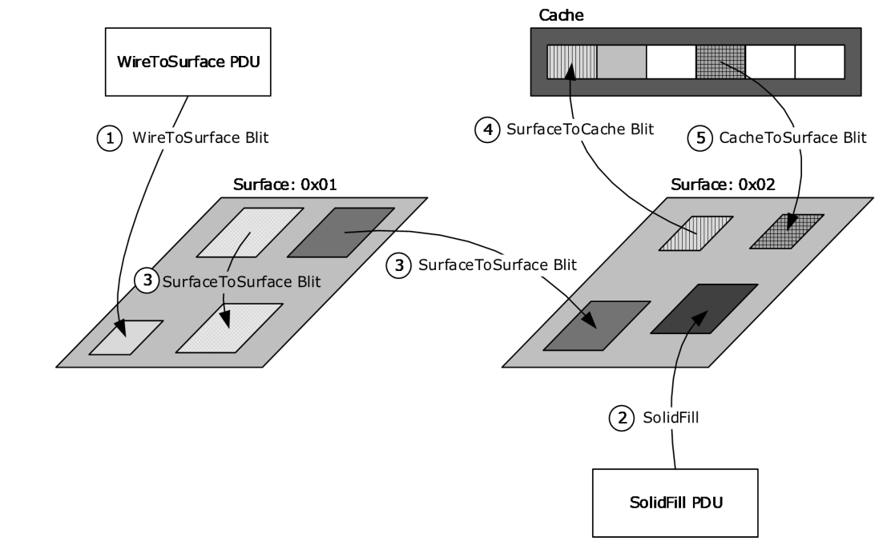
<!-- /Extracted images from page 11 -->

Figure 1: Overview of the blit commands

For more details regarding the graphics protocol behavior, sequencing, and processing rules, see
section 3.

1.4  Relationship to Other Protocols

The Remote Desktop Protocol: Graphics Pipeline Extension is embedded in a dynamic virtual channel
transport, as specified in [MS-RDPEDYC] sections 1 through 3.

1.5  Prerequisites/Preconditions

The Remote Desktop Protocol: Graphics Pipeline Extension operates only after the dynamic virtual
channel transport is fully established. If the dynamic virtual channel transport is terminated, the
Remote Desktop Protocol: Graphics Virtual Channel Extension is also terminated. The protocol is
terminated by closing the underlying virtual channel. For details about closing the dynamic virtual
channel, refer to [MS-RDPEDYC] section 3.3.5.2.

1.5.1  Client Implementation Requirements

Clients implementing the Remote Desktop Protocol: Graphics Pipeline Extension must set the
RNS_UD_CS_SUPPORT_DYNVC_GFX_PROTOCOL (0x0100) flag in the earlyCapabilityFlags field of
the Client Core Data ([MS-RDPBCGR] section 2.2.1.3.2) to indicate support for the protocol.
Furthermore, the client must be capable of processing the following messages:

  RDPGFX_WIRE_TO_SURFACE_PDU_1 (section 2.2.2.1)

  RDPGFX_WIRE_TO_SURFACE_PDU_2 (section 2.2.2.2)

  RDPGFX_DELETE_ENCODING_CONTEXT_PDU (section 2.2.2.3)

  RDPGFX_SOLIDFILL_PDU (section 2.2.2.4)

  RDPGFX_SURFACE_TO_SURFACE_PDU (section 2.2.2.5)

[MS-RDPEGFX] - v20260511
Remote Desktop Protocol: Graphics Pipeline Extension
Copyright © 2026 Microsoft Corporation
Release: May 11, 2026

11 / 145

  RDPGFX_SURFACE_TO_CACHE_PDU (section 2.2.2.6)

  RDPGFX_CACHE_TO_SURFACE_PDU (section 2.2.2.7)

  RDPGFX_EVICT_CACHE_ENTRY_PDU (section 2.2.2.8)

  RDPGFX_CREATE_SURFACE_PDU (section 2.2.2.9)

  RDPGFX_DELETE_SURFACE_PDU (section 2.2.2.10)

  RDPGFX_START_FRAME_PDU (section 2.2.2.11)

  RDPGFX_END_FRAME_PDU (section 2.2.2.12)

  RDPGFX_RESET_GRAPHICS_PDU (section 2.2.2.14)

  RDPGFX_MAP_SURFACE_TO_OUTPUT_PDU (section 2.2.2.15)

  RDPGFX_CAPS_CONFIRM_PDU (section 2.2.2.19)

Furthermore, clients implementing the Remote Desktop Protocol: Graphics Pipeline Extension must be
capable of sending the following messages:

  RDPGFX_FRAME_ACKNOWLEDGE_PDU (section 2.2.2.13)

  RDPGFX_CAPS_ADVERTISE_PDU (section 2.2.2.18)

Clients that implement optional persistent bitmap caching must be capable of sending the
RDPGFX_CACHE_IMPORT_OFFER_PDU (section 2.2.2.16) message and processing the
RDPGFX_CACHE_IMPORT_REPLY_PDU (section 2.2.2.17) message.

Clients that implement Enhanced RemoteApp ([MS-RDPERP] section 1.3.3) must be capable of
processing the RDPGFX_MAP_SURFACE_TO_WINDOW_PDU (section 2.2.2.20) message.

Clients that advertise the RDPGFX_CAPSET_VERSION107 (section 2.2.3.10) capability set (sans
the RDPGFX_CAPS_FLAG_SCALEDMAP_DISABLE (0x00000080) flag), the
RDPGFX_CAPSET_VERSION105 (section 2.2.3.8) capability set, or the
RDPGFX_CAPSET_VERSION106 (section 2.2.3.9) capability set MUST be capable of processing the
following messages:

  RDPGFX_MAP_SURFACE_TO_SCALED_OUTPUT_PDU (section 2.2.2.22)

  RDPGFX_MAP_SURFACE_TO_SCALED_WINDOW_PDU (section 2.2.2.23), if also

implementing Enhanced RemoteApp

1.5.2  Server Implementation Requirements

Servers implementing the Remote Desktop Protocol: Graphics Pipeline Extension must be capable of
sending the following messages:

  RDPGFX_WIRE_TO_SURFACE_PDU_1 (section 2.2.2.1)

  RDPGFX_WIRE_TO_SURFACE_PDU_2 (section 2.2.2.2)

  RDPGFX_DELETE_ENCODING_CONTEXT_PDU (section 2.2.2.3)

  RDPGFX_SOLIDFILL_PDU (section 2.2.2.4)

  RDPGFX_SURFACE_TO_SURFACE_PDU (section 2.2.2.5)

  RDPGFX_SURFACE_TO_CACHE_PDU (section 2.2.2.6)

[MS-RDPEGFX] - v20260511
Remote Desktop Protocol: Graphics Pipeline Extension
Copyright © 2026 Microsoft Corporation
Release: May 11, 2026

12 / 145

  RDPGFX_CACHE_TO_SURFACE_PDU (section 2.2.2.7)

  RDPGFX_EVICT_CACHE_ENTRY_PDU (section 2.2.2.8)

  RDPGFX_CREATE_SURFACE_PDU (section 2.2.2.9)

  RDPGFX_DELETE_SURFACE_PDU (section 2.2.2.10)

  RDPGFX_START_FRAME_PDU (section 2.2.2.11)

  RDPGFX_END_FRAME_PDU (section 2.2.2.12)

  RDPGFX_RESET_GRAPHICS_PDU (section 2.2.2.14)

  RDPGFX_MAP_SURFACE_TO_OUTPUT_PDU (section 2.2.2.15)

  RDPGFX_CACHE_IMPORT_REPLY_PDU (section 2.2.2.17)

  RDPGFX_CAPS_CONFIRM_PDU (section 2.2.2.19)

Furthermore, servers implementing the Remote Desktop Protocol: Graphics Pipeline Extension must
be capable of processing the following messages:

  RDPGFX_FRAME_ACKNOWLEDGE_PDU (section 2.2.2.13)

  RDPGFX_CACHE_IMPORT_OFFER_PDU (section 2.2.2.16)

  RDPGFX_CAPS_ADVERTISE_PDU (section 2.2.2.18)

Servers that implement Enhanced RemoteApp ([MS-RDPERP] section 1.3.3) must be capable of
sending the RDPGFX_MAP_SURFACE_TO_WINDOW_PDU (section 2.2.2.20) message.

Servers that support the RDPGFX_CAPSET_VERSION10 (section 2.2.3.3),
RDPGFX_CAPSET_VERSION102 (section 2.2.3.5), RDPGFX_CAPSET_VERSION103 (section
2.2.3.6), RDPGFX_CAPSET_VERSION104 (section 2.2.3.7), RDPGFX_CAPSET_VERSION105
(section 2.2.3.8), RDPGFX_CAPSET_VERSION106 (section 2.2.3.9), or
RDPGFX_CAPSET_VERSION107 (section 2.2.3.10) capability sets must be capable of processing
the RDPGFX_QOE_FRAME_ACKNOWLEDGE_PDU (section 2.2.2.21) message.

1.6  Applicability Statement

The Remote Desktop Protocol: Graphics Pipeline Extension is applicable in scenarios where the
efficient transfer of server-side graphics display data is required from a terminal server to a terminal
server client.

1.7  Versioning and Capability Negotiation

Capability exchange using the RDPGFX_CAPS_ADVERTISE_PDU (section 2.2.2.18) and
RDPGFX_CAPS_CONFIRM_PDU (section 2.2.2.19) messages takes place before any graphics
messages flow on the wire. The client advertises supported capability sets from section 2.2.3 in an
RDPGFX_CAPS_ADVERTISE_PDU message. In response, the server selects one of the supported
sets and then sends an RDPGFX_CAPS_CONFIRM_PDU message to the client containing the
selected set.

Implementers of the Remote Desktop Protocol: Graphics Pipeline Extension have to support the
ClearCodec codec as described in sections 2.2.4.1 and 3.3.8.1. Usage of the RemoteFX Codec ([MS-
RDPRFX] sections 2.2.2 and 3.1.8) and the RemoteFX Progressive Codec (sections 2.2.4.2, 3.1.8.1,
3.2.8.1, and 3.3.8.1) is based on the flags exchanged in the RDPGFX_CAPSET_VERSION8,
RDPGFX_CAPSET_VERSION81, RDPGFX_CAPSET_VERSION10,
RDPGFX_CAPSET_VERSION102, RDPGFX_CAPSET_VERSION103,

13 / 145

[MS-RDPEGFX] - v20260511
Remote Desktop Protocol: Graphics Pipeline Extension
Copyright © 2026 Microsoft Corporation
Release: May 11, 2026

RDPGFX_CAPSET_VERSION104, RDPGFX_CAPSET_VERSION105,
RDPGFX_CAPSET_VERSION106, or RDPGFX_CAPSET_VERSION107 structure (sections 2.2.3.1,
2.2.3.2, 2.2.3.3, 2.2.3.5, 2.2.3.6, 2.2.3.7, 2.2.3.8, 2.2.3.9, and 2.2.3.10 respectively). Usage of the
MPEG-4 AVC/H.264 Codec in YUV420p, YUV444, or YUV444v2 mode (sections 2.2.4.3, 2.2.4.4,
2.2.4.5, 2.2.4.6, and 3.3.8.3) is based on the flags exchanged in the
RDPGFX_CAPSET_VERSION81, RDPGFX_CAPSET_VERSION10,
RDPGFX_CAPSET_VERSION102, RDPGFX_CAPSET_VERSION103,
RDPGFX_CAPSET_VERSION104, RDPGFX_CAPSET_VERSION105,
RDPGFX_CAPSET_VERSION106, or RDPGFX_CAPSET_VERSION107 structure (sections 2.2.3.2,
2.2.3.3, 2.2.3.5, 2.2.3.6, 2.2.3.7, 2.2.3.8, 2.2.3.9, and 2.2.3.10 respectively). Usage of the MPEG-4
AVC/H.264 Codec in YUV444v2 mode is implied by the RDPGFX_CAPSET_VERSION101 structure
(section 2.2.3.4). Only the flags of the selected capability set that are sent in the
RDPGFX_CAPS_CONFIRM_PDU (section 2.2.2.19) message apply to the connection. All of the
capability set structures are encapsulated in the RDPGFX_CAPS_ADVERTISE_PDU (section
2.2.2.18) and RDPGFX_CAPS_CONFIRM_PDU (section 2.2.2.19) messages. Furthermore, any data
exchanged in the Bitmap Codecs Capability Set ([MS-RDPBCGR] section 2.2.7.2.10) does not influence
the choice of codecs used by the Remote Desktop Protocol: Graphics Pipeline Extension.

1.8  Vendor-Extensible Fields

None.

1.9  Standards Assignments

None.

[MS-RDPEGFX] - v20260511
Remote Desktop Protocol: Graphics Pipeline Extension
Copyright © 2026 Microsoft Corporation
Release: May 11, 2026

14 / 145

2  Messages

2.1  Transport

The Remote Desktop Protocol: Graphics Pipeline Extension is designed to operate over a non-lossy
dynamic virtual channel, as specified in [MS-RDPEDYC] sections 1 through 3. The dynamic virtual
channel name is the null-terminated ANSI character string "Microsoft::Windows::RDS::Graphics".
The usage of channel names in the context of opening a dynamic virtual channel is specified in [MS-
RDPEDYC] section 2.2.2.1.

All server-to-client graphics messages are encapsulated within an RDP_SEGMENTED_DATA
structure (section 2.2.5.1) when sent on the "Microsoft::Windows::RDS::Graphics" dynamic virtual
channel. Decoding one RDP_SEGMENTED_DATA structure yields one or more graphics messages.
Graphics messages are not spanned across multiple RDP_SEGMENTED_DATA structures, but can be
broken into multiple RDP_DATA_SEGMENT frames (section 2.2.5.2).

Client-to-server graphics messages are not encapsulated within any external structure when sent on
the "Microsoft::Windows::RDS::Graphics" dynamic virtual channel.

To ensure that the transport is utilized effectively, continuous network characteristics detection
SHOULD be enabled as specified in [MS-RDPBCGR] sections 1.3.9 and 2.2.14.

2.2  Message Syntax

The following sections specify the Remote Desktop Protocol: Graphics Pipeline Extension message
syntax. All multiple-byte fields within a message MUST be marshaled in little-endian byte order,
unless otherwise specified.

2.2.1  Common Data Types

2.2.1.1  RDPGFX_POINT16

The RDPGFX_POINT16 structure specifies a point relative to the origin of a target surface.

0  1  2  3  4  5  6  7  8  9

1
0  1  2  3  4  5  6  7  8  9

2
0  1  2  3  4  5  6  7  8  9

3
0  1

x

y

x (2 bytes):  A 16-bit signed integer that specifies the x-coordinate of the point.

y (2 bytes):  A 16-bit signed integer that specifies the y-coordinate of the point.

2.2.1.2  RDPGFX_RECT16

The RDPGFX_RECT16 structure specifies a rectangle relative to the origin of a target surface using
exclusive coordinates (the right and bottom bounds are not included in the rectangle).

0  1  2  3  4  5  6  7  8  9

1
0  1  2  3  4  5  6  7  8  9

2
0  1  2  3  4  5  6  7  8  9

3
0  1

left

right

top

bottom

15 / 145

[MS-RDPEGFX] - v20260511
Remote Desktop Protocol: Graphics Pipeline Extension
Copyright © 2026 Microsoft Corporation
Release: May 11, 2026

left (2 bytes):  A 16-bit unsigned integer that specifies the leftmost bound of the rectangle.

top (2 bytes):  A 16-bit unsigned integer that specifies the upper bound of the rectangle.

right (2 bytes):  A 16-bit unsigned integer that specifies the rightmost bound of the rectangle.

bottom (2 bytes):  A 16-bit unsigned integer that specifies the lower bound of the rectangle.

2.2.1.3  RDPGFX_COLOR32

The RDPGFX_COLOR32 structure specifies a 32bpp ARGB or XRGB color value.

0  1  2  3  4  5  6  7  8  9

1
0  1  2  3  4  5  6  7  8  9

2
0  1  2  3  4  5  6  7  8  9

3
0  1

B

G

R

XA

B (1 byte):  An 8-bit unsigned integer that specifies the blue ARGB or XRGB color component.

G (1 byte):  An 8-bit unsigned integer that specifies the green ARGB or XRGB color component.

R (1 byte):  An 8-bit unsigned integer that specifies the red ARGB or XRGB color component.

XA (1 byte):  An 8-bit unsigned integer that in the case of ARGB specifies the alpha color component

or in the case of XRGB MUST be ignored.

2.2.1.4  RDPGFX_PIXELFORMAT

The RDPGFX_PIXELFORMAT structure specifies the color component layout in a pixel.

0  1  2  3  4  5  6  7  8  9

1
0  1  2  3  4  5  6  7  8  9

2
0  1  2  3  4  5  6  7  8  9

3
0  1

format

format (1 byte):  An 8-bit unsigned integer that specifies the pixel format.

Value

Meaning

PIXEL_FORMAT_XRGB_8888

32bpp with no valid alpha (XRGB).

0x20

PIXEL_FORMAT_ARGB_8888

32bpp with valid alpha (ARGB).

0x21

2.2.1.5  RDPGFX_HEADER

The RDPGFX_HEADER structure is included in all graphics command PDUs and specifies the graphics
command type, the transport flags, and the length of the PDU.

[MS-RDPEGFX] - v20260511
Remote Desktop Protocol: Graphics Pipeline Extension
Copyright © 2026 Microsoft Corporation
Release: May 11, 2026

16 / 145

0  1  2  3  4  5  6  7  8  9

1
0  1  2  3  4  5  6  7  8  9

2
0  1  2  3  4  5  6  7  8  9

3
0  1

cmdId

flags

pduLength

cmdId (2 bytes): A 16-bit unsigned integer that identifies the type of the graphics command PDU.

Value

Meaning

RDPGFX_CMDID_WIRETOSURFACE_1

0x0001

RDPGFX_CMDID_WIRETOSURFACE_2

0x0002

RDPGFX_WIRE_TO_SURFACE_PDU_1 (section
2.2.2.1)

RDPGFX_WIRE_TO_SURFACE_PDU_2 (section
2.2.2.2)

RDPGFX_CMDID_DELETEENCODINGCONTEXT

0x0003

RDPGFX_DELETE_ENCODING_CONTEXT_PDU
(section 2.2.2.3)

RDPGFX_CMDID_SOLIDFILL

RDPGFX_SOLIDFILL_PDU (section 2.2.2.4)

0x0004

RDPGFX_CMDID_SURFACETOSURFACE

0x0005

RDPGFX_SURFACE_TO_SURFACE_PDU (section
2.2.2.5)

RDPGFX_CMDID_SURFACETOCACHE

0x0006

RDPGFX_CMDID_CACHETOSURFACE

0x0007

RDPGFX_CMDID_EVICTCACHEENTRY

0x0008

RDPGFX_CMDID_CREATESURFACE

0x0009

RDPGFX_CMDID_DELETESURFACE

0x000A

RDPGFX_SURFACE_TO_CACHE_PDU (section
2.2.2.6)

RDPGFX_CACHE_TO_SURFACE_PDU (section
2.2.2.7)

RDPGFX_EVICT_CACHE_ENTRY_PDU (section
2.2.2.8)

RDPGFX_CREATE_SURFACE_PDU (section
2.2.2.9)

RDPGFX_DELETE_SURFACE_PDU (section
2.2.2.10)

RDPGFX_CMDID_STARTFRAME

RDPGFX_START_FRAME_PDU (section 2.2.2.11)

0x000B

RDPGFX_CMDID_ENDFRAME

RDPGFX_END_FRAME_PDU (section 2.2.2.12)

0x000C

RDPGFX_CMDID_FRAMEACKNOWLEDGE

0x000D

RDPGFX_FRAME_ACKNOWLEDGE_PDU (section
2.2.2.13)

RDPGFX_CMDID_RESETGRAPHICS

0x000E

RDPGFX_RESET_GRAPHICS_PDU (section
2.2.2.14)

RDPGFX_CMDID_MAPSURFACETOOUTPUT

0x000F

RDPGFX_MAP_SURFACE_TO_OUTPUT_PDU
(section 2.2.2.15)

RDPGFX_CMDID_CACHEIMPORTOFFER

0x0010

RDPGFX_CACHE_IMPORT_OFFER_PDU (section
2.2.2.16)

[MS-RDPEGFX] - v20260511
Remote Desktop Protocol: Graphics Pipeline Extension
Copyright © 2026 Microsoft Corporation
Release: May 11, 2026

17 / 145

Value

Meaning

RDPGFX_CMDID_CACHEIMPORTREPLY

0x0011

RDPGFX_CACHE_IMPORT_REPLY_PDU (section
2.2.2.17)

RDPGFX_CMDID_CAPSADVERTISE

0x0012

RDPGFX_CAPS_ADVERTISE_PDU (section
2.2.2.18)

RDPGFX_CMDID_CAPSCONFIRM

RDPGFX_CAPS_CONFIRM_PDU (section 2.2.2.19)

0x0013

RDPGFX_CMDID_MAPSURFACETOWINDOW

0x0015

RDPGFX_MAP_SURFACE_TO_WINDOW_PDU
(section 2.2.2.20)

RDPGFX_CMDID_QOEFRAMEACKNOWLEDGE

0x0016

RDPGFX_QOE_FRAME_ACKNOWLEDGE_PDU
(section 2.2.2.21)

RDPGFX_CMDID_MAPSURFACETOSCALEDOUTPUT

0x0017

RDPGFX_MAP_SURFACE_TO_SCALED_OUTPUT_
PDU (section 2.2.2.22)

RDPGFX_CMDID_MAPSURFACETOSCALEDWINDOW

0x0018

RDPGFX_MAP_SURFACE_TO_SCALED_WINDOW
_PDU (section 2.2.2.23)

flags (2 bytes): A 16-bit unsigned integer that contains graphics command flags common to all

PDUs. No common graphics command flags are specified; therefore, this field MUST be set to zero.

pduLength (4 bytes): A 32-bit unsigned integer that specifies the length of the graphics command

PDU, in bytes. This value MUST include the length of the RDPGFX_HEADER (8 bytes).

2.2.1.6  RDPGFX_CAPSET

The RDPGFX_CAPSET structure specifies the layout of a capability set sent in the
RDPGFX_CAPS_ADVERTISE_PDU (section 2.2.2.18) message. All of the capability sets specified in
section 2.2.3 conform to this basic structure.

0  1  2  3  4  5  6  7  8  9

1
0  1  2  3  4  5  6  7  8  9

2
0  1  2  3  4  5  6  7  8  9

3
0  1

version

capsDataLength

capsData (variable)

...

...

version (4 bytes): A 32-bit unsigned integer that specifies the version of the capability set.

Value

Meaning

RDPGFX_CAPVERSION_8

RDPGFX_CAPSET_VERSION8 (section 2.2.3.1)

0x00080004

[MS-RDPEGFX] - v20260511
Remote Desktop Protocol: Graphics Pipeline Extension
Copyright © 2026 Microsoft Corporation
Release: May 11, 2026

18 / 145

Value

Meaning

RDPGFX_CAPVERSION_81

RDPGFX_CAPSET_VERSION81 (section 2.2.3.2)

0x00080105

RDPGFX_CAPVERSION_10

RDPGFX_CAPSET_VERSION10 (section 2.2.3.3)

0x000A0002

RDPGFX_CAPVERSION_101

RDPGFX_CAPSET_VERSION101 (section 2.2.3.4)

0x000A0100

RDPGFX_CAPVERSION_102

RDPGFX_CAPSET_VERSION102 (section 2.2.3.5)

0x000A0200

RDPGFX_CAPVERSION_103

RDPGFX_CAPSET_VERSION103 (section 2.2.3.6)

0x000A0301

RDPGFX_CAPVERSION_104

RDPGFX_CAPSET_VERSION104 (section 2.2.3.7)

0x000A0400

RDPGFX_CAPVERSION_105

RDPGFX_CAPSET_VERSION105 (section 2.2.3.8)

0x000A0502

RDPGFX_CAPVERSION_106

RDPGFX_CAPSET_VERSION106 (section 2.2.3.9)

0x000A0600

RDPGFX_CAPVERSION_107

RDPGFX_CAPSET_VERSION107 (section 2.2.3.10)

0x000A0701

The format of the data in the capsData field and the length specified in the capsDataLength
field are both determined by the version of the capability set.

capsDataLength (4 bytes): A 32-bit unsigned integer that specifies the size, in bytes, of the

capability set data present in the capsData field.

capsData (variable): A variable-length array of bytes that contains data specific to the capability

set. The number of bytes in this array is specified by the capsDataLength field.

2.2.2  Graphics Messages

2.2.2.1  RDPGFX_WIRE_TO_SURFACE_PDU_1

The RDPGFX_WIRE_TO_SURFACE_PDU_1 message is used to transfer encoded bitmap data from
the server to a client-side destination surface.

0  1  2  3  4  5  6  7  8  9

1
0  1  2  3  4  5  6  7  8  9

2
0  1  2  3  4  5  6  7  8  9

3
0  1

header

...

surfaceId

codecId

pixelFormat

destRect

[MS-RDPEGFX] - v20260511
Remote Desktop Protocol: Graphics Pipeline Extension
Copyright © 2026 Microsoft Corporation
Release: May 11, 2026

19 / 145

...

...

bitmapDataLength

bitmapData (variable)

...

...

...

header (8 bytes):  An RDPGFX_HEADER structure (section 2.2.1.5). The cmdId field MUST be set
to RDPGFX_CMDID_WIRETOSURFACE_1 (0x0001), while the flags field MUST be set to zero.

surfaceId (2 bytes):  A 16-bit unsigned integer that specifies the ID of the destination surface.

codecId (2 bytes):  A 16-bit unsigned integer that specifies the codec that was used to encode the

bitmap data encapsulated in the bitmapData field.

Value

Meaning

RDPGFX_CODECID_UNCOMPRESSED

0x0000

The bitmap data encapsulated in the bitmapData field is
uncompressed. Pixels in the uncompressed data are ordered from
left to right and then top to bottom.

RDPGFX_CODECID_CAVIDEO

0x0003

The bitmap data encapsulated in the bitmapData field is
compressed using the RemoteFX Codec ([MS-RDPRFX] sections
2.2.1 and 3.1.8). Note that the TS_RFX_RECT ([MS-RDPRFX]
section 2.2.2.1.6) structures encapsulated in the bitmapData
field MUST all be relative to the top-left corner of the rectangle
defined by the destRect field.

RDPGFX_CODECID_CLEARCODEC

0x0008

The bitmap data encapsulated in the bitmapData field is
compressed using the ClearCodec Codec (sections 2.2.4.1 and
3.3.8.1).

RDPGFX_CODECID_PLANAR

0x000A

The bitmap data encapsulated in the bitmapData field is
compressed using the Planar Codec ([MS-RDPEGDI] sections
2.2.2.5.1 and 3.1.9).

RDPGFX_CODECID_AVC420

0x000B

The bitmap data encapsulated in the bitmapData field is
compressed using the MPEG-4 AVC/H.264 Codec in YUV420p
mode (section 2.2.4.4).

RDPGFX_CODECID_ALPHA

0x000C

RDPGFX_CODECID_AVC444

0x000E

The bitmap data encapsulated in the bitmapData field is
compressed using the Alpha Codec (section 2.2.4.3).

The bitmap data encapsulated in the bitmapData field is
compressed using the MPEG-4 AVC/H.264 Codec in YUV444 mode
(section 2.2.4.5).

RDPGFX_CODECID_AVC444V2

0x000F

The bitmap data encapsulated in the bitmapData field is
compressed using the MPEG-4 AVC/H.264 Codec in YUV444v2
mode (section 2.2.4.6).

pixelFormat (1 byte):  An RDPGFX_PIXELFORMAT (section 2.2.1.4) structure that specifies the

pixel format of the decoded bitmap data encapsulated in the bitmapData field.

destRect (8 bytes):  An RDPGFX_RECT16 (section 2.2.1.2) structure that specifies the target point
on the destination surface to which to copy the decoded bitmap and the dimensions (width and

20 / 145

[MS-RDPEGFX] - v20260511
Remote Desktop Protocol: Graphics Pipeline Extension
Copyright © 2026 Microsoft Corporation
Release: May 11, 2026

height) of the bitmap data encapsulated in the bitmapData field. This field specifies a bounding
rectangle if the codecId field contains the RDPGFX_CODECID_AVC420 (0x000B),
RDPGFX_CODECID_AVC444 (0x000E), or the RDPGFX_CODECID_AVC444V2 (0x000F) identifier.

bitmapDataLength (4 bytes):  A 32-bit unsigned integer that specifies the length, in bytes, of the

bitmapData field.

bitmapData (variable):  A variable-length array of bytes containing bitmap data encoded using the

codec identified by the ID in the codecId field.

2.2.2.2  RDPGFX_WIRE_TO_SURFACE_PDU_2

The RDPGFX_WIRE_TO_SURFACE_PDU_2 message is used to transfer encoded bitmap data
progressively from the server to a client-side destination surface by leveraging a compression context
that persists on the server and the client until the transfer of the bitmap data is complete.

0  1  2  3  4  5  6  7  8  9

1
0  1  2  3  4  5  6  7  8  9

2
0  1  2  3  4  5  6  7  8  9

3
0  1

header

...

surfaceId

codecId

pixelFormat

...

codecContextId

bitmapDataLength

bitmapData (variable)

...

...

header (8 bytes):  An RDPGFX_HEADER (section 2.2.1.5) structure. The cmdId field MUST be set
to RDPGFX_CMDID_WIRETOSURFACE_2 (0x0002), while the flags field MUST be set to zero.

surfaceId (2 bytes):  A 16-bit unsigned integer that specifies the ID of the destination surface.

codecId (2 bytes):  A 16-bit unsigned integer that specifies the codec that was used to encode the

bitmap data encapsulated in the bitmapData field.

Value

Meaning

RDPGFX_CODECID_CAPROGRESSIVE

0x0009

The bitmap data encapsulated in the bitmapData field is
compressed using the RemoteFX Progressive Codec (sections
2.2.4.2, 3.1.8.1, 3.2.8.1, and 3.3.8.2).

codecContextId (4 bytes):  A 32-bit unsigned integer that identifies the compression context

associated with the bitmap data encapsulated in the bitmapData field.

pixelFormat (1 byte):  An RDPGFX_PIXELFORMAT (section 2.2.1.4) structure that specifies the

pixel format of the decoded bitmap data encapsulated in the bitmapData field.

[MS-RDPEGFX] - v20260511
Remote Desktop Protocol: Graphics Pipeline Extension
Copyright © 2026 Microsoft Corporation
Release: May 11, 2026

21 / 145

bitmapDataLength (4 bytes):  A 32-bit unsigned integer that specifies the length, in bytes, of the

bitmapData field.

bitmapData (variable):  A variable-length array of bytes containing bitmap data encoded using the

codec identified by the ID in the codecId field.

2.2.2.3  RDPGFX_DELETE_ENCODING_CONTEXT_PDU

The RDPGFX_DELETE_ENCODING_CONTEXT_PDU message is sent by the server to instruct the
client to delete a compression context that was used by a collection of
RDPGFX_WIRE_TO_SURFACE_PDU_2 (section 2.2.2.2) messages to progressively transfer bitmap
data.

0  1  2  3  4  5  6  7  8  9

1
0  1  2  3  4  5  6  7  8  9

2
0  1  2  3  4  5  6  7  8  9

3
0  1

header

...

surfaceId

...

codecContextId

header (8 bytes):  An RDPGFX_HEADER (section 2.2.1.5) structure. The cmdId field MUST be set
to RDPGFX_CMDID_DELETEENCODINGCONTEXT (0x0003), while the flags field MUST be set to
zero.

surfaceId (2 bytes):  A 16-bit unsigned integer that specifies the ID of the surface associated with

the compression context ID specified in the codecContextId field.

codecContextId (4 bytes):  A 32-bit unsigned integer that specifies the ID of the compression

context to delete.

2.2.2.4  RDPGFX_SOLIDFILL_PDU

The RDPGFX_SOLIDFILL_PDU message is used to instruct the client to fill a collection of rectangles
on a destination surface with a solid color.

0  1  2  3  4  5  6  7  8  9

1
0  1  2  3  4  5  6  7  8  9

2
0  1  2  3  4  5  6  7  8  9

3
0  1

header

...

surfaceId

...

fillPixel

fillRectCount

fillRects (variable)

...

[MS-RDPEGFX] - v20260511
Remote Desktop Protocol: Graphics Pipeline Extension
Copyright © 2026 Microsoft Corporation
Release: May 11, 2026

22 / 145

...

header (8 bytes):  An RDPGFX_HEADER (section 2.2.1.5) structure. The cmdId field MUST be set

to RDPGFX_CMDID_SOLIDFILL (0x0004), while the flags field MUST be set to zero.

surfaceId (2 bytes):  A 16-bit unsigned integer that specifies the ID of the destination surface.

fillPixel (4 bytes):  An RDPGFX_COLOR32 (section 2.2.1.3) structure that specifies the color that

MUST be used to fill the destination rectangles specified in the fillRects field.

fillRectCount (2 bytes):  A 16-bit unsigned integer that specifies the number of RDPGFX_RECT16

(section 2.2.1.2) structures in the fillRects field.

fillRects (variable):  A variable-length array of RDPGFX_RECT16 structures that specifies

rectangles on the destination surface to be filled. The number of structures in this array is
specified by the fillRectCount field.

2.2.2.5  RDPGFX_SURFACE_TO_SURFACE_PDU

The RDPGFX_SURFACE_TO_SURFACE_PDU message is used to instruct the client to copy bitmap
data from a source surface to a destination surface or to replicate bitmap data within the same
surface.

0  1  2  3  4  5  6  7  8  9

1
0  1  2  3  4  5  6  7  8  9

2
0  1  2  3  4  5  6  7  8  9

3
0  1

header

...

surfaceIdSrc

surfaceIdDest

destPtsCount

rectSrc

...

...

...

destPts (variable)

header (8 bytes):  An RDPGFX_HEADER (section 2.2.1.5) structure. The cmdId field MUST be set
to RDPGFX_CMDID_SURFACETOSURFACE (0x0005), while the flags field MUST be set to zero.

surfaceIdSrc (2 bytes):  A 16-bit unsigned integer that specifies the ID of the surface containing the

source bitmap.

surfaceIdDest (2 bytes):  A 16-bit unsigned integer that specifies the ID of the destination surface.

rectSrc (8 bytes):  An RDPGFX_RECT16 (section 2.2.1.2) structure that specifies the rectangle that

bounds the source bitmap.

destPtsCount (2 bytes):  A 16-bit unsigned integer that specifies the number of

RDPGFX_POINT16 (section 2.2.1.1) structures in the destPts field.

23 / 145

[MS-RDPEGFX] - v20260511
Remote Desktop Protocol: Graphics Pipeline Extension
Copyright © 2026 Microsoft Corporation
Release: May 11, 2026

destPts (variable):  A variable-length array of RDPGFX_POINT16 structures that specifies target

points on the destination surface to which to copy the source bitmap. The number of structures in
this array is specified by the destPtsCount field.

2.2.2.6  RDPGFX_SURFACE_TO_CACHE_PDU

The RDPGFX_SURFACE_TO_CACHE_PDU message is used to instruct the client to copy bitmap
data from a source surface to the bitmap cache.

0  1  2  3  4  5  6  7  8  9

1
0  1  2  3  4  5  6  7  8  9

2
0  1  2  3  4  5  6  7  8  9

3
0  1

surfaceId

header

...

...

cacheKey

...

cacheSlot

rectSrc

...

header (8 bytes):  An RDPGFX_HEADER (section 2.2.1.5) structure. The cmdId field MUST be set
to RDPGFX_CMDID_SURFACETOCACHE (0x0006), while the flags field MUST be set to zero.

surfaceId (2 bytes):  A 16-bit unsigned integer that specifies the ID of the surface containing the

source bitmap.

cacheKey (8 bytes):  A 64-bit unsigned integer that specifies a key to associate with the bitmap

cache entry that will store the bitmap.

cacheSlot (2 bytes):  A 16-bit unsigned integer that specifies the index of the bitmap cache entry in
which the source bitmap data MUST be stored. The value of this field is constrained as specified in
section 3.3.1.4.

rectSrc (8 bytes):  An RDPGFX_RECT16 (section 2.2.1.2) structure that specifies the rectangle that

bounds the source bitmap.

2.2.2.7  RDPGFX_CACHE_TO_SURFACE_PDU

The RDPGFX_CACHE_TO_SURFACE_PDU message is used to instruct the client to copy bitmap
data from the bitmap cache to a destination surface.

0  1  2  3  4  5  6  7  8  9

1
0  1  2  3  4  5  6  7  8  9

2
0  1  2  3  4  5  6  7  8  9

3
0  1

header

...

[MS-RDPEGFX] - v20260511
Remote Desktop Protocol: Graphics Pipeline Extension
Copyright © 2026 Microsoft Corporation
Release: May 11, 2026

24 / 145

cacheSlot

destPtsCount

surfaceId

destPts (variable)

...

...

header (8 bytes):  An RDPGFX_HEADER (section 2.2.1.5) structure. The cmdId field MUST be set
to RDPGFX_CMDID_CACHETOSURFACE (0x0007), while the flags field MUST be set to zero.

cacheSlot (2 bytes):  A 16-bit unsigned integer that specifies the index of the bitmap cache entry
that contains the source bitmap. The value of this field is constrained as specified in section
3.3.1.4.

surfaceId (2 bytes):  A 16-bit unsigned integer that specifies the ID of the destination surface.

destPtsCount (2 bytes):  A 16-bit unsigned integer that specifies the number of

RDPGFX_POINT16 (section 2.2.1.1) structures in the destPts field.

destPts (variable):  A variable-length array of RDPGFX_POINT16 structures that specifies target

points on the destination surface to which to copy the source bitmap. The number of structures in
this array is specified by the destPtsCount field.

2.2.2.8  RDPGFX_EVICT_CACHE_ENTRY_PDU

The RDPGFX_EVICT_CACHE_ENTRY_PDU message is used to instruct the client to delete an entry
from the bitmap cache.

0  1  2  3  4  5  6  7  8  9

1
0  1  2  3  4  5  6  7  8  9

2
0  1  2  3  4  5  6  7  8  9

3
0  1

header

...

cacheSlot

header (8 bytes):  An RDPGFX_HEADER (section 2.2.1.5) structure. The cmdId field MUST be set
to RDPGFX_CMDID_EVICTCACHEENTRY (0x0008), while the flags field MUST be set to zero.

cacheSlot (2 bytes):  A 16-bit unsigned integer that specifies the index of the bitmap cache entry to
delete from the bitmap cache. The value of this field is constrained as specified in section 3.3.1.4.

2.2.2.9  RDPGFX_CREATE_SURFACE_PDU

The RDPGFX_CREATE_SURFACE_PDU message is used to instruct the client to create a surface of a
given width, height, and pixel format.

0  1  2  3  4  5  6  7  8  9

1
0  1  2  3  4  5  6  7  8  9

2
0  1  2  3  4  5  6  7  8  9

3
0  1

header

[MS-RDPEGFX] - v20260511
Remote Desktop Protocol: Graphics Pipeline Extension
Copyright © 2026 Microsoft Corporation
Release: May 11, 2026

25 / 145

...

surfaceId

height

width

pixelFormat

header (8 bytes):  An RDPGFX_HEADER (section 2.2.1.5) structure. The cmdId field MUST be set

to RDPGFX_CMDID_CREATESURFACE (0x0009), while the flags field MUST be set to zero.

surfaceId (2 bytes):  A 16-bit unsigned integer that specifies the ID that MUST be assigned to the

surface once it has been created.

width (2 bytes):  A 16-bit unsigned integer that specifies the width of the surface to create.

height (2 bytes):  A 16-bit unsigned integer that specifies the height of the surface to create.

pixelFormat (1 byte):  An RDPGFX_PIXELFORMAT (section 2.2.1.4) structure that specifies the

pixel format of the surface to create.

2.2.2.10

RDPGFX_DELETE_SURFACE_PDU

The RDPGFX_DELETE_SURFACE_PDU message is used to instruct the client to delete a surface.

0  1  2  3  4  5  6  7  8  9

1
0  1  2  3  4  5  6  7  8  9

2
0  1  2  3  4  5  6  7  8  9

3
0  1

header

...

surfaceId

header (8 bytes):  An RDPGFX_HEADER (section 2.2.1.5) structure. The cmdId field MUST be set

to RDPGFX_CMDID_DELETESURFACE (0x000A), while the flags field MUST be set to zero.

surfaceId (2 bytes):  A 16-bit unsigned integer that specifies the ID of the surface to delete.

2.2.2.11

RDPGFX_START_FRAME_PDU

The RDPGFX_START_FRAME_PDU message is sent by the server to specify the start of a logical
frame, enabling related graphics commands to be grouped together.

0  1  2  3  4  5  6  7  8  9

1
0  1  2  3  4  5  6  7  8  9

2
0  1  2  3  4  5  6  7  8  9

3
0  1

header

...

timestamp

frameId

[MS-RDPEGFX] - v20260511
Remote Desktop Protocol: Graphics Pipeline Extension
Copyright © 2026 Microsoft Corporation
Release: May 11, 2026

26 / 145

header (8 bytes):  An RDPGFX_HEADER (section 2.2.1.5) structure. The cmdId field MUST be set

to RDPGFX_CMDID_STARTFRAME (0x000B), while the flags field MUST be set to zero.

timestamp (4 bytes):  A 32-bit unsigned integer that contains a UTC timestamp assigned to the

frame. If no timestamp is available, this field MUST be set to zero.

The format of the timestamp field is described by the following bitmask diagram.

0  1  2  3  4  5  6  7  8  9

1
0  1  2  3  4  5  6  7  8  9

2
0  1  2  3  4  5  6  7  8  9

3
0  1

milliseconds

seconds

minutes

hours

milliseconds (10 bits):  A 10-bit, unsigned integer that contains the millisecond value of the

timestamp. This field MUST be greater than or equal to 0, and less than or equal to 999.

seconds (6 bits):  A 6-bit, unsigned integer that contains the second value of the timestamp.

This field MUST be greater than or equal to 0, and less than or equal to 59.

minutes (6 bits):  A 6-bit, unsigned integer that contains the minute value of the timestamp.

This field MUST be greater than or equal to 0, and less than or equal to 59.

hours (10 bits):  A 10-bit, unsigned integer that contains the hour value of the timestamp. This

field MUST be greater than or equal to 0, and less than or equal to 23.

frameId (4 bytes):  A 32-bit unsigned integer that specifies a unique ID assigned to the frame.

2.2.2.12

RDPGFX_END_FRAME_PDU

The RDPGFX_END_FRAME_PDU message is sent by the server to specify the end of a logical frame.

0  1  2  3  4  5  6  7  8  9

1
0  1  2  3  4  5  6  7  8  9

2
0  1  2  3  4  5  6  7  8  9

3
0  1

header

...

frameId

header (8 bytes):  An RDPGFX_HEADER (section 2.2.1.5) structure. The cmdId field MUST be set

to RDPGFX_CMDID_ENDFRAME (0x000C), while the flags field MUST be set to zero.

frameId (4 bytes):  A 32-bit unsigned integer that contains the ID assigned to the frame in the

RDPGFX_START_FRAME_PDU (section 2.2.2.11) message.

2.2.2.13

RDPGFX_FRAME_ACKNOWLEDGE_PDU

The RDPGFX_FRAME_ACKNOWLEDGE_PDU message is sent by the client to indicate to the server
that a logical frame of graphics commands has been successfully decoded. This message MUST be
sent in response to an RDPGFX_END_FRAME_PDU (section 2.2.2.12) message, unless the client
has opted out of this behavior.

[MS-RDPEGFX] - v20260511
Remote Desktop Protocol: Graphics Pipeline Extension
Copyright © 2026 Microsoft Corporation
Release: May 11, 2026

27 / 145

0  1  2  3  4  5  6  7  8  9

1
0  1  2  3  4  5  6  7  8  9

2
0  1  2  3  4  5  6  7  8  9

3
0  1

header

...

queueDepth

frameId

totalFramesDecoded

header (8 bytes):  An RDPGFX_HEADER (section 2.2.1.5) structure. The cmdId field MUST be set

to RDPGFX_CMDID_FRAMEACKNOWLEDGE (0x000D), while the flags field MUST be set to zero.

queueDepth (4 bytes):  A 32-bit unsigned integer that either specifies the number of unprocessed

bytes buffered at the client, or indicates to the server that the client will no longer be transmitting
RDPGFX_FRAME_ACKNOWLEDGE_PDU messages.

Value

Meaning

QUEUE_DEPTH_UNAVAILABLE

0x00000000

Specifies that no information is available regarding the size, in
bytes, of the graphics messages that have been buffered at the
client and not yet processed.

0x00000001 – 0xFFFFFFFE

Specifies the size, in bytes, of the graphics messages that have
been buffered at the client and not yet processed.

SUSPEND_FRAME_ACKNOWLEDGEMENT

0xFFFFFFFF

Indicates to the server that the client will no longer be
transmitting RDPGFX_FRAME_ACKNOWLEDGE_PDU messages.
The client can opt back into sending these messages by sending
an RDPGFX_FRAME_ACKNOWLEDGE_PDU message with the
queueDepth field set to a value in the range 0x00000000 to
0xFFFFFFFE (inclusive) in response to an
RDPGFX_END_FRAME_PDU message.

frameId (4 bytes):  A 32-bit unsigned integer that contains the ID of the frame being acknowledged.
The ID of the frame is specified in the RDPGFX_START_FRAME_PDU (section 2.2.2.11) and
RDPGFX_END_FRAME_PDU (section 2.2.2.12) messages.

totalFramesDecoded (4 bytes):  A 32-bit unsigned integer that specifies the number of frames that

have been decoded by the client since the connection was initiated.

2.2.2.14

RDPGFX_RESET_GRAPHICS_PDU

The RDPGFX_RESET_GRAPHICS_PDU message is sent by the server to instruct the client to
change the width and height of the Graphics Output Buffer (section 3.3.1.7) ADM element, and to
update the monitor layout. Note that this message MUST be 340 bytes in size.

0  1  2  3  4  5  6  7  8  9

1
0  1  2  3  4  5  6  7  8  9

2
0  1  2  3  4  5  6  7  8  9

3
0  1

header

...

28 / 145

[MS-RDPEGFX] - v20260511
Remote Desktop Protocol: Graphics Pipeline Extension
Copyright © 2026 Microsoft Corporation
Release: May 11, 2026

width

height

monitorCount

monitorDefArray (variable)

...

...

pad (variable)

...

...

header (8 bytes):  An RDPGFX_HEADER (section 2.2.1.5) structure. The cmdId field MUST be set
to RDPGFX_CMDID_RESETGRAPHICS (0x000E), the flags field MUST be set to zero, and the
pduLength field MUST be set to 340 bytes.

width (4 bytes):  A 32-bit unsigned integer that specifies the new width of the Graphics Output

Buffer ADM element (the maximum allowed width is 32766 pixels).

height (4 bytes):  A 32-bit unsigned integer that specifies the new height of the Graphics Output

Buffer ADM element (the maximum allowed height is 32766 pixels).

monitorCount (4 bytes):  A 32-bit unsigned integer that specifies the number of display monitor

definitions in the monitorDefArray field. This value MUST be less than or equal to 16.

monitorDefArray (variable):  A variable-length array containing a series of TS_MONITOR_DEF
([MS-RDPBCGR] section 2.2.1.3.6.1) structures that specify the display monitor layout of the
session on the remote server. The number of TS_MONITOR_DEF structures is specified by the
monitorCount field.

pad (variable):  A variable-length byte array that is used for padding. The number of bytes in this

array is calculated by subtracting the combined size of the header, width, height,
monitorCount, and monitorDefArray fields from the total size of the PDU (which is specified by
the pduLength field embedded in the header field). The contents of the pad field MUST be
ignored.

2.2.2.15

RDPGFX_MAP_SURFACE_TO_OUTPUT_PDU

The RDPGFX_MAP_SURFACE_TO_OUTPUT_PDU message is sent by the server to instruct the
client to map a surface to a rectangular area of the Graphics Output Buffer (section 3.3.1.7) ADM
element.

0  1  2  3  4  5  6  7  8  9

1
0  1  2  3  4  5  6  7  8  9

2
0  1  2  3  4  5  6  7  8  9

3
0  1

header

...

29 / 145

[MS-RDPEGFX] - v20260511
Remote Desktop Protocol: Graphics Pipeline Extension
Copyright © 2026 Microsoft Corporation
Release: May 11, 2026

surfaceId

reserved

outputOriginX

outputOriginY

header (8 bytes):  An RDPGFX_HEADER (section 2.2.1.5) structure. The cmdId field MUST be set
to RDPGFX_CMDID_MAPSURFACETOOUTPUT (0x000F), while the flags field MUST be set to zero.

surfaceId (2 bytes):  A 16-bit unsigned integer that specifies the ID of the surface to be associated

with the output-to-surface mapping.

reserved (2 bytes):  A 16-bit unsigned integer that is reserved for future use. This field MUST be set

to zero.

outputOriginX (4 bytes):  A 32-bit unsigned integer that specifies the x-coordinate of the point,

relative to the origin of the Graphics Output Buffer ADM element, at which to map the top-left
corner of the surface.

outputOriginY (4 bytes):  A 32-bit unsigned integer that specifies the y-coordinate of the point,

relative to the origin of the Graphics Output Buffer ADM element, at which to map the upper-
left corner of the surface.

2.2.2.16

RDPGFX_CACHE_IMPORT_OFFER_PDU

The RDPGFX_CACHE_IMPORT_OFFER_PDU message is sent by the client to inform the server of
bitmap data that is present in an optional client-side persistent bitmap cache.

0  1  2  3  4  5  6  7  8  9

1
0  1  2  3  4  5  6  7  8  9

2
0  1  2  3  4  5  6  7  8  9

3
0  1

cacheEntriesCount

header

...

...

...

cacheEntries (variable)

header (8 bytes):  An RDPGFX_HEADER (section 2.2.1.5) structure. The cmdId field MUST be set
to RDPGFX_CMDID_CACHEIMPORTOFFER (0x0010), while the flags field MUST be set to zero.

cacheEntriesCount (2 bytes):  A 16-bit unsigned integer that specifies the number of

RDPGFX_CACHE_ENTRY_METADATA (section 2.2.2.16.1) structures in the cacheEntries field.
This value MUST be less than 5462 (0x1556).

cacheEntries (variable):  A variable-length array of RDPGFX_CACHE_ENTRY_METADATA

structures that identifies a collection of bitmap cache entries present on the client. The number of
structures in this array is specified by the cacheEntriesCount field.

2.2.2.16.1  RDPGFX_CACHE_ENTRY_METADATA

[MS-RDPEGFX] - v20260511
Remote Desktop Protocol: Graphics Pipeline Extension
Copyright © 2026 Microsoft Corporation
Release: May 11, 2026

30 / 145

The RDPGFX_CACHE_ENTRY_METADATA structure specifies attributes of a bitmap cache entry
stored on the client.

0  1  2  3  4  5  6  7  8  9

1
0  1  2  3  4  5  6  7  8  9

2
0  1  2  3  4  5  6  7  8  9

3
0  1

cacheKey

...

bitmapLength

cacheKey (8 bytes):  A 64-bit unsigned integer that specifies a unique key associated with the

bitmap cache entry.

bitmapLength (4 bytes):  A 32-bit unsigned integer that specifies the size of the bitmap cache

entry, in bytes.

2.2.2.17

RDPGFX_CACHE_IMPORT_REPLY_PDU

The RDPGFX_CACHE_IMPORT_REPLY_PDU message is sent by the server to indicate that
persistent bitmap cache metadata advertised in the RDPGFX_CACHE_IMPORT_OFFER_PDU
(section 2.2.2.16) message has been transferred to the bitmap cache.

0  1  2  3  4  5  6  7  8  9

1
0  1  2  3  4  5  6  7  8  9

2
0  1  2  3  4  5  6  7  8  9

3
0  1

importedEntriesCount

header

...

...

...

cacheSlots (variable)

header (8 bytes):  An RDPGFX_HEADER (section 2.2.1.5) structure. The cmdId field MUST be set
to RDPGFX_CMDID_CACHEIMPORTREPLY (0x0011), while the flags field MUST be set to zero.

importedEntriesCount (2 bytes):  A 16-bit unsigned integer that specifies the number of entries

that were imported into the server-side Bitmap Cache Map (section 3.2.1.1) ADM element from
the most recent RDPGFX_CACHE_IMPORT_OFFER_PDU (section 2.2.2.16) message. A value of
N implies that the first N entries were imported into the bitmap cache from the most recent
RDPGFX_CACHE_IMPORT_OFFER_PDU message.

cacheSlots (variable):  An array of 16-bit unsigned integers. The number of integers in this array is

specified by the importedEntriesCount field. Each integer in the array identifies the cache slot
that an imported entry has been assigned. For example, an importedEntriesCount field value of
0x0003 and a cacheSlots field that contains the elements [0x0006, 0x0009, 0x0002] together
imply that the first imported entry was associated with cache slot 6, the second imported entry
was associated with cache slot 9, and the third imported entry was associated with cache slot 2.
Each of the cache slot values contained in this field is constrained as specified in section 3.3.1.4.

[MS-RDPEGFX] - v20260511
Remote Desktop Protocol: Graphics Pipeline Extension
Copyright © 2026 Microsoft Corporation
Release: May 11, 2026

31 / 145

2.2.2.18

RDPGFX_CAPS_ADVERTISE_PDU

The RDPGFX_CAPS_ADVERTISE_PDU message is sent by the client to advertise supported
capabilities.

0  1  2  3  4  5  6  7  8  9

1
0  1  2  3  4  5  6  7  8  9

2
0  1  2  3  4  5  6  7  8  9

3
0  1

capsSetCount

header

...

...

...

capsSets (variable)

header (8 bytes):  An RDPGFX_HEADER (section 2.2.1.5) structure. The cmdId field MUST be set

to RDPGFX_CMDID_CAPSADVERTISE (0x0012), while the flags field MUST be set to zero.

capsSetCount (2 bytes):  A 16-bit unsigned integer that specifies the number of RDPGFX_CAPSET

(section 2.2.1.6) structures in the capsSets field.

capsSets (variable):  A variable-length array of RDPGFX_CAPSET structures. The number of

elements in this array is specified by the capsSetCount field.

2.2.2.19

RDPGFX_CAPS_CONFIRM_PDU

The RDPGFX_CAPS_CONFIRM_PDU message is sent by the server to confirm capabilities for the
connection.

0  1  2  3  4  5  6  7  8  9

1
0  1  2  3  4  5  6  7  8  9

2
0  1  2  3  4  5  6  7  8  9

3
0  1

header

...

capsSet (variable)

...

...

header (8 bytes): An RDPGFX_HEADER (section 2.2.1.5) structure. The cmdId field MUST be set

to RDPGFX_CMDID_CAPSCONFIRM (0x0013), while the flags field MUST be set to zero.

capsSet (variable): A variable-length RDPGFX_CAPSET (section 2.2.1.6) structure that contains
the capability set selected by the server from the RDPGFX_CAPS_ADVERTISE_PDU (section
2.2.2.18) message sent by the client.

[MS-RDPEGFX] - v20260511
Remote Desktop Protocol: Graphics Pipeline Extension
Copyright © 2026 Microsoft Corporation
Release: May 11, 2026

32 / 145

2.2.2.20

RDPGFX_MAP_SURFACE_TO_WINDOW_PDU

The RDPGFX_MAP_SURFACE_TO_WINDOW_PDU message is sent by the server to instruct the
client to map a surface to a RAIL window on the client.

0  1  2  3  4  5  6  7  8  9

1
0  1  2  3  4  5  6  7  8  9

2
0  1  2  3  4  5  6  7  8  9

3
0  1

header

...

...

windowId

mappedWidth

mappedHeight

surfaceId

...

...

...

header (8 bytes): An RDPGFX_HEADER (section 2.2.1.5) structure. The cmdId field MUST be set

to RDPGFX_CMDID_MAPSURFACETOWINDOW (0x0015), while the flags field MUST be set to zero.

surfaceId (2 bytes): A 16-bit unsigned integer that specifies the ID of the surface to be associated

with the surface-to-window mapping.

windowId (8 bytes): A 64-bit unsigned integer that specifies the ID of the RAIL window to be

associated with the surface-to-window mapping. RAIL windows are created via the New or Existing
Window Order ([MS-RDPERP] section 2.2.1.3.1.2.1). The WindowId field of the Common Header
([MS-RDPERP] section 2.2.1.3.1.1), embedded within the order, contains the window ID.

mappedWidth (4 bytes): A 32-bit unsigned integer that specifies the width of the rectangular region

on the surface to which the window is mapped.

mappedHeight (4 bytes): A 32-bit unsigned integer that specifies the height of the rectangular

region on the surface to which the window is mapped.

2.2.2.21

RDPGFX_QOE_FRAME_ACKNOWLEDGE_PDU

The optional RDPGFX_QOE_FRAME_ACKNOWLEDGE_PDU message is sent by the client to enable
the calculation of Quality of Experience (QoE) metrics. This message is sent solely for informational
and debugging purposes and MUST NOT be transmitted to the server if the
RDPGFX_CAPSET_VERSION10, RDPGFX_CAPSET_VERSION102,
RDPGFX_CAPSET_VERSION103, RDPGFX_CAPSET_VERSION104,
RDPGFX_CAPSET_VERSION105, RDPGFX_CAPSET_VERSION106, or
RDPGFX_CAPSET_VERSION107 structure (sections 2.2.3.3, 2.2.3.5, 2.2.3.6, 2.2.3.7, 2.2.3.8,
2.2.3.9, and 2.2.3.10 respectively) was not received by the client.

0  1  2  3  4  5  6  7  8  9

1
0  1  2  3  4  5  6  7  8  9

2
0  1  2  3  4  5  6  7  8  9

3
0  1

header

[MS-RDPEGFX] - v20260511
Remote Desktop Protocol: Graphics Pipeline Extension
Copyright © 2026 Microsoft Corporation
Release: May 11, 2026

33 / 145

frameId

timestamp

timeDiffSE

timeDiffEDR

header (8 bytes): An RDPGFX_HEADER (section 2.2.1.5) structure. The cmdId field MUST be set
to RDPGFX_CMDID_QOEFRAMEACKNOWLEDGE (0x0016), while the flags field MUST be set to
zero.

frameId (4 bytes): A 32-bit unsigned integer that contains the ID of the frame being annotated. The

ID of the frame is specified in the RDPGFX_START_FRAME_PDU (section 2.2.2.11) and
RDPGFX_END_FRAME_PDU (section 2.2.2.12) messages.

timestamp (4 bytes): A 32-bit unsigned integer that specifies the timestamp (in milliseconds) when
the client started decoding the RDPGFX_START_FRAME_PDU message. The value of the first
timestamp sent by the client implicitly defines the origin for all subsequent timestamps. The
server is responsible for handling roll-over of the timestamp.

timeDiffSE (2 bytes): A 16-bit unsigned integer that specifies the time, in milliseconds, that elapsed

between the decoding of the RDPGFX_START_FRAME_PDU and RDPGFX_END_FRAME_PDU
messages. If the elapsed time is greater than 65 seconds, then this field SHOULD be set to
0x0000.

timeDiffEDR (2 bytes): A 16-bit unsigned integer that specifies the time, in milliseconds, that

elapsed between the decoding of the RDPGFX_END_FRAME_PDU message and the completion
of the rendering operation for the commands contained in the logical graphics frame. If the
elapsed time is greater than 65 seconds, then this field SHOULD be set to 0x0000.

2.2.2.22

RDPGFX_MAP_SURFACE_TO_SCALED_OUTPUT_PDU

The RDPGFX_MAP_SURFACE_TO_SCALED_OUTPUT_PDU message is sent by the server to
instruct the client to map a surface to a rectangular area of the Graphics Output Buffer (section
3.3.1.7) ADM element, including a target width and height to which the surface MUST be scaled.

0  1  2  3  4  5  6  7  8  9

1
0  1  2  3  4  5  6  7  8  9

2
0  1  2  3  4  5  6  7  8  9

3
0  1

header

...

surfaceId

reserved

outputOriginX

outputOriginY

targetWidth

targetHeight

[MS-RDPEGFX] - v20260511
Remote Desktop Protocol: Graphics Pipeline Extension
Copyright © 2026 Microsoft Corporation
Release: May 11, 2026

34 / 145

header (8 bytes): An RDPGFX_HEADER (section 2.2.1.5) structure. The cmdId field MUST be set
to RDPGFX_CMDID_MAPSURFACETOSCALEDOUTPUT (0x0017), while the flags field MUST be set
to zero.

surfaceId (2 bytes): A 16-bit unsigned integer that specifies the ID of the surface to be associated

with the output-to-surface mapping.

reserved (2 bytes): A 16-bit unsigned integer that is reserved for future use. This field MUST be set

to zero.

outputOriginX (4 bytes): A 32-bit unsigned integer that specifies the x-coordinate of the point,

relative to the origin of the Graphics Output Buffer ADM element, at which to map the top-left
corner of the surface.

outputOriginY (4 bytes): A 32-bit unsigned integer that specifies the y-coordinate of the point,

relative to the origin of the Graphics Output Buffer ADM element, at which to map the upper-
left corner of the surface.

targetWidth (4 bytes): A 32-bit unsigned integer that specifies the width of the target Graphics

Output Buffer ADM element to which the surface will be mapped, as specified in section 3.3.1.7.

targetHeight (4 bytes): A 32-bit unsigned integer that specifies the height of the target Graphics

Output Buffer ADM element to which the surface will be mapped.

2.2.2.23

RDPGFX_MAP_SURFACE_TO_SCALED_WINDOW_PDU

The RDPGFX_MAP_SURFACE_TO_SCALED_WINDOW_PDU message is sent by the server to
instruct the client to map a surface to a RAIL window on the client, including a target width and
height to which the surface MUST be scaled.

0  1  2  3  4  5  6  7  8  9

1
0  1  2  3  4  5  6  7  8  9

2
0  1  2  3  4  5  6  7  8  9

3
0  1

header

...

...

windowId

mappedWidth

mappedHeight

targetWidth

targetHeight

surfaceId

...

...

...

...

...

header (8 bytes): An RDPGFX_HEADER (section 2.2.1.5) structure. The cmdId field MUST be set

to RDPGFX_CMDID_MAPSURFACETOSCALEDWINDOW (0x0018), while the flags field MUST be set
to zero.

[MS-RDPEGFX] - v20260511
Remote Desktop Protocol: Graphics Pipeline Extension
Copyright © 2026 Microsoft Corporation
Release: May 11, 2026

35 / 145

surfaceId (2 bytes): A 16-bit unsigned integer that specifies the ID of the surface to be associated

with the surface-to-window mapping.

windowId (8 bytes): A 64-bit unsigned integer that specifies the ID of the RAIL window to be
associated with the surface-to-window mapping. RAIL windows are created via the New or
Existing Window order ([MS-RDPERP] section 2.2.1.3.1.2.1). The WindowId field of the
Common Header ([MS-RDPERP] section 2.2.1.3.1.1), embedded within the order, contains the
window ID.

mappedWidth (4 bytes): A 32-bit unsigned integer that specifies the width of the rectangular region

on the surface to which the window is mapped.

mappedHeight (4 bytes): A 32-bit unsigned integer that specifies the height of the rectangular

region on the surface to which the window is mapped.

targetWidth (4 bytes): A 32-bit unsigned integer that specifies the width of the target graphics

output to which the surface will be mapped.

targetHeight (4 bytes): A 32-bit unsigned integer that specifies the height of the target graphics

output to which the surface will be mapped.

2.2.3  Capability Sets

2.2.3.1  RDPGFX_CAPSET_VERSION8

The RDPGFX_CAPSET_VERSION8 structure specifies an RDP version 8.0 Graphics Capability Set
and conforms to the capability set layout specified in section 2.2.1.6.

0  1  2  3  4  5  6  7  8  9

1
0  1  2  3  4  5  6  7  8  9

2
0  1  2  3  4  5  6  7  8  9

3
0  1

version

capsDataLength

flags

version (4 bytes):  A 32-bit unsigned integer that specifies the version of the capability set. This

field MUST be set to RDPGFX_CAPVERSION_8 (0x00080004).

capsDataLength (4 bytes):  A 32-bit unsigned integer that specifies the size, in bytes, of the

capability set data. This field MUST be set to 0x00000004.

flags (4 bytes):  A 32-bit unsigned integer that specifies capability flags.

Flag

Meaning

RDPGFX_CAPS_FLAG_THINCLIENT

0x00000001

Indicates that the bitmap cache MUST be constrained to 16 MB in
size (if it is used) and that the RemoteFX Codec ([MS-RDPRFX]
sections 1 to 3) MUST be used in place of the RemoteFX
Progressive Codec (section 2.2.4.2).

RDPGFX_CAPS_FLAG_SMALL_CACHE

0x00000002

Indicates that the bitmap cache MUST be constrained to 16 MB in
size (if it is used).

The RDPGFX_CAPS_FLAG_THINCLIENT and RDPGFX_CAPS_FLAG_SMALL_CACHE capability flags
SHOULD NOT be specified together. If neither the RDPGFX_CAPS_FLAG_THINCLIENT nor the

36 / 145

[MS-RDPEGFX] - v20260511
Remote Desktop Protocol: Graphics Pipeline Extension
Copyright © 2026 Microsoft Corporation
Release: May 11, 2026

RDPGFX_CAPS_FLAG_SMALL_CACHE capability flag is specified, then the bitmap cache size is
assumed to be 100 MB in size, if it is used.

2.2.3.2  RDPGFX_CAPSET_VERSION81

The RDPGFX_CAPSET_VERSION81 structure specifies an RDP version 8.1 Graphics Capability Set
and conforms to the capability set layout specified in section 2.2.1.6.

0  1  2  3  4  5  6  7  8  9

1
0  1  2  3  4  5  6  7  8  9

2
0  1  2  3  4  5  6  7  8  9

3
0  1

version

capsDataLength

flags

version (4 bytes):  A 32-bit unsigned integer that specifies the version of the capability set. This

field MUST be set to RDPGFX_CAPVERSION_81 (0x00080105).

capsDataLength (4 bytes):  A 32-bit unsigned integer that specifies the size, in bytes, of the

capability set data. This field MUST be set to 0x00000004.

flags (4 bytes):  A 32-bit unsigned integer that specifies capability flags.

Flag

Meaning

RDPGFX_CAPS_FLAG_THINCLIENT

0x00000001

See the definition of the RDPGFX_CAPS_FLAG_THINCLIENT
(0x00000001) flag in section 2.2.3.1 for details.

RDPGFX_CAPS_FLAG_SMALL_CACHE

0x00000002

See the definition of the RDPGFX_CAPS_FLAG_SMALL_CACHE
(0x00000002) flag in section 2.2.3.1 for details.

RDPGFX_CAPS_FLAG_AVC420_ENABLED

0x00000010

Indicates that the usage of the MPEG-4 AVC/H.264 Codec in
YUV420p mode is supported in the
RDPGFX_WIRE_TO_SURFACE_PDU_1 (section 2.2.2.1)
message.

If this field is nonzero, it SHOULD contain one of the following combinations of the capability flags
and SHOULD NOT contain any other combination:



THINCLIENT

  SMALL_CACHE

  SMALL_CACHE | AVC420_ENABLED

  SMALL_CACHE | AVC420_ENABLED | THINCLIENT

If neither the RDPGFX_CAPS_FLAG_THINCLIENT nor the RDPGFX_CAPS_FLAG_SMALL_CACHE
capability flag is specified, the bitmap cache size is assumed to be 100 MB in size, if it is used.

2.2.3.3  RDPGFX_CAPSET_VERSION10

The RDPGFX_CAPSET_VERSION10 structure specifies an RDP version 10.0 Graphics Capability Set
and conforms to the capability set layout specified in section 2.2.1.6.

[MS-RDPEGFX] - v20260511
Remote Desktop Protocol: Graphics Pipeline Extension
Copyright © 2026 Microsoft Corporation
Release: May 11, 2026

37 / 145

0  1  2  3  4  5  6  7  8  9

1
0  1  2  3  4  5  6  7  8  9

2
0  1  2  3  4  5  6  7  8  9

3
0  1

version

capsDataLength

flags

version (4 bytes):  A 32-bit unsigned integer that specifies the version of the capability set. This

field MUST be set to RDPGFX_CAPVERSION_10 (0x000A0002).

capsDataLength (4 bytes):  A 32-bit unsigned integer that specifies the size, in bytes, of the

capability set data. This field MUST be set to 0x00000004.

flags (4 bytes):  A 32-bit unsigned integer that specifies capability flags.

Flag

Meaning

RDPGFX_CAPS_FLAG_SMALL_CACHE

0x00000002

See the definition of the RDPGFX_CAPS_FLAG_SMALL_CACHE
(0x00000002) flag in section 2.2.3.1 for details.

RDPGFX_CAPS_FLAG_AVC_DISABLED

0x00000020

If this flag is set, it indicates that usage of the MPEG-4 AVC/H.264
Codec in any mode is not supported in the
RDPGFX_WIRE_TO_SURFACE_PDU_1 (section 2.2.2.1)
message. If the flag is not set, the client MUST be capable of
processing the MPEG-4 AVC/H.264 Codec in YUV444 mode in the
RDPGFX_WIRE_TO_SURFACE_PDU_1 message.

2.2.3.4  RDPGFX_CAPSET_VERSION101

The RDPGFX_CAPSET_VERSION101 structure specifies an RDP version 10.1 Graphics Capability
Set and conforms to the capability set layout specified in section 2.2.1.6.

0  1  2  3  4  5  6  7  8  9

1
0  1  2  3  4  5  6  7  8  9

2
0  1  2  3  4  5  6  7  8  9

3
0  1

version

capsDataLength

reserved

...

...

...

version (4 bytes): A 32-bit, unsigned integer that specifies the version of the capability set. This

field MUST be set to RDPGFX_CAPVERSION_101 (0x000A0100).

[MS-RDPEGFX] - v20260511
Remote Desktop Protocol: Graphics Pipeline Extension
Copyright © 2026 Microsoft Corporation
Release: May 11, 2026

38 / 145

capsDataLength (4 bytes): A 32-bit, unsigned integer that specifies the size, in bytes, of the

capability set data. This field MUST be set to 0x00000010.

reserved (16 bytes): An array of sixteen 8-bit, unsigned integers reserved for future use. All sixteen

integers within this array MUST be set to zero.

2.2.3.5  RDPGFX_CAPSET_VERSION102

The RDPGFX_CAPSET_VERSION102 structure specifies an RDP version 10.2 Graphics Capability
Set and conforms to the capability set layout specified in section 2.2.1.6. It is identical in form to the
RDPGFX_CAPSET_VERSION10 (section 2.2.3.3) structure, except for the version field.

0  1  2  3  4  5  6  7  8  9

1
0  1  2  3  4  5  6  7  8  9

2
0  1  2  3  4  5  6  7  8  9

3
0  1

version

capsDataLength

flags

version (4 bytes):  A 32-bit unsigned integer that specifies the version of the capability set. This

field MUST be set to RDPGFX_CAPVERSION_102 (0x000A0200).

capsDataLength (4 bytes):  A 32-bit unsigned integer that specifies the size, in bytes, of the

capability set data. This field MUST be set to 0x00000004.

flags (4 bytes):  A 32-bit unsigned integer that specifies capability flags.

Flag

Meaning

RDPGFX_CAPS_FLAG_SMALL_CACHE

0x00000002

See the definition of the RDPGFX_CAPS_FLAG_SMALL_CACHE
(0x00000002) flag in section 2.2.3.1 for details.

RDPGFX_CAPS_FLAG_AVC_DISABLED

0x00000020

If this flag is set, it indicates that usage of the MPEG-4 AVC/H.264
Codec in any mode is not supported in the
RDPGFX_WIRE_TO_SURFACE_PDU_1 (section 2.2.2.1)
message. If the flag is not set, the client MUST be capable of
processing the MPEG-4 AVC/H.264 Codec in YUV444 mode in the
RDPGFX_WIRE_TO_SURFACE_PDU_1 message.

2.2.3.6  RDPGFX_CAPSET_VERSION103

The RDPGFX_CAPSET_VERSION103 structure specifies an RDP version 10.3 Graphics Capability
Set and conforms to the capability set layout specified in section 2.2.1.6. Selection of this capability
set implies that the bitmap cache (as defined in section 3.3.1.4) MUST be constrained to 16MB in size.

0  1  2  3  4  5  6  7  8  9

1
0  1  2  3  4  5  6  7  8  9

2
0  1  2  3  4  5  6  7  8  9

3
0  1

version

capsDataLength

[MS-RDPEGFX] - v20260511
Remote Desktop Protocol: Graphics Pipeline Extension
Copyright © 2026 Microsoft Corporation
Release: May 11, 2026

39 / 145

flags

version (4 bytes): A 32-bit unsigned integer that specifies the version of the capability set. This field

MUST be set to RDPGFX_CAPVERSION_103 (0x000A0301).

capsDataLength (4 bytes): A 32-bit unsigned integer that specifies the size, in bytes, of the

capability set data. This field MUST be set to 0x00000004.

flags (4 bytes): A 32-bit unsigned integer that specifies capability flags.

Flag

Meaning

RDPGFX_CAPS_FLAG_AVC_DISABLED

0x00000020

If this flag is set, it indicates that usage of the MPEG-4 AVC/H.264
Codec in any mode is not supported in the
RDPGFX_WIRE_TO_SURFACE_PDU_1 (section 2.2.2.1)
message. If the flag is not set, the client MUST be capable of
processing the MPEG-4 AVC/H.264 Codec in YUV444 mode in the
RDPGFX_WIRE_TO_SURFACE_PDU_1 (section 2.2.2.1)
message.

RDPGFX_CAPS_FLAG_AVC_THINCLIENT

0x00000040

Indicates that the client prefers the MPEG-4 AVC/H.264 Codec in
YUV444 mode. If this flag is set, the
RDPGFX_CAPS_FLAG_AVC_DISABLED flag MUST NOT be set.

2.2.3.7  RDPGFX_CAPSET_VERSION104

The RDPGFX_CAPSET_VERSION104 structure specifies an RDP version 10.4 Graphics Capability
Set and conforms to the capability set layout specified in section 2.2.1.6.

0  1  2  3  4  5  6  7  8  9

1
0  1  2  3  4  5  6  7  8  9

2
0  1  2  3  4  5  6  7  8  9

3
0  1

version

capsDataLength

flags

version (4 bytes): A 32-bit unsigned integer that specifies the version of the capability set. This field

MUST be set to RDPGFX_CAPVERSION_104 (0x000A0400).

capsDataLength (4 bytes): A 32-bit unsigned integer that specifies the size, in bytes, of the

capability set data. This field MUST be set to 0x00000004.

flags (4 bytes): A 32-bit unsigned integer that specifies capability flags.

Flag

Meaning

RDPGFX_CAPS_FLAG_SMALL_CACHE

0x00000002

See the definition of the
RDPGFX_CAPS_FLAG_SMALL_CACHE (0x00000002) flag in
section 2.2.3.1 for details.

RDPGFX_CAPS_FLAG_AVC_DISABLED

If this flag is set, it indicates that usage of the MPEG-4
AVC/H.264 Codec in any mode is not supported in the

40 / 145

[MS-RDPEGFX] - v20260511
Remote Desktop Protocol: Graphics Pipeline Extension
Copyright © 2026 Microsoft Corporation
Release: May 11, 2026

Flag

0x00000020

Meaning

RDPGFX_WIRE_TO_SURFACE_PDU_1 (section 2.2.2.1)
message. If the flag is not set, the client MUST be capable
of processing:

1. The MPEG-4 AVC/H.264 Codec in YUV444 mode in the
RDPGFX_WIRE_TO_SURFACE_PDU_1 message.

2. The MPEG-4 AVC/H.264 Codec in YUV420 mode in the
RDPGFX_WIRE_TO_SURFACE_PDU_1 message in the
same frame as other codecs.

RDPGFX_CAPS_FLAG_AVC_THINCLIENT

0x00000040

See the definition of the
RDPGFX_CAPS_FLAG_AVC_THINCLIENT (0x00000040) flag
in section 2.2.3.6 for details.

2.2.3.8  RDPGFX_CAPSET_VERSION105

The RDPGFX_CAPSET_VERSION105 structure specifies an RDP version 10.5 Graphics Capability
Set and conforms to the capability set layout specified in section 2.2.1.6.

0  1  2  3  4  5  6  7  8  9

1
0  1  2  3  4  5  6  7  8  9

2
0  1  2  3  4  5  6  7  8  9

3
0  1

version

capsDataLength

flags

version (4 bytes): A 32-bit unsigned integer that specifies the version of the capability set. This field

MUST be set to RDPGFX_CAPVERSION_105 (0x000A0502).

capsDataLength (4 bytes): A 32-bit unsigned integer that specifies the size, in bytes, of the

capability set data. This field MUST be set to 0x00000004.

flags (4 bytes): A 32-bit unsigned integer that specifies capability flags.

Flag

Meaning

RDPGFX_CAPS_FLAG_SMALL_CACHE

0x00000002

See the definition of the
RDPGFX_CAPS_FLAG_SMALL_CACHE (0x00000002) flag
in section 2.2.3.1 for details.

RDPGFX_CAPS_FLAG_AVC_DISABLED

0x00000020

See the definition of the
RDPGFX_CAPS_FLAG_AVC_DISABLED (0x00000020)
flag in section 2.2.3.7 for details.

RDPGFX_CAPS_FLAG_AVC_THINCLIENT

0x00000040

See the definition of the
RDPGFX_CAPS_FLAG_AVC_THINCLIENT (0x00000040)
flag in section 2.2.3.6 for details.

[MS-RDPEGFX] - v20260511
Remote Desktop Protocol: Graphics Pipeline Extension
Copyright © 2026 Microsoft Corporation
Release: May 11, 2026

41 / 145

2.2.3.9  RDPGFX_CAPSET_VERSION106

The RDPGFX_CAPSET_VERSION106 structure specifies an RDP version 10.6 Graphics Capability
Set and conforms to the capability set layout specified in section 2.2.1.6.

0  1  2  3  4  5  6  7  8  9

1
0  1  2  3  4  5  6  7  8  9

2
0  1  2  3  4  5  6  7  8  9

3
0  1

version

capsDataLength

flags

version (4 bytes): A 32-bit unsigned integer that specifies the version of the capability set. This field

MUST be set to RDPGFX_CAPVERSION_106 (0x000A0600).

capsDataLength (4 bytes): A 32-bit unsigned integer that specifies the size, in bytes, of the

capability set data. This field MUST be set to 0x00000004.

flags (4 bytes): A 32-bit unsigned integer that specifies capability flags.

Flag

Meaning

RDPGFX_CAPS_FLAG_SMALL_CACHE

0x00000002

See the definition of the
RDPGFX_CAPS_FLAG_SMALL_CACHE
(0x00000002) flag in section 2.2.3.1 for details.

RDPGFX_CAPS_FLAG_AVC_DISABLED

0x00000020

See the definition of the
RDPGFX_CAPS_FLAG_AVC_DISABLED
(0x00000020) flag in section 2.2.3.7 for details.

RDPGFX_CAPS_FLAG_AVC_THINCLIENT

0x00000040

See the definition of the
RDPGFX_CAPS_FLAG_AVC_THINCLIENT
(0x00000040) flag in section 2.2.3.6 for details.

2.2.3.10

RDPGFX_CAPSET_VERSION107

The RDPGFX_CAPSET_VERSION107 structure specifies an RDP version 10.7 Graphics Capability
Set and conforms to the capability set layout specified in section 2.2.1.6.

0  1  2  3  4  5  6  7  8  9

1
0  1  2  3  4  5  6  7  8  9

2
0  1  2  3  4  5  6  7  8  9

3
0  1

version

capsDataLength

flags

[MS-RDPEGFX] - v20260511
Remote Desktop Protocol: Graphics Pipeline Extension
Copyright © 2026 Microsoft Corporation
Release: May 11, 2026

42 / 145

version (4 bytes): A 32-bit unsigned integer that specifies the version of the capability set. This field

MUST be set to RDPGFX_CAPVERSION_107 (0x000A0701).

capsDataLength (4 bytes): A 32-bit unsigned integer that specifies the size, in bytes, of the

capability set data. This field MUST be set to 0x00000004.

flags (4 bytes): A 32-bit unsigned integer that specifies capability flags.

Flag

Meaning

RDPGFX_CAPS_FLAG_SMALL_CACHE

0x00000002

See the definition of the
RDPGFX_CAPS_FLAG_SMALL_CACHE (0x00000002)
flag in section 2.2.3.1 for details.

RDPGFX_CAPS_FLAG_AVC_DISABLED

0x00000020

See the definition of the
RDPGFX_CAPS_FLAG_AVC_DISABLED (0x00000020)
flag in section 2.2.3.7 for details.

RDPGFX_CAPS_FLAG_AVC_THINCLIENT

0x00000040

See the definition of the
RDPGFX_CAPS_FLAG_AVC_THINCLIENT
(0x00000040) flag in section 2.2.3.6 for details.

RDPGFX_CAPS_FLAG_SCALEDMAP_DISABLE

0x00000080

If this flag is set, it indicates that the
RDPGFX_MAP_SURFACE_TO_SCALED_OUTPUT_PDU
(section 2.2.2.22) and
RDPGFX_MAP_SURFACE_TO_SCALED_WINDOW_PDU
(section 2.2.2.23) messages are not supported.

2.2.4  Bitmap Compression

2.2.4.1  CLEARCODEC_BITMAP_STREAM

The CLEARCODEC_BITMAP_STREAM structure encapsulates metadata and a stream of bitmap data
encoded using ClearCodec compression techniques. Bitmaps with widths larger than 65,535 pixels and
heights larger than 65,535 pixels MUST NOT be encoded using ClearCodec. ClearCodec-compressed
bitmap data is transported in the bitmapData field of the RDPGFX_WIRE_TO_SURFACE_PDU_1
(section 2.2.2.1) message.

0  1  2  3  4  5  6  7  8  9

1
0  1  2  3  4  5  6  7  8  9

2
0  1  2  3  4  5  6  7  8  9

3
0  1

flags

seqNumber

glyphIndex (optional)

compositePayload (variable)

...

...

flags (1 byte):  An 8-bit unsigned integer that specifies glyph and control flags.

43 / 145

[MS-RDPEGFX] - v20260511
Remote Desktop Protocol: Graphics Pipeline Extension
Copyright © 2026 Microsoft Corporation
Release: May 11, 2026

Flag

Meaning

CLEARCODEC_FLAG_GLYPH_INDEX

0x01

Indicates that the glyphIndex field is present. This flag MUST NOT
be used in conjunction with a bitmap that has an area larger than
1024 square pixels.

CLEARCODEC_FLAG_GLYPH_HIT

0x02

Indicates the source of the glyph data. This flag MUST NOT be
present if the CLEARCODEC_FLAG_GLYPH_INDEX (0x01) flag is not
present.

If the CLEARCODEC_FLAG_GLYPH_HIT flag is not present, the glyph
data is present in the compositePayload field. The decompressed
payload MUST be placed in the Decompressor Glyph Storage
(section 3.3.1.9) ADM element at the index specified by the
glyphIndex field.

If the CLEARCODEC_FLAG_GLYPH_HIT flag is present, the glyph data
is already present in the Decompressor Glyph Storage ADM
element at the index specified by the glyphIndex field. In this case,
the compositePayload field MUST NOT be present.

CLEARCODEC_FLAG_CACHE_RESET

0x04

Indicates that both the V-Bar Storage Cursor (section 3.3.1.11)
ADM element and Short V-Bar Storage Cursor (section 3.3.1.13)
ADM element MUST be reset to 0 before decoding the stream.

seqNumber (1 byte):  An 8-bit unsigned integer that specifies the sequencing of the stream. For the

first ClearCodec message in the remote session, this value MUST be 0x00. In subsequent
messages, the value of the seqNumber field MUST be equal to the value of the seqNumber field
in the previous ClearCodec message plus one. The sequence number counter wraps around the
value 0xFF, with 0x00 following message 0xFF.

glyphIndex (2 bytes, optional):  An optional 16-bit unsigned integer that specifies the position in
the Decompressor Glyph Storage ADM element for the current glyph. This field MUST NOT be
present if the CLEARCODEC_FLAG_GLYPH_INDEX (0x01) flag is not present in the flags field. If
this field is present, its value MUST be in the range 0 (0x0000) to 3,999 (0x0F9F), inclusive.

compositePayload (variable):  An optional variable-length

CLEARCODEC_COMPOSITE_PAYLOAD (section 2.2.4.1.1) structure. This field MUST NOT be
present if the CLEARCODEC_FLAG_GLYPH_INDEX (0x01) flag and the
CLEARCODEC_FLAG_GLYPH_HIT (0x02) flag are both present in the flags field.

2.2.4.1.1 CLEARCODEC_COMPOSITE_PAYLOAD

The CLEARCODEC_COMPOSITE_PAYLOAD structure contains bitmap data encoded using
ClearCodec compression techniques.

0  1  2  3  4  5  6  7  8  9

1
0  1  2  3  4  5  6  7  8  9

2
0  1  2  3  4  5  6  7  8  9

3
0  1

residualByteCount

bandsByteCount

subcodecByteCount

residualData (variable)

...

[MS-RDPEGFX] - v20260511
Remote Desktop Protocol: Graphics Pipeline Extension
Copyright © 2026 Microsoft Corporation
Release: May 11, 2026

44 / 145

...

bandsData (variable)

...

...

subcodecData (variable)

...

...

residualByteCount (4 bytes):  A 32-bit unsigned integer that specifies the number of bytes in the

residualData field.

bandsByteCount (4 bytes):  A 32-bit unsigned integer that specifies the number of bytes in the

bandsData field.

subcodecByteCount (4 bytes):  A 32-bit unsigned integer that specifies the number of bytes in the

subcodecData field.

residualData (variable):  An optional variable-length CLEARCODEC_RESIDUAL_DATA (section
2.2.4.1.1.1) structure that contains the compressed data for the first layer of the image. If the
residualByteCount field is zero, this field MUST NOT be present.

bandsData (variable):  An optional variable-length CLEARCODEC_BANDS_DATA (section

2.2.4.1.1.2) structure that contains the compressed data for the second layer of the image. If the
bandsByteCount field is zero, this field MUST NOT be present.

subcodecData (variable):  An optional variable-length CLEARCODEC_SUBCODECS_DATA (section
2.2.4.1.1.3) structure that contains the compressed data for the third layer of the image. If the
subcodecByteCount field is zero, this field MUST NOT be present.

2.2.4.1.1.1  CLEARCODEC_RESIDUAL_DATA

The CLEARCODEC_RESIDUAL_DATA structure contains the first layer of pixels in an encoded
image. The number of pixels encoded by this structure MUST be less than or equal to the number of
pixels in the original image. The pixels are ordered from left to right and then top to bottom, and are
stored as a succession of CLEARCODEC_RGB_RUN_SEGMENT (section 2.2.4.1.1.1.1) structures.

0  1  2  3  4  5  6  7  8  9

1
0  1  2  3  4  5  6  7  8  9

2
0  1  2  3  4  5  6  7  8  9

3
0  1

runSegments (variable)

...

...

runSegments (variable):  A variable-length array of CLEARCODEC_RGB_RUN_SEGMENT structures.

2.2.4.1.1.1.1  CLEARCODEC_RGB_RUN_SEGMENT

45 / 145

[MS-RDPEGFX] - v20260511
Remote Desktop Protocol: Graphics Pipeline Extension
Copyright © 2026 Microsoft Corporation
Release: May 11, 2026

The CLEARCODEC_RGB_RUN_SEGMENT structure encodes a single RGB run segment.

0  1  2  3  4  5  6  7  8  9

1
0  1  2  3  4  5  6  7  8  9

2
0  1  2  3  4  5  6  7  8  9

3
0  1

blueValue

greenValue

redValue

runLengthFactor1

runLengthFactor2 (optional)

runLengthFactor3 (optional)

...

blueValue (1 byte):  An 8-bit unsigned integer that specifies the blue value of the current pixel.

greenValue (1 byte):  An 8-bit unsigned integer that specifies the green value of the current pixel.

redValue (1 byte):  An 8-bit unsigned integer that specifies the red value of the current pixel.

runLengthFactor1 (1 byte):  An 8-bit unsigned integer. If this value is less than 255 (0xFF), the
runLengthFactor2 and runLengthFactor3 fields MUST NOT be present, and the current pixel
MUST be repeated for the next runLengthFactor1 positions. If the runLengthFactor1 field
equals 255 (0xFF), the runLengthFactor2 field MUST be present, and the run length is calculated
from the runLengthFactor2 field. The value of runLengthFactor1 MUST be greater than zero.

runLengthFactor2 (2 bytes, optional):  An optional 16-bit unsigned integer. If this value is less

than 65,535 (0xFFFF), the runLengthFactor3 field MUST NOT be present, and the current pixel
MUST be repeated for the next runLengthFactor2 positions. If the runLengthFactor2 field
equals 65,535 (0xFFFF), the runLengthFactor3 field MUST be present (and nonzero), and the
run length is calculated from the runLengthFactor3 field. If present, the value of
runLengthFactor2 MUST be greater than zero.

runLengthFactor3 (4 bytes, optional):  An optional 32-bit unsigned integer. If this field is present,

it contains the run length, and the current pixel MUST be repeated for the next
runLengthFactor3 positions. This field SHOULD NOT be used if the run length is smaller than
65,535 (0xFFFF). If present, the value of runLengthFactor3 MUST be greater than zero.

2.2.4.1.1.2  CLEARCODEC_BANDS_DATA

The CLEARCODEC_BANDS_DATA structure contains the second layer of pixels in an encoded image.
This layer MUST be decoded on top of the first layer, in some cases overwriting pixels in the first
layer. The data consists of a succession of CLEARCODEC_BAND (section 2.2.4.1.1.2.1) structures.

0  1  2  3  4  5  6  7  8  9

1
0  1  2  3  4  5  6  7  8  9

2
0  1  2  3  4  5  6  7  8  9

3
0  1

bands (variable)

...

...

bands (variable):  A variable-length array of CLEARCODEC_BAND structures.

2.2.4.1.1.2.1  CLEARCODEC_BAND

The CLEARCODEC_BAND structure specifies a horizontal band that is composed of columns of pixels.
Each of these columns is referred to as a "V-Bar". The maximum height of a band is 52 pixels.

46 / 145

[MS-RDPEGFX] - v20260511
Remote Desktop Protocol: Graphics Pipeline Extension
Copyright © 2026 Microsoft Corporation
Release: May 11, 2026

0  1  2  3  4  5  6  7  8  9

1
0  1  2  3  4  5  6  7  8  9

2
0  1  2  3  4  5  6  7  8  9

3
0  1

xStart

yStart

xEnd

yEnd

blueBkg

greenBkg

redBkg

vBars (variable)

...

...

xStart (2 bytes):  A 16-bit unsigned integer that specifies the horizontal position (relative to the left

edge of the bitmap) where the band starts.

xEnd (2 bytes):  A 16-bit unsigned integer that specifies the horizontal position (relative to the left

edge of the bitmap) where the band ends. This is an inclusive coordinate.

yStart (2 bytes):  A 16-bit unsigned integer that specifies the vertical position (relative to the top

edge of the bitmap) where the band starts.

yEnd (2 bytes):  A 16-bit unsigned integer that specifies the vertical position (relative to the top

edge of the bitmap) where the band ends. This is an inclusive coordinate.

blueBkg (1 byte):  An 8-bit unsigned integer that specifies the blue value of the background for this

band.

greenBkg (1 byte):  An 8-bit unsigned integer that specifies the green value of the background for

this band.

redBkg (1 byte):  An 8-bit unsigned integer that specifies the red value of the background for this

band.

vBars (variable):  A variable-length array of CLEARCODEC_VBAR (section 2.2.4.1.1.2.1.1)

structures. The total count of CLEARCODEC_VBAR structures MUST be equal to (xEnd - xStart
+ 1), one per x-coordinate in the band. The V-Bars are encoded from left to right, with the first V-
Bar corresponding to the xStart field and the last corresponding to the xEnd field.

2.2.4.1.1.2.1.1

CLEARCODEC_VBAR

The CLEARCODEC_VBAR structure is used to encode a single column of pixels (referred to as a "V-
Bar") and is encapsulated inside a CLEARCODEC_BAND (section 2.2.4.1.1.2.1) structure. The
xStart, xEnd, yStart and yEnd fields of the CLEARCODEC_BAND structure specify the area within
which the V-Bar is contained.

0  1  2  3  4  5  6  7  8  9

1
0  1  2  3  4  5  6  7  8  9

2
0  1  2  3  4  5  6  7  8  9

3
0  1

vBarHeader (variable)

...

...

[MS-RDPEGFX] - v20260511
Remote Desktop Protocol: Graphics Pipeline Extension
Copyright © 2026 Microsoft Corporation
Release: May 11, 2026

47 / 145

shortVBarPixels (variable)

...

...

vBarHeader (variable):  A VBAR_CACHE_HIT (section 2.2.4.1.1.2.1.1.1) structure,

SHORT_VBAR_CACHE_HIT (section 2.2.4.1.1.2.1.1.2) structure, or
SHORT_VBAR_CACHE_MISS (section 2.2.4.1.1.2.1.1.3) structure.

shortVBarPixels (variable):  An optional variable-length array of bytes that MUST be present only if
the vBarHeader field contains a SHORT_VBAR_CACHE_MISS structure. If this field is present,
the number of bytes in the field MUST be equal to 3 * (shortVBarYOff - shortVBarYOn): one
RGB triplet per pixel where shortVBarYOff and shortVBarYOn are specified in the
SHORT_VBAR_CACHE_MISS structure. This field contains raw pixels in top-to-bottom order.
The pixels are encoded in little-endian byte order (blue in the first byte, green in the second
byte, and red in the third byte).

Each pixel in the V-Bar MUST be placed at position (xPos, yPos) in the image (relative to the top-
left corner), where xPos and yPos are calculated as follows:

xPos = xStart + position of the V-Bar in the vBars field of the CLEARCODEC_BAND structure

yPos = yStart + position of the pixel in the V-Bar Storage ADM element

2.2.4.1.1.2.1.1.1

VBAR_CACHE_HIT

The VBAR_CACHE_HIT structure is used to specify a V-Bar cache hit.

The use of this structure implies that the necessary V-Bar data is already present in the V-Bar
Storage (section 3.3.1.10) ADM element at the index specified by the vBarIndex field. In this case,
the shortVBarPixels field of the encapsulating CLEARCODEC_VBAR (section 2.2.4.1.1.2.1.1)
structure MUST NOT be present, and the size of the data in the V-Bar Storage ADM element MUST be
equal to 3 * (yEnd - yStart + 1) bytes, where yEnd and yStart are specified in the encapsulating
CLEARCODEC_BAND (section 2.2.4.1.1.2.1) structure.

0  1  2  3  4  5  6  7  8  9

1
0  1  2  3  4  5  6  7  8  9

2
0  1  2  3  4  5  6  7  8  9

3
0  1

vBarIndex

x

vBarIndex (15 bits):  A 15-bit unsigned integer that specifies the position in the V-Bar Storage

ADM element for the current V-Bar.

x (1 bit):  A 1-bit field that MUST be set to 0x1.

2.2.4.1.1.2.1.1.2

SHORT_VBAR_CACHE_HIT

The SHORT_VBAR_CACHE_HIT structure is used to specify a Short V-Bar cache hit.

The use of this structure implies that the necessary Short V-Bar data is already present in the Short
V-Bar Storage (section 3.3.1.12) ADM element at the index specified by the shortVBarIndex field.
In this case, the shortVBarPixels field of the encapsulating CLEARCODEC_VBAR (section
2.2.4.1.1.2.1.1) structure MUST NOT be present, and the size of the data in the Short V-Bar Storage
ADM element MUST NOT exceed 3 * (yEnd - yStart + 1 - shortVBarYOn) bytes, where yEnd and
yStart are specified in the encapsulating CLEARCODEC_BAND (section 2.2.4.1.1.2.1) structure.

48 / 145

[MS-RDPEGFX] - v20260511
Remote Desktop Protocol: Graphics Pipeline Extension
Copyright © 2026 Microsoft Corporation
Release: May 11, 2026

As part of processing this header, each pixel position in the V-Bar Storage ADM element at the V-
Bar Storage Cursor (section 3.3.1.11) ADM element MUST be updated using the data in the Short
V-Bar Storage ADM element. The number of pixels placed into the V-Bar Storage ADM element
MUST equal yEnd – yStart + 1. For each position y within the V-Bar, the pixels MUST be updated as
follows:







If y < shortVBarYOn, then use the blueBkg, greenBKg, and redBkg values specified in the
encapsulating CLEARCODEC_BAND structure

If y >= shortVBarYOn and y < shortVBarYOn + Short V-Bar pixel count, then use the color
found in the Short V-Bar Storage ADM element at pixel position y – shortVBarYOn

If y >= shortVBarYOn + Short V-Bar pixel count, then use the blueBkg, greenBKg, and
redBkg values specified in the encapsulating CLEARCODEC_BAND structure

The V-Bar Storage Cursor (section 3.3.1.11) ADM element MUST be incremented by 1 and MUST
wrap to zero when incremented from 32767.

0  1  2  3  4  5  6  7  8  9

1
0  1  2  3  4  5  6  7  8  9

2
0  1  2  3  4  5  6  7  8  9

3
0  1

shortVBarIndex

x

shortVBarYOn

shortVBarIndex (14 bits):  A 14-bit unsigned integer that specifies the position in the Short V-Bar

Storage ADM element for the current Short V-Bar.

x (2 bits):  A 2-bit unsigned integer that MUST be set to 0x1.

shortVBarYOn (8 bits):  An 8-bit unsigned integer that specifies where the Short V-Bar begins,

expressed as an offset from the top of the V-Bar.

2.2.4.1.1.2.1.1.3

SHORT_VBAR_CACHE_MISS

The SHORT_VBAR_CACHE_MISS structure is used to specify a Short V-Bar cache miss.

As part of processing this header, each pixel position in the Short V-Bar Storage (section 3.3.1.12)
ADM element at the Short V-Bar Storage Cursor (section 3.3.1.13) ADM element MUST be updated
using the data in the shortVBarPixels field of the encapsulating CLEARCODEC_VBAR (section
2.2.4.1.1.2.1.1) structure. The number of pixels placed into the Short V-Bar Storage ADM element
MUST equal shortVBarYOff - shortVBarYOn (shortVBarYOff MUST be larger than or equal to
shortVBarYOn).

The Short V-Bar Storage Cursor ADM element MUST be incremented by 1.

In addition to updating the Short V-Bar Storage ADM element, each pixel position in the V-Bar
Storage (section 3.3.1.10) ADM element and the V-Bar Storage Cursor (section 3.3.1.11) ADM
element MUST be updated using the data in the Short V-Bar Storage ADM element. The number of
pixels placed into the V-Bar Storage ADM element MUST equal yEnd – yStart + 1. For each position
y within the V-Bar, the pixels MUST be updated as follows:







If y < shortVBarYOn, then use the blueBkg, greenBKg, and redBkg values specified in the
encapsulating CLEARCODEC_BAND structure

If y >= shortVBarYOn and y < shortVBarYOn + Short V-Bar pixel count, then use the color
found in the Short V-Bar Storage ADM element at pixel position y – shortVBarYOn

If y >= shortVBarYOn + Short V-Bar pixel count, then use the blueBkg, greenBKg, and
redBkg values specified in the encapsulating CLEARCODEC_BAND structure

[MS-RDPEGFX] - v20260511
Remote Desktop Protocol: Graphics Pipeline Extension
Copyright © 2026 Microsoft Corporation
Release: May 11, 2026

49 / 145

The V-Bar Storage Cursor (section 3.3.1.11) ADM element MUST be incremented by 1 and MUST
wrap to zero when incremented from 32767.

0  1  2  3  4  5  6  7  8  9

1
0  1  2  3  4  5  6  7  8  9

2
0  1  2  3  4  5  6  7  8  9

3
0  1

shortVBarYOn

shortVBarYOff

x

shortVBarOn (8 bits):  An 8-bit unsigned integer that specifies where the Short V-Bar begins,

expressed as an offset from the top of the V-Bar.

shortVBarOff (6 bits):  A 6-bit unsigned integer that specifies where the Short V-Bar ends,

expressed as an offset from the top of the V-Bar.

x (2 bits):  A 2-bit unsigned integer that MUST be set to 0x0.

2.2.4.1.1.3  CLEARCODEC_SUBCODECS_DATA

The CLEARCODEC_SUBCODECS_DATA structure contains the third layer of pixels in an encoded
image. This layer MUST be decoded on top of the second layer, in some cases overwriting pixels in the
first and second layers. The data consists of a succession of CLEARCODEC_SUBCODEC (section
2.2.4.1.1.3.1) structures.

0  1  2  3  4  5  6  7  8  9

1
0  1  2  3  4  5  6  7  8  9

2
0  1  2  3  4  5  6  7  8  9

3
0  1

subcodecs (variable)

...

...

subcodecs (variable):  A variable-length array of CLEARCODEC_SUBCODEC structures.

2.2.4.1.1.3.1  CLEARCODEC_SUBCODEC

The CLEARCODEC_SUBCODEC structure encapsulates an uncompressed bitmap or a bitmap encoded
with the NSCodec Codec ([MS-RDPNSC] sections 1 through 3) or the RLEX scheme as specified in
section 2.2.4.1.1.3.1.1.

0  1  2  3  4  5  6  7  8  9

1
0  1  2  3  4  5  6  7  8  9

2
0  1  2  3  4  5  6  7  8  9

3
0  1

xStart

width

yStart

height

bitmapDataByteCount

subCodecId

bitmapData (variable)

...

...

[MS-RDPEGFX] - v20260511
Remote Desktop Protocol: Graphics Pipeline Extension
Copyright © 2026 Microsoft Corporation
Release: May 11, 2026

50 / 145

xStart (2 bytes):  A 16-bit unsigned integer that specifies the horizontal position (relative to the left

edge of the bitmap) where the subcodec-encoded bitmap MUST be placed once it has been
decoded.

yStart (2 bytes):  A 16-bit unsigned integer that specifies the vertical position (relative to the top
edge of the bitmap) where the subcodec-encoded bitmap MUST be placed once it has been
decoded.

width (2 bytes):  A 16-bit unsigned integer that specifies the width of the subcodec-encoded bitmap.

height (2 bytes):  A 16-bit unsigned integer that specifies the height of the subcodec-encoded

bitmap.

bitmapDataByteCount (4 bytes):  A 32-bit unsigned integer that specifies the number of bytes in

the bitmapData field. This field MUST be used to determine whether the bitmap in the
bitmapData field is in compressed or uncompressed format. The value in the
bitmapDataByteCount field MUST NOT exceed (3 * width * height).

subCodecId (1 byte):  An 8-bit unsigned integer that identifies the encoding scheme used to encode

the data in the bitmapData field.

bitmapData (variable):  A variable-length array of bytes that contains bitmap data.

If the subCodecId field equals 0x00, the bitmapData field contains the raw pixels of the bitmap
in little-endian byte order (blue in the first byte, green in the second byte, and red in the third
byte). The pixels are ordered from left to right and then top to bottom.

If the subCodecId field equals 0x01, the bitmapData field contains a bitmap encoded with the
NSCodec Codec ([MS-RDPNSC] section 1, 2 and 3).

If the subCodecId field equals 0x02, the bitmapData field contains a
CLEARCODEC_SUBCODEC_RLEX (section 2.2.4.1.1.3.1.1) structure.

2.2.4.1.1.3.1.1

CLEARCODEC_SUBCODEC_RLEX

The CLEARCODEC_SUBCODEC_RLEX structure contains a palette and segments that contain
encoded indexes that reference colors in the palette.

0  1  2  3  4  5  6  7  8  9

1
0  1  2  3  4  5  6  7  8  9

2
0  1  2  3  4  5  6  7  8  9

3
0  1

paletteCount

paletteEntries (variable)

...

...

segments (variable)

...

...

paletteCount (1 byte):  An 8-bit unsigned integer that specifies the number of

RLEX_RGB_TRIPLET (section 2.2.4.1.1.3.1.1.1) structures in the paletteEntries field. This
value MUST be less than or equal to 0x7F. The number of bits in the stopIndex field of each

[MS-RDPEGFX] - v20260511
Remote Desktop Protocol: Graphics Pipeline Extension
Copyright © 2026 Microsoft Corporation
Release: May 11, 2026

51 / 145

CLEARCODEC_SUBCODEC_RLEX_SEGMENT (section 2.2.4.1.1.3.1.1.2) structure embedded in
the segments field is given by floor(log2(paletteCount – 1)) + 1.

paletteEntries (variable):  A variable-length array of RLEX_RGB_TRIPLET structures. The number

of elements in this array is specified by the paletteCount field.

segments (variable):  A variable-length array of CLEARCODEC_SUBCODEC_RLEX_SEGMENT

structures.

2.2.4.1.1.3.1.1.1

RLEX_RGB_TRIPLET

The RLEX_RGB_TRIPLET structure is used to express the red, green, and blue components
necessary to reproduce a color in the additive RGB space.

0  1  2  3  4  5  6  7  8  9

1
0  1  2  3  4  5  6  7  8  9

2
0  1  2  3  4  5  6  7  8  9

3
0  1

blue

green

red

blue (1 byte):  An 8-bit unsigned integer that specifies the blue RGB color component.

green (1 byte):  An 8-bit unsigned integer that specifies the green RGB color component.

red (1 byte):  An 8-bit unsigned integer that specifies the red RGB color component.

2.2.4.1.1.3.1.1.2

CLEARCODEC_SUBCODEC_RLEX_SEGMENT

The CLEARCODEC_SUBCODEC_RLEX_SEGMENT structure contains a collection of encoded palette
indexes. This encoding exploits the fact that a collection of palette indexes can consist of the
following:

  Repeated values

  Sequences of values that monotonically increase by 1

A palette index that repeats N times is called a "run of length N" (for example, 0x03, 0x03 is a run of
length 2), while a sequence of palette indexes that monotonically increase by 1 is called a "suite"
(0x04, 0x05, 0x06 is a suite with a stopping value of 0x06 and a depth of 3). In the specification for
the CLEARCODEC_SUBCODEC_RLEX_SEGMENT structure, the run length factor fields
(runLengthFactor1, runLengthFactor2, and runLengthFactor3) represent the number of times a
starting color (defined by the stopIndex and suiteDepth fields) repeats before a suite (also defined
by the stopIndex and suiteDepth fields) begins.

0  1  2  3  4  5  6  7  8  9

1
0  1  2  3  4  5  6  7  8  9

2
0  1  2  3  4  5  6  7  8  9

3
0  1

stopIndex (variable)

...

...

suiteDepth (variable)

...

[MS-RDPEGFX] - v20260511
Remote Desktop Protocol: Graphics Pipeline Extension
Copyright © 2026 Microsoft Corporation
Release: May 11, 2026

52 / 145

...

runLengthFactor1

runLengthFactor2 (optional)

runLengthFactor3
(optional)

...

stopIndex (variable):  A variable number of bits (maximum 7 bits) that defines an unsigned integer.

The number of bits is determined by the paletteCount field of the encapsulating
CLEARCODEC_SUBCODEC_RLEX (section 2.2.4.1.1.3.1.1) structure and the sum of the number
of bits in this field and the suiteDepth field MUST equal 8 (the bits in the stopIndex field are
present in the least significant bits of the containing byte). The stopIndex field specifies the
position of an RLEX_RGB_TRIPLET (section 2.2.4.1.1.3.1.1.1) structure in the paletteEntries
field of the encapsulating CLEARCODEC_SUBCODEC_RLEX structure. This
RLEX_RGB_TRIPLET structure is referred to as stopColor.

suiteDepth (variable):  A variable number of bits (maximum 8 bits) that defines an unsigned

integer. The sum of the number of bits in this field and the stopIndex field MUST equal 8, and
the bits in the suiteDepth field are present in the most significant bits of the containing byte. The
suiteDepth field specifies the number of consecutive indexes encoded in the current suite. Each
index represents one pixel preceding the stopIndex and starting from stopIndex – suiteDepth
(referred to as startIndex). The startIndex value specifies the position of an
RLEX_RGB_TRIPLET structure (referred to as startColor) in the paletteEntries field of the
encapsulating CLEARCODEC_SUBCODEC_RLEX structure.

runLengthFactor1 (1 byte):  An 8-bit unsigned integer. If the value of the runLengthFactor1 field
is less than 255 (0xFF), the runLengthFactor2 and runLengthFactor3 fields MUST NOT be
present and the startColor value MUST be applied to the next runLengthFactor1 pixels. If the
value of the runLengthFactor1 field equals 255 (0xFF), the runLengthFactor2 field MUST be
present, and the run length is calculated from the runLengthFactor2 field.

runLengthFactor2 (2 bytes, optional):  An optional 16-bit unsigned integer. If the value of the

runLengthFactor2 field is less than 65,535 (0xFFFF), the runLengthFactor3 field MUST NOT be
present, and the startColor value MUST be applied to the next runLengthFactor2 pixels. If the
value of the runLengthFactor2 field equals 65,535 (0xFFFF), the runLengthFactor3 field MUST
be present, and the run length is calculated from the runLengthFactor3 field.

runLengthFactor3 (4 bytes, optional):  An optional 32-bit unsigned integer. If this field is present,
it contains the run length. The startColor value MUST be applied to the next runLengthFactor3
pixels. This field SHOULD NOT be used if the run length is smaller than 65,535 (0xFFFF).

2.2.4.2  RFX_PROGRESSIVE_BITMAP_STREAM

The RFX_PROGRESSIVE_BITMAP_STREAM structure encapsulates regions of a graphics frame
compressed using discrete wavelet transforms (DWTs), sub-band diffing, and progressive compression
techniques. The data compressed using these techniques is transported in the bitmapData field of
the RDPGFX_WIRE_TO_SURFACE_PDU_2 (section 2.2.2.2) message.

0  1  2  3  4  5  6  7  8  9

1
0  1  2  3  4  5  6  7  8  9

2
0  1  2  3  4  5  6  7  8  9

3
0  1

progressiveDataBlocks (variable)

...

[MS-RDPEGFX] - v20260511
Remote Desktop Protocol: Graphics Pipeline Extension
Copyright © 2026 Microsoft Corporation
Release: May 11, 2026

53 / 145

...

progressiveDataBlocks (variable):  A variable-length array of RFX_PROGRESSIVE_DATABLOCK

(section 2.2.4.2.1) structures.

2.2.4.2.1 RFX_PROGRESSIVE_DATABLOCK

The RFX_PROGRESSIVE_DATABLOCK structure is used to wrap data sent from the server to the
client. All RemoteFX Progressive data blocks conform to this basic structure and are specified in
sections 2.2.4.2.1.1 through 2.2.4.2.1.5.5.

0  1  2  3  4  5  6  7  8  9

1
0  1  2  3  4  5  6  7  8  9

2
0  1  2  3  4  5  6  7  8  9

3
0  1

blockType

...

blockLen

blockData (variable)

...

...

blockType (2 bytes):  A 16-bit unsigned integer that specifies the block type. This field MUST be set
to one of the following values. If this field is not set to one of the specified values, the decoder
SHOULD ignore the contents of the blockLen and blockData fields.

Value

WBT_SYNC

0xCCC0

Meaning

RFX_PROGRESSIVE_SYNC (section 2.2.4.2.1.1)

WBT_FRAME_BEGIN

RFX_PROGRESSIVE_FRAME_BEGIN (section 2.2.4.2.1.2)

0xCCC1

WBT_FRAME_END

RFX_PROGRESSIVE_FRAME_END (section 2.2.4.2.1.3)

0xCCC2

WBT_CONTEXT

0xCCC3

WBT_REGION

0xCCC4

RFX_PROGRESSIVE_CONTEXT (section 2.2.4.2.1.4)

RFX_PROGRESSIVE_REGION (section 2.2.4.2.1.5)

WBT_TILE_SIMPLE

RFX_PROGRESSIVE_TILE_SIMPLE (section 2.2.4.2.1.5.3)

0xCCC5

WBT_TILE_PROGRESSIVE_FIRST

RFX_PROGRESSIVE_TILE_FIRST (section 2.2.4.2.1.5.4)

0xCCC6

WBT_TILE_PROGRESSIVE_UPGRADE

RFX_PROGRESSIVE_TILE_UPGRADE (section 2.2.4.2.1.5.5)

0xCCC7

blockLen (4 bytes):  A 32-bit unsigned integer that specifies the combined size, in bytes, of the

blockType, blockLen and blockData fields.

[MS-RDPEGFX] - v20260511
Remote Desktop Protocol: Graphics Pipeline Extension
Copyright © 2026 Microsoft Corporation
Release: May 11, 2026

54 / 145

blockData (variable):  A variable-length field that contains data that conforms to the structure of

the type specified by the blockType field.

2.2.4.2.1.1  RFX_PROGRESSIVE_SYNC

The RFX_PROGRESSIVE_SYNC structure is used to transport codec version information. It is
optional and SHOULD appear only once as the first block in the progressiveDataBlocks field of the
encapsulating RFX_PROGRESSIVE_BITMAP_STREAM (section 2.2.4.2) structure. If this block
appears out of sequence, the decoder SHOULD ignore it.

0  1  2  3  4  5  6  7  8  9

1
0  1  2  3  4  5  6  7  8  9

2
0  1  2  3  4  5  6  7  8  9

3
0  1

blockType

...

...

blockLen

magic

version

blockType (2 bytes):  A 16-bit unsigned integer that specifies the block type. This field MUST be set

to WBT_SYNC (0xCCC0).

blockLen (4 bytes):  A 32-bit unsigned integer that specifies the size, in bytes, of the
RFX_PROGRESSIVE_SYNC block. This field MUST be set to 12 (0x0000000C).

magic (4 bytes):  A 32-bit unsigned integer that SHOULD be set to 0xCACCACCA. The decoder

SHOULD ignore this value.

version (2 bytes):  A 16-bit unsigned integer that specifies the version of the codec. The upper 8

bits indicate the major version number, while the lower 8 bits indicate the minor version number.
The current version of the wire format is 1.0 (encoded as 0x0100). The decoder SHOULD ignore
this value.

2.2.4.2.1.2  RFX_PROGRESSIVE_FRAME_BEGIN

The RFX_PROGRESSIVE_FRAME_BEGIN structure marks the beginning of the frame in the codec
payload. This block MUST appear only once, before any RFX_PROGRESSIVE_REGION (section
2.2.4.2.1.5) blocks but after the RFX_PROGRESSIVE_CONTEXT (section 2.2.4.2.1.4) block.

0  1  2  3  4  5  6  7  8  9

1
0  1  2  3  4  5  6  7  8  9

2
0  1  2  3  4  5  6  7  8  9

3
0  1

blockType

...

...

blockLen

frameIndex

regionCount

regions (variable)

...

...

[MS-RDPEGFX] - v20260511
Remote Desktop Protocol: Graphics Pipeline Extension
Copyright © 2026 Microsoft Corporation
Release: May 11, 2026

55 / 145

blockType (2 bytes):  A 16-bit unsigned integer that specifies the block type. This field MUST be set

to WBT_FRAME_BEGIN (0xCCC1).

blockLen (4 bytes):  A 32-bit unsigned integer that specifies the size, in bytes, of the

RFX_PROGRESSIVE_FRAME_BEGIN block, excluding the size of the regions field. This field
MUST be set to 12 (0x0000000C).

frameIndex (4 bytes):  A 32-bit unsigned integer that specifies the frame index. This value SHOULD

be ignored by the decoder.

regionCount (2 bytes):  A 16-bit unsigned integer that specifies the number of

RFX_PROGRESSIVE_REGION blocks that follow this RFX_PROGRESSIVE_FRAME_BEGIN
block.

regions (variable):  An array of RFX_PROGRESSIVE_REGION (section 2.2.4.2.1.5) blocks. The

number of elements in this array is specified by the regionCount field. If the number of elements
specified by the regionCount field is larger than the actual number of elements in the regions
field, the decoder SHOULD ignore this inconsistency.

2.2.4.2.1.3  RFX_PROGRESSIVE_FRAME_END

The RFX_PROGRESSIVE_FRAME_END structure marks the end of the frame in the codec payload.
This block SHOULD appear only once, after the final RFX_PROGRESSIVE_REGION (section
2.2.4.2.1.5) block. If this block appears more than once, the decoder SHOULD ignore the other
occurrences.

0  1  2  3  4  5  6  7  8  9

1
0  1  2  3  4  5  6  7  8  9

2
0  1  2  3  4  5  6  7  8  9

3
0  1

blockType

...

blockLen

blockType (2 bytes):  A 16-bit unsigned integer that specifies the block type. This field MUST be set

to WBT_FRAME_END (0xCCC2).

blockLen (4 bytes):  A 32-bit unsigned integer that specifies the size, in bytes, of the
RFX_PROGRESSIVE_FRAME_END block. This field MUST be set to 0x00000006.

2.2.4.2.1.4  RFX_PROGRESSIVE_CONTEXT

The RFX_PROGRESSIVE_CONTEXT structure provides information about the compressed data. It is
optional and SHOULD appear before the RFX_PROGRESSIVE_FRAME_BEGIN (section 2.2.4.2.1.2)
block. If the block appears after the RFX_PROGRESSIVE_FRAME_BEGIN block, the decoder
SHOULD process it.

0  1  2  3  4  5  6  7  8  9

1
0  1  2  3  4  5  6  7  8  9

2
0  1  2  3  4  5  6  7  8  9

3
0  1

blockType

...

blockLen

ctxId

tileSize

...

flags

blockType (2 bytes):  A 16-bit unsigned integer that specifies the block type. This field MUST be set

to WBT_CONTEXT (0xCCC3).

56 / 145

[MS-RDPEGFX] - v20260511
Remote Desktop Protocol: Graphics Pipeline Extension
Copyright © 2026 Microsoft Corporation
Release: May 11, 2026

blockLen (4 bytes):  A 32-bit unsigned integer that specifies the size, in bytes, of the

RFX_PROGRESSIVE_CONTEXT block. This field MUST be set to 10 (0x0000000A).

ctxId (1 byte):  An 8-bit unsigned integer that specifies the context ID. This field SHOULD be set to

0x00. The decoder SHOULD ignore this value.

tileSize (2 bytes):  A 16-bit unsigned integer that indicates the width and height of a square tile.

This field MUST be set to 0x0040.

flags (1 byte):  An 8-bit unsigned integer that contains context flags.

Flag

Meaning

RFX_SUBBAND_DIFFING

Indicates that sub-band diffing is enabled.

0x01

2.2.4.2.1.5  RFX_PROGRESSIVE_REGION

The RFX_PROGRESSIVE_REGION structure contains the compressed data for a set of tiles from the
frame. All RFX_PROGRESSIVE_REGION blocks SHOULD be present between the
RFX_PROGRESSIVE_FRAME_BEGIN (section 2.2.4.2.1.2) and RFX_PROGRESSIVE_FRAME_END
(section 2.2.4.2.1.3) blocks. If a block is not present between the
RFX_PROGRESSIVE_FRAME_BEGIN and RFX_PROGRESSIVE_FRAME_END blocks, the decoder
MUST ignore it.

Note that RFX_PROGRESSIVE_REGION entries that are part of the same frame can share the tiles
defined in the tiles field of each entry. In this scenario, tiles are not repeated in successive
RFX_PROGRESSIVE_REGION entries. Across all of the RFX_PROGRESSIVE_REGION entries of a
frame, the rectangles (defined in the rects field of each entry) MUST be distinct, and the region
defined by these rectangles MUST be completely covered by all of the tiles defined in the
RFX_PROGRESSIVE_REGION entries of the frames. Note that in this context, the frame is
bracketed between the RDPGFX_START_FRAME_PDU and the RDPGFX_END_FRAME_PDU, and
can span multiple RFX_PROGRESSIVE_FRAME_BEGIN and RFX_PROGRESSIVE_FRAME_END
blocks.

0  1  2  3  4  5  6  7  8  9

1
0  1  2  3  4  5  6  7  8  9

2
0  1  2  3  4  5  6  7  8  9

3
0  1

blockType

...

blockLen

tileSize

numRects

...

numQuant

numProgQuant

flags

numTiles

...

tileDataSize

rects (variable)

...

...

quantVals (variable)

[MS-RDPEGFX] - v20260511
Remote Desktop Protocol: Graphics Pipeline Extension
Copyright © 2026 Microsoft Corporation
Release: May 11, 2026

57 / 145

...

...

quantProgVals (variable)

...

...

tiles (variable)

...

...

blockType (2 bytes):  A 16-bit unsigned integer that specifies the block type. This field MUST be set

to WBT_REGION (0xCCC4).

blockLen (4 bytes):  A 32-bit unsigned integer that specifies the size, in bytes, of the variable-

length RFX_PROGRESSIVE_REGION block.

tileSize (1 byte):  An 8-bit unsigned integer that indicates the width and height of a square tile. This

field MUST be set to 0x40.

numRects (2 bytes):  A 16-bit unsigned integer that specifies the number of TS_RFX_RECT ([MS-
RDPRFX] section 2.2.2.1.6) structures in the rects field. The value of this field MUST be greater
than zero.

numQuant (1 byte):  An 8-bit unsigned integer that specifies the number of

RFX_COMPONENT_CODEC_QUANT (section 2.2.4.2.1.5.2) structures in the quantVals field.
The value of this field MUST be in the range 0 to 7 (inclusive).

numProgQuant (1 byte):  An 8-bit unsigned integer that specifies the number of

RFX_PROGRESSIVE_CODEC_QUANT (section 2.2.4.2.1.5.1) structures in the quantProgVals
field.

flags (1 byte):  An 8-bit unsigned integer that contains region flags.

Flag

Meaning

RFX_DWT_REDUCE_EXTRAPOLATE

0x01

Indicates that the discrete wavelet transform (DWT) uses the
"Reduce-Extrapolate" method.

numTiles (2 bytes):  A 16-bit unsigned integer that specifies the number of elements in the tiles

field.

tileDataSize (4 bytes):  A 32-bit unsigned integer that specifies the size, in bytes, of the tiles field.

rects (variable):  A variable-length array of TS_RFX_RECT structures that specifies the encoded

region (the number of rectangles in this field is specified by the numRects field). This region
MUST be completely covered by the tiles enumerated in the tiles field of this
RFX_PROGRESSIVE_REGION entry and by tiles that were specified in
RFX_PROGRESSIVE_REGION entries that previously appeared within the current frame. Note
that because regions are not necessarily tile-aligned, it is valid for tiles to carry compressed
information for pixels outside of the region.

58 / 145

[MS-RDPEGFX] - v20260511
Remote Desktop Protocol: Graphics Pipeline Extension
Copyright © 2026 Microsoft Corporation
Release: May 11, 2026

quantVals (variable): A variable-length array of RFX_COMPONENT_CODEC_QUANT structures

(the number of quantization tables in this field is specified by the numQuant field).

quantProgVals (variable):  A variable-length array of RFX_PROGRESSIVE_CODEC_QUANT
structures (the number of quantization tables in this field is specified by the numProgQuant
field).

tiles (variable):  A variable-length array of RFX_PROGRESSIVE_DATABLOCK (section 2.2.4.2.1)

structures. The value of the blockType field of each block present in the array MUST be
WBT_TILE_SIMPLE (0xCCC5), WBT_TILE_PROGRESSIVE_FIRST (0xCCC6), or
WBT_TILE_PROGRESSIVE_UPGRADE (0xCCC7).

2.2.4.2.1.5.1  RFX_PROGRESSIVE_CODEC_QUANT

The RFX_PROGRESSIVE_CODEC_QUANT structure specifies a progressive quantization table for
compressing a tile.

0  1  2  3  4  5  6  7  8  9

1
0  1  2  3  4  5  6  7  8  9

2
0  1  2  3  4  5  6  7  8  9

3
0  1

quality

yQuantValues

...

cbQuantValues

...

crQuantValues

...

quality (1 byte):  An 8-bit unsigned integer that specifies the quality associated with the progressive
stage as a value between 0 (0x00) and 100 (0x64), where 100 (0x64) indicates that the tile will
reach its final target quality. This value SHOULD be ignored by the decoder.

yQuantValues (5 bytes):  An RFX_COMPONENT_CODEC_QUANT (section 2.2.4.2.1.5.2)
structure that contains the progressive quantization table for the Luma (Y) component.

cbQuantValues (5 bytes):  An RFX_COMPONENT_CODEC_QUANT structure that contains the

progressive quantization table for the Chroma Blue (Cb) component.

crQuantValues (5 bytes):  An RFX_COMPONENT_CODEC_QUANT structure that contains the

progressive quantization table for the Chroma Red (Cr) component.

2.2.4.2.1.5.2  RFX_COMPONENT_CODEC_QUANT

The RFX_COMPONENT_CODEC_QUANT structure stores information regarding the scalar
quantization values for the ten sub-bands in the three-level discrete wavelet transform (DWT)
decomposition.

When embedded within the quantVals field of the RFX_PROGRESSIVE_REGION (section
2.2.4.2.1.5) structure, the RFX_COMPONENT_CODEC_QUANT structure contains the scalar
quantization values. Each field in this structure MUST have a value in the range of 0 to 15 (inclusive).

When embedded within the yQuantValues, cbQuantValues, and crQuantValues fields of the
RFX_PROGRESSIVE_CODEC_QUANT (section 2.2.4.2.1.5.1) structure, the
RFX_COMPONENT_CODEC_QUANT structure contains values to be added to the quantization
values specified in the quantVals field of the RFX_PROGRESSIVE_REGION structure. Each field in
this structure MUST have a value in the range of 0 to 8 (inclusive).

[MS-RDPEGFX] - v20260511
Remote Desktop Protocol: Graphics Pipeline Extension
Copyright © 2026 Microsoft Corporation
Release: May 11, 2026

59 / 145

Note that the RFX_COMPONENT_CODEC_QUANT structure differs from the
TS_RFX_CODEC_QUANT ([MS-RDPRFX] section 2.2.2.1.5) structure with respect to the order of the
bands.

0  1  2  3  4  5  6  7  8  9

1
0  1  2  3  4  5  6  7  8  9

2
0  1  2  3  4  5  6  7  8  9

3
0  1

LL3

HL3

LH3

HH3

HL2

LH2

HH2

HL1

LH1

HH1

LL3 (4 bits):  A 4-bit, unsigned integer. The LL quantization factor for the level-3 DWT sub-band.

HL3 (4 bits):  A 4-bit, unsigned integer. The HL quantization factors for the level-3 DWT sub-band.

LH3 (4 bits):  A 4-bit, unsigned integer. The LH quantization factor for the level-3 DWT sub-band.

HH3 (4 bits):  A 4-bit, unsigned integer. The HH quantization factor for the level-3 DWT sub-band.

HL2 (4 bits):  A 4-bit, unsigned integer. The HL quantization factor for the level-2 DWT sub-band.

LH2 (4 bits):  A 4-bit, unsigned integer. The LH quantization factor for the level-2 DWT sub-band.

HH2 (4 bits):  A 4-bit, unsigned integer. The HH quantization factor for the level-2 DWT sub-band.

HL1 (4 bits):  A 4-bit, unsigned integer. The HL quantization factor for the level-1 DWT sub-band.

LH1 (4 bits):  A 4-bit, unsigned integer. The LH quantization factor for the level-1 DWT sub-band.

HH1 (4 bits):  A 4-bit, unsigned integer. The HH quantization factor for the level-1 DWT sub-band.

2.2.4.2.1.5.3  RFX_PROGRESSIVE_TILE_SIMPLE

The RFX_PROGRESSIVE_TILE_SIMPLE structure specifies a tile that has been compressed without
progressive techniques.

0  1  2  3  4  5  6  7  8  9

1
0  1  2  3  4  5  6  7  8  9

2
0  1  2  3  4  5  6  7  8  9

3
0  1

blockType

...

blockLen

quantIdxY

quantIdxCb

quantIdxCr

xIdx

yIdx

...

flags

cbLen

tailLen

yLen

crLen

yData (variable)

...

...

[MS-RDPEGFX] - v20260511
Remote Desktop Protocol: Graphics Pipeline Extension
Copyright © 2026 Microsoft Corporation
Release: May 11, 2026

60 / 145

cbData (variable)

...

...

crData (variable)

...

...

tailData (variable)

...

...

blockType (2 bytes):  A 16-bit unsigned integer that specifies the block type. This field MUST be set

to WBT_TILE_SIMPLE (0xCCC5).

blockLen (4 bytes):  A 32-bit unsigned integer that specifies the size, in bytes, of the variable-

length RFX_PROGRESSIVE_TILE_SIMPLE block.

quantIdxY (1 byte):  An 8-bit unsigned integer that specifies an index into the

RFX_COMPONENT_CODEC_QUANT (section 2.2.4.2.1.5.2) array (the quantVals field) of the
containing RFX_PROGRESSIVE_REGION (section 2.2.4.2.1.5) block. The specified quantization
table MUST be used for de-quantization of the sub-bands for the Luma (Y) component.

quantIdxCb (1 byte):  An 8-bit unsigned integer that specifies an index into the

RFX_COMPONENT_CODEC_QUANT array (the quantVals field) of the containing
RFX_PROGRESSIVE_REGION block. The specified quantization table MUST be used for de-
quantization of the sub-bands for the Chroma Blue (Cb) component.

quantIdxCr (1 byte):  An 8-bit unsigned integer that specifies an index into the

RFX_COMPONENT_CODEC_QUANT array (the quantVals field) of the containing
RFX_PROGRESSIVE_REGION block. The specified quantization table MUST be used for de-
quantization of the sub-bands for the Chroma Red (Cr) component.

xIdx (2 bytes):  A 16-bit unsigned integer that specifies the x-index of the encoded tile in the screen

tile grid. The pixel x-coordinate is obtained by multiplying the x-index by the size of the tile.

yIdx (2 bytes):  A 16-bit unsigned integer that specifies the y-index of the encoded tile in the screen

tile grid. The pixel y-coordinate is obtained by multiplying the y-index by the size of the tile.

flags (1 byte):  An 8-bit unsigned integer that contains tile flags.

Flag

Meaning

RFX_TILE_DIFFERENCE

0x01

Indicates that the tile contains the compressed difference of the DWT coefficients
for the same tile between the current frame and the previous frame.

yLen (2 bytes):  A 16-bit unsigned integer that specifies the size, in bytes, of the yData field.

cbLen (2 bytes):  A 16-bit unsigned integer that specifies the size, in bytes, of the cbData field.

61 / 145

[MS-RDPEGFX] - v20260511
Remote Desktop Protocol: Graphics Pipeline Extension
Copyright © 2026 Microsoft Corporation
Release: May 11, 2026

crLen (2 bytes):  A 16-bit unsigned integer that specifies the size, in bytes, of the crData field.

tailLen (2 bytes):  A 16-bit unsigned integer that specifies the size, in bytes, of the tailData field.

This field SHOULD<1> be set to zero.

yData (variable): A variable-length array of bytes that contains the compressed data for the Luma
(Y) component of the tile using, a discrete wavelet transform (DWT), sub-band diffing if
enabled, and quantization and entropy encoded using the RLGR1 method. The size of this field, in
bytes, is specified by the yLen field.

cbData (variable): A variable-length array of bytes that contains the compressed data for the

Chroma Blue (Cb) component of the tile using the same methods as the yData field. The size of
this field, in bytes, is specified by the cbLen field.

crData (variable): A variable-length array of bytes that contains the compressed data for the

Chroma Red (Cr) component of the tile using the same methods as the yData field. The size of
this field, in bytes, is specified by the crLen field.

tailData (variable):  A variable-length array of bytes that contains data that SHOULD<2> be

ignored. The size of this field, in bytes, is specified by the tailLen field.

2.2.4.2.1.5.4  RFX_PROGRESSIVE_TILE_FIRST

The RFX_PROGRESSIVE_TILE_FIRST structure specifies the first-pass compression of a tile with
progressive techniques. Subsequent passes, which improve the quality of the tile, are specified using
the RFX_PROGRESSIVE_TILE_UPGRADE (section 2.2.4.2.1.5.5) block.

0  1  2  3  4  5  6  7  8  9

1
0  1  2  3  4  5  6  7  8  9

2
0  1  2  3  4  5  6  7  8  9

3
0  1

blockType

...

blockLen

quantIdxY

quantIdxCb

yIdx

yLen

crLen

yData (variable)

quantIdxCr

xIdx

...

...

...

flags

progressiveQuality

cbLen

tailLen

...

...

cbData (variable)

...

...

crData (variable)

[MS-RDPEGFX] - v20260511
Remote Desktop Protocol: Graphics Pipeline Extension
Copyright © 2026 Microsoft Corporation
Release: May 11, 2026

62 / 145

...

...

tailData (variable)

...

...

blockType (2 bytes):  A 16-bit unsigned integer that specifies the block type. This field MUST be set

to WBT_TILE_PROGRESSIVE_FIRST (0xCCC6).

blockLen (4 bytes):  A 32-bit unsigned integer that specifies the size, in bytes, of the variable-

length RFX_PROGRESSIVE_TILE_FIRST block.

quantIdxY (1 byte):  An 8-bit unsigned integer that specifies an index into the

RFX_COMPONENT_CODEC_QUANT (section 2.2.4.2.1.5.2) array (the quantVals field) of the
containing RFX_PROGRESSIVE_REGION (section 2.2.4.2.1.5) block. The specified quantization
table MUST be used for de-quantization of the sub-bands for the Luma (Y) component.

quantIdxCb (1 byte):  An 8-bit unsigned integer that specifies an index into the

RFX_COMPONENT_CODEC_QUANT array (the quantVals field) of the containing
RFX_PROGRESSIVE_REGION block. The specified quantization table MUST be used for de-
quantization of the sub-bands for the Chroma Blue (Cb) component.

quantIdxCr (1 byte):  An 8-bit unsigned integer that specifies an index into the

RFX_COMPONENT_CODEC_QUANT array (the quantVals field) of the containing
RFX_PROGRESSIVE_REGION block. The specified quantization table MUST be used for de-
quantization of the sub-bands for the Chroma Red (Cr) component.

xIdx (2 bytes):  A 16-bit unsigned integer that specifies the x-index of the encoded tile in the screen

tile grid. The pixel x-coordinate is obtained by multiplying the x-index by the size of the tile.

yIdx (2 bytes):  A 16-bit unsigned integer that specifies the y-index of the encoded tile in the screen

tile grid. The pixel y-coordinate is obtained by multiplying the y-index by the size of the tile.

flags (1 byte):  An 8-bit unsigned integer that contains a single tile flag.

Flag

Meaning

RFX_TILE_DIFFERENCE

0x01

Indicates that the tile contains the compressed difference of the DWT
coefficients for the same tile between the current frame and the previous frame.

The seven high bits of the flags field MAY be set to zero by the encoder and MUST be ignored by
the decoder.

progressiveQuality (1 byte):  An 8-bit unsigned integer that specifies an index into the

RFX_PROGRESSIVE_CODEC_QUANT (section 2.2.4.2.1.5.1) array (the quantProgVals field)
of the containing RFX_PROGRESSIVE_REGION block. A value of 255 (0xFF) indicates a full
progressive quality table (the quality is 100%, and all the coefficients are zero).

yLen (2 bytes):  A 16-bit unsigned integer that specifies the size, in bytes, of the yData field.

cbLen (2 bytes):  A 16-bit unsigned integer that specifies the size, in bytes, of the cbData field.

crLen (2 bytes):  A 16-bit unsigned integer that specifies the size, in bytes, of the crData field.

63 / 145

[MS-RDPEGFX] - v20260511
Remote Desktop Protocol: Graphics Pipeline Extension
Copyright © 2026 Microsoft Corporation
Release: May 11, 2026

tailLen (2 bytes):  A 16-bit unsigned integer that specifies the size, in bytes, of the tailData field.

This field SHOULD<3> be set to zero.

yData (variable): A variable-length array of bytes that contains the compressed data for the Luma
(Y) component of the tile using a discrete wavelet transform (DWT), sub-band diffing if
enabled, quantization and entropy encoded using the RLGR1 method. The size of this field, in
bytes, is specified by the yLen field.

cbData (variable):  A variable-length array of bytes that contains the compressed data for the

Chroma Blue (Cb) component of the tile using the same methods as the yData field. The size of
this field, in bytes, is specified by the cbLen field.

crData (variable): A variable-length array of bytes that contains the compressed data for the

Chroma Red (Cr) component of the tile using the same methods as the yData field. The size of
this field, in bytes, is specified by the crLen field.

tailData (variable):  A variable-length array of bytes that contains data that SHOULD<4> be

ignored. The size of this field, in bytes, is specified by the tailLen field.

2.2.4.2.1.5.5  RFX_PROGRESSIVE_TILE_UPGRADE

The RFX_PROGRESSIVE_TILE_UPGRADE structure contains data required for an upgrade pass of a
tile using progressive techniques. The block contains information that MUST be added to the
information currently stored by the decoder in order to increase the quality of the tile.

0  1  2  3  4  5  6  7  8  9

1
0  1  2  3  4  5  6  7  8  9

2
0  1  2  3  4  5  6  7  8  9

3
0  1

blockType

...

blockLen

quantIdxY

quantIdxCb

quantIdxCr

xIdx

yIdx

...

progressiveQuality

yRawLen

cbRawLen

crRawLen

ySrlLen

cbSrlLen

crSrlLen

ySrlData (variable)

...

...

yRawData (variable)

...

...

cbSrlData (variable)

[MS-RDPEGFX] - v20260511
Remote Desktop Protocol: Graphics Pipeline Extension
Copyright © 2026 Microsoft Corporation
Release: May 11, 2026

64 / 145

...

...

cbRawData (variable)

...

...

crSrlData (variable)

...

...

crRawData (variable)

...

...

blockType (2 bytes):  A 16-bit unsigned integer that specifies the block type. This field MUST be set

to WBT_TILE_PROGRESSIVE_UPGRADE (0xCCC7).

blockLen (4 bytes):  A 32-bit unsigned integer that specifies the size, in bytes, of the variable-

length RFX_PROGRESSIVE_TILE_UPGRADE block.

quantIdxY (1 byte):  An 8-bit unsigned integer that specifies an index into the

RFX_COMPONENT_CODEC_QUANT (section 2.2.4.2.1.5.2) array (the quantVals field) of the
containing RFX_PROGRESSIVE_REGION (section 2.2.4.2.1.5) block. The specified quantization
table MUST be used for de-quantization of the sub-bands for the Luma (Y) component.

quantIdxCb (1 byte):  An 8-bit unsigned integer that specifies an index into the

RFX_COMPONENT_CODEC_QUANT array (the quantVals field) of the containing
RFX_PROGRESSIVE_REGION block. The specified quantization table MUST be used for de-
quantization of the sub-bands for the Chroma Blue (Cb) component.

quantIdxCr (1 byte):  An 8-bit unsigned integer that specifies an index into the

RFX_COMPONENT_CODEC_QUANT array (the quantVals field) of the containing
RFX_PROGRESSIVE_REGION block. The specified quantization table MUST be used for de-
quantization of the sub-bands for the Chroma Red (Cr) component.

xIdx (2 bytes):  A 16-bit unsigned integer that specifies the x-index of the encoded tile in the screen

tile grid. The pixel x-coordinate is obtained by multiplying the x-index by the size of the tile.

yIdx (2 bytes):  A 16-bit unsigned integer that specifies the y-index of the encoded tile in the screen

tile grid. The pixel y-coordinate is obtained by multiplying the y-index by the size of the tile.

progressiveQuality (1 byte):  An 8-bit unsigned integer that specifies an index into the

RFX_PROGRESSIVE_CODEC_QUANT (section 2.2.4.2.1.5.1) array (the quantProgVals field)
of the containing RFX_PROGRESSIVE_REGION block. A value of 255 (0xFF) indicates a full
progressive quality table (the quality is 100%, and all the coefficients are zero).

ySrlLen (2 bytes):  A 16-bit unsigned integer that specifies the size, in bytes, of the ySrlData field.

65 / 145

[MS-RDPEGFX] - v20260511
Remote Desktop Protocol: Graphics Pipeline Extension
Copyright © 2026 Microsoft Corporation
Release: May 11, 2026

yRawLen (2 bytes):  A 16-bit unsigned integer that specifies the size, in bytes, of the yRawData

field.

cbSrlLen (2 bytes):  A 16-bit unsigned integer that specifies the size, in bytes, of the cbSrlData

field.

cbRawLen (2 bytes):  A 16-bit unsigned integer that specifies the size, in bytes, of the cbRawData

field.

crSrlLen (2 bytes):  A 16-bit unsigned integer that specifies the size, in bytes, of the crSrlData

field.

crRawLen (2 bytes):  A 16-bit unsigned integer that specifies the size, in bytes, of the crRawData

field.

ySrlData (variable): A variable-length array of bytes that contains bits for the Luma (Y) component

compressed using the Simplified-RL method.

yRawData (variable): A variable-length array of bytes that contains raw bits for the Luma (Y)

component.

cbSrlData (variable): A variable-length array of bytes that contains bits for the Chroma Blue (Cb)

component compressed using the Simplified-RL method.

cbRawData (variable): A variable-length array of bytes that contains raw bits for the Chroma Blue

(Cb) component.

crSrlData (variable): A variable-length array of bytes that contains bits for the Chroma Red (Cr)

component compressed using the Simplified-RL method.

crRawData (variable): A variable-length array of bytes that contains raw bits for the Chroma Red

(Cr) component.

2.2.4.3  ALPHACODEC_BITMAP_STREAM

The ALPHACODEC_BITMAP_STREAM structure specifies the opacity of each pixel in the encoded
bitmap. The number of pixels encoded in the segments field MUST equal the area of the original
image when decoded.

0  1  2  3  4  5  6  7  8  9

1
0  1  2  3  4  5  6  7  8  9

2
0  1  2  3  4  5  6  7  8  9

3
0  1

alphaSig

compressed

segments (variable)

...

...

alphaSig (2 bytes): A 16-bit unsigned integer. This field MUST contain the value 16,716 (0x414C).

compressed (2 bytes): A 16-bit unsigned integer. If this field equals 0x0000, the segments field
contains the alpha channel values, encoded in raw format, one after the other, in top-left to
bottom-right order. If this field is nonzero, the segments field contains one or more
CLEARCODEC_ALPHA_RLE_SEGMENT (section 2.2.4.3.1) structures.

[MS-RDPEGFX] - v20260511
Remote Desktop Protocol: Graphics Pipeline Extension
Copyright © 2026 Microsoft Corporation
Release: May 11, 2026

66 / 145

segments (variable): An optional variable-length array of bytes or

CLEARCODEC_ALPHA_RLE_SEGMENT structures, depending on the value of the compressed
field.

2.2.4.3.1 CLEARCODEC_ALPHA_RLE_SEGMENT

The CLEARCODEC_ALPHA_RLE_SEGMENT structure encodes a single alpha channel run segment.

0  1  2  3  4  5  6  7  8  9

1
0  1  2  3  4  5  6  7  8  9

2
0  1  2  3  4  5  6  7  8  9

3
0  1

runValue

runLengthFactor1

runLengthFactor2 (optional)

runLengthFactor3 (optional)

runValue (1 byte): An 8-bit unsigned integer that specifies the alpha value of the current pixel.

runLengthFactor1 (1 byte): An 8-bit unsigned integer. If the value of the runLengthFactor1 field
is less than 255 (0xFF), the runLengthFactor2 and runLengthFactor3 fields MUST NOT be
present, and the current alpha value MUST be applied to the next runLengthFactor1 pixels. If
the value of the runLengthFactor1 field equals 255 (0xFF), the runLengthFactor2 field MUST
be present, and the run length is calculated from the runLengthFactor2 field.

runLengthFactor2 (2 bytes, optional): An optional 16-bit unsigned integer. If the value of the

runLengthFactor2 field is less than 65,535 (0xFFFF), the runLengthFactor3 field MUST NOT be
present, and the current alpha value MUST be applied to the next runLengthFactor2 pixels. If
the value of the runLengthFactor2 field equals 65,535 (0xFFFF), the runLengthFactor3 field
MUST be present, and the run length is calculated from the runLengthFactor3 field.

runLengthFactor3 (4 bytes, optional): An optional 32-bit unsigned integer. If this field is present,

it contains the run length. The current alpha value MUST be applied to the next
runLengthFactor3 pixels. This field SHOULD NOT be used if the run length is smaller than
65,535 (0xFFFF).

2.2.4.4  RFX_AVC420_BITMAP_STREAM

The RFX_AVC420_BITMAP_STREAM structure encapsulates regions of a graphics frame
compressed using the MPEG-4 AVC/H.264 codec in YUV420p mode (as specified in [ITU-H.264-
201201]) and conforming to the byte stream format specified in [ITU-H.264-201201] Annex B. The
data compressed using these techniques is transported in the bitmapData field of the RD
PGFX_WIRE_TO_SURFACE_PDU_1 (section 2.2.2.1) message or encapsulated in the
RFX_AVC444_BITMAP_STREAM structure (section 2.2.4.5) or the
RFX_AVC444V2_BITMAP_STREAM structure (section 2.2.4.6).

Note that the width and height of the MPEG-4 AVC/H.264 codec bitstream MUST be aligned to a
multiple of 16 and MUST be cropped by the region mask specified in the regionRects field that is
embedded in the avc420MetaData field.

0  1  2  3  4  5  6  7  8  9

1
0  1  2  3  4  5  6  7  8  9

2
0  1  2  3  4  5  6  7  8  9

3
0  1

avc420MetaData (variable)

...

...

[MS-RDPEGFX] - v20260511
Remote Desktop Protocol: Graphics Pipeline Extension
Copyright © 2026 Microsoft Corporation
Release: May 11, 2026

67 / 145

avc420EncodedBitstream (variable)

...

...

avc420MetaData (variable): A variable-length RFX_AVC420_METABLOCK (section 2.2.4.4.1)

structure.

avc420EncodedBitstream (variable): An array of bytes that represents a single frame encoded

using the MPEG-4 AVC/H.264 codec in YUV420p mode (as specified in [ITU-H.264-201201]) and
conforming to the byte stream format specified in [ITU-H.264-201201] Annex B. Color conversion
is described in section 3.3.8.3.1.

2.2.4.4.1 RFX_AVC420_METABLOCK

The RFX_AVC420_METABLOCK structure describes metadata associated with MPEG-4 AVC/H.264
encoded data sent from the server to the client. The data contained within the
RFX_AVC420_METABLOCK structure is purely informational and SHOULD NOT be used by the client
when decoding the MPEG-4 AVC/H.264 stream. When decoding the stream, the data that is available
in the RFX_AVC420_METABLOCK is present within the MPEG-4 AVC/H.264 stream.

0  1  2  3  4  5  6  7  8  9

1
0  1  2  3  4  5  6  7  8  9

2
0  1  2  3  4  5  6  7  8  9

3
0  1

numRegionRects

regionRects (variable)

...

...

quantQualityVals (variable)

...

...

numRegionRects (4 bytes): A 32-bit unsigned integer that specifies the total number of elements in
the regionRects field. The quantQualityVals field MUST contain the same number of elements
as the regionRects field.

regionRects (variable): A variable-length array of RDPGFX_RECT16 (section 2.2.1.2) structures

that specifies the region mask to apply to the MPEG-4 AVC/H.264 encoded data. The total number
of elements in this field is specified by the numRegionRects field.

quantQualityVals (variable): A variable-length array of RDPGFX_AVC420_QUANT_QUALITY
(section 2.2.4.4.2) structures that describes the quantization parameter and quality level
associated with each rectangle in the regionRects field. The total number of elements in this field
is specified by the numRegionRects field.

2.2.4.4.2 RDPGFX_AVC420_QUANT_QUALITY

68 / 145

[MS-RDPEGFX] - v20260511
Remote Desktop Protocol: Graphics Pipeline Extension
Copyright © 2026 Microsoft Corporation
Release: May 11, 2026

The RDPGFX_AVC420_QUANT_QUALITY structure describes the quantization parameter and
quality level associated with a rectangular region.

0  1  2  3  4  5  6  7  8  9

1
0  1  2  3  4  5  6  7  8  9

2
0  1  2  3  4  5  6  7  8  9

3
0  1

qpVal

qualityVal

qpVal (1 byte): An 8-bit unsigned integer that specifies the progressive indicator and quantization

parameter associated with a rectangular region. The format of the qpVal field is described by the
following bitmask diagram.

0  1  2  3  4  5  6  7  8  9

1
0  1  2  3  4  5  6  7  8  9

2
0  1  2  3  4  5  6  7  8  9

3
0  1

qp

r  p

qp (6 bits): A 6-bit, unsigned integer that that specifies the quantization parameter associated

with a rectangular region. This value MUST be in the range required by [ITU-H.264-
201201] sections 7.4.2.1.1 and 7.4.3 for high profiles ([ITU-H.264-201201] section
A.2.4).

r (1 bit): A 1-bit field that is reserved for future use. This field SHOULD be set to zero.

p (1 bit): A 1-bit field that indicates whether a rectangular region is progressively encoded. A

value of 0x1 indicates that the region is progressively encoded.

qualityVal (1 byte): An 8-bit unsigned integer that specifies the quality level associated with a

rectangular region. This value MUST be in the range 0 to 100 inclusive.

2.2.4.5  RFX_AVC444_BITMAP_STREAM

The RFX_AVC444_BITMAP_STREAM structure encapsulates regions of a graphics frame
compressed using MPEG-4 AVC/H.264 compression techniques [ITU-H.264-201201] in YUV444 mode.
The data compressed using these techniques is transported in the bitmapData field of the
RDPGFX_WIRE_TO_SURFACE_PDU_1 (section 2.2.2.1) message.

To send all the chroma data for a YUV444 frame, two RFX_AVC420_BITMAP_STREAM structures
(section 2.2.4.4) are utilized. The format of the RFX_AVC444_BITMAP_STREAM structure is a four-
byte integer that specifies which subframes are encoded and the size of the first YUV420p subframe
encoded bitstream, followed by the first subframe, and then optionally the second subframe. These
bitstreams MUST be encoded using the same MPEG-4 AVC/H.264 encoder and decoded by a single
MPEG-4 AVC/H.264 decoder as one stream. The method to combine the two streams is detailed in
section 3.3.8.3.2. Note that the YUV420 and Chroma420 views (as shown in the figure captioned "A
representation of a YUV444 macroblock as two YUV420p macroblocks" in section 3.3.8.3.2) both have
identical MPEG-4 AVC/H.264 bitstream formats.

0  1  2  3  4  5  6  7  8  9

1
0  1  2  3  4  5  6  7  8  9

2
0  1  2  3  4  5  6  7  8  9

3
0  1

avc420EncodedBitstreamInfo

avc420EncodedBitstream1 (variable)

...

[MS-RDPEGFX] - v20260511
Remote Desktop Protocol: Graphics Pipeline Extension
Copyright © 2026 Microsoft Corporation
Release: May 11, 2026

69 / 145

...

avc420EncodedBitstream2 (variable)

...

...

avc420EncodedBitstreamInfo (4 bytes): A 32-bit unsigned integer that specifies the size of the
data present in the avc420EncodedBitstream1 field and which subframes are encoded.

The format of the avc420EncodedBitstreamInfo field is described by the following bitmask
diagram.

0  1  2  3  4  5  6  7  8  9

1
0  1  2  3  4  5  6  7  8  9

2
0  1  2  3  4  5  6  7  8  9

3
0  1

cbAvc420EncodedBitstream1

LC

cbAvc420EncodedBitstream1 (30 bits): A 30-bit unsigned integer that specifies the size, in
bytes, of the YUV420 frame present in the avc420EncodedBitstream1 field. If no YUV420
frame is present, then this field MUST be set to zero.

LC (2 bits): A 2-bit unsigned integer that specifies how data is encoded in the
avc420EncodedBitstream1 and avc420EncodedBitstream2 fields.

Value

Meaning

0x0

0x1

0x2

A YUV420 frame is contained in the avc420EncodedBitstream1 field, and a Chroma420
frame is contained in the avc420EncodedBitstream2 field.

A YUV420 frame is contained in the avc420EncodedBitstream1 field, and no data is
present in the avc420EncodedBitstream2 field. No Chroma420 frame is present. The
Chroma420 frame corresponding to the updates in the YUV420 frame is sent in a
RFX_AVC444_BITMAP_STREAM message in subsequent frames if required.

A Chroma420 frame is contained in the avc420EncodedBitstream1 field, and no data is
present in the avc420EncodedBitstream2 field. No YUV420 frame is present. The
Chroma420 frame MUST be combined with the decoded AVC stream from previous frames.

0x3

An invalid state that MUST NOT occur.

avc420EncodedBitstream1 (variable): An RFX_AVC420_BITMAP_STREAM structure that

contains the first YUV420p subframe of a single frame that was encoded using the MPEG-4
AVC/H.264 codec in YUV444 mode.

avc420EncodedBitstream2 (variable): An RFX_AVC420_BITMAP_STREAM structure that

contains the second YUV420p subframe (if it exists) of a single frame that was encoded using the
MPEG-4 AVC/H.264 codec in YUV444 mode.

2.2.4.6  RFX_AVC444V2_BITMAP_STREAM

The RFX_AVC444V2_BITMAP_STREAM structure encapsulates regions of a graphics frame
compressed using MPEG-4 AVC/H.264 compression techniques [ITU-H.264-201201] in YUV444v2
mode. The data compressed using these techniques is transported in the bitmapData field of the
RDPGFX_WIRE_TO_SURFACE_PDU_1 (section 2.2.2.1) message.

70 / 145

[MS-RDPEGFX] - v20260511
Remote Desktop Protocol: Graphics Pipeline Extension
Copyright © 2026 Microsoft Corporation
Release: May 11, 2026

To send all the chroma data for a YUV444 frame, two RFX_AVC420_BITMAP_STREAM structures
(section 2.2.4.4) are used. The format of the RFX_AVC444V2_BITMAP_STREAM structure is a
four-byte integer that specifies which subframes are encoded, and the size of the first YUV420p
subframe encoded bitstream, followed by the first subframe, and then, optionally, the second
subframe. These bitstreams MUST be encoded using the same MPEG-4 AVC/H.264 encoder and
decoded by a single MPEG-4 AVC/H.264 decoder as one stream. The method to combine the two
streams is detailed in section 3.3.8.3.3. Note that the YUV420 and Chroma420 views (as shown in the
figure captioned "A representation of a YUV444 frame as two YUV420p frames" in section 3.3.8.3.3)
both have identical MPEG-4 AVC/H.264 bitstream formats.

Note that the RFX_AVC444V2_BITMAP_STREAM structure is identical to the
RFX_AVC444_BITMAP_STREAM structure except for the combination method of the YUV420 and
Chroma420 views.

0  1  2  3  4  5  6  7  8  9

1
0  1  2  3  4  5  6  7  8  9

2
0  1  2  3  4  5  6  7  8  9

3
0  1

avc420EncodedBitstreamInfo

avc420EncodedBitstream1 (variable)

...

avc420EncodedBitstream2 (variable)

...

avc420EncodedBitstreamInfo (4 bytes): A 32-bit unsigned integer that specifies the size of the
data present in the avc420EncodedBitstream1 field and which subframes are encoded.

The format of the avc420EncodedBitstreamInfo field is described by the following bitmask
diagram.

0  1  2  3  4  5  6  7  8  9

1
0  1  2  3  4  5  6  7  8  9

2
0  1  2  3  4  5  6  7  8  9

3
0  1

cbAvc420EncodedBitstream1

LC

cbAvc420EncodedBitstream1 (30 bits): A 30-bit unsigned integer that specifies the size, in
bytes, of the YUV420 frame present in the avc420EncodedBitstream1 field. If no YUV420
frame is present, then this field MUST be set to zero.

LC (2 bits): A 2-bit unsigned integer that specifies how data is encoded in the
avc420EncodedBitstream1 and avc420EncodedBitstream2 fields.

Value

Meaning

0x0

0x1

0x2

A YUV420 frame is contained in the avc420EncodedBitstream1 field, and a Chroma420
frame is contained in the avc420EncodedBitstream2 field.

A YUV420 frame is contained in the avc420EncodedBitstream1 field, and no data is
present in the avc420EncodedBitstream2 field. No Chroma420 frame is present. The
Chroma420 frame corresponding to the updates in the YUV420 frame is sent in a
RFX_AVC444V2_BITMAP_STREAM message in subsequent frames if required.

A Chroma420 frame is contained in the avc420EncodedBitstream1 field, and no data is
present in the avc420EncodedBitstream2 field. No YUV420 frame is present. The

71 / 145

[MS-RDPEGFX] - v20260511
Remote Desktop Protocol: Graphics Pipeline Extension
Copyright © 2026 Microsoft Corporation
Release: May 11, 2026

Value

Meaning

Chroma420 frame MUST be combined with the decoded AVC stream from previous frames.

0x3

An invalid state that MUST NOT occur.

avc420EncodedBitstream1 (variable): An RFX_AVC420_BITMAP_STREAM structure that

contains the first YUV420p subframe of a single frame that was encoded using the MPEG-4
AVC/H.264 codec in YUV444v2 mode.

avc420EncodedBitstream2 (variable): An RFX_AVC420_BITMAP_STREAM structure that

contains the second YUV420p subframe (if it exists) of a single frame that was encoded using the
MPEG-4 AVC/H.264 codec in YUV444v2 mode.

2.2.5  Data Packaging

2.2.5.1  RDP_SEGMENTED_DATA

The RDP_SEGMENTED_DATA structure is used to wrap one or more RDP_DATA_SEGMENT
(section 2.2.5.2) structures. Each segment contains data that has been encoded using RDP 8.0 Bulk
Compression techniques (section 3.1.9.1).

0  1  2  3  4  5  6  7  8  9

1
0  1  2  3  4  5  6  7  8  9

2
0  1  2  3  4  5  6  7  8  9

3
0  1

descriptor

segmentCount (optional)

uncompressedSize
(optional)

...

bulkData (variable)

...

...

segmentArray (variable)

...

...

descriptor (1 byte):  An 8-bit unsigned integer that specifies whether the

RDP_SEGMENTED_DATA structure wraps a single segment or multiple segments.

Value

Meaning

SINGLE

0xE0

MULTIPART

0xE1

The segmentCount, uncompressedSize, and segmentArray fields MUST NOT be
present, and the bulkData field MUST be present.

The segmentCount, uncompressedSize, and segmentArray fields MUST be present, and
the bulkData field MUST NOT be present.

segmentCount (2 bytes, optional): An optional 16-bit unsigned integer that specifies the number

of elements in the segmentArray field.

[MS-RDPEGFX] - v20260511
Remote Desktop Protocol: Graphics Pipeline Extension
Copyright © 2026 Microsoft Corporation
Release: May 11, 2026

72 / 145

uncompressedSize (4 bytes, optional):  An optional 32-bit unsigned integer that specifies the size,

in bytes, of the data present in the segmentArray field once it has been reassembled and
decompressed.

bulkData (variable): An optional variable-length RDP8_BULK_ENCODED_DATA structure (section

2.2.5.3).

segmentArray (variable): An optional variable-length array of RDP_DATA_SEGMENT structures.

The number of elements in this array is specified by the segmentCount field.

2.2.5.2  RDP_DATA_SEGMENT

The RDP_DATA_SEGMENT structure contains data that has been encoded using RDP 8.0 Bulk
Compression techniques (section 3.1.9.1).

0  1  2  3  4  5  6  7  8  9

1
0  1  2  3  4  5  6  7  8  9

2
0  1  2  3  4  5  6  7  8  9

3
0  1

size

bulkData (variable)

...

...

size (4 bytes):  A 32-bit unsigned integer that specifies the size, in bytes, of the bulkData field.

bulkData (variable): A variable-length RDP8_BULK_ENCODED_DATA structure (section 2.2.5.3).

2.2.5.3  RDP8_BULK_ENCODED_DATA

The RDP8_BULK_ENCODED_DATA structure contains a header byte and data that has been
encoded using RDP 8.0 Bulk Compression techniques (section 3.1.9.1).

0  1  2  3  4  5  6  7  8  9

1
0  1  2  3  4  5  6  7  8  9

2
0  1  2  3  4  5  6  7  8  9

3
0  1

header

data (variable)

...

header (1 byte):  An 8-bit, unsigned integer that specifies the compression type and flags.

Flag

Meaning

CompressionTypeMask

0x0F

Indicates the package which was used for compression. See the following table for
a list of compression packages.

PACKET_COMPRESSED

The payload data in the data field is compressed.

0x20

Possible compression types are as follows.

[MS-RDPEGFX] - v20260511
Remote Desktop Protocol: Graphics Pipeline Extension
Copyright © 2026 Microsoft Corporation
Release: May 11, 2026

73 / 145

Value

Meaning

PACKET_COMPR_TYPE_RDP8

RDP 8.0 bulk compression (see section 3.1.9.1).

0x4

data (variable):  A variable-length array of bytes that contains data encoded using RDP 8.0 Bulk

Compression techniques. If the PACKET_COMPRESSED (0x20) flag is specified in the header field,
then the data is compressed.

2.3  Directory Service Schema Elements

None.

[MS-RDPEGFX] - v20260511
Remote Desktop Protocol: Graphics Pipeline Extension
Copyright © 2026 Microsoft Corporation
Release: May 11, 2026

74 / 145

3  Protocol Details

3.1  Common Details

3.1.1  Abstract Data Model

None.

3.1.2  Timers

None.

3.1.3  Initialization

None.

3.1.4  Higher-Layer Triggered Events

None.

3.1.5  Message Processing Events and Sequencing Rules

3.1.5.1  Processing a Graphics Message

All graphics messages are prefaced by the RDPGFX_HEADER (section 2.2.1.5) structure.

During processing of a graphics message, the cmdId field in the header MUST first be examined to
determine if the message is within the subset of expected messages. If the message is not expected,
it SHOULD be ignored.

If the message is in the correct sequence, the pduLength field MUST be examined to make sure that
it is consistent with the amount of data read from the "Microsoft::Windows::RDS::Graphics" dynamic
virtual channel (section 2.1). If this is not the case, the connection SHOULD be dropped.

3.1.6  Timer Events

None.

3.1.7  Other Local Events

None.

3.1.8  Bitmap Compression

3.1.8.1  RemoteFX Progressive Codec Compression

The RemoteFX Progressive Codec extends the RemoteFX Codec ([MS-RDPRFX] sections 2.2.2 and
3.1.8) by adding sub-band diffing and the ability to progressively encode an image. Sub-band diffing
is a compression technique that entails transmitting the differences between the DWT coefficients of
consecutive frames, while progressive encoding involves the transmission of low-quality images that
are gradually refined and improved in quality.

[MS-RDPEGFX] - v20260511
Remote Desktop Protocol: Graphics Pipeline Extension
Copyright © 2026 Microsoft Corporation
Release: May 11, 2026

75 / 145

3.1.8.1.1 General Terms and Concepts

Assume that F1, F2, F3, ... are the frames being encoded. Further, for simplicity, assume that every
frame contains only one tile and the same component from the YCbCr color-space.

DwtQ represents a tile after DWT transformation and quantization, and DwtQn corresponds to Fn.

DwtQ is composed of 10 bands: LL3, LH3, HL3, HH3, LH2, HL2, HH2, LH1, HL1, and HH1 ([MS-
RDPRFX] section 2.2.2.1.5). The LL3 band is designated as DwtQ-LL, and the remaining 9 bands as
DwtQ-NonLL.

3.1.8.1.2 Sub-Band Diffing

Sub-band diffing is used to determine whether a difference tile or an original tile is sent to the RLGR
Entropy Encoder ([MS-RDPRFX] section 3.1.8.1.7).

The sending of an original tile entails dispatching the nine non-LL3 bands and the deltas of the LL3
band to the RLGR Entropy Encoder. An LL3 delta is defined as the difference between a given LL3
element and the previous element within the same tile. The first LL3 element is transmitted without
modification. The differences in the LL3 band are denoted as DwtQ-LL-Deltas.

Sending an original tile to the RLGR Entropy Encoder is represented as:

DwtQ-NonLL, DwtQ-LL-Deltas -> RLGR Entropy Encoder

A difference tile is defined as the difference between the DwtQ elements of two consecutive frames
Fm and Fn (where m > n):

Diffm = DwtQm - DwtQn

Diff is composed of Diff-LL and Diff-NonLL. All the bands of a diff tile are sent to the RLGR Entropy
Encoder:

Diff-NonLL, Diff-LL -> RLGR Entropy Encoder

3.1.8.1.3 Extra Quantization

When performing progressive encoding, an extra quantization step is performed on the data resulting
from the Sub-Band Diffing Stage. Quantization is expressed in terms of the number of bits that are
shifted. The number of bits is a function of:









The regular quality (low, medium-low, medium-high, high)

The color component (Y, Cb or Cr)

The band (HH1 to LL3)

The progressive chunk (0% to 100%)

Assume the following:

BitPos(quality, component, band, 0%) = 15

BitPos(quality, component, band, 100%) = 0

0 <= BitPos(quality, component, band, chunk) < 15; where (chunk > 0%)

If SB is the result of the sub-band diffing decision engine, the progressive quantized value is
calculated as follows:

if (SB >= 0) then ProgQ(chunk) = SB >> BitPos(chunk)

76 / 145

[MS-RDPEGFX] - v20260511
Remote Desktop Protocol: Graphics Pipeline Extension
Copyright © 2026 Microsoft Corporation
Release: May 11, 2026

if (SB < 0) then ProgQ(chunk) = -((-SB) >> BitPos(chunk))

This can also be expressed as:

ProgQ(chunk) = SB/PQF(chunk); division MUST round the result toward zero

Where PQF(chunk) is the Progressive Quantization Factor:

PQF(chunk) = 1 << BitPos(chunk)

However, the progressive quantized value of the LL3 band is calculated differently. The quantization of
the elements is performed toward negative infinity, resulting in the following formula:

ProgQ-LL(chunk) = SB >> BitPos(chunk)

3.1.8.1.4 State Tracking

To correctly perform sub-band diffing and progressive encoding, the decoder's state MUST be tracked,
specifically the following:





The current DWT/quantized bits (in non-progressive mode, this matches the encoder's DwtQ).

The current progressive chunk.

The current DWT/quantized bits of the decoder are referred to as the "reference bits" (Ref). Whenever
the encoder sends a difference, it MUST be based on Ref, not on the DwtQ of the previous frame,
because the decoder might not have received all of the associated progressive chunks. Maintaining
Ref is specified in section 3.2.8.1.5.2.1.

3.1.8.1.5 Simplified Run-Length (SRL)

The Simplified Run-Length (SRL) Encoder uses the same zero run-length engine as the RLGR entropy
encoder ([MS-RDPRFX] section 3.1.8.1.7). However, it differs when encoding nonzero elements,
because these elements are unary-encoded (there is no Golomb-Rice coding). An extra zero byte is
always emitted after the last SRL byte.

3.1.8.1.5.1  Zero Run-Length Encoding

Runs of zeros are encoded using the same techniques as RLGR. The KP state value defines the
likelihood of encountering long runs of zeros.



The initial value of KP is 8.

  K is defined as KP / 8 (rounded down) and indicates the number of bits that MUST be used to

encode the number of zeros (nz).



If nz >= (1 << K) then:

  One "0" bit is written

  nz = nz - (1 << K)

  KP = KP + 4; if KP > 80 then KP = 80

  K = KP / 8

  Repeat until nz < (1 << K)

  Otherwise,

  One "1" bit is written

[MS-RDPEGFX] - v20260511
Remote Desktop Protocol: Graphics Pipeline Extension
Copyright © 2026 Microsoft Corporation
Release: May 11, 2026

77 / 145



The count of zeros is written using K bits

  KP = KP - 6; if KP < 0 then KP = 0

  K = KP / 8

Note that, contrary to RLGR, it is possible to encode a run of zeros with K = 0. If the length of the run
is zero, a single "1" bit is written.

3.1.8.1.5.2  Unary Encoding

Unary encoding is based on the number of bits of magnitude that the current upgrade pass (section
3.2.8.1.5.2) is encoding. The value to encode MUST be nonzero, positive or negative, and the
magnitude (absolute value) MUST NOT exceed (1 << nBits) - 1, where nBits is the number of bits of
magnitude that the upgrade pass is encoding.



First, the sign is written as a single bit.

  Next, a sequence of "magnitude - 1" zeros is written.



Finally, a "1" bit terminates the sequence, except if the magnitude equals (1 << nBits) - 1.

Once this value has been encoded, the encoder returns to encoding a zero run-length. If the next
value is nonzero, a zero run of length zero is encoded, and the next value is unary encoded.

Consider the case where nBits = 3. In this scenario, the magnitude MUST be between 1 and 7
(inclusive). After writing the sign, the following encodings are used for the seven possible magnitudes:

  1 is encoded as "1"

  2 is encoded as "01"

  3 is encoded as "001"

  4 is encoded as "0001"

  5 is encoded as "00001"

  6 is encoded as "000001"

  7 is encoded as "000000"

In the case where nBits = 1, only the sign would be written, because the magnitude cannot exceed 1.

3.1.8.1.6 Summary of Terms

DwtQ: A tile after DWT transformation and quantization.

DwtQ-LL: The LL3 band of DwtQ.

DwtQ-NonLL: The non-LL3 bands of DwtQ.

DwtQ-LL-Deltas: The difference between two consecutive LL3 elements from DwtQ.

Ref: The reference tile, which reflects the current DWT/quantized bits of the decoder.

Diff, Diff-LL, Diff-NonLL: The difference between Ref and DwtQ of the current tile.

SB: The result of the sub-band diffing decision engine.

BitPos: A function that returns a bit position used for progressive encoding.

[MS-RDPEGFX] - v20260511
Remote Desktop Protocol: Graphics Pipeline Extension
Copyright © 2026 Microsoft Corporation
Release: May 11, 2026

78 / 145

PQF: The Progressive Quantization Factor, defined as (1 << BitPos).

ProgQ: Data from SB that has been "extra quantized" using PQF.

3.1.9  Bulk Data Compression

3.1.9.1  RDP 8.0

RDP 8.0 lossless compression is a specialization of the Lempel-Ziv ("LZ77") technique ([SAYOOD]
section 6.2.3.2.2) paired with static Huffman encoding ([SAYOOD] sections 4.1 to 4.7). It is most-
easily explained by detailing the operation of a decompressor. A compliant data compressor MUST
encode input data, and a compliant data decompressor MUST decode compressed data, according to
the format defined in section 3.1.9.1.2 and its subsections.

Any given input data could have many valid but different compressed representations. Whether the
"compressed" representation is actually smaller than the original is dependent on the characteristics of
the input data and on the compressor implementation. A compliant decompressor MUST accept any
conforming compressed encoding and produce output that exactly matches the original input to the
compressor. This document specifies at least one way to decode RDP 8.0 compressed data, although
numerous implementation approaches are possible.

3.1.9.1.1 Overview

The essential elements of a decompressor include de-blocking, Huffman decoding, and maintaining a
history of recent output.

To accommodate input blocks of an arbitrary size, multiple segments can be used. The de-blocking
header from compressed input indicates whether that input is to be decoded in a single pass or in
multiple passes, with the output from each segment concatenated to recover the original input data.

Each frame of compressed input data, with de-blocking headers excluded, is passed through a
Huffman decoder using a static model to translate multibit sequences into tokens. The decoder MUST
identify each variable-length token, which represents either a "literal" or a "match". The value of a
literal token is presented as the next byte of output. The value of a match token conveys the match
"distance", indicating how far back to reach into the output history to locate the required bytes. A
match token is followed by an encoded length, indicating the number of bytes to output.

As decompressed data is presented, it MUST be stored into a "history" buffer, which tracks the most-
recent bytes of output, which could be referenced by a subsequent match token.

3.1.9.1.2 Detailed Description

This section describes a method to accept a compressed stream of data of a given length and to
output the decompressed bytes and a byte count.

Any compressor can encounter input data that cannot be reduced further. There are two different
paths that allow input data to be passed "raw" or with minimal encoding overhead. All output bytes
MUST be recorded in the history buffer, even bytes from unencoded segments or runs, because a
match operation could subsequently appear and reference these bytes.

RDP 8.0 compressor limits:

  Maximum number of uncompressed bytes in a single segment: 65,535.

  Maximum match distance / minimum history size: 2,500,000 bytes.

  Maximum number of segments: 65,535.

  Maximum expansion of a segment (when compressed size exceeds uncompressed): 1,000 bytes.

79 / 145

[MS-RDPEGFX] - v20260511
Remote Desktop Protocol: Graphics Pipeline Extension
Copyright © 2026 Microsoft Corporation
Release: May 11, 2026

  Minimum match length: 3 bytes.

The compression type code to identify RDP 8.0 compressed data is PACKET_COMPR_TYPE_RDP8
(0x04).

3.1.9.1.2.1  De-Blocking

Each compressed stream MUST begin with an RDP_SEGMENTED_DATA (section 2.2.5.1) structure.
A descriptor field value of SINGLE (0xE0) indicates that the original input was processed as one
segment. The segmentCount and uncompressedSize fields are omitted, and the entire remainder
of the input is passed as one segment to the decoder.

If the value of the descriptor field is MULTIPART (0xE1), the input was possibly too large to be
represented in a single segment, typically because the uncompressed byte count exceeds 65,535 or a
smaller count due to compressor implementation limits. The 16-bit segmentCount field indicates the
number of segments whose decompressed output will be concatenated to reconstruct the entire
output. The 32-bit uncompressedSize field MUST equal the total number of decompressed bytes
(the sum of the decompressed size of all segments). The value in the uncompressedSize field can be
used by the decompressor to allocate a reassembly buffer.

Each segment of compressed data appears in an RDP_DATA_SEGMENT (section 2.2.5.2) structure.
When the value of the descriptor field is MULTIPART (0xE1), the size field of the
RDP_DATA_SEGMENT structure indicates the number of encoded bytes to be decoded. When the
descriptor field value is SINGLE (0xE0), the size field is omitted, and the number of encoded bytes
can be derived from the total size of the provided RDP_SEGMENTED_DATA structure (the total input
size minus the size of the 1-byte descriptor field).

3.1.9.1.2.2  Compressed Segment Header

The PACKET_COMPRESSED bit (0x20) in the header field of each RDP8_BULK_ENCODED_DATA
(section 2.2.5.3) structure indicates that the stream of bytes that follows in the data field is a bit
stream to be Huffman-decoded. If this bit is not set, the bytes are not Huffman-encoded and are
copied directly to the output. The four low-order bits of the header field contain the compression type
identifier, which is always four (0x04) for the format described in this document. The remaining bits in
the header field are reserved.

3.1.9.1.2.3  Compressed Segment Bit Stream

Huffman decoding views the input bytes as a stream of bits. The input bits are examined until a token
is recognized. The first bit to decode is the most-significant bit of the first byte, followed by the next
most-significant bit, and so on. In Huffman decoding, the number of bits in each token is not known
until the leading bits in that token are examined. A decoder typically reads one to several bits at a
time, until the next token is recognized.

3.1.9.1.2.4  Compressed Segment Trailer

The bit stream can end with some number of unused bits (0-7) in the last byte, which MUST NOT be
decoded. (Attempting to decode can overrun input and produce too many bytes of output). The value
of the last byte in the compressed segment indicates the number of unused bits in the final byte
(some value between 0 and 7, inclusive). The five high-order bits in the last byte of the compressed
segment are reserved.

For example, if the encoding of a stream produces 217 bits, the stream is 29 bytes in length. The first
27 bytes plus the most-significant bit of the 28th byte comprise the bit stream. The 29th byte has the
value 7, indicating that 7 bits (of the 28th byte) are to be ignored. The total length of a segment's bit
stream is:

NumberOfBitsToDecode = ((NumberOfBytesToDecode - 1) * 8) - ValueOfLastByte.

80 / 145

[MS-RDPEGFX] - v20260511
Remote Desktop Protocol: Graphics Pipeline Extension
Copyright © 2026 Microsoft Corporation
Release: May 11, 2026

There is no "end of block" token or other marker. The decoder MUST stop when this number of bits
has been decoded.

Huffman symbols or "tokens" are defined for:

  A literal (a single byte to be output).

  A match, including the distance back into the history from which to copy.

  An unencoded sequence, introducing some number of bytes to copy directly from input.

Most literals are encoded with a "0" prefix, followed by 8 bits containing the byte to output, most-
significant bit first. Some selected literals MUST be represented using a shorter token varying between
5 and 8 bits, all beginning with a "11" prefix. The nine-bit encodings that would otherwise represent
these literals are reserved and MUST NOT be used to encode these literal values.

A match token is followed by some number of bits indicating the number of bytes output since the
needed bytes or the "distance" backward. Each token has been assigned a different base distance and
number of additional value bits to be added to compute the full distance. Additional value bits are
presented most-significant bit first. A match length prefix follows the token and indicates how many
additional bits will be needed to get the full length (the number of bytes to be copied). Most of the
match length prefixes have been defined so that a decoder can simply count the number of "1" bits
until a "0" bit appears to determine how many value bits follow.

The distance is not a buffer offset, but instead indicates the number of bytes that have been output
since the first of the bytes to be copied. A linear buffer is often used to record recent history, with a
"cursor" indicating the buffer offset where the next byte will be placed, wrapped around to the
beginning of the buffer when the end is reached (also known as a "ring buffer"). With this approach,
the distance can be subtracted from the cursor offset, while compensating for any buffer wrap-around,
if applicable, which might have occurred since the needed bytes were decoded.

A match distance of zero is a special case, which indicates that an unencoded run of bytes follows. The
count of bytes is encoded as a 15-bit value, most significant bit first. After decoding this count, any
bits remaining in the current input byte are ignored, and the unencoded run will begin on a whole-byte
boundary. The ignored bits, plus 8 bits for each unencoded byte, are also considered part of the total
number of bits in the input stream. If any bits remain after an unencoded run of bytes, decoding
continues with the most-significant bit of the first byte following the run.

The following table contains all the defined tokens. Any token or bit sequence that is not defined in
this table is reserved.

Bit
Prefix

Decimal

Value
Bits

Purpose

0

0

10001

17

10010

10011

10100

10101

101100

101101

18

19

20

21

44

45

8

5

7

9

10

12

14

15

Literal xxxxxxxx (excluding those literals with shorter codes described in this
table for which their 9-bit representation is reserved)

Unencoded literal sequence (10001 00000), or

Match distance 1...31 (10001 xxxxx)

Match distance 32...159

Match distance 160...671

Match distance 672...1695

Match distance 1696...5791

Match distance 5792...22175

Match distance 22176...54943

[MS-RDPEGFX] - v20260511
Remote Desktop Protocol: Graphics Pipeline Extension
Copyright © 2026 Microsoft Corporation
Release: May 11, 2026

81 / 145

Bit
Prefix

Decimal

Value
Bits

Purpose

1011100

92

1011101

93

10111100  188

10111101  189

11000

11001

110100

110101

110110

24

25

52

53

54

18

20

20

21

Match distance 54944...317087

Match distance 317088...1365663

Match distance 1365664...2414239

Match distance 2414240...2500000

Literal 0x00 (000000000 is reserved)

Literal 0x01 (000000001 is reserved)

Literal 0x02 (000000010 is reserved)

Literal 0x03 (000000011 is reserved)

Literal 0xFF (011111111 is reserved)

1101110

110

Literal 0x04 (000000100 is reserved)

1101111

111

Literal 0x05 (000000101 is reserved)

1110000

112

Literal 0x06 (000000110 is reserved)

1110001

113

Literal 0x07 (000000111 is reserved)

1110010

114

Literal 0x08 (000001000 is reserved)

1110011

115

Literal 0x09 (000001001 is reserved)

1110100

116

Literal 0x0A (000001010 is reserved)

1110101

117

Literal 0x0B (000001011 is reserved)

1110110

118

Literal 0x3A (000111010 is reserved)

1110111

119

Literal 0x3B (000111011 is reserved)

1111000

120

Literal 0x3C (000111100 is reserved)

1111001

121

Literal 0x3D (000111101 is reserved)

1111010

122

Literal 0x3E (000111110 is reserved)

1111011

123

Literal 0x3F (000111111 is reserved)

1111100

124

Literal 0x40 (001000000 is reserved)

1111101

125

Literal 0x80 (010000000 is reserved)

11111100  252

Literal 0x0C (000001100 is reserved)

11111101  253

Literal 0x38 (000111000 is reserved)

11111110  254

Literal 0x39 (000111001 is reserved)

11111111  255

Literal 0x66 (001100110 is reserved)

Match tokens are followed by a length token:

[MS-RDPEGFX] - v20260511
Remote Desktop Protocol: Graphics Pipeline Extension
Copyright © 2026 Microsoft Corporation
Release: May 11, 2026

82 / 145

Bit Prefix

Value Bits  Definition

0

10

110

1110

11110

111110

1111110

11111110

111111110

1111111110

11111111110

111111111110

1111111111110

2

3

4

5

6

7

8

9

10

11

12

13

Length 3

Length 4...7

Length 8...15

Length 16...31

Length 32...63

Length 64...127

Length 128...255

Length 256...511

Length 512...1023

Length 1024...2047

Length 2048...4095

Length 4096...8191

Length 8192...16383

11111111111110

14

Length 16384...32767

111111111111110  15

Length 32768...65535

A single compressed segment MUST NOT translate to more than 65,535 uncompressed bytes.

3.1.9.1.2.5  Bit Stream Encoding Examples

The following example bit streams contain spaces added for clarity:

0 0100 1001 is the encoding for a single byte 0x49.

10010 0001100 is a match with a distance of 44 (base value of 32 + 7 bits with a value of 12). This
would be followed by a length prefix such as 110 (which indicates a base value of 8), followed by 3
bits with a value of 101, resulting in a length of 13.

0 0100 1001 10001 00001 110 001 decodes to ten bytes of 0x49 (one byte 0x49, followed by a match
with distance = 1 and length = 8 + 1 = 9, which replicates the first 0x49 nine more times).

3.2  Server Details

3.2.1  Abstract Data Model

This section describes a conceptual model of possible data organization that an implementation
maintains to participate in this protocol. The described organization is provided to facilitate the
explanation of how the protocol behaves. This document does not mandate that implementations
adhere to this model as long as their external behavior is consistent with that described in this
document.

Note  It is possible to implement the following conceptual data by using a variety of techniques as
long as the implementation produces external behavior that is consistent with that described in this
document.

83 / 145

[MS-RDPEGFX] - v20260511
Remote Desktop Protocol: Graphics Pipeline Extension
Copyright © 2026 Microsoft Corporation
Release: May 11, 2026

3.2.1.1  Bitmap Cache Map

The Bitmap Cache Map abstract data model (ADM) element stores a list of keys and slot indices.
Each key uniquely identifies a bitmap stored in the client-side bitmap cache in an assigned slot
(identified by a slot index). The specific slot in which a bitmap is stored is determined by the server.

3.2.1.2  Unacknowledged Frames

The Unacknowledged Frames ADM element contains a list of logical frames (each represented by a
frame ID) that have been sent to the client but that have not yet been acknowledged by the
RDPGFX_FRAME_ACKNOWLEDGE_PDU (section 2.2.2.13) message. Logical frames are delineated
by the RDPGFX_START_FRAME_PDU (section 2.2.2.11) and RDPGFX_END_FRAME_PDU (section
2.2.2.12) messages.

3.2.2  Timers

None.

3.2.3  Initialization

None.

3.2.4  Higher-Layer Triggered Events

None.

3.2.5  Message Processing Events and Sequencing Rules

3.2.5.1  Sending an RDPGFX_WIRE_TO_SURFACE_PDU_1 message

The structure and fields of the RDPGFX_WIRE_TO_SURFACE_PDU_1 message are specified in
section 2.2.2.1. The command fields MUST be populated in accordance with this description.
Furthermore, the RDPGFX_WIRE_TO_SURFACE_PDU_1 message MUST be part of a logical frame
delineated by the RDPGFX_START_FRAME_PDU (section 2.2.2.11) and
RDPGFX_END_FRAME_PDU (section 2.2.2.12) messages, and the target surface identified in the
surfaceId field MUST exist on the client.

3.2.5.2  Sending an RDPGFX_WIRE_TO_SURFACE_PDU_2 message

The structure and fields of the RDPGFX_WIRE_TO_SURFACE_PDU_2 message are specified in
section 2.2.2.2. The command fields MUST be populated in accordance with this description.
Furthermore, the RDPGFX_WIRE_TO_SURFACE_PDU_2 message MUST be part of a logical frame
(delineated by the RDPGFX_START_FRAME_PDU (section 2.2.2.11) and
RDPGFX_END_FRAME_PDU (section 2.2.2.12) messages), and the target surface identified in the
surfaceId field MUST exist on the client. The codecContextId field MUST also contain a valid ID that
is associated with a bitmap that is being progressively transferred to the client.

3.2.5.3  Sending an RDPGFX_DELETE_ENCODING_CONTEXT_PDU message

The structure and fields of the RDPGFX_DELETE_ENCODING_CONTEXT_PDU message are
specified in section 2.2.2.3. The command fields MUST be populated in accordance with this
description. Both the codec context specified in the codecContextId and the surface identified in the
surfaceId field MUST exist on the client.

[MS-RDPEGFX] - v20260511
Remote Desktop Protocol: Graphics Pipeline Extension
Copyright © 2026 Microsoft Corporation
Release: May 11, 2026

84 / 145

3.2.5.4  Sending an RDPGFX_SOLIDFILL_PDU message

The structure and fields of the RDPGFX_SOLIDFILL_PDU message are specified in section 2.2.2.4.
The command fields MUST be populated in accordance with this description. Furthermore, the
RDPGFX_SOLIDFILL_PDU message MUST be part of a logical frame delineated by the
RDPGFX_START_FRAME_PDU (section 2.2.2.11) and RDPGFX_END_FRAME_PDU (section
2.2.2.12) messages, and the target surface identified in the surfaceId field MUST exist on the client.
The format of the data in the fillPixel field MUST match the pixel format of the target surface.

3.2.5.5  Sending an RDPGFX_SURFACE_TO_SURFACE_PDU message

The structure and fields of the RDPGFX_SURFACE_TO_SURFACE_PDU message are specified in
section 2.2.2.5. The command fields MUST be populated in accordance with this description.
Furthermore, the RDPGFX_SURFACE_TO_SURFACE_PDU message MUST be part of a logical frame
delineated by the RDPGFX_START_FRAME_PDU (section 2.2.2.11) and
RDPGFX_END_FRAME_PDU (section 2.2.2.12) messages, and the source and target surfaces
identified in the surfaceIdSrc and surfaceIdDest fields, respectively, MUST exist on the client.

3.2.5.6  Sending an RDPGFX_SURFACE_TO_CACHE_PDU message

The structure and fields of the RDPGFX_SURFACE_TO_CACHE_PDU message are specified in
section 2.2.2.6. The command fields MUST be populated in accordance with this description.
Furthermore, the RDPGFX_SURFACE_TO_CACHE_PDU message MUST be part of a logical frame
delineated by the RDPGFX_START_FRAME_PDU (section 2.2.2.11) and
RDPGFX_END_FRAME_PDU (section 2.2.2.12) messages, and the source surface identified in the
surfaceId field MUST exist on the client. Once the RDPGFX_SURFACE_TO_CACHE_PDU message
has been sent to the client, the Bitmap Cache Map (section 3.2.1.1) ADM element MUST be updated
with the key (cacheKey field) and slot index (cacheSlot field) that were transmitted to the client.

3.2.5.7  Sending an RDPGFX_CACHE_TO_SURFACE_PDU message

The structure and fields of the RDPGFX_CACHE_TO_SURFACE_PDU message are specified in
section 2.2.2.7. The command fields MUST be populated in accordance with this description.
Furthermore, the RDPGFX_CACHE_TO_SURFACE_PDU message MUST be part of a logical frame
delineated by the RDPGFX_START_FRAME_PDU (section 2.2.2.11) and
RDPGFX_END_FRAME_PDU (section 2.2.2.12) messages. Additionally, the target surface identified
in the surfaceId field MUST exist on the client, and the bitmap cache slot identified by the cacheSlot
field MUST contain a valid bitmap entry on the client.

3.2.5.8  Sending an RDPGFX_EVICT_CACHE_ENTRY_PDU message

The structure and fields of the RDPGFX_EVICT_CACHE_ENTRY_PDU message are specified in
section 2.2.2.8. The command fields MUST be populated in accordance with this description.
Furthermore, the bitmap cache slot identified by the cacheSlot field MUST contain a valid bitmap
entry on the client. Once the RDPGFX_EVICT_CACHE_ENTRY_PDU message has been sent to the
client, the key and slot index associated with the bitmap MUST be removed from the Bitmap Cache
Map (section 3.2.1.1) ADM element.

3.2.5.9  Sending an RDPGFX_CREATE_SURFACE_PDU message

The structure and fields of the RDPGFX_CREATE_SURFACE_PDU message are specified in section
2.2.2.9. The command fields MUST be populated in accordance with this description. Furthermore, the
value specified in the surfaceId field MUST NOT collide with an ID assigned to an existing surface on
the client.

[MS-RDPEGFX] - v20260511
Remote Desktop Protocol: Graphics Pipeline Extension
Copyright © 2026 Microsoft Corporation
Release: May 11, 2026

85 / 145

3.2.5.10

Sending an RDPGFX_DELETE_SURFACE_PDU message

The structure and fields of the RDPGFX_DELETE_SURFACE_PDU message are specified in section
2.2.2.10. The command fields MUST be populated in accordance with this description. Furthermore,
the surfaceId field MUST identify a surface that exists on the client.

3.2.5.11

Sending an RDPGFX_START_FRAME_PDU message

The structure and fields of the RDPGFX_START_FRAME_PDU message are specified in section
2.2.2.11. The command fields MUST be populated in accordance with this description. Logical frames
SHOULD NOT be nested within each other.

3.2.5.12

Sending an RDPGFX_END_FRAME_PDU message

The structure and fields of the RDPGFX_END_FRAME_PDU message are specified in section
2.2.2.12. The command fields MUST be populated in accordance with this description. The frameId
field SHOULD be identical to the frame ID that was transmitted in the most recently transmitted
RDPGFX_START_FRAME_PDU (section 2.2.2.11) message. Once the RDPGFX_END_FRAME_PDU
message has been sent to the client, the frame ID MUST be added to the Unacknowledged Frames
(section 3.2.1.2) ADM element.

3.2.5.13

Processing an RDPGFX_FRAME_ACKNOWLEDGE_PDU message

The structure and fields of the RDPGFX_FRAME_ACKNOWLEDGE_PDU message are specified in
section 2.2.2.13. The header field MUST be processed as specified in section 3.2.5.1. Once the
RDPGFX_FRAME_ACKNOWLEDGE_PDU message has been successfully processed, the frame ID
specified in the frameId field MUST be removed from the Unacknowledged Frames (section
3.2.1.2) ADM element.

If the queueDepth field is less than 0xFFFFFFFF, the server MUST expect that
RDPGFX_FRAME_ACKNOWLEDGE_PDU messages will continue to be sent by the client.
Furthermore, if the queueDepth field is in the range 0x00000001 to 0xFFFFFFFE the server SHOULD
use this value to determine how far the client is lagging in terms of graphics decoding and then
attempt to throttle the graphics frame rate accordingly.

If the queueDepth field is set to SUSPEND_FRAME_ACKNOWLEDGEMENT (0xFFFFFFFF), the server
MUST clear the Unacknowledged Frames (section 3.2.1.2) ADM element and MUST NOT expect any
further RDPGFX_FRAME_ACKNOWLEDGE_PDU messages from the client. In this mode, the server
MUST NOT wait or block on unacknowledged frames (as the
RDPGFX_FRAME_ACKNOWLEDGE_PDU message is not sent by the client) and MUST assume that
the client is able to decode graphics data at a rate faster than it is receiving frames.

3.2.5.14

Sending an RDPGFX_RESET_GRAPHICS_PDU message

The structure and fields of the RDPGFX_RESET_GRAPHICS_PDU message are specified in section
2.2.2.14. The command fields MUST be populated in accordance with this description.

3.2.5.15

Sending an RDPGFX_MAP_SURFACE_TO_OUTPUT_PDU message

The structure and fields of the RDPGFX_MAP_SURFACE_TO_OUTPUT_PDU message are specified
in section 2.2.2.15. The command fields MUST be populated in accordance with this description.
Furthermore, the surface identified in the surfaceId field MUST exist on the client.

[MS-RDPEGFX] - v20260511
Remote Desktop Protocol: Graphics Pipeline Extension
Copyright © 2026 Microsoft Corporation
Release: May 11, 2026

86 / 145

3.2.5.16

Processing an RDPGFX_CACHE_IMPORT_OFFER_PDU message

The structure and fields of the RDPGFX_CACHE_IMPORT_OFFER_PDU message are specified in
section 2.2.2.16. The header field MUST be processed as specified in section 3.1.5.1. If the message
is valid, then the cache keys specified in the cacheEntries field and the cache slot assigned by the
server to each entry SHOULD be added to the Bitmap Cache Map (section 3.2.1.1) ADM element.
Once the RDPGFX_CACHE_IMPORT_OFFER_PDU message has been processed, the server MUST
respond by sending the RDPGFX_CACHE_IMPORT_REPLY_PDU (section 2.2.2.17) message to the
client (section 3.2.5.17).

3.2.5.17

Sending an RDPGFX_CACHE_IMPORT_REPLY_PDU message

The structure and fields of the RDPGFX_CACHE_IMPORT_REPLY_PDU message are specified in
section 2.2.2.17. The command fields MUST be populated in accordance with this description. The
importedEntriesCount field MUST be initialized with the number of entries that were imported into
the Bitmap Cache Map (section 3.2.1.1) ADM element while processing the most recent
RDPGFX_CACHE_IMPORT_OFFER_PDU (section 2.2.2.16) message, as specified in section
3.2.5.16. Furthermore, the cache slot assigned to each entry imported by the server MUST be
enumerated in the cacheSlots field.

3.2.5.18

Processing an RDPGFX_CAPS_ADVERTISE_PDU message

The structure and fields of the RDPGFX_CAPS_ADVERTISE_PDU message are specified in section
2.2.2.18. The header field MUST be processed as specified in section 3.1.5.1. Once the
RDPGFX_CAPS_ADVERTISE_PDU message has been successfully processed, the server MUST
respond by sending the RDPGFX_CAPS_CONFIRM_PDU (section 2.2.2.19) message to the client, as
specified in section 3.2.5.19.

If the RDPGFX_CAPS_ADVERTISE_PDU is received again during the session after the initial
RDPGFX_CAPS_CONFIRM_PDU message has been sent with the version field set to
RDPGFX_CAPSET_VERSION103 or later, the server MUST resend the
RDPGFX_CAPS_CONFIRM_PDU (section 2.2.2.19) message to the client. The server MUST also
reset the protocol to the initial state and assume that the client has disregarded all the messages sent
by the server prior to RDPGFX_CAPS_CONFIRM_PDU in this channel.

3.2.5.19

Sending an RDPGFX_CAPS_CONFIRM_PDU message

The structure and fields of the RDPGFX_CAPS_CONFIRM_PDU message are specified in section
2.2.2.19. The command fields MUST be populated in accordance with this description.

If none of the capability sets received in the capsSets field of the
RDPGFX_CAPS_ADVERTISE_PDU message are supported by the server or none of the capability
sets received are specified in section 2.2.3, the server SHOULD<5> close the dynamic virtual channel.

Otherwise, the server MUST populate the capsSet field with the highest supported capability set from
the RDPGFX_CAPS_ADVERTISE_PDU message.

3.2.5.20

Sending an RDPGFX_MAP_SURFACE_TO_WINDOW_PDU message

The structure and fields of the RDPGFX_MAP_SURFACE_TO_WINDOW_PDU message are
specified in section 2.2.2.20. The command fields MUST be populated in accordance with this
description. Furthermore, the surface identified in the surfaceId field MUST exist on the client.

[MS-RDPEGFX] - v20260511
Remote Desktop Protocol: Graphics Pipeline Extension
Copyright © 2026 Microsoft Corporation
Release: May 11, 2026

87 / 145

<!-- Extracted images from page 88 -->
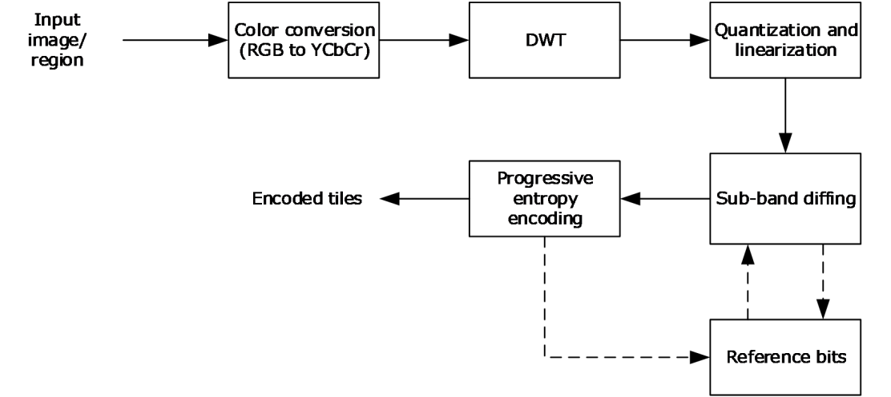
<!-- /Extracted images from page 88 -->

3.2.5.21

Processing an RDPGFX_QOE_FRAME_ACKNOWLEDGE_PDU message

The structure and fields of the RDPGFX_QOE_FRAME_ACKNOWLEDGE_PDU message are specified
in section 2.2.2.21. The header field MUST be processed as specified in section 3.2.5.1. The
timestamp, timeDiffSE, and timeDiffEDR fields describe metrics associated with the frame
identified by the frameId field and SHOULD only be used for informational and debugging purposes.

3.2.5.22

Sending an RDPGFX_MAP_SURFACE_TO_SCALED_OUTPUT_PDU

message

The structure and fields of the RDPGFX_MAP_SURFACE_TO_SCALED_OUTPUT_PDU message are
specified in section 2.2.2.22. The command fields MUST be populated in accordance with this
description. Furthermore, the surface identified in the surfaceId field MUST exist on the client.

3.2.5.23

Sending an RDPGFX_MAP_SURFACE_TO_SCALED_WINDOW_PDU

message

The structure and fields of the RDPGFX_MAP_SURFACE_TO_SCALED_WINDOW_PDU message
are specified in section 2.2.2.23. The command fields MUST be populated in accordance with this
description. Furthermore, the surface identified in the surfaceId field MUST exist on the client.

3.2.6  Timer Events

None.

3.2.7  Other Local Events

None.

3.2.8  Bitmap Compression

3.2.8.1  RemoteFX Progressive Codec Compression

The functional stages involved in the encoding path are illustrated in the following figure. Each of
these stages is described in the following subsections.

Figure 2: RemoteFX Progressive Codec encoding stages

[MS-RDPEGFX] - v20260511
Remote Desktop Protocol: Graphics Pipeline Extension
Copyright © 2026 Microsoft Corporation
Release: May 11, 2026

88 / 145

<!-- Extracted images from page 89 -->
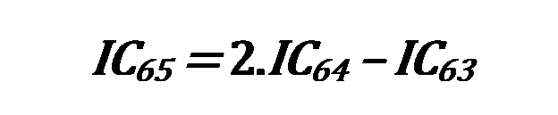
<!-- /Extracted images from page 89 -->

When this encoding path is compared to [MS-RDPRFX] section 3.1.8.1, differencing has been
removed, sub-band diffing has been added, and progressive encoding has been incorporated into the
entropy encoder.

3.2.8.1.1 Color Conversion (RGB to YCbCr)

Color conversion is identical to the technique specified in [MS-RDPRFX] section 3.1.8.1.3.

3.2.8.1.2 DWT

The discrete wavelet transform (DWT) is performed as specified in [MS-RDPRFX] section 3.1.8.1.4
with one exception. To improve the quality around tile edges, a variation has been added to the
transform, which modifies the behavior on pixel boundaries and changes the size of the bands.

3.2.8.1.2.1  Original Method

DWT results are calculated using an input coefficient and the surrounding coefficients. Tile boundaries
are handled by mirroring the input coefficients. The coefficients to the right of the leftmost input
coefficient are mirrored on the left side. For example, if there are eight input coefficients:

[0, 1, 2, 3, 4, 5, 6, 7]

After mirroring, the coefficients are logically extended as follows:

[..., 7, 6, 5, 4, 3, 2, 1, 0, 1, 2, 3, 4, 5, 6, 7, 6, 5, 4, 3, 2, 1, 0, ...]

This technique is also used on the right edges and for vertical transforms.

The first pass for a given direction (horizontal or vertical) takes an input of 64 coefficients and
produces 32 low-frequency results and 32 high-frequency results.

3.2.8.1.2.2  Reduce-Extrapolate Method

The Original Method (section 3.2.8.1.2.1) for dealing with boundaries when encoding tiles introduces
tile artifacts. The result is that users can perceive where the tile boundaries are in a decoded image.
The Reduce-Extrapolate method removes this artifact.

The first pass for a given direction (horizontal or vertical) takes an input of 64 coefficients and
produces 33 low-frequency results and 31 high-frequency results.

A 65th input coefficient is introduced by extrapolating from the last two input coefficients. Note that
the subscripts used in the equations that follow are 1-based (in contrast to the equations in [MS-
RDPRFX] section 3.1.8.1.4, which are 0–based). It is possible for the extrapolated 65th coefficient to
lie outside of the normal pixel range. Furthermore, extrapolation is only required for the first level.

The first-pass DWT is performed on the 65 coefficients, mirroring around the first and the sixty-fifth
boundary elements. As a result, 33 low-frequency and 32 high-frequency results are obtained. The
final frequency result is zero and is dropped.

[MS-RDPEGFX] - v20260511
Remote Desktop Protocol: Graphics Pipeline Extension
Copyright © 2026 Microsoft Corporation
Release: May 11, 2026

89 / 145

<!-- Extracted images from page 90 -->
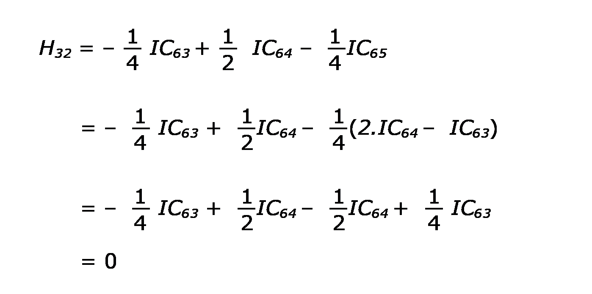
<!-- /Extracted images from page 90 -->

The second-pass DWT takes the 33 low-frequency results from the first pass and performs a DWT with
normal mirroring, producing in turn 17 low-frequency elements and 16 high-frequency elements.

Finally, the third-pass DWT takes the 17 low-frequency results and produces (using the same
techniques as the previous pass) 9 low-frequency elements and 8 high-frequency elements.

The resulting bands and the sizes are illustrated in the following figure.

[MS-RDPEGFX] - v20260511
Remote Desktop Protocol: Graphics Pipeline Extension
Copyright © 2026 Microsoft Corporation
Release: May 11, 2026

90 / 145

<!-- Extracted images from page 91 -->
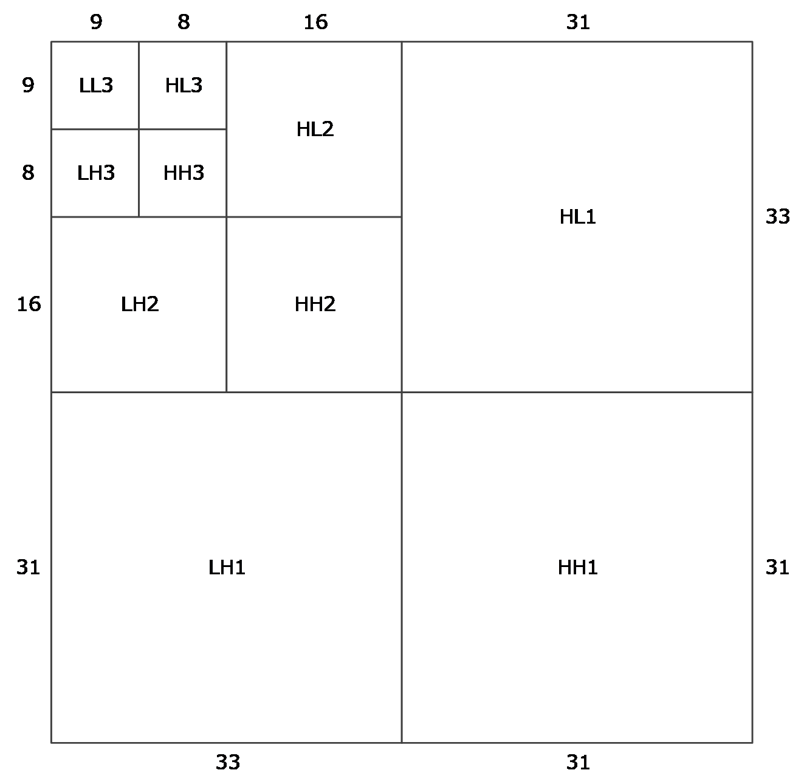
<!-- /Extracted images from page 91 -->

Figure 3: Bands resulting from the Reduce-Extrapolate DWT Method

3.2.8.1.3 Quantization and Linearization

Quantization is performed as specified in [MS-RDPRFX] section 3.1.8.1.5, while linearization is
performed as specified in [MS-RDPRFX] section 3.1.8.1.6. Ordering of the bands is identical to the
ordering specified in [MS-RDPRFX] section 3.1.8.1.6.

3.2.8.1.4 Sub-Band Diffing

Sub-band diffing enables increased compression without any further quality loss by sending the
differences of the quantized values between frames.

To compress each tile in a surface, the encoder stores the quantized DWT coefficients that the decoder
most likely possesses. These coefficients differ slightly from the quantized coefficients of the previous
frame due to the progressive entropy encoder and are known as the reference bits. See section
3.1.8.1.4 and the figure captioned "RemoteFX Progressive Codec encoding stages" in section 3.2.8.1.

The first phase of the Sub-Band Diffing Stage decides between sending the quantized DWT coefficients
that have been calculated (section 3.2.8.1.3) or sending the differences with respect to the reference
bits. This decision is made for each tile being encoded. If the quantized DWT coefficients of the tile are
to be sent, then the tile is called an "original tile"; otherwise, it is referred to as a "difference tile".

91 / 145

[MS-RDPEGFX] - v20260511
Remote Desktop Protocol: Graphics Pipeline Extension
Copyright © 2026 Microsoft Corporation
Release: May 11, 2026

<!-- Extracted images from page 92 -->

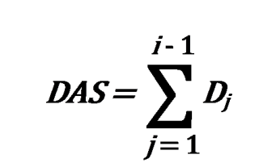
<!-- /Extracted images from page 92 -->

A tile that is being encoded for the first time is always sent as an original tile.

The calculation to determine the difference is performed on all three color components. Each of the
1024 coefficients from the tile contained in the reference bits are subtracted from each of the 1024
coefficients from the most recently calculated tile. This data is used to construct the difference tile.

In the preceding formula, "QC" stands for "Quantized Coefficient", "DT" for "Difference Tile", "OT" for
"Original Tile", and "RB" for "Reference Bits".

Zeros are counted in both the difference tile and the original tile in only the Luma (Y) component in all
the bands except for the LL3 band. The tile with the most number of zeros is selected to be sent to the
RLGR Entropy Encoder. In the case of a tie, the original tile is preferred. If an original tile is selected
over a difference tile, the reference bits MUST be cleared and filled with zeros.

3.2.8.1.5 Progressive Entropy Encoding

The progressive encoder either can send a complete tile or can transmit multiple versions of the same
tile over a period of time, with each subsequent version becoming more refined and improving in
quality. The input to the Progressive Entropy Encoding Stage is generated by the Sub-Band Diffing
engine (section 3.2.8.1.4) and is either an original tile or a difference tile.

If a tile is to be transmitted in its entirety, then the tile data is dispatched to the RLGR1 Entropy
Encoder ([MS-RDPRFX] section 3.1.8.1.7.1), and the output forms the payload to be sent to the
decoder.

If a tile is to be transmitted progressively, the Progressive Entropy Encoding Stage is exercised
numerous times with the same input tile to generate multiple payloads that are consumed by the
decoder to re-create the tile in its entirety. Sending a tile progressively is accomplished by executing a
First Progressive Pass (section 3.2.8.1.5.1) followed by subsequent Upgrade Progressive Passes
(section 3.2.8.1.5.2).

SB represents the data output from the Sub-Band Diffing Stage. This data is sent through multiple
progressive stages.

Where D1, D2, D3, ..., Dn is the data that is transmitted via n progressive passes.

When a progressive pass is performed, DAS ("Data Already Sent") represents the cumulated data that
has been transmitted through the previous passes, DTS ("Data To Send") represents the data to be
transmitted in the current pass, and DRS ("Data Remaining to be Sent") represents the data that
remains to be sent after the current pass.

When performing pass i:

[MS-RDPEGFX] - v20260511
Remote Desktop Protocol: Graphics Pipeline Extension
Copyright © 2026 Microsoft Corporation
Release: May 11, 2026

92 / 145

<!-- Extracted images from page 93 -->
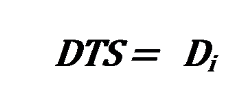
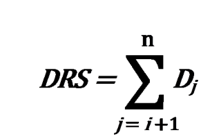
<!-- /Extracted images from page 93 -->

Each time a progressive pass is performed, DRS is reduced by the current DTS, and DAS is increased
by the current DTS for the next pass.

3.2.8.1.5.1  Performing the First Progressive Pass

The first progressive pass for a tile occurs when the encoder receives new pixels to encode and send
to the decoder.

The encoder first performs the DWT (section 3.2.8.1.2), Quantization and Linearization (section
3.2.8.1.3) stages to obtain DwtQ. At this point, the Sub-Band Diffing (section 3.2.8.1.4) stage
determines whether to send DwtQ or the difference (Diff). Diff is computed based on the "reference
bits" (Ref) specified in section 3.1.8.1.4.

Diff = DwtQ - Ref

SB = DwtQ or Diff

The progressive encoder performs extra quantization as specified in section 3.1.8.1.3:

ProgQ = SB / PQF

Each LL3 element is quantized toward negative infinity, and the result is subtracted from the next
quantized LL3 element. Note that even if the data is a difference tile, each quantized LL3 element,
which is the result of a difference, is subtracted from the next element. All of the bands are then sent
to the RLGR encoder:

ProgQ-NonLL, ProgQ-LL-Deltas -> RLGR Entropy Encoder

Note that all ten bands are entropy-encoded as one block without reset. The RLGR engine is started
with the state K = 1 and KR = 1.

If the chunk is 100%, then PQF = 1, and the bits being encoded are DwtQ-NonLL, DwtQ-LL-Deltas
for an original tile, or Diff-NonLL, Diff-LL for a difference tile.

Multiplying ProgQ by PQF yields DTS, the de-quantized progressive data. On the first pass, DAS is
zero, and DRS = SB - DTS.

The data generated by the first pass is written to an RFX_PROGRESSIVE_TILE_FIRST (section
2.2.4.2.1.5.4) structure.

3.2.8.1.5.2  Performing Upgrade Progressive Passes

To upgrade a tile, the encoder uses the previously calculated DRS, quantizes the data, and then (a)
sends it to the Simplified Run-Length (SRL) Encoder (section 3.1.8.1.5) or (b) transmits the raw bits
of each element using the scheme in section 3.2.8.1.5.2.1.

The SRL Encoder is an entropy encoder that is more suited to the upgrade pass than RLGR and is
based on the fact that the maximum magnitude of any element to be sent is known.

93 / 145

[MS-RDPEGFX] - v20260511
Remote Desktop Protocol: Graphics Pipeline Extension
Copyright © 2026 Microsoft Corporation
Release: May 11, 2026

The progressive chunk that the decoder is being driven toward is referred to as the "target chunk"
("TargetC" for brevity), while the most recent progressive chunk that the decoder has processed is
referred to as the "previous chunk" ("PrevC" for brevity).

UpgradeQ(PrevC, TargetC) = DRS / PQF(TargetC)

DTS = UpgradeQ(PrevC, TargetC) * PQF(TargetC)

For a given element in DTS, the decision to send raw bits or SRL-encoded data depends on what the
client has already decoded. If the corresponding element in DAS is zero, then UpgradeQ(PrevC,
TargetC) is SRL encoded. Otherwise, if the corresponding element in DAS is nonzero, the absolute
value of the corresponding UpgradeQ(PrevC, TargetC) element is sent raw. For an LL3 element in an
original tile, the UpgradeQ element, which is always positive, is always sent raw.

If the corresponding element in DAS is strictly positive (nonzero), the UpgradeQ element lies
between zero and PQF(PrevC) / PQF(TargetC) - 1. Simplifying further:

PQF(PrevC) / PQF(TargetC) - 1

= (1 << BitPos(PrevC)) / (1 << BitPos(TargetC)) - 1

= (1 << (BitPos(PrevC) - BitPos(TargetC))) - 1

For a given tile, the data that has been generated by the SRL encoder is packaged in the ySrlData
(Luma), cbSrlData (Chroma Blue) and crSrlData (Chroma Red) fields of the
RFX_PROGRESSIVE_TILE_UPGRADE (section 2.2.4.2.1.5.5) structure. All of the data that was
written as raw bits is packaged in the yRawData (Luma), cbRawData (Chroma Blue), and
crRawData (Chroma Red) fields of the RFX_PROGRESSIVE_TILE_UPGRADE structure.

3.2.8.1.5.2.1  Sending Raw Bits

Raw bits are sent as a simple bit stream. The following sequence of bits "abc", "defg", "hijkl", when
written, would produce the bytes "abcdefgh" and "ijkl0000".

3.2.8.1.5.3  Maintaining the Decoder Reference

After each progressive pass, the data that has been sent is added to the reference bits:

Ref = Ref + DTS

The reference bits are specified in section 3.1.8.1.4.

3.3  Client Details

3.3.1  Abstract Data Model

This section describes a conceptual model of possible data organization that an implementation
maintains to participate in this protocol. The described organization is provided to facilitate the
explanation of how the protocol behaves. This document does not mandate that implementations
adhere to this model as long as their external behavior is consistent with that described in this
document.

Note  It is possible to implement the following conceptual data by using a variety of techniques as
long as the implementation produces external behavior that is consistent with that described in this
document.

[MS-RDPEGFX] - v20260511
Remote Desktop Protocol: Graphics Pipeline Extension
Copyright © 2026 Microsoft Corporation
Release: May 11, 2026

94 / 145

3.3.1.1  Codec Contexts

The Codec Contexts ADM element contains a list of codec contexts. Each codec context is associated
with an offscreen surface and a bitmap that is being progressively rendered to the surface. The
context is used to store state information that is used to iteratively construct the bitmap. Once the
bitmap has been fully rendered, the associated context is no longer required. Furthermore, if the
server determines that a specific context will no longer be used, then the
RDPGFX_DELETE_ENCODING_CONTEXT_PDU (section 2.2.2.3) message is sent to the client.

3.3.1.2  Progressive Tile Contexts

The Progressive Tile Contexts ADM element contains a list of progressive tile contexts. Each
progressive tile context is associated with a tile in an off-screen surface and one or more codec
contexts stored in the Codec Contexts (section 3.3.1.1) ADM element. The progressive tile context
contains the sign state of each coefficient (described as Sign in section 3.3.8.2.1.1) and the bit
position for each band (described as BitPos in section 3.3.8.2.1.2).

A progressive tile context can be discarded once all of the codec contexts with which it is associated
have been deleted.

3.3.1.3  Sub-Band Diffing Tile Contexts

The Sub-Band Diffing Tile Contexts ADM element contains a list of sub-band diffing tile contexts.
Each sub-band diffing tile context is associated with a tile in an off-screen surface. This context
contains the DWT coefficient data for the tile (described as DecDwtQ in section 3.3.8.2.1.1).

Each sub-band diffing tile context MUST be preserved for the duration of the RDP connection or until
the off-screen surface with which it is associated has been deleted.

3.3.1.4  Bitmap Cache

The Bitmap Cache ADM element is used to store bitmaps of arbitrary dimensions. Each bitmap is
associated with a key and is stored in a variable-length slot (identified by a one-based slot index). The
size of the bitmap cache is capped at 100 MB or 16 MB, depending on whether the
RDPGFX_CAPS_FLAG_THINCLIENT (0x00000001) flag or RDPGFX_CAPS_FLAG_SMALL_CACHE
(0x00000002) flag is specified in the flags field of an RDPGFX_CAPSET_VERSION8 (section
2.2.3.1), RDPGFX_CAPSET_VERSION81 (section 2.2.3.2), RDPGFX_CAPSET_VERSION10
(section 2.2.3.3), RDPGFX_CAPSET_VERSION102 (section 2.2.3.5),
RDPGFX_CAPSET_VERSION104 (section 2.2.3.7), RPDGFX_CAPSET_VERSION105 (section
2.2.3.8), RDPGFX_CAPSET_VERSION106 (section 2.2.3.9), or RDPGFX_CAPSET_VERSION107
(section 2.2.3.10) structure, which is encapsulated in the server-to-client
RDPGFX_CAPS_CONFIRM_PDU (section 2.2.2.19) message. The size of the bitmap cache is
constrained to 16MB in size when the RDPGFX_CAPSET_VERSION103 (section 2.2.3.6) structure is
encapsulated in the server-to-client RDPGFX_CAPS_CONFIRM_PDU message. The maximum
possible number of variable-length slots is 25,600 in the case of a 100 MB cache and 4,096 in the case
of a 16 MB cache. The size of the bitmap data stored across all of the in-use variable-length slots at
any point in time MUST NOT exceed the total size of the cache.

3.3.1.5  Persistent Bitmap Cache

The Persistent Bitmap Cache ADM element is optional offline storage that is used to selectively
persist bitmaps and any associated metadata that has been cached in the Bitmap Cache (section
3.3.1.4) ADM element.

[MS-RDPEGFX] - v20260511
Remote Desktop Protocol: Graphics Pipeline Extension
Copyright © 2026 Microsoft Corporation
Release: May 11, 2026

95 / 145

3.3.1.6  Offscreen Surface

The Offscreen Surface ADM element contains a collection of bitmaps, each bitmap representing an
offscreen surface.

3.3.1.7  Graphics Output Buffer

The Graphics Output Buffer ADM element is the end-user visible output bitmap.

3.3.1.8  Surface to Output Mapping

The Surface to Output Mapping ADM element contains a list of where offscreen surfaces in the
Offscreen Surface (section 3.3.1.6) ADM element are mapped to the Graphics Output Buffer
(section 3.3.1.7) ADM element.

3.3.1.9  Decompressor Glyph Storage

The Decompressor Glyph Storage ADM element is used to cache bitmaps decompressed using
ClearCodec decompression techniques (section 3.3.8.1). It contains 4,000 storage slots, each of which
can hold a bitmap image no larger than 1,024 square pixels.

3.3.1.10

V-Bar Storage

The V-Bar Storage ADM element is used to cache decompressed pixel columns from
CLEARCODEC_BAND (section 2.2.4.1.1.2.1) structures. These pixel columns (which are the same
height as the containing band) are referred to as "V-Bars". Encoded V-Bars are encapsulated in the
CLEARCODEC_BANDS_DATA (section 2.2.4.1.1.2) structure. The maximum number of V-Bars that
can be stored in the cache is 32,768.

3.3.1.11

V-Bar Storage Cursor

The V-Bar Storage Cursor ADM element is used to specify the position in the V-Bar Storage
(section 3.3.1.10) where the next V-Bar MUST be inserted. This element MUST be initialized to zero.

3.3.1.12

Short-V-Bar Storage

The Short-V-Bar Storage ADM element is used to cache decompressed pixel columns from
CLEARCODEC_BAND (section 2.2.4.1.1.2.1) structures. These pixel columns (which are the same or
shorter than the height of the containing band) are referred to as "Short-V-Bars". Encoded Short-V-
Bars are encapsulated in the CLEARCODEC_BANDS_DATA (section 2.2.4.1.1.2) structure. The
maximum number of Short-V-Bars that can be stored in the cache is 16,384.

3.3.1.13

Short V-Bar Storage Cursor

The Short V-Bar Storage Cursor ADM element is used to specify the position in the Short V-Bar
Storage (section 3.3.1.12) ADM element where the next Short V-Bar MUST be inserted. This element
MUST be initialized to zero.

3.3.1.14

Confirmed Graphics Capabilities

The Confirmed Graphics Capabilities ADM element is used to store the set of graphics capabilities
specified by the server in the RDPGFX_CAPS_CONFIRM_PDU (section 3.3.5.19) message.

[MS-RDPEGFX] - v20260511
Remote Desktop Protocol: Graphics Pipeline Extension
Copyright © 2026 Microsoft Corporation
Release: May 11, 2026

96 / 145

3.3.1.15

Surface to Window Mapping

The Surface to Window Mapping ADM element contains a list of surfaces and the RAIL window
and rectangular region to which each of these surfaces is mapped.

3.3.2  Timers

None.

3.3.3  Initialization

None.

3.3.4  Higher-Layer Triggered Events

None.

3.3.5  Message Processing Events and Sequencing Rules

3.3.5.1  Processing an RDPGFX_WIRE_TO_SURFACE_PDU_1 message

The structure and fields of the RDPGFX_WIRE_TO_SURFACE_PDU_1 message are specified in
section 2.2.2.1. The header field MUST be processed as specified in section 3.1.5.1. The surfaceId
field MUST identify a valid offscreen surface in the Offscreen Surface (section 3.3.1.6) ADM element,
and the size of the bitmap data specified in the bitmapDataLength field MUST be consistent with the
amount of data read from the "Microsoft::Windows::RDS::Graphics" dynamic virtual channel (section
2.1). Once the data in the bitmapData field has been decoded as specified by the encoding type
enumerated in the codecId field, the bitmap MUST be copied to the target surface.

If the encoding type enumerated in the codecId field is not RDPGFX_CODECID_ALPHA (0x000C):





If the target surface is listed in the Surface to Window Mapping (section 3.3.1.15) ADM
element, then the alpha channel of the bitmap (if present) MUST be ignored when copying to the
target surface, while the red, green, and blue channels MUST all be copied to the target surface
without modification.

If the target surface is not listed in the Surface to Window Mapping ADM element, then only
the red, green, and blue channels SHOULD be copied to the target surface.

If the encoding type enumerated in the codecId field is RDPGFX_CODECID_ALPHA:

  Only the alpha channel of the target surface MUST be updated with the contents of the source
bitmap (the red, green, and blue channels of the target surface MUST NOT be changed).

3.3.5.2  Processing an RDPGFX_WIRE_TO_SURFACE_PDU_2 message

The structure and fields of the RDPGFX_WIRE_TO_SURFACE_PDU_2 message are specified in
section 2.2.2.2. The header field MUST be processed as specified in section 3.1.5.1. The surfaceId
field MUST identify a valid offscreen surface in the Offscreen Surface (section 3.3.1.6) ADM element,
and the size of the bitmap data specified in the bitmapDataLength field MUST be consistent with the
amount of data read from the "Microsoft::Windows::RDS::Graphics" dynamic virtual channel (section
2.1). If there is no codec context identified by the codecContextId field in the Codec Contexts
(section 3.3.1.1) ADM element, the client MUST create a new context, place it into the Codec
Contexts ADM element, and begin the process of progressively rendering a bitmap from the data in
the bitmapData field, as specified by the encoding type enumerated value in the codecId field, using
the context to store intermediate state. The bitmap SHOULD be copied to the target surface using a

97 / 145

[MS-RDPEGFX] - v20260511
Remote Desktop Protocol: Graphics Pipeline Extension
Copyright © 2026 Microsoft Corporation
Release: May 11, 2026

SRCCOPY ROP3 operation ([MS-RDPEGDI] section 2.2.2.2.1.1.1.7) once enough data has been
decoded to render a discernible image and SHOULD then continue to be updated as subsequent
RDPGFX_WIRE_TO_SURFACE_PDU_2 messages are processed. Note that if the type (specified in
the blockType field) of the current RFX_PROGRESSIVE_DATABLOCK structure (section 2.2.4.2.1)
of an RFX_PROGRESSIVE_BITMAP_STREAM (section 2.2.4.2) is
WBT_TILE_PROGRESSIVE_UPGRADE (0xCCC7), then the codecContextId field in the Codec
Contexts (section 3.3.1.1) ADM element MUST be known.

3.3.5.3  Processing an RDPGFX_DELETE_ENCODING_CONTEXT_PDU message

The structure and fields of the RDPGFX_DELETE_ENCODING_CONTEXT_PDU message are
specified in section 2.2.2.3. The header field MUST be processed as specified in section 3.1.5.1. Once
the RDPGFX_DELETE_ENCODING_CONTEXT_PDU message has been successfully decoded, the
codec context identified by the codecContextId field (which is associated with the surface identified
by the surfaceId field) MUST be removed from the Codec Contexts (section 3.3.1.1) ADM element.

3.3.5.4  Processing an RDPGFX_SOLIDFILL_PDU message

The structure and fields of the RDPGFX_SOLIDFILL_PDU message are specified in section 2.2.2.4.
The header field MUST be processed as specified in section 3.1.5.1. The surfaceId field MUST
identify a valid offscreen surface in the Offscreen Surface (section 3.3.1.6) ADM element. Once the
RDPGFX_SOLIDFILL_PDU message has been successfully decoded, the rectangles specified in the
fillRects field MUST be filled with the 32-bpp color specified by the fillPixel field using an
R2_COPYPEN ROP2 operation ([MS-RDPEGDI] section 2.2.2.2.1.1.1.6).

3.3.5.5  Processing an RDPGFX_SURFACE_TO_SURFACE_PDU message

The structure and fields of the RDPGFX_SURFACE_TO_SURFACE_PDU message are specified in
section 2.2.2.5. The header field MUST be processed as specified in section 3.1.5.1. The
surfaceIdSrc and surfaceIdDest fields MUST both identify valid offscreen surfaces in the Offscreen
Surface (section 3.3.1.6) ADM element. Once the RDPGFX_SURFACE_TO_SURFACE_PDU
message has been successfully decoded, the pixels in the source rectangle on the source surface
(specified in the rectSrc field) MUST be copied to the target surface at each of the points specified in
the destPts field using a SRCCOPY ROP3 operation ([MS-RDPEGDI] section 2.2.2.2.1.1.1.7).

3.3.5.6  Processing an RDPGFX_SURFACE_TO_CACHE_PDU message

The structure and fields of the RDPGFX_SURFACE_TO_CACHE_PDU message are specified in
section 2.2.2.6. The header field MUST be processed as specified in section 3.1.5.1. The surfaceId
field MUST identify a valid offscreen surface in the Offscreen Surface (section 3.3.1.6) ADM element.
Once the RDPGFX_SURFACE_TO_CACHE_PDU message has been successfully decoded, the pixels
in the source rectangle on the source surface (specified in the rectSrc field) MUST be copied to the
slot in the Bitmap Cache (section 3.3.1.4) ADM element identified by the cacheSlot field using a
SRCCOPY ROP3 operation ([MS-RDPEGDI] section 2.2.2.2.1.1.1.7) and tagged with the key specified
in the cacheKey field.

3.3.5.7  Processing an RDPGFX_CACHE_TO_SURFACE_PDU message

The structure and fields of the RDPGFX_CACHE_TO_SURFACE_PDU message are specified in
section 2.2.2.7. The header field MUST be processed as specified in section 3.1.5.1. The surfaceId
field MUST identify a valid offscreen surface in the Offscreen Surface (section 3.3.1.6) ADM element,
and the cacheSlot field MUST contain a valid entry in the Bitmap Cache (section 3.3.1.4) ADM
element. Once the RDPGFX_CACHE_TO_SURFACE_PDU message has been successfully decoded,
the bitmap retrieved from the cache MUST be copied to the target surface at each of the points
specified in the destPts field using a SRCCOPY ROP3 operation ([MS-RDPEGDI] section
2.2.2.2.1.1.1.7).

98 / 145

[MS-RDPEGFX] - v20260511
Remote Desktop Protocol: Graphics Pipeline Extension
Copyright © 2026 Microsoft Corporation
Release: May 11, 2026

3.3.5.8  Processing an RDPGFX_EVICT_CACHE_ENTRY_PDU message

The structure and fields of the RDPGFX_EVICT_CACHE_ENTRY_PDU message are specified in
section 2.2.2.8. The header field MUST be processed as specified in section 3.1.5.1. Once the
RDPGFX_EVICT_CACHE_ENTRY_PDU message has been successfully decoded, the entry in the
Bitmap Cache (section 3.3.1.4) ADM element present in the slot identified by the cacheSlot field
MUST be removed from the cache.

3.3.5.9  Processing an RDPGFX_CREATE_SURFACE_PDU message

The structure and fields of the RDPGFX_CREATE_SURFACE_PDU message are specified in section
2.2.2.9. The header field MUST be processed as specified in section 3.1.5.1. Once the
RDPGFX_CREATE_SURFACE_PDU message has been successfully decoded, a bitmap MUST be
created with the appropriate width, height, and pixel format and MUST be placed into the Offscreen
Surface (section 3.3.1.6) ADM element. The entry MUST be tagged with the ID specified in the
surfaceId field.

3.3.5.10

Processing an RDPGFX_DELETE_SURFACE_PDU message

The structure and fields of the RDPGFX_DELETE_SURFACE_PDU message are specified in section
2.2.2.10. The header field MUST be processed as specified in section 3.1.5.1. Once the
RDPGFX_DELETE_SURFACE_PDU message has been successfully decoded, the surface identified by
the surfaceId field MUST be deleted from the Offscreen Surface (section 3.3.1.6) ADM element.

3.3.5.11

Processing an RDPGFX_START_FRAME_PDU message

The structure and fields of the RDPGFX_START_FRAME_PDU message are specified in section
2.2.2.11. The header field MUST be processed as specified in section 3.1.5.1.

3.3.5.12

Processing an RDPGFX_END_FRAME_PDU message

The structure and fields of the RDPGFX_END_FRAME_PDU message are specified in section
2.2.2.12. The header field MUST be processed as specified in section 3.1.5.1. Once the
RDPGFX_END_FRAME_PDU message has been successfully decoded, the client MUST copy the
contents of every updated off-screen surface that is present in the Surface to Output Mapping
(section 3.3.1.8) ADM element to the Graphics Output Buffer (section 3.3.1.7) ADM element. Once
the copy is complete, the client MUST send the RDPGFX_FRAME_ACKNOWLEDGE_PDU (section
2.2.2.13) message to the server, as specified in section 3.3.5.13.

3.3.5.13

Sending an RDPGFX_FRAME_ACKNOWLEDGE_PDU message

The structure and fields of the RDPGFX_FRAME_ACKNOWLEDGE_PDU message are specified in
section 2.2.2.13. The command fields MUST be populated in accordance with this description. The
client MUST populate the frameId field with the ID of the most recently processed logical frame, as
specified in section 3.2.5.12.

3.3.5.14

Processing an RDPGFX_RESET_GRAPHICS_PDU message

The structure and fields of the RDPGFX_RESET_GRAPHICS_PDU message are specified in section
2.2.2.14. The header field MUST be processed as specified in section 3.1.5.1. Once the
RDPGFX_RESET_GRAPHICS_PDU message has been successfully decoded, the client MUST resize
the Graphics Output Buffer (section 3.3.1.7) ADM element.

[MS-RDPEGFX] - v20260511
Remote Desktop Protocol: Graphics Pipeline Extension
Copyright © 2026 Microsoft Corporation
Release: May 11, 2026

99 / 145

3.3.5.15

Processing an RDPGFX_MAP_SURFACE_TO_OUTPUT_PDU message

The structure and fields of the RDPGFX_MAP_SURFACE_TO_OUTPUT_PDU message are specified
in section 2.2.2.15. The header field MUST be processed as specified in section 3.1.5.1. Once the
RDPGFX_MAP_SURFACE_TO_OUTPUT_PDU message has been successfully decoded, the surface-
to-output mapping in the Surface to Output Mapping (section 3.3.1.8) ADM element MUST be
updated by mapping the surface identified by the surfaceId field to the point on the Graphics
Output Buffer (section 3.3.1.7) ADM element specified by the outputOriginX and outputOriginY
fields.

3.3.5.16

Sending an RDPGFX_CACHE_IMPORT_OFFER_PDU message

The structure and fields of the RDPGFX_CACHE_IMPORT_OFFER_PDU message are specified in
section 2.2.2.16. The command fields MUST be populated in accordance with this description. The
client MUST populate the cacheEntries field by enumerating the bitmaps stored in the Persistent
Bitmap Cache (section 3.3.1.5) ADM element.

3.3.5.17

Processing an RDPGFX_CACHE_IMPORT_REPLY_PDU message

The structure and fields of the RDPGFX_CACHE_IMPORT_REPLY_PDU message are specified in
section 2.2.2.17. The header field MUST be processed as specified in section 3.1.5.1. Once the
RDPGFX_CACHE_IMPORT_REPLY_PDU message has been successfully decoded, the client MUST
copy the number of entries specified in the importedEntriesCount field from the Persistent Bitmap
Cache (section 3.3.1.5) ADM element to the assigned slots in the Bitmap Cache (section 3.3.1.4)
ADM element.

3.3.5.18

Sending an RDPGFX_CAPS_ADVERTISE_PDU message

The structure and fields of the RDPGFX_CAPS_ADVERTISE_PDU message are specified in section
2.2.2.18. The command fields MUST be populated in accordance with this description. The client MUST
correctly populate the capsSet field with one or more of the capability sets specified in section 2.2.3.
Each capability set type MUST NOT appear more than once.

3.3.5.19

Processing an RDPGFX_CAPS_CONFIRM_PDU message

The structure and fields of the RDPGFX_CAPS_CONFIRM_PDU message are specified in section
2.2.2.19. The header field MUST be processed as specified in section 3.1.5.1.

If the capability set received in capsSet field of the RDPGFX_CAPS_CONFIRM_PDU message is not
specified in section 2.2.3, the client MUST ignore the capability set. Otherwise, the graphics
capabilities specified by the server SHOULD be stored in the Confirmed Graphics Capabilities
(section 3.3.1.14) ADM element and MUST be adhered to by the client.

If the capability set received in the RDPGFX_CAPS_CONFIRM_PDU message is
RDPGFX_CAPSET_VERSION103, RDPGFX_CAPSET_VERSION104,
RDPGFX_CAPSET_VERSION105, RDPGFX_CAPSET_VERSION106, or
RDPGFX_CAPSET_VERSION107 then the client can resend the RDPGFX_CAPS_ADVERTISE_PDU
message during the connection to reset the protocol. The client MUST reset the channel state after
sending the RDPGFX_CAPS_ADVERTISE_PDU message and MUST ignore any messages sent by the
server until RDPGFX_CAPS_CONFIRM_PDU message is received.

3.3.5.20

Processing an RDPGFX_MAP_SURFACE_TO_WINDOW_PDU message

The structure and fields of the RDPGFX_MAP_SURFACE_TO_WINDOW_PDU message are
specified in section 2.2.2.20. The header field MUST be processed as specified in section 3.1.5.1.
Once the RDPGFX_MAP_SURFACE_TO_WINDOW_PDU message has been successfully decoded,

100 / 145

[MS-RDPEGFX] - v20260511
Remote Desktop Protocol: Graphics Pipeline Extension
Copyright © 2026 Microsoft Corporation
Release: May 11, 2026

the surface-to-window mapping in the Surface to Window Mapping (section 3.3.1.15) ADM element
MUST be updated by associating the rectangular region (specified by the mappedWidth and
mappedHeight fields) on the surface identified by the surfaceId field to the RAIL window specified
by the windowId field.

3.3.5.21

Sending an RDPGFX_QOE_FRAME_ACKNOWLEDGE_PDU message

The structure and fields of the RDPGFX_QOE_FRAME_ACKNOWLEDGE_PDU message are specified
in section 2.2.2.21. The command fields MUST be populated in accordance with this description. The
client MUST populate the frameId field with the ID of the most recently processed logical frame, as
specified in section 3.2.5.12.

If the client has opted in to sending the RDPGFX_FRAME_ACKNOWLEDGE_PDU (section 2.2.2.13)
message, then, with respect to sequencing, the RDPGFX_QOE_FRAME_ACKNOWLEDGE_PDU
message SHOULD only be sent after the RDPGFX_FRAME_ACKNOWLEDGE_PDU message has been
transmitted.

3.3.5.22

Processing an RDPGFX_MAP_SURFACE_TO_SCALED_OUTPUT_PDU

message

The structure and fields of the RDPGFX_MAP_SURFACE_TO_OUTPUT_PDU message are specified
in section 2.2.2.22. The header field MUST be processed as specified in section 3.1.5.1. Once the
RDPGFX_MAP_SURFACE_TO_SCALED_OUTPUT_PDU message has been successfully decoded,
the surface-to-output mapping in the Surface to Output Mapping (section 3.3.1.8) ADM element
MUST be updated by mapping the surface identified by the surfaceId field to the point on the
Graphics Output Buffer (section 3.3.1.7) ADM element specified by the outputOriginX and
outputOriginY fields, and scaled to the targetWidth and targetHeight fields specified.

3.3.5.23

Processing an RDPGFX_MAP_SURFACE_TO_SCALED_WINDOW_PDU

message

The structure and fields of the RDPGFX_MAP_SURFACE_TO_SCALED_WINDOW_PDU message
are specified in section 2.2.2.23. The header field MUST be processed as specified in section 3.1.5.1.
Once the RDPGFX_MAP_SURFACE_TO_SCALED_WINDOW_PDU message has been successfully
decoded, the surface-to-window mapping in the Surface to Window Mapping (section 3.3.1.15)
ADM element MUST be updated by associating the rectangular region (specified by the mappedWidth
and mappedHeight fields) on the surface identified by the surfaceId field to the RAIL window
specified by the windowId field with the entire surface scaled to the targetWidth and targetHeight
fields specified.

3.3.6  Timer Events

None.

3.3.7  Other Local Events

None.

3.3.8  Bitmap Compression

3.3.8.1  ClearCodec Compression

The ClearCodec Codec is used to encode bitmaps sent in the RDPGFX_WIRE_TO_SURFACE_PDU_1
(section 2.2.2.1) message. The encoded bitmap data MUST be transported in the bitmapData field of

101 / 145

[MS-RDPEGFX] - v20260511
Remote Desktop Protocol: Graphics Pipeline Extension
Copyright © 2026 Microsoft Corporation
Release: May 11, 2026

the RDPGFX_WIRE_TO_SURFACE_PDU_1 message, and the codecId field MUST be set to
RDPGFX_CODECID_CLEARCODEC (0x0008).

The ClearCodec bitmap stream is described in section 2.2.4.1 and is composed of a maximum of three
layers. Each layer is optional and is encoded using different techniques.







The residual layer (section 2.2.4.1.1.1)

The bands layer (section 2.2.4.1.1.2)

The subcodec layer (section 2.2.4.1.1.3)

3.3.8.1.1 ClearCodec Run-Length Encoding

ClearCodec run-length encoding uses a standard RLE compression scheme that parses a pixel stream
and encodes run lengths.

For example, an initial stream containing the following 12 ANSI characters:

AAAABBCCCCCD

would be transformed after encoding into the following stream:

A4B2C5D1

Note that in the real case, each ANSI character is a pixel represented by 3 bytes (R, G, B
components). This type of encoding is suitable for the content in the residual layer (section
2.2.4.1.1.1).

3.3.8.1.2 Decompressing a Bitmap

The following flowchart shows how to decompress a bitmap that is compressed using ClearCodec
compression techniques.

[MS-RDPEGFX] - v20260511
Remote Desktop Protocol: Graphics Pipeline Extension
Copyright © 2026 Microsoft Corporation
Release: May 11, 2026

102 / 145

<!-- Extracted images from page 103 -->
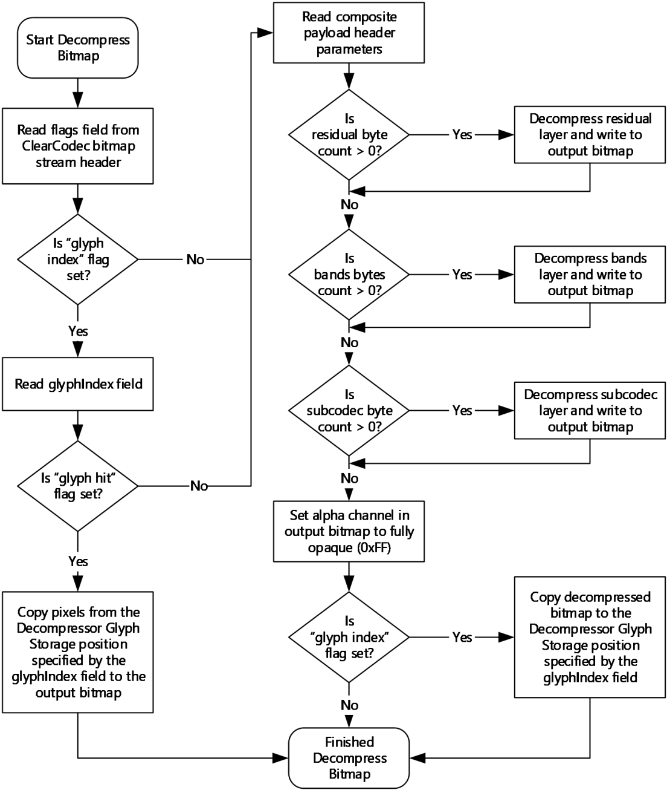
<!-- /Extracted images from page 103 -->

Figure 4: Decompressing a bitmap using ClearCodec Bitmap Compression

3.3.8.2  RemoteFX Progressive Codec Compression

The functional stages involved in the decoding path are illustrated in the following figure. Compared to
the encoding stages, the decoding stage operations are the operations of the encoding stage in
reverse order.

[MS-RDPEGFX] - v20260511
Remote Desktop Protocol: Graphics Pipeline Extension
Copyright © 2026 Microsoft Corporation
Release: May 11, 2026

103 / 145

<!-- Extracted images from page 104 -->
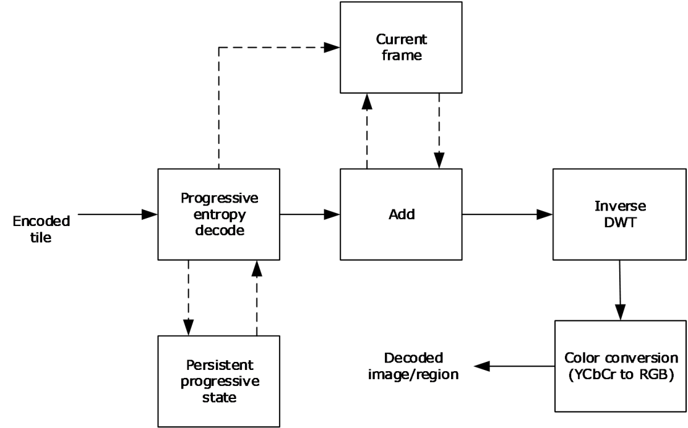
<!-- /Extracted images from page 104 -->

Figure 5: RemoteFX Progressive Codec decoding stages

When compared to [MS-RDPRFX] section 3.1.8.2, the codec now maintains state. "Current frame"
contains the DWT coefficients of the tiles, and "Persistent progressive state" is used to maintain
information pertinent to tiles that have been received in progressive chunks.

3.3.8.2.1 Progressive Entropy Decode

The first stage of decoding aims to reconstruct the DWT data of a tile.

The decoder MUST maintain a copy of the unquantized DWT data ("Current frame" in the figure
captioned "RemoteFX Progressive Codec decoding stages" in section 3.3.8.2) as well as a tri-state
value for each element in a tile that has not yet been fully upgraded ("Persistent progressive state" in
the same figure). The tri-state value records whether the data that has been received for an element
sums up to a positive value, a negative value, or zero.

A coefficient either is encoded with the SRL encoder, or its absolute value is written as raw bits
(section 3.2.8.1.5). The decoder MUST determine which of these two methods was used and what sign
to apply to the decoded element. The sign can be determined by using the tri-state value associated
with each element.

If the input data is for the first progressive chunk of a tile (or it contains all of the data for a tile), then
the Persistent progressive state MUST be cleared. Furthermore, if the tile is an original tile (not a
difference tile), then the tile MUST be zeroed out in the current frame. The result of the entropy
decode operation MUST be added to the current frame.

3.3.8.2.1.1  Performing the First Progressive Pass

For the first pass, the data received is sent to the RLGR entropy decoder to produce the progressively
quantized coefficients DecProgQ.

For each element being decoded, except elements in the LL band, the sign is recorded (positive,
negative, or zero). This tri-state (referred to as Sign) is used for successive upgrade passes.

Sign = -1 if DecProgQ-NonLL < 0

[MS-RDPEGFX] - v20260511
Remote Desktop Protocol: Graphics Pipeline Extension
Copyright © 2026 Microsoft Corporation
Release: May 11, 2026

104 / 145

Sign = 0 if DecProgQ-NonLL = 0

Sign = 1 if DecProgQ-NonLL > 0

The LL3 deltas MUST be summed up to produce the LL3 elements, even if the tile is not an original tile
(section 3.1.8.1.2).

DecProgQ-LL[0] = DecProgQ-LL-Deltas[0]

DecProgQ-LL[idx+1] = DecProgQ-LL[idx] + DecProgQ-LL-Deltas[idx+1]

Elements in all the bands are dequantized.

DecDwtQ-NonLL, DecDwtQ-LL = DecProgQ * PQF

DecDwtQ is the data that MUST be de-quantized and inverse DWT transformed to produce the image
pixels.

If the tile is a difference tile (section 3.1.8.1.2), then the progressively quantized coefficients are
simply added to the DecDwtQ elements:

DecDwtQ = DecDwtQ + DecProgQ * PQF

3.3.8.2.1.2  Performing the Upgrade Progressive Passes

Except in the case of an LL3 element, the Sign state is used to determine how to decode the next
element (referred to as input).

If Sign > 0, input is read from the raw buffer (the tile header and previous history are used to
determine how many bits MUST be read), progressively de-quantized, and added to the current
frame:

DecDwtQ-NonLL = DecDwtQ-NonLL + (input * PQF)

If Sign < 0, input is read from the raw buffer, progressively de-quantized, and subtracted from the
current frame:

DecDwtQ-NonLL = DecDwtQ-NonLL - (input * PQF)

If Sign = 0, input (a signed value) is read from the SRL encoded buffer (by decoding one element),
progressively de-quantized, and added to the current frame:

DecDwtQ-NonLL = DecDwtQ-NonLL + (input * PQF)

The Sign state for a non-LL element MUST be updated according to the value of input:

Sign = -1 if input < 0

Sign = 0 if input = 0

Sign = 1 if input > 0

When an LL3 element is decoded, input is always read from the raw buffer and added to DecDwtQ:

DecDwtQ-LL = DecDwtQ-LL + (input * PQF)

To determine the number of bits to read from the raw buffer, the decoder MUST have recorded the
value of BitPos from the previous pass and MUST read the difference from the current BitPos as a
number of bits.

Note that a band in a given pass might not have any bits to read. In this case, the decoder MUST skip
the band, and the DecDwtQ elements are left unchanged.

105 / 145

[MS-RDPEGFX] - v20260511
Remote Desktop Protocol: Graphics Pipeline Extension
Copyright © 2026 Microsoft Corporation
Release: May 11, 2026

<!-- Extracted images from page 106 -->
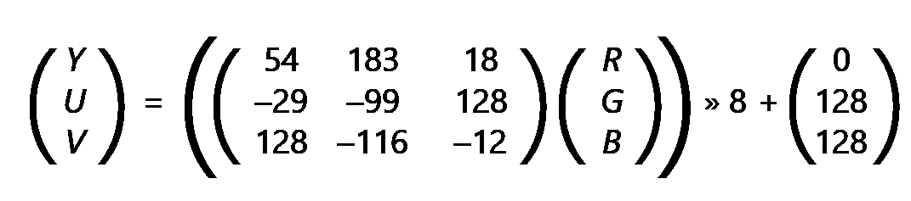
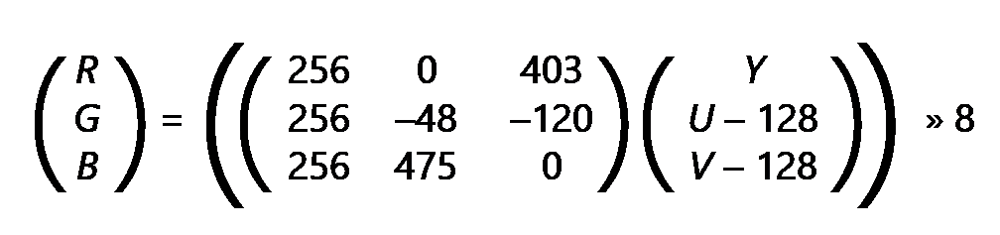
<!-- /Extracted images from page 106 -->

3.3.8.2.2 Inverse DWT

The inverse discrete wavelet transform (IDWT) is based on the equations specified in [MS-
RDPRFX] section 3.1.8.2.4. However, as described in section 3.2.8.1.2, the associated forward
transform uses the Reduce-Extrapolate Method (section 3.2.8.1.2.2) to remove boundary artifacts.
The structure of the resultant tile (with its ten bands) is illustrated in the figure captioned "Bands
resulting from the Reduce-Extrapolate DWT Method" in section 3.2.8.1.2.2.

Each tile component undergoes three levels of inverse 2D discrete wavelet transformation.

The two first passes each take as input N low-frequency elements (where N is odd) and (N - 1) high-
frequency elements. Using normal mirroring, an odd number of elements are calculated, and they
become the input for the next pass.

The final pass takes as input 33 low-frequency elements and 31 high-frequency elements. Adding a
zero as the 32nd high-frequency element allows the final pass to be performed in the same manner as
the first two passes and produces 65 coefficients. The 65th element is an extrapolation of the previous
two elements and is not used; therefore, it is dropped.

3.3.8.2.3 Color Conversion

Color conversion is identical to the technique specified in [MS-RDPRFX] section 3.1.8.2.5.

3.3.8.3  MPEG-4 AVC/H.264 Compression

3.3.8.3.1 Color Conversion

The forward transformation from ARGB to AYUV is based on full-range BT.709 ([ITU-BT.709-5] section
4) and is described by the following two formulas:

A = A

The resultant Y, U, and V components MUST be clamped to the range 0...255 inclusive.

The reverse transformation from AYUV to ARGB is described by the following two formulas:

A = A

The resultant R, G, and B components MUST be clamped to the range 0...255 inclusive.

[MS-RDPEGFX] - v20260511
Remote Desktop Protocol: Graphics Pipeline Extension
Copyright © 2026 Microsoft Corporation
Release: May 11, 2026

106 / 145

<!-- Extracted images from page 107 -->
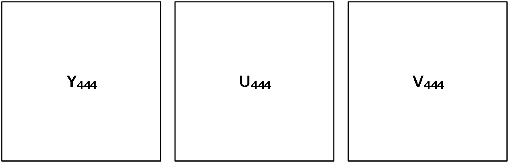
<!-- /Extracted images from page 107 -->

3.3.8.3.2 YUV420p Stream Combination for YUV444 mode

The RFX_AVC444_BITMAP_STREAM structure (section 2.2.4.5) encapsulates two
RFX_AVC420_BITMAP_STREAM structures (section 2.2.4.4). These two YUV420p streams MUST be
combined to produce a YUV444 frame.

A YUV444 frame can be represented as shown in the following figure, where Y444, U444, and V444 are
the Y, U, and V planes of a source YUV444 frame. It is assumed that the resolution of these planes is
specified by the width W and height H.

Figure 6: A representation of a YUV444 frame as three planes

The YUV444 frame represented in the previous figure can be packed into two YUV420 frames (a main
and auxiliary view) as shown in the following figure, which represents the frame at a 16x16
macroblock level.

[MS-RDPEGFX] - v20260511
Remote Desktop Protocol: Graphics Pipeline Extension
Copyright © 2026 Microsoft Corporation
Release: May 11, 2026

107 / 145

<!-- Extracted images from page 108 -->
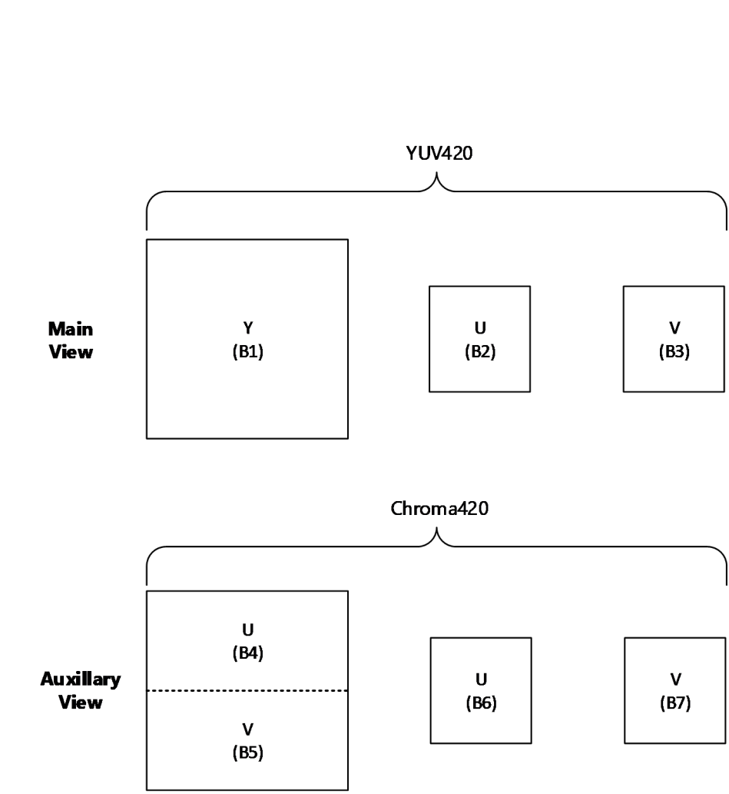
<!-- /Extracted images from page 108 -->

Figure 7: A representation of a YUV444 macroblock as two YUV420p macroblocks

The areas marked as B1 to B7 make up the Y, U, and V planes of the two YUV420p macroblocks
representing the main (luma) and auxiliary (chroma) views. These areas are related to Y444, U444, and
V444 as follows:

[MS-RDPEGFX] - v20260511
Remote Desktop Protocol: Graphics Pipeline Extension
Copyright © 2026 Microsoft Corporation
Release: May 11, 2026

108 / 145

<!-- Extracted images from page 109 -->
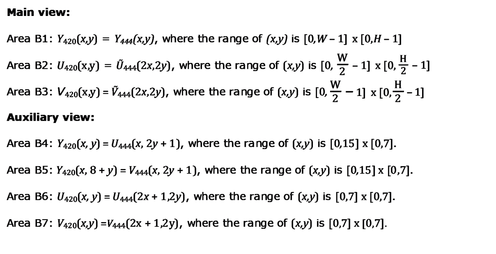
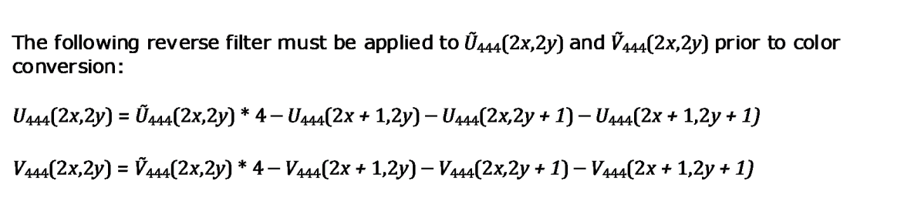
<!-- /Extracted images from page 109 -->

Color conversion MUST occur as follows in each case:

For macroblocks that are in rectangles in a received luma subframe (refer to the regionRects field of
the corresponding RFX_AVC420_METABLOCK (section 2.2.4.4.1)), color conversion MUST be
performed as in YUV420p mode using only the data in the main view.

For macroblocks that are in rectangles in a received chroma subframe (refer to the regionRects field
of the corresponding RFX_AVC420_METABLOCK), color conversion MUST use the Y, U, and V
components from the last corresponding rectangle in a luma subframe together with the current
chroma subframe.

Note that the ranges for x and y in the chroma subframe (auxiliary view) are based on 16x16
macroblock sizes, and the view in the figure captioned "A representation of a YUV444 macroblock as
two YUV420p macroblocks" shows interleaving in the chroma subframe for B4 and B5 on an 8-line
basis. Color conversion MUST be performed for the entire macroblock, after which the region mask in
regionRects MUST be applied. The use of 2x or 2y denotes even pixels, while (2x+1) or (2y+1)
denotes odd pixels.

Due to potential visual artifacts stemming from the quantization of AVC encoding, applying the reverse
filter is not optimal in all cases. If the reverse filter for a pixel component (U and V separately)
changes the value by less than a given threshold, then the nonreversed value SHOULD be used
instead. A cutoff threshold of 30 is used for this purpose. Note that this is an optional step and is not
required in decoding.

[MS-RDPEGFX] - v20260511
Remote Desktop Protocol: Graphics Pipeline Extension
Copyright © 2026 Microsoft Corporation
Release: May 11, 2026

109 / 145

<!-- Extracted images from page 110 -->
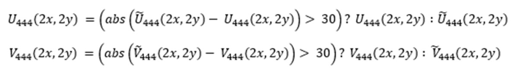

<!-- /Extracted images from page 110 -->

3.3.8.3.3 YUV420p Stream Combination for YUV444v2 mode

The RFX_AVC444V2_BITMAP_STREAM structure (section 2.2.4.6) encapsulates two
RFX_AVC420_BITMAP_STREAM structures (section 2.2.4.4). These two YUV420p streams MUST be
combined to produce a YUV444 frame.

Note that the process of combining the streams is similar to the process used for YUV444 mode
described in section 3.3.8.3.2, but the streams have a different layout in the auxiliary view. The
terminology for YUV420 and YUV444 frames refers to buffers and remains the same.

A YUV444 frame can be represented as shown in the following figure, where Y444, U444, and V444 are
the Y, U, and V planes of a source YUV444 frame. It is assumed that the resolution of these planes is
specified by the width W and height H.

Figure 8: A representation of a YUV444 frame as three planes

The YUV444 frame represented in the previous figure can be packed into two YUV420 frames (a main
and auxiliary view) as shown in the following figure, which represents the full frame.

[MS-RDPEGFX] - v20260511
Remote Desktop Protocol: Graphics Pipeline Extension
Copyright © 2026 Microsoft Corporation
Release: May 11, 2026

110 / 145

<!-- Extracted images from page 111 -->
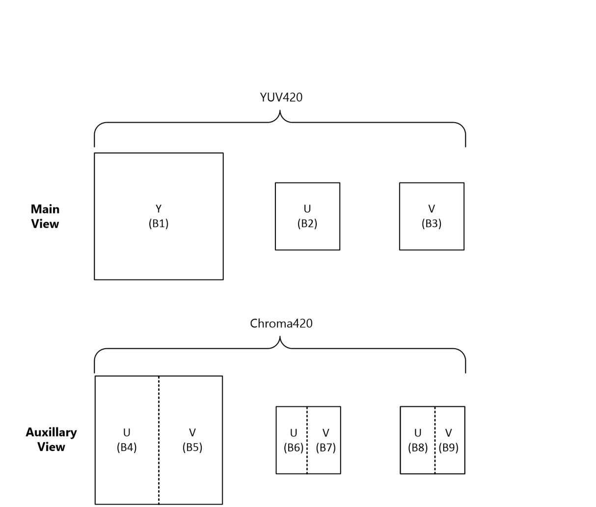
<!-- /Extracted images from page 111 -->

Figure 9: A representation of a YUV444 frame as two YUV420p frames

The areas marked as B1 to B9 make up the Y, U, and V planes of the two YUV420p macroblocks
representing the main (luma) and auxiliary (chroma) views. These areas are related to Y444, U444, and
V444 as follows.

[MS-RDPEGFX] - v20260511
Remote Desktop Protocol: Graphics Pipeline Extension
Copyright © 2026 Microsoft Corporation
Release: May 11, 2026

111 / 145

<!-- Extracted images from page 112 -->
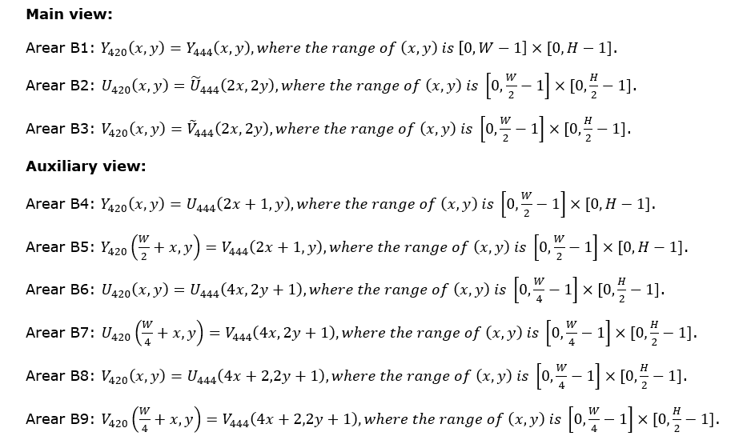
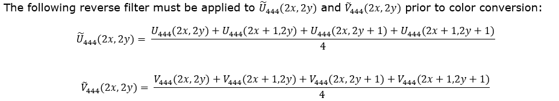
<!-- /Extracted images from page 112 -->

Color conversion MUST occur as follows in each case:

For macroblocks that are in rectangles in a received luma subframe (refer to the regionRects field of
the corresponding RFX_AVC420_METABLOCK (section 2.2.4.4.1)), color conversion MUST be
performed as in YUV420p mode using only the data in the main view.

For macroblocks that are in rectangles in a received chroma subframe (refer to the regionRects field
of the corresponding RFX_AVC420_METABLOCK), color conversion MUST use the Y, U, and V
components from the last corresponding rectangle in a luma subframe together with the current
chroma subframe.

Note that the ranges for x and y in the chroma subframe (auxiliary view) are based on 16x16
macroblock sizes, and the view in the figure captioned "A representation of a YUV444 macroblock as
two YUV420p macroblocks" shows interleaving in the chroma subframe for B4 and B5 on an 8-line
basis. Color conversion MUST be performed for the entire macroblock, after which the region mask in
regionRects MUST be applied. The use of 2x or 2y denotes even pixels, while (2x+1) or (2y+1)
denotes odd pixels.

Due to potential visual artifacts stemming from the quantization of AVC encoding, applying the reverse
filter is not optimal in all cases. If the reverse filter for a pixel component (U and V separately)
changes the value by less than a given threshold, then the nonreversed value SHOULD be used
instead. A cutoff threshold of 30 is used for this purpose. Note that this is an optional step and is not
required in decoding.

[MS-RDPEGFX] - v20260511
Remote Desktop Protocol: Graphics Pipeline Extension
Copyright © 2026 Microsoft Corporation
Release: May 11, 2026

112 / 145

<!-- Extracted images from page 113 -->
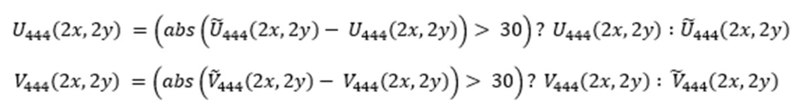
<!-- /Extracted images from page 113 -->

[MS-RDPEGFX] - v20260511
Remote Desktop Protocol: Graphics Pipeline Extension
Copyright © 2026 Microsoft Corporation
Release: May 11, 2026

113 / 145

4  Protocol Examples

4.1  Bitmap Compression

4.1.1  ClearCodec Compression

4.1.1.1  Example 1

The following example shows a network dump of an image compressed using ClearCodec. The width of
the bitmap is 8, and the height is 9. ClearCodec returned 4 bytes after compressing this image.

 COMPRESSED BITMAP DATA (4 bytes):
 00000000  03 c3 11 00

 03 -> CLEARCODEC_BITMAP_STREAM::flags = 0x03
 = 0x01 | 0x02
 = CLEARCODEC_FLAG_GLYPH_INDEX (0x01) | CLEARCODEC_FLAG_GLYPH_HIT (0x02)

 c3 -> CLEARCODEC_BITMAP_STREAM::seqNumber = 195
 11 00 -> CLEARCODEC_BITMAP_STREAM::glyphIndex = 17

The sequence number is validated and incremented. The pixels for this image can be found in the
Decompressor Glyph Storage (section 3.3.1.9) ADM element at position 17, ordered from left to
right and then top to bottom.

4.1.1.2  Example 2

The following example shows a network dump of an image compressed using ClearCodec. The width of
the bitmap is 78, and the height is 17. ClearCodec returned 144 bytes after compressing this image.

 COMPRESSED BITMAP DATA (144 bytes):
 00000000 00 0d 00 00 00 00 00 00 00 00 82 00 00 00 00 00  ................
 00000010 00 00 4e 00 11 00 75 00 00 00 02 0e ff ff ff 00  ..N...u.........
 00000020 00 00 db ff ff 00 3a 90 ff b6 66 66 b6 ff b6 66  ......:...ff...f
 00000030 00 90 db ff 00 00 3a db 90 3a 3a 90 db 66 00 00  ......:..::..f..
 00000040 ff ff b6 64 64 64 11 04 11 4c 11 4c 11 4c 11 4c  ...ddd...L.L.L.L
 00000050 11 4c 00 47 13 00 01 01 04 00 01 00 00 47 16 00  .L.G.........G..
 00000060 11 02 00 47 29 00 11 01 00 49 0a 00 01 00 04 00  ...G)....I......
 00000070 01 00 00 4a 0a 00 09 00 01 00 00 47 05 00 01 01  ...J.......G....
 00000080 1c 00 01 00 11 4c 11 4c 11 4c 00 47 0d 4d 00 4d  .....L.L.L.G.M.M

 Decoding the CLEARCODEC_BITMAP_STREAM header:
 00 -> CLEARCODEC_BITMAP_STREAM::flags = 0
 0d -> CLEARCODEC_BITMAP_STREAM::seqNumber = 13

 Decoding the CLEARCODEC_COMPOSITE_PAYLOAD header:
 00 00 00 00 -> CLEARCODEC_COMPOSITE_PAYLOAD::residualByteCount = 0
 00 00 00 00 -> CLEARCODEC_COMPOSITE_PAYLOAD::bandsByteCount = 0
 82 00 00 00 -> CLEARCODEC_COMPOSITE_PAYLOAD::subcodecByteCount = 130 bytes

 SUBCODEC DATA (130 bytes):
 00000000 00 00 00 00 4e 00 11 00 75 00 00 00 02 0e ff ff  ....N...u.......
 00000010 ff 00 00 00 db ff ff 00 3a 90 ff b6 66 66 b6 ff  ........:...ff..
 00000020 b6 66 00 90 db ff 00 00 3a db 90 3a 3a 90 db 66  .f......:..::..f
 00000030 00 00 ff ff b6 64 64 64 11 04 11 4c 11 4c 11 4c  .....ddd...L.L.L
 00000040 11 4c 11 4c 00 47 13 00 01 01 04 00 01 00 00 47  .L.L.G.........G
 00000050 16 00 11 02 00 47 29 00 11 01 00 49 0a 00 01 00  .....G)....I....
 00000060 04 00 01 00 00 4a 0a 00 09 00 01 00 00 47 05 00  .....J.......G..
 00000070 01 01 1c 00 01 00 11 4c 11 4c 11 4c 00 47 0d 4d  .......L.L.L.G.M
 00000080 00 4d                                            .M

[MS-RDPEGFX] - v20260511
Remote Desktop Protocol: Graphics Pipeline Extension
Copyright © 2026 Microsoft Corporation
Release: May 11, 2026

114 / 145

 Decoding the first subcodec header:
 00 00 -> CLEARCODEC_SUBCODEC::xStart = 0
 00 00 -> CLEARCODEC_SUBCODEC::yStart = 0
 4e 00 -> CLEARCODEC_SUBCODEC::width = 78
 11 00 -> CLEARCODEC_SUBCODEC::height = 17
 75 00 00 00 -> CLEARCODEC_SUBCODEC::bitmapDataByteCount = 117
 02 -> CLEARCODEC_SUBCODEC::subCodecId = CLEARCODEC_SUBCODEC_RLEX(0x02)

 SUBCODEC_RLEX DATA (117 bytes):
 00000000 0e ff ff ff 00 00 00 db ff ff 00 3a 90 ff b6 66  ...........:...f
 00000010 66 b6 ff b6 66 00 90 db ff 00 00 3a db 90 3a 3a  f...f......:..::
 00000020 90 db 66 00 00 ff ff b6 64 64 64 11 04 11 4c 11  ..f.....ddd...L.
 00000030 4c 11 4c 11 4c 11 4c 00 47 13 00 01 01 04 00 01  L.L.L.L.G.......
 00000040 00 00 47 16 00 11 02 00 47 29 00 11 01 00 49 0a  ..G.....G)....I.
 00000050 00 01 00 04 00 01 00 00 4a 0a 00 09 00 01 00 00  ........J.......
 00000060 47 05 00 01 01 1c 00 01 00 11 4c 11 4c 11 4c 00  G.........L.L.L.
 00000070 47 0d 4d 00 4d                                   G.M.M

 0e -> CLEARCODEC_SUBCODEC_RLEX::paletteCount = 14

 ff ff ff -> paletteEntries[0]  = (blue = 0xff, green = 0xff, red = 0xff)
 00 00 00 -> paletteEntries[1]  = (blue = 0x00, green = 0x00, red = 0x00)
 db ff ff -> paletteEntries[2]  = (blue = 0xdb, green = 0xff, red = 0xff)
 00 3a 90 -> paletteEntries[3]  = (blue = 0x00, green = 0x3a, red = 0x90)
 ff b6 66 -> paletteEntries[4]  = (blue = 0xff, green = 0xb6, red = 0x66)
 66 b6 ff -> paletteEntries[5]  = (blue = 0x66, green = 0xb6, red = 0xff)
 b6 66 00 -> paletteEntries[6]  = (blue = 0xb6, green = 0x66, red = 0x00)
 90 db ff -> paletteEntries[7]  = (blue = 0x90, green = 0xdb, red = 0xff)
 00 00 3a -> paletteEntries[8]  = (blue = 0x00, green = 0x00, red = 0x3a)
 db 90 3a -> paletteEntries[9]  = (blue = 0xdb, green = 0x90, red = 0x3a)
 3a 90 db -> paletteEntries[10] = (blue = 0x3a, green = 0x90, red = 0xdb)
 66 00 00 -> paletteEntries[11] = (blue = 0x66, green = 0x00, red = 0x00)
 ff ff b6 -> paletteEntries[12] = (blue = 0xff, green = 0xff, red = 0xb6)
 64 64 64 -> paletteEntries[13] = (blue = 0x64, green = 0x64, red = 0x64)

The minimum number of bits required to represent the largest palette index (indexes range from 0 to
13 in this case) is floor(log2(13)) + 1 = 4. This means that all indexes are represented using 4 bits,
and the remaining 4 bits in the byte are used for the suite depth.

 Decoding the first SUBCODEC_RLEX_SEGMENT:
 11 -> Encoded stop index (least significant 4 bits) and suite depth (most significant 4 bits)
 CLEARCODEC_SUBCODEC_RLEX_SEGMENT::stopIndex = 0x01
 CLEARCODEC_SUBCODEC_RLEX_SEGMENT::suiteDepth = 0x01
 04 -> CLEARCODEC_SUBCODEC_RLEX_SEGMENT::runLengthFactor1 = 4
 CLEARCODEC_SUBCODEC_RLEX_SEGMENT::runLengthFactor2 is not present
 CLEARCODEC_SUBCODEC_RLEX_SEGMENT::runLengthFactor3 is not present

 Using the above values, the following sequence of palette indexes is decoded:
 0x00, 0x00, 0x00, 0x00, 0x00, 0x01

 Using the palette entries, the sequence of palette indexes is translated into the following
pixel sequence (RGB format):
 ffffff, ffffff, ffffff, ffffff, ffffff, 000000

The decoded pixels are written into the target image starting in the top-left corner and progressing
from left to right and then top to bottom.

 Decoding the second RLEX_SEGMENT:
 11 -> Encoded stop index (least significant 4 bits) and suite depth (most significant 4 bits)
 CLEARCODEC_SUBCODEC_RLEX_SEGMENT::stopIndex = 0x01
 CLEARCODEC_SUBCODEC_RLEX_SEGMENT::suiteDepth = 0x01
 4c -> CLEARCODEC_SUBCODEC_RLEX_SEGMENT::runLengthFactor1 = 76
 CLEARCODEC_SUBCODEC_RLEX_SEGMENT::runLengthFactor2 is not present

115 / 145

[MS-RDPEGFX] - v20260511
Remote Desktop Protocol: Graphics Pipeline Extension
Copyright © 2026 Microsoft Corporation
Release: May 11, 2026

 CLEARCODEC_SUBCODEC_RLEX_SEGMENT::runLengthFactor3 is not present

 Using the above values, the following sequence of palette indexes is decoded:
 0x00, 0x00, ... [76 total], 0x00, 0x01

In a similar fashion, the next thirteen SUBCODEC_RLEX_SEGMENT structures are processed.

 Finally, decoding the sixteenth RLEX_SEGMENT:
 29 -> Encoded stop index (least significant 4 bits) and suite depth (most significant 4 bits)
 CLEARCODEC_SUBCODEC_RLEX_SEGMENT::stopIndex = 0x09
 CLEARCODEC_SUBCODEC_RLEX_SEGMENT::suiteDepth = 0x02
 0 -> CLEARCODEC_SUBCODEC_RLEX_SEGMENT::runLengthFactor1 = 0
 CLEARCODEC_SUBCODEC_RLEX_SEGMENT::runLengthFactor2 is not present
 CLEARCODEC_SUBCODEC_RLEX_SEGMENT::runLengthFactor3 is not present

 Using the above values, the following sequence of palette indexes is decoded:
 0x07, 0x08, 0x09

 Using the palette entries, the sequence of palette indexes is translated into the following
pixel sequence (RGB format):
 ffdb90, 3a0000, 3a90db

In a similar fashion, the remaining SUBCODEC_RLEX_SEGMENTS in the packet are decoded until there
is no more data left in the SUBCODEC_RLEX DATA payload, at which point subcodec decoding is
complete.

4.1.1.3  Example 3

The following example shows a network dump of an image compressed using ClearCodec. The width of
the bitmap is 64, and the height is 24. ClearCodec returned 167 bytes after compressing this image.

 COMPRESSED BITMAP DATA (167 bytes):
 00000000 00 df 0e 00 00 00 8b 00 00 00 00 00 00 00 fe fe  ................
 00000010 fe ff 80 05 ff ff ff 40 fe fe fe 40 00 00 3f 00  .......@...@..?.
 00000020 03 00 0b 00 fe fe fe c5 d0 c6 d0 c7 d0 68 d4 69  .............h.i
 00000030 d4 6a d4 6b d4 6c d4 6d d4 1a d4 1a d4 a6 d0 6e  .j.k.l.m.......n
 00000040 d4 6f d4 70 d4 71 d4 72 d4 73 d4 74 d4 21 d4 22  .o.p.q.r.s.t.!."
 00000050 d4 23 d4 24 d4 25 d4 d9 d0 da d0 db d0 c5 d0 c5  .#.$.%..........
 00000060 d0 dc d0 c2 d0 21 d4 22 d4 23 d4 24 d4 25 d4 c9  .....!.".#.$.%..
 00000070 d0 ca d0 5a d4 2b d1 28 d1 2c d1 75 d4 27 d4 28  ...Z.+.(.,.u.'.(
 00000080 d4 29 d4 2a d4 1a d4 1a d4 1a d4 b7 d0 b8 d0 b9  .).*............
 00000090 d0 ba d0 bb d0 bc d0 bd d0 be d0 bf d0 c0 d0 c1  ................
 000000a0 d0 c2 d0 c3 d0 c4 d0                             .......

 Decoding the CLEARCODEC_BITMAP_STREAM header:
 00 -> CLEARCODEC_BITMAP_STREAM::flags = 0
 df -> CLEARCODEC_BITMAP_STREAM::seqNumber = 223

 Decoding the CLEARCODEC_COMPOSITE_PAYLOAD header:
 0e 00 00 00 -> CLEARCODEC_COMPOSITE_PAYLOAD::residualByteCount = 14
 8b 00 00 00 -> CLEARCODEC_COMPOSITE_PAYLOAD::bandsByteCount = 139
 00 00 00 00 -> CLEARCODEC_COMPOSITE_PAYLOAD::subcodecByteCount = 0

 RESIDUAL DATA (14 bytes):
 00000000 fe fe fe ff 80 05 ff ff ff 40 fe fe fe 40        .........@...@

 Decoding the first residual segment:
 fe -> CLEARCODEC_RGB_RUN_SEGMENT::blueValue = 254
 fe -> CLEARCODEC_RGB_RUN_SEGMENT::greenValue = 254
 fe -> CLEARCODEC_RGB_RUN_SEGMENT::redValue = 254

 ff -> CLEARCODEC_RGB_RUN_SEGMENT::runLengthFactor1 = 255
 CLEARCODEC_RGB_RUN_SEGMENT::runLengthFactor2 is present.

[MS-RDPEGFX] - v20260511
Remote Desktop Protocol: Graphics Pipeline Extension
Copyright © 2026 Microsoft Corporation
Release: May 11, 2026

116 / 145

 80 05 -> CLEARCODEC_RGB_RUN_SEGMENT::runLengthFactor2 = 1408
 CLEARCODEC_RGB_RUN_SEGMENT::runLengthFactor3 is not present.

The white pixel (254, 254, 254) is replicated 1408 times (starting in the top-left corner and
progressing from left to right and then top to bottom).

 Decoding the second residual segment:
 ff -> CLEARCODEC_RGB_RUN_SEGMENT::blueValue = 255
 ff -> CLEARCODEC_RGB_RUN_SEGMENT::greenValue = 255
 ff -> CLEARCODEC_RGB_RUN_SEGMENT::redValue = 255

 40 -> CLEARCODEC_RGB_RUN_SEGMENT::runLengthFactor1 = 64
 CLEARCODEC_RGB_RUN_SEGMENT::runLengthFactor2 is not present.
 CLEARCODEC_RGB_RUN_SEGMENT::runLengthFactor3 is not present.

The fully white pixel (255, 255, 255) is replicated 64 times starting from the next position where the
first residual segment ended.

Repeat the above procedure for the last residual segment (0xfe, 0xfe, 0xfe, 0x40). Because there is
no more data left in the residual payload (and all pixels were covered), residual decoding is complete.
The pixels decoded will be the first layer drawn on the target image buffer.

 BANDS DATA (139 bytes):
 00000000 00 00 3f 00 03 00 0b 00 fe fe fe c5 d0 c6 d0 c7  ..?.............
 00000010 d0 68 d4 69 d4 6a d4 6b d4 6c d4 6d d4 1a d4 1a  .h.i.j.k.l.m....
 00000020 d4 a6 d0 6e d4 6f d4 70 d4 71 d4 72 d4 73 d4 74  ...n.o.p.q.r.s.t
 00000030 d4 21 d4 22 d4 23 d4 24 d4 25 d4 d9 d0 da d0 db  .!.".#.$.%......
 00000040 d0 c5 d0 c5 d0 dc d0 c2 d0 21 d4 22 d4 23 d4 24  .........!.".#.$
 00000050 d4 25 d4 c9 d0 ca d0 5a d4 2b d1 28 d1 2c d1 75  .%.....Z.+.(.,.u
 00000060 d4 27 d4 28 d4 29 d4 2a d4 1a d4 1a d4 1a d4 b7  .'.(.).*........
 00000070 d0 b8 d0 b9 d0 ba d0 bb d0 bc d0 bd d0 be d0 bf  ................
 00000080 d0 c0 d0 c1 d0 c2 d0 c3 d0 c4 d0                 ...........

 Decoding the first CLEARCODEC_BAND header:
 00 00 -> CLEARCODEC_BAND::xStart = 0
 3f 00 -> CLEARCODEC_BAND::xEnd = 63
 03 00 -> CLEARCODEC_BAND::yStart = 3
 0b 00 -> CLEARCODEC_BAND::yEnd = 11
 fe -> CLEARCODEC_BAND::blueBkg = 254
 fe -> CLEARCODEC_BAND::greenBkg = 254
 fe -> CLEARCODEC_BAND::redBkg = 254

This implies that 64 V-Bars (xEnd – xStart + 1) follow after the header. Each V-Bar is either present
in the V-Bar Storage (section 3.3.1.10) ADM element or the packet.

 Decoding the first V-Bar:
 c5 d0 -> CLEARCODEC_VBAR::vBarHeader = 0xd0c5
 CLEARCODEC_VBAR::vBarHeader::x = 0x1
 CLEARCODEC_VBAR::vBarHeader::vBarIndex = 0x50c5

Because this is a V-Bar hit, the pixels are not present in the packet. The data for this V-Bar is
accessed at V-Bar Storage position 0x50c5 and then placed on the screen starting at position (0, 3)
and extending up to and including (0, 11). The V-Bar Storage position 0x50c5 has been initialized by a
previous packet with 9 pixels.

All remaining 63 V-Bars in this band are cache hits and are processed in the same fashion.

[MS-RDPEGFX] - v20260511
Remote Desktop Protocol: Graphics Pipeline Extension
Copyright © 2026 Microsoft Corporation
Release: May 11, 2026

117 / 145

Since there is no more data remaining in the bands payload, it follows that there are no more bands
remaining and that bands decoding is complete.

Since there is no more data in the payload, it follows that decoding is complete.

4.1.1.4  Example 4

The following example shows a network dump of an image compressed using ClearCodec. The width of
the bitmap is 7, and the height is 15. ClearCodec returned 86 bytes after compressing this image.

 COMPRESSED BITMAP DATA (86 bytes):
 00000000 01 0b 78 00 00 00 00 00 46 00 00 00 00 00 00 00  ..x.....F.......
 00000010 00 00 06 00 00 00 0e 00 00 00 00 00 0f ff ff ff  ................
 00000020 ff ff ff ff ff ff b6 ff ff ff ff ff ff ff ff ff  ................
 00000030 b6 66 ff ff ff ff ff ff ff b6 66 db 90 3a ff ff  .f........f..:..
 00000040 b6 ff ff ff ff ff ff ff ff ff 46 91 47 91 48 91  ..........F.G.H.
 00000050 49 91 4a 91 1b 91                                I.J...

 Decoding the CLEARCODEC_BITMAP_STREAM header:
 01 -> CLEARCODEC_BITMAP_STREAM::flags = CLEARCODEC_FLAG_GLYPH_INDEX (0x01)
 0b -> CLEARCODEC_BITMAP_STREAM::seqNumber = 11
 78 00 -> CLEARCODEC_BITMAP_STREAM::glyphIndex = 120

 Decoding the CLEARCODEC_COMPOSITE_PAYLOAD header:
 00 00 00 00 -> CLEARCODEC_COMPOSITE_PAYLOAD::residualByteCount = 0
 46 00 00 00 -> CLEARCODEC_COMPOSITE_PAYLOAD::bandsByteCount = 70
 00 00 00 00 -> CLEARCODEC_COMPOSITE_PAYLOAD::subcodecByteCount = 0

 BANDS DATA (70 bytes):
 00000000 00 00 06 00 00 00 0e 00 00 00 00 00 0f ff ff ff  ................
 00000010 ff ff ff ff ff ff b6 ff ff ff ff ff ff ff ff ff  ................
 00000020 b6 66 ff ff ff ff ff ff ff b6 66 db 90 3a ff ff  .f........f..:..
 00000030 b6 ff ff ff ff ff ff ff ff ff 46 91 47 91 48 91  ..........F.G.H.
 00000040 49 91 4a 91 1b 91

 Decoding the first CLEARCODEC_BAND header:
 00 00 -> CLEARCODEC_BAND::xStart = 0
 06 00 -> CLEARCODEC_BAND::xEnd = 6
 00 00 -> CLEARCODEC_BAND::yStart = 0
 0e 00 -> CLEARCODEC_BAND::yEnd = 14
 00 -> CLEARCODEC_BAND::blueBkg = 0
 00 -> CLEARCODEC_BAND::greenBkg = 0
 00 -> CLEARCODEC_BAND::redBkg = 0

This implies that 7 V-Bars (xEnd – xStart + 1) follow after the header. Each V-Bar is either present in
the V-Bar Storage (section 3.3.1.10) ADM element or the packet.

 Decoding the first V-Bar:
 00 0f -> CLEARCODEC_VBAR::vBarHeader = 0x0f00
 CLEARCODEC_VBAR::vBarHeader::x = 0x0 (implies this is a SHORT_VBAR_CACHE_MISS structure)
 SHORT_VBAR_CACHE_MISS::vBarHeader::shortVBarYOn = 0x00
 SHORT_VBAR_CACHE_MISS::vBarHeader::shortVBarYOff = 0x0f

Since this is a SHORT_VBAR_CACHE_MISS (section 2.2.4.1.1.2.1.1.3) structure, the 15 pixels
(shortVBarYOff – shortVBarYOn) that follow are the V-Bar. Note that shortVBarYOn is exclusive,
while CLEARCODEC_BAND::yEnd is inclusive; this is mainly because a Short V-Bar of height of zero is
legal, while a band of height zero is not legal.

 ff ff ff -> First pixel at position (0, 0) = (blue = 0xff, green = 0xff, red = 0xff)
 ff ff ff -> Second pixel at position (0, 1) = (blue = 0xff, green = 0xff, red = 0xff)
 ...
 db 90 3a -> 11th pixel at position (0, 10) = (blue = 0xdb, green = 0x90, red = 0x3a)

118 / 145

[MS-RDPEGFX] - v20260511
Remote Desktop Protocol: Graphics Pipeline Extension
Copyright © 2026 Microsoft Corporation
Release: May 11, 2026

<!-- Extracted images from page 119 -->

<!-- /Extracted images from page 119 -->

 ...
 ff ff ff -> 15th pixel at position (0, 14) = (blue = 0xff, green = 0xff, red = 0xff)

The Short V-Bar Storage (section 3.3.1.12) ADM element at the Short V-Bar Storage Cursor (section
3.3.1.13) ADM element is updated with the decoded pixels. Following this operation, the Short V-Bar
Storage Cursor ADM element is incremented modulo 0x4000 by 1, mathematically:

 vbarShortCursor = (vbarShortCursor + 1) mod 0x4000

The V-Bar Storage ADM element at the V-Bar Storage Cursor (section 3.3.1.11) ADM element is
also updated with the same pixels (in this case the two have the same height of 15). Following this
operation, the V-Bar Storage Cursor ADM element is incremented modulo 0x8000 by 1.

 Decoding the second V-Bar:
 46 91 -> CLEARCODEC_VBAR::vBarHeader = 0x9146
 CLEARCODEC_VBAR::vBarHeader::x = 0x1 (implies this is a VBAR_CACHE_HIT structure)
 VBAR_CACHE_HIT::vBarIndex = 0x1146

Because this is a V-Bar hit, the pixels are not present in the packet. The data for this V-Bar is
accessed at V-Bar Storage position 0x1146 and then placed on the screen starting at position (1, 0)
and extending up to and including (1, 14).

All remaining 5 V-Bars in this band are cache hits and are processed in the same fashion.

Since there is no more data remaining in the bands payload, it follows that there are no more bands
remaining and that bands decoding is complete.

Since there is no more data in the payload, it follows that decoding is complete.

Since the glyphIndex field was present in the CLEARCODEC_BITMAP_STREAM header of this packet,
the Decompressor Glyph Storage (section 3.3.1.9) ADM element at position 120 is updated with
the decoded bitmap.

4.1.1.5  Example 5

In order to instruct a client to render a glyph and then insert the glyph into the Decompressor Glyph
Storage (section 3.3.1.9) ADM element, the server encapsulates an encoded representation of the
glyph within a CLEARCODEC_BITMAP_STREAM (section 2.2.4.1) structure. This structure is
embedded within an RDPGFX_WIRE_TO_SURFACE_PDU_1 (section 2.2.2.1) message, which is
transmitted to the client. Within the CLEARCODEC_BITMAP_STREAM structure, the
CLEARCODEC_FLAG_GLYPH_INDEX (0x01) flag is present in the flags field, while the
CLEARCODEC_FLAG_GLYPH_HIT (0x02) flag is absent. The glyph bitmap is present in the
compositePayload field. Once decoded, the glyph is effectively a linear stream of pixels, as shown in
the following diagram.

Figure 10: Sixteen glyph pixels stored in a linear stream with no implied dimensions

The width and height of the glyph is determined by the rectangle defined in the destRect field of the
encapsulating RDPGFX_WIRE_TO_SURFACE_PDU_1 message. For example, assuming that the
width is 2 pixels and the height is 8 pixels, the following image would be rendered by the client.

[MS-RDPEGFX] - v20260511
Remote Desktop Protocol: Graphics Pipeline Extension
Copyright © 2026 Microsoft Corporation
Release: May 11, 2026

119 / 145

<!-- Extracted images from page 120 -->
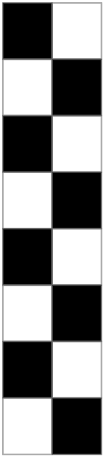
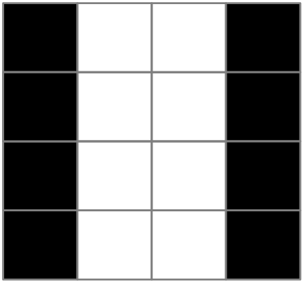
<!-- /Extracted images from page 120 -->

Figure 11: A 2 x 8 glyph

The decoded linear stream of pixels is stored within the Decompressor Glyph Storage ADM element
in the slot specified by the glyphIndex field of the encapsulating CLEARCODEC_BITMAP_STREAM
structure. The pixels are stored with no implied dimensions. For the sake of this example, assume that
the assigned slot is Slot 4.

If the server detects a cache hit and determines that the glyph stored by the client in Slot 4 of the
Decompressor Glyph Storage ADM element has to be rendered, the client will be sent a
CLEARCODEC_BITMAP_STREAM structure (encapsulated within a
RDPGFX_WIRE_TO_SURFACE_PDU_1 message) with the flags field containing both the
CLEARCODEC_FLAG_GLYPH_INDEX and CLEARCODEC_FLAG_GLYPH_HIT flags. The optional
compositePayload field will not be present. Note that in this case, the dimensions of the rectangle
specified by the container RDPGFX_WIRE_TO_SURFACE_PDU_1 message (in the destRect field)
can be any width and height that yields an effective area of 16 pixels2. For example, a possible
configuration could be the following 4-pixel-by-4-pixel glyph.

Figure 12: A 4 x 4 glyph

Another possible configuration is the following 8-pixel-by-2-pixel glyph.

[MS-RDPEGFX] - v20260511
Remote Desktop Protocol: Graphics Pipeline Extension
Copyright © 2026 Microsoft Corporation
Release: May 11, 2026

120 / 145

<!-- Extracted images from page 121 -->
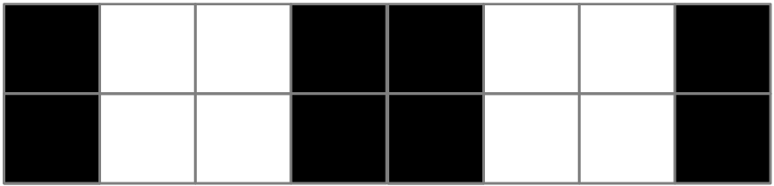
<!-- /Extracted images from page 121 -->

Figure 13: An 8 x 2 glyph

In effect, a linear stream of pixels stored in a slot in the Decompressor Glyph Storage ADM element
can be blitted into a number of rectangular configurations, as long as all of the pixels are used in the
configuration. The ultimate configuration is determined by cache hits encountered by the server
encoder.

4.1.2  Progressive Entropy Encode and Decode

The example in this section illustrates the process of entropy encoding and decoding for a tile at
various quality levels. For simplicity, this example only encodes one color component, which consists
of 14 DWT coefficients.

The tile contains three bands: HL, LH, and LL. These bands are composed of 5, 5, and 4 DWT
coefficients, respectively, totaling 14 coefficients for the tile.

Three progressive quality levels are used when encoding: 25%, 50%, and 100%.

The input presented in this example is the direct result of the discreet wavelet transform and
quantization of a sample image.

The following scenarios are covered in this example:

1.  The tile for frame #1 is encoded as an original tile at 25% progressive quality.

2.  The tile is upgraded to 50% progressive quality.

3.  The tile for frame #2 is encoded as a difference tile at 25%.

4.  The tile is upgraded to 50%.

5.  The tile is finally upgraded to 100%.

The coefficients for frame #1 and frame #2 are presented in the following table.

HL

Frame #1

-34

-13

15

Frame #2

-2

-2

3

-3

-3

0

1

0

3

-7

-7

LH

5

5

LL

-3

-2

9

1

15

17

-9

12

24

13

18

5

The progressive quantization table for the two intermediate qualities (25% and 50%) appear in the
following table.

Quality

HL

25%

50%

4

0

LH

3

1

LL

2

2

[MS-RDPEGFX] - v20260511
Remote Desktop Protocol: Graphics Pipeline Extension
Copyright © 2026 Microsoft Corporation
Release: May 11, 2026

121 / 145

4.1.2.1  Encode

4.1.2.1.1 Encode Frame #1 at 25%

The coefficients for frame #1 are quantized for the 25% progressive quality. Deltas are calculated for
the coefficients for the LL band. The resulting coefficients are encoded using the RLGR1 encoder.

Details on the formulas for DwtQ, ProgQ, and ProgQ-LL-Deltas are specified in section 3.2.8.1.5.1.

In order to produce ProgQ, the values from DwtQ are quantized and, for the HL and LH bands,
rounded down toward zero, and for the LL band, rounded down toward minus infinity.

The RLGR1 ([MS-RDPRFX] section 3.1.8.1.7.1) encoder first encodes an empty run-length of zeros
("10"), followed by a Golomb-Rice (GR) encode of -2 ("101"). Since the RLGR1 encoder is in GR mode,
the next two entries (which are zeros) are encoded as "0" and "0". The RLGR1 encoder switches back
to run-length mode and writes the remaining six zeros as the run "00110". A complete description of
the RLGR1 encoder is specified in [MS-RDPRFX] section 3.1.8.1.7.1.

HL

DwtQ

-34

-13

15

-3

ProgQ

-2

0

0

0

0

0

0

0

-7

0

LH

5

0

-3

0

9

1

ProgQ-LL-Deltas

RLGR1 entries

-2

0

0

0

0

0

0

0

0

1

LL

15

17

3

3

3

4

1

1

-9

-3

-7

-7

12

3

6

6

The RLGR1 result, broken down into run-length and GR-encoded elements, is:

 10101 | 0 | 0 | 00110 | 00 | 100110 | 110 | 11111111111110 | 111000

Zeros are added to complete the final byte, which results in the following bytes:

 0xA8 0x62 0x6D 0xFF 0xF7 0x00

4.1.2.1.2 Encode Frame #1 at 50%

The quantized data is dequantized and subtracted from the input, yielding the remaining values to be
sent (known as "DRS"). These values are quantized for the 50% progressive quality.

Details on the formulas for DRS and UpgradeQ are as specified in section 3.2.8.1.5.2, while details
on the SRL encoder are as specified in section 3.2.8.1.5.

The difference in bit positions for the two progressive quality levels indicates how many bits of
magnitude are sent to the client. For this particular upgrade, the LL band does not receive any new
bits, and the number of bits is zero. Hence, no entries are generated for this band.

The previous value (zero or nonzero) that was sent determines whether the SRL encoder will be used
or whether raw bits will be sent.

In this particular scenario, the first element of the HL band and the last element of the LH band
produced a nonzero value in the previous pass. These absolute values are written as raw bits, with the
appropriate number of bits for the band: the first written with four bits and the second written with
two bits.

[MS-RDPEGFX] - v20260511
Remote Desktop Protocol: Graphics Pipeline Extension
Copyright © 2026 Microsoft Corporation
Release: May 11, 2026

122 / 145

The SRL encoder first encodes an empty run-length ("10") before encoding the value -13. The sign is
written as one bit ("1"); the magnitude minus one (12) is unary-encoded with 12 zeros and
terminated with "1".

An empty run-length is encoded as one bit ("1") before encoding the next value (15). The sign is
written as one bit ("0"); the magnitude minus one (14) is unary-encoded with 14 zeros. Because the
magnitude is the maximum magnitude possible with four bits, the sequence is not terminated with a
"1".

An empty run-length is encoded as one bit ("1") before encoding the next value, -3 ("1001").

Next, the SRL encoder encodes a run of two zeros. Even if those values are across two different
bands, it is still considered to be a single run of zeros. Note that even if the elements were not
consecutive in the bands, because elements in the middle would be encoded as raw bits, for example,
or a band would be skipped due to not receiving any new bits, as far as the SRL encoder is concerned,
those entries are considered consecutive.

HL

DRS

-2

-13

15

-3

UpgradeQ

-2

-13

15

-3

0

0

0

0

-7

-3

Number of bits

4

Raw entries

-2

LH

5

2

2

-3

-1

1

0

0

LL

3

0

1

0

3

0

0

0

0

SRL entries

-13

15

-3

0

0

-3

2

-1

The raw result, broken down into elements, is:

 0010 | 00

This results in the following byte:

 0x20

The SRL result, broken down in run-length and unary encode, is:

 1010000000000001 | 1000000000000000 | 11001 | 0010 | 100 | 1001 | 111

This results in the bytes:

 0xA0 0x01 0x80 0x00 0xC9 0x49 0xE0

Zeros are added to each of these streams to complete the final byte.

4.1.2.1.3 Encode Frame #2 at 25%

The coefficients for frame #2 are subtracted from the reference coefficients Ref (which are the
coefficients the client currently possesses). This difference is then quantized for the 25% progressive
quality, deltas are calculated for the LL band, and the resulting coefficients are sent to the RLGR1
([MS-RDPRFX] section 3.1.8.1.7.1) encoder.

Because the tile did not reach 100% in the previous frame, the client does not possess the complete
value of DwtQ for that frame. For example, the last coefficient in LH is 9, but the client has only 8.
Therefore, the difference is performed between the value for the current frame (1) and what the client
possesses (8), resulting in -7.

123 / 145

[MS-RDPEGFX] - v20260511
Remote Desktop Protocol: Graphics Pipeline Extension
Copyright © 2026 Microsoft Corporation
Release: May 11, 2026

LL

1

8

24

13

18

5

12

16

-12

12

-7

12

-3

30

-7

0

3

3

3

-1

-4

-4

7

8

8

-2

-9

-9

DwtQ

-2

-2

3

-3

HL

Ref

SB

-34

-13

15

-3

32

11

-12

1

0

1

0

3

0

3

0

-7

-6

-1

0

LH

5

4

1

0

-2

-2

0

0

0

0

ProgQ

2

0

0

ProgQ-LL-Deltas

RLGR1 entries

2

0

0

0

0

0

0

0

0

0

The RLGR1 result, broken down in run-length and GR-encoded elements, is:

 10001 | 0 | 0 | 00111 | 0110 | 1011110 | 11111111111111110 | 1111001

This results in the bytes:

 0x88 0x76 0xBD 0xFF 0xFE 0xF2

4.1.2.1.4 Encode Frame #2 at 50%

Similar to frame #1, as described in sections 4.1.2.1.1 and 4.1.2.1.2, the remaining bits are quantized
for the 50% progressive quality and are written out, either as raw bits or encoded with SRL.

Because in this upgrade the LL band does not receive any bits, and the number of bits is zero, no
entries are produced for this band.

HL

DRS

UpgradeQ

0

0

11

-12

11

-12

0

0

1

1

3

1

-1

0

Number of bits

4

Raw entries

0

LH

1

0

2

LL

0

0

-7

-3

0

0

1

0

2

0

1

0

0

SRL entries

11

-12

0

1

1

0

0

0

-3

The single-element raw result is:

 0000

This results in the byte:

 0x00

The SRL result, broken down in run-length and unary encode, is:

 10000000000001| 11000000000001 | 01 | 101 | 0011| 100

[MS-RDPEGFX] - v20260511
Remote Desktop Protocol: Graphics Pipeline Extension
Copyright © 2026 Microsoft Corporation
Release: May 11, 2026

124 / 145

This results in the bytes:

 0x80 0x07 0x00 0x16 0x9C

4.1.2.1.5 Encode Frame #2 at 100%

After the processing described in sections 4.1.2.1.3 and 4.1.2.1.4, the remaining bits in each band are
transmitted to reach the 100% progressive quality. Since there is no progressive quantization, the
coefficients for UpgradeQ are identical to those from DRS.

Because the HL band does not receive any additional bits, and the number of bits is zero, no entries
are produced for this band.

Coefficients #2, #3, and #4 in the LH band were sent as zeros for the encode operation at 25% and
for the upgrade to 50% and hence they are encoded with the SRL encoder. All other coefficients are
sent as raw bits. The coefficients from the LL band are always written as raw bits for an upgrade,
regardless of the values that were sent before.

DRS

UpgradeQ

0

0

0

0

Number of bits

Raw entries

SRL entries

HL

0

0

0

0

0

0

0

-1

-1

LH

1

1

1

1

1

1

LL

0

0

-1

-1

0

0

1

1

2

2

1

1

2

-1

0

1

2

1

-1

1

0

The raw result, broken down into elements, is:

 1 | 1 | 00 | 01 | 10 | 01

This results in the bytes:

 0xC6 0x40

The SRL result, broken down in run-length and unary encode, is:

 101 | 10 | 0

This results in the byte:

 0xB0

4.1.2.2  Decode

4.1.2.2.1 Decode Frame #1 at 25%

The decoder receives the encoded data produced in section 4.1.2.1.1. This is an original tile, so the
sub-band reference (Ref) is initialized to zero.

[MS-RDPEGFX] - v20260511
Remote Desktop Protocol: Graphics Pipeline Extension
Copyright © 2026 Microsoft Corporation
Release: May 11, 2026

125 / 145

For details on the formulas for DecProgQ-LL, DecProgQ, DecDwtQ and tri-state (referred to as
Sign), see section 3.3.8.2.1.1.

Elements are RLGR1 ([MS-RDPRFX] section 3.1.8.1.7.1) decoded. LL entries are deduced from the
deltas. Entries are dequantized, and the Sign for the bands HL and LH is initialized depending on the
decoded value.

Ref

0

RLGR1 results

-2

DecProgQ-LL

DecProgQ

-2

DecDwtQ

-32

Sign

-1

0

0

0

0

0

HL

0

0

0

0

0

0

0

0

0

0

0

0

0

0

0

0

0

0

0

0

LH

0

0

0

0

0

0

0

0

0

0

0

0

0

0

0

0

1

1

8

1

LL

0

1

4

4

0

-7

-3

-3

0

6

3

3

0

3

3

3

12

16

-12

12

The first RLGR1 result is negative, and Sign is -1.

The last non-LL RLGR1 result is positive, and Sign is 1.

All other values are zeros, and Sign in all these cases is 0.

4.1.2.2.2 Decode Frame #1 at 50%

Ref corresponds to the values for DecDwtQ from the previous decode. The number of bits is deduced
from the progressive quality table and the fact that this is an upgrade from 25% to 50%. For the LL
band, the number of bits is zero, so this band is skipped. For the other coefficients, the Sign values
determine whether raw bits are read or SRL-encoded data is decoded.

Ref

-32

0

Number of bits

HL

0

4

0

0

0

0

SRL results

-13

15

-3

0

0

-3

Raw results

input

2

2

-13

15

-3

DecDwtQ

-34

-13

15

-3

Sign

-1

-1

1

-1

0

0

0

0

0

0

-3

-6

-1

LH

0

2

2

2

4

1

LL

0

8

12

16

-12

12

0

-1

-1

-2

-1

0

0

8

1

0

0

0

0

12

16

-12

12

The first element from the HL band and the last element from the LH band are read from the raw
buffer since the corresponding Sign for these elements is nonzero. Four bits and two bits are read
respectively.

All other elements are decoded from the SRL-encoded stream, and the result updates the
corresponding Sign.

The input values are simply the merger of the SRL results and the raw results, with zeros filling in for
the skipped band. The input values are dequantized, and the proper sign (based on Sign) is applied to
values coming from the raw results and added to DecDwtQ.

[MS-RDPEGFX] - v20260511
Remote Desktop Protocol: Graphics Pipeline Extension
Copyright © 2026 Microsoft Corporation
Release: May 11, 2026

126 / 145

4.1.2.2.3 Decode Frame #2 at 25%

The decoder receives a difference tile, and the Ref values are maintained from the previous decode
(DecDwtQ values as described in sections 4.1.2.2.1 and 4.1.2.2.2).

HL

Ref

-34

-13

15

-3

RLGR1 results

2

0

0

0

DecProgQ-LL

DecProgQ

2

0

0

0

DecDwtQ

-2

-13

15

-3

Sign

1

0

0

0

0

0

0

0

0

0

0

0

0

0

LH

4

0

0

4

0

-6

0

0

-6

0

-2

0

0

-2

0

8

0

0

8

0

LL

12

16

-12

12

3

3

3

-4

-1

-1

8

7

7

-9

-2

-2

24

12

16

4

The first decoded value is 2, which becomes 32 after dequantization. Added to the reference value of -
34, we get -2. Because all other values in the non-LL bands are zero, the DecDwtQ values are
identical to the Ref values.

4.1.2.2.4 Decode Frame #2 at 50%

This decode upgrades the tile to 50%. The steps followed are identical to the decoding of frame #1 at
50%, as described in section 4.1.2.2.2.

HL

Ref

-2

-13

15

-3

0

0

-6

Number of bits

4

SRL results

11

-12

0

1

1

0

Raw results

Input

0

0

11

-12

0

DecDwtQ

-2

-2

3

-3

Sign

1

1

-1

0

1

1

1

1

2

1

0

-6

0

LH

4

2

0

0

4

0

LL

-2

8

24

12

16

4

0

0

-3

0

-3

0

0

0

-2

2

24

12

16

0

4

0

-1

4.1.2.2.5 Decode Frame #2 at 100%

After the processing in the previous sections 4.1.2.2.3 and 4.1.2.2.4, the frame is upgraded to 100%.

HL

3

0

-3

1

2

-6

-1

LH

4

1

1

LL

-2

2

24

12

16

4

2

0

1

1

-1

1

0

1

1

0

0

1

1

2

2

1

1

127 / 145

Ref

-2

-2

Number of bits

SRL results

Raw results

Input

0

0

0

0

0

[MS-RDPEGFX] - v20260511
Remote Desktop Protocol: Graphics Pipeline Extension
Copyright © 2026 Microsoft Corporation
Release: May 11, 2026

HL

DecDwtQ

-2

-2

3

-3

Sign

1

1

-1

0

1

1

3

1

-7

-1

LH

5

1

LL

-2

1

24

13

18

5

0

-1

The elements from the LL band are read from the raw buffer regardless of the Sign. In fact, there is
no Sign for the LL band. The values are added to DecDwtQ, with no sign adjustment for the LL band.

DecDwtQ finally matches the coefficients for frame #2 described previously.

4.2  Bulk Data Compression

4.2.1  RDP 8.0

4.2.1.1  Compression Samples

These contrived samples are encoded as shown for expositive clarity, although most are so small that
the output is larger than the input.

4.2.1.1.1 Example 1

Uncompressed input:

 01 02 FF 65 65 65 65 65

Compressed output:

 E0 24 CE 9B 19 62 18 00
 E0 = DEBLOCK_SINGLE
 24 = PACKET_COMPRESSED + compression format 4
 CE 9B 19 62 18 = binary 11001110 10011011 00011001 01100010 00011000
 00 = 0 unused bits in 0x18 byte (all bits significant)

Decoded binary stream:

 11001 = literal 0x01
 110100 = literal 0x02
 110110 = literal 0xFF
 0 01100101 = literal 0x65
 10001 00001 10 00 = match, distance 1, length 4 + 0

4.2.1.1.2 Example 2

Uncompressed input:

 54 68 65 20 71 75 69 63 6B 20 62 72 6F 77 6E 20  The quick brown
 66 6F 78 20 6A 75 6D 70 73 20 6F 76 65 72 20 74  fox jumps over t
 68 65 20 6C 61 7A 79 20 64 6F 67                 he lazy dog

Compressed output:

The first byte is DEBLOCK_SINGLE, so the remainder is to be decoded. The second byte contains the
compression type (4) but does not have the PACKET_COMPRESSED (0x20) bit set, so the remainder

128 / 145

[MS-RDPEGFX] - v20260511
Remote Desktop Protocol: Graphics Pipeline Extension
Copyright © 2026 Microsoft Corporation
Release: May 11, 2026

of the data is unencoded. Compression did not reduce the size, because there is little repetition in the
source.

 E0 04 54 68 65 20 71 75 69 63 6B 20 62 72 6F 77  ..The quick brow
 6E 20 66 6F 78 20 6A 75 6D 70 73 20 6F 76 65 72  n fox jumps over
 20 74 68 65 20 6C 61 7A 79 20 64 6F 67            the lazy dog

 E0 = DEBLOCK_SINGLE
 04 = compression type 4 (not PACKET_COMPRESSED)
 remainder = unencoded input

4.2.1.1.3 Example 3

Uncompressed input:

The pattern "ABC" is repeated 20 times.

 41 42 43 41 42 43 41 42 43 41 42 43 41 42 43 41  ABCABCABCABCABCA
 42 43 41 42 43 41 42 43 41 42 43 41 42 43 41 42  BCABCABCABCABCAB
 43 41 42 43 41 42 43 41 42 43 41 42 43 41 42 43  CABCABCABCABCABC
 41 42 43 41 42 43 41 42 43 41 42 43              ABCABCABCABC

Compressed output:

The first byte is SINGLE, so the other fields of the RDP_SEGMENTED_DATA (section 2.2.5.1)
structure are omitted. The second begins the compressed segment. The first byte of that segment
includes PACKET_COMPRESSED, so the remainder is encoded. The final byte 0x01 indicates that only
one bit is unused, so the encoded data is 47 bits in length. Note that an overlapping match
intentionally causes replication.

 E0 24 20 90 88 71 1F B2 01

 E0 = DEBLOCK_SINGLE

 24 = PACKET_COMPRESSED + type 4

 20 = binary 0 0100000
 90 = binary 1 0 010000
 88 = binary 10 0 01000
 71 = binary 011 10001
 1F = binary 00011 111
 B2 = binary 10 11001 (0)

 01 = one bit (least-significant) ignored from 0xB2 byte.

Decoded binary stream:

 0 01000001 = literal 65 = "A"
 0 01000010 = literal 66 = "B"
 0 01000011 = literal 67 = "C"
 10001 00011 = match distance = 3
 11110 11001 = match length = 32 + 25 = 57
 (0) ignored

4.2.1.1.4 Example 4

Uncompressed input:

[MS-RDPEGFX] - v20260511
Remote Desktop Protocol: Graphics Pipeline Extension
Copyright © 2026 Microsoft Corporation
Release: May 11, 2026

129 / 145

 54 68 65 20 71 75 69 63 6B 20 62 72 6F 77 6E 20  The quick brown
 66 6F 78 20 6A 75 6D 70 73 20 6F 76 65 72 20 74  fox jumps over t
 68 65 20 6C 61 7A 79 20 64 6F 67                 he lazy dog

Compressed output:

This is a contrived example of DEBLOCK_MULTIPART. (Input this small would normally encode more
efficiently.) The input was separated into three segments. The first two segments are unencoded, and
the third is encoded.

 E1 03 00 2B 00 00 00 11 00 00 00 04 54 68 65 20  ...+........The
 71 75 69 63 6B 20 62 72 6F 77 6E 20 0E 00 00 00  quick brown ....
 04 66 6F 78 20 6A 75 6D 70 73 20 6F 76 65 10 00  .fox jumps ove..
 00 00 24 39 08 0E 91 F8 D8 61 3D 1E 44 06 43 79  ..$9.....a=.D.Cy
 9C 02

 E1 = DEBLOCK_MULTIPART

 03 00 = 3 segments
 2B 00 00 00 = 0x0000002B total bytes uncompressed

 11 00 00 00 = first segment is the next 17 bytes:
   04 = type 4, not PACKET_COMPRESSED
   54 68 65 20 71 75 69 63 6b 20 62 72 6F 77 6E 20 = "The quick brown "

 0E 00 00 00 = second segment is the next 14 bytes:
   04 = type 4, not PACKET_COMPRESSED
   66 6F 78 20 6A 75 6D 70 73 20 6F 76 65 = "fox jumps ove"

 10 00 00 00 = third segment is the next 16 bytes:
   24 = type 4 + PACKET_COMPRESSED
   39 08 0E 91 F8-D8 61 3D 1E 44 06 43 79 9C
   02 = ignore last two bits of 0x9C byte

Decoded binary stream:

 0 01110010 = literal 0x72 = "r"
 0 00100000 = literal 0x20 = " "
 0 01110100 = literal 0x74 = "t"

 10001 11111 0 = match, distance = 31, length = 3 "he "

 0 01101100 = literal 0x6C = "l"
 0 01100001 = literal 0x61 = "a"
 0 01111010 = literal 0x7A = "z"
 0 01111001 = literal 0x79 = "y"
 0 00100000 = literal 0x20 = " "
 0 01100100 = literal 0x64 = "d"
 0 01101111 = literal 0x6F = "o"
 0 01100111 = literal 0x67 = "g"
 (00) = ignored

4.2.1.1.5 Example 5

Uncompressed input consists of 1,002 random bytes, beginning as in Example 4 (section 4.2.1.1.4).

Uncompressed input:

 54 68 65 20 71 75 69 63 6B 20 62 72 6F 77 6E 20  The quick brown
 66 6F 78 20 6A 75 6D 70 73 20 6F 76 65 72 20 74  fox jumps over t
 68 65 20 6C 61 7A 79 20 64 6F 67 BA AD C0 DE F1  he lazy dog.....

130 / 145

[MS-RDPEGFX] - v20260511
Remote Desktop Protocol: Graphics Pipeline Extension
Copyright © 2026 Microsoft Corporation
Release: May 11, 2026

 (954 bytes omitted)

Compressed output:

This is a contrived example of an unencoded sequence.

 E0 24 88 01 F4 00 54 68 65 20 71 75 69 63 6B 20  ......The quick
 62 72 6F 77 6E 20 66 6F 78 20 6A 75 6D 70 73 20  brown fox jumps
 6F 76 65 72 20 74 68 65 20 6C 61 7A 79 20 64 6F  over the lazy do
 (960 bytes omitted)
 00                                               .

 E0 = DEBLOCK_SINGLE

 24 = PACKET_COMPRESSED + type 4

 88 = binary 10001 000
 01 = binary 00 000001
 F4 = binary 11110100
 00 = binary 0 0000000

 54 = first unencoded byte "T"
 (1001 bytes omitted)
 00 = no bits unused

Decoded binary stream:

 10001 00000 = match, distance = 0 (unencoded)
 0000011111010000 (15 bits) = 1,000 bytes follow
 0000000 = reserved (pad to byte boundary)

 01010100 = first unencoded byte "T"
 (1001 bytes omitted)
 00000000 = no bits unused

4.2.1.2  Sample Code

The following C++ code implements a sample decompressor for RDP 8.0 Bulk Compression. Error
handling has been omitted for clarity.

 #include <memory.h>  // for memcpy()

 // RDP8 definitions

 typedef unsigned __int8  byte;
 typedef unsigned __int16 uint16;
 typedef unsigned __int32 uint32;

 #pragma pack(push, 1)

 typedef struct
 {
     byte    descriptor;
     uint16  segmentCount;
     uint32  uncompressedSize;
 //  RDP_DATA_SEGMENT first;
 } RDP_SEGMENTED_DATA;

 // descriptor values
 #define SEGMENTED_SINGLE        ( 0xE0 )
 #define SEGMENTED_MULTIPART     ( 0xE1 )

[MS-RDPEGFX] - v20260511
Remote Desktop Protocol: Graphics Pipeline Extension
Copyright © 2026 Microsoft Corporation
Release: May 11, 2026

131 / 145

 typedef struct
 {
     uint32  size;
 //  byte    data[size];
 } RDP_DATA_SEGMENT;

 #pragma pack(pop)

 #define PACKET_COMPRESSED       ( 0x20 )
 #define PACKET_COMPR_TYPE_RDP8  ( 0x04 )

 // token assignments from the spec, sorted by prefixLength

 typedef struct
 {
     int     prefixLength;     // number of bits in the prefix
     int     prefixCode;       // bit pattern of this prefix
     int     valueBits;        // number of value bits to read
     int     tokenType;        // 0=literal, 1=match
     uint32  valueBase;        // added to the value bits
 } Token;

 const Token tokenTable[] =
 {
     // len code vbits type  vbase
     {  1,    0,   8,   0,           0 },    // 0
     {  5,   17,   5,   1,           0 },    // 10001
     {  5,   18,   7,   1,          32 },    // 10010
     {  5,   19,   9,   1,         160 },    // 10011
     {  5,   20,  10,   1,         672 },    // 10100
     {  5,   21,  12,   1,        1696 },    // 10101
     {  5,   24,   0,   0,  0x00       },    // 11000
     {  5,   25,   0,   0,  0x01       },    // 11001
     {  6,   44,  14,   1,        5792 },    // 101100
     {  6,   45,  15,   1,       22176 },    // 101101
     {  6,   52,   0,   0,  0x02       },    // 110100
     {  6,   53,   0,   0,  0x03       },    // 110101
     {  6,   54,   0,   0,  0xFF       },    // 110110
     {  7,   92,  18,   1,       54944 },    // 1011100
     {  7,   93,  20,   1,      317088 },    // 1011101
     {  7,  110,   0,   0,  0x04       },    // 1101110
     {  7,  111,   0,   0,  0x05       },    // 1101111
     {  7,  112,   0,   0,  0x06       },    // 1110000
     {  7,  113,   0,   0,  0x07       },    // 1110001
     {  7,  114,   0,   0,  0x08       },    // 1110010
     {  7,  115,   0,   0,  0x09       },    // 1110011
     {  7,  116,   0,   0,  0x0A       },    // 1110100
     {  7,  117,   0,   0,  0x0B       },    // 1110101
     {  7,  118,   0,   0,  0x3A       },    // 1110110
     {  7,  119,   0,   0,  0x3B       },    // 1110111
     {  7,  120,   0,   0,  0x3C       },    // 1111000
     {  7,  121,   0,   0,  0x3D       },    // 1111001
     {  7,  122,   0,   0,  0x3E       },    // 1111010
     {  7,  123,   0,   0,  0x3F       },    // 1111011
     {  7,  124,   0,   0,  0x40       },    // 1111100
     {  7,  125,   0,   0,  0x80       },    // 1111101
     {  8,  188,  20,   1,     1365664 },    // 10111100
     {  8,  189,  21,   1,     2414240 },    // 10111101
     {  8,  252,   0,   0,  0x0C       },    // 11111100
     {  8,  253,   0,   0,  0x38       },    // 11111101
     {  8,  254,   0,   0,  0x39       },    // 11111110
     {  8,  255,   0,   0,  0x66       },    // 11111111
     {  9,  380,  22,   1,     4511392 },    // 101111100
     {  9,  381,  23,   1,     8705696 },    // 101111101
     {  9,  382,  24,   1,    17094304 },    // 101111110
     { 0 }
 };

[MS-RDPEGFX] - v20260511
Remote Desktop Protocol: Graphics Pipeline Extension
Copyright © 2026 Microsoft Corporation
Release: May 11, 2026

132 / 145

 class Rdp8Decompressor
 {
 public:

     Rdp8Decompressor()
     {
         m_historyIndex = 0;
     }

     // input buffer
     byte *  m_pbInputCurrent;           // ptr into input bytes
     byte *  m_pbInputEnd;               // ptr past end of input

     // input bit stream
     uint32  m_cBitsRemaining;           // # bits input remaining
     uint32  m_BitsCurrent;              // remainder of most-recent byte
     uint32  m_cBitsCurrent;             // number of bits in m_BitsCurrent

     // decompressed output
     byte    m_outputBuffer[65536];      // most-recent Decompress result
     uint32  m_outputCount;              // length in m_outputBuffer

     // decompression history
     byte    m_historyBuffer[2500000];   // last N bytes of output
     uint32  m_historyIndex;             // index for next byte out

     // decompress, return data in an allocated buffer

     void Decompress(
         byte *  pbInput,
         int     cbInput,
         byte ** ppbOutput,
         int *   pcbOutput
         )
     {
         RDP_SEGMENTED_DATA * pSegmentedData = (RDP_SEGMENTED_DATA *) pbInput;

         if (pSegmentedData->descriptor == SEGMENTED_SINGLE)
         {
             OutputFromSegment(pbInput + 1, cbInput - 1);

             *ppbOutput = new byte[m_outputCount];
             *pcbOutput = m_outputCount;
             memcpy(*ppbOutput, m_outputBuffer, m_outputCount);
         }
         else if (pSegmentedData->descriptor == SEGMENTED_MULTIPART)
         {
             uint32 segmentOffset = sizeof(RDP_SEGMENTED_DATA);
             byte * pConcatenated = new byte[pSegmentedData->uncompressedSize];
             *ppbOutput = pConcatenated;
             *pcbOutput = pSegmentedData->uncompressedSize;

             for (uint16 segmentNumber = 0;
                 segmentNumber < pSegmentedData->segmentCount;
                 segmentNumber++)
             {
                 RDP_DATA_SEGMENT * pSegment =
                         (RDP_DATA_SEGMENT *) (pbInput + segmentOffset);

                 OutputFromSegment(
                         pbInput + segmentOffset + sizeof(RDP_DATA_SEGMENT),
                         pSegment->size);

                 segmentOffset += sizeof(RDP_DATA_SEGMENT) + pSegment->size;
                 memcpy(pConcatenated, m_outputBuffer, m_outputCount);
                 pConcatenated += m_outputCount;
             }

[MS-RDPEGFX] - v20260511
Remote Desktop Protocol: Graphics Pipeline Extension
Copyright © 2026 Microsoft Corporation
Release: May 11, 2026

133 / 145

         }
     }

     // decompress one segment into m_outputBuffer

     void OutputFromSegment(
         byte *  pbSegment,
         int     cbSegment
         )
     {
         if (pbSegment[0] & PACKET_COMPRESSED)
         {
             OutputFromCompressed(pbSegment + 1, cbSegment - 1);
         }
         else
         {
             OutputFromNotCompressed(pbSegment + 1, cbSegment - 1);
         }
     }

     // decompress an unencoded segment into m_outputBuffer

     void OutputFromNotCompressed(
         byte *  pbRaw,
         int     cbRaw
         )
     {
         m_outputCount = 0;

         for (int iRaw = 0; iRaw < cbRaw; iRaw++)
         {
             byte c = pbRaw[iRaw];

             m_historyBuffer[m_historyIndex++] = c;
             if (m_historyIndex == sizeof(m_historyBuffer))
             {
                 m_historyIndex = 0;
             }

             m_outputBuffer[m_outputCount++] = c;
         }
     }

     // decompress a Huffman-encoded segment into m_outputBuffer

     void OutputFromCompressed(
         byte *  pbEncoded,
         int     cbEncoded
         )
     {
         m_outputCount = 0;

         m_pbInputCurrent = pbEncoded;
         m_pbInputEnd = pbEncoded + cbEncoded - 1;

         m_cBitsRemaining = 8 * (cbEncoded - 1) - *m_pbInputEnd;
         m_cBitsCurrent = 0;
         m_BitsCurrent = 0;

         while (m_cBitsRemaining)
         {
             int haveBits = 0;
             int inPrefix = 0;

             byte c;
             uint32 count;
             uint32 distance;

             // Scan the token table, considering more bits as needed,

134 / 145

[MS-RDPEGFX] - v20260511
Remote Desktop Protocol: Graphics Pipeline Extension
Copyright © 2026 Microsoft Corporation
Release: May 11, 2026

             // until the resulting token is found.

             for (int opIndex = 0;
                 tokenTable[opIndex].prefixLength != 0;
                 opIndex++)
             {
                 // get more bits if needed
                 while (haveBits < tokenTable[opIndex].prefixLength)
                 {
                     inPrefix = (inPrefix << 1) + GetBits(1);
                     haveBits++;
                 }

                 if (inPrefix == tokenTable[opIndex].prefixCode)
                 {
                     if (tokenTable[opIndex].tokenType == 0)
                     {
                         c = (byte)(tokenTable[opIndex].valueBase +
                                 GetBits(tokenTable[opIndex].valueBits));
                         goto output_literal;
                     }
                     else
                     {
                         distance = tokenTable[opIndex].valueBase +
                                 GetBits(tokenTable[opIndex].valueBits);
                         if (distance != 0)
                         {
                             if (GetBits(1) == 0)
                             {
                                 count = 3;
                             }
                             else
                             {
                                 count = 4;
                                 int extra = 2;
                                 while (GetBits(1) == 1)
                                 {
                                     count *= 2;
                                     extra++;
                                 }

                                 count += GetBits(extra);
                             }
                             goto output_match;
                         }
                         else // match distance == 0 is special case
                         {
                             count = GetBits(15);

                             // discard remaining bits
                             m_cBitsRemaining -= m_cBitsCurrent;
                             m_cBitsCurrent = 0;
                             m_BitsCurrent = 0;
                             goto output_unencoded;
                         }
                     }
                 }
             }
             break;

         output_literal:

             // Add one byte 'c' to output and history
             m_historyBuffer[m_historyIndex] = c;
             if (++m_historyIndex == sizeof(m_historyBuffer))
             {
                 m_historyIndex = 0;
             }
             m_outputBuffer[m_outputCount++] = c;

[MS-RDPEGFX] - v20260511
Remote Desktop Protocol: Graphics Pipeline Extension
Copyright © 2026 Microsoft Corporation
Release: May 11, 2026

135 / 145

             continue;

         output_match:

             // Add 'count' bytes from 'distance' back in history.
             // Output these bytes again, and add to history again.
             uint32 prevIndex =
                     m_historyIndex + sizeof(m_historyBuffer) - distance;
             prevIndex = prevIndex % sizeof(m_historyBuffer);

             // n.b. memcpy or movsd, for example, will not work here.
             // Overlapping matches have to replicate.  movsb might work.
             while (count--)
             {
                 c = m_historyBuffer[prevIndex];
                 if (++prevIndex == sizeof(m_historyBuffer))
                 {
                     prevIndex = 0;
                 }

                 m_historyBuffer[m_historyIndex] = c;
                 if (++m_historyIndex == sizeof(m_historyBuffer))
                 {
                     m_historyIndex = 0;
                 }

                 m_outputBuffer[m_outputCount] = c;
                 ++m_outputCount;
             }
             continue;

         output_unencoded:

             // Copy 'count' bytes from stream input to output
             // and add to history.
             while (count--)
             {
                 c = *m_pbInputCurrent++;
                 m_cBitsRemaining -= 8;

                 m_historyBuffer[m_historyIndex] = c;
                 if (++m_historyIndex == sizeof(m_historyBuffer))
                 {
                     m_historyIndex = 0;
                 }

                 m_outputBuffer[m_outputCount] = c;
                 ++m_outputCount;
             }
             continue;
         }
     }

     //  Return the value of the next 'bitCount' bits as unsigned.
     uint32 GetBits(
         uint32 bitCount
         )
     {
         while (m_cBitsCurrent < bitCount)
         {
             m_BitsCurrent <<= 8;
             if (m_pbInputCurrent < m_pbInputEnd)
             {
                 m_BitsCurrent += *m_pbInputCurrent++;
             }
             m_cBitsCurrent += 8;
         }

         m_cBitsRemaining -= bitCount;

[MS-RDPEGFX] - v20260511
Remote Desktop Protocol: Graphics Pipeline Extension
Copyright © 2026 Microsoft Corporation
Release: May 11, 2026

136 / 145

         m_cBitsCurrent -= bitCount;

         uint32 result = m_BitsCurrent >> m_cBitsCurrent;

         m_BitsCurrent &= ((1 << m_cBitsCurrent) - 1);

         return result;
     }
 };

[MS-RDPEGFX] - v20260511
Remote Desktop Protocol: Graphics Pipeline Extension
Copyright © 2026 Microsoft Corporation
Release: May 11, 2026

137 / 145

5  Security

5.1  Security Considerations for Implementers

None.

5.2  Index of Security Parameters

None.

[MS-RDPEGFX] - v20260511
Remote Desktop Protocol: Graphics Pipeline Extension
Copyright © 2026 Microsoft Corporation
Release: May 11, 2026

138 / 145

6  Appendix A: Product Behavior

The information in this specification is applicable to the following Microsoft products or supplemental
software. References to product versions include updates to those products.

  Windows 8 operating system

  Windows Server 2012 operating system

  Windows 8.1 operating system

  Windows Server 2012 R2 operating system

  Windows 10 operating system

  Windows Server 2016 operating system

  Windows Server 2019 operating system

  Windows Server 2022 operating system

  Windows 11 operating system

  Windows Server 2025 operating system

Exceptions, if any, are noted in this section. If an update version, service pack or Knowledge Base
(KB) number appears with a product name, the behavior changed in that update. The new behavior
also applies to subsequent updates unless otherwise specified. If a product edition appears with the
product version, behavior is different in that product edition.

Unless otherwise specified, any statement of optional behavior in this specification that is prescribed
using the terms "SHOULD" or "SHOULD NOT" implies product behavior in accordance with the
SHOULD or SHOULD NOT prescription. Unless otherwise specified, the term "MAY" implies that the
product does not follow the prescription.

<1> Section 2.2.4.2.1.5.3:  In some scenarios, Microsoft RDP 8.0 servers set the value of the tailLen
field to 0x0008.

<2> Section 2.2.4.2.1.5.3:  In some scenarios, Microsoft RDP 8.0 servers initialize the tailData field
with the following sequence of eight bytes: 0x4C 0x41 0x01 0x00 0xFF 0xFF 0x00 0x10. This data has
no effect on the final image rendered by the Microsoft RDP 8.0 client-side decoder. However, if any
other non-zero sequence of bytes is encountered by the decoder, it will fail to decode the
RFX_PROGRESSIVE_TILE_SIMPLE structure.

<3> Section 2.2.4.2.1.5.4:  In some scenarios Microsoft RDP 8.0 servers set the value of the tailLen
field to 0x0008.

<4> Section 2.2.4.2.1.5.4:  In some scenarios Microsoft RDP 8.0 servers initialize the tailData field
with the following sequence of eight bytes: 0x4C 0x41 0x01 0x00 0xFF 0xFF 0x00 0x10. This data has
no effect on the final image rendered by the client-side decoder. However, if any other non-zero
sequence of bytes is encountered by the Microsoft RDP 8.0 decoder, it will fail to decode the
RFX_PROGRESSIVE_TILE_FIRST structure.

<5> Section 3.2.5.19:  If the version of the received capability set is 0x000B0101 or 0x000B0200,
Windows 11, version 24H2 operating system and Windows 11, version 25H2 operating system without
[MSKB-5089573] and Windows Server 2025 reflect the received capability set data in the
RDPGFX_CAPS_CONFIRM_PDU message, but the session behavior will be the same as for
RDPGFX_CAPSET_VERSION107.

139 / 145

[MS-RDPEGFX] - v20260511
Remote Desktop Protocol: Graphics Pipeline Extension
Copyright © 2026 Microsoft Corporation
Release: May 11, 2026

If the version of the received capability set is 0x000B0101, 0x000B0200, or 0x000B0300, Windows
11, version 26H1 operating system without [MSKB-5089570] reflects the received capability set data
in the RDPGFX_CAPS_CONFIRM_PDU message, but the session behavior will be the same as for
RDPGFX_CAPSET_VERSION107.

[MS-RDPEGFX] - v20260511
Remote Desktop Protocol: Graphics Pipeline Extension
Copyright © 2026 Microsoft Corporation
Release: May 11, 2026

140 / 145

7  Change Tracking

This section identifies changes that were made to this document since the last release. Changes are
classified as Major, Minor, or None.

The revision class Major means that the technical content in the document was significantly revised.
Major changes affect protocol interoperability or implementation. Examples of major changes are:

  A document revision that incorporates changes to interoperability requirements.
  A document revision that captures changes to protocol functionality.

The revision class Minor means that the meaning of the technical content was clarified. Minor changes
do not affect protocol interoperability or implementation. Examples of minor changes are updates to
clarify ambiguity at the sentence, paragraph, or table level.

The revision class None means that no new technical changes were introduced. Minor editorial and
formatting changes may have been made, but the relevant technical content is identical to the last
released version.

The changes made to this document are listed in the following table. For more information, please
contact dochelp@microsoft.com.

Section

Description

1.7 Versioning and Capability
Negotiation

Corrected phrasing to “the supported sets” for
clarity and accuracy

3.2.5.19 Sending an
RDPGFX_CAPS_CONFIRM_PDU
message

Added footnote with informative references (MSKB-
5089573, MSKB-5089570) and included section
links

Revision
class

Minor

Major

3.3.5.19 Processing an
RDPGFX_CAPS_CONFIRM_PDU
message

Updated normative behavior for handling capability
sets in the RDPEGFX_CAPS_CONFIRM_PDU message

Major

[MS-RDPEGFX] - v20260511
Remote Desktop Protocol: Graphics Pipeline Extension
Copyright © 2026 Microsoft Corporation
Release: May 11, 2026

141 / 145

8  Index
A

Abstract data model
   client (section 3.1.1 75, section 3.3.1 94)
   server (section 3.1.1 75, section 3.2.1 83)
Applicability 13

C

Capability negotiation 13
Change tracking 141
Client
   abstract data model (section 3.1.1 75, section

3.3.1 94)

   higher-layer triggered events (section 3.1.4 75,

section 3.3.4 97)

   initialization (section 3.1.3 75, section 3.3.3 97)
   local events 75
   message processing
      graphics message 75
      RDPGFX_CACHE_IMPORT_OFFER_PDU message

- sending 100

      RDPGFX_CACHE_IMPORT_REPLY_PDU message

100

      RDPGFX_CACHE_TO_SURFACE_PDU message 98
      RDPGFX_CAPS_ADVERTISE_PDU message 100
      RDPGFX_CAPS_ADVERTISE_PDU message -

sending 100

      RDPGFX_CREATE_SURFACE_PDU message 99
      RDPGFX_DELETE_ENCODING_CONTEXT_PDU

message 98

      RDPGFX_DELETE_SURFACE_PDU message 99
      RDPGFX_END_FRAME_PDU message 99
      RDPGFX_EVICT_CACHE_ENTRY_PDU message

99

      RDPGFX_FRAME_ACKNOWLEDGE_PDU message

- sending 99

      RDPGFX_MAP_SURFACE_TO_OUTPUT_PDU

message 100

      RDPGFX_RESET_GRAPHICS message 99
      RDPGFX_SOLIDFILL_PDU message 98
      RDPGFX_START_FRAME_PDU message 99
      RDPGFX_SURFACE_TO_CACHE_PDU message 98
      RDPGFX_SURFACE_TO_SURFACE_PDU message

98

      RDPGFX_WIRE_TO_SURFACE_PDU_1 message

97

      RDPGFX_WIRE_TO_SURFACE_PDU_2 message

97

   other local events 101
   sequencing rules
      graphics message - processing 75
      RDPGFX_CACHE_IMPORT_OFFER_PDU message

- sending 100

      RDPGFX_CACHE_IMPORT_REPLY_PDU message -

processing 100

      RDPGFX_CACHE_TO_SURFACE_PDU message -

processing 98

      RDPGFX_CAPS_ADVERTISE_PDU message -

sending 100

      RDPGFX_CREATE_SURFACE_PDU message -

processing 99

      RDPGFX_DELETE_ENCODING_CONTEXT_PDU

message - processing 98

      RDPGFX_DELETE_SURFACE_PDU message -

processing 99

      RDPGFX_END_FRAME_PDU message -

processing 99

      RDPGFX_EVICT_CACHE_ENTRY_PDU message -

processing 99

      RDPGFX_FRAME_ACKNOWLEDGE_PDU message

- sending 99

      RDPGFX_MAP_SURFACE_TO_OUTPUT_PDU

message - processing 100

      RDPGFX_RESET_GRAPHICS message -

processing 99

      RDPGFX_SOLIDFILL_PDU message - processing

98

      RDPGFX_START_FRAME_PDU message -

processing 99

      RDPGFX_SURFACE_TO_CACHE_PDU message -

processing 98

      RDPGFX_SURFACE_TO_SURFACE_PDU message

- processing 98

      RDPGFX_WIRE_TO_SURFACE_PDU_1 message -

processing 97

      RDPGFX_WIRE_TO_SURFACE_PDU_2 message -

processing 97

   timer events (section 3.1.6 75, section 3.3.6 101)
   timers (section 3.1.2 75, section 3.3.2 97)

D

Data model - abstract
   client (section 3.1.1 75, section 3.3.1 94)
   server (section 3.1.1 75, section 3.2.1 83)
Directory service schema elements 74

E

Elements - directory service schema 74

F

Fields - vendor-extensible 14

G

Glossary 8

H

Higher-layer triggered events
   client (section 3.1.4 75, section 3.3.4 97)
   server (section 3.1.4 75, section 3.2.4 84)

      RDPGFX_CAPS_ADVERTISE_PDU message -

processing 100

I

Implementer - security considerations 138

142 / 145

[MS-RDPEGFX] - v20260511
Remote Desktop Protocol: Graphics Pipeline Extension
Copyright © 2026 Microsoft Corporation
Release: May 11, 2026

Index of security parameters 138
Informative references 9
Initialization
   client (section 3.1.3 75, section 3.3.3 97)
   server (section 3.1.3 75, section 3.2.3 84)
Introduction 8

L

Local events
   client 75
   server 75

M

Message processing
   client
      graphics message 75
      RDPGFX_CACHE_IMPORT_OFFER_PDU message

- sending 100

      RDPGFX_CACHE_IMPORT_REPLY_PDU message

100

      RDPGFX_CACHE_TO_SURFACE_PDU message 98
      RDPGFX_CAPS_ADVERTISE_PDU message 100
      RDPGFX_CAPS_ADVERTISE_PDU message -

sending 100

      RDPGFX_CREATE_SURFACE_PDU message 99
      RDPGFX_DELETE_ENCODING_CONTEXT_PDU

message 98

      RDPGFX_DELETE_SURFACE_PDU message 99
      RDPGFX_END_FRAME_PDU message 99
      RDPGFX_EVICT_CACHE_ENTRY_PDU message

99

      RDPGFX_FRAME_ACKNOWLEDGE_PDU message

- sending 99

      RDPGFX_MAP_SURFACE_TO_OUTPUT_PDU

message 100

      RDPGFX_RESET_GRAPHICS message 99
      RDPGFX_SOLIDFILL_PDU message 98
      RDPGFX_START_FRAME_PDU message 99
      RDPGFX_SURFACE_TO_CACHE_PDU message 98
      RDPGFX_SURFACE_TO_SURFACE_PDU message

98

      RDPGFX_WIRE_TO_SURFACE_PDU_1 message

97

      RDPGFX_WIRE_TO_SURFACE_PDU_2 message

97

   server
      graphics message 75
      RDPGFX_CACHE_IMPORT_OFFER_PDU message

87

      RDPGFX_CACHE_IMPORT_REPLY_PDU message -

sending 87

      RDPGFX_CACHE_TO_SURFACE_PDU message -

sending 85

      RDPGFX_CAPS_ADVERTISE_PDU message 87
      RDPGFX_CAPS_ADVERTISE_PDU message -

sending 87

      RDPGFX_CREATE_SURFACE_PDU message -

sending 85

      RDPGFX_DELETE_ENCODING_CONTEXT_PDU

message - sending 84

      RDPGFX_DELETE_SURFACE_PDU message -

sending 86

[MS-RDPEGFX] - v20260511
Remote Desktop Protocol: Graphics Pipeline Extension
Copyright © 2026 Microsoft Corporation
Release: May 11, 2026

      RDPGFX_END_FRAME_PDU message - sending

86

      RDPGFX_EVICT_CACHE_ENTRY_PDU message -

sending 85

      RDPGFX_FRAME_ACKNOWLEDGE_PDU message

86

      RDPGFX_MAP_SURFACE_TO_OUTPUT_PDU

message - sending 86

      RDPGFX_RESET_GRAPHICS message - sending

86

      RDPGFX_SOLIDFILL_PDU message - sending 85
      RDPGFX_START_FRAME_PDU message - sending

86

      RDPGFX_SURFACE_TO_CACHE_PDU message -

sending 85

      RDPGFX_SURFACE_TO_SURFACE_PDU message

- sending 85

      RDPGFX_WIRE_TO_SURFACE_PDU_1 message -

sending 84

      RDPGFX_WIRE_TO_SURFACE_PDU_2 message -

sending 84

Messages
   syntax 15
   transport 15

N

Normative references 9

O

Other local events
   client 101
   server 88
Overview (synopsis) 9

P

Parameters - security index 138
Preconditions 11
Prerequisites 11
Product behavior 139

R

References 8
   informative 9
   normative 9
Relationship to other protocols 11

S

Schema elements - directory service 74
Security
   implementer considerations 138
   parameter index 138
Sequencing rules
   client
      graphics message - processing 75
      RDPGFX_CACHE_IMPORT_OFFER_PDU message

- sending 100

      RDPGFX_CACHE_IMPORT_REPLY_PDU message -

processing 100

143 / 145

      RDPGFX_CACHE_TO_SURFACE_PDU message -

      RDPGFX_SURFACE_TO_CACHE_PDU message -

processing 98

sending 85

      RDPGFX_CAPS_ADVERTISE_PDU message -

      RDPGFX_SURFACE_TO_SURFACE_PDU message

processing 100

- sending 85

      RDPGFX_CAPS_ADVERTISE_PDU message -

      RDPGFX_WIRE_TO_SURFACE_PDU_1 message -

sending 100

sending 84

      RDPGFX_CREATE_SURFACE_PDU message -

      RDPGFX_WIRE_TO_SURFACE_PDU_2 message -

processing 99

sending 84

      RDPGFX_DELETE_ENCODING_CONTEXT_PDU

message - processing 98

Server
   abstract data model (section 3.1.1 75, section

      RDPGFX_DELETE_SURFACE_PDU message -

3.2.1 83)

processing 99

   higher-layer triggered events (section 3.1.4 75,

      RDPGFX_END_FRAME_PDU message -

section 3.2.4 84)

processing 99

      RDPGFX_EVICT_CACHE_ENTRY_PDU message -

processing 99

      RDPGFX_FRAME_ACKNOWLEDGE_PDU message

- sending 99

   initialization (section 3.1.3 75, section 3.2.3 84)
   local events 75
   message processing
      graphics message 75
      RDPGFX_CACHE_IMPORT_OFFER_PDU message

      RDPGFX_MAP_SURFACE_TO_OUTPUT_PDU -

87

processing 100

      RDPGFX_CACHE_IMPORT_REPLY_PDU message -

      RDPGFX_RESET_GRAPHICS message -

sending 87

processing 99

      RDPGFX_CACHE_TO_SURFACE_PDU message -

      RDPGFX_SOLIDFILL_PDU message - processing

sending 85

98

      RDPGFX_START_FRAME_PDU message -

processing 99

      RDPGFX_CAPS_ADVERTISE_PDU message 87
      RDPGFX_CAPS_ADVERTISE_PDU message -

sending 87

      RDPGFX_SURFACE_TO_CACHE_PDU message -

      RDPGFX_CREATE_SURFACE_PDU message -

processing 98

sending 85

      RDPGFX_SURFACE_TO_SURFACE_PDU message

      RDPGFX_DELETE_ENCODING_CONTEXT_PDU

- processing 98

message - sending 84

      RDPGFX_WIRE_TO_SURFACE_PDU_1 message -

      RDPGFX_DELETE_SURFACE_PDU message -

processing 97

sending 86

      RDPGFX_WIRE_TO_SURFACE_PDU_2 message -

      RDPGFX_END_FRAME_PDU message - sending

processing 97

86

   server
      graphics message - processing 75
      RDPGFX_CACHE_IMPORT_OFFER_PDU message

- processing 87

      RDPGFX_EVICT_CACHE_ENTRY_PDU message -

sending 85

      RDPGFX_FRAME_ACKNOWLEDGE_PDU 86
      RDPGFX_MAP_SURFACE_TO_OUTPUT_PDU

      RDPGFX_CACHE_IMPORT_REPLY_PDU message -

message - sending 86

sending 87

      RDPGFX_RESET_GRAPHICS message - sending

      RDPGFX_CACHE_TO_SURFACE_PDU message -

86

sending 85

      RDPGFX_CAPS_ADVERTISE_PDU message -

processing 87

      RDPGFX_SOLIDFILL_PDU message - sending 85
      RDPGFX_START_FRAME_PDU message - sending

86

      RDPGFX_CAPS_ADVERTISE_PDU message -

      RDPGFX_SURFACE_TO_CACHE_PDU message -

sending 87

sending 85

      RDPGFX_CREATE_SURFACE_PDU message -

      RDPGFX_SURFACE_TO_SURFACE_PDU message

sending 85

- sending 85

      RDPGFX_DELETE_ENCODING_CONTEXT_PDU

      RDPGFX_WIRE_TO_SURFACE_PDU_1 message -

message - sending 84

sending 84

      RDPGFX_DELETE_SURFACE_PDU message -

      RDPGFX_WIRE_TO_SURFACE_PDU_2 message -

sending 86

      RDPGFX_END_FRAME_PDU message - sending

86

      RDPGFX_EVICT_CACHE_ENTRY_PDU message -

sending 85

sending 84

   other local events 88
   sequencing rules
      graphics message - processing 75
      RDPGFX_CACHE_IMPORT_OFFER_PDU message

      RDPGFX_FRAME_ACKNOWLEDGE_PDU message

- processing 87

- processing 86

      RDPGFX_CACHE_IMPORT_REPLY_PDU message -

      RDPGFX_MAP_SURFACE_TO_OUTPUT_PDU

sending 87

message - sending 86

      RDPGFX_CACHE_TO_SURFACE_PDU message -

      RDPGFX_RESET_GRAPHICS message - sending

sending 85

86

      RDPGFX_SOLIDFILL_PDU message - sending 85
      RDPGFX_START_FRAME_PDU message - sending

86

      RDPGFX_CAPS_ADVERTISE_PDU message -

processing 87

      RDPGFX_CAPS_ADVERTISE_PDU message -

sending 87

144 / 145

[MS-RDPEGFX] - v20260511
Remote Desktop Protocol: Graphics Pipeline Extension
Copyright © 2026 Microsoft Corporation
Release: May 11, 2026

      RDPGFX_CREATE_SURFACE_PDU message -

sending 85

      RDPGFX_DELETE_ENCODING_CONTEXT_PDU

message - sending 84

      RDPGFX_DELETE_SURFACE_PDU message -

sending 86

      RDPGFX_END_FRAME_PDU message - sending

86

      RDPGFX_EVICT_CACHE_ENTRY_PDU message -

sending 85

      RDPGFX_FRAME_ACKNOWLEDGE_PDU message

- processing 86

      RDPGFX_MAP_SURFACE_TO_OUTPUT_PDU

message - sending 86

      RDPGFX_RESET_GRAPHICS message - sending

86

      RDPGFX_SOLIDFILL_PDU message - sending 85
      RDPGFX_START_FRAME_PDU message - sending

86

      RDPGFX_SURFACE_TO_CACHE_PDU message -

sending 85

      RDPGFX_SURFACE_TO_SURFACE_PDU message

- sending 85

      RDPGFX_WIRE_TO_SURFACE_PDU_1 message -

sending 84

      RDPGFX_WIRE_TO_SURFACE_PDU_2 message -

sending 84

   timer events (section 3.1.6 75, section 3.2.6 88)
   timers (section 3.1.2 75, section 3.2.2 84)
Standards assignments 14
Syntax 15

T

Timer events
   client (section 3.1.6 75, section 3.3.6 101)
   server (section 3.1.6 75, section 3.2.6 88)
Timers
   client (section 3.1.2 75, section 3.3.2 97)
   server (section 3.1.2 75, section 3.2.2 84)
Tracking changes 141
Transport 15
Triggered events - higher-layer
   client (section 3.1.4 75, section 3.3.4 97)
   server (section 3.1.4 75, section 3.2.4 84)

V

Vendor-extensible fields 14
Versioning 13

[MS-RDPEGFX] - v20260511
Remote Desktop Protocol: Graphics Pipeline Extension
Copyright © 2026 Microsoft Corporation
Release: May 11, 2026

145 / 145

