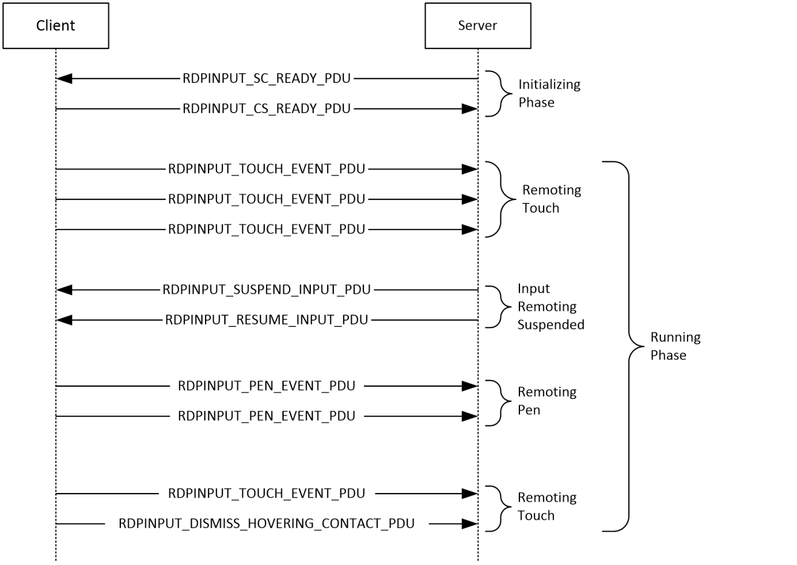
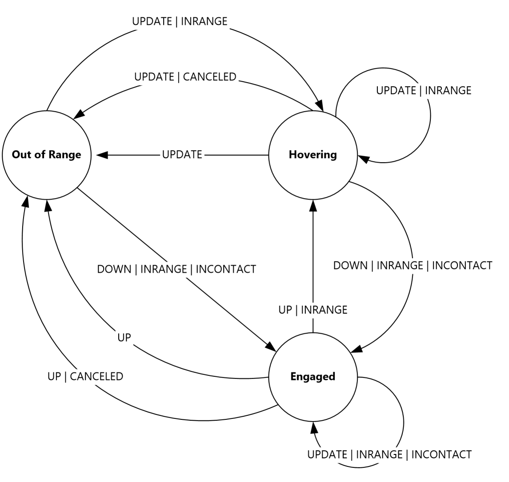
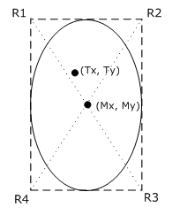
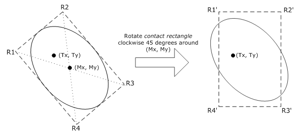
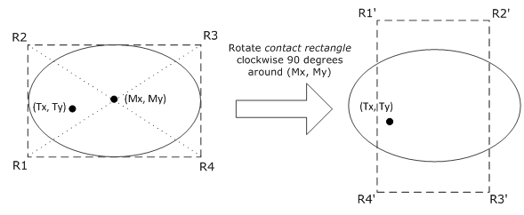
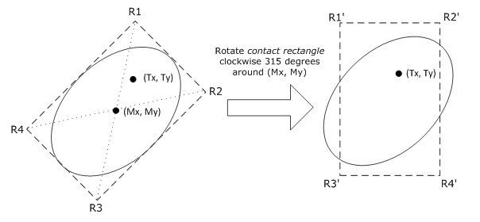

[MS-RDPEI]:

Remote Desktop Protocol: Input Virtual Channel Extension

Intellectual Property Rights Notice for Open Specifications Documentation

  Technical Documentation. Microsoft publishes Open Specifications documentation (“this

documentation”) for protocols, file formats, data portability, computer languages, and standards
support. Additionally, overview documents cover inter-protocol relationships and interactions.

  Copyrights. This documentation is covered by Microsoft copyrights. Regardless of any other

terms that are contained in the terms of use for the Microsoft website that hosts this
documentation, you can make copies of it in order to develop implementations of the technologies
that are described in this documentation and can distribute portions of it in your implementations
that use these technologies or in your documentation as necessary to properly document the
implementation. You can also distribute in your implementation, with or without modification, any
schemas, IDLs, or code samples that are included in the documentation. This permission also
applies to any documents that are referenced in the Open Specifications documentation.
  No Trade Secrets. Microsoft does not claim any trade secret rights in this documentation.
  Patents. Microsoft has patents that might cover your implementations of the technologies

described in the Open Specifications documentation. Neither this notice nor Microsoft's delivery of
this documentation grants any licenses under those patents or any other Microsoft patents.
However, a given Open Specifications document might be covered by the Microsoft Open
Specifications Promise or the Microsoft Community Promise. If you would prefer a written license,
or if the technologies described in this documentation are not covered by the Open Specifications
Promise or Community Promise, as applicable, patent licenses are available by contacting
iplg@microsoft.com.

  License Programs. To see all of the protocols in scope under a specific license program and the

associated patents, visit the Patent Map.

  Trademarks. The names of companies and products contained in this documentation might be
covered by trademarks or similar intellectual property rights. This notice does not grant any
licenses under those rights. For a list of Microsoft trademarks, visit
www.microsoft.com/trademarks.

  Fictitious Names. The example companies, organizations, products, domain names, email

addresses, logos, people, places, and events that are depicted in this documentation are fictitious.
No association with any real company, organization, product, domain name, email address, logo,
person, place, or event is intended or should be inferred.

Reservation of Rights. All other rights are reserved, and this notice does not grant any rights other
than as specifically described above, whether by implication, estoppel, or otherwise.

Tools. The Open Specifications documentation does not require the use of Microsoft programming
tools or programming environments in order for you to develop an implementation. If you have access
to Microsoft programming tools and environments, you are free to take advantage of them. Certain
Open Specifications documents are intended for use in conjunction with publicly available standards
specifications and network programming art and, as such, assume that the reader either is familiar
with the aforementioned material or has immediate access to it.

Support. For questions and support, please contact dochelp@microsoft.com.

[MS-RDPEI] - v20240423
Remote Desktop Protocol: Input Virtual Channel Extension
Copyright © 2024 Microsoft Corporation
Release: April 23, 2024

1 / 39

Revision Summary

Date

Revision
History

Revision
Class

Comments

12/16/2011  1.0

3/30/2012

1.0

7/12/2012

2.0

10/25/2012  3.0

1/31/2013

3.0

8/8/2013

3.1

11/14/2013  4.0

2/13/2014

4.0

New

None

Major

Major

None

Minor

Major

None

Released new document.

No changes to the meaning, language, or formatting of the
technical content.

Significantly changed the technical content.

Significantly changed the technical content.

No changes to the meaning, language, or formatting of the
technical content.

Clarified the meaning of the technical content.

Significantly changed the technical content.

No changes to the meaning, language, or formatting of the
technical content.

5/15/2014

4.0

None

No changes to the meaning, language, or formatting of the
technical content.

6/30/2015

5.0

Major

Significantly changed the technical content.

10/16/2015  5.0

7/14/2016

5.0

6/1/2017

5.0

None

None

None

No changes to the meaning, language, or formatting of the
technical content.

No changes to the meaning, language, or formatting of the
technical content.

No changes to the meaning, language, or formatting of the
technical content.

9/15/2017

6.0

Major

Significantly changed the technical content.

12/1/2017

6.0

9/12/2018

7.0

4/7/2021

8.0

6/25/2021

9.0

4/23/2024

10.0

None

Major

Major

Major

Major

No changes to the meaning, language, or formatting of the
technical content.

Significantly changed the technical content.

Significantly changed the technical content.

Significantly changed the technical content.

Significantly changed the technical content.

[MS-RDPEI] - v20240423
Remote Desktop Protocol: Input Virtual Channel Extension
Copyright © 2024 Microsoft Corporation
Release: April 23, 2024

2 / 39

Table of Contents

1.1
1.2

1.2.1
1.2.2

1  Introduction ............................................................................................................ 5
Glossary ........................................................................................................... 5
References ........................................................................................................ 5
Normative References ................................................................................... 5
Informative References ................................................................................. 5
Overview .......................................................................................................... 6
Relationship to Other Protocols ............................................................................ 7
Prerequisites/Preconditions ................................................................................. 7
Applicability Statement ....................................................................................... 7
Versioning and Capability Negotiation ................................................................... 7
Vendor-Extensible Fields ..................................................................................... 7
Standards Assignments ....................................................................................... 7

1.3
1.4
1.5
1.6
1.7
1.8
1.9

2.2.3

2.1
2.2

2.2.1
2.2.2

2.2.2.1
2.2.2.2
2.2.2.3
2.2.2.4
2.2.2.5
2.2.2.6

2  Messages ................................................................................................................. 8
Transport .......................................................................................................... 8
Message Syntax ................................................................................................. 8
Namespaces ................................................................................................ 8
Common Data Types ..................................................................................... 8
TWO_BYTE_UNSIGNED_INTEGER ............................................................. 8
TWO_BYTE_SIGNED_INTEGER.................................................................. 8
FOUR_BYTE_UNSIGNED_INTEGER ............................................................ 9
FOUR_BYTE_SIGNED_INTEGER .............................................................. 10
EIGHT_BYTE_UNSIGNED_INTEGER ......................................................... 11
RDPINPUT_HEADER ............................................................................... 12
Input Messages .......................................................................................... 13
RDPINPUT_SC_READY_PDU ................................................................... 13
RDPINPUT_CS_READY_PDU ................................................................... 14
RDPINPUT_TOUCH_EVENT_PDU .............................................................. 15
RDPINPUT_TOUCH_FRAME ............................................................... 16
RDPINPUT_TOUCH_CONTACT ...................................................... 16
RDPINPUT_SUSPEND_INPUT_PDU ........................................................... 19
RDPINPUT_RESUME_INPUT_PDU ............................................................ 20
RDPINPUT_DISMISS_HOVERING_TOUCH_CONTACT_PDU .......................... 20
RDPINPUT_PEN_EVENT_PDU .................................................................. 20
RDPINPUT_PEN_FRAME .................................................................... 21
RDPINPUT_PEN_CONTACT .......................................................... 21
2.2.3.7.1.1
Directory Service Schema Elements ................................................................... 24

2.2.3.4
2.2.3.5
2.2.3.6
2.2.3.7

2.2.3.1
2.2.3.2
2.2.3.3

2.2.3.3.1.1

2.2.3.3.1

2.2.3.7.1

2.3

3.1

3.1.1

3.1.1.1

3.1.2
3.1.3
3.1.4
3.1.5

3  Protocol Details ..................................................................................................... 25
Common Details .............................................................................................. 25
Abstract Data Model .................................................................................... 25
Touch Contact State Transitions .............................................................. 25
Timers ...................................................................................................... 26
Initialization ............................................................................................... 26
Higher-Layer Triggered Events ..................................................................... 26
Message Processing Events and Sequencing Rules .......................................... 26
Processing an Input Message .................................................................. 26
Timer Events .............................................................................................. 26
Other Local Events ...................................................................................... 26
Server Details .................................................................................................. 26
Abstract Data Model .................................................................................... 26
Timers ...................................................................................................... 26
Initialization ............................................................................................... 27
Higher-Layer Triggered Events ..................................................................... 27
Message Processing Events and Sequencing Rules .......................................... 27

3.2.1
3.2.2
3.2.3
3.2.4
3.2.5

3.1.6
3.1.7

3.1.5.1

3.2

[MS-RDPEI] - v20240423
Remote Desktop Protocol: Input Virtual Channel Extension
Copyright © 2024 Microsoft Corporation
Release: April 23, 2024

3 / 39

3.2.6
3.2.7

3.3.1

3.3

3.2.5.1
3.2.5.2
3.2.5.3
3.2.5.4
3.2.5.5
3.2.5.6

3.2.5.7

Sending an RDPINPUT_SC_READY_PDU Message ...................................... 27
Processing an RDPINPUT_CS_READY_PDU Message .................................. 27
Processing an RDPINPUT_TOUCH_EVENT_PDU Message ............................ 27
Sending an RDPINPUT_SUSPEND_INPUT_PDU message ............................. 27
Sending an RDPINPUT_RESUME_INPUT_PDU Message ............................... 28
Processing an RDPINPUT_DISMISS_HOVERING_TOUCH_CONTACT_PDU
Message .............................................................................................. 28
Processing an RDPINPUT_PEN_EVENT_PDU Message ................................. 28
Timer Events .............................................................................................. 28
Other Local Events ...................................................................................... 28
Client Details ................................................................................................... 28
Abstract Data Model .................................................................................... 28
Input Transmission Suspended ............................................................... 29
Pen Input Allowed ................................................................................. 29
Timers ...................................................................................................... 29
Initialization ............................................................................................... 29
Higher-Layer Triggered Events ..................................................................... 29
Message Processing Events and Sequencing Rules .......................................... 29
Processing an RDPINPUT_SC_READY_PDU message .................................. 29
Sending an RDPINPUT_CS_READY_PDU message ..................................... 29
Sending an RDPINPUT_TOUCH_EVENT_PDU message ................................ 30
Processing an RDPINPUT_SUSPEND_INPUT_PDU message ......................... 30
Processing an RDPINPUT_RESUME_INPUT_PDU message ........................... 30
Sending an RDPINPUT_DISMISS_HOVERING_TOUCH_CONTACT_PDU message
 .......................................................................................................... 30
Sending an RDPINPUT_PEN_EVENT_PDU message .................................... 30
Timer Events .............................................................................................. 31
Other Local Events ...................................................................................... 31

3.3.1.1
3.3.1.2

3.3.2
3.3.3
3.3.4
3.3.5

3.3.5.1
3.3.5.2
3.3.5.3
3.3.5.4
3.3.5.5
3.3.5.6

3.3.5.7

3.3.6
3.3.7

4.1

4  Protocol Examples ................................................................................................. 32
Touch Contact Geometry Examples .................................................................... 32
Touch Contact Oriented at 0 Degrees ............................................................ 32
Touch Contact Oriented at 45 Degrees .......................................................... 33
Touch Contact Oriented at 90 Degrees .......................................................... 33
Touch Contact Oriented at 315 Degrees ........................................................ 34

4.1.1
4.1.2
4.1.3
4.1.4

5  Security ................................................................................................................. 35
Security Considerations for Implementers ........................................................... 35
Index of Security Parameters ............................................................................ 35

5.1
5.2

6  Appendix A: Product Behavior ............................................................................... 36

7  Change Tracking .................................................................................................... 37

8  Index ..................................................................................................................... 38

[MS-RDPEI] - v20240423
Remote Desktop Protocol: Input Virtual Channel Extension
Copyright © 2024 Microsoft Corporation
Release: April 23, 2024

4 / 39

1  Introduction

The Remote Desktop Protocol: Input Virtual Channel Extension applies to the Remote Desktop
Protocol: Basic Connectivity and Graphics Remoting, as specified in [MS-RDPBCGR] sections 1 to 5.
The input protocol defined in section 2.2 is used to remote multitouch and pen input from a terminal
server client to a terminal server. The multitouch and pen input is generated at the client by a
physical or virtual digitizer, encoded, and then sent on the wire to the server. After this input is
received and decoded by the server, it is injected into the session associated with the remote user,
effectively remoting the multitouch and pen input generated at the client.

Sections 1.5, 1.8, 1.9, 2, and 3 of this specification are normative. All other sections and examples in
this specification are informative.

1.1  Glossary

This document uses the following terms:

ANSI character: An 8-bit Windows-1252 character set unit.

little-endian: Multiple-byte values that are byte-ordered with the least significant byte stored in

the memory location with the lowest address.

protocol data unit (PDU): Information that is delivered as a unit among peer entities of a
network and that can contain control information, address information, or data. For more
information on remote procedure call (RPC)-specific PDUs, see [C706] section 12.

terminal server: A computer on which terminal services is running.

MAY, SHOULD, MUST, SHOULD NOT, MUST NOT: These terms (in all caps) are used as defined
in [RFC2119]. All statements of optional behavior use either MAY, SHOULD, or SHOULD NOT.

1.2  References

Links to a document in the Microsoft Open Specifications library point to the correct section in the
most recently published version of the referenced document. However, because individual documents
in the library are not updated at the same time, the section numbers in the documents may not
match. You can confirm the correct section numbering by checking the Errata.

1.2.1  Normative References

We conduct frequent surveys of the normative references to assure their continued availability. If you
have any issue with finding a normative reference, please contact dochelp@microsoft.com. We will
assist you in finding the relevant information.

[MS-RDPBCGR] Microsoft Corporation, "Remote Desktop Protocol: Basic Connectivity and Graphics
Remoting".

[MS-RDPEDYC] Microsoft Corporation, "Remote Desktop Protocol: Dynamic Channel Virtual Channel
Extension".

[RFC2119] Bradner, S., "Key words for use in RFCs to Indicate Requirement Levels", BCP 14, RFC
2119, March 1997, https://www.rfc-editor.org/info/rfc2119

1.2.2  Informative References

None.

[MS-RDPEI] - v20240423
Remote Desktop Protocol: Input Virtual Channel Extension
Copyright © 2024 Microsoft Corporation
Release: April 23, 2024

5 / 39

<!-- Extracted images from page 6 -->

<!-- /Extracted images from page 6 -->

1.3  Overview

An example message flow encapsulating all of the Input Messages, described in section 2.2.3, and
protocol phases is presented in the following figure.

Figure 1: Messages exchanged by the input protocol endpoints

The input protocol is divided into two distinct phases:



Initializing Phase

  Running Phase

The Initializing Phase occurs at the start of the connection. During this phase, the server and client
exchange the RDPINPUT_SC_READY_PDU (section 2.2.3.1) and RDPINPUT_CS_READY_PDU (section
2.2.3.2) messages. The server initiates this exchange when the dynamic virtual channel (sections 1.4
and 2.1) over which the input messages will flow has been opened.

Once both endpoints are ready, the Running Phase is entered. During this phase, the client sends
touch or pen frames to the server encapsulated in the RDPINPUT_TOUCH_EVENT_PDU (section
2.2.3.3) or RDPINPUT_PEN_EVENT_PDU (section 2.2.3.7) message. The server decodes these frames
and injects them into the user's session.

During the Running Phase, the server can request that the client suspend the transmission of input
messages by sending the RDPINPUT_SUSPEND_INPUT_PDU (section 2.2.3.4) message to the client.
To request that the client resume the transmission of input messages, the server can send the
RDPINPUT_RESUME_INPUT_PDU (section 2.2.3.5) message to the client.

6 / 39

[MS-RDPEI] - v20240423
Remote Desktop Protocol: Input Virtual Channel Extension
Copyright © 2024 Microsoft Corporation
Release: April 23, 2024

To transition touch contacts in the "hovering" state to the "out of range" state (section 3.1.1.1), the
client can send the RDPINPUT_DISMISS_HOVERING_TOUCH_CONTACT_PDU (section 2.2.3.6)
message to the server. This message effectively allows individual contacts (in the hovering state) to
be transitioned to the out of range state without requiring the construction and transmission of a
touch frame from client to server. If the contact specified in the
RDPINPUT_DISMISS_HOVERING_TOUCH_CONTACT_PDU message does not exist on the server,
then the message is simply ignored.

1.4  Relationship to Other Protocols

The Remote Desktop Protocol: Input Virtual Channel Extension is embedded in a dynamic virtual
channel transport, as specified in [MS-RDPEDYC] sections 1 to 3.

1.5  Prerequisites/Preconditions

The Remote Desktop Protocol: Input Virtual Channel Extension operates only after the dynamic virtual
channel transport is fully established. If the dynamic virtual channel transport is terminated, the
Remote Desktop Protocol: Input Virtual Channel Extension is also terminated. The protocol is
terminated by closing the underlying virtual channel. For details about closing the dynamic virtual
channel, see [MS-RDPEDYC] section 3.2.5.2.

1.6  Applicability Statement

The Remote Desktop Protocol: Input Virtual Channel Extension is applicable in scenarios where the
transfer of multitouch or pen input frames (generated by a physical or virtual digitizer) is required
from a terminal server client to a terminal server.

1.7  Versioning and Capability Negotiation

None.

1.8  Vendor-Extensible Fields

None.

1.9  Standards Assignments

None.

[MS-RDPEI] - v20240423
Remote Desktop Protocol: Input Virtual Channel Extension
Copyright © 2024 Microsoft Corporation
Release: April 23, 2024

7 / 39

2  Messages

2.1  Transport

The Remote Desktop Protocol: Input Virtual Channel Extension is designed to operate over a dynamic
virtual channel, as specified in [MS-RDPEDYC] sections 1 to 3. The dynamic virtual channel name is
the null-terminated ANSI character string "Microsoft::Windows::RDS::Input". The usage of channel
names in the context of opening a dynamic virtual channel is specified in [MS-RDPEDYC] section
2.2.2.1. The "Microsoft::Windows::RDS::Input" dynamic virtual channel SHOULD NOT be opened by
the client if a touch digitizer is not present.

2.2  Message Syntax

The following sections specify the Remote Desktop Protocol: Input Virtual Channel Extension message
syntax. All multiple-byte fields within a message MUST be marshaled in little-endian byte order,
unless otherwise specified.

2.2.1  Namespaces

2.2.2  Common Data Types

2.2.2.1  TWO_BYTE_UNSIGNED_INTEGER

The TWO_BYTE_UNSIGNED_INTEGER structure is used to encode a value in the range 0x0000 to
0x7FFF by using a variable number of bytes. For example, 0x1A1B is encoded as { 0x9A, 0x1B }. The
most significant bit of the first byte encodes the number of bytes in the structure.

0  1  2  3  4  5  6  7  8  9

1
0  1  2  3  4  5  6  7  8  9

2
0  1  2  3  4  5  6  7  8  9

3
0  1

c

val1

val2 (optional)

c (1 bit):  A 1-bit unsigned integer field containing an encoded representation of the number of bytes

in this structure.

Value

Meaning

ONE_BYTE_VAL

0

Implies that the optional val2 field is not present. Hence, the structure is 1 byte in
size.

TWO_BYTE_VAL

Implies that the optional val2 field is present. Hence, the structure is 2 bytes in size.

1

val1 (7 bits):  A 7-bit unsigned integer field containing the most significant 7 bits of the value

represented by this structure.

val2 (1 byte, optional):  An 8-bit unsigned integer containing the least significant bits of the value

represented by this structure.

2.2.2.2  TWO_BYTE_SIGNED_INTEGER

The TWO_BYTE_SIGNED_INTEGER structure is used to encode a value in the range -0x3FFF to
0x3FFF by using a variable number of bytes. For example, -0x1A1B is encoded as { 0xDA, 0x1B },

8 / 39

[MS-RDPEI] - v20240423
Remote Desktop Protocol: Input Virtual Channel Extension
Copyright © 2024 Microsoft Corporation
Release: April 23, 2024

and -0x0002 is encoded as { 0x42 }. The most significant bits of the first byte encode the number of
bytes in the structure and the sign.

0  1  2  3  4  5  6  7  8  9

1
0  1  2  3  4  5  6  7  8  9

2
0  1  2  3  4  5  6  7  8  9

3
0  1

c  s

val1

val2 (optional)

c (1 bit):  A 1-bit unsigned integer field containing an encoded representation of the number of bytes

in this structure.

Value

Meaning

ONE_BYTE_VAL

0

Implies that the optional val2 field is not present. Hence, the structure is 1 byte in
size.

TWO_BYTE_VAL

Implies that the optional val2 field is present. Hence, the structure is 2 bytes in size.

1

s (1 bit):  A 1-bit unsigned integer field containing an encoded representation of whether the value is

positive or negative.

Value

Meaning

POSITIVE_VAL

Implies that the value represented by this structure is positive.

0

NEGATIVE_VAL

Implies that the value represented by this structure is negative.

1

val1 (6 bits):  A 6-bit unsigned integer field containing the most significant 6 bits of the value

represented by this structure.

val2 (1 byte, optional):  An 8-bit unsigned integer containing the least significant bits of the value

represented by this structure.

2.2.2.3  FOUR_BYTE_UNSIGNED_INTEGER

The FOUR_BYTE_UNSIGNED_INTEGER structure is used to encode a value in the range
0x00000000 to 0x3FFFFFFF by using a variable number of bytes. For example, 0x001A1B1C is
encoded as {0x9A, 0x1B, 0x1C}. The two most significant bits of the first byte encode the number of
bytes in the structure.

0  1  2  3  4  5  6  7  8  9

1
0  1  2  3  4  5  6  7  8  9

2
0  1  2  3  4  5  6  7  8  9

3
0  1

c

val1

val2 (optional)

val3 (optional)

val4 (optional)

c (2 bits):  A 2-bit unsigned integer field containing an encoded representation of the number of

bytes in this structure.

Value

Meaning

ONE_BYTE_VAL

0

Implies that the optional val2, val3, and val4 fields are not present. Hence, the
structure is 1 byte in size.

[MS-RDPEI] - v20240423
Remote Desktop Protocol: Input Virtual Channel Extension
Copyright © 2024 Microsoft Corporation
Release: April 23, 2024

9 / 39

Value

Meaning

TWO_BYTE_VAL

1

THREE_BYTE_VAL

2

FOUR_BYTE_VAL

3

Implies that the optional val2 field is present, while the optional val3 and val4 fields
are not present. Hence, the structure is 2 bytes in size.

Implies that the optional val2 and val3 fields are present, while the optional val4 field
is not present. Hence, the structure is 3 bytes in size.

Implies that the optional val2, val3, and val4 fields are all present. Hence, the
structure is 4 bytes in size.

val1 (6 bits):  A 6-bit unsigned integer field containing the most significant 6 bits of the value

represented by this structure.

val2 (1 byte, optional):  An 8-bit unsigned integer containing the second most significant bits of the

value represented by this structure.

val3 (1 byte, optional):  An 8-bit unsigned integer containing the third most significant bits of the

value represented by this structure.

val4 (1 byte, optional):  An 8-bit unsigned integer containing the least significant bits of the value

represented by this structure.

2.2.2.4  FOUR_BYTE_SIGNED_INTEGER

The FOUR_BYTE_SIGNED_INTEGER structure is used to encode a value in the range -0x1FFFFFFF
to 0x1FFFFFFF by using a variable number of bytes. For example, -0x001A1B1C is encoded as {0xBA,
0x1B, 0x1C}, and -0x00000002 is encoded as {0x22}. The three most significant bits of the first byte
encode the number of bytes in the structure and the sign.

0  1  2  3  4  5  6  7  8  9

1
0  1  2  3  4  5  6  7  8  9

2
0  1  2  3  4  5  6  7  8  9

3
0  1

c

s

val1

val2 (optional)

val3 (optional)

val4 (optional)

c (2 bits):  A 2-bit unsigned integer field containing an encoded representation of the number of

bytes in this structure.

Value

Meaning

ONE_BYTE_VAL

0

TWO_BYTE_VAL

1

THREE_BYTE_VAL

2

FOUR_BYTE_VAL

3

Implies that the optional val2, val3, and val4 fields are not present. Hence, the
structure is 1 byte in size.

Implies that the optional val2 field is present, while the optional val3 and val4 fields
are not present. Hence, the structure is 2 bytes in size.

Implies that the optional val2 and val3 fields are present, while the optional val4
field is not present. Hence, the structure is 3 bytes in size.

Implies that the optional val2, val3, and val4 fields are all present. Hence, the
structure is 4 bytes in size.

s (1 bit):  A 1-bit unsigned integer field containing an encoded representation of whether the value is

positive or negative.

[MS-RDPEI] - v20240423
Remote Desktop Protocol: Input Virtual Channel Extension
Copyright © 2024 Microsoft Corporation
Release: April 23, 2024

10 / 39

Value

Meaning

POSITIVE_VAL

Implies that the value represented by this structure is positive.

0

NEGATIVE_VAL

Implies that the value represented by this structure is negative.

1

val1 (5 bits):  A 5-bit unsigned integer field containing the most significant 5 bits of the value

represented by this structure.

val2 (1 byte, optional):  An 8-bit unsigned integer containing the second most significant bits of the

value represented by this structure.

val3 (1 byte, optional):  An 8-bit unsigned integer containing the third most significant bits of the

value represented by this structure.

val4 (1 byte, optional):  An 8-bit unsigned integer containing the least significant bits of the value

represented by this structure.

2.2.2.5  EIGHT_BYTE_UNSIGNED_INTEGER

The EIGHT_BYTE_UNSIGNED_INTEGER structure is used to encode a value in the range
0x0000000000000000 to 0x1FFFFFFFFFFFFFFF by using a variable number of bytes. For example,
0x001A1B1C1D1E1F2A is encoded as {0xDA, 0x1B, 0x1C, 0x1D, 0x1E, 0x1F, 0x2A}. The three most
significant bits of the first byte encode the number of bytes in the structure.

0  1  2  3  4  5  6  7  8  9

1
0  1  2  3  4  5  6  7  8  9

2
0  1  2  3  4  5  6  7  8  9

3
0  1

c

val1

val2 (optional)

val3 (optional)

val4 (optional)

val5 (optional)

val6 (optional)

val7 (optional)

val8 (optional)

c (3 bits): A 3-bit unsigned integer field containing an encoded representation of the number of bytes

in this structure.

Value

Meaning

ONE_BYTE_VAL

0

TWO_BYTE_VAL

1

Implies that the optional val2, val3, val4, val5, val6, val7 and val8 fields are not
present. Hence, the structure is 1 byte in size.

Implies that the optional val2 field is present, while the optional val3, val4, val5,
val6, val7 and val8 fields are not present. Hence, the structure is 2 bytes in size.

THREE_BYTE_VAL

2

Implies that the optional val2 and val3 fields are present, while the optional val4,
val5, val6, val7 and val8 fields are not present. Hence, the structure is 3 bytes in
size.

FOUR_BYTE_VAL

3

Implies that the optional val2, val3, and val4 fields are all present, while the
optional val5, val6, val7 and val8 fields are not present. Hence, the structure is 4
bytes in size.

FIVE_BYTE_VAL

4

Implies that the optional val2, val3, val4 and val5 fields are all present, while the
optional val6, val7 and val8 fields are not present. Hence, the structure is 5 bytes in
size.

SIX_BYTE_VAL

Implies that the optional val2, val3, val4, val5 and val6 fields are all present, while

11 / 39

[MS-RDPEI] - v20240423
Remote Desktop Protocol: Input Virtual Channel Extension
Copyright © 2024 Microsoft Corporation
Release: April 23, 2024

Value

5

SEVEN_BYTE_VAL

6

EIGHT_BYTE_VAL

7

Meaning

the optional val7 and val8 fields are not present. Hence, the structure is 6 bytes in
size.

Implies that the optional val2, val3, val4, val5, val6 and val7 fields are all present,
while the optional val8 field is not present. Hence, the structure is 7 bytes in size.

Implies that the optional val2, val3, val4, val5, val6, val7 and val8 fields are all
present. Hence, the structure is 8 bytes in size.

val1 (5 bits): A 5-bit unsigned integer field containing the most significant 5 bits of the value

represented by this structure.

val2 (1 byte, optional): An 8-bit unsigned integer containing the second most significant bits of the

value represented by this structure.

val3 (1 byte, optional): An 8-bit unsigned integer containing the third most significant bits of the

value represented by this structure.

val4 (1 byte, optional): An 8-bit unsigned integer containing the fourth most significant bits of the

value represented by this structure.

val5 (1 byte, optional): An 8-bit unsigned integer containing the fifth most significant bits of the

value represented by this structure.

val6 (1 byte, optional): An 8-bit unsigned integer containing the sixth most significant bits of the

value represented by this structure.

val7 (1 byte, optional): An 8-bit unsigned integer containing the seventh most significant bits of the

value represented by this structure.

val8 (1 byte, optional): An 8-bit unsigned integer containing the least significant bits of the value

represented by this structure.

2.2.2.6  RDPINPUT_HEADER

The RDPINPUT_HEADER structure is included in all input event PDUs and is used to identify the
input event type and to specify the length of the PDU.

0  1  2  3  4  5  6  7  8  9

1
0  1  2  3  4  5  6  7  8  9

2
0  1  2  3  4  5  6  7  8  9

3
0  1

eventId

...

pduLength

eventId (2 bytes):  A 16-bit unsigned integer that identifies the type of the input event PDU.

Value

EVENTID_SC_READY

0x0001

EVENTID_CS_READY

0x0002

Meaning

RDPINPUT_SC_READY_PDU (section 2.2.3.1).

RDPINPUT_CS_READY_PDU (section 2.2.3.2).

[MS-RDPEI] - v20240423
Remote Desktop Protocol: Input Virtual Channel Extension
Copyright © 2024 Microsoft Corporation
Release: April 23, 2024

12 / 39

Value

EVENTID_TOUCH

0x0003

Meaning

RDPINPUT_TOUCH_EVENT_PDU (section 2.2.3.3).

EVENTID_SUSPEND_INPUT

RDPINPUT_SUSPEND_INPUT_PDU (section 2.2.3.4).

0x0004

EVENTID_RESUME_INPUT

RDPINPUT_RESUME_INPUT_PDU (section 2.2.3.5).

0x0005

EVENTID_DISMISS_HOVERING_TOUCH_CONTACT

0x0006

EVENTID_PEN

0x0008

RDPINPUT_DISMISS_HOVERING_TOUCH_CONTACT_P
DU (section 2.2.3.6).

RDPINPUT_PEN_EVENT_PDU (section 2.2.3.7).

pduLength (4 bytes):  A 32-bit unsigned integer that specifies the length of the input event PDU in

bytes. This value MUST include the length of the RDPINPUT_HEADER (6 bytes).

2.2.3  Input Messages

2.2.3.1  RDPINPUT_SC_READY_PDU

The RDPINPUT_SC_READY_PDU message is sent by the server endpoint and is used to indicate
readiness to commence with input remoting transactions.

0  1  2  3  4  5  6  7  8  9

1
0  1  2  3  4  5  6  7  8  9

2
0  1  2  3  4  5  6  7  8  9

3
0  1

header

protocolVersion

supportedFeatures (optional)

...

...

...

header (6 bytes): An RDPINPUT_HEADER (section 2.2.2.6) structure. The eventId field MUST be set

to EVENTID_SC_READY (0x0001).

protocolVersion (4 bytes): A 32-bit unsigned integer that specifies the input protocol version

supported by the server.

Value

Meaning

RDPINPUT_PROTOCOL_V100

0x00010000

Version 1.0.0 of the RDP input remoting protocol. Servers advertising this
version only support the remoting of multitouch frames.

RDPINPUT_PROTOCOL_V101

0x00010001

Version 1.0.1 of the RDP input remoting protocol. Servers advertising this
version only support the remoting of multitouch frames.

RDPINPUT_PROTOCOL_V200

0x00020000

Version 2.0.0 of the RDP input remoting protocol. Servers advertising this
version support the remoting of both multitouch and pen frames.

[MS-RDPEI] - v20240423
Remote Desktop Protocol: Input Virtual Channel Extension
Copyright © 2024 Microsoft Corporation
Release: April 23, 2024

13 / 39

Value

Meaning

RDPINPUT_PROTOCOL_V300

0x00030000

Version 3.0.0 of the RDP input remoting protocol. Servers advertising this
version support specifying granular protocol features in the optional
supportedFeatures field.

supportedFeatures (4 bytes, optional): An optional 32-bit unsigned integer that specifies granular

protocol features supported by the server.

Value

Meaning

SC_READY_MULTIPEN_INJECTION_SUPPORTED

0x00000001

The simultaneous injection of input from up to four pen
devices is supported.

This field SHOULD be present if the protocolVersion field is set to RPDINPUT_PROTOCOL_V300
(0x00030000).

2.2.3.2  RDPINPUT_CS_READY_PDU

The RDPINPUT_CS_READY_PDU message is sent by the client endpoint and is used to indicate
readiness to commence with input remoting transactions.

0  1  2  3  4  5  6  7  8  9

1
0  1  2  3  4  5  6  7  8  9

2
0  1  2  3  4  5  6  7  8  9

3
0  1

...

...

...

header

flags

protocolVersion

maxTouchContacts

header (6 bytes): An RDPINPUT_HEADER (section 2.2.2.6) structure. The eventId field MUST be set

to EVENTID_CS_READY (0x0002).

flags (4 bytes): A 32-bit unsigned integer that specifies touch initialization flags.

Flag

Meaning

CS_READY_FLAGS_SHOW_TOUCH_VISUALS

0x00000001

Touch gesture and contact visuals SHOULD be
rendered by the server in the remote session.

CS_READY_FLAGS_DISABLE_TIMESTAMP_INJECTION

0x00000002

The client does not support touch frame timestamp
remoting. The server MUST ignore any values
specified in the frameOffset field of the
RDPINPUT_TOUCH_FRAME (section 2.2.3.3.1)
structure and the encodeTime field of the
RDPINPUT_TOUCH_EVENT_PDU (section 2.2.3.3)
message.

This flag SHOULD NOT be sent to a server that only
supports version 1.0.0 of the input remoting
protocol. The server-supported version is specified
in the protocolVersion field of the
RDPINPUT_SC_READY_PDU (section 2.2.3.1)
message.

14 / 39

[MS-RDPEI] - v20240423
Remote Desktop Protocol: Input Virtual Channel Extension
Copyright © 2024 Microsoft Corporation
Release: April 23, 2024

Flag

Meaning

CS_READY_FLAGS_ENABLE_MULTIPEN_INJECTION

0x00000004

The server should configure the pen injection
subsystem so that the simultaneous injection of
input from up to four pen devices is possible.

protocolVersion (4 bytes): A 32-bit unsigned integer that specifies the input protocol version

supported by the client.

Value

Meaning

RDPINPUT_PROTOCOL_V100

0x00010000

Version 1.0.0 of the RDP input remoting protocol. Clients advertising this
version only support the remoting of multitouch frames.

RDPINPUT_PROTOCOL_V101

0x00010001

Version 1.0.1 of the RDP input remoting protocol. Clients advertising this
version only support the remoting of multitouch frames.

RDPINPUT_PROTOCOL_V200

0x00020000

Version 2.0.0 of the RDP input remoting protocol. Clients advertising this
version support the remoting of both multitouch and pen frames.

RDPINPUT_PROTOCOL_V300

0x00030000

Version 3.0.0 of the RDP input remoting protocol. Clients advertising this
version support reading protocol features advertised in the
supportedFeatures field of the RDPINPUT_SC_READY_PDU (section
2.2.3.1) structure.

maxTouchContacts (2 bytes): A 16-bit unsigned integer that specifies the maximum number of

simultaneous touch contacts supported by the client.

2.2.3.3  RDPINPUT_TOUCH_EVENT_PDU

The RDPINPUT_TOUCH_EVENT_PDU message is sent by the client endpoint and is used to remote
a collection of touch frames.

0  1  2  3  4  5  6  7  8  9

1
0  1  2  3  4  5  6  7  8  9

2
0  1  2  3  4  5  6  7  8  9

3
0  1

header

...

encodeTime (variable)

...

frameCount (variable)

...

frames (variable)

...

header (6 bytes): An RDPINPUT_HEADER (section 2.2.2.6) structure. The eventId field MUST be set

to EVENTID_TOUCH (0x0003).

[MS-RDPEI] - v20240423
Remote Desktop Protocol: Input Virtual Channel Extension
Copyright © 2024 Microsoft Corporation
Release: April 23, 2024

15 / 39

encodeTime (variable): A FOUR_BYTE_UNSIGNED_INTEGER (section 2.2.2.3) structure that
specifies the time that has elapsed (in milliseconds) from when the oldest touch frame was
generated to when it was encoded for transmission by the client.

frameCount (variable): A TWO_BYTE_UNSIGNED_INTEGER (section 2.2.2.1) structure that specifies

the number of RDPINPUT_TOUCH_FRAME (section 2.2.3.3.1) structures in the frames field.

frames (variable): An array of RDPINPUT_TOUCH_FRAME structures ordered from the oldest in

time to the most recent in time. The number of structures in this array is specified by the
frameCount field.

2.2.3.3.1 RDPINPUT_TOUCH_FRAME

The RDPINPUT_TOUCH_FRAME structure encapsulates a collection of RDPINPUT_TOUCH_CONTACT
(section 2.2.3.3.1.1) structures that are part of the same logical touch frame.

0  1  2  3  4  5  6  7  8  9

1
0  1  2  3  4  5  6  7  8  9

2
0  1  2  3  4  5  6  7  8  9

3
0  1

contactCount (variable)

...

frameOffset (variable)

...

contacts (variable)

...

contactCount (variable):  A TWO_BYTE_UNSIGNED_INTEGER (section 2.2.2.1) structure that
specifies the number of RDPINPUT_TOUCH_CONTACT structures in the contacts field.

frameOffset (variable):   An EIGHT_BYTE_UNSIGNED_INTEGER (section 2.2.2.5) structure that

specifies the time offset from the previous frame (in microseconds). If this is the first frame being
transmitted then this field MUST be set to zero.

contacts (variable):  An array of RDPINPUT_TOUCH_CONTACT structures. The number of

structures in this array is specified by the contactCount field.

2.2.3.3.1.1  RDPINPUT_TOUCH_CONTACT

The RDPINPUT_TOUCH_CONTACT structure describes the characteristics of a contact that is
encapsulated in an RDPINPUT_TOUCH_FRAME (section 2.2.3.3.1) structure.

0  1  2  3  4  5  6  7  8  9

1
0  1  2  3  4  5  6  7  8  9

2
0  1  2  3  4  5  6  7  8  9

3
0  1

contactId

fieldsPresent (variable)

...

x (variable)

[MS-RDPEI] - v20240423
Remote Desktop Protocol: Input Virtual Channel Extension
Copyright © 2024 Microsoft Corporation
Release: April 23, 2024

16 / 39

...

y (variable)

...

contactFlags (variable)

...

contactRectLeft (variable)

...

contactRectTop (variable)

...

contactRectRight (variable)

...

contactRectBottom (variable)

...

orientation (variable)

...

pressure (variable)

...

contactId (1 byte):  An 8-bit unsigned integer that specifies the ID assigned to the contact.

fieldsPresent (variable):  A TWO_BYTE_UNSIGNED_INTEGER (section 2.2.2.1) structure that

specifies the presence of the optional contactRectLeft, contactRectTop, contactRectRight,
contactRectBottom, orientation, and pressure fields.

Flag

Meaning

TOUCH_CONTACT_CONTACTRECT_PRESENT

0x0001

The optional contactRectLeft, contactRectTop,
contactRectRight, and contactRectBottom fields are all
present.

TOUCH_CONTACT_ORIENTATION_PRESENT

The optional orientation field is present.

0x0002

TOUCH_CONTACT_PRESSURE_PRESENT

The optional pressure field is present.

17 / 39

[MS-RDPEI] - v20240423
Remote Desktop Protocol: Input Virtual Channel Extension
Copyright © 2024 Microsoft Corporation
Release: April 23, 2024

Flag

0x0004

Meaning

x (variable):  A FOUR_BYTE_SIGNED_INTEGER (section 2.2.2.4) structure that specifies the X-

coordinate (relative to the virtual-desktop origin) of the contact.

y (variable):  A FOUR_BYTE_SIGNED_INTEGER structure that specifies the Y-coordinate (relative

to the virtual-desktop origin) of the contact.

contactFlags (variable):  A FOUR_BYTE_UNSIGNED_INTEGER (section 2.2.2.3) structure that

specifies the current state of the contact.

Flag

Meaning

CONTACT_FLAG_DOWN

The contact transitioned to the engaged state (made contact).

0x0001

CONTACT_FLAG_UPDATE

Contact update.

0x0002

CONTACT_FLAG_UP

The contact transitioned from the engaged state (broke contact).

0x0004

CONTACT_FLAG_INRANGE

The contact has not departed and is still in range.

0x0008

CONTACT_FLAG_INCONTACT

The contact is in the engaged state.

0x0010

CONTACT_FLAG_CANCELED

The contact has been canceled.

0x0020

This field MUST contain one of the following combinations of the contact state flags and MUST NOT
contain any other combination:

  UP

  UP | CANCELED

  UPDATE

  UPDATE | CANCELED

  DOWN | INRANGE | INCONTACT

  UPDATE | INRANGE | INCONTACT

  UP | INRANGE

  UPDATE | INRANGE

The figure "Lifetime of a touch or pen contact" in section 3.1.1.1 describes the states through
which a contact involved in a touch transaction can transition.

contactRectLeft (variable):  An optional TWO_BYTE_SIGNED_INTEGER (section 2.2.2.2) structure
that specifies the leftmost bound (relative to the contact point specified by the x and y fields) of
the exclusive rectangle describing the geometry of the contact. This rectangle MUST be rotated
counter-clockwise by the angle specified in the orientation field to yield the actual contact

[MS-RDPEI] - v20240423
Remote Desktop Protocol: Input Virtual Channel Extension
Copyright © 2024 Microsoft Corporation
Release: April 23, 2024

18 / 39

geometry. The presence of the contactRectLeft field is indicated by the
TOUCH_CONTACT_CONTACTRECT_PRESENT (0x0001) flag in the fieldsPresent field.

contactRectTop (variable):  An optional TWO_BYTE_SIGNED_INTEGER structure that specifies
the upper bound (relative to the contact point specified by the x and y fields) of the exclusive
rectangle describing the geometry of the contact. This rectangle MUST be rotated counter-
clockwise by the angle specified in the orientation field to yield the actual contact geometry. The
presence of the contactRectTop field is indicated by the
TOUCH_CONTACT_CONTACTRECT_PRESENT (0x0001) flag in the fieldsPresent field.

contactRectRight (variable):  An optional TWO_BYTE_SIGNED_INTEGER structure that specifies
the rightmost bound (relative to the contact point specified by the x and y fields) of the exclusive
rectangle describing the geometry of the contact. This rectangle MUST be rotated counter-
clockwise by the angle specified in the orientation field to yield the actual contact geometry. The
presence of the contactRectRight field is indicated by the
TOUCH_CONTACT_CONTACTRECT_PRESENT (0x0001) flag in the fieldsPresent field.

contactRectBottom (variable):  An optional TWO_BYTE_SIGNED_INTEGER structure that

specifies the lower bound (relative to the contact point specified by the x and y fields) of the
exclusive rectangle describing the geometry of the contact. This rectangle MUST be rotated
counter-clockwise by the angle specified in the orientation field to yield the actual contact
geometry. The presence of the contactRectBottom field is indicated by the
TOUCH_CONTACT_CONTACTRECT_PRESENT (0x0001) flag in the fieldsPresent field.

orientation (variable):  An optional FOUR_BYTE_UNSIGNED_INTEGER structure that specifies

the angle through which the contact rectangle (specified in the contactRectLeft,
contactRectTop, contactRectRight and contactRectBottom fields) MUST be rotated to yield
the actual contact geometry. This value MUST be in the range 0x00000000 to 0x00000167 (359),
inclusive, where 0x00000000 indicates a touch contact aligned with the y-axis and pointing from
bottom to top; increasing values indicate degrees of rotation in a counter-clockwise direction. The
presence of the orientation field is indicated by the TOUCH_CONTACT_ORIENTATION_PRESENT
(0x0002) flag in the fieldsPresent field. If the orientation field is not present the angle of
rotation MUST be assumed to be zero degrees.

pressure (variable):  An optional FOUR_BYTE_UNSIGNED_INTEGER structure that specifies the

contact pressure. This value MUST be normalized in the range 0x00000000 to 0x00000400
(1024), inclusive. The presence of this field is indicated by the
TOUCH_CONTACT_PRESSURE_PRESENT (0x0004) flag in the fieldsPresent field.

2.2.3.4  RDPINPUT_SUSPEND_INPUT_PDU

The RDPINPUT_SUSPEND_INPUT_PDU message is sent by the server endpoint and is used to
instruct the client to suspend the transmission of the RDPINPUT_TOUCH_EVENT_PDU (section 2.2.3.3)
message.

0  1  2  3  4  5  6  7  8  9

1
0  1  2  3  4  5  6  7  8  9

2
0  1  2  3  4  5  6  7  8  9

3
0  1

header

...

header (6 bytes):  An RDPINPUT_HEADER (section 2.2.2.6) structure. The eventId field MUST be

set to EVENTID_SUSPEND_INPUT (0x0004).

[MS-RDPEI] - v20240423
Remote Desktop Protocol: Input Virtual Channel Extension
Copyright © 2024 Microsoft Corporation
Release: April 23, 2024

19 / 39

2.2.3.5  RDPINPUT_RESUME_INPUT_PDU

The RDPINPUT_RESUME_INPUT_PDU message is sent by the server endpoint and is used to
instruct the client to resume the transmission of the RDPINPUT_TOUCH_EVENT_PDU (section 2.2.3.3)
message.

0  1  2  3  4  5  6  7  8  9

1
0  1  2  3  4  5  6  7  8  9

2
0  1  2  3  4  5  6  7  8  9

3
0  1

header

...

header (6 bytes):  An RDPINPUT_HEADER (section 2.2.2.6) structure. The eventId field MUST be

set to EVENTID_RESUME_INPUT (0x0005).

2.2.3.6  RDPINPUT_DISMISS_HOVERING_TOUCH_CONTACT_PDU

The RDPINPUT_DISMISS_HOVERING_TOUCH_CONTACT_PDU message is sent by the client
endpoint to instruct the server to transition a contact in the "hovering" state to the "out of range"
state (section 3.1.1.1).

0  1  2  3  4  5  6  7  8  9

1
0  1  2  3  4  5  6  7  8  9

2
0  1  2  3  4  5  6  7  8  9

3
0  1

header

...

contactId

header (6 bytes):  An RDPINPUT_HEADER (section 2.2.2.6) structure. The eventId field MUST be

set to EVENTID_DISMISS_HOVERING_TOUCH_CONTACT (0x0006).

contactId (1 byte):  An 8-bit unsigned integer that specifies the ID assigned to the contact. This

value MUST be in the range 0x00 to 0xFF (inclusive).

2.2.3.7  RDPINPUT_PEN_EVENT_PDU

The RDPINPUT_PEN_EVENT_PDU message is sent by the client endpoint and is used to remote a
collection of pen frames.

0  1  2  3  4  5  6  7  8  9

1
0  1  2  3  4  5  6  7  8  9

2
0  1  2  3  4  5  6  7  8  9

3
0  1

header

...

encodeTime (variable)

...

frameCount (variable)

...

[MS-RDPEI] - v20240423
Remote Desktop Protocol: Input Virtual Channel Extension
Copyright © 2024 Microsoft Corporation
Release: April 23, 2024

20 / 39

frames (variable)

...

header (6 bytes): An RDPINPUT_HEADER (section 2.2.2.6) structure. The eventId field MUST be set

to EVENTID_PEN (0x0008).

encodeTime (variable): A FOUR_BYTE_UNSIGNED_INTEGER (section 2.2.2.3) structure that

specifies the time that has elapsed (in milliseconds) from when the oldest pen frame was
generated to when it was encoded for transmission by the client.

frameCount (variable): A TWO_BYTE_UNSIGNED_INTEGER (section 2.2.2.1) structure that specifies

the number of RDPINPUT_PEN_FRAME (section 2.2.3.7.1) structures in the frames field.

frames (variable): An array of RDPINPUT_PEN_FRAME structures ordered from the oldest in time to
the most recent in time. The number of structures in this array is specified by the frameCount
field.

2.2.3.7.1 RDPINPUT_PEN_FRAME

The RDPINPUT_PEN_FRAME structure encapsulates a collection of RDPINPUT_PEN_CONTACT
(section 2.2.3.7.1.1) structures that are part of the same logical pen frame.

0  1  2  3  4  5  6  7  8  9

1
0  1  2  3  4  5  6  7  8  9

2
0  1  2  3  4  5  6  7  8  9

3
0  1

contactCount (variable)

...

frameOffset (variable)

...

contacts (variable)

...

contactCount (variable): A TWO_BYTE_UNSIGNED_INTEGER (section 2.2.2.1) structure that
specifies the number of RDPINPUT_PEN_CONTACT structures in the contacts field.

frameOffset (variable): An EIGHT_BYTE_UNSIGNED_INTEGER (section 2.2.2.5) structure that

specifies the time offset from the previous frame (in microseconds). If this is the first frame being
transmitted, then this field MUST be set to zero.

contacts (variable): An array of RDPINPUT_PEN_CONTACT structures. The number of structures

in this array is specified by the contactCount field.

2.2.3.7.1.1  RDPINPUT_PEN_CONTACT

The RDPINPUT_PEN_CONTACT structure describes the characteristics of a contact that is
encapsulated in an RDPINPUT_PEN_FRAME (section 2.2.3.7.1) structure.

[MS-RDPEI] - v20240423
Remote Desktop Protocol: Input Virtual Channel Extension
Copyright © 2024 Microsoft Corporation
Release: April 23, 2024

21 / 39

0  1  2  3  4  5  6  7  8  9

1
0  1  2  3  4  5  6  7  8  9

2
0  1  2  3  4  5  6  7  8  9

3
0  1

deviceId

fieldsPresent (variable)

...

x (variable)

...

y (variable)

...

contactFlags (variable)

...

penFlags (variable)

...

pressure (variable)

...

rotation (variable)

...

tiltX (variable)

...

tiltY (variable)

...

deviceId (1 byte): An 8-bit unsigned integer that specifies the ID assigned to the pen device. If the
simultaneous injection of pen input was not negotiated using the RDPINPUT_SC_READY_PDU
(section 2.2.3.1) and RDPINPUT_CS_READY_PDU (section 2.2.3.2) structures, then this ID MUST
be set to zero.

fieldsPresent (variable): A TWO_BYTE_UNSIGNED_INTEGER (section 2.2.2.1) structure that

specifies the presence of the optional penFlags, pressure, rotation, tiltX, and tiltY fields.

[MS-RDPEI] - v20240423
Remote Desktop Protocol: Input Virtual Channel Extension
Copyright © 2024 Microsoft Corporation
Release: April 23, 2024

22 / 39

Flag

Meaning

PEN_CONTACT_PENFLAGS_PRESENT

The optional penFlags field is present.

0x0001

PEN_CONTACT_PRESSURE_PRESENT

The optional pressure field is present.

0x0002

PEN_CONTACT_ROTATION_PRESENT

The optional rotation field is present.

0x0004

PEN_CONTACT_TILTX_PRESENT

The optional tiltX field is present.

0x0008

PEN_CONTACT_TILTY_PRESENT

The optional tiltY field is present.

0x0010

x (variable):  A FOUR_BYTE_SIGNED_INTEGER (section 2.2.2.4) structure that specifies the x-

coordinate (relative to the virtual-desktop origin) of the contact.

y (variable):  A FOUR_BYTE_SIGNED_INTEGER structure that specifies the y-coordinate (relative to

the virtual-desktop origin) of the contact.

contactFlags (variable):  A FOUR_BYTE_UNSIGNED_INTEGER (section 2.2.2.3) structure that

specifies the current state of the contact.

Flag

Meaning

CONTACT_FLAG_DOWN

The contact transitioned to the engaged state (made contact).

0x0001

CONTACT_FLAG_UPDATE

Contact update.

0x0002

CONTACT_FLAG_UP

The contact transitioned from the engaged state (broke contact).

0x0004

CONTACT_FLAG_INRANGE

The contact has not departed and is still in range.

0x0008

CONTACT_FLAG_INCONTACT

The contact is in the engaged state.

0x0010

CONTACT_FLAG_CANCELED

The contact has been canceled.

0x0020

This field MUST contain one of the following combinations of the contact state flags and MUST NOT
contain any other combination:

  UP

  UP | CANCELED

  UPDATE

  UPDATE | CANCELED

  DOWN | INRANGE | INCONTACT

[MS-RDPEI] - v20240423
Remote Desktop Protocol: Input Virtual Channel Extension
Copyright © 2024 Microsoft Corporation
Release: April 23, 2024

23 / 39

  UPDATE | INRANGE | INCONTACT

  UP | INRANGE

  UPDATE | INRANGE

The figure "Lifetime of a touch or pen contact" in section 3.1.1.1 describes the states through
which a contact involved in a pen transaction can transition.

penFlags (variable): A FOUR_BYTE_UNSIGNED_INTEGER structure that specifies the current

state of the pen.

Flag

Meaning

PEN_FLAG_BARREL_PRESSED

Indicates that the barrel button is in the pressed state.

0x0001

PEN_FLAG_ERASER_PRESSED

Indicates that the eraser button is in the pressed state.

0x0002

PEN_FLAG_INVERTED

Indicates that the pen is inverted.

0x0004

The presence of this field is indicated by the PEN_CONTACT_PENFLAGS_PRESENT (0x0001) flag in
the fieldsPresent field.

pressure (variable):  An optional FOUR_BYTE_UNSIGNED_INTEGER structure that specifies the

pressure applied to the pen. This value MUST be normalized in the range 0x00000000 to
0x00000400 (1024), inclusive. The presence of this field is indicated by the
PEN_CONTACT_PRESSURE_PRESENT (0x0002) flag in the fieldsPresent field.

rotation (variable):  An optional TWO_BYTE_UNSIGNED_INTEGER structure that specifies the

clockwise rotation (or twist) of the pen. This value MUST be in the range 0x00000000 to
0x00000167 (359), inclusive. The presence of this field is indicated by the
PEN_CONTACT_ROTATION_PRESENT (0x0004) flag in the fieldsPresent field.

tiltX (variable):  An optional TWO_BYTE_SIGNED_INTEGER structure that specifies the angle of

tilt of the pen along the x-axis. This value MUST be in the range -0x0000005A (-90) to 0x000005A
(90), inclusive: a positive value indicates a tilt to the right. The presence of this field is indicated
by the PEN_CONTACT_TILTX_PRESENT (0x0008) flag in the fieldsPresent field.

tiltY (variable):  An optional TWO_BYTE_SIGNED_INTEGER structure that specifies the angle of

tilt of the pen along the y-axis. This value MUST be in the range -0x0000005A (-90) to 0x000005A
(90), inclusive: a positive value indicates a tilt toward the user. The presence of this field is
indicated by the PEN_CONTACT_TILTY_PRESENT (0x0010) flag in the fieldsPresent field.

2.3  Directory Service Schema Elements

None.

[MS-RDPEI] - v20240423
Remote Desktop Protocol: Input Virtual Channel Extension
Copyright © 2024 Microsoft Corporation
Release: April 23, 2024

24 / 39

<!-- Extracted images from page 25 -->

<!-- /Extracted images from page 25 -->

3  Protocol Details

3.1  Common Details

3.1.1  Abstract Data Model

3.1.1.1  Touch Contact State Transitions

The following finite state machine diagram describes the states through which a contact involved in a
touch or pen transaction can transition during its lifetime.

Figure 2: Lifetime of a touch or pen contact

A contact transitions through three main states:

  Out of Range

  Hovering

[MS-RDPEI] - v20240423
Remote Desktop Protocol: Input Virtual Channel Extension
Copyright © 2024 Microsoft Corporation
Release: April 23, 2024

25 / 39



Engaged

When a contact is in the "hovering" or "engaged" state, it is referred to as being "active". "Hovering"
contacts are in range of the digitizer, while "engaged" contacts are in range of the digitizer and in
contact with the digitizer surface. The Remote Desktop Protocol: Input Virtual Channel Extension
remotes only active contacts and contacts that are transitioning to the "out of range" state; see
section 2.2.3.3.1.1 for an enumeration of valid state flags combinations.

When transitioning from the "engaged" state to the "hovering" state, or from the "engaged" state to
the "out of range" state, the contact position cannot change; it is only allowed to change after the
transition has taken place.

3.1.2  Timers

None.

3.1.3  Initialization

None.

3.1.4  Higher-Layer Triggered Events

 None.

3.1.5  Message Processing Events and Sequencing Rules

3.1.5.1  Processing an Input Message

 All input messages are prefaced by the RDPINPUT_HEADER (section 2.2.2.6) structure.

When an input message is processed, the eventId field in the header MUST first be examined to
determine if the message is within the subset of expected messages. If the message is not expected,
it SHOULD be ignored.

If the message is in the correct sequence, the pduLength field MUST be examined to make sure that
it is consistent with the amount of data read from the "Microsoft::Windows::RDS::Input" dynamic
virtual channel (section 2.1). If this is not the case, the message SHOULD be ignored.

3.1.6  Timer Events

None.

3.1.7  Other Local Events

 None.

3.2  Server Details

3.2.1  Abstract Data Model

None.

[MS-RDPEI] - v20240423
Remote Desktop Protocol: Input Virtual Channel Extension
Copyright © 2024 Microsoft Corporation
Release: April 23, 2024

26 / 39

3.2.2  Timers

None.

3.2.3  Initialization

The server MUST send the RDPINPUT_SC_READY_PDU (section 2.2.3.1) message to the client, as
specified in section 3.2.5.1, to initiate the process of remoting touch input frames.

3.2.4  Higher-Layer Triggered Events

None.

3.2.5  Message Processing Events and Sequencing Rules

3.2.5.1  Sending an RDPINPUT_SC_READY_PDU Message

The structure and fields of the RDPINPUT_SC_READY_PDU message are specified in section
2.2.3.1.

If the server does not support touch injection, then it MUST NOT send this PDU to the client. The
protocolVersion field SHOULD be set to at least RDPINPUT_PROTOCOL_V200 (0x00020000) if the
server supports the injection of pen input using the RDPINPUT_PEN_EVENT_PDU (section 2.2.3.7)
message.

3.2.5.2  Processing an RDPINPUT_CS_READY_PDU Message

The structure and fields of the RDPINPUT_CS_READY_PDU message are specified in section
2.2.3.2.

The header field MUST be processed as specified in section 3.1.5.1. If the message is valid, the
server SHOULD use the value specified by the client in the maxTouchContacts field to initialize the
touch injection subsystem.

3.2.5.3  Processing an RDPINPUT_TOUCH_EVENT_PDU Message

The structure and fields of the RDPINPUT_TOUCH_EVENT_PDU message are specified in section
2.2.3.3.

The header field MUST be processed as specified in section 3.1.5.1. If the message is valid, the
server MUST iterate over each RDPINPUT_TOUCH_FRAME (section 2.2.3.3.1) structure encapsulated
in the RDPINPUT_TOUCH_EVENT_PDU message, decode each RDPINPUT_TOUCH_CONTACT
(section 2.2.3.3.1.1) structure in the frame, and then inject the frame contacts into the user session.

If any of the contacts does not conform to the finite state machine described in section 3.1.1.1, the
touch transaction SHOULD be canceled in the session, and all subsequent frames associated with the
transaction SHOULD be ignored until a new touch transaction is initiated at the client.

3.2.5.4  Sending an RDPINPUT_SUSPEND_INPUT_PDU message

The structure and fields of the RDPINPUT_SUSPEND_INPUT_PDU message are specified in section
2.2.3.4.

To request that the client resume the transmission of input messages, the server MUST send the
RDPINPUT_RESUME_INPUT_PDU (section 2.2.3.5) message to the client, as specified in section
3.2.5.5.

27 / 39

[MS-RDPEI] - v20240423
Remote Desktop Protocol: Input Virtual Channel Extension
Copyright © 2024 Microsoft Corporation
Release: April 23, 2024

3.2.5.5  Sending an RDPINPUT_RESUME_INPUT_PDU Message

The structure and fields of the RDPINPUT_RESUME_INPUT_PDU message are specified in section
2.2.3.5.

The RDPINPUT_RESUME_INPUT_PDU (section 2.2.3.5) message SHOULD be sent only if the
transmission of input messages was suspended by using the RDPINPUT_SUSPEND_INPUT_PDU
(section 2.2.3.4) message, as specified in section 3.2.5.4.

3.2.5.6  Processing an RDPINPUT_DISMISS_HOVERING_TOUCH_CONTACT_PDU

Message

The structure and fields of the RDPINPUT_DISMISS_HOVERING_TOUCH_CONTACT_PDU
message are specified in section 2.2.3.6.

The header field MUST be processed as specified in section 3.1.5.1. If the message is valid, the
server MUST transition the contact specified by the contactId field to the "out of range" state if it is
in the hovering state. If no contact with the specified contact ID exists, or if the contact is in the
engaged state, then no action MUST be taken.

3.2.5.7  Processing an RDPINPUT_PEN_EVENT_PDU Message

The structure and fields of the RDPINPUT_PEN_EVENT_PDU message are specified in section
2.2.3.7.

The header field MUST be processed as specified in section 3.1.5.1. If the message is valid, the
server MUST iterate over each RDPINPUT_PEN_FRAME (section 2.2.3.7.1) structure encapsulated in
the RDPINPUT_PEN_EVENT_PDU message, decode each RDPINPUT_PEN_CONTACT (section
2.2.3.7.1.1) structure in the frame, and then inject the frame contacts into the user session.

If any of the contacts does not conform to the finite state machine described in section 3.1.1.1, the
pen transaction SHOULD be canceled in the session, and all subsequent frames associated with the
transaction SHOULD be ignored until a new pen transaction is initiated at the client.

3.2.6  Timer Events

None.

3.2.7  Other Local Events

None.

3.3  Client Details

3.3.1  Abstract Data Model

This section describes a conceptual model of possible data organization that an implementation
maintains to participate in this protocol. The described organization is provided to facilitate the
explanation of how the protocol behaves. This document does not mandate that implementations
adhere to this model as long as their external behavior is consistent with that described in this
document.

Note  It is possible to implement the following conceptual data by using a variety of techniques as
long as the implementation produces external behavior that is consistent with that described in this
document.

[MS-RDPEI] - v20240423
Remote Desktop Protocol: Input Virtual Channel Extension
Copyright © 2024 Microsoft Corporation
Release: April 23, 2024

28 / 39

3.3.1.1  Input Transmission Suspended

The Input Transmission Suspended abstract data model (ADM) element contains a Boolean value
that indicates whether the capture, encoding, and transmission of touch and pen frames on the client
have been suspended. This value is toggled by the receipt of the RDPINPUT_SUSPEND_INPUT_PDU
(section 2.2.3.4) message, as specified in section 3.3.5.4, and the RDPINPUT_RESUME_INPUT_PDU
(section 2.2.3.5) message, as specified in section 3.3.5.5.

3.3.1.2  Pen Input Allowed

The Pen Input Allowed abstract data model (ADM) element contains a Boolean value that indicates
whether the server supports the injection of pen input using the RDPINPUT_PEN_EVENT_PDU (section
2.2.3.7) message. This value is set by the client when processing the RDPINPUT_SC_READY_PDU
(section 2.2.3.1) message, as specified in section 3.3.5.1.

3.3.2  Timers

None.

3.3.3  Initialization

The client SHOULD NOT open the "Microsoft::Windows::RDS::Input" virtual channel transport (section
2.1) if a physical or virtual touch digitizer is not attached to the system.

3.3.4  Higher-Layer Triggered Events

None.

3.3.5  Message Processing Events and Sequencing Rules

3.3.5.1  Processing an RDPINPUT_SC_READY_PDU message

The structure and fields of the RDPINPUT_SC_READY_PDU message are specified in section
2.2.3.1.

The header field MUST be processed as specified in section 3.1.5.1. If the message is valid, the client
SHOULD respond by sending the RDPINPUT_CS_READY_PDU (section 2.2.3.2) message to the server,
as specified in section 3.3.5.2. If the protocolVersion field of the RDPINPUT_SC_READY_PDU
message is set to at least RDPINPUT_PROTOCOL_V200 (0x00020000), then the client SHOULD set the
Pen Input Allowed (section 3.3.1.2) ADM element to TRUE.

After sending the RDPINPUT_CS_READY_PDU message to the server, the client SHOULD start
remoting multitouch and pen input frames by sending the RDPINPUT_TOUCH_EVENT_PDU (section
2.2.3.3) and RDPINPUT_PEN_EVENT_PDU (section 2.2.3.7) messages to the server, as specified in
sections 3.3.5.3 and 3.3.5.7, respectively.

3.3.5.2  Sending an RDPINPUT_CS_READY_PDU message

The structure and fields of the RDPINPUT_CS_READY_PDU message are specified in section
2.2.3.2.

The client MUST populate the maxTouchContacts field to indicate the maximum number of touch
contacts that can be active at any given point in time. This value is the sum of the maximum active
contacts supported by each touch digitizer attached to the client.

[MS-RDPEI] - v20240423
Remote Desktop Protocol: Input Virtual Channel Extension
Copyright © 2024 Microsoft Corporation
Release: April 23, 2024

29 / 39

3.3.5.3  Sending an RDPINPUT_TOUCH_EVENT_PDU message

The structure and fields of the RDPINPUT_TOUCH_EVENT_PDU message are specified in section
2.2.3.3.

Each RDPINPUT_TOUCH_EVENT_PDU (section 2.2.3.3) message contains an array of
RDPINPUT_TOUCH_FRAME (section 2.2.3.3.1) structures, and each frame contains an array of
RDPINPUT_TOUCH_CONTACT (section 2.2.3.3.1.1) structures. Every RDPINPUT_TOUCH_CONTACT
structure represents the state and attributes of an active contact; see section 3.1.1.1 for a description
of permissible touch contact state transitions.

Every touch frame received by the client from a touch digitizer MUST be encoded as an
RDPINPUT_TOUCH_FRAME structure, the contacts being encoded as
RDPINPUT_TOUCH_CONTACT structures. The number of encoded frames depends on the rate at
which the digitizer generates touch frames. Once the touch frames have been encoded, they MUST be
encapsulated in an RDPINPUT_TOUCH_EVENT_PDU message.

3.3.5.4  Processing an RDPINPUT_SUSPEND_INPUT_PDU message

The structure and fields of the RDPINPUT_SUSPEND_INPUT_PDU message are specified in section
2.2.3.4.

The header field MUST be processed as specified in section 3.1.5.1. If the message is valid, the client
MUST set the Input Transmission Suspended (section 3.3.1.1) ADM element to TRUE and MUST
suspend the transmission of input messages to the server. If the Input Transmission Suspended
ADM element is already set to TRUE, the client SHOULD ignore this message.

3.3.5.5  Processing an RDPINPUT_RESUME_INPUT_PDU message

The structure and fields of the RDPINPUT_RESUME_INPUT_PDU message are specified in section
2.2.3.5.

The header field MUST be processed as specified in section 3.1.5.1. If the message is valid, the client
SHOULD set the Input Transmission Suspended (section 3.3.1.1) ADM element to FALSE and
MUST resume the transmission of input messages to the server. If the Input Transmission
Suspended ADM element is already set to FALSE, the client SHOULD ignore this message.

3.3.5.6  Sending an RDPINPUT_DISMISS_HOVERING_TOUCH_CONTACT_PDU

message

The structure and fields of the RDPINPUT_DISMISS_HOVERING_TOUCH_CONTACT_PDU
message are specified in section 2.2.3.6.

The contactId field MUST be initialized with the ID of a valid hovering contact that has to be
transitioned to the "out of range" state.

3.3.5.7  Sending an RDPINPUT_PEN_EVENT_PDU message

The structure and fields of the RDPINPUT_PEN_EVENT_PDU message are specified in section
2.2.3.7.

Each RDPINPUT_PEN_EVENT_PDU (section 2.2.3.7) message contains an array of
RDPINPUT_PEN_FRAME (section 2.2.3.7.1) structures, and each frame contains an array of
RDPINPUT_PEN_CONTACT (section 2.2.3.7.1.1) structures. Every RDPINPUT_PEN_CONTACT
structure represents the state and attributes of an active contact; see section 3.1.1.1 for a description
of permissible pen contact state transitions.

[MS-RDPEI] - v20240423
Remote Desktop Protocol: Input Virtual Channel Extension
Copyright © 2024 Microsoft Corporation
Release: April 23, 2024

30 / 39

Every pen frame received by the client from a pen digitizer MUST be encoded as an
RDPINPUT_PEN_FRAME structure, the contacts being encoded as RDPINPUT_PEN_CONTACT
structures. The number of encoded frames depends on the rate at which the digitizer generates pen
frames. Once the pen frames have been encoded, they MUST be encapsulated in an
RDPINPUT_PEN_EVENT_PDU message.

3.3.6  Timer Events

None.

3.3.7  Other Local Events

None.

[MS-RDPEI] - v20240423
Remote Desktop Protocol: Input Virtual Channel Extension
Copyright © 2024 Microsoft Corporation
Release: April 23, 2024

31 / 39

<!-- Extracted images from page 32 -->

<!-- /Extracted images from page 32 -->

4  Protocol Examples

4.1  Touch Contact Geometry Examples

The examples in sections 4.1.1 through to 4.1.4 present illustrations of touch contacts orientated at 0,
45, 90 and 315 degrees respectively. Based on the orientation of the contact, the contact geometry is
rotated so that the height of the contact rectangle is parallel to the y-axis and the width parallel to the
x-axis.

4.1.1  Touch Contact Oriented at 0 Degrees

In this case, the x, y, contact rectangle, and orientation of the RDPINPUT_TOUCH_CONTACT (section
2.2.3.3.1.1) structure are populated by using the following values:

x = Tx

y = Ty

contact rectangle = (R1, R2, R3, R4)

orientation = 0 degrees

[MS-RDPEI] - v20240423
Remote Desktop Protocol: Input Virtual Channel Extension
Copyright © 2024 Microsoft Corporation
Release: April 23, 2024

32 / 39

<!-- Extracted images from page 33 -->

<!-- /Extracted images from page 33 -->

4.1.2  Touch Contact Oriented at 45 Degrees

In this case, the x, y, contact rectangle, and orientation fields of the RDPINPUT_TOUCH_CONTACT
(section 2.2.3.3.1.1) structure are populated by using the following values:

x = Tx

y = Ty

contact rectangle = (R1', R2', R3', R4')

orientation = 45 degrees

4.1.3  Touch Contact Oriented at 90 Degrees

In this case, the x, y, contact rectangle, and orientation fields of the RDPINPUT_TOUCH_CONTACT
(section 2.2.3.3.1.1) structure are populated by using the following values:

x = Tx

y = Ty

contact rectangle = (R1', R2', R3', R4')

orientation = 90 degrees

[MS-RDPEI] - v20240423
Remote Desktop Protocol: Input Virtual Channel Extension
Copyright © 2024 Microsoft Corporation
Release: April 23, 2024

33 / 39

<!-- Extracted images from page 34 -->

<!-- /Extracted images from page 34 -->

4.1.4  Touch Contact Oriented at 315 Degrees

In this case, the x, y, contact rectangle, and orientation fields of the RDPINPUT_TOUCH_CONTACT
(section 2.2.3.3.1.1)  structure are populated by using the following values:

x = Tx

y = Ty

contactRect = (R1', R2', R3', R4')

orientation = 315 degrees

[MS-RDPEI] - v20240423
Remote Desktop Protocol: Input Virtual Channel Extension
Copyright © 2024 Microsoft Corporation
Release: April 23, 2024

34 / 39

5  Security

5.1  Security Considerations for Implementers

None.

5.2  Index of Security Parameters

None.

[MS-RDPEI] - v20240423
Remote Desktop Protocol: Input Virtual Channel Extension
Copyright © 2024 Microsoft Corporation
Release: April 23, 2024

35 / 39

6  Appendix A: Product Behavior

The information in this specification is applicable to the following Microsoft products or supplemental
software. References to product versions include updates to those products.

  Windows 8 operating system

  Windows Server 2012 operating system

  Windows 8.1 operating system

  Windows Server 2012 R2 operating system

  Windows 10 operating system

  Windows Server 2016 operating system

  Windows Server 2019 operating system

  Windows Server 2022 operating system

  Windows 11 operating system

  Windows Server 2025 operating system

Exceptions, if any, are noted in this section. If an update version, service pack or Knowledge Base
(KB) number appears with a product name, the behavior changed in that update. The new behavior
also applies to subsequent updates unless otherwise specified. If a product edition appears with the
product version, behavior is different in that product edition.

Unless otherwise specified, any statement of optional behavior in this specification that is prescribed
using the terms "SHOULD" or "SHOULD NOT" implies product behavior in accordance with the
SHOULD or SHOULD NOT prescription. Unless otherwise specified, the term "MAY" implies that the
product does not follow the prescription.

[MS-RDPEI] - v20240423
Remote Desktop Protocol: Input Virtual Channel Extension
Copyright © 2024 Microsoft Corporation
Release: April 23, 2024

36 / 39

7  Change Tracking

This section identifies changes that were made to this document since the last release. Changes are
classified as Major, Minor, or None.

The revision class Major means that the technical content in the document was significantly revised.
Major changes affect protocol interoperability or implementation. Examples of major changes are:

  A document revision that incorporates changes to interoperability requirements.
  A document revision that captures changes to protocol functionality.

The revision class Minor means that the meaning of the technical content was clarified. Minor changes
do not affect protocol interoperability or implementation. Examples of minor changes are updates to
clarify ambiguity at the sentence, paragraph, or table level.

The revision class None means that no new technical changes were introduced. Minor editorial and
formatting changes may have been made, but the relevant technical content is identical to the last
released version.

The changes made to this document are listed in the following table. For more information, please
contact dochelp@microsoft.com.

Section

Description

6 Appendix A: Product
Behavior

Added Windows Server 2025 to the list of applicable
products.

Revision
class

Major

[MS-RDPEI] - v20240423
Remote Desktop Protocol: Input Virtual Channel Extension
Copyright © 2024 Microsoft Corporation
Release: April 23, 2024

37 / 39

8  Index
A

Abstract data model
   client 28
      touch contact state transitions 25
      touch remoting suspended 29
   server 26
      touch contact state transitions 25
Applicability 7

C

Capability negotiation 7
Change tracking 37
Client
   abstract data model 28
      touch contact state transitions 25
      touch remoting suspended 29
   higher-layer triggered events (section 3.1.4 26,

section 3.3.4 29)

   initialization (section 3.1.3 26, section 3.3.3 29)
   message processing events
      processing input message 26
      processing RDPINPUT_READY_PDU message 29
      processing RDPINPUT_RESUME_PDU message 30
      processing RDPINPUT_SUSPEND_PDU message

30

      sending RDPINPUT_READY_PDU message 29
      sending RDPINPUT_TOUCH_PDU message

(section 3.3.5.1 29, section 3.3.5.3 30)

   other local events (section 3.1.7 26, section 3.3.7

31)

   sequencing rules
      processing input message 26
      processing RDPINPUT_READY_PDU message 29
      processing RDPINPUT_RESUME_PDU message 30
      processing RDPINPUT_SUSPEND_PDU message

30

      sending RDPINPUT_READY_PDU message 29
      sending RDPINPUT_TOUCH_PDU message

(section 3.3.5.1 29, section 3.3.5.3 30)

   timer events (section 3.1.6 26, section 3.3.6 31)
   timers (section 3.1.2 26, section 3.3.2 29)

D

Data model - abstract
   client 28
      touch contact state transitions 25
      touch remoting suspended 29
   server 26
      touch contact state transitions 25
Directory service schema elements 24

E

G

Glossary 5

H

Higher-layer triggered events
   client (section 3.1.4 26, section 3.3.4 29)
   server (section 3.1.4 26, section 3.2.4 27)

I

Implementer - security considerations 35
Index of security parameters 35
Informative references 5
Initialization
   client (section 3.1.3 26, section 3.3.3 29)
   server (section 3.1.3 26, section 3.2.3 27)
Introduction 5

M

Message processing events
   client
      processing input message 26
      processing RDPINPUT_READY_PDU message 29
      processing RDPINPUT_RESUME_PDU message 30
      processing RDPINPUT_SUSPEND_PDU message

30

      sending RDPINPUT_READY_PDU message 29
      sending RDPINPUT_TOUCH_PDU message

(section 3.3.5.1 29, section 3.3.5.3 30)

   server
      processing input message 26
      processing RDPINPUT_READY_PDU message 27
      processing RDPINPUT_TOUCH_PDU message
(section 3.2.5.1 27, section 3.2.5.3 27)
      sending RDPINPUT_READY_PDU message 27
      sending RDPINPUT_RESUME_PDU message 28
      sending RDPINPUT_SUSPEND_PDU message 27
Messages
   syntax 8
   transport 8

N

Normative references 5

O

Other local events
   client (section 3.1.7 26, section 3.3.7 31)
   server (section 3.1.7 26, section 3.2.7 28)
Overview (synopsis) (section 1.3 6, section 1.6 7)

Elements - directory service schema 24

P

F

Fields - vendor-extensible 7

Parameters - security index 35
Preconditions 7
Prerequisites 7

38 / 39

[MS-RDPEI] - v20240423
Remote Desktop Protocol: Input Virtual Channel Extension
Copyright © 2024 Microsoft Corporation
Release: April 23, 2024

   client (section 3.1.6 26, section 3.3.6 31)
   server (section 3.1.6 26, section 3.2.6 28)
Timers
   client (section 3.1.2 26, section 3.3.2 29)
   server (section 3.1.2 26, section 3.2.2 26)
Tracking changes 37
Transport 8
Triggered events - higher-layer
   client (section 3.1.4 26, section 3.3.4 29)
   server (section 3.1.4 26, section 3.2.4 27)

V

Vendor-extensible fields 7
Versioning 7

Product behavior 36

R

References 5
   informative 5
   normative 5
Relationship to other protocols 7

S

Schema elements - directory service 24
Security
   implementer considerations 35
   parameter index 35
Sequencing rules
   client
      processing input message 26
      processing RDPINPUT_READY_PDU message 29
      processing RDPINPUT_RESUME_PDU message 30
      processing RDPINPUT_SUSPEND_PDU message

30

      sending RDPINPUT_READY_PDU message 29
      sending RDPINPUT_TOUCH_PDU message

(section 3.3.5.1 29, section 3.3.5.3 30)

   server
      processing input message 26
      processing RDPINPUT_READY_PDU message 27
      processing RDPINPUT_TOUCH_PDU message
(section 3.2.5.1 27, section 3.2.5.3 27)
      sending RDPINPUT_READY_PDU message 27
      sending RDPINPUT_RESUME_PDU message 28
      sending RDPINPUT_SUSPEND_PDU message 27
Server
   abstract data model 26
      touch contact state transitions 25
   higher-layer triggered events (section 3.1.4 26,

section 3.2.4 27)

   initialization (section 3.1.3 26, section 3.2.3 27)
   message processing events
      processing input message 26
      processing RDPINPUT_READY_PDU message 27
      processing RDPINPUT_TOUCH_PDU message
(section 3.2.5.1 27, section 3.2.5.3 27)
      sending RDPINPUT_READY_PDU message 27
      sending RDPINPUT_RESUME_PDU message 28
      sending RDPINPUT_SUSPEND_PDU message 27
   other local events (section 3.1.7 26, section 3.2.7

28)

   sequencing rules
      processing input message 26
      processing RDPINPUT_READY_PDU message 27
      processing RDPINPUT_TOUCH_PDU message
(section 3.2.5.1 27, section 3.2.5.3 27)
      sending RDPINPUT_READY_PDU message 27
      sending RDPINPUT_RESUME_PDU message 28
      sending RDPINPUT_SUSPEND_PDU message 27
   timer events (section 3.1.6 26, section 3.2.6 28)
   timers (section 3.1.2 26, section 3.2.2 26)
Standards assignments 7
Syntax 8

T

Timer events

[MS-RDPEI] - v20240423
Remote Desktop Protocol: Input Virtual Channel Extension
Copyright © 2024 Microsoft Corporation
Release: April 23, 2024

39 / 39

