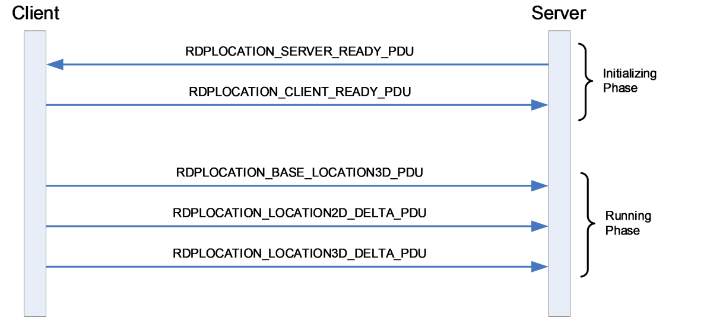

[MS-RDPEL]:

Remote Desktop Protocol: Location Virtual Channel
Extension

Intellectual Property Rights Notice for Open Specifications Documentation

  Technical Documentation. Microsoft publishes Open Specifications documentation (“this

documentation”) for protocols, file formats, data portability, computer languages, and standards
support. Additionally, overview documents cover inter-protocol relationships and interactions.

  Copyrights. This documentation is covered by Microsoft copyrights. Regardless of any other

terms that are contained in the terms of use for the Microsoft website that hosts this
documentation, you can make copies of it in order to develop implementations of the technologies
that are described in this documentation and can distribute portions of it in your implementations
that use these technologies or in your documentation as necessary to properly document the
implementation. You can also distribute in your implementation, with or without modification, any
schemas, IDLs, or code samples that are included in the documentation. This permission also
applies to any documents that are referenced in the Open Specifications documentation.
  No Trade Secrets. Microsoft does not claim any trade secret rights in this documentation.
  Patents. Microsoft has patents that might cover your implementations of the technologies

described in the Open Specifications documentation. Neither this notice nor Microsoft's delivery of
this documentation grants any licenses under those patents or any other Microsoft patents.
However, a given Open Specifications document might be covered by the Microsoft Open
Specifications Promise or the Microsoft Community Promise. If you would prefer a written license,
or if the technologies described in this documentation are not covered by the Open Specifications
Promise or Community Promise, as applicable, patent licenses are available by contacting
iplg@microsoft.com.

  License Programs. To see all of the protocols in scope under a specific license program and the

associated patents, visit the Patent Map.

  Trademarks. The names of companies and products contained in this documentation might be
covered by trademarks or similar intellectual property rights. This notice does not grant any
licenses under those rights. For a list of Microsoft trademarks, visit
www.microsoft.com/trademarks.

  Fictitious Names. The example companies, organizations, products, domain names, email

addresses, logos, people, places, and events that are depicted in this documentation are fictitious.
No association with any real company, organization, product, domain name, email address, logo,
person, place, or event is intended or should be inferred.

Reservation of Rights. All other rights are reserved, and this notice does not grant any rights other
than as specifically described above, whether by implication, estoppel, or otherwise.

Tools. The Open Specifications documentation does not require the use of Microsoft programming
tools or programming environments in order for you to develop an implementation. If you have access
to Microsoft programming tools and environments, you are free to take advantage of them. Certain
Open Specifications documents are intended for use in conjunction with publicly available standards
specifications and network programming art and, as such, assume that the reader either is familiar
with the aforementioned material or has immediate access to it.

Support. For questions and support, please contact dochelp@microsoft.com.

[MS-RDPEL] - v20240423
Remote Desktop Protocol: Location Virtual Channel Extension
Copyright © 2024 Microsoft Corporation
Release: April 23, 2024

1 / 26

Revision Summary

Date

Revision
History

Revision
Class

Comments

9/20/2023  1.0

9/20/2023  1.0

New

None

Released new document.

No changes to the meaning, language, or formatting of the
technical content.

4/23/2024  2.0

Major

Significantly changed the technical content.

[MS-RDPEL] - v20240423
Remote Desktop Protocol: Location Virtual Channel Extension
Copyright © 2024 Microsoft Corporation
Release: April 23, 2024

2 / 26

## Table of Contents

- [1 Introduction](#1-introduction)
  - [1.1 Glossary](#11-glossary)
  - [1.2 References](#12-references)
    - [1.2.1 Normative References](#121-normative-references)
    - [1.2.2 Informative References](#122-informative-references)
  - [1.3 Overview](#13-overview)
  - [1.4 Relationship to Other Protocols](#14-relationship-to-other-protocols)
  - [1.5 Prerequisites/Preconditions](#15-prerequisitespreconditions)
  - [1.6 Applicability Statement](#16-applicability-statement)
- [2 Messages](#2-messages)
  - [2.1 Transport](#21-transport)
  - [2.2 Message Syntax](#22-message-syntax)
    - [2.2.1 Common Data Types](#221-common-data-types)
      - [2.2.1.1 FOUR_BYTE_SIGNED_INTEGER](#2211-fourbytesignedinteger)
      - [2.2.1.2 FOUR_BYTE_FLOAT](#2212-fourbytefloat)
      - [2.2.1.3 RDPLOCATION_HEADER](#2213-rdplocationheader)
    - [2.2.2 Location Messages](#222-location-messages)
      - [2.2.2.1 RDPLOCATION_SERVER_READY_PDU](#2221-rdplocationserverreadypdu)
      - [2.2.2.2 RDPLOCATION_CLIENT_READY_PDU](#2222-rdplocationclientreadypdu)
      - [2.2.2.3 RDPLOCATION_BASE_LOCATION3D_PDU](#2223-rdplocationbaselocation3dpdu)
      - [2.2.2.4 RDPLOCATION_LOCATION2D_DELTA_PDU](#2224-rdplocationlocation2ddeltapdu)
      - [2.2.2.5 RDPLOCATION_LOCATION3D_DELTA_PDU](#2225-rdplocationlocation3ddeltapdu)
- [3 Protocol Details](#3-protocol-details)
  - [3.1 Common Details](#31-common-details)
    - [3.1.1 Abstract Data Model](#311-abstract-data-model)
      - [3.1.1.1 Latitude](#3111-latitude)
      - [3.1.1.2 Longitude](#3112-longitude)
      - [3.1.1.3 Altitude](#3113-altitude)
      - [3.1.1.4 Speed](#3114-speed)
      - [3.1.1.5 Heading](#3115-heading)
    - [3.1.2 Timers](#312-timers)
    - [3.1.3 Initialization](#313-initialization)
    - [3.1.4 Higher-Layer Triggered Events](#314-higher-layer-triggered-events)
    - [3.1.5 Message Processing Events and Sequencing Rules](#315-message-processing-events-and-sequencing-rules)
      - [3.1.5.1 Processing a Location Message](#3151-processing-a-location-message)
    - [3.1.6 Timer Events](#316-timer-events)
    - [3.1.7 Other Local Events](#317-other-local-events)
  - [3.2 Server Details](#32-server-details)
    - [3.2.1 Abstract Data Model](#321-abstract-data-model)
    - [3.2.2 Timers](#322-timers)
    - [3.2.3 Initialization](#323-initialization)
    - [3.2.4 Higher-Layer Triggered Events](#324-higher-layer-triggered-events)
    - [3.2.5 Message Processing Events and Sequencing Rules](#325-message-processing-events-and-sequencing-rules)
      - [3.2.5.1 Sending an RDPLOCATION_SERVER_READY_PDU Message](#3251-sending-an-rdplocationserverreadypdu-message)
      - [3.2.5.2 Processing an RDPLOCATION_CLIENT_READY_PDU Message](#3252-processing-an-rdplocationclientreadypdu-message)
      - [3.2.5.3 Processing an RDPLOCATION_BASE_LOCATION3D_PDU Message](#3253-processing-an-rdplocationbaselocation3dpdu-message)
      - [3.2.5.4 Processing an RDPLOCATION_LOCATION2D_DELTA_PDU Message](#3254-processing-an-rdplocationlocation2ddeltapdu-message)
      - [3.2.5.5 Processing an RDPLOCATION_LOCATION3D_DELTA_PDU Message](#3255-processing-an-rdplocationlocation3ddeltapdu-message)
    - [3.2.6 Timer Events](#326-timer-events)
    - [3.2.7 Other Local Events](#327-other-local-events)
  - [3.3 Client Details](#33-client-details)
    - [3.3.1 Abstract Data Model](#331-abstract-data-model)
    - [3.3.2 Timers](#332-timers)
    - [3.3.3 Initialization](#333-initialization)
    - [3.3.4 Higher-Layer Triggered Events](#334-higher-layer-triggered-events)
    - [3.3.5 Message Processing Events and Sequencing Rules](#335-message-processing-events-and-sequencing-rules)
      - [3.3.5.1 Processing an RDPLOCATION_SERVER_READY_PDU Message](#3351-processing-an-rdplocationserverreadypdu-message)
      - [3.3.5.2 Sending an RDPLOCATION_CLIENT_READY_PDU Message](#3352-sending-an-rdplocationclientreadypdu-message)
      - [3.3.5.3 Sending an RDPLOCATION_BASE_LOCATION3D_PDU Message](#3353-sending-an-rdplocationbaselocation3dpdu-message)
      - [3.3.5.4 Sending an RDPLOCATION_LOCATION2D_DELTA_PDU Message](#3354-sending-an-rdplocationlocation2ddeltapdu-message)
      - [3.3.5.5 Sending an RDPLOCATION_LOCATION3D_DELTA_PDU Message](#3355-sending-an-rdplocationlocation3ddeltapdu-message)
    - [3.3.6 Timer Events](#336-timer-events)
    - [3.3.7 Other Local Events](#337-other-local-events)
- [4 Protocol Examples](#4-protocol-examples)
- [5 Security](#5-security)
  - [5.1 Security Considerations for Implementers](#51-security-considerations-for-implementers)
  - [5.2 Index of Security Parameters](#52-index-of-security-parameters)
- [6 Appendix A: Product Behavior](#6-appendix-a-product-behavior)
- [7 Change Tracking](#7-change-tracking)
- [8 Index](#8-index)

## 1 Introduction

The Remote Desktop Protocol: Location Virtual Channel Extension (RDPEL) applies to the Remote
Desktop Protocol: Basic Connectivity and Graphics Remoting, as defined in [MS-RDPBCGR]. RDPEL is
used to remote physical location parameters such as latitude, longitude, altitude, speed, and heading
from a terminal server client to a terminal server. The current physical location of the client is encoded
and then sent on the wire to the server. After this location data is received and decoded by the server,
it is injected into the session associated with the remote user, effectively remoting the location
parameters of the client.

Sections 1.5, 1.8, 1.9, 2, and 3 of this specification are normative. All other sections and examples in
this specification are informative.

### 1.1 Glossary

This document uses the following terms:

ANSI character: An 8-bit Windows-1252 character set unit.

little-endian: Multiple-byte values that are byte-ordered with the least significant byte stored in

the memory location with the lowest address.

protocol data unit (PDU): Information that is delivered as a unit among peer entities of a
network and that can contain control information, address information, or data. For more
information on remote procedure call (RPC)-specific PDUs, see [C706] section 12.

terminal server: The server to which a client initiates a remote desktop connection. The server

hosts Remote Desktop sessions and enables interaction with each of these sessions on a
connected client device.

MAY, SHOULD, MUST, SHOULD NOT, MUST NOT: These terms (in all caps) are used as defined
in [RFC2119]. All statements of optional behavior use either MAY, SHOULD, or SHOULD NOT.

### 1.2 References

Links to a document in the Microsoft Open Specifications library point to the correct section in the
most recently published version of the referenced document. However, because individual documents
in the library are not updated at the same time, the section numbers in the documents may not
match. You can confirm the correct section numbering by checking the Errata.

#### 1.2.1 Normative References

We conduct frequent surveys of the normative references to assure their continued availability. If you
have any issue with finding a normative reference, please contact dochelp@microsoft.com. We will
assist you in finding the relevant information.

[MS-RDPEDYC] Microsoft Corporation, "Remote Desktop Protocol: Dynamic Channel Virtual Channel
Extension".

[RFC2119] Bradner, S., "Key words for use in RFCs to Indicate Requirement Levels", BCP 14, RFC
2119, March 1997, https://www.rfc-editor.org/info/rfc2119

#### 1.2.2 Informative References

[MS-RDPBCGR] Microsoft Corporation, "Remote Desktop Protocol: Basic Connectivity and Graphics
Remoting".

[MS-RDPEL] - v20240423
Remote Desktop Protocol: Location Virtual Channel Extension
Copyright © 2024 Microsoft Corporation
Release: April 23, 2024

5 / 26

<!-- Extracted images from page 6 -->

<!-- /Extracted images from page 6 -->

### 1.3 Overview

The Remote Desktop Protocol: Location Virtual Channel Extension (RDPEL), defined in section 2.2,
adds the ability to redirect the client's location (latitude, longitude and altitude) to a server so that
location-based services running in a user session can provide a more contextualized experience where
possible. It is used to remote physical location parameters such as latitude, longitude, altitude, speed,
and heading from a terminal server client to a terminal server .

An example message flow that encapsulates the protocol phases and all the location protocol
messages described in section 2.2.2 is presented in the following figure.

Figure 1: Messages exchanged by the location protocol endpoints

The location protocol is divided into two distinct phases:



Initializing Phase

  Running Phase

The Initializing Phase occurs at the start of the connection. During this phase, the server and client
exchange the RDPLOCATION_SERVER_READY_PDU (section 2.2.2.1) and
RDPLOCATION_CLIENT_READY_PDU (section 2.2.2.2) messages. The server initiates this exchange
when the dynamic virtual channel (sections 1.4 and 2.1) over which the location update messages will
flow has been opened.

Once both endpoints are ready, the Running Phase is entered. During this phase, the client sends
periodic location updates to the server encapsulated in the RDPLOCATION_BASE_LOCATION3D_PDU
(section 2.2.2.3), RDPLOCATION_LOCATION2D_DELTA_PDU (section 2.2.2.4), and
RDPLOCATION_LOCATION3D_DELTA_PDU (section 2.2.2.5) messages. The server decodes these
updates and injects them into the user's session to ensure that any location-aware applications remain
in-sync with the client's current position, altitude, speed, and heading.

### 1.4 Relationship to Other Protocols

The Remote Desktop Protocol: Location Virtual Channel Extension is embedded in a dynamic virtual
channel transport, as specified in [MS-RDPEDYC] sections 1 to 3.

[MS-RDPEL] - v20240423
Remote Desktop Protocol: Location Virtual Channel Extension
Copyright © 2024 Microsoft Corporation
Release: April 23, 2024

6 / 26

### 1.5 Prerequisites/Preconditions

The Remote Desktop Protocol: Location Virtual Channel Extension operates only after the dynamic
virtual channel transport is fully established. If the dynamic virtual channel transport is terminated,
the Remote Desktop Protocol: Location Virtual Channel Extension is also terminated. The protocol is
terminated by closing the underlying virtual channel. For details about closing the dynamic virtual
channel, see [MS-RDPEDYC] section 3.2.5.2.

### 1.6 Applicability Statement

The Remote Desktop Protocol: Location Virtual Channel Extension is applicable in scenarios where the
location of the client device is required to provide a more relevant and contextually accurate user
experience in the remote session hosted on a terminal server.

[MS-RDPEL] - v20240423
Remote Desktop Protocol: Location Virtual Channel Extension
Copyright © 2024 Microsoft Corporation
Release: April 23, 2024

7 / 26

## 2 Messages

### 2.1 Transport

The Remote Desktop Protocol: Location Virtual Channel Extension is designed to operate over a
dynamic virtual channel, as specified in [MS-RDPEDYC] sections 1 to 3. The dynamic virtual channel
name is the null-terminated ANSI character string "Microsoft::Windows::RDS::Location". The usage
of channel names in the context of opening a dynamic virtual channel is specified in [MS-RDPEDYC]
section 2.2.2.1.

### 2.2 Message Syntax

The following sections specify the Remote Desktop Protocol: Location Virtual Channel Extension
message syntax. All multiple-byte fields within a message MUST be marshaled in little-endian byte
order, unless otherwise specified.

#### 2.2.1 Common Data Types

##### 2.2.1.1 FOUR_BYTE_SIGNED_INTEGER

The FOUR_BYTE_SIGNED_INTEGER structure is used to encode a value in the range -0x1FFFFFFF
to 0x1FFFFFFF by using a variable number of bytes. The three most significant bits of the first byte
encode the number of bytes in the structure and the sign.

0  1  2  3  4  5  6  7  8  9

1
0  1  2  3  4  5  6  7  8  9

2
0  1  2  3  4  5  6  7  8  9

3
0  1

c

s

val1

val2 (optional)

val3 (optional)

val4 (optional)

c (2 bits): A 2-bit unsigned integer field containing an encoded representation of the number of bytes

in this structure.

Value

Meaning

ONE_BYTE_VAL

0

TWO_BYTE_VAL

1

THREE_BYTE_VAL

2

FOUR_BYTE_VAL

3

Implies that the optional val2, val3, and val4 fields are not present. Hence, the
structure is 1 byte in size.

Implies that the optional val2 field is present, while the optional val3 and val4 fields
are not present. Hence, the structure is 2 bytes in size.

Implies that the optional val2 and val3 fields are present, while the optional val4
field is not present. Hence, the structure is 3 bytes in size.

Implies that the optional val2, val3, and val4 fields are all present. Hence, the
structure is 4 bytes in size.

S (1 bit): A 1-bit unsigned integer field containing an encoded representation of whether the value is

positive or negative.

Value

Meaning

POSITIVE_VAL

Implies that the value represented by this structure is positive.

0

[MS-RDPEL] - v20240423
Remote Desktop Protocol: Location Virtual Channel Extension
Copyright © 2024 Microsoft Corporation
Release: April 23, 2024

8 / 26

Value

Meaning

NEGATIVE_VAL

Implies that the value represented by this structure is negative.

1

Val1 (5 bits): A 5-bit unsigned integer field containing the most significant 5 bits of the value

represented by this structure.

Val2 (1 byte, optional): An 8-bit unsigned integer containing the second most significant bits of the

value represented by this structure.

Val3 (1 byte, optional): An 8-bit unsigned integer containing the third most significant bits of the

value represented by this structure.

Val4 (1 byte, optional): An 8-bit unsigned integer containing the least significant bits of the value

represented by this structure.

##### 2.2.1.2 FOUR_BYTE_FLOAT

The FOUR_BYTE_FLOAT structure is used to encode a value in the range -0x3FFFFFF to 0x3FFFFFF
to a precision of seven decimal places by using a variable number of bytes. The six most significant
bits of the first byte encode the number of bytes in the structure, the sign and the exponent that
MUST be used to reconstruct the value.

Depending on the value of the field c:

value = (-1 ^ s) * (val1 / (10 ^ e)) or

value = (-1 ^ s) * (((val1 << 8) + val2) / (10 ^ e)) or

value = (-1 ^ s) * (((val1 << 16) + (val2 << 8) + val3) / (10 ^ e)) or

value = (-1 ^ s) * (((val1 << 24) + (val2 << 16) + (val3 << 8) + val4) / (10 ^ e))

0  1  2  3  4  5  6  7  8  9

1
0  1  2  3  4  5  6  7  8  9

2
0  1  2  3  4  5  6  7  8  9

3
0  1

c

s

e

val1

val2 (optional)

val3 (optional)

val4 (optional)

c (2 bits): A 2-bit unsigned integer field containing an encoded representation of the number of bytes

in this structure.

Value

Meaning

ONE_BYTE_VAL

0

TWO_BYTE_VAL

1

THREE_BYTE_VAL

2

FOUR_BYTE_VAL

3

Implies that the optional val2, val3, and val4 fields are not present. Hence, the
structure is 1 byte in size.

Implies that the optional val2 field is present, while the optional val3 and val4 fields
are not present. Hence, the structure is 2 bytes in size.

Implies that the optional val2 and val3 fields are present, while the optional val4
field is not present. Hence, the structure is 3 bytes in size.

Implies that the optional val2, val3, and val4 fields are all present. Hence, the
structure is 4 bytes in size.

[MS-RDPEL] - v20240423
Remote Desktop Protocol: Location Virtual Channel Extension
Copyright © 2024 Microsoft Corporation
Release: April 23, 2024

9 / 26

s (1 bit): A 1-bit unsigned integer field containing an encoded representation of whether the value is

positive or negative.

Value

Meaning

POSITIVE_VAL

Implies that the value represented by this structure is positive.

0

NEGATIVE_VAL

Implies that the value represented by this structure is negative.

1

e (3 bits): A 3-bit unsigned integer field containing the exponent of the value represented by this

structure.

val1 (2 bits): A 2-bit unsigned integer field containing the most significant 2 bits of the value

represented by this structure.

val2 (1 byte, optional): An 8-bit unsigned integer containing the second most significant bits of the

value represented by this structure.

val3 (1 byte, optional): An 8-bit unsigned integer containing the third most significant bits of the

value represented by this structure.

val4 (1 byte, optional): An 8-bit unsigned integer containing the least significant bits of the value

represented by this structure.

##### 2.2.1.3 RDPLOCATION_HEADER

The RDPLOCATION_HEADER structure is included in all location protocol data units (PDUs) and
is used to identify the type and specify the length of the PDU.

0  1  2  3  4  5  6  7  8  9

1
0  1  2  3  4  5  6  7  8  9

2
0  1  2  3  4  5  6  7  8  9

3
0  1

pduType

...

pduLength

pduType (2 bytes): A 16-bit unsigned integer that identifies the type of the location PDU.

Value

Meaning

PDUTYPE_SERVER_READY

RDPLOCATION_SERVER_READY_PDU (section 2.2.2.1)

0x0001

PDUTYPE_CLIENT_READY

RDPLOCATION_CLIENT_READY_PDU (section 2.2.2.2)

0x0002

PDUTYPE_BASE_LOCATION3D

RDPLOCATION_BASE_LOCATION3D_PDU (section 2.2.2.3)

0x0003

PDUTYPE_LOCATION2D_DELTA

RDPLOCATION_LOCATION2D_DELTA_PDU (section 2.2.2.4)

0x0004

PDUTYPE_LOCATION3D_DELTA

RDPLOCATION_LOCATION3D_DELTA_PDU (section 2.2.2.5)

0x0005

[MS-RDPEL] - v20240423
Remote Desktop Protocol: Location Virtual Channel Extension
Copyright © 2024 Microsoft Corporation
Release: April 23, 2024

10 / 26

pduLength (4 bytes): A 32-bit unsigned integer that specifies the length of the location PDU in

bytes. This value MUST include the length of the RDPLOCATION_HEADER (6 bytes).

#### 2.2.2 Location Messages

##### 2.2.2.1 RDPLOCATION_SERVER_READY_PDU

The RDPLOCATION_SERVER_READY_PDU message is sent by the server endpoint and is used to
indicate readiness to commence with location remoting transactions.

0  1  2  3  4  5  6  7  8  9

1
0  1  2  3  4  5  6  7  8  9

2
0  1  2  3  4  5  6  7  8  9

3
0  1

header

protocolVersion

flags

...

...

...

header (6 bytes): An RDPLOCATION_HEADER (section 2.2.1.3) structure. The pduType field MUST

be set to PDUTYPE_SERVER_READY (0x0001).

protocolVersion (4 bytes): A 32-bit unsigned integer that specifies the location protocol version

supported by the server.

Value

Meaning

RDPLOCATION_PROTOCOL_VERSION_100

0x00010000

Version 1.0.0 of the RDP location remoting protocol. Servers
advertising this version support the remoting of latitude,
longitude, and altitude.

RDPLOCATION_PROTOCOL_VERSION_200

0x00020000

Version 2.0.0 of the RDP location remoting protocol. Servers
advertising this version support the remoting of latitude,
longitude, altitude, speed, heading, horizontal accuracy, and
source.

flags (4 bytes, optional): An optional 32-bit unsigned integer that contains protocol initialization

flags. There are currently no flags to insert into this field.

##### 2.2.2.2 RDPLOCATION_CLIENT_READY_PDU

The RDPLOCATION_CLIENT_READY_PDU message is sent by the client endpoint and is used to
indicate readiness to commence with location remoting transactions.

0  1  2  3  4  5  6  7  8  9

1
0  1  2  3  4  5  6  7  8  9

2
0  1  2  3  4  5  6  7  8  9

3
0  1

header

...

...

protocolVersion

flags

[MS-RDPEL] - v20240423
Remote Desktop Protocol: Location Virtual Channel Extension
Copyright © 2024 Microsoft Corporation
Release: April 23, 2024

11 / 26

...

header (6 bytes): An RDPLOCATION_HEADER (section 2.2.1.3) structure. The pduType field MUST

be set to PDUTYPE_CLIENT_READY (0x0002).

protocolVersion (4 bytes): A 32-bit unsigned integer that specifies the location protocol version

supported by the client.

Value

Meaning

RDPLOCATION_PROTOCOL_VERSION_100

0x00010000

Version 1.0.0 of the RDP location remoting protocol. Clients
advertising this version support the remoting of latitude,
longitude, and altitude.

RDPLOCATION_PROTOCOL_VERSION_200

0x00020000

Version 2.0.0 of the RDP location remoting protocol. Clients
advertising this version support the remoting of latitude,
longitude, altitude, speed, heading, horizontal accuracy and
source.

flags (4 bytes, optional): An optional 32-bit unsigned integer that contains protocol initialization
flags. Currently there are no flags to insert into this field.

##### 2.2.2.3 RDPLOCATION_BASE_LOCATION3D_PDU

The RDPLOCATION_BASE_LOCATION3D_PDU message is sent by the client endpoint and is used to
specify the physical location and attributes related to the client’s position and movement.

0  1  2  3  4  5  6  7  8  9

1
0  1  2  3  4  5  6  7  8  9

2
0  1  2  3  4  5  6  7  8  9

3
0  1

header

...

latitude (variable)

...

longitude (variable)

...

altitude (variable)

...

speed (variable)

...

heading (variable)

...

[MS-RDPEL] - v20240423
Remote Desktop Protocol: Location Virtual Channel Extension
Copyright © 2024 Microsoft Corporation
Release: April 23, 2024

12 / 26

horizontalAccuracy (variable)

...

source (optional)

header (6 bytes): An RDPLOCATION_HEADER (section 2.2.1.3) structure. The pduType field MUST

be set to PDUTYPE_BASE_LOCATION3D (0x0003).

latititude (variable): A FOUR_BYTE_FLOAT (section 2.2.1.2) structure that specifies the latitude in

degrees.

longitude (variable): A FOUR_BYTE_FLOAT (section 2.2.2.2) structure that specifies the longitude in

degrees.

altitude (variable): A FOUR_BYTE_SIGNED_INTEGER (section 2.2.1.1) structure that specifies the

altitude in meters.

speed (variable): An optional FOUR_BYTE_FLOAT (section 2.2.2.2) structure that specifies the speed

in meters per second.

heading (variable): An optional FOUR_BYTE_FLOAT (section 2.2.2.2) structure that specifies the

heading in degrees. This field MUST be present if the speed field is present.

horizontalAccuracy (variable): An optional FOUR_BYTE_FLOAT (section 2.2.2.2) structure that
specifies the horizontal accuracy in meters. This field MUST be present if the heading field is
present.

source (1 byte): An optional 8-bit unsigned integer that specifies the source of the location data.

This field MUST be present if the horizontalAccuracy field is present.

Value

LOCATIONSOURCE_IP

0x00

Meaning

IP address

LOCATIONSOURCE_WIFI

WiFi

0x01

LOCATIONSOURCE_CELL

Cellular

0x02

LOCATIONSOURCE_GNSS

Global Navigation Satellite System

0x03

##### 2.2.2.4 RDPLOCATION_LOCATION2D_DELTA_PDU

The RDPLOCATION_LOCATION2D_DELTA_PDU message is sent by the client endpoint and is used to
specify a change in location that does not include altitude.

[MS-RDPEL] - v20240423
Remote Desktop Protocol: Location Virtual Channel Extension
Copyright © 2024 Microsoft Corporation
Release: April 23, 2024

13 / 26

0  1  2  3  4  5  6  7  8  9

1
0  1  2  3  4  5  6  7  8  9

2
0  1  2  3  4  5  6  7  8  9

3
0  1

header

...

latitudeDelta (variable)

...

longitudeDelta (variable)

...

speedDelta (variable)

...

headingDelta (variable)

...

header (6 bytes): An RDPLOCATION_HEADER (section 2.2.1.3) structure. The pduType field MUST

be set to PDUTYPE_LOCATION2D_DELTA (0x0004).

latititudeDelta (variable): A FOUR_BYTE_FLOAT (section 2.2.1.2) structure that specifies the

change in latitude since the last location update.

currentLatitude = previousLatitude - latitudeDelta

longitudeDelta (variable): A FOUR_BYTE_FLOAT (section 2.2.2.2) structure that specifies the

change in longitude since the last location update.

currentLongitude = previousLongitude - longitudeDelta

speedDelta (variable): A FOUR_BYTE_FLOAT (section 2.2.2.2) structure that specifies the change in

speed since the last location update.

currentSpeed = previousSpeed - speedDelta

headingDelta (variable): A FOUR_BYTE_FLOAT (section 2.2.2.2) structure that specifies the change

in heading since the last location update.

currentHeading = previousHeading – headingDelta

This field MUST be present if the speedDelta field is present.

##### 2.2.2.5 RDPLOCATION_LOCATION3D_DELTA_PDU

The RDPLOCATION_LOCATION3D_DELTA_PDU message is sent by the client endpoint and is used to
specify a change in location.

[MS-RDPEL] - v20240423
Remote Desktop Protocol: Location Virtual Channel Extension
Copyright © 2024 Microsoft Corporation
Release: April 23, 2024

14 / 26

0  1  2  3  4  5  6  7  8  9

1
0  1  2  3  4  5  6  7  8  9

2
0  1  2  3  4  5  6  7  8  9

3
0  1

header

...

latitudeDelta (variable)

...

longitudeDelta (variable)

...

altitudeDelta (variable)

...

speedDelta (variable)

...

headingDelta (variable)

...

header (6 bytes): An RDPLOCATION_HEADER (section 2.2.1.3) structure. The pduType field MUST

be set to PDUTYPE_LOCATION3D_DELTA (0x0005).

latititudeDelta (variable): A FOUR_BYTE_FLOAT (section 2.2.1.2) structure that that specifies the

change in latitude since the last location update.

currentLatitude = previousLatitude - latitudeDelta

longitudeDelta (variable): A FOUR_BYTE_FLOAT (section 2.2.2.2) structure that specifies the

change in longitude since the last location update.

currentLongitude = previousLongitude - longitudeDelta

altitudeDelta (variable): A FOUR_BYTE_SIGNED_INTEGER (section 2.2.1.1) structure that specifies

the change in altitude since the last location update.

currentAltitude = previousAltitude - altitudeDelta

speedDelta (variable): A FOUR_BYTE_FLOAT (section 2.2.2.2) structure that specifies the change in

speed since the last location update.

currentSpeed = previousSpeed - speedDelta

headingDelta (variable): A FOUR_BYTE_FLOAT (section 2.2.2.2) structure that specifies the change

in heading since the last location update.

currentHeading = previousHeading – headingDelta

This field MUST be present if the speedDelta field is present.

15 / 26

[MS-RDPEL] - v20240423
Remote Desktop Protocol: Location Virtual Channel Extension
Copyright © 2024 Microsoft Corporation
Release: April 23, 2024

## 3 Protocol Details

### 3.1 Common Details

#### 3.1.1 Abstract Data Model

This section describes a conceptual model of possible data organization that an implementation
maintains to participate in this protocol. The described organization is provided to facilitate the
explanation of how the protocol behaves. This document does not mandate that implementations
adhere to this model as long as their external behavior is consistent with that described in this
document.

Note It is possible to implement the following conceptual data by using a variety of techniques as long
as the implementation produces external behavior that is consistent with that described in this
document.

##### 3.1.1.1 Latitude

The Latitude store contains the most recently sent or received client latitude and is used as the basis
for delta calculations. This store MUST be updated when sending or processing the
RDPLOCATION_BASE_LOCATION3D_PDU (section 2.2.2.3), RDPLOCATION_LOCATION2D_DELTA_PDU
(section 2.2.2.4), or RDPLOCATION_LOCATION3D_DELTA_PDU (section 2.2.2.5) messages.

##### 3.1.1.2 Longitude

The Longitude store contains the most recently sent or received client longitude and is used as the
basis for delta calculations. This store MUST be updated when sending or processing the
RDPLOCATION_BASE_LOCATION3D_PDU (section 2.2.2.3), RDPLOCATION_LOCATION2D_DELTA_PDU
(section 2.2.2.4), or RDPLOCATION_LOCATION3D_DELTA_PDU (section 2.2.2.5) messages.

##### 3.1.1.3 Altitude

The Altitude store contains the most recently sent or received client altitude and is used as the basis
for delta calculations. This store MUST be updated when sending or processing the
RDPLOCATION_BASE_LOCATION3D_PDU (section 2.2.2.3), RDPLOCATION_LOCATION2D_DELTA_PDU
(section 2.2.2.4) or RDPLOCATION_LOCATION3D_DELTA_PDU (section 2.2.2.5) messages.

##### 3.1.1.4 Speed

The Speed store contains the most recently sent or received client speed and is used as the basis for
delta calculations. This store MUST be updated when sending or processing the
RDPLOCATION_BASE_LOCATION3D_PDU (section 2.2.2.3), RDPLOCATION_LOCATION2D_DELTA_PDU
(section 2.2.2.4) or RDPLOCATION_LOCATION3D_DELTA_PDU (section 2.2.2.5) messages.

##### 3.1.1.5 Heading

The Heading store contains the most recently sent or received client heading and is used as the basis
for delta calculations. This store MUST be updated when sending or processing the
RDPLOCATION_BASE_LOCATION3D_PDU (section 2.2.2.3), RDPLOCATION_LOCATION2D_DELTA_PDU
(section 2.2.2.4) or RDPLOCATION_LOCATION3D_DELTA_PDU (section 2.2.2.5) messages.

#### 3.1.2 Timers

None.

[MS-RDPEL] - v20240423
Remote Desktop Protocol: Location Virtual Channel Extension
Copyright © 2024 Microsoft Corporation
Release: April 23, 2024

16 / 26

#### 3.1.3 Initialization

None.

#### 3.1.4 Higher-Layer Triggered Events

None.

#### 3.1.5 Message Processing Events and Sequencing Rules

##### 3.1.5.1 Processing a Location Message

All location messages are prefaced by the RDPLOCATION_HEADER (section 2.2.1.3) structure.

When a location message is processed, the pduType field in the header MUST first be examined to
determine if the message is within the subset of expected messages as described in section 1.3. If the
message is not expected, it SHOULD be ignored.

If the message is in the correct sequence, the pduLength field MUST be examined to make sure that
it is consistent with the amount of data read from the "Microsoft::Windows::RDS::Location" dynamic
virtual channel (section 2.1). If this is not the case, the message SHOULD be ignored.

#### 3.1.6 Timer Events

None.

#### 3.1.7 Other Local Events

None.

### 3.2 Server Details

#### 3.2.1 Abstract Data Model

None.

#### 3.2.2 Timers

None.

#### 3.2.3 Initialization

The server MUST send the RDPLOCATION_SERVER_READY_PDU (section 2.2.2.1) message to the
client, as specified in section 3.2.5.1, to initiate the process of remoting location data.

#### 3.2.4 Higher-Layer Triggered Events

None.

[MS-RDPEL] - v20240423
Remote Desktop Protocol: Location Virtual Channel Extension
Copyright © 2024 Microsoft Corporation
Release: April 23, 2024

17 / 26

#### 3.2.5 Message Processing Events and Sequencing Rules

##### 3.2.5.1 Sending an RDPLOCATION_SERVER_READY_PDU Message

The structure and fields of the RDPLOCATION_SERVER_READY_PDU message are specified in section
2.2.2.1.

If the server does not support location injection, then it MUST NOT send this PDU to the client. The
protocolVersion field SHOULD be set to at least RDPLOCATION_PROTOCOL_V200 (0x00020000) if the
server supports the injection of speed, heading, horizontal accuracy and source location data.

##### 3.2.5.2 Processing an RDPLOCATION_CLIENT_READY_PDU Message

The structure and fields of the RDPLOCATION_CLIENT_READY_PDU message are specified in section
2.2.2.2.

The header field MUST be processed as specified in section section 3.1.5.1. If the message is valid,
the server SHOULD perform any necessary steps to initialize the location injection subsystem.

##### 3.2.5.3 Processing an RDPLOCATION_BASE_LOCATION3D_PDU Message

The structure and fields of the RDPLOCATION_BASE_LOCATION3D_PDU message are specified in
section 2.2.2.3.

The header field MUST be processed as specified in section 3.1.5.1. If the message is valid, the server
MUST extract the location data and inject it into the user session. After injecting the location data, the
server MUST store the latitude, longitude, altitude, speed and heading to ensure that subsequent
RDPLOCATION_LOCATION2D_DELTA_PDU (section 2.2.2.4) and
RDPLOCATION_LOCATION3D_DELTA_PDU (section 2.2.2.5) messages can be processed.

##### 3.2.5.4 Processing an RDPLOCATION_LOCATION2D_DELTA_PDU Message

The structure and fields of the RDPLOCATION_LOCATION2D_DELTA_PDU message are specified in
section 2.2.2.4.

The header field MUST be processed as specified in section 3.1.5.1. If the message is valid, the
server MUST extract the location deltas, compute the current values (using the Abstract Data Model
defined in section 3.1.1), and inject the updated location data into the user session. After injecting the
location data, the server MUST update the Abstract Data Model by storing the updated latitude,
longitude, altitude, speed, and heading to ensure that subsequent
RDPLOCATION_LOCATION2D_DELTA_PDU (section 2.2.3.4) and
RDPLOCATION_LOCATION3D_DELTA_PDU (section 2.2.2.5) messages can be processed.

##### 3.2.5.5 Processing an RDPLOCATION_LOCATION3D_DELTA_PDU Message

The structure and fields of the RDPLOCATION_LOCATION3D_DELTA_PDU message are specified in
section 2.2.2.5.

The header field MUST be processed as specified in section 3.1.5.1. If the message is valid, the
server MUST extract the location deltas, compute the current values (using the Abstract Data Model
defined in section 3.1.1), and inject the updated location data into the user session. After injecting the
location data, the server MUST update the Abstract Data Model by storing the updated latitude,
longitude, altitude, speed and heading to ensure that subsequent
RDPLOCATION_LOCATION2D_DELTA_PDU (section 2.2.2.4) and
RDPLOCATION_LOCATION3D_DELTA_PDU (section 2.2.3.5) messages can be processed.

[MS-RDPEL] - v20240423
Remote Desktop Protocol: Location Virtual Channel Extension
Copyright © 2024 Microsoft Corporation
Release: April 23, 2024

18 / 26

#### 3.2.6 Timer Events

None.

#### 3.2.7 Other Local Events

None.

### 3.3 Client Details

#### 3.3.1 Abstract Data Model

None.

#### 3.3.2 Timers

None.

#### 3.3.3 Initialization

The client SHOULD NOT open the "Microsoft::Windows::RDS::Location" virtual channel transport
(section 2.1) if it is unable to query the local subsystem for location data. The client MUST send the
RDPLOCATION_CLIENT_READY_PDU (section 2.2.2.2) message to the server, as specified in section
3.3.5.2, to initiate the process of remoting location data.

#### 3.3.4 Higher-Layer Triggered Events

None.

#### 3.3.5 Message Processing Events and Sequencing Rules

##### 3.3.5.1 Processing an RDPLOCATION_SERVER_READY_PDU Message

The structure and fields of the RDPLOCATION_SERVER_READY_PDU message are specified in section
2.2.2.1.

The header field MUST be processed as specified in section 3.1.5.1. If the message is valid, the client
SHOULD initialize the location acquisition subsystem and then send an
RDPLOCATION_CLIENT_READY_PDU (section 2.2.2.2) message to the server, as specified in section
3.3.5.2.

##### 3.3.5.2 Sending an RDPLOCATION_CLIENT_READY_PDU Message

The structure and fields of the RDPLOCATION_CLIENT_READY_PDU message are specified in section
2.2.2.2.

If the client does not support location remoting, then it MUST NOT send this PDU to the server. The
protocolVersion field SHOULD be set to at least RDPLOCATION_PROTOCOL_V200 (0x00020000) if
the client supports the acquisition and sending of speed, heading, horizontal accuracy and location
data source.

[MS-RDPEL] - v20240423
Remote Desktop Protocol: Location Virtual Channel Extension
Copyright © 2024 Microsoft Corporation
Release: April 23, 2024

19 / 26

##### 3.3.5.3 Sending an RDPLOCATION_BASE_LOCATION3D_PDU Message

The structure and fields of the RDPLOCATION_BASE_LOCATION3D_PDU message are specified in
section 2.2.2.3.

After encoding and transmitting the location data, the client MUST store the latitude, longitude,
altitude, speed, and heading in the Abstract Data Model (section 3.1.1) to ensure that subsequent
RDPLOCATION_LOCATION2D_DELTA_PDU (section 2.2.2.4) and
RDPLOCATION_LOCATION3D_DELTA_PDU (section 2.2.2.5) messages can be constructed and
transmitted.

##### 3.3.5.4 Sending an RDPLOCATION_LOCATION2D_DELTA_PDU Message

The structure and fields of the RDPLOCATION_LOCATION2D_DELTA_PDU message are specified in
section 2.2.2.4.

The latitude, longitude, speed, and heading stored in the Abstract Data Model (section 3.1.1) MUST be
used to calculate the value for each delta field.

latitudeDelta = previousLatitude – currentLatitude

longitudeDelta = previousLongitude – currentLongitude

speedDelta = previousSpeed – currentSpeed

headingDelta = previousHeading – currentHeading

After encoding and transmitting the location data, the client MUST update the Abstract Data Model
with the current latitude, longitude, speed, and heading.

##### 3.3.5.5 Sending an RDPLOCATION_LOCATION3D_DELTA_PDU Message

The structure and fields of the RDPLOCATION_LOCATION3D_DELTA_PDU message are specified in
section 2.2.2.5.

The values stored in the Abstract Data Model (section 3.1.1) MUST be used to calculate the value for
each delta field.

latitudeDelta = previousLatitude – currentLatitude

longitudeDelta = previousLongitude – currentLongitude

altitudeDelta = previousAltitude– currentAltitude

speedDelta = previousSpeed – currentSpeed

headingDelta = previousHeading – currentHeading

After encoding and transmitting the location data, the client MUST update the Abstract Data Model
with the current latitude, longitude, altitude, speed, and heading.

#### 3.3.6 Timer Events

None.

#### 3.3.7 Other Local Events

None.

[MS-RDPEL] - v20240423
Remote Desktop Protocol: Location Virtual Channel Extension
Copyright © 2024 Microsoft Corporation
Release: April 23, 2024

20 / 26

## 4 Protocol Examples

None.

[MS-RDPEL] - v20240423
Remote Desktop Protocol: Location Virtual Channel Extension
Copyright © 2024 Microsoft Corporation
Release: April 23, 2024

21 / 26

## 5 Security

### 5.1 Security Considerations for Implementers

None.

### 5.2 Index of Security Parameters

None.

[MS-RDPEL] - v20240423
Remote Desktop Protocol: Location Virtual Channel Extension
Copyright © 2024 Microsoft Corporation
Release: April 23, 2024

22 / 26

## 6 Appendix A: Product Behavior

The information in this specification is applicable to the following Microsoft products or supplemental
software. References to product versions include updates to those products.

  Windows 11 operating system

  Windows Server 2022, 23H2 operating system

  Windows Server 2025 operating system

Exceptions, if any, are noted in this section. If an update version, service pack or Knowledge Base
(KB) number appears with a product name, the behavior changed in that update. The new behavior
also applies to subsequent updates unless otherwise specified. If a product edition appears with the
product version, behavior is different in that product edition.

Unless otherwise specified, any statement of optional behavior in this specification that is prescribed
using the terms "SHOULD" or "SHOULD NOT" implies product behavior in accordance with the
SHOULD or SHOULD NOT prescription. Unless otherwise specified, the term "MAY" implies that the
product does not follow the prescription.

[MS-RDPEL] - v20240423
Remote Desktop Protocol: Location Virtual Channel Extension
Copyright © 2024 Microsoft Corporation
Release: April 23, 2024

23 / 26

## 7 Change Tracking

This section identifies changes that were made to this document since the last release. Changes are
classified as Major, Minor, or None.

The revision class Major means that the technical content in the document was significantly revised.
Major changes affect protocol interoperability or implementation. Examples of major changes are:

  A document revision that incorporates changes to interoperability requirements.
  A document revision that captures changes to protocol functionality.

The revision class Minor means that the meaning of the technical content was clarified. Minor changes
do not affect protocol interoperability or implementation. Examples of minor changes are updates to
clarify ambiguity at the sentence, paragraph, or table level.

The revision class None means that no new technical changes were introduced. Minor editorial and
formatting changes may have been made, but the relevant technical content is identical to the last
released version.

The changes made to this document are listed in the following table. For more information, please
contact dochelp@microsoft.com.

Section

Description

6 Appendix A: Product
Behavior

Added Windows Server 2025 to the list of applicable
products.

Revision
class

Major

[MS-RDPEL] - v20240423
Remote Desktop Protocol: Location Virtual Channel Extension
Copyright © 2024 Microsoft Corporation
Release: April 23, 2024

24 / 26

## 8 Index
A

Abstract data model
   client 19
   common details 16
   server 17
Applicability 7

C

Change tracking 24
Client
   abstract data model 19
   higher-layer triggered events (section 3.1.4 17,

section 3.3.4 19)

   initialization (section 3.1.3 17, section 3.3.3 19)
   local events 17
   message processing 17
   other local events 20
   sequencing rules 17
   timer events (section 3.1.6 17, section 3.3.6 20)
   timers (section 3.1.2 16, section 3.3.2 19)
Common details
   abstract data model 16
   processing a location message 17

D

Data model - abstract
   client 19
   server 17
Data model – abstract
   common 16

F

FOUR_BYTE_FLOAT message 9
FOUR_BYTE_SIGNED_INTEGER message 8

G

Glossary 5

H

Higher-layer triggered events
   client (section 3.1.4 17, section 3.3.4 19)
   server (section 3.1.4 17, section 3.2.4 17)

I

Implementer - security considerations 22
Index of security parameters 22
Informative references 5
Initialization
   client (section 3.1.3 17, section 3.3.3 19)
   server (section 3.1.3 17, section 3.2.3 17)
Introduction 5

Local events
   client 17
   server 17

M

Message processing
   client 17
   server 17
Messages
   FOUR_BYTE_FLOAT 9
   FOUR_BYTE_SIGNED_INTEGER 8
   RDPLOCATION_BASE_LOCATION3D_PDU 12
   RDPLOCATION_CLIENT-READY_PDU 11
   RDPLOCATION_HEADER 10
   RDPLOCATION_LOCATION2D_DELTA_PDU 13
   RDPLOCATION_LOCATION3D_DELTA_PDU 14
   RDPLOCATION_SERVER_READY_PDU 11
   syntax 8
   transport 8
Messages - common
   processing a location 17

N

Normative references 5

O

Other local events
   client 20
   server 19
Overview (synopsis) 6

P

Parameters - security index 22
Preconditions 7
Prerequisites 7
Processing a location message
   common details 17
Product behavior 23

R

RDPLOCATION_BASE_LOCATION3D_PDU message

12

RDPLOCATION_CLIENT_READY_PDU message 11
RDPLOCATION_HEADER message 10
RDPLOCATION_LOCATION2D_DELTA_PDU message

13

RDPLOCATION_LOCATION3D_DELTA_PDU message

14

RDPLOCATION_SERVER_READY_PDU message 11
References 5
   informative 5
   normative 5
Relationship to other protocols 6

L

S

[MS-RDPEL] - v20240423
Remote Desktop Protocol: Location Virtual Channel Extension
Copyright © 2024 Microsoft Corporation
Release: April 23, 2024

25 / 26

Security
   implementer considerations 22
   parameter index 22
Sequencing rules
   client 17
   server 17
Server
   abstract data model 17
   higher-layer triggered events (section 3.1.4 17,

section 3.2.4 17)

   initialization (section 3.1.3 17, section 3.2.3 17)
   local events 17
   message processing 17
   other local events 19
   sequencing rules 17
   timer events (section 3.1.6 17, section 3.2.6 19)
   timers (section 3.1.2 16, section 3.2.2 17)
Syntax 8

T

Timer events
   client (section 3.1.6 17, section 3.3.6 20)
   server (section 3.1.6 17, section 3.2.6 19)
Timers
   client (section 3.1.2 16, section 3.3.2 19)
   server (section 3.1.2 16, section 3.2.2 17)
Tracking changes 24
Transport 8
Triggered events - higher-layer
   client (section 3.1.4 17, section 3.3.4 19)
   server (section 3.1.4 17, section 3.2.4 17)

[MS-RDPEL] - v20240423
Remote Desktop Protocol: Location Virtual Channel Extension
Copyright © 2024 Microsoft Corporation
Release: April 23, 2024

26 / 26

