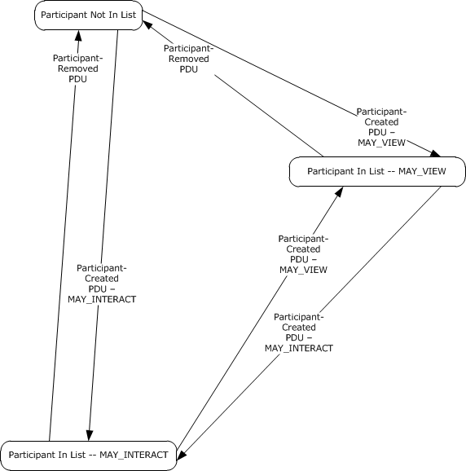
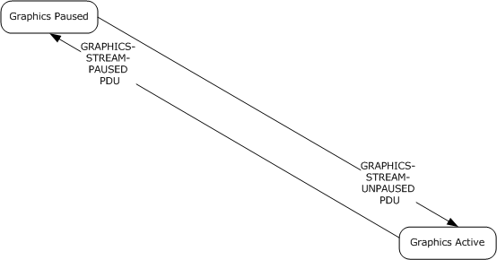

[MS-RDPEMC]:

Remote Desktop Protocol: Multiparty Virtual Channel
Extension

Intellectual Property Rights Notice for Open Specifications Documentation

  Technical Documentation. Microsoft publishes Open Specifications documentation (“this

documentation”) for protocols, file formats, data portability, computer languages, and standards
support. Additionally, overview documents cover inter-protocol relationships and interactions.

  Copyrights. This documentation is covered by Microsoft copyrights. Regardless of any other

terms that are contained in the terms of use for the Microsoft website that hosts this
documentation, you can make copies of it in order to develop implementations of the technologies
that are described in this documentation and can distribute portions of it in your implementations
that use these technologies or in your documentation as necessary to properly document the
implementation. You can also distribute in your implementation, with or without modification, any
schemas, IDLs, or code samples that are included in the documentation. This permission also
applies to any documents that are referenced in the Open Specifications documentation.
  No Trade Secrets. Microsoft does not claim any trade secret rights in this documentation.
  Patents. Microsoft has patents that might cover your implementations of the technologies

described in the Open Specifications documentation. Neither this notice nor Microsoft's delivery of
this documentation grants any licenses under those patents or any other Microsoft patents.
However, a given Open Specifications document might be covered by the Microsoft Open
Specifications Promise or the Microsoft Community Promise. If you would prefer a written license,
or if the technologies described in this documentation are not covered by the Open Specifications
Promise or Community Promise, as applicable, patent licenses are available by contacting
iplg@microsoft.com.

  License Programs. To see all of the protocols in scope under a specific license program and the

associated patents, visit the Patent Map.

  Trademarks. The names of companies and products contained in this documentation might be
covered by trademarks or similar intellectual property rights. This notice does not grant any
licenses under those rights. For a list of Microsoft trademarks, visit
www.microsoft.com/trademarks.

  Fictitious Names. The example companies, organizations, products, domain names, email

addresses, logos, people, places, and events that are depicted in this documentation are fictitious.
No association with any real company, organization, product, domain name, email address, logo,
person, place, or event is intended or should be inferred.

Reservation of Rights. All other rights are reserved, and this notice does not grant any rights other
than as specifically described above, whether by implication, estoppel, or otherwise.

Tools. The Open Specifications documentation does not require the use of Microsoft programming
tools or programming environments in order for you to develop an implementation. If you have access
to Microsoft programming tools and environments, you are free to take advantage of them. Certain
Open Specifications documents are intended for use in conjunction with publicly available standards
specifications and network programming art and, as such, assume that the reader either is familiar
with the aforementioned material or has immediate access to it.

Support. For questions and support, please contact dochelp@microsoft.com.

[MS-RDPEMC] - v20240423
Remote Desktop Protocol: Multiparty Virtual Channel Extension
Copyright © 2024 Microsoft Corporation
Release: April 23, 2024

1 / 41

Revision Summary

Date

Revision
History

Revision
Class

Comments

2/22/2007

0.01

6/1/2007

1.0

New

Major

Version 0.01 release

Updated and revised the technical content.

7/3/2007

1.0.1

Editorial

Changed language and formatting in the technical content.

7/20/2007

1.0.2

Editorial

Changed language and formatting in the technical content.

8/10/2007

1.0.3

Editorial

Changed language and formatting in the technical content.

9/28/2007

1.0.4

Editorial

Changed language and formatting in the technical content.

10/23/2007  1.0.5

Editorial

Changed language and formatting in the technical content.

11/30/2007  1.0.6

Editorial

Changed language and formatting in the technical content.

1/25/2008

1.0.7

Editorial

Changed language and formatting in the technical content.

3/14/2008

1.0.8

Editorial

Changed language and formatting in the technical content.

5/16/2008

1.0.9

Editorial

Changed language and formatting in the technical content.

6/20/2008

1.1

Minor

Clarified the meaning of the technical content.

7/25/2008

1.1.1

Editorial

Changed language and formatting in the technical content.

8/29/2008

1.1.2

Editorial

Changed language and formatting in the technical content.

10/24/2008  1.2

12/5/2008

2.0

Minor

Major

Clarified the meaning of the technical content.

Updated and revised the technical content.

1/16/2009

2.0.1

Editorial

Changed language and formatting in the technical content.

2/27/2009

2.0.2

Editorial

Changed language and formatting in the technical content.

4/10/2009

2.0.3

Editorial

Changed language and formatting in the technical content.

5/22/2009

3.0

7/2/2009

3.1

8/14/2009

3.2

9/25/2009

3.3

11/6/2009

4.0

12/18/2009  5.0

1/29/2010

6.0

Major

Minor

Minor

Minor

Major

Major

Major

Updated and revised the technical content.

Clarified the meaning of the technical content.

Clarified the meaning of the technical content.

Clarified the meaning of the technical content.

Updated and revised the technical content.

Updated and revised the technical content.

Updated and revised the technical content.

3/12/2010

6.0.1

Editorial

Changed language and formatting in the technical content.

4/23/2010

6.0.2

Editorial

Changed language and formatting in the technical content.

6/4/2010

6.0.3

Editorial

Changed language and formatting in the technical content.

7/16/2010

6.0.3

None

No changes to the meaning, language, or formatting of the
technical content.

[MS-RDPEMC] - v20240423
Remote Desktop Protocol: Multiparty Virtual Channel Extension
Copyright © 2024 Microsoft Corporation
Release: April 23, 2024

2 / 41

Date

Revision
History

Revision
Class

Comments

8/27/2010

6.0.3

None

No changes to the meaning, language, or formatting of the
technical content.

10/8/2010

6.0.3

None

No changes to the meaning, language, or formatting of the
technical content.

11/19/2010  7.0

Major

Updated and revised the technical content.

1/7/2011

7.0

2/11/2011

7.1

3/25/2011

8.0

5/6/2011

8.0

None

Minor

Major

None

No changes to the meaning, language, or formatting of the
technical content.

Clarified the meaning of the technical content.

Updated and revised the technical content.

No changes to the meaning, language, or formatting of the
technical content.

6/17/2011

8.1

Minor

Clarified the meaning of the technical content.

9/23/2011

8.1

None

No changes to the meaning, language, or formatting of the
technical content.

12/16/2011  9.0

Major

Updated and revised the technical content.

3/30/2012

9.0

7/12/2012

9.0

10/25/2012  9.0

1/31/2013

9.0

8/8/2013

9.0

11/14/2013  9.0

2/13/2014

9.0

5/15/2014

9.0

None

None

None

None

None

None

None

None

No changes to the meaning, language, or formatting of the
technical content.

No changes to the meaning, language, or formatting of the
technical content.

No changes to the meaning, language, or formatting of the
technical content.

No changes to the meaning, language, or formatting of the
technical content.

No changes to the meaning, language, or formatting of the
technical content.

No changes to the meaning, language, or formatting of the
technical content.

No changes to the meaning, language, or formatting of the
technical content.

No changes to the meaning, language, or formatting of the
technical content.

6/30/2015

10.0

Major

Significantly changed the technical content.

10/16/2015  10.0

None

No changes to the meaning, language, or formatting of the
technical content.

7/14/2016

11.0

Major

Significantly changed the technical content.

6/1/2017

11.0

9/15/2017

12.0

12/1/2017

12.0

None

Major

None

No changes to the meaning, language, or formatting of the
technical content.

Significantly changed the technical content.

No changes to the meaning, language, or formatting of the

3 / 41

[MS-RDPEMC] - v20240423
Remote Desktop Protocol: Multiparty Virtual Channel Extension
Copyright © 2024 Microsoft Corporation
Release: April 23, 2024

Date

Revision
History

Revision
Class

Comments

technical content.

9/12/2018

13.0

4/7/2021

14.0

6/25/2021

15.0

4/23/2024

16.0

Major

Major

Major

Major

Significantly changed the technical content.

Significantly changed the technical content.

Significantly changed the technical content.

Significantly changed the technical content.

[MS-RDPEMC] - v20240423
Remote Desktop Protocol: Multiparty Virtual Channel Extension
Copyright © 2024 Microsoft Corporation
Release: April 23, 2024

4 / 41

Table of Contents

1.3

1.3.1

1.1
1.2

1.2.1
1.2.2

1  Introduction ............................................................................................................ 7
Glossary ........................................................................................................... 7
References ........................................................................................................ 7
Normative References ................................................................................... 8
Informative References ................................................................................. 8
Overview .......................................................................................................... 8
Messages ..................................................................................................... 8
Application and Window Filtering ............................................................... 8
Participant Management .......................................................................... 8
Graphics Stream Control .......................................................................... 9
Relationship to Other Protocols ............................................................................ 9
Prerequisites/Preconditions ................................................................................. 9
Applicability Statement ....................................................................................... 9
Versioning and Capability Negotiation ................................................................... 9
Vendor-Extensible Fields ..................................................................................... 9
Standards Assignments ..................................................................................... 10

1.3.1.1
1.3.1.2
1.3.1.3

1.4
1.5
1.6
1.7
1.8
1.9

2.1
2.2

2.2.1
2.2.2
2.2.3

2.2.3.1
2.2.3.2
2.2.3.3
2.2.3.4
2.2.3.5
2.2.3.6
2.2.3.7

2  Messages ............................................................................................................... 11
Transport ........................................................................................................ 11
Message Syntax ............................................................................................... 11
Common Order Header (ORDER_HDR) .......................................................... 11
Unicode String (UNICODE_STRING) .............................................................. 12
Application and Window Filtering .................................................................. 12
Filter-Updated PDU (OD_FILTER_STATE_UPDATED) .................................. 12
Application-Created PDU (OD_APP_CREATED) .......................................... 13
Application-Removed PDU (OD_APP_REMOVED) ....................................... 14
Window-Created PDU (OD_WND_CREATED) ............................................. 14
Window-Removed PDU (OD_WND_REMOVED) .......................................... 15
Show Window PDU (OD_WND_SHOW) ..................................................... 15
Window Region Update PDU (OD_WND_REGION_UPDATE)......................... 16
Participant Management .............................................................................. 16
Participant-Created PDU (OD_PARTICIPANT_CREATED) ............................. 16
Participant-Removed PDU (OD_PARTICIPANT_REMOVED) .......................... 17
Change Participant Control Level PDU (OD_PARTICIPANT_CTRL_CHANGE) ... 18
Change Participant Control Level Response PDU
(OD_PARTICIPANT_CTRL_CHANGE_RESPONSE) ....................................... 19
Graphics Stream Control .............................................................................. 20
Graphics Stream-Paused PDU (OD_GRAPHICS_STREAM_PAUSED) .............. 20
Graphics Stream-Resumed PDU (OD_GRAPHICS_STREAM_RESUMED) ......... 20

2.2.4.1
2.2.4.2
2.2.4.3
2.2.4.4

2.2.5.1
2.2.5.2

2.2.4

2.2.5

3.1

3.1.1
3.1.2
3.1.3
3.1.4
3.1.5

3  Protocol Details ..................................................................................................... 21
Common Details .............................................................................................. 21
Abstract Data Model .................................................................................... 22
Timers ...................................................................................................... 22
Initialization ............................................................................................... 23
Higher-Layer Triggered Events ..................................................................... 23
Message-Processing Events and Sequencing Rules .......................................... 23
Processing the Common PDU Header ....................................................... 23
Processing UNICODE_STRING Fields ........................................................ 24
Processing Application, Window, and Participant IDs .................................. 24
Timer Events .............................................................................................. 24
Other Local Events ...................................................................................... 24
Participant Details ............................................................................................ 24
Abstract Data Model .................................................................................... 24
Timers ...................................................................................................... 25

3.1.5.1
3.1.5.2
3.1.5.3

3.2.1
3.2.2

3.1.6
3.1.7

3.2

[MS-RDPEMC] - v20240423
Remote Desktop Protocol: Multiparty Virtual Channel Extension
Copyright © 2024 Microsoft Corporation
Release: April 23, 2024

5 / 41

3.2.3
3.2.4
3.2.5

3.2.5.3

3.2.5.1

3.2.5.2

3.2.5.3.1
3.2.5.3.2

3.2.5.2.1
3.2.5.2.2
3.2.5.2.3

3.2.5.1.1
3.2.5.1.2
3.2.5.1.3
3.2.5.1.4
3.2.5.1.5
3.2.5.1.6

Initialization ............................................................................................... 25
Higher-Layer Triggered Events ..................................................................... 25
Message-Processing Events and Sequencing Rules .......................................... 25
Application and Window Filtering ............................................................. 25
Processing an Application-Created PDU .............................................. 25
Processing an Application-Removed PDU ............................................ 25
Processing a Filter-Updated PDU ........................................................ 25
Processing a Window-Created PDU .................................................... 25
Processing a Window-Removed PDU .................................................. 26
Processing a Window Region Update PDU ........................................... 26
Participant Management ........................................................................ 26
Processing a Participant-Created PDU ................................................ 26
Processing a Participant-Removed PDU .............................................. 26
Processing the Change Participant Control Level Response PDU ............. 27
Graphics Stream Control ........................................................................ 27
Processing a Graphics Stream-Paused PDU ......................................... 27
Processing a Graphics Stream-Resumed PDU ...................................... 27
Timer Events .............................................................................................. 27
Other Local Events ...................................................................................... 27
Sharing Manager Details ................................................................................... 27
Abstract Data Model .................................................................................... 27
Timers ...................................................................................................... 27
Initialization ............................................................................................... 27
Higher-Layer Triggered Events ..................................................................... 28
Message Processing Events and Sequencing Rules .......................................... 28
Application and Window Filtering ............................................................. 28
Processing the Show Window PDU ..................................................... 28
Participant Management ........................................................................ 28
Processing a Participant-Created PDU ................................................ 28
Processing a Participant-Removed PDU .............................................. 28
Processing the Change Participant Control Level PDU ........................... 28
Timer Events .............................................................................................. 28
Other Local Events ...................................................................................... 28

3.3.5.1

3.3.5.1.1

3.3.5.2

3.3.5.2.1
3.3.5.2.2
3.3.5.2.3

3.3

3.2.6
3.2.7

3.3.1
3.3.2
3.3.3
3.3.4
3.3.5

3.3.6
3.3.7

4.1

4  Protocol Examples ................................................................................................. 29
Sharing Manager-Generated PDUs ...................................................................... 29
Filter-Updated PDU 1 .................................................................................. 29
4.1.1
Participant-Created PDU .............................................................................. 29
4.1.2
Participant-Removed PDU ............................................................................ 30
4.1.3
Filter-Updated PDU 2 .................................................................................. 30
4.1.4
Application-Created PDU .............................................................................. 31
4.1.5
Application-Removed PDU ............................................................................ 31
4.1.6
Window-Created PDU .................................................................................. 31
4.1.7
Window-Removed PDU ................................................................................ 32
4.1.8
4.1.9
Request Control Level Change Response PDU ................................................. 32
4.1.10  Window Region Update PDU ......................................................................... 32
Participant-Generated PDUs .............................................................................. 33
Request Control Level Change PDU ............................................................... 33
Request Show Window PDU ......................................................................... 33

4.2.1
4.2.2

4.2

5  Security ................................................................................................................. 34
Security Considerations for Implementers ........................................................... 34
Index of Security Parameters ............................................................................ 34

5.1
5.2

6  Appendix A: Product Behavior ............................................................................... 35

7  Change Tracking .................................................................................................... 38

8  Index ..................................................................................................................... 39

[MS-RDPEMC] - v20240423
Remote Desktop Protocol: Multiparty Virtual Channel Extension
Copyright © 2024 Microsoft Corporation
Release: April 23, 2024

6 / 41

[MS-RDPEMC] - v20240423
Remote Desktop Protocol: Multiparty Virtual Channel Extension
Copyright © 2024 Microsoft Corporation
Release: April 23, 2024

7 / 41

1  Introduction

The Remote Desktop Protocol: Multiparty Virtual Channel Extension describes the messages that are
exchanged between a remote desktop host and the participants with which it is engaging in
multiparty application sharing. Examples include communicating the names of the participants that are
sharing the session or the list of applications that are currently shared. Additional messages allow
participants to negotiate control levels to give participants control of mouse and keyboard input to a
shared desktop.

Sections 1.5, 1.8, 1.9, 2, and 3 of this specification are normative. All other sections and examples in
this specification are informative.

1.1  Glossary

This document uses the following terms:

ANSI character: An 8-bit Windows-1252 character set unit.

control level: The permissions that are granted to a participant in a shared desktop. The

control levels include "view" (the participant is able to see, but not interact with, shared
content), "full" (the participant is able to both see and interact with shared content), and
"none" (the participant can neither see nor interact with shared content).

filtering: To share a subset of the host applications or windows with participants instead of

sharing all of the applications and windows.

host: The machine with the desktop or applications that are being shared with the other

participants.

HRESULT: An integer value that indicates the result or status of an operation. A particular

HRESULT can have different meanings depending on the protocol using it. See [MS-ERREF]
section 2.1 and specific protocol documents for further details.

participant: A machine that is accessing the desktop content shared by the host.

protocol data unit (PDU): Information that is delivered as a unit among peer entities of a
network and that can contain control information, address information, or data. For more
information on remote procedure call (RPC)-specific PDUs, see [C706] section 12.

share: To make content on a host desktop available to participants. Participants with a sufficient

control level can interact remotely with the host desktop by sending input commands.

sharing manager: The application or program used by the host to initiate and control the sharing

of desktop content.

Unicode character: Unless otherwise specified, a 16-bit UTF-16 code unit.

MAY, SHOULD, MUST, SHOULD NOT, MUST NOT: These terms (in all caps) are used as defined
in [RFC2119]. All statements of optional behavior use either MAY, SHOULD, or SHOULD NOT.

1.2  References

Links to a document in the Microsoft Open Specifications library point to the correct section in the
most recently published version of the referenced document. However, because individual documents
in the library are not updated at the same time, the section numbers in the documents may not
match. You can confirm the correct section numbering by checking the Errata.

[MS-RDPEMC] - v20240423
Remote Desktop Protocol: Multiparty Virtual Channel Extension
Copyright © 2024 Microsoft Corporation
Release: April 23, 2024

8 / 41

1.2.1  Normative References

We conduct frequent surveys of the normative references to assure their continued availability. If you
have any issue with finding a normative reference, please contact dochelp@microsoft.com. We will
assist you in finding the relevant information.

[MS-ERREF] Microsoft Corporation, "Windows Error Codes".

[MS-RDPBCGR] Microsoft Corporation, "Remote Desktop Protocol: Basic Connectivity and Graphics
Remoting".

[MS-RDPEPS] Microsoft Corporation, "Remote Desktop Protocol: Session Selection Extension".

[RFC2119] Bradner, S., "Key words for use in RFCs to Indicate Requirement Levels", BCP 14, RFC
2119, March 1997, https://www.rfc-editor.org/info/rfc2119

1.2.2  Informative References

None.

1.3  Overview

The Remote Desktop Protocol: Basic Connectivity and Graphics Remoting Protocol (as specified in
[MS-RDPBCGR]) enables the remote display of desktop and application content. To effectively
implement an application-sharing or collaborative solution, additional information is conveyed to keep
the participants apprised of who else is involved, in addition to which applications or windows are
being shared. The Remote Desktop Protocol: Multiparty Virtual Channel Extension defines a set of
messages that are used to communicate the information between the participants and to signal the
occurrence of significant events.

1.3.1  Messages

1.3.1.1  Application and Window Filtering

A host can choose to share all application windows on a desktop or, instead, limit the sharing to a
subset. The process of limiting the sharing to a subset is known as filtering. Application filtering is
used when the host wants to share the current windows for a specific application in addition to any
others subsequently created while the application is being shared. Although the term "application" is
operating system specific, it generally denotes all windows created by a certain process as well as all
windows related to the original windows by window hierarchy. Window filtering is purely explicit. A
window is selected for sharing, and any subsequent windows created by an application have to be
manually added to the sharing list. The precise mode of operation depends on a combination of user
preference and the features of a sharing manager.

The filtering functionality of the Remote Desktop Protocol: Multiparty Virtual Channel Extension makes
it highly desirable for a sharing manager to communicate the list of windows and applications that are
displayed to better coordinate between participants. Protocol messages are provided to communicate
filtering state, application names, and window names to the participants.

For more information, see sections 3.2.5.1 and 3.3.5.1.

1.3.1.2  Participant Management

Participant management facilities allow the sharing manager to send notifications to all participants
when an individual participant connects or disconnects from the sharing session or when a
participant's control level changes.

9 / 41

[MS-RDPEMC] - v20240423
Remote Desktop Protocol: Multiparty Virtual Channel Extension
Copyright © 2024 Microsoft Corporation
Release: April 23, 2024

For more information, see sections 3.2.5.2 and 3.3.5.2.

1.3.1.3  Graphics Stream Control

The host can choose to momentarily suspend or resume desktop sharing. This capability is useful
when an event, such as the input of a plain-text password, would reveal sensitive information to all
participants. Participants are notified when sharing is suspended, so that they know why they are no
longer receiving information, as specified in sections 2.2.5 and 3.2.5.3.

1.4  Relationship to Other Protocols

The Remote Desktop Protocol: Multiparty Virtual Channel Extension is embedded in static virtual
channel transport, as specified in [MS-RDPBCGR].

1.5  Prerequisites/Preconditions

The Remote Desktop Protocol: Multiparty Virtual Channel Extension operates only after a static virtual
channel transport, as specified in [MS-RDPBCGR] section 3.1.5.2, with the name "encomsp" (encoded
as a string of ANSI characters) is fully established. If the static virtual channel transport is
terminated, no other communication over the Remote Desktop Protocol: Multiparty Virtual Channel
Extension occurs.

The client sends a pre-connection PDU prior to establishing a Remote Desktop Protocol (RDP)
connection, as specified in [MS-RDPEPS] section 2.2.1.

1.6  Applicability Statement

The Remote Desktop Protocol: Multiparty Virtual Channel Extension is designed to be run within the
context of an RDP Virtual Channel established between a client and server. This protocol is applicable
when information is being communicated among the host and the participants in a multiparty
sharing session.

1.7  Versioning and Capability Negotiation

This protocol does not require any specific versioning and does not provide any versioning mechanism.

By binding to this specific channel, the host and the participant acknowledge that they can process
any messages sent on the channel.

The messages exchanged in this protocol are simple notifications that do not require a reply.

Both the host and the participant can add new, optional messages to this protocol, so long as the
header format remains the same. Both the host and the participant ignore messages of unknown
types.

1.8  Vendor-Extensible Fields

This protocol uses HRESULTs, as specified in [MS-ERREF] section 2.1. Vendors are free to choose
their own values, as long as the C bit (0x20000000) is set, indicating it is a customer code.

This protocol uses Win32 error codes. These values are taken from the Windows error number space
specified in [MS-ERREF] section 2.2. Vendors SHOULD reuse those values with their indicated
meaning. Choosing any other value runs the risk of a collision in the future.

[MS-RDPEMC] - v20240423
Remote Desktop Protocol: Multiparty Virtual Channel Extension
Copyright © 2024 Microsoft Corporation
Release: April 23, 2024

10 / 41

1.9  Standards Assignments

No standards have been assigned to this protocol.

[MS-RDPEMC] - v20240423
Remote Desktop Protocol: Multiparty Virtual Channel Extension
Copyright © 2024 Microsoft Corporation
Release: April 23, 2024

11 / 41

2  Messages

The following sections specify the transport and syntax of Remote Desktop Protocol: Multiparty Virtual
Channel Extension messages.

2.1  Transport

The Remote Desktop Protocol: Multiparty Virtual Channel Extension is designed to operate over static
virtual channels, as specified in [MS-RDPBCGR] section 3.1.5.2, using the name "encomsp" (encoded
as a string of ANSI characters).

The RDP layer manages the creation, setup, and data transmission over the virtual channel.

2.2  Message Syntax

2.2.1  Common Order Header (ORDER_HDR)

The messages, or protocol data unit (PDU), exchanged as part of this protocol MUST start with the
Common Order Header (ORDER_HDR), which identifies the type of message contained in the PDU
payload and the length of the payload, in bytes. As multiple messages for this protocol can be
encapsulated in a single lower-level transport PDU, the Common Order Header allows receivers to
calculate the message boundaries.

0  1  2  3  4  5  6  7  8  9

1
0  1  2  3  4  5  6  7  8  9

2
0  1  2  3  4  5  6  7  8  9

3
0  1

Type

Length

Type (2 bytes): A 16-bit, unsigned integer that specifies the type of the PDU that follows the Length

field.

Value

Meaning

ODTYPE_FILTER_STATE_UPDATED

0x0001

Indicates a Filter-Updated PDU
(OD_FILTER_STATE_UPDATED) (section 2.2.3.1).

ODTYPE_APP_REMOVED

0x0002

ODTYPE_APP_CREATED

0x0003

ODTYPE_WND_REMOVED

0x0004

ODTYPE_WND_CREATED

0x0005

ODTYPE_WND_SHOW

0x0006

Indicates an Application-Removed PDU
(OD_APP_REMOVED) (section 2.2.3.3).

Indicates an Application-Created PDU
(OD_APP_CREATED) (section 2.2.3.2).

Indicates a Window-Removed PDU
(OD_WND_REMOVED) (section 2.2.3.5).

Indicates a Window-Created PDU
(OD_WND_CREATED) (section 2.2.3.4).

Indicates a Show Window PDU
(OD_WND_SHOW) (section 2.2.3.6).

ODTYPE_PARTICIPANT_REMOVED

0x0007

ODTYPE_PARTICIPANT_CREATED

Indicates a Participant-Removed PDU
(OD_PARTICIPANT_REMOVED) (section 2.2.4.2).

Indicates a Participant-Created PDU
(OD_PARTICIPANT_CREATED) (section 2.2.4.1).

12 / 41

[MS-RDPEMC] - v20240423
Remote Desktop Protocol: Multiparty Virtual Channel Extension
Copyright © 2024 Microsoft Corporation
Release: April 23, 2024

Value

0x0008

Meaning

ODTYPE_PARTICIPANT_CTRL_CHANGED

0x0009

Indicates a Change Participant Control Level PDU
(OD_PARTICIPANT_CTRL_CHANGE) (section 2.2.4.3).

ODTYPE_GRAPHICS_STREAM_PAUSED

0x000A

Indicates a Graphics Stream-Paused PDU
(OD_GRAPHICS_STREAM_PAUSED) (section 2.2.5.1).

ODTYPE_GRAPHICS_STREAM_RESUMED

0x000B

ODTYPE_WND_RGN_UPDATE

0x000C

ODTYPE_PARTICIPANT_CTRL_CHANGE_RESPONSE

0x000D

Indicates a Graphics Stream-Resumed PDU
(OD_GRAPHICS_STREAM_RESUMED) (section 2.2.5.2).

Indicates a Window Region Update PDU
(OD_WINDOW_REGION_UPDATE) (section 2.2.3.7).

Indicates a Change Participant Control Level Response
PDU (OD_PARTICIPANT_CTRL_CHANGE_RESPONSE)
(section 2.2.4.4).

Length (2 bytes): A 16-bit, unsigned integer that specifies the length of the data, in bytes, contained
by the PDU. This field MUST be the payload size plus the size of the common header and MUST be
used in decoding the individual PDUs.

2.2.2  Unicode String (UNICODE_STRING)

The Unicode String (UNICODE_STRING) packet is used to pack a variable-length Unicode string.

0  1  2  3  4  5  6  7  8  9

1
0  1  2  3  4  5  6  7  8  9

2
0  1  2  3  4  5  6  7  8  9

3
0  1

cchString

String (variable)

...

cchString (2 bytes): A 16-bit, unsigned integer that specifies the number of Unicode characters in
the String field. The size of each Unicode character is 2 bytes. The value of cchString MUST NOT
exceed 1,024. If cchString is set to 0, then the String field MUST NOT be present.

String (variable): An array of Unicode characters, equal in length to the value of cchString field.
The variable-length Unicode string comprises the first n Unicode characters in the String field,
where n is the lesser of the value of the cchString field and the number of characters preceding
the first null in the array.

2.2.3  Application and Window Filtering

2.2.3.1  Filter-Updated PDU (OD_FILTER_STATE_UPDATED)

The Filter-Updated PDU (OD_FILTER_STATE_UPDATED) is used to inform the participants whether
application filtering is enabled, as specified in section 3.2.5.1.3.

0  1  2  3  4  5  6  7  8  9

1
0  1  2  3  4  5  6  7  8  9

2
0  1  2  3  4  5  6  7  8  9

3
0  1

HDR

[MS-RDPEMC] - v20240423
Remote Desktop Protocol: Multiparty Virtual Channel Extension
Copyright © 2024 Microsoft Corporation
Release: April 23, 2024

13 / 41

Flags

HDR (4 bytes): The common PDU header (as specified in section 2.2.1). The Type field of the

common PDU header MUST be set to ODTYPE_FILTER_STATE_UPDATED (0x0001).

Flags (1 byte): An 8-bit, unsigned char that represents a set of bit flags, in little-endian format, that
indicate the state of the filter. A bit is true (or set) if its value is 1. This field MUST be composed of
the bitwise OR of one or more of the following values.

Value

Meaning

FILTER_ENABLED

The filter is enabled. If this bit is 0 then the filter is disabled.

0x0001

2.2.3.2  Application-Created PDU (OD_APP_CREATED)

The Application-Created PDU (OD_APP_CREATED) is sent by the sharing manager to notify
participants of newly created applications or other changes in application information. For more
information, see section 3.2.5.1.1.

0  1  2  3  4  5  6  7  8  9

1
0  1  2  3  4  5  6  7  8  9

2
0  1  2  3  4  5  6  7  8  9

3
0  1

Flags

...

HDR

...

AppId

Name (variable)

HDR (4 bytes): The common PDU header (as specified in Common Order Header (section 2.2.1)).
The Type field of the common PDU header MUST be set to ODTYPE_APP_CREATED (0x0003).

Flags (2 bytes): A 16-bit, unsigned integer that represents a set of bit flags, in little-endian format,
that indicate whether an application is shared or not. A bit is true (or set) if its value is 1. This
field MUST be composed of the bitwise OR of one or more of the following values.

Value

Meaning

APPLICATION_SHARED

The application is shared.

0x0001

AppId (4 bytes): A 32-bit, unsigned integer that specifies a unique identifier for the application.
Implementers are free to choose any integer that uniquely identifies the application within the
application list.<1>

Name (variable): A UNICODE_STRING that specifies the name of the application. Implementers are
free to choose any UNICODE_STRING as the Name, and there are no restrictions on allowable
characters.<2>

[MS-RDPEMC] - v20240423
Remote Desktop Protocol: Multiparty Virtual Channel Extension
Copyright © 2024 Microsoft Corporation
Release: April 23, 2024

14 / 41

2.2.3.3  Application-Removed PDU (OD_APP_REMOVED)

The Application-Removed PDU (OD_APP_REMOVED) is sent by the sharing manager to notify
participants that an application MUST be removed from their application lists. Processing instructions
for this PDU are specified in section 3.2.5.1.2.

0  1  2  3  4  5  6  7  8  9

1
0  1  2  3  4  5  6  7  8  9

2
0  1  2  3  4  5  6  7  8  9

3
0  1

HDR

AppId

HDR (4 bytes): The common PDU header (as specified in Common Order Header (section 2.2.1)).

The Type field of the common PDU header MUST be set to ODTYPE_APP_REMOVED (0x0002).

AppId (4 bytes): The 32-bit, unsigned integer that specifies the AppId of the application to be

removed. The integer MUST uniquely identify an application in the application list, as specified in
the AppId field description of Application-Created PDU (section 2.2.3.2).

2.2.3.4  Window-Created PDU (OD_WND_CREATED)

The Window-Created PDU (OD_WND_CREATED) is sent by the sharing manager to notify
participants that a window was created or updated. Every window MUST be associated with an
application. The window MUST have a corresponding unique ID, and subsequent updates for that
window data MUST come as Window-Created PDUs with the same ID (as specified in section
3.2.5.1.4).

0  1  2  3  4  5  6  7  8  9

1
0  1  2  3  4  5  6  7  8  9

2
0  1  2  3  4  5  6  7  8  9

3
0  1

Flags

...

...

HDR

...

AppId

WndId

Name (variable)

HDR (4 bytes): The common PDU header (as specified in section 2.2.1). The Type field of the

common PDU header MUST be set to ODTYPE_WND_CREATED (0x0005).

Flags (2 bytes): A 16-bit, unsigned integer that represents a set of bit flags, in little-endian format,
that indicate whether a window is shared or not. A bit is true (or set) if its value is 1. This field
MUST be composed of the bitwise OR of one or more of the following values.

Value

Meaning

WINDOW_SHARED

The window is shared.

0x0001

[MS-RDPEMC] - v20240423
Remote Desktop Protocol: Multiparty Virtual Channel Extension
Copyright © 2024 Microsoft Corporation
Release: April 23, 2024

15 / 41

AppId (4 bytes): The 32-bit, unsigned integer that specifies the AppId of the application that owns
the window. The integer MUST uniquely identify an application in the application list, as specified
in the AppId field description of the Application-Created PDU (section 2.2.3.2).

WndId (4 bytes): A 32-bit, unsigned integer that specifies the unique ID of the window.

Implementers can choose any integer that uniquely identifies the window entry within the window
list.<3>

Name (variable): A UNICODE_STRING that specifies the name of the window. Implementers can

choose any UNICODE_STRING as the Name; there are no restrictions on allowable
characters.<4>

2.2.3.5  Window-Removed PDU (OD_WND_REMOVED)

The Window-Removed PDU (OD_WND_REMOVED) is sent by the sharing manager to notify
participants that a window SHOULD be removed from their window lists (section 3.2.5.1.5 ).

0  1  2  3  4  5  6  7  8  9

1
0  1  2  3  4  5  6  7  8  9

2
0  1  2  3  4  5  6  7  8  9

3
0  1

HDR

WndId

HDR (4 bytes): The common PDU header (as specified in Common Order Header (section 2.2.1)).
The Type field of the common PDU header MUST be set to ODTYPE_WND_REMOVED (0x0004).

WndId (4 bytes): A 32-bit, unsigned integer that specifies the WndId of the window to be removed.
The integer MUST uniquely identify a window in the window list, as specified in the WndId field
description of the Window-Created PDU (section 2.2.3.4).

2.2.3.6  Show Window PDU (OD_WND_SHOW)

The Show Window PDU (OD_WND_SHOW) is sent by a participant to request that the sharing
manager display one of the shared windows. For instance, this PDU can be used when the participant
wants to display the content of a shared window that is minimized and not visible on the host desktop
(section 3.3.5.1.1).

0  1  2  3  4  5  6  7  8  9

1
0  1  2  3  4  5  6  7  8  9

2
0  1  2  3  4  5  6  7  8  9

3
0  1

HDR

WndId

HDR (4 bytes): The common PDU header (as specified in Common Order Header (section 2.2.1)).
The Type field of the common PDU header MUST be set to ODTYPE_WND_SHOW (0x0006).

WndId (4 bytes): A 32-bit, unsigned integer that specifies the WndId of the window to be

displayed. The integer MUST uniquely identify a window in the window list, as specified in the
WndId field description of the Window-Created PDU (section 2.2.3.4).

[MS-RDPEMC] - v20240423
Remote Desktop Protocol: Multiparty Virtual Channel Extension
Copyright © 2024 Microsoft Corporation
Release: April 23, 2024

16 / 41

2.2.3.7  Window Region Update PDU (OD_WND_REGION_UPDATE)

The Window Region Update PDU (OD_WND_REGION_UPDATE) MAY<5> be used by the sharing
manager to inform the participants that the size of an application window has changed (section
3.2.5.1.6).

0  1  2  3  4  5  6  7  8  9

1
0  1  2  3  4  5  6  7  8  9

2
0  1  2  3  4  5  6  7  8  9

3
0  1

HDR

left

top

right

bottom

HDR (4 bytes): The common PDU header (as specified in Common Order Header (section 2.2.1)).
The Type field of the common PDU header MUST be set to ODTYPE_WND_REGION_UPDATE
(0x000C).

left (4 bytes): A 32-bit, unsigned integer. The leftmost bound of the rectangle specifying the

application window.

top (4 bytes): A 32-bit, unsigned integer. The upper bound of the rectangle specifying the

application window.

right (4 bytes): A 32-bit, unsigned integer. The inclusive rightmost bound of the rectangle specifying

the application window.

bottom (4 bytes): A 32-bit, unsigned integer. The inclusive lower bound of the rectangle specifying

the application window.

2.2.4  Participant Management

The messages in this section are used to create and maintain the list of participants that view and
interact with the shared desktop.

2.2.4.1  Participant-Created PDU (OD_PARTICIPANT_CREATED)

The Participant-Created PDU (OD_PARTICIPANT_CREATED) is used by the sharing manager to notify
participants that a new participant is now receiving the shared desktop. It is also used to notify
participants when the control level of a participant has changed (section 3.2.5.2.1)

0  1  2  3  4  5  6  7  8  9

1
0  1  2  3  4  5  6  7  8  9

2
0  1  2  3  4  5  6  7  8  9

3
0  1

HDR

ParticipantId

GroupId

[MS-RDPEMC] - v20240423
Remote Desktop Protocol: Multiparty Virtual Channel Extension
Copyright © 2024 Microsoft Corporation
Release: April 23, 2024

17 / 41

Flags

FriendlyName (variable)

...

HDR (4 bytes): The common PDU header (as specified in Common Order Header (section 2.2.1)).
The Type field of the common PDU header MUST be set to ODTYPE_PARTICIPANT_CREATED
(0x0008).

ParticipantId (4 bytes): A 32-bit, unsigned integer that specifies the unique identifier of the

participant. The ParticipantId is assigned by the sharing manager.

GroupId (4 bytes): A 32-bit, unsigned integer specifying the unique identifier of the group to which

the participant belongs. <6>

Flags (2 bytes): A 16-bit, unsigned integer that represents a set of bit flags, in little-endian format,
that indicate information about a participant. A bit is true (or set) if its value is 1. This field MUST
be composed of the bitwise OR of one or more of the following values.

Value

Meaning

MAY_VIEW

The participant has permission to view the shared desktop.

0x0001

MAY_INTERACT

The participant has permission to interact with the shared desktop.

0x0002

IS_PARTICIPANT

0x0004

The PDU that is associated with the participant receiving the message (section
3.2.5.2.1).

FriendlyName (variable): A UNICODE_STRING that specifies the name that is associated with the

participant.

2.2.4.2  Participant-Removed PDU (OD_PARTICIPANT_REMOVED)

The Participant-Removed PDU (OD_PARTICIPANT_REMOVED) is used by the sharing manager to
inform the participants that a participant SHOULD be removed from the participant list (section
3.2.5.2.2).

0  1  2  3  4  5  6  7  8  9

1
0  1  2  3  4  5  6  7  8  9

2
0  1  2  3  4  5  6  7  8  9

3
0  1

HDR

ParticipantId

DiscType

DiscCode

HDR (4 bytes): The common PDU header (as specified in Common Order Header (section 2.2.1)).
The Type field of the common PDU header MUST be set to ODTYPE_PARTICIPANT_REMOVED
(0x0007).

ParticipantId (4 bytes):  A 32-bit, unsigned integer that specifies the unique identifier of the

participant.

18 / 41

[MS-RDPEMC] - v20240423
Remote Desktop Protocol: Multiparty Virtual Channel Extension
Copyright © 2024 Microsoft Corporation
Release: April 23, 2024

DiscType (4 bytes): A 32-bit, unsigned integer that specifies the disconnect type. Possible values

include the following.

Value

Meaning

PARTICIPANT_DISCONNECT_REASON_APP

Indicates that the disconnect was initiated by the host.

0x00000000

PARTICIPANT_DISCONNECT_REASON_CLI

0x00000002

Indicates that the disconnect was initiated by the
participant.

DiscCode (4 bytes): A 32-bit, unsigned integer that specifies the reason for the disconnect. A

DiscCode beginning with 0x8007 (0x8007xxxx) is a Win32 error code. Other DiscCodes that
begin with 0x8 (0x8xxxxxxx) are HRESULT values other than Win32 error codes, such as a
standard OLE value like E_ABORT (0x80004004) or an application-specific value. Other possible
values include the following.

Value

Meaning

S_OK

The participant was not disconnected because of an error.

0x00000000

0xD00A0006  The disconnect occurred because the sharing manager was unable to send data to the

participant.

0xD0000001  The disconnect was the result of an error on the host side.

2.2.4.3  Change Participant Control Level PDU (OD_PARTICIPANT_CTRL_CHANGE)

The Change Participant Control Level PDU (OD_PARTICIPANT_CTRL_CHANGE) is sent by a
participant to request a different control level. For instance, a view-only participant could ask the
sharing manager to change its control level so that it can view and interact with shared content
(section 3.3.5.2.3).

0  1  2  3  4  5  6  7  8  9

1
0  1  2  3  4  5  6  7  8  9

2
0  1  2  3  4  5  6  7  8  9

3
0  1

HDR

ParticipantId

Flags

...

HDR (4 bytes): The common PDU header (as specified in Common Order Header (section 2.2.1)).

The Type field of the common PDU header MUST be set to ODTYPE_PARTICIPANT_CTRL_CHANGE
(0x0009).

Flags (2 bytes): A 16-bit, unsigned integer that represents a set of bit flags, in little-endian format,
that indicate participant requests for permission. A bit is true (or set) if its value is 1. This field
MUST be composed of the bitwise OR of one or more of the following values.

Value

Meaning

REQUEST_VIEW

The participant is requesting view permission.

19 / 41

[MS-RDPEMC] - v20240423
Remote Desktop Protocol: Multiparty Virtual Channel Extension
Copyright © 2024 Microsoft Corporation
Release: April 23, 2024

Value

0x0001

Meaning

REQUEST_INTERACT

The participant is requesting interact permission.

0x0002

ALLOW_CONTROL_REQUESTS

The participant is requesting that "permission request" be allowed.

0x0008

ParticipantId (4 bytes): A 32-bit, unsigned integer that specifies the unique identifier of the

participant.

2.2.4.4  Change Participant Control Level Response PDU
(OD_PARTICIPANT_CTRL_CHANGE_RESPONSE)

The Change Participant Control Level Response PDU (OD_PARTICIPANT_CTRL_CHANGE_RESPONSE) is
sent by the sharing manager to specify a reason for which the participant control level change
request (section 2.2.4.3) was either accepted or rejected (section 3.2.5.2.3).

0  1  2  3  4  5  6  7  8  9

1
0  1  2  3  4  5  6  7  8  9

2
0  1  2  3  4  5  6  7  8  9

3
0  1

HDR

ParticipantId

ReasonCode

Flags

...

...

HDR (4 bytes): The common PDU header, as specified in Common Order Header (section 2.2.1). The

Type field of the common PDU header MUST be set to
ODTYPE_PARTICIPANT_CTRL_CHANGE_RESPONSE (0x000D).

Flags (2 bytes): A 16-bit, unsigned integer that represents a set of bit flags, in little-endian format,

that indicates participant requests for permission. A bit is true (or set) if its value is 1. This field
MUST be composed of the bitwise OR of one or more of the following values.

Value

Meaning

REQUEST_VIEW

0x0001

REQUEST_INTERACT

0x0002

The participant is requesting view permission.

The participant is requesting interact permission.

ALLOW_CONTROL_REQUESTS

0x0008

The participant is requesting that "permission request" be
allowed.

ParticipantId (4 bytes): A 32-bit, unsigned integer that specifies the unique identifier of the

participant.

ReasonCode (4 bytes): A 32-bit, unsigned integer that specifies the reason for which a participant

control change request was accepted or rejected.

[MS-RDPEMC] - v20240423
Remote Desktop Protocol: Multiparty Virtual Channel Extension
Copyright © 2024 Microsoft Corporation
Release: April 23, 2024

20 / 41

2.2.5  Graphics Stream Control

2.2.5.1  Graphics Stream-Paused PDU (OD_GRAPHICS_STREAM_PAUSED)

The Graphics Stream-Paused PDU (OD_GRAPHICS_STREAM_PAUSED) is used by the sharing
manager to inform the participants that sharing is suspended (section 3.2.5.3.1).

0  1  2  3  4  5  6  7  8  9

1
0  1  2  3  4  5  6  7  8  9

2
0  1  2  3  4  5  6  7  8  9

3
0  1

HDR

HDR (4 bytes): The common PDU header (as specified in Common Order Header (section 2.2.1)).

The Type field of the common PDU header MUST be set to ODTYPE_GRAPHICS_STREAM_PAUSED
(0x000A).

2.2.5.2  Graphics Stream-Resumed PDU (OD_GRAPHICS_STREAM_RESUMED)

The Graphics Stream-Resumed PDU (OD_GRAPHICS_STREAM_RESUMED) is used by the sharing
manager to inform the participants that desktop sharing has resumed (section 3.2.5.3.2).

0  1  2  3  4  5  6  7  8  9

1
0  1  2  3  4  5  6  7  8  9

2
0  1  2  3  4  5  6  7  8  9

3
0  1

HDR

HDR (4 bytes): The common PDU header (as specified in Common Order Header (section 2.2.1)).

The Type field of the common PDU header MUST be set to
ODTYPE_GRAPHICS_STREAM_RESUMED (0x000B).

[MS-RDPEMC] - v20240423
Remote Desktop Protocol: Multiparty Virtual Channel Extension
Copyright © 2024 Microsoft Corporation
Release: April 23, 2024

21 / 41

<!-- Extracted images from page 22 -->

<!-- /Extracted images from page 22 -->

3  Protocol Details

The following sections specify details of the Remote Desktop Protocol: Multiparty Virtual Channel
Extension, including abstract data models and message processing rules.

3.1  Common Details

Figure 1: Participant Handling of Participant-Created and Participant-Removed Messages

[MS-RDPEMC] - v20240423
Remote Desktop Protocol: Multiparty Virtual Channel Extension
Copyright © 2024 Microsoft Corporation
Release: April 23, 2024

22 / 41

<!-- Extracted images from page 23 -->

<!-- /Extracted images from page 23 -->

Figure 2: Participant Handling of GRAPHICS-STREAM-UNPAUSED and GRAPHICS-STREAM-
PAUSED PDUs

3.1.1  Abstract Data Model

This section describes a conceptual model of possible data organization that an implementation
maintains to participate in this protocol. The described organization is provided to facilitate the
explanation of how the protocol behaves. This document does not mandate that implementations
adhere to this model as long as their external behavior is consistent with that described in this
document.

This protocol allows a host to propagate participant, application, and window lists and any updates
to these lists. Updates to applications, windows, and participant lists are communicated to the clients
via the same PDUs that are used to announce the creation of these elements. For instance, if an
application title changes, the server sends an Application-Created PDU that corresponds to that
application.

A client SHOULD maintain application, window, and participant lists. A client MAY instead choose to
use the information in participant, application, and window messages only to display notifications or it
MAY completely ignore the messages. For instance, if an application does not want to show the
participant list to the user, it MAY silently discard Participant-Created and Participant-Removed
messages.

A host MUST preserve each participant's current control level and the status on whether or not sharing
is currently suspended.

Because the notifications for both created and updated applications use the same messages, clients
SHOULD distinguish between the two. A client does this by checking whether it already has a record
for the unique ID associated with the PDU.

3.1.2  Timers

No timers are used.

[MS-RDPEMC] - v20240423
Remote Desktop Protocol: Multiparty Virtual Channel Extension
Copyright © 2024 Microsoft Corporation
Release: April 23, 2024

23 / 41

3.1.3  Initialization

Before messages can be sent, the static virtual channel MUST be established by using the parameters
specified in section 2.1.

3.1.4  Higher-Layer Triggered Events

No higher-layer triggered events are used.

3.1.5  Message-Processing Events and Sequencing Rules

3.1.5.1  Processing the Common PDU Header

The Type field (as specified in Common Order Header (ORDER_HDR) (section 2.2.1)) MUST be
examined to determine if it corresponds to a known message type. If the type does not correspond to
a known message type, the PDU SHOULD be ignored.<7> If the type matches a known type, the
processing for the Length field (see Common Order Header (ORDER_HDR) (section 2.2.1)) MUST be
performed based on the value of the Type field, as described in the following table.

 Type field value

 Processing instructions

ODTYPE_FILTER_STATE_UPDATED

Processing a Filter-Updated PDU (section 3.2.5.1.3)

0x0001

ODTYPE_APP_REMOVED

Processing an Application-Removed PDU (section 3.2.5.1.2)

0x0002

ODTYPE_APP_CREATED

Processing an Application-Created PDU (section 3.2.5.1.1)

0x0003

ODTYPE_WND_REMOVED

Processing a Window-Removed PDU (section 3.2.5.1.5)

0x0004

ODTYPE_WND_CREATED

Processing a Window-Created PDU (section 3.2.5.1.4)

0x0005

ODTYPE_WND_SHOW

0x0006

Processing a Show Window PDU (section 3.3.5.1.1)

ODTYPE_PARTICIPANT_REMOVED

Processing a Participant-Removed PDU (section 3.2.5.2.2)

0x0007

ODTYPE_PARTICIPANT_CREATED

Processing a Participant-Created PDU (section 3.2.5.2.1)

0x0008

ODTYPE_PARTICIPANT_CTRL_CHANGE

0x0009

Processing the Change Participant Control Level
PDU (section 3.3.5.2.3)

ODTYPE_GRAPHICS_STREAM_PAUSED

0x000A

Processing a Graphics Stream-Paused
PDU (section 3.2.5.3.1)

ODTYPE_GRAPHICS_STREAM_RESUMED

0x000B

Processing a Graphics Stream-Resumed
PDU (section 3.2.5.3.2)

ODTYPE_WND_REGION_UPDATE

0x000C

Processing a Window Region Update PDU (section 3.2.5.1.6)

ODTYPE_PARTICIPANT_CTRL_CHANGE_RESPONSE  Processing the Change Participant Control Level Response

24 / 41

[MS-RDPEMC] - v20240423
Remote Desktop Protocol: Multiparty Virtual Channel Extension
Copyright © 2024 Microsoft Corporation
Release: April 23, 2024

 Type field value

0x000D

 Processing instructions

PDU (section 3.2.5.2.3)

More than one sharing message can be contained in a single virtual channel payload. If more than one
message is included, they are concatenated, with each message having its own common message
header. When processing a message, the receiver MUST verify that enough network data remains in
the virtual channel packet to process a message of the size specified by the Length field. The receiver
SHOULD disconnect from the sharing session if there is not enough data.<8>

3.1.5.2  Processing UNICODE_STRING Fields

Some messages in the Remote Desktop Protocol: Multiparty Virtual Channel Extension contain
UNICODE_STRING (section 2.2.2) packets. These are variable size fields with the length described by
the cchString member. Upon receiving a message that contains a nonzero length UNICODE_STRING,
the receiver MUST validate the string by doubling the value of the cchString field to convert to bytes
and then check whether there are sufficient bytes left in the message to account for the presence of
the string, plus any additional fields.

3.1.5.3  Processing Application, Window, and Participant IDs

When an Application-Created message is received, the client SHOULD check its application list to see if
it contains a record for the value in the AppId field. If no record exists, the client MUST create a
record that contains the application ID, the name of the application, and the shared state. If a record
with the ID exists in the list, the client MUST replace the information in that record with the
information in the message. When an Application-Removed message is received, the client MUST
remove the record with the corresponding ID from its list. If no such record exists, the client MUST
silently discard the message.

Window messages and participant messages SHOULD be handled exactly as described in the
preceding paragraph.

Application IDs are also used to identify which applications own which windows. The sharing
manager SHOULD send the client an Application-Created PDU before it sends any Window-Created
PDUs for that application. This allows a client to maintain both a global window list and a list of
windows per application. Because windows are tied to applications, a window's life span is limited by
the life span of the application to which it is associated. The sharing manager SHOULD send Window-
Removed PDUs before sending the Application-Removed PDU for the application to which the window
corresponds. If the client receives an Application-Removed PDU, it SHOULD remove any window from
the window list with an AppId that corresponds to the application removed.

3.1.6  Timer Events

None.

3.1.7  Other Local Events

None.

3.2  Participant Details

3.2.1  Abstract Data Model

Refer to the common details abstract data model in section 3.1.1.

[MS-RDPEMC] - v20240423
Remote Desktop Protocol: Multiparty Virtual Channel Extension
Copyright © 2024 Microsoft Corporation
Release: April 23, 2024

25 / 41

3.2.2  Timers

None.

3.2.3  Initialization

Before messages can be sent, the static virtual channel MUST be established by using the parameters
specified in section 2.1.

3.2.4  Higher-Layer Triggered Events

None.

3.2.5  Message-Processing Events and Sequencing Rules

3.2.5.1  Application and Window Filtering

3.2.5.1.1 Processing an Application-Created PDU

The receiver of an Application-Created PDU (OD_APP_CREATED) MUST first validate the common
header for consistency (as specified in section 3.1.5.1).

After the header is validated, the receiver MUST validate the Name field according to the rules
specified in section 3.1.5.2. If the size of the received PDU extends past the end of the Name string,
the receiver SHOULD ignore the rest of the PDU (the part that extends past the end of the PDU is
reserved for future extensions of the message). If the PDU size is not long enough to contain all the
fields in the message, including the variable size Name field, the connection SHOULD be
terminated.<9><10>

If the receiver wants to use the application and window list facilities of this protocol, it SHOULD
process the information according to section 3.1.5.3.

3.2.5.1.2 Processing an Application-Removed PDU

The receiver of an Application-Removed PDU (OD_APP_REMOVED) MUST first validate the common
header for consistency (section 3.1.5.1). If the PDU size is not long enough to contain all the fields in
the message, the connection SHOULD be terminated.<11>

If the receiver wants to use the application and window list facilities of this protocol, it SHOULD
process the information according to section 3.1.5.3.

3.2.5.1.3 Processing a Filter-Updated PDU

The receiver of the Filter-Updated PDU (OD_FILTER_STATE_UPDATED) (section 2.2.3.1) MUST first
validate the common header for consistency (section 3.1.5.1). If the PDU size is not long enough to
contain all the fields in the message, the connection SHOULD be terminated.<12>

After the header is validated, the receiver MUST read the Flags field to determine whether application
and windowing filtering are enabled by the sharing manager (see Filter-Updated PDU
(OD_FILTER_STATE_UPDATED) (section 2.2.3.1)). The receiver SHOULD also remove all the windows
and applications that it lists, because the sharing manager is about to send an updated list.<13>

3.2.5.1.4 Processing a Window-Created PDU

The receiver of the Window-Created PDU (OD_WND_CREATED) (section 2.2.3.4) MUST validate the
common header for consistency (section 3.1.5.1). If the PDU size is not long enough to contain all the

26 / 41

[MS-RDPEMC] - v20240423
Remote Desktop Protocol: Multiparty Virtual Channel Extension
Copyright © 2024 Microsoft Corporation
Release: April 23, 2024

fields in the message, the connection SHOULD be terminated.<14> After the header is validated, the
receiver MUST validate the Name field according to the rules described in section 3.1.5.2.

If the receiver wants to use the application and window list facilities of this protocol, it SHOULD
process the information according to section 3.1.5.3.

3.2.5.1.5 Processing a Window-Removed PDU

The receiver of the Window-Removed PDU (OD_WND_REMOVED) (section 2.2.3.5) MUST first validate
the common header for consistency (section 3.1.5.1). If the PDU size is not long enough to contain all
the fields in the message, the connection SHOULD be terminated.<15>

If the receiver wants use the application and window list facilities of this protocol, it SHOULD process
the information according to section 3.1.5.3.

3.2.5.1.6 Processing a Window Region Update PDU

The receiver of the Window Region Update PDU (OD_WND_REGION_UPDATE) (section 2.2.3.7) MUST
first validate the common header for consistency (section 3.1.5.1). If the PDU size is not long enough
to contain all the fields in the message, the connection SHOULD be terminated.<16>

Receipt of this PDU indicates that the application window size has changed. The PDU is stateless and
has no sequencing rules.

3.2.5.2  Participant Management

3.2.5.2.1 Processing a Participant-Created PDU

The receiver of the Participant-Created PDU (OD_PARTICIPANT_CREATED) (section 2.2.4.1) MUST
verify the common header for consistency (section 3.1.5.1). If the PDU size is not long enough to
contain all the fields in the message, the connection SHOULD be terminated.<17>

After the header is validated, the receiver MUST validate the Name field according to the rules
specified in section 3.1.5.2.

If the IS_PARTICIPANT flag is set, the recipient SHOULD remember this information because it
indicates that the message refers to the participant itself.<18>

If the IS_PARTICIPANT flag is not set, this indicates that the message refers to a participant other
than the recipient of the message.

If the GroupId field is not zero, the recipient SHOULD use this information to identify the group to
which the user belongs.<19>

If the receiver wants to use the Participant list facilities of this protocol, it SHOULD process the
information according to section 3.1.5.3.

3.2.5.2.2 Processing a Participant-Removed PDU

The receiver of the Participant-Removed PDU (OD_PARTICIPANT_REMOVED) (section 2.2.4.2) MUST
first validate the common header for consistency (section 3.1.5.1). If the PDU size is not long enough
to contain all the fields in the message, the connection SHOULD be terminated.<20>

If the receiver wants to use the Participant list facilities of this protocol, it SHOULD process the window
removal information according to the windows implementation described in section 3.1.5.3.

The participant MAY check the DiscType and DiscCode fields to determine if the participant was
disconnected as a result of an error.<21>

[MS-RDPEMC] - v20240423
Remote Desktop Protocol: Multiparty Virtual Channel Extension
Copyright © 2024 Microsoft Corporation
Release: April 23, 2024

27 / 41

3.2.5.2.3 Processing the Change Participant Control Level Response PDU

The receiver of the Change Participant Control Level Response PDU
(OD_PARTICIPANT_CTRL_CHANGE_RESPONSE) (section 2.2.4.4) MUST first validate the common
header for consistency (section 3.1.5.1). If the PDU size is not long enough to contain all the fields in
the message, the connection SHOULD be terminated.<22>

After validating the common header, the receiver SHOULD verify that the ParticipantId field is valid.

The participant SHOULD check the ReasonCode field to determine why the change participant
control level request was accepted or rejected.

3.2.5.3  Graphics Stream Control

3.2.5.3.1 Processing a Graphics Stream-Paused PDU

The receiver of the Graphics Stream-Paused PDU (OD_GRAPHICS_STREAM_PAUSED) (section 2.2.5.1)
MUST verify the common header for consistency (section 3.1.5.1). If the PDU size is not long enough
to contain all the fields in the message, the connection SHOULD be terminated.<23>

Receipt of this PDU indicates that the sharing manager has suspended the graphic stream (as
specified in section 1.3.1.3). The PDU is stateless and has no sequencing rules.

3.2.5.3.2 Processing a Graphics Stream-Resumed PDU

The receiver of the Graphics Stream-Resumed PDU
(OD_GRAPHICS_STREAM_RESUMED) (section 2.2.5.2) MUST first validate the common header for
consistency (section 3.1.5.1). If the PDU size is not long enough to contain all the fields in the
message, the connection SHOULD be terminated.<24>

Receipt of this PDU indicates that the graphic stream is no longer paused (section 1.3.1.3). The PDU is
stateless and has no sequencing rules.

3.2.6  Timer Events

None.

3.2.7  Other Local Events

None.

3.3  Sharing Manager Details

3.3.1  Abstract Data Model

Refer to the common details abstract data model in section 3.1.1.

3.3.2  Timers

None.

3.3.3  Initialization

Before messages can be sent, the static virtual channel MUST be established by using the parameters
specified in section 2.1.

28 / 41

[MS-RDPEMC] - v20240423
Remote Desktop Protocol: Multiparty Virtual Channel Extension
Copyright © 2024 Microsoft Corporation
Release: April 23, 2024

3.3.4  Higher-Layer Triggered Events

None.

3.3.5  Message Processing Events and Sequencing Rules

3.3.5.1  Application and Window Filtering

3.3.5.1.1 Processing the Show Window PDU

The receiver of the Show Window PDU (OD_WND_SHOW) (section 2.2.3.6) MUST verify the common
header for consistency (section 3.1.5.1). If the PDU size is not long enough to contain all the fields in
the message, the connection SHOULD be terminated.<25>

The WndId field in the PDU MUST specify the window that the participant wants to view. The
sharing manager SHOULD <26> validate the WndId field against the existing windows and
SHOULD <27> verify that the participant is entitled to make that request before granting it.

3.3.5.2  Participant Management

3.3.5.2.1 Processing a Participant-Created PDU

See section 3.2.5.2.1.<28>

3.3.5.2.2 Processing a Participant-Removed PDU

See section 3.2.5.2.2.<29>

3.3.5.2.3 Processing the Change Participant Control Level PDU

The receiver of the Change Participant Control Level PDU
(OD_PARTICIPANT_CTRL_CHANGE) (section 2.2.4.3) MUST first validate the common header for
consistency (section 3.1.5.1). If the PDU size is not long enough to contain all the fields in the
message, the connection SHOULD be terminated.<30>

After validating the common header, the receiver SHOULD apply the permissions requested in the
Flags field to the participant specified in the ParticipantId field, and SHOULD verify that the
participant is entitled to the requested permissions before granting the request.

Upon granting the request, the recipient SHOULD notify participants by sending a Participant-Created
PDU (OD_PARTICIPANT_CREATED) (section 2.2.4.1) reflecting the new permission granted.

3.3.6  Timer Events

None.

3.3.7  Other Local Events

None.

[MS-RDPEMC] - v20240423
Remote Desktop Protocol: Multiparty Virtual Channel Extension
Copyright © 2024 Microsoft Corporation
Release: April 23, 2024

29 / 41

4  Protocol Examples

The following sections describe several operations that are used in common scenarios to illustrate the
function of the Remote Desktop Protocol: Multiparty Virtual Channel Extension.

4.1  Sharing Manager-Generated PDUs

4.1.1  Filter-Updated PDU 1

The following is a network capture of the Filter-Updated PDU
(OD_FILTER_STATE_UPDATED) (section 2.2.3.1).

 OD_FILTER_STATE_UPDATED
 00000000 01 00 05 00 00 .....
 01 00 -> OD_FILTER_STATE_UPDATED: ORDER_HDR : Type = 01
 05 00 -> OD_FILTER_STATE_UPDATED: ORDER_HDR : Length = 05
 00 -> OD_FILTER_STATE_UPDATED: Flags = 0

4.1.2  Participant-Created PDU

The following are network captures of the Participant-Created PDU
(OD_PARTICIPANT_CREATED) (section 2.2.4.1).

This is the PDU sent to the participant that is being added. The IS_PARTICIPANT flag is set.

 OD_PARTICIPANT_CREATED
 00000000 08 00 24 00 00 00 00 00 00 00 00 00 04 00 0A 00
      ..$.............
 00000010 54 00 45 00 53 00 54 00 55 00 53 00 45 00 52 00
      T.E.S.T.U.S.E.R.
 00000020 30 00 32 00 0.2.
 08 00 -> OD_PARTICIPANT_CREATED: ORDER_HDR: Type
 24 00 -> OD_PARTICIPANT_CREATED: ORDER_HDR: Length
 00 00 00 00 -> OD_PARTICIPANT_CREATED: ParticipantId = 0
 00 00 00 00 -> OD_PARTICIPANT_CREATED: GroupId = 0
 04 00 -> OD_PARTICIPANT_CREATED: Flags = IS_PARTICIPANT
 0A 00 -> OD_PARTICIPANT_CREATED: UNICODE_STRING : cchString = 10
 54 00 45 00 53 00 54 00 55 00 53 00 45 00 52 00 30 00 32 00
      -> OD_PARTICIPANT_CREATED: UNICODE_STRING: String "TESTUSER02"

This network capture shows the PDU sent to notify other participants of the new participant. It has the
IS_PARTICIPANT flag set to 0.

 OD_PARTICIPANT_CREATED
 00000000 08 00 24 00 00 00 00 00 00 00 00 00 00 00 0A 00
      ..$.............
 00000010 54 00 45 00 53 00 54 00 55 00 53 00 45 00 52 00
      T.E.S.T.U.S.E.R.
 00000020 30 00 32 00 0.2.
 08 00 -> OD_PARTICIPANT_CREATED: ORDER_HDR: Type = 8
      (OD_PARTICIPANT_CREATED)
 24 00 -> OD_PARTICIPANT_CREATED: ORDER_HDR: Length = 36
 00 00 00 00 -> OD_PARTICIPANT_CREATED: ParticipantId = 0
 00 00 00 00 -> OD_PARTICIPANT_CREATED: GroupId = 0
 00 00 -> OD_PARTICIPANT_CREATED: Flags = 0
 0A 00 -> OD_PARTICIPANT_CREATED: UNICODE_STRING : cchString = 10
 54 00 45 00 53 00 54 00 55 00 53 00 45 00 52 00 30 00 32 00

[MS-RDPEMC] - v20240423
Remote Desktop Protocol: Multiparty Virtual Channel Extension
Copyright © 2024 Microsoft Corporation
Release: April 23, 2024

30 / 41

      -> OD_PARTICIPANT_CREATED: UNICODE_STRING: String "TESTUSER02"

This network capture shows the PDU sent to notify a participant of a change to its current control
level. Note that the flag indicates permission to view only.

 OD_PARTICIPANT_CREATED
 00000000 08 00 24 00 00 00 00 00 00 00 00 00 01 00 0A 00
      ..$.............
 00000010 54 00 45 00 53 00 54 00 55 00 53 00 45 00 52 00
      T.E.S.T.U.S.E.R.
 00000020 30 00 32 00 0.2.
 08 00 -> OD_PARTICIPANT_CREATED: ORDER_HDR: Type = 08
      (OD_PARTICIPANT_CREATED)
 24 00 -> OD_PARTICIPANT_CREATED: ORDER_HDR: Length = 36
 00 00 00 00 -> OD_PARTICIPANT_CREATED: ParticipantId = 0
 00 00 00 00 -> OD_PARTICIPANT_CREATED: GroupId = 0
 01 00 -> OD_PARTICIPANT_CREATED: Flags = 1 MAY_VIEW
 0A 00 -> OD_PARTICIPANT_CREATED: UNICODE_STRING : cchString = 10
 54 00 45 00 53 00 54 00 55 00 53 00 45 00 52 00 30 00 32 00
      -> OD_PARTICIPANT_CREATED: UNICODE_STRING: String "TESTUSER02"

4.1.3  Participant-Removed PDU

The following is a network capture of the Participant-Removed PDU
(OD_PARTICIPANT_REMOVED) (section 2.2.4.2). This PDU is sent to all participants to notify them
that a participant has been removed.

 OD_PARTICIPANT_REMOVED
 00000000 07 00 10 00 00 00 00 00 00 00 00 00 06 00 0A D0 ................
 07 00 -> OD_PARTICIPANT_REMOVED: ORDER_HDR: Type = 07
      (OD_PARTICIPANT_REMOVED)
 10 00 -> OD_PARTICIPANT_REMOVED: ORDER_HDR: Length = 16
 00 00 00 00 -> OD_PARTICIPANT_REMOVED: ParticipantId = 0
 00 00 00 00 -> OD_PARTICIPANT_REMOVED: DiscType = 0
      (Server initiated disconnect).
 06 00 0A D0 -> OD_PARTICIPANT_REMOVED: DiscCode =
      0xD00A0006 (Could not send data to the participant)

4.1.4  Filter-Updated PDU 2

The following are network captures of the Filter-Updated PDU
(OD_FILTER_STATE_UPDATED) (section 2.2.3.1). This PDU is sent to notify participants of the filter's
current status.

 OD_FILTER_STATE_UPDATED
 00000000 01 00 05 00 01 .....
 01 00 -> OD_FILTER_STATE_UPDATED: ORDER_HDR : Type = 01
      (OD_FILTER_STATE_UPDATED)
 05 00 -> OD_FILTER_STATE_UPDATED: ORDER_HDR : Length = 05
 01 -> OD_FILTER_STATE_UPDATED: Flags = FILTER_ENABLED

This network capture shows the PDU sent with FILTER_ENABLED set to 0.

[MS-RDPEMC] - v20240423
Remote Desktop Protocol: Multiparty Virtual Channel Extension
Copyright © 2024 Microsoft Corporation
Release: April 23, 2024

31 / 41

OD_FILTER_STATE_UPDATED
 00000000 01 00 05 00 00 .....
 01 00 -> OD_FILTER_STATE_UPDATED: ORDER_HDR : Type = 01
      (OD_FILTER_STATE_UPDATED)
 05 00 -> OD_FILTER_STATE_UPDATED: ORDER_HDR : Length = 05
 00 -> OD_FILTER_STATE_UPDATED: Flags = 0

4.1.5  Application-Created PDU

The following is a network capture of the Application-Created PDU
(OD_APP_CREATED) (section 2.2.3.2). This PDU is sent to notify participants that an application has
been created.

 OD_APP_CREATED
 00000000 03 00 14 00 01 00 EC 0A 00 00 04 00 63 00 61 00
      ............c.a.
 00000010 6C 00 63 00 l.c.
 03 00 -> OD_APP_CREATED: ORDER_HDR : Type = 03 (OD_APP_CREATED)
 14 00 -> OD_APP_CREATED: ORDER_HDR : Length = 20
 01 00 -> OD_APP_CREATED: Flags = APPLICATION_SHARED
 EC 0A 00 00 ->OD_APP_CREATED: AppId = 2796
 04 00 -> OD_APP_CREATED: UNICODE_STRING : cchString = 4
 63 00 61 00 6C 00 63 00 -> OD_APP_CREATED: UNICODE_STRING String : "calc"

4.1.6  Application-Removed PDU

The following is a network capture of the Application-Removed PDU
(OD_APP_REMOVED) (section 2.2.3.3). This PDU is sent to notify participants that an application has
been removed.

 OD_APP_REMOVED
 00000000 02 00 08 00 90 0C 00 00 ........
 02 00 -> OD_APP_REMOVED: ORDER_HDR : Type = 02 (OD_APP_REMOVED)
 08 00 -> OD_APP_REMOVED: ORDER_HDR : Length = 08
 90 0C 00 00 -> OD_APP_REMOVED: AppId = 3216

4.1.7  Window-Created PDU

The following is a wire capture of the Window-Created PDU (OD_WND_CREATED) (section 2.2.3.4).
This PDU is sent to notify participants that a window has been created.

 OD_WND_CREATED
 00000000 05 00 24 00 00 00 EC 0A 00 00 96 03 1C 00 0A 00
      ..$.............
 00000010 43 00 61 00 6C 00 63 00 75 00 6C 00 61 00 74 00
      C.a.l.c.u.l.a.t.
 00000020 6F 00 72 00 o.r.
 05 00 -> OD_WND_CREATED: ORDER_HDR : Type = 05 (OD_WND_CREATED)
 24 00 -> OD_WND_CREATED: ORDER_HDR : Length = 36
 00 00 -> OD_WND_CREATED: Flags = Bit#0 not set so the window is
      not shared
 EC 0A 00 00 ->OD_WND_CREATED: AppId = 2796
 96 03 1C 00 ->OD_WND_CREATED: WndId = 1835926
 0A 00 -> OD_WND_CREATED: UNICODE_STRING : cchString = 10
 43 00 61 00 6C 00 63 00 75 00 6C 00 61 00 74 00 6F 00 72 00->
      OD_WND_CREATED: UNICODE_STRING String : "Calculator"

[MS-RDPEMC] - v20240423
Remote Desktop Protocol: Multiparty Virtual Channel Extension
Copyright © 2024 Microsoft Corporation
Release: April 23, 2024

32 / 41

4.1.8  Window-Removed PDU

The following is a wire capture of the Window-Removed PDU (OD_WND_REMOVED) (section 2.2.3.5).
This PDU is sent to notify participants that a window has been removed.

 OD_WND_REMOVED
 00000000 04 00 08 00 96 03 1C 00 ........
 04 00 -> OD_WND_REMOVED: ORDER_HDR : Type = 04 (OD_WND_REMOVED)
 08 00 -> OD_WND_REMOVED: ORDER_HDR : Length = 08
 96 03 1C 00 ->OD_WND_REMOVED: WndId = 1835926

4.1.9  Request Control Level Change Response PDU

The following is a network capture of the Change Participant Control Level Response PDU
(OD_PARTICIPANT_CTRL_CHANGE_RESPONSE) (section 2.2.4.4). This PDU is sent in response to a
Change Participant Control Level PDU (OD_PARTICIPANT_CTRL_CHANGE) (section 2.2.4.3).

 OD_PARTICIPANT_CTRL_CHANGE_RESPONSE
 00000000 0D 00 0E 00 03 00 00 00 00 01 00 00 00 00
 OD_PARTICIPANT_CTRL_CHANGE_RESPONSE
 0D 00 -> OD_PARTICIPANT_CTRL_CHANGE_RESPONSE: ORDER_HDR : Type = 0D
      (OD_PARTICIPANT_CTRL_CHANGE_RESPONSE)
 0E 00 -> OD_PARTICIPANT_CTRL_CHANGE_RESPONSE: ORDER_HDR : Length = 14
 03 00 -> OD_PARTICIPANT_CTRL_CHANGE_RESPONSE: Flags = REQUEST_VIEW
      and REQUEST_INTERACT
 00 00 00 01 -> OD_PARTICIPANT_CTRL_CHANGE_RESPONSE: ParticipantId = 1
 00 00 00 00 -> OD_PARTICIPANT_CTRL_CHANGE_RESPONSE: ReasonCode = 0

4.1.10 Window Region Update PDU

The following is a network capture of the Window Region Update PDU (OD_WND_REGION_UPDATE)
(section 2.2.3.7). This PDU is sent to notify participants that an application-window rectangle has
changed.

 OD_WND_REGION_UPDATE
 00000000 0C 00 14 00 31 01 00 00 5B 00 00 00 D3 02 00 00
      ..$.............
 00000010 BD 02 00 00
 OD_WND_REGION_UPDATE
 OC 00 -> OD_WND_REGION_UPDATE: ORDER_HDR : Type = OC
      (OD_WND_REGION_UPDATE)
 14 00 -> OD_WND_REGION_UPDATE: ORDER_HDR : Length = 20
 31 01 00 00 -> OD_WND_REGION_UPDATE : Left = 305
 5B 00 00 00 -> OD_WND_REGION_UPDATE : Top = 91
 D3 02 00 00 -> OD_WND_REGION_UPDATE : Right = 723
 BD 02 00 00 -> OD_WND_REGION_UPDATE : Bottom = 701

[MS-RDPEMC] - v20240423
Remote Desktop Protocol: Multiparty Virtual Channel Extension
Copyright © 2024 Microsoft Corporation
Release: April 23, 2024

33 / 41

4.2  Participant-Generated PDUs

4.2.1  Request Control Level Change PDU

The following is a network capture of the Change Participant Control Level PDU
(OD_PARTICIPANT_CTRL_CHANGE) (section 2.2.4.3). The participant is requesting permission to
view and interact with the applications.

 OD_PARTICIPANT_CTRL_CHANGE
 00000000 09 00 0A 00 03 00 00 00 00 00
 OD_PARTICIPANT_CTRL_CHANGE
 09 00 -> OD_PARTICIPANT_CTRL_CHANGE: ORDER_HDR : Type = 09
      (OD_PARTICIPANT_CTRL_CHANGE)
 0A 00 -> OD_PARTICIPANT_CTRL_CHANGE: ORDER_HDR : Length = 10
 03 00 -> OD_PARTICIPANT_CTRL_CHANGE: Flags = REQUEST_VIEW
      and REQUEST_INTERACT
 00 00 00 00 00 -> OD_PARTICIPANT_CTRL_CHANGE: ParticipantId = 0

4.2.2  Request Show Window PDU

The following is a wire capture of the Show Window PDU (OD_WND_SHOW) (section 2.2.3.6).

 OD_WND_SHOW
 00000000 06 00 08 00 96 03 1C 00 ........
 06 00 -> OD_WND_SHOW: ORDER_HDR : Type = 06 (OD_WND_SHOW)
 08 00 -> OD_WND_SHOW: ORDER_HDR : Length = 08
 96 03 1C 00 ->OD_WND_SHOW: WndId = 1835926

[MS-RDPEMC] - v20240423
Remote Desktop Protocol: Multiparty Virtual Channel Extension
Copyright © 2024 Microsoft Corporation
Release: April 23, 2024

34 / 41

5  Security

The following sections specify security considerations for implementers of the Remote Desktop
Protocol: Multiparty Virtual Channel Extension.

5.1  Security Considerations for Implementers

There are no security considerations for protocol messages as all static virtual channel traffic is
encrypted, as specified in [MS-RDPBCGR].

5.2  Index of Security Parameters

None.

[MS-RDPEMC] - v20240423
Remote Desktop Protocol: Multiparty Virtual Channel Extension
Copyright © 2024 Microsoft Corporation
Release: April 23, 2024

35 / 41

6  Appendix A: Product Behavior

The information in this specification is applicable to the following Microsoft products or supplemental
software. References to product versions include updates to those products.

  Windows Vista operating system

  Windows Server 2008 operating system

  Windows 7 operating system

  Windows Server 2008 R2 operating system

  Windows 8 operating system

  Windows Server 2012 operating system

  Windows 8.1 operating system

  Windows Server 2012 R2 operating system

  Windows 10 operating system

  Windows Server 2016 operating system

  Windows Server operating system

  Windows Server 2019 operating system

  Windows Server 2022 operating system

  Windows 11 operating system

  Windows Server 2025 operating system

Exceptions, if any, are noted in this section. If an update version, service pack or Knowledge Base
(KB) number appears with a product name, the behavior changed in that update. The new behavior
also applies to subsequent updates unless otherwise specified. If a product edition appears with the
product version, behavior is different in that product edition.

Unless otherwise specified, any statement of optional behavior in this specification that is prescribed
using the terms "SHOULD" or "SHOULD NOT" implies product behavior in accordance with the
SHOULD or SHOULD NOT prescription. Unless otherwise specified, the term "MAY" implies that the
product does not follow the prescription.

<1> Section 2.2.3.2: Windows sets the application identifier to the application's system process ID.

<2> Section 2.2.3.2: In the Windows implementation, the process name is used as the name for an
application.

<3> Section 2.2.3.4: In the Windows implementation, the window handle value, which uniquely
identifies a window within the Windows operating system, is used as the WndId.

<4> Section 2.2.3.4: In the Windows implementation, the window title is used as the window name.

<5> Section 2.2.3.7:  In Windows implementations, the sharing manager does not send the Window
Region Update PDU (OD_WND_REGION_UPDATE).

<6> Section 2.2.4.1: In Windows implementations, the GroupId field is set to 0 by the sharing
manager.

[MS-RDPEMC] - v20240423
Remote Desktop Protocol: Multiparty Virtual Channel Extension
Copyright © 2024 Microsoft Corporation
Release: April 23, 2024

36 / 41

<7> Section 3.1.5.1: In Windows implementations, PDUs that have an unknown type in the order
header are ignored by the receivers.

<8> Section 3.1.5.1: Windows implementations disconnect the client whenever the header length
field is not consistent with the length required for a particular message or with the length of the buffer
received from the lower-layer protocol.

<9> Section 3.2.5.1.1: In Windows implementations, if more data is received for a message than the
receiver can parse, the receiver parses only the portion of the data that it is able to parse and ignores
the rest. For every type of message, the size of the received data is verified to make sure that the
message is large enough to contain all the fields for that particular message. If this is not the case,
the connection is terminated.

<10> Section 3.2.5.1.1: In Windows implementations, the Name field is optional. If the Name field is
not sent then the connection is not terminated.

<11> Section 3.2.5.1.2: In Windows implementations, if more data is received for a message than the
receiver can parse, the receiver parses only the portion of the data that it is able to parse and ignores
the rest. For every type of message, the size of the received data is verified to make sure that the
message is large enough to contain all the fields for that particular message. If this is not the case,
the connection is terminated.

<12> Section 3.2.5.1.3: In Windows implementation, if more data is received for a message than the
receiver can parse, the receiver parses only the portion of the data that it is able to parse and ignores
the rest. For every type of message, the size of the received data is verified to make sure that the
message is large enough to contain all the fields for that particular message. If this is not the case,
the connection is terminated.

<13> Section 3.2.5.1.3: In Windows implementations, all the window and application data stored by
the receiver is removed when a Filter-Updated PDU is received, as the sharing manager is about to
send an updated list.

<14> Section 3.2.5.1.4: In Windows implementations, if more data is received for a message than the
receiver can parse, the receiver parses only the portion of the data that it is able to parse and ignores
the rest. For every type of message, the size of the received data is verified to make sure that the
message is large enough to contain all the fields for that particular message. If this is not the case,
the connection is terminated.

<15> Section 3.2.5.1.5: In Windows implementations, if more data is received for a message than the
receiver can parse, the receiver parses only the portion of the data that it is able to parse and ignores
the rest. For every type of message, the size of the received data is verified to make sure that the
message is big enough to contain all the fields for that particular message. If this is not the case, the
connection is terminated.

<16> Section 3.2.5.1.6:  In Windows implementations, if more data is received for a message than
the receiver can parse, the receiver parses only the portion of the data that it is able to parse and
ignores the rest. For every type of message, the size of the received data is verified to make sure that
the message is large enough to contain all the fields for that particular message. If this is not the
case, the connection is terminated.

<17> Section 3.2.5.2.1: In Windows implementations, if more data is received for a message than the
receiver can parse, the receiver parses only the portion of the data that it is able to parse and ignores
the rest. For every type of message, the size of the received data is verified to make sure that the
message is large enough to contain all the fields for that particular message. If this is not the case,
the connection is terminated.

<18> Section 3.2.5.2.1: When a client is connected and authenticated, the server tries to inform the
client which participant in the list corresponds to the client itself. This communication is done by
sending a Participant-Created PDU to only that client but with the IS_PARTICIPANT set to 1. The client
verifies the presence of the flag and remembers the ParticipantId as corresponding to itself.

37 / 41

[MS-RDPEMC] - v20240423
Remote Desktop Protocol: Multiparty Virtual Channel Extension
Copyright © 2024 Microsoft Corporation
Release: April 23, 2024

<19> Section 3.2.5.2.1: In Windows implementations, the GroupId field is not interpreted by the
participant.

<20> Section 3.2.5.2.2: In Windows implementations, if more data is received for a message than the
receiver can parse, the receiver parses only the portion of the data that it is able to parse and ignores
the rest. For every type of message, the size of the received data is verified to make sure that the
message is large enough to contain all the fields for that particular message. If this is not the case,
the connection is terminated.

<21> Section 3.2.5.2.2: Windows does not parse the DiscType and DiscCode fields.

<22> Section 3.2.5.2.3:  In Windows implementations, if more data is received for a message than
the receiver can parse, the receiver parses only the portion of the data that it is able to parse and
ignores the rest. For every type of message, the size of the received data is verified to make sure that
the message is large enough to contain all the fields for that particular message. If this is not the
case, the connection is terminated.

<23> Section 3.2.5.3.1: In Windows implementations, if more data is received for a message than the
receiver can parse, the receiver parses only the portion of the data the receiver knows how to parse
and ignores the rest. For every type of message, the size of the received data is verified to make sure
that the message is large enough to contain all the fields for that particular message. If this is not the
case, the connection is terminated.

<24> Section 3.2.5.3.2: In Windows implementations, if more data is received for a message than the
receiver can parse, the receiver parses only the portion of the data that it is able to parse and ignores
the rest. For every type of message, the size of the received data is verified to make sure that the
message is large enough to contain all the fields for that particular message. If this is not the case,
the connection is terminated.

<25> Section 3.3.5.1.1: In Windows implementations, if more data is received for a message than the
receiver can parse, the receiver parses only the portion of the data that it is able to parse and ignores
the rest. For every type of message, the size of the received data is verified to make sure that the
message is large enough to contain all the fields for that particular message. If this is not the case,
the connection is terminated.

<26> Section 3.3.5.1.1: In Windows implementations, the server keeps all the windows of interest in
a list. When the client requests that a window be displayed, the server checks if the window is in the
list. If the window is in the list, the server attempts to show the window. Otherwise, the message is
ignored.

<27> Section 3.3.5.1.1: In Windows implementations, the server verifies that the client sending the
message has the right to interact with the desktop before showing the window. If the client does not
have the right to interact with the desktop, the message is ignored.

<28> Section 3.3.5.2.1: In Windows implementations, a Participant-Created PDU
(OD_PARTICIPANT_CREATED) is not sent by the participant.

<29> Section 3.3.5.2.2: In Windows implementations, a Participant-Removed PDU
(OD_PARTICIPANT_REMOVED) is neither sent by the participant nor interpreted by the sharing
manager.

<30> Section 3.3.5.2.3: In Windows implementation, if more data is received for a message than the
receiver can parse, the receiver parses only the portion of the data that it is able to parse and ignores
the rest. For every type of message, the size of the received data is verified to make sure that the
message is large enough to contain all the fields for that particular message. If this is not the case,
the connection is terminated.

Also in Windows implementations, a value of ALLOW_CONTROL_REQUEST in the Flags field is not
sent by the participant and not interpreted by the sharing manager.

[MS-RDPEMC] - v20240423
Remote Desktop Protocol: Multiparty Virtual Channel Extension
Copyright © 2024 Microsoft Corporation
Release: April 23, 2024

38 / 41

7  Change Tracking

This section identifies changes that were made to this document since the last release. Changes are
classified as Major, Minor, or None.

The revision class Major means that the technical content in the document was significantly revised.
Major changes affect protocol interoperability or implementation. Examples of major changes are:

  A document revision that incorporates changes to interoperability requirements.
  A document revision that captures changes to protocol functionality.

The revision class Minor means that the meaning of the technical content was clarified. Minor changes
do not affect protocol interoperability or implementation. Examples of minor changes are updates to
clarify ambiguity at the sentence, paragraph, or table level.

The revision class None means that no new technical changes were introduced. Minor editorial and
formatting changes may have been made, but the relevant technical content is identical to the last
released version.

The changes made to this document are listed in the following table. For more information, please
contact dochelp@microsoft.com.

Section

Description

6 Appendix A: Product
Behavior

Added Windows Server 2025 to the list of applicable
products.

Revision
class

Major

[MS-RDPEMC] - v20240423
Remote Desktop Protocol: Multiparty Virtual Channel Extension
Copyright © 2024 Microsoft Corporation
Release: April 23, 2024

39 / 41

8  Index
A

Abstract data model
   Participant (section 3.1.1 22, section 3.2.1 24)
   Sharing Manager (section 3.1.1 22, section 3.3.1

27)
Applicability 9
Application filter
   Participant 25
   Sharing Manager 28
Application ID processing 24
Application-created PDU 25
Application-created PDU example 31
Application-removed PDU 25
Application-removed PDU example 31
Applications - filtering (section 1.3.1.1 8, section

2.2.3 12)

C

Graphics stream control (section 1.3.1.3 9, section

2.2.5 20, section 3.2.5.3 27)
Graphics stream-paused PDU 27
Graphics stream-resumed PDU 27

H

Higher-layer triggered events
   Participant (section 3.1.4 23, section 3.2.4 25)
   Sharing Manager (section 3.1.4 23, section 3.3.4

28)

I

Implementer - security considerations 34
Index of security parameters 34
Informative references 8
Initialization
   Participant (section 3.1.3 23, section 3.2.3 25)
   Sharing Manager (section 3.1.3 23, section 3.3.3

Capability negotiation 9
Change participant control-level PDU 28
Change tracking 38
Common Order Header (ORDER_HDR) message 11
Common PDU header - processing 23

27)
Introduction 7

L

D

Local events
   Participant (section 3.1.7 24, section 3.2.7 27)
   Sharing Manager (section 3.1.7 24, section 3.3.7

Data model - abstract
   Participant (section 3.1.1 22, section 3.2.1 24)
   Sharing Manager (section 3.1.1 22, section 3.3.1

28)

M

27)

E

Examples
   application-created PDU example 31
   application-removed PDU example 31
   filter-updated PDU example (section 4.1.1 29,

section 4.1.4 30)

   overview 29
   participant-created PDU example 29
   participant-generated PDUs example 33
   participant-removed PDU example 30
   request control-level change PDU example 33
   request show-window PDU example 33
   sharing manager-generated PDUs example 29
   window-created PDU example 31
   window-removed PDU example 32

F

Fields - vendor-extensible 9
Filtering (section 1.3.1.1 8, section 2.2.3 12)
Filter-updated PDU
   example (section 4.1.1 29, section 4.1.4 30)
   processing 25

G

Glossary 7

Message processing
   Participant (section 3.1.5 23, section 3.2.5 25)
   Sharing Manager (section 3.1.5 23, section 3.3.5

28)

Messages
   Common Order Header (ORDER_HDR) 11
   filtering applications and windows (section 1.3.1.1

8, section 2.2.3 12)

   graphics streams (section 1.3.1.3 9, section 2.2.5

20)
   overview 11
   participant management (section 1.3.1.2 8, section

2.2.4 16)

   syntax 11
   transport 11
   Unicode String (UNICODE_STRING) 12

N

Normative references 8

O

OD_APP_CREATED packet 13
OD_APP_REMOVED packet 14
OD_FILTER_STATE_UPDATED packet 12
OD_GRAPHICS_STREAM_PAUSED packet 20
OD_GRAPHICS_STREAM_RESUMED packet 20
OD_PARTICIPANT_CREATED packet 16

40 / 41

[MS-RDPEMC] - v20240423
Remote Desktop Protocol: Multiparty Virtual Channel Extension
Copyright © 2024 Microsoft Corporation
Release: April 23, 2024

OD_PARTICIPANT_CTRL_CHANGE packet 18
OD_PARTICIPANT_REMOVED packet 17
OD_WND_CREATED packet 14
OD_WND_REMOVED packet 15
OD_WND_SHOW packet 15
ORDER_HDR packet (section 2.2.1 11, section

3.1.5.1 23)

Overview (synopsis) 8

P

Parameters - security index 34
Participant (section 3.1 21, section 3.2 24)
   abstract data model (section 3.1.1 22, section

3.2.1 24)

   graphics stream control 27
   higher-layer triggered events (section 3.1.4 23,

section 3.2.4 25)

   initialization (section 3.1.3 23, section 3.2.3 25)
   local events (section 3.1.7 24, section 3.2.7 27)
   message processing (section 3.1.5 23, section

3.2.5 25)

   sequencing rules (section 3.1.5 23, section 3.2.5

25)

   timer events (section 3.1.6 24, section 3.2.6 27)
   timers (section 3.1.2 22, section 3.2.2 25)
Participant ID processing 24
Participant management (section 1.3.1.2 8, section

2.2.4 16)

   Participant 26
   Sharing Manager 28
Participant Management message 16
Participant-created PDU 26
Participant-created PDU example 29
Participant-generated PDUs example 33
Participant-removed PDU 26
Participant-removed PDU example 30
PDU header - common processing 23
PDUs
   participant-generated PDUs example 33
   sharing manager-generated PDUs example 29
Preconditions 9
Prerequisites 9
Product behavior 35
Protocol Details
   overview 21

R

References 7
   informative 8
   normative 8
Relationship to other protocols 9
Request control-level change PDU example 33
Request show-window PDU example 33

S

Security
   implementer considerations 34
   overview 34
   parameter index 34
Sequencing rules
   Participant (section 3.1.5 23, section 3.2.5 25)

   Sharing Manager (section 3.1.5 23, section 3.3.5

28)

Sharing Manager (section 3.1 21, section 3.3 27)
   abstract data model (section 3.1.1 22, section

3.3.1 27)

   higher-layer triggered events (section 3.1.4 23,

section 3.3.4 28)

   initialization (section 3.1.3 23, section 3.3.3 27)
   local events (section 3.1.7 24, section 3.3.7 28)
   message processing (section 3.1.5 23, section

3.3.5 28)

   sequencing rules (section 3.1.5 23, section 3.3.5

28)

   timer events (section 3.1.6 24, section 3.3.6 28)
   timers (section 3.1.2 22, section 3.3.2 27)
Sharing manager-generated PDUs example 29
Show window PDU 28
Standards assignments 10
Syntax 11

T

Timer events
   Participant (section 3.1.6 24, section 3.2.6 27)
   Sharing Manager (section 3.1.6 24, section 3.3.6

28)

Timers
   Participant (section 3.1.2 22, section 3.2.2 25)
   Sharing Manager (section 3.1.2 22, section 3.3.2

27)

Tracking changes 38
Transport 11
Triggered events - higher-layer
   Participant (section 3.1.4 23, section 3.2.4 25)
   Sharing Manager (section 3.1.4 23, section 3.3.4

28)

U

Unicode String (UNICODE_STRING) message 12
UNICODE_STRING fields 24
UNICODE_STRING packet 12

V

Vendor-extensible fields 9
Versioning 9

W

Window filtering
   Participant 25
   Sharing Manager 28
Window ID processing 24
Window-created PDU 25
Window-created PDU example 31
Window-removed PDU 26
Window-removed PDU example 32
Windows - filtering (section 1.3.1.1 8, section 2.2.3

12)

[MS-RDPEMC] - v20240423
Remote Desktop Protocol: Multiparty Virtual Channel Extension
Copyright © 2024 Microsoft Corporation
Release: April 23, 2024

41 / 41

