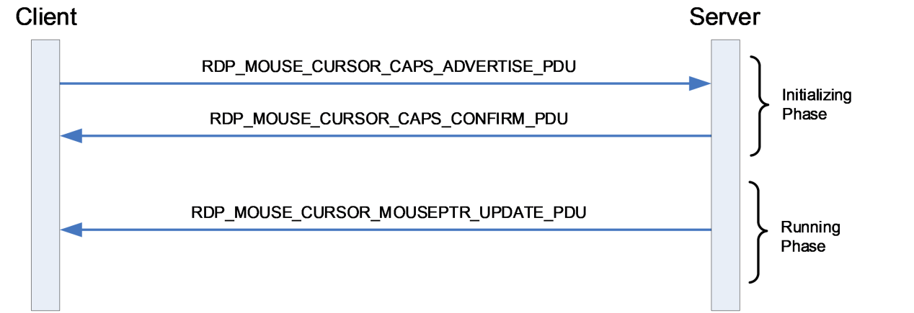

[MS-RDPEMSC]:

Remote Desktop Protocol: Mouse Cursor Virtual Channel
Extension

Intellectual Property Rights Notice for Open Specifications Documentation

  Technical Documentation. Microsoft publishes Open Specifications documentation (“this

documentation”) for protocols, file formats, data portability, computer languages, and standards
support. Additionally, overview documents cover inter-protocol relationships and interactions.

  Copyrights. This documentation is covered by Microsoft copyrights. Regardless of any other

terms that are contained in the terms of use for the Microsoft website that hosts this
documentation, you can make copies of it in order to develop implementations of the technologies
that are described in this documentation and can distribute portions of it in your implementations
that use these technologies or in your documentation as necessary to properly document the
implementation. You can also distribute in your implementation, with or without modification, any
schemas, IDLs, or code samples that are included in the documentation. This permission also
applies to any documents that are referenced in the Open Specifications documentation.
  No Trade Secrets. Microsoft does not claim any trade secret rights in this documentation.
  Patents. Microsoft has patents that might cover your implementations of the technologies

described in the Open Specifications documentation. Neither this notice nor Microsoft's delivery of
this documentation grants any licenses under those patents or any other Microsoft patents.
However, a given Open Specifications document might be covered by the Microsoft Open
Specifications Promise or the Microsoft Community Promise. If you would prefer a written license,
or if the technologies described in this documentation are not covered by the Open Specifications
Promise or Community Promise, as applicable, patent licenses are available by contacting
iplg@microsoft.com.

  License Programs. To see all of the protocols in scope under a specific license program and the

associated patents, visit the Patent Map.

  Trademarks. The names of companies and products contained in this documentation might be
covered by trademarks or similar intellectual property rights. This notice does not grant any
licenses under those rights. For a list of Microsoft trademarks, visit
www.microsoft.com/trademarks.

  Fictitious Names. The example companies, organizations, products, domain names, email

addresses, logos, people, places, and events that are depicted in this documentation are fictitious.
No association with any real company, organization, product, domain name, email address, logo,
person, place, or event is intended or should be inferred.

Reservation of Rights. All other rights are reserved, and this notice does not grant any rights other
than as specifically described above, whether by implication, estoppel, or otherwise.

Tools. The Open Specifications documentation does not require the use of Microsoft programming
tools or programming environments in order for you to develop an implementation. If you have access
to Microsoft programming tools and environments, you are free to take advantage of them. Certain
Open Specifications documents are intended for use in conjunction with publicly available standards
specifications and network programming art and, as such, assume that the reader either is familiar
with the aforementioned material or has immediate access to it.

Support. For questions and support, please contact dochelp@microsoft.com.

[MS-RDPEMSC] - v20240423
Remote Desktop Protocol: Mouse Cursor Virtual Channel Extension
Copyright © 2024 Microsoft Corporation
Release: April 23, 2024

1 / 26

Revision Summary

Date

Revision History  Revision Class  Comments

9/20/2023  1.0

4/23/2024  2.0

New

Major

Released new document.

Significantly changed the technical content.

[MS-RDPEMSC] - v20240423
Remote Desktop Protocol: Mouse Cursor Virtual Channel Extension
Copyright © 2024 Microsoft Corporation
Release: April 23, 2024

2 / 26

Table of Contents

1.1
1.2

1.2.1
1.2.2

1  Introduction ............................................................................................................ 5
Glossary ........................................................................................................... 5
References ........................................................................................................ 5
Normative References ................................................................................... 5
Informative References ................................................................................. 5
Overview .......................................................................................................... 5
Relationship to Other Protocols ............................................................................ 6
Prerequisites/Preconditions ................................................................................. 7
Applicability Statement ....................................................................................... 7
Versioning and Capability Negotiation ................................................................... 7
Vendor-Extensible Fields ..................................................................................... 7
Standards Assignments ....................................................................................... 7

1.3
1.4
1.5
1.6
1.7
1.8
1.9

2.1
2.2

2.2.1
2.2.2

2.2.2.1
2.2.2.2
2.2.2.3

2  Messages ................................................................................................................. 8
Transport .......................................................................................................... 8
Message Syntax ................................................................................................. 8
Namespaces ................................................................................................ 8
Common Data Types ..................................................................................... 8
RDP_MOUSE_CURSOR_HEADER................................................................ 8
RDP_MOUSE_CURSOR_CAPSET ................................................................ 9
Capability Sets ..................................................................................... 10
RDP_MOUSE_CURSOR_CAPSET_VERSION1 ........................................ 10
TS_POINT16 ......................................................................................... 10
TS_POINTERATTRIBUTE ......................................................................... 11
TS_LARGEPOINTERATTRIBUTE ............................................................... 12
Messages ................................................................................................... 13
RDP_MOUSE_CURSOR_CAPS_ADVERTISE_PDU ........................................ 13
RDP_MOUSE_CURSOR_CAPS_CONFIRM_PDU ........................................... 14
RDP_MOUSE_CURSOR_MOUSEPTR_UPDATE_PDU ..................................... 14

2.2.3.1
2.2.3.2
2.2.3.3

2.2.2.4
2.2.2.5
2.2.2.6

2.2.2.3.1

2.2.3

3.2

3.1

3.2.1

3.1.5.1

3.1.6
3.1.7

3.1.1
3.1.2
3.1.3
3.1.4
3.1.5

3  Protocol Details ..................................................................................................... 16
Common Details .............................................................................................. 16
Abstract Data Model .................................................................................... 16
Timers ...................................................................................................... 16
Initialization ............................................................................................... 16
Higher-Layer Triggered Events ..................................................................... 16
Message Processing Events and Sequencing Rules .......................................... 16
Processing a Mouse Cursor Message ........................................................ 16
Timer Events .............................................................................................. 16
Other Local Events ...................................................................................... 16
Server Details .................................................................................................. 16
Abstract Data Model .................................................................................... 16
Pointer Image Cache ............................................................................. 16
Timers ...................................................................................................... 17
Initialization ............................................................................................... 17
Higher-Layer Triggered Events ..................................................................... 17
Message Processing Events and Sequencing Rules .......................................... 17
Processing an RDP_MOUSE_CURSOR_CAPS_ADVERTISE_PDU Message ....... 17
Sending an RDP_MOUSE_CURSOR_CAPS_CONFIRM_PDU Message ............. 17
Sending an RDP_MOUSE_CURSOR_MOUSEPTR_UPDATE_PDU Message ....... 17
Timer Events .............................................................................................. 17
Other Local Events ...................................................................................... 18
Client Details ................................................................................................... 18
Abstract Data Model .................................................................................... 18
Pointer Image Cache ............................................................................. 18

3.2.5.1
3.2.5.2
3.2.5.3

3.2.2
3.2.3
3.2.4
3.2.5

3.2.6
3.2.7

3.3.1.1

3.2.1.1

3.3.1

3.3

[MS-RDPEMSC] - v20240423
Remote Desktop Protocol: Mouse Cursor Virtual Channel Extension
Copyright © 2024 Microsoft Corporation
Release: April 23, 2024

3 / 26

3.3.2
3.3.3
3.3.4
3.3.5

3.3.5.1
3.3.5.2
3.3.5.3

3.3.6
3.3.7

Timers ...................................................................................................... 18
Initialization ............................................................................................... 18
Higher-Layer Triggered Events ..................................................................... 18
Message Processing Events and Sequencing Rules .......................................... 18
Sending an RDP_MOUSE_CURSOR_CAPS_ADVERTISE_PDU Message ........... 18
Processing an RDP_MOUSE_CURSOR_CAPS_CONFIRM_PDU Message .......... 18
Processing an RDP_MOUSE_CURSOR_MOUSEPTR_UPDATE_PDU Message .... 19
Timer Events .............................................................................................. 19
Other Local Events ...................................................................................... 19

4.1

4.1.1
4.1.2

4  Protocol Examples ................................................................................................. 20
Capabilities Exchange ....................................................................................... 20
RDP_MOUSE_CURSOR_CAPS_ADVERTISE_PDU .............................................. 20
RDP_MOUSE_CURSOR_CAPS_CONFIRM_PDU ................................................. 20
Mouse Pointer Updates ..................................................................................... 20
RDP_MOUSE_CURSOR_MOUSEPTR_UPDATE_PDU with TS_POINT16 ................. 20
RDP_MOUSE_CURSOR_MOUSEPTR_UPDATE_PDU with TS_POINTERATTRIBUTE . 20

4.2.1
4.2.2

4.2

5  Security ................................................................................................................. 22
Security Considerations for Implementers ........................................................... 22
Index of Security Parameters ............................................................................ 22

5.1
5.2

6  Appendix A: Product Behavior ............................................................................... 23

7  Change Tracking .................................................................................................... 24

8  Index ..................................................................................................................... 25

[MS-RDPEMSC] - v20240423
Remote Desktop Protocol: Mouse Cursor Virtual Channel Extension
Copyright © 2024 Microsoft Corporation
Release: April 23, 2024

4 / 26

1  Introduction

The Remote Desktop Protocol Mouse Cursor Virtual Channel Extension (RDPEMSC) is an extension of
[MS-RDPBCGR], which runs over a dynamic virtual channel, as defined in [MS-RDPEDYC]. RDPEMSC is
used to redirect the mouse cursor from the terminal server to the terminal client. It replaces the
Server Pointer Update PDU (TS_POINTER_PDU) message in [MS-RDPBCGR].

Sections 1.5, 1.8, 1.9, 2, and 3 of this specification are normative. All other sections and examples in
this specification are informative.

1.1  Glossary

This document uses the following terms:

little-endian: Multiple-byte values that are byte-ordered with the least significant byte stored in

the memory location with the lowest address.

MAY, SHOULD, MUST, SHOULD NOT, MUST NOT: These terms (in all caps) are used as defined
in [RFC2119]. All statements of optional behavior use either MAY, SHOULD, or SHOULD NOT.

1.2  References

Links to a document in the Microsoft Open Specifications library point to the correct section in the
most recently published version of the referenced document. However, because individual documents
in the library are not updated at the same time, the section numbers in the documents may not
match. You can confirm the correct section numbering by checking the Errata.

1.2.1  Normative References

We conduct frequent surveys of the normative references to assure their continued availability. If you
have any issue with finding a normative reference, please contact dochelp@microsoft.com. We will
assist you in finding the relevant information.

[MS-RDPBCGR] Microsoft Corporation, "Remote Desktop Protocol: Basic Connectivity and Graphics
Remoting".

[MS-RDPEDYC] Microsoft Corporation, "Remote Desktop Protocol: Dynamic Channel Virtual Channel
Extension".

[RFC2119] Bradner, S., "Key words for use in RFCs to Indicate Requirement Levels", BCP 14, RFC
2119, March 1997, https://www.rfc-editor.org/info/rfc2119

1.2.2  Informative References

None.

1.3  Overview

The Remote Desktop Protocol: Mouse Cursor Virtual Channel (RDPESMC) Extension is used to send
mouse cursor shapes and position updates from the terminal server to the terminal client and replaces
the slow-path and fast-path mouse pointer updates described in [MS-RDPBCGR] section 2.2.9.1.

The RDPEMSC extension replaces the TS_POINTER_PDU message ([MS-RDPBCGR] section
2.2.9.1.1.4) and the following commands from the TS_FP_UPDATE message ([MS-RDPBCGR] section
2.2.9.1.2.1):

[MS-RDPEMSC] - v20240423
Remote Desktop Protocol: Mouse Cursor Virtual Channel Extension
Copyright © 2024 Microsoft Corporation
Release: April 23, 2024

5 / 26

<!-- Extracted images from page 6 -->

<!-- /Extracted images from page 6 -->













FASTPATH_UPDATETYPE_PTR_NULL ([MS-RDPBCGR] section 2.2.9.1.2.1.5)

FASTPATH_UPDATETYPE_PTR_DEFAULT ([MS-RDPBCGR] section 2.2.9.1.2.1.6)

FASTPATH_UPDATETYPE_PTR_POSITION ([MS-RDPBCGR] section 2.2.9.1.2.1.4)

FASTPATH_UPDATETYPE_COLOR ([MS-RDPBCGR] section 2.2.9.1.2.1.7)

FASTPATH_UPDATETYPE_CACHED ([MS-RDPBCGR] section 2.2.9.1.2.1.9)

FASTPATH_UPDATETYPE_POINTER ([MS-RDPBCGR] section 2.2.9.1.2.1.8)

Shape changes that are applied to the mouse cursor by the remote operating system or applications
are captured by the server, are encoded and sent on the wire to the client. Upon receiving the shape
update data, the client modifies the appearance of the local mouse cursor representation accordingly.
In a similar manner, any operating system or application-triggered mouse movement in the remote
session is captured by the server, encoded and sent on the wire to the client so that the local mouse
cursor representation can be moved as needed.

An example message flow encapsulating all the input messages described in section 2.2.3 and protocol
phases is presented in the following figure.

Figure 1: Messages exchanged by the mouse cursor shape protocol endpoints

The mouse cursor protocol is divided into two distinct phases:



Initializing Phase

  Running Phase

The Initializing Phase occurs at the start of the connection. During this phase, the server and client
exchange capabilities using the RDP_MOUSE_CURSOR_CAPS_ADVERTISE_PDU (section 2.2.3.1) and
RDP_MOUSE_CURSOR_CAPS_CONFIRM_PDU (section 2.2.3.2) messages. The client initiates this
exchange when the dynamic virtual channel (sections 1.4 and 2.1) over which the mouse cursor
messages will flow has been opened.

Once both endpoints are ready, the Running Phase is entered. During this phase, the server sends the
mouse shape and position updates to the client encapsulated in the
RDP_MOUSE_CURSOR_MOUSEPTR_UPDATE_PDU (section 2.2.3.3) message. The client decodes these
messages and updates the local mouse cursor representation accordingly.

[MS-RDPEMSC] - v20240423
Remote Desktop Protocol: Mouse Cursor Virtual Channel Extension
Copyright © 2024 Microsoft Corporation
Release: April 23, 2024

6 / 26

1.4  Relationship to Other Protocols

The Remote Desktop Protocol: Mouse Cursor Virtual Channel Extension is embedded in a dynamic
virtual channel transport, as described in [MS-RDPEDYC] sections 1 to 3.

The Remote Desktop Protocol: Mouse Cursor Virtual Channel Extension replaces the TS_POINTER_PDU
described in [MS-RDPBCGR] section 2.2.9.1.1.4.

1.5  Prerequisites/Preconditions

The Remote Desktop Protocol: Mouse Cursor Virtual Channel Extension (RDPEMSC) operates only after
the dynamic virtual channel transport (RDPEDYC) is fully established. If the dynamic virtual channel
transport is terminated, RDPEMSC is also terminated. The protocol is terminated by closing the
underlying virtual channel. For details about closing the dynamic virtual channel, see [MS-RDPEDYC]
section 3.2.5.2.This protocol is message-based and assumes preservation of the packet. It does not
allow for fragmentation. Packet reassembly is based on the information provided by the underlying
dynamic virtual channel transport. This document assumes that packet chunks have already been
reassembled.

1.6  Applicability Statement

The Remote Desktop Protocol: Mouse Cursor Virtual Channel Extension is applicable in scenarios
where the mouse cursor shape and position must be kept in sync between a remote session hosted on
a terminal server and a terminal server client rendering and providing mouse input to the session.

1.7  Versioning and Capability Negotiation

During the initializing phase, the client and server exchange capabilities using the
RDP_MOUSE_CURSOR_CAPS_ADVERTISE_PDU (section 2.2.3.1) and
RDP_MOUSE_CURSOR_CAPS_CONFIRM_PDU (section 2.2.3.2) messages. The client initiates this
exchange when the dynamic virtual channel (sections 1.4 and 2.1) over which the core input
messages will flow has been opened.

1.8  Vendor-Extensible Fields

None.

1.9  Standards Assignments

None.

[MS-RDPEMSC] - v20240423
Remote Desktop Protocol: Mouse Cursor Virtual Channel Extension
Copyright © 2024 Microsoft Corporation
Release: April 23, 2024

7 / 26

2  Messages

2.1  Transport

The Remote Desktop Protocol: Mouse Cursor Virtual Channel Extension is designed to operate over a
dynamic virtual channel, as specified in [MS-RDPEDYC] sections 1 to 3. The dynamic virtual channel
name is the null-terminated ANSI character string "Microsoft::Windows::RDS::MouseCursor". The
usage of channel names in the context of opening a dynamic virtual channel is specified in [MS-
RDPEDYC] section 2.2.2.1.

2.2  Message Syntax

The following sections specify the Remote Desktop Protocol: Mouse Cursor Virtual Channel Extension
message syntax. All multiple-byte fields within a message MUST be marshaled in little-endian byte
order, unless otherwise specified.

2.2.1  Namespaces

2.2.2  Common Data Types

2.2.2.1  RDP_MOUSE_CURSOR_HEADER

The RDP_MOUSE_CURSOR_HEADER structure is included in all mouse cursor PDUs. This structure
is used to identify the PDU type and specify the update type of the
RDP_MOUSE_CURSOR_MOUSEPTR_UPDATE_PDU (section 2.2.3.3) message that follows.

0  1  2  3  4  5  6  7  8  9

1
0  1  2  3  4  5  6  7  8  9

2
0  1  2  3  4  5  6  7  8  9

3
0  1

pduType

updateType

reserved

pduType (1 byte): An 8-bit, unsigned integer that identifies the type of the mouse cursor PDU.

Value

Meaning

PDUTYPE_CS_CAPS_ADVERTISE
0x01

PDUTYPE_SC_CAPS_CONFIRM
0x02

RDP_MOUSE_CURSOR_CAPS_ADVERTISE_PDU (section 2.2.3.1)

RDP_MOUSE_CURSOR_CAPS_CONFIRM_PDU (section 2.2.3.2)

PDUTYPE_SC_MOUSEPTR_UPDATE
0x03

RDP_MOUSE_CURSOR_MOUSEPTR_UPDATE_PDU (section
2.2.3.3)

updateType (1 byte): An 8-bit, unsigned integer. If the pduType field is set to

PDUTYPE_SC_MOUSEPTR_UPDATE (0x03), then this field MUST contain an update type code.

[MS-RDPEMSC] - v20240423
Remote Desktop Protocol: Mouse Cursor Virtual Channel Extension
Copyright © 2024 Microsoft Corporation
Release: April 23, 2024

8 / 26

Value

Meaning

TS_UPDATETYPE_MOUSEPTR_SYSTEM_NULL
0x05

Indicates that the local mouse cursor representation MUST
be hidden by the client.

TS_UPDATETYPE_MOUSEPTR_SYSTEM_DEFAULT
0x06

Indicates that the shape of the local mouse cursor
representation MUST be set to the operating system default
by the client.

TS_UPDATETYPE_MOUSEPTR_POSITION
0x08

Indicates that the position of the local mouse cursor
representation MUST be updated by the client.

Position data is present in the position field of the
RDP_MOUSE_CURSOR_MOUSEPTR_UPDATE_PDU (section
2.2.3.3) payload that follows the header.

TS_UPDATETYPE_MOUSEPTR_CACHED
0x0A

Indicates that the shape of the local mouse cursor
representation MUST be updated by the client using cached
pointer data.

Cache slot data is present in the cachedPointerIndex
field of the RDP_MOUSE_CURSOR_MOUSEPTR_
UPDATE_PDU payload that follows the header.

TS_UPDATETYPE_MOUSEPTR_POINTER
0x0B

Indicates that the shape of the local mouse cursor
representation MUST be updated by the client.

Pointer data is present in the pointerAttribute field of the
RDP_MOUSE_CURSOR_MOUSEPTR_UPDATE_PDU payload
that follows the header.

TS_UPDATETYPE_MOUSEPTR_LARGE_POINTER
0x0C

Indicates that the shape of the local mouse cursor
representation MUST be updated by the client.

Pointer data is present in the largePointerAttribute field
of the RDP_MOUSE_CURSOR_MOUSEPTR_UPDATE_PDU
payload that follows the header.

For all other values of pduType, this field MUST be set to zero.

reserved (2 bytes): A 16-bit, unsigned integer that SHOULD be set to zero.

2.2.2.2  RDP_MOUSE_CURSOR_CAPSET

The RDP_MOUSE_CAPSET structure specifies the layout of a capability set sent in the
RDP_MOUSE_CURSOR_CAPS_ADVERTISE_PDU (section 2.2.3.1) message. All the capability sets
specified in section 2.2.2.3 conform to this basic structure.

0  1  2  3  4  5  6  7  8  9

1
0  1  2  3  4  5  6  7  8  9

2
0  1  2  3  4  5  6  7  8  9

3
0  1

signature

[MS-RDPEMSC] - v20240423
Remote Desktop Protocol: Mouse Cursor Virtual Channel Extension
Copyright © 2024 Microsoft Corporation
Release: April 23, 2024

9 / 26

version

size

capsData (variable)

...

signature (4 bytes): A 32-bit, unsigned integer that MUST be set to 0x53504143.

version (4 bytes): A 32-bit, unsigned integer that specifies the version of the capability set.

Value

Meaning

RDP_MOUSE_CURSOR_CAPVERSION_1

RDP_MOUSE_CURSOR_CAPSET_VERSION1 (section 2.2.2.3.1)

0x00000001

The format of the data in the capsData field and the overall length of the capability set are both
determined by the version of the capability set.

size (4 bytes): A 32-bit, unsigned integer that specifies the size, in bytes, of the capability set.

capsData (variable): A variable-length array of bytes that contains data specific to the capability

set.

2.2.2.3  Capability Sets

2.2.2.3.1 RDP_MOUSE_CURSOR_CAPSET_VERSION1

The RDP_MOUSE_CURSOR_CAPSET_VERSION1 structure is used to define capabilities for version
1 of the mouse cursor protocol and conforms to the capability set layout specified in section 2.2.2.2.

0  1  2  3  4  5  6  7  8  9

1
0  1  2  3  4  5  6  7  8  9

2
0  1  2  3  4  5  6  7  8  9

3
0  1

signature

version

size

signature (4 bytes): A 32-bit, unsigned integer that MUST be set to 0x53504143.

version (4 bytes): A 32-bit, unsigned integer that MUST be set to

RDP_MOUSE_CURSOR_CAPVERSION_1 (0x00000001).

size (4 bytes): A 32-bit, unsigned integer that specifies the size in bytes of the capability set. This

field MUST be set to 0x0000000C.

2.2.2.4  TS_POINT16

The TS_POINT16 structure specifies a point relative to the top-left corner of the virtual desktop
bounding box.

[MS-RDPEMSC] - v20240423
Remote Desktop Protocol: Mouse Cursor Virtual Channel Extension
Copyright © 2024 Microsoft Corporation
Release: April 23, 2024

10 / 26

0  1  2  3  4  5  6  7  8  9

1
0  1  2  3  4  5  6  7  8  9

2
0  1  2  3  4  5  6  7  8  9

3
0  1

xPos

yPos

xPos (2 bytes): A 16-bit, unsigned integer. The x-coordinate relative to the top-left corner of the

virtual desktop bounding box.

yPos (2 bytes): A 16-bit, unsigned integer. The y-coordinate relative to the top-left corner of the

virtual desktop bounding box.

2.2.2.5  TS_POINTERATTRIBUTE

The TS_POINTERATTRIBUTE structure is used to send pointer data at an arbitrary color depth up to
a maximum size of 96x96 pixels.

0  1  2  3  4  5  6  7  8  9

1
0  1  2  3  4  5  6  7  8  9

2
0  1  2  3  4  5  6  7  8  9

3
0  1

xorBpp

width

hotSpot

cacheIndex

height

lengthAndMask

lengthXorMask

xorMaskData (variable)

...

...

...

andMaskData (variable)

...

...

...

pad (optional)

xorBpp (2 bytes): A 16-bit, unsigned integer. The color depth in bits-per-pixel of the XOR mask

contained in the xorMaskData field.

cacheIndex (2 bytes): A 16-bit, unsigned integer. The zero-based cache entry in the pointer cache
in which to store the pointer image. The number of cache entries is specified using the Pointer
Capability Set ([MS-RDPBCGR] section 2.2.7.1.5).

[MS-RDPEMSC] - v20240423
Remote Desktop Protocol: Mouse Cursor Virtual Channel Extension
Copyright © 2024 Microsoft Corporation
Release: April 23, 2024

11 / 26

hotSpot (4 bytes): A TS_POINT16 (section 2.2.2.4) structure containing the x-coordinates and y-

coordinates of the pointer hotspot.

width (2 bytes): A 16-bit, unsigned integer. The width of the pointer in pixels. The maximum

allowed pointer width is 96 pixels if the client set the LARGE_POINTER_FLAG_96x96
(0x00000001) flag in the Large Pointer Capability Set ([MS-RDPBCGR] section 2.2.7.2.7). If the
LARGE_POINTER_FLAG_96x96 was not set, the maximum allowed pointer width is 32 pixels.

height (2 bytes): A 16-bit, unsigned integer. The height of the pointer in pixels. The maximum

allowed pointer height is 96 pixels if the client set the LARGE_POINTER_FLAG_96x96
(0x00000001) flag in the Large Pointer Capability Set ([MS-RDPBCGR] section 2.2.7.2.7). If the
LARGE_POINTER_FLAG_96x96 was not set, the maximum allowed pointer height is 32 pixels.

lengthAndMask (2 bytes): A 16-bit, unsigned integer. The size in bytes of the andMaskData field.

lengthXorMask (2 bytes): A 16-bit, unsigned integer. The size in bytes of the xorMaskData field.

xorMaskData (variable): A variable-length array of bytes. Contains the 24-bpp, bottom-up XOR

mask scan-line data. The XOR mask is padded to a 2-byte boundary for each encoded scan-line.
For example, if a 3x3 pixel cursor is being sent, then each scan-line will consume 10 bytes (3
pixels per scan-line multiplied by 3 bytes per pixel, rounded up to the next even number of bytes).

andMaskData (variable): A variable-length array of bytes. Contains the 1-bpp, bottom-up AND

mask scan-line data. The AND mask is padded to a 2-byte boundary for each encoded scan-line.
For example, if a 7x7 pixel cursor is being sent, then each scan-line will consume 2 bytes (7 pixels
per scan-line multiplied by 1 bpp, rounded up to the next even number of bytes).

pad (1 byte, optional): An optional 8-bit, unsigned integer. It is used as a padding field. Values in

this field MUST be ignored.

2.2.2.6  TS_LARGEPOINTERATTRIBUTE

The TS_LARGEPOINTERATTRIBUTE structure is used to transport mouse pointer shapes larger than
96x96 pixels in size.

0  1  2  3  4  5  6  7  8  9

1
0  1  2  3  4  5  6  7  8  9

2
0  1  2  3  4  5  6  7  8  9

3
0  1

cacheIndex

height

xorBpp

width

hotSpot

lengthAndMask

lengthXorMask

xorMaskData (variable)

...

...

...

[MS-RDPEMSC] - v20240423
Remote Desktop Protocol: Mouse Cursor Virtual Channel Extension
Copyright © 2024 Microsoft Corporation
Release: April 23, 2024

12 / 26

andMaskData (variable)

...

...

...

pad (optional)

xorBpp (2 bytes): A 16-bit, unsigned integer. The color depth in bits-per-pixel of the XOR mask

contained in the xorMaskData field.

cacheIndex (2 bytes): A 16-bit, unsigned integer. The zero-based cache entry in the pointer cache
in which to store the pointer image. The number of cache entries is specified using the Pointer
Capability Set ([MS-RDPBCGR] section 2.2.7.1.5).

hotSpot (4 bytes): A TS_POINT16 (section 2.2.2.4) structure containing the x-coordinates and y-

coordinates of the pointer hotspot.

width (2 bytes): A 16-bit, unsigned integer. The width of the pointer in pixels. The maximum

allowed pointer width is 96 pixels if the client set the LARGE_POINTER_FLAG_96x96
(0x00000001) flag in the Large Pointer Capability Set ([MS-RDPBCGR] section 2.2.7.2.7). If the
LARGE_POINTER_FLAG_96x96 was not set, the maximum allowed pointer width is 32 pixels.

height (2 bytes): A 16-bit, unsigned integer. The height of the pointer in pixels. The maximum

allowed pointer height is 96 pixels if the client set the LARGE_POINTER_FLAG_96x96
(0x00000001) flag in the Large Pointer Capability Set ([MS-RDPBCGR] section 2.2.7.2.7). If the
LARGE_POINTER_FLAG_96x96 was not set, the maximum allowed pointer height is 32 pixels.

lengthAndMask (4 bytes): A 32-bit, unsigned integer. The size in bytes of the andMaskData field.

lengthXorMask (4 bytes): A 32-bit, unsigned integer. The size in bytes of the xorMaskData field.

xorMaskData (variable): A variable-length array of bytes. Contains the 24-bpp, bottom-up XOR

mask scan-line data. The XOR mask is padded to a 2-byte boundary for each encoded scan-line.
For example, if a 3x3 pixel cursor is being sent, then each scan-line will consume 10 bytes (3
pixels per scan-line multiplied by 3 bytes per pixel, rounded up to the next even number of bytes).

andMaskData (variable): A variable-length array of bytes. Contains the 1-bpp, bottom-up AND

mask scan-line data. The AND mask is padded to a 2-byte boundary for each encoded scan-line.
For example, if a 7x7 pixel cursor is being sent, then each scan-line will consume 2 bytes (7 pixels
per scan-line multiplied by 1 bpp, rounded up to the next even number of bytes).

pad (1 byte, optional): An optional 8-bit, unsigned integer. It is used as a padding field. Values in

this field MUST be ignored.

2.2.3  Messages

2.2.3.1  RDP_MOUSE_CURSOR_CAPS_ADVERTISE_PDU

The RDP_MOUSE_CURSOR_CAPS_ADVERTISE_PDU message is sent by the client and is used to
advertise capabilities to the server.

[MS-RDPEMSC] - v20240423
Remote Desktop Protocol: Mouse Cursor Virtual Channel Extension
Copyright © 2024 Microsoft Corporation
Release: April 23, 2024

13 / 26

0  1  2  3  4  5  6  7  8  9

1
0  1  2  3  4  5  6  7  8  9

2
0  1  2  3  4  5  6  7  8  9

3
0  1

header

capsSets (variable)

…

header (4 bytes): An RDP_MOUSE_CURSOR_HEADER (section 2.2.2.1) structure. The embedded

pduType field MUST be set to PDUTYPE_CS_CAPS_ADVERTISE (0x01).

capsSets (variable): A variable-length array of RDP_MOUSE_CURSOR_CAPSET (section 2.2.2.2)

structures.

2.2.3.2  RDP_MOUSE_CURSOR_CAPS_CONFIRM_PDU

The RDP_MOUSE_CURSOR_CAPS_CONFIRM_PDU message is sent by the server to confirm capabilities
for the connection.

0  1  2  3  4  5  6  7  8  9

1
0  1  2  3  4  5  6  7  8  9

2
0  1  2  3  4  5  6  7  8  9

3
0  1

header

capsSet (variable)

…

header (4 bytes): An RDP_MOUSE_CURSOR_HEADER (section 2.2.2.1) structure. The embedded

pduType field MUST be set to PDUTYPE_SC_CAPS_CONFIRM (0x02).

capsSet (variable): A variable-length RDP_MOUSE_CURSOR_CAPSET (section 2.2.2.2) structure.

2.2.3.3  RDP_MOUSE_CURSOR_MOUSEPTR_UPDATE_PDU

The RDP_MOUSE_CURSOR_MOUSEPTR_UPDATE_PDU message is sent by the server and is used to
transport updated mouse cursor parameters and position changes.

0  1  2  3  4  5  6  7  8  9

1
0  1  2  3  4  5  6  7  8  9

2
0  1  2  3  4  5  6  7  8  9

3
0  1

header

position (optional)

cachedPointerIndex (optional)

pointerAttribute (variable)

…

largerPointerAttribute (variable)

[MS-RDPEMSC] - v20240423
Remote Desktop Protocol: Mouse Cursor Virtual Channel Extension
Copyright © 2024 Microsoft Corporation
Release: April 23, 2024

14 / 26

…

header (4 bytes): An RDP_MOUSE_CURSOR_HEADER (section 2.2.2.1) structure. The embedded

pduType field MUST be set to PDUTYPE_SC_MOUSEPTR_UPDATE (0x03).

position (4 bytes, optional): An optional TS_POINT16 (section 2.2.2.4) structure that contains the

X and Y coordinates of the updated server-side mouse pointer. This field MUST only be present if
the embedded updateType field of the header field is set to
TS_UPDATETYPE_MOUSEPTR_POSITION (0x08).

cachedPointerIndex (2 bytes, optional): An optional 16-bit, unsigned integer that contains a zero-

based cache index of the cached pointer to which the client's pointer MUST be changed. The
pointer data MUST have already been cached using either the TS_POINTERATTRIBUTE (section
2.2.2.5) or TS_LARGEPOINTERATTRIBUTE (section 2.2.2.6) messages. This field MUST only be
present if the embedded updateType field of the header field is set to
TS_UPDATETYPE_MOUSEPTR_CACHED (0x0A).

pointerAttribute (variable): An optional TS_POINTERATTRIBUTE (section 2.2.2.5) structure that
specifies a mouse cursor up to a maximum size of 96x96 pixels. This field MUST only be present if
the embedded updateType field of the header field is set to
TS_UPDATETYPE_MOUSEPTR_POINTER (0x0B).

largePointerAttribute (variable): An optional TS_LARGEPOINTERATTRIBUTE (section 2.2.2.6)
structure that specifies a mouse cursor greater than 96x96 pixels in size. This field MUST only be
present if the embedded updateType field of the header field is set to
TS_UPDATETYPE_MOUSEPTR_LARGE_POINTER (0x0C).

[MS-RDPEMSC] - v20240423
Remote Desktop Protocol: Mouse Cursor Virtual Channel Extension
Copyright © 2024 Microsoft Corporation
Release: April 23, 2024

15 / 26

3  Protocol Details

3.1  Common Details

3.1.1  Abstract Data Model

None.

3.1.2  Timers

None.

3.1.3  Initialization

None.

3.1.4  Higher-Layer Triggered Events

None.

3.1.5  Message Processing Events and Sequencing Rules

3.1.5.1  Processing a Mouse Cursor Message

All mouse cursor messages are prefaced by the RDP_MOUSE_CURSOR_HEADER (section 2.2.2.1)
structure.

When a mouse cursor message is processed, the pduType field in the header MUST be examined to
determine if the message is within the subset of expected messages as described in section 1.3. If the
message is not expected, it SHOULD be ignored.

3.1.6  Timer Events

None.

3.1.7  Other Local Events

None.

3.2  Server Details

3.2.1  Abstract Data Model

None.

3.2.1.1  Pointer Image Cache

The Pointer Image Cache contains a collection of pointer images sent to the client using the
TS_POINTERATTRIBUTE (section 2.2.2.5) and TS_LARGEPOINTERATTRIBUTE (section 2.2.2.6)
structures. The size and color depth (either variable or fixed at 24 bpp) of the cache are specified in
the Pointer Capability Set ([MS-RDPBCGR] section 2.2.7.1.5).

[MS-RDPEMSC] - v20240423
Remote Desktop Protocol: Mouse Cursor Virtual Channel Extension
Copyright © 2024 Microsoft Corporation
Release: April 23, 2024

16 / 26

3.2.2  Timers

None.

3.2.3  Initialization

Upon receiving the RDP_MOUSE_CURSOR_CAPS_ADVERTISE_PDU (section 2.2.3.1) message, the
server MUST send the RDP_MOUSE_CURSOR_CAPS_CONFIRM_PDU (section 2.2.3.2) message to the
client, as specified in section 3.2.5.2, to signal that the Initialization Phase is complete.

3.2.4  Higher-Layer Triggered Events

None.

3.2.5  Message Processing Events and Sequencing Rules

3.2.5.1  Processing an RDP_MOUSE_CURSOR_CAPS_ADVERTISE_PDU Message

The structure and fields of the RDP_MOUSE_CURSOR_CAPS_ADVERTISE_PDU message are specified
in section 2.2.3.1.

The header field MUST be processed as specified in section 3.1.5.1. If the message is valid, the
server SHOULD send an RDP_MOUSE_CURSOR_CAPS_CONFIRM_PDU (section 2.2.3.2) message to
the client, as specified in section 3.2.5.2.

3.2.5.2  Sending an RDP_MOUSE_CURSOR_CAPS_CONFIRM_PDU Message

The structure and fields of the RDP_MOUSE_CURSOR_CAPS_CONFIRM_PDU message are specified in
section 2.2.3.2. The message fields MUST be populated in accordance with this description. The server
MUST populate the capsSet field with a single instance of a correctly initialized capability set structure
(section 2.2.3.2) that accounts for the capabilities supported by the client.

Once the RDP_MOUSE_CURSOR_CAPS_CONFIRM_PDU message has been sent to the client, the
server SHOULD hook the mouse cursor subsystem, listen for changes to the cursor shape and
position, and send updates using the RDP_MOUSE_CURSOR_MOUSEPTR_UPDATE_PDU message, as
specified in section 3.2.5.3.

3.2.5.3  Sending an RDP_MOUSE_CURSOR_MOUSEPTR_UPDATE_PDU Message

The structure and fields of the RDP_MOUSE_CURSOR_MOUSEPTR_UPDATE_PDU message are
specified in section 2.2.3.3. The message fields MUST be populated in accordance with this
description.

In the case of TS_POINTERATTRIBUTE (section 2.2.2.5) and TS_LARGEPOINTERATTRIBUTE
(section 2.2.2.6), the mouse cursor image MUST be stored in the Pointer Image Cache (section
3.2.1.1) and the cacheIndex field MUST be populated with the cache slot index.

Before sending a mouse cursor image, the server SHOULD check for a hit in the Pointer Image Cache,
and if a hit is found, the cachedPointerIndex field SHOULD be populated with the slot index and
sent to the client (as opposed to  sending an entire TS_POINTERATTRIBUTE or
TS_LARGEPOINTERATTRIBUTE structure).

3.2.6  Timer Events

None.

[MS-RDPEMSC] - v20240423
Remote Desktop Protocol: Mouse Cursor Virtual Channel Extension
Copyright © 2024 Microsoft Corporation
Release: April 23, 2024

17 / 26

3.2.7  Other Local Events

None.

3.3  Client Details

3.3.1  Abstract Data Model

None.

3.3.1.1  Pointer Image Cache

The Pointer Image Cache contains a collection of pointer images sent to the client using the
TS_POINTERATTRIBUTE (section 2.2.2.5) and TS_LARGEPOINTERATTRIBUTE (section 2.2.2.6)
structures. The images stored in the cache are used to set the shape of the pointer when processing
an RDP_MOUSE_CURSOR_MOUSEPTR_UPDATE_PDU (section 2.2.3.3) that contains a
cachedPointerIndex field. The size and color depth (either variable or fixed at 24 bpp) of the cache
are specified in the Pointer Capability Set ([MS-RDPBCGR] section 2.2.7.1.5).

3.3.2  Timers

None.

3.3.3  Initialization

The client MUST send the RDP_MOUSE_CURSOR_CAPS_ADVERTISE_PDU (section 2.2.3.1) message to
the server, as specified in section 3.3.5.1, once the dynamic virtual channel (section 2.1) is opened.
After the server responds with the RDP_MOUSE_CURSOR_CAPS_CONFIRM_PDU (section 2.2.3.2), the
Initialization Phase is complete.

3.3.4  Higher-Layer Triggered Events

None.

3.3.5  Message Processing Events and Sequencing Rules

3.3.5.1  Sending an RDP_MOUSE_CURSOR_CAPS_ADVERTISE_PDU Message

The structure and fields of the RDP_MOUSE_CURSOR_CAPS_ADVERTISE_PDU message are specified
in section 2.2.3.1. The message fields MUST be populated in accordance with this description. The
client MUST correctly populate the capsSet field with one or more of the capability sets specified in
section 2.2.3. Each capability set type MUST NOT appear more than once.

3.3.5.2  Processing an RDP_MOUSE_CURSOR_CAPS_CONFIRM_PDU Message

The structure and fields of the RDP_MOUSE_CURSOR_CAPS_CONFIRM_PDU message are specified in
section 2.2.3.2.

The header field MUST be processed as specified in section 3.1.5.1. If the message is valid, the client
SHOULD be ready to accept and process the mouse cursor shape and position updates.

[MS-RDPEMSC] - v20240423
Remote Desktop Protocol: Mouse Cursor Virtual Channel Extension
Copyright © 2024 Microsoft Corporation
Release: April 23, 2024

18 / 26

3.3.5.3  Processing an RDP_MOUSE_CURSOR_MOUSEPTR_UPDATE_PDU Message

The structure and fields of the RDP_MOUSE_CURSOR_MOUSEPTR_UPDATE_PDU message are
specified in section 2.2.3.3.

The header field MUST be processed as specified in section 3.1.5.1. If the message is valid, the client
SHOULD update the local mouse cursor shape or position. In the case of a TS_POINTERATTRIBUTE
(section 2.2.2.5) or TS_LARGEPOINTERATTRIBUTE (section 2.2.2.6) structure, the client MUST
store the mouse cursor image in the Pointer Image Cache (section 3.3.1.1) using the slot index
specified by the cacheIndex field. This cache entry will be used to retrieve the image if the
RDP_MOUSE_CURSOR_MOUSEPTR_UPDATE_PDU contains a cachedPointerIndex field.

3.3.6  Timer Events

None.

3.3.7  Other Local Events

None.

[MS-RDPEMSC] - v20240423
Remote Desktop Protocol: Mouse Cursor Virtual Channel Extension
Copyright © 2024 Microsoft Corporation
Release: April 23, 2024

19 / 26

4  Protocol Examples

4.1  Capabilities Exchange

4.1.1  RDP_MOUSE_CURSOR_CAPS_ADVERTISE_PDU

The following is an annotated dump of the RDP_MOUSE_CURSOR_CAPS_ADVERTISE_PDU (section
2.2.3.1).

 00000000 01 00 00 00 43 41 50 53 01 00 00 00 0c 00 00 00  ....CAPS........

01 -> RDP_MOUSE_CURSOR_HEADER::pduType = PDUTYPE_CS_CAPS_ADVERTISE
00 -> RDP_MOUSE_CURSOR_HEADER::updateType (not used for PDUTYPE_CS_CAPS_ADVERTISE)
00 00 -> RDP_MOUSE_CURSOR_HEADER::reserved
43 41 50 53 -> CAPS_HEADER::signature = "CAPS"
01 00 00 00 -> CAPS_HEADER::version = 0x00000001
0c 00 00 00 -> CAPS_HEADER::size = 0x0000000C (12)

4.1.2  RDP_MOUSE_CURSOR_CAPS_CONFIRM_PDU

The following is an annotated dump of the RDP_MOUSE_CURSOR_CAPS_CONFIRM_PDU (section
2.2.3.2).

 00000000 02 00 00 00 43 41 50 53-01 00 00 00 0c 00 00 00  ....CAPS........

02 -> RDP_MOUSE_CURSOR_HEADER::pduType is PDUTYPE_SC_CAPS_CONFIRM (1 Byte)
00 -> RDP_MOUSE_CURSOR_HEADER::updateType not used for PDUTYPE_CS_CAPS_ADVERTISE (1 Byte)
00 00 -> RDP_MOUSE_CURSOR_HEADER::reserved (2 Bytes)
43 41 50 53 -> CAPS_HEADER::signature ‘CAPS’ (4 Bytes)
01 00 00 00 -> CAPS_HEADER::version 1 (4 Bytes)
0c 00 00 00 -> CAPS_HEADER::size 0xC (4 bytes)

4.2  Mouse Pointer Updates

4.2.1  RDP_MOUSE_CURSOR_MOUSEPTR_UPDATE_PDU with TS_POINT16

The following is an annotated dump of the RDP_MOUSE_CURSOR_MOUSEPTR_UPDATE_PDU (section
2.2.3.3) containing a TS_POINT16 (section 2.2.2.4) structure.

 00000000 03 08 00 00 78 00 64 00                          ........
 03 -> RDP_MOUSE_CURSOR_HEADER::pduType = PDUTYPE_SC_MOUSEPTR_UPDATE
 08 -> RDP_MOUSE_CURSOR_HEADER::updateType = TS_UPDATETYPE_MOUSEPTR_POSITION
 00 00 -> RDP_MOUSE_CURSOR_HEADER::reserved
 78 00 -> TS_POINT16::xPos = 120
 64 00 -> TS_POINT16::yPos = 100

4.2.2  RDP_MOUSE_CURSOR_MOUSEPTR_UPDATE_PDU with TS_POINTERATTRIBUTE

The following is an annotated dump of the RDP_MOUSE_CURSOR_MOUSEPTR_UPDATE_PDU (section
2.2.3.3) containing a TS_POINTERATTRIBUTE (section 2.2.2.5) structure.

20 / 26

[MS-RDPEMSC] - v20240423
Remote Desktop Protocol: Mouse Cursor Virtual Channel Extension
Copyright © 2024 Microsoft Corporation
Release: April 23, 2024

 00000000 03 0b 00 00 18 00 00 00 0e 00 0f 00 30 00 30 00  ............0.0.
 00000010 20 01 00 1b 00 00 00 00 00 00 00 00 00 00 00 00  ................
 00000020 00 00 00 00 00 00 00 00 00 00 00 00 00 00 00 00  ................
 00000030 00 00 00 00 00 00 00 00 00 00 00 00 00 00 00 00  ................
 ...

 03 -> RDP_MOUSE_CURSOR_HEADER::pduType = PDUTYPE_SC_MOUSEPTR_UPDATE
 0B -> RDP_MOUSE_CURSOR_HEADER::updateType = TS_UPDATETYPE_MOUSEPTR_POINTER
 00 00 -> RDP_MOUSE_CURSOR_HEADER::reserved
 18 00 -> TS_POINTERATTRIBUTE::xorBpp = 24bpp
 00 00 -> TS_POINTERATTRIBUTE::cacheIndex = 0
 0E 00 0F 00 -> TS_POINTERATTRIBUTE::hotSpot x = 0x000E (14), y = 0x000F (15)
 30 00 -> TS_POINTERATTRIBUTE::width = 48 pixels
 30 00 -> TS_POINTERATTRIBUTE::height = 48 pixels
 20 01 -> TS_POINTERATTRIBUTE::lengthAndMask = 0x0120 (288) bytes
 00 1B -> TS_POINTERATTRIBUTE::lengthXorMask = 0x1B00 (6912) bytes

 00 00 00 00 … -> xorMaskData (6912 bytes)
 ff ff ff ff … -> andMaskData (288 bytes)

[MS-RDPEMSC] - v20240423
Remote Desktop Protocol: Mouse Cursor Virtual Channel Extension
Copyright © 2024 Microsoft Corporation
Release: April 23, 2024

21 / 26

5  Security

5.1  Security Considerations for Implementers

None.

5.2  Index of Security Parameters

None.

[MS-RDPEMSC] - v20240423
Remote Desktop Protocol: Mouse Cursor Virtual Channel Extension
Copyright © 2024 Microsoft Corporation
Release: April 23, 2024

22 / 26

6  Appendix A: Product Behavior

The information in this specification is applicable to the following Microsoft products or supplemental
software. References to product versions include updates to those products.

  Windows Vista operating system

  Windows Server 2008 operating system

  Windows 7 operating system

  Windows Server 2008 R2 operating system

  Windows 8 operating system

  Windows Server 2012 operating system

  Windows 8.1 operating system

  Windows Server 2012 R2 operating system

  Windows 10 operating system

  Windows Server 2016 operating system

  Windows Server

  Windows Server 2019 operating system

  Windows Server 2022 operating system

  Windows 11 operating system

  Windows Server 2025 operating system

Exceptions, if any, are noted in this section. If an update version, service pack or Knowledge Base
(KB) number appears with a product name, the behavior changed in that update. The new behavior
also applies to subsequent updates unless otherwise specified. If a product edition appears with the
product version, behavior is different in that product edition.

Unless otherwise specified, any statement of optional behavior in this specification that is prescribed
using the terms "SHOULD" or "SHOULD NOT" implies product behavior in accordance with the
SHOULD or SHOULD NOT prescription. Unless otherwise specified, the term "MAY" implies that the
product does not follow the prescription.

[MS-RDPEMSC] - v20240423
Remote Desktop Protocol: Mouse Cursor Virtual Channel Extension
Copyright © 2024 Microsoft Corporation
Release: April 23, 2024

23 / 26

7  Change Tracking

This section identifies changes that were made to this document since the last release. Changes are
classified as Major, Minor, or None.

The revision class Major means that the technical content in the document was significantly revised.
Major changes affect protocol interoperability or implementation. Examples of major changes are:

  A document revision that incorporates changes to interoperability requirements.
  A document revision that captures changes to protocol functionality.

The revision class Minor means that the meaning of the technical content was clarified. Minor changes
do not affect protocol interoperability or implementation. Examples of minor changes are updates to
clarify ambiguity at the sentence, paragraph, or table level.

The revision class None means that no new technical changes were introduced. Minor editorial and
formatting changes may have been made, but the relevant technical content is identical to the last
released version.

The changes made to this document are listed in the following table. For more information, please
contact dochelp@microsoft.com.

Section

Description

6 Appendix A: Product
Behavior

Added Windows Server 2025 to the list of applicable
products.

Revision
class

Major

[MS-RDPEMSC] - v20240423
Remote Desktop Protocol: Mouse Cursor Virtual Channel Extension
Copyright © 2024 Microsoft Corporation
Release: April 23, 2024

24 / 26

8  Index
A

Abstract data model
   client 18
   server 16
Applicability 7

C

Capability negotiation 7
Change tracking 24
Client
   abstract data model 18
   higher-layer triggered events 18
   initialization 18
   other local events 19
   timer events 19
   timers 18

D

Data model - abstract
   client 18
   server 16

E

Examples
   RDP_MOUSE_CURSOR_CAPS_ADVERTISE_PDU 20
   RDP_MOUSE_CURSOR_CAPS_CONFIRM_PDU 20
   RDP_MOUSE_CURSOR_MOUSEPTR_UPDATE_PDU

with TS_POINTERATTRIBUTE 20

Messages
   syntax 8
   transport 8

N

Normative references 5

O

Other local events
   client 19
   server 18
Overview (synopsis) 5

P

Parameters - security index 22
Preconditions 7
Prerequisites 7
Product behavior 23

R

RDP_MOUSE_CURSOR_CAPS_ADVERTISE_PDU

example 20

RDP_MOUSE_CURSOR_CAPS_CONFIRM_PDU

example 20

RDP_MOUSE_CURSOR_MOUSEPTR_UPDATE_PDU
with TS_POINTERATTRIBUTE example 20
RDP_MOUSEPTR_UPDATE_PDU with TS_POINT16

   RDP_MOUSEPTR_UPDATE_PDU with TS_POINT16

example 20

20

F

Fields - vendor-extensible 7

G

Glossary 5

H

Higher-layer triggered events
   client 18
   server 17

I

Implementer - security considerations 22
Index of security parameters 22
Informative references 5
Initialization
   client 18
   server 17
Introduction 5

M

References 5
   informative 5
   normative 5
Relationship to other protocols 6

S

Security
   implementer considerations 22
   parameter index 22
Server
   abstract data model 16
   higher-layer triggered events 17
   initialization 17
   other local events 18
   timer events 17
   timers 17
Standards assignments 7
Syntax 8

T

Timer events
   client 19
   server 17
Timers
   client 18
   server 17

[MS-RDPEMSC] - v20240423
Remote Desktop Protocol: Mouse Cursor Virtual Channel Extension
Copyright © 2024 Microsoft Corporation
Release: April 23, 2024

25 / 26

Tracking changes 24
Transport 8
Triggered events - higher-layer
   client 18
   server 17

V

Vendor-extensible fields 7
Versioning 7

[MS-RDPEMSC] - v20240423
Remote Desktop Protocol: Mouse Cursor Virtual Channel Extension
Copyright © 2024 Microsoft Corporation
Release: April 23, 2024

26 / 26

