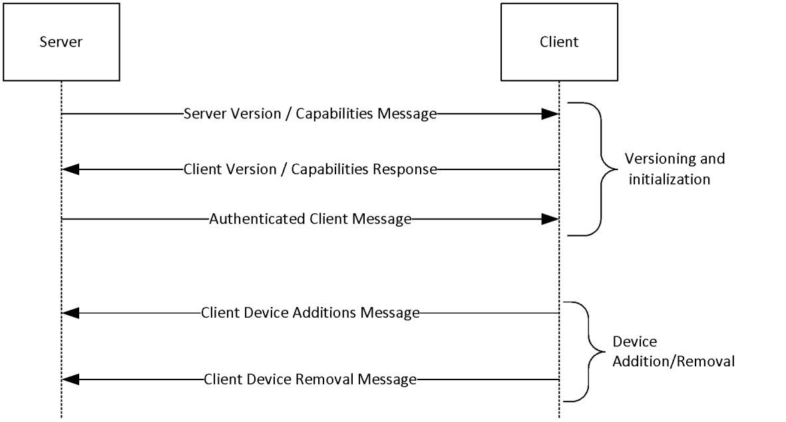
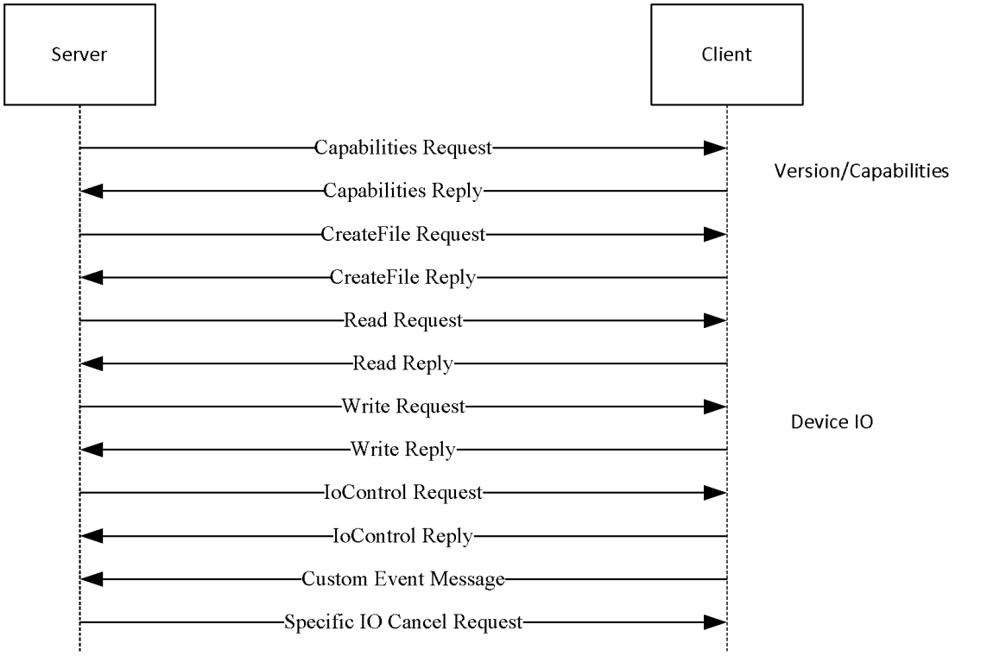

[MS-RDPEPNP]:

Remote Desktop Protocol: Plug and Play Devices Virtual
Channel Extension

Intellectual Property Rights Notice for Open Specifications Documentation

  Technical Documentation. Microsoft publishes Open Specifications documentation (“this

documentation”) for protocols, file formats, data portability, computer languages, and standards
support. Additionally, overview documents cover inter-protocol relationships and interactions.

  Copyrights. This documentation is covered by Microsoft copyrights. Regardless of any other

terms that are contained in the terms of use for the Microsoft website that hosts this
documentation, you can make copies of it in order to develop implementations of the technologies
that are described in this documentation and can distribute portions of it in your implementations
that use these technologies or in your documentation as necessary to properly document the
implementation. You can also distribute in your implementation, with or without modification, any
schemas, IDLs, or code samples that are included in the documentation. This permission also
applies to any documents that are referenced in the Open Specifications documentation.
  No Trade Secrets. Microsoft does not claim any trade secret rights in this documentation.
  Patents. Microsoft has patents that might cover your implementations of the technologies

described in the Open Specifications documentation. Neither this notice nor Microsoft's delivery of
this documentation grants any licenses under those patents or any other Microsoft patents.
However, a given Open Specifications document might be covered by the Microsoft Open
Specifications Promise or the Microsoft Community Promise. If you would prefer a written license,
or if the technologies described in this documentation are not covered by the Open Specifications
Promise or Community Promise, as applicable, patent licenses are available by contacting
iplg@microsoft.com.

  License Programs. To see all of the protocols in scope under a specific license program and the

associated patents, visit the Patent Map.

  Trademarks. The names of companies and products contained in this documentation might be
covered by trademarks or similar intellectual property rights. This notice does not grant any
licenses under those rights. For a list of Microsoft trademarks, visit
www.microsoft.com/trademarks.

  Fictitious Names. The example companies, organizations, products, domain names, email

addresses, logos, people, places, and events that are depicted in this documentation are fictitious.
No association with any real company, organization, product, domain name, email address, logo,
person, place, or event is intended or should be inferred.

Reservation of Rights. All other rights are reserved, and this notice does not grant any rights other
than as specifically described above, whether by implication, estoppel, or otherwise.

Tools. The Open Specifications documentation does not require the use of Microsoft programming
tools or programming environments in order for you to develop an implementation. If you have access
to Microsoft programming tools and environments, you are free to take advantage of them. Certain
Open Specifications documents are intended for use in conjunction with publicly available standards
specifications and network programming art and, as such, assume that the reader either is familiar
with the aforementioned material or has immediate access to it.

Support. For questions and support, please contact dochelp@microsoft.com.

[MS-RDPEPNP] - v20240423
Remote Desktop Protocol: Plug and Play Devices Virtual Channel Extension
Copyright © 2024 Microsoft Corporation
Release: April 23, 2024

1 / 48

Revision Summary

Date

Revision
History

Revision
Class

Comments

2/22/2007

0.01

6/1/2007

1.0

7/3/2007

1.1

New

Major

Minor

Version 0.01 release

Updated and revised the technical content.

Minor technical content changes.

7/20/2007

1.1.1

Editorial

Changed language and formatting in the technical content.

8/10/2007

1.2

9/28/2007

1.3

10/23/2007  1.4

11/30/2007  1.5

1/25/2008

2.0

3/14/2008

3.0

Minor

Minor

Minor

Minor

Major

Major

Updated content based on feedback.

Made technical and editorial changes based on feedback.

Made technical and editorial changes based on feedback.

Made technical and editorial changes based on feedback.

Updated and revised the technical content.

Updated and revised the technical content.

5/16/2008

3.0.1

Editorial

Changed language and formatting in the technical content.

6/20/2008

3.1

Minor

Clarified the meaning of the technical content.

7/25/2008

3.1.1

Editorial

Changed language and formatting in the technical content.

8/29/2008

3.1.2

Editorial

Changed language and formatting in the technical content.

10/24/2008  3.1.3

Editorial

Changed language and formatting in the technical content.

12/5/2008

3.1.4

Editorial

Changed language and formatting in the technical content.

1/16/2009

3.1.5

Editorial

Changed language and formatting in the technical content.

2/27/2009

3.1.6

Editorial

Changed language and formatting in the technical content.

4/10/2009

4.0

5/22/2009

5.0

7/2/2009

6.0

8/14/2009

7.0

9/25/2009

7.1

Major

Major

Major

Major

Minor

Updated and revised the technical content.

Updated and revised the technical content.

Updated and revised the technical content.

Updated and revised the technical content.

Clarified the meaning of the technical content.

11/6/2009

7.1.1

Editorial

Changed language and formatting in the technical content.

12/18/2009  8.0

1/29/2010

9.0

3/12/2010

10.0

Major

Major

Major

Updated and revised the technical content.

Updated and revised the technical content.

Updated and revised the technical content.

4/23/2010

10.0.1

Editorial

Changed language and formatting in the technical content.

6/4/2010

11.0

Major

Updated and revised the technical content.

7/16/2010

11.0.1

Editorial

Changed language and formatting in the technical content.

[MS-RDPEPNP] - v20240423
Remote Desktop Protocol: Plug and Play Devices Virtual Channel Extension
Copyright © 2024 Microsoft Corporation
Release: April 23, 2024

2 / 48

Date

Revision
History

Revision
Class

Comments

8/27/2010

11.0.1

None

No changes to the meaning, language, or formatting of the
technical content.

10/8/2010

11.0.1

None

No changes to the meaning, language, or formatting of the
technical content.

11/19/2010  11.0.1

None

No changes to the meaning, language, or formatting of the
technical content.

1/7/2011

11.0.1

None

No changes to the meaning, language, or formatting of the
technical content.

2/11/2011

11.0.1

None

No changes to the meaning, language, or formatting of the
technical content.

3/25/2011

11.0.1

None

No changes to the meaning, language, or formatting of the
technical content.

5/6/2011

11.0.1

None

No changes to the meaning, language, or formatting of the
technical content.

6/17/2011

11.1

Minor

Clarified the meaning of the technical content.

9/23/2011

11.1

None

No changes to the meaning, language, or formatting of the
technical content.

12/16/2011  12.0

Major

Updated and revised the technical content.

3/30/2012

12.0

None

No changes to the meaning, language, or formatting of the
technical content.

7/12/2012

12.0

None

No changes to the meaning, language, or formatting of the
technical content.

10/25/2012  13.0

Major

Updated and revised the technical content.

1/31/2013

13.0

8/8/2013

14.0

11/14/2013  15.0

2/13/2014

15.0

None

Major

Major

None

No changes to the meaning, language, or formatting of the
technical content.

Updated and revised the technical content.

Updated and revised the technical content.

No changes to the meaning, language, or formatting of the
technical content.

5/15/2014

15.0

None

No changes to the meaning, language, or formatting of the
technical content.

6/30/2015

16.0

Major

Significantly changed the technical content.

10/16/2015  16.0

None

No changes to the meaning, language, or formatting of the
technical content.

7/14/2016

17.0

Major

Significantly changed the technical content.

6/1/2017

17.0

9/15/2017

18.0

12/1/2017

18.0

None

Major

None

No changes to the meaning, language, or formatting of the
technical content.

Significantly changed the technical content.

No changes to the meaning, language, or formatting of the

[MS-RDPEPNP] - v20240423
Remote Desktop Protocol: Plug and Play Devices Virtual Channel Extension
Copyright © 2024 Microsoft Corporation
Release: April 23, 2024

3 / 48

Date

Revision
History

Revision
Class

Comments

technical content.

9/12/2018

19.0

4/7/2021

20.0

6/25/2021

21.0

4/23/2024

22.0

Major

Major

Major

Major

Significantly changed the technical content.

Significantly changed the technical content.

Significantly changed the technical content.

Significantly changed the technical content.

[MS-RDPEPNP] - v20240423
Remote Desktop Protocol: Plug and Play Devices Virtual Channel Extension
Copyright © 2024 Microsoft Corporation
Release: April 23, 2024

4 / 48

## Table of Contents

- [1 Introduction](#1-introduction)
  - [1.1 Glossary](#11-glossary)
  - [1.2 References](#12-references)
    - [1.2.1 Normative References](#121-normative-references)
    - [1.2.2 Informative References](#122-informative-references)
  - [1.3 Overview](#13-overview)
    - [1.3.1 PNP Device Info Subprotocol](#131-pnp-device-info-subprotocol)
    - [1.3.2 PNP Device I/O Subprotocol](#132-pnp-device-io-subprotocol)
  - [1.4 Relationship to Other Protocols](#14-relationship-to-other-protocols)
  - [1.5 Prerequisites and Preconditions](#15-prerequisites-and-preconditions)
  - [1.6 Applicability Statement](#16-applicability-statement)
  - [1.7 Versioning and Capability Negotiation](#17-versioning-and-capability-negotiation)
  - [1.8 Vendor-Extensible Fields](#18-vendor-extensible-fields)
  - [1.9 Standards Assignments](#19-standards-assignments)
- [2 Messages](#2-messages)
  - [2.1 Transport](#21-transport)
  - [2.2 Message Syntax](#22-message-syntax)
    - [2.2.1 PNP Device Info Subprotocol](#221-pnp-device-info-subprotocol)
      - [2.2.1.1 Shared Message Header (PNP_INFO_HEADER)](#2211-shared-message-header-pnpinfoheader)
      - [2.2.1.2 PNP Device Info Initialization Messages](#2212-pnp-device-info-initialization-messages)
        - [2.2.1.2.1 Server Version Message](#22121-server-version-message)
        - [2.2.1.2.2 Client Version Message](#22122-client-version-message)
        - [2.2.1.2.3 Authenticated Client Message](#22123-authenticated-client-message)
      - [2.2.1.3 PNP Device Info Subprotocol Device Addition and Removal Messages](#2213-pnp-device-info-subprotocol-device-addition-and-removal-messages)
        - [2.2.1.3.1 Client Device Addition Message](#22131-client-device-addition-message)
          - [2.2.1.3.1.1 PNP_DEVICE_DESCRIPTION](#221311-pnpdevicedescription)
        - [2.2.1.3.2 Client Device Removal Message](#22132-client-device-removal-message)
    - [2.2.2 PNP Device I/O Subprotocol](#222-pnp-device-io-subprotocol)
      - [2.2.2.1 Shared Message Headers](#2221-shared-message-headers)
        - [2.2.2.1.1 Server Message Header (SERVER_IO_HEADER)](#22211-server-message-header-serverioheader)
        - [2.2.2.1.2 Client Message Header (CLIENT_IO_HEADER)](#22212-client-message-header-clientioheader)
      - [2.2.2.2 Initialization Messages](#2222-initialization-messages)
        - [2.2.2.2.1 Server Capabilities Request Message](#22221-server-capabilities-request-message)
        - [2.2.2.2.2 Client Capabilities Reply Message](#22222-client-capabilities-reply-message)
      - [2.2.2.3 Device I/O Messages](#2223-device-io-messages)
        - [2.2.2.3.1 CreateFile Request Message](#22231-createfile-request-message)
        - [2.2.2.3.2 CreateFile Reply Message](#22232-createfile-reply-message)
        - [2.2.2.3.3 Read Request Message](#22233-read-request-message)
        - [2.2.2.3.4 Read Reply Message](#22234-read-reply-message)
        - [2.2.2.3.5 Write Request Message](#22235-write-request-message)
        - [2.2.2.3.6 Write Reply Message](#22236-write-reply-message)
        - [2.2.2.3.7 IOControl Request Message](#22237-iocontrol-request-message)
        - [2.2.2.3.8 IOControl Reply Message](#22238-iocontrol-reply-message)
        - [2.2.2.3.9 Specific IoCancel Request Message](#22239-specific-iocancel-request-message)
        - [2.2.2.3.10 Client Device Custom Event Message](#222310-client-device-custom-event-message)
- [3 Protocol Details](#3-protocol-details)
  - [3.1 Common Details](#31-common-details)
    - [3.1.1 Abstract Data Model](#311-abstract-data-model)
    - [3.1.2 Timers](#312-timers)
    - [3.1.3 Initialization](#313-initialization)
    - [3.1.4 Higher-Layer Triggered Events](#314-higher-layer-triggered-events)
    - [3.1.5 Message-Processing Events and Sequencing Rules](#315-message-processing-events-and-sequencing-rules)
    - [3.1.6 Timer Events](#316-timer-events)
    - [3.1.7 Other Local Events](#317-other-local-events)
  - [3.2 Client Details](#32-client-details)
    - [3.2.1 Abstract Data Model](#321-abstract-data-model)
    - [3.2.2 Timers](#322-timers)
    - [3.2.3 Initialization](#323-initialization)
    - [3.2.4 Higher-Layer Triggered Events](#324-higher-layer-triggered-events)
    - [3.2.5 Message-Processing Events and Sequencing Rules](#325-message-processing-events-and-sequencing-rules)
      - [3.2.5.1 PNP Device Info Subprotocol](#3251-pnp-device-info-subprotocol)
        - [3.2.5.1.1 Initialization Messages](#32511-initialization-messages)
          - [3.2.5.1.1.1 Processing a Server Version Message](#325111-processing-a-server-version-message)
          - [3.2.5.1.1.2 Sending a Client Version Message](#325112-sending-a-client-version-message)
          - [3.2.5.1.1.3 Processing an Authenticated Client Message](#325113-processing-an-authenticated-client-message)
        - [3.2.5.1.2 Device Addition and Removal Messages](#32512-device-addition-and-removal-messages)
          - [3.2.5.1.2.1 Sending a Client Device Addition Message](#325121-sending-a-client-device-addition-message)
          - [3.2.5.1.2.2 Sending a Client Device Removal Message](#325122-sending-a-client-device-removal-message)
      - [3.2.5.2 PNP Device I/O Subprotocol](#3252-pnp-device-io-subprotocol)
        - [3.2.5.2.1 Initialization Messages](#32521-initialization-messages)
          - [3.2.5.2.1.1 Processing a Server Capabilities Request Message](#325211-processing-a-server-capabilities-request-message)
          - [3.2.5.2.1.2 Sending a Client Capabilities Reply](#325212-sending-a-client-capabilities-reply)
        - [3.2.5.2.2 Device I/O Messages](#32522-device-io-messages)
          - [3.2.5.2.2.1 Processing a CreateFile Request Message](#325221-processing-a-createfile-request-message)
          - [3.2.5.2.2.2 Sending a CreateFile Reply Message](#325222-sending-a-createfile-reply-message)
          - [3.2.5.2.2.3 Processing a Read Request Message](#325223-processing-a-read-request-message)
          - [3.2.5.2.2.4 Sending a Read Reply Message](#325224-sending-a-read-reply-message)
          - [3.2.5.2.2.5 Processing a Write Request Message](#325225-processing-a-write-request-message)
          - [3.2.5.2.2.6 Sending a Write Reply Message](#325226-sending-a-write-reply-message)
          - [3.2.5.2.2.7 Processing an IOControl Request Message](#325227-processing-an-iocontrol-request-message)
          - [3.2.5.2.2.8 Sending an IOControl Reply Message](#325228-sending-an-iocontrol-reply-message)
          - [3.2.5.2.2.9 Processing a Specific IoCancel Request Message](#325229-processing-a-specific-iocancel-request-message)
          - [3.2.5.2.2.10 Sending a Client Device Custom Event Message](#3252210-sending-a-client-device-custom-event-message)
    - [3.2.6 Timer Events](#326-timer-events)
    - [3.2.7 Other Local Events](#327-other-local-events)
  - [3.3 Server Details](#33-server-details)
    - [3.3.1 Abstract Data Model](#331-abstract-data-model)
    - [3.3.2 Timers](#332-timers)
    - [3.3.3 Initialization](#333-initialization)
    - [3.3.4 Higher-Layer Triggered Events](#334-higher-layer-triggered-events)
    - [3.3.5 Message-Processing Events and Sequencing Rules](#335-message-processing-events-and-sequencing-rules)
      - [3.3.5.1 PNP Device Info Subprotocol](#3351-pnp-device-info-subprotocol)
        - [3.3.5.1.1 Initialization Messages](#33511-initialization-messages)
          - [3.3.5.1.1.1 Sending a Server Version Message](#335111-sending-a-server-version-message)
          - [3.3.5.1.1.2 Processing a Client Version Message](#335112-processing-a-client-version-message)
          - [3.3.5.1.1.3 Sending an Authenticated Client Message](#335113-sending-an-authenticated-client-message)
        - [3.3.5.1.2 Device Addition and Removal Messages](#33512-device-addition-and-removal-messages)
          - [3.3.5.1.2.1 Processing a Client Device Addition Message](#335121-processing-a-client-device-addition-message)
          - [3.3.5.1.2.2 Processing a Client Device Removal Message](#335122-processing-a-client-device-removal-message)
      - [3.3.5.2 Device I/O Subprotocol](#3352-device-io-subprotocol)
        - [3.3.5.2.1 Initialization Messages](#33521-initialization-messages)
          - [3.3.5.2.1.1 Sending a Server Capabilities Request Message](#335211-sending-a-server-capabilities-request-message)
          - [3.3.5.2.1.2 Processing a Client Capabilities Reply Message](#335212-processing-a-client-capabilities-reply-message)
        - [3.3.5.2.2 Device I/O Messages](#33522-device-io-messages)
          - [3.3.5.2.2.1 Sending a CreateFile Request Message](#335221-sending-a-createfile-request-message)
          - [3.3.5.2.2.2 Processing a CreateFile Reply Message](#335222-processing-a-createfile-reply-message)
          - [3.3.5.2.2.3 Sending a Read Request Message](#335223-sending-a-read-request-message)
          - [3.3.5.2.2.4 Processing a Read Reply Message](#335224-processing-a-read-reply-message)
          - [3.3.5.2.2.5 Sending a Write Request Message](#335225-sending-a-write-request-message)
          - [3.3.5.2.2.6 Processing a Write Reply Message](#335226-processing-a-write-reply-message)
          - [3.3.5.2.2.7 Sending an IOControl Request Message](#335227-sending-an-iocontrol-request-message)
          - [3.3.5.2.2.8 Processing an IOControl Reply Message](#335228-processing-an-iocontrol-reply-message)
          - [3.3.5.2.2.9 Sending a Specific IoCancel Request Message](#335229-sending-a-specific-iocancel-request-message)
          - [3.3.5.2.2.10 Processing a Client Device Custom Event Message](#3352210-processing-a-client-device-custom-event-message)
    - [3.3.6 Timer Events](#336-timer-events)
    - [3.3.7 Other Local Events](#337-other-local-events)
- [4 Protocol Examples](#4-protocol-examples)
  - [4.1 PNP Device Redirection Initialization Sequence](#41-pnp-device-redirection-initialization-sequence)
  - [4.2 Device Addition and Removal Messages](#42-device-addition-and-removal-messages)
  - [4.3 Capabilities Initialization Messages](#43-capabilities-initialization-messages)
  - [4.4 Device I/O Messages](#44-device-io-messages)
- [5 Security](#5-security)
  - [5.1 Security Considerations for Implementers](#51-security-considerations-for-implementers)
  - [5.2 Index of Security Parameters](#52-index-of-security-parameters)
- [6 Appendix A: Product Behavior](#6-appendix-a-product-behavior)
- [7 Change Tracking](#7-change-tracking)
- [8 Index](#8-index)

## 1 Introduction

This document specifies the Remote Desktop Protocol: Plug and Play Devices Virtual Channel
Extension to the Remote Desktop Protocol.<1> This protocol is used to redirect Plug and Play (PNP)
devices from a terminal client to the terminal server. This allows the server access to devices that
are physically connected to the client as if the device were local to the server.

Sections 1.5, 1.8, 1.9, 2, and 3 of this specification are normative. All other sections and examples in
this specification are informative.

### 1.1 Glossary

This document uses the following terms:

device driver: The software that the system uses to communicate with a device such as a display,

printer, mouse, or communications adapter. An abstraction layer that restricts access of
applications to various hardware devices on a given computer system. It is often referred to
simply as a "driver".

device interface: A uniform and extensible mechanism that interacts programmatically with

applications and the system. A device driver can expose zero, one, or more than one device
interfaces for a particular device. A device interface is represented by a GUID.

globally unique identifier (GUID): A term used interchangeably with universally unique

identifier (UUID) in Microsoft protocol technical documents (TDs). Interchanging the usage of
these terms does not imply or require a specific algorithm or mechanism to generate the value.
Specifically, the use of this term does not imply or require that the algorithms described in
[RFC4122] or [C706] have to be used for generating the GUID. See also universally unique
identifier (UUID).

handle: Any token that can be used to identify and access an object such as a device, file, or a

window.

HRESULT: An integer value that indicates the result or status of an operation. A particular

HRESULT can have different meanings depending on the protocol using it. See [MS-ERREF]
section 2.1 and specific protocol documents for further details.

Input/Output (I/O) routines: A routine defined by an operating system that enables

applications to interact with a device driver. Applications use these routines for tasks, such as
opening a device, creating a file, reading data from a device, writing data to a device, or sending
control codes to a device.

multisz string: A null-terminated Unicode string composed of other null-terminated strings

appended together. For example, a multisz string that contains "one", "brown", and "cow"
would be represented as three null-terminated strings "one\0", "brown\0", "cow\0" appended
together with an additional null appended, as follows: "one\0brown\0cow\0\0".

remote device: A device that is attached to a remote (or client) machine, in contrast to a device

physically attached to a machine.

terminal client: A client of a terminal server. A terminal client program that runs on the client

machine.

terminal server: A computer on which terminal services is running.

Unicode string: A Unicode 8-bit string is an ordered sequence of 8-bit units, a Unicode 16-bit
string is an ordered sequence of 16-bit code units, and a Unicode 32-bit string is an ordered
sequence of 32-bit code units. In some cases, it could be acceptable not to terminate with a

[MS-RDPEPNP] - v20240423
Remote Desktop Protocol: Plug and Play Devices Virtual Channel Extension
Copyright © 2024 Microsoft Corporation
Release: April 23, 2024

8 / 48

terminating null character. Unless otherwise specified, all Unicode strings follow the UTF-16LE
encoding scheme with no Byte Order Mark (BOM).

MAY, SHOULD, MUST, SHOULD NOT, MUST NOT: These terms (in all caps) are used as defined
in [RFC2119]. All statements of optional behavior use either MAY, SHOULD, or SHOULD NOT.

### 1.2 References

Links to a document in the Microsoft Open Specifications library point to the correct section in the
most recently published version of the referenced document. However, because individual documents
in the library are not updated at the same time, the section numbers in the documents may not
match. You can confirm the correct section numbering by checking the Errata.

#### 1.2.1 Normative References

We conduct frequent surveys of the normative references to assure their continued availability. If you
have any issue with finding a normative reference, please contact dochelp@microsoft.com. We will
assist you in finding the relevant information.

[MS-DTYP] Microsoft Corporation, "Windows Data Types".

[MS-ERREF] Microsoft Corporation, "Windows Error Codes".

[MS-RDPBCGR] Microsoft Corporation, "Remote Desktop Protocol: Basic Connectivity and Graphics
Remoting".

[MS-RDPEDYC] Microsoft Corporation, "Remote Desktop Protocol: Dynamic Channel Virtual Channel
Extension".

[RFC2119] Bradner, S., "Key words for use in RFCs to Indicate Requirement Levels", BCP 14, RFC
2119, March 1997, https://www.rfc-editor.org/info/rfc2119

#### 1.2.2 Informative References

None.

### 1.3 Overview

The Remote Desktop Protocol: Plug and Play Devices Virtual Channel Extension specifies the
communication used to enable the redirection of devices between a terminal client and a terminal
server. The restrictions placed on devices that can be redirected using this protocol are specified in
section 1.6. By redirecting devices from the terminal client to the terminal server, applications running
on a server machine can access the remote devices as if they were local devices. For example, a
user can attach an MP3 player device to the terminal client and then synchronize music using a media
player application running on the terminal server.

The Remote Desktop Protocol: Plug and Play Devices Virtual Channel Extension consists of two sub-
protocols:





Plug and Play (PNP) Device Info

Plug and Play (PNP) Device Input/Output (I/O)

#### 1.3.1 PNP Device Info Subprotocol

The PNP Device Info Subprotocol specifies the communication between the terminal server client and
the terminal server component that handles the creation and removal of remote devices on the

9 / 48

[MS-RDPEPNP] - v20240423
Remote Desktop Protocol: Plug and Play Devices Virtual Channel Extension
Copyright © 2024 Microsoft Corporation
Release: April 23, 2024

<!-- Extracted images from page 10 -->

<!-- /Extracted images from page 10 -->

server side. This subprotocol is used to create remote device instances on the server machine that
correspond to the physical devices on the client machine. The following illustration shows the PNP
Device Info Subprotocol message sequence. This subprotocol uses a dynamic virtual channel named
PNPDR for communication between client and server.

Figure 1: PNP Device Info Subprotocol message sequence

This subprotocol consists of a versioning and capabilities negotiation phase, in addition to a device
addition and removal phase. The terminal client sends the device information to the terminal server,
and the terminal server creates the remote device instances that represent the physical devices.

#### 1.3.2 PNP Device I/O Subprotocol

The PNP Device I/O Subprotocol specifies the communication between the terminal client and the
remote devices on the terminal server, for handling I/O requests. This subprotocol is used to
redirect the I/O calls from applications on the terminal server side to a device driver on the terminal
client side. The following illustration shows a typical PNP Device I/O Subprotocol message sequence.
This subprotocol uses a dynamic virtual channel named FileRedirectorChannel for communication
between client and server.

[MS-RDPEPNP] - v20240423
Remote Desktop Protocol: Plug and Play Devices Virtual Channel Extension
Copyright © 2024 Microsoft Corporation
Release: April 23, 2024

10 / 48

<!-- Extracted images from page 11 -->

<!-- /Extracted images from page 11 -->

Figure 2: PNP Device I/O Subprotocol message sequence

For devices redirected using the PNP Device Info Subprotocol, I/O redirection takes place using the
PNP Device I/O Subprotocol. The server creates a new subchannel within the FileRedirectorChannel
main channel for each CreateFile Request. Subsequent I/O operations related to the file created are
passed on this subchannel. The server sends the I/O requests to the client on behalf of applications
running on the server. The client completes the I/O requests and passes the results back to the
server.

### 1.4 Relationship to Other Protocols

The Remote Desktop Protocol: Plug and Play Devices Virtual Channel Extension is embedded in a
dynamic virtual channel transport, as specified in [MS-RDPEDYC].

### 1.5 Prerequisites and Preconditions

The Remote Desktop Protocol: Plug and Play Devices Virtual Channel Extension operates only after the
dynamic virtual channel transport is fully established. If the dynamic virtual channel transport is
terminated, the Remote Desktop Protocol: Plug and Play Devices Virtual Channel Extension is also
terminated. The protocol is terminated by closing the underlying virtual channel. For details about
closing the dynamic virtual channel, see [MS-RDPEDYC] section 3.2.5.2.

### 1.6 Applicability Statement

The Remote Desktop Protocol: Plug and Play Devices Virtual Channel Extension is designed to run
within the context of a Remote Desktop Protocol (RDP) virtual channel established between a client
and server. This protocol is applicable when local client Plug and Play devices need to be accessible
(redirected) in the remote session hosted on the server.

Device drivers and applications have to meet the following requirements if they need to be
redirected:

11 / 48

[MS-RDPEPNP] - v20240423
Remote Desktop Protocol: Plug and Play Devices Virtual Channel Extension
Copyright © 2024 Microsoft Corporation
Release: April 23, 2024







This protocol is not intended for use with devices that require quality-of-service guarantees.

For redirection to operate properly using this protocol, all communication between devices and
applications is routed through the I/O routines supported by device drivers. Communication is
not routed by any other means, such as shared memory, the registry, or disk files.

This protocol redirects operating system-specific I/O calls such as Read, Write, IOControl, and
CreateFile. Communication between the custom device driver and the application cannot be
anything other than these basic calls. If it is, the device cannot be redirected using this protocol.

### 1.7 Versioning and Capability Negotiation

This protocol defines specific messages for versioning and capability negotiations. The following
messages are used for such negotiations:

  Server Version Message

  Client Version Message

  Server Capabilities Request Message

  Client Capabilities Reply Message

### 1.8 Vendor-Extensible Fields

This protocol uses HRESULTs, as specified in [MS-ERREF] section 2.1. Vendors are free to choose
their own values, as long as the C bit (0x20000000) is set, indicating that it is a customer code.

### 1.9 Standards Assignments

None.

[MS-RDPEPNP] - v20240423
Remote Desktop Protocol: Plug and Play Devices Virtual Channel Extension
Copyright © 2024 Microsoft Corporation
Release: April 23, 2024

12 / 48

## 2 Messages

### 2.1 Transport

This protocol is designed to operate over dynamic virtual channels, as specified in [MS-RDPEDYC],
using the names PNPDR and FileRedirectorChannel.

One active instance of the PNPDR channel serves as a common control channel for adding and deleting
devices. Multiple dynamic connections are established on the FileRedirectorChannel channel—one
connection for each create-file request (which establishes a file handle) and all corresponding I/O
operations made using the file handle.

### 2.2 Message Syntax

#### 2.2.1 PNP Device Info Subprotocol

The messages in the following sections specify the common header and specific messages that make
up the PNP Device Info Subprotocol. All multi-byte fields within a message MUST be processed in
little-endian byte order, unless otherwise specified.

##### 2.2.1.1 Shared Message Header (PNP_INFO_HEADER)

All messages in the PNP Device Info Subprotocol have a common header, which is followed by a
message-specific payload, as described in the following sections.

0  1  2  3  4  5  6  7  8  9

1
0  1  2  3  4  5  6  7  8  9

2
0  1  2  3  4  5  6  7  8  9

3
0  1

Size

PacketId

Message-specific payload (variable)

...

Size (4 bytes):  A 32-bit unsigned integer that indicates the size of the packet, including the payload.

PacketId (4 bytes):  A 32-bit unsigned integer representing a unique packet ID that identifies the

message. The PacketId field MUST be one of the following values.

Value

Meaning

IRPDR_ID_VERSION

Client or Server Version message

0x00000065

IRPDR_ID_REDIRECT_DEVICES

Client Device Addition message

0x00000066

IRPDR_ID_SERVER_LOGON

Authenticated Client message

0x00000067

IRPDR_ID_UNREDIRECT_DEVICE

Client Device Removal message

0x00000068

[MS-RDPEPNP] - v20240423
Remote Desktop Protocol: Plug and Play Devices Virtual Channel Extension
Copyright © 2024 Microsoft Corporation
Release: April 23, 2024

13 / 48

Message-specific payload (variable): An array of unsigned 8-bit integers describing the payload of

the message that corresponds to the interface for which the packet is sent. The specific structure
of the payload is specified by the message descriptions in sections 2.2.1.2.1, 2.2.1.2.2, and
2.2.1.2.3.

##### 2.2.1.2 PNP Device Info Initialization Messages

The messages in the following sections are used to initialize the PNP Device Info Subprotocol.

###### 2.2.1.2.1 Server Version Message

The server sends this message to the client to indicate the server protocol version and server
capabilities.

0  1  2  3  4  5  6  7  8  9

1
0  1  2  3  4  5  6  7  8  9

2
0  1  2  3  4  5  6  7  8  9

3
0  1

Header (variable)

...

MajorVersion

MinorVersion

Capabilities

Header (variable):  The common message header (see section 2.2.1.1). The PacketId field MUST

be set to IRPDR_ID_VERSION (0x00000065).

MajorVersion (4 bytes):  A 32-bit unsigned integer. This field SHOULD indicate the server major

version.<2>

MinorVersion (4 bytes):  A 32-bit unsigned integer. This field SHOULD indicate the server minor

version.<3>

Capabilities (4 bytes):  A 32-bit unsigned integer that represents a set of bit flags indicating server
protocol capabilities. A capability is enabled if its corresponding bit is set to 1. This field MUST be
the following value.

Value

Meaning

0x00000001  The server supports dynamic addition of devices.

###### 2.2.1.2.2 Client Version Message

 The client sends this message to the server to indicate the client protocol version and supported
capabilities in response to a Server Version Message.

0  1  2  3  4  5  6  7  8  9

1
0  1  2  3  4  5  6  7  8  9

2
0  1  2  3  4  5  6  7  8  9

3
0  1

Header (variable)

[MS-RDPEPNP] - v20240423
Remote Desktop Protocol: Plug and Play Devices Virtual Channel Extension
Copyright © 2024 Microsoft Corporation
Release: April 23, 2024

14 / 48

...

MajorVersion

MinorVersion

Capabilities

Header (variable):  The common message header (see section 2.2.1.1). The PacketId field MUST

be set to IRPDR_ID_VERSION (0x00000065).

MajorVersion (4 bytes):  A 32-bit unsigned integer. This field SHOULD indicate the client major

version.<4>

MinorVersion (4 bytes): A 32-bit unsigned integer. This field SHOULD indicate the client minor

version.<5>

Capabilities (4 bytes): A 32-bit unsigned integer. This represents a set of bit flags that indicate

client protocol capabilities. A bit is true (or set) if its value is equal to 1. This field MUST be the
following value.

Value

Meaning

0x00000001  The client supports dynamic addition of devices.

###### 2.2.1.2.3 Authenticated Client Message

The server notifies the client that the user has been authenticated by sending this message. This
informs the client that the server is now ready to accept any device addition or removal of PNP
messages.

0  1  2  3  4  5  6  7  8  9

1
0  1  2  3  4  5  6  7  8  9

2
0  1  2  3  4  5  6  7  8  9

3
0  1

Header (variable)

...

Header (variable):  The common message header (see section 2.2.1.1). The PacketId field MUST

be set to IRPDR_ID_SERVER_LOGON (0x00000067).

This message MUST NOT contain any payload.

##### 2.2.1.3 PNP Device Info Subprotocol Device Addition and Removal Messages

The messages in the following sections are used to start and stop device redirection.

###### 2.2.1.3.1 Client Device Addition Message

A client sends this message to redirect one or more devices. This message MUST be sent only after an
Authenticated Client message is received from the server.

[MS-RDPEPNP] - v20240423
Remote Desktop Protocol: Plug and Play Devices Virtual Channel Extension
Copyright © 2024 Microsoft Corporation
Release: April 23, 2024

15 / 48

0  1  2  3  4  5  6  7  8  9

1
0  1  2  3  4  5  6  7  8  9

2
0  1  2  3  4  5  6  7  8  9

3
0  1

Header (variable)

...

DeviceCount

DeviceDescriptions (variable)

...

Header (variable):  The common message header (see section 2.2.1.1). The PacketId field MUST

be set to IRPDR_ID_REDIRECT_DEVICES (0x00000066).

DeviceCount (4 bytes):  A 32-bit unsigned integer. This field indicates the number of devices

contained in the following DeviceDescriptions field.

DeviceDescriptions (variable):  An array of PNP_DEVICE_DESCRIPTION structures. The number of

instances of PNP_DEVICE_DESCRIPTION is specified by the DeviceCount field.

###### 2.2.1.3.1.1 PNP_DEVICE_DESCRIPTION

A client device description structure. This structure contains the required information to redirect a
particular device.

0  1  2  3  4  5  6  7  8  9

1
0  1  2  3  4  5  6  7  8  9

2
0  1  2  3  4  5  6  7  8  9

3
0  1

ClientDeviceID

DataSize

cbInterfaceLength

InterfaceGUIDArray (variable)

...

cbHardwareIdLength

HardwareId (variable)

...

cbCompatIdLength

CompatibilityID (variable)

...

[MS-RDPEPNP] - v20240423
Remote Desktop Protocol: Plug and Play Devices Virtual Channel Extension
Copyright © 2024 Microsoft Corporation
Release: April 23, 2024

16 / 48

cbDeviceDescriptionLength

DeviceDescription (variable)

...

CustomFlagLength

CustomFlag

cbContainerId (optional)

ContainerId (16 bytes, optional)

...

...

cbDeviceCaps (optional)

DeviceCaps (optional)

ClientDeviceID (4 bytes): A 32-bit unsigned integer. This value MUST be a unique ID generated by
the client for the device. The server and client use this ID to refer to the device in subsequent
messages.

DataSize (4 bytes): A 32-bit unsigned integer. This value specifies the size of the

PNP_DEVICE_DESCRIPTION structure.

cbInterfaceLength (4 bytes): A 32-bit unsigned integer. This value MUST contain the length of the

InterfaceGUIDArray field, in bytes. This field MAY be 0x00000000.

InterfaceGUIDArray (variable): An array of GUID values, as defined in [MS-DTYP] section 2.3.4,
each representing a device interface exposed by the client-side device. If the value in the
cbInterfaceLength field is 0x00000000, the InterfaceGUIDArray buffer MUST NOT be present.

cbHardwareIdLength (4 bytes): A 32-bit unsigned integer. This field specifies the length of the

HardwareId field of the client-side device. This field MAY be 0x00000000.

HardwareId (variable): An array of bytes. A variable-length field that specifies a multisz string

representing the hardware ID of the client-side device. If the value in the cbHardwareIdLength
field is 0x00000000, the HardwareId buffer MUST NOT be present.

cbCompatIdLength (4 bytes): A 32-bit unsigned integer that specifies the length of the

CompatibilityID field, in bytes. This field MAY be 0x00000000.

CompatibilityID (variable): An array of bytes. A variable-length field that specifies a multisz string

representing the compatibility ID of the client-side device. If the value in the cbCompatIdLength
field is 0x00000000, the CompatibilityID buffer MUST NOT be present.

cbDeviceDescriptionLength (4 bytes): A 32-bit unsigned integer that specifies the length of the

DeviceDescription field, in bytes. This field MAY be 0x00000000.

DeviceDescription (variable): An array of bytes. A variable-length field that contains a Unicode

string representing the device description of the client-side device. The string is not null-

17 / 48

[MS-RDPEPNP] - v20240423
Remote Desktop Protocol: Plug and Play Devices Virtual Channel Extension
Copyright © 2024 Microsoft Corporation
Release: April 23, 2024

terminated. If the value contained in the cbDeviceDescriptionLength field is 0x00000000, the
DeviceDescription buffer MUST NOT be present.

CustomFlagLength (4 bytes): A 32-bit unsigned integer. This field MUST be set to 0x00000004

because the CustomFlag field is hard-coded to be a 32-bit unsigned integer.

CustomFlag (4 bytes): A 32-bit unsigned integer that contains one of the following flags that

indicates whether the device is an optional device. Optional devices are devices that the server
MAY redirect; for all other devices, the server MUST redirect the device.

Value

Meaning

0x00000000

The device is redirectable.

0x00000002

0x00000001  The device is optionally redirectable.

cbContainerId (4 bytes): An optional, 32-bit unsigned integer. This field MUST be set to

0x00000010 because the ContainerId field is hard-coded to be a GUID.

ContainerId (16 bytes): A GUID that identifies a collection of devices that belong to the same

physical hardware. Those are identified with the same GUID value. The field is introduced on RDP
7.0 or later clients. The fact that the field is not present means that the device is not a part of a
composite device.<6>

cbDeviceCaps (4 bytes): An optional, 32-bit unsigned integer. This field MUST be set to

0x00000004 because the DeviceCaps field is hard-coded to be a 32-bit unsigned integer.<7>

DeviceCaps (4 bytes): An optional, 32-bit unsigned integer that contains device capability flags. This

field can be a bitwise OR combination of the following values.<8>

Value

Meaning

PNP_DEVCAPS_LOCKSUPPORTED

The device supports locking.

0x00000001

PNP_DEVCAPS_EJECTSUPPORTED

The device supports ejecting.

0x00000002

PNP_DEVCAPS_REMOVABLE

The device is removable.

0x00000004

PNP_DEVCAPS_SURPRISEREMOVALOK

The device can be removed unexpectedly.

0x00000008

###### 2.2.1.3.2 Client Device Removal Message

A client sends this message to stop redirecting a particular device. The remote device is removed
from the server's perspective, and applications MAY no longer use it.

0  1  2  3  4  5  6  7  8  9

1
0  1  2  3  4  5  6  7  8  9

2
0  1  2  3  4  5  6  7  8  9

3
0  1

Header (variable)

[MS-RDPEPNP] - v20240423
Remote Desktop Protocol: Plug and Play Devices Virtual Channel Extension
Copyright © 2024 Microsoft Corporation
Release: April 23, 2024

18 / 48

...

ClientDeviceID

Header (variable): The common message header (see section 2.2.1.1). The PacketId field MUST be

set to IRPDR_ID_UNREDIRECT_DEVICE (0x00000068).

ClientDeviceID (4 bytes): A 32-bit unsigned integer. This value specifies the ID for the device to

stop redirecting.

#### 2.2.2 PNP Device I/O Subprotocol

The messages in the following sections specify the common header and specific messages that make
up the PNP Device I/O Subprotocol.

##### 2.2.2.1 Shared Message Headers

All messages sent in the PNP Device I/O Subprotocol use either a Request or a Reply header, as
specified in the following sections.

###### 2.2.2.1.1 Server Message Header (SERVER_IO_HEADER)

All I/O Request messages (messages sent from the server to the client) use the following Request
header.

0  1  2  3  4  5  6  7  8  9

1
0  1  2  3  4  5  6  7  8  9

2
0  1  2  3  4  5  6  7  8  9

3
0  1

RequestId

UnusedBits

FunctionId

RequestId (3 bytes): A 24-bit unsigned integer. This server-generated value uniquely identifies the

request. This value MUST be used to refer to the request in subsequent messages. A request ID
MAY be reused after the reply message with that ID is received.

UnusedBits (1 byte): An 8-bit padding field. Values in this field MUST be ignored.

FunctionId (4 bytes): A 32-bit unsigned integer. This value identifies the function associated with
the request. This value MUST be one of the following values. If the value does not match one of
these values, the client MUST terminate the dynamic virtual channel for the PNP Device I/O
Subprotocol.

Name

Value

READ_REQUEST

0x00000000

WRITE_REQUEST

0x00000001

IOCONTROL_REQUEST

0x00000002

CREATE_FILE_REQUEST

0x00000004

CAPABILITIES_REQUEST

0x00000005

SPECIFIC_IOCANCEL_REQUEST  0x00000006

[MS-RDPEPNP] - v20240423
Remote Desktop Protocol: Plug and Play Devices Virtual Channel Extension
Copyright © 2024 Microsoft Corporation
Release: April 23, 2024

19 / 48

###### 2.2.2.1.2 Client Message Header (CLIENT_IO_HEADER)

All I/O Reply messages (messages from client to server) use the following Reply header.

0  1  2  3  4  5  6  7  8  9

1
0  1  2  3  4  5  6  7  8  9

2
0  1  2  3  4  5  6  7  8  9

3
0  1

RequestId

PacketType

RequestId (3 bytes): A 24-bit unsigned integer. For I/O response messages, this value MUST

contain the same value as the RequestId field in the SERVER_IO_HEADER of the corresponding
request message. If the PacketType field contains 0x01, this is a Custom Event Message. This
field is unused, MAY contain any value, and MUST be ignored.

PacketType (1 byte): An 8-bit unsigned integer that indicates the packet type. The field MUST

contain one of the following values.

Value

Meaning

RESPONSE_PACKET

Indicates that the message is a response to an I/O request from the server.

0x00

CUSTOM_EVENT_PACKET

0x01

Indicates that the message is a custom event message generated by the
client.

##### 2.2.2.2 Initialization Messages

The messages in the following sections are used to initialize the PNP Device I/O Subprotocol.

###### 2.2.2.2.1 Server Capabilities Request Message

A server sends this message to indicate its version information to the client.

0  1  2  3  4  5  6  7  8  9

1
0  1  2  3  4  5  6  7  8  9

2
0  1  2  3  4  5  6  7  8  9

3
0  1

Header

...

Version

Header (8 bytes): A SERVER_IO_HEADER request header. The FunctionId field MUST be set to

CAPABILITIES_REQUEST (0x00000005).

Version (2 bytes): A 16-bit unsigned integer. This field SHOULD indicate the version of the server-

side implementation of the PNP Device I/O Subprotocol.

Value  Meaning

0x0004  This server version does not support custom event redirection.

[MS-RDPEPNP] - v20240423
Remote Desktop Protocol: Plug and Play Devices Virtual Channel Extension
Copyright © 2024 Microsoft Corporation
Release: April 23, 2024

20 / 48

Value  Meaning

0x0006  This server version supports custom event redirection.

###### 2.2.2.2.2 Client Capabilities Reply Message

The client replies to the server capabilities version with its own version.

0  1  2  3  4  5  6  7  8  9

1
0  1  2  3  4  5  6  7  8  9

2
0  1  2  3  4  5  6  7  8  9

3
0  1

Header

Version

Header (4 bytes): A CLIENT_IO_HEADER reply header. The PacketType field MUST be set to

RESPONSE_PACKET (0x00). The RequestId field MUST match the value in the RequestId field in
the SERVER_IO_HEADER request header of the corresponding request packet.

Version (2 bytes): A 16-bit unsigned integer. This field SHOULD indicate the version of the client-

side implementation of the PNP Device I/O Subprotocol.

Value  Meaning

0x0004  This client version does not support custom event redirection.

0x0006  This client version supports custom event redirection.

##### 2.2.2.3 Device I/O Messages

The messages in the following sections are used for device input and output operations in the PNP
Device I/O Subprotocol.

###### 2.2.2.3.1 CreateFile Request Message

A server sends this message to open a file handle on the client-side device. This message MUST be
sent only once for a given connection within the dynamic virtual channel. A one-to-one
correspondence exists between file handles opened on the client side and dynamic virtual channels
used. All I/O traffic that is associated with a file handle MUST be done on the virtual channel used to
create the file handle. As a result, to open multiple file handles, multiple dynamic virtual channels are
established between client and server.

0  1  2  3  4  5  6  7  8  9

1
0  1  2  3  4  5  6  7  8  9

2
0  1  2  3  4  5  6  7  8  9

3
0  1

Header

...

DeviceId

[MS-RDPEPNP] - v20240423
Remote Desktop Protocol: Plug and Play Devices Virtual Channel Extension
Copyright © 2024 Microsoft Corporation
Release: April 23, 2024

21 / 48

dwDesiredAccess

dwShareMode

dwCreationDisposition

dwFlagsAndAttributes

Header (8 bytes):  A SERVER_IO_HEADER request header. The FunctionId field MUST be set to

CREATE_FILE_REQUEST (0x00000004).

DeviceId (4 bytes):  A 32-bit unsigned integer. This field MUST identify the device redirected by the

client. Device IDs are initially established as described in section 2.2.1.3.1.

dwDesiredAccess (4 bytes):  A 32-bit unsigned integer. This is a flag field that indicates various

access modes to use for creating and opening the file. This value SHOULD be set to 0xC0000000,
meaning generic read and generic write.<9>

dwShareMode (4 bytes):  A 32-bit unsigned integer that represents a set of bit flags indicating the

sharing mode that the server application requested. This field SHOULD be composed of the bitwise
OR of one or more of the following values.

Name

Value

FILE_SHARE_READ

0x00000001

FILE_SHARE_WRITE  0x00000002

dwCreationDisposition (4 bytes): A 32-bit unsigned integer that specifies the mode for creating or

opening the file. This field SHOULD be one of the following values.<10>

Name

Value

CREATE_NEW

0x00000001

CREATE_ALWAYS

0x00000002

OPEN_EXISTING

0x00000003

OPEN_ALWAYS

0x00000004

TRUNCATE_EXISTING  0x00000005

dwFlagsAndAttributes (4 bytes):  A 32-bit unsigned integer that represents a set of bit flags

specifying other flags and attributes associated with the request. This value MUST be composed of
the bitwise OR of one or more of the following values.

Name

Value

FILE_ATTRIBUTE_DIRECTORY

0x00000010

FILE_ATTRIBUTE_ARCHIVE

0x00000020

FILE_ATTRIBUTE_DEVICE

0x00000040

FILE_ATTRIBUTE_NORMAL

0x00000080

FILE_FLAG_FIRST_PIPE_INSTANCE  0x00080000

[MS-RDPEPNP] - v20240423
Remote Desktop Protocol: Plug and Play Devices Virtual Channel Extension
Copyright © 2024 Microsoft Corporation
Release: April 23, 2024

22 / 48

Name

Value

FILE_FLAG_OPEN_NO_RECALL

0x00100000

FILE_FLAG_OPEN_REPARSE_POINT  0x00200000

FILE_FLAG_POSIX_SEMANTICS

0x01000000

FILE_FLAG_BACKUP_SEMANTICS

0x02000000

FILE_FLAG_DELETE_ON_CLOSE

0x04000000

FILE_FLAG_SEQUENTIAL_SCAN

0x08000000

FILE_FLAG_RANDOM_ACCESS

0x10000000

FILE_FLAG_NO_BUFFERING

0x20000000

FILE_FLAG_OVERLAPPED

0x40000000

FILE_FLAG_WRITE_THROUGH

0x80000000

###### 2.2.2.3.2 CreateFile Reply Message

The client responds to the server create-file request with this message.

0  1  2  3  4  5  6  7  8  9

1
0  1  2  3  4  5  6  7  8  9

2
0  1  2  3  4  5  6  7  8  9

3
0  1

Header

Result

Header (4 bytes): A CLIENT_IO_HEADER reply header. The PacketType field MUST be set to

RESPONSE_PACKET (0x00). The RequestId field MUST match the value in the RequestId field in
the corresponding CreateFile Request Message.

Result (4 bytes): An HRESULT value that describes the result of the operation. There are no specific

HRESULT values expected by this protocol because the value is returned by the client-side device
when it completes the create request. The possible values will vary depending on the device.

###### 2.2.2.3.3 Read Request Message

The server sends this message to request a read operation from the specified redirected client device.

0  1  2  3  4  5  6  7  8  9

1
0  1  2  3  4  5  6  7  8  9

2
0  1  2  3  4  5  6  7  8  9

3
0  1

Header

...

cbBytesToRead

OffsetHigh

[MS-RDPEPNP] - v20240423
Remote Desktop Protocol: Plug and Play Devices Virtual Channel Extension
Copyright © 2024 Microsoft Corporation
Release: April 23, 2024

23 / 48

OffsetLow

Header (8 bytes): A SERVER_IO_HEADER request header. The FunctionId field MUST be set to

READ_REQUEST (0x00000000).

cbBytesToRead (4 bytes):  A 32-bit unsigned integer. This field specifies how many bytes the

server requested to read from the redirected client device.

OffsetHigh (4 bytes): A 32-bit unsigned integer. This field specifies the high offset value for the read

operation.

OffsetLow (4 bytes): A 32-bit unsigned integer. This field specifies the low offset value for the read

operation.

###### 2.2.2.3.4 Read Reply Message

The client responds to the read file request from the server with this message.

0  1  2  3  4  5  6  7  8  9

1
0  1  2  3  4  5  6  7  8  9

2
0  1  2  3  4  5  6  7  8  9

3
0  1

Header

Result

cbBytesRead

Data (variable)

...

UnusedByte

Header (4 bytes): A CLIENT_IO_HEADER reply header. The PacketType field MUST be set to

RESPONSE_PACKET (0x00). The RequestId field MUST match the value in the RequestId field in
the corresponding Read Request Message.

Result (4 bytes): An HRESULT that describes the result of the read operation. There are no specific
HRESULT values expected by this protocol because the value is returned by the client-side device
when it completes the Read Request. The possible values will vary depending on the device.

cbBytesRead (4 bytes): A 32-bit unsigned integer. This field specifies the number of bytes read.

Data (variable): An array of bytes. A variable-length field that MUST contain the data read from the

client.

UnusedByte (1 byte): An 8-bit unsigned integer. This field is unused and MUST be ignored.

###### 2.2.2.3.5 Write Request Message

The server sends this message to perform a write operation on a redirected client device.

[MS-RDPEPNP] - v20240423
Remote Desktop Protocol: Plug and Play Devices Virtual Channel Extension
Copyright © 2024 Microsoft Corporation
Release: April 23, 2024

24 / 48

0  1  2  3  4  5  6  7  8  9

1
0  1  2  3  4  5  6  7  8  9

2
0  1  2  3  4  5  6  7  8  9

3
0  1

Header

...

cbWrite

OffsetHigh

OffsetLow

Data (variable)

...

UnusedByte

Header (8 bytes): A SERVER_IO_HEADER request header. The FunctionId field MUST be set to

WRITE_REQUEST (0x00000001).

cbWrite (4 bytes): A 32-bit unsigned integer. This field specifies the size of the data to be written.

OffsetHigh (4 bytes): A 32-bit unsigned integer. This field specifies the high offset value for the

write operation.

OffsetLow (4 bytes): A 32-bit unsigned integer. This field specifies the low offset value for the write

operation.

Data (variable): A variable-length array of bytes. This field MUST contain the data to be written to

the particular device.

UnusedByte (1 byte): An 8-bit unsigned integer. This field is unused and MUST be ignored.

###### 2.2.2.3.6 Write Reply Message

A client responds to a Write Request message from the server with this message.

0  1  2  3  4  5  6  7  8  9

1
0  1  2  3  4  5  6  7  8  9

2
0  1  2  3  4  5  6  7  8  9

3
0  1

Header

Result

cbBytesWritten

Header (4 bytes):  A CLIENT_IO_HEADER reply header. The PacketType field MUST be set to

RESPONSE_PACKET (0x00). The RequestId field MUST match the value in the RequestId field in
the corresponding Write Request Message.

Result (4 bytes):  An HRESULT value that specifies the result of the write operation. There are no

specific HRESULT values expected by this protocol because the value is returned by the client-side
device when it completes the write request. The possible values will vary depending on the device.

25 / 48

[MS-RDPEPNP] - v20240423
Remote Desktop Protocol: Plug and Play Devices Virtual Channel Extension
Copyright © 2024 Microsoft Corporation
Release: April 23, 2024

cbBytesWritten (4 bytes):  A 32-bit unsigned integer. This field specifies the size, in bytes, of the

data written on the client device.

###### 2.2.2.3.7 IOControl Request Message

A server sends this message to perform an IOControl operation on the client-side device.

0  1  2  3  4  5  6  7  8  9

1
0  1  2  3  4  5  6  7  8  9

2
0  1  2  3  4  5  6  7  8  9

3
0  1

Header

...

IoCode

cbIn

cbOut

DataIn (variable)

...

DataOut (variable)

...

UnusedByte

Header (8 bytes):  A SERVER_IO_HEADER request header. The FunctionId field MUST be set to

IOCONTROL_REQUEST (0x00000002).

IoCode (4 bytes):  A 32-bit unsigned integer. This field specifies the I/O control code to be sent to
the client device. The IoCode is specific to the redirected device driver; this specification cannot
specify all possible values for the IoCode field.

cbIn (4 bytes):  A 32-bit unsigned integer. This field specifies the input buffer size. This field MAY be

0x00000000.

cbOut (4 bytes):  A 32-bit unsigned integer. This field specifies the output buffer size that can be

returned using the Data field of the IOControl Reply Message (section 2.2.2.3.8). This field MAY
be 0x00000000.

DataIn (variable):  A variable-length array of bytes. The DataIn buffer MUST contain the input

data. The length of this field is specified by the cbIn field of this message.

DataOut (variable): A variable-length, optional array of bytes. The size of field DataOut SHOULD be

equal to the value provided in field cbOut.

UnusedByte (1 byte):  An 8-bit unsigned integer. This field is unused, MAY be any value, and MUST

be ignored.

###### 2.2.2.3.8 IOControl Reply Message

[MS-RDPEPNP] - v20240423
Remote Desktop Protocol: Plug and Play Devices Virtual Channel Extension
Copyright © 2024 Microsoft Corporation
Release: April 23, 2024

26 / 48

The client responds to the IOControl Request message from the server with this message.

0  1  2  3  4  5  6  7  8  9

1
0  1  2  3  4  5  6  7  8  9

2
0  1  2  3  4  5  6  7  8  9

3
0  1

Header

Result

cbBytesReadReturned

Data (variable)

...

UnusedByte

Header (4 bytes):  A CLIENT_IO_HEADER reply header. The PacketType field MUST be set to

RESPONSE_PACKET (0x00). The RequestId field MUST match the value in the RequestId field in
the corresponding IOControl Request message.

Result (4 bytes):  An HRESULT value that specifies the result of the IOControl operation. There are
no specific HRESULT values expected by this protocol, because the value is returned by the client-
side device when it completes the IOControl request. An exception is the case when the DataOut
field has an unexpected value, as described in section 2.2.2.3.7. The possible values will vary
depending on the device.

cbBytesReadReturned (4 bytes):  A 32-bit unsigned integer. This field specifies the size, in bytes,
of data read from the client device. The value of this  field MUST not exceed the value of the
cbOut field in the IOControl Request Message (section 2.2.2.3.7).

Data (variable): A variable-length array of bytes. This field MUST contain the data returned by the

client IOControl operation.

UnusedByte (1 byte):  An 8-bit unsigned integer. This field is unused and MUST be ignored.

###### 2.2.2.3.9 Specific IoCancel Request Message

The server sends this message to the client to cancel a specific I/O request.

0  1  2  3  4  5  6  7  8  9

1
0  1  2  3  4  5  6  7  8  9

2
0  1  2  3  4  5  6  7  8  9

3
0  1

Header

...

UnusedBits

idToCancel

Header (8 bytes): A SERVER_IO_HEADER request header. The FunctionId field MUST be set to

SPECIFIC_IOCANCEL_REQUEST (0x00000006).

UnusedBits (1 byte):  An 8-bit unsigned integer. This field is unused and SHOULD be set to 0x00.

idToCancel  (3 bytes): A 24-bit unsigned integer. This field specifies the RequestId for the I/O

request to cancel.

27 / 48

[MS-RDPEPNP] - v20240423
Remote Desktop Protocol: Plug and Play Devices Virtual Channel Extension
Copyright © 2024 Microsoft Corporation
Release: April 23, 2024

###### 2.2.2.3.10 Client Device Custom Event Message

A client sends this message to the server in response to a custom event occurring on the client device.
This message MUST be sent only if both the server and client protocol version is 6 or later.

0  1  2  3  4  5  6  7  8  9

1
0  1  2  3  4  5  6  7  8  9

2
0  1  2  3  4  5  6  7  8  9

3
0  1

Header

CustomEventGUID (16 bytes)

...

...

cbData

Data (variable)

...

UnusedByte

Header (4 bytes): A CLIENT_IO_HEADER reply header. The PacketType field MUST be set to

CUSTOM_EVENT_PACKET (0x000001). The RequestId field SHOULD be set to 0x000000.

CustomEventGUID (16 bytes): A GUID associated with the custom event generated.

cbData (4 bytes): A 32-bit unsigned integer. This field specifies the size of the data associated with

the custom event.

Data (variable): A variable-length array of bytes. This field MUST contain the data associated with

the custom event.

UnusedByte (1 byte): An 8-bit unsigned integer. This field is unused and MUST be ignored.

[MS-RDPEPNP] - v20240423
Remote Desktop Protocol: Plug and Play Devices Virtual Channel Extension
Copyright © 2024 Microsoft Corporation
Release: April 23, 2024

28 / 48

## 3 Protocol Details

### 3.1 Common Details

#### 3.1.1 Abstract Data Model

This section describes a conceptual model of possible data organization that an implementation
maintains to participate in this protocol. The organization is provided to explain how the protocol
behaves. This document does not mandate that implementations adhere to this model as long as their
external behavior is consistent with that described in this document. An implementation maintains the
following data.

Client device ID: Both client and server maintain a list of client devices being redirected. The client
generates this ID for each device when it sends device information in a Client Device Addition
message. For subsequent operations on the devices, both client and server use this ID to refer to
the device.

Client device list: Both client and server maintain a list of devices being redirected. This list contains

the client device ID for each redirected device announced in a Client Device Addition message.
Devices are added to the list when they are redirected and removed when either the device is
removed with a Client Device Remove message, or redirection is canceled.

Request ID: For I/O request calls, the server generates a unique, 24-bit ID and sends it with the I/O

request to the client. The client and server use this ID to refer to the request in subsequent
messages. When a request is sent to the client, the server adds it to the outstanding requests
list. When the client completes the request, the server removes the entry for the request from the
outstanding requests list. A request ID MAY be reused after the reply message with that ID is
received. In the case of the client receiving a duplicate request ID, the client SHOULD terminate
the underlying subprotocol dynamic virtual channel.<11>

Outstanding requests list: A list maintained by the server of all valid Request IDs sent to the

client. The list is invalidated when the underlying dynamic virtual channel for sending the requests
or replies is terminated.

#### 3.1.2 Timers

No common timers are used. Individual device drivers MAY implement time-out logic for I/O
requests; however, the operation of these drivers is external to this specification.

#### 3.1.3 Initialization

The dynamic virtual channel MUST be established by using the parameters described in section 2.1
before the protocol operation can commence.

#### 3.1.4 Higher-Layer Triggered Events

No higher-layer triggered events are used.

#### 3.1.5 Message-Processing Events and Sequencing Rules

There are no common message-processing events or sequencing rules. See sections 3.2.5 and 3.3.5
for client-specific and server-specific message processing.

[MS-RDPEPNP] - v20240423
Remote Desktop Protocol: Plug and Play Devices Virtual Channel Extension
Copyright © 2024 Microsoft Corporation
Release: April 23, 2024

29 / 48

#### 3.1.6 Timer Events

None.

#### 3.1.7 Other Local Events

None.

### 3.2 Client Details

#### 3.2.1 Abstract Data Model

The abstract data model is specified in section 3.1.1.

#### 3.2.2 Timers

None.

#### 3.2.3 Initialization

Initialization is specified in section 3.1.3.

#### 3.2.4 Higher-Layer Triggered Events

None.

#### 3.2.5 Message-Processing Events and Sequencing Rules

##### 3.2.5.1 PNP Device Info Subprotocol

###### 3.2.5.1.1 Initialization Messages

Initialization messages exchange the basic information necessary to establish the connection and to
perform capabilities negotiation.

###### 3.2.5.1.1.1 Processing a Server Version Message

The structure and fields of the Server Version message are described in section 2.2.1.2.1.

The Server Version message MUST be the first message that the client receives in the protocol
sequence.

Similarly, the client MUST acknowledge the message by sending its own version and capabilities
information. This way, the server knows what messages the client supports. Future versions of the
protocol MAY support new packets that current versions do not support. As a result, this negotiation is
important to ensure that no packets are sent from one side that the other cannot interpret.

###### 3.2.5.1.1.2 Sending a Client Version Message

The structure and fields of the Client Version message are described in section 2.2.1.2.2.

No client-specific events or rules are required.

###### 3.2.5.1.1.3 Processing an Authenticated Client Message

[MS-RDPEPNP] - v20240423
Remote Desktop Protocol: Plug and Play Devices Virtual Channel Extension
Copyright © 2024 Microsoft Corporation
Release: April 23, 2024

30 / 48

The structure and fields of the Authenticated Client message are specified in section 2.2.1.2.3.

The server sends the Authenticated Client message after it authenticates the client to the server
session. The client MUST NOT send any device addition or removal messages until it receives this
message. Only after receiving this message MAY the client send one or more Client Device Addition
messages.

###### 3.2.5.1.2 Device Addition and Removal Messages

###### 3.2.5.1.2.1 Sending a Client Device Addition Message

The structure and fields of the Client Device Addition message are as specified in section 2.2.1.3.1.

The client MUST generate and assign a unique client device ID for each of the devices in its Client
device list that it wants to redirect to the server. This message MUST be sent only after the client
receives an Authenticated Client message.

###### 3.2.5.1.2.2 Sending a Client Device Removal Message

The structure and fields of the Client Device Removal message are as specified in section 2.2.1.3.2.

Before the client sends this message to stop redirecting a particular device, the corresponding device
MUST have previously been sent as part of a Client Device Addition message. The client also removes
the device from its Client device list.

##### 3.2.5.2 PNP Device I/O Subprotocol

###### 3.2.5.2.1 Initialization Messages

These messages establish the logical connection between server and client, in addition to capabilities.
Initialization messages MUST be sent immediately after creating a new dynamic channel connection
within the FileRedirectorChannel channel. A new channel connection MUST be established for each
CreateFile call. These messages are generally followed by the CreateFile message and then by Read,
Write, or IOControl messages.

###### 3.2.5.2.1.1 Processing a Server Capabilities Request Message

The structure and fields of the Server Capabilities Request message are defined in section 2.2.2.2.1.

This MUST be the first message that a client receives on each connection within the PNP Device I/O
Subprotocol. The client inspects the version field. For example, if the client receives a version of 6 or
later (future versions of the protocol MAY send a later version, although current ones do not) from the
packet described in section 2.2.2.2.1, the client MAY send packets that describe custom events, as
described in section 2.2.2.3.10. However, if the version is earlier than 6, the client MUST NOT send
packets that describe custom events.

The client MUST reply with its own version by sending a Client Capabilities Reply message.

###### 3.2.5.2.1.2 Sending a Client Capabilities Reply

The structure and fields of the Client Capabilities Reply message are defined in section 2.2.2.2.2.

This message MUST be sent only after receiving a Server Capabilities Request message.

###### 3.2.5.2.2 Device I/O Messages

The device I/O messages in the PNP Device I/O Subprotocol are used to perform real I/O operations
on the client devices and to return the result to the server.

31 / 48

[MS-RDPEPNP] - v20240423
Remote Desktop Protocol: Plug and Play Devices Virtual Channel Extension
Copyright © 2024 Microsoft Corporation
Release: April 23, 2024

###### 3.2.5.2.2.1 Processing a CreateFile Request Message

The structure and fields of the CreateFile Request message are defined in section 2.2.2.3.1.

The client MUST use the client device ID passed in the CreateFile Request message to identify the
device to use. The client interacts with the local device driver, using the attributes and flags specified
in the CreateFile Request message, to service the I/O request.

###### 3.2.5.2.2.2 Sending a CreateFile Reply Message

The structure and fields of the CreateFile Reply message are defined in section 2.2.2.3.2.

The result of the client's interaction with the local device driver in servicing the CreateFile Request
message MUST be returned by the client in the CreateFile Reply message. The client MUST maintain
the association of the file handle obtained through the dynamic virtual channel connection on which it
received the CreateFile Request message, because all I/O requests on the connection are associated
with the file handle.

###### 3.2.5.2.2.3 Processing a Read Request Message

The structure and fields of the Read Request message are described in section 2.2.2.3.3.

This message MUST be received only after the CreateFile request-response sequence has been sent,
establishing a file handle for I/O on this connection. On receiving the Read Request message, the
client MUST use the associated file handle and the parameters specified in the Read Request message
to interact with the local device driver in servicing this request.

###### 3.2.5.2.2.4 Sending a Read Reply Message

The structure and fields of the Read Reply message are described in section 2.2.2.3.4.

The client MUST use the RequestId received in the corresponding Read Request message when
constructing this reply. The result of the Read operation performed, along with all data read, MUST be
returned in the response message.

###### 3.2.5.2.2.5 Processing a Write Request Message

The structure and fields of the Write Request message are described in section 2.2.2.3.5.

This message MUST be received only after the CreateFile request-response sequence has been sent,
establishing a file handle for I/O on this connection. On receiving the Write Request message, the
client MUST use the associated file handle and the parameters specified in the Write Request message
to interact with the local device driver in servicing this request.

###### 3.2.5.2.2.6 Sending a Write Reply Message

The structure and fields of the Write Reply message are described in section 2.2.2.3.6.

The client MUST use the RequestId received in the corresponding Write Request message when
constructing this reply. The result of the Write operation performed MUST be returned in the response
message.

###### 3.2.5.2.2.7 Processing an IOControl Request Message

The structure and fields of the IOControl Request message are described in section 2.2.2.3.7.

This message MUST be received only after the CreateFile request-response sequence has been sent,
establishing a file handle for I/O on this connection. On receiving the IOControl Request message, the

[MS-RDPEPNP] - v20240423
Remote Desktop Protocol: Plug and Play Devices Virtual Channel Extension
Copyright © 2024 Microsoft Corporation
Release: April 23, 2024

32 / 48

client MUST use the associated file handle and the parameters specified in the IOControl Request
message to interact with the local device driver in servicing this request.

The DataIn field MUST contain input data of the size specified in the cbIn field, followed by output
data in DataOut of the size specified in the cbOut field.

It is possible that the actual size of the DataOut field MAY be smaller than the value provided in the
cbOut field. The receiver needs to calculate the actual size of the DataOut field by subtracting the
sum of sizes of all fields except DataOut from the total length of the message. If the calculated size of
the DataOut field is nonzero and does not match the value provided in the cbOut field, the request
will be completed with an error HRESULT that contains a Win32 error code
(ERROR_INSUFFICIENT_BUFFER) as described in section 2.2 of [MS-ERREF].

###### 3.2.5.2.2.8 Sending an IOControl Reply Message

The structure and fields of the IOControl Reply message are described in section 2.2.2.3.8.

The client MUST use the RequestId received in the corresponding IOControl Request message when
constructing this reply. The result of the IOControl operation performed and any output data MUST be
returned in the response message.

###### 3.2.5.2.2.9 Processing a Specific IoCancel Request Message

The structure and fields of the Specific IoCancel Request message are described in section 2.2.2.3.9.

This message MUST be received only after the CreateFile request-response sequence has been sent,
establishing a file handle for I/O on this connection. On receiving this message, the client MUST
cancel the I/O operation associated with the device that is identified by the value in the RequestId
field. The appropriate device I/O reply message for that RequestId MUST still be sent to the server.

If the IoCancel Request Message has been received by the client and there are no outstanding pending
I/O requests, this request MUST be ignored. This applies when the client receives the IoCancel
Request after the completion of the I/O request, and after the client receives multiple IoCancel
requests.

###### 3.2.5.2.2.10 Sending a Client Device Custom Event Message

The structure and fields of the Client Device Custom Event message are described in section
2.2.2.3.10.

When a redirected device generates any custom PNP event, the client MUST notify the server of the
event by sending a Client Device Custom Event message to the server. The message MUST contain all
the data regarding the custom PNP event, as described in section 2.2.2.3.10. This message MUST be
sent only if the protocol version running on both the client and server is 6 or later. The version
number is exchanged in packets described in sections 2.2.2.2.1 and 2.2.2.2.2.

#### 3.2.6 Timer Events

None.

#### 3.2.7 Other Local Events

None.

[MS-RDPEPNP] - v20240423
Remote Desktop Protocol: Plug and Play Devices Virtual Channel Extension
Copyright © 2024 Microsoft Corporation
Release: April 23, 2024

33 / 48

### 3.3 Server Details

#### 3.3.1 Abstract Data Model

The abstract data model is specified in section 3.1.1.

#### 3.3.2 Timers

None.

#### 3.3.3 Initialization

Initialization is specified in section 3.1.3.

#### 3.3.4 Higher-Layer Triggered Events

None.

#### 3.3.5 Message-Processing Events and Sequencing Rules

##### 3.3.5.1 PNP Device Info Subprotocol

###### 3.3.5.1.1 Initialization Messages

This section contains information about sending version request messages, processing version
response messages, sending authenticated client messages, and processing device addition and device
removal messages.

###### 3.3.5.1.1.1 Sending a Server Version Message

The structure and fields of the Server Version message are described in section 2.2.1.2.1.

This MUST be the first message that the server sends after creating a dynamic virtual channel
connection with the client. The server indicates its version and capabilities in this message.

###### 3.3.5.1.1.2 Processing a Client Version Message

The structure and fields of the Client Version message are described in section 2.2.1.2.2.

When the server receives a Client Version message, the server MUST use the version and capabilities
received from the client to discover what messages the client understands. Although there is currently
only one possible client protocol version, future protocol versions MAY have packets that the current
version will not understand.

The server MUST receive this message before any meaningful exchange can take place.

###### 3.3.5.1.1.3 Sending an Authenticated Client Message

The structure and fields of the Authenticated Client message are described in section 2.2.1.2.3.

The server SHOULD NOT accept any device redirection commands until a user has logged on to the
server session. This ensures that nonauthenticated users cannot cause a denial-of-service attack by
sending huge volumes of device addition or removal requests. When a user logs on to the server
session, the server MUST send the Authenticated Client message, which indicates to the client that the
server is ready to process device addition or removal messages.

[MS-RDPEPNP] - v20240423
Remote Desktop Protocol: Plug and Play Devices Virtual Channel Extension
Copyright © 2024 Microsoft Corporation
Release: April 23, 2024

34 / 48

###### 3.3.5.1.2 Device Addition and Removal Messages

The following messages are processed only after the client and server have completed initial
versioning.

###### 3.3.5.1.2.1 Processing a Client Device Addition Message

The structure and fields of the Client Device Addition message are described in section 2.2.1.3.1.

For each device contained in the DeviceDescriptions field of the Client Device Addition message, the
server MUST create a remote device instance on the server to represent the client-side physical
devices and add it to its Client device list. The server MUST also maintain a client device ID for each
device. A one-to-one correspondence exists between remote devices and client device IDs. This ID
MUST be used to refer to a particular device when making I/O calls.

If the CustomFlag field DeviceDescription of the device is set to 0x00000001, the server MAY
choose not to redirect the device. If the server chooses not to redirect the device, the server silently
drops the Client Device Addition message and does not inform the client.

In the case of the server receiving a duplicate ClientDeviceId in the PNP_DEVICE_DESCRIPTION
subpacket as described in section 2.2.1.3.1.1, the server SHOULD terminate the underlying
subprotocol dynamic virtual channel.<12> The FileRedirectorChannel channel continues to process IO
for existing devices and is not terminated. These devices are removed when the session is
disconnected.

###### 3.3.5.1.2.2 Processing a Client Device Removal Message

The structure and fields of the Client Device Removal message are described in section 2.2.1.3.2.

For a device already instantiated on the server and identified by the value in the ClientDeviceID
field, the server MUST remove all references to the remote device when this message is received,
and also remove it from its Client device list.

##### 3.3.5.2 Device I/O Subprotocol

###### 3.3.5.2.1 Initialization Messages

###### 3.3.5.2.1.1 Sending a Server Capabilities Request Message

The structure and fields of the Server Capabilities Request message are described in section 2.2.2.2.1.

This MUST be the first message that the server sends for each dynamic virtual channel connection that
it establishes with the client.

###### 3.3.5.2.1.2 Processing a Client Capabilities Reply Message

The structure and fields of the Client Capabilities Reply message are described in section 2.2.2.2.2.
The server MUST receive this message prior to any other message that the client sends. The server
MUST NOT complete the initialization of the remote device until it receives this message.

After receiving the Client Capabilities Reply message, the server MAY begin to process I/O messages.
The server MUST NOT process any I/O messages until it receives a version from the client.

###### 3.3.5.2.2 Device I/O Messages

For every request message, the server maintains an entry in the outstanding requests list. The
entry is invalidated as soon as a corresponding Reply Message is received by the server. If a reply is

[MS-RDPEPNP] - v20240423
Remote Desktop Protocol: Plug and Play Devices Virtual Channel Extension
Copyright © 2024 Microsoft Corporation
Release: April 23, 2024

35 / 48

received by the server and the Request ID cannot be found in the outstanding requests list, the
server MUST ignore the client message.

###### 3.3.5.2.2.1 Sending a CreateFile Request Message

The structure and fields of the CreateFile Request message are described in section 2.2.2.3.1.

The server sends a CreateFile Request message to open or create a file on the client-side device on
behalf of an application. The server MUST pass the client device ID to identify the device. The server
MUST generate a unique ID for this request and pass it in the RequestId field of the
SERVER_IO_HEADER along with any flags or attributes for the create-file request.

###### 3.3.5.2.2.2 Processing a CreateFile Reply Message

The structure and fields of the CreateFile Reply message are described in section 2.2.2.3.2.

No server-specific events or rules are required other than that the server MUST pass the results of the
operation contained in the reply to the actual application that made the create-file request.

###### 3.3.5.2.2.3 Sending a Read Request Message

The structure and fields of the Read Request message are described in section 2.2.2.3.3.

This message MUST be sent only after the CreateFile request-response sequence has been sent,
establishing a file handle for I/O on this connection. The server MUST generate a unique RequestId
for this request and specify the number of bytes to read. The server also stores all necessary
information required to complete the request (for example, a data buffer to store information and the
location of a variable to store the result), and associates this information with the RequestId.

###### 3.3.5.2.2.4 Processing a Read Reply Message

The structure and fields of the Read Reply message are described in section 2.2.2.3.4.

To process this reply, the server MUST use the RequestId specified in the reply message to find the
associated information stored after sending the request message. With this information, the server
completes the original request. The server MUST redirect the result of the Read operation contained in
the reply to the actual application that made the read request.

###### 3.3.5.2.2.5 Sending a Write Request Message

The structure and fields of the Write Request message are described in section 2.2.2.3.5.

This message MUST be sent only after the CreateFile request-response sequence has been sent,
establishing a file handle for I/O on this connection. The server MUST generate and pass a unique
RequestId for this request, specify the number of bytes to write in the cbWrite field, and pass the
actual data to be written in the Data buffer field. The server also stores all necessary information
required to complete the request (for example, the location of a variable to store the result), and
associates this information with the RequestId.

###### 3.3.5.2.2.6 Processing a Write Reply Message

The structure and fields of the Write Reply message are described in section 2.2.2.3.6.

To process this reply, the server MUST use the RequestId specified in the reply message to find the
associated information stored after sending the request message. With this information, the server
completes the original request. The server MUST redirect the result of the Write operation contained in
the reply to the actual application that made the write request.

[MS-RDPEPNP] - v20240423
Remote Desktop Protocol: Plug and Play Devices Virtual Channel Extension
Copyright © 2024 Microsoft Corporation
Release: April 23, 2024

36 / 48

###### 3.3.5.2.2.7 Sending an IOControl Request Message

The structure and fields of the IOControl Request message are described in section 2.2.2.3.7.

This message MUST be sent only after the CreateFile request-response sequence has been sent,
establishing a file handle for I/O on this connection. The server MUST generate a RequestId for this
request and the server MUST pass along the rest of the IOControl parameters. The server also stores
all necessary information required to complete the request (for example, the location of a variable to
store the result), and associates this information with the RequestId.

###### 3.3.5.2.2.8 Processing an IOControl Reply Message

The structure and fields of the IOControl Reply message are described in section 2.2.2.3.8.

To process this reply, the server MUST use the RequestId specified in the reply message to find the
associated information stored after sending the request message. With this information, the server
completes the original request. The server MUST redirect the result of the I/O operation contained in
the reply to the actual application that made the I/O request.

If the cbBytesReadReturned field has value bigger than cbOut field of the corresponding IOControl
Request Message, the underlying dynamic virtual channel transport for this subprotocol MUST be
terminated.

###### 3.3.5.2.2.9 Sending a Specific IoCancel Request Message

The structure and fields of the Specific IoCancel Request message are described in section 2.2.2.3.9.

No server-specific events or rules are required. This request does not invalidate the RequestId of the
I/O request message that is to be canceled. The pending application request MUST be completed only
when the I/O reply message is received, either because of cancellation or normal completion of the
original I/O request.

The server MUST NOT send more than one IoCancel Request Message per I/O request.

###### 3.3.5.2.2.10 Processing a Client Device Custom Event Message

The structure and fields of the Client Device Custom Event message are described in section
2.2.2.3.10.

On receiving a Client Device Custom Event message, the server MUST notify all applications registered
for the event on the server system by using the parameters contained in the message. If there is no
such application the message MUST be ignored. This message MUST be processed only if the protocol
version running on both the client side and the server side is 6 or later. Otherwise it MUST be ignored.

#### 3.3.6 Timer Events

None.

#### 3.3.7 Other Local Events

None.

[MS-RDPEPNP] - v20240423
Remote Desktop Protocol: Plug and Play Devices Virtual Channel Extension
Copyright © 2024 Microsoft Corporation
Release: April 23, 2024

37 / 48

## 4 Protocol Examples

### 4.1 PNP Device Redirection Initialization Sequence

 (1) Server Version Message

 ChannelName = PNPDR,20,server to client
 00000000 14 00 00 00 65 00 00 00 01 00 00 00 06 00 00 00 ....e....
 00000010 01 00 00 00                                     ....
 14 00 00 00  -> Size = 0x00000014
 65 00 00 00  -> Packet Id = 0x00000065
 01 00 00 00  -> Major Version = 0x00000001
 06 00 00 00  -> Minor Version = 0x00000006
 01 00 00 00  -> Capabilities = 0x00000001

 (2) Client Version Message

 ChannelName = PNPDR,20,client to server
 00000000 14 00 00 00 65 00 00 00 01 00 00 00 06 00 00 00 ....e....
 00000010 01 00 00 00                                     ....

 14 00 00 00  -> Size = 0x00000014
 65 00 00 00  -> Packet Id = 0x00000065
 01 00 00 00  -> Major Version = 0x00000001
 06 00 00 00  -> Minor Version = 0x00000006
 01 00 00 00  -> Capabilities = 0x00000001

 (3) Authenticated Client Message

 ChannelName = PNPDR,8,server to client
 00000000 08 00 00 00 67 00 00 00                         ....g...

 08 00 00 00  -> Size = 0x00000008
 67 00 00 00  -> Packet Id = 0x00000067

### 4.2 Device Addition and Removal Messages

 (1) Client Device Addition Message

 ChannelName = PNPDR,106,client to server
 00000000 6a 00 00 00 66 00 00 00 01 00 00 00 04 00 00 00 j...f...........
 00000010 56 00 00 00 10 00 00 00 46 9c 4a 2b 8d 65 f2 4a V.......F.J+.e.J
 00000020 a9 1d 1e 69 18 61 70 6c 12 00 00 00 57 00 55 00 ...i.apl....W.U.
 00000030 44 00 46 00 5c 00 4c 00 42 00 00 00 00 00 00 00 D.F.\.L.B.......
 00000040 00 00 1c 00 00 00 54 00 73 00 20 00 46 00 61 00 ......T.s. .F.a.
 00000050 6b 00 65 00 20 00 44 00 65 00 76 00 69 00 63 00 k.e. .D.e.v.i.c.
 00000060 65 00 04 00 00 00 02 00 00 00                   e.........

 6a 00 00 00  -> Size = 0x0000006a
 66 00 00 00  -> Packet Id = 0x00000066
 01 00 00 00  -> Device Count = 0x00000001

 PNP_DEVICE_DESCRIPTION (variable size)
 04 00 00 00  -> Client Device Id = 0x00000004
 56 00 00 00  -> Data Size = 0x00000056
 10 00 00 00  -> cbInterface Length = 0x00000010
 46 9c 4a 2b  -> Interface GUID array (variable size=cbInterface Length)
 8d 65 f2 4a  -> Interface GUID array (continued)
 a9 1d 1e 69  -> Interface GUID array (continued)
 18 61 70 6c  -> Interface GUID array (continued)
 12 00 00 00  -> cbHardwareID Length = 0x00000012

[MS-RDPEPNP] - v20240423
Remote Desktop Protocol: Plug and Play Devices Virtual Channel Extension
Copyright © 2024 Microsoft Corporation
Release: April 23, 2024

38 / 48

 57 00 55 00  -> Hardware ID (variable size=cbHardwareID Length)
 44 00 46 00  -> Hardware ID (continued)
 5c 00 4c 00  -> Hardware ID (continued)
 42 00 00 00  -> Hardware ID (continued)
 00 00        -> Hardware ID (continued)
 00 00 00 00  -> cbCompatId Length = 0x00000000
 1c 00 00 00  -> cbDeviceDescriptionLength = 0x0000001c
 54 00 73 00  -> Device Description (variable size=cbDeviceDescription Length)
 20 00 46 00  -> Device Description (continued)
 61 00 6b 00  -> Device Description (continued)
 65 00 20 00  -> Device Description (continued)
 44 00 65 00  -> Device Description (continued)
 76 00 69 00  -> Device Description (continued)
 63 00 65 00  -> Device Description (continued)
 04 00 00 00  -> Custom flag length = 0x00000004
 02 00 00 00  -> Custom flag = 0x00000002

 (2) Client Device Removal Message

 ChannelName = PNPDR,12,client to server
 00000000 0c 00 00 00 68 00 00 00 04 00 00 00             ....h....

 0c 00 00 00  -> Size = 0x0000000c
 68 00 00 00  -> Packet Id = 0x00000068
 04 00 00 00  -> Client Device Id = 0x00000004

### 4.3 Capabilities Initialization Messages

 (1) Server Capabilities Request Message

 ChannelName = FileRedirectorChannel,10,server to client
 00000000 00 00 00 00 05 00 00 00 06 00                   .........

 00           -> Unused = 0x00
 00 00 00     -> Request Id = 0x000000
 05 00 00 00  -> Function Id = 0x00000005
 06 00        -> Version = 0x0006

 (2) Client Capabilities Reply Message

 ChannelName = FileRedirectorChannel,6, client to server
 00000000 00 00 00 00 06 00                               ......

 00           -> PacketType = 0x00
 00 00 00     -> Request Id = 0x000000
 06 00        -> Version = 0x0006

### 4.4 Device I/O Messages

 (1) CreateFile Server Request Message

 ChannelName = FileRedirectorChannel,28,server to client
 00000000 00 00 00 00 04 00 00 00 04 00 00 00 00 00 00 c0 ................
 00000010 03 00 00 00 03 00 00 00 80 00 00 40             ...........@

 00           -> Unused = 0x00
 00 00 00     -> Request Id = 0x000000
 04 00 00 00  -> Function Id = 0x00000004
 04 00 00 00  -> Device Id = 0x00000004
 00 00 00 c0  -> dwDesiredAccess = 0xc0000000
 03 00 00 00  -> dwShareMode = 0x00000003

[MS-RDPEPNP] - v20240423
Remote Desktop Protocol: Plug and Play Devices Virtual Channel Extension
Copyright © 2024 Microsoft Corporation
Release: April 23, 2024

39 / 48

 03 00 00 00  -> dwCreationDisposition = 0x00000003
 80 00 00 40  -> dwFlagsAndAttributes = 0x40000080

 (2) CreateFile Client Response Message

 ChannelName = FileRedirectorChannel,8,client to server
 00000000 00 00 00 00 00 00 00 00                         ........

 00           -> PacketType = 0x00
 00 00 00     -> Request Id = 0x000000
 00 00 00 00  -> Result (HRESULT) = 0x00000000

 (3) Read Request Message

 ChannelName = FileRedirectorChannel,20,server to client
 00000000 00 00 00 00 00 00 00 00 08 00 00 00 01 00 00 70 ...............p
 00000010 ff ff ff ff                                     ....

 00          -> Unused = 0x00
 00 00 00    -> Request Id = 0x000000
 00 00 00 00 -> Function Id = 0x00000000
 08 00 00 00 -> cbBytesToRead = 0x00000008
 01 00 00 70 -> Offset High = 0x70000001
 ff ff ff ff -> Offset Low = 0xffffffff

 (

 4) Read Reply Message

 ChannelName = FileRedirectorChannel,21,client to server
 00000000 00 00 00 00 00 00 00 00 08 00 00 00 2d 00 00 00 ............-...
 00000010 20 72 00 00 00                                   r...

 00          -> PacketType = 0x00
 00 00 00    -> Request Id = 0x000000
 00 00 00 00 -> Result = 0x00000000
 08 00 00 00 -> cbBytesRead = 0x00000008
 2d 00 00 00 -> Data (variable size = cbBytesRead)
 20 72 00 00 -> Data (continued)
 00          -> Unused = 0x00

 (5) Write Request Message

 ChannelName = FileRedirectorChannel,29,server to client
 00000000 00 00 00 00 01 00 00 00 08 00 00 00 00 00 00 00 ................
 00000010 01 00 00 00 01 00 00 00 2d 00 00 00 20          ........-...

 00          -> Unused = 0x00
 00 00 00    -> Request Id = 0x000000
 01 00 00 00 -> Function Id = 0x00000001
 08 00 00 00 -> cbWrite = 0x00000008
 00 00 00 00 -> Offset High = 0x00000000
 01 00 00 00 -> Offset Low = 0x00000001
 01 00 00 00 -> Data (variable size = cbWrite)
 2d 00 00 00 -> Data (continued)
 20          -> Unused = 0x20

 (6) Write Reply Message

[MS-RDPEPNP] - v20240423
Remote Desktop Protocol: Plug and Play Devices Virtual Channel Extension
Copyright © 2024 Microsoft Corporation
Release: April 23, 2024

40 / 48

 ChannelName = FileRedirectorChannel,12,client to server
 00000000 00 00 00 00 00 00 00 00 08 00 00 00             ............

 00          -> PacketType = 0x00
 00 00 00    -> Request Id = 0x000000
 00 00 00 00 -> Result = 0x00000000
 08 00 00 00 -> cbBytesWritten = 0x00000008

 (7) IoControl Request Message

 ChannelName = FileRedirectorChannel,37,server to client
 00000000 00 00 00 00 02 00 00 00 40 24 22 00 10 00 00 00 ........@$".....
 00000010 08 00 00 00 02 00 00 00 2d 00 00 00 20 72 00 00 ........-... r..
 00000020 6c 59 00 00 00                                  lY...

 00          -> Unused = 0x00
 00 00 00    -> Request Id = 0x000000
 02 00 00 00 -> Function Id = 0x00000002
 40 24 22 00 -> IoCode = 0x00222440
 10 00 00 00 -> cbIn = 0x00000010
 08 00 00 00 -> cbOut = 0x00000008
 02 00 00 00 -> Data (variable size = cbIn)
 2d 00 00 00 -> Data (continued)
 20 72 00 00 -> Data (continued)
 6c 59 00 00 -> Data (continued)
 00          -> Unused = 0x00

 (8) IoControl Reply Message

 ChannelName = FileRedirectorChannel,21,client to server
 00000000 00 00 00 00 00 00 00 00 08 00 00 00 2d 00 00 00 ............-...
 20 72 00 00 00                                   r...

 00          -> PacketType = 0x00
 00 00 00    -> Request Id = 0x000000
 00 00 00 00 -> Result = 0x00000000
 08 00 00 00 -> cbBytesReadReturned = 0x00000008
 2d 00 00 00 -> Data (variable size)
 20 72 00 00 -> Data (continued)
 00          -> Unused = 0x00

 (9) Server IoCancel Request Message

 ChannelName = FileRedirectorChannel,12,server to client
 00000000 ff ff ff ff 06 00 00 00 00 00 00 00

 ff          -> Unused = 0xff
 ff ff ff    -> Request Id = 0xffffff
 06 00 00 00 -> Function Id = 0x00000006
 00          -> Unused = 0x00
 00 00 00    -> IdToCancel = 0x000000

 (10) Client Device Custom Event Message

 ChannelName = FileRedirectorChannel,33,client to server
 00000000 00 00 00 01 11 11 11 11 80 80 5f 42 92 2a da bf .........._B.*..
 00000010 3d e3 f6 9a 08 00 00 00 20 4c 0f 00 c4 00 0f 00 =....... L......
 00000020 00

 01           -> PacketType = 0x01
 00 00 00     -> Request Id = 0x000000

[MS-RDPEPNP] - v20240423
Remote Desktop Protocol: Plug and Play Devices Virtual Channel Extension
Copyright © 2024 Microsoft Corporation
Release: April 23, 2024

41 / 48

 11 11 11 11  -> CustomEventGUID (128 bit)
 80 80 5f 42  -> CustomEventGUID (continued)
 92 2a da bf  -> CustomEventGUID (continued)
 3d e3 f6 9a  -> CustomEventGUID (continued)
 08 00 00 00  -> cbData = 0x00000008
 20 4c 0f 00  -> Data (variable size = cbData)
 c4 00 0f 00  -> Data (continued)
 00           -> Unused = 0x00

[MS-RDPEPNP] - v20240423
Remote Desktop Protocol: Plug and Play Devices Virtual Channel Extension
Copyright © 2024 Microsoft Corporation
Release: April 23, 2024

42 / 48

## 5 Security

### 5.1 Security Considerations for Implementers

There are no security considerations for the Remote Desktop Protocol: Plug and Play Devices Virtual
Channel Extension because all traffic is secured by the underlying Remote Desktop Protocol (RDP)
core protocol. For more information about implemented security-related mechanisms, see [MS-
RDPBCGR] section 5.

### 5.2 Index of Security Parameters

None.

[MS-RDPEPNP] - v20240423
Remote Desktop Protocol: Plug and Play Devices Virtual Channel Extension
Copyright © 2024 Microsoft Corporation
Release: April 23, 2024

43 / 48

## 6 Appendix A: Product Behavior

The information in this specification is applicable to the following Microsoft products or supplemental
software. References to product versions include updates to those products.

  Windows Vista operating system

  Windows Server 2008 operating system

  Windows 7 operating system

  Windows Server 2008 R2 operating system

  Windows 8 operating system

  Windows Server 2012 operating system

  Windows 8.1 operating system

  Windows Server 2012 R2 operating system

  Windows 10 operating system

  Windows Server 2016 operating system

  Windows Server operating system

  Windows Server 2019 operating system

  Windows Server 2022 operating system

  Windows 11 operating system

  Windows Server 2025 operating system

Exceptions, if any, are noted in this section. If an update version, service pack or Knowledge Base
(KB) number appears with a product name, the behavior changed in that update. The new behavior
also applies to subsequent updates unless otherwise specified. If a product edition appears with the
product version, behavior is different in that product edition.

Unless otherwise specified, any statement of optional behavior in this specification that is prescribed
using the terms "SHOULD" or "SHOULD NOT" implies product behavior in accordance with the
SHOULD or SHOULD NOT prescription. Unless otherwise specified, the term "MAY" implies that the
product does not follow the prescription.

<1> Section 1: The server-side implementation of this protocol is applicable to Windows Vista
Enterprise operating system, Windows Vista operating system Ultimate, Windows Server 2008,
Windows 7 Enterprise operating system, Windows 7 Ultimate operating system, Windows Server 2008
R2, Windows 8 Enterprise operating system, Windows Server 2012, Windows 8.1 Enterprise, Windows
Server 2012 R2, Windows 10, Windows Server 2016, Windows Server operating system, and Windows
Server 2019.

<2> Section 2.2.1.2.1: In the Windows implementation of this protocol, this value is 0x00000001.

<3> Section 2.2.1.2.1: In the Windows implementation of this protocol, this value is 0x00000005.

<4> Section 2.2.1.2.2: In the Windows implementation of this protocol, this value is 0x00000001.

<5> Section 2.2.1.2.2: In the Windows implementation of this protocol, this value is 0x00000005.

<6> Section 2.2.1.3.1.1: This field is not used in Windows Vista or Windows Server 2008.

44 / 48

[MS-RDPEPNP] - v20240423
Remote Desktop Protocol: Plug and Play Devices Virtual Channel Extension
Copyright © 2024 Microsoft Corporation
Release: April 23, 2024

<7> Section 2.2.1.3.1.1: This field is not used in Windows Vista or Windows Server 2008.

<8> Section 2.2.1.3.1.1: This field is not used in Windows Vista or Windows Server 2008.

<9> Section 2.2.2.3.1: In the Windows implementation of this protocol, this value is set to
0xC0000000, meaning generic read and generic write.

<10> Section 2.2.2.3.1: The Windows implementation of this protocol sets this field to 0x00000003
(OPEN_EXISTING).

<11> Section 3.1.1: When handling duplicate request IDs on the client side, the Windows
implementation does not terminate the subprotocol virtual channel. Instead, it ignores the condition,
which can lead to the wrong I/O request being completed and returned.

<12> Section 3.3.5.1.2.1: When handling a duplicate ClientDeviceId on the server side, the
Windows implementation does not terminate the subprotocol virtual channel. Instead, it ignores the
condition, which can lead to the case where the I/O is received by the wrong device on the client side.

[MS-RDPEPNP] - v20240423
Remote Desktop Protocol: Plug and Play Devices Virtual Channel Extension
Copyright © 2024 Microsoft Corporation
Release: April 23, 2024

45 / 48

## 7 Change Tracking

This section identifies changes that were made to this document since the last release. Changes are
classified as Major, Minor, or None.

The revision class Major means that the technical content in the document was significantly revised.
Major changes affect protocol interoperability or implementation. Examples of major changes are:

  A document revision that incorporates changes to interoperability requirements.
  A document revision that captures changes to protocol functionality.

The revision class Minor means that the meaning of the technical content was clarified. Minor changes
do not affect protocol interoperability or implementation. Examples of minor changes are updates to
clarify ambiguity at the sentence, paragraph, or table level.

The revision class None means that no new technical changes were introduced. Minor editorial and
formatting changes may have been made, but the relevant technical content is identical to the last
released version.

The changes made to this document are listed in the following table. For more information, please
contact dochelp@microsoft.com.

Section

Description

6 Appendix A: Product
Behavior

Added Windows Server 2025 to the list of applicable
products.

Revision
class

Major

[MS-RDPEPNP] - v20240423
Remote Desktop Protocol: Plug and Play Devices Virtual Channel Extension
Copyright © 2024 Microsoft Corporation
Release: April 23, 2024

46 / 48

## 8 Index
A

Abstract data model
   client (section 3.1.1 29, section 3.2.1 30)
   server (section 3.1.1 29, section 3.3.1 34)
Applicability 11
Authenticated_Client_Message packet 15

C

Capabilities initialization messages example 39
Capability negotiation 12
Change tracking 46
Client
   abstract data model (section 3.1.1 29, section

3.2.1 30)

   higher-layer triggered events (section 3.1.4 29,

section 3.2.4 30)

   initialization (section 3.1.3 29, section 3.2.3 30)
   local events (section 3.1.7 30, section 3.2.7 33)
   message processing (section 3.1.5 29, section

3.2.5 30)

   other local events 33
   sequencing rules (section 3.1.5 29, section 3.2.5

30)

   timer events (section 3.1.6 30, section 3.2.6 33)
   timers (section 3.1.2 29, section 3.2.2 30)
Client_Capabilities_Reply_Message packet 21
Client_Device_Addition_Message packet 15
Client_Device_Custom_Event_Message packet 28
Client_Device_Removal_Message packet 18
CLIENT_IO_HEADER packet 20
Client_Version_Message packet 14
CreateFile_Request_Message packet 21
CreateFile_Response_Message packet 23

Fields - vendor-extensible 12

G

Glossary 8

H

Higher-layer triggered events
   client (section 3.1.4 29, section 3.2.4 30)
   server (section 3.1.4 29, section 3.3.4 34)

I

Implementer - security considerations 43
Implementers - security considerations 43
Index of security parameters 43
Informative references 9
Initialization
   client (section 3.1.3 29, section 3.2.3 30)
   server (section 3.1.3 29, section 3.3.3 34)
Initialization messages 20
   client 30
   device IO sub-protocol (section 3.2.5.2.1 31,

section 3.3.5.2.1 35)

   server 34
Introduction 8
IOControl_Reply_Message packet 26
IoControl_Request_Message packet 26

L

Local events
   client (section 3.1.7 30, section 3.2.7 33)
   server 30

D

M

Data model - abstract
   client (section 3.1.1 29, section 3.2.1 30)
   server (section 3.1.1 29, section 3.3.1 34)
Device addition/removal messages
   client 31
   server 35
Device addition/removal messages example 38
Device I/O messages 21
   subprotocol (section 3.2.5.2.2 31, section

3.3.5.2.2 35)

Device I/O messages example 39

E

Examples
   capabilities initialization messages example 39
   device addition/removal messages example 38
   device I/O messages example 39
   PNP device redirection initialization sequence

example 38

F

Message processing
   client (section 3.1.5 29, section 3.2.5 30)
   server (section 3.1.5 29, section 3.3.5 34)
Messages
   PNP Device I/O Subprotocol 19
   PNP Device Info Subprotocol 13
   syntax 13
   transport 13

N

Normative references 9

O

Other local events
   client 33
   server 37
Overview (synopsis) 9

P

Parameters - security 43

47 / 48

[MS-RDPEPNP] - v20240423
Remote Desktop Protocol: Plug and Play Devices Virtual Channel Extension
Copyright © 2024 Microsoft Corporation
Release: April 23, 2024

   server (section 3.1.6 30, section 3.3.6 37)
Timers
   client (section 3.1.2 29, section 3.2.2 30)
   server (section 3.1.2 29, section 3.3.2 34)
Tracking changes 46
Transport 13
Transport - message 13
Triggered events - higher-layer
   client (section 3.1.4 29, section 3.2.4 30)
   server (section 3.1.4 29, section 3.3.4 34)

V

Vendor-extensible fields 12
Versioning 12

W

Write_Reply_Message packet 25
Write_Request_Message packet 24

Parameters - security index 43
PNP Device I/O subprotocol
   client 31
   introduction (section 1.3.2 10, section 2.2.2 19)
   server 35
PNP Device I/O Subprotocol message 19
PNP Device Info subprotocol
   client 30
   device addition and removal messages 15
   initialization messages 14
   introduction 9
   overview 13
   server 34
PNP Device Info Subprotocol message 13
PNP device redirection initialization sequence

example 38

PNP_DEVICE_DESCRIPTION packet 16
PNP_INFO_HEADER packet 13
Preconditions 11
Prerequisites 11
Product behavior 44

R

Read_Reply_Message packet 24
Read_Request_Message packet 23
References 9
   informative 9
   normative 9
Relationship to other protocols 11

S

Security 43
   implementer considerations 43
   parameter index 43
Sequencing rules
   client (section 3.1.5 29, section 3.2.5 30)
   server (section 3.1.5 29, section 3.3.5 34)
Server
   abstract data model (section 3.1.1 29, section

3.3.1 34)

   higher-layer triggered events (section 3.1.4 29,

section 3.3.4 34)

   initialization (section 3.1.3 29, section 3.3.3 34)
   local events 30
   message processing (section 3.1.5 29, section

3.3.5 34)

   other local events 37
   sequencing rules (section 3.1.5 29, section 3.3.5

34)

   timer events (section 3.1.6 30, section 3.3.6 37)
   timers (section 3.1.2 29, section 3.3.2 34)
Server_Capabilities_Request_Message packet 20
SERVER_IO_HEADER packet 19
Server_Version_Message packet 14
Shared Message headers 19
Specific_IoCancel_Request_Message packet 27
Standards assignments 12
Syntax - message 13

T

Timer events
   client (section 3.1.6 30, section 3.2.6 33)

[MS-RDPEPNP] - v20240423
Remote Desktop Protocol: Plug and Play Devices Virtual Channel Extension
Copyright © 2024 Microsoft Corporation
Release: April 23, 2024

48 / 48

