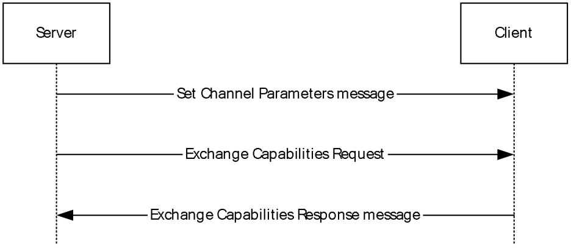
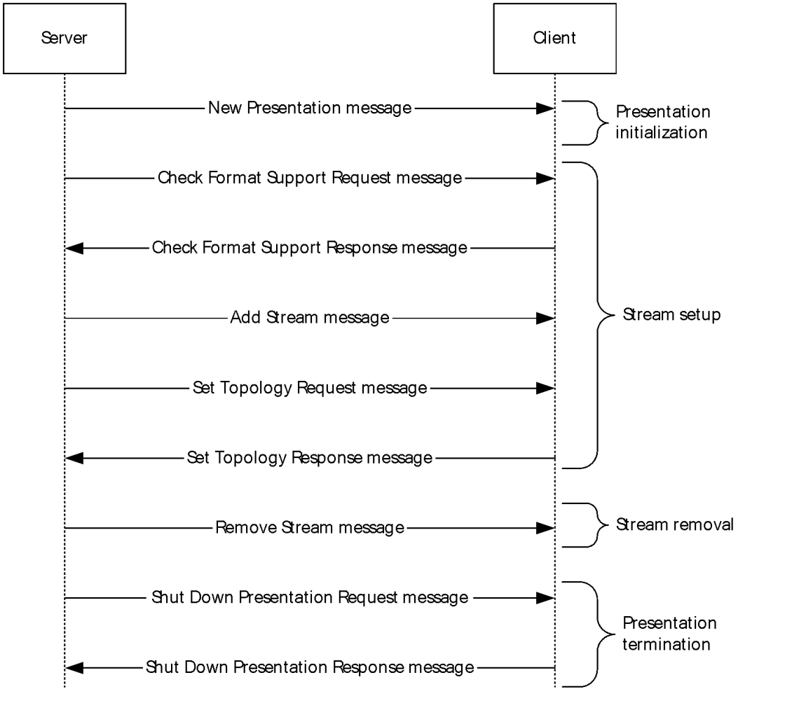
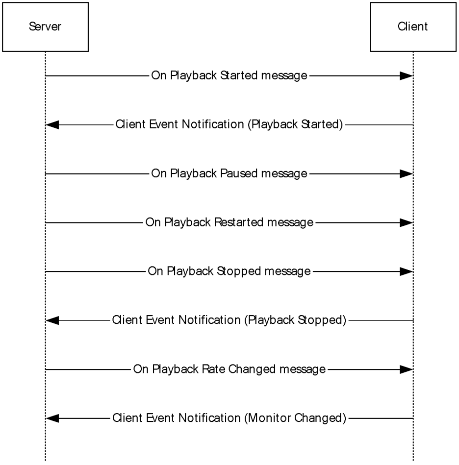
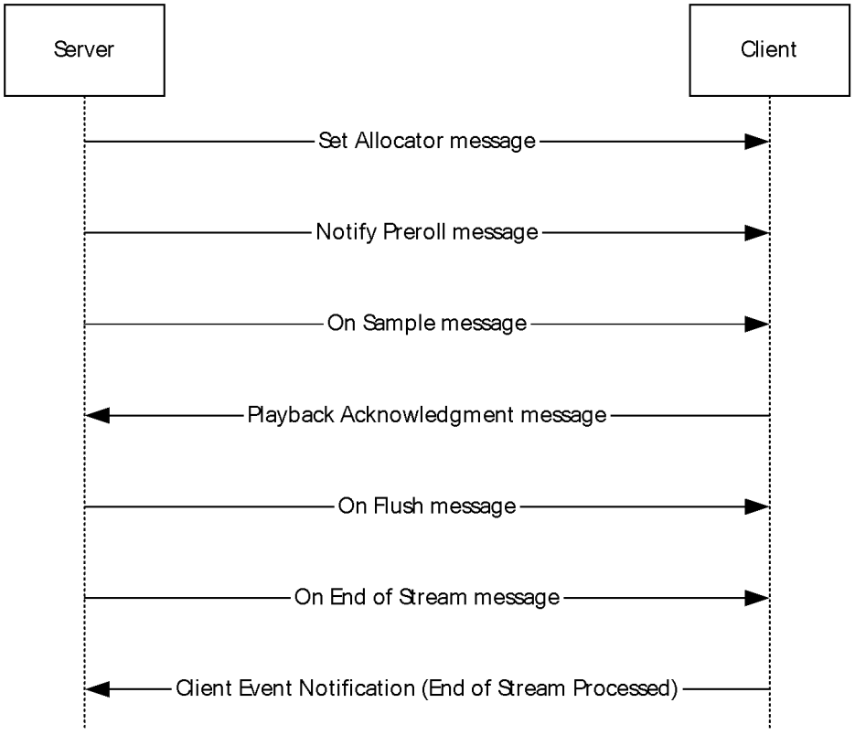
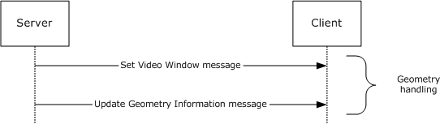
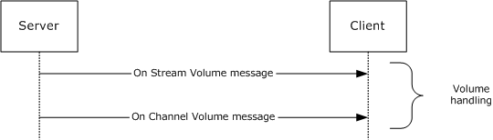

[MS-RDPEV]:

Remote Desktop Protocol: Video Redirection Virtual
Channel Extension

Intellectual Property Rights Notice for Open Specifications Documentation

  Technical Documentation. Microsoft publishes Open Specifications documentation (“this

documentation”) for protocols, file formats, data portability, computer languages, and standards
support. Additionally, overview documents cover inter-protocol relationships and interactions.

  Copyrights. This documentation is covered by Microsoft copyrights. Regardless of any other

terms that are contained in the terms of use for the Microsoft website that hosts this
documentation, you can make copies of it in order to develop implementations of the technologies
that are described in this documentation and can distribute portions of it in your implementations
that use these technologies or in your documentation as necessary to properly document the
implementation. You can also distribute in your implementation, with or without modification, any
schemas, IDLs, or code samples that are included in the documentation. This permission also
applies to any documents that are referenced in the Open Specifications documentation.
  No Trade Secrets. Microsoft does not claim any trade secret rights in this documentation.
  Patents. Microsoft has patents that might cover your implementations of the technologies

described in the Open Specifications documentation. Neither this notice nor Microsoft's delivery of
this documentation grants any licenses under those patents or any other Microsoft patents.
However, a given Open Specifications document might be covered by the Microsoft Open
Specifications Promise or the Microsoft Community Promise. If you would prefer a written license,
or if the technologies described in this documentation are not covered by the Open Specifications
Promise or Community Promise, as applicable, patent licenses are available by contacting
iplg@microsoft.com.

  License Programs. To see all of the protocols in scope under a specific license program and the

associated patents, visit the Patent Map.

  Trademarks. The names of companies and products contained in this documentation might be
covered by trademarks or similar intellectual property rights. This notice does not grant any
licenses under those rights. For a list of Microsoft trademarks, visit
www.microsoft.com/trademarks.

  Fictitious Names. The example companies, organizations, products, domain names, email

addresses, logos, people, places, and events that are depicted in this documentation are fictitious.
No association with any real company, organization, product, domain name, email address, logo,
person, place, or event is intended or should be inferred.

Reservation of Rights. All other rights are reserved, and this notice does not grant any rights other
than as specifically described above, whether by implication, estoppel, or otherwise.

Tools. The Open Specifications documentation does not require the use of Microsoft programming
tools or programming environments in order for you to develop an implementation. If you have access
to Microsoft programming tools and environments, you are free to take advantage of them. Certain
Open Specifications documents are intended for use in conjunction with publicly available standards
specifications and network programming art and, as such, assume that the reader either is familiar
with the aforementioned material or has immediate access to it.

Support. For questions and support, please contact dochelp@microsoft.com.

[MS-RDPEV] - v20240423
Remote Desktop Protocol: Video Redirection Virtual Channel Extension
Copyright © 2024 Microsoft Corporation
Release: April 23, 2024

1 / 79

Revision Summary

Date

Revision
History

Revision
Class

Comments

12/5/2008

0.1

Major

Initial Availability

1/16/2009

0.1.1

Editorial

Changed language and formatting in the technical content.

2/27/2009

0.1.2

Editorial

Changed language and formatting in the technical content.

4/10/2009

0.1.3

Editorial

Changed language and formatting in the technical content.

5/22/2009

0.1.4

Editorial

Changed language and formatting in the technical content.

7/2/2009

1.0

8/14/2009

2.0

9/25/2009

3.0

11/6/2009

4.0

12/18/2009  5.0

1/29/2010

6.0

Major

Major

Major

Major

Major

Major

Updated and revised the technical content.

Updated and revised the technical content.

Updated and revised the technical content.

Updated and revised the technical content.

Updated and revised the technical content.

Updated and revised the technical content.

3/12/2010

6.0.1

Editorial

Changed language and formatting in the technical content.

4/23/2010

6.0.2

Editorial

Changed language and formatting in the technical content.

6/4/2010

7.0

Major

Updated and revised the technical content.

7/16/2010

7.0

None

No changes to the meaning, language, or formatting of the
technical content.

8/27/2010

7.0

10/8/2010

7.1

11/19/2010  8.0

1/7/2011

8.0

2/11/2011

8.0

3/25/2011

8.0

5/6/2011

8.0

None

Minor

Major

None

None

None

None

No changes to the meaning, language, or formatting of the
technical content.

Clarified the meaning of the technical content.

Updated and revised the technical content.

No changes to the meaning, language, or formatting of the
technical content.

No changes to the meaning, language, or formatting of the
technical content.

No changes to the meaning, language, or formatting of the
technical content.

No changes to the meaning, language, or formatting of the
technical content.

6/17/2011

8.1

Minor

Clarified the meaning of the technical content.

9/23/2011

8.1

None

No changes to the meaning, language, or formatting of the
technical content.

12/16/2011  9.0

Major

Updated and revised the technical content.

3/30/2012

9.0

None

No changes to the meaning, language, or formatting of the
technical content.

[MS-RDPEV] - v20240423
Remote Desktop Protocol: Video Redirection Virtual Channel Extension
Copyright © 2024 Microsoft Corporation
Release: April 23, 2024

2 / 79

Date

Revision
History

Revision
Class

Comments

7/12/2012

10.0

Major

Updated and revised the technical content.

10/25/2012  10.0

1/31/2013

10.1

8/8/2013

11.0

11/14/2013  11.0

None

Minor

Major

None

No changes to the meaning, language, or formatting of the
technical content.

Clarified the meaning of the technical content.

Updated and revised the technical content.

No changes to the meaning, language, or formatting of the
technical content.

2/13/2014

11.0

None

No changes to the meaning, language, or formatting of the
technical content.

5/15/2014

11.0

None

No changes to the meaning, language, or formatting of the
technical content.

6/30/2015

12.0

Major

Significantly changed the technical content.

10/16/2015  12.0

None

No changes to the meaning, language, or formatting of the
technical content.

7/14/2016

13.0

Major

Significantly changed the technical content.

6/1/2017

13.0

None

No changes to the meaning, language, or formatting of the
technical content.

9/15/2017

14.0

Major

Significantly changed the technical content.

12/1/2017

14.0

9/12/2018

15.0

4/7/2021

16.0

6/25/2021

17.0

4/23/2024

18.0

None

Major

Major

Major

Major

No changes to the meaning, language, or formatting of the
technical content.

Significantly changed the technical content.

Significantly changed the technical content.

Significantly changed the technical content.

Significantly changed the technical content.

[MS-RDPEV] - v20240423
Remote Desktop Protocol: Video Redirection Virtual Channel Extension
Copyright © 2024 Microsoft Corporation
Release: April 23, 2024

3 / 79

Table of Contents

1.3

1.3.1

1.1
1.2

1.3.1.1

1.3.2
1.3.3

1.2.1
1.2.2

1  Introduction ............................................................................................................ 8
Glossary ........................................................................................................... 8
References ........................................................................................................ 8
Normative References ................................................................................... 9
Informative References ................................................................................. 9
Overview .......................................................................................................... 9
Video Redirection Virtual Channel Protocol ....................................................... 9
Interface Manipulation ........................................................................... 10
Client Notifications Interface ........................................................................ 10
Server Data Interface .................................................................................. 10
Channel Setup Sequence ....................................................................... 10
Presentation Initialization and Termination Sequence ................................ 11
Playback State Sequence ....................................................................... 12
Data Streaming Sequence ...................................................................... 13
Geometry Handling Sequence ................................................................. 14
Volume Handling Sequence .................................................................... 14
Interface Manipulation Exchange Capabilities Interface Description ................... 15
Relationship to Other Protocols .......................................................................... 15
Prerequisites/Preconditions ............................................................................... 15
Applicability Statement ..................................................................................... 15
Versioning and Capability Negotiation ................................................................. 15
Vendor-Extensible Fields ................................................................................... 15
Standards Assignments ..................................................................................... 16

1.3.3.1
1.3.3.2
1.3.3.3
1.3.3.4
1.3.3.5
1.3.3.6

1.4
1.5
1.6
1.7
1.8
1.9

1.3.4

2.1
2.2

2  Messages ............................................................................................................... 17
Transport ........................................................................................................ 17
Message Syntax ............................................................................................... 17
Shared Message Header (SHARED_MSG_HEADER) ......................................... 17
Interface Manipulation ................................................................................. 20
Interface Manipulation Exchange Capabilities Interface .................................... 20

2.2.1
2.2.2
2.2.3

2.2.3.1

2.2.3.2

2.2.4

2.2.4.1
2.2.4.2

2.2.5

2.2.5.1

Interface Manipulation Exchange Capabilities Request
(RIM_EXCHANGE_CAPABILITY_REQUEST) ............................................... 20
Interface Manipulation Exchange Capabilities Response
(RIM_EXCHANGE_CAPABILITY_RESPONSE).............................................. 20
Client Notifications Interface ........................................................................ 21
Playback Acknowledgment Message (PLAYBACK_ACK) ............................... 21
Client Event Notification Message (CLIENT_EVENT_NOTIFICATION) ............ 22
Server Data Interface .................................................................................. 22
Channel Setup Messages........................................................................ 23
Set Channel Parameters Message (SET_CHANNEL_PARAMS) ................. 23
Exchange Capabilities Request Message (EXCHANGE_CAPABILITIES_REQ)
 ..................................................................................................... 23
Exchange Capabilities Response Message (EXCHANGE_CAPABILITIES_RSP)
 ..................................................................................................... 24
Presentation Initialization and Termination Messages ................................ 24
New Presentation Message (NEW_PRESENTATION) .............................. 24
Check Format Support Request Message (CHECK_FORMAT_SUPPORT_REQ)
 ..................................................................................................... 25
Check Format Support Response Message
(CHECK_FORMAT_SUPPORT_RSP) ..................................................... 26
Add Stream Message (ADD_STREAM) ................................................ 26
Set Topology Request Message (SET_TOPOLOGY_REQ) ........................ 27
Set Topology Response Message (SET_TOPOLOGY_RSP) ...................... 27
Remove Stream Message (REMOVE_STREAM) ..................................... 28

2.2.5.1.1
2.2.5.1.2

2.2.5.1.3

2.2.5.2

2.2.5.2.1
2.2.5.2.2

2.2.5.2.3

2.2.5.2.4
2.2.5.2.5
2.2.5.2.6
2.2.5.2.7

[MS-RDPEV] - v20240423
Remote Desktop Protocol: Video Redirection Virtual Channel Extension
Copyright © 2024 Microsoft Corporation
Release: April 23, 2024

4 / 79

2.2.5.2.8

2.2.5.4

2.2.5.3

2.2.5.2.9

2.2.5.2.10

2.2.5.4.1
2.2.5.4.2
2.2.5.4.3
2.2.5.4.4
2.2.5.4.5

2.2.5.3.1
2.2.5.3.2
2.2.5.3.3
2.2.5.3.4
2.2.5.3.5

Shut Down Presentation Request Message
(SHUTDOWN_PRESENTATION_REQ) .................................................. 28
Shut Down Presentation Response Message
(SHUTDOWN_PRESENTATION_RSP) .................................................. 29
Set Source Video Rectangle Message (SET_SOURCE_VIDEO_RECTANGLE)29
Playback State Messages ....................................................................... 30
On Playback Started Message (ON_PLAYBACK_STARTED) .................... 30
On Playback Paused Message (ON_PLAYBACK_PAUSED) ....................... 31
On Playback Restarted Message (ON_PLAYBACK_RESTARTED) .............. 31
On Playback Stopped Message (ON_PLAYBACK_STOPPED) ................... 32
On Playback Rate Changed Message (ON_PLAYBACK_RATE_CHANGED) . 32
Data Streaming Messages ...................................................................... 33
Set Allocator Properties Message (SET_ALLOCATOR) ........................... 33
Notify Preroll Message (NOTIFY_PREROLL) ......................................... 34
On Sample Message (ON_SAMPLE) .................................................... 34
On Flush Message (ON_FLUSH) ......................................................... 35
On End of Stream Message (ON_END_OF_STREAM) ............................ 35
Geometry Handling Messages ................................................................. 36
Set Video Window Message (SET_VIDEO_WINDOW) ............................ 36
Update Geometry Information Message (UPDATE_GEOMETRY_INFO) ..... 37
Volume Handling Messages .................................................................... 38
On Stream Volume Message (ON_STREAM_VOLUME) ........................... 38
On Channel Volume Message (ON_CHANNEL_VOLUME) ........................ 38
TSMM_CAPABILITIES Structure .................................................................... 39
2.2.6
TS_AM_MEDIA_TYPE Structure ..................................................................... 40
2.2.7
TS_MM_DATA_SAMPLE Structure .................................................................. 41
2.2.8
2.2.9
TSMM_PLATFORM_COOKIE Constants ........................................................... 43
2.2.10  MMREDIR_CAPABILITY_PLATFORM Constants ................................................ 43
2.2.11  GEOMETRY_INFO Structure .......................................................................... 43
TS_WNDFLAG Flags .................................................................................... 45
2.2.12
TS_RECT Structure ..................................................................................... 45
2.2.13
2.2.14
TSMM_CLIENT_EVENT Constants .................................................................. 45
2.2.15  MMREDIR_CAPABILITY_AUDIOSUPPORT Constants ......................................... 46

2.2.5.6.1
2.2.5.6.2

2.2.5.5.1
2.2.5.5.2

2.2.5.6

2.2.5.5

3.1

3.1.1

3.1.1.1

3.1.6
3.1.7

3.1.5.1
3.1.5.2

3.1.2
3.1.3
3.1.4
3.1.5

3  Protocol Details ..................................................................................................... 47
Common Details .............................................................................................. 47
Abstract Data Model .................................................................................... 47
Interface Manipulation Data Model .......................................................... 47
Timers ...................................................................................................... 47
Initialization ............................................................................................... 47
Higher-Layer Triggered Events ..................................................................... 47
Message Processing Events and Sequencing Rules .......................................... 47
Processing a Shared Message Header ...................................................... 47
Interface Manipulation ........................................................................... 48
Timer Events .............................................................................................. 48
Other Local Events ...................................................................................... 48
Server Details .................................................................................................. 48
Abstract Data Model .................................................................................... 48
Timers ...................................................................................................... 48
Initialization ............................................................................................... 48
Higher-Layer Triggered Events ..................................................................... 48
Message Processing Events and Sequencing Rules .......................................... 48
Client Notifications Interface................................................................... 48
Processing a Playback Acknowledgment Message ................................ 48
Processing a Client Event Notification Message .................................... 48
Server Data Interface ............................................................................ 49
Server Data Interface Channel Setup Messages ................................... 49
Sending a Set Channel Parameters Message.................................. 49

3.2.1
3.2.2
3.2.3
3.2.4
3.2.5

3.2.5.1.1
3.2.5.1.2

3.2.5.2.1.1

3.2.5.2.1

3.2.5.1

3.2.5.2

3.2

[MS-RDPEV] - v20240423
Remote Desktop Protocol: Video Redirection Virtual Channel Extension
Copyright © 2024 Microsoft Corporation
Release: April 23, 2024

5 / 79

3.2.5.2.1.2
3.2.5.2.1.3

3.2.5.2.2

3.2.5.2.2.1
3.2.5.2.2.2
3.2.5.2.2.3
3.2.5.2.2.4
3.2.5.2.2.5
3.2.5.2.2.6
3.2.5.2.2.7
3.2.5.2.2.8
3.2.5.2.2.9
3.2.5.2.2.10

3.2.5.2.3

3.2.5.2.3.1
3.2.5.2.3.2
3.2.5.2.3.3
3.2.5.2.3.4
3.2.5.2.3.5

3.2.5.2.4

3.2.5.2.4.1
3.2.5.2.4.2
3.2.5.2.4.3
3.2.5.2.4.4
3.2.5.2.4.5

3.2.5.2.5

3.2.5.2.5.1
3.2.5.2.5.2

3.2.5.2.6

3.2.5.2.6.1
3.2.5.2.6.2

Sending an Exchange Capabilities Request Message ....................... 49
Processing an Exchange Capabilities Response Message ................. 49
Server Data Interface Presentation Initialization and Termination Messages
 ..................................................................................................... 49
Sending a New Presentation Message ........................................... 49
Sending a Check Format Support Request Message ........................ 49
Processing a Check Format Support Response Message .................. 50
Sending an Add Stream Message ................................................. 50
Sending a Set Topology Request Message ..................................... 50
Processing a Set Topology Response Message ............................... 50
Sending a Remove Stream Message ............................................. 50
Sending a Shut Down Presentation Request Message ..................... 50
Processing a Shut Down Presentation Response Message ................ 51
Sending a Set Source Video Rectangle Message ............................. 51
Server Data Interface Playback State Messages .................................. 51
Sending an On Playback Started Message ..................................... 51
Sending an On Playback Paused Message...................................... 51
Sending an On Playback Restarted Message .................................. 51
Sending an On Playback Stopped Message .................................... 52
Sending an On Playback Rate Changed Message ............................ 52
Server Data Interface Data Streaming Messages ................................. 52
Sending a Set Allocator Properties Message .................................. 52
Sending a Notify Preroll Message ................................................. 52
Sending an On Sample Message .................................................. 52
Sending an On Flush Message ..................................................... 52
Sending an On End Of Stream Message ........................................ 52
Server Data Interface Geometry Handling Messages ............................ 53
Sending a Set Video Window Message .......................................... 53
Sending an Update Geometry Information Message........................ 53
Server Data Interface Volume Handling Messages ............................... 53
Sending an On Stream Volume Message ....................................... 53
Sending an On Channel Volume Message ...................................... 53
Interface Manipulation Exchange Capabilities Interface .............................. 53

3.2.5.3

3.2.5.3.1

3.2.5.3.2

3.3

3.2.6
3.2.7

3.3.1
3.3.2
3.3.3
3.3.4
3.3.5

Sending an Interface Manipulation Exchange Capabilities Request Message
 ..................................................................................................... 53
Processing an Interface Manipulation Exchange Capabilities Response
Message ......................................................................................... 53
Timer Events .............................................................................................. 53
Other Local Events ...................................................................................... 54
Client Details ................................................................................................... 54
Abstract Data Model .................................................................................... 54
Timers ...................................................................................................... 54
Initialization ............................................................................................... 54
Higher-Layer Triggered Events ..................................................................... 54
Message Processing Events and Sequencing Rules .......................................... 54
Interface Manipulation ........................................................................... 54
Client Notifications Interface................................................................... 54
Sending a Playback Acknowledgment Message .................................... 54
Sending a Client Event Notification Message ....................................... 54
Server Data Interface ............................................................................ 55
Server Data Interface Channel Setup Messages ................................... 55
Processing a Set Channel Parameters Message .............................. 55
Processing an Exchange Capabilities Request Message ................... 55
Sending an Exchange Capabilities Response Message ..................... 55
Server Data Interface Presentation Initialization and Termination Messages
 ..................................................................................................... 55
Processing a New Presentation Message ....................................... 55
Processing a Check Format Support Request Message .................... 55

3.3.5.3.1.1
3.3.5.3.1.2
3.3.5.3.1.3

3.3.5.3.2.1
3.3.5.3.2.2

3.3.5.1
3.3.5.2

3.3.5.2.1
3.3.5.2.2

3.3.5.3

3.3.5.3.1

3.3.5.3.2

[MS-RDPEV] - v20240423
Remote Desktop Protocol: Video Redirection Virtual Channel Extension
Copyright © 2024 Microsoft Corporation
Release: April 23, 2024

6 / 79

3.3.5.3.2.3
3.3.5.3.2.4
3.3.5.3.2.5
3.3.5.3.2.6
3.3.5.3.2.7
3.3.5.3.2.8
3.3.5.3.2.9
3.3.5.3.2.10

Sending a Check Format Support Response Message ...................... 55
Processing an Add Stream Message.............................................. 56
Processing a Set Topology Request Message ................................. 56
Sending a Set Topology Response Message ................................... 56
Processing a Remove Stream Message ......................................... 56
Processing a Shut Down Presentation Request Message .................. 56
Sending a Shut Down Presentation Response Message ................... 56
Processing a Set Video Source Rectangle Message ......................... 57
Server Data Interface Playback State Messages .................................. 57
Processing an On Playback Started Message .................................. 57
Processing an On Playback Paused Message .................................. 57
Processing an On Playback Restarted Message .............................. 57
Processing an On Playback Stopped Message ................................ 57
Processing an On Playback Rate Changed Message ........................ 57
Server Data Interface Data Streaming Messages ................................. 57
Processing a Set Allocator Properties Message ............................... 57
Processing a Notify Preroll Message .............................................. 58
Processing an On Sample Message ............................................... 58
Processing an On Flush Message .................................................. 58
Processing an On End Of Stream Message ..................................... 58
Server Data Interface Geometry Handling Messages ............................ 58
Processing a Set Video Window Message ....................................... 58
Processing an Update Geometry Information Message .................... 58
Server Data Interface Volume Handling Messages ............................... 58
Processing an On Stream Volume Message .................................... 58
Processing an On Channel Volume Message .................................. 58
Interface Manipulation Exchange Capabilities Interface Messages ................ 59

3.3.5.3.3

3.3.5.3.3.1
3.3.5.3.3.2
3.3.5.3.3.3
3.3.5.3.3.4
3.3.5.3.3.5

3.3.5.3.4

3.3.5.3.4.1
3.3.5.3.4.2
3.3.5.3.4.3
3.3.5.3.4.4
3.3.5.3.4.5

3.3.5.3.5

3.3.5.3.5.1
3.3.5.3.5.2

3.3.5.3.6

3.3.5.3.6.1
3.3.5.3.6.2

Processing an Interface Manipulation Exchange Capabilities Request
Message ......................................................................................... 59
Sending an Interface Manipulation Exchange Capabilities Response Message
 ..................................................................................................... 59
Timer Events .............................................................................................. 59
Other Local Events ...................................................................................... 59

3.3.5.4

3.3.5.4.1

3.3.5.4.2

3.3.6
3.3.7

4.1

4  Protocol Examples ................................................................................................. 60
Server Data Interface Annotations ..................................................................... 60
Channel Setup Sequence ............................................................................. 60
Presentation Initialization and Termination Sequence ...................................... 61
Playback State Sequence ............................................................................. 65
Data Streaming Sequence ........................................................................... 66
Geometry Handling Sequence ...................................................................... 68
Volume Handling Sequence .......................................................................... 69
Client Notifications Interface Annotation ............................................................. 70
Interface Manipulation Exchange Capabilities Interface Annotation ......................... 71

4.1.1
4.1.2
4.1.3
4.1.4
4.1.5
4.1.6

4.2
4.3

5  Security ................................................................................................................. 72
Security Considerations for Implementers ........................................................... 72
Index of Security Parameters ............................................................................ 72

5.1
5.2

6  Appendix A: Product Behavior ............................................................................... 73

7  Change Tracking .................................................................................................... 75

8  Index ..................................................................................................................... 76

[MS-RDPEV] - v20240423
Remote Desktop Protocol: Video Redirection Virtual Channel Extension
Copyright © 2024 Microsoft Corporation
Release: April 23, 2024

7 / 79

1  Introduction

The Remote Desktop Protocol Video Redirection Virtual Channel Extension is an extension of [MS-
RDPBCGR], which runs over a dynamic virtual channel, as specified in [MS-RDPEDYC]. The Remote
Desktop Protocol Video Redirection Virtual Channel Extension is used to redirect audio/video streams
from the terminal server to the terminal client. This protocol specifies the communication between
an application that is playing audio/video on the terminal server and the terminal client.

Note  The term "server" will be used to refer to "terminal server" throughout this specification.

Note  The term "client" will be used to refer to "terminal client" throughout this specification.

Sections 1.5, 1.8, 1.9, 2, and 3 of this specification are normative. All other sections and examples in
this specification are informative.

1.1  Glossary

This document uses the following terms:

format: A data structure that is used to define the encoding of audio and video data. The actual

structures are opaque to [MS-RDPEV].

globally unique identifier (GUID): A term used interchangeably with universally unique

identifier (UUID) in Microsoft protocol technical documents (TDs). Interchanging the usage of
these terms does not imply or require a specific algorithm or mechanism to generate the value.
Specifically, the use of this term does not imply or require that the algorithms described in
[RFC4122] or [C706] have to be used for generating the GUID. See also universally unique
identifier (UUID).

interface: A collection of messages used together. Interfaces support inheritance and

extensibility through the Interface Query message as defined in [MS-RDPEXPS] section
1.3.2.1.1.

media data: The data for an audio or video stream in a presentation, encoded in a specific

format.

presentation: A set of audio and video data streams and related metadata that are synchronized

for playback on a client.

sample: A unit of media data sent from the server to the client.

stream: An individual audio or video data-flow in a presentation. The media data in an

individual stream always uses the same media data format.

terminal client: The client that initiated the remote desktop connection.

terminal server: A computer on which terminal services is running.

window handle: A context for identifying and controlling a user interface window on the user's

desktop.

MAY, SHOULD, MUST, SHOULD NOT, MUST NOT: These terms (in all caps) are used as defined
in [RFC2119]. All statements of optional behavior use either MAY, SHOULD, or SHOULD NOT.

1.2  References

Links to a document in the Microsoft Open Specifications library point to the correct section in the
most recently published version of the referenced document. However, because individual documents

[MS-RDPEV] - v20240423
Remote Desktop Protocol: Video Redirection Virtual Channel Extension
Copyright © 2024 Microsoft Corporation
Release: April 23, 2024

8 / 79

in the library are not updated at the same time, the section numbers in the documents may not
match. You can confirm the correct section numbering by checking the Errata.

1.2.1  Normative References

We conduct frequent surveys of the normative references to assure their continued availability. If you
have any issue with finding a normative reference, please contact dochelp@microsoft.com. We will
assist you in finding the relevant information.

[MS-DTYP] Microsoft Corporation, "Windows Data Types".

[MS-ERREF] Microsoft Corporation, "Windows Error Codes".

[MS-RDPBCGR] Microsoft Corporation, "Remote Desktop Protocol: Basic Connectivity and Graphics
Remoting".

[MS-RDPEDYC] Microsoft Corporation, "Remote Desktop Protocol: Dynamic Channel Virtual Channel
Extension".

[MS-RDPEXPS] Microsoft Corporation, "Remote Desktop Protocol: XML Paper Specification (XPS) Print
Virtual Channel Extension".

[RFC2119] Bradner, S., "Key words for use in RFCs to Indicate Requirement Levels", BCP 14, RFC
2119, March 1997, https://www.rfc-editor.org/info/rfc2119

1.2.2  Informative References

[MSDN-ALLOCATOR] Microsoft Corporation, "Negotiating Allocators", http://msdn.microsoft.com/en-
us/library/ms787432(VS.85).aspx

[MSDN-AMMEDIATYPE] Microsoft Corporation, "AM_MEDIA_TYPE structure",
http://msdn.microsoft.com/en-us/library/ms779120(VS.85).aspx

[MSDN-DIRECTSHOW] Microsoft Corporation, "DirectShow", http://msdn.microsoft.com/en-
us/library/ms783323(VS.85).aspx

[MSDN-MEDIAFOUNDATION] Microsoft Corporation, "Media Foundation SDK",
http://msdn.microsoft.com/en-us/library/ms694197(VS.85).aspx

[MSDN-MediaTypes] Microsoft Corporation, "Meta Types", http://msdn.microsoft.com/en-
us/library/ms787271(VS.85).aspx

1.3  Overview

The Remote Desktop Protocol Video Redirection Virtual Channel Extension is used to transfer
synchronized audio and video data from a terminal server to a terminal client.The client can play
the audio and video data and synchronize this data by using the timing information provided by this
protocol.

1.3.1  Video Redirection Virtual Channel Protocol

The Remote Desktop Protocol Video Redirection Virtual Channel Extension is divided into the following
logical sequences:

Channel setup sequence: A channel is opened, and capabilities are exchanged. The channel is

assigned a specific identifier that is used by the client and the server to map media data and the
playback acknowledgments.

[MS-RDPEV] - v20240423
Remote Desktop Protocol: Video Redirection Virtual Channel Extension
Copyright © 2024 Microsoft Corporation
Release: April 23, 2024

9 / 79

Presentation initialization and termination sequence: The presentation is established. After the
format is negotiated, streams are set up for the presentation. When complete, the individual
streams and the presentation are terminated.

Playback state sequence: The client is notified of the changes in the playback state of the

presentation.

Data streaming sequence: Media data for a stream is transferred from the server to the client.

Geometry handling sequence: The geometry information regarding the video window on the server

is transferred to the client.

Volume handling sequence: Notifications for changes to the volume of an audio stream are sent to

the client.

1.3.1.1  Interface Manipulation

In the context of the Remote Desktop Protocol Video Redirection Virtual Channel Extension,
interfaces are groups of messages with a common identifier. This protocol includes a common
infrastructure for manipulating these interfaces, which is called interface manipulation. This
infrastructure consists of Interface Query and Interface Release messages, [MS-RDPEXPS] section
2.2.2. A newer version of an interface can be retrieved by sending an Interface Query message. An
interface is terminated by means of an Interface Release message in order to keep the number of
active interfaces on the network low.

For more information about the interface manipulation infrastructure, see [MS-RDPEXPS] section
1.3.2.1.

1.3.2  Client Notifications Interface

The client notifications interface consists of messages that are sent from the client to the server.
Currently, this interface has two messages. One of the messages is used as an acknowledgment to the
server that the media data was played on the client. This acknowledgment is specific to individual
media data streams and is sent on the same channel as the media data that is being acknowledged.
The second message is used by the client to notify the server of important playback events on the
client. The events notified by this message are end-of-stream, start completion, stop completion, and
monitor change on the client.

1.3.3  Server Data Interface

1.3.3.1  Channel Setup Sequence

The Remote Desktop Protocol Video Redirection Virtual Channel Extension uses multiple channels
within a single named dynamic virtual channel. There is one control channel for the presentation and
one channel for each of the data streams. The goal of this sequence is to set up the identifiers for the
channel and to exchange the platform and version capabilities.

[MS-RDPEV] - v20240423
Remote Desktop Protocol: Video Redirection Virtual Channel Extension
Copyright © 2024 Microsoft Corporation
Release: April 23, 2024

10 / 79

<!-- Extracted images from page 11 -->

<!-- /Extracted images from page 11 -->

Figure 1: Channel setup sequence

1.3.3.2  Presentation Initialization and Termination Sequence

The presentation initialization sequence has the following goals:

  Notify the client of a new presentation and the GUID used to identify the presentation.

  Negotiate whether the client supports playback of the media data encoded in a specific audio or

video format.

  Notify the client of all the streams that will supply audio or video data that is encoded in a

specific format.

  Notify the client when all streams have been set up and the presentation is ready for playback.

The presentation termination sequence has the following goals:

  Remove all streams when their media data has completed and they are no longer required on the

server.

  Shut down the presentation when all streams have been removed and when no more operations

are required for a presentation.

[MS-RDPEV] - v20240423
Remote Desktop Protocol: Video Redirection Virtual Channel Extension
Copyright © 2024 Microsoft Corporation
Release: April 23, 2024

11 / 79

<!-- Extracted images from page 12 -->

<!-- /Extracted images from page 12 -->

Figure 2: Presentation initialization and termination sequence

1.3.3.3  Playback State Sequence

The goal of the messages in this sequence is for the server to notify the client of the changes to the
playback state of a presentation.

[MS-RDPEV] - v20240423
Remote Desktop Protocol: Video Redirection Virtual Channel Extension
Copyright © 2024 Microsoft Corporation
Release: April 23, 2024

12 / 79

<!-- Extracted images from page 13 -->

<!-- /Extracted images from page 13 -->

Figure 3: Playback state sequence

1.3.3.4  Data Streaming Sequence

The goal of the messages in this sequence is to handle media data transfer for a single stream.

[MS-RDPEV] - v20240423
Remote Desktop Protocol: Video Redirection Virtual Channel Extension
Copyright © 2024 Microsoft Corporation
Release: April 23, 2024

13 / 79

<!-- Extracted images from page 14 -->

<!-- /Extracted images from page 14 -->

Figure 4: Data streaming sequence

1.3.3.5  Geometry Handling Sequence

The goal of the messages in this sequence is to notify the client of the window that is being used on
the server for displaying the video. The client is also notified of any changes to the shape (geometry)
and position of the video window.

Figure 5: Geometry handling sequence

1.3.3.6  Volume Handling Sequence

The goal of the messages in this sequence is to notify the client of any changes to the master volume
or channel volume for an audio stream.

[MS-RDPEV] - v20240423
Remote Desktop Protocol: Video Redirection Virtual Channel Extension
Copyright © 2024 Microsoft Corporation
Release: April 23, 2024

14 / 79

<!-- Extracted images from page 15 -->

<!-- /Extracted images from page 15 -->

Figure 6: Volume handling sequence

1.3.4  Interface Manipulation Exchange Capabilities Interface Description

The Interface Manipulation Exchange Capabilities Interface consists of the Interface Manipulation
Exchange Capabilities Request and Interface Manipulation Exchange Capabilities Response messages.
This interface is used to exchange client and server capabilities for interface manipulation.

1.4  Relationship to Other Protocols

The Remote Desktop Protocol Video Redirection Virtual Channel Extension is embedded in dynamic
virtual channel transport, as specified in [MS-RDPEDYC].

1.5  Prerequisites/Preconditions

The Remote Desktop Protocol Video Redirection Virtual Channel Extension operates only after the
dynamic virtual channel transport is fully established. If the dynamic virtual channel transport is
terminated, no other communication over this protocol extension occurs.

This protocol is message-based, and it assumes preservation of the packet as a whole and does not
allow for fragmentation. Packet reassembly is based on the information provided by the underlying
dynamic virtual channel transport. This document assumes that packet chunks have already been
reassembled based on that information.

1.6  Applicability Statement

The Remote Desktop Protocol Video Redirection Virtual Channel Extension is designed to be run within
the context of an RDP virtual channel established between a client and a server. This protocol
extension is applicable when applications running on the terminal server play audio/video data that
is required to be transferred to the client.

1.7  Versioning and Capability Negotiation

This protocol supports versioning and capability negotiation at two levels. The first is supported
through the use of interface manipulation messages, as specified in sections 2.2.2 and 2.2.3. The
second is supported by the capability exchange messages, as specified in sections 2.2.5.1.2 and
2.2.5.1.3.

1.8  Vendor-Extensible Fields

The Remote Desktop Protocol Video Redirection Virtual Channel Extension uses HRESULTs as specified
in [MS-ERREF] section 2.1. Vendors are free to choose their own values, as long as the C bit
(0x20000000) is set, indicating that it is a customer code.

[MS-RDPEV] - v20240423
Remote Desktop Protocol: Video Redirection Virtual Channel Extension
Copyright © 2024 Microsoft Corporation
Release: April 23, 2024

15 / 79

This protocol also uses Win32 error codes. These values are taken from the error number space as
specified in [MS-ERREF] section 2.2. Vendors SHOULD reuse those values with their indicated
meanings. Choosing any other value runs the risk of a collision in the future.

Vendors can define their own interfaces and use them through the interface manipulation
mechanism, as specified in section 2.2.2.

1.9  Standards Assignments

None.

[MS-RDPEV] - v20240423
Remote Desktop Protocol: Video Redirection Virtual Channel Extension
Copyright © 2024 Microsoft Corporation
Release: April 23, 2024

16 / 79

2  Messages

2.1  Transport

The Remote Desktop Protocol Video Redirection Virtual Channel Extension is designed to operate over
dynamic virtual channels, as specified in [MS-RDPEDYC]. The channel name used for this dynamic
virtual channel is "TSMF". The usage of a channel name when opening a dynamic virtual channel is
specified in [MS-RDPEDYC] section 2.2.2.1.

2.2  Message Syntax

2.2.1  Shared Message Header (SHARED_MSG_HEADER)

Every packet in this extension contains a common header.<1>

0  1  2  3  4  5  6  7  8  9

1
0  1  2  3  4  5  6  7  8  9

2
0  1  2  3  4  5  6  7  8  9

3
0  1

InterfaceId

MessageId

FunctionId

messagePayload (variable)

...

InterfaceId (4 bytes): The InterfaceId field is broken out as follows:

0  1  2  3  4  5  6  7  8  9

1
0  1  2  3  4  5  6  7  8  9

2
0  1  2  3  4  5  6  7  8  9

3
0  1

InterfaceValue

Mask

InterfaceValue (30 bits): A 30-bit unsigned integer that represents the common identifier for the

interface. The default value is 0x00000000. If the message uses this default interface ID, the
message is interpreted for the main interface for which this channel has been instantiated. All
other values MUST be retrieved either from an Interface Query response (QI_RSP), [MS-RDPEXPS]
section2.2.2.1.2, or from responses that contain interface IDs.

This ID is valid until an interface release (IFACE_RELEASE) message ([MS-RDPEXPS] section
2.2.2.2) is sent or received with that ID. After an IFACE_RELEASE message is processed, this ID is
considered invalid.

Mask (2 bits): These two bits in the SHARED_MSG_HEADER header MUST be set to one of the

following values.

Value

Meaning

STREAM_ID_STUB

Indicates that the SHARED_MSG_HEADER is being used in a response message.

0x80000000

[MS-RDPEV] - v20240423
Remote Desktop Protocol: Video Redirection Virtual Channel Extension
Copyright © 2024 Microsoft Corporation
Release: April 23, 2024

17 / 79

Value

Meaning

STREAM_ID_PROXY

Indicates that the SHARED_MSG_HEADER is not being used in a response message.

0x40000000

STREAM_ID_NONE

0x00000000

Indicates that the SHARED_MSG_HEADER is being used for interface manipulation
capabilities exchange as specified in section 2.2.3. This value MUST NOT be used for
any other messages.

MessageId (4 bytes): A 32-bit unsigned integer that represents a unique ID for the request or

response pair. Requests and responses are matched based on this ID coupled with the
InterfaceId.

FunctionId (4 bytes): A 32-bit unsigned integer. This field MUST be present in all packets except

response packets. Its value is either used in interface manipulation messages or defined for a
specific interface. The following values are categorized by the interface for which they are defined.

Common IDs for all interfaces are as follows.

Value

Meaning

RIMCALL_RELEASE

Release the given interface ID.

0x00000001

RIMCALL_QUERYINTERFACE

Query for a new interface.

0x00000002

The Capabilities Negotiator Interface ID is as follows.

Value

Meaning

RIM_EXCHANGE_CAPABILITY_REQUEST

0x00000100

The server sends the Interface Manipulation Exchange
Capabilities Request message.

The Client Notifications Interface IDs are as follows.

Value

Meaning

PLAYBACK_ACK

0x00000100

The client sends the Playback Acknowledgment message.

CLIENT_EVENT_NOTIFICATION

The client sends the Client Event Notification message.

0x00000101

Server Data Interface IDs are as follows.

Value

Meaning

EXCHANGE_CAPABILITIES_REQ

The server sends the Exchange Capabilities Request message.

0x00000100

SET_CHANNEL_PARAMS

The server sends the Set Channel Parameters message.

0x00000101

ADD_STREAM

0x00000102

The server sends the Add Stream message.

[MS-RDPEV] - v20240423
Remote Desktop Protocol: Video Redirection Virtual Channel Extension
Copyright © 2024 Microsoft Corporation
Release: April 23, 2024

18 / 79

Value

ON_SAMPLE

0x00000103

Meaning

The server sends the On Sample message.

SET_VIDEO_WINDOW

The server sends the Set Video Window message.

0x00000104

ON_NEW_PRESENTATION

The server sends the New Presentation message.

0x00000105

SHUTDOWN_PRESENTATION REQ

The server sends the Shut Down Presentation Request message.

0x00000106

SET_TOPOLOGY_REQ

The server sends the Set Topology Request message.

0x00000107

CHECK_FORMAT_SUPPORT_REQ

The server sends the Check Format Support Request message.

0x00000108

ON_PLAYBACK_STARTED

The server sends the On Playback Started message.

0x00000109

ON_PLAYBACK_PAUSED

The server sends the On Playback Paused message.

0x0000010a

ON_PLAYBACK_STOPPED

The server sends the On Playback Stopped message.

0x0000010b

ON_PLAYBACK_RESTARTED

The server sends the On Playback Restarted message.

0x0000010c

ON_PLAYBACK_RATE_CHANGED

The server sends the On Playback Rate Change message.

0x0000010d

ON_FLUSH

0x0000010e

The server sends the On Flush message.

ON_STREAM_VOLUME

The server sends the On Stream Volume message.

0x0000010f

ON_CHANNEL_VOLUME

The server sends the On Channel Volume message.

0x00000110

ON_END_OF_STREAM

The server sends the On End of Stream message.

0x00000111

SET_ALLOCATOR

0x00000112

NOTIFY_PREROLL

0x00000113

The server sends the Set Allocator Properties message.

The server sends the Notify Preroll message.

UPDATE_GEOMETRY_INFO

The server sends the Update Geometry Information message.

0x00000114

REMOVE_STREAM

0x00000115

The server sends the Remove Stream message.

[MS-RDPEV] - v20240423
Remote Desktop Protocol: Video Redirection Virtual Channel Extension
Copyright © 2024 Microsoft Corporation
Release: April 23, 2024

19 / 79

Value

Meaning

SET_SOURCE_VIDEO_RECT

The server sends the Set Source Video Rectangle message.

0x00000116

messagePayload (variable): An array of unsigned 8-bit integers describing the payload of the

message corresponding to the interface for which the packet is sent. The specific structure of the
payload is described by the message descriptions in sections 2.2.3, 2.2.4, and 2.2.5.

2.2.2  Interface Manipulation

This protocol utilizes the same Interface Query and Interface Release messages that are defined in
[MS-RDPEXPS] section 2.2.2.

2.2.3  Interface Manipulation Exchange Capabilities Interface

The Exchange Capabilities Interface is identified by the interface ID 0x00000002. This interface is
used to exchange the client's and the server's capabilities for interface manipulation.

2.2.3.1  Interface Manipulation Exchange Capabilities Request

(RIM_EXCHANGE_CAPABILITY_REQUEST)

This message is used by the server to request interface manipulation capabilities from the client.

0  1  2  3  4  5  6  7  8  9

1
0  1  2  3  4  5  6  7  8  9

2
0  1  2  3  4  5  6  7  8  9

3
0  1

Header (variable)

...

CapabilityValue

Header (variable): The common message header (as specified in section 2.2.1). The InterfaceId
field MUST be set to 0x00000002. The Mask field MUST be set to STREAM_ID_NONE. The
FunctionId field MUST be set to RIM_EXCHANGE_CAPABILITY_REQUEST (0x00000100).

CapabilityValue (4 bytes): A 32-bit unsigned integer that identifies the server's capability. The valid

values for this field are the following.

Capability Name

Value

Meaning

RIM_CAPABILITY_VERSION_01  0x00000001  The capability to indicate the basic support for interface

manipulation.  This capability MUST be present in the
message.

2.2.3.2  Interface Manipulation Exchange Capabilities Response

(RIM_EXCHANGE_CAPABILITY_RESPONSE)

This message is sent by the client in response to RIM_EXCHANGE_CAPABILITY_REQUEST.

[MS-RDPEV] - v20240423
Remote Desktop Protocol: Video Redirection Virtual Channel Extension
Copyright © 2024 Microsoft Corporation
Release: April 23, 2024

20 / 79

0  1  2  3  4  5  6  7  8  9

1
0  1  2  3  4  5  6  7  8  9

2
0  1  2  3  4  5  6  7  8  9

3
0  1

Header (variable)

...

CapabilityValue

Result

Header (variable): The common message header (as specified in section 2.2.1). The InterfaceId

field and the MessageId field in this message header SHOULD contain the same values as the
InterfaceId and MessageId fields in the corresponding RIM_EXCHANGE_CAPABILITY_REQUEST
message. The Mask field MUST be set to STREAM_ID_NONE.

CapabilityValue (4 bytes): A 32-bit unsigned integer that identifies the client's capability. The valid

values for this field are the following.

Capability name

Value

Meaning

RIM_CAPABILITY_VERSION_01  0x00000001  The capability to indicate the basic support for interface

manipulation.  This capability MUST be present in the
message.

Result (4 bytes): A 32-bit unsigned integer that indicates the HRESULT of the operation.

2.2.4  Client Notifications Interface

The client notifications interface is identified by the interface ID 0x00000001. The client notifications
interface is used by the client to send playback acknowledgment.

2.2.4.1  Playback Acknowledgment Message (PLAYBACK_ACK)

The PLAYBACK_ACK message is sent from the client to the server to acknowledge the media data
that has already been played.

0  1  2  3  4  5  6  7  8  9

1
0  1  2  3  4  5  6  7  8  9

2
0  1  2  3  4  5  6  7  8  9

3
0  1

Header (variable)

...

StreamId

DataDuration

...

cbData

...

[MS-RDPEV] - v20240423
Remote Desktop Protocol: Video Redirection Virtual Channel Extension
Copyright © 2024 Microsoft Corporation
Release: April 23, 2024

21 / 79

Header (variable): The common message header (as specified in section 2.2.1). The InterfaceId
field MUST be set to 0x00000001. The Mask field MUST be set to STREAM_ID_PROXY. The
FunctionId field MUST be set to PLAYBACK_ACK (0x00000100).

StreamId (4 bytes): A 32-bit unsigned integer that indicates the stream ID of the sample that is

being acknowledged.

DataDuration (8 bytes): A 64-bit unsigned integer that indicates the calculated data duration of the
sample that is being acknowledged. This field MUST be set to the ThrottleDuration field of the
TS_MM_DATA_SAMPLE structure of the sample that is being acknowledged.

cbData (8 bytes): A 64-bit unsigned integer that indicates the data size of the sample that is being
acknowledged. This field MUST be set to the cbData field of the TS_MM_DATA_SAMPLE structure
of the sample that is being acknowledged.

2.2.4.2  Client Event Notification Message (CLIENT_EVENT_NOTIFICATION)

The CLIENT_EVENT_NOTIFICATION message is sent from the client to the server whenever an
important client event happens.

0  1  2  3  4  5  6  7  8  9

1
0  1  2  3  4  5  6  7  8  9

2
0  1  2  3  4  5  6  7  8  9

3
0  1

Header (variable)

...

StreamId

EventId

cbData

pBlob (variable)

...

Header (variable): The common message header (as specified in section 2.2.1). The InterfaceId

field of this Header MUST be set to 0x00000001. The Mask field MUST be set to
STREAM_ID_PROXY. The FunctionId field of this Header MUST be set to
CLIENT_EVENT_NOTIFICATION (0x00000101).

StreamId (4 bytes): A 32-bit unsigned integer that indicates the stream ID where the event

originated.

EventId (4 bytes): A 32-bit unsigned integer that indicates the type of event the client is raising.

cbData (4 bytes): A 32-bit unsigned integer that indicates the number of bytes in the pBlob field.

pBlob (variable): An array of bytes that contains data relevant to whichever event ID is passed.

2.2.5  Server Data Interface

The server data interface is identified by the default interface ID 0x00000000. The default interface
does not require Query Interface Request (QI_REQ) or Query Interface Response (QI_RSP) messages
[MS-RDPEXPS] to initialize the interface.

22 / 79

[MS-RDPEV] - v20240423
Remote Desktop Protocol: Video Redirection Virtual Channel Extension
Copyright © 2024 Microsoft Corporation
Release: April 23, 2024

2.2.5.1  Channel Setup Messages

2.2.5.1.1 Set Channel Parameters Message (SET_CHANNEL_PARAMS)

This message is used by the server to set channel parameters.

0  1  2  3  4  5  6  7  8  9

1
0  1  2  3  4  5  6  7  8  9

2
0  1  2  3  4  5  6  7  8  9

3
0  1

Header (variable)

...

PresentationId (16 bytes)

...

...

StreamId

Header (variable): The common message header (as specified in section 2.2.1). The InterfaceId
field MUST be set to 0x00000000. The Mask field MUST be set to STREAM_ID_PROXY. The
FunctionId field MUST be set to SET_CHANNEL_PARAMS (0x00000101).

PresentationId (16 bytes): A 16-byte GUID that identifies the presentation.

StreamId (4 bytes): A 32-bit unsigned integer that indicates channel identifier. There MUST be only

one channel with the identifier value 0x00000000, and it MUST NOT be used for data-streaming
sequence messages.

2.2.5.1.2 Exchange Capabilities Request Message (EXCHANGE_CAPABILITIES_REQ)

This message is used by the server to exchange its capabilities with the client.

0  1  2  3  4  5  6  7  8  9

1
0  1  2  3  4  5  6  7  8  9

2
0  1  2  3  4  5  6  7  8  9

3
0  1

Header (variable)

...

numHostCapabilities

pHostCapabilities (variable)

...

Header (variable): The common message header (as specified in section 2.2.1). The InterfaceId
field MUST be set to 0x00000000. The Mask field MUST be set to STREAM_ID_PROXY. The
FunctionId field MUST be set to EXCHANGE_CAPABILITIES_REQ (0x00000100).

numHostCapabilities (4 bytes): A 32-bit unsigned integer. This field MUST contain the number of

TSMM_CAPABILITIES structures in the pHostCapabilityArray field.

23 / 79

[MS-RDPEV] - v20240423
Remote Desktop Protocol: Video Redirection Virtual Channel Extension
Copyright © 2024 Microsoft Corporation
Release: April 23, 2024

pHostCapabilities (variable): An array of TSMM_CAPABILITIES structures, each containing the

capabilities for the server.

2.2.5.1.3 Exchange Capabilities Response Message (EXCHANGE_CAPABILITIES_RSP)

This message is used by the client as a response to the exchange capabilities request message
(EXCHANGE_CAPABILITIES_REQ).

0  1  2  3  4  5  6  7  8  9

1
0  1  2  3  4  5  6  7  8  9

2
0  1  2  3  4  5  6  7  8  9

3
0  1

Header (variable)

...

numClientCapabilities

pClientCapabilityArray (variable)

...

Result

Header (variable): The common message header (as specified in section 2.2.1). The InterfaceId
and MessageId fields in this header MUST contain the same values as the InterfaceId and
MessageId fields in the corresponding EXCHANGE_CAPABILITIES_REQ message. The Mask field
MUST be set to STREAM_ID_STUB.

numClientCapabilities (4 bytes): A 32-bit unsigned integer. This field MUST contain the number of

TSMM_CAPABILITIES structures in the pClientCapabilityArray field.

pClientCapabilityArray (variable): An array of TSMM_CAPABILITIES structures, each containing

the capabilities for the client.

Result (4 bytes): A 32-bit unsigned integer that indicates the result of the operation.

2.2.5.2  Presentation Initialization and Termination Messages

2.2.5.2.1 New Presentation Message (NEW_PRESENTATION)

This message is used by the server to notify the client of a new presentation.

0  1  2  3  4  5  6  7  8  9

1
0  1  2  3  4  5  6  7  8  9

2
0  1  2  3  4  5  6  7  8  9

3
0  1

Header (variable)

...

PresentationId (16 bytes)

...

...

[MS-RDPEV] - v20240423
Remote Desktop Protocol: Video Redirection Virtual Channel Extension
Copyright © 2024 Microsoft Corporation
Release: April 23, 2024

24 / 79

PlatformCookie

Header (variable): The common message header (as specified in section 2.2.1). The InterfaceId
field MUST be set to 0x00000000. The Mask field MUST be set to STREAM_ID_PROXY. The
FunctionId field MUST be set to ON_NEW_PRESENTATION (0x00000105).

PresentationId (16 bytes): A 16-byte GUID ([MS-DTYP] section 2.3.4.2) that identifies the

presentation.

PlatformCookie (4 bytes): A 32-bit unsigned integer that indicates preferred platforms. This field

SHOULD be set to values defined in TSMM_PLATFORM_COOKIE.

2.2.5.2.2 Check Format Support Request Message (CHECK_FORMAT_SUPPORT_REQ)

This message is used by the server to check if the client supports playback of media content in a
specific format.

0  1  2  3  4  5  6  7  8  9

1
0  1  2  3  4  5  6  7  8  9

2
0  1  2  3  4  5  6  7  8  9

3
0  1

Header (variable)

...

PlatformCookie

NoRolloverFlags

numMediaType

pMediaType (variable)

...

Header (variable): The common message header (as specified in section 2.2.1). The InterfaceId
field MUST be set to 0x00000000. The Mask field MUST be set to STREAM_ID_PROXY. The
FunctionId field MUST be set to CHECK_FORMAT_SUPPORT_REQ (0x00000108).

PlatformCookie (4 bytes): A 32-bit unsigned integer that indicates preferred platforms. It SHOULD

be set to values defined in TSMM_PLATFORM_COOKIE.

NoRolloverFlags (4 bytes): A 32-bit unsigned integer that indicates the server's preference for

client use of alternative platforms when checking format support. Valid values for this field are as
follows.

Value

Meaning

0x00000000  The client SHOULD check the format supported by alternative platforms if the format check

indicated by the PlatformCookie field fails.

0x00000001  The client SHOULD NOT use alternative platforms for a format check if the format check

indicated by the PlatformCookie field fails.

numMediaType (4 bytes): A 32-bit unsigned integer. This field MUST contain the number of bytes in

the pMediaType field.

25 / 79

[MS-RDPEV] - v20240423
Remote Desktop Protocol: Video Redirection Virtual Channel Extension
Copyright © 2024 Microsoft Corporation
Release: April 23, 2024

pMediaType (variable): A TS_AM_MEDIA_TYPE structure that is sent as an array of bytes. This field

indicates the media type of the stream.

2.2.5.2.3 Check Format Support Response Message (CHECK_FORMAT_SUPPORT_RSP)

This message is sent by the client in response to the check format support request message
(CHECK_FORMAT_SUPPORT_REQ).

0  1  2  3  4  5  6  7  8  9

1
0  1  2  3  4  5  6  7  8  9

2
0  1  2  3  4  5  6  7  8  9

3
0  1

Header (variable)

...

FormatSupported

PlatformCookie

Result

Header (variable): The common message header (as specified in section 2.2.1). The InterfaceId
and MessageId fields in this header MUST contain the same values as the InterfaceId and
MessageId fields in the corresponding CHECK_FORMAT_SUPPORT_REQ message. The Mask field
MUST be set to STREAM_ID_STUB.

FormatSupported (4 bytes): A 32-bit unsigned integer that indicates if the format is supported. The

value zero indicates that the format is not supported, and the value one indicates that the format
is supported.

PlatformCookie (4 bytes): A 32-bit unsigned integer that indicates the platform on the client, which
MUST be used for playing the media data in a given format. This field MUST be set only when
FormatSupported field is set to one, and its value MUST be either
TSMM_PLATFORM_COOKIE_MF or TSMM_PLATFORM_COOKIE_DSHOW. For more information
about these values, see section 2.2.9.

Result (4 bytes): A 32-bit unsigned integer that indicates the result of the operation.

2.2.5.2.4 Add Stream Message (ADD_STREAM)

This message is used by the server to ask the client to add a stream to a presentation, which MUST
be used to play media data in the format specified in the message.

0  1  2  3  4  5  6  7  8  9

1
0  1  2  3  4  5  6  7  8  9

2
0  1  2  3  4  5  6  7  8  9

3
0  1

Header (variable)

...

PresentationId (16 bytes)

...

[MS-RDPEV] - v20240423
Remote Desktop Protocol: Video Redirection Virtual Channel Extension
Copyright © 2024 Microsoft Corporation
Release: April 23, 2024

26 / 79

...

StreamId

numMediaType

pMediaType (variable)

...

Header (variable): The common message header (as specified in section 2.2.1). The InterfaceId
field MUST be set to 0x00000000. The Mask field MUST be set to STREAM_ID_PROXY. The
FunctionId field MUST be set to ADD_STREAM (0x00000102).

PresentationId (16 bytes): A 16-byte GUID that identifies the presentation.

StreamId (4 bytes): A 32-bit unsigned integer that identifies the stream.

numMediaType (4 bytes): A 32-bit unsigned integer that MUST contain the number of bytes in the

pMediaType field.

pMediaType (variable): A TS_AM_MEDIA_TYPE structure sent as an array of bytes. This field

indicates the media type of the stream.

2.2.5.2.5 Set Topology Request Message (SET_TOPOLOGY_REQ)

This message is used by the server to indicate that the presentation setup is complete.

0  1  2  3  4  5  6  7  8  9

1
0  1  2  3  4  5  6  7  8  9

2
0  1  2  3  4  5  6  7  8  9

3
0  1

Header (variable)

...

PresentationId (16 bytes)

...

...

Header (variable): The common message header (as specified in section 2.2.1). The InterfaceId
field MUST be set to 0x00000000. The Mask field MUST be set to STREAM_ID_PROXY. The
FunctionId field MUST be set to SET_TOPOLOGY_REQ (0x00000107).

PresentationId (16 bytes): A 16-byte GUID that identifies the presentation.

2.2.5.2.6 Set Topology Response Message (SET_TOPOLOGY_RSP)

This message is sent by the client in response to a Set Topology Request message
(SET_TOPOLOGY_REQ).

[MS-RDPEV] - v20240423
Remote Desktop Protocol: Video Redirection Virtual Channel Extension
Copyright © 2024 Microsoft Corporation
Release: April 23, 2024

27 / 79

0  1  2  3  4  5  6  7  8  9

1
0  1  2  3  4  5  6  7  8  9

2
0  1  2  3  4  5  6  7  8  9

3
0  1

Header (variable)

...

TopologyReady

Result

Header (variable): The common message header (as specified in section 2.2.1). The InterfaceId
and MessageId fields in this header MUST contain the same values as the InterfaceId and
MessageId fields in the corresponding SET_TOPOLOGY_REQ message. The Mask field MUST be
set to STREAM_ID_STUB.

TopologyReady (4 bytes): A 32-bit unsigned integer that indicates if the presentation is ready to be

played on the client. The value one indicates that the presentation is ready. The value zero
indicates that the presentation setup was unsuccessful.

Result (4 bytes): A 32-bit unsigned integer that indicates the result of the operation.

2.2.5.2.7 Remove Stream Message (REMOVE_STREAM)

This message is sent by the server to request that the client remove a stream.

0  1  2  3  4  5  6  7  8  9

1
0  1  2  3  4  5  6  7  8  9

2
0  1  2  3  4  5  6  7  8  9

3
0  1

Header (variable)

...

PresentationId (16 bytes)

...

...

StreamId

Header (variable): The common message header (as specified in section 2.2.1). The InterfaceId
field MUST be set to 0x00000000. The Mask field MUST be set to STREAM_ID_PROXY. The
FunctionId field MUST be set to REMOVE_STREAM (0x00000115).

PresentationId (16 bytes): A 16-byte GUID that identifies the presentation.

StreamId (4 bytes): A 32-bit unsigned integer that identifies the stream.

2.2.5.2.8 Shut Down Presentation Request Message

(SHUTDOWN_PRESENTATION_REQ)

This message is used by the server to notify the client to shut down a presentation.

[MS-RDPEV] - v20240423
Remote Desktop Protocol: Video Redirection Virtual Channel Extension
Copyright © 2024 Microsoft Corporation
Release: April 23, 2024

28 / 79

0  1  2  3  4  5  6  7  8  9

1
0  1  2  3  4  5  6  7  8  9

2
0  1  2  3  4  5  6  7  8  9

3
0  1

Header (variable)

...

PresentationId (16 bytes)

...

...

Header (variable): The common message header (as specified in section 2.2.1). The InterfaceId
field MUST be set to 0x00000000. The Mask field MUST be set to STREAM_ID_PROXY. The
FunctionId field MUST be set to 0x00000106 to indicate SHUTDOWN_PRESENTATION_REQ.

PresentationId (16 bytes): A 16-byte GUID that identifies the presentation to shut down.

2.2.5.2.9 Shut Down Presentation Response Message

(SHUTDOWN_PRESENTATION_RSP)

The Shut Down Presentation Response Message is sent by the client in response to a Shut Down
Presentation Request Message sent by the server, as specified in section 2.2.5.2.8.

0  1  2  3  4  5  6  7  8  9

1
0  1  2  3  4  5  6  7  8  9

2
0  1  2  3  4  5  6  7  8  9

3
0  1

Header (variable)

...

Results

Header (variable): The common message header (as specified in section 2.2.1). The InterfaceId
and MessageId fields in this header MUST contain the same values as the InterfaceId and
MessageId fields in the corresponding SHUTDOWN_PRESENTATION_REQ message. The Mask
field MUST be set to STREAM_ID_STUB.

Results (4 bytes): A 32-bit unsigned integer that indicates the result of the operation.

2.2.5.2.10

Set Source Video Rectangle Message (SET_SOURCE_VIDEO_RECTANGLE)

This message is sent by the server to request that the client render the part of the source video
specified in normalized coordinates.

0  1  2  3  4  5  6  7  8  9

1
0  1  2  3  4  5  6  7  8  9

2
0  1  2  3  4  5  6  7  8  9

3
0  1

Header (variable)

...

[MS-RDPEV] - v20240423
Remote Desktop Protocol: Video Redirection Virtual Channel Extension
Copyright © 2024 Microsoft Corporation
Release: April 23, 2024

29 / 79

PresentationId (16 bytes)

...

...

Left

Top

Right

Bottom

Header (variable): The common message header (as specified in section 2.2.1). The InterfaceId
field MUST be set to 0x00000000. The Mask field MUST be set to STREAM_ID_PROXY. The
FunctionId field MUST be set to REMOVE_STREAM (0x00000116).

PresentationId (16 bytes): A 16-byte GUID that identifies the presentation.

Left (4 bytes): A 32-bit floating point number that identifies the left side of the rectangle in

normalized coordinates.

Top (4 bytes): A 32-bit floating point number that identifies the top side of the rectangle in

normalized coordinates.

Right (4 bytes): A 32-bit floating point number that identifies the right side of the rectangle in

normalized coordinates.

Bottom (4 bytes): A 32-bit floating point number that identifies the bottom side of the rectangle in

normalized coordinates.

2.2.5.3  Playback State Messages

2.2.5.3.1 On Playback Started Message (ON_PLAYBACK_STARTED)

The ON_PLAYBACK_STARTED message is sent from the server to the client to start playback of a
presentation.

0  1  2  3  4  5  6  7  8  9

1
0  1  2  3  4  5  6  7  8  9

2
0  1  2  3  4  5  6  7  8  9

3
0  1

Header (variable)

...

PresentationId (16 bytes)

...

...

PlaybackStartOffset

[MS-RDPEV] - v20240423
Remote Desktop Protocol: Video Redirection Virtual Channel Extension
Copyright © 2024 Microsoft Corporation
Release: April 23, 2024

30 / 79

...

IsSeek

Header (variable): The common message header (as specified in section 2.2.1). The InterfaceId
field MUST be set to 0x00000000. The Mask field MUST be set to STREAM_ID_PROXY. The
FunctionId field MUST be set to ON_PLAYBACK_STARTED (0x00000109).

PresentationId (16 bytes): A 16-byte GUID that identifies the presentation.

PlaybackStartOffset (8 bytes): A 64-bit unsigned integer that indicates the reference time when

the playback gets started.

IsSeek (4 bytes): A 32-bit unsigned integer that indicates whether this start represents a seek. If

the presentation was started because of a seek, then this value is set to one; otherwise it is set it
to zero.

2.2.5.3.2 On Playback Paused Message (ON_PLAYBACK_PAUSED)

The ON_PLAYBACK_PAUSED message is sent from the server to the client to pause a presentation.

0  1  2  3  4  5  6  7  8  9

1
0  1  2  3  4  5  6  7  8  9

2
0  1  2  3  4  5  6  7  8  9

3
0  1

Header (variable)

...

PresentationId (16 bytes)

...

...

Header (variable): The common message header (as specified in section 2.2.1). The InterfaceId
field MUST be set to 0x00000000. The Mask field MUST be set to STREAM_ID_PROXY. The
FunctionId field MUST be set to ON_PLAYBACK_PAUSED (0x0000010a).

PresentationId (16 bytes): A 16-byte GUID that identifies the presentation.

2.2.5.3.3 On Playback Restarted Message (ON_PLAYBACK_RESTARTED)

The ON_PLAYBACK_RESTARTED message is sent from the server to the client to restart the playback
of a presentation.

0  1  2  3  4  5  6  7  8  9

1
0  1  2  3  4  5  6  7  8  9

2
0  1  2  3  4  5  6  7  8  9

3
0  1

Header (variable)

...

PresentationId (16 bytes)

[MS-RDPEV] - v20240423
Remote Desktop Protocol: Video Redirection Virtual Channel Extension
Copyright © 2024 Microsoft Corporation
Release: April 23, 2024

31 / 79

...

...

Header (variable): The common message header (as specified in section 2.2.1). The InterfaceId

field of the header MUST be set to 0x00000000. The Mask field MUST be set to
STREAM_ID_PROXY. The FunctionId field of the header MUST be set to 0x0000010c for
ON_PLAYBACK_RESTARTED.

PresentationId (16 bytes): A 16-byte GUID that identifies the presentation.

2.2.5.3.4 On Playback Stopped Message (ON_PLAYBACK_STOPPED)

The ON_PLAYBACK_ STOPPED message is sent from the server to the client to stop playback of a
presentation

0  1  2  3  4  5  6  7  8  9

1
0  1  2  3  4  5  6  7  8  9

2
0  1  2  3  4  5  6  7  8  9

3
0  1

Header (variable)

...

PresentationId (16 bytes)

...

...

Header (variable): The common message header (as specified in section 2.2.1). The InterfaceId
field MUST be set to 0x00000000. The Mask field MUST be set to STREAM_ID_PROXY. The
FunctionId field MUST be set to ON_PLAYBACK_STOPPED (0x0000010b).

PresentationId (16 bytes): A 16-byte GUID that identifies the presentation.

2.2.5.3.5 On Playback Rate Changed Message (ON_PLAYBACK_RATE_CHANGED)

The ON_PLAYBACK_RATE_CHANGED message is sent from the server to the client to change the
playback rate of a presentation.

0  1  2  3  4  5  6  7  8  9

1
0  1  2  3  4  5  6  7  8  9

2
0  1  2  3  4  5  6  7  8  9

3
0  1

Header (variable)

...

PresentationId (16 bytes)

...

...

[MS-RDPEV] - v20240423
Remote Desktop Protocol: Video Redirection Virtual Channel Extension
Copyright © 2024 Microsoft Corporation
Release: April 23, 2024

32 / 79

NewRate

Header (variable): The common message header (as specified in section 2.2.1). The InterfaceId
field MUST be set to 0x00000000. The Mask field MUST be set to STREAM_ID_PROXY. The
FunctionId field MUST be set to ON_PLAYBACK_RATE_CHANGED (0x0000010d).

PresentationId (16 bytes): A 16-byte GUID that identifies the presentation.

NewRate (4 bytes): A 32-bit floating-point number ([MS-DTYP], section 2.2.15) that indicates the

new playback rate of the presentation.

2.2.5.4  Data Streaming Messages

2.2.5.4.1 Set Allocator Properties Message (SET_ALLOCATOR)

The SET_ALLOCATOR message MAY<2> be sent from the server to the client to set buffer allocation
properties for a stream. For more information about allocators, see [MSDN-ALLOCATOR].

0  1  2  3  4  5  6  7  8  9

1
0  1  2  3  4  5  6  7  8  9

2
0  1  2  3  4  5  6  7  8  9

3
0  1

Header (variable)

...

PresentationId (16 bytes)

...

...

StreamId

cBuffers

cbBuffer

cbAlign

cbPrefix

Header (variable): The common message header (as specified in section 2.2.1). The InterfaceId
field MUST be set to 0x00000000. The Mask field MUST be set to STREAM_ID_PROXY. The
FunctionId field MUST be set to SET_ALLOCATOR (0x00000112).

PresentationId (16 bytes): A 16-byte GUID that identifies the presentation.

StreamId (4 bytes): A 32-bit unsigned integer that identifies the stream ID.

cBuffers (4 bytes): A 32-bit unsigned integer that indicates the number of buffers created by the

allocator.

cbBuffer (4 bytes): A 32-bit unsigned integer that indicates the size of each buffer, in bytes,

excluding any prefix.

33 / 79

[MS-RDPEV] - v20240423
Remote Desktop Protocol: Video Redirection Virtual Channel Extension
Copyright © 2024 Microsoft Corporation
Release: April 23, 2024

cbAlign (4 bytes): A 32-bit unsigned integer that indicates the alignment of the buffer. The buffer

start MUST be aligned on a multiple of this value.

cbPrefix (4 bytes): A 32-bit unsigned integer that indicates that each buffer is preceded by a prefix

of this many bytes.

2.2.5.4.2 Notify Preroll Message (NOTIFY_PREROLL)

The NOTIFY_PREROLL message is sent from the server to the client to indicate that a stream is
preloading the media data before playback.

0  1  2  3  4  5  6  7  8  9

1
0  1  2  3  4  5  6  7  8  9

2
0  1  2  3  4  5  6  7  8  9

3
0  1

Header (variable)

...

PresentationId (16 bytes)

...

...

StreamId

Header (variable): The common message header (as specified in section 2.2.1). The InterfaceId
field MUST be set to 0x00000000. The Mask field MUST be set to STREAM_ID_PROXY. The
FunctionId field MUST be set to NOTIFY_PREROLL (0x00000113).

PresentationId (16 bytes): A 16-byte GUID that identifies the presentation.

StreamId (4 bytes): A 32-bit unsigned integer that identifies the stream ID.

2.2.5.4.3 On Sample Message (ON_SAMPLE)

The ON_SAMPLE message is used by the server to send a data sample to the client.

0  1  2  3  4  5  6  7  8  9

1
0  1  2  3  4  5  6  7  8  9

2
0  1  2  3  4  5  6  7  8  9

3
0  1

Header (variable)

...

PresentationId (16 bytes)

...

...

StreamId

numSample

[MS-RDPEV] - v20240423
Remote Desktop Protocol: Video Redirection Virtual Channel Extension
Copyright © 2024 Microsoft Corporation
Release: April 23, 2024

34 / 79

pSample (variable)

...

Header (variable): The common message header (as specified in section 2.2.1). The InterfaceId
field MUST be set to 0x00000000. The Mask field MUST be set to STREAM_ID_PROXY. The
FunctionId field MUST be set to ON_SAMPLE (0x00000103).

PresentationId (16 bytes): A 16-byte GUID that identifies the presentation.

StreamId (4 bytes): A 32-bit unsigned integer that identifies the stream ID, of which the sample is a

part.

numSample (4 bytes): A 32-bit unsigned integer. This field MUST contain the number of bytes in

the pSample field.

pSample (variable):  A TS_MM_DATA_SAMPLE structure sent as an array of bytes. The fields of this

structure describe the sample content.

2.2.5.4.4 On Flush Message (ON_FLUSH)

The ON_FLUSH message is sent from the server to the client to drop the queued sample for a
stream.

0  1  2  3  4  5  6  7  8  9

1
0  1  2  3  4  5  6  7  8  9

2
0  1  2  3  4  5  6  7  8  9

3
0  1

Header (variable)

...

PresentationId (16 bytes)

...

...

StreamId

Header (variable): The common message header (as specified in section 2.2.1). The InterfaceId
field MUST be set to 0x00000000. The Mask field MUST be set to STREAM_ID_PROXY. The
FunctionId field MUST be set to ON_FLUSH (0x0000010e).

PresentationId (16 bytes): A 16-byte GUID that identifies the presentation.

StreamId (4 bytes): A 32-bit unsigned integer that identifies the stream ID.

2.2.5.4.5 On End of Stream Message (ON_END_OF_STREAM)

The ON_ END_OF_STREAM message is sent from the server to the client when a stream has reached
the end.

[MS-RDPEV] - v20240423
Remote Desktop Protocol: Video Redirection Virtual Channel Extension
Copyright © 2024 Microsoft Corporation
Release: April 23, 2024

35 / 79

0  1  2  3  4  5  6  7  8  9

1
0  1  2  3  4  5  6  7  8  9

2
0  1  2  3  4  5  6  7  8  9

3
0  1

Header (variable)

...

PresentationId (16 bytes)

...

...

StreamId

Header (variable): The common message header (as specified in section 2.2.1). The InterfaceId
field MUST be set to 0x00000000. The Mask field MUST be set to STREAM_ID_PROXY. The
FunctionId field MUST be set to ON_END_OF_STREAM (0x00000111).

PresentationId (16 bytes): A 16-byte GUID that identifies the presentation.

StreamId (4 bytes): A 32-bit unsigned integer that identifies the stream ID.

2.2.5.5  Geometry Handling Messages

2.2.5.5.1 Set Video Window Message (SET_VIDEO_WINDOW)

The SET_VIDEO_WINDOW message is sent from the server to the client to indicate the video window
handle that is used by the server for video rendering.

0  1  2  3  4  5  6  7  8  9

1
0  1  2  3  4  5  6  7  8  9

2
0  1  2  3  4  5  6  7  8  9

3
0  1

Header (variable)

...

PresentationId (16 bytes)

...

...

VideoWindowId

...

HwndParent

...

[MS-RDPEV] - v20240423
Remote Desktop Protocol: Video Redirection Virtual Channel Extension
Copyright © 2024 Microsoft Corporation
Release: April 23, 2024

36 / 79

Header (variable): The common message header (as specified in section 2.2.1). The InterfaceId
field MUST be set to 0x00000000. The Mask field MUST be set to STREAM_ID_PROXY. The
FunctionId field MUST be set to SET_VIDEO_WINDOW (0x00000104).

PresentationId (16 bytes): A 16-byte GUID that identifies the presentation.

VideoWindowId (8 bytes): A 64-bit unsigned integer that indicates the video window handle on the

server.

HwndParent (8 bytes): A 64-bit unsigned integer that indicates the window handler of the top-level
parent window handle of the video window. Top-level windows are the windows whose parent is
the desktop.

2.2.5.5.2 Update Geometry Information Message (UPDATE_GEOMETRY_INFO)

The UPDATE_GEOMETRY_INFO message is sent from the server to the client to update the geometry
information of the video window.

0  1  2  3  4  5  6  7  8  9

1
0  1  2  3  4  5  6  7  8  9

2
0  1  2  3  4  5  6  7  8  9

3
0  1

Header (variable)

...

PresentationId (16 bytes)

...

...

numGeometryInfo

pGeoInfo (variable)

...

cbVisibleRect

pVisibleRect (variable)

...

Header (variable): The common message header (as specified in section 2.2.1). The InterfaceId
field MUST be set to 0x00000000. The Mask field MUST be set to STREAM_ID_PROXY. The
FunctionId field MUST be set to UPDATE_GEOMETRY_INFO (0x00000114).

PresentationId (16 bytes): A 16-byte GUID that identifies the presentation.

numGeometryInfo (4 bytes): A 32-bit unsigned integer. This field MUST contain the number of

bytes in the pGeoInfo field.

pGeoInfo (variable): A GEOMETRY_INFO structure sent as an array of bytes. This field indicates the

geometry information of the video window.

[MS-RDPEV] - v20240423
Remote Desktop Protocol: Video Redirection Virtual Channel Extension
Copyright © 2024 Microsoft Corporation
Release: April 23, 2024

37 / 79

cbVisibleRect (4 bytes): A 32-bit unsigned integer. This field MUST contain the number of bytes in

the pVisibleRect field.

pVisibleRect (variable): An array of TS_RECT structures, each containing a rectangle that

represents part of the visible region. The union of these rectangles is the visible region of the
video window. The coordinates of the rectangles are defined in client coordinates.

2.2.5.6  Volume Handling Messages

2.2.5.6.1 On Stream Volume Message (ON_STREAM_VOLUME)

The ON_STREAM_VOLUME message is sent from the server to the client to set the master volume for
a presentation.

0  1  2  3  4  5  6  7  8  9

1
0  1  2  3  4  5  6  7  8  9

2
0  1  2  3  4  5  6  7  8  9

3
0  1

Header (variable)

...

PresentationId (16 bytes)

...

...

NewVolume

bMuted

Header (variable): The common message header (as specified in section 2.2.1). The InterfaceId
field MUST be set to 0x00000000. The Mask field MUST be set to STREAM_ID_PROXY. The
FunctionId field MUST be set to ON_STREAM_VOLUME (0x0000010f).

PresentationId (16 bytes): A 16-byte GUID that identifies the presentation.

NewVolume (4 bytes): A 32-bit unsigned integer that indicates the new volume level.

bMuted (4 bytes): A 32-bit unsigned integer that indicates if the speaker is set to muted. If the

speaker is muted, this value is set to one; otherwise, it is set it to zero.

2.2.5.6.2 On Channel Volume Message (ON_CHANNEL_VOLUME)

The ON_CHANNEL_VOLUME message is sent from the server to the client to set channel volume.

0  1  2  3  4  5  6  7  8  9

1
0  1  2  3  4  5  6  7  8  9

2
0  1  2  3  4  5  6  7  8  9

3
0  1

Header (variable)

...

PresentationId (16 bytes)

[MS-RDPEV] - v20240423
Remote Desktop Protocol: Video Redirection Virtual Channel Extension
Copyright © 2024 Microsoft Corporation
Release: April 23, 2024

38 / 79

...

...

ChannelVolume

ChangedChannel

Header (variable): The common message header (as specified in section 2.2.1). The InterfaceId
field MUST be set to 0x00000000. The Mask field MUST be set to STREAM_ID_PROXY. The
FunctionId field MUST be set to ON_CHANNEL_VOLUME (0x00000110).

PresentationId (16 bytes): A 16-byte GUID that identifies the presentation.

ChannelVolume (4 bytes): A 32-bit unsigned integer that indicates the volume of the channel.

ChangedChannel (4 bytes): A 32-bit unsigned integer that identifies the channel whose volume is

set.

2.2.6  TSMM_CAPABILITIES Structure

This structure defines the video redirection capabilities for the client and the server.

0  1  2  3  4  5  6  7  8  9

1
0  1  2  3  4  5  6  7  8  9

2
0  1  2  3  4  5  6  7  8  9

3
0  1

CapabilityType

cbCapabilityLength

pCapabilityData (variable)

...

CapabilityType (4 bytes): A 32-bit unsigned integer that indicates the capability type.<3>

cbCapabilityLength (4 bytes): A 32-bit unsigned integer. This field MUST contain the number of
bytes in the pCapabilityData field. The  number of bytes in the pCapabilityData field is
dependent on the CapabilityType.<4>

pCapabilityData (variable): An array of 8-bit unsigned integers. This field contains the capability
value. When the CapabilityType field is set to 0x00000001 for a protocol version request, the
pCapabilityData field MUST be a 32-bit unsigned integer with a value of 0x00000002 to indicate
client support for the current protocol version. When the CapabilityType field is set to
0x00000002, the pCapabilityData field MUST be a 32-bit unsigned integer representing a
supported platform. The value for the supported platforms is derived as a union of the
MMREDIR_CAPABILITY_PLATFORM constants defined in section 2.2.10. When the CapabilityType
field is set to 0x00000003, the pCapabilityData field MUST be a 32-bit unsigned integer from the
MMREDIR_CAPABILITY_AUDIOSUPPORT constants defined in section 2.2.15. The value of this
integer constant determines whether audio is supported. When the CapabilityType field is set to
0x00000004, the pCapabilityData field MUST be a 32-bit unsigned integer integer indicating the
one-way network latency in milliseconds.

[MS-RDPEV] - v20240423
Remote Desktop Protocol: Video Redirection Virtual Channel Extension
Copyright © 2024 Microsoft Corporation
Release: April 23, 2024

39 / 79

2.2.7  TS_AM_MEDIA_TYPE Structure

The TS_AM_MEDIA_TYPE structure describes a media format. The fields of this structure are based
on the AM_MEDIA_TYPE structure. For more information about the AM_MEDIA_TYPE structure, see
[MSDN-AMMEDIATYPE]. For examples of values for the individual fields, see [MSDN-MediaTypes]. This
protocol does not generate values for any of the following fields, and the values are transparently sent
from the server's playback platform to the client's playback platform.

0  1  2  3  4  5  6  7  8  9

1
0  1  2  3  4  5  6  7  8  9

2
0  1  2  3  4  5  6  7  8  9

3
0  1

MajorType (16 bytes)

...

...

SubType (16 bytes)

...

...

bFixedSizeSamples

bTemporalCompression

SampleSize

FormatType (16 bytes)

...

...

cbFormat

pbFormat (variable)

...

MajorType (16 bytes): A 16-byte GUID that specifies the major type of the media. For examples of

major type values, see [MSDN-MediaTypes].

SubType (16 bytes): A 16-byte GUID that specifies the subtype of the media. For examples of

subtype values, see [MSDN-MediaTypes].

bFixedSizeSamples (4 bytes): A 32-bit unsigned integer. The value one indicates that the samples

are of a fixed size.

bTemporalCompression (4 bytes): A 32-bit unsigned integer. The value one indicates that the
samples are compressed by means of temporal (interframe) compression. The value one also
indicates that not all frames are key frames.

[MS-RDPEV] - v20240423
Remote Desktop Protocol: Video Redirection Virtual Channel Extension
Copyright © 2024 Microsoft Corporation
Release: April 23, 2024

40 / 79

SampleSize (4 bytes): A 32-bit unsigned integer. If available for a format, this value indicates the

size of individual samples, in bytes.

FormatType (16 bytes): A 16-byte GUID that specifies the structure used for the format block. The
pbFormat field points to the corresponding format structure. For examples of format types, see
[MSDN-MediaTypes].

cbFormat (4 bytes): A 32-bit unsigned integer. This field MUST contain the number of bytes in the

pbFormat field.

pbFormat (variable): A format structure that is sent as an array of bytes.

2.2.8  TS_MM_DATA_SAMPLE Structure

This structure describes a media sample.

0  1  2  3  4  5  6  7  8  9

1
0  1  2  3  4  5  6  7  8  9

2
0  1  2  3  4  5  6  7  8  9

3
0  1

SampleStartTime

...

SampleEndTime

...

ThrottleDuration

...

SampleFlags

SampleExtensions

cbData

pData (variable)

...

SampleStartTime (8 bytes): A 64-bit signed integer that indicates the start time for the sample, in

100 nanosecond units.

SampleEndTime (8 bytes): A 64-bit signed integer that indicates the end time for the sample, in

100 nanosecond units.

ThrottleDuration (8 bytes): A 64-bit unsigned integer that indicates the duration for the sample
used by the server to keep a certain amount of data buffered on the client. If valid sample
timestamps are available, this duration SHOULD be calculated by taking into account the sample
start and end times. If valid sample timestamps are not available, this duration SHOULD be
calculated by taking into account the sample size and format. If sample size and format are
insufficient for such calculations, a default value for duration MAY <5> be used. The server is free
to use any units for the ThrottleDuration field.

[MS-RDPEV] - v20240423
Remote Desktop Protocol: Video Redirection Virtual Channel Extension
Copyright © 2024 Microsoft Corporation
Release: April 23, 2024

41 / 79

SampleFlags (4 bytes): A 32-bit unsigned integer. This field is reserved and MUST be ignored on

receipt.

SampleExtensions (4 bytes): A 32-bit unsigned integer. The bits of this integer indicate attributes

of the sample. The following table defines the meaning of each bit.

Bit

 Symbolic name

 Meaning

0

TSMM_SAMPLE_EXT_CLEANPOINT

Indicates whether a video sample is a key frame.

1

TSMM_SAMPLE_EXT_DISCONTINUITY

2

TSMM_SAMPLE_EXT_INTERLACED

3

TSMM_SAMPLE_EXT_BOTTOMFIELDFIRST

4

TSMM_SAMPLE_EXT_REPEATFIELDFIRST

5

TSMM_SAMPLE_EXT_SINGLEFIELD

If the attribute is 1, the sample is a key frame and
decoding SHOULD begin from this sample.
Otherwise, the sample is not a key frame.

Specifies whether a media sample is the first sample
after a gap in the stream.

If this attribute is 1, there was a discontinuity in the
sample and this sample is the first to appear after
the gap.

Indicates whether a video frame is interlaced or
progressive. If this attribute is 1, the frame is
interlaced. If this attribute is 0, the media type
describes the interlacing.

Specifies the field dominance for an interlaced video
frame.

If the video frame is interlaced and the sample
contains two interleaved fields, this attribute
indicates which field is displayed first. If this
attribute is 1, the bottom field is displayed first in
time. If the frame is interlaced and the sample
contains a single field, this attribute indicates which
field the sample contains. Also, if this attribute is 1,
the sample contains the bottom field.

If the frame is progressive, this attribute describes
how the fields SHOULD be ordered when the output
is interlaced. If this attribute is 1, the bottom field
SHOULD be output first.If this attribute is not set,
the media type describes the field dominance.

Specifies whether to repeat the first field in an
interlaced frame. If this attribute is set to 1, the first
field is repeated.

Specifies whether a video sample contains a single
field or two interleaved fields. If this attribute is set
to 1, the sample contains one field.

6

TSMM_SAMPLE_EXT_DERIVEDFROMTOPFIELD  Specifies whether a de-interlaced video frame was

derived from the upper field or the lower field. If this
attribute is set to 1, the lower field was interpolated
from the upper field.

7

TSMM_SAMPLE_EXT_HAS_NO_TIMESTAMPS

Indicates whether the sample has a time stamp. If
the value is 1, no time stamp is set in the sample.

8

TSMM_SAMPLE_EXT_RELATIVE_TIMESTAMPS

Indicates whether the sample has a relative time
stamp. If the value is 1, the time stamp set in the
sample is a value that is relative to the time when
the presentation started running. The time stamps
are reset to 0 when the presentation is sought.

42 / 79

[MS-RDPEV] - v20240423
Remote Desktop Protocol: Video Redirection Virtual Channel Extension
Copyright © 2024 Microsoft Corporation
Release: April 23, 2024

Bit

 Symbolic name

 Meaning

9

TSMM_SAMPLE_EXT_ABSOLUTE_TIMESTAMPS

Indicates whether the sample has an absolute time
stamp. If the value is 1, the time stamp set in the
sample is the absolute value returned by the
reference clock.

cbData (4 bytes): A 32-bit unsigned integer. This field MUST contain the number of bytes in the

pData field.

pData (variable): Sample data that is sent as an array of bytes. The data is encoded in the stream

format.

2.2.9  TSMM_PLATFORM_COOKIE Constants

The platform type is defined by platform cookie values.

Symbolic name/value

Description

TSMM_PLATFORM_COOKIE_UNDEFINED

Platform undefined.

0

TSMM_PLATFORM_COOKIE_MF

1

The MF platform. For more information about the MF platform, see
[MSDN-MEDIAFOUNDATION].

TSMM_PLATFORM_COOKIE_DSHOW

2

The DShow platform. For more information about the DShow platform,
see [MSDN-DIRECTSHOW].

2.2.10 MMREDIR_CAPABILITY_PLATFORM Constants

Platform capability is defined in the following table.

Symbolic name/value

Description

MMREDIR_CAPABILITY_PLATFORM_MF

0x00000001

The Media Foundation (MF) platform is supported for playback. For
more information about the MF platform, see [MSDN-
MEDIAFOUNDATION].

MMREDIR_CAPABILITY_PLATFORM_DSHOW

0x00000002

The DirectShow (DShow) platform is supported for playback. For
more information about the DShow platform, see [MSDN-
DIRECTSHOW].

MMREDIR_CAPABILITY_PLATFORM_OTHER

A platform other than MF or DShow is supported for playback.<6>

0x00000004

2.2.11 GEOMETRY_INFO Structure

This structure describes geometry information of the video window used to render video on the server.

[MS-RDPEV] - v20240423
Remote Desktop Protocol: Video Redirection Virtual Channel Extension
Copyright © 2024 Microsoft Corporation
Release: April 23, 2024

43 / 79

0  1  2  3  4  5  6  7  8  9

1
0  1  2  3  4  5  6  7  8  9

2
0  1  2  3  4  5  6  7  8  9

3
0  1

VideoWindowId

...

VideoWindowState

Width

Height

Left

Top

Reserved

...

ClientLeft

ClientTop

Padding

VideoWindowId (8 bytes): A 64-bit unsigned integer that specifies the video window handle on

the server.

VideoWindowState (4 bytes): A 32-bit unsigned integer that indicates the video window state. This

field MUST be set to a union of one or more of the values defined in TS_WNDFLAG.

Width (4 bytes): A 32-bit unsigned integer. The width of the video window.

Height (4 bytes): A 32-bit unsigned integer. The height of the video window.

Left (4 bytes): A 32-bit unsigned integer. The left of the video window, in screen coordinates.

Top (4 bytes): A 32-bit unsigned integer. The top of the video window, in screen coordinates.

Reserved (8 bytes): This field is reserved and MUST be ignored on receipt.

ClientLeft (4 bytes): A 32-bit unsigned integer. The left of the video window's client area, in screen

coordinates.

ClientTop (4 bytes): A 32-bit unsigned integer. The top of the video window's client area, in screen

coordinates.

Padding (4 bytes): (Optional) A 32-bit unsigned integer. This field is unused and can be set to any
value. If present, this field MUST be ignored on receipt. The presence of this field MUST be
detected by checking the value of the numGeometryInfo field of the Update Geometry
Information (UPDATE_GEOMETRY_INFO) message.

[MS-RDPEV] - v20240423
Remote Desktop Protocol: Video Redirection Virtual Channel Extension
Copyright © 2024 Microsoft Corporation
Release: April 23, 2024

44 / 79

2.2.12 TS_WNDFLAG Flags

The following flags are used to indicate video window states.

Symbolic name/value  Description

TS_WNDFLAG_NEW

Show the video window.

0x00000001

TS_WNDFLAG_DELETED

Hide the video window.

0x00000002

TS_WNDFLAG_VISRGN

The visible region of the video window changed.

0x00001000

2.2.13 TS_RECT Structure

This structure describes a rectangle.

0  1  2  3  4  5  6  7  8  9

1
0  1  2  3  4  5  6  7  8  9

2
0  1  2  3  4  5  6  7  8  9

3
0  1

Top

Left

Bottom

Right

Top (4 bytes): A 32-bit unsigned integer. The dimension of the top of the rectangle.

Left (4 bytes): A 32-bit unsigned integer. The dimension of the left end of the rectangle.

Bottom (4 bytes): A 32-bit unsigned integer. The dimension of the bottom of the rectangle.

Right (4 bytes): A 32-bit unsigned integer. The dimension of the right end of the rectangle.

2.2.14 TSMM_CLIENT_EVENT Constants

The following EventId notifications are sent to the server by the client.

Symbolic name/value

Description

TSMM_CLIENT_EVENT_ENDOFSTREAM

0x0064

The client sends this EventId notification to the server when it
encounters an end-of-stream marker in its sample queue.

TSMM_CLIENT_EVENT_STOP_COMPLETED

0x00C8

The client sends this EventId notification to the server when it
finishes processing a stop message.

TSMM_CLIENT_EVENT_START_COMPLETED

0x00C9

The client sends this EventId notification to the server when it
finishes processing a start message.

TSMM_CLIENT_EVENT_MONITORCHANGED  The client sends this EventId notification to the server when the

[MS-RDPEV] - v20240423
Remote Desktop Protocol: Video Redirection Virtual Channel Extension
Copyright © 2024 Microsoft Corporation
Release: April 23, 2024

45 / 79

Symbolic name/value

Description

0x012C

client display settings change during playback or when the video
window on the client moves to a different monitor.

2.2.15 MMREDIR_CAPABILITY_AUDIOSUPPORT Constants

Audio support is defined in the table that follows.

Symbolic name/value

Description

MMREDIR_CAPABILITY_AUDIO_SUPPORTED

Audio playback is supported.

0x00000001

MMREDIR_CAPABILITY_AUDIO_NO_DEVICE

Audio playback is not supported.

0x00000002

[MS-RDPEV] - v20240423
Remote Desktop Protocol: Video Redirection Virtual Channel Extension
Copyright © 2024 Microsoft Corporation
Release: April 23, 2024

46 / 79

3  Protocol Details

3.1  Common Details

3.1.1  Abstract Data Model

This section describes a conceptual model of possible data organization that an implementation
maintains to participate in this protocol. The described organization is provided to facilitate the
explanation of how the protocol behaves. This document does not mandate that implementations
adhere to this model as long as their external behavior is consistent with that described in this
document.

PresentationId: For each audio/video presentation that is to be redirected, the server generates a

unique PresentationId. The server sends this ID to the client in the PresentationId field of the
New Presentation message. This ID is then used in all subsequent messages for a presentation
and is used by the client to refer all messages to the correct presentation.

StreamId: A presentation consists of a set of individual audio or video data streams.  These streams
use their own channels for data transfer.  To uniquely identify the channels associated with a
stream, the server uses an identifier called StreamId. The server sends this ID to the client in the
StreamId field of the Add Stream message. The StreamId of 0x00000000 is reserved for the
channel used to transport messages that are not specific to a data-stream.

3.1.1.1  Interface Manipulation Data Model

The common details of the abstract data model for the interface manipulation infrastructure are
specified in [MS-RDPEXPS] section 3.1.1.

3.1.2  Timers

None.

3.1.3  Initialization

The dynamic virtual channel MUST be established, using the parameters specified in section 2.1,
before protocol operation commences.

3.1.4  Higher-Layer Triggered Events

None.

3.1.5  Message Processing Events and Sequencing Rules

Malformed, unrecognized, and out-of-sequence packets MUST be ignored by the server and the client.

There are no time-outs for receiving a reply for any request.

3.1.5.1  Processing a Shared Message Header

The common rules for processing the SHARED_MSG_HEADER for the interface manipulation
infrastructure are defined in [MS-RDPEXPS] section 3.1.5.1.

[MS-RDPEV] - v20240423
Remote Desktop Protocol: Video Redirection Virtual Channel Extension
Copyright © 2024 Microsoft Corporation
Release: April 23, 2024

47 / 79

3.1.5.2  Interface Manipulation

The common rules for processing the interface manipulation messages are defined in [MS-RDPEXPS]
section 3.1.5.2.

3.1.6  Timer Events

None.

3.1.7  Other Local Events

None.

3.2  Server Details

3.2.1  Abstract Data Model

The abstract data model is as specified in section 3.1.1.

3.2.2  Timers

None.

3.2.3  Initialization

Initialization is as specified in section 3.1.3.

3.2.4  Higher-Layer Triggered Events

None.

3.2.5  Message Processing Events and Sequencing Rules

3.2.5.1  Client Notifications Interface

3.2.5.1.1 Processing a Playback Acknowledgment Message

The structure and fields of the Playback Acknowledgment message are specified in section 2.2.4.1.

This message confirms the amount of data that has been played on the client. If the server is
controlling the rate at which data is being sent to the client, this message SHOULD be used as the
trigger for sending more data.

3.2.5.1.2 Processing a Client Event Notification Message

The structure and fields of the Client Event Notification message are specified in section 2.2.4.2.

This message enables the client to notify the server of the important events defined in section 2.2.14.
The processing rules for these notifications are as follows.

TSMM_CLIENT_EVENT_ENDOFSTREAM: If the media platform supports such notifications, the
server notifies the media platform components that stream completion has been processed.

[MS-RDPEV] - v20240423
Remote Desktop Protocol: Video Redirection Virtual Channel Extension
Copyright © 2024 Microsoft Corporation
Release: April 23, 2024

48 / 79

TSMM_CLIENT_EVENT_STOP_COMPLETED: If the media platform supports such notifications, the

server notifies the media platform components that playback stop has been processed.

TSMM_CLIENT_EVENT_START_COMPLETED: If the media platform supports such notifications, the

server notifies the media platform components that playback start has been processed.

TSMM_CLIENT_EVENT_MONITORCHANGED: If the media platform supports such notifications, the

server notifies the media platform components that renderer display settings have changed.

3.2.5.2  Server Data Interface

3.2.5.2.1 Server Data Interface Channel Setup Messages

3.2.5.2.1.1  Sending a Set Channel Parameters Message

The structure and fields of the Set Channel Parameters message are specified in section 2.2.5.1.1.

The Set Channel Parameters message MUST be sent for every new channel used for this protocol. This
message MUST be sent after the Interface Manipulation Exchange Capabilities messages (section
2.2.3) are sent. There MUST be only one channel with the StreamId value 0x00000000. Additionally,
all streams MUST use their own channels for data transfer, with their StreamId as the channel
identifier.

3.2.5.2.1.2  Sending an Exchange Capabilities Request Message

The structure and fields of the Exchange Capabilities Request message are specified in section
2.2.5.1.2.

This message SHOULD be sent after the Set Channel Parameters message to exchange the server's
and the client's capabilities. Depending on the way the exchanged capabilities are stored on the
server, the server MAY<7> decide to send this message at any arbitrary time after the Set Channel
Parameters Message. Also the server MAY<8> decide to only send this message for the control
channel and not for the channels used for data streams. The protocol version capability MUST be
included in this message.

3.2.5.2.1.3  Processing an Exchange Capabilities Response Message

The structure and fields of the Exchange Capabilities Response message are specified in section
2.2.5.1.3.

The server SHOULD <9> use the received platform capability to determine its own behavior.

Note  The server MUST ignore any capabilities it does not recognize, which MAY include additional
capabilities that are added to future versions of this protocol.

3.2.5.2.2 Server Data Interface Presentation Initialization and Termination Messages

3.2.5.2.2.1  Sending a New Presentation Message

The structure and fields of the New Presentation message are specified in section 2.2.5.2.1.

This message MUST be sent for all distinct presentations. The PresentationId field of the message
MUST be set to a unique GUID. The PlatformCookie field MUST be set to indicate the server’s
preference of the platform to be used on the client.

3.2.5.2.2.2  Sending a Check Format Support Request Message

[MS-RDPEV] - v20240423
Remote Desktop Protocol: Video Redirection Virtual Channel Extension
Copyright © 2024 Microsoft Corporation
Release: April 23, 2024

49 / 79

The structure and fields of the Check Format Support Request message are specified in section
2.2.5.2.2.

This message SHOULD be sent to check if the client supports rendering of the data format used for
audio and video. This message MAY be sent any number of times to check for support of multiple
formats.

3.2.5.2.2.3  Processing a Check Format Support Response Message

The structure and fields of the Check Format Support Response message are specified in section
2.2.5.2.3.

The server uses the FormatSupported field of the message to check if the client supports the data
format sent in the Check Format Support Request message. The PlatformCookie is used to
determine the platform that will be used by the client to play the data. For a presentation with
multiple streams, the server MUST ensure that the same platform is used to render data for each
stream. If the client uses an inconsistent platform for any of the streams, the server MUST renegotiate
format support until a common platform is found or the server MUST shut down the presentation.
When the FormatSupported field of the Check Format Support Response message is set to false,
additional messages such as On Playback Started are not sent by the server.

3.2.5.2.2.4  Sending an Add Stream Message

The structure and fields of the Add Stream message are specified in section 2.2.5.2.4.

 The Add Stream message MUST be sent for all the audio and video streams of the presentation. The
pMediaType field of the message MUST specify the format in which data for the stream is encoded.
The server SHOULD verify that the client supports the format of the stream before sending an Add
Stream message.

3.2.5.2.2.5  Sending a Set Topology Request Message

The structure and fields of the Set Topology Request message are specified in section 2.2.5.2.5.

The Set Topology Request message MUST be sent when all the streams have been added. This
message MUST be sent before any message in the playback state or data streaming sequence.

3.2.5.2.2.6  Processing a Set Topology Response Message

The structure and fields of the Set Topology Response message are specified in section 2.2.5.2.6.

The Set Topology Response message indicates that the client successfully set up all the streams in the
presentation and is ready to play the presentation. If the response indicates that the presentation
setup was unsuccessful, the server MAY<10> shut down the presentation by removing all the streams
and sending a Shut Down Presentation Request message.

3.2.5.2.2.7  Sending a Remove Stream Message

The structure and fields of the Remove Stream message are specified in section 2.2.5.2.7.

The Remove Stream message MAY<11> be sent by the server when a presentation is complete and
the stream no longer sends any data.

3.2.5.2.2.8  Sending a Shut Down Presentation Request Message

The structure and fields of the Shut Down Presentation Request message are specified in section
2.2.5.2.8.

[MS-RDPEV] - v20240423
Remote Desktop Protocol: Video Redirection Virtual Channel Extension
Copyright © 2024 Microsoft Corporation
Release: April 23, 2024

50 / 79

The Shut Down Presentation Request message MUST be sent when a presentation is complete and all
the streams have been removed by the Remove Stream message. This MUST be the last message for
a specific presentation identified by the GUID.

3.2.5.2.2.9  Processing a Shut Down Presentation Response Message

The structure and fields of the Shut Down Presentation Response message are specified in section
2.2.5.2.9.

The client MUST send this message to the server after it has attempted to clean up all resources
related to the presentation identified by the GUID. The server MUST always continue to clean up all
resources associated with the presentation identified by the GUID after it receives this message,
regardless of the result.

3.2.5.2.2.10  Sending a Set Source Video Rectangle Message

The structure and fields of the Set Source Video Rectangle message are specified in section
2.2.5.2.10.

The Set Source Video Rectangle message SHOULD be sent by the server when there is a change to
the source video rectangle to be rendered. This message SHOULD be sent when the CapabilityType
field in TSMM_CAPABILITIES (section 2.2.6) is set to 0x00000003 or a higher number.

The rectangle is specified in normalized coordinates and it is used to specify subrectangles in a video
rectangle. When a rectangle N is normalized relative to some other rectangle R, it means the
following:





The coordinate (0.0, 0.0) on N is mapped to the upper-left corner of R.

The coordinate (1.0, 1.0) on N is mapped to the lower-right corner of R.

A normalized rectangle can be used to specify a region within a video rectangle without knowing the
resolution or even the aspect ratio of the video. For example, the upper-left quadrant is defined as
{0.0, 0.0, 0.5, 0.5}. To display the entire video image, set the rectangle to {0, 0, 1, 1}.

3.2.5.2.3 Server Data Interface Playback State Messages

3.2.5.2.3.1  Sending an On Playback Started Message

The structure and fields of the On Playback Started message are specified in section 2.2.5.3.1.

The On Playback Started message MUST be sent when a presentation has started playing on the
server or when a presentation is started after a seek operation. This message MAY <12> be sent
multiple times if the detection of playback start happens in a stream and if there are multiple streams
in a presentation.

3.2.5.2.3.2  Sending an On Playback Paused Message

The structure and fields of the On Playback Paused message are specified in section 2.2.5.3.2.

The On Playback Paused message MUST be sent when a presentation is paused on the server. This
message MAY<13> be sent multiple times if the detection of playback pause happens in a stream
and if there are multiple streams in a presentation.

3.2.5.2.3.3  Sending an On Playback Restarted Message

The structure and fields of the On Playback Restarted message are specified in section 2.2.5.3.3.

[MS-RDPEV] - v20240423
Remote Desktop Protocol: Video Redirection Virtual Channel Extension
Copyright © 2024 Microsoft Corporation
Release: April 23, 2024

51 / 79

The On Playback Restarted message MUST be sent when a presentation is started on the server after
a pause operation and when the start position is the same as the pause position. This message
MAY<14> be sent multiple times if the detection of playback start happens in a stream and if there
are multiple streams in a presentation.

3.2.5.2.3.4  Sending an On Playback Stopped Message

The structure and fields of the On Playback Stopped message are specified in section 2.2.5.3.4.

The On Playback Stopped message MUST be sent when a presentation is stopped on the server. This
message MAY be sent multiple times if the detection of playback stop happens in a stream and if there
are multiple streams in a presentation.

3.2.5.2.3.5  Sending an On Playback Rate Changed Message

The structure and fields of the On Playback Rate Changed message are specified in section 2.2.5.3.5.

The On Playback Rate Changed message MUST be sent when the rate of playback for a presentation is
changed on the server. This message MAY<15> be sent multiple times if the detection of playback
rate change happens in a stream and if there are multiple streams in a presentation.

3.2.5.2.4 Server Data Interface Data Streaming Messages

3.2.5.2.4.1  Sending a Set Allocator Properties Message

The structure and fields of the Set Allocator message are specified in section 2.2.5.4.1.

The Set Allocator message MAY<16> be sent for a stream if a server prefers to specify the buffer
requirements for sample handling of a stream. For an example of the circumstances where such
allocator properties are used, see [MSDN-ALLOCATOR].

3.2.5.2.4.2  Sending a Notify Preroll Message

The structure and fields of the Notify Preroll message are specified in section 2.2.5.4.2.

The Notify Preroll message MUST be sent for a stream if a server is going to supply data to the client
to queue before the On Playback Started message is sent.

3.2.5.2.4.3  Sending an On Sample Message

The structure and fields of the On Sample message are specified in section 2.2.5.4.3.

The On Sample message MUST be sent for a stream when the server is ready to play the stream on
the client.

3.2.5.2.4.4  Sending an On Flush Message

The structure and fields of the On Flush message are specified in section 2.2.5.4.4.

The On Flush message MUST be sent for a stream if all the queued data for a stream is to be
immediately discarded.

3.2.5.2.4.5  Sending an On End Of Stream Message

The structure and fields of the On End of Stream message are specified in section 2.2.5.4.5.

The On End of Stream message MUST be sent for a stream when no more data is expected to be sent
for that stream without an On Playback Started message. The stream MUST NOT send any more
samples after this message.

52 / 79

[MS-RDPEV] - v20240423
Remote Desktop Protocol: Video Redirection Virtual Channel Extension
Copyright © 2024 Microsoft Corporation
Release: April 23, 2024

3.2.5.2.5 Server Data Interface Geometry Handling Messages

3.2.5.2.5.1  Sending a Set Video Window Message

The structure and fields of the Set Video Window message are specified in section 2.2.5.5.1.

The Set Video Window message MUST be sent for a presentation that contains a video stream. This
message MUST be sent before the On Playback Started message is sent.

3.2.5.2.5.2  Sending an Update Geometry Information Message

The structure and fields of the Update Geometry Information message are specified in section
2.2.5.5.2.

The Update Geometry Information message MUST be sent for a presentation that contains a video
stream. This message MUST be sent after the server has sent the Set Video Window message at least
once. Also, this message MUST be sent for any change in the visible region and position of the video
window on the server.

3.2.5.2.6 Server Data Interface Volume Handling Messages

3.2.5.2.6.1  Sending an On Stream Volume Message

The structure and fields of the On Stream Volume message are specified in section 2.2.5.6.1.

The On Stream Volume message MUST be sent when the volume for a presentation is changed on
the server. This message MUST also be sent when the volume for the presentation is muted.

3.2.5.2.6.2  Sending an On Channel Volume Message

The structure and fields of the On Channel Volume message are specified in section 2.2.5.6.2.

The On Channel Volume message MUST be sent when any of the channel volumes for a presentation
are changed on the server.

3.2.5.3  Interface Manipulation Exchange Capabilities Interface

3.2.5.3.1 Sending an Interface Manipulation Exchange Capabilities Request Message

The structure and fields of the Interface Manipulation Exchange Capabilities Request message are
specified in section 2.2.3.1.

The server MUST send this message when the video redirection virtual channel is connected. This
message MUST be sent before the Server Data Interface Channel Setup messages (2.2.5.1).

3.2.5.3.2 Processing an Interface Manipulation Exchange Capabilities Response

Message

The structure and fields of the Interface Manipulation Exchange Capabilities Response message are
specified in section 2.2.3.2.

On receiving this message, the server confirms that the client meets the minimum capabilities for
interface manipulation.

3.2.6  Timer Events

None.

[MS-RDPEV] - v20240423
Remote Desktop Protocol: Video Redirection Virtual Channel Extension
Copyright © 2024 Microsoft Corporation
Release: April 23, 2024

53 / 79

3.2.7  Other Local Events

None.

3.3  Client Details

3.3.1  Abstract Data Model

The abstract data model is as specified in section 3.1.1.

3.3.2  Timers

None.

3.3.3  Initialization

Initialization is as specified in section 3.1.3.

3.3.4  Higher-Layer Triggered Events

None.

3.3.5  Message Processing Events and Sequencing Rules

3.3.5.1  Interface Manipulation

The details of rules for processing the interface manipulation messages on the client are defined in
[MS-RDPEXPS] section 3.2.5.1.

3.3.5.2  Client Notifications Interface

3.3.5.2.1 Sending a Playback Acknowledgment Message

The structure and fields of the Playback Acknowledgment message are specified in section 2.2.4.1.

The Playback Acknowledgment message MUST be sent for every played sample on the client. This
message MUST be sent on the same channel on which the corresponding sample was received to
ensure that the server continues to send data.

3.3.5.2.2 Sending a Client Event Notification Message

The structure and fields of the Client Event Notification message are specified in section 2.2.4.2. A
Client Event Notification message MUST be sent when any of the following events occur:

TSMM_CLIENT_EVENT_ENDOFSTREAM: When a stream processes an end of stream marker in the

sample queue.

TSMM_CLIENT_EVENT_STOP_COMPLETED: When a client player finishes processing a stop

command.

TSMM_CLIENT_EVENT_START_COMPLETED: When a client player finishes processing a start

command.

TSMM_CLIENT_EVENT_MONITORCHANGED: When the client display settings change during

playback or when the video window on the client moves to a different monitor.

54 / 79

[MS-RDPEV] - v20240423
Remote Desktop Protocol: Video Redirection Virtual Channel Extension
Copyright © 2024 Microsoft Corporation
Release: April 23, 2024

3.3.5.3  Server Data Interface

3.3.5.3.1 Server Data Interface Channel Setup Messages

3.3.5.3.1.1  Processing a Set Channel Parameters Message

The structure and fields of the Set Channel Parameters message are specified in section 2.2.5.1.1.

After receiving the Set Channel Parameters message, the client MUST use the new channel and its
identifier to ensure that the correct channel is used for sending the Playback Acknowledgment
message for a sample. Any errors that occur in this process SHOULD be stored and used for the Set
Topology Response Message.

3.3.5.3.1.2  Processing an Exchange Capabilities Request Message

The structure and fields of the Exchange Capabilities Request message are specified in section
2.2.5.1.2.

After receiving the Exchange Capabilities Request message, the client MUST send the Exchange
Capabilities Response message.

Note  The client MUST ignore any capabilities it does not recognize, which MAY include additional
capabilities that are added to future versions of this protocol.

3.3.5.3.1.3  Sending an Exchange Capabilities Response Message

The structure and fields of the Exchange Capabilities Response message are specified in section
2.2.5.1.3.

The client MUST send the Exchange Capabilities Response message when it receives the Exchange
Capabilities Request message. The client MUST NOT send any other message to the server between
the Exchange Capabilities Request and Exchange Capabilities Response messages.

3.3.5.3.2 Server Data Interface Presentation Initialization and Termination Messages

3.3.5.3.2.1  Processing a New Presentation Message

The structure and fields of the New Presentation message are specified in section 2.2.5.2.1.

On receiving the New Presentation message, the client SHOULD set up a player to use for the
presentation. The platform used to set up the player SHOULD be based on the server's request
platform and the client's platform capabilities. Any errors in this process SHOULD be stored and used
for the Set Topology Response message.

3.3.5.3.2.2  Processing a Check Format Support Request Message

The structure and fields of the Check Format Support Request message are specified in section
2.2.5.2.2.

After receiving the Check Format Support Request message, the client MUST check if it is capable of
playing the media data encoded in that format. It MUST send the Check Format Support Response
message with the result.

3.3.5.3.2.3  Sending a Check Format Support Response Message

The structure and fields of the Check Format Support Response message are specified in section
2.2.5.2.3.

[MS-RDPEV] - v20240423
Remote Desktop Protocol: Video Redirection Virtual Channel Extension
Copyright © 2024 Microsoft Corporation
Release: April 23, 2024

55 / 79

The client MUST send the Check Format Support Response message in response to a Check Format
Support Request message. The client MUST NOT send any other message to the server between the
Check Format Support Request and Check Format Support Response messages; otherwise, the server
behavior is not defined.

3.3.5.3.2.4  Processing an Add Stream Message

The structure and fields of the Add Stream message are specified in section 2.2.5.2.4.

After receiving the Add Stream Message, the client SHOULD add the stream to the player that is used
for the indicated presentation. Any errors in this process SHOULD be stored and used for the Set
Topology Response message.

3.3.5.3.2.5  Processing a Set Topology Request Message

The structure and fields of the Set Topology Request message are specified in section 2.2.5.2.5.

After receiving the Set Topology Request message, the client SHOULD ensure that all streams in the
presentation have been successfully added to the player and that they are ready to start playback.
The client MUST send a Set Topology Response message with the result, indicating whether the player
is ready to start playback or the presentation setup was unsuccessful.

3.3.5.3.2.6  Sending a Set Topology Response Message

The structure and fields of the Set Topology Response message are specified in section 2.2.5.2.6.

The client MUST send the Set Topology Response message when it receives the Set Topology Request
message. In the response, the client MUST indicate whether the player is ready to start or the
presentation setup was unsuccessful. The client MUST NOT send any other message to the server
between the Set Topology Request and Set Topology Response messages; otherwise, the server
behavior is not defined.

3.3.5.3.2.7  Processing a Remove Stream Message

The structure and fields of the Remove Stream message are specified in section 2.2.5.2.7.

After receiving the Remove Stream message, the client MAY remove the stream from the player that
is used for the presentation.

3.3.5.3.2.8  Processing a Shut Down Presentation Request Message

The structure and fields of the Shut Down Presentation Request message are specified in section
2.2.5.2.8.

After receiving the Shut Down Presentation Request message, the client MUST ensure that all streams
are removed from the player and that the player is shut down. After processing the Shut Down
Presentation Request message, the client MUST ignore any further messages sent for the specific
presentation. The client MUST send a Shut Down Presentation Response message.

3.3.5.3.2.9  Sending a Shut Down Presentation Response Message

The structure and fields of the Shut Down Presentation Response message are specified in section
2.2.5.2.9.

The client MUST send the Shut Down Presentation Response message when it receives the Shut Down
Presentation Request message specified in section 2.2.5.2.8.  The client MUST NOT send any other
message to the server between the Shut Down Presentation Request message and the Shut Down
Presentation Response message; otherwise, server behavior is undefined.

[MS-RDPEV] - v20240423
Remote Desktop Protocol: Video Redirection Virtual Channel Extension
Copyright © 2024 Microsoft Corporation
Release: April 23, 2024

56 / 79

3.3.5.3.2.10  Processing a Set Video Source Rectangle Message

The structure and fields of the Set Video Source Rectangle message are specified in section
2.2.5.2.10.

After receiving the Set Video Source Rectangle message, the client SHOULD render only the parts of
video specified by the normalized rectangle. If the client has set the CapabilityType field in
TSMM_CAPABILITIES (section 2.2.6) to 0x00000002 or a lower number, the client MUST ignore this
packet.

If this message is not sent by a server, assume the default rectangle to be {0, 0, 1, 1}, which
corresponds to the entire video image.

3.3.5.3.3 Server Data Interface Playback State Messages

3.3.5.3.3.1  Processing an On Playback Started Message

The structure and fields of the On Playback Started message are specified in section 2.2.5.3.1.

After receiving the On Playback Started message, the client MUST ensure that the player used for the
presentation is started. Any errors that occur in this process SHOULD be ignored.

3.3.5.3.3.2  Processing an On Playback Paused Message

The structure and fields of the On Playback Paused message are specified in section 2.2.5.3.2.

After receiving the On Playback Paused message, the client MUST ensure that the player used for the
presentation is paused.

3.3.5.3.3.3  Processing an On Playback Restarted Message

The structure and fields of the On Playback Restarted message are specified in section 2.2.5.3.3.

After receiving the On Playback Restarted message, the client MUST ensure that the player used for
the presentation is started again and that it is ready to accept samples with time stamps starting from
a new value. Any errors occurring during this process SHOULD be ignored.

3.3.5.3.3.4  Processing an On Playback Stopped Message

The structure and fields of the On Playback Stopped message are specified in section 2.2.5.3.4.

After receiving the On Playback Stopped message, the client MUST ensure that the player used for the
presentation is stopped.

3.3.5.3.3.5  Processing an On Playback Rate Changed Message

The structure and fields of the On Playback Rate Changed message are specified in section 2.2.5.3.5.

On receiving the On Playback Rate Changed message, the client MUST change the playback rate for
the player that is used for the current presentation.

3.3.5.3.4 Server Data Interface Data Streaming Messages

3.3.5.3.4.1  Processing a Set Allocator Properties Message

The structure and fields of the Set Allocator Properties message are specified in section 2.2.5.4.1.

After receiving the Set Allocator Properties message, the client MAY use the fields to determine the
buffer allocation properties for the player that is used for the presentation.

57 / 79

[MS-RDPEV] - v20240423
Remote Desktop Protocol: Video Redirection Virtual Channel Extension
Copyright © 2024 Microsoft Corporation
Release: April 23, 2024

3.3.5.3.4.2  Processing a Notify Preroll Message

The structure and fields of the Notify Preroll message are specified in section 2.2.5.4.2.

After receiving the Notify Preroll message, the client MUST start queuing the samples while it waits for
the On Playback Started message.

3.3.5.3.4.3  Processing an On Sample Message

The structure and fields of the On Sample message are specified in section 2.2.5.4.3.

After receiving the On Sample message, the client MUST make the sample available to the player that
is used for the presentation. The client SHOULD store the samples in a queue while it waits for the
player to consume them.

3.3.5.3.4.4  Processing an On Flush Message

The structure and fields of the On Flush message are specified in section 2.2.5.4.4.

On receiving the On Flush message, the client MUST drop any samples queued for the player. It
SHOULD also inform the player to flush its queue if the player supports a flush operation.

3.3.5.3.4.5  Processing an On End Of Stream Message

The structure and fields of the On End of Stream message are specified in section 2.2.5.4.5.

After receiving the On End of Stream message, the client MUST indicate to the player of the
presentation that no more samples are expected for this stream.

3.3.5.3.5 Server Data Interface Geometry Handling Messages

3.3.5.3.5.1  Processing a Set Video Window Message

The structure and fields of the Set Video Window message are specified in section 2.2.5.5.1.

After receiving the Set Video Window message, the client SHOULD use the window handle for
synchronization with the geometry of the server's video window.

3.3.5.3.5.2  Processing an Update Geometry Information Message

The structure and fields of the Update Geometry Information message are specified in section
2.2.5.5.2.

After receiving the Update Geometry Information message, the client SHOULD update the geometry of
the local window used for rendering video.

3.3.5.3.6 Server Data Interface Volume Handling Messages

3.3.5.3.6.1  Processing an On Stream Volume Message

The structure and fields of the On Stream Volume message are specified in section 2.2.5.6.1.

On receiving the On Stream Volume message, the client SHOULD update the volume of the current
presentation.

3.3.5.3.6.2  Processing an On Channel Volume Message

The structure and fields of the On Channel Volume message are specified in section 2.2.5.6.2.

[MS-RDPEV] - v20240423
Remote Desktop Protocol: Video Redirection Virtual Channel Extension
Copyright © 2024 Microsoft Corporation
Release: April 23, 2024

58 / 79

On receiving the On Channel Volume message, the client SHOULD update the channel volumes of the
current presentation.

3.3.5.4  Interface Manipulation Exchange Capabilities Interface Messages

3.3.5.4.1 Processing an Interface Manipulation Exchange Capabilities Request

Message

The structure and fields of the Interface Manipulation Exchange Capabilities Request message are
specified in section 2.2.3.1.

On receiving an Interface Manipulation Exchange Capabilities Request message, the client MUST send
an Interface Manipulation Exchange Capabilities Response message.

3.3.5.4.2 Sending an Interface Manipulation Exchange Capabilities Response Message

The structure and fields of the Interface Manipulation Exchange Capabilities Response message are
specified in section 2.2.3.2.

This message is sent in response to the Interface Manipulation Exchange Capabilities Request
message.

3.3.6  Timer Events

None.

3.3.7  Other Local Events

None.

[MS-RDPEV] - v20240423
Remote Desktop Protocol: Video Redirection Virtual Channel Extension
Copyright © 2024 Microsoft Corporation
Release: April 23, 2024

59 / 79

4  Protocol Examples

4.1  Server Data Interface Annotations

4.1.1  Channel Setup Sequence

After a new channel is established, the server sends the Set Channel Parameters message to the
client. The message specifies the PresentationId and the StreamId for the channel. The following
sequence shows the Set Channel Parameters message for a StreamId of 0x00000000.

 Set Channel Parameters
 ChannelName = TSMF,32,server to client
 00000000 00 00 00 40 00 00 00 00 01 01 00 00 4a 2a fd 28 ...@........J*.(
 00000010 c7 ef a0 44 bb ca f3 17 89 96 9f d2 00 00 00 00 ...D............

 00 00 00 40 -> Interface Id = 0x00000000 | mask STREAM_ID_PROXY (0x40000000)
 00 00 00 00 -> Message Id = 0x00000000
 01 01 00 00 -> SET_CHANNEL_PARAMS = 0x101
 4a 2a fd 28 -> PresentationId (GUID) = {28fd2a4a-efc7-44a0-bbca-f31789969fd2}
 c7 ef a0 44
 bb ca f3 17
 89 96 9f d2
 00 00 00 00 -> StreamId = 0x00

The following annotation shows the Exchange Capabilities Request message sent from the server to
the client. This message is sent after the Set Channel Parameters message. The request message
contains two capabilities.

 Exchange Capabilities Request
 ChannelName = TSMF,40,server to client
 00000000 00 00 00 40 00 00 00 00 00 01 00 00 02 00 00 00 ...@............
 00000010 01 00 00 00 04 00 00 00 01 00 00 00 02 00 00 00 ................
 00000020 04 00 00 00 01 00 00 00             ........
 00 00 00 40 -> Interface Id = 0x00000000 | mask STREAM_ID_PROXY (0x40000000)
 00 00 00 00 -> Message Id = 0x00000000
 00 01 00 00 -> EXCHANGE_CAPABILITIES_REQ   = 0x100
 02 00 00 00 -> numHostCapabilities = 0x02
 01 00 00 00 -> CapabilityType of the first TSMM_CAPABILITIES structure = 0x01, capability
         type = version supported
 04 00 00 00 -> cbCapabilityLength of the first TSMM_CAPABILITIES structure
 02 00 00 00 -> pCapabilityData of the first TSMM_CAPABILITIES structure = 0x02, supported
         version is 2
 02 00 00 00 -> CapabilityType of the second TSMM_CAPABILITIES structure = 0x02, capability
         Type = platform supported
 04 00 00 00 -> cbCapabilityLength of the second TSMM_CAPABILITIES structure
 01 00 00 00 -> platform supported = MMREDIR_CAPABILITY_PLATFORM_MF = 0x01

The following annotation shows the Exchange Capabilities Response message sent from the client to
the server. The response contains two capabilities.

 Exchange Capabilities Response
 ChannelName = TSMF,40,client to server
 00000000 00 00 00 80 00 00 00 00 02 00 00 00 01 00 00 00 ................
 00000010 04 00 00 00 01 00 00 00 02 00 00 00 04 00 00 00 ................
 00000020 03 00 00 00 00 00 00 00

 00 00 00 80 -> Interface Id = 0x00000000 | mask STREAM_ID_STUB (0x80000000)

[MS-RDPEV] - v20240423
Remote Desktop Protocol: Video Redirection Virtual Channel Extension
Copyright © 2024 Microsoft Corporation
Release: April 23, 2024

60 / 79

 00 00 00 00 -> Message Id = 0x00000000
 02 00 00 00 -> numClientCapabilities = 0x02
 01 00 00 00 -> CapabilityType of the first TSMM_CAPABILITIES structure = 0x01, capability
         type = version supported
 04 00 00 00 -> cbCapabilityLength of the first TSMM_CAPABILITIES structure
 02 00 00 00 -> pCapabilityData of the first TSMM_CAPABILITIES structure = 0x02, supported
         version is 2
 02 00 00 00 -> CapabilityType of the second TSMM_CAPABILITIES structure = 0x02, capability
         Type = platform supported
 04 00 00 00 -> cbCapabilityLength of the second TSMM_CAPABILITIES structure
 03 00 00 00 -> pCapabilityData of the second TSMM_CAPABILITIES structure =
                   MMREDIR_CAPABILITY_PLATFORM_MF (0x01)|
                   MMREDIR_CAPABILITY_PLATFORM_DSHOW (0x02) = 0x03
 00 00 00 00 -> Result = S_OK

4.1.2  Presentation Initialization and Termination Sequence

The following annotation shows the New Presentation message sent from the server to the client. This
message is sent after a channel has been set up. In this example, the PlatformCookie field is set to
TSMM_PLATFORM_COOKIE_DSHOW to indicate that the server prefers to use the DShow platform for
playback.

 New Presentation
 ChannelName = TSMF,32,server to client
 00000000 00 00 00 40 00 00 00 00 05 01 00 00 9f 04 86 e0...@........9:..
 00000010 26 d9 ae 45 8c 0f 3e 05 6a f3 f7 d4 02 00 00 00 ..UF...P>.x\....

 00 00 00 40 -> Interface Id = 0x00000000 | mask STREAM_ID_PROXY (0x40000000)
 00 00 00 00 -> Message Id = 0x00000000
 05 01 00 00 -> ON_NEW_PRESENTATION = 0x105
 9f 04 86 e0 -> PresentationId (GUID) = {e086049f-d926-45ae-8c0f-3e056af3f7d4}
 26 d9 ae 45
 8c 0f 3e 05
 6a f3 f7 d4
 02 00 00 00 -> PlatformCookie = TSMM_PLATFORM_COOKIE_DSHOW = 0x02

The following annotation shows the Check Format Support Request message sent from the server to
the client. In this example, the PlatformCookie field is set to TSMM_PLATFORM_COOKIE_MF to
indicate that the server prefers to use the MF platform for playback. The NoRolloverFlags field is set
to 0x01 to indicate that the client only uses the preferred platform for checking format support. The
format to be checked is specified in other fields of the message.

 Check Format Support Request
 ChannelName = TSMF,124,server to client
 00000000 00 00 00 40 00 00 00 00 08 01 00 00 01 00 00 00 ...@............
 00000010 01 00 00 00 64 00 00 00 61 75 64 73 00 00 10 00 ....d...auds....
 00000020 80 00 00 aa 00 38 9b 71 62 01 00 00 00 00 10 00 .....8.qb.......
 00000030 80 00 00 aa 00 38 9b 71 00 00 00 00 01 00 00 00 .....8.q........
 00000040 00 00 00 00 81 9f 58 05 56 c3 ce 11 bf 01 00 aa ......X.V.......
 00000050 00 55 59 5a 24 00 00 00 62 01 02 00 00 77 01 00 .UYZ$...b....w..
 00000060 c0 5d 00 00 00 10 18 00 12 00 18 00 03 00 00 00 .]..............
 00000070 00 00 00 00 00 00 00 00 e0 00 00 00       ............

 00 00 00 40 -> Interface Id = 0x00000000 | mask STREAM_ID_PROXY (0x40000000)
 00 00 00 00 -> Message Id = 0x00000000
 08 01 00 00 -> CHECK_FORMAT_SUPPORT_REQ = 0x108
 01 00 00 00 -> PlatformCookie = TSMM_PLATFORM_COOKIE_MF (0x01)
 01 00 00 00 -> NoRolloverFlags = 0x01
 64 00 00 00 -> numMediaType = 0x64

[MS-RDPEV] - v20240423
Remote Desktop Protocol: Video Redirection Virtual Channel Extension
Copyright © 2024 Microsoft Corporation
Release: April 23, 2024

61 / 79

 61 75 64 73 -> MajorType (GUID) of the first TS_AM_MEDIA_TYPE structure = MEDIATYPE_Audio =
                {73647561-0000-0010-8000-00aa00389b71}
 00 00 10 00
 80 00 00 aa
 00 38 9b 71
 62 01 00 00 -> SubType (GUID) of the first TS_AM_MEDIA_TYPE structure =
                WMMEDIASUBTYPE_WMAudioV9 = {00000162-0000-0010-8000-00aa00389b71}
 00 00 10 00
 80 00 00 aa
 00 38 9b 71
 00 00 00 00 -> bFixedSizeSamples = 0x00
 01 00 00 00 -> bTemporalCompression = 0x01
 00 00 00 00 -> SampleSize = 0x00
 81 9f 58 05 -> FormatType(GUID) of the first TS_AM_MEDIA_TYPE structure = FORMAT_WaveFormatEx
=
                {05589f81-c356-11ce-bf01-00aa0055595a}
 56 c3 ce 11
 bf 01 00 aa
 00 55 59 5a
 24 00 00 00 -> cbFormat = 0x24
 62 01 02 00 -> pbFormat. The structure of the format is WAVEFORMATEX, as indicated by
                FormatType.
 00 77 01 00
 c0 5d 00 00
 00 10 18 00
 12 00 18 00
 03 00 00 00
 00 00 00 00
 00 00 00 00
 e0 00 00 00

The following annotation shows the Check Format Support Response message sent from the client to
the server. In this example, the FormatSupported field is set to 0x01 to indicate that the format is
supported on the client. The PlatformCookie field is set to TSMM_PLATFORM_COOKIE_MF to indicate
that the client is using the MF platform to play data for this format.

 Check Format Support Response
 ChannelName = TSMF,20,server to client
 00000000 00 00 00 80 00 00 00 00 01 00 00 00 01 00 00 00 ................
 00000010 00 00 00 00

 00 00 00 80 -> Interface Id = 0x00000000 | mask STREAM_ID_STUB (0x80000000)
 00 00 00 00 -> Message Id = 0x00000000
 01 00 00 00 -> FormatSupported = 0x01
 01 00 00 00 -> PlatformCookie = TSMM_PLATFORM_COOKIE_MF = 0x01
 00 00 00 00 -> Result = S_OK

The following annotation shows the Add Stream message sent from the server to the client. The
message specifies a unique StreamId and the format to be used for the media data in this stream.

 Add Stream
 ChannelName = TSMF,136,server to client
 00000000 00 00 00 40 00 00 00 00 02 01 00 00 d9 f0 eb 82 ...@............
 00000010 cd e8 cd 43 84 09 c4 bc ac d1 ab 47 02 00 00 00 ...C.......G....
 00000020 64 00 00 00 61 75 64 73 00 00 10 00 80 00 00 aa d...auds........
 00000030 00 38 9b 71 62 01 00 00 00 00 10 00 80 00 00 aa .8.qb...........
 00000040 00 38 9b 71 00 00 00 00 01 00 00 00 00 00 00 00 .8.q............
 00000050 81 9f 58 05 56 c3 ce 11 bf 01 00 aa 00 55 59 5a ..X.V........UYZ
 00000060 24 00 00 00 62 01 02 00 00 77 01 00 c0 5d 00 00 $...b....w...]..
 00000070 00 10 18 00 12 00 18 00 03 00 00 00 00 00 00 00 ................

[MS-RDPEV] - v20240423
Remote Desktop Protocol: Video Redirection Virtual Channel Extension
Copyright © 2024 Microsoft Corporation
Release: April 23, 2024

62 / 79

 00000080 00 00 00 00 e0 00 00 00             ........

 00 00 00 40 -> Interface Id = 0x00000000 | mask STREAM_ID_PROXY (0x40000000)
 00 00 00 00 -> Message Id = 0x00000000
 02 01 00 00 -> ADD_STREAM = 0x102
 d9 f0 eb 82 -> PresentationId (GUID) = {82ebf0d9-e8cd-43cd-8409-c4bcacd1ab47}
 cd e8 cd 43
 84 09 c4 bc
 ac d1 ab 47
 02 00 00 00 -> StreamId = 0x02
 64 00 00 00 -> numMediaType = 0x64
 61 75 64 73 -> MajorType (GUID) of the first TS_AM_MEDIA_TYPE structure = MEDIATYPE_Audio =
               {73647561-0000-0010-8000-00aa00389b71}
 00 00 10 00
 80 00 00 aa
 00 38 9b 71
 62 01 00 00 -> SubType (GUID) of the first TS_AM_MEDIA_TYPE structure =
                WMMEDIASUBTYPE_WMAudioV9 = {00000162-0000-0010-8000-00aa00389b71}
 00 00 10 00
 80 00 00 aa
 00 38 9b 71
 00 00 00 00 -> bFixedSizeSamples = 0x00
 01 00 00 00 -> bTemporalCompression = 0x01
 00 00 00 00 -> SampleSize = 0x00
 81 9f 58 05 -> FormatType(GUID) of the first TS_AM_MEDIA_TYPE structure = FORMAT_WaveFormatEx
=
                {05589f81-c356-11ce-bf01-00aa0055595a}
 56 c3 ce 11
 bf 01 00 aa
 00 55 59 5a
 24 00 00 00 -> cbFormat = 0x24
 62 01 02 00 -> pbFormat. The structure of the format is WAVEFORMATEX, as indicated by
                FormatType, for definition of the structure, see MSDN
 00 77 01 00
 c0 5d 00 00
 00 10 18 00
 12 00 18 00
 03 00 00 00
 00 00 00 00
 00 00 00 00
 e0 00 00 00

The following annotation shows the Set Topology Request message sent from the server to the client.

 Set Topology Request
 ChannelName = TSMF,28,server to client
 00000000 00 00 00 40 00 00 00 00 07 01 00 00 fc 7d 2e d8 ...@.........}..
 00000010 34 63 d6 49 90 a7 34 7d f0 8a 56 65       4c.I..4}..Ve

 00 00 00 40 -> Interface Id = 0x00000000 | mask STREAM_ID_PROXY (0x40000000)
 00 00 00 00 -> Message Id = 0x00000000
 07 01 00 00 -> SET_TOPOLOGY_REQ = 0x107
 fc 7d 2e d8 -> PresentationId (GUID) = {d82e7dfc-6334-49d6-90a7-347df08a5665}
 34 63 d6 49
 90 a7 34 7d
 f0 8a 56 65

The following annotation shows the Set Topology Response message sent from the client to the
server. In this example, the TopologyReady field of the response is set to 0x01 to indicate that the
topology is ready to be played on the client.

[MS-RDPEV] - v20240423
Remote Desktop Protocol: Video Redirection Virtual Channel Extension
Copyright © 2024 Microsoft Corporation
Release: April 23, 2024

63 / 79

 Set Topology Response
 ChannelName = TSMF,16,server to client
 00000000 00 00 00 80 00 00 00 00 01 00 00 00 00 00 00 00 ................

 00 00 00 80 -> Interface Id = 0x00000000 | mask STREAM_ID_STUB (0x80000000)
 00 00 00 00 -> Message Id = 0x00000000
 01 00 00 00 -> TopologyReady = 0x01
 00 00 00 00 -> Result = S_OK

The following annotation shows the Remove Stream message sent from the server to the client. The
StreamId field identifies the stream to be removed.

 Remove Stream
 ChannelName = TSMF,32,server to client
 00000000 00 00 00 40 00 00 00 00 15 01 00 00 99 ac f1 31 ...@...........1
 00000010 0c 83 97 43 92 28 dc ff 1a 45 1d d1 01 00 00 00 ...C.(...E......

 00 00 00 40 -> Interface Id = 0x00000000 | mask STREAM_ID_PROXY (0x40000000)
 00 00 00 00 -> Message Id = 0x00000000
 15 01 00 00 -> REMOVE_STREAM = 0x115
 99 ac f1 31 -> PresentationId (GUID) = {31f1ac99-830c-4397-9228-dcff1a451dd1}
 0c 83 97 43
 92 28 dc ff
 1a 45 1d d1
 01 00 00 00 -> StreamId = 0x01

The following annotation shows the Shut Down Presentation Request message sent from the server to
the client. The PresentationId field identifies the presentation to be shut down.

 Shut Down Presentation Request
 ChannelName = TSMF,28,server to client
 00000000 00 00 00 40 00 00 00 00 06 01 00 00 9e f9 48 4e ...@..........HN
 00000010 46 7b 8e 4a b7 7a e4 0f b5 9e cc 63       F{.J.z.....c

 00 00 00 40 -> Interface Id = 0x00000000 | mask STREAM_ID_PROXY (0x40000000)
 00 00 00 00 -> Message Id = 0x00000000
 06 01 00 00 -> SHUTDOWN_PRESENTATION = 0x106
 9e f9 48 4e -> PresentationId (GUID) = {4e48f99e-7b46-4a8e-b77a-e40fb59ecc63}
 46 7b 8e 4a
 b7 7a e4 0f
 b5 9e cc 63

The following annotation shows the Shut Down Presentation Response message sent from the client to
the server.

 Shut Down Presentation Response
 ChannelName = TSMF,28,client to server

 00000000 00 00 00 80 00 00 00 00 00 00 00 00 ................
 00 00 00 80 -> Interface Id = 0x00000000 | mask STREAM_ID_STUB (0x80000000)

 00 00 00 00 -> Message Id = 0x00000000

 00 00 00 00 -> Result = S_OK

[MS-RDPEV] - v20240423
Remote Desktop Protocol: Video Redirection Virtual Channel Extension
Copyright © 2024 Microsoft Corporation
Release: April 23, 2024

64 / 79

4.1.3  Playback State Sequence

The following annotation shows the On Playback Started message sent from the server to the client.

 On Playback Started
 ChannelName = TSMF,36,server to client
 00000000 00 00 00 40 00 00 00 00 09 01 00 00 2d f9 a3 f1 ...@........-...
 00000010 9b c3 4a 46 83 33 2c a9 6a 56 63 59 20 83 5d e2 ..JF.3,.jVcY .].
 00000020 21 00 00 00                   !...

 00 00 00 40 -> Interface Id = 0x00000000 | mask STREAM_ID_PROXY (0x40000000)
 00 00 00 00 -> Message Id = 0x00000000
 09 01 00 00 -> ON_PLAYBACK_STARTED = 0x109
 2d f9 a3 f1 -> PresentationId (GUID) = {f1a3f92d-c39b-464a-8333-2ca96a566359}
 9b c3 4a 46
 83 33 2c a9
 6a 56 63 59
 20 83 5d e2 -> PlaybackStartOffset = 0x21e25d8320
 21 00 00 00
 00 00 00 00 -> IsSeek = 0 (FALSE)

The following annotation shows the On Playback Paused message sent from the server to the client.

 On Playback Paused
 ChannelName = TSMF,28,server to client
 00000000 00 00 00 40 00 00 00 00 0a 01 00 00 2d f9 a3 f1 ...@........-...
 00000010 9b c3 4a 46 83 33 2c a9 6a 56 63 59       ..JF.3,.jVcY

 00 00 00 40 -> Interface Id = 0x00000000 | mask STREAM_ID_PROXY (0x40000000)
 00 00 00 00 -> Message Id = 0x00000000
 0a 01 00 00 -> ON_PLAYBACK_PAUSED = 0x10a
 2d f9 a3 f1 -> PresentationId (GUID) = {f1a3f92d-c39b-464a-8333-2ca96a566359}
 9b c3 4a 46
 83 33 2c a9
 6a 56 63 59

The following annotation shows the On Playback Restarted message sent from the server to the client.

 On Playback Restarted
 ChannelName = TSMF,28,server to client
 00000000 00 00 00 40 00 00 00 00 0c 01 00 00 cb 64 6d bc ...@.........dm.
 00000010 6a a0 af 4a a8 06 e7 bd 75 4f 9f 0b       j..J....uO..

 00 00 00 40 -> Interface Id = 0x00000000 | mask STREAM_ID_PROXY (0x40000000)
 00 00 00 00 -> Message Id = 0x00000000
 0c 01 00 00 -> ON_PLAYBACK_RESTARTED = 0x10c
 cb 64 6d bc -> PresentationId (GUID) = {bc6d64cb-a06a-4aaf-a806-e7bd754f9f0b}
 6a a0 af 4a
 a8 06 e7 bd
 75 4f 9f 0b

The following annotation shows the On Playback Stopped message sent from the server to the client.

65 / 79

[MS-RDPEV] - v20240423
Remote Desktop Protocol: Video Redirection Virtual Channel Extension
Copyright © 2024 Microsoft Corporation
Release: April 23, 2024

 On Playback Stopped
 ChannelName = TSMF,28,server to client
 00000000 00 00 00 40 00 00 00 00 0b 01 00 00 4a 70 bc de ...@........Jp..
 00000010 b9 8c 94 41 a4 14 8a 9a fb cc ea 2f       ...A......./

 00 00 00 40 -> Interface Id = 0x00000000 | mask STREAM_ID_PROXY (0x40000000)
 00 00 00 00 -> Message Id = 0x00000000
 0b 01 00 00 -> ON_PLAYBACK_STOPPED
 4a 70 bc de -> PresentationId (GUID) = {debc704a-8cb9-4194-a414-8a9afbccea2f}
 b9 8c 94 41
 a4 14 8a 9a
 fb cc ea 2f

The following annotation shows the On Playback Rate Changed message sent from the server to the
client. The NewRate field identifies the new rate at which the presentation data is to be played.

 On Playback Rate Changed
 ChannelName = TSMF,36,server to client
 00000000 00 00 00 40 00 00 00 00 0d 01 00 00 9e f9 48 4e ...@..........HN
 00000010 46 7b 8e 4a b7 7a e4 0f b5 9e cc 63 02 00 00 00 F{.J.z.....c....
 00000020 00 00 a0 40                   ...@

 00 00 00 40 -> Interface Id = 0x00000000 | mask STREAM_ID_PROXY (0x40000000)
 00 00 00 00 -> Message Id = 0x00000000
 0d 01 00 00 -> ON_PLAYBACK_RATE_CHANGED = 0x10d
 9e f9 48 4e -> PresentationId (GUID) = {4e48f99e-7b46-4a8e-b77a-e40fb59ecc63}
 46 7b 8e 4a
 b7 7a e4 0f
 b5 9e cc 63
 02 00 00 00 -> StreamId = 0x02
 00 00 a0 40 -> NewRate = 5.0

4.1.4  Data Streaming Sequence

The following annotation shows the Set Allocator message sent from the server to the client. The
various fields of the message indicate the buffer properties preferred by the server.

 Set Allocator
 ChannelName = TSMF,48,server to client
 00000000 00 00 00 40 00 00 00 00 12 01 00 00 79 40 84 8b ...@........y@..
 00000010 0e b7 0f 45 87 93 3d 7f fa 31 d0 53 01 00 00 00 ...E..=..1.S....
 00000020 64 00 00 00 05 00 01 00 01 00 00 00 00 00 00 00 d...............

 00 00 00 40 -> Interface Id = 0x00000000 | mask STREAM_ID_PROXY (0x40000000)
 00 00 00 00 -> Message Id = 0x00000000
 12 01 00 00 -> SET_ALLOCATOR = 0x112
 79 40 84 8b -> PresentationId (GUID) = {8b844079-b70e-450f-8793-3d7ffa31d053}
 0e b7 0f 45
 87 93 3d 7f
 fa 31 d0 53
 01 00 00 00 -> StreamId = 0x01
 64 00 00 00 -> cBuffers = 0x64
 05 00 01 00 -> cbBuffer = 0x10005
 01 00 00 00 -> cbAlign = 0x01
 00 00 00 00 -> cbPrefix = 0x00

[MS-RDPEV] - v20240423
Remote Desktop Protocol: Video Redirection Virtual Channel Extension
Copyright © 2024 Microsoft Corporation
Release: April 23, 2024

66 / 79

The following annotation shows the Notify Preroll message sent from the server to the client. This
message indicates that the stream is preloading the media data before playback.

 Notify Preroll
 ChannelName = TSMF,32,server to client
 00000000 00 00 00 40 00 00 00 00 13 01 00 00 9e f9 48 4e ...@..........HN
 00000010 46 7b 8e 4a b7 7a e4 0f b5 9e cc 63 01 00 00 00 F{.J.z.....c....

 00 00 00 40 -> Interface Id = 0x00000000 | mask STREAM_ID_PROXY (0x40000000)
 00 00 00 00 -> Message Id = 0x00000000
 13 01 00 00 -> NOTIFY_PREROLL = 0x113
 9e f9 48 4e -> PresentationId (GUID) = {4e48f99e-7b46-4a8e-b77a-e40fb59ecc63}
 46 7b 8e 4a
 b7 7a e4 0f
 b5 9e cc 63
 01 00 00 00 -> StreamId = 0x01

The following annotation shows the On Sample message sent from the server to the client. Various
fields of this message indicate the sample properties and the sample data encoded in the stream
format.

 On Sample
 ChannelName = TSMF,2090,server to client
 00000000 00 00 00 40 00 00 00 00 03 01 00 00 79 40 84 8b ...@........y@..
 00000010 0e b7 0f 45 87 93 3d 7f fa 31 d0 53 01 00 00 00 ...E..=..1.S....
 00000020 06 08 00 00 37 00 00 00 00 00 00 00 38 00 00 00 ....7.......8...
 00000030 00 00 00 00 15 16 05 00 00 00 00 00 00 00 00 00 ................
 00000040 03 00 00 00 e2 07 00 00 00 00 01 b3 14 00 f0 13 ................
 00000050 ff ff e0 c1 10 11 11 12 12 12 13 13 13 13 14 14 ................

    (skipped)

 00000820 09 9c 9a 91 80 0c 00 1b 93 78          .........x

 00 00 00 40 -> Interface Id = 0x00000000 | mask STREAM_ID_PROXY (0x40000000)
 00 00 00 00 -> Message Id = 0x00000000
 03 01 00 00 -> ON_SAMPLE = 0x103
 79 40 84 8b -> PresentationId (GUID) = {8b844079-b70e-450f-8793-3d7ffa31d053}
 0e b7 0f 45
 87 93 3d 7f
 fa 31 d0 53
 01 00 00 00 -> StreamId = 0x01
 06 08 00 00 -> numSample = 0x806
 37 00 00 00 -> SampleStartTime = 0x37
 00 00 00 00
 38 00 00 00 -> SampleEndTime = 0x38
 00 00 00 00
 15 16 05 00 -> ThrottleDuration = 0x51615
 00 00 00 00
 00 00 00 00 -> SampleFlags = 0x00
 03 00 00 00 -> SampleExtensions =
            TSMM_SAMPLE_EXT_CLEANPOINT | TSMM_SAMPLE_EXT_DISCONTINUITY = 0x03
 e2 07 00 00 -> cbData = 0x7e2
 00 00 01 b3 -> pData (variable size = 0x7e2)

    (skipped)

 80 0c 00 1b
 93 78

The following annotation shows the On Flush message sent from the server to the client. The
StreamId field identifies the stream to be flushed.

67 / 79

[MS-RDPEV] - v20240423
Remote Desktop Protocol: Video Redirection Virtual Channel Extension
Copyright © 2024 Microsoft Corporation
Release: April 23, 2024

 On Flush
 ChannelName = TSMF,32,server to client
 00000000 00 00 00 40 00 00 00 00 0e 01 00 00 99 ac f1 31 ...@...........1
 00000010 0c 83 97 43 92 28 dc ff-1a 45 1d d1 01 00 00 00 ...C.(...E......
 00 00 00 40 -> Interface Id = 0x00000000 | mask STREAM_ID_PROXY (0x40000000)
 00 00 00 00 -> Message Id = 0x00000000
 0e 01 00 00 -> ON_FLUSH = 0x10e
 99 ac f1 31 -> PresentationId (GUID) = {31f1ac99-830c-4397-9228-dcff1a451dd1}
 0c 83 97 43
 92 28 dc ff
 1a 45 1d d1
 01 00 00 00 -> StreamId = 0x01

The following annotation shows the On End of Stream message sent from the server to the client. The
StreamId field identifies the stream for which the end of data has been reached.

 On End of Stream
 ChannelName = TSMF,32,server to client
 00000000 00 00 00 40 00 00 00 00 11 01 00 00 99 ac f1 31 ...@...........1
 00000010 0c 83 97 43 92 28 dc ff 1a 45 1d d1 01 00 00 00 ...C.(...E......

 00 00 00 40 -> Interface Id = 0x00000000 | mask STREAM_ID_PROXY (0x40000000)
 00 00 00 00 -> Message Id = 0x00000000
 11 01 00 00 -> ON_END_OF_STREAM = 0x111
 99 ac f1 31 -> PresentationId (GUID) = {31f1ac99-830c-4397-9228-dcff1a451dd1}
 0c 83 97 43
 92 28 dc ff
 1a 45 1d d1
 01 00 00 00 -> StreamId = 0x01

4.1.5  Geometry Handling Sequence

The following annotation shows the Set Video Window message sent from the server to the client. The
fields of this message indicate the video window handle on the server and the handle of its parent
window.

 Set Video Window
 ChannelName = TSMF,44,server to client
 00000000 00 00 00 40 01 00 00 00 04 01 00 00 9e f9 48 4e ...@..........HN
 00000010 46 7b 8e 4a b7 7a e4 0f b5 9e cc 63 00 01 02 00 F{.J.z.....c....
 00000020 00 00 00 00 ae 03 01 00 00 00 00 00       ............

 00 00 00 40 -> Interface Id = 0x00000000 | mask STREAM_ID_PROXY (0x40000000)
 00 00 00 00 -> Message Id = 0x00000000
 04 01 00 00 -> SET_VIDEO_WINDOW = 0x104
 9e f9 48 4e -> PresentationId (GUID) = {4e48f99e-7b46-4a8e-b77a-e40fb59ecc63}
 46 7b 8e 4a
 b7 7a e4 0f
 b5 9e cc 63
 00 01 02 00 -> VideoWindowId = 0x20100
 00 00 00 00
 ae 03 01 00 -> HwndParent = 0x103ae
 00 00 00 00

The following annotation shows the Update Geometry Information message sent from the server to
the client. The fields of this message indicate the shape of the video window on the server.

[MS-RDPEV] - v20240423
Remote Desktop Protocol: Video Redirection Virtual Channel Extension
Copyright © 2024 Microsoft Corporation
Release: April 23, 2024

68 / 79

 Update Geometry Information
 ChannelName = TSMF,112,server to client
 00000000 00 00 00 40 00 00 00 00 14 01 00 00 9f 04 86 e0 ...@........\bH.
 00000010 26 d9 ae 45 8c 0f 3e 05 6a f3 f7 d4 2c 00 00 00 ..NN.D...X..,...
 00000020 fe 00 03 00 00 00 00 00 00 10 00 00 40 01 00 00 ............@...
 00000030 f0 00 00 00 5f 01 00 00 20 01 00 00 00 00 00 00 ...._... .......
 00000040 00 00 00 00 5f 01 00 00 20 01 00 00 20 00 00 00 ...._... ... ...
 00000050 00 00 00 00 00 00 00 00 84 00 00 00 40 01 00 00 ............@...
 00000060 84 00 00 00 00 00 00 00 f0 00 00 00 a7 00 00 00 ................

 00 00 00 40 -> Interface Id = 0x00000000 | mask STREAM_ID_PROXY (0x40000000)
 00 00 00 00 -> Message Id = 0x00000000
 14 01 00 00 -> UPDATE_GEOMETRY_INFO = 0x114
 9f 04 86 e0 -> PresentationId (GUID) = {e086049f-d926-45ae-8c0f-3e056af3f7d4}
 26 d9 ae 45
 8c 0f 3e 05
 6a f3 f7 d4
 2c 00 00 00 -> numGeoMetryInfo = 0x2c
 fe 00 03 00 -> VideoWindowId of GEOMETRY_INFO structure = 0x300fe
 00 00 00 00
 00 10 00 00 -> VideoWindowState of GEOMETRY_INFO structure = TS_WNDFLAG_VISRGN = 0x1000
 40 01 00 00 -> Width of GEOMETRY_INFO structure = 0x140
 f0 00 00 00 -> Height of GEOMETRY_INFO structure = 0xf0
 5f 01 00 00 -> Left of GEOMETRY_INFO structure = 0x15f
 20 01 00 00 -> Top of GEOMETRY_INFO structure = 0x120
 00 00 00 00 -> Reserved
 00 00 00 00
 5f 01 00 00 -> ClientLeft of GEOMETRY_INFO structure = 0x15f
 20 01 00 00 -> ClientTop of GEOMETRY_INFO structure = 0x120
 20 00 00 00 -> cbVisibleRect = 0x20
 00 00 00 00 -> Top of the first TS_RECT structure = 0x00
 00 00 00 00 -> Left of the first TS_RECT structure = 0x00
 84 00 00 00 -> Bottom of the first TS_RECT structure = 0x84
 40 01 00 00 -> Right of the first TS_RECT structure = 0x140
 84 00 00 00 -> Top of the second TS_RECT structure = 0x84
 00 00 00 00 -> Left of the second TS_RECT structure = 0x00
 f0 00 00 00 -> Bottom of the second TS_RECT structure = 0xf0
 a7 00 00 00 -> Right of the second TS_RECT structure = 0xa7

4.1.6  Volume Handling Sequence

The following annotation shows the On Stream Volume message sent from the server to the client.
The fields of this message indicate the new stream volume level of the presentation and if the
presentation volume is muted.

 On Stream Volume
 ChannelName = TSMF,36,server to client
 00000000 00 00 00 40 00 00 00 00 0f 01 00 00 8b a5 6b fd ...@..........k.
 00000010 29 c0 1e 4a b0 78 cd 93 9e 70 34 98 34 08 00 00 )..J.x...p4.4...
 00000020 00 00 00 00                   ....

 00 00 00 40 -> Interface Id = 0x00000000 | mask STREAM_ID_PROXY (0x40000000)
 00 00 00 00 -> Message Id = 0x00000000
 0f 01 00 00 -> ON_STREAM_VOLUME = 0x10f
 8b a5 6b fd -> PresentationId (GUID) = {fd6ba58b-c029-4a1e-b078-cd939e703498}
 29 c0 1e 4a
 b0 78 cd 93
 9e 70 34 98
 34 08 00 00 -> NewVolume = 0x834
 00 00 00 00 -> bMuted = 0x00

[MS-RDPEV] - v20240423
Remote Desktop Protocol: Video Redirection Virtual Channel Extension
Copyright © 2024 Microsoft Corporation
Release: April 23, 2024

69 / 79

The following annotation shows the On Channel Volume message sent from the server to the client.
The fields of this message indicate the new channel volume level of the presentation and if the volume
for a channel is muted.

 On Channel Volume
 ChannelName = TSMF,36,server to client
 00000000 00 00 00 40 00 00 00 00 10 01 00 00 8b a5 6b fd ...@..........k.
 00000010 29 c0 1e 4a b0 78 cd 93 9e 70 34 98 10 27 00 00 )..J.x...p4..'..
 00000020 01 00 00 00                   ....

 00 00 00 40 -> Interface Id = 0x00000000 | mask STREAM_ID_PROXY (0x40000000)
 00 00 00 00 -> Message Id = 0x00000000
 10 01 00 00 -> = ON_CHANNEL_VOLUME = 0x110
 8b a5 6b fd -> PresentationId (GUID) = {fd6ba58b-c029-4a1e-b078-cd939e703498}
 29 c0 1e 4a
 b0 78 cd 93
 9e 70 34 98
 10 27 00 00 -> ChannelVolume = 0x2710
 01 00 00 00 -> ChangedChannel = 0x01

4.2  Client Notifications Interface Annotation

The following annotation shows the Playback Acknowledgment message sent from the client to the
server. The fields of this message indicate the duration and the size of the data being acknowledged.

 Playback Acknowledgment
 ChannelName = TSMF,32, client to server
 00000000 01 00 00 40 00 00 00 00 00 01 00 00 01 00 00 00 ...@............
 00000010 15 16 05 00 00 00 00 00 e2 07 00 00 00 00 00 00 ................

 01 00 00 40 -> Interface Id = 0x00000001 | mask STREAM_ID_PROXY (0x40000000)
 00 00 00 00 -> Message Id = 0x00000000
 00 01 00 00 -> PLAYBACK_ACK = 0x100
 01 00 00 00 -> StreamId = 0x01
 15 16 05 00 -> DataDuration = 0x51615
 00 00 00 00
 e2 07 00 00 -> cbData = 0x7e2
 00 00 00 00

The following annotation shows the Client Event Notification Message sent from the client to the
server. The fields of this message indicate the type of event, as well as any additional data an event
might require to be returned.

 Client Event Notification
 ChannelName = TSMF,32, client to server
 00000000  01 00 00 40 00 00 00 00-01 01 00 00 00 00 00 00  ...@............
 00000010  c9 00 00 00 00 00 00 00              ............

 01 00 00 40 -> Interface Id = 0x00000001 | mask STREAM_ID_PROXY (0x40000000)
 00 00 00 00 -> Message Id = 0x00000000
 01 01 00 00 -> CLIENT_EVENT_NOTIFICATION = 0x101
 00 00 00 00 -> Stream Id = 0
 c9 00 00 00 -> Event Id = 0x0c9 (TSMM_CLIENT_EVENT_START_COMPLETED)
 00 00 00 00 -> cbData = 0

[MS-RDPEV] - v20240423
Remote Desktop Protocol: Video Redirection Virtual Channel Extension
Copyright © 2024 Microsoft Corporation
Release: April 23, 2024

70 / 79

4.3  Interface Manipulation Exchange Capabilities Interface Annotation

The following annotation shows the Interface Manipulation Exchange Capabilities Request message
sent from the server to the client.

 Interface Manipulation Exchange Capabilities Request
 ChannelName = TSMF,16,server to client
 00000000  02 00 00 00 00 00 00 00-00 01 00 00 01 00 00 00  ................

 02 00 00 00 -> Interface Id = 0x00000002 | mask STREAM_ID_NONE (0x00000000)
 00 00 00 00 -> Message Id = 0x00000000
 00 01 00 00 -> RIM_EXCHANGE_CAPABILITY_REQUEST = 0x00000100
 01 00 00 00 -> RIM_CAPABILITY_VERSION_01

The following annotation shows the Interface Manipulation Exchange Capabilities Response message
sent from the client to the server.

 Interface Manipulation Exchange Capabilities Response
 ChannelName = TSMF,16,client to server
 00000000  02 00 00 00 00 00 00 00-01 00 00 00 00 00 00 00  ................

 02 00 00 00 -> Interface Id = 0x00000002 | mask STREAM_ID_NONE (0x00000000)
 00 00 00 00 -> Message Id = 0x00000000
 01 00 00 00 -> RIM_CAPABILITY_VERSION_01
 00 00 00 00 -> Result = S_OK

[MS-RDPEV] - v20240423
Remote Desktop Protocol: Video Redirection Virtual Channel Extension
Copyright © 2024 Microsoft Corporation
Release: April 23, 2024

71 / 79

5  Security

5.1  Security Considerations for Implementers

There are no security considerations for the Remote Desktop Protocol Video Redirection Virtual
Channel Extension messages because all traffic is secured by the underlying RDP core protocol. For
information about the security-related mechanisms that are implemented in the RDP core protocol,
see [MS-RDPBCGR] section 5.

5.2  Index of Security Parameters

None.

[MS-RDPEV] - v20240423
Remote Desktop Protocol: Video Redirection Virtual Channel Extension
Copyright © 2024 Microsoft Corporation
Release: April 23, 2024

72 / 79

6  Appendix A: Product Behavior

The information in this specification is applicable to the following Microsoft products or supplemental
software. References to product versions include updates to those products.

  Windows Vista operating system

  Windows Server 2008 operating system

  Windows 7 operating system

  Windows Server 2008 R2 operating system

  Windows Server 2008 R2 operating system with Service Pack 1 (SP1)

  Windows 7 operating system with Service Pack 1 (SP1)

  Windows 8 operating system

  Windows Server 2012 operating system

  Windows 8.1 operating system

  Windows Server 2012 R2 operating system

  Windows 10 operating system

  Windows Server 2016 operating system

  Windows Server 2019 operating system

  Windows Server 2022 operating system

  Windows 11 operating system

  Windows Server 2025 operating system

Exceptions, if any, are noted in this section. If an update version, service pack or Knowledge Base
(KB) number appears with a product name, the behavior changed in that update. The new behavior
also applies to subsequent updates unless otherwise specified. If a product edition appears with the
product version, behavior is different in that product edition.

Unless otherwise specified, any statement of optional behavior in this specification that is prescribed
using the terms "SHOULD" or "SHOULD NOT" implies product behavior in accordance with the
SHOULD or SHOULD NOT prescription. Unless otherwise specified, the term "MAY" implies that the
product does not follow the prescription.

<1> Section 2.2.1: The server-side implementation of this protocol is applicable to Windows 7,
Windows Server 2008 R2, Windows 8, Windows Server 2012, Windows 8.1, and Windows Server 2012
R2. The client-side implementation of this protocol is applicable to Windows.

<2> Section 2.2.5.4.1: In the Windows implementation of this protocol, the Set Allocator message is
sent when the server is using the DirectShow (DShow) platform. The Set Allocator message is not sent
when the server is using the Media Foundation (MF) platform.

For more information about the DShow platform, see [MSDN-DIRECTSHOW].

For more information about the MF platform, see [MSDN-MEDIAFOUNDATION].

<3> Section 2.2.6: In the Windows 7 version of this protocol, the CapabilityType field is set to either
0x00000001 or 0x00000002. The value 0x00000001 indicates the version capability, and the value

73 / 79

[MS-RDPEV] - v20240423
Remote Desktop Protocol: Video Redirection Virtual Channel Extension
Copyright © 2024 Microsoft Corporation
Release: April 23, 2024

0x00000002 indicates the platform support capability. Additional values that are not supported in
Windows Vista, Windows Server 2008, Windows 7, and Windows Server 2008 R2, were added for the
CapabilityType fields: 0x00000003 indicating if audio is supported, and 0x00000004 indicating if
one-way network latency is supported. Implementations of this protocol are able to interoperate with
future additional capabilities, though perhaps with reduced functionality.

<4> Section 2.2.6: In the Windows 7 version of this protocol, the pCapabilityData field size is 4
bytes. The current pCapabilityData field size is 8 bytes (not supported in Windows Vista, Windows
Server 2008, Windows 7, and Windows Server 2008 R2). The pCapabilityData field is annotated as
variable size to accommodate additional capabilities in the future.

<5> Section 2.2.8: In the Windows implementation of this protocol, the default duration is set to
830000 for audio data and 333333 for video data. These values are specified in 100-nanosecond
units.

<6> Section 2.2.10: The MMREDIR_CAPABILITY_PLATFORM_OTHER flag is a placeholder for future
use with dated clients and is presently not sent by the server (not supported in Windows Vista or
Windows Server 2008).

<7> Section 3.2.5.2.1.2: In the Windows implementation of this protocol, when the server is using
the MF platform, the Exchange Capabilities Request Message is sent once for the control channel and
for each stream channel of a presentation. When the server is using the DShow platform, the
Exchange Capabilities Request Message is only sent once for the control channel of the presentation.

<8> Section 3.2.5.2.1.2: In the Windows implementation of this protocol, when the server is using
the MF platform, the Exchange Capabilities Request Message is sent once for the control channel and
for each stream channel of a presentation. When the server is using the DShow platform, the
Exchange Capabilities Request Message is only sent once for the control channel of the presentation.

<9> Section 3.2.5.2.1.3: In the Windows implementation of this protocol, the server uses the Media
Foundation-specific format structure, as specified in the FormatType member of
TS_AM_MEDIA_TYPE, if the client indicates a capability of MMREDIR_CAPABILITY_PLATFORM_MF
(section 2.2.10).

<10> Section 3.2.5.2.2.6: In the Windows implementation of this protocol, the presentation is shut
down when the server is using the DShow platform. The presentation is not shut down when the
server is using the MF platform.

<11> Section 3.2.5.2.2.7: In the Windows implementation of this protocol, the Remove Stream
message is not sent by the server.

<12> Section 3.2.5.2.3.1: In Windows implementations of this protocol, the On Playback Started
message is sent for every stream in the presentation when the server is using the MF platform. The
On Playback Started message is sent only once when the server is using the DShow platform.

<13> Section 3.2.5.2.3.2: In Windows implementations of this protocol, the On Playback Paused
message is sent for every stream in the presentation when the server is using the MF platform. The
On Playback Paused message is sent just once when the server is using the DShow platform.

<14> Section 3.2.5.2.3.3: In Windows implementations of this protocol, the On Playback Restarted
message is sent for every stream in the presentation when the server is using the MF platform. The
On Playback Restarted message is never sent if the server is using the DShow platform.

<15> Section 3.2.5.2.3.5: In Windows implementations of this protocol, the On Playback Rate
Changed message is sent for every stream in the presentation when the server is using the MF
platform. The On Playback Rate Changed message is never sent if the server is using the DShow
platform.

[MS-RDPEV] - v20240423
Remote Desktop Protocol: Video Redirection Virtual Channel Extension
Copyright © 2024 Microsoft Corporation
Release: April 23, 2024

74 / 79

<16> Section 3.2.5.2.4.1: In the Windows implementation of this protocol, the Set Allocator message
is sent when the server is using the DShow platform. The Set Allocator message is not sent when the
server is using the MF platform.

[MS-RDPEV] - v20240423
Remote Desktop Protocol: Video Redirection Virtual Channel Extension
Copyright © 2024 Microsoft Corporation
Release: April 23, 2024

75 / 79

7  Change Tracking

This section identifies changes that were made to this document since the last release. Changes are
classified as Major, Minor, or None.

The revision class Major means that the technical content in the document was significantly revised.
Major changes affect protocol interoperability or implementation. Examples of major changes are:

  A document revision that incorporates changes to interoperability requirements.
  A document revision that captures changes to protocol functionality.

The revision class Minor means that the meaning of the technical content was clarified. Minor changes
do not affect protocol interoperability or implementation. Examples of minor changes are updates to
clarify ambiguity at the sentence, paragraph, or table level.

The revision class None means that no new technical changes were introduced. Minor editorial and
formatting changes may have been made, but the relevant technical content is identical to the last
released version.

The changes made to this document are listed in the following table. For more information, please
contact dochelp@microsoft.com.

Section

Description

6 Appendix A: Product
Behavior

Added Windows Server 2025 to the list of applicable
products.

Revision
class

Major

[MS-RDPEV] - v20240423
Remote Desktop Protocol: Video Redirection Virtual Channel Extension
Copyright © 2024 Microsoft Corporation
Release: April 23, 2024

76 / 79

8  Index
A

Abstract data model
   client (section 3.1.1 47, section 3.3.1 54)
   server (section 3.1.1 47, section 3.2.1 48)
ADD_STREAM packet 26
Applicability 15

C

Capability negotiation 15
Change tracking 75
CHECK_FORMAT_SUPPORT_REQ packet 25
CHECK_FORMAT_SUPPORT_RSP packet 26
Client
   abstract data model (section 3.1.1 47, section

3.3.1 54)

   higher-layer triggered events (section 3.1.4 47,

section 3.3.4 54)

   initialization (section 3.1.3 47, section 3.3.3 54)
   local events (section 3.1.7 48, section 3.3.7 59)
   message processing
      client notifications interface 54
      general rules 47
      interface manipulation 54
      server data interface 55
   other local events 59
   sequencing rules
      client notifications interface 54
      general rules 47
      interface manipulation 54
      server data interface 55
   timer events (section 3.1.6 48, section 3.3.6 59)
   timers (section 3.1.2 47, section 3.3.2 54)
client event notification 22
Client notifications interface annotation example 70
Client Notifications Interface message 21
CLIENT_EVENT_NOTIFICATION packet 22

D

Data model - abstract
   client (section 3.1.1 47, section 3.3.1 54)
   server (section 3.1.1 47, section 3.2.1 48)

E

Examples
   client notifications interface annotation 70
   Interface Manipulation Exchange Capabilities

Interface annotation 71

   server data interface annotations
      channel setup sequence 60
      data streaming sequence 66
      geometry handling sequence 68
      playback state sequence 65
      presentation initialization and termination

sequence 61

      volume handling sequence 69
EXCHANGE_CAPABILITIES_REQ packet 23
EXCHANGE_CAPABILITIES_RSP packet 24

F

Fields - vendor-extensible 15

G

GEOMETRY_INFO packet 43
GEOMETRY_INFO Structure message 43
Glossary 8

H

Higher-layer triggered events
   client (section 3.1.4 47, section 3.3.4 54)
   server (section 3.1.4 47, section 3.2.4 48)

I

Implementer - security considerations 72
Index of security parameters 72
Informative references 9
Initialization
   client (section 3.1.3 47, section 3.3.3 54)
   server (section 3.1.3 47, section 3.2.3 48)
Interface Manipulation Exchange Capabilities

Interface
   description 15
   messages (section 3.2.5.3 53, section 3.3.5.4 59)
Interface Manipulation Exchange Capabilities

Interface annotation example 71

Interface Manipulation Exchange Capabilities

Interface message 20

Interface Manipulation message 20
Introduction 8

L

Local events
   client (section 3.1.7 48, section 3.3.7 59)
   server (section 3.1.7 48, section 3.2.7 54)

M

Message processing
   client
      client notifications interface 54
      general rules 47
      interface manipulation 54
      server data interface 55
   server
      client notifications interface 48
      general rules 47
      server data interface 49
Messages
   Client Notifications Interface 21
   GEOMETRY_INFO Structure 43
   Interface Manipulation 20
   Interface Manipulation Exchange Capabilities

Interface 20

77 / 79

[MS-RDPEV] - v20240423
Remote Desktop Protocol: Video Redirection Virtual Channel Extension
Copyright © 2024 Microsoft Corporation
Release: April 23, 2024

   MMREDIR_CAPABILITY_AUDIOSUPPORT Constants

46

   MMREDIR_CAPABILITY_PLATFORM Constants 43
   Server Data Interface 22
   Shared Message Header (SHARED_MSG_HEADER)

17

   syntax
      client notifications interface 21
      interface manipulation 20
      Interface Manipulation Exchange Capabilities

Interface 20

      server data interface 22
      shared message header 17
   transport 17
   TS_AM_MEDIA_TYPE Structure 40
   TS_MM_DATA_SAMPLE Structure 41
   TS_RECT Structure 45
   TS_WNDFLAG Flags 45
   TSMM_CAPABILITIES Structure 39
   TSMM_CLIENT_EVENT Constants 45
   TSMM_PLATFORM_COOKIE Constants 43
MMREDIR_CAPABILITY_AUDIO_NO_DEVICE 46
MMREDIR_CAPABILITY_AUDIO_SUPPORTED 46
MMREDIR_CAPABILITY_AUDIOSUPPORT Constants

message 46

MMREDIR_CAPABILITY_PLATFORM Constants

message 43

MMREDIR_CAPABILITY_PLATFORM_DSHOW 43
MMREDIR_CAPABILITY_PLATFORM_MF 43
MMREDIR_CAPABILITY_PLATFORM_OTHER 43

N

NEW_PRESENTATION packet 24
Normative references 9
NOTIFY_PREROLL packet 34

O

ON_CHANNEL_VOLUME packet 38
ON_END_OF_STREAM packet 35
ON_FLUSH packet 35
ON_PLAYBACK_PAUSED packet 31
ON_PLAYBACK_RATE_CHANGED packet 32
ON_PLAYBACK_RESTARTED packet 31
ON_PLAYBACK_STARTED packet 30
ON_PLAYBACK_STOPPED packet 32
ON_SAMPLE packet 34
ON_STREAM_VOLUME packet 38
Other local events
   client 59
   server 54
Overview (synopsis) 9
   client notifications interface 10
   Interface Manipulation Exchange Capabilities

Interface 15

   overview 9
   server data interface
      channel setup sequence 10
      data streaming sequence 13
      geometry handling sequence 14
      playback state sequence 12
      presentation initialization and termination

sequence 11

      volume handling sequence 14

   Video Redirection Virtual Channel Protocol
      interface manipulation 10
      overview 9

P

Parameter index - security 72
Parameters - security index 72
Playback Acknowledgment message
   processing 48
   sending 54
PLAYBACK_ACK packet 21
Preconditions 15
Prerequisites 15
Processing Playback Acknowledgment message 48
Product behavior 73

R

References 8
   informative 9
   normative 9
Relationship to other protocols 15
REMOVE_STREAM packet 28
RIM_EXCHANGE_CAPABILITY_REQUEST packet 20
RIM_EXCHANGE_CAPABILITY_RESPONSE packet 20

S

Security
   implementer considerations 72
   parameter index 72
Sending Playback Acknowledgment message 54
Sequencing rules
   client
      client notifications interface 54
      general rules 47
      interface manipulation 54
      server data interface 55
   server
      client notifications interface 48
      general rules 47
      server data interface 49
Server
   abstract data model (section 3.1.1 47, section

3.2.1 48)

   higher-layer triggered events (section 3.1.4 47,

section 3.2.4 48)

   initialization (section 3.1.3 47, section 3.2.3 48)
   local events (section 3.1.7 48, section 3.2.7 54)
   message processing
      client notifications interface 48
      general rules 47
      server data interface 49
   other local events 54
   sequencing rules
      client notifications interface 48
      general rules 47
      server data interface 49
   timer events (section 3.1.6 48, section 3.2.6 53)
   timers (section 3.1.2 47, section 3.2.2 48)
Server data interface
   annotations
      channel setup sequence 60
      data streaming sequence 66

78 / 79

[MS-RDPEV] - v20240423
Remote Desktop Protocol: Video Redirection Virtual Channel Extension
Copyright © 2024 Microsoft Corporation
Release: April 23, 2024

TS_RECT Structure message 45
TS_WNDFLAG Flags message 45
TS_WNDFLAG_DELETED 45
TS_WNDFLAG_NEW 45
TS_WNDFLAG_VISRGN 45
TSMM_CAPABILITIES packet 39
TSMM_CAPABILITIES Structure message 39
TSMM_CLIENT_EVENT Constants message 45
TSMM_CLIENT_EVENT_ENDOFSTREAM 45
TSMM_CLIENT_EVENT_MONITORCHANGED 45
TSMM_CLIENT_EVENT_START_COMPLETED 45
TSMM_CLIENT_EVENT_STOP_COMPLETED 45
TSMM_PLATFORM_COOKIE Constants message 43
TSMM_PLATFORM_COOKIE_DSHOW 43
TSMM_PLATFORM_COOKIE_MF 43
TSMM_PLATFORM_COOKIE_UNDEFINED 43

U

UPDATE_GEOMETRY_INFO packet 37

V

Vendor-extensible fields 15
Versioning 15

      geometry handling sequence 68
      playback state sequence 65
      presentation initialization and termination

sequence 61

      volume handling sequence 69
   channel setup messages (section 2.2.5.1 23,
section 3.2.5.2.1 49, section 3.3.5.3.1 55)

   data streaming messages (section 2.2.5.4 33,

section 3.2.5.2.4 52, section 3.3.5.3.4 57)
   geometry handling messages (section 2.2.5.5 36,
section 3.2.5.2.5 53, section 3.3.5.3.5 58)
   playback state messages (section 2.2.5.3 30,
section 3.2.5.2.3 51, section 3.3.5.3.3 57)

   presentation initialization and termination

messages (section 2.2.5.2 24, section 3.2.5.2.2
49, section 3.3.5.3.2 55)

   volume handling messages (section 2.2.5.6 38,
section 3.2.5.2.6 53, section 3.3.5.3.6 58)

Server Data Interface message 22
SET_ALLOCATOR packet 33
SET_CHANNEL_PARAMS packet 23
SET_SOURCE_VIDEO_RECTANGLE packet 29
SET_TOPOLOGY_REQ packet 27
SET_TOPOLOGY_RSP packet 27
SET_VIDEO_MESSAGE packet 36
Shared Message Header (SHARED_MSG_HEADER)

message 17

SHARED_MSG_HEADER packet 17
SHUTDOWN_PRESENTATION packet 28
SHUTDOWN_PRESENTATION_RSP packet 29
Standards assignments 16
Syntax
   client notifications interface 21
   interface manipulation 20
   Interface Manipulation Exchange Capabilities

Interface 20
   server data interface
      channel setup messages 23
      data streaming messages 33
      geometry handling messages 36
      overview 22
      playback state messages 30
      presentation initialization and termination

messages 24

      volume handling messages 38
   shared message header 17

T

Timer events
   client (section 3.1.6 48, section 3.3.6 59)
   server (section 3.1.6 48, section 3.2.6 53)
Timers
   client (section 3.1.2 47, section 3.3.2 54)
   server (section 3.1.2 47, section 3.2.2 48)
Tracking changes 75
Transport 17
Triggered events - higher-layer
   client (section 3.1.4 47, section 3.3.4 54)
   server (section 3.1.4 47, section 3.2.4 48)
TS_AM_MEDIA_TYPE packet 40
TS_AM_MEDIA_TYPE Structure message 40
TS_MM_DATA_SAMPLE packet 41
TS_MM_DATA_SAMPLE Structure message 41
TS_RECT packet 45

[MS-RDPEV] - v20240423
Remote Desktop Protocol: Video Redirection Virtual Channel Extension
Copyright © 2024 Microsoft Corporation
Release: April 23, 2024

79 / 79

