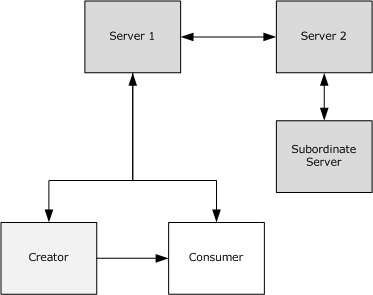
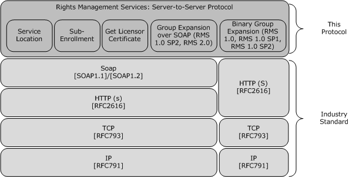
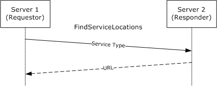
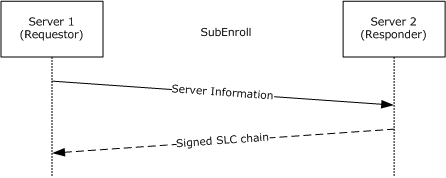
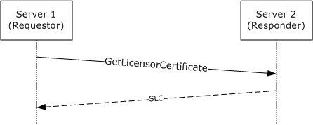
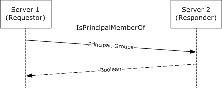
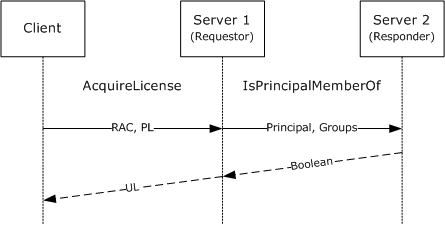
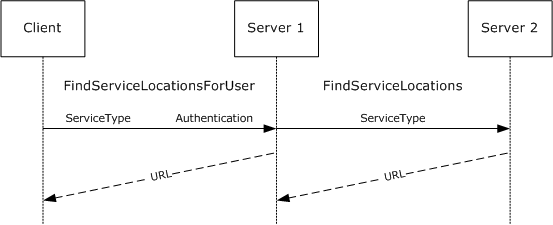

[MS-RMPRS]:

Rights Management Services (RMS): Server-to-Server
Protocol

Intellectual Property Rights Notice for Open Specifications Documentation

  Technical Documentation. Microsoft publishes Open Specifications documentation (“this

documentation”) for protocols, file formats, data portability, computer languages, and standards
support. Additionally, overview documents cover inter-protocol relationships and interactions.

  Copyrights. This documentation is covered by Microsoft copyrights. Regardless of any other

terms that are contained in the terms of use for the Microsoft website that hosts this
documentation, you can make copies of it in order to develop implementations of the technologies
that are described in this documentation and can distribute portions of it in your implementations
that use these technologies or in your documentation as necessary to properly document the
implementation. You can also distribute in your implementation, with or without modification, any
schemas, IDLs, or code samples that are included in the documentation. This permission also
applies to any documents that are referenced in the Open Specifications documentation.
  No Trade Secrets. Microsoft does not claim any trade secret rights in this documentation.
  Patents. Microsoft has patents that might cover your implementations of the technologies

described in the Open Specifications documentation. Neither this notice nor Microsoft's delivery of
this documentation grants any licenses under those patents or any other Microsoft patents.
However, a given Open Specifications document might be covered by the Microsoft Open
Specifications Promise or the Microsoft Community Promise. If you would prefer a written license,
or if the technologies described in this documentation are not covered by the Open Specifications
Promise or Community Promise, as applicable, patent licenses are available by contacting
iplg@microsoft.com.

  License Programs. To see all of the protocols in scope under a specific license program and the

associated patents, visit the Patent Map.

  Trademarks. The names of companies and products contained in this documentation might be
covered by trademarks or similar intellectual property rights. This notice does not grant any
licenses under those rights. For a list of Microsoft trademarks, visit
www.microsoft.com/trademarks.

  Fictitious Names. The example companies, organizations, products, domain names, email

addresses, logos, people, places, and events that are depicted in this documentation are fictitious.
No association with any real company, organization, product, domain name, email address, logo,
person, place, or event is intended or should be inferred.

Reservation of Rights. All other rights are reserved, and this notice does not grant any rights other
than as specifically described above, whether by implication, estoppel, or otherwise.

Tools. The Open Specifications documentation does not require the use of Microsoft programming
tools or programming environments in order for you to develop an implementation. If you have access
to Microsoft programming tools and environments, you are free to take advantage of them. Certain
Open Specifications documents are intended for use in conjunction with publicly available standards
specifications and network programming art and, as such, assume that the reader either is familiar
with the aforementioned material or has immediate access to it.

Support. For questions and support, please contact dochelp@microsoft.com.

[MS-RMPRS] - v20240423
Rights Management Services (RMS): Server-to-Server Protocol
Copyright © 2024 Microsoft Corporation
Release: April 23, 2024

1 / 110

Revision Summary

Date

Revision
History

Revision
Class

Comments

6/1/2007

1.0

Major

Initial Availability

7/3/2007

1.0.1

Editorial

Changed language and formatting in the technical content.

8/10/2007

1.0.2

Editorial

Changed language and formatting in the technical content.

9/28/2007

1.0.3

Editorial

Changed language and formatting in the technical content.

10/23/2007  1.0.4

Editorial

Changed language and formatting in the technical content.

1/25/2008

1.0.5

Editorial

Changed language and formatting in the technical content.

3/14/2008

2.0

6/20/2008

3.0

7/25/2008

3.1

Major

Major

Minor

Updated and revised the technical content.

Updated and revised the technical content.

Clarified the meaning of the technical content.

8/29/2008

3.1.1

Editorial

Changed language and formatting in the technical content.

10/24/2008  3.1.2

Editorial

Changed language and formatting in the technical content.

12/5/2008

4.0

Major

Updated and revised the technical content.

1/16/2009

4.0.1

Editorial

Changed language and formatting in the technical content.

2/27/2009

4.0.2

Editorial

Changed language and formatting in the technical content.

4/10/2009

4.0.3

Editorial

Changed language and formatting in the technical content.

5/22/2009

5.0

Major

Updated and revised the technical content.

7/2/2009

5.0.1

Editorial

Changed language and formatting in the technical content.

8/14/2009

5.0.2

Editorial

Changed language and formatting in the technical content.

9/25/2009

5.1

Minor

Clarified the meaning of the technical content.

11/6/2009

5.1.1

Editorial

Changed language and formatting in the technical content.

12/18/2009  5.1.2

Editorial

Changed language and formatting in the technical content.

1/29/2010

6.0

Major

Updated and revised the technical content.

3/12/2010

6.0.1

Editorial

Changed language and formatting in the technical content.

4/23/2010

7.0

6/4/2010

8.0

7/16/2010

8.0

Major

Major

None

Updated and revised the technical content.

Updated and revised the technical content.

No changes to the meaning, language, or formatting of the
technical content.

8/27/2010

9.0

Major

Updated and revised the technical content.

10/8/2010

9.0

None

No changes to the meaning, language, or formatting of the
technical content.

11/19/2010  9.1

Minor

Clarified the meaning of the technical content.

[MS-RMPRS] - v20240423
Rights Management Services (RMS): Server-to-Server Protocol
Copyright © 2024 Microsoft Corporation
Release: April 23, 2024

2 / 110

Date

Revision
History

Revision
Class

Comments

1/7/2011

9.1

2/11/2011

9.1

3/25/2011

9.1

5/6/2011

9.1

None

None

None

None

No changes to the meaning, language, or formatting of the
technical content.

No changes to the meaning, language, or formatting of the
technical content.

No changes to the meaning, language, or formatting of the
technical content.

No changes to the meaning, language, or formatting of the
technical content.

6/17/2011

9.2

Minor

Clarified the meaning of the technical content.

9/23/2011

9.2

12/16/2011  9.2

3/30/2012

9.2

7/12/2012

9.2

10/25/2012  9.2

1/31/2013

9.2

8/8/2013

10.0

11/14/2013  11.0

2/13/2014

11.0

None

None

None

None

None

None

Major

Major

None

No changes to the meaning, language, or formatting of the
technical content.

No changes to the meaning, language, or formatting of the
technical content.

No changes to the meaning, language, or formatting of the
technical content.

No changes to the meaning, language, or formatting of the
technical content.

No changes to the meaning, language, or formatting of the
technical content.

No changes to the meaning, language, or formatting of the
technical content.

Updated and revised the technical content.

Updated and revised the technical content.

No changes to the meaning, language, or formatting of the
technical content.

5/15/2014

11.0

None

No changes to the meaning, language, or formatting of the
technical content.

6/30/2015

12.0

Major

Significantly changed the technical content.

7/14/2016

12.0

None

No changes to the meaning, language, or formatting of the
technical content.

6/1/2017

12.0

9/15/2017

13.0

9/12/2018

14.0

4/7/2021

15.0

4/23/2024

16.0

None

Major

Major

Major

Major

No changes to the meaning, language, or formatting of the
technical content.

Significantly changed the technical content.

Significantly changed the technical content.

Significantly changed the technical content.

Significantly changed the technical content.

[MS-RMPRS] - v20240423
Rights Management Services (RMS): Server-to-Server Protocol
Copyright © 2024 Microsoft Corporation
Release: April 23, 2024

3 / 110

Table of Contents

1.3

1.1
1.2

1.2.1
1.2.2

1  Introduction ............................................................................................................ 8
Glossary ........................................................................................................... 8
References ...................................................................................................... 10
Normative References ................................................................................. 10
Informative References ............................................................................... 11
Overview ........................................................................................................ 11
ServerSoap (FindServiceLocations) Overview ................................................. 12
SubEnrollServiceSoap Overview ................................................................... 12
ServerSoap (GetLicensorCertificate) Overview ................................................ 13
GroupExpansionWebServiceSoap Overview .................................................... 13
Binary Group Expansion Overview ................................................................ 13
Relationship to Other Protocols .......................................................................... 13
Prerequisites/Preconditions ............................................................................... 14
Applicability Statement ..................................................................................... 14
Versioning and Capability Negotiation ................................................................. 14
Vendor-Extensible Fields ................................................................................... 15
Standards Assignments ..................................................................................... 15

1.3.1
1.3.2
1.3.3
1.3.4
1.3.5

1.4
1.5
1.6
1.7
1.8
1.9

2.2

2.1

2.1.1

2.1.1.2

2.1.1.1

2.2.4.1
2.2.4.2

2.1.1.2.1
2.1.1.2.2

2.1.1.1.1
2.1.1.1.2

2.2.1
2.2.2
2.2.3
2.2.4

2  Messages ............................................................................................................... 16
Transport ........................................................................................................ 16
HTTP Transport for Binary Group Expansion ................................................... 16
Client Details ........................................................................................ 17
Sending Request ............................................................................. 17
Receiving Reply ............................................................................... 17
Server Details ....................................................................................... 17
Receiving Request ........................................................................... 17
Sending Reply ................................................................................. 18
Common Message Syntax ................................................................................. 18
Namespaces .............................................................................................. 18
Messages ................................................................................................... 19
Elements ................................................................................................... 19
Complex Types ........................................................................................... 19
ArrayOfString Complex Type .................................................................. 19
VersionData Complex Type..................................................................... 19
Simple Types ............................................................................................. 20
Attributes .................................................................................................. 20
Groups ...................................................................................................... 20
Attribute Groups ......................................................................................... 20
Common Data Structures ............................................................................ 20
Common Fault Codes............................................................................. 20
Binary Group Expansion Interface ...................................................................... 21
Serialized Octet Stream ............................................................................... 21
SerializationHeaderRecord ...................................................................... 22
IsPrincipalMemberOfRequest .................................................................. 23
ArgumentsArray .............................................................................. 24
IsPrincipalMemberOfResponse ................................................................ 25
ReturnArray .................................................................................... 26
ReturnArgumentsArray ..................................................................... 27
MessageEnd ......................................................................................... 27
Common Enumerations ............................................................................... 28
RecordTypeEnumeration ........................................................................ 28
BinaryTypeEnumeration ......................................................................... 29
PrimitiveTypeEnumeration...................................................................... 29
MessageFlags ....................................................................................... 30
Common Structures .................................................................................... 30

2.3.2.1
2.3.2.2
2.3.2.3
2.3.2.4

2.2.5
2.2.6
2.2.7
2.2.8
2.2.9

2.3.1.3.1
2.3.1.3.2

2.3.1.1
2.3.1.2

2.3.1.2.1

2.3.1.3

2.3.1.4

2.2.9.1

2.3.3

2.3.1

2.3.2

2.3

[MS-RMPRS] - v20240423
Rights Management Services (RMS): Server-to-Server Protocol
Copyright © 2024 Microsoft Corporation
Release: April 23, 2024

4 / 110

2.3.4

2.3.5

2.3.3.1
2.3.3.2
2.3.3.3
2.3.3.4

2.3.4.1
2.3.4.2
2.3.4.3

2.3.5.1
2.3.5.2
2.3.5.3
2.3.5.4
2.3.5.5
2.3.5.6
2.3.5.7

2.3.6

2.3.6.1
2.3.6.2
2.3.6.3
2.3.6.4
2.3.6.5
2.3.6.6
2.3.6.7
2.3.6.8
2.3.6.9
2.3.6.10

Single .................................................................................................. 31
ValueWithCode ..................................................................................... 31
StringValueWithCode ............................................................................. 31
LengthPrefixedString ............................................................................. 31
Common Records ....................................................................................... 34
BinaryLibrary ........................................................................................ 34
ArraySingleString .................................................................................. 35
ArraySingleObject ................................................................................. 35
Member Reference Records .......................................................................... 36
MemberPrimitiveTyped .......................................................................... 36
MemberPrimitiveUnTyped....................................................................... 36
MemberReference ................................................................................. 37
ObjectNull ............................................................................................ 37
ObjectNullMultiple ................................................................................. 37
ObjectNullMultiple256 ............................................................................ 38
BinaryObjectString ................................................................................ 38
Class Records ............................................................................................. 38
LogicalCallContext ................................................................................. 38
Principal ............................................................................................... 39
ExplicitParseEnum ................................................................................. 44
ListDictionary ....................................................................................... 45
HashTable ............................................................................................ 47
StringCollection .................................................................................... 49
DictionaryNode ..................................................................................... 50
ArrayList .............................................................................................. 52
RemotingException ............................................................................... 53
ClassWithId .......................................................................................... 56

3.1

3.2

3.1.4.1

3.2.4.1

3.1.5
3.1.6

3.2.1
3.2.2
3.2.3
3.2.4

3.1.1
3.1.2
3.1.3
3.1.4

3  Protocol Details ..................................................................................................... 58
Common Details .............................................................................................. 58
Abstract Data Model .................................................................................... 58
Timers ...................................................................................................... 58
Initialization ............................................................................................... 58
Message Processing Events and Sequencing Rules .......................................... 58
Common SOAP Headers ......................................................................... 58
Timer Events .............................................................................................. 59
Other Local Events ...................................................................................... 59
ServerSoap (FindServiceLocations) Server Details ................................................ 59
Abstract Data Model .................................................................................... 59
Timers ...................................................................................................... 59
Initialization ............................................................................................... 59
Message Processing Events and Sequencing Rules .......................................... 59
FindServiceLocations ............................................................................. 60
Messages ....................................................................................... 61
FindServiceLocationsSoapIn Request ............................................ 61
FindServiceLocationsSoapOut Response ........................................ 61
Elements ........................................................................................ 62
FindServiceLocations .................................................................. 62
FindServiceLocationsResponse ..................................................... 62
Complex Types ............................................................................... 62
ArrayOfServiceLocationRequest Complex Type .............................. 63
ServiceLocationRequest Complex Type ......................................... 63
ArrayOfServiceLocationResponse Complex Type ............................ 63
ServiceLocationResponse Complex Type ....................................... 64
Simple Types .................................................................................. 64
ServiceType Simple Type ............................................................ 64
Timer Events .............................................................................................. 65
Other Local Events ...................................................................................... 65

3.2.4.1.3.1
3.2.4.1.3.2
3.2.4.1.3.3
3.2.4.1.3.4

3.2.4.1.1.1
3.2.4.1.1.2

3.2.4.1.2.1
3.2.4.1.2.2

3.2.4.1.4.1

3.2.5
3.2.6

3.2.4.1.4

3.2.4.1.3

3.2.4.1.2

3.2.4.1.1

[MS-RMPRS] - v20240423
Rights Management Services (RMS): Server-to-Server Protocol
Copyright © 2024 Microsoft Corporation
Release: April 23, 2024

5 / 110

3.3

3.3.1
3.3.2
3.3.3
3.3.4

3.3.4.1

3.3.4.1.1

3.3.4.1.2

3.3.4.1.3

3.3.4.1.1.1
3.3.4.1.1.2

3.4.4.1.1.1
3.4.4.1.1.2

3.3.4.1.2.1
3.3.4.1.2.2

3.3.4.1.3.1
3.3.4.1.3.2
3.3.4.1.3.3
3.3.4.1.3.4

SubEnrollServiceSoap Server Details .................................................................. 65
Abstract Data Model .................................................................................... 65
Timers ...................................................................................................... 66
Initialization ............................................................................................... 66
Message Processing Events and Sequencing Rules .......................................... 66
SubEnroll ............................................................................................. 66
Messages ....................................................................................... 67
SubEnrollSoapIn Request ............................................................ 68
SubEnrollSoapOut Response ........................................................ 68
Elements ........................................................................................ 68
SubEnroll .................................................................................. 68
SubEnrollResponse ..................................................................... 69
Complex Types ............................................................................... 69
SubEnrollParameters ComplexType .............................................. 69
EnrolleeCertificatePublicKey Complex Type .................................... 70
EnrolleeServerInformation Complex Type ..................................... 70
SubEnrollResponse Complex Type ................................................ 71
Timer Events .............................................................................................. 71
Other Local Events ...................................................................................... 71
ServerSoap (GetLicensorCertificate) Server Details .............................................. 71
Abstract Data Model .................................................................................... 71
Timers ...................................................................................................... 71
Initialization ............................................................................................... 72
Message Processing Events and Sequencing Rules .......................................... 72
GetLicensorCertificate ............................................................................ 72
Messages ....................................................................................... 73
GetLicensorCertificateSoapIn Request .......................................... 73
GetLicensorCertificateSoapOut Response ...................................... 73
Elements ........................................................................................ 73
GetLicensorCertificate ................................................................. 74
GetLicensorCertificateResponse ................................................... 74
Complex Types ............................................................................... 74
LicensorCertChain Complex Type ................................................. 74
ArrayOfXmlNode Complex Type ................................................... 75
Timer Events .............................................................................................. 75
Other Local Events ...................................................................................... 75
GroupExpansionWebServiceSoap Server Details ................................................... 75
Abstract Data Model .................................................................................... 75
Timers ...................................................................................................... 76
Initialization ............................................................................................... 76
Message Processing Events and Sequencing Rules .......................................... 76
IsPrincipalMemberOf ............................................................................. 76
Messages ....................................................................................... 77
IsPrincipalMemberOfSoapIn Request ............................................ 77
IsPrincipalMemberOfSoapOut Response ........................................ 78
Elements ........................................................................................ 78
IsPrincipalMemberOf .................................................................. 78
IsPrincipalMemberOfResponse ..................................................... 79
Timer Events .............................................................................................. 79
Other Local Events ...................................................................................... 79
Binary Group Expansion Server Details ............................................................... 79
Abstract Data Model .................................................................................... 80
Timers ...................................................................................................... 80
Initialization ............................................................................................... 80
Message Processing Events and Sequencing Rules .......................................... 80
IsPrincipalMemberOf ............................................................................. 80
Timer Events .............................................................................................. 80
Other Local Events ...................................................................................... 80

3.5.4.1.1.1
3.5.4.1.1.2

3.4.4.1.3.1
3.4.4.1.3.2

3.5.4.1.2.1
3.5.4.1.2.2

3.4.4.1.2.1
3.4.4.1.2.2

3.4

3.3.5
3.3.6

3.4.1
3.4.2
3.4.3
3.4.4

3.4.4.1

3.4.4.1.1

3.4.4.1.2

3.4.4.1.3

3.4.5
3.4.6

3.5

3.5.1
3.5.2
3.5.3
3.5.4

3.5.4.1

3.5.4.1.1

3.5.4.1.2

3.5.5
3.5.6

3.6

3.6.1
3.6.2
3.6.3
3.6.4

3.6.5
3.6.6

3.6.4.1

[MS-RMPRS] - v20240423
Rights Management Services (RMS): Server-to-Server Protocol
Copyright © 2024 Microsoft Corporation
Release: April 23, 2024

6 / 110

4  Protocol Examples ................................................................................................. 81
Accessing Protected Information as a Member of an Authorized Group .................... 81
Provisioning an Extranet User ............................................................................ 82
Binary Group Expansion .................................................................................... 83

4.1
4.2
4.3

5.1

5  Security ................................................................................................................. 92
Security Considerations for Implementers ........................................................... 92
ServerSoap (FindServiceLocations) Security Considerations ............................. 92
SubEnrollServiceSoap Security Considerations ............................................... 92
ServerSoap (GetLicensorCertificate) Security Considerations ............................ 92
Group Expansion Security Considerations ...................................................... 92
Index of Security Parameters ............................................................................ 93

5.1.1
5.1.2
5.1.3
5.1.4

5.2

6  Appendix A: Full WSDL .......................................................................................... 94
ServerSoap (FindServiceLocations) WSDL ........................................................... 94
SubEnrollServiceSoap WSDL .............................................................................. 96
ServerSoap (GetLicensorCertificate) WSDL .......................................................... 98
GroupExpansionWebServiceSoap WSDL ............................................................. 100

6.1
6.2
6.3
6.4

7  Appendix B: Product Behavior ............................................................................. 103

8  Change Tracking .................................................................................................. 106

9  Index ................................................................................................................... 107

[MS-RMPRS] - v20240423
Rights Management Services (RMS): Server-to-Server Protocol
Copyright © 2024 Microsoft Corporation
Release: April 23, 2024

7 / 110

1  Introduction

This document specifies the Rights Management Services (RMS): Server-Server Protocol. The RMS:
Server-Server Protocol is used to communicate information between RMS servers and consists of four
separate port types and one binary interface:

  ServerSoap (FindServiceLocations): Using theServerSoap (FindServiceLocations) port type, one

RMS server provides another with URLs for services that are requested.

  SubEnrollServiceSoap: Using theSubEnrollServiceSoap port type, one RMS server bootstraps itself

as a subordinate of another RMS server. In this process, the main server grants the subordinate
server the right to perform only licensing tasks by issuing it a Server Licensor Certificate (SLC)
that indicates this right.

  ServerSoap (GetLicensorCertificate): One RMS server acquires the public SLC of another by using
the ServerSoap (GetLicensorCertificate) port type in order to establish trust. This trust allows the
requesting RMS server to trust RMS account certificates (RACs) issued by the responding RMS
server.

  GroupExpansionWebServiceSoap: An RMS server uses the GroupExpansionWebServiceSoap port

type to ask another RMS server whether a specific user is a member of a specific directory group.

  Binary Group Expansion: This binary interface provides the same service as

theGroupExpansionWebServiceSoap port type, by using a binary-over-HTTP interface.

The Binary Group Expansion interface uses a binary-formatted interface over HTTP. The port types
(ServerSoap (FindServiceLocations), SubEnrollServiceSoap, ServerSoap (GetLicensorCertificate), and
GroupExpansionWebServiceSoap) all use a SOAP-based protocol over HTTP.

Sections 1.5, 1.8, 1.9, 2, and 3 of this specification are normative. All other sections and examples in
this specification are informative.

1.1  Glossary

This document uses the following terms:

Active Directory: The Windows implementation of a general-purpose directory service, which uses

LDAP as its primary access protocol. Active Directory stores information about a variety of
objects in the network such as user accounts, computer accounts, groups, and all related
credential information used by Kerberos [MS-KILE]. Active Directory is either deployed as Active
Directory Domain Services (AD DS) or Active Directory Lightweight Directory Services (AD LDS),
which are both described in [MS-ADOD]: Active Directory Protocols Overview.

certificate: As used in this document, certificates are expressed in [XRML] section 1.2.

certificate chain: A sequence of certificates, where each certificate in the sequence is signed by
the subsequent certificate. The last certificate in the chain is normally a self-signed certificate.

consumer: The user who uses protected content.

directory: The database that stores information about objects such as users, groups, computers,

printers, and the directory service that makes this information available to users and
applications.

domain: A set of users and computers sharing a common namespace and management

infrastructure. At least one computer member of the set has to act as a domain controller (DC)
and host a member list that identifies all members of the domain, as well as optionally hosting
the Active Directory service. The domain controller provides authentication of members,

[MS-RMPRS] - v20240423
Rights Management Services (RMS): Server-to-Server Protocol
Copyright © 2024 Microsoft Corporation
Release: April 23, 2024

8 / 110

creating a unit of trust for its members. Each domain has an identifier that is shared among its
members. For more information, see [MS-AUTHSOD] section 1.1.1.5 and [MS-ADTS].

endpoint: A network-specific address of a remote procedure call (RPC) server process for remote

procedure calls. The actual name and type of the endpoint depends on the RPC protocol
sequence that is being used. For example, for RPC over TCP (RPC Protocol Sequence
ncacn_ip_tcp), an endpoint might be TCP port 1025. For RPC over Server Message Block (RPC
Protocol Sequence ncacn_np), an endpoint might be the name of a named pipe. For more
information, see [C706].

forest: One or more domains that share a common schema and trust each other transitively. An
organization can have multiple forests. A forest establishes the security and administrative
boundary for all the objects that reside within the domains that belong to the forest. In
contrast, a domain establishes the administrative boundary for managing objects, such as
users, groups, and computers. In addition, each domain has individual security policies and
trust relationships with other domains.

globally unique identifier (GUID): A term used interchangeably with universally unique

identifier (UUID) in Microsoft protocol technical documents (TDs). Interchanging the usage of
these terms does not imply or require a specific algorithm or mechanism to generate the value.
Specifically, the use of this term does not imply or require that the algorithms described in
[RFC4122] or [C706] have to be used for generating the GUID. See also universally unique
identifier (UUID).

hash table: A data structure that associates data keys with values to improve lookup efficiency.

license: An XrML1.2 document that describes usage policy for protected content.

protected content: Any content or information (file, email) that has an RMS usage policy

assigned to it, and is encrypted according to that policy. Also known as "Protected Information".

publishing license (PL): An XrML 1.2 license that defines usage policy for protected content

and contains the content key with which that content is encrypted. The usage policy identifies all
authorized users and the actions they are authorized to take with the content, along with any
conditions on that usage. The publishing license tells the server what usage policies apply to a
given piece of content and grants the server the right to issue use licenses (ULs) based on
that policy. The PL is created when content is protected. Also known as an Issuance License
(IL).

remote procedure call (RPC): A communication protocol used primarily between client and

server. The term has three definitions that are often used interchangeably: a runtime
environment providing for communication facilities between computers (the RPC runtime); a set
of request-and-response message exchanges between computers (the RPC exchange); and the
single message from an RPC exchange (the RPC message).  For more information, see [C706].

RMS account certificate (RAC): An XrML 1.2 certificate chain that contains an asymmetric

encryption key pair that is issued to a user account by an RMS Certification Service. The RAC
binds that user account to a specific computer. The RAC represents the identity of a user who
can access protected content. Also known as a Group Identity Certificate (GIC).

Secure Sockets Layer (SSL): A security protocol that supports confidentiality and integrity of

messages in client and server applications that communicate over open networks. SSL supports
server and, optionally, client authentication using X.509 certificates [X509] and [RFC5280]. SSL
is superseded by Transport Layer Security (TLS). TLS version 1.0 is based on SSL version 3.0
[SSL3].

server licensor certificate (SLC): An XrML 1.2 certificate that contains a public key issued to
an RMS server by an RMS cloud service (RMS 1.0, RMS 1.0 SP1, and RMS 1.0 SP2) or Self
Enrollment (RMS 2.0). The RMS client uses the RMS server's public key to encrypt the usage
policy and content key in a publish license.

9 / 110

[MS-RMPRS] - v20240423
Rights Management Services (RMS): Server-to-Server Protocol
Copyright © 2024 Microsoft Corporation
Release: April 23, 2024

use license (UL): An XrML 1.2 license that authorizes a user to access a given protected

content file and describes the usage policies that apply. Also known as an "End-User License
(EUL)".

MAY, SHOULD, MUST, SHOULD NOT, MUST NOT: These terms (in all caps) are used as defined
in [RFC2119]. All statements of optional behavior use either MAY, SHOULD, or SHOULD NOT.

1.2  References

Links to a document in the Microsoft Open Specifications library point to the correct section in the
most recently published version of the referenced document. However, because individual documents
in the library are not updated at the same time, the section numbers in the documents may not
match. You can confirm the correct section numbering by checking the Errata.

1.2.1  Normative References

We conduct frequent surveys of the normative references to assure their continued availability. If you
have any issue with finding a normative reference, please contact dochelp@microsoft.com. We will
assist you in finding the relevant information.

[IEEE754] IEEE, "IEEE Standard for Binary Floating-Point Arithmetic", IEEE 754-1985, October 1985,
http://ieeexplore.ieee.org/servlet/opac?punumber=2355

[MS-DTYP] Microsoft Corporation, "Windows Data Types".

[MS-NLMP] Microsoft Corporation, "NT LAN Manager (NTLM) Authentication Protocol".

[MS-RMPR] Microsoft Corporation, "Rights Management Services (RMS): Client-to-Server Protocol".

[NTLM] Microsoft Corporation, "Microsoft NTLM", http://msdn.microsoft.com/en-
us/library/aa378749.aspx

[RFC1945] Berners-Lee, T., Fielding, R., and Frystyk, H., "Hypertext Transfer Protocol -- HTTP/1.0",
RFC 1945, May 1996, https://www.rfc-editor.org/info/rfc1945

[RFC2119] Bradner, S., "Key words for use in RFCs to Indicate Requirement Levels", BCP 14, RFC
2119, March 1997, https://www.rfc-editor.org/info/rfc2119

[RFC2616] Fielding, R., Gettys, J., Mogul, J., et al., "Hypertext Transfer Protocol -- HTTP/1.1", RFC
2616, June 1999, https://www.rfc-editor.org/info/rfc2616

[RFC2617] Franks, J., Hallam-Baker, P., Hostetler, J., et al., "HTTP Authentication: Basic and Digest
Access Authentication", RFC 2617, June 1999, https://www.rfc-editor.org/info/rfc2617

[SOAP1.1] Box, D., Ehnebuske, D., Kakivaya, G., et al., "Simple Object Access Protocol (SOAP) 1.1",
W3C Note, May 2000, https://www.w3.org/TR/2000/NOTE-SOAP-20000508/

[SOAP1.2-1/2003] Gudgin, M., Hadley, M., Mendelsohn, N., et al., "SOAP Version 1.2 Part 1:
Messaging Framework", W3C Recommendation, June 2003, http://www.w3.org/TR/2003/REC-soap12-
part1-20030624

[WSDLSOAP] Angelov, D., Ballinger, K., Butek, R., et al., "WSDL 1.1 Binding Extension for SOAP 1.2",
W3C Member Submission, April 2006, http://www.w3.org/Submission/2006/SUBM-wsdl11soap12-
20060405/

[WSDL] Christensen, E., Curbera, F., Meredith, G., and Weerawarana, S., "Web Services Description
Language (WSDL) 1.1", W3C Note, March 2001, https://www.w3.org/TR/2001/NOTE-wsdl-20010315

[MS-RMPRS] - v20240423
Rights Management Services (RMS): Server-to-Server Protocol
Copyright © 2024 Microsoft Corporation
Release: April 23, 2024

10 / 110

<!-- Extracted images from page 11 -->

<!-- /Extracted images from page 11 -->

[XMLNS] Bray, T., Hollander, D., Layman, A., et al., Eds., "Namespaces in XML 1.0 (Third Edition)",
W3C Recommendation, December 2009, https://www.w3.org/TR/2009/REC-xml-names-20091208/

[XMLSCHEMA1] Thompson, H., Beech, D., Maloney, M., and Mendelsohn, N., Eds., "XML Schema Part
1: Structures", W3C Recommendation, May 2001, https://www.w3.org/TR/2001/REC-xmlschema-1-
20010502/

[XMLSCHEMA2] Biron, P.V., Ed. and Malhotra, A., Ed., "XML Schema Part 2: Datatypes", W3C
Recommendation, May 2001, https://www.w3.org/TR/2001/REC-xmlschema-2-20010502/

[XRML] ContentGuard, Inc., "XrML: Extensible rights Markup Language Version 1.2", 2001,
http://contentguard.com/contact-us

Note Contact the owner of the XrML specification for more information.

1.2.2  Informative References

[KERBKEY] Microsoft Corporation, "KERB_CRYPTO_KEY", http://msdn.microsoft.com/en-
us/library/aa378058.aspx

[RFC8017] Moriarty, K., Ed., Kaliski, B., Jonsson, J., and Rusch, A., "PKCS #1: RSA Cryptography
Specifications Version 2.2", November 2016, https://www.rfc-editor.org/info/rfc8017

1.3  Overview

Rights Management Services (RMS) is a client/server technology that provides support for information
protection through content encryption and fine-grained policy definition and enforcement. The Rights
Management Services (RMS): Client-to-Server Protocol, as specified in [MS-RMPR], enables end users
to create and consume protected content.

[MS-RMPRS] - v20240423
Rights Management Services (RMS): Server-to-Server Protocol
Copyright © 2024 Microsoft Corporation
Release: April 23, 2024

11 / 110

Figure 1: Roles in the RMS system

For the creation and consumption of protected information (or content), the RMS system involves
three active roles: the creator, the consumer, and the server. The creator and consumer are both
roles of the RMS client. The interactions between the RMS client and the RMS server are specified in
[MS-RMPR].

The RMS server has two primary responsibilities:

1.  Issue certificates to end users for use during creation and consumption of protected content.

2.  Make authorization decisions for access to protected content based on the policy that applies to

that content, and issue licenses that record the authorization decision.

To issue licenses to end users, the RMS server first validates that the policy for the content grants
access to the end user. The complexity for this validation can vary with the complexity of the
surrounding network. For instance, distribution groups or other user groupings might require
expansion; the directory topology can include partitions or other compartmentalization that restrict
free movement of authorization and authentication data. These cases can necessitate the use of
multiple RMS servers deployed in each partition to facilitate flow of information necessary for making
authorization decisions that result in license issuance.

Some cases, such as when a specific department within an enterprise wants further control over
information protection policies, require an RMS server deployed as a subordinate to an existing server.
These situations require a specific trust to be established between RMS servers.

In these complicated deployments, RMS servers need to communicate with one another to share data.
This communication uses the Rights Management Services (RMS): Server-to-Server Protocol defined
by this specification.

1.3.1  ServerSoap (FindServiceLocations) Overview

RMS servers use the ServerSoap (FindServiceLocations) port type of the RMS: Server-Server Protocol
to find the URLs for specific services that are provided by other RMS servers. This communication can
be useful in two scenarios:

1.  Finding the appropriate URLs for a client to use for bootstrapping.

2.  Finding the Group Expansion port type on a remote server before making a cross-forest group

expansion request.

Clients contact the server for a bootstrapping process so they can begin functioning in the RMS
system. This bootstrapping process is defined in the RMS: Client-to-Server Protocol, as specified in
[MS-RMPR]. To bootstrap a specific user, the RMS server needs to authenticate that user and
determine the user's email address by checking the directory. If the user's account resides in a
partition of the directory that the RMS server cannot access, it cannot successfully bootstrap the user.
A client starts the bootstrapping process by making a request for service locations to a specific RMS
server. If that RMS server is not the appropriate server to bootstrap the client, the server can use the
ServerSoap (FindServiceLocations) port type to find the URLs on the appropriate server, and then
return them to the client.

The ServerSoap (FindServiceLocations) port type uses a SOAP-based protocol over HTTP. It exposes
one request/response operation: FindServiceLocations.

1.3.2  SubEnrollServiceSoap Overview

RMS servers use the SubEnrollServiceSoap port type of the RMS: Server-to-Server Protocol to
bootstrap subordinate RMS servers.

[MS-RMPRS] - v20240423
Rights Management Services (RMS): Server-to-Server Protocol
Copyright © 2024 Microsoft Corporation
Release: April 23, 2024

12 / 110

As shown in Figure 1, an RMS server can be deployed as a subordinate to another RMS server. A root
RMS server grants a subordinate RMS server the right to perform only licensing tasks by issuing a
subordinate server licensor certificate (SLC) from its own. For a subordinate RMS server, this
process replaces the standard RMS server bootstrapping process defined in [MS-RMPR] section 3.1.3.

The SubEnrollServiceSoap port type uses a SOAP-based protocol over HTTP. It exposes one
request/response operation: SubEnroll.

1.3.3  ServerSoap (GetLicensorCertificate) Overview

RMS servers use the Get Licensor Certificate port type of the RMS: Server-to-Server Protocol to
establish trust from a root server to a subordinate server.

When a subordinate RMS server is deployed, it needs to trust identities issued by the root RMS server.
This is accomplished by trusting certificates that were issued by the root RMS server by trusting the
root RMS server's public key. The subordinate server can use the Get Licensor Certificate port type to
retrieve the SLC of the main server that contains the appropriate public key.

The Get Licensor Certificate port type uses a SOAP-based protocol over HTTP. It exposes one
request/response operation: GetLicensorCertificate.

1.3.4  GroupExpansionWebServiceSoap Overview

RMS servers use the Group Expansion over SOAP port type of the RMS: Server-Server Protocol to
determine group membership of authorized users across complex network directories.

Access policy on RMS protected content can specify individual users as well as distribution groups.
When a consumer contacts the RMS server for authorization to access protected content, the server
might need to consult the directory to determine whether that user is a member of a group that is
specified in the policy. If the group exists in a partition of the directory to which the RMS server does
not have access, that RMS server needs to contact another server that does have appropriate
permissions. This server-to-server communication can use either the Group Expansion over SOAP port
type or the Binary Group Expansion interface.

The Group Expansion over SOAP port type exposes one request/response operation:
IsPrincipalMemberOf.

1.3.5  Binary Group Expansion Overview

The Binary Group Expansion interface performs the same function as the Group Expansion over SOAP
port type, as defined in section 1.3.4, only it does so using a binary-over-HTTP protocol. It exposes
one request/response method: IsPrincipalMemberOf.

1.4  Relationship to Other Protocols

The ServerSoap (FindServiceLocations), SubEnrollServiceSoap, ServerSoap (GetLicensorCertificate),
and GroupExpansionWebServiceSoap port types all use a SOAP-based protocol that uses HTTP 1.1 as
its transport.

The Binary Group Expansion interface uses a binary-formatted interface over HTTP 1.1.

The following diagram shows the transport stack used by the RMS: Server-Server Protocol.

[MS-RMPRS] - v20240423
Rights Management Services (RMS): Server-to-Server Protocol
Copyright © 2024 Microsoft Corporation
Release: April 23, 2024

13 / 110

<!-- Extracted images from page 14 -->

<!-- /Extracted images from page 14 -->

Figure 2: Transport stack for the RMS: Server-Server Protocol

1.5  Prerequisites/Preconditions

It is assumed that the server either knows or can discover the appropriate service locations for the
services it either provides or references in order to respond to Service Location requests.

It is also assumed that the server has been properly bootstrapped and initialized with its own SLC in
place in order to respond to Sub-Enrollment and Get Licensor Certificate requests.

Finally, it is assumed that the server either has connectivity to the directory and permissions to
query it, or the server is able to verify group membership in some other way (for example, through
cached directory information) in order to respond to Group Expansion requests from either the Binary
Group Expansion Interface interface or the GroupExpansionWebServiceSoap port type. interfaces.

1.6  Applicability Statement

The RMS: Server-to-Server Protocol is used for communication between RMS servers when multiple
server deployments are used together.

1.7  Versioning and Capability Negotiation

This document covers versioning issues in the following areas:

  Supported Transports: This protocol is implemented on top of HTTP, as specified in section 2.1.

  Protocol Versions: The ServerSoap (FindServiceLocations) interface has only one version that is
implemented using a SOAP-based protocol over HTTP. The Binary Group Expansion interface is
used by RMS version 1.0 and RMS version 1.0 SP1. It is also used by RMS version 1.0 SP2 for
backward compatibility when communicating with RMS version 1.0 servers or RMS version 1.0 SP1
servers. The GroupExpansionWebServiceSoap port type is used by RMS version 1.0 SP2 servers
and RMS version 2.0 servers.<1>

  Security and Authentication Methods: This protocol passively supports Kerberos

authentication over HTTP or HTTPS (as specified in [KERBKEY]) and NTLM authentication over
HTTP or HTTPS (as specified in [NTLM]).

[MS-RMPRS] - v20240423
Rights Management Services (RMS): Server-to-Server Protocol
Copyright © 2024 Microsoft Corporation
Release: April 23, 2024

14 / 110

  Localization: There are no localization-dependent behaviors for the RMS: Server-to-Server

Protocol.

  Capability Negotiation: The RMS: Server-to-Server Protocol supports limited capability

negotiation by way of the VersionData type that is present on all SOAP-based protocol requests.
On a request, the VersionData structure contains a MinimumVersion and MaximumVersion value,
indicating the range of versions that the client is capable of understanding. On a response, the
VersionData structure contains a MinimumVersion and MaximumVersion that the server is capable
of understanding. The Binary Group Expansion versioning structure must be adhered to for Binary
Group Expansion requests.

1.8  Vendor-Extensible Fields

This protocol does not contain any vendor-extensible fields. All XML schema are considered
nonextensible in the RMS: Server-Server Protocol.

1.9  Standards Assignments

The RMS: Server-Server Protocol has not been assigned any standards by any recognized standards
organization.

[MS-RMPRS] - v20240423
Rights Management Services (RMS): Server-to-Server Protocol
Copyright © 2024 Microsoft Corporation
Release: April 23, 2024

15 / 110

2  Messages

2.1  Transport

The RMS: Server-Server Protocol is composed of four port types and one binary-over-HTTP interface:



Port types:

  ServerSoap (FindServiceLocations)

  SubEnrollServiceSoap

  ServerSoap (GetLicensorCertificate)

  GroupExpansionWebServiceSoap

  Binary-over-HTTP interface:

  Binary Group Expansion

Each port type MUST support SOAP over HTTP, using TCP/IP as the transport layer underneath HTTP.
SOAP is used as specified in [SOAP1.1] (and [SOAP1.2-1/2003]), and HTTP is used as specified in
[RFC2616]. Each Web service SHOULD support HTTPS for securing communications.<2>

The port types MUST be exposed by the server at the following endpoints, starting from any base
URL:

  ServerSoap (FindServiceLocations): This port type, when implemented as specified in section

1.3.1, MUST be exposed at the following URLs:





[baseURL]/certification/server.asmx: FindServiceLocations

[baseURL]/licensing/server.asmx: FindServiceLocations

  SubEnrollServiceSoap: This port type, when implemented as specified in section 3.3, MUST be

exposed at the following URL:



[baseURL]/Certification/SubEnrollService.asmx: SubEnroll

  ServerSoap (GetLicensorCertificate): This port type, when implemented as specified in section

1.3.3, MUST be exposed at the following URLs:





[baseURL]/certification/server.asmx: GetLicensorCertificate

[baseURL]/licensing/server.asmx: GetLicensorCertificate

  GroupExpansionWebServiceSoap: This port type, when implemented as specified in section 2.1,

MUST be exposed at the following URL:



[baseURL]/groupexpansion/GroupExpansion.asmx: IsPrincipalMemberOf

  Binary Group Expansion: This interface, when implemented as specified in section 2.3, MUST be

exposed at the following URL:



[baseURL]/DrmRemote/DirectoryServices/DirectoryServices.rem

2.1.1  HTTP Transport for Binary Group Expansion

The Binary Group Expansion interface uses the HTTP transport ( [RFC1945] and [RFC2616]) to
transmit method invocation and return information. The message request of a remote method

16 / 110

[MS-RMPRS] - v20240423
Rights Management Services (RMS): Server-to-Server Protocol
Copyright © 2024 Microsoft Corporation
Release: April 23, 2024

invocation MUST be sent as part of an HTTP request and the reply from the server MUST be sent as
part of the HTTP response.

If instructed by a higher-level protocol in an implementation-specific way, implementations of this
protocol MUST require that the HTTP implementation on the server use Basic or Digest Access
Authentication for HTTP to authenticate the HTTP client, as specified in [RFC2617] or NTLM
authentication [MS-NLMP] for HTTP.

The higher-level protocol MUST provide in an implementation-specific way either credentials in the
form of user name/password or a client-side certificate. Implementations of this protocol MUST NOT
process the credentials or authentication information. Such processing typically happens entirely
inside implementations of lower protocol layers.

2.1.1.1  Client Details

2.1.1.1.1 Sending Request

A remote method invocation request MUST be mapped to an HTTP request and MUST have the
following HTTP headers:

  An implementation MUST use either HTTP/1.0 or HTTP/1.1.

  HTTP Method MUST be specified.





The HTTP Method SHOULD be a POST.

The HTTP Method MAY be M-POST.











The Request-URI of the HTTP request message MUST be set to the URI of the Binary Group
Expansion endpoint as specified in section 2.1.

The User-Agent SHOULD contain the string "MS .NET Remoting".

The Content-Type MUST be "application/octet-stream".

The message content MUST be transmitted as the HTTP request message body.

The message body MAY be sent using chunked transfer coding as specified in [RFC2616] section
3.6.1. If the message body is not chunked, the Content-Length entity header MUST contain the
length of the message body in decimal number of octets.

2.1.1.1.2 Receiving Reply

The implementation MUST wait for a response. If a response is not received before an
implementation-defined time-out, the implementation SHOULD cancel the request and report an error
to the higher layer.

If the status code of the HTTP response is one of the successful codes as specified in [RFC2616]
section 10.2 or one of the server-error codes as specified in [RFC2616] section 10.5, the response
MUST be processed further as specified in section 2.3. If the Status-Code is one of the client-error
codes as specified in [RFC2616] section 10.4, the response MUST NOT be processed any further.

An implementation MAY handle other status codes in an implementation-specific way that complies
with [RFC2616]. If an error occurs in processing of the other status codes, the response MUST NOT be
processed any further.

2.1.1.2  Server Details

2.1.1.2.1 Receiving Request

[MS-RMPRS] - v20240423
Rights Management Services (RMS): Server-to-Server Protocol
Copyright © 2024 Microsoft Corporation
Release: April 23, 2024

17 / 110

A Remote Method invocation request is mapped to an HTTP request. An implementation MUST accept
request messages that are sent using either HTTP/1.0 or HTTP/1.1. If the HTTP method is neither
POST nor M-POST, or if the Content-Type is not "application/octet-stream", then an implementation
MUST send back a transport fault as specified in the following list.

An implementation MUST send back an HTTP response:







The HTTP Status-Code of the response MUST be 400.

The Reason-Phrase SHOULD be "Bad Request".

The Body of the response MUST be empty.

2.1.1.2.2 Sending Reply

A remote method reply is mapped to an HTTP response and MUST have the following HTTP header
fields:



The Content-Type of the response MUST match the Content-Type of the request.

  An implementation MUST return an HTTP response with a Status-Code and message body as

shown in the following table. The Reason-Phrase value SHOULD be as follows.

Request message

Status-Code  Reason-Phrase  Message body

Binary Group Expansion  200

OK

Serialized message content.

2.2  Common Message Syntax

This section contains common definitions used by this protocol. The syntax of the definitions uses XML
schema as defined in [XMLSCHEMA1] and [XMLSCHEMA2], and Web Services Description Language as
defined in [WSDL].

This protocol uses curly-braced GUID strings, as specified in [MS-DTYP] section 2.3.4.3.

2.2.1  Namespaces

This specification defines and references various XML namespaces using the mechanisms specified in
[XMLNS]. Although this specification associates a specific XML namespace prefix for each XML
namespace that is used, the choice of any particular XML namespace prefix is implementation-specific
and not significant for interoperability.

Prefix

 XML namespace

Reference

s

http://www.w3.org/2001/XMLSchema

[XMLSCHEMA1]

soap

http://schemas.xmlsoap.org/wsdl/soap/

[WSDLSOAP]

soap12

http://schemas.xmlsoap.org/wsdl/soap12/

[SOAP1.2-1/2003]

soapenc  http://schemas.xmlsoap.org/soap/encoding/

[SOAP1.1]

wsdl

http://schemas.xmlsoap.org/wsdl/

http

http://schemas.xmlsoap.org/wsdl/http/

tns

http://microsoft.com/DRM/ServerService

[WSDL]

[WSDL]

[MS-RMPRS] - v20240423
Rights Management Services (RMS): Server-to-Server Protocol
Copyright © 2024 Microsoft Corporation
Release: April 23, 2024

18 / 110

Prefix

 XML namespace

Reference

tns

tns

http://microsoft.com/DRM/SubEnrollmentService

http://microsoft.com/DRM/GroupExpansionWebService

2.2.2  Messages

None.

2.2.3  Elements

None.

2.2.4  Complex Types

The following table summarizes the set of common XML Schema complex type definitions defined by
this specification. XML Schema complex type definitions that are specific to a particular operation are
described with the operation.

Complex Type  Description

ArrayOfString

A container for an array of strings.

VersionData

Represents the capability version of the requestor and the responder.

2.2.4.1  ArrayOfString Complex Type

The ArrayOfString complex type is used in the SubEnrollServiceSoap (section 3.3) and
GroupExpansionWebServiceSoap (section 3.5) port types.

 <s:complexType name="ArrayOfString">
   <s:sequence>
     <s:element minOccurs="0" maxOccurs="unbounded"
       name="string" nillable="true"
       type="s:string"
     />
   </s:sequence>
 </s:complexType>

string: A string value. In the SubEnrollServiceSoap port type, the string element contains XML

representing a node in an SLC certificate chain.

In the GroupExpansionWebServiceSoap port type, the string element contains the email address
contact for a group for which membership is to be checked.

2.2.4.2  VersionData Complex Type

The VersionData complex type is used to represent the capability version of the requestor and the
responder.

[MS-RMPRS] - v20240423
Rights Management Services (RMS): Server-to-Server Protocol
Copyright © 2024 Microsoft Corporation
Release: April 23, 2024

19 / 110

All four port types in the RMS: Server-Server Protocol (that is, ServerSoap (FindServiceLocations),
SubEnrollServiceSoap, ServerSoap (GetLicensorCertificate), and GroupExpansionWebServiceSoap) use
the same SOAP header for both requests and responses. The SOAP header for requests and responses
to these port types MUST contain the VersionDataelement.

 <xs:complexType name="VersionData">
   <xs:sequence>
     <xs:element name="MinimumVersion"
       type="string"
       minOccurs="0"
       maxOccurs="1"
      />
     <xs:element name="MaximumVersion"
       type="string"
       minOccurs="0"
       maxOccurs="1"
      />
   </xs:sequence>
 </xs:complexType>

MinimumVersion: Specifies the lowest capability version supported. The version data in this type is

represented by a literal string conforming to the format "a.b.c.d". Subversion value "a" is the most
major component of the version, value "b" is the next most major, value "c" is the next most
major, and "d" is the minor subversion value.

MaximumVersion: Specifies the highest capability version supported. The version data in this type is
represented by a literal string conforming to the format "a.b.c.d". Subversion value "a" is the most
major component of the version, value "b" is the next most major, value "c" is the next most
major, and "d" is the minor subversion value.

2.2.5  Simple Types

None.

2.2.6  Attributes

None.

2.2.7  Groups

None.

2.2.8  Attribute Groups

None.

2.2.9  Common Data Structures

2.2.9.1  Common Fault Codes

For port types, the RMS: Server-Server Protocol allows a server to notify a requestor of application-
level faults by generating SOAP faults (as specified in [SOAP1.1] section 4.4). In the SOAP fault, the
<faultcode> element contains the type of exception being thrown. The <faultstring> element contains
the text of the exception being thrown.

The following table summarizes the exceptions that the responding server can return to the requesting
server.

20 / 110

[MS-RMPRS] - v20240423
Rights Management Services (RMS): Server-to-Server Protocol
Copyright © 2024 Microsoft Corporation
Release: April 23, 2024

 Exception

ArgumentException

ArgumentOutOfRangeException

ArgumentNullException

FormatException

 Description

Microsoft .NET Framework exception.

.NET Framework exception.

.NET Framework exception.

.NET Framework exception.

UnauthorizedAccessException

Access is unauthorized.

ADEntrySearchFailedException

DRMSArgumentException

MalformedDataVersionException

UnsupportedDataVersionException

Failed to find an entry in Active
Directory.

An argument exception occurred. See
the inner exception.

A client request contained an invalid
version number that cannot be
processed.

The data version the client requested is
not supported. The server cannot
process the request.

Microsoft.DigitalRightsManagement.Utilities.UnspecifiedErrorException  The exception is not allowed to be

returned to the client.

2.3  Binary Group Expansion Interface

An RMS server uses the Binary Group Expansion interface to verify group membership of a specific
user with another RMS server. Each message in this interface consists of a serialized octet stream.

The interface provides a mechanism for a requester to verify with a responder whether a specific user
is currently a member of specific groups that the requestor cannot expand by contacting the
directory itself.

It is possible that a requested group contains a subgroup in another forest, causing the responder to
make a new IsPrincipalMemberOf request to another server before it can respond to the original
requestor. To prevent infinite loops or unacceptably long response times, the request specifies a
number of servers that have been involved in servicing this group expansion request so far.

2.3.1  Serialized Octet Stream

The Serialized Octet Stream contains a series of records. The first record MUST be a
SerializationHeaderRecord. For requests, the second record is an IsPrincipalMemberOfRequest. For
responses, the second record is an IsPrincipalMemberOfResponse. The remainder of the stream MAY
contain any number of additional records. The final record in the stream MUST be a MessageEnd
record.

0  1  2  3  4  5  6  7  8  9

1
0  1  2  3  4  5  6  7  8  9

2
0  1  2  3  4  5  6  7  8  9

3
0  1

SerializationHeaderRecord (17 bytes)

...

[MS-RMPRS] - v20240423
Rights Management Services (RMS): Server-to-Server Protocol
Copyright © 2024 Microsoft Corporation
Release: April 23, 2024

21 / 110

...

...

Body (variable)

Additional Records (variable)

...

...

MessageEnd

SerializationHeaderRecord (17 bytes): A SerializationHeaderRecord, as specified in section

2.3.1.1.

Body (variable): MUST be either an IsPrincipalMemberOfRequest record OR an

IsPrincipalMemberOfResponse record.

Additional Records (variable): Any number of additional records, as specified in section 2.3.4.

When serializing class records, the values of each member MUST be serialized immediately
following the record. The values are serialized in the same order as the MemberNames in the
class record. The serialization format for each member value is determined by the
BinaryTypeEnum corresponding to each member. If the member has an AdditionalInfo field in
the class record, this will further specify the serialization format. When a class member value is
serialized as a string, client implementations SHOULD NOT interpret the content of the string or
take any action based on the content of the string.<3>

BinaryTypeEnum

Serialized Structure

Primitive

MemberPrimitiveUnTyped (AdditionalInfo will specify the format of the serialized
value.)

Object

MemberPrimitiveTyped, BinaryObjectString

ObjectArray

Member Reference Record

Class or
SystemClass

Class Record (AdditionalInfo will specify which class is to be serialized), Member
Reference Record

String

BinaryObjectString, MemberReference, ObjectNull

MessageEnd (1 byte): A MessageEnd record, as specified in section 2.3.1.4.

2.3.1.1  SerializationHeaderRecord

The SerializationHeaderRecord record MUST be the first record in a binary serialization. This record
has the major and minor version of the format and the IDs of the top object and the headers.

0  1  2  3  4  5  6  7  8  9

1
0  1  2  3  4  5  6  7  8  9

2
0  1  2  3  4  5  6  7  8  9

3
0  1

RecordTypeEnum

...

RootId

Reserved0

[MS-RMPRS] - v20240423
Rights Management Services (RMS): Server-to-Server Protocol
Copyright © 2024 Microsoft Corporation
Release: April 23, 2024

22 / 110

...

...

...

MajorVersion

MinorVersion

RecordTypeEnum (1 byte): A RecordTypeEnumeration value that identifies the record type. The

value MUST be 0x00.

RootId (4 bytes):

An INT32 value ([MS-DTYP] section 2.2.22) that identifies the root of the graph of nodes. The
value of the field is set as follows.





If an IsPrincipalMemberOfRequest record is present in the serialization stream, the value of
this field MUST contain the ObjectId of the ArgumentsArray (section 2.3.1.2.1).

If an IsPrincipalMemberOfResponse record is present in the serialization stream, the value of
this field MUST contain the ObjectId of the ReturnArray (section 2.3.1.3.1).

Reserved0 (4 bytes): Reserved. MUST be set to 0xFFFFFFFF (-1) and MUST be ignored upon receipt.

MajorVersion (4 bytes): An INT32 value ([MS-DTYP] section 2.2.22) that identifies the major

version of the format. The value of this field MUST be 0x00000001.

MinorVersion (4 bytes): An INT32 value ([MS-DTYP] section 2.2.22) that identifies the minor

version of the protocol. The value of this field MUST be 0x00000000.

2.3.1.2  IsPrincipalMemberOfRequest

The IsPrincipalMemberOfRequest record contains information that is required to extend a Group
Expansion request.

0  1  2  3  4  5  6  7  8  9

1
0  1  2  3  4  5  6  7  8  9

2
0  1  2  3  4  5  6  7  8  9

3
0  1

RecordTypeEnum

MessageEnum

...

MethodName (variable)

...

TypeName (variable)

...

ArgumentsArray (variable)

...

TargetGroups (variable)

...

[MS-RMPRS] - v20240423
Rights Management Services (RMS): Server-to-Server Protocol
Copyright © 2024 Microsoft Corporation
Release: April 23, 2024

23 / 110

RecordTypeEnum (1 byte): A RecordTypeEnumeration value (section 2.3.2.1) that identifies the

record type. The value MUST be 0x15 for an IsPrincipalMemberOfRequest.

MessageEnum (4 bytes): A MessageFlags value that indicates whether the arguments and call

context are present. This MUST be set to 0x00000014. This value (0x00000014) is the logical OR
of ArgsIsArray and NoContext.

MethodName (variable): A StringValueWithCode that represents the remote method name. This

MUST be set to "IsPrincipalMemberOf".

TypeName (variable): A StringValueWithCode that represents the Server Type name. This value is
specific to each version of the RMS Server-to-Server protocol that supports the Binary Group
Expansion Interface. The following list specifies the strings that each version uses.

"soap:RemoteActiveDirectoryServices,
http://schemas.microsoft.com/clr/nsassem/Microsoft.DigitalRightsManagement.DirectoryServices/
Plugin.DirectoryServices%2C%20Version%3D1.0.3246.0%2C%20Culture%3Dneutral%2C%20Pub
licKeyToken%3D31bf3856ad364e35"

The Server Type name used by RMS version 1.0.

"soap:RemoteActiveDirectoryServices,
http://schemas.microsoft.com/clr/nsassem/Microsoft.DigitalRightsManagement.DirectoryServices/
Plugin.DirectoryServices%2C%20Version%3D5.2.3790.134%2C%20Culture%3Dneutral%2C%20P
ublicKeyToken%3D31bf3856ad364e35"

The Server Type name used by RMS version 1.0 SP1.

"soap:RemoteActiveDirectoryServices,
http://schemas.microsoft.com/clr/nsassem/Microsoft.DigitalRightsManagement.DirectoryServices/
Plugin.DirectoryServices%2C%20Version%3D5.2.3790.300%2C%20Culture%3Dneutral%2C%20P
ublicKeyToken%3D31bf3856ad364e35"

The Server Type name used by RMS version 1.0 SP2.

ArgumentsArray (variable): An ArgumentsArray record that provides arguments to the

IsPrincipalMemberOf operation. The ArgumentsArray record is specified in section 2.3.1.2.1.

TargetGroups (variable): An ArraySingleString record that contains one or more email addresses

representing the groups for which membership is to be checked.

2.3.1.2.1 ArgumentsArray

The ArgumentsArray record contains arguments for the IsPrincipalMemberOf operation.

0  1  2  3  4  5  6  7  8  9

1
0  1  2  3  4  5  6  7  8  9

2
0  1  2  3  4  5  6  7  8  9

3
0  1

RecordTypeEnum

...

...

ObjectId

Length

Principal (variable)

...

PrincipalCrossForest

[MS-RMPRS] - v20240423
Rights Management Services (RMS): Server-to-Server Protocol
Copyright © 2024 Microsoft Corporation
Release: April 23, 2024

24 / 110

...

TargetGroups

...

CrossForestCallsSoFar

ObjectNull

...

RecordTypeEnum (1 byte): A RecordTypeEnumeration value that identifies the record type. The

value MUST be 0x10.

ObjectId (4 bytes): An INT32 value ([MS-DTYP] section 2.2.22) that uniquely identifies the array
instance in the serialization stream. The ID MUST be a positive integer. An implementation MAY
use any algorithm to generate the unique IDs.

Length (4 bytes): An INT32 value ([MS-DTYP] section 2.2.22) that specifies the number of items in

the array. The value MUST be 5.

Principal (variable): A RecordTypeEnumeration that contains the email address of the user whose

group membership is to be verified.

PrincipalCrossForest (5 bytes): A MemberReference value that refers to the Principal

StringValueWithCode field by ObjectId.

TargetGroups (5 bytes): A RecordTypeEnumeration value that identifies the TargetGroups

ArraySingleString record by ObjectId. The TargetGroups field is specified in the
IsPrincipalMemberOfRequest packet (section 2.3.1.2).

CrossForestCallsSoFar (6 bytes): A MemberPrimitiveTyped record that represents the number of
servers that have been involved in servicing this group expansion request so far. This field is
incremented as defined in section 2.3.

ObjectNull (1 byte): An ObjectNull record.

2.3.1.3  IsPrincipalMemberOfResponse

The IsPrincipalMemberOfResponse record contains the information returned in a Binary Group
Expansion response.

0  1  2  3  4  5  6  7  8  9

1
0  1  2  3  4  5  6  7  8  9

2
0  1  2  3  4  5  6  7  8  9

3
0  1

RecordTypeEnum

MessageEnum

...

ReturnValueCode
(optional)

ReturnValue (optional)

ReturnArray (19 bytes)

...

...

...

...

ReturnArgumentsArray (16 bytes)

[MS-RMPRS] - v20240423
Rights Management Services (RMS): Server-to-Server Protocol
Copyright © 2024 Microsoft Corporation
Release: April 23, 2024

25 / 110

...

...

...

...

LogicalCallContext (62 bytes)

RecordTypeEnum (1 byte): A RecordTypeEnumeration value that identifies the record type. The

value MUST be 0x16.

MessageEnum (4 bytes): A MessageFlags value that indicates whether the Return Value,

Arguments, Message Properties, and Call Context are present. The value also specifies
whether the Return Value, Arguments, and Call Context are present in this record or in the
following ReturnArray record.

If the IsPrincipalMemberOf operation is successful, this value MUST be 0x00000848. This value
(0x00000848) is the logical OR of ArgsInArray, ContextInArray, ReturnValueInline.

If an exception is returned by the IsPrincipalMemberOf operation, this value MUST be
0x00002241. This value (0x00002241) is the logical OR of NoArgs, ContextInArray,
NoReturnValue, and ExceptionInArray.

ReturnValueCode (1 byte): A byte value that identifies the return value as being a BOOLEAN. It

MUST be 0x01. This field MUST be present if MessageEnum contains ReturnValueInline. This field
MUST not be present if MessageEnum contains no ReturnValue.

ReturnValue (1 byte): A BOOLEAN value that indicates the return value of the IsPrincipalMemberOf
call. This field MUST be present if MessageEnum contains ReturnValueInline. This field MUST not
be present if MessageEnum contains NoReturnValue. This value MUST be 0x01 if the principal is
a member of one of the target groups. Otherwise this value MUST be 0x00.

ReturnArray (19 bytes): A ReturnArray record that contains the output arguments and context

information for the IsPrincipalMemberOf call.

ReturnArgumentsArray (16 bytes): A ReturnArgumentsArray record (section 2.3.1.3.2) that

contains return arguments for the IsPrincipalMemberOf call.

LogicalCallContext (62 bytes): A LogicalCallContext record, as specified in section 2.3.6.1.

2.3.1.3.1 ReturnArray

The ReturnArray record contains a pair of MemberReferences identifying the output arguments,
exception details, or call context by ObjectId.

0  1  2  3  4  5  6  7  8  9

1
0  1  2  3  4  5  6  7  8  9

2
0  1  2  3  4  5  6  7  8  9

3
0  1

RecordTypeEnum

...

...

ObjectId

Length

ReturnArguments

...

LogicalCallContext

[MS-RMPRS] - v20240423
Rights Management Services (RMS): Server-to-Server Protocol
Copyright © 2024 Microsoft Corporation
Release: April 23, 2024

26 / 110

...

RecordTypeEnum (1 byte): A RecordTypeEnumeration value that identifies the record type. The

value MUST be 0x10.

ObjectId (4 bytes): An INT32 value ([MS-DTYP] section 2.2.22) that uniquely identifies the array

instance in the serialization stream. The ID MUST be a positive integer. Any algorithm MAY be
used to generate the unique IDs.

Length (4 bytes): An INT32 value ([MS-DTYP] section 2.2.22) that specifies the number of
MemberReference structures in this record. The length value MUST be 2 to account for
ReturnArguments and LogicalCallContext.

ReturnArguments (5 bytes): A MemberReference value that identifies a ReturnArgumentsArray

record later in the serialization stream by ObjectId. If the MessageEnum field of the
IsPrincipalMemberOfResponse record contains ExceptionInArray, this MemberReference will
identify a RemotingException record later in the serialization stream by ObjectId.

LogicalCallContext (5 bytes): A MemberReference value that identifies a LogicalCallContext record
later in the serialization stream by ObjectId. This LogicalCallContext MUST be present in the
serialization stream.

2.3.1.3.2 ReturnArgumentsArray

The ReturnArgumentsArray record contains return arguments for the IsPrincipalMemberOf operation.

0  1  2  3  4  5  6  7  8  9

1
0  1  2  3  4  5  6  7  8  9

2
0  1  2  3  4  5  6  7  8  9

3
0  1

RecordTypeEnum

...

...

ObjectId

Length

NullValues

Principal

...

RecordTypeEnum (1 byte): A RecordTypeEnumeration value that identifies the record type. The

value MUST be 0x10.

ObjectId (4 bytes): An INT32 value ([MS-DTYP] section 2.2.22) that uniquely identifies the array
instance in the serialization stream. The ID MUST be a positive integer. An implementation MAY
use any algorithm to generate the unique IDs.

Length (4 bytes): An INT32 value ([MS-DTYP] section 2.2.22) that specifies the number of return

arguments. The value MUST be 5.

NullValues (2 bytes): An ObjectNullMultiple256 record. The value of the NullCount field MUST be

0x04.

Principal (5 bytes): A MemberReference value that identifies a Principal record later in the

serialization stream by Object Id.

2.3.1.4  MessageEnd

The MessageEnd record marks the end of the serialization stream.

[MS-RMPRS] - v20240423
Rights Management Services (RMS): Server-to-Server Protocol
Copyright © 2024 Microsoft Corporation
Release: April 23, 2024

27 / 110

0  1  2  3  4  5  6  7  8  9

1
0  1  2  3  4  5  6  7  8  9

2
0  1  2  3  4  5  6  7  8  9

3
0  1

RecordTypeEnum

RecordTypeEnum (1 byte): A RecordTypeEnumeration value that identifies the record type. The

value MUST be 0x0b.

2.3.2  Common Enumerations

2.3.2.1  RecordTypeEnumeration

The RecordTypeEnumeration identifies the type of the record. Each record (except for
MemberPrimitiveUnTyped) starts with a record type enumeration. The size of the enumeration is one
BYTE.

 typedef  enum
 {
   SerializedStreamHeader = 0x00,
   ClassWithId = 0x01,
   SystemClassWithMembersAndTypes = 0x04,
   ClassWithMembersAndTypes = 0x05,
   BinaryObjectString = 0x06,
   MemberPrimitiveTyped = 0x08,
   MemberReference = 0x09,
   ObjectNull = 0x0a,
   MessageEnd = 0x0b,
   BinaryLibrary = 0x0c,
   ObjectNullMultiple256 = 0x0d,
   ObjectNullMultiple = 0x0e,
   ArraySingleObject = 0x10,
   ArraySingleString = 0x11,
   IsPrincipalMemberOfRequest = 0x15,
   IsPrincipalMemberOfResponse = 0x16
 } RecordTypeEnumeration;

SerializedStreamHeader:  Identifies the SerializationHeaderRecord.

ClassWithId:  Identifies a ClassWithId record.

SystemClassWithMembersAndTypes:  Identifies a class record that does not have a LibraryId

field.

ClassWithMembersAndTypes:  Identifies a Class Record that has a LibraryId field.

BinaryObjectString:  Identifies a BinaryObjectString record.

MemberPrimitiveTyped:  Identifies a MemberPrimitiveTyped record.

MemberReference:  Identifies a MemberReference record.

ObjectNull:  Identifies an ObjectNull record.

MessageEnd:  Identifies a MessageEnd record.

BinaryLibrary:  Identifies a BinaryLibrary record.

ObjectNullMultiple256:  Identifies an ObjectNullMultiple256 record.

ObjectNullMultiple:  Identifies an ObjectNullMultiple record.

[MS-RMPRS] - v20240423
Rights Management Services (RMS): Server-to-Server Protocol
Copyright © 2024 Microsoft Corporation
Release: April 23, 2024

28 / 110

ArraySingleObject:  Identifies an ArraySingleObject record.

ArraySingleString:  Identifies an ArraySingleString record.

IsPrincipalMemberOfRequest:  Identifies a IsPrincipalMemberOfRequest record.

IsPrincipalMemberOfResponse:  Identifies a IsPrincipalMemberOfResponse record.

2.3.2.2  BinaryTypeEnumeration

The BinaryTypeEnumeration identifies the type of a class member or an array item. The size of the
enumeration is one BYTE.

 typedef  enum
 {
   Primitive = 0x00,
   String = 0x01,
   Object = 0x02,
   SystemClass = 0x03,
   Class = 0x04,
   ObjectArray = 0x05,
   StringArray = 0x06
 } BinaryTypeEnumeration;

Primitive:  The type is defined in PrimitiveTypeEnumeration and the type is not a string.

String:  The type is a LengthPrefixedString.

Object:  The type is System.Object.

SystemClass:  The type is a class in the system library.

Class:  The type is a class that is not in the system library.

ObjectArray:  The type is a single-dimensional array of System.Object with a lower bound of 0.

StringArray:  The type is a single-dimensional array of string with a lower bound of 0.

2.3.2.3  PrimitiveTypeEnumeration

The PrimitiveTypeEnumeration identifies a primitive type value. The size of the enumeration is one
BYTE.

 typedef  enum
 {
   Boolean = 0x01,
   Byte = 0x02,
   Int32 = 0x08,
   Single = 0x0b,
   Null = 0x11,
   String = 0x12
 } PrimitiveTypeEnumeration;

Boolean:  Identifies a BOOLEAN ([MS-DTYP] section 2.2.4).

Byte:  Identifies a BYTE ([MS-DTYP] section 2.2.6).

Int32:  Identifies an INT32 value ([MS-DTYP] section 2.2.22).

Single:  Identifies a Single, as specified in section 2.3.3.1.

[MS-RMPRS] - v20240423
Rights Management Services (RMS): Server-to-Server Protocol
Copyright © 2024 Microsoft Corporation
Release: April 23, 2024

29 / 110

Null:  Identifies a null object.

String:  Identifies a LengthPrefixedString value.

2.3.2.4  MessageFlags

The MessageFlags enumeration is used by the IsPrincipalMemberOfRequest or
IsPrincipalMemberOfResponse records to provide information about the structure of the record. The
type of the enumeration is INT32, as specified in [MS-DTYP] section 2.2.22.

The following table is common for both the IsPrincipalMemberOfRequest and
IsPrincipalMemberOfResponse records. The term "method record" is used in the description when it is
applicable to both the records. The term "call array record" is used in the description when it is
applicable to both ArgumentsArray and ReturnArray.

 typedef  enum
 {
   NoArgs = 0x00000001,
   ArgsIsArray = 0x00000004,
   ArgsInArray = 0x00000008,
   NoContext = 0x00000010,
   ContextInArray = 0x00000040,
   NoReturnValue = 0x00000200,
   ReturnValueInline = 0x00000800,
   ExceptionInArray = 0x00002000
 } MessageFlags;

NoArgs:  The record contains no arguments.

ArgsIsArray:  Each argument is an item in a separate call array record.

ArgsInArray:  The arguments array is an item in a separate call array record.

NoContext:  The record does not contain a call context value.

ContextInArray:  CallContext values are contained in an array that is contained in the call array

record.

NoReturnValue:  The return value is a null object.

ReturnValueInline:  The return value is in the ReturnValue field of the

IsPrincipalMemberOfResponse record.

ExceptionInArray:  An exception is contained in the ReturnArray record.

2.3.3  Common Structures

The Binary Group Expansion Interface makes use of the following primitive types as specified in [MS-
DTYP].

  BOOLEAN

  BYTE



INT32

The byte-ordering of the multibyte data types is little-endian. The signed data types use two's
complement to represent negative numbers.

Primitive types include the Single datatype, as specified in section 2.3.3.1.

30 / 110

[MS-RMPRS] - v20240423
Rights Management Services (RMS): Server-to-Server Protocol
Copyright © 2024 Microsoft Corporation
Release: April 23, 2024

2.3.3.1  Single

The Single structure represents a 32-bit, single-precision, floating-point value. Primitive types include
the Single datatype.

0  1  2  3  4  5  6  7  8  9

1
0  1  2  3  4  5  6  7  8  9

2
0  1  2  3  4  5  6  7  8  9

3
0  1

Value

Value (4 bytes): A 32-bit, single-precision, floating-point value, as specified in [IEEE754].

2.3.3.2  ValueWithCode

The ValueWithCode structure is used to associate a primitive value with an enum that identifies the
primitive type of the primitive value. This structure is used when the primitive type is not String.
When primitive type is String, a StringValueWithCode structure is used, as specified in section 2.3.3.3.

0  1  2  3  4  5  6  7  8  9

1
0  1  2  3  4  5  6  7  8  9

2
0  1  2  3  4  5  6  7  8  9

3
0  1

PrimitiveTypeEnum

Value (variable)

...

PrimitiveTypeEnum (1 byte): A PrimitiveTypeEnumeration value that specifies the type of the data.

Value (variable): A primitive value whose primitive type is identified by the PrimitiveTypeEnum

field. For example, if the value of the PrimitiveTypeEnum field is the
PrimitiveTypeEnumeration value INT32, the Value field MUST contain a valid INT32 instance
([MS-DTYP] section 2.2.22). The length of the field is determined by the primitive type of the
value. This field MUST NOT be present if the value of PrimitiveTypeEnum is Null (0x11).

2.3.3.3  StringValueWithCode

The StringValueWithCode structure is a ValueWithCode where PrimitiveTypeEnumeration is String
(0x12). The StringValue field is serialized as a LengthPrefixedString.

0  1  2  3  4  5  6  7  8  9

1
0  1  2  3  4  5  6  7  8  9

2
0  1  2  3  4  5  6  7  8  9

3
0  1

PrimitiveTypeEnum

BinaryObjectString (variable)

...

PrimitiveTypeEnum (1 byte): A PrimitiveTypeEnumeration value that specifies the primitive type of

the data. The value MUST be 0x12 (String).

BinaryObjectString (variable): A LengthPrefixedString that contains the string value.

2.3.3.4  LengthPrefixedString

The LengthPrefixedString record represents a string value. The string is prefixed by the length of the
UTF-8 encoded string in bytes. The length is encoded in a variable-length field with a minimum of 1

[MS-RMPRS] - v20240423
Rights Management Services (RMS): Server-to-Server Protocol
Copyright © 2024 Microsoft Corporation
Release: April 23, 2024

31 / 110

byte and a maximum of 5 bytes. The length is encoded as a variable-length field to minimize the wire
size.

0  1  2  3  4  5  6  7  8  9

1
0  1  2  3  4  5  6  7  8  9

2
0  1  2  3  4  5  6  7  8  9

3
0  1

Length (variable)

...

String (variable)

...

Length (variable): A numerical value that can range from 0 to 2147483647 (2^31) inclusive.

To minimize the wire size, the encoding of the length MUST be encoded as follows:









The Length field MUST be at least 1 byte and MUST NOT be more than 5 bytes.

Each byte MUST hold the Length value in its lower 7 bits.

The high bit MUST be used to indicate that the length continues in the next byte.

In the case that all 5 bytes are used, the high 5 bits in the fifth byte MUST be 0.

0  1  2  3  4  5  6  7  8  9

1
0  1  2  3  4  5  6  7  8  9

2
0  1  2  3  4  5  6  7  8  9

3
0  1

Length_0-6

A

Length_0-6 (7 bits): Length values range from 0 to 127 (7 bits).

A - Reserved_7 (1 bit): The value MUST be 0.

0  1  2  3  4  5  6  7  8  9

1
0  1  2  3  4  5  6  7  8  9

2
0  1  2  3  4  5  6  7  8  9

3
0  1

Length_0-6

A

Length_8-14

B

Length_0-6 (7 bits): Length values range from 128 to 16383 (14 bits).

A - Reserved_7 (1 bit): The value MUST be 1.

Length_8-14 (7 bits): Length values range from 128 to 16383 (14 bits).

B - Reserved_15 (1 bit): The value MUST be 0.

0  1  2  3  4  5  6  7  8  9

1
0  1  2  3  4  5  6  7  8  9

2
0  1  2  3  4  5  6  7  8  9

3
0  1

Length_0-6

A

Length_8-14

B

Length_16-22

C

Length_0-6 (7 bits): Length values range from 16384 to 2097151 (21 bits).

A - Reserved_7 (1 bit): The value MUST be 1.

32 / 110

[MS-RMPRS] - v20240423
Rights Management Services (RMS): Server-to-Server Protocol
Copyright © 2024 Microsoft Corporation
Release: April 23, 2024

Length_8-14 (7 bits): Length values range from 16384 to 2097151 (21 bits).

B - Reserved_15 (1 bit): The value MUST be 1.

Length_16-22 (7 bits): Length values range from 16384 to 2097151 (21 bits).

C - Reserved_23 (1 bit): The value MUST be 0.

0  1  2  3  4  5  6  7  8  9

1
0  1  2  3  4  5  6  7  8  9

2
0  1  2  3  4  5  6  7  8  9

3
0  1

Length_0-6

A

Length_8-14

B

Length_16-22

C

Length_24-30

D

Length_0-6 (7 bits): Length values range from 2097152 to 268435445 (28 bits).

A - Reserved_7 (1 bit): The value MUST be 1.

Length_8-14 (7 bits): Length values range from 2097152 to 268435445 (28 bits).

B - Reserved_15 (1 bit): The value MUST be 1.

Length_16-22 (7 bits): Length values range from 2097152 to 268435445 (28 bits).

C - Reserved_23 (1 bit): The value MUST be 1.

Length_24-30 (7 bits): Length values range from 2097152 to 268435445 (28 bits).

D - Reserved_31 (1 bit): The value MUST be 0.

0  1  2  3  4  5  6  7  8  9

1
0  1  2  3  4  5  6  7  8  9

2
0  1  2  3  4  5  6  7  8  9

3
0  1

Length_0-6

Length_32-38

A

E

Length_8-14

B

Length_16-22

C

Length_24-30

D

Length_0-6 (7 bits): Length values range from 268435456 to 2147483647 (31 bits).

A - Reserved_7 (1 bit): The value MUST be 1.

Length_8-14 (7 bits): Length values range from 268435456 to 2147483647 (31 bits).

B - Reserved_15 (1 bit): The value MUST be 1.

Length_16-22 (7 bits): Length values range from 268435456 to 2147483647 (31 bits).

C - Reserved_23 (1 bit): The value MUST be 1.

Length_24-30 (7 bits): Length values range from 268435456 to 2147483647 (31 bits).

D - Reserved_31 (1 bit): The value MUST be 1.

Length_32-38 (7 bits): Length values range from 268435456 to 2147483647 (31 bits).

E - Reserved_39 (1 bit): The value MUST be 0.

String (variable): A UTF-8 encoded string value. The number of bytes of the encoded string MUST

be equal to the value specified in the Length field.

[MS-RMPRS] - v20240423
Rights Management Services (RMS): Server-to-Server Protocol
Copyright © 2024 Microsoft Corporation
Release: April 23, 2024

33 / 110

2.3.4  Common Records

2.3.4.1  BinaryLibrary

The BinaryLibrary record associates a 32-bit integer ID with a Library name. <4> This allows other
records to reference the library name by using the ID. This approach reduces the wire size when there
are multiple records that reference the same library name.

0  1  2  3  4  5  6  7  8  9

1
0  1  2  3  4  5  6  7  8  9

2
0  1  2  3  4  5  6  7  8  9

3
0  1

RecordTypeEnum

LibraryId

...

LibraryName (variable)

...

RecordTypeEnum (1 byte): A RecordTypeEnumeration value that identifies the record type. The

value MUST be 0x0c.

LibraryId (4 bytes): An INT32 value ([MS-DTYP] section 2.2.22) that uniquely identifies the library

name in the serialization stream. The value MUST be a positive integer.

LibraryName (variable): A LengthPrefixedString value that represents the library name.

Value

Meaning

"System, Version=1.0.5000.0, Culture=neutral,
PublicKeyToken=b77a5c561934e089"

This library will be referenced by LibraryID in the
following records:







System.Collections.Specialized.ListDictionary

System.Collections.Specialized.StringCollecti
on

System.Collections.Specialized.DictionaryNod
e

"Plugin.DirectoryServices, Version=1.0.3246.0,
Culture=neutral, PublicKeyToken=31bf3856ad364e35"

This library will be referenced by LibraryID in the
following records:<5>





Principal

ExplicitParseEnum

"Plugin.DirectoryServices, Version=5.2.3790.134,
Culture=neutral, PublicKeyToken=31bf3856ad364e35"

This library will be referenced by LibraryID in the
following records:<6>





Principal

ExplicitParseEnum

"Plugin.DirectoryServices, Version=5.2.3790.300,
Culture=neutral, PublicKeyToken=31bf3856ad364e35"

This library will be referenced by LibraryID in the
following records:<7>

[MS-RMPRS] - v20240423
Rights Management Services (RMS): Server-to-Server Protocol
Copyright © 2024 Microsoft Corporation
Release: April 23, 2024

34 / 110

Value

Meaning





Principal

ExplicitParseEnum

2.3.4.2  ArraySingleString

The ArraySingleString record contains a single-dimensional array whose items are String values.

0  1  2  3  4  5  6  7  8  9

1
0  1  2  3  4  5  6  7  8  9

2
0  1  2  3  4  5  6  7  8  9

3
0  1

RecordTypeEnum

...

...

ObjectId

Length

Values (variable)

...

RecordTypeEnum (1 byte): A RecordTypeEnumeration value that identifies the record type. The

value MUST be 0x11.

ObjectId (4 bytes): An INT32 value ([MS-DTYP] section 2.2.22) that uniquely identifies the array

instance in the serialization stream. The ID MUST be a positive integer.

Length (4 bytes): An INT32 value ([MS-DTYP] section 2.2.22) that specifies the number of items in
the array. The value MUST be 0, to indicate no items, or a positive integer representing the
number of items in the array.

Values (variable): A sequence of data values contained in the array.  Each data value MUST be a

valid BinaryObjectString record.

2.3.4.3  ArraySingleObject

The ArraySingleObject record contains a single-dimensional array in which each member record MAY
contain any data value.

0  1  2  3  4  5  6  7  8  9

1
0  1  2  3  4  5  6  7  8  9

2
0  1  2  3  4  5  6  7  8  9

3
0  1

RecordTypeEnum

...

...

ObjectId

Length

Values (variable)

...

[MS-RMPRS] - v20240423
Rights Management Services (RMS): Server-to-Server Protocol
Copyright © 2024 Microsoft Corporation
Release: April 23, 2024

35 / 110

RecordTypeEnum (1 byte): A RecordTypeEnumeration value that identifies the record type. The

value MUST be 0x10.

ObjectId (4 bytes): An INT32 value ([MS-DTYP] section 2.2.22) that uniquely identifies the array

instance in the serialization stream. The ID MUST be a positive integer.

Length (4 bytes): An INT32 value ([MS-DTYP] section 2.2.22) that specifies the number of items in

the array. The value MUST be 0 or a positive integer.

Values (variable): A sequence of data values contained in the array. Each data value MUST be one

of the record types defined in sections 2.3.4, 2.3.5, and 2.3.6.

2.3.5  Member Reference Records

2.3.5.1  MemberPrimitiveTyped

The MemberPrimitiveTyped record contains a primitive type value other than a string.

0  1  2  3  4  5  6  7  8  9

1
0  1  2  3  4  5  6  7  8  9

2
0  1  2  3  4  5  6  7  8  9

3
0  1

RecordTypeEnum

PrimitiveTypeEnum

Value (variable)

...

RecordTypeEnum (1 byte): A RecordTypeEnumeration value that identifies the record type. The

value MUST be 0x08.

PrimitiveTypeEnum (1 byte): A RecordTypeEnumeration value that specifies the primitive type of

data that is being transmitted. This field MUST NOT contain a value of 0x11 (Null) or 0x12
(String).

Value (variable): The value whose type is inferred from the PrimitiveTypeEnumeration field, as

specified in the table in section 2.3.2.3.

2.3.5.2  MemberPrimitiveUnTyped

The MemberPrimitiveUnTyped record is the most compact record to represent a primitive type value.
This type of record does not have a RecordTypeEnumeration to indicate the record type. The record
MUST be used when a class record member value is a primitive type. Because the containing class
specifies the primitive type of each member, the primitive type is not re-specified along with the
value. Also, the primitive values cannot be referenced by any other record; therefore it does not
require an ObjectId. This record has no field besides the value.

0  1  2  3  4  5  6  7  8  9

1
0  1  2  3  4  5  6  7  8  9

2
0  1  2  3  4  5  6  7  8  9

3
0  1

Value (variable)

...

Value  (variable): A primitive type value, other than a string.

[MS-RMPRS] - v20240423
Rights Management Services (RMS): Server-to-Server Protocol
Copyright © 2024 Microsoft Corporation
Release: April 23, 2024

36 / 110

2.3.5.3  MemberReference

The MemberReference record contains a reference to another record that contains the actual value.
The record is used to serialize values of class members and array items.

0  1  2  3  4  5  6  7  8  9

1
0  1  2  3  4  5  6  7  8  9

2
0  1  2  3  4  5  6  7  8  9

3
0  1

RecordTypeEnum

IdRef

...

RecordTypeEnum (1 byte): A LengthPrefixedString value that identifies the record type. The value

MUST be 0x09.

IdRef (4 bytes):

An INT32 value ([MS-DTYP] section 2.2.22) that MUST be an ID of an object defined in another
record.



The value MUST be a positive integer.

  A class, array, or BinaryObjectString record MUST exist in the serialization stream with the

value as its ObjectId. Unlike other ID references, there is no restriction on where the record
that defines the ID appears in the serialization stream. A referenced record MAY appear after
the referencing record.<8>

2.3.5.4  ObjectNull

The ObjectNull record contains a null object.

0  1  2  3  4  5  6  7  8  9

1
0  1  2  3  4  5  6  7  8  9

2
0  1  2  3  4  5  6  7  8  9

3
0  1

RecordTypeEnum

RecordTypeEnum (1 byte): A RecordTypeEnumeration value that identifies the record type. The

value MUST be 0x0a.

2.3.5.5  ObjectNullMultiple

The ObjectNullMultiple record provides a more compact form for multiple consecutive null records than
using individual ObjectNull records.

0  1  2  3  4  5  6  7  8  9

1
0  1  2  3  4  5  6  7  8  9

2
0  1  2  3  4  5  6  7  8  9

3
0  1

RecordTypeEnum

NullCount

...

RecordTypeEnum (1 byte): A RecordTypeEnumeration value that identifies the record type. The

value MUST be 0x0e.

NullCount (4 bytes): An INT32 value ([MS-DTYP] section 2.2.22) that is the count of the number of

consecutive null objects. The value MUST be a positive integer.

37 / 110

[MS-RMPRS] - v20240423
Rights Management Services (RMS): Server-to-Server Protocol
Copyright © 2024 Microsoft Corporation
Release: April 23, 2024

2.3.5.6  ObjectNullMultiple256

The ObjectNullMultiple256 record provides a compact form for multiple, consecutive null records when
the count of null records is less than 256.

0  1  2  3  4  5  6  7  8  9

1
0  1  2  3  4  5  6  7  8  9

2
0  1  2  3  4  5  6  7  8  9

3
0  1

RecordTypeEnum

NullCount

RecordTypeEnum (1 byte): A RecordTypeEnumeration value that identifies the record type. The

value MUST be 0x0d.

NullCount (1 byte): A BYTE value ([MS-DTYP] section 2.2.6) that is the count of the number of

consecutive null objects. The value MUST be in the range of 0 to 255, inclusive.

2.3.5.7  BinaryObjectString

The BinaryObjectString record identifies an object as a string object, and contains information about
it.

0  1  2  3  4  5  6  7  8  9

1
0  1  2  3  4  5  6  7  8  9

2
0  1  2  3  4  5  6  7  8  9

3
0  1

RecordTypeEnum

ObjectId

...

Value (variable)

...

RecordTypeEnum (1 byte): A RecordTypeEnumeration value that identifies the record type. The

value MUST be 0x06.

ObjectId (4 bytes): An INT32 value ([MS-DTYP] section 2.2.22) that uniquely identifies the string

instance in the serialization stream. The value MUST be a positive integer.

Value (variable): A LengthPrefixedString value.

2.3.6  Class Records

2.3.6.1  LogicalCallContext

The LogicalCallContext record is referenced by and serialized for the ReturnArray record.

0  1  2  3  4  5  6  7  8  9

1
0  1  2  3  4  5  6  7  8  9

2
0  1  2  3  4  5  6  7  8  9

3
0  1

RecordTypeEnum

ObjectId

...

ClassName (53 bytes)

...

...

38 / 110

[MS-RMPRS] - v20240423
Rights Management Services (RMS): Server-to-Server Protocol
Copyright © 2024 Microsoft Corporation
Release: April 23, 2024

...

...

MemberCount

RecordTypeEnum (1 byte): A RecordTypeEnumeration value that identifies the record type. Its

value MUST be 0x04.

ObjectId (4 bytes): An INT32 value ([MS-DTYP] section 2.2.22) that uniquely identifies the object in

the serialization stream. An implementation MAY use any algorithm to generate the unique ID. If
the ObjectId is referenced by a MemberReference record elsewhere in the serialization stream,
the ObjectId MUST be positive. If the ObjectId is not referenced by any MemberReference in the
serialization stream, then the ObjectId SHOULD be positive, but MAY be negative.

ClassName (53 bytes): A LengthPrefixedString identifying the class name. Its value MUST be

"System.Runtime.Remoting.Messaging.LogicalCallContext".

MemberCount (4 bytes): An INT32 value ([MS-DTYP] section 2.2.22) that specifies the number of

members in this type. Its value MUST be 0x00000000.

2.3.6.2  Principal

The Principal record contains information about a user that was discovered while checking group
membership.

0  1  2  3  4  5  6  7  8  9

1
0  1  2  3  4  5  6  7  8  9

2
0  1  2  3  4  5  6  7  8  9

3
0  1

RecordTypeEnum

ObjectId

...

ClassName (62 bytes)

...

...

...

...

...

...

MemberCount

MemberName1 (22 bytes)

...

MemberName2 (17 bytes)

...

...

...

...

MemberName3 (16 bytes)

39 / 110

[MS-RMPRS] - v20240423
Rights Management Services (RMS): Server-to-Server Protocol
Copyright © 2024 Microsoft Corporation
Release: April 23, 2024

...

...

...

...

MemberName4 (19 bytes)

...

MemberName5 (22 bytes)

...

...

...

...

...

...

...

...

MemberName6 (15 bytes)

MemberName7 (22 bytes)

MemberName8 (15 bytes)

...

...

...

...

...

...

...

MemberName9

MemberName10 (27
bytes)

...

BinaryTypeEnum1

BinaryTypeEnum2

BinaryTypeEnum3

BinaryTypeEnum4

BinaryTypeEnum5

BinaryTypeEnum6

BinaryTypeEnum7

BinaryTypeEnum8

BinaryTypeEnum9

BinaryTypeEnum10

[MS-RMPRS] - v20240423
Rights Management Services (RMS): Server-to-Server Protocol
Copyright © 2024 Microsoft Corporation
Release: April 23, 2024

40 / 110

AdditionalInfo1TypeName (46 bytes)

...

...

...

...

...

...

...

...

...

AdditionalInfo1LibraryId

AdditionalInfo2 (29 bytes)

AdditionalInfo3TypeName
(46 bytes)

...

...

AdditionalInfo3LibraryId

AdditionalInfo4 (31 bytes)

...

...

AdditionalInfo5TypeName (48 bytes)

...

...

AdditionalInfo5LibraryId

AdditionalInfo8TypeName (80 bytes)

...

...

AdditionalInfo8LibraryId

AdditionalInfo9

AdditionalInfo10

LibraryId

...

[MS-RMPRS] - v20240423
Rights Management Services (RMS): Server-to-Server Protocol
Copyright © 2024 Microsoft Corporation
Release: April 23, 2024

41 / 110

RecordTypeEnum (1 byte): A RecordTypeEnumeration value that identifies the record type. Its

value MUST be 0x05.

ObjectId (4 bytes): An INT32 value ([MS-DTYP] section 2.2.22) that uniquely identifies the object in
the serialization stream. An implementation MAY use any algorithm to generate the unique IDs. If
the ObjectId is referenced by a MemberReference record elsewhere in the serialization stream,
the ObjectId MUST be positive. If the ObjectId is not referenced by any MemberReference in the
serialization stream, then the ObjectId SHOULD be positive, but MAY be negative.

ClassName (62 bytes): A LengthPrefixedString identifying the class name. Its value MUST be

"Microsoft.DigitalRightsManagement.DirectoryServices.Principal".

MemberCount (4 bytes): An INT32 value ([MS-DTYP] section 2.2.22) that specifies the number of

members in this type. Its value MUST be 0x0000000a.

MemberName1 (22 bytes): A LengthPrefixedString containing the first member name. The value

MUST be "_PrincipalIdentifiers".

MemberName2 (17 bytes): A LengthPrefixedString containing the second member name. The value

MUST be "_GroupMembership".

MemberName3 (16 bytes): A LengthPrefixedString containing the third member name. The value

MUST be "_ForeignMembers".

MemberName4 (19 bytes): A LengthPrefixedString containing the fourth member name. The value

MUST be "_parsingDictionary".

MemberName5 (22 bytes): A LengthPrefixedString containing the fifth member name. The value

MUST be "_ContainerObjectGuids".

MemberName6 (15 bytes): A LengthPrefixedString containing the sixth member name. The value

MUST be "_strObjectGuid".

MemberName7 (22 bytes): A LengthPrefixedString containing the seventh member name. The

value MUST be "_strOriginationForest".

MemberName8 (15 bytes): A LengthPrefixedString containing the eighth member name. The value

MUST be "_explicitParse".

MemberName9 (8 bytes): A LengthPrefixedString containing the ninth member name. The value

MUST be "_exists".

MemberName10 (27 bytes): A LengthPrefixedString containing the tenth member name. The value

MUST be "DirectoryLookupXML+_exists".

BinaryTypeEnum1 (1 byte): A BinaryTypeEnumeration value that specifies the binary type of the

first member value. The value MUST be 0x04 (Class).

BinaryTypeEnum2 (1 byte): A BinaryTypeEnumeration value that specifies the binary type of the

second member value. The value MUST be 0x03 (SystemClass).

BinaryTypeEnum3 (1 byte): A BinaryTypeEnumeration value that specifies the binary type of the

third member value. The value MUST be 0x04 (Class).

BinaryTypeEnum4 (1 byte): A BinaryTypeEnumeration value that specifies the binary type of the

fourth member value. The value MUST be 0x03 (SystemClass).

BinaryTypeEnum5 (1 byte): A BinaryTypeEnumeration value that specifies the binary type of the

fifth member value. The value MUST be 0x04 (Class).

[MS-RMPRS] - v20240423
Rights Management Services (RMS): Server-to-Server Protocol
Copyright © 2024 Microsoft Corporation
Release: April 23, 2024

42 / 110

BinaryTypeEnum6 (1 byte): A BinaryTypeEnumeration value that specifies the binary type of the

sixth member value. The value MUST be 0x01 (String).

BinaryTypeEnum7 (1 byte): A BinaryTypeEnumeration value that specifies the binary type of the

seventh member value. The value MUST be 0x01 (String).

BinaryTypeEnum8 (1 byte): A BinaryTypeEnumeration value that specifies the binary type of the

eighth member value. The value MUST be 0x04 (Class).

BinaryTypeEnum9 (1 byte): A BinaryTypeEnumeration value that specifies the binary type of the

ninth member value. The value MUST be 0x00 (Primitive).

BinaryTypeEnum10 (1 byte): A BinaryTypeEnumeration value that specifies the binary type of the

tenth member value. The value MUST be 0x00 (Primitive).

AdditionalInfo1TypeName (46 bytes): A LengthPrefixedString containing the name of the class of

the first member value. The value MUST be "System.Collections.Specialized.ListDictionary".

AdditionalInfo1LibraryId (4 bytes): An INT32 value ([MS-DTYP] section 2.2.22) value that

represents the ID that identifies the library name corresponding to the call of the first member
value. The record that contains this field in a serialization stream MUST be preceded by a
BinaryLibrary record that defines the library name for the ID.

AdditionalInfo2 (29 bytes): A LengthPrefixedString containing the name of the class of the second

member value. The value MUST be "System.Collections.Hashtable".

AdditionalInfo3TypeName (46 bytes): A LengthPrefixedString containing the name of the class of
the third member value. The value MUST be "System.Collections.Specialized.ListDictionary".

AdditionalInfo3LibraryId (4 bytes): An INT32 value ([MS-DTYP] section 2.2.22) value that

represents the ID that identifies the library name corresponding to the call of the third member
value. The record that contains this field in a serialization stream MUST be preceded by a
BinaryLibrary record that defines the library name for the ID.

AdditionalInfo4 (31 bytes): A LengthPrefixedString containing the name of the class of the fourth

member value. The value MUST be "System.Collections.IDictionary".

AdditionalInfo5TypeName (48 bytes): A LengthPrefixedString containing the name of the class of
the fifth member value. The value MUST be "System.Collections.Specialized.StringCollection".

AdditionalInfo5LibraryId (4 bytes): An INT32 value ([MS-DTYP] section 2.2.22) value that

represents the ID that identifies the library name corresponding to the call of the fifth member
value. The record that contains this field in a serialization stream MUST be preceded by a
BinaryLibrary record that defines the library name for the ID.

AdditionalInfo8TypeName (80 bytes): A LengthPrefixedString containing the name of the class of

the eighth member value. The value MUST be
"Microsoft.DigitalRightsManagement.DirectoryServices.Principal+ExplicitParseEnum".

AdditionalInfo8LibraryId (4 bytes): An INT32 value ([MS-DTYP] section 2.2.22) value that

represents the ID that identifies the library name corresponding to the call of the eighth member
value. The record that contains this field in a serialization stream MUST be preceded by a
BinaryLibrary record that defines the library name for the ID.

AdditionalInfo9 (1 byte): A PrimitiveTypeEnumeration value that specifies the primitive type of the

ninth member value. The value MUST be 0x01 (Boolean).

AdditionalInfo10 (1 byte): A PrimitiveTypeEnumeration value that specifies the primitive type of

the tenth member value. The value MUST be 0x01 (Boolean).

[MS-RMPRS] - v20240423
Rights Management Services (RMS): Server-to-Server Protocol
Copyright © 2024 Microsoft Corporation
Release: April 23, 2024

43 / 110

LibraryId (4 bytes): An INT32 value ([MS-DTYP] section 2.2.22) that references a BinaryLibrary
record by its library ID. A BinaryLibrary record with the LibraryId MUST appear earlier in the
serialization stream.

2.3.6.3  ExplicitParseEnum

The ExplicitParseEnum record is used to provide a value for the eighth serialized member value of a
Principal record.

0  1  2  3  4  5  6  7  8  9

1
0  1  2  3  4  5  6  7  8  9

2
0  1  2  3  4  5  6  7  8  9

3
0  1

RecordTypeEnum

ObjectId

...

...

...

...

ClassName (80 bytes)

...

...

...

MemberCount

MemberName1

BinaryTypeEnum1

AdditionalInfo1

LibraryId

...

RecordTypeEnum (1 byte): A PrimitiveTypeEnumeration value that identifies the record type. Its

value MUST be 0x05.

ObjectId (4 bytes): An INT32 value ([MS-DTYP] section 2.2.22) that uniquely identifies the object in
the serialization stream. An implementation MAY use any algorithm to generate the unique IDs. If
the ObjectId is referenced by a MemberReference record elsewhere in the serialization stream,
the ObjectId MUST be positive. If the ObjectId is not referenced by any MemberReference in the
serialization stream, then the ObjectId SHOULD be positive, but MAY be negative.

ClassName (80 bytes): A LengthPrefixedString identifying the class name. Its value MUST be

"Microsoft.DigitalRightsManagement.DirectoryServices.Principal+ExplicitParseEnum".

MemberCount (4 bytes): An INT32 value ([MS-DTYP] section 2.2.22) that specifies the number of

members in this type. Its value MUST be 0x00000001.

MemberName1 (8 bytes): A LengthPrefixedString containing the first member name. The value

MUST be "value__".

BinaryTypeEnum1 (1 byte): A BinaryTypeEnumeration value that specifies the binary type of the

first member value. The value MUST be 0x00 (Primitive).

AdditionalInfo1 (1 byte): A PrimitiveTypeEnumeration value that specifies the primitive type of the

first member value. The value MUST be 0x08 (for Int32).

[MS-RMPRS] - v20240423
Rights Management Services (RMS): Server-to-Server Protocol
Copyright © 2024 Microsoft Corporation
Release: April 23, 2024

44 / 110

LibraryId (4 bytes): An INT32 value ([MS-DTYP] section 2.2.22) that references a BinaryLibrary
record by its library ID. A BinaryLibrary record with the LibraryId MUST appear earlier in the
serialization stream.

2.3.6.4  ListDictionary

The ListDictionary record describes a linked list of key-value pairs.

0  1  2  3  4  5  6  7  8  9

1
0  1  2  3  4  5  6  7  8  9

2
0  1  2  3  4  5  6  7  8  9

3
0  1

RecordTypeEnum

ObjectId

...

ClassName (46 bytes)

...

...

...

...

...

MemberName2

...

MemberName3

MemberCount

MemberName1

...

...

...

MemberName4

...

BinaryTypeEnum1

BinaryTypeEnum2

BinaryTypeEnum3

BinaryTypeEnum4

AdditionalInfo1TypeName (61 bytes)

...

...

...

...

AdditionalInfo3

AdditionalInfo4 (29 bytes)

[MS-RMPRS] - v20240423
Rights Management Services (RMS): Server-to-Server Protocol
Copyright © 2024 Microsoft Corporation
Release: April 23, 2024

AdditionalInfo1LibraryId

AdditionalInfo2

45 / 110

...

...

LibraryId

...

...

RecordTypeEnum (1 byte): A RecordTypeEnumeration value that identifies the record type. Its

value MUST be 0x05.

ObjectId (4 bytes): An INT32 value ([MS-DTYP] section 2.2.22) that uniquely identifies the object in
the serialization stream. An implementation MAY use any algorithm to generate the unique IDs. If
the ObjectId is referenced by a MemberReference record elsewhere in the serialization stream,
the ObjectId MUST be positive. If the ObjectId is not referenced by any MemberReference in the
serialization stream, then the ObjectId SHOULD be positive, but MAY be negative.

ClassName (46 bytes): A LengthPrefixedString identifying the class name. Its value MUST be

"System.Collections.Specialized.ListDictionary".

MemberCount (4 bytes): An INT32 value ([MS-DTYP] section 2.2.22) that specifies the number of

members in this type. Its value MUST be 0x00000004.

MemberName1 (5 bytes): A LengthPrefixedString containing the first member name. The value

MUST be "head".

MemberName2 (8 bytes): A LengthPrefixedString containing the second member name. The value

MUST be "version".

MemberName3 (9 bytes): A LengthPrefixedString containing the third member name. The value

MUST be "count".

MemberName4 (9 bytes): A LengthPrefixedString containing the fourth member name. The value

MUST be "comparer".

BinaryTypeEnum1 (1 byte): A BinaryTypeEnumeration value that specifies the binary type of the

first member value. The value MUST be 0x04 (Class).

BinaryTypeEnum2 (1 byte): A BinaryTypeEnumeration value that specifies the binary type of the

second member value. The value MUST be 0x00 (Primitive).

BinaryTypeEnum3 (1 byte): A BinaryTypeEnumeration value that specifies the binary type of the

third member value. The value MUST be 0x00 (Primitive).

BinaryTypeEnum4 (1 byte): A BinaryTypeEnumeration value that specifies the binary type of the

fourth member value. The value MUST be 0x03 (SystemClass).

AdditionalInfo1TypeName (61 bytes): A LengthPrefixedString containing the name of the class of

the first member value. The value MUST be
"System.Collections.Specialized.ListDictionary+DictionaryNode".

AdditionalInfo1LibraryId (4 bytes): An INT32 value ([MS-DTYP] section 2.2.22) that represents

the ID that identifies the library name corresponding to the call of the first member value. The
record that contains this field in a serialization stream MUST be preceded by a BinaryLibrary
record that defines the library name for the ID.

AdditionalInfo2 (1 byte): A PrimitiveTypeEnumeration value that specifies the primitive type of the

second member value. The value MUST be 0x08 (Int32).

46 / 110

[MS-RMPRS] - v20240423
Rights Management Services (RMS): Server-to-Server Protocol
Copyright © 2024 Microsoft Corporation
Release: April 23, 2024

AdditionalInfo3 (1 byte): A PrimitiveTypeEnumeration value that specifies the primitive type of the

third member value. The value MUST be 0x08 (Int32).

AdditionalInfo4 (29 bytes): A LengthPrefixedString containing the name of the class of the fourth

member value. The value MUST be "System.Collections.IComparer".

LibraryId (4 bytes): An INT32 value ([MS-DTYP] section 2.2.22) that references a BinaryLibrary
record by its library ID. A BinaryLibrary record with the LibraryId MUST appear earlier in the
serialization stream.

2.3.6.5  HashTable

The HashTable defines an associative structure (hash table) consisting of two arrays: one containing
keys, the other containing values. These arrays are ArraySingleObject records in the serialized octet
stream referenced using MemberReference records serialized as the sixth and seventh member values
following this record. Both arrays MUST have the same length. The serialized value for the first
member value MUST be 0.72.

0  1  2  3  4  5  6  7  8  9

1
0  1  2  3  4  5  6  7  8  9

2
0  1  2  3  4  5  6  7  8  9

3
0  1

RecordTypeEnum

ObjectId

...

ClassName (29 bytes)

...

...

...

...

...

...

...

...

...

...

...

...

...

MemberCount

MemberName1

MemberName2

MemberName3

MemberName4 (17 bytes)

...

MemberName5

47 / 110

[MS-RMPRS] - v20240423
Rights Management Services (RMS): Server-to-Server Protocol
Copyright © 2024 Microsoft Corporation
Release: April 23, 2024

...

...

MemberName6

...

MemberName7

...

BinaryTypeEnum1

BinaryTypeEnum2

BinaryTypeEnum3

BinaryTypeEnum4

BinaryTypeEnum5

BinaryTypeEnum6

BinaryTypeEnum7

AdditionalInfo1

AdditionalInfo2

AdditionalInfo3 (29 bytes)

...

...

...

...

...

AdditionalInfo4 (37 bytes)

...

AdditionalInfo5

RecordTypeEnum (1 byte): A RecordTypeEnumeration value that identifies the record type. Its

value MUST be 0x04.

ObjectId (4 bytes): An INT32 value ([MS-DTYP] section 2.2.22) that uniquely identifies the object in
the serialization stream. An implementation MAY use any algorithm to generate the unique IDs. If
the ObjectId is referenced by a MemberReference record elsewhere in the serialization stream,
the ObjectId MUST be positive. If the ObjectId is not referenced by any RecordTypeEnumeration
in the serialization stream, then the ObjectId SHOULD be positive, but MAY be negative.

ClassName (29 bytes): A LengthPrefixedString identifying the class name. Its value MUST be

"System.Collections.Hashtable".

MemberCount (4 bytes): An INT32 value ([MS-DTYP] section 2.2.22) that specifies the number of

members in this type. Its value MUST be 0x00000007.

MemberName1 (11 bytes): A LengthPrefixedString containing the first member name. The value

MUST be "LoadFactor".

MemberName2 (8 bytes): A LengthPrefixedString containing the second member name. The value

MUST be "Version".

MemberName3 (9 bytes): A LengthPrefixedString containing the third member name. The value

MUST be "Comparer".

MemberName4 (17 bytes): A LengthPrefixedString containing the fourth member name. The value

MUST be "HashCodeProvider".

48 / 110

[MS-RMPRS] - v20240423
Rights Management Services (RMS): Server-to-Server Protocol
Copyright © 2024 Microsoft Corporation
Release: April 23, 2024

MemberName5 (9 bytes): A LengthPrefixedString containing the fifth member name. The value

MUST be "HashSize".

MemberName6 (5 bytes): A LengthPrefixedString containing the sixth member name. The value

MUST be "Keys".

MemberName7 (7 bytes): A LengthPrefixedString containing the seventh member name. The value

MUST be "Values".

BinaryTypeEnum1 (1 byte): A BinaryTypeEnumeration value that specifies the binary type of the

first member value. The value MUST be 0x00 (Primitive).

BinaryTypeEnum2 (1 byte): A BinaryTypeEnumeration value that specifies the binary type of the

second member value. The value MUST be 0x00 (Primitive).

BinaryTypeEnum3 (1 byte): A BinaryTypeEnumeration value that specifies the binary type of the

third member value. The value MUST be 0x03 (SystemClass).

BinaryTypeEnum4 (1 byte): A BinaryTypeEnumeration value that specifies the binary type of the

fourth member value. The value MUST be 0x03 (SystemClass).

BinaryTypeEnum5 (1 byte): A BinaryTypeEnumeration value that specifies the binary type of the

fifth member value. The value MUST be 0x00 (Primitive).

BinaryTypeEnum6 (1 byte): A BinaryTypeEnumeration value that specifies the binary type of the

sixth member value. The value MUST be 0x05 (ObjectArray).

BinaryTypeEnum7 (1 byte): A BinaryTypeEnumeration value that specifies the binary type of the

seventh member value. The value MUST be 0x05 (ObjectArray).

AdditionalInfo1 (1 byte): A PrimitiveTypeEnumeration value that specifies the primitive type of the

first member value. The value MUST be 0x0b (Single).

AdditionalInfo2 (1 byte): A PrimitiveTypeEnumeration value that specifies the primitive type of the

second member value. The value MUST be 0x08 (Int32).

AdditionalInfo3 (29 bytes): A LengthPrefixedString containing the name of the class of the third

member value. The value MUST be "System.Collections.IComparer".

AdditionalInfo4 (37 bytes): A LengthPrefixedString containing the name of the class of the fourth

member value. The value MUST be "System.Collections.IHashCodeProvider".

AdditionalInfo5 (1 byte): A PrimitiveTypeEnumeration value that specifies the primitive type of the

fifth member value. The value MUST be 0x08 (Int32).

2.3.6.6  StringCollection

The StringCollection record defines a class containing an ArrayList of strings.

0  1  2  3  4  5  6  7  8  9

1
0  1  2  3  4  5  6  7  8  9

2
0  1  2  3  4  5  6  7  8  9

3
0  1

RecordTypeEnumeration

ObjectId

...

ClassName (48 bytes)

...

[MS-RMPRS] - v20240423
Rights Management Services (RMS): Server-to-Server Protocol
Copyright © 2024 Microsoft Corporation
Release: April 23, 2024

49 / 110

...

...

...

MemberCount

MemberName1

...

BinaryTypeEnum1

AdditionalInfo1 (29 bytes)

...

...

LibraryId

RecordTypeEnumeration (1 byte): A LengthPrefixedString value that identifies the record type. Its

value MUST be 0x05.

ObjectId (4 bytes): An INT32 value ([MS-DTYP] section 2.2.22) that uniquely identifies the object in
the serialization stream. An implementation MAY use any algorithm to generate the unique IDs. If
the ObjectId is referenced by a MemberReference record elsewhere in the serialization stream,
the ObjectId MUST be positive. If the ObjectId is not referenced by any MemberReference in the
serialization stream, then the ObjectId SHOULD be positive, but MAY be negative.

ClassName (48 bytes): A LengthPrefixedString identifying the class name. Its value MUST be

"System.Collections.Specialized.StringCollection".

MemberCount (4 bytes): An INT32 value ([MS-DTYP] section 2.2.22) that specifies the number of

members in this type. Its value MUST be 0x00000001.

MemberName1 (5 bytes): A LengthPrefixedString containing the first member name. The value

MUST be "data".

BinaryTypeEnum1 (1 byte): A BinaryTypeEnumeration value that specifies the binary type of the

first member value. The value MUST be 0x03 (SystemClass).

AdditionalInfo1 (29 bytes): A LengthPrefixedString containing the name of the class of the first

member value. The value MUST be "System.Collections.ArrayList".

LibraryId (4 bytes): An INT32 value ([MS-DTYP] section 2.2.22) that references a BinaryLibrary
record by its library ID. A BinaryLibrary record with the LibraryId MUST appear earlier in the
serialization stream.

2.3.6.7  DictionaryNode

The DictionaryNode record defines a node in a ListDictionary.

0  1  2  3  4  5  6  7  8  9

1
0  1  2  3  4  5  6  7  8  9

2
0  1  2  3  4  5  6  7  8  9

3
0  1

RecordTypeEnum

ObjectId

...

ClassName (61 bytes)

...

[MS-RMPRS] - v20240423
Rights Management Services (RMS): Server-to-Server Protocol
Copyright © 2024 Microsoft Corporation
Release: April 23, 2024

50 / 110

...

...

...

...

...

MemberName3

MemberCount

MemberName1

MemberName2

...

BinaryTypeEnum1

BinaryTypeEnum2

BinaryTypeEnum3

AdditionalInfo3TypeName (61 bytes)

...

...

AdditionalInfo3LibraryId

LibraryId

...

...

...

RecordTypeEnum (1 byte): A RecordTypeEnumeration value that identifies the record type. Its

value MUST be 0x05.

ObjectId (4 bytes): An INT32 value ([MS-DTYP] section 2.2.22) that uniquely identifies the object in
the serialization stream. An implementation MAY use any algorithm to generate the unique IDs. If
the ObjectId is referenced by a MemberReference record elsewhere in the serialization stream,
the ObjectId MUST be positive. If the ObjectId is not referenced by any MemberReference in the
serialization stream, then the ObjectId SHOULD be positive, but MAY be negative.

ClassName (61 bytes): A LengthPrefixedString identifying the class name. Its value MUST be

"System.Collections.Specialized.ListDictionary+DictionaryNode".

MemberCount (4 bytes): An INT32 value ([MS-DTYP] section 2.2.22) that specifies the number of

members in this type. Its value MUST be 0x00000003.

MemberName1 (4 bytes): A LengthPrefixedString containing the first member name. The value

MUST be "key".

MemberName2 (6 bytes): A LengthPrefixedString containing the second member name. The value

MUST be "value".

MemberName3 (5 bytes): A LengthPrefixedString containing the third member name. The value

MUST be "next".

BinaryTypeEnum1 (1 byte): A BinaryTypeEnumeration value that specifies the binary type of the

first member value. The value MUST be 0x02 (Object).

[MS-RMPRS] - v20240423
Rights Management Services (RMS): Server-to-Server Protocol
Copyright © 2024 Microsoft Corporation
Release: April 23, 2024

51 / 110

BinaryTypeEnum2 (1 byte): A BinaryTypeEnumeration value that specifies the binary type of the

second member value. The value MUST be 0x02 (Object).

BinaryTypeEnum3 (1 byte): A BinaryTypeEnumeration value that specifies the binary type of the

third member value. The value MUST be 0x04 (Class).

AdditionalInfo3TypeName (61 bytes): A LengthPrefixedString containing the name of the class of

the third member value. The value MUST be
"System.Collections.Specialized.ListDictionary+DictionaryNode".

AdditionalInfo3LibraryId (4 bytes): An INT32 value ([MS-DTYP] section 2.2.22) value that

represents the ID that identifies the library name corresponding to the call of the third member
value. The record that contains this field in a serialization stream MUST be preceded by a
BinaryLibrary record that defines the library name for the ID.

LibraryId (4 bytes): An INT32 value ([MS-DTYP] section 2.2.22) that references a BinaryLibrary
record by its library ID. A BinaryLibrary record with the LibraryId MUST appear earlier in the
serialization stream.

2.3.6.8  ArrayList

The ArrayList record defines an array of objects.

0  1  2  3  4  5  6  7  8  9

1
0  1  2  3  4  5  6  7  8  9

2
0  1  2  3  4  5  6  7  8  9

3
0  1

RecordTypeEnum

ObjectId

...

ClassName (29 bytes)

...

...

...

...

...

...

...

...

...

MemberCount

MemberName1

MemberName2

MemberName3

BinaryTypeEnum1

BinaryTypeEnum2

BinaryTypeEnum3

AdditionalInfo2

AdditionalInfo3

RecordTypeEnum (1 byte): A RecordTypeEnumeration value that identifies the record type. Its

value MUST be 0x04.

52 / 110

[MS-RMPRS] - v20240423
Rights Management Services (RMS): Server-to-Server Protocol
Copyright © 2024 Microsoft Corporation
Release: April 23, 2024

ObjectId (4 bytes): An INT32 value ([MS-DTYP] section 2.2.22) that uniquely identifies the object in
the serialization stream. An implementation MAY use any algorithm to generate the unique IDs. If
the ObjectId is referenced by a MemberReference record elsewhere in the serialization stream,
the ObjectId MUST be positive. If the ObjectId is not referenced by any MemberReference in the
serialization stream, then the ObjectId SHOULD be positive, but MAY be negative.

ClassName (29 bytes): A LengthPrefixedString identifying the class name. Its value MUST be

"System.Collections.ArrayList".

MemberCount (4 bytes): An INT32 value ([MS-DTYP] section 2.2.22) that specifies the number of

members in this type. Its value MUST be 0x00000003.

MemberName1 (7 bytes): A LengthPrefixedString containing the first member name. The value

MUST be "_items".

MemberName2 (6 bytes): A LengthPrefixedString containing the second member name. The value

MUST be "_size".

MemberName3 (9 bytes): A LengthPrefixedString containing the third member name. The value

MUST be "_version".

BinaryTypeEnum1 (1 byte): A BinaryTypeEnumeration value that specifies the binary type of the

first member value. The value MUST be 0x05 (ObjectArray).

BinaryTypeEnum2 (1 byte): A BinaryTypeEnumeration value that specifies the binary type of the

second member value. The value MUST be 0x00 (Primitive).

BinaryTypeEnum3 (1 byte): A BinaryTypeEnumeration value that specifies the binary type of the

third member value. The value MUST be 0x00 (Primitive).

AdditionalInfo2 (1 byte): A PrimitiveTypeEnumeration value that specifies the primitive type of the

second member value. The value MUST be 0x08 (Int32).

AdditionalInfo3 (1 byte): A PrimitiveTypeEnumeration value that specifies the primitive type of the

third member value. The value MUST be 0x08 (Int32).

2.3.6.9  RemotingException

The RemotingException record is used to serialize an exception when the server encounters an error
processing the request.

0  1  2  3  4  5  6  7  8  9

1
0  1  2  3  4  5  6  7  8  9

2
0  1  2  3  4  5  6  7  8  9

3
0  1

RecordTypeEnum

ObjectId

...

ClassName (42 bytes)

...

...

...

...

...

MemberCount

MemberName1

53 / 110

[MS-RMPRS] - v20240423
Rights Management Services (RMS): Server-to-Server Protocol
Copyright © 2024 Microsoft Corporation
Release: April 23, 2024

...

...

...

...

MemberName2

MemberName3 (15 bytes)

...

...

MemberName4

...

MemberName5 (17 bytes)

...

...

...

MemberName6 (23 bytes)

...

...

MemberName7 (17 bytes)

...

...

MemberName8 (16 bytes)

...

...

...

...

MemberName9

MemberName10

...

...

...

BinaryTypeEnum1

BinaryTypeEnum2

BinaryTypeEnum3

BinaryTypeEnum4

54 / 110

[MS-RMPRS] - v20240423
Rights Management Services (RMS): Server-to-Server Protocol
Copyright © 2024 Microsoft Corporation
Release: April 23, 2024

BinaryTypeEnum5

BinaryTypeEnum6

BinaryTypeEnum7

BinaryTypeEnum8

BinaryTypeEnum9

BinaryTypeEnum10

AdditionalInfo3 (17 bytes)

...

...

...

AdditionalInfo7

AdditionalInfo9

RecordTypeEnum (1 byte): A RemotingException value that identifies the record type. Its value

MUST be 0x04.

ObjectId (4 bytes): An INT32 value ([MS-DTYP] section 2.2.22) that uniquely identifies the object in
the serialization stream. An implementation MAY use any algorithm to generate the unique IDs. If
the ObjectId is referenced by a MemberReference record elsewhere in the serialization stream,
the ObjectId MUST be positive. If the ObjectId is not referenced by any MemberReference in the
serialization stream, then the ObjectId SHOULD be positive, but MAY be negative.

ClassName (42 bytes): A LengthPrefixedString identifying the class name. Its value MUST be

"System.Runtime.Remoting.RemotingException".

MemberCount (4 bytes): An INT32 value ([MS-DTYP] section 2.2.22) that specifies the number of

members in this type. Its value MUST be 0x0000000a.

MemberName1 (10 bytes): A LengthPrefixedString containing the first member name. The value

MUST be "ClassName".

MemberName2 (8 bytes): A LengthPrefixedString containing the second member name. The value

MUST be "Message".

MemberName3 (15 bytes): A LengthPrefixedString containing the third member name. The value

MUST be "InnerException".

MemberName4 (8 bytes): A LengthPrefixedString containing the fourth member name. The value

MUST be "HelpURL".

MemberName5 (17 bytes): A LengthPrefixedString containing the fifth member name. The value

MUST be "StackTraceString".

MemberName6 (23 bytes): A LengthPrefixedString containing the sixth member name. The value

MUST be "RemoteStackTraceString".

MemberName7 (17 bytes): A LengthPrefixedString containing the seventh member name. The

value MUST be "RemoteStackIndex".

MemberName8 (16 bytes): A LengthPrefixedString containing the eighth member name. The value

MUST be "ExceptionMethod".

MemberName9 (8 bytes): A LengthPrefixedString containing the ninth member name. The value

MUST be "HResult".

MemberName10 (7 bytes): A LengthPrefixedString containing the tenth member name. The value

MUST be "Source".

[MS-RMPRS] - v20240423
Rights Management Services (RMS): Server-to-Server Protocol
Copyright © 2024 Microsoft Corporation
Release: April 23, 2024

55 / 110

BinaryTypeEnum1 (1 byte): A BinaryTypeEnumeration value that specifies the binary type of the

first member value. The value MUST be 0x01 (String).

BinaryTypeEnum2 (1 byte): A BinaryTypeEnumeration value that specifies the binary type of the

second member value. The value MUST be 0x01 (String).

BinaryTypeEnum3 (1 byte): A BinaryTypeEnumeration value that specifies the binary type of the

third member value. The value MUST be 0x03 (SystemClass).

BinaryTypeEnum4 (1 byte): A BinaryTypeEnumeration value that specifies the binary type of the

fourth member value. The value MUST be 0x01 (String).

BinaryTypeEnum5 (1 byte): A BinaryTypeEnumeration value that specifies the binary type of the

fifth member value. The value MUST be 0x01 (String).

BinaryTypeEnum6 (1 byte): A BinaryTypeEnumeration value that specifies the binary type of the

sixth member value. The value MUST be 0x01 (String).

BinaryTypeEnum7 (1 byte): A BinaryTypeEnumeration value that specifies the binary type of the

seventh member value. The value MUST be 0x00 (Primitive).

BinaryTypeEnum8 (1 byte): A BinaryTypeEnumeration value that specifies the binary type of the

eighth member value. The value MUST be 0x01 (String).

BinaryTypeEnum9 (1 byte): A BinaryTypeEnumeration value that specifies the binary type of the

ninth member value. The value MUST be 0x00 (Primitive).

BinaryTypeEnum10 (1 byte): A BinaryTypeEnumeration value that specifies the binary type of the

tenth member value. The value MUST be 0x01 (String).

AdditionalInfo3 (17 bytes): A LengthPrefixedString containing the name of the class of the third

member value. The value MUST be "System.Exception".

AdditionalInfo7 (1 byte): A PrimitiveTypeEnumeration value that specifies the primitive type of the

seventh member value. The value MUST be 0x08 (Int32).

AdditionalInfo9 (1 byte): A PrimitiveTypeEnumeration value that specifies the primitive type of the

ninth member value. The value MUST be 0x08 (Int32).

2.3.6.10

ClassWithId

The ClassWithId record is the most compact class record. It has no metadata. It refers to metadata
defined in other class records.

0  1  2  3  4  5  6  7  8  9

1
0  1  2  3  4  5  6  7  8  9

2
0  1  2  3  4  5  6  7  8  9

3
0  1

RecordTypeEnum

...

...

ObjectID

MetadataID

RecordTypeEnum (1 byte): A RecordTypeEnumeration value that identifies the record type. The

value MUST be 0x01.

ObjectID (4 bytes): An INT32 value ([MS-DTYP] section 2.2.22) that uniquely identifies the object in

the serialization stream.

56 / 110

[MS-RMPRS] - v20240423
Rights Management Services (RMS): Server-to-Server Protocol
Copyright © 2024 Microsoft Corporation
Release: April 23, 2024

MetadataID (4 bytes): An INT32 value ([MS-DTYP] section 2.2.22) that references one of the other
class records by its ObjectId. A class record with the value of this field in its ObjectId field MUST
appear earlier in the serialization stream.

[MS-RMPRS] - v20240423
Rights Management Services (RMS): Server-to-Server Protocol
Copyright © 2024 Microsoft Corporation
Release: April 23, 2024

57 / 110

3  Protocol Details

The Rights Management Services (RMS): Server-to-Server Protocol operates between two RMS
servers. The initiator or requestor is the client for the protocol, and the responder is the server for the
protocol. This protocol allows server operation with and without state, depending on the application.

The client side of this protocol is simply a pass-through. That is, no additional timers or other states
are required on the client side of this protocol. Calls made by the higher-layer protocol or application
are passed directly to the transport, and the results returned by the transport are passed directly back
to the higher-layer protocol or application.

3.1  Common Details

This section describes protocol details that are common between multiple port types.

3.1.1  Abstract Data Model

None.

3.1.2  Timers

None.

3.1.3  Initialization

None.

3.1.4  Message Processing Events and Sequencing Rules

None.

3.1.4.1  Common SOAP Headers

All four port types in the RMS: Server-Server Protocol (that is, ServerSoap (FindServiceLocations),
SubEnrollServiceSoap, ServerSoap (GetLicensorCertificate), and GroupExpansionWebServiceSoap) use
the same SOAP header for both requests and responses. The SOAP header for requests and responses
to these port types MUST contain the VersionData element specified in section 2.2.4.2.

Request Headers

When a request is made, the requestor MUST specify the lowest capability version it can support by
using the MinimumVersion parameter. The client MUST specify the highest capability version it can
support by using the MaximumVersion parameter. The client MUST make the request in accordance
with the MaximumVersion capability version.

Processing Request Headers

When a responder receives a request, it MUST compare its own capability version to the capability
version range presented by the requestor. The responder MUST assume that the requestor always
makes a maximum-version request. The responder MUST reject the request with an error if its highest
capability version is lower than the MaximumVersion specified by the requestor.

Response Headers

When responding to a requestor, including when responding with an error, the responder MUST
specify the lowest capability version it can support as the MinimumVersion parameter. The responder

58 / 110

[MS-RMPRS] - v20240423
Rights Management Services (RMS): Server-to-Server Protocol
Copyright © 2024 Microsoft Corporation
Release: April 23, 2024

MUST specify the highest capability version it can support as the MaximumVersion parameter. If the
responder's maximum capability version is lower than the requestor's maximum capability version, the
requestor SHOULD<9> resend its request and alter its request to conform to the capability version
range specified by the responder.

3.1.5  Timer Events

None.

3.1.6  Other Local Events

None.

3.2  ServerSoap (FindServiceLocations) Server Details

A requesting RMS server uses the ServerSoap (FindServiceLocations) port type for
FindServiceLocations to discover the URLs of services offered by a responding RMS server. These URLs
MAY be passed back to a client as a form of redirection, or they MAY be used by the requesting server
to make another request of the responding RMS server.

The ServerSoap (FindServiceLocations) port type provides one operation: FindServiceLocations.

3.2.1  Abstract Data Model

This section describes a conceptual model of possible data organization that an implementation
maintains to participate in this protocol. The described organization is provided to facilitate the
explanation of how the protocol behaves. This document does not mandate that implementations
adhere to this model as long as their external behavior is consistent with that described in this
document. The conceptual data can be implemented by using a variety of techniques. Any data
structure that stores the conceptual data MAY be used in the implementation.

In order to properly implement the ServerSoap (FindServiceLocations) port type, the responder MUST
be able to provide the URLs it uses.

3.2.2  Timers

None.

3.2.3  Initialization

None.

3.2.4  Message Processing Events and Sequencing Rules

An RMS server uses the ServerSoap (FindServiceLocations) port type to retrieve URLs for services that
are either offered by or known to the responding server.

The following table summarizes the list of WSDL operations as defined by this specification:

Operation

Description

FindServiceLocations  Allows a server to retrieve a URL for a specified service that is either offered by or known

to the responding server.

[MS-RMPRS] - v20240423
Rights Management Services (RMS): Server-to-Server Protocol
Copyright © 2024 Microsoft Corporation
Release: April 23, 2024

59 / 110

<!-- Extracted images from page 60 -->

<!-- /Extracted images from page 60 -->

3.2.4.1  FindServiceLocations

The FindServiceLocations operation provides a mechanism for a requestor to retrieve a URL for a
specified service that is either offered by or known to the responding server.

Figure 3: FindServiceLocations message sequence diagram

 <wsdl:operation name="FindServiceLocations">

The SOAP operation is defined as follows.

 <soap:operation
  soapAction=
   "http://microsoft.com/DRM/ServerService/FindServiceLocations"
  style="document" />

Request Validation:

The responding server MUST validate the input parameters upon receiving a FindServiceLocations
request. The FindServiceLocations request MUST follow the schema specified in section 3.2.4.1.1.1.

Parameter

 Description

ServiceType  MUST be a valid service type from the following list: LicensingService, CertificationService,

DrmRemoteDirectoryServices, GroupExpansionService, LicensingInternalService,
CertificationInternalService. Other service types are not supported.

A single request MAY request URLs for multiple service types by including multiple <ServiceTypes>
in the ArrayOfServiceLocationRequest as defined in section 3.2.4.1.3.1.

Data Processing:

For a successful request, the responding server MUST return the appropriate service location URL. For
an unsuccessful request, the server MUST return a fault code. The following table describes the URL
expected for each service type.

 Service Type

 Description

LicensingService

The URL of the responding server's licensing service (license.asmx).

CertificationService

The URL of the responding server's certification service (certification.asmx).

60 / 110

[MS-RMPRS] - v20240423
Rights Management Services (RMS): Server-to-Server Protocol
Copyright © 2024 Microsoft Corporation
Release: April 23, 2024

 Service Type

 Description

DrmRemoteDirectoryServices  The URL of the responding server's Binary Group Expansion interface.<10>

GroupExpansionService

The URL of the responding server's GroupExpansionServerSoap port type.<11>

LicensingInternalService

The internal URL of the responding server's the licensing service
(license.asmx).<12>

CertificationInternalService

The internal URL of the responding server's certification service
(certification.asmx).<13>

Response:

A successful FindServiceLocations response MUST follow the schema specified in section 3.2.4.1.1.2. If
multiple service types were requested, a successful response MUST include the same set of service
types with corresponding URLs. If a specific URL is not available, the URL MUST be an empty string
but the service type MUST still be included. For an unsuccessful request, the server MUST return a
fault code. This operation throws only Common Fault Codes for the RMS: Server-Server Protocol as
specified in section 2.2.9.1.

3.2.4.1.1 Messages

The following table summarizes the XML Schema message definitions that are specific to this
operation.

Message

Description

FindServiceLocationsSoapIn request

Requests a URL for a specific type of service (or services).

FindServiceLocationsSoapOut response  Returns a URL for each service that has been requested.

3.2.4.1.1.1  FindServiceLocationsSoapIn Request

The FindServiceLocationsSoapIn request submits a type of service for which a URL is being requested.
Multiple service locations MAY be requested at one time.<14>

 <wsdl:message name="FindServiceLocationsSoapIn">
   <wsdl:part name="parameters" element="tns:FindServiceLocations" />
 </wsdl:message>

parameters: An element that contains the body of the SOAP request. A valid

FindServiceLocationsSoapIn request MUST follow the schema specified in section 3.2.4.1.2.1.

3.2.4.1.1.2  FindServiceLocationsSoapOut Response

The FindServiceLocationsSoapOut response returns a URL for each service that has been requested
when a URL is available.

Common fault codes are specified in section 2.2.9.1.

 <wsdl:message name="FindServiceLocationsSoapOut">
   <wsdl:part name="parameters"
     element="tns:FindServiceLocationsResponse"
   />
 </wsdl:message>

[MS-RMPRS] - v20240423
Rights Management Services (RMS): Server-to-Server Protocol
Copyright © 2024 Microsoft Corporation
Release: April 23, 2024

61 / 110

parameters: An element that contains the body of the SOAP response. A valid

FindServiceLocationsSoapOut response MUST follow the schema defined in section 3.2.4.1.2.2.

3.2.4.1.2 Elements

The following table summarizes the set of common XML Schema complex type definitions defined by
this specification.

Complex Type

Description

FindServiceLocationsRequest

Contains the body of the SOAP request.

FindServiceLocationsResponse  Contains the body of the SOAP response.

3.2.4.1.2.1  FindServiceLocations

The FindServiceLocationsRequest element contains the body of the SOAP request.

 <s:element name="FindServiceLocations">
   <s:complexType>
     <s:sequence>
       <s:element minOccurs="0" maxOccurs="1"
         name="ServiceNames"
         type="tns:ArrayOfServiceLocationRequest"
       />
     </s:sequence>
   </s:complexType>
 </s:element>

ServiceNames: An array that allows for multiple service locations to be requested at one time. For a

valid request, the array MUST contain at least one request for a service location. The array MAY
contain more than one request for a service location. The array MUST follow the schema in section
3.2.4.1.3.1.

3.2.4.1.2.2  FindServiceLocationsResponse

The FindServiceLocationsResponse element contains the body of the SOAP response.

 <s:element name="FindServiceLocationsResponse">
   <s:complexType>
     <s:sequence>
       <s:element minOccurs="0" maxOccurs="1"
         name="FindServiceLocationsResult"
         type="tns:ArrayOfServiceLocationResponse"
       />
     </s:sequence>
   </s:complexType>
 </s:element>

FindServiceLocationResult: An array that allows for multiple response elements to be returned at

once. This array MUST contain the same number of elements as the array in the request. Each
element of the array MUST contain a service location response, even if no URL was found. The
array MUST follow the schema in section 3.2.4.1.3.3.

3.2.4.1.3 Complex Types

[MS-RMPRS] - v20240423
Rights Management Services (RMS): Server-to-Server Protocol
Copyright © 2024 Microsoft Corporation
Release: April 23, 2024

62 / 110

The following table summarizes the XML Schema complex type definitions that are specific to this
operation.

Complex Type

Description

ArrayOfServiceLocationRequest

Contains an array of ServiceLocationRequest complex types.

ServiceLocationRequest

Contains an enumeration of the requested service type.

ArrayOfServiceLocationResponse  Contains an array of ServiceLocationResponse complex types.

ServiceLocationResponse

Contains a URL of a server and the type of service the server offers.

3.2.4.1.3.1  ArrayOfServiceLocationRequest Complex Type

The ArrayOfServiceLocationRequest complex type contains an array of ServiceLocationRequest
complex types.

 <s:complexType name="ArrayOfServiceLocationRequest">
   <s:sequence>
     <s:element minOccurs="0" maxOccurs="unbounded"
       name="ServiceLocationRequest" nillable="true"
       type="tns:ServiceLocationRequest" />
   </s:sequence>
 </s:complexType>

ServiceLocationRequest: A single request for a service location that MUST request a service type.

The request MUST follow the schema in section 3.2.4.1.3.2.

3.2.4.1.3.2  ServiceLocationRequest Complex Type

The ServiceLocationRequest complex type contains an enumeration of the requested service type.

 <s:complexType name="ServiceLocationRequest">
   <s:sequence>
     <s:element minOccurs="1" maxOccurs="1"
       name="Type"
       type="tns:ServiceType"
     />
   </s:sequence>
 </s:complexType>

Type: Contains the requested service type. MUST be specified as one string. MUST contain the

enumeration of all known service types, as specified in section 3.2.4.1.4.1.

3.2.4.1.3.3  ArrayOfServiceLocationResponse Complex Type

The ArrayOfServiceLocationResponse contains an array of ServiceLocationResponse complex types.

 <s:complexType name="ArrayOfServiceLocationResponse">
   <s:sequence>
     <s:element minOccurs="0" maxOccurs="unbounded"
       name="ServiceLocationResponse" nillable="true"
       type="tns:ServiceLocationResponse"
     />
   </s:sequence>

[MS-RMPRS] - v20240423
Rights Management Services (RMS): Server-to-Server Protocol
Copyright © 2024 Microsoft Corporation
Release: April 23, 2024

63 / 110

 </s:complexType>

ServiceLocationResponse: An individual response structure that contains the URL corresponding to

a requested service type. Each service location response MUST contain a service type that
matches the requested service type. The response includes the URL if found. The individual
response structure MUST follow the schema in section 3.2.4.1.3.4.

3.2.4.1.3.4  ServiceLocationResponse Complex Type

The ServiceLocationResponse complex type contains a URL of a server and the type of service the
server offers.

 <s:complexType name="ServiceLocationResponse">
   <s:sequence>
     <s:element minOccurs="0" maxOccurs="1"
       name="URL"
       type="s:string"
     />
     <s:element minOccurs="1" maxOccurs="1"
       name="Type"
       type="tns:ServiceType"
     />
   </s:sequence>
 </s:complexType>

URL: A string that contains the URL of the service location.

Type: A string that identifies the service type from the ServiceType enumeration as defined in section

3.2.4.1.4.1.

3.2.4.1.4 Simple Types

The following table summarizes the XML Schema simple type definitions that are specific to this
operation.

Simple Type  Description

ServiceType

Enumerates licensing service types.

3.2.4.1.4.1  ServiceType Simple Type

The ServiceType simple type enumerates licensing service types.

 <s:simpleType name="ServiceType">
   <s:restriction base="s:string">
     <s:enumeration value="EnrollmentService" />
     <s:enumeration value="LicensingService" />
     <s:enumeration value="PublishingService" />
     <s:enumeration value="CertificationService" />
     <s:enumeration value="ActivationService" />
     <s:enumeration value="PrecertificationService" />
     <s:enumeration value="ServerService" />
     <s:enumeration value="DrmRemoteDirectoryServices" />
     <s:enumeration value="GroupExpansionService" />
     <s:enumeration value="LicensingInternalService" />
     <s:enumeration value="CertificationInternalService" />
   </s:restriction>

[MS-RMPRS] - v20240423
Rights Management Services (RMS): Server-to-Server Protocol
Copyright © 2024 Microsoft Corporation
Release: April 23, 2024

64 / 110

 </s:simpleType>

 Value

Meaning

EnrollmentService

Identifies the enrollment service. MUST NOT be used with the RMS: Server-
Server Protocol.

LicensingService

Identifies the licensing service (license.asmx).

PublishingService

Identifies the publishing service (publish.asmx). MUST NOT be used with the
RMS: Server-Server Protocol.

CertificationService

Identifies the certification service (certification.asmx).

ActivationService

Identifies the activation service (activation.asmx). MUST NOT be used with the
RMS: Server-Server Protocol.

PrecertificationService

Identifies the precertification service (precertification.asmx). MUST NOT be used
with the RMS: Server-Server Protocol.

ServerService

Identifies the server service (server.asmx). MUST NOT be used with the RMS:
Server-Server Protocol.

DrmRemoteDirectoryServices

Identifies the Binary Group Expansion interface.<15>

GroupExpansionService

Identifies the Group Expansion over SOAP port type.<16>

LicensingInternalService

Identifies the internal URL for the licensing service (license.asmx).<17>

CertificationInternalService

Identifies the internal URL for the certification service (certification.asmx).<18>

3.2.5  Timer Events

None.

3.2.6  Other Local Events

None.

3.3  SubEnrollServiceSoap Server Details

The SubEnrollServiceSoap port type provides a mechanism for a requesting RMS server to be
bootstrapped as a subordinate of a responding RMS server. Following a successful bootstrapping
process, the requestor will have the authority to perform licensing tasks but not certification tasks.
Licensing and certification are defined in [MS-RMPR] sections 3.4.4.1 and 3.3.4.1, respectively.

The SubEnrollServiceSoap port type provides one operation: SubEnroll.

3.3.1  Abstract Data Model

This section describes a conceptual model of possible data organization that an implementation
maintains to participate in this protocol. The described organization is provided to facilitate the
explanation of how the protocol behaves. This document does not mandate that implementations
adhere to this model as long as their external behavior is consistent with that described in this
document. The conceptual data can be implemented by using a variety of techniques. Any data
structure that stores the conceptual data MAY be used in the implementation.

65 / 110

[MS-RMPRS] - v20240423
Rights Management Services (RMS): Server-to-Server Protocol
Copyright © 2024 Microsoft Corporation
Release: April 23, 2024

<!-- Extracted images from page 66 -->

<!-- /Extracted images from page 66 -->

SLC chain: An XrML 1.2 [XRML] certificate chain that signs the RMS server's public key into the
appropriate certificate hierarchy. The SLC format is specified in RMS: Client-Server Protocol
Specification ([MS-RMPR] section 2.2.9).

Server key pair: An asymmetric key pair used for encryption and signing on the server.<19>

3.3.2  Timers

None.

3.3.3  Initialization

The requesting RMS server MUST generate its asymmetric key pair before calling the Sub-Enrollment
port type on a responding server.

The responding RMS server MUST be bootstrapped in order for the Sub-Enrollment port type to
function. RMS server bootstrapping is defined in [MS-RMPR] section 3.1.3.

3.3.4  Message Processing Events and Sequencing Rules

An RMS server uses the SubEnrollServiceSoap port type to generate and sign the server licensor
certificate (SLC) so that it can be bootstrapped as a subordinate RMS server. Each RMS server MUST
have a valid SLC to issue licenses and certificates. For SLC and server bootstrapping, see [MS-
RMPR] sections 2.2.9.2, 2.2.9.3, and 3.1.3.

The following table summarizes the list of WSDL operations as defined by this specification:

Operation  Description

SubEnroll

Allows a server to request an SLC. An SLC is required for issuing licenses.

3.3.4.1  SubEnroll

During the SubEnroll operation, the requestor submits its public key and its metadata. The response
contains signed SLC that grants the requestor the right to issue licenses.

Figure 4: SubEnroll message sequence diagram

[MS-RMPRS] - v20240423
Rights Management Services (RMS): Server-to-Server Protocol
Copyright © 2024 Microsoft Corporation
Release: April 23, 2024

66 / 110

A subordinate RMS server generates its own asymmetric key pair. It then uses the SubEnroll operation
to request that its public key be contained within an SLC chain that it can use to issue licenses to
protected content.

 <wsdl:operation name="SubEnroll">

The SOAP operation is defined as follows.

 <soap:operation
  soapAction="http://microsoft.com/DRM/SubEnrollmentService/SubEnroll"
  style="document" />

Request Validation:

The responding server MUST validate the input parameters upon receiving a SubEnroll request. The
SubEnroll request MUST follow the schema specified in section 3.3.4.1.1.1.

 Parameter

 Description

aPublicKeyBytes  MUST contain the requestor's public key, represented as a base-64 encoded string. This key

will be the public key that is issued in the resulting SLC.<20>

Guid

SKU

Version

MUST contain a GUID that will be used to identify the public key inside the resulting SLC.
MUST be formatted as a 32-character hexadecimal string in the following format: {8chars-
4chars-4chars-4chars-12chars}.

MUST be a string. Contains information such as the version information of the requesting
server.

MUST be a string. Contains information such as the version information of the requesting
server.

URL

MUST be a string that contains the URL of the requesting server.

Data Processing:

For a successful request, the responding server MUST generate and return a signed SLC chain. The
leaf-node SLC MUST contain the public key that was submitted in the request and associate the SKU,
version, and URL with that key. The responder's own SLC chain MUST be appended to the SLC that is
generated for the requestor. The SLC format is specified in [MS-RMPR] section 2.2.9.3. The SLC chain
is specified in [MS-RMPR] section 2.2.9.2.

Response:

A successful SubEnroll response MUST follow the schema specified in section 3.3.4.1.1.2. A successful
response MUST return the SLC chain that was generated for the requestor. For an unsuccessful
request, the server MUST return a fault code. This operation throws only Common Fault Codes for the
RMS: Server-Server Protocol.

3.3.4.1.1 Messages

The following table summarizes the XML Schema message definitions that are specific to this
operation.

Message

Description

SubEnrollSoapIn request

Requests a signed SLC chain. Includes the server's public key and metadata

[MS-RMPRS] - v20240423
Rights Management Services (RMS): Server-to-Server Protocol
Copyright © 2024 Microsoft Corporation
Release: April 23, 2024

67 / 110

Message

Description

attributes.

SubEnrollSoapOut
response

Returns a signed SLC chain.

3.3.4.1.1.1  SubEnrollSoapIn Request

The SubEnrollSoapIn request submits a public key and the attributes of the RMS server that is making
the request.

 <wsdl:message name="SubEnrollSoapIn">
   <wsdl:part name="parameters" element="tns:SubEnroll" />
 </wsdl:message>

parameters: An element that contains the body of the SOAP request. The body MUST contain exactly

one SubEnroll (section 3.3.4.1.2.1) element.

3.3.4.1.1.2  SubEnrollSoapOut Response

The SubEnrollSoapOut response returns a signed SLC chain.

 <wsdl:message name="SubEnrollSoapOut">
   <wsdl:part name="parameters" element="tns:SubEnrollResponse" />
 </wsdl:message>

parameters: An element that contains the body of the SOAP response including the SLC chain. It

MUST follow the schema defined in section 3.3.4.1.2.2.

3.3.4.1.2 Elements

The following table summarizes the set of common XML Schema complex type definitions defined by
this specification.

Complex Type

Description

SubEnroll

Contains the body of the SOAP request.

SubEnrollResponse  Contains the body of the SOAP response, and includes the SLC chain.

3.3.4.1.2.1  SubEnroll

The SubEnroll element contains the body of the SOAP request.

 <s:element name="SubEnroll">
   <s:complexType>
     <s:sequence>
       <s:element minOccurs="1" maxOccurs="1"
         name="oInput"
         type="tns:SubEnrollParameters"
       />
     </s:sequence>

[MS-RMPRS] - v20240423
Rights Management Services (RMS): Server-to-Server Protocol
Copyright © 2024 Microsoft Corporation
Release: April 23, 2024

68 / 110

   </s:complexType>
 </s:element>

oInput: An object that contains the parameters of the enrollment request. The parameters MUST

include a public key and attributes of the requestor. The object MUST follow the schema in section
3.3.4.1.3.1.

3.3.4.1.2.2  SubEnrollResponse

The SubEnrollResponse element contains the body of the SOAP response, and includes the SLC chain.

 <s:element name="SubEnrollResponse">
   <s:complexType>
     <s:sequence>
       <s:element minOccurs="1" maxOccurs="1"
         name="SubEnrollResult"
         type="tns:SubEnrollResponse"
       />
     </s:sequence>
   </s:complexType>
 </s:element>

SubEnrollResult: A structure that contains the resulting SLC chain. MUST follow the schema in

section 3.3.4.1.3.4.

3.3.4.1.3 Complex Types

The following table summarizes the XML Schema complex type definitions that are specific to this
operation.

Complex Type

Description

SubEnrollParameters

Contains an enrolling server's public key and metadata.

EnrolleeCertificatePublicKey  Contains an enrolling server's public key, as well as a GUID identifying the server.

EnrolleeServerInformation

Contains metadata about an enrolling server.

SubEnrollResponse

Contains an SLC chain.

3.3.4.1.3.1  SubEnrollParameters ComplexType

The SubEnrollParameters complex type contains an enrolling server's public key and metadata.

 <s:complexType name="SubEnrollParameters">
   <s:sequence>
     <s:element minOccurs="1" maxOccurs="1"
       name="CertificatePublicKey"
       type="tns:EnrolleeCertificatePublicKey"
     />
     <s:element minOccurs="1" maxOccurs="1"
       name="EnrolleeInformation"
       type="tns:EnrolleeServerInformation"
     />
   </s:sequence>
 </s:complexType>

[MS-RMPRS] - v20240423
Rights Management Services (RMS): Server-to-Server Protocol
Copyright © 2024 Microsoft Corporation
Release: April 23, 2024

69 / 110

CertificatePublicKey: A structure that contains the requestor's public key and GUID. It MUST follow

the EnrolleeCertificatePublicKey schema in section 3.3.4.1.3.2 below.

EnrolleeInformation: A structure that contains attributes of the requestor. It MUST follow the

EnrolleeServerInformation schema in section 3.3.4.1.3.3.

3.3.4.1.3.2  EnrolleeCertificatePublicKey Complex Type

The EnrolleeCertificatePublicKey complex type contains an enrolling server's public key, as well as a
GUID identifying the server.

 <s:complexType name="EnrolleeCertificatePublicKey">
   <s:sequence>
     <s:element minOccurs="0" maxOccurs="1"
       name="aPublicKeyBytes"
       type="s:base64Binary"
     />
     <s:element minOccurs="1" maxOccurs="1"
       name="Guid"
       type="s1:guid"
     />
   </s:sequence>
 </s:complexType>

aPublicKeyBytes: Contains the requestor's public key represented as a base-64 encoded

string.<21>

Guid: Contains a GUID that identifies the requesting server among all other servers in the RMS

system.

3.3.4.1.3.3  EnrolleeServerInformation Complex Type

The EnrolleeServerInformation complex type contains metadata about an enrolling server.

 <s:complexType name="EnrolleeServerInformation">
   <s:sequence>
     <s:element minOccurs="0" maxOccurs="1"
       name="SKU"
       type="s:string"
     />
     <s:element minOccurs="0" maxOccurs="1"
       name="Version"
       type="s:string"
     />
     <s:element minOccurs="0" maxOccurs="1"
       name="Name"
       type="s:string"
     />
     <s:element minOccurs="0" maxOccurs="1"
       name="URL"
       type="s:string"
     />
   </s:sequence>  12345-123-0000007-18968
 </s:complexType>

SKU: A string describing the version information of the requesting server.

Version: A string describing the version information of the requesting server.

Name: A string describing the friendly name for the requesting server. This is stamped in the SLC.

[MS-RMPRS] - v20240423
Rights Management Services (RMS): Server-to-Server Protocol
Copyright © 2024 Microsoft Corporation
Release: April 23, 2024

70 / 110

URL: A string that contains the URL of the requesting server.

3.3.4.1.3.4  SubEnrollResponse Complex Type

The SubEnrollResponse complex type contains an SLC chain.

 <s:complexType name="SubEnrollResponse">
   <s:sequence>
     <s:element minOccurs="0" maxOccurs="1"
       name="LicensorCertificateChain"
       type="tns:ArrayOfString"
     />
   </s:sequence>
 </s:complexType>

LicensorCertificateChain: An array of strings, with each element containing one node of the

resulting SLC chain. It MUST follow the schema in section 2.2.4.1.

3.3.5  Timer Events

None.

3.3.6  Other Local Events

None.

3.4  ServerSoap (GetLicensorCertificate) Server Details

The ServerSoap port type for GetLicensorCertificate is used to obtain licensor certificates.

When an RMS server becomes a subordinate of another RMS server, it does not issue its own RMS
Account Certificates (RACs); instead, it trusts RACs issued by the root RMS server.<22> To trust
RACs issued by the root RMS server, the subordinate RMS server needs to know the public key of the
root RMS server, which is contained in the root RMS server's SLC.

A subordinate RMS server uses the ServerSoap (GetLicensorCertificate) port type to acquire the root
RMS server's SLC chain. The ServerSoap (GetLicensorCertificate) port type provides one operation:
GetLicensorCertificate.

3.4.1  Abstract Data Model

This section describes a conceptual model of possible data organization that an implementation
maintains to participate in this protocol. The described organization is provided to facilitate the
explanation of how the protocol behaves. This document does not mandate that implementations
adhere to this model as long as their external behavior is consistent with that described in this
document. The conceptual data can be implemented by using a variety of techniques. Any data
structure that stores the conceptual data MAY be used in the implementation.

SLC chain: An XrML 1.2 [XRML] certificate chain that signs the RMS server's public key into the
appropriate certificate hierarchy. The SLC format is specified in [MS-RMPR] section 2.2.9.

3.4.2  Timers

None.

[MS-RMPRS] - v20240423
Rights Management Services (RMS): Server-to-Server Protocol
Copyright © 2024 Microsoft Corporation
Release: April 23, 2024

71 / 110

<!-- Extracted images from page 72 -->

<!-- /Extracted images from page 72 -->

3.4.3  Initialization

The responding RMS server MUST be bootstrapped in order for the ServerSoap
(GetLicensorCertificate) port type to function. RMS server bootstrapping is defined in [MS-RMPR]
section 3.1.3.

3.4.4  Message Processing Events and Sequencing Rules

The following table summarizes the list of WSDL operations as defined by this specification:

Operation

Description

GetLicensorCertificate  Provides a mechanism for a requestor to acquire the SLC chain of the responder.

3.4.4.1  GetLicensorCertificate

The GetLicensorCertificate operation provides a mechanism for a requestor to acquire the SLC chain of
the responder. The format of the SLC chain is defined in [MS-RMPR] section 2.2.9.

Figure 5: GetLicensorCertificate message sequence diagram

 <wsdl:operation name="GetLicensorCertificate">

The SOAP operation is defined as follows.

 <soap:operation
  soapAction=
   "http://microsoft.com/DRM/ServerService/GetLicensorCertificate"
  style="document" />

Request Validation:

The responding server MUST validate the request upon receiving a GetLicensorCertificate request.
There are no input parameters; however, the GetLicensorCertificate request MUST follow the schema
specified in section 3.4.4.1.1.1.

Response:

[MS-RMPRS] - v20240423
Rights Management Services (RMS): Server-to-Server Protocol
Copyright © 2024 Microsoft Corporation
Release: April 23, 2024

72 / 110

A successful GetLicensorCertificate response MUST follow the schema specified in section 3.4.4.1.1.2.
A successful response MUST return the responder's SLC chain. For an unsuccessful request, the server
MUST return a fault code. This operation throws only Common Fault Codes for the RMS: Server-Server
Protocol.

3.4.4.1.1 Messages

The following table summarizes the XML Schema message definitions that are specific to this
operation.

Message

Description

GetLicensorCertificateSoapIn request

Requests an SLC chain. Contains no inputs.

GetLicensorCertificateSoapOut response  Returns the requestor's SLC chain.

3.4.4.1.1.1  GetLicensorCertificateSoapIn Request

The GetLicensorCertificateSoapIn request submits no inputs.

 <wsdl:message name="GetLicensorCertificateSoapIn">
   <wsdl:part name="parameters" element="tns:GetLicensorCertificate" />
 </wsdl:message>

parameters: An element that contains the body of the SOAP request. The body MUST contain exactly

one GetLicensorCertificate (section 3.4.4.1.2.1) element.

3.4.4.1.1.2  GetLicensorCertificateSoapOut Response

The GetLicensorCertificateSoapOut response returns the requestor's SLC chain.

 <wsdl:message name="GetLicensorCertificateSoapOut">
   <wsdl:part name="parameters"
     element="tns:GetLicensorCertificateResponse"
   />
 </wsdl:message>

parameters: An element that contains the body of the SOAP response including the responder's SLC

chain. It MUST follow the schema defined in section 3.4.4.1.2.2.

3.4.4.1.2 Elements

The following table summarizes the set of common XML Schema complex type definitions defined by
this specification.

Complex Type

Description

GetLicensorCertificate

Included in the GetLicensorCertificateSoapIn request (section 3.4.4.1.1.1) as an
empty message part.

GetLicensorCertificateResponse  Contains the body of the SOAP response, including the responder's SLC chain.

[MS-RMPRS] - v20240423
Rights Management Services (RMS): Server-to-Server Protocol
Copyright © 2024 Microsoft Corporation
Release: April 23, 2024

73 / 110

3.4.4.1.2.1  GetLicensorCertificate

The GetLicensorCertificate element is an empty element. It is included in the
GetLicensorCertificateSoapIn request (section 3.4.4.1.1.1) as an empty message part.

 <s:element name="GetLicensorCertificate">
   <s:complexType />
 </s:element>

3.4.4.1.2.2  GetLicensorCertificateResponse

The GetLicensorCertificateResponse element contains the body of the SOAP response, including the
responder's SLC chain.

 <s:element name="GetLicensorCertificateResponse">
   <s:complexType>
     <s:sequence>
       <s:element minOccurs="0" maxOccurs="1"
         name="GetLicensorCertificateResult"
         type="tns:LicensorCertChain"
       />
     </s:sequence>
   </s:complexType>
 </s:element>

GetLicensorCertificateResult: A structure containing the responder's SLC chain. It MUST follow the

schema in section 3.4.4.1.3.1.

3.4.4.1.3 Complex Types

The following table summarizes the XML Schema complex type definitions that are specific to this
operation.

Complex Type

Description

LicensorCertChain  Contains the responder's SLC chain.

ArrayOfXmlNode

Contains an SLC certificate chain.

3.4.4.1.3.1  LicensorCertChain Complex Type

The LicensorCertChain complex type contains the responder's SLC chain.

 <s:complexType name="LicensorCertChain">
   <s:sequence>
     <s:element minOccurs="0" maxOccurs="1"
       name="CertificateChain"
       type="tns:ArrayOfXmlNode"
     />
   </s:sequence>
 </s:complexType>

CertificateChain: Contains the responder's SLC chain as an array of XML nodes. It MUST follow the

schema in section 3.4.4.1.3.2.

[MS-RMPRS] - v20240423
Rights Management Services (RMS): Server-to-Server Protocol
Copyright © 2024 Microsoft Corporation
Release: April 23, 2024

74 / 110

3.4.4.1.3.2  ArrayOfXmlNode Complex Type

The ArrayOfXmlNode complex type contains an SLC certificate chain.

 <s:complexType name="ArrayOfXmlNode">
   <s:sequence>
     <s:element minOccurs="0" maxOccurs="unbounded"
       name="Certificate" nillable="true">
       <s:complexType mixed="true">
         <s:sequence>
           <s:any />
         </s:sequence>
       </s:complexType>
     </s:element>
   </s:sequence>
 </s:complexType>

Certificate: XML that contains the SLC certificate chain.

3.4.5  Timer Events

None.

3.4.6  Other Local Events

None.

3.5  GroupExpansionWebServiceSoap Server Details

An RMS server can be requested to issue a Use License (UL) for content that has been published with
a policy that specifies a group in a forest that the RMS server cannot contact. In this case, the RMS
server needs to contact the appropriate RMS server for that forest and request it to verify group
membership. This communication SHOULD use the GroupExpansionWebServiceSoap port type. This
communication MAY use the Binary Group Expansion interface.

RMS version 1.0 and RMS version 1.0 SP1 use the Binary Group Expansion interface. RMS version 1.0
SP2 supports both the Binary Group Expansion interface and the GroupExpansionWebServiceSoap port
type. It will use the GroupExpansionWebServiceSoap interface whenever possible. RMS version 2.0
supports only the GroupExpansionWebServiceSoap interface.

The GroupExpansionWebServiceSoap port type provides one operation: IsPrincipalMemberOf.

3.5.1  Abstract Data Model

This section describes a conceptual model of possible data organization that an implementation
maintains to participate in this protocol. The described organization is provided to facilitate the
explanation of how the protocol behaves. This document does not mandate that implementations
adhere to this model as long as their external behavior is consistent with that described in this
document. The conceptual data can be implemented by using a variety of techniques. Any data
structure that stores the conceptual data MAY be used in the implementation.

Principal: A user's identity specified by email address.

Group: The group for which membership needs to be evaluated.

Group membership: A directory or other structure that defines the members of a distribution
group.

[MS-RMPRS] - v20240423
Rights Management Services (RMS): Server-to-Server Protocol
Copyright © 2024 Microsoft Corporation
Release: April 23, 2024

75 / 110

<!-- Extracted images from page 76 -->

<!-- /Extracted images from page 76 -->

3.5.2  Timers

None.

3.5.3  Initialization

None.

3.5.4  Message Processing Events and Sequencing Rules

An RMS server uses the GroupExpansionWebServiceSoap port type to verify group membership of a
specific user with another RMS server.

The following table summarizes the list of WSDL operations as defined by this specification.

Operation

Description

IsPrincipalMemberOf  Provides a mechanism for verifying whether a specific user is currently a member of

specific groups.

3.5.4.1  IsPrincipalMemberOf

The IsPrincipalMemberOf operation provides a mechanism for verifying whether a specific user is
currently a member of specific groups that the requestor cannot expand by contacting the directory
itself.

In the IsPrincipalMemberOf operation, the requestor specifies a principal name, the forest of the
principal, the target groups for which it needs an answer, and the count of cross-forest calls so far.
The responder queries the directory and returns the membership status. IsPrincipalMemberOf MUST
return true if the user is a member of at least one of the specified groups and MUST return false
otherwise.

A properly formed IsPrincipalMemberOf request MUST contain valid data for each of these elements.

Figure 6: IsPrincipalMemberOf message sequence diagram

It is possible that a requested group contains a subgroup in another forest, causing the responder to
make a new IsPrincipalMemberOf request to another server before it can respond to the original
requestor. To prevent infinite loops or unacceptably long response times, the request specifies a
number of servers that have been involved in servicing this group expansion request so far.

76 / 110

[MS-RMPRS] - v20240423
Rights Management Services (RMS): Server-to-Server Protocol
Copyright © 2024 Microsoft Corporation
Release: April 23, 2024

 <wsdl:operation name="IsPrincipalMemberOf">

The SOAP operation is defined as follows.

 <soap:operation
  soapAction=
   "http://microsoft.com/DRM/GroupExpansionWebService/IsPrincipalMemberOf"
  style="document"/>

Request Validation:

The responding server MUST validate the input parameters upon receiving an IsPrincipalMemberOf
request. For the GroupExpansionWebServiceSoap port type, the IsPrincipalMemberOf request MUST
follow the schema specified in section 3.5.4.1.1.1. See section 3.6.4.1 for additional details regarding
a successful binary request.

Data Processing:

For a successful request, the responding server checks the directory for the principal specified in the
request and determines whether the principal is a member of one of the groups specified in the
request.

If a requested group contains a subgroup in another forest, the responding server SHOULD make a
new IsPrincipalMemberOf request to the appropriate server before it responds to the original
requestor. In this new request, the count of cross-forest calls so far SHOULD be incremented. This
specifies that another server has been involved in servicing this group expansion request. To prevent
infinite loops or unacceptably long response times, a server SHOULD reject the request and return a
fault if the count exceeds some predefined maximum.<23>

Response:

For the GroupExpansionWebServiceSoap port type, a successful IsPrincipalMemberOf response MUST
follow the schema specified in section 3.5.4.1.1.1. See section 3.6.4.1 for additional details regarding
a successful binary response.

A successful response MUST return either true or false indicating the group membership status. The
status MUST be false if the principal cannot be found or if none of the groups can be found. For an
unsuccessful request, the server MUST return a fault code. This operation throws only Common Fault
Codes for the RMS: Server-to-Server Protocol as specified in section 2.2.9.1.

3.5.4.1.1 Messages

The following table summarizes the XML Schema message definitions that are specific to this
operation.

Message

Description

IsPrincipalMemberOfSoapIn
request

Requests confirmation of group membership for the user. Contains
information about the user, as well as information about the current group
expansion operation.

IsPrincipalMemberOfSoapOut
response

Returns a Boolean value that either confirms or denies group membership.

3.5.4.1.1.1

IsPrincipalMemberOfSoapIn Request

[MS-RMPRS] - v20240423
Rights Management Services (RMS): Server-to-Server Protocol
Copyright © 2024 Microsoft Corporation
Release: April 23, 2024

77 / 110

The IsPrincipalMemberOfSoapIn request submits information about the user, one or more groups to be
checked, and a count of the number of servers that have been involved in servicing this group
expansion request so far.

 <wsdl:message name="IsPrincipalMemberOfSoapIn">
   <wsdl:part name="parameters" element="tns:IsPrincipalMemberOf" />
 </wsdl:message>

parameters: An element that contains the body of the SOAP request. The body MUST contain exactly

one IsPrincipalMemberOf (section 3.5.4.1.2.1) element.

3.5.4.1.1.2

IsPrincipalMemberOfSoapOut Response

The IsPrincipalMemberOfSoapOut response returns a Boolean value that either confirms or denies
group membership.

 <wsdl:message name="IsPrincipalMemberOfSoapOut">
   <wsdl:part name="parameters"
     element="tns:IsPrincipalMemberOfResponse"
   />
 </wsdl:message>

parameters: An element that contains the body of the SOAP response containing the group

membership status. It MUST contain an SLC chain and it MUST follow the schema defined in
section 3.5.4.1.2.2.

3.5.4.1.2 Elements

The following table summarizes the set of common XML Schema complex type definitions defined by
this specification.

Complex Type

Description

IsPrincipalMemberOf

Contains the body of the SOAP request.

IsPrincipalMemberOfResponse  Contains the body of the SOAP response containing the group membership

status.

3.5.4.1.2.1

IsPrincipalMemberOf

The IsPrincipalMemberOf element contains the body of the SOAP request.

 <s:element name="IsPrincipalMemberOf">
   <s:complexType>
     <s:sequence>
       <s:element minOccurs="0" maxOccurs="1"
         name="principalName"
         type="s:string"
       />
       <s:element minOccurs="0" maxOccurs="1"
         name="principalCrossForest"
         type="s:string"
       />
       <s:element minOccurs="0" maxOccurs="1"
         name="targetGroups"
         type="tns:ArrayOfString"
       />

[MS-RMPRS] - v20240423
Rights Management Services (RMS): Server-to-Server Protocol
Copyright © 2024 Microsoft Corporation
Release: April 23, 2024

78 / 110

       <s:element minOccurs="1" maxOccurs="1"
         name="crossForestCallsSoFar"
         type="s:int"
       />
     </s:sequence>
   </s:complexType>
 </s:element>

principalName: A string that contains the email address of the user whose group membership is to

be verified.

principalCrossForest: Same as principalName. A string that contains the email address of the user

whose group membership is to be verified.

targetGroups: An array of strings that contains one or more email addresses representing the groups

for which membership is to be checked. MUST be an ArrayOfString Complex
Type (section 2.2.4.1).

crossForestCallsSoFar: An integer that represents the number of servers that have been involved in
servicing this group expansion request so far. Used to enforce an upper limit on how many servers
can be involved in servicing a given request.

3.5.4.1.2.2

IsPrincipalMemberOfResponse

The IsPrincipalMemberOfResponse element contains the body of the SOAP response containing the
group membership status.

 <s:element name="IsPrincipalMemberOfResponse">
   <s:complexType>
     <s:sequence>
       <s:element minOccurs="1" maxOccurs="1"
         name="IsPrincipalMemberOfResult"
         type="s:boolean"
       />
     </s:sequence>
   </s:complexType>
 </s:element>

IsPrincipalMemberOfResult: A Boolean value that either confirms or denies group membership.

3.5.5  Timer Events

None.

3.5.6  Other Local Events

None.

3.6  Binary Group Expansion Server Details

See section 3.6 for Group Expansion server details. The Binary Group Expansion syntax is defined in
section 2.3.

The Binary Group Expansion interface provides one method: IsPrincipalMemberOf.

[MS-RMPRS] - v20240423
Rights Management Services (RMS): Server-to-Server Protocol
Copyright © 2024 Microsoft Corporation
Release: April 23, 2024

79 / 110

3.6.1  Abstract Data Model

See section 3.5.1 for the Group Expansion abstract data model.

3.6.2  Timers

None.

3.6.3  Initialization

None.

3.6.4  Message Processing Events and Sequencing Rules

The Binary Group Expansion interface (section 2.3) provides a way of performing group expansion,
and is an alternative to the GroupExpansionWebServiceSoap port type 3.5.

3.6.4.1  IsPrincipalMemberOf

Processing details for the IsPrincipalMemberOf method in the Binary Group Expansion interface are the
same as those specified for the SOAP operation in section 3.5.4.1, with the following exceptions:





For the Binary Group Expansion interface, a successful IsPrincipalMemberOf request MUST follow
the definition specified in section 2.3.1.2.

For the Binary Group Expansion interface, a successful IsPrincipalMemberOf response MUST follow
the definition specified in section 2.3.1.3.

  SOAP fault codes are not thrown in the binary interface.

3.6.5  Timer Events

None.

3.6.6  Other Local Events

None.

[MS-RMPRS] - v20240423
Rights Management Services (RMS): Server-to-Server Protocol
Copyright © 2024 Microsoft Corporation
Release: April 23, 2024

80 / 110

<!-- Extracted images from page 81 -->

<!-- /Extracted images from page 81 -->

4  Protocol Examples

4.1  Accessing Protected Information as a Member of an Authorized Group

An end user requires an authorization token (use license (UL)) issued by an RMS server to access
protected content. One of the conditions evaluated by the server when generating such an
authorization token is the user's current membership in any groups that are authorized to consume
the information, as specified by the policy of the protected content.

The following example applies to the IsPrincipalMemberOf operation for either the Binary Group
Expansion interface or the Group Expansion over SOAP port type.

1.  Usage policy is extracted from protected content by the application.

The application extracts (or retrieves) the usage policy (publishing license (PL)) from wherever
the application has stored it. Storage of the usage policy associated with protected information (or
content) is the responsibility of the application.

2.  AcquireLicense method is called.

Figure 7: AcquireLicense method is called

The PL acquired in step 1 represents the complete usage policy issued by the author of the
protected content. For the protected content to be consumable by an individual user, an
authorization token (UL) must be issued by the server. This authorization token expresses what an
individual user can do with the protected content.

The client calls the AcquireLicense web method, providing the requesting user's RMS account
certificate (RAC) and the protected content PL, and passing any application-specific data
provided by the application.

The server verifies that the RAC and PL were issued from an entity or entities it trusts. It then
evaluates the full usage policy as it applies to the specific user named in the RAC, including
verifying if the user is a member of any groups specified by the author as having authorization to
access the protected information (or content).

To verify group membership, the server will either invoke a local IsPrincipalMemberOf procedure
call to consult the directory in the local domain, or it will contact an RMS server located in an
external domain to consult that domain's directory by way of the IsPrincipalMemberOf remote

81 / 110

[MS-RMPRS] - v20240423
Rights Management Services (RMS): Server-to-Server Protocol
Copyright © 2024 Microsoft Corporation
Release: April 23, 2024

<!-- Extracted images from page 82 -->

<!-- /Extracted images from page 82 -->

procedure call (RPC). The result of either is a Boolean response indicating if the named user is a
member of a named group (or groups).

The server then issues a UL containing a set of usage policies for the user, and signs the UL. The
UL is then returned to the client.

3.  Decryption of protected information (or content) using client APIs and authorization policy keys

occurs.

The client receiving the UL from the server then uses the UL to decrypt and consume the
protected content.

4.2  Provisioning an Extranet User

To consume protected content, a user's client machine needs to contact an RMS server to be
provisioned with specific certificates on the machine being used. These certificates can easily be
obtained with the proper URLs. Sometimes the necessary URL information is not present on the client
machine, either because the machine is not joined to a domain, or it is not joined to the same
domain that contains the user's account. As defined in section 1.3.1, the appropriate RMS server for a
specific service type can vary depending on the specific user.

To find the relevant RMS server's URL, the client has to first contact a general RMS server and invoke
the FindServiceLocationsForUser RPC. The URL for this general RMS server can be found from the
policy that has been applied to the protected information (or content). Alternately, the URL for the
general server could be found via configuration settings or some application-specific or deployment-
specific mechanism.

Once contacted, the general RMS server (server 1 in the following diagram) will in turn contact an
appropriate RMS server (server 2 in the following diagram) for the specific user using the
FindSeviceLocations operation of the ServerSoap (FindServiceLocations) port type, and return the
appropriate direct URL to the client for subsequent requests to provision the necessary certificates.

Figure 8: FindServiceLocations call resulting from AcquireLicense

1.  Client identifies general-purpose extranet RMS server URL.

The client determines the URL of the general-purpose RMS server from the policy applied to the
protected content, configuration settings, or an application-specific or deployment-specific
mechanism.

2.  Client makes a request to FindServiceLocationsForUser RPC.

[MS-RMPRS] - v20240423
Rights Management Services (RMS): Server-to-Server Protocol
Copyright © 2024 Microsoft Corporation
Release: April 23, 2024

82 / 110

The client makes a request to the FindServiceLocationsForUser Web service, providing the type of
service whose URL is being requested and providing authentication of the user's identity.

3.  Server 1 makes a FindServerLocations request on behalf of the user.

If the user authenticates correctly, the server will find the user's home domain in the directory
and identify the appropriate RMS server for that domain (server 2). Server 1 will then make a
FindServiceLocations request to server 2, specifying the service type that was requested by the
client.

4.  Server 1 returns results to client.

Server 1 will then return the results of the request to server 2 to the client.

5.  Client contacts server 2 directly, via returned URLs.

The client will then contact server 2 directly and request the required provisioning certificates.

4.3  Binary Group Expansion

This sample illustrates the messages used in the Binary Group Expansion Interface. In this example, a
client uses the IsPrincipalMemberOf operation to determine whether the user
"mail=user1@contoso.com" is a mesmber of either of two target groups:
"mail=group1_1@contoso.com" and "mail=group2@contoso.com".

The client creates a Serialized Octet Stream containing an IsPrincipalMemberOfRequest record. The
network capture of this stream is as follows.

 0000 00 01 00 00 00 FF FF FF FF 01 00 00 00 00 00 00 .....ÿÿÿÿ.......
 0010 00 15 14 00 00 00 12 13 49 73 50 72 69 6E 63 69 ........IsPrinci
 0020 70 61 6C 4D 65 6D 62 65 72 4F 66 12 F3 01 73 6F palMemberOf.ó.so
 0030 61 70 3A 52 65 6D 6F 74 65 41 63 74 69 76 65 44 ap:RemoteActiveD
 0040 69 72 65 63 74 6F 72 79 53 65 72 76 69 63 65 73 irectoryServices
 0050 2C 20 68 74 74 70 3A 2F 2F 73 63 68 65 6D 61 73 , http://schemas
 0060 2E 6D 69 63 72 6F 73 6F 66 74 2E 63 6F 6D 2F 63 .microsoft.com/c
 0070 6C 72 2F 6E 73 61 73 73 65 6D 2F 4D 69 63 72 6F lr/nsassem/Micro
 0080 73 6F 66 74 2E 44 69 67 69 74 61 6C 52 69 67 68 soft.DigitalRigh
 0090 74 73 4D 61 6E 61 67 65 6D 65 6E 74 2E 44 69 72 tsManagement.Dir
 00A0 65 63 74 6F 72 79 53 65 72 76 69 63 65 73 2F 50 ectoryServices/P
 00B0 6C 75 67 69 6E 2E 44 69 72 65 63 74 6F 72 79 53 lugin.DirectoryS
 00C0 65 72 76 69 63 65 73 25 32 43 25 32 30 56 65 72 ervices%2C%20Ver
 00D0 73 69 6F 6E 25 33 44 35 2E 32 2E 33 37 39 30 2E sion%3D5.2.3790.
 00E0 33 30 30 25 32 43 25 32 30 43 75 6C 74 75 72 65 300%2C%20Culture
 00F0 25 33 44 6E 65 75 74 72 61 6C 25 32 43 25 32 30 %3Dneutral%2C%20
 0100 50 75 62 6C 69 63 4B 65 79 54 6F 6B 65 6E 25 33 PublicKeyToken%3
 0110 44 33 31 62 66 33 38 35 36 61 64 33 36 34 65 33 D31bf3856ad364e3
 0120 35 10 01 00 00 00 05 00 00 00 06 02 00 00 00 16 5...............
 0130 6D 61 69 6C 3D 75 73 65 72 31 40 63 6F 6E 74 6F mail=user1@conto
 0140 73 6F 2E 63 6F 6D 09 02 00 00 00 09 03 00 00 00 so.com..........
 0150 08 08 01 00 00 00 0A 11 03 00 00 00 02 00 00 00 ................
 0160 06 04 00 00 00 19 6D 61 69 6C 3D 67 72 6F 75 70 ......mail=group
 0170 31 5F 31 40 63 6F 6E 74 6F 73 6F 2E 63 6F 6D 06 1_1@contoso.com.
 0180 05 00 00 00 17 6D 61 69 6C 3D 67 72 6F 75 70 32 .....mail=group2
 0190 40 63 6F 6E 74 6F 73 6F 2E 63 6F 6D 0B          @contoso.com.

The bytes listed in the preceding sample can be mapped to the logical request message as follows.
The Binary Group Expansion Interface message structures are mapped as specified in section 2.3.

 SerializationHeaderRecord:
     RecordTypeEnum: SerializedStreamHeader (0x00)
     RootId: 1
     Reserved0: -1

[MS-RMPRS] - v20240423
Rights Management Services (RMS): Server-to-Server Protocol
Copyright © 2024 Microsoft Corporation
Release: April 23, 2024

83 / 110

     MajorVersion: 1
     MinorVersion: 0
 IsPrincipalMemberOfRequest:
     RecordTypeEnum: MethodCall (0x15)
     MessageEnum: 0x14 (ArgsIsArray, NoContext)
     MethodName:
         StringValueWithCode:
             PrimitiveTypeEnum: String (0x12)
             StringValue: IsPrincipalMemberOf
     TypeName:
         StringValueWithCode:
             PrimitiveTypeEnum: String (0x12)
             StringValue: soap:RemoteActiveDirectoryServices,
http://schemas.microsoft.com/clr/nsassem/Microsoft.DigitalRightsManagement.DirectoryServices/
Plugin.DirectoryServices%2C%20Version%3D5.2.3790.300%2C%20Culture%3Dneutral%2C%20PublicKeyTok
en%3D31bf3856ad364e35
     ArgumentsArray:
         ArgumentsArray:
             RecordTypeEnum: ArraySingleObject (0x10)
             ObjectId: 1
             Length: 5
             Principal:
                 BinaryObjectString:
                 RecordTypeEnum: BinaryObjectString (0x06)
                     ObjectId: 2
                     Value: mail=user1@contoso.com
             PrincipalCrossForest:
                 MemberReference:
                     RecordTypeEnum: MemberReference (0x09)
                     IdRef: 2
             TargetGroups:
                 MemberReference:
                     RecordTypeEnum: MemberReference (0x09)
                     IdRef: 3
             CrossForestCallsSoFar:
                 MemberPrimitiveTyped:
                     RecordTypeEnum: MemberPrimitiveTyped (0x08)
                     PrimitiveTypeEnum: Int32 (0x08)
                     Value: 1
             ObjectNull:
                 ObjectNull:
                     RecordTypeEnum: ObjectNull (0x0A)
     TargetGroups:
         ArraySingleString:
             RecordTypeEnum: ArraySingleString (0x11)
             ObjectId: 3
             Length: 2
             Values:
                 BinaryObjectString:
                     RecordTypeEnum: BinaryObjectString (0x06)
                     ObjectId: 4
                     Value: mail=group1_1@contoso.com
                 BinaryObjectString:
                     RecordTypeEnum: BinaryObjectString (0x06)
                     ObjectId: 5
                     Value: mail=group2@contoso.com
 MessageEnd:
     RecordTypeEnum: MessageEnd (0x0B)

In this example, the Principal field of the ArgumentsArray contains the value
"mail=user1@contoso.com" encoded as a BinaryObjectString record. The TargetGroups array
contains two groups: "mail=group1_1@contoso.com" and "mail=group2@contoso.com", each
specified as BinaryObjectString records.

The server determines in an implementation-specific way that the specified Principal is a member of
one of the TargetGroups. It creates a Serialized Octet Stream containing an

84 / 110

[MS-RMPRS] - v20240423
Rights Management Services (RMS): Server-to-Server Protocol
Copyright © 2024 Microsoft Corporation
Release: April 23, 2024

IsPrincipalMemberOfResponse record to return to the client. The network capture of this stream is as
follows.

 0000 00 01 00 00 00 FF FF FF FF 01 00 00 00 00 00 00 .....ÿÿÿÿ.......
 0010 00 16 48 08 00 00 01 01 10 01 00 00 00 02 00 00 ..H.............
 0020 00 09 02 00 00 00 09 03 00 00 00 10 02 00 00 00 ................
 0030 05 00 00 00 0D 04 09 04 00 00 00 04 03 00 00 00 ................
 0040 34 53 79 73 74 65 6D 2E 52 75 6E 74 69 6D 65 2E 4System.Runtime.
 0050 52 65 6D 6F 74 69 6E 67 2E 4D 65 73 73 61 67 69 Remoting.Messagi
 0060 6E 67 2E 4C 6F 67 69 63 61 6C 43 61 6C 6C 43 6F ng.LogicalCallCo
 0070 6E 74 65 78 74 00 00 00 00 0C 05 00 00 00 60 50 ntext.........`P
 0080 6C 75 67 69 6E 2E 44 69 72 65 63 74 6F 72 79 53 lugin.DirectoryS
 0090 65 72 76 69 63 65 73 2C 20 56 65 72 73 69 6F 6E ervices, Version
 00A0 3D 35 2E 32 2E 33 37 39 30 2E 33 30 30 2C 20 43 =5.2.3790.300, C
 00B0 75 6C 74 75 72 65 3D 6E 65 75 74 72 61 6C 2C 20 ulture=neutral,
 00C0 50 75 62 6C 69 63 4B 65 79 54 6F 6B 65 6E 3D 33 PublicKeyToken=3
 00D0 31 62 66 33 38 35 36 61 64 33 36 34 65 33 35 0C 1bf3856ad364e35.
 00E0 06 00 00 00 4C 53 79 73 74 65 6D 2C 20 56 65 72 ....LSystem, Ver
 00F0 73 69 6F 6E 3D 31 2E 30 2E 35 30 30 30 2E 30 2C sion=1.0.5000.0,
 0100 20 43 75 6C 74 75 72 65 3D 6E 65 75 74 72 61 6C  Culture=neutral
 0110 2C 20 50 75 62 6C 69 63 4B 65 79 54 6F 6B 65 6E , PublicKeyToken
 0120 3D 62 37 37 61 35 63 35 36 31 39 33 34 65 30 38 =b77a5c561934e08
 0130 39 05 04 00 00 00 3D 4D 69 63 72 6F 73 6F 66 74 9.....=Microsoft
 0140 2E 44 69 67 69 74 61 6C 52 69 67 68 74 73 4D 61 .DigitalRightsMa
 0150 6E 61 67 65 6D 65 6E 74 2E 44 69 72 65 63 74 6F nagement.Directo
 0160 72 79 53 65 72 76 69 63 65 73 2E 50 72 69 6E 63 ryServices.Princ
 0170 69 70 61 6C 0A 00 00 00 15 5F 50 72 69 6E 63 69 ipal....._Princi
 0180 70 61 6C 49 64 65 6E 74 69 66 69 65 72 73 10 5F palIdentifiers._
 0190 47 72 6F 75 70 4D 65 6D 62 65 72 73 68 69 70 0F GroupMembership.
 01A0 5F 46 6F 72 65 69 67 6E 4D 65 6D 62 65 72 73 12 _ForeignMembers.
 01B0 5F 70 61 72 73 69 6E 67 44 69 63 74 69 6F 6E 61 _parsingDictiona
 01C0 72 79 15 5F 43 6F 6E 74 61 69 6E 65 72 4F 62 6A ry._ContainerObj
 01D0 65 63 74 47 75 69 64 73 0E 5F 73 74 72 4F 62 6A ectGuids._strObj
 01E0 65 63 74 47 75 69 64 15 5F 73 74 72 4F 72 69 67 ectGuid._strOrig
 01F0 69 6E 61 74 69 6F 6E 46 6F 72 65 73 74 0E 5F 65 inationForest._e
 0200 78 70 6C 69 63 69 74 50 61 72 73 65 07 5F 65 78 xplicitParse._ex
 0210 69 73 74 73 1A 44 69 72 65 63 74 6F 72 79 4C 6F ists.DirectoryLo
 0220 6F 6B 75 70 58 4D 4C 2B 5F 65 78 69 73 74 73 04 okupXML+_exists.
 0230 03 04 03 04 01 01 04 00 00 2D 53 79 73 74 65 6D .........-System
 0240 2E 43 6F 6C 6C 65 63 74 69 6F 6E 73 2E 53 70 65 .Collections.Spe
 0250 63 69 61 6C 69 7A 65 64 2E 4C 69 73 74 44 69 63 cialized.ListDic
 0260 74 69 6F 6E 61 72 79 06 00 00 00 1C 53 79 73 74 tionary.....Syst
 0270 65 6D 2E 43 6F 6C 6C 65 63 74 69 6F 6E 73 2E 48 em.Collections.H
 0280 61 73 68 74 61 62 6C 65 2D 53 79 73 74 65 6D 2E ashtable-System.
 0290 43 6F 6C 6C 65 63 74 69 6F 6E 73 2E 53 70 65 63 Collections.Spec
 02A0 69 61 6C 69 7A 65 64 2E 4C 69 73 74 44 69 63 74 ialized.ListDict
 02B0 69 6F 6E 61 72 79 06 00 00 00 1E 53 79 73 74 65 ionary.....Syste
 02C0 6D 2E 43 6F 6C 6C 65 63 74 69 6F 6E 73 2E 49 44 m.Collections.ID
 02D0 69 63 74 69 6F 6E 61 72 79 2F 53 79 73 74 65 6D ictionary/System
 02E0 2E 43 6F 6C 6C 65 63 74 69 6F 6E 73 2E 53 70 65 .Collections.Spe
 02F0 63 69 61 6C 69 7A 65 64 2E 53 74 72 69 6E 67 43 cialized.StringC
 0300 6F 6C 6C 65 63 74 69 6F 6E 06 00 00 00 4F 4D 69 ollection....OMi
 0310 63 72 6F 73 6F 66 74 2E 44 69 67 69 74 61 6C 52 crosoft.DigitalR
 0320 69 67 68 74 73 4D 61 6E 61 67 65 6D 65 6E 74 2E ightsManagement.
 0330 44 69 72 65 63 74 6F 72 79 53 65 72 76 69 63 65 DirectoryService
 0340 73 2E 50 72 69 6E 63 69 70 61 6C 2B 45 78 70 6C s.Principal+Expl
 0350 69 63 69 74 50 61 72 73 65 45 6E 75 6D 05 00 00 icitParseEnum...
 0360 00 01 01 05 00 00 00 09 07 00 00 00 09 08 00 00 ................
 0370 00 0A 0A 09 09 00 00 00 06 0A 00 00 00 20 32 39 ............. 29
 0380 39 32 65 34 66 35 62 65 65 62 64 64 34 62 62 31 92e4f5beebdd4bb1
 0390 30 64 38 32 37 35 38 37 61 61 37 37 35 66 0A 05 0d827587aa775f..
 03A0 F5 FF FF FF 4F 4D 69 63 72 6F 73 6F 66 74 2E 44 oÿÿÿOMicrosoft.D
 03B0 69 67 69 74 61 6C 52 69 67 68 74 73 4D 61 6E 61 igitalRightsMana
 03C0 67 65 6D 65 6E 74 2E 44 69 72 65 63 74 6F 72 79 gement.Directory
 03D0 53 65 72 76 69 63 65 73 2E 50 72 69 6E 63 69 70 Services.Princip
 03E0 61 6C 2B 45 78 70 6C 69 63 69 74 50 61 72 73 65 al+ExplicitParse
 03F0 45 6E 75 6D 01 00 00 00 07 76 61 6C 75 65 5F 5F Enum.....value__
 0400 00 08 05 00 00 00 00 00 00 00 01 01 05 07 00 00 ................
 0410 00 2D 53 79 73 74 65 6D 2E 43 6F 6C 6C 65 63 74 .-System.Collect

[MS-RMPRS] - v20240423
Rights Management Services (RMS): Server-to-Server Protocol
Copyright © 2024 Microsoft Corporation
Release: April 23, 2024

85 / 110

 0420 69 6F 6E 73 2E 53 70 65 63 69 61 6C 69 7A 65 64 ions.Specialized
 0430 2E 4C 69 73 74 44 69 63 74 69 6F 6E 61 72 79 04 .ListDictionary.
 0440 00 00 00 04 68 65 61 64 07 76 65 72 73 69 6F 6E ....head.version
 0450 05 63 6F 75 6E 74 08 63 6F 6D 70 61 72 65 72 04 .count.comparer.
 0460 00 00 03 3C 53 79 73 74 65 6D 2E 43 6F 6C 6C 65 ...<System.Colle
 0470 63 74 69 6F 6E 73 2E 53 70 65 63 69 61 6C 69 7A ctions.Specializ
 0480 65 64 2E 4C 69 73 74 44 69 63 74 69 6F 6E 61 72 ed.ListDictionar
 0490 79 2B 44 69 63 74 69 6F 6E 61 72 79 4E 6F 64 65 y+DictionaryNode
 04A0 06 00 00 00 08 08 1C 53 79 73 74 65 6D 2E 43 6F .......System.Co
 04B0 6C 6C 65 63 74 69 6F 6E 73 2E 49 43 6F 6D 70 61 llections.ICompa
 04C0 72 65 72 06 00 00 00 09 0C 00 00 00 02 00 00 00 rer.............
 04D0 02 00 00 00 0A 04 08 00 00 00 1C 53 79 73 74 65 ...........Syste
 04E0 6D 2E 43 6F 6C 6C 65 63 74 69 6F 6E 73 2E 48 61 m.Collections.Ha
 04F0 73 68 74 61 62 6C 65 07 00 00 00 0A 4C 6F 61 64 shtable.....Load
 0500 46 61 63 74 6F 72 07 56 65 72 73 69 6F 6E 08 43 Factor.Version.C
 0510 6F 6D 70 61 72 65 72 10 48 61 73 68 43 6F 64 65 omparer.HashCode
 0520 50 72 6F 76 69 64 65 72 08 48 61 73 68 53 69 7A Provider.HashSiz
 0530 65 04 4B 65 79 73 06 56 61 6C 75 65 73 00 00 03 e.Keys.Values...
 0540 03 00 05 05 0B 08 1C 53 79 73 74 65 6D 2E 43 6F .......System.Co
 0550 6C 6C 65 63 74 69 6F 6E 73 2E 49 43 6F 6D 70 61 llections.ICompa
 0560 72 65 72 24 53 79 73 74 65 6D 2E 43 6F 6C 6C 65 rer$System.Colle
 0570 63 74 69 6F 6E 73 2E 49 48 61 73 68 43 6F 64 65 ctions.IHashCode
 0580 50 72 6F 76 69 64 65 72 08 EC 51 38 3F 00 00 00 Provider.ìQ8?...
 0590 00 0A 0A 0B 00 00 00 09 0D 00 00 00 09 0E 00 00 ................
 05A0 00 05 09 00 00 00 2F 53 79 73 74 65 6D 2E 43 6F ....../System.Co
 05B0 6C 6C 65 63 74 69 6F 6E 73 2E 53 70 65 63 69 61 llections.Specia
 05C0 6C 69 7A 65 64 2E 53 74 72 69 6E 67 43 6F 6C 6C lized.StringColl
 05D0 65 63 74 69 6F 6E 01 00 00 00 04 64 61 74 61 03 ection.....data.
 05E0 1C 53 79 73 74 65 6D 2E 43 6F 6C 6C 65 63 74 69 .System.Collecti
 05F0 6F 6E 73 2E 41 72 72 61 79 4C 69 73 74 06 00 00 ons.ArrayList...
 0600 00 09 0F 00 00 00 05 0C 00 00 00 3C 53 79 73 74 ...........<Syst
 0610 65 6D 2E 43 6F 6C 6C 65 63 74 69 6F 6E 73 2E 53 em.Collections.S
 0620 70 65 63 69 61 6C 69 7A 65 64 2E 4C 69 73 74 44 pecialized.ListD
 0630 69 63 74 69 6F 6E 61 72 79 2B 44 69 63 74 69 6F ictionary+Dictio
 0640 6E 61 72 79 4E 6F 64 65 03 00 00 00 03 6B 65 79 naryNode.....key
 0650 05 76 61 6C 75 65 04 6E 65 78 74 02 02 04 3C 53 .value.next...<S
 0660 79 73 74 65 6D 2E 43 6F 6C 6C 65 63 74 69 6F 6E ystem.Collection
 0670 73 2E 53 70 65 63 69 61 6C 69 7A 65 64 2E 4C 69 s.Specialized.Li
 0680 73 74 44 69 63 74 69 6F 6E 61 72 79 2B 44 69 63 stDictionary+Dic
 0690 74 69 6F 6E 61 72 79 4E 6F 64 65 06 00 00 00 06 tionaryNode.....
 06A0 00 00 00 06 10 00 00 00 2F 69 64 3D 73 2D 31 2D ......../id=s-1-
 06B0 35 2D 32 31 2D 38 37 38 33 38 30 32 34 33 2D 31 5-21-878380243-1
 06C0 39 35 38 32 30 39 33 38 36 2D 38 39 36 36 37 39 958209386-896679
 06D0 31 36 38 2D 31 33 34 30 08 01 01 09 11 00 00 00 168-1340........
 06E0 10 0D 00 00 00 00 00 00 00 10 0E 00 00 00 00 00 ................
 06F0 00 00 04 0F 00 00 00 1C 53 79 73 74 65 6D 2E 43 ........System.C
 0700 6F 6C 6C 65 63 74 69 6F 6E 73 2E 41 72 72 61 79 ollections.Array
 0710 4C 69 73 74 03 00 00 00 06 5F 69 74 65 6D 73 05 List....._items.
 0720 5F 73 69 7A 65 08 5F 76 65 72 73 69 6F 6E 05 00 _size._version..
 0730 00 08 08 09 12 00 00 00 02 00 00 00 02 00 00 00 ................
 0740 01 11 00 00 00 0C 00 00 00 06 13 00 00 00 16 6D ...............m
 0750 61 69 6C 3D 75 73 65 72 31 40 63 6F 6E 74 6F 73 ail=user1@contos
 0760 6F 2E 63 6F 6D 08 01 01 0A 10 12 00 00 00 10 00 o.com...........
 0770 00 00 06 14 00 00 00 20 35 62 39 38 64 39 66 31 ....... 5b98d9f1
 0780 36 37 32 30 66 33 34 38 39 38 39 39 64 38 38 39 6720f3489899d889
 0790 33 37 39 35 66 33 61 65 06 15 00 00 00 20 66 32 3795f3ae..... f2
 07A0 61 30 66 30 34 38 33 37 34 35 63 62 34 63 61 32 a0f0483745cb4ca2
 07B0 33 61 34 61 64 63 62 64 36 32 66 32 31 35 0D 0E 3a4adcbd62f215..
 07C0 0B                                              .

The bytes listed in the preceding sample can be mapped to the logical response message as follows.
The Binary Group Expansion Interface message structures are mapped as specified in section 2.3.

 SerializationHeaderRecord:
     RecordTypeEnum: SerializedStreamHeader (0x00)
     RootId: 1

[MS-RMPRS] - v20240423
Rights Management Services (RMS): Server-to-Server Protocol
Copyright © 2024 Microsoft Corporation
Release: April 23, 2024

86 / 110

     Reserved0: -1
     MajorVersion: 1
     MinorVersion: 0
 IsPrincipalMemberOfResponse:
     RecordTypeEnum: MethodReturn (0x16)
     MessageEnum: Ox0848 (ArgsInArray, ContextInArray, ReturnValueInline)
     ReturnValueCode: Boolean (0x01)
     ReturnValue: True (0x01)
     ReturnArray:
         RecordTypeEnum: ArraySingleObject (0x10)
         ObjectId: 1
         Length: 2
         ReturnArguments:
             MemberReference:
                 RecordTypeEnum: MemberReference (0x09)
                 IdRef: 2
         LogicalCallContext:
             MemberReference:
                 RecordTypeEnum: MemberReference (0x09)
                 IdRef: 3
 ReturnArgumentsArray:
     RecordTypeEnum: ArraySingleObject (0x10)
     ObjectId: 2
     Length: 5
     NullValues:
         ObjectNullMultiple256:
             RecordTypeEnum: ObjectNullMultiple256 (0x0D)
             NullCount: 4
     Principal:
         MemberReference:
             RecordTypeEnum: MemberReference (0x09)
             IdRef: 4
 LogicalCallContext:
     RecordTypeEnum: SystemClassWithMembersAndTypes (0x04)
     ObjectId: 3
     ClassName: System.Runtime.Remoting.Messaging.LogicalCallContext
     MemberCount: 0
 BinaryLibrary:
     RecordTypeEnum: BinaryLibrary (0x0C)
     LibraryId: 5
     LibraryName: Plugin.DirectoryServices, Version=5.2.3790.300, Culture=neutral,
PublicKeyToken=31bf3856ad364e35
 BinaryLibrary:
     RecordTypeEnum: BinaryLibrary (0x0C)
     LibraryId: 6
     LibraryName: System, Version=1.0.5000.0, Culture=neutral, PublicKeyToken=b77a5c561934e089
 Principal:
     RecordTypeEnum: ClassWithMembersAndTypes (0x05)
     ObjectId: 4
     ClassName: Microsoft.DigitalRightsManagement.DirectoryServices.Principal
     MemberCount: 10
     MemberName1: _PrincipalIdentifiers
     MemberName2: _GroupMembership
     MemberName3: _ForeignMembers
     MemberName4: _parsingDictionary
     MemberName5: _ContainerObjectGuids
     MemberName6: _strObjectGuid
     MemberName7: _strOriginationForest
     MemberName8: _explicitParse
     MemberName9: _exists
     MemberName10: DirectoryLookupXML+_exists
     BinaryTypeEnum1: Class (0x04)
     BinaryTypeEnum2: SystemClass (0x03)
     BinaryTypeEnum3: Class (0x04)
     BinaryTypeEnum4: SystemClass (0x03)
     BinaryTypeEnum5: Class (0x04)
     BinaryTypeEnum6: String (0x01)
     BinaryTypeEnum7: String (0x01)
     BinaryTypeEnum8: Class (0x04)

87 / 110

[MS-RMPRS] - v20240423
Rights Management Services (RMS): Server-to-Server Protocol
Copyright © 2024 Microsoft Corporation
Release: April 23, 2024

     BinaryTypeEnum9: Primitive (0x00)
     BinaryTypeEnum10: Primitive (0x00)
     AdditionalInfo1TypeName: System.Collections.Specialized.ListDictionary
     AdditionalInfo1LibraryId: 6
     AdditionalInfo2: System.Collections.Hashtable
     AdditionalInfo3TypeName: System.Collections.Specialized.ListDictionary
     AdditionalInfo3LibraryId: 6
     AdditionalInfo4: System.Collections.IDictionary
     AdditionalInfo5TypeName: System.Collections.Specialized.StringCollection
     AdditionalInfo5LibraryId: 6
     AdditionalInfo8TypeName:
Microsoft.DigitalRightsManagement.DirectoryServices.Principal+ExplicitParseEnum
     AdditionalInfo8LibraryId: 5
     AdditionalInfo9: Boolean (0x01)
     AdditionalInfo10: Boolean (0x01)
     LibraryId: 5
     SerializedMemberValues:
         MemberValue1:
             MemberReference:
                 RecordTypeEnum: MemberReference (0x09)
                 IdRef: 7
         MemberValue2:
             MemberReference:
                 RecordTypeEnum: MemberReference (0x09)
                 IdRef: 8
         MemberValue3:
             ObjectNull:
                 RecordTypeEnum: ObjectNull (0x0A)
         MemberValue4:
             ObjectNull:
                 RecordTypeEnum: ObjectNull (0x0A)
         MemberValue5:
             MemberReference:
                 RecordTypeEnum: MemberReference (0x09)
                 IdRef: 9
         MemberValue6:
             BinaryObjectString:
                 RecordTypeEnum: BinaryObjectString (0x06)
                 ObjectId: 10
                 Value: 2992e4f5beebdd4bb10d827587aa775f
         MemberValue7:
             ObjectNull:
                 RecordTypeEnum: ObjectNull (0x0A)
         MemberValue8:
             ExplicitParseEnum:
                 RecordTypeEnum: ClassWithMembersAndTypes (0x05)
                 ObjectId: -11
                 ClassName:
Microsoft.DigitalRightsManagement.DirectoryServices.Principal+ExplicitParseEnum
                 MemberCount: 1
                 MemberName1: value__
                 BinaryTypeEnum1: Primitive (0x00)
                 AdditionalInfo1: Int32 (0x08)
                 LibraryId: 5
                 SerializedMemberValues:
                     MemberValue1:
                         MemberPrimitiveUnTyped:
                             Value: 0
         MemberValue9:
             MemberPrimitiveUnTyped:
                 Value: True (0x01)
         MemberValue10:
             MemberPrimitiveUnTyped:
                 Value: True (0x01)
 ListDictionary:
     RecordTypeEnum: ClassWithMembersAndTypes (0x05)
     ObjectId: 7
     ClassName: System.Collections.Specialized.ListDictionary
     MemberCount: 4

[MS-RMPRS] - v20240423
Rights Management Services (RMS): Server-to-Server Protocol
Copyright © 2024 Microsoft Corporation
Release: April 23, 2024

88 / 110

     MemberName1: head
     MemberName2: version
     MemberName3: count
     MemberName4: comparer
     BinaryTypeEnum1: Class (0x04)
     BinaryTypeEnum2: Primitive (0x00)
     BinaryTypeEnum3: Primitive (0x00)
     BinaryTypeEnum4: SystemClass (0x03)
     AdditionalInfo1TypeName: System.Collections.Specialized.ListDictionary+DictionaryNode
     AdditionalInfo1LibraryId: 6
     AdditionalInfo2: Int32 (0x08)
     AdditionalInfo3: Int32 (0x08)
     AdditionalInfo4: System.Collections.IComparer
     LibraryId: 6
     SerializedMemberValues:
         MemberValue1:
             MemberReference:
                 RecordTypeEnum: MemberReference (0x09)
                 IdRef: 12
         MemberValue2:
             MemberPrimitiveUnTyped:
                 Value: 2
         MemberValue3:
             MemberPrimitiveUnTyped:
                 Value: 2
         MemberValue4:
             ObjectNull:
                 RecordTypeEnum: ObjectNull (0x0A)
 HashTable:
     RecordTypeEnum: SystemClassWithMembersAndTypes (0x04)
     ObjectId: 8
     ClassName: System.Collections.Hashtable
     MemberCount: 7
     MemberName1: LoadFactor
     MemberName2: Version
     MemberName3: Comparer
     MemberName4: HashCodeProvider
     MemberName5: HashSize
     MemberName6: Keys
     MemberName7: Values
     BinaryTypeEnum1: Primitive (0x00)
     BinaryTypeEnum2: Primitive (0x00)
     BinaryTypeEnum3: SystemClass (0x03)
     BinaryTypeEnum4: SystemClass (0x03)
     BinaryTypeEnum5: Primitive (0x00)
     BinaryTypeEnum6: ObjectArray (0x05)
     BinaryTypeEnum7: ObjectArray (0x05)
     AdditionalInfo1: Single (0x0B)
     AdditionalInfo2: Int32 (0x08)
     AdditionalInfo3: System.Collections.IComparer
     AdditionalInfo4: System.Collections.IHashCodeProvider
     AdditionalInfo5: Int32 (0x08)
     SerializedMemberValues:
         MemberValue1:
             MemberPrimitiveUnTyped:
                 Value: 0.72
         MemberValue2:
             MemberPrimitiveUnTyped:
                 Value: 0
         MemberValue3:
             ObjectNull:
                 RecordTypeEnum: ObjectNull (0x0A)
         MemberValue4:
             ObjectNull:
                 RecordTypeEnum: ObjectNull (0x0A)
         MemberValue5:
             MemberPrimitiveUnTyped:
                 Value: 11
         MemberValue6:

[MS-RMPRS] - v20240423
Rights Management Services (RMS): Server-to-Server Protocol
Copyright © 2024 Microsoft Corporation
Release: April 23, 2024

89 / 110

             MemberReference:
                 RecordTypeEnum: MemberReference (0x09)
                 IdRef: 13
         MemberValue7:
             MemberReference:
                 RecordTypeEnum: MemberReference (0x09)
                 IdRef: 14
 StringCollection:
     RecordTypeEnum: ClassWithMembersAndTypes (0x05)
     ObjectId: 9
     ClassName: System.Collections.Specialized.StringCollection
     MemberCount: 1
     MemberName1: data
     BinaryTypeEnum1: SystemClass (0x03)
     AdditionalInfo1: System.Collections.ArrayList
     LibraryId: 6
     SerializedMemberValues:
         MemberValue1:
             MemberReference:
                 RecordTypeEnum: MemberReference (0x09)
                 IdRef: 15
 DictionaryNode:
     RecordTypeEnum: ClassWithMembersAndTypes (0x05)
     ObjectId: 12
     ClassName: System.Collections.Specialized.ListDictionary+DictionaryNode
     MemberCount: 3
     MemberName1: key
     MemberName2: value
     MemberName3: next
     BinaryTypeEnum1: Object (0x02)
     BinaryTypeEnum2: Object (0x03)
     BinaryTypeEnum3: Class (0x04)
     AdditionalInfo3TypeName: System.Collections.Specialized.ListDictionary+DictionaryNode
     AdditionalInfo3LibraryId: 6
     LibraryId: 6
     SerializedMemberValues:
         MemberValue1:
             BinaryObjectString:
                 RecordTypeEnum: BinaryObjectString (0x06)
                 ObjectId: 16
                 Value: id=s-1-5-21-878380243-1958209386-896679168-1340
         MemberValue2:
             MemberPrimitiveTyped:
                 RecordTypeEnum: MemberPrimitiveTyped (0x08)
                 PrimitiveTypeEnum: Boolean (0x01)
                 Value: True (0x01)
         MemberValue3:
             MemberReference:
                 RecordTypeEnum: MemberReference (0x09)
                 IdRef: 17
 ArraySingleObject:
     RecordTypeEnum: ArraySingleObject (0x10)
     ObjectId: 13
     Length: 0
 ArraySingleObject:
     RecordTypeEnum: ArraySingleObject (0x10)
     ObjectId: 14
     Length: 0
 ArrayList:
     RecordTypeEnum: SystemClassWithMembersAndTypes (0x04)
     ObjectId: 15
     ClassName: System.Collections.ArrayList
     MemberCount: 3
     MemberName1: _items
     MemberName2: _size
     MemberName3: _version
     BinaryTypeEnum1: ObjectArray (0x05)
     BinaryTypeEnum2: Primitive (0x00)
     BinaryTypeEnum3: Primitive (0x00)

[MS-RMPRS] - v20240423
Rights Management Services (RMS): Server-to-Server Protocol
Copyright © 2024 Microsoft Corporation
Release: April 23, 2024

90 / 110

     AdditionalInfo2: Int32 (0x08)
     AdditionalInfo3: Int32 (0x08)
     SerializedMemberValues:
         MemberValue1:
             MemberReference:
                 RecordTypeEnum: MemberReference (0x09)
                 IdRef: 18
         MemberValue2:
             MemberPrimitiveUnTyped:
                 Value: 2
         MemberValue3:
             MemberPrimitiveUnTyped:
                 Value: 2
 ClassWithId:
     RecordTypeEnum: ClassWithId (0x01)
     ObjectId: 17
     MetadataId: 12
     SerializedMemberValues:
         MemberValue1:
             BinaryObjectString:
                 RecordTypeEnum: BinaryObjectString (0x06)
                 ObjectId: 19
                 Value: mail=user1@contoso.com
         MemberValue2:
             MemberPrimitiveTyped:
                 RecordTypeEnum: MemberPrimitiveTyped (0x08)
                 PrimitiveTypeEnum: Boolean (0x01)
                 Value: True (0x01)
         MemberValue3:
             ObjectNull:
                 RecordTypeEnum: ObjectNull (0x0A)
 ArraySingleObject:
     RecordTypeEnum: ArraySingleObject (0x10)
     ObjectId: 18
     Length: 16
     Values:
         BinaryObjectString:
             RecordTypeEnum: BinaryObjectString (0x06)
             ObjectId: 20
             Value: 5b98d9f16720f3489899d8893795f3ae
         BinaryObjectString:
             RecordTypeEnum: BinaryObjectString (0x06)
             ObjectId: 21
             Value: f2a0f0483745cb4ca23a4adcbd62f215
         ObjectNullMultiple256:
             RecordTypeEnum: ObjectNullMultiple256 (0x0D)
             NullCount: 14
 MessageEnd:
     RecordTypeEnum: MessageEnd (0x0B)

The client examines the MessageEnum flag in the IsPrincipalMemberOfResponse record to determine
whether the request was successful. Because ReturnValueInline is set and ExceptionInArray is
not set, the request was successful. The client examines the ReturnValue field of the
IsPrincipalMemberOfResponse record to determine that the value "True" (0x01) was returned. The
client deserializes the remainder of the message, ensuring its validity, but does not take any additional
action based on the content. In particular, the client does not attempt to interpret the content of any
strings that were serialized as class member values.

[MS-RMPRS] - v20240423
Rights Management Services (RMS): Server-to-Server Protocol
Copyright © 2024 Microsoft Corporation
Release: April 23, 2024

91 / 110

5  Security

5.1  Security Considerations for Implementers

5.1.1  ServerSoap (FindServiceLocations) Security Considerations

The ServerSoap (FindServiceLocations) port type does not communicate any sensitive information.
However, it is recommended that communication be performed over HTTPS instead of HTTP to
mitigate any man-in-the-middle attacks that might allow an attacker to intercept a request for a
service location and return the location of an untrustworthy server instead. If an attacker can lure a
victim to use this untrustworthy server, protected content published by that victim could be
disclosed to the attacker.

Because the ServerSoap (FindServiceLocations) port type generally does not require intense
processing for the responding server, it is not a severe target for denial-of-service attacks. However,
the impact of such attacks can be further reduced by requiring authentication.

5.1.2  SubEnrollServiceSoap Security Considerations

The SubEnrollServiceSoap port type does not communicate any sensitive information. However, it is
strongly recommended that access to the SubEnrollServiceSoap port type be restricted by requiring
authentication and using restrictive access control lists so that the deployment of RMS servers inside a
given organization can be controlled and planned. Otherwise, an attacker might be able to deploy a
sub-enrolled server that appears legitimate but is actually not sanctioned by the organization. If an
attacker can lure a victim to use this untrustworthy server, protected content published by that
victim could be disclosed to the attacker. Sub-enrolled servers do not have the capability to license
content that has been published against the root RMS server.

Responding to a SubEnroll request results in multiple asymmetric cryptography operations, making it
a potential target for denial of service attacks. Restricting access to the port type as described will
reduce this risk.

It is also recommended that communication be performed over HTTPS instead of HTTP to mitigate any
man-in-the-middle attacks that might allow an attacker to use an untrustworthy server to issue SLC
chains to legitimate sub-enrolled servers. Although this attack will not result in any information
disclosure, it can result in confusion and create an administrative burden to correct the situation.

5.1.3  ServerSoap (GetLicensorCertificate) Security Considerations

The ServerSoap (GetLicensorCertificate) port type does not communicate any sensitive information.
However, it is strongly recommended that communication be done over HTTPS instead of HTTP to
mitigate any man-in-the-middle attacks. If launched successfully, such an attack could allow an
untrustworthy server to be registered as a trusted RAC provider for a subordinate RMS server.
Properly configured Secure Sockets Layer (SSL) is the recommended mitigation.

Because the ServerSoap (GetLicensorCertificate) port type generally does not require intense
processing for the responding server, it is not a severe target for denial of service attacks. However,
the impact of such attacks can be further reduced by requiring authentication.

5.1.4  Group Expansion Security Considerations

GroupExpansionWebServiceSoap port type and the Binary Group Expansion interface could be used to
communicate sensitive information. If group membership information is intended to be private for a
given organization, it could be disclosed by an attacker using these interfaces. A man-in-the-middle

[MS-RMPRS] - v20240423
Rights Management Services (RMS): Server-to-Server Protocol
Copyright © 2024 Microsoft Corporation
Release: April 23, 2024

92 / 110

attack on these interfaces could also result in an unauthorized user gaining access to content by
spoofing a positive response to a group expansion request.

Group expansion is also a resource-intensive operation for the directory server(s) being queried, so
these interfaces are potential targets for distributed denial of service attacks on directory servers.

Because of this potential exposure, it is very strongly recommended that communication be performed
over HTTPS instead of HTTP, and that authentication is required, and restrictive access control lists be
used to limit access to these interfaces.

5.2  Index of Security Parameters

None.

[MS-RMPRS] - v20240423
Rights Management Services (RMS): Server-to-Server Protocol
Copyright © 2024 Microsoft Corporation
Release: April 23, 2024

93 / 110

6  Appendix A: Full WSDL

This section contains the full WSDL for each of the port types in the RMS: Server-Server Protocol.

6.1  ServerSoap (FindServiceLocations) WSDL

 <?xml version="1.0" encoding="utf-8"?>
 <wsdl:definitions xmlns:soap="http://schemas.xmlsoap.org/wsdl/soap/"
  xmlns:tm="http://microsoft.com/wsdl/mime/textMatching/"
  xmlns:soapenc="http://schemas.xmlsoap.org/soap/encoding/"
  xmlns:mime="http://schemas.xmlsoap.org/wsdl/mime/"
  xmlns:tns="http://microsoft.com/DRM/ServerService"
  xmlns:s="http://www.w3.org/2001/XMLSchema"
  xmlns:soap12="http://schemas.xmlsoap.org/wsdl/soap12/"
  xmlns:http="http://schemas.xmlsoap.org/wsdl/http/"
  targetNamespace="http://microsoft.com/DRM/ServerService"
  xmlns:wsdl="http://schemas.xmlsoap.org/wsdl/">
   <wsdl:types>
     <s:schema elementFormDefault="qualified"
      targetNamespace="http://microsoft.com/DRM/ServerService">
       <s:element name="VersionData" type="tns:VersionData" />
       <s:complexType name="VersionData">
         <s:sequence>
           <s:element minOccurs="0" maxOccurs="1" name="MinimumVersion"
            type="s:string" />
           <s:element minOccurs="0" maxOccurs="1" name="MaximumVersion"
            type="s:string" />
         </s:sequence>
         <s:anyAttribute />
       </s:complexType>
       <s:element name="FindServiceLocations">
         <s:complexType>
           <s:sequence>
             <s:element minOccurs="0" maxOccurs="1" name="ServiceNames"
              type="tns:ArrayOfServiceLocationRequest" />
           </s:sequence>
         </s:complexType>
       </s:element>
       <s:complexType name="ArrayOfServiceLocationRequest">
         <s:sequence>
           <s:element minOccurs="0" maxOccurs="unbounded"
            name="ServiceLocationRequest" nillable="true"
            type="tns:ServiceLocationRequest" />
         </s:sequence>
       </s:complexType>
       <s:complexType name="ServiceLocationRequest">
         <s:sequence>
           <s:element minOccurs="1" maxOccurs="1" name="Type"
            type="tns:ServiceType" />
         </s:sequence>
       </s:complexType>
       <s:simpleType name="ServiceType">
         <s:restriction base="s:string">
           <s:enumeration value="EnrollmentService" />
           <s:enumeration value="LicensingService" />
           <s:enumeration value="PublishingService" />
           <s:enumeration value="CertificationService" />
           <s:enumeration value="ActivationService" />
           <s:enumeration value="PrecertificationService" />
           <s:enumeration value="ServerService" />
           <s:enumeration value="DrmRemoteDirectoryServices" />
           <s:enumeration value="GroupExpansionService" />
           <s:enumeration value="LicensingInternalService" />
           <s:enumeration value="CertificationInternalService" />
         </s:restriction>
       </s:simpleType>
       <s:element name="FindServiceLocationsResponse">

[MS-RMPRS] - v20240423
Rights Management Services (RMS): Server-to-Server Protocol
Copyright © 2024 Microsoft Corporation
Release: April 23, 2024

94 / 110

         <s:complexType>
           <s:sequence>
             <s:element minOccurs="0" maxOccurs="1"
              name="FindServiceLocationsResult"
              type="tns:ArrayOfServiceLocationResponse" />
           </s:sequence>
         </s:complexType>
       </s:element>
       <s:complexType name="ArrayOfServiceLocationResponse">
         <s:sequence>
           <s:element minOccurs="0" maxOccurs="unbounded"
             name="ServiceLocationResponse" nillable="true"
             type="tns:ServiceLocationResponse" />
         </s:sequence>
       </s:complexType>
       <s:complexType name="ServiceLocationResponse">
         <s:sequence>
           <s:element minOccurs="0" maxOccurs="1" name="URL"
            type="s:string" />
           <s:element minOccurs="1" maxOccurs="1" name="Type"
            type="tns:ServiceType" />
         </s:sequence>
       </s:complexType>
     </s:schema>
   </wsdl:types>
   <wsdl:message name="FindServiceLocationsSoapIn">
     <wsdl:part name="parameters" element="tns:FindServiceLocations"/>
   </wsdl:message>
   <wsdl:message name="FindServiceLocationsSoapOut">
     <wsdl:part name="parameters"
      element="tns:FindServiceLocationsResponse" />
   </wsdl:message>
   <wsdl:message name="FindServiceLocationsVersionData">
     <wsdl:part name="VersionData" element="tns:VersionData" />
   </wsdl:message>
   <wsdl:portType name="ServerSoap">
     <wsdl:operation name="FindServiceLocations">
       <wsdl:input message="tns:FindServiceLocationsSoapIn" />
       <wsdl:output message="tns:FindServiceLocationsSoapOut" />
     </wsdl:operation>
   </wsdl:portType>
   <wsdl:binding name="ServerSoap" type="tns:ServerSoap">
     <soap:binding transport="http://schemas.xmlsoap.org/soap/http"/>
     <wsdl:operation name="FindServiceLocations">
       <soap:operation soapAction=
        "http://microsoft.com/DRM/ServerService/FindServiceLocations"
        style="document" />
       <wsdl:input>
         <soap:body use="literal" />
         <soap:header message="tns:FindServiceLocationsVersionData"
          part="VersionData" use="literal" />
       </wsdl:input>
       <wsdl:output>
         <soap:body use="literal" />
         <soap:header message="tns:FindServiceLocationsVersionData"
          part="VersionData" use="literal" />
       </wsdl:output>
     </wsdl:operation>
   </wsdl:binding>
   <wsdl:binding name="ServerSoap12" type="tns:ServerSoap">
     <soap12:binding transport="http://schemas.xmlsoap.org/soap/http"/>
     <wsdl:operation name="FindServiceLocations">
       <soap12:operation soapAction=
        "http://microsoft.com/DRM/ServerService/FindServiceLocations"
        style="document" />
       <wsdl:input>
         <soap12:body use="literal" />
         <soap12:header message="tns:FindServiceLocationsVersionData"
          part="VersionData" use="literal" />

[MS-RMPRS] - v20240423
Rights Management Services (RMS): Server-to-Server Protocol
Copyright © 2024 Microsoft Corporation
Release: April 23, 2024

95 / 110

       </wsdl:input>
       <wsdl:output>
         <soap12:body use="literal" />
         <soap12:header message="tns:FindServiceLocationsVersionData"
          part="VersionData" use="literal" />
       </wsdl:output>
     </wsdl:operation>
   </wsdl:binding>
   <wsdl:service name="Server">
     <wsdl:port name="ServerSoap" binding="tns:ServerSoap">
       <soap:address
        location="http://localhost/_wmcs/licensing/server.asmx" />
     </wsdl:port>
     <wsdl:port name="ServerSoap12" binding="tns:ServerSoap12">
       <soap12:address
        location="http://localhost/_wmcs/licensing/server.asmx" />
     </wsdl:port>
   </wsdl:service>
 </wsdl:definitions>

6.2  SubEnrollServiceSoap WSDL

 <?xml version="1.0" encoding="utf-8"?>
 <wsdl:definitions xmlns:s1="http://microsoft.com/wsdl/types/"
  xmlns:http="http://schemas.xmlsoap.org/wsdl/http/"
  xmlns:soap="http://schemas.xmlsoap.org/wsdl/soap/"
  xmlns:s="http://www.w3.org/2001/XMLSchema"
  xmlns:soapenc="http://schemas.xmlsoap.org/soap/encoding/"
  xmlns:tns="http://microsoft.com/DRM/SubEnrollmentService"
  xmlns:tm="http://microsoft.com/wsdl/mime/textMatching/"
  xmlns:mime="http://schemas.xmlsoap.org/wsdl/mime/"
  targetNamespace="http://microsoft.com/DRM/SubEnrollmentService"
  xmlns:wsdl="http://schemas.xmlsoap.org/wsdl/">
   <wsdl:types>
     <s:schema elementFormDefault="qualified"
      targetNamespace="http://microsoft.com/DRM/SubEnrollmentService">
       <s:import namespace="http://microsoft.com/wsdl/types/" />
       <s:element name="SubEnroll">
         <s:complexType>
           <s:sequence>
             <s:element minOccurs="1" maxOccurs="1" name="oInput"
              type="tns:SubEnrollParameters" />
           </s:sequence>
         </s:complexType>
       </s:element>
       <s:complexType name="SubEnrollParameters">
         <s:sequence>
           <s:element minOccurs="1" maxOccurs="1"
            name="CertificatePublicKey"
            type="tns:EnrolleeCertificatePublicKey" />
           <s:element minOccurs="1" maxOccurs="1"
            name="EnrolleeInformation"
            type="tns:EnrolleeServerInformation" />
         </s:sequence>
       </s:complexType>
       <s:complexType name="EnrolleeCertificatePublicKey">
         <s:sequence>
           <s:element minOccurs="0" maxOccurs="1"
            name="aPublicKeyBytes" type="s:base64Binary" />
           <s:element minOccurs="1" maxOccurs="1"
            name="Guid" type="s1:guid" />
         </s:sequence>
       </s:complexType>
       <s:complexType name="EnrolleeServerInformation">
         <s:sequence>
           <s:element minOccurs="0" maxOccurs="1" name="SKU"
            type="s:string" />

[MS-RMPRS] - v20240423
Rights Management Services (RMS): Server-to-Server Protocol
Copyright © 2024 Microsoft Corporation
Release: April 23, 2024

96 / 110

           <s:element minOccurs="0" maxOccurs="1" name="Version"
            type="s:string" />
           <s:element minOccurs="0" maxOccurs="1" name="Name"
            type="s:string" />
           <s:element minOccurs="0" maxOccurs="1" name="URL"
            type="s:string" />
         </s:sequence>
       </s:complexType>
       <s:element name="SubEnrollResponse">
         <s:complexType>
           <s:sequence>
             <s:element minOccurs="1" maxOccurs="1"
              name="SubEnrollResult"
              type="tns:SubEnrollResponse" />
           </s:sequence>
         </s:complexType>
       </s:element>
       <s:complexType name="SubEnrollResponse">
         <s:sequence>
           <s:element minOccurs="0" maxOccurs="1"
            name="LicensorCertificateChain" type="tns:ArrayOfString" />
         </s:sequence>
       </s:complexType>
       <s:complexType name="ArrayOfString">
         <s:sequence>
           <s:element minOccurs="0" maxOccurs="unbounded"
            name="string" nillable="true" type="s:string" />
         </s:sequence>
       </s:complexType>
       <s:element name="VersionData" type="tns:VersionData" />
       <s:complexType name="VersionData">
         <s:sequence>
           <s:element minOccurs="0" maxOccurs="1"
            name="MinimumVersion" type="s:string" />
           <s:element minOccurs="0" maxOccurs="1"
            name="MaximumVersion" type="s:string" />
         </s:sequence>
       </s:complexType>
     </s:schema>
     <s:schema elementFormDefault="qualified"
      targetNamespace="http://microsoft.com/wsdl/types/">
       <s:simpleType name="guid">
         <s:restriction base="s:string">
           <s:pattern value=
            "[0-9a-fA-F]{8}-[0-9a-fA-F]{4}-[0-9a-fA-F]{4}-
             [0-9a-fA-F]{4}-[0-9a-fA-F]{12}"/>
         </s:restriction>
       </s:simpleType>
     </s:schema>
   </wsdl:types>
   <wsdl:message name="SubEnrollSoapIn">
     <wsdl:part name="parameters" element="tns:SubEnroll" />
   </wsdl:message>
   <wsdl:message name="SubEnrollSoapOut">
     <wsdl:part name="parameters" element="tns:SubEnrollResponse" />
   </wsdl:message>
   <wsdl:message name="SubEnrollVersionData">
     <wsdl:part name="VersionData" element="tns:VersionData" />
   </wsdl:message>
   <wsdl:portType name="SubEnrollServiceSoap">
     <wsdl:operation name="SubEnroll">
       <documentation xmlns="http://schemas.xmlsoap.org/wsdl/">
        SubEnrollment Entry Point</documentation>
       <wsdl:input message="tns:SubEnrollSoapIn" />
       <wsdl:output message="tns:SubEnrollSoapOut" />
     </wsdl:operation>
   </wsdl:portType>
   <wsdl:binding name="SubEnrollServiceSoap"
    type="tns:SubEnrollServiceSoap">

[MS-RMPRS] - v20240423
Rights Management Services (RMS): Server-to-Server Protocol
Copyright © 2024 Microsoft Corporation
Release: April 23, 2024

97 / 110

     <soap:binding transport="http://schemas.xmlsoap.org/soap/http"
      style="document" />
     <wsdl:operation name="SubEnroll">
       <soap:operation
        soapAction=
         "http://microsoft.com/DRM/SubEnrollmentService/SubEnroll"
        style="document" />
       <wsdl:input>
         <soap:body use="literal" />
         <soap:header message="tns:SubEnrollVersionData"
          part="VersionData" use="literal" />
       </wsdl:input>
       <wsdl:output>
         <soap:body use="literal" />
         <soap:header message="tns:SubEnrollVersionData"
          part="VersionData" use="literal" />
       </wsdl:output>
     </wsdl:operation>
   </wsdl:binding>
   <wsdl:service name="SubEnrollService">
     <documentation xmlns="http://schemas.xmlsoap.org/wsdl/">
   A web service used to enroll additional DRM servers in an enterprise
     </documentation>
     <wsdl:port name="SubEnrollServiceSoap"
      binding="tns:SubEnrollServiceSoap">
       <soap:address location="
        http://rms01/_wmcs/Certification/SubEnrollService.asmx" />
     </wsdl:port>
   </wsdl:service>
 </wsdl:definitions>

6.3  ServerSoap (GetLicensorCertificate) WSDL

 <?xml version="1.0" encoding="utf-8"?>
 <wsdl:definitions xmlns:soap="http://schemas.xmlsoap.org/wsdl/soap/"
  xmlns:tm="http://microsoft.com/wsdl/mime/textMatching/"
  xmlns:soapenc="http://schemas.xmlsoap.org/soap/encoding/"
  xmlns:mime="http://schemas.xmlsoap.org/wsdl/mime/"
  xmlns:tns="http://microsoft.com/DRM/ServerService"
  xmlns:s="http://www.w3.org/2001/XMLSchema"
  xmlns:soap12="http://schemas.xmlsoap.org/wsdl/soap12/"
  xmlns:http="http://schemas.xmlsoap.org/wsdl/http/"
  targetNamespace="http://microsoft.com/DRM/ServerService"
  xmlns:wsdl="http://schemas.xmlsoap.org/wsdl/">
   <wsdl:types>
     <s:schema elementFormDefault="qualified"
      targetNamespace="http://microsoft.com/DRM/ServerService">
       <s:element name="GetLicensorCertificate">
         <s:complexType />
       </s:element>
       <s:element name="GetLicensorCertificateResponse">
         <s:complexType>
           <s:sequence>
             <s:element minOccurs="0" maxOccurs="1"
              name="GetLicensorCertificateResult"
              type="tns:LicensorCertChain" />
           </s:sequence>
         </s:complexType>
       </s:element>
       <s:complexType name="LicensorCertChain">
         <s:sequence>
           <s:element minOccurs="0" maxOccurs="1"
            name="CertificateChain" type="tns:ArrayOfXmlNode" />
         </s:sequence>
       </s:complexType>
       <s:complexType name="ArrayOfXmlNode">
         <s:sequence>

[MS-RMPRS] - v20240423
Rights Management Services (RMS): Server-to-Server Protocol
Copyright © 2024 Microsoft Corporation
Release: April 23, 2024

98 / 110

           <s:element minOccurs="0" maxOccurs="unbounded"
            name="Certificate" nillable="true">
             <s:complexType mixed="true">
               <s:sequence>
                 <s:any />
               </s:sequence>
             </s:complexType>
           </s:element>
         </s:sequence>
       </s:complexType>
       <s:element name="VersionData" type="tns:VersionData" />
       <s:complexType name="VersionData">
         <s:sequence>
           <s:element minOccurs="0" maxOccurs="1"
            name="MinimumVersion" type="s:string" />
           <s:element minOccurs="0" maxOccurs="1"
            name="MaximumVersion" type="s:string" />
         </s:sequence>
         <s:anyAttribute />
       </s:complexType>
     </s:schema>
   </wsdl:types>
   <wsdl:message name="GetLicensorCertificateSoapIn">
     <wsdl:part name="parameters"
      element="tns:GetLicensorCertificate" />
   </wsdl:message>
   <wsdl:message name="GetLicensorCertificateSoapOut">
     <wsdl:part name="parameters"
      element="tns:GetLicensorCertificateResponse" />
   </wsdl:message>
   <wsdl:message name="GetLicensorCertificateVersionData">
     <wsdl:part name="VersionData" element="tns:VersionData" />
   </wsdl:message>
   <wsdl:portType name="ServerSoap">
     <wsdl:operation name="GetLicensorCertificate">
       <wsdl:input message="tns:GetLicensorCertificateSoapIn" />
       <wsdl:output message="tns:GetLicensorCertificateSoapOut" />
     </wsdl:operation>
   </wsdl:portType>
   <wsdl:binding name="ServerSoap" type="tns:ServerSoap">
     <soap:binding transport="http://schemas.xmlsoap.org/soap/http" />
     <wsdl:operation name="GetLicensorCertificate">
       <soap:operation soapAction=
        "http://microsoft.com/DRM/ServerService/GetLicensorCertificate"
         style="document" />
       <wsdl:input>
         <soap:body use="literal" />
         <soap:header message="tns:GetLicensorCertificateVersionData"
          part="VersionData" use="literal" />
       </wsdl:input>
       <wsdl:output>
         <soap:body use="literal" />
         <soap:header message="tns:GetLicensorCertificateVersionData"
          part="VersionData" use="literal" />
       </wsdl:output>
     </wsdl:operation>
   </wsdl:binding>
   <wsdl:binding name="ServerSoap12" type="tns:ServerSoap">
     <soap12:binding transport="http://schemas.xmlsoap.org/soap/http"/>
     <wsdl:operation name="GetLicensorCertificate">
       <soap12:operation soapAction=
        "http://microsoft.com/DRM/ServerService/GetLicensorCertificate"
        style="document" />
       <wsdl:input>
         <soap12:body use="literal" />
         <soap12:header message="tns:GetLicensorCertificateVersionData"
          part="VersionData" use="literal" />
       </wsdl:input>
       <wsdl:output>

[MS-RMPRS] - v20240423
Rights Management Services (RMS): Server-to-Server Protocol
Copyright © 2024 Microsoft Corporation
Release: April 23, 2024

99 / 110

         <soap12:body use="literal" />
         <soap12:header message="tns:GetLicensorCertificateVersionData"
          part="VersionData" use="literal" />
       </wsdl:output>
     </wsdl:operation>
   </wsdl:binding>
   <wsdl:service name="Server">
     <wsdl:port name="ServerSoap" binding="tns:ServerSoap">
       <soap:address location=
        "http://localhost/_wmcs/licensing/server.asmx" />
     </wsdl:port>
     <wsdl:port name="ServerSoap12" binding="tns:ServerSoap12">
       <soap12:address location=
        "http://localhost/_wmcs/licensing/server.asmx" />
     </wsdl:port>
   </wsdl:service>
 </wsdl:definitions>

6.4  GroupExpansionWebServiceSoap WSDL

 <?xml version="1.0" encoding="utf-8"?>
 <wsdl:definitions xmlns:soap="http://schemas.xmlsoap.org/wsdl/soap/"
  xmlns:tm="http://microsoft.com/wsdl/mime/textMatching/"
  xmlns:soapenc="http://schemas.xmlsoap.org/soap/encoding/"
  xmlns:mime="http://schemas.xmlsoap.org/wsdl/mime/"
  xmlns:tns="http://microsoft.com/DRM/GroupExpansionWebService"
  xmlns:s="http://www.w3.org/2001/XMLSchema"
  xmlns:soap12="http://schemas.xmlsoap.org/wsdl/soap12/"
  xmlns:http="http://schemas.xmlsoap.org/wsdl/http/"
  targetNamespace="http://microsoft.com/DRM/GroupExpansionWebService"
  xmlns:wsdl="http://schemas.xmlsoap.org/wsdl/">
   <wsdl:types>
     <s:schema elementFormDefault="qualified" targetNamespace=
      "http://microsoft.com/DRM/GroupExpansionWebService">
       <s:element name="IsPrincipalMemberOf">
         <s:complexType>
           <s:sequence>
             <s:element minOccurs="0" maxOccurs="1"
              name="principalName" type="s:string" />
             <s:element minOccurs="0" maxOccurs="1"
              name="principalCrossForest" type="s:string" />
             <s:element minOccurs="0" maxOccurs="1"
              name="targetGroups" type="tns:ArrayOfString" />
             <s:element minOccurs="1" maxOccurs="1"
              name="crossForestCallsSoFar" type="s:int" />
           </s:sequence>
         </s:complexType>
       </s:element>
       <s:complexType name="ArrayOfString">
         <s:sequence>
           <s:element minOccurs="0" maxOccurs="unbounded" name="string"
            nillable="true" type="s:string" />
         </s:sequence>
       </s:complexType>
       <s:element name="IsPrincipalMemberOfResponse">
         <s:complexType>
           <s:sequence>
             <s:element minOccurs="1" maxOccurs="1"
              name="IsPrincipalMemberOfResult" type="s:boolean" />
           </s:sequence>
         </s:complexType>
       </s:element>
       <s:element name="VersionData" type="tns:VersionData" />
       <s:complexType name="VersionData">
         <s:sequence>
           <s:element minOccurs="0" maxOccurs="1"
              name="MinimumVersion" type="s:string" />

[MS-RMPRS] - v20240423
Rights Management Services (RMS): Server-to-Server Protocol
Copyright © 2024 Microsoft Corporation
Release: April 23, 2024

100 / 110

           <s:element minOccurs="0" maxOccurs="1"
              name="MaximumVersion" type="s:string" />
         </s:sequence>
         <s:anyAttribute />
       </s:complexType>
     </s:schema>
   </wsdl:types>
   <wsdl:message name="IsPrincipalMemberOfSoapIn">
     <wsdl:part name="parameters" element="tns:IsPrincipalMemberOf" />
   </wsdl:message>
   <wsdl:message name="IsPrincipalMemberOfSoapOut">
     <wsdl:part name="parameters"
      element="tns:IsPrincipalMemberOfResponse" />
   </wsdl:message>
   <wsdl:message name="IsPrincipalMemberOfVersionData">
     <wsdl:part name="VersionData" element="tns:VersionData" />
   </wsdl:message>
   <wsdl:portType name="GroupExpansionWebServiceSoap">
     <wsdl:operation name="IsPrincipalMemberOf">
       <wsdl:input message="tns:IsPrincipalMemberOfSoapIn" />
       <wsdl:output message="tns:IsPrincipalMemberOfSoapOut" />
     </wsdl:operation>
   </wsdl:portType>
   <wsdl:binding name="GroupExpansionWebServiceSoap"
    type="tns:GroupExpansionWebServiceSoap">
     <soap:binding transport="http://schemas.xmlsoap.org/soap/http" />
     <wsdl:operation name="IsPrincipalMemberOf">
       <soap:operation soapAction=
 "http://microsoft.com/DRM/GroupExpansionWebService/IsPrincipalMemberOf" style="document" />
       <wsdl:input>
         <soap:body use="literal" />
         <soap:header message="tns:IsPrincipalMemberOfVersionData"
          part="VersionData" use="literal" />
       </wsdl:input>
       <wsdl:output>
         <soap:body use="literal" />
         <soap:header message="tns:IsPrincipalMemberOfVersionData"
          part="VersionData" use="literal" />
       </wsdl:output>
     </wsdl:operation>
   </wsdl:binding>
   <wsdl:binding name="GroupExpansionWebServiceSoap12"
    type="tns:GroupExpansionWebServiceSoap">
     <soap12:binding transport="http://schemas.xmlsoap.org/soap/http" />
     <wsdl:operation name="IsPrincipalMemberOf">
       <soap12:operation soapAction=
 "http://microsoft.com/DRM/GroupExpansionWebService/IsPrincipalMemberOf" style="document" />
       <wsdl:input>
         <soap12:body use="literal" />
         <soap12:header message="tns:IsPrincipalMemberOfVersionData"
          part="VersionData" use="literal" />
       </wsdl:input>
       <wsdl:output>
         <soap12:body use="literal" />
         <soap12:header message="tns:IsPrincipalMemberOfVersionData"
          part="VersionData" use="literal" />
       </wsdl:output>
     </wsdl:operation>
   </wsdl:binding>
   <wsdl:service name="GroupExpansionWebService">
     <wsdl:port name="GroupExpansionWebServiceSoap"
      binding="tns:GroupExpansionWebServiceSoap">
       <soap:address location=
        "http://localhost/_wmcs/groupexpansion/groupexpansion.asmx" />
     </wsdl:port>
     <wsdl:port name="GroupExpansionWebServiceSoap12"
      binding="tns:GroupExpansionWebServiceSoap12">
       <soap12:address location=
         "http://localhost/_wmcs/groupexpansion/groupexpansion.asmx" />

[MS-RMPRS] - v20240423
Rights Management Services (RMS): Server-to-Server Protocol
Copyright © 2024 Microsoft Corporation
Release: April 23, 2024

101 / 110

     </wsdl:port>
   </wsdl:service>
 </wsdl:definitions>

[MS-RMPRS] - v20240423
Rights Management Services (RMS): Server-to-Server Protocol
Copyright © 2024 Microsoft Corporation
Release: April 23, 2024

102 / 110

7  Appendix B: Product Behavior

The information in this specification is applicable to the following Microsoft products or supplemental
software. References to product versions include updates to those products.

  Windows Server 2003 operating system

  Windows Server 2008 operating system

  Windows Server 2008 R2 operating system

  Windows Server 2012 operating system

  Windows Server 2012 R2 operating system

  Windows Server 2016 operating system

  Windows Server operating system

  Windows Server 2019 operating system

  Windows Server 2022 operating system

  Windows Server 2025 operating system

Exceptions, if any, are noted in this section. If an update version, service pack or Knowledge Base
(KB) number appears with a product name, the behavior changed in that update. The new behavior
also applies to subsequent updates unless otherwise specified. If a product edition appears with the
product version, behavior is different in that product edition.

Unless otherwise specified, any statement of optional behavior in this specification that is prescribed
using the terms "SHOULD" or "SHOULD NOT" implies product behavior in accordance with the
SHOULD or SHOULD NOT prescription. Unless otherwise specified, the term "MAY" implies that the
product does not follow the prescription.

<1> Section 1.7: RMS version 1.0 servers, RMS version 1.0 SP1 servers, and RMS version 1.0 SP2
servers run on Windows Server 2003. RMS version 2.0 servers do not run on Windows Server 2003.

<2> Section 2.1: On Windows, RMS version 1.0 and RMS version 1.0 SP1 do not implement the
GroupExpansionWebServiceSoap port type. RMS version 2.0 does not implement the Binary Group
Expansion interface.

RMS version 2.0 does not implement the SubEnrollServiceSoap port type.

RMS version 1.0, RMS version 1.0 SP1, and RMS version 1.0 SP2 support SOAP 1.1 [SOAP1.1] only.
RMS version 2.0 supports both SOAP 1.1 and SOAP 1.2.

RMS supports HTTPS for securing its communications, although Secure Sockets Layer (SSL) is not
configured by default.

<3> Section 2.3.1: The RMS server populates these strings with implementation-specific values. For
successful responses, the RMS server ignores the contents of all such strings. If an exception occurs,
the RMS server will use the strings serialized as member values of the RemotingException record in its
error logging. No requirements are placed on the format of these strings.

<4> Section 2.3.4.1: The Microsoft RMS implementations will marshal one BinaryLibrary object every
time at least one record is included referencing that LibraryID. The Microsoft RMS implementations
will marshal the name of these libraries as present on the particular version of the implementation
that is running. When processed, the Microsoft implementation will match the library name against the
implementation-specific name of that library. If the strings do not match, the reply will be discarded.

103 / 110

[MS-RMPRS] - v20240423
Rights Management Services (RMS): Server-to-Server Protocol
Copyright © 2024 Microsoft Corporation
Release: April 23, 2024

<5> Section 2.3.4.1: The LibraryName field will be set to "Plugin.DirectoryServices,
Version=1.0.3246.0, Culture=neutral, PublicKeyToken=31bf3856ad364e35" in all Microsoft RMS
version 1.0 implementations.

<6> Section 2.3.4.1: The LibraryName field will be set to "Plugin.DirectoryServices,
Version=5.2.3790.134, Culture=neutral, PublicKeyToken=31bf3856ad364e35" in all Microsoft RMS
version 1.0 SP1 implementations.

<7> Section 2.3.4.1: The LibraryName field will be set to "Plugin.DirectoryServices,
Version=5.2.3790.300, Culture=neutral, PublicKeyToken=31bf3856ad364e35" in all Microsoft RMS
version 1.0 SP2 implementations

<8> Section 2.3.5.3: Windows places the record that defines the ID before or after the referencing
record.

<9> Section 3.1.4.1: On Windows, all versions of RMS use a MinimumVersion and MaximumVersion of
1.0.0.0 for all SOAP requests in the RMS: Server-Server Protocol.

For SOAP responses:

  All versions of RMS use a MinimumVersion of 1.0.0.0.

  RMS versions 1.0 and 1.0 SP1 use a MaximumVersion of 1.0.0.0.

  RMS version 1.0 SP2, Windows Server 2008, and Windows Server 2008 R2 use a MaximumVersion

of 1.1.0.0.

  Windows Server 2008 R2 Service Pack 1 (SP1), Windows Server 2012, Windows Server 2012 R2,

Windows Server 2016, Windows Server operating system, and Windows Server 2019 use a
MaximumVersion of 1.2.0.0.

<10> Section 3.2.4.1: In Windows, this is not used by RMS 2.0; it is only used by RMS 1.0, RMS 1.0
SP1, and RMS 1.0 SP2.

<11> Section 3.2.4.1: In Windows, this is not used by RMS 1.0 or RMS 1.0 SP1; it is only used by
RMS 1.0 SP2 and RMS 2.0.

<12> Section 3.2.4.1: In Windows, this is not used by RMS 1.0, RMS 1.0 SP1, or RMS 1.0 SP2; it is
only used by RMS 2.0.

<13> Section 3.2.4.1: In Windows, this is not used by RMS 1.0, RMS 1.0 SP1, or RMS 1.0 SP2; it is
only used by RMS 2.0.

<14> Section 3.2.4.1.1.1: On Windows RMS Server requests only one service location at a time.

<15> Section 3.2.4.1.4.1: On Windows, this value is not used by RMS 2.0; this value is used only by
RMS 1.0, RMS 1.0 SP1, and RMS 1.0 SP2.

<16> Section 3.2.4.1.4.1: On Windows, this value is not used by RMS 1.0 or RMS 1.0 SP1; this value
is used only by RMS 1.0 SP2 and RMS 2.0.

<17> Section 3.2.4.1.4.1: On Windows, this value is not used by RMS 1.0, RMS 1.0 SP1, or RMS 1.0
SP2; this value is used only by RMS 2.0.

<18> Section 3.2.4.1.4.1: On Windows, this value is not used by RMS 1.0, RMS 1.0 SP1, or RMS 1.0
SP2; this value is used only by RMS 2.0.

<19> Section 3.3.1: In Windows, RMS server currently generates a random 1,024-bit RSA key pair on
installation and retains this state.

[MS-RMPRS] - v20240423
Rights Management Services (RMS): Server-to-Server Protocol
Copyright © 2024 Microsoft Corporation
Release: April 23, 2024

104 / 110

<20> Section 3.3.4.1: RMS expects a 1024-bit RSA PKCS#1-encoded public key. For more
information on PKCS#1, see [RFC8017].

<21> Section 3.3.4.1.3.2: On Windows, RMS expects a 1024-bit RSA PKCS#1-encoded public key.

<22> Section 3.4: The SubEnrollServiceSoap port type is implemented only by RMS version 1.0, RMS
version 1.0 SP1, and RMS version 1.0 SP2. Because RMS version 2.0 self-bootstraps, it neither calls
nor exposes this interface.

<23> Section 3.5.4.1: In Windows, the predefined maximum count of cross-forest calls is 10. After
the incremented count of cross-forest calls reaches 10, Windows will reject the request and return a
fault.

[MS-RMPRS] - v20240423
Rights Management Services (RMS): Server-to-Server Protocol
Copyright © 2024 Microsoft Corporation
Release: April 23, 2024

105 / 110

8  Change Tracking

This section identifies changes that were made to this document since the last release. Changes are
classified as Major, Minor, or None.

The revision class Major means that the technical content in the document was significantly revised.
Major changes affect protocol interoperability or implementation. Examples of major changes are:

  A document revision that incorporates changes to interoperability requirements.
  A document revision that captures changes to protocol functionality.

The revision class Minor means that the meaning of the technical content was clarified. Minor changes
do not affect protocol interoperability or implementation. Examples of minor changes are updates to
clarify ambiguity at the sentence, paragraph, or table level.

The revision class None means that no new technical changes were introduced. Minor editorial and
formatting changes may have been made, but the relevant technical content is identical to the last
released version.

The changes made to this document are listed in the following table. For more information, please
contact dochelp@microsoft.com.

Section

Description

3.3.4.1 SubEnroll

Updated reference to PKCS1 to RFC8017.

7 Appendix B: Product
Behavior

Added Windows Server 2025 to the list of applicable
products.

Revision
class

Minor

Major

[MS-RMPRS] - v20240423
Rights Management Services (RMS): Server-to-Server Protocol
Copyright © 2024 Microsoft Corporation
Release: April 23, 2024

106 / 110

9  Index
A

Abstract data model
   Binary Group Expansion (section 3.1.1 58, section

3.6.1 80)

   GroupExpansionWebServiceSoap (section 3.1.1 58,

section 3.5.1 75)

   server (section 3.2.1 59, section 3.3.1 65, section
3.4.1 71, section 3.5.1 75, section 3.6.1 80)
   ServerSoap (FindServiceLocations) (section 3.1.1

58, section 3.2.1 59)

   ServerSoap (GetLicensorCertificate) (section 3.1.1

58, section 3.4.1 71)

   SubEnrollServiceSoap (section 3.1.1 58, section

3.3.1 65)

Accessing protected information example 81
Applicability 14
ArgumentsArray packet 24
ArrayList packet 52
ArrayOfString complex type 19
ArrayOfString Complex Type complex type 19
ArraySingleObject packet 35
ArraySingleString packet 35
Attribute groups 20
Attributes 20

B

Binary Group Expansion
   abstract data model (section 3.1.1 58, section

3.6.1 80)

   initialization (section 3.1.3 58, section 3.6.3 80)
   local events (section 3.1.6 59, section 3.6.6 80)
   message processing (section 3.1.4 58, section

3.6.4 80)

   overview (section 1.3.5 13, section 3.6 79)
   sequencing rules (section 3.1.4 58, section 3.6.4

80)

   timer events (section 3.1.5 59, section 3.6.5 80)
   timers (section 3.1.2 58, section 3.6.2 80)
BinaryLibrary packet 34
BinaryObjectString packet 38
BinaryTypeEnumeration enumeration 29

C

Capability negotiation 14
Change tracking 106
ClassWithId packet 56
Common SOAP headers 58
Complex types 19
   ArrayOfString 19
   ArrayOfString Complex Type 19
   overview 19
   VersionData 19
   VersionData Complex Type 19

D

Data model - abstract

   Binary Group Expansion (section 3.1.1 58, section

3.6.1 80)

   GroupExpansionWebServiceSoap (section 3.1.1 58,

section 3.5.1 75)

   server (section 3.2.1 59, section 3.3.1 65, section
3.4.1 71, section 3.5.1 75, section 3.6.1 80)
   ServerSoap (FindServiceLocations) (section 3.1.1

58, section 3.2.1 59)

   ServerSoap (GetLicensorCertificate) (section 3.1.1

58, section 3.4.1 71)

   SubEnrollServiceSoap (section 3.1.1 58, section

3.3.1 65)

DictionaryNode packet 50

E

Events
   local
      Binary Group Expansion (section 3.1.6 59,

section 3.6.6 80)

      GroupExpansionWebServiceSoap (section 3.1.6

59, section 3.5.6 79)

      ServerSoap (FindServiceLocations) (section

3.1.6 59, section 3.2.6 65)

      ServerSoap (GetLicensorCertificate) (section

3.1.6 59, section 3.4.6 75)

      SubEnrollServiceSoap (section 3.1.6 59, section

3.3.6 71)

   local - server (section 3.2.6 65, section 3.3.6 71,

section 3.4.6 75, section 3.5.6 79, section 3.6.6
80)
   timer
      Binary Group Expansion (section 3.1.5 59,

section 3.6.5 80)

      GroupExpansionWebServiceSoap (section 3.1.5

59, section 3.5.5 79)

      ServerSoap (FindServiceLocations) (section

3.1.5 59, section 3.2.5 65)

      ServerSoap (GetLicensorCertificate) (section

3.1.5 59, section 3.4.5 75)

      SubEnrollServiceSoap (section 3.1.5 59, section

3.3.5 71)

   timer - server (section 3.2.5 65, section 3.3.5 71,
section 3.4.5 75, section 3.5.5 79, section 3.6.5
80)

Examples
   accessing protected information 81
   provisioning extranet user example 82
ExplicitParseEnum packet 44

F

Fault codes - common 20
Fields - vendor-extensible 15
Full WSDL 94
   GroupExpansionWebServiceSoap 100
   GroupExpansionWebServiceSoap WSDL 100
   overview 94
   ServerSoap (FindServiceLocations) 94
   ServerSoap (FindServiceLocations) WSDL 94
   ServerSoap (GetLicensorCertificate) 98

107 / 110

[MS-RMPRS] - v20240423
Rights Management Services (RMS): Server-to-Server Protocol
Copyright © 2024 Microsoft Corporation
Release: April 23, 2024

   ServerSoap (GetLicensorCertificate) WSDL 98
   SubEnrollServiceSoap 96
   SubEnrollServiceSoap WSDL 96

LogicalCallContext packet 38

M

G

Glossary 8
GroupExpansionWebServiceSoap
   abstract data model (section 3.1.1 58, section

3.5.1 75)

   initialization (section 3.1.3 58, section 3.5.3 76)
   local events (section 3.1.6 59, section 3.5.6 79)
   message processing (section 3.1.4 58, section

3.5.4 76)

   overview (section 1.3.4 13, section 3.5 75)
   sequencing rules (section 3.1.4 58, section 3.5.4

76)

   timer events (section 3.1.5 59, section 3.5.5 79)
   timers (section 3.1.2 58, section 3.5.2 76)
   WSDL 100
Groups 20

H

HashTable packet 47

I

Implementer - security considerations 92
Index of security parameters 93
Informative references 11
Initialization
   Binary Group Expansion (section 3.1.3 58, section

3.6.3 80)

   GroupExpansionWebServiceSoap (section 3.1.3 58,

section 3.5.3 76)

   server (section 3.2.3 59, section 3.3.3 66, section
3.4.3 72, section 3.5.3 76, section 3.6.3 80)
   ServerSoap (FindServiceLocations) (section 3.1.3

58, section 3.2.3 59)

   ServerSoap (GetLicensorCertificate) (section 3.1.3

58, section 3.4.3 72)

   SubEnrollServiceSoap (section 3.1.3 58, section

3.3.3 66)
Introduction 8
IsPrincipalMemberOfRequest packet 23
IsPrincipalMemberOfResponse packet 25

L

LengthPrefixedString packet 31
ListDictionary packet 45
Local events
   Binary Group Expansion (section 3.1.6 59, section

3.6.6 80)

   GroupExpansionWebServiceSoap (section 3.1.6 59,

section 3.5.6 79)

   server (section 3.2.6 65, section 3.3.6 71, section
3.4.6 75, section 3.5.6 79, section 3.6.6 80)
   ServerSoap (FindServiceLocations) (section 3.1.6

59, section 3.2.6 65)

   ServerSoap (GetLicensorCertificate) (section 3.1.6

59, section 3.4.6 75)

   SubEnrollServiceSoap (section 3.1.6 59, section

3.3.6 71)

MemberPrimitiveTyped packet 36
MemberPrimitiveUnTyped packet 36
MemberReference packet 37
Message processing
   Binary Group Expansion (section 3.1.4 58, section

3.6.4 80)

   GroupExpansionWebServiceSoap (section 3.1.4 58,

section 3.5.4 76)

   server (section 3.2.4 59, section 3.3.4 66, section
3.4.4 72, section 3.5.4 76, section 3.6.4 80)
   ServerSoap (FindServiceLocations) (section 3.1.4

58, section 3.2.4 59)

   ServerSoap (GetLicensorCertificate) (section 3.1.4

58, section 3.4.4 72)

   SubEnrollServiceSoap (section 3.1.4 58, section

3.3.4 66)

MessageEnd packet 27
MessageFlags enumeration 30
Messages
   ArrayOfString complex type 19
   ArrayOfString Complex Type complex type 19
   attribute groups 20
   attributes 20
   complex types 19
   elements 19
   enumerated 19
   groups 20
   namespaces 18
   simple types 20
   syntax 18
   transport 16
   VersionData complex type 19
   VersionData Complex Type complex type 19

N

Namespaces 18
Normative references 10

O

ObjectNull packet 37
ObjectNullMultiple packet 37
ObjectNullMultiple256 packet 38
Operations
   FindServiceLocations 60
   GetLicensorCertificate 72
   IsPrincipalMemberOf (section 3.5.4.1 76, section

3.6.4.1 80)
   SubEnroll 66
Overview 11
Overview (synopsis) 11

P

Parameters - security index 93
Preconditions 14
Prerequisites 14
PrimitiveTypeEnumeration enumeration 29
Principal packet 39
Product behavior 103

108 / 110

[MS-RMPRS] - v20240423
Rights Management Services (RMS): Server-to-Server Protocol
Copyright © 2024 Microsoft Corporation
Release: April 23, 2024

Protocol Details
   overview 58
Provisioning extranet user example 82

R

RecordTypeEnumeration enumeration 28
References 10
   informative 11
   normative 10
Relationship to other protocols 13
RemotingException packet 53
ReturnArgumentsArray packet 27
ReturnArray packet 26

S

Security
   implementer considerations 92
   parameter index 93
Sequencing rules
   Binary Group Expansion (section 3.1.4 58, section

3.6.4 80)

   GroupExpansionWebServiceSoap (section 3.1.4 58,

section 3.5.4 76)

   server (section 3.2.4 59, section 3.3.4 66, section
3.4.4 72, section 3.5.4 76, section 3.6.4 80)
   ServerSoap (FindServiceLocations) (section 3.1.4

58, section 3.2.4 59)

   ServerSoap (GetLicensorCertificate) (section 3.1.4

58, section 3.4.4 72)

   SubEnrollServiceSoap (section 3.1.4 58, section

3.3.4 66)

SerializationHeaderRecord packet 22
SerializedOctetStream packet 21
Server
   abstract data model (section 3.2.1 59, section
3.3.1 65, section 3.4.1 71, section 3.5.1 75,
section 3.6.1 80)

   FindServiceLocations operation 60
   GetLicensorCertificate operation 72
   initialization (section 3.2.3 59, section 3.3.3 66,

section 3.4.3 72, section 3.5.3 76, section 3.6.3
80)

   IsPrincipalMemberOf operation (section 3.5.4.1 76,

section 3.6.4.1 80)

   local events (section 3.2.6 65, section 3.3.6 71,

section 3.4.6 75, section 3.5.6 79, section 3.6.6
80)

   message processing (section 3.2.4 59, section
3.3.4 66, section 3.4.4 72, section 3.5.4 76,
section 3.6.4 80)

   sequencing rules (section 3.2.4 59, section 3.3.4
66, section 3.4.4 72, section 3.5.4 76, section
3.6.4 80)

   SubEnroll operation 66
   timer events (section 3.2.5 65, section 3.3.5 71,

section 3.4.5 75, section 3.5.5 79, section 3.6.5
80)

   timers (section 3.2.2 59, section 3.3.2 66, section
3.4.2 71, section 3.5.2 76, section 3.6.2 80)

ServerSoap (FindServiceLocations)
   abstract data model (section 3.1.1 58, section

3.2.1 59)

   initialization (section 3.1.3 58, section 3.2.3 59)

   local events (section 3.1.6 59, section 3.2.6 65)
   message processing (section 3.1.4 58, section

3.2.4 59)

   overview (section 1.3.1 12, section 3.2 59)
   sequencing rules (section 3.1.4 58, section 3.2.4

59)

   timer events (section 3.1.5 59, section 3.2.5 65)
   timers (section 3.1.2 58, section 3.2.2 59)
   WSDL 94
ServerSoap (GetLicensorCertificate)
   abstract data model (section 3.1.1 58, section

3.4.1 71)

   initialization (section 3.1.3 58, section 3.4.3 72)
   local events (section 3.1.6 59, section 3.4.6 75)
   message processing (section 3.1.4 58, section

3.4.4 72)

   overview (section 1.3.3 13, section 3.4 71)
   sequencing rules (section 3.1.4 58, section 3.4.4

72)

   timer events (section 3.1.5 59, section 3.4.5 75)
   timers (section 3.1.2 58, section 3.4.2 71)
   WSDL 98
Simple types 20
Single packet 31
SOAP headers 58
Standards assignments 15
StringCollection packet 49
StringValueWithCode packet 31
SubEnrollServiceSoap
   abstract data model (section 3.1.1 58, section

3.3.1 65)

   initialization (section 3.1.3 58, section 3.3.3 66)
   local events (section 3.1.6 59, section 3.3.6 71)
   message processing (section 3.1.4 58, section

3.3.4 66)

   overview (section 1.3.2 12, section 3.3 65)
   sequencing rules (section 3.1.4 58, section 3.3.4

66)

   timer events (section 3.1.5 59, section 3.3.5 71)
   timers (section 3.1.2 58, section 3.3.2 66)
   WSDL 96
Syntax
   messages - overview 18

T

Timer events
   Binary Group Expansion (section 3.1.5 59, section

3.6.5 80)

   GroupExpansionWebServiceSoap (section 3.1.5 59,

section 3.5.5 79)

   server (section 3.2.5 65, section 3.3.5 71, section
3.4.5 75, section 3.5.5 79, section 3.6.5 80)
   ServerSoap (FindServiceLocations) (section 3.1.5

59, section 3.2.5 65)

   ServerSoap (GetLicensorCertificate) (section 3.1.5

59, section 3.4.5 75)

   SubEnrollServiceSoap (section 3.1.5 59, section

3.3.5 71)

Timers
   Binary Group Expansion (section 3.1.2 58, section

3.6.2 80)

   GroupExpansionWebServiceSoap (section 3.1.2 58,

section 3.5.2 76)

109 / 110

[MS-RMPRS] - v20240423
Rights Management Services (RMS): Server-to-Server Protocol
Copyright © 2024 Microsoft Corporation
Release: April 23, 2024

   server (section 3.2.2 59, section 3.3.2 66, section
3.4.2 71, section 3.5.2 76, section 3.6.2 80)
   ServerSoap (FindServiceLocations) (section 3.1.2

58, section 3.2.2 59)

   ServerSoap (GetLicensorCertificate) (section 3.1.2

58, section 3.4.2 71)

   SubEnrollServiceSoap (section 3.1.2 58, section

3.3.2 66)

Tracking changes 106
Transport 16
Types
   complex 19
   simple 20

V

ValueWithCode packet 31
Vendor-extensible fields 15
VersionData complex type 19
VersionData Complex Type complex type 19
Versioning 14

W

WSDL 94
   GroupExpansionWebServiceSoap 100
   GroupExpansionWebServiceSoap WSDL 100
   overview 94
   ServerSoap (FindServiceLocations) 94
   ServerSoap (FindServiceLocations) WSDL 94
   ServerSoap (GetLicensorCertificate) 98
   ServerSoap (GetLicensorCertificate) WSDL 98
   SubEnrollServiceSoap 96
   SubEnrollServiceSoap WSDL 96

[MS-RMPRS] - v20240423
Rights Management Services (RMS): Server-to-Server Protocol
Copyright © 2024 Microsoft Corporation
Release: April 23, 2024

110 / 110

