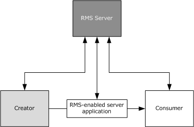
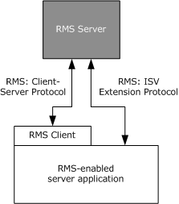
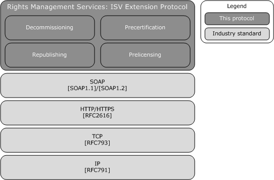
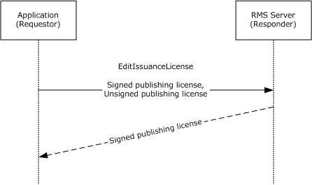
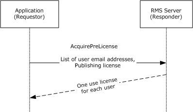
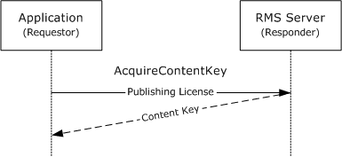
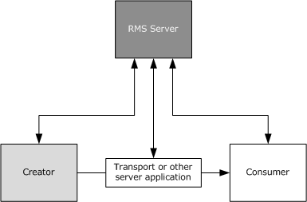
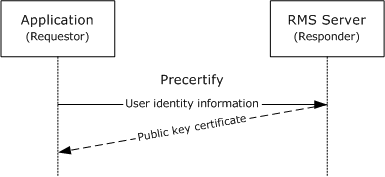
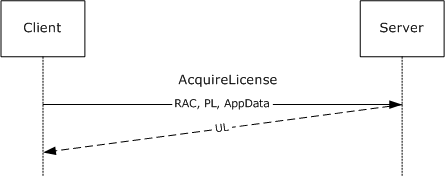

[MS-RMSI]:

Rights Management Services (RMS): ISV Extension
Protocol

Intellectual Property Rights Notice for Open Specifications Documentation

  Technical Documentation. Microsoft publishes Open Specifications documentation (“this

documentation”) for protocols, file formats, data portability, computer languages, and standards
support. Additionally, overview documents cover inter-protocol relationships and interactions.

  Copyrights. This documentation is covered by Microsoft copyrights. Regardless of any other

terms that are contained in the terms of use for the Microsoft website that hosts this
documentation, you can make copies of it in order to develop implementations of the technologies
that are described in this documentation and can distribute portions of it in your implementations
that use these technologies or in your documentation as necessary to properly document the
implementation. You can also distribute in your implementation, with or without modification, any
schemas, IDLs, or code samples that are included in the documentation. This permission also
applies to any documents that are referenced in the Open Specifications documentation.
  No Trade Secrets. Microsoft does not claim any trade secret rights in this documentation.
  Patents. Microsoft has patents that might cover your implementations of the technologies

described in the Open Specifications documentation. Neither this notice nor Microsoft's delivery of
this documentation grants any licenses under those patents or any other Microsoft patents.
However, a given Open Specifications document might be covered by the Microsoft Open
Specifications Promise or the Microsoft Community Promise. If you would prefer a written license,
or if the technologies described in this documentation are not covered by the Open Specifications
Promise or Community Promise, as applicable, patent licenses are available by contacting
iplg@microsoft.com.

  License Programs. To see all of the protocols in scope under a specific license program and the

associated patents, visit the Patent Map.

  Trademarks. The names of companies and products contained in this documentation might be
covered by trademarks or similar intellectual property rights. This notice does not grant any
licenses under those rights. For a list of Microsoft trademarks, visit
www.microsoft.com/trademarks.

  Fictitious Names. The example companies, organizations, products, domain names, email

addresses, logos, people, places, and events that are depicted in this documentation are fictitious.
No association with any real company, organization, product, domain name, email address, logo,
person, place, or event is intended or should be inferred.

Reservation of Rights. All other rights are reserved, and this notice does not grant any rights other
than as specifically described above, whether by implication, estoppel, or otherwise.

Tools. The Open Specifications documentation does not require the use of Microsoft programming
tools or programming environments in order for you to develop an implementation. If you have access
to Microsoft programming tools and environments, you are free to take advantage of them. Certain
Open Specifications documents are intended for use in conjunction with publicly available standards
specifications and network programming art and, as such, assume that the reader either is familiar
with the aforementioned material or has immediate access to it.

Support. For questions and support, please contact dochelp@microsoft.com.

[MS-RMSI] - v20240423
Rights Management Services (RMS): ISV Extension Protocol
Copyright © 2024 Microsoft Corporation
Release: April 23, 2024

1 / 67

Revision Summary

Date

Revision
History

Revision
Class

Comments

3/14/2008

0.1

6/20/2008

1.0

Major

Major

MCPP March 2008 Initial Availability of Word Doc

Updated and revised the technical content.

7/25/2008

1.0.1

Editorial

Changed language and formatting in the technical content.

8/29/2008

1.0.2

Editorial

Changed language and formatting in the technical content.

10/24/2008  1.0.3

Editorial

Changed language and formatting in the technical content.

12/5/2008

1.1

Minor

Clarified the meaning of the technical content.

1/16/2009

1.1.1

Editorial

Changed language and formatting in the technical content.

2/27/2009

1.1.2

Editorial

Changed language and formatting in the technical content.

4/10/2009

1.1.3

Editorial

Changed language and formatting in the technical content.

5/22/2009

1.1.4

Editorial

Changed language and formatting in the technical content.

7/2/2009

1.1.5

Editorial

Changed language and formatting in the technical content.

8/14/2009

1.1.6

Editorial

Changed language and formatting in the technical content.

9/25/2009

1.2

11/6/2009

2.0

12/18/2009  3.0

1/29/2010

3.1

Minor

Major

Major

Minor

Clarified the meaning of the technical content.

Updated and revised the technical content.

Updated and revised the technical content.

Clarified the meaning of the technical content.

3/12/2010

3.1.1

Editorial

Changed language and formatting in the technical content.

4/23/2010

4.0

Major

Updated and revised the technical content.

6/4/2010

4.0.1

Editorial

Changed language and formatting in the technical content.

7/16/2010

4.0.1

None

No changes to the meaning, language, or formatting of the
technical content.

8/27/2010

4.0.1

None

No changes to the meaning, language, or formatting of the
technical content.

10/8/2010

4.0.1

None

No changes to the meaning, language, or formatting of the
technical content.

11/19/2010  4.0.1

None

No changes to the meaning, language, or formatting of the
technical content.

1/7/2011

4.0.1

None

No changes to the meaning, language, or formatting of the
technical content.

2/11/2011

4.0.1

None

No changes to the meaning, language, or formatting of the
technical content.

3/25/2011

4.0.1

None

No changes to the meaning, language, or formatting of the
technical content.

5/6/2011

4.1

Minor

Clarified the meaning of the technical content.

[MS-RMSI] - v20240423
Rights Management Services (RMS): ISV Extension Protocol
Copyright © 2024 Microsoft Corporation
Release: April 23, 2024

2 / 67

Date

Revision
History

Revision
Class

Comments

6/17/2011

5.0

Major

Updated and revised the technical content.

9/23/2011

5.0

None

No changes to the meaning, language, or formatting of the
technical content.

12/16/2011  6.0

Major

Updated and revised the technical content.

3/30/2012

6.0

None

No changes to the meaning, language, or formatting of the
technical content.

7/12/2012

6.1

Minor

Clarified the meaning of the technical content.

10/25/2012  6.1

None

No changes to the meaning, language, or formatting of the
technical content.

1/31/2013

6.1

8/8/2013

7.0

11/14/2013  8.0

2/13/2014

8.0

None

Major

Major

None

No changes to the meaning, language, or formatting of the
technical content.

Updated and revised the technical content.

Updated and revised the technical content.

No changes to the meaning, language, or formatting of the
technical content.

5/15/2014

8.0

None

No changes to the meaning, language, or formatting of the
technical content.

6/30/2015

9.0

Major

Significantly changed the technical content.

7/14/2016

9.0

None

No changes to the meaning, language, or formatting of the
technical content.

6/1/2017

9.0

9/15/2017

10.0

9/12/2018

11.0

4/7/2021

12.0

4/23/2024

13.0

None

Major

Major

Major

Major

No changes to the meaning, language, or formatting of the
technical content.

Significantly changed the technical content.

Significantly changed the technical content.

Significantly changed the technical content.

Significantly changed the technical content.

[MS-RMSI] - v20240423
Rights Management Services (RMS): ISV Extension Protocol
Copyright © 2024 Microsoft Corporation
Release: April 23, 2024

3 / 67

## Table of Contents

- [1 Introduction](#1-introduction)
  - [1.1 Glossary](#11-glossary)
  - [1.2 References](#12-references)
    - [1.2.1 Normative References](#121-normative-references)
    - [1.2.2 Informative References](#122-informative-references)
  - [1.3 Overview](#13-overview)
    - [1.3.1 Decommissioning Interface](#131-decommissioning-interface)
    - [1.3.2 Precertification Interface](#132-precertification-interface)
    - [1.3.3 Republishing Interface](#133-republishing-interface)
    - [1.3.4 Prelicensing Interface](#134-prelicensing-interface)
  - [1.4 Relationship to Other Protocols](#14-relationship-to-other-protocols)
  - [1.5 Prerequisites/Preconditions](#15-prerequisitespreconditions)
  - [1.6 Applicability Statement](#16-applicability-statement)
  - [1.7 Versioning and Capability Negotiation](#17-versioning-and-capability-negotiation)
  - [1.8 Vendor-Extensible Fields](#18-vendor-extensible-fields)
  - [1.9 Standards Assignments](#19-standards-assignments)
- [2 Messages](#2-messages)
  - [2.1 Transport](#21-transport)
  - [2.2 Common Message Syntax](#22-common-message-syntax)
    - [2.2.1 Namespaces](#221-namespaces)
    - [2.2.2 Messages](#222-messages)
    - [2.2.3 Elements](#223-elements)
    - [2.2.4 Complex Types](#224-complex-types)
      - [2.2.4.1 ArrayOfString](#2241-arrayofstring)
      - [2.2.4.2 ArrayOfXmlNode](#2242-arrayofxmlnode)
      - [2.2.4.3 VersionData](#2243-versiondata)
    - [2.2.5 Simple Types](#225-simple-types)
    - [2.2.6 Attributes](#226-attributes)
    - [2.2.7 Groups](#227-groups)
    - [2.2.8 Attribute Groups](#228-attribute-groups)
- [3 Protocol Details](#3-protocol-details)
  - [3.1 Common Details](#31-common-details)
    - [3.1.1 Abstract Data Model](#311-abstract-data-model)
    - [3.1.2 Timers](#312-timers)
    - [3.1.3 Initialization](#313-initialization)
    - [3.1.4 Message Processing Events and Sequencing Rules](#314-message-processing-events-and-sequencing-rules)
      - [3.1.4.1 Common SOAP Headers](#3141-common-soap-headers)
      - [3.1.4.2 Common Fault Codes](#3142-common-fault-codes)
    - [3.1.5 Timer Events](#315-timer-events)
    - [3.1.6 Other Local Events](#316-other-local-events)
  - [3.2 Decommissioning Interface Server Details](#32-decommissioning-interface-server-details)
    - [3.2.1 Abstract Data Model](#321-abstract-data-model)
    - [3.2.2 Timers](#322-timers)
    - [3.2.3 Initialization](#323-initialization)
    - [3.2.4 Message Processing Events and Sequencing Rules](#324-message-processing-events-and-sequencing-rules)
      - [3.2.4.1 AcquireContentKey](#3241-acquirecontentkey)
        - [3.2.4.1.1 Messages](#32411-messages)
          - [3.2.4.1.1.1 AcquireContentKeySoapIn](#324111-acquirecontentkeysoapin)
          - [3.2.4.1.1.2 AcquireContentKeySoapOut](#324112-acquirecontentkeysoapout)
        - [3.2.4.1.2 Elements](#32412-elements)
          - [3.2.4.1.2.1 AcquireContentKey](#324121-acquirecontentkey)
          - [3.2.4.1.2.2 AcquireContentKeyResponse](#324122-acquirecontentkeyresponse)
        - [3.2.4.1.3 Complex Types](#32413-complex-types)
          - [3.2.4.1.3.1 ArrayOfAcquireContentKeyParams](#324131-arrayofacquirecontentkeyparams)
          - [3.2.4.1.3.2 AcquireContentKeyParams](#324132-acquirecontentkeyparams)
          - [3.2.4.1.3.3 ArrayOfAcquireContentKeyResponse](#324133-arrayofacquirecontentkeyresponse)
          - [3.2.4.1.3.4 AcquireContentKeyResponse](#324134-acquirecontentkeyresponse)
        - [3.2.4.1.4 Simple Types](#32414-simple-types)
          - [3.2.4.1.4.1 KeyType](#324141-keytype)
    - [3.2.5 Timer Events](#325-timer-events)
    - [3.2.6 Other Local Events](#326-other-local-events)
  - [3.3 Precertification Interface Server Details](#33-precertification-interface-server-details)
    - [3.3.1 Abstract Data Model](#331-abstract-data-model)
    - [3.3.2 Timers](#332-timers)
    - [3.3.3 Initialization](#333-initialization)
    - [3.3.4 Message Processing Events and Sequencing Rules](#334-message-processing-events-and-sequencing-rules)
      - [3.3.4.1 Precertify](#3341-precertify)
        - [3.3.4.1.1 Messages](#33411-messages)
          - [3.3.4.1.1.1 PrecertifySoapIn](#334111-precertifysoapin)
          - [3.3.4.1.1.2 PrecertifySoapOut](#334112-precertifysoapout)
        - [3.3.4.1.2 Elements](#33412-elements)
          - [3.3.4.1.2.1 Precertify](#334121-precertify)
          - [3.3.4.1.2.2 PrecertifyResponse](#334122-precertifyresponse)
        - [3.3.4.1.3 Complex Types](#33413-complex-types)
          - [3.3.4.1.3.1 ArrayOfPrecertifyParams](#334131-arrayofprecertifyparams)
          - [3.3.4.1.3.2 PrecertifyParams](#334132-precertifyparams)
          - [3.3.4.1.3.3 Identification](#334133-identification)
          - [3.3.4.1.3.4 ArrayOfPrecertifyResponse](#334134-arrayofprecertifyresponse)
          - [3.3.4.1.3.5 PrecertifyResponse](#334135-precertifyresponse)
        - [3.3.4.1.4 Simple Types](#33414-simple-types)
          - [3.3.4.1.4.1 AuthenticationMode](#334141-authenticationmode)
    - [3.3.5 Timer Events](#335-timer-events)
    - [3.3.6 Other Local Events](#336-other-local-events)
  - [3.4 Republishing Interface Server Details](#34-republishing-interface-server-details)
    - [3.4.1 Abstract Data Model](#341-abstract-data-model)
    - [3.4.2 Timers](#342-timers)
    - [3.4.3 Initialization](#343-initialization)
    - [3.4.4 Message Processing Events and Sequencing Rules](#344-message-processing-events-and-sequencing-rules)
      - [3.4.4.1 EditIssuanceLicense](#3441-editissuancelicense)
        - [3.4.4.1.1 Messages](#34411-messages)
          - [3.4.4.1.1.1 EditIssuanceLicenseSoapIn](#344111-editissuancelicensesoapin)
          - [3.4.4.1.1.2 EditIssuanceLicenseSoapOut](#344112-editissuancelicensesoapout)
        - [3.4.4.1.2 Elements](#34412-elements)
          - [3.4.4.1.2.1 EditIssuanceLicense](#344121-editissuancelicense)
          - [3.4.4.1.2.2 EditIssuanceLicenseResponse](#344122-editissuancelicenseresponse)
        - [3.4.4.1.3 Complex Types](#34413-complex-types)
          - [3.4.4.1.3.1 ArrayOfEditIssuanceLicenseParams](#344131-arrayofeditissuancelicenseparams)
          - [3.4.4.1.3.2 EditIssuanceLicenseParams](#344132-editissuancelicenseparams)
          - [3.4.4.1.3.3 ArrayOfEditIssuanceLicenseResponse](#344133-arrayofeditissuancelicenseresponse)
          - [3.4.4.1.3.4 EditIssuanceLicenseResponse](#344134-editissuancelicenseresponse)
    - [3.4.5 Timer Events](#345-timer-events)
    - [3.4.6 Other Local Events](#346-other-local-events)
  - [3.5 Prelicensing Interface Server Details](#35-prelicensing-interface-server-details)
    - [3.5.1 Abstract Data Model](#351-abstract-data-model)
    - [3.5.2 Timers](#352-timers)
    - [3.5.3 Initialization](#353-initialization)
    - [3.5.4 Message Processing Events and Sequencing Rules](#354-message-processing-events-and-sequencing-rules)
      - [3.5.4.1 AcquirePreLicense](#3541-acquireprelicense)
        - [3.5.4.1.1 Messages](#35411-messages)
          - [3.5.4.1.1.1 AcquirePreLicenseSoapIn](#354111-acquireprelicensesoapin)
          - [3.5.4.1.1.2 AcquirePreLicenseSoapOut](#354112-acquireprelicensesoapout)
        - [3.5.4.1.2 Elements](#35412-elements)
          - [3.5.4.1.2.1 AcquirePreLicense](#354121-acquireprelicense)
          - [3.5.4.1.2.2 AcquirePreLicenseResponse](#354122-acquireprelicenseresponse)
        - [3.5.4.1.3 Complex Types](#35413-complex-types)
          - [3.5.4.1.3.1 ArrayOfAcquirePreLicenseParams](#354131-arrayofacquireprelicenseparams)
          - [3.5.4.1.3.2 AcquirePreLicenseParams](#354132-acquireprelicenseparams)
          - [3.5.4.1.3.3 ArrayOfAcquirePreLicenseResponse](#354133-arrayofacquireprelicenseresponse)
          - [3.5.4.1.3.4 AcquirePreLicenseResponse](#354134-acquireprelicenseresponse)
          - [3.5.4.1.3.5 AcquirePreLicenseException](#354135-acquireprelicenseexception)
    - [3.5.5 Timer Events](#355-timer-events)
    - [3.5.6 Other Local Events](#356-other-local-events)
- [4 Protocol Examples](#4-protocol-examples)
  - [4.1 Using Decommissioning to Remove Protection from Content](#41-using-decommissioning-to-remove-protection-from-content)
  - [4.2 Using Precertification to Pre-License Protected Content](#42-using-precertification-to-pre-license-protected-content)
- [5 Security](#5-security)
  - [5.1 Security Considerations for Implementers](#51-security-considerations-for-implementers)
    - [5.1.1 Decommissioning Interface](#511-decommissioning-interface)
    - [5.1.2 Precertification Interface](#512-precertification-interface)
    - [5.1.3 Republishing Interface](#513-republishing-interface)
    - [5.1.4 Prelicensing Interface](#514-prelicensing-interface)
  - [5.2 Index of Security Parameters](#52-index-of-security-parameters)
- [6 Appendix A: Full WSDL](#6-appendix-a-full-wsdl)
  - [6.1 Decommissioning Interface](#61-decommissioning-interface)
  - [6.2 Precertification Interface](#62-precertification-interface)
  - [6.3 Republishing Interface](#63-republishing-interface)
  - [6.4 Prelicensing Interface](#64-prelicensing-interface)
- [7 Appendix B: Product Behavior](#7-appendix-b-product-behavior)
- [8 Change Tracking](#8-change-tracking)
- [9 Index](#9-index)

## 1 Introduction

This specification describes the Rights Management Services (RMS): Independent Software Vendor
(ISV) Extension Protocol which is used to communicate information between applications and RMS
servers directly without using the RMS client. The RMS: ISV Extension Protocol facilitates the creation
of applications that either extend the capabilities of RMS-enabled applications and/or bridge the
capabilities of different software systems, by allowing for direct communication between applications
and RMS servers without the use of the RMS client. This protocol enables applications to
decommission protected content and retrieve a recipient's public key certificate.

Sections 1.5, 1.8, 1.9, 2, and 3 of this specification are normative. All other sections and examples in
this specification are informative.

### 1.1 Glossary

This document uses the following terms:

Active Directory: The Windows implementation of a general-purpose directory service, which uses

LDAP as its primary access protocol. Active Directory stores information about a variety of
objects in the network such as user accounts, computer accounts, groups, and all related
credential information used by Kerberos [MS-KILE]. Active Directory is either deployed as Active
Directory Domain Services (AD DS) or Active Directory Lightweight Directory Services (AD LDS),
which are both described in [MS-ADOD]: Active Directory Protocols Overview.

certificate: As used in this document, certificates are expressed in [XRML] section 1.2.

certificate chain: A sequence of certificates, where each certificate in the sequence is signed by
the subsequent certificate. The last certificate in the chain is normally a self-signed certificate.

consumer: The user who uses protected content.

endpoint: In the context of a web service, a network target to which a SOAP message can be

addressed. See [WSADDR].

forest: One or more domains that share a common schema and trust each other transitively. An
organization can have multiple forests. A forest establishes the security and administrative
boundary for all the objects that reside within the domains that belong to the forest. In
contrast, a domain establishes the administrative boundary for managing objects, such as users,
groups, and computers. In addition, each domain has individual security policies and trust
relationships with other domains.

license: An XrML1.2 document that describes usage policy for protected content.

protected content: Any content or information (file, email) that has an RMS usage policy

assigned to it, and is encrypted according to that policy. Also known as "Protected Information".

publishing license: An XrML 1.2 license that defines the usage policy for protected content and
contains the content key with which that content is encrypted. The usage policy identifies all
authorized users and the actions that they are authorized to take with the content, in addition to
any usage conditions. The publishing license tells a server which usage policies apply to a
specific piece of content and grants a server the right to issue use licenses (ULs) based on that
policy. The publishing license is created when content is protected. Also referred to as "Issuance
License (IL)."

publishing license (PL): An XrML 1.2 license that defines usage policy for protected content

and contains the content key with which that content is encrypted. The usage policy identifies all
authorized users and the actions they are authorized to take with the content, along with any
conditions on that usage. The publishing license tells the server what usage policies apply to a
given piece of content and grants the server the right to issue use licenses (ULs) based on

7 / 67

[MS-RMSI] - v20240423
Rights Management Services (RMS): ISV Extension Protocol
Copyright © 2024 Microsoft Corporation
Release: April 23, 2024

that policy. The PL is created when content is protected. Also known as an Issuance License
(IL).

RMS account certificate (RAC): An XrML 1.2 certificate chain that contains an asymmetric

encryption key pair that is issued to a user account by an RMS Certification Service. The RAC
binds that user account to a specific computer. The RAC represents the identity of a user who
can access protected content. Also known as a Group Identity Certificate (GIC).

Secure Sockets Layer (SSL): A security protocol that supports confidentiality and integrity of

messages in client and server applications that communicate over open networks. SSL supports
server and, optionally, client authentication using X.509 certificates [X509] and [RFC5280]. SSL
is superseded by Transport Layer Security (TLS). TLS version 1.0 is based on SSL version 3.0
[SSL3].

security identifier (SID): An identifier for security principals that is used to identify an account
or a group. Conceptually, the SID is composed of an account authority portion (typically a
domain) and a smaller integer representing an identity relative to the account authority, termed
the relative identifier (RID). The SID format is specified in [MS-DTYP] section 2.4.2; a string
representation of SIDs is specified in [MS-DTYP] section 2.4.2 and [MS-AZOD] section 1.1.1.2.

SOAP fault: A container for error and status information within a SOAP message. See [SOAP1.2-

1/2007] section 5.4 for more information.

SOAP fault code: The algorithmic mechanism for identifying a SOAP fault. See [SOAP1.2-

1/2007] section 5.6 for more information.

Uniform Resource Locator (URL): A string of characters in a standardized format that identifies

a document or resource on the World Wide Web. The format is as specified in [RFC1738].

use license (UL): An XrML 1.2 license that authorizes a user to access a given protected

content file and describes the usage policies that apply. Also known as an "End-User License
(EUL)".

MAY, SHOULD, MUST, SHOULD NOT, MUST NOT: These terms (in all caps) are used as defined
in [RFC2119]. All statements of optional behavior use either MAY, SHOULD, or SHOULD NOT.

### 1.2 References

Links to a document in the Microsoft Open Specifications library point to the correct section in the
most recently published version of the referenced document. However, because individual documents
in the library are not updated at the same time, the section numbers in the documents may not
match. You can confirm the correct section numbering by checking the Errata.

#### 1.2.1 Normative References

We conduct frequent surveys of the normative references to assure their continued availability. If you
have any issue with finding a normative reference, please contact dochelp@microsoft.com. We will
assist you in finding the relevant information.

[MS-DTYP] Microsoft Corporation, "Windows Data Types".

[MS-RMPR] Microsoft Corporation, "Rights Management Services (RMS): Client-to-Server Protocol".

[RFC2119] Bradner, S., "Key words for use in RFCs to Indicate Requirement Levels", BCP 14, RFC
2119, March 1997, https://www.rfc-editor.org/info/rfc2119

[RFC2616] Fielding, R., Gettys, J., Mogul, J., et al., "Hypertext Transfer Protocol -- HTTP/1.1", RFC
2616, June 1999, https://www.rfc-editor.org/info/rfc2616

[MS-RMSI] - v20240423
Rights Management Services (RMS): ISV Extension Protocol
Copyright © 2024 Microsoft Corporation
Release: April 23, 2024

8 / 67

[SOAP1.1] Box, D., Ehnebuske, D., Kakivaya, G., et al., "Simple Object Access Protocol (SOAP) 1.1",
W3C Note, May 2000, https://www.w3.org/TR/2000/NOTE-SOAP-20000508/

[SOAP1.2-1/2007] Gudgin, M., Hadley, M., Mendelsohn, N., et al., "SOAP Version 1.2 Part 1:
Messaging Framework (Second Edition)", W3C Recommendation, April 2007,
http://www.w3.org/TR/2007/REC-soap12-part1-20070427/

[SOAP1.2-2/2007] Gudgin, M., Hadley, M., Mendelsohn, N., et al., "SOAP Version 1.2 Part 2: Adjuncts
(Second Edition)", W3C Recommendation, April 2007, http://www.w3.org/TR/2007/REC-soap12-
part2-20070427

[WSDL] Christensen, E., Curbera, F., Meredith, G., and Weerawarana, S., "Web Services Description
Language (WSDL) 1.1", W3C Note, March 2001, https://www.w3.org/TR/2001/NOTE-wsdl-20010315

[XMLNS-2ED] Bray, T., Hollander, D., Layman, A., and Tobin, R., Eds., "Namespaces in XML 1.0
(Second Edition)", W3C Recommendation, August 2006, https://www.w3.org/TR/2006/REC-xml-
names-20060816/

[XMLSCHEMA1] Thompson, H., Beech, D., Maloney, M., and Mendelsohn, N., Eds., "XML Schema Part
1: Structures", W3C Recommendation, May 2001, https://www.w3.org/TR/2001/REC-xmlschema-1-
20010502/

[XMLSCHEMA2] Biron, P.V., Ed. and Malhotra, A., Ed., "XML Schema Part 2: Datatypes", W3C
Recommendation, May 2001, https://www.w3.org/TR/2001/REC-xmlschema-2-20010502/

[XRML] ContentGuard, Inc., "XrML: Extensible rights Markup Language Version 1.2", 2001,
http://contentguard.com/contact-us

Note Contact the owner of the XrML specification for more information.

#### 1.2.2 Informative References

[KERBKEY] Microsoft Corporation, "KERB_CRYPTO_KEY", http://msdn.microsoft.com/en-
us/library/aa378058.aspx

[NTLM] Microsoft Corporation, "Microsoft NTLM", http://msdn.microsoft.com/en-
us/library/aa378749.aspx

### 1.3 Overview

Rights Management Services (RMS) is a client/server technology that provides information protection
through content encryption and fine-grained policy definition and enforcement. The RMS: Client-to-
Server Protocol [MS-RMPR] enables the creation and consumption of protected content and
describes the functionality provided by the RMS client. However, there are additional scenarios that
are not supported by the RMS: Client-to-Server Protocol:

  Decommissioning protected content



Precertifying a user

  Republishing content



Prelicensing content

Decommissioning is the process by which RMS protection can be completely removed from content.
Precertification is the process by which a user's public key can be acquired. The requestor can use that
public key to prelicense protected content, which enables the content to be delivered with the
appropriate authorization token bound to the recipient user. Republishing is the process by which the

9 / 67

[MS-RMSI] - v20240423
Rights Management Services (RMS): ISV Extension Protocol
Copyright © 2024 Microsoft Corporation
Release: April 23, 2024

<!-- Extracted images from page 10 -->

<!-- /Extracted images from page 10 -->

rights granted in an issuance license (IL) can be altered by issuing a new IL with the same content
key as the original.

To accomplish these operations, an application can make requests directly to the RMS server using the
RMS: Independent Software Vendor (ISV) Extension Protocol.

Figure 1: Typical roles in the RMS system

For the basic creation and consumption of protected information (or content), the RMS system
involves three active roles: the creator, the consumer, and the RMS server. The creator and
consumer are both typically roles of the RMS client. The interactions between the RMS client and the
RMS server are described in the RMS: Client-to-Server Protocol Specification [MS-RMPR].

Figure 2: Roles in the RMS system that use the RMS: ISV Extension Protocol

In a more complicated system, a creator, a consumer, and an RMS-enabled server application (such
as a messaging transport) can be involved. In this situation, these roles are better modeled as
applications which interact with the RMS client, and optionally, interact directly with the RMS server.

[MS-RMSI] - v20240423
Rights Management Services (RMS): ISV Extension Protocol
Copyright © 2024 Microsoft Corporation
Release: April 23, 2024

10 / 67

<!-- Extracted images from page 11 -->

<!-- /Extracted images from page 11 -->

Figure 3: Relationships between the application, the RMS client, and the RMS server

While the RMS: Client-to-Server Protocol [MS-RMPR] supports the most common scenarios for the
creation and consumption of content by an application in the RMS system, the RMS: ISV Extension
Protocol can be used when additional functionality is required to enable the application to
communicate directly with the RMS server. The RMS: ISV Extension Protocol provides the following
interfaces to support these more advanced scenarios:

  Decommissioning: Enables RMS protection to be completely removed from protected content.

When enabled on the RMS server, the Decommissioning interface accepts a publishing license
and returns the content key from that license.



Precertification: Enables protected content to be delivered with an authorization token for the
recipient user. The Precertification interface is used to retrieve the public key of the specified user.

  Republishing: Enables a new IL to be created by using the same content key as an existing IL. The

Republishing interface is used to alter the set of rights granted by an IL.



Prelicensing: Enables protected content to be delivered with an authorization token for the
recipient user without requiring a precertification request. The Prelicensing interface is used to
retrieve a use license for the specified user.

#### 1.3.1 Decommissioning Interface

If an organization were to decide to stop using RMS entirely and remove its deployment, it would need
to remove RMS protection from content. One method is to have people with owner rights to each piece
of content remove the protection. Realistically, however, it might not be possible to find these people
because they might no longer belong to the organization in question. Another approach is to use the
Decommissioning interface to extract the content key from a publishing license and return it so that
it can then be used to decrypt the content. Because each protected document has a publishing license,
and each publishing license has its own content key, this process is repeated for each protected
document that needs to have its protection removed.

[MS-RMSI] - v20240423
Rights Management Services (RMS): ISV Extension Protocol
Copyright © 2024 Microsoft Corporation
Release: April 23, 2024

11 / 67

When servicing the request, the RMS server does not verify whether the requestor can be granted
access to the content as specified in the publishing license. Rather, the RMS server returns the content
key to any requestor. As a result, the Decommissioning interface is disabled for normal operation by
default. The interface exposes one request and response message to support decommissioning via the
AcquireContentKey operation.

#### 1.3.2 Precertification Interface

When protected content is sent to recipients, each recipient has to acquire a use license that
grants access to the content. The use license describes the usage policy for that user with that content
and encrypts the content key to the user's public key. This process and protocol is described in the
RMS: Client-to-Server Protocol Specification [MS-RMPR].

As an optimization, the use license for a recipient could be generated in advance and made available
with the content at the time the recipient attempted to access it. The use license could be requested
on behalf of the recipient by either the sender or a server application that might be involved in
delivering the content to the recipient. This use license would allow the recipient to access the content
as soon as it was delivered without having to contact the RMS server, presuming that the recipient has
already been bootstrapped.

In order to acquire a license on behalf of a recipient user, a requestor retrieves the public part of the
recipient's RMS Account Certificate (RAC) using the Precertification interface and then requests a
use license from the RMS Server using the RMS: Client-to-Server Protocol [MS-RMPR]. The
Precertification interface exposes one request and response message to enable precertification via the
Precertify operation.

#### 1.3.3 Republishing Interface

After protected content is published, it might become necessary to alter the set of rights that are
granted to users in the original IL. The EditIssuanceLicense (section 3.4.4.1) operation allows a client
to submit the original signed IL, as well as an unsigned IL that contains the altered rights. The RMS
Server responds with a new signed IL that contains the same content key as the original IL.

Because the EditIssuanceLicense operation allows the requestor to have full control over the rights
granted by the new IL, the operation is only permitted on ILs that opt-in to republishing. In addition,
access to this service is typically restricted to computers or users trusted by the administrator. The
Republishing interface exposes one request and response message to enable republishing via the
EditIssuanceLicense operation.

#### 1.3.4 Prelicensing Interface

When using the Precertification interface, the application is required to contact a server that is capable
of issuing an RAC for a specific recipient. In an environment with multiple certification services, an
application might require an application-specific configuration to determine which certification service
to use for each user. If multiple applications prelicense content, an administrator might have to
configure this data in independent ways.

The Prelicensing interface shifts this responsibility to the RMS Server. The application can specify a list
of recipients by email address and provide a publishing license. The RMS Server will determine the
public key for each user and issue a use license for each recipient based on the rights granted in the
publishing license. The RMS Server itself can use the Precertification interface of another server to
retrieve a public key for a user when their key resides on that server. The Prelicensing interface
exposes one request and response message to enable prelicensing via the
AcquirePreLicense (section 3.5.4.1) operation.

[MS-RMSI] - v20240423
Rights Management Services (RMS): ISV Extension Protocol
Copyright © 2024 Microsoft Corporation
Release: April 23, 2024

12 / 67

<!-- Extracted images from page 13 -->

<!-- /Extracted images from page 13 -->

### 1.4 Relationship to Other Protocols

The RMS: ISV Extension Protocol uses the SOAP messaging protocol, as specified in [SOAP1.1], for
formatting requests and responses. It transmits these messages using the HTTP and/or HTTPS
protocols. SOAP is considered the wire format used for messaging, and HTTP and HTTPS are the
underlying transport protocols. The content files are downloaded using HTTP 1.1, as specified in
[RFC2616].The following diagram shows the transport stack used by the RMS: ISV Extension Protocol.

Figure 4: ISV Extension Protocol transport stack

### 1.5 Prerequisites/Preconditions

It is assumed that the RMS server has been started and is fully bootstrapped and initialized before the
RMS: ISV Extension Protocol can start. Server initialization is described in the RMS: Client-to-Server
Protocol Specification [MS-RMPR].

### 1.6 Applicability Statement

The RMS: ISV Extension Protocol is used for the following purposes:

  Decommissioning: Extract a content key for protected content so that RMS protection can be

removed.

  Precertification: Acquire a recipient's public key for the purpose of acquiring a use license from

a different RMS server on behalf of a recipient.

  Republishing: Alter the rights granted via an IL by issuing a new IL with the same content key

as the original.

  Prelicensing: Acquire a use license on behalf of a recipient.

[MS-RMSI] - v20240423
Rights Management Services (RMS): ISV Extension Protocol
Copyright © 2024 Microsoft Corporation
Release: April 23, 2024

13 / 67

### 1.7 Versioning and Capability Negotiation

This specification covers versioning issues in the following areas:

  Supported Transports: This protocol is implemented using SOAP over HTTP as specified in

section 2.1.

  Protocol Versions: This protocol has two interface versions as specified in section 2.

  Security and Authentication Methods: This protocol passively supports Kerberos

authentication over HTTP or HTTPS (as specified in [KERBKEY] and NT LAN Manager (NTLM)
authentication over HTTP or HTTPS (as specified in [NTLM]).

  Capability Negotiation: The RMS: ISV Extension Protocol supports limited capability negotiation
via the <VersionData> type (section 2.2.4.3) that is present on all SOAP-based protocol requests.
On a request, the <VersionData> structure contains a <MinimumVersion> and
<MaximumVersion> value, indicating the range of versions the client is capable of understanding.
On a response, the <VersionData> structure contains <MinimumVersion> and
<MaximumVersion> values that the RMS server is capable of understanding.

### 1.8 Vendor-Extensible Fields

None.

### 1.9 Standards Assignments

The RMS: ISV Extension Protocol has not been ratified by any standards body or organization.

[MS-RMSI] - v20240423
Rights Management Services (RMS): ISV Extension Protocol
Copyright © 2024 Microsoft Corporation
Release: April 23, 2024

14 / 67

## 2 Messages

This protocol references commonly used data types as defined in [MS-DTYP].

### 2.1 Transport

The RMS: ISV Extension Protocol is composed of four SOAP-based interfaces:

  Decommissioning

  Precertification

  Republishing

  Prelicensing

Each interface MUST support SOAP (as specified in [SOAP1.1] or [SOAP1.2-1/2007]) over HTTP (as
specified in [RFC2616]) over TCP/IP. Each Web service SHOULD support HTTPS for securing
communications.<1>

The interfaces MUST be exposed by the server at the following endpoints starting from any base
URL:

Decommissioning: This interface MUST be exposed at the following URLs:

[baseURL]/decommission/decommission.asmx: AcquireContentKey

Precertification: This interface MUST be exposed at the following URL:

[baseURL]/certification/Precertification.asmx: Precertify

Republishing: This interface MUST be exposed at the following URL:

[baseURL]/licensing/editissuancelicense.asmx: EditIssuanceLicense

Prelicensing: This interface MUST be exposed at the following URL:

[baseURL]/licensing/license.asmx: AcquirePreLicense

### 2.2 Common Message Syntax

This section contains common definitions used by this protocol. The syntax of the definitions uses XML
Schema, as defined in [XMLSCHEMA1] and [XMLSCHEMA2], and Web Services Description Language,
as defined in [WSDL].

#### 2.2.1 Namespaces

This specification defines and references various XML namespaces using the mechanisms specified in
[XMLNS-2ED]. Although this specification associates a specific XML namespace prefix for each XML
namespace that is used, the choice of any particular XML namespace prefix is implementation-specific
and not significant for interoperability.

Prefix  Namespace URI

Reference

s

s

http://microsoft.com/DRM/CertificationService

http://microsoft.com/DRM/DecommissionService

[MS-RMSI] - v20240423
Rights Management Services (RMS): ISV Extension Protocol
Copyright © 2024 Microsoft Corporation
Release: April 23, 2024

15 / 67

Prefix  Namespace URI

Reference

s

s

s

s

s

s

s

s

http://microsoft.com/DRM/EditIssuanceLicenseService

http://microsoft.com/DRM/LicensingService

http://schemas.xmlsoap.org/wsdl/http/

[WSDL]

http://www.w3.org/2001/XMLSchema

[XMLSCHEMA1], [XMLSCHEMA2]

http://schemas.xmlsoap.org/wsdl/soap/

[SOAP1.1]

http://schemas.xmlsoap.org/wsdl/soap12/

[SOAP1.2-1/2007], [SOAP1.2-2/2007]

http://schemas.xmlsoap.org/soap/encoding/

[SOAP1.1]

http://schemas.xmlsoap.org/wsdl/

[WSDL]

All interfaces in the RMS: ISV Extension Protocol use the same SOAP header for both requests and
responses. The SOAP header for requests and responses to these interfaces MUST contain the
VersionData element specified in section 2.2.4.3.

#### 2.2.2 Messages

This specification does not define any common XML Schema message definitions.

#### 2.2.3 Elements

This specification does not define any common XML Schema element definitions.

#### 2.2.4 Complex Types

The following table summarizes the set of common XML Schema complex type definitions defined by
this specification. XML Schema complex type definitions that are specific to a particular operation are
described with the operation.

Complex Type

Description

<ArrayofString>

Contains an array of strings.

<ArrayofXmlNode>  Contains an array of XML elements, each of which is represented as an XML fragment that

is enclosed in the <Certificate> element.

<VersionData>

Represents the capability version of the client and server.

##### 2.2.4.1 ArrayOfString

The <ArrayOfString> complex type is an array of strings.

 <s:complexType name="ArrayOfString">
   <s:sequence>
     <s:element minOccurs="0" maxOccurs="unbounded" name="string"
       nillable="true" type="s:string" />
   </s:sequence>
 </s:complexType>

string: Contains any string.

[MS-RMSI] - v20240423
Rights Management Services (RMS): ISV Extension Protocol
Copyright © 2024 Microsoft Corporation
Release: April 23, 2024

16 / 67

##### 2.2.4.2 ArrayOfXmlNode

The <ArrayOfXmlNode> complex type contains an array of XML elements, each of which is
represented as an XML fragment. Each XML fragment is enclosed in the <Certificate> element.

 <s:complexType name="ArrayOfXmlNode">
   <s:sequence>
     <s:element minOccurs="0" maxOccurs="unbounded" name="Certificate"
       nillable="true">
       <s:complexType mixed="true">
         <s:sequence>
           <s:any />
         </s:sequence>
       </s:complexType>
     </s:element>
   </s:sequence>
 </s:complexType>

Certificate: Any eXtensible Rights Markup Language, as specified in [XRML], certificate parameter

that can be represented as a literal within an XML element in the protocol.

##### 2.2.4.3 VersionData

The VersionData complex type is used to represent the capability version of the requestor and the
responder.

The requestor SHOULD specify "1.0.0.0" as both the <MinimumVersion> parameter and as the
<MaximumVersion> parameter.

When the responder receives a request, it SHOULD compare its capability version to the capability
version range the requestor presents. The responder SHOULD reject the request with a
Microsoft.DigitalRightsManagement.Core.UnsupportedDataVersionException fault if the
<MaximumVersion> value presented by the requestor is higher than the highest capability version of
the responder.

When the responder replies to the requestor, including instances when the responder replies with an
error<2>, it SHOULD specify the lowest capability version it can support as the value for the
<MinimumVersion> parameter. The responder SHOULD specify the highest capability version it can
support as the value for the <MaximumVersion> parameter.

 <xs:complexType name="VersionData">
   <xs:sequence>
     <xs:element name="MinimumVersion"
       type="string"
       minOccurs="0"
       maxOccurs="1"
      />
     <xs:element name="MaximumVersion"
       type="string"
       minOccurs="0"
       maxOccurs="1"
      />
   </xs:sequence>
 </xs:complexType>

MinimumVersion: Specifies the lowest capability version supported. The version data in this type

MUST be represented with a literal string and MUST conform to the format "a.b.c.d". Subversion
value "a" MUST be the most major component of the version, value "b" MUST be the next most
major component, value "c" MUST be the next most major component, and "d" MUST be the
minor subversion value.

17 / 67

[MS-RMSI] - v20240423
Rights Management Services (RMS): ISV Extension Protocol
Copyright © 2024 Microsoft Corporation
Release: April 23, 2024

MaximumVersion: Specifies the highest capability version supported. The version data in this type

MUST be represented by a literal string and MUST conform to the format "a.b.c.d". Subversion
value "a" MUST be the most major component of the version, value "b" MUST be the next most
major  component, value "c" MUST be the next most major  components, and "d" MUST be the
minor subversion value.

#### 2.2.5 Simple Types

This specification does not define any common XML Schema simple type definitions.

#### 2.2.6 Attributes

This specification does not define any common XML Schema attribute definitions.

#### 2.2.7 Groups

This specification does not define any common XML Schema group definitions.

#### 2.2.8 Attribute Groups

This specification does not define any common XML Schema attribute group definitions.

[MS-RMSI] - v20240423
Rights Management Services (RMS): ISV Extension Protocol
Copyright © 2024 Microsoft Corporation
Release: April 23, 2024

18 / 67

## 3 Protocol Details

The Rights Management Services (RMS): ISV Extension Protocol operates between an application and
an RMS server. The initiator or requestor is the client for the protocol, and the responder is the server
for the protocol.

The client side of this protocol is simply a pass-through. That is, there are no additional timers or
other states required on the client side of this protocol. Calls made by the higher-layer protocol or
application are passed directly to the transport, and the results returned by the transport are passed
directly back to the higher-layer protocol or application.

### 3.1 Common Details

#### 3.1.1 Abstract Data Model

None.

#### 3.1.2 Timers

None.

#### 3.1.3 Initialization

None.

#### 3.1.4 Message Processing Events and Sequencing Rules

##### 3.1.4.1 Common SOAP Headers

The interfaces of the Rights Management Services (RMS): ISV Extension Protocol use the same SOAP
header for both requests and responses. The SOAP header for requests and responses to these
interfaces MUST contain the VersionData element specified in section 2.2.4.3.

Request

When a request is made, the requestor MUST specify the lowest capability version it can support as
the <MinimumVersion> parameter. The client MUST specify the highest capability version it can
support as the <MaximumVersion> parameter. The client MUST make the request in accordance with
the <MaximumVersion> capability version.

 Parameter

 Description

<MinimumVersion>  MUST specify the lowest capability version supported by the requestor.

<MaximumVersion>  MUST specify the highest capability version supported by the requestor.

Data Processing

When a responder receives a request, it MUST compare its own capability version to the capability
version range presented by the requestor. The responder MUST assume that the requestor always
makes a maximum-version request. The responder MUST reject the request with an error if its highest
capability version is lower than the <MaximumVersion> specified by the requestor. The responder
MUST throw the Microsoft.DigitalRightsManagement.Core.MalformedDataVersionException exception if
the <MinimumVersion> specified by the requestor is higher than the <MaximumVersion> specified by
the requestor.

19 / 67

[MS-RMSI] - v20240423
Rights Management Services (RMS): ISV Extension Protocol
Copyright © 2024 Microsoft Corporation
Release: April 23, 2024

Response

When responding to a requestor, including when responding with an error, the responder MUST
specify the lowest capability version it can support as the <MinimumVersion> parameter. The
responder MUST specify the highest capability version it can support as the <MaximumVersion>
parameter. If the responder's maximum capability version is lower than the requestor's maximum
capability version, the requestor SHOULD resend its request and alter its request to conform to the
capability version range specified by the responder.<3>

##### 3.1.4.2 Common Fault Codes

The RMS: ISV Extension Protocol notifies a requestor of application-level faults by generating SOAP
fault code (as specified in [SOAP1.1] section 4.4). In the SOAP fault, the <faultcode> element
contains the type of exception being thrown. The <faultstring> element contains the text of the
exception being thrown.

The following table summarizes the exceptions that the server can return to the requestor.

 Exception

System.ArgumentNullException

Microsoft.DigitalRightsManagement.Core.MalformedDataVersionException

 Description

.NET exception.

A client request contained an
invalid version number that cannot
be processed.

Microsoft.DigitalRightsManagement.Core.UnsupportedDataVersionException  The data version the client
requested is not supported.

The server SHOULD validate the <VersionData> element of the request. If the <MinimumVersion>
element or the <MaximumVersion> element do not contain a valid version number as specified in
section 2.2.4.2, the server SHOULD return a
Microsoft.DigitalRightsManagement.Core.MalformedDataVersionException SOAP fault code. If the
<MaximumVersion> element contains a version number that is higher than the range supported by
the server for the operation, the server SHOULD return a
Microsoft.DigitalRightsManagement.Core.UnsupportedDataVersionException SOAP fault code. If any
input element required for successful processing of the operation is set to NULL, the server SHOULD
return a System.ArgumentNullException SOAP fault code.

#### 3.1.5 Timer Events

None.

#### 3.1.6 Other Local Events

None.

### 3.2 Decommissioning Interface Server Details

The Decommissioning interface is used to extract the content key from a publishing license. The
complex types, simple types, and elements described in this section are used in the Decomissioning
Service.

#### 3.2.1 Abstract Data Model

This section describes a conceptual model of possible data organization that an implementation
maintains to participate in this protocol. The described organization is provided to facilitate the

20 / 67

[MS-RMSI] - v20240423
Rights Management Services (RMS): ISV Extension Protocol
Copyright © 2024 Microsoft Corporation
Release: April 23, 2024

<!-- Extracted images from page 21 -->

<!-- /Extracted images from page 21 -->

explanation of how the protocol behaves. This specification does not mandate that implementations
adhere to this model as long as their external behavior is consistent with that described in this
specification.

RMS Server private key: The private key of the RMS server used for decryption and signing.

Content key: The key used to protect content.

Publishing license: An XrML 1.2 license that defines usage policy for protected content and contains
the content key with which that content is encrypted. The usage policy and content key in the
publishing license are encrypted with the server's public key.

#### 3.2.2 Timers

None.

#### 3.2.3 Initialization

None.

#### 3.2.4 Message Processing Events and Sequencing Rules

Operation

Description

AcquireContentKey Operation  Used to acquire a content key from a decommissioned RMS server.

##### 3.2.4.1 AcquireContentKey

In the AcquireContentKey operation, the requestor submits a publishing license and the server
returns the content key from that publishing license.

Figure 5: AcquireContentKey operation message sequence

 <wsdl:operation name="AcquireContentKey">
   <wsdl:input message="tns:AcquireContentKeySoapIn" />
   <wsdl:output message="tns:AcquireContentKeySoapOut" />
 </wsdl:operation>

[MS-RMSI] - v20240423
Rights Management Services (RMS): ISV Extension Protocol
Copyright © 2024 Microsoft Corporation
Release: April 23, 2024

21 / 67

To perform the request validation, the server MUST validate the input parameters upon receiving an
AcquireContentKey request and the server MUST be configured to accept decommissioning requests.

If a request includes more than one publishing license, the server SHOULD ignore all but the first PL.
The server decrypts the base-64 content key from the publishing license, determines its type, and
returns both the key and its type in the response.

For a successful response, the server SHOULD determine whether the PRINCIPAL element in the
ISSUEDPRINCIPALS element of the publishing license matches the PRINCIPAL in the
ISSUEDPRINCIPALS of the SLC certificate chain of the ServerState element, as defined in [MS-
RMPR] section 3.1.1.2.1, or in one of the elements in the trustedLicensingServers element set in
the ServerState, as defined in [MS-RMPR] section 3.1.1.1. A match is determined by comparing the
OBJECT ID as well as the size and value of the modulus parameter in the PUBLICKEY element of the
ISSUEDPRINCIPALS elements being compared. If there is a match, the server MUST return the
decrypted content key from the publishing license that was submitted in the request. The content key
type MUST be "AES" or "DES" based on the content key itself. The response SHOULD contain a single
content key.

For an unsuccessful request, if the server determines that the PRINCIPAL in the
ISSUEDPRINCIPALS of the publishing license does not match the PRINCIPAL in the
ISSUEDPRINCIPALS of the SLC certificate chain in ServerState or in one of the elements of the
trustedLicensingServers set in the ServerState, the server SHOULD return a
Microsoft.DigitalRightsManagement.UnsignedIssuanceLicenseNoMatchingIssuedPrincipalException
SOAP fault code. If the value of the serverDecommissioned field, as defined in [MS-RMPR] section
3.1.1.1, of the ServerState is False on the requested server, the server SHOULD return a
Microsoft.DigitalRightsManagement.Utilities.ClusterNotDecommissionedException SOAP fault code.

Exceptions Thrown: The AcquireContentKey operation MUST throw Common Fault Codes for the
RMS: ISV Extension Protocol, as described in section 3.1.4.2, or one of the following exceptions.

 Exception

ClusterNotDecommissionedException

 Description

A decommission request was received, but
Active Directory RMS is not in a
decommissioned state and cannot honor the
request.

UnsignedIssuanceLicenseNoMatchingIssuedPrincipalException  None of the issued principals match this server.

###### 3.2.4.1.1 Messages

Message

Description

AcquireContentKeySoapIn

Contains a publishing license for a content access request.

AcquireContentKeySoapOut  Contains the key used to decrypt the content.

###### 3.2.4.1.1.1 AcquireContentKeySoapIn

The AcquireContentKeySoapIn message contains the publishing license for the protected content.

 <wsdl:message name="AcquireContentKeySoapIn">
   <wsdl:part name="parameters" element="tns:AcquireContentKey" />
 </wsdl:message>

AcquireContentKey: The <AcquireContentKey> element, as specified in section 3.2.4.1.2.1.

22 / 67

[MS-RMSI] - v20240423
Rights Management Services (RMS): ISV Extension Protocol
Copyright © 2024 Microsoft Corporation
Release: April 23, 2024

###### 3.2.4.1.1.2 AcquireContentKeySoapOut

The AcquireContentKeySoapOut message contains the content key used to decrypt the protected data
corresponding to the publishing license.

 <wsdl:message name="AcquireContentKeySoapOut">
   <wsdl:part name="parameters" element="tns:AcquireContentKeyResponse" />
 </wsdl:message>

AcquireContentKeyResponse: The <AcquireContentKeyResponse> element, as specified in section

3.2.4.1.2.2.

###### 3.2.4.1.2 Elements

Element

Description

<AcquireContentKey>

Contains the body of the request for the AcquireContentKey operation.

<AcquireContentKeyResponse>  Contains the response to an AcquireContentKey request message.

###### 3.2.4.1.2.1 AcquireContentKey

The <AcquireContentKey> element contains the body of the request for the AcquireContentKey
operation.

 <s:element name="AcquireContentKey">
   <s:complexType>
     <s:sequence>
       <s:element minOccurs="0" maxOccurs="1" name="paramsSoap"
         type="tns:ArrayOfAcquireContentKeyParams" />
     </s:sequence>
   </s:complexType>
 </s:element>

paramsSoap: An array in which each element contains all parameters needed for an individual

request. The array is of the <ArrayOfAcquireContentKeyParams> complex type as defined by the
schema in section 3.2.4.1.3.1, in which each element contains all parameters needed for one
request. The array MUST contain at least one request for a content key. The array MAY contain
more than one request for a content key. The server SHOULD only process the first element of the
array.

###### 3.2.4.1.2.2 AcquireContentKeyResponse

The <AcquireContentKeyResponse> element contains a content key that corresponds to the
publishing license submitted in the original AcquireContentKey request.

 <s:element name="AcquireContentKeyResponse">
   <s:complexType>
     <s:sequence>
       <s:element minOccurs="0" maxOccurs="1" name="AcquireContentKeyResult"
         type="tns:ArrayOfAcquireContentKeyResponse" />
     </s:sequence>
   </s:complexType>
 </s:element>

[MS-RMSI] - v20240423
Rights Management Services (RMS): ISV Extension Protocol
Copyright © 2024 Microsoft Corporation
Release: April 23, 2024

23 / 67

AcquireContentKeyResult:  An array in which each element contains a content key to be returned
to the requestor. The array is of the <ArrayOfAcquireContentKeyResponse> complex type as
defined by the schema in section 3.2.4.1.3.3. The array MUST contain one element.

###### 3.2.4.1.3 Complex Types

Complex Type

Description

<ArrayOfAcquireContentKeyParams>

Contains any number of sets of <AcquireContentKeyParams> used to
acquire a content key.

<AcquireContentKeyParams>

The parameters that are used to acquire a content key.

<ArrayOfAcquireContentKeyResponse>  Contains any number of <AcquireContentKeyResponse> elements.

<AcquireContentKeyResponse>

The parameters returned from an AcquireContentKey operation.

###### 3.2.4.1.3.1 ArrayOfAcquireContentKeyParams

The <ArrayOfAcquireContentKeyParams> complex type is an array that contains
<AcquireContentKeyParams> elements. The array SHOULD contain at least one
<AcquireContentKeyParams> element. The array MAY contain more than one
<AcquireContentKeyParams> element. If the array does not contain an <AcquireContentKeyParams>
element, the server SHOULD throw the System.ArgumentNullException exception.

 <s:complexType name="ArrayOfAcquireContentKeyParams">
   <s:sequence>
     <s:element minOccurs="0" maxOccurs="unbounded"
       name="AcquireContentKeyParams" nillable="true"
       type="tns:AcquireContentKeyParams" />
   </s:sequence>
 </s:complexType>

AcquireContentKeyParams: An element that contains the parameters of the request. The element

is of the <AcquireContentKeyParams> complex type as defined by the schema in section
3.2.4.1.3.2.

###### 3.2.4.1.3.2 AcquireContentKeyParams

The <AcquireContentKeyParams> complex type contains the publishing license for which the
content key is being requested.

  <s:complexType name="AcquireContentKeyParams">
   <s:sequence>
     <s:element minOccurs="0" maxOccurs="1" name="IssuanceLicense"
       type="tns:ArrayOfXmlNode" />
   </s:sequence>
 </s:complexType>

IssuanceLicense: An element that contains the publishing license that uses the <ArrayOfXmlNode>
complex type, as defined in section 2.2.4.2. The format of the publishing license is described in
the RMS: Client-to-Server Protocol Specification [MS-RMPR].

###### 3.2.4.1.3.3 ArrayOfAcquireContentKeyResponse

The <ArrayOfAcquireContentKeyResponse> complex type is an array that contains
<AcquireContentKeyResponse> elements. The array MUST contain one
<AcquireContentKeyResponse> element.

24 / 67

[MS-RMSI] - v20240423
Rights Management Services (RMS): ISV Extension Protocol
Copyright © 2024 Microsoft Corporation
Release: April 23, 2024

 <s:complexType name="ArrayOfAcquireContentKeyResponse">
  <s:sequence>
     <s:element minOccurs="1" maxOccurs="unbounded"
       name="AcquireContentKeyResponse" nillable="true"
       type="tns:AcquireContentKeyResponse" />
  </s:sequence>
  </s:complexType>

AcquireContentKeyResponse: An element that contains the content key in the response. The
element is of the <AcquireContentKeyResponse> complex type as defined by the schema in
section 3.2.4.1.3.4.

###### 3.2.4.1.3.4 AcquireContentKeyResponse

The <AcquireContentKeyResponse> complex type contains the content key being requested.

  <s:complexType name="AcquireContentKeyResponse">
   <s:sequence>
     <s:element minOccurs="0" maxOccurs="1" name="ContentKey"
       type="s:base64Binary" />
     <s:element minOccurs="1" maxOccurs="1" name="ContentKeyType"
       type="tns:KeyType" />
   </s:sequence>
  </s:complexType>

ContentKey: A base-64 encoded binary content key. SHOULD NOT be NULL.

ContentKeyType: The type of the key. This element is a string belonging to the <KeyType>

enumeration as defined by the schema in section 3.2.4.1.4.1.

###### 3.2.4.1.4 Simple Types

Simple Type  Description

<KeyType>

An enumeration of strings that describe the type of the key being returned.

###### 3.2.4.1.4.1 KeyType

The <KeyType> simple type is an enumeration of strings that describe the type of the key being
returned. The <KeyType> MUST be one of the values in the enumeration.

 <s:simpleType name="KeyType">
   <s:restriction base="s:string">
     <s:enumeration value="Unknown" />
     <s:enumeration value="DES" />
     <s:enumeration value="AES" />
     <s:enumeration value="RSA" />
   </s:restriction>
 </s:simpleType>

Unknown: Unknown key type.

DES: A 56-bit DES (Data Encryption Standard) symmetric key.

AES: A 128-bit AES (Advanced Encryption Standard) symmetric key.

RSA: An RSA (Rivest, Shamir, and Adleman) asymmetric key.

[MS-RMSI] - v20240423
Rights Management Services (RMS): ISV Extension Protocol
Copyright © 2024 Microsoft Corporation
Release: April 23, 2024

25 / 67

#### 3.2.5 Timer Events

None.

#### 3.2.6 Other Local Events

None.

### 3.3 Precertification Interface Server Details

The Precertification interface is used to retrieve a user's public key certificate from a server. The
complex types, simple types, and elements that are described in this section are used in the
Precertification Service.

#### 3.3.1 Abstract Data Model

This section describes a conceptual model of possible data organization that an implementation
maintains to participate in this protocol. The described organization is provided to facilitate the
explanation of how the protocol behaves. This specification does not mandate that implementations
adhere to this model as long as their external behavior is consistent with that described in this
specification.

RMS Server private key: The private key of the RMS server used for decryption and signing.

RMS Account Certificate (RAC) Chain: An XrML 1.2 certificate chain that defines the usage policy
for protected content and contains the content key with which that content is encrypted. The
usage policy and content key in the publishing license are encrypted with the server's public
key.

RAC key pair: The key pair from the user's RAC.

User public key certificate: A certificate similar to the RAC that contains only the user's public
key. This certificate takes the format of the RAC minus the FEDERATIONPRINCIPALS node.

#### 3.3.2 Timers

None.

#### 3.3.3 Initialization

None.

#### 3.3.4 Message Processing Events and Sequencing Rules

Operation

Description

Precertify
Operation

Allows an application to obtain the public key certificate of a user's RAC for prelicensing
content.

##### 3.3.4.1 Precertify

In the Precertify operation, the requestor specifies a recipient's identity and the server returns that
recipient's public key certificate.

[MS-RMSI] - v20240423
Rights Management Services (RMS): ISV Extension Protocol
Copyright © 2024 Microsoft Corporation
Release: April 23, 2024

26 / 67

<!-- Extracted images from page 27 -->

<!-- /Extracted images from page 27 -->

Figure 6: Precertify operation message sequence

 <wsdl:operation name="Precertify">
   <wsdl:input message="tns:PrecertifySoapIn" />
   <wsdl:output message="tns:PrecertifySoapOut" />
 </wsdl:operation>

To perform the request validation, the server MUST validate the input parameters upon receiving a
Precertify request. The Precertify request includes the following parameters:

Parameter

UserName

Description

The name of the user, specified as an email address. A request MUST include
either UserName or Identification, but it can include both. If both are
included, the server SHOULD check that both UserName and Identification
identify the same user and, if not, return an UnauthorizedAccessException
exception.

Identification.AuthenticationMode  The authentication mode used by the user during bootstrapping. If

Identification.Id

Identification is present, both AuthenticationMode and Id SHOULD<4> be
present.

The identification of the user, based on the AuthenticationMode. If
Identification is present, both AuthenticationMode and Id MUST be present.
The Id MUST be a security identifier (SID) as defined in [MS-DTYP] section
2.4.2.1.

Identification.Email

SHOULD be NULL.

Identification.ProxyAddresses

SHOULD be NULL.

For a successful request, the server verifies that the user specified in the request can be identified,
that the information in the request is not contradictory, and that the server is able to issue an RAC for
the user. Once this validation is complete, the server retrieves the user's RAC public key. If the user's
RAC public key does not yet exist, the server generates it and then retrieves it. After the server has
retrieved the user's RAC public key, the server generates the user's public key certificate, signs the
certificate, and returns it in the response.

A successful Precertify response MUST return the public key certificate of the user specified in the
request. For an unsuccessful request the server MUST throw an exception.

Exceptions Thrown:

The Precertify operation MUST throw either Common Fault Codes for the RMS: ISV Extension Protocol,
as described in section 3.1.4.2, or the following exception.

27 / 67

[MS-RMSI] - v20240423
Rights Management Services (RMS): ISV Extension Protocol
Copyright © 2024 Microsoft Corporation
Release: April 23, 2024

Exception

ClusterDecommissionedException

Description

The RMS Server is in decommissioning
mode. In this mode, it will only service
requests to the Decommissioning interface.
All other requests are rejected.

Microsoft.DigitalRightsManagement.Core.DRMSArgumentException  An argument exception occurred. See the

System.UnauthorizedAccessException

inner exception.

Access is unauthorized.

###### 3.3.4.1.1 Messages

Message

Description

PrecertifySoapIn

Contains the identity of the user.

PrecertifySoapOut  Contains the public key certificate of the user.

###### 3.3.4.1.1.1 PrecertifySoapIn

The PrecertifySoapIn message contains the identity of the user for which the application is requesting
the public key certificate.

 <wsdl:message name="PrecertifySoapIn">
   <wsdl:part name="parameters" element="tns:Precertify" />
 </wsdl:message>

Precertify: The <Precertify> element, as specified in section 3.3.4.1.2.1.

###### 3.3.4.1.1.2 PrecertifySoapOut

The <PrecertifySoapOut> message contains the public key certificate of the user for prelicensing
content.

 <wsdl:message name="PrecertifySoapOut">
   <wsdl:part name="parameters" element="tns:PrecertifyResponse" />
 </wsdl:message>

PrecertifyResponse: The <PrecertifyResponse> element, as specified in section 3.3.4.1.2.2.

###### 3.3.4.1.2 Elements

Element

Description

<Precertify>

Contains the body of the request for the Precertify operation.

<PrecertifyResponse>  Contains the response to a Precertify request message.

###### 3.3.4.1.2.1 Precertify

The <Precertify> element contains the body of the request for the Precertify operation.

[MS-RMSI] - v20240423
Rights Management Services (RMS): ISV Extension Protocol
Copyright © 2024 Microsoft Corporation
Release: April 23, 2024

28 / 67

 <s:element name="Precertify">
   <s:complexType>
     <s:sequence>
       <s:element minOccurs="0" maxOccurs="1" name="requestParams"
         type="tns:ArrayOfPrecertifyParams" />
     </s:sequence>
   </s:complexType>
 </s:element>

requestParams: An array in which each element contains all parameters needed for an individual

request. The array is of the <ArrayOfPrecertifyParams> complex type as defined by the schema in
section 3.3.4.1.3.1. The array SHOULD contain at least one request for a public key certificate. If
the array does not contain a request for a public key certificate or if it contains more than one
request for a public key certificate, the server SHOULD throw the
Microsoft.DigitalRightsManagement.Core.DRMSArgumentException exception.

###### 3.3.4.1.2.2 PrecertifyResponse

The <PrecertifyResponse> element contains the response to a Precertify request operation.

 <s:element name="PrecertifyResponse">
   <s:complexType>
     <s:sequence>
       <s:element minOccurs="0" maxOccurs="1" name="PrecertifyResult"
         type="tns:ArrayOfPrecertifyResponse" />
     </s:sequence>
   </s:complexType>
 </s:element>

PrecertifyResult: An array in which each element contains a public key certificate to be returned to
the requestor. The array is of the <ArrayOfPrecertifyResponse> complex type as defined by the
schema in section 3.3.4.1.3.4. The array MUST contain one element.

###### 3.3.4.1.3 Complex Types

Complex Type

Description

<ArrayOfPrecertifyParams>

Contains an array that consists of <PrecertifyParams> elements.

<PrecertifyParams>

Contains the user identity information.

<Identification>

Contains information that identifies the target user.

<ArrayOfPrecertifyResponse>  Contains an array that consists of <PrecertifyResponse> elements, which in turn

contain public key certificates.

<PrecertifyResponse>

Contains the signed publishing license.

###### 3.3.4.1.3.1 ArrayOfPrecertifyParams

The <ArrayOfPrecertifyParams> complex type is an array that contains <PrecertifyParams> elements.
The array MUST contain one <PrecertifyParams> element.

 <s:complexType name="ArrayOfPrecertifyParams">
   <s:sequence>
     <s:element minOccurs="0" maxOccurs="unbounded" name="PrecertifyParams"
       nillable="true" type="tns:PrecertifyParams" />

29 / 67

[MS-RMSI] - v20240423
Rights Management Services (RMS): ISV Extension Protocol
Copyright © 2024 Microsoft Corporation
Release: April 23, 2024

   </s:sequence>
 </s:complexType>

PrecertifyParams: An element that contains the parameters of the request. The element is of the

<PrecertifyParams> complex type as defined by the schema in section 3.3.4.1.3.2.

###### 3.3.4.1.3.2 PrecertifyParams

The <PrecertifyParams> complex type contains the user identity information. At least one of
UserName or Identification MUST be present. Both MAY be present.

  <s:complexType name="PrecertifyParams">
   <s:sequence>
     <s:element minOccurs="0" maxOccurs="1" name="UserName" type="s:string" />
     <s:element minOccurs="0" maxOccurs="1" name="Identification"
       type="tns:Identification" />
   </s:sequence>
 </s:complexType>

UserName: A string that contains the name of the user, specified as the user's email address.

Identification: Contains further identification information for the user, and is of the Identification

complex type as defined by the schema in section 3.3.4.1.3.3.

###### 3.3.4.1.3.3 Identification

The <Identification> complex type contains information that identifies the target user.
AuthenticationMode MUST be present.

  <s:complexType name="Identification">
   <s:sequence>
     <s:element minOccurs="1" maxOccurs="1" name="AuthenticationMode"
       type="tns:AuthenticationMode" />
     <s:element minOccurs="0" maxOccurs="1" name="Id" type="s:string" />
     <s:element minOccurs="0" maxOccurs="1" name="Email" type="s:string" />
     <s:element minOccurs="0" maxOccurs="1" name="ProxyAddresses"
       type="tns:ArrayOfString" />
   </s:sequence>
 </s:complexType>

AuthenticationMode: The authentication mode that SHOULD<5> be used by the user during

bootstrapping, and is of the <AuthenticationMode> simple type as defined by the schema in
section 3.3.4.1.4.1.

Id: A string containing the identification of the user. This string MUST be a SID as defined in [MS-

DTYP] section 2.4.2.1.

Email: SHOULD be NULL.

ProxyAddresses: SHOULD be NULL.

###### 3.3.4.1.3.4 ArrayOfPrecertifyResponse

The <ArrayOfPrecertifyResponse> complex type is an array that contains <PrecertifyResponse>
elements, which in turn contain public key certificates. The array MUST contain one
<PrecertifyResponse> element.

[MS-RMSI] - v20240423
Rights Management Services (RMS): ISV Extension Protocol
Copyright © 2024 Microsoft Corporation
Release: April 23, 2024

30 / 67

  <s:complexType name="ArrayOfPrecertifyResponse">
   <s:sequence>
     <s:element minOccurs="0" maxOccurs="unbounded" name="PrecertifyResponse"
       type="tns:PrecertifyResponse" />
   </s:sequence>
 </s:complexType>

PrecertifyResponse: An element that contains the public key certificate in the response. The
element is of the <PrecertifyResponse> complex type as defined by the schema in section
3.3.4.1.3.5.

###### 3.3.4.1.3.5 PrecertifyResponse

The <PrecertifyResponse> complex type contains the signed publishing license.

 <s:complexType name="PrecertifyResponse">
   <s:sequence>
     <s:element minOccurs="0" maxOccurs="1" name="Certificate">
       <s:complexType mixed="true">
         <s:sequence>
           <s:any />
         </s:sequence>
       </s:complexType>
     </s:element>
   </s:sequence>
 </s:complexType>

Certificate: An element that contains the XML of the public key certificate. The public key certificate
is an RMS Account Certificate (RAC) without the FEDERATIONPRINCIPALS node. The format of
the RAC is described in the RMS: Client-to-Server Protocol Specification [MS-RMPR].

###### 3.3.4.1.4 Simple Types

Simple Type

Description

<AuthenticationMode>  An enumeration of possible authentication modes used by the user during

bootstrapping.

###### 3.3.4.1.4.1 AuthenticationMode

The <AuthenticationMode> simple type is an enumeration of possible authentication modes used by
the user during bootstrapping.

 <s:simpleType name="AuthenticationMode">
   <s:restriction base="s:string">
     <s:enumeration value="Windows" />
   </s:restriction>
 </s:simpleType>

Windows: Specifies Windows Integrated Authentication (either [NTLM] or Kerberos).

#### 3.3.5 Timer Events

None.

[MS-RMSI] - v20240423
Rights Management Services (RMS): ISV Extension Protocol
Copyright © 2024 Microsoft Corporation
Release: April 23, 2024

31 / 67

#### 3.3.6 Other Local Events

None.

### 3.4 Republishing Interface Server Details

The Republishing interface is used to create a new signed publishing license that has the same
content key as an existing signed publishing license. The complex types and elements that are
described in this section are used in the Republishing Service.

#### 3.4.1 Abstract Data Model

This section describes a conceptual model of possible data organization that an implementation
maintains to participate in this protocol. The described organization is provided to facilitate the
explanation of how the protocol behaves. This specification does not mandate that implementations
adhere to this model as long as their external behavior is consistent with that described in this
specification.

RMS Server private key: The private key of the RMS server used for decryption and signing.

Content key: The key used to protect content.

Publishing license: An XrML 1.2 license that defines the usage policy for protected content and
that contains the content key with which that content is encrypted. The usage policy and content
key in the publishing license are encrypted with the public key of the server.

#### 3.4.2 Timers

None.

#### 3.4.3 Initialization

None.

#### 3.4.4 Message Processing Events and Sequencing Rules

Operation

Description

EditIssuanceLicense  Allows an application to obtain a new signed publishing license that has the same

content key as an existing publishing license.

##### 3.4.4.1 EditIssuanceLicense

In the EditIssuanceLicense operation, the requestor specifies a signed publishing license and an
unsigned publishing license, and the server returns a signed publishing license.

[MS-RMSI] - v20240423
Rights Management Services (RMS): ISV Extension Protocol
Copyright © 2024 Microsoft Corporation
Release: April 23, 2024

32 / 67

<!-- Extracted images from page 33 -->

<!-- /Extracted images from page 33 -->

Figure 7: EditIssuanceLicense operation message sequence

 <wsdl:operation name="EditIssuanceLicense">
   <wsdl:input message="tns:EditIssuanceLicenseSoapIn" />
   <wsdl:output message="tns:EditIssuanceLicenseSoapOut" />
 </wsdl:operation>

To perform the request validation, the server MUST validate the input parameters upon receiving an
EditIssuanceLicense request. The EditIssuanceLicense request includes the following parameters.

Parameter

Description

SignedIssuanceLicense

An XML node that contains the signed publishing license that will be updated. This is
the leaf certificate in the publishing license chain only, not the entire chain leading
back to the root issuer.

UnsignedIssuanceLicense  An XML node that contains the new publishing license, which includes the new rights

that will replace the rights in the existing license. This is the leaf certificate in the
publishing license chain only, not the entire chain leading back to the root issuer.

Upon receiving an EditIssuanceLicense request, the server MUST validate both PLs for format and
syntax. In addition, the server MUST validate the signature of the signed PL as follows:







If the PL chain fails signature validation or is issued by a server that the RMS server does not
trust, the server SHOULD return a
Microsoft.DigitalRightsManagement.Licensing.InvalidSignedIssuanceLicenseException SOAP fault
code.

If the ISSUEDPRINCIPALS element of the signed PL does not match the requesting server, the
server SHOULD return a
Microsoft.DigitalRightsManagement.InvalidSignedIssuanceLicenseException SOAP fault code.

If the value of the onlinePublishingEnabled field, as defined in [MS-RMPR] section 3.1.1.1.1, of
the ServerState is False on the requested server, as defined in [MS-RMPR] section 3.1.1.2.1, the
server SHOULD return a Microsoft.DigitalRightsManagement.OnlinePublishingDisabledException
SOAP fault code.

[MS-RMSI] - v20240423
Rights Management Services (RMS): ISV Extension Protocol
Copyright © 2024 Microsoft Corporation
Release: April 23, 2024

33 / 67







If the ISSUEDPRINCIPALS element of the unsigned PL does not match the requesting server,
the server SHOULD return a
Microsoft.DigitalRightsManagement.UnsignedIssuanceLicenseNoMatchingIssuedPrincipalException
SOAP fault code.

If the type attribute of the BODY element of the Encrypted Rights Data of the PL chain is
"Microsoft Official Rights Template" and the signature of the Encrypted Rights Data is not valid,
the server SHOULD return a
Microsoft.DigitalRightsManagement.Licensing.InvalidOfficialRightsTemplateException fault.

If the serverDecommissioned field of the ServerState is True, the server SHOULD return a
Microsoft.RightsManagementServices.ClusterDecommissionedException SOAP fault code.

If the Encrypted Rights Data of the signed PL does not contain an AUTHENTICATEDDATA element
configured as follows:

  An id of "APPSPECIFIC"

  A name set to "Allow_Server_Editing"

  A value of True

the server MUST return a Microsoft.DigitalRightsManagement.ServerRepublishIllegalException SOAP
fault code.

If validation succeeds, the server SHOULD service the request. To service the request, the server
MUST create a new ENABLINGBITS element for the unsigned PL by using the content key from the
signed PL. The server MUST decrypt the Encrypted Rights Data of the unsigned PL by using the
original content key of the unsigned PL. The server MUST re-encrypt the resulting string by using the
content key of the signed PL. The server MUST sign the body of the unsigned PL and include the
signature in the SIGNATURE element of the PL.

For a successful request, the server MUST return the new signed PL. The server MUST return only the
leaf certificate in the PL chain. For an unsuccessful request, the server MUST return a SOAP fault code
as described earlier in this section, or a generic SOAP fault code. The client MUST process all generic
SOAP fault codes in the same manner.

Exceptions Thrown:

The EditIssuanceLicense operation MUST throw either Common Fault Codes for the RMS: ISV
Extension Protocol, as described in section 3.1.4.2, or one of the following exceptions:

Exception

Microsoft.DigitalRightsManagement.ServerRepublishIllegalException

Microsoft.DigitalRightsManagement.InvalidSignedIssuanceLicenseException

Microsoft.DigitalRightsManagement.Licensing.OnlinePublishingDisabledException

Microsoft.DigitalRightsManagement.Licensing.UnsignedIssuanceLicenseNoMatchingIssuedPrincip
alException

Description

Server
republishing is
not allowed.

The signed
issuance
license
supplied by
the requestor
is invalid.

Online
publishing is
not available
on this server.

None of the
issued
principals
match this

34 / 67

[MS-RMSI] - v20240423
Rights Management Services (RMS): ISV Extension Protocol
Copyright © 2024 Microsoft Corporation
Release: April 23, 2024

Exception

Microsoft.DigitalRightsManagement.Licensing.InvalidOfficialRightsTemplateException

Microsoft.RightsManagementServices.ClusterDecommissionedException

Description

server.

The official
rights
template
included in the
PL is not valid.

A request was
received, but
the server is
in a
decommission
ed state and
cannot
process the
request.

###### 3.4.4.1.1 Messages

Message

Description

EditIssuanceLicenseSoapIn

Contains a signed publishing license and an unsigned publishing license.

EditIssuanceLicenseSoapOut  Contains a new signed publishing license.

###### 3.4.4.1.1.1 EditIssuanceLicenseSoapIn

The EditIssuanceLicenseSoapIn message contains a signed publishing license and an unsigned
publishing license.

 <wsdl:message name="EditIssuanceLicenseSoapIn">
   <wsdl:part name="parameters" element="tns:EditIssuanceLicense" />
 </wsdl:message>

EditIssuanceLicense: The <EditIssuanceLicense> element, as specified in section 3.4.4.1.2.1.

###### 3.4.4.1.1.2 EditIssuanceLicenseSoapOut

The EditIssuanceLicenseSoapOut message contains a signed publishing license.

 <wsdl:message name="EditIssuanceLicenseSoapOut">
   <wsdl:part name="parameters" element="tns:EditIssuanceLicenseResponse" />
 </wsdl:message>

EditIssuanceLicenseResponse: The <EditIssuanceLicenseResponse> element, as specified in

section 3.4.4.1.2.2.

###### 3.4.4.1.2 Elements

Element

Description

<EditIssuanceLicense>

Contains the body of the request for the EditIssuanceLicense operation.

<EditIssuanceLicenseResponse>  Contains the response to an EditIssuanceLicense request message.

[MS-RMSI] - v20240423
Rights Management Services (RMS): ISV Extension Protocol
Copyright © 2024 Microsoft Corporation
Release: April 23, 2024

35 / 67

###### 3.4.4.1.2.1 EditIssuanceLicense

The <EditIssuanceLicense> element contains the body of the request for the EditIssuanceLicense
operation.

 <s:element name="EditIssuanceLicense">
   <s:complexType>
     <s:sequence>
       <s:element minOccurs="0" maxOccurs="1" name="RequestParams"
         type="tns:ArrayOfEditIssuanceLicenseParams" />
     </s:sequence>
   </s:complexType>
 </s:element>

RequestParams: An array in which each element contains all of the parameters that are required for
an individual request. The array is of the <ArrayOfEditIssuanceLicenseParams> complex type, as
defined by the schema in section 3.4.4.1.3.1. The array MUST contain one request for a signed
publishing license.

###### 3.4.4.1.2.2 EditIssuanceLicenseResponse

The <EditIssuanceLicenseResponse> element contains the response to an EditIssuanceLicense request
operation.

 <s:element name="EditIssuanceLicenseResponse">
   <s:complexType>
     <s:sequence>
       <s:element minOccurs="0" maxOccurs="1" name="EditIssuanceLicenseResult"
         type="tns:ArrayOfEditIssuanceLicenseResponse" />
     </s:sequence>
   </s:complexType>
 </s:element>

EditIssuanceLicenseResult: An array in which each element contains a signed publishing license
to be returned to the requestor. The array is of the <ArrayOfEditIssuanceLicenseResponse>
complex type, as defined by the schema in section 3.4.4.1.3.3. The array MUST contain one
element.

###### 3.4.4.1.3 Complex Types

Complex Type

Description

<ArrayOfEditIssuanceLicenseParams>

Contains an array that consists of <EditIssuanceLicenseParams>
elements.

<EditIssuanceLicenseParams>

Contains the signed and unsigned publishing licenses.

<ArrayOfEditIssuanceLicenseResponse>  Contains an array that consists of <EditIssuanceLicenseResponse>

elements.

<EditIssuanceLicenseResponse>

Contains the signed publishing license.

###### 3.4.4.1.3.1 ArrayOfEditIssuanceLicenseParams

The <ArrayOfEditIssuanceLicenseParams> complex type is an array that contains
<EditIssuanceLicenseParams> elements. The array MUST contain exactly one
<EditIssuanceLicenseParams> element.

 <s:complexType name="ArrayOfEditIssuanceLicenseParams">

[MS-RMSI] - v20240423
Rights Management Services (RMS): ISV Extension Protocol
Copyright © 2024 Microsoft Corporation
Release: April 23, 2024

36 / 67

   <s:sequence>
     <s:element minOccurs="0" maxOccurs="unbounded" name="EditIssuanceLicenseParams"
       nillable="true" type="tns:EditIssuanceLicenseParams" />
   </s:sequence>
 </s:complexType>

EditIssuanceLicenseParams: An element that contains the parameters of the request. The element

is of the <EditIssuanceLicenseParams> complex type, as defined by the schema in section
3.4.4.1.3.2.

###### 3.4.4.1.3.2 EditIssuanceLicenseParams

The <EditIssuanceLicenseParams> complex type contains the signed publishing license and the
unsigned publishing license.

 <s:complexType name="EditIssuanceLicenseParams">
   <s:sequence>
     <s:element minOccurs="0" maxOccurs="1" name="SignedIssuanceLicense">
       <s:complexType mixed="true">
         <s:sequence>
           <s:any />
         </s:sequence>
       </s:complexType>
     </s:element>
     <s:element minOccurs="0" maxOccurs="1" name="UnsignedIssuanceLicense">
       <s:complexType mixed="true">
         <s:sequence>
           <s:any />
         </s:sequence>
       </s:complexType>
     </s:element>
   </s:sequence>
 </s:complexType>

SignedIssuanceLicense: An XML string that contains the leaf certificate of the signed publishing

license.

UnsignedIssuanceLicense: An XML string that contains the leaf certificate of the unsigned

publishing license.

###### 3.4.4.1.3.3 ArrayOfEditIssuanceLicenseResponse

The <ArrayOfEditIssuanceLicenseResponse> complex type is an array that contains
<EditIssuanceLicenseResponse> elements. The array MUST contain exactly one
<EditIssuanceLicenseResponse> element.

 <s:complexType name="ArrayOfEditIssuanceLicenseResponse">
   <s:sequence>
     <s:element minOccurs="0" maxOccurs="unbounded" name="EditIssuanceLicenseResponse"
       nillable="true" type="tns:EditIssuanceLicenseResponse" />
   </s:sequence>
 </s:complexType>

EditIssuanceLicenseResponse: An element that contains the signed publishing license in the

response. The element is of the <EditIssuanceLicenseResponse> complex type, as defined by the
schema in section 3.4.4.1.3.4.

37 / 67

[MS-RMSI] - v20240423
Rights Management Services (RMS): ISV Extension Protocol
Copyright © 2024 Microsoft Corporation
Release: April 23, 2024

###### 3.4.4.1.3.4 EditIssuanceLicenseResponse

The <EditIssuanceLicenseResponse> complex type contains a signed publishing license certificate
chain.

 <s:complexType name="EditIssuanceLicenseResponse">
   <s:sequence>
     <s:element minOccurs="0" maxOccurs="1" name="CertificateChain" type="tns:ArrayOfXmlNode"
/>
   </s:sequence>
 </s:complexType>

CertificateChain: An element that contains the signed publishing license. The element is of the

<ArrayOfXmlNode> complex type as defined by the schema in section 2.2.4.2.

#### 3.4.5 Timer Events

None.

#### 3.4.6 Other Local Events

None.

### 3.5 Prelicensing Interface Server Details

The Prelicensing interface is used to retrieve use licenses on behalf of recipients. The complex types
and elements that are described in this section are used in the Prelicensing Service.

#### 3.5.1 Abstract Data Model

This section describes a conceptual model of possible data organization that an implementation
maintains to participate in this protocol. The described organization is provided to facilitate the
explanation of how the protocol behaves. This specification does not mandate that implementations
adhere to this model as long as their external behavior is consistent with that described in this
specification.

RMS Server private key: The private key of the RMS server that is used for decryption and signing.

Publishing license: An XrML 1.2 license that defines the usage policy for protected content and
that contains the content key with which that content is encrypted. The usage policy and content
key in the publishing license are encrypted with the public key of the server.

Use license: An XrML 1.2 license that authorizes a user to access a given protected content file and

that describes the applicable usage policies.

#### 3.5.2 Timers

None.

#### 3.5.3 Initialization

None.

[MS-RMSI] - v20240423
Rights Management Services (RMS): ISV Extension Protocol
Copyright © 2024 Microsoft Corporation
Release: April 23, 2024

38 / 67

<!-- Extracted images from page 39 -->

<!-- /Extracted images from page 39 -->

#### 3.5.4 Message Processing Events and Sequencing Rules

Operation

Description

AcquirePreLicense  Allows an application to retrieve use licenses on behalf of recipients.

##### 3.5.4.1 AcquirePreLicense

In the AcquirePreLicense operation, the requestor specifies a list of recipient email addresses and a
publishing license, and the server returns a use license for each recipient.

Figure 8: AcquirePreLicense operation message sequence

 <wsdl:operation name="AcquirePreLicense">
   <wsdl:input message="tns:AcquirePreLicenseSoapIn" />
   <wsdl:output message="tns:AcquirePreLicenseSoapOut" />
 </wsdl:operation>

To perform the request validation, the server MUST validate the input parameters upon receiving an
AcquirePreLicense request. The AcquirePreLicense request includes the following parameters:

Parameter

Description

LicenseeIdentities  An array of recipient email addresses.

IssuanceLicense

An XML node that contains the signed publishing license to be used in licensing. This is the
leaf certificate in the publishing license chain only, not the entire chain leading back to the
root issuer.

ApplicationData

Unused.

For a successful request, the server SHOULD verify that each user that is specified in
LicenseeIdentities can be identified and that the server is able to retrieve the user's RAC public key. If
the server does not have enough information to retrieve a user's public key, the server SHOULD
return an <AcquirePreLicenseException> element that contains the
AcquirePreLicenseInvalidLicenseeException error in place of a use license for that user.

[MS-RMSI] - v20240423
Rights Management Services (RMS): ISV Extension Protocol
Copyright © 2024 Microsoft Corporation
Release: April 23, 2024

39 / 67

Once validation is complete, the server retrieves each user's RAC public key, evaluates the rights
granted to the user by the IssuanceLicense, and generates a use license with a content key that is
protected by the user's RAC public key. The process for generating a use license is defined in [MS-
RMPR] section 3.4.4.1.

If the server encounters an error while retrieving the user's public key, the server SHOULD return an
<AcquirePreLicenseException> element that contains an exception string in place of a use license for
that user.

If the server encounters an error while generating a use license for a user, the server SHOULD return
an <AcquirePreLicenseException> element that contains an exception string in place of a use license
for that user. The server SHOULD use exceptions listed in [MS-RMPR] section 3.4.4.1 to indicate which
error occurred when attempting to generate a use license for a user.

A successful AcquirePreLicense response SHOULD return a use license for each user. If an error
occurred while generating a license for a user, an AcquirePreLicenseException element that contains
the error message SHOULD be used in place of the use license for that user. Error messages
containing exceptions other than
"Microsoft.DigitalRightsManagement.Licensing.NoRightsForRequestedPrincipalException" SHOULD be
treated as a human-readable error message to assist in troubleshooting unexpected errors and clients
SHOULD NOT rely on specific error messages. Clients SHOULD check for the presence of the
"Microsoft.DigitalRightsManagement.Licensing.NoRightsForRequestedPrincipalException" exception to
determine if a user did not have permission to access the content protected by the PL. If an error
affects the entire request, rather than individual users, the server SHOULD throw an exception.

Exceptions Thrown:

The AcquirePreLicense operation MUST throw either Common Fault Codes for the RMS: ISV Extension
Protocol, as described in section 3.1.4.2, or the following exceptions.

Exception

Description

ClusterDecommissionedException

The RMS Server is in decommissioning mode. In this mode, it will
only service requests to the Decommissioning interface (section
3.2). All other requests are rejected.

AcquirePreLicenseInvalidLicenseeException  The license specified in AcquirePreLicense is invalid.

###### 3.5.4.1.1 Messages

Message

Description

AcquirePreLicenseSoapIn

Contains the user email addresses and a publishing license.

AcquirePreLicenseSoapOut  Contains the use license for each user.

###### 3.5.4.1.1.1 AcquirePreLicenseSoapIn

The AcquirePreLicenseSoapIn message contains the user email addresses and a publishing license.

 <wsdl:message name="AcquirePreLicenseSoapIn">
   <wsdl:part name="parameters" element="tns:AcquirePreLicense" />
 </wsdl:message>

AcquirePreLicense: The <AcquirePreLicense> element, as specified in section 3.5.4.1.2.1.

###### 3.5.4.1.1.2 AcquirePreLicenseSoapOut

40 / 67

[MS-RMSI] - v20240423
Rights Management Services (RMS): ISV Extension Protocol
Copyright © 2024 Microsoft Corporation
Release: April 23, 2024

The AcquirePreLicenseSoapOut message contains the use license for each user.

 <wsdl:message name="AcquirePreLicenseSoapOut">
   <wsdl:part name="parameters" element="tns:AcquirePreLicenseResponse" />
 </wsdl:message>

AcquirePreLicenseResponse: The <AcquirePreLicenseResponse> element, as specified in section

3.5.4.1.2.2.

###### 3.5.4.1.2 Elements

Element

Description

<AcquirePreLicense>

Contains the body of the request for the AcquirePreLicense operation.

<AcquirePreLicenseResponse>  Contains the response to an AcquirePreLicense request message.

###### 3.5.4.1.2.1 AcquirePreLicense

The <AcquirePreLicense> element contains the body of the request for the AcquirePreLicense
operation.

 <s:element name="AcquirePreLicense">
   <s:complexType>
     <s:sequence>
       <s:element minOccurs="0" maxOccurs="1" name="RequestParams"
         type="tns:ArrayOfAcquirePreLicenseParams" />
     </s:sequence>
   </s:complexType>
 </s:element>

RequestParams: An array in which each element contains all of the parameters that are required for
an individual request. The array is of the <ArrayOfAcquirePreLicenseParams> element type, as
defined by the schema in section 3.5.4.1.3.1.

###### 3.5.4.1.2.2 AcquirePreLicenseResponse

The <AcquirePreLicenseResponse> element contains the response to an AcquirePreLicense request
operation.

 <s:element name="AcquirePreLicenseResponse">
   <s:complexType>
     <s:sequence>
       <s:element minOccurs="0" maxOccurs="1" name="AcquirePreLicenseResult"
         type="tns:ArrayOfAcquirePreLicenseResponse" />
     </s:sequence>
   </s:complexType>
 </s:element>

AcquirePreLicenseResult: An array in which each element contains a signed publishing license to

be returned to the requestor. The array is of the <ArrayOfAcquirePreLicenseResponse> complex
type, as defined by the schema in 3.5.4.1.3.3.

###### 3.5.4.1.3 Complex Types

[MS-RMSI] - v20240423
Rights Management Services (RMS): ISV Extension Protocol
Copyright © 2024 Microsoft Corporation
Release: April 23, 2024

41 / 67

Complex type

Description

<ArrayOfAcquirePreLicenseParams>

Contains an array that consists of <AcquirePreLicenseParams>
elements.

<AcquirePreLicenseParams>

Contains an array of email addresses and a publishing license.

<ArrayOfAcquirePreLicenseResponse>  Contains an array that consists of <AcquirePreLicenseResponse>

elements.

<AcquirePreLicenseResponse>

Contains an array of use licenses and the licensor certificate chain of
the server.

<AcquirePreLicenseException>

Contains information about the error that occurred while generating a
use license for a user.

###### 3.5.4.1.3.1 ArrayOfAcquirePreLicenseParams

The <ArrayOfAcquirePreLicenseParams> complex type is an array that contains
<AcquirePreLicenseParams> elements.

 <s:complexType name="ArrayOfAcquirePreLicenseParams">
   <s:sequence>
     <s:element minOccurs="0" maxOccurs="unbounded" name="AcquirePreLicenseParams"
       nillable="true" type="tns:AcquirePreLicenseParams" />
   </s:sequence>
 </s:complexType>

AcquirePreLicenseParams: An element that contains the parameters of the request. The element is
of the <AcquirePreLicenseParams> complex type, as defined by the schema in section 3.5.4.1.3.2.

###### 3.5.4.1.3.2 AcquirePreLicenseParams

The <AcquirePreLicenseParams> complex type contains an array of email addresses and a publishing
license.

 <s:complexType name="AcquirePreLicenseParams">
   <s:sequence>
     <s:element minOccurs="0" maxOccurs="1" name="LicenseeIdentities" type="tns:ArrayOfString"
/>
     <s:element minOccurs="0" maxOccurs="1" name="IssuanceLicense" type="tns:ArrayOfXmlNode"
/>
     <s:element minOccurs="0" maxOccurs="1" name="ApplicationData">
       <s:complexType mixed="true">
         <s:sequence>
           <s:any />
         </s:sequence>
       </s:complexType>
     </s:element>
   </s:sequence>
 </s:complexType>

LicenseeIdentities: An array of strings containing the email addresses of users for whom to issue

use licenses.

IssuanceLicense: An array of XML nodes containing the publishing license to use for licensing. This

array MUST contain only the leaf node of the publishing license. The element is of the
<ArrayOfXmlNode> complex type as defined by the schema in section 2.2.4.2.

[MS-RMSI] - v20240423
Rights Management Services (RMS): ISV Extension Protocol
Copyright © 2024 Microsoft Corporation
Release: April 23, 2024

42 / 67

ApplicationData: This field is currently unused and SHOULD be empty.

###### 3.5.4.1.3.3 ArrayOfAcquirePreLicenseResponse

The <ArrayOfAcquirePreLicenseResponse> complex type is an array that contains
<AcquirePreLicenseResponse> elements.

 <s:complexType name="ArrayOfAcquirePreLicenseResponse">
   <s:sequence>
     <s:element minOccurs="0" maxOccurs="unbounded" name="AcquirePreLicenseResponse"
       nillable="true" type="tns:AcquirePreLicenseResponse" />
   </s:sequence>
 </s:complexType>

AcquirePreLicenseResponse: An element that contains the response. The element is of the
<AcquirePreLicenseResponse> complex type, as defined by the schema in 3.5.4.1.3.4.

###### 3.5.4.1.3.4 AcquirePreLicenseResponse

The <AcquirePreLicenseResponse> complex type contains an array of use licenses and the licensor
certificate chain of the server.

 <s:complexType name="AcquirePreLicenseResponse">
   <s:sequence>
     <s:element minOccurs="0" maxOccurs="1" name="Licenses" type="tns:ArrayOfXmlNode" />
     <s:element minOccurs="0" maxOccurs="1" name="CertificateChain" type="tns:ArrayOfXmlNode"
/>
     <s:element minOccurs="0" maxOccurs="1" name="ReferenceCertificates"
type="tns:ArrayOfXmlNode" />
   </s:sequence>
 </s:complexType>

Licenses: An array of XML nodes that contain the use licenses generated by the server. Each element
in this array contains the use license for the user specified by the corresponding element of the
LicenseeIdentities array of the <AcquirePreLicenseParams> element. The element is of the
<ArrayOfXmlNode> complex type as defined by the schema in section 2.2.4.2. If an error occurs
while generating a license for a user, an <AcquirePreLicenseException> element (section
3.5.4.1.3.5) SHOULD be used in place of the use license for that user.

CertificateChain: An array of XML nodes that contain the SLC certificate chain of the server. The

element is of the <ArrayOfXmlNode> complex type as defined by the schema in section 2.2.4.2.

ReferenceCertificates: This field is currently unused and MUST be empty.

###### 3.5.4.1.3.5 AcquirePreLicenseException

The <AcquirePreLicenseException> complex type contains information about the error that occurred
while generating a use license for a user.

 <s:complexType name="AcquirePreLicenseException">
   <s:sequence>
     <s:element minOccurs="1" maxOccurs="1" name="ExceptionString" nillable="true"
type="s:string" />
     <s:element minOccurs="1" maxOccurs="1" name="batchindex" type="s:int" />
   </s:sequence>
 </s:complexType>

[MS-RMSI] - v20240423
Rights Management Services (RMS): ISV Extension Protocol
Copyright © 2024 Microsoft Corporation
Release: April 23, 2024

43 / 67

ExceptionString: A string that contains the exception that occurred while generating a use license for

a user.

batchindex: An integer that corresponds to the index.

#### 3.5.5 Timer Events

None.

#### 3.5.6 Other Local Events

None.

[MS-RMSI] - v20240423
Rights Management Services (RMS): ISV Extension Protocol
Copyright © 2024 Microsoft Corporation
Release: April 23, 2024

44 / 67

<!-- Extracted images from page 45 -->

<!-- /Extracted images from page 45 -->

## 4 Protocol Examples

The following sections describe operations as used in common scenarios to illustrate the function of
the RMS: ISV Extension Protocol.

### 4.1 Using Decommissioning to Remove Protection from Content

An RMS server is placed in decommissioning mode so that RMS protection can be removed across the
organization and all content can be decrypted:

1.  Usage policy is extracted from protected content by the application.

The application extracts or retrieves the publishing license from wherever the application has
stored it. Storage of the publishing license associated with protected content is the responsibility
of the application.

2.  AcquireContentKey operation is called.

Figure 9: AcquireContentKey operation is called

The publishing license acquired in step 1 contains both the usage policy for the content and the
content key. This information has been encrypted with the server's public key. Normally, the
publishing license is sent to the server so that a use license can be generated, granting only the
specific access rights which correspond to a specified user or entity. In the decommissioning case,
however, the server does not evaluate the policy described in the publishing license. Rather, it
merely decrypts the content key and returns the key to the requestor without specifying any
usage policy.

3.  The requestor can use the returned content key to decrypt the content and remove RMS

protection.

### 4.2 Using Precertification to Pre-License Protected Content

After content has been protected by a publisher and distributed to recipients, each recipient typically
makes a request to the RMS server in order to acquire a use license granting access to the content.
Depending on the content distribution mechanism, this process can be optimized so that the content
arrives with the appropriate use license for the recipient so that the recipient can access the content
immediately. This optimization can help in situations where the recipient might receive protected
content and then disconnect from the network before attempting to access the content.

[MS-RMSI] - v20240423
Rights Management Services (RMS): ISV Extension Protocol
Copyright © 2024 Microsoft Corporation
Release: April 23, 2024

45 / 67

<!-- Extracted images from page 46 -->

<!-- /Extracted images from page 46 -->

Figure 10: Roles in the RMS system

The transport or other server application illustrated in figure 8 is responsible for distributing the
content to the consumer or recipient. This entity can request a use license on behalf of the recipient
and deliver it with the content:

1.  Content is created and protected. A publishing license is generated to describe the usage policy
for the content and to contain the content key. Both the protected content and the associated
publishing license are sent to the recipient via the transport.

2.  The transport detects that the content is protected. Before delivering the protected content to the
recipient, the transport locates the RMS server responsible for the forest in which the recipient's
user object exists. It makes a Precertify request to this RMS server, specifying the recipient's
email address in the request. The RMS server returns the recipient's public key certificate.

Figure 11: Precertify operation is called

[MS-RMSI] - v20240423
Rights Management Services (RMS): ISV Extension Protocol
Copyright © 2024 Microsoft Corporation
Release: April 23, 2024

46 / 67

<!-- Extracted images from page 47 -->

<!-- /Extracted images from page 47 -->

3.  The transport now extracts the publishing license from the protected content and submits it and
the recipient's public key certificate to the RMS server responsible for issuing use licenses for the
publishing license. This communication uses the AcquireLicense operation described in the RMS:
Client-to-Server Protocol Specification [MS-RMPR].

Figure 12: AcquireLicense operation is called using the RMS: Client-to-Server Protocol
[MS-RMPR]

4.  The RMS server returns the use license to the transport. The transport sends both the use license

and the protected content to the recipient.

5.  If the recipient is already bootstrapped (as described in the RMS: Client-to-Server Protocol

Specification [MS-RMPR]), the content can be accessed without requiring an additional request to
the RMS server.

[MS-RMSI] - v20240423
Rights Management Services (RMS): ISV Extension Protocol
Copyright © 2024 Microsoft Corporation
Release: April 23, 2024

47 / 67

## 5 Security

### 5.1 Security Considerations for Implementers

#### 5.1.1 Decommissioning Interface

The Decommissioning interface allows a requestor to retrieve the content key for protected content
regardless of whether the requestor is granted access to the content by its usage policy. It is intended
only as an emergency measure in case RMS protection must be removed from all content. It is
therefore strongly recommended that the Decommissioning interface not be exposed during normal
server operation, and reserved only for use when absolutely necessary.<6>

#### 5.1.2 Precertification Interface

The Precertification interface might involve communicating a recipient's email address between the
requestor and the RMS Server. This can be considered sensitive or private information. An attacker
observing the traffic between the requestor and the RMS Server might also be able to determine
whether a particular recipient has been granted access to particular protected content. Although the
information in the content is not disclosed to this attacker, the attack could potentially make the
recipient a target of another attack.

It is strongly recommended that communication be done over HTTPS instead of HTTP so that this
traffic is protected.

#### 5.1.3 Republishing Interface

The Republishing interface allows a requestor to alter the rights granted by any publishing license
that allows republishing. This enables the requestor to gain access to content that is protected by the
publishing license or to grant other users access to that content.

It is strongly recommended that access to this interface be limited to a set of trusted users or
machines.

#### 5.1.4 Prelicensing Interface

The Prelicensing interface involves the communication of a recipient's email address between the
requestor and the RMS Server. This information could be considered sensitive or private. An attacker
that observes the traffic between the requestor and the RMS Server might also be able to determine
whether or not a particular recipient has been granted access to particular protected content. While
the information in the content will not be disclosed to this attacker, it could potentially make the
recipient a target of another attack.

It is strongly recommended that communication be transported over HTTPS, rather than HTTP, to
ensure traffic protection.

### 5.2 Index of Security Parameters

None.

[MS-RMSI] - v20240423
Rights Management Services (RMS): ISV Extension Protocol
Copyright © 2024 Microsoft Corporation
Release: April 23, 2024

48 / 67

## 6 Appendix A: Full WSDL

This section contains the full WSDL for both interfaces of the RMS: ISV Extension Protocol.

### 6.1 Decommissioning Interface

 <?xml version="1.0" encoding="utf-8"?>
 <wsdl:definitions
    xmlns:s="http://www.w3.org/2001/XMLSchema"
    xmlns:soap12="http://schemas.xmlsoap.org/wsdl/soap12/"
    xmlns:mime="http://schemas.xmlsoap.org/wsdl/mime/"
    xmlns:tns="http://microsoft.com/DRM/DecommissionService"
    xmlns:soap="http://schemas.xmlsoap.org/wsdl/soap/"
    xmlns:tm="http://microsoft.com/wsdl/mime/textMatching/"
    xmlns:http="http://schemas.xmlsoap.org/wsdl/http/"
    xmlns:soapenc="http://schemas.xmlsoap.org/soap/encoding/"
    targetNamespace="http://microsoft.com/DRM/DecommissionService"
    xmlns:wsdl="http://schemas.xmlsoap.org/wsdl/">
   <wsdl:types>
     <s:schema elementFormDefault="qualified"
       targetNamespace="http://microsoft.com/DRM/DecommissionService">
       <s:element name="AcquireContentKey">
         <s:complexType>
           <s:sequence>
             <s:element minOccurs="0" maxOccurs="1" name="paramsSoap"
               type="tns:ArrayOfAcquireContentKeyParams" />
           </s:sequence>
         </s:complexType>
       </s:element>
       <s:complexType name="ArrayOfAcquireContentKeyParams">
         <s:sequence>
           <s:element minOccurs="0" maxOccurs="unbounded"
             name="AcquireContentKeyParams" nillable="true"
             type="tns:AcquireContentKeyParams" />
         </s:sequence>
       </s:complexType>
       <s:complexType name="AcquireContentKeyParams">
         <s:sequence>
           <s:element minOccurs="0" maxOccurs="1" name="IssuanceLicense"
             type="tns:ArrayOfXmlNode" />
         </s:sequence>
       </s:complexType>
       <s:complexType name="ArrayOfXmlNode">
         <s:sequence>
           <s:element minOccurs="0" maxOccurs="unbounded" name="Certificate"
             nillable="true">
             <s:complexType mixed="true">
               <s:sequence>
                 <s:any />
               </s:sequence>
             </s:complexType>
           </s:element>
         </s:sequence>
       </s:complexType>
       <s:element name="AcquireContentKeyResponse">
         <s:complexType>
           <s:sequence>
             <s:element minOccurs="0" maxOccurs="1"
               name="AcquireContentKeyResult"
               type="tns:ArrayOfAcquireContentKeyResponse" />
           </s:sequence>
         </s:complexType>
       </s:element>
       <s:complexType name="ArrayOfAcquireContentKeyResponse">
         <s:sequence>
           <s:element minOccurs="1" maxOccurs="unbounded"
             name="AcquireContentKeyResponse" nillable="true"

[MS-RMSI] - v20240423
Rights Management Services (RMS): ISV Extension Protocol
Copyright © 2024 Microsoft Corporation
Release: April 23, 2024

49 / 67

             type="tns:AcquireContentKeyResponse" />
         </s:sequence>
       </s:complexType>
       <s:complexType name="AcquireContentKeyResponse">
         <s:sequence>
           <s:element minOccurs="0" maxOccurs="1" name="ContentKey"
             type="s:base64Binary" />
           <s:element minOccurs="1" maxOccurs="1" name="ContentKeyType"
             type="tns:KeyType" />
         </s:sequence>
       </s:complexType>
       <s:simpleType name="KeyType">
         <s:restriction base="s:string">
           <s:enumeration value="Unknown" />
           <s:enumeration value="DES" />
           <s:enumeration value="AES" />
           <s:enumeration value="RSA" />
         </s:restriction>
       </s:simpleType>
       <s:element name="VersionData" type="tns:VersionData" />
       <s:complexType name="VersionData">
         <s:sequence>
           <s:element minOccurs="0" maxOccurs="1" name="MinimumVersion"
             type="s:string" />
           <s:element minOccurs="0" maxOccurs="1" name="MaximumVersion"
             type="s:string" />
         </s:sequence>
         <s:anyAttribute />
       </s:complexType>
     </s:schema>
   </wsdl:types>
   <wsdl:message name="AcquireContentKeySoapIn">
     <wsdl:part name="parameters" element="tns:AcquireContentKey" />
   </wsdl:message>
   <wsdl:message name="AcquireContentKeySoapOut">
     <wsdl:part name="parameters" element="tns:AcquireContentKeyResponse" />
   </wsdl:message>
   <wsdl:message name="AcquireContentKeyVersionData">
     <wsdl:part name="VersionData" element="tns:VersionData" />
   </wsdl:message>
   <wsdl:portType name="DecommissionServiceSoap">
     <wsdl:operation name="AcquireContentKey">
       <wsdl:input message="tns:AcquireContentKeySoapIn" />
       <wsdl:output message="tns:AcquireContentKeySoapOut" />
     </wsdl:operation>
   </wsdl:portType>
   <wsdl:binding name="DecommissionServiceSoap"
     type="tns:DecommissionServiceSoap">
     <soap:binding transport="http://schemas.xmlsoap.org/soap/http" />
     <wsdl:operation name="AcquireContentKey">
       <soap:operation
         soapAction="http://microsoft.com/DRM/DecommissionService/
         AcquireContentKey" style="document" />
       <wsdl:input>
         <soap:body use="literal" />
         <soap:header message="tns:AcquireContentKeyVersionData"
           part="VersionData" use="literal" />
       </wsdl:input>
       <wsdl:output>
         <soap:body use="literal" />
         <soap:header message="tns:AcquireContentKeyVersionData"
           part="VersionData" use="literal" />
       </wsdl:output>
     </wsdl:operation>
   </wsdl:binding>
   <wsdl:binding name="DecommissionServiceSoap12"
     type="tns:DecommissionServiceSoap">
     <soap12:binding transport="http://schemas.xmlsoap.org/soap/http" />
     <wsdl:operation name="AcquireContentKey">

[MS-RMSI] - v20240423
Rights Management Services (RMS): ISV Extension Protocol
Copyright © 2024 Microsoft Corporation
Release: April 23, 2024

50 / 67

       <soap12:operation
         soapAction="http://microsoft.com/DRM/DecommissionService/
         AcquireContentKey" style="document" />
       <wsdl:input>
         <soap12:body use="literal" />
         <soap12:header message="tns:AcquireContentKeyVersionData"
           part="VersionData" use="literal" />
       </wsdl:input>
       <wsdl:output>
         <soap12:body use="literal" />
         <soap12:header message="tns:AcquireContentKeyVersionData"
           part="VersionData" use="literal" />
       </wsdl:output>
     </wsdl:operation>
   </wsdl:binding>
   <wsdl:service name="DecommissionService">
     <wsdl:port name="DecommissionServiceSoap"
       binding="tns:DecommissionServiceSoap">
       <soap:address
            location="http://luna/_wmcs/decommission/decommission.asmx" />
     </wsdl:port>
     <wsdl:port name="DecommissionServiceSoap12"
       binding="tns:DecommissionServiceSoap12">
       <soap12:address
            location="http://luna/_wmcs/decommission/decommission.asmx" />
     </wsdl:port>
   </wsdl:service>
 </wsdl:definitions>

### 6.2 Precertification Interface

 <?xml version="1.0" encoding="utf-8"?>
 <wsdl:definitions
    xmlns:s="http://www.w3.org/2001/XMLSchema"
    xmlns:soap12="http://schemas.xmlsoap.org/wsdl/soap12/"
    xmlns:mime="http://schemas.xmlsoap.org/wsdl/mime/"
    xmlns:tns="http://microsoft.com/DRM/CertificationService"
    xmlns:soap="http://schemas.xmlsoap.org/wsdl/soap/"
    xmlns:tm="http://microsoft.com/wsdl/mime/textMatching/"
    xmlns:http="http://schemas.xmlsoap.org/wsdl/http/"
    xmlns:soapenc="http://schemas.xmlsoap.org/soap/encoding/"
    targetNamespace="http://microsoft.com/DRM/CertificationService"
    xmlns:wsdl="http://schemas.xmlsoap.org/wsdl/">
   <wsdl:types>
     <s:schema elementFormDefault="qualified"
       targetNamespace="http://microsoft.com/DRM/CertificationService">
       <s:element name="Precertify">
         <s:complexType>
           <s:sequence>
             <s:element minOccurs="0" maxOccurs="1" name="requestParams"
               type="tns:ArrayOfPrecertifyParams" />
           </s:sequence>
         </s:complexType>
       </s:element>
       <s:complexType name="ArrayOfPrecertifyParams">
         <s:sequence>
           <s:element minOccurs="0" maxOccurs="unbounded"
             name="PrecertifyParams"
             nillable="true" type="tns:PrecertifyParams" />
         </s:sequence>
       </s:complexType>
       <s:complexType name="PrecertifyParams">
         <s:sequence>
           <s:element minOccurs="0" maxOccurs="1" name="UserName"
             type="s:string" />
           <s:element minOccurs="0" maxOccurs="1" name="Identification"
             type="tns:Identification" />

[MS-RMSI] - v20240423
Rights Management Services (RMS): ISV Extension Protocol
Copyright © 2024 Microsoft Corporation
Release: April 23, 2024

51 / 67

         </s:sequence>
       </s:complexType>
       <s:complexType name="Identification">
         <s:sequence>
           <s:element minOccurs="1" maxOccurs="1" name="AuthenticationMode"
             type="tns:AuthenticationMode" />
           <s:element minOccurs="0" maxOccurs="1" name="Id" type="s:string" />
           <s:element minOccurs="0" maxOccurs="1" name="Email"
             type="s:string" />
           <s:element minOccurs="0" maxOccurs="1" name="ProxyAddresses"
             type="tns:ArrayOfString" />
         </s:sequence>
       </s:complexType>
       <s:simpleType name="AuthenticationMode">
         <s:restriction base="s:string">
           <s:enumeration value="Windows" />
         </s:restriction>
       </s:simpleType>
       <s:complexType name="ArrayOfString">
         <s:sequence>
           <s:element minOccurs="0" maxOccurs="unbounded" name="string"
             nillable="true" type="s:string" />
         </s:sequence>
       </s:complexType>
       <s:element name="PrecertifyResponse">
         <s:complexType>
           <s:sequence>
             <s:element minOccurs="0" maxOccurs="1" name="PrecertifyResult"
               type="tns:ArrayOfPrecertifyResponse" />
           </s:sequence>
         </s:complexType>
       </s:element>
       <s:complexType name="ArrayOfPrecertifyResponse">
         <s:sequence>
           <s:element minOccurs="0" maxOccurs="unbounded"
             name="PrecertifyResponse" type="tns:PrecertifyResponse" />
         </s:sequence>
       </s:complexType>
       <s:complexType name="PrecertifyResponse">
         <s:sequence>
           <s:element minOccurs="0" maxOccurs="1" name="Certificate">
             <s:complexType mixed="true">
               <s:sequence>
                 <s:any />
               </s:sequence>
             </s:complexType>
           </s:element>
         </s:sequence>
       </s:complexType>
       <s:element name="VersionData" type="tns:VersionData" />
       <s:complexType name="VersionData">
         <s:sequence>
           <s:element minOccurs="0" maxOccurs="1" name="MinimumVersion"
             type="s:string" />
           <s:element minOccurs="0" maxOccurs="1" name="MaximumVersion"
             type="s:string" />
         </s:sequence>
         <s:anyAttribute />
       </s:complexType>
     </s:schema>
   </wsdl:types>
   <wsdl:message name="PrecertifySoapIn">
     <wsdl:part name="parameters" element="tns:Precertify" />
   </wsdl:message>
   <wsdl:message name="PrecertifySoapOut">
     <wsdl:part name="parameters" element="tns:PrecertifyResponse" />
   </wsdl:message>
   <wsdl:message name="PrecertifyVersionData">
     <wsdl:part name="VersionData" element="tns:VersionData" />

[MS-RMSI] - v20240423
Rights Management Services (RMS): ISV Extension Protocol
Copyright © 2024 Microsoft Corporation
Release: April 23, 2024

52 / 67

   </wsdl:message>
   <wsdl:portType name="PrecertificationWebServiceSoap">
     <wsdl:operation name="Precertify">
       <wsdl:input message="tns:PrecertifySoapIn" />
       <wsdl:output message="tns:PrecertifySoapOut" />
     </wsdl:operation>
   </wsdl:portType>
   <wsdl:binding name="PrecertificationWebServiceSoap"
     type="tns:PrecertificationWebServiceSoap">
     <soap:binding transport="http://schemas.xmlsoap.org/soap/http" />
     <wsdl:operation name="Precertify">
       <soap:operation
         soapAction="http://microsoft.com/DRM/CertificationService/Precertify"
         style="document" />
       <wsdl:input>
         <soap:body use="literal" />
         <soap:header message="tns:PrecertifyVersionData" part="VersionData"
           use="literal" />
       </wsdl:input>
       <wsdl:output>
         <soap:body use="literal" />
         <soap:header message="tns:PrecertifyVersionData" part="VersionData"
           use="literal" />
       </wsdl:output>
     </wsdl:operation>
   </wsdl:binding>
   <wsdl:binding name="PrecertificationWebServiceSoap12"
     type="tns:PrecertificationWebServiceSoap">
     <soap12:binding transport="http://schemas.xmlsoap.org/soap/http" />
     <wsdl:operation name="Precertify">
       <soap12:operation
         soapAction="http://microsoft.com/DRM/CertificationService/Precertify"
         style="document" />
       <wsdl:input>
         <soap12:body use="literal" />
         <soap12:header message="tns:PrecertifyVersionData" part="VersionData"
           use="literal" />
       </wsdl:input>
       <wsdl:output>
         <soap12:body use="literal" />
         <soap12:header message="tns:PrecertifyVersionData" part="VersionData"
           use="literal" />
       </wsdl:output>
     </wsdl:operation>
   </wsdl:binding>
   <wsdl:service name="PrecertificationWebService">
     <wsdl:port name="PrecertificationWebServiceSoap"
       binding="tns:PrecertificationWebServiceSoap">
       <soap:address
         location="http://luna/_wmcs/certification/precertification.asmx" />
     </wsdl:port>
     <wsdl:port name="PrecertificationWebServiceSoap12"
       binding="tns:PrecertificationWebServiceSoap12">
       <soap12:address
         location="http://luna/_wmcs/certification/precertification.asmx" />
     </wsdl:port>
   </wsdl:service>
 </wsdl:definitions>

### 6.3 Republishing Interface

 <?xml version="1.0" encoding="utf-8"?>
 <wsdl:definitions
    xmlns:s="http://www.w3.org/2001/XMLSchema"
    xmlns:soap12="http://schemas.xmlsoap.org/wsdl/soap12/"
    xmlns:mime="http://schemas.xmlsoap.org/wsdl/mime/"
    xmlns:tns="http://microsoft.com/DRM/EditIssuanceLicenseService"

[MS-RMSI] - v20240423
Rights Management Services (RMS): ISV Extension Protocol
Copyright © 2024 Microsoft Corporation
Release: April 23, 2024

53 / 67

    xmlns:soap="http://schemas.xmlsoap.org/wsdl/soap/"
    xmlns:tm="http://microsoft.com/wsdl/mime/textMatching/"
    xmlns:http="http://schemas.xmlsoap.org/wsdl/http/"
    xmlns:soapenc="http://schemas.xmlsoap.org/soap/encoding/"
    targetNamespace="http://microsoft.com/DRM/EditIssuanceLicenseService"
    xmlns:wsdl="http://schemas.xmlsoap.org/wsdl/">
   <wsdl:types>
     <s:schema elementFormDefault="qualified"
       targetNamespace="http://microsoft.com/DRM/EditIssuanceLicenseService">
       <s:element name="EditIssuanceLicense">
         <s:complexType>
           <s:sequence>
             <s:element minOccurs="0" maxOccurs="1" name="RequestParams"
               type="tns:ArrayOfEditIssuanceLicenseParams" />
           </s:sequence>
         </s:complexType>
       </s:element>
       <s:complexType name="ArrayOfEditIssuanceLicenseParams">
         <s:sequence>
           <s:element minOccurs="0" maxOccurs="unbounded" name="EditIssuanceLicenseParams"
             nillable="true" type="tns:EditIssuanceLicenseParams" />
         </s:sequence>
       </s:complexType>
       <s:complexType name="EditIssuanceLicenseParams">
         <s:sequence>
           <s:element minOccurs="0" maxOccurs="1" name="SignedIssuanceLicense">
             <s:complexType mixed="true">
               <s:sequence>
                 <s:any />
               </s:sequence>
             </s:complexType>
           </s:element>
           <s:element minOccurs="0" maxOccurs="1" name="UnsignedIssuanceLicense">
             <s:complexType mixed="true">
               <s:sequence>
                 <s:any />
               </s:sequence>
             </s:complexType>
           </s:element>
         </s:sequence>
       </s:complexType>
       <s:element name="EditIssuanceLicenseResponse">
         <s:complexType>
           <s:sequence>
             <s:element minOccurs="0" maxOccurs="1" name="EditIssuanceLicenseResult"
               type="tns:ArrayOfEditIssuanceLicenseResponse" />
           </s:sequence>
         </s:complexType>
       </s:element>
       <s:complexType name="ArrayOfEditIssuanceLicenseResponse">
         <s:sequence>
           <s:element minOccurs="0" maxOccurs="unbounded" name="EditIssuanceLicenseResponse"
             nillable="true" type="tns:EditIssuanceLicenseResponse" />
         </s:sequence>
       </s:complexType>
       <s:complexType name="EditIssuanceLicenseResponse">
         <s:sequence>
           <s:element minOccurs="0" maxOccurs="1" name="CertificateChain"
            type="tns:ArrayOfXmlNode" />
         </s:sequence>
       </s:complexType>
       <s:complexType name="ArrayOfXmlNode">
         <s:sequence>
           <s:element minOccurs="0" maxOccurs="unbounded" name="Certificate" nillable="true">
             <s:complexType mixed="true">
               <s:sequence>
                 <s:any />
               </s:sequence>
             </s:complexType>

54 / 67

[MS-RMSI] - v20240423
Rights Management Services (RMS): ISV Extension Protocol
Copyright © 2024 Microsoft Corporation
Release: April 23, 2024

           </s:element>
         </s:sequence>
       </s:complexType>
       <s:element name="VersionData" type="tns:VersionData" />
       <s:complexType name="VersionData">
         <s:sequence>
           <s:element minOccurs="0" maxOccurs="1" name="MinimumVersion" type="s:string" />
           <s:element minOccurs="0" maxOccurs="1" name="MaximumVersion" type="s:string" />
         </s:sequence>
         <s:anyAttribute />
       </s:complexType>
     </s:schema>
   </wsdl:types>
   <wsdl:message name="EditIssuanceLicenseSoapIn">
     <wsdl:part name="parameters" element="tns:EditIssuanceLicense" />
   </wsdl:message>
   <wsdl:message name="EditIssuanceLicenseSoapOut">
     <wsdl:part name="parameters" element="tns:EditIssuanceLicenseResponse" />
   </wsdl:message>
   <wsdl:message name="EditIssuanceLicenseVersionData">
     <wsdl:part name="VersionData" element="tns:VersionData" />
   </wsdl:message>
   <wsdl:portType name="RepublishSoap">
     <wsdl:operation name="EditIssuanceLicense">
       <wsdl:input message="tns:EditIssuanceLicenseSoapIn" />
       <wsdl:output message="tns:EditIssuanceLicenseSoapOut" />
     </wsdl:operation>
   </wsdl:portType>
   <wsdl:binding name="RepublishSoap" type="tns:RepublishSoap">
     <soap:binding transport="http://schemas.xmlsoap.org/soap/http" />
     <wsdl:operation name="EditIssuanceLicense">
       <soap:operation
         soapAction="http://microsoft.com/DRM/EditIssuanceLicenseService/EditIssuanceLicense"
         style="document" />
       <wsdl:input>
         <soap:body use="literal" />
         <soap:header message="tns:EditIssuanceLicenseVersionData" part="VersionData"
           use="literal" />
       </wsdl:input>
       <wsdl:output>
         <soap:body use="literal" />
         <soap:header message="tns:EditIssuanceLicenseVersionData" part="VersionData"
           use="literal" />
       </wsdl:output>
     </wsdl:operation>
   </wsdl:binding>
   <wsdl:binding name="RepublishSoap12" type="tns:RepublishSoap">
     <soap12:binding transport="http://schemas.xmlsoap.org/soap/http" />
     <wsdl:operation name="EditIssuanceLicense">
       <soap12:operation
         soapAction="http://microsoft.com/DRM/EditIssuanceLicenseService/EditIssuanceLicense"
         style="document" />
       <wsdl:input>
         <soap12:body use="literal" />
         <soap12:header message="tns:EditIssuanceLicenseVersionData" part="VersionData"
           use="literal" />
       </wsdl:input>
       <wsdl:output>
         <soap12:body use="literal" />
         <soap12:header message="tns:EditIssuanceLicenseVersionData" part="VersionData"
           use="literal" />
       </wsdl:output>
     </wsdl:operation>
   </wsdl:binding>
   <wsdl:service name="Republish">
     <wsdl:port name="RepublishSoap" binding="tns:RepublishSoap">
       <soap:address location="http://luna/_wmcs/licensing/editissuancelicense.asmx" />
     </wsdl:port>
     <wsdl:port name="RepublishSoap12" binding="tns:RepublishSoap12">

55 / 67

[MS-RMSI] - v20240423
Rights Management Services (RMS): ISV Extension Protocol
Copyright © 2024 Microsoft Corporation
Release: April 23, 2024

       <soap12:address location="http://luna/_wmcs/licensing/editissuancelicense.asmx" />
     </wsdl:port>
   </wsdl:service>
 </wsdl:definitions>

### 6.4 Prelicensing Interface

 <?xml version="1.0" encoding="utf-8"?>
   <wsdl:definitions
     xmlns:s="http://www.w3.org/2001/XMLSchema"
     xmlns:soap12="http://schemas.xmlsoap.org/wsdl/soap12/"
     xmlns:mime="http://schemas.xmlsoap.org/wsdl/mime/"
     xmlns:tns="http://microsoft.com/DRM/LicensingService"
     xmlns:soap="http://schemas.xmlsoap.org/wsdl/soap/"
     xmlns:tm="http://microsoft.com/wsdl/mime/textMatching/"
     xmlns:http="http://schemas.xmlsoap.org/wsdl/http/"
     xmlns:soapenc="http://schemas.xmlsoap.org/soap/encoding/"
     targetNamespace="http://microsoft.com/DRM/LicensingService"
     xmlns:wsdl="http://schemas.xmlsoap.org/wsdl/">
   <wsdl:types>
     <s:schema elementFormDefault="qualified"
targetNamespace="http://microsoft.com/DRM/LicensingService">
       <s:element name="AcquireLicense">
         <s:complexType>
           <s:sequence>
             <s:element minOccurs="0" maxOccurs="1" name="RequestParams"
type="tns:ArrayOfAcquireLicenseParams" />
           </s:sequence>
         </s:complexType>
       </s:element>
       <s:complexType name="ArrayOfAcquireLicenseParams">
         <s:sequence>
           <s:element minOccurs="0" maxOccurs="unbounded" name="AcquireLicenseParams"
             nillable="true" type="tns:AcquireLicenseParams" />
         </s:sequence>
       </s:complexType>
       <s:complexType name="AcquireLicenseParams">
         <s:sequence>
           <s:element minOccurs="0" maxOccurs="1" name="LicenseeCerts"
type="tns:ArrayOfXmlNode" />
           <s:element minOccurs="0" maxOccurs="1" name="IssuanceLicense"
type="tns:ArrayOfXmlNode" />
           <s:element minOccurs="0" maxOccurs="1" name="ApplicationData">
             <s:complexType mixed="true">
               <s:sequence>
                 <s:any />
               </s:sequence>
             </s:complexType>
           </s:element>
         </s:sequence>
       </s:complexType>
       <s:complexType name="ArrayOfXmlNode">
         <s:sequence>
           <s:element minOccurs="0" maxOccurs="unbounded" name="Certificate" nillable="true">
             <s:complexType mixed="true">
               <s:sequence>
                 <s:any />
               </s:sequence>
             </s:complexType>
           </s:element>
         </s:sequence>
       </s:complexType>
       <s:element name="AcquireLicenseResponse">
         <s:complexType>
           <s:sequence>

[MS-RMSI] - v20240423
Rights Management Services (RMS): ISV Extension Protocol
Copyright © 2024 Microsoft Corporation
Release: April 23, 2024

56 / 67

             <s:element minOccurs="0" maxOccurs="1" name="AcquireLicenseResult"
type="tns:ArrayOfAcquireLicenseResponse" />
           </s:sequence>
         </s:complexType>
       </s:element>
       <s:complexType name="ArrayOfAcquireLicenseResponse">
         <s:sequence>
           <s:element minOccurs="0" maxOccurs="unbounded" name="AcquireLicenseResponse"
             nillable="true" type="tns:AcquireLicenseResponse" />
         </s:sequence>
       </s:complexType>
       <s:complexType name="AcquireLicenseResponse">
         <s:sequence>
           <s:element minOccurs="0" maxOccurs="1" name="CertificateChain"
type="tns:ArrayOfXmlNode" />
           <s:element minOccurs="0" maxOccurs="1" name="ReferenceCertificates"
type="tns:ArrayOfXmlNode" />
         </s:sequence>
       </s:complexType>
       <s:element name="VersionData" type="tns:VersionData" />
       <s:complexType name="VersionData">
         <s:sequence>
           <s:element minOccurs="0" maxOccurs="1" name="MinimumVersion" type="s:string" />
           <s:element minOccurs="0" maxOccurs="1" name="MaximumVersion" type="s:string" />
         </s:sequence>
         <s:anyAttribute />
       </s:complexType>
       <s:element name="AcquirePreLicense">
         <s:complexType>
           <s:sequence>
             <s:element minOccurs="0" maxOccurs="1" name="RequestParams"
type="tns:ArrayOfAcquirePreLicenseParams" />
           </s:sequence>
         </s:complexType>
       </s:element>
       <s:complexType name="ArrayOfAcquirePreLicenseParams">
         <s:sequence>
           <s:element minOccurs="0" maxOccurs="unbounded" name="AcquirePreLicenseParams"
             nillable="true" type="tns:AcquirePreLicenseParams" />
         </s:sequence>
       </s:complexType>
       <s:complexType name="AcquirePreLicenseParams">
         <s:sequence>
           <s:element minOccurs="0" maxOccurs="1" name="LicenseeIdentities"
type="tns:ArrayOfString" />
           <s:element minOccurs="0" maxOccurs="1" name="IssuanceLicense"
type="tns:ArrayOfXmlNode" />
           <s:element minOccurs="0" maxOccurs="1" name="ApplicationData">
             <s:complexType mixed="true">
               <s:sequence>
                 <s:any />
               </s:sequence>
             </s:complexType>
           </s:element>
         </s:sequence>
       </s:complexType>
       <s:complexType name="ArrayOfString">
         <s:sequence>
           <s:element minOccurs="0" maxOccurs="unbounded" name="string" nillable="true"
type="s:string" />
         </s:sequence>
       </s:complexType>
       <s:element name="AcquirePreLicenseResponse">
         <s:complexType>
           <s:sequence>
             <s:element minOccurs="0" maxOccurs="1" name="AcquirePreLicenseResult"
type="tns:ArrayOfAcquirePreLicenseResponse" />
           </s:sequence>
         </s:complexType>

[MS-RMSI] - v20240423
Rights Management Services (RMS): ISV Extension Protocol
Copyright © 2024 Microsoft Corporation
Release: April 23, 2024

57 / 67

       </s:element>
       <s:complexType name="ArrayOfAcquirePreLicenseResponse">
         <s:sequence>
           <s:element minOccurs="0" maxOccurs="unbounded" name="AcquirePreLicenseResponse"
             nillable="true" type="tns:AcquirePreLicenseResponse" />
         </s:sequence>
       </s:complexType>
       <s:complexType name="AcquirePreLicenseResponse">
         <s:sequence>
           <s:element minOccurs="0" maxOccurs="1" name="Licenses" type="tns:ArrayOfXmlNode" />
           <s:element minOccurs="0" maxOccurs="1" name="CertificateChain"
type="tns:ArrayOfXmlNode" />
           <s:element minOccurs="0" maxOccurs="1" name="ReferenceCertificates"
type="tns:ArrayOfXmlNode" />
         </s:sequence>
       </s:complexType>
     </s:schema>
   </wsdl:types>
   <wsdl:message name="AcquireLicenseSoapIn">
     <wsdl:part name="parameters" element="tns:AcquireLicense" />
   </wsdl:message>
   <wsdl:message name="AcquireLicenseSoapOut">
     <wsdl:part name="parameters" element="tns:AcquireLicenseResponse" />
   </wsdl:message>
   <wsdl:message name="AcquireLicenseVersionData">
     <wsdl:part name="VersionData" element="tns:VersionData" />
   </wsdl:message>
   <wsdl:message name="AcquirePreLicenseSoapIn">
     <wsdl:part name="parameters" element="tns:AcquirePreLicense" />
   </wsdl:message>
   <wsdl:message name="AcquirePreLicenseSoapOut">
     <wsdl:part name="parameters" element="tns:AcquirePreLicenseResponse" />
   </wsdl:message>
   <wsdl:message name="AcquirePreLicenseVersionData">
     <wsdl:part name="VersionData" element="tns:VersionData" />
   </wsdl:message>
   <wsdl:portType name="LicenseSoap">
     <wsdl:operation name="AcquireLicense">
       <wsdl:input message="tns:AcquireLicenseSoapIn" />
       <wsdl:output message="tns:AcquireLicenseSoapOut" />
     </wsdl:operation>
     <wsdl:operation name="AcquirePreLicense">
       <wsdl:input message="tns:AcquirePreLicenseSoapIn" />
       <wsdl:output message="tns:AcquirePreLicenseSoapOut" />
     </wsdl:operation>
   </wsdl:portType>
   <wsdl:binding name="LicenseSoap" type="tns:LicenseSoap">
     <soap:binding transport="http://schemas.xmlsoap.org/soap/http" />
     <wsdl:operation name="AcquireLicense">
       <soap:operation soapAction="http://microsoft.com/DRM/LicensingService/AcquireLicense"
style="document" />
       <wsdl:input>
         <soap:body use="literal" />
         <soap:header message="tns:AcquireLicenseVersionData" part="VersionData" use="literal"
/>
       </wsdl:input>
       <wsdl:output>
         <soap:body use="literal" />
         <soap:header message="tns:AcquireLicenseVersionData" part="VersionData" use="literal"
/>
       </wsdl:output>
     </wsdl:operation>
     <wsdl:operation name="AcquirePreLicense">
       <soap:operation
soapAction="http://microsoft.com/DRM/LicensingService/AcquirePreLicense" style="document" />
       <wsdl:input>
         <soap:body use="literal" />
         <soap:header message="tns:AcquirePreLicenseVersionData" part="VersionData"
use="literal" />

58 / 67

[MS-RMSI] - v20240423
Rights Management Services (RMS): ISV Extension Protocol
Copyright © 2024 Microsoft Corporation
Release: April 23, 2024

       </wsdl:input>
       <wsdl:output>
         <soap:body use="literal" />
         <soap:header message="tns:AcquirePreLicenseVersionData" part="VersionData"
use="literal" />
       </wsdl:output>
     </wsdl:operation>
   </wsdl:binding>
   <wsdl:binding name="LicenseSoap12" type="tns:LicenseSoap">
     <soap12:binding transport="http://schemas.xmlsoap.org/soap/http" />
     <wsdl:operation name="AcquireLicense">
       <soap12:operation soapAction="http://microsoft.com/DRM/LicensingService/AcquireLicense"
style="document" />
       <wsdl:input>
         <soap12:body use="literal" />
         <soap12:header message="tns:AcquireLicenseVersionData" part="VersionData"
use="literal" />
       </wsdl:input>
       <wsdl:output>
         <soap12:body use="literal" />
         <soap12:header message="tns:AcquireLicenseVersionData" part="VersionData"
use="literal" />
       </wsdl:output>
     </wsdl:operation>
     <wsdl:operation name="AcquirePreLicense">
       <soap12:operation
soapAction="http://microsoft.com/DRM/LicensingService/AcquirePreLicense" style="document" />
       <wsdl:input>
         <soap12:body use="literal" />
         <soap12:header message="tns:AcquirePreLicenseVersionData" part="VersionData"
use="literal" />
       </wsdl:input>
       <wsdl:output>
         <soap12:body use="literal" />
         <soap12:header message="tns:AcquirePreLicenseVersionData" part="VersionData"
use="literal" />
       </wsdl:output>
     </wsdl:operation>
   </wsdl:binding>
   <wsdl:service name="License">
     <wsdl:port name="LicenseSoap" binding="tns:LicenseSoap">
       <soap:address location="https://luna/_wmcs/licensing/license.asmx" />
     </wsdl:port>
     <wsdl:port name="LicenseSoap12" binding="tns:LicenseSoap12">
       <soap12:address location="https://luna/_wmcs/licensing/license.asmx" />
     </wsdl:port>
   </wsdl:service>
 </wsdl:definitions>

[MS-RMSI] - v20240423
Rights Management Services (RMS): ISV Extension Protocol
Copyright © 2024 Microsoft Corporation
Release: April 23, 2024

59 / 67

## 7 Appendix B: Product Behavior

The information in this specification is applicable to the following Microsoft products or supplemental
software. References to product versions include updates to those products.

The terms "earlier" and "later", when used with a product version, refer to either all preceding
versions or all subsequent versions, respectively. The term "through" refers to the inclusive range of
versions. Applicable Microsoft products are listed chronologically in this section.

  Windows Server 2003 operating system

  Windows Server 2008 operating system

  Windows Server 2008 R2 operating system

  Windows Server 2012 operating system

  Windows Server 2012 R2 operating system

  Windows Server 2016 operating system

  Windows Server operating system

  Windows Server 2019 operating system

  Windows Server 2022 operating system

  Windows Server 2025 operating system

Exceptions, if any, are noted in this section. If an update version, service pack or Knowledge Base
(KB) number appears with a product name, the behavior changed in that update. The new behavior
also applies to subsequent updates unless otherwise specified. If a product edition appears with the
product version, behavior is different in that product edition.

Unless otherwise specified, any statement of optional behavior in this specification that is prescribed
using the terms "SHOULD" or "SHOULD NOT" implies product behavior in accordance with the
SHOULD or SHOULD NOT prescription. Unless otherwise specified, the term "MAY" implies that the
product does not follow the prescription.

<1> Section 2.1: RMS supports HTTPS for securing its communications, although Secure Sockets
Layer (SSL) is not configured by default.

<2> Section 2.2.4.3: The Windows RMS server does not return the VersionData header with error
responses.

<3> Section 3.1.4.1: All versions of the RMS server use a MinimumVersion of 1.0.0.0 for all SOAP
responses.

The MaximumVersion value for SOAP responses in the RMS: ISV Extension Protocol changes by
version:

  RMS 1.0 and RMS 1.0 SP1 use a MaximumVersion of 1.0.0.0.

  RMS 1.0 SP2, Windows Server 2008, and Windows Server 2008 R2 use a MaximumVersion of

1.1.0.0.

  Windows Server 2008 R2 operating system with Service Pack 1 (SP1) and later use a

MaximumVersion of 1.2.0.0 for all SOAP responses.

<4> Section 3.3.4.1:  AuthenticationMode is Windows.

[MS-RMSI] - v20240423
Rights Management Services (RMS): ISV Extension Protocol
Copyright © 2024 Microsoft Corporation
Release: April 23, 2024

60 / 67

<5> Section 3.3.4.1.3.3:  <AuthenticationMode> is Windows.

<6> Section 5.1.1: RMS Server disables the Decommissioning interface by default. If it is enabled by
an administrator, all regular functions of the RMS server are disabled. Reverting from a
decommissioned state is not supported.

[MS-RMSI] - v20240423
Rights Management Services (RMS): ISV Extension Protocol
Copyright © 2024 Microsoft Corporation
Release: April 23, 2024

61 / 67

## 8 Change Tracking

This section identifies changes that were made to this document since the last release. Changes are
classified as Major, Minor, or None.

The revision class Major means that the technical content in the document was significantly revised.
Major changes affect protocol interoperability or implementation. Examples of major changes are:

  A document revision that incorporates changes to interoperability requirements.
  A document revision that captures changes to protocol functionality.

The revision class Minor means that the meaning of the technical content was clarified. Minor changes
do not affect protocol interoperability or implementation. Examples of minor changes are updates to
clarify ambiguity at the sentence, paragraph, or table level.

The revision class None means that no new technical changes were introduced. Minor editorial and
formatting changes may have been made, but the relevant technical content is identical to the last
released version.

The changes made to this document are listed in the following table. For more information, please
contact dochelp@microsoft.com.

Section

Description

7 Appendix B: Product
Behavior

Added Windows Server 2025 to the list of applicable
products.

Revision
class

Major

[MS-RMSI] - v20240423
Rights Management Services (RMS): ISV Extension Protocol
Copyright © 2024 Microsoft Corporation
Release: April 23, 2024

62 / 67

## 9 Index
A

Abstract data model
   Decommissioning interface server (section 3.1.1

19, section 3.2.1 20)

   Precertification interface server (section 3.1.1 19,

section 3.3.1 26)

   Prelicensing interface server (section 3.1.1 19,

section 3.5.1 38)

   Republishing interface server (section 3.1.1 19,

section 3.4.1 32)

   server (section 3.2.1 20, section 3.3.1 26, section

3.4.1 32, section 3.5.1 38)
AcquireContentKey method 21
AcquireContentKeyParams complex type 24
AcquireContentKeyResponse complex type 25
Applicability 13
ArrayOfAcquireContentKeyParams complex type 24
ArrayOfAcquireContentKeyResponseParams complex

type 24

ArrayOfPrecertifyParams 29
ArrayOfPrecertifyResponse 30
ArrayOfString complex type 16
ArrayOfXmlNode complex type 17
Attribute groups 18
Attributes 18
AuthenticationMode simple type 31

C

Capability negotiation 14
Change tracking 62
Complex types 16
   ArrayOfString 16
   ArrayOfXmlNode 17
   overview 16
   VersionData 17

D

Data model - abstract
   Decommissioning interface server (section 3.1.1

19, section 3.2.1 20)

   Precertification interface server (section 3.1.1 19,

section 3.3.1 26)

   Prelicensing interface server (section 3.1.1 19,

section 3.5.1 38)

         message processing
            AcquireContentKey method 21
            fault codes 20
            overview 21
            SOAP headers 19
         overview 20
         sequencing rules
            AcquireContentKey method 21
            fault codes 20
            overview 21
            SOAP headers 19
         timer events (section 3.1.5 20, section 3.2.5

26)

         timers (section 3.1.2 19, section 3.2.2 21)
   using to remove protection from content 45
Details - overview 19

E

Events
   local - server (section 3.2.6 26, section 3.3.6 32,

section 3.4.6 38, section 3.5.6 44)

   timer - server (section 3.2.5 26, section 3.3.5 31,

section 3.4.5 38, section 3.5.5 44)

Examples
   overview 45
   using decommissioning to remove protection from

content 45

   using precertification to pre-license protected

content 45

F

Fault codes 20
Fields - vendor-extensible 14
Full WSDL 49
   Decommissioning Interface 49
   overview 49
   Precertification Interface 51
   Prelicensing Interface 56
   Republishing Interface 53

G

Glossary 7
Groups 18

   Republishing interface server (section 3.1.1 19,

I

section 3.4.1 32)

   server (section 3.2.1 20, section 3.3.1 26, section

3.4.1 32, section 3.5.1 38)

Decommissioning
   interface
      overview 11
      server
         abstract data model (section 3.1.1 19, section

3.2.1 20)

         initialization (section 3.1.3 19, section 3.2.3

21)

Identification 30
Implementer - security considerations
   Decommissioning interface 48
   Precertification interface 48
   Prelicensing interface 48
   Republishing interface 48
Index of security parameters 48
Informative references 9
Initialization
   Decommissioning interface server (section 3.1.3

         local events (section 3.1.6 20, section 3.2.6

19, section 3.2.3 21)

26)

63 / 67

[MS-RMSI] - v20240423
Rights Management Services (RMS): ISV Extension Protocol
Copyright © 2024 Microsoft Corporation
Release: April 23, 2024

   Precertification interface server (section 3.1.3 19,

         local events (section 3.1.6 20, section 3.5.6

section 3.3.3 26)

44)

   Prelicensing interface server (section 3.1.3 19,

section 3.5.3 38)

   Republishing interface server (section 3.1.3 19,

section 3.4.3 32)

   server (section 3.2.3 21, section 3.3.3 26, section

3.4.3 32, section 3.5.3 38)

Interface
   Decommissioning
      full WSDL 49
      overview 11
      security considerations for implementers 48
      server
         abstract data model (section 3.1.1 19, section

3.2.1 20)

         initialization (section 3.1.3 19, section 3.2.3

21)

         local events (section 3.1.6 20, section 3.2.6

26)

         message processing
            fault codes 20
            overview 21
            SOAP headers 19
         overview 20
         sequencing rules
            fault codes 20
            overview 21
            SOAP headers 19
         timer events (section 3.1.5 20, section 3.2.5

26)

         timers (section 3.1.2 19, section 3.2.2 21)
   Precertification
      full WSDL 51
      overview 12
      security considerations for implementers 48
      server
         abstract data model (section 3.1.1 19, section

3.3.1 26)

         message processing
            AcquirePreLicense operation 39
            fault codes 20
            overview 39
            SOAP headers 19
         overview 38
         sequencing rules
            AcquirePreLicense operation 39
            fault codes 20
            overview 39
            SOAP headers 19
         timer events (section 3.1.5 20, section 3.5.5

44)

         timers (section 3.1.2 19, section 3.5.2 38)
   Republishing
      full WSDL 53
      overview 12
      security considerations for implementers 48
      server
         abstract data model (section 3.1.1 19, section

3.4.1 32)

         initialization (section 3.1.3 19, section 3.4.3

32)

         local events (section 3.1.6 20, section 3.4.6

38)

         message processing
            EditIssuanceLicense operation 32
            fault codes 20
            overview 32
            SOAP headers 19
         overview 32
         sequencing rules
            EditIssuanceLicense operation 32
            fault codes 20
            overview 32
            SOAP headers 19
         timer events (section 3.1.5 20, section 3.4.5

         initialization (section 3.1.3 19, section 3.3.3

38)

26)

         local events (section 3.1.6 20, section 3.3.6

32)

         message processing
            fault codes 20
            overview 26
            SOAP headers 19
         overview 26
         sequencing rules
            fault codes 20
            overview 26
            SOAP headers 19
         timer events (section 3.1.5 20, section 3.3.5

31)

         timers (section 3.1.2 19, section 3.3.2 26)
   Prelicensing
      full WSDL 56
      overview 12
      security considerations for implementers 48
      server
         abstract data model (section 3.1.1 19, section

3.5.1 38)

         initialization (section 3.1.3 19, section 3.5.3

38)

[MS-RMSI] - v20240423
Rights Management Services (RMS): ISV Extension Protocol
Copyright © 2024 Microsoft Corporation
Release: April 23, 2024

         timers (section 3.1.2 19, section 3.4.2 32)
Introduction 7

K

KeyType simple type 25

L

Local events
   Decommissioning interface server (section 3.1.6

20, section 3.2.6 26)

   Precertification interface server (section 3.1.6 20,

section 3.3.6 32)

   Prelicensing interface server (section 3.1.6 20,

section 3.5.6 44)

   Republishing interface server (section 3.1.6 20,

section 3.4.6 38)

   server (section 3.2.6 26, section 3.3.6 32, section

3.4.6 38, section 3.5.6 44)

M

Message processing
   Decommissioning interface server

64 / 67

      fault codes 20
      overview 21
      SOAP headers 19
   Precertification interface server
      fault codes 20
      overview 26
      SOAP headers 19
   Prelicensing interface server
      AcquirePreLicense operation 39
      fault codes 20
      overview 39
      SOAP headers 19
   Republishing interface server
      EditIssuanceLicense operation 32
      fault codes 20
      overview 32
      SOAP headers 19
   server (section 3.2.4 21, section 3.3.4 26, section

3.4.4 32, section 3.5.4 39)

Messages
   ArrayOfString complex type 16
   ArrayOfXmlNode complex type 17
   attribute groups 18
   attributes 18
   complex types 16
   elements 16
   enumerated 16
   groups 18
   namespace 15
   namespaces 15
   simple types 18
   syntax 15
   transport 15
   VersionData complex type 17

N

Namespaces 15
Normative references 8

O

Operations
   AcquireContentKey 21
   AcquirePreLicense 39
   EditIssuanceLicense 32
   Precertify 26
Overview (synopsis) 9

P

Parameters - security index 48
Precertification
   interface
      overview 12
      server
         abstract data model (section 3.1.1 19, section

3.3.1 26)

         initialization (section 3.1.3 19, section 3.3.3

26)

         local events (section 3.1.6 20, section 3.3.6

32)

         message processing
            fault codes 20
            overview 26

[MS-RMSI] - v20240423
Rights Management Services (RMS): ISV Extension Protocol
Copyright © 2024 Microsoft Corporation
Release: April 23, 2024

            Precertify method 26
            SOAP headers 19
         overview 26
         sequencing rules
            fault codes 20
            overview 26
            Precertify method 26
            SOAP headers 19
         timer events (section 3.1.5 20, section 3.3.5

31)

         timers (section 3.1.2 19, section 3.3.2 26)
   using to pre-license protected content 45
Precertify method 26
PrecertifyParams 30
PrecertifyResponse 31
Preconditions 13
Prelicensing
   interface
      overview 12
      server
         abstract data model (section 3.1.1 19, section

3.5.1 38)

         initialization (section 3.1.3 19, section 3.5.3

38)

         local events (section 3.1.6 20, section 3.5.6

44)

         message processing
            AcquirePreLicense operation 39
            fault codes 20
            overview 39
            SOAP headers 19
         overview 38
         sequencing rules
            AcquirePreLicense operation 39
            fault codes 20
            overview 39
            SOAP headers 19
         timer events (section 3.1.5 20, section 3.5.5

44)

         timers (section 3.1.2 19, section 3.5.2 38)
Prerequisites 13
Product behavior 60
Protected content - pre-licensing 45
Protection - removing from content 45
Protocol Details
   overview 19

R

References 8
   informative 9
   normative 8
Relationship to other protocols 13
Republishing
   interface
      overview 12
      server
         abstract data model (section 3.1.1 19, section

3.4.1 32)

         initialization (section 3.1.3 19, section 3.4.3

32)

         local events (section 3.1.6 20, section 3.4.6

38)

         message processing
            EditIssuanceLicense operation 32

65 / 67

            fault codes 20
            overview 32
            SOAP headers 19
         overview 32
         sequencing rules
            EditIssuanceLicense operation 32
            fault codes 20
            overview 32
            SOAP headers 19
         timer events (section 3.1.5 20, section 3.4.5

38)

         timers (section 3.1.2 19, section 3.4.2 32)

S

Security
   implementer considerations
      Decommissioning interface 48
      Precertification interface 48
      Prelicensing interface 48
      Republishing interface 48
   parameter index 48
Sequencing rules
   Decommissioning interface server
      fault codes 20
      overview 21
      SOAP headers 19
   Precertification interface server
      fault codes 20
      overview 26
      SOAP headers 19
   Prelicensing interface server
      AcquirePreLicense operation 39
      fault codes 20
      overview 39
      SOAP headers 19
   Republishing interface server
      EditIssuanceLicense operation 32
      fault codes 20
      overview 32
      SOAP headers 19
   server (section 3.2.4 21, section 3.3.4 26, section

3.4.4 32, section 3.5.4 39)

Server
   abstract data model (section 3.2.1 20, section
3.3.1 26, section 3.4.1 32, section 3.5.1 38)

   AcquireContentKey operation 21
   AcquirePreLicense operation 39
   Decommissioning interface
      abstract data model (section 3.1.1 19, section

3.2.1 20)

      initialization (section 3.1.3 19, section 3.2.3 21)
      local events (section 3.1.6 20, section 3.2.6 26)
      message processing 21
      overview 20
      sequencing rules 21
      timer events (section 3.1.5 20, section 3.2.5 26)
      timers (section 3.1.2 19, section 3.2.2 21)
   EditIssuanceLicense operation 32
   initialization (section 3.2.3 21, section 3.3.3 26,

   Precertification interface
      abstract data model (section 3.1.1 19, section

3.3.1 26)

      initialization (section 3.1.3 19, section 3.3.3 26)
      local events (section 3.1.6 20, section 3.3.6 32)
      message processing 26
      overview 26
      sequencing rules 26
      timer events (section 3.1.5 20, section 3.3.5 31)
      timers (section 3.1.2 19, section 3.3.2 26)
   Precertify operation 26
   Prelicensing interface
      abstract data model (section 3.1.1 19, section

3.5.1 38)

      initialization (section 3.1.3 19, section 3.5.3 38)
      local events (section 3.1.6 20, section 3.5.6 44)
      overview 38
      timer events (section 3.1.5 20, section 3.5.5 44)
      timers (section 3.1.2 19, section 3.5.2 38)
   Republishing interface
      abstract data model (section 3.1.1 19, section

3.4.1 32)

      initialization (section 3.1.3 19, section 3.4.3 32)
      local events (section 3.1.6 20, section 3.4.6 38)
      overview 32
      timer events (section 3.1.5 20, section 3.4.5 38)
      timers (section 3.1.2 19, section 3.4.2 32)
   sequencing rules (section 3.2.4 21, section 3.3.4

26, section 3.4.4 32, section 3.5.4 39)

   timer events (section 3.2.5 26, section 3.3.5 31,

section 3.4.5 38, section 3.5.5 44)

   timers (section 3.2.2 21, section 3.3.2 26, section

3.4.2 32, section 3.5.2 38)

Simple types 18
SOAP headers 19
Standards assignments 14
Syntax 15
   messages - overview 15

T

Timer events
   Decommissioning interface server (section 3.1.5

20, section 3.2.5 26)

   Precertification interface server (section 3.1.5 20,

section 3.3.5 31)

   Prelicensing interface server (section 3.1.5 20,

section 3.5.5 44)

   Republishing interface server (section 3.1.5 20,

section 3.4.5 38)

   server (section 3.2.5 26, section 3.3.5 31, section

3.4.5 38, section 3.5.5 44)

Timers
   Decommissioning interface server (section 3.1.2

19, section 3.2.2 21)

   Precertification interface server (section 3.1.2 19,

section 3.3.2 26)

   Prelicensing interface server (section 3.1.2 19,

section 3.5.2 38)

   Republishing interface server (section 3.1.2 19,

section 3.4.3 32, section 3.5.3 38)

section 3.4.2 32)

   local events (section 3.2.6 26, section 3.3.6 32,

   server (section 3.2.2 21, section 3.3.2 26, section

section 3.4.6 38, section 3.5.6 44)

   message processing (section 3.2.4 21, section
3.3.4 26, section 3.4.4 32, section 3.5.4 39)

3.4.2 32, section 3.5.2 38)

Tracking changes 62
Transport 15

66 / 67

[MS-RMSI] - v20240423
Rights Management Services (RMS): ISV Extension Protocol
Copyright © 2024 Microsoft Corporation
Release: April 23, 2024

Transport - message 15
Types
   complex 16
   simple 18

V

Vendor-extensible fields 14
VersionData complex type 17
Versioning 14

W

WSDL 49
   Decommissioning Interface 49
   overview 49
   Precertification Interface 51
   Prelicensing Interface 56
   Republishing Interface 53

[MS-RMSI] - v20240423
Rights Management Services (RMS): ISV Extension Protocol
Copyright © 2024 Microsoft Corporation
Release: April 23, 2024

67 / 67

