[MS-RPCH]:

Remote Procedure Call over HTTP Protocol

Intellectual Property Rights Notice for Open Specifications Documentation

  Technical Documentation. Microsoft publishes Open Specifications documentation (“this

documentation”) for protocols, file formats, data portability, computer languages, and standards
support. Additionally, overview documents cover inter-protocol relationships and interactions.

  Copyrights. This documentation is covered by Microsoft copyrights. Regardless of any other

terms that are contained in the terms of use for the Microsoft website that hosts this
documentation, you can make copies of it in order to develop implementations of the technologies
that are described in this documentation and can distribute portions of it in your implementations
that use these technologies or in your documentation as necessary to properly document the
implementation. You can also distribute in your implementation, with or without modification, any
schemas, IDLs, or code samples that are included in the documentation. This permission also
applies to any documents that are referenced in the Open Specifications documentation.
  No Trade Secrets. Microsoft does not claim any trade secret rights in this documentation.
  Patents. Microsoft has patents that might cover your implementations of the technologies

described in the Open Specifications documentation. Neither this notice nor Microsoft's delivery of
this documentation grants any licenses under those patents or any other Microsoft patents.
However, a given Open Specifications document might be covered by the Microsoft Open
Specifications Promise or the Microsoft Community Promise. If you would prefer a written license,
or if the technologies described in this documentation are not covered by the Open Specifications
Promise or Community Promise, as applicable, patent licenses are available by contacting
iplg@microsoft.com.

  License Programs. To see all of the protocols in scope under a specific license program and the

associated patents, visit the Patent Map.

  Trademarks. The names of companies and products contained in this documentation might be
covered by trademarks or similar intellectual property rights. This notice does not grant any
licenses under those rights. For a list of Microsoft trademarks, visit
www.microsoft.com/trademarks.

  Fictitious Names. The example companies, organizations, products, domain names, email

addresses, logos, people, places, and events that are depicted in this documentation are fictitious.
No association with any real company, organization, product, domain name, email address, logo,
person, place, or event is intended or should be inferred.

Reservation of Rights. All other rights are reserved, and this notice does not grant any rights other
than as specifically described above, whether by implication, estoppel, or otherwise.

Tools. The Open Specifications documentation does not require the use of Microsoft programming
tools or programming environments in order for you to develop an implementation. If you have access
to Microsoft programming tools and environments, you are free to take advantage of them. Certain
Open Specifications documents are intended for use in conjunction with publicly available standards
specifications and network programming art and, as such, assume that the reader either is familiar
with the aforementioned material or has immediate access to it.

Support. For questions and support, please contact dochelp@microsoft.com.

[MS-RPCH] - v20240729
Remote Procedure Call over HTTP Protocol
Copyright © 2024 Microsoft Corporation
Release: July 29, 2024

1 / 154

Revision Summary

Date

Revision
History

Revision
Class

Comments

10/22/2006  0.01

1/19/2007

1.0

3/2/2007

1.1

4/3/2007

1.2

5/11/2007

1.3

New

Major

Minor

Minor

Minor

Version 0.01 release

Version 1.0 release

Version 1.1 release

Version 1.2 release

Version 1.3 release

6/1/2007

1.3.1

Editorial

Changed language and formatting in the technical content.

7/3/2007

1.3.2

Editorial

Changed language and formatting in the technical content.

7/20/2007

1.3.3

Editorial

Changed language and formatting in the technical content.

8/10/2007

1.3.4

Editorial

Changed language and formatting in the technical content.

9/28/2007

1.3.5

Editorial

Changed language and formatting in the technical content.

10/23/2007  1.3.6

Editorial

Changed language and formatting in the technical content.

11/30/2007  1.3.7

Editorial

Changed language and formatting in the technical content.

1/25/2008

1.3.8

Editorial

Changed language and formatting in the technical content.

3/14/2008

1.3.9

Editorial

Changed language and formatting in the technical content.

5/16/2008

1.3.10

Editorial

Changed language and formatting in the technical content.

6/20/2008

1.3.11

Editorial

Changed language and formatting in the technical content.

7/25/2008

1.3.12

Editorial

Changed language and formatting in the technical content.

8/29/2008

1.3.13

Editorial

Changed language and formatting in the technical content.

10/24/2008  2.0

12/5/2008

3.0

1/16/2009

4.0

2/27/2009

5.0

4/10/2009

6.0

Major

Major

Major

Major

Major

Updated and revised the technical content.

Updated and revised the technical content.

Updated and revised the technical content.

Updated and revised the technical content.

Updated and revised the technical content.

5/22/2009

6.0.1

Editorial

Changed language and formatting in the technical content.

7/2/2009

6.0.2

Editorial

Changed language and formatting in the technical content.

8/14/2009

6.1

9/25/2009

7.0

11/6/2009

8.0

12/18/2009  8.1

1/29/2010

8.2

Minor

Major

Major

Minor

Minor

Clarified the meaning of the technical content.

Updated and revised the technical content.

Updated and revised the technical content.

Clarified the meaning of the technical content.

Clarified the meaning of the technical content.

[MS-RPCH] - v20240729
Remote Procedure Call over HTTP Protocol
Copyright © 2024 Microsoft Corporation
Release: July 29, 2024

2 / 154

Date

Revision
History

Revision
Class

Comments

3/12/2010

8.2.1

Editorial

Changed language and formatting in the technical content.

4/23/2010

8.2.2

Editorial

Changed language and formatting in the technical content.

6/4/2010

8.2.3

Editorial

Changed language and formatting in the technical content.

7/16/2010

8.2.3

None

No changes to the meaning, language, or formatting of the
technical content.

8/27/2010

8.2.3

10/8/2010

9.0

11/19/2010  10.0

1/7/2011

10.1

2/11/2011

11.0

3/25/2011

12.0

5/6/2011

12.0

None

Major

Major

Minor

Major

Major

None

No changes to the meaning, language, or formatting of the
technical content.

Updated and revised the technical content.

Updated and revised the technical content.

Clarified the meaning of the technical content.

Updated and revised the technical content.

Updated and revised the technical content.

No changes to the meaning, language, or formatting of the
technical content.

6/17/2011

12.1

Minor

Clarified the meaning of the technical content.

9/23/2011

12.1

None

No changes to the meaning, language, or formatting of the
technical content.

12/16/2011  13.0

Major

Updated and revised the technical content.

3/30/2012

13.0

None

No changes to the meaning, language, or formatting of the
technical content.

7/12/2012

13.1

Minor

Clarified the meaning of the technical content.

10/25/2012  13.1

None

No changes to the meaning, language, or formatting of the
technical content.

1/31/2013

13.1

None

No changes to the meaning, language, or formatting of the
technical content.

8/8/2013

14.0

Major

Updated and revised the technical content.

11/14/2013  14.0

None

No changes to the meaning, language, or formatting of the
technical content.

2/13/2014

14.0

None

No changes to the meaning, language, or formatting of the
technical content.

5/15/2014

14.0

None

No changes to the meaning, language, or formatting of the
technical content.

6/30/2015

15.0

Major

Significantly changed the technical content.

10/16/2015  15.0

None

No changes to the meaning, language, or formatting of the
technical content.

7/14/2016

15.0

None

No changes to the meaning, language, or formatting of the
technical content.

[MS-RPCH] - v20240729
Remote Procedure Call over HTTP Protocol
Copyright © 2024 Microsoft Corporation
Release: July 29, 2024

3 / 154

Date

Revision
History

Revision
Class

Comments

6/1/2017

15.0

None

No changes to the meaning, language, or formatting of the
technical content.

9/15/2017

16.0

Major

Significantly changed the technical content.

12/1/2017

16.0

9/12/2018

17.0

4/7/2021

18.0

6/25/2021

19.0

4/23/2024

20.0

7/8/2024

21.0

7/29/2024

22.0

None

Major

Major

Major

Major

Major

Major

No changes to the meaning, language, or formatting of the
technical content.

Significantly changed the technical content.

Significantly changed the technical content.

Significantly changed the technical content.

Significantly changed the technical content.

Significantly changed the technical content.

Significantly changed the technical content.

[MS-RPCH] - v20240729
Remote Procedure Call over HTTP Protocol
Copyright © 2024 Microsoft Corporation
Release: July 29, 2024

4 / 154

Table of Contents

1.3

1.1
1.2

1.2.1
1.2.2

1  Introduction .......................................................................................................... 11
Glossary ......................................................................................................... 11
References ...................................................................................................... 14
Normative References ................................................................................. 15
Informative References ............................................................................... 16
Overview ........................................................................................................ 16
Extensions to HTTP Functionality .................................................................. 16
Roles and Dialects ...................................................................................... 16
HTTP Proxy Use .......................................................................................... 18
High-Level Overview ................................................................................... 18
Relationship to Other Protocols .......................................................................... 19
Prerequisites/Preconditions ............................................................................... 20
Applicability Statement ..................................................................................... 21
Versioning and Capability Negotiation ................................................................. 21
Vendor-Extensible Fields ................................................................................... 21
Standards Assignments ..................................................................................... 21

1.3.1
1.3.2
1.3.3
1.3.4

1.4
1.5
1.6
1.7
1.8
1.9

2.1

2.1.2

2.1.1

2.1.2.1

2.1.1.2

2.1.1.1

2.1.1.2.1

2.1.1.1.1
2.1.1.1.2
2.1.1.1.3
2.1.1.1.4

2.1.2.1.1
2.1.2.1.2
2.1.2.1.3
2.1.2.1.4
2.1.2.1.5
2.1.2.1.6
2.1.2.1.7
2.1.2.1.8

2  Messages ............................................................................................................... 22
Transport ........................................................................................................ 22
RPC over HTTP v1 Transport ........................................................................ 22
Client to Mixed Proxy Traffic ................................................................... 22
RPC Connect Request ....................................................................... 22
RPC Connect Response ..................................................................... 23
Inbound PDU Stream ....................................................................... 23
Outbound PDU Stream ..................................................................... 24
Mixed Proxy to Server Traffic .................................................................. 24
Legacy Server Response ................................................................... 24
RPC over HTTP v2 Transport ........................................................................ 24
Client to Inbound or Outbound Proxy ....................................................... 25
IN Channel Request ......................................................................... 25
OUT Channel Request ...................................................................... 26
IN Channel Response ....................................................................... 27
OUT Channel Response .................................................................... 28
Echo Request .................................................................................. 28
Echo Response ................................................................................ 29
Inbound PDU Stream ....................................................................... 29
Outbound PDU Stream ..................................................................... 30
Inbound or Outbound Proxy to Server ..................................................... 31
Legacy Server Response ................................................................... 31
Message Syntax ............................................................................................... 31
Common Conventions ................................................................................. 31
URI Encoding ............................................................................................. 31
Common Data Structures ............................................................................ 32
RTS Cookie .......................................................................................... 32
Client Address ...................................................................................... 33
Client Address - IPv4 ....................................................................... 33
Client Address - IPv6 ....................................................................... 33
Forward Destinations ............................................................................. 34
Flow Control Acknowledgment ................................................................ 34
RTS Commands .................................................................................... 35
ReceiveWindowSize ......................................................................... 35
FlowControlAck ............................................................................... 36
ConnectionTimeout .......................................................................... 36
Cookie ........................................................................................... 37
ChannelLifetime .............................................................................. 37

2.2.3.5.1
2.2.3.5.2
2.2.3.5.3
2.2.3.5.4
2.2.3.5.5

2.2.3.3
2.2.3.4
2.2.3.5

2.2.3.2.1
2.2.3.2.2

2.2.1
2.2.2
2.2.3

2.2.3.1
2.2.3.2

2.1.2.2.1

2.1.2.2

2.2

[MS-RPCH] - v20240729
Remote Procedure Call over HTTP Protocol
Copyright © 2024 Microsoft Corporation
Release: July 29, 2024

5 / 154

2.2.4

2.2.3.6

2.2.3.6.1
2.2.3.6.2

ClientKeepalive ............................................................................... 37
2.2.3.5.6
Version .......................................................................................... 38
2.2.3.5.7
Empty ............................................................................................ 38
2.2.3.5.8
2.2.3.5.9
Padding .......................................................................................... 38
2.2.3.5.10  NegativeANCE ................................................................................. 39
ANCE ............................................................................................. 39
2.2.3.5.11
ClientAddress .................................................................................. 39
2.2.3.5.12
2.2.3.5.13
AssociationGroupId .......................................................................... 39
2.2.3.5.14  Destination ..................................................................................... 40
PingTrafficSentNotify ....................................................................... 40
2.2.3.5.15
RTS PDU Structure ................................................................................ 41
RTS PDU Header ............................................................................. 41
RTS PDU Body ................................................................................ 43
RTS PDUs .................................................................................................. 43
RTS PDUs Naming and Document Conventions ......................................... 43
2.2.4.1
CONN/A1 RTS PDU ................................................................................ 44
2.2.4.2
CONN/A2 RTS PDU ................................................................................ 45
2.2.4.3
CONN/A3 RTS PDU ................................................................................ 46
2.2.4.4
CONN/B1 RTS PDU ................................................................................ 47
2.2.4.5
CONN/B2 RTS PDU ................................................................................ 48
2.2.4.6
CONN/B3 RTS PDU ................................................................................ 49
2.2.4.7
CONN/C1 RTS PDU ................................................................................ 50
2.2.4.8
CONN/C2 RTS PDU ................................................................................ 51
2.2.4.9
IN_R1/A1 RTS PDU ............................................................................... 52
2.2.4.10
IN_R1/A2 RTS PDU ............................................................................... 53
2.2.4.11
IN_R1/A3 RTS PDU ............................................................................... 54
2.2.4.12
IN_R1/A4 RTS PDU ............................................................................... 55
2.2.4.13
IN_R1/A5 RTS PDU ............................................................................... 56
2.2.4.14
IN_R1/A6 RTS PDU ............................................................................... 56
2.2.4.15
IN_R1/B1 RTS PDU ............................................................................... 57
2.2.4.16
IN_R1/B2 RTS PDU ............................................................................... 57
2.2.4.17
IN_R2/A1 RTS PDU ............................................................................... 58
2.2.4.18
IN_R2/A2 RTS PDU ............................................................................... 59
2.2.4.19
IN_R2/A3 RTS PDU ............................................................................... 59
2.2.4.20
IN_R2/A4 RTS PDU ............................................................................... 60
2.2.4.21
2.2.4.22
IN_R2/A5 RTS PDU ............................................................................... 60
2.2.4.23  OUT_R1/A1 RTS PDU ............................................................................. 61
2.2.4.24  OUT_R1/A2 RTS PDU ............................................................................. 61
2.2.4.25  OUT_R1/A3 RTS PDU ............................................................................. 62
2.2.4.26  OUT_R1/A4 RTS PDU ............................................................................. 63
2.2.4.27  OUT_R1/A5 RTS PDU ............................................................................. 64
2.2.4.28  OUT_R1/A6 RTS PDU ............................................................................. 65
2.2.4.29  OUT_R1/A7 RTS PDU ............................................................................. 66
2.2.4.30  OUT_R1/A8 RTS PDU ............................................................................. 67
2.2.4.31  OUT_R1/A9 RTS PDU ............................................................................. 67
2.2.4.32  OUT_R1/A10 RTS PDU ........................................................................... 68
2.2.4.33  OUT_R1/A11 RTS PDU ........................................................................... 68
2.2.4.34  OUT_R2/A1 RTS PDU ............................................................................. 68
2.2.4.35  OUT_R2/A2 RTS PDU ............................................................................. 69
2.2.4.36  OUT_R2/A3 RTS PDU ............................................................................. 69
2.2.4.37  OUT_R2/A4 RTS PDU ............................................................................. 71
2.2.4.38  OUT_R2/A5 RTS PDU ............................................................................. 71
2.2.4.39  OUT_R2/A6 RTS PDU ............................................................................. 72
2.2.4.40  OUT_R2/A7 RTS PDU ............................................................................. 72
2.2.4.41  OUT_R2/A8 RTS PDU ............................................................................. 73
2.2.4.42  OUT_R2/B1 RTS PDU ............................................................................. 74
2.2.4.43  OUT_R2/B2 RTS PDU ............................................................................. 74
2.2.4.44  OUT_R2/B3 RTS PDU ............................................................................. 75

[MS-RPCH] - v20240729
Remote Procedure Call over HTTP Protocol
Copyright © 2024 Microsoft Corporation
Release: July 29, 2024

6 / 154

2.2.4.45  OUT_R2/C1 RTS PDU ............................................................................. 75
Keep-Alive RTS PDU .............................................................................. 76
2.2.4.46
Ping Traffic Sent Notify RTS PDU ............................................................. 76
2.2.4.47
Echo RTS PDU ...................................................................................... 77
2.2.4.48
Ping RTS PDU ....................................................................................... 77
2.2.4.49
FlowControlAck RTS PDU........................................................................ 77
2.2.4.50
FlowControlAckWithDestination RTS PDU ................................................. 78
2.2.4.51

3.1

3.1.2

3.1.1

3.1.1.5

3.1.1.2.1

3.1.1.6
3.1.1.7

3.1.1.3
3.1.1.4

3.1.1.1
3.1.1.2

3.1.1.5.1
3.1.1.5.2

3.1.2.5.1
3.1.2.5.2
3.1.2.5.3

3.1.1.4.1
3.1.1.4.2
3.1.1.4.3

3.1.2.1
3.1.2.2
3.1.2.3
3.1.2.4
3.1.2.5

3  Protocol Details ..................................................................................................... 79
RPC over HTTP v1 Protocol Details ..................................................................... 79
Client Details ............................................................................................. 79
Abstract Data Model .............................................................................. 80
Timers ................................................................................................. 80
Connection Setup Timer ................................................................... 80
Initialization ......................................................................................... 80
Higher-Layer Triggered Events ............................................................... 80
Opening a Connection ...................................................................... 80
Sending a PDU ................................................................................ 81
Closing a Connection ....................................................................... 81
Message Processing Events and Sequencing Rules .................................... 81
Receiving a PDU .............................................................................. 81
Encountering a Connection Error ....................................................... 81
Timer Events ........................................................................................ 81
Other Local Events ................................................................................ 81
Mixed Proxy Details..................................................................................... 81
Abstract Data Model .............................................................................. 82
Timers ................................................................................................. 82
Initialization ......................................................................................... 82
Higher-Layer Triggered Events ............................................................... 82
Message Processing Events and Sequencing Rules .................................... 82
RPC Connect Request Received ......................................................... 83
PDU Received ................................................................................. 83
Connection Close or Connection Error Encountered .............................. 83
Timer Events ........................................................................................ 83
Other Local Events ................................................................................ 83
Server Details ............................................................................................ 83
Abstract Data Model .............................................................................. 83
Initialization ......................................................................................... 83
Higher-Layer Triggered Events ............................................................... 84
Sending a PDU ................................................................................ 84
Message Processing Events and Sequencing Rules .................................... 84
Establishing a Connection ................................................................. 84
Receiving a PDU .............................................................................. 84
Encountering a Connection Error ....................................................... 84
Timers ................................................................................................. 84
Timer Events ........................................................................................ 84
Other Local Events ................................................................................ 84
RPC over HTTP v2 Protocol Details ..................................................................... 84
Common Details ......................................................................................... 85
Abstract Data Model .............................................................................. 85
Virtual Connection, Virtual Channel Hierarchy, and Protocol Variables .... 85
Virtual Connection Cookie Table ........................................................ 87
Virtual Connection ADM Elements ...................................................... 87
Sending Channel and Receiving Channel ............................................ 88
Receiving Channel ........................................................................... 89
ReceiveWindow ......................................................................... 89
ReceiveWindowSize .............................................................. 89
Receiver AvailableWindow ..................................................... 89

3.2.1.1.1
3.2.1.1.2
3.2.1.1.3
3.2.1.1.4
3.2.1.1.5

3.1.3.4.1
3.1.3.4.2
3.1.3.4.3

3.2.1.1.5.1.1
3.2.1.1.5.1.2

3.1.3.5
3.1.3.6
3.1.3.7

3.1.3.1
3.1.3.2
3.1.3.3

3.1.2.6
3.1.2.7

3.2.1.1.5.1

3.1.3.3.1

3.2.1.1

3.1.3.4

3.2.1

3.1.3

3.2

[MS-RPCH] - v20240729
Remote Procedure Call over HTTP Protocol
Copyright © 2024 Microsoft Corporation
Release: July 29, 2024

7 / 154

3.2.1.1.5.1.3
3.2.1.1.5.1.4

3.2.1.1.6

3.2.1.1.6.1
3.2.1.1.6.2
3.2.1.1.6.3

3.2.1.2

3.2.1.2.1
3.2.1.2.2

3.2.1.3

3.2.1.3.1
3.2.1.3.2

3.2.1.4

3.2.1.4.1

3.2.1.4.1.1
3.2.1.4.1.2
3.2.1.4.1.3

3.2.1.5

3.2.1.5.1

3.2.1.5.1.1
3.2.1.5.1.2
3.2.1.5.1.3

3.2.1.5.2
3.2.1.5.3

3.2.1.5.3.1
3.2.1.5.3.2
3.2.1.5.3.3
3.2.1.5.3.4
3.2.1.5.3.5

Recipient BytesReceived ........................................................ 89
AvailableWindowAdvertised ................................................... 89
Ping Originator ................................................................................ 89
ConnectionTimeout .................................................................... 90
LastPacketSentTimestamp .......................................................... 90
KeepAlive Interval ...................................................................... 90
Timers ................................................................................................. 90
PingTimer ....................................................................................... 90
Connection Timeout Timer ................................................................ 90
Initialization ......................................................................................... 91
Flow Control and ReceiveWindow Processing ....................................... 91
BytesSent ....................................................................................... 91
Higher-Layer Triggered Events ............................................................... 91
Flow Control and ReceiveWindow Higher-Layer Triggered Events ........... 91
Consuming RPC PDUs ................................................................. 91
Queuing RPC PDUs ..................................................................... 92
Dequeuing RPC PDUs ................................................................. 92
Message Processing Events and Sequencing Rules .................................... 92
Flow Control and ReceiveWindow Processing ....................................... 92
Receiving RPC PDUs ................................................................... 92
FlowControlAck RTS PDU ............................................................ 93
ReceiveWindowSize .................................................................... 93
PDU Forwarding .............................................................................. 93
Protocol Sequences.......................................................................... 94
Connection Establishment ........................................................... 94
IN Channel Recycling 1 ............................................................... 96
IN Channel Recycling 2 ............................................................... 97
OUT Channel Recycling 1 ............................................................ 98
OUT Channel Recycling 2 ............................................................ 99
Timer Events ....................................................................................... 101
Other Local Events ............................................................................... 101
Client Details ............................................................................................ 101
Abstract Data Model ............................................................................. 103
KeepAlive interval ........................................................................... 103
proxy use ...................................................................................... 103
Channel Lifetime Sent ..................................................................... 103
Virtual In Channel State .................................................................. 103
Virtual Out Channel State ................................................................ 103
CurrentKeepAliveTime ..................................................................... 103
CurrentKeepAliveInterval ................................................................. 104
Timers ................................................................................................ 104
Connection Time-Out Timer ............................................................. 104
Keep-Alive Timer ............................................................................ 104
Proxy Use Determination Timer ........................................................ 104
Initialization ........................................................................................ 104
Higher-Layer Triggered Events .............................................................. 105
Opening a Connection ..................................................................... 105
Determining HTTP Proxy Use ...................................................... 105
Connection Opening .................................................................. 105
Sending a PDU ............................................................................... 106
Closing a Connection ...................................................................... 106
Setting the KeepAlive interval Protocol Variable .................................. 107
Message Processing Events and Sequencing Rules ................................... 107
Echo Response ............................................................................... 107
OUT Channel Response ................................................................... 107
CONN/A3 RTS PDU ......................................................................... 108
CONN/C2 RTS PDU ......................................................................... 108
IN_R1/A4 and IN_R2/A4 RTS PDUs ................................................... 108

3.2.2.1.1
3.2.2.1.2
3.2.2.1.3
3.2.2.1.4
3.2.2.1.5
3.2.2.1.6
3.2.2.1.7

3.2.2.2

3.2.2.2.1
3.2.2.2.2
3.2.2.2.3

3.2.2.3
3.2.2.4

3.2.2.4.2
3.2.2.4.3
3.2.2.4.4

3.2.2.5

3.2.2.5.1
3.2.2.5.2
3.2.2.5.3
3.2.2.5.4
3.2.2.5.5

3.2.2.4.1

3.2.2.4.1.1
3.2.2.4.1.2

3.2.1.6
3.2.1.7

3.2.2

3.2.2.1

[MS-RPCH] - v20240729
Remote Procedure Call over HTTP Protocol
Copyright © 2024 Microsoft Corporation
Release: July 29, 2024

8 / 154

3.2.2.6

3.2.2.7

3.2.3

3.2.3.1

3.2.3.2

3.2.3.3
3.2.3.4
3.2.3.5

3.2.3.2.1

3.2.2.6.1
3.2.2.6.2
3.2.2.6.3

3.2.3.5.1
3.2.3.5.2
3.2.3.5.3
3.2.3.5.4
3.2.3.5.5

3.2.3.1.1
3.2.3.1.2
3.2.3.1.3
3.2.3.1.4
3.2.3.1.5
3.2.3.1.6
3.2.3.1.7

OUT_R1/A2 and OUT_R2/A2 RTS PDUs ............................................. 109
3.2.2.5.6
OUT_R1/A6 RTS PDU ...................................................................... 109
3.2.2.5.7
OUT_R1/A10 RTS PDU .................................................................... 110
3.2.2.5.8
3.2.2.5.9
OUT_R2/A6 RTS PDU ...................................................................... 110
3.2.2.5.10  OUT_R2/B3 RTS PDU ...................................................................... 110
Connection Close, Connection Error, and Protocol Error Encountered .... 110
3.2.2.5.11
IN Channel Recycling ...................................................................... 111
3.2.2.5.12
Timer Events ....................................................................................... 112
Connection Time-Out Timer Expiry ................................................... 112
Keep-Alive Timer Expiry .................................................................. 112
Proxy Use Determination Timer Expiry .............................................. 112
Other Local Events ............................................................................... 112
Inbound Proxy Details ................................................................................ 112
Abstract Data Model ............................................................................. 113
ChannelLifetime ............................................................................. 114
CurrentClientKeepAliveInterval ......................................................... 114
ClientAddress ................................................................................. 114
KeepAlive interval ........................................................................... 114
Resource Type UUID ....................................................................... 114
Session UUID ................................................................................. 114
Default IN Channel ......................................................................... 114
Timers ................................................................................................ 114
Keep-Alive Timer ............................................................................ 114
Initialization ........................................................................................ 115
Higher-Layer Triggered Events .............................................................. 115
Message Processing Events and Sequencing Rules ................................... 115
RPC IN Channel Request Received .................................................... 115
RPC PDU Received .......................................................................... 116
CONN/B1 RTS PDU ......................................................................... 116
CONN/B3 RTS PDU ......................................................................... 117
IN_R1/A1 and IN_R2/A1 RTS PDUs ................................................... 117
Virtual Connection Cookie Found ................................................. 117
Virtual Connection Cookie Not Found ........................................... 118
IN_R1/A5 RTS PDU ......................................................................... 118
IN_R1/B2 RTS PDU ......................................................................... 118
IN_R2/A5 RTS PDU ......................................................................... 119
Echo Request PDU .......................................................................... 119
Connection Close, Connection Error, and Protocol Error Encountered .... 119
Processing Errors............................................................................ 120
Legacy Server Response .................................................................. 120
Timer Events ....................................................................................... 120
Other Local Events ............................................................................... 120
Outbound Proxy Details .............................................................................. 120
Abstract Data Model ............................................................................. 121
Resource Type UUID ....................................................................... 122
Session UUID ................................................................................. 122
Timers ................................................................................................ 122
Initialization ........................................................................................ 122
Higher-Layer Triggered Events .............................................................. 122
Message Processing Events and Sequencing Rules ................................... 122
RPC OUT Channel Request Received ................................................. 122
RPC PDU Received .......................................................................... 123
CONN/A1 RTS PDU ......................................................................... 123
CONN/C1 RTS PDU ......................................................................... 124
OUT_R1/A1 or OUT_R2/A1 RTS PDUs ............................................... 125
OUT_R1/A3 or OUT_R2/A3 RTS PDUs ............................................... 125
Virtual Connection Cookie Found ................................................. 125
Virtual Connection Cookie Not Found ........................................... 125

3.2.3.5.6
3.2.3.5.7
3.2.3.5.8
3.2.3.5.9
3.2.3.5.10
3.2.3.5.11
3.2.3.5.12

3.2.4.5.1
3.2.4.5.2
3.2.4.5.3
3.2.4.5.4
3.2.4.5.5
3.2.4.5.6

3.2.4.5.6.1
3.2.4.5.6.2

3.2.3.5.5.1
3.2.3.5.5.2

3.2.4.1.1
3.2.4.1.2

3.2.3.6
3.2.3.7

3.2.4

3.2.4.1

3.2.4.2
3.2.4.3
3.2.4.4
3.2.4.5

[MS-RPCH] - v20240729
Remote Procedure Call over HTTP Protocol
Copyright © 2024 Microsoft Corporation
Release: July 29, 2024

9 / 154

3.2.5

3.2.4.6
3.2.4.7

3.2.5.1
3.2.5.2

3.2.5.3

3.2.5.4

3.2.5.5

3.2.5.4.1

3.2.5.2.1

3.2.5.3.1
3.2.5.3.2

3.2.4.5.7
OUT_R1/A5 RTS PDU ...................................................................... 126
3.2.4.5.8
OUT_R1/A9 RTS PDU ...................................................................... 126
OUT_R1/A11 RTS PDU .................................................................... 126
3.2.4.5.9
3.2.4.5.10  OUT_R2/B1 RTS PDU ...................................................................... 127
3.2.4.5.11  OUT_R2/C1 RTS PDU ...................................................................... 128
3.2.4.5.12  OUT_R2/B2 RTS PDU ...................................................................... 128
Echo Request PDU .......................................................................... 128
3.2.4.5.13
Connection Close, Connection Error, and Protocol Error Encountered .... 128
3.2.4.5.14
Legacy Server Response .................................................................. 129
3.2.4.5.15
Timer Events ....................................................................................... 129
Other Local Events ............................................................................... 129
Server Details ........................................................................................... 129
Abstract Data Model ............................................................................. 131
Timers ................................................................................................ 131
Connection Setup Timer .................................................................. 131
Initialization ........................................................................................ 131
Virtual Connection Cookie Table ....................................................... 132
Server Virtual Connection ................................................................ 132
Higher-Layer Triggered Events .............................................................. 132
Sending a PDU ............................................................................... 132
Message Processing Events and Sequencing Rules ................................... 133
Establishing a Connection ................................................................ 133
Receiving an RPC PDU ..................................................................... 133
CONN/A2 RTS PDU ......................................................................... 133
Virtual Connection Not Found ..................................................... 133
Virtual Connection Found ........................................................... 134
CONN/B2 RTS PDU ......................................................................... 134
Virtual Connection Not Found ..................................................... 135
Virtual Connection Found ........................................................... 135
IN_R1/A2 RTS PDU ......................................................................... 136
3.2.5.5.5
IN_R1/A6 RTS PDU ......................................................................... 137
3.2.5.5.6
IN_R1/B1 RTS PDU ......................................................................... 137
3.2.5.5.7
IN_R2/A2 RTS PDU ......................................................................... 137
3.2.5.5.8
3.2.5.5.9
OUT_R1/A4 RTS PDU ...................................................................... 137
3.2.5.5.10  OUT_R1/A8 RTS PDU ...................................................................... 138
3.2.5.5.11  OUT_R2/A4 RTS PDU ...................................................................... 138
3.2.5.5.12  OUT_R2/A8 RTS PDU ...................................................................... 139
Connection Close, Connection Error, and Protocol Error Encountered .... 139
3.2.5.5.13
Ping Traffic Sent Notify RTS PDU on Server ........................................ 139
3.2.5.5.14
3.2.5.5.15  OUT Channel Recycling ................................................................... 139
Timer Events ....................................................................................... 140
Connection Setup Timer Expiry ........................................................ 140
Other Local Events ............................................................................... 140

3.2.5.5.1
3.2.5.5.2
3.2.5.5.3

3.2.5.5.4.1
3.2.5.5.4.2

3.2.5.5.3.1
3.2.5.5.3.2

3.2.5.5.4

3.2.5.6.1

3.2.5.6

3.2.5.7

4  Protocol Examples ............................................................................................... 141
Virtual Connection Open Example ...................................................................... 141
Flow Control and Receive Windows Example ....................................................... 142

4.1
4.2

5  Security ............................................................................................................... 144
Security Considerations for Implementers .......................................................... 144
Index of Security Parameters ........................................................................... 144

5.1
5.2

6  Appendix A: Product Behavior ............................................................................. 145

7  Change Tracking .................................................................................................. 149

8  Index ................................................................................................................... 150

[MS-RPCH] - v20240729
Remote Procedure Call over HTTP Protocol
Copyright © 2024 Microsoft Corporation
Release: July 29, 2024

10 / 154

1  Introduction

This document specifies the use of HTTP or HTTPS as a transport for the Remote Procedure Call
(RPC) Protocol, as specified in [C706] and extended as specified in [MS-RPCE]. The specification
builds upon and relies heavily upon the [C706] and [MS-RPCE] specifications, and readers need to be
familiar with their terms and concepts.

The Remote Procedure Call (RPC) over HTTP Protocol tunnels RPC network traffic from an RPC client
to an RPC server through a network agent referred to as an RPC over HTTP proxy. The protocol is
applicable to network topologies where the use of an HTTP-based or HTTPS-based transport is
necessary—for example, to traverse an application firewall—and the application or computer systems
communicating over the topology require the use of the RPC Protocol.

Sections 1.5, 1.8, 1.9, 2, and 3 of this specification are normative. All other sections and examples in
this specification are informative.

1.1  Glossary

This document uses the following terms:

Augmented Backus-Naur Form (ABNF): A modified version of Backus-Naur Form (BNF),

commonly used by Internet specifications. ABNF notation balances compactness and simplicity
with reasonable representational power. ABNF differs from standard BNF in its definitions and
uses of naming rules, repetition, alternatives, order-independence, and value ranges. For more
information, see [RFC5234].

base64 encoding: A binary-to-text encoding scheme whereby an arbitrary sequence of bytes is

converted to a sequence of printable ASCII characters, as described in [RFC4648].

binary large object (BLOB): A discrete packet of data that is stored in a database and is treated

as a sequence of uninterpreted bytes.

certificate: A certificate is a collection of attributes and extensions that can be stored persistently.
The set of attributes in a certificate can vary depending on the intended usage of the certificate.
A certificate securely binds a public key to the entity that holds the corresponding private key. A
certificate is commonly used for authentication and secure exchange of information on open
networks, such as the Internet, extranets, and intranets. Certificates are digitally signed by the
issuing certification authority (CA) and can be issued for a user, a computer, or a service. The
most widely accepted format for certificates is defined by the ITU-T X.509 version 3
international standards. For more information about attributes and extensions, see [RFC3280]
and [X509] sections 7 and 8.

channel lifetime: The maximum content length of an IN channel or OUT channel (in bytes).

channel recycling: The set of mechanisms involved in closing an open IN or OUT channel N and

opening a new IN or OUT channel N+1. The opening and subsequent closing occur as part of the
sequence of channels forming a virtual IN or OUT channel.

client: A computer on which the remote procedure call (RPC) client is executing.

dynamic endpoint: A network-specific server address that is requested and assigned at run time.

For more information, see [C706].

echo request: A message sent to an inbound proxy or outbound proxy in order to elicit a

response.

echo response: A message sent by an inbound proxy or outbound proxy in response to an echo

request.

11 / 154

[MS-RPCH] - v20240729
Remote Procedure Call over HTTP Protocol
Copyright © 2024 Microsoft Corporation
Release: July 29, 2024

endpoint: A network-specific address of a remote procedure call (RPC) server process for

remote procedure calls. The actual name and type of the endpoint depends on the RPC protocol
sequence that is being used. For example, for RPC over TCP (RPC Protocol Sequence
ncacn_ip_tcp), an endpoint might be TCP port 1025. For RPC over Server Message Block (RPC
Protocol Sequence ncacn_np), an endpoint might be the name of a named pipe. For more
information, see [C706].

expire: A process in which an object, such as an external data connection, becomes invalid

because its allotted time period has ended.

HTTP client: A program that establishes connections for the purpose of sending requests, as

specified in [RFC2616].

HTTP proxy: An intermediary program that acts as both a server and a client for the purpose of

making requests on behalf of other clients. For more information, see [RFC2616].

HTTP server: An application that accepts connections in order to service requests by sending back

responses. For more information, see [RFC2616].

IN channel: An inbound HTTP request or an inbound TCP/IP connection between two network

nodes acting in one of the roles defined by this protocol. An IN channel is independent from the
underlying transport and can be based on an HTTP or HTTPS request or on a TCP connection.

IN channel recycling: The set of mechanisms involved in closing an open IN channel N and
opening a new IN channel N+1. The opening and subsequent closing occur as part of the
sequence of channels forming a virtual IN channel.

inbound: The network traffic flowing from the client to the server.

inbound proxy: A network node that acts as an RPC over HTTP proxy for inbound traffic between

an RPC client and an RPC server.

Internet host name: The name of a host as defined in [RFC1123] section 2.1, with the extensions

described in [MS-HNDS].

little-endian: Multiple-byte values that are byte-ordered with the least significant byte stored in

the memory location with the lowest address.

mixed proxy: A network node that acts as a proxy for both inbound and outbound traffic between

a client and a server.

OUT channel: An outbound HTTP response or an outbound TCP/IP connection between two

network nodes acting in one of the roles defined by a protocol. An OUT channel is independent
from the underlying transport and can be based on an HTTP or HTTPS response or on a TCP
connection.

OUT channel recycling: The set of mechanisms involved in closing an open OUT channel N and
opening a new OUT channel N+1. The opening and subsequent closing occur as part of the
sequence of channels forming a virtual OUT channel.

outbound: Network traffic flowing from the server to the client.

outbound proxy: A network node that acts as an RPC over HTTP proxy for outbound traffic

between an RPC client and an RPC server.

PDU stream: An ordered sequence of RPC and RPC over HTTP protocol data units.

plugged channel mode: A channel mode in which an IN channel or OUT channel instance queues

protocol data units (PDUs) instead of sending them immediately.

[MS-RPCH] - v20240729
Remote Procedure Call over HTTP Protocol
Copyright © 2024 Microsoft Corporation
Release: July 29, 2024

12 / 154

predecessor channel: In the context of IN channel recycling or OUT channel recycling, the

previous IN channel or OUT channel (–1 where N is the reference point) in the sequence of
channels forming a virtual IN channel or virtual OUT channel.

predecessor inbound proxy: An inbound proxy to which a predecessor channel was established.

predecessor outbound proxy: An outbound proxy to which a predecessor channel was

established.

protocol data unit (PDU): Information that is delivered as a unit among peer entities of a
network and that can contain control information, address information, or data. For more
information on remote procedure call (RPC)-specific PDUs, see [C706] section 12.

protocol dialect: A protocol version that is distinct and non-interoperable from other protocol

versions from the same group of related protocols.

proxy: A network node that accepts network traffic originating from one network agent and

transmits it to another network agent.

receive window: The amount of memory that a recipient of network traffic has committed to

queuing protocol data units (PDUs) that it cannot process immediately.

remote procedure call (RPC): A communication protocol used primarily between client and

server. The term has three definitions that are often used interchangeably: a runtime
environment providing for communication facilities between computers (the RPC runtime); a set
of request-and-response message exchanges between computers (the RPC exchange); and the
single message from an RPC exchange (the RPC message).  For more information, see [C706].

replacement channel: An IN channel or OUT channel other than the first in the sequence of IN

channels or OUT channels that constitute a virtual IN channel or virtual OUT channel.

Request to Send (RTS) cookie: A 16-byte cryptographically strong random number exchanged
between parties in a remote procedure call (RPC) over HTTP protocol sequence. An RTS cookie
has the same uniqueness requirements as a UUID, and implementations can use a UUID as the
RTS cookie. An RTS cookie is used to reference virtual connections, IN channels, OUT channels,
and other protocol entities.

Request to Send (RTS) Protocol Data Unit (PDU): A PDU that is used to control

communication settings on an IN channel or OUT channel, virtual IN channel or virtual OUT
channel, or virtual connection.

RPC client: A computer on the network that sends messages using remote procedure call (RPC) as

its transport, waits for responses, and is the initiator in an RPC exchange.

RPC over HTTP proxy: A mixed proxy, inbound proxy, or outbound proxy.

RPC PDU: A protocol data unit (PDU) originating in the remote procedure call (RPC) runtime. For

more information on RPC PDUs, see [C706] section 12 and [MS-RPCE] section 2.

RPC protocol sequence: A character string that represents a valid combination of a remote

procedure call (RPC) protocol, a network layer protocol, and a transport layer protocol, as
described in [C706] and [MS-RPCE].

RPC server: A computer on the network that waits for messages, processes them when they

arrive, and sends responses using RPC as its transport acts as the responder during a remote
procedure call (RPC) exchange.

RPC transport: The underlying network services used by the remote procedure call (RPC) runtime

for communications between network nodes. For more information, see [C706] section 2.

server: A computer on which the remote procedure call (RPC) server is executing.

13 / 154

[MS-RPCH] - v20240729
Remote Procedure Call over HTTP Protocol
Copyright © 2024 Microsoft Corporation
Release: July 29, 2024

successor channel: In the context of IN channel recycling or OUT channel recycling, the next IN
channel or OUT channel in the sequence of channels forming a virtual IN channel or virtual OUT
channel (N+1 where N represents the reference point in the sequence).

successor inbound proxy: An inbound proxy to which a successor channel is established.

successor outbound proxy: An outbound proxy to which a successor channel is established.

Uniform Resource Identifier (URI): A string that identifies a resource. The URI is an addressing
mechanism defined in Internet Engineering Task Force (IETF) Uniform Resource Identifier (URI):
Generic Syntax [RFC3986].

universally unique identifier (UUID): A 128-bit value. UUIDs can be used for multiple

purposes, from tagging objects with an extremely short lifetime, to reliably identifying very
persistent objects in cross-process communication such as client and server interfaces, manager
entry-point vectors, and RPC objects. UUIDs are highly likely to be unique. UUIDs are also
known as globally unique identifiers (GUIDs) and these terms are used interchangeably in the
Microsoft protocol technical documents (TDs). Interchanging the usage of these terms does not
imply or require a specific algorithm or mechanism to generate the UUID. Specifically, the use of
this term does not imply or require that the algorithms described in [RFC4122] or [C706] has to
be used for generating the UUID.

unplug a channel: To switch a channel from plugged channel mode to unplugged channel mode.

unplugged channel mode: A channel mode in which an IN channel or OUT channel instance

sends protocol data units (PDUs) immediately instead of queuing them. This is the default
mode for channels.

virtual connection: A pair consisting of one virtual IN channel and one virtual OUT channel

between the same remote procedure call (RPC) client and RPC server that provides full-duplex,
reliable, in-order, at-most-once delivery communication capabilities.

virtual IN channel: A communication session between a remote procedure call (RPC) client

and an RPC server that can span multiple IN channels. When the communication session spans
multiple IN channels, the IN channels are sequentially ordered in time with partial overlap in
time between channel N and channel N+1 in the sequence. A virtual IN channel provides half-
duplex, RPC client-to-RPC server, reliable, in-order, at-most-once delivery communication
capabilities.

virtual OUT channel: A communication session between a remote procedure call (RPC) client
and an RPC server that can span multiple OUT channels. When the communication session
spans multiple OUT channels, the OUT channels are sequentially ordered in time with partial
overlap in time between channel N and channel N+1 in the sequence. A virtual OUT channel
provides half-duplex, RPC server-to-RPC client, reliable, in-order, at-most-once delivery
communication capabilities.

well-known endpoint: A preassigned, network-specific, stable address for a particular

client/server instance. For more information, see [C706].

MAY, SHOULD, MUST, SHOULD NOT, MUST NOT: These terms (in all caps) are used as defined
in [RFC2119]. All statements of optional behavior use either MAY, SHOULD, or SHOULD NOT.

1.2  References

Links to a document in the Microsoft Open Specifications library point to the correct section in the
most recently published version of the referenced document. However, because individual documents
in the library are not updated at the same time, the section numbers in the documents may not
match. You can confirm the correct section numbering by checking the Errata.

[MS-RPCH] - v20240729
Remote Procedure Call over HTTP Protocol
Copyright © 2024 Microsoft Corporation
Release: July 29, 2024

14 / 154

1.2.1  Normative References

We conduct frequent surveys of the normative references to assure their continued availability. If you
have any issue with finding a normative reference, please contact dochelp@microsoft.com. We will
assist you in finding the relevant information.

[C706] The Open Group, "DCE 1.1: Remote Procedure Call", C706, August 1997,
https://publications.opengroup.org/c706

Note Registration is required to download the document.

[MS-DTYP] Microsoft Corporation, "Windows Data Types".

[MS-EERR] Microsoft Corporation, "ExtendedError Remote Data Structure".

[MS-ERREF] Microsoft Corporation, "Windows Error Codes".

[MS-NTHT] Microsoft Corporation, "NTLM Over HTTP Protocol".

[MS-RPCE] Microsoft Corporation, "Remote Procedure Call Protocol Extensions".

[NETBEUI] IBM Corporation, "LAN Technical Reference: 802.2 and NetBIOS APIs", 1986,
https://www.ardent-tool.com/docs/boo/bk8p7001.boo

Note Requires IBM Softcopy Reader for Windows V4.0 to read the file.

[RFC1001] Network Working Group, "Protocol Standard for a NetBIOS Service on a TCP/UDP
Transport: Concepts and Methods", RFC 1001, March 1987, https://www.rfc-editor.org/info/rfc1001

[RFC1002] Network Working Group, "Protocol Standard for a NetBIOS Service on a TCP/UDP
Transport: Detailed Specifications", STD 19, RFC 1002, March 1987, https://www.rfc-
editor.org/info/rfc1002

[RFC1123] Braden, R., "Requirements for Internet Hosts - Application and Support", RFC 1123,
October 1989, https://www.rfc-editor.org/info/rfc1123

[RFC2119] Bradner, S., "Key words for use in RFCs to Indicate Requirement Levels", BCP 14, RFC
2119, March 1997, https://www.rfc-editor.org/info/rfc2119

[RFC2616] Fielding, R., Gettys, J., Mogul, J., et al., "Hypertext Transfer Protocol -- HTTP/1.1", RFC
2616, June 1999, https://www.rfc-editor.org/info/rfc2616

[RFC2617] Franks, J., Hallam-Baker, P., Hostetler, J., et al., "HTTP Authentication: Basic and Digest
Access Authentication", RFC 2617, June 1999, https://www.rfc-editor.org/info/rfc2617

[RFC3548] Josefsson, S., Ed., "The Base16, Base32, and Base64 Data Encodings", RFC 3548, July
2003, https://www.rfc-editor.org/info/rfc3548

[RFC4291] Hinden, R. and Deering, S., "IP Version 6 Addressing Architecture", RFC 4291, February
2006, https://www.rfc-editor.org/info/rfc4291

[RFC4648] Josefsson, S., "The Base16, Base32, and Base64 Data Encodings", RFC 4648, October
2006, https://www.rfc-editor.org/info/rfc4648

[US-ASCII] Injosoft AB, "ASCII Code - The extended ASCII table", https://www.ascii-code.com/

[MS-RPCH] - v20240729
Remote Procedure Call over HTTP Protocol
Copyright © 2024 Microsoft Corporation
Release: July 29, 2024

15 / 154

<!-- Extracted images from page 16 -->
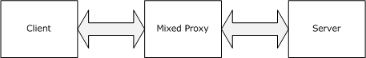
<!-- /Extracted images from page 16 -->

1.2.2  Informative References

[IANAPORT] IANA, "Service Name and Transport Protocol Port Number Registry",
https://www.iana.org/assignments/service-names-port-numbers/service-names-port-numbers.xhtml

[MSDN-RPCHTTPTRCRED] Microsoft Corporation, "RPC_HTTP_TRANSPORT_CREDENTIALS structure",
http://msdn.microsoft.com/en-us/library/aa378624.aspx

[MSDN-RPCSECQOSV2] Microsoft Corporation, "RPC_SECURITY_QOS_V2 structure",
http://msdn.microsoft.com/en-us/library/aa378648.aspx

[RFC2818] Rescorla, E., "HTTP Over TLS", RFC 2818, May 2000, https://www.rfc-
editor.org/info/rfc2818

[RFC5234] Crocker, D., Ed., and Overell, P., "Augmented BNF for Syntax Specifications: ABNF", STD
68, RFC 5234, January 2008, https://www.rfc-editor.org/info/rfc5234

1.3  Overview

The following three sections present an overview of the following:







The provisions in the RPC over HTTP Protocol that enable the use of HTTP as a transport.

The roles and dialects comprising the RPC over HTTP Protocol.

The encoding of RPC protocol data units (PDUs) within HTTP requests and responses.

1.3.1  Extensions to HTTP Functionality

Each connection-oriented transport must meet the requirements specified in [MS-RPCE] section 2.1.1.
The RPC over HTTP Protocol incorporates the following provisions to meet those requirements using
HTTP [RFC2616]:

  Duplex communications using virtual channels.

  Stream semantics through incrementally sending contents from the message body.

  Unlimited data stream using a sequence of HTTP requests or HTTP responses instead of using

chunked transfer encoding ([RFC2616] section 3.6.1).

1.3.2  Roles and Dialects

The RPC over HTTP Protocol defines the role of an RPC over HTTP proxy that can be deployed to
relay network traffic between a client and a server residing on networks separated by a firewall
through which HTTP or HTTPS traffic is permitted to flow.

RPC over HTTP Protocol has two main protocol dialects: RPC over HTTP v1 and RPC over HTTP v2.
Different roles are defined for each dialect.

RPC over HTTP v1 defines the roles of a client, a server, and an RPC over HTTP proxy, called a mixed
proxy in this specification. The following diagram shows the different roles and their relationships.

[MS-RPCH] - v20240729
Remote Procedure Call over HTTP Protocol
Copyright © 2024 Microsoft Corporation
Release: July 29, 2024

16 / 154

<!-- Extracted images from page 17 -->
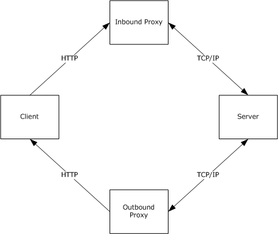
<!-- /Extracted images from page 17 -->

Figure 1: RPC over HTTP v1 roles

RPC over HTTP v2 works in a more complex topology and defines the roles of a client, a server, an
inbound RPC over HTTP proxy, and an outbound RPC over HTTP proxy. RPC over HTTP v2 proxies do
not have fixed roles. They can act as inbound or outbound proxies depending on the protocol
sequence in which they participate. The following diagram shows the different roles and their
interactions.

Figure 2: RPC over HTTP v2 roles

The roles defined herein are preserved even when the inbound proxy and outbound proxy roles
run on the same network node. However, this protocol does not assume that the inbound proxy and
outbound proxy reside on the same network node. Load balancing and clustering technologies, among
others, might cause the inbound proxy and outbound proxy to run on different network nodes.<1>

An RPC over HTTP proxy that only supports RPC over HTTP v2 cannot interoperate with an RPC over
HTTP v1 client or an RPC over HTTP v1 server.

The differences between RPC over HTTP v1 and v2 fall into three main categories, based on the
following:







The RPC over HTTP PDUs and RPC over HTTP PDUs' location

The proxy roles

The mapping of RPC and RPC over HTTP PDUs to HTTP requests

[MS-RPCH] - v20240729
Remote Procedure Call over HTTP Protocol
Copyright © 2024 Microsoft Corporation
Release: July 29, 2024

17 / 154

<!-- Extracted images from page 18 -->

<!-- /Extracted images from page 18 -->

Note  In the figure above, the arrows indicate direction in which the PDU flow through the various
roles.

1.3.3  HTTP Proxy Use

In certain network topologies, the connection from the client to an RPC over HTTP proxy has to go
through an HTTP proxy. Thus before establishing a connection to the RPC over HTTP proxy, the client
is required to determine whether a HTTP proxy is required to be used.

To do this determination, the client tries sending a message both with and without using an HTTP
proxy.  If it gets a response without using an HTTP proxy, then it does not use the HTTP proxy for
subsequent communication.  If it gets a response only by using an HTTP proxy, then it uses the HTTP
proxy for subsequent communication.

1.3.4  High-Level Overview

The RPC Protocol transmits RPC PDUs between RPC clients and RPC servers. At a very high level,
this protocol functions as an RPC transport and relays (tunnels) these PDUs to the server using
HTTP (or HTTPS) and TCP/IP as specified in section 1.4.

The RPC over HTTP Protocol takes an RPC PDU that is generated [C706] and extended [MS-RPCE] on
either an RPC client or an RPC server and transfers it to the other side, to the RPC server for the RPC
client and to the RPC client for the RPC server, using a network agent called an RPC over HTTP
proxy. All traffic has to go through an RPC over HTTP proxy.

The most common deployment configuration, even though it is not a requirement for this protocol, is
for the client to be separated from the RPC over HTTP proxy by a wide area network (WAN) such as
the Internet where the network traffic for this protocol travels over HTTP or HTTPS. The RPC over
HTTP proxy and the RPC server are usually connected through a local area network (LAN) where the
network traffic for this protocol travels over TCP/IP.

The RPC PDUs are conceptually viewed by the RPC over HTTP Protocol as an ordered sequence or
stream of PDUs that can travel from RPC client to RPC server or from RPC server to RPC client. This
protocol does not modify or consume RPC PDUs. The only exception to this rule is when using HTTPS
and RPC over HTTP v2. In this case, RPC PDUs will be encrypted at the HTTP client and decrypted at
the inbound or outbound proxy when traveling between an HTTP client and an inbound proxy or
outbound proxy.

The RPC over HTTP Protocol inserts its own PDUs into the RPC PDU stream and routes the resulting
stream of PDUs over HTTP requests and responses or TCP/IP connections as defined throughout this
specification. Using Augmented Backus-Naur Form (ABNF) notation [RFC5234], the definition of
the resulting stream of RPC and RPC over HTTP PDUs outside the protocol sequences specified in
section 3 of this specification is as follows.

1*((1*(RPC over HTTP PDU))*(RPC PDU))

The following diagram illustrates this definition.

Figure 3: RPC over HTTP PDU stream

An example PDU stream is provided in section 4.1.

In addition to specifying how the PDUs are ordered and mapped to the underlying transport, the RPC
over HTTP v2 dialect of this protocol specifies the following:

18 / 154

[MS-RPCH] - v20240729
Remote Procedure Call over HTTP Protocol
Copyright © 2024 Microsoft Corporation
Release: July 29, 2024

<!-- Extracted images from page 19 -->
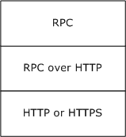
<!-- /Extracted images from page 19 -->

  How an implementation maps an unbounded number of PDUs from a stream onto a number of
HTTP requests and responses, each of which is bounded by its content length. This is done
through a process called channel recycling, specified in section 3.2.

  How an implementation prevents HTTP requests and responses that are used by the RPC over

HTTP Protocol from being timed out as idle by network agents. This is done by sending PDUs in a
process called pinging, as specified in section 3.2. The same pinging process is used to detect
whether the other party is still running and reachable through the network.

1.4  Relationship to Other Protocols

The RPC over HTTP Protocol is used in conjunction with the Remote Procedure Call (RPC) Protocol
Extensions, as specified in [MS-RPCE] and relies on HTTP 1.0 and keep-alive connections from HTTP
1.1 [RFC2616]. It also relies on HTTPS [RFC2818] for data protection services. The following diagram
illustrates the protocol layering for this protocol on the client.

Figure 4: Protocol layering on the client

For RPC over HTTP, the mixed, inbound, and outbound proxies use the protocol layering shown in
the following diagram for their client-facing part.

Figure 5: Protocol layering on client-facing proxy

For the server-facing part of the mixed, inbound, and outbound proxy, the protocol layering is as
shown in the following diagram.

19 / 154

[MS-RPCH] - v20240729
Remote Procedure Call over HTTP Protocol
Copyright © 2024 Microsoft Corporation
Release: July 29, 2024

<!-- Extracted images from page 20 -->
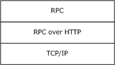
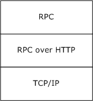
<!-- /Extracted images from page 20 -->

Figure 6: Protocol layering on server-facing proxy

The server uses the protocol layering shown in the following diagram.

Figure 7: Protocol layering on server

A consequence of this protocol layering is that an RPC client using RPC over TCP (ncacn_ip_tcp)
predecessor RPC protocol sequence cannot interoperate with an RPC server using RPC over HTTP
(ncacn_http) RPC protocol sequence and vice versa.

RPC over HTTP v1 can run on HTTP only. RPC over HTTP v2 can run over either HTTP or HTTPS. The
decision on whether to use HTTP or HTTPS is made by the client based on information provided by
higher-layer protocols.

RPC over HTTP v2 transmits error information encoded using the ExtendedError Remote Data
Structure, as specified in [MS-EERR].

1.5  Prerequisites/Preconditions

If HTTPS transport is used, a certificate is deployed on the inbound and outbound proxies.

The RPC over HTTP Protocol does not define any means for activating a server or proxy, and thus the
server and all proxies are fully initialized and listening before the RPC over HTTP Protocol can start
operating. The server is listening on a well-known or dynamic endpoint. RPC over HTTP proxies
listen in an implementation-specific way on the URIs specified in sections 3.1.2.3 and 3.2.3.3.

[MS-RPCH] - v20240729
Remote Procedure Call over HTTP Protocol
Copyright © 2024 Microsoft Corporation
Release: July 29, 2024

20 / 154

1.6  Applicability Statement

The RPC over HTTP Protocol is applicable to scenarios where an RPC client needs to communicate
with an RPC server and, due to network constraints (for example, topology, firewalls, protocols, and
so on), an HTTP transport is used.

This protocol is also applicable when data is received from the Internet or other public networks and
additional protection for the RPC server is required. RPC over HTTP is generally not applicable in cases
where a single RPC method call will be executed with little data exchanged by the RPC client and the
RPC server. The reason is that the additional security provisions of this protocol and the additional
synchronization required by inbound and outbound proxies introduce significant overhead on the
initial connection establishment. Once a connection is established, RPC over HTTP is very efficient in
transmitting data between RPC clients and RPC servers.

RPC over HTTP v1 is superseded by RPC over HTTP v2 and cannot be used unless maintaining
backward compatibility with RPC over HTTP v1 is required.<2> RPC over HTTP v1 has weak security
and poor compatibility with existing HTTP infrastructure, and it deviates from RPC connection-oriented
protocol requirements ([MS-RPCE] section 2.1.1). More specifically, RPC over HTTP v1 does not meet
the second requirement in the bulleted list in [MS-RPCE] section 2.1.1 because it fails to maintain a
reliable communication session. RPC over HTTP v1 fails to keep the communication session open if the
network agents deem the communication session idle.

1.7  Versioning and Capability Negotiation

Supported Transports: The RPC over HTTP Protocol can run on top of HTTP 1.0 or HTTPS. RPC over
HTTP v2 requires HTTP 1.1 connection keep-alive support. Details are provided in section 2.1.2.1. For
historical reasons related to how this protocol has evolved, some HTTP requests and HTTP responses
are versioned as 1.0 and some are versioned as 1.1. When not specified explicitly in this specification,
version 1.1 is assumed to be the default.

  Protocol Versions: This protocol supports the following explicit protocol dialects: RPC over
HTTP v1 and RPC over HTTP v2. These protocol dialects are defined in section 1.3.2. RPC over
HTTP v2 supports versioning within RPC over HTTP v2 as defined in section 2.2.3.5.7. RPC over
HTTP v1 has no support for versioning.

  Security and Authentication Methods: This protocol relies on the security provided by HTTPS
and HTTP Basic, or NTLM authentication [MS-NTHT], and acts as a pass-through for the security
provided by RPC. The RPC over HTTP Protocol does not have security and authentication
provisions of its own.

  Capability Negotiation: This protocol negotiates one of its two protocol dialects, RPC over HTTP
v1 and RPC over HTTP v2, by trying to first establish a connection using RPC over HTTP v2. If this
connection fails, the protocol falls back to RPC over HTTP v1. The negotiation between RPC over
HTTP v1 and RPC over HTTP v2 is defined in section 3.

1.8  Vendor-Extensible Fields

The RPC over HTTP Protocol does not include vendor-extensible fields. However, this protocol builds
on top of HTTP (or HTTPS), which allows vendors to add new HTTP headers [RFC2616]. This protocol
also allows vendors to add HTTP headers, but it ignores all such headers.

1.9  Standards Assignments

 Parameter

 Value

 Reference

RPC over HTTP endpoint mapper TCP port  593

As specified in [IANAPORT]

[MS-RPCH] - v20240729
Remote Procedure Call over HTTP Protocol
Copyright © 2024 Microsoft Corporation
Release: July 29, 2024

21 / 154

2  Messages

This section defines how the RPC over HTTP Protocol maps over lower-layer protocols, and it defines
the syntax for the messages used by this protocol.

The message syntax in this specification uses the notation and conventions specified in [RFC2616]
section 2. The parsing constructs OCTET, CHAR, UPALPHA, LOALPHA, ALPHA, DIGIT, CTL, CR, LF, SP,
HT, CRLF, LWS, TEXT, and HEX used in this specification are the same as those specified in [RFC2616]
section 2.2.

This protocol references commonly used data types as defined in [MS-DTYP].

2.1  Transport

Both RPC over HTTP v1 and RPC over HTTP v2 start their transport mapping process from a stream of
RPC and RPC over HTTP PDUs that need to be mapped to one or more HTTP or HTTPS requests and
TCP/IP connections. Both protocol dialects also share the following characteristics:

  An endpoint mapper with a well-known endpoint of 593.

  An RPC protocol identifier of 0x1F.

  An RPC network address for the RPC server provided by a higher layer that MUST be an IPv4 or

IPv6 address.





The RPC endpoint for the RPC server MUST be a TCP/IP port number.

The predecessor RPC protocol sequence is "ncacn_http".

  RPC network options provided by higher layers that:

  MUST contain a valid IPv4 or IPv6 address for the HTTP server.<3>

  MAY contain an HTTP proxy.<4>

2.1.1  RPC over HTTP v1 Transport

The following sections define the mapping of the RPC over HTTP v1 protocol dialect over lower-layer
protocols. From a high-level perspective, this protocol uses a single, custom HTTP request between
the client and the mixed proxy, and all RPC PDUs are mapped as binary large objects (BLOBs) in
the message body of this request.

2.1.1.1  Client to Mixed Proxy Traffic

RPC over HTTP v1 MUST use HTTP between the client and the mixed proxy. It MUST use a single
HTTP request to map both inbound and outbound traffic to the server. The HTTP request MUST be
initiated from the client and MUST be received by an HTTP server that runs on the mixed proxy. The
address of the HTTP server is provided by a higher-layer protocol as specified in section 2.1. RPC over
HTTP v1 MUST use port 80 for the HTTP traffic.

The syntax of the HTTP requests and HTTP response used by the RPC over HTTP Protocol are defined
in RPC Connect Request (section 2.1.1.1.1) and RPC Connect Response (section 2.1.1.1.2). Inbound
PDU Stream (section 2.1.1.1.3) and Outbound PDU Stream (section 2.1.1.1.4) define how RPC PDUs
are mapped to an HTTP request or an HTTP response.

2.1.1.1.1 RPC Connect Request

[MS-RPCH] - v20240729
Remote Procedure Call over HTTP Protocol
Copyright © 2024 Microsoft Corporation
Release: July 29, 2024

22 / 154

<!-- Extracted images from page 23 -->

<!-- /Extracted images from page 23 -->

The RPC connect request is an HTTP request that MUST have the following HTTP header fields.

Method: MUST be set to "RPC_CONNECT".

Pragma: MUST be set to the string "No-cache".

Protocol: Clients MUST set this to 1.1. Proxies SHOULD ignore this header field.

URL: The server name and port MUST be encoded in this field as specified in section 2.2.2 of this
specification.

User-Agent: MUST be set to the string "RPC".

Message Body: MUST be composed as specified in section 2.1.1.1.3.

This request MUST not use the Content-Type and Content-Length header fields. It also MUST NOT
use transfer coding or specify a MIME type.

2.1.1.1.2 RPC Connect Response

The RPC connect response is an HTTP response that MUST have the following HTTP header fields.

Status Line: [RFC2616] section 6.1 specifies that the status line be composed of three nonspace
subfields. The three subfields MUST be set to the following values:

  HTTP-Version: MUST be the string "HTTP/1.1"

  Reason-Phrase: MUST be the string "OK"

  Status-Code: MUST be an HTTP status code in the inclusive range 200-299.

Message Body: Must be composed as specified in section 2.1.1.1.4 of this specification.

2.1.1.1.3 Inbound PDU Stream

Inbound PDUs from the PDU stream MUST be encoded as BLOBs in the message body of the RPC
connect request. The first inbound PDU MUST start from the beginning of the message body of the
RPC connect request, and each subsequent PDU from the PDU stream MUST be placed as a BLOB
immediately after the previous PDU in the RPC connect request without any delimiters. The following
diagram defines the layout of the PDUs in the message body of the RPC connect request.

Figure 8: Inbound connect request PDU stream

Each PDU encoded as a BLOB contains its length inside the PDU as specified in [C706] section 12, RPC
PDU Encodings, and thus no delimiters are necessary between the BLOBs. For RPC over HTTP v1, the
implementation of the underlying HTTP transport MUST be capable of the following:

  Duplex communication.

  Sending a potentially unbounded number of PDUs in the message body of the RPC connect request
while at the same time receiving a potentially unbounded number of PDUs in the message body of

23 / 154

[MS-RPCH] - v20240729
Remote Procedure Call over HTTP Protocol
Copyright © 2024 Microsoft Corporation
Release: July 29, 2024

<!-- Extracted images from page 24 -->
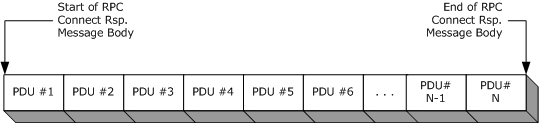
<!-- /Extracted images from page 24 -->

the RPC connect response. This protocol specifically allows for sending and receiving a potentially
unbounded number of PDUs in the message body of the RPC connect request.

The PDUs are sent in the message body as they are generated for unplugged channel mode. In this
mode, PDU N MUST be sent as soon as it is generated and will not wait for PDU N+1 to be generated.

2.1.1.1.4 Outbound PDU Stream

Outbound PDUs from the PDU stream MUST be encoded as BLOBs in the message body of the RPC
connect response. The first PDU in the RPC connect response MUST start from the beginning of the
message body of the RPC connect response, and each subsequent PDU from the PDU stream MUST be
placed as a BLOB immediately after the previous PDU in the RPC connect response without any
delimiters. The following diagram defines the layout of the PDUs in the message body of the RPC
connect response.

Figure 9: Outbound RPC connect response PDU stream

Each PDU encoded as a BLOB contains its length inside the PDU as specified in [C706] section 12, RPC
PDU Encodings, and thus no delimiters are necessary between the BLOBs.

For RPC over HTTP v1, the implementation of the underlying HTTP transport MUST be capable of the
following:

  Duplex communication.

  Sending a potentially unbounded number of PDUs in the message body of the RPC connect

request, while at the same time receiving a potentially unbounded number of PDUs in the message
body of the RPC connect response.

The PDUs are sent in the message body as they are generated for unplugged channel mode. In this
mode, PDU N MUST be sent as soon as it is generated and will not wait for PDU N+1 to be generated.

2.1.1.2  Mixed Proxy to Server Traffic

RPC over HTTP v1 uses TCP/IP between the mixed proxy and the server. The TCP connection MUST
be initiated by the mixed proxy. The server name and port to be used for setting up the TCP
connection MUST be extracted from the URI of the HTTP request as specified in section 2.1.1.1. Once
the connection is established, the mixed proxy and the server MUST use this connection for
transmission of all the PDUs in the PDU stream.

2.1.1.2.1 Legacy Server Response

A server MUST send the ASCII [US-ASCII] string "ncacn_http/1.0" to the mixed proxy as soon as the
TCP connection from the mixed proxy to the server is established. This string literal is called the
legacy server response.

[MS-RPCH] - v20240729
Remote Procedure Call over HTTP Protocol
Copyright © 2024 Microsoft Corporation
Release: July 29, 2024

24 / 154

2.1.2  RPC over HTTP v2 Transport

The following sections define the mapping of the RPC over HTTP v2 protocol dialect over lower-layer
protocols. From a high-level perspective, in its steady state this protocol uses a pair of custom HTTP
requests from the client to the inbound proxy and from the client to the outbound proxy. All
inbound RPC PDUs are mapped as BLOBs in the message body of the custom request to the
inbound proxy, and all outbound RPC PDUs are mapped as BLOBs in the message body of the custom
request to the outbound proxy.

2.1.2.1  Client to Inbound or Outbound Proxy

RPC over HTTP v2 MUST operate either on top of HTTP or on top of HTTPS. It requires HTTP 1.0 plus
connection keep-alive support from HTTP 1.1. Mapping to both protocols happens identically. In this
section, mapping is defined only on HTTP, but the same rules apply for HTTPS.<5>

If instructed by a higher-level protocol in an implementation-specific way, implementations of this
protocol MUST require the HTTP implementation on the client to authenticate to the HTTP server
running on the inbound proxy or outbound proxy using basic authentication for HTTP [RFC2617] or
NTLM authentication for HTTP [MS-NTHT].

The higher-level protocol MUST provide, in an implementation-specific way, either credentials in the
form of user name/password or a client-side certificate. Implementations of this protocol MUST NOT
process the credentials or authentication information. Such processing typically happens entirely
inside implementations of lower protocol layers.<6>

The same mapping MUST be applied for both the inbound proxy and the outbound proxy traffic. A
client implementation SHOULD instruct the implementation of the HTTP protocol on which it runs to
use an implementation-specific but reasonable time-out value for all requests.<7>

RPC over HTTP v2 MUST always use a pair of HTTP requests to build a virtual connection (2). The
HTTP requests MUST be initiated by the client and received by the inbound proxy and outbound proxy.

Both HTTP requests have implementation-specific content length as defined in the following sections.
The address of the HTTP server is provided by a higher-layer protocol. RPC over HTTP v2 always uses
port 80 for HTTP traffic and port 443 for HTTPS traffic.

The next few sections describe the HTTP IN channel request (section 2.1.2.1.1) and OUT channel
request (section 2.1.2.1.2), and the IN channel response (section 2.1.2.1.3) and OUT channel
response (section 2.1.2.1.4) used by RPC over HTTP v2 as well as the mapping of the PDU stream on
top of these requests. The general syntax and meaning of each of the HTTP header fields are specified
in [RFC2616]. Sections 2.1.2.1.1 through 2.1.2.1.8 only define the use of a given header field when
this protocol uses the field in a more specific or different meaning than the one specified in
[RFC2616]. RPC over HTTP v2 protocol entirely preserves the syntax and semantics of any HTTP
header field not explicitly mentioned here.

2.1.2.1.1 IN Channel Request

The IN channel request is an HTTP request [RFC2616]. The header fields of that HTTP request are as
follows:

Method: MUST be the "RPC_IN_DATA" string.

Accept: Clients SHOULD set this to "application/rpc" string literal. Inbound proxies MUST ignore
this header field.

Cache-Control: Clients MUST set this to "no-cache". Inbound proxies MUST ignore this header field.

Connection: Clients MUST set this to "Keep-Alive". Inbound proxies MUST ignore this header field.

[MS-RPCH] - v20240729
Remote Procedure Call over HTTP Protocol
Copyright © 2024 Microsoft Corporation
Release: July 29, 2024

25 / 154

Content-Length: MUST be in the inclusive range of 128 kilobytes to 2 gigabytes.<8>

Host: Clients MUST set this to the server name of the inbound proxy ([RFC2616] section 14.23
"Host"). Inbound proxies SHOULD ignore this header field.

Pragma Directives:

  Clients MUST add a "No-cache" pragma directive as specified in [RFC2616] section 14.32. Inbound

proxies MUST ignore this directive.







If the higher-layer protocol or application specified a connectiontimeout, a client MUST add a
pragma directive of the form "Pragma:MinConnTimeout=T", where T is a decimal string
representation of the minimum connection time-out, in seconds, to be used for this IN channel.
The time-out MUST be in the inclusive range of 120 to 14,400 seconds.

If the higher-layer protocol or application specified a Resource Type UUID, a client MUST add a
pragma directive of the form "Pragma:ResourceTypeUuid=R", where R is a UUID formatted as a
string ([C706]- Section A.3. This pragma specifies the Resource Type UUID for this channel. For
more details on Resource Type UUID, see section 3.2.3.1.5.

If the higher-layer protocol or application specified a Session UUID, a client MUST add a pragma
directive of the form "Pragma:SessionId=S", where S is a UUID formatted as a string. This
pragma specifies the Session UUID for this channel. For more details on Session UUID, see section
3.2.3.1.6.

Protocol: Clients SHOULD set this to 1.0. Inbound proxies SHOULD ignore this header field.

URL: The server name and port MUST be encoded in this field. For details on encoding, see section
2.2.2.

User-Agent: Clients SHOULD set this to the "MSRPC" string literal. Inbound proxies SHOULD ignore
this header field.

Message Body: For details on how the message body of an IN channel request MUST be created, see
section 2.1.2.1.7.

2.1.2.1.2 OUT Channel Request

The OUT channel request is an HTTP request [RFC2616]. The header fields of that HTTP request are
as follows:

Method:  MUST be set to the "RPC_OUT_DATA" string.

Accept:  Clients SHOULD set this to "application/rpc" string literal. Outbound proxies MUST ignore
this header field.

Cache-Control:  Clients MUST set this to "no-cache". Outbound proxies MUST ignore this header
field.

Connection:  Clients MUST set this to "Keep-Alive". Outbound proxies MUST ignore this header field.

Content-Length: MUST be set to 76 for nonreplacement OUT channels and set to 120 for
replacement OUT channels.

Host:  Clients MUST set this to the server name of the outbound proxy ([RFC2616] section 14.23,
Host). Outbound proxies SHOULD ignore this header field.

Pragma Directives:

  Clients MUST add a "No-cache" pragma directive as specified in [RFC2616] section 14.32.

Outbound proxies MUST ignore this directive.

26 / 154

[MS-RPCH] - v20240729
Remote Procedure Call over HTTP Protocol
Copyright © 2024 Microsoft Corporation
Release: July 29, 2024

  Optional pragma directive that, if present, MUST be defined to have the format

"Pragma:MinConnTimeout=T", where T MUST be a decimal string representation of the minimum
connection time-out, in seconds, to be used for this OUT channel. The time-out MUST be in the
inclusive range of 120 to 14,400 seconds.

  Optional pragma directive that, if present, MUST be defined to have the format

"Pragma:ResourceTypeUuid=R", where R MUST be a UUID formatted as a string ([C706]
Appendix A, Universal Unique Identifier). This pragma specifies the Resource Type UUID for this
channel. For more details on Resource Type UUID, see section 3.2.3.1.5.

  Optional pragma directive that, if present, MUST be defined to have the format

"Pragma:SessionId=S", where S MUST be a UUID formatted as a string ([C706] Appendix A,
Universal Unique Identifier). This pragma specifies the session ID for this channel.

Protocol:  Clients SHOULD set this to 1.0. Outbound proxies SHOULD ignore this header field.

URL: The server name and port are encoded in this field. For information on how the encoding is
done, see section 2.2.2 of this specification.

User-Agent:  Clients SHOULD set this to the "MSRPC" string literal. Outbound proxies SHOULD ignore
this header field.

Message Body: For the definition of how the message body of an OUT channel request MUST be
created, see section 2.1.2.1.8 of this specification.

2.1.2.1.3 IN Channel Response

The IN channel response is an HTTP response [RFC2616]. It is used only in error conditions on the
RPC over HTTP proxy. The HTTP header fields and message body syntax that are different from
[RFC2616] are as follows:

Status Line: [RFC2616] section 6.1 specifies that the status line be composed of three nonspace
subfields:

  HTTP-Version: SHOULD be the character sequence HTTP/1.0.

  Reason-Phrase: MUST be in the following form:

 reason-phrase = "RPC Error: " RPC-Error [ee-info]
        RPC-Error = 1*HEX
        ee-info = ", EEInfo: " EncodedEEInfo

  RPC-Error: MUST be interpreted as a hexadecimal representation of an error code. The error code
MUST be an implementation-specific value between 0x0 and 0xFFFFFFFF. The error code MUST
NOT be one of the error codes specified in [MS-RPCE] section 3.3.3.5.1.<9>

ee-info: Is part of the reason-phrase and MUST be present if error information is available to the
inbound proxy. The behavior of the inbound proxy is defined in section 3.2.3.5.11.

EncodedEEInfo: MUST be a base64-encoded BLOB. The base64 encoding MUST be as specified in
[RFC4648] section 4. The content of the BLOB is specified in [MS-EERR]. The BLOB MUST continue
until the CRLF delimiter at the end of the status line.

The total length of the reason-phrase line MUST NOT exceed 1,024 bytes.

Status-Code: MUST be the character sequence 503.

MessageBody: MUST be in the following format.

[MS-RPCH] - v20240729
Remote Procedure Call over HTTP Protocol
Copyright © 2024 Microsoft Corporation
Release: July 29, 2024

27 / 154

 message-body = ["RPC EEInfo:" EncodedEEInfo]

EncodedEEInfo: MUST be a base64 BLOB. The base64 encoding MUST be as specified in [RFC4648]
section 4. The content of the BLOB is specified in [MS-EERR]. The BLOB MUST continue until the CRLF
delimiter at the end of the message body.

2.1.2.1.4 OUT Channel Response

The OUT channel response is sent in both success and failure cases. In success case, the header
fields of the HTTP response to the OUT channel request are as follows:

Content-Length: MUST be set to an implementation-specific value in the inclusive range of 128
kilobytes to 2 gigabytes.<10>

Content-Type: MUST be set to the string literal "application/rpc".

Status Line: [RFC2616] section 6.1 specifies that the status line be composed of three nonspace
subfields:

  HTTP-Version: MUST be the character sequence HTTP/1.1.

  Status-Code: MUST be the character sequence 200.

  Reason-Phrase: MUST be the character sequence Success.

In a failure case, the format of the OUT channel response is the same as the IN channel response as
defined in section 2.1.2.1.3 of this specification.

2.1.2.1.5 Echo Request

An echo request is used in the proxy discovery protocol sequence. The header fields for an echo
request are as follows:

Method: MUST be set to either the "RPC_IN_DATA" or the "RPC_OUT_DATA" string. Both are valid.
The client SHOULD use "RPC_IN_DATA" when it is sending an echo request as part of a protocol
sequence associated with IN channels and SHOULD use "RPC_OUT_DATA" when it is sending an echo
request as part of a protocol sequence associated with OUT channels. If the client sends
"RPC_IN_DATA" in this field, the proxy MUST act as inbound proxy. If the client sends
"RPC_OUT_DATA" in this field, the proxy MUST act as outbound proxy.

Accept: Clients SHOULD set this to the "application/rpc" string literal. Inbound and outbound proxies
MUST ignore this header field.

Cache-Control: Clients MUST set this to "no-cache". Inbound and outbound proxies MUST ignore this
header field.

Connection: Clients SHOULD set this to Keep-Alive. Inbound and outbound proxies MUST ignore this
header field.

Content-Length: Clients MUST set this header field to a value in the inclusive range of 0 to
0x10.<11>

Host: Clients MUST set this to the server name of the inbound or outbound proxies as specified in
[RFC2616] section 14.23, Host. Inbound and outbound proxies SHOULD ignore this header field.

Pragma Directives:

  Clients MUST add a "No-cache" pragma directive as specified in [RFC2616] section 14.32. Inbound

and outbound proxies MUST ignore this directive.

28 / 154

[MS-RPCH] - v20240729
Remote Procedure Call over HTTP Protocol
Copyright © 2024 Microsoft Corporation
Release: July 29, 2024

Protocol: Clients SHOULD set this to 1.0. Inbound and outbound proxies SHOULD ignore this header
field.

URL: The server name and port are encoded in this field. For information on how the encoding is
done, see section 2.2.2.

User-Agent: Clients SHOULD set this to the "MSRPC" string literal. Inbound and outbound proxies
SHOULD ignore this header field.

Message Body: Clients MAY set the message body to random content they choose as specified in
[RFC2616].<12> Inbound and outbound proxies MUST ignore the message body.

2.1.2.1.6 Echo Response

An echo response is used in the proxy discovery protocol sequence. This response is sent by an
inbound or outbound proxy as an HTTP response to the echo HTTP request. The same echo
response is sent by both inbound and outbound proxies.

The header fields of the HTTP response are as follows:

Connection:  Inbound and outbound proxies SHOULD set this to Keep-Alive. Clients MUST ignore this
header field.

Content-Length:  Inbound and outbound proxies MUST set this field to 20. Clients MUST ignore this
header field.

Content-Type:  Inbound and outbound proxies MUST set this header field to the string literal
"application/rpc". Clients SHOULD ignore this header field.

Status Line:  [RFC2616] section 6.1 specifies that the status line be composed of three nonspace
subfields:

  HTTP-Version: The HTTP protocol version of the HTTP server. This protocol does not require
any particular HTTP version. Any HTTP version that is 1.0 or higher SHOULD be accepted by
implementations of this protocol.

  Reason-Phrase: MUST be Success.

  Status-Code: MUST be 200.

Implementations SHOULD respond with the Status Line as specified above. It is not a requirement of
this protocol for implementations to use the status-code field to indicate errors, though
implementations MAY do so.

Message Body:  Inbound and outbound proxies put in the message body the echo response RTS
packet described in section 2.2.4.48 and encoded as a BLOB.

2.1.2.1.7 Inbound PDU Stream

Inbound PDUs from the PDU stream MUST be encoded as BLOBs in the message body of the IN
channel. The first PDU in the IN channel MUST start from the beginning of the message body of the
IN channel, and each subsequent PDU from the PDU stream MUST be placed as a BLOB immediately
after the previous PDU in the IN channel without any delimiters. The following diagram describes the
layout of the PDUs in the message body of the IN channel.

[MS-RPCH] - v20240729
Remote Procedure Call over HTTP Protocol
Copyright © 2024 Microsoft Corporation
Release: July 29, 2024

29 / 154

<!-- Extracted images from page 30 -->
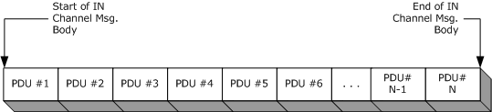
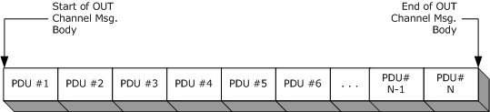
<!-- /Extracted images from page 30 -->

Figure 10: IN channel message PDU stream

Each PDU is encoded as a variable-sized BLOB containing its length inside the PDU; therefore, no
delimiters are necessary between the BLOBs. The length of the RPC PDUs is specified in [C706]
section 12, RPC PDU Encodings. The length of the RTS PDUs is defined in section 2.2.3.6 of this
specification. An IN channel contains a variable number of PDUs, and the PDUs themselves might have
variant sizes. An IN channel MUST NOT contain more PDUs than can fit in its maximum content length
as indicated by the Content-Length header. If there is not enough space on an IN channel for another
PDU from the PDU stream, the IN channel is considered expired and MUST NOT be used by the client
anymore. A successor IN channel MUST be established. For more details on how the client manages
the channel lifetime, see section 3.2.2.

The PDUs MUST be sent in the message body as they are generated: PDU N MUST be sent as soon as
it is generated and MUST NOT wait for PDU N+1 to be generated.

By using the message body of the IN channel to transmit PDUs over HTTP/HTTPS, this protocol obtains
a half-duplex channel for a limited number of bytes that provides reliable, in-order, at-most-once
delivery semantics between a client and inbound proxy.

2.1.2.1.8 Outbound PDU Stream

Outbound PDUs from the PDU stream MUST be encoded as BLOBs in the message body of the OUT
channel. The first PDU in the OUT channel MUST start from the beginning of the message body of the
OUT channel, and each subsequent PDU from the PDU stream MUST be placed as a BLOB immediately
after the previous PDU in the OUT channel without any delimiters. The following diagram describes the
layout of the PDUs in the message body of the OUT channel.

Figure 11: OUT channel message PDU stream

Each PDU encoded as a BLOB contains its length inside the PDU and thus no delimiters are necessary
between the BLOBs. The length of the RPC PDUs is defined in RPC PDU Encodings [C706] section 12.
The length of the RTS PDUs is defined in section 2.2.3.6.

An OUT channel contains a variable number of PDUs and the PDUs themselves might have variable
sizes. An OUT channel MUST NOT contain more PDUs than can fit in its maximum content length as
indicated by the Content-Length header. If there is not enough space on an OUT channel for another
PDU from the PDU stream, the OUT channel is considered expired and MUST NOT be used by the
server anymore. A successor OUT channel MUST be established. How the server manages the
channel lifetime is specified in section 3.2.5.

[MS-RPCH] - v20240729
Remote Procedure Call over HTTP Protocol
Copyright © 2024 Microsoft Corporation
Release: July 29, 2024

30 / 154

The PDUs are sent in the message body as they are generated. PDU N MUST be sent as soon as it is
generated and will not wait for PDU N+1 to be generated.

By using the message body of the OUT channel to transmit PDUs over HTTP/HTTPS, this protocol
obtains a half-duplex channel for a limited number of bytes that provides reliable, in-order, at-most-
once delivery semantics between a client and outbound proxy.

2.1.2.2  Inbound or Outbound Proxy to Server

RPC over HTTP v2 uses TCP/IP between the inbound or outbound proxy and the server. The same
mapping is applied for both the inbound and the outbound proxy.

The TCP connection is initiated by the inbound or outbound proxy. The server name and port to be
used for setting up the TCP connection are extracted from the URL of the HTTP request as specified in
section 2.1.1.1. Once the connection is established, the inbound proxy or outbound proxy and the
server use this connection for transmission of all the PDUs of the PDU stream.

By using a TCP/IP connection between the inbound or outbound proxy and the server,
implementations of this protocol obtain a full-duplex channel for an unlimited number of bytes that
provides reliable, in-order, at-most-once delivery semantics.

2.1.2.2.1 Legacy Server Response

A server SHOULD send the string literal "ncacn_http/1.0" to the inbound or outbound proxy as soon
as the TCP connection from the inbound or outbound proxy to the server is established. This string
literal is called the legacy server response.

2.2  Message Syntax

This section defines the message syntax for the messages and PDUs used by this protocol. First, it
specifies the conventions and some common data structures used in multiple messages. Then it
defines the rules for combining the common data structures, and finally, it defines the PDUs for this
protocol.

2.2.1  Common Conventions

All data structures described in this section share the following common characteristics:

  All numeric fields MUST be encoded using little-endian byte ordering.

  Alignment for all data structures except the URI MUST be 4 bytes.

  All structures in this section except the URI are used for RPC over HTTP v2 only.

2.2.2  URI Encoding

The format of the URI header field of the HTTP request has a special interpretation in this protocol. As
specified in [RFC2616], the URI is to be of the following form.

 http-URL = "http:" "//" host [ ":" port ] [ abs-path
 [ "?" query ]]

This protocol specifies that abs-path MUST be present for RPC over HTTP v2 and MUST have the
following form.

[MS-RPCH] - v20240729
Remote Procedure Call over HTTP Protocol
Copyright © 2024 Microsoft Corporation
Release: July 29, 2024

31 / 154

 nocert-path = "/rpc/rpcproxy.dll"
 withcert-path = "/rpcwithcert/rpcproxy.dll"

 abs-path = nocert-path / withcert-path

The form matching withcert-path MUST be used whenever the client authenticates to the HTTP
server using a client-side certificate. The form matching nocert-path MUST be used in all other
cases.<13>

This protocol specifies that query string MUST be present for RPC over HTTP v2 and MUST be of the
following form.

 query = server-name ":" server-port

The inbound proxy or outbound proxy uses the query string to establish a connection to an RPC over
the HTTP server, as specified in sections 3.2.3.5.3 and 3.2.4.5.3.

 server-name = DNS-Name / IP-literal-address /
               IPv6-literal-address / NetBIOS-Name
 server-port = 1*6(DIGIT)

The length of server-name MUST be less than 1,024 characters.

DNS-Name: An Internet host name or IP_literal_address that is the string representation of an IP
literal address, as specified in [RFC1123] section 2.1.

IPv6-literal-address: MUST be the string representation of an IPv6 literal address as specified in
[RFC4291] section 2.

NetBIOS-Name: MUST be a NetBIOS name. For more details about NetBIOS, refer to [NETBEUI],
[RFC1001], and [RFC1002].

2.2.3  Common Data Structures

This section defines several common data structures and values used by the RPC over HTTP Protocol.
They are used in multiple PDUs. The PDUs themselves are defined in section 2.2.4. The common
conventions for the messages are defined in section 2.2.1.

2.2.3.1  RTS Cookie

The RTS cookie is a token exchanged between parties in an RPC over HTTP Protocol sequence and is
used to name objects and abstractions as defined throughout this specification. This section defines
the encoding for an RTS cookie.

0  1  2  3  4  5  6  7  8  9

1
0  1  2  3  4  5  6  7  8  9

2
0  1  2  3  4  5  6  7  8  9

3
0  1

Cookie (16 bytes)

...

...

[MS-RPCH] - v20240729
Remote Procedure Call over HTTP Protocol
Copyright © 2024 Microsoft Corporation
Release: July 29, 2024

32 / 154

The value chosen for an RTS cookie SHOULD be a 16-byte cryptographically strong random number. It
has the same uniqueness requirements as a UUID, and implementations MAY use a UUID as the RTS
cookie.<14>

2.2.3.2  Client Address

The client address data structure is used to transmit the IP address of a client to a proxy or a server.
It has two basic formats: IPv4 and IPv6, as described in sections 2.2.3.2.1 and 2.2.3.2.2.

2.2.3.2.1 Client Address - IPv4

The client address data structure is used to transmit the IP address of a client to a proxy or a server.
The encoding of the client address for the IPv4 format is as follows.

0  1  2  3  4  5  6  7  8  9

1
0  1  2  3  4  5  6  7  8  9

2
0  1  2  3  4  5  6  7  8  9

3
0  1

AddressType

ClientAddress

Padding

...

...

AddressType (4 bytes): MUST be set to the value 0 to indicate IPv4 format.

ClientAddress (4 bytes): MUST contain the IPv4 address of the client in little-endian byte order.

Padding (12 bytes): Senders SHOULD set all bytes in this field to the value 0x00. Receivers MUST

ignore this field.

2.2.3.2.2 Client Address - IPv6

The client address data structure is used to transmit the IP address of a client to a proxy or a server.
The encoding of the client address for the IPv6 format is as follows.

0  1  2  3  4  5  6  7  8  9

1
0  1  2  3  4  5  6  7  8  9

2
0  1  2  3  4  5  6  7  8  9

3
0  1

AddressType

ClientAddress (16 bytes)

...

...

Padding

...

[MS-RPCH] - v20240729
Remote Procedure Call over HTTP Protocol
Copyright © 2024 Microsoft Corporation
Release: July 29, 2024

33 / 154

...

AddressType (4 bytes): MUST be set to the value 1 to indicate IPv6 format.

ClientAddress (16 bytes): MUST contain the IPv6 address of the client in little-endian byte order.

Padding (12 bytes): Senders SHOULD set all bytes in this field to the value 0x00. Receivers MUST

ignore this field.

2.2.3.3  Forward Destinations

The forward destination enumeration specifies the target of a forwarded PDU as per the following
table.

Constant/value  Description

FDClient

Forward to client

0x00000000

FDInProxy

Forward to inbound proxy

0x00000001

FDServer

Forward to server

0x00000002

FDOutProxy

Forward to outbound proxy

0x00000003

If a PDU is forwarded, the party that originally created the PDU is called the originator of the PDU and
the party that sends the PDU to the next hop in the forwarding chain is called the sender of the PDU.
For a definition of the processing rules related to PDU forwarding, see section 3.2.1.5.2.

2.2.3.4  Flow Control Acknowledgment

The Flow Control Acknowledgment data structure is embedded in a packet performing some sort of
flow control acknowledgment for traffic received. The encoding of this data structure is as follows.

0  1  2  3  4  5  6  7  8  9

1
0  1  2  3  4  5  6  7  8  9

2
0  1  2  3  4  5  6  7  8  9

3
0  1

Bytes Received

Available Window

ChannelCookie (16 bytes)

...

...

Bytes Received (4 bytes): The number of bytes received at the time the flow control

acknowledgment was issued. For a definition of the processing rules related to flow control
acknowledgment, see section 3.2.1.1. This value MUST be in the inclusive range of 0 to the
channel lifetime denoted by the channel cookie field.

34 / 154

[MS-RPCH] - v20240729
Remote Procedure Call over HTTP Protocol
Copyright © 2024 Microsoft Corporation
Release: July 29, 2024

Available Window (4 bytes): The number of bytes available in the ReceiveWindow of the

originator of this PDU.

ChannelCookie (16 bytes): An RTS cookie that uniquely identifies the channel for which the traffic

received is being acknowledged (see section 2.2.3.1).

2.2.3.5  RTS Commands

The RTS PDUs contain a series of commands. This section defines the valid RTS commands. Section
2.2.3.6 defines how the commands are ordered in a PDU.

The type of each command in an RTS PDU is identified by a numeric value. Each command is used in
one or more RTS PDUs as defined in sections 2.2.4.2 through 2.2.4.50. Section 3.2 defines when each
RTS PDU is used, who sends it, and who receives it. The following table specifies the numeric value
and meaning of each command type.

 Value

 Meaning

ReceiveWindowSize
(0x00000000)

FlowControlAck
(0x00000001)

ConnectionTimeout
(0x00000002)

The ReceiveWindowSize command communicates the size of the ReceiveWindow.

The FlowControlAck command carries acknowledgment for traffic received.

The ConnectionTimeout command specifies the configured connection time-out.

Cookie (0x00000003)

The Cookie command carries an RTS cookie.

ChannelLifetime
(0x00000004)

ClientKeepalive
(0x00000005)

The ChannelLifetime command specifies the channel lifetime.

The ClientKeepalive command carries the desired interval for sending keep-alive
PDUs.

Version (0x00000006)

The Version command carries the RPC over HTTP v2 version number for the sender
of the PDU that contains this command.

Empty (0x00000007)

Empty command.

Padding (0x00000008)

Padding is a variable-size command used to pad the size of an RTS PDU to a desired
size.

NegativeANCE
(0x00000009)

The NegativeANCE command indicates that a successor channel was not
established successfully.

ANCE (0x0000000A)

The ANCE command indicates that a successor channel was established successfully.

ClientAddress
(0x0000000B)

The ClientAddress command carries the client IP address. The IP address is encoded
as specified in section 2.2.3.2. Regardless of who sends this PDU, the address MUST
be interpreted to be the address of the client.

AssociationGroupId
(0x0000000C)

The AssociationGroupId command carries the client association group ID as specified
in section 2.2.3.5.13. Regardless of who sends this PDU, the association group ID
MUST be interpreted to be that of the client.

Destination
(0x0000000D)

The Destination command carries the destination to which a PDU MUST be
forwarded.

PingTrafficSentNotify
(0x0000000E)

The PingTrafficSentNotify command carries the number of bytes sent by the
outbound proxy to the client as part of ping traffic.

[MS-RPCH] - v20240729
Remote Procedure Call over HTTP Protocol
Copyright © 2024 Microsoft Corporation
Release: July 29, 2024

35 / 154

2.2.3.5.1 ReceiveWindowSize

The ReceiveWindowSize command specifies the size of the ReceiveWindow of a party. The party
from which the ReceiveWindow originated is specified in the section for the RTS PDU that contains
this command. The structure of the command is as follows.

0  1  2  3  4  5  6  7  8  9

1
0  1  2  3  4  5  6  7  8  9

2
0  1  2  3  4  5  6  7  8  9

3
0  1

CommandType

ReceiveWindowSize

CommandType (4 bytes): MUST be the value ReceiveWindowSize (0x00000000).

ReceiveWindowSize (4 bytes): The size of the ReceiveWindow, in bytes. It MUST be in the

inclusive range of 8 kilobytes to 256 kilobytes. The ReceiveWindow MUST be greater than or
equal to the PDU fragment size transmitted in the bind/bind_ack packets at the RPC layer
([C706] section 12.4).<15>

The ReceiveWindowSize field from this PDU MUST be used to set the ReceiveWindowSize ADM from
section 3.2.1.1.5.1.1.

2.2.3.5.2 FlowControlAck

The FlowControlAck command specifies acknowledgment for traffic received. The structure of the
command is as follows.

0  1  2  3  4  5  6  7  8  9

1
0  1  2  3  4  5  6  7  8  9

2
0  1  2  3  4  5  6  7  8  9

3
0  1

CommandType

Ack (24 bytes)

...

...

CommandType (4 bytes): MUST be the value FlowControlAck (0x00000001).

Ack (24 bytes): MUST be a flow control acknowledgment structure as defined in section 2.2.3.4.

2.2.3.5.3 ConnectionTimeout

The ConnectionTimeout command specifies the desired frequency for sending keep-alive PDUs
generated by this protocol as defined in section 3.2. The party from which the connection time-out
originated is specified in the section for the RTS PDU that contains this command.

0  1  2  3  4  5  6  7  8  9

1
0  1  2  3  4  5  6  7  8  9

2
0  1  2  3  4  5  6  7  8  9

3
0  1

CommandType

ConnectionTimeout

36 / 154

[MS-RPCH] - v20240729
Remote Procedure Call over HTTP Protocol
Copyright © 2024 Microsoft Corporation
Release: July 29, 2024

CommandType (4 bytes):  MUST be the value ConnectionTimeout (0x00000002).

ConnectionTimeout (4 bytes):  MUST be the integer value for the client keep-alive that this

connection is configured to use, in milliseconds. The value MUST be in the inclusive range of
120,000 through 14,400,000 milliseconds.

2.2.3.5.4 Cookie

The Cookie command specifies an RTS cookie. The meaning of the RTS cookie is inferred from its
position in the command sequence as specified in section 2.2.4 and the context established by the
protocol sequence as defined in section 3.2.

0  1  2  3  4  5  6  7  8  9

1
0  1  2  3  4  5  6  7  8  9

2
0  1  2  3  4  5  6  7  8  9

3
0  1

CommandType

Cookie (16 bytes)

...

...

CommandType (4 bytes):  MUST be the value Cookie (0x00000003).

Cookie (16 bytes):  MUST contain an RTS cookie, which is specified in 2.2.3.1.

2.2.3.5.5 ChannelLifetime

The ChannelLifetime command specifies the channel lifetime. The party from which the channel
lifetime originated is specified in the sections that define the RTS PDU that contains this command.

0  1  2  3  4  5  6  7  8  9

1
0  1  2  3  4  5  6  7  8  9

2
0  1  2  3  4  5  6  7  8  9

3
0  1

CommandType

ChannelLifetime

CommandType (4 bytes): MUST be the value ChannelLifetime (0x00000004).

ChannelLifetime (4 bytes):  The channel lifetime, in bytes. This value MUST be in the inclusive

range of 128 kilobytes through 2 gigabytes.<16>

2.2.3.5.6 ClientKeepalive

The ClientKeepalive command carries the desired interval for sending keep-alive PDUs on behalf of
the client whose usage is defined in section 3.2. The party from which the client keep-alive originated
is specified in the sections that define the RTS PDU that contains this command.

0  1  2  3  4  5  6  7  8  9

1
0  1  2  3  4  5  6  7  8  9

2
0  1  2  3  4  5  6  7  8  9

3
0  1

CommandType

[MS-RPCH] - v20240729
Remote Procedure Call over HTTP Protocol
Copyright © 2024 Microsoft Corporation
Release: July 29, 2024

37 / 154

ClientKeepalive

CommandType (4 bytes): MUST be the value ClientKeepalive (0x00000005).

ClientKeepalive (4 bytes): An unsigned integer that specifies the keep-alive interval, in

milliseconds, that this connection is configured to use. This value MUST be 0 or in the inclusive
range of 60,000 through 4,294,967,295. If it is 0, it MUST be interpreted as 300,000.

2.2.3.5.7 Version

The Version command specifies an RPC over HTTP v2 version number. This version number allows
versioning within RPC over HTTP v2. Version information MUST be interpreted to refer to the sender of
the PDU.

0  1  2  3  4  5  6  7  8  9

1
0  1  2  3  4  5  6  7  8  9

2
0  1  2  3  4  5  6  7  8  9

3
0  1

CommandType

Version

CommandType (4 bytes):  MUST be the value Version (0x00000006).

Version (4 bytes): An unsigned integer that specifies the version of RPC over HTTP v2 that the

sender of the PDU will use. Implementation of this protocol SHOULD set this to 1 on sending and
MUST ignore it on receiving.

2.2.3.5.8 Empty

The Empty command specifies an empty command with no contents. Its meaning is context-specific
and is defined in section 3.2.

0  1  2  3  4  5  6  7  8  9

1
0  1  2  3  4  5  6  7  8  9

2
0  1  2  3  4  5  6  7  8  9

3
0  1

CommandType

CommandType (4 bytes):  MUST be the value Empty (0x00000007).

2.2.3.5.9 Padding

The Padding command is a variable-size command that can be used to pad the size of an RTS PDU to
a desired size, as specified in section 2.2.4.45.

0  1  2  3  4  5  6  7  8  9

1
0  1  2  3  4  5  6  7  8  9

2
0  1  2  3  4  5  6  7  8  9

3
0  1

CommandType

ConformanceCount

Padding (variable)

...

[MS-RPCH] - v20240729
Remote Procedure Call over HTTP Protocol
Copyright © 2024 Microsoft Corporation
Release: July 29, 2024

38 / 154

CommandType (4 bytes):  MUST be the value Padding (0x00000008).

ConformanceCount (4 bytes): The size of the padding field, in bytes. It MUST be in the inclusive

range of 0 to 0xFFFF.

Padding (variable): An array of padding bytes that is ConformanceCount bytes long. Protocol

implementations SHOULD initialize padding bytes to zero on sending and MUST ignore them on
receiving.

2.2.3.5.10  NegativeANCE

The NegativeANCE command specifies that a successor channel was not established successfully.

0  1  2  3  4  5  6  7  8  9

1
0  1  2  3  4  5  6  7  8  9

2
0  1  2  3  4  5  6  7  8  9

3
0  1

CommandType

CommandType (4 bytes):  MUST be the value NegativeANCE (0x00000009).

2.2.3.5.11  ANCE

The ANCE command specifies that a successor channel was established successfully.

0  1  2  3  4  5  6  7  8  9

1
0  1  2  3  4  5  6  7  8  9

2
0  1  2  3  4  5  6  7  8  9

3
0  1

CommandType

CommandType (4 bytes): MUST be the value ANCE (0x0000000A).

2.2.3.5.12

ClientAddress

The ClientAddress command specifies the IP address of the client. Regardless of who sends this PDU,
the address MUST be interpreted to be the address of the client.

0  1  2  3  4  5  6  7  8  9

1
0  1  2  3  4  5  6  7  8  9

2
0  1  2  3  4  5  6  7  8  9

3
0  1

CommandType

ClientAddress (variable)

...

CommandType (4 bytes):  MUST be the value ClientAddress (0x0000000B).

ClientAddress (variable):  MUST contain the address of the client and is encoded as defined in

section 2.2.3.2.

2.2.3.5.13  AssociationGroupId

The AssociationGroupId command specifies the client association group ID. The client association
group ID is an RTS cookie that the higher layer protocol MAY use to uniquely identify instances of this
client across multiple virtual connections. Implementations of this protocol MAY use this cookie as part

39 / 154

[MS-RPCH] - v20240729
Remote Procedure Call over HTTP Protocol
Copyright © 2024 Microsoft Corporation
Release: July 29, 2024

of load balancing logic. Regardless of who sends this PDU, the association group ID MUST be
interpreted to be that of the client.

0  1  2  3  4  5  6  7  8  9

1
0  1  2  3  4  5  6  7  8  9

2
0  1  2  3  4  5  6  7  8  9

3
0  1

CommandType

AssociationGroupId (16 bytes)

...

...

CommandType (4 bytes):  MUST be the value AssociationGroupId (0x0000000C).

AssociationGroupId (16 bytes): MUST be encoded as an RTS cookie that the client generated for

this association as explained in this section. It is encoded as defined in section 2.2.3.1.

2.2.3.5.14  Destination

The Destination command specifies the destination to which a PDU that carries this command MUST
be forwarded.

0  1  2  3  4  5  6  7  8  9

1
0  1  2  3  4  5  6  7  8  9

2
0  1  2  3  4  5  6  7  8  9

3
0  1

CommandType

Destination

CommandType (4 bytes):  MUST be the value Destination (0x0000000D).

Destination (4 bytes):  MUST be one of the values defined in section 2.2.3.3. For more details about

PDU forwarding, see section 3.2.1.5.2.

2.2.3.5.15

PingTrafficSentNotify

The PingTrafficSentNotify command specifies the number of bytes sent by the outbound proxy to the
client as part of ping traffic. It is sent from an outbound proxy to the server and notifies the server
that the outbound proxy has sent the specified number of bytes to the client as part of pinging the
client.

0  1  2  3  4  5  6  7  8  9

1
0  1  2  3  4  5  6  7  8  9

2
0  1  2  3  4  5  6  7  8  9

3
0  1

CommandType

PingTrafficSent

CommandType (4 bytes):  MUST be the value PingTrafficSentNotify (0x0000000E).

PingTrafficSent (4 bytes):  MUST be the number of bytes sent by the outbound proxy. Servers
SHOULD impose an implementation-specific reasonable upper bound on this value.<17>

40 / 154

[MS-RPCH] - v20240729
Remote Procedure Call over HTTP Protocol
Copyright © 2024 Microsoft Corporation
Release: July 29, 2024

<!-- Extracted images from page 41 -->
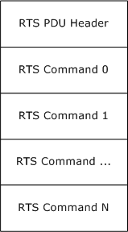
<!-- /Extracted images from page 41 -->

2.2.3.6  RTS PDU Structure

The RTS PDU MUST be composed of exactly one header and zero, one or more RTS commands
defined in section 2.2.3.5 in the RTS PDU body. The following diagram illustrates the structure.

Figure 12: RTS PDU structure

2.2.3.6.1 RTS PDU Header

The RTS PDU Header has the same layout as the common header of the connection-oriented RPC
PDU as specified in [C706] section 12.6.1, with a few additional requirements around the contents of
the header fields. The additional requirements are as follows:

  All fields MUST use little-endian byte order.















Fragmentation MUST NOT occur for an RTS PDU.

PFC_FIRST_FRAG and PFC_LAST_FRAG MUST be present in all RTS PDUs, and all other PFC flags
MUST NOT be present.

The rpc_vers and rpc_vers_minor fields MUST contain version information as described in [MS-
RPCE] section 1.7.

PTYPE MUST be set to a value of 20. This field differentiates RTS packets from other RPC packets.

The packed_drep MUST indicate little-endian integer and floating-pointer byte order, IEEE float-
point format representation, and ASCII character format as specified in [C706] section 12.6.

The auth_length MUST be set to 0.

The frag_length field MUST reflect the size of the header plus the size of all commands, including
the variable portion of variable-sized commands.

41 / 154

[MS-RPCH] - v20240729
Remote Procedure Call over HTTP Protocol
Copyright © 2024 Microsoft Corporation
Release: July 29, 2024



The call_id MUST be set to 0 by senders and MUST be 0 on receipt.

This protocol adds two more fields to the RTS PDU header that MUST be present immediately after the
common header. The following diagram specifies the header format.

0  1  2  3  4  5  6  7  8  9

1
0  1  2  3  4  5  6  7  8  9

2
0  1  2  3  4  5  6  7  8  9

3
0  1

rpc_vers

rpc_vers_minor

PTYPE

pfc_flags

packed_drep

frag_length

auth_length

call_id

Flags

NumberOfCommands

rpc_vers (1 byte): As specified in [C706] section 12.6.1, with additional requirements specified

earlier in this section.

rpc_vers_minor (1 byte): As specified in [C706] section 12.6.1, with additional requirements

specified earlier in this section.

PTYPE (1 byte): As specified in [C706] section 12.6.1, with additional requirements specified earlier

in this section.

pfc_flags (1 byte): As specified in [C706] section 12.6.1, with additional requirements specified

earlier in this section.

packed_drep (4 bytes): As specified in [C706] section 12.6.1, with additional requirements specified

earlier in this section. packed_drep takes the following form.

0  1  2  3  4  5  6  7  8  9

1
0  1  2  3  4  5  6  7  8  9

2
0  1  2  3  4  5  6  7  8  9

3
0  1

drep[0]

drep[1]

drep[2]

drep[3]

frag_length (2 bytes): As specified in [C706] section 12.6.1, with additional requirements specified

earlier in this section.

Value

Meaning

RTS_FLAG_NONE

No special flags.

0x0000

RTS_FLAG_PING

0x0001

Proves that the sender is still active; can also be used to flush the pipeline
by the other party.

RTS_FLAG_OTHER_CMD

0x0002

Indicates that the PDU contains a command that cannot be defined by the
other flags in this table.

RTS_FLAG_RECYCLE_CHANNEL

Indicates that the PDU is associated with recycling a channel.

0x0004

42 / 154

[MS-RPCH] - v20240729
Remote Procedure Call over HTTP Protocol
Copyright © 2024 Microsoft Corporation
Release: July 29, 2024

RTS_FLAG_IN_CHANNEL

Indicates that the PDU is associated with IN channel communications.

0x0008

RTS_FLAG_OUT_CHANNEL

Indicates that the PDU is associated with OUT channel communications.

0x0010

RTS_FLAG_EOF

0x0020

Indicates that this is the last PDU on an IN channel or OUT channel. Not
all channels, however, use this to indicate the last PDU.

RTS_FLAG_ECHO

Signifies that this PDU is an echo request or response.

0x0040

auth_length (2 bytes): As specified in [C706] section 12.6.1, with additional requirements specified

earlier in this section.

call_id (4 bytes): As specified in [C706] section 12.6.1, with additional requirements specified earlier

in this section.

Flags (2 bytes): MUST contain one or more of the following flags. The valid combination of flags for
each RTS PDU is defined in section 2.2.4 of this specification. The following table is meant to
define numeric values for each flag and as an aid in understanding this specification, and to
convey the general context in which a given flag is used. Precise definition on what flags MUST be
used for each RTS PDU can be obtained from the section for the respective RTS PDU in section
2.2.4. An implementation MUST NOT change the flags in the RTS PDU as defined in the respective
RTS PDU section within section 2.2.4.

NumberOfCommands (2 bytes): An implementation MUST set this field to be equal to the number

of commands in the RTS PDU body.

2.2.3.6.2 RTS PDU Body

The RTS PDU body MUST be composed of zero, one or more RTS commands. The first command
MUST be placed immediately after the RTS PDU header. Each subsequent command MUST be placed
immediately after the previous command without any padding or delimiters until all commands in the
PDU are placed. The order of commands in the RTS PDU body is significant from a protocol
perspective, and implementations MUST follow the rules about command ordering specified in section
2.2.4.

2.2.4  RTS PDUs

This protocol defines specific sequence of PDU commands that are combined into single PDUs. These
PDUs are referred to as RTS PDUs and form the basis of routing and control flow in RPC over HTTP
v2.

This section defines the syntax of the RTS PDUs using the common structure and command definitions
specified earlier in this section.

2.2.4.1  RTS PDUs Naming and Document Conventions

All definitions in this section share some common naming conventions. An RTS PDU can be one of
three types. It can be used by a single protocol sequence only; it can be used in more than one
protocol sequence; or it can be used outside a protocol sequence. If the RTS PDU is specific to a single
protocol sequence, the name of the PDU is created by using a strict convention that allows for an RTS
PDU to be associated quickly with its place in the protocol sequence. The name of the RTS PDU is not
reflected on the network and thus has no protocol significance other than making it easier to find and
understand information in this specification. The name of this type of RTS PDU follows the format
shown here.

43 / 154

[MS-RPCH] - v20240729
Remote Procedure Call over HTTP Protocol
Copyright © 2024 Microsoft Corporation
Release: July 29, 2024

 RTS-PDU-name = protocol-sequence-name "/" group-name group-order
 protocol-sequence-name = "CONN" / "IN_R1" / "IN_R2" / "OUT_R1" /
  "OUT_R2"
 group-name = "A" / "B" / "C"
 group-order = 1*(DIGIT)

The names of the protocol sequences are given in sections 3.2.1.5.3.1 through 3.2.1.5.3.5 of this
specification. The group-name is a group of PDUs within the protocol sequence, and the name and
meaning of the group is defined in the section for the respective protocol sequence. The group-order is
a number that starts at 1 and is incremented sequentially for each RTS PDU in the group. For
example, CONN/A1 is the first RTS PDU from group A from protocol sequence CONN.

If an RTS PDU is used in more than one protocol sequence or is used outside a protocol sequence, the
convention defined earlier is not used. Instead, the name of the PDU is descriptive of the meaning of
the PDU and is not associated in any way with the protocol sequences in which it is used.

As defined in section 2.2.3.6, an RTS PDU is composed of an RTS PDU header and one or more RTS
PDU commands.

RTS PDUs are uniquely identified by the combination of the following: the Flags field in the RTS
header, the number of commands, and the command types. However, there are only a small number
of RTS PDUs that are legal on each channel in each state, so while there are a large number of RTS
PDUs, a receiver only has to check a small number of possibilities when an RTS PDU is received on a
given channel in a given state. See the section on each RTS PDU under section 2.2.4 for the channel,
Flags field, number of commands, and the command types for that RTS PDU, and the section on
receiving each RTS PDU under section 3 for the states.

2.2.4.2  CONN/A1 RTS PDU

The CONN/A1 RTS PDU MUST be sent from the client to the outbound proxy on the OUT channel to
initiate the establishment of a virtual connection.

0  1  2  3  4  5  6  7  8  9

1
0  1  2  3  4  5  6  7  8  9

2
0  1  2  3  4  5  6  7  8  9

3
0  1

RTS Header (20 bytes)

...

...

Version

...

VirtualConnectionCookie (20 bytes)

...

...

OUTChannelCookie (20 bytes)

...

[MS-RPCH] - v20240729
Remote Procedure Call over HTTP Protocol
Copyright © 2024 Microsoft Corporation
Release: July 29, 2024

44 / 154

...

ReceiveWindowSize

...

RTS Header (20 bytes): See section 2.2.3.6.1. The Flags field of RTS Header MUST be the value of
RTS_FLAG_NONE. The NumberOfCommands field of the RTS Header MUST be the value 4.

Version (8 bytes): MUST be a Version command indicating the RPC over HTTP v2 protocol Version as

specified in section 2.2.3.5.7.

VirtualConnectionCookie (20 bytes): MUST be a Cookie command identifying the virtual

connection that is being established by this protocol sequence. The Cookie command format is
defined in section 2.2.3.5.4.

OUTChannelCookie (20 bytes): MUST be a Cookie command identifying the OUT channel that this

protocol sequence is trying to establish. The Cookie command format is defined in section
2.2.3.5.4.

ReceiveWindowSize (8 bytes): MUST be a ReceiveWindowSize command containing the size of the
ReceiveWindow for the client OUT channel. The ReceiveWindowSize command format is defined
in section 2.2.3.5.1

2.2.4.3  CONN/A2 RTS PDU

The CONN/A2 RTS PDU MUST be sent from the outbound proxy to the server on the OUT channel to
initiate the establishment of a virtual connection.

0  1  2  3  4  5  6  7  8  9

1
0  1  2  3  4  5  6  7  8  9

2
0  1  2  3  4  5  6  7  8  9

3
0  1

RTS Header (20 bytes)

...

...

Version

...

VirtualConnectionCookie (20 bytes)

...

...

OUTChannelCookie (20 bytes)

...

[MS-RPCH] - v20240729
Remote Procedure Call over HTTP Protocol
Copyright © 2024 Microsoft Corporation
Release: July 29, 2024

45 / 154

...

ChannelLifetime

...

ReceiveWindowSize

...

RTS Header (20 bytes): See section 2.2.3.6.1. The Flags field of the RTS Header MUST be the

value RTS_FLAG_OUT_CHANNEL. The NumberOfCommands field of the RTS Header MUST be
the value 5.

Version (8 bytes): MUST be a Version command containing the lower of the outbound proxy version
and the client version reported in the CONN/A1 RTS PDU. The format for the RPC over HTTP v2
protocol Version command is defined in section 2.2.3.5.7.

VirtualConnectionCookie (20 bytes): MUST be a Cookie command identifying the virtual

connection that this protocol sequence is trying to establish. The Cookie command format is
defined in section 2.2.3.5.4.

OUTChannelCookie (20 bytes): MUST be a Cookie command for the OUT channel that this protocol

sequence is trying to establish. The Cookie command format is defined in section 2.2.3.5.4.

ChannelLifetime (8 bytes): MUST be a ChannelLifetime command containing the lifetime, in bytes,
of the OUT channel from the outbound proxy to the client. The ChannelLifetime command format
is defined in section 2.2.3.5.5.

ReceiveWindowSize (8 bytes): MUST be a ReceiveWindowSize command containing the size of the
ReceiveWindow for the OUT channel to the proxy. The ReceiveWindowSize command format is
defined in section 2.2.3.5.1.

2.2.4.4  CONN/A3 RTS PDU

The CONN/A3 RTS PDU MUST be sent from the outbound proxy to the client on the OUT channel to
continue the establishment of the virtual connection.

0  1  2  3  4  5  6  7  8  9

1
0  1  2  3  4  5  6  7  8  9

2
0  1  2  3  4  5  6  7  8  9

3
0  1

RTS Header (20 bytes)

...

...

ConnectionTimeout

...

RTS Header (20 bytes): See section 2.2.3.6.1. The Flags field of the RTS Header MUST be the

value RTS_FLAG_NONE. The NumberOfCommands field of the RTS Header MUST be the value 1.

46 / 154

[MS-RPCH] - v20240729
Remote Procedure Call over HTTP Protocol
Copyright © 2024 Microsoft Corporation
Release: July 29, 2024

ConnectionTimeout (8 bytes): MUST be a ConnectionTimeout command containing the connection
time-out for the OUT channel between the outbound proxy and the client. The ConnectionTimeout
command format is defined in section 2.2.3.5.3.

2.2.4.5  CONN/B1 RTS PDU

The CONN/B1 RTS PDU MUST be sent from the client to the inbound proxy on the IN channel to
initiate the establishment of a virtual connection.

0  1  2  3  4  5  6  7  8  9

1
0  1  2  3  4  5  6  7  8  9

2
0  1  2  3  4  5  6  7  8  9

3
0  1

RTS Header (20 bytes)

...

...

Version

...

VirtualConnectionCookie (20 bytes)

...

...

INChannelCookie (20 bytes)

...

...

ChannelLifetime

...

ClientKeepalive

...

AssociationGroupId (20 bytes)

...

...

RTS Header (20 bytes): See section 2.2.3.6.1. The Flags field of the RTS Header MUST be the

value RTS_FLAG_NONE. The NumberOfCommands field of the RTS Header MUST be the value 6.

[MS-RPCH] - v20240729
Remote Procedure Call over HTTP Protocol
Copyright © 2024 Microsoft Corporation
Release: July 29, 2024

47 / 154

Version (8 bytes): MUST be a Version command containing the version of RPC over HTTP v2 that the

client supports, formatted as specified in section 2.2.3.5.7.

VirtualConnectionCookie (20 bytes): MUST be a Cookie command identifying the virtual

connection that this protocol sequence is trying to establish. The Cookie command format is
defined in section 2.2.3.5.4.

INChannelCookie (20 bytes): MUST be a Cookie command identifying the IN channel cookie that

this protocol sequence is trying to establish. The Cookie command format is defined in section
2.2.3.5.4.

ChannelLifetime (8 bytes): MUST be a ChannelLifetime command containing the lifetime in bytes of
the IN channel from the client to the inbound proxy. The ChannelLifetime command format is
defined in 2.2.3.5.5. This field is used for troubleshooting only and has no protocol significance.
Inbound proxies SHOULD ignore the value of this field.

ClientKeepalive (8 bytes): MUST be a ClientKeepalive command containing the keep-alive interval
that the client wants the inbound proxy to use on the IN channel between the inbound proxy and
the server. The ClientKeepalive command format is defined in section 2.2.3.5.6.

AssociationGroupId (20 bytes): MUST be an AssociationGroupId command containing the

association group ID for the client. The AssociationGroupId command format is defined in section
2.2.3.5.13.

2.2.4.6  CONN/B2 RTS PDU

The CONN/B2 RTS PDU MUST be sent from the inbound proxy to the server on the IN channel to
initiate the establishment of a virtual connection.

0  1  2  3  4  5  6  7  8  9

1
0  1  2  3  4  5  6  7  8  9

2
0  1  2  3  4  5  6  7  8  9

3
0  1

RTS Header (20 bytes)

...

...

Version

...

VirtualConnectionCookie (20 bytes)

...

...

INChannelCookie (20 bytes)

...

...

[MS-RPCH] - v20240729
Remote Procedure Call over HTTP Protocol
Copyright © 2024 Microsoft Corporation
Release: July 29, 2024

48 / 154

ReceiveWindowSize

...

ConnectionTimeout

...

AssociationGroupId (20 bytes)

...

...

ClientAddress (variable)

...

RTS Header (20 bytes): See section 2.2.3.6.1. The Flags field of the RTS Header MUST be the

value RTS_FLAG_IN_CHANNEL. The NumberOfCommands field of the RTS Header MUST be the
value 7.

Version (8 bytes): MUST be a Version command containing the lower of the inbound proxy version
and the client version reported in CONN/B1 RTS PDU. The format for the RPC over HTTP v2
protocol Version command is defined in section 2.2.3.5.7.

VirtualConnectionCookie (20 bytes): MUST be a Cookie command for the virtual connection this

protocol sequence is trying to establish. The Cookie command format is defined in section
2.2.3.5.4.

INChannelCookie (20 bytes): MUST be a Cookie command for the IN channel that this protocol
sequence is trying to establish. The Cookie command format is defined in section 2.2.3.5.4.

ReceiveWindowSize (8 bytes): MUST be a ReceiveWindowSize command containing the size of the
ReceiveWindow for the IN channel to the inbound proxy. The ReceiveWindowSize command
format is defined in section 2.2.3.5.1.

ConnectionTimeout (8 bytes): MUST be a ConnectionTimeout command containing the connection
time-out for the IN channel between the inbound proxy and the client. The ConnectionTimeout
command format is defined in section 2.2.3.5.3.

AssociationGroupId (20 bytes): MUST be an AssociationGroupId command containing the

association group ID for the client. The AssociationGroupId command format is defined in section
2.2.3.5.13.

ClientAddress (variable): MUST be a ClientAddress command containing the IP address of the client

as seen by the inbound proxy. The ClientAddress command format is defined in section
2.2.3.5.12.

2.2.4.7  CONN/B3 RTS PDU

The CONN/B3 RTS PDU MUST be sent from the server to the inbound proxy on the IN channel to
notify it that a virtual connection has been established.

[MS-RPCH] - v20240729
Remote Procedure Call over HTTP Protocol
Copyright © 2024 Microsoft Corporation
Release: July 29, 2024

49 / 154

0  1  2  3  4  5  6  7  8  9

1
0  1  2  3  4  5  6  7  8  9

2
0  1  2  3  4  5  6  7  8  9

3
0  1

RTS Header (20 bytes)

...

...

ReceiveWindowSize

...

Version

...

RTS Header (20 bytes): See section 2.2.3.6.1. The Flags field of the RTS Header MUST be the

value RTS_FLAG_NONE. The NumberOfCommands field of the RTS Header MUST be the value 2.

ReceiveWindowSize (8 bytes): MUST be a ReceiveWindowSize command containing the size of the

ReceiveWindow for the server IN channel. The ReceiveWindowSize command format is defined
in section 2.2.3.5.1.

Version (8 bytes): MUST be a Version command containing the lowest of the CONN/B2 RTS PDU
(section 2.2.4.6) version, the CONN/A2 RTS PDU (section 2.2.4.3) version, and the server RPC
over HTTP v2 version. The format for the RPC over HTTP v2 protocol Version command is defined
in section 2.2.3.5.7.

2.2.4.8  CONN/C1 RTS PDU

The CONN/C1 RTS PDU MUST be sent from the server to the outbound proxy on the OUT channel to
notify it that a virtual connection has been established.

0  1  2  3  4  5  6  7  8  9

1
0  1  2  3  4  5  6  7  8  9

2
0  1  2  3  4  5  6  7  8  9

3
0  1

RTS Header (20 bytes)

...

...

Version

...

ReceiveWindowSize

...

ConnectionTimeout

[MS-RPCH] - v20240729
Remote Procedure Call over HTTP Protocol
Copyright © 2024 Microsoft Corporation
Release: July 29, 2024

50 / 154

...

RTS Header (20 bytes): See section 2.2.3.6.1. The Flags field of the RTS Header MUST be the

value RTS_FLAG_NONE. The NumberOfCommands field of the RTS Header MUST be the value 3.

Version (8 bytes): MUST be a Version command containing the lowest of the CONN/B2 RTS PDU
(section 2.2.4.6) version, the CONN/A2 RTS PDU (section 2.2.4.3) version, and the server RPC
over HTTP v2 version. The format for the RPC over HTTP v2  protocol Version command is defined
in section 2.2.3.5.7.

ReceiveWindowSize (8 bytes): MUST be a ReceiveWindowSize command containing the size of the
ReceiveWindow for the IN channel to the inbound proxy. The ReceiveWindowSize command
format is defined in section 2.2.3.5.1.

ConnectionTimeout (8 bytes): MUST be a ConnectionTimeout command containing the connection
time-out for the IN channel between the inbound proxy and the client. The ConnectionTimeout
command format is defined in section 2.2.3.5.3.

2.2.4.9  CONN/C2 RTS PDU

The CONN/C2 RTS PDU MUST be sent from the outbound proxy to the client on the OUT channel to
notify it that a virtual connection has been established.

0  1  2  3  4  5  6  7  8  9

1
0  1  2  3  4  5  6  7  8  9

2
0  1  2  3  4  5  6  7  8  9

3
0  1

RTS Header (20 bytes)

...

...

Version

...

ReceiveWindowSize

...

ConnectionTimeout

...

RTS Header (20 bytes): See section 2.2.3.6.1. The Flags field of the RTS Header MUST be the

value RTS_FLAG_NONE. The NumberOfCommands field of the RTS Header MUST be the value 3.

Version (8 bytes): MUST be a Version command containing the CONN/C1 version. The format of the

RPC over HTTP v2 protocol Version command is defined in section 2.2.3.5.7.

ReceiveWindowSize (8 bytes): MUST be a ReceiveWindowSize command containing the size of the
ReceiveWindow for the IN channel to the inbound proxy. The ReceiveWindowSize command
format is defined in section 2.2.3.5.1.

51 / 154

[MS-RPCH] - v20240729
Remote Procedure Call over HTTP Protocol
Copyright © 2024 Microsoft Corporation
Release: July 29, 2024

ConnectionTimeout (8 bytes): MUST be a ConnectionTimeout command containing the connection
time-out for the IN channel between the inbound proxy and the client. The ConnectionTimeout
command format is defined in section 2.2.3.5.3.

2.2.4.10

IN_R1/A1 RTS PDU

The IN_R1/A1 RTS PDU MUST be sent from the client to the inbound proxy on a successor instance
of an IN channel to initiate the establishment of a successor IN channel.

0  1  2  3  4  5  6  7  8  9

1
0  1  2  3  4  5  6  7  8  9

2
0  1  2  3  4  5  6  7  8  9

3
0  1

RTS Header (20 bytes)

...

...

Version

...

VirtualConnectionCookie (20 bytes)

...

...

PredecessorChannelCookie (20 bytes)

...

...

SuccessorChannelCookie (20 bytes)

...

...

RTS Header (20 bytes): See section 2.2.3.6.1. The Flags field of the RTS Header MUST be the

value RTS_FLAG_RECYCLE_CHANNEL. The NumberOfCommands field of the RTS Header MUST
be the value 4.

Version (8 bytes): MUST be a Version command containing the client RPC over HTTP v2 protocol
version. The format of the RPC over HTTP v2 protocol Version command is defined in section
2.2.3.5.7.

VirtualConnectionCookie (20 bytes): MUST be a Cookie command for the virtual connection that

this IN channel belongs to. The Cookie command format is defined in section 2.2.3.5.4.

PredecessorChannelCookie (20 bytes): MUST be a Cookie command that is the cookie of the

predecessor IN channel. The Cookie command format is defined in section 2.2.3.5.4.

52 / 154

[MS-RPCH] - v20240729
Remote Procedure Call over HTTP Protocol
Copyright © 2024 Microsoft Corporation
Release: July 29, 2024

SuccessorChannelCookie (20 bytes): MUST be a Cookie command identifying the successor IN

channel. The Cookie command format is defined in section 2.2.3.5.4.

2.2.4.11

IN_R1/A2 RTS PDU

The IN_R1/A2 RTS PDU MUST be sent from the successor inbound proxy to the server on the IN
channel to initiate the establishment of a successor IN channel.

0  1  2  3  4  5  6  7  8  9

1
0  1  2  3  4  5  6  7  8  9

2
0  1  2  3  4  5  6  7  8  9

3
0  1

RTS Header (20 bytes)

...

...

Version

...

VirtualConnectionCookie (20 bytes)

...

...

PredecessorChannelCookie (20 bytes)

...

...

SuccessorChannelCookie (20 bytes)

...

...

InboundProxyReceiveWindowSize

...

InboundProxyConnectionTimeout

...

RTS Header (20 bytes): See section 2.2.3.6.1. The Flags field of the RTS Header MUST be the bit-
wise OR of the values "RTS_FLAG_IN_CHANNEL" and "RTS_FLAG_RECYCLE_CHANNEL". The
NumberOfCommands field of the RTS Header MUST be the value 6.

[MS-RPCH] - v20240729
Remote Procedure Call over HTTP Protocol
Copyright © 2024 Microsoft Corporation
Release: July 29, 2024

53 / 154

Version (8 bytes): MUST be a Version command containing the lower of the IN_R1/A1 version and

the inbound proxy version. The format of the RPC over HTTP v2 protocol Version command is
defined in section 2.2.3.5.7.

VirtualConnectionCookie (20 bytes): MUST be a Cookie command for the virtual connection this

IN channel belongs to. The Cookie command format is defined in section 2.2.3.5.4.

PredecessorChannelCookie (20 bytes): MUST be a Cookie command for the predecessor IN

channel. The Cookie command format is defined in section 2.2.3.5.4.

SuccessorChannelCookie (20 bytes): MUST be a Cookie command identifying the successor IN

channel. The Cookie command format is defined in section 2.2.3.5.4.

InboundProxyReceiveWindowSize (8 bytes): MUST be a ReceiveWindowSize command containing
the size of the ReceiveWindow for the IN channel to the inbound proxy. The ReceiveWindowSize
command format is defined in section 2.2.3.5.1.

InboundProxyConnectionTimeout (8 bytes): MUST be a ConnectionTimeout command specifying

the connection time-out for the IN channel between the successor inbound proxy and the client.
The ConnectionTimeout command format is defined in section 2.2.3.5.3.

2.2.4.12

IN_R1/A3 RTS PDU

The IN_R1/A3 RTS PDU MUST be sent from the server to the outbound proxy on the OUT channel to
continue the establishment of a successor IN channel.

0  1  2  3  4  5  6  7  8  9

1
0  1  2  3  4  5  6  7  8  9

2
0  1  2  3  4  5  6  7  8  9

3
0  1

RTS Header (20 bytes)

...

...

Destination

...

Version

...

InboundProxyReceiveWindowSize

...

InboundProxyConnectionTimeout

...

RTS Header (20 bytes): See section 2.2.3.6.1. The Flags field of the RTS Header MUST be the

value RTS_FLAG_NONE. The NumberOfCommands field of the RTS Header MUST be the value 4.

[MS-RPCH] - v20240729
Remote Procedure Call over HTTP Protocol
Copyright © 2024 Microsoft Corporation
Release: July 29, 2024

54 / 154

Destination (8 bytes): MUST be a Destination command. The Destination field for the Destination

command MUST be set to value FDClient as specified in section 2.2.3.3. The Destination command
format is defined in section 2.2.3.5.14.

Version (8 bytes): MUST be a Version command specifying the lower of the IN_R1/A2 and the server

version. The format of the RPC over HTTP v2 protocol Version command is defined in section
2.2.3.5.7.

InboundProxyReceiveWindowSize (8 bytes): MUST be a ReceiveWindowSize command specifying

the size of the ReceiveWindow for the successor IN channel to the inbound proxy. The
ReceiveWindowSize command format is defined in section 2.2.3.5.1.

InboundProxyConnectionTimeout (8 bytes): MUST be a ConnectionTimeout command specifying
the connection time-out for the IN channel between the successor inbound proxy and the
client. The ConnectionTimeout command format is defined in section 2.2.3.5.3.

2.2.4.13

IN_R1/A4 RTS PDU

The IN_R1/A4 RTS PDU MUST be sent from the outbound proxy to the client on the OUT channel to
continue the establishment of a successor IN channel as part of the IN_R1 protocol sequence.

0  1  2  3  4  5  6  7  8  9

1
0  1  2  3  4  5  6  7  8  9

2
0  1  2  3  4  5  6  7  8  9

3
0  1

RTS Header (20 bytes)

...

...

Destination

...

Version

...

InboundProxyReceiveWindowSize

...

InboundProxyConnectionTimeout

...

RTS Header (20 bytes): See section 2.2.3.6.1. The Flags field of the RTS Header MUST be the

value RTS_FLAG_NONE. The NumberOfCommands field of the RTS Header MUST be the value 4.

Destination (8 bytes): MUST be a Destination command. The Destination field for the Destination

command MUST be set to value FDClient as specified in section 2.2.3.3. The Destination command
format is defined in section 2.2.3.5.14.

[MS-RPCH] - v20240729
Remote Procedure Call over HTTP Protocol
Copyright © 2024 Microsoft Corporation
Release: July 29, 2024

55 / 154

Version (8 bytes): MUST be a Version command specifying the lower of the IN_R1/A2 version and
the server version. The format of the RPC over HTTP v2 protocol Version command is defined in
section 2.2.3.5.7.

InboundProxyReceiveWindowSize (8 bytes): MUST be a ReceiveWindowSize command specifying

the size of the ReceiveWindow for the IN channel to the inbound proxy. The
ReceiveWindowSize command format is defined in section 2.2.3.5.1.

InboundProxyConnectionTimeout (8 bytes): MUST be a ConnectionTimeout command specifying
the connection time-out for the IN channel between the successor inbound proxy and the
client. The ConnectionTimeout command format is defined in section 2.2.3.5.3.

2.2.4.14

IN_R1/A5 RTS PDU

The IN_R1/A5 RTS PDU MUST be sent from the client to the predecessor inbound proxy on the
predecessor instance of the IN channel to continue the establishment of a successor IN channel.

0  1  2  3  4  5  6  7  8  9

1
0  1  2  3  4  5  6  7  8  9

2
0  1  2  3  4  5  6  7  8  9

3
0  1

RTS Header (20 bytes)

...

...

SuccessorINChannelCookie (20 bytes)

...

...

RTS Header (20 bytes): See section 2.2.3.6.1. The Flags field of the RTS Header MUST be the

value RTS_FLAG_NONE. The NumberOfCommands field of the RTS Header MUST be the value 1.

SuccessorINChannelCookie (20 bytes): MUST be a Cookie command identifying the successor IN

channel cookie. The Cookie command format is defined in section 2.2.3.5.4.

2.2.4.15

IN_R1/A6 RTS PDU

The IN_R1/A6 RTS PDU MUST be sent from the predecessor inbound proxy to the server on the
predecessor instance of the IN channel to continue the establishment of a successor IN channel.

0  1  2  3  4  5  6  7  8  9

1
0  1  2  3  4  5  6  7  8  9

2
0  1  2  3  4  5  6  7  8  9

3
0  1

RTS Header (20 bytes)

...

...

SuccessorINChannelCookie (20 bytes)

[MS-RPCH] - v20240729
Remote Procedure Call over HTTP Protocol
Copyright © 2024 Microsoft Corporation
Release: July 29, 2024

56 / 154

...

...

RTS Header (20 bytes): See section 2.2.3.6.1. The Flags field of the RTS Header MUST be the

value RTS_FLAG_NONE. The NumberOfCommands field of the RTS Header MUST be the value 1.

SuccessorINChannelCookie (20 bytes): MUST be a Cookie command identifying the successor IN

channel cookie. The Cookie command format is defined in section 2.2.3.5.4.

2.2.4.16

IN_R1/B1 RTS PDU

The IN_R1/B1 RTS PDU MUST be sent from the predecessor inbound proxy to the server on the
predecessor instance of the IN channel to continue the establishment of a successor IN channel.

0  1  2  3  4  5  6  7  8  9

1
0  1  2  3  4  5  6  7  8  9

2
0  1  2  3  4  5  6  7  8  9

3
0  1

RTS Header (20 bytes)

...

...

Empty

RTS Header (20 bytes): See section 2.2.3.6.1. The Flags field of the RTS Header MUST be the

value RTS_FLAG_NONE. The NumberOfCommands field of the RTS Header MUST be the value 1.

Empty (4 bytes): MUST be an Empty command. The format of the Empty command is defined in

section 2.2.3.5.8.

2.2.4.17

IN_R1/B2 RTS PDU

The IN_R1/B2 RTS PDU MUST be sent from the server to the successor inbound proxy on the
successor IN channel to complete the establishment of a successor IN channel.

0  1  2  3  4  5  6  7  8  9

1
0  1  2  3  4  5  6  7  8  9

2
0  1  2  3  4  5  6  7  8  9

3
0  1

RTS Header (20 bytes)

...

...

ServerReceiveWindowSize

...

RTS Header (20 bytes): See section 2.2.3.6.1. The Flags field of the RTS Header MUST be the

value RTS_FLAG_NONE. The NumberOfCommands field of the RTS Header MUST be the value 1.

57 / 154

[MS-RPCH] - v20240729
Remote Procedure Call over HTTP Protocol
Copyright © 2024 Microsoft Corporation
Release: July 29, 2024

ServerReceiveWindowSize (8 bytes): MUST be a ReceiveWindowSize command specifying the
ReceiveWindow size of the server. The ReceiveWindowSize command format is defined in
section 2.2.3.5.1.

2.2.4.18

IN_R2/A1 RTS PDU

The IN_R2/A1 RTS PDU MUST be sent from the client to the inbound proxy on a successor IN
channel to initiate the establishment of a successor IN channel.

0  1  2  3  4  5  6  7  8  9

1
0  1  2  3  4  5  6  7  8  9

2
0  1  2  3  4  5  6  7  8  9

3
0  1

RTS Header (20 bytes)

...

...

Version

...

VirtualConnectionCookie (20 bytes)

...

...

PredecessorChannelCookie (20 bytes)

...

...

SuccessorChannelCookie (20 bytes)

...

...

RTS Header (20 bytes): See section 2.2.3.6.1. The Flags field of the RTS Header MUST be the

value RTS_FLAG_RECYCLE_CHANNEL. The NumberOfCommands field of the RTS Header MUST
be the value 4.

Version (8 bytes): MUST be a Version command specifying the client RPC over HTTP v2 protocol

version. The format of the RPC over HTTP v2 protocol Version command is defined in section
2.2.3.5.7.

VirtualConnectionCookie (20 bytes): MUST be a Cookie command that is the cookie of the virtual
connection to which this IN channel belongs. The Cookie command format is defined in section
2.2.3.5.4.

[MS-RPCH] - v20240729
Remote Procedure Call over HTTP Protocol
Copyright © 2024 Microsoft Corporation
Release: July 29, 2024

58 / 154

PredecessorChannelCookie (20 bytes): MUST be a Cookie command that is the cookie of the

predecessor IN channel. The Cookie command format is defined in section 2.2.3.5.4.

SuccessorChannelCookie (20 bytes): MUST be a Cookie command identifying the successor IN

channel cookie. The Cookie command format is defined in section 2.2.3.5.4.

2.2.4.19

IN_R2/A2 RTS PDU

The IN_R2/A2 RTS PDU MUST be sent from the inbound proxy to the server on the IN channel to
continue the establishment of a successor IN channel.

0  1  2  3  4  5  6  7  8  9

1
0  1  2  3  4  5  6  7  8  9

2
0  1  2  3  4  5  6  7  8  9

3
0  1

RTS Header (20 bytes)

...

...

SuccessorChannelCookie (20 bytes)

...

...

RTS Header (20 bytes): See section 2.2.3.6.1. The Flags field of the RTS Header MUST be the

value RTS_FLAG_NONE. The NumberOfCommands field of the RTS Header MUST be the value 1.

SuccessorChannelCookie (20 bytes): MUST be a Cookie command identifying the successor IN

channel cookie. The Cookie command format is defined in section 2.2.3.5.4.

2.2.4.20

IN_R2/A3 RTS PDU

The IN_R2/A3 RTS PDU MUST be sent from the server to the outbound proxy on the OUT channel to
continue the establishment of a successor IN channel.

0  1  2  3  4  5  6  7  8  9

1
0  1  2  3  4  5  6  7  8  9

2
0  1  2  3  4  5  6  7  8  9

3
0  1

RTS Header (20 bytes)

...

...

Destination

...

RTS Header (20 bytes): See section 2.2.3.6.1. The Flags field of the RTS Header MUST be the

value RTS_FLAG_NONE. The NumberOfCommands field of the RTS Header MUST be the value 1.

[MS-RPCH] - v20240729
Remote Procedure Call over HTTP Protocol
Copyright © 2024 Microsoft Corporation
Release: July 29, 2024

59 / 154

Destination (8 bytes): MUST be a Destination command. The Destination field for the Destination

command MUST be set to value FDClient as specified in section 2.2.3.3. The Destination command
format is defined in section 2.2.3.5.14.

2.2.4.21

IN_R2/A4 RTS PDU

The IN_R2/A4 RTS PDU MUST be sent from the outbound proxy to the client on the OUT channel to
continue the establishment of a successor IN channel.

0  1  2  3  4  5  6  7  8  9

1
0  1  2  3  4  5  6  7  8  9

2
0  1  2  3  4  5  6  7  8  9

3
0  1

RTS Header (20 bytes)

...

...

Destination

...

RTS Header (20 bytes): See section 2.2.3.6.1. The Flags field of the RTS Header MUST be the

value RTS_FLAG_NONE. The NumberOfCommands field of the RTS Header MUST be the value 1.

Destination (8 bytes): MUST be a Destination command. The Destination field for the Destination

command MUST be set to value FDClient as specified in section 2.2.3.3. The Destination command
format is defined in section 2.2.3.5.14.

2.2.4.22

IN_R2/A5 RTS PDU

The IN_R2/A5 RTS PDU MUST be sent from the client to the inbound proxy on the predecessor
instance of the IN channel to continue the establishment of a successor IN channel.

0  1  2  3  4  5  6  7  8  9

1
0  1  2  3  4  5  6  7  8  9

2
0  1  2  3  4  5  6  7  8  9

3
0  1

RTS Header (20 bytes)

...

...

SuccessorChannelCookie (20 bytes)

...

...

RTS Header (20 bytes): See section 2.2.3.6.1. The Flags field of the RTS Header MUST be the

value RTS_FLAG_NONE. The NumberOfCommands field of the RTS Header MUST be the value 1.

[MS-RPCH] - v20240729
Remote Procedure Call over HTTP Protocol
Copyright © 2024 Microsoft Corporation
Release: July 29, 2024

60 / 154

SuccessorChannelCookie (20 bytes): MUST be a Cookie command identifying the successor IN

channel cookie. The Cookie command format is defined in section 2.2.3.5.4.

2.2.4.23

OUT_R1/A1 RTS PDU

The OUT_R1/A1 RTS PDU MUST be sent from the server to the outbound proxy on the OUT channel to
initiate the establishment of a successor OUT channel.

0  1  2  3  4  5  6  7  8  9

1
0  1  2  3  4  5  6  7  8  9

2
0  1  2  3  4  5  6  7  8  9

3
0  1

RTS Header (20 bytes)

...

...

Destination

...

RTS Header (20 bytes): See section 2.2.3.6.1. The Flags field of the RTS Header MUST be the

value RTS_FLAG_RECYCLE_CHANNEL. The NumberOfCommands field of the RTS Header MUST
be the value 1.

Destination (8 bytes):  MUST be a Destination command. The Destination field for the Destination
command MUST be set to the value FDClient as specified in section 2.2.3.3. The Destination
command format is defined in section 2.2.3.5.14.

2.2.4.24

OUT_R1/A2 RTS PDU

The OUT_R1/A2 RTS PDU MUST be sent from the outbound proxy to the client on the OUT channel to
initiate the establishment of a successor OUT channel.

0  1  2  3  4  5  6  7  8  9

1
0  1  2  3  4  5  6  7  8  9

2
0  1  2  3  4  5  6  7  8  9

3
0  1

RTS Header (20 bytes)

...

...

Destination

...

RTS Header (20 bytes): See section 2.2.3.6.1. The Flags field of the RTS Header MUST be the

value RTS_FLAG_RECYCLE_CHANNEL. The NumberOfCommands field of the RTS Header MUST
be the value 1.

Destination (8 bytes): MUST be a Destination command. The Destination field for the Destination
command MUST be set to the value FDClient as specified in section 2.2.3.3. The Destination
command format is defined in section 2.2.3.5.14.

61 / 154

[MS-RPCH] - v20240729
Remote Procedure Call over HTTP Protocol
Copyright © 2024 Microsoft Corporation
Release: July 29, 2024

2.2.4.25

OUT_R1/A3 RTS PDU

The OUT_R1/A3 RTS PDU MUST be sent from the client to the successor outbound proxy on the
successor OUT channel to initiate the establishment of a successor OUT channel.

0  1  2  3  4  5  6  7  8  9

1
0  1  2  3  4  5  6  7  8  9

2
0  1  2  3  4  5  6  7  8  9

3
0  1

RTS Header (20 bytes)

...

...

Version

...

VirtualConnectionCookie (20 bytes)

...

...

PredecessorChannelCookie (20 bytes)

...

...

SuccessorChannelCookie (20 bytes)

...

...

OutboundProxyReceiveWindowSize

...

RTS Header (20 bytes): See section 2.2.3.6.1. The Flags field of the RTS Header MUST be the

value RTS_FLAG_RECYCLE_CHANNEL. The NumberOfCommands field of the RTS Header MUST
be the value 5.

Version (8 bytes):  MUST be a Version command specifying the client RPC over HTTP v2 protocol
version. The format of the RPC over HTTP v2 protocol Version command is defined in section
2.2.3.5.7.

VirtualConnectionCookie (20 bytes):  MUST be a Cookie command that is the cookie of the virtual
connection that this OUT channel belongs to. The Cookie command format is defined in section
2.2.3.5.4.

[MS-RPCH] - v20240729
Remote Procedure Call over HTTP Protocol
Copyright © 2024 Microsoft Corporation
Release: July 29, 2024

62 / 154

PredecessorChannelCookie (20 bytes):  MUST be a Cookie command that is the cookie of the
predecessor OUT channel. The Cookie command format is defined in section 2.2.3.5.4.

SuccessorChannelCookie (20 bytes):  MUST be a Cookie command identifying the successor OUT

channel cookie. The Cookie command format is defined in section 2.2.3.5.4.

OutboundProxyReceiveWindowSize (8 bytes):  MUST be a ReceiveWindowSize command

specifying the size of the ReceiveWindow for the client OUT channel. The ReceiveWindowSize
command format is defined in section 2.2.3.5.1.

2.2.4.26

OUT_R1/A4 RTS PDU

The OUT_R1/A4 RTS PDU MUST be sent from the successor outbound proxy to the server on the
OUT channel to initiate the establishment of a successor OUT channel.

0  1  2  3  4  5  6  7  8  9

1
0  1  2  3  4  5  6  7  8  9

2
0  1  2  3  4  5  6  7  8  9

3
0  1

RTS Header (20 bytes)

...

...

Version

...

VirtualConnectionCookie (20 bytes)

...

...

PredecessorChannelCookie (20 bytes)

...

...

SuccessorChannelCookie (20 bytes)

...

...

ChannelLifetime

...

OutboundProxyReceiveWindowSize

[MS-RPCH] - v20240729
Remote Procedure Call over HTTP Protocol
Copyright © 2024 Microsoft Corporation
Release: July 29, 2024

63 / 154

...

OutboundProxyConnectionTimeout

...

RTS Header (20 bytes): See section 2.2.3.6.1. The Flags field of the RTS Header MUST be the bit-

wise OR of the values "RTS_FLAG_RECYCLE_CHANNEL" and "RTS_FLAG_OUT_CHANNEL".  The
NumberOfCommands field of the RTS Header MUST be the value 7.

Version (8 bytes):  MUST be a Version command specifying the lower of the outbound proxy RPC

over HTTP v2 protocol version and OUT_R1/A3 protocol version. The format of the RPC over HTTP
v2 protocol Version command is defined in section 2.2.3.5.7.

VirtualConnectionCookie (20 bytes):  MUST be a Cookie command that is the cookie of the virtual
connection that this OUT channel belongs to. The Cookie command format is defined in section
2.2.3.5.4.

PredecessorChannelCookie (20 bytes):  MUST be a Cookie command that is the cookie of the

predecessor OUT channel. The Cookie command format is defined in section 2.2.3.5.4.

SuccessorChannelCookie (20 bytes):  MUST be a Cookie command identifying the successor OUT

channel cookie. The Cookie command format is defined in section 2.2.3.5.4.

ChannelLifetime (8 bytes): MUST be a ChannelLifetime command specifying the lifetime in bytes of

the OUT channel from the outbound proxy to the client. The ChannelLifetime command format is
defined in section 2.2.3.5.5.

OutboundProxyReceiveWindowSize (8 bytes):  MUST be a ReceiveWindowSize command

specifying the size of the ReceiveWindow for the successor OUT channel to the outbound proxy.
The ReceiveWindowSize command format is defined in section 2.2.3.5.1.

OutboundProxyConnectionTimeout (8 bytes):  MUST be a ConnectionTimeout command

specifying the connection time-out for the OUT channel between the successor outbound proxy
and the client. The ConnectionTimeout command format is defined in section 2.2.3.5.3. This
command is for troubleshooting purposes only and has no protocol significance. The server
SHOULD ignore this value.

2.2.4.27

OUT_R1/A5 RTS PDU

The OUT_R1/A5 RTS PDU MUST be sent from the server to the predecessor outbound proxy on the
predecessor instance of the OUT channel to continue the establishment of a successor OUT channel.

0  1  2  3  4  5  6  7  8  9

1
0  1  2  3  4  5  6  7  8  9

2
0  1  2  3  4  5  6  7  8  9

3
0  1

RTS Header (20 bytes)

...

...

Destination

...

[MS-RPCH] - v20240729
Remote Procedure Call over HTTP Protocol
Copyright © 2024 Microsoft Corporation
Release: July 29, 2024

64 / 154

Version

...

OutboundProxyConnectionTimeout

...

RTS Header (20 bytes): See section 2.2.3.6.1. The Flags field of the RTS Header MUST be the

value RTS_FLAG_OUT_CHANNEL. The NumberOfCommands field of the RTS Header MUST be
the value 3.

Destination (8 bytes):  MUST be a Destination command. The Destination field for the Destination
command MUST be set to the value FDClient as specified in section 2.2.3.3. The Destination
command format is defined in section 2.2.3.5.14.

Version (8 bytes):  MUST be a Version command specifying the lower of the server RPC over HTTP

v2 protocol version and OUT_R1/A4 version. The format of the RPC over HTTP v2 protocol Version
command is defined in section 2.2.3.5.7.

OutboundProxyConnectionTimeout (8 bytes):  MUST be a ConnectionTimeout command

specifying the connection time-out for the OUT channel between the successor outbound proxy
and the client. The ConnectionTimeout command format is defined in section 2.2.3.5.3. This
command is used for troubleshooting purposes only and has no protocol significance. The
predecessor outbound proxy SHOULD ignore this value.

2.2.4.28

OUT_R1/A6 RTS PDU

The OUT_R1/A6 RTS PDU MUST be sent from the predecessor outbound proxy to the client on the
OUT channel to continue the establishment of a successor OUT channel.

0  1  2  3  4  5  6  7  8  9

1
0  1  2  3  4  5  6  7  8  9

2
0  1  2  3  4  5  6  7  8  9

3
0  1

RTS Header (20 bytes)

...

...

Destination

...

Version

...

OutboundProxyConnectionTimeout

...

[MS-RPCH] - v20240729
Remote Procedure Call over HTTP Protocol
Copyright © 2024 Microsoft Corporation
Release: July 29, 2024

65 / 154

RTS Header (20 bytes): See section 2.2.3.6.1. The Flags field of the RTS Header MUST be the

value RTS_FLAG_OUT_CHANNEL. The NumberOfCommands field of the RTS Header MUST be
the value 3.

Destination (8 bytes):  MUST be a Destination command. The Destination field of the Destination

command MUST be set to value FDClient as specified in section 2.2.3.3. The Destination command
format is defined in section 2.2.3.5.14.

Version (8 bytes):  MUST be a Version command specifying the lower of the server RPC over HTTP

v2 Protocol version and OUT_R1/A4 version. The format of the RPC over HTTP v2 protocol Version
command is defined in section 2.2.3.5.7.

OutboundProxyConnectionTimeout (8 bytes):  MUST be a ConnectionTimeout command

specifying the connection time-out for the OUT channel between the successor outbound proxy
and the client. The ConnectionTimeout command format is defined in section 2.2.3.5.3. This
command is useful for troubleshooting purposes only and has no protocol significance. The client
SHOULD ignore this value.

2.2.4.29

OUT_R1/A7 RTS PDU

The OUT_R1/A7 RTS PDU MUST be sent from the client to the inbound proxy on the IN channel to
continue the establishment of a successor OUT channel as part of the OUT_R1 protocol sequence
specified in section 3.2.1.5.3.4.

0  1  2  3  4  5  6  7  8  9

1
0  1  2  3  4  5  6  7  8  9

2
0  1  2  3  4  5  6  7  8  9

3
0  1

RTS Header (20 bytes)

...

...

Destination

...

SuccessorChannelCookie (20 bytes)

...

...

RTS Header (20 bytes): See section 2.2.3.6.1. The Flags field of the RTS Header MUST be the

value RTS_FLAG_OUT_CHANNEL. The NumberOfCommands field of the RTS Header MUST be
the value 2.

Destination (8 bytes):  MUST be a Destination command. The Destination field for the Destination
command MUST be set to the value FDServer, as specified in section 2.2.3.3. The Destination
command format is defined in section 2.2.3.5.14.

SuccessorChannelCookie (20 bytes):  MUST be a Cookie command identifying the successor OUT

channel cookie. The Cookie command format is defined in section 2.2.3.5.4.

[MS-RPCH] - v20240729
Remote Procedure Call over HTTP Protocol
Copyright © 2024 Microsoft Corporation
Release: July 29, 2024

66 / 154

2.2.4.30

OUT_R1/A8 RTS PDU

The OUT_R1/A8 RTS PDU MUST be sent from the inbound proxy to the server on the IN channel to
continue the establishment of a successor OUT channel.

0  1  2  3  4  5  6  7  8  9

1
0  1  2  3  4  5  6  7  8  9

2
0  1  2  3  4  5  6  7  8  9

3
0  1

RTS Header (20 bytes)

...

...

Destination

...

SuccessorChannelCookie (20 bytes)

...

...

RTS Header (20 bytes): See section 2.2.3.6.1. The Flags field of the RTS Header MUST be the

value RTS_FLAG_OUT_CHANNEL. The NumberOfCommands field of the RTS Header MUST be
the value 2.

Destination (8 bytes):  MUST be a Destination command. The Destination field for the Destination
command MUST be set to the value FDServer, as specified in section 2.2.3.3. The Destination
command format is defined in section 2.2.3.5.14.

SuccessorChannelCookie (20 bytes):  MUST be a Cookie command identifying the successor OUT

channel cookie. The Cookie command format is defined in section 2.2.3.5.4.

2.2.4.31

OUT_R1/A9 RTS PDU

The OUT_R1/A9 RTS PDU MUST be sent from the server to the predecessor outbound proxy to
indicate to it that the successor virtual OUT channel was established successfully.

0  1  2  3  4  5  6  7  8  9

1
0  1  2  3  4  5  6  7  8  9

2
0  1  2  3  4  5  6  7  8  9

3
0  1

RTS Header (20 bytes)

...

...

ANCE

RTS Header (20 bytes): See section 2.2.3.6.1. The Flags field of the RTS Header MUST be the

value RTS_FLAG_NONE. The NumberOfCommands field of the RTS Header MUST be the value 1.

67 / 154

[MS-RPCH] - v20240729
Remote Procedure Call over HTTP Protocol
Copyright © 2024 Microsoft Corporation
Release: July 29, 2024

ANCE (4 bytes):  MUST be an ANCE command. The format of the ANCE command is defined in

section 2.2.3.5.11.

2.2.4.32

OUT_R1/A10 RTS PDU

The OUT_R1/A10 RTS PDU MUST be sent from the predecessor outbound proxy to the client to
indicate that the successor virtual OUT channel was established successfully.

0  1  2  3  4  5  6  7  8  9

1
0  1  2  3  4  5  6  7  8  9

2
0  1  2  3  4  5  6  7  8  9

3
0  1

RTS Header (20 bytes)

...

...

ANCE

RTS Header (20 bytes): See section 2.2.3.6.1. The Flags field of the RTS Header MUST be the

value RTS_FLAG_NONE. The NumberOfCommands field of the RTS Header MUST be the value 1.

ANCE (4 bytes):  MUST be an ANCE command. The format of the ANCE command is defined in

section 2.2.3.5.11.

2.2.4.33

OUT_R1/A11 RTS PDU

The OUT_R1/A11 RTS PDU MUST be sent from the client to the successor outbound proxy to
indicate to it that the successor virtual OUT channel was established successfully.

0  1  2  3  4  5  6  7  8  9

1
0  1  2  3  4  5  6  7  8  9

2
0  1  2  3  4  5  6  7  8  9

3
0  1

RTS Header (20 bytes)

...

...

ANCE

RTS Header (20 bytes): See section 2.2.3.6.1. The Flags field of the RTS Header MUST be the

value RTS_FLAG_NONE. The NumberOfCommands field of the RTS Header MUST be the value 1.

ANCE (4 bytes):  MUST be an ANCE command. The format of the ANCE command is defined in

section 2.2.3.5.11.

2.2.4.34

OUT_R2/A1 RTS PDU

The OUT_R2/A1 RTS PDU MUST be sent from the server to the outbound proxy on the OUT channel to
initiate the establishment of a successor OUT channel.

[MS-RPCH] - v20240729
Remote Procedure Call over HTTP Protocol
Copyright © 2024 Microsoft Corporation
Release: July 29, 2024

68 / 154

0  1  2  3  4  5  6  7  8  9

1
0  1  2  3  4  5  6  7  8  9

2
0  1  2  3  4  5  6  7  8  9

3
0  1

RTS Header (20 bytes)

...

...

Destination

...

RTS Header (20 bytes): See section 2.2.3.6.1. The Flags field of the RTS Header MUST be the

value RTS_FLAG_RECYCLE_CHANNEL. The NumberOfCommands field of the RTS Header MUST
be the value 1.

Destination (8 bytes):  MUST be a Destination command. The Destination field for the Destination
command MUST be set to the value FDClient as specified in section 2.2.3.3. The Destination
command format is defined in section 2.2.3.5.14.

2.2.4.35

OUT_R2/A2 RTS PDU

The OUT_R2/A2 RTS PDU MUST be sent from the outbound proxy to the client on the OUT channel to
initiate the establishment of a successor OUT channel.

0  1  2  3  4  5  6  7  8  9

1
0  1  2  3  4  5  6  7  8  9

2
0  1  2  3  4  5  6  7  8  9

3
0  1

RTS Header (20 bytes)

...

...

Destination

...

RTS Header (20 bytes): See section 2.2.3.6.1. The Flags field of the RTS Header MUST be the

value RTS_FLAG_RECYCLE_CHANNEL. The NumberOfCommands field of the RTS Header MUST
be the value 1.

Destination (8 bytes): MUST be a Destination command. The Destination field for the Destination
command MUST be set to the value FDClient as specified in section 2.2.3.3. The Destination
command format is defined in section 2.2.3.5.14.

2.2.4.36

OUT_R2/A3 RTS PDU

The OUT_R2/A3 RTS PDU MUST be sent from the client to the successor outbound proxy on the
successor OUT channel to continue initiating the establishment of a successor OUT channel.

[MS-RPCH] - v20240729
Remote Procedure Call over HTTP Protocol
Copyright © 2024 Microsoft Corporation
Release: July 29, 2024

69 / 154

0  1  2  3  4  5  6  7  8  9

1
0  1  2  3  4  5  6  7  8  9

2
0  1  2  3  4  5  6  7  8  9

3
0  1

RTS Header (20 bytes)

...

...

Version

...

VirtualConnectionCookie (20 bytes)

...

...

PredecessorChannelCookie (20 bytes)

...

...

SuccessorChannelCookie (20 bytes)

...

...

ClientReceiveWindowSize

...

RTS Header (20 bytes): See section 2.2.3.6.1. The Flags field of the RTS Header MUST be the

value RTS_FLAG_RECYCLE_CHANNEL. The NumberOfCommands field of the RTS Header MUST
be the value 5.

Version (8 bytes):  MUST be a Version command specifying the client RPC over HTTP v2 protocol
version. The format of the RPC over HTTP v2 protocol Version command is defined in section
2.2.3.5.7.

VirtualConnectionCookie (20 bytes):  MUST be a Cookie command that contains the cookie of the

virtual connection that this OUT channel belongs to. The Cookie command format is defined in
section 2.2.3.5.4.

PredecessorChannelCookie (20 bytes):  MUST be a Cookie command that contains the cookie of
the predecessor OUT channel. The Cookie command format is defined in section 2.2.3.5.4.

SuccessorChannelCookie (20 bytes):  MUST be a Cookie command identifying the successor OUT

channel cookie. The Cookie command format is defined in section 2.2.3.5.4.

[MS-RPCH] - v20240729
Remote Procedure Call over HTTP Protocol
Copyright © 2024 Microsoft Corporation
Release: July 29, 2024

70 / 154

ClientReceiveWindowSize (8 bytes):  MUST be a ReceiveWindowSize command specifying the size
of the ReceiveWindow for the client OUT channel. The ReceiveWindowSize command format is
defined in section 2.2.3.5.1.

2.2.4.37

OUT_R2/A4 RTS PDU

The OUT_R2/A4 RTS PDU MUST be sent from the outbound proxy to the server on the OUT channel to
continue the establishment of a successor OUT channel.

0  1  2  3  4  5  6  7  8  9

1
0  1  2  3  4  5  6  7  8  9

2
0  1  2  3  4  5  6  7  8  9

3
0  1

RTS Header (20 bytes)

...

...

SuccessorChannelCookie (20 bytes)

...

...

RTS Header (20 bytes): See section 2.2.3.6.1. The Flags field of the RTS Header MUST be the

value RTS_FLAG_NONE. The NumberOfCommands field of the RTS Header MUST be the value 1.

SuccessorChannelCookie (20 bytes):  MUST be a Cookie command identifying the successor OUT

channel cookie. The Cookie command format is defined in section 2.2.3.5.4.

2.2.4.38

OUT_R2/A5 RTS PDU

The OUT_R2/A5 RTS PDU MUST be sent from the server to the outbound proxy to indicate to it that
the successor virtual OUT channel was established successfully.

0  1  2  3  4  5  6  7  8  9

1
0  1  2  3  4  5  6  7  8  9

2
0  1  2  3  4  5  6  7  8  9

3
0  1

RTS Header (20 bytes)

...

...

Destination

...

ANCE

RTS Header (20 bytes): See section 2.2.3.6.1. The Flags field of the RTS Header MUST be the

value RTS_FLAG_NONE. The NumberOfCommands field of the RTS Header MUST be the value 2.

71 / 154

[MS-RPCH] - v20240729
Remote Procedure Call over HTTP Protocol
Copyright © 2024 Microsoft Corporation
Release: July 29, 2024

Destination (8 bytes):  MUST be a Destination command. The Destination field for the Destination
command MUST be set to the value FDClient, as specified in section 2.2.3.3. The Destination
command format is defined in section 2.2.3.5.14.

ANCE (4 bytes):  MUST be an ANCE command. The format of the ANCE command is defined in

section 2.2.3.5.11.

2.2.4.39

OUT_R2/A6 RTS PDU

The OUT_R2/A6 RTS PDU MUST be forwarded by the outbound proxy to the client as requested in the
Destination field. It serves the same purpose as OUT_R2/A5.

0  1  2  3  4  5  6  7  8  9

1
0  1  2  3  4  5  6  7  8  9

2
0  1  2  3  4  5  6  7  8  9

3
0  1

RTS Header (20 bytes)

...

...

Destination

...

ANCE

RTS Header (20 bytes): See section 2.2.3.6.1. The Flags field of the RTS Header MUST be the

value RTS_FLAG_NONE. The NumberOfCommands field of the RTS Header MUST be the value 2.

Destination (8 bytes):  MUST be a Destination command. The Destination field for the Destination
command MUST be set to the value FDClient, as specified in section 2.2.3.3. The Destination
command format is defined in section 2.2.3.5.14.

ANCE (4 bytes):  MUST be an ANCE command. The format of the ANCE command is defined in

section 2.2.3.5.11.

2.2.4.40

OUT_R2/A7 RTS PDU

The OUT_R2/A7 RTS PDU MUST be sent from the client to the inbound proxy on the IN channel to
continue the establishment of a successor OUT channel.

0  1  2  3  4  5  6  7  8  9

1
0  1  2  3  4  5  6  7  8  9

2
0  1  2  3  4  5  6  7  8  9

3
0  1

RTS Header (20 bytes)

...

...

Destination

[MS-RPCH] - v20240729
Remote Procedure Call over HTTP Protocol
Copyright © 2024 Microsoft Corporation
Release: July 29, 2024

72 / 154

...

SuccessorChannelCookie (20 bytes)

...

...

Version

...

RTS Header (20 bytes): See section 2.2.3.6.1. The Flags field of the RTS Header MUST be the

value RTS_FLAG_OUT_CHANNEL. The NumberOfCommands field of the RTS Header MUST be
the value 3.

Destination (8 bytes): MUST be a Destination command. The Destination field for the Destination
command MUST be set to the value FDServer, as specified in section 2.2.3.3. The Destination
command format is defined in section 2.2.3.5.14.

SuccessorChannelCookie (20 bytes):  MUST be a Cookie command identifying the successor OUT

channel cookie. The Cookie command format is defined in section 2.2.3.5.4.

Version (8 bytes): MUST be a Version command indicating the RPC over HTTP v2 protocol version as

specified in section 2.2.3.5.7.

2.2.4.41

OUT_R2/A8 RTS PDU

The OUT_R2/A8 RTS PDU MUST be sent from the inbound proxy to the server on the IN channel to
continue the establishment of a successor OUT channel.

0  1  2  3  4  5  6  7  8  9

1
0  1  2  3  4  5  6  7  8  9

2
0  1  2  3  4  5  6  7  8  9

3
0  1

RTS Header (20 bytes)

...

...

Destination

...

SuccessorChannelCookie (20 bytes)

...

...

[MS-RPCH] - v20240729
Remote Procedure Call over HTTP Protocol
Copyright © 2024 Microsoft Corporation
Release: July 29, 2024

73 / 154

RTS Header (20 bytes): See section 2.2.3.6.1. The Flags field of the RTS Header MUST be the

value RTS_FLAG_OUT_CHANNEL. The NumberOfCommands field of the RTS Header MUST be
the value 2.

Destination (8 bytes):  MUST be a Destination command. The Destination field for the Destination
command MUST be set to the value FDServer, as specified in section 2.2.3.3. The Destination
command format is defined in section 2.2.3.5.14.

SuccessorChannelCookie (20 bytes):  MUST be a Cookie command identifying the successor OUT

channel cookie. The Cookie command format is defined in section 2.2.3.5.4.

2.2.4.42

OUT_R2/B1 RTS PDU

The OUT_R2/B1 RTS PDU MUST be sent from the server to the outbound proxy to indicate to it that
the successor virtual OUT channel was established successfully.

0  1  2  3  4  5  6  7  8  9

1
0  1  2  3  4  5  6  7  8  9

2
0  1  2  3  4  5  6  7  8  9

3
0  1

RTS Header (20 bytes)

...

...

ANCE

RTS Header (20 bytes): See section 2.2.3.6.1. The Flags field of the RTS Header MUST be the

value RTS_FLAG_NONE. The NumberOfCommands field of the RTS Header MUST be the value 1.

ANCE (4 bytes):  MUST be an ANCE command. The format of the ANCE command is defined in

section 2.2.3.5.11.

2.2.4.43

OUT_R2/B2 RTS PDU

The OUT_R2/B2 RTS PDU MUST be sent from the server to the outbound proxy to indicate to it that
the successor virtual OUT channel was not established successfully.

0  1  2  3  4  5  6  7  8  9

1
0  1  2  3  4  5  6  7  8  9

2
0  1  2  3  4  5  6  7  8  9

3
0  1

RTS Header (20 bytes)

...

...

NANCE

RTS Header (20 bytes): See section 2.2.3.6.1. The Flags field of the RTS Header MUST be the

value RTS_FLAG_NONE. The NumberOfCommands field of the RTS Header MUST be the value 1.

NANCE (4 bytes):  MUST be a NegativeANCE command. The format of the NegativeANCE command

is defined in section 2.2.3.5.10.

74 / 154

[MS-RPCH] - v20240729
Remote Procedure Call over HTTP Protocol
Copyright © 2024 Microsoft Corporation
Release: July 29, 2024

2.2.4.44

OUT_R2/B3 RTS PDU

The OUT_R2/B3 RTS PDU MUST be sent from the outbound proxy to the client to indicate to it that the
successor virtual OUT channel was established successfully.

0  1  2  3  4  5  6  7  8  9

1
0  1  2  3  4  5  6  7  8  9

2
0  1  2  3  4  5  6  7  8  9

3
0  1

RTS Header (20 bytes)

...

...

ANCE

RTS Header (20 bytes): See section 2.2.3.6.1. The Flags field of the RTS Header MUST be the

value RTS_FLAG_EOF. The NumberOfCommands field of the RTS Header MUST be the value 1.

ANCE (4 bytes):  MUST be an ANCE command. The format of the ANCE command is defined in

section 2.2.3.5.11.

2.2.4.45

OUT_R2/C1 RTS PDU

The OUT_R2/C1 RTS PDU MUST be sent from the client to the outbound proxy as part of the OUT_R2
protocol sequence to fill up the predeclared content length for the OUT channel HTTP request defined
in section 2.1.2.1.2.

0  1  2  3  4  5  6  7  8  9

1
0  1  2  3  4  5  6  7  8  9

2
0  1  2  3  4  5  6  7  8  9

3
0  1

RTS Header (20 bytes)

...

...

EmptyOrPadding (variable)

...

RTS Header (20 bytes): See section 2.2.3.6.1. The Flags field of the RTS Header MUST be the

value RTS_FLAG_PING. The NumberOfCommands field of the RTS Header MUST be the value 1.

EmptyOrPadding (variable):  MUST be an Empty command or a Padding command. This RTS PDU
MUST be exactly the same size as OUT_R1/A11. Whichever of the two commands produces the
desired PDU size MUST be used. If the Padding command is used, the value for the
ConformanceCount field MUST be chosen such that PDU has a size equal to the size of
OUT_R1/A11. The Empty command format is defined in section 2.2.3.5.8. The Padding command
format is defined in section 2.2.3.5.9.

[MS-RPCH] - v20240729
Remote Procedure Call over HTTP Protocol
Copyright © 2024 Microsoft Corporation
Release: July 29, 2024

75 / 154

2.2.4.46

Keep-Alive RTS PDU

The Keep-Alive RTS PDU is used outside a protocol sequence to tell the inbound proxy to modify the
keep-alive settings on the IN channel between the inbound proxy and the server.

0  1  2  3  4  5  6  7  8  9

1
0  1  2  3  4  5  6  7  8  9

2
0  1  2  3  4  5  6  7  8  9

3
0  1

RTS Header (20 bytes)

...

...

ClientKeepalive

...

RTS Header (20 bytes): See section 2.2.3.6.1. The Flags field of the RTS Header MUST be the

value RTS_FLAG_OTHER_CMD. The NumberOfCommands field of the RTS Header MUST be the
value 1.

ClientKeepalive (8 bytes): MUST be a ClientKeepalive command specifying the keep-alive interval
that the client wants the inbound proxy to use for the IN channel between the inbound proxy and
the server. The ClientKeepalive command format is defined in section 2.2.3.5.6.

2.2.4.47

Ping Traffic Sent Notify RTS PDU

The Ping Traffic Sent Notify RTS PDU SHOULD be sent from the outbound proxy to the server on the
OUT channel from the server to the outbound proxy, informing the server that the outbound proxy has
sent a given number of bytes as ping traffic and the server MUST adjust its OUT channel lifetime. This
RTS PDU is sent outside other protocol sequences.

0  1  2  3  4  5  6  7  8  9

1
0  1  2  3  4  5  6  7  8  9

2
0  1  2  3  4  5  6  7  8  9

3
0  1

RTS Header (20 bytes)

...

...

PingTrafficSentNotify

...

RTS Header (20 bytes): See section 2.2.3.6.1. The Flags field of the RTS Header MUST be the

value RTS_FLAG_OTHER_CMD. The NumberOfCommands field of the RTS Header MUST be the
value 1.

PingTrafficSentNotify (8 bytes): MUST be a PingTrafficSentNotify command specifying the number
of bytes sent by the outbound proxy on the OUT channel between the outbound proxy and the
client. The format of the PingTrafficSentNotify command is defined in section 2.2.3.5.15.

76 / 154

[MS-RPCH] - v20240729
Remote Procedure Call over HTTP Protocol
Copyright © 2024 Microsoft Corporation
Release: July 29, 2024

2.2.4.48

Echo RTS PDU

The Echo RTS PDU SHOULD be sent from the inbound or outbound proxy as the message body of the
echo response message defined in section 2.1.2.1.6.

0  1  2  3  4  5  6  7  8  9

1
0  1  2  3  4  5  6  7  8  9

2
0  1  2  3  4  5  6  7  8  9

3
0  1

RTS Header (20 bytes)

...

...

RTS Header (20 bytes): See section 2.2.3.6.1. The Flags field of the RTS Header MUST be the

value RTS_FLAG_ECHO. The NumberOfCommands field of the RTS Header MUST be the value 0.

2.2.4.49

Ping RTS PDU

The Ping RTS PDU SHOULD be sent from the client to the inbound proxy and from the outbound
proxy to the client. This PDU is sent outside other protocol sequences.

0  1  2  3  4  5  6  7  8  9

1
0  1  2  3  4  5  6  7  8  9

2
0  1  2  3  4  5  6  7  8  9

3
0  1

RTS Header (20 bytes)

...

...

RTS Header (20 bytes): See section 2.2.3.6.1. The Flags field of the RTS Header MUST be the

value RTS_FLAG_PING. The NumberOfCommands field of the RTS Header MUST be the value 0.

2.2.4.50

FlowControlAck RTS PDU

The FlowControlAck RTS PDU MUST be sent from any recipient to its sender, and the forwarding rules
in section 3.2.1.5.2 MUST be observed. This PDU is sent outside other protocol sequences.

0  1  2  3  4  5  6  7  8  9

1
0  1  2  3  4  5  6  7  8  9

2
0  1  2  3  4  5  6  7  8  9

3
0  1

RTS Header (20 bytes)

...

...

FlowControlAck (28 bytes)

...

[MS-RPCH] - v20240729
Remote Procedure Call over HTTP Protocol
Copyright © 2024 Microsoft Corporation
Release: July 29, 2024

77 / 154

...

RTS Header (20 bytes): See section 2.2.3.6.1. The Flags field of the RTS Header MUST be the

value RTS_FLAG_OTHER_CMD. The NumberOfCommands field of the RTS Header MUST be the
value 1.

FlowControlAck (28 bytes): MUST be a FlowControlAck command containing the flow control

acknowledgment. The format of the FlowControlAck command is defined in section 2.2.3.5.2.

2.2.4.51

FlowControlAckWithDestination RTS PDU

The FlowControlAckWithDestination RTS PDU MUST be sent from any recipient to its sender, and the
forwarding rules in section 3.2.1.5.2 MUST be observed. This PDU is sent outside other protocol
sequences.

0  1  2  3  4  5  6  7  8  9

1
0  1  2  3  4  5  6  7  8  9

2
0  1  2  3  4  5  6  7  8  9

3
0  1

RTS Header (20 bytes)

...

...

Destination

...

FlowControlAck (28 bytes)

...

...

RTS Header (20 bytes): See section 2.2.3.6.1. The Flags field of the RTS Header MUST be the

value RTS_FLAG_OTHER_CMD. The NumberOfCommands field of the RTS Header MUST be the
value 2.

Destination (8 bytes): MUST be a Destination command. The Destination command format is

defined in section 2.2.3.5.14.

FlowControlAck (28 bytes):  MUST be a FlowControlAck command containing the flow control
acknowledgment. The format of the FlowControlAck command is defined in section 2.2.3.5.2.

[MS-RPCH] - v20240729
Remote Procedure Call over HTTP Protocol
Copyright © 2024 Microsoft Corporation
Release: July 29, 2024

78 / 154

3  Protocol Details

This section is divided into two parts. The first part defines the protocol roles and processing for RPC
over HTTP v1. The second part deals with roles and processing for RPC over HTTP v2. The next
paragraph specifies how the roles are assigned.

A client node SHOULD be capable of using both RPC over HTTP v1 and RPC over HTTP v2 protocol
dialects. A client node SHOULD try to use the RPC over HTTP v2 protocol dialect first; if that fails, it
SHOULD fall back to the RPC over HTTP v1 protocol dialect, unless it has knowledge obtained outside
this protocol that RPC over HTTP v1 will not work. In this case, it MUST return an implementation-
specific error to a higher-level protocol and not try RPC over HTTP v1.<18>

A server node SHOULD be capable of listening and responding to both RPC over HTTP v1 and RPC over
HTTP v2 protocol dialects at the same time using the same network address and endpoint. Once a
TCP/IP connection to it is established, the server MUST use the first PDU that it receives to determine
whether the given TCP/IP connection will be used as part of an RPC over HTTP v1 virtual connection
or an RPC over HTTP v2 virtual connection. If the server receives any RTS PDU, it MUST assume that
this TCP/IP connection is part of an RPC over HTTP v2 virtual connection. If the first PDU the server
receives on a given TCP/IP connection is an RPC PDU and not an RTS PDU, it MUST assume that the
TCP/IP connection is part of an RPC over HTTP v1 virtual connection.

All proxies SHOULD be capable of listening and responding to both RPC over HTTP v1 and RPC over
HTTP v2 requests at the same time using the same URL. If a proxy receives an HTTP request with an
RPC_CONNECT method, it MUST use the RPC over HTTP v1 protocol dialect and act as mixed proxy
for this particular HTTP request. If it receives an HTTP request with the RPC_IN_DATA method, it
MUST use the RPC over HTTP v2 protocol dialect and it MUST act in the inbound proxy role for this
particular HTTP request. If a proxy receives an HTTP request with the RPC_OUT_DATA method, it
MUST use the RPC over HTTP v2 protocol dialect and it MUST act in the outbound proxy role for this
particular HTTP request.

When a proxy receives a message in a protocol dialect that it does not implement, it SHOULD process
the message exactly as it processes any other message that it does not understand for the protocol
dialects that it does implement. The processing rules for each protocol dialect are specified throughout
this section.

3.1  RPC over HTTP v1 Protocol Details

For all of its roles, RPC over HTTP v1 follows a very simple processing mechanism. Once the
connection is established, the protocol acts as a pass-through mechanism where arriving data from
the network is passed in an implementation-specific way to the next (higher) protocol layer without
processing. Data sent by higher protocol layers is also sent on the network without processing.<19>

Details are given in the following sections.

3.1.1  Client Details

The client adheres to the following state machine.

[MS-RPCH] - v20240729
Remote Procedure Call over HTTP Protocol
Copyright © 2024 Microsoft Corporation
Release: July 29, 2024

79 / 154

<!-- Extracted images from page 80 -->
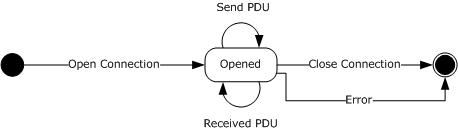
<!-- /Extracted images from page 80 -->

Figure 13: Client state machine

3.1.1.1  Abstract Data Model

None.

3.1.1.2  Timers

None.

3.1.1.2.1 Connection Setup Timer

The Connection setup timer MUST be set when the RPC connect HTTP request as specified in section
2.1.1.1.1 is sent. If this timer expires before the RPC connect response is received, the connection
setup MUST treat this as a connection error and process it as specified in section 3.1.3.4.3.

3.1.1.3  Initialization

None.

3.1.1.4  Higher-Layer Triggered Events

The RPC over HTTP v1 client has three higher-layer triggered events: opening a connection (section
3.1.1.4.1), sending a PDU (section 3.1.1.4.2), and closing a connection (section 3.1.1.4.3).

3.1.1.4.1 Opening a Connection

When an implementation of a higher-level protocol calls an implementation of the RPC over HTTP
Protocol to open a new connection to the server, this protocol MUST perform the following sequence of
steps:

  Send an RPC connect HTTP request as specified in section 2.1.1.1.1. The server-name component

of the URI as defined in section 2.2.2 SHOULD be the network address given to RPC. The
endpoint given to RPC will be placed in the server-port component of the URI as defined in
section 2.2.2. Thus, the created HTTP request MUST be sent to a mixed proxy whose name is
extracted from the network options given to the RPC runtime in an implementation-specific way.

  Move to a wait state and wait until a network event or a timeout occurs.

The protocol MUST treat any status code in the range 200 to 299, inclusive, as an indication of
success. Any other status code MUST be treated by the protocol as a connection error and be
processed as specified in section 3.1.3.4.3. If no RPC connect response is received (as specified in
section 2.1.1.1.2) before the timeout occurs, the protocol MUST treat this as a connection error and
process it as specified in section 3.1.3.4.3.

If a connection is successfully opened, the protocol MUST cancel the Connection Setup timer.

80 / 154

[MS-RPCH] - v20240729
Remote Procedure Call over HTTP Protocol
Copyright © 2024 Microsoft Corporation
Release: July 29, 2024

3.1.1.4.2 Sending a PDU

When an implementation of a higher-level protocol calls an implementation of this protocol to send a
PDU to the server, an implementation of this protocol MUST copy the PDU as a BLOB in the message
body of the RPC connect request as specified in section 2.1.1.1.3 and MUST send it to the mixed
proxy.

3.1.1.4.3 Closing a Connection

When a higher-level protocol calls an implementation of this protocol to close the connection, an
implementation of this protocol MUST call to the lower-level protocol to close the connection to the
server.

3.1.1.5  Message Processing Events and Sequencing Rules

A client that implements the RPC over HTTP v1 protocol dialect performs two message processing
events: receiving a PDU (section 3.1.1.5.1) and encountering a connection error (section 3.1.1.5.2).

3.1.1.5.1 Receiving a PDU

When an implementation of this protocol receives a PDU, it MUST pass it on to a higher-layer protocol
without modifying the contents of the PDU. This happens in an implementation-specific way.<20>

3.1.1.5.2 Encountering a Connection Error

When an implementation of this protocol encounters an error on a connection, it MUST indicate this
error to a higher-level protocol in an implementation-specific way and MUST treat the connection as
closed.<21>

3.1.1.6  Timer Events

None.

3.1.1.7  Other Local Events

None.

3.1.2  Mixed Proxy Details

The mixed proxy adheres to the following state machine.

[MS-RPCH] - v20240729
Remote Procedure Call over HTTP Protocol
Copyright © 2024 Microsoft Corporation
Release: July 29, 2024

81 / 154

<!-- Extracted images from page 82 -->
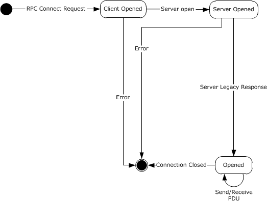
<!-- /Extracted images from page 82 -->

Figure 14: Proxy state machine

3.1.2.1  Abstract Data Model

 Server Legacy Response Received: A Boolean value that indicates whether a server legacy
response was received and PDUs received can be consumed.

3.1.2.2  Timers

None.

3.1.2.3  Initialization

Implementations of this protocol MUST listen on HTTP/HTTPS URL namespace "/".

Server Legacy Response Received is initialized to false indicating a response has not yet been
received.

3.1.2.4  Higher-Layer Triggered Events

None.

3.1.2.5  Message Processing Events and Sequencing Rules

A mixed proxy that implements the RPC over HTTP v1 protocol dialect performs three message
processing events: receiving an RPC connect request (section 3.1.2.5.1), receiving a PDU (section
3.1.2.5.2), and encountering a connection close/connection error (section 3.1.2.5.3).

82 / 154

[MS-RPCH] - v20240729
Remote Procedure Call over HTTP Protocol
Copyright © 2024 Microsoft Corporation
Release: July 29, 2024

<!-- Extracted images from page 83 -->
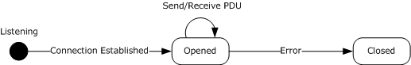
<!-- /Extracted images from page 83 -->

3.1.2.5.1 RPC Connect Request Received

When a mixed proxy receives an RPC connect request, it MUST retrieve the server name and server
port from the URI of the RPC connect request as specified in section 2.2.2. It MUST establish a TCP
connection to the server using the server name and port. It then waits for the server legacy response
defined in section 2.1.1.2.1. The mixed proxy MUST NOT respond to PDUs received from the client as
specified in section 3.1.2.5.2 until a server legacy response is received. When a server legacy
response is received, the mixed proxy MUST respond to the client with the header of an RPC connect
response as specified in section 2.1.1.1.2. It MUST also begin processing PDUs received in the
message body of the RPC connect request from the client, as specified in section 2.1.1.1.3, as well as
PDUs coming from the server.

3.1.2.5.2 PDU Received

A mixed proxy can receive a PDU from the client or server. If a PDU is received from the client as
defined in section 2.1.1.1.3, it MUST forward the PDU to the server. If a PDU is received from the
server, it MUST forward it to the client as specified in section 2.1.1.1.4.

3.1.2.5.3 Connection Close or Connection Error Encountered

Connection close and connection error MUST be handled identically. This section discusses connection
close only.

A connection close can be initiated by either the client or the server. If a connection close is initiated
by the client, the mixed proxy MUST close the connection to the server and transition to the closed
state. If a connection close is initiated by the server, the mixed proxy MUST close the connection to
the client and transition to the closed state.

3.1.2.6  Timer Events

None.

3.1.2.7  Other Local Events

None.

3.1.3  Server Details

The server adheres to the following state machine.

Figure 15: Server state machine

3.1.3.1  Abstract Data Model

None.

3.1.3.2  Initialization

Implementations of this protocol MUST listen on a TCP endpoint defined by a higher-level protocol.

83 / 154

[MS-RPCH] - v20240729
Remote Procedure Call over HTTP Protocol
Copyright © 2024 Microsoft Corporation
Release: July 29, 2024

3.1.3.3  Higher-Layer Triggered Events

This section specifies the processing that MUST occur when a higher-layer protocol sends a PDU on a
server that implements the RPC over HTTP v1 protocol dialect.

3.1.3.3.1 Sending a PDU

When a higher-layer protocol sends a PDU on a server that implements the RPC over HTTP v1
protocol dialect, the PDU MUST be sent to the mixed proxy.

3.1.3.4  Message Processing Events and Sequencing Rules

A server that implements the RPC over HTTP v1 protocol dialect performs three message processing
events: establishing a connection (section 3.1.3.4.1), receiving a PDU (section 3.1.3.4.2), and
encountering a connection error (section 3.1.3.4.3).

3.1.3.4.1 Establishing a Connection

When a connection to the server is established, the server MUST send a server legacy response as
specified in section 2.1.1.2.1 and move to the opened state.

3.1.3.4.2 Receiving a PDU

When an implementation of this protocol receives a PDU, it MUST pass it on to a higher-layer protocol
without modifying the contents of the PDU. This happens in an implementation-specific way.<22>

3.1.3.4.3 Encountering a Connection Error

When an implementation of this protocol encounters an error on a connection, it MUST indicate this
error to a higher-level protocol in an implementation-specific way and MUST transition to the closed
state.<23>

3.1.3.5  Timers

None.

3.1.3.6  Timer Events

None.

3.1.3.7  Other Local Events

None.

3.2  RPC over HTTP v2 Protocol Details

The client and server do not have fixed roles; each software agent that has an implementation of this
protocol can act as a client, as a server, or as both. The role that a given network node assumes is
determined by which local interface ([MS-RPCE] section 8.1) the higher-layer protocol uses and which
protocol sequence is used. If the higher-layered protocol uses the ncacn_http RPC protocol
sequence, as specified in [MS-RPCE] section 3, and invokes RpcBindingFromStringBinding or
equivalent, then this software agent acts as a client. If the higher-layered protocol uses the
ncacn_http RPC protocol sequence, as specified in [MS-RPCE] section 3, and invokes
RpcServerUseProtseq or equivalent, then this software agent acts as a server.

[MS-RPCH] - v20240729
Remote Procedure Call over HTTP Protocol
Copyright © 2024 Microsoft Corporation
Release: July 29, 2024

84 / 154

The inbound proxies and outbound proxies are software processes that run on a network node and
are usually set up by a network administrator. A single software agent can act as an inbound proxy,
an outbound proxy, or both. A proxy MUST act as an inbound proxy if it gets an IN channel request
as defined in section 2.1.2.1.1. It MUST act as an outbound proxy if it gets an OUT channel request as
defined in section 2.1.2.1.2. The scope of the role it assumes is for the virtual IN channel or OUT
channel. A single network node can act as inbound proxy for a given virtual IN channel and at the
same time as an outbound proxy for a given virtual OUT channel.

3.2.1  Common Details

Several processing aspects are either common between all RPC over HTTP v2 protocol roles or impact
multiple roles. They are described in this section.

3.2.1.1  Abstract Data Model

This section specifies the elements of the abstract data model for RPC over HTTP v2. Those elements
include the relationship between the different abstractions (section 3.2.1.1.1), receive windows and
flow control (section 3.2.1.1.4), and connection time-out (section 3.2.1.1.6.1).

3.2.1.1.1 Virtual Connection, Virtual Channel Hierarchy, and Protocol Variables

Each role specified by this protocol need to maintain a hierarchical data structure where at most one
virtual IN and at most one virtual OUT channel are associated with a virtual connection, where
each role MAY execute on separate network nodes.

The virtual channels that are components of a given virtual connection are defined to belong to this
virtual connection. Each virtual connection is identified uniquely among a client, any number of
inbound proxies, any number of outbound proxies, and a serverby using an RTS cookie known as a
virtual connection cookie. Multiple inbound and outbound proxies MAY be deployed in conjunction with
a TCP layer or HTTP layer load balancer to improve scalability and reliability. All load balancing MUST
be performed in a manner transparent to the client. All roles defined by this protocol maintain a
protocol variable to store the virtual connection cookie for a specific virtual connection. The virtual
connection cookie is generated by the client. Other parties acquire the cookie by exchanging one or
more PDUs with the client.

Each virtual IN channel is composed of an IN channel between a client and an inbound proxy and a
second IN channel between an inbound proxy and a server.

Each virtual OUT channel is composed of an OUT channel between a client and an outbound proxy and
a second OUT channel between an outbound proxy and a server.

Both of these channels are defined to be components of the virtual channel and transitively to be
components of the virtual connection. It is also said that they belong to the virtual channel and
transitively to the virtual connection.

The relationship is illustrated by the following diagram.

[MS-RPCH] - v20240729
Remote Procedure Call over HTTP Protocol
Copyright © 2024 Microsoft Corporation
Release: July 29, 2024

85 / 154

<!-- Extracted images from page 86 -->
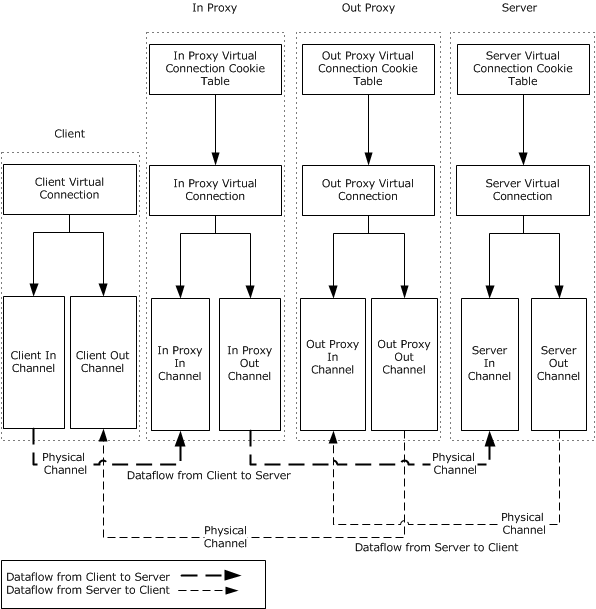
<!-- /Extracted images from page 86 -->

Figure 16: Virtual connection hierarchy

Each IN channel and OUT channel instance is identified uniquely among a client, one or more inbound
proxies, one or more outbound proxies, and a server using an RTS cookie known as a "channel
cookie".

As specified in sections 2.1.2.1.7 and 2.1.2.1.8, both virtual IN channel and virtual OUT channel are
limited to transmitting only a certain number of bytes. For a virtual connection to be capable of
sending an unlimited number of bytes, it must be able to discard IN channels or OUT channels
whose lifetime has expired and replace them with successor IN channels or OUT channels. The
process of discarding a predecessor IN channel or OUT channel and establishing a successor IN
channel or OUT channel while ensuring that the reliable, in-order, at-most-once delivery guarantee is
maintained is called channel recycling. The successor IN channel or OUT channel is called a
predecessor replacement channel. During the recycling process, there is a period of time when both
a predecessor channel and a successor channel instance are available. One of these is called the
default channel, and the other is called the nondefault channel. The protocol sequences and message
processing rules throughout section 3 specify which channel is the default in each particular case.

Every instance of a role belonging to this protocol maintains common abstract data elements for the
Virtual Connection, the Virtual Connection Cookie Table, the Sending Channel, the Receiving Channel,

86 / 154

[MS-RPCH] - v20240729
Remote Procedure Call over HTTP Protocol
Copyright © 2024 Microsoft Corporation
Release: July 29, 2024

and the Ping Originator. The abstract data elements and model for these common elements are
described in the immediately following sections.

For each role that this protocol can operate in, additional abstract data elements are required. They
are described in the following sections:

  Server role Abstract Data Model: section 3.2.5.1



Inbound Proxy role Abstract Data Model: section 3.2.3.1

  Outbound Proxy role Abstract Data Model: section 3.2.4.1

  Client role Abstract Data Model: section 3.2.2.1

3.2.1.1.2 Virtual Connection Cookie Table

Implementations of this protocol MUST maintain a Virtual Connection Cookie Table indexed by the
virtual connection RTS cookie. Each row in the table contains:



The virtual connection RTS cookie (2.2.3.1).

  A reference to the virtual connection.

 When the reference count drops to zero, the row in the table MUST be deleted. The table size is
limited by the host operating system memory constraints.

3.2.1.1.3 Virtual Connection ADM Elements

Virtual Connection Cookie

Implementations of this protocol MUST maintain a Virtual Connection Cookie that is a RTS cookie
(2.2.3.1). The value of the Virtual Connection Cookie is the same as the Virtual Connection RTS
cookie for this Virtual Connection in the Virtual Connection Cookie Table.

Virtual Connection State

Implementations of this protocol MUST maintain a protocol variable for the Virtual Connection State
which is used to track the current state in the role-specific state machine. Each role initializes the
Virtual Connection State to a role-specific state value.

Default IN Channel

Implementations of this protocol MUST maintain a reference to the Default IN Channel. During
channel recycling, a Virtual Connection has two IN channels active.

A default IN channel is a protocol variable that indicates which of the two channels is the default
channel. Outside channel recycling, there is only one IN channel at a given point in time, and this
channel is always considered the default channel. The default channel MUST be used for sending all
RPC PDUs. Sending of RTS PDUs is specified in section 3.2.2.4.2.

Non-Default IN Channel

Implementations of this protocol MUST maintain a reference to the Non-Default IN Channel. During
channel recycling, a Virtual Connection has two IN channels active.

Default IN Channel Cookie

Implementations of this protocol MUST maintain an RTS cookie (2.2.3.1) for the Default IN Channel.

Non-Default IN Channel Cookie

[MS-RPCH] - v20240729
Remote Procedure Call over HTTP Protocol
Copyright © 2024 Microsoft Corporation
Release: July 29, 2024

87 / 154

Implementations of this protocol MUST maintain an RTS cookie (2.2.3.1) for the Non-Default IN
Channel.

Default OUT Channel

Implementations of this protocol MUST maintain a reference to the Default OUT Channel.

Non-Default OUT Channel

Implementations of this protocol MUST maintain a reference to the Non-Default OUT Channel.

Default OUT Channel Cookie

Implementations of this protocol MUST maintain an RTS cookie (2.2.3.1) for the Default OUT Channel.

Non-Default OUT Channel Cookie

Implementations of this protocol MUST maintain an RTS cookie (2.2.3.1) for the Non-Default OUT
Channel.

Protocol Version

Implementations of this protocol MUST maintain a variable to contain the ProtocolVersion which is of
unsigned integer type. A value of 1 indicates RPC/HTTP2 version of the protocol.

AssociationGroupId

Implementations of this protocol MUST maintain an RTS cookie (2.2.3.1) called AssociationGroupId
that can be used by higher-layer protocols to link multiple virtual connections.

3.2.1.1.4 Sending Channel and Receiving Channel

Each IN channel or OUT channel has two parties: a sender and a recipient. This section specifies an
abstract data model that senders and recipients MUST adhere to in order to implement flow control for
this protocol. This protocol specifies that only RPC PDUs are subject to the flow control abstract data
model. RTS PDUs and the HTTP request and response headers are not subject to flow control.
Implementations of this protocol MUST NOT include them when computing any of the variables
specified by this abstract data model.

The following sections define the separate protocol variables that are part of the receive windows
and flow control data model.

Sending Channel

PlugState

Implementations of this protocol MUST maintain a Boolean value named PlugState to represent if the
Sending Channel is in the Plugged Channel Mode or the Unplugged Channel Mode.

SendQueue

In the context of receive windows and flow control, a sender MUST maintain a queue of PDUs that are
required to be sent. The size and maximum length of the SendQueue are implementation-specific and
on Windows implementations, bounded by available system memory.

ChannelLifeTimeSent

The sender MUST keep track of the total bytes sent over the IN channel or OUT channel instance it
uses to send PDUs. This abstract variable is called BytesSent. This variable MUST be the integer count
of bytes that the connection has sent. BytesSent will have the inclusive range of zero and two
gigabytes (the max of ChannelLifeTime).

88 / 154

[MS-RPCH] - v20240729
Remote Procedure Call over HTTP Protocol
Copyright © 2024 Microsoft Corporation
Release: July 29, 2024

Sender AvailableWindow

The sender MUST keep track of the local size, in bytes, of the available ReceiveWindow. This
variable is called Sender AvailableWindow.

PeerReceiveWindow

The sender MUST keep track of the size, in bytes, of the maximum receiving channel's
ReceiveWindow.

3.2.1.1.5 Receiving Channel

3.2.1.1.5.1  ReceiveWindow

The first element of the abstract data model is the concept of a receive window. A receiver
determines what amount of machine memory it is can commit to queue PDUs received from the
sender. This amount of memory is called a receive window, and on the abstract level, the receiver
MUST treat the ReceiveWindow data structure as a queue. The receiver SHOULD choose an initial
value for the receive window based on an implementation-specific algorithm.<24>

3.2.1.1.5.1.1  ReceiveWindowSize

This element of the abstract data model is an unsigned 32-bit number indicating the size of the
receive window.

3.2.1.1.5.1.2  Receiver AvailableWindow

As the receiver queues and releases PDUs in its ReceiveWindow, it MUST locally keep track of how
much space it has left in its ReceiveWindow, in bytes. The size of the ReceiveWindow minus the
sum of the size of all RPC PDUs that the receiver queued in this ReceiveWindow is called Receiver
AvailableWindow. Receiver AvailableWindow can range from 0 to the value of receive window.

3.2.1.1.5.1.3  Recipient BytesReceived

The receiver MUST maintain an unsigned 32-bit BytesReceived variable that tracks the total bytes
received on the IN channel or OUT channel instance.

3.2.1.1.5.1.4  AvailableWindowAdvertised

The AvailableWindowAdvertised variable MAY be maintained by implementations of this protocol.
Implementations of this protocol MAY implement the flow control algorithm without using this variable.
In the latter case, implementations of this protocol can skip the rest of this section.<25>

If an implementation maintains this protocol variable, it SHOULD follow the abstract data model
specified in the rest of this section.

As specified in section 3.2.1.4.1.1, each time a receiver sends a flow control acknowledgment to the
sender, it MUST advertise the size of the Receiver AvailableWindow field.

The AvailableWindowAdvertised variable keeps track of the value of the Receiver AvailableWindow
field the last time the receiver advertised it to the sender. The AvailableWindowAdvertised variable is
initialized to be the same size as the ReceiveWindow variable.

3.2.1.1.6 Ping Originator

When the SendingChannel is part of a virtual connection in an Outbound Proxy or Client role
(transmitting HTTP data), the SendingChannel maintains additional protocol variables called the Ping
Originator.

89 / 154

[MS-RPCH] - v20240729
Remote Procedure Call over HTTP Protocol
Copyright © 2024 Microsoft Corporation
Release: July 29, 2024

3.2.1.1.6.1  ConnectionTimeout

Network agents handling HTTP traffic often time out connections that are perceived as idle. An
implementation of this protocol SHOULD try to prevent virtual connections that are still in use from
being timed out by network agents handling the HTTP traffic. If network agents do time out
connections perceived as idle, clients, inbound proxies, and outbound proxies MUST maintain an
abstract variable, which is the amount of time that the network agents handling the HTTP traffic are
likely to allow an RPC over HTTP channel to remain open and idle. That abstract variable is called
ConnectionTimeout. ConnectionTimeout can range in value from 30 seconds to 1800 seconds.

Implementations of this protocol prevent IN channels and OUT channels that are in use from being
timed out by network agents by sending small packets between the client and the inbound proxy
and between the outbound proxy and the client. Details on this process are provided in the sections
for the client (section 3.2.2) or for the outbound proxy (section 3.2.4), respectively.

3.2.1.1.6.2  LastPacketSentTimestamp

The protocol MUST maintain a timestamp indicating the last time a packet was sent on this
SendingChannel.

PingTimer

The SendingChannel MUST maintain a timer on expiration indicates a PING PDU must be sent to the
receiving channel. The PING PDU is sent to the receiving channel when no data has been sent within
half of the time value of the KeepAliveInterval.

3.2.1.1.6.3  KeepAlive Interval

KeepAlive interval is a protocol variable that can be changed by higher layers. Implementations of this
protocol SHOULD interpret this variable as the maximum time interval that a higher layer can wait
before it establishes with certainty whether the server has dropped out of a conversation.

The higher-level Remote Procedure Call Protocol Extensions specify usage of this in [MS-RPCE] section
3.3.2.2.1. In TCP RPC transport (ncacn_ip_tcp), the Remote Procedure Call Protocol Extensions
specify that the keep-alive interval is changed. In HTTP RPC transport, this protocol variable is
changed instead.

3.2.1.2  Timers

3.2.1.2.1 PingTimer

If the SendingChannel is part of a Virtual Connection in the Outbound Proxy or Client roles, the
SendingChannel maintains a PingTimer that on expiration indicates a PING PDU must be sent to the
receiving channel. The PING PDU is sent to the receiving channel when no data has been sent within
half of the value of the KeepAliveInterval.

The PingTimer expiration time is set to half of the value of the KeepAlive Interval. When the PingTimer
expires, the protocol MUST determine if the time since the LastPacketSentTimestamp is greater than
half of the value of the KeepAliveInterval. If so, the protoclol MUST send a PING PDU to the receiving
channel.

3.2.1.2.2 Connection Timeout Timer

The connection timeout timer interval is controlled by the ConnectionTimeout (section 3.2.1.1.6.1)
protocol variable. The interval of this timer MUST be changed to the value of the connection timeout
protocol variable each time the protocol variable is changed.

[MS-RPCH] - v20240729
Remote Procedure Call over HTTP Protocol
Copyright © 2024 Microsoft Corporation
Release: July 29, 2024

90 / 154

3.2.1.3  Initialization

This section specifies the initialization steps that are common among all roles in the RPC over HTTP v2
protocol dialect.

  BytesSent (section 3.2.1.1.4) is initialized to 0 bytes.

  Recipient BytesReceived (section 3.2.1.1.5.1.3) is initialized to 0 bytes.

  Receiver AvailableWindow (section 3.2.1.1.5.1.2) is initialized to 0 bytes.

  Sender AvailableWindow (section 3.2.1.1.4) is initialized to the value of ReceiveWindow on the

recipient side.

  ConnectionTimeout (section 3.2.1.1.6.1) is initialized to an implementation specific value within

the range of 30 seconds to 1800 seconds.<26>

  Default IN Channel is initialized to the first or primary channel. When the server is initialized,

there is only one IN channel.

  KeepAlive Interval is initialized to zero and is interpreted as having no keep alive requested by

the higher-layer protocol.

  Default OUT Channel is initialized to indicate the first or primary OUT channel. Except during

channel recycling, which is not active when the server is first initialized, there is only a single OUT
channel.

  Virtual Connection Cookie Table is initialized to an empty table.

3.2.1.3.1 Flow Control and ReceiveWindow Processing

The receiver MUST advertise the size of the ReceiveWindow using the ReceiveWindowSize RTS
command as defined in section 2.2.3.5.1, and the sender MUST initialize its abstract data model from
this RTS command and initialize the Send Queue to an initial empty state. This advertising happens
in a way that is specific to each role and, as such, is defined in the section for each specific role.

3.2.1.3.2 BytesSent

The abstract data model MUST initialize BytesSent (section 3.2.1.1.4) to zero.

3.2.1.4  Higher-Layer Triggered Events

This section specifies the flow control and ReceiveWindow processing rules that are common among
all roles in the RPC over HTTP v2 protocol dialect.

3.2.1.4.1 Flow Control and ReceiveWindow Higher-Layer Triggered Events

3.2.1.4.1.1  Consuming RPC PDUs

Per the abstract data model defined in section 3.2.1.1.5.1, the ReceiveWindow can be modeled as a
queue. On the client and server, the act of releasing an RPC PDU from the ReceiveWindow by a
higher layer is called consuming this RPC PDU. On the inbound and outbound proxies, the act of
forwarding an RPC PDU from the ReceiveWindow to the next hop is also called consuming this RPC
PDU. This section defines common processing for consuming an RPC PDU.

When the recipient consumes an RPC PDU from the ReceiveWindow, it recalculates the Receiver
AvailableWindow defined in section 3.2.1.1.5.1.2. If the Receiver AvailableWindow is determined to be
greater than an implementation-specific threshold (as defined later in this section), the recipient will
send to the sender a FlowControlAck RTS PDU as specified in section 2.2.4.50, indicating in the

91 / 154

[MS-RPCH] - v20240729
Remote Procedure Call over HTTP Protocol
Copyright © 2024 Microsoft Corporation
Release: July 29, 2024

command the value of the protocol variable BytesReceived on the channel instance, the Receiver
AvailableWindow during the time the FlowControlAck RTS PDUs was sent, and the channel cookie
specified for this channel in section 3.2.1.1.1. The receiver SHOULD choose a threshold value that
keeps the number of FlowControlAck RTS PDUs small, while avoiding the sender queuing packets on
high-latency links.

The AvailableWindowAdvertised variable is updated to the Receiver AvailableWindow that was set in
the last FlowControlAck RTS PDU.<27>

3.2.1.4.1.2  Queuing RPC PDUs

Whenever an RPC PDU is to be sent, the sender MUST queue the respective PDU on the send queue,
and then follow the logic in sequence as in section 3.2.1.4.1.3.

3.2.1.4.1.3  Dequeuing RPC PDUs

If the Sender AvailableWindow is greater than the number of bytes in the first queued RPC PDU, the
implementation MUST send queued PDUs in order until either no RPC PDUs remain in the queue or the
Sender AvailableWindow is less than the number of bytes in the next queued RPC PDU.

Each time an RPC PDU is dequeued, an implementation MUST do the following:



Increment the BytesSent protocol variable by the number of bytes in the RPC PDU sent.

  Decrement the Sender AvailableWindow by the same amount.

3.2.1.5  Message Processing Events and Sequencing Rules

This section specifies flow control and receive-window processing rules, PDU forwarding rules, and
protocol sequences that are common among all roles in the RPC over HTTP v2 protocol dialect.

3.2.1.5.1 Flow Control and ReceiveWindow Processing

This section specifies flow control (section 3.2.1.5.1.2) and ReceiveWindow (section 3.2.1.5.1.1)
processing rules common among all roles in the RPC over HTTP v2 protocol dialect.

3.2.1.5.1.1  Receiving RPC PDUs

As it receives RPC PDUs, an implementation of this protocol MUST queue the PDUs in its
ReceiveWindow. As it queues the PDUs, the recipient MUST do the following:

  Decrement Receiver AvailableWindow by the number of bytes in the RPC PDU it queued.





Increment BytesReceived by the same amount.

If a protocol implementation implements AvailableWindowAdvertised, decrement it by the same
amount.

When the sender receives a FlowControlAck RTS PDU, it MUST use the following formula to recalculate
its Sender AvailableWindow variable:

Sender AvailableWindow = Receiver AvailableWindow_from_ack - (BytesSent -
BytesReceived_from_ack).

Where:

Receiver AvailableWindow_from_ack is the Available Window field in the FlowControl
Acknowledgement Structure (section 2.2.3.4) in the PDU received.

[MS-RPCH] - v20240729
Remote Procedure Call over HTTP Protocol
Copyright © 2024 Microsoft Corporation
Release: July 29, 2024

92 / 154

BytesReceived_from_ack is the Bytes Received field in the Flow Control Acknowledgement structure in
the PDU received.

If the Receiver AvailableWindow becomes negative or becomes greater than the ReceiveWindow
advertised by the recipient, a sender SHOULD treat the FlowControlAck RTS PDU as an invalid PDU
and process it according to the rules for processing invalid PDUs, as defined in the section for the
respective role.

3.2.1.5.1.2  FlowControlAck RTS PDU

All senders of RTS PDUs process flow control acknowledgment RTS PDUs as specified in section
2.2.4.50 identically. An implementation MUST execute the following sequence of steps to process a
FlowControlAck RTS PDU in this order:

  A FlowControlAck RTS PDU is received on some channel.



The ChannelCookie field from the FlowControlAck RTS command is compared against the
channel cookies for all channels belonging to this virtual connection, and a matching channel is
selected. If no matching channel can be found, an implementation of this protocol MUST discard
the PDU and MUST NOT do any further processing for this PDU.

  Recalculate its local copy of Sender AvailableWindow using the following formula:

Sender AvailableWindow = Sender AvailableWindow_from_ack - (BytesSent -
BytesReceived_from_ack).

Where:

Sender AvailableWindow_from_ack is the Available Window field in FlowControl
Acknowledgement Structure (section 2.2.3.4) in the PDU received.

BytesReceived_from_ack is the Bytes Received field in the Flow Control Acknowledgement
structure specified.

  Dequeue any RPC PDUs possible as specified in section 3.2.1.4.1.3.

3.2.1.5.1.3  ReceiveWindowSize

When processing a ReceiveWindowSize RTS command (2.2.3.5.1), an implementation of this
protocol MUST set its ReceiveWindowSize ADM (3.2.1.1.5.1.1) to the value of the
ReceiveWindowSize field in this command.

3.2.1.5.2 PDU Forwarding

The RPC over HTTP v2 IN channels and OUT channels that are based on an HTTP or HTTPS
transport are half duplex. This means that one party might not be able to send a PDU to another
party if the half-duplex channel is going in the other direction. To resolve this problem, RPC over HTTP
v2 uses the concept of RTS PDU forwarding. When RTS PDU forwarding is used, a sender MUST mark
a PDU as needing forwarding by setting an RTS destination command in the PDU. An implementation
of this protocol MUST NOT add a destination command to a RTS PDU that does not have a destination
command already. Only RTS PDUs that already have a destination command are subject to
forwarding. Once the RTS PDU is marked for forwarding, a sender acts on the fact that only the IN
channel between client and inbound proxy and the OUT channel between the client and the
outbound proxy are half duplex and MUST send the RTS PDU to the next hop according to the
following table.

 Sender

 Destination

 Next hop

client

inbound proxy

direct

[MS-RPCH] - v20240729
Remote Procedure Call over HTTP Protocol
Copyright © 2024 Microsoft Corporation
Release: July 29, 2024

93 / 154

 Sender

 Destination

 Next hop

client

client

outbound proxy

inbound proxy

server

inbound proxy

inbound proxy

outbound proxy

server

inbound proxy

client

inbound proxy

server

server

direct

outbound proxy

inbound proxy

server

outbound proxy

client

outbound proxy

server

direct

direct

server

server

server

inbound proxy

direct

outbound proxy  direct

client

outbound proxy

If a sender has a "direct" value in the next hop column of the routing table, it MUST NOT use the
forwarding mechanism but instead MUST send the PDU directly.

Upon receiving such an RTS PDU, the receiver MUST forward the PDU to the next hop, which MUST be
determined by indexing the preceding table by its own role as the value of the sender column and the
destination as the value of the destination column.

3.2.1.5.3 Protocol Sequences

This section provides diagrams and explanations that facilitate understanding sections 3.2.2, 3.2.3,
3.2.4, and 3.2.5. It is not intended to replace these sections. The diagrams in this section illustrate at
a high level the flow of RTS PDUs among the different roles during the different protocol sequences.
They can be used to put into context the definitions used throughout the rest of the document.

3.2.1.5.3.1  Connection Establishment

The connection establishment protocol sequence illustrates establishing a virtual connection
between a client and a server. The name of this sequence is CONN. It has three PDU groups.

 Group name

 Meaning

A

B

C

PDUs sent on the OUT channels that initiate and perform the virtual connection establishment

PDUs sent on the IN channel

PDUs sent on the OUT channels that complete virtual connection establishment

[MS-RPCH] - v20240729
Remote Procedure Call over HTTP Protocol
Copyright © 2024 Microsoft Corporation
Release: July 29, 2024

94 / 154

<!-- Extracted images from page 95 -->
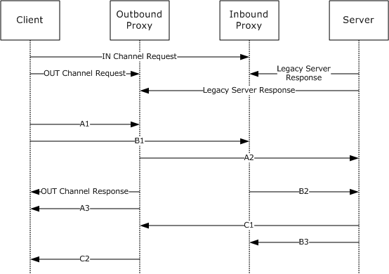
<!-- /Extracted images from page 95 -->

Figure 17: Connection establishment protocol sequence

The references for the PDUs used in this protocol sequence are as follows.

 Diagram label

 PDU name and reference section

IN channel request

IN Channel Request (section 2.1.2.1.1)

OUT channel request

OUT Channel Request (section 2.1.2.1.2)

OUT channel response

Out Channel Response (section 2.1.2.1.4)

Legacy server response  Legacy Server Response (section 2.1.2.2.1)

A1

A2

A3

B1

B2

B3

C1

C2

CONN/A1 RTS PDU (section 2.2.4.2)

CONN/A2 RTS PDU (section 2.2.4.3)

CONN/A3 RTS PDU (section 2.2.4.4)

CONN/B1 RTS PDU (section 2.2.4.5)

CONN/B2 RTS PDU (section 2.2.4.6)

CONN/B3 RTS PDU (section 2.2.4.7)

CONN/C1 RTS PDU (section 2.2.4.8)

CONN/C2 RTS PDU (section 2.2.4.9)

The processing rules for this protocol sequence are specified in sections 3.2.2 through 3.2.5 of this
specification.

[MS-RPCH] - v20240729
Remote Procedure Call over HTTP Protocol
Copyright © 2024 Microsoft Corporation
Release: July 29, 2024

95 / 154

<!-- Extracted images from page 96 -->
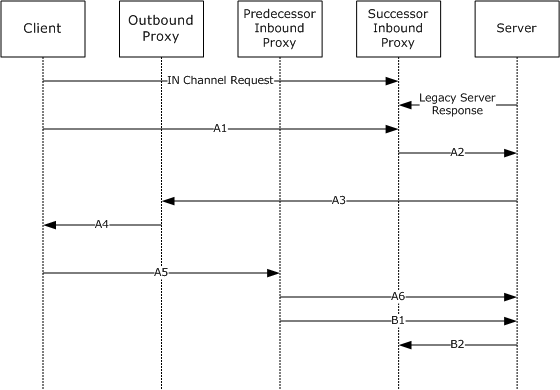
<!-- /Extracted images from page 96 -->

Note  In an effort to improve readability, the establishments of TCP connections are not shown in the
figure.

3.2.1.5.3.2

IN Channel Recycling 1

The IN channel recycling 1 protocol sequence illustrates recycling of a virtual IN channel. The name
of this sequence is IN_R1. It has two PDU groups.

 Group name

 Meaning

A

B

PDUs that initiate and perform the virtual channel recycling

PDUs that complete the virtual channel recycling

The following diagram depicts the sequence of events in the IN channel recycling 1 protocol.

Figure 18: IN channel recycling 1 protocol sequence

The references for the PDUs used in this protocol sequence are shown in the following table.

 Diagram label

 PDU name and reference section

IN channel request

IN Channel Request (section 2.1.2.1.1)

Legacy server response  Legacy Server Response (section 2.1.2.2.1)

A1

A2

A3

A4

IN_R1/A1 RTS PDU (section 2.2.4.10)

IN_R1/A2 RTS PDU (section 2.2.4.11)

IN_R1/A3 RTS PDU (section 2.2.4.12)

IN_R1/A4 RTS PDU (section 2.2.4.13)

[MS-RPCH] - v20240729
Remote Procedure Call over HTTP Protocol
Copyright © 2024 Microsoft Corporation
Release: July 29, 2024

96 / 154

<!-- Extracted images from page 97 -->
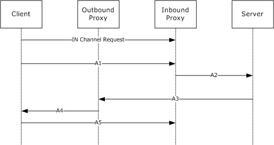
<!-- /Extracted images from page 97 -->

 Diagram label

 PDU name and reference section

A5

A6

B1

B2

IN_R1/A5 RTS PDU (section 2.2.4.14)

IN_R1/A6 RTS PDU (section 2.2.4.15)

IN_R1/B1 RTS PDU (section 2.2.4.16)

IN_R1/B2 RTS PDU (section 2.2.4.17)

The processing rules for this protocol sequence are specified in sections 3.2.2 through 3.2.5 of this
specification.

Note  In an effort to improve readability, the establishments of TCP connections are not shown in the
figure.

3.2.1.5.3.3

IN Channel Recycling 2

The IN channel recycling 2 protocol sequence illustrates recycling of a virtual IN channel. The name
of this sequence is IN_R2. This protocol sequence is very similar to protocol sequence IN_R1. They
start identically, and only when processing IN_R1/A1 RTS PDU do they diverge based on dynamic
decisions made by the inbound proxy as defined in section 3.2.3.5.5. This protocol sequence has a
single PDU group: A.

The following diagram depicts the sequence of events in the IN channel recycling 2 protocol.

Figure 19: IN channel recycling 2 protocol sequence

The references for the PDUs used in this protocol sequence are as follows.

 Diagram label

 PDU name and reference section

IN channel request

IN Channel Request (section 2.1.2.1.1)

A1

A2

A3

IN_R2/A1 RTS PDU (section 2.2.4.18)

IN_R2/A2 RTS PDU (section 2.2.4.19)

IN_R2/A3 RTS PDU (section 2.2.4.20)

[MS-RPCH] - v20240729
Remote Procedure Call over HTTP Protocol
Copyright © 2024 Microsoft Corporation
Release: July 29, 2024

97 / 154

<!-- Extracted images from page 98 -->
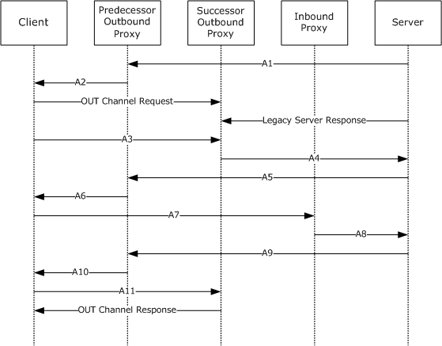
<!-- /Extracted images from page 98 -->

 Diagram label

 PDU name and reference section

A4

A5

IN_R2/A4 RTS PDU (section 2.2.4.21)

IN_R2/A5 RTS PDU (section 2.2.4.22)

The processing rules for this protocol sequence are specified in sections 3.2.2 through 3.2.5 of this
specification.

Note  In an effort to improve readability, the establishments of TCP connections are not shown in the
figure.

3.2.1.5.3.4  OUT Channel Recycling 1

The OUT channel recycling 1 protocol sequence illustrates recycling of a virtual OUT channel. The
name of this sequence is OUT_R1. It has a single PDU group: A.

The following diagram depicts the sequence of events in the OUT channel recycling 1 protocol.

Figure 20: OUT channel recycling 1 protocol sequence

The references for the PDUs used in this protocol sequence are as follows.

 Diagram label

 PDU name and reference section

OUT channel request

OUT Channel Request (section 2.1.2.1.2)

OUT channel response

OUT Channel Response (section 2.1.2.1.4)

[MS-RPCH] - v20240729
Remote Procedure Call over HTTP Protocol
Copyright © 2024 Microsoft Corporation
Release: July 29, 2024

98 / 154

 Diagram label

 PDU name and reference section

Legacy server response  Legacy Server Response (section 2.1.2.2.1)

A1

A2

A3

A4

A5

A6

A7

A8

A9

A10

A11

OUT_R1/A1 RTS PDU (section 2.2.4.23)

OUT_R1/A2 RTS PDU (section 2.2.4.24)

OUT_R1/A3 RTS PDU (section 2.2.4.25)

OUT_R1/A4 RTS PDU (section 2.2.4.26)

OUT_R1/A5 RTS PDU (section 2.2.4.27)

OUT_R1/A6 RTS PDU (section 2.2.4.28)

OUT_R1/A7 RTS PDU (section 2.2.4.29)

OUT_R1/A8 RTS PDU (section 2.2.4.30)

OUT_R1/A9 RTS PDU (section 2.2.4.31)

OUT_R1/A10 RTS PDU (section 2.2.4.32)

OUT_R1/A11 RTS PDU (section 2.2.4.33)

The processing rules for this protocol sequence are specified in sections 3.2.2 through 3.2.5 of this
specification.

Note  In an effort to improve readability, the establishments of TCP connections are not shown in the
figure.

3.2.1.5.3.5  OUT Channel Recycling 2

The OUT channel recycling 2 protocol sequence recycles a virtual OUT channel. The name of this
sequence is OUT_R2. This protocol sequence is very similar to protocol sequence OUT_R1. The two
start identically, and while processing OUT_R1/A3 RTS PDU they diverge based on dynamic decisions
made by the outbound proxy as specified in section 3.2.4.5.6. It has two PDU groups.

 Group name

 Meaning

A

B

PDUs that initiate and perform the virtual channel recycling

PDUs that complete the virtual channel recycling

The following diagram depicts the sequence of events in the OUT channel recycling 2 protocol.

[MS-RPCH] - v20240729
Remote Procedure Call over HTTP Protocol
Copyright © 2024 Microsoft Corporation
Release: July 29, 2024

99 / 154

<!-- Extracted images from page 100 -->
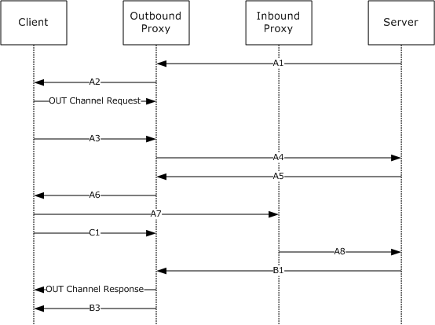
<!-- /Extracted images from page 100 -->

Figure 21: OUT channel recycling 2 protocol sequence

The references for the PDUs used in this protocol sequence are as follows.

 Diagram label

 PDU name and reference section

OUT channel request

OUT Channel Request (section 2.1.2.1.2)

OUT channel response  OUT Channel Response (section 2.1.2.1.4)

A1

A2

A3

A4

A5

A6

A7

A8

B1

B3

C1

OUT_R2/A1 RTS PDU (section 2.2.4.34)

OUT_R2/A2 RTS PDU (section 2.2.4.35)

OUT_R2/A3 RTS PDU (section 2.2.4.36)

OUT_R2/A4 RTS PDU (section 2.2.4.37)

OUT_R2/A5 RTS PDU (section 2.2.4.38)

OUT_R2/A6 RTS PDU (section 2.2.4.39)

OUT_R2/A7 RTS PDU (section 2.2.4.40)

OUT_R2/A8 RTS PDU (section 2.2.4.41)

OUT_R2/B1 RTS PDU (section 2.2.4.42)

OUT_R2/B3 RTS PDU (section 2.2.4.44)

OUT_R2/C1 RTS PDU (section 2.2.4.45)

[MS-RPCH] - v20240729
Remote Procedure Call over HTTP Protocol
Copyright © 2024 Microsoft Corporation
Release: July 29, 2024

100 / 154

<!-- Extracted images from page 101 -->
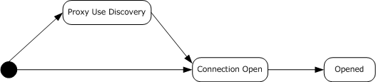
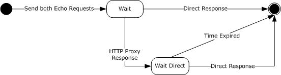
<!-- /Extracted images from page 101 -->

The processing rules for this protocol sequence are specified in sections 3.2.2 through 3.2.5 of this
specification.

Note  In an effort to improve readability, the establishments of TCP connections are not shown in the
figure.

3.2.1.6  Timer Events

None.

3.2.1.7  Other Local Events

None.

3.2.2  Client Details

This section defines the protocol details for the client role in the RPC over HTTP v2 protocol dialects.

An implementation of this protocol on the client MUST conform to the state machines given in this
section. The first state machine is the overall client state machine for the virtual connection.

Figure 22: Overall client state machine

This overall client state machine defines the relationship of the other state machines given here.
Details about when the state machines are started and the state transitions made by these state
machines are given later in this section.

The proxy use determination state machine, shown in the following figure, MUST be used when the
client is determining whether it will use an HTTP proxy for communicating with the inbound proxy
and outbound proxy.

Figure 23: Proxy use determination

For more details on proxy use determination, see section 3.2.2.4.1.1.

The virtual connection open state machine, shown in the following figure, MUST be used when the
client is trying to establish a virtual connection to the server.

[MS-RPCH] - v20240729
Remote Procedure Call over HTTP Protocol
Copyright © 2024 Microsoft Corporation
Release: July 29, 2024

101 / 154

<!-- Extracted images from page 102 -->
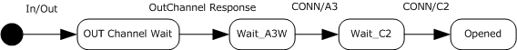
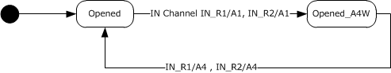
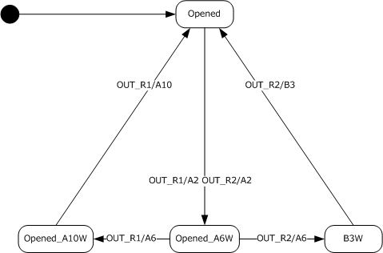
<!-- /Extracted images from page 102 -->

Figure 24: Virtual connection open

For more details on establishing a virtual connection, see sections 3.2.1.5.3.1 and 3.2.2.4.1.2.

The virtual IN channel state machine, shown in the following figure, MUST be used when the client
is trying to recycle an IN channel. It uses the protocol sequence IN_R1 as specified in section
3.2.1.5.3.2 or IN_R2 as specified in section 3.2.1.5.3.3.

Figure 25: Client virtual IN channel state machine

For more details on recycling an IN channel, see section 3.2.2.5.12.

The virtual OUT channel state machine, shown in the following figure, MUST be used when the client
is trying to recycle an OUT channel. It uses the protocol sequence OUT_R1 as specified in section
3.2.1.5.3.4 or OUT_R2 as specified in section 3.2.1.5.3.5.

Figure 26: Client virtual OUT channel state machine

For more details on recycling an OUT channel, see section 3.2.2.5.6.

[MS-RPCH] - v20240729
Remote Procedure Call over HTTP Protocol
Copyright © 2024 Microsoft Corporation
Release: July 29, 2024

102 / 154

3.2.2.1  Abstract Data Model

This section describes a conceptual model of a possible data organization that an implementation
might maintain to participate in this protocol. The described organization is provided to facilitate the
explanation of how the protocol behaves. This document does not mandate that implementations
adhere to this model as long as their external behavior is consistent with that described in this
document.

A client maintains 3 sets of protocol variables:

  A Client Virtual Connection: A Virtual Connection as described in the common protocol variables

section 3.2.1.1.3.

  A Client Out Channel: An out channel consisting of the data elements described in the Receiving

Channel data elements, as described in the common protocol variables section 3.2.1.1.5.

  A Client In Channel: An in channel consisting of the data elements described in the Sending

Channel and Ping Originator in the common protocol variable section 3.2.1.1.4.

The client also maintains a set of client-specific ADM elements as described in the following section.

3.2.2.1.1 KeepAlive interval

KeepAlive interval is a protocol variable that can be changed by higher layers. Implementations of this
protocol SHOULD interpret this variable as the maximum time interval that a higher layer can wait
before it establishes with certainty whether the server has dropped out of a conversation.

The higher-level Remote Procedure Call Protocol Extensions specify usage of this in [MS-RPCE] section
3.3.2.2.1. In TCP RPC transport (ncacn_ip_tcp), the Remote Procedure Call Protocol Extensions
specify that the keep-alive interval is changed. In HTTP RPC transport, this protocol variable is
changed instead.

3.2.2.1.2 proxy use

The Proxy Use variable tells the client implementation if it should use an HTTP proxy to connect to
the RPC over HTTP v2 proxy. It can have two values: use an HTTP proxy (called indirect
connection) or not use an HTTP proxy (called direct connection).

3.2.2.1.3 Channel Lifetime Sent

An implementation of this protocol MUST maintain a protocol variable, Channel Lifetime Sent, that
indicates the number of bytes sent by all RTS PDUs and RPC PDUs on a specific IN channel. Each
time an RPC PDU or RTS PDU is sent, this protocol variable MUST be incremented by the size in bytes
of the PDU that was sent.

3.2.2.1.4 Virtual In Channel State

Implementations of this protocol MUST maintain a protocol variable that contains the current state in
the Virtual In Channel state machine.

3.2.2.1.5 Virtual Out Channel State

Implementations of this protocol MUST maintain a protocol variable that contains the current state in
the Virtual Out Channel state machine.

3.2.2.1.6 CurrentKeepAliveTime

[MS-RPCH] - v20240729
Remote Procedure Call over HTTP Protocol
Copyright © 2024 Microsoft Corporation
Release: July 29, 2024

103 / 154

Implementations of this protocol MUST maintain a protocol variable that contains the current Keep
Alive Time, which can be set by higher-layer protocols. The CurrentKeepAliveTime is the time after the
first PDU is sent before a Ping RTS PDU is sent (section 2.2.4.49).

3.2.2.1.7 CurrentKeepAliveInterval

Implementations of this protocol MUST maintain a protocol variable that contains the current Keep
Alive Interval, which can be set by higher-layer protocols. The CurrentKeepAliveInterval represents
the time between the sending of subsequent Ping RTS PDUs are sent after the first Ping RTS PDU is
sent.

3.2.2.2  Timers

An implementation of the RPC over HTTP v2 protocol dialect on the client SHOULD implement the
following timers:

  Connection time-out timer (section 3.2.2.2.1)

  Keep-alive timer (section 3.2.2.2.2)



Proxy use determination timer (section 3.2.2.2.3)

3.2.2.2.1 Connection Time-Out Timer

The connection time-out timer is a recurring timer set to an interval equal to the value of the
ConnectionTimeout field value from CONN/A3 RTS PDU, IN_R1/A4 RTS PDU, or IN_R2/A4 RTS PDU
as specified in section 2.2.4. A client implementation MAY choose a lower value for this timer.<28>

3.2.2.2.2 Keep-Alive Timer

The keep-alive timer is a recurring timer set when the virtual connection is opened. The interval is
controlled by the keep-alive interval protocol variable, which is set by a higher layer.

3.2.2.2.3 Proxy Use Determination Timer

A proxy use determination timer SHOULD be used for the duration of the proxy use determination
protocol sequence only. It MAY have a value of 200 milliseconds or use a heuristic that adjusts this
value based on network and past results of proxy use determination.<29>

3.2.2.3  Initialization

For this protocol to be initialized successfully, the higher-level RPC protocol as specified in [MS-RPCE]
MUST be initialized successfully. Specifically, the initialization steps specified in [MS-RPCE] section
3.3.2.3 MUST be completed. This protocol imposes an additional initialization step in which the
network options passed to RPC by higher-level protocols MUST contain a valid RPC over HTTP proxy
name. Higher-level protocols also MUST indicate in an implementation-specific way whether HTTP or
HTTPS will be used and whether HTTP authentication or client certificate authentication will be
used.<30>

Proxy Use is initialized to not use an HTTP proxy.

Channel Lifetime Set is initialized to 0 bytes.

The Client In Channel Sending Channel and Ping Originator elements are initialized as described in the
common data elements section.

The Client Out Channel Receiving Channel is initialized as described in the common data elements
section.

104 / 154

[MS-RPCH] - v20240729
Remote Procedure Call over HTTP Protocol
Copyright © 2024 Microsoft Corporation
Release: July 29, 2024

The CurrentKeepAliveTime is set to an implementation-specific value that indicates the Keep Alive
timer is disabled and not used. The CurrentKeepAliveTime can be set by a higher-layer protocol.

The CurrentKeepAliveInterval is set to 0. The CurrentKeepAliveTimeInterval can be set by a
higher-layer protocol.

3.2.2.4  Higher-Layer Triggered Events

This section defines the higher-layer triggered events for the RPC over HTTP v2 protocol dialect.
These events include opening a connection (section 3.2.2.4.1), sending a PDU (section 3.2.2.4.2),
closing a connection (section 3.2.2.4.3), and setting the keep-alive interval protocol variable (section
3.2.2.4.4).

3.2.2.4.1 Opening a Connection

When an implementation of a higher-level protocol calls into an implementation of this protocol to
open a new connection to the server, optionally specifying a connection timeout value, a
ResourceType UUID (section 3.2.3.1.5), and/or a Session UUID (section 3.2.3.1.6), an implementation
of this protocol MUST perform the following sequence of steps:

1.  Establish whether the implementation needs to perform proxy use determination, and if it does,

perform the proxy use determination. This step is optional.

2.  Open a virtual connection to the server as specified in section 3.2.2.4.1.2. For more information

on the protocol sequence for opening a virtual connection, see section 3.2.1.5.3.1.

Each of the steps is broken down into more detailed steps in the sections Determining Proxy
Use (section 3.2.2.4.1.1) and Connection Opening (section 3.2.2.4.1.2).

3.2.2.4.1.1  Determining HTTP Proxy Use

The first step of opening a connection is to determine proxy use. This step is optional and MAY<31>
be skipped by an implementation if it has information from other sources about whether an HTTP
proxy is needed to connect to the RPC over HTTP v2 proxy and which HTTP proxy it needs to use.
If the client does not perform this step, the client MUST transition to the Connection Open state and
execute the Connection Opening sequence as specified in section 3.2.2.4.1.2.

If a client implementation knows the name of an HTTP proxy but does not know whether the HTTP
proxy needs to be used, it MUST perform the following sequence of steps to determine proxy use:

1.  Send an echo request as specified in section 2.1.2.1.5 to the RPC over HTTP proxy through the

HTTP proxy it knows about. It SHOULD set the Method in Echo Request to RPC_IN_DATA.

2.  Send an echo request as specified in section 2.1.2.1.5 directly to the RPC over HTTP proxy without

going through the HTTP proxy it knows about. It SHOULD set the Method in Echo Request to
RPC_IN_DATA.

3.  Move to wait state and wait for events from the network or wait for the timeout as specified in

section 3.2.2.6.3.

Once HTTP proxy use has been determined, the client MUST transition to the Connection Open state
and execute the Connection Opening sequence, as specified in section 3.2.2.4.1.2.

If no Echo Response PDUs are received (as specified in section 2.1.2.1.6) and the timer expires, it
MUST be treated as a connection error and be processed as specified in section 3.1.3.4.3.

3.2.2.4.1.2  Connection Opening

[MS-RPCH] - v20240729
Remote Procedure Call over HTTP Protocol
Copyright © 2024 Microsoft Corporation
Release: July 29, 2024

105 / 154

When opening a virtual connection to the server, an implementation of this protocol MUST perform the
following sequence of steps:

1.  Send an IN channel request as specified in section 2.1.2.1.1, containing the connection timeout,
ResourceType UUID, and Session UUID values, if any, supplied by the higher-layer protocol or
application.

2.  Send an OUT channel request as specified in section 2.1.2.1.2.

3.  Send a CONN/A1 RTS PDU as specified in section 2.2.4.2

4.  Send a CONN/B1 RTS PDU as specified in section 2.2.4.5

5.  Wait for the connection establishment protocol sequence as specified in 3.2.1.5.3.1 to complete

An implementation MAY execute steps 1 and 2 in parallel. An implementation SHOULD execute steps 3
and 4 in parallel. An implementation MUST execute step 3 after completion of step 1 and execute step
4 after completion of step 2.

3.2.2.4.2 Sending a PDU

The sending a PDU event is valid only in the virtual connection opened state. In any other state an
implementation of this protocol MUST treat this as an error and return an implementation-specific
error to higher layers.

When a higher-level protocol requests that an implementation of this protocol send a PDU to the
server, the implementation of this protocol MUST copy the PDU as a BLOB in the message body of the
default RPC IN channel request as specified in section 2.1.2.1.7. If an implementation of this protocol
encounters an error while sending the data, it MUST do the following:



Indicate to a higher layer in an implementation-specific way that the operation failed.

Windows implementations of this protocol will return an error to the Windows implementation of
the Remote Procedure Call Protocol Extensions, as specified in [MS-RPCE], to indicate the send
PDU operation failed.



Treat the connection as closed.

  Request the HTTP protocol stack to close all IN channels and OUT channels for this virtual

connection.

If the channel lifetime sent protocol variable for the default IN channel approaches the channel
lifetime (as specified later in this paragraph), the implementation of this protocol MUST initiate
channel recycling as defined in this section. An implementation MAY define when the number of
bytes sent is approaching the channel lifetime in an implementation-specific way, but it SHOULD
define it in such a way as to balance between two conflicting objectives: to open the successor IN
channel early enough that it is fully opened before the predecessor channel has expired and yet
use as much of the predecessor channel as it can.<32>

For more information on the protocol sequence for recycling an IN channel, see sections 3.2.1.5.3.2
and 3.2.1.5.3.3.

3.2.2.4.3 Closing a Connection

When an implementation of a higher-level protocol calls an implementation of this protocol to close a
connection, implementations of this protocol MUST do the following:



Treat the connection as closed.

[MS-RPCH] - v20240729
Remote Procedure Call over HTTP Protocol
Copyright © 2024 Microsoft Corporation
Release: July 29, 2024

106 / 154

  Request the HTTP protocol stack to close all IN channels and OUT channels for this virtual

connection.

3.2.2.4.4 Setting the KeepAlive interval Protocol Variable

When the higher-layer sets the KeepAlive interval (section 3.2.2.1.1) variable, implementations of this
protocol MUST change the KeepAlive interval protocol variable as requested by the higher-layer
protocol.

3.2.2.5  Message Processing Events and Sequencing Rules

All messages meeting any of the following criteria SHOULD be treated by the client as protocol errors
and be processed as specified in section 3.2.2.5.11:

  Messages not specifically listed in this section

  Messages whose syntax is specified as invalid in section 2 of this specification



Events that are specified in this section as protocol errors

3.2.2.5.1 Echo Response

The echo response is expected only in the states that are part of the proxy use determination state
machine. All other states SHOULD treat this response as a protocol error.

If this response arrives in wait state, the following actions MUST be performed:





If the echo response to the echo request sent directly to the RPC over HTTP proxy arrives
before the echo response sent to the RPC over HTTP proxy through an HTTP proxy, the client is
finished with proxy use determination. It MUST initialize the proxy use variable to directly connect
and proceed to connection opening.

If the echo response to the echo request sent to the RPC over HTTP proxy through the HTTP proxy
arrives first, the client MUST start a proxy use determination timer as specified in section
3.2.2.2.3 and transition to Wait_Direct state and wait for further events from the network.

If the response arrives in Wait_Direct state, the following actions are performed:





The response is, by virtue of the position in the state diagram, a response to the echo request
sent directly to the RPC over HTTP proxy.

The client is finished with proxy use determination and MUST cancel the proxy use determination
timer, initialize the proxy use variable to direct connect, and move to connection opening.

3.2.2.5.2 OUT Channel Response

A client implementation MUST NOT accept the OUT channel HTTP response in any state other than Out
Channel Wait. If received in any other state, this HTTP response is a protocol error. Therefore, the
client MUST consider the virtual connection opening a failure and indicate this to higher layers in an
implementation-specific way. The Windows implementation returns RPC_S_PROTOCOL_ERROR, as
specified in [MS-ERREF], to higher-layer protocols.

If this HTTP response is received in Out Channel Wait state, the client MUST process the fields of this
response as defined in this section.

First, the client MUST determine whether the response indicates a success or a failure. If the status-
code is set to 200, the client MUST interpret this as a success, and it MUST do the following:

1.  Ignore the values of all other header fields.

107 / 154

[MS-RPCH] - v20240729
Remote Procedure Call over HTTP Protocol
Copyright © 2024 Microsoft Corporation
Release: July 29, 2024

2.  Transition to Wait_A3W state.

3.  Wait for network events.

4.  Skip the rest of the processing in this section.

If the status code is not set to 200, the client MUST interpret this as a failure and follow the same
processing rules as specified in section 3.2.2.5.6.

3.2.2.5.3 CONN/A3 RTS PDU

A client implementation MUST NOT accept the CONN/A3 RTS PDU in any state other than Wait_A3W.
If received in any other state, this PDU is a protocol error and the client MUST consider the virtual
connection opening a failure and indicate this to higher layers in an implementation-specific way.

1.  Set the ConnectionTimeout in the Ping Originator of the Client's IN Channel to the

ConnectionTimeout in the CONN/A3 PDU.

If this RTS PDU is received in Wait_A3W state, the client MUST transition the state machine to
Wait_C2 state and wait for network events.

3.2.2.5.4 CONN/C2 RTS PDU

A client implementation MUST NOT accept the CONN/C2 RTS PDU in any state other than Wait_C2. If
received in any other state, this PDU is a protocol error and the client MUST consider the virtual
connection opening a failure and indicate this to higher layers in an implementation-specific way.

If this RTS PDU is received in Wait_C2 state, the client implementation MUST do the following:

1.  Transition the state machine to opened state.

2.  Set the connection time-out protocol variable to the value of the ConnectionTimeout field from

the CONN/C2 RTS PDU.

3.  Set the PeerReceiveWindow value in the SendingChannel of the Client IN Channel to the

ReceiveWindowSize value in the CONN/C2 PDU.

4.  Indicate to higher-layer protocols that the virtual connection opening is a success.

From this moment on, the client implementation MUST conform to the virtual IN channel and
virtual OUT channel state machines separately as specified in the beginning of section 3.2.2. Both of
these state machines start in opened state.

3.2.2.5.5 IN_R1/A4 and IN_R2/A4 RTS PDUs

The IN_R1/A4 RTS PDU and the IN_R2/A4 RTS PDU are processed identically by implementations of
this protocol. This section defines processing of IN_R1/A4, but all definitions provided herein apply to
IN_R2/A4 as well.

A client implementation MUST NOT accept this RTS PDU in any state other than Opened_A4W. If
received in any other state, this PDU is a protocol error and the client MUST close the virtual
connection and indicate this to higher layers in an implementation-specific way.The Windows
implementation returns RPC_S_PROTOCOL_ERROR, as specified in [MS-ERREF], to higher-layer
protocols.

If this RTS PDU is received in Opened_A4W, the client implementation MUST perform the following
actions in the sequence given:

1.  Switch the successor IN channel to plugged channel mode.

108 / 154

[MS-RPCH] - v20240729
Remote Procedure Call over HTTP Protocol
Copyright © 2024 Microsoft Corporation
Release: July 29, 2024

2.  Set default IN channel to be the successor IN channel.

3.  Set the ConnectionTimeout of the Ping Originator in the Client IN Channel to the value of the

InboundProxyConnectionTimeout field in the IN_R1/A4 PDU.

4.  Set the PeerReceiveWindow in the Client IN Channel SendingChannel to the value of the

InboundProxyReceiveWindowSize field in the IN_R1/A4 PDU.

5.  Wait until all RTS and RPC PDUs on the predecessor IN channel are sent.

6.  Send IN_R1/A5 RTS PDU on the predecessor IN channel. Set the value of

SuccessorInChannelCookie in the IN R1/A5 RTS PDU to the value of DefaultInChannelCookie in the
Client Virtual Connection.

7.  Unplug the successor IN channel.

3.2.2.5.6 OUT_R1/A2 and OUT_R2/A2 RTS PDUs

The OUT_R1/A2 RTS PDU and the OUT_R2/A2 RTS PDU are processed identically by implementations
of this protocol. This section defines processing for OUT_R1/A2, but all definitions provided herein
apply to OUT_R2/A2 as well.

A client implementation MUST NOT accept these RTS PDUs in any state of the virtual OUT channel
other than opened. If it is received in any other state, the client MUST treat it as a protocol error as
defined in section 3.2.2.5.11.

If this RTS PDU is received in opened state, the client implementation MUST perform the following
actions in the sequence given:

1.  Create a successor OUT channel instance and send an OUT channel request to the outbound

proxy. The successor OUT channel instance MUST be considered the successor OUT channel, and
the existing OUT channel MUST be considered the predecessor OUT channel. The successor OUT
channel is attached as a component to the virtual OUT channel.

2.  Send OUT_R1/A3 RTS PDU on the successor OUT channel.

1.  Set the OutboundProxyReceiveWindowSize in the OUT R1/A3 RTS PDU to the value of

ReceiveWindowSize in the Client OUT Channel.

2.  Set the PredecessorChannelCookie in the OUT R1/A3 RTS PDU to the value of

DefaultOutChannelCookie in the Client Virtual Connection.

3.  Set the SuccessorChannelCookie in the OUT R1/A3 RTS PDU to the value of

NonDefaultOutChannelCookie in the Client Virtual Connection.

4.  Set the VirtualConnectionCookie in the OUT R1/A3 RTS PDU to the value of the

VirtualConnectionCookie in the Client Virtual Connection.

5.  Set the ProtocolVersion in the OUT R1/A3 RTS PDU to the value of ProtocolVersion in the

Client Virtual Connection.

3.  Transition the virtual OUT channel state machine to Opened_A6W state.

3.2.2.5.7 OUT_R1/A6 RTS PDU

A client implementation MUST NOT accept the OUT_R1/A6 RTS PDU in any state of the virtual OUT
channel other than Opened_A6W. If it is received in any other state, the client MUST treat it as a
protocol error as defined in section 3.2.2.5.11.

If this RTS PDU is received in Opened_A6W, the client implementation MUST perform the following
actions in the sequence given:

109 / 154

[MS-RPCH] - v20240729
Remote Procedure Call over HTTP Protocol
Copyright © 2024 Microsoft Corporation
Release: July 29, 2024

1.  Send OUT_R1/A7 RTS PDU on the IN channel and set the value of SuccessorChannelCookie in the

OUT R1/A7 RTS PDU to the value of NonDefaultOutChannelCookie in the Client Virtual
Connection.

2.  Transition the virtual OUT channel state machine to Opened_A10W state.

3.2.2.5.8 OUT_R1/A10 RTS PDU

A client implementation MUST NOT accept the OUT_R1/A10 RTS PDU in any state of the virtual OUT
channel other than Opened_A10W. If it is received in any other state, the client MUST treat it as a
protocol error as specified in section 3.2.2.5.11.

If this RTS PDU is received in Opened_A10W, the client implementation MUST perform the following
actions in the sequence given:

1.  Set the successor OUT channel as the default OUT channel.

2.  Send OUT_R1/A11 RTS PDU on the successor OUT channel.

3.  Transition the virtual OUT channel state machine to opened state.

4.  Implementations MUST ignore any subsequent bytes received on the predecessor channel.

5.  Close the predecessor OUT channel.

3.2.2.5.9 OUT_R2/A6 RTS PDU

A client implementation MUST NOT accept the OUT_R2/A6 RTS PDU in any state of the virtual OUT
channel other than Opened_A6W. If it is received in any other state, the client MUST treat it as a
protocol error as specified in section 3.2.2.5.11.

If this RTS PDU is received in Opened_A6W, the client implementation MUST perform the following
actions in the sequence given:

1.  Send OUT_R2/A7 RTS PDU on the IN channel. Set the value of SuccessorChannelCookie in the

OUT R2/A7 RTS PDU to the value of NonDefaultOutChannelCookie in the Client Virtual Connection.

2.  Send OUT_R2/C1 RTS PDU on the successor OUT channel.

3.  Transition the virtual OUT channel state machine to B3W state.

3.2.2.5.10  OUT_R2/B3 RTS PDU

A client implementation MUST NOT accept the OUT_R2/B3 RTS PDU in any state of the virtual OUT
channel other than B3W. If it is received in any other state, the client MUST treat it as a protocol
error as specified in section 3.2.2.5.11.

If this RTS PDU is received in B3W, the client implementation MUST perform the following actions in
the sequence given:

1.  Switch the default OUT channel to the successor OUT channel.

2.  Transition the virtual OUT channel state machine to the opened state.

3.  Implementations MUST ignore additional bytes sent on the predecessor channel after the

OUT_R3/B3 RTS PDU is received.

4.  Close the predecessor OUT channel.

3.2.2.5.11

Connection Close, Connection Error, and Protocol Error Encountered

110 / 154

[MS-RPCH] - v20240729
Remote Procedure Call over HTTP Protocol
Copyright © 2024 Microsoft Corporation
Release: July 29, 2024

Connection close and connection error encountered MUST be handled and indicated to higher layers
identically by implementations of this protocol. This section discusses connection close only, and
implementations of this protocol MUST handle connection errors that it encounters in the same way. A
connection close can come from either the inbound proxy or outbound proxy. Processing is
equivalent in both cases.

This section discusses connection close from the outbound proxy, but all parts of the specification in
this section apply equally to connection close received from the inbound proxy. If a connection is
closed by the outbound proxy, the client implementation MUST find the virtual connection to which
the OUT channel belongs, and unless the OUT channel is in state opened and the connection close
comes from a predecessor outbound proxy, the client implementation MUST do the following:



Free any data structures associated with it.

  Close all the channels that belong to this virtual connection.

  Stop execution on the state machine.

If the connection is closed in state opened and the connection close comes from a predecessor
outbound proxy, the client implementation MUST ignore this event.

If a connection close by the inbound proxy is preceded by an IN channel response as specified in
section 2.1.2.1.3, the client MUST process its fields as specified later in this section.

Section 2.1.2.1.3 defines the reason-phrase, which should be interpreted as follows.

RPC-Error: MUST be interpreted by the client implementation as a hexadecimal representation of an
error code and MUST be returned to a higher-layer protocol in an implementation-specific way.<33>

Clients SHOULD ignore ee-info in the message header if the message body contains it.

EncodedEEInfo: MUST be interpreted by the client implementation as a base64-encoded [MS-EERR]
BLOB and MUST be processed as specified in [MS-EERR] and made available to higher-layer protocols
in an implementation-specific way.

The message-body MUST be in the format specified in section 2.1.2.1.3.

If the message-body has EncodedEEInfo, the client SHOULD use that and ignore the EncodedEEInfo
from the message header.

EncodedEEInfo: MUST be interpreted by the client implementation as a base64-encoded [MS-EERR]
BLOB and MUST be processed as specified in [MS-EERR] and made available to higher-layer protocols
in an implementation-specific way.<34>

The client implementation MUST handle the protocol error in the following manner:

  Close all channels to the inbound and outbound proxy for the virtual connection on which the

error was encountered.



Free all data structures associated with the virtual connection.

  Stop execution on the state machine.

3.2.2.5.12

IN Channel Recycling

IN channel recycling MUST NOT be started unless the IN channel is in an opened state. If the
number of bytes sent on the channel approaches the channel lifetime and the IN channel is not in an
opened state, implementations of this protocol SHOULD return an implementation-specific error to
higher layers.The Windows implementation returns RPC_S_PROTOCOL_ERROR, as specified in [MS-
ERREF], to higher-layer protocols.

111 / 154

[MS-RPCH] - v20240729
Remote Procedure Call over HTTP Protocol
Copyright © 2024 Microsoft Corporation
Release: July 29, 2024

An implementation of this protocol MUST start IN channel recycling by sending out an IN channel
request as specified in sections 2.1.2.1.1 and 3.2.2.4.1.2 immediately followed by an IN_R1/A1 RTS
PDU, as specified in section 2.2.4.10, in the message body of the IN channel request. This IN channel
request is the beginning of the successor channel, and the existing IN channel request is the
predecessor channel. The successor IN channel request is set to be the nondefault IN channel. Then
the implementation MUST transition the IN channel state machine to Opened_A4W state and wait for
network events. The client implementation MUST be able to execute the IN channel recycling and OUT
channel recycling state machines in parallel.

3.2.2.6  Timer Events

An implementation of an RPC over HTTP v2 client SHOULD implement the following timers:

  Connection Time-Out Timer Expiry (section 3.2.2.6.1)

  Keep-Alive Timer Expiry (section 3.2.2.6.2)



Proxy Use Determination Timer Expiry (section 3.2.2.6.3)

3.2.2.6.1 Connection Time-Out Timer Expiry

Each time the connection time-out timer expires, the client implementation of this protocol MUST send
a Ping RTS PDU as specified in section 2.2.4.49 unless the LastSendTimeStamp has been set recently.
"Recently" MAY be interpreted in an implementation-specific way.<35>

3.2.2.6.2 Keep-Alive Timer Expiry

Each time the keep-alive timer expires, the client implementation of this protocol MUST send a Ping
RTS PDU (section 2.2.4.49) unless LastSendTimeStamp has been set recently. "Recently" MAY be
interpreted in an implementation-specific way.<36>

3.2.2.6.3 Proxy Use Determination Timer Expiry

If the proxy use determination timer expires, the client MUST complete proxy use determination,
initialize the proxy use variable to indirect connect, transition to the Connection Open state, and
execute the Connection Opening sequence, as specified in section 3.2.2.4.1.2.

3.2.2.7  Other Local Events

An implementation of this protocol is not required to handle other local events.

3.2.3  Inbound Proxy Details

This section contains details specific to an implementation of an inbound proxy. The state machine in
the following diagram specifies the states and the transitions between them for the inbound proxy.
Which event causes which transition is specified in section 3.2.3.5.

[MS-RPCH] - v20240729
Remote Procedure Call over HTTP Protocol
Copyright © 2024 Microsoft Corporation
Release: July 29, 2024

112 / 154

<!-- Extracted images from page 113 -->
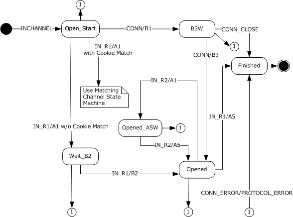
<!-- /Extracted images from page 113 -->

Figure 27: Inbound proxy state machine

The inbound proxy state machine is used when the inbound proxy is processing messages and PDUs
coming from the network. When the state machine transitions to "Use Matching Channel State
Machine", the state machine execution for this state machine stops and the current event (IN_R1/A1
with Cookie Match) is interpreted as IN_R2/A1 event for the state machine of the matching IN channel
as specified in section 3.2.3.5.5.

3.2.3.1  Abstract Data Model

This section describes a conceptual model of possible data organization that an implementation might
maintain to participate in this protocol. The described organization explains how the protocol behaves.
This document does not mandate that implementations adhere to this model as long as their external
behavior is consistent with that described in this document.

An inbound proxy maintains several abstract protocol variables and data structures:

  A Virtual Connection Cookie Table as described in the common virtual connection elements in

the preceding paragraphs.







For each Virtual Connection in the Virtual Connection Cookie Table, the common Virtual
Connection elements as described in the preceding paragraphs.

For each Virtual Connection, an IN Channel which consists of the ReceivingChannel elements as
described in the common section.

For each Virtual Connection, an OUT Channel which consists of the SendingChannel elements as
described in the common section.

  A set of Inbound Proxy-specific data elements as described in the following list.

113 / 154

[MS-RPCH] - v20240729
Remote Procedure Call over HTTP Protocol
Copyright © 2024 Microsoft Corporation
Release: July 29, 2024

  KeepAlive interval (section 3.2.3.1.4)

  Resource type UUID (section 3.2.3.1.5)

  Session UUID (section 3.2.3.1.6)

3.2.3.1.1 ChannelLifetime

ChannelLifetime is a protocol variable that contains the total number of bytes that can be sent across
this channel. The value of ChannelLifetime is set by the content length of the HTTP header when the
channel is established.

3.2.3.1.2 CurrentClientKeepAliveInterval

Implementations of this protocol MUST maintain a variable that contains the
CurrentClientKeepAliveInterval.

3.2.3.1.3 ClientAddress

Implementations of this protocol MUST maintain a variable that contains the IPv4 or IPv6 address of
the client (2.2.3.2).

3.2.3.1.4 KeepAlive interval

KeepAlive interval is a protocol variable that SHOULD be changed in response to network events.
Implementations of this protocol SHOULD interpret this variable as the maximum time interval that a
client can wait before it establishes with certainty whether the server has dropped out of a
conversation. The initial value is an implementation-specific value.<37>

3.2.3.1.5 Resource Type UUID

Implementations of this protocol MAY maintain a protocol variable for each virtual IN channel called
Resource Type UUID. Initially, when the IN channel is created, the value of this variable is not set.
This protocol variable is not currently used but is reserved for future extensibility.<38>

3.2.3.1.6 Session UUID

Implementations of this protocol MAY maintain a protocol variable for each virtual IN channel called
Session UUID. Initially, when the IN channel is created, the value of this variable is not set. This
protocol variable is not currently used but is reserved for future extensibility.<39>

3.2.3.1.7 Default IN Channel

During channel recycling, an inbound proxy MAY have two IN channels active. A default IN channel
is a protocol variable that indicates which of the two channels is the default channel. Outside channel
recycling, there is only one IN channel at a given point in time, and this channel is always considered
the default channel. The default channel MUST be used for sending all RPC PDUs and all RTS PDUs
not specifically defined to have different processing rules in section 3.2.3.5.

3.2.3.2  Timers

An implementation of the RPC over HTTP v2 protocol dialect on the inbound proxy SHOULD
implement the keep-alive timer as defined in section 3.2.3.2.1.

3.2.3.2.1 Keep-Alive Timer

[MS-RPCH] - v20240729
Remote Procedure Call over HTTP Protocol
Copyright © 2024 Microsoft Corporation
Release: July 29, 2024

114 / 154

The recurring keep-alive timer MUST be first set when an IN channel from the inbound proxy to the
server is opened. The interval MUST be equal to the keep-alive interval protocol variable that is set
through network events. This timer is set in the RPC over HTTP v2 protocol layer but is implemented
by the TCP implementation on the inbound proxy, and its expiry shows up as a connection error on
the IN channel to the server.

3.2.3.3  Initialization

As part of initialization, implementations of this protocol MUST listen on HTTP/HTTPS URL namespace
"/rpc/rpcproxy.dll" and SHOULD listen on HTTP/HTTPS URL namespace
"/rpcwithcert/rpcproxy.dll".<40>

  Connection Timeout (section 3.2.1.1.6.1) is initialized to a value specified in the local server

registry.<41>

  Default IN Channel (section 3.2.3.1.7) is initialized to indicate the first or primary channel.

  KeepAlive Interval is initialized to half of the Connection Timeout value.



The Virtual Connection Cookie Table is initialized to an empty table with no rows.

3.2.3.4  Higher-Layer Triggered Events

There are no higher-layer triggered events on the inbound proxy.

3.2.3.5  Message Processing Events and Sequencing Rules

The messages and PDUs listed in this section correspond to events in the state diagram in section
3.2.3.

All messages not specifically listed in this section and not marked for PDU forwarding as specified in
section 3.2.1.5.2, or messages whose syntax is specified in section 2 of this protocol as invalid,
SHOULD be treated by implementations of this protocol on the inbound proxy as protocol errors, as
defined in section 3.2.3.5.10.

3.2.3.5.1 RPC IN Channel Request Received

When an RPC over HTTP v2 proxy receives an RPC IN channel HTTP request, it MUST assume the
role of an inbound proxy and transition to Open_Start state. The processing of the HTTP header
fields from the HTTP request are defined as follows:

Accept: Implementations of this protocol on the inbound proxy SHOULD ignore this header field.

Cache-Control: Implementations of this protocol on the inbound proxy SHOULD ignore this header
field.

Connection: Implementations of this protocol on the inbound proxy SHOULD ignore this header field.

Content-Length: Implementations of this protocol on the inbound proxy SHOULD ignore this header
field.

Pragma Directives:





Implementations of this protocol on the inbound proxy SHOULD ignore the "No-cache" pragma
directive if present.

Implementations of this protocol on the inbound proxy SHOULD ignore the
"Pragma:MinConnTimeout=T" directive if present.

115 / 154

[MS-RPCH] - v20240729
Remote Procedure Call over HTTP Protocol
Copyright © 2024 Microsoft Corporation
Release: July 29, 2024





Implementations of this protocol on the inbound proxy SHOULD check for the presence of the
"Pragma:ResourceTypeUuid=R" directive and if present, MUST set the Resource Type UUID
protocol variable to the R value.

Implementations of this protocol on the inbound proxy SHOULD check for the presence of the
"Pragma:SessionId=S" directive and if present, MUST set the Session UUID protocol variable to
the S value.

Protocol: Implementations of this protocol on the inbound proxy SHOULD ignore this header field.

User-Agent: Implementations of this protocol on the inbound proxy SHOULD ignore this header field.

3.2.3.5.2 RPC PDU Received

An RPC PDU MUST be received from the client only and MUST NOT be received from the server. If the
RPC PDU is received on an IN channel from the server, the inbound proxy MUST close the IN channel
to the server and the IN channel to the client for the virtual IN channel to which the IN channel to
the server belongs.

If the PDU is received from the client as specified in section 2.1.2.1.7, an implementation of this
protocol MUST forward it to the server using the default IN channel and conforming to flow control
provisions as specified in section 3.2.1.4.1.2.

3.2.3.5.3 CONN/B1 RTS PDU

An inbound proxy implementation MUST NOT accept the CONN/B1 RTS PDU in any state other than
Open_Start. If it is received in any other state, the inbound proxy MUST treat this PDU as a protocol
error as defined in section 3.2.3.5.10.

If this RTS PDU is received in Open_Start state, the inbound proxy implementation MUST perform the
following actions in the sequence given:

1.  Establish a TCP connection to the server using the server name and port from the IN channel

request as specified in section 2.2.2.

2.  Set the keep-alive protocol variable to the value from the ClientKeepalive command of this PDU.

  Set the value of ChannelLifetime in the inbound proxy Virtual Connection to the value of

ChannelLifetime from the CONN/B1 PDU.

  Set the value of the DefaultInChannelCookie in the inbound proxy Virtual Connection to the

value of INChannelCookie from the CONN/B1 PDU.

3.  Set the value of AssociationGroupId in the inbound proxy Virtual Connection to the value of

AssociationGroupId in the CONN/B1 PDU.

4.  Send the CONN/B2 RTS PDU to the server as specified in section 2.2.4.6.

5.  Set the value of ConnectionTimeout in the CONN/B2 RTS PDU to the value of ConnectionTimeout

in the inbound proxy Virtual Connection.

6.  Set the value of INChannelCookie in the CONN/B2 RTS PDU to the value of

DefaultInChannelCookie from the inbound proxy Virtual Connection.

7.  Set the value of ReceiveWindowSize in the CONN/B2 RTS PDU to the value of ReceiveWindowSize

in the inbound proxy Virtual Connection.

8.  Set the value of VirtualConnectionCookie in the CONN/B2 RTS PDU to the value of

VirtualConnectionCookie from the inbound proxy Virtual Connection.

[MS-RPCH] - v20240729
Remote Procedure Call over HTTP Protocol
Copyright © 2024 Microsoft Corporation
Release: July 29, 2024

116 / 154

9.  Set the value of ProtocolVersion in the CONN/B2 RTS PDU to the value of ProtocolVersion from the

inbound proxy Protocol Version.

10. Add the virtual connection cookie to the virtual connection cookie table.

11. Switch the IN channel to the server to plugged channel mode.

12. Transition the state to B3W.

3.2.3.5.4 CONN/B3 RTS PDU

An inbound proxy implementation MUST NOT accept the CONN/B3 RTS PDU in any state other than
B3W. If it is received in any other state, this PDU is a protocol error and the inbound proxy MUST
treat it as a protocol error as specified in section 3.2.3.5.10.

If this RTS PDU is received in B3W state, the inbound proxy implementation MUST perform the
following actions in the sequence given:

1.  Switch the IN channel to the server to unplugged channel mode.

2.  Set the value of PeerReceiveWindow in the inbound proxy OUT channel to the value of

ReceiveWindowSize in the CONN/B3 PDU.

3.  Transition the state to opened.

3.2.3.5.5 IN_R1/A1 and IN_R2/A1 RTS PDUs

The IN_R1/A1 RTS PDU and the IN_R2/A1 RTS PDU have the same format and are processed
identically by the inbound proxy. This section defines processing for IN_R1/A1 only, but the same
processing rules apply to IN_R2/A1.

An inbound proxy implementation MUST NOT accept this RTS PDU in any state other than
Open_Start. If received in any other state, this PDU is a protocol error and the inbound proxy MUST
treat it as a protocol error as specified in section 3.2.3.5.10.

If this RTS PDU is received in Open_Start state, the inbound proxy implementation MUST retrieve the
virtual connection cookie from the IN_R1/A1 RTS PDU and search for a matching entry in the virtual
connection cookie table. If found, it MUST execute the sequence of steps in section 3.2.3.5.5.1. If not
found, it MUST execute the sequence of steps in section 3.2.3.5.5.2.

3.2.3.5.5.1  Virtual Connection Cookie Found

If the virtual connection cookie is found in the virtual connection cookie table, an implementation of
this protocol MUST execute these steps:

1.  Inbound proxy MUST conform to IN_R2 protocol sequence.

2.  The virtual IN channel that belongs to the virtual connection found in the virtual connection
cookie table is verified to be in opened state. If the verification fails, it is a protocol error and
MUST be treated as a protocol error as specified in section 3.2.3.5.10. If the verification succeeds,
the IN channel instance MUST be set as a nondefault IN channel and a component of the virtual IN
channel found through the virtual connection cookie table. In terms of virtual IN channel state
machine, this message MUST effect a transition as an IN_R2/A1 event from the opened state to
the Opened_A5W state.

3.  The successor IN channel from client to inbound proxy is switched to plugged channel mode.

4.  The server MUST compare the value of PredecessorChannelCookie in the IN R2/A1 PDU to the
value of the DefaultInChannelCookie from the inbound proxy Virtual Connection. If they do not
match, the server MUST treat it as a protocol error as specified in section 3.2.3.5.10.

117 / 154

[MS-RPCH] - v20240729
Remote Procedure Call over HTTP Protocol
Copyright © 2024 Microsoft Corporation
Release: July 29, 2024

5.  Set the value of the DefaultInChannelCookie in the inbound proxy Virtual Connection to the value

of SuccessorChannelCookie from the IN R2/A1 PDU.

6.  Wait for further network events.

3.2.3.5.5.2  Virtual Connection Cookie Not Found

If the virtual connection cookie is not found in the virtual connection cookie table, an
implementation of this protocol MUST execute these steps:

1.  The inbound proxy MUST conform to IN_R1 protocol sequence.

2.  Establish a TCP connection to the server using the server name and port from the IN channel

request, as specified in section 2.2.2.

3.  Add the virtual connection cookie to the virtual connection cookie table.

4.  Send IN_R1/A2 RTS PDU, as specified in section 2.2.4.11, to the server.

The IN_R1/A2 RTS PDU InboundProxyReceiveWindowSize and
InboundProxyConnectionTimeout fields come from the IN channel protocol variables
ReceiveWindowSize (section 3.2.1.1.5.1.1) and ConnectionTimeout (section 3.2.1.1.6.1),
respectively.

5.  Set the value of ProtocolVersion in the IN_R1/A2 RTS PDU to the value of ProtocolVersion from the

inbound proxy Virtual Connection.

6.  Set the value of NonDefaultInChannelCookie in the inbound proxy Virtual Connection to the value

of PredecessorChannelCookie from the IN_R1/A1 PDU.

7.  Set the value of DefaultInChannelCookie in the inbound proxy Virtual Connection to the value of

SuccessorChannelCookie from the IN_R1/A1 PDU.

8.  Switch the successor IN channel to plugged channel mode.

9.  Transition to state Wait_B2.

3.2.3.5.6 IN_R1/A5 RTS PDU

An inbound proxy implementation MUST NOT accept the IN_R1/A5 RTS PDU in any state other than
opened. If received in any other state, this PDU is a protocol error and the inbound proxy MUST treat
it as a protocol error as specified in section 3.2.3.5.10.

If this RTS PDU is received in opened state, the inbound proxy implementation MUST perform the
following actions in the sequence given:

1.  Send IN_R1/A6 RTS PDU to the server. The IN_R1/A6 PDU is initialized by using the elements of

the IN_R1/A5 RTS PDU.

2.  Send RPC PDUs queued due to flow control, if it has any, to the server as specified in section

3.2.1.4.1.3.

3.  Send IN_R1/B1 RTS PDU to the server.

4.  Close the connection to the client and to the server.

5.  Transition to the finished state.

3.2.3.5.7 IN_R1/B2 RTS PDU

[MS-RPCH] - v20240729
Remote Procedure Call over HTTP Protocol
Copyright © 2024 Microsoft Corporation
Release: July 29, 2024

118 / 154

An inbound proxy implementation MUST NOT accept the IN_R1/B2 RTS PDU in any state other than
Wait_B2. If received in any other state, this PDU is a protocol error and the inbound proxy MUST treat
it as a protocol error as specified in section 3.2.3.5.10.

If this RTS PDU is received in Wait_B2 state, the inbound proxy implementation MUST perform the
following actions in the sequence given:

1.  Switch the successor IN channel to unplugged channel mode.

2.  Set the value of PeerReceiveWindow in the inbound proxy OUT Channel to the value from

ServerReceiveWindowSize from the IN_R1/B2 RTS PDU.

3.  Transition the state to opened.

3.2.3.5.8 IN_R2/A5 RTS PDU

An inbound proxy implementation MUST NOT accept the IN_R2/A5 RTS PDU in any state other than
Opened_A5W, and it MUST NOT accept this RTS PDU unless it is sent on the predecessor IN channel
from the client to the inbound proxy. If either of these conditions is not met, this PDU is a protocol
error and the inbound proxy MUST treat it as protocol error as specified in section 3.2.3.5.10.

If this RTS PDU is received in Opened_A5W state, the inbound proxy implementation MUST perform
the following actions in the sequence given:

1.  Verify that the channel cookie in this RTS PDU matches the successor IN channel cookie. If it does
not match, it MUST close the successor IN channel, transition to opened state, and skip the rest of
the steps in this section.

2.  Transition the state to opened.

3.  Close the predecessor IN channel to the client.

3.2.3.5.9 Echo Request PDU

An inbound proxy implementation MUST NOT accept the Echo Request PDU in any state other than
Open_Start. If received in any other state, this PDU is a protocol error and the inbound proxy
implementation MUST treat it as a protocol error as specified in section 3.2.3.5.10.

If this PDU is received in an Open_Start state, then the inbound proxy implementation MUST perform
the following actions in the sequence given:

  Send an Echo Response PDU to the client.



Transition to the Finished state.

3.2.3.5.10

Connection Close, Connection Error, and Protocol Error Encountered

Connection close and connection error encountered MUST be processed identically by implementations
of this protocol. This section discusses connection close only, and implementations of this protocol
MUST process connection errors that it encounters in the same way.

A connection close can come from either the client or the server. If a connection close comes from the
client, the inbound proxy MUST free any data structures associated with it. If the connection close
does not come while in a finished state, the inbound proxy MUST close all IN channels to the client
and all IN channels to the server that belong to the virtual connection on which the close occurred,
free all data structures associated with the virtual connection, and transition to the finished state. If
the connection closed comes in the finished state, the inbound proxy MUST ignore this event.

If a connection close comes from the server, the inbound proxy MUST close all IN channels to the
client and all IN channels to the server that belong to the virtual connection on which the close

119 / 154

[MS-RPCH] - v20240729
Remote Procedure Call over HTTP Protocol
Copyright © 2024 Microsoft Corporation
Release: July 29, 2024

occurred, free all data structures associated with the virtual connection, and transition to the finished
state.

Protocol error MUST be handled by the inbound proxy implementation by closing all IN channels to the
client and all IN channels to the server that belong to the virtual connection on which the error
occurred, freeing all data structures associated with the virtual connection, and transition to the
finished state.

3.2.3.5.11

Processing Errors

If an implementation of this protocol on the inbound proxy encounters a processing error outside
protocol errors, it SHOULD try to send an IN channel response as specified in section 2.1.2.1.3. If an
implementation runs out of local resources to create a well-formed IN channel response as defined in
this section, it SHOULD close the connection as if a protocol error was encountered as specified in
section 3.2.3.5.10. If it is able to create a well-formed IN channel response, an implementation of this
protocol performs the following steps:

  MUST set the status-code to 503.

  MUST set the RPC-Error field from the IN channel response to a hexadecimal representation of an

implementation-specific error code. Windows implementations use Windows error codes as
specified in [MS-ERREF].

  SHOULD set the ee-info part of the reason-phrase from the IN channel response whenever the

inbound proxy has additional error information in the format specified in [MS-EERR], as follows:
EncodedEEInfo from the IN channel response SHOULD be set to a base64-encoded BLOB of the
extended error information, as specified in [MS-EERR]. The base64 encoding MUST be as specified
in [RFC4648] section 4. The content of the BLOB itself is specified in [MS-EERR]. Implementations
of this protocol SHOULD ensure that the total length of the reason-phrase line does not exceed
1,024 bytes.

  SHOULD set the message body as specified in section 2.1.2.1.3, and the EncodedEEInfo SHOULD
be set to a base64-encoded BLOB. The base64 encoding MUST be as specified in [RFC3548]
section 4. The content of the BLOB is as specified in [MS-EERR].

3.2.3.5.12

Legacy Server Response

Inbound proxies MUST ignore the legacy server response and MUST NOT treat the absence of a
legacy server response as a protocol error.

3.2.3.6  Timer Events

The keep-alive timer specified in section 3.2.3.2.1 does not expire in a way that results in events for
this protocol.

3.2.3.7  Other Local Events

An implementation of this protocol is not required to handle other local events.

3.2.4  Outbound Proxy Details

This section gives details specific to an implementation of an outbound proxy. The state machine in
the following diagram specifies the states and the transitions between them for the outbound proxy.
Which event causes which transition is specified in section 3.2.4.5.

[MS-RPCH] - v20240729
Remote Procedure Call over HTTP Protocol
Copyright © 2024 Microsoft Corporation
Release: July 29, 2024

120 / 154

<!-- Extracted images from page 121 -->
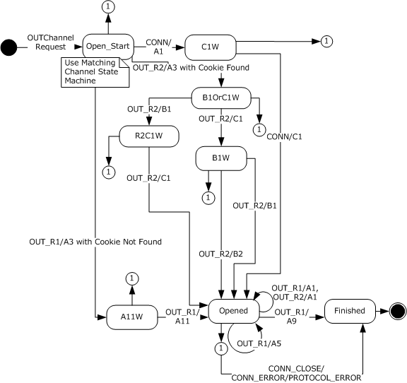
<!-- /Extracted images from page 121 -->

Figure 28: Outbound proxy state machine

The outbound proxy state machine is used when the outbound proxy is processing messages and
PDUs coming from the network. When the state machine transitions to "Use Matching Channel State
Machine", this means the state machine execution for this state machine stops and the current event
(OUT_R1/A3 with Cookie Match) is interpreted as OUT_R2/A3 event for the state machine of the
matching IN channel as specified in section 3.2.4.5.6.

3.2.4.1  Abstract Data Model

This section describes a conceptual model of possible data organization that an implementation
maintains to participate in this protocol. The described organization is provided to facilitate the
explanation of how the protocol behaves. This document does not mandate that implementations
adhere to this model as long as their external behavior is consistent with that described in this
document.

An outbound proxy maintains several abstract protocol variables and data structures:

  A virtual connection cookie table as described in the common section.



For each Virtual Connection, the data elements for a Virtual Connection as described in the
common section.

121 / 154

[MS-RPCH] - v20240729
Remote Procedure Call over HTTP Protocol
Copyright © 2024 Microsoft Corporation
Release: July 29, 2024

  An IN Channel consisting of the data elements for a Receiving Channel as described in the

common section.

  An OUT Channel consisting of the data elements for a Sending Channel and the Ping Originator as

described in the common section.

  A set of Outbound Proxy-specific data elements as described in the following list.

  Resource Type UUID (section 3.2.4.1.1)

  Session UUID (section 3.2.4.1.2)

3.2.4.1.1 Resource Type UUID

Implementations of this protocol MAY maintain a protocol variable for each virtual OUT channel
called Resource Type UUID. Initially, when the OUT channel is created, the value of this variable is not
set. This protocol variable is not currently used but is reserved for future extensibility.<42>

3.2.4.1.2 Session UUID

Implementations of this protocol MAY maintain a protocol variable, called Session UUID, for each
virtual OUT channel. Initially, when the OUT channel is created, the value of this variable is not set.
This protocol variable is not currently used but is reserved for future extensibility.<43>

3.2.4.2  Timers

An implementation of the RPC over HTTP v2 protocol dialect on the outbound proxy SHOULD
implement the connection time-out timer defined in section 3.2.1.2.2.

3.2.4.3  Initialization

As part of initialization, implementations of this protocol MUST listen on HTTP/HTTPS URL namespace
"/rpc/rpcproxy.dll" and SHOULD listen on HTTP/HTTPS URL namespace
"/rpcwithcert/rpcproxy.dll".<44>

3.2.4.4  Higher-Layer Triggered Events

There are no higher-layer triggered events on the outbound proxy.

3.2.4.5  Message Processing Events and Sequencing Rules

The messages and PDUs listed in this section correspond to events in the state diagram in section
3.2.4.

All messages not specifically listed in this section and not marked for PDU forwarding as specified in
section 3.2.1.5.2, or messages whose syntax is specified in section 2 of this protocol as invalid,
SHOULD be treated by implementations of this protocol on the outbound proxy as protocol errors as
specified in section 3.2.4.5.14.

3.2.4.5.1 RPC OUT Channel Request Received

When an RPC over HTTP v2 proxy receives the RPC OUT channel HTTP request, it MUST assume the
role of an outbound proxy and transition to the Open_Start state. The processing of the HTTP header
fields from the HTTP request are defined as follows:

Accept: Implementations of this protocol on the outbound proxy SHOULD ignore this header field.

[MS-RPCH] - v20240729
Remote Procedure Call over HTTP Protocol
Copyright © 2024 Microsoft Corporation
Release: July 29, 2024

122 / 154

Cache-Control: Implementations of this protocol on the outbound proxy SHOULD ignore this header
field.

Connection: Implementations of this protocol on the outbound proxy SHOULD ignore this header
field.

Content-Length: Implementations of this protocol on the outbound proxy SHOULD ignore this header
field.

Pragma Directives:









Implementations of this protocol on the outbound proxy SHOULD ignore pragma directive "No-
cache".

If the "Pragma:MinConnTimeout=T" directive is present, implementations of this protocol on the
outbound proxy MUST initialize the ConnectionTimeout protocol variable to the value of T from the
pragma.

Implementations of this protocol on the outbound proxy SHOULD check for the presence of the
"Pragma:ResourceTypeUuid=R" directive, and if present, MUST set the Resource Type UUID
protocol variable to the R value.

Implementations of this protocol on the outbound proxy SHOULD check for the presence of the
"Pragma:SessionId=S" directive, and if present, MUST set the Session UUID protocol variable to
the S value.

Protocol: Implementations of this protocol on the outbound proxy SHOULD ignore this header field.

User-Agent: Implementations of this protocol on the outbound proxy SHOULD ignore this header
field.

3.2.4.5.2 RPC PDU Received

An RPC PDU MUST be received from the server only and MUST NOT be received from the client. If the
RPC PDU is received on an OUT channel from the client, the outbound proxy MUST close the OUT
channel to the client and the OUT channel to the server for the virtual OUT channel to which the
OUT channel to the client belongs.

If the PDU is received from the server on a given connection, an implementation of this protocol
MUST find the default OUT channel that belongs to the same virtual connection as the connection on
which the PDU from the server was received. Once the OUT channel is found, an implementation of
this protocol MUST copy the PDU as a BLOB in the message body of this OUT channel request as
defined in section 2.1.2.1.2 and send the PDU subject to flow control requirements as specified in
section 3.2.1.5.1.

3.2.4.5.3 CONN/A1 RTS PDU

An outbound proxy implementation MUST NOT accept the CONN/A1 RTS PDU in any state other than
Open_Start. If it is received in any other state, the outbound proxy MUST treat this PDU as a protocol
error as specified in section 3.2.4.5.14.

If this RTS PDU is received in Open_Start state, the outbound proxy implementation MUST perform
the following actions in the sequence given:

1.  Establish a TCP connection to the server using the server name and port from the OUT channel

request as specified in section 2.2.2.

2.  Send CONN/A2 RTS PDU to the server, setting the ChannelLifetime field to the value of the

ChannelLifetime protocol variable of the Virtual OUT Channel.

123 / 154

[MS-RPCH] - v20240729
Remote Procedure Call over HTTP Protocol
Copyright © 2024 Microsoft Corporation
Release: July 29, 2024

3.  Set the value of OutChannelCookie in the CONN/A2 RTS PDU to the value of
DefaultOutChannelCookie from the outbound proxy Virtual Connection.

4.  Set the value of ReceiveWindowSize in the CONN/A2 RTS PDU to the value of ReceiveWindow from

the outbound proxy Virtual Connection.

5.  Set the value of ProtocolVersion in the CONN/A2 RTS PDU to the value of ProtocolVersion from the

outbound proxy Virtual Connection.

6.  If all operations so far have been successful, send an OUT channel response on the OUT channel

to the client. The fields for OUT channel response are defined as follows:

  HTTP-Version: MUST be the string "HTTP/1.1".

  Status-Code: MUST be the string "200".

  Reason-Phrase: MUST be "Success".

  Content-Type: Outbound proxies MUST set this header field to the string "application/rpc".

  Content-Length: Outbound proxies MUST set this field to an implementation-specific value in

the inclusive range of 128 kilobytes to 2 gigabytes.<45>

In failure case, the outbound proxy MUST use the same processing rules as the inbound proxy
as defined in section 3.2.3.5.11 and skip the rest of the processing in this section.

7.  Send CONN/A3 RTS PDU on the OUT channel to the client. Set the value of ConnectionTimeout in

the CONN/A3 RTS PDU to the value of ConnectionTimeout from the outbound proxy Virtual
Connection.

8.  Add the virtual connection cookie to the virtual connection cookie table.

9.  The ReceiveWindowSize from this PDU MUST be used to set the ReceiveWindowSize ADM from

section 3.2.1.1.5.1.1.

10. Set the value of DefaultOutChannelCookie in the outbound proxy Virtual Connection to the value

of OutChannelCookie in the CONN/A1 RTS PDU.

11. Transition the state to C1W and wait for further network events.

3.2.4.5.4 CONN/C1 RTS PDU

An outbound proxy implementation MUST NOT accept the CONN/C1 RTS PDU in any state other than
C1W. If it is received in any other state, the outbound proxy MUST treat this PDU as a protocol error
as specified in section 3.2.4.5.14.

If this RTS PDU is received in C1W state, the outbound proxy implementation MUST perform the
following actions in the sequence given:

1.  Send CONN/C2 RTS PDU on the OUT channel to the client. The CONN/C2 RTS PDU is initialized

using the elements of the CONN/C1 RTS PDU.

2.  Set the value of ProtocolVersion in the CONN/C2 RTS PDU to the value of ProtocolVersion in the

outbound proxy Virtual Connection.

3.  Set the value of ReceiveWindowSize in the CONN/C2 RTS PDU to the value of ReceiveWindowSize

in the Outbound Proxy In Channel.

4.  Set the value of ConnectionTimeout in the CONN/C2 RTS PDU to the value of ConnectionTimeout

in the Outbound Proxy Virtual Connection.

124 / 154

[MS-RPCH] - v20240729
Remote Procedure Call over HTTP Protocol
Copyright © 2024 Microsoft Corporation
Release: July 29, 2024

5.  Transition the state to opened.

3.2.4.5.5 OUT_R1/A1 or OUT_R2/A1 RTS PDUs

The OUT_R1/A1 RTS PDU and the OUT_R2/A1 RTS PDU have the same format and are processed
identically by the outbound proxy. This section explains processing for OUT_R1/A1 only, but the same
processing rules apply to OUT_R2/A1.

An outbound proxy implementation MUST NOT accept this RTS PDU in any state other than opened. If
it is received in any other state, the outbound proxy MUST treat this PDU as a protocol error as
specified in section 3.2.4.5.14.

If this RTS PDU is received in opened state, the outbound proxy implementation MUST send
OUT_R1/A2 or OUT_R2/A2 to the client, depending on whether OUT_R1/A1 or OUT_R2/A1 is received
on the default OUT channel. OUT_R1/A2 and OUT_R2/A2 have the same format.

3.2.4.5.6 OUT_R1/A3 or OUT_R2/A3 RTS PDUs

The OUT_R1/A3 RTS PDU and the OUT_R2/A3 RTS PDU have the same format, and the outbound
proxy determines which RTS PDU it received based on internal state as defined in this section.

An outbound proxy implementation MUST NOT accept either of these RTS PDUs in any state other
than Open_Start. If they are received in any other state, the outbound proxy MUST treat these PDUs
as a protocol error as specified in section 3.2.4.5.14.

If either of these RTS PDUs is received in the Open_Start state, the outbound proxy implementation
MUST retrieve the virtual connection cookie from the OUT_R1/A3 RTS PDU and search for a
matching cookie in the virtual connection cookie table. If found, it MUST execute the sequence of
steps specified in section 3.2.4.5.6.1. If not found, it MUST execute the sequence of steps specified in
section 3.2.4.5.6.2.

3.2.4.5.6.1  Virtual Connection Cookie Found

If the virtual connection cookie is found in the virtual connection cookie table, an implementation of
this protocol MUST execute these steps:

1.  Conform the outbound proxy to the OUT_R2 protocol sequence.

2.  Initialize an instance of the Outbound Proxy OUT Channel and set the Non Default Outbound

Channel Reference of the Outbound Proxy Virtual Connection, which is considered the successor
channel.

3.  Set the Non Default OUT Channel Cookie in the Outbound Proxy Virtual Connection to the value of

SuccessorChannelCookie in the OUT_R2/A3 RTS PDU.

4.  Compare the PredecessorChannelCookie in the OUT_R2/A3 PDU to the Default OUT Channel

Cookie in the Outbound Proxy Virtual Connection. If they do not match, the outbound proxy MUST
treat this PDU as a protocol error as specified in section 3.2.4.5.14.

5.  Set the value of PeerReceiveWIndow in the outbound proxy OUT Channel to the value of

OutboundProxyReceiveWindowSize in the OUT R2/A3 RTS PDU.

6.  Send OUT_R2/A4 RTS PDU to the server.

7.  Switch the successor OUT channel instance to plugged channel mode.

8.  Transition the state machine to state B1OrC1W.

3.2.4.5.6.2  Virtual Connection Cookie Not Found

125 / 154

[MS-RPCH] - v20240729
Remote Procedure Call over HTTP Protocol
Copyright © 2024 Microsoft Corporation
Release: July 29, 2024

If the virtual connection cookie is not found in the virtual connection cookie table, an
implementation of this protocol MUST execute these steps:

1.  Conform the outbound proxy to the OUT_R1 protocol sequence.

2.  Establish a TCP connection to the server using the server name and port from the OUT channel

request as specified in section 2.2.2.

3.  Send OUT_R1/A4 RTS PDU to the server, setting the ChannelLifetime field to the value of the

ChannelLifetime protocol variable of the Virtual OUT Channel of the virtual connection.

4.  Set the value of OutboundProxyConnectionTimeout in the OUT R1/A4 RTS PDU to the value of

ConnectionTimeout from the outbound proxy Virtual Connection.

5.  Set the value of OutboundProxyReceiveWindowSize in the OUT R1/A4 RTS PDU to the value of

ReceiveWindowSize in the outbound proxy Virtual Connection.

6.  Set the value of PredecessorChannelCookie in the OUT R1/A4 RTS PDU to the value of

DefaultOutChannelCookie in the outbound proxy Virtual Connection.

7.  Set the value of SuccessorChannelCookie in the OUT R1/A4 RTS PDU to the value of

NonDefaultOutChannelCookie from the outbound proxy Virtual Connection.

8.  Set the value of ProtocolVersion in the OUT R1/A4 RTS PDU to the value of ProtocolVersion from

the outbound proxy Virtual Connection.

9.  Switch the successor OUT channel instance to plugged channel mode.

10. Transition to state A11W.

3.2.4.5.7 OUT_R1/A5 RTS PDU

An outbound proxy implementation MUST NOT accept the OUT_R1/A5 RTS PDU in any state other
than opened. If it is received in any other state, the outbound proxy MUST treat this PDU as a
protocol error as specified in section 3.2.4.5.14.

If this RTS PDU is received in opened state, the outbound proxy implementation MUST send the
OUT_R1/A6 RTS PDU to the client on the default OUT channel. The OUT R1/A6 RTS PDU is initialized
using the elements of the OUT R1/A5 RTS PDU.  The state remains unchanged.

3.2.4.5.8 OUT_R1/A9 RTS PDU

An outbound proxy implementation MUST NOT accept the OUT_R1/A9 RTS PDU in any state other
than opened. If it is received in any other state, the outbound proxy MUST treat this PDU as a
protocol error as specified in section 3.2.4.5.14.

If this RTS PDU is received in opened state, an implementation of the outbound proxy implementation
MUST execute these steps:

  Send RPC PDUs that might be queued due to flow control to the client on the default OUT

channel, observing flow control rules as specified in section 3.2.1.4.1.3.

  Send OUT_R1/A10 RTS PDU to the client on the default OUT channel. Implementations SHOULD

NOT send any additional bytes on the connection.<46>

  Close the connection to the client and to the server.



Transition the state to the finished state.

3.2.4.5.9 OUT_R1/A11 RTS PDU

[MS-RPCH] - v20240729
Remote Procedure Call over HTTP Protocol
Copyright © 2024 Microsoft Corporation
Release: July 29, 2024

126 / 154

An outbound proxy implementation MUST NOT accept the OUT_R1/A11 RTS PDU in any state other
than A11W. If it is received in another state, the outbound proxy MUST treat this PDU as a protocol
error as specified in section 3.2.4.5.14.

If this RTS PDU is received in A11W state, the outbound proxy implementation MUST perform the
following actions in the sequence given:

1.  Switch the successor OUT channel to unplugged channel mode.

2.  Send an OUT channel response on the OUT channel to the client. The fields for an OUT channel

response are defined as follows:

  HTTP version: MUST be the string "HTTP/1.1".

  Status-Code: MUST be the string "200".

  Reason-Phrase: MUST be the string "Success".

  Content-Type: Outbound proxies MUST set this header field to the string "application/rpc".

  Content-Length: Outbound proxies MUST set this field to an implementation-specific value in

the inclusive range of 128 kilobytes to 2 gigabytes.<47>

3.  Transition the state to opened.

3.2.4.5.10  OUT_R2/B1 RTS PDU

An outbound proxy implementation MUST NOT accept the OUT_R2/B1 RTS PDU in any state other
than B1W or B1OrC1W. If this condition is not met, the outbound proxy MUST treat this PDU as a
protocol error as specified in section 3.2.4.5.14.

If this RTS PDU is received in B1W state, the outbound proxy implementation MUST perform the
following actions in the sequence given:

1.  Send all RPC PDUs that might be queued due to flow control to the client on the default OUT

channel, observing flow control rules as specified in section 3.2.1.4.1.3.

2.  Send OUT_R2/B3 RTS PDU to the client on the default OUT channel. Implementations SHOULD

NOT send any additional bytes on the channel after the OUT_R2/B3 RTS PDU.<48>

3.  Switch the default OUT channel to the successor OUT channel instance.

4.  Switch the default OUT channel to unplugged channel mode.

5.  Send OUT channel response header as specified in section 2.1.2.1.4 on the successor OUT channel

instance.

6.  Transition the state to opened.

7.  Close the predecessor OUT channel to the client.

If this RTS PDU is received in the B1OrC1W state, the outbound proxy implementation MUST perform
the following actions in the sequence given:

1.  Send all RPC PDUs that might be queued due to flow control to the client on the default OUT

channel, observing flow control rules as specified in section 3.2.1.4.1.3

2.  Send OUT_R2/B3 RTS PDU to the client on the default OUT channel. Implementations SHOULD

NOT send any additional bytes on the channel after the OUT_R2/B3 RTS PDU.<49>

3.  Switch the default OUT channel to the successor OUT channel instance.

127 / 154

[MS-RPCH] - v20240729
Remote Procedure Call over HTTP Protocol
Copyright © 2024 Microsoft Corporation
Release: July 29, 2024

4.  Switch the default OUT channel to unplugged channel mode.

5.  Transition the state to R2C1W state and wait for further network events.

6.  Close the predecessor OUT channel to the client.

3.2.4.5.11  OUT_R2/C1 RTS PDU

An outbound proxy implementation MUST NOT accept the OUT_R2/C1 RTS PDU in any state other
than R2C1W or B1OrC1W. If this condition is not met, the outbound proxy MUST treat the PDU as a
protocol error as specified in section 3.2.4.5.14.

If this RTS PDU is received in the R2C1W state, the outbound proxy implementation MUST perform
the following actions in the sequence given:

1.  Send the OUT channel response header as specified in section 2.1.2.1.4 on the successor OUT

channel instance.

2.  Transition the state to opened.

If this RTS PDU is received in the B1OrC1W state, the outbound proxy implementation MUST perform
the following actions in the sequence given:



Transition the state to B1W state and wait for further network events.

3.2.4.5.12  OUT_R2/B2 RTS PDU

An outbound proxy implementation MUST NOT accept the OUT_R2/B2 RTS PDU in any state other
than B1W. If this condition is not met, this PDU is a protocol error and the outbound proxy MUST
treat it as a protocol error as specified in section 3.2.4.5.14.

If this RTS PDU is received in B1W state, the outbound proxy implementation MUST perform the
following actions in the sequence given:

1.  Transition the state to opened.

2.  Close the successor OUT channel to the client.

3.2.4.5.13

Echo Request PDU

An outbound proxy implementation MUST NOT accept the Echo Request PDU in any state other than
Open_Start. If this condition is not met, the outbound proxy implementation MUST treat it as a
protocol error as specified in section 3.2.4.5.14.

If this PDU is received in an Open_Start state, then the outbound proxy implementation MUST perform
the following actions in the sequence given:

  Send an Echo Response PDU to the client.



Transition to the Finished state.

3.2.4.5.14

Connection Close, Connection Error, and Protocol Error Encountered

Connection close and connection error encountered MUST be handled identically by implementations
of this protocol. This section discusses connection close. Implementations of this protocol MUST handle
connection errors that it encounters in the same way. A connection close can come from either the
client or the server. If a connection close comes from the client, the outbound proxy MUST free any
data structures associated with it. If the connection close does not come while in a finished state, the
outbound proxy MUST close all OUT channels to the client and all OUT channels to the server, free all

128 / 154

[MS-RPCH] - v20240729
Remote Procedure Call over HTTP Protocol
Copyright © 2024 Microsoft Corporation
Release: July 29, 2024

data structures associated with the virtual connection, and transition to finished state. If the
connection close comes in the finished state, the outbound proxy MUST ignore this event.

If a connection close comes from the server, the outbound proxy MUST close all OUT channels to the
client and all OUT channels to the server, free all data structures associated with the virtual
connection, and transition to finished state.

Protocol error MUST be handled by the outbound proxy implementation by closing all OUT channels to
the client and all OUT channels to the server, freeing all data structures associated with the virtual
connection, and transitioning to finished state.

3.2.4.5.15

Legacy Server Response

Outbound proxies MUST ignore the legacy server response and MUST NOT treat the absence of a
legacy server response as a protocol error.

3.2.4.6  Timer Events

Each time the connection time-out timer defined in section 3.2.1.2.2 expires, an implementation of
this protocol MUST send a Ping RTS PDU (section 2.2.4.49) on the default OUT channel for this virtual
connection. This will prevent network agents from closing the connection used by the OUT channel
response due to it being idle. An implementation of this protocol MAY choose when to notify the server
that it has sent a PDU to the client and thus consume part of the OUT channel lifetime. When it
chooses to notify the server, it MUST do so using a Ping Traffic Sent Notify RTS
PDU (section 2.2.4.47).<50>

3.2.4.7  Other Local Events

An implementation of this protocol is not required to handle other local events.

3.2.5  Server Details

This section gives details specific to an implementation of a server. The state machine shown in the
following figure specifies the states and the transitions between them for the server. Which event
causes which transition is specified in sections 3.2.5.4 and 3.2.5.5.

[MS-RPCH] - v20240729
Remote Procedure Call over HTTP Protocol
Copyright © 2024 Microsoft Corporation
Release: July 29, 2024

129 / 154

<!-- Extracted images from page 130 -->
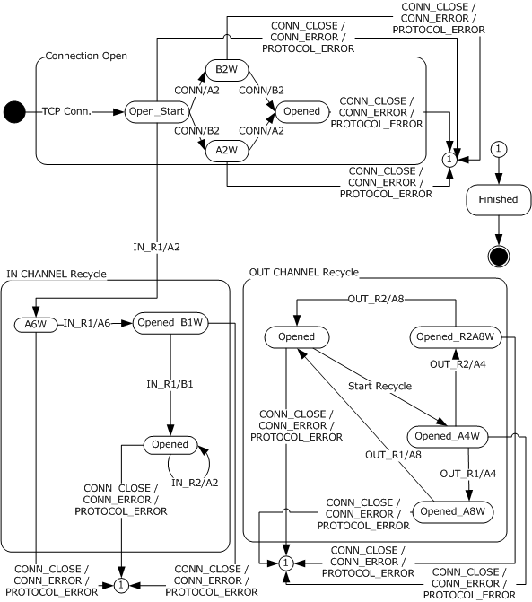
<!-- /Extracted images from page 130 -->

Figure 29: Server state machine

The server state machine is used when the server is processing messages and PDUs coming from the
network. The following description of the state machine is provided as an aid to understanding the
overall work of the state machines. This description is not a substitute for the processing specifications
in section 3.2.5.5.

The connection open state machine is used during connection opening. Once a transition to the
opened state of that state machine is made, the IN channel and OUT channel state machines are
started from the opened state. The IN channel and OUT channel have independent state machines
that run in parallel.

When a new TCP connection to the server is established, the server implementation does not yet know
whether this connection will be used to establish a new virtual connection or to recycle an IN
channel or an OUT channel. This is why, at this stage, the state machine is in Open_Start state. Once

130 / 154

[MS-RPCH] - v20240729
Remote Procedure Call over HTTP Protocol
Copyright © 2024 Microsoft Corporation
Release: July 29, 2024

an RTS PDU is received, an implementation of this protocol can inspect the RTS PDU and determine
which state machine it will use.

3.2.5.1  Abstract Data Model

This section describes a conceptual model of possible data organization that an implementation
maintains to participate in this protocol. The described organization is provided to facilitate the
explanation of how the protocol behaves. This document does not mandate that implementations
adhere to this model, as long as their external behavior is consistent with that described in this
document.

 When functioning in the server role, this protocol maintains a number of variables:

  A Virtual Connection Cookie Table as described in the common Abstract Data Model (ADM)

elements section.







For each Virtual Connection in the Virtual Connection Cookie Table, the Virtual Connection data
elements as described in the common section.

For each Virtual Connection, an OUT Channel consisting of the SendingChannel ADM elements in
the common section.

For each Virtual Connection, an IN Channel consisting of the ReceivingChannel ADM elements in
the common section.

  A number of server role-specific elements as described in the following list.



In Proxy Connection Timeout: a time duration used to configure the In Proxy Connection
Timer.

  Association Group Id: a cookie defined in section 2.2.3.1 that uniquely identifies an

association.

  Connection Setup Timer: a timer used to detect failed connection establishment as defined

in section 3.2.5.2.1.

  Client Address:  the client address as defined in section 2.2.3.2.

  Virtual IN Channel State: a variable to contain the current state of the Virtual IN Channel

State machine.

  Virtual OUT Channel State: a variable to contain the current state of the Virtual OUT

Channel State machine.

3.2.5.2  Timers

An implementation of the RPC over HTTP v2 protocol dialect on the server SHOULD implement the
connection setup timer defined in section 3.2.5.2.1.

3.2.5.2.1 Connection Setup Timer

The connections setup timer SHOULD be set to expire in 15 minutes. It is used to detect a case where
the IN channel of a virtual connection is set up but the OUT channel of the same virtual connection
is not, or vice versa.

3.2.5.3  Initialization

Implementations of this protocol MUST listen on a TCP port defined by a higher-level protocol.

131 / 154

[MS-RPCH] - v20240729
Remote Procedure Call over HTTP Protocol
Copyright © 2024 Microsoft Corporation
Release: July 29, 2024

The Virtual Connection Cookie Table is initialized as an empty table.

Default OUT Channel is initialized to indicate the first or primary channel. Except during channel
recycling, which is not active when the protocol is initialized, there is only a single OUT channel.

Temporary Cookie Variable is initialized to a new RTS cookie of arbitrary value. The initial value of
the cookie will not be used in protocol behavior.

3.2.5.3.1 Virtual Connection Cookie Table

The Server Virtual Connection Cookie table is initialized to an empty state.

3.2.5.3.2 Server Virtual Connection

The Server Virtual Connection is initialized from a CONN/A2, as defined in section 3.2.5.5.3, or a
CONN/B2 PDU, as defined in section 3.2.5.5.4.

  Server Virtual Connection Cookie - the cookie is copied from the VirtualConnectionCookie in either

the CONN/A2 or CONN/B2 packet.

  Default In Channel Reference - If this is a CONN/B2 packet, then a Server In Channel is initialized

from the CONN/B2 packet and set; otherwise, this is set to an empty reference.

  Non-Default In Channel Reference - initialized to an empty reference.

  Default Out Channel Reference - If this is a CONN/A2 packet, then a Server Out Channel is
initialized from the CONN/A2 packet and set; otherwise, this is set to an empty reference.





 Non-Default Out Channel Reference - initialized to an empty reference.

In Channel State - initialized to the Open_Start state.

  Out Channel State - initialized to the Open_Start state.





Protocol Version - initialized from Version field of either the CONN/A2 or the CONN/B2 PDU.

In Proxy Connection Timeout - initialized from the ConnectionTimeout field of the CONN/B2
PDU.

  Association Group ID - initialized from the CONN/B2 PDU.

  Connection Setup Timer - initialized as defined in section 3.2.5.2.1.

  Client Address - initialized from the CONN/B2 PDU.

3.2.5.4  Higher-Layer Triggered Events

An implementation of this protocol dialect on the server MUST handle sending a PDU from a higher
layer.

3.2.5.4.1 Sending a PDU

When an implementation of a higher-level protocol calls to an implementation of this protocol to send
a PDU to the client, the implementation of this protocol MUST send the PDU on the default OUT
channel to the outbound proxy, subject to flow control requirements as specified in section 3.2.1.5.1.

If the implementation of this protocol encounters an error while sending the data, it MUST take the
following actions:



Indicate to the higher layer, in an implementation-specific way, that the operation failed.

132 / 154

[MS-RPCH] - v20240729
Remote Procedure Call over HTTP Protocol
Copyright © 2024 Microsoft Corporation
Release: July 29, 2024



Treat the connection as closed.

  Request the TCP protocol stack to close all IN channel and OUT channels that belong to this

virtual connection.

If the channel lifetime sent protocol variable for the default OUT channel approaches the channel
lifetime as specified later in this paragraph, the implementation of this protocol MUST initiate channel
recycling as defined in this section. An implementation MAY define when the number of bytes sent is
approaching the channel lifetime in an implementation-specific way. However, it SHOULD define it in
such a way as to open the successor OUT channel early enough so that it is fully opened before the
predecessor channel has channel lifetime, and yet use as much of the predecessor channel as it
can.<51>

For more information on the protocol sequences associated with OUT channel recycling, see sections
3.2.1.5.3.4 and 3.2.1.5.3.5 of this document.

3.2.5.5  Message Processing Events and Sequencing Rules

Unless explicitly specified in a message or PDU section, the messages and PDUs listed in this section
correspond to events in the state diagram at the beginning of section 3.2.5.

All messages not specifically listed in this section, or messages whose syntax is specified in section 2
of this protocol as invalid, SHOULD be treated by implementations of this protocol on the server as
protocol errors, as defined in section 3.2.5.5.13.

3.2.5.5.1 Establishing a Connection

When a connection to the server is established, the server SHOULD send the legacy server response
as specified in section 2.1.1.2.1 and transition to state Open_Start.

3.2.5.5.2 Receiving an RPC PDU

When an implementation of this protocol receives an RPC PDU, it MUST pass it on to a higher-layer
protocol without modifying the contents of the RPC PDU. This happens in an implementation-specific
way. If it encounters a protocol error while processing the RPC PDU, it MUST handle the error as
defined in section 3.2.5.5.13.<52>

3.2.5.5.3 CONN/A2 RTS PDU

A server implementation MUST NOT accept the CONN/A2 RTS PDU in any state other than Open_Start
or A2W. If this condition is not met, the server MUST treat this PDU as a protocol error as specified in
section 3.2.5.5.13.

A server implementation MUST extract the virtual connection cookie from the CONN/A2 RTS PDU
and search for this cookie value in the virtual connection cookie table. If found, the virtual connection
is called the existing virtual connection. In such a case, the server implementation MUST verify that
the existing virtual connection is in state A2W. If it is, the server implementation MUST continue
execution on the state machine of the existing virtual connection and MUST continue processing this
PDU as specified in section 3.2.5.5.3.2. If this condition is not met, the server MUST treat this PDU as
a protocol error, as specified in section 3.2.5.5.13.

If the server implementation fails to find a virtual connection in the virtual connection cookie table
with the same cookie as the virtual connection cookie from this PDU, the server MUST continue
processing as specified in section 3.2.5.5.3.1 of this document. In such a case, the server
implementation MUST verify that the new virtual connection is in state Open_Start. If this condition
is met, the server MUST treat this PDU as a protocol error, as specified in section 3.2.5.5.13

3.2.5.5.3.1  Virtual Connection Not Found

133 / 154

[MS-RPCH] - v20240729
Remote Procedure Call over HTTP Protocol
Copyright © 2024 Microsoft Corporation
Release: July 29, 2024

If the virtual connection is not found in the virtual connection cookie table as specified in the
previous section, an implementation of this protocol MUST perform the following actions in the
sequence given:

1.  Set up the connection setup timer defined in section 3.2.5.2.1.

2.  Add the virtual connection cookie to the virtual connection cookie table.

3.  Set the value of ChannelLifeTime in the server OUT Channel to the value of ChannelLifeTime from

the CONN/A2 RTS PDU.

4.  Set the value of DefaultOutChannelCookie in the server Virtual Connection to the value of

OUTChannelCookie from the CONN/A2 RTS PDU.

5.  Set the value of PeerReceiveWindow in the server OUT Channel to the value of ReceiveWindowSize

from the CONN/A2 RTS PDU.

6.  Set the value of ProtocolVersion in the server Virtual Connection to the value of ProtocolVersion

from the CONN/A2 RTS PDU.

7.  Transition to state B2W and wait for further events.

3.2.5.5.3.2  Virtual Connection Found

If the virtual connection is found in the virtual connection cookie table as specified in the previous
section, an implementation of this protocol MUST perform the following actions in the sequence given:

1.  Cancel the connection setup timer defined in section 3.2.5.2.1.

2.  Set the value of ProtocolVersion in the server Virtual Connection to the minimum of the value of
ServerVirtualConnection in the CONN/A2 PDU and the value of ProtocolVersion in the CONN/A2
PDU.

3.  Send CONN/C1 RTS PDU on the OUT channel to the outbound proxy.

1.  Set the value of ProtocolVersion in the CONN/C1 RTS PDU to the value of ProtocolVersion from

the server Virtual Connection.

2.  Set the value of ReceiveWindowSize in the CONN/C1 RTS PDU to the value of

InProxyReceiveWindowSize in the server Virtual Connection.

3.  Set the value of ConnectionTimeout in the CONN/C1 RTS PDU to the value of

InProxyConnectionTimeout from the server Virtual Connection.

4.  Send CONN/B3 RTS PDU on the IN channel to the inbound proxy.

1.  Set the value of ReceiveWindowSize in the CONN/B3 RTS PDU to the value of ReceiveWindow

from the server IN Channel.

2.  Set the value of Version in the CONN/B3 RTS PDU to the value of Protocol Version from the

Server Virtual Connection.

5.  Transition to opened state.

6.  The virtual IN channels and virtual OUT channel MUST start their own state machines as

specified in the beginning of section 3.2.5 of this document.

3.2.5.5.4 CONN/B2 RTS PDU

A server implementation MUST extract the virtual connection cookie from the CONN/B2 RTS PDU
and search for this cookie value in the virtual connection cookie table. If found, the virtual connection

134 / 154

[MS-RPCH] - v20240729
Remote Procedure Call over HTTP Protocol
Copyright © 2024 Microsoft Corporation
Release: July 29, 2024

is called an existing virtual connection. In such a case, the server implementation MUST verify that the
existing virtual connection is in state B2W, and if it is, it MUST continue execution on the state
machine of the existing virtual connection and MUST continue processing this PDU as specified in
section 3.2.5.5.4.2.

If the server implementation fails to find a virtual connection in the virtual connection cookie table
with the same cookie as the virtual connection cookie from this PDU, the server MUST continue
processing as specified in section 3.2.5.5.4.1. In such a case, the server implementation MUST verify
that the new virtual connection is in state Open_Start. If this condition is not met, the server MUST
treat this PDU as a protocol error, as specified in section 3.2.5.5.13.

A server implementation MUST NOT accept the CONN/B2 RTS PDU in any state other than
Open_Start or B2W. If this condition is not met, the server MUST treat this PDU as a protocol error,
as specified in section 3.2.5.5.13.

3.2.5.5.4.1  Virtual Connection Not Found

If the virtual connection is not found in the virtual connection cookie table as specified in the
previous section, an implementation of this protocol MUST perform the following actions in the
sequence given:

1.  Set up the connection setup timer specified in section 3.2.5.2.1.

2.  Add the virtual connection cookie to the virtual connection cookie table.

3.  Set the value from AssociationGroupID in the server Virtual Connection to the value of

AssociationGroupId in the CONN/B2 PDU.

4.  Set the value of ClientAddress in the server Virtual Connection to the value of ClientAddress in the

CONN/B2 PDU.

5.  Set the value of InPoxyConnectionTimeout in the server Virtual Connection to the value of

ConnectionTimeout from the CONN/B2 PDU.

6.  Set the value of DefaultInChannelCookie in the server Virtual Connection to the value of

InChannelCookie from the CONN/B2 PDU.

7.  Set the value of InProxyReceiveWindow in the server Virtual Connection to the value of

ReceiveWindowSize from the CONN/B2 PDU.

8.  Set the value of ProtocolVersion in the server Virtual Connection to the value of ProtocolVersion in

the CONN/B2 PDU.

9.  Transition to state A2W.

3.2.5.5.4.2  Virtual Connection Found

If the virtual connection is found in the virtual connection cookie table as specified in the previous
section, an implementation of this protocol MUST perform the following actions in the sequence given:

1.  Cancel the connection setup timer defined in section 3.2.5.2.1.

2.  Set the value of ProtocolVersion in the server Virtual Connection to the minimum of the value of

ProtocolVersion in the server Virtual Connection and the value of ProtocolVersion from the
CONN/B2 PDU.

3.  Send CONN/C1 RTS PDU on the OUT channel to the outbound proxy.

1.  Set the value of ProtocolVersion in the CONN/C1 RTS PDU to the value of ProtocolVersion

from the server Virtual Connection.

135 / 154

[MS-RPCH] - v20240729
Remote Procedure Call over HTTP Protocol
Copyright © 2024 Microsoft Corporation
Release: July 29, 2024

2.  Set the value of the ReceiveWindowSize in the CONN/C1 RTS PDU to the value of

InProxyReceiveWindowSize in the server Virtual Connection.

3.  Set the value of ConnectionTimeout in the CONN/C1 RTS PDU to the value of

InProxyConnectionTimeout from the server Virtual Connection.

4.  Send CONN/B3 RTS PDU on the IN channel to the inbound proxy.

1.  Set the value of ReceiveWindowSize in the CONN/B3 RTS PDU to the value of

ReceiveWindow from the server IN Channel.

2.  Set the value of Version in the CONN/B3 RTS PDU to the value of Protocol Version from the

Server Virtual Connection.

5.  Set the value of ProtocolVersion in the CONN/B3 RTS PDU to the value of ProtocolVersion from the

server Virtual Connection.

6.  Transition to the opened state.

7.  The virtual IN and OUT channels MUST start their own state machines as specified in the

beginning of section 3.2.5.

3.2.5.5.5 IN_R1/A2 RTS PDU

A server implementation MUST NOT accept the IN_R1/A2 RTS PDU in any state other than
Open_Start. If this condition is not met, the server MUST treat this PDU as a protocol error as
specified in section 3.2.5.5.13.

If this RTS PDU is received in Open_Start state, an implementation of this protocol MUST perform the
following actions in the sequence given:

1.  Retrieve the virtual connection cookie from this RTS PDU and find it in the virtual connection

cookie table. If the connection is not found, an implementation of this protocol MUST treat this as
a protocol error, MUST handle this as specified in section 3.2.5.5.13, and MUST skip the rest of
the processing in this section. If found, an implementation of this protocol MUST execute steps
two through six.

2.  Once the virtual connection is found, the IN channel on which this RTS PDU arrived MUST be

attached as a component to the virtual IN channel for the virtual connection, and it MUST also be
set as nondefault and successor IN channel. The existing IN channel is considered the
predecessor channel.

3.  Verify that the PredecessorChannelCookie from this RTS PDU matches the IN channel cookie on
the predecessor IN channel. If they do not match, an implementation of this protocol MUST treat
this as a protocol error, MUST handle this as specified in section 3.2.5.5.13, and MUST skip the
rest of the processing in this section. If they match, an implementation of this protocol MUST
execute steps four through six.

4.  Set up the connection setup timer defined in section 3.2.5.2.1.

5.  Send IN_R1/A3 RTS PDU on the default OUT channel to the outbound proxy.

Incoming IN_R1/A2 RTS PDU elements MUST be copied to the IN_R1/A3 RTS PDU and MUST be
copied to the virtual connection ReceiveWindowSize (3.2.1.1.5.1.1) and ConnectionTimeout
(3.2.1.1.6.1) ADM elements.

6.  Set the value of ProtocolVersion in the IN_R1/A3 RTS PDU to the value of ProtocolVersion from the

server Virtual Connection.

7.  Transition to the A6W state.

[MS-RPCH] - v20240729
Remote Procedure Call over HTTP Protocol
Copyright © 2024 Microsoft Corporation
Release: July 29, 2024

136 / 154

3.2.5.5.6 IN_R1/A6 RTS PDU

A server implementation MUST NOT accept the IN_R1/A6 RTS PDU in any state other than A6W. If this
condition is not met, the server MUST treat this PDU as a protocol error as specified in section
3.2.5.5.13.

If this RTS PDU is received in A6W state, an implementation of this protocol MUST perform the
following actions in the sequence given:

1.  Cancel the connection setup timer defined in section 3.2.5.2.1 in the server Virtual Connection.

2.  Compare the value of NonDefaultInChannelCookie in the server Virtual Connection to the value of
SuccessorInChannelCookie from the IN_R1/A6 RTS PDU. If the values do not match, the server
MUST treat it as a protocol error as specified in section 3.2.3.5.10.

3.  Transition to the Opened_B1W state.

3.2.5.5.7 IN_R1/B1 RTS PDU

A server implementation MUST NOT accept the IN_R1/B1 RTS PDU in any state other than
Opened_B1W. If this condition is not met, the server MUST treat this PDU as a protocol error as
specified in section 3.2.5.5.13.

If this RTS PDU is received in Opened_B1W state, an implementation of this protocol MUST perform
the following actions in the sequence given:

1.  Switch the default IN channel from the predecessor IN channel to the successor IN channel.

2.  Send IN_R1/B2 RTS PDU on the successor IN channel to the inbound proxy.

3.  Set the value of ServerReceiveWindowSize in the IN R1/B2 RTS PDU to the value of

ReceiveWindowSize from the server Virtual Connection.

4.  Close the IN channel connection to the predecessor inbound proxy.

5.  Transition to the opened state.

3.2.5.5.8 IN_R2/A2 RTS PDU

A server implementation MUST NOT accept the IN_R2/A2 RTS PDU in any state other than opened. If
this condition is not met, the server MUST treat this PDU as a protocol error as specified in section
3.2.5.5.13.

If this RTS PDU is received in opened state, an implementation of this protocol MUST perform the
following actions in the sequence given:

1.  Update the Virtual IN channel cookie for the Virtual IN connection on which this RTS PDU is

received with the SuccessorChannelCookie from this RTS PDU.

2.  Send IN_R2/A3 RTS PDU on the default OUT channel to the outbound proxy.

State does not change as a result of this event.

3.2.5.5.9 OUT_R1/A4 RTS PDU

A server implementation MUST NOT accept the OUT_R1/A4 RTS PDU in any state other than
Opened_A4W. If this condition is not met, the server MUST treat this PDU as a protocol error as
specified in section 3.2.5.5.13.

[MS-RPCH] - v20240729
Remote Procedure Call over HTTP Protocol
Copyright © 2024 Microsoft Corporation
Release: July 29, 2024

137 / 154

If this RTS PDU is received in Opened_A4W state, an implementation of this protocol MUST perform
the following actions in the sequence given:

1.  Send OUT_R1/A5 RTS PDU on the predecessor OUT channel to the outbound proxy.

1.  Set the value of ProtocolVersion in the OUT R1/A5 RTS PDU to the value of ProtocolVersion in

the server Virtual Connection.

2.  Set the value of OutboundProxyConnectionTimeout in the OUT R1/A5 RTS PDU to the value of

OutboundProxyConnectionTimeout from the OUT R1/A4 RTS PDU.

2.  Set the value of ChannelLifetime in the outbound proxy Virtual Connection to the value of

ChannelLifetime from the OUT R1/A4 RTS PDU.

3.  Set the value of ConnectionTimeout in the outbound proxy Virtual Connection to the value of

OutboundProxyConnectionTimeout from the OUT R1/A4 RTS PDU.

4.  Set the value of PeerReceiveWindow in the outbound proxy OUT Channel to the value of

OutboundProxyReceiveWindowSize in the OUT R1/A4 RTS PDU.

5.  Compare the value of DefaultOutChannelCookie in the outbound proxy Virtual Connection to the

value of PredecessorChannelCookie in the OUT R1/A4 RTS PDU. If they do not match, the
outbound proxy MUST treat it as a protocol error as specified in section 3.2.3.5.10.

6.  Set the value of NonDefaultOutChannelCookie in the outbound proxy Virtual Connection to the

value of SuccessorChannelCookie from the OUT R1/A4 RTS PDU.

7.  Transition state to Opened_A8W.

3.2.5.5.10  OUT_R1/A8 RTS PDU

A server implementation MUST NOT accept the OUT_R1/A8 RTS PDU in any state other than
Opened_A8W. If this condition is not met, the server MUST treat this PDU as a protocol error as
specified in section 3.2.5.5.13.

If this RTS PDU is received in Opened_A8W state, an implementation of this protocol MUST perform
the following actions in the sequence given:

1.  Transition to opened state.

2.  Compare the value of NoNDefaultOutChannelCookie in the server Virtual Connection to the

value of SuccessorChannelCookie from the OUT R1/A8 PDU. If this condition is not met, the server
MUST treat this PDU as a protocol error as specified in section 3.2.5.5.13.

3.  Switch the default OUT channel from the predecessor OUT channel to the successor OUT channel.

4.  Send OUT_R1/A9 RTS PDU on the predecessor OUT channel to the outbound proxy.

3.2.5.5.11  OUT_R2/A4 RTS PDU

A server implementation MUST NOT accept the OUT_R2/A4 RTS PDU in any state other than
Opened_A4W. If this condition is not met, the server MUST treat this PDU as a protocol error as
specified in section 3.2.5.5.13.

If this RTS PDU is received in Opened_A4W state, an implementation of this protocol MUST perform
the following actions in the sequence given:

1.  Transition to Opened_R2A8W state.

2.  Send OUT_R2/A5 RTS PDU on the OUT channel to the outbound proxy.

138 / 154

[MS-RPCH] - v20240729
Remote Procedure Call over HTTP Protocol
Copyright © 2024 Microsoft Corporation
Release: July 29, 2024

3.  Store the SuccessorChannelCookie from this PDU in the Non Default Out Channel Cookie in the

server Virtual Connection.

3.2.5.5.12  OUT_R2/A8 RTS PDU

A server implementation MUST NOT accept the OUT_R2/A8 RTS PDU in any state other than
Opened_R2A8W. If this condition is not met, the server MUST treat this PDU as a protocol error as
specified in section 3.2.5.5.13.

If this RTS PDU is received in Opened_R2A8W state, an implementation of this protocol MUST
compare the channel cookie from this RTS PDU to the one stored in the temporary cookie variable as
specified in section 3.2.1.1.2. If the cookies match, implementations of this protocol MUST send
OUT_R2/B1 RTS PDU on the OUT channel to the outbound proxy, transition to opened state, and
update the channel cookie on the OUT channel with the one from this RTS PDU. If the cookies do not
match, this protocol MUST send OUT_R2/B2 RTS PDU on the OUT channel and handle this as a
protocol error as specified in section 3.2.5.5.13.

3.2.5.5.13

Connection Close, Connection Error, and Protocol Error Encountered

Connection close and connection error encountered MUST be handled identically by implementations
of this protocol. This section discusses connection close only. Implementations of this protocol MUST
handle connection errors that it encounters in the same way. A connection close can come from either
the inbound or outbound proxy. Processing is equivalent in both cases. This section discusses
connection close from the inbound proxy, but all parts of the specification in this section apply
equally to connection close received from the outbound proxy. If a connection close comes from the
inbound proxy, the server implementation MUST find the virtual connection to which the IN channel
belongs, and unless the IN channel is in state opened and the connection close comes from a
predecessor inbound proxy, the server implementation MUST take the following actions:



Free any data structures associated with it.

  Close all the channels that belong to this virtual connection.



Transition to the finished state.

If the connection close comes in state opened and the connection close comes from a predecessor
inbound proxy, the server implementation MUST ignore this event.

Protocol error MUST be handled by the server implementation by closing all channels to the inbound
proxy and the outbound proxy for the virtual connection on which the error was encountered, free all
data structures associated with the virtual connection, and transition to the finished state.

3.2.5.5.14

Ping Traffic Sent Notify RTS PDU on Server

The Ping Traffic Sent Notify RTS PDU does not correspond to an event in the state machine. It can be
received and is valid in any state. When an implementation of the server receives this PDU, it MUST
add the value in the PingTrafficSent field of the PingTrafficSentNotify (section 2.2.3.5.15) command
to the channel lifetime sent protocol variable. If as a result of this addition, the channel lifetime
protocol variable approaches the channel lifetime as specified in section 3.2.5.4.1, the implementation
of this protocol MUST start channel recycling exactly as specified in section 3.2.5.5.15.

3.2.5.5.15  OUT Channel Recycling

OUT channel recycling MUST NOT be started unless the OUT channel is in the opened state. If the
number of bytes sent on the channel approaches the channel lifetime and the OUT channel is not in
the opened state, implementations of this protocol SHOULD return an implementation-specific error to
higher layers. Windows implementations return RPC_S_PROTOCOL_ERROR as specified in [MS-
ERREF].

139 / 154

[MS-RPCH] - v20240729
Remote Procedure Call over HTTP Protocol
Copyright © 2024 Microsoft Corporation
Release: July 29, 2024

An implementation of this protocol MUST start OUT channel recycling by sending out an OUT_R2/A1
RTS PDU as specified in section 2.2.4.34 to the outbound proxy. Then it MUST transition the OUT
channel state to Opened_A4W state and wait for network events. The server implementation MUST be
able to execute the IN channel recycling and associated state machine and OUT channel recycling
and associated state machines in parallel.

3.2.5.6  Timer Events

This section defines the processing that occurs when the connection setup timer defined in section
3.2.5.2.1 expires.

3.2.5.6.1 Connection Setup Timer Expiry

The connection setup timer expiry event is treated as a connection error as specified in section
3.2.5.5.13.

3.2.5.7  Other Local Events

An implementation of this protocol is not required to handle other local events.

[MS-RPCH] - v20240729
Remote Procedure Call over HTTP Protocol
Copyright © 2024 Microsoft Corporation
Release: July 29, 2024

140 / 154

4  Protocol Examples

The following sections specify protocol examples: virtual connection open (section 4.1) and flow
control and receive windows (section 4.2).

4.1  Virtual Connection Open Example

This example describes the sequence of RTS PDUs that is sent during the process of opening a
virtual connection.

The process of opening a virtual connection starts by a higher-layer protocol implementation (for
example, RPC Runtime) requesting an implementation of this protocol to open a connection to an RPC
server.

As a first step, an implementation of this protocol determines whether or not it needs to use an HTTP
proxy. For the purposes of this example, assume that the implementation cannot determine through
means outside this protocol whether it should use a specific HTTP proxy or connect to the predecessor
RPC over HTTP proxy directly. In this case, the client implementation runs the proxy use
determination protocol sequence. It sends an echo request message as specified in section 2.1.2.1.5
to the inbound proxy without using the HTTP proxy. It also sends an echo request message as
specified in section 2.1.2.1.5 to the outbound proxy through the HTTP proxy.

Then the client transitions to the wait state in the proxy use determination state machine defined in
section 3.2.2 and waits for an echo response message. The inbound proxy replies first with an echo
response message, and the proxy use determination is completed. The proxy use protocol variable
defined in section 3.2.2.1.2 is set to "direct connection," and the client implementation proceeds to
the next step and state machine, that is, connection opening.

Connection opening is started by the client implementation sending an IN channel request and an OUT
channel request to the inbound proxy and outbound proxy respectively. Then it sends CONN/A1 RTS
PDU to the outbound proxy and CONN/B1 RTS PDU to the inbound proxy. Then it transitions to the
"OUT Channel Wait" state in the virtual connection open in the state machine shown in section 3.2.2.

The inbound proxy receives the IN channel request and transitions to the Open_Start state. Then it
receives CONN/B1 RTS PDU. It extracts the server name and port from the URL part of the IN channel
request as specified in section 2.2.2 and establishes a TCP connection to that server and port. The
inbound proxy sends CONN/B2 RTS PDU (section 2.2.4.6) to the server and sets the keep-alive
protocol variable to the value from the ClientKeepalive command from the CONN/B1 RTS PDU. As a
final processing step for this PDU, the inbound proxy adds a row in the virtual connection cookie table
for the inbound proxy with the virtual connection cookie extracted from the CONN/B1 RTS PDU,
switches the IN channel to the server to plugged channel mode, and transitions to state B3W.

The outbound proxy receives the OUT channel request and transitions to the Open_Start state. Then it
receives CONN/A1 RTS PDU. It extracts the server name and port from the URL part of the OUT
channel request as specified in section 2.2.2 and establishes a TCP connection to that server and port.
The outbound proxy sends CONN/A2 RTS PDU (section 2.2.4.3) to the server, sends an OUT channel
response to the client, adds a row in the virtual connection cookie table for the outbound proxy with
the virtual connection cookie extracted from the CONN/A1 RTS PDU, and transitions to the C1W state.

When the TCP connection from the inbound proxy to the server is established, the server transitions to
the Open_Start state for that connection. Then it receives the CONN/B2 RTS PDU and searches for the
virtual connection cookie from the CONN/B2 RTS PDU in its virtual connection table. It is not found, so
the connection setup timer is started and the virtual connection is transitioned to the A2W state.

When the TCP connection from the outbound proxy to the server is established, the server transitions
to the Open_Start state for that connection. Then it receives the CONN/A2 RTS PDU and searches for
the virtual connection cookie from the CONN/A2 RTS PDU in its virtual connection table. It is not

141 / 154

[MS-RPCH] - v20240729
Remote Procedure Call over HTTP Protocol
Copyright © 2024 Microsoft Corporation
Release: July 29, 2024

found, so the connection setup timer is started and the virtual connection is transitioned to the B2W
state.

When the TCP connection from the inbound proxy to the server is established, the server transitions to
the Open_Start state for that connection. Then it receives the CONN/B2 RTS PDU and searches for the
virtual connection cookie from the CONN/B2 RTS PDU in its virtual connection table. It is found, so the
connection setup timer is canceled and execution continues on the state machine of the existing
virtual connection, which is A2W. The server implementation sends CONN/C1 RTS PDU on its OUT
channel to the outbound proxy, sends CONN/B3 RTS PDU on the IN channel to the inbound proxy, and
transitions to the opened state.

When the inbound proxy receives the CONN/B3 RTS PDU, it switches the IN channel to the server to
unplugged channel mode and transitions to opened state.

When the outbound proxy receives the CONN/C1 RTS PDU, it sends CONN/C2 RTS PDU on the OUT
channel to the client and transitions to the opened state.

When the client receives the OUT channel response, it transitions to the Wait_A3W state. When it
receives CONN/A3 RTS PDU, it transitions to the Wait_C2 state. When it receives CONN/C2 RTS PDU,
it transitions to the opened state, sets the connection time-out protocol variable to the value of the
ConnectionTimeout field from the CONN/C2 RTS PDU, and indicates to a higher-layer protocol that
the connection is opened.

4.2  Flow Control and Receive Windows Example

This example demonstrates how flow control and receive windows work on the abstract level
between a sender and a recipient on a channel instance A with fictitious numbers.

 Action

 Sender
local
available
window

 Recipient
local
available
window

Bytes
sent

 Bytes
received

Initial state where the receiver on channel A has
successfully advertised a receive window of 1,000 bytes but
no RPC PDUs have been sent on channel A.

1,000

0

1,000

750

250

1,000

0

0

The sender sends 250 bytes of data to the recipient on
channel A and decrements its local available receive
window for channel A by the amount of data sent. The
sender also increments its total bytes sent by the number
of bytes sent.

The recipient receives the 250 bytes of data on channel A
but does not release it from the receive window yet. The
recipient decrements its local available receive window for
channel A by the number of bytes received. The recipient
also increments its total bytes received by the number of
bytes received.

The recipient releases 100 bytes of data from the receive
window for channel A and increments its local available
receive window by the number of bytes removed. The
recipient sends a flow control acknowledgment back to the
sender on channel A with 250 for the BytesReceived and
850 for the AvailableWindow.

Before the flow control acknowledgment is received by the
sender, the sender sends another 500 bytes of data to the
recipient on channel A and decrements its local available
receive window for channel A by the amount of data sent.
The sender also increments its total bytes sent by the

[MS-RPCH] - v20240729
Remote Procedure Call over HTTP Protocol
Copyright © 2024 Microsoft Corporation
Release: July 29, 2024

750

250

750

250

750

250

850

250

250

750

850

250

142 / 154

 Action

number of bytes sent.

The sender receives the flow control acknowledgment
packet and updates its local available receive window for
channel A with the following formula:

AvailableWindow = AvailableWindow_from_ack -
(BytesSent - BytesReceived_from_ack)

In this example, the formula expands to:

850 - (750 - 250) = 350

The recipient receives the 500 bytes of data on channel A,
but does not release it from the receive window yet. The
recipient decrements its local available receive window for
channel A by the number of bytes received.

The recipient releases 200 bytes of data from the receive
buffer for channel A and increments its local available
receive window by the number of bytes removed. The
recipient sends a flow control acknowledgment back to the
sender on channel A with 750 for the BytesReceived and
550 for the AvailableWindow.

The sender receives the second flow control
acknowledgment and updates its local available receive
window for channel A with the following formula:

550 - (750 - 750) = 550

The recipient releases the remaining 550 bytes of data from
the receive window for channel A and increments its local
available receive window by the number of bytes removed.
The recipient sends a flow control acknowledgment packet
back to the server on channel A with 750 for the
BytesReceived and 1,000 for the AvailableWindow.

The sender receives the third flow control acknowledgment
and updates its local available receive window for channel A
with the following formula:

1,000 - (750 - 750) = 1000

 Sender
local
available
window

 Recipient
local
available
window

Bytes
sent

 Bytes
received

350

750

850

250

350

750

350

750

350

750

550

750

550

750

550

750

550

750

1,000

750

1,000

750

1,000

750

[MS-RPCH] - v20240729
Remote Procedure Call over HTTP Protocol
Copyright © 2024 Microsoft Corporation
Release: July 29, 2024

143 / 154

5  Security

5.1  Security Considerations for Implementers

RPC over HTTP v1 has inadequate security. It is recommended that implementers consider using and
implementing RPC over HTTP v2.

It is recommended that implementers consider building implementations that use or encourage the
use of RPC over HTTP v2 built on top of HTTPS and enforce the use of HTTP authentication and
mandate authorization of the client on the inbound and outbound proxies.

5.2  Index of Security Parameters

 Security parameter

 Section

Authentication information  1.7

Client authentication

2.1.2.1

Server authentication

2.2.2

[MS-RPCH] - v20240729
Remote Procedure Call over HTTP Protocol
Copyright © 2024 Microsoft Corporation
Release: July 29, 2024

144 / 154

6  Appendix A: Product Behavior

The information in this specification is applicable to the following Microsoft products or supplemental
software. References to product versions include updates to those products.

  Windows NT operating system

  Windows 2000 operating system

  Windows XP operating system

  Windows Server 2003 operating system

  Windows Vista operating system

  Windows Server 2008 operating system

  Windows 7 operating system

  Windows Server 2008 R2 operating system

  Windows 8 operating system

  Windows Server 2012 operating system

  Windows 8.1 operating system

  Windows Server 2012 R2 operating system

  Windows 10 operating system

  Windows Server 2016 operating system

  Windows Server operating system

  Windows Server 2019 operating system

  Windows Server 2022 operating system

  Windows 11 operating system

  Windows Server 2025 operating system

Exceptions, if any, are noted in this section. If an update version, service pack or Knowledge Base
(KB) number appears with a product name, the behavior changed in that update. The new behavior
also applies to subsequent updates unless otherwise specified. If a product edition appears with the
product version, behavior is different in that product edition.

Unless otherwise specified, any statement of optional behavior in this specification that is prescribed
using the terms "SHOULD" or "SHOULD NOT" implies product behavior in accordance with the
SHOULD or SHOULD NOT prescription. Unless otherwise specified, the term "MAY" implies that the
product does not follow the prescription.

<1> Section 1.3.2: RPC over HTTP v2 is not supported Windows NT , Windows 2000 and Windows XP,
without SP1.

<2> Section 1.6: Windows NT does not support RPC over HTTP v1; otherwise Windows supports RPC
over HTTP v1. Windows still supports RPC over HTTP v1 for backward compatibility reasons, but
Microsoft is actively looking to remove support for RPC over HTTP v1 in future versions of Windows.
Windows NT, Windows 2000, and Windows XP without SP1 do not support RPC over HTTP v2.

145 / 154

[MS-RPCH] - v20240729
Remote Procedure Call over HTTP Protocol
Copyright © 2024 Microsoft Corporation
Release: July 29, 2024

<3> Section 2.1: RPC over HTTP v1 does not support IPv6 addresses, and RPC over HTTP v2 supports
IPv6 addresses but not on Windows 2000 and Windows XP.

<4> Section 2.1: RPC over HTTP v1 and RPC over HTTP v2 on Windows allow a higher-level protocol
to specify an HTTP proxy to be used by this protocol.

<5> Section 2.1.2.1: For HTTPS, the RPC over HTTP Protocol uses the machine default settings for
negotiating security options and does not modify them.

<6> Section 2.1.2.1: Windows NT, Windows 2000 and Windows XP do not support authentication
using a client-side SSL/TLS certificate.

<7> Section 2.1.2.1: Windows implementations of this protocol request the HTTP protocol stack to
use a 30-minute time-out.

<8> Section 2.1.2.1.1: Windows clients will set this value to 1 gigabyte by default, but this can be
overridden by client configuration.

<9> Section 2.1.2.1.3: Windows implementations use Windows error codes, as specified in [MS-
ERREF].

<10> Section 2.1.2.1.4: Windows outbound proxies will set this value to 1 gigabyte by default, but
this can be overridden by outbound proxy configuration.

<11> Section 2.1.2.1.5: Windows clients will set this value to 4.

<12> Section 2.1.2.1.5: Windows clients will send an array of four octets in the message body with
the successive values being 0xF8, 0xE8, 0x18, 0x08. These values have no special significance and
serve only as a signature for this message.

<13> Section 2.2.2: Windows versions prior to Windows Server 2003 operating system with Service
Pack 1 (SP1) do not accept the second version of abs-path.

<14> Section 2.2.3.1: Windows implementations of this protocol use a UUID for all RTS cookies.

<15> Section 2.2.3.5.1: Windows uses 64-kilobyte receive windows by default, but registry
configuration can override that.

<16> Section 2.2.3.5.5: Windows clients will set this value to 1 gigabyte by default, but this can be
overridden by configuration.

<17> Section 2.2.3.5.15: Windows-based servers impose a limit that an outbound proxy does not
send more than 8 kilobytes of ping traffic within a window of 4 minutes.

<18> Section 3: Windows implementations of this protocol will return one of the errors, as specified in
[MS-ERREF], to higher-level protocols. The exact error depends on the failure condition that occurred.

<19> Section 3.1: Windows implementations of this protocol pass data arriving from the Winsock APIs
to the Windows implementation of the RPCE Protocol extensions, as specified in [MS-RPCE], and send
data from the Windows implementations of the Remote Procedure Call Protocol Extensions [MS-RPCE]
to the Winsock APIs.

<20> Section 3.1.1.5.1: Windows implementations of this protocol hand off data received from the
Winsock APIs to the Windows implementation of the Remote Procedure Call Protocol Extensions, as
specified in [MS-RPCE].

<21> Section 3.1.1.5.2: Windows implementations of this protocol will return an error to the Windows
implementation of the Remote Procedure Call Protocol Extensions, as specified in [MS-RPCE],
indicating that an error has occurred.

[MS-RPCH] - v20240729
Remote Procedure Call over HTTP Protocol
Copyright © 2024 Microsoft Corporation
Release: July 29, 2024

146 / 154

<22> Section 3.1.3.4.2: Windows implementations of this protocol pass on received data from the
Winsock APIs to the Windows implementation of the RPC extensions specified in [MS-RPCE].

<23> Section 3.1.3.4.3: Windows implementations of this protocol will return an error to the Windows
implementation of the Remote Procedure Call Protocol Extensions, as specified in [MS-RPCE] to
indicate the occurrence of an error.

<24> Section 3.2.1.1.5.1: Windows implementations of this protocol choose by default a receive
window of 64 kilobytes. Administrators can override this size via configuration.

<25> Section 3.2.1.1.5.1.4: Windows implementations of this protocol maintain the
AvailableWindowAdvertised variable.

<26> Section 3.2.1.3: Windows implementations initialize the value to 30 seconds by default.

<27> Section 3.2.1.4.1.1: When an RPC PDU is consumed on the receiver, if the size of
AvailableWindowAdvertised is less than half of the originally advertised ReceiveWindow, a new
FlowControlAck RTS PDU is sent by the recipient to the sender.

<28> Section 3.2.2.2.1: Windows clients allow a system administrator to force a lower connection
time-out interval through the registry.

<29> Section 3.2.2.2.3: Windows always uses 200 milliseconds.

<30> Section 3.2.2.3: Higher-level protocols indicate whether HTTP or HTTPS will be used by
specifying the RPC_C_HTTP_FLAG_USE_SSL flag in the RPC_SECURITY_QOS_V2 structure when
calling the RpcBindingSetAuthInfoEx API as documented in [MSDN-RPCSECQOSV2]. HTTP
authentication or client certificate authentication is specified by setting the authentication schemes in
the RPC_SECURITY_QOS_V2 structure when calling the pcBindingSetAuthInfoEx API, as documented
in [MSDN-RPCHTTPTRCRED].

<31> Section 3.2.2.4.1.1: Windows consults registry configuration to see if it should do Proxy use
determination, and depending on registry contents, it uses WinHttp autoproxy discovery to find out if
it is required to use an HTTP proxy.

<32> Section 3.2.2.4.2: Windows implementations of this protocol will start IN channel recycling
on the client when 4 kilobytes remain of the channel lifetime.

<33> Section 3.2.2.5.11: The Windows implementation of this protocol returns the value of the RPC-
Error field as an error code to the RPC method call during which the error was encountered.

<34> Section 3.2.2.5.11: Windows NT, Windows 2000, Windows XP, and Windows Server 2003 send
EncodedEEInfo only in the message header; otherwise Windows sends EncodedEEInfo in both the
message header and message body.

<35> Section 3.2.2.6.1: Windows implementations interpret "recently" to mean that another RPC or
RTS PDU was sent on this channel more recently than one-half of the value of the connection time-
out protocol variable.

<36> Section 3.2.2.6.2: Windows implementations interpret "recently" to mean that another RPC or
RTS PDU was sent on this channel more recently than one-half of the value of the KeepAlive interval
protocol variable.

<37> Section 3.2.3.1.4: Windows inbound proxies leave the system default value for the keep-alive
value for the TCP stack.

<38> Section 3.2.3.1.5: Windows maintains the Resource Type UUID protocol variable as specified in
this section.

<39> Section 3.2.3.1.6: Windows maintains the Session UUID protocol variable as specified in this
section.

147 / 154

[MS-RPCH] - v20240729
Remote Procedure Call over HTTP Protocol
Copyright © 2024 Microsoft Corporation
Release: July 29, 2024

<40> Section 3.2.3.3: Windows NT, Windows 2000, Windows XP and Windows Server 2003 without
SP 1 do not listen on HTTP/HTTPS URL namespace "/rpcwithcert/rpcproxy.dll".

<41> Section 3.2.3.3: The Windows implementation of this protocol reads the value of the
ConnectionTimeout variable from the local machine configuration. The default value is 900.

<42> Section 3.2.4.1.1: The Windows implementation of this protocol maintains the Resource Type
UUID protocol variable.

<43> Section 3.2.4.1.2: The Windows implementation of this protocol maintains the Session UUID
protocol variable.

<44> Section 3.2.4.3: Windows Server 2003 with SP1 and subsequent service packs, Windows Vista,
and subssequent listen on HTTP/HTTPS URL namespace "/rpcwithcert/rpcproxy.dll".

<45> Section 3.2.4.5.3: Windows outbound proxies will set the value of the Content-Length field to 1
gigabyte by default, but this setting can be overridden by the outbound proxy configuration.

<46> Section 3.2.4.5.8: Windows Server 2003 and Windows Server 2008 send UNDEFINED additional
bytes after the OUT_R1/A10 RTS PDU and before closing the connection.

<47> Section 3.2.4.5.9: Windows outbound proxies will set the value of the Content-Length field to 1
gigabyte by default, but this setting can be overridden by the outbound proxy configuration.

<48> Section 3.2.4.5.10: Windows Server 2003 and Windows Server 2008 send UNDEFINED
additional bytes after the OUT_R2/B3 RTS PDU and before closing the connection.

<49> Section 3.2.4.5.10: Windows Server 2003 and Windows Server 2008 send UNDEFINED
additional bytes after the OUT_R2/B3 RTS PDU and before closing the connection.

<50> Section 3.2.4.6: The Windows implementation of this protocol notifies the server that it sent a
Ping RTS PDU as follows: Each time it sends a Ping RTS PDU, it increments a protocol variable by the
size in bytes of the Ping RTS PDU. Each time this protocol variable exceeds 1031, the protocol
implementation will send a Ping Traffic Sent Notify RTS PDU with the size of this protocol variable
being set in the PingTrafficSent field of the PingTrafficSentNotify (section 2.2.3.5.15) command, and it
will reset the protocol variable to zero.

<51> Section 3.2.5.4.1: Windows implementations of this protocol will start OUT channel recycling on
the client when 8 kilobytes remain of the channel lifetime.

<52> Section 3.2.5.5.2: The Windows implementation of this protocol will pass on PDUs it received
from the Winsock APIs to the Windows implementation as specified in [MS-RPCE].

[MS-RPCH] - v20240729
Remote Procedure Call over HTTP Protocol
Copyright © 2024 Microsoft Corporation
Release: July 29, 2024

148 / 154

7  Change Tracking

This section identifies changes that were made to this document since the last release. Changes are
classified as Major, Minor, or None.

The revision class Major means that the technical content in the document was significantly revised.
Major changes affect protocol interoperability or implementation. Examples of major changes are:

  A document revision that incorporates changes to interoperability requirements.
  A document revision that captures changes to protocol functionality.

The revision class Minor means that the meaning of the technical content was clarified. Minor changes
do not affect protocol interoperability or implementation. Examples of minor changes are updates to
clarify ambiguity at the sentence, paragraph, or table level.

The revision class None means that no new technical changes were introduced. Minor editorial and
formatting changes may have been made, but the relevant technical content is identical to the last
released version.

The changes made to this document are listed in the following table. For more information, please
contact dochelp@microsoft.com.

Section

Description

Revision class

2.2.2 URI Encoding  11751 : Reinstated [NETBEUI] as reference with download link  Major

[MS-RPCH] - v20240729
Remote Procedure Call over HTTP Protocol
Copyright © 2024 Microsoft Corporation
Release: July 29, 2024

149 / 154

8  Index
A

Abstract data model
   RPC over HTTP
      v1
         client 80
         mixed proxy 82
         server 83
      v2
         client (section 3.2.1.1 85, section 3.2.2.1 103)
         inbound proxy (section 3.2.1.1 85, section

3.2.3.1 113)

         outbound proxy (section 3.2.1.1 85, section

3.2.4.1 121)

         server (section 3.2.1.1 85, section 3.2.5.1

131)

ANCE packet 39
Applicability 21
AssociationGroupId packet 39

C

Capability negotiation 21
Change tracking 149
Channel_Lifetime packet 37
Client
   address use and formats 33
   RPC over HTTP
      v1
         abstract data model 80
         higher-layer triggered events 80
         initialization 80
         local events 81
         message processing 81
         overview 79
         sequencing rules 81
         timer events 81
         timers 80
      v2
         abstract data model (section 3.2.1.1 85,

section 3.2.2.1 103)

         higher-layer triggered events (section 3.2.1.4

91, section 3.2.2.4 105)

         initialization (section 3.2.1.3 91, section

3.2.2.3 104)

         local events (section 3.2.1.7 101, section

3.2.2.7 112)

ClientAddress packet 39
Common conventions - syntax 31
Common Conventions message 31
Common Data Structures message 32
CONN_A1 packet 44
CONN_A2 packet 45
CONN_A3 packet 46
CONN_B1 packet 47
CONN_B2 packet 48
CONN_B3 packet 49
CONN_C1 packet 50
CONN_C2 packet 51
Connection_Timeout packet 36
Conventions - syntax 31
Cookie packet 37

D

Data model - abstract
   RPC over HTTP
      v1
         client 80
         mixed proxy 82
         server 83
      v2
         client (section 3.2.1.1 85, section 3.2.2.1 103)
         inbound proxy (section 3.2.1.1 85, section

3.2.3.1 113)

         outbound proxy (section 3.2.1.1 85, section

3.2.4.1 121)

         server (section 3.2.1.1 85, section 3.2.5.1

131)

Data structures - syntax 32
Destination packet 40
Dialects - overview 16
Document conventions - RTS PDUs 43

E

Echo packet 77
Empty packet 38
Examples
   flow control and receive windows example 142
   overview 141
   virtual connection open example 141
Extensions to HTTP functionality - overview 16

         message processing (section 3.2.1.5 92,

F

section 3.2.2.5 107)

         overview (section 3.2.1 85, section 3.2.2 101)
         sequencing rules (section 3.2.1.5 92, section

3.2.2.5 107)

         timer events (section 3.2.1.6 101, section

3.2.2.6 112)

         timers (section 3.2.1.2 90, section 3.2.2.2

104)

   to
      inbound proxy 25
      mixed proxy traffic 22
      outbound proxy 25
Client_Keepalive packet 37

FDClient 34
FDInProxy 34
FDOutProxy 34
FDServer 34
Fields - vendor-extensible 21
Flow Control Acknowledgment 34
Flow control and receive windows example 142
FlowControl_Acknowledgment packet 36
FlowControlAck packet 77
FlowControlAcknowledgment packet 34
FlowControlAckWithDestination packet 78
Forward destinations 34

150 / 154

[MS-RPCH] - v20240729
Remote Procedure Call over HTTP Protocol
Copyright © 2024 Microsoft Corporation
Release: July 29, 2024

G

Glossary 11

H

Higher-layer triggered events
   RPC over HTTP
      v1
         client 80
         mixed proxy 82
         server 84
      v2
         client (section 3.2.1.4 91, section 3.2.2.4 105)
         inbound proxy (section 3.2.1.4 91, section

3.2.3.4 115)

         server 83
      v2
         client (section 3.2.1.3 91, section 3.2.2.3 104)
         inbound proxy (section 3.2.1.3 91, section

3.2.3.3 115)

         outbound proxy (section 3.2.1.3 91, section

3.2.4.3 122)

         server (section 3.2.1.3 91, section 3.2.5.3

131)
Introduction 11
IPv4 packet 33
IPv6 packet 33

K

Keep_Alive packet 76

         outbound proxy (section 3.2.1.4 91, section

L

3.2.4.4 122)

         server (section 3.2.1.4 91, section 3.2.5.4

132)

High-level overview 18
HTTP proxy use - overview 18

I

Implementer - security considerations 144
IN_R1_A1 packet 52
IN_R1_A2 packet 53
IN_R1_A3 packet 54
IN_R1_A5 packet 56
IN_R1_A6 packet 56
IN_R1_B1 packet 57
IN_R1_B2 packet 57
IN_R2_A1 packet 58
IN_R2_A2 packet 59
IN_R2_A3 packet 59
IN_R2_A4 packet 60
IN_R2_A5 packet 60
Inbound proxy
   RPC over HTTP v2
      abstract data model (section 3.2.1.1 85, section

3.2.3.1 113)

      higher-layer triggered events (section 3.2.1.4

91, section 3.2.3.4 115)

      initialization (section 3.2.1.3 91, section 3.2.3.3

115)

Local events
   RPC over HTTP
      v1
         client 81
         mixed proxy 83
         server 84
      v2
         client (section 3.2.1.7 101, section 3.2.2.7

112)

         inbound proxy (section 3.2.1.7 101, section

3.2.3.7 120)

         outbound proxy (section 3.2.1.7 101, section

3.2.4.7 129)

         server (section 3.2.1.7 101, section 3.2.5.7

140)

M

Message processing
   RPC over HTTP
      v1
         client 81
         mixed proxy 82
         server 84
      v2
         client (section 3.2.1.5 92, section 3.2.2.5 107)
         inbound proxy (section 3.2.1.5 92, section

3.2.3.5 115)

      local events (section 3.2.1.7 101, section 3.2.3.7

         outbound proxy (section 3.2.1.5 92, section

120)

3.2.4.5 122)

      message processing (section 3.2.1.5 92, section

         server (section 3.2.1.5 92, section 3.2.5.5

3.2.3.5 115)

      overview (section 3.2.1 85, section 3.2.3 112)
      sequencing rules (section 3.2.1.5 92, section

3.2.3.5 115)

      timer events (section 3.2.1.6 101, section

3.2.3.6 120)

      timers (section 3.2.1.2 90, section 3.2.3.2 114)
   to server 31
Index of security parameters 144
Informative references 16
Initialization
   RPC over HTTP
      v1
         client 80
         mixed proxy 82

133)
Messages
   Common Conventions 31
   Common Data Structures 32
   overview 22
   RTS PDUs 43
   syntax 31
   transport 22
      overview 22
      RPC over HTTP
         v1
            client to mixed proxy traffic 22
            mixed proxy to server traffic 24
            overview 22
         v2

151 / 154

[MS-RPCH] - v20240729
Remote Procedure Call over HTTP Protocol
Copyright © 2024 Microsoft Corporation
Release: July 29, 2024

            client to
               inbound proxy 25
               outbound proxy 25
            inbound proxy to server 31
            outbound proxy to server 31
            overview 24
   URI Encoding 31
Mixed proxy
   RPC over HTTP v1
      abstract data model 82
      higher-layer triggered events 82
      initialization 82
      local events 83
      message processing 82
      overview 81
      sequencing rules 82
      timer events 83
      timers 82
   to server traffic 24

N

N_R1_A4 packet 55
Naming conventions - RTS PDUs 43
NegativeANCE packet 39
Normative references 15

O

OUT_R1_A1 packet 61
OUT_R1_A10 packet 68
OUT_R1_A11 packet 68
OUT_R1_A2 packet 61
OUT_R1_A3 packet 62
OUT_R1_A4 packet 63
OUT_R1_A5 packet 64
OUT_R1_A6 packet 65
OUT_R1_A7 packet 66
OUT_R1_A8 packet 67
OUT_R1_A9 packet 67
OUT_R2_A1 packet 68
OUT_R2_A2 packet 69
OUT_R2_A3 packet 69
OUT_R2_A4 packet 71
OUT_R2_A5 packet 71
OUT_R2_A6 packet 72
OUT_R2_A7 packet 72
OUT_R2_A8 packet 73
OUT_R2_B1 packet 74
OUT_R2_B2 packet 74
OUT_R2_B3 packet 75
OUT_R2_C1 packet 75
Outbound proxy
   RPC over HTTP v2
      abstract data model (section 3.2.1.1 85, section

3.2.4.1 121)

      higher-layer triggered events (section 3.2.1.4

91, section 3.2.4.4 122)

      initialization (section 3.2.1.3 91, section 3.2.4.3

122)

      local events (section 3.2.1.7 101, section 3.2.4.7

129)

      message processing (section 3.2.1.5 92, section

3.2.4.5 122)

      overview (section 3.2.1 85, section 3.2.4 120)

[MS-RPCH] - v20240729
Remote Procedure Call over HTTP Protocol
Copyright © 2024 Microsoft Corporation
Release: July 29, 2024

      sequencing rules (section 3.2.1.5 92, section

3.2.4.5 122)

      timer events (section 3.2.1.6 101, section

3.2.4.6 129)

      timers (section 3.2.1.2 90, section 3.2.4.2 122)
   to server 31
Overview
   dialects 16
   extensions to HTTP functionality 16
   high-level 18
   HTTP proxy use 18
   roles 16
   synopsis 16
Overview (synopsis) 16

P

Padding packet 38
Parameters - security index 144
Ping packet 77
Ping_Traffic_Sent_Notify packet 76
PingTrafficSentNotify packet 40
Preconditions 20
Prerequisites 20
Product behavior 145
Protocol Details
   overview 79
Proxy to server
   inbound 31
   outbound 31

R

Receive windows and flow control example 142
ReceiveWindowSize packet 35
References 14
   informative 16
   normative 15
Relationship to other protocols 19
Roles - overview 16
RPC over HTTP
   v1
      client
         abstract data model 80
         higher-layer triggered events 80
         initialization 80
         local events 81
         message processing 81
         overview 79
         sequencing rules 81
         timer events 81
         timers 80
      mixed proxy
         abstract data model 82
         higher-layer triggered events 82
         initialization 82
         local events 83
         message processing 82
         overview 81
         sequencing rules 82
         timer events 83
         timers 82
      overview (section 3 79, section 3.1 79)
      server
         abstract data model 83

152 / 154

         higher-layer triggered events 84
         initialization 83
         local events 84
         message processing 84
         overview 83
         sequencing rules 84
         timer events 84
         timers 84
      transport
         client to mixed proxy traffic 22
         mixed proxy to server traffic 24
         overview 22
   v2
      client
         abstract data model (section 3.2.1.1 85,

section 3.2.2.1 103)

         timers (section 3.2.1.2 90, section 3.2.4.2

122)

      overview (section 3 79, section 3.2 84)
      server
         abstract data model (section 3.2.1.1 85,

section 3.2.5.1 131)

         higher-layer triggered events (section 3.2.1.4

91, section 3.2.5.4 132)

         initialization (section 3.2.1.3 91, section

3.2.5.3 131)

         local events (section 3.2.1.7 101, section

3.2.5.7 140)

         message processing (section 3.2.1.5 92,

section 3.2.5.5 133)

         overview (section 3.2.1 85, section 3.2.5 129)
         sequencing rules (section 3.2.1.5 92, section

         higher-layer triggered events (section 3.2.1.4

3.2.5.5 133)

91, section 3.2.2.4 105)

         timer events (section 3.2.1.6 101, section

         initialization (section 3.2.1.3 91, section

3.2.5.6 140)

3.2.2.3 104)

         timers (section 3.2.1.2 90, section 3.2.5.2

         local events (section 3.2.1.7 101, section

3.2.2.7 112)

         message processing (section 3.2.1.5 92,

section 3.2.2.5 107)

         overview (section 3.2.1 85, section 3.2.2 101)
         sequencing rules (section 3.2.1.5 92, section

3.2.2.5 107)

         timer events (section 3.2.1.6 101, section

3.2.2.6 112)

         timers (section 3.2.1.2 90, section 3.2.2.2

104)

      inbound proxy
         abstract data model (section 3.2.1.1 85,

section 3.2.3.1 113)

         higher-layer triggered events (section 3.2.1.4

91, section 3.2.3.4 115)

         initialization (section 3.2.1.3 91, section

3.2.3.3 115)

         local events (section 3.2.1.7 101, section

3.2.3.7 120)

         message processing (section 3.2.1.5 92,

section 3.2.3.5 115)

         overview (section 3.2.1 85, section 3.2.3 112)
         sequencing rules (section 3.2.1.5 92, section

3.2.3.5 115)

         timer events (section 3.2.1.6 101, section

3.2.3.6 120)

         timers (section 3.2.1.2 90, section 3.2.3.2

114)

      outbound proxy
         abstract data model (section 3.2.1.1 85,

section 3.2.4.1 121)

         higher-layer triggered events (section 3.2.1.4

91, section 3.2.4.4 122)

         initialization (section 3.2.1.3 91, section

3.2.4.3 122)

131)
      transport
         client to
            inbound proxy 25
            outbound proxy 25
         inbound proxy to server 31
         outbound proxy to server 31
         overview 24
RTS
   commands 35
   PDU Structure 41
   PDUs
      document conventions 43
      naming conventions 43
      overview 43
RTS PDUs message 43
RTS_Cookie packet 32
RTS_PDU_Header packet 41

S

Security
   implementer considerations 144
   parameter index 144
Sequencing rules
   RPC over HTTP
      v1
         client 81
         mixed proxy 82
         server 84
      v2
         client (section 3.2.1.5 92, section 3.2.2.5 107)
         inbound proxy (section 3.2.1.5 92, section

3.2.3.5 115)

         outbound proxy (section 3.2.1.5 92, section

3.2.4.5 122)

         local events (section 3.2.1.7 101, section

         server (section 3.2.1.5 92, section 3.2.5.5

3.2.4.7 129)

         message processing (section 3.2.1.5 92,

section 3.2.4.5 122)

         overview (section 3.2.1 85, section 3.2.4 120)
         sequencing rules (section 3.2.1.5 92, section

3.2.4.5 122)

         timer events (section 3.2.1.6 101, section

3.2.4.6 129)

133)

Server
   RPC over HTTP
      v1
         abstract data model 83
         higher-layer triggered events 84
         initialization 83
         local events 84

153 / 154

[MS-RPCH] - v20240729
Remote Procedure Call over HTTP Protocol
Copyright © 2024 Microsoft Corporation
Release: July 29, 2024

         message processing 84
         overview 83
         sequencing rules 84
         timer events 84
         timers 84
      v2
         abstract data model (section 3.2.1.1 85,

section 3.2.5.1 131)

         higher-layer triggered events (section 3.2.1.4
91, section 3.2.1.5 92, section 3.2.5.4 132,
section 3.2.5.5 133)

         initialization (section 3.2.1.3 91, section

3.2.5.3 131)

         local events (section 3.2.1.7 101, section

3.2.5.7 140)

         server 84
      v2
         client (section 3.2.1.4 91, section 3.2.2.4 105)
         inbound proxy (section 3.2.1.4 91, section

3.2.3.4 115)

         outbound proxy (section 3.2.1.4 91, section

3.2.4.4 122)

         server (section 3.2.1.4 91, section 3.2.5.4

132)

U

URI encoding 31
URI Encoding message 31

         overview (section 3.2.1 85, section 3.2.5 129)
         timer events (section 3.2.1.6 101, section

V

Vendor-extensible fields 21
Version packet 38
Versioning 21
Virtual connection open example 141

3.2.5.6 140)

         timers (section 3.2.1.2 90, section 3.2.5.2

131)

Standards assignments 21
Syntax
   conventions 31
   data structures 32
   overview 31
   URI encoding 31

T

Timer events
   RPC over HTTP
      v1
         client 81
         mixed proxy 83
         server 84
      v2
         client (section 3.2.1.6 101, section 3.2.2.6

112)

         inbound proxy (section 3.2.1.6 101, section

3.2.3.6 120)

         outbound proxy (section 3.2.1.6 101, section

3.2.4.6 129)

         server (section 3.2.1.6 101, section 3.2.5.6

140)

Timers
   RPC over HTTP
      v1
         client 80
         mixed proxy 82
         server 84
      v2
         client (section 3.2.1.2 90, section 3.2.2.2 104)
         inbound proxy (section 3.2.1.2 90, section

3.2.3.2 114)

         outbound proxy (section 3.2.1.2 90, section

3.2.4.2 122)

         server (section 3.2.1.2 90, section 3.2.5.2

131)

Tracking changes 149
Transport 22
Triggered events - higher-layer
   RPC over HTTP
      v1
         client 80
         mixed proxy 82

[MS-RPCH] - v20240729
Remote Procedure Call over HTTP Protocol
Copyright © 2024 Microsoft Corporation
Release: July 29, 2024

154 / 154

