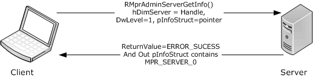
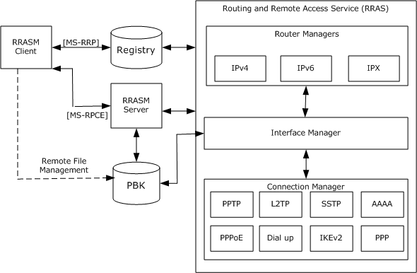
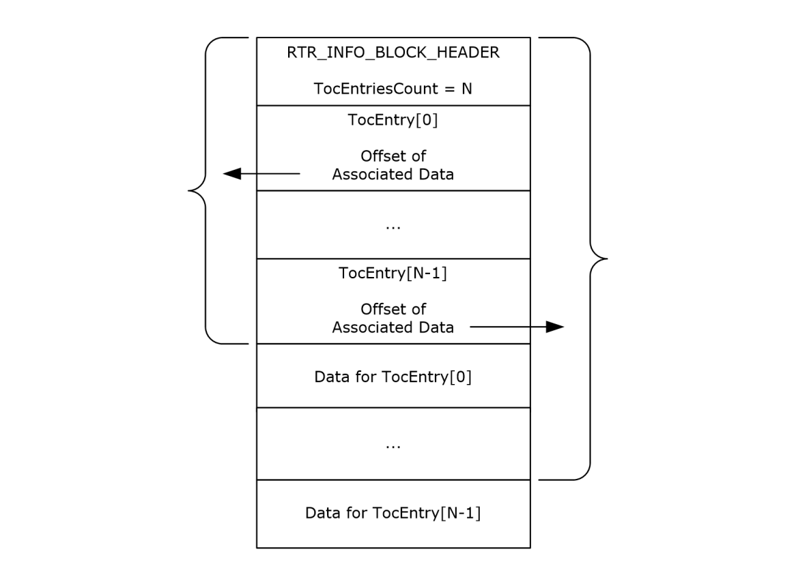
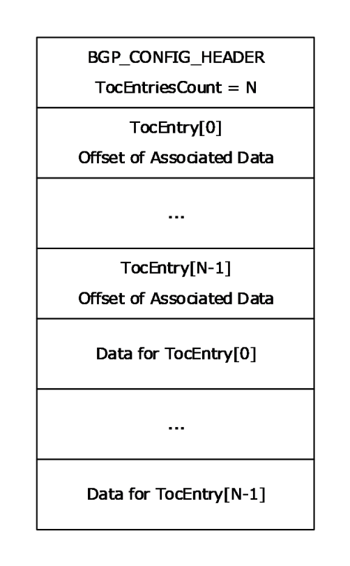

[MS-RRASM]:

Routing and Remote Access Server (RRAS) Management
Protocol

Intellectual Property Rights Notice for Open Specifications Documentation

  Technical Documentation. Microsoft publishes Open Specifications documentation (“this

documentation”) for protocols, file formats, data portability, computer languages, and standards
support. Additionally, overview documents cover inter-protocol relationships and interactions.

  Copyrights. This documentation is covered by Microsoft copyrights. Regardless of any other

terms that are contained in the terms of use for the Microsoft website that hosts this
documentation, you can make copies of it in order to develop implementations of the technologies
that are described in this documentation and can distribute portions of it in your implementations
that use these technologies or in your documentation as necessary to properly document the
implementation. You can also distribute in your implementation, with or without modification, any
schemas, IDLs, or code samples that are included in the documentation. This permission also
applies to any documents that are referenced in the Open Specifications documentation.
  No Trade Secrets. Microsoft does not claim any trade secret rights in this documentation.
  Patents. Microsoft has patents that might cover your implementations of the technologies

described in the Open Specifications documentation. Neither this notice nor Microsoft's delivery of
this documentation grants any licenses under those patents or any other Microsoft patents.
However, a given Open Specifications document might be covered by the Microsoft Open
Specifications Promise or the Microsoft Community Promise. If you would prefer a written license,
or if the technologies described in this documentation are not covered by the Open Specifications
Promise or Community Promise, as applicable, patent licenses are available by contacting
iplg@microsoft.com.

  License Programs. To see all of the protocols in scope under a specific license program and the

associated patents, visit the Patent Map.

  Trademarks. The names of companies and products contained in this documentation might be
covered by trademarks or similar intellectual property rights. This notice does not grant any
licenses under those rights. For a list of Microsoft trademarks, visit
www.microsoft.com/trademarks.

  Fictitious Names. The example companies, organizations, products, domain names, email

addresses, logos, people, places, and events that are depicted in this documentation are fictitious.
No association with any real company, organization, product, domain name, email address, logo,
person, place, or event is intended or should be inferred.

Reservation of Rights. All other rights are reserved, and this notice does not grant any rights other
than as specifically described above, whether by implication, estoppel, or otherwise.

Tools. The Open Specifications documentation does not require the use of Microsoft programming
tools or programming environments in order for you to develop an implementation. If you have access
to Microsoft programming tools and environments, you are free to take advantage of them. Certain
Open Specifications documents are intended for use in conjunction with publicly available standards
specifications and network programming art and, as such, assume that the reader either is familiar
with the aforementioned material or has immediate access to it.

Support. For questions and support, please contact dochelp@microsoft.com.

[MS-RRASM] - v20240423
Routing and Remote Access Server (RRAS) Management Protocol
Copyright © 2024 Microsoft Corporation
Release: April 23, 2024

1 / 541

Revision Summary

Date

Revision
History

Revision
Class

Comments

6/20/2008

0.01

New

Version 0.01 release

7/25/2008

0.01.1

Editorial

Changed language and formatting in the technical content.

8/29/2008

0.2

Minor

Clarified the meaning of the technical content.

10/24/2008  0.2.1

Editorial

Changed language and formatting in the technical content.

12/5/2008

1.0

1/16/2009

2.0

2/27/2009

3.0

Major

Major

Major

Updated and revised the technical content.

Updated and revised the technical content.

Updated and revised the technical content.

4/10/2009

3.0.1

Editorial

Changed language and formatting in the technical content.

5/22/2009

4.0

7/2/2009

5.0

8/14/2009

6.0

9/25/2009

7.0

Major

Major

Major

Major

Updated and revised the technical content.

Updated and revised the technical content.

Updated and revised the technical content.

Updated and revised the technical content.

11/6/2009

7.0.1

Editorial

Changed language and formatting in the technical content.

12/18/2009  7.0.2

Editorial

Changed language and formatting in the technical content.

1/29/2010

8.0

3/12/2010

9.0

4/23/2010

10.0

6/4/2010

11.0

7/16/2010

12.0

8/27/2010

13.0

10/8/2010

13.0

Major

Major

Major

Major

Major

Major

None

Updated and revised the technical content.

Updated and revised the technical content.

Updated and revised the technical content.

Updated and revised the technical content.

Updated and revised the technical content.

Updated and revised the technical content.

No changes to the meaning, language, or formatting of the
technical content.

11/19/2010  13.0

None

No changes to the meaning, language, or formatting of the
technical content.

1/7/2011

14.0

Major

Updated and revised the technical content.

2/11/2011

14.0

None

No changes to the meaning, language, or formatting of the
technical content.

3/25/2011

14.1

Minor

Clarified the meaning of the technical content.

5/6/2011

14.1

6/17/2011

14.2

9/23/2011

15.0

None

Minor

Major

No changes to the meaning, language, or formatting of the
technical content.

Clarified the meaning of the technical content.

Updated and revised the technical content.

[MS-RRASM] - v20240423
Routing and Remote Access Server (RRAS) Management Protocol
Copyright © 2024 Microsoft Corporation
Release: April 23, 2024

2 / 541

Date

Revision
History

Revision
Class

Comments

12/16/2011  16.0

Major

Updated and revised the technical content.

3/30/2012

16.0

7/12/2012

16.1

10/25/2012  17.0

1/31/2013

17.0

8/8/2013

18.0

11/14/2013  19.0

2/13/2014

19.0

None

Minor

Major

None

Major

Major

None

No changes to the meaning, language, or formatting of the
technical content.

Clarified the meaning of the technical content.

Updated and revised the technical content.

No changes to the meaning, language, or formatting of the
technical content.

Updated and revised the technical content.

Updated and revised the technical content.

No changes to the meaning, language, or formatting of the
technical content.

5/15/2014

19.0

None

No changes to the meaning, language, or formatting of the
technical content.

6/30/2015

20.0

Major

Significantly changed the technical content.

10/16/2015  20.0

None

No changes to the meaning, language, or formatting of the
technical content.

7/14/2016

21.0

Major

Significantly changed the technical content.

6/1/2017

21.0

None

No changes to the meaning, language, or formatting of the
technical content.

9/15/2017

22.0

Major

Significantly changed the technical content.

12/1/2017

22.0

9/12/2018

23.0

4/7/2021

24.0

6/25/2021

25.0

4/23/2024

26.0

None

Major

Major

Major

Major

No changes to the meaning, language, or formatting of the
technical content.

Significantly changed the technical content.

Significantly changed the technical content.

Significantly changed the technical content.

Significantly changed the technical content.

[MS-RRASM] - v20240423
Routing and Remote Access Server (RRAS) Management Protocol
Copyright © 2024 Microsoft Corporation
Release: April 23, 2024

3 / 541

Table of Contents

1.3

1.1
1.2

1.2.1
1.2.2

1  Introduction .......................................................................................................... 18
Glossary ......................................................................................................... 18
References ...................................................................................................... 26
Normative References ................................................................................. 26
Informative References ............................................................................... 28
Overview ........................................................................................................ 30
Interface Object ......................................................................................... 32
Transport Object ........................................................................................ 33
Management Information Base (MIB) ............................................................ 33
Ports Object ............................................................................................... 34
Connection Object ...................................................................................... 35
Relationship to Other Protocols .......................................................................... 35
Prerequisites/Preconditions ............................................................................... 35
Applicability Statement ..................................................................................... 35
Versioning and Capability Negotiation ................................................................. 35
Vendor-Extensible Fields ................................................................................... 36
Standards Assignments ..................................................................................... 36

1.3.1
1.3.2
1.3.3
1.3.4
1.3.5

1.4
1.5
1.6
1.7
1.8
1.9

2.2

2.1

2.2.1

2.1.3

2.1.2

2.1.1

2.2.1.1

2.1.2.1
2.1.2.2

2.1.1.1
2.1.1.2

2  Messages ............................................................................................................... 37
Transport ........................................................................................................ 37
DIMSVC Security Settings ............................................................................ 37
Server Security Settings ........................................................................ 37
Client Security Settings ......................................................................... 37
Rasrpc Security Settings .............................................................................. 38
Server Security Settings ........................................................................ 38
Client Security Settings ......................................................................... 38
Remras Security Settings............................................................................. 38
Common Data Types ........................................................................................ 38
RRASM RPC Common Messages .................................................................... 39
Data Types, Enumerations, and Constants ............................................... 39
ROUTER_INTERFACE_TYPE ............................................................... 39
2.2.1.1.1
ROUTER_CONNECTION_STATE .......................................................... 39
2.2.1.1.2
RAS_QUARANTINE_STATE ................................................................ 40
2.2.1.1.3
RAS_PORT_CONDITION ................................................................... 40
2.2.1.1.4
RAS_HARDWARE_CONDITION .......................................................... 41
2.2.1.1.5
DIM_HANDLE .................................................................................. 41
2.2.1.1.6
FORWARD_ACTION .......................................................................... 41
2.2.1.1.7
MIB_IPFORWARD_TYPE .................................................................... 41
2.2.1.1.8
2.2.1.1.9
MIB_IPFORWARD_PROTO ................................................................. 42
2.2.1.1.10  MIB_IPSTATS_FORWARDING ............................................................ 43
2.2.1.1.11  MIB_TCP_STATE ............................................................................. 43
TCP_RTO_ALGORITHM ..................................................................... 44
2.2.1.1.12
2.2.1.1.13
IP_NAT_DIRECTION ......................................................................... 44
2.2.1.1.14  OSPF_PARAM_TYPE ......................................................................... 45
2.2.1.1.15  OSPF_FILTER_ACTION ..................................................................... 45
RASDEVICETYPE ............................................................................. 46
2.2.1.1.16
RASMAN_STATUS ............................................................................ 47
2.2.1.1.17
ReqTypes ....................................................................................... 47
2.2.1.1.18
RASMAN_STATE .............................................................................. 48
2.2.1.1.19
RASMAN_DISCONNECT_TYPE ........................................................... 48
2.2.1.1.20
RASMAN_USAGE ............................................................................. 48
2.2.1.1.21
BGP_POLICY_DIRECTION ................................................................. 49
2.2.1.1.22
BGP_POLICY_TYPE .......................................................................... 49
2.2.1.1.23
BGP_PEERING_OP_MODE ................................................................. 50
2.2.1.1.24
Structures ............................................................................................ 50

2.2.1.2

[MS-RRASM] - v20240423
Routing and Remote Access Server (RRAS) Management Protocol
Copyright © 2024 Microsoft Corporation
Release: April 23, 2024

4 / 541

DIM_INFORMATION_CONTAINER ...................................................... 50
2.2.1.2.1
DIM_INTERFACE_CONTAINER ........................................................... 51
2.2.1.2.2
RTR_INFO_BLOCK_HEADER .............................................................. 52
2.2.1.2.3
RTR_TOC_ENTRY ............................................................................. 53
2.2.1.2.4
FILTER_DESCRIPTOR ....................................................................... 57
2.2.1.2.5
FILTER_INFO .................................................................................. 58
2.2.1.2.6
FILTER_DESCRIPTOR_V6 ................................................................. 59
2.2.1.2.7
FILTER_INFO_V6 ............................................................................. 60
2.2.1.2.8
GLOBAL_INFO ................................................................................. 61
2.2.1.2.9
IN6_ADDR ...................................................................................... 62
2.2.1.2.10
INTERFACE_ROUTE_INFO ................................................................. 62
2.2.1.2.11
PRIORITY_INFO .............................................................................. 65
2.2.1.2.12
PROTOCOL_METRIC ......................................................................... 65
2.2.1.2.13
2.2.1.2.14
RTR_DISC_INFO ............................................................................. 65
2.2.1.2.15  MCAST_HBEAT_INFO ....................................................................... 66
2.2.1.2.16  MIB_MCAST_LIMIT_ROW ................................................................. 67
IPINIP_CONFIG_INFO ...................................................................... 67
2.2.1.2.17
2.2.1.2.18
INTERFACE_STATUS_INFO ............................................................... 68
2.2.1.2.19  DIM_MIB_ENTRY_CONTAINER .......................................................... 68
2.2.1.2.20  MIB_IPDESTROW ............................................................................ 70
2.2.1.2.21  MIB_IPDESTTABLE .......................................................................... 70
2.2.1.2.22  MIB_ROUTESTATE ........................................................................... 70
2.2.1.2.23  MIB_BEST_IF .................................................................................. 70
2.2.1.2.24  MIB_BOUNDARYROW ....................................................................... 71
2.2.1.2.25  MIB_ICMP ...................................................................................... 71
2.2.1.2.26  MIBICMPINFO ................................................................................. 72
2.2.1.2.27  MIBICMPSTATS ............................................................................... 72
2.2.1.2.28  MIB_IFNUMBER ............................................................................... 73
2.2.1.2.29  MIB_IFROW .................................................................................... 73
2.2.1.2.30  MIB_IFSTATUS ................................................................................ 75
2.2.1.2.31  MIB_IFTABLE .................................................................................. 76
2.2.1.2.32  MIB_IPADDRROW ............................................................................ 76
2.2.1.2.33  MIB_IPADDRTABLE .......................................................................... 77
2.2.1.2.34  MIB_IPFORWARDNUMBER ................................................................ 78
2.2.1.2.35  MIB_IPFORWARDROW ..................................................................... 78
2.2.1.2.36  MIB_IPFORWARDTABLE ................................................................... 80
2.2.1.2.37  MIB_IPMCAST_BOUNDARY ............................................................... 80
2.2.1.2.38  MIB_IPMCAST_BOUNDARY_TABLE ..................................................... 81
2.2.1.2.39  MIB_IPMCAST_GLOBAL .................................................................... 81
2.2.1.2.40  MIB_IPMCAST_IF_ENTRY ................................................................. 82
2.2.1.2.41  MIB_IPMCAST_IF_TABLE .................................................................. 82
2.2.1.2.42  MIB_IPMCAST_MFE ......................................................................... 82
2.2.1.2.43  MIB_IPMCAST_OIF .......................................................................... 83
2.2.1.2.44  MIB_IPMCAST_MFE_STATS ............................................................... 84
2.2.1.2.45  MIB_IPMCAST_OIF_STATS ............................................................... 85
2.2.1.2.46  MIB_IPMCAST_SCOPE ...................................................................... 86
2.2.1.2.47  MIB_IPNETROW .............................................................................. 87
2.2.1.2.48  MIB_IPNETTABLE ............................................................................ 87
2.2.1.2.49  MIB_IPSTATS .................................................................................. 88
2.2.1.2.50  MIB_MFE_STATS_TABLE .................................................................. 90
2.2.1.2.51  MIB_MFE_TABLE ............................................................................. 90
2.2.1.2.52  MIB_OPAQUE_INFO ......................................................................... 90
2.2.1.2.53  MIB_OPAQUE_QUERY ...................................................................... 93
2.2.1.2.54  MIB_PROXYARP ............................................................................... 98
2.2.1.2.55  MIB_TCPROW ................................................................................. 98
2.2.1.2.56  MIB_TCPSTATS ............................................................................... 99
2.2.1.2.57  MIB_TCPTABLE .............................................................................. 100
2.2.1.2.58  MIB_UDPROW ................................................................................ 100

[MS-RRASM] - v20240423
Routing and Remote Access Server (RRAS) Management Protocol
Copyright © 2024 Microsoft Corporation
Release: April 23, 2024

5 / 541

2.2.1.2.59  MIB_UDPSTATS .............................................................................. 101
2.2.1.2.60  MIB_UDPTABLE .............................................................................. 101
2.2.1.2.61  MPR_SERVER_0 ............................................................................. 101
2.2.1.2.62  MPR_SERVER_1 ............................................................................. 102
2.2.1.2.63  MPR_SERVER_2 ............................................................................. 103
PPP_NBFCP_INFO ........................................................................... 104
2.2.1.2.64
PPP_IPCP_INFO .............................................................................. 104
2.2.1.2.65
PPP_IPCP_INFO2 ............................................................................ 104
2.2.1.2.66
PPP_IPXCP_INFO ............................................................................ 105
2.2.1.2.67
PPP_IPV6_CP_INFO ........................................................................ 105
2.2.1.2.68
PPP_ATCP_INFO ............................................................................. 106
2.2.1.2.69
PPP_CCP_INFO ............................................................................... 106
2.2.1.2.70
PPP_LCP_INFO ............................................................................... 108
2.2.1.2.71
PPP_INFO ...................................................................................... 110
2.2.1.2.72
PPP_INFO_2 .................................................................................. 111
2.2.1.2.73
PPP_INFO_3 .................................................................................. 111
2.2.1.2.74
RASI_PORT_0 ................................................................................ 112
2.2.1.2.75
RASI_PORT_1 ................................................................................ 113
2.2.1.2.76
RASI_CONNECTION_0 .................................................................... 114
2.2.1.2.77
RASI_CONNECTION_1 .................................................................... 115
2.2.1.2.78
RASI_CONNECTION_2 .................................................................... 116
2.2.1.2.79
2.2.1.2.80
RASI_CONNECTION_3 .................................................................... 117
2.2.1.2.81  MPRI_INTERFACE_0 ....................................................................... 117
2.2.1.2.82  MPRI_INTERFACE_1 ....................................................................... 119
2.2.1.2.83  MPRI_INTERFACE_2 ....................................................................... 120
2.2.1.2.84  MPRI_INTERFACE_3 ....................................................................... 128
2.2.1.2.85  MPR_DEVICE_0 .............................................................................. 135
2.2.1.2.86  MPR_DEVICE_1 .............................................................................. 136
2.2.1.2.87  MPR_CREDENTIALSEX_1 ................................................................. 136
IFFILTER_INFO .............................................................................. 137
2.2.1.2.88
2.2.1.2.89  MPR_FILTER_0 ............................................................................... 137
IPX_GLOBAL_INFO ......................................................................... 137
2.2.1.2.90
IPX_IF_INFO .................................................................................. 138
2.2.1.2.91
IPXWAN_IF_INFO ........................................................................... 138
2.2.1.2.92
IPX_STATIC_ROUTE_INFO ............................................................... 138
2.2.1.2.93
IPX_STATIC_SERVICE_INFO ............................................................ 139
2.2.1.2.94
IPX_STATIC_NETBIOS_NAME_INFO .................................................. 140
2.2.1.2.95
IPX_ADAPTER_INFO ....................................................................... 140
2.2.1.2.96
IPX_TRAFFIC_FILTER_GLOBAL_INFO ................................................ 141
2.2.1.2.97
IPX_TRAFFIC_FILTER_INFO ............................................................. 141
2.2.1.2.98
2.2.1.2.99
IF_TABLE_INDEX ............................................................................ 143
2.2.1.2.100  ROUTING_TABLE_INDEX ................................................................. 143
2.2.1.2.101  STATIC_ROUTES_TABLE_INDEX ....................................................... 143
2.2.1.2.102  SERVICES_TABLE_INDEX ................................................................ 143
2.2.1.2.103  STATIC_SERVICES_TABLE_INDEX .................................................... 144
2.2.1.2.104  IPX_MIB_INDEX ............................................................................. 144
2.2.1.2.105  IPX_MIB_GET_INPUT_DATA ............................................................. 145
2.2.1.2.106  IPXMIB_BASE ................................................................................ 146
2.2.1.2.107  IPX_IF_STATS ................................................................................ 147
2.2.1.2.108  IPX_INTERFACE ............................................................................. 148
2.2.1.2.109  IPX_ROUTE .................................................................................... 150
2.2.1.2.110  IPX_MIB_ROW ............................................................................... 151
2.2.1.2.111  IPX_MIB_SET_INPUT_DATA ............................................................. 152
2.2.1.2.112  SAP_SERVICE_FILTER_INFO ............................................................ 152
2.2.1.2.113  SAP_IF_FILTERS ............................................................................ 153
2.2.1.2.114  SAP_IF_CONFIG ............................................................................. 153
2.2.1.2.115  SAP_MIB_BASE .............................................................................. 154
2.2.1.2.116  SAP_IF_STATS ............................................................................... 154

[MS-RRASM] - v20240423
Routing and Remote Access Server (RRAS) Management Protocol
Copyright © 2024 Microsoft Corporation
Release: April 23, 2024

6 / 541

2.2.1.2.117  SAP_INTERFACE ............................................................................. 155
2.2.1.2.118  SAP_MIB_GET_INPUT_DATA ............................................................ 155
2.2.1.2.119  SAP_MIB_SET_INPUT_DATA ............................................................ 156
2.2.1.2.120  IPX_SERVICE ................................................................................. 156
2.2.1.2.121  SAP_IF_INFO ................................................................................. 156
2.2.1.2.122  RIPMIB_BASE ................................................................................ 157
2.2.1.2.123  RIP_IF_STATS ................................................................................ 158
2.2.1.2.124  RIP_INTERFACE ............................................................................. 158
2.2.1.2.125  RIP_MIB_GET_INPUT_DATA ............................................................. 159
2.2.1.2.126  RIP_MIB_SET_INPUT_DATA ............................................................. 159
2.2.1.2.127  EAPTLS_HASH................................................................................ 159
2.2.1.2.128  EAPTLS_USER_PROPERTIES ............................................................ 160
2.2.1.2.129  MPRAPI_OBJECT_HEADER_IDL ......................................................... 161
2.2.1.2.130  PPP_PROJECTION_INFO_1 ............................................................... 162
2.2.1.2.131  IKEV2_PROJECTION_INFO_1 ........................................................... 166
2.2.1.2.132  PROJECTION_INFO_IDL_1 ............................................................... 167
2.2.1.2.133  RAS_CONNECTION_EX_1_IDL .......................................................... 168
2.2.1.2.134  RAS_CONNECTION_EX_IDL ............................................................. 170
2.2.1.2.135  CERT_BLOB_1 ................................................................................ 170
2.2.1.2.136  IKEV2_TUNNEL_CONFIG_PARAMS_1 ................................................ 171
2.2.1.2.137  IKEV2_CONFIG_PARAMS_1 ............................................................. 172
2.2.1.2.138  PPTP_CONFIG_PARAMS_1 ............................................................... 172
2.2.1.2.139  L2TP_CONFIG_PARAMS_1 ............................................................... 173
2.2.1.2.140  SSTP_CERT_INFO_1 ....................................................................... 173
2.2.1.2.141  SSTP_CONFIG_PARAMS_1 ............................................................... 174
2.2.1.2.142  MPR_SERVER_EX_1 ........................................................................ 174
2.2.1.2.143  MPR_SERVER_EX_IDL ..................................................................... 175
2.2.1.2.144  MPRAPI_TUNNEL_CONFIG_PARAMS_1 .............................................. 175
2.2.1.2.145  MPR_SERVER_SET_CONFIG_EX_1 .................................................... 175
2.2.1.2.146  MPR_SERVER_SET_CONFIG_EX_IDL ................................................. 176
2.2.1.2.147  RAS_UPDATE_CONNECTION_1_IDL .................................................. 176
2.2.1.2.148  RAS_UPDATE_CONNECTION_IDL...................................................... 177
2.2.1.2.149  IPBOOTP_GLOBAL_CONFIG ............................................................. 177
2.2.1.2.150  IPBOOTP_IF_CONFIG ...................................................................... 178
2.2.1.2.151  IPBOOTP_MIB_GET_INPUT_DATA ..................................................... 178
2.2.1.2.152  IPBOOTP_MIB_GET_OUTPUT_DATA .................................................. 179
2.2.1.2.153  IPBOOTP_IF_STATS ........................................................................ 180
2.2.1.2.154  IPBOOTP_IF_BINDING .................................................................... 180
2.2.1.2.155  IPBOOTP_IP_ADDRESS ................................................................... 181
2.2.1.2.156  DHCPV6R_MIB_GET_OUTPUT_DATA ................................................. 181
2.2.1.2.157  DHCPV6R_GLOBAL_CONFIG ............................................................ 182
2.2.1.2.158  DHCPV6R_IF_STATS ....................................................................... 182
2.2.1.2.159  DHCPV6R_IF_CONFIG ..................................................................... 183
2.2.1.2.160  DHCPV6R_MIB_GET_INPUT_DATA .................................................... 184
2.2.1.2.161  IPRIP_MIB_GET_INPUT_DATA .......................................................... 184
2.2.1.2.162  IPRIP_MIB_GET_OUTPUT_DATA ....................................................... 185
2.2.1.2.163  IPRIP_GLOBAL_STATS .................................................................... 186
2.2.1.2.164  IPRIP_GLOBAL_CONFIG .................................................................. 186
2.2.1.2.165  IPRIP_IF_STATS ............................................................................. 187
2.2.1.2.166  IPRIP_IF_CONFIG ........................................................................... 188
2.2.1.2.167  IPRIP_ROUTE_FILTER ..................................................................... 193
2.2.1.2.168  IPRIP_IF_BINDING ......................................................................... 193
2.2.1.2.169  IPRIP_IP_ADDRESS ........................................................................ 194
2.2.1.2.170  IPRIP_PEER_STATS ........................................................................ 194
2.2.1.2.171  IGMP_MIB_GET_INPUT_DATA .......................................................... 194
2.2.1.2.172  IGMP_MIB_GET_OUTPUT_DATA ....................................................... 196
2.2.1.2.173  IGMP_MIB_GLOBAL_CONFIG ........................................................... 197
2.2.1.2.174  IGMP_MIB_IF_CONFIG .................................................................... 198

[MS-RRASM] - v20240423
Routing and Remote Access Server (RRAS) Management Protocol
Copyright © 2024 Microsoft Corporation
Release: April 23, 2024

7 / 541

2.2.1.2.175  IGMP_MIB_IF_GROUPS_LIST ........................................................... 200
2.2.1.2.176  IGMP_MIB_GROUP_INFO ................................................................. 201
2.2.1.2.177  IGMP_MIB_IF_STATS ...................................................................... 202
2.2.1.2.178  IGMP_MIB_GROUP_IFS_LIST ........................................................... 204
2.2.1.2.179  IGMP_MIB_GROUP_SOURCE_INFO_V3 .............................................. 205
2.2.1.2.180  IGMP_MIB_GROUP_INFO_V3 ........................................................... 205
2.2.1.2.181  INTERFACE_ROUTE_ENTRY .............................................................. 206
2.2.1.2.182  IP_NAT_MIB_QUERY ....................................................................... 207
2.2.1.2.183  IP_NAT_ENUMERATE_SESSION_MAPPINGS ....................................... 207
2.2.1.2.184  IP_NAT_SESSION_MAPPING ............................................................ 208
2.2.1.2.185  IP_NAT_INTERFACE_STATISTICS ..................................................... 209
2.2.1.2.186  IP_DNS_PROXY_MIB_QUERY ........................................................... 210
2.2.1.2.187  IP_DNS_PROXY_STATISTICS ........................................................... 210
2.2.1.2.188  IP_AUTO_DHCP_MIB_QUERY ........................................................... 211
2.2.1.2.189  IP_AUTO_DHCP_STATISTICS ........................................................... 211
2.2.1.2.190  MIB_DA_MSG ................................................................................ 212
2.2.1.2.191  IP_AUTO_DHCP_GLOBAL_INFO ........................................................ 215
2.2.1.2.192  IP_AUTO_DHCP_INTERFACE_INFO ................................................... 216
2.2.1.2.193  IP_DNS_PROXY_GLOBAL_INFO ........................................................ 217
2.2.1.2.194  IP_DNS_PROXY_INTERFACE_INFO ................................................... 217
2.2.1.2.195  IP_NAT_GLOBAL_INFO .................................................................... 218
2.2.1.2.196  IP_NAT_TIMEOUT ........................................................................... 219
2.2.1.2.197  IP_NAT_INTERFACE_INFO ............................................................... 219
2.2.1.2.198  IP_NAT_ADDRESS_RANGE .............................................................. 221
2.2.1.2.199  IP_NAT_PORT_MAPPING ................................................................. 221
2.2.1.2.200  IP_NAT_ADDRESS_MAPPING ........................................................... 222
2.2.1.2.201  IP_ALG_GLOBAL_INFO .................................................................... 222
2.2.1.2.202  RIP_GLOBAL_INFO ......................................................................... 223
2.2.1.2.203  RIP_ROUTE_FILTER_INFO ............................................................... 223
2.2.1.2.204  RIP_IF_FILTERS ............................................................................. 223
2.2.1.2.205  RIP_IF_INFO .................................................................................. 224
2.2.1.2.206  RIP_IF_CONFIG .............................................................................. 225
2.2.1.2.207  SAP_GLOBAL_INFO ........................................................................ 225
2.2.1.2.208  OSPF_ROUTE_FILTER...................................................................... 226
2.2.1.2.209  OSPF_ROUTE_FILTER_INFO ............................................................. 226
2.2.1.2.210  OSPF_PROTO_FILTER_INFO ............................................................. 227
2.2.1.2.211  OSPF_GLOBAL_PARAM .................................................................... 227
2.2.1.2.212  OSPF_AREA_PARAM ........................................................................ 228
2.2.1.2.213  OSPF_AREA_RANGE_PARAM ............................................................ 228
2.2.1.2.214  OSPF_VIRT_INTERFACE_PARAM ....................................................... 229
2.2.1.2.215  OSPF_INTERFACE_PARAM ............................................................... 229
2.2.1.2.216  OSPF_NBMA_NEIGHBOR_PARAM ...................................................... 230
2.2.1.2.217  RequestBuffer ................................................................................ 231
2.2.1.2.218  DeviceConfigInfo ............................................................................ 232
2.2.1.2.219  RAS_DEVICE_INFO ......................................................................... 233
2.2.1.2.220  GetSetCalledId ............................................................................... 234
2.2.1.2.221  RAS_CALLEDID_INFO ..................................................................... 234
2.2.1.2.222  GetNdiswanDriverCapsStruct ........................................................... 235
2.2.1.2.223  RAS_NDISWAN_DRIVER_INFO ......................................................... 235
2.2.1.2.224  GetDevConfigStruct ........................................................................ 235
2.2.1.2.225  Enum ............................................................................................ 236
2.2.1.2.226  RASMAN_PORT_32 ......................................................................... 237
2.2.1.2.227  Info .............................................................................................. 237
2.2.1.2.228  RASMAN_INFO ............................................................................... 238
2.2.1.2.229  RASRPC_PBUSER ........................................................................... 239
2.2.1.2.230  RASRPC_CALLBACKLIST .................................................................. 241
2.2.1.2.231  RASRPC_STRINGLIST ..................................................................... 243
2.2.1.2.232  RASRPC_LOCATIONLIST .................................................................. 243

[MS-RRASM] - v20240423
Routing and Remote Access Server (RRAS) Management Protocol
Copyright © 2024 Microsoft Corporation
Release: April 23, 2024

8 / 541

2.2.1.2.233  PPP_PROJECTION_INFO_2 ............................................................... 243
2.2.1.2.234  IKEV2_PROJECTION_INFO_2 ........................................................... 245
2.2.1.2.235  PROJECTION_INFO_IDL_2 ............................................................... 246
2.2.1.2.236  RAS_CONNECTION_4_IDL ............................................................... 246
2.2.1.2.237  ROUTER_CUSTOM_IKEv2_POLICY_0 ................................................. 248
2.2.1.2.238  IKEV2_TUNNEL_CONFIG_PARAMS_2 ................................................ 251
2.2.1.2.239  IKEV2_CONFIG_PARAMS_2 ............................................................. 252
2.2.1.2.240  MPRAPI_TUNNEL_CONFIG_PARAMS_2 .............................................. 253
2.2.1.2.241  MPR_SERVER_SET_CONFIG_EX_2 .................................................... 253
2.2.1.2.242  MPR_SERVER_EX_2 ........................................................................ 253
2.2.1.2.243  ROUTER_IKEv2_IF_CUSTOM_CONFIG_0 ........................................... 254
2.2.1.2.244  MPR_IF_CUSTOMINFOEX_0 ............................................................. 254
2.2.1.2.245  MPR_IF_CUSTOMINFOEX_IDL .......................................................... 255
2.2.1.2.246  CERT_EKU_1 ................................................................................. 255
2.2.1.2.247  IKEV2_TUNNEL_CONFIG_PARAMS_3 ................................................ 255
2.2.1.2.248  IKEV2_CONFIG_PARAMS_3 ............................................................. 257
2.2.1.2.249  MPRAPI_TUNNEL_CONFIG_PARAMS_3 .............................................. 257
2.2.1.2.250  MPR_SERVER_SET_CONFIG_EX_3 .................................................... 258
2.2.1.2.251  MPR_SERVER_EX_3 ........................................................................ 258
2.2.1.2.252  BGP_CONFIG_HEADER .................................................................... 259
2.2.1.2.253  BGP_TOC_ENTRY ........................................................................... 259
2.2.1.2.254  BGP_IP_ADDRESS .......................................................................... 261
2.2.1.2.255  BGP_IP_PREFIX .............................................................................. 261
2.2.1.2.256  BGP_ASN_RANGE ........................................................................... 262
2.2.1.2.257  BGP_ROUTER_CONFIG .................................................................... 262
2.2.1.2.258  BGP_POLICY_MATCH ...................................................................... 263
2.2.1.2.259  BGP_POLICY_MODIFY ..................................................................... 264
2.2.1.2.260  BGP_POLICY_ACTION ..................................................................... 265
2.2.1.2.261  BGP_POLICY .................................................................................. 265
2.2.1.2.262  BGP_PEER ..................................................................................... 267
2.2.1.2.263  BGP_PEER_TO_POLICIES ................................................................ 268
2.2.1.2.264  BGP_ADVERTISE ............................................................................ 268
2.2.1.2.265  BGP_ROUTER_V6 ........................................................................... 269
2.2.1.2.266  PRIORITY_INFO_EX ........................................................................ 269
2.2.1.2.267  PROTOCOL_METRIC_EX .................................................................. 270
2.2.1.2.268  ROUTER_IKEv2_IF_CUSTOM_CONFIG_1 ........................................... 270
2.2.1.2.269  MPR_IF_CUSTOMINFOEX_1 ............................................................. 271
2.2.1.2.270  L2TP_TUNNEL_CONFIG_PARAMS_1 .................................................. 271
2.2.1.2.271  L2TP_CONFIG_PARAMS_2 ............................................................... 272
File Format for Phonebook .......................................................................... 273
RRAS entry section name ...................................................................... 273
Phonebook entry settings ...................................................................... 273
Encoding ....................................................................................... 274
2.2.2.2.1
PBVersion ...................................................................................... 274
2.2.2.2.2
Type ............................................................................................. 274
2.2.2.2.3
Autologon ...................................................................................... 275
2.2.2.2.4
UseRasCredentials .......................................................................... 275
2.2.2.2.5
LowDateTime ................................................................................. 275
2.2.2.2.6
HighDateTime ................................................................................ 275
2.2.2.2.7
DialParamsUID ............................................................................... 275
2.2.2.2.8
Guid ............................................................................................. 275
2.2.2.2.9
BaseProtocol .................................................................................. 275
2.2.2.2.10
VpnStrategy .................................................................................. 275
2.2.2.2.11
ExcludedProtocols ........................................................................... 275
2.2.2.2.12
2.2.2.2.13
LcpExtensions ................................................................................ 276
2.2.2.2.14  DataEncryption .............................................................................. 276
2.2.2.2.15
SwCompression .............................................................................. 276
2.2.2.2.16  NegotiateMultilinkAlways ................................................................. 277

2.2.2

2.2.2.1
2.2.2.2

[MS-RRASM] - v20240423
Routing and Remote Access Server (RRAS) Management Protocol
Copyright © 2024 Microsoft Corporation
Release: April 23, 2024

9 / 541

2.2.2.2.17
SkipNwcWarning ............................................................................ 277
2.2.2.2.18
SkipDownLevelDialog ...................................................................... 277
SkipDoubleDialDialog ...................................................................... 277
2.2.2.2.19
2.2.2.2.20  DialMode ....................................................................................... 277
2.2.2.2.21  DialPercent .................................................................................... 277
2.2.2.2.22  DialSeconds ................................................................................... 278
2.2.2.2.23  HangupPercent............................................................................... 278
2.2.2.2.24  HangupSeconds ............................................................................. 278
2.2.2.2.25  OverridePref .................................................................................. 278
RedialAttempts............................................................................... 278
2.2.2.2.26
RedialSeconds ................................................................................ 278
2.2.2.2.27
IdleDisconnectSeconds .................................................................... 278
2.2.2.2.28
RedialOnLinkFailure ........................................................................ 278
2.2.2.2.29
CallbackMode ................................................................................. 279
2.2.2.2.30
CustomDialDll ................................................................................ 279
2.2.2.2.31
CustomDialFunc ............................................................................. 279
2.2.2.2.32
CustomRasDialDll ........................................................................... 279
2.2.2.2.33
2.2.2.2.34
ForceSecureCompartment ............................................................... 279
2.2.2.2.35  DisableIKENameEkuCheck ............................................................... 279
AuthenticateServer ......................................................................... 279
2.2.2.2.36
ShareMsFilePrint............................................................................. 280
2.2.2.2.37
BindMsNetClient ............................................................................. 280
2.2.2.2.38
2.2.2.2.39
SharedPhoneNumbers ..................................................................... 280
2.2.2.2.40  GlobalDeviceSettings ...................................................................... 280
PrerequisitePbk .............................................................................. 280
2.2.2.2.41
PrerequisiteEntry ............................................................................ 281
2.2.2.2.42
PreferredPort ................................................................................. 281
2.2.2.2.43
PreferredDevice.............................................................................. 281
2.2.2.2.44
PreferredBps .................................................................................. 281
2.2.2.2.45
PreferredHwFlow ............................................................................ 281
2.2.2.2.46
PreferredProtocol ............................................................................ 281
2.2.2.2.47
PreferredCompression ..................................................................... 281
2.2.2.2.48
PreferredSpeaker ........................................................................... 282
2.2.2.2.49
PreferredMdmProtocol ..................................................................... 282
2.2.2.2.50
PreviewUsePw ................................................................................ 282
2.2.2.2.51
PreviewDomain .............................................................................. 282
2.2.2.2.52
PreviewPhoneNumber ..................................................................... 282
2.2.2.2.53
ShowDialingProgress....................................................................... 282
2.2.2.2.54
ShowMonitorIconInTaskbar .............................................................. 282
2.2.2.2.55
CustomAuthKey ............................................................................. 282
2.2.2.2.56
CustomAuthData ............................................................................ 283
2.2.2.2.57
AuthRestrictions ............................................................................. 283
2.2.2.2.58
TypicalAuth.................................................................................... 283
2.2.2.2.59
IpPrioritizeRemote .......................................................................... 283
2.2.2.2.60
IpInterfaceMetric ............................................................................ 284
2.2.2.2.61
fCachedDnsSuffix ........................................................................... 284
2.2.2.2.62
IpHeaderCompression ..................................................................... 284
2.2.2.2.63
IpAddress ...................................................................................... 284
2.2.2.2.64
IpDnsAddress ................................................................................ 284
2.2.2.2.65
IpDns2Address ............................................................................... 284
2.2.2.2.66
IpWinsAddress ............................................................................... 285
2.2.2.2.67
IpWins2Address ............................................................................. 285
2.2.2.2.68
IpAssign ........................................................................................ 285
2.2.2.2.69
IpNameAssign ................................................................................ 286
2.2.2.2.70
IpFrameSize .................................................................................. 286
2.2.2.2.71
IpDnsFlags .................................................................................... 286
2.2.2.2.72
IpNBTFlags .................................................................................... 286
2.2.2.2.73
TcpWindowSize .............................................................................. 286
2.2.2.2.74

[MS-RRASM] - v20240423
Routing and Remote Access Server (RRAS) Management Protocol
Copyright © 2024 Microsoft Corporation
Release: April 23, 2024

10 / 541

2.2.2.2.75  UseFlags ....................................................................................... 286
IpSecFlags ..................................................................................... 287
2.2.2.2.76
IpDnsSuffix ................................................................................... 287
2.2.2.2.77
IpCachedDnsSuffix ......................................................................... 287
2.2.2.2.78
Ipv6Assign .................................................................................... 287
2.2.2.2.79
Ipv6PrefixLength ............................................................................ 287
2.2.2.2.80
Ipv6PrioritizeRemote ...................................................................... 287
2.2.2.2.81
Ipv6InterfaceMetric ........................................................................ 287
2.2.2.2.82
Ipv6NameAssign ............................................................................ 288
2.2.2.2.83
Ipv6DnsAddress ............................................................................. 288
2.2.2.2.84
Ipv6Dns2Address ........................................................................... 288
2.2.2.2.85
Ipv6Prefix...................................................................................... 288
2.2.2.2.86
2.2.2.2.87
Ipv6InterfaceId .............................................................................. 288
2.2.2.2.88  DisableClassBasedDefaultRoute ........................................................ 289
2.2.2.2.89  DisableMobility ............................................................................... 289
2.2.2.2.90  NetworkOutageTime ....................................................................... 289
ProvisionType ................................................................................ 289
2.2.2.2.91
2.2.2.2.92
PreSharedKey ................................................................................ 289
2.2.2.2.93  NETCOMPONENTS .......................................................................... 289
2.2.2.2.94  ms_msclient .................................................................................. 289
2.2.2.2.95  ms_server ..................................................................................... 289
2.2.2.2.96  MEDIA .......................................................................................... 289
2.2.2.2.97
Port .............................................................................................. 290
2.2.2.2.98  Device .......................................................................................... 290
2.2.2.2.99
ConnectBPS ................................................................................... 290
2.2.2.2.100  DEVICE ......................................................................................... 290
2.2.2.2.101  Terminal........................................................................................ 291
2.2.2.2.102  Name ............................................................................................ 291
2.2.2.2.103  Script ............................................................................................ 291
2.2.2.2.104  X25Pad ......................................................................................... 291
2.2.2.2.105  X25Address ................................................................................... 292
2.2.2.2.106  UserData ....................................................................................... 292
2.2.2.2.107  Facilities ........................................................................................ 292
2.2.2.2.108  PhoneNumber ................................................................................ 292
2.2.2.2.109  AreaCode ...................................................................................... 292
2.2.2.2.110  CountryCode .................................................................................. 292
2.2.2.2.111  CountryID ..................................................................................... 293
2.2.2.2.112  UseDialingRules ............................................................................. 293
2.2.2.2.113  Comment ...................................................................................... 293
2.2.2.2.114  FriendlyName ................................................................................. 293
2.2.2.2.115  LastSelectedPhone .......................................................................... 293
2.2.2.2.116  PromoteAlternates .......................................................................... 293
2.2.2.2.117  TryNextAlternateOnFail ................................................................... 294
2.2.2.2.118  HwFlowControl ............................................................................... 294
2.2.2.2.119  Protocol......................................................................................... 294
2.2.2.2.120  Compression .................................................................................. 294
2.2.2.2.121  Speaker ........................................................................................ 294
2.2.2.2.122  MdmProtocol .................................................................................. 295
2.2.2.2.123  LineType ....................................................................................... 295
2.2.2.2.124  Fallback ........................................................................................ 295
2.2.2.2.125  EnableCompression ........................................................................ 295
2.2.2.2.126  ChannelAggregation ........................................................................ 296
2.2.2.2.127  Proprietary .................................................................................... 296
Registry Keys ............................................................................................ 296
Transport Configuration ........................................................................ 296
ProtocolId ...................................................................................... 296
GlobalInfo ..................................................................................... 297
GlobalInterfaceInfo ......................................................................... 297

2.2.3.1.1
2.2.3.1.2
2.2.3.1.3

2.2.3

2.2.3.1

[MS-RRASM] - v20240423
Routing and Remote Access Server (RRAS) Management Protocol
Copyright © 2024 Microsoft Corporation
Release: April 23, 2024

11 / 541

2.2.3.2

2.2.3.2.1

2.2.3.2.1.1
2.2.3.2.1.2
2.2.3.2.1.3
2.2.3.2.1.4

2.2.3.2.2

2.2.3.2.2.1
2.2.3.2.2.2

2.2.3.2.3

2.2.3.2.3.1
2.2.3.2.3.2
2.2.3.2.3.3
2.2.3.2.3.4

2.2.3.2.3.4.1
2.2.3.2.3.4.2
2.2.3.2.3.4.3
2.2.3.2.3.4.4
2.2.3.2.3.4.5
2.2.3.2.3.4.6

2.2.3.3

2.2.3.3.1

2.2.3.3.1.1
2.2.3.3.1.2
2.2.3.3.1.3
2.2.3.3.1.4
2.2.3.3.1.5
2.2.3.3.1.6
2.2.3.3.1.7
2.2.3.3.1.8

2.2.3.3.2

2.2.3.4

2.2.3.4.1
2.2.3.4.2

2.2.3.4.2.1
2.2.3.4.2.2
2.2.3.4.2.3
2.2.3.4.2.4
2.2.3.4.2.5
2.2.3.4.2.6
2.2.3.4.2.7
2.2.3.4.2.8

Interface Configuration ......................................................................... 297
Common Interface Configuration Values ............................................ 297
InterfaceName ......................................................................... 297
Type ....................................................................................... 298
Enabled ................................................................................... 298
DialOutHours ............................................................................ 298
Transport-specific Configuration ....................................................... 298
ProtocolId ................................................................................ 298
InterfaceInfo ............................................................................ 298
IKEv2 Custom Configuration ............................................................ 298
SaMaxDataSize ......................................................................... 299
SaLifeTime ............................................................................... 299
MachineCertificateName ............................................................ 299
IKEv2 Custom Policies ............................................................... 299
IntegrityMethod .................................................................. 299
EncryptionMethod ................................................................ 299
CipherTransformConstant ..................................................... 299
AuthTransformConstant ....................................................... 299
PfsGroup ............................................................................ 300
DHGroup ............................................................................ 300
Ports Configuration .............................................................................. 300
Non-modem Device Port Configurations ............................................ 300
ComponentId ........................................................................... 300
DriverDesc ............................................................................... 301
EnableForOutboundRouting ........................................................ 301
EnableForRas ........................................................................... 301
EnableForRouting ...................................................................... 301
CalledIDInformation .................................................................. 301
MaxWanEndpoints ..................................................................... 301
WanEndpoints .......................................................................... 301
Modem device Port Configurations .................................................... 301
Miscellaneous Configuration Information ................................................. 302
RouterType .................................................................................... 302
IKEv2 Tunnel Configuration Settings ................................................. 303
idleTimeout .............................................................................. 303
networkBlackoutTime ................................................................ 303
saDataSize ............................................................................... 303
saLifeTime ............................................................................... 303
TrustedRootCert ....................................................................... 303
EncryptionType ......................................................................... 303
MachineCertificateName ............................................................ 304
IKEv2 Custom Policy Configuration .............................................. 304
IntegrityMethod .................................................................. 304
EncryptionMethod ................................................................ 304
CipherTransformConstant ..................................................... 304
AuthTransformConstant ....................................................... 304
PfsGroup ............................................................................ 305
DHGroup ............................................................................ 305
SSTP Tunnel Configuration Settings .................................................. 305
UseHttps .................................................................................. 305
IsHashConfiguredByAdmin ......................................................... 305
SHA256CertificateHash .............................................................. 305
SHA1CertificateHash ................................................................. 305
QuarantineInstalled ........................................................................ 305
LoggingFlags .................................................................................. 306
ServerFlags ................................................................................... 306
ConfigurationFlags .......................................................................... 307
AllowNetworkAccess ....................................................................... 307

2.2.3.4.2.8.1
2.2.3.4.2.8.2
2.2.3.4.2.8.3
2.2.3.4.2.8.4
2.2.3.4.2.8.5
2.2.3.4.2.8.6

2.2.3.4.3

2.2.3.4.3.1
2.2.3.4.3.2
2.2.3.4.3.3
2.2.3.4.3.4

2.2.3.4.4
2.2.3.4.5
2.2.3.4.6
2.2.3.4.7
2.2.3.4.8

[MS-RRASM] - v20240423
Routing and Remote Access Server (RRAS) Management Protocol
Copyright © 2024 Microsoft Corporation
Release: April 23, 2024

12 / 541

2.2.3.4.18.1
2.2.3.4.18.2
2.2.3.4.18.3

EnableIn ....................................................................................... 308
2.2.3.4.9
EnableNetbtBcastFwd ...................................................................... 308
2.2.3.4.10
IpAddress ...................................................................................... 308
2.2.3.4.11
2.2.3.4.12
IpMask .......................................................................................... 308
2.2.3.4.13  NetworkAdapterGUID ...................................................................... 309
2.2.3.4.14  UseDhcpAddressing ........................................................................ 309
StaticAddressPool ........................................................................... 309
2.2.3.4.15
AdvertiseDefaultRoute .................................................................... 309
2.2.3.4.16
StaticPrefixPool .............................................................................. 309
2.2.3.4.17
Accounting Settings ........................................................................ 310
2.2.3.4.18
AcctGroupName ........................................................................ 310
ActiveProvider .......................................................................... 310
RADIUS-based Accounting Settings ............................................. 310
Score ................................................................................. 310
AcctPort ............................................................................. 310
Timeout ............................................................................. 311
EnableAccountingOnOff ........................................................ 311
Authentication Settings ................................................................... 311
AuthGroupName ....................................................................... 311
CRPName................................................................................. 311
ActiveProvider .......................................................................... 311
RADIUS-based Authentication Settings ........................................ 311
Score ................................................................................. 312
AuthPort ............................................................................. 312
Timeout ............................................................................. 312
SendSignature .................................................................... 312
Error Codes............................................................................................... 312
REMRAS Common Messages ....................................................................... 314
Structures ........................................................................................... 314
IPV6Address .................................................................................. 314

2.2.3.4.19.4.1
2.2.3.4.19.4.2
2.2.3.4.19.4.3
2.2.3.4.19.4.4

2.2.3.4.18.3.1
2.2.3.4.18.3.2
2.2.3.4.18.3.3
2.2.3.4.18.3.4

2.2.3.4.19.1
2.2.3.4.19.2
2.2.3.4.19.3
2.2.3.4.19.4

2.2.3.4.19

2.2.5.1.1

2.2.4
2.2.5

2.2.5.1

3.1

3.1.1
3.1.2
3.1.3
3.1.4

3  Protocol Details ................................................................................................... 315
DIMSVC Interface Server Details ....................................................................... 315
Abstract Data Model ................................................................................... 315
Timers ..................................................................................................... 316
Initialization .............................................................................................. 316
Message Processing Events and Sequencing Rules ......................................... 316
RMprAdminServerGetInfo (Opnum 0) ..................................................... 320
RRasAdminConnectionEnum (Opnum 1) .................................................. 321
RRasAdminConnectionGetInfo (Opnum 2) ............................................... 323
RRasAdminConnectionClearStats (Opnum 3) ........................................... 324
RRasAdminPortEnum (Opnum 4) ........................................................... 325
RRasAdminPortGetInfo (Opnum 5) ......................................................... 327
RRasAdminPortClearStats (Opnum 6) ..................................................... 328
RRasAdminPortReset (Opnum 7) ............................................................ 329
RRasAdminPortDisconnect (Opnum 8) .................................................... 330
RRouterInterfaceTransportSetGlobalInfo (Opnum 9) ................................. 331
RRouterInterfaceTransportGetGlobalInfo (Opnum 10) ............................... 332
RRouterInterfaceGetHandle (Opnum 11) ................................................. 335
RRouterInterfaceCreate (Opnum 12) ...................................................... 336
RRouterInterfaceGetInfo (Opnum 13) ..................................................... 338
RRouterInterfaceSetInfo (Opnum 14) ..................................................... 340
RRouterInterfaceDelete (Opnum 15) ...................................................... 342
RRouterInterfaceTransportRemove (Opnum 16) ....................................... 343
RRouterInterfaceTransportAdd (Opnum 17) ............................................ 344
RRouterInterfaceTransportGetInfo (Opnum 18) ....................................... 348
RRouterInterfaceTransportSetInfo (Opnum 19) ........................................ 349
RRouterInterfaceEnum (Opnum 20) ....................................................... 353

3.1.4.1
3.1.4.2
3.1.4.3
3.1.4.4
3.1.4.5
3.1.4.6
3.1.4.7
3.1.4.8
3.1.4.9
3.1.4.10
3.1.4.11
3.1.4.12
3.1.4.13
3.1.4.14
3.1.4.15
3.1.4.16
3.1.4.17
3.1.4.18
3.1.4.19
3.1.4.20
3.1.4.21

[MS-RRASM] - v20240423
Routing and Remote Access Server (RRAS) Management Protocol
Copyright © 2024 Microsoft Corporation
Release: April 23, 2024

13 / 541

3.1.4.22
3.1.4.23
3.1.4.24
3.1.4.25
3.1.4.26
3.1.4.27
3.1.4.28
3.1.4.29
3.1.4.30
3.1.4.31
3.1.4.32
3.1.4.33
3.1.4.34
3.1.4.35
3.1.4.36
3.1.4.37
3.1.4.38
3.1.4.39
3.1.4.40
3.1.4.41
3.1.4.42
3.1.4.43
3.1.4.44
3.1.4.45
3.1.4.46
3.1.4.47
3.1.4.48
3.1.4.49
3.1.4.50
3.1.4.51
3.1.4.52
3.1.4.53

RRouterInterfaceConnect (Opnum 21) .................................................... 354
RRouterInterfaceDisconnect (Opnum 22) ................................................ 356
RRouterInterfaceUpdateRoutes (Opnum 23) ............................................ 356
RRouterInterfaceQueryUpdateResult (Opnum 24) .................................... 358
RRouterInterfaceUpdatePhonebookInfo (Opnum 25)................................. 359
RMIBEntryCreate (Opnum 26) ............................................................... 360
RMIBEntryDelete (Opnum 27) ............................................................... 362
RMIBEntrySet (Opnum 28) .................................................................... 364
RMIBEntryGet (Opnum 29) ................................................................... 367
RMIBEntryGetFirst (Opnum 30) ............................................................. 371
RMIBEntryGetNext (Opnum 31) ............................................................. 375
RMIBGetTrapInfo (Opnum 32) ............................................................... 376
RMIBSetTrapInfo (Opnum 33) ............................................................... 377
RRasAdminConnectionNotification (Opnum 34) ........................................ 379
RRasAdminSendUserMessage (Opnum 35) .............................................. 380
RRouterDeviceEnum (Opnum 36) ........................................................... 381
RRouterInterfaceTransportCreate (Opnum 37) ......................................... 382
RRouterInterfaceDeviceGetInfo (Opnum 38)............................................ 383
RRouterInterfaceDeviceSetInfo (Opnum 39) ............................................ 385
RRouterInterfaceSetCredentialsEx (Opnum 40) ........................................ 386
RRouterInterfaceGetCredentialsEx (Opnum 41) ....................................... 387
RRasAdminConnectionRemoveQuarantine (Opnum 42) ............................. 388
RMprAdminServerSetInfo (Opnum 43) .................................................... 389
RMprAdminServerGetInfoEx (Opnum 44) ................................................ 391
RRasAdminConnectionEnumEx (Opnum 45) ............................................ 391
RRasAdminConnectionGetInfoEx (Opnum 46) .......................................... 393
RMprAdminServerSetInfoEx (Opnum 47) ................................................ 394
RRasAdminUpdateConnection (Opnum 48) .............................................. 395
RRouterInterfaceSetCredentialsLocal (Opnum 49) .................................... 396
RRouterInterfaceGetCredentialsLocal (Opnum 50) .................................... 397
RRouterInterfaceGetCustomInfoEx (Opnum 51) ....................................... 398
RRouterInterfaceSetCustomInfoEx (Opnum 52) ....................................... 399
Timer Events ............................................................................................. 400
Other Local Events ..................................................................................... 400
Invoke DIMSVC Method ........................................................................ 400
Start DIMSVC ...................................................................................... 400
Stop DIMSVC....................................................................................... 400
DIMSVC Interface Client Details ........................................................................ 401
Abstract Data Model ................................................................................... 401
Timers ..................................................................................................... 401
Initialization .............................................................................................. 401
Message Processing Events and Sequencing Rules ......................................... 401
RMprAdminServerGetInfo (Opnum 0) ..................................................... 401
RRasAdminConnectionEnum (Opnum 1) .................................................. 401
RRasAdminConnectionGetInfo (Opnum 2) ............................................... 402
RRasAdminConnectionClearStats (Opnum 3) ........................................... 402
RRasAdminPortEnum (Opnum 4) ........................................................... 402
RRasAdminPortGetInfo (Opnum 5) ......................................................... 402
RRasAdminPortClearStats (Opnum 6) ..................................................... 402
RRasAdminPortReset (Opnum 7) ............................................................ 402
RRasAdminPortDisconnect (Opnum 8) .................................................... 402
RRouterInterfaceTransportSetGlobalInfo (Opnum 9) ................................. 402
RRouterInterfaceTransportGetGlobalInfo (Opnum 10) ............................... 402
RRouterInterfaceGetHandle (Opnum 11) ................................................. 402
RRouterInterfaceCreate (Opnum 12) ...................................................... 402
RRouterInterfaceGetInfo (Opnum 13) ..................................................... 403
RRouterInterfaceSetInfo (Opnum 14) ..................................................... 403
RRouterInterfaceDelete (Opnum 15) ...................................................... 403

3.2.4.1
3.2.4.2
3.2.4.3
3.2.4.4
3.2.4.5
3.2.4.6
3.2.4.7
3.2.4.8
3.2.4.9
3.2.4.10
3.2.4.11
3.2.4.12
3.2.4.13
3.2.4.14
3.2.4.15
3.2.4.16

3.1.6.1
3.1.6.2
3.1.6.3

3.1.5
3.1.6

3.2

3.2.1
3.2.2
3.2.3
3.2.4

[MS-RRASM] - v20240423
Routing and Remote Access Server (RRAS) Management Protocol
Copyright © 2024 Microsoft Corporation
Release: April 23, 2024

14 / 541

3.2.4.17
3.2.4.18
3.2.4.19
3.2.4.20
3.2.4.21
3.2.4.22
3.2.4.23
3.2.4.24
3.2.4.25
3.2.4.26
3.2.4.27
3.2.4.28
3.2.4.29
3.2.4.30
3.2.4.31
3.2.4.32
3.2.4.33
3.2.4.34
3.2.4.35
3.2.4.36
3.2.4.37
3.2.4.38
3.2.4.39
3.2.4.40
3.2.4.41
3.2.4.42
3.2.4.43
3.2.4.44
3.2.4.45
3.2.4.46
3.2.4.47
3.2.4.48
3.2.4.49
3.2.4.50
3.2.4.51
3.2.4.52
3.2.4.53

RRouterInterfaceTransportRemove (Opnum 16) ....................................... 403
RRouterInterfaceTransportAdd (Opnum 17) ............................................ 403
RRouterInterfaceTransportGetInfo (Opnum 18) ....................................... 403
RRouterInterfaceTransportSetInfo (Opnum 19) ........................................ 403
RRouterInterfaceEnum (Opnum 20) ....................................................... 403
RRouterInterfaceConnect (Opnum 21) .................................................... 403
RRouterInterfaceDisconnect (Opnum 22) ................................................ 403
RRouterInterfaceUpdateRoutes (Opnum 23) ............................................ 404
RRouterInterfaceQueryUpdateResult (Opnum 24) .................................... 404
RRouterInterfaceUpdatePhonebookInfo (Opnum 25)................................. 404
RMIBEntryCreate (Opnum 26) ............................................................... 404
RMIBEntryDelete (Opnum 27) ............................................................... 404
RMIBEntrySet (Opnum 28) .................................................................... 404
RMIBEntryGet (Opnum 29) ................................................................... 404
RMIBEntryGetFirst (Opnum 30) ............................................................. 404
RMIBEntryGetNext (Opnum 31) ............................................................. 404
RMIBGetTrapInfo (Opnum 32) ............................................................... 404
RMIBSetTrapInfo (Opnum 33) ............................................................... 404
RRasAdminConnectionNotification (Opnum 34) ........................................ 405
RRasAdminSendUserMessage (Opnum 35) .............................................. 405
RRouterDeviceEnum (Opnum 36) ........................................................... 405
RRouterInterfaceTransportCreate (Opnum 37) ......................................... 405
RRouterInterfaceDeviceGetInfo (Opnum 38)............................................ 405
RRouterInterfaceDeviceSetInfo (Opnum 39) ............................................ 405
RRouterInterfaceSetCredentialsEx (Opnum 40) ........................................ 405
RRouterInterfaceGetCredentialsEx (Opnum 41) ....................................... 405
RRasAdminConnectionRemoveQuarantine (Opnum 42) ............................. 405
RMprAdminServerSetInfo (Opnum 43) .................................................... 405
RMprAdminServerGetInfoEx (Opnum 44) ................................................ 405
RRasAdminConnectionEnumEx (Opnum 45) ............................................ 405
RRasAdminConnectionGetInfoEx (Opnum 46) .......................................... 406
RMprAdminServerSetInfoEx (Opnum 47) ................................................ 406
RRasAdminUpdateConnection (Opnum 48) .............................................. 406
RRouterInterfaceSetCredentialsLocal (Opnum 49) .................................... 406
RRouterInterfaceGetCredentialsLocal (Opnum 50) .................................... 406
RRouterInterfaceGetCustomInfoEx (Opnum 51) ....................................... 406
RRouterInterfaceSetCustomInfoEx (Opnum 52) ....................................... 406
Timer Events ............................................................................................. 406
Other Local Events ..................................................................................... 406
RASRPC Interface Server Details ....................................................................... 406
Abstract Data Model ................................................................................... 407
Timers ..................................................................................................... 407
Initialization .............................................................................................. 407
Message Processing Events and Sequencing Rules ......................................... 407
RasRpcDeleteEntry (Opnum 5) .............................................................. 408
RasRpcGetUserPreferences (Opnum 9) ................................................... 409
RasRpcSetUserPreferences (Opnum 10) .................................................. 410
RasRpcGetSystemDirectory (Opnum 11) ................................................. 411
RasRpcSubmitRequest (Opnum 12) ........................................................ 412
RasRpcGetInstalledProtocolsEx (Opnum 14) ............................................ 416
RasRpcGetVersion (Opnum 15) .............................................................. 417
Timer Events ............................................................................................. 418
Other Local Events ..................................................................................... 418
Invoke RASRPC Method ........................................................................ 418
Start RASRPC ...................................................................................... 418
Stop RASRPC ....................................................................................... 418
RASRPC Interface Client Details ........................................................................ 419
Abstract Data Model ................................................................................... 419

3.3.4.1
3.3.4.2
3.3.4.3
3.3.4.4
3.3.4.5
3.3.4.6
3.3.4.7

3.3.6.1
3.3.6.2
3.3.6.3

3.3

3.2.5
3.2.6

3.3.1
3.3.2
3.3.3
3.3.4

3.3.5
3.3.6

3.4

3.4.1

[MS-RRASM] - v20240423
Routing and Remote Access Server (RRAS) Management Protocol
Copyright © 2024 Microsoft Corporation
Release: April 23, 2024

15 / 541

3.4.2
3.4.3
3.4.4

3.5

3.4.5
3.4.6

3.5.1
3.5.2
3.5.3
3.5.4

3.5.4.1

3.4.4.1
3.4.4.2
3.4.4.3
3.4.4.4
3.4.4.5
3.4.4.6
3.4.4.7

Timers ..................................................................................................... 419
Initialization .............................................................................................. 419
Message Processing Events and Sequencing Rules ......................................... 419
RasRpcDeleteEntry (Opnum 5) .............................................................. 419
RasRpcGetUserPreferences (Opnum 9) ................................................... 419
RasRpcSetUserPreferences (Opnum 10) .................................................. 419
RasRpcGetSystemDirectory (Opnum 11) ................................................. 420
RasRpcSubmitRequest (Opnum 12) ........................................................ 420
RasRpcGetInstalledProtocolsEx (Opnum 14) ............................................ 421
RasRpcGetVersion (Opnum 15) .............................................................. 421
Timer Events ............................................................................................. 421
Other Local Events ..................................................................................... 421
REMRAS Interface Server Details ...................................................................... 421
Abstract Data Model ................................................................................... 421
Timers ..................................................................................................... 421
Initialization .............................................................................................. 421
Message Processing Events and Sequencing Rules ......................................... 421
IRemoteNetworkConfig Interface (Opnum 3) ........................................... 422
UpgradeRouterConfig Method (Opnum 3) .......................................... 423
SetUserConfig Method (Opnum 4) .................................................... 423
IRemoteRouterRestart Interface (Opnum 3) ............................................ 423
RestartRouter Method (Opnum 3) ..................................................... 424
IRemoteSetDnsConfig Interface (Opnum 3) ............................................. 424
SetDnsConfig Method (Opnum 3) ..................................................... 425
IRemoteICFICSConfig Interface (Opnum 3) ............................................. 425
GetIcfEnabled Method (Opnum 3) ..................................................... 426
GetIcsEnabled Method (Opnum 4) .................................................... 426
IRemoteStringIdConfig Interface (Opnum 3) ........................................... 427
GetStringFromId Method (Opnum 3) ................................................. 427
IRemoteIPV6Config Interface (Opnum 3) ................................................ 428
GetAddressList Method (Opnum 3) ................................................... 428
IRemoteSSTPCertCheck Interface (Opnum 3) .......................................... 429
CheckIfCertificateAllowedRR Method (Opnum 3) ................................. 429
Timer Events ............................................................................................. 430
Other Local Events ..................................................................................... 430
Invoke REMRAS Method ........................................................................ 430
REMRAS Interface Client Details ........................................................................ 430
Abstract Data Model ................................................................................... 431
Timers ..................................................................................................... 431
Initialization .............................................................................................. 431
Message Processing Events and Sequencing Rules ......................................... 431
Timer Events ............................................................................................. 431
Other Local Events ..................................................................................... 431

3.5.4.1.1
3.5.4.1.2

3.5.4.2

3.5.4.2.1

3.5.4.3

3.5.4.3.1

3.5.4.4

3.5.4.4.1
3.5.4.4.2

3.5.4.5

3.5.4.5.1

3.5.4.6

3.5.4.6.1

3.5.4.7

3.5.4.7.1

3.5.6.1

3.6

3.5.5
3.5.6

3.6.1
3.6.2
3.6.3
3.6.4
3.6.5
3.6.6

4.1
4.2
4.3
4.4
4.5
4.6
4.7
4.8
4.9
4.10
4.11

4  Protocol Examples ............................................................................................... 432
Querying Server Configuration Information ........................................................ 432
Disconnecting a Particular User Connection ........................................................ 432
Creating a Demand Dial Interface on RRAS with Filters ........................................ 434
Enumerating Interfaces and Connecting "dd1" .................................................... 436
Querying Interface Status Through MIB ............................................................. 437
Updating the Connection Endpoint of an IKEv2-Based Connection ......................... 438
Retrieving the Rasrpc Server Version Info .......................................................... 439
Retrieving Device Configuration Information ....................................................... 439
Retrieving Specific Port Information................................................................... 440
Sample Phonebook File for a Demand-dial Connection ......................................... 441
Registry Configuration ..................................................................................... 445
Transport Configuration .............................................................................. 445
Interface Configuration ............................................................................... 446

4.11.1
4.11.2

[MS-RRASM] - v20240423
Routing and Remote Access Server (RRAS) Management Protocol
Copyright © 2024 Microsoft Corporation
Release: April 23, 2024

16 / 541

4.11.3
Ports Configuration .................................................................................... 447
4.11.4  Other Miscellaneous Configuration Information .............................................. 448
4.12  Querying validity of SSTP certificate .................................................................. 450

5.1

5  Security ............................................................................................................... 451
Security Considerations for Implementers .......................................................... 451
Security Considerations Specific to the RRAS Management Protocol ................. 451
Index of Security Parameters ........................................................................... 451

5.1.1

5.2

6  Appendix A: Full IDL ............................................................................................ 452

7  Appendix B: Product Behavior ............................................................................. 509

8  Change Tracking .................................................................................................. 529

9  Index ................................................................................................................... 530

[MS-RRASM] - v20240423
Routing and Remote Access Server (RRAS) Management Protocol
Copyright © 2024 Microsoft Corporation
Release: April 23, 2024

17 / 541

1  Introduction

The routing and remote access service (RRAS) server management (RRASM) protocol enables remote
management (configuration and monitoring) of a RRAS implementation. The RRAS implementation
here refers to the components that can be configured to provide the following functionality:

  Routing

  Remote access service

  Site-to-site connectivity

The RRASM protocol is a client/server protocol based on remote procedure call (RPC). It comprises
RPC methods that enable the remote management of an RRAS implementation.

It also specifies Distributed Component Object Model (DCOM) interfaces that enable the remote
management of RRAS implementation. As a part of remote management of RRAS implementation, a
management application uses the RPC and DCOM methods to manage the RRAS implementation
actively (while RRAS is running).

This protocol also specifies the registry information that can be used to specify the overall RRAS
configuration. These registry settings can be managed remotely using the [MS-RRP] protocol. When
RRAS is not active, the configurations are managed through the registry information.

Additionally, for site-to-site connectivity, the settings to be used to connect to a remote site are
specified in the form of a phonebook file. This protocol also specifies the format of the phonebook file
used by RRAS server. The management application can use the phonebook file format to specify the
connection configuration to be used for site-to-site connections.

The client-side Remote Access Service (RAS) is a point-to-point or point-to-site service that is not in
the RRASM protocol. See legacy information in [MSDOCS-RRAS] and [MSDOCS-RA-API]. RAS client
uses a different phonebook file; see legacy information in [MSDOCS-RASpbk].

Sections 1.5, 1.8, 1.9, 2, and 3 of this specification are normative. All other sections and examples in
this specification are informative.

1.1  Glossary

This document uses the following terms:

administrator: A user who has complete and unrestricted access to the computer or domain.

Advanced Encryption Standard (AES): A block cipher that supersedes the Data Encryption

Standard (DES). AES can be used to protect electronic data. The AES algorithm can be used to
encrypt (encipher) and decrypt (decipher) information. Encryption converts data to an
unintelligible form called ciphertext; decrypting the ciphertext converts the data back into its
original form, called plaintext. AES is used in symmetric-key cryptography, meaning that the
same key is used for the encryption and decryption operations. It is also a block cipher,
meaning that it operates on fixed-size blocks of plaintext and ciphertext, and requires the size of
the plaintext as well as the ciphertext to be an exact multiple of this block size. AES is also
known as the Rijndael symmetric encryption algorithm [FIPS197].

authentication: The ability of one entity to determine the identity of another entity.

authentication level: A numeric value indicating the level of authentication or message

protection that remote procedure call (RPC) will apply to a specific message exchange. For
more information, see [C706] section 13.1.2.1 and [MS-RPCE].

[MS-RRASM] - v20240423
Routing and Remote Access Server (RRAS) Management Protocol
Copyright © 2024 Microsoft Corporation
Release: April 23, 2024

18 / 541

Authentication Service (AS): A service that issues ticket granting tickets (TGTs), which are used

for authenticating principals within the realm or domain served by the Authentication
Service.

autonomous system: A group of routers that share a single administrative policy. These routers

all use the same routing protocol, called an Interior Gateway Protocol, to communicate.

autonomous system number (ASN): A unique number allocated to each autonomous system

for use in the BGP routing protocol.

best route: The optimal route to a network destination, based on specified criteria. This concept is
based on the fact that there is a certain "cost" involved in taking a route across a network. The
best route to take is the one with the lowest cost, based on specified criteria. This criteria can
include the number of networks crossed, the type of network crossed (for example, public or
private), or a monetary or bandwidth limit.

BGP speaker: A router that implements the Border Gateway Protocol (BGP).

binary large object (BLOB): A collection of binary data stored as a single entity in a database.

Border Gateway Protocol (BGP): An inter-autonomous system routing protocol designed for

TCP/IP routing.

callback: The mechanism through which a remote access client gets called back by the server in

order to establish connectivity.

CalledId: Originating address of a call.

certificate: A certificate is a collection of attributes and extensions that can be stored persistently.
The set of attributes in a certificate can vary depending on the intended usage of the certificate.
A certificate securely binds a public key to the entity that holds the corresponding private key. A
certificate is commonly used for authentication and secure exchange of information on open
networks, such as the Internet, extranets, and intranets. Certificates are digitally signed by the
issuing certification authority (CA) and can be issued for a user, a computer, or a service. The
most widely accepted format for certificates is defined by the ITU-T X.509 version 3
international standards. For more information about attributes and extensions, see [RFC3280]
and [X509] sections 7 and 8.

Challenge-Handshake Authentication Protocol (CHAP): A protocol for user authentication to a

remote resource. For more information, see [RFC1994] and [RFC2759].

client: A computer on which the remote procedure call (RPC) client is executing.

Compression Control Protocol (CCP): Allows two computers that communicate through Point-

to-Point Protocol (PPP) [RFC1661] to negotiate compatible algorithms for sending and receiving
compressed PPP frames. The two computers do not use CCP until the network-control-protocol
phase of the PPP connection. For more information, see [RFC1962].

connection: The successful completion of necessary protocol arrangements (authentication,

network parameters negotiation, and so on) between a remote client computer and the RRAS
server to set up a dial-up or virtual private networking (VPN) association. Connection
enables the remote client computer to function on the RRAS server network as if it were
connected to the server network directly.

Connection Point Services (CPS) phonebook file: A file that contains POP entries.

credential: Previously established, authentication data that is used by a security principal to

establish its own identity. When used in reference to the Netlogon Protocol, it is the data that is
stored in the NETLOGON_CREDENTIAL structure.

[MS-RRASM] - v20240423
Routing and Remote Access Server (RRAS) Management Protocol
Copyright © 2024 Microsoft Corporation
Release: April 23, 2024

19 / 541

cyclic redundancy check (CRC): An algorithm used to produce a checksum (a small, fixed
number of bits) against a block of data, such as a packet of network traffic or a block of a
computer file. The CRC is a broad class of functions used to detect errors after transmission or
storage. A CRC is designed to catch random errors, as opposed to intentional errors. If errors
might be introduced by a motivated and intelligent adversary, a cryptographic hash function has
to be used instead.

Data Encryption Standard (DES): A specification for encryption of computer data that uses a
56-bit key developed by IBM and adopted by the U.S. government as a standard in 1976. For
more information see [FIPS46-3].

datagram: A style of communication offered by a network transport protocol where each message

is contained within a single network packet. In this style, there is no requirement for
establishing a session prior to communication, as opposed to a connection-oriented style.

demand-dial: Dialing a preconfigured connection only when there is traffic to be sent. Interfaces

configured to do so are called demand dial or dial-on-demand (DOD) interfaces.

device: Any peripheral or part of a computer system that can send or receive data.

dialing rule: The rule that specifies the correct sequence of numbers to dial on a modem device.
This includes rules that specify the long distance operator and international prefix that is dialed
before domestic long distance or international phone numbers.

Distributed Component Object Model (DCOM): The Microsoft Component Object Model (COM)
specification that defines how components communicate over networks, as specified in [MS-
DCOM].

domain: A set of users and computers sharing a common namespace and management

infrastructure. At least one computer member of the set has to act as a domain controller (DC)
and host a member list that identifies all members of the domain, as well as optionally hosting
the Active Directory service. The domain controller provides authentication of members, creating
a unit of trust for its members. Each domain has an identifier that is shared among its members.
For more information, see [MS-AUTHSOD] section 1.1.1.5 and [MS-ADTS].

domain name: A domain name used by the Domain Name System (DNS).

EAP: See Extensible Authentication Protocol (EAP).

endpoint: A client that is on a network and is requesting access to a network access server

(NAS).

enhanced key usage (EKU): An extension that is a collection of object identifiers (OIDs) that

indicate the applications that use the key.

Extensible Authentication Protocol (EAP): A framework for authentication that is used to
provide a pluggable model for adding authentication protocols for use in network access
authentication, as specified in [RFC3748].

Exterior Gateway Protocol (EGP): Distributes routing information to the routers that connect

autonomous systems to a backbone.

filter: A setting that excludes subfolders (and their contents) or files from replication. There are

two types of filters: file filters and folder filters.

filtering: To share a subset of the host applications or windows with participants instead of sharing

all of the applications and windows.

forwarder: The forwarder is the kernel-mode component of the router that is responsible for

forwarding data from one router interface to the others. The forwarder also decides whether a

20 / 541

[MS-RRASM] - v20240423
Routing and Remote Access Server (RRAS) Management Protocol
Copyright © 2024 Microsoft Corporation
Release: April 23, 2024

packet is destined for local delivery, whether it is destined to be forwarded out of another
interface, or both. There are two kernel-mode forwarders: unicast and multicast.

globally unique identifier (GUID): A term used interchangeably with universally unique

identifier (UUID) in Microsoft protocol technical documents (TDs). Interchanging the usage of
these terms does not imply or require a specific algorithm or mechanism to generate the value.
Specifically, the use of this term does not imply or require that the algorithms described in
[RFC4122] or [C706] have to be used for generating the GUID. See also universally unique
identifier (UUID).

Hash-based Message Authentication Code (HMAC): A mechanism for message authentication
using cryptographic hash functions. HMAC can be used with any iterative cryptographic hash
function (for example, MD5 and SHA-1) in combination with a secret shared key. The
cryptographic strength of HMAC depends on the properties of the underlying hash function.

interface: Represents a network that a computer or device can reach via an adapter. Each

interface has a unique interface identifier index. Active interfaces have an adapter that provides
connectivity to the network they represent. Inactive interfaces do not have an adapter unless an
administrator disabled the interface after an adapter was allocated. Routing a packet to a
network represented by an interface will cause the router to allocate an adapter to bind to that
interface and will establish a connection to that network. A local area network (LAN) interface
corresponds to an actual physical device in the computer, a LAN adapter. A WAN interface
receives its network layer address from the remote peer during the connection process, known
as late-binding. A WAN interface is mapped to a port at the time that a connection is
established. The port could be a COM port, a parallel port, or a virtual port for tunnels such as
PPTP [RFC2637] and L2TP [RFC2661].

Interface Definition Language (IDL): The International Standards Organization (ISO) standard
language for specifying the interface for remote procedure calls. For more information, see
[C706] section 4.

interface identifier (IID): A GUID that identifies an interface.

internal interface: The interface on the RRAS server that corresponds to all the modem dial-up

and virtual private networking clients connected to the RAS server. This is also referred as a dial
in interface.

Internet Key Exchange (IKE): The protocol that is used to negotiate and provide authenticated
keying material for security associations (SAs) in a protected manner. For more information,
see [RFC2409].

key value pair (KVP): A set of two linked data items: a key that is an identifier for some data

item, and a value that is a value associated with the data item for the identifier represented by
the key.

L2TP: Layer Two Tunneling Protocol, as defined in [RFC2661].

little-endian: Multiple-byte values that are byte-ordered with the least significant byte stored in

the memory location with the lowest address.

local computer: In case of a remote access client connection endpoint on the RRAS server, the

local computer is the RRAS machine whereas remote computer is the machine from which the
client has connected.

locally unique identifier (LUID): A 64-bit value guaranteed to be unique within the scope of a

single machine.

main mode (MM): The first phase of an Internet Key Exchange (IKE) negotiation that

performs authentication and negotiates a main mode security association (MM SA) between
the peers. For more information, see [RFC2409] section 5.

21 / 541

[MS-RRASM] - v20240423
Routing and Remote Access Server (RRAS) Management Protocol
Copyright © 2024 Microsoft Corporation
Release: April 23, 2024

main mode security association (MM SA): A security association that is used to protect
Internet Key Exchange (IKE) traffic between two peers. For more information, see
[RFC2408] section 2.

marshal: To encode one or more data structures into an octet stream using a specific remote

procedure call (RPC) transfer syntax (for example, marshaling a 32-bit integer).

multi exit discriminator (MED): An optional, nontransitive attribute in the BGP that is used as a

hint to external neighbors about the preferred path into an autonomous system that has
multiple entry points. This is also known as the external metric of a route. A route with a lower
MED value is preferred over a higher value.

multicast: Allows a host to send data to only those destinations that specifically request to receive
the data. In this way, multicasting differs from sending broadcast data, because broadcast data
is sent to all hosts. multicasting saves network bandwidth because multicast data is received
only by those hosts that request the data, and the data travels over any link only once.
multicasting saves server bandwidth because a server has to send only one multicast message
per network instead of one unicast message per receiver.

multicast heartbeat: The ability of the router to listen for a regular multicast notification to a

specified group address. Multicast heartbeat is used to verify that IP multicast connectivity is
available on the network. If the heartbeat is not received within a configured amount of time,
the multicast heartbeat status of the configured interface is set to inactive.

multicast routing protocol: A protocol that manages group membership and controls the path

that multicast data takes over the network. Examples of multicast routing protocols include
Protocol Independent Multicast (PIM), Multicast Open Shortest Path First (MOSPF), and Distance
Vector multicast routing protocol (DVMRP). The Internet Group Management Protocol (IGMP)
is a special multicast routing protocol that acts as an intermediary between hosts and
routers.

multilink phonebook entry: A dial-up phonebook entry that can connect to the RAS server using

multiple configured devices (or channels, in the case of an ISDN device).

named pipe: A named, one-way, or duplex pipe for communication between a pipe server and one

or more pipe clients.

NetBEUI: NetBIOS Enhanced User Interface. NetBEUI is an enhanced NetBIOS protocol for

network operating systems, originated by IBM for the LAN Manager server and now used with
many other networks.

NetBIOS: A particular network transport that is part of the LAN Manager protocol suite. NetBIOS

uses a broadcast communication style that was applicable to early segmented local area
networks. A protocol family including name resolution, datagram, and connection services. For
more information, see [RFC1001] and [RFC1002].

Network Access Protection (NAP): A feature of an operating system that provides a platform
for system health-validated access to private networks. NAP provides a way of detecting the
health state of a network client that is attempting to connect to or communicate on a network,
and limiting the access of the network client until the health policy requirements have been met.
NAP is implemented through quarantines and health checks, as specified in [TNC-IF-
TNCCSPBSoH].

network address translation (NAT): The process of converting between IP addresses used

within an intranet, or other private network, and Internet IP addresses.

Network Address Translator (NAT): An IPv4 router defined in [RFC1631] that can translate the

IP addresses and TCP/UDP port numbers of packets as they are forwarded.

[MS-RRASM] - v20240423
Routing and Remote Access Server (RRAS) Management Protocol
Copyright © 2024 Microsoft Corporation
Release: April 23, 2024

22 / 541

network byte order: The order in which the bytes of a multiple-byte number are transmitted on a

network, most significant byte first (in big-endian storage). This does not always match the
order in which numbers are normally stored in memory for a particular processor.

Network Data Representation (NDR): A specification that defines a mapping from Interface
Definition Language (IDL) data types onto octet streams. NDR also refers to the runtime
environment that implements the mapping facilities (for example, data provided to NDR). For
more information, see [MS-RPCE] and [C706] section 14.

next hop: The next router on the path toward a destination. Packets from a source are forwarded

to a destination on a hop-by-hop basis.

next hops: Routes have one or more next hops associated with them. If the destination is not on a
directly connected network, the next hop is the address of the next router (or network) on the
outgoing network that can best route data to the destination. Each next hop is uniquely
identified by the address of the next hop and the interface index used to reach the next hop. If
the next hop itself is not directly connected, it is marked as a "remote" next hop. In this case,
the forwarder has to perform another lookup using the next hop's network address. This
lookup is necessary to find the "local" next hop used to reach the remote next hop and the
destination.

object identifier (OID): In the context of an object server, a 64-bit number that uniquely

identifies an object.

opnum: An operation number or numeric identifier that is used to identify a specific remote

procedure call (RPC) method or a method in an interface. For more information, see [C706]
section 12.5.2.12 or [MS-RPCE].

phone book (PBK): A file maintained by RRAS to store telephone numbers, and security and

network settings used for RAS connections.

point-to-multipoint interface: An interface that provides communication between a single host
and multiple destinations. Point-to-multipoint interfaces can be thought of as a collection of
point-to-point links with a single termination, such as an ATM link.

point-to-point interface: An interface that provides communication between a single source and

a single destination, such as a PPP link.

port: The logical endpoint of a remote access connection on the client or server.

PPP: Point-to-Point Protocol (PPP), as defined in [RFC1661].

PPPoE: Specifies a method for transmitting PPP frames over Ethernet as specified in [RFC2516].

PPTP: Point-to-Point Tunneling Protocol (PPTP) Profile, as defined in [MS-PTPT].

preshared key: A shared secret agreed upon by two authenticating entities (routing and remote

access service (RRAS) server or client in this document).

process identifier (PID): A nonzero integer used by some operating systems (for example,
Windows and UNIX) to uniquely identify a process. For more information, see [PROCESS].

quick mode security association (QM SA): A security association (SA) that is used to

protect IP packets between peers (the Internet Key Exchange (IKE) traffic is protected by
the main mode security association (MM SA)). For more information, see [RFC2409] section
5.5.

RAS port: The logical endpoint of a remote access connection on the client or server.

REG_SZ: A registry value type defined to be a REG_VALUE_TYPE of 1 as defined in [MS-RRP].

[MS-RRASM] - v20240423
Routing and Remote Access Server (RRAS) Management Protocol
Copyright © 2024 Microsoft Corporation
Release: April 23, 2024

23 / 541

registry: A local system-defined database in which applications and system components store and
retrieve configuration data. It is a hierarchical data store with lightly typed elements that are
logically stored in tree format. Applications use the registry API to retrieve, modify, or delete
registry data. The data stored in the registry varies according to the version of the operating
system.

Remote Authentication Dial-In User Service (RADIUS): A protocol for carrying authentication,

authorization, and configuration information between a network access server (NAS) that
prefers to authenticate connection requests from endpoints and a shared server that performs
authentication, authorization, and accounting.

remote procedure call (RPC): A communication protocol used primarily between client and

server. The term has three definitions that are often used interchangeably: a runtime
environment providing for communication facilities between computers (the RPC runtime); a set
of request-and-response message exchanges between computers (the RPC exchange); and the
single message from an RPC exchange (the RPC message).  For more information, see [C706].

RIP for IPX: Routing Information Protocol (RIP) for IPX, is the primary routing protocol used in

IPX internetworks.

route: A "network path" to a destination that has a certain cost associated with it. The cost is

represented by its administrative preference and its protocol-specific metric.

router: A server that handles data forwarding and runs routing protocols.

routing and remote access service (RRAS) server: A server implementation that is managed

by the RRASM protocol and provides routing and remote access service functionality.

routing protocol: Used to exchange information regarding routes to a destination. Routing

protocols are either unicast or multicast. Routing protocols advertise routes to a
destination. A unicast route to a destination is used by a unicast routing protocol to forward
unicast data to that destination. Examples of unicast routing protocols include RIP, OSPF, and
Border Gateway Protocol (BGP). A multicast route to a destination is used by some multicast
routing protocols to create the information that is used to forward multicast data from hosts
on the destination network of the route (known as reverse-path forwarding).

routing table: A table that consists of destinations, routes, and next hops. These entries define a

route to a destination network.

RPC protocol sequence: A character string that represents a valid combination of a remote

procedure call (RPC) protocol, a network layer protocol, and a transport layer protocol, as
described in [C706] and [MS-RPCE].

RRAS entry name: The display name for the RRAS entry.

RRAS entry section: A grouping of the RRAS entry name and the settings associated with the

RRAS entry stored as key value pairs.

RRAS Entry Subsection: Refers to a group of related key value pairs in the RRAS Phonebook

Entry.

RRAS entry/RRAS phonebook entry/RRAS phonebook section: A grouping of the demand

dial connection name and the settings associated with the demand dial connection stored as key
value pairs.

RRAS phonebook path: Refers to the location of the phonebook file.

RRASM client: The RPC client-side implementation of the RRASM protocol, which can be used to

develop management software to remotely manage the RRAS server.

[MS-RRASM] - v20240423
Routing and Remote Access Server (RRAS) Management Protocol
Copyright © 2024 Microsoft Corporation
Release: April 23, 2024

24 / 541

RRASM server: The RPC server-side implementation of the RRASM protocol, which provides the

server endpoint for remote management of the RRAS server implementation.

security association (SA): A simplex "connection" that provides security services to the traffic

carried by it. See [RFC4301] for more information.

Server Message Block (SMB): A protocol that is used to request file and print services from
server systems over a network. The SMB protocol extends the CIFS protocol with additional
security, file, and disk management support. For more information, see [CIFS] and [MS-SMB].

Simple Symmetric Transport Protocol (SSTP): A protocol that enables two applications to
engage in bi-directional, asynchronous communication. SSTP supports multiple application
endpoints over a single network connection between client nodes.

smart card: A portable device that is shaped like a business card and is embedded with a memory
chip and either a microprocessor or some non-programmable logic. Smart cards are often used
as authentication tokens and for secure key storage. Smart cards used for secure key
storage have the ability to perform cryptographic operations with the stored key without
allowing the key itself to be read or otherwise extracted from the card.

static NetBIOS names: The names that can be configured so that NetBIOS over IPX name query

broadcasts for specific NetBIOS names can be forwarded using specific interfaces.

static route: A  route that is manually added to the routing table. A static route is associated
with an interface that represents the remote network. Unlike dynamic routes, static routes
are retained even if the router is restarted or the interface is disabled. Typically, routes to
remote networks are obtained dynamically through routing protocols. However, the
administrator can also seed the routing table by providing routes manually. These routes are
referred to as static.

subInterface: For each RAS client connection in RRAS, one is created and has an index similar to
interface index called a subInterface index. Different RAS clients on the server are associated
with different subInterfaces identified by their subInterface index.

Telephony Application Programming Interface (TAPI): A set of functions that allows

programming of telephone line-based devices in a device-independent manner. TAPI is used for
the development of communications applications.

terminal window: An ANSI text-only window in a graphical user interface that emulates a

console. This is also referred to as a hyper terminal.

transport: routable transport that fits into the router architecture, for example, IPv4, IPv6, or

IPX

Unicode: A character encoding standard developed by the Unicode Consortium that represents

almost all of the written languages of the world. The Unicode standard [UNICODE5.0.0/2007]
provides three forms (UTF-8, UTF-16, and UTF-32) and seven schemes (UTF-8, UTF-16, UTF-16
BE, UTF-16 LE, UTF-32, UTF-32 LE, and UTF-32 BE).

universally unique identifier (UUID): A 128-bit value. UUIDs can be used for multiple

purposes, from tagging objects with an extremely short lifetime, to reliably identifying very
persistent objects in cross-process communication such as client and server interfaces, manager
entry-point vectors, and RPC objects. UUIDs are highly likely to be unique. UUIDs are also
known as globally unique identifiers (GUIDs) and these terms are used interchangeably in
the Microsoft protocol technical documents (TDs). Interchanging the usage of these terms does
not imply or require a specific algorithm or mechanism to generate the UUID. Specifically, the
use of this term does not imply or require that the algorithms described in [RFC4122] or [C706]
has to be used for generating the UUID.

Upstream Partner: The partner that sends out change orders, files, and folders.

25 / 541

[MS-RRASM] - v20240423
Routing and Remote Access Server (RRAS) Management Protocol
Copyright © 2024 Microsoft Corporation
Release: April 23, 2024

User Datagram Protocol (UDP): The connectionless protocol within TCP/IP that corresponds to

the transport layer in the ISO/OSI reference model.

view: A subset of the routing table and contains a group of related routes (for example,
multicast routes). Views are sometimes called routing information bases (RIBs).

virtual private network (VPN): A network that provides secure access to a private network over

public infrastructure.

MAY, SHOULD, MUST, SHOULD NOT, MUST NOT: These terms (in all caps) are used as defined
in [RFC2119]. All statements of optional behavior use either MAY, SHOULD, or SHOULD NOT.

1.2  References

Links to a document in the Microsoft Open Specifications library point to the correct section in the
most recently published version of the referenced document. However, because individual documents
in the library are not updated at the same time, the section numbers in the documents may not
match. You can confirm the correct section numbering by checking the Errata.

1.2.1  Normative References

We conduct frequent surveys of the normative references to assure their continued availability. If you
have any issue with finding a normative reference, please contact dochelp@microsoft.com. We will
assist you in finding the relevant information.

[C706] The Open Group, "DCE 1.1: Remote Procedure Call", C706, August 1997,
https://publications.opengroup.org/c706

Note Registration is required to download the document.

[IANA-EAP] IANA, "Extensible Authentication Protocol (EAP) Registry", October 2006,
http://www.iana.org/assignments/eap-numbers

[IANAifType] IANA, "IANAifType-MIB Definitions", January 2007,
http://www.iana.org/assignments/ianaiftype-mib

[MS-DCOM] Microsoft Corporation, "Distributed Component Object Model (DCOM) Remote Protocol".

[MS-DTYP] Microsoft Corporation, "Windows Data Types".

[MS-ERREF] Microsoft Corporation, "Windows Error Codes".

[MS-L2TPIE] Microsoft Corporation, "Layer 2 Tunneling Protocol (L2TP) IPsec Extensions".

[MS-RNAP] Microsoft Corporation, "Vendor-Specific RADIUS Attributes for Network Access Protection
(NAP) Data Structure".

[MS-RPCE] Microsoft Corporation, "Remote Procedure Call Protocol Extensions".

[MS-RRP] Microsoft Corporation, "Windows Remote Registry Protocol".

[MS-SSTP] Microsoft Corporation, "Secure Socket Tunneling Protocol (SSTP)".

[MS-TRP] Microsoft Corporation, "Telephony Remote Protocol".

[RFC1002] Network Working Group, "Protocol Standard for a NetBIOS Service on a TCP/UDP
Transport: Detailed Specifications", STD 19, RFC 1002, March 1987, https://www.rfc-
editor.org/info/rfc1002

[MS-RRASM] - v20240423
Routing and Remote Access Server (RRAS) Management Protocol
Copyright © 2024 Microsoft Corporation
Release: April 23, 2024

26 / 541

[RFC1058] Hedrick, C., "Routing Information Protocol", RFC 1058, June 1988, https://www.rfc-
editor.org/info/rfc1058

[RFC1144] Jacobson, V., "Compressing TCP/IP Headers for Low-Speed Serial Links", February 1990,
https://www.rfc-editor.org/info/rfc1144

[RFC1172] Perkins, D., and Hobby, R., "The Point-to-Point Protocol (PPP) Initial Configuration
Options", RFC 1172, July 1990, https://www.rfc-editor.org/info/rfc1172

[RFC1256] Deering, S., "ICMP Router Discovery Messages", RFC 1256, September 1991,
https://www.rfc-editor.org/info/rfc1256

[RFC1301] Armstrong, S., Freier, A., and Marzullo, K., "Multicast Transport Protocol", RFC 1301,
February 1992, https://www.rfc-editor.org/info/rfc1301

[RFC1334] Lloyd, B., and Simpson, W., "PPP Authentication Protocols", RFC 1334, October 1992,
https://www.rfc-editor.org/info/rfc1334

[RFC1354] Baker, F., "IP Forwarding Table MIB", RFC 1354, July 1992, https://www.rfc-
editor.org/info/rfc1334

[RFC1542] Wimer, W., "Clarifications and Extensions for the Bootstrap Protocol", RFC 1542, October
1993, http://www.ietf.org/rfc/rfc1542.txt

[RFC1570] Simpson, W., Ed., "PPP LCP Extensions", RFC 1570, January 1994, https://www.rfc-
editor.org/info/rfc1570

[RFC1634] Allen, M., "Novell IPX Over Various WAN Media (IPXWAN)", RFC 1634, May 1994,
https://www.rfc-editor.org/info/rfc1634

[RFC1661] Simpson, W., Ed., "The Point-to-Point Protocol (PPP)", STD 51, RFC 1661, July 1994,
https://www.rfc-editor.org/info/rfc1661

[RFC1700] Reynolds, J. and Postel, J., "Assigned Numbers", STD 2, RFC 1700, October 1994,
https://www.rfc-editor.org/info/rfc1700

[RFC1723] Malkin, G., "RIP Version 2 Carrying Additional Information", RFC 1723, November 1994,
https://www.rfc-editor.org/info/rfc1723

[RFC1850] Baker, F., and Coltun, R., "OSPF Version 2 Management Information Base", RFC 1850,
November 1995, https://www.rfc-editor.org/info/rfc1850

[RFC1962] Rand, D., "The PPP Compression Control Protocol (CCP)", RFC 1962, June 1996,
https://www.rfc-editor.org/info/rfc1962

[RFC1974] Friend, R., and Simpson, W., "PPP Stac LZS Compression Protocol", RFC 1974, June 1996,
https://www.rfc-editor.org/info/rfc1974

[RFC1990] Sklower, K., Lloyd, B., McGregor, G., et al., "The PPP Multilink Protocol (MP)", RFC 1990,
August 1996, https://www.rfc-editor.org/info/rfc1990

[RFC2119] Bradner, S., "Key words for use in RFCs to Indicate Requirement Levels", BCP 14, RFC
2119, March 1997, https://www.rfc-editor.org/info/rfc2119

[RFC2125] Richards, C., and Smith, K., "The PPP Bandwidth Allocation Protocol (BAP) and The PPP
Bandwidth Allocation Control Protocol (BACP)", RFC 2125, March 1997, https://www.rfc-
editor.org/info/rfc2125

[MS-RRASM] - v20240423
Routing and Remote Access Server (RRAS) Management Protocol
Copyright © 2024 Microsoft Corporation
Release: April 23, 2024

27 / 541

[RFC2284] Blunk, L. and Vollbrecht, J., "PPP Extensible Authentication Protocol (EAP)", RFC 2284,
March 1998, https://www.rfc-editor.org/info/rfc2284

[RFC2328] Moy, J., "OSPF Version 2", STD 54, RFC 2328, April 1998, https://www.rfc-
editor.org/info/rfc2328

[RFC2365] Meyer, D., "Administratively Scoped IP Multicast", BCP 23, RFC2365, July 1998,
https://www.rfc-editor.org/info/rfc2365

[RFC2433] Zorn, G., and Cobb, S., "Microsoft PPP CHAP Extensions", RFC 2433, October 1998,
https://www.rfc-editor.org/info/rfc2433

[RFC2459] Housley, R., Ford, W., Polk, W., and Solo, D., "Internet X.509 Public Key Infrastructure
Certificate and CRL Profile", RFC 2459, January 1999, https://www.rfc-editor.org/info/rfc2459

[RFC2865] Rigney, C., Willens, S., Rubens, A., and Simpson, W., "Remote Authentication Dial In User
Service (RADIUS)", RFC 2865, June 2000, https://www.rfc-editor.org/info/rfc2865

[RFC3315] Droms, R., Bound, J., Volz, B., et al., "Dynamic Host Configuration Protocol for IPv6
(DHCPv6)", RFC 3315, July 2003, https://www.rfc-editor.org/info/rfc3315

[RFC3376] Cain, B., Deering S., Kouvelas, I., et al., "Internet Group Management Protocol, Version 3",
RFC 3376, October 2002, https://www.rfc-editor.org/info/rfc3376

[RFC4292] Haberman, B., "IP Forwarding Table MIB", RFC 4292, April 2006, https://www.rfc-
editor.org/info/rfc4292

[RFC4306] Kaufman, C., "Internet Key Exchange (IKEv2) Protocol", RFC 4306, December 2005,
https://www.rfc-editor.org/info/rfc4306

[RFC4555] P. Eronen, Ed., "IKEv2 Mobility and Multihoming Protocol (MOBIKE)", RFC 4555, June
2006, https://www.rfc-editor.org/info/rfc4555

[RFC5072] Varada, S., Ed., Haskins, D., and Allen, E., "IP Version 6 over PPP", RFC 5072, September
2007, https://www.rfc-editor.org/info/rfc5077

[RFC950] Mogul, J., and Postel, J., "Internet Standard Subnetting Procedure", STD 5, RFC 950, August
1985, https://www.rfc-editor.org/info/rfc950

1.2.2  Informative References

[E164] ITU-T, "The International Public Telecommunication Numbering Plan", Recommendation E.164,
February 2005, http://www.itu.int/rec/T-REC-E.164/e

Note There is a charge to download the specification.

[MS-CHAP] Microsoft Corporation, "Extensible Authentication Protocol Method for Microsoft Challenge
Handshake Authentication Protocol (CHAP)".

[MS-PEAP] Microsoft Corporation, "Protected Extensible Authentication Protocol (PEAP)".

[MSDN-NAP] Microsoft Corporation, "Network Access Protection", http://msdn.microsoft.com/en-
us/library/aa369712(VS.85).aspx

[MSDOCS-RA-API] Microsoft Corporation, "Remote Access", https://learn.microsoft.com/en-
us/windows/win32/rras/remote-access-start-page

[MSDOCS-RASENTRY] Microsoft Corporation, "RASENTRY structure", https://learn.microsoft.com/en-
us/previous-versions/windows/desktop/legacy/aa377274(v=vs.85)

28 / 541

[MS-RRASM] - v20240423
Routing and Remote Access Server (RRAS) Management Protocol
Copyright © 2024 Microsoft Corporation
Release: April 23, 2024

[MSDOCS-RASpbk] Microsoft Corporation, "RAS Phone Books", https://learn.microsoft.com/en-
us/windows/win32/rras/ras-phone-books

[MSDOCS-ROUT-API] Microsoft Corporation, "Routing and Remote Access Service",
https://learn.microsoft.com/en-us/windows/win32/rras/portal

[MSDOCS-RRAS] Microsoft Corporation, "Routing and Remote Access Service",
https://learn.microsoft.com/en-us/windows/win32/api/_rras/

[MSFT-CERT] Microsoft Corporation, "How Certificates Work", https://technet.microsoft.com/en-
us/library/cc776447(v=ws.10).aspx

[MSFT-NAQC] Microsoft Corporation, "Network Access Quarantine Control in Windows Server 2003",
2004, http://technet.microsoft.com/en-us/library/bb726973.aspx

[MSFT-ROUTING] Microsoft Corporation, "Routing Technologies", http://technet.microsoft.com/en-
us/library/cc786023.aspx

[MSFT-RRA] Microsoft Corporation, "Routing and Remote Access", http://technet.microsoft.com/en-
us/network/bb545655.aspx

[OB930E] ITU-T, "List of ITU-T Recommendation E.164 Assigned Country Codes", Complement to ITU-
T Recommendation E.164, April 2009, http://www.itu.int/dms_pub/itu-t/opb/sp/T-SP-E.164D-2009-
PDF-E.pdf

[RFC1994] Simpson, W, "PPP Challenge Handshake Authentication Protocol (CHAP)", RFC 1994,
August 1996, https://www.rfc-editor.org/info/rfc1994

[RFC2403] Madson, C. and Glenn, R., "The Use of HMAC-MD5-96 Within ESP and AH", RFC 2403,
November 1998, https://www.rfc-editor.org/info/rfc2403

[RFC2404] Madson, C. and Glenn, R., "The Use of HMAC-SHA-1-96 Within ESP and AH", RFC 2404,
November 1998, http://www.ietf.org/rfc/rfc2404.txt

[RFC2410] Glenn, R. and Kent, S., "The NULL Encryption Algorithm and Its Use With IPsec", RFC
2410, November 1998, https://www.rfc-editor.org/info/rfc2409

[RFC2451] Pereira, R. and Adams, R., "The ESP CBC-Mode Cipher Algorithms", RFC 2451, November
1998, https://www.rfc-editor.org/info/rfc2451

[RFC2516] Mamakos, L., Lidl, K., Evarts, J., et al., "A Method for Transmitting PPP over Ethernet
(PPPoE)", RFC 2516, February 1999, http://www.ietf.org/rfc/rfc2516.txt

[RFC2759] Zorn, G., "Microsoft PPP CHAP Extensions, Version 2", RFC 2759, January 2000,
https://www.rfc-editor.org/info/rfc2759

[RFC2761] Dunn, J., and Martin, C., "Terminology for ATM Benchmarking", RFC 2761, February 2000,
http://www.ietf.org/rfc/rfc2761.txt

[RFC3602] Frankel, S., Glenn, R., and Kelly, S., "The AES-CBC Cipher Algorithm and Its Use with
IPsec", RFC 3602, September 2003, https://www.rfc-editor.org/info/rfc3602

[RFC3629] Yergeau, F., "UTF-8, A Transformation Format of ISO 10646", STD 63, RFC 3629,
November 2003, https://www.rfc-editor.org/info/rfc3629

[RFC4022] Raghunarayan, R., Ed., "Management Information Base for the Transmission Control
Protocol (TCP)", RFC 4022, March 2005, http://www.ietf.org/rfc/rfc4022.txt

[MS-RRASM] - v20240423
Routing and Remote Access Server (RRAS) Management Protocol
Copyright © 2024 Microsoft Corporation
Release: April 23, 2024

29 / 541

[RFC4106] Viega, J. and McGrew, D., "The Use of Galois/Counter Mode (GCM) in IPsec Encapsulating
Security Payload (ESP)", RFC 4106, June 2005, http://www.ietf.org/rfc/rfc4106.txt

[SPNNAMES] Microsoft Corporation, "Name Formats for Unique SPNs", http://msdn.microsoft.com/en-
us/library/ms677601.aspx

[X.25] ITU-T, "Interface between Data Terminal Equipment (DTE) and Data Circuit-terminating
Equipment (DCE) for Terminals Operating in the Packet Mode and Connected to Public Data Networks
by Dedicated Circuit", Recommendation x.25, October 1996, http://www.itu.int/rec/T-REC-X.25-
199610-I/en

1.3  Overview

The routing and remote access service (RRAS) server management (RRASM) protocol enables
remote management (configuration and monitoring) of RRAS routers. This protocol exposes the RRAS
management data objects (described in sections 1.3.1, 1.3.2, 1.3.3, 1.3.4, and 1.3.5) and the
methods to manage these objects remotely. An RRAS implementation that exposes its configuration in
the form of these objects and methods can be managed remotely using the RRASM protocol. The
RRASM protocol is responsible for providing the remote management capability only. The way the
management objects are used in order to provide RRAS functionality, is specific to the RRAS
implementation and is outside the scope of this protocol.

The remote procedure call (RPC) protocol provides the mechanism to define methods and data
structures that are passed as parameters to these methods. It also provides the underlying with which
these methods can be invoked remotely as well as the data passed as parameters.

This document, in addition, specifies the registry keys and values that can be used to specify an
RRAS server configuration. These registry keys can be remotely configured using the [MS-RRP]
protocol. They form the initial configuration for the RRAS implementation. Runtime configuration
changes are done through the RPC protocol itself. An RRAS implementation that understands these
registry keys and realizes their intended semantics can then be configured remotely using the [MS-
RRP] protocol.

This document also specifies the format of the phonebook file that can be used to specify site-to-site
connection settings. An RRAS implementation that understands the semantics of this phonebook file
can then be configured to provide site-to-site connectivity. The phonebook file can be created
remotely at a well-known location using any remote file management mechanism such as the Server
Message Block (SMB) protocol. The RRAS implementation can read the settings and realize the
configuration based on the semantics specified.

The client-side Remote Access Service (RAS) is a point-to-point or point-to-site service that is not in
this RRASM protocol server site-to-site router remote access service. See legacy information in
[MSDOCS-RRAS] and [MSDOCS-ROUT-API]. Some of the functions in the RAS API are supported only
on network servers, and other functions are supported only on network clients. See legacy information
in [MSDOCS-RA-API]. RAS client uses a different phonebook file; see legacy information in [MSDOCS-
RASpbk].

The interaction between a RRASM client and a RRASM server itself is stateless and is accomplished
through RPC method invocation. Each RPC method request is independent of others and no context is
maintained by RRASM pertaining to the sequence of operations. Each method involves passing of
certain parameters from the RRASM client to the RRAS implementation through the RRASM RPC
server. The RRAS server performs the required operation locally in response to the RPC method
request and provides the result of the operation to the RRASM server in the form of result information
and associated data. The RRASM server is responsible for transporting the result information and the
data associated, back to the client that originated the request. This request-response mechanism is
provided by the RPC protocol as defined in [MS-RPCE]. In a nutshell, the RRASM client and server act
as the endpoints providing remote communication to the RRAS implementation which already has
these objects defined and managed locally.

30 / 541

[MS-RRASM] - v20240423
Routing and Remote Access Server (RRAS) Management Protocol
Copyright © 2024 Microsoft Corporation
Release: April 23, 2024

<!-- Extracted images from page 31 -->

<!-- /Extracted images from page 31 -->

The following two figures respectively show the Client/server message exchange and the RRAS
conceptual model.

Figure 1: Client/server message exchange

Figure 2: RRAS conceptual model

The RRASM client and server interact with each other using RPC and Distributed Component Object
Model (DCOM) interfaces. There are two RPC interfaces supported by RRASM: DIMSVC and
RASRPC. There is a DCOM interface supported by RRAS: REMRAS. These interfaces are specified in
section 3.

The RRAS implementation can be viewed as comprising the following components:

  Router Managers



Interface Manager

  Connection Manager

Router Managers are responsible for managing various routing protocols. Router Managers start
as a part of the RRAS server initialization. The RRAS server will read the router configuration as
specified in the registry store and will initialize the Router Managers with their configuration. There is

31 / 541

[MS-RRASM] - v20240423
Routing and Remote Access Server (RRAS) Management Protocol
Copyright © 2024 Microsoft Corporation
Release: April 23, 2024

one Router Manager per transport (for example, the IPv4 Router Manager). The Router Manager in
turn is responsible for configuring the various routing protocols (for example, Routing Information
Protocol (RIP) for IPv4 transport) for which the configuration is available. The Router Manager
interacts with Interface Manager to monitor the various interfaces and their status. This in turn
enables the Router Manager (and the routing protocols) to apply the routing configuration on the
various interfaces. The Router Manager is also responsible for providing status and statistical
information in the form of a Management Information Base (MIB).

The Interface Manager is the component responsible for managing the various interfaces
(LAN/WAN) on the RRAS server. The LAN interface refers to the Ethernet interfaces that can
participate in routing. The WAN interface can be a dial-in interface (the interface that collectively
represents all the remote access clients that are connected to the RRAS server), or a demand-dial
interface (a WAN interface that is connected on demand to realize secure site-to-site router-level
connectivity). For demand-dial interfaces, the Interface Manager is responsible for initiating the
connection. The connection settings are managed by the Interface Manager using the phonebook
file format. The manager reads the phonebook entry for the demand-dial connection settings and
passes it to the Connection Manager to perform the task of setting up the connection using a
specific protocol.

The Connection Manager is the component responsible for managing remote access connections. It
provides the implementation of the various protocols as mentioned in the conceptual model (such as
PPTP, L2TP, PPP, and so on). It is also responsible for providing authentication, accounting,
auditing, and authorization (AAAA) support for the remote access connections. This provides
connection-specific detailed information for monitoring purposes.

These three components of RRAS server implement their own providers for configuration and
monitoring tasks based on the defined objects and semantics. RRASM can then be used to perform
these tasks remotely. The way these tasks are actually realized is outside the scope of the RRASM
protocol itself.

The high-level data objects defined for an RRAS implementation to understand and operate on, and
remotely managed by the RRASM protocol, are as follows:





Interface

Transport

  Management Information Base



Port

  Connection

  Server

The RRAS implementation is defined to be the provider of these methods and objects for local
management. These methods and objects are made available for the RRASM server to call into. The
RRASM protocol makes these objects and methods available remotely over RPC interfaces, thereby
enabling remote management.

1.3.1  Interface Object

This object provides the interface-specific information and the routing protocol configurations
associated with the interface. The interfaces on the RRAS server can be enumerated using
RRouterInterfaceEnum. Each interface is associated with a handle that can be used to refer to a
specific interface. This handle can be obtained through the RRouterInterfaceEnum or through
RRouterInterfaceGetHandle. For new interfaces, creating the interface through RRouterInterfaceCreate
will also provide the reference handle. With the interface handle, specific tasks on the interface can be
performed, which are as follows:

32 / 541

[MS-RRASM] - v20240423
Routing and Remote Access Server (RRAS) Management Protocol
Copyright © 2024 Microsoft Corporation
Release: April 23, 2024

  RRouterInterfaceDelete

  RRouterInterfaceGetInfo

  RRouterInterfaceSetInfo

  RRouterInterfaceUpdatePhonebookInfo

  RRouterInterfaceDeviceGetInfo

  RRouterInterfaceDeviceSetInfo

  RRouterInterfaceSetCredentialsEx

  RRouterInterfaceGetCredentialsEx

  RRouterInterfaceSetCredentialsLocal

  RRouterInterfaceGetCredentialsLocal

An interface object corresponding to a demand-dial interface can also be used to perform tasks like
connect and disconnect using the RRouterInterfaceConnect and RRouterInterfaceDisconnect methods.

1.3.2  Transport Object

The transports are the various protocols that participate in the routing operation. The transport
configurations are realized by the router managers and the routing protocols that are part of the
router managers. Each transport is identified by a well-known transport identifier that specifies the
protocol for which a certain operation needs to be performed. The transport-specific configuration can
be managed through the following methods by specifying the appropriate transport identifier:

  RRouterInterfaceTransportSetGlobalInfo

  RRouterInterfaceTransportGetGlobalInfo

  RRouterInterfaceTransportCreate

Additionally, the transport configurations can be managed for a specific interface using the following
methods by specifying the transport identifier and the interface handle:

  RRouterInterfaceTransportRemove

  RRouterInterfaceTransportGetInfo

  RRouterInterfaceTransportSetInfo

  RRouterInterfaceTransportAdd

For the routing functionality, the route configuration can be updated on the interfaces for a particular
transport by using the following methods.

  RRouterInterfaceUpdateRoutes

  RRouterInterfaceQueryUpdateResult

1.3.3  Management Information Base (MIB)

A number of statistics are collected as a part of the routing functionality of the various routing
protocols. The MIB object provides methods and data structures with which this information can be
gathered from the router managers and the routing protocols. The following methods enable these
monitoring operations:

33 / 541

[MS-RRASM] - v20240423
Routing and Remote Access Server (RRAS) Management Protocol
Copyright © 2024 Microsoft Corporation
Release: April 23, 2024

  RMIBEntryCreate

  RMIBEntryDelete

  RMIBEntrySet

  RMIBEntryGet

  RMIBEntryGetFirst

  RMIBEntryGetNext

  RMIBGetTrapInfo

  RMIBSetTrapInfo

Each of these methods takes the transport identifier and the routing protocol identifier for which the
MIB operations are performed.

1.3.4  Ports Object

The remote access and site-to-site connection functionality is associated with connectivity. In turn,
connectivity is provided by physical devices, such as a modem or ISDN (dial-up), or by virtual devices,
such as PPTP, L2TP, PPPoE, IKEv2, and SSTP. For the RRAS server to accept connectivity, the
devices (physical or virtual) need to be configured to accept connections. This is specified through the
port configuration. A port is associated with each device type supported. The ports can be used for
various connectivity purposes like remote access or demand-dial routing connectivity. There can be
miscellaneous configurations associated with a specific device type. Configurations of the devices can
be set or retrieved through the following methods:

  RMprAdminServerSetInfo

  RMprAdminServerGetInfo

  RMprAdminServerGetInfoEx

  RMprAdminServerSetInfoEx

  RRouterDeviceEnum

The following request types, used by RasRpcSubmitRequest, also enable these operations:

  REQTYPE_GETDEVICECONFIGINFO

  REQTYPE_SETDEVICECONFIGINFO

  REQTYPE_GETCALLEDID

  REQTYPE_SETCALLEDID

  REQTYPE_GETDEVCONFIG

  REQTYPE_GETNDISWANDRIVERCAPS

Each port is associated with a port handle that can be retrieved using RRasAdminPortEnum or the
RasRpcSubmitRequest with REQTYPE_PORTENUM. This handle can be used to perform tasks or queries
specific to a port using this handle as reference. For each configured port there are runtime
information and statistics obtainable through RRasAdminPortGetInfo. The specific request type
REQTYPE_GETINFO of the RasRpcSubmitRequest method also enables these operations. Other than
these get and set operations, there are other port-specific operations possible such as
RRasAdminPortClearStats, RRasAdminPortReset, and RRasAdminPortDisconnect.

34 / 541

[MS-RRASM] - v20240423
Routing and Remote Access Server (RRAS) Management Protocol
Copyright © 2024 Microsoft Corporation
Release: April 23, 2024

1.3.5  Connection Object

The ports represent an endpoint of the remote access or demand-dial connectivity. As a part of the
individual device process of establishing the underlying connectivity, there is data available at
runtime. The data is represented as connection objects. The connections can be enumerated using
RRasAdminConnectionEnumEx or RRasAdminConnectionEnum. Each connection is associated with a
connection handle that can be used to refer to a specific connection instance. This can be obtained
through the RRasAdminPortEnum or RRasAdminPortGetInfo methods. RRasAdminConnectionGetInfo or
RRasAdminConnectionGetInfoEx enable the retrieval of the connection-specific information. Other than
these, the connection-specific tasks that can be performed are as follows:

  RRasAdminConnectionClearStats

  RRasAdminConnectionNotification

  RRasAdminUpdateConnection

  RRasAdminConnectionRemoveQuarantine

  RRasAdminSendUserMessage

1.4  Relationship to Other Protocols

The RRAS Management Protocol relies on RPC [MS-RPCE] as a transport. It is used to remotely
manage RRAS server implementations.

This protocol uses RPC over named pipes as specified in section 2.1. The support for the RPC protocol
sequence using named pipes is as specified in the [MS-RPCE] section 2.1.1.2.

This protocol uses DCOM [MS-DCOM] as specified in section 2.

The registry values that the RRASM client uses for configurations are handled using the [MS-RRP]
protocol. Any RRAS server implementation can use these registry settings to initialize the RRAS server
configuration.

The client-side Remote Access Service (RAS) is a point-to-point or point-to-site service. It is not to be
confused with this RRASM protocol, which is a site-to-site server-side router management protocol.
Some of the functions in the RAS API are supported only on network servers, and other functions are
supported only on network clients. See legacy information in [MSDOCS-RA-API].

1.5  Prerequisites/Preconditions

This protocol is implemented on top of DCOM and RPC. The pre-requisites specified in [MS-DCOM] and
[MS-RPCE] are applicable.

The RRAS Management Protocol assumes that a client has obtained the name or the IP address of the
RRAS server that implements this protocol suite before the protocol is invoked.

1.6  Applicability Statement

This protocol is applicable when an application needs to remotely configure, manage, or monitor an
RRAS server implementation.

1.7  Versioning and Capability Negotiation

Supported Transports: The RRAS Management Protocol uses the RPC protocol as a transport and
the RPC protocol sequence as specified in section 2.1.

[MS-RRASM] - v20240423
Routing and Remote Access Server (RRAS) Management Protocol
Copyright © 2024 Microsoft Corporation
Release: April 23, 2024

35 / 541

Protocol Versions: This protocol has three interfaces named DIMSVC, RASRPC, and REMRAS. Each
interface has only one interface version. The interfaces have been extended by adding additional
methods at the end. The use of these methods is specified in section 3.1, section 3.3, and section 3.5.

Security and Authentication Methods: Authentication and security for the transport used by this
protocol are specified in [MS-RPCE]. For the RPC and DCOM interfaces, the security and authentication
mechanisms are described in section 5.

Localization: This protocol passes text strings in various methods. Localization considerations for
such strings are specified where relevant.

Capability Negotiation: The RRAS Management Protocol does not support negotiation of the
interface version to use for the RPC interfaces. Instead, this protocol uses only the interface version
number specified in the Interface Definition Language (IDL) for versioning and capability
negotiation.

1.8  Vendor-Extensible Fields

This protocol uses error codes as defined in [MS-ERREF] section 2.2. Additional error codes are
defined in section 2.2.4. Vendors SHOULD reuse those values with their indicated meaning. Choosing
any other value runs the risk of a collision in the future.

1.9  Standards Assignments

The following parameters are private Microsoft assignments.

Parameter

Value

Reference

RPC interface UUID for DIMSVC interface

 8f09f000-b7ed-11ce-bbd2-00001a181cad

[C706] section A.2.5

RPC interface UUID for RASRPC interface

20610036-fa22-11cf-9823-00a0c911e5df

[C706] section A.2.5

Named pipe name

\PIPE\ROUTER

CLSID for REMRAS interface

1aa7f844-c7F5-11d0-A376-00c04fc9da04

RPC interface UUID for
IRemoteNetworkConfig interface

RPC interface UUID for
IRemoteRouterRestart interface

RPC interface UUID for
IRemoteSetDnsConfig interface

RPC interface UUID for
IRemoteICFICSConfig interface

RPC interface UUID for
IRemoteStringIdConfig interface

RPC interface UUID for
IRemoteIPV6Config interface

RPC interface UUID for
IRemoteSstpCertCheck interface

66a2db1b-d706-11d0-a37b-00c04fc9da04

66a2db20-d706-11d0-a37b-00c04fc9da04

66a2db21-d706-11d0-a37b-00c04fc9da04

66a2db22-d706-11d0-a37b-00c04fc9da04

67e08fc2-2984-4b62-b92e-fc1aae64bbbb

6139d8a4-e508-4ebb-bac7-d7f275145897

5ff9bdf6-bd91-4d8b-a614-d6317acc8dd8

[MS-RRASM] - v20240423
Routing and Remote Access Server (RRAS) Management Protocol
Copyright © 2024 Microsoft Corporation
Release: April 23, 2024

36 / 541

2  Messages

The following sections specify how Routing and Remote Access Server Management messages are
transported and specifies their message syntax, Phonebook format, registry keys, and error codes.

2.1  Transport

RRASM uses RPC over named pipes, with the named pipe-name as \PIPE\ROUTER and DCOM
interfaces.

The protocol MUST use the following UUID for the RPC interfaces:

  8f09f000-b7ed-11ce-bbd2-00001a181cad for the dimsvc interface

  20610036-fa22-11cf-9823-00a0c911e5df for the rasrpc interface

The protocol MUST use the following UUIDs for the REMRAS DCOM interfaces:

  66a2db1b-d706-11d0-a37b-00c04fc9da04 for the IRemoteNetworkConfig interface

  66a2db20-d706-11d0-a37b-00c04fc9da04 for the IRemoteRouterRestart interface

  66a2db21-d706-11d0-a37b-00c04fc9da04 for the IRemoteSetDnsConfig interface

  66a2db22-d706-11d0-a37b-00c04fc9da04 for the IRemoteICFICSConfig interface

  67e08fc2-2984-4b62-b92e-fc1aae64bbbb for the IRemoteStringIdConfig interface

  6139d8a4-e508-4ebb-bac7-d7f275145897 for the IRemoteIPV6Config interface

  5ff9bdf6-bd91-4d8b-a614-d6317acc8dd8 for the IRemoteSstpCertCheck interface

2.1.1  DIMSVC Security Settings

The following sections specify DIMSVC server and client security settings.

2.1.1.1  Server Security Settings

The server interface MUST be identified by the UUID 8f09f000-b7ed-11ce-bbd2-00001a181cad version
0.0. The server MUST specify RPC over SMB as the RPC protocol sequence to the RPC implementation,
as specified in [MS-RPCE]. The DIMSVC RPC server MUST specify "Simple and Protected GSS-API
Negotiation Mechanism" (0x09) as the RPC authentication service (AS) as specified in [MS-RPCE]
section 2.2.1.1.7. The dimsvc RPC SHOULD<1> support RPC_C_AUTHN_LEVEL_PKT_PRIVACY (0x06)
as the RPC authentication level. This enables clients requiring data confidentiality to be able to
connect to the RPC server interface with data confidentiality.

The DIMSVC RPC server, to perform its task, MUST impersonate the RPC client and retrieve its
identity as specified in [MS-RPCE] section 3.3.3.4.3. To determine whether the client has access to an
RPC method, all the RPC methods described under section 3.1.4 use this identity to ensure that the
client belongs to the local administrators group on the server.

2.1.1.2  Client Security Settings

The RPC client for the DIMSVC RPC interface MUST use ncacn_np as the RPC protocol sequence. The
client MUST specify "Simple and Protected GSS-API Negotiation Mechanism" (0x09) as the
authentication service, as specified in [MS-RPCE] section 2.2.1.1.7. The client SHOULD supply a
service principal name (SPN) (for more information, see [SPNNAMES]) of "host/hostname" where

37 / 541

[MS-RRASM] - v20240423
Routing and Remote Access Server (RRAS) Management Protocol
Copyright © 2024 Microsoft Corporation
Release: April 23, 2024

hostname is the actual name of the server to which the client is connecting and "host/" is the literal
string "host/". The RPC client MUST first bind to the named pipe mentioned in section 2.1 and use the
binding handle obtained (as a part of the binding process) to further communicate with the server, as
specified in section 2 of [C706]. The RPC client MAY also negotiate
RPC_C_AUTHN_LEVEL_PKT_PRIVACY as the authentication level in order to ensure the
communication to the RPC server is also protected with data confidentiality. The client MUST enable
the server to impersonate the client identity by specifying RPC_C_IMPL_LEVEL_IMPERSONATE as the
impersonation level, as specified in [MS-RPCE] section 2.2.1.1.9.

2.1.2  Rasrpc Security Settings

The following sections specify RASRPC server and client security settings.

2.1.2.1  Server Security Settings

The server interface MUST be identified by the UUID 20610036-fa22-11cf-9823-00a0c911e5df
version 1.0. The server MUST specify RPC over SMB as the RPC protocol sequence to the RPC
implementation, as specified in [MS-RPCE]. The RASRPC RPC server SHOULD<2> specify "Simple and
Protected GSS-API Negotiation Mechanism" (0x09) as the RPC Authentication service, as specified in
[MS-RPCE] section 2.2.1.1.7. The RASRPC RPC server SHOULD<3> specify "NT LAN Manager
(NTLM)" and "Kerberos" as additional authentication services supported, as specified in [MS-RPCE]
section 2.2.1.1.7. The RASRPC RPC server SHOULD<4> support all authentication levels up to
RPC_C_AUTHN_LEVEL_PKT_PRIVACY (0x06) to enable clients to use data confidentiality as required.
It SHOULD allow clients to connect only with an authentication level of at least
RPC_C_AUTHN_LEVEL_CONNECT.<5> Additionally, the RPC server MUST allow only clients that are
part of the administrators group on the server.

2.1.2.2  Client Security Settings

The RPC client for RASRPC RPC interface MUST use ncacn_np as the RPC protocol sequence. The
client SHOULD<6> specify "Simple and Protected GSS-API Negotiation Mechanism" (0x09) as the
authentication service, as specified in [MS-RPCE] section 2.2.1.1.7. The client MAY<7> use "NT LAN
Manager (NTLM)" or "Kerberos" as the authentication services specifically to connect to the server.
The client SHOULD supply a service principal name (SPN) (for more information, see [SPNNAMES]) of
"host/hostname" where "hostname" is the actual name of the server to which the client is connecting.
"host/" is the literal string "host/". The RPC client MUST first bind to the named pipe mentioned in
section 2.1 and use the binding handle obtained (as a part of the binding process) to further
communicate with the server, as specified in section 2 of [C706]. The client SHOULD negotiate
RPC_C_AUTHN_LEVEL_PKT_PRIVACY<8> as the authentication level in order to have a secure
connection to the RPC server with data confidentiality also. The client MUST enable the server to
impersonate the client identity by specifying RPC_C_IMPL_LEVEL_IMPERSONATE as the impersonation
level as specified in [MS-RPCE] section 2.2.1.1.9.

2.1.3  Remras Security Settings

The remras interfaces make use of the underlying DCOM security framework, as specified in [MS-
DCOM], and rely upon its access control.

2.2  Common Data Types

In addition to RPC base types and definitions specified in [C706] and [MS-RPCE], common data types
used by this protocol are specified in the following sections. Additionally, RRAS phonebook file format
server registry keys and server error codes are specified in the following sections. Finally, additional
structures are specified that are used for REMRAS DCOM-based common messages that are not
defined in [MS-DCOM].

[MS-RRASM] - v20240423
Routing and Remote Access Server (RRAS) Management Protocol
Copyright © 2024 Microsoft Corporation
Release: April 23, 2024

38 / 541

2.2.1  RRASM RPC Common Messages

In addition to RPC base types and definitions specified in [C706] and [MS-RPCE], additional data types
are defined in this section.

All multi-byte integer values in the messages declared in this section use little-endian byte order.

2.2.1.1  Data Types, Enumerations, and Constants

The data types, enumerations, and constants specified in this section are used as fields in one or more
messages or structures in the DIMSRV and RASRPC RPC interfaces.

2.2.1.1.1 ROUTER_INTERFACE_TYPE

The ROUTER_INTERFACE_TYPE type enumerates the different kinds of interfaces on the RRAS
server.

 typedef enum _ROUTER_INTERFACE_TYPE
 {
   ROUTER_IF_TYPE_CLIENT,
   ROUTER_IF_TYPE_HOME_ROUTER,
   ROUTER_IF_TYPE_FULL_ROUTER,
   ROUTER_IF_TYPE_DEDICATED,
   ROUTER_IF_TYPE_INTERNAL,
   ROUTER_IF_TYPE_LOOPBACK,
   ROUTER_IF_TYPE_TUNNEL1,
   ROUTER_IF_TYPE_DIALOUT
 } ROUTER_INTERFACE_TYPE;

ROUTER_IF_TYPE_CLIENT: The interface is for a remote access client.

ROUTER_IF_TYPE_HOME_ROUTER: The interface is for a home RRAS server or a one-way initiated
demand-dial interface. With one-way initiated connections, one router is always the answering
router and the other router is always the calling router [MSFT-ROUTING].

ROUTER_IF_TYPE_FULL_ROUTER: The interface is for a full router or a two-way initiated demand-

dial interface. With two-way initiated connections, either router can be the answering router or the
calling router, depending on which router initiates the connection [MSFT-ROUTING].

ROUTER_IF_TYPE_DEDICATED: The interface is always connected. It is a LAN interface, or the

interface is connected over a leased line.

ROUTER_IF_TYPE_INTERNAL: The interface is an internal-only interface.

ROUTER_IF_TYPE_LOOPBACK: The interface is a loopback interface.

ROUTER_IF_TYPE_TUNNEL1: The interface is an IP in IP tunnel.<9>

ROUTER_IF_TYPE_DIALOUT: The interface is a demand-dial interface [MSFT-ROUTING].

2.2.1.1.2 ROUTER_CONNECTION_STATE

The ROUTER_CONNECTION_STATE type enumerates the possible states of an interface on the
RRAS server.

 typedef enum
 {
   ROUTER_IF_STATE_UNREACHABLE,
   ROUTER_IF_STATE_DISCONNECTED,
   ROUTER_IF_STATE_CONNECTING,

[MS-RRASM] - v20240423
Routing and Remote Access Server (RRAS) Management Protocol
Copyright © 2024 Microsoft Corporation
Release: April 23, 2024

39 / 541

   ROUTER_IF_STATE_CONNECTED
 } ROUTER_CONNECTION_STATE;

ROUTER_IF_STATE_UNREACHABLE: The interface is unreachable.

ROUTER_IF_STATE_DISCONNECTED: The interface is reachable but disconnected.

ROUTER_IF_STATE_CONNECTING: The interface is in the process of connecting.

ROUTER_IF_STATE_CONNECTED: The interface is connected.

2.2.1.1.3 RAS_QUARANTINE_STATE

The RAS_QUARANTINE_STATE enumerated type indicates the quarantine state of a client
connection [MS-RNAP]. For more information, see [MSDN-NAP].

 typedef enum _RAS_QUARANTINE_STATE
 {
   RAS_QUAR_STATE_NORMAL,
   RAS_QUAR_STATE_QUARANTINE,
   RAS_QUAR_STATE_PROBATION,
   RAS_QUAR_STATE_UNKNOWN
 } RAS_QUARANTINE_STATE;

RAS_QUAR_STATE_NORMAL: The connection state is normal.

RAS_QUAR_STATE_QUARANTINE: The connection is quarantined, meaning that the client did not

meet the health requirements [MS-RNAP] and therefore, its access is restricted to specific servers.

RAS_QUAR_STATE_PROBATION: The connection is in probation, meaning that the client is not

healthy [MS-RNAP] and needs to become healthy within a specified duration.

RAS_QUAR_STATE_UNKNOWN: The connection state is unknown.

2.2.1.1.4 RAS_PORT_CONDITION

The RAS_PORT_CONDITION enumerated type specifies information regarding the connection
condition of a given RAS port.

 typedef enum _RAS_PORT_CONDITION
 {
   RAS_PORT_NON_OPERATIONAL,
   RAS_PORT_DISCONNECTED,
   RAS_PORT_CALLING_BACK,
   RAS_PORT_LISTENING,
   RAS_PORT_AUTHENTICATING,
   RAS_PORT_AUTHENTICATED,
   RAS_PORT_INITIALIZING
 } RAS_PORT_CONDITION;

RAS_PORT_NON_OPERATIONAL: The port is non-operational.

RAS_PORT_DISCONNECTED: The port is disconnected.

RAS_PORT_CALLING_BACK: The port is in the process of a calling back a dialed connection.

RAS_PORT_LISTENING: The port is listening for incoming calls.

RAS_PORT_AUTHENTICATING: The user connected to the port is being authenticated.

40 / 541

[MS-RRASM] - v20240423
Routing and Remote Access Server (RRAS) Management Protocol
Copyright © 2024 Microsoft Corporation
Release: April 23, 2024

RAS_PORT_AUTHENTICATED: The port has authenticated a user.

RAS_PORT_INITIALIZING: The port is initializing.

2.2.1.1.5 RAS_HARDWARE_CONDITION

The RAS_HARDWARE_CONDITION enumeration type specifies hardware status information about a
given RAS port.

 typedef enum _RAS_HARDWARE_CONDITION
 {
   RAS_HARDWARE_OPERATIONAL,
   RAS_HARDWARE_FAILURE
 } RAS_HARDWARE_CONDITION;

RAS_HARDWARE_OPERATIONAL: The hardware attached to this RAS port is operational and is

ready to receive client calls.

RAS_HARDWARE_FAILURE: The hardware attached to this RAS port has failed.

2.2.1.1.6 DIM_HANDLE

The DIM_HANDLE is a handle_t used by methods specified in section 3.1.4; details of how it is
obtained are specified in section 3.1.3.

This type is declared as follows:

 typedef handle_t DIM_HANDLE;

2.2.1.1.7 FORWARD_ACTION

The FORWARD_ACTION enumeration type specifies the type of action to be taken in a filter.

 typedef enum _FORWARD_ACTION
 {
   FORWARD = 0,
   DROP = 1,
 } FORWARD_ACTION;

FORWARD: Allows the traffic to pass through the filter.

DROP: Does not allow the traffic to pass through the filter: drops the traffic.

2.2.1.1.8 MIB_IPFORWARD_TYPE

The MIB_IPFORWARD_TYPE enumeration type specifies the type of the IP route.

 typedef enum
 {
   MIB_IPROUTE_TYPE_OTHER = 1,
   MIB_IPROUTE_TYPE_INVALID = 2,
   MIB_IPROUTE_TYPE_DIRECT = 3,
   MIB_IPROUTE_TYPE_INDIRECT = 4,
 } MIB_IPFORWARD_TYPE;

MIB_IPROUTE_TYPE_OTHER: Other than the type specified in [RFC1354].

41 / 541

[MS-RRASM] - v20240423
Routing and Remote Access Server (RRAS) Management Protocol
Copyright © 2024 Microsoft Corporation
Release: April 23, 2024

MIB_IPROUTE_TYPE_INVALID: An invalid route is deleted.

MIB_IPROUTE_TYPE_DIRECT: A local route where the next hop is the final destination (a local

interface).

MIB_IPROUTE_TYPE_INDIRECT: The remote route where the next hop is not the final destination

(a remote destination).

2.2.1.1.9 MIB_IPFORWARD_PROTO

The MIB_IPFORWARD_PROTO enumeration indicates which protocols have updated routes.

 typedef enum
 {
   MIB_IPPROTO_OTHER = 1,
   MIB_IPPROTO_LOCAL = 2,
   MIB_IPPROTO_NETMGMT = 3,
   MIB_IPPROTO_ICMP = 4,
   MIB_IPPROTO_EGP = 5,
   MIB_IPPROTO_GGP = 6,
   MIB_IPPROTO_HELLO = 7,
   MIB_IPPROTO_RIP = 8,
   MIB_IPPROTO_IS_IS = 9,
   MIB_IPPROTO_ES_IS = 10,
   MIB_IPPROTO_CISCO = 11,
   MIB_IPPROTO_BBN = 12,
   MIB_IPPROTO_OSPF = 13,
   MIB_IPPROTO_BGP = 14,
   MIB_IPPROTO_NT_AUTOSTATIC = 10002,
   MIB_IPPROTO_NT_STATIC = 10006,
   MIB_IPPROTO_NT_STATIC_NON_DOD = 10007,
 } MIB_IPFORWARD_PROTO;

MIB_IPPROTO_OTHER: A route added by a protocol not specified in [RFC1354].

MIB_IPPROTO_LOCAL: A route added locally on an interface.

MIB_IPPROTO_NETMGMT: A static route. This value is used to identify route information for IP
routing set through network management such as DHCP, the Simple Network Management
Protocol (SNMP), or by any other API to create routes.

MIB_IPPROTO_ICMP: A route added as a result of an Internet Control Message Protocol (ICMP)

redirect.

MIB_IPPROTO_EGP: A route added by the Exterior Gateway Protocol (EGP), a dynamic routing

protocol.

MIB_IPPROTO_GGP: A route added by the Gateway-to-Gateway Protocol (GGP), a dynamic routing

protocol.

MIB_IPPROTO_HELLO: A route added by the Hellospeak protocol, a dynamic routing protocol. This

protocol is not supported and MUST NOT be used.

MIB_IPPROTO_RIP: A route added by the Berkeley Routing Information Protocol (RIP) or RIP-II, a

dynamic routing protocol. See [RFC1058] and [RFC1723].

MIB_IPPROTO_IS_IS: A route added by the Intermediate System-to-Intermediate System (IS-IS)
protocol, a dynamic routing protocol. The IS-IS protocol was developed for use in the Open
Systems Interconnection (OSI) protocol suite.

[MS-RRASM] - v20240423
Routing and Remote Access Server (RRAS) Management Protocol
Copyright © 2024 Microsoft Corporation
Release: April 23, 2024

42 / 541

MIB_IPPROTO_ES_IS: A route added by the End System-to-Intermediate System (ES-IS) protocol,

a dynamic routing protocol. The ES-IS protocol was developed for use in the Open Systems
Interconnection (OSI) protocol suite.

MIB_IPPROTO_CISCO: A route added by the Cisco Interior Gateway Routing Protocol (IGRP), a

dynamic routing protocol.

MIB_IPPROTO_BBN: A route added by the Bolt, Beranek, and Newman (BBN) Interior Gateway
Protocol (IGP) that used the Shortest Path First (SPF) algorithm, a dynamic routing protocol.

MIB_IPPROTO_OSPF: A route added by the Open Shortest Path First (OSPF) protocol, a dynamic

routing protocol.

MIB_IPPROTO_BGP: A route added by the Border Gateway Protocol (BGP), a dynamic routing

protocol.

MIB_IPPROTO_NT_AUTOSTATIC: A route that was originally generated by a routing protocol, but

now is static.

MIB_IPPROTO_NT_STATIC: A route added as a static route from the routing user interface (5) or

a routing command.

MIB_IPPROTO_NT_STATIC_NON_DOD: A route added as a static route from the routing user

interface or a routing command. These routes do not cause demand-dial.

2.2.1.1.10  MIB_IPSTATS_FORWARDING

The MIB_IPSTATS_FORWARDING enumerates different forwarding possibilities.

 typedef enum
 {
   MIB_IP_FORWARDING = 1,
   MIB_IP_NOT_FORWARDING = 2,
 } MIB_IPSTATS_FORWARDING,
  *PMIB_IPSTATS_FORWARDING;

MIB_IP_FORWARDING: Forwarding-enabled.

MIB_IP_NOT_FORWARDING: Not forwarding-enabled.

2.2.1.1.11  MIB_TCP_STATE

The MIB_TCP_STATE enumeration enumerates different possible TCP states.

 typedef enum
 {
   MIB_TCP_STATE_CLOSED = 1,
   MIB_TCP_STATE_LISTEN = 2,
   MIB_TCP_STATE_SYN_SENT = 3,
   MIB_TCP_STATE_SYN_RCVD = 4,
   MIB_TCP_STATE_ESTAB = 5,
   MIB_TCP_STATE_FIN_WAIT1 = 6,
   MIB_TCP_STATE_FIN_WAIT2 = 7,
   MIB_TCP_STATE_CLOSE_WAIT = 8,
   MIB_TCP_STATE_CLOSING = 9,
   MIB_TCP_STATE_LAST_ACK = 10,
   MIB_TCP_STATE_TIME_WAIT = 11,
   MIB_TCP_STATE_DELETE_TCB = 12,
 } MIB_TCP_STATE;

[MS-RRASM] - v20240423
Routing and Remote Access Server (RRAS) Management Protocol
Copyright © 2024 Microsoft Corporation
Release: April 23, 2024

43 / 541

MIB_TCP_STATE_CLOSED: The TCP connection is closed.

MIB_TCP_STATE_LISTEN: The TCP connection is in the listen state.

MIB_TCP_STATE_SYN_SENT: A SYN packet has been sent.

MIB_TCP_STATE_SYN_RCVD: A SYN packet has been received.

MIB_TCP_STATE_ESTAB: The TCP connection has been established.

MIB_TCP_STATE_FIN_WAIT1: The TCP connection is waiting for a FIN packet.

MIB_TCP_STATE_FIN_WAIT2: The TCP connection is waiting for a FIN packet.

MIB_TCP_STATE_CLOSE_WAIT: The TCP connection is in the close wait state.

MIB_TCP_STATE_CLOSING: The TCP connection is closing.

MIB_TCP_STATE_LAST_ACK: The TCP connection is in the last ACK state.

MIB_TCP_STATE_TIME_WAIT: The TCP connection is in the time wait state.

MIB_TCP_STATE_DELETE_TCB: The TCP connection is in the delete TCB state.

2.2.1.1.12

TCP_RTO_ALGORITHM

The TCP_RTO_ALGORITHM enumerates different TCP retransmission time-out algorithms.

 typedef enum
 {
   MIB_TCP_RTO_OTHER = 1,
   MIB_TCP_RTO_CONSTANT = 2,
   MIB_TCP_RTO_RSRE = 3,
   MIB_TCP_RTO_VANJ = 4,
 } TCP_RTO_ALGORITHM,
  *PTCP_RTO_ALGORITHM;

MIB_TCP_RTO_OTHER: Other.

MIB_TCP_RTO_CONSTANT: Constant time-out.

MIB_TCP_RTO_RSRE: MIL-STD-1778. See [RFC4022].

MIB_TCP_RTO_VANJ: Van Jacobson's algorithm. See [RFC1144].

2.2.1.1.13

IP_NAT_DIRECTION

The IP_NAT_DIRECTION enumeration contains Network Address Translator (NAT) directions.

 typedef enum _IP_NAT_DIRECTION
 {
   NatInboundDirection = 0,
   NatOutboundDirection
 } IP_NAT_DIRECTION,
  *PIP_NAT_DIRECTION;

NatInboundDirection: The packet was received from a public address and is to be sent to private

address.

[MS-RRASM] - v20240423
Routing and Remote Access Server (RRAS) Management Protocol
Copyright © 2024 Microsoft Corporation
Release: April 23, 2024

44 / 541

NatOutboundDirection: The packet was received from a private address and is to be sent to public

address.

2.2.1.1.14  OSPF_PARAM_TYPE

The OSPF_PARAM_TYPE enumeration contains an OSPF parameter type that defines the type of
information in the following structures:

  OSPF_ROUTE_FILTER_INFO (section 2.2.1.2.209)

  OSPF_PROTO_FILTER_INFO (section 2.2.1.2.210)

  OSPF_GLOBAL_PARAM (section 2.2.1.2.211)

  OSPF_AREA_PARAM (section 2.2.1.2.212)

  OSPF_AREA_RANGE_PARAM (section 2.2.1.2.213)

  OSPF_VIRT_INTERFACE_PARAM (section 2.2.1.2.214)

  OSPF_INTERFACE_PARAM (section 2.2.1.2.215)

  OSPF_NBMA_NEIGHBOR_PARAM (section 2.2.1.2.216)

 typedef  enum
 {
   OSPF_END_PARAM_TYPE = 0,
   OSPF_GLOBAL_PARAM_TYPE,
   OSPF_AREA_PARAM_TYPE,
   OSPF_AREA_RANGE_PARAM_TYPE,
   OSPF_INTF_PARAM_TYPE,
   OSPF_NEIGHBOR_PARAM_TYPE,
   OSPF_VIRT_INTF_PARAM_TYPE,
   OSPF_ROUTE_FILTER_PARAM_TYPE,
   OSPF_PROTOCOL_FILTER_PARAM_TYPE
 } OSPF_PARAM_TYPE;

OSPF_END_PARAM_TYPE: Specifies that there is no more configuration information and marks the

end of the configuration.

OSPF_GLOBAL_PARAM_TYPE: Mapped to the OSPF_GLOBAL_PARAM structure.

OSPF_AREA_PARAM_TYPE: Mapped to the OSPF_AREA_PARAM structure.

OSPF_AREA_RANGE_PARAM_TYPE: Mapped to the OSPF_AREA_RANGE_PARAM structure.

OSPF_INTF_PARAM_TYPE: Mapped to the OSPF_INTERFACE_PARAM structure.

OSPF_NEIGHBOR_PARAM_TYPE: Mapped to the OSPF_NBMA_NEIGHBOR_PARAM structure.

OSPF_VIRT_INTF_PARAM_TYPE: Mapped to the OSPF_VIRT_INTF_PARAM structure.

OSPF_ROUTE_FILTER_PARAM_TYPE: Mapped to the OSPF_ROUTE_FILTER_PARAM structure.

OSPF_PROTOCOL_FILTER_PARAM_TYPE: Mapped to the OSPF_PROTOCOL_FILTER_PARAM

structure.

2.2.1.1.15  OSPF_FILTER_ACTION

The OSPF_FILTER_ACTION enumeration is used to determine whether or not a route is added to
the OSPF database.

[MS-RRASM] - v20240423
Routing and Remote Access Server (RRAS) Management Protocol
Copyright © 2024 Microsoft Corporation
Release: April 23, 2024

45 / 541

 typedef enum _OSPF_FILTER_ACTION
 {
   ACTION_DROP = 0,
   ACTION_ACCEPT = 1
 } OSPF_FILTER_ACTION,
  *POSPF_FILTER_ACTION;

ACTION_DROP: The route is not added to the OSPF database.

ACTION_ACCEPT: The route is added to the OSPF database.

2.2.1.1.16  RASDEVICETYPE

The RASDEVICETYPE type enumeration defines the different device types on the RRAS server.

 typedef enum _RASDEVICETYPE
 {
   RDT_Modem = 0,
   RDT_X25,
   RDT_Isdn,
   RDT_Serial,
   RDT_FrameRelay,
   RDT_Atm,
   RDT_Sonet,
   RDT_Sw56,
   RDT_Tunnel_Pptp,
   RDT_Tunnel_L2tp,
   RDT_Irda,
   RDT_Parallel,
   RDT_Other,
   RDT_PPPoE,
   RDT_Tunnel_Sstp,
   RDT_Tunnel_Ikev2,
   RDT_Tunnel = 0x00010000,
   RDT_Direct = 0x00020000,
   RDT_Null_Modem = 0x00040000,
   RDT_Broadband = 0x00080000
 } RASDEVICETYPE;

RDT_Modem: Modem device

RDT_X25: X.25 device

RDT_Isdn: ISDN device

RDT_Serial: Serial port device

RDT_FrameRelay: Frame relay device

RDT_Atm: Asynchronous transfer mode (ATM) device

RDT_Sonet: Sonet device

RDT_Sw56: Switched 56K access device

RDT_Tunnel_Pptp: PPTP device

RDT_Tunnel_L2tp: L2TP device

RDT_Irda: Infrared Data Association (IrDA) device.

RDT_Parallel: Parallel port device.

[MS-RRASM] - v20240423
Routing and Remote Access Server (RRAS) Management Protocol
Copyright © 2024 Microsoft Corporation
Release: April 23, 2024

46 / 541

RDT_Other: Any other device.

RDT_PPPoE: PPPoE device.<10>

RDT_Tunnel_Sstp: SSTP device.<11>

RDT_Tunnel_Ikev2: IKEv2 device.<12>

RDT_Tunnel: Specifies the tunnel device class like PPTP, L2TP, SSTP, IKEv2.

RDT_Direct: Specifies the direct device class like Serial, Parallel.

RDT_Null_Modem: Specifies modem device class like Modem, Isdn, Irda.

RDT_Broadband: Specifies broadband device class like PPPoE.<13>

The final four values (RDT_Tunnel, RDT_Direct, RDT_Null_Modem, RDT_Broadband) are used to
specify the class of the device.

2.2.1.1.17  RASMAN_STATUS

The RASMAN_STATUS type enumerates the status of the Port.

 typedef enum _RASMAN_STATUS
 {
   OPEN = 0,
   CLOSED = 1,
   UNAVAILABLE = 2,
   REMOVED = 3
 } RASMAN_STATUS;

OPEN: Port is in open state for a connection.

CLOSED: Port is in closed state and is available for connection.

UNAVAILABLE: Port is in the process of being removed and is not available for connection.

REMOVED: Port is removed and is not available for connection.

2.2.1.1.18  ReqTypes

The ReqTypes enumeration indicates the different types of message requests that can be passed in
the RB_ReqType field of RequestBuffer structure.

 typedef enum _ReqTypes
 {
   REQTYPE_PORTENUM = 21,
   REQTYPE_GETINFO = 22,
   REQTYPE_GETDEVCONFIG = 73,
   REQTYPE_SETDEVICECONFIGINFO = 94,
   REQTYPE_GETDEVICECONFIGINFO = 95,
   REQTYPE_GETCALLEDID = 105,
   REQTYPE_SETCALLEDID = 106,
   REQTYPE_GETNDISWANDRIVERCAPS = 111
 } ReqTypes;

REQTYPE_PORTENUM: Request to enumerate all the port information on the RRAS.

REQTYPE_GETINFO: Request to get information about a specific port on the RRAS.

REQTYPE_GETDEVCONFIG: Request to get device information on the RRAS.

47 / 541

[MS-RRASM] - v20240423
Routing and Remote Access Server (RRAS) Management Protocol
Copyright © 2024 Microsoft Corporation
Release: April 23, 2024

REQTYPE_SETDEVICECONFIGINFO: Request to set device configuration information on RRAS.

REQTYPE_GETDEVICECONFIGINFO: Request to get device configuration information on RRAS.

REQTYPE_GETCALLEDID: Request to get CalledId information for a specific device on RRAS.

REQTYPE_SETCALLEDID: Request to set CalledId information for a specific device on RRAS.

REQTYPE_GETNDISWANDRIVERCAPS: Request to get the encryption capabilities of the RRAS.

2.2.1.1.19  RASMAN_STATE

The RASMAN_STATE enumeration indicates the connection condition of a given RAS port.

 typedef enum _RASMAN_STATE
 {
   CONNECTING = 0,
   LISTENING = 1,
   CONNECTED = 2,
   DISCONNECTING = 3,
   DISCONNECTED = 4,
   LISTENCOMPLETED = 5,
 } RASMAN_STATE;

CONNECTING: The port is in the process of connecting.

LISTENING: The port is listening for connection requests.

CONNECTED: The port is connected.

DISCONNECTING: The port is in the process of disconnecting.

DISCONNECTED: The port is disconnected.

LISTENCOMPLETED: The port has completed listening for connection requests.

2.2.1.1.20  RASMAN_DISCONNECT_TYPE

The RASMAN_DISCONNECT_TYPE enumeration indicates different types of disconnection requests
for a given RAS port.

 typedef enum _RASMAN_DISCONNECT_TYPE
 {
   USER_REQUESTED = 0,
   REMOTE_DISCONNECTION = 1,
   HARDWARE_FAILURE = 2,
   NOT_DISCONNECTED = 3
 } RASMAN_DISCONNECT_TYPE;

USER_REQUESTED: The local user requested the disconnect action.

REMOTE_DISCONNECTION: The remote dial-up or VPN client requested the disconnect action.

HARDWARE_FAILURE: The hardware attached to this RAS port has failed.

NOT_DISCONNECTED: The port is not disconnected.

2.2.1.1.21  RASMAN_USAGE

[MS-RRASM] - v20240423
Routing and Remote Access Server (RRAS) Management Protocol
Copyright © 2024 Microsoft Corporation
Release: April 23, 2024

48 / 541

The RASMAN_USAGE enumerates the usage for a port. It can be any combination of the following
values.

 typedef enum _RASMAN_USAGE
 {
   CALL_NONE = 0x00,
   CALL_IN = 0x01,
   CALL_OUT = 0x02,
   CALL_ROUTER = 0x04,
   CALL_LOGON = 0x08,
   CALL_OUT_ONLY = 0x10,
   CALL_IN_ONLY = 0x20,
   CALL_OUTBOUND_ROUTER = 0x40
 } RASMAN_USAGE;

CALL_NONE: Port is not configured for any usage.

CALL_IN: Port is configured for incoming connection requests.

CALL_OUT: Port is configured for outgoing connection requests

CALL_ROUTER: Port is configured for demand-dial connection requests.

CALL_LOGON: Port is configured for connection during logon.

CALL_OUT_ONLY: Port is configured only for outgoing connection requests.

CALL_IN_ONLY: Port is configured only for incoming connection requests.

CALL_OUTBOUND_ROUTER: Port is configured for outgoing demand-dial connection requests.

2.2.1.1.22  BGP_POLICY_DIRECTION

The BGP_POLICY_DIRECTION enumeration<14> enumerates the values that specify the source of
the Border Gateway Protocol (BGP) routes on which the BGP policy is applied.

 typedef enum _BGP_POLICY_DIRECTION
 {
   DirectionIngress = 1,
   DirectionEgress = 2
 } BGP_POLICY_DIRECTION,
  *PBGP_POLICY_DIRECTION;

DirectionIngress: The BGP policy is applied to the BGP routes advertised by BGP peers.

DirectionEgress: The BGP policy is applied to the BGP routes advertised by the BGP speaker.

2.2.1.1.23  BGP_POLICY_TYPE

The BGP_POLICY_TYPE enumeration<15> enumerates the type of the BGP policy.

 typedef enum _BGP_POLICY_TYPE
 {
   PolicyFilter = 1,
   PolicyModify = 2
 } BGP_POLICY_TYPE,
  *PBGP_POLICY_TYPE;

PolicyFilter: The policy filters the routes based on the match criteria provided.

49 / 541

[MS-RRASM] - v20240423
Routing and Remote Access Server (RRAS) Management Protocol
Copyright © 2024 Microsoft Corporation
Release: April 23, 2024

PolicyModify: The policy modifies some BGP route path attributes based on the match criteria.

2.2.1.1.24  BGP_PEERING_OP_MODE

The BGP_PEERING_OP_MODE enumeration<16> enumerates the operation mode of a BGP peer.

 typedef enum _BGP_PEERING_OP_MODE
 {
   OpModeMixed = 1,
   OpModeServer = 2
 } BGP_PEERING_OP_MODE,
  *PBGP_PEERING_OP_MODE;

OpModeMixed: The BGP speaker is configured to accept an incoming connection from the BGP peer

on port 179. It is also configured to initiate a connection to BGP peers.

OpModeServer: The BGP speaker is configured to only accept an incoming connection from the BGP

peer. It never initiates the connection itself.

2.2.1.2  Structures

The structures specified in this section are used as fields in one or more messages or structures in the
DIMSRV and RASRPC RPC interfaces.

2.2.1.2.1 DIM_INFORMATION_CONTAINER

The DIM_INFORMATION_CONTAINER structure specifies a generic information container used by
certain methods to store and retrieve information.

 typedef struct _DIM_INFORMATION_CONTAINER {
   DWORD dwBufferSize;
   [size_is(dwBufferSize)] LPBYTE pBuffer;
 } DIM_INFORMATION_CONTAINER,
  *PDIM_INFORMATION_CONTAINER;

dwBufferSize: This MUST be set to the size, in bytes, of the data being pointed to by pBuffer.

pBuffer: A pointer to a buffer of size dwBufferSize that contains the information. The information

contained in this buffer is specific to the API in which this structure is used.

This information can be any of the following structures:

  MPR_SERVER_0

  MPR_SERVER_1

  MPR_SERVER_2

  RASI_CONNECTION_0

  RASI_CONNECTION_1

  RASI_CONNECTION_2

  RASI_CONNECTION_3

  RASI_PORT_0

  RASI_PORT_1

[MS-RRASM] - v20240423
Routing and Remote Access Server (RRAS) Management Protocol
Copyright © 2024 Microsoft Corporation
Release: April 23, 2024

50 / 541

  MPRI_INTERFACE_0

  MPRI_INTERFACE_1

  MPRI_INTERFACE_2

DIM_INFORMATION_CONTAINER specifies a generic information container used by the following
methods to store and retrieve information:

  RMprAdminServerGetInfo (section 3.1.4.1)

  RRasAdminConnectionEnum (section 3.1.4.2)

  RRasAdminConnectionGetInfo (section 3.1.4.3)

  RRasAdminPortEnum (section 3.1.4.5)

  RRasAdminPortGetInfo (section 3.1.4.6)

  RRouterInterfaceCreate (section 3.1.4.13)

  RRouterInterfaceGetInfo (section 3.1.4.14)

  RRouterInterfaceSetInfo (section 3.1.4.15)

  RRouterInterfaceEnum (section 3.1.4.21)

  RRouterInterfaceDeviceGetInfo (section 3.1.4.39)

  RRouterInterfaceDeviceSetInfo (section 3.1.4.40)

  RRouterInterfaceSetCredentialsEx (section 3.1.4.41)

  RRouterInterfaceGetCredentialsEx (section 3.1.4.42)

  RMprAdminServerSetInfo (section 3.1.4.44)

  RRouterDeviceEnum (section 3.1.4.37)

2.2.1.2.2 DIM_INTERFACE_CONTAINER

The DIM_INTERFACE_CONTAINER structure specifies a generic structure used by certain methods
to set, create, or retrieve information from the RRAS server.

 typedef struct _DIM_INTERFACE_CONTAINER {
   DWORD fGetInterfaceInfo;
   DWORD dwInterfaceInfoSize;
   [size_is(dwInterfaceInfoSize)] LPBYTE pInterfaceInfo;
   DWORD fGetGlobalInfo;
   DWORD dwGlobalInfoSize;
   [size_is(dwGlobalInfoSize)] LPBYTE pGlobalInfo;
 } DIM_INTERFACE_CONTAINER,
  *PDIM_INTERFACE_CONTAINER;

fGetInterfaceInfo: This field is used to get interface information from the server. This MUST be set
to TRUE when the client needs to retrieve interface information from the server while calling the
RRouterInterfaceTransportGetGlobalInfo (section 3.1.4.11) and
RRouterInterfaceTransportGetInfo (section 3.1.4.19) methods.

dwInterfaceInfoSize: This MUST be set to the size of pInterfaceInfo.

[MS-RRASM] - v20240423
Routing and Remote Access Server (RRAS) Management Protocol
Copyright © 2024 Microsoft Corporation
Release: April 23, 2024

51 / 541

pInterfaceInfo: This MUST point to a buffer that specifies the default client interface information for
the transport. The buffer MUST contain RTR_INFO_BLOCK_HEADER (section 2.2.1.2.3) with
a valid info type of RTR_TOC_ENTRY (section 2.2.1.2.4).

fGetGlobalInfo: This field is used to get or set global information. This field MUST be set to TRUE

when the client needs to retrieve global information from the server while calling
RRouterInterfaceTransportGetGlobalInfo.

dwGlobalInfoSize: This MUST be set to the size of pGlobalInfo.

pGlobalInfo: This MUST point to a buffer that specifies global information for the transport. The

buffer MUST contain a RTR_INFO_BLOCK_HEADER with a valid info type of RTR_TOC_ENTRY.

The DIM_INTERFACE_CONTAINER specifies a generic structure used by the following methods to
set, create, or retrieve information from the RRAS server:

  RRouterInterfaceTransportSetGlobalInfo (section 3.1.4.10)

  RRouterInterfaceTransportGetGlobalInfo (section 3.1.4.11)

  RRouterInterfaceTransportAdd (section 3.1.4.18)

  RRouterInterfaceTransportGetInfo (section 3.1.4.19)

  RRouterInterfaceTransportSetInfo (section 3.1.4.20)

  RRouterInterfaceTransportCreate (section 3.1.4.38)

2.2.1.2.3 RTR_INFO_BLOCK_HEADER

The RTR_INFO_BLOCK_HEADER structure specifies information pertaining to the protocol using a
set of RTR_TOC_ENTRY (section 2.2.1.2.4) structures. These structures are encapsulated by an
RTR_INFO_BLOCK_HEADER.

0  1  2  3  4  5  6  7  8  9

1
0  1  2  3  4  5  6  7  8  9

2
0  1  2  3  4  5  6  7  8  9

3
0  1

Version

Size

TocEntriesCount

TocEntry (variable)

...

Version (4 bytes): A 32-bit, unsigned integer in network byte order that MUST be set to

0x00000001. No other versions are defined.

Size (4 bytes): A 32-bit, unsigned integer in network byte order that MUST specify the size of the
structure in bytes including the Version, Size, TocEntriesCount, and entries (TocEntry). The
size MUST be at least 28 bytes. The total size depends on the number and type of the entries. This
value MUST be the size of the blob represented by the structure. This MUST be the sum of the
InfoSize of each element of TocEntry and TocEntriesCount times the size of
RTR_TOC_ENTRY.

[MS-RRASM] - v20240423
Routing and Remote Access Server (RRAS) Management Protocol
Copyright © 2024 Microsoft Corporation
Release: April 23, 2024

52 / 541

<!-- Extracted images from page 53 -->

<!-- /Extracted images from page 53 -->

TocEntriesCount (4 bytes): A 32-bit, unsigned integer in network byte order that MUST specify the

number of entries. It MUST be greater than 0.

TocEntry (variable): A list of consecutive entries, TocEntriesCount in number, each of which MUST

be formatted as defined in RTR_TOC_ENTRY.

2.2.1.2.4 RTR_TOC_ENTRY

The RTR_TOC_ENTRY structure specifies the format in which information pertaining to the type of
data is stored in RTR_INFO_BLOCK_HEADER (section 2.2.1.2.3). The following figure shows the
relationships between the block header and the entries.

Figure 3: Block header and entries

0  1  2  3  4  5  6  7  8  9

1
0  1  2  3  4  5  6  7  8  9

2
0  1  2  3  4  5  6  7  8  9

3
0  1

InfoType

InfoSize

Count

Offset

[MS-RRASM] - v20240423
Routing and Remote Access Server (RRAS) Management Protocol
Copyright © 2024 Microsoft Corporation
Release: April 23, 2024

53 / 541

InfoType (4 bytes): A 32-bit, unsigned integer in network byte order that MUST indicate the type of
data contained in the list. The value MUST be one of the following when the transport is IPv4 or
IPv6.<17>

Value

Meaning

Structure pointed to at offset

IP_IN_FILTER_INFO

0xFFFF0001

IP_OUT_FILTER_INFO

0xFFFF0002

IP_GLOBAL_INFO

0xFFFF0003

IP_INTERFACE_STATUS_INFO

0xFFFF0004

IP_ROUTE_INFO

0xFFFF0005

The input filter that is applied
to the IP packets sent to the
RRAS server.

The output filter that is
applied to the IP packets sent
from the RRAS server.

FILTER_DESCRIPTOR (section 2.2.1.2
.5)

FILTER_DESCRIPTOR (section 2.2.1.2
.5)

Global IP filtering information.  GLOBAL_INFO (section 2.2.1.2.9)

IPv4 interface status
information.

INTERFACE_STATUS_INFO (section 2.
2.1.2.18)

Routing information is added.
If bV4 of
INTERFACE_ROUTE_INFO is
set, an IPv4 route is added;
otherwise, an IPv6 route is
added.

INTERFACE_ROUTE_INFO (section 2.2
.1.2.11)

IP_PROT_PRIORITY_INFO

Protocol priority information.

PRIORITY_INFO (section 2.2.1.2.12)

0xFFFF0006

IP_PROT_PRIORITY_INFO_EX<18
>

0xFFFF0017

Protocol priority information.

PRIORITY_INFO_EX (section 2.2.1.2.2
66)

IP_ROUTER_DISC_INFO

Router discovery information.

RTR_DISC_INFO (section 2.2.1.2.14)

0xFFFF0007

IP_DEMAND_DIAL_FILTER_INFO

0xFFFF0009

FILTER_DESCRIPTOR (section 2.2.1.2
.5)

The IP traffic that matches
this filter indicates that a
demand-dial connection is
available and all the IP
packets matching this filter
MUST be routed into the
connection.

IP_MCAST_HEARTBEAT_INFO

0xFFFF000A

Specifies the multicast
heartbeat configuration for an
interface.

MCAST_HBEAT_INFO (section 2.2.1.2
.15)

IP_MCAST_BOUNDARY_INFO

0xFFFF000B

Multicast boundary
information.

MIB_BOUNDARYROW (section 2.2.1.2
.24)

IP_IPINIP_CFG_INFO

0xFFFF000C

IP_IFFILTER_INFO

0xFFFF000D

IP_MCAST_LIMIT_INFO

0xFFFF000E

IP in IP configuration
information.

IPINIP_CONFIG_INFO (section 2.2.1.2
.17)<19>

IPv4 interface filter
information.

IFFILTER_INFO (section 2.2.1.2.88)

Multicast configuration
information.

MIB_MCAST_LIMIT_ROW (section 2.2
.1.2.16)

[MS-RRASM] - v20240423
Routing and Remote Access Server (RRAS) Management Protocol
Copyright © 2024 Microsoft Corporation
Release: April 23, 2024

54 / 541

Value

Meaning

Structure pointed to at offset

IPV6_GLOBAL_INFO

0xFFFF000F

IP_IN_FILTER_INFO_V6

0xFFFF0011

IP_OUT_FILTER_INFO_V6

0xFFFF0012

IP_DEMAND_DIAL_FILTER_INFO_
V6

0xFFFF0013

Global lPv6 filtering
information.

GLOBAL_INFO (section 2.2.1.2.9)

FILTER_DESCRIPTOR_V6 (section 2.2
.1.2.7)

FILTER_DESCRIPTOR_V6 (section 2.2
.1.2.7)

FILTER_DESCRIPTOR_V6 (section 2.2
.1.2.7)

The input filter that MUST be
applied to the IPv6 packets
sent to the RRAS server.

The output filter that MUST be
applied to the IPv6 packets
sent from the RRAS server.

IPv6 traffic that matches this
filter indicates that a site-to-
site connection MUST be
available and all the IPv6
packets matching this filter
MUST be routed into the
connection.

IP_IFFILTER_INFO_V6

0xFFFF0014

IPv6 interface filter
information.

IFFILTER_INFO (section 2.2.1.2.88)

IP_FILTER_ENABLE_INFO

0xFFFF0015

IP_FILTER_ENABLE_INFO_V6

0xFFFF0016

MS_IP_BOOTP

0x0000270F

MS_IP_IGMP

0x4137000A

MS_IP_RIP

0x00000008

MS_IP_BGP

0x0137000E

Enable or disable IPv4
interface filter.

MPR_FILTER_0 (section 2.2.1.2.89)<
20>

Enable or disable IPv6
interface filter.

MPR_FILTER_0 (section 2.2.1.2.89)

IP BOOTP global or interface
information depending on the
method that calls.

IGMP global or interface
information depending on the
method that calls.

IP RIP global or interface
information depending on the
method that calls.

BGP configuration.

IPBOOTP_GLOBAL_CONFIG (section 2
.2.1.2.149)

IPBOOTP_IF_CONFIG (section 2.2.1.2
.150)

IGMP_MIB_GLOBAL_CONFIG (section
2.2.1.2.173)

IGMP_MIB_IF_CONFIG (section 2.2.1.
2.174)

IPRIP_IF_CONFIG (section 2.2.1.2.16
6)

IPRIP_GLOBAL_CONFIG (section 2.2.
1.2.164)

When the transport is IPv4, the
structure pointed to at the offset is
BGP_CONFIG_HEADER (section 2.2.1.
2.252).

When the transport is IPv6, the
structure pointed to at the offset is
BGP_ROUTER_V6 (section 2.2.1.2.26
5).

MS_IP_DHCP_ALLOCATOR

0x81372714

DHCP allocator global or
interface information
depending on the method that
calls.

IP_AUTO_DHCP_GLOBAL_INFO (secti
on 2.2.1.2.191)

IP_AUTO_DHCP_INTERFACE_INFO (se
ction 2.2.1.2.192)

MS_IP_DNS_PROXY

0x81372713

DNS Proxy global or interface
information depending on the
method that calls.

IP_DNS_PROXY_GLOBAL_INFO (secti
on 2.2.1.2.193)

IP_DNS_PROXY_INTERFACE_INFO (se

55 / 541

[MS-RRASM] - v20240423
Routing and Remote Access Server (RRAS) Management Protocol
Copyright © 2024 Microsoft Corporation
Release: April 23, 2024

Value

Meaning

Structure pointed to at offset

MS_IP_NAT

0x81372715

ction 2.2.1.2.194)

IP NAT global or interface
information depending on the
method that calls.

IP_NAT_GLOBAL_INFO (section
2.2.1.2.195)

IP_NAT_INTERFACE_INFO (section
2.2.1.2.197)

MS_IP_OSPF<21>

0x0000000D

OSPF global or interface
information depending on the
method that calls.

OSPF_ROUTE_FILTER_INFO (section
2.2.1.2.209)

OSPF_PROTO_FILTER_INFO (section
2.2.1.2.210)

OSPF_GLOBAL_PARAM (section
2.2.1.2.211)

OSPF_AREA_PARAM (section
2.2.1.2.212)

OSPF_AREA_RANGE_PARAM (section
2.2.1.2.213)

OSPF_VIRT_INTERFACE_PARAM (secti
on 2.2.1.2.214)

OSPF_INTERFACE_PARAM (section
2.2.1.2.215)

OSPF_NBMA_NEIGHBOR_PARAM (sect
ion 2.2.1.2.216)

MS_IPV6_DHCP

0x000003E7

DHCPv6 Relay global or
interface information
depending on the method that
calls.

DHCPV6R_IF_CONFIG (section 2.2.1.
2.159)

DHCPV6R_GLOBAL_CONFIG (section
2.2.1.2.157)

The value MUST be one of the following when the transport is IPX.<22>

Value

Meaning

Structure pointed to at offset

IPX_INTERFACE_INFO_TYPE

0x00000001

Specifies the IPX
interface data.

IPX_IF_INFO (section 2.2.1.2.91)

IPX_STATIC_ROUTE_INFO_TYPE

0x00000002

IPX_STATIC_SERVICE_INFO_TYPE

0x00000003

Specifies the route
information for an IPX
interface.

Specifies information
about the transport layer
protocol that is being
multiplexed.

IPX_STATIC_ROUTE_INFO (sectio
n 2.2.1.2.93)

IPX_STATIC_SERVICE_INFO (sec
tion 2.2.1.2.94)

IPX_IN_TRAFFIC_FILTER_INFO_TYPE

0x00000006

Specifies the filter data
for an IPX interface.

IPX_TRAFFIC_FILTER_INFO (secti
on 2.2.1.2.98)

IPX_ADAPTER_INFO_TYPE

0x00000007

IPXWAN_IF_INFO

0x00000008

IPX_GLOBAL_INFO_TYPE

0x00000009

Specifies the adapter
information for the IPX.

IPX_ADAPTER_INFO (section 2.2.
1.2.96)

Specifies whether
IPXWAN negotiation is to
be disabled or enabled.

Specifies global IPX
information. See
IPX_GLOBAL_INFO for

IPXWAN_IF_INFO (section 2.2.1.
2.92)

IPX_GLOBAL_INFO (section 2.2.1
.2.90)

56 / 541

[MS-RRASM] - v20240423
Routing and Remote Access Server (RRAS) Management Protocol
Copyright © 2024 Microsoft Corporation
Release: April 23, 2024

Value

Meaning

Structure pointed to at offset

the actual information.

IPX_STATIC_NETBIOS_NAME_INFO_TYPE

0x0000000A

Specifies the NetBIOS
name of an IPX interface.

IPX_STATIC_NETBIOS_NAME_IN
FO (section 2.2.1.2.95)

IPX_IN_TRAFFIC_FILTER_GLOBAL_INFO_T
YPE

Specifies the action for a
filter match.

IPX_TRAFFIC_FILTER_GLOBAL_I
NFO (section 2.2.1.2.97)

0x0000000B

IPX_OUT_TRAFFIC_FILTER_INFO_TYPE

0x0000000C

Specifies the filter data
for an IPX interface.

IPX_TRAFFIC_FILTER_INFO (secti
on 2.2.1.2.98)

IPX_OUT_TRAFFIC_FILTER_GLOBAL_INFO_
TYPE

Specifies the action for a
filter match.

IPX_TRAFFIC_FILTER_GLOBAL_I
NFO (section 2.2.1.2.97)

0x0000000D

IPX_PROTOCOL_RIP

0x00020000

IPX_PROTOCOL_SAP

0x00020001

RIP global or interface
information depending on
the method that calls.

RIP_GLOBAL_INFO (section
2.2.1.2.202)

RIP_IF_CONFIG (section
2.2.1.2.206)

SAP global or interface
information depending on
the method that calls.

SAP_GLOBAL_INFO (section
2.2.1.2.207)

SAP_IF_CONFIG (section 2.2.1.2.
114)

InfoSize (4 bytes): A 32-bit, unsigned integer, in network byte-order, that MUST specify the number

of bytes in an information structure of this type in this entry.

Count (4 bytes): A 32-bit, unsigned integer in network byte order that MUST specify the number of

information structures of this type in this entry.

Offset (4 bytes): A 32-bit, unsigned integer in network byte order that MUST specify the offset of

start of the first structure for this entry.

2.2.1.2.5 FILTER_DESCRIPTOR

The FILTER_DESCRIPTOR structure MUST be used while specifying IPv4 filters.

0  1  2  3  4  5  6  7  8  9

1
0  1  2  3  4  5  6  7  8  9

2
0  1  2  3  4  5  6  7  8  9

3
0  1

dwVersion

dwNumFilters

faDefaultAction

fiFilter (variable)

...

dwVersion (4 bytes): A 32-bit integer in network byte order used to specify the version. It MUST

be 0x00000001. No other versions are defined.

[MS-RRASM] - v20240423
Routing and Remote Access Server (RRAS) Management Protocol
Copyright © 2024 Microsoft Corporation
Release: April 23, 2024

57 / 541

dwNumFilters (4 bytes): A 32-bit integer in network byte order used to specify the number of

filters. It MUST be greater than 0.

faDefaultAction (4 bytes): A 32-bit integer in network byte order used to specify the action for the

filter. It MUST be FORWARD_ACTION (section 2.2.1.1.7).

fiFilter (variable): This MUST contain the actual five-tuple filters as specified in section 2.2.1.2.6.

When this structure is used as an embedded structure in RTR_TOC_ENTRY (section 2.2.1.2.4), the
infoType of RTR_TOC_ENTRY MUST have the value 0xFFFF0001, 0xFFFF0002, or 0xFFFF0009 to
specify an IPv4 in filter, an IPv4 out filter, or an IPv4 demand-dial filter respectively.

This structure is used in the following methods:

  RRouterInterfaceTransportAdd (section 3.1.4.18)

  RRouterInterfaceTransportGetInfo (section 3.1.4.19)

  RRouterInterfaceTransportSetInfo (section 3.1.4.20)

  RRouterInterfaceTransportCreate (section 3.1.4.38)

2.2.1.2.6 FILTER_INFO

The FILTER_INFO structure MUST specify the five-tuple filter to be used in
FILTER_DESCRIPTOR (section 2.2.1.2.5).

 typedef struct _FILTER_INFO {
   DWORD dwSrcAddr;
   DWORD dwSrcMask;
   DWORD dwDstAddr;
   DWORD dwDstMask;
   DWORD dwProtocol;
   DWORD fLateBound;
   WORD wSrcPort;
   WORD wDstPort;
 } FILTER_INFO,
  *PFILTER_INFO;

dwSrcAddr: A 32-bit, unsigned integer in network byte order that MUST contain the IPv4 source

address for which the filter (2) applies. A value of 0x00000000 in this field signifies ANY.

dwSrcMask: A 32-bit, unsigned integer in network byte order that MUST contain the subnet mask for

the source address. See [RFC950].

dwDstAddr: A 32-bit, unsigned integer in network byte order that MUST contain the IPv4 destination

address for the filter. A value of 0x00000000 in this field signifies ANY.

dwDstMask: A 32-bit, unsigned integer in network byte order that MUST be the subnet mask for the

destination address in network byte order. See [RFC950].

dwProtocol: A 32-bit, unsigned integer in little-endian byte order that MUST be the protocol number

(such as TCP or UDP) for the filter. Possible values include the following.

Value

Meaning

0x00000000  ANY

0x00000001

ICMP

0x0000003A

ICMPv6

[MS-RRASM] - v20240423
Routing and Remote Access Server (RRAS) Management Protocol
Copyright © 2024 Microsoft Corporation
Release: April 23, 2024

58 / 541

Value

Meaning

0x00000006  TCP

0x00000011  UDP

The complete list is specified in [RFC1700].

fLateBound: A 32-bit, unsigned integer in little-endian byte order that indicates to the RRAS server
if the fields in the filter can be dynamically replaced by the RRAS server with values for specific
endpoints at the time those endpoints request network access. This MUST be a combination of one
or more of the following values.

Value

Meaning

0x00000000  No source or destination address or mask replacement.

0x00000001  Source address replaceable with a new address.

0x00000004  Destination address replaceable with a new address.

0x00000010  Source address mask replaceable with a new mask.

0x00000020  Destination address mask replaceable with a new mask.

wSrcPort: If the protocol is TCP or UDP, this MUST be a 16-bit, unsigned integer in network byte
order that specifies a port number for the corresponding protocol. If the protocol is ICMP or
ICMPv6, this MUST be a 16-bit, unsigned integer in little-endian byte order that specifies a type
indicator for ICMP or ICMPv6 correspondingly. For all other protocol values, this MUST be set to 0
(byte order does not matter).

wDstPort: If the protocol is TCP or UDP, this MUST be a 16-bit, unsigned integer in network byte
order that specifies a port number for the corresponding protocol. If the protocol is ICMP or
ICMPv6, this MUST be a 16-bit, unsigned integer in little-endian byte order that specifies a code
indicator for ICMP or ICMPv6 correspondingly. For all other protocol values, this MUST be set to 0
(byte order does not matter).

2.2.1.2.7 FILTER_DESCRIPTOR_V6

The FILTER_DESCRIPTOR_V6 structure MUST be used while specifying IPv6 filters.

This structure is used in the following methods:

  RRouterInterfaceTransportAdd (section 3.1.4.18)

  RRouterInterfaceTransportGetInfo (section 3.1.4.19)

  RRouterInterfaceTransportSetInfo (section 3.1.4.20)

  RRouterInterfaceTransportCreate (section 3.1.4.38)

0  1  2  3  4  5  6  7  8  9

1
0  1  2  3  4  5  6  7  8  9

2
0  1  2  3  4  5  6  7  8  9

3
0  1

dwVersion

dwNumFilters

[MS-RRASM] - v20240423
Routing and Remote Access Server (RRAS) Management Protocol
Copyright © 2024 Microsoft Corporation
Release: April 23, 2024

59 / 541

faDefaultAction

fiFilter (variable)

...

dwVersion (4 bytes): A 32-bit integer in network byte order used to specify the version. It MUST

be 0x00000001. No other versions are defined.

dwNumFilters (4 bytes): A 32-bit integer in network byte order used to specify the number of

filters. It MUST be greater than 0.

faDefaultAction (4 bytes): A 32-bit integer in network byte order used to specify the action for the

filter. It MUST be FORWARD_ACTION (section 2.2.1.1.7).

fiFilter (variable): This is defined in FILTER_INFO_V6 (section 2.2.1.2.8).

When this structure is used as an embedded structure in RTR_TOC_ENTRY (section 2.2.1.2.4), the
InfoType of RTR_TOC_ENTRY MUST be 0xFFFF0011, 0xFFFF0012, or 0xFFFF0013 to specify an IPv6
in filter, an IPv6 out filter, or an IPv6 demand-dial filter respectively.<23>

2.2.1.2.8 FILTER_INFO_V6

The FILTER_INFO_V6 structure SHOULD<24> specify the five-tuple filters to be used in
FILTER_DESCRIPTOR_V6 (section 2.2.1.2.7).

 typedef struct _FILTER_INFO_V6 {
   BYTE ipv6SrcAddr[16];
   DWORD dwSrcPrefixLength;
   BYTE ipv6DstAddr[16];
   DWORD dwDstPrefixLength;
   DWORD dwProtocol;
   DWORD fLateBound;
   WORD wSrcPort;
   WORD wDstPort;
 } FILTER_INFO_V6,
  *PFILTER_INFO_V6;

ipv6SrcAddr: A 128-bit, unsigned integer in network byte order that MUST contain the IPv6 source

address for which the filter applies. A value of zero (0) in this field signifies ANY.

dwSrcPrefixLength: A 32-bit, unsigned integer in network byte order that MUST be the prefix length

for the source address. A value of zero (0) in this field signifies ANY source address.

ipv6DstAddr: A 128-bit, unsigned integer in network byte order that MUST contain the IPv6

destination address for the filter. A value of zero (0) in this field signifies ANY.

dwDstPrefixLength: A 32-bit, unsigned integer in network byte order that MUST be the prefix length
for the destination address. A value of zero (0) in this field signifies ANY destination address.

dwProtocol: A 32-bit, unsigned integer in network byte order that specifies the protocol number

(such as TCP or UDP) for the filter.

Possible values include the following.

Value

Meaning

0x00000000  ANY

[MS-RRASM] - v20240423
Routing and Remote Access Server (RRAS) Management Protocol
Copyright © 2024 Microsoft Corporation
Release: April 23, 2024

60 / 541

Value

Meaning

0x00000001

ICMP

0x0000003A

ICMPv6

0x00000006  TCP

0x00000011  UDP

fLateBound: A 32-bit, unsigned integer in network byte order that indicates if the fields in the filter

can be dynamically replaced by the network access server (NAS) with values for specific
endpoints.

The value MUST be one of the following values, or a bit-wise OR a combination of the following
values.

Value

Meaning

0x00000000  No source or destination address or mask replacement.

0x00000001  Source address replaceable with a new address.

0x00000004  Destination address replaceable with a new address.

0x00000010  Source address mask replaceable with a new mask.

0x00000020  Destination address mask replaceable with a new mask.

wSrcPort: If the protocol is TCP or UDP, this MUST be a 16-bit, unsigned integer in network byte
order that specifies a port number for the corresponding protocol. If the protocol is ICMP or
ICMPv6, this MUST be a 16-bit, unsigned integer in network byte order that specifies a type
indicator for ICMP or ICMPv6 correspondingly. For all other protocol values, this MUST be set to 0
(byte order does not matter).

wDstPort: If the protocol is TCP or UDP, this MUST be a 16-bit, unsigned integer in network byte
order that specifies a port number for the corresponding protocol. If the protocol is ICMP or
ICMPv6, this MUST be a 16-bit, unsigned integer in network byte order that specifies a code
indicator for ICMP or ICMPv6 correspondingly. For all other protocol values, this MUST be set to 0
(byte order does not matter).

2.2.1.2.9 GLOBAL_INFO

The GLOBAL_INFO structure is used to set logging levels and enable filtering on the RRAS server.

This structure is used in the following methods:

  RRouterInterfaceTransportSetGlobalInfo (section 3.1.4.10)

  RRouterInterfaceTransportGetGlobalInfo (section 3.1.4.11)

 typedef struct _GLOBAL_INFO {
   IN OUT BOOL bFilteringOn;
   IN OUT DWORD dwLoggingLevel;
 } GLOBAL_INFO,
  *PGLOBAL_INFO;

bFilteringOn: This is of type BOOL ([MS-DTYP] section 2.2.3). This MUST be set to 0x00000001;

filtering is always enabled.

61 / 541

[MS-RRASM] - v20240423
Routing and Remote Access Server (RRAS) Management Protocol
Copyright © 2024 Microsoft Corporation
Release: April 23, 2024

dwLoggingLevel: This MUST be set to the logging levels so that if the RRAS server has different

levels of logging information this field specifies the logging level and MUST be one of the following
values.

Value

Meaning

0x00000000  Log no messages.

0x00000001  Log all errors.

0x00000002  Log all warnings and errors.

0x00000003  Log all errors, warnings, and information.

When this structure is used, the InfoType of RTR_TOC_ENTRY (section 2.2.1.2.4) MUST be
0xFFFF0003 or 0xFFFF000F to specify global IP filtering or global lPv6 filtering.

2.2.1.2.10

IN6_ADDR

The IN6_ADDR structure represents an IPv6 address.

 typedef struct in6_addr {
   union {
     UCHAR Byte[16];
     USHORT Word[8];
   } u;
 } IN6_ADDR,
  *PIN6_ADDR,
  *LPIN6_ADDR;

Byte: An IPv6 address represented as an array of 16 UCHAR values.

Word: An IPv6 address represented as an array of USHORT values.

2.2.1.2.11

INTERFACE_ROUTE_INFO

The INTERFACE_ROUTE_INFO structure MAY<25> be used or
MIB_IPFORWARDROW (section 2.2.1.2.35) structure MAY<26> be used to specify the routes to
be added or deleted on the RRAS server. Whenever this structure is used, the InfoType of
RTR_TOC_ENTRY (section 2.2.1.2.4) structure MUST be 0xFFFF0005 to specify IP route
information.<27>

This structure is used in the following methods:

  RRouterInterfaceTransportAdd (section 3.1.4.18)

  RRouterInterfaceTransportGetInfo (section 3.1.4.19)

  RRouterInterfaceTransportSetInfo (section 3.1.4.20)

 typedef struct _INTERFACE_ROUTE_INFO {
   union {
     struct {
       DWORD dwRtInfoDest;
       DWORD dwRtInfoMask;
       DWORD dwRtInfoPolicy;
       DWORD dwRtInfoNextHop;
       DWORD dwRtInfoAge;
       DWORD dwRtInfoNextHopAS;
       DWORD dwRtInfoMetric1;
       DWORD dwRtInfoMetric2;

[MS-RRASM] - v20240423
Routing and Remote Access Server (RRAS) Management Protocol
Copyright © 2024 Microsoft Corporation
Release: April 23, 2024

62 / 541

       DWORD dwRtInfoMetric3;
     };
     struct {
       IN6_ADDR DestinationPrefix;
       DWORD DestPrefixLength;
       IN6_ADDR NextHopAddress;
       ULONG ValidLifeTime;
       DWORD Flags;
       ULONG Metric;
     };
   };
   DWORD dwRtInfoIfIndex;
   DWORD dwRtInfoType;
   DWORD dwRtInfoProto;
   DWORD dwRtInfoPreference;
   DWORD dwRtInfoViewSet;
   BOOL bV4;
 } INTERFACE_ROUTE_INFO,
  *PINTERFACE_ROUTE_INFO;

dwRtInfoDest: This MUST be the destination IPv4 address of the route. An entry with an IPv4

address of 0.0.0.0 is considered a default route. This member cannot be set to a multicast IPv4
address.

dwRtInfoMask: This MUST be the IPv4 subnet mask to be logically ANDed with the destination IPv4
address before being compared to the value in the dwRtInfoDest member. See [RFC950].

dwRtInfoPolicy: This MUST be set to the conditions that would cause the selection of a multipath
route (the set of next hops for a given destination). This member is typically in IP TOS format.
The encoding of this member is specified in [RFC1354].

dwRtInfoNextHop: This MUST be the IPv4 address of the next system in the route. Otherwise, this

member SHOULD be an IPv4 address of 0.0.0.0.

dwRtInfoAge: This MUST be the number of seconds since the route was added or modified in the

network routing table.

dwRtInfoNextHopAS: This MUST be the autonomous system number of the next hop. When this

member is unknown or not relevant to the protocol or routing mechanism specified in
dwRtInfoProto, this value SHOULD be set to 0. This value is documented in [RFC1354].

dwRtInfoMetric1: This MUST be the primary routing metric value for this route. The semantics of
this metric are determined by the routing protocol specified in the dwRtInfoProto member. If
this metric is not used, its value SHOULD be set to -1. This value is documented in [RFC1354].

dwRtInfoMetric2: This MUST be an alternate routing metric value for this route. The semantics of
this metric are determined by the routing protocol specified in the dwRtInfoProto member. If
this metric is not used, its value SHOULD be set to -1. This value is documented in [RFC1354].

dwRtInfoMetric3: This MUST be an alternate routing metric value for this route. The semantics of
this metric are determined by the routing protocol specified in the dwRtInfoProto member. If
this metric is not used, its value SHOULD be set to -1. This value is documented in [RFC1354].

DestinationPrefix: This MUST be the IPv6 address prefix for the destination IP address for this route.

DestPrefixLength: The length, in bits, of the site prefix or network part of the IP address specified in
DestinationPrefix. Any value greater than 128 is an illegal value. A value of 255 is commonly
used to represent an illegal value.

NextHopAddress: This MUST be the IPv6 address of the next system or gateway for a remote route.

If the route is to a local loopback address or an IP address on the local link, the next hop is

63 / 541

[MS-RRASM] - v20240423
Routing and Remote Access Server (RRAS) Management Protocol
Copyright © 2024 Microsoft Corporation
Release: April 23, 2024

unspecified (all zeros). For a local loopback route, this member SHOULD be an IPv6 address of
0::0.

ValidLifeTime: The maximum time, in seconds, the IP route entry is valid. A value of 0xFFFFFFFF is

infinite.

Flags: Reserved. This MUST be set to 0.

Metric: The route metric offset for this IP route entry. The semantics of this metric are determined by
the routing protocol specified in dwRtInfoProto. If this metric is not used, its value SHOULD be
set to -1. This value is documented in [RFC4292].

dwRtInfoIfIndex: This MUST be the index of the local interface through which the next hop of this
route is reachable.

dwRtInfoType: This MUST be the route type as specified in [RFC1354].

The following list shows the possible values for this member.<28>

Value

Meaning

MIB_IPROUTE_TYPE_OTHER

A type other than what is specified in [RFC1354].

0x00000001

MIB_IPROUTE_TYPE_INVALID

An invalid route is logically deleted.

0x00000002

MIB_IPROUTE_TYPE_DIRECT

0x00000003

A local route where the next hop is the final destination (a local
interface).

MIB_IPROUTE_TYPE_INDIRECT

0x00000004

The remote route where the next hop is not the final destination (a
remote destination).

dwRtInfoProto: The protocol or routing mechanism that generated the route. It MUST be one of the

values specified in the MIB_IPFORWARD_PROTO enumeration.

dwRtInfoPreference: Specifies the route preference as determined by the routing protocol in

dwRtInfoProto.

dwRtInfoViewSet: Specifies the Route Information Table views. It MUST be a combination of the
following values, or a combination of RTM_VIEW_MASK_UCAST and RTM_VIEW_MASK_MCAST.

Value

Meaning

RTM_VIEW_MASK_ANY

0x00000000

This value is used to define or set the mask for the Route Information
Table view. This value is a mask for any type of route.

RTM_VIEW_MASK_UCAST

0x00000001

This value is used to define or set the mask for Route Information Table
view. This value is a mask for unicast routes.

RTM_VIEW_MASK_MCAST

0x00000002

This value is used to define or set the mask for the Route Information
Table view. This value is a mask for multicast routes.

RTM_VIEW_MASK_ALL

0xFFFFFFFF

This value is used to define or set the mask for the Route Information
Table view. This value is a mask for all types of routes.

bV4: Set to 1 if it is an IPV4 route; set to 0 to indicate an IPV6 route. For an IPV4 route, the first
structure in the union is used. For an IPV6 route, the second structure in the union is used.

[MS-RRASM] - v20240423
Routing and Remote Access Server (RRAS) Management Protocol
Copyright © 2024 Microsoft Corporation
Release: April 23, 2024

64 / 541

2.2.1.2.12

PRIORITY_INFO

The PRIORITY_INFO structure MUST be used to set preferences to different protocols on the RRAS
server.

This structure is used in the following methods:

  RRouterInterfaceTransportSetGlobalInfo (section 3.1.4.10)

  RRouterInterfaceTransportGetGlobalInfo (section 3.1.4.11)

  RRouterInterfaceTransportCreate (section 3.1.4.38)

0  1  2  3  4  5  6  7  8  9

1
0  1  2  3  4  5  6  7  8  9

2
0  1  2  3  4  5  6  7  8  9

3
0  1

dwNumProtocols

ppmProtocolMetric (variable)

...

dwNumProtocols (4 bytes): This MUST be the number of protocols for which metric information is

given in the PROTOCOL_METRIC (section 2.2.1.2.13) structure.

ppmProtocolMetric (variable): This MUST be an array of PROTOCOL_METRIC structures with

dwNumProtocols specifying the number of elements in the array.

When this structure is used, the InfoType of RTR_TOC_ENTRY (section 2.2.1.2.4) structure MUST
be 0xFFFF0006 to specify protocol priority information. Multiple instances of this structure can be
present. If multiple instances are present, and there are overlapping protocol IDs, the metric specified
in the last instance will be set.

2.2.1.2.13

PROTOCOL_METRIC

The PROTOCOL_METRIC structure MAY<29> be used to specify the metric of a protocol in
PRIORITY_INFO (section 2.2.1.2.12) structure.

 typedef struct _PROTOCOL_METRIC {
   IN OUT DWORD dwProtocolId;
   IN OUT DWORD dwMetric;
 } PROTOCOL_METRIC,
  *PPROTOCOL_METRIC;

dwProtocolId: The protocol ID. This SHOULD be one of the values specified in the

MIB_IPFORWARD_PROTO structure (section 2.2.1.1.9 ).<30>

dwMetric: The metric for dwProtocolId.

2.2.1.2.14  RTR_DISC_INFO

The RTR_DISC_INFO structure is used to set and retrieve router discovery information according to
[RFC1256].

This structure is used in the following methods:

  RRouterInterfaceTransportSetInfo (section 3.1.4.20)

[MS-RRASM] - v20240423
Routing and Remote Access Server (RRAS) Management Protocol
Copyright © 2024 Microsoft Corporation
Release: April 23, 2024

65 / 541

  RRouterInterfaceTransportAdd (section 3.1.4.18)

 typedef struct _RTR_DISC_INFO {
   IN OUT WORD wMaxAdvtInterval;
   IN OUT WORD wMinAdvtInterval;
   IN OUT WORD wAdvtLifetime;
   IN OUT BOOL bAdvertise;
   IN OUT LONG lPrefLevel;
 } RTR_DISC_INFO,
  *PRTR_DISC_INFO;

wMaxAdvtInterval: This MUST be set to the maximum time allowed between sending multicast

Router Advertisements from the interface, in seconds. It MUST be no less than 4 seconds and no
greater than 1800 seconds.

wMinAdvtInterval: This MUST be the minimum time allowed between sending unsolicited multicast
Router Advertisements from the interface, in seconds. It MUST be no less than 3 seconds and no
greater than wMaxAdvtInterval.

wAdvtLifetime: This MUST be the value to be placed in the Lifetime field of Router Advertisements
sent from the interface, in seconds. It MUST be no less than wMaxAdvtInterval and no greater
than 9000 seconds.

bAdvertise: This MUST be the flag indicating whether or not the address is to be advertised.

lPrefLevel: This MUST be the preference of the address as a default router address, relative to other
router addresses on the same subnet. A 32-bit, signed, twos complement integer, with higher
values meaning more preferable. The minimum value (0x80000000) is used to indicate that the
address, even if advertised, is not to be used by neighboring hosts as a default router address.

When this structure is used, the InfoType of RTR_TOC_ENTRY (section 2.2.1.2.4) MUST be
0xFFFF0007 to specify router discovery information.

2.2.1.2.15  MCAST_HBEAT_INFO

The MCAST_HBEAT_INFO is used for multicast heartbeat information. See [RFC1301] and
[RFC3376] for more details.

 typedef struct _MCAST_HBEAT_INFO {
   WCHAR pwszGroup[MAX_GROUP_LEN];
   BOOL bActive;
   ULONG ulDeadInterval;
   BYTE byProtocol;
   WORD wPort;
 } MCAST_HBEAT_INFO,
  *PMCAST_HBEAT_INFO;

pwszGroup: A null-terminated Unicode string that contains the name and address of the multicast

group.

bActive: Indicates whether or not the heartbeat is active.

ulDeadInterval: The dead interval in minutes.

byProtocol: Specifies how the heartbeat is being carried out. This MUST have one of the following

values.

[MS-RRASM] - v20240423
Routing and Remote Access Server (RRAS) Management Protocol
Copyright © 2024 Microsoft Corporation
Release: April 23, 2024

66 / 541

Value  Meaning

RAW

(0xFF)

UDP

(0x11)

A non-UDP based protocol is specified for use as multicast heartbeat. wPort specifies the
identifier for the protocol.

UDP-based protocol is specified for use as multicast heartbeat. wPort specifies the UDP port
number.

wPort: The port or protocol for which the heartbeat is being carried out.

When this structure is used, the InfoType of RTR_TOC_ENTRY (section 2.2.1.2.4) MUST be
0xFFFF000A to specify IP multicast heartbeat configuration.

2.2.1.2.16  MIB_MCAST_LIMIT_ROW

The MIB_MCAST_LIMIT_ROW structure is used to specify the configuration information for a
multicast interface. It contains the configurable limit information from a corresponding
MIB_IPMCAST_IF_ENTRY (section 2.2.1.2.40) structure. Whenever this structure is used, the
InfoType of RTR_TOC_ENTRY (section 2.2.1.2.4) MUST be 0xFFFF000E to specify multicast
configuration information.

This structure is used in the following methods:

  RRouterInterfaceTransportAdd (section 3.1.4.18)

  RRouterInterfaceTransportGetInfo (section 3.1.4.19)

  RRouterInterfaceTransportSetInfo (section 3.1.4.20)

 typedef struct {
   DWORD dwTtl;
   DWORD dwRateLimit;
 } MIB_MCAST_LIMIT_ROW,
  *PMIB_MCAST_LIMIT_ROW;

dwTtl: The Time to Live (TTL) value for a multicast interface.

dwRateLimit: The rate limit for a multicast interface. This MUST be set to 0.

When this structure is used, the InfoType of RTR_TOC_ENTRY (section 2.2.1.2.4) MUST be
0xFFFF000E to specify IP multicast configuration.

2.2.1.2.17

IPINIP_CONFIG_INFO

The IPINIP_CONFIG_INFO structure MAY<31> be used to specify configuration information for an
IP in an IP tunnel.

 typedef struct _IPINIP_CONFIG_INFO {
   DWORD dwRemoteAddress;
   DWORD dwLocalAddress;
   BYTE byTtl;
 } IPINIP_CONFIG_INFO,
  *PIPINIP_CONFIG_INFO;

dwRemoteAddress: The destination address of the IP in the IP packet.

dwLocalAddress: The source address of the IP in the IP packet.

[MS-RRASM] - v20240423
Routing and Remote Access Server (RRAS) Management Protocol
Copyright © 2024 Microsoft Corporation
Release: April 23, 2024

67 / 541

byTtl: The TTL field for the IP in the IP packet.

When this structure is used, the InfoType of RTR_TOC_ENTRY (section 2.2.1.2.4) MUST be
0xFFFF000C to specify IP in IP configuration information.

2.2.1.2.18

INTERFACE_STATUS_INFO

The INTERFACE_STATUS_INFO structure contains the administrative status of an interface.

This structure is used in the following methods:

  RRouterInterfaceTransportAdd (section 3.1.4.18)

  RRouterInterfaceTransportGetInfo (section 3.1.4.19)

  RRouterInterfaceTransportSetInfo (section 3.1.4.20)

 typedef struct _INTERFACE_STATUS_INFO {
   IN OUT DWORD dwAdminStatus;
 } INTERFACE_STATUS_INFO,
  *PINTERFACE_STATUS_INFO;

dwAdminStatus: The administrative status of the interface. It MUST be one of the following values.

Value

Meaning

IF_ADMIN_STATUS_UP

Interface is administratively enabled

0x00000001

IF_ADMIN_STATUS_DOWN

Interface is administratively disabled

0x00000002

When this structure is used, the InfoType of RTR_TOC_ENTRY (section 2.2.1.2.4) MUST be
0xFFFF0004 to specify IPv4 interface status information.

2.2.1.2.19  DIM_MIB_ENTRY_CONTAINER

The DIM_MIB_ENTRY_CONTAINER structure contains the size and the data for the management
information base (MIB) entries that are either set or retrieved from the MIB variables. This structure is
used in the following methods:

  RMIBEntryCreate (section 3.1.4.27)

  RMIBEntryDelete (section 3.1.4.28)

  RMIBEntrySet (section 3.1.4.29)

  RMIBEntryGet (section 3.1.4.30)

  RMIBEntryGetFirst (section 3.1.4.31)

  RMIBEntryGetNext (section 3.1.4.32)

 typedef struct _DIM_MIB_ENTRY_CONTAINER
 {
   DWORD dwMibInEntrySize;
   [size_is(dwMibInEntrySize)] LPBYTE pMibInEntry;
   DWORD dwMibOutEntrySize;
   [size_is(dwMibOutEntrySize)] LPBYTE pMibOutEntry;
 } DIM_MIB_ENTRY_CONTAINER,

[MS-RRASM] - v20240423
Routing and Remote Access Server (RRAS) Management Protocol
Copyright © 2024 Microsoft Corporation
Release: April 23, 2024

68 / 541

  *PDIM_MIB_ENTRY_CONTAINER;

dwMibInEntrySize: This field gives the size of the MIB entry data being input. It represents the size

of the data contained in pMibInEntry.

pMibInEntry: A pointer to a protocol-specific structure that contains input data.

dwMibOutEntrySize: This field gives the size of the MIB entry data being output. It represents the

size of the data contained in pMibOutEntry.

pMibOutEntry: This member points to the protocol-specific structure that points to the MIB.

The contents of pMibInEntry and pMibOutEntry are based on the transport and the routing
protocol for which the MIB information is requested.

Transport

Routing Protocol

pMibInEntry

pMibOutEntry

PID_IP

IPRTRMGR_PID

0x00000021

0x00002710

PID_IP

MS_IP_BOOTP

0x00000021

0x0000270F

MIB_OPAQUE_QUERY (sectio
n 2.2.1.2.53)

MIB_OPAQUE_QUERY (sectio
n 2.2.1.2.53)

IPBOOT_MIB_GET_INPUT_DA
TA (section 2.2.1.2.151)

IPBOOTP_MIB_GET_OUTPUT
_DATA (section 2.2.1.2.152)

PID_IP

MS_IP_NAT

0x00000021

0x81372715

IP_NAT_MIB_QUERY (section
2.2.1.2.182)

IP_NAT_MIB_QUERY (section
 2.2.1.2.182)

PID_IP

MS_IP_DNS_PROXY

0x00000021

0x81372713

IP_DNS_PROXY_MIB_QUERY
(section 2.2.1.2.186)

IP_DNS_PROXY_MIB_QUERY
 (section 2.2.1.2.186)

PID_IP

MS_IP_DHCP_ALLOCATOR

0x00000021

0x81372714

IP_AUTO_DHCP_MIB_QUERY
(section 2.2.1.2.188)

IP_AUTO_DHCP_MIB_QUERY
 (section 2.2.1.2.188)

PID_IP

MS_IP_OSPF

0x00000021

0x0000000D

PID_IP

MS_IP_RIP

0x00000021

0x00000008

PID_IP

MS_IP_IGMP

0x00000021

0x4137000A

PID_IPV6

MS_IPV6_DHCP

0x00000057

0x000003E7

PID_IPV6

IPRTRMGR_PID

0x00000057

0x00002710

MIB_DA_MSG (section
2.2.1.2.190)

MIB_DA_MSG (section
2.2.1.2.190)

IPRIP_MIB_GET_INPUT_DATA
 (section 2.2.1.2.161)

IPRIP_MIB_GET_OUTPUT_DA
TA (section 2.2.1.2.162)

IGMP_MIB_GET_INPUT_DATA
 (section 2.2.1.2.171)

IGMP_MIB_GET_OUTPUT_DA
TA (section 2.2.1.2.172)

DHCPV6R_MIB_GET_INPUT_
DATA (section 2.2.1.2.160)

DHCPV6R_MIB_GET_OUTPUT
_DATA (section 2.2.1.2.156)

MIB_OPAQUE_QUERY (sectio
n 2.2.1.2.53)

MIB_OPAQUE_QUERY (sectio
n 2.2.1.2.53)

PID_IPX

IPX_PROTOCOL_BASE

0x0000002B

0x0001FFFF

IPX_MIB_GET_INPUT_DATA (
section 2.2.1.2.105)

IPX_MIB_GET_INPUT_DATA
(section 2.2.1.2.105)

PID_IPX

IPX_PROTOCOL_RIP

0x0000002B

0x00020000

RIP_MIB_GET_INPUT_DATA (
section 2.2.1.2.125)

RIP_MIB_GET_INPUT_DATA
(section 2.2.1.2.125)

PID_IPX

IPX_PROTOCOL_SAP

0x0000002B

0x00020000

SAP_MIB_GET_INPUT_DATA (
section 2.2.1.2.118)

SAP_MIB_GET_INPUT_DATA
(section 2.2.1.2.118)

[MS-RRASM] - v20240423
Routing and Remote Access Server (RRAS) Management Protocol
Copyright © 2024 Microsoft Corporation
Release: April 23, 2024

69 / 541

2.2.1.2.20  MIB_IPDESTROW

The MIB_IPDESTROW structure contains information about how a destination can be reached. In
addition to the route information, this structure contains preference and view information. This
structure is used in MIB_OPAQUE_INFO (section 2.2.1.2.52) structure.

 typedef struct _MIB_IPDESTROW {
   MIB_IPFORWARDROW ForwardRow;
   DWORD dwForwardPreference;
   DWORD dwForwardViewSet;
 } MIB_IPDESTROW,
  *PMIB_IPDESTROW;

ForwardRow: Contains the MIB_IPFORWARDROW (section 2.2.1.2.35) structure that contains

the route information.

dwForwardPreference: This MUST be the preference value of the ForwardRow. While routing

packets for two routes, if the prefix length is the same, the packet with the lower
dwForwardPreference is chosen.

dwForwardViewSet: This MUST be the view information of the ForwardRow. This member
describes the type of route, for example a multicast route. For more information, see the
dwRtInfoViewSet member of INTERFACE_ROUTE_INFO (section 2.2.1.2.11).

2.2.1.2.21  MIB_IPDESTTABLE

The MIB_IPDESTTABLE structure contains a table of MIB_IPDESTROW (section 2.2.1.2.20)
structures that contains the interface entries.

0  1  2  3  4  5  6  7  8  9

1
0  1  2  3  4  5  6  7  8  9

2
0  1  2  3  4  5  6  7  8  9

3
0  1

dwNumEntries

table (variable)

...

dwNumEntries (4 bytes): The number of interface entries in the table.

table (variable): An array of MIB_IPDESTROW structures that contains the interface entries.

2.2.1.2.22  MIB_ROUTESTATE

The MIB_ROUTESTATE structure contains information as to whether the route needs to be added to
the forwarder or not. Typically, only the best routes are added to the forwarder.

 typedef struct _MIB_ROUTESTATE {
   BOOL bRoutesSetToStack;
 } MIB_ROUTESTATE,
  *PMIB_ROUTESTATE;

bRoutesSetToStack: This MUST be set to 0x00000001 to set routes to the forwarder.

2.2.1.2.23  MIB_BEST_IF

[MS-RRASM] - v20240423
Routing and Remote Access Server (RRAS) Management Protocol
Copyright © 2024 Microsoft Corporation
Release: April 23, 2024

70 / 541

The MIB_BEST_IF structure stores the index of the interface that has the best route to a specific
destination IPv4 address.

 typedef struct _MIB_BEST_IF {
   DWORD dwDestAddr;
   DWORD dwIfIndex;
 } MIB_BEST_IF,
  *PMIB_BEST_IF;

dwDestAddr: Specifies the IPv4 address of the destination address.

dwIfIndex: Specifies the index of the interface that has the best route to the destination address

specified by the dwDestAddr member.

2.2.1.2.24  MIB_BOUNDARYROW

The MIB_BOUNDARYROW structure contains the IPv4 group address value and mask for a
multicast boundary. Whenever this structure is used, the InfoType of
RTR_TOC_ENTRY (section 2.2.1.2.4) MUST be 0xFFFF000B to specify multicast boundary
information.

This structure is used in MIB_OPAQUE_INFO (section 2.2.1.2.52) structure.

This structure is used in the following methods:

  RRouterInterfaceTransportAdd (section 3.1.4.18)

  RRouterInterfaceTransportSetInfo (section 3.1.4.20)

  RRouterInterfaceTransportGetInfo (section 3.1.4.19)

 typedef struct {
   DWORD dwGroupAddress;
   DWORD dwGroupMask;
 } MIB_BOUNDARYROW,
  *PMIB_BOUNDARYROW;

dwGroupAddress: The 32-bit integer representation of the IPv4 group address which, when

combined with the corresponding value in dwGroupMask, identifies the group range for which
the scoped boundary exists.

Note  Scoped addresses MUST come from the range 239.*.*.* as specified in [RFC2365].

dwGroupMask: The 32-bit integer representation of the IPv4 group address mask which, when

combined with the corresponding value in dwGroupAddress, identifies the group range for which
the scoped boundary exists.

2.2.1.2.25  MIB_ICMP

The MIB_ICMP structure contains the ICMP statistics. This structure is used in
MIB_OPAQUE_INFO (section 2.2.1.2.52) structure.

 typedef struct _MIB_ICMP {
   MIBICMPINFO stats;
 } MIB_ICMP,
  *PMIB_ICMP;

stats: An MIBICMPINFO (section 2.2.1.2.26) structure that contains the ICMP statistics.

71 / 541

[MS-RRASM] - v20240423
Routing and Remote Access Server (RRAS) Management Protocol
Copyright © 2024 Microsoft Corporation
Release: April 23, 2024

2.2.1.2.26  MIBICMPINFO

The MIBICMPINFO structure that contains the incoming and outgoing statistics for the ICMP.

This structure is used in MIB_ICMP (section 2.2.1.2.25) structure.

 typedef struct _MIBICMPINFO {
   MIBICMPSTATS icmpInStats;
   MIBICMPSTATS icmpOutStats;
 } MIBICMPINFO;

icmpInStats: An MIBICMPSTATS (section 2.2.1.2.27) structure that contains the statistics for

incoming ICMP messages.

icmpOutStats: An MIBICMPSTATS structure that contains the statistics for outgoing ICMP

messages.

2.2.1.2.27  MIBICMPSTATS

The MIBICMPSTATS structure contains statistics for the ICMP messages on a specific computer. This
structure is used in MIBICMPINFO (section 2.2.1.2.26).

 typedef struct _MIBICMPSTATS {
   DWORD dwMsgs;
   DWORD dwErrors;
   DWORD dwDestUnreachs;
   DWORD dwTimeExcds;
   DWORD dwParmProbs;
   DWORD dwSrcQuenchs;
   DWORD dwRedirects;
   DWORD dwEchos;
   DWORD dwEchoReps;
   DWORD dwTimestamps;
   DWORD dwTimestampReps;
   DWORD dwAddrMasks;
   DWORD dwAddrMaskReps;
 } MIBICMPSTATS;

dwMsgs: The number of ICMP messages received or sent.

dwErrors: The number of errors that occurred while sending or receiving ICMP messages.

dwDestUnreachs: The number of destination-unreachable messages received or sent. A destination-

unreachable message is sent to the originating computer when the destination address in a
datagram cannot be reached.

dwTimeExcds: The number of TTL-exceeded messages received or sent. A TTL-exceeded message is

sent to the originating computer when a datagram is discarded because the number of routers it
has passed through exceeds its TTL value.

dwParmProbs: The number of parameter-problem messages received or sent. A parameter-problem

message is sent to the originating computer when a router or host detects an error in a
datagram's IP header.

dwSrcQuenchs: The number of source quench messages received or sent. A source quench request

is sent to a computer to request that it reduce its rate of packet transmission.

dwRedirects: The number of redirect messages received or sent. A redirect message is sent to the

originating computer when a better route is discovered for a datagram sent by that computer.

[MS-RRASM] - v20240423
Routing and Remote Access Server (RRAS) Management Protocol
Copyright © 2024 Microsoft Corporation
Release: April 23, 2024

72 / 541

dwEchos: The number of echo requests received or sent. An echo request causes the receiving

computer to send an echo reply message back to the originating computer.

dwEchoReps: The number of echo replies received or sent. A computer sends an echo reply in

response to receiving an echo request message.

dwTimestamps: The number of time stamp requests received or sent. A time stamp request causes

the receiving computer to send a time stamp reply back to the originating computer.

dwTimestampReps: The number of time stamp replies received or sent. A computer sends a time
stamp reply in response to having received a time stamp request. Routers can use time stamp
requests and replies to measure the transmission speed of datagrams on a network.

dwAddrMasks: The number of address mask requests received or sent. A computer sends an address

mask request to determine the number of bits in the subnet mask for its local subnet.

dwAddrMaskReps: The number of address mask responses received or sent. A computer sends an

address mask response in response to an address mask request.

2.2.1.2.28  MIB_IFNUMBER

The MIB_IFNUMBER structure stores the number of interfaces on a specific computer.

 typedef struct _MIB_IFNUMBER {
   DWORD dwValue;
 } MIB_IFNUMBER,
  *PMIB_IFNUMBER;

dwValue: The number of interfaces on the computer.

2.2.1.2.29  MIB_IFROW

The MIB_IFROW structure stores information about a specific interface.

 typedef struct _MIB_IFROW {
   WCHAR wszName[256];
   DWORD dwIndex;
   DWORD dwType;
   DWORD dwMtu;
   DWORD dwSpeed;
   DWORD dwPhysAddrLen;
   BYTE bPhysAddr[8];
   DWORD dwAdminStatus;
   DWORD dwOperStatus;
   DWORD dwLastChange;
   DWORD dwInOctets;
   DWORD dwInUcastPkts;
   DWORD dwInNUcastPkts;
   DWORD dwInDiscards;
   DWORD dwInErrors;
   DWORD dwInUnknownProtos;
   DWORD dwOutOctets;
   DWORD dwOutUcastPkts;
   DWORD dwOutNUcastPkts;
   DWORD dwOutDiscards;
   DWORD dwOutErrors;
   DWORD dwOutQLen;
   DWORD dwDescrLen;
   BYTE bDescr[256];
 } MIB_IFROW;

[MS-RRASM] - v20240423
Routing and Remote Access Server (RRAS) Management Protocol
Copyright © 2024 Microsoft Corporation
Release: April 23, 2024

73 / 541

wszName: A pointer to a Unicode string that contains the name of the interface.

dwIndex: The index that identifies the interface. This index value is not persistent and can change

when a network adapter is disabled and then enabled.

dwType: The interface type as defined by the Internet Assigned Names Authority (IANA)

[IANAifType].

The following table lists common values for the interface type, although many other values are
possible.

Value

Meaning

IF_TYPE_OTHER

0x00000001

Another type of network interface.

IF_TYPE_ETHERNET_CSMACD

An Ethernet network interface.

0x00000006

IF_TYPE_ISO88025_TOKENRING

A token ring network interface.

0x00000009

IF_TYPE_PPP

0x00000017

A PPP network interface.

IF_TYPE_SOFTWARE_LOOPBACK

A software loopback network interface.

0x00000018

IF_TYPE_ATM

0x00000027

An ATM network interface.

IF_TYPE_IEEE80211

An IEEE 802.11 wireless network interface.

0x00000047

IF_TYPE_TUNNEL

0x00000083

IF_TYPE_IEEE1394

0x00000090

A tunnel type encapsulation network interface.

An IEEE 1394 (FireWire) high-performance serial bus network
interface.

dwMtu: The maximum transmission unit (MTU) size in bytes.

dwSpeed: The speed of the interface in bits per second.

dwPhysAddrLen: The length, in bytes, of the physical address specified by the bPhysAddr member.

bPhysAddr: The physical address of the adapter for this interface.

dwAdminStatus: The administrative status of the interface. It can be either enabled or disabled.

dwOperStatus: The operational status of the interface.

This member can be one of the following values.

Value

Meaning

IF_OPER_STATUS_NON_OPERATIONAL

0x00000000

LAN adapter has been disabled, for example, because of
an address conflict.

[MS-RRASM] - v20240423
Routing and Remote Access Server (RRAS) Management Protocol
Copyright © 2024 Microsoft Corporation
Release: April 23, 2024

74 / 541

Value

Meaning

IF_OPER_STATUS_UNREACHABLE

WAN adapter that is not connected.

0x00000001

IF_OPER_STATUS_DISCONNECTED

0x00000002

For LAN adapters: network cable disconnected. For WAN
adapters: no carrier.

IF_OPER_STATUS_CONNECTING

WAN adapter that is in the process of connecting.

0x00000003

IF_OPER_STATUS_CONNECTED

WAN adapter that is connected to a remote peer.

0x00000004

IF_OPER_STATUS_OPERATIONAL

Default status for LAN adapters.

0x00000005

dwLastChange: The length of time, in hundredths of seconds, starting from the last computer

restart, when the interface entered its current operational state.<32>

dwInOctets: The number of octets of data received through this interface.

dwInUcastPkts: The number of unicast packets received through this interface.

dwInNUcastPkts: The number of nonunicast packets received through this interface. Broadcast and

multicast packets are included.

dwInDiscards: The number of incoming packets that were discarded even though they did not have

errors.

dwInErrors: The number of incoming packets that were discarded because of errors.

dwInUnknownProtos: The number of incoming packets that were discarded because the protocol

was unknown.

dwOutOctets: The number of octets of data sent through this interface.

dwOutUcastPkts: The number of unicast packets sent through this interface.

dwOutNUcastPkts: The number of nonunicast packets sent through this interface. Broadcast and

multicast packets are included.

dwOutDiscards: The number of outgoing packets that were discarded even though they did not have

errors.

dwOutErrors: The number of outgoing packets that were discarded because of errors.

dwOutQLen: The transmit queue length. This field is not currently used.

dwDescrLen: The length, in bytes, of the bDescr member.

bDescr: A null-terminated ASCII string that contains the description of the interface.

2.2.1.2.30  MIB_IFSTATUS

The MIB_IFSTATUS structure stores status information for a specific interface.

 typedef struct _MIB_IFSTATUS {
   DWORD dwIfIndex;
   DWORD dwAdminStatus;

[MS-RRASM] - v20240423
Routing and Remote Access Server (RRAS) Management Protocol
Copyright © 2024 Microsoft Corporation
Release: April 23, 2024

75 / 541

   DWORD dwOperationalStatus;
   BOOL bMHbeatActive;
   BOOL bMHbeatAlive;
 } MIB_IFSTATUS,
  *PMIB_IFSTATUS;

dwIfIndex: The index that identifies the interface.

dwAdminStatus: The administrative status of the interface, that is, whether the interface is

administratively enabled or disabled.

dwOperationalStatus: The operational status of the interface. This member can be one of the values

defined in ROUTER_CONNECTION_STATE (section 2.2.1.1.2).

bMHbeatActive: Specifies whether multicast heartbeat detection is enabled. A value of TRUE

indicates that heartbeat detection is enabled. A value of FALSE indicates that heartbeat detection
is disabled.

Value  Meaning

TRUE

Heartbeat detection is enabled.

FALSE  Heartbeat detection is disabled.

bMHbeatAlive: Specifies whether the multicast heartbeat dead interval has been exceeded. A value

of FALSE indicates that the interval has been exceeded. A value of TRUE indicates that the interval
has not been exceeded.

Value  Meaning

TRUE

Heartbeat dead interval has not been exceeded.

FALSE  Heartbeat dead interval has been exceeded.

2.2.1.2.31  MIB_IFTABLE

The MIB_IFTABLE structure contains a table of interface entries. This structure is used in
MIB_OPAQUE_INFO (section 2.2.1.2.52) structure.

0  1  2  3  4  5  6  7  8  9

1
0  1  2  3  4  5  6  7  8  9

2
0  1  2  3  4  5  6  7  8  9

3
0  1

dwNumEntries

table (variable)

...

dwNumEntries (4 bytes): The number of interface entries in the table.

table (variable): An array of MIB_IFROW (section 2.2.1.2.29) structures that contains interface

entries.

2.2.1.2.32  MIB_IPADDRROW

[MS-RRASM] - v20240423
Routing and Remote Access Server (RRAS) Management Protocol
Copyright © 2024 Microsoft Corporation
Release: April 23, 2024

76 / 541

The MIB_IPADDRROW structure specifies information for a specific IPv4 address. This structure is
used in the following methods:

  MIB_OPAQUE_INFO (section 2.2.1.2.52)

  MIB_IPADDRTABLE (section 2.2.1.2.33)

 typedef struct _MIB_IPADDRROW {
   DWORD dwAddr;
   DWORD dwIndex;
   DWORD dwMask;
   DWORD dwBCastAddr;
   DWORD dwReasmSize;
   unsigned short unused1;
   unsigned short wType;
 } MIB_IPADDRROW,
  *PMIB_IPADDRROW;

dwAddr: The IPv4 address.

dwIndex: The index of the interface associated with this IPv4 address.

dwMask: The subnet mask for the IPv4 address. See [RFC950].

dwBCastAddr: The broadcast address. A broadcast address is typically the IPv4 address with the

host portion set to either all zeros or all ones.

dwReasmSize: The maximum reassembly size for received datagrams.

unused1: This member is reserved and SHOULD be set to 0.

wType: The address type or state.<33>

Value

Meaning

MIB_IPADDR_PRIMARY

Primary IP address.

0x0001

MIB_IPADDR_DYNAMIC

Dynamic IP address.

0x0004

MIB_IPADDR_DISCONNECTED

Address is on a disconnected interface.

0x0008

MIB_IPADDR_DELETED

Address is being deleted.

0x0040

MIB_IPADDR_TRANSIENT

Transient address.

0x0080

2.2.1.2.33  MIB_IPADDRTABLE

The MIB_IPADDRTABLE structure contains a table of IPv4 address entries. This structure is used in
MIB_OPAQUE_INFO (section 2.2.1.2.52) structure.

[MS-RRASM] - v20240423
Routing and Remote Access Server (RRAS) Management Protocol
Copyright © 2024 Microsoft Corporation
Release: April 23, 2024

77 / 541

0  1  2  3  4  5  6  7  8  9

1
0  1  2  3  4  5  6  7  8  9

2
0  1  2  3  4  5  6  7  8  9

3
0  1

dwNumEntries

table (variable)

...

dwNumEntries (4 bytes): The number of IPv4 address entries in the table.

table (variable): A pointer to a table of IPv4 address entries implemented as an array of

MIB_IPADDRROW (section 2.2.1.2.32) structures.

2.2.1.2.34  MIB_IPFORWARDNUMBER

The MIB_IPFORWARDNUMBER structure stores the number of routes in a specific IP routing
table.

 typedef struct _MIB_IPFORWARDNUMBER {
   DWORD dwValue;
 } MIB_IPFORWARDNUMBER,
  *PMIB_IPFORWARDNUMBER;

dwValue: Specifies the number of routes in the IP routing table.

2.2.1.2.35  MIB_IPFORWARDROW

The MIB_IPFORWARDROW structure contains information that describes an IPv4 network route.
This structure is used in the following methods:

  MIB_OPAQUE_INFO (section 2.2.1.2.52)

  MIB_IPDESTROW (section 2.2.1.2.20)

  MIB_IPFORWARDTABLE (section 2.2.1.2.36)

 typedef struct _MIB_IPFORWARDROW
 {
   DWORD dwForwardDest;
   DWORD dwForwardMask;
   DWORD dwForwardPolicy;
   DWORD dwForwardNextHop;
   DWORD dwForwardIfIndex;
   union {
     DWORD dwForwardType;
     MIB_IPFORWARD_TYPE ForwardType;
   };
   union {
     DWORD dwForwardProto;
     MIB_IPFORWARD_PROTO ForwardProto;
   };
   DWORD dwForwardAge;
   DWORD dwForwardNextHopAS;
   DWORD dwForwardMetric1;
   DWORD dwForwardMetric2;
   DWORD dwForwardMetric3;
   DWORD dwForwardMetric4;
   DWORD dwForwardMetric5;
 } MIB_IPFORWARDROW,

[MS-RRASM] - v20240423
Routing and Remote Access Server (RRAS) Management Protocol
Copyright © 2024 Microsoft Corporation
Release: April 23, 2024

78 / 541

  *PMIB_IPFORWARDROW;

dwForwardDest: The destination IPv4 address of the route. An entry with an IPv4 address of 0.0.0.0

is considered a default route. This member MUST NOT be set to a multicast (class D) IPv4
address.

dwForwardMask: The IPv4 subnet mask to be logically ANDed with the destination IPv4 address

before being compared to the value in the dwForwardDest member; see [RFC950].

dwForwardPolicy: The set of conditions that would cause the selection of a multipath route (the set
of next hops for a given destination). This member is typically in IP TOS format. The encoding of
this member is specified in [RFC1354].

dwForwardNextHop: For remote routes, the IPv4 address of the next system in the route.

Otherwise, this member SHOULD be an IPv4 address of 0x00000000.

dwForwardIfIndex: The index of the local interface through which the next hop of this route is

reachable. This MUST be an interface index of one of the interfaces on RRAS.

dwForwardType: The route type as specified in [RFC1354]. The enum

MIB_IPFORWARD_TYPE (section 2.2.1.1.8) describes the possible values for this member. In
addition, dwForwardType can also be IP_PRIORITY_MAX_METRIC (0x000000FF) or
IP_PRIORITY_DEFAULT_METRIC (0x0000007F).

ForwardType: The route type as specified in [RFC1354].<34>

dwForwardProto: The protocol or routing mechanism that generated the route. It can take one of
the values specified in [RFC1354]. The enum MIB_IPFORWARD_PROTO (section 2.2.1.1.9)
describes the possible values for this member.

ForwardProto: The protocol or routing mechanism that generated the route.<35>

dwForwardAge: The number of seconds since the route was added or modified in the network

routing table. The dwForwardAge member is also used if the RRAS server is running for routes
of type PROTO_IP_NETMGMT as defined on the Protocol Identifiers reference page. When
dwForwardAge is set to INFINITE (-1) when running the RRAS server, the route will not be
removed based on a time-out value.

dwForwardNextHopAS: The autonomous system number of the next hop. When this member is

unknown or not relevant to the protocol or routing mechanism specified in dwForwardProto, this
value SHOULD be set to 0. This value is documented in [RFC1354].

dwForwardMetric1: The primary routing metric value for this route. The semantics of this metric are
determined by the routing protocol specified in the dwForwardProto member. If this metric is
not used, its value SHOULD be set to MIB_IPROUTE_METRIC_UNUSED (-1). This value is
documented in [RFC1354].

dwForwardMetric2: An alternate routing metric value for this route. The semantics of this metric are
determined by the routing protocol specified in the dwForwardProto member. If this metric is
not used, its value SHOULD be set to -1. This value is documented in [RFC1354].

dwForwardMetric3: An alternate routing metric value for this route. The semantics of this metric are
determined by the routing protocol specified in the dwForwardProto member. If this metric is
not used, its value SHOULD be set to -1. This value is documented in [RFC1354].

dwForwardMetric4: An alternate routing metric value for this route. The semantics of this metric are
determined by the routing protocol specified in the dwForwardProto member. If this metric is
not used, its value SHOULD be set to -1. This value is documented in [RFC1354].

[MS-RRASM] - v20240423
Routing and Remote Access Server (RRAS) Management Protocol
Copyright © 2024 Microsoft Corporation
Release: April 23, 2024

79 / 541

dwForwardMetric5: An alternate routing metric value for this route. The semantics of this metric are
determined by the routing protocol specified in the dwForwardProto member. If this metric is
not used, its value SHOULD be set to -1. This value is documented in [RFC1354].

2.2.1.2.36  MIB_IPFORWARDTABLE

The MIB_IPFORWARDTABLE structure contains a table of the IP route entries.

0  1  2  3  4  5  6  7  8  9

1
0  1  2  3  4  5  6  7  8  9

2
0  1  2  3  4  5  6  7  8  9

3
0  1

dwNumEntries

table (variable)

...

reserved

...

dwNumEntries (4 bytes): Specifies the number of route entries in the table.

table (variable): Pointer to a table of route entries implemented as an array of

MIB_IPFORWARDROW (section 2.2.1.2.35) structures.

reserved (8 bytes): An array of 8 bytes that SHOULD be set to zero (0) and ignored on receipt.

2.2.1.2.37  MIB_IPMCAST_BOUNDARY

The MIB_IPMCAST_BOUNDARY structure contains a router's scoped IPv4 multicast address
boundaries. This structure is used in the following methods:

  MIB_OPAQUE_INFO (section 2.2.1.2.52)

  MIB_IPMCAST_BOUNDARY_TABLE (section 2.2.1.2.38)

 typedef struct {
   DWORD dwIfIndex;
   DWORD dwGroupAddress;
   DWORD dwGroupMask;
   DWORD dwStatus;
 } MIB_IPMCAST_BOUNDARY,
  *PMIB_IPMCAST_BOUNDARY;

dwIfIndex: The index value for the interface that applies to this boundary. Packets with a destination

address in the associated address/mask range are not forwarded with this interface.

dwGroupAddress: The 32-bit integer representation of the IPv4 group address which, when

combined with the corresponding value in dwGroupMask, identifies the group range for which
the scoped boundary exists.

Note  Scoped addresses MUST come from the range 239.*.*.* as specified in [RFC2365].

dwGroupMask: The 32-bit integer representation of the IPv4 group address mask which, when

combined with the corresponding value in dwGroupAddress, identifies the group range for which
the scoped boundary exists.

80 / 541

[MS-RRASM] - v20240423
Routing and Remote Access Server (RRAS) Management Protocol
Copyright © 2024 Microsoft Corporation
Release: April 23, 2024

dwStatus: A status value that describes the current status of this entry in a multicast forwarding

entry (MFE) boundary table.

Value

Meaning

ROWSTATUS_ACTIVE

The entry has an active status.

0x00000001

ROWSTATUS_NOTINSERVICE

The entry has a notInService status.

0x00000002

ROWSTATUS_NOTREADY

The entry has a notReady status.

0x00000003

ROWSTATUS_CREATEANDGO

The entry has a createAndGo status.

0x00000004

ROWSTATUS_CREATEANDWAIT

The entry has a createAndWait status.

0x00000005

ROWSTATUS_DESTROY

The entry has a destroy status.

0x00000006

2.2.1.2.38  MIB_IPMCAST_BOUNDARY_TABLE

The MIB_IPMCAST_BOUNDARY_TABLE structure contains a list of a router's scoped IPv4
multicast address boundaries. This structure is used in MIB_OPAQUE_INFO (section 2.2.1.2.52)
structure.

0  1  2  3  4  5  6  7  8  9

1
0  1  2  3  4  5  6  7  8  9

2
0  1  2  3  4  5  6  7  8  9

3
0  1

dwNumEntries

table (variable)

...

dwNumEntries (4 bytes): The number of MIB_IPMCAST_BOUNDARY (section 2.2.1.2.37)

structures listed in table.

table (variable): An array of MIB_IPMCAST_BOUNDARY structures that collectively define the set

of scoped IPv4 multicast address boundaries on a router

2.2.1.2.39  MIB_IPMCAST_GLOBAL

The MIB_IPMCAST_GLOBAL structure stores global information for IP multicast on a specific
computer.

 typedef struct _MIB_IPMCAST_GLOBAL {
   DWORD dwEnable;
 } MIB_IPMCAST_GLOBAL,
  *PMIB_IPMCAST_GLOBAL;

[MS-RRASM] - v20240423
Routing and Remote Access Server (RRAS) Management Protocol
Copyright © 2024 Microsoft Corporation
Release: April 23, 2024

81 / 541

dwEnable: Specifies whether or not IP multicast is enabled on the computer. This value is set to 1 if

IP multicast is enabled on the computer and is set to 2 if IP multicast is not enabled on the
computer.

2.2.1.2.40  MIB_IPMCAST_IF_ENTRY

The MIB_IPMCAST_IF_ENTRY structure stores information about an IP multicast interface.

 typedef struct _MIB_IPMCAST_IF_ENTRY {
   DWORD dwIfIndex;
   DWORD dwTtl;
   DWORD dwProtocol;
   DWORD dwRateLimit;
   ULONG ulInMcastOctets;
   ULONG ulOutMcastOctets;
 } MIB_IPMCAST_IF_ENTRY,
  *PMIB_IPMCAST_IF_ENTRY;

dwIfIndex: The index of this interface.

dwTtl: The TTL value for this interface.

dwProtocol: The multicast routing protocol  that owns this interface.

dwRateLimit: The rate limit of this interface.

ulInMcastOctets: The number of octets of multicast data received through this interface.

ulOutMcastOctets: The number of octets of multicast data sent through this interface.

2.2.1.2.41  MIB_IPMCAST_IF_TABLE

The MIB_IPMCAST_IF_TABLE structure contains a table of IP multicast interface entries.

 typedef struct _MIB_IPMCAST_IF_TABLE {
   DWORD dwNumEntries;
   MIB_IPMCAST_IF_ENTRY table[1];
 } MIB_IPMCAST_IF_TABLE,
  *PMIB_IPMCAST_IF_TABLE;

dwNumEntries: Specifies the number of interface entries in the table.

table: A pointer to a table of interface entries implemented as an array of

MIB_IPMCAST_IF_ENTRY (section 2.2.1.2.40) structures.

2.2.1.2.42  MIB_IPMCAST_MFE

The MIB_IPMCAST_MFE structure stores the information for an IP multicast forwarding entry
(MFE). This structure is used in MIB_MFE_TABLE (section 2.2.1.2.51) structure.

 typedef struct _MIB_IPMCAST_MFE {
   DWORD dwGroup;
   DWORD dwSource;
   DWORD dwSrcMask;
   DWORD dwUpStrmNgbr;
   DWORD dwInIfIndex;
   DWORD dwInIfProtocol;
   DWORD dwRouteProtocol;
   DWORD dwRouteNetwork;
   DWORD dwRouteMask;

[MS-RRASM] - v20240423
Routing and Remote Access Server (RRAS) Management Protocol
Copyright © 2024 Microsoft Corporation
Release: April 23, 2024

82 / 541

   ULONG ulUpTime;
   ULONG ulExpiryTime;
   ULONG ulTimeOut;
   ULONG ulNumOutIf;
   DWORD fFlags;
   DWORD dwReserved;
   MIB_IPMCAST_OIF rgmioOutInfo[1];
 } MIB_IPMCAST_MFE,
  *PMIB_IPMCAST_MFE;

dwGroup: The range of IPv4 multicast groups for this MFE. A value of zero (0) indicates a wildcard

group.

dwSource: The range of IPv4 source addresses for this MFE. A value of zero (0) indicates a wildcard

source.

dwSrcMask: The IPv4 subnet mask that corresponds to dwSource. The dwSource and dwSrcMask

members are used together to define a range of sources.

dwUpStrmNgbr: The upstream neighbor that is related to this MFE.

dwInIfIndex: The index of the interface to which this MFE is related.

dwInIfProtocol: The routing protocol that owns the incoming interface to which this MFE is

related.

dwRouteProtocol: The protocol that created the route. This is the enum

MIB_IPFORWARD_PROTO (section 2.2.1.1.9).

dwRouteNetwork: The IPv4 address associated with the route referred to by dwRouteProtocol.

dwRouteMask: The IPv4 mask associated with the route referred to by dwRouteProtocol.

ulUpTime: The time, in seconds, that this MFE has been valid. This value starts from zero (0) and is

incremented until it reaches the ulTimeOut value, at which time the MFE is deleted.

ulExpiryTime: The time, in seconds, that remains before the MFE expires and is deleted. This value
starts from ulTimeOut and is decremented until it reaches zero (0), at which time the MFE is
deleted.

ulTimeOut: The total length of time, in seconds, that this MFE remains valid. After the time-out value

is exceeded, the MFE is deleted.

ulNumOutIf: The number of outgoing interfaces that are associated with this MFE.

fFlags: Reserved. This member SHOULD be NULL.

dwReserved: Reserved. This member SHOULD be NULL.

rgmioOutInfo: A pointer to a table of outgoing interface statistics that are implemented as an array

of MIB_IPMCAST_OIF (section 2.2.1.2.43) structures.

2.2.1.2.43  MIB_IPMCAST_OIF

The MIB_IPMCAST_OIF structure stores the information required to send an outgoing IP multicast
packet.

 typedef struct _MIB_IPMCAST_OIF {
   DWORD dwOutIfIndex;
   DWORD dwNextHopAddr;
   PVOID pvReserved;

[MS-RRASM] - v20240423
Routing and Remote Access Server (RRAS) Management Protocol
Copyright © 2024 Microsoft Corporation
Release: April 23, 2024

83 / 541

   DWORD dwReserved;
 } MIB_IPMCAST_OIF,
  *PMIB_IPMCAST_OIF;

dwOutIfIndex: The index of the interface on which to send the outgoing IP multicast packet.

dwNextHopAddr: The destination address for the outgoing IPv4 multicast packet.

pvReserved: Reserved. This member MUST be NULL.

dwReserved: Reserved. This member MUST be zero (0).

2.2.1.2.44  MIB_IPMCAST_MFE_STATS

The MIB_IPMCAST_MFE_STATS structure stores the statistics associated with an MFE.

0  1  2  3  4  5  6  7  8  9

1
0  1  2  3  4  5  6  7  8  9

2
0  1  2  3  4  5  6  7  8  9

3
0  1

dwGroup

dwSource

dwSrcMask

dwUpStrmNgbr

dwInIfIndex

dwInIfProtocol

dwRouteProtocol

dwRouteNetwork

dwRouteMask

ulUpTime

ulExpiryTime

ulNumOutIf

ulInPkts

ulInOctets

ulPktsDifferentIf

ulQueueOverflow

rgmiosOutStats (variable)

84 / 541

[MS-RRASM] - v20240423
Routing and Remote Access Server (RRAS) Management Protocol
Copyright © 2024 Microsoft Corporation
Release: April 23, 2024

...

dwGroup (4 bytes): The multicast group for this MFE. A value of zero (0) indicates a wildcard group.

dwSource (4 bytes): The range of source addresses for this MFE. A value of zero (0) indicates a

wildcard source.

dwSrcMask (4 bytes): The IPv4 subnet mask that corresponds to the dwSource. The dwSource

and the dwSrcMask members are used together to define a range of sources.

dwUpStrmNgbr (4 bytes): The upstream neighbor that is related to this MFE.

dwInIfIndex (4 bytes): The index of the incoming interface that is related to this MFE.

dwInIfProtocol (4 bytes): The routing protocol that owns the incoming interface that is related to

this MFE.

dwRouteProtocol (4 bytes): The protocol that created the route. It is the enum

MIB_IPFORWARD_PROTO (section 2.2.1.1.9).

dwRouteNetwork (4 bytes): The address associated with the route referred to by the

dwRouteProtocol.

dwRouteMask (4 bytes): The mask associated with the route referred to by the dwRouteProtocol.

ulUpTime (4 bytes): The time, in 100ths of a second, since the MFE was created.

ulExpiryTime (4 bytes): The time, in 100ths of a second, until the MFE will be deleted. A value of

zero (0) is specified if the MFE is not subject to aging requirements.

ulNumOutIf (4 bytes): The number of interfaces in the outgoing interface list for this MFE.

ulInPkts (4 bytes): The number of packets that have been forwarded that matched this MFE.

ulInOctets (4 bytes): The number of octets of data forwarded that match this MFE.

ulPktsDifferentIf (4 bytes): The number of packets matching this MFE that were dropped due to an

incoming interface check.

ulQueueOverflow (4 bytes): The number of packets matching this MFE that were dropped due to a

queue overflow. There is one queue per MFE.

rgmiosOutStats (variable): A pointer to a table of outgoing interface statistics that are

implemented as an array of MIB_IPMCAST_OIF_STATS (section 2.2.1.2.45) structures. The
number of entries in the table is specified by the value of the ulNumOutIf member.

2.2.1.2.45  MIB_IPMCAST_OIF_STATS

The MIB_IPMCAST_OIF_STATS structure stores the statistics that are associated with an outgoing
multicast interface.

 typedef struct _MIB_IPMCAST_OIF_STATS {
   DWORD dwOutIfIndex;
   DWORD dwNextHopAddr;
   PVOID pvDialContext;
   ULONG ulTtlTooLow;
   ULONG ulFragNeeded;
   ULONG ulOutPackets;
   ULONG ulOutDiscards;
 } MIB_IPMCAST_OIF_STATS,

[MS-RRASM] - v20240423
Routing and Remote Access Server (RRAS) Management Protocol
Copyright © 2024 Microsoft Corporation
Release: April 23, 2024

85 / 541

  *PMIB_IPMCAST_OIF_STATS;

dwOutIfIndex: Specifies the outgoing interface to which these statistics are related.

dwNextHopAddr: Specifies the address of the next hop that corresponds to dwOutIfIndex. The
dwOutIfIndex and dwNextHopAddr members uniquely identify a next hop on point-to-
multipoint interfaces, where one interface connects to multiple networks. Examples of point-to-
multipoint interfaces include non-broadcast multiple-access (NBMA) interfaces, and the internal
interface on which all dial-up clients connect. For Ethernet and other broadcast interfaces, specify
zero (0). Also specify zero (0) for point-to-point interfaces, which are identified by only
dwOutIfIndex.

pvDialContext: Reserved. This member MUST be NULL.

ulTtlTooLow: Specifies the number of packets on this outgoing interface that were discarded because

the packet's TTL value was too low.

ulFragNeeded: Specifies the number of packets that required fragmentation when they were

forwarded on this interface.

ulOutPackets: Specifies the number of packets that were forwarded out of this interface.

ulOutDiscards: Specifies the number of packets that were discarded on this interface.

2.2.1.2.46  MIB_IPMCAST_SCOPE

The MIB_IPMCAST_SCOPE structure contains a multicast scope name and the associated IPv4
multicast group address and mask that define the scope. This structure is used in
MIB_OPAQUE_INFO (section 2.2.1.2.52) structure.

 typedef struct {
   DWORD dwGroupAddress;
   DWORD dwGroupMask;
   WCHAR snNameBuffer[256];
   DWORD dwStatus;
   BYTE reserved[492];
 } MIB_IPMCAST_SCOPE,
  *PMIB_IPMCAST_SCOPE;

dwGroupAddress: A 32-bit integer representation of the IPv4 group address which, when combined

with the corresponding value in dwGroupMask, identifies the group range for which the multicast
scope exists.

Note  Scoped addresses MUST come from the range 239.0.0.0 to 239.255.255.255 as specified in
[RFC2365].

dwGroupMask: A 32-bit integer representation of the IPv4 group address mask which, when

combined with the corresponding value in dwGroupAddress, identifies the group range for which
the multicast scope exists.

snNameBuffer: A Unicode string, suitable for display to multicast application users, that contains the

text name associated with the multicast scope.

If no name is specified, the default name is the string representation of the scoped address in
dwGroupAddress with the address and mask length appended and separated by a backslash "/"
character, of the form "239.*.*.*.x/y", where x is the address length and y is the mask length.

dwStatus: A status value that describes the current status of this row in an MFE scope table.

86 / 541

[MS-RRASM] - v20240423
Routing and Remote Access Server (RRAS) Management Protocol
Copyright © 2024 Microsoft Corporation
Release: April 23, 2024

Value

Meaning

0x00000001  Row has an active status.

0x00000002  Row has a notInService status.

0x00000003  Row has a notReady status.

0x00000004  Row has a createAndGo status.

0x00000005  Row has a createAndWait status.

0x00000006  Row has a destroy status.

reserved: An array of 492 bytes that SHOULD be set to 0 and ignored on receive.

2.2.1.2.47  MIB_IPNETROW

The MIB_IPNETROW structure contains information for an Address Resolution Protocol (ARP) table
entry for an IPv4 address. This structure is used in MIB_OPAQUE_INFO (section 2.2.1.2.52)
structure.

 typedef struct _MIB_IPNETROW {
   DWORD dwIndex;
   DWORD dwPhysAddrLen;
   BYTE bPhysAddr[8];
   DWORD dwAddr;
   DWORD dwType;
 } MIB_IPNETROW,
  *PMIB_IPNETROW;

dwIndex: This MUST be the interface index of an adapter.

dwPhysAddrLen: The length, in bytes, of the physical address.

bPhysAddr: The physical address.

dwAddr: The IPv4 address.

dwType: The type of ARP entry. This type MUST be one of the following values.

Value

Meaning

0x00000001  Other

0x00000002

Invalid

0x00000003  Dynamic

0x00000004  Static

2.2.1.2.48  MIB_IPNETTABLE

 The MIB_IPNETTABLE structure contains a table of ARP entries for IPv4 addresses.

 typedef struct _MIB_IPNETTABLE {
   DWORD dwNumEntries;
   MIB_IPNETROW table[1];

[MS-RRASM] - v20240423
Routing and Remote Access Server (RRAS) Management Protocol
Copyright © 2024 Microsoft Corporation
Release: April 23, 2024

87 / 541

   BYTE reserved[8];
 } MIB_IPNETTABLE,
  *PMIB_IPNETTABLE;

dwNumEntries: The number of ARP entries in the table.

table: A pointer to a table of ARP entries implemented as an array of

MIB_IPNETROW (section 2.2.1.2.47) structures.

reserved: An array of 8 bytes that SHOULD be set to 0 and ignored on receipt.

2.2.1.2.49  MIB_IPSTATS

The MIB_IPSTATS structure stores information about the IP protocol running on a specific computer.
This structure is used in MIB_OPAQUE_INFO (section 2.2.1.2.52) structure.

 typedef struct _MIB_IPSTATS {
   union {
     DWORD dwForwarding;
     MIB_IPSTATS_FORWARDING Forwarding;
   };
   DWORD dwDefaultTTL;
   DWORD dwInReceives;
   DWORD dwInHdrErrors;
   DWORD dwInAddrErrors;
   DWORD dwForwDatagrams;
   DWORD dwInUnknownProtos;
   DWORD dwInDiscards;
   DWORD dwInDelivers;
   DWORD dwOutRequests;
   DWORD dwRoutingDiscards;
   DWORD dwOutDiscards;
   DWORD dwOutNoRoutes;
   DWORD dwReasmTimeout;
   DWORD dwReasmReqds;
   DWORD dwReasmOks;
   DWORD dwReasmFails;
   DWORD dwFragOks;
   DWORD dwFragFails;
   DWORD dwFragCreates;
   DWORD dwNumIf;
   DWORD dwNumAddr;
   DWORD dwNumRoutes;
 } MIB_IPSTATS,
  *PMIB_IPSTATS;

dwForwarding: Specifies whether IP forwarding is enabled or disabled. This value MUST be

0xFFFFFFFF or one of the following values. If set to 0xFFFFFFFF, RMIBEntrySet does not change
the current value of dwForwarding.

Value

Meaning

0x00000001

IP Forwarding enabled.

0x00000002

IP Forwarding not enabled.

Forwarding: Specifies whether IP forwarding is enabled or disabled.<36>

dwDefaultTTL: The default initial TTL for datagrams originating on a specific computer. This value

MUST be 0xFFFFFFFF or a value less than or equal to 255.

[MS-RRASM] - v20240423
Routing and Remote Access Server (RRAS) Management Protocol
Copyright © 2024 Microsoft Corporation
Release: April 23, 2024

88 / 541

dwInReceives: The number of datagrams received. This is a read-only field and MUST be ignored

while writing.

dwInHdrErrors: The number of datagrams received that have header errors. This is a read-only field

and MUST be ignored while writing.

dwInAddrErrors: The number of datagrams received that have address errors. This is a read-only

field and MUST be ignored while writing.

dwForwDatagrams: The number of datagrams forwarded. This is a read-only field and MUST be

ignored while writing.

dwInUnknownProtos: The number of datagrams received that have an unknown protocol. This is a

read-only field and MUST be ignored while writing.

dwInDiscards: The number of received datagrams discarded. This is a read-only field and MUST be

ignored while writing.

dwInDelivers: The number of received datagrams delivered. This is a read-only field and MUST be

ignored while writing.

dwOutRequests: The number of outgoing datagrams that the IP is requested to transmit. This

number does not include forwarded datagrams. This is a read-only field and MUST be ignored
while writing.

dwRoutingDiscards: The number of outgoing datagrams discarded. This is a read-only field and

MUST be ignored while writing.

dwOutDiscards: The number of transmitted datagrams to be discarded. This is a read-only field and

MUST be ignored while writing.

dwOutNoRoutes: The number of datagrams for which this computer did not have a route to the

destination IP address. These datagrams were discarded. This is a read-only field and MUST be
ignored while writing.

dwReasmTimeout: The amount of time allowed for all pieces of a fragmented datagram to arrive. If
all pieces do not arrive within this time, the datagram is discarded. This is a read-only field and
MUST be ignored while writing.

dwReasmReqds: The number of datagrams that require reassembly. This is a read-only field and

MUST be ignored while writing.

dwReasmOks: The number of datagrams that were successfully reassembled. This is a read-only

field and MUST be ignored while writing.

dwReasmFails: The number of datagrams that cannot be reassembled. This is a read-only field and

MUST be ignored while writing.

dwFragOks: The number of datagrams that were fragmented successfully. This is a read-only field

and MUST be ignored while writing.

dwFragFails: The number of datagrams that have not been fragmented because the IP header

specifies no fragmentation. These datagrams are discarded. This is a read-only field and MUST be
ignored while writing.

dwFragCreates: The number of fragments created. This is a read-only field and MUST be ignored

while writing.

dwNumIf: The number of interfaces. This is a read-only field and MUST be ignored while writing.

[MS-RRASM] - v20240423
Routing and Remote Access Server (RRAS) Management Protocol
Copyright © 2024 Microsoft Corporation
Release: April 23, 2024

89 / 541

dwNumAddr: The number of IP addresses associated with this computer. This is a read-only field and

MUST be ignored while writing.

dwNumRoutes: The number of routes in the IP routing table. This is a read-only field and MUST be

ignored while writing.

2.2.1.2.50  MIB_MFE_STATS_TABLE

The MIB_MFE_STATS_TABLE structure stores statistics for a group of MFEs. This structure is used
in MIB_OPAQUE_INFO (section 2.2.1.2.52) structure.

0  1  2  3  4  5  6  7  8  9

1
0  1  2  3  4  5  6  7  8  9

2
0  1  2  3  4  5  6  7  8  9

3
0  1

dwNumEntries

table (variable)

...

dwNumEntries (4 bytes): The number of MFEs in the table.

table (variable): A pointer to a table of MFEs that are implemented as an array of

MIB_IPMCAST_MFE_STATS (section 2.2.1.2.44) structures.

2.2.1.2.51  MIB_MFE_TABLE

The MIB_MFE_TABLE structure contains a table of MFEs. This structure is used in
MIB_OPAQUE_INFO (section 2.2.1.2.52) structure.

0  1  2  3  4  5  6  7  8  9

1
0  1  2  3  4  5  6  7  8  9

2
0  1  2  3  4  5  6  7  8  9

3
0  1

dwNumEntries

table (variable)

...

dwNumEntries (4 bytes): The number of MFEs in the table.

table (variable): A pointer to a table of MFEs implemented as an array of MIB_IPMCAST_MFE

(section 2.2.1.2.42) structures.

2.2.1.2.52  MIB_OPAQUE_INFO

The MIB_OPAQUE_INFO structure contains information related to an MIB entry. This structure is
used to handle MIB data in MIB methods such as the following:

  RMIBEntryCreate (section 3.1.4.27)

  RMIBEntrySet (section 3.1.4.29)

  RMIBEntryGet (section 3.1.4.30)

  RMIBEntryGetFirst (section 3.1.4.31)

[MS-RRASM] - v20240423
Routing and Remote Access Server (RRAS) Management Protocol
Copyright © 2024 Microsoft Corporation
Release: April 23, 2024

90 / 541

  RMIBEntryGetNext (section 3.1.4.32)

0  1  2  3  4  5  6  7  8  9

1
0  1  2  3  4  5  6  7  8  9

2
0  1  2  3  4  5  6  7  8  9

3
0  1

dwId

ullAlign

rgbyData

dwId (4 bytes): MIB ID for the type of information being submitted or returned. IPX does not use

this structure. For IP transport, the MIB ID MUST be one of the following values.

dwId Value

Meaning

Structure to be pointed to by rgbyData.

IF_NUMBER

0x00000000

IF_TABLE

0x00000001

IF_ROW

0x00000002

IP_STATS

0x00000003

IP_ADDRTABLE

0x00000004

IP_ADDRROW

0x00000005

IP_FORWARDNUMBER

0x00000006

Information about
number of interfaces on
the server.

MIB_IFNUMBER (section 2.2.1.2.28)

Table of interface entries.  MIB_IFTABLE (section 2.2.1.2.31)

Information about a
particular interface.

MIB_IFROW (section 2.2.1.2.29)

Information about the IP
protocol.

MIB_IPSTATS (section 2.2.1.2.49)

Table of IPv4 address
entries.

Information for a
particular IPv4 address.

Information about
number of routes in a
particular IP routing
table.

MIB_IPADDRTABLE (section 2.2.1.2.33)

MIB_IPADDRROW (section 2.2.1.2.32)

MIB_IPFORWARDNUMBER (section 2.2.1.2.34)

IP_FORWARDTABLE

0x00000007

Table of IPv4 route
entries.

IP_FORWARDROW

0x00000008

Information that
describes an IPv4/IPv6
network route.

IP_NETTABLE

0x00000009

IP_NETROW

0x0000000A

ICMP_STATS

0x0000000B

Table of ARP entries for
IPv4 addresses.

Information about an ARP
table entry for an IPv4
address.

Statistics for ICMP
messages on a particular
computer.

MIB_IPFORWARDTABLE (section 2.2.1.2.36)

MIB_IPFORWARDROW (section 2.2.1.2.35) for
IPv4,
INTERFACE_ROUTE_ENTRY (section 2.2.1.2.181
) for IPv6 based on the transport

MIB_IPNETTABLE (section 2.2.1.2.48)

MIB_IPNETROW (section 2.2.1.2.47)

MIB_ICMP (section 2.2.1.2.25)

[MS-RRASM] - v20240423
Routing and Remote Access Server (RRAS) Management Protocol
Copyright © 2024 Microsoft Corporation
Release: April 23, 2024

91 / 541

dwId Value

Meaning

Structure to be pointed to by rgbyData.

TCP_STATS

0x0000000C

TCP_TABLE

0x0000000D

TCP_ROW

0x0000000E

UDP_STATS

0x0000000F

UDP_TABLE
0x00000010

UDP_ROW

0x00000011

MCAST_MFE

0x00000012

Statistics for the TCP
protocol running on the
local computer.

Table of IPv4 TCP
connections.

Information for an IPv4
TCP connection.

Statistics for the UDP
running on the local
computer.

Table of address
information for sending
and receiving UDP
datagrams.

Information for a UDP
session.

Information for an IP
multicast forwarding
entry.

MCAST_MFE_STATS

0x00000013

BEST_IF

0x00000014

BEST_ROUTE

0x00000015

PROXY_ARP

0x00000016

Statistics associated with
an MFE.

Information about the
interface that has the
best route to a particular
destination IPv4 address.

Information about a
particular route.

Information for a Proxy
Address Resolution
Protocol (PARP) entry.

MIB_TCPSTATS (section 2.2.1.2.56)

MIB_TCPTABLE (section 2.2.1.2.57)

MIB_TCPROW (section 2.2.1.2.55)

MIB_UDPSTATS (section 2.2.1.2.59)

MIB_UDPTABLE (section 2.2.1.2.60)

MIB_UDPROW (section 2.2.1.2.58)

MIB_MFE_TABLE (section 2.2.1.2.51). rgbyData
SHOULD be specified as NULL when the
requested IP multicast forwarding entry is not
found when using the RMIBEntryGet,
RMIBEntryGetFirst, and RMIBEntryGetNext
methods. These methods return
ERROR_SUCCESS even if they do not find the
requested IP multicast forwarding entry.

MIB_MFE_STATS_TABLE (section 2.2.1.2.50)

MIB_BEST_IF (section 2.2.1.2.23)

INTERFACE_ROUTE_INFO (section 2.2.1.2.11)

MIB_PROXYARP (section 2.2.1.2.54)

MCAST_IF_ENTRY

0x00000017

Information about an IP
multicast interface.

MIB_IPMCAST_IF_ENTRY (section 2.2.1.2.40)

MCAST_GLOBAL

0x00000018

IF_STATUS

0x00000019

MCAST_BOUNDARY

0x0000001A

Global information for IP
multicast on a particular
computer.

Status information for a
particular interface.

Information about a
router's scoped IPv4
multicast address
boundaries.

MIB_IPMCAST_GLOBAL (section 2.2.1.2.39)

MIB_IFSTATUS (section 2.2.1.2.30)

MIB_IPMCAST_BOUNDARY (section 2.2.1.2.37)

[MS-RRASM] - v20240423
Routing and Remote Access Server (RRAS) Management Protocol
Copyright © 2024 Microsoft Corporation
Release: April 23, 2024

92 / 541

dwId Value

Meaning

Structure to be pointed to by rgbyData.

MCAST_SCOPE

0x0000001B

Information about a
multicast scope.

MIB_IPMCAST_SCOPE (section 2.2.1.2.46)

DEST_MATCHING

0x0000001C

Route information about
a matching destination.

MIB_IPDESTTABLE (section 2.2.1.2.21)

DEST_LONGER

0x0000001D

DEST_SHORTER

0x0000001E

Information about all the
possible routes to a
destination.

Information about the
best matching routes to a
destination.

MIB_IPDESTTABLE (section 2.2.1.2.21)

MIB_IPDESTTABLE (section 2.2.1.2.21)

ROUTE_MATCHING

0x0000001F

Information about a
matching IP route.

MIB_IPDESTTABLE (section 2.2.1.2.21)

ROUTE_LONGER

0x00000020

ROUTE_SHORTER

0x00000021

ROUTE_STATE

0x00000022

Information about all the
possible routes to a
destination.

Information about the
best matching routes to a
destination.

Information about
whether the route needs
to be added to the
forwarder or not.

MIB_IPDESTTABLE (section 2.2.1.2.21)

MIB_IPDESTTABLE (section 2.2.1.2.21)

MIB_ROUTESTATE (section 2.2.1.2.22)

MCAST_MFE_STATS_EX

0x00000023

Statistics associated with
an MFE.

MIB_MFE_STATS_TABLE (section 2.2.1.2.50)

ullAlign (4 bytes): The number of bytes that align the information returned. This is used to align the

field to a long boundary so that the structure is aligned.

rgbyData (4 bytes): A pointer to the information returned from the opaque query.

2.2.1.2.53  MIB_OPAQUE_QUERY

The MIB_OPAQUE_QUERY structure contains the MIB ID and the corresponding index of the MIB
object. This structure is used in the following methods:

  RMIBEntryGet (section 3.1.4.30)

  RMIBEntryDelete (section 3.1.4.28)

  RMIBEntryGetFirst (section 3.1.4.31)

  RMIBEntryGetNext (section 3.1.4.32)

The same structure is also used as a blob for querying MIB if dwPid is PID_IPX, or if dwPid is PID_IP
and dwRoutingPid is not IPRTRMGR_PID (0x00002710) in the parameter of the methods using this
structure.

[MS-RRASM] - v20240423
Routing and Remote Access Server (RRAS) Management Protocol
Copyright © 2024 Microsoft Corporation
Release: April 23, 2024

93 / 541

0  1  2  3  4  5  6  7  8  9

1
0  1  2  3  4  5  6  7  8  9

2
0  1  2  3  4  5  6  7  8  9

3
0  1

dwVarId

rgdwVarIndex (variable)

...

dwVarId (4 bytes): The identifier of the MIB object while querying IPv4 or IPv6 MIB variables. The
value MUST be the same as dwId for MIB_OPAQUE_INFO (section 2.2.1.2.52) structure.

rgdwVarIndex (variable): Place holder for data of the blob as previously mentioned. If

dwRoutingPid is IPRTRMGR_PID (0x00002710), then this MUST indicate the index of the MIB
object to query as shown in the following table.

dwVarId

rgdwVarIndex

Structure that needs
to be retrieved

Meaning of rgdwVarIndex

IF_NUMBER

0x00000000

IF_TABLE

0x00000001

IF_ROW

0x00000002

IP_STATS

0x00000003

0x00000004

IP_ADDRTABLE

IP_ADDRROW

0x00000005

Not used.

Not used.

MIB_IFNUMBER (sectio
n 2.2.1.2.28)

Not used.

MIB_IFTABLE (section
2.2.1.2.31)

Not used.

Index of the
interface.

MIB_IFROW (section 2.
2.1.2.29)

The instance of the structure
whose interface index matches
with the value specified in
rgdwVarIndex.

Not used.

Not used.

MIB_IPSTATS (section
2.2.1.2.49)

Not used.

MIB_IPADDRTABLE (se
ction 2.2.1.2.33)

Not used.

IP address.

MIB_IPADDRROW (sect
ion 2.2.1.2.32)

The instance of the structure
whose dwAddr matches the
value specified in
rgdwVarIndex.

IP_FORWARDNUMBER

Not used.

0x00000006

MIB_IPFORWARDNUMB
ER (section 2.2.1.2.34)

Not used.

IP_FORWARDTABLE

Not used.

MIB_IPFORWARDTABLE
 (section 2.2.1.2.36)

Not used.

0x00000007

IP_FORWARDROW

0x00000008

This MUST be of 4
DWORDS size
(rgdwVarIndex[4])
for IPV4.

For IPV6 this MUST
be index.

MIB_IPFORWARDROW
(section 2.2.1.2.35) for
IPv4,
INTERFACE_ROUTE_EN
TRY (section 2.2.1.2.18
1) for IPv6

For IPv4, the instance of the
structure whose
dwForwardDest matches
rgdwVarIndex[0],
dwForwardProto matches
rgdwVarIndex[1],
dwForwardPolicy matches
rgdwVarIndex[2], and
dwForwardNextHop matches
rgdwVarIndex[3].

For IPv6, the instance of the
structure whose dwIndex

94 / 541

[MS-RRASM] - v20240423
Routing and Remote Access Server (RRAS) Management Protocol
Copyright © 2024 Microsoft Corporation
Release: April 23, 2024

dwVarId

rgdwVarIndex

Structure that needs
to be retrieved

IP_NETTABLE

0x00000009

MIB_IPNETTABLE (secti
on 2.2.1.2.48)

MUST be of size
one DWORD
(rgdwVarIndex[1])
or two DWORDS
(rgdwVarIndex[2])
.

IP_NETROW

0x0000000A

MIB_IPNETROW (sectio
n 2.2.1.2.47)

This MUST be of
size one DWORD
(rgdwVarIndex[1])
or two DWORDS
(rgdwVarIndex[2])
.

Meaning of rgdwVarIndex

matches rgdwVarIndex.

If one DWORD is passed, an
instance of the structure whose
dwIndex matches the value
specified in rgdwVarIndex[0]
is returned.

If two DWORDs are passed, an
instance of the structure whose
dwIndex matches the value
specified in rgdwVarIndex[0]
and whose dwAddr matches
rgdwVarIndex[1] is returned.

If one DWORD is passed, an
instance of the structure whose
dwIndex matches the value
specified in rgdwVarIndex[0]
is returned.

If two DWORDs are passed, an
instance of the structure whose
dwIndex matches the value
specified in rgdwVarIndex[0]
and whose dwAddr matches
rgdwVarIndex[1] is returned.

ICMP_STATS

0x0000000B

TCP_STATS

0x0000000C

TCP_ROW

0x0000000E

UDP_STATS

0x0000000F

UDP_TABLE

0x00000010

UDP_ROW

0x00000011

Not used.

Not used.

MIB_ICMP (section 2.2.
1.2.25)

Not used.

MIB_TCPSTATS (sectio
n 2.2.1.2.56)

Not used.

This MUST be of 4
DWORDS size
(rgdwVarIndex[4])
for IPV4.

MIB_TCPROW (section
2.2.1.2.55)

The instance of the structure
whose dwLocalAddr matches
rgdwVarIndex[0],
dwLocalPort matches
rgdwVarIndex[1],
dwRemoteAddr matches
rgdwVarIndex[2], and
dwRemotePort matches
rgdwVarIndex[3].

Not used.

Not used.

MIB_UDPSTATS (sectio
n 2.2.1.2.59)

Not used.

MIB_UDPTABLE (sectio
n 2.2.1.2.60)

Not used.

MIB_UDPROW (section
2.2.1.2.58)

This MUST be of
size one DWORD
(rgdwVarIndex[1])
or two DWORDS
(rgdwVarIndex[2])
.

If one DWORD is passed, an
instance of the structure whose
dwLocalAddr matches the
value specified in
rgdwVarIndex[0] is returned.

If two DWORDs are passed, an
instance of the structure whose
dwLocalAddr matches the
value specified in
rgdwVarIndex[0] and whose

95 / 541

[MS-RRASM] - v20240423
Routing and Remote Access Server (RRAS) Management Protocol
Copyright © 2024 Microsoft Corporation
Release: April 23, 2024

dwVarId

rgdwVarIndex

Structure that needs
to be retrieved

MCAST_MFE

0x00000012

This MUST be of 3
DWORDS size
(rgdwVarIndex[3])
.

MIB_MFE_TABLE (secti
on 2.2.1.2.51)

MCAST_MFE_STATS

0x00000013

This MUST be of 3
DWORDS size
(rgdwVarIndex[3])
.

MIB_IPMCAST_MFE_ST
ATS (section 2.2.1.2.44
)

BEST_IF

0x00000014

BEST_ROUTE

0x00000015

MUST be of 1
DWORDS size
(rgdwVarIndex[1])
.

MUST be of 2
DWORDS size
(rgdwVarIndex[2])

MIB_BEST_IF (section
2.2.1.2.23)

INTERFACE_ROUTE_IN
FO (section 2.2.1.2.11)

MCAST_IF_ENTRY

0x00000017

MUST be of 1
DWORDS size
(rgdwVarIndex[1])
.

MIB_IPMCAST_IF_ENT
RY (section 2.2.1.2.40)

Meaning of rgdwVarIndex

dwLocalPort matches the
value specified in
rgdwVarIndex[1].

Both dwLocalAddr and
dwLocalPort MUST be specified
for RMIBEntryGet.

The instance of the structure
whose dwGroup matches
rgdwVarIndex[0], dwSource
matches rgdwVarIndex[1],
dwSrcMask matches
rgdwVarIndex[2] is returned,
and rgdwVarIndex[2] MUST
be 0xFFFFFFFF.

The instance of the structure
whose dwGroup matches
rgdwVarIndex[0], dwSource
matches rgdwVarIndex[1],
dwSrcMask matches
rgdwVarIndex[2] is returned,
and rgdwVarIndex[2] MUST
be 0xFFFFFFFF.

The interface having the best
route for the destination
specified in rgdwVarIndex[0]
is returned.

The best route information for
the destination specified in
rgdwVarIndex[0] is returned;

rgdwVarIndex[1] MUST be set
to 0.

The instance of the structure
whose interface index matches
with the value specified in
rgdwVarIndex.

MCAST_GLOBAL

Not used.

MIB_IPMCAST_GLOBAL
 (section 2.2.1.2.39)

Not used.

0x00000018

IF_STATUS

0x00000019

MCAST_BOUNDARY

0x0000001A

MCAST_SCOPE

0x0000001B

MUST be of 1
DWORDS size
(rgdwVarIndex[1])
.

MUST be of 3
DWORDS size
(rgdwVarIndex[3])
.

MUST be of size
one DWORD
(rgdwVarIndex[1])
or two DWORDS
(rgdwVarIndex[2])

MIB_IFSTATUS (section
 2.2.1.2.30)

MIB_IPMCAST_BOUND
ARY (section 2.2.1.2.37
)

MIB_IPMCAST_SCOPE (
section 2.2.1.2.46)

The instance of the structure
whose interface index matches
with the value specified in
rgdwVarIndex.

The instance with dwIfIndex
equal to rgdwVarIndex[0],
dwGroupAddress equal to
rgdwVarIndex[1], and
dwGroupMask equal to
rgdwVarIndex[2] is returned.

If one DWORD is passed, an
instance of the structure whose
dwGroupAddress matches the
value specified in
rgdwVarIndex[0] is returned.

96 / 541

[MS-RRASM] - v20240423
Routing and Remote Access Server (RRAS) Management Protocol
Copyright © 2024 Microsoft Corporation
Release: April 23, 2024

dwVarId

rgdwVarIndex

Structure that needs
to be retrieved

.

DEST_MATCHING

0x0000001C

MUST be of 4
DWORDS size
(rgdwVarIndex[4])
.

MIB_IPDESTTABLE (sec
tion 2.2.1.2.21)

DEST_LONGER

0x0000001D

MUST be of 4
DWORDS size
(rgdwVarIndex[4])
.

MIB_IPDESTTABLE (sec
tion 2.2.1.2.21)

DEST_SHORTER

0x0000001E

MUST be of 4
DWORDS size
(rgdwVarIndex[4])
.

MIB_IPDESTTABLE (sec
tion 2.2.1.2.21)

ROUTE_MATCHING

0x0000001F

This MUST be of 4
DWORDS size
(rgdwVarIndex[4])
.

MIB_IPDESTTABLE (sec
tion 2.2.1.2.21)

ROUTE_LONGER

0x00000020

MUST be of 4
DWORDS size
(rgdwVarIndex[4])
.

MIB_IPDESTTABLE (sec
tion 2.2.1.2.21)

Meaning of rgdwVarIndex

If two DWORDs are passed, an
instance of the structure whose
dwGroupAddress matches the
value specified in
rgdwVarIndex[0] and whose
dwGroupMask matches
rgdwVarIndex[1] is returned.

Both dwGroupAddress and
dwGroupMask MUST be
specified for RMIBEntryGet.

The instance of the structure
whose ForwardRow fields of
dwForwardDest matches
rgdwVarIndex[0],
dwForwardMask matches
rgdwVarIndex[1],
dwForwardViewSet matches
rgdwVarIndex[2], and whose
dwForwardProto matches
rgdwVarIndex[3].

The instance of the structure
whose ForwardRow fields of
dwForwardDest matches
rgdwVarIndex[0],
dwForwardMask matches
rgdwVarIndex[1],
dwForwardViewSet matches
rgdwVarIndex[2], and whose
dwForwardProto matches
rgdwVarIndex[3].

The instance of the structure
whose ForwardRow fields of
dwForwardDest matches
rgdwVarIndex[0],
dwForwardMask matches
rgdwVarIndex[1],
dwForwardViewSet matches
rgdwVarIndex[2], and whose
dwForwardProto matches
rgdwVarIndex[3].

The instance of the structure
whose ForwardRow fields of
dwForwardDest matches
rgdwVarIndex[0],
dwForwardMask matches
rgdwVarIndex[1],
dwForwardViewSet matches
rgdwVarIndex[2], and whose
dwForwardProto matches
rgdwVarIndex[3].

The instance of the structure
whose ForwardRow fields of
dwForwardDest matches
rgdwVarIndex[0],
dwForwardMask matches
rgdwVarIndex[1],
dwForwardViewSet matches

97 / 541

[MS-RRASM] - v20240423
Routing and Remote Access Server (RRAS) Management Protocol
Copyright © 2024 Microsoft Corporation
Release: April 23, 2024

dwVarId

rgdwVarIndex

Structure that needs
to be retrieved

ROUTE_SHORTER

0x00000021

MUST be of 4
DWORDS size
(rgdwVarIndex[4])
.

MIB_IPDESTTABLE (sec
tion 2.2.1.2.21)

Meaning of rgdwVarIndex

rgdwVarIndex[2], and whose
dwForwardProto matches
rgdwVarIndex[3].

The instance of the structure
whose ForwardRow fields of
dwForwardDest matches
rgdwVarIndex[0],
dwForwardMask matches
rgdwVarIndex[1],
dwForwardViewSet matches
rgdwVarIndex[2], and whose
dwForwardProto matches
rgdwVarIndex[3].

ROUTE_STATE

0x00000022

Not used.

MIB_ROUTESTATE (sec
tion 2.2.1.2.22)

Not used.

MCAST_MFE_STATS_EX

0x00000023

MUST be of 3
DWORDS size
(rgdwVarIndex[3])
.

MIB_MFE_STATS_TABL
E (section 2.2.1.2.50)

The instance of the structure
whose dwGroup field matches
rgdwVarIndex[0], dwSource
matches rgdwVarIndex[1],
and rgdwVarIndex[2] is not
used.

2.2.1.2.54  MIB_PROXYARP

The MIB_PROXYARP structure stores information for a Proxy Address Resolution Protocol (PARP)
entry. This structure is used in MIB_OPAQUE_INFO (section 2.2.1.2.52).

 typedef struct _MIB_PROXYARP {
   DWORD dwAddress;
   DWORD dwMask;
   DWORD dwIfIndex;
 } MIB_PROXYARP,
  *PMIB_PROXYARP;

dwAddress: The IPv4 address that acts as a proxy.

dwMask: The subnet mask for the IPv4 address specified by the dwAddress member. See [RFC950].

dwIfIndex: The index of the interface that acts as a proxy for the address specified by the

dwAddress member.

2.2.1.2.55  MIB_TCPROW

The MIB_TCPROW structure contains information for an IPv4 TCP connection. This structure is used
in the following structures:

  MIB_OPAQUE_INFO (section 2.2.1.2.52)

  MIB_TCPTABLE (section 2.2.1.2.57)

 typedef struct _MIB_TCPROW {
   union {
     DWORD dwState;

[MS-RRASM] - v20240423
Routing and Remote Access Server (RRAS) Management Protocol
Copyright © 2024 Microsoft Corporation
Release: April 23, 2024

98 / 541

     MIB_TCP_STATE State;
   };
   DWORD dwLocalAddr;
   DWORD dwLocalPort;
   DWORD dwRemoteAddr;
   DWORD dwRemotePort;
 } MIB_TCPROW,
  *PMIB_TCPROW;

dwState: The state of the TCP connection. This member can be one of the enums in the

MIB_TCP_STATE (section 2.2.1.1.11) enumeration.

State: The state of the TCP connection.<37>

dwLocalAddr: The local IPv4 address for the TCP connection on the local computer. A value of zero

(0) indicates the listener can accept a connection on any interface.

dwLocalPort: The local port number in network byte order for the TCP connection on the local

computer.

dwRemoteAddr: The IPv4 address for the TCP connection on the remote computer.

dwRemotePort: The remote port number in network byte order for the TCP connection on the

remote computer.

2.2.1.2.56  MIB_TCPSTATS

The MIB_TCPSTATS structure contains statistics for the TCP protocol running on the local computer.
This structure is used in MIB_OPAQUE_INFO (section 2.2.1.2.52) structure.

 typedef struct _MIB_TCPSTATS {
   union {
     DWORD dwRtoAlgorithm;
     TCP_RTO_ALGORITHM RtoAlgorithm;
   };
   DWORD dwRtoMin;
   DWORD dwRtoMax;
   DWORD dwMaxConn;
   DWORD dwActiveOpens;
   DWORD dwPassiveOpens;
   DWORD dwAttemptFails;
   DWORD dwEstabResets;
   DWORD dwCurrEstab;
   DWORD dwInSegs;
   DWORD dwOutSegs;
   DWORD dwRetransSegs;
   DWORD dwInErrs;
   DWORD dwOutRsts;
   DWORD dwNumConns;
 } MIB_TCPSTATS,
  *PMIB_TCPSTATS;

dwRtoAlgorithm: The retransmission time-out (RTO) algorithm in use. This member can be one of

the enum values in TCP_RTO_ALGORITHM (section 2.2.1.1.12).

RtoAlgorithm: The RTO algorithm in use.<38>

dwRtoMin: The minimum RTO value in milliseconds.

dwRtoMax: The maximum RTO value in milliseconds.

[MS-RRASM] - v20240423
Routing and Remote Access Server (RRAS) Management Protocol
Copyright © 2024 Microsoft Corporation
Release: April 23, 2024

99 / 541

dwMaxConn: The maximum number of connections. If this member is -1, the maximum number of

connections is variable.

dwActiveOpens: The number of active open connections. In an active open, the client is initiating a

connection with the server.

dwPassiveOpens: The number of passive open connections. In a passive open, the server is listening

for a connection request from a client.

dwAttemptFails: The number of failed connection attempts.

dwEstabResets: The number of established connections that were reset.

dwCurrEstab: The number of currently established connections.

dwInSegs: The number of segments received.

dwOutSegs: The number of segments transmitted. This number does not include retransmitted

segments.

dwRetransSegs: The number of segments retransmitted.

dwInErrs: The number of errors received.

dwOutRsts: The number of segments transmitted with the reset flag set.

dwNumConns: The number of connections that are currently present in the system. This total

number includes connections in all states except listening connections.

2.2.1.2.57  MIB_TCPTABLE

The MIB_TCPTABLE structure contains a table of IPv4 TCP connections on the local computer.

 typedef struct _MIB_TCPTABLE {
   DWORD dwNumEntries;
   MIB_TCPROW table[1];
   BYTE reserved[8];
 } MIB_TCPTABLE,
  *PMIB_TCPTABLE;

dwNumEntries: The number of entries in the table.

table: A pointer to a table of TCP connections implemented as an array of MIB_TCPROW (section

2.2.1.2.55) structures.

reserved: An array of 8 bytes that SHOULD be set to 0 and ignored on receipt.

2.2.1.2.58  MIB_UDPROW

The MIB_UDPROW structure contains address information for sending and receiving User
Datagram Protocol (UDP) datagrams. This structure is used in the following structures:

  MIB_OPAQUE_INFO (section 2.2.1.2.52)

  MIB_UDPTABLE (section 2.2.1.2.60)

 typedef struct _MIB_UDPROW {
   DWORD dwLocalAddr;
   DWORD dwLocalPort;

 } MIB_UDPROW,

[MS-RRASM] - v20240423
Routing and Remote Access Server (RRAS) Management Protocol
Copyright © 2024 Microsoft Corporation
Release: April 23, 2024

100 / 541

  *PMIB_UDPROW;

dwLocalAddr: The IPv4 address on the local computer.

dwLocalPort: The port number on the local computer.

2.2.1.2.59  MIB_UDPSTATS

The MIB_UDPSTATS structure contains statistics for the UDP running on the local computer. This
structure is used in MIB_OPAQUE_INFO (section 2.2.1.2.52) structure.

 typedef struct _MIB_UDPSTATS {
   DWORD dwInDatagrams;
   DWORD dwNoPorts;
   DWORD dwInErrors;
   DWORD dwOutDatagrams;
   DWORD dwNumAddrs;
 } MIB_UDPSTATS,
  *PMIB_UDPSTATS;

dwInDatagrams: The number of datagrams received.

dwNoPorts: The number of datagrams received that were discarded because the port specified was

invalid.

dwInErrors: The number of erroneous datagrams received. This number does not include the value

contained by the dwNoPorts member.

dwOutDatagrams: The number of datagrams transmitted.

dwNumAddrs: The number of entries in the UDP listener table.

2.2.1.2.60  MIB_UDPTABLE

The MIB_UDPTABLE structure contains a table of address information for sending and receiving UDP
datagrams on the local computer.

 typedef struct _MIB_UDPTABLE {
   DWORD dwNumEntries;
   MIB_UDPROW table[1];
   BYTE reserved[8];
 } MIB_UDPTABLE,
  *PMIB_UDPTABLE;

dwNumEntries: The number of entries in the table.

table: Pointer to an array of MIB_UDPROW (section 2.2.1.2.58) structures.

reserved: An array of 8 bytes that SHOULD be set to 0 and ignored on receipt.

2.2.1.2.61  MPR_SERVER_0

The MPR_SERVER_0 structure contains configuration information for a router.

 typedef struct MPR_SERVER_0 {
   BOOL fLanOnlyMode;
   DWORD dwUpTime;

[MS-RRASM] - v20240423
Routing and Remote Access Server (RRAS) Management Protocol
Copyright © 2024 Microsoft Corporation
Release: April 23, 2024

101 / 541

   DWORD dwTotalPorts;
   DWORD dwPortsInUse;
 } MPR_SERVER_0,
  *PMPR_SERVER_0;

fLanOnlyMode: This is of type BOOL. It specifies whether the RRAS server is running in LAN only
mode or not. If the value is 1, the RRAS server is not routing; if the value is 0, then the RRAS
server is functioning as a router.

Value  Meaning

0

1

The RRAS server is functioning as a router.

The RRAS server is not routing.

dwUpTime: Specifies the elapsed time (in seconds) since the router was started.

dwTotalPorts: Specifies the number of ports on the router.

dwPortsInUse: Specifies the number of ports on the router currently in use.

2.2.1.2.62  MPR_SERVER_1

The MPR_SERVER_1 structure is used to get and set the number of Point-to-Point Tunneling
Protocol/Layer Two Tunneling Protocol (PPTP/L2TP) ports configured on the RRAS server. It is also
used to get and set the RRAS functionality and router functionality enabled on those ports.

 typedef struct MPR_SERVER_1 {
   DWORD dwNumPptpPorts;
   DWORD dwPptpPortFlags;
   DWORD dwNumL2tpPorts;
   DWORD dwL2tpPortFlags;
 } MPR_SERVER_1,
  *PMPR_SERVER_1;

dwNumPptpPorts: Specifies the number of ports configured on that (PPTP) device. This value cannot

exceed the server port limit.<39>

dwPptpPortFlags: Indicates the RRAS server and/or router functionality configured on the PPTP

device. Possible flag values are as follows.

Value

Meaning

MPR_ENABLE_RAS_ON_DEVICE

Remote access is enabled for PPTP.

0x00000001

MPR_ENABLE_ROUTING_ON_DEVICE

Routing is enabled for PPTP.

0x00000002

dwNumL2tpPorts: Specifies the number of ports configured on that (L2TP) device. This value cannot

exceed the server port limit.<40>

dwL2tpPortFlags: Indicates the RAS and/or router functionality configured on the L2TP device.

Possible flag values are as follows.

[MS-RRASM] - v20240423
Routing and Remote Access Server (RRAS) Management Protocol
Copyright © 2024 Microsoft Corporation
Release: April 23, 2024

102 / 541

Value

Meaning

MPR_ENABLE_RAS_ON_DEVICE

Remote access is enabled for L2TP.

0x00000001

MPR_ENABLE_ROUTING_ON_DEVICE

Routing is enabled for L2TP.

0x00000002

2.2.1.2.63  MPR_SERVER_2

The MPR_SERVER_2 structure<41> is used to get and set the number of Point-to-Point Tunneling
Protocol/Layer Two Tunneling Protocol/Secure Socket Tunneling Protocol (PPTP/L2TP/SSTP) ports
configured on the RRAS server. It also gets and sets the RRAS functionality and router functionality
enabled on the server.

 typedef struct MPR_SERVER_2 {
   DWORD dwNumPptpPorts;
   DWORD dwPptpPortFlags;
   DWORD dwNumL2tpPorts;
   DWORD dwL2tpPortFlags;
   DWORD dwNumSstpPorts;
   DWORD dwSstpPortFlags;
 } MPR_SERVER_2,
  *PMPR_SERVER_2;

dwNumPptpPorts: Specifies the number of ports configured on that (PPTP) device. This value cannot

exceed the server port limit.<42>

dwPptpPortFlags: Indicates the RRAS server and/or router functionality configured on the PPTP

device. Possible flag values are as follows.

Value

Meaning

MPR_ENABLE_RAS_ON_DEVICE

Remote access is enabled for PPTP.

0x00000001

MPR_ENABLE_ROUTING_ON_DEVICE

Routing is enabled for PPTP.

0x00000002

dwNumL2tpPorts: Specifies the number of ports configured on that (L2TP) device. This value cannot

exceed the server port limit.<43>

dwL2tpPortFlags: Indicates the RRAS server and/or router functionality configured on the L2TP

device. Possible flag values are as follows.

Value

Meaning

MPR_ENABLE_RAS_ON_DEVICE

Remote access is enabled for L2TP.

0x00000001

MPR_ENABLE_ROUTING_ON_DEVICE

Routing is enabled for L2TP.

0x00000002

dwNumSstpPorts: specifies the number of ports configured on that (SSTP) device. This value cannot

exceed the server port limit.<44>

103 / 541

[MS-RRASM] - v20240423
Routing and Remote Access Server (RRAS) Management Protocol
Copyright © 2024 Microsoft Corporation
Release: April 23, 2024

dwSstpPortFlags: indicates the RRAS server and/or router functionality configured on the SSTP

device. Possible flag values are as follows.<45>

Value

Meaning

MPR_ENABLE_RAS_ON_DEVICE

Remote access is enabled for SSTP.

0x00000001

2.2.1.2.64

PPP_NBFCP_INFO

The PPP_NBFCP_INFO structure MAY<46> be used to contain the result of a PPP NetBEUI Framer
(NBF) projection operation.

 typedef struct _PPP_NBFCP_INFO {
   DWORD dwError;
   WCHAR wszWksta[17];
 } PPP_NBFCP_INFO;

dwError: Specifies the result of the PPP control protocol negotiation. A value of zero (0) indicates
success. A nonzero value indicates failure and is the actual fatal error that occurred during the
control protocol negotiation.

wszWksta: Specifies a null-terminated Unicode string that is the local workstation's computer name.

This unique computer name is the closest NetBIOS equivalent to a client's NetBEUI address on a
remote access connection.

2.2.1.2.65

PPP_IPCP_INFO

 The PPP_IPCP_INFO structure contains the result of a PPP control protocol negotiation for IP.

 typedef struct _PPP_IPCP_INFO {
   DWORD dwError;
   WCHAR wszAddress[16];
   WCHAR wszRemoteAddress[16];
 } PPP_IPCP_INFO;

dwError: Specifies the result of the PPP control protocol negotiation. A value of zero (0) indicates
success. A nonzero value indicates failure and is the actual fatal error that occurred during the
control protocol negotiation.

wszAddress: Specifies a null-terminated Unicode string that holds the local computer's IP address for

the connection. This string has the form a.b.c.d; for example, "10.102.235.84".

If a remote access client is connecting to a RRAS server, this member holds the IP address of the
server.

wszRemoteAddress: Specifies a null-terminated Unicode string that holds the IP address of the

remote computer. This string has the form a.b.c.d. If the address is not available, this member is
an empty string.

If a remote access client is connecting to a RRAS server, this member holds the IP address of the
client.

2.2.1.2.66

PPP_IPCP_INFO2

[MS-RRASM] - v20240423
Routing and Remote Access Server (RRAS) Management Protocol
Copyright © 2024 Microsoft Corporation
Release: April 23, 2024

104 / 541

The PPP_IPCP_INFO2 structure contains the result of a PPP control protocol negotiation for the IP.

 typedef struct _PPP_IPCP_INFO2 {
   DWORD dwError;
   WCHAR wszAddress[16];
   WCHAR wszRemoteAddress[16];
   DWORD dwOptions;
   DWORD dwRemoteOptons;
 } PPP_IPCP_INFO2;

dwError: See dwError in PPP_IPCP_INFO (section 2.2.1.2.65).

wszAddress: See wszAddress in PPP_IPCP_INFO.

wszRemoteAddress: See wszRemoteAddress in PPP_IPCP_INFO.

dwOptions: Specifies IP Configuration Parameters (IPCP) options for the local computer.

When set to PPP_IPCP_VJ (0x00000001), indicates that IP datagrams sent by the local computer
are compressed using Van Jacobson compression [RFC1144]. Otherwise, set to 0x00000000.

dwRemoteOptons: Uses the same values as dwOptions but applies to datagrams received by the

local computer.

2.2.1.2.67

PPP_IPXCP_INFO

The PPP_IPXCP_INFO structure MAY<47> be used to contain the result of a PPP IPX projection
operation.

 typedef struct _PPP_IPXCP_INFO {
   DWORD dwError;
   WCHAR wszAddress[16];
 } PPP_IPXCP_INFO;

dwError: Specifies the result of the PPP control protocol negotiation. As value of zero (0) indicates
success. A nonzero value indicates failure and is the actual fatal error that occurred during the
control protocol negotiation.

wszAddress: Specifies a null-terminated Unicode string that holds the client's IPX address on the
RRAS server connection. This address string has the form of "net.node" (for example,
"1234ABCD.12AB34CD56EF").

2.2.1.2.68

PPP_IPV6_CP_INFO

The PPP_IPV6_CP_INFO structure contains the result of a PPP control protocol negotiation for IPv6.

 typedef struct _PPP_IPV6CP_INFO {
   DWORD dwVersion;
   DWORD dwSize;
   DWORD dwError;
   BYTE bInterfaceIdentifier[8];
   BYTE bRemoteInterfaceIdentifier[8];
   DWORD dwOptions;
   DWORD dwRemoteOptions;
   BYTE bPrefix[8];
   DWORD dwPrefixLength;
 } PPP_IPV6_CP_INFO,
  *PPPP_IPV6_CP_INFO;

[MS-RRASM] - v20240423
Routing and Remote Access Server (RRAS) Management Protocol
Copyright © 2024 Microsoft Corporation
Release: April 23, 2024

105 / 541

dwVersion: Specifies the version of the PPP_IPV6_CP_INFO structure used. Currently this field is

not used and MUST be set to zero (0).

dwSize: This SHOULD be set to 0. This MAY be used to specify the size, in bytes, of this

PPP_IPV6_CP_INFO structure.

dwError: Specifies the result of the PPP control protocol negotiation. A value of zero (0) indicates
success. A nonzero value indicates failure and is the actual fatal error that occurred during the
control protocol negotiation.

bInterfaceIdentifier: Specifies the 64-bit interface identifier of the IPv6 server interface.

bRemoteInterfaceIdentifier: Specifies the 64-bit interface identifier of the IPv6 client interface.

dwOptions: Currently this is not used and MUST be set to zero (0).

dwRemoteOptions: Currently this is not used and MUST be set to zero (0).

bPrefix: Specifies the address prefix of the IPv6 client interface.

dwPrefixLength: The length, in bits, of the address prefix.

2.2.1.2.69

PPP_ATCP_INFO

The PPP_ATCP_INFO structure MAY<48> be used to contain the result of a PPP AppleTalk projection
operation.

 typedef struct _PPP_ATCP_INFO {
   DWORD dwError;
   WCHAR wszAddress[33];
 } PPP_ATCP_INFO;

dwError: Specifies the result of the PPP control protocol negotiation. A value of zero (0) indicates
success. A nonzero value indicates failure and is the actual fatal error that occurred during the
control protocol negotiation.

wszAddress: Specifies a null-terminated Unicode string that holds the client's AppleTalk address on

the RRAS server connection.

2.2.1.2.70

PPP_CCP_INFO

 The PPP_CCP_INFO structure contains information that describes the results of a Compression
Control Protocol (CCP) negotiation.

 typedef struct _PPP_CCP_INFO {
   DWORD dwError;
   DWORD dwCompressionAlgorithm;
   DWORD dwOptions;
   DWORD dwRemoteCompressionAlgorithm;
   DWORD dwRemoteOptions;
 } PPP_CCP_INFO;

dwError: Specifies an error if the negotiation were unsuccessful. Zero (0) indicates success.

dwCompressionAlgorithm: Specifies the compression algorithm used by the local computer. The

following table shows the possible values for this member.

[MS-RRASM] - v20240423
Routing and Remote Access Server (RRAS) Management Protocol
Copyright © 2024 Microsoft Corporation
Release: April 23, 2024

106 / 541

Value

Meaning

0x00000000

The local computer has not negotiated any compression algorithm.

RASCCPCA_MPPC

Microsoft Point-to-Point Compression (MPPC) Protocol.

0x00000006

RASCCPCA_STAC

STAC LZS data compression algorithm [RFC1974] option 4.

0x00000005

dwOptions: Specifies the compression options on the local computer. The following options are
supported.

Value

Meaning

0x00000000

No additional compression options are available.

PPP_CCP_COMPRESSION

Compression without encryption.

0x00000001

PPP_CCP_HISTORYLESS

0x01000000

Microsoft Point-to-Point Encryption (MPPE) in stateless mode. The session
key is changed after every packet. This mode improves performance on
high-latency networks, or networks that experience significant packet loss.

PPP_CCP_ENCRYPTION40BIT

MPPE using 40-bit keys.

0x00000020

PPP_CCP_ENCRYPTION56BIT

MPPE using 56-bit keys.

0x00000080

PPP_CCP_ENCRYPTION128BIT

MPPE using 128-bit keys.

0x00000040

dwRemoteCompressionAlgorithm: Specifies the compression algorithm used by the remote

computer. The following table shows the possible values for this member.

Value

Meaning

0x00000000

The remote computer has not negotiated any compression algorithm.

RASCCPCA_MPPC

MPPC Protocol.

0x00000006

RASCCPCA_STAC

STAC option 4.

0x00000005

dwRemoteOptions: Specifies the compression options on the remote computer. The following

options are supported.

Value

Meaning

0x00000000

No additional compression options are available.

PPP_CCP_COMPRESSION

Compression without encryption.

0x00000001

PPP_CCP_HISTORYLESS

0x01000000

MPPE in stateless mode. The session key is changed after every packet. This
mode improves performance on high-latency networks, or networks that

107 / 541

[MS-RRASM] - v20240423
Routing and Remote Access Server (RRAS) Management Protocol
Copyright © 2024 Microsoft Corporation
Release: April 23, 2024

Value

Meaning

experience significant packet loss.

PPP_CCP_ENCRYPTION40BIT

MPPE using 40-bit keys.

0x00000020

PPP_CCP_ENCRYPTION56BIT

MPPE using 56-bit keys.

0x00000080

PPP_CCP_ENCRYPTION128BIT

MPPE using 128-bit keys.

0x00000040

2.2.1.2.71

PPP_LCP_INFO

The PPP_LCP_INFO structure contains information that describes the results of a PPP Link Control
Protocol (LCP) negotiation.

 typedef struct _PPP_LCP_INFO {
   DWORD dwError;
   DWORD dwAuthenticationProtocol;
   DWORD dwAuthenticationData;
   DWORD dwRemoteAuthenticationProtocol;
   DWORD dwRemoteAuthenticationData;
   DWORD dwTerminateReason;
   DWORD dwRemoteTerminateReason;
   DWORD dwOptions;
   DWORD dwRemoteOptions;
   DWORD dwEapTypeId;
   DWORD dwRemoteEapTypeId;
 } PPP_LCP_INFO;

dwError: Specifies the error that occurred if the negotiation were unsuccessful. Zero (0) indicates

success.

dwAuthenticationProtocol: Specifies the authentication protocol used to authenticate the local

computer. The following table shows the possible values for this member.<49>

Value

Meaning

0x00000000

Either no authentication was negotiated by the local end, or no LCP settings are
applicable for the connection (for example, an IKEv2 connection).

PPP_LCP_PAP

Password Authentication Protocol (PAP)

0x0000C023

PPP_LCP_SPAP

Shiva Password Authentication Protocol (SPAP)

0x0000C027

PPP_LCP_CHAP

Challenge-Handshake Authentication Protocol (CHAP)

0x0000C223

PPP_LCP_EAP

Extensible Authentication Protocol (EAP)

0x0000C227

[MS-RRASM] - v20240423
Routing and Remote Access Server (RRAS) Management Protocol
Copyright © 2024 Microsoft Corporation
Release: April 23, 2024

108 / 541

dwAuthenticationData: Specifies additional information about the authentication protocol specified

by the dwAuthenticationProtocol member. The following table shows the possible values for
this member.<50>

Value

Meaning

0x00000000

No additional authentication data applies.

PPP_LCP_CHAP_MD5

MD5 CHAP

0x00000005

PPP_LCP_CHAP_MS

Microsoft CHAP

0x00000080

PPP_LCP_CHAP_MSV2

Microsoft CHAP version 2

0x00000081

dwRemoteAuthenticationProtocol: Specifies the authentication protocol used to authenticate the
remote computer. See the dwAuthenticationProtocol member for a list of possible values. The
following table shows the possible values for this member.<51>

Value

Meaning

0x00000000

Either no authentication was negotiated by the remote end, or no LCP settings are
applicable for the connection (for example, an IKEv2 connection).

PPP_LCP_PAP

Password Authentication Protocol (PAP)

0x0000C023

PPP_LCP_SPAP

Shiva Password Authentication Protocol (SPAP)

0x0000C027

PPP_LCP_CHAP

Challenge-Handshake Authentication Protocol (CHAP)

0x0000C223

PPP_LCP_EAP

Extensible Authentication Protocol (EAP)

0x0000C227

dwRemoteAuthenticationData: Specifies additional information about the authentication protocol

specified by dwRemoteAuthenticationProtocol. See the dwAuthenticationData member for a
list of possible values.

dwTerminateReason: Specifies the reason the connection was terminated by the local computer.

This member always has a value of zero (0).

dwRemoteTerminateReason: Specifies the reason the connection was terminated by the remote

computer. This member always has a value of zero (0).

dwOptions: Specifies information about the LCP options in use by the local computer. This member is

a combination of the following flags.<52>

Value

Meaning

0x00000000

No flag is set.

PPP_LCP_MULTILINK_FRAMING

The connection is using multilink.

0x00000001

PPP_LCP_PFC

Protocol Field Compression (see [RFC1172]).

[MS-RRASM] - v20240423
Routing and Remote Access Server (RRAS) Management Protocol
Copyright © 2024 Microsoft Corporation
Release: April 23, 2024

109 / 541

Value

0x00000002

PPP_LCP_ACFC

0x00000004

PPP_LCP_SSHF

0x00000008

PPP_LCP_DES_56

0x00000010

PPP_LCP_3_DES

0x00000020

Meaning

Address and Control Field Compression (see [RFC1172]).

Short Sequence Number Header Format (see [RFC1990]).

Data Encryption Standard (DES) 56-bit encryption.

Triple DES encryption.

PPP_LCP_AES_128

128-bit AES encryption.

0x00000040

PPP_LCP_AES_256

256-bit AES encryption.

0x00000080

PPP_LCP_AES_192

192-bit AES encryption.

0x00000100

PPP_LCP_GCM_AES_128

0x00000200

PPP_LCP_GCM_AES_192

0x00000400

PPP_LCP_GCM_AES_256

0x00000800

128-bit AES encryption GCM (Galois Counter Mode) mode of
operation (see [RFC4106]).

192-bit AES encryption GCM (Galois Counter Mode) mode of
operation (see [RFC4106]).

256-bit AES encryption GCM (Galois Counter Mode) mode of
operation (see [RFC4106]).

dwRemoteOptions: Specifies information about the LCP options in use by the remote computer. See

dwOptions member for a list of possible values.

dwEapTypeId: Specifies the type identifier of the EAP used to authenticate the local computer. MUST
be one of the values specified in Method Types of [IANA-EAP]. The value of this member is valid
only if dwAuthenticationProtocol is PPP_LCP_EAP.

dwRemoteEapTypeId: This field MUST be zero (0) and has no significance.

2.2.1.2.72

PPP_INFO

The PPP_INFO structure is used to report the results of the various PPP projection operations for a
connection.

 typedef struct _PPP_INFO {
   PPP_NBFCP_INFO nbf;
   PPP_IPCP_INFO ip;
   PPP_IPXCP_INFO ipx;
   PPP_ATCP_INFO at;
 } PPP_INFO;

nbf: A PPP_NBFCP_INFO (section 2.2.1.2.64) structure that contains information about the

NetBEUI Framer (NBF) for a connection.

[MS-RRASM] - v20240423
Routing and Remote Access Server (RRAS) Management Protocol
Copyright © 2024 Microsoft Corporation
Release: April 23, 2024

110 / 541

ip: A PPP_IPCP_INFO (section 2.2.1.2.65) structure that contains the IPv4 PPP information for a

connection.

ipx: A PPP_IPXCP_INFO (section 2.2.1.2.67) structure<53> that contains the IPX information for

a connection.

at: A PPP_ATCP_INFO (section 2.2.1.2.69) structure<54> that contains the AppleTalk information

for a connection.

2.2.1.2.73

PPP_INFO_2

The PPP_INFO_2 structure<55> is used to report the results of the various PPP projection
operations for a connection.

 typedef struct _PPP_INFO_2 {
   PPP_NBFCP_INFO nbf;
   PPP_IPCP_INFO2 ip;
   PPP_IPXCP_INFO ipx;
   PPP_ATCP_INFO at;
   PPP_CCP_INFO ccp;
   PPP_LCP_INFO lcp;
 } PPP_INFO_2;

nbf: A PPP_NBFCP_INFO (section 2.2.1.2.64) structure that contains information about the

NetBEUI Framer (NBF) for a connection.

ip: A PPP_IPCP_INFO2 (section 2.2.1.2.66) structure that contains the IPv4 information for a

connection.

ipx: A PPP_IPXCP_INFO (section 2.2.1.2.67) structure<56> that contains the IPX information for

a connection.

at: A PPP_ATCP_INFO (section 2.2.1.2.69) structure<57> that contains AppleTalk information for

a connection.

ccp: A PPP_CCP_INFO (section 2.2.1.2.70) structure that contains compression information

details for a given PPP connection.

lcp: A PPP_LCP_INFO (section 2.2.1.2.71) structure that contains the PPP information related to

the Link Control Protocol (LCP) for a given connection.

2.2.1.2.74

PPP_INFO_3

The PPP_INFO_3 structure<58> be used to report the results of the various PPP projection
operations for a connection.

 typedef struct _PPP_INFO_3 {
   PPP_NBFCP_INFO nbf;
   PPP_IPCP_INFO2 ip;
   PPP_IPV6_CP_INFO ipv6;
   PPP_CCP_INFO ccp;
   PPP_LCP_INFO lcp;
 } PPP_INFO_3;

nbf: A PPP_NBFCP_INFO (section 2.2.1.2.64) structure that contains information about NetBEUI

Framer (NBF) for a connection.

ip: A PPP_IPCP_INFO2 (section 2.2.1.2.66) structure that contains the IPv4 information for a

connection.

111 / 541

[MS-RRASM] - v20240423
Routing and Remote Access Server (RRAS) Management Protocol
Copyright © 2024 Microsoft Corporation
Release: April 23, 2024

ipv6: A PPP_IPV6_CP_INFO (section 2.2.1.2.68) structure that contains the IPv6 information for

a connection.

ccp: A PPP_CCP_INFO (section 2.2.1.2.70) structure that contains the compression information

details for a given connection.

lcp: A PPP_LCP_INFO (section 2.2.1.2.71) structure that contains the compression information

related to the Link Control Protocol (LCP) for a given connection.

2.2.1.2.75  RASI_PORT_0

The RASI_PORT_0 structure contains general information regarding a specific RRAS port, such as the
port condition and the port name.

 typedef struct _RASI_PORT_0 {
   DWORD dwPort;
   DWORD dwConnection;
   RAS_PORT_CONDITION dwPortCondition;
   DWORD dwTotalNumberOfCalls;
   DWORD dwConnectDuration;
   WCHAR wszPortName[17];
   WCHAR wszMediaName[17];
   WCHAR wszDeviceName[129];
   WCHAR wszDeviceType[17];
 } RASI_PORT_0,
  *PRASI_PORT_0;

dwPort: A unique identifier for the port.

dwConnection: A unique identifier that specifies the connection.

dwPortCondition: A RAS_PORT_CONDITION (section 2.2.1.1.4) enumeration value indicating

the condition of a port specified in dwPort.

dwTotalNumberOfCalls: Specifies the cumulative number of calls that this port has serviced.

dwConnectDuration: Specifies the duration of the current connection on this port, in seconds.

wszPortName: Specifies the port name.

wszMediaName: Specifies the media name.

wszDeviceName: Specifies the device name.

wszDeviceType: Specifies the device type. This member can be one of the following string constants.

Value

Meaning

MPRDT_Modem

"Modem"

A modem that is accessed through a Component Object Model (COM)
port.

MPRDT_Isdn

An ISDN adapter with the corresponding NDISWAN driver installed.

"Isdn"

MPRDT_X25

An X.25 adapter with the corresponding NDISWAN driver installed.

"x25"

MPRDT_Vpn

A virtual private network (VPN) connection.

"Vpn"

[MS-RRASM] - v20240423
Routing and Remote Access Server (RRAS) Management Protocol
Copyright © 2024 Microsoft Corporation
Release: April 23, 2024

112 / 541

Value

Meaning

MPRDT_Pad

A packet assembler/disassembler.

"Pad"

MPRDT_Generic

Generic.

"GENERIC"

MPRDT_Serial

Direct serial connection through a serial port.

"SERIAL"

MPRDT_FrameRelay

Frame relay.

"FRAMERELAY"

MPRDT_Atm

Asynchronous transfer mode (ATM).

"ATM"

MPRDT_Sonet

Sonet.

"SONET"

MPRDT_SW56

Switched 56K access.

"SW56"

MPRDT_Irda

An Infrared Data Association (IrDA)-compliant device.

"IRDA"

MPRDT_Parallel

Direct parallel connection through a parallel port.

"PARALLEL"

2.2.1.2.76  RASI_PORT_1

 The RASI_PORT_1 structure contains information about a RRAS port.

 typedef struct _RASI_PORT_1 {
   DWORD dwPort;
   DWORD dwConnection;
   RAS_HARDWARE_CONDITION dwHardwareCondition;
   DWORD dwLineSpeed;
   DWORD dwBytesXmited;
   DWORD dwBytesRcved;
   DWORD dwFramesXmited;
   DWORD dwFramesRcved;
   DWORD dwCrcErr;
   DWORD dwTimeoutErr;
   DWORD dwAlignmentErr;
   DWORD dwHardwareOverrunErr;
   DWORD dwFramingErr;
   DWORD dwBufferOverrunErr;
   DWORD dwCompressionRatioIn;
   DWORD dwCompressionRatioOut;
 } RASI_PORT_1,
  *PRASI_PORT_1;

dwPort: A unique identifier that specifies the port.

dwConnection: A unique identifier that specifies the connection.

[MS-RRASM] - v20240423
Routing and Remote Access Server (RRAS) Management Protocol
Copyright © 2024 Microsoft Corporation
Release: April 23, 2024

113 / 541

dwHardwareCondition: A RAS_HARDWARE_CONDITION (section 2.2.1.1.5) value that

specifies the condition of a port specified in dwPort.

dwLineSpeed: Specifies the line speed of the port, represented in bits per second.

dwBytesXmited: Specifies the bytes transmitted on the port. This value is the number of bytes of

compressed data.

dwBytesRcved: Specifies the bytes received on the port. This value is the number of bytes of

compressed data.

dwFramesXmited: Specifies the frames transmitted on the port.

dwFramesRcved: Specifies the frames received on the port.

dwCrcErr: Specifies the cyclic redundancy check (CRC) errors on the port.

dwTimeoutErr: Specifies the time-out errors on the port.

dwAlignmentErr: Specifies the alignment errors on the port.

dwHardwareOverrunErr: Specifies the hardware-overrun errors on the port.

dwFramingErr: Specifies the framing errors on the port.

dwBufferOverrunErr: Specifies the buffer-overrun errors on the port.

dwCompressionRatioIn: Specifies a percentage that indicates the degree to which data received on

this connection is compressed. The ratio is the size of the compressed data divided by the size of
the same data in an uncompressed state.

dwCompressionRatioOut: Specifies a percentage indicating the degree to which data transmitted on

this connection is compressed. The ratio is the size of the compressed data divided by the size of
the same data in an uncompressed state.

2.2.1.2.77  RASI_CONNECTION_0

The RASI_CONNECTION_0 structure contains general information regarding a specific connection,
such as username or domain.

 typedef struct _RASI_CONNECTION_0 {
   DWORD dwConnection;
   DWORD dwInterface;
   DWORD dwConnectDuration;
   ROUTER_INTERFACE_TYPE dwInterfaceType;
   DWORD dwConnectionFlags;
   WCHAR wszInterfaceName[257];
   WCHAR wszUserName[257];
   WCHAR wszLogonDomain[16];
   WCHAR wszRemoteComputer[17];
 } RASI_CONNECTION_0,
  *PRASI_CONNECTION_0;

dwConnection: Contains the connection handle that specifies a unique identifier of the connection.

dwInterface: Contains the interface handle and specifies a unique identifier of the interface through

which the connection exists.

dwConnectDuration: Specifies the duration of the current connection, in seconds.

[MS-RRASM] - v20240423
Routing and Remote Access Server (RRAS) Management Protocol
Copyright © 2024 Microsoft Corporation
Release: April 23, 2024

114 / 541

dwInterfaceType: A ROUTER_INTERFACE_TYPE (section 2.2.1.1.1) value specifying the interface

type of the current connection.

dwConnectionFlags: Specifies certain attributes of the connection. This member can contain the

following flags.

Value

Meaning

RAS_FLAGS_PPP_CONNECTION

The connection is using PPP.

0x00000001

RAS_FLAGS_MESSENGER_PRESENT

0x00000002

The messenger service is active on the client, and messages can be
sent to the client using
RRasAdminSendUserMessage (section 3.1.4.36).

RAS_FLAGS_RAS_CONNECTION

The connection is a NetBIOS connection.

0x00000004

RAS_FLAGS_QUARANTINE_PRESENT

0x00000008

The connection is currently in quarantine. See
RRasAdminConnectionRemoveQuarantine (section 3.1.4.43)
for more information.

RAS_FLAGS_ARAP_CONNECTION

0x00000010

The connection is using AppleTalk Remote Access Protocol
(ARAP).<59>

wszInterfaceName: Specifies a null-terminated Unicode string that contains the name of the

interface for this connection.

wszUserName: Specifies a null-terminated Unicode string that contains the name of the user logged

on to the connection.

wszLogonDomain: Specifies a null-terminated Unicode string that contains the domain on which the

connected user is authenticated.

wszRemoteComputer: Specifies a null-terminated Unicode string that contains the name of the

remote computer.

2.2.1.2.78  RASI_CONNECTION_1

The RASI_CONNECTION_1 structure contains detailed statistical information regarding a specific
connection, such as error counts and bytes received.

 typedef struct RASI_CONNECTION_1 {
   DWORD dwConnection;
   DWORD dwInterface;
   PPP_INFO PppInfo;
   DWORD dwBytesXmited;
   DWORD dwBytesRcved;
   DWORD dwFramesXmited;
   DWORD dwFramesRcved;
   DWORD dwCrcErr;
   DWORD dwTimeoutErr;
   DWORD dwAlignmentErr;
   DWORD dwHardwareOverrunErr;
   DWORD dwFramingErr;
   DWORD dwBufferOverrunErr;
   DWORD dwCompressionRatioIn;
   DWORD dwCompressionRatioOut;
 } RASI_CONNECTION_1,
  *PRASI_CONNECTION_1;

[MS-RRASM] - v20240423
Routing and Remote Access Server (RRAS) Management Protocol
Copyright © 2024 Microsoft Corporation
Release: April 23, 2024

115 / 541

dwConnection: See dwConnection in RASI_CONNECTION_0 (section 2.2.1.2.77).

dwInterface: See dwInterface in RASI_CONNECTION_0.

PppInfo: A PPP_INFO (section 2.2.1.2.72) structure giving the connections details.

dwBytesXmited: Specifies the bytes transmitted on the current connection.

dwBytesRcved: Specifies the bytes received on the current connection.

dwFramesXmited: Specifies the frames transmitted on the current connection.

dwFramesRcved: Specifies the frames received on the current connection.

dwCrcErr: Specifies the CRC errors on the current connection.

dwTimeoutErr: Specifies the time-out errors on the current connection.

dwAlignmentErr: Specifies the alignment errors on the current connection.

dwHardwareOverrunErr: Specifies the number of hardware-overrun errors on the current

connection.

dwFramingErr: Specifies the number of framing errors for the current connection.

dwBufferOverrunErr: Specifies the number of buffer-overrun errors.

dwCompressionRatioIn: Specifies a percentage that indicates the degree to which data received on

this connection is compressed. The ratio is the size of the compressed data divided by the size of
the same data in an uncompressed state.

dwCompressionRatioOut: Specifies a percentage that indicates the degree to which data

transmitted on this connection is compressed. The ratio is the size of the compressed data divided
by the size of the same data in an uncompressed state.

2.2.1.2.79  RASI_CONNECTION_2

The RASI_CONNECTION_2 structure contains information for a connection, including the GUID that
identifies the connection, as defined in [MS-DTYP] section 2.3.4.

 typedef struct _RASI_CONNECTION_2 {
   DWORD dwConnection;
   WCHAR wszUserName[257];
   ROUTER_INTERFACE_TYPE dwInterfaceType;
   GUID guid;
   PPP_INFO_2 PppInfo2;
 } RASI_CONNECTION_2,
  *PRASI_CONNECTION_2;

dwConnection: See dwConnection in RASI_CONNECTION_0 (section 2.2.1.2.77).

wszUserName: See wszUserName in RASI_CONNECTION_0.

dwInterfaceType: A ROUTER_INTERFACE_TYPE (section 2.2.1.1.1) that specifies the interface

type of the current connection.

guid: A GUID uniquely identifying the connection.

PppInfo2: A PPP_INFO_2 (section 2.2.1.2.73) structure that contains information about the PPP

negotiation for this connection.

[MS-RRASM] - v20240423
Routing and Remote Access Server (RRAS) Management Protocol
Copyright © 2024 Microsoft Corporation
Release: April 23, 2024

116 / 541

2.2.1.2.80  RASI_CONNECTION_3

The RASI_CONNECTION_3 structure contains information for a connection, including the GUID that
identifies the connection, the Network Access Protection (NAP), and the PPP-related data for the
connection.

 typedef struct _RASI_CONNECTION_3 {
   DWORD dwVersion;
   DWORD dwSize;
   DWORD dwConnection;
   WCHAR wszUserName[257];
   ROUTER_INTERFACE_TYPE dwInterfaceType;
   GUID guid;
   PPP_INFO_3 PppInfo3;
   RAS_QUARANTINE_STATE rasQuarState;
   FILETIME timer;
 } RASI_CONNECTION_3,
  *PRASI_CONNECTION_3;

dwVersion: Determines the version of the RASI_CONNECTION_3 structure used.

dwSize: This SHOULD be set to 0. This MAY be used to specify the size, in bytes, of this

RASI_CONNECTION_3 structure.

dwConnection: Contains the connection handle that specifies a unique identifier of a connection.

wszUserName: Specifies a null-terminated Unicode string that contains the name of the user on this

connection.

dwInterfaceType: A ROUTER_INTERFACE_TYPE (section 2.2.1.1.1) value that specifies the type

of interface.

guid: Specifies a GUID that identifies the connection. For an incoming connection, this GUID is valid

only as long as the connection is active.

PppInfo3: Specifies a PPP_INFO_3 (section 2.2.1.2.74) structure<60> that contains information

about the PPP negotiation for this connection.

rasQuarState: Specifies the NAP quarantine state for the connection through the

RAS_QUARANTINE_STATE (section 2.2.1.1.3) that contains the quarantine state of this
connection.

timer: Specifies the NAP probation time for the connection in the UTC. This value is valid only if the

rasQuarState has a value of RAS_QUAR_STATE_PROBATION (see RAS_QUARANTINE_STATE
section 2.2.1.1.3).

2.2.1.2.81  MPRI_INTERFACE_0

The MPRI_INTERFACE_0 structure contains information for a particular router interface. This
structure is used in the following methods:

  RRouterInterfaceCreate (section 3.1.4.13)

  RRouterInterfaceGetInfo (section 3.1.4.14)

  RRouterInterfaceSetInfo (section 3.1.4.15)

  RRouterInterfaceEnum (section 3.1.4.21)

 typedef struct _MPRI_INTERFACE_0 {
   WCHAR wszInterfaceName[257];

[MS-RRASM] - v20240423
Routing and Remote Access Server (RRAS) Management Protocol
Copyright © 2024 Microsoft Corporation
Release: April 23, 2024

117 / 541

   DWORD dwInterface;
   BOOL fEnabled;
   ROUTER_INTERFACE_TYPE dwIfType;
   ROUTER_CONNECTION_STATE dwConnectionState;
   DWORD fUnReachabilityReasons;
   DWORD dwLastError;
 } MPRI_INTERFACE_0,
  *PMPRI_INTERFACE_0;

wszInterfaceName: A null-terminated Unicode string that contains the name of a valid interface.

This value MUST be specified during the call to RRouterInterfaceCreate and cannot be modified
after the interface is created.

dwInterface: Specifies a unique identifier of the interface. This is a read-only field that cannot be set

or modified.

fEnabled: Specifies whether the interface is enabled. The value TRUE is greater than zero (0) if the

interface is enabled, or FALSE is zero (0) if the interface is disabled by an administrator.

This member can have one of the following values.

Value  Meaning

TRUE

The interface is enabled.

>0

FALSE

The interface is disabled.

0

dwIfType: A ROUTER_INTERFACE_TYPE (section 2.2.1.1.1) value that specifies the interface
type. This value MUST be specified during the call to RRouterInterfaceCreate and cannot be
modified after the interface is created.

dwConnectionState: A ROUTER_CONNECTION_STATE (section 2.2.1.1.2) value that specifies
the current state of the interface (for example: connected, disconnected, or unreachable). This is
a read-only field that cannot be set or modified.

fUnReachabilityReasons: Specifies a value that represents a reason the interface cannot be

reached. This is a read-only field that cannot be set or modified. The following table lists constant
values that indicate why an interface is unreachable.

Value

Meaning

MPR_INTERFACE_OUT_OF_RESOURCES

No ports or devices are available for use.

0x00000001

MPR_INTERFACE_ADMIN_DISABLED

The administrator has disabled the interface.

0x00000002

MPR_INTERFACE_CONNECTION_FAILURE

0x00000004

The previous connection attempt failed. Look at the
dwLastError member for the error code.

MPR_INTERFACE_DIALOUT_HOURS_RESTRICTION

Dialing out is not allowed at the current time.

0x00000010

MPR_INTERFACE_SERVICE_PAUSED

The RRAS is paused.

0x00000008

[MS-RRASM] - v20240423
Routing and Remote Access Server (RRAS) Management Protocol
Copyright © 2024 Microsoft Corporation
Release: April 23, 2024

118 / 541

Value

Meaning

MPR_INTERFACE_NO_MEDIA_SENSE

0x00000020

The network cable is disconnected from the
network card.

MPR_INTERFACE_NO_DEVICE

0x00000040

The network card has been removed from the
machine.

dwLastError: Specifies a nonzero value if the interface fails to connect. The value is a Win32 error

code as specified in [MS-ERREF]. This is a read-only field that cannot be set or modified.

2.2.1.2.82  MPRI_INTERFACE_1

The MPRI_INTERFACE_1 structure<61> is used to contain configuration and status information for
a specific router interface. This structure is used in the following methods:

  RRouterInterfaceCreate (section 3.1.4.13)

  RRouterInterfaceGetInfo (section 3.1.4.14)

  RRouterInterfaceSetInfo (section 3.1.4.15)

 typedef struct _MPRI_INTERFACE_1 {
   WCHAR wszInterfaceName[257];
   DWORD dwInterface;
   BOOL fEnabled;
   ROUTER_INTERFACE_TYPE dwIfType;
   ROUTER_CONNECTION_STATE dwConnectionState;
   DWORD fUnReachabilityReasons;
   DWORD dwLastError;
   LPWSTR lpwsDialoutHoursRestriction;
 } MPRI_INTERFACE_1,
  *PMPRI_INTERFACE_1;

wszInterfaceName: The same as wszInterfaceName in

MPRI_INTERFACE_0 (section 2.2.1.2.81) structure.

dwInterface: The same as dwInterface in MPRI_INTERFACE_0.

fEnabled: The same as fEnabled in MPRI_INTERFACE_0.

dwIfType: The same as dwIfType in MPRI_INTERFACE_0.

dwConnectionState: The same as dwConnectionState in MPRI_INTERFACE_0.

fUnReachabilityReasons: The same as fUnReachabilityReasons in MPRI_INTERFACE_0.

dwLastError: The same as dwLastError in MPRI_INTERFACE_0.

lpwsDialoutHoursRestriction: Pointer to a Unicode string that specifies the times during which

dial-out is restricted. The format for this string is as follows.

<day><space><time range><space><time range>. . .<NULL><day>. . .<NULL><NULL>

Where <day> is a numeral that corresponds to a day of the week.

Value  Meaning

0

Sunday

[MS-RRASM] - v20240423
Routing and Remote Access Server (RRAS) Management Protocol
Copyright © 2024 Microsoft Corporation
Release: April 23, 2024

119 / 541

Value  Meaning

1

2

3

4

5

6

Monday

Tuesday

Wednesday

Thursday

Friday

Saturday

<Time range> is of the form HH:MM-HH:MM, using 24-hour notation.

<space> denotes a space character.

<NULL> denotes a null character. The restriction string is terminated by two consecutive null
characters as in the following example:

2 09:00-12:00 13:00-17:30<NULL>4 09:00-12:00 13:00-17:30<NULL><NULL>

The preceding string restricts dial-out to Tuesdays and Thursdays from 9:00 A.M. to 12:00 P.M.
and from 1:00 P.M. to 5:30 P.M.

2.2.1.2.83  MPRI_INTERFACE_2

The MPRI_INTERFACE_2 structure<62> is used to contain data for a router demand-dial interface.
This structure is used in the following methods:

  RRouterInterfaceCreate (section 3.1.4.13)

  RRouterInterfaceGetInfo (section 3.1.4.14)

  RRouterInterfaceSetInfo (section 3.1.4.15)

 typedef struct _MPRI_INTERFACE_2 {
   WCHAR wszInterfaceName[257];
   DWORD dwInterface;
   BOOL fEnabled;
   ROUTER_INTERFACE_TYPE dwIfType;
   ROUTER_CONNECTION_STATE dwConnectionState;
   DWORD fUnReachabilityReasons;
   DWORD dwLastError;
   DWORD dwfOptions;
   WCHAR szLocalPhoneNumber[129];
   PWCHAR szAlternates;
   DWORD ipaddr;
   DWORD ipaddrDns;
   DWORD ipaddrDnsAlt;
   DWORD ipaddrWins;
   DWORD ipaddrWinsAlt;
   DWORD dwfNetProtocols;
   WCHAR szDeviceType[17];
   WCHAR szDeviceName[129];
   WCHAR szX25PadType[33];
   WCHAR szX25Address[201];
   WCHAR szX25Facilities[201];
   WCHAR szX25UserData[201];
   DWORD dwChannels;
   DWORD dwSubEntries;
   DWORD dwDialMode;
   DWORD dwDialExtraPercent;

[MS-RRASM] - v20240423
Routing and Remote Access Server (RRAS) Management Protocol
Copyright © 2024 Microsoft Corporation
Release: April 23, 2024

120 / 541

   DWORD dwDialExtraSampleSeconds;
   DWORD dwHangUpExtraPercent;
   DWORD dwHangUpExtraSampleSeconds;
   DWORD dwIdleDisconnectSeconds;
   DWORD dwType;
   DWORD dwEncryptionType;
   DWORD dwCustomAuthKey;
   DWORD dwCustomAuthDataSize;
   LPBYTE lpbCustomAuthData;
   GUID guidId;
   DWORD dwVpnStrategy;
 } MPRI_INTERFACE_2,
  *PMPRI_INTERFACE_2;

wszInterfaceName: Specifies a Unicode string that contains the name of a valid interface. This value
MUST be specified during the call to the RRouterInterfaceCreate<63> method and cannot be
modified after the interface is created.<64>

dwInterface: Specifies a unique identifier of the interface. This is a read-only field and cannot be set

or modified.

fEnabled: Specifies whether the interface is enabled. The value TRUE is greater than zero (0) if the

interface is enabled, or FALSE is zero (0) if the interface is disabled by an administrator.

Value  Meaning

TRUE

The interface is enabled.

>0

FALSE

The interface is disabled.

0

dwIfType: A ROUTER_INTERFACE_TYPE (section 2.2.1.1.1) value that specifies the type of

interface.

dwConnectionState: A ROUTER_CONNECTION_STATE (section 2.2.1.1.2) value that specifies
the current state of the interface (for example: connected, disconnected, or unreachable). This is
a read-only field and cannot be set or modified.

fUnReachabilityReasons: A value that describes the reason that the interface is unreachable. This is

a read-only field and cannot be set or modified. The following is the list of possible values.

Value

Meaning

MPR_INTERFACE_ADMIN_DISABLED

The administrator has disabled the interface.

0x00000002

MPR_INTERFACE_CONNECTION_FAILURE

The previous connection attempt failed.

0x00000004

MPR_INTERFACE_DIALOUT_HOURS_RESTRICTION

Dial-out is not allowed at the current time.

0x00000010

MPR_INTERFACE_OUT_OF_RESOURCES

No ports or devices are available for use.

0x00000001

MPR_INTERFACE_SERVICE_PAUSED

The service is paused.

0x00000008

[MS-RRASM] - v20240423
Routing and Remote Access Server (RRAS) Management Protocol
Copyright © 2024 Microsoft Corporation
Release: April 23, 2024

121 / 541

Value

Meaning

MPR_INTERFACE_NO_MEDIA_SENSE

0x00000020

The network cable is disconnected from the
network card.

MPR_INTERFACE_NO_DEVICE

0x00000040

The network card has been removed from the
machine.

dwLastError: Contains a nonzero value if the interface fails to connect. This value is a Win32 error

code as defined in [MS-ERREF]. This is a read-only field and cannot be set or modified.

dwfOptions: A value that specifies the bit flags that are used to set connection options. This value
SHOULD<65> be a combination of the flags listed in the following table.

Value

Meaning

MPRIO_SpecificIpAddr

0x00000002

MPRIO_SpecificNameServers

0x00000004

MPRIO_IpHeaderCompression

0x00000008

MPRIO_RemoteDefaultGateway

0x00000010

MPRIO_DisableLcpExtensions

0x00000020

MPRIO_SwCompression

0x00000200

MPRIO_RequireEncryptedPw

0x00000400

If this flag is set, the RRAS server attempts to use the IP
address specified by the ipaddr field as the IP address for
the dial-up connection. If this flag is not set, the value of
the ipaddr member is ignored.

If this flag is set, the RRAS server uses the ipaddrDns,
ipaddrDnsAlt, ipaddrWins, and ipaddrWinsAlt
members to specify the name server addresses for the
dial-up connection. If this flag is not set, the RRAS server
ignores these members.

If this flag is set, the RRAS server negotiates to use the
IP header compression on PPP connections. The IP header
compression can significantly improve performance.

If this flag is not set, the IP header compression is not
negotiated.

If this flag is set, the default route for the IP packets is
through the dial-up adapter when the connection is
active. If this flag is cleared, the default route is not
modified.

If this flag is set, the PPP LCP extensions defined in
[RFC1570] are disabled for the connection associated
with the interface. This flag MUST not be set, unless
interoperating with some older PPP implementations that
do not support LCP extensions.

If this flag is set, software compression is negotiated on
the link. Setting this flag causes the PPP to attempt to
negotiate a Compression Control Protocol (CCP) with the
server. This flag SHOULD be set by default but clearing it
can reduce the negotiation period if the server does not
support a compatible compression protocol.

If this flag is set, only secure password schemes can be
used to authenticate the client with the server. This
prevents the PPP from using the PAP plaintext
authentication protocol to authenticate the client.
However, the [MS-CHAP], MD5-CHAP, and SPAP
authentication protocols are supported. For increased
security, set this flag. For increased interoperability, clear
this flag.

MPRIO_RequireMsEncryptedPw

If this flag is set, it prevents the PPP from using the PAP

122 / 541

[MS-RRASM] - v20240423
Routing and Remote Access Server (RRAS) Management Protocol
Copyright © 2024 Microsoft Corporation
Release: April 23, 2024

Value

0x00000800

MPRIO_RequireDataEncryption

0x00001000

MPRIO_UseLogonCredentials

0x00004000

MPRIO_PromoteAlternates

0x00008000

MPRIO_SecureLocalFiles

0x00010000

MPRIO_RequireEAP

0x00020000

MPRIO_RequirePAP

0x00040000

MPRIO_RequireSPAP

0x00080000

Meaning

plaintext authentication protocol, MD5-CHAP, or SPAP.
For increased security, set this flag. For increased
interoperability, clear this flag. This flag takes precedence
over MPRIO_RequireEncryptedPw.

If this flag is set, data encryption MUST be negotiated
successfully or the connection is dropped. This flag is
ignored unless MPRIO_RequireMsEncryptedPw is also set.

If this flag is set, the RRAS server uses the username,
password, and domain of the currently logged-on user
when dialing this entry. This flag is ignored unless
MPRIO_RequireMsEncryptedPw is also set.

This flag has an effect when alternate phone numbers are
defined by the szAlternates member. If this flag is set,
an alternate phone number that connects successfully
becomes the primary phone number, and the current
primary phone number is moved to the alternate list.

If this flag is set, the RRAS server checks for an existing
remote file system and remote printer bindings before
making a connection with this entry. Typically, this flag is
set on phone book entries for public networks to remind
users to break connections to their private network before
connecting to a public network.

If this flag is set, Extensible Authentication Protocol
(EAP) MUST be supported for authentication.

If this flag is set, Password Authentication Protocol (PAP)
MUST be supported for authentication.

If this flag is set, Shiva's Password Authentication
Protocol (SPAP) MUST be supported for authentication.

MPRIO_SharedPhoneNumbers

This flag is not used.

0x00800000

MPRIO_RequireCHAP

0x08000000

MPRIO_RequireMsCHAP

0x10000000

MPRIO_RequireMsCHAP2

0x20000000

MPRIO_IpSecPreSharedKey

0x80000000

If this flag is set, the Challenge Handshake Authentication
Protocol (CHAP) MUST be supported for authentication.

If this flag is set, the Microsoft Challenge Handshake
Authentication Protocol [MS-CHAP] MUST be supported
for authentication.

If this flag is set, version 2 of the [MS-CHAP] MUST be
supported for authentication.

Configured the demand-dial interface to use preshared
key.

MPRIO_RequireMachineCertificates

0x01000000

If this flag is set, the machine certificate is to be used for
IKEv2 authentication.

MPRIO_UsePreSharedKeyForIkev2Initiator

0x02000000

If this flag is set, a preshared key is to be used by the
initiator of the IKEv2 connection for authentication.

[MS-RRASM] - v20240423
Routing and Remote Access Server (RRAS) Management Protocol
Copyright © 2024 Microsoft Corporation
Release: April 23, 2024

123 / 541

Value

Meaning

MPRIO_UsePreSharedKeyForIkev2Responder

0x04000000

If this flag is set, a preshared key is to be used by the
responder of the IKEv2 connection for authentication.

szLocalPhoneNumber: A null-terminated Unicode string that contains the local telephone number or

the destination IP, IPv4, or IPv6 address.

szAlternates: Offset from the beginning of this structure where the alternate phone numbers are

stored. If no alternate phone number is available, this value MUST be set to 0. Alternate phone
numbers are a list of consecutive null-terminated Unicode strings. The last string is terminated by
two consecutive null characters. The strings are alternate phone numbers that the router dials, in
the order listed, if the primary number fails to connect. For more information, see the description
of szLocalPhoneNumber. The alternate phone numbers MUST be stored after the
CustomAuthData field that is appended at the end of this structure.

ipaddr: A value that specifies the IP address to be used while this connection is active. This member

is ignored unless dwfOptions specifies the MPRIO_SpecificIpAddr flag.

ipaddrDns: A value that specifies the IP address of the DNS server to be used while this connection is
active. This member is ignored unless dwfOptions specifies the MPRIO_SpecificNameServers flag.

ipaddrDnsAlt: A value that specifies the IP address of a secondary or backup DNS server to be used

while this connection is active. This member is ignored unless dwfOptions specifies the
MPRIO_SpecificNameServers flag.

ipaddrWins: A value that specifies the IP address of the WINS server to be used while this connection
is active. This member is ignored unless dwfOptions specifies the MPRIO_SpecificNameServers
flag.

ipaddrWinsAlt: A value that specifies the IP address of a secondary WINS server to be used while

this connection is active. This member is ignored unless dwfOptions specifies the
MPRIO_SpecificNameServers flag.

dwfNetProtocols: A value that specifies the network protocols to negotiate. This member can be a

combination of the following flags.<66>

Value

Meaning

MPRNP_Ipx

Negotiate the IPX protocol.

0x00000002

MPRNP_Ip

Negotiate the TCP/IPv4 protocol.

0x00000004

MPRNP_Ipv6

Negotiate the TCP/IPv6 protocol.

0x00000008

szDeviceType: A value that specifies a null-terminated Unicode string that indicates the RRAS server
device type that is referenced by szDeviceName. This is a read-only field that is computed based
on the value of szDeviceName. This member can be one of the following string constants.

Value

Meaning

MPRDT_Modem

A modem that is accessed through a COM port.

"Modem"

MPRDT_Isdn

An ISDN adapter with the corresponding NDISWAN driver installed.

124 / 541

[MS-RRASM] - v20240423
Routing and Remote Access Server (RRAS) Management Protocol
Copyright © 2024 Microsoft Corporation
Release: April 23, 2024

Value

"Isdn"

Meaning

MPRDT_X25

An X.25 adapter with the corresponding NDISWAN driver installed.

"x25"

MPRDT_Vpn

A VPN connection.

"Vpn"

MPRDT_Pad

A packet assembler/disassembler.

"Pad"

MPRDT_Generic

Generic.

"GENERIC"

MPRDT_Serial

Direct serial connection through a serial port.

"SERIAL"

MPRDT_FrameRelay

Frame relay.

"FRAMERELAY"

MPRDT_Atm

Asynchronous transfer mode.

"ATM"

MPRDT_Sonet

Sonet.

"SONET"

MPRDT_SW56

Switched 56K access.

"SW56"

MPRDT_Irda

An Infrared Data Association (IrDA)-compliant device.

"IRDA"

MPRDT_Parallel

Direct parallel connection through a parallel port.

"PARALLEL"

szDeviceName: Specifies a null-terminated Unicode string that contains the name of a telephony

application programming interface (TAPI) device to use with this phone book entry, for example,
"Fabrikam Inc 28800 External". To enumerate all available RAS-capable devices, use the
RRouterDeviceEnum (section 3.1.4.37) function.

szX25PadType: Contains a null-terminated Unicode string that identifies the X.25 PAD type. This

value SHOULD be set to an empty string ("") unless the entry dials using an X.25 PAD.<67>

szX25Address: Contains a null-terminated Unicode string that identifies the X.25 address to connect
to. This value SHOULD be set to an empty string ("") unless the entry dials using an X.25 PAD or
native X.25 device.<68>

szX25Facilities: Contains a null-terminated Unicode string that specifies the facilities to request from
the X.25 host at connection time. This member is ignored if szX25Address is an empty string
("").

szX25UserData: Contains a null-terminated Unicode string that specifies additional connection data
supplied to the X.25 host at connection time. This member is ignored if szX25Address is an
empty string ("").

dwChannels: Not used and MUST be set to zero (0).

[MS-RRASM] - v20240423
Routing and Remote Access Server (RRAS) Management Protocol
Copyright © 2024 Microsoft Corporation
Release: April 23, 2024

125 / 541

dwSubEntries: A value that specifies the number of multilink subentries associated with this entry.
This is a read-only field that cannot be set or modified. Multilink subentries can be added and
configured as described in 3.1.4.40. Multilink subentries can be removed by updating the Media
section of the phonebook file as specified in 2.2.2.2.96.

dwDialMode: Indicates whether the RRAS server dials all of this entry's multilink subentries when the

entry is first connected. This member can be one of the following values.

Value

Meaning

0x00000000

Dial the first available device only.

MPRDM_DialAll

Dial all subentries initially.

0x00000001

MPRDM_DialAsNeeded

0x00000002

Adjust the number of subentries as bandwidth is required. The RRAS server uses
the dwDialExtraPercent, dwDialExtraSampleSeconds,
dwDialHangUpExtraPercent, and dwHangUpExtraSampleSeconds members
to determine when to dial or disconnect a subentry. This value SHOULD<69> be
ignored and treated identically to MPRDM_DialAll.

dwDialExtraPercent: A value that specifies the percentage of the total bandwidth that is available
from the currently connected subentries. The RRAS server dials an additional subentry when the
total bandwidth that is used exceeds the percentage limit (dwDialExtraPercent) of the available
bandwidth for at least dwDialExtraSampleSeconds seconds.

This member is ignored unless the dwDialMode member specifies the MPRDM_DialAsNeeded flag.

dwDialExtraSampleSeconds: A value that specifies the time, in seconds, for which current

bandwidth usage MUST exceed the threshold that is specified by
dwHangUpExtraSampleSeconds before the RRAS server dials an additional subentry.

This member is ignored unless the dwDialMode member specifies the MPRDM_DialAsNeeded flag.

dwHangUpExtraPercent: A value that specifies the percentage of the total bandwidth that is

available from the currently connected subentries. The RRAS server terminates (hangs up) an
existing subentry connection when the total bandwidth used is less than the percentage limit,
indicated by dwHangUpExtraPercent, of the available bandwidth for at least
dwHangUpExtraSampleSeconds seconds.

This member is ignored unless the dwDialMode member specifies the MPRDM_DialAsNeeded flag.

dwHangUpExtraSampleSeconds: A value that specifies the time, in seconds, for which current

bandwidth usage MUST be less than the threshold that is specified by dwHangUpExtraPercent
before the RRAS server terminates an existing subentry connection.

This member is ignored unless the dwDialMode member specifies the MPRDM_DialAsNeeded flag.

dwIdleDisconnectSeconds: A value that specifies the time, in seconds, after which an idle

connection is terminated. Unless the idle time-out is disabled, the entire connection is terminated
if the connection is idle for the specified dwIdleDisconnectSeconds. This member can specify
either a time-out value or one of the following values.

Value

Meaning

MPRIDS_UseGlobalValue

Use the user preference value as the default.

0x00000000

MPRIDS_Disabled

There is no idle time-out for this connection.

0xFFFFFFFF

[MS-RRASM] - v20240423
Routing and Remote Access Server (RRAS) Management Protocol
Copyright © 2024 Microsoft Corporation
Release: April 23, 2024

126 / 541

dwType: A value that specifies the type of phone book entry. This is a read-only field and specifies
the type of entry based on the value of the szDeviceType member. This member can be one of
the following types.<70>

Value

Meaning

MPRET_Phone

Phone line (for example: modem, ISDN, or X.25).

0x00000001

MPRET_Vpn

Virtual private network (VPN).

0x00000002

MPRET_Direct

Direct serial or parallel connection.

0x00000003

dwEncryptionType: A value that specifies the type of encryption to use for Microsoft Point-to-Point

Encryption (MPPE) with the connection. This member can be one of the following values.

Value

Meaning

MPR_ET_None

Do not use encryption.

0x00000000

MPR_ET_Require

Use encryption.

0x00000001

MPR_ET_RequireMax

Use maximum-strength encryption.

0x00000002

MPR_ET_Optional

If possible, use encryption.

0x00000003

The value of the dwEncryptionType does not affect how passwords are encrypted. Whether
passwords are encrypted and how passwords are encrypted is determined by the authentication
protocol (for example: PAP, [MS-CHAP], or EAP).

dwCustomAuthKey: A value that specifies the authentication key to be provided to an EAP vendor.

dwCustomAuthDataSize: A value that specifies the size of the data pointed to by the

lpbCustomAuthData member.

lpbCustomAuthData: Offset from the beginning of this structure where the CustomAuthData is
stored. If CustomAuthData is not specified, it MUST be set to 0. CustomAuthData is the
authentication data to use with EAP. CustomAuthData MUST be appended to the end of this
structure.

guidId: The GUID that represents this phone book entry. This member is read-only.

dwVpnStrategy: The VPN strategy to use when dialing a VPN connection. This member can have one

of the following values.<71>

Value

Meaning

MPR_VS_Default

0x00000000

The RRAS server dials the PPTP first. If the PPTP fails, the L2TP is attempted.
If the L2TP fails, the IKEv2 is attempted. The protocol that succeeds is tried
first in subsequent dialing for this entry.

MPR_VS_PptpOnly

The RRAS server dials only the PPTP.

[MS-RRASM] - v20240423
Routing and Remote Access Server (RRAS) Management Protocol
Copyright © 2024 Microsoft Corporation
Release: April 23, 2024

127 / 541

Value

Meaning

0x00000001

MPR_VS_PptpFirst

0x00000002

The RRAS server always dials the PPTP first, the L2TP second, and the IKEv2
third.

MPR_VS_L2tpOnly

The RRAS server dials only the L2TP.

0x00000003

MPR_VS_L2tpFirst

The RRAS server dials the L2TP first, the PPTP second, and the IKEv2 third.

0x00000004

MPR_VS_Ikev2Only

The RRAS server dials only the IKEv2.

0x00000007

MPR_VS_Ikev2First

The RRAS server dials the IKEv2 first, the PPTP second, and the L2TP third.

0x00000008

2.2.1.2.84  MPRI_INTERFACE_3

The MPRI_INTERFACE_3 structure<72> is used to contain data for a router demand-dial interface.
This structure is used in the following methods:

  RRouterInterfaceCreate (section 3.1.4.13)

  RRouterInterfaceGetInfo (section 3.1.4.14)

  RRouterInterfaceSetInfo (section 3.1.4.15)

 typedef struct _MPR_INTERFACE_3 {
   WCHAR wszInterfaceName[257];
   DWORD dwInterface;
   BOOL fEnabled;
   ROUTER_INTERFACE_TYPE dwIfType;
   ROUTER_CONNECTION_STATE dwConnectionState;
   DWORD fUnReachabilityReasons;
   DWORD dwLastError;
   DWORD dwfOptions;
   WCHAR szLocalPhoneNumber[129];
   PWCHAR szAlternates;
   DWORD ipaddr;
   DWORD ipaddrDns;
   DWORD ipaddrDnsAlt;
   DWORD ipaddrWins;
   DWORD ipaddrWinsAlt;
   DWORD dwfNetProtocols;
   WCHAR szDeviceType[17];
   WCHAR szDeviceName[129];
   WCHAR szX25PadType[33];
   WCHAR szX25Address[201];
   WCHAR szX25Facilities[201];
   WCHAR szX25UserData[201];
   DWORD dwChannels;
   DWORD dwSubEntries;
   DWORD dwDialMode;
   DWORD dwDialExtraPercent;
   DWORD dwDialExtraSampleSeconds;
   DWORD dwHangUpExtraPercent;
   DWORD dwHangUpExtraSampleSeconds;
   DWORD dwIdleDisconnectSeconds;
   DWORD dwType;

[MS-RRASM] - v20240423
Routing and Remote Access Server (RRAS) Management Protocol
Copyright © 2024 Microsoft Corporation
Release: April 23, 2024

128 / 541

   DWORD dwEncryptionType;
   DWORD dwCustomAuthKey;
   DWORD dwCustomAuthDataSize;
   LPBYTE lpbCustomAuthData;
   GUID guidId;
   DWORD dwVpnStrategy;
   ULONG AddressCount;
   IN6_ADDR ipv6addrDns;
   IN6_ADDR ipv6addrDnsAlt;
   IN6_ADDR* ipv6addr;
 } MPRI_INTERFACE_3,
  *PMPRI_INTERFACE_3;

wszInterfaceName: A pointer to a Unicode string that contains the name of the interface. This

value MUST be specified during the call to the RRouterInterfaceCreate<73> method and cannot
be modified after the interface is created.<74>

dwInterface: Specifies a unique identifier of the interface. This is a read-only field and cannot be set

or modified.

fEnabled: Specifies whether the interface is enabled. The value TRUE is greater than zero (0) if the

interface is enabled, or FALSE is zero (0) if the interface is disabled by an administrator.

Value  Meaning

TRUE

The interface is enabled.

>0

FALSE

The interface is disabled.

0

dwIfType: A ROUTER_INTERFACE_TYPE (section 2.2.1.1.1) value specifying the type of

interface.

dwConnectionState: A ROUTER_CONNECTION_STATE (section 2.2.1.1.2) value specifying the
current state of the interface (for example: connected, disconnected, or unreachable). This is a
read-only field and cannot be set or modified.

fUnReachabilityReasons: A value that describes the reason why the interface is unreachable. This is
a read-only field and cannot be set or modified. The following table has the list of possible values.

Value

Meaning

MPR_INTERFACE_ADMIN_DISABLED

The administrator has disabled the interface.

0x00000002

MPR_INTERFACE_CONNECTION_FAILURE

The previous connection attempt failed.

0x00000004

MPR_INTERFACE_DIALOUT_HOURS_RESTRICTION

Dial-out is not allowed at the current time.

0x00000010

MPR_INTERFACE_OUT_OF_RESOURCES

No ports or devices are available for use.

0x00000001

MPR_INTERFACE_SERVICE_PAUSED

The service is paused.

0x00000008

MPR_INTERFACE_NO_MEDIA_SENSE

The network cable is disconnected from the

[MS-RRASM] - v20240423
Routing and Remote Access Server (RRAS) Management Protocol
Copyright © 2024 Microsoft Corporation
Release: April 23, 2024

129 / 541

Value

0x00000020

Meaning

network card.

MPR_INTERFACE_NO_DEVICE

0x00000040

The network card has been removed from the
machine.

dwLastError: A value that contains a nonzero value if the interface fails to connect. This value is a
Win32 error code as defined in [MS-ERREF]. This is a read-only field and cannot be set or
modified.

dwfOptions: A value that specifies bit flags used to set connection options. It SHOULD<75> be a

combination of the flags listed in the following table.

Value

Meaning

MPRIO_SpecificIpAddr

0x00000002

MPRIO_SpecificNameServers

0x00000004

MPRIO_IpHeaderCompression

0x00000008

MPRIO_RemoteDefaultGateway

0x00000010

MPRIO_DisableLcpExtensions

0x00000020

MPRIO_SwCompression

0x00000200

MPRIO_RequireEncryptedPw

0x00000400

If this flag is set, the RRAS server attempts to use the
IP address specified by the ipaddr field as the IP
address for the dial-up connection. If this flag is not set,
the value of the ipaddr member is ignored.

If this flag is set, the RRAS server uses the ipaddrDns,
ipaddrDnsAlt, ipaddrWins, and ipaddrWinsAlt
members to specify the name server addresses for the
dial-up connection. If this flag is not set, the RRAS
server ignores these members.

If this flag is set, the RRAS server negotiates to use the
IP header compression on the PPP connections. The IP
header compression can significantly improve
performance.

If this flag is not set, the IP header compression is not
negotiated.

If this flag is set, the default route for the IP packets is
through the dial-up adapter when the connection is
active. If this flag is cleared, the default route is not
modified.

If this flag is set, the RRAS server disables the PPP LCP
extensions defined in [RFC1570]. Disabling the PPP LCP
extensions is sometimes necessary to connect to certain
older PPP implementations, but it interferes with
features such as server callback. This flag MUST NOT be
set unless it is specifically required.

If this flag is set, software compression is negotiated on
the link. Setting this flag causes the PPP to attempt to
negotiate the CCP with the server. This flag SHOULD be
set by default but clearing it can reduce the negotiation
period if the server does not support a compatible
compression protocol.

If this flag is set, only secure password schemes can be
used to authenticate the client with the server. This
prevents the PPP from using the PAP plaintext
authentication protocol to authenticate the client.
However, the [MS-CHAP], MD5-CHAP, and SPAP
authentication protocols are supported. For increased
security, set this flag. For increased interoperability,
clear this flag.

MPRIO_RequireMsEncryptedPw

If this flag is set, only the Microsoft secure password

130 / 541

[MS-RRASM] - v20240423
Routing and Remote Access Server (RRAS) Management Protocol
Copyright © 2024 Microsoft Corporation
Release: April 23, 2024

Value

0x00000800

MPRIO_RequireDataEncryption

0x00001000

MPRIO_UseLogonCredentials

0x00004000

MPRIO_PromoteAlternates

0x00008000

MPRIO_SecureLocalFiles

0x00010000

MPRIO_RequireEAP

0x00020000

MPRIO_RequirePAP

0x00040000

MPRIO_RequireSPAP

0x00080000

Meaning

schemes can be used to authenticate the client with the
server. This prevents the PPP from using the PAP
plaintext authentication protocol, MD5-CHAP, or SPAP.
For increased security, set this flag. For increased
interoperability, clear this flag. This flag takes
precedence over MPRIO_RequireEncryptedPw.

If this flag is set, data encryption MUST be negotiated
successfully or the connection is dropped. This flag is
ignored unless MPRIO_RequireMsEncryptedPw is also
set.

If this flag is set, the RRAS server uses the username,
password, and domain of the currently logged-on user
when dialing this entry. This flag is ignored unless
MPRIO_RequireMsEncryptedPw is also set.

This flag has an effect when alternate phone numbers
are defined by the szAlternates member. If this flag is
set, an alternate phone number that connects
successfully becomes the primary phone number, and
the current primary phone number is moved to the
alternate list.

If this flag is set, the RRAS server checks for an existing
remote file system and remote printer bindings before
making a connection with this entry. Typically, this flag
is set on phone book entries for public networks to
remind users to break connections to their private
network before connecting to a public network.

If this flag is set, Extensible Authentication Protocol
(EAP) MUST be supported for authentication.

If this flag is set, Password Authentication Protocol
(PAP) MUST be supported for authentication.

If this flag is set, Shiva's Password Authentication
Protocol (SPAP) MUST be supported for authentication.

MPRIO_SharedPhoneNumbers

If this flag is set, phone numbers are shared.

0x00800000

MPRIO_RequireCHAP

0x08000000

MPRIO_RequireMsCHAP

0x10000000

MPRIO_RequireMsCHAP2

0x20000000

MPRIO_IpSecPreSharedKey

0x80000000

If this flag is set, the Challenge Handshake
Authentication Protocol (CHAP) MUST be supported for
authentication.

If this flag is set, the Microsoft Challenge Handshake
Authentication Protocol [MS-CHAP] MUST be supported
for authentication.

If this flag is set, version 2 of the [MS-CHAP] MUST be
supported for authentication.

Configured the demand-dial interface to use preshared
key.

MPRIO_RequireMachineCertificates

0x01000000

If this flag is set, a machine certificate is to be used for
IKEv2 authentication.

MPRIO_UsePreSharedKeyForIkev2Initiator

If this flag is set, a preshared key is to be used by the

131 / 541

[MS-RRASM] - v20240423
Routing and Remote Access Server (RRAS) Management Protocol
Copyright © 2024 Microsoft Corporation
Release: April 23, 2024

Value

0x02000000

Meaning

initiator of the IKEv2 connection for authentication.

MPRIO_UsePreSharedKeyForIkev2Responder

0x04000000

If this flag is set, a preshared key is to be used by the
responder of the IKEv2 connection for authentication.

szLocalPhoneNumber: A value that specifies a null-terminated Unicode string that contains a

telephone number.

szAlternates: The offset from the beginning of this structure where the alternate phone numbers are
stored. If no alternate phone number is available, this value MUST be set to 0. Alternate phone
numbers are a list of consecutive null-terminated Unicode strings. The last string is terminated by
two consecutive null characters. The strings are alternate phone numbers that the router dials, in
the order listed, if the primary number fails to connect. For more information, see
szLocalPhoneNumber. The alternate phone numbers MUST be stored after the custom data that
is appended to this structure.

ipaddr: A value that specifies the IP address to be used while this connection is active. This member

is ignored unless dwfOptions specifies the MPRIO_SpecificIpAddr flag.

ipaddrDns: A value that specifies the IP address of the DNS server to be used while this connection is

active. This member is ignored unless dwfOptions specifies the MPRIO_SpecificNameServers flag.

ipaddrDnsAlt: A value that specifies the IP address of a secondary or backup DNS server to be used

while this connection is active. This member is ignored unless dwfOptions specifies the
MPRIO_SpecificNameServers flag.

ipaddrWins: A value that specifies the IP address of the WINS server to be used while this connection
is active. This member is ignored unless dwfOptions specifies the MPRIO_SpecificNameServers
flag.

ipaddrWinsAlt: A value that specifies the IP address of a secondary WINS server to be used while

this connection is active. This member is ignored unless dwfOptions specifies the
MPRIO_SpecificNameServers flag.

dwfNetProtocols: A value that specifies the network protocols to negotiate. This member can be a

combination of the following flags.

Value

Meaning

MPRNP_Ipx

Negotiate the IPX protocol.

0x00000002

MPRNP_Ip

Negotiate the TCP/IPv4 protocol.

0x00000004

MPRNP_Ipv6

Negotiate the TCP/IPv6 protocol.

0x00000008

szDeviceType: A value that specifies a null-terminated Unicode string that indicates the RRAS server
device type that is referenced by szDeviceName. This is a read-only field that is computed based
on the value of the szDeviceName member. The possible values for this member are the same
as the wszDeviceName defined in RASI_PORT_0.

szDeviceName: Contains a null-terminated Unicode string that contains the name of a TAPI device to
use with this phone book entry (for example, "Fabrikam Inc 28800 External"). To enumerate all
available RAS-capable devices, use the RRouterDeviceEnum (section 3.1.4.37) method.

[MS-RRASM] - v20240423
Routing and Remote Access Server (RRAS) Management Protocol
Copyright © 2024 Microsoft Corporation
Release: April 23, 2024

132 / 541

szX25PadType: Contains a null-terminated Unicode string that identifies the X.25 PAD type. This

value SHOULD be set to an empty string ("") unless the entry dials using an X.25 PAD.<76>

szX25Address: Contains a null-terminated Unicode string that identifies the X.25 address to connect
to. This value SHOULD be set to an empty string ("") unless the entry dials using an X.25 PAD or
native X.25 device.<77>

szX25Facilities: Contains a null-terminated Unicode string that specifies the facilities to request from
the X.25 host at connection time. This member is ignored if szX25Address is an empty string ("").

szX25UserData: Contains a null-terminated Unicode string that specifies the additional connection
data supplied to the X.25 host at connection time. This member is ignored if szX25Address is an
empty string ("").

dwChannels: Reserved for future use.

dwSubEntries: A value that specifies the number of multilink subentries associated with this entry.
This is a read-only field and cannot be set or modified. Multilink entries SHOULD be specified by
updating the Media section of the phonebook file as specified in 2.2.2.2.96.

dwDialMode: Indicates whether the RRAS server needs to dial all of this entry's multilink subentries

when the entry is first connected. This member can be one of the following values.

Value

Meaning

0x00000000

Dial the first available device only.

MPRDM_DialAll

Dial all subentries initially.

0x00000001

MPRDM_DialAsNeeded

0x00000002

Adjust the number of subentries as bandwidth is required. The RRAS server
uses the dwDialExtraPercent, dwDialExtraSampleSeconds,
dwDialHangUpExtraPercent, and dwHangUpExtraSampleSeconds
members to determine when to dial or disconnect a subentry. This value
SHOULD<78> be ignored and treated identically to MPRDM_DialAll.

dwDialExtraPercent: A value that specifies the percentage of the total bandwidth that is available
from the currently connected subentries. The RRAS server dials an additional subentry when the
total bandwidth that is used exceeds dwDialExtraPercent percent of the available bandwidth for
at least dwDialExtraSampleSeconds seconds.

This member is ignored unless the dwDialMode member specifies the MPRDM_DialAsNeeded flag.

dwDialExtraSampleSeconds: A value that specifies the time, in seconds, for which current

bandwidth usage MUST exceed the threshold that is specified by dwDialExtraPercent before the
RRAS server dials an additional subentry.

This member is ignored unless the dwDialMode member specifies the MPRDM_DialAsNeeded.

dwHangUpExtraPercent: A value that specifies the percentage of the total bandwidth that is

available from the currently connected subentries. The RRAS server terminates (hangs up) an
existing subentry connection when the total bandwidth used is less than
dwHangUpExtraPercent percent of the available bandwidth for at least
dwHangUpExtraSampleSeconds seconds.

This member is ignored unless the dwDialMode member specifies the MPRDM_DialAsNeeded flag.

dwHangUpExtraSampleSeconds: A value that specifies the time, in seconds, for which current

bandwidth usage MUST be less than the threshold that is specified by dwHangUpExtraPercent
before the RRAS server terminates an existing subentry connection.

133 / 541

[MS-RRASM] - v20240423
Routing and Remote Access Server (RRAS) Management Protocol
Copyright © 2024 Microsoft Corporation
Release: April 23, 2024

This member is ignored unless the dwDialMode member specifies the MPRDM_DialAsNeeded flag.

dwIdleDisconnectSeconds: A value that specifies the time, in seconds, after which an inactive

connection is terminated. Unless the idle time-out is disabled, the entire connection is terminated
if the connection is idle for the specified interval. This member can specify either a time-out value
or one of the following values.

Value

Meaning

MPRIDS_UseGlobalValue

Use the user preference value as the default.

0x00000000

MPRIDS_Disabled

There is no idle time-out for this connection.

0xFFFFFFFF

dwType: A value that specifies the type of phone book entry. This is a read-only field that is

calculated based on the value of the szDeviceType member. This member can be one of the
following types.

Value

Meaning

MPRET_Phone

Phone line (for example: modem, ISDN, or X.25).

0x00000001

MPRET_Vpn

Virtual private network (VPN).

0x00000002

MPRET_Direct

Direct serial or parallel connection.

0x00000003

dwEncryptionType: A value that specifies the type of encryption to use for Microsoft Point-to-Point

Encryption (MPPE) with the connection. This member can be one of the following values.

Value

Meaning

MPR_ET_None

Do not use encryption.

0x00000000

MPR_ET_Require

Use encryption.

0x00000001

MPR_ET_RequireMax

Use maximum-strength encryption.

0x00000002

MPR_ET_Optional

If possible, use encryption.

0x00000003

The value of dwEncryptionType does not affect how passwords are encrypted. Whether
passwords are encrypted and how passwords are encrypted is determined by the authentication
protocol, for example: PAP, MS-CHAP, or EAP.

dwCustomAuthKey: A value that specifies the authentication key to be provided to an EAP ([MS-

PEAP]) vendor.

dwCustomAuthDataSize: A value that specifies the size of the data pointed to by the

lpbCustomAuthData member.

[MS-RRASM] - v20240423
Routing and Remote Access Server (RRAS) Management Protocol
Copyright © 2024 Microsoft Corporation
Release: April 23, 2024

134 / 541

lpbCustomAuthData: The offset from the beginning of this structure where the CustomAuthData is
stored. If CustomAuthData are not specified, this member MUST be set to 0. CustomAuthData is
the authentication data to use with EAP [MS-PEAP]. CustomAuthData MUST be appended to the
end of this structure.

guidId: The GUID that represents this phone book entry. This member is read-only.

dwVpnStrategy: The VPN strategy to use when dialing a VPN connection. This member SHOULD

have one of the following values.<79>

Value

Meaning

MPR_VS_Default

0x00000000

The RRAS server dials the PPTP first. If the PPTP fails, the L2TP is attempted. If the
L2TP fails, the IKEv2 is attempted. The protocol that succeeds is tried first in
subsequent dialing for this entry.

MPR_VS_PptpOnly

The RRAS server dials only the PPTP.

0x00000001

MPR_VS_PptpFirst

The RRAS server always dials the PPTP first, the L2TP second, and the IKEv2 third.

0x00000002

MPR_VS_L2tpOnly

The RRAS server dials only the L2TP.

0x00000003

MPR_VS_L2tpFirst

The RRAS server dials the L2TP first, the PPTP second, and the IKEv2 third.

0x00000004

MPR_VS_Ikev2Only

The RRAS server dials only the IKEv2.

0x00000007

MPR_VS_Ikev2First

The RRAS server dials the IKEv2 first, the PPTP second, and the L2TP third.

0x00000008

AddressCount: Not used.

ipv6addrDns: A value that specifies the IP address of the DNS server to be used while this

connection is active.

ipv6addrDnsAlt: A value that specifies the IP address of a secondary or backup DNS server to be

used while this connection is active.

ipv6addr: Not used.

2.2.1.2.85  MPR_DEVICE_0

The MPR_DEVICE_0 structure stores information about a device used for a link in a multilinked
demand-dial interface.

 typedef struct _MPR_DEVICE_0 {
   WCHAR szDeviceType[17];
   WCHAR szDeviceName[129];
 } MPR_DEVICE_0,
  *PMPR_DEVICE_0;

szDeviceType: Specifies a null-terminated Unicode string that indicates the RRAS server device type
referenced by szDeviceName. See MPRI_INTERFACE_2 (section 2.2.1.2.83) for a list of
possible device types.

[MS-RRASM] - v20240423
Routing and Remote Access Server (RRAS) Management Protocol
Copyright © 2024 Microsoft Corporation
Release: April 23, 2024

135 / 541

szDeviceName: Specifies a null-terminated Unicode string that contains the name of the TAPI device

to use with this phone book entry.

2.2.1.2.86  MPR_DEVICE_1

The MPR_DEVICE_1 structure stores information about a device used for a link in a multilinked
demand-dial interface. In addition to the information in MPR_DEVICE_0 (section 2.2.1.2.85),
MPR_DEVICE_1 contains phone number information.

 typedef struct _MPR_DEVICE_1 {
   WCHAR szDeviceType[17];
   WCHAR szDeviceName[129];
   WCHAR szLocalPhoneNumber[129];
   PWCHAR szAlternates;
 } MPR_DEVICE_1,
  *PMPR_DEVICE_1;

szDeviceType: Specifies a null-terminated Unicode string that indicates the device type referenced by
szDeviceName. See MPRI_INTERFACE_2 (section 2.2.1.2.83) for a list of possible device
types.

szDeviceName: Specifies a null-terminated Unicode string that contains the name of the TAPI device

to use with this phone book entry.

szLocalPhoneNumber: Specifies a null-terminated Unicode string that contains a telephone number.

The router uses the szLocalPhoneNumber string as the entire phone number.

szAlternates: Pointer to a list of consecutive null-terminated Unicode strings. The last string is

terminated by two consecutive null characters. The strings are alternate phone numbers that the
router dials in the order listed if the primary number (see szLocalPhoneNumber) fails to
connect.

2.2.1.2.87  MPR_CREDENTIALSEX_1

The MPR_CREDENTIALSEX_1 structure is used to contain extended credentials information (other
than username/password), such as the information used by Extensible Authentication Protocols
(EAPs) or a preshared key based on the level being passed in by the methods that use this
structure. This structure is used in RRouterInterfaceSetCredentialsEx (section 3.1.4.41) and
RRouterInterfaceGetCredentialsEx (section 3.1.4.42). If a preshared key is being used dwSsize
MUST be less than 257. Note that the preshared key here is used to specify the credential for the
connection endpoint on the RRAS server. The other end of the connection endpoint MUST be
configured with the same preshared key in order for the connection to be successful.

 typedef struct _MPR_CREDENTIALSEX_1 {
   DWORD dwSize;
   DWORD dwOffset;
   BYTE bData[1];
 } MPR_CREDENTIALSEX_1,
  *PMPR_CREDENTIALSEX_1;

dwSize: Specifies the size of the data pointed to by the bData member. If dwSize is zero (0) in a call
to RRouterInterfaceSetCredentialsEx and the key is a preshared key, the key is deleted.

dwOffset: Offset where the data starts in the structure.

bData: Pointer to the credential information. Note that bData[1] is only a placeholder and the actual
data of size dwSize is stored at the end of the structure. The actual value stored here can be

[MS-RRASM] - v20240423
Routing and Remote Access Server (RRAS) Management Protocol
Copyright © 2024 Microsoft Corporation
Release: April 23, 2024

136 / 541

either a preshared key or the EAP information
EAPTLS_USER_PROPERTIES (section 2.2.1.2.128).

2.2.1.2.88

IFFILTER_INFO

The IFFILTER_INFO structure is used to specify the filter settings for an interface. When this
structure is encapsulated within the RTR_TOC_ENTRY (section 2.2.1.2.4) structure, the InfoType
value used MUST be 0xFFFF000D or 0xFFFF0014 to specify IPv4 interface filter or IPv6 interface filter
information.

 typedef struct _IFFILTER_INFO {
   BOOL bEnableFragChk;
 } IFFILTER_INFO,
  *PIFFILTER_INFO;

bEnableFragChk: When this field is set to TRUE, the fragmented packets are filtered at the interface
and dropped. If this field is set to FALSE, the fragment checking is not done at the interface.

Value  Meaning

TRUE

Fragment checking is done at the interface.

FALSE  Fragment checking is not done at the interface.

2.2.1.2.89  MPR_FILTER_0

The MPR_FILTER_0 structure<80> is used to specify whether RRAS server filtering is enabled or
not. When this structure is encapsulated within RTR_TOC_ENTRY (section 2.2.1.2.4), the
InfoType value used MUST be 0xFFFF0015 or 0xFFFF0016.

 typedef struct _MPR_FILTER_0 {
   IN BOOL fEnable;
 } MPR_FILTER_0,
  *PMPR_FILTER_0;

fEnable: This MUST be set to 0x00000000 to disable filtering and MUST be set to 0x00000001 to

enable filtering on the RRAS server.

2.2.1.2.90

IPX_GLOBAL_INFO

The IPX_GLOBAL_INFO structure MAY<81> be used to give the global IPX information for the RRAS
server. When this structure is encapsulated in RTR_TOC_ENTRY (section 2.2.1.2.4), the InfoType
value used MUST be 0x00000009.

 typedef struct _IPX_GLOBAL_INFO {
   ULONG RoutingTableHashSize;
   ULONG EventLogMask;
 } IPX_GLOBAL_INFO,
  *PIPX_GLOBAL_INFO;

RoutingTableHashSize: The hash size of the IPX routing table.

EventLogMask: Mask to manage event logging on the IPX interface on the RRAS server.

[MS-RRASM] - v20240423
Routing and Remote Access Server (RRAS) Management Protocol
Copyright © 2024 Microsoft Corporation
Release: April 23, 2024

137 / 541

2.2.1.2.91

IPX_IF_INFO

The IPX_IF_INFO structure MAY<82> be used to specify the IPX interface data. When this structure
is encapsulated in RTR_TOC_ENTRY (section 2.2.1.2.4), the InfoType value used MUST be
0x00000001.

 typedef struct _IPX_IF_INFO {
   ULONG AdministratorState;
   ULONG NetbiosAccept;
   ULONG NetbiosDeliver;
 } IPX_IF_INFO,
  *PIPX_IF_INFO;

AdministratorState: This MUST be set to the desired state of the interface (5). A value of
0x00000001 disables the interface and a value of 0x00000002 enables the interface.

NetbiosAccept: This MUST be set to 0x00000001 for the interface to accept NetBIOS broadcast

packets.

NetbiosDeliver: This MUST be set to 0x00000000 on a WAN interface and 0x00000001 on a LAN

interface.

2.2.1.2.92

IPXWAN_IF_INFO

The IPXWAN_IF_INFO structure MAY<83> be used to specify the IPX interface data for the WAN
interface. When this structure is encapsulated in RTR_TOC_ENTRY (section 2.2.1.2.4), the
InfoType value used MUST be 0x00000008.

 typedef struct _IPXWAN_IF_INFO {
   ULONG Adminstate;
 } IPXWAN_IF_INFO,
  *PIPXWAN_IF_INFO;

Adminstate: This MUST be set to the desired state of the interface. A value of 0x00000001 disables
the interface, and a value of 0x00000002 enables the interface. This enables or disables the
IPXWAN negotiation.

2.2.1.2.93

IPX_STATIC_ROUTE_INFO

The IPX_STATIC_ROUTE_INFO structure MAY<84> be used to carry the route information for an
IPX interface. When this structure is encapsulated within the RTR_TOC_ENTRY (section 2.2.1.2.4),
the InfoType value used MUST be 0x00000002.

 typedef struct _IPX_STATIC_ROUTE_INFO {
   union {
     ULONG DwordAlign;
     UCHAR Network[4];
   };
   USHORT TickCount;
   USHORT HopCount;
   UCHAR NextHopMacAddress[6];
 } IPX_STATIC_ROUTE_INFO,
  *PIPX_STATIC_ROUTE_INFO;

DwordAlign: This field of the union MUST NOT be used.

[MS-RRASM] - v20240423
Routing and Remote Access Server (RRAS) Management Protocol
Copyright © 2024 Microsoft Corporation
Release: April 23, 2024

138 / 541

Network: This member MUST be the 4-byte IPX network number in hexadecimal (8 hexadecimal

digits). For example, 1abe32.0000.0c33.2331. The first 32 bits represent the network address and
the remaining bits represent the node address; that is, the format is network.node.

TickCount: This MUST be the number of ticks to get to the network number. One unit of tick count is

approximately 1/18 seconds.

HopCount: This MUST be the number of routers to be traversed to get to the network number.

NextHopMacAddress: This MUST be the 6-byte MAC address of the next hop in hexadecimal (12

hexadecimal digits).

2.2.1.2.94

IPX_STATIC_SERVICE_INFO

The IPX_STATIC_SERVICE_INFO structure MAY<85> be used to carry the IPX server information.
When this structure is encapsulated in RTR_TOC_ENTRY (section 2.2.1.2.4), the InfoType value
used MUST be 0x00000003.

 typedef IPX_SERVER_ENTRY IPX_STATIC_SERVICE_INFO, *PIPX_STATIC_SERVICE_INFO;

 typedef struct _IPX_SERVER_ENTRY {
   USHORT Type;
   UCHAR Name[48];
   UCHAR Network[4];
   UCHAR Node[6];
   UCHAR Socket[2];
   USHORT HopCount;
 } IPX_SERVER_ENTRY,
  *PIPX_SERVER_ENTRY;

Type: Indicates the contents of the payload portion of the IPX packet. It allows a number of client

protocols to use the IPX and be identified by the IPX router.

Routers can filter the IPX traffic based on the Packet Type field. For example, some routers by
default do not propagate NetBIOS over IPX broadcast traffic and MUST be manually configured to
enable packets with a packet type value of 20. The following table lists some common defined
values of the IPX packet type.

Value  Meaning

0x0000  Unspecified

0x0001  RIP

0x0004  SAP/Normal IPX

0x0005  SPX

0x0014

IPX WAN broadcast (used for NetBIOS over IPX broadcasts)

Name: A null-terminated Unicode string giving the name of the interface.

Network: This MUST be the 4-byte IPX network number in hexadecimal (8 hexadecimal digits).

Node: Identifies a node on an IPX network. The 6-byte fields can be used to store physical addresses,

also known as media access control (MAC) addresses.

Socket: Identifies the software process addresses of the destination and source applications. With

multiple processes communicating between the same two computers, the IPX network and node

[MS-RRASM] - v20240423
Routing and Remote Access Server (RRAS) Management Protocol
Copyright © 2024 Microsoft Corporation
Release: April 23, 2024

139 / 541

numbers are the same. The IPX socket number is a software process identifier that is used to
forward the IPX payload to the proper process.

HopCount: This MUST be the number of routers to be traversed to get to the network number.

2.2.1.2.95

IPX_STATIC_NETBIOS_NAME_INFO

The IPX_STATIC_NETBIOS_NAME_INFO structure MAY<86> be used to contain the static
NetBIOS name for an IPX interface. When this structure is encapsulated in
RTR_TOC_ENTRY (section 2.2.1.2.4), the InfoType value MUST be 0x0000000A.

 typedef struct _IPX_STATIC_NETBIOS_NAME_INFO {
   union {
     ULONG DwordAlign;
     UCHAR Name[16];
   };
 } IPX_STATIC_NETBIOS_NAME_INFO,
  *PIPX_STATIC_NETBIOS_NAME_INFO;

DwordAlign: This field of the union MUST NOT be used.

Name: Static NetBIOS names MUST be used to confine NetBIOS over IPX broadcast traffic in

environments where client-side NetBIOS applications need to access a small set of server-side
NetBIOS applications.

2.2.1.2.96

IPX_ADAPTER_INFO

The IPX_ADAPTER_INFO structure MAY<87> be used to contain the adapter information for the
IPX. When this structure is encapsulated in RTR_TOC_ENTRY (section 2.2.1.2.4), the InfoType
value used MUST be 0x00000007.

 typedef struct _IPX_ADAPTER_INFO {
   ULONG PacketType;
   WCHAR AdapterName[MAX_ADAPTOR_NAME_LEN];
 } IPX_ADAPTER_INFO,
  *PIPX_ADAPTER_INFO;

PacketType: The PacketType field indicates the contents of the payload portion of the IPX packet. It
allows several client protocols to use the IPX and be identified by the IPX router. The following
table lists some common defined values of the IPX packet type.

Value  Meaning

0x0000  Unspecified

0x0001  RIP

0x0004  SAP/Normal IPX

0x0005  SPX

0x0014

IPX WAN broadcast (used for NetBIOS over IPX broadcasts)

AdapterName: Name of the adapter. The MAX_ADAPTER_NAME_LEN value is defined as follows.

 #define MAX_ADAPTOR_NAME_LEN 48

[MS-RRASM] - v20240423
Routing and Remote Access Server (RRAS) Management Protocol
Copyright © 2024 Microsoft Corporation
Release: April 23, 2024

140 / 541

2.2.1.2.97

IPX_TRAFFIC_FILTER_GLOBAL_INFO

The IPX_TRAFFIC_FILTER_GLOBAL_INFO structure MAY<88> be used to specify the filter action
to be taken when any IPX interface filter condition is met. When this structure is encapsulated in
RTR_TOC_ENTRY (section 2.2.1.2.4), the InfoType value MUST be 0x0000000B or 0x0000000D.
If the value in InfoType is 0x0000000B, the filter is applied to incoming traffic and if the value is
0x0000000D, the filter is applied to outgoing traffic.

 typedef struct _IPX_TRAFFIC_FILTER_GLOBAL_INFO {
   ULONG FilterAction;
 } IPX_TRAFFIC_FILTER_GLOBAL_INFO,
  *PIPX_TRAFFIC_FILTER_GLOBAL_INFO;

FilterAction: This specifies the action if there is a match with any filter on the interface. This MUST

be set to 0x00000001 to permit traffic and to 0x00000002 to deny traffic.

Value

Meaning

0x00000001  Permit traffic

0x00000002  Deny traffic

2.2.1.2.98

IPX_TRAFFIC_FILTER_INFO

The IPX_TRAFFIC_FILTER_INFO structure MAY<89> be used to specify the filter data for an IPX
interface. When this structure is encapsulated in RTR_TOC_ENTRY (section 2.2.1.2.4), the
InfoType value MUST be 0x00000006 or 0x0000000C. If the value of InfoType is 0x00000006, the
filter is applied to incoming traffic, if the value of InfoType is 0x0000000C, the filter is applied to
outgoing traffic.

 typedef struct _IPX_TRAFFIC_FILTER_INFO {
   ULONG FilterDefinition;
   UCHAR DestinationNetwork[4];
   UCHAR DestinationNetworkMask[4];
   UCHAR DestinationNode[6];
   UCHAR DestinationSocket[2];
   UCHAR SourceNetwork[4];
   UCHAR SourceNetworkMask[4];
   UCHAR SourceNode[6];
   UCHAR SourceSocket[2];
   UCHAR  PacketType;
 } IPX_TRAFFIC_FILTER_INFO,
  *PIPX_TRAFFIC_FILTER_INFO;

FilterDefinition: Flags that specify relevant IPX address fields to filter on. The values MUST be one of

the following values.

Value

Meaning

IPX_TRAFFIC_FILTER_ON_SRCNET

Apply filter on source network.

0x00000001

IPX_TRAFFIC_FILTER_ON_SRCNODE

Apply filter on source node.

0x00000002

IPX_TRAFFIC_FILTER_ON_SRCSOCKET  Apply filter on source socket.

[MS-RRASM] - v20240423
Routing and Remote Access Server (RRAS) Management Protocol
Copyright © 2024 Microsoft Corporation
Release: April 23, 2024

141 / 541

Value

0x00000004

Meaning

IPX_TRAFFIC_FILTER_ON_DSTNET

Apply filter on destination network.

0x00000010

IPX_TRAFFIC_FILTER_ON_DSTNODE

Apply filter on destination node.

0x00000020

IPX_TRAFFIC_FILTER_ON_DSTSOCKET

Apply filter on destination socket.

0x00000040

IPX_TRAFFIC_FILTER_ON_PKTTYPE

Apply filter based on packet type.

0x00000100

IPX_TRAFFIC_FILTER_LOG_MATCHES

Apply filters based on log matches.

0x80000000

DestinationNetwork: The DestinationNetwork field identifies the network (a segment of the IPX

internetwork bounded by the IPX routers) to which an IPX node is connected.

DestinationNetworkMask: The mask that MUST be logically ANDed with DestinationNetwork.

DestinationNode: Identifies a node on an IPX network. The 6-byte fields can be used to store

physical addresses, also known as MAC addresses.

DestinationSocket: Identifies the software process addresses of the destination and source
applications respectively. With multiple processes communicating between the same two
computers, the IPX network and node numbers are the same. The IPX socket number is a
software process identifier that is used to forward the IPX payload to the proper process.

SourceNetwork: Identifies the network (a segment of the IPX internetwork bounded by the IPX

routers) to which an IPX node is connected.

SourceNetworkMask: The mask that MUST be logically ANDed with SourceNetwork.

SourceNode: Identifies a node on an IPX network. The 6-byte fields can be used to store physical

addresses, also known as MAC addresses.

SourceSocket: Identifies the software process addresses of the destination and source applications
respectively. With multiple processes communicating between the same two computers, the IPX
network and node numbers are the same. The IPX socket number is a software process identifier
that is used to forward the IPX payload to the proper process.

PacketType: The PacketType field indicates the contents of the payload portion of the IPX packet. It
allows several client protocols to use the IPX and be identified by the IPX router. The following
table lists some common defined values of the IPX packet type.

Value  Meaning

0x0000  Unspecified

0x0001  RIP

0x0004  SAP/Normal IPX

0x0005  SPX

0x0014

IPX WAN broadcast (used for NetBIOS over IPX broadcasts)

[MS-RRASM] - v20240423
Routing and Remote Access Server (RRAS) Management Protocol
Copyright © 2024 Microsoft Corporation
Release: April 23, 2024

142 / 541

2.2.1.2.99

IF_TABLE_INDEX

The IF_TABLE_INDEX structure MAY<90> be used to specify the index within the Interface Table. It
is used in the IPX_MIB_INDEX  (section 2.2.1.2.104) structure.

 typedef struct _IF_TABLE_INDEX {
   ULONG InterfaceIndex;
 } IF_TABLE_INDEX,
  *PIF_TABLE_INDEX;

InterfaceIndex: The local index value for the network interface. This index value MAY change when

a network adapter is disabled and then enabled, or under other circumstances, and need not be
persistent.

2.2.1.2.100  ROUTING_TABLE_INDEX

The ROUTING_TABLE_INDEX structure MAY<91> be used to specify the index within the routing
table. It is used in IPX_MIB_INDEX (section 2.2.1.2.104).

 typedef struct _ROUTING_TABLE_INDEX {
   UCHAR Network[4];
 } ROUTING_TABLE_INDEX,
  *PROUTING_TABLE_INDEX;

Network: This MUST be the 4-byte IPX network number in hexadecimal (8 hexadecimal digits).

2.2.1.2.101  STATIC_ROUTES_TABLE_INDEX

The STATIC_ROUTES_TABLE_INDEX structure MAY<92> be used to specify the index within the
static routes table. It is used in IPX_MIB_INDEX (section 2.2.1.2.104).

 typedef struct _STATIC_ROUTES_TABLE_INDEX {
   ULONG InterfaceIndex;
   UCHAR Network[4];
 } STATIC_ROUTES_TABLE_INDEX,
  *PSTATIC_ROUTES_TABLE_INDEX;

InterfaceIndex: The local index value for the network interface. This index value MAY change when

a network adapter is disabled and then enabled, or under other circumstances, and need not be
persistent.

Network: This MUST be the 4-byte IPX network number in hexadecimal (8 hexadecimal digits).

2.2.1.2.102  SERVICES_TABLE_INDEX

The SERVICES_TABLE_INDEX structure MAY<93> be used to specify the index within the services
table. It is used in IPX_MIB_INDEX (section 2.2.1.2.104).

 typedef struct _SERVICES_TABLE_INDEX {
   USHORT ServiceType;
   UCHAR ServiceName[48];
 } SERVICES_TABLE_INDEX,
  *PSERVICES_TABLE_INDEX;

[MS-RRASM] - v20240423
Routing and Remote Access Server (RRAS) Management Protocol
Copyright © 2024 Microsoft Corporation
Release: April 23, 2024

143 / 541

ServiceType: The type of service (for example: file server, print server, or application server).

Commonly used types are described in the following table.

Service type (hexadecimal)  Server

0x0000

Unknown

0x0000 — 0x0004

NetWare file server

0x0000 — 0x0007

NetWare print server

0x0006 — 0x0040

Microsoft RPC server

0x00FF

General SAP request

ServiceName: The name of the server hosting the service.

2.2.1.2.103  STATIC_SERVICES_TABLE_INDEX

The STATIC_SERVICES_TABLE_INDEX structure MAY<94> be used to specify the index within the
static services table. It is used in IPX_MIB_INDEX (section 2.2.1.2.104).

 typedef struct _STATIC_SERVICES_TABLE_INDEX {
   ULONG InterfaceIndex;
   USHORT ServiceType;
   UCHAR ServiceName[48];
 } STATIC_SERVICES_TABLE_INDEX,
  *PSTATIC_SERVICES_TABLE_INDEX;

InterfaceIndex: The local index value for the network interface. This index value MAY change when

a network adapter is disabled and then enabled, or under other circumstances, and need not be
persistent.

ServiceType: The type of service (for example: file server, print server, or application server).

Commonly used types are described in the following table.

Service Type (Hexadecimal)  Server

0x0000

Unknown

0x0000 — 0x0004

NetWare File Server

0x0000 — 0x0007

NetWare Print Server

0x0006 — 0x0040

Microsoft RPC Server

0x00FF

General SAP Request

ServiceName: The name of the server hosting the service.

2.2.1.2.104  IPX_MIB_INDEX

The IPX_MIB_INDEX union MAY<95> be used in the
IPX_MIB_GET_INPUT_DATA (section 2.2.1.2.105) structure to specify the MIB index for which
the query is made.

 typedef union _IPX_MIB_INDEX {
   IF_TABLE_INDEX InterfaceTableIndex;
   ROUTING_TABLE_INDEX RoutingTableIndex;

[MS-RRASM] - v20240423
Routing and Remote Access Server (RRAS) Management Protocol
Copyright © 2024 Microsoft Corporation
Release: April 23, 2024

144 / 541

   STATIC_ROUTES_TABLE_INDEX StaticRoutesTableIndex;
   SERVICES_TABLE_INDEX ServicesTableIndex;
   STATIC_SERVICES_TABLE_INDEX StaticServicesTableIndex;
 } IPX_MIB_INDEX,
  *PIPX_MIB_INDEX;

InterfaceTableIndex: Gives the MIB index within the interface table, as specified in section

2.2.1.2.99.

RoutingTableIndex: Gives the MIB index within the routing table, as specified in section

2.2.1.2.100.

StaticRoutesTableIndex: Gives the MIB index within the static routes table, as specified in section

2.2.1.2.101.

ServicesTableIndex: Gives the MIB index within the services table, as specified in section

2.2.1.2.102.

StaticServicesTableIndex: Gives the MIB index within the static services table, as specified in

section 2.2.1.2.103.

2.2.1.2.105  IPX_MIB_GET_INPUT_DATA

The IPX_MIB_GET_INPUT_DATA structure MAY<96> be used to retrieve IPX MIB entries. This
structure is used in the following methods:

  RMIBEntryGet (section 3.1.4.30)

  RMIBEntryGetFirst (section 3.1.4.31)

  RMIBEntryGetNext (section 3.1.4.32)

 typedef struct _IPX_MIB_GET_INPUT_DATA {
   ULONG TableId;
   IPX_MIB_INDEX MibIndex;
 } IPX_MIB_GET_INPUT_DATA,
  *PIPX_MIB_GET_INPUT_DATA;

TableId: Specifies the type of table. Values MUST be one of the following values.

Value

Meaning

IPX_BASE_ENTRY

IPX base. See IPXMIB_BASE (section 2.2.1.2.106).

0x00000000

IPX_INTERFACE_TABLE

 IPX interface table. See IPX_INTERFACE (section 2.2.1.2.108).

0x00000001

IPX_DEST_TABLE

IPX destination table. See IPX_ROUTE (section 2.2.1.2.109).

0x00000002

IPX_STATIC_ROUTE_TABLE

IPX Static Route Table. See IPX_STATIC_ROUTE_INFO (section 2.2.1.2.93).

0x00000003

IPX_SERV_TABLE

IPX service table. See IPX_SERVICE (section 2.2.1.2.120).

0x00000004

[MS-RRASM] - v20240423
Routing and Remote Access Server (RRAS) Management Protocol
Copyright © 2024 Microsoft Corporation
Release: April 23, 2024

145 / 541

Value

Meaning

IPX_STATIC_SERV_TABLE

IPX static service table. See IPX_STATIC_SERVICE_INFO (section 2.2.1.2.94).

0x00000005

MibIndex: Specifies the MIB index for the query. See section 2.2.1.2.104.

2.2.1.2.106  IPXMIB_BASE

The IPXMIB_BASE structure MAY<97> be used to contain basic information about the IPX protocol.
This structure is returned as part of the following methods:

  RMIBEntryGet (section 3.1.4.30)

  RMIBEntryGetFirst (section 3.1.4.31)

  RMIBEntryGetNext (section 3.1.4.32)

 typedef struct _IPXMIB_BASE {
   ULONG OperState;
   UCHAR PrimaryNetNumber[4];
   UCHAR Node[6];
   UCHAR SysName[48];
   ULONG MaxPathSplits;
   ULONG IfCount;
   ULONG DestCount;
   ULONG ServCount;
 } IPXMIB_BASE,
  *PIPXMIB_BASE;

OperState: The operational status of the interface. This member can be one of the following values.

Value

Meaning

OPER_STATE_DOWN

Nonoperational.

0x00000001

OPER_STATE_UP

Operational and can pass packets.

0x00000002

OPER_STATE_SLEEPING

Operational but has to connect to pass packets.

0x00000003

PrimaryNetNumber: Every IPX WAN router has a "primary network number". This is an IPX network

number unique to the entire internet. This number will be a permanently assigned network
number for the router.

A 32-bit number assigned by a network administrator; set to 0 on the local network.

Node: A 48-bit number that identifies the LAN hardware address. If the node number is FFFF FFFF
FFFF, it means broadcast. If the node number is 0000 0000 0001, that means it is the server.

SysName: An administratively assigned name for this managed node. By convention, this is the

node's fully qualified domain name.

MaxPathSplits: The maximum number of path splits implies the number of network interface boards
in the server that are connected to the network or the number of ports in the server that are
connected to a switch. The highest possible number is 8.

[MS-RRASM] - v20240423
Routing and Remote Access Server (RRAS) Management Protocol
Copyright © 2024 Microsoft Corporation
Release: April 23, 2024

146 / 541

IfCount: Indicates the number of available interfaces.

DestCount: This value indicates the maximum destinations (networks) that the user expects the

router to learn. This is used to pre-allocate table sizes for network tables. Changing this value can
greatly affect the memory used by the IPX, but it can also speed learning times.

ServCount: This value indicates the maximum services that the user expects the router to learn. This
is used to pre-allocate table sizes for service tables. Changing this value can greatly affect the
memory used by the IPX, but it can also speed learning times.

2.2.1.2.107  IPX_IF_STATS

The IPX_IF_STATS structure MAY<98> be used to gather the IPX interface statistics. This structure
is returned as part of the following methods:

  RMIBEntryGet (section 3.1.4.30)

  RMIBEntryGetFirst (section 3.1.4.31)

  RMIBEntryGetNext (section 3.1.4.32)

 typedef struct _IPX_IF_STATS {
   ULONG IfOperState;
   ULONG MaxPacketSize;
   ULONG InHdrErrors;
   ULONG InFiltered;
   ULONG InNoRoutes;
   ULONG InDiscards;
   ULONG InDelivers;
   ULONG OutFiltered;
   ULONG OutDiscards;
   ULONG OutDelivers;
   ULONG NetbiosReceived;
   ULONG NetbiosSent;
 } IPX_IF_STATS,
  *PIPX_IF_STATS;

IfOperState: The operational status of the interface. This member can be one of the following values.

Value

Meaning

OPER_STATE_DOWN

Nonoperational.

0x00000001

OPER_STATE_UP

Operational and can pass packets.

0x00000002

OPER_STATE_SLEEPING

Operational but has to connect to pass packets.

0x00000003

MaxPacketSize: The size of the MAX size packet received on the interface.

InHdrErrors: The number of packets received with header errors.

InFiltered: The number of incoming packets filtered.

InNoRoutes: The number of packets received with no matching routes.

InDiscards: The number of incoming packets discarded.

InDelivers: The number of incoming packets delivered.

[MS-RRASM] - v20240423
Routing and Remote Access Server (RRAS) Management Protocol
Copyright © 2024 Microsoft Corporation
Release: April 23, 2024

147 / 541

OutFiltered: The number of outgoing packets filtered.

OutDiscards: The number of outgoing packets discarded.

OutDelivers: The number of outgoing packets delivered.

NetbiosReceived: The number of NetBIOS packets received.

NetbiosSent: The number of NetBIOS packets sent.

2.2.1.2.108  IPX_INTERFACE

The IPX_INTERFACE structure MAY<99> be used to describe the MIB Row for
IPX_INTERFACE_TABLE. This structure is returned as part of the following methods:

  RMIBEntryGet (section 3.1.4.30)

  RMIBEntryGetFirst (section 3.1.4.31)

  RMIBEntryGetNext (section 3.1.4.32)

 typedef struct _IPX_INTERFACE {
   ULONG InterfaceIndex;
   ULONG AdministratorState;
   ULONG AdapterIndex;
   UCHAR InterfaceName[48];
   ULONG InterfaceType;
   ULONG MediaType;
   UCHAR NetNumber[4];
   UCHAR MacAddress[6];
   ULONG Delay;
   ULONG Throughput;
   ULONG NetbiosAccept;
   ULONG NetbiosDeliver;
   ULONG EnableIpxWanNegotiation;
   IPX_IF_STATS IfStats;
 } IPX_INTERFACE,
  *PIPX_INTERFACE;

InterfaceIndex: The local index value for the network interface. This index value MAY change when

a network adapter is disabled and then enabled, or under other circumstances, and need not be
persistent.

AdministratorState: This MUST be set to the desired state of the interface. A value of 0x00000001

disables the interface and a value of 0x00000002 enables the interface.

AdapterIndex: The interface index associated with the network adapter.

InterfaceName: A null-terminated Unicode string that contains the name of the adapter.

InterfaceType: The type of the interface. The type MUST be one of the following values.

Value

IF_TYPE_OTHER

0x00000001

IF_TYPE_LAN

0x00000002

Meaning

Other

LAN

IF_TYPE_WAN_ROUTER

WAN router

[MS-RRASM] - v20240423
Routing and Remote Access Server (RRAS) Management Protocol
Copyright © 2024 Microsoft Corporation
Release: April 23, 2024

148 / 541

Value

0x00000003

Meaning

IF_TYPE_WAN_WORKSTATION

Remote workstation dialing in

0x00000004

IF_TYPE_INTERNAL

0x00000005

Internal (virtual) interface

IF_TYPE_PERSONAL_WAN_ROUTER

Personal WAN router

0x00000006

IF_TYPE_ROUTER_WORKSTATION_DIALOUT

Local workstation dialing out

0x00000007

IF_TYPE_STANDALONE_WORKSTATION_DIALOUT

Stand-alone workstation dialing out

0x00000008

MediaType: The type of media. This MUST one of the following values.

Value

Meaning

NdisMedium802_3

An Ethernet (802.3) network.

0x00000000

NdisMedium802_5

A Token Ring (802.5) network.

0x00000001

NdisMediumFddi

A Fiber Distributed Data Interface (FDDI) network.

0x00000002

NdisMediumWan

0x00000003

A wide area network (WAN). This type covers various forms of point-to-point
and WAN NICs and variant address/header formats that MUST be negotiated
between the protocol driver and the underlying driver after the binding is
established.

NdisMediumLocalTalk

A LocalTalk network.

0x00000004

NdisMediumDix

0x00000005

An Ethernet network for which the drivers use the DIX Ethernet header format.

NdisMediumArcnetRaw

An ARCNET network.

0x00000006

NdisMediumArcnet878_2

An ARCNET (878.2) network.

0x00000007

NdisMediumAtm

0x00000008

An ATM network. Connection-oriented client protocol drivers can bind
themselves to an underlying miniport driver that returns this value. Otherwise,
legacy protocol drivers bind themselves to the system-supplied LanE
intermediate driver, which reports its medium type as either NdisMedium802_3
or NdisMedium802_5, depending on how the network administrator configures
the LanE driver.

NdisMediumWirelessWan

0x00000009

A wireless network. NDIS 5.x miniport drivers that support wireless LAN
(WLAN) or wireless WAN (WWAN) packets declare their medium as
NdisMedium802_3 and emulate Ethernet to higher-level NDIS drivers.<100>

[MS-RRASM] - v20240423
Routing and Remote Access Server (RRAS) Management Protocol
Copyright © 2024 Microsoft Corporation
Release: April 23, 2024

149 / 541

Value

Meaning

NdisMediumIrda

An infrared (IrDA) network.

0x0000000A

NdisMediumBpc

A broadcast computer network.

0x0000000B

NdisMediumCoWan

A wide area network (WAN) in a connection-oriented environment.

0x0000000C

NdisMedium1394

An IEEE 1394 (FireWire) network.

0x0000000D

NdisMediumInfiniBand

An InfiniBand network.

0x0000000E

NdisMediumTunnel

A tunnel network.

0x0000000F

NdisMediumNative802_11

A native IEEE 802.11 network.

0x00000010

NdisMediumLoopback

An NDIS loopback network.

0x00000011

NetNumber: The IPX network number that is matched to the destination network number in a

packet's IPX header.

MacAddress: The destination MAC address of the IPX packet when it is forwarded to the next hop.

For directly attached networks, the Forwarding MAC Address field is blank.

Delay: Link delay indicated in milliseconds.

Throughput: Throughput of the interface indicated in bits per second.

NetbiosAccept: This MUST be set to 0x00000001 for the interface to accept NetBIOS broadcast

packets.

NetbiosDeliver: This MUST be set to 0x00000000 on the WAN interface and 0x00000001 on the LAN

interface.

EnableIpxWanNegotiation: A value of 0x00000001 disables the WAN negotiation, and a value of

0x00000002 enables the WAN negotiation.

IfStats: The interface statistics. See IPX_IF_STATS (section 2.2.1.2.107).

2.2.1.2.109  IPX_ROUTE

The IPX_ROUTE structure MAY<101> be used to specify the details for an IPX route in the RRAS
server.

 typedef struct _IPX_ROUTE {
   ULONG InterfaceIndex;
   ULONG Protocol;
   UCHAR Network[4];
   USHORT TickCount;
   USHORT HopCount;
   UCHAR NextHopMacAddress[6];
   ULONG Flags;

[MS-RRASM] - v20240423
Routing and Remote Access Server (RRAS) Management Protocol
Copyright © 2024 Microsoft Corporation
Release: April 23, 2024

150 / 541

 } IPX_ROUTE,
  *PIPX_ROUTE;

InterfaceIndex: The local index value for the network interface. This index value MAY change when

a network adapter is disabled and then enabled, or under other circumstances, and need not be
persistent.

Protocol: The protocol that added the route. The value MUST be one of the following values.

Value

Meaning

IPX_PROTOCOL_LOCAL

Local route

0x00000000

IPX_PROTOCOL_STATIC

Static route

0x00000001

IPX_PROTOCOL_RIP

Added by RIP

0x00000002

IPX_PROTOCOL_NLSP

Added by NLSP

0x00000004

Network: This MUST be the 4-byte IPX network number in hexadecimal (8 hexadecimal digits).

TickCount: The number of ticks it takes to reach the destination network where one tick is

approximately 1/18 of a second. This estimate is based on ongoing RIP requests and replies and is
determined by the transmission speed of network segments. LAN links are typically one tick, and
WAN links, such as a T1 link, are usually six or seven ticks. The tick count is an estimated, not
precise, measurement of the delay.

HopCount: This MUST be the number of routers to be traversed to get to the network number.

NextHopMacAddress: This MUST be the 6-byte MAC address of the next hop in hexadecimal (12

hexadecimal digits).

Flags: Indicates the type of route being added. It MUST be one of the following values.

Value

Meaning

GLOBAL_WAN_ROUTE

Global route.

0x00000001

DO_NOT_ADVERTISE_ROUTE

This route is not advertised.

0x00000002

2.2.1.2.110  IPX_MIB_ROW

The IPX_MIB_ROW union MAY<102> be used to contain information about the IPX interface, route,
and service.

 typedef union _IPX_MIB_ROW {
   IPX_INTERFACE Interface;
   IPX_ROUTE Route;
   IPX_SERVICE Service;
 } IPX_MIB_ROW,

[MS-RRASM] - v20240423
Routing and Remote Access Server (RRAS) Management Protocol
Copyright © 2024 Microsoft Corporation
Release: April 23, 2024

151 / 541

  *PIPX_MIB_ROW;

Interface: The IPX_INTERFACE (section 2.2.1.2.108) structure.

Route: The IPX_ROUTE (section 2.2.1.2.109) structure.

Service: The IPX_SERVICE (section 2.2.1.2.120) structure.

2.2.1.2.111  IPX_MIB_SET_INPUT_DATA

The IPX_MIB_SET_INPUT_DATA structure MAY<103> be used in
RMIBEntrySet (section 3.1.4.29) method.

 typedef struct _IPX_MIB_SET_INPUT_DATA {
   ULONG TableId;
   IPX_MIB_ROW MibRow;
 } IPX_MIB_SET_INPUT_DATA,
  *PIPX_MIB_SET_INPUT_DATA;

TableId: Specifies the type of tables. It MUST be one of the following values.

Value

Meaning

0x00000000

IPX_BASE_ENTRY

0x00000001

IPX_INTERFACE_TABLE

0x00000002

IPX_DEST_TABLE

0x00000003

IPX_STATIC_ROUTE_TABLE

0x00000004

IPX_SERV_TABLE

0x00000005

IPX_STATIC_SERV_TABLE

MibRow: An IPX_MIB_ROW (section 2.2.1.2.110) structure.

2.2.1.2.112  SAP_SERVICE_FILTER_INFO

The SAP_SERVICE_FILTER_INFO structure MAY<104> be used in the structure
SAP_IF_FILTERS (section 2.2.1.2.113).

 typedef struct _SAP_SERVICE_FILTER_INFO {
   union {
     USHORT ServiceType;
     ULONG ServiceType_align;
   };
   UCHAR ServiceName[48];
 } SAP_SERVICE_FILTER_INFO,
  *PSAP_SERVICE_FILTER_INFO;

ServiceType: A field that indicates the type of the service. Service types are assigned uniquely by

Novell, Inc. Some commonly defined SAP service types are listed in the following table.

Service type (hexadecimal)  Server

0x00

Unknown

[MS-RRASM] - v20240423
Routing and Remote Access Server (RRAS) Management Protocol
Copyright © 2024 Microsoft Corporation
Release: April 23, 2024

152 / 541

Service type (hexadecimal)  Server

0x00 — 0x04

0x00 — 0x07

0x06 — 0x40

0xFF

NetWare file server

NetWare print server

Microsoft RPC server

General SAP request

ServiceType_align: Ensures alignment.

ServiceName: Stores the name of the server advertising the service. The combination of server

name and service type uniquely identifies a service on an IPX internetwork. Server names that are
fewer than 48 bytes are terminated with the ASCII NULL character.

2.2.1.2.113  SAP_IF_FILTERS

The SAP_IF_FILTERS structure MAY<105> be used to contain information about the SAP interface
filters.

 typedef struct _SAP_IF_FILTERS {
   ULONG SupplyFilterAction;
   ULONG SupplyFilterCount;
   ULONG ListenFilterAction;
   ULONG ListenFilterCount;
   SAP_SERVICE_FILTER_INFO ServiceFilter[1];
 } SAP_IF_FILTERS,
  *PSAP_IF_FILTERS;

SupplyFilterAction: This MUST be set to 0x00000001 to permit data and to 0x00000002 to deny

data.

Value

Meaning

0x00000001  Permit data

0x00000002  Deny data

SupplyFilterCount: The count of supply filters.

ListenFilterAction: This MUST be set to 0x00000001 to permit data and to 0x00000002 to deny

data.

Value

Meaning

0x00000001  Permit data

0x00000002  Deny data

ListenFilterCount: The count of listen filters.

ServiceFilter: This is a SAP_SERVICE_FILTER_INFO (section 2.2.1.2.112).

2.2.1.2.114  SAP_IF_CONFIG

The SAP_IF_CONFIG structure MAY<106> be used to contain SAP InterfaceConfiguration
Information. This structure MUST be used when the InfoType in
RTR_TOC_ENTRY (section 2.2.1.2.4) is 0x00020001.

[MS-RRASM] - v20240423
Routing and Remote Access Server (RRAS) Management Protocol
Copyright © 2024 Microsoft Corporation
Release: April 23, 2024

153 / 541

 typedef struct _SAP_IF_CONFIG {
   SAP_IF_INFO SapIfInfo;
   SAP_IF_FILTERS SapIfFilters;
 } SAP_IF_CONFIG,
  *PSAP_IF_CONFIG;

SapIfInfo: This MUST be a SAP_IF_INFO (section 2.2.1.2.121) structure.

SapIfFilters: This is a SAP_IF_FILTERS (section 2.2.1.2.113) structure.

2.2.1.2.115  SAP_MIB_BASE

The SAP_MIB_BASE structure MAY<107> be used to contain the operation status. This structure is
returned as part of the following methods:

  RMIBEntryGet (section 3.1.4.30)

  RMIBEntryGetFirst (section 3.1.4.31)

  RMIBEntryGetNext (section 3.1.4.32)

 typedef struct _SAP_MIB_BASE {
   ULONG SapOperState;
 } SAP_MIB_BASE,
  *PSAP_MIB_BASE;

SapOperState: Contains the operational status of the SAP. It MUST be one of the following values.

Value

Meaning

OPER_STATE_DOWN

Nonoperational.

0x00000001

OPER_STATE_UP

Operational and can pass packets.

0x00000002

OPER_STATE_SLEEPING

Sleeping.

0x00000003

OPER_STATE_STARTING

Starting the router.

0x00000004

OPER_STATE_STOPPING

Stopping the router.

0x00000005

2.2.1.2.116  SAP_IF_STATS

The SAP_IF_STATS structure MAY<108> be used to contain the SAP MIB Interface Table Entry. This
structure is returned as part of the following methods:

  RMIBEntryGet (section 3.1.4.30)

  RMIBEntryGetFirst (section 3.1.4.31)

  RMIBEntryGetNext (section 3.1.4.32)

[MS-RRASM] - v20240423
Routing and Remote Access Server (RRAS) Management Protocol
Copyright © 2024 Microsoft Corporation
Release: April 23, 2024

154 / 541

 typedef struct _SAP_IF_STATS {
   ULONG SapIfOperState;
   ULONG SapIfInputPackets;
   ULONG SapIfOutputPackets;
 } SAP_IF_STATS,
  *PSAP_IF_STATS;

SapIfOperState: Indicates the operation status of the SAP on the interface. It MUST be one of the

following values.

Value

Meaning

OPER_STATE_DOWN

Nonoperational.

0x00000001

OPER_STATE_UP

Operational and can pass packets.

0x00000002

OPER_STATE_SLEEPING

Sleeping.

0x00000003

SapIfInputPackets: Counts the SAP input packets on the interface.

SapIfOutputPackets: Counts the SAP output packets on the interface.

2.2.1.2.117  SAP_INTERFACE

The SAP_INTERFACE structure MAY<109> be used to contain information about an SAP interface.
This structure is returned as part of the following methods:

  RMIBEntryGet (section 3.1.4.30)

  RMIBEntryGetFirst (section 3.1.4.31)

  RMIBEntryGetNext (section 3.1.4.32)

 typedef struct _SAP_INTERFACE {
   ULONG InterfaceIndex;
   SAP_IF_INFO SapIfInfo;
   SAP_IF_STATS SapIfStats;
 } SAP_INTERFACE,
  *PSAP_INTERFACE;

InterfaceIndex: This MUST be the index of the interface.

SapIfInfo: This MUST be a SAP_IF_INFO (section 2.2.1.2.121) structure.

SapIfStats: This MUST be a SAP_IF_STATS (section 2.2.1.2.116) structure.

2.2.1.2.118  SAP_MIB_GET_INPUT_DATA

The SAP_MIB_GET_INPUT_DATA structure MAY<110> be used to retrieve the SAP MIB
information. This structure is used in the following methods to retrieve the MIB information of the
TableId and specified InterfaceIndex:

  RMIBEntryGet (section 3.1.4.30)

  RMIBEntryGetFirst (section 3.1.4.31)

[MS-RRASM] - v20240423
Routing and Remote Access Server (RRAS) Management Protocol
Copyright © 2024 Microsoft Corporation
Release: April 23, 2024

155 / 541

  RMIBEntryGetNext (section 3.1.4.32)

 typedef struct _SAP_MIB_GET_INPUT_DATA {
   ULONG TableId;
   ULONG InterfaceIndex;
 } SAP_MIB_GET_INPUT_DATA,
  *PSAP_MIB_GET_INPUT_DATA;

TableId: This MUST be set to 0x00000000 if the table refers to

SAP_MIB_BASE (section 2.2.1.2.115) or MUST be set to 0x00000001 if the table refers to
SAP_INTERFACE (section 2.2.1.2.117).

InterfaceIndex: MUST be the interface index of the interface.

2.2.1.2.119  SAP_MIB_SET_INPUT_DATA

The SAP_MIB_SET_INPUT_DATA structure MAY<111> be used in the
RMIBEntrySet (section 3.1.4.29) method to set information corresponding to the TableId and the
SapInterface.

 typedef struct _SAP_MIB_SET_INPUT_DATA {
   ULONG TableId;
   SAP_INTERFACE SapInterface;
 } SAP_MIB_SET_INPUT_DATA,
  *PSAP_MIB_SET_INPUT_DATA;

TableId: This MUST be set to 0x00000001.

SapInterface: This MUST be a SAP_INTERFACE (section 2.2.1.2.117) structure.

2.2.1.2.120  IPX_SERVICE

The IPX_SERVICE structure MAY<112> be used to contain information about the IPX service and is
part of the IPX_MIB_ROW (section 2.2.1.2.110) structure.

 typedef struct _IPX_SERVICE {
   ULONG InterfaceIndex;
   ULONG Protocol;
   IPX_SERVER_ENTRY Server;
 } IPX_SERVICE,
  *PIPX_SERVICE;

InterfaceIndex: This MUST be the interface index.

Protocol: This MUST be the protocol from which knowledge of the service was obtained.

Server: This MUST be an IPX_SERVER_ENTRY (section 2.2.1.2.94) structure.

2.2.1.2.121  SAP_IF_INFO

The SAP_IF_INFO structure MAY<113> be used to contain information about the SAP interface. This
structure is returned as part of the following methods:

  RMIBEntryGet (section 3.1.4.30)

  RMIBEntryGetFirst (section 3.1.4.31)

  RMIBEntryGetNext (section 3.1.4.32)

[MS-RRASM] - v20240423
Routing and Remote Access Server (RRAS) Management Protocol
Copyright © 2024 Microsoft Corporation
Release: April 23, 2024

156 / 541

 typedef struct _SAP_IF_INFO {
   ULONG AdminState;
   ULONG UpdateMode;
   ULONG PacketType;
   ULONG Supply;
   ULONG Listen;
   ULONG GetNearestServerReply;
   ULONG PeriodicUpdateInterval;
   ULONG AgeIntervalMultiplier;
 } SAP_IF_INFO,
  *PSAP_IF_INFO;

AdminState: This MUST be the desired state of the interface. A value of 0x00000001 disables the

SAP on the interface, and a value of 0x00000002 enables the SAP on the interface.

UpdateMode: This MUST be the SAP update mechanism used on the interface.

PacketType: This MUST be the SAP packet type used on this interface.

Supply: This MUST be set to a value of 0x00000001 to disable sending SAP updates on this interface

and to a value of 0x00000002 to enable.

Listen: This MUST be set to a value of 0x00000001 to disable listening to SAP updates on this

interface and to a value of 0x00000002 to enable.

GetNearestServerReply: Set to a value of 0x00000001 to disable GetNearestServer and to a value

of 0x00000002 to enable.

PeriodicUpdateInterval: This MUST be the interval, in seconds, at which the information is

periodically updated. The default value is 60.

AgeIntervalMultiplier: Each time a periodic update is done at the server, PeriodicUpdateInterval

is multiplied by AgeIntervalMultiplier. The default value is 3.

2.2.1.2.122  RIPMIB_BASE

The RIPMIB_BASE structure contains information about the RIP MIB base. This structure is returned
as part of the following methods:

  RMIBEntryGet (section 3.1.4.30)

  RMIBEntryGetFirst (section 3.1.4.31)

  RMIBEntryGetNext (section 3.1.4.32)

 typedef struct _RIPMIB_BASE {
   ULONG RIPOperState;
 } RIPMIB_BASE,
  *PRIPMIB_BASE;

RIPOperState: RIPOperState MUST be one of the following values.

Value

Meaning

OPER_STATE_DOWN

Nonoperational

0x00000001

OPER_STATE_UP

Operational and can pass packets

0x00000002

[MS-RRASM] - v20240423
Routing and Remote Access Server (RRAS) Management Protocol
Copyright © 2024 Microsoft Corporation
Release: April 23, 2024

157 / 541

Value

Meaning

OPER_STATE_SLEEPING

Sleeping

0x00000003

OPER_STATE_STARTING

Starting the router

0x00000004

OPER_STATE_STOPPING

Stopping the router

0x00000005

2.2.1.2.123  RIP_IF_STATS

The RIP_IF_STATS structure contains the RIP interface statistics. This structure is returned as part
of the following methods:

  RMIBEntryGet (section 3.1.4.30)

  RMIBEntryGetFirst (section 3.1.4.31)

  RMIBEntryGetNext (section 3.1.4.32)

 typedef struct _RIP_IF_STATS {
   ULONG RipIfOperState;
   ULONG RipIfInputPackets;
   ULONG RipIfOutputPackets;
 } RIP_IF_STATS,
  *PRIP_IF_STATS;

RipIfOperState: This MUST be one of the following values.

Value

Meaning

OPER_STATE_DOWN

Nonoperational

0x00000001

OPER_STATE_UP

Operational and can pass packets

0x00000002

OPER_STATE_SLEEPING

Sleeping

0x00000003

RipIfInputPackets: The count of the RIP interface input packets.

RipIfOutputPackets: The count of the RIP interface output packets.

2.2.1.2.124  RIP_INTERFACE

The RIP_INTERFACE structure contains information about a specific RIP interface. This structure is
returned as part of the following methods:

  RMIBEntryGet (section 3.1.4.30)

  RMIBEntryGetFirst (section 3.1.4.31)

  RMIBEntryGetNext (section 3.1.4.32)

[MS-RRASM] - v20240423
Routing and Remote Access Server (RRAS) Management Protocol
Copyright © 2024 Microsoft Corporation
Release: April 23, 2024

158 / 541

 typedef struct _RIP_INTERFACE {
   ULONG InterfaceIndex;
   RIP_IF_INFO RipIfInfo;
   RIP_IF_STATS RipIfStats;
 } RIP_INTERFACE,
  *PRIP_INTERFACE;

InterfaceIndex: This MUST be the interface index of the interface.

RipIfInfo: This MUST be the RIP_IF_INFO (section 2.2.1.2.205) structure.

RipIfStats: This MUST be the RIP_IF_STATS (section 2.2.1.2.123) structure.

2.2.1.2.125  RIP_MIB_GET_INPUT_DATA

The RIP_MIB_GET_INPUT_DATA structure MAY<114> be used to retrieve information from the IPX
RIP MIB.

 typedef struct _RIP_MIB_GET_INPUT_DATA {
   ULONG TableId;
   ULONG InterfaceIndex;
 } RIP_MIB_GET_INPUT_DATA,
  *PRIP_MIB_GET_INPUT_DATA;

TableId: This MUST contain 0x00000000 if the table refers to RIPMIB_BASE (section 2.2.1.2.122)
or it MUST contain 0x00000001 if the table refers to RIP_INTERFACE (section 2.2.1.2.124).

InterfaceIndex: The interface index.

2.2.1.2.126  RIP_MIB_SET_INPUT_DATA

The RIP_MIB_SET_INPUT_DATA structure MAY<115> be used to set information in the IPX RIP
MIB.

 typedef struct _RIP_MIB_SET_INPUT_DATA {
   ULONG TableId;
   RIP_INTERFACE RipInterface;
 } RIP_MIB_SET_INPUT_DATA,
  *PRIP_MIB_SET_INPUT_DATA;

TableId: This MUST contain 0x00000000 if the table refers to RIPMIB_BASE (section 2.2.1.2.122)
or it MUST contain 0x00000001 if the table refers to RIP_INTERFACE (section 2.2.1.2.124).

RipInterface: This MUST be the RIP_INTERFACE structure.

2.2.1.2.127  EAPTLS_HASH

The EAPTLS_HASH structure contains the certificate hash.

 typedef struct _EAPTLS_HASH {
   DWORD cbHash;
   BYTE pbHash[20];
 } EAPTLS_HASH;

cbHash: This MUST contain the number of bytes in the hash.

pbHash: This MUST contain the hash of the certificate.

[MS-RRASM] - v20240423
Routing and Remote Access Server (RRAS) Management Protocol
Copyright © 2024 Microsoft Corporation
Release: April 23, 2024

159 / 541

2.2.1.2.128  EAPTLS_USER_PROPERTIES

The EAPTLS_USER_PROPERTIES structure is used to store the EAP Transport Layer Security (TLS)
user properties.

0  1  2  3  4  5  6  7  8  9

1
0  1  2  3  4  5  6  7  8  9

2
0  1  2  3  4  5  6  7  8  9

3
0  1

reserved

dwVersion

dwSize

fFlags

Hash (24 bytes)

...

...

pwszDiffUser

dwPinOffset

pwszPin

usLength

usMaximumLength

ucSeed

awszString (variable)

reserved (4 bytes): This MUST be 0x00000000.

dwVersion (4 bytes): This MUST be 0x00000001.

...

dwSize (4 bytes): This MUST be the number of bytes in this structure.

fFlags (4 bytes): Unused; it MUST be set to 0x00000000.

Hash (24 bytes): An EAPTLS_HASH (section2.2.1.2.127) structure that MUST contain the hash

for the user certificate.

pwszDiffUser (4 bytes): Pointer to a null-terminated Unicode string that contains the EAP identity

to send. The string SHOULD be stored starting at awszString.

dwPinOffset (4 bytes): Offset from the end of this structure to where the PIN is stored. This

SHOULD be set to sizeof(pwszDiffUser).

pwszPin (4 bytes): Pointer to a null-terminated Unicode string that contains the smart card PIN.

usLength (2 bytes): Unused; it MUST be set to zero (0).

[MS-RRASM] - v20240423
Routing and Remote Access Server (RRAS) Management Protocol
Copyright © 2024 Microsoft Corporation
Release: April 23, 2024

160 / 541

usMaximumLength (2 bytes): Unused; it MUST be set to zero (0).

ucSeed (1 byte): Unused; it MUST be set to zero (0).

awszString (variable): Storage for pwszDiffUser and pwszPin.

2.2.1.2.129  MPRAPI_OBJECT_HEADER_IDL

The MPRAPI_OBJECT_HEADER_IDL structure SHOULD<116> define the version of the structure
that needs to be used by the following methods and structures:

  RRasAdminConnectionEnumEx (section 3.1.4.46)

  RRasAdminConnectionGetInfoEx (section 3.1.4.47)

  RAS_CONNECTION_EX_1_IDL (section 2.2.1.2.133)

  MPR_SERVER_EX_1 (section 2.2.1.2.142)

  MPR_SERVER_SET_CONFIG_EX_1 (section 2.2.1.2.145)

  RAS_UPDATE_CONNECTION_1_IDL (section 2.2.1.2.147)

  MPR_SERVER_SET_CONFIG_EX_2 (section 2.2.1.2.241)

  MPR_SERVER_EX_2 (section 2.2.1.2.242)

  MPR_IF_CUSTOMINFOEX_0 (section 2.2.1.2.244)

  MPR_SERVER_SET_CONFIG_EX_3 (section 2.2.1.2.250)

  MPR_SERVER_EX_3 (section 2.2.1.2.251)

  MPR_IF_CUSTOMINFOEX_1 (section 2.2.1.2.269)

 typedef struct _MPRAPI_OBJECT_HEADER_IDL {
   UCHAR revision;
   UCHAR type;
   USHORT size;
 } MPRAPI_OBJECT_HEADER_IDL,
  *PMPRAPI_OBJECT_HEADER_IDL;

revision: This represents the version of the structure that is being used depending on the numeric

value in the type field. The following values are supported.

Value

Meaning

MPRAPI_RAS_CONNECTION_OBJECT_REVISION_1

0x01

MPRAPI_MPR_SERVER_SET_CONFIG_OBJECT_REVISI
ON_1

0x01

MPRAPI_MPR_SERVER_SET_CONFIG_OBJECT_REVISI
ON_2

0x02

Represents revision 1 of the structure
RAS_CONNECTION_EX_1_IDL (section 2.2.1.2.13
3) if type is 0x01.

Represents revision 1 of the structure
MPR_SERVER_SET_CONFIG_EX_1 (section 2.2.1.2
.145) if type is 0x03.

Represents revision 2 of the structure
MPR_SERVER_SET_CONFIG_EX_2 (section 2.2.1.2
.241) if type is 0x03.

MPRAPI_MPR_SERVER_SET_CONFIG_OBJECT_REVISI
ON_3

Represents revision 3 of the structure
MPR_SERVER_SET_CONFIG_EX_3 (section 2.2.1.2

161 / 541

[MS-RRASM] - v20240423
Routing and Remote Access Server (RRAS) Management Protocol
Copyright © 2024 Microsoft Corporation
Release: April 23, 2024

Value

0x03

Meaning

.250) if type is 0x03.

MPRAPI_MPR_SERVER_OBJECT_REVISION_1

0x01

MPRAPI_MPR_SERVER_OBJECT_REVISION_2

0x02

MPRAPI_MPR_SERVER_OBJECT_REVISION_3

0x03

MPRAPI_RAS_UPDATE_CONNECTION_OBJECT_REVISI
ON_1

0x01

Represents revision 1 of the structure
MPR_SERVER_EX_1 (section 2.2.1.2.142) if type
is 0x02.

Represents revision 2 of the structure
MPR_SERVER_EX_2 (section 2.2.1.2.242) if type
is 0x02.

Represents revision 3 of the structure
MPR_SERVER_EX_3 (section 2.2.1.2.251) if type
is 0x02.

Represents revision 1 of the structure
RAS_UPDATE_CONNECTION_1_IDL (section 2.2.1.
2.147) if type is 0x05.

MPRAPI_MPR_IF_CUSTOM_CONFIG_OBJECT_REVISIO
N_1

0x01

Represents revision 1 of the structure
MPR_IF_CUSTOMINFOEX_0 (section 2.2.1.2.244)
if type is 0x06.

MPRAPI_MPR_IF_CUSTOM_CONFIG_OBJECT_REVISIO
N_2

0x02

Represents revision 2 of the structure
MPR_IF_CUSTOMINFOEX_1 (section 2.2.1.2.269)
if type is 0x06.

type: The following represents the type of structure being used.

Value

Meaning

MPRAPI_OBJECT_TYPE_RAS_CONNECTION_OBJ
ECT

0x01

Represents a
RAS_CONNECTION_EX_IDL (section 2.2.1.2.134)
structure.

MPRAPI_OBJECT_TYPE_MPR_SERVER_OBJECT

0x02

Represents an MPR_SERVER_EX structure
(MPR_SERVER_EX_1 (section 2.2.1.2.142) structure or an
MPR_SERVER_EX_2 (section 2.2.1.2.242)) based on the
value of revision.

MPRAPI_OBJECT_TYPE_MPR_SERVER_SET_CON
FIG_OBJECT

0x03

Represents an MPR_SERVER_SET_CONFIG_EX structure
(an MPR_SERVER_SET_CONFIG_EX_1 or an
MPR_SERVER_SET_CONFIG_EX_2 (section 2.2.1.2.241)
structure based on the value of revision).

MPRAPI_OBJECT_TYPE_UPDATE_CONNECTION_
OBJECT

0x05

Represents a
RAS_UPDATE_CONNECTION_1_IDL (section 2.2.1.2.147)
structure.

MPRAPI_OBJECT_TYPE_IF_CUSTOM_CONFIG_O
BJECT

0x06

Represents an
MPR_IF_CUSTOMINFOEX_IDL (section 2.2.1.2.245)
structure.

size: Size of the BLOB (structure) being passed based on the type and revision.

2.2.1.2.130  PPP_PROJECTION_INFO_1

The PPP_PROJECTION_INFO_1 structure<117> contains information obtained during the PPP
negotiation for the PPP-based tunnels.

[MS-RRASM] - v20240423
Routing and Remote Access Server (RRAS) Management Protocol
Copyright © 2024 Microsoft Corporation
Release: April 23, 2024

162 / 541

 typedef struct _PPP_PROJECTION_INFO_1{
   DWORD dwIPv4NegotiationError;
   WCHAR wszAddress[16];
   WCHAR wszRemoteAddress[16];
   DWORD dwIPv4Options;
   DWORD dwIPv4RemoteOptions;
   ULONG64 IPv4SubInterfaceIndex;
   DWORD dwIPv6NegotiationError;
   UCHAR bInterfaceIdentifier[8];
   UCHAR bRemoteInterfaceIdentifier[8];
   UCHAR bPrefix[8];
   DWORD dwPrefixLength;
   ULONG64 IPv6SubInterfaceIndex;
   DWORD dwLcpError;
   DWORD dwAuthenticationProtocol;
   DWORD dwAuthenticationData;
   DWORD dwRemoteAuthenticationProtocol;
   DWORD dwRemoteAuthenticationData;
   DWORD dwLcpTerminateReason;
   DWORD dwLcpRemoteTerminateReason;
   DWORD dwLcpOptions;
   DWORD dwLcpRemoteOptions;
   DWORD dwEapTypeId;
   DWORD dwRemoteEapTypeId;
   DWORD dwCcpError;
   DWORD dwCompressionAlgorithm;
   DWORD dwCcpOptions;
   DWORD dwRemoteCompressionAlgorithm;
   DWORD dwCcpRemoteOptions;
 } PPP_PROJECTION_INFO_1,
  *PPPP_PROJECTION_INFO_1;

dwIPv4NegotiationError: Same as dwError in PPP_IPCP_INFO (section 2.2.1.2.65).

wszAddress: Same as wszAddress in PPP_IPCP_INFO.

wszRemoteAddress: Same as wszRemoteAddress in PPP_IPCP_INFO.

dwIPv4Options: Same as dwOptions in PPP_IPCP_INFO.

dwIPv4RemoteOptions: Same as dwIPv4Options.

IPv4SubInterfaceIndex: Specifies the index of the subinterface corresponding to the connection

on the server.

dwIPv6NegotiationError: Specifies the result of PPP_IPv6. Network control protocol negotiation. A
value of zero (0) indicates that either IPv6 was not negotiated or Ipv6 has been negotiated
successfully. A nonzero value indicates failure and is the actual fatal error that occurred during the
control protocol.

bInterfaceIdentifier: If dwIPv6NegotiationError is zero (0) and IPv6 was negotiated, this MUST

be the 64-bit interface identifier of the IPv6 address of the server interface. If
dwIPv6NegotiationError is zero, a value of zero for this indicates that IPv6 was not negotiated.
It MUST be zero when dwIPv6NegotiationError is nonzero.

bRemoteInterfaceIdentifier: If dwIPv6NegotiationError is zero (0) and IPv6 was negotiated,

this MUST be the 64-bit interface identifier of the IPv6 address of the client interface. If
dwIPv6NegotiationError is zero, a value of zero for this indicates that IPv6 was not negotiated.
It MUST be zero when dwIPv6NegotiationError is nonzero.

bPrefix: Specifies the prefix of the IPv6 address of the client interface.

dwPrefixLength: The length, in bits, of the address prefix.

163 / 541

[MS-RRASM] - v20240423
Routing and Remote Access Server (RRAS) Management Protocol
Copyright © 2024 Microsoft Corporation
Release: April 23, 2024

IPv6SubInterfaceIndex: Specifies the index of the subInterface corresponding to the connection on
the server.

dwLcpError: Specifies the error that occurred if the PPP negotiation was unsuccessful and it MUST be
one of the following values.

Value

Meaning

ERROR_NO_LOCAL_ENCRYPTION

0x000002E5

The local computer does not support the required data
encryption type.

ERROR_NO_REMOTE_ENCRYPTION

0x000002E6

The remote computer does not support the required data
encryption type.

ERROR_CHANGING_PASSWORD

0x000002C5

There was an error changing the password on the domain.
The password might have been too short or might have
matched a previously used password.

ERROR_PPP_NO_PROTOCOLS_CONFIGURED

The PPP controlled protocols were not configured.

0x000002D0

ERROR_AUTHENTICATION_FAILURE

0x000002B3

The connection was denied because the username or
password specified is not valid or because the selected
authentication protocol is not permitted on the remote server.

ERROR_MORE_DATA

0x000000EA

More data is available.

ERROR_PROTOCOL_NOT_CONFIGURED

The received control protocol of the PPP is not configured.

0x000002DC

ERROR_AUTH_INTERNAL

There was an internal error while processing authentication.

0x00000285

ERROR_NO_DIALIN_PERMISSION

The user does not have permission to dial in.

0x00000289

ERROR_SERVER_POLICY

0x0000032C

ERROR_PEER_REFUSED_AUTH

0x00000397

The connection was prevented because of a policy configured
on the RRAS.

The connection could not be established because the
authentication protocol used by the RRAS to verify username
and password could not be matched with the one proposed by
the client.

ERROR_UNKNOWN_FRAMED_PROTOCOL

0x0000031A

The Framed Protocol RADIUS [RFC2865] attribute for this
client is not PPP.

ERROR_WRONG_TUNNEL_TYPE

0x0000031B

The Tunnel Type RADIUS [RFC2865] attribute for this user is
not correct.

ERROR_UNKNOWN_SERVICE_TYPE

0x0000031C

The Service Type RADIUS [RFC2865] attribute for this user is
neither Framed nor callback Framed.

ERROR_RESTRICTED_LOGON_HOURS

The user is not permitted to log on at this time of day.

0x00000286

ERROR_ACCT_DISABLED

The account is disabled.

0x00000287

[MS-RRASM] - v20240423
Routing and Remote Access Server (RRAS) Management Protocol
Copyright © 2024 Microsoft Corporation
Release: April 23, 2024

164 / 541

Value

Meaning

ERROR_PASSWD_EXPIRED

The password for this account has expired.

0x00000288

ERROR_ILL_FORMED_PASSWORD

0x0000052C

Unable to update the password. The value provided for the
new password contains values that are not allowed in
passwords.

dwAuthenticationProtocol: The same as dwAuthenticatedProtocol in PPP_LCP_INFO.

dwAuthenticationData: The same as dwAuthenticationData in PPP_LCP_INFO (see section

2.2.1.2.71).

dwRemoteAuthenticationProtocol: Specifies the authentication protocol used to authenticate the
remote computer. This will be different from dwAuthenticationProtocol in the case of demand-
dial if the authentication protocol used by the two ends are different. See the
dwAuthenticationProtocol member for a list of possible values.

dwRemoteAuthenticationData: Specifies additional information about the authentication protocol

specified by dwRemoteAuthenticationProtocol. This will be different from dwAuthenticationData
in the case of demand-dial if the authentication protocol used by the two ends are different. See
the dwAuthenticationData member for a list of possible values.

dwLcpTerminateReason: Specifies the reason the connection was terminated by the local computer.

This member always has a value of zero (0).

dwLcpRemoteTerminateReason: Specifies the reason the connection was terminated by the

remote computer. This member always has a value of zero (0).

dwLcpOptions: The same as dwOptions in PPP_LCP_INFO (see section 2.2.1.2.71).

dwLcpRemoteOptions: Specifies information about the LCP options in use by the remote computer.

See the dwLcpOptions member for a list of possible values.

dwEapTypeId: Specifies the type identifier of the EAP used to authenticate the local computer. The
value of this member is valid only if dwAuthenticationProtocol is PPP_LCP_EAP. The valid
values are defined in [IANA-EAP].

dwRemoteEapTypeId: MUST be zero (0). This value has no significance.

dwCcpError: Specifies an error if the negotiation is unsuccessful.

dwCompressionAlgorithm: The same as dwCompressionAlgorithm in PPP_LCP_INFO.

dwCcpOptions: The same as dwCcpOptions in PPP_LCP_INFO.

dwRemoteCompressionAlgorithm: Specifies the compression algorithm used by the remote

computer. The values are the same as those for dwCompressionAlgorithm.

dwCcpRemoteOptions: Specifies the compression options on the remote computer. The following

options are supported.

Value

Meaning

PPP_CCP_COMPRESSION

Compression without encryption.

0x00000001

PPP_CCP_HISTORYLESS

0x01000000

MPPE in stateless mode. The session key is changed after every packet.
This mode improves performance on high-latency networks, or

165 / 541

[MS-RRASM] - v20240423
Routing and Remote Access Server (RRAS) Management Protocol
Copyright © 2024 Microsoft Corporation
Release: April 23, 2024

Value

Meaning

networks that experience significant packet loss.

PPP_CCP_ENCRYPTION40BITOLD

PPE using 40-bit keys.

0x00000010

PPP_CCP_ENCRYPTION40BIT

MPPE using 40-bit keys.

0x00000020

PPP_CCP_ENCRYPTION56BIT

MPPE using 56-bit keys.

0x00000080

PPP_CCP_ENCRYPTION128BIT

MPPE using 128-bit keys.

0x00000040

ERROR_PPP_NOT_CONVERGING

0x000002DC

The remote computer and RRAS could not converge on address
negotiation.

2.2.1.2.131  IKEV2_PROJECTION_INFO_1

The IKEV2_PROJECTION_INFO_1 structure SHOULD<118> contain information obtained during
Internet Key Exchange (IKE) negotiation.

 typedef struct IKEV2_PROJECTION_INFO_1 {
   DWORD dwIPv4NegotiationError;
   WCHAR wszAddress[16];
   WCHAR wszRemoteAddress[16];
   ULONG64 IPv4SubInterfaceIndex;
   DWORD dwIPv6NegotiationError;
   UCHAR bInterfaceIdentifier[8];
   UCHAR bRemoteInterfaceIdentifier[8];
   UCHAR bPrefix[8];
   DWORD dwPrefixLength;
   ULONG64 IPv6SubInterfaceIndex;
   DWORD dwOptions;
   DWORD dwAuthenticationProtocol;
   DWORD dwEapTypeId;
   DWORD dwCompressionAlgorithm;
   DWORD dwEncryptionMethod;
 } IKEV2_PROJECTION_INFO_1,
  *PIKEV2_PROJECTION_INFO_1;

dwIPv4NegotiationError: Specifies if an Internal IPv4 address [RFC4306] has been successfully

assigned. A value of zero (0) indicates success. A nonzero value indicates failure.

wszAddress: The same as wszAddress in PPP_PROJECTION_INFO_1.

wszRemoteAddress: The same as wszRemoteAddress in PPP_PROJECTION_INFO_1.

IPv4SubInterfaceIndex: The same as IPv4SubInterfaceIndex in PPP_PROJECTION_INFO_1.

dwIPv6NegotiationError: The same as dwIPv5NegotiationError in

PPP_PROJECTION_INFO_1.

bInterfaceIdentifier: The same as bInterfaceIdentifier in PPP_PROJECTION_INFO_1.

bRemoteInterfaceIdentifier: The same as bRemoteInterfaceIdentifier in

PPP_PROJECTION_INFO_1.

166 / 541

[MS-RRASM] - v20240423
Routing and Remote Access Server (RRAS) Management Protocol
Copyright © 2024 Microsoft Corporation
Release: April 23, 2024

bPrefix: The same as bPrefix in PPP_PROJECTION_INFO_1.

dwPrefixLength: The same as dwPrefixLength in PPP_PROJECTION_INFO_1.

IPv6SubInterfaceIndex: The same as IPv6SubInterfaceIndex in PPP_PROJECTION_INFO_1.

dwOptions: Not used.

dwAuthenticationProtocol: Specifies the authentication protocol used to authenticate the remote

computer. It MUST be one of the following values.

Value

Meaning

MPRAPI_IKEV2_AUTH_USING_CERT

Using x.509 machine certificate [RFC2459].

0x00000001

MPRAPI_IKEV2_AUTH_USING_EAP

Extensible Authentication Protocol (EAP).

0x00000002

dwEapTypeId: Specifies the type identifier of the EAP used to authenticate the local computer. The

value of this member is valid only if dwAuthenticationProtocol is
MPRAPI_IKEV2_AUTH_USING_EAP [IANA-EAP].

dwCompressionAlgorithm: Not used.

dwEncryptionMethod: Specifies the encryption method used in the connection. It MUST be one of

the following values.

Value

Meaning

IPSEC_CIPHER_TYPE_3DES

Specifies 3DES encryption.

2

IPSEC_CIPHER_TYPE_AES_128

Specifies AES-128 encryption.

3

IPSEC_CIPHER_TYPE_AES_192

Specifies AES-192 encryption.

4

IPSEC_CIPHER_TYPE_AES_256

Specifies AES-256 encryption.

5

2.2.1.2.132  PROJECTION_INFO_IDL_1

The PROJECTION_INFO_IDL_1 union is used in
RAS_CONNECTION_EX_1_IDL (section 2.2.1.2.133) structure as a placeholder for
PPP_PROJECTION_INFO_1 (section 2.2.1.2.130) structure or
IKEV2_PROJECTION_INFO_1 (section 2.2.1.2.131) structure.

typedef union _PROJECTION_INFO_IDL_1  switch (UCHAR projectionInfoType) ProjectInfoObject
 {
    case 1:
     PPP_PROJECTION_INFO_1 PppProjectionInfo;
    case 2:
     IKEV2_PROJECTION_INFO_1 Ikev2ProjectionInfo;

 } ProjectionInfoObject} PROJECTION_INFO_IDL_1,

[MS-RRASM] - v20240423
Routing and Remote Access Server (RRAS) Management Protocol
Copyright © 2024 Microsoft Corporation
Release: April 23, 2024

167 / 541

  *PPROJECTION_INFO_IDL_1;

projectionInfoType: Specifies if the projection is for a PPP-based or IKEv2-based tunnel.

Value

Meaning

MPRAPI_PPP_PROJECTION_INFO_TYPE

Data corresponds to PPP_PROJECTION_INFO_1.

0x01

MPRAPI_IKEV2_PROJECTION_INFO_TYPE

Data corresponds to IKEV2_PROJECTION_INFO_1.

0x02

PppProjectionInfo: Contains a PPP_PROJECTION_INFO_1 for a PPP-based tunnel.

Ikev2ProjectionInfo: Contains an IKEV2_PROJECTION_INFO_1 for an IKEv2-based tunnel.

2.2.1.2.133  RAS_CONNECTION_EX_1_IDL

The RAS_CONNECTION_EX_1_IDL structure contains information for a connection, including the
GUID that identifies the connection, the NAP, and the PPP or the IKEv2 related data for the
connection.

 typedef struct _RAS_CONNECTION_EX_1_IDL {
   MPRAPI_OBJECT_HEADER_IDL Header;
   DWORD dwConnectDuration;
   ROUTER_INTERFACE_TYPE dwInterfaceType;
   DWORD dwConnectionFlags;
   WCHAR wszInterfaceName[257];
   WCHAR wszUserName[257];
   WCHAR wszLogonDomain[16];
   WCHAR wszRemoteComputer[17];
   GUID guid;
   RAS_QUARANTINE_STATE rasQuarState;
   FILETIME probationTime;
   DWORD dwBytesXmited;
   DWORD dwBytesRcved;
   DWORD dwFramesXmited;
   DWORD dwFramesRcved;
   DWORD dwCrcErr;
   DWORD dwTimeoutErr;
   DWORD dwAlignmentErr;
   DWORD dwHardwareOverrunErr;
   DWORD dwFramingErr;
   DWORD dwBufferOverrunErr;
   DWORD dwCompressionRatioIn;
   DWORD dwCompressionRatioOut;
   DWORD dwNumSwitchOvers;
   WCHAR wszRemoteEndpointAddress[65];
   WCHAR wszLocalEndpointAddress[65];
   PROJECTION_INFO_IDL_1 ProjectionInfo;
   ULONG hConnection;
   ULONG hInterface;
 } RAS_CONNECTION_EX_1_IDL,
  *PRAS_CONNECTION_EX_1_IDL;

Header: A MPRAPI_OBJECT_HEADER_IDL (section 2.2.1.2.129) whose revision field MUST be

0x01 and type field MUST be 0x01.

dwConnectDuration: Specifies the duration in seconds for which the current connection is active.

[MS-RRASM] - v20240423
Routing and Remote Access Server (RRAS) Management Protocol
Copyright © 2024 Microsoft Corporation
Release: April 23, 2024

168 / 541

dwInterfaceType: Specifies a ROUTER_INTERFACE_TYPE (section 2.2.1.1.1) value specifying

the interface type of the current connection.

dwConnectionFlags: Specifies certain attributes of the connection.

This member SHOULD contain one of the following flags.<119>

Value

0x00000000

Meaning

No flag is set.

RAS_FLAGS_PPP_CONNECTION

The connection is using the Point-to-Point Protocol (PPP).

0x00000001

RAS_FLAGS_MESSENGER_PRESENT

0x00000002

The messenger service is active on the client and messages
can be sent to the client using
RRasAdminSendUserMessage (section 3.1.4.36).

RAS_FLAGS_QUARANTINE_PRESENT

0x00000008

The connection is currently in quarantine. See
RRasAdminConnectionRemoveQuarantine (section
3.1.4.43) for more information.

RAS_FLAGS_ARAP_CONNECTION

0x00000010

The connection is using the AppleTalk Remote Access
Protocol (ARAP).

RAS_FLAGS_DORMANT

0x00000020

The connection is using the IKEv2 and the server is not
reachable.

wszInterfaceName: Specifies a null-terminated Unicode string that contains the name of the

interface for this connection.

wszUserName: Specifies a null-terminated Unicode string that contains the name of the user logged

on to the connection.

wszLogonDomain: Specifies a null-terminated Unicode string that contains the domain on which the

connected user is authenticated.

wszRemoteComputer: Specifies a null-terminated Unicode string that contains the name of the

remote computer.

guid: A GUID uniquely identifying the connection.

rasQuarState: Specifies the NAP quarantine state for the connection through the type

RAS_QUARANTINE_STATE (section 2.2.1.1.3) that contains the quarantine state of this
connection.

probationTime: Specifies the NAP probation time for the connection in UTC. This value is valid only if

the rasQuarState has a value of RAS_QUAR_STATE_PROBATION (see
RAS_QUARANTINE_STATE).

dwBytesXmited: Specifies the bytes transmitted on the current connection.

dwBytesRcved: Specifies the bytes received on the current connection.

dwFramesXmited: Specifies the frames transmitted on the current connection.

dwFramesRcved: Specifies the frames received on the current connection.

dwCrcErr: Specifies the CRC errors on the current connection.

dwTimeoutErr: Specifies the time-out errors on the current connection.

[MS-RRASM] - v20240423
Routing and Remote Access Server (RRAS) Management Protocol
Copyright © 2024 Microsoft Corporation
Release: April 23, 2024

169 / 541

dwAlignmentErr: Specifies the alignment errors on the current connection.

dwHardwareOverrunErr: Specifies the number of hardware-overrun errors on the current

connection.

dwFramingErr: Specifies the number of framing errors for the current connection.

dwBufferOverrunErr: Specifies the number of buffer-overrun errors.

dwCompressionRatioIn: Specifies a percentage that indicates the degree to which data received on

this connection is compressed. The ratio is the size of the compressed data divided by the size of
the same data in an uncompressed state.

dwCompressionRatioOut: Specifies a percentage that indicates the degree to which data

transmitted on this connection is compressed. The ratio is the size of the compressed data divided
by the size of the same data in an uncompressed state.

dwNumSwitchOvers: Specifies the number of MOBIKE [RFC4555] switches that happened on the

connection. Valid only if dwConnectionFlags is RAS_FLAGS_IKEV2_CONNECTION.

wszRemoteEndpointAddress: Specifies a null-terminated Unicode string that holds the remote
computer's IP address for the connection. This string has the form a.b.c.d; for example,
"10.102.235.84".

wszLocalEndpointAddress: Specifies a null-terminated Unicode string that holds the local

computer's IP address for the connection. This string has the form a.b.c.d or a::1234; for
example, "10.102.235.84" or 2ffe::1234.

ProjectionInfo: This is a PROJECTION_INFO_IDL_1 structure.

hConnection: A handle to the connection.

hInterface: A handle to the interface.

2.2.1.2.134  RAS_CONNECTION_EX_IDL

The RAS_CONNECTION_EX_IDL union contains a placeholder for
RAS_CONNECTION_EX_1_IDL (section 2.2.1.2.133) structure. This union is used in the
RRasAdminConnectionGetInfoEx (section 3.1.4.47) method.

 typedef union _RAS_CONNECTION_EX_IDL switch (UCHAR revision) ConnObject {
   case 1: RAS_CONNECTION_EX_1_IDL RasConnection1;
 } RAS_CONNECTION_EX_IDL,
  *PRAS_CONNECTION_EX_IDL;

RasConnection1: This MUST be the structure RAS_CONNECTION_EX_1_IDL.

2.2.1.2.135  CERT_BLOB_1

The CERT_BLOB_1 is a generic structure that contains x.509 [RFC2459] certificate information.

0  1  2  3  4  5  6  7  8  9

1
0  1  2  3  4  5  6  7  8  9

2
0  1  2  3  4  5  6  7  8  9

3
0  1

cbData

pbData (variable)

[MS-RRASM] - v20240423
Routing and Remote Access Server (RRAS) Management Protocol
Copyright © 2024 Microsoft Corporation
Release: April 23, 2024

170 / 541

...

cbData (4 bytes): Size (in bytes) of the certificate information present in pbData.

pbData (variable): Pointer to the information of the certificate. This information depends on the

structure in which this used. In the methods IKEV2_TUNNEL_CONFIG_PARAMS_1 (section
2.2.1.2.136), IKEV2_TUNNEL_CONFIG_PARAMS_2 (section 2.2.1.2.238), or
IKEV2_TUNNEL_CONFIG_PARAMS_3 (section 2.2.1.2.247), this points to the subject name
of the certificate. In SSTP_CERT_INFO_1, pbData contains a SHA-1 hash.

2.2.1.2.136  IKEV2_TUNNEL_CONFIG_PARAMS_1

The IKEV2_TUNNEL_CONFIG_PARAMS_1 structure<120> be used to get or set configured
parameters for IKEv2 devices [RFC4306].

0  1  2  3  4  5  6  7  8  9

1
0  1  2  3  4  5  6  7  8  9

2
0  1  2  3  4  5  6  7  8  9

3
0  1

dwIdleTimeout

dwNetworkBlackoutTime

dwSaLifeTime

dwSaDataSizeForRenegotiation

dwConfigOptions

dwTotalCertificates

certificateNames (variable)

...

dwIdleTimeout (4 bytes): Duration, in seconds, after which the connection will be disconnected if

there is no traffic. This value MUST be between 300 and 17,279,999.

dwNetworkBlackoutTime (4 bytes): Retransmission timeout, in seconds, for IKEv2 Request

packets [RFC4306]. IKEv2 expects a response for every request packet sent, this value specifies
the time after which the connection is deleted incase response is not received. This value MUST be
greater than or equal to 120.

dwSaLifeTime (4 bytes): Lifetime of a security association (SA), in seconds, after which the SA is

no longer valid [RFC4306]. This value MUST be between 300 and 17,279,999.

dwSaDataSizeForRenegotiation (4 bytes): Number of Kilobytes that are allowed to transfer using
a SA. After that the SA will be renegotiated [RFC4306]. This value MUST be greater than or equal
to 1024.

dwConfigOptions (4 bytes): Unused and MUST be set to 0.

dwTotalCertificates (4 bytes): Total number of certificates in member variable certificateNames.

certificateNames (variable): An array of CERT_BLOB_1.

[MS-RRASM] - v20240423
Routing and Remote Access Server (RRAS) Management Protocol
Copyright © 2024 Microsoft Corporation
Release: April 23, 2024

171 / 541

2.2.1.2.137  IKEV2_CONFIG_PARAMS_1

The IKEV2_CONFIG_PARAMS_1 structure<121> is used to get or set configured parameters for
IKEv2 devices.

 typedef struct _IKEV2_CONFIG_PARAMS_1 {
   DWORD dwNumPorts;
   DWORD dwPortFlags;
   DWORD dwTunnelConfigParamFlags;
   IKEV2_TUNNEL_CONFIG_PARAMS_1 TunnelConfigParams;
 } IKEV2_CONFIG_PARAMS_1,
  *PIKEV2_CONFIG_PARAMS_1;

dwNumPorts: Specifies the number of ports configured on RRAS to accept IKEv2 connections. This

value cannot exceed the server port limit.<122>

dwPortFlags: Specifies the type of port configured on IKEv2 devices. Possible flag values are as

follows.

Value

Meaning

MPR_ENABLE_RAS_ON_DEVICE

Remote Access is enabled for IKEv2.

0x00000001

dwTunnelConfigParamFlags: SHOULD be set to 0x00000001 when sent and SHOULD be ignored on

receipt.

TunnelConfigParams: IKEv2 tunnel related parameters. MUST be an

IKEV2_TUNNEL_CONFIG_PARAMS_1 structure.

2.2.1.2.138  PPTP_CONFIG_PARAMS_1

The PPTP_CONFIG_PARAMS_1 structure<123> be used to get or set the device configuration for
PPTP on the RAS Server.

 typedef struct _PPTP_CONFIG_PARAMS_1 {
   DWORD dwNumPorts;
   DWORD dwPortFlags;
 } PPTP_CONFIG_PARAMS_1,
  *PPPTP_CONFIG_PARAMS_1;

dwNumPorts: Specifies the number of ports configured on that (PPTP) device. This value cannot

exceed the server port limit.<124>

dwPortFlags: Specifies the type of port configured on PPTP devices. The possible flag values are as

follows.

Value

Meaning

MPR_ENABLE_RAS_ON_DEVICE

0x00000001

PPTP is enabled to accept Remote Access client
connection.

MPR_ENABLE_ROUTING_ON_DEVICE

PPTP is enabled to accept demand-dial connections.

0x00000002

[MS-RRASM] - v20240423
Routing and Remote Access Server (RRAS) Management Protocol
Copyright © 2024 Microsoft Corporation
Release: April 23, 2024

172 / 541

2.2.1.2.139  L2TP_CONFIG_PARAMS_1

The L2TP_CONFIG_PARAMS_1 structure<125> is used to get or set the device configuration for
L2TP on RAS Server.

 typedef struct _L2TP_CONFIG_PARAMS_1 {
   DWORD dwNumPorts;
   DWORD dwPortFlags;
 } L2TP_CONFIG_PARAMS_1,
  *PL2TP_CONFIG_PARAMS_1;

dwNumPorts: Specifies the number of ports configured on the (L2TP) device. This value cannot

exceed the server port limit.<126>

dwPortFlags: Specifies the type of port configured on L2TP devices. Possible flag values are as

follows.

Value

Meaning

MPR_ENABLE_RAS_ON_DEVICE

0x00000001

L2TP is enabled to accept Remote Access client
connection.

MPR_ENABLE_ROUTING_ON_DEVICE

L2TP is enabled to accept demand-dial connections.

0x00000002

2.2.1.2.140  SSTP_CERT_INFO_1

The SSTP_CERT_INFO_1 structure<127> contain the subject name of the x.509 certificates that will
be configured by the RRAS to be used in SSL/TLS negotiation as a part of the [MS-SSTP] protocol.

0  1  2  3  4  5  6  7  8  9

1
0  1  2  3  4  5  6  7  8  9

2
0  1  2  3  4  5  6  7  8  9

3
0  1

isDefault

certBlob (variable)

...

isDefault (4 bytes): This value specifies how the SSTP certificate hash values are configured.

Possible flag values are as follows.

Value  Meaning

TRUE

RRAS server chooses a certificate hash on its own automatically.

FALSE  The SSTP certificate hash values are configured by the administrator.

This value SHOULD be set to FALSE when sent. The RRAS server specifies TRUE for this value if
administrator has not configured the certificate and default certificate selection logic is used. This
value is FALSE if the administrator has configured the certificate.

certBlob (variable): This MUST be a CERT_BLOB_1. This contains the Certificate HASH Length and

Certificate Hash. It accepts ONLY SHA256 HASH as the valid HASH. Thus, the value of the length

173 / 541

[MS-RRASM] - v20240423
Routing and Remote Access Server (RRAS) Management Protocol
Copyright © 2024 Microsoft Corporation
Release: April 23, 2024

field SHOULD always be 32 [RFC2459]. Specifying a value 0 for the cbData member of
CERT_BLOB_1 removes the certificate configuration. In this case, RRAS server uses its default
certificate selection logic.

2.2.1.2.141  SSTP_CONFIG_PARAMS_1

The SSTP_CONFIG_PARAMS_1 structure<128> be used to get or set the device configuration for
SSTP on a RAS Server [MS-SSTP].

 typedef struct _SSTP_CONFIG_PARAMS_1 {
   DWORD dwNumPorts;
   DWORD dwPortFlags;
   BOOL isUseHttps;
   DWORD certAlgorithm;
   SSTP_CERT_INFO_1 sstpCertDetails;
 } SSTP_CONFIG_PARAMS_1,
  *PSSTP_CONFIG_PARAMS_1;

dwNumPorts: Specifies the number of ports configured on that (SSTP) device. This value cannot

exceed the server port limit.<129>

dwPortFlags: Specifies the type of port configured on SSTP devices. Possible flag values are as

follows.

Value

Meaning

MPR_ENABLE_RAS_ON_DEVICE

Remote Access is enabled for SSTP.

0x00000001

isUseHttps: MUST be set to TRUE if HTTPS used, MUST be set to FALSE if HTTPS is not used.

certAlgorithm: MUST be set to 0x0000800C.

sstpCertDetails: MUST be a SSTP_CERT_INFO_1 structure.

2.2.1.2.142  MPR_SERVER_EX_1

The MPR_SERVER_EX_1 structure<130> be used to get or set the configuration of a RAS server.

 typedef struct _MPR_SERVER_EX_1 {
   MPRAPI_OBJECT_HEADER_IDL Header;
   BOOL fLanOnlyMode;
   DWORD dwUpTime;
   DWORD dwTotalPorts;
   DWORD dwPortsInUse;
   DWORD Reserved;
   MPRAPI_TUNNEL_CONFIG_PARAMS_1 ConfigParams;
 } MPR_SERVER_EX_1,
  *PMPR_SERVER_EX_1;

Header: This specifies the version of the MPR_SERVER_EX_1 structure; and MUST be a

MPRAPI_OBJECT_HEADER_IDL (section 2.2.1.2.129) whose revision field MUST be 0x01,
and whose type field MUST be 0x02.

fLanOnlyMode: Specifies whether RRAS is running on the router. If TRUE, RRAS is not running as the

router; if FALSE, RRAS is running as router.

dwUpTime: Specifies the elapsed time, in seconds, since the router was started.

[MS-RRASM] - v20240423
Routing and Remote Access Server (RRAS) Management Protocol
Copyright © 2024 Microsoft Corporation
Release: April 23, 2024

174 / 541

dwTotalPorts: Specifies the number of ports on the system.

dwPortsInUse: Specifies the number of ports currently in use.

Reserved: Unused, MUST be set to 0.

ConfigParams: This MUST be a MPRAPI_TUNNEL_CONFIG_PARAMS_1 structure.

2.2.1.2.143  MPR_SERVER_EX_IDL

The MPR_SERVER_EX_IDL union<131> be a placeholder for one of the following structures:
MPR_SERVER_EX_1 (section 2.2.1.2.142), MPR_SERVER_EX_2 (section 2.2.1.2.242), or
MPR_SERVER_EX_3 (section 2.2.1.2.251).<132>

 typedef union _MPR_SERVER_EX_IDL switch (UCHAR  revision) ServerConfigObject {
   case 1: MPR_SERVER_EX_1 ServerConfig1;
   case 2: MPR_SERVER_EX_2 ServerConfig2;
   case 3: MPR_SERVER_EX_3 ServerConfig3;
 } MPR_SERVER_EX_IDL,
  *PMPR_SERVER_EX_IDL;

ServerConfig1: This MUST be an MPR_SERVER_EX_1 structure.

ServerConfig2: This MUST be an MPR_SERVER_EX_2 structure.

ServerConfig3: This MUST be an MPR_SERVER_EX_3 structure.

2.2.1.2.144  MPRAPI_TUNNEL_CONFIG_PARAMS_1

The MPRAPI_TUNNEL_CONFIG_PARAMS_1 structure<133> be used to get or set configuration of
various tunnels on RAS server.

 typedef struct _MPRAPI_TUNNEL_CONFIG_PARAMS_1 {
   IKEV2_CONFIG_PARAMS_1 IkeConfigParams;
   PPTP_CONFIG_PARAMS_1 PptpConfigParams;
   L2TP_CONFIG_PARAMS_1 L2tpConfigParams;
   SSTP_CONFIG_PARAMS_1 SstpConfigParams;
 } MPRAPI_TUNNEL_CONFIG_PARAMS_1,
  *PMPRAPI_TUNNEL_CONFIG_PARAMS_1;

IkeConfigParams: MUST be a IKEV2_CONFIG_PARAMS_1 structure and is used to get or set

IKEv2 tunnel parameters.

PptpConfigParams: MUST be a PPTP_CONFIG_PARAMS_1 structure and is used to get or set

PPTP tunnel parameters.

L2tpConfigParams: MUST be a L2TP_CONFIG_PARAMS_1 structure and is used to get or set L2TP

tunnel parameters.

SstpConfigParams: MUST be a SSTP_CONFIG_PARAMS_1 structure and is used to get or set

SSTP tunnel parameters.

2.2.1.2.145  MPR_SERVER_SET_CONFIG_EX_1

The MPR_SERVER_SET_CONFIG_EX_1 structure<134> be used to set the configuration
parameters for the RRAS.

 typedef struct _MPR_SERVER_SET_CONFIG_EX_1 {
   MPRAPI_OBJECT_HEADER_IDL Header;

[MS-RRASM] - v20240423
Routing and Remote Access Server (RRAS) Management Protocol
Copyright © 2024 Microsoft Corporation
Release: April 23, 2024

175 / 541

   DWORD setConfigForProtocols;
   MPRAPI_TUNNEL_CONFIG_PARAMS_1 ConfigParams;
 } MPR_SERVER_SET_CONFIG_EX_1,
  *PMPR_SERVER_SET_CONFIG_EX_1;

Header: This MUST be MPRAPI_OBJECT_HEADER_IDL (section 2.2.1.2.129), the revision field

MUST be 0x01, and the type field MUST be 0x03.

setConfigForProtocols: This MUST be one of the following values that specify the type of tunnel.

Value

Meaning

MPRAPI_SET_CONFIG_PROTOCOL_FOR_PPTP

0x00000001

PPTP device configuration parameters are present
in the structure.

MPRAPI_SET_CONFIG_PROTOCOL_FOR_L2TP

0x00000002

L2TP device configuration parameters are present
in the structure.

MPRAPI_SET_CONFIG_PROTOCOL_FOR_SSTP

0x00000004

SSTP device configuration parameters are
present in the structure.

MPRAPI_SET_CONFIG_PROTOCOL_FOR_IKEV2

0x00000008

IKEv2 device configuration parameters are
present in the structure.

ConfigParams: This MUST be a MPRAPI_TUNNEL_CONFIG_PARAMS_1.

2.2.1.2.146  MPR_SERVER_SET_CONFIG_EX_IDL

The MPR_SERVER_SET_CONFIG_EX_IDL union is used to get or set configured parameters for
PPTP, L2TP, SSTP, and IKEv2 devices.

 typedef union _MPR_SERVER_SET_CONFIG_EX_IDL switch (UCHAR   revision) ServerSetConfigObject {
   case 1: MPR_SERVER_SET_CONFIG_EX_1 ServerSetConfig1;
   case 2: MPR_SERVER_SET_CONFIG_EX_2 ServerSetConfig2;
   case 3: MPR_SERVER_SET_CONFIG_EX_3 ServerSetConfig3;
 } MPR_SERVER_SET_CONFIG_EX_IDL,
  *PMPR_SERVER_SET_CONFIG_EX_IDL;

ServerSetConfig1: This MUST be an MPR_SERVER_SET_CONFIG_EX_1 structure.

ServerSetConfig2: This MUST be an MPR_SERVER_SET_CONFIG_EX_2 structure.

ServerSetConfig3: This MUST be an MPR_SERVER_SET_CONFIG_EX_3 structure.

2.2.1.2.147  RAS_UPDATE_CONNECTION_1_IDL

The RAS_UPDATE_CONNECTION_1_IDL structure<135> contain information about the tunnel
endpoint address on an IKEv2 connection.

 typedef struct _RAS_UPDATE_CONNECTION_1_IDL
 {
   MPRAPI_OBJECT_HEADER_IDL Header;
   DWORD dwIfIndex;
   WCHAR wszRemoteEndpointAddress[65];
 } RAS_UPDATE_CONNECTION_1_IDL,
  *PRAS_UPDATE_CONNECTION_1_IDL;

[MS-RRASM] - v20240423
Routing and Remote Access Server (RRAS) Management Protocol
Copyright © 2024 Microsoft Corporation
Release: April 23, 2024

176 / 541

Header: MUST be a MPRAPI_OBJECT_HEADER_IDL.

dwIfIndex: MUST be set to the index of the local interface to which the connections has to be

switched and on which MOBIKE [RFC4555] is to be sent.

wszRemoteEndpointAddress: Specifies a null-terminated Unicode string that holds the remote IP
address to which connections has to be switched and on which MOBIKE is to be sent for the
connection. This string has the form a.b.c.d in case of IPv4 address and a::b:c in case of IPv6; for
example, "10.102.235.84" or "2001::a456".

2.2.1.2.148  RAS_UPDATE_CONNECTION_IDL

The RAS_UPDATE_CONNECTION_IDL union<136> be used to send the MOBIKE [RFC4555] on an
IKEv2 connection.

 typedef union _RAS_UPDATE_CONNECTION_IDL switch (UCHAR revision) UpdateConnection
 {
   case 1: RAS_UPDATE_CONNECTION_1_IDL UpdateConnection1;
 } RAS_UPDATE_CONNECTION_IDL,
  *PRAS_UPDATE_CONNECTION_IDL;

UpdateConnection1: This MUST be an RAS_UPDATE_CONNECTION_1_IDL structure.

2.2.1.2.149  IPBOOTP_GLOBAL_CONFIG

The IPBOOTP_GLOBAL_CONFIG structure is used to set or retrieve global configuration for the
IPBOOTP. This is used in the following methods:

  RRouterInterfaceTransportSetGlobalInfo (section 3.1.4.10)

  RRouterInterfaceTransportGetGlobalInfo (section 3.1.4.11)

 typedef struct _IPBOOTP_GLOBAL_CONFIG {
   DWORD GC_LoggingLevel;
   DWORD GC_MaxRecvQueueSize;
   DWORD GC_ServerCount;
 } IPBOOTP_GLOBAL_CONFIG,
  *PIPBOOTP_GLOBAL_CONFIG;

GC_LoggingLevel: Specifies the logging level. It MUST be one of the following values.

Value

Meaning

IPBOOTP_GLOBAL_CONFIG

No Logging is done.

0x00000000

IPBOOTP_LOGGING_ERROR

Only errors are logged.

0x00000001

IPBOOTP_LOGGING_WARN

Errors and warnings are logged.

0x00000002

IPBOOTP_LOGGING_INFO

Errors, warnings, and information are logged.

0x00000003

GC_MaxRecvQueueSize: Specifies the maximum size in bytes of messages in the receive queue

while processing.

[MS-RRASM] - v20240423
Routing and Remote Access Server (RRAS) Management Protocol
Copyright © 2024 Microsoft Corporation
Release: April 23, 2024

177 / 541

GC_ServerCount: The number of BOOTP server IP addresses.

2.2.1.2.150  IPBOOTP_IF_CONFIG

The IPBOOTP_IF_CONFIG structure is used to set or retrieve the per-interface configuration. This is
used in the following methods:

  RRouterInterfaceTransportAdd (section 3.1.4.18)

  RRouterInterfaceTransportGetInfo (section 3.1.4.19)

  RRouterInterfaceTransportSetInfo (section 3.1.4.20)

All IP address are in network order.

 typedef struct _IPBOOTP_IF_CONFIG {
   DWORD IC_State;
   DWORD IC_RelayMode;
   DWORD IC_MaxHopCount;
   DWORD IC_MinSecondsSinceBoot;
 } IPBOOTP_IF_CONFIG,
  *PIPBOOTP_IF_CONFIG;

IC_State: Contains the status of the IPBOOTP. This member is read only.

Value

Meaning

IPBOOTP_STATE_ENABLED

The interface is enabled.

0x00000001

IPBOOTP_STATE_BOUND

0x00000002

The socket is bound and can listen to the IP BOOTP packets
[RFC1542].

IC_RelayMode: Contains the IPBOOTP relay mode status. It MUST be one of the following values.

Value

Meaning

IPBOOTP_RELAY_DISABLED

The relay is configured.

0x00000000

IPBOOTP_RELAY_ENABLED

The relay is not configured.

0x00000001

IC_MaxHopCount: The maximum number of DHCP relay agents that will handle the DHCP relayed

traffic. It MUST be less than 17.

IC_MinSecondsSinceBoot: The number of seconds the relay agent waits before forwarding the

DHCP messages; no validation is done while setting this value.

2.2.1.2.151  IPBOOTP_MIB_GET_INPUT_DATA

The IPBOOTP_MIB_GET_INPUT_DATA structure is passed as input data for the following methods:

  RMIBEntryGet (section 3.1.4.30)

  RMIBEntryGetFirst (section 3.1.4.31)

  RMIBEntryGetNext (section 3.1.4.32)

[MS-RRASM] - v20240423
Routing and Remote Access Server (RRAS) Management Protocol
Copyright © 2024 Microsoft Corporation
Release: April 23, 2024

178 / 541

 typedef struct _IPBOOTP_MIB_GET_INPUT_DATA {
   DWORD IMGID_TypeID;
   DWORD IMGID_IfIndex;
 } IPBOOTP_MIB_GET_INPUT_DATA,
  *PIPBOOTP_MIB_GET_INPUT_DATA;

IMGID_TypeID: This MUST be one of the following values.

Value

Meaning

IPBOOTP_GLOBAL_CONFIG_ID

The global configuration for the IPBOOTP.

0x00000000

IPBOOTP_IF_STATS_ID

The per-interface statistics.

0x00000001

IPBOOTP_IF_CONFIG_ID

The per-interface configuration.

0x00000002

IPBOOTP_IF_BINDING_ID

The IP addresses to which each interface is bound.

0x00000003

IMGID_IfIndex: The index of the interface.

2.2.1.2.152  IPBOOTP_MIB_GET_OUTPUT_DATA

The IPBOOTP_MIB_GET_OUTPUT_DATA structure is passed as output data for the following
methods:

  RMIBEntryGet (section 3.1.4.30)

  RMIBEntryGetFirst (section 3.2.4.31)

  RMIBEntryGetNext (section 3.2.4.32)

Note  At the end of a table RMIBEntryGetNext wraps to the next table.

 typedef struct _IPBOOTP_MIB_GET_OUTPUT_DATA {
   DWORD IMGOD_TypeID;
   DWORD IMGOD_IfIndex;
   BYTE IMGOD_Buffer[1];
 } IPBOOTP_MIB_GET_OUTPUT_DATA,
  *PIPBOOTP_MIB_GET_OUTPUT_DATA;

IMGOD_TypeID: It MUST be one of the following values.

Value

Meaning

IPBOOTP_GLOBAL_CONFIG_ID

The global configuration for the IPBOOTP, IPBOOTP_GLOBAL_CONFIG.

0x00000000

IPBOOTP_IF_STATS_ID

The per interface statistics, IPBOOTP_IF_STATS.

0x00000001

IPBOOTP_IF_CONFIG_ID

The IPBOOTP_IF_CONFIG Identifier.

0x00000002

[MS-RRASM] - v20240423
Routing and Remote Access Server (RRAS) Management Protocol
Copyright © 2024 Microsoft Corporation
Release: April 23, 2024

179 / 541

Value

Meaning

IPBOOTP_IF_BINDING_ID

0x00000003

The IP addresses to which each interface is bound,
IPBOOTP_IF_BINDING.

IMGOD_IfIndex: The index of the interface.

IMGOD_Buffer: One of the structures in the previous table based on IMGOD_TypeID.

2.2.1.2.153  IPBOOTP_IF_STATS

The IPBOOTP_IF_STATS structure is an MIB entry, stores per interface statistics for the IPBOOTP.
All of the IP addresses are in network order. This structure is read-only.

 typedef struct _IPBOOTP_IF_STATS {
   DWORD IS_State;
   DWORD IS_SendFailures;
   DWORD IS_ReceiveFailures;
   DWORD IS_ArpUpdateFailures;
   DWORD IS_RequestsReceived;
   DWORD IS_RequestsDiscarded;
   DWORD IS_RepliesReceived;
   DWORD IS_RepliesDiscarded;
 } IPBOOTP_IF_STATS,
  *PIPBOOTP_IF_STATS;

IS_State: Contains status of the IPBOOTP. This member is read-only.

Value

Meaning

IPBOOTP_STATE_ENABLED

The interface is enabled.

0x00000001

IPBOOTP_STATE_BOUND

0x00000002

The socket is bound and can listen to the IPBOOTP packets
[RFC1542].

IS_SendFailures: The number of relay messages that could not be sent.

IS_ReceiveFailures: The number of times errors were encountered in receiving relay messages.

IS_ArpUpdateFailures: The number of times errors were encountered while updating the ARP cache.

IS_RequestsReceived: The number of IP BOOTP requests received.

IS_RequestsDiscarded: The number of IP BOOTP requests discarded.

IS_RepliesReceived: The number of IP BOOTP replies received.

IS_RepliesDiscarded: The number of IP BOOTP replies discarded.

2.2.1.2.154  IPBOOTP_IF_BINDING

In the IPBOOTP_IF_BINDING structure, the MIB entry contains the table of IP addresses to which
each interface is bound. All of the IP addresses are in network order. The base structure contains the
field IB_AddrCount, which gives the number of IP addresses to which the indexed interface is bound.
The IP addresses themselves follow the base structure and are given as
IPBOOTP_IP_ADDRESS (section 2.2.1.2.155) structures.

[MS-RRASM] - v20240423
Routing and Remote Access Server (RRAS) Management Protocol
Copyright © 2024 Microsoft Corporation
Release: April 23, 2024

180 / 541

 typedef struct _IPBOOTP_IF_BINDING {
   DWORD IB_State;
   DWORD IB_AddrCount;
 } IPBOOTP_IF_BINDING,
  *PIPBOOTP_IF_BINDING;

IB_State: The state of the IPBOOTP. It MUST be one of the following values.

Value

Meaning

IPBOOTP_STATE_ENABLED

The interface is enabled.

0x00000001

IPBOOTP_STATE_BOUND

The socket is bound and can listen to the IP BOOTP packets [RFC1542].

0x00000002

IB_AddrCount: The number of IP addresses to which the indexed interface is bound.

2.2.1.2.155  IPBOOTP_IP_ADDRESS

The IPBOOTP_IP_ADDRESS structure is used for storing interface bindings. A series of structures of
this type follows the IPBOOTP_IF_BINDING structure. Both fields are IP address fields in network
order.

 typedef struct _IPBOOTP_IP_ADDRESS {
   DWORD IA_Address;
   DWORD IA_Netmask;
 } IPBOOTP_IP_ADDRESS,
  *PIPBOOTP_IP_ADDRESS;

IA_Address: The IP address in network byte order.

IA_Netmask: The network mask in network byte order. See [RFC950].

2.2.1.2.156  DHCPV6R_MIB_GET_OUTPUT_DATA

The DHCPV6R_MIB_GET_OUTPUT_DATA structure is passed as output data for the following
methods:

  RMIBEntryGet (section 3.1.4.30)

  RMIBEntryGetFirst (section 3.1.4.31)

  RMIBEntryGetNext (section 3.1.4.32)

 typedef struct _DHCPV6R_MIB_GET_OUTPUT_DATA {
   DWORD IMGOD_TypeID;
   DWORD IMGOD_IfIndex;
   BYTE IMGOD_Buffer[1];
 } DHCPV6R_MIB_GET_OUTPUT_DATA,
  *PDHCPV6R_MIB_GET_OUTPUT_DATA;

IMGOD_TypeID: It MUST be the following value.

[MS-RRASM] - v20240423
Routing and Remote Access Server (RRAS) Management Protocol
Copyright © 2024 Microsoft Corporation
Release: April 23, 2024

181 / 541

Value

Meaning

DHCPV6R_IF_STATS_ID

0x00000001

The interface statistics data,
DHCPV6R_IF_STATS (section 2.2.1.2.158), is specified in the
location that starts with IMGOD_Buffer.

IMGOD_IfIndex: The index of the interface.

IMGOD_Buffer: This specifies the output data corresponding to the type specified by IMGOD_TypeID.

2.2.1.2.157  DHCPV6R_GLOBAL_CONFIG

The DHCPV6R_GLOBAL_CONFIG structure contains the global configuration of the DHCPV6 Relay
Agent. This structure is used in the following methods:

  RRouterInterfaceTransportSetGlobalInfo (section 3.1.4.10)

  RRouterInterfaceTransportGetGlobalInfo (section 3.1.4.11)

This structure is variable length, after the base structure there will be an array of GC_ServerCount
in6_addr structures, each of which contains an IPv6 address of a DHCP server to which packets will be
sent. All IPv6 address fields MUST be in network order.

 typedef struct _DHCPV6R_GLOBAL_CONFIG {
   DWORD GC_LoggingLevel;
   DWORD GC_MaxRecvQueueSize;
   DWORD GC_ServerCount;
 } DHCPV6R_GLOBAL_CONFIG,
  *PDHCPV6R_GLOBAL_CONFIG;

GC_LoggingLevel: Specifies the logging level. It MUST be one of the following values.

Value

Meaning

DHCPV6R_LOGGING_NONE

No logging is done.

0x00000000

DHCPV6R_LOGGING_ERROR

Only errors are logged.

0x00000001

DHCPV6R_LOGGING_WARN

Errors and warnings are logged.

0x00000002

DHCPV6R_LOGGING_INFO

Errors, warnings, and information are logged.

0x00000003

GC_MaxRecvQueueSize: Specifies the maximum size in bytes of messages in the receive queue

while processing

GC_ServerCount: The number of the IPv6 addresses of DHCP servers.

2.2.1.2.158  DHCPV6R_IF_STATS

The DHCPV6R_IF_STATS structure stores per interface statistics for the DHCPv6 relay agent. This
structure is read-only. This structure is part of the
DHCPV6R_MIB_GET_OUTPUT_DATA (section 2.2.1.2.156) structure.

 typedef struct _DHCPV6R_IF_STATS {

[MS-RRASM] - v20240423
Routing and Remote Access Server (RRAS) Management Protocol
Copyright © 2024 Microsoft Corporation
Release: April 23, 2024

182 / 541

   DWORD IS_State;
   DWORD IS_SendFailures;
   DWORD IS_ReceiveFailures;
   DWORD IS_RequestsReceived;
   DWORD IS_RequestsDiscarded;
   DWORD IS_RepliesReceived;
   DWORD IS_RepliesDiscarded;
 } DHCPV6R_IF_STATS,
  *PDHCPV6R_IF_STATS;

IS_State: Contains the status of the DHCPv6 relay agent. This member is read-only and MUST be a

combination of one or more of the following values.

Value

Meaning

DHCPV6R_STATE_ENABLED

The interface is enabled.

0x00000001

DHCPV6R_STATE_BOUND

0x00000002

The socket is bound and can listen to the DHCPv6 relay agent
packets [RFC3315].

IS_SendFailures: The number of relay messages that could not be sent.

IS_ReceiveFailures: The number of times errors were encountered while receiving relay messages.

IS_RequestsReceived: The number of DHCPV6 relay requests received.

IS_RequestsDiscarded: The number of DHCPV6 relay requests discarded.

IS_RepliesReceived: The number of DHCPV6 relay replies received.

IS_RepliesDiscarded: The number of DHCPV6 relay replies discarded.

2.2.1.2.159  DHCPV6R_IF_CONFIG

The DHCPV6R_IF_CONFIG structure is an MIB entry and describes the per-interface configuration.
This structure is used in DHCPV6R_MIB_GET_INPUT_DATA (section 2.2.1.2.160) and
DHCPV6R_MIB_GET_OUTPUT_DATA (section 2.2.1.2.156) structures.

 typedef struct _DHCPV6R_IF_CONFIG {
   DWORD IC_State;
   DWORD IC_RelayMode;
   DWORD IC_MaxHopCount;
   DWORD IC_MinElapsedTime;
 } DHCPV6R_IF_CONFIG,
  *PDHCPV6R_IF_CONFIG;

IC_State: Contains the status of the DHCPV6 relay. This member is read-only and MUST be a

combination of one or more of the following values.

Value

Meaning

DHCPV6R_STATE_ENABLED

The interface is enabled

0x00000001

DHCPV6R_STATE_BOUND

0x00000002

The socket is bound and can listen to the DHCPv6 relay agent packets
[RFC3315].

[MS-RRASM] - v20240423
Routing and Remote Access Server (RRAS) Management Protocol
Copyright © 2024 Microsoft Corporation
Release: April 23, 2024

183 / 541

IC_RelayMode: Contains the DHCPV6 relay mode status. It MUST be one of the following values.

Value

Meaning

DHCPV6R_RELAY_DISABLED

The relay is configured.

0x00000000

DHCPV6R_RELAY_ENABLED

The relay is not configured.

0x00000001

IC_MaxHopCount: The maximum number of DHCPv6 relay agents that will handle the DHCPv6

relayed traffic. It MUST be less than 33.

IC_MinElapsedTime: The number of seconds the relay agent waits before forwarding the DHCPv6

messages.

2.2.1.2.160  DHCPV6R_MIB_GET_INPUT_DATA

The DHCPV6R_MIB_GET_INPUT_DATA structure is passed as input for the following methods:

  RMIBEntryGet (section 3.1.4.30)

  RMIBEntryGetFirst (section 3.1.4.31)

  RMIBEntryGetNext (section 3.1.4.32)

 typedef struct _DHCPV6R_MIB_GET_INPUT_DATA {
   DWORD IMGID_TypeID;
   DWORD IMGID_IfIndex;
 } DHCPV6R_MIB_GET_INPUT_DATA,
  *PDHCPV6R_MIB_GET_INPUT_DATA;

IMGID_TypeID: This MUST be one of the following values.

Value

Meaning

DHCPV6R_IF_STATS_ID

Interface statistics data

0x00000001

IMGID_IfIndex: The index of the interface for which Get has to be performed.

2.2.1.2.161  IPRIP_MIB_GET_INPUT_DATA

The IPRIP_MIB_GET_INPUT_DATA structure is passed as input data for the following methods:

  RMIBEntryGet (section 3.1.4.30)

  RMIBEntryGetFirst (section 3.1.4.31)

  RMIBEntryGetNext (section 3.1.4.32)

All the IP addresses MUST be in network order.

 typedef struct _IPRIP_MIB_GET_INPUT_DATA {
   DWORD IMGID_TypeID;
   union {
     DWORD IMGID_IfIndex;
     DWORD IMGID_PeerAddress;
   };

[MS-RRASM] - v20240423
Routing and Remote Access Server (RRAS) Management Protocol
Copyright © 2024 Microsoft Corporation
Release: April 23, 2024

184 / 541

 } IPRIP_MIB_GET_INPUT_DATA,
  *PIPRIP_MIB_GET_INPUT_DATA;

IMGID_TypeID: This MUST be one of the following values.

Value

Meaning

IPRIP_GLOBAL_STATS_ID

0x00000000

The global statistics for the Microsoft Internet Protocol Routing
Information Protocol (IPRIP).

IPRIP_GLOBAL_CONFIG_ID

The global configuration for the IPRIP.

0x00000001

IPRIP_IF_STATS_ID

The per-interface statistics for the IPRIP.

0x00000002

IPRIP_IF_CONFIG_ID

The per-interface configuration.

0x00000003

IPRIP_IF_BINDING_ID

The table of IP addresses to which each interface is bound.

0x00000004

IPRIP_PEER_STATS_ID

The statistics kept about neighboring routers.

0x00000005

(unnamed union): The interface index or peer IP address for which data specified by

IMGID_TypeID needs to be retrieved.

2.2.1.2.162  IPRIP_MIB_GET_OUTPUT_DATA

The IPRIP_MIB_GET_OUTPUT_DATA structure is populated by the following methods:

  RMIBEntryGet (section 3.1.4.30)

  RMIBEntryGetFirst (section 3.1.4.31)

  RMIBEntryGetNext (section 3.1.4.32)

 typedef struct _IPRIP_MIB_GET_OUTPUT_DATA {
   DWORD IMGOD_TypeID;
   union {
     DWORD IMGOD_IfIndex;
     DWORD IMGOD_PeerAddress;
   };
   BYTE IMGOD_Buffer[1];
 } IPRIP_MIB_GET_OUTPUT_DATA,
  *PIPRIP_MIB_GET_OUTPUT_DATA;

IMGOD_TypeID: This MUST be one of the following values.

Value

Meaning

IPRIP_GLOBAL_STATS_ID

0x00000000

The global statistics for the IP RIP,
IPRIP_GLOBAL_STATS (section 2.2.1.2.163).

IPRIP_GLOBAL_CONFIG_ID

0x00000001

The global configuration for the IP RIP,
IPRIP_GLOBAL_CONFIG (section 2.2.1.2.164).

[MS-RRASM] - v20240423
Routing and Remote Access Server (RRAS) Management Protocol
Copyright © 2024 Microsoft Corporation
Release: April 23, 2024

185 / 541

Value

Meaning

IPRIP_IF_STATS_ID

0x00000002

IPRIP_IF_CONFIG_ID

0x00000003

IPRIP_IF_BINDING_ID

0x00000004

IPRIP_PEER_STATS_ID

0x00000005

The per-interface statistics for the IP RIP,
IPRIP_IF_STATS (section 2.2.1.2.165).

The per-interface configuration,
IPRIP_IF_CONFIG (section 2.2.1.2.166).

The table of IP addresses to which each interface is bound,
IPRIP_IF_BINDING (section 2.2.1.2.168).

The statistics kept about neighboring routers,
IPRIP_PEER_STATS (section 2.2.1.2.170).

(unnamed union): The interface index or peer IP address for which data specified by

IMGOD_TypeID needs to be retrieved.

IMGOD_Buffer: One of the structures in the previous table based on the IMGOD_TypeID.

2.2.1.2.163  IPRIP_GLOBAL_STATS

The IPRIP_GLOBAL_STATS structure contains global statistics for the IP RIP. There is only one
instance, so this entry has no index. This structure is read-only. This structure is used in
IPRIP_MIB_GET_INPUT_DATA (section 2.2.1.2.161) and
IPRIP_MIB_GET_OUTPUT_DATA (section 2.2.1.2.162) structures.

 typedef struct _IPRIP_GLOBAL_STATS {
   DWORD GS_SystemRouteChanges;
   DWORD GS_TotalResponsesSent;
 } IPRIP_GLOBAL_STATS,
  *PIPRIP_GLOBAL_STATS;

GS_SystemRouteChanges: The number of global route changes due to the IPRIP.

GS_TotalResponsesSent: The count of global RIP responses sent.

2.2.1.2.164  IPRIP_GLOBAL_CONFIG

The IPRIP_GLOBAL_CONFIG structure contains global configuration for the IPRIP. This structure is
used in structures IPRIP_MIB_GET_INPUT_DATA (section 2.2.1.2.161),
IPRIP_MIB_GET_OUTPUT_DATA (section 2.2.1.2.162), and in the following methods:

  RRouterInterfaceTransportSetGlobalInfo (section 3.1.4.10)

  RRouterInterfaceTransportGetGlobalInfo (section 3.1.4.11)

There is only one instance of this entry in the MIB. Following it is an array of GC_PeerFilterCount
DWORDs, each of which contains an IP address which is a peer which will be accepted or rejected
depending on the value of GC_PeerFilterMode. If the GC_PeerFilterMode is set to
IPRIP_FILTER_EXCLUDE, routes will be rejected which come from the routers whose addresses are in
the peer array, and all other routers will be accepted.

Likewise, if the GC_PeerFilterMode is set to IPRIP_FILTER_INCLUDE, routes will only be accepted if
they are from the routers in the peer array.

 typedef struct _IPRIP_GLOBAL_CONFIG  {
   DWORD GC_LoggingLevel;
   DWORD GC_MaxRecvQueueSize;

[MS-RRASM] - v20240423
Routing and Remote Access Server (RRAS) Management Protocol
Copyright © 2024 Microsoft Corporation
Release: April 23, 2024

186 / 541

   DWORD GC_MaxSendQueueSize;
   DWORD GC_MinTriggeredUpdateInterval;
   DWORD GC_PeerFilterMode;
   DWORD GC_PeerFilterCount;
 } IPRIP_GLOBAL_CONFIG,
  *PIPRIP_GLOBAL_CONFIG;

GC_LoggingLevel: Specifies the logging level. This MUST be one of the following values.

Value

Meaning

IPRIP_LOGGING_NONE

No logging is done.

0x00000000

IPRIP_LOGGING_ERROR

Only errors are logged.

0x00000001

IPRIP_LOGGING_WARN

Errors and warnings are logged.

0x00000002

IPRIP_LOGGING_INFO

Errors, warnings, and information is logged.

0x00000003

GC_MaxRecvQueueSize: The maximum queue size of outstanding RIP messages that need to be

processed.

GC_MaxSendQueueSize: The maximum queue size for outstanding RIP messages that have been

sent out.

GC_MinTriggeredUpdateInterval: The minimum amount of time router waits before it sends

triggered updates.

GC_PeerFilterMode: Specifies whether route changes from all the IP addresses are accepted. It

MUST be one of the following values.

Value

Meaning

IPRIP_FILTER_DISABLED

Updates from all the IP addresses are accepted.

0x00000000

IPRIP_FILTER_INCLUDE

0x00000001

Updates only from the IP addresses specified in this structure after
GC_PeerFilterCount are accepted.

IPRIP_FILTER_EXCLUDE

0x00000002

Ignores updates from the IP addresses specified in this structure after
GC_PeerFilterCount.

GC_PeerFilterCount: The number of IP addresses in this structure after this field.

2.2.1.2.165  IPRIP_IF_STATS

The IPRIP_IF_STATS structure contains per-interface statistics for the IPRIP. This structure is read-
only. This structure is used in IPRIP_MIB_GET_INPUT_DATA (section 2.2.1.2.161) and
IPRIP_MIB_GET_OUTPUT_DATA (section 2.2.1.2.162).

 typedef struct _IPRIP_IF_STATS {
   DWORD IS_State;
   DWORD IS_SendFailures;
   DWORD IS_ReceiveFailures;

[MS-RRASM] - v20240423
Routing and Remote Access Server (RRAS) Management Protocol
Copyright © 2024 Microsoft Corporation
Release: April 23, 2024

187 / 541

   DWORD IS_RequestsSent;
   DWORD IS_RequestsReceived;
   DWORD IS_ResponsesSent;
   DWORD IS_ResponsesReceived;
   DWORD IS_BadResponsePacketsReceived;
   DWORD IS_BadResponseEntriesReceived;
   DWORD IS_TriggeredUpdatesSent;
 } IPRIP_IF_STATS,
  *PIPRIP_IF_STATS;

IS_State: The IP RIP state on the interface. It MUST be a combination of one or more of the following

values.

Value

Meaning

IPRIP_STATE_ENABLED

IP RIP is enabled.

0x00000001

IPRIP_STATE_BOUND

The socket is bound.

0x00000002

IS_SendFailures: The number of send failures on the interface.

IS_ReceiveFailures: The number of receive failures on the interface.

IS_RequestsSent: The number of requests sent on the interface.

IS_RequestsReceived: The number of requests received on the interface.

IS_ResponsesSent: The number of responses sent on the interface.

IS_ResponsesReceived: The number of responses received on the interface.

IS_BadResponsePacketsReceived: The number of bad response packets received.

IS_BadResponseEntriesReceived: The number of bad response entries received.

IS_TriggeredUpdatesSent: The number of triggered updates sent.

2.2.1.2.166  IPRIP_IF_CONFIG

The IPRIP_IF_CONFIG structure contains the per-interface configuration. This structure is used in
structures IPRIP_MIB_GET_INPUT_DATA (section 2.2.1.2.161),
IPRIP_MIB_GET_OUTPUT_DATA (section 2.2.1.2.162), and in the following methods:

  RRouterInterfaceTransportAdd (section 3.1.4.18)

  RRouterInterfaceTransportGetInfo (section 3.2.4.19)

  RRouterInterfaceTransportSetInfo (section 3.1.4.20)

0  1  2  3  4  5  6  7  8  9

1
0  1  2  3  4  5  6  7  8  9

2
0  1  2  3  4  5  6  7  8  9

3
0  1

IC_State

IC_Metric

[MS-RRASM] - v20240423
Routing and Remote Access Server (RRAS) Management Protocol
Copyright © 2024 Microsoft Corporation
Release: April 23, 2024

188 / 541

IC_UpdateMode

IC_AcceptMode

IC_AnnounceMode

IC_ProtocolFlags

IC_RouteExpirationInterval

IC_RouteRemovalInterval

IC_FullUpdateInterval

IC_AuthenticationType

IC_AuthenticationKey (16 bytes)

...

...

IC_RouteTag

IC_Padding

IC_UnicastPeerMode

IC_AcceptFilterMode

IC_AnnounceFilterMode

IC_UnicastPeerCount

IC_AcceptFilterCount

IC_AnnounceFilterCount

IC_UnicastPeer (variable)

...

IC_AcceptFilter (variable)

...

IC_AnnounceFilter (variable)

...

IC_State (4 bytes): Specifies the IP RIP state on the interface. This field MUST be read-only and
MUST be ignored if modified. It MUST be a combination of one or more of the following values.

189 / 541

[MS-RRASM] - v20240423
Routing and Remote Access Server (RRAS) Management Protocol
Copyright © 2024 Microsoft Corporation
Release: April 23, 2024

Value

Meaning

IPRIP_STATE_ENABLED

The IP RIP is enabled.

0x00000001

IPRIP_STATE_BOUND

The socket is bound.

0x00000002

IC_Metric (4 bytes): Specifies the metric of the interface.

IC_UpdateMode (4 bytes): Specifies whether the update mode is periodic or on demand.

Value

Meaning

IPRIP_UPDATE_PERIODIC

The RIP updates are done periodically.

0x00000000

IPRIP_UPDATE_DEMAND

The RIP updates are done only when there is change.

0x00000001

IC_AcceptMode (4 bytes): Specifies the type of routes that are accepted.

Value

Meaning

IPRIP_ACCEPT_DISABLED

Does not accept routes.

0x00000000

IPRIP_ACCEPT_RIP1

Accepts RIPv1 routes.

0x00000001

IPRIP_ACCEPT_RIP1_COMPAT

0x00000002

Accepts RIPv1 compatible routes (RIPv1 was designed to be compatible with
future versions of the RIP. If a RIPv1 router receives a message and if the
RIP version indicated in the RIP header is not 1, the RIPv1 router does not
discard the RIP announcement, but instead processes only the RIPv1
defined fields.)

IPRIP_ACCEPT_RIP2

Accepts RIPv2 routes. See [RFC1723].

0x00000003

IC_AnnounceMode (4 bytes): Specifies the type of routes that are announced.

Value

Meaning

IPRIP_ANNOUNCE_DISABLED

Does not announce routes.

0x00000000

IPRIP_ANNOUNCE_RIP1

Announces RIPv1 routes.

0x00000001

IPRIP_ANNOUNCE_RIP1_COMPAT

0x00000002

Accepts RIPv1 compatible routes. (RIPv1 was designed to be compatible
with future versions of the RIP. If a RIPv1 router receives a message
and if the RIP version indicated in the RIP header is not 1, the RIPv1
router does not discard the RIP announcement, but instead processes
only the RIPv1 defined fields.)

IPRIP_ANNOUNCE_RIP2

Announces RIPv2 routes. See [RFC1723].

0x00000003

[MS-RRASM] - v20240423
Routing and Remote Access Server (RRAS) Management Protocol
Copyright © 2024 Microsoft Corporation
Release: April 23, 2024

190 / 541

IC_ProtocolFlags (4 bytes): Specifies which routes are included or excluded from RIP

announcements.

Value

Meaning

IPRIP_FLAG_ACCEPT_HOST_ROUTES

0x00000000

Specifies whether host routes in received RIP announcements
are accepted.

IPRIP_FLAG_ANNOUNCE_HOST_ROUTES

0x00000002

Specifies whether host routes are included in RIP
announcements.

IPRIP_FLAG_ACCEPT_DEFAULT_ROUTES

0x00000004

Specifies whether host routes are included in RIP
announcements.

IPRIP_FLAG_ANNOUNCE_DEFAULT_ROUTES

0x00000008

Specifies whether default routes are included in RIP
announcements.

IPRIP_FLAG_SPLIT_HORIZON

Enables split-horizon processing.

0x00000010

Specifies whether routes learned on a network are not
announced in RIP announcements sent on that network.

IPRIP_FLAG_POISON_REVERSE

Enables the poison-reverse processing.

0x00000020

Specifies whether routes learned on a network are announced
with a metric of 16 (unreachable) in RIP announcements sent
on that network.

IPRIP_FLAG_GRACEFUL_SHUTDOWN

Sends cleanup updates when shutting down.

0x00000040

Specifies whether, if the RIP is stopping on this interface, the
RIP sends an announcement with all routes that are marked
with a metric of 15. This enables neighboring routers to
immediately update their routing tables to indicate that the
routes available through the router that is stopping are no
longer reachable.

IPRIP_FLAG_TRIGGERED_UPDATES

Enables triggered updates processing.

0x00000080

Specifies whether new routes and metric changes trigger an
immediate update that includes only the changes. This is
called a triggered update.

IPRIP_FLAG_OVERWRITE_STATIC_ROUTES

Overwrites the static routes on the interface.

0x00000100

IPRIP_FLAG_NO_SUBNET_SUMMARY

0x00000200

Specifies that subnet routes are not summarized in the form
of the class-based network ID when announced on a network
that is not a subnet of the class-based network ID. By default,
subnet summarization is disabled.

IC_RouteExpirationInterval (4 bytes): The lifetime (in seconds) of a route that is learned through

the RIP before it expires.

IC_RouteRemovalInterval (4 bytes): The amount of time (in seconds) after which a RIP-learned

route that has expired is removed from the routing table.

IC_FullUpdateInterval (4 bytes): The number of seconds between full RIP updates.

IC_AuthenticationType (4 bytes): One of the following values.

Value

Meaning

IPRIP_AUTHTYPE_NONE

No authentication is used.

191 / 541

[MS-RRASM] - v20240423
Routing and Remote Access Server (RRAS) Management Protocol
Copyright © 2024 Microsoft Corporation
Release: April 23, 2024

Value

0x00000001

Meaning

IPRIP_AUTHTYPE_SIMPLE_PASSWORD

Password authentication is used. Plain comparison of text is made.

0x00000002

IPRIP_AUTHTYPE_MD5

This is unused.

0x00000003

IC_AuthenticationKey (16 bytes): The authentication data being sent depending on

IC_AuthenticationType. This MUST be a write-only field and MUST be ignored on receive.

IC_RouteTag (2 bytes): A tag number for the routes advertised on this interface. Use this option if
to have all packets sent over this interface to include a tag in RIP version 2 announcements. See
[RFC1723].

IC_Padding (2 bytes): This is a padding field and MUST be set to 0 and ignored on receive.

IC_UnicastPeerMode (4 bytes): This MUST be one of the following values.

Value

Meaning

IPRIP_PEER_DISABLED

 RIP packets will not be sent to peers.

0x00000000

IPRIP_PEER_ALSO

RIP packets will be sent to peers, as well as being sent via broadcast or multicast.

0x00000001

IPRIP_PEER_ONLY

RIP packets will only be sent to the peers specified in the structure.

0x00000002

IC_AcceptFilterMode (4 bytes): This MUST be one of the following values.

Value

Meaning

IPRIP_FILTER_DISABLED

Updates from all IP addresses are accepted.

0x00000000

IPRIP_FILTER_INCLUDE

0x00000001

Updates are only accepted from the IP addresses specified by the
IC_AcceptFilter.

IPRIP_FILTER_EXCLUDE

Ignores updates from the IP addresses specified by the IC_AcceptFilter.

0x00000002

IC_AnnounceFilterMode (4 bytes): This MUST be one of the following values.

Value

Meaning

IPRIP_FILTER_DISABLED

Updates from all IP addresses are accepted.

0x00000000

IPRIP_FILTER_INCLUDE

Updates are only accepted from IP addresses specified by the IC_AnnounceFilter.

0x00000001

IPRIP_FILTER_EXCLUDE

Ignores updates from the IP addresses specified by the IC_AnnounceFilter.

0x00000002

[MS-RRASM] - v20240423
Routing and Remote Access Server (RRAS) Management Protocol
Copyright © 2024 Microsoft Corporation
Release: April 23, 2024

192 / 541

IC_UnicastPeerCount (4 bytes): The number of peer IP addresses specified in IC_UnicastPeer

array.

IC_AcceptFilterCount (4 bytes): The number of accept filters specified in IC_AcceptFilter.

IC_AnnounceFilterCount (4 bytes): The number of announce filters specified in

IC_AnnounceFilter.

IC_UnicastPeer (variable): This specifies an array of IPv4 address of the peers in network byte

order. The array MUST have IC_UnicastPeerCount number of elements in it.

IC_AcceptFilter (variable): This specifies an array of IPRIP_ROUTE_FILTER (section

2.2.1.2.167) entries. The array MUST have IC_AcceptFilterCount number of elements in it. The
default filter action to be applied for these filters is specified by IC_AcceptFilterMode.

IC_AnnounceFilter (variable): This specifies an array of IPRIP_ROUTE_FILTER entries. The

array MUST have IC_AnnounceFilterCount number of elements in it. The default filter action to
be applied for these filters is specified by IC_AnnounceFilterMode.

2.2.1.2.167  IPRIP_ROUTE_FILTER

The IPRIP_ROUTE_FILTER structure is used to specify a route filter for use in the IC_AcceptFilter
and IC_AnnounceFilter fields of the IPRIP_IF_CONFIG (section 2.2.1.2.166) structure.

 typedef struct _IPRIP_ROUTE_FILTER {
   DWORD RF_LoAddress;
   DWORD RF_HiAddress;
 } IPRIP_ROUTE_FILTER,
  *PIPRIP_ROUTE_FILTER;

RF_LoAddress: The starting IPv4 address of the route filter specified in network byte order.

RF_HiAddress: The ending IPv4 address of the route filter specified in network byte order.

2.2.1.2.168  IPRIP_IF_BINDING

The IPRIP_IF_BINDING structure is an MIB entry that contains the table of IP addresses to which
each interface is bound. This structure is used in
IPRIP_MIB_GET_INPUT_DATA (section 2.2.1.2.161) and
IPRIP_MIB_GET_OUTPUT_DATA (section 2.2.1.2.162) structures.

All IP addresses are in network order. This structure is variable length.

The base structure contains the field IB_AddrCount, which gives the number of IP addresses to
which the indexed interface is bound. The IP addresses themselves follow the base structure and are
given as IPRIP_IP_ADDRESS (section 2.2.1.2.169) structures. This MIB entry is read-only.

 typedef struct _IPRIP_IF_BINDING {
   DWORD IB_State;
   DWORD IB_AddrCount;
 } IPRIP_IF_BINDING,
  *PIPRIP_IF_BINDING;

IB_State: The IP RIP state on the interface. It MUST be a combination of one or more of the following

values.

[MS-RRASM] - v20240423
Routing and Remote Access Server (RRAS) Management Protocol
Copyright © 2024 Microsoft Corporation
Release: April 23, 2024

193 / 541

Value

Meaning

IPRIP_STATE_ENABLED

The IP RIP is enabled.

0x00000001

IPRIP_STATE_BOUND

The socket is bound.

0x00000002

IB_AddrCount: The number of IPRIP_IP_ADDRESS structures present at the end of this structure.

2.2.1.2.169  IPRIP_IP_ADDRESS

The IPRIP_IP_ADDRESS structure is used for storing interface bindings. A series of structures of
this type follows the IPRIP_IF_BINDING (section 2.2.1.2.168) structure. This structure is used in
IPRIP_IF_BINDING. Both fields are IP address fields in network-order.

 typedef struct _IPRIP_IP_ADDRESS {
   DWORD IA_Address;
   DWORD IA_Netmask;
 } IPRIP_IP_ADDRESS,
  *PIPRIP_IP_ADDRESS;

IA_Address: The IP address.

IA_Netmask: The net mask. See [RFC950].

2.2.1.2.170  IPRIP_PEER_STATS

The IPRIP_PEER_STATS structure is an MIB entry that describes the statistics kept about
neighboring routers. All IP addresses are in network order. This structure is read-only. This structure
is used in IPRIP_MIB_GET_INPUT_DATA (section 2.2.1.2.161) and
IPRIP_MIB_GET_OUTPUT_DATA (section 2.2.1.2.162) structures.

 typedef struct _IPRIP_PEER_STATS {
   DWORD PS_LastPeerRouteTag;
   DWORD PS_LastPeerUpdateTickCount;
   DWORD PS_LastPeerUpdateVersion;
   DWORD PS_BadResponsePacketsFromPeer;
   DWORD PS_BadResponseEntriesFromPeer;
 } IPRIP_PEER_STATS,
  *PIPRIP_PEER_STATS;

PS_LastPeerRouteTag: The route tag last received from the peer.

PS_LastPeerUpdateTickCount: The number of updates received from peer.

PS_LastPeerUpdateVersion: The RIP version of the last update received from peer.

PS_BadResponsePacketsFromPeer: The number of bad response packets received from peer.

PS_BadResponseEntriesFromPeer: The number of bad entries in responses received from peer.

2.2.1.2.171  IGMP_MIB_GET_INPUT_DATA

The IGMP_MIB_GET_INPUT_DATA structure is passed as input data for the following methods:

  RMIBEntryGet (section 3.1.4.30)

[MS-RRASM] - v20240423
Routing and Remote Access Server (RRAS) Management Protocol
Copyright © 2024 Microsoft Corporation
Release: April 23, 2024

194 / 541

  RMIBEntryGetFirst (section 3.1.4.31)

  RMIBEntryGetNext (section 3.1.4.32)

All IP addresses MUST be in network order.

 typedef struct _IGMP_MIB_GET_INPUT_DATA {
   DWORD TypeId;
   USHORT Flags;
   USHORT Signature;
   DWORD IfIndex;
   DWORD RasClientAddr;
   DWORD GroupAddr;
   DWORD Count;
 } IGMP_MIB_GET_INPUT_DATA,
  *PIGMP_MIB_GET_INPUT_DATA;

TypeID: Specifies the type of entry being requested. It MUST be one of the following, otherwise an

error is returned.

Value

Meaning

IGMP_IF_STATS_ID

0x00000004

The Internet Group Management Protocol (IGMP) statistics for an
interface. If TypeID is set to this value, Count MUST be nonzero.

IGMP_IF_GROUPS_LIST_ID

0x00000005

The list of multicast group members on an interface. If TypeID is set
to this value, Count MUST be nonzero.

IGMP_GROUP_IFS_LIST_ID

0x00000006

The list of interfaces joined for a group. If TypeID is set to this
value, Count MUST be nonzero and GroupAddr MUST match a valid
existing IGMP group address.

IGMP_PROXY_IF_INDEX_ID

Returns the index of the interface owned by the IGMP proxy.

0x00000007

RMIBEntryGetNext is invalid as there is only one proxy interface
and ERROR_NO_MORE_ITEMS is returned.

Flags: This MUST be one of the following combinations, otherwise an error is returned.

Value

Meaning

IGMP_ENUM_FOR_RAS_CLIENTS

Enumerate for RAS clients only.

0x00000001

IGMP_ENUM_ONE_ENTRY

Return only one interface group entry.

0x00000002

IGMP_ENUM_ALL_INTERFACES_GROUPS

0x00000004

Enumerate all interfaces. If enumeration reaches end of
an interface, it will go to the next interface.

IGMP_ENUM_ALL_TABLES

Enumerate all tables.

0x00000010

IGMP_ENUM_SUPPORT_FORMAT_IGMPV3

Set if IGMPv3 is supported.

0x00000010

Signature: This MUST be set to zero (0).

IfIndex: The index of the interface for which information needs to be retrieved.

[MS-RRASM] - v20240423
Routing and Remote Access Server (RRAS) Management Protocol
Copyright © 2024 Microsoft Corporation
Release: April 23, 2024

195 / 541

RasClientAddr: The address of the RAS client for which information needs to be retrieved.

GroupAddr: The IGMP group address for which information needs to be retrieved.

Count: The count of entries that need to be retrieved.

2.2.1.2.172  IGMP_MIB_GET_OUTPUT_DATA

The IGMP_MIB_GET_OUTPUT_DATA structure is written into the output data on calling the
following methods:

  RMIBEntryGet (section 3.1.4.30)

  RMIBEntryGetFirst (section 3.1.4.31)

  RMIBEntryGetNext (section 3.1.4.32)

0  1  2  3  4  5  6  7  8  9

1
0  1  2  3  4  5  6  7  8  9

2
0  1  2  3  4  5  6  7  8  9

3
0  1

TypeID

Flags

Count

Buffer (variable)

...

TypeID (4 bytes): Specifies the type of entry being populated.

Value

Meaning

IGMP_IF_STATS_ID

0x00000004

Returns the statistics for an interface, see IGMP_MIB_IF_STATS for more
details.

IGMP_IF_GROUPS_LIST_ID

0x00000005

Returns the list of multicast group members on an interface,
IGMP_MIB_IF_GROUPS_LIST.

IGMP_GROUP_IFS_LIST_ID

0x00000006

Returns the list of interfaces joined for that group,
IGMP_MIB_GROUP_IFS_LIST.

IGMP_PROXY_IF_INDEX_ID

Returns the index of interface owned by the IGMP proxy.

0x00000007

Flags (4 bytes): This MUST be a combination of the following flags.

Value

Meaning

IGMP_ENUM_FOR_RAS_CLIENTS

Enumerate for RAS clients only.

0x00000001

IGMP_ENUM_ONE_ENTRY

Returns only one interface group entry.

0x00000002

IGMP_ENUM_ALL_INTERFACES_GROUPS

Enumerate all interfaces. If the enumeration reaches the end

196 / 541

[MS-RRASM] - v20240423
Routing and Remote Access Server (RRAS) Management Protocol
Copyright © 2024 Microsoft Corporation
Release: April 23, 2024

Value

0x00000004

Meaning

of an interface, it will go to the next interface.

IGMP_ENUM_ALL_TABLES

Enumerate all tables.

0x00000010

IGMP_ENUM_SUPPORT_FORMAT_IGMPV3

Set if IGMPv3 is supported.

0x00000010

IGMP_ENUM_INTERFACE_TABLE_BEGIN

Indicates the beginning of the table.

0x00000100

IGMP_ENUM_INTERFACE_TABLE_CONTINUE

The enumeration for the interface has to continue.

0x00000200

IGMP_ENUM_INTERFACE_TABLE_END

End of the enumeration for the interface.

0x00000400

IGMP_ENUM_FORMAT_IGMPV3

A set of IGMPv3 information is present.

0x00001000

Count (4 bytes): The number of entries being returned.

Buffer (variable): One of the structures specified previously depending on the TypeId.

2.2.1.2.173  IGMP_MIB_GLOBAL_CONFIG

The IGMP_MIB_GLOBAL_CONFIG structure contains the global configuration for the IGMP. This
structure is used in the following methods:

  RRouterInterfaceTransportSetGlobalInfo (section 3.1.4.10)

  RRouterInterfaceTransportGetGlobalInfo (section 3.1.4.11)

 typedef struct _IGMP_MIB_GLOBAL_CONFIG {
   DWORD Version;
   DWORD LoggingLevel;
   DWORD RasClientStats;
 } IGMP_MIB_GLOBAL_CONFIG,
  *PIGMP_MIB_GLOBAL_CONFIG;

Version: It MUST be one of the following.

Value

Meaning

IGMP_VERSION_1_2

IGMPv1 or IGMPv2

0x00000201

IGMP_VERSION_3

IGMPv3

0x00000301

LoggingLevel: Specifies the logging level. It MUST be one of the following values.

Value

Meaning

IGMP_LOGGING_NONE

No logging is done.

0x00000000

[MS-RRASM] - v20240423
Routing and Remote Access Server (RRAS) Management Protocol
Copyright © 2024 Microsoft Corporation
Release: April 23, 2024

197 / 541

Value

Meaning

IGMP_LOGGING_ERROR

Only errors are logged.

0x00000001

IGMP_LOGGING_WARN

Errors and warnings are logged.

0x00000002

IGMP_LOGGING_INFO

Errors, warnings, and information is logged.

0x00000003

RasClientStats: If RASClientStats is nonzero, then per RAS client statistics are maintained.

2.2.1.2.174  IGMP_MIB_IF_CONFIG

The IGMP_MIB_IF_CONFIG structure contains per-interface configuration. This structure is used in
the following methods:

  RRouterInterfaceTransportAdd (section 3.1.4.18)

  RRouterInterfaceTransportGetInfo (section 3.2.4.19)

  RRouterInterfaceTransportSetInfo (section 3.1.4.20)

All IP address fields MUST be in network order.

 typedef struct _IGMP_MIB_IF_CONFIG {
   DWORD Version;
   DWORD IfIndex;
   DWORD IpAddr;
   DWORD IfType;
   DWORD Flags;
   DWORD IgmpProtocolType;
   DWORD RobustnessVariable;
   DWORD StartupQueryInterval;
   DWORD StartupQueryCount;
   DWORD GenQueryInterval;
   DWORD GenQueryMaxResponseTime;
   DWORD LastMemQueryInterval;
   DWORD LastMemQueryCount;
   DWORD OtherQuerierPresentInterval;
   DWORD GroupMembershipTimeout;
   DWORD NumStaticGroups;
 } IGMP_MIB_IF_CONFIG,
  *PIGMP_MIB_IF_CONFIG;

Version: It MUST be one of the following values.

Value

Meaning

IGMP_VERSION_1_2

IGMPv1 or IGMPv2

0x00000201

IGMP_VERSION_3

IGMPv3

0x00000301

IfIndex: The index of the interface, it is read-only.

IpAddr: The IP address of the interface, it is read-only.

[MS-RRASM] - v20240423
Routing and Remote Access Server (RRAS) Management Protocol
Copyright © 2024 Microsoft Corporation
Release: April 23, 2024

198 / 541

IfType: The type of the interface, it is read-only. It MUST be one of the following values.

Value

Meaning

IGMP_IF_NOT_RAS

The interface is connected to a LAN.

0x00000001

IGMP_IF_RAS_ROUTER

The interface is connected to another router over RAS.

0x00000002

IGMP_IF_RAS_SERVER

0x00000003

The entry corresponds to a RAS server if it contains statistics, then it
represents summarized statistics.

IGMP_IF_RAS_CLIENT

The entry corresponds to a RAS client.

0x00000004

IGMP_IF_PROXY

0x00000008

One of the first four flags will still be set to enable the switch from the
proxy to an IGMP router.

Flags: It MUST be one of the following values.

Value

Meaning

IGMP_INTERFACE_ENABLED_IN_CONFIG

The interface is enabled in this configuration.

0x00000001

IGMP_ACCEPT_RTRALERT_PACKETS_ONLY

Can accept only router alerts.

0x00000002

IgmpProtocolType: Takes one of the following values.

Value

Meaning

IGMP_PROXY

The interface is an IGMPv2 proxy.

0x00000000

IGMP_ROUTER_V1

The interface is an IGMPv1 router.

0x00000001

IGMP_ROUTER_V2

The interface is an IGMPv2 router.

0x00000002

IGMP_ROUTER_V3

The interface is an IGMPv3 router.

0x00000003

IGMP_PROXY_V3

The interface is an IGMPv3 proxy.

0x00000010

RobustnessVariable: The robustness variable is a way of indicating the lossy nature of the subnet to

which this interface is attached. The IGMP can recover from lost IGMP packets (robustness
variable is set to 1). The robustness variable SHOULD be set to a value of 2 or greater.

StartupQueryInterval: The startup query interval is the amount of time in seconds between

successive general query messages sent by a querier during startup.

StartupQueryCount: The startup query count is the number of general query messages sent at

startup.

[MS-RRASM] - v20240423
Routing and Remote Access Server (RRAS) Management Protocol
Copyright © 2024 Microsoft Corporation
Release: April 23, 2024

199 / 541

GenQueryInterval: The query interval is the amount of time, in seconds, between the IGMP general

query messages sent by the router (if the router is the querier on this subnet).

GenQueryMaxResponseTime: The query response interval is the maximum amount of time, in
seconds, that the IGMP router waits to receive a response to a general query message.

LastMemQueryInterval: The last member query interval is the amount of time, in milliseconds, that
the IGMP router waits to receive a response to a group-specific query message. The last member
query interval is also the amount of time, in seconds, between successive group-specific query
messages.

LastMemQueryCount: The last member query count is the number of group-specific query messages
sent before the router assumes there are no members of the host group being queried on this
interface.

OtherQuerierPresentInterval: Displays the calculated other querier present interval. The other
querier present interval is the number of seconds that MUST pass before a multicast router
determines that there is no other multicast router that can be the querier. The other querier
present interval is (robustness variable) * (query interval) + (query response interval)/2.

GroupMembershipTimeout: Displays the calculated group membership interval. The group
membership interval is the number of seconds that MUST pass before a multicast router
determines that there are no more members of a host group on a subnet. The group membership
interval is (robustness variable) * (query interval) + (query response interval).

NumStaticGroups: The number of static groups. This value MUST be zero (0) when calling

RRouterInterfaceTransportAdd and RRouterInterfaceTransportSetInfo.

2.2.1.2.175  IGMP_MIB_IF_GROUPS_LIST

The IGMP_MIB_IF_GROUPS_LIST structure is an MIB entry that stores the list of multicast groups
that are members of that interface. This structure has variable length. The structure is followed by
NumGroups number of IGMP_MIB_GROUP_INFO (section 2.2.1.2.176) structures.

 typedef struct _IGMP_MIB_IF_GROUPS_LIST {
   DWORD IfIndex;
   DWORD IpAddr;
   DWORD IfType;
   DWORD NumGroups;
   BYTE Buffer[1];
 } IGMP_MIB_IF_GROUPS_LIST,
  *PIGMP_MIB_IF_GROUPS_LIST;

IfIndex: Index of the interface

IpAddr: IP address of the interface

IfType: Type of the interface, MUST be one of the following values.

Value

Meaning

IGMP_IF_NOT_RAS

The interface is connected to a LAN

0x00000001

IGMP_IF_RAS_ROUTER

The interface is connected to another router over RAS

0x00000002

IGMP_IF_RAS_SERVER

0x00000003

The entry corresponds to a RAS server if it contains stats, then it
represents summarized stats

[MS-RRASM] - v20240423
Routing and Remote Access Server (RRAS) Management Protocol
Copyright © 2024 Microsoft Corporation
Release: April 23, 2024

200 / 541

Value

Meaning

IGMP_IF_RAS_CLIENT

The entry corresponds to a RAS client

0x00000004

IGMP_IF_PROXY

0x00000008

then one of the 1st 4 flags still will be set to enable switch from proxy to
IGMP router

NumGroups: Number of IGMP_MIB_GROUP_INFO structures

Buffer: MUST point to IGMP_MIB_GROUP_INFO.

2.2.1.2.176  IGMP_MIB_GROUP_INFO

The IGMP_MIB_GROUP_INFO structure is used in the
IGMP_MIB_IF_GROUPS_LIST (section 2.2.1.2.175) structure. If the interface is of type
IGMP_IF_RAS_SERVER then the group membership of all the RAS clients is summarized, and the
GroupUpTime and GroupExpiryTime is the maximum over all member RAS clients, while the
V1HostPresentTimeLeft is set to 0. If the interface is of type IGMP_IF_RAS_CLIENT, the IpAddr is
the next hop IP address of the RAS client.

 typedef struct _IGMP_MIB_GROUP_INFO {
   union {
     DWORD IfIndex;
     DWORD GroupAddr;
   };
   DWORD IpAddr;
   DWORD GroupUpTime;
   DWORD GroupExpiryTime;
   DWORD LastReporter;
   DWORD V1HostPresentTimeLeft;
   DWORD Flags;
 } IGMP_MIB_GROUP_INFO,
  *PIGMP_MIB_GROUP_INFO;

IfIndex/ GroupAddr: The index of the interface or group address.

IpAddr: The IP address of the interface.

GroupUpTime: The time, in seconds, since the group is up.

GroupExpiryTime: The time, in seconds, before the group expires.

LastReporter: The IP address of the last reporter.

V1HostPresentTimeLeft: The time left for the present IGMPv1 hosts.

Flags: It MUST be one of the following values.

Value

Meaning

IGMP_GROUP_TYPE_NON_STATIC

The IGMP group is not static.

0x00000001

IGMP_GROUP_TYPE_STATIC

The IGMP group is static.

0x00000002

IGMP_GROUP_FWD_TO_MGM

0x00000004

The IGMP group needs to be forwarded to the multiple
multicast routing protocols.

[MS-RRASM] - v20240423
Routing and Remote Access Server (RRAS) Management Protocol
Copyright © 2024 Microsoft Corporation
Release: April 23, 2024

201 / 541

Value

Meaning

IGMP_GROUP_ALLOW

Allows IGMP groups.

0x00000010

IGMP_GROUP_BLOCK

Blocks IGMP groups.

0x00000020

IGMP_GROUP_NO_STATE

There is no IGMP group state.

0x00000040

2.2.1.2.177  IGMP_MIB_IF_STATS

The IGMP_MIB_IF_STATS structure contains statistics about an interface.

 typedef struct _IGMP_MIB_IF_STATS {
   DWORD IfIndex;
   DWORD IpAddr;
   DWORD IfType;
   BYTE State;
   BYTE QuerierState;
   DWORD IgmpProtocolType;
   DWORD QuerierIpAddr;
   DWORD ProxyIfIndex;
   DWORD QuerierPresentTimeLeft;
   DWORD LastQuerierChangeTime;
   DWORD V1QuerierPresentTimeLeft;
   DWORD Uptime;
   DWORD TotalIgmpPacketsReceived;
   DWORD TotalIgmpPacketsForRouter;
   DWORD GeneralQueriesReceived;
   DWORD WrongVersionQueries;
   DWORD JoinsReceived;
   DWORD LeavesReceived;
   DWORD CurrentGroupMemberships;
   DWORD GroupMembershipsAdded;
   DWORD WrongChecksumPackets;
   DWORD ShortPacketsReceived;
   DWORD LongPacketsReceived;
   DWORD PacketsWithoutRtrAlert;
 } IGMP_MIB_IF_STATS,
  *PIGMP_MIB_IF_STATS;

IfIndex: The index of the interface.

IpAddr: The IP address of the interface. If the interface is a RAS interface, then the IpAddr is set to

the NextHopAddress of the RAS client.

IfType: The type of the interface. It MUST be one of the following values.

Value

Meaning

IGMP_IF_NOT_RAS

The interface is connected to a LAN.

0x00000001

IGMP_IF_RAS_ROUTER

The interface is connected to another router over RAS.

0x00000002

IGMP_IF_RAS_SERVER  The entry corresponds to a RAS server if it contains statistics and it

[MS-RRASM] - v20240423
Routing and Remote Access Server (RRAS) Management Protocol
Copyright © 2024 Microsoft Corporation
Release: April 23, 2024

202 / 541

Value

Meaning

0x00000003

represents summary statistics.

IGMP_IF_RAS_CLIENT

The entry corresponds to a RAS client.

0x00000004

IGMP_IF_PROXY

0x00000008

The interface is an IGMP PROXY. One of the first four flags will still be
set to enable the switch from the proxy to the IGMP router.

State: It MUST be a combination of one or more of the following values.

Value

Meaning

IGMP_STATE_BOUND

The socket is bound.

0x01

IGMP_STATE_ENABLED_BY_RTRMGR

The interface is enabled by router.

0x02

IGMP_STATE_ENABLED_IN_CONFIG

The interface is enabled in the configuration.

0x04

IGMP_STATE_ENABLED_BY_MGM

0x08

The interface is enabled by component that aggregates
multiple routing protocols.

QuerierState: It MUST be one of the following.

Value

Meaning

RTR_QUERIER

The interface is the IGMP querier.

0x10

RTR_NOT_QUERIER

The interface is not the IGMP querier.

0x00

IgmpProtocolType: Takes one of the following values.

Value

Meaning

IGMP_PROXY

The interface is an IGMPv2 proxy.

0x00000000

Specifies that the IGMPv2 proxy mode is enabled on this interface. An interface in
IGMP proxy mode acts as a host, forwarding the IGMP host membership messages for
all the IGMP host membership messages received on all other interfaces on which the
IGMP router mode is enabled. Additionally, all nonlocal multicast traffic received on all
other interfaces (on which the IGMP router mode is enabled) is forwarded over the
IGMP proxy mode interface.

IGMP_ROUTER_V1

The interface is an IGMPv1 router.

0x00000001

Specifies that IGMPv1 router mode is enabled on this interface. An interface in IGMP
router mode listens for IGMP messages from hosts and updates the TCP/IP multicast
forwarding table.

IGMP_ROUTER_V2

The interface is an IGMPv2 router.

0x00000002

Specifies that IGMPv2 router mode is enabled on this interface. An interface in IGMP
router mode listens for IGMP messages from hosts and updates the TCP/IP multicast
forwarding table.

[MS-RRASM] - v20240423
Routing and Remote Access Server (RRAS) Management Protocol
Copyright © 2024 Microsoft Corporation
Release: April 23, 2024

203 / 541

Value

Meaning

IGMP_ROUTER_V3

The interface is an IGMPv3 router.

0x00000003

Specifies that IGMPv3 router mode is enabled on this interface. An interface in IGMP
router mode listens for IGMP messages from hosts and updates the TCP/IP multicast
forwarding table.

IGMP_PROXY_V3

The interface is an IGMPv3 proxy.

0x00000010

Specifies that IGMPv3 proxy mode is enabled on this interface. An interface in IGMP
proxy mode acts as a host, forwarding IGMP host membership messages for all IGMP
host membership messages received on all other interfaces on which IGMP router
mode is enabled. Additionally, all nonlocal multicast traffic received on all other
interfaces (on which IGMP router mode is enabled) is forwarded over the IGMP proxy
mode interface.

QuerierIpAddr: The IP address of the querier.

ProxyIfIndex: The IfIndex of the IGMP proxy.

QuerierPresentTimeLeft: If no IGMPv2 queries are heard on this interface within this interval, the

local router will take over the querier on the IP subnet to which this interface is attached.

LastQuerierChangeTime: The number of seconds since QuerierIpAddr was last changed.

V1QuerierPresentTimeLeft: The time remaining until the host assumes that there are no IGMPv1
routers present on the interface. While this is nonzero, the host will reply to all queries with
version 1 membership reports.

Uptime: The time, in seconds, the interface has been activated.

TotalIgmpPacketsReceived: The total IGMP packets received.

TotalIgmpPacketsForRouter: The total IGMP packets received for a router.

GeneralQueriesReceived: The total queries received.

WrongVersionQueries: The count of wrong version queries received.

JoinsReceived: The count of IGMP joins received.

LeavesReceived: The count of IGMP leaved received.

CurrentGroupMemberships: The count of current group memberships.

GroupMembershipsAdded: The count of group memberships received.

WrongChecksumPackets: The count of packets with wrong checksum received.

ShortPacketsReceived: The count of short packets received.

LongPacketsReceived: The count of long packets received.

PacketsWithoutRtrAlert: The count of packets with router alerts received.

2.2.1.2.178  IGMP_MIB_GROUP_IFS_LIST

The IGMP_MIB_GROUP_IFS_LIST structure is an MIB entry and stores the list of interfaces that
have received joins for that group. This structure has variable length. The structure is followed by the
NumInterfaces number of structures of type IGMP_MIB_GROUP_INFO or
IGMP_MIB_GROUP_INFO_V3.

[MS-RRASM] - v20240423
Routing and Remote Access Server (RRAS) Management Protocol
Copyright © 2024 Microsoft Corporation
Release: April 23, 2024

204 / 541

This structure is read only.

0  1  2  3  4  5  6  7  8  9

1
0  1  2  3  4  5  6  7  8  9

2
0  1  2  3  4  5  6  7  8  9

3
0  1

GroupAddr

NumInterfaces

Buffer (variable)

...

GroupAddr (4 bytes): The address of the IGMP group.

NumInterfaces (4 bytes): The number of structures in the buffer.

Buffer (variable): If IGMP_ENUM_FORMAT_IGMPV3 is set, then Flags of

IGMP_MIB_GET_OUTPUT_DATA contains IGMP_MIB_GROUP_INFO_V3 structures.
Otherwise, it contains IGMP_MIB_GROUP_INFO structures.

2.2.1.2.179  IGMP_MIB_GROUP_SOURCE_INFO_V3

The IGMP_MIB_GROUP_SOURCE_INFO_V3 structure provides information about each source IP
endpoint.

 typedef struct _IGMP_MIB_GROUP_SOURCE_INFO_V3 {
     DWORD       Source;
     DWORD       SourceExpiryTime;
     DWORD       SourceUpTime;
     DWORD       Flags;
 } IGMP_MIB_GROUP_SOURCE_INFO_V3, *PIGMP_MIB_GROUP_SOURCE_INFO_V3;

Source: IP endpoint address of a source.

SourceExpiryTime: The time, in seconds, that remains before source expires. Not valid for exclusion
mode.

SourceUpTime: The time, in seconds since the source was up.

Flags: Reserved. This is unused and SHOULD be NULL, or MAY be set to 0x00000000.

2.2.1.2.180  IGMP_MIB_GROUP_INFO_V3

The IGMP_MIB_GROUP_INFO_V3 provides information about a group.

 typedef struct _IGMP_MIB_GROUP_INFO_V3
 {
   union {
     DWORD IfIndex;
     DWORD GroupAddr;
   };
   DWORD IpAddr;
   DWORD GroupUpTime;
   DWORD GroupExpiryTime;
   DWORD LastReporter;

   DWORD V1HostPresentTimeLeft;
   DWORD Flags;

[MS-RRASM] - v20240423
Routing and Remote Access Server (RRAS) Management Protocol
Copyright © 2024 Microsoft Corporation
Release: April 23, 2024

205 / 541

   DWORD Version;
   DWORD Size;
   DWORD FilterType;
   DWORD V2HostPresentTimeLeft;
   DWORD NumSources;
 } IGMP_MIB_GROUP_INFO_V3,
  *PIGMP_MIB_GROUP_INFO_V3;

IfIndex: The interface for which this entry contains information for an IP multicast group address.

GroupAddr: The IP multicast group address for which this entry contains information.

IpAddr: The IP address of the interface.

GroupUpTime: The time, in seconds, since the group membership was up.

GroupExpiryTime: The time, in seconds, before the group membership expires.

LastReporter: The IP address of the source of the last membership report received for this IP

multicast group address on this interface. If no membership report has been received, this object
has the value 0.0.0.0.

V1HostPresentTimeLeft: The time remaining until the local router will assume that there are no

longer any IGMP version 1 members on the IP subnet attached to this interface. Upon hearing any
IGMPv1 membership report, this value is reset to the group membership timer. While this time
remaining is nonzero, the local router ignores any IGMPv1 leave messages for this group that it
receives on this interface.

Flags: This MUST be 0x1000 if IGMPv3 information is available and a IGMP_MIB_GROUP_INFO_V3

structure MUST be used. All other values have no meaning.

Version: The IGMP version. It MUST be 3.

Size: The size of the structure.

FilterType: Indicates whether the sources specified need to be included or excluded. It MUST be

either EXCLUSION (0x00000000) or INCLUSION (0x00000001).

V2HostPresentTimeLeft: The time remaining until the local router will assume that there are no

longer any IGMP version 2 members on the IP subnet attached to this interface. Upon hearing any
IGMPv2 membership report, this value is reset to the group membership timer. While this time
remaining is nonzero, the local router ignores any IGMPv2 leave messages for this group that it
receives on this interface.

NumSources: The number of entries of IGMP_MIB_GROUP_SOURCE_INFO_V3.

Sources: The IGMP_MIB_GROUP_SOURCE_INFO_V3 structure (section 2.2.1.2.179).

2.2.1.2.181  INTERFACE_ROUTE_ENTRY

The INTERFACE_ROUTE_ENTRY structure is used to store and retrieve entries of the IPv6
ForwardRow based on the dwIndex.

 typedef struct _INTERFACE_ROUTE_ENTRY {
   DWORD dwIndex;
   INTERFACE_ROUTE_INFO routeInfo;
 } INTERFACE_ROUTE_ENTRY,
  *PINTERFACE_ROUTE_ENTRY;

[MS-RRASM] - v20240423
Routing and Remote Access Server (RRAS) Management Protocol
Copyright © 2024 Microsoft Corporation
Release: April 23, 2024

206 / 541

dwIndex: The index to the table of INTERFACE_ROUTE_INFO structures defined on RRAS.

routeInfo: This MUST be INTERFACE_ROUTE_INFO.

2.2.1.2.182  IP_NAT_MIB_QUERY

The IP_NAT_MIB_QUERY structure is used to retrieve Network Address Translator (NAT)
information and is passed to the following methods:

  RMIBEntryGet (section 3.1.4.30)

  RMIBEntryGetFirst (section 3.1.4.31)

  RMIBEntryGetNext (section 3.1.4.32)

 typedef struct _IP_NAT_MIB_QUERY {
   ULONG Oid;
   union {
     ULONG Index;
     UCHAR Data;
   };
 } IP_NAT_MIB_QUERY,
  *PIP_NAT_MIB_QUERY;

Oid: This is an index of the NAT MIB. It MUST be one of the following values.

Value

Meaning

IP_NAT_INTERFACE_STATISTICS_OID

NAT interface statistics information is retrieved.

0x00000000

When RMIBEntryGet, RMIBEntryGetFirst, and
RMIBEntryGetNext return pMibOutEntry or pInfoStruct it
MUST be typecast to
IP_NAT_INTERFACE_STATISTICS (section 2.2.1.2.185).

IP_NAT_INTERFACE_MAPPING_TABLE_OID

NAT interface mapping table information.

0x00000001

When RMIBEntryGet, RMIBEntryGetFirst, and
RMIBEntryGetNext return pMibOutEntry or pInfoStruct it
MUST be typecast to
IP_NAT_ENUMERATE_SESSION_MAPPINGS (section
2.2.1.2.183).

IP_NAT_MAPPING_TABLE_OID

NAT mapping table information.

0x00000002

Retrieves the session mappings of an interface.

When RMIBEntryGet, RMIBEntryGetFirst, and
RMIBEntryGetNext return pMibOutEntry or pInfoStruct it
MUST be typecast to
IP_NAT_ENUMERATE_SESSION_MAPPINGS.

Index: This MUST be the index of the interface when Oid is 0x00000000.

Data: This MUST be IP_NAT_ENUMERATE_SESSION_MAPPINGS if Oid is not 0x00000000.

2.2.1.2.183  IP_NAT_ENUMERATE_SESSION_MAPPINGS

The IP_NAT_ENUMERATE_SESSION_MAPPINGS structure is used for enumerating NAT session
mappings and is part of the IP_NAT_MIB_QUERY (section 2.2.1.2.182) structure.

[MS-RRASM] - v20240423
Routing and Remote Access Server (RRAS) Management Protocol
Copyright © 2024 Microsoft Corporation
Release: April 23, 2024

207 / 541

0  1  2  3  4  5  6  7  8  9

1
0  1  2  3  4  5  6  7  8  9

2
0  1  2  3  4  5  6  7  8  9

3
0  1

Index

EnumerateContext (16 bytes)

...

...

EnumerateCount

EnumerateTotalHint

EnumerateTable (variable)

Index (4 bytes): This MUST be the index of the interface.

EnumerateContext (16 bytes): This is represented by an array of 4 ULONG values. On the first call

to RMIBEntryGet (section 3.1.4.30) or RMIBEntryGetFirst (section 3.1.4.31) methods
EnumerateContext is zeroed out. It will be filled by the NAT with the information to be passed
back down as the enumeration continues. To indicate there are no items remaining, the NAT will
set EnumerateContext[0] to 0. In RMIBEntryGetNext (section 3.2.4.32) method,
EnumerateContext MUST be returned to the value returned in the previous calls.

EnumerateCount (4 bytes): Contains the number of enumerations returned and the number of

IP_NAT_SESSION_MAPPING (section 2.2.1.2.184) structures being returned.

EnumerateTotalHint (4 bytes): Count of the total number of entries.

EnumerateTable (variable): This MUST be IP_NAT_SESSION_MAPPING structures.

Note  The EnumerateTable field is of variable size depending on the value of EnumerateCount.
While calculating the structure size, the size of EnumerateTable MUST NOT be added if value of
EnumerateCount is zero.

2.2.1.2.184  IP_NAT_SESSION_MAPPING

The IP_NAT_SESSION_MAPPING structure holds information for a single NAT mapping and is part
of IP_NAT_ENUMERATE_SESSION_MAPPINGS (section 2.2.1.2.183).

 typedef struct _IP_NAT_SESSION_MAPPING {
   UCHAR Protocol;
   ULONG PrivateAddress;
   USHORT PrivatePort;
   ULONG PublicAddress;
   USHORT PublicPort;
   ULONG RemoteAddress;
   USHORT RemotePort;
   IP_NAT_DIRECTION Direction;
   ULONG IdleTime;
 } IP_NAT_SESSION_MAPPING,
  *PIP_NAT_SESSION_MAPPING;

Protocol: This MUST be one of the following.

[MS-RRASM] - v20240423
Routing and Remote Access Server (RRAS) Management Protocol
Copyright © 2024 Microsoft Corporation
Release: April 23, 2024

208 / 541

Value

Meaning

NAT_PROTOCOL_ICMP

ICMP Protocol

0x01

NAT_PROTOCOL_IGMP

IGMP Protocol

0x02

NAT_PROTOCOL_TCP

TCP Protocol

0x06

NAT_PROTOCOL_UDP

UDP Protocol

0x11

NAT_PROTOCOL_IP6IN4

IPv6 in IPv4

0x29

NAT_PROTOCOL_PPTP

PPTP Protocol

0x2F

NAT_PROTOCOL_IPSEC_ESP

IPSec ESP

0x32

NAT_PROTOCOL_IPSEC_AH

IPSec AH

0x33

NAT_PROTOCOL_PGM

PGM

0x71

PrivateAddress: The private address of the NAT entry.

PrivatePort: The private port of the NAT entry.

PublicAddress: The public address of the NAT entry.

PublicPort: The public port of the NAT entry

RemoteAddress: The remote address of the NAT entry.

RemotePort: The remote port of the NAT entry.

Direction: This MUST be IP_NAT_DIRECTION.

IdleTime: The time, in seconds, since the last packet matching this entry was sent or received.

2.2.1.2.185  IP_NAT_INTERFACE_STATISTICS

The IP_NAT_INTERFACE_STATISTICS structure holds statistics for an interface and is part of
IP_NAT_MIB_QUERY (section 2.2.1.2.182) structure.

 typedef struct _IP_NAT_INTERFACE_STATISTICS {
   OUT ULONG TotalMappings;
   OUT ULONG InboundMappings;
   OUT ULONG64 BytesForward;
   OUT ULONG64 BytesReverse;
   OUT ULONG64 PacketsForward;
   OUT ULONG64 PacketsReverse;
   OUT ULONG64 RejectsForward;
   OUT ULONG64 RejectsReverse;
 } IP_NAT_INTERFACE_STATISTICS,

[MS-RRASM] - v20240423
Routing and Remote Access Server (RRAS) Management Protocol
Copyright © 2024 Microsoft Corporation
Release: April 23, 2024

209 / 541

  *PIP_NAT_INTERFACE_STATISTICS;

TotalMappings: The count of the total number of mappings present in the NAT table.

InboundMappings: The count of the total number of inbound mappings present in the NAT table.

BytesForward: The count of the total bytes forwarded.

BytesReverse: The count of the total bytes reversed.

PacketsForward: The count of the packets forwarded.

PacketsReverse: The count of the packets reversed.

RejectsForward: The count of the forward packets rejected.

RejectsReverse: The count of the reverse packets rejected.

2.2.1.2.186  IP_DNS_PROXY_MIB_QUERY

The IP_DNS_PROXY_MIB_QUERY structure is passed to RMIBEntryGet (section 3.1.4.30)
method to retrieve the DNS proxy information.

0  1  2  3  4  5  6  7  8  9

1
0  1  2  3  4  5  6  7  8  9

2
0  1  2  3  4  5  6  7  8  9

3
0  1

Oid

Index

Data (variable)

...

Oid (4 bytes): This MUST be set to 0x00000000.

Index (4 bytes): This MUST be the index of the interface.

Data (variable): This MUST be an IP_DNS_PROXY_STATISTICS structure.

Note  Index and Data are of variable size and while calculating the structure size, the size of
Index or Data needs to be added. Data is unused and has been kept for extensibility.

2.2.1.2.187  IP_DNS_PROXY_STATISTICS

The IP_DNS_PROXY_STATISTICS structure contains the IP DNS proxy statistics.

 typedef struct _IP_DNS_PROXY_STATISTICS {
   ULONG MessagesIgnored;
   ULONG QueriesReceived;
   ULONG ResponsesReceived;
   ULONG QueriesSent;
   ULONG ResponsesSent;
 } IP_DNS_PROXY_STATISTICS,
  *PIP_DNS_PROXY_STATISTICS;

MessagesIgnored: The count of the DNS proxy messages ignored.

[MS-RRASM] - v20240423
Routing and Remote Access Server (RRAS) Management Protocol
Copyright © 2024 Microsoft Corporation
Release: April 23, 2024

210 / 541

QueriesReceived: The count of the DNS proxy queries received.

ResponsesReceived: The count of the DNS proxy responses received.

QueriesSent: The count of the DNS proxy queries sent.

ResponsesSent: The count of the DNS proxy responses sent.

2.2.1.2.188  IP_AUTO_DHCP_MIB_QUERY

The IP_AUTO_DHCP_MIB_QUERY structure is used to retrieve the DNS proxy information and is
passed to the following methods:

  RMIBEntryGet (section 3.1.4.30)

  RMIBEntryGetFirst (section 3.1.4.31)

  RMIBEntryGetNext (section 3.1.4.32)

 typedef struct _IP_AUTO_DHCP_MIB_QUERY {
   ULONG Oid;
   union {
     ULONG Index;
     UCHAR Data;
   };
   ULONG Reserved;
 } IP_AUTO_DHCP_MIB_QUERY,
  *PIP_AUTO_DHCP_MIB_QUERY;

Oid: This MUST be set to 0x00000000.

Index: This MUST be index of the interface.

Data: This MUST be an IP_AUTO_DHCP_STATISTICS structure.

Note  Index and Data are variable-sized arrays. While calculating the structure size, the size of
Index or Data is added. Data is unused and has been kept for extensibility.

Reserved: MUST be set to zero (0) when sent and MUST be ignored on receipt.

2.2.1.2.189  IP_AUTO_DHCP_STATISTICS

The IP_AUTO_DHCP_STATISTICS structure contains the DHCP auto-discovery statistics. This
structure defines the statistics kept by the DHCP allocator, and is accessible to the following methods:

  RMIBEntryGet (section 3.2.4.30)

  RMIBEntryGetFirst (section 3.2.4.31)

  RMIBEntryGetNext (section 3.2.4.32)

 typedef struct _IP_AUTO_DHCP_STATISTICS {
   ULONG MessagesIgnored;
   ULONG BootpOffersSent;
   ULONG DiscoversReceived;
   ULONG InformsReceived;
   ULONG OffersSent;
   ULONG RequestsReceived;
   ULONG AcksSent;
   ULONG NaksSent;
   ULONG DeclinesReceived;
   ULONG ReleasesReceived;

[MS-RRASM] - v20240423
Routing and Remote Access Server (RRAS) Management Protocol
Copyright © 2024 Microsoft Corporation
Release: April 23, 2024

211 / 541

 } IP_AUTO_DHCP_STATISTICS,
  *PIP_AUTO_DHCP_STATISTICS;

MessagesIgnored: The count of the messages ignored.

BootpOffersSent: The count of the IPBOOTP offers sent.

DiscoversReceived: The count of the discover messages received.

InformsReceived: The count of the INFORM messages received.

OffersSent: The count of the OFFER messages sent.

RequestsReceived: The count of the REQUEST messages received.

AcksSent: The count of the acknowledge control packets (ACKs) sent.

NaksSent: The count of the negative acknowledge (NAK) messages sent.

DeclinesReceived: The count of the DECLINE messages received.

ReleaseReceived: The count of the RELEASE messages received.

2.2.1.2.190  MIB_DA_MSG

The MIB_DA_MSG structure MAY<137> be used for retrieving OSPF MIB entries in the following
methods:

  RMIBEntryGet (section 3.1.4.30)

  RMIBEntryGetFirst (section 3.1.4.31)

  RMIBEntryGetNext (section 3.1.4.32)

 typedef struct _MIB_DA_MSG {
   UINT32 op_code;
   UINT32 ret_code;
   UINT32 in_snmp_id[44];
   UINT32 obj_id[17];
   UINT32 attr_id;
   UINT32 inst_id[23];
   UINT32 next_snmp_id[44];
   UINT32 creator;
   UINT32 attr_type;
   UINT32 inst_cnt;
   UINT32 map_flag;
   ULONG_PTR data[32];
 } MIB_DA_MSG;

op_code: This MUST have one of the following values.

Value

Meaning

ASN_RFC1157_GETREQUEST

MIB get request: RMIBEntryGet (section 3.1.4.30)

0x000000A0

ASN_RFC1157_GETNEXTREQUEST

MIB get next request: RMIBEntryGetNext (section 3.1.4.32)

0x000000A1

ASN_RFC1157_SETREQUEST

MIB set request: RMIBEntrySet (section 3.1.4.29)

[MS-RRASM] - v20240423
Routing and Remote Access Server (RRAS) Management Protocol
Copyright © 2024 Microsoft Corporation
Release: April 23, 2024

212 / 541

Value

0x000000A3

Meaning

ret_code: This contains a return value which MUST be one of the following values.

Value

Meaning

MIB_OK

The call was successful.

0x00000000

All other values  The call was not successful.

in_snmp_id: Contains the index of the entry that needs to be retrieved.

in_snmp_id[0] contains the length (excluding the zeroth element) of the data passed in
in_snmp_id. in_snmp_id[1] onwards contains the MIB object identifier [RFC1850].

Value in_snmp_id[1] and
beyond

Meaning [RFC 1850]

g_oidOspfAreaEntry

{ 4, 1, 18, 3, 5, 3, 2, 3, 2, 1 }

Open Shortest Path First (OSPF) area entry. See
ospfAreaEntry, section 3.2 in [RFC1850].

Information describing the configured parameters and
cumulative statistics of one of the router's attached areas.

g_oidOspfLsdbEntry

{ 4, 1, 18, 3, 5, 3, 2, 3, 3, 1 }

A single link state advertisement. See ospfLsdbEntry, section
3.4 in [RFC1850].

g_oidOspfNbrEntry

{ 4, 1, 18, 3, 5, 3, 2, 3, 7, 1 }

The information regarding a single neighbor. See
OspfNbrEntry, section 3.10 in [RFC1850].

g_oidOspfVIEntry

{ 4, 1, 18, 3, 5, 3, 2, 3, 6, 1 }

The information about a single Virtual Interface. See
OspfVirtIfEntry, section 3.9 in [RFC1850].

g_oidOspfAreaState

{ 4, 1, 18, 3, 5, 3, 2, 3, 2, 1, 3 }

Retrieves the state. This value indicates the state of the OSPF
Area, either up(0x00000001), or down(0x00000002). See
ospfAreaStatus, section 3.2 in [RFC1850].

g_oidOspfAreaSpfCount

{ 4, 1, 18, 3, 5, 3, 2, 3, 2, 1, 9 }

Retrieves the number of times the SPF algorithm has run for
the area. See ospfSpfRuns, section 3.2 in [RFC1850].

g_oidOspfLsdbAge

{ 4, 1, 18, 3, 5, 3, 2, 3, 3, 1, 6 }

Retrieves the age of the link state advertisement in seconds.
See ospfLsdbAge, section 3.4 in [RFC1850] and section 12.1.1
LS age in [RFC2328].

g_oidOspfLsdbSequence

{ 4, 1, 18, 3, 5, 3, 2, 3, 3, 1, 5 }

Retrieves the sequence. The OSPF Sequence Number is a 32-
bit signed integer. It starts with the value '80000001'h, or
'7FFFFFFF'h, and increments until '7FFFFFFF'h. Thus, a typical
sequence number will be very negative. The sequence number
field is a signed 32-bit integer. It is used to detect old and
duplicate link state advertisements. The space of sequence
numbers is linearly ordered. The larger the sequence number
the more recent the advertisement. See ospfLsdbSequence,
section 3.4 of [RFC1850] and LS sequence number, section
12.1.6 in [RFC2328].

g_oidOspfNbrRtrId

{ 4, 1, 18, 3, 5, 3, 2, 3, 7, 1, 7 }

Retrieves the router ID. A 32-bit integer uniquely identifying
the neighboring router in the autonomous system. See
ospfNbrRtrId, section 3.10 in [RFC1850].

[MS-RRASM] - v20240423
Routing and Remote Access Server (RRAS) Management Protocol
Copyright © 2024 Microsoft Corporation
Release: April 23, 2024

213 / 541

Value in_snmp_id[1] and
beyond

Meaning [RFC 1850]

g_oidOspfNbrState

{ 4, 1, 18, 3, 5, 3, 2, 3, 7, 1, 3 }

g_oidOspfNbrPriority

{ 4, 1, 18, 3, 5, 3, 2, 3, 7, 1, 9 }

Retrieves the state. The state of the Virtual Neighbor
Relationship. It can be down (0x00000001), attempt
(0x00000002), init (0x00000003), twoWay (0x00000004),
exchangeStart (0x00000005), exchange (0x00000006),
loading (0x00000007), and full (0x00000008) See
ospfNbrState, section 3.10 in [RFC1850].

Retrieves the priority. The priority of this neighbor in the
designated router election algorithm. The value 0 signifies that
the neighbor is not eligible to become the designated router
on this particular network. See ospfNbrPriority, section 3.10 in
[RFC1850].

g_oidOspfNbrEvents

{ 4, 1, 18, 3, 5, 3, 2, 3, 7, 1, 10 }

Retrieves the event count. The number of times this neighbor
relationship has changed state, or that an error has occurred.
See ospfNbrEvents, section 3.10 in [RFC1850].

g_oidOspfNbrLSRetransQLen

{ 4, 1, 18, 3, 5, 3, 2, 3, 7, 1, 11 }

Retrieves the queue length. See ospfNbrLsRetransQLen,
section 3.10 in [RFC1850].

g_oidOspfVIState

{ 4, 1, 18, 3, 5, 3, 2, 3, 6, 1, 3 }

Retrieves the state. See ospfVirtIfState, section 3.9 in
[RFC1850].

g_oidOspfVIDrops

{ 4, 1, 18, 3, 5, 3, 2, 3, 6, 1, 21}

The number of OSPF packets dropped on Virtual Interfaces.
The data returned is a 32-bit integer.

g_oidOspfVIRxHellos

{ 4, 1, 18, 3, 5, 3, 2, 3, 6, 1, 16 }

The number of OSPF Hello packets received on Virtual
Interfaces. Data returned is a 32-bit integer.

g_oidOspfVITxHellos

{ 4, 1, 18, 3, 5, 3, 2, 3, 6, 1, 11 }

The number of OSPF Hello packets transmitted on the Virtual
Interfaces. The data returned is a 32-bit integer.

g_oidOspfIfArea

See ospfIfAreaId, section 3.7 in [RFC1850].

{ 4, 1, 18, 3, 5, 3, 2, 3, 5, 1, 6 }

g_oidOspfIfType

See ospfIfType, section 3.7 in [RFC1850].

{ 4, 1, 18, 3, 5, 3, 2, 3, 5, 1, 7 }

g_oidOspfIfState

See ospfIfState, section 3.7 in [RFC1850].

{ 4, 1, 18, 3, 5, 3, 2, 3, 5, 1, 3 }

g_oidOspfIfRxDBDescripts

{ 4, 1, 18, 3, 5, 3, 2, 3, 5, 1, 24 }

The number of OSPF DataBase Description packets received.
The data returned is a 32-bit integer.

g_oidOspfIfRxLinkStateAcks

{ 4, 1, 18, 3, 5, 3, 2, 3, 5, 1, 27 }

The number of OSPF Link State Acknowledgements received.
The data returned is a 32-bit integer.

g_oidOspfIfRxLinkStateReqs

{ 4, 1, 18, 3, 5, 3, 2, 3, 5, 1, 25 }

The number of OSPF Link State Requests received. The data
returned is a 32-bit integer.

g_oidOspfIfRxLinkStateUpds

{ 4, 1, 18, 3, 5, 3, 2, 3, 5, 1, 26 }

The number of OSPF Link State Updates received. The ata
returned is a 32-bit integer.

g_oidOspfIfTxDBDescripts

{ 4, 1, 18, 3, 5, 3, 2, 3, 5, 1, 19 }

The number of OSPF DataBase Description packets
transmitted. The data returned is a 32-bit integer.

g_oidOspfIfTxLinkStateAcks

The number of OSPF Link State Update packets transmitted.
The data returned is a 32-bit integer.

[MS-RRASM] - v20240423
Routing and Remote Access Server (RRAS) Management Protocol
Copyright © 2024 Microsoft Corporation
Release: April 23, 2024

214 / 541

Value in_snmp_id[1] and
beyond

Meaning [RFC 1850]

{ 4, 1, 18, 3, 5, 3, 2, 3, 5, 1, 22 }

g_oidOspfIfTxLinkStateReqs

{ 4, 1, 18, 3, 5, 3, 2, 3, 5, 1, 20 }

The number of OSPF Link State Request packets transmitted.
The data returned is a 32-bit integer.

g_oidOspfIfTxLinkStateUpds

{ 4, 1, 18, 3, 5, 3, 2, 3, 5, 1, 21 }

The number of OSPF Link State Update packets transmitted.
The data returned is a 32-bit integer.

g_oidOspfIfDrops

{ 4, 1, 18, 3, 5, 3, 2, 3, 5, 1, 28 }

The number of OSPF packets dropped because of invalid
information in the packet. The data returned is a 32-bit
integer.

obj_id: Unused and MUST be set to zero (0).

attr_id: Unused and MUST be set to zero (0).

inst_id: Unused and MUST be set to zero (0).

next_snmp_id: Unused and MUST be set to zero (0).

creator: Unused and MUST be set to zero (0).

attr_type: Unused and MUST be set to zero (0).

inst_cnt: Unused and MUST be set to zero (0).

map_flag: Unused and MUST be set to zero (0).

data: Contains the data returned by the OSPF MIB based on the entry requested in the previous table.
See [RFC1850] for more information about how to interpret the returned data. The length of the
data returned is specified in dwMibOutEntrySize of pInfoStruct in the call to RMIBEntryGet,
RMIBEntryGetFirst, and RMIBEntryGetNext.

2.2.1.2.191  IP_AUTO_DHCP_GLOBAL_INFO

The IP_AUTO_DHCP_GLOBAL_INFO structure holds the global configuration for the DHCP allocator
and is used in the following methods:

  RRouterInterfaceTransportSetGlobalInfo (section 3.1.4.10)

  RRouterInterfaceTransportGetGlobalInfo (section 3.1.4.11)

The configuration consists of two things:

1.  The network and mask from which addresses are to be allocated.

2.  An optional list of addresses to be excluded from allocation. Thus, this structure is of variable

length.

 typedef struct _IP_AUTO_DHCP_GLOBAL_INFO {
   ULONG LoggingLevel;
   ULONG Flags;
   ULONG LeaseTime;
   ULONG ScopeNetwork;
   ULONG ScopeMask;
   ULONG ExclusionCount;
   ULONG ExclusionArray;
 } IP_AUTO_DHCP_GLOBAL_INFO,

[MS-RRASM] - v20240423
Routing and Remote Access Server (RRAS) Management Protocol
Copyright © 2024 Microsoft Corporation
Release: April 23, 2024

215 / 541

  *PIP_AUTO_DHCP_GLOBAL_INFO;

LoggingLevel: Specifies the logging level. It MUST be one of the following values.

Value

Meaning

IPNATHLP_LOGGING_NONE

No logging is done.

0x00000000

IPNATHLP_LOGGING_ERROR

Only errors are logged.

0x00000001

IPNATHLP_LOGGING_WARN

Errors and warnings are logged.

0x00000002

IPNATHLP_LOGGING_INFO

Errors, warnings, and information is logged.

0x00000003

Flags: This MUST be set to 0.

LeaseTime: The lease time, in minutes.

ScopeNetwork: The scope of the network from which addresses are to be allocated.

ScopeMask: The mask used to identify the subnet portion of the address. See [RFC950]. The value
obtained by logically ANDing ScopeMask and ScopeNetwork MUST equal ScopeNetwork. Any
ScopeMask that produces a different ANDed result is invalid.

ExclusionCount: The number of IP addresses that need to be excluded from being allocated. This is

also indicates the size of the ExclusionArray.

ExclusionArray: An array of IP addresses that need to be excluded. The size of the array is given by

ExclusionCount.

2.2.1.2.192  IP_AUTO_DHCP_INTERFACE_INFO

The IP_AUTO_DHCP_INTERFACE_INFO structure holds per-interface configuration for the DHCP
allocator. This structure is used in the following methods:

  RRouterInterfaceTransportAdd (section 3.1.4.18)

  RRouterInterfaceTransportGetInfo (section 3.1.4.19)

  RRouterInterfaceTransportSetInfo (section 3.1.4.20)

The configuration only allows the DHCP allocator to be disabled on the given interface. Since the
allocator runs in promiscuous-interface mode, it is enabled by default on all interfaces. Thus, the only
interfaces that require any configuration are those on which the allocator is to be disabled.

 typedef struct _IP_AUTO_DHCP_INTERFACE_INFO {
   ULONG Flags;
 } IP_AUTO_DHCP_INTERFACE_INFO,
  *PIP_AUTO_DHCP_INTERFACE_INFO;

Flags: Specifies whether or not the DHCP allocator is enabled.

[MS-RRASM] - v20240423
Routing and Remote Access Server (RRAS) Management Protocol
Copyright © 2024 Microsoft Corporation
Release: April 23, 2024

216 / 541

Value

0x00000000

Meaning

The DHCP allocator is enabled.

IPNATHLP_INTERFACE_FLAG_DISABLED

The DHCP allocator is disabled.

0x00000001

2.2.1.2.193  IP_DNS_PROXY_GLOBAL_INFO

The IP_DNS_PROXY_GLOBAL_INFO structure holds global configuration for the DNS proxy and is
used in the following methods:

  RRouterInterfaceTransportSetGlobalInfo (section 3.1.4.10)

  RRouterInterfaceTransportGetGlobalInfo (section 3.1.4.11)

 typedef struct _IP_DNS_PROXY_GLOBAL_INFO {
   ULONG LoggingLevel;
   ULONG Flags;
   ULONG TimeoutSeconds;
 } IP_DNS_PROXY_GLOBAL_INFO, *PIP_DNS_PROXY_GLOBAL_INFO;

LoggingLevel: Specifies the logging level. It MUST be one of the following values.

Value

Meaning

IPNATHLP_LOGGING_NONE

No logging is done.

0x00000000

IPNATHLP_LOGGING_ERROR

Only errors are logged.

0x00000001

IPNATHLP_LOGGING_WARN

Errors and warnings are logged.

0x00000002

IPNATHLP_LOGGING_INFO

Errors, warnings, and information is logged.

0x00000003

Flags: It MUST be one of the following values.

Value

Meaning

IP_DNS_PROXY_FLAG_ENABLE_DNS

DNS is enabled.

0x00000001

IP_DNS_PROXY_FLAG_ENABLE_WINS

WINS is enabled.

0x00000002

TimeoutSeconds: This MUST be the number of seconds that entry is maintained in the cache.

2.2.1.2.194  IP_DNS_PROXY_INTERFACE_INFO

The IP_DNS_PROXY_INTERFACE_INFO structure holds per-interface configuration for the DNS
proxy. The configuration currently only allows the proxy to be disabled on a given interface. The proxy
runs in promiscuous-interface mode so that all interfaces are added to it and it is enabled on all of

217 / 541

[MS-RRASM] - v20240423
Routing and Remote Access Server (RRAS) Management Protocol
Copyright © 2024 Microsoft Corporation
Release: April 23, 2024

them by default. Hence, the configuration need only be present for those interfaces on which the
proxy is not to be run.

 typedef struct _IP_DNS_PROXY_INTERFACE_INFO {
   ULONG Flags;
 } IP_DNS_PROXY_INTERFACE_INFO, *PIP_DNS_PROXY_INTERFACE_INFO;

Flags: It MUST be a combination of the following values.

Value

Meaning

IP_DNS_PROXY_INTERFACE_FLAG_DISABLED

0x00000001

The DNS proxy is disabled on the interface. This flag
overrides the rest of the flags. The DNS proxy will not
be enabled on this interface regardless of other flags
being present.

IP_DNS_PROXY_INTERFACE_FLAG_DEFAULT

0x00000002

The interface is marked as the default DNS proxy. All
DNS queries will be sent over this interface.

DNS_INTERFACE_FLAG_DELETED

The DNS proxy is disabled on the interface.

0x80000000

DNS_INTERFACE_FLAG_BOUND

The DNS proxy socket is bound on the interface.

0x40000000

DNS_INTERFACE_FLAG_ENABLED

The DNS proxy is enabled on the interface.

0x20000000

DNS_INTERFACE_FLAG_CONFIGURED

The DNS proxy is configured on the interface.

0x10000000

2.2.1.2.195  IP_NAT_GLOBAL_INFO

The IP_NAT_GLOBAL_INFO structure holds the global configuration information for NAT. This
structure is used in the following methods:

  RRouterInterfaceTransportSetGlobalInfo (section 3.1.4.10)

  RRouterInterfaceTransportGetGlobalInfo (section 3.1.4.11)

 typedef struct _IP_NAT_GLOBAL_INFO {
   ULONG LoggingLevel;
   ULONG Flags;
   RTR_INFO_BLOCK_HEADER Header;
 } IP_NAT_GLOBAL_INFO, *PIP_NAT_GLOBAL_INFO;

LoggingLevel: Specifies the logging level. It MUST be one of the following values.

Value

Meaning

IPNATHLP_LOGGING_NONE

No logging is done.

0x00000000

IPNATHLP_LOGGING_ERROR

Only errors are logged.

0x00000001

[MS-RRASM] - v20240423
Routing and Remote Access Server (RRAS) Management Protocol
Copyright © 2024 Microsoft Corporation
Release: April 23, 2024

218 / 541

Value

Meaning

IPNATHLP_LOGGING_WARN

Errors and warnings are logged.

0x00000002

IPNATHLP_LOGGING_INFO

Errors, warnings, and information is logged.

0x00000003

Flags: This MUST be set to 0.

Header: This MUST be RTR_INFO_BLOCK_HEADER (section 2.2.1.2.3). The InfoType field of

header MUST be either 0x00000000 or 0xFFFF0001. If it is 0x0000000, there is no other
information beyond the header and the rest of the fields MUST be zero. If the InfoType is
0xFFFF0001, the Offset MUST point to a structure of type IP_NAT_TIMEOUT (section
2.2.1.2.196).

2.2.1.2.196  IP_NAT_TIMEOUT

The IP_NAT_TIMEOUT structure is used to amend the default timeouts for TCP and UDP session
mappings.

 typedef struct _IP_NAT_TIMEOUT {
   ULONG TCPTimeoutSeconds;
   ULONG UDPTimeoutSeconds;
 } IP_NAT_TIMEOUT, *PIP_NAT_TIMEOUT;

TCPTimeoutSeconds: The number of seconds that a dynamic mapping for a TCP session remains in

the translation table.

UDPTimeoutSeconds: The number of seconds that a dynamic mapping for a UDP session remains in

the translation table.

2.2.1.2.197  IP_NAT_INTERFACE_INFO

The IP_NAT_INTERFACE_INFO structure is used to configure the NAT on an interface. This
structure is used in the following methods:

  RRouterInterfaceTransportAdd (section 3.1.4.18)

  RRouterInterfaceTransportSetGlobalInfo (section 3.1.4.10)

  RRouterInterfaceTransportGetGlobalInfo (section 3.1.4.11)

The configuration information uses the RTR_INFO_BLOCK_HEADER (section 2.2.1.2.3) structure.

 typedef struct _IP_NAT_INTERFACE_INFO {
   ULONG Index;
   ULONG Flags;
   RTR_INFO_BLOCK_HEADER Header;
 } IP_NAT_INTERFACE_INFO, *PIP_NAT_INTERFACE_INFO;

Index: This MUST be set to the interface index that identifies the interface to be configured.

Flags: This specifies the logging level. It MUST be a combination of one or more of the following

values.

[MS-RRASM] - v20240423
Routing and Remote Access Server (RRAS) Management Protocol
Copyright © 2024 Microsoft Corporation
Release: April 23, 2024

219 / 541

Value

Meaning

IP_NAT_INTERFACE_FLAGS_BOUNDARY

Set to mark the interface as a boundary-interface.

0x00000001

IP_NAT_INTERFACE_FLAGS_NAPT

Set to enable address-sharing via port-translation.

0x00000002

IP_NAT_INTERFACE_FLAGS_DISABLE_PPTP

The PPTP is disabled.

0x00000004

IP_NAT_INTERFACE_FLAGS_FW

0x00000010

Set to enable the firewall mode on the interface. This works
with all other flags. An interface in the firewall mode is
much more strict on what inbound packets it will allow to
propagate up the stack; in general, it will only allow packets
that are part of a locally initiated connection flow (for
example, packets for which a mapping or ticket exists).

IP_NAT_INTERFACE_FLAGS_DIALUP

This is a dial-up interface.

0x00000040

IP_NAT_INTERFACE_FLAGS_ALL

All of the above.

0x0000007F

Header: This MUST be RTR_INFO_BLOCK_HEADER. The InfoType field of the header MUST be
one of the following and the offset MUST point to a structure specified in the following table.

Value

Meaning

IP_NAT_PORT_MAPPING_TYPE

IP_NAT_PORT_MAPPING (section 2.2.1.2.199).

0xFFFF0003

IP_NAT_ADDRESS_RANGE_TYPE

IP_NAT_ADDRESS_RANGE (section 2.2.1.2.198).

0xFFFF0002

IP_NAT_ADDRESS_MAPPING_TYPE

IP_NAT_ADDRESS_MAPPING (section 2.2.1.2.200).

0xFFFF0004

IP_NAT_ICMP_CONFIG_TYPE

0xFFFF0005

There is no structure for IP_NAT_ICMP_CONFIG; it's just a ULONG.
The flags in the following table define the behavior.

The values for IP_NAT_ICMP_CONFIG_TYPE are as follows:

Value

Meaning

IP_NAT_ICMP_ALLOW_OB_DEST_UNREACH

0x00000008

The data sent over the Internet that fails to reach this
computer due to an error will be discarded and
acknowledged with a destination unreachable message
explaining the failure.

IP_NAT_ICMP_ALLOW_OB_SOURCE_QUENCH

0x00000010

When this computer's ability to process incoming data
cannot keep up with the rate of a transmission, data will
be dropped and the sender will be asked to slow down.

IP_NAT_ICMP_ALLOW_REDIRECT

0x00000020

IP_NAT_ICMP_ALLOW_IB_ECHO

0x00000100

The data sent from this computer will be rerouted if the
default path changes.

The messages sent to this computer will be repeated back
to the sender. This is commonly used for troubleshooting,

[MS-RRASM] - v20240423
Routing and Remote Access Server (RRAS) Management Protocol
Copyright © 2024 Microsoft Corporation
Release: April 23, 2024

220 / 541

Value

Meaning

for example, to ping a machine.

IP_NAT_ICMP_ALLOW_IB_ROUTER

0x00000200

This computer will respond to requests for information
about the routes it recognizes.

IP_NAT_ICMP_ALLOW_OB_TIME_EXCEEDED

0x00000800

When this computer discards an incomplete data
transmission because the entire transmission required
more time than allowed, it will reply to the sender with a
time-expired message.

IP_NAT_ICMP_ALLOW_OB_PARAM_PROBLEM

0x00001000

When this computer discards data it has received due to a
problematic header, it will reply to the sender with a bad-
header error message.

IP_NAT_ICMP_ALLOW_IB_TIMESTAMP

0x00002000

The data sent to this computer can be acknowledged with
a confirmation message indicating the time that the data
was received.

IP_NAT_ICMP_ALLOW_IB_MASK

0x00020000

This computer will listen for and respond to requests for
more information about the public network to which it is
attached.

2.2.1.2.198  IP_NAT_ADDRESS_RANGE

The IP_NAT_ADDRESS_RANGE structure holds a range of addresses that are part of the address-
pool for a boundary interface. An address pool consists of a list of these structures. Overlapping
address ranges are not supported. Noncontiguous subnet masks are also unsupported.

 typedef struct _IP_NAT_ADDRESS_RANGE {
   ULONG StartAddress;
   ULONG EndAddress;
   ULONG SubnetMask;
 } IP_NAT_ADDRESS_RANGE, *PIP_NAT_ADDRESS_RANGE;

StartAddress: The starting IP address of the address pool.

EndAddress: The end IP address of the address pool.

SubnetMask: The subnet mask of the address pool; see [RFC950].

2.2.1.2.199  IP_NAT_PORT_MAPPING

The IP_NAT_PORT_MAPPING structure holds a static mapping that ties a public-side port on this
NAT interface to a specific private machine's address or port. In the case of an interface with a pool of
addresses, the "PublicAddress" specifies which of those addresses this static mapping applies to.

 typedef struct _IP_NAT_PORT_MAPPING {
   UCHAR Protocol;
   USHORT PublicPort;
   ULONG PublicAddress;
   USHORT PrivatePort;
   ULONG PrivateAddress;
 } IP_NAT_PORT_MAPPING, *PIP_NAT_PORT_MAPPING;

Protocol: Specifies the protocol used for data reception and transmission.

[MS-RRASM] - v20240423
Routing and Remote Access Server (RRAS) Management Protocol
Copyright © 2024 Microsoft Corporation
Release: April 23, 2024

221 / 541

PublicPort: Specifies the destination port number of incoming public traffic.

PublicAddress: Specifies the public IPv4 address.

PrivatePort: The destination port number of the private traffic.

PrivateAddress: Specifies the private IPv4 address.

2.2.1.2.200  IP_NAT_ADDRESS_MAPPING

The IP_NAT_ADDRESS_MAPPING structure holds a static mapping that ties an address from this
NAT interface's address pool to a specific private-machine's address.

Note  This address MUST fall within one of the ranges comprising the pool as specified by the
IP_NAT_ADDRESS_RANGE structures.

 typedef struct _IP_NAT_ADDRESS_MAPPING {
   ULONG PrivateAddress;
   ULONG PublicAddress;
   BOOLEAN AllowInboundSessions;
 } IP_NAT_ADDRESS_MAPPING, *PIP_NAT_ADDRESS_MAPPING;

PrivateAddress: The private IP address of the translation.

PublicAddress: The public IP address of the translation.

AllowInboundSessions: This is of type BOOLEAN ([MS-DTYP] section 2.2.4). Specifies whether

sessions from public networks are allowed.

2.2.1.2.201  IP_ALG_GLOBAL_INFO

The IP_ALG_GLOBAL_INFO structure<138> be used to hold the global configuration for the
Application Layer Gateway transparent proxy and is used in the following methods:

  RRouterInterfaceTransportSetGlobalInfo (section 3.1.4.10)

  RRouterInterfaceTransportGetGlobalInfo (section 3.1.4.11)

 typedef struct IP_ALG_GLOBAL_INFO {
   ULONG LoggingLevel;
   ULONG Flags;
 } IP_ALG_GLOBAL_INFO, *PIP_ALG_GLOBAL_INFO;

LoggingLevel: Specifies the logging level. It MUST be one of the following values.

Value

Meaning

IPNATHLP_LOGGING_NONE

No logging is done.

0x00000000

IPNATHLP_LOGGING_ERROR

Only errors are logged.

0x00000001

IPNATHLP_LOGGING_WARN

Errors and warnings are logged.

0x00000002

IPNATHLP_LOGGING_INFO

Errors, warnings, and information is logged.

0x00000003

[MS-RRASM] - v20240423
Routing and Remote Access Server (RRAS) Management Protocol
Copyright © 2024 Microsoft Corporation
Release: April 23, 2024

222 / 541

Flags: This MUST be set to 0.

2.2.1.2.202  RIP_GLOBAL_INFO

The RIP_GLOBAL_INFO structure<139> be used to give the global IPX RIP information for the RRAS
server. When this structure is encapsulated in RTR_TOC_ENTRY (section 2.2.1.2.4), the InfoType
value used MUST be set to 0x00020000. This structure is used in the following methods:

  RRouterInterfaceTransportSetGlobalInfo (section 3.1.4.10)

  RRouterInterfaceTransportGetGlobalInfo (section 3.1.4.11)

 typedef struct _RIP_GLOBAL_INFO {
   DWORD EventLogMask;
 } RIP_GLOBAL_INFO, *PRIP_GLOBAL_INFO;

EventLogMask: The mask to manage event logging on the RIP interface on the RRAS server. This

MUST be set as combination of one or more of the following flags.

Value

0x0000

Meaning

Nothing will be logged.

EVENTLOG_ERROR_TYPE

Only errors will be logged.

(0x0001)

EVENTLOG_WARNING_TYPE

Only warnings will be logged.

0x0002

EVENTLOG_INFORMATION_TYPE

Only information will be logged.

0x0004

2.2.1.2.203  RIP_ROUTE_FILTER_INFO

The RIP_ROUTE_FILTER_INFO structure contains the information about a route filter to which the
filter actions specified in RIP_IF_FILTERS (section 2.2.1.2.204) are applied. This structure is used in
RIP_IF_FILTERS.

 typedef struct _RIP_ROUTE_FILTER_INFO {
   UCHAR Network[4];
   UCHAR Mask[4];
 } RIP_ROUTE_FILTER_INFO, *PRIP_ROUTE_FILTER_INFO;

Network: The network to which this filter is to be applied.

Mask: The mask that MUST be ANDed with the network and with the IP address of the packet to

establish a filter match. See [RFC950].

2.2.1.2.204  RIP_IF_FILTERS

The RIP_IF_FILTERS structure<140> specify the filter data for a RIP for IPX interface. This
structure is used in RIP_IF_CONFIG (section 2.2.1.2.206). Supply filters are applied to the RIP
updates supplied by the interface, while the listening filters are applied to the RIP updates being
listened to by the interface.

[MS-RRASM] - v20240423
Routing and Remote Access Server (RRAS) Management Protocol
Copyright © 2024 Microsoft Corporation
Release: April 23, 2024

223 / 541

 typedef struct _RIP_IF_FILTERS {
   ULONG SupplyFilterAction;
   ULONG SupplyFilterCount;
   ULONG ListenFilterAction;
   ULONG ListenFilterCount;
   RIP_ROUTE_FILTER_INFO RouteFilter[1];
 } RIP_IF_FILTERS, *PRIP_IF_FILTERS;

SupplyFilterAction: This MUST be set to 0x00000001 to permit data and to 0x00000002 to deny

data.

Value

Meaning

0x00000001  Permit data.

0x00000002  Deny data.

SupplyFilterCount: The count of supply filters.

ListenFilterAction: This MUST be set to 0x00000001 to permit data and to 0x00000002 to deny

data.

Value

Meaning

0x00000001  Permit data.

0x00000002  Deny data.

ListenFilterCount: The count of listen filters.

RouteFilter: This is a RIP_ROUTE_FILTER_INFO (section 2.2.1.2.203).

2.2.1.2.205  RIP_IF_INFO

The RIP_IF_INFO structure MAY<141> contain information about the RIP for IPX interface. This
structure is used in RIP_IF_CONFIG (section 2.2.1.2.206) and
RIP_INTERFACE (section 2.2.1.2.124) structures.

 typedef struct _RIP_IF_INFO {
   ULONG AdminState;
   ULONG UpdateMode;
   ULONG PacketType;
   ULONG Supply;
   ULONG Listen;
   ULONG PeriodicUpdateInterval;
   ULONG AgeIntervalMultiplier;
 } RIP_IF_INFO, *PRIP_IF_INFO;

AdminState: This MUST be set to the desired state of the interface. A value of 0x00000001 disables

the interface, and a value of 0x00000002 enables the interface.

UpdateMode: This MUST be set to the RIP update mechanism used on the interface. It can have one

of the following values.

Value

Meaning

0x00000001  Periodic update.

[MS-RRASM] - v20240423
Routing and Remote Access Server (RRAS) Management Protocol
Copyright © 2024 Microsoft Corporation
Release: April 23, 2024

224 / 541

Value

Meaning

0x00000002  No update.

0x00000003  AutoStatic triggered update.

PacketType: Indicates the RIP packet type used on this interface and MUST be one of the following

values.

Value

Meaning

IPX_STANDARD_PACKET_TYPE

IPX standard packet

0x00000001

IPX_RELIABLE_DELIVERY_PACKET_TYPE

IPX reliable packet

0x00000002

Supply: Determines whether to send RIP updates on this interface. A value of 0x00000001 disables
sending of a RIP updated on this interface, and a value of 0x00000002 enables sending of a RIP
updated on this interface.

Listen: Determines whether to listen for RIP updates on this interface. A value of 0x00000001

disables listening for a RIP updated on this interface, and a value of 0x00000002 enables listening
for a RIP updated on this interface.

PeriodicUpdateInterval: This MUST be the interval at which the information is updated periodically,

in seconds. The default value is 60.

AgeIntervalMultiplier: Each time a periodic update is done at the server, PeriodicUpdateInterval is

multiplied by AgeIntervalMultiplier. The default value is 3.

2.2.1.2.206  RIP_IF_CONFIG

The RIP_IF_CONFIG structure<142> be used to specify the configuration information of a RIP for
IPX interface. When this structure is encapsulated in RTR_TOC_ENTRY (section 2.2.1.2.4), the
InfoType value used MUST be set to 0x00020000 and the transport MUST be PID_IPX.

 typedef struct _RIP_IF_CONFIG {
   RIP_IF_INFO RipIfInfo;
   RIP_IF_FILTERS RipIfFilters;
 } RIP_IF_CONFIG, *PRIP_IF_CONFIG;

RipIfInfo: This MUST be a RIP_IF_INFO (section 2.2.1.2.205) structure.

RipIfFilters: This MUST be a RIP_IF_FILTERS (section 2.2.1.2.204) structure.

2.2.1.2.207  SAP_GLOBAL_INFO

The SAP_GLOBAL_INFO structure<143>  be used to give the global SAP information for the RRAS
server. When this structure is encapsulated in RTR_TOC_ENTRY (section 2.2.1.2.4), the InfoType
value used MUST be set to 0x00020001 and the transport MUST be PID_IPX.

 typedef struct _SAP_GLOBAL_INFO {
   DWORD EventLogMask;
 } SAP_GLOBAL_INFO, *PSAP_GLOBAL_INFO;

[MS-RRASM] - v20240423
Routing and Remote Access Server (RRAS) Management Protocol
Copyright © 2024 Microsoft Corporation
Release: April 23, 2024

225 / 541

EventLogMask: The mask to manage event logging on the SAP interface on the RRAS server. This

MUST be set as combination of one or more following flags.

Value

0x0000

Meaning

Nothing will be logged.

EVENTLOG_ERROR_TYPE

Only errors will be logged.

(0x0001)

EVENTLOG_WARNING_TYPE

Only warnings will be logged.

0x0002

EVENTLOG_INFORMATION_TYPE

Only information will be logged.

0x0004

2.2.1.2.208  OSPF_ROUTE_FILTER

The OSPF_ROUTE_FILTER structure MAY<144> be used as part of OSPF_ROUTE_FILTER_INFO
(section 2.2.1.2.209) structure.

 typedef struct _OSPF_ROUTE_FILTER {
   DWORD dwAddress;
   DWORD dwMask;
 } OSPF_ROUTE_FILTER, *POSPF_ROUTE_FILTER;

dwAddress: The IPV4 address or subnet.

dwMask: The IP subnet mask. See [RFC950].

2.2.1.2.209  OSPF_ROUTE_FILTER_INFO

The OSPF_ROUTE_FILTER_INFO structure MAY<145> be used to contain OSPF route filter
information and is used by the following methods:

  RRouterInterfaceTransportSetGlobalInfo (section 3.1.4.10)

  RRouterInterfaceTransportGetGlobalInfo (section 3.1.4.11)

0  1  2  3  4  5  6  7  8  9

1
0  1  2  3  4  5  6  7  8  9

2
0  1  2  3  4  5  6  7  8  9

3
0  1

type

ofaActionOnMatch

dwNumFilters

pFilters (variable)

...

type (4 bytes): This MUST be set to OSPF_ROUTE_FILTER_PARAM_TYPE.

[MS-RRASM] - v20240423
Routing and Remote Access Server (RRAS) Management Protocol
Copyright © 2024 Microsoft Corporation
Release: April 23, 2024

226 / 541

ofaActionOnMatch (4 bytes): Set to 0 or 1 as mentioned in OSPF_FILTER_ACTION (section

2.2.1.1.15).

dwNumFilters (4 bytes): Set to the number of route filters present in the pFilters field.

pFilters (variable): List of route filters. This points to a buffer that contains a list of structures of

type OSPF_ROUTE_FILTER (section 2.2.1.2.208).

2.2.1.2.210  OSPF_PROTO_FILTER_INFO

The OSPF_PROTO_FILTER_INFO structure MAY<146> be used to contain the OSPF protocol filter
information and is used by the following methods:

  RRouterInterfaceTransportSetGlobalInfo (section 3.1.4.10)

  RRouterInterfaceTransportGetGlobalInfo (section 3.1.4.11)

 typedef struct _OSPF_PROTO_FILTER_INFO {
   DWORD type;
   OSPF_FILTER_ACTION ofaActionOnMatch;
   DWORD dwNumProtoIds;
   DWORD pdwProtoId[1];
 } OSPF_PROTO_FILTER_INFO, *POSPF_PROTO_FILTER_INFO;

type: This MUST be set to OSPF_PROTO_FILTER_INFO_TYPE.

ofaActionOnMatch: Set to 0 or 1 as mentioned in OSPF_FILTER_ACTION (section 2.2.1.1.15).

dwNumProtoIds: The number of protocol IDs present in the pdwProtoId field.

pdwProtoId: A list of protocol IDs. This list MUST contain one or more values defined in
MIB_IPFORWARD_PROTO (section 2.2.1.1.9). All other values are ignored.

2.2.1.2.211  OSPF_GLOBAL_PARAM

The OSPF_GLOBAL_PARAM structure MAY<147> be used to contain the OPSF global parameters
and is used by the following methods:

  RRouterInterfaceTransportSetGlobalInfo (section 3.1.4.10)

  RRouterInterfaceTransportGetGlobalInfo (section 3.1.4.11)

 typedef struct _OSPF_GLOBAL_PARAM {
   DWORD type;
   DWORD create;
   DWORD enable;
   DWORD routerId;
   DWORD ASBrdrRtr;
   DWORD logLevel;
 } OSPF_GLOBAL_PARAM, *POSPF_GLOBAL_PARAM;

type: This MUST be set to OSPF_GLOBAL_PARAM_TYPE.

create: Set to 1 if the configuration needs to be created or set to 2 if it needs to be deleted.

enable: Set to 1 if the configuration needs to be enabled or set to 2 if it needs to be deleted.

routerId: This can be any value, or the IP address of the router, and MUST NOT be zero.

ASBrdrRtr: If it is the boundary router set to 1, otherwise set to 2.

227 / 541

[MS-RRASM] - v20240423
Routing and Remote Access Server (RRAS) Management Protocol
Copyright © 2024 Microsoft Corporation
Release: April 23, 2024

logLevel: Set to 0 if no logging, 1 if an error, 2 if a warning, and 3 if information.

2.2.1.2.212  OSPF_AREA_PARAM

The OSPF_AREA_PARAM structure MAY<148> be used to contain the OSPF area parameters and is
used by the following methods:

  RRouterInterfaceTransportSetGlobalInfo (section 3.1.4.10)

  RRouterInterfaceTransportGetGlobalInfo (section 3.1.4.11)

When calling RRouterInterfaceTransportSetGlobalInfo you MUST NOT delete the area with the
areaId set to 0.0.0.0, which works as the backbone area for the OSPF, otherwise the method will
return a failure.

 typedef struct _OSPF_AREA_PARAM {
   DWORD type;
   DWORD create;
   DWORD enable;
   DWORD areaId;
   DWORD authType;
   DWORD importASExtern;
   DWORD stubMetric;
   DWORD importSumAdv;
 } OSPF_AREA_PARAM, *POSPF_AREA_PARAM;

type: This MUST be set to OSPF_AREA_PARAM_TYPE.

create: Set to 1 if the configuration needs to be created or set to 2 if it needs to be deleted.

enable: Set to 1 if the configuration needs to be enabled or set to 2 if it needs to be deleted.

areaId: Set to 0 if it is border. Otherwise, set to any nonzero value.

authType: Set to 1 if there is no password or set to 2 for a simple password.

importASExtern: Set to 1 if yes, 2 for no.

stubMetric: Stub area metric. It MUST be set to a value between 1 and USHORTMAX/2.

importSumAdv: The import summary advertisement. Set to 1 if yes, 2 for no.

2.2.1.2.213  OSPF_AREA_RANGE_PARAM

The OSPF_AREA_RANGE_PARAM structure MAY<149> be used to contain the OSPF area range
parameters. This structure is used by the following methods:

  RRouterInterfaceTransportSetGlobalInfo (section 3.1.4.10)

  RRouterInterfaceTransportGetGlobalInfo (section 3.1.4.11)

 typedef struct _OSPF_AREA_RANGE_PARAM {
   DWORD type;
   DWORD create;
   DWORD enable;
   DWORD areaId;
   DWORD rangeNet;
   DWORD rangeMask;
 } OSPF_AREA_RANGE_PARAM, *POSPF_AREA_RANGE_PARAM;

[MS-RRASM] - v20240423
Routing and Remote Access Server (RRAS) Management Protocol
Copyright © 2024 Microsoft Corporation
Release: April 23, 2024

228 / 541

type: This MUST be set to OSPF_AREA_RANGE_PARAM_TYPE.

create: Set to 1 if the configuration needs to be created or set to 2 if it needs to be deleted.

enable: Set to 1 if the configuration needs to be enabled or set to 2 if it needs to be deleted.

areaId: Set to 0 if it is a border. Otherwise, set it to any nonzero value.

rangeNet: The IP address of the subnet.

rangeMask: The mask of the IP address subnet.

2.2.1.2.214  OSPF_VIRT_INTERFACE_PARAM

The OSPF_VIRT_INTERFACE_PARAM structure MAY<150> be used to contain the OSPF virtual
interface parameters and is used by the following methods:

  RRouterInterfaceTransportSetGlobalInfo (section 3.1.4.10)

  RRouterInterfaceTransportGetGlobalInfo (section 3.1.4.11)

 typedef struct _OSPF_VIRT_INTERFACE_PARAM {
   DWORD type;
   DWORD create;
   DWORD enable;
   DWORD transitAreaId;
   DWORD virtNeighborRouterId;
   DWORD transitDelay;
   DWORD retransInterval;
   DWORD helloInterval;
   DWORD deadInterval;
   BYTE password[8];
 } OSPF_VIRT_INTERFACE_PARAM, *POSPF_VIRT_INTERFACE_PARAM;

type: This MUST be set to OSPF_VIRT_INTF_PARAM_TYPE.

create: Set to 1 if the configuration needs to be created or set to 2 if it needs to be deleted.

enable: Set to 1 if the configuration needs to be enabled or set to 2 if it needs to be deleted.

transitAreaId: The transit area ID. It MUST not be set to 0; it MUST be set to an IP address.

virtNeighborRouterId: The virtual neighbor router ID (for example, the IP address).

transitDelay: This MUST be set to a value a value between 1 and 3600.

retransInterval: This MUST be set to a value between 1 and 3600.

helloInterval: This MUST be set to a value between 1 and USHORTMAX/2.

deadInterval: This MUST be set to a value between 1 and USHORTMAX/2.

password: The password.

2.2.1.2.215  OSPF_INTERFACE_PARAM

The OSPF_INTERFACE_PARAM structure MAY<151> be used to contain the OSPF Non-Broadcast
Multiple Access (NBMA) neighbor parameters and is used in the following methods:

  RRouterInterfaceTransportAdd (section 3.1.4.18)

  RRouterInterfaceTransportGetInfo (section 3.1.4.19)

229 / 541

[MS-RRASM] - v20240423
Routing and Remote Access Server (RRAS) Management Protocol
Copyright © 2024 Microsoft Corporation
Release: April 23, 2024

  RRouterInterfaceTransportSetInfo (section 3.1.4.20)

 typedef struct _OSPF_INTERFACE_PARAM {
   DWORD type;
   DWORD create;
   DWORD enable;
   DWORD intfIpAddr;
   DWORD intfSubnetMask;
   DWORD areaId;
   DWORD intfType;
   DWORD routerPriority;
   DWORD transitDelay;
   DWORD retransInterval;
   DWORD helloInterval;
   DWORD deadInterval;
   DWORD pollInterval;
   DWORD metricCost;
   BYTE password[8];
   DWORD mtuSize;
 } OSPF_INTERFACE_PARAM, *POSPF_INTERFACE_PARAM;

type: This MUST be set to OSPF_INTF_PARAM_TYPE.

create: This MUST be set to 1 if the configuration needs to be created or set to 2 if it needs to be

deleted.

enable: This MUST set to 1 if the configuration needs to be enabled or set to 2 if it needs to be

deleted.

intfIpAddr: The interface address on which the OSPF is enabled.

intfSubnetMask: The interface subnet address on which the OSPF is enabled. See [RFC950].

areaId: The area ID of the OSPF area of which the interface is a part.

intfType: Set to 1 for broadcast, set to 2 for NBMA, and set to 3 for point-to-point.

routerPriority: This MUST be set to a value between 1 and 255.

transitDelay: This MUST be set to a value between 1 and 3600.

retransInterval: This MUST be set to a value between 1 and 3600.

helloInterval: This MUST be set to a value between 1 and USHORTMAX/2.

deadInterval: This MUST be set to a value between 1 and USHORTMAX/2.

pollInterval: This MUST be set to a value between 1 and USHORTMAX/2.

metricCost: This MUST be set to a value between 1 and USHORTMAX/2.

password[8]: The password.

mtuSize: This MUST be set to a value between 1 and 10000.

2.2.1.2.216  OSPF_NBMA_NEIGHBOR_PARAM

The OSPF_NBMA_NEIGHBOR_PARAM structure MAY<152> be used to contain the OSPF NBMA
neighbor parameters and is used in the following methods:

  RRouterInterfaceTransportAdd (section 3.1.4.18)

  RRouterInterfaceTransportGetInfo (section 3.1.4.19)

230 / 541

[MS-RRASM] - v20240423
Routing and Remote Access Server (RRAS) Management Protocol
Copyright © 2024 Microsoft Corporation
Release: April 23, 2024

  RRouterInterfaceTransportSetInfo (section 3.1.4.20)

 typedef struct _OSPF_NBMA_NEIGHBOR_PARAM {
   DWORD type;
   DWORD create;
   DWORD enable;
   DWORD neighborIpAddr;
   DWORD intfIpAddr;
   DWORD neighborPriority;
 } OSPF_NBMA_NEIGHBOR_PARAM, *POSPF_NBMA_NEIGHBOR_PARAM;

type: This MUST be set to OSPF_NEIGHBOR_PARAM_TYPE.

create: Set to 1 if the configuration needs to be created or set to 2 if it needs to be deleted.

enable: Set to 1 if the configuration needs to be created or set to 2 if it needs to be deleted.

neighborIpAddr: The neighbor IP address.

intfIpAddr: The interface IP address.

neighborPriority: The priority of the neighbor.

2.2.1.2.217  RequestBuffer

The RequestBuffer structure is a generic information container used by the
RasRpcSubmitRequest (section 3.4.4.5) method to set or retrieve information on RRAS server.

0  1  2  3  4  5  6  7  8  9

1
0  1  2  3  4  5  6  7  8  9

2
0  1  2  3  4  5  6  7  8  9

3
0  1

RB_PCBIndex

RB_Reqtype

RB_Dummy (optional)

RB_Done

Alignment

...

RB_Buffer (variable)

...

RB_PCBIndex (4 bytes): A unique identifier for the port.

RB_Reqtype (4 bytes): A ReqTypes (section 2.2.1.1.18) enumeration value indicating the request

type sent to the server.

RB_Dummy (4 bytes): SHOULD<153> be set to the size of the ULONG_PTR on the client.

RB_Done (4 bytes): MUST be set to zero (0) when sent and MUST be ignored on receipt.

Alignment (8 bytes): MUST be set to zero (0) when sent and MUST be ignored on receipt.

231 / 541

[MS-RRASM] - v20240423
Routing and Remote Access Server (RRAS) Management Protocol
Copyright © 2024 Microsoft Corporation
Release: April 23, 2024

RB_Buffer (variable): A pointer to the buffer that contains the information specific to the

RB_Reqtype request type. This information MUST be one of the following structures depending
upon the RB_Reqtype ReqTypes.

ReqTypes

Structure

REQTYPE_SETDEVICECONFIGINFO

DeviceConfigInfo (section 2.2.1.2.218)

REQTYPE_GETDEVICECONFIGINFO

DeviceConfigInfo (section 2.2.1.2.218)

REQTYPE_GETCALLEDID

GetSetCalledId (section 2.2.1.2.220)

REQTYPE_SETCALLEDID

GetSetCalledId (section 2.2.1.2.220)

REQTYPE_GETNDISWANDRIVERCAPS  GetNdiswanDriverCapsStruct (section 2.2.1.2.222)

REQTYPE_GETDEVCONFIG

GetDevConfigStruct (section 2.2.1.2.224)

REQTYPE_PORTENUM

Enum (section 2.2.1.2.225)

REQTYPE_GETINFO

Info (section 2.2.1.2.227)

2.2.1.2.218  DeviceConfigInfo

The DeviceConfigInfo structure contains information specific to the
REQTYPE_SETDEVICECONFIGINFO and REQTYPE_GETDEVICECONFIGINFO in the
ReqTypes (section 2.2.1.1.18) enumeration.

0  1  2  3  4  5  6  7  8  9

1
0  1  2  3  4  5  6  7  8  9

2
0  1  2  3  4  5  6  7  8  9

3
0  1

retcode

dwVersion

cbBuffer

cEntries

abdata (variable)

...

retcode (4 bytes): A 32-bit, unsigned integer value that indicates return status. A return value
ERROR_SUCCESS (0x00000000) indicates that the operation was completed successfully;
otherwise it contains an error code, specified in [MS-ERREF] or in section 2.2.4.

dwVersion (4 bytes): Specifies the version of the server.<154>

cbBuffer (4 bytes): This MUST be set to the size, in bytes, of the buffer passed in abdata.

cEntries (4 bytes): Specifies the number of device entries as returned by the server.

abdata (variable): This refers to the buffer that contains the array of RAS_DEVICE_INFO (section

2.2.1.2.219) structures as returned by the server.

[MS-RRASM] - v20240423
Routing and Remote Access Server (RRAS) Management Protocol
Copyright © 2024 Microsoft Corporation
Release: April 23, 2024

232 / 541

2.2.1.2.219  RAS_DEVICE_INFO

The RAS_DEVICE_INFO structure contains device information.

 typedef struct _RAS_DEVICE_INFO {
   DWORD dwVersion;
   BOOL fWrite;
   BOOL fRasEnabled;
   BOOL fRouterEnabled;
   BOOL fRouterOutboundEnabled;
   DWORD dwTapiLineId;
   DWORD dwError;
   DWORD dwNumEndPoints;
   DWORD dwMaxOutCalls;
   DWORD dwMaxInCalls;
   DWORD dwMinWanEndPoints;
   DWORD dwMaxWanEndPoints;
   RASDEVICETYPE eDeviceType;
   GUID guidDevice;
   CHAR szPortName[17];
   CHAR szDeviceName[129];
   WCHAR wszDeviceName[129];
 } RAS_DEVICE_INFO,
  *PRAS_DEVICE_INFO;

dwVersion: Specifies the version of the Rasrpc server.<155>

fWrite: If set to 1, specifies that device information needs to be stored on RRAS. If set to 0, specifies

that the device information does not need to be stored.

fRasEnabled: If set to 1, specifies that the device is enabled for incoming connections. If set to 0,

specifies that the device is not enabled for incoming connections.

fRouterEnabled: If set to 1, specifies that the device is enabled for both incoming and outgoing

demand-dial connection. If set to 0, specifies that the device is not enabled for both incoming and
outgoing demand-dial connection.

fRouterOutboundEnabled: If set to 1, specifies that the device is enabled for outgoing Demand dial

connection. This can be set to 1 only when fRouterEnabled is set to 0.<156>

dwTapiLineId: Unique TAPI identifier for the device.

dwError: Specifies the return status as explained in section 2.2.1.2.218 for the retcode field.

dwNumEndPoints: Specifies the number of WAN end points available for the device.

dwMaxOutCalls: Specifies the maximum number of outgoing connections allowed on the device.

dwMaxInCalls: Specifies the maximum number of incoming connections allowed on the device.

dwMinWanEndPoints: Specifies the minimum number of WAN end points allowed on the device.

dwMaxWanEndPoints: Specifies the maximum number of WAN end points allowed on the device.

eDeviceType: Specifies the RASDEVICETYPE enumeration type.

guidDevice: A GUID uniquely identifying the device. This value MUST NOT be used when

eDeviceType is RDT_Modem.

szPortName: Specifies a null-terminated ASCII string specifying the Port Name.

szDeviceName: Specifies a null-terminated ASCII string specifying the Device Name.

[MS-RRASM] - v20240423
Routing and Remote Access Server (RRAS) Management Protocol
Copyright © 2024 Microsoft Corporation
Release: April 23, 2024

233 / 541

wszDeviceName: SHOULD<157> contain a null-terminated Unicode string specifying the Device

Name.

2.2.1.2.220  GetSetCalledId

The GetSetCalledId structure contains information specific to the REQTYPE_GETCALLEDID and
REQTYPE_SETCALLEDID in the ReqTypes (section 2.2.1.1.18) enumeration.

0  1  2  3  4  5  6  7  8  9

1
0  1  2  3  4  5  6  7  8  9

2
0  1  2  3  4  5  6  7  8  9

3
0  1

retcode

fWrite

dwSize

guidDevice (16 bytes)

...

...

rdi (472 bytes)

...

...

rciInfo (variable)

...

retcode (4 bytes): Specifies the return status as explained in section 2.2.1.2.218 for the retcode

field.

fWrite (4 bytes): If set to 1, specifies that CalledId information MUST be stored on RRAS. If set to

0, CalledId information MUST not be stored.

dwSize (4 bytes): Specifies the size, in bytes, of the rciInfo structure, including the rciInfo.bCalledId

buffer, which is specified by the dwSize member of the RAS_CALLEDID_INFO structure.

guidDevice (16 bytes): This value MUST be set to 0 when sent and ignored on receipt.

rdi (472 bytes): Specifies the RAS_DEVICE_INFO structure as defined in section 2.2.1.2.219.

rciInfo (variable): Specifies the RAS_CALLEDID_INFO structure as defined in section 2.2.1.2.221.

2.2.1.2.221  RAS_CALLEDID_INFO

The RAS_CALLEDID_INFO structure contains the TAPI CalledId information.

[MS-RRASM] - v20240423
Routing and Remote Access Server (RRAS) Management Protocol
Copyright © 2024 Microsoft Corporation
Release: April 23, 2024

234 / 541

0  1  2  3  4  5  6  7  8  9

1
0  1  2  3  4  5  6  7  8  9

2
0  1  2  3  4  5  6  7  8  9

3
0  1

dwSize

bCalledId (variable)

...

dwSize (4 bytes): Specifies the size in bytes of the bCalledId buffer.

bCalledId (variable): Specifies the buffer that contains the null-terminated Unicode string

representing the called device phonenumber information.

2.2.1.2.222  GetNdiswanDriverCapsStruct

The GetNdiswanDriverCapsStruct structure contains the information specific to the
REQTYPE_GETNDISWANDRIVERCAPS in the ReqTypes (section 2.2.1.1.18) enumeration.

 typedef struct GetNdiswanDriverCapsStruct {
   DWORD retcode;
   RAS_NDISWAN_DRIVER_INFO NdiswanDriverInfo;
 } GetNdiswanDriverCapsStruct;

retcode: Specifies the return status as explained in section 2.2.1.2.218 for retcode field.

NdiswanDriverInfo: The RAS_NDISWAN_DRIVER_INFO structure.

2.2.1.2.223  RAS_NDISWAN_DRIVER_INFO

The RAS_NDISWAN_DRIVER_INFO structure contains the encryption capabilities of the RRAS
server.

 typedef struct _RAS_NDISWAN_DRIVER_INFO {
   ULONG DriverCaps;
   ULONG Reserved;
 } RAS_NDISWAN_DRIVER_INFO,
  *P_NDISWAN_DRIVER_INFO;

DriverCaps: Specifies the encryption capabilities of the RRAS. It MUST be one of the following values.

Value

Meaning

RAS_NDISWAN_40BIT_ENABLED

40-bit encryption supported

0x00000000

RAS_NDISWAN_128BIT_ENABLED

128-bit encryption supported

0x00000001

Reserved: MUST be set to zero (0) when sent and MUST be ignored on receipt.

2.2.1.2.224  GetDevConfigStruct

The GetDevConfigStruct structure contains information specific to the REQTYPE_GETDEVCONFIG in
the ReqTypes (section 2.2.1.1.18) enumeration.

235 / 541

[MS-RRASM] - v20240423
Routing and Remote Access Server (RRAS) Management Protocol
Copyright © 2024 Microsoft Corporation
Release: April 23, 2024

0  1  2  3  4  5  6  7  8  9

1
0  1  2  3  4  5  6  7  8  9

2
0  1  2  3  4  5  6  7  8  9

3
0  1

retcode

devicetype (17 bytes)

...

...

...

size

config (variable)

...

...

retcode (4 bytes): Specifies the return status as explained in section 2.2.1.2.218 for retcode field.

devicetype (17 bytes): Specifies a null-terminated ASCII string that indicates the RRAS server

device type as specified for the wszDeviceType field in the RASI_PORT_0 (section 2.2.1.2.75)
structure.

size (4 bytes): Specifies the size in bytes of the configuration data as specified by config.

config (variable): Tapi device configuration blob as specified by GetDevConfig.lpDeviceConfig in

section 2.2.4.1.3.33 of [MS-TRP].

2.2.1.2.225  Enum

The Enum structure contains information specific to the REQTYPE_PORTENUM
ReqTypes (section 2.2.1.1.18) value.

0  1  2  3  4  5  6  7  8  9

1
0  1  2  3  4  5  6  7  8  9

2
0  1  2  3  4  5  6  7  8  9

3
0  1

retcode

size

entries

buffer (variable)

...

retcode (4 bytes): Specifies the return status as explained in section 2.2.1.2.218 for the retcode

field.

size (4 bytes): Specifies the size in bytes of the buffer.

entries (4 bytes): Specifies the number of port entries as pointed by the buffer.

buffer (variable): Points to the array of RASMAN_PORT_32 (section 2.2.1.2.226) structures.

[MS-RRASM] - v20240423
Routing and Remote Access Server (RRAS) Management Protocol
Copyright © 2024 Microsoft Corporation
Release: April 23, 2024

236 / 541

2.2.1.2.226  RASMAN_PORT_32

The RASMAN_PORT_32 structure contains information regarding a specific RAS port, such as port
status and port name.

 typedef struct _RASMAN_PORT_32 {
   DWORD P_Port;
   CHAR P_PortName[16];
   RASMAN_STATUS P_Status;
   RASDEVICETYPE P_rdtDeviceType;
   RASMAN_USAGE P_ConfiguredUsage;
   RASMAN_USAGE P_CurrentUsage;
   CHAR P_MediaName[16];
   CHAR P_DeviceType[16];
   CHAR P_DeviceName[129];
   DWORD P_LineDeviceId;
   DWORD P_AddressId;
 } RASMAN_PORT_32;

P_Port: A unique identifier for the port.

P_PortName: Specifies a null-terminated ASCII string specifying the port name.

P_Status: Specifies the status of the port as defined in the RASMAN_STATUS (section 2.2.1.1.17)

enumeration type.

P_rdtDeviceType: Specifies the device type of the port as defined in the

RASDEVICETYPE (section 2.2.1.1.16) enumeration type.

P_ConfiguredUsage: Specifies the configured usage of the port as defined in section 2.2.1.1.21.

P_CurrentUsage: Specifies the usage for the port currently being used as defined in section

2.2.1.1.21.

P_MediaName: A null-terminated ASCII string specifying the name of the media associated with the

port.

P_DeviceType: Specifies a null-terminated ASCII string that indicates the RRAS server device type as
specified for the wszDeviceType field of the RASI_PORT_0 (section 2.2.1.2.75) structure.

P_DeviceName: A null-terminated ASCII string specifying the name of the device associated with the

port.

P_LineDeviceId: Specifies a unique identifier for the device.

P_AddressId: MUST be set to zero (0) when sent and ignored on receipt.

2.2.1.2.227  Info

The Info structure contains information specific to the REQTYPE_GETINFO
ReqTypes (section 2.2.1.1.18) value.

 typedef struct Info {
   union {
     DWORD retcode;
     HANDLE paddingField;
   };
   RASMAN_INFO info;
 } Info;

[MS-RRASM] - v20240423
Routing and Remote Access Server (RRAS) Management Protocol
Copyright © 2024 Microsoft Corporation
Release: April 23, 2024

237 / 541

retcode: Specifies the return status as explained in section 2.2.1.2.218 for the retcode field.

paddingField: Reserved field to provide proper alignment of the structure.

info: Specifies the port information as defined in the RASMAN_INFO (section 2.2.1.2.228)

structure.

2.2.1.2.228  RASMAN_INFO

The RASMAN_INFO structure contains general information regarding a specific RRAS port, such as
port status and port name.

 typedef struct _RASMAN_INFO {
   RASMAN_STATUS RI_PortStatus;
   RASMAN_STATE RI_ConnState;
   DWORD RI_LinkSpeed;
   DWORD RI_LastError;
   RASMAN_USAGE RI_CurrentUsage;
   CHAR RI_DeviceTypeConnecting[16];
   CHAR RI_DeviceConnecting[129];
   CHAR RI_szDeviceType[16];
   CHAR RI_szDeviceName[129];
   CHAR RI_szPortName[17];
   RASMAN_DISCONNECT_TYPE RI_DisconnectType;
   DWORD RI_OwnershipFlag;
   DWORD RI_ConnectDuration;
   DWORD RI_BytesReceived;
   CHAR RI_Phonebook[261];
   CHAR RI_PhoneEntry[257];
   HANDLE RI_ConnectionHandle;
   DWORD RI_SubEntry;
   RASDEVICETYPE RI_rdtDeviceType;
   GUID RI_GuidEntry;
   DWORD RI_dwSessionId;
   DWORD RI_dwFlags;
   GUID RI_CorrelationGuid;
 } RASMAN_INFO;

RI_PortStatus: Specifies the status of the port as defined in

RASMAN_STATUS (section 2.2.1.1.17) enumeration type.

RI_ConnState: Specifies the connection state of the port as defined in

RASMAN_STATE (section 2.2.1.1.19).

RI_LinkSpeed: Specifies the link speed in bits per second (bps) of the connection using port as

specified by RI_szPortName.

RI_LastError: Specifies the return status as explained in section 2.2.1.2.218 for retcode field.

RI_CurrentUsage: Specifies the current usage of the port as defined in section 2.2.1.1.21.

RI_DeviceTypeConnecting: Specifies a null-terminated ASCII string that indicates the RRAS server
device type as specified for the wszDeviceType field of a RASI_PORT_0 (section 2.2.1.2.75)
structure.

RI_DeviceConnecting: Specifies a null-terminated ASCII string that contains the name of the device

associated with the port.

RI_szDeviceType: Specifies a null-terminated ASCII string that contains the RRAS server device

type as specified for the wszDeviceType field of RASI_PORT_0 structure.

[MS-RRASM] - v20240423
Routing and Remote Access Server (RRAS) Management Protocol
Copyright © 2024 Microsoft Corporation
Release: April 23, 2024

238 / 541

RI_szDeviceName: Specifies a null-terminated ASCII string that contains the name of the device

associated with the port.

RI_szPortName: Specifies a null-terminated ASCII string that contains the port name.

RI_DisconnectType: Specifies the disconnect type of the port as defined by the

RASMAN_DISCONNECT_TYPE (section 2.2.1.1.20) enumeration type.

RI_OwnershipFlag: Specifies the process identifier (PID) of the client application that has

opened the port.

RI_ConnectDuration: Specifies the duration of the current connection on this port, in milliseconds.

RI_BytesReceived: Specifies the number of bytes received on this port.

RI_Phonebook: Specifies the RRAS Phonebook path for the connection associated with this port.

RI_PhoneEntry: Specifies the RRAS Phonebook entry name for the connection associated with this

port.

RI_ConnectionHandle: Specifies a unique 32-bit unsigned integer identifying the connection

associated with this port.

RI_SubEntry: Specifies an index to the multilink subentry associated with this port.

RI_rdtDeviceType: Specifies a value giving the RASDEVICETYPE (section 2.2.1.1.16)

enumeration type.

RI_GuidEntry: Specifies a GUID uniquely identifying the connection associated with the port.

RI_dwSessionId: Specifies the unique session ID associated with the port.<158>

RI_dwFlags: Specifies the configuration option of the connection associated with this port.<159>

The value MUST be one of the following values or a bit-wise OR combination of the following
values.

Value

Meaning

0x00000001  Connection associated with this port is configured to store the credentials for

everyone.

0x00000002  Connection associated with this port is configured as outgoing connection.

RI_CorrelationGuid: Specifies a GUID that uniquely identifies the connection associated with this

port.<160>

2.2.1.2.229  RASRPC_PBUSER

The RASRPC_PBUSER structure contains configuration information of Demand Dial connection.

 typedef struct _RASRPC_PBUSER {
   BOOL fOperatorDial;
   BOOL fPreviewPhoneNumber;
   BOOL fUseLocation;
   BOOL fShowLights;
   BOOL fShowConnectStatus;
   BOOL fCloseOnDial;
   BOOL fAllowLogonPhonebookEdits;
   BOOL fAllowLogonLocationEdits;
   BOOL fSkipConnectComplete;
   BOOL fNewEntryWizard;

[MS-RRASM] - v20240423
Routing and Remote Access Server (RRAS) Management Protocol
Copyright © 2024 Microsoft Corporation
Release: April 23, 2024

239 / 541

   DWORD dwRedialAttempts;
   DWORD dwRedialSeconds;
   DWORD dwIdleDisconnectSeconds;
   BOOL fRedialOnLinkFailure;
   BOOL fPopupOnTopWhenRedialing;
   BOOL fExpandAutoDialQuery;
   DWORD dwCallbackMode;
   [unique] LPRASRPC_CALLBACKLIST pCallbacks;
   WCHAR pszLastCallbackByCaller[129];
   DWORD dwPhonebookMode;
   WCHAR pszPersonalFile[260];
   WCHAR pszAlternatePath[260];
   [unique] LPRASRPC_STRINGLIST pPhonebooks;
   [unique] LPRASRPC_STRINGLIST pAreaCodes;
   BOOL fUseAreaAndCountry;
   [unique] LPRASRPC_STRINGLIST pPrefixes;
   [unique] LPRASRPC_STRINGLIST pSuffixes;
   [unique] LPRASRPC_LOCATIONLIST pLocations;
   DWORD dwXPhonebook;
   DWORD dwYPhonebook;
   WCHAR pszDefaultEntry[257];
   BOOL fInitialized;
   BOOL fDirty;
 } RASRPC_PBUSER,
  *LPRASRPC_PBUSER;

fOperatorDial: It is unused and can be set to any value.

fPreviewPhoneNumber: It is unused and can be set to any value.

fUseLocation: It is unused can be set to any value.

fShowLights: It is unused and can be set to any value.

fShowConnectStatus: It is unused and can be set to any value.

fCloseOnDial: It is unused and can be set to any value.

fAllowLogonPhonebookEdits: It is unused and can be set to any value.

fAllowLogonLocationEdits: It is unused and can be set to any value.

fSkipConnectComplete: It is unused and can be set to any value.

fNewEntryWizard: It is unused and can be set to any value.

dwRedialAttempts: It is unused and can be set to any value.

dwRedialSeconds: It is unused and can be set to any value.

dwIdleDisconnectSeconds: It is unused and can be set to any value.

fRedialOnLinkFailure: It is unused and can be set to any value.

fPopupOnTopWhenRedialing: It is unused and can be set to any value.

fExpandAutoDialQuery: It is unused and can be set to any value.

dwCallbackMode: It is unused and can be set to any value.

pCallbacks: A pointer to a linked list of callback information specified by

RASRPC_CALLBACKLIST (section 2.2.1.2.230) structures. Each member of the linked list
specifies the callback information for a particular port associated with a device.

[MS-RRASM] - v20240423
Routing and Remote Access Server (RRAS) Management Protocol
Copyright © 2024 Microsoft Corporation
Release: April 23, 2024

240 / 541

pszLastCallbackByCaller: A null-terminated Unicode string specifying the callback phone number

last used.

dwPhonebookMode: It is unused and can be set to any value.

pszPersonalFile: It MUST be set to an empty string ("").

pszAlternatePath: It MUST be set to an empty string ("").

pPhonebooks: It is not used and can be set to NULL.

pAreaCodes: It is not used and can be set to NULL.

fUseAreaAndCountry: It is unused and can be set to any value.

pPrefixes: It MUST be set to NULL.

pSuffixes: It MUST be set to NULL.

pLocations: It MUST be set to NULL.

dwXPhonebook: It is unused and can be set to any value.

dwYPhonebook: It is unused can be set to any value.

pszDefaultEntry: It MUST be set to an empty string (").

fInitialized: If set to 1, specifies that the RASRPC_PBUSER structure is initialized if set to 0 specifies

that the RASRPC_PBUSER structure is not initialized.

fDirty: If set to 1, specifies that the RASRPC_PBUSER structure needs to be stored on server. If set to

0, specifies that the RASRPC_PBUSER structure need not be stored on RRAS.

2.2.1.2.230  RASRPC_CALLBACKLIST

The RASRPC_CALLBACKLIST structure specifies the callback information such as the callback device
name and the callback phonenumber.

 typedef struct _RASRPC_CALLBACKLIST {
   WCHAR pszPortName[RASRPC_MaxPortName + 1];
   WCHAR pszDeviceName[RASRPC_MaxDeviceName + 1];
   WCHAR pszNumber[RASRPC_MaxPhoneNumber + 1];
   DWORD dwDeviceType;
   [unique] struct _RASRPC_CALLBACKLIST* pNext;
 } RASRPC_CALLBACKLIST,
  *LPRASRPC_CALLBACKLIST;

pszPortName: A null-terminated Unicode string specifying the port name on which callback is made.

pszDeviceName: A null-terminated Unicode string specifying the device name on which callback is be

made.

pszNumber: A null-terminated Unicode string specifying the phone number to which callback is be

made.

dwDeviceType: Specifies the device type to which callback is to be made.

This MUST take one of the following values:<161>

[MS-RRASM] - v20240423
Routing and Remote Access Server (RRAS) Management Protocol
Copyright © 2024 Microsoft Corporation
Release: April 23, 2024

241 / 541

Value

Meaning

PBDT_None

No device.

0

PBDT_Null

Serial or parallel port device.

1

PBDT_Other

Device other than mentioned in the table.

2

PBDT_Modem

A modem device.

3

PBDT_Pad

An X.25 [X.25] packet assembler/disassembler.

4

PBDT_Switch

Switch device.

5

PBDT_Isdn

An ISDN device.

6

PBDT_X25

An X.25 [X.25] device.

7

PBDT_ComPort

Generic COM port device.

8

PBDT_Irda

An Infrared Data Association (IrDA)-compliant device.

10

PBDT_Vpn

A virtual private networking (VPN) device

11

PBDT_Serial

Serial port device.

12

PBDT_Atm

Asynchronous Transfer Mode (ATM) device.

13

PBDT_Parallel

Parallel port device.

14

PBDT_Sonet

Sonet device.

15

PBDT_Sw56

Switched 56K Access.

16

PBDT_FrameRelay

Frame Relay device.

17

PBDT_PPPoE

PPPoE device.

18

pNext: Specifies the pointer to the next RASRPC_CALLBACKLIST structure. The last member of the

linked list of RASRPC_CALLBACKLIST structures MUST have the pNext field set to NULL.

[MS-RRASM] - v20240423
Routing and Remote Access Server (RRAS) Management Protocol
Copyright © 2024 Microsoft Corporation
Release: April 23, 2024

242 / 541

2.2.1.2.231  RASRPC_STRINGLIST

The RASRPC_STRINGLIST structure contains a null-terminated Unicode string.

 typedef struct _RASRPC_STRINGLIST {
   WCHAR psz[256];
   [unique] struct _RASRPC_STRINGLIST* pNext;
 } RASRPC_STRINGLIST,
  *LPRASRPC_STRINGLIST;

psz: Specifies a null-terminated Unicode string.

pNext: Specifies the pointer to the next RASRPC_STRINGLIST structure.

2.2.1.2.232  RASRPC_LOCATIONLIST

The RASRPC_LOCATIONLIST structure contains information related to the TAPI location identifier.

 typedef struct _RASRPC_LOCATIONLIST {
   DWORD dwLocationId;
   DWORD iPrefix;
   DWORD iSuffix;
   [unique] struct _RASRPC_LOCATIONLIST* pNext;
 } RASRPC_LOCATIONLIST,
  *LPRASRPC_LOCATIONLIST;

dwLocationId: Specifies the TAPI location id.

iPrefix: It is unused and if set MUST be ignored by RRAS.

iSuffix: It is unused and if set MUST be ignored by RRAS.

pNext: Specifies the pointer to the next RASRPC_LOCATIONLIST structure.

2.2.1.2.233  PPP_PROJECTION_INFO_2

The PPP_PROJECTION_INFO_2 structure<162> contain information obtained during the PPP
negotiation for the PPP-based tunnels.

 typedef struct _PPP_PROJECTION_INFO_2 {
   DWORD dwIPv4NegotiationError;
   WCHAR wszAddress[16];
   WCHAR wszRemoteAddress[16];
   DWORD dwIPv4Options;
   DWORD dwIPv4RemoteOptions;
   ULONG64 IPv4SubInterfaceIndex;
   DWORD dwIPv6NegotiationError;
   UCHAR bInterfaceIdentifier[8];
   UCHAR bRemoteInterfaceIdentifier[8];
   UCHAR bPrefix[8];
   DWORD dwPrefixLength;
   ULONG64 IPv6SubInterfaceIndex;
   DWORD dwLcpError;
   DWORD dwAuthenticationProtocol;
   DWORD dwAuthenticationData;
   DWORD dwRemoteAuthenticationProtocol;
   DWORD dwRemoteAuthenticationData;
   DWORD dwLcpTerminateReason;
   DWORD dwLcpRemoteTerminateReason;
   DWORD dwLcpOptions;
   DWORD dwLcpRemoteOptions;

[MS-RRASM] - v20240423
Routing and Remote Access Server (RRAS) Management Protocol
Copyright © 2024 Microsoft Corporation
Release: April 23, 2024

243 / 541

   DWORD dwEapTypeId;
   DWORD dwEmbeddedEAPTypeId;
   DWORD dwRemoteEapTypeId;
   DWORD dwCcpError;
   DWORD dwCompressionAlgorithm;
   DWORD dwCcpOptions;
   DWORD dwRemoteCompressionAlgorithm;
   DWORD dwCcpRemoteOptions;
 } PPP_PROJECTION_INFO_2,
  *PPPP_PROJECTION_INFO_2;

dwIPv4NegotiationError: Same as dwIPv4NegotiationError in

PPP_PROJECTION_INFO_1 (section 2.2.1.2.130).

wszAddress: Same as wszAddress in PPP_PROJECTION_INFO_1.

wszRemoteAddress: Same as wszRemoteAddress in PPP_PROJECTION_INFO_1.

dwIPv4Options: Same as dwIPv4Options in PPP_PROJECTION_INFO_1.

dwIPv4RemoteOptions: Same as dwIPv4RemoteOptions in PPP_PROJECTION_INFO_1.

IPv4SubInterfaceIndex: Same as IPv4SubInterfaceIndex in PPP_PROJECTION_INFO_1.

dwIPv6NegotiationError: Same as dwIPv6NegotiationError in PPP_PROJECTION_INFO_1.

bInterfaceIdentifier: Same as bInterfaceIdentifier in PPP_PROJECTION_INFO_1.

bRemoteInterfaceIdentifier: Same as bRemoteInterfaceIdentifier in

PPP_PROJECTION_INFO_1.

bPrefix: Same as bPrefix in PPP_PROJECTION_INFO_1.

dwPrefixLength: Same as bPrefix in PPP_PROJECTION_INFO_1.

IPv6SubInterfaceIndex: Same as IPv6SubInterfaceIndex in PPP_PROJECTION_INFO_1.

dwLcpError: Same as dwLcpError in PPP_PROJECTION_INFO_1.

dwAuthenticationProtocol: Same as dwAuthenticationProtocol in PPP_PROJECTION_INFO_1.

dwAuthenticationData: Same as dwAuthenticationData in PPP_PROJECTION_INFO_1.

dwRemoteAuthenticationProtocol: Same as dwRemoteAuthenticationProtocol in

PPP_PROJECTION_INFO_1.

dwRemoteAuthenticationData: Same as dwRemoteAuthenticationData in

PPP_PROJECTION_INFO_1.

dwLcpTerminateReason: Same as dwLcpTerminateReason in PPP_PROJECTION_INFO_1.

dwLcpRemoteTerminateReason: Same as dwLcpRemoteTerminateReason in

PPP_PROJECTION_INFO_1.

dwLcpOptions: Same as dwLcpOptions in PPP_PROJECTION_INFO_1.

dwLcpRemoteOptions: Same as dwLcpRemoteOptions in PPP_PROJECTION_INFO_1.

dwEapTypeId: Same as dwEapTypeId in PPP_PROJECTION_INFO_1.

[MS-RRASM] - v20240423
Routing and Remote Access Server (RRAS) Management Protocol
Copyright © 2024 Microsoft Corporation
Release: April 23, 2024

244 / 541

dwEmbeddedEAPTypeId: Specifies the type identifier of the inner EAP method used in the EAP [MS-
PEAP] authentication. The value of this member is valid only if the dwEapTypeId member is set
to PEAP (defined in [IANA-EAP]). The valid values are defined in [IANA-EAP].

dwRemoteEapTypeId: Same as dwRemoteEapTypeId in PPP_PROJECTION_INFO_1.

dwCcpError: Same as dwCcpError in PPP_PROJECTION_INFO_1.

dwCompressionAlgorithm: Same as dwCompressionAlgorithm in PPP_PROJECTION_INFO_1.

dwCcpOptions: Same as dwCcpOptions in PPP_PROJECTION_INFO_1.

dwRemoteCompressionAlgorithm: Same as dwRemoteCompressionAlgorithm in

PPP_PROJECTION_INFO_1.

dwCcpRemoteOptions: Same as dwCcpRemoteOptions in PPP_PROJECTION_INFO_1.

2.2.1.2.234  IKEV2_PROJECTION_INFO_2

The IKEV2_PROJECTION_INFO_2 structure<163> contain information obtained during Internet
key exchange (IKE) negotiation.

 typedef struct IKEV2_PROJECTION_INFO_2 {
   DWORD dwIPv4NegotiationError;
   WCHAR wszAddress[16];
   WCHAR wszRemoteAddress[16];
   ULONG64 IPv4SubInterfaceIndex;
   DWORD dwIPv6NegotiationError;
   UCHAR bInterfaceIdentifier[8];
   UCHAR bRemoteInterfaceIdentifier[8];
   UCHAR bPrefix[8];
   DWORD dwPrefixLength;
   ULONG64 IPv6SubInterfaceIndex;
   DWORD dwOptions;
   DWORD dwAuthenticationProtocol;
   DWORD dwEapTypeId;
   DWORD dwEmbeddedEAPTypeId;
   DWORD dwCompressionAlgorithm;
   DWORD dwEncryptionMethod;
 } IKEV2_PROJECTION_INFO_2,
  *PIKEV2_PROJECTION_INFO_2;

dwIPv4NegotiationError: Same as dwIPv4NegotiationError in IKEV2_PROJECTION_INFO_1.

wszAddress: Same as wszAddress in  IKEV2_PROJECTION_INFO_1.

wszRemoteAddress: Same as wszRemoteAddress in  IKEV2_PROJECTION_INFO_1.

IPv4SubInterfaceIndex: Same as IPv4SubInterfaceIndex in  IKEV2_PROJECTION_INFO_1.

dwIPv6NegotiationError: Same as dwIPv6NegotiationError in  IKEV2_PROJECTION_INFO_1.

bInterfaceIdentifier: Same as bInterfaceIdentifier in  IKEV2_PROJECTION_INFO_1.

bRemoteInterfaceIdentifier: Same as bRemoteInterfaceIdentifier in

IKEV2_PROJECTION_INFO_1.

bPrefix: Same as bPrefix in  IKEV2_PROJECTION_INFO_1.

dwPrefixLength: Same as dwPrefixLength in  IKEV2_PROJECTION_INFO_1.

IPv6SubInterfaceIndex: Same as IPv6SubInterfaceIndex in  IKEV2_PROJECTION_INFO_1.

245 / 541

[MS-RRASM] - v20240423
Routing and Remote Access Server (RRAS) Management Protocol
Copyright © 2024 Microsoft Corporation
Release: April 23, 2024

dwOptions: Same as dwOptions in  IKEV2_PROJECTION_INFO_1.

dwAuthenticationProtocol: Same as dwAuthenticationProtocol in

IKEV2_PROJECTION_INFO_1.

dwEapTypeId: Same as dwEapTypeId in  IKEV2_PROJECTION_INFO_1.

dwEmbeddedEAPTypeId: Same as dwEmbeddedEAPTypeId in  IKEV2_PROJECTION_INFO_1.

dwCompressionAlgorithm: Same as dwCompressionAlgorithm in

IKEV2_PROJECTION_INFO_1.

dwEncryptionMethod: Same as dwEncryptionMethod in IKEV2_PROJECTION_INFO_1.

2.2.1.2.235  PROJECTION_INFO_IDL_2

The PROJECTION_INFO_IDL_2 structure<164> is used in the RAS_CONNECTION_4_IDL
(section 2.2.1.2.236) structure as a placeholder for
PPP_PROJECTION_INFO_2 (section 2.2.1.2.233) structure or
IKEV2_PROJECTION_INFO_2 (section 2.2.1.2.234) structure.

 typedef union _PROJECTION_INFO_IDL_2 switch (UCHAR projectionInfoType) ProjectionInfoObject {
   case 1:
     PPP_PROJECTION_INFO_2 PppProjectionInfo;
   case 2:
     IKEV2_PROJECTION_INFO_2 Ikev2ProjectionInfo;
   } PROJECTION_INFO_IDL_2,
  *PPROJECTION_INFO_IDL_2;

projectionInfoType: Specifies if the projection is for a PPP-based or IKEv2-based tunnel.

Value

Meaning

MPRAPI_PPP_PROJECTION_INFO_TYPE

Data corresponds to PPP_PROJECTION_INFO_2.

0x01

MPRAPI_IKEV2_PROJECTION_INFO_TYPE

Data corresponds to IKEV2_PROJECTION_INFO_2.

0x02

PppProjectionInfo: Contains a PPP_PROJECTION_INFO_2 for a PPP-based tunnel.

Ikev2ProjectionInfo: Contains an IKEV2_PROJECTION_INFO_2 for an IKEv2-based tunnel.

2.2.1.2.236  RAS_CONNECTION_4_IDL

The RAS_CONNECTION_4_IDL structure<165> contains information for a connection, including the
GUID that identifies the connection, the NAP, and the PPP or the IKEv2- related data for the
connection.

 typedef struct _RAS_CONNECTION_4_IDL {
   DWORD dwConnectDuration;
   ROUTER_INTERFACE_TYPE dwInterfaceType;
   DWORD dwConnectionFlags;
   WCHAR wszInterfaceName[257];
   WCHAR wszUserName[257];
   WCHAR wszLogonDomain[16];
   WCHAR wszRemoteComputer[17];
   GUID guid;
   RAS_QUARANTINE_STATE rasQuarState;
   FILETIME probationTime;

[MS-RRASM] - v20240423
Routing and Remote Access Server (RRAS) Management Protocol
Copyright © 2024 Microsoft Corporation
Release: April 23, 2024

246 / 541

   FILETIME connectionStartTime;
   DWORD dwBytesXmited;
   DWORD dwBytesRcved;
   DWORD dwFramesXmited;
   DWORD dwFramesRcved;
   DWORD dwCrcErr;
   DWORD dwTimeoutErr;
   DWORD dwAlignmentErr;
   DWORD dwHardwareOverrunErr;
   DWORD dwFramingErr;
   DWORD dwBufferOverrunErr;
   DWORD dwCompressionRatioIn;
   DWORD dwCompressionRatioOut;
   DWORD dwNumSwitchOvers;
   WCHAR wszRemoteEndpointAddress[65];
   WCHAR wszLocalEndpointAddress[65];
   PROJECTION_INFO_IDL_2 ProjectionInfo;
   ULONG hConnection;
   ULONG hInterface;
   DWORD dwDeviceType;
 } RAS_CONNECTION_4_IDL,
  *PRAS_CONNECTION_4_IDL;

dwConnectDuration: Same as dwConnectDuration in RAS_CONNECTION_EX_1_IDL (section

2.2.1.2.133).

dwInterfaceType: Same as dwInterfaceType in RAS_CONNECTION_EX_1_IDL.

dwConnectionFlags: Same as dwConnectionFlags in RAS_CONNECTION_EX_1_IDL.

wszInterfaceName: Same as wszInterfaceName in RAS_CONNECTION_EX_1_IDL.

wszUserName: Same as wszUserName in RAS_CONNECTION_EX_1_IDL.

wszLogonDomain: Same as wszLogonDomain in RAS_CONNECTION_EX_1_IDL.

wszRemoteComputer: Same as wszRemoteComputer in RAS_CONNECTION_EX_1_IDL.

guid: Same as guid in RAS_CONNECTION_EX_1_IDL.

rasQuarState: Same as rasQuarState in RAS_CONNECTION_EX_1_IDL.

probationTime: Same as probationTime in RAS_CONNECTION_EX_1_IDL.

connectionStartTime: Same as connectionStartTime in RAS_CONNECTION_EX_1_IDL.

dwBytesXmited: Same as dwBytesXmited in RAS_CONNECTION_EX_1_IDL.

dwBytesRcved: Same as dwBytesRcved in RAS_CONNECTION_EX_1_IDL.

dwFramesXmited: Same as dwFramesXmited in RAS_CONNECTION_EX_1_IDL.

dwFramesRcved: Same as dwFramesRcved in RAS_CONNECTION_EX_1_IDL.

dwCrcErr: Same as dwCrcErr in RAS_CONNECTION_EX_1_IDL.

dwTimeoutErr: Same as dwTimeoutErr in RAS_CONNECTION_EX_1_IDL.

dwAlignmentErr: Same as dwAlignmentErr in RAS_CONNECTION_EX_1_IDL.

dwHardwareOverrunErr: Same as dwHardwareOverrunErr in RAS_CONNECTION_EX_1_IDL.

dwFramingErr: Same as dwFramingErr in RAS_CONNECTION_EX_1_IDL.

[MS-RRASM] - v20240423
Routing and Remote Access Server (RRAS) Management Protocol
Copyright © 2024 Microsoft Corporation
Release: April 23, 2024

247 / 541

dwBufferOverrunErr: Same as dwBufferOverrunErr in RAS_CONNECTION_EX_1_IDL.

dwCompressionRatioIn: Same as dwCompressionRatioIn in RAS_CONNECTION_EX_1_IDL.

dwCompressionRatioOut: Same as dwCompressionRatioOut in RAS_CONNECTION_EX_1_IDL.

dwNumSwitchOvers: Same as dwNumSwitchOvers in RAS_CONNECTION_EX_1_IDL.

wszRemoteEndpointAddress: Same as wszRemoteEndpointAddress in

RAS_CONNECTION_EX_1_IDL.

wszLocalEndpointAddress: Same as wszLocalEndpointAddress in RAS_CONNECTION_EX_1_IDL.

ProjectionInfo: Same as ProjectionInfo in RAS_CONNECTION_EX_1_IDL.

hConnection: Same as hConnection in RAS_CONNECTION_EX_1_IDL.

hInterface: Same as hInterface in RAS_CONNECTION_EX_1_IDL.

dwDeviceType: Specifies the device type of the port associated with the RAS connection as defined

in the RASDEVICETYPE (section 2.2.1.1.16) enumeration type.

2.2.1.2.237  ROUTER_CUSTOM_IKEv2_POLICY_0

The ROUTER_CUSTOM_IKEv2_POLICY_0 structure<166> is used to get or set configuration
parameters to be used during quick mode security association (QM SA) or main mode security
association (MM SA) negotiation for IKEv2 [RFC4306] and L2TP devices.

 typedef struct _ROUTER_CUSTOM_IKEv2_POLICY_0 {
   DWORD dwIntegrityMethod;
   DWORD dwEncryptionMethod;
   DWORD dwCipherTransformConstant;
   DWORD dwAuthTransformConstant;
   DWORD dwPfsGroup;
   DWORD dwDhGroup;
 } ROUTER_CUSTOM_IKEv2_POLICY_0,
  *PROUTER_CUSTOM_IKEv2_POLICY_0,
  ROUTER_CUSTOM_L2TP_POLICY_0,
  *PROUTER_CUSTOM_L2TP_POLICY_0;

dwIntegrityMethod: Specifies the integrity check algorithm to be negotiated during MM SA

negotiation [RFC4306]. This SHOULD have one of the following values.

Value

Meaning

INTEGRITY_MD5

Specifies MD5 hash algorithm.

(0x0)

INTEGRITY_SHA1

Specifies SHA1 hash algorithm.

(0x1)

INTEGRITY_SHA_256

Specifies a 256-bit SHA encryption.

(0x2)

INTEGRITY_SHA_384

Specifies a 384-bit SHA encryption.

(0x3)

dwEncryptionMethod: Specifies the encryption algorithm to be negotiated during MM SA negotiation

[RFC4306]. This SHOULD have one of the following values.

[MS-RRASM] - v20240423
Routing and Remote Access Server (RRAS) Management Protocol
Copyright © 2024 Microsoft Corporation
Release: April 23, 2024

248 / 541

Value

Meaning

CIPHER_DES

Specifies DES encryption.

(0x0)

CIPHER_3DES

Specifies 3DES encryption.

(0x1)

CIPHER_AES_128

Specifies AES-128 encryption.

(0x2)

CIPHER_AES_192

Specifies AES-192 encryption.

(0x3)

CIPHER_AES_256

Specifies AES-256 encryption.

(0x4)

dwCipherTransformConstant: Specifies the encryption algorithm to be negotiated during QM SA

negotiation [RFC4306]. This SHOULD have one of the following values.

Value

Meaning

CIPHER_CONFIG_CBC_DES

(0x1)

DES (Data Encryption Standard) algorithm. CBC (Cipher Block
Chaining) mode of operation. [RFC2410]

CIPHER_CONFIG_CBC_3DES

3DES algorithm. CBC mode of operation. [RFC2451]

(0x2)

CIPHER_CONFIG_CBC_AES_128

(0x3)

AES-128 (Advanced Encryption Standard) algorithm. CBC mode
of operation. [RFC3602]

CIPHER_CONFIG_CBC_AES_192

AES-192 algorithm. CBC mode of operation. [RFC3602]

(0x4)

CIPHER_CONFIG_CBC_AES_256

AES-256 algorithm. CBC mode of operation. [RFC3602]

(0x5)

CIPHER_CONFIG_GCM_AES_128

(0x6)

AES-128 algorithm. GCM (Galois Counter Mode) mode of
operation. [RFC4106]

CIPHER_CONFIG_GCM_AES_192

(0x7)

AES-192 algorithm. GCM (Galois Counter Mode) mode of
operation. [RFC4106]

CIPHER_CONFIG_GCM_AES_256

(0x8)

AES-256 algorithm. GCM (Galois Counter Mode) mode of
operation. [RFC4106]

dwAuthTransformConstant: Specifies the hash algorithm to be negotiated during QM SA

negotiation [RFC4306]. This SHOULD have one of the following values.

Value

Meaning

AUTH_CONFIG_HMAC_MD5_96

(0x0)

Hash-based Message Authentication Code (HMAC)
secret key authentication algorithm. MD5data integrity and
data origin authentication algorithm. [RFC2403]

AUTH_CONFIG_HMAC_SHA_1_96

(0x1)

HMAC secret key authentication algorithm. SHA-1 (Secure
Hash Algorithm) data integrity and data origin
authentication algorithm. [RFC2404]

[MS-RRASM] - v20240423
Routing and Remote Access Server (RRAS) Management Protocol
Copyright © 2024 Microsoft Corporation
Release: April 23, 2024

249 / 541

Value

Meaning

AUTH_CONFIG_HMAC_SHA_256_128

(0x2)

HMAC secret key authentication algorithm. SHA-256 data
integrity and data origin authentication algorithm.

AUTH_CONFIG_GCM_AES_128

(0x3)

GCM (Galois Counter Mode) secret key authentication
algorithm. AES(Advanced Encryption Standard) data
integrity and data origin authentication algorithm, with
128-bit key.

AUTH_CONFIG_GCM_AES_192

(0x4)

GCM secret key authentication algorithm. AES data
integrity and data origin authentication algorithm, with
192-bit key.

AUTH_CONFIG_GCM_AES_256

(0x5)

GCM secret key authentication algorithm. AES data
integrity and data origin authentication algorithm, with
256-bit key.

dwPfsGroup: Specifies the Diffie-Hellman algorithm to be used for Quick Mode Perfect Forward

Secrecy (PFS) [RFC4306]. This SHOULD have one of the following values.

Value

Meaning

PFS_NONE

Specifies no Quick Mode PFS.

(0x0)

PFS_1

(0x1)

PFS_2

(0x2)

PFS_2048

(0x3)

Specifies Diffie- Hellman group 1.

Specifies Diffie- Hellman group 2.

Specifies Diffie- Hellman group 2048.

PFS_ECP_256

Specifies Diffie- Hellman ECP group 256.

(0x4)

PFS_ECP_384

Specifies Diffie- Hellman ECP group 384.

(0x5)

PFS_MM

(0x6)

PFS_24

(0x7)

Use the same Diffie- Hellman as the main mode (MM) that contains this
quick mode (QM).

Specifies Diffie- Hellman group 24.

dwDhGroup: Specifies the type of Diffie-Hellman group used for Internet Key Exchange (IKE) key

generation during MM SA negotiation [RFC4306]. This SHOULD have one of the following values.

Value

Meaning

DH_GROUP_NONE

No key exchange algorithms defined.

(0x0)

DH_GROUP_1

Do key exchange with Diffie-Hellman group 1.

(0x1)

DH_GROUP_2

Do key exchange with Diffie-Hellman group 2.

[MS-RRASM] - v20240423
Routing and Remote Access Server (RRAS) Management Protocol
Copyright © 2024 Microsoft Corporation
Release: April 23, 2024

250 / 541

Value

(0x2)

Meaning

DH_GROUP_14

Do key exchange with Diffie-Hellman group 14.

(0x3)

DH_GROUP_2048

(0x3)

Do key exchange with Diffie-Hellman group 14. This group was called Diffie-
Hellman group 2048 when it was introduced. The name has been changed to
match standard terminology.

DH_ECP_256

Do key exchange with elliptic curve Diffie-Hellman 256.

(0x4)

DH_ECP_384

Do key exchange with elliptic curve Diffie-Hellman 384.

(0x5)

DH_GROUP_24

Do key exchange with Diffie-Hellman group 24.

(0x6)

2.2.1.2.238  IKEV2_TUNNEL_CONFIG_PARAMS_2

The IKEV2_TUNNEL_CONFIG_PARAMS_2 structure<167> is used to get or set configured
parameters for IKEv2 devices [RFC4306].

0  1  2  3  4  5  6  7  8  9

1
0  1  2  3  4  5  6  7  8  9

2
0  1  2  3  4  5  6  7  8  9

3
0  1

dwIdleTimeout

dwNetworkBlackoutTime

dwSaLifeTime

dwSaDataSizeForRenegotiation

dwConfigOptions

dwTotalCertificates

certificateNames (variable)

...

machineCertificateName (variable)

...

dwEncryptionType

customPolicy

[MS-RRASM] - v20240423
Routing and Remote Access Server (RRAS) Management Protocol
Copyright © 2024 Microsoft Corporation
Release: April 23, 2024

251 / 541

...

dwIdleTimeout (4 bytes): Same as dwIdleTimeout in IKEV2_TUNNEL_CONFIG_PARAMS_1.

dwNetworkBlackoutTime (4 bytes): Same as dwNetworkBlackoutTime in

IKEV2_TUNNEL_CONFIG_PARAMS_1.

dwSaLifeTime (4 bytes): Same as dwSaLifeTime in IKEV2_TUNNEL_CONFIG_PARAMS_1.

dwSaDataSizeForRenegotiation (4 bytes): Same as dwSaDataSizeForRenegotiation in

IKEV2_TUNNEL_CONFIG_PARAMS_1.

dwConfigOptions (4 bytes): Same as dwConfigOptions in

IKEV2_TUNNEL_CONFIG_PARAMS_1.

dwTotalCertificates (4 bytes): Same as dwTotalCertificates in

IKEV2_TUNNEL_CONFIG_PARAMS_1.

certificateNames (variable): Same as certificateNames in

IKEV2_TUNNEL_CONFIG_PARAMS_1.

machineCertificateName (variable): This MUST be a CERT_BLOB_1. This member specifies the
certificate configured to be sent to the peer for authentication during the main mode (MM SA)
negotiation [RFC4306] for the IKE2 tunnel-based VPN connections. A zero (0) value for the
cbData member of CERT_BLOB_1 indicates that no certificate is configured.

dwEncryptionType (4 bytes): Specifies the encryption type to be negotiated during the SA

negotiation [RFC4306] for the IKE2 tunnel-based VPN connections. This SHOULD have one of the
values in the following table.

Value  Meaning

0

1

2

3

RRAS will not negotiate encryption.

RRAS requests encryption during negotiation. Negotiation will succeed even if remote RRAS does
not support encryption.

RRAS requires encryption to be negotiated.

RRAS requires maximum-strength encryption to be negotiated.

customPolicy (8 bytes): This MUST be a pointer to ROUTER_CUSTOM_IKEv2_POLICY_0 that
specifies the custom IKEv2 configurations to be used during the SA negotiation [RFC4306]. The
NULL value for this member indicates that no custom IKEv2 configuration is available.

2.2.1.2.239  IKEV2_CONFIG_PARAMS_2

The IKEV2_CONFIG_PARAMS_2 structure<168> is used to get or set configured parameters for
IKEv2 devices.

 typedef struct _IKEV2_CONFIG_PARAMS_2 {
   DWORD dwNumPorts;
   DWORD dwPortFlags;
   DWORD dwTunnelConfigParamFlags;
   IKEV2_TUNNEL_CONFIG_PARAMS_2 TunnelConfigParams;
 } IKEV2_CONFIG_PARAMS_2,
  *PIKEV2_CONFIG_PARAMS_2;

dwNumPorts: Same as dwNumPorts in IKEV2_CONFIG_PARAMS_1.

252 / 541

[MS-RRASM] - v20240423
Routing and Remote Access Server (RRAS) Management Protocol
Copyright © 2024 Microsoft Corporation
Release: April 23, 2024

dwPortFlags: Same as dwPortFlags in IKEV2_CONFIG_PARAMS_1.

dwTunnelConfigParamFlags: Same as dwTunnelConfigParamFlags in

IKEV2_CONFIG_PARAMS_1.

TunnelConfigParams: IKEv2 tunnel-related parameters. MUST be an

IKEV2_TUNNEL_CONFIG_PARAMS_2 structure.

2.2.1.2.240  MPRAPI_TUNNEL_CONFIG_PARAMS_2

The MPRAPI_TUNNEL_CONFIG_PARAMS_2 structure<169> is used to get or set configuration of
various tunnels on a RAS server.

 typedef struct _MPRAPI_TUNNEL_CONFIG_PARAMS_2 {
   IKEV2_CONFIG_PARAMS_2 IkeConfigParams;
   PPTP_CONFIG_PARAMS_1 PptpConfigParams;
   L2TP_CONFIG_PARAMS_1 L2tpConfigParams;
   SSTP_CONFIG_PARAMS_1 SstpConfigParams;
 } MPRAPI_TUNNEL_CONFIG_PARAMS_2,
  *PMPRAPI_TUNNEL_CONFIG_PARAMS_2;

IkeConfigParams: MUST be an IKEV2_CONFIG_PARAMS_2 structure and is used to get or set

IKEv2 tunnel parameters.

PptpConfigParams: MUST be a PPTP_CONFIG_PARAMS_1 structure and is used to get or set

PPTP tunnel parameters.

L2tpConfigParams: MUST be an L2TP_CONFIG_PARAMS_1 structure and is used to get or set

L2TP tunnel parameters.

SstpConfigParams: MUST be an SSTP_CONFIG_PARAMS_1 structure and is used to get or set

SSTP tunnel parameters.

2.2.1.2.241  MPR_SERVER_SET_CONFIG_EX_2

The MPR_SERVER_SET_CONFIG_EX_2 structure<170> is used to set the configuration parameters
for the RRAS server.

 typedef struct _MPR_SERVER_SET_CONFIG_EX_2 {
   MPRAPI_OBJECT_HEADER_IDL Header;
   DWORD setConfigForProtocols;
   MPRAPI_TUNNEL_CONFIG_PARAMS_2 ConfigParams;
 } MPR_SERVER_SET_CONFIG_EX_2,
  *PMPR_SERVER_SET_CONFIG_EX_2;

Header: This MUST be an MPRAPI_OBJECT_HEADER_IDL (section 2.2.1.2.129) structure, the

revision field MUST be 0x02, and the type field MUST be 0x03.

setConfigForProtocols: Same as setConfigForProtocols in MPR_SERVER_SET_CONFIG_EX_1.

ConfigParams: This MUST be an MPRAPI_TUNNEL_CONFIG_PARAMS_2 structure.

2.2.1.2.242  MPR_SERVER_EX_2

The MPR_SERVER_EX_2 structure<171> is used to get or set the configuration of a RAS server.

 typedef struct _MPR_SERVER_EX_2 {
   MPRAPI_OBJECT_HEADER_IDL Header;
   BOOL fLanOnlyMode;

[MS-RRASM] - v20240423
Routing and Remote Access Server (RRAS) Management Protocol
Copyright © 2024 Microsoft Corporation
Release: April 23, 2024

253 / 541

   DWORD dwUpTime;
   DWORD dwTotalPorts;
   DWORD dwPortsInUse;
   DWORD Reserved;
   MPRAPI_TUNNEL_CONFIG_PARAMS_2 ConfigParams;
 } MPR_SERVER_EX_2,
  *PMPR_SERVER_EX_2;

Header: This specifies the version of the MPR_SERVER_EX_2 structure and MUST be an

MPRAPI_OBJECT_HEADER_IDL (section 2.2.1.2.129) whose revision field MUST be 0x02
and whose type field MUST be 0x02.

fLanOnlyMode: Same as fLanOnlyMode in MPR_SERVER_EX_1.

dwUpTime: Same as dwUpTime in MPR_SERVER_EX_1.

dwTotalPorts: Same as dwTotalPorts in MPR_SERVER_EX_1.

dwPortsInUse: Same as dwPortsInUse in MPR_SERVER_EX_1.

Reserved: Same as Reserved in MPR_SERVER_EX_1.

ConfigParams: This MUST be an MPRAPI_TUNNEL_CONFIG_PARAMS_2 structure.

2.2.1.2.243  ROUTER_IKEv2_IF_CUSTOM_CONFIG_0

The ROUTER_IKEv2_IF_CUSTOM_CONFIG_0 structure<172> is used to get or set IKEv2 tunnel
configuration parameters for IKEv2 tunnel- based demand- dial interfaces.

 typedef struct _ROUTER_IKEv2_IF_CUSTOM_CONFIG_0 {
   DWORD dwSaLifeTime;
   DWORD dwSaDataSize;
   CERT_BLOB_1 certificateName;
   PROUTER_CUSTOM_IKEv2_POLICY_0 customPolicy;
 } ROUTER_IKEv2_IF_CUSTOM_CONFIG_0,
  *PROUTER_IKEv2_IF_CUSTOM_CONFIG_0;

dwSaLifeTime: Same as dwSaLifeTime in IKEV2_TUNNEL_CONFIG_PARAMS_1.

dwSaDataSize: Same as dwSaDataSize in IKEV2_TUNNEL_CONFIG_PARAMS_1.

certificateName: Same as certificateName in IKEV2_TUNNEL_CONFIG_PARAMS_1.

customPolicy: MUST be a pointer to a ROUTER_CUSTOM_IKEv2_POLICY_0 structure.

2.2.1.2.244  MPR_IF_CUSTOMINFOEX_0

The MPR_IF_CUSTOMINFOEX_0 structure<173> contains the IKEv2 policy configuration of a
demand-dial interface (see section 1.3).

 typedef struct _MPR_IF_CUSTOMINFOEX_0 {
   MPRAPI_OBJECT_HEADER_IDL Header;
   DWORD dwFlags;
   ROUTER_IKEv2_IF_CUSTOM_CONFIG_0 customIkev2Config;
 } MPR_IF_CUSTOMINFOEX_0,
  *PMPR_IF_CUSTOMINFOEX_0;

Header: This MUST be an MPRAPI_OBJECT_HEADER_IDL (section 2.2.1.2.129). The revision

field MUST be 0x01, and the type field MUST be 0x06.

254 / 541

[MS-RRASM] - v20240423
Routing and Remote Access Server (RRAS) Management Protocol
Copyright © 2024 Microsoft Corporation
Release: April 23, 2024

dwFlags: This MUST be one of the following values that specify the type of tunnel.

Value

0x00000000

Meaning

No custom configuration is available.

MPRAPI_IF_CUSTOM_CONFIG_FOR_IKEV2

IKEv2 tunnel-specific configuration is available.

0x00000001

customIkev2Config: Specifies the IKEv2 tunnel configuration parameters. This MUST be a pointer to
ROUTER_IKEv2_IF_CUSTOM_CONFIG_0. The value of this member is valid only if the dwFlag
member is set to MPRAPI_IF_CUSTOM_CONFIG_FOR_IKEV2.

2.2.1.2.245  MPR_IF_CUSTOMINFOEX_IDL

The MPR_IF_CUSTOMINFOEX_IDL structure<174> is a placeholder for
MPR_IF_CUSTOMINFOEX_0 (section 2.2.1.2.244) and
MPR_IF_CUSTOMINFOEX_1 (section 2.2.1.2.269) structures.

 typedef union _MPR_IF_CUSTOMINFOEX_IDL  switch(UCHAR revision) IfCustomConfigObject {
   case 1: MPR_IF_CUSTOMINFOEX_0 IfConfigObj1;
   case 2: MPR_IF_CUSTOMINFOEX_1 IfConfigObj2;
 } MPR_IF_CUSTOMINFOEX_IDL,
  *PMPR_IF_CUSTOMINFOEX_IDL;

IfConfigObj1: This MUST be an MPR_IF_CUSTOMINFOEX_0 (section 2.2.1.2.244) structure.

IfConfigObj2: This MUST be an MPR_IF_CUSTOMINFOEX_1 (section 2.2.1.2.269) structure.

2.2.1.2.246  CERT_EKU_1

The CERT_EKU_1 structure<175> contains the EKU OID or EKU name of an x.509 certificate (see
[RFC2459]).

0  1  2  3  4  5  6  7  8  9

1
0  1  2  3  4  5  6  7  8  9

2
0  1  2  3  4  5  6  7  8  9

3
0  1

dwSize

IsEKUOID

pwszEKU (variable)

...

dwSize (4 bytes): The size (in bytes) of pwszEKU.

IsEKUOID (4 bytes): Specifies a Boolean value that indicates whether the pwszEKU parameter

specifies the EKU OID or EKU name of a certificate. If this parameter is a TRUE value, pwszEKU
specifies an EKU OID of a certificate. Otherwise, pwszEKU specifies an EKU name of a connection.

pwszEKU (variable): A pointer to the EKU OID or EKU name of a certificate.

2.2.1.2.247  IKEV2_TUNNEL_CONFIG_PARAMS_3

[MS-RRASM] - v20240423
Routing and Remote Access Server (RRAS) Management Protocol
Copyright © 2024 Microsoft Corporation
Release: April 23, 2024

255 / 541

The IKEV2_TUNNEL_CONFIG_PARAMS_3 structure<176> is used to get or set configured
parameters for IKEv2 devices (see [RFC4306]).

0  1  2  3  4  5  6  7  8  9

1
0  1  2  3  4  5  6  7  8  9

2
0  1  2  3  4  5  6  7  8  9

3
0  1

dwIdleTimeout

dwNetworkBlackoutTime

dwSaLifeTime

dwSaDataSizeForRenegotiation

dwConfigOptions

dwTotalCertificates

certificateNames (variable)

...

machineCertificateName (variable)

...

dwEncryptionType

customPolicy

...

dwTotalEkus

certificateEKUs (variable)

...

machineCertificateHash (variable)

...

dwIdleTimeout (4 bytes): Same as dwIdleTimeout in IKEV2_TUNNEL_CONFIG_PARAMS_1

(section 2.2.1.2.136).

dwNetworkBlackoutTime (4 bytes): Same as dwNetworkBlackoutTime in

IKEV2_TUNNEL_CONFIG_PARAMS_1.

dwSaLifeTime (4 bytes): Same as dwSaLifeTime in IKEV2_TUNNEL_CONFIG_PARAMS_1.

dwSaDataSizeForRenegotiation (4 bytes): Same as dwSaDataSizeForRenegotiation in

IKEV2_TUNNEL_CONFIG_PARAMS_1.

[MS-RRASM] - v20240423
Routing and Remote Access Server (RRAS) Management Protocol
Copyright © 2024 Microsoft Corporation
Release: April 23, 2024

256 / 541

dwConfigOptions (4 bytes): Same as dwConfigOptions in

IKEV2_TUNNEL_CONFIG_PARAMS_1.

dwTotalCertificates (4 bytes): Same as dwTotalCertificates in

IKEV2_TUNNEL_CONFIG_PARAMS_1.

certificateNames (variable): Same as certificateNames in

IKEV2_TUNNEL_CONFIG_PARAMS_1.

machineCertificateName (variable): Same as machineCertificateName in

IKEV2_TUNNEL_CONFIG_PARAMS_2 (section 2.2.1.2.238).

dwEncryptionType (4 bytes): Same as dwEncryptionType in

IKEV2_TUNNEL_CONFIG_PARAMS_2.

customPolicy (8 bytes): Same as customPolicy in IKEV2_TUNNEL_CONFIG_PARAMS_2.

dwTotalEkus (4 bytes): Total number of EKUs in member variable certificateEKUs.

certificateEKUs (variable): An array of CERT_EKU_1 (section 2.2.1.2.246) that specifies the

EKU parameter of the certificates that are accepted by the RemoteAccess server for IKEv2 tunnel-
based VPN connections.

machineCertificateHash (variable): This MUST be a CERT_BLOB_1 (section 2.2.1.2.135). This
member specifies the hash of the X.509 certificate that is configured to be sent to the peer for
authentication during the MM SA negotiation [RFC4306] for the IKE2 tunnel-based VPN
connections. A zero (0) value for the cbData member of CERT_BLOB_1 indicates that no
certificate is configured.

2.2.1.2.248  IKEV2_CONFIG_PARAMS_3

The IKEV2_CONFIG_PARAMS_3 structure<177> is used to get or set configured parameters for
IKEv2 devices.

 typedef struct _IKEV2_CONFIG_PARAMS_3 {
   DWORD dwNumPorts;
   DWORD dwPortFlags;
   DWORD dwTunnelConfigParamFlags;
   IKEV2_TUNNEL_CONFIG_PARAMS_3 TunnelConfigParams;
 } IKEV2_CONFIG_PARAMS_3,
  *PIKEV2_CONFIG_PARAMS_3;

dwNumPorts: Same as dwNumPorts in IKEV2_CONFIG_PARAMS_1 (section 2.2.1.2.137).

dwPortFlags: Same as dwPortFlags in IKEV2_CONFIG_PARAMS_1.

dwTunnelConfigParamFlags: Same as dwTunnelConfigParamFlags in

IKEV2_CONFIG_PARAMS_1.

TunnelConfigParams: IKEv2 tunnel-related parameters. MUST be an

IKEV2_TUNNEL_CONFIG_PARAMS_3 structure.

2.2.1.2.249  MPRAPI_TUNNEL_CONFIG_PARAMS_3

The MPRAPI_TUNNEL_CONFIG_PARAMS_3 structure<178> is used to get or set configuration of
various tunnels on a RAS server.

 typedef struct _MPRAPI_TUNNEL_CONFIG_PARAMS_3 {
   IKEV2_CONFIG_PARAMS_3 IkeConfigParams;
   PPTP_CONFIG_PARAMS_1 PptpConfigParams;

[MS-RRASM] - v20240423
Routing and Remote Access Server (RRAS) Management Protocol
Copyright © 2024 Microsoft Corporation
Release: April 23, 2024

257 / 541

   L2TP_CONFIG_PARAMS_2 L2tpConfigParams;
   SSTP_CONFIG_PARAMS_1 SstpConfigParams;
 } MPRAPI_TUNNEL_CONFIG_PARAMS_3,
  *PMPRAPI_TUNNEL_CONFIG_PARAMS_3;

IkeConfigParams: MUST be an IKEV2_CONFIG_PARAMS_3 (section 2.2.1.2.2488) structure.

This is used to get or set IKEv2 tunnel parameters.

PptpConfigParams: MUST be a PPTP_CONFIG_PARAMS_1 (section 2.2.1.2.138) structure. This

is used to get or set PPTP tunnel parameters.

L2tpConfigParams: MUST be an L2TP_CONFIG_PARAMS_2 (section 2.2.1.2.271) structure.

This is used to get or set L2TP tunnel parameters.

SstpConfigParams: MUST be an SSTP_CONFIG_PARAMS_1 (section 2.2.1.2.141) structure.

This is used to get or set SSTP tunnel parameters.

2.2.1.2.250  MPR_SERVER_SET_CONFIG_EX_3

The MPR_SERVER_SET_CONFIG_EX_3 structure<179> is used to set the configuration parameters
for the RRAS server

 typedef struct _MPR_SERVER_SET_CONFIG_EX_3 {
   MPRAPI_OBJECT_HEADER_IDL Header;
   DWORD setConfigForProtocols;
   MPRAPI_TUNNEL_CONFIG_PARAMS_3 ConfigParams;
 } MPR_SERVER_SET_CONFIG_EX_3,
  *PMPR_SERVER_SET_CONFIG_EX_3;

Header: This MUST be an MPRAPI_OBJECT_HEADER_IDL (section 2.2.1.2.129), the revision

field MUST be 0x03, and the type field MUST be 0x03.

setConfigForProtocols: Same as setConfigForProtocols in

MPR_SERVER_SET_CONFIG_EX_1 (section 2.2.1.2.145).

ConfigParams: This MUST be an MPRAPI_TUNNEL_CONFIG_PARAMS_3 (section 2.2.1.2.249)

structure.

2.2.1.2.251  MPR_SERVER_EX_3

The MPR_SERVER_EX_3 structure<180> is used to get or set the configuration of a RAS server.

 typedef struct _MPR_SERVER_EX_3 {
   MPRAPI_OBJECT_HEADER_IDL Header;
   BOOL fLanOnlyMode;
   DWORD dwUpTime;
   DWORD dwTotalPorts;
   DWORD dwPortsInUse;
   DWORD Reserved;
   MPRAPI_TUNNEL_CONFIG_PARAMS_3 ConfigParams;
 } MPR_SERVER_EX_3,
  *PMPR_SERVER_EX_3;

Header: This specifies the version of the MPR_SERVER_EX_3 structure and MUST be an

MPRAPI_OBJECT_HEADER_IDL (section 2.2.1.2.129) whose revision field is 0x03 and
whose type field is 0x02.

fLanOnlyMode: This is the same as fLanOnlyMode in MPR_SERVER_EX_1.

258 / 541

[MS-RRASM] - v20240423
Routing and Remote Access Server (RRAS) Management Protocol
Copyright © 2024 Microsoft Corporation
Release: April 23, 2024

dwUpTime: This is the same as dwUpTime in MPR_SERVER_EX_1.

dwTotalPorts: This is the same as dwTotalPorts in MPR_SERVER_EX_1.

dwPortsInUse: This is the same as dwPortsInUse in MPR_SERVER_EX_1.

Reserved: This is the same as Reserved in MPR_SERVER_EX_1.

ConfigParams: This MUST be an MPRAPI_TUNNEL_CONFIG_PARAMS_3 structure.

2.2.1.2.252  BGP_CONFIG_HEADER

The BGP_CONFIG_HEADER structure<181> specifies information pertaining to the BGP protocol
using a set of BGP_TOC_ENTRY (section 2.2.1.2.253) structures.

0  1  2  3  4  5  6  7  8  9

1
0  1  2  3  4  5  6  7  8  9

2
0  1  2  3  4  5  6  7  8  9

3
0  1

Version

Size

TocEntriesCount

TocEntry (variable)

...

Version (4 bytes): This is a 32-bit, unsigned integer in network byte order that MUST be set to

0x00000001. No other versions are defined.

Size (4 bytes): This is a 32-bit, unsigned integer in network byte order that MUST specify the size of
the structure in bytes including the Version, Size, TocEntriesCount, and entries (TocEntry).
The size MUST be at least 28 bytes. The total size depends on the number and type of the entries.
This value MUST be the size of the BLOB represented by the structure. This MUST be the sum of
the InfoSize of each element of TocEntry and TocEntriesCount times the size of
BGP_TOC_ENTRY.

TocEntriesCount (4 bytes): This is a 32-bit, unsigned integer in network byte order that MUST

specify the number of entries. It MUST be greater than zero (0).

TocEntry (variable): This is a list of consecutive entries, TocEntriesCount in number, each of which

MUST be formatted as defined in BGP_TOC_ENTRY.

2.2.1.2.253  BGP_TOC_ENTRY

The BGP_TOC_ENTRY structure<182> specifies the format in which information pertaining to the
type of data is stored in BGP_CONFIG_HEADER (section 2.2.1.2.252). The following figure shows
the relationships between the BGP_CONFIG_HEADER and the entries.

[MS-RRASM] - v20240423
Routing and Remote Access Server (RRAS) Management Protocol
Copyright © 2024 Microsoft Corporation
Release: April 23, 2024

259 / 541

<!-- Extracted images from page 260 -->

<!-- /Extracted images from page 260 -->

Figure 4: Relationship between the BGP_CONFIG_HEADER and the entries

0  1  2  3  4  5  6  7  8  9

1
0  1  2  3  4  5  6  7  8  9

2
0  1  2  3  4  5  6  7  8  9

3
0  1

InfoType

InfoSize

Count

Offset

InfoType (4 bytes): A 32-bit, unsigned integer in network byte order that MUST indicate the type

of data contained in the list. The value MUST be one of the following values.

Value

Meaning

The structure pointed to at offset.

0x00000001

BGP_ROUTER_CONFIG

This is the BGP router
configuration.

0x00000002

BGP_POLICY_INFO

This is the BGP policy
configuration.

BGP_ROUTER_CONFIG (section 2.2.1.2.257)

BGP_POLICY (section 2.2.1.2.261)

0x00000003

BGP_PEER_INFO

0x00000004

This is the BGP peer
configuration.

BGP_PEER (section 2.2.1.2.262)

This is the BGP peer to BGP
policy mapping.

BGP_PEER_TO_POLICIES (section 2.2.1.2.26
3)

260 / 541

[MS-RRASM] - v20240423
Routing and Remote Access Server (RRAS) Management Protocol
Copyright © 2024 Microsoft Corporation
Release: April 23, 2024

Value

Meaning

The structure pointed to at offset.

BGP_PEER_POLICY_MAP

0x00000005

BGP_ADVERTISE_INFO

This is the BGP route advertise
configuration.

BGP_ADVERTISE (section 2.2.1.2.264)

InfoSize (4 bytes): A 32-bit, unsigned integer, in network byte order, that MUST specify the number

of bytes in an information structure of this type in this entry.

Count (4 bytes): A 32-bit, unsigned integer in network byte order that MUST specify the number of

information structures of this type in this entry.

Offset (4 bytes): A 32-bit, unsigned integer in network byte order that MUST specify the offset

starting from BGP_CONFIG_HEADER to start of the first structure for this entry.

2.2.1.2.254  BGP_IP_ADDRESS

The BGP_IP_ADDRESS structure<183> is used to represent an IPv4 or IPv6 address in the BGP
configuration.

 typedef struct _BGP_IP_ADDRESS {
   union {
     DWORD v4;
     BYTE v6[16];
   } address;
   USHORT uAddressFamily;
 } BGP_IP_ADDRESS,
  *PBGP_IP_ADDRESS;

v4: A 32-bit, unsigned integer in network byte order that represents an IPv4 address.

v6[16]: A 128-bit, unsigned integer in network byte order that represents an IPv6 address.

uAddressFamily: Specifies whether the IP address is an IPv4 or IPv6 address.

Value

Meaning

AF_INET

The IP address is an IPv4 address.

0x02

AF_INET6

The IP address is an IPv6 address.

0x17

2.2.1.2.255  BGP_IP_PREFIX

The BGP_IP_PREFIX structure<184> is used to represent the prefix of an IPv4 or IPv6 network
subnet.

 typedef struct _BGP_IP_PREFIX {
   union {
     DWORD v4;
     BYTE v6[16];
   } address;
   USHORT uPrefixLength;
   USHORT uAddressFamily;
 } BGP_IP_PREFIX,

[MS-RRASM] - v20240423
Routing and Remote Access Server (RRAS) Management Protocol
Copyright © 2024 Microsoft Corporation
Release: April 23, 2024

261 / 541

  *PBGP_IP_PREFIX;

v4: A 32-bit, unsigned integer in network byte order that represents an IPv4 address prefix.

v6[16]: A 128-bit, unsigned integer in network byte order that represents an IPv6 address prefix.

uPrefixLength: Specifies prefix length of the IPv4 or IPv6 network subnet.

uAddressFamily: Specifies whether the subnet is an IPv4 or IPv6 network subnet.

Value

Meaning

AF_INET

The IP address is an IPv4 network subnet.

0x02

AF_INET6

The IP address is an IPv6 network subnet.

0x17

2.2.1.2.256  BGP_ASN_RANGE

The BGP_ASN_RANGE structure<185> is used to represent an autonomous system number
(ASN) range.

 typedef struct _BGP_ASN_RANGE {
   DWORD dwStartRange;
   DWORD dwEndRange;
 } BGP_ASN_RANGE,
  *PBGP_ASN_RANGE;

dwStartRange: Specifies the first ASN in the range. This value MUST be between 1 and 65534.

dwEndRange: Specifies the last ASN in the range. This value MUST be greater than or equal to

dwStartRange. This value MUST be between 1 and 65534.

2.2.1.2.257  BGP_ROUTER_CONFIG

The BGP_ROUTER_CONFIG structure<186> is used to get or set the BGP speaker configuration of
a RAS server.

 typedef struct _BGP_ROUTER_CONFIG {
   DWORD dwFlags;
   DWORD dwBGPIdentifier;
   DWORD dwLocalASN;
   BOOL bCompareMedAcrossASN;
   BOOL bUseDefaultGateway;
   BOOL bIPv6Routing;
   in6_addr localIPv6Address;
 } BGP_ROUTER_CONFIG,
  *PBGP_ROUTER_CONFIG;

dwFlags: Specifies the attributes of this structure that are modified. This field is used while modifying

the BGP configuration. This value MUST be a bitwise OR combination of one or more of the
following values.

[MS-RRASM] - v20240423
Routing and Remote Access Server (RRAS) Management Protocol
Copyright © 2024 Microsoft Corporation
Release: April 23, 2024

262 / 541

Value

Meaning

0x00000001  The BGP identifier is modified.

0x00000002  The local autonomous system number (ASN) is modified.

0x00000004  The bCompareMedAcrossASN value is modified.

0x00000008  The default gateway configuration is changed.

0x00000010  The configuration regarding whether the IPv6 routing state is modified.

0x00000020  The default next hop IPv6 address is modified.

dwBGPIdentifier: Specifies the unique BGP identifier that the BGP speaker uses while

communicating with BGP peers.

dwLocalASN: Specifies the local autonomous system number (ASN) to be used for peering. This

value MUST be between 1 and 65534.

bCompareMedAcrossASN: Specifies if the BGP speaker compares the multi exit discriminator

(MED) attribute in a BGP route received from BGP peers across an autonomous system. This
value MUST be one of the following values.

Value

Meaning

0x00000000  The BGP speaker MUST NOT compare the MED attribute in a BGP route received from BGP

peers across an autonomous system.

0x00000001  The BGP speaker MUST compare the MED attribute in a BGP route received from BGP

peers across an autonomous system.

bUseDefaultGateway: Specifies whether the default route would be used to recursively resolve a

route. This value MUST be one of the following values.

Value

Meaning

0x00000000  The BGP speaker MUST NOT use the default route while recursively resolving a

route.

0x00000001  The BGP speaker MUST use the default route while recursively resolving a route.

bIPv6Routing: Specifies whether the BGP speaker would advertise the IPv6 MultiProtocol Extension

capability as specified in [RFC 2545]. This value MUST be one of the following values.

Value

Meaning

0x00000000  The BGP speaker MUST NOT advertise the IPv6 MultiProtocol Extension capability.

0x00000001  The BGP speaker MUST advertise the IPv6 MultiProtocol Extension capability.

localIPv6Address: Species the default IPv6 address that the BGP server would use as next hop while
advertising IPv6 routes to peers. This configuration is used only when the IPv6 addresses are
advertised over peering done using IPv4 address or link-local IPv6 address.

2.2.1.2.258  BGP_POLICY_MATCH

The BGP_POLICY_MATCH structure<187> is used to represent a single Match clause in a BGP
policy. The Match clause is used to filter the BGP routes on which the BGP policy would be allowed.

263 / 541

[MS-RRASM] - v20240423
Routing and Remote Access Server (RRAS) Management Protocol
Copyright © 2024 Microsoft Corporation
Release: April 23, 2024

 typedef struct _BGP_POLICY_MATCH {
   BGP_POLICY_MATCH_TYPE eType;
   union {
     BGP_IP_PREFIX prefix;
     BGP_ASN_RANGE asnRange;
     DWORD dwCommunity;
     DWORD dwMaxPrefixes;
   } PolicyMatch;
 } BGP_POLICY_MATCH,
  *PBGP_POLICY_MATCH;

eType: Specifies the attribute type to be used while matching the policy for a BGP route. This value

MUST be one of the following values.

Value

Meaning

MatchPrefix

(0x1)

The policy match is done based on the network prefix of the BGP route. The
value of the prefix field is used for the comparison.

MatchIgnorePrefix

(0x2)

The policy match is done based on the network prefix of the BGP route. It
filters out the BGP routes whose prefix value is the same as that specified in
the prefix field.

MatchAsnRange

(0x3)

MatchCommunity

(0x4)

MatchMaxPrefixes

(0x5)

The policy match is done based on the ASN attribute of the BGP route. The
value of the asnRange field is used for the comparison.

The policy match is done based on the community attribute of the route. The
value of the dwCommunity field is used for the comparison.

The policy match is done based on the number of prefixes learned from a BGP
peer. The value of the dwMaxPrefixes field is used for the comparison.

prefix: Specifies the network prefix that would be compared with the network prefix of the BGP route.

This MUST be of type BGP_IP_PREFIX (section 2.2.1.2.255).

asnRange: Specifies the ASN range that would be compared with the ASN in the ASN path attribute

of the BGP route. This MUST be of type BGP_ASN_RANGE (section 2.2.1.2.256).

dwCommunity: Specifies the value of the community attribute that would be compared with the

community attribute of the BGP route.

dwMaxPrefixes: Specifies the maximum number of prefixes that can be learned from a BGP peer.

2.2.1.2.259  BGP_POLICY_MODIFY

The BGP_POLICY_MODIFY structure<188> specifies an attribute of the BGP route that MUST be
modified if the policy is matched.

 typedef struct _BGP_POLICY_MODIFY  {
   BGP_POLICY_MODIFY_ATTR_TYPE eAttrType;
   union {
     DWORD dwCommunity;
     DWORD dwLocalPref;
     BGP_IP_ADDRESS nextHop;
     DWORD dwMed;
   } ModifyAttr;
 } BGP_POLICY_MODIFY,
  *PBGP_POLICY_MODIFY;

[MS-RRASM] - v20240423
Routing and Remote Access Server (RRAS) Management Protocol
Copyright © 2024 Microsoft Corporation
Release: April 23, 2024

264 / 541

eAttrType: Specifies the attribute type that is used to modify a BGP route. This value MUST be one of

the following values.

Value

Meaning

AddCommunity

(0x1)

A community attribute with the value specified in the dwCommunity field
is added to the BGP route.

RemoveCommunity

(0x2)

A community attribute with the value specified in the dwCommunity field
is removed from the BGP route (if present).

NewLocalPref

(0x3)

A Local preference attribute with the value specified in the dwLocalPref
field is added or modified to the BGP route.

NewNextHop

The next hop specified in the nextHop field is updated to the BGP route.

(0x4)

NewMed

(0x5)

The MED attribute in the BGP route is updated with the MED attribute
specified in the dwMed field.

dwCommunity: Specifies the value of the community attribute used to modify a BGP route.

dwLocalPref: Specifies the value of the local preference that is used to modify the path attribute of a

BGP route.

nextHop: Specifies the value of the next hop that is used to modify the path attribute of a BGP route

dwMed: Specifies the value of the MED that is used to modify the MED attribute of a BGP route.

2.2.1.2.260  BGP_POLICY_ACTION

The BGP_POLICY_ACTION structure<189> specifies the modified value of a BGP attribute.

 typedef struct _BGP_POLICY_ACTION {
   union {
     BGP_POLICY_MODIFY Modify;
     BOOL bDeny;
   } Action;
 } BGP_POLICY_ACTION,
  *PBGP_POLICY_ACTION;

Modify: Specifies the attribute value that would be used to modify the BGP route. This MUST be of

type BGP_POLICY_MODIFY (section 2.2.1.2.259).

bDeny: Specifies whether the BGP route is to be filtered out. This value MUST be one of the following

values.

Value

Meaning

0x00000000

If the BGP policy is of type PolicyFilter, all the BGP routes that do not match the
policy MUST be ignored while broadcasting to BGP peers and while receiving from
BGP peers.

0x00000001  The BGP route that matches the BGP policy MUST be ignored while broadcasting to

BGP peers and while receiving from BGP peers.

2.2.1.2.261  BGP_POLICY

[MS-RRASM] - v20240423
Routing and Remote Access Server (RRAS) Management Protocol
Copyright © 2024 Microsoft Corporation
Release: April 23, 2024

265 / 541

The BGP_POLICY structure<190> is used to get or set the policy configuration of a BGP speaker. A
policy can be composed of zero or more Match clauses and one or more Action clauses. All the Match
clauses are always grouped in logical AND. Similarly, all the Action clauses are always grouped in
logical AND. Action clauses are applied only if all the Match clauses are satisfied.

0  1  2  3  4  5  6  7  8  9

1
0  1  2  3  4  5  6  7  8  9

2
0  1  2  3  4  5  6  7  8  9

3
0  1

dwFlags

szPolicyName (152 bytes)

...

...

eType

uMatchCount

uActionCount

Matches (variable)

...

Actions (variable)

...

dwFlags (4 bytes): Specifies the policy attribute that is being modified. This field is used while

modifying the BGP policy configuration. The value MUST be a bit-wise OR combination of one or
more of the following values.

Value

Meaning

0x00000001  The Match clauses are modified.

0x00000002  The Action clauses are modified.

szPolicyName (152 bytes): A null-terminated Unicode string that contains the name of the BGP

policy.

eType (4 bytes): Specifies the policy type as defined in BGP_POLICY_TYPE (section 2.2.1.1.23)

enumeration type.

uMatchCount (4 bytes): Specifies the number of Match clauses.

uActionCount (4 bytes): Specifies the number of Action clauses.

Matches (variable): A list of consecutive entries of Match clauses, uMatchCount in number, each of

which MUST be of type BGP_POLICY_MATCH (section 2.2.1.2.258).

Actions (variable): A list of consecutive entries of Action clauses, uActionCount in number, each of
which MUST be of type BGP_POLICY_ACTION (section 2.2.1.2.260). The Action clause MUST

266 / 541

[MS-RRASM] - v20240423
Routing and Remote Access Server (RRAS) Management Protocol
Copyright © 2024 Microsoft Corporation
Release: April 23, 2024

ignore the Modify field of BGP_POLICY_ACTION when the eType field is set to PolicyFilter
(0x1).

A BGP policy:

  MUST NOT have more than one Match clause with eType in BGP_POLICY_MATCH set to

MatchASNRange (0x3).

  MUST NOT have more than one Match clause with eType in BGP_POLICY_MATCH set to

MatchMaxPrefixes (0x5).

  MUST NOT have more than one modify Action clause with eAttrType in

BGP_POLICY_MODIFY (section 2.2.1.2.259) set to NewLocalPref (0x3).

  MUST NOT have more than one modify Action clause with eAttrType in

BGP_POLICY_MODIFY set to NewNextHop (0x4).

  MUST NOT have more than one modify Action clause with eAttrType in

BGP_POLICY_MODIFY set to NewMed (0x5).

  MUST have only one Action clause with bDeny in BGP_POLICY_ACTION set to TRUE when a
Match clause with eType in BGP_POLICY_MATCH is specified as MatchMaxPrefixes (0x5).

2.2.1.2.262  BGP_PEER

The BGP_PEER structure<191> is used to get or set the configuration of a BGP peer.

 typedef struct _BGP_PEER {
   DWORD dwFlags;
   WCHAR szPeeringName (152 bytes)[76];
   BGP_IP_ADDRESS localIP;
   BGP_IP_ADDRESS remoteIP;
   USHORT uHoldTime;
   DWORD dwRemoteASN;
   BOOL bAutoStart;
   BGP_PEERING_OP_MODE opMode;
 } BGP_PEER,
  *PBGP_PEER;

dwFlags: Specifies the BGP peer attribute that is being modified. This field is used while modifying
the BGP peer configuration. This value MUST be a bitwise OR combination of one or more of the
following values.

Value

Meaning

0x00000001  The local IP address is modified.

0x00000002  The local hold timeout is modified.

0x00000004  The remote ASN is modified.

0x00000010  The operation mode of the BGP peer is modified.

szPeeringName (152 bytes): A null-terminated Unicode string that specifies a unique name for the

BGP peer.

localIP: Specifies local IP Address to be used for BGP peering. This MUST be of type

BGP_IP_ADDRESS (section 2.2.1.2.254).

[MS-RRASM] - v20240423
Routing and Remote Access Server (RRAS) Management Protocol
Copyright © 2024 Microsoft Corporation
Release: April 23, 2024

267 / 541

remoteIP: Specifies remote IP address to be used for BGP peering. This MUST be of type

BGP_IP_ADDRESS.

uHoldTime: Specifies the local value of the Hold Timer in seconds. This value MUST NOT be 1 or 2.

dwRemoteASN: Specifies the peer's ASN number. This value MUST be between 1 and 65534.

bAutoStart: This MUST be set to TRUE.

opMode: Specifies the operation mode of the BGP as defined in

BGP_PEERING_OP_MODE (section 2.2.1.1.24) enumeration type.

2.2.1.2.263  BGP_PEER_TO_POLICIES

The BGP_PEER_TO_POLICIES structure<192> is used to configure BGP policies for a BGP peer.

 typedef struct _BGP_PEER_TO_POLICIES {
   DWORD dwFlags;
   BGP_IP_ADDRESS peerIP;
   BGP_POLICY_DIRECTION eDirection;
   USHORT uPolicyCount;
   BYTE policyNames[1];
 } BGP_PEER_TO_POLICIES,
  *PBGP_PEER_TO_POLICIES;

dwFlags: This value MUST be set to one of the following values while modifying the BGP peer to

policy mapping.

Value

Meaning

0x00000000  None of the attributes in the BGP_PEER_TO_POLICIES structure is modified.

0xFFFFFFFF  One or more attributes in the BGP_PEER_TO_POLICIES structure are modified.

peerIP: Specifies the IP address of the BGP peer for which the policies are configured. This MUST be

of type BGP_IP_ADDRESS (section 2.2.1.2.254).

eDirection: Specifies the source of the BGP routes to which the BGP policies are applied. This value

MUST be of type BGP_POLICY_DIRECTION (section 2.2.1.1.22).

uPolicyCount: Specifies the number of policies configured for the BGP peer. This value MUST be

greater than zero (0).

policyNames: A list of consecutive policy name entries, uPolicyCount in number; each entry MUST

be a null-terminated Unicode string of 152 bytes.

2.2.1.2.264  BGP_ADVERTISE

The BGP_ADVERTISE structure<193> is used to get or set the BGP route advertisement
configuration.

0  1  2  3  4  5  6  7  8  9

1
0  1  2  3  4  5  6  7  8  9

2
0  1  2  3  4  5  6  7  8  9

3
0  1

dwFlags

uInterfaceCount

[MS-RRASM] - v20240423
Routing and Remote Access Server (RRAS) Management Protocol
Copyright © 2024 Microsoft Corporation
Release: April 23, 2024

268 / 541

uPrefixCount

Interfaces (variable)

...

Prefixes (variable)

...

dwFlags (4 bytes): This flag MUST to set to one of the following values while modifying the BGP

route advertisement configuration and MUST be ignored on receipt.

Value

Meaning

0x00000000  None of the attributes in the BGP_ADVERTISE structure is modified

0xFFFFFFFF  One or more attributes in the BGP_ADVERTISE structure are modified.

uInterfaceCount (4 bytes): Specifies the number of interfaces whose static routes would be

advertised.

uPrefixCount (4 bytes): Specifies the number of prefixes in addition to the prefixes learned from the
BGP peers that would be advertised. These additional prefix values are specified in the Prefixes
field.

Interfaces (variable): An array of LUIDs of the interfaces whose static routes would be advertised.

The number of entries in this array MUST be uInterfaceCount.

Prefixes (variable): An array of prefixes, uPrefixCount in number, each of which MUST be of type

BGP_IP_PREFIX (section 2.2.1.2.255).

2.2.1.2.265  BGP_ROUTER_V6

The BGP_ROUTER_V6 structure<194> is used to enable a BGP speaker to handle IPv6 address
changes for the local interfaces while peering using IPv6 addresses.

 typedef struct _BGP_ROUTER_V6 {
   DWORD dwReserved;
 } BGP_ROUTER_V6,
  *PBGP_ROUTER_V6;

dwReserved: Reserved. MUST be set to zero (0) when sent and MUST be ignored on receipt.

2.2.1.2.266  PRIORITY_INFO_EX

The PRIORITY_INFO_EX structure<195> is used to set preferences to different protocols on the
RRAS server. This structure is used in the following methods:

  RRouterInterfaceTransportSetGlobalInfo (section 3.1.4.10)

  RRouterInterfaceTransportGetGlobalInfo (section 3.2.4.11)

[MS-RRASM] - v20240423
Routing and Remote Access Server (RRAS) Management Protocol
Copyright © 2024 Microsoft Corporation
Release: April 23, 2024

269 / 541

0  1  2  3  4  5  6  7  8  9

1
0  1  2  3  4  5  6  7  8  9

2
0  1  2  3  4  5  6  7  8  9

3
0  1

dwNumProtocols

ppmProtocolMetric (variable)

...

dwNumProtocols (4 bytes): This MUST be the number of protocols for which metric information is

given in this structure PROTOCOL_METRIC_EX (section 2.2.1.2.267).

ppmProtocolMetric (variable): This MUST be an array of PROTOCOL_METRIC_EX structures with

dwNumProtocols specifying the number of elements in the array.

When this structure is used, the InfoType of RTR_TOC_ENTRY (section 2.2.1.2.4) MUST be
0xFFFF0017. Multiple instances of this structure can be present. If multiple instances are present, and
there are overlapping protocol IDs, the metric specified in the last instance will be set.

2.2.1.2.267  PROTOCOL_METRIC_EX

The PROTOCOL_METRIC_EX structure<196> is used to specify the metric of a protocol in
PRIORITY_INFO_EX (section 2.2.1.2.266).

 typedef struct _PROTOCOL_METRIC_EX {
   IN OUT DWORD dwProtocolId;
   IN OUT DWORD dwSubProtocolId;
   IN OUT DWORD dwMetric;
 } PROTOCOL_METRIC_EX,
  *PPROTOCOL_METRIC_EX;

dwProtocolId: This is same as dwProtocolId in PROTOCOL_METRIC (section 2.2.1.2.13).

dwSubProtocolId: This is the subprotocol ID. This value MUST be set to zero (0) if the

dwProtocolId is not set to MIB_IPPROTO_BGP (0xD). For dwProtocolId MIB_IPPROTO_BGP
(0xD), this MUST be set to one the following values.

Value

Meaning

SUB_PROTO_IP_BGP_IBGP

Interior Border Gateway Protocol (IBGP).

0x1

SUB_PROTO_IP_BGP_EBGP

Exterior Border Gateway Protocol (EBGP).

0x2

dwMetric: The metric for dwSubProtocolId.

2.2.1.2.268  ROUTER_IKEv2_IF_CUSTOM_CONFIG_1

The ROUTER_IKEv2_IF_CUSTOM_CONFIG_1 structure<197> is used to get or set IKEv2 tunnel
configuration parameters for IKEv2 tunnel-based demand-dial interfaces.

 typedef struct _ROUTER_IKEv2_IF_CUSTOM_CONFIG_1 {
   DWORD dwSaLifeTime;
   DWORD dwSaDataSize;
   CERT_BLOB_1 certificateName;
   PROUTER_CUSTOM_IKEv2_POLICY_0 customPolicy;

[MS-RRASM] - v20240423
Routing and Remote Access Server (RRAS) Management Protocol
Copyright © 2024 Microsoft Corporation
Release: April 23, 2024

270 / 541

   CERT_BLOB_1 certificateHash;
 } ROUTER_IKEv2_IF_CUSTOM_CONFIG_1,
  *PROUTER_IKEv2_IF_CUSTOM_CONFIG_1;

dwSaLifeTime: This is the same as dwSaLifeTime in

ROUTER_IKEv2_IF_CUSTOM_CONFIG_0 (section 2.2.1.2.243).

dwSaDataSize: This is the same as dwSaDataSize in ROUTER_IKEv2_IF_CUSTOM_CONFIG_0.

certificateName: Same as certificateName in ROUTER_IKEv2_IF_CUSTOM_CONFIG_0.

customPolicy: This is the same as customPolicy in ROUTER_IKEv2_IF_CUSTOM_CONFIG_0.

certificateHash: This is the same as machineCertificateHash in

IKEV2_TUNNEL_CONFIG_PARAMS_3.

2.2.1.2.269  MPR_IF_CUSTOMINFOEX_1

The MPR_IF_CUSTOMINFOEX_1 structure<198> contains IKEv2 policy configuration of a demand-
dial interface.

 typedef struct _MPR_IF_CUSTOMINFOEX_1 {
   MPRAPI_OBJECT_HEADER_IDL Header;
   DWORD dwFlags;
   ROUTER_IKEv2_IF_CUSTOM_CONFIG_1 customIkev2Config;
 } MPR_IF_CUSTOMINFOEX_1,
  *PMPR_IF_CUSTOMINFOEX_1;

Header: This MUST be an MPRAPI_OBJECT_HEADER_IDL (section 2.2.1.2.129). The revision

field MUST be 0x02, and the type field MUST be 0x06.

dwFlags: This is the same as dwFlag in MPR_IF_CUSTOMINFOEX_0 (section 2.2.1.2.244).

customIkev2Config: Specifies the IKEv2 tunnel configuration parameters. This MUST be a pointer to
ROUTER_IKEv2_IF_CUSTOM_CONFIG_1 (section 2.2.1.2.268). The value of this member is
valid only if the dwFlag member is set to MPRAPI_IF_CUSTOM_CONFIG_FOR_IKEV2.

2.2.1.2.270  L2TP_TUNNEL_CONFIG_PARAMS_1

The L2TP_TUNNEL_CONFIG_PARAMS_1 structure<199> is used to get or set configured
parameters for L2TP devices.

 typedef struct _L2TP_TUNNEL_CONFIG_PARAMS_1 {
     DWORD                       dwIdleTimeout;
     // encryption type to be used for L2TP
     DWORD                       dwEncryptionType;
     DWORD                       dwSaLifeTime;
     DWORD                       dwSaDataSizeForRenegotiation;

     PROUTER_CUSTOM_L2TP_POLICY_0 customPolicy;
 }L2TP_TUNNEL_CONFIG_PARAMS_1,
 *PL2TP_TUNNEL_CONFIG_PARAMS_1;

[MS-RRASM] - v20240423
Routing and Remote Access Server (RRAS) Management Protocol
Copyright © 2024 Microsoft Corporation
Release: April 23, 2024

271 / 541

0  1  2  3  4  5  6  7  8  9

1
0  1  2  3  4  5  6  7  8  9

2
0  1  2  3  4  5  6  7  8  9

3
0  1

dwIdleTimeout

dwEncryptionType

dwSaLifeTime

dwSaDataSizeForRenegotiation

customPolicy

dwIdleTimeout (4 bytes): Duration, in seconds, after which the connection will be disconnected if

there is no traffic. This value MUST be between 300 and 17,279,999.

dwEncryptionType (4 bytes): Specifies the encryption type to be negotiated for the L2TP tunnel-

based VPN connections. One of the following values is used.

Value  Meaning

0

1

2

3

RRAS will not negotiate encryption.

RRAS requests encryption during negotiation. Negotiation will succeed even if remote RRAS
does not support encryption.

RRAS requires encryption to be negotiated.

RRAS requires maximum-strength encryption to be negotiated.

dwSaLifeTime (4 bytes): The lifetime of a security association (SA), in seconds, after which the

SA is no longer valid [RFC4306]. This value MUST be between 300 and 17,279,999.

dwSaDataSizeForRenegotiation (4 bytes): Number of kilobytes that are allowed to transfer using

a SA. After that, the SA is renegotiated [RFC4306]. This value MUST be greater than or equal to
1024.

customPolicy (8 bytes): This MUST be a pointer to ROUTER_CUSTOM_IKEv2_POLICY_0

(section 2.2.1.2.237) that specifies the custom IPSec configurations to be used during the SA
negotiation [RFC4306]. The NULL value for this member indicates that no custom IPsec
configuration is available.

2.2.1.2.271  L2TP_CONFIG_PARAMS_2

The L2TP_CONFIG_PARAMS_2 structure<200> is used to get or set the device configuration for
L2TP on a RAS server.

 typedef struct _L2TP_CONFIG_PARAMS_2 {
   DWORD dwNumPorts;
   DWORD dwPortFlags;
   DWORD dwTunnelConfigParamFlags;
   L2TP_TUNNEL_CONFIG_PARAMS_1 TunnelConfigParams;
 } L2TP_CONFIG_PARAMS_2,
  *PL2TP_CONFIG_PARAMS_2;

dwNumPorts: This is the same as dwNumPort in

L2TP_CONFIG_PARAMS_1 (section 2.2.1.2.139).

[MS-RRASM] - v20240423
Routing and Remote Access Server (RRAS) Management Protocol
Copyright © 2024 Microsoft Corporation
Release: April 23, 2024

272 / 541

dwPortFlags: Same as dwPortFlags in L2TP_CONFIG_PARAMS_1.

dwTunnelConfigParamFlags: This SHOULD be set to 0x00000001 when sent and ignored on

receipt.

TunnelConfigParams: L2TP tunnel related parameters. This MUST be an

L2TP_TUNNEL_CONFIG_PARAMS_1 (section 2.2.1.2.270) structure.

2.2.2  File Format for Phonebook

The Phonebook<201> is an 8-bit ASCII-encoded text file that contains the names and settings for the
demand-dial connections. It includes the connection settings that can be used for establishing the
demand-dial connections. The RRASM client can remotely configure this file on the RRAS server at a
well-known name and location using any remote file management protocol (such as SMB). RRAS can
read the phonebook file from this location<202> for gathering the demand-dial connection settings.

The name and the settings for a single demand-dial connection is known as an RRAS phonebook
section (also known as RRAS phonebook entry or RRAS entry). A RRAS entry begins with the name of
the demand-dial connection, which MUST be unique. The name is followed by settings as a sequence
of key value pairs (KVP). The phonebook file can have zero (when there are no demand-dial
connections) or more RRAS entry sections.

Each RRAS entry section in the phonebook file can have the following four RRAS entry subsections:
NETCOMPONENTS, MEDIA, DEVICE, and PhoneNumber. The NETCOMPONENTS and PhoneNumber
subsections are optional, whereas MEDIA and DEVICE subsections MUST be present. There can be
multiple MEDIA subsections within a single RRAS entry section. Each MEDIA subsection can have
multiple DEVICE subsections and each DEVICE subsection in turn can have multiple PhoneNumber
subsections. When there are multiple MEDIA subsections, each subsection corresponds to a physical
device.

RRASM uses the list of phonebook entries to validate the WAN interface name as a part of specific RPC
methods as specified in section 3.1.1. For the WAN interface name to be valid, there has to be a RRAS
phonebook entry with the specified name.

2.2.2.1  RRAS entry section name

An RRAS entry section is identified by a unique RRAS entry section name. The RRAS entry section
name MUST be a minimum of one (1) character in length.

The RRAS entry section name MUST be enclosed within an open square bracket "[" and a closing
square bracket "]", followed by a carriage return and line-feed. An RRAS entry section extends from
the beginning of one RRAS entry section name to the start of the next RRAS entry section or the end
of file. Consider the following example.

 [Remote Router] CR\LF

"[Remote Router]\CR\LF" is the beginning of a RRAS entry section with the name "Remote
Router".<203>

2.2.2.2  Phonebook entry settings

Each RRAS entry section MUST consist of a sequence of key value pairs separated by a carriage return
and line feed. A key-value pair MUST be a key name followed by an equal sign "=" with the value after
the equal sign.

For example:

[MS-RRASM] - v20240423
Routing and Remote Access Server (RRAS) Management Protocol
Copyright © 2024 Microsoft Corporation
Release: April 23, 2024

273 / 541

 Encoding=1\CR\LF

Encoding is the name of the key and 1 is its value.

In cases where the value is optional, the key is followed by an equal sign "=" and a carriage return
and line feed. The value is not specified for the key.

For example:

 Encoding=\CR\LF

Here, Encoding is the name of key and it does not take a value. The implementation can assume a
default value for the key or ignore it.

The following sections provide descriptions for each key used in the phonebook file and their possible
values. All the keys MUST appear in the same order in the phonebook file as they appear here, unless
explicitly specified.

In the following sections, if an optional key is absent or for any key the value is not one of the
specified valid values, the behavior of the RRAS is implementation-specific and outside the scope of
this document. For example, if the "Encoding" key is not present, or the value of the key is not 0 or 1,
a compliant implementation can assume the value of an encoding is 1.

2.2.2.2.1 Encoding

The Encoding key specifies the encoding format for all string values in the current RRAS entry. This
key is optional. If the key is present, it SHOULD take one of the values given in the following table.

Value  Meaning

0

1

All strings in the RRAS entry are encoded in 8-bit ASCII format.

All strings in the RRAS entry are encoded in UTF-8 format [RFC3629].

2.2.2.2.2 PBVersion

The PBVersion key specifies the version of the RRAS entry. This key is optional. If the key is present,
the value SHOULD be "1".

2.2.2.2.3 Type

The Type key specifies the type of the RRAS entry. This key MAY <204> be optional. This key
SHOULD take one of the values in the following table.

Value  Meaning

1

2

5

Dial-up connection

VPN connection

Broadband connection<205>

[MS-RRASM] - v20240423
Routing and Remote Access Server (RRAS) Management Protocol
Copyright © 2024 Microsoft Corporation
Release: April 23, 2024

274 / 541

2.2.2.2.4 Autologon

The Autologon key is optional and if present MUST be ignored by RRAS.

2.2.2.2.5 UseRasCredentials

The UseRasCredentials key is optional and if present MUST be ignored by RRAS.

2.2.2.2.6 LowDateTime

The LowDateTime key is optional and if present MUST be ignored by RRAS.

2.2.2.2.7 HighDateTime

The HighDateTime key is optional and if present MUST be ignored by RRAS.

2.2.2.2.8 DialParamsUID

The DialParamsUID key specifies a unique identifier (an 8-bit ASCII-encoded string representation of
a decimal number) to be used on RRAS for use as a credential key for demand-dial connection. This
key is optional.

2.2.2.2.9 Guid

The Guid key specifies a unique identifier (GUID) for this RRAS entry. This key is optional.

2.2.2.2.10  BaseProtocol

The BaseProtocol key is optional and if present MUST be ignored by RRAS.

2.2.2.2.11  VpnStrategy

The VpnStrategy key specifies the order in which the RRAS attempts the tunnel protocol until the
demand-dial connection succeeds. This key is optional. If the key is present, it is used only if the Type
key has the value "2" and SHOULD take one of the values in the following table.<206>

Value  Name

Meaning

0

1

2

3

4

7

8

MPR_VS_Default

Try a series of tunnel protocols.<207>

MPR_VS_PptpOnly

RRAS attempts PPTP only.

MPR_VS_PptpFirst

RRAS attempts PPTP first. If PPTP fails, L2TP is tried. If L2TP fails, demand-dial
connection fails.

MPR_VS_L2tpOnly

RRAS attempts L2TP only.

MPR_VS_L2tpFirst

RRAS attempts L2TP first, PPTP second, and IKEv2 third.

MPR_VS_Ikev2Only  RRAS attempts IKEv2 only.<208>

MPR_VS_Ikev2First  RRAS attempts IKEv2 first, PPTP second, and L2TP third.

2.2.2.2.12

ExcludedProtocols

[MS-RRASM] - v20240423
Routing and Remote Access Server (RRAS) Management Protocol
Copyright © 2024 Microsoft Corporation
Release: April 23, 2024

275 / 541

The ExcludedProtocols key specifies the protocols not to be negotiated by the RRAS. This key is an
8-bit ASCII-encoded string representation of a decimal number used as a bit field. This key is optional.
The bits are defined in the following table.

Bit number (From LSB)  Network Protocol

Meaning

0 (LSB)

NetBEUI<209>

0 – Negotiate NetBEUI

1 – Don't negotiate NetBEUI

1

2

3

IPX<210> [RFC1634]

0 – Negotiate IPX

1 – Don't negotiate IPX

IPv4 [RFC1661]

0 – Negotiate IPv4

1 – Don't negotiate IPv4

IPv6<211> [RFC5072]   0 – Negotiate IPv6

1 – Don't negotiate IPv6

2.2.2.2.13

LcpExtensions

The LcpExtensions key specifies whether the option for LCP extensions, as defined in [RFC1570], is
enabled for the RRAS entry. This key is optional. If the key is present, it SHOULD take one of the
values in the following table.

Value  Meaning

0

1

Do not configure LCP extensions.

Configure LCP extensions.

2.2.2.2.14  DataEncryption

The DataEncrypton key specifies the encryption type to be negotiated by the RRAS. This key is
optional. If the key is present, it SHOULD take one of the values in the following table.

Value  Meaning

0

8

RRAS will not negotiate encryption.

RRAS requests encryption during negotiation. Negotiation will succeed even if remote RRAS does not
support encryption.

256

RRAS requires encryption to be negotiated.

512

RRAS requires maximum strength encryption to be negotiated.

2.2.2.2.15

SwCompression

The SwCompression key specifies whether the option for software compression, as defined in
[RFC1962], is enabled on the RRAS entry. This key is optional. If the key if present, it SHOULD take
one of the values in the following table.

[MS-RRASM] - v20240423
Routing and Remote Access Server (RRAS) Management Protocol
Copyright © 2024 Microsoft Corporation
Release: April 23, 2024

276 / 541

Value  Meaning

0

1

Do not use software compression.

Use software compression.

2.2.2.2.16  NegotiateMultilinkAlways

The NegotiateMultilinkAlways key specifies whether the option for multilink is enabled on the
RRAS entry. This key is optional. If the key is present, it is used only if the key Type has the value "1"
and SHOULD take one of the values in the following table.

Value  Meaning

0

1

RRAS will not negotiate multilink.

RRAS will negotiate multilink.

2.2.2.2.17

SkipNwcWarning

The SkipNwcWarning key is optional and if present MUST be ignored by RRAS.

2.2.2.2.18

SkipDownLevelDialog

The SkipDownLevelDialog key is optional and if present MUST be ignored by RRAS.

2.2.2.2.19

SkipDoubleDialDialog

Then SkipDoubleDialDialog key is optional and if present MUST be ignored by RRAS.

2.2.2.2.20  DialMode

The DialMode key specifies the dialing mode for the RRAS entry. This key is optional. If the key is
present, it is used only if the Type key has the value "1" and SHOULD take one of the values in the
following table.

Value  Meaning

0

1

2

RRAS dials first available subentry

RRAS dials all the subentries

RRAS dials subentries as
needed<212>

2.2.2.2.21  DialPercent

The DialPercent key specifies a percent of the total bandwidth available through the currently
connected subentry, or subentries, for the demand-dial connection. If the bandwidth actually
consumed exceeds this value, then RRAS will dial an additional subentry. This key is optional.<213> If
present, it is used only if the Type key has the value "1" and the DialMode key has the value "2".
The value for this key SHOULD be a decimal number in the range 0 to 100.

277 / 541

[MS-RRASM] - v20240423
Routing and Remote Access Server (RRAS) Management Protocol
Copyright © 2024 Microsoft Corporation
Release: April 23, 2024

2.2.2.2.22  DialSeconds

The DialSeconds key specifies the number of seconds during which the current bandwidth usage
MUST exceed the threshold specified by DialPercent before RRAS dials an additional subentry. This
key is optional.<214> If the key is present, it is used only if the Type key has the value "1" and the
DialMode key has the value "2". The value for this key SHOULD be a decimal number in the range 0
to 3600.

2.2.2.2.23  HangupPercent

The HangupPercent key specifies a percent of the total bandwidth available from the currently
connected subentries for a demand-dial connection. RRAS terminates a currently connected subentry
when the total bandwidth used is less than this value. The key is optional.<215> If present, it is used
only if the Type key has the value "1" and the DialMode key has the value "2". The value for this key
SHOULD be a decimal number in the range 0 to 100.

2.2.2.2.24  HangupSeconds

The HangupSeconds key specifies the time, in seconds, that the current bandwidth usage MUST be
less than the threshold specified by HangupPercent, after which RRAS terminates a currently
connected subentry. This key is optional.<216> If present, it is used only if the Type key has the
value "1" and the DialMode key has the value "2". The value for this key SHOULD be a decimal
number in the range 0 to 3600.

2.2.2.2.25  OverridePref

The OverridePref key is optional and if present MUST be ignored by RRAS.

2.2.2.2.26  RedialAttempts

The RedialAttempts key specifies the number of times RRAS attempts to redial a connection. This
key is optional. If the key is present, it SHOULD be a decimal number in the range 0 to 99.

2.2.2.2.27  RedialSeconds

The RedialSeconds key specifies the number of seconds to wait between redial attempts. This key is
optional. If the key is present, it SHOULD be a decimal number in the range 1 and 600.

2.2.2.2.28

IdleDisconnectSeconds

The IdleDisconnectSeconds key specifies the number of seconds after which the demand-dial
connection is terminated due to inactivity. This key is optional. If the key is present, the value
SHOULD be a number in the range 0 to 4294967296.

2.2.2.2.29  RedialOnLinkFailure

The RedialOnLinkFailure key indicates whether RRAS automatically attempts to re-establish the
demand-dial connection if it is lost. This key is optional. If the key is present, it SHOULD take one of
the values in the following table.

Value  Meaning

0

1

RRAS does not re-establish the demand-dial connection if it is lost.

RRAS Server establishes the demand-dial connection if it is lost.

[MS-RRASM] - v20240423
Routing and Remote Access Server (RRAS) Management Protocol
Copyright © 2024 Microsoft Corporation
Release: April 23, 2024

278 / 541

2.2.2.2.30

CallbackMode

The CallbackMode key specifies whether the option for callback is enabled on the RRAS entry. This
key is optional. If the key is present, it is used only if the Type key has the value "1" and SHOULD
take one of the values in the following table.

Value  Meaning

0

1

2

Do not negotiate callback.

Negotiating callback is optional.

Callback is negotiated.

2.2.2.2.31

CustomDialDll

The CustomDialDll key is optional and if present MUST be ignored by RRAS.

2.2.2.2.32

CustomDialFunc

The CustomDialFunc key is optional and if present MUST be ignored by RRAS.

2.2.2.2.33

CustomRasDialDll

The CustomRasDialDll key specifies the file path to a custom dialer dynamic link library. This key is
optional.

2.2.2.2.34

ForceSecureCompartment

The ForceSecureCompartment key is optional and if present MUST be ignored by RRAS.

2.2.2.2.35  DisableIKENameEkuCheck

The DisableIKENameEkuCheck key specifies whether the option for verifying that enhanced key
usage (EKU) of the RRAS certificate is enabled on the RRAS entry. This key is optional.<217> If the
key is present, it is used only if the Type key has the value "2". It SHOULD take one of the values in
the following table.

Value  Meaning

0

1

The EKU of the RRAS certificate is validated to check whether it contains the Server Auth
(1.3.6.1.5.5.7.3.1) [RFC2459] Object Identifier (OID).

The EKU of the RRAS certificate is not validated.

2.2.2.2.36  AuthenticateServer

The AuthenticateServer key specifies whether the RRAS authenticates the remote RRAS when
making a demand-dial connection. This key is optional. If the key is present, it SHOULD take one of
the values in the following table.

Value  Meaning

0

Do not authenticate the remote RRAS.

[MS-RRASM] - v20240423
Routing and Remote Access Server (RRAS) Management Protocol
Copyright © 2024 Microsoft Corporation
Release: April 23, 2024

279 / 541

Value  Meaning

1

Authenticate the remote RRAS.

2.2.2.2.37

ShareMsFilePrint

The ShareMsFilePrint key value indicates whether the option of file and printer sharing is enabled on
the RRAS entry. This key is optional. If the key is present, it SHOULD take one of the values in the
following table.

Value  Meaning

0

1

Disable file and printer sharing on the RRAS entry.

Enable file and printer sharing on the RRAS entry.

2.2.2.2.38  BindMsNetClient

The BindMsNetClient key indicates whether the option for NetBT is enabled on the RRAS entry. This
key is optional. If the key is present, it SHOULD be set either to "0" or "1". This key, along with the
value of the keys ShareMsFilePrint and IpNBTFlags, specifies whether NetBT is enabled or
not.<218>

2.2.2.2.39

SharedPhoneNumbers

The SharedPhoneNumbers key specifies whether RRAS uses the same set of phone numbers for all
the subentries in the RRAS entry. This key is optional. If the key is present, it SHOULD take one of the
values in the following table.

Value  Meaning

0

1

Do not use same phone numbers for all subentries in the RRAS entry.

Use same phone numbers for all subentries in the RRAS entry.

2.2.2.2.40  GlobalDeviceSettings

The GlobalDeviceSettings key specifies whether the modem device settings are read from the RRAS
entry or not. This key is optional. If the key is present, it is used only if the Type key has the value
"1" and SHOULD take one of the values in the following table.

Value  Meaning

0

1

Do not use the modem device settings from the RRAS entry.

Use the modem device settings from the RRAS entry.

2.2.2.2.41

PrerequisitePbk

[MS-RRASM] - v20240423
Routing and Remote Access Server (RRAS) Management Protocol
Copyright © 2024 Microsoft Corporation
Release: April 23, 2024

280 / 541

The PrerequisitePbk key is optional and if present MUST be ignored by RRAS.

2.2.2.2.42

PrerequisiteEntry

The PrerequisiteEntry key is optional and if present MUST be ignored by RRAS.

2.2.2.2.43

PreferredPort

The PreferredPort key contains a string that specifies the name of the preferred port to be used by
the RRAS server for the demand-dial connection. This key is optional. If this key is present its value
SHOULD be the same as the Port key.

2.2.2.2.44

PreferredDevice

The PreferredDevice key contains a string that specifies the name of the preferred device to be used
by RRAS server for the demand-dial connection. This key is optional. If this key is present its value
SHOULD be the same as that of the Device key.

2.2.2.2.45

PreferredBps

The PreferredBps key specifies the maximum connection speed for a modem, in bits per second,
associated with the preferred port. For example, it can be 115200 bits per second. The value of this
key SHOULD be a valid modem connection speed in the range 0 to 4294967296. This key is optional.
This key is ignored unless the DEVICE key is set to "modem".

2.2.2.2.46

PreferredHwFlow

The PreferredHwFlow key specifies whether to enable hardware flow control for the modem
associated with the preferred port. This key is optional.<219> This key is ignored unless the DEVICE
key is set to "modem". If the key is present, it SHOULD take one of the values given in the following
table.

Value  Meaning

0

1

Disable hardware flow control.

Enable hardware flow control.

2.2.2.2.47

PreferredProtocol

The PreferredProtocol key specifies whether the modem associated with the preferred port performs
a cyclic redundancy check on the inbound and outbound data stream. This key is optional.<220>
This key is ignored unless the DEVICE key is set to "modem". If the key is present, it SHOULD take
one of the values in the following table.

Value  Meaning

0

1

Do not perform (CRC) error checking.

Perform (CRC) error checking.

2.2.2.2.48

PreferredCompression

[MS-RRASM] - v20240423
Routing and Remote Access Server (RRAS) Management Protocol
Copyright © 2024 Microsoft Corporation
Release: April 23, 2024

281 / 541

The PreferredCompression key specifies whether to compress the modem-to-modem data stream
for the modem associated with the preferred port. This key is optional.<221> This key is ignored
unless the DEVICE key is set to "modem". If the key is present, it SHOULD take one of the values in
the following table.

Value  Meaning

0

1

Disable hardware compression.

Enable hardware compression.

2.2.2.2.49

PreferredSpeaker

The PreferredSpeaker key specifies whether the modem dial tone and connections sounds are heard
for modem associated with the preferred port. This key is optional.<222> This key is ignored unless
the DEVICE key is set to "modem". If the key is present, it SHOULD take one of the values given in
the following table.

Value  Meaning

0

1

Disable modem speaker.

Enable modem speaker.

2.2.2.2.50

PreferredMdmProtocol

The PreferredMdmProtocol key is optional and if present MUST be ignored by RRAS.

2.2.2.2.51

PreviewUsePw

The PreviewUsePw key is optional and if present MUST be ignored by RRAS.

2.2.2.2.52

PreviewDomain

The PreviewDomain key is optional and if present MUST be ignored by RRAS.

2.2.2.2.53

PreviewPhoneNumber

The PreviewPhoneNumber key is optional and if present MUST be ignored by RRAS.

2.2.2.2.54

ShowDialingProgress

The ShowDialingProgress key is optional and if present MUST be ignored by RRAS.

2.2.2.2.55

ShowMonitorIconInTaskbar

The ShowMonitorIconInTaskbar key is optional and if present MUST be ignored by RRAS.

2.2.2.2.56

CustomAuthKey

The CustomAuthKey key specifies the Extensible Authentication Protocol (EAP) method type to
be used when making a demand-dial connection. This key is optional. If the key is present, it is used
only if the AuthRestrictions key is configured to negotiate EAP. It SHOULD be an 8-bit ASCII string
representation of a decimal number as defined by [IANA-EAP] section 1.2.1.

282 / 541

[MS-RRASM] - v20240423
Routing and Remote Access Server (RRAS) Management Protocol
Copyright © 2024 Microsoft Corporation
Release: April 23, 2024

2.2.2.2.57

CustomAuthData

The CustomAuthData key specifies the configuration blob associated with an EAP method. This key is
optional. If the key is present, it is used only if AuthRestrictions key is configured to negotiate EAP.
This key contains data specific to the EAP method specified in the CustomAuthKey key.

2.2.2.2.58  AuthRestrictions

The AuthRestrictions key is used to specify the authentication protocols configured for the RRAS
entry. This key is optional.<223> If the key is present, the value is a decimal number used as a bit
field. The bits are defined in the following table.

Bit number
(From LSB)

Authentication Protocol

Meaning

4

5

6

7

8

10

11

12

13

Password Authentication Protocol (PAP)
[RFC1334]

0 – Do not negotiate PAP

1 – Negotiate PAP.

Shiva Password Authentication Protocol (SPAP)
[RFC1334]

0 – Do not negotiate SPAP.

1 – Negotiate SPAP

MD-5 Challenge Handshake Protocol (CHAP)
[RFC2433]

0 – Do not negotiate MD5-CHAP.

1 – Negotiate MD5-CHAP.

Microsoft Challenge Handshake Protocol Version
1 (MSCHAPv1) [RFC2433]

0 – Do not negotiate MSCHAPv1.

1 – Negotiate MSCHAPv1.

Extensible Authentication Protocol (EAP)
[RFC2284]

0 – Do not negotiate EAP.

1 – Negotiate EAP.

Microsoft Challenge Handshake Protocol Version
2 (MSCHAPv2) [RFC2759]

0 – Do not negotiate MSCHAPv2.

1 – Negotiate MSCHAPv2.

Microsoft Challenge Handshake Protocol
(Windows 95 operating system compatible
MSCHAP)

0 – Do not negotiate Windows 95
compatible MSCHAP.

1 – Negotiate Windows 95 compatible
MSCHAP.<224>

Machine certificate authentication method for
IKEv2 [RFC4306]

0 – Do not negotiate machine certificate
authentication method for IKEv2 tunnels.

1 – Negotiate machine certificate
authentication method for IKEv2
tunnels.<225>

Preshared key authentication method for IKEv2
[RFC4306]

0 – Do not negotiate preshared key
authentication method for IKEv2 tunnels.

1 – Negotiate preshared key authentication
method for IKEv2 tunnels.<226>

2.2.2.2.59

TypicalAuth

The TypicalAuth key is optional and if present MUST be ignored by RRAS.

2.2.2.2.60

IpPrioritizeRemote

The IpPrioritizeRemote key is optional and if present MUST be ignored by RRAS.

[MS-RRASM] - v20240423
Routing and Remote Access Server (RRAS) Management Protocol
Copyright © 2024 Microsoft Corporation
Release: April 23, 2024

283 / 541

2.2.2.2.61

IpInterfaceMetric

The IpInterfaceMetric key is optional and if present MUST be ignored by RRAS.

2.2.2.2.62

fCachedDnsSuffix

The fCachedDnsSuffix key is optional and if present MUST be ignored by RRAS.

2.2.2.2.63

IpHeaderCompression

The IpHeaderCompression key specifies whether the option for IP header compression is enabled
on the RRAS entry. This key is optional. If the key is present, it is used only if the Type key has the
value "1" and SHOULD take one of the values in the following table.

Value  Meaning

0

1

Disable TCP/IP header compression.

Enable TCP/IP header compression.

2.2.2.2.64

IpAddress

The IpAddress key specifies a static IPv4 address. This key is optional. If the key is present, it
SHOULD take one of the values in the following table.

Value

0.0.0.0

Meaning

RRAS ignores this key

A valid IPv4
address. For ex:

If the key IpAssign has the value "2", RRAS requests the configured IPv4 address for the
demand-dial connection when connecting to a remote RRAS endpoint.

10.10.10.1

Otherwise RRAS ignores this key.

2.2.2.2.65

IpDnsAddress

The IpDnsAddress key specifies a static IPv4 address. This key is optional. If the key is present, it
SHOULD take one of the values in the following table.

Value

0.0.0.0

Meaning

RRAS ignores this key.

A valid IPv4
address. For ex:

10.10.10.1

If the key IpNameAssign has the value "2", RRAS requests the configured IPv4 address as
the primary DNS server address from the remote RRAS endpoint when making a demand-
dial connection.

Otherwise RRAS ignores this key.

2.2.2.2.66

IpDns2Address

The IpDns2Address key specifies a static IPv4 address. This key is optional. If the key is present, it
SHOULD take one of the values in the following table.

[MS-RRASM] - v20240423
Routing and Remote Access Server (RRAS) Management Protocol
Copyright © 2024 Microsoft Corporation
Release: April 23, 2024

284 / 541

Value

0.0.0.0

Meaning

RRAS ignores this key.

A valid IPv4
address. For ex:

10.10.10.1

If the key IpNameAssign has the value "2", RRAS requests the configured IPv4 address as
the secondary DNS server address from the remote RRAS endpoint when making a demand-
dial connection.

Otherwise RRAS ignores this key.

2.2.2.2.67

IpWinsAddress

The IpWinsAddress key specifies a static IPv4 address. This key is optional. If the key is present, it
SHOULD take one of the values in the following table.

Value

0.0.0.0

Meaning

RRAS ignores this key.

A valid IPv4
address. For ex:

10.10.10.1

If the key IpNameAssign has the value "2", RRAS requests the configured IPv4 address as
the primary WINS server address from the remote RRAS endpoint when making a demand-
dial connection.

Otherwise RRAS ignores this key.

2.2.2.2.68

IpWins2Address

The IpWins2Address key specifies a static IPv4 address. This key is optional. If the key is present, it
SHOULD take one of the values in the following table.

Value

0.0.0.0

Meaning

RRAS ignores this key.

A valid IPv4 address
such as 10.10.10.1

If the key IpNameAssign has the value "2", RRAS requests the configured IPv4
address as the secondary WINS server address from the remote RRAS endpoint when
making a demand-dial connection.

Otherwise RRAS ignores this key.

2.2.2.2.69

IpAssign

The IpAssign key specifies whether to request a specific IPv4 address from the remote RRAS
endpoint for the demand-dial connection when connecting to a remote RRAS endpoint. This key is
optional. If the key is present, it SHOULD take one of the values in the following table.

Value  Meaning

1

2

RRAS when making a demand-dial connection does not request a specific IPv4 address from the remote
RRAS endpoint.

RRAS requests a specific IPv4 address as specified by the value of the key IpAddress for the demand-
dial connection when connecting to a remote RRAS endpoint.

[MS-RRASM] - v20240423
Routing and Remote Access Server (RRAS) Management Protocol
Copyright © 2024 Microsoft Corporation
Release: April 23, 2024

285 / 541

2.2.2.2.70

IpNameAssign

The IpNameAssign key specifies whether to request a specific IPv4 address for the DNS and WINS
servers from the remote RRAS endpoint. This key is optional. If the key is present, it SHOULD take
one of the values in the following table.

Value  Meaning

1

2

RRAS, when making a demand-dial connection, does not request a specific IPv4 address for the DNS and
WINS servers from the remote RRAS endpoint.

RRAS, when making a demand-dial connection, requests a specific IPv4 DNS and WINS server's address
as specified in keys IpDnsAddress, IpDns2Address, IpWinsAddress, and IpWins2Address
respectively from a remote RRAS endpoint.

3

Same as the value 1.

2.2.2.2.71

IpFrameSize

The IpFrameSize key is optional and if present MUST be ignored by RRAS.

2.2.2.2.72

IpDnsFlags

The IpDnsFlags key specifies the DNS configuration settings on the RRAS entry. The value is a
decimal number used as a bit field. The bits are defined as in the following table.

Bit number
(From LSB)

DNS flag

Meaning

0

1

2

This bit determines whether RRAS registers IPv4
and IPv6 addresses for the demand-dial
connection with DNS server.

0 – Do not register with DNS.

1 – Register with DNS.

This bit specifies whether RRAS registers DNS
suffixes specified as the value of the key
IpDnsSuffix in the RRAS entry with the DNS
server.

0 – Do not register DNS suffix with DNS.

1 – Register DNS suffix with DNS.

This bit specifies whether RRAS registers DNS
suffixes obtained when making a demand-dial
connection with the DNS server.

0 – Do not register DNS suffix with DNS.

1 – Register DNS suffix with DNS.

2.2.2.2.73

IpNBTFlags

The IpNBTFlags key specifies whether the option for NetBT is enabled on the RRAS entry. This key
is optional. If the key is present, it SHOULD be set either to "0" or "1". The meaning of these values is
implementation-specific.<227>

2.2.2.2.74

TcpWindowSize

The TcpWindowSize key specifies the TCP window size for all TCP sessions created over the demand-
dial connection. This key is optional.<228> If the key is present, it is set to a decimal number in the
range 0 to 1073725440.

2.2.2.2.75  UseFlags

286 / 541

[MS-RRASM] - v20240423
Routing and Remote Access Server (RRAS) Management Protocol
Copyright © 2024 Microsoft Corporation
Release: April 23, 2024

The UseFlags key is optional and if present MUST be ignored by RRAS.

2.2.2.2.76

IpSecFlags

The IpSecFlags key specifies whether a preshared key is configured on the RRAS entry. This key is
optional. If the key is present, it is used only if the Type key is "2" and the demand-dial connection is
made using either L2TP or IKEv2. It SHOULD take one of the following values.

Value  Meaning

0

1

2

No preshared key is configured for the RRAS entry.

A preshared key is configured for the RRAS entry.

A preshared key is configured for IKEv2 tunnel in the RRAS entry and will be used to authenticate the
peer.

2.2.2.2.77

IpDnsSuffix

The IpDnsSuffix key specifies the DNS suffix configured for the RRAS entry. The key is optional. If
present, it is used only if the IpDnsFlags key is configured to use it. This key SHOULD be in the
domain name format.

2.2.2.2.78

IpCachedDnsSuffix

The IpCachedDnsSuffix key is optional and if present is ignored by RRAS.

2.2.2.2.79

Ipv6Assign

The Ipv6Assign key specifies whether to request a specific IPv6 address from the remote RRAS
endpoint. This key is optional.<229> If the key is present, it takes one of the values in the following
table.

Value  Meaning

1

2

RRAS when making a demand-dial connection does not request a specific IPv6 address from the remote
RRAS endpoint.

RRAS requests a specific IPv4 address as specified as the value for the keys Ipv6PrefixLength and
IPV6Address for the demand-dial connection when connecting to a remote RRAS endpoint.

2.2.2.2.80

Ipv6PrefixLength

The Ipv6PrefixLength key specifies a static IPv6 prefix length configured for the RRAS entry. RRAS
requests the configured prefix length when making a demand-dial connection to the remote RRAS
endpoint. This key is optional.<230> If the key is present, it SHOULD be a decimal number in the
range 0 to 128.

2.2.2.2.81

Ipv6PrioritizeRemote

The Ipv6PrioritizeRemote key is optional and if present is ignored by RRAS.

2.2.2.2.82

Ipv6InterfaceMetric

[MS-RRASM] - v20240423
Routing and Remote Access Server (RRAS) Management Protocol
Copyright © 2024 Microsoft Corporation
Release: April 23, 2024

287 / 541

The Ipv6InterfaceMetric key is optional and if present is ignored by RRAS.

2.2.2.2.83

Ipv6NameAssign

The Ipv6NameAssign key specifies whether to request a specific IPv6 address for the DNS servers
from the remote RRAS endpoint. This key is optional. If the key is present, it SHOULD take one of the
values in the following table.

Value  Meaning

1

2

RRAS when making a demand-dial connection does not request a specific IPv6 address for the DNS
servers from the remote RRAS endpoint.

RRAS when making a demand-dial connection requests a specific IPv6 DNS server addresses as specified
in keys Ipv6DnsAddress and Ipv6Dns2Address from a remote RRAS endpoint.

2.2.2.2.84

Ipv6DnsAddress

The Ipv6DnsAddress key specifies a static primary IPv6 DNS server address. This key is
optional.<231> If the key is present, it SHOULD take one of the values in the following table.

Value

::

Meaning

RRAS ignores this key.

A valid IPv6 address.
For example: 3ffe::1

If the key Ipv6NameAssign has the value "2", RRAS requests the configured IPv6
address as the primary DNS server address from the remote RRAS endpoint when
making a demand-dial connection. Otherwise RRAS ignores this key.

2.2.2.2.85

Ipv6Dns2Address

The Ipv6Dns2Address key specifies a static secondary IPv6 DNS server address. This key is
optional.<232> If the key is present, it SHOULD take one of the values in the following table.

Value

::

A valid IPv6
address. For
example:

3ffe::1

Meaning

RRAS ignores this key.

If the key Ipv6NameAssign has the value "2", RRAS requests the configured IPv6 address
as the secondary DNS server address from the remote RRAS endpoint when making a
demand-dial connection.

Otherwise RRAS ignores this key.

2.2.2.2.86

Ipv6Prefix

The Ipv6Prefix key specifies a 64-bit prefix length of the IPv6 address of the demand-dial
connection. This key is optional.<233> This key SHOULD be initialized to 0000000000000000 and
MUST be ignored on receipt. When RRAS connects to a remote RRAS endpoint, the prefix length for
the IPv6 address of the demand-dial connection is cached as a value for this key.

2.2.2.2.87

Ipv6InterfaceId

[MS-RRASM] - v20240423
Routing and Remote Access Server (RRAS) Management Protocol
Copyright © 2024 Microsoft Corporation
Release: April 23, 2024

288 / 541

The Ipv6InterfaceId key specifies a 64-bit interface identifier for the IPv6 address of the demand-
dial connection. This key is optional.<234> This key SHOULD be initialized to 0000000000000000 and
MUST be ignored on receipt. When RRAS connects to a remote RRAS endpoint, the interface identifier
for the IPv6 address of the demand-dial connection is cached as a value for this key.

2.2.2.2.88  DisableClassBasedDefaultRoute

The DisableClassBasedDefaultRoute key is optional and if present is ignored by RRAS.

2.2.2.2.89  DisableMobility

The DisableMobility key is optional and if present is ignored by RRAS.

2.2.2.2.90  NetworkOutageTime

The NetworkOutageTime key is optional and if present is ignored by RRAS.

2.2.2.2.91

ProvisionType

The ProvisionType key is optional and if present is ignored by RRAS.

2.2.2.2.92

PreSharedKey

The PreSharedKey key is optional and if present is ignored by RRAS.

2.2.2.2.93  NETCOMPONENTS

The NETCOMPONENTS key is optional and if present is ignored by RRAS.

2.2.2.2.94  ms_msclient

The ms_msclient key is optional and if present is ignored by RRAS.

2.2.2.2.95  ms_server

The ms_server key is optional and if present is ignored by RRAS.

2.2.2.2.96  MEDIA

The MEDIA key specifies the name of the media. This is also the beginning of the MEDIA RRAS Entry
subsection (henceforth called MEDIA subsection). A MEDIA subsection can contain one or more
DEVICE RRAS Entry subsections (section 2.2.2.2.100). For a Multilink phonebook entry there are
multiple MEDIA subsections, where each subsection corresponds to a physical device. All the keys in
the RRAS phonebook entry starting from the MEDIA key until the beginning of another MEDIA
subsection, or another RRAS entry or the end of RRAS phonebook file are part of a MEDIA
subsection. This key MUST be present, and it is case sensitive. If the key is absent, the demand-dial
connection cannot be made for this RRAS entry. This key SHOULD take one of the string values given
in the following table.

String  Meaning

Isdn

The device type is isdn.

x25

The device type is x25.

Serial

The device type is modem, pad, or switch.

Rastapi  For other device types.

[MS-RRASM] - v20240423
Routing and Remote Access Server (RRAS) Management Protocol
Copyright © 2024 Microsoft Corporation
Release: April 23, 2024

289 / 541

2.2.2.2.97

Port

The Port key is a string that specifies the name of the port to be used by RRAS server for the
demand-dial connection. This key MUST be present.<235> In case the key is not present, RRAS will
discard this RRAS entry.

2.2.2.2.98  Device

The Device key contains a string that specifies the name of the device to be used by the RRAS server
for the demand-dial connection. This key is optional.

2.2.2.2.99

ConnectBPS

The ConnectBPS key specifies the maximum connection speed for a modem, in bits per second. An
example speed would be 115200 bits per second. The value of this key SHOULD take a valid modem
connection speed in the range 0 to 4294967296. This key is optional. This key is ignored unless the
DEVICE key is set to "modem".

2.2.2.2.100  DEVICE

The DEVICE key specifies the case sensitive name of the device type associated with a port. This key
MUST be present. This key MUST take one of the string values given in the following table.

This key is also the beginning of DEVICE RRAS entry subsection (henceforth called DEVICE
subsection). There can be multiple DEVICE subsections within a single MEDIA subsection. For serial
media, there can be one to four DEVICE subsections, representing a pre-connect switch, modem,
X.25 PAD, and post-connect switch, and MUST appear in the same order within the RRAS phonebook
entry. If the switch is used before dialing a connection, it is known as a pre-connect switch. If it is
used after dialing a connection, it is known as post-connect switch. For all other media, there MUST be
exactly one DEVICE subsection. If this DEVICE key is missing, then RRAS will ignore the DEVICE
subsection settings.

All the keys in the RRAS phonebook entry (from the DEVICE key to the beginning of another DEVICE
subsection, or another MEDIA subsection, or another RRAS entry, or the end of RRAS phonebook
file) are part of a DEVICE subsection. Some of the following keys will be relevant only to specific
device types. Unless explicitly specified, a key will be applicable to all the device types. If a key is not
applicable to a device type it can be absent.<236>

String

Meaning

Generic

Generic.

Atm

Asynchronous Transfer Mode (ATM).

FrameRelay  Frame Relay.

Irda

Isdn

Infrared Data Association (IrDA) compliant device.

An ISDN card.

Modem

A modem accessed through a COM port.

Pad

A Packet Assembler/Disassembler.

PPPoE

Point-to-Point Protocol over Ethernet.

Rastap

For other devices. This is allowed only if the MEDIA key is Rastapi.

[MS-RRASM] - v20240423
Routing and Remote Access Server (RRAS) Management Protocol
Copyright © 2024 Microsoft Corporation
Release: April 23, 2024

290 / 541

String

Meaning

Serial

A serial device.

Sonet

Sonet.

SW56

Switched 56K Access.

Switch

A pre-connect switch or post-connect switch.

Vpn

X25

A virtual private network connection.

An X.25 card.

2.2.2.2.101  Terminal

The Terminal key specifies whether to use a Terminal window for dialup connections. For example,
before connecting to the remote server, a terminal window opens in which the user can type modem
setup commands and view the modem's responses. This key is ignored unless the DEVICE key is set
to "Switch". This key is optional<237> . If the key is present, it SHOULD be used only with a pre-
connect switch and SHOULD take one of the values given in the following table.

Value  Meaning

0

1

Do not display Terminal window for user input.

Display Terminal window for user input.

2.2.2.2.102  Name

The Name key specifies the name of the path of the custom script file that the RRAS server executes
during the demand-dial connection. This key is ignored unless the DEVICE key is set to "Switch". This
key is optional. If the key is present, it SHOULD be used only with a post-connect switch.

2.2.2.2.103  Script

The Script key specifies whether a script can run. This key is ignored unless the DEVICE key is set to
"Switch". This key is optional. If the key is present, it SHOULD be used only with a post-connect
switch and SHOULD take one of the values given in the following table.

Value  Meaning

0

1

Do not run the script.

Run the script.

2.2.2.2.104  X25Pad

The X25Pad key contains a string that identifies the X.25 PAD type. This key is ignored unless the
DEVICE key is set to "Pad". This key MAY<238> be present with a valid X.25 PAD type for making a
X.25 demand-dial connection.

[MS-RRASM] - v20240423
Routing and Remote Access Server (RRAS) Management Protocol
Copyright © 2024 Microsoft Corporation
Release: April 23, 2024

291 / 541

2.2.2.2.105  X25Address

The X25Address key contains a string that identifies the X.25 address to which to connect. This key
is ignored unless the DEVICE key is set to "Pad" or "X25". This key MAY<239> be present with a valid
X.25 address for making a X.25 demand-dial connection.

2.2.2.2.106  UserData

The UserData key contains a string that specifies additional connection information supplied to the
X.25 host at connection time. This key is optional.<240> This key is ignored unless the DEVICE key
is set to "Pad" or "X25". The value for this key is ignored if the X25Address key is empty.

2.2.2.2.107  Facilities

The Facilities key contains a string that specifies the facilities to request from the X.25 host at
connection time. For example, some providers support /R to specify reverse charging. This key is
optional.<241> This key is ignored unless the DEVICE key is set to "Pad" or "X25". The value of this
key is ignored if the value is not an X25Address key.

2.2.2.2.108  PhoneNumber

The PhoneNumber key contains a string that specifies a device-type specific destination to dial a
connection. This key is optional. This key is ignored if the DEVICE key is set to "Pad", "X25" or
"Switch". This key SHOULD be present with a valid value for making a demand-dial connection.

There can be one or more phone number subsections within in a DEVICE subsection when the Type
key is set to "1". The phone number subsection contains the following keys only PhoneNumber,
AreaCode, CountryCode, CountryID, UseDialingRules, Comment, and FriendlyName. If there
are multiple phone number subsections, then the first subsection is for the primary phone number and
the others are for the alternate phone numbers.

If the Type key is set to "5". The following table describes the contents of the PhoneNumber key for
various device types.

DEVICE  PhoneNumber

Modem

Telephone number [E164]

Isdn

Telephone number [E164]

Atm

Virtual Path Identifier (VPI) and Virtual Channel Identifier [RFC2761] (VCI) values of a permanent
virtual circuit. Use the following format: p(vpi),(vci)

Example: "P0,40"

PPPoE

Service name [RFC2516]

Vpn

DNS name, IPv4 address, or IPv6 address

2.2.2.2.109  AreaCode

The AreaCode key specifies the telephonic area code. This key is optional. This key is ignored if the
DEVICE key is set to "Pad", "X25", or "Switch". This key is ignored unless the Type key is set to "1".
The value of key is ignored unless the UseDialingRules key is set to "1". If the key is present, it
SHOULD be a string representation of an area code.

2.2.2.2.110  CountryCode

[MS-RRASM] - v20240423
Routing and Remote Access Server (RRAS) Management Protocol
Copyright © 2024 Microsoft Corporation
Release: April 23, 2024

292 / 541

The CountryCode key specifies the country/region code portion of the phone number, as specified in
[OB930E]. This key is optional. This key is ignored if the DEVICE key is set to "Pad", "X25", or
"Switch". This key is ignored unless the Type key is set to "1". The value of the key is ignored unless
the UseDialingRules key is set to "1". If the key is present, it SHOULD be a string representation of
a country/region code.

2.2.2.2.111  CountryID

The CountryID key specifies the telephony application programming interface (TAPI) country/region
identifier. This key is optional. This key is ignored if the DEVICE key is set to "Pad", "X25", or
"Switch". This key is ignored unless the Type key is set to "1". The value of the key is ignored unless
the UseDialingRules key is set to "1". If the key is present, it MUST be a string representation of
TAPI country/region identifier.

2.2.2.2.112  UseDialingRules

The UseDialingRules key specifies whether the CountryID, CountryCode, AreaCode keys and the
custom dialing rules are used to construct the phone number. This key is optional. This key is
ignored if the DEVICE key is set to "Pad", "X25", or "Switch". This key is ignored unless the Type key
is set to "1". If the key is present, it SHOULD take one of the values given in the following table.

Value  Meaning

0

1

Do not use CountryID, CountryCode, AreaCode keys and custom dialing rules.

Use CountryID, CountryCode, AreaCode keys and custom dialing rules.

2.2.2.2.113  Comment

The Comment key is optional and if present MUST be ignored by RRAS.

2.2.2.2.114  FriendlyName

The FriendlyName key is optional and if present MUST be ignored by RRAS.

2.2.2.2.115  LastSelectedPhone

The LastSelectedPhone key is optional and if present MUST be ignored by RRAS.

2.2.2.2.116  PromoteAlternates

The PromoteAlternates key specifies whether to make the alternate phone number that connects
successfully the primary phone number and move the primary phone number to the alternate list. This
key is optional. This key is ignored if the DEVICE key is set to "Pad", "X25", or "Switch". This key is
ignored unless the Type key is set to "1". If the key is present, it SHOULD take one of the values
given in the following table.

Value  Meaning

0

1

Do not promote alternate phone numbers.

Promote alternate phone numbers.

[MS-RRASM] - v20240423
Routing and Remote Access Server (RRAS) Management Protocol
Copyright © 2024 Microsoft Corporation
Release: April 23, 2024

293 / 541

2.2.2.2.117  TryNextAlternateOnFail

The TryNextAlternateOnFail key specifies whether to dial the alternate phone numbers when the
primary phone number fails to connect to the remote RRAS server. This key is optional. This key is
ignored if the DEVICE key is set to "Pad", "X25", or "Switch". This key is ignored unless the Type key
is set to "1". If the key is present, it SHOULD take one of the values given in the following table.

Value  Meaning

0

1

Do not try next alternate phone number on fail.

Try next alternate phone number on fail.

2.2.2.2.118  HwFlowControl

The HwFlowControl key specifies whether to enable hardware flow control for the modem. This key
is optional. This key is ignored unless the DEVICE key is set to "modem". If the key is present, it
SHOULD take one of the values given in the following table.

Value  Meaning

0

1

Disable hardware flow control.

Enable hardware flow control.

2.2.2.2.119  Protocol

The Protocol key specifies whether the modem performs cyclic redundancy checks on the inbound
and outbound data stream. This key is optional. This key is ignored unless the DEVICE key is set to
"modem". If the key is present, it SHOULD take one of the values given in the following table.

Value  Meaning

0

1

Do not perform (CRC) error checking.

Perform (CRC) error checking.

2.2.2.2.120  Compression

The Compression key specifies whether to compress the modem-to-modem data stream. This key is
optional. This key is ignored unless the DEVICE key is set to "modem". If the key is present, it
SHOULD take one of the values given in the following table.

Value  Meaning

0

1

Disable hardware compression.

Enable hardware compression.

2.2.2.2.121  Speaker

[MS-RRASM] - v20240423
Routing and Remote Access Server (RRAS) Management Protocol
Copyright © 2024 Microsoft Corporation
Release: April 23, 2024

294 / 541

The Speaker key specifies whether the modem dial tone and connection sounds are heard. This key is
optional. This key is ignored unless the DEVICE key is set to "modem". If the key is present, it
SHOULD take one of the values given in the following table.

Value  Meaning

0

1

Disable modem speaker.

Enable modem speaker.

2.2.2.2.122  MdmProtocol

The MdmProtocol key is optional and if present MUST be ignored by RRAS.

2.2.2.2.123  LineType

The LineType key specifies the type of ISDN line. This key is optional. This key is ignored unless the
DEVICE key is set to "Isdn". If the key is present, it SHOULD take one of the values given in the
following table.

Value  Meaning

0

1

2

64K Digital (highest quality)

56K Digital

56K Analog (lowest quality)

2.2.2.2.124  Fallback

The Fallback key instructs RRAS to communicate at the selected line type but to negotiate a lower
quality line type if necessary. This negotiation depends on the condition of the ISDN line (for example,
noise on the line affects negotiation). This key is optional. This key is ignored unless the DEVICE key
is set to "Isdn". If the key is present, it SHOULD take one of the values given in the following table.

Value  Meaning

0

1

Do not Negotiate Line Type.

Negotiate Line Type.

2.2.2.2.125  EnableCompression

The EnableCompression key specifies whether an ISDN card will compress the data before
transmitting. This key is optional. This key is ignored unless the DEVICE key is set to "Isdn". The
value of this key is ignored unless the Proprietary flag is set to "1". If the key is present, it SHOULD
take one of the values given in the following table.

Value  Meaning

0

Disable hardware compression.

[MS-RRASM] - v20240423
Routing and Remote Access Server (RRAS) Management Protocol
Copyright © 2024 Microsoft Corporation
Release: April 23, 2024

295 / 541

Value  Meaning

1

Enable hardware compression.

2.2.2.2.126  ChannelAggregation

The ChannelAggregation key specifies the number of ISDN channels. This key is optional. This key
is ignored unless the DEVICE key is set to "Isdn". The value of this key is ignored unless the
Proprietary key is set to "1". If the key is present, it SHOULD take values ranging from 1 to
999999999 only.

2.2.2.2.127  Proprietary

The Proprietary key specifies whether the keys EnableCompression and ChannelAggregation are
ignored. This key is optional. This key is ignored unless the DEVICE key is set to "Isdn". If the key is
present, it SHOULD take one of the values given in the following table.

Value  Meaning

0

1

Ignore EnableCompression and ChannelAggregation flags.

Do not ignore EnableCompression and ChannelAggregation flags.

2.2.3  Registry Keys

The following registry keys can be configured on the RRAS server to control RRAS server
behavior.<242> These registry configurations can be performed remotely, by using the [MS-RRP]
protocol. RRAS reads these registry values during the initialization process and uses the registry
values to initialize RRASM as specified in section 3.1.1.

2.2.3.1  Transport Configuration

The various transport-specific generic configurations that are not associated with any particular
interface MUST be stored under the following registry key.

HKEY_LOCAL_MACHINE\SYSTEM\CurrentControlSet\services\RemoteAccess\RouterManagers

Under this key, there MUST be one registry key per transport with the name denoting the transport
itself. Each name MUST be one of the values IPX, IP, or IPv6.<243> For example, the IPv4 transport
configuration will be specified under the following registry key.

HKEY_LOCAL_MACHINE\SYSTEM\CurrentControlSet\services\RemoteAccess\RouterManagers\IP

The registry values defined under these keys are given in the following sections.

2.2.3.1.1 ProtocolId

The ProtocolId value represents the numeric protocol identifier corresponding to the transport
protocol name. This registry value MUST be of type REG_DWORD. It MUST be defined for each
supported transport. Possible values are in the following table.

[MS-RRASM] - v20240423
Routing and Remote Access Server (RRAS) Management Protocol
Copyright © 2024 Microsoft Corporation
Release: April 23, 2024

296 / 541

Transport Name  ProtocolId Value

IPX

IP

IPv6

0x0000002B

0x00000021

0x00000057

2.2.3.1.2 GlobalInfo

The GlobalInfo value represents the global transport configuration and any specific global information
for the various routing protocols and configuration that might be supported for the specific transport.
This registry value when defined MUST be of type REG_BINARY. The contents of this registry value
MUST be in the form of RTR_INFO_BLOCK_HEADER as specified in section 2.2.1.2.3. It SHOULD be
defined for each transport supported.

2.2.3.1.3 GlobalInterfaceInfo

The GlobalInterfaceInfo value represents the default configuration that will be applied for each
interface that is added to the specific transport. In the absence of per-interface transport
configuration, this will be the configuration applied on the interface. This registry value when defined
MUST be of type REG_BINARY. The contents of this registry value MUST be in the form of
RTR_INFO_BLOCK_HEADER as specified in section 2.2.1.2.3. It MAY<244> be defined for each
transport supported.

2.2.3.2  Interface Configuration

The interfaces that are present on the RRAS server MUST be stored under the registry key

HKEY_LOCAL_MACHINE\SYSTEM\CurrentControlSet\services\RemoteAccess\Interfaces

with each subkey representing the configuration information pertaining to one interface. The subkeys
MUST be named with a zero-based index in a monotonically increasing order. For example, if there are
three interfaces in the system, the registry keys will be as follows.

HKEY_LOCAL_MACHINE\SYSTEM\CurrentControlSet\services\RemoteAccess\Interfaces\0

HKEY_LOCAL_MACHINE\SYSTEM\CurrentControlSet\services\RemoteAccess\Interfaces\1

HKEY_LOCAL_MACHINE\SYSTEM\CurrentControlSet\services\RemoteAccess\Interfaces\2

Under each interface-specific registry key, there SHOULD be transport-specific subkeys that contain
the interface-specific configuration information pertaining to the transport. For example, the IPv4
transport-specific information for an interface with index 4 will be stored under

HKEY_LOCAL_MACHINE\SYSTEM\CurrentControlSet\services\RemoteAccess\Interfaces\4\IP

2.2.3.2.1 Common Interface Configuration Values

These are the registry values that define the common properties of an interface.

2.2.3.2.1.1

InterfaceName

The Interfacename value represents the name of the interface. This MUST be a null-terminated
string of type REG_SZ. For each interface, the InterfaceName MUST be specified.

[MS-RRASM] - v20240423
Routing and Remote Access Server (RRAS) Management Protocol
Copyright © 2024 Microsoft Corporation
Release: April 23, 2024

297 / 541

2.2.3.2.1.2  Type

The Type value represents the type of the interface. This MUST be of type REG_DWORD. The value
for this MUST be as defined in the ROUTER_INTERFACE_TYPE (section 2.2.1.1.1). For each
interface, the Type MUST be specified.

2.2.3.2.1.3  Enabled

The Enabled value represents whether the interface is enabled or not. It MUST be of type
REG_DWORD. For each interface, Enabled SHOULD be specified. This The value MUST be either 0 or
1. A value of 0 MUST be interpreted as the interface is disabled and a value of 1 MUST be used to
indicate the interface is enabled. If the value is not specified, it MUST be treated as the interface is
enabled (1).

2.2.3.2.1.4  DialOutHours

The DialOutHours is applicable only for interfaces of type ROUTER_IF_TYPE_HOME_ROUTER or
ROUTER_IF_TYPE_FULL_ROUTER. This SHOULD be used to specify the dialing restrictions for the
demand-dial interfaces. This represents the times during which the dialing and connecting of the
demand-dial interface is allowed. This MUST be of type REG_MULTI_SZ as specified in [MS-RRP]
section 2.2.5. It MUST be specified in the following format.

<day><space><time range> <time range>…\0<day><space><time range>\0\0

where

<day> is a numeral that corresponds to the day of the week starting with 1 representing Monday.

<space> is the literal corresponding to one blank space.

<time range> represents the dialing hours allowed during the particular <day> and is represented in
the form "HH:MM-HH:MM" using 24-hour notation.

There can be a number of time ranges within a single day and each day's dialing hours is separated by
a \0. The last of the dialing information is followed by an additional \0 as defined for REG_MULTI_SZ.

2.2.3.2.2 Transport-specific Configuration

The following are the registry values that can be configured for a given interface, and which represent
transport and routing protocol-specific configuration for the interface.

2.2.3.2.2.1  ProtocolId

The ProtocolId value is similar to the ProtocolId as specified in ProtocolId section 2.2.3.1.1. The
ProtocolId MUST be the value corresponding to the transport protocol subkey for which the interface
information is being specified.

2.2.3.2.2.2

InterfaceInfo

The InterfaceInfo value MUST be used to specify the transport-specific configuration for the
interface. This also includes the various routing protocol configurations applicable to the specific
transport. This MUST be of type REG_BINARY. The contents of this registry value MUST be in the form
of RTR_INFO_BLOCK_HEADER as specified in section 2.2.1.2.3.

2.2.3.2.3 IKEv2 Custom Configuration

The following are the registry values that can be configured for a given interface and that represent
the IKEv2 tunnel-specific configuration for the interface.

[MS-RRASM] - v20240423
Routing and Remote Access Server (RRAS) Management Protocol
Copyright © 2024 Microsoft Corporation
Release: April 23, 2024

298 / 541

2.2.3.2.3.1  SaMaxDataSize

The SaMaxDataSize value specifies the lifetime of the security association (SA) for IKEv2 [RFC4306]
in terms of the data transfer size, in kilobytes, after which the SA has to be renegotiated. This value
MUST be of type REG_DWORD and MUST be at least 1024.

2.2.3.2.3.2  SaLifeTime

The  SaLifeTime  value  specifies  the lifetime of  the  SA  for  IKEv2  [RFC4306],  in  seconds,  after  which
the SA has to be renegotiated. This value MUST be of type REG_DWORD and MUST be at least 300.

2.2.3.2.3.3  MachineCertificateName

The MachineCertificateName registry value specifies the subject name of the certificate that is
configured to be sent to the peer for authentication during the MM SA negotiation [RFC4306] for the
IKE2 tunnel-based VPN connections. This value MUST be of type REG_BINARY. The value itself is the
binary representation of the subject name of the certificate.

2.2.3.2.3.4

IKEv2 Custom Policies

The following are the registry values that can be configured for a given interface and that represent
the IKEv2 configurations used during MM SA and QM SA negotiation. These registry values are defined
under a subkey, "IKEv2CustomPolicy".

2.2.3.2.3.4.1  IntegrityMethod

The IntegrityMethod registry value specifies the integrity check algorithm to be negotiated during
MM SA negotiation [RFC4306]. This value MUST be of type REG_DWORD. Allowed values for this
registry value are the same as those for dwIntegrityMethod in
ROUTER_CUSTOM_IKEv2_POLICY_0. If the value is not specified for this registry value, or if this
registry value is not present, the default value INTEGRITY_SHA_256 (0x2) is assumed.

2.2.3.2.3.4.2  EncryptionMethod

The EncryptionMethod is a registry value that specifies the encryption algorithm to be negotiated
during MM SA negotiation [RFC4306]. This value MUST be of type REG_DWORD. Allowed values for
this registry value are the same as those for dwEncryptionMethod in
ROUTER_CUSTOM_IKEv2_POLICY_0. If the value is not specified for this registry value, or if this
registry value is not present, the default value CIPHER_AES_256 (0x4) is assumed.

2.2.3.2.3.4.3  CipherTransformConstant

The CipherTransformConstant registry value specifies the encryption algorithm to be negotiated
during QM SA negotiation [RFC4306]. This value MUST be of type REG_DWORD. Allowed values for
this registry value are the same as those for dwCipherTransformConstant in
ROUTER_CUSTOM_IKEv2_POLICY_0. If the value is not specified for this registry value, or if this
registry value is not present, the default value CIPHER_CONFIG_CBC_3DES (0x2) is assumed.

2.2.3.2.3.4.4  AuthTransformConstant

The AuthTransformConstant registry value specifies the hash algorithm to be negotiated during QM
SA negotiation [RFC4306]. This value MUST be of type REG_DWORD. Allowed values for this registry
value are the same as those for dwAuthTransformConstant in
ROUTER_CUSTOM_IKEv2_POLICY_0. If the value is not specified for this registry value, or if this
registry value is not present, the default value AUTH_CONFIG_HMAC_SHA_256_128 (0x2) is
assumed.

[MS-RRASM] - v20240423
Routing and Remote Access Server (RRAS) Management Protocol
Copyright © 2024 Microsoft Corporation
Release: April 23, 2024

299 / 541

2.2.3.2.3.4.5  PfsGroup

The PfsGroup registry value specifies the Diffie-Hellman algorithm to be used for Quick Mode Perfect
Forward Secrecy (PFS) [RFC4306]. This value MUST be of type REG_DWORD. Allowed values for this
registry value are the same as those for dwPfsGroup in ROUTER_CUSTOM_IKEv2_POLICY_0. If
the value is not specified for this registry value, or if this registry value is not present, the default
value PFS_2048 (0x3) is assumed.

2.2.3.2.3.4.6  DHGroup

The DHGroup registry value specifies the type of Diffie-Hellman group used for Internet Key
Exchange (IKE) key generation during MM SA negotiation [RFC4306]. This value MUST be of type
REG_DWORD. Allowed values for this registry value are the same as those for dwDhGroup in
ROUTER_CUSTOM_IKEv2_POLICY_0. If the value is not specified for this registry value, or if this
registry value is not present, the default value DH_GROUP_2 (0x2) is assumed.

2.2.3.3  Ports Configuration

An RRAS server implementation can support a number of device types for remote access
requirements. Each device type can be configured with a number of ports as well as the usage of the
ports.

2.2.3.3.1 Non-modem Device Port Configurations

The port configuration for various device types given in the following table MUST be stored under the
following registry key.

HKEY_LOCAL_MACHINE\SYSTEM\CurrentControlSet\Control\Class\{4D36E972-E325-11CE-BFC1-
08002BE10318}.

The device types for which the configuration information is stored here are PPTP, L2TP, SSTP, IKEv2,
and PPPoE. This registry MUST include subkeys that are numbered from 000 and monotonically
increasing. Under each subkey, the value in ComponentId MUST be used to denote the protocol for
which the (numbered) key has the configuration information. The following table specifies the
ComponentId value and the protocol the configuration corresponds to.

ComponentId Value  Device Type

Driver Description

ms_sstpminiport

SSTP

WAN Miniport (SSTP)

ms_agilevpnminiport

IKEv2

WAN Miniport (IKEv2)

ms_l2tpminiport

L2TP

WAN Miniport (L2TP)

ms_pptpminiport

PPTP

WAN Miniport (PPTP)

ms_pppoeminiport

PPPoE

WAN Miniport (PPPoE)

ms_ptiminiport

Direct Parallel Connection  Direct Parallel

For example, if the subkey having name 008 has ms_sstpminiport as the ComponentId value, the
registry path storing SSTP information will be as follows.

HKEY_LOCAL_MACHINE\SYSTEM\CurrentControlSet\Control\Class\{4D36E972-E325-11CE-BFC1-
08002BE10318}\0008.

2.2.3.3.1.1  ComponentId

[MS-RRASM] - v20240423
Routing and Remote Access Server (RRAS) Management Protocol
Copyright © 2024 Microsoft Corporation
Release: April 23, 2024

300 / 541

The ComponentId value specifies the protocol for which the key (under which the value is defined)
comprises the configuration information. The value for this name MUST be one of the values
mentioned in the preceding table. This value MUST be of type REG_SZ. This value MUST be null-
terminated.

2.2.3.3.1.2  DriverDesc

The DriverDesc value specifies the name of the device. This value MUST be of type REG_SZ. If this
value is not specified, the device MUST be considered as an invalid device for routing and remote
access.

2.2.3.3.1.3  EnableForOutboundRouting

The EnableForOutboundRouting value MUST be used to specify whether the ports of the device
type can be used for outbound demand-dial interface connections. This value MUST be of type
REG_DWORD. This MUST be configured with a value of either 0 or 1. The value 0 MUST be interpreted
as the device type is not enabled for outbound routing. The value 1 MUST be interpreted as the device
type is enabled for outbound routing.

2.2.3.3.1.4  EnableForRas

The EnableForRas value MUST be used to specify whether or not the ports for the device type can be
used for remote access. This value MUST be of type REG_DWORD. This MUST be configured with a
value of either 0 or 1. The value 0 MUST be interpreted as the device type is not enabled for remote
access, and a value of 1 MUST be interpreted as the device type is enabled for remote access.

2.2.3.3.1.5  EnableForRouting

The EnableForRouting value MUST be used to indicate whether the ports for the device type can be
used for demand-dial (or site-to-site) connectivity. This value MUST be of type REG_DWORD. This
MUST be configured with a value of 0 if the device type has to be disabled for demand-dial usage and
MUST be configured with a value of 1 if the device type has to be enabled for demand-dial usage.

2.2.3.3.1.6  CalledIDInformation

The CalledIDInformation value SHOULD be used to specify the phone number of the device to be
passed to the client as the called station ID in Bandwidth Allocation Protocol (BAP)-enabled
connections. This MUST be of type REG_MULTI_SZ as specified in [MS-RRP] section 2.2.5. Each string
in the REG_MULTI_SZ represents one phone number. For VPN device types where a phone number is
not applicable, this SHOULD be the IP address of the server configured as the called ID.

2.2.3.3.1.7  MaxWanEndpoints

The MaxWanEndpoints value MUST be used to specify the maximum number of endpoints or ports
that the device type can support. This MUST be of type REG_DWORD and can take any valid 32-bit
integer value.

2.2.3.3.1.8  WanEndpoints

The WanEndpoints value MUST be used to specify the number of endpoints or ports that the device
type is configured with. This MUST be of type REG_DWORD and can take any valid 32-bit integer as
its value. It MUST be lesser than or equal to MaxWanEndpoints value.

2.2.3.3.2 Modem device Port Configurations

Modem devices can be used for dial-up networking. Modem devices that are present on the RRAS
server MUST be registered under the following registry key.

[MS-RRASM] - v20240423
Routing and Remote Access Server (RRAS) Management Protocol
Copyright © 2024 Microsoft Corporation
Release: April 23, 2024

301 / 541

HKEY_LOCAL_MACHINE\SYSTEM\CurrentControlSet\Control\Class\{4D36E96D-E325-11CE-BFC1-
08002BE10318}.

Under this registry key, for each modem, the modem-specific information MUST be present under its
own subkey. The subkey MUST be a monotonically increasing number starting with 0000. For
example,

HKEY_LOCAL_MACHINE\SYSTEM\CurrentControlSet\Control\Class\{4D36E96D-E325-11CE-BFC1-
08002BE10318}\0005

This key can be the subkey under which modem device information is present. Under this registry key,
the value in FriendlyName MUST be defined to specify the friendly name for the specific modem
device. This value MUST be of type REG_SZ and MUST be null terminated which comprises the friendly
name for the modem device.

The device usage configuration itself MUST be present under the subkey Clients\Ras. For example,

HKEY_LOCAL_MACHINE\SYSTEM\CurrentControlSet\Control\Class\{4D36E96D-E325-11CE-BFC1-
08002BE10318}\0005

If this key represents a valid modem device information, the device usage information will be present
in the following key.

HKEY_LOCAL_MACHINE\SYSTEM\CurrentControlSet\Control\Class\{4D36E96D-E325-11CE-BFC1-
08002BE10318}\0005\Clients\Ras

The registry values, EnableForOutboundRouting, EnableForRas, EnableForRouting, and
CalledIDInformation specify the device usage and these values are the same as specified in sections
2.2.3.3.1.3, 2.2.3.3.1.4, 2.2.3.3.1.5, and 2.2.3.3.1.6 respectively.

2.2.3.4  Miscellaneous Configuration Information

These registry keys specify information relevant for the RRAS server configuration that does not fall
under the previous categories.

2.2.3.4.1 RouterType

The RouterType defines the mode in which the RRAS server needs to be running. This MUST be
defined under the following registry key.

HKEY_LOCAL_MACHINE\SYSTEM\CurrentControlSet\services\RemoteAccess\Parameters

This MUST be of type REG_DWORD. This MUST be a combination of the following flag values.

Flag Value

Description

ROUTER_TYPE_RAS

0x00000001

RRAS is enabled for remote access connections providing connectivity using IPv4
protocol as transport.

ROUTER_TYPE_LAN

RRAS is enabled for IPv4 routing over Ethernet interfaces only.

0x00000002

ROUTER_TYPE_WAN

RRAS is enabled for IPv4 routing over Ethernet as well as demand-dial interfaces.

0x00000004

IPV6_ROUTER_TYPE_RAS

0x00000008

RRAS is enabled for remote access connections providing connectivity using IPv6
protocol as transport.

IPV6_ROUTER_TYPE_LAN

RRAS is enabled for IPv6 routing over Ethernet interfaces only.

[MS-RRASM] - v20240423
Routing and Remote Access Server (RRAS) Management Protocol
Copyright © 2024 Microsoft Corporation
Release: April 23, 2024

302 / 541

Flag Value

0x00000010

Description

IPV6_ROUTER_TYPE_WAN

RRAS is enabled for IPv6 routing over Ethernet as well as demand-dial interfaces.

0x00000020

2.2.3.4.2 IKEv2 Tunnel Configuration Settings

IKEv2 tunnel configuration settings MUST be stored under the following registry path.

 HKEY_LOCAL_MACHINE\SYSTEM\CurrentControlSet\services\RemoteAccess\Parameters\IKEV2.

2.2.3.4.2.1

idleTimeout

The idleTimeout value specifies the idle Timeout value in seconds to be used with IKEv2 protocol.
This MUST be of type REG_DWORD. This is the duration in seconds after which the connection will be
disconnected if there is no traffic. This value MUST be at least 300 and have a maximum supported
value of 17,279,999.

2.2.3.4.2.2  networkBlackoutTime

The networkBlackoutTime value specifies the retransmission timeout value in seconds to be used
with IKEv2 protocol. This MUST be of type REG_DWORD. This value MUST be greater than or equal to
120 seconds.

2.2.3.4.2.3  saDataSize

The saDataSize value specifies the life time of the security association (SA) for IKEv2 [RFC4306] in
terms of the data transfer size in kilobytes, after which the SA has to be renegotiated. This value
MUST be of type REG_DWORD. This value MUST be at least 1024.

2.2.3.4.2.4  saLifeTime

The saLifeTime value specifies the life time of the security association for IKEv2 [RFC4306] in
seconds after which the SA has to be renegotiated. This value MUST be of type REG_DWORD. This
value MUST be at least 300 seconds.

2.2.3.4.2.5  TrustedRootCert

The TrustedRootCert is a registry value specifying the subject name of the certificate that will be
trusted by the server for IKEv2 certificate authentication. This value MUST be of type REG_BINARY.
The value itself is the binary representation of the subject name of the certificate. This registry value
is defined under the following registry key.

HKEY_LOCAL_MACHINE\SYSTEM\CurrentControlSet\services\RemoteAccess\Parameters\IKEV2\Allowe
dTrustedRootCerts\nnnn

Where nnnn is a monotonically increasing number starting with 0000 with each such entry
representing a unique trusted root certificate to be supported for IKEv2 peer authentication.

2.2.3.4.2.6  EncryptionType

The EncryptionType is a registry value that specifies the encryption type to be negotiated during the
SA negotiation [RFC4306] for the IKE2 tunnel-based VPN connections. This value MUST be of type
REG_DWORD and SHOULD have one of the values in the following table.

303 / 541

[MS-RRASM] - v20240423
Routing and Remote Access Server (RRAS) Management Protocol
Copyright © 2024 Microsoft Corporation
Release: April 23, 2024

Value  Meaning

0

1

2

3

RRAS will not negotiate encryption.

RRAS requests encryption during negotiation. Negotiation will succeed even if remote RRAS does not
support encryption.

RRAS requires encryption to be negotiated.

RRAS requires maximum strength encryption to be negotiated.

2.2.3.4.2.7  MachineCertificateName

The MachineCertificateName is a registry value that specifies the subject name of the certificate
that is configured to be sent to the peer for authentication during the MM SA negotiation [RFC4306]
for the IKE2 tunnel-based VPN connections. This value MUST be of type REG_BINARY. The value itself
is the binary representation of the subject name of the certificate.

2.2.3.4.2.8

IKEv2 Custom Policy Configuration

The following sections specify the registry values that can be configured on an RRAS server and that
represent the IKEv2 configurations used during MM SA and QM SA negotiation for all the incoming
IKEv2 tunnel-based VPN connections. These registry values are defined under the following registry
key.

HKEY_LOCAL_MACHINE\SYSTEM\CurrentControlSet\services\RemoteAccess\Parameters\IKEV2\IKEv2
CustomPolicy.

2.2.3.4.2.8.1  IntegrityMethod

The IntegrityMethod is a registry value that specifies the integrity check algorithm to be negotiated
during MM SA negotiation [RFC4306]. This value MUST be of type REG_DWORD. Allowed values for
this registry value are the same as those for dwIntegrityMethod in
ROUTER_CUSTOM_IKEv2_POLICY_0. If the value is not specified for this registry value, or if this
registry value is not present, the default value INTEGRITY_SHA_256 (0x2) is assumed.

2.2.3.4.2.8.2  EncryptionMethod

The EncryptionMethod is a registry value that specifies the encryption algorithm to be negotiated
during MM SA negotiation [RFC4306]. This value MUST be of type REG_DWORD. Allowed values for
this registry value are the same as those for dwEncryptionMethod in
ROUTER_CUSTOM_IKEv2_POLICY_0. If the value is not specified for this registry value, or if this
registry value is not present, the default value CIPHER_AES_256 (0x4) is assumed.

2.2.3.4.2.8.3  CipherTransformConstant

The CipherTransformConstant is a registry value that specifies the encryption algorithm to be
negotiated during QM SA negotiation [RFC4306]. This value MUST be of type REG_DWORD. Allowed
values for this registry value are the same as those for dwCipherTransformConstant in
ROUTER_CUSTOM_IKEv2_POLICY_0. If the value is not specified for this registry value, or if this
registry value is not present, the default value CIPHER_CONFIG_CBC_3DES (0x2) is assumed.

2.2.3.4.2.8.4  AuthTransformConstant

The AuthTransformConstant is a registry value that specifies the hash algorithm to be negotiated
during QM SA negotiation [RFC4306]. This value MUST be of type REG_DWORD. Allowed values for

[MS-RRASM] - v20240423
Routing and Remote Access Server (RRAS) Management Protocol
Copyright © 2024 Microsoft Corporation
Release: April 23, 2024

304 / 541

this registry value are the same as those for dwAuthTransformConstant in
ROUTER_CUSTOM_IKEv2_POLICY_0. If the value is not specified for this registry value, or if this
registry value is not present, the default value AUTH_CONFIG_HMAC_SHA_256_128 (0x2) is
assumed.

2.2.3.4.2.8.5  PfsGroup

The PfsGroup is a registry value that specifies the Diffie-Hellman algorithm that is used for Quick
Mode Perfect Forward Secrecy (PFS) [RFC4306]. This value MUST be of type REG_DWORD. Allowed
values for this registry value are the same as those for dwPfsGroup in
ROUTER_CUSTOM_IKEv2_POLICY_0. If the value is not specified for this registry value, or if this
registry value is not present, the default value PFS_2048 (0x3) is assumed.

2.2.3.4.2.8.6  DHGroup

The DHGroup is a registry value that specifies the type of Diffie-Hellman group used for Internet
Key Exchange (IKE) key generation during MM SA negotiation [RFC4306]. Allowed values for this
registry value are the same as those for dwDhGroup in ROUTER_CUSTOM_IKEv2_POLICY_0. If
the value is not specified for this registry value, or if this registry value is not present, the default
value DH_GROUP_2 (0x2) is assumed.

2.2.3.4.3 SSTP Tunnel Configuration Settings

SSTP Tunnel configuration settings MUST be stored in the following registry key.

 HKEY_LOCAL_MACHINE\SYSTEM\CurrentControlSet\services\SstpSvc\Parameters.

2.2.3.4.3.1  UseHttps

The UseHttps value specifies whether the SSTP uses HTTP or HTTPS as the underlying transport. This
value MUST be of type REG_DWORD. The valid values for this are 0 and 1. A value 0 implies the use
of HTTP transport and 1 implies the use of HTTPS transport. If the value not specified, a default usage
of HTTPS (value 1) MUST be assumed.

2.2.3.4.3.2

IsHashConfiguredByAdmin

The IsHashConfiguredByAdmin value specifies whether the SSTP certificate hash values are
configured by the administrator, or if the RRAS server chooses a certificate hash on its own
automatically. This value MUST be of type REG_DWORD. The valid values for this are 0 and 1. A value
0 implies automatic certificate configuration and 1 implies the certificate was configured by the
administrator. If the value is not specified for this registry value, or if this registry value is not
present, the default setting of automatic certificate configuration is assumed.

2.2.3.4.3.3  SHA256CertificateHash

The SHA256CertificateHash value specifies the SHA 256 hash of the X.509 certificate to be used
with SSTP. This value MUST be of type REG_BINARY. It MUST be of length 32 bytes. This registry
value is used only if the registry value IsHashConfiguredByAdmin is present with the value of 1;
otherwise, this value is ignored.

2.2.3.4.3.4  SHA1CertificateHash

The SHA1CertificateHash value specifies the SHA1 hash of the X.509 certificate to be used with
SSTP. This value MUST be of type REG_BINARY. It MUST be of length 20 bytes. This registry value is
used only if the registry value IsHashConfiguredByAdmin is present with the value of 1; otherwise,
this value is ignored.

2.2.3.4.4 QuarantineInstalled

[MS-RRASM] - v20240423
Routing and Remote Access Server (RRAS) Management Protocol
Copyright © 2024 Microsoft Corporation
Release: April 23, 2024

305 / 541

The QuarantineInstalled value represents whether Quarantine Service [MSFT-NAQC] is installed or
not. It MUST be defined under the following registry key.

HKEY_LOCAL_MACHINE\SYSTEM\CurrentControlSet\services\RemoteAccess\Parameters

This MUST be of type REG_DWORD. This SHOULD be either 0 or 1. A value 0 SHOULD be used to
denote that quarantine service is not installed and a value 1 SHOULD be used to denote that
quarantine service is installed.

2.2.3.4.5 LoggingFlags

The LoggingFlags value represents the logging levels for events for the RRAS server that are in the
following table. It MUST be defined under the following registry key.

HKEY_LOCAL_MACHINE\SYSTEM\CurrentControlSet\services\RemoteAccess\Parameters

This MUST be of type REG_DWORD. This SHOULD be from 0 to 3.

Value

Description

0x00000000  Logging SHOULD be disabled.

0x00000001  Log all the error category events only.

0x00000002  Log all the warning and error category events only.

0x00000003  Log all the informational, warning, and error category events.

2.2.3.4.6 ServerFlags

The ServerFlags value specifies several configuration settings for the RRAS server implementation. It
MUST be defined under the following registry key.

HKEY_LOCAL_MACHINE\SYSTEM\CurrentControlSet\services\RemoteAccess\Parameters

This MUST be of type REG_DWORD. This SHOULD be a combination of the various flag values given in
the following table.

Value

Description

0x00000001  This specifies that for Callback Control Protocol (CBCP) [RFC1570] in PPP, there needs to be a

delay before the RRAS server performs the actual callback.

0x00000002  Use the Microsoft Point-to-Point Compression (MPPC) protocol to compress data sent on the

remote access or demand-dial connections.

0x00000004  NetBEUI Framing is enabled.

0x00000008  RRAS server is enabled for IPv4 traffic to be tunneled.

0x00000010  RRAS server is enabled for IPX traffic to be tunneled.

0x00000020  RRAS server is enabled for AppleTalk protocol traffic to be tunneled.

0x00000040  Shiva Password Authentication Protocol (SPAP) can be negotiated for remote access and demand-

dial connection authentication.

0x00000080  Packets between the WAN endpoints SHOULD be encrypted.

[MS-RRASM] - v20240423
Routing and Remote Access Server (RRAS) Management Protocol
Copyright © 2024 Microsoft Corporation
Release: April 23, 2024

306 / 541

Value

Description

0x00000100  MSCHAP protocol can be negotiated for remote access and demand-dial connection authentication.

0x00000200  The use of LCP extensions as defined in [RFC1570] is allowed.

0x00000400  Multilink negotiation [RFC1990] is allowed for remote access and demand-dial connections.

0x00000800  PPP peer needs to be authentication.

0x00001000  Packets between WAN endpoints SHOULD be encrypted using the strongest possible algorithm.

The exact algorithm is RRAS implementation-dependent.

0x00002000  Bandwidth Allocation Control Protocol (BACP) [RFC2125] is allowed for remote access connections.

0x00004000  Remote access connections without authentication are allowed on the RRAS server.

0x00008000  EAP protocol can be negotiated for remote access and demand-dial connection authentication.

0x00010000  Password Authentication Protocol (PAP) [RFC1334] can be negotiated for remote access and

demand-dial connection authentication.

0x00020000  MD5-CHAP [RFC1994] can be negotiated for remote access and demand-dial connection

authentication.

0x00040000

IPsec needs to be negotiated for L2TP [MS-L2TPIE] tunnel type connections.

0x00080000  Packets between WAN endpoints can be unencrypted.

0x00100000  MOBIKE [RFC4555] extension support is not allowed for IKEv2 remote access connections.

0x00200000  Use of LAN Manager passwords [RFC2433] is allowed for remote access and demand-dial

connection authentication.

0x00400000  Connections to the RRAS server using directly connected serial ports can be accepted without

authentication.

0x00800000  MSCHAPv2 [MS-CHAP] can be negotiated for remote access and demand-dial connection

authentication.

0x01000000  Callback functionality using CBCP [RFC1570] is enabled.

0x02000000  Machine authentication is allowed on the RRAS server.

0x04000000  Authentication using certificates is allowed on the RRAS server.

0x08000000  RRAS server is enabled for IPv6 traffic to be tunneled.

0x10000000  Preshared key can be used for authentication using L2TP over IPsec [MS-L2TPIE].

2.2.3.4.7 ConfigurationFlags

The ConfigurationFlags value specifies whether the RRAS functionality is enabled or not. It MUST be
defined under the following registry key.

HKEY_LOCAL_MACHINE\SYSTEM\CurrentControlSet\services\RemoteAccess

This MUST be of type REG_DWORD. This SHOULD be either 0 or 1. A value 0 SHOULD be used to
specify that RRAS is disabled and a value 1 SHOULD be used to denote that RRAS is enabled.

2.2.3.4.8 AllowNetworkAccess

307 / 541

[MS-RRASM] - v20240423
Routing and Remote Access Server (RRAS) Management Protocol
Copyright © 2024 Microsoft Corporation
Release: April 23, 2024

The AllowNetworkAccess value specifies whether RRAS can route packets between interfaces or
not. It MUST be defined under one of the following registry keys.

HKEY_LOCAL_MACHINE\SYSTEM\CurrentControlSet\services\RemoteAccess\Parameters\Ip

or

HKEY_LOCAL_MACHINE\SYSTEM\CurrentControlSet\services\RemoteAccess\Parameters\Ipv6

based on whether it is specifying the setting for IPv4 or IPv6. This MUST be of type REG_DWORD. This
SHOULD be either 0 or 1. A value of 0 is used to specify that routing is not be allowed and a value of 1
is used to specify that routing is allowed.

2.2.3.4.9 EnableIn

The EnableIn value specifies whether remote access is enabled for the specific protocol (IPv4 or
IPv6) or not. It MUST be defined under one of the following registry keys.

HKEY_LOCAL_MACHINE\SYSTEM\CurrentControlSet\services\RemoteAccess\Parameters\Ip

or

HKEY_LOCAL_MACHINE\SYSTEM\CurrentControlSet\services\RemoteAccess\Parameters\Ipv6

based on whether it is specifying the setting for IPv4 or IPv6. This MUST be of type REG_DWORD. This
SHOULD be either 0 or 1. A value of 0 SHOULD be used to specify that remote access is not enabled
for the data traffic and a value of 1 SHOULD be used to specify that the remote access is enabled for
the data traffic.

2.2.3.4.10

EnableNetbtBcastFwd

The EnableNetbtBcastFwd value specifies whether remote access clients can use NETBIOS over
TCP/IP (NETBT) [RFC1002] to perform broadcast name resolution or not. It MUST be defined under
one of the following registry keys.

HKEY_LOCAL_MACHINE\SYSTEM\CurrentControlSet\services\RemoteAccess\Parameters\Ip

or

HKEY_LOCAL_MACHINE\SYSTEM\CurrentControlSet\services\RemoteAccess\Parameters\Ipv6

based on whether it is specifying the setting for IPv4 or IPv6. This MUST be of type REG_DWORD. This
SHOULD be either 0 or 1. A value of 0 SHOULD be used to specify that this service is disabled and a
value of 1 SHOULD be used to specify that this service is enabled.

2.2.3.4.11

IpAddress

The IpAddress value specifies a valid IPv4 address in dotted notation which along with IpMask
specifies the static address pool to be used to configure remote access clients and demand-dial peers.
This registry value specifies the static address range if the StaticAddressPool registry is not
configured. It MUST be defined under the following registry key.

HKEY_LOCAL_MACHINE\SYSTEM\CurrentControlSet\services\RemoteAccess\Parameters\Ip

This MUST be of type REG_SZ.

2.2.3.4.12

IpMask

The IpMask value specifies a valid IPv4 address mask in dotted notation specifying the subnet mask
or the prefix which along with IpAddress specifies the static address pool to be used to configure

308 / 541

[MS-RRASM] - v20240423
Routing and Remote Access Server (RRAS) Management Protocol
Copyright © 2024 Microsoft Corporation
Release: April 23, 2024

remote access clients and demand-dial peers, see [RFC950]. This registry value specifies the static
address range if StaticAddressPool registry is not configured. It MUST be defined under the
following registry key.

HKEY_LOCAL_MACHINE\SYSTEM\CurrentControlSet\services\RemoteAccess\Parameters\Ip

This MUST be of type REG_SZ.

2.2.3.4.13  NetworkAdapterGUID

The NetworkAdapterGUID value specifies the GUID associated with the adapter that is used to
obtain IP addresses, the DNS and WINS servers to be assigned to the remote access, and demand-dial
IPv4 remote endpoints. It MUST be defined under the following registry key.

HKEY_LOCAL_MACHINE\SYSTEM\CurrentControlSet\services\RemoteAccess\Parameters\Ip

This MUST be of type REG_SZ.

2.2.3.4.14  UseDhcpAddressing

The UseDhcpAddressing value specifies whether the RRAS server uses a DHCP server to obtain IP
addresses to be assigned for remote access and demand-dial connections. It MUST be defined under
the following registry key.

 HKEY_LOCAL_MACHINE\SYSTEM\CurrentControlSet\services\RemoteAccess\Parameters\Ip

This MUST be of type REG_DWORD. This SHOULD be either 0 or 1. A value of 0 specifies that IP
addresses for IPv4 are assigned from the static IP address pool. A value of 1 is used to specify that IP
addresses for IPv4 are obtained from a DHCP server.

2.2.3.4.15

StaticAddressPool

The StaticAddressPool registry subkey MUST be defined under the following registry key.

HKEY_LOCAL_MACHINE\SYSTEM\CurrentControlSet\services\RemoteAccess\Parameters\Ip

This in turn MUST comprise of subkeys numbered from 0, with each subkey specifying the values that
form a static address range. For example, there can be a registry key that provides one static IPv4
address range to be used to assign IPv4 addresses to remote access and demand-dial interfaces as
follows.

HKEY_LOCAL_MACHINE\SYSTEM\CurrentControlSet\services\RemoteAccess\Parameters\Ip\StaticAddr
essPool\0

These values MUST be of type REG_DWORD. Each range MUST be specified using the values "From"
and "To". The "From" value MUST specify the starting of the IPv4 address range and the "To" value
MUST specify the ending of the IPv4 address range.

2.2.3.4.16  AdvertiseDefaultRoute

The AdvertiseDefaultRoute value specifies whether the default route is advertised over IPv6 router
advertisement for remote access or demand-dial based tunnels. It MUST be defined under the
following registry key.

HKEY_LOCAL_MACHINE\SYSTEM\CurrentControlSet\services\RemoteAccess\Parameters\Ipv6.

This MUST be of type REG_DWORD. This SHOULD be either 0 or 1. A value of 0 specifies that the
default route is not advertised and a value of 1 specifies that the default route is advertised.

2.2.3.4.17

StaticPrefixPool

[MS-RRASM] - v20240423
Routing and Remote Access Server (RRAS) Management Protocol
Copyright © 2024 Microsoft Corporation
Release: April 23, 2024

309 / 541

The StaticPrefixPool key MUST be defined under the following registry key.

HKEY_LOCAL_MACHINE\SYSTEM\CurrentControlSet\services\RemoteAccess\Parameters\Ipv6

There MUST be a subkey for each IPv6 prefix and the subkey SHOULD be numbered from 0. For
example, the registry path for an IPv6 prefix could be

HKEY_LOCAL_MACHINE\SYSTEM\CurrentControlSet\services\RemoteAccess\Parameters\Ipv6\StaticPr
efixPool\0

Under this subkey, the values "From" and "To" MUST be defined of type REG_BINARY which specify
the prefix to be used for IPv6 as a 16-byte value.

2.2.3.4.18  Accounting Settings

The accounting settings for the RRAS server SHOULD be defined under the following registry key.

HKEY_LOCAL_MACHINE\SYSTEM\CurrentControlSet\services\RemoteAccess\Accounting.

2.2.3.4.18.1  AcctGroupName

The AccGroupName value specifies the name of the RADIUS server or server group that provides
accounting. It MUST be defined under the following registry key.

HKEY_LOCAL_MACHINE\SYSTEM\CurrentControlSet\services\RemoteAccess\Accounting

This value MUST be of type REG_SZ.

2.2.3.4.18.2  ActiveProvider

The ActiveProvider value defines a GUID corresponding to the current accounting provider. It MUST
be defined under the following registry key.

HKEY_LOCAL_MACHINE\SYSTEM\CurrentControlSet\services\RemoteAccess\Accounting\Providers

This MUST be of type REG_SZ. It SHOULD be either {1AA7F846-C7F5-11D0-A376-00C04FC9DA04} to
specify the default accounting provider, or {1AA7F840-C7F5-11D0-A376-00C04FC9DA04} to specify
RADIUS accounting provider.

2.2.3.4.18.3  RADIUS-based Accounting Settings

For RADIUS accounting, the RADIUS server information SHOULD be specified under the following
registry key.

HKEY_LOCAL_MACHINE\SYSTEM\CurrentControlSet\services\RemoteAccess\Accounting\Providers\{1A
A7F840-C7F5-11D0-A376-00C04FC9DA04}\Servers.<245>

There SHOULD be one subkey for each RADIUS server and the RADIUS server-specific settings
SHOULD be present under this subkey as registry values. For example, the accounting settings specific
to a RADIUS server Server1 SHOULD be present under the following registry key.

HKEY_LOCAL_MACHINE\SYSTEM\CurrentControlSet\services\RemoteAccess\Accounting\Providers\{1A
A7F840-C7F5-11D0-A376-00C04FC9DA04}\Servers\Server1.

2.2.3.4.18.3.1

Score

The Score value specifies the initial responsiveness score of the RADIUS server. This MUST be of type
REG_DWORD. This can be any valid positive integer.

2.2.3.4.18.3.2

AcctPort

[MS-RRASM] - v20240423
Routing and Remote Access Server (RRAS) Management Protocol
Copyright © 2024 Microsoft Corporation
Release: April 23, 2024

310 / 541

The AcctPort value specifies the UDP port that the RADIUS server is waiting on, for processing
accounting requests. This MUST be of type REG_DWORD. This can be any valid UDP port number on
which the RADIUS server is configured to listen for accounting messages.

2.2.3.4.18.3.3

Timeout

The Timeout value specifies the time in seconds that the RRAS server waits for a response from the
RADIUS server before trying the next configured RADIUS server. This MUST be of type REG_DWORD.
This can be any valid positive integer.

2.2.3.4.18.3.4

EnableAccountingOnOff

The EnableAccountingOnOff value specifies whether RADIUS Accounting-On and Accounting-Off
messages are to be sent by the RRAS server when it starts up and shuts down, respectively. This
MUST be of type REG_DWORD. It SHOULD be either 0 or 1. A value 0 SHOULD be used to specify that
the Accounting On/Off messages need not be sent by RRAS server and a value 1 SHOULD be used to
specify that these messages need to be sent by RRAS server.

2.2.3.4.19  Authentication Settings

The Authentication settings for the RRAS server SHOULD be defined under the following registry key.

HKEY_LOCAL_MACHINE\SYSTEM\CurrentControlSet\services\RemoteAccess\Authentication.

2.2.3.4.19.1  AuthGroupName

The AuthGroupName value specifies the name of the RADIUS server or server group that provides
authentication services. It MUST be of defined under the following registry key.

HKEY_LOCAL_MACHINE\SYSTEM\CurrentControlSet\services\RemoteAccess\Authentication.

This value MUST be of type REG_SZ.

2.2.3.4.19.2  CRPName

The CRPName value specifies the connection request policy (CRP) name which will designate whether
connection requests are processed locally or forwarded to a remote RADIUS server. It MUST be
defined under the following registry key.

HKEY_LOCAL_MACHINE\SYSTEM\CurrentControlSet\services\RemoteAccess\Authentication.

This value MUST be of type REG_SZ.

2.2.3.4.19.3  ActiveProvider

The ActiveProvider value defines a GUID corresponding to the current authentication provider. It
MUST be defined under the following registry key.

HKEY_LOCAL_MACHINE\SYSTEM\CurrentControlSet\services\RemoteAccess\Authentication\Providers.

This MUST be of type REG_SZ. It SHOULD be either {1AA7F841-C7F5-11D0-A376-00C04FC9DA04} to
specify the default authentication provider or {1AA7F83F-C7F5-11D0-A376-00C04FC9DA04} to
specify the RADIUS authentication provider.

2.2.3.4.19.4  RADIUS-based Authentication Settings

For RADIUS authentication, the RADIUS server information SHOULD<246> be specified under the
following registry key.

[MS-RRASM] - v20240423
Routing and Remote Access Server (RRAS) Management Protocol
Copyright © 2024 Microsoft Corporation
Release: April 23, 2024

311 / 541

HKEY_LOCAL_MACHINE\SYSTEM\CurrentControlSet\services\RemoteAccess\Authentication\Providers\
{1AA7F83F-C7F5-11D0-A376-00C04FC9DA04}\Servers

There SHOULD be one subkey for each RADIUS server and the RADIUS server specific settings
SHOULD be present under this subkey as registry values. For example, the authentication settings
specific to a RADIUS server Server1 SHOULD be present under the following registry key.

HKEY_LOCAL_MACHINE\SYSTEM\CurrentControlSet\services\RemoteAccess\Authentication\Providers\
{1AA7F83F-C7F5-11D0-A376-00C04FC9DA04}\Servers\Server1

2.2.3.4.19.4.1

Score

The Score value specifies the initial responsiveness score of the RADIUS server. This MUST be of type
REG_DWORD. This can be any valid positive integer.

2.2.3.4.19.4.2

AuthPort

The AuthPort value specifies the UDP port that the RADIUS server is waiting on, for processing
authentication requests. This MUST be of type REG_DWORD. This can be any valid UDP port number
on which the RADIUS server is configured to listen for authentication messages.

2.2.3.4.19.4.3

Timeout

The Timeout value specifies the time in seconds that the RRAS server waits for a response from the
RADIUS server before trying the next configured RADIUS server. This MUST be of type REG_DWORD.
This can be any valid positive integer.

2.2.3.4.19.4.4

SendSignature

The SendSignature value specifies whether a message authenticator need to be sent with each
RADIUS authentication message or not. This MUST be of type REG_DWORD. It SHOULD be either zero
(0) or one (1). A zero (0) value SHOULD be used to specify that the message authenticator need not
be sent with each RADIUS message and a one (1) value SHOULD be used to specify that message
authenticator need to be sent with each RADIUS message.

2.2.4  Error Codes

This section lists additional error codes that can be used to convey specific error conditions to the
RRASM client. These codes have been implemented in addition to the common error codes defined in
[MS-ERREF].

Return value

0x00000258

PENDING

0x00000259

ERROR_INVALID_PORT_HANDLE

0x0000025B

ERROR_BUFFER_TOO_SMALL

Description

An operation is pending.

An invalid port handle was detected.

The caller's buffer is too small.

0x00000260

The specified device does not exist.

ERROR_DEVICE_DOES_NOT_EXIST

0x00000267

ERROR_PORT_NOT_FOUND

The specified port was not found.

[MS-RRASM] - v20240423
Routing and Remote Access Server (RRAS) Management Protocol
Copyright © 2024 Microsoft Corporation
Release: April 23, 2024

312 / 541

Return value

0x0000026A

ERROR_PORT_NOT_OPEN

Description

The specified port is not open.

0x0000026D

The phonebook file could not be opened.

ERROR_CANNOT_OPEN_PHONEBOOK

0x0000026E

The phonebook file could not be loaded.

ERROR_CANNOT_LOAD_PHONEBOOK

0x0000026F

ERROR_CANNOT_FIND_PHONEBOOK_ENTRY

The phonebook entry for the specified connection could not be
found.

0x00000386

The specified protocol identifier is not known to the router.

ERROR_UNKNOWN_PROTOCOL_ID

0x00000387

The Demand-dial Interface Manager is not running.

ERROR_DDM_NOT_RUNNING

0x00000388

An interface with this name is already registered with the router.

ERROR_INTERFACE_ALREADY_EXISTS

0x00000389

An interface with this name is not registered with the router.

ERROR_NO_SUCH_INTERFACE

0x0000038A

The interface is not connected.

ERROR_INTERFACE_NOT_CONNECTED

0x0000038C

The interface cannot be deleted, because it is connected.

ERROR_INTERFACE_CONNECTED

0x0000038E

The interface is already in the process of connecting.

ERROR_ALREADY_CONNECTING

0x0000038F

ERROR_UPDATE_IN_PROGRESS

An update of routing information on this interface is already in
progress.

0x00000394

The interface is in a disabled state.

ERROR_INTERFACE_DISABLED

0x0000039D

ERROR_INTERFACE_HAS_NO_DEVICES

There are no routing enabled ports available for use by this
demand-dial interface.

0x000003A0

ERROR_SERVICE_IS_PAUSED

The Demand-dial Interface Manager is in a paused state. The
request could not be processed.

0x000003B4

The transport is already installed with the router.

ERROR_PROTOCOL_ALREADY_INSTALLED

0x8004A024

NETCFG_E_NO_WRITE_LOCK

Another application currently owns the lock on network
configuration.

[MS-RRASM] - v20240423
Routing and Remote Access Server (RRAS) Management Protocol
Copyright © 2024 Microsoft Corporation
Release: April 23, 2024

313 / 541

2.2.5  REMRAS Common Messages

In addition to DCOM base types and definitions specified in [MS-DCOM], additional data types are
defined in this section.

All multi-byte integer values in the messages declared in this section use little-endian byte order.

2.2.5.1  Structures

The structures specified in this section are used as fields in one or more messages in the REMRAS
DCOM interfaces.

2.2.5.1.1 IPV6Address

The IPV6Address structure SHOULD<247> contain an IPv6 Address.

 typedef struct tagIPV6Address
 {
   unsigned char bytes[16];
 }IPV6Address;

bytes: This is a 16-byte char array that contains IPv6 address.

[MS-RRASM] - v20240423
Routing and Remote Access Server (RRAS) Management Protocol
Copyright © 2024 Microsoft Corporation
Release: April 23, 2024

314 / 541

3  Protocol Details

There are three components to the RRAS management - the RPC and DCOM interfaces, the
phonebook file settings, and the registry settings. The RPC and DCOM interfaces enable remote
management of the RRAS runtime. It comprises two RPC interfaces DIMSVC and RASRPC, and the
DCOM set of REMRAS interfaces.

The phonebook file specifies the site-to-site connection settings and RRASM validates the phonebook
entries used as a part of RRASM RPC methods using the phonebook file. The phonebook entries
(specified through the RPC methods) are valid if there are corresponding phonebook entry sections
that have the same name. The phonebook file format is specified in section 2.2.2.

The registry settings specify the RRAS configuration. RRAS initializes its runtime configuration using
the registry settings specified in section 2.2.3. Subsequently the RRASM RPC interfaces provide the
remote management of these runtime configuration settings. RRAS is responsible for updating the
configuration changes back to the registry store. RRAS initializes the RRASM RPC interfaces as given in
section 3.1.6.2 and 3.3.6.2. RRAS server passes the value of two of the registry keys that impacts
RRASM protocol behavior as a part of this initialization as defined in section 3.1.6. RRASM stores these
values in the ADM variables as defined in section 3.1.1. The other registry settings do not impact the
RRASM protocol behavior and only impact the configuration used by RRAS. Both RRASM and RRAS
reside on the same server. That portion of the server which implements the management semantics,
which the RRASM protocol remotely makes available remotely, is referred to as the RRAS server or
RRAS implementation.

3.1  DIMSVC Interface Server Details

For the list of methods supported by this interface, refer to Appendix A: Full IDL (section 6), UUID
(8f09f000-b7ed-11ce-bbd2-00001a181cad).

3.1.1  Abstract Data Model

This section describes a conceptual model that an implementation can maintain to participate in this
protocol. The described organization is provided to facilitate the explanation of how the protocol
behaves. This document does not mandate that implementations adhere to this model, as long as
their external behavior is consistent with that described in this document.

RRASM protocol provides the remoting capability to the underlying RRAS implementation's
management objects and methods. The following data variables affect the protocol behavior.

RouterType: This 4-byte variable specifies the currently defined RRAS role type. It is a combination

of the flags as specified under section 2.2.3.4.1. As a part of the initialization, the RRAS server
specifies this value for the RRASM server to initialize with Start DIMSVC, as defined in section
3.1.6. This value remains the same and will be refreshed only when the RRASM server is shut
down and initialized again.

SupportedTransportsList: This specifies the list of transport identifiers that are supported by RRAS.
As a part of the initialization, RRAS specifies this value for the RRASM server to initialize with
Start DIMSVC as defined in section 3.1.6. This list remains static and will be refreshed only when
the RRASM server is shut down and initialized again. Each transport identifier is a 4-byte value
and can be one of the following values.<248>

Value

Meaning

PID_IPX

IPX protocol

0x0000002B

PID_IP

IPv4 protocol

[MS-RRASM] - v20240423
Routing and Remote Access Server (RRAS) Management Protocol
Copyright © 2024 Microsoft Corporation
Release: April 23, 2024

315 / 541

Value

Meaning

0x00000021

PID_IPV6

IPv6 protocol

0x00000057

PhonebookEntryNameList: This specifies the list of phonebook entry names (section 2.2.2.1).

The RRASM server loads the phonebook file and regenerates this list when any of the following
methods are called:

RRouterInterfaceCreate (section 3.1.4.13)

RRouterInterfaceGetInfo (section 3.1.4.14)

RRouterInterfaceSetInfo (section 3.1.4.15)

RasRpcDeleteEntry (section 3.3.4.1)

InterfaceList: This specifies the list of interfaces configured in the RRAS server. Each entry in this list
is comprised of an interface name of type LPWSTR and an interface handle of type DWORD. This
list is populated using the InterfaceName registry value (section 2.2.3.2.1.1) for each interface as
specified in section 2.2.3.2. As a part of the initialization, RRAS specifies this list with the interface
name and handle specified for each entry. The interface handle is an opaque value for RRASM.
This list is specified as a part of Start DIMSVC as defined in section 3.1.6. This list is updated
when the following methods are called:

RRouterInterfaceCreate (section 3.1.4.13)

RRouterInterfaceDelete (section 3.1.4.16)

There are no additional states maintained by RRASM other than those maintained by [MS-RPCE].

3.1.2  Timers

No timers are required beyond those used internally by the RPC to implement resiliency to network
outages, as specified in [MS-RPCE] section 3.2.3.2.1.

3.1.3  Initialization

The DIMSVC RPC interface of RRASM server MUST be initialized by RRAS as described in the Start
DIMSVC abstract interface defined in section 3.1.6. As a part of the initialization process, the RRASM
protocol server MUST register the RPC interface as specified in section 2.1.1.

3.1.4  Message Processing Events and Sequencing Rules

To receive incoming remote calls for this interface, the server MUST implement an RPC endpoint
using the UUID, 8f09f000-b7ed-11ce-bbd2-00001a181cad. As a part of the message processing,
RRASM performs validation parameters as specified under the methods in this section. It then passes
the information to the actual RRAS implementation using Invoke DIMSVC method. The Invoke
DIMSVC method will return any data required and the completion status of the operation is sent back
to the client over the DIMSVC interface of RRASM protocol.

The RRASM server MUST perform a strict Network Data Representation (NDR) data consistency
check at target level 5.0, as specified in [MS-RPCE] section 3.

In the following table, the term "Reserved for local use" means that the clients MUST NOT send the
opnum, and the server behavior is undefined because it does not affect interoperability.

316 / 541

[MS-RRASM] - v20240423
Routing and Remote Access Server (RRAS) Management Protocol
Copyright © 2024 Microsoft Corporation
Release: April 23, 2024

All methods MUST NOT throw exceptions. No exceptions are thrown beyond those thrown by the
underlying RPC protocol [MS-RPCE].

Methods in RPC Opnum order

Method

Description

RMprAdminServerGetInfo

Retrieves port-related configuration information for the specified
RRAS server.

Opnum: 0

RRasAdminConnectionEnum

Retrieves the list of active connections.

Opnum: 1

RRasAdminConnectionGetInfo

Retrieves the connection information for a specific connection.

Opnum: 2

RRasAdminConnectionClearStats

Resets the statistics counters for the connection.

Opnum: 3

RRasAdminPortEnum

Retrieves the list of all ports on a RRAS server, or the ports for a
specified connection.

Opnum: 4

RRasAdminPortGetInfo

Retrieves the port information for a specific port.

Opnum: 5

RRasAdminPortClearStats

Resets the counters for the specified port.

Opnum: 6

RRasAdminPortReset

Performs access validation.

Opnum: 7

RRasAdminPortDisconnect

Initiates the disconnect of the connection on a specified port.

Opnum: 8

RRouterInterfaceTransportSetGlobalInfo

Sets global information for the specified IP transport.

Opnum: 9

RRouterInterfaceTransportGetGlobalInfo

Gets the entire global information for the specified transport.

Opnum: 10

RRouterInterfaceGetHandle

Retrieves the handle of the specified interface.

Opnum: 11

RRouterInterfaceCreate

Creates an interface on a specified RRAS server.

Opnum: 12

RRouterInterfaceGetInfo

Retrieves information for a specified interface on a specified RRAS
server.

Opnum: 13

RRouterInterfaceSetInfo

Sets information for a specified interface on a specified server.

Opnum: 14

RRouterInterfaceDelete

Deletes an interface on a specified server.

Opnum: 15

RRouterInterfaceTransportRemove

Removes an existing IP transport from the RRAS server.

[MS-RRASM] - v20240423
Routing and Remote Access Server (RRAS) Management Protocol
Copyright © 2024 Microsoft Corporation
Release: April 23, 2024

317 / 541

Method

Description

Opnum: 16

RRouterInterfaceTransportAdd

Adds an IP transport to a specified interface.

Opnum: 17

RRouterInterfaceTransportGetInfo

Retrieves information about an IP transport running on a specified
interface.

Opnum: 18

RRouterInterfaceTransportSetInfo

Sets information about an IP transport running on a specified
interface.

Opnum: 19

RRouterInterfaceEnum

Retrieves the list of all the interfaces from the specified server.

Opnum: 20

RRouterInterfaceConnect

Establishes a connection for the specified interface.

Opnum: 21

RRouterInterfaceDisconnect

Disconnects the specified interface on the specified RRASM server.

Opnum: 22

RRouterInterfaceUpdateRoutes

Updates routing information for a given IP transport on a specified
interface on the RRAS server.

Opnum: 23

RRouterInterfaceQueryUpdateResult

Returns the result of the last RRouterInterfaceUpdateRoutes request.

Opnum: 24

RRouterInterfaceUpdatePhonebookInfo

Forces the router to pick up changes made on a specified demand-
dial interface.

Opnum: 25

RMIBEntryCreate

Creates an MIB entry that is used by the RRAS to create a route entry
in the IPv4 routing table.

Opnum: 26

RMIBEntryDelete

Deletes an MIB entry in an IPv4 forwarding table.

Opnum: 27

RMIBEntrySet

Modifies an MIB entry in the IPv4 forwarding table.

Opnum: 28

RMIBEntryGet

Retrieves the value of a RRAS MIB entry that corresponds to the
transport.

Opnum: 29

RMIBEntryGetFirst

Retrieves the first value of an entry corresponding to the transport,
protocol, and the MIB entry.

Opnum: 30

RMIBEntryGetNext

Retrieves the next entry corresponding to the transport protocol, and
the MIB entry.

Opnum: 31

RMIBGetTrapInfo

Queries the module that set a trap event for more information about
the trap.

Opnum: 32

318 / 541

[MS-RRASM] - v20240423
Routing and Remote Access Server (RRAS) Management Protocol
Copyright © 2024 Microsoft Corporation
Release: April 23, 2024

Method

RMIBSetTrapInfo

Description

Specifies a handle to an event that is signaled whenever a trap needs
to be issued.

Opnum: 33

RRasAdminConnectionNotification

Registers an event object with the RRAS server.

Opnum: 34

RRasAdminSendUserMessage

Sends a message to the user connected on the specified connection.

Opnum: 35

RRouterDeviceEnum

Retrieves the list of all the devices from the specified server.

Opnum: 36

RRouterInterfaceTransportCreate

Creates a new transport on the RRAS server.

Opnum: 37

RRouterInterfaceDeviceGetInfo

Retrieves information for a specified device, for a specified interface
on a specified server.

Opnum: 38

RRouterInterfaceDeviceSetInfo

Sets the information for a specified device, for a specified interface on
a specified server.

Opnum: 39

RRouterInterfaceSetCredentialsEx

Sets extended credentials (other than username and password)
information for an interface.

Opnum: 40

RRouterInterfaceGetCredentialsEx

Retrieves extended credentials information for the specified interface.

Opnum: 41

RRasAdminConnectionRemoveQuarantine  Removes quarantine filters on a dialed-in RRAS client.

Opnum: 42

RMprAdminServerSetInfo

Sets port information on a specified server.

Opnum: 43

RMprAdminServerGetInfoEx

Gets the device configuration information for PPTP, L2TP, SSTP, and
IKEv2 on a server.

Opnum: 44

RRasAdminConnectionEnumEx

Retrieves the list of all active connections for a specified RRAS server.

Opnum: 45

RRasAdminConnectionGetInfoEx

Retrieves the connection information for a specific connection.

Opnum: 46

RMprAdminServerSetInfoEx

Sets the device configuration information for PPTP, L2TP, SSTP, and
IKEv2 on a specified server.

Opnum: 47

RRasAdminUpdateConnection

Updates the endpoint by sending MOBIKE on a connection specified
on a specified server.

Opnum: 48

RRouterInterfaceSetCredentialsLocal

Sets credentials information for an interface.

Opnum: 49

[MS-RRASM] - v20240423
Routing and Remote Access Server (RRAS) Management Protocol
Copyright © 2024 Microsoft Corporation
Release: April 23, 2024

319 / 541

Method

Description

RRouterInterfaceGetCredentialsLocal

Gets credentials information for an interface.

Opnum: 50

RRouterInterfaceGetCustomInfoEx

Gets the tunnel-specific custom configuration for an interface.

Opnum: 51

RRouterInterfaceSetCustomInfoEx

Sets the tunnel-specific custom configuration for an interface.

Opnum: 52

3.1.4.1  RMprAdminServerGetInfo (Opnum 0)

The RMprAdminServerGetInfo method retrieves port-related configuration information for the
specified RRAS server using the handle hDimServer. The dwLevel defines the type of information
requested. The caller MUST pass a pointer to a valid
DIM_INFORMATION_CONTAINER (section 2.2.1.2.1). The caller SHOULD free the memory
pointed to by pInfoStruct.

 DWORD RMprAdminServerGetInfo(
   [in] DIM_HANDLE hDimServer,
   [in] DWORD dwLevel,
   [out] PDIM_INFORMATION_CONTAINER pInfoStruct
 );

hDimServer: A handle to the RRASM server where the call is executed, see section 3.1.3.

dwLevel: This is of type DWORD and MUST be set to one of the following values.

Value  Meaning

0

1

2

After the method returns, the memory pointed by pInfoStruct->pBuffer is interpreted
as MPR_SERVER_0 (section 2.2.1.2.61).

After the method returns, the memory pointed by pInfoStruct->pBuffer is interpreted
as MPR_SERVER_1 (section 2.2.1.2.62).<249>

After the method returns, the memory pointed by pInfoStruct->pBuffer is interpreted
as MPR_SERVER_2 (section 2.2.1.2.63).<250>

pInfoStruct: This is a pointer of type DIM_INFORMATION_CONTAINER.

DIM_INFORMATION_CONTAINER.dwBufferSize SHOULD be initialized to zero (0). Upon
successful return, the pInfoStruct->pBuffer is typecast to MPR_SERVER_0,
MPR_SERVER_1,<251> or MPR_SERVER_2<252> based on the dwLevel value.

Return Values: A 32-bit, unsigned integer value that indicates return status. A return value of

ERROR_SUCCESS (0x00000000) indicates that the operation was completed successfully;
otherwise, the return value contains an error code, as specified in [MS-ERREF] or in section 2.2.4.
All values not in the table that follows MUST be treated the same by the RRASM client.

Return value/code

Description

ERROR_SUCCESS

The call was successful.

0x00000000

[MS-RRASM] - v20240423
Routing and Remote Access Server (RRAS) Management Protocol
Copyright © 2024 Microsoft Corporation
Release: April 23, 2024

320 / 541

Return value/code

Description

ERROR_ACCESS_DENIED

0x00000005

The calling application does not have sufficient privileges as specified in
section 2.1.1.1.

The opnum field value for this method is 0.

When processing this call, the RRASM server MUST do the following:

  Validate, as specified in section 2.1.1.1, whether this method was called by a client that has

access to the method. If the client does not have access, then return error
ERROR_ACCESS_DENIED (0x00000005).





If pInfoStruct is NULL, return an error other than those specified in the previous table.

If dwLevel is not supported, return an error other than one of the errors specified in the preceding
table.

  Call the abstract interface Invoke DIMSVC method specifying the operation and the parameters

to enable RRAS server to perform the required management task.



If the RRAS server processes the request successfully, populate pInfoStruct with the information
returned by the RRAS server. Return ERROR_SUCCESS (0x00000000).

  Otherwise return the error provided by the RRAS server.

No exceptions are thrown beyond those thrown by the underlying RPC protocol [MS-RPCE].

3.1.4.2  RRasAdminConnectionEnum (Opnum 1)

The RRasAdminConnectionEnum method retrieves the list of active connections for a specified
RRASM server identified by the handle hDimServer. The dwLevel specifies the type of information
requested. The caller MUST pass a pointer to a valid
DIM_INFORMATION_CONTAINER (section 2.2.1.2.1), where
DIM_INFORMATION_CONTAINER.dwBufferSize is initialized to zero (0). After the function
returns, the caller SHOULD free the memory pointed to by pInfoStruct.

 DWORD RRasAdminConnectionEnum(
   [in] DIM_HANDLE hDimServer,
   [in] DWORD dwLevel,
   [in, out] PDIM_INFORMATION_CONTAINER pInfoStruct,
   [in] DWORD dwPreferedMaximumLength,
   [out] LPDWORD lpdwEntriesRead,
   [out] LPDWORD lpdwTotalEntries,
   [in, out, unique] LPDWORD lpdwResumeHandle
 );

hDimServer: A handle to the RRASM server where the call is executed, see section 3.1.3.

dwLevel: This is of type DWORD and SHOULD be set to one of the following values.

Value  Meaning

0

1

After the function returns, the memory pointed to by pInfoStruct->pBuffer is interpreted
as an array of RASI_CONNECTION_0 (section 2.2.1.2.77). The size of the array is
determined by lpdwEntriesRead.

After the function returns, the memory pointed to by pInfoStruct->pBuffer is interpreted
as an array of RASI_CONNECTION_1 (section 2.2.1.2.78). The size of the array is

[MS-RRASM] - v20240423
Routing and Remote Access Server (RRAS) Management Protocol
Copyright © 2024 Microsoft Corporation
Release: April 23, 2024

321 / 541

Value  Meaning

determined by lpdwEntriesRead.

2

3

4

After the function returns, the memory pointed to by pInfoStruct->pBuffer is interpreted
as an array of RASI_CONNECTION_2 (section 2.2.1.2.79). The size of the array is
determined by lpdwEntriesRead.

After the function returns, the memory pointed to by pInfoStruct->pBuffer is interpreted
as an array of RASI_CONNECTION_3 (section 2.2.1.2.80)).The size of the array is
determined by lpdwEntriesRead.

After the function returns, the memory pointed to by pInfoStruct->pBuffer is interpreted
as an array of RAS_CONNECTION_4_IDL (section 2.2.1.2.236). The size of the array is
determined by lpdwEntriesRead.

pInfoStruct: This is a pointer of type DIM_INFORMATION_CONTAINER, and

DIM_INFORMATION_CONTAINER.dwBufferSize is initialized to zero (0). Upon successful return,
the pInfoStruct->pBuffer is a typecast array of RASI_CONNECTION_0,
RASI_CONNECTION_1, RASI_CONNECTION_2, RASI_CONNECTION_3,<253> or
RAS_CONNECTION_4_IDL based on the dwLevel value. The array size is determined by the
value in memory pointed to by lpdwEntriesRead.

dwPreferedMaximumLength: This is of type DWORD and SHOULD specify the preferred maximum

length of the returned data (pInfoStruct->pBuffer) in bytes.

lpdwEntriesRead: This is a pointer to type DWORD and upon a successful function-call return

specifies the total number of connections enumerated from the current resume position given by
lpdwResumeHandle.

lpdwTotalEntries: This is a pointer to type DWORD and receives the total number of connections

that could have been enumerated from the current resume position given by lpdwResumeHandle.

lpdwResumeHandle: This is a pointer to type DWORD and specifies a resume handle that is used to

continue the enumeration. The lpdwResumeHandle parameter is zero (0) on the first call and left
unchanged on subsequent calls. The caller MUST pass the same returned value in the next call to
this function; otherwise, an error is returned. If the return code is ERROR_MORE_DATA, another
call can be made using this handle to retrieve more data. If the return code is not
ERROR_MORE_DATA, the handle returned SHOULD be ignored. A return value of
ERROR_SUCCESS indicates a successful completion of the enumeration. Any return value other
than ERROR_SUCCESS or ERROR_MORE_DATA indicates the failure of the enumeration.

Return Values: A 32-bit, unsigned integer value that indicates return status. A return value of

ERROR_SUCCESS (0x00000000) indicates that the operation was completed successfully;
otherwise, the return value contains an error code, as specified in [MS-ERREF] or in section 2.2.4.
All values that are not in the table that follows MUST be treated the same by the RRASM client.

Return value/code

Description

ERROR_SUCCESS

The call was successful.

0x00000000

ERROR_ACCESS_DENIED

0x00000005

The calling application does not have sufficient privileges as specified in section
2.1.1.1.

ERROR_MORE_DATA

0x000000EA

Not all the data was returned with this call. To obtain additional data, call the
function again using the handle that was returned in the lpdwResumeHandle
parameter.

The opnum field value for this method is 1.

[MS-RRASM] - v20240423
Routing and Remote Access Server (RRAS) Management Protocol
Copyright © 2024 Microsoft Corporation
Release: April 23, 2024

322 / 541

When processing this call, the RRASM server MUST do the following:

  Validate, as specified in section 2.1.1.1, whether this method was called by a client that has

access to the method. If the client does not have access, then return error
ERROR_ACCESS_DENIED (0x00000005).







If the RouterType (section 2.2.3.4.1) is ROUTER_TYPE_LAN, return an error other than those
in the preceding table.

If pInfoStruct is NULL, return an error other than those in the preceding table.

If dwLevel is not supported, return an error other than those in the preceding table.

  Call the abstract interface Invoke DIMSVC method specifying the operation and the parameters

to enable RRAS server to perform the required management task.



If the RRAS server processes the request successfully, populate the information returned by RRAS
server in pInfoStruct, along with lpdwEntriesRead, lpdwTotalEntries, and lpdwResumeHandle, and
return ERROR_SUCCESS (0x00000000).

  Otherwise return the failure error that the RRAS server returns.

 No exceptions are thrown beyond those thrown by the underlying RPC protocol [MS-RPCE].

3.1.4.3  RRasAdminConnectionGetInfo (Opnum 2)

The RRasAdminConnectionGetInfo method retrieves the connection information for a particular
connection identified by the passed handle of the connection given in hDimConnection. The RRAS
server is identified by the server handle passed in hDimServer. The dwLevel defines the type of
information requested. The caller MUST pass a pointer to a valid
DIM_INFORMATION_CONTAINER (section 2.2.1.2.1), where
DIM_INFORMATION_CONTAINER.dwBufferSize is initialized to zero (0). The caller SHOULD free
the memory pointed to by pInfoStruct.

 DWORD RRasAdminConnectionGetInfo(
   [in] DIM_HANDLE hDimServer,
   [in] DWORD dwLevel,
   [in] DWORD hDimConnection,
   [out] PDIM_INFORMATION_CONTAINER pInfoStruct
 );

hDimServer: A handle to the RRASM server where the call is executed, see section 3.1.3.

dwLevel: This is of type DWORD and MUST be set to one of the following values.

Value  Meaning

0

1

2

3

After the function returns, the memory pointed to by pInfoStruct->pBuffer is interpreted
as RASI_CONNECTION_0 (section 2.2.1.2.77).

After the function returns, the memory pointed to by pInfoStruct->pBuffer is interpreted
as RASI_CONNECTION_1 (section 2.2.1.2.78).

After the function returns, the memory pointed to by pInfoStruct->pBuffer is interpreted
as an array of RASI_CONNECTION_2 (section 2.2.1.2.79) structures.

After the function returns, the memory pointed to by pInfoStruct->pBuffer is interpreted
as RASI_CONNECTION_3 (section 2.2.1.2.80).

[MS-RRASM] - v20240423
Routing and Remote Access Server (RRAS) Management Protocol
Copyright © 2024 Microsoft Corporation
Release: April 23, 2024

323 / 541

hDimConnection: This is of type DWORD and SHOULD be set to a particular connection identifier for

which the connection information is required. Obtain this handle by calling
RRasAdminConnectionEnum (section 3.1.4.2). Since RRASM server does not maintain
connection handle information, the validation of this handle SHOULD be done by the RRAS server
implementation.

pInfoStruct: This is a pointer of type DIM_INFORMATION_CONTAINER, and

DIM_INFORMATION_CONTAINER.dwBufferSize is initialized to zero (0). Upon successful
return, the pInfoStruct->pBuffer is a cast to an array of RASI_CONNECTION_0,
RASI_CONNECTION_1, RASI_CONNECTION_2, or RASI_CONNECTION_3 structures, based
on the dwLevel value.

Return Values: A 32-bit, unsigned integer value that indicates return status. A return value of

ERROR_SUCCESS (0x00000000) indicates that the operation was completed successfully;
otherwise, the value contains an error code, as specified in [MS-ERREF] or section 2.2.4. All values
that are not in the table that follows MUST be treated the same by the RRASM client.

Return value/code

Description

ERROR_SUCCESS

The call was successful.

0x00000000

ERROR_ACCESS_DENIED

0x00000005

The calling application does not have sufficient privileges as specified in
section 2.1.1.1.

The opnum field value for this method is 2.

When processing this call, the RRASM server MUST do the following:

  Validate, as specified in section 2.1.1.1, whether this method was called by a client that has
access to the method. If not, then return error ERROR_ACCESS_DENIED (0x00000005).







If the RouterType is ROUTER_TYPE_LAN, return an error other than those in the preceding table.

If pInfoStruct is NULL, return an error other than those in the preceding table.

If dwLevel is not supported, return an error other than those in the preceding table.

  Call the abstract interface Invoke DIMSVC method specifying the operation and the parameters

to enable the RRAS server to perform the required management task.



If the RRAS server successfully processes the request, populate the pInfoStruct with the
information returned by the RRAS server and return ERROR_SUCCESS.

  Otherwise return the error provided by the RRAS server.

No exceptions are thrown beyond those thrown by the underlying RPC protocol [MS-RPCE].

3.1.4.4  RRasAdminConnectionClearStats (Opnum 3)

The RRasAdminConnectionClearStats method resets the statistics counters for the connection
identified by the passed handle in hDimConnection. The hDimServer handle specifies the RRASM
server on which the call is executed.

 DWORD RRasAdminConnectionClearStats(
   [in] DIM_HANDLE hDimServer,
   [in] DWORD hDimConnection
 );

[MS-RRASM] - v20240423
Routing and Remote Access Server (RRAS) Management Protocol
Copyright © 2024 Microsoft Corporation
Release: April 23, 2024

324 / 541

hDimServer: A handle to the RRAS server where the call is executed, see section 3.1.3.

hDimConnection: This is of type DWORD and SHOULD be set to the particular connection identifier

for which the connection statistics have to be cleared. Obtain this handle by calling
RRasAdminConnectionEnum (section 3.1.4.2). Because RRASM server does not maintain
connection handle information, the validation of this handle SHOULD be done by the RRAS server
implementation.

Return Values: A 32-bit, unsigned integer value that indicates return status. A return value of

ERROR_SUCCESS (0x00000000) indicates that the operation was completed successfully;
otherwise, it contains an error code, as specified in [MS-ERREF] or in section 2.2.4. All values that
are not in the table that follows MUST be treated the same by the RRASM client.

Return value/code

Description

ERROR_SUCCESS

The call was successful.

0x00000000

ERROR_ACCESS_DENIED

0x00000005

The calling application does not have sufficient privileges as specified in
section 2.1.1.1.

The opnum field value for this method is 3.

When processing this call, the RRASM server MUST do the following:

  Validate, as specified in section 2.1.1.1, whether this method was called by a client that has

access to the method. If the client does not have access, return error ERROR_ACCESS_DENIED
(0x00000005).



If the RouterType is ROUTER_TYPE_LAN, return an error other than one of the errors listed in the
preceding table.

  Call the abstract interface Invoke DIMSVC method specifying the operation and the parameters

to enable the RRAS server to perform the required management task.



If the operation completed successfully, return ERROR_SUCCESS (0x00000000).

  Otherwise, return the error provided by the RRAS server.

No exceptions are thrown beyond those thrown by the underlying RPC protocol [MS-RPCE].

3.1.4.5  RRasAdminPortEnum (Opnum 4)

The RRasAdminPortEnum method retrieves the list of all ports on a RRAS server, or the ports for a
specified connection determined by hRasConnection. The hDimServer handle specifies the RRAS
server on which the call is executed. The dwLevel defines the type of information requested. The caller
MUST pass a pointer to a valid DIM_INFORMATION_CONTAINER (section 2.2.1.2.1), where
DIM_INFORMATION_CONTAINER.dwBufferSize is initialized to zero (0). The caller SHOULD free
the memory pointed to by pInfoStruct.

 DWORD RRasAdminPortEnum(
   [in] DIM_HANDLE hDimServer,
   [in] DWORD dwLevel,
   [in] DWORD hRasConnection,
   [in, out] PDIM_INFORMATION_CONTAINER pInfoStruct,
   [in] DWORD dwPreferedMaximumLength,
   [out] LPDWORD lpdwEntriesRead,
   [out] LPDWORD lpdwTotalEntries,
   [in, out, unique] LPDWORD lpdwResumeHandle

[MS-RRASM] - v20240423
Routing and Remote Access Server (RRAS) Management Protocol
Copyright © 2024 Microsoft Corporation
Release: April 23, 2024

325 / 541

 );

hDimServer: A handle to the RRASM server where the call is to be executed, see section 3.1.3.

dwLevel: This is of type DWORD and MUST be set to the following value.

Value  Meaning

0

After the function returns, the memory pointed by pInfoStruct->pBuffer is interpreted as
an array of RASI_PORT_0 (section 2.2.1.2.75). The size of the array is determined
by lpdwEntriesRead. This includes information related to the Port object during runtime.
The port objects SHOULD be initialized based on the port configurations defined by
WanEndpoints (section 2.2.3.3.1.8). The Device Name is also returned as a part of
each port information.

hRasConnection: This is of type DWORD and SHOULD be set to a particular connection identifier for

which the connection information is required. Obtain this handle by calling
RRasAdminConnectionEnum (section 3.1.4.2). If this parameter is passed as
INVALID_HANDLE_VALUE (0xFFFFFFFF), the function enumerates all the active ports configured
on the RRAS server. Since RRASM server does not maintain connection handle information, the
validation of this handle SHOULD be done by the RRAS server implementation.

pInfoStruct: This is a pointer of type DIM_INFORMATION_CONTAINER (section 2.2.1.2.1), and
DIM_INFORMATION_CONTAINER.dwBufferSize is initialized to zero (0). Upon successful
return, the pInfoStruct->pBuffer is typecast to an array of RASI_PORT_0, and the array size is
determined by the value to pointer lpdwEntriesRead.

dwPreferedMaximumLength: This is of type DWORD and SHOULD specify the preferred maximum

length of returned data (pInfoStruct->pBuffer) in bytes. If dwPreferedMaximumLength is -1 then
all existing port entries for the specified connection are returned in the buffer.

lpdwEntriesRead: This is a pointer to type DWORD. Upon successful return, this determines the

total number of ports enumerated from the current resume position given by lpdwResumeHandle.

lpdwTotalEntries: This is a pointer to type DWORD and receives the total number of ports that
could have been enumerated from the current resume position given by lpdwResumeHandle.

lpdwResumeHandle: This is a pointer to type DWORD and specifies a resume handle that is used to

continue the enumeration. The lpdwResumeHandle parameter is zero (0) on the first call and left
unchanged on subsequent calls (the caller MUST pass the same returned value in the next call to
this function; otherwise, an error is returned). If the return code is ERROR_MORE_DATA
(0x000000EA), another call can be made using this handle to retrieve more data. If the handle is
NULL upon return, the enumeration is complete. This handle is invalid (-1) for other types of error
returns.

Return Values: A 32-bit, unsigned integer value that indicates return status. A return value of

ERROR_SUCCESS (0x00000000) indicates that the operation was completed successfully;
otherwise, it contains an error code, as specified in [MS-ERREF] or section 2.2.4. All values that
are not listed in the table that follows MUST be treated the same by the RRASM client.

Return value/code

Description

ERROR_SUCCESS

The call was successful.

0x00000000

ERROR_ACCESS_DENIED

The calling application does not have sufficient privileges.

0x00000005

[MS-RRASM] - v20240423
Routing and Remote Access Server (RRAS) Management Protocol
Copyright © 2024 Microsoft Corporation
Release: April 23, 2024

326 / 541

Return value/code

Description

ERROR_MORE_DATA

0x000000EA

Not all of the data was returned with this call. To obtain additional data, call
the function again using the handle that was returned in the
lpdwResumeHandle parameter.

The opnum field value for this method is 4.

When processing this call, the RRASM server MUST do the following:

  Validate, as specified in section 2.1.1.1, whether this method was called by a client that has

access to the method. If the client does not have access, then return error
ERROR_ACCESS_DENIED (0x00000005).

If the RouterType (section 2.2.3.4.1) is ROUTER_TYPE_LAN, return an error other than those
in the preceding table.





If pInfoStruct is NULL, return an error other than those in the preceding table.

If dwLevel is not supported, return an error other than those in the preceding table.

  Call the abstract interface Invoke DIMSVC method specifying the operation and the parameters

to enable the RRAS server to perform the required management task.



If the RRAS server successfully processes the request, populate pInfoStruct with the information
returned by the RRAS server and return ERROR_SUCCESS (0x00000000).

  Otherwise return the failure error status returned by RRAS server.

No exceptions are thrown beyond those thrown by the underlying RPC protocol [MS-RPCE].

3.1.4.6  RRasAdminPortGetInfo (Opnum 5)

The RRasAdminPortGetInfo method retrieves the port information for a particular port given in
hPort for a specified RRAS server using the handle hDimServer. The dwLevel defines the type of
information requested. The caller MUST pass a pointer to a valid
DIM_INFORMATION_CONTAINER (section 2.2.1.2.1), where
DIM_INFORMATION_CONTAINER.dwBufferSize is initialized to zero (0). The caller SHOULD free the
memory pointed to by pInfoStruct.

 DWORD RRasAdminPortGetInfo(
   [in] DIM_HANDLE hDimServer,
   [in] DWORD dwLevel,
   [in] DWORD hPort,
   [out] PDIM_INFORMATION_CONTAINER pInfoStruct
 );

hDimServer: A handle to the RRASM server where the call is executed, see section 3.1.3.

dwLevel: This is of type DWORD and MUST be set to any of the following values.

Value  Meaning

0

1

After the function returns, the memory pointed to by pInfoStruct->pBuffer is typecast to
RASI_PORT_0 (section 2.2.1.2.75). The size of the array is determined by
lpdwEntriesRead.

After the function returns, the memory pointed to by pInfoStruct->pBuffer is typecast to
RASI_ PORT_1 (section 2.2.1.2.76). The size of the array is determined by

[MS-RRASM] - v20240423
Routing and Remote Access Server (RRAS) Management Protocol
Copyright © 2024 Microsoft Corporation
Release: April 23, 2024

327 / 541

Value  Meaning

lpdwEntriesRead.

hPort: This is of type DWORD and MUST be set to the particular port identifier for which the port

information is required. Obtain this handle by calling RRasAdminPortEnum (section 3.1.4.5).
Since RRASM server does not maintain any port handle information, the validation of this handle
SHOULD be done by the RRAS server implementation.

pInfoStruct: This is a pointer of type DIM_INFORMATION_CONTAINER, and

DIM_INFORMATION_CONTAINER.dwBufferSize is initialized to zero (0). Upon successful
return, the pInfoStruct->pBuffer is typecast to an array of the RASI_PORT_0 or RASI_ PORT_1
structures, based on the dwLevel value.

Return Values: A 32-bit, unsigned integer value that indicates return status. A return value of

ERROR_SUCCESS (0x00000000) indicates that the operation was completed successfully;
otherwise, the value contains an error code, as specified in [MS-ERREF] or section 2.2.4. All values
that are not listed in the table that follows MUST be treated the same by the RRASM client.

Return value/code

Description

ERROR_SUCCESS

The call was successful.

0x00000000

ERROR_ACCESS_DENIED

0x00000005

The calling application does not have sufficient privileges, as specified in
section 2.1.1.1.

The opnum field value for this method is 5.

When processing this call, the RRASM server MUST do the following:

  Validate, as specified in section 2.1.1.1, whether this method was called by a client that has

access to the method. If the client does not have access, then return error
ERROR_ACCESS_DENIED (0x00000005).







If the RouterType is ROUTER_TYPE_LAN, return an error other than those in the preceding table.

If pInfoStruct is NULL, return an error other than those in the preceding table.

If dwLevel is not supported, return an error other than those in the preceding table.

  Call the abstract interface Invoke DIMSVC method specifying the operation and the parameters

to enable RRAS server to perform the required management task.



If the RRAS server successfully processes the request, populate pInfoStruct with the information
returned by RRAS server. Return ERROR_SUCCESS (0x00000000).

  Otherwise return the error status returned by the RRAS server.

No exceptions are thrown beyond those thrown by the underlying RPC protocol [MS-RPCE].

3.1.4.7  RRasAdminPortClearStats (Opnum 6)

The RRasAdminPortClearStats method resets the counters for the specified port on the given server
hPort. The hDimServer handle specifies the RRASM server on which the call is to be executed.

 DWORD RRasAdminPortClearStats(
   [in] DIM_HANDLE hDimServer,

[MS-RRASM] - v20240423
Routing and Remote Access Server (RRAS) Management Protocol
Copyright © 2024 Microsoft Corporation
Release: April 23, 2024

328 / 541

   [in] DWORD hPort
 );

hDimServer: A handle to the RRASM server where the call is executed, see section 3.1.3.

hPort: This is of type DWORD and MUST be set to the particular port identifier for which the port

information is required. Obtain this handle by calling RRasAdminPortEnum (section 3.1.4.5).
Since RRASM server does not maintain port handle information, the validation of this handle
SHOULD be done by the RRAS server implementation.

Return Values: A 32-bit, unsigned integer value that indicates return status. A return value of

ERROR_SUCCESS (0x00000000) indicates that the operation was completed successfully;
otherwise it contains an error code, as specified in [MS-ERREF] or section 2.2.4. All values that are
not in the table that follows MUST be treated the same by the RRASM client.

Return value/code

Description

ERROR_SUCCESS

The call was successful.

0x00000000

ERROR_ACCESS_DENIED

The calling application does not have sufficient privileges.

0x00000005

The opnum field value for this method is 6.

When processing this call, the RRASM server MUST do the following:

  Validate, as specified in section 2.1.1.1, whether this method was called by a client that has

access to the method. If the client does not have access, then return error
ERROR_ACCESS_DENIED (0x00000005).



If RouterType is ROUTER_TYPE_LAN, return an error other than those in the preceding table.

  Call the abstract interface Invoke DIMSVC method specifying the operation and the parameters

to enable RRAS server to perform the required management task.

  Return any error that the RRAS server can return while processing this request. Otherwise return

ERROR_SUCCESS (0x00000000).

No exceptions are thrown beyond those thrown by the underlying RPC protocol [MS-RPCE].

3.1.4.8  RRasAdminPortReset (Opnum 7)

The RRasAdminPortReset function performs no action and always returns ERROR_SUCCESS if the
access validation succeeds.

 DWORD RRasAdminPortReset(
   [in] DIM_HANDLE hDimServer,
   [in] DWORD hPort
 );

hDimServer: A handle to the RRASM server where the call is executed, see section 3.1.3.

hPort: This is of type DWORD and SHOULD be set to the particular port identifier for which the port
information is required. Obtain this handle by calling RRasAdminPortEnum (section 3.1.4.5).
This parameter is not used. Because RRASM server does not maintain port handle information, the
validation of this handle SHOULD be done by the RRAS server implementation.

329 / 541

[MS-RRASM] - v20240423
Routing and Remote Access Server (RRAS) Management Protocol
Copyright © 2024 Microsoft Corporation
Release: April 23, 2024

Return Values: A 32-bit, unsigned integer value that indicates return status. A return value of

ERROR_SUCCESS (0x00000000) indicates that the operation was completed successfully;
otherwise it contains an error code, as specified in [MS-ERREF] or in section 2.2.4. All values not
in the following table MUST be treated the same by the RRASM client.

Return value/code

Description

ERROR_SUCCESS

The call was successful.

0x00000000

ERROR_ACCESS_DENIED

The calling application does not have sufficient privileges.

0x00000005

The opnum field value for this method is 7.

When processing this call, the RRASM server MUST do the following:

  Validate, as specified in section 2.1.1.1, whether this method was called by a client that has

access to the method. If the client does not have access, then return error
ERROR_ACCESS_DENIED (0x00000005).



If RouterType is ROUTER_TYPE_LAN, return an error other than those in the preceding table.

  Call the abstract interface Invoke DIMSVC method specifying the operation and the parameters

to enable RRAS server to perform the required management task.

  Return any error that the RRAS server returns while processing this request. Otherwise return

ERROR_SUCCESS (0x00000000).

No exceptions are thrown beyond those thrown by the underlying RPC protocol [MS-RPCE].

3.1.4.9  RRasAdminPortDisconnect (Opnum 8)

The RRasAdminPortDisconnect method initiates the disconnect of the connection on a specified
port. The port SHOULD have been associated with a connection. For the disconnection to be
successful, the connection SHOULD have been in the connected state. The connection is the
established dial-up or VPN connection that has the RRAS server as its endpoint.

 DWORD RRasAdminPortDisconnect(
   [in] DIM_HANDLE hDimServer,
   [in] DWORD hPort
 );

hDimServer: A handle to the RRASM server where the call is executed, see section 3.1.3.

hPort: This is of type DWORD and MUST be set to the port identifier of the port that is to be

disconnected. Obtain this handle by calling RRasAdminPortEnum (section 3.1.4.5). Since
RRASM server does not maintain port handle information, the validation of this handle SHOULD be
done by the RRAS server implementation.

Return Values: A 32-bit, unsigned integer value that indicates return status. A return value of

ERROR_SUCCESS (0x00000000) indicates that the operation was completed successfully;
otherwise, it contains an error code, as specified in [MS-ERREF] or in section 2.2.4. All values that
are not in the table that follows MUST be treated the same by the RRASM client.

Return value/code

Description

ERROR_SUCCESS

The call was successful.

[MS-RRASM] - v20240423
Routing and Remote Access Server (RRAS) Management Protocol
Copyright © 2024 Microsoft Corporation
Release: April 23, 2024

330 / 541

Return value/code

Description

0x00000000

ERROR_ACCESS_DENIED

The calling application does not have sufficient privileges.

0x00000005

The opnum field value for this method is 8.

When processing this call, the RRASM server MUST do the following:

  Validate, as specified in section 2.1.1.1, whether this method was called by a client that has

access to the method. If the client does not have access, then return error
ERROR_ACCESS_DENIED (0x00000005).



If RouterType is ROUTER_TYPE_LAN, return an error other than those in the preceding table.

  Use the RRasAdminPortEnum method to ensure that hPort is a valid port handle of an active

connection. If it is not, return an error other than those in the preceding table.

  Call the abstract interface Invoke DIMSVC method specifying the operation and the parameters

to enable RRAS server to perform the required management task.

  Return any error that the RRAS server returns as a part of processing this request. Otherwise

return ERROR_SUCCESS (0x00000000).

No exceptions are thrown beyond those thrown by the underlying RPC protocol [MS-RPCE].

3.1.4.10

RRouterInterfaceTransportSetGlobalInfo (Opnum 9)

The RRouterInterfaceTransportSetGlobalInfo method<254> is used to set global information, for
the specified transport (IPX, IPv4, or IPv6), such as disabling IPv6 filtering.

 DWORD RRouterInterfaceTransportSetGlobalInfo(
   [in] DIM_HANDLE hDimServer,
   [in] DWORD dwTransportId,
   [in] PDIM_INTERFACE_CONTAINER pInfoStruct
 );

hDimServer: A handle to the RRASM server where the call is executed, see section 3.1.3.

dwTransportId: Specifies the transport for which the information is set (IPX, IPv4, or IPv6). It MUST

be one of the following values.<255>

Value

Meaning

PID_IPX

IPX protocol

0x0000002B

PID_IP

IPv4 protocol

0x00000021

PID_IPV6

IPv6 protocol

0x00000057

pInfoStruct: Specifies the pointer to a DIM_INTERFACE_CONTAINER (section 2.2.1.2.2).

The fGetGlobalInfo member of the DIM_INTERFACE_CONTAINER MUST be set to 0.

331 / 541

[MS-RRASM] - v20240423
Routing and Remote Access Server (RRAS) Management Protocol
Copyright © 2024 Microsoft Corporation
Release: April 23, 2024

The pGlobalInfo and dwGlobalInfoSize of DIM_INTERFACE_CONTAINER MUST be set. The
rest of the fields SHOULD not be set.

The dwGlobalInfoSize field MUST be set to the size of the information passed in pGlobalInfo.

The pGlobalInfo member MUST point to a valid
RTR_INFO_BLOCK_HEADER (section 2.2.1.2.3) and RTR_TOC_ENTRY (section 2.2.1.2.4).
Otherwise, an error code is returned. The acceptable RTR_TOC_ENTRY values depend on the
transport and the RRAS server implementation support; hence the RRAS server implementation
SHOULD check that InfoType of RTR_TOC_ENTRY is supported.

Return Values: A 32-bit, unsigned integer value that indicates return status. A return value of

ERROR_SUCCESS (0x00000000) indicates that the operation was completed successfully;
otherwise, it contains an error code, as specified in [MS-ERREF] or in section 2.2.4. All values that
are not in the table that follows MUST be treated the same by the RRASM client.

Return value/code

Description

ERROR_SUCCESS

The call was successful.

0x00000000

ERROR_ACCESS_DENIED

0x00000005

The calling application does not have sufficient privileges, as specified in
section 2.1.1.1.

The opnum field value for this method is 9.

When processing this call, the RRASM server MUST do the following:

  Validate, as specified in section 2.1.1.1, whether this method was called by a client that has

access to the method. If the client does not have access, then return error
ERROR_ACCESS_DENIED (0x00000005).







If pInfoStruct is NULL, return an error other than one of the errors specified in the preceding
table.

If dwTransportId is not specified in the SupportedTransportsList, return an error other than
those specified in the preceding table.

If the dwGlobalInfoSize information in pInfoStruct is not the same as the Size field of
RTR_INFO_BLOCK_HEADER, or if the RTR_INFO_BLOCK_HEADER is not constructed
properly according to section 2.2.1.2.3, return an error other than one of the errors in the
preceding table.

  Call the abstract interface Invoke DIMSVC method specifying the operation and the parameters

to enable the RRAS server to perform the required management task.

  Return any error value returned as a part of the RRAS server processing. Otherwise return

ERROR_SUCCESS (0x00000000).

No exceptions are thrown beyond those thrown by the underlying RPC protocol [MS-RPCE].

3.1.4.11

RRouterInterfaceTransportGetGlobalInfo (Opnum 10)

The RRouterInterfaceTransportGetGlobalInfo method<256> is used to get the entire global
information for the specified transport.

 DWORD RRouterInterfaceTransportGetGlobalInfo(
   [in] DIM_HANDLE hDimServer,

[MS-RRASM] - v20240423
Routing and Remote Access Server (RRAS) Management Protocol
Copyright © 2024 Microsoft Corporation
Release: April 23, 2024

332 / 541

   [in] DWORD dwTransportId,
   [in, out] PDIM_INTERFACE_CONTAINER pInfoStruct
 );

hDimServer: A handle to the RRASM server where the call is executed, see section 3.1.3.

dwTransportId: Specifies the transport for which the information is set (IPX, IPv4, or IPv6).  It

MUST be one of the following values.<257>

Value

Meaning

PID_IPX

IPX protocol

0x0000002B

PID_IP

IPv4 protocol

0x00000021

PID_IPV6

IPv6 protocol

0x00000057

pInfoStruct: Pointer to DIM_INTERFACE_CONTAINER (section 2.2.1.2.1). This pointer MUST

NOT be NULL when calling this method and is allocated to the size of the
DIM_INTERFACE_CONTAINER structure. On successful completion, the structure is populated
with a DIM_INTERFACE_CONTAINER structure having valid values for dwGlobalInfoSize and
pGlobalInfo fields which the caller SHOULD free when done using it.

The fGetGlobalInfo of DIM_INTERFACE_CONTAINER MUST be set to 1. The rest of the
DIM_INTERFACE_CONTAINER fields SHOULD not be set.

The pGlobalInfo and dwGlobalInfoSize members of DIM_INTERFACE_CONTAINER will be
populated on successful completion of this method.

The pGlobalInfo member will point to a valid RTR_INFO_BLOCK_HEADER (section 2.2.1.2.3)
and RTR_TOC_ENTRY (section 2.2.1.2.4).

On successful completion dwGlobalInfoSize will be set to the size of the information being
passed in pGlobalInfo.

If dwTransportId is PID_IP or PID_IP6 and if the InfoType field in the RTR_TOC_ENTRY structure
is one of the following, pGlobalInfo MUST be interpreted as the structure in the following table.

InfoType value

Meaning

Structure pointed to by pGlobalInfo

MS_IP_BOOTP

0x0000270F

MS_IP_IGMP

0x4137000A

MS_IP_RIP

0x00000008

MS_IP_BGP

0x0137000E

IP BOOTP global
configuration
information.

IGMP global
configuration.

IP RIP global
configuration
information.

BGP configuration.

IPBOOTP_GLOBAL_CONFIG (section 2.2.1.
2.149)

IGMP_MIB_GLOBAL_CONFIG (section 2.2.
1.2.173)

IPRIP_GLOBAL_CONFIG (section 2.2.1.2.1
64) (values specified are overwritten)

When dwTransportId is PID_IP, the
structure pointed to, at the offset is
BGP_CONFIG_HEADER (section 2.2.1.2.25
2).

When dwTransportId is PID_IP6, the

[MS-RRASM] - v20240423
Routing and Remote Access Server (RRAS) Management Protocol
Copyright © 2024 Microsoft Corporation
Release: April 23, 2024

333 / 541

InfoType value

Meaning

Structure pointed to by pGlobalInfo

structure pointed to, at the offset is
BGP_ROUTER_V6 (section 2.2.1.2.265).

MS_IP_DHCP_ALLOCATOR

0x81372714

DHCP global
configuration
information.

IP_AUTO_DHCP_GLOBAL_INFO (section
2.2.1.2.191) (values specified are
overwritten)

MS_IP_DNS_PROXY

0x81372713

MS_IP_OSPF<258>

0x0000000D

MS_IP_ALG<259>

0x8137271A

MS_IPV6_DHCP

0x000003E7

MS_IP_NAT

0x81372715

DNS proxy global
configuration
information.

IP_DNS_PROXY_GLOBAL_INFO (section
2.2.1.2.193) (values specified are
overwritten)

OSPF global
configuration
information specified is
retrieved. The type field
is the first field in each
of the structures and
this defines which of the
structures MUST be
used. The type field
MUST be
OSPF_PARAM_TYPE
(section 2.2.1.1.14) and
the value MUST be
corresponding to the
structures specified.

Application layer
gateway global
configuration.

DHCPv6 Relay global
configuration
information.

IP NAT global
configuration
information.

OSPF_ROUTE_FILTER_INFO (section
2.2.1.2.209)

OSPF_PROTO_FILTER_INFO (section
2.2.1.2.210)

OSPF_GLOBAL_PARAM (section
2.2.1.2.211)

OSPF_ROUTE_FILTER (section
2.2.1.2.208)

IP_ALG_GLOBAL_INFO (section
2.2.1.2.201)

DHCPV6R_GLOBAL_CONFIG (section
2.2.1.2.157)

IP_NAT_GLOBAL_INFO (section
2.2.1.2.195)

Return Values: A 32-bit, unsigned integer value that indicates return status. A return value of

ERROR_SUCCESS (0x00000000) indicates that the operation was completed successfully;
otherwise it contains an error code, as specified in [MS-ERREF] or in section 2.2.4. All values that
are not in the table that follows MUST be treated the same by the RRASM client.

Return value/code

Description

ERROR_SUCCESS

The call was successful.

0x00000000

ERROR_ACCESS_DENIED

The calling application does not have sufficient privileges.

0x00000005

The opnum field value for this method is 10.

When processing this call, the RRASM server MUST do the following:

  Validate, as specified in section 2.1.1.1, whether this method was called by a client that has

access to the method. If the client does not have access, then return error
ERROR_ACCESS_DENIED (0x00000005).

[MS-RRASM] - v20240423
Routing and Remote Access Server (RRAS) Management Protocol
Copyright © 2024 Microsoft Corporation
Release: April 23, 2024

334 / 541





If pInfoStruct is NULL, return an error other than one of the errors specified in the preceding
table.

If dwTransportId is not specified in SupportedTransportsList, return an error other than one of
the errors specified in the preceding table.

  Call the abstract interface Invoke DIMSVC method specifying the operation and the parameters

to enable RRAS server to perform the required management task.



If the RRAS server successfully processes the request, populate the returned information in the
pInfoStruct with the information returned by the RRAS server and return ERROR_SUCCESS.

  Otherwise return the error value provided by the RRAS server.

No exceptions are thrown beyond those thrown by the underlying RPC protocol [MS-RPCE].

3.1.4.12

RRouterInterfaceGetHandle (Opnum 11)

The RRouterInterfaceGetHandle method<260> retrieves the handle of the specified interface
lpwsInterfaceName among all the ROUTER_INTERFACE_TYPEs. The hDimServer handle determines the
RRAS server on which the call is made.

 DWORD RRouterInterfaceGetHandle(
   [in] DIM_HANDLE hDimServer,
   [in, string] LPWSTR lpwsInterfaceName,
   [in, out] LPDWORD phInterface,
   [in] DWORD fIncludeClientInterfaces
 );

hDimServer: A handle to the RRAS server where the call is executed, see section 3.1.3.

lpwsInterfaceName: Pointer to a null-terminated Unicode string that specifies the name of the

interface to be retrieved.

phInterface: This is a pointer to a DWORD that receives the unique identifier of the interface

specified by lpwsInterfaceName.

fIncludeClientInterfaces: Specifies whether the method includes client interfaces while searching. If

this parameter is 0, interfaces of type ROUTER_IF_TYPE_CLIENT are ignored in the search for the
interface with the name specified by lpwsInterfaceName. If this parameter is a nonzero value and
an interface with the specified name exists, RRouterInterfaceGetHandle returns a handle to an
interface of type ROUTER_IF_TYPE_CLIENT. Since it is possible that there are several interfaces of
type ROUTER_IF_TYPE_CLIENT, the handle returned references the first interface that is found
with the name ROUTER_IF_TYPE_CLIENT specified by lpwsInterfaceName.

Return Values: A 32-bit, unsigned integer value that indicates return status. A return value of

ERROR_SUCCESS (0x00000000) indicates that the operation was completed successfully;
otherwise it contains an error code, as specified in [MS-ERREF] or in section 2.2.4. All values that
are not in the table that follows MUST be treated the same by the RRASM client.

Return value/code

Description

ERROR_SUCCESS

The call was successful.

0x00000000

ERROR_ACCESS_DENIED

0x00000005

The calling application does not have sufficient privileges, as specified
in section 2.1.1.1.

[MS-RRASM] - v20240423
Routing and Remote Access Server (RRAS) Management Protocol
Copyright © 2024 Microsoft Corporation
Release: April 23, 2024

335 / 541

The opnum field value for this method is 11.

When processing this call, the RRASM server MUST do the following:

  Validate, as specified in section 2.1.1.1, whether this method was called by a client that has

access to the method. If the client does not have access, then return error
ERROR_ACCESS_DENIED (0x00000005).





If lpwsInterfaceName is NULL, return an error other than those specified in the preceding table.

If the interface name of any entry in InterfaceList is not the same as lpwsInterfaceName, return
an error other than one of the errors specified in the preceding table.

  Call the abstract interface Invoke DIMSVC method specifying the operation and the parameters

to enable RRAS server to perform the required management task.



If the RRAS server has successfully processed the request, populate the interface handle in
phInterface. This interface handle is the same as the one present as a part of the interface-specific
entry in InterfaceList. Return ERROR_SUCCESS.

  Otherwise return the error provided by the RRAS server.

No exceptions are thrown beyond those thrown by the underlying RPC protocol [MS-RPCE].

3.1.4.13

RRouterInterfaceCreate (Opnum 12)

The RRouterInterfaceCreate method creates an interface on a specified RRAS server,
hDimServer.<261>

 DWORD RRouterInterfaceCreate(
   [in] DIM_HANDLE hDimServer,
   [in] DWORD dwLevel,
   [in] PDIM_INFORMATION_CONTAINER pInfoStruct,
   [in, out] LPDWORD phInterface
 );

hDimServer: A handle to the RRASM server where the call is executed, see section 3.1.3.

dwLevel: This is of type DWORD and MUST be set to any of the following values.

Value  Meaning

0

1

2

3

The pInfoStruct->pBuffer MUST be set to point to a MPRI_INTERFACE_0 (section 2.2.1.2.81).

The pInfoStruct->pBuffer MUST be set to point to a MPRI_INTERFACE_1 (section 2.2.1.2.82).

The pInfoStruct->pBuffer MUST be set to point to a MPRI_INTERFACE_2 (section 2.2.1.2.83).

The pInfoStruct->pBuffer MUST be set to point to a MPRI_INTERFACE_3 (section 2.2.1.2.84).

pInfoStruct: This is a pointer of type DIM_INFORMATION_CONTAINER (section 2.2.1.2.1) and

MUST be set to following, based on dwLevel.

dwLevel  pInfoStruct->size

pInfoStruct->pBuffer

0

This MUST be set to the size of
MPRI_INTERFACE_0 (section 2.2.1.2.81).
Otherwise, an error is returned.

This MUST be set to point to
MPRI_INTERFACE_0.

Only the wszInterfaceName, fEnabled, and
dwIfType fields of MPRI_INTERFACE_0 can be

336 / 541

[MS-RRASM] - v20240423
Routing and Remote Access Server (RRAS) Management Protocol
Copyright © 2024 Microsoft Corporation
Release: April 23, 2024

dwLevel  pInfoStruct->size

pInfoStruct->pBuffer

1

2

3

This MUST be set to the size of
MPRI_INTERFACE_1 (section 2.2.1.2.82).
Otherwise, an error is returned.

This MUST be set to the size of
MPRI_INTERFACE_2 (section 2.2.1.2.83).
Otherwise, an error is returned.

This MUST be set to the size of
MPRI_INTERFACE_3 (section 2.2.1.2.84).
Otherwise, an error is returned.

set. Setting other values has no effect.

This MUST be set to point to
MPRI_INTERFACE_1.

Only the wszInterfaceName, fEnabled,
dwIfType fields of MPRI_INTERFACE_1 can be
set. Setting other values has no effect.

This MUST be set to point to
MPRI_INTERFACE_2.

The dwIfType of MPRI_INTERFACE_2
SHOULD be set to
ROUTER_IF_TYPE_FULL_ROUTER. The
szAlternates of MPRI_INTERFACE_2 MUST be
set to 0.

This MUST be set to point to
MPRI_INTERFACE_3.

The dwIfType of MPRI_INTERFACE_3
SHOULD be set to
ROUTER_IF_TYPE_FULL_ROUTER. The
szAlternates of MPRI_INTERFACE_3 MUST be
set to 0. The values of the ipv6addrDns and
ipv6addrDnsAlt members of the
MPRI_INTERFACE_3 structure SHOULD be
ignored by the server.

If dwIfType is set to ROUTER_IF_TYPE_TUNNEL1 or ROUTER_IF_TYPE_DIALOUT in
MPRI_INTERFACE_0, MPRI_INTERFACE_1, MPRI_INTERFACE_2, or MPRI_INTERFACE_3,
an error is returned.<262>

If dwIfType is set to ROUTER_IF_TYPE_DEDICATED, ROUTER_IF_TYPE_INTERNAL, or
ROUTER_IF_TYPE_LOOPBACK, and if fEnabled is set to FALSE, an error other than one of the
errors specified in the table that follows MUST be returned.

If the dwIfType in MPRI_INTERFACE_0, MPRI_INTERFACE_1, MPRI_INTERFACE_2, or
MPRI_INTERFACE_3, is set to ROUTER_IF_TYPE_CLIENT, ROUTER_IF_TYPE_HOME_ROUTER, or
ROUTER_IF_TYPE_FULL_ROUTER, and if the RouterType is ROUTER_TYPE_LAN, an error SHOULD
be returned.

If dwIfType in MPRI_INTERFACE_0 is set to ROUTER_IF_TYPE_FULL_ROUTER, phonebook
information for the interface MUST have already been configured in the phonebook file.

If dwLevel is either 2 or 3 and none of the authentication protocol-related flags
MPRIO_RequireMsCHAP2, MPRIO_RequireCHAP, and MPRIO_RequireEAP are specified in the
dwfOptions member, then the dwEncryptionType member of the MPRI_INTERFACE_2 or
MPRI_INTERFACE_3 structures SHOULD be initialized to MPR_ET_Require and the value of the
dwfOptions member SHOULD be modified to enable the following flags by default:

  MPRIO_RequireEncryptedPw

  MPRIO_RequireDataEncryption

  MPRIO_RequireCHAP

  MPRIO_RequireMsCHAP2

[MS-RRASM] - v20240423
Routing and Remote Access Server (RRAS) Management Protocol
Copyright © 2024 Microsoft Corporation
Release: April 23, 2024

337 / 541

phInterface: This is a pointer to a DWORD that specifies the unique identifier of the interface that is
created. This is the same as the dwInterface in MPRI_INTERFACE_0, MPRI_INTERFACE_1,
MPRI_INTERFACE_2, or MPRI_INTERFACE_3.

Return Values: A 32-bit, unsigned integer value that indicates return status. A return value of

ERROR_SUCCESS (0x00000000) indicates that the operation was completed successfully;
otherwise, it contains an error code, as specified in [MS-ERREF] or in section 2.2.4. All values that
are not in the table that follows MUST be treated the same by the RRASM client.

Return value/code

Description

ERROR_SUCCESS

The call was successful.

0x00000000

ERROR_ACCESS_DENIED

0x00000005

The calling application does not have sufficient privileges, as specified
in section 2.1.1.1.

The opnum field value for this method is 12.

 When processing this call, the RRASM server MUST do the following:

  Validate, as specified in section 2.1.1.1, whether this method was called by a client that has

access to the method. If the client does not have access, then return error
ERROR_ACCESS_DENIED (0x00000005).







If pInfoStruct is NULL, return an error other than those in the preceding table.

If dwLevel is not supported, return an error other than those in the preceding table.

If the interface name of any entry in InterfaceList is the same as wszInterfaceName specified as
a part of MPRI_INTERFACE_0, MPRI_INTERFACE_1, MPRI_INTERFACE_2, and
MPRI_INTERFACE_3, return an error other than one of the errors specified in the preceding table.

  Call the abstract interface Invoke DIMSVC method specifying the operation and the parameters

to enable the RRAS server to perform the required management task.



If the RRAS server processes the request successfully, populate the phInterface with the interface
handle returned by the RRAS server, add an interface entry to the InterfaceList comprising the
interface name to be the wszInterfaceName (present as a part of the MPRI_INTERFACE_0,
MPRI_INTERFACE_1, MPRI_INTERFACE_2, or MPRI_INTERFACE_3 structure) and the interface
handle to be the value filled in for phInterface. If dwLevel value is specified as 2 or 3, add the
wszInterfaceName specified as a part of MPRI_INTERFACE_2 or MPRI_INTERFACE_3 into
PhonebookEntryNameList and return ERROR_SUCCESS.

  Otherwise return the error status that the RRAS server returned.

No exceptions are thrown beyond those thrown by the underlying RPC protocol [MS-RPCE].

3.1.4.14

RRouterInterfaceGetInfo (Opnum 13)

The RRouterInterfaceGetInfo method<263> retrieves information for a specified interface,
hInterface, on a specified RRAS server, hDimServer. This method is used to find information about
existing interfaces on the RRAS. The information is returned in pInfoStruct. The caller SHOULD free
the memory pointed to by pInfoStruct.

 DWORD RRouterInterfaceGetInfo(
   [in] DIM_HANDLE hDimServer,
   [in] DWORD dwLevel,
   [in, out] PDIM_INFORMATION_CONTAINER pInfoStruct,

[MS-RRASM] - v20240423
Routing and Remote Access Server (RRAS) Management Protocol
Copyright © 2024 Microsoft Corporation
Release: April 23, 2024

338 / 541

   [in] DWORD hInterface
 );

hDimServer: A handle to the RRASM server where the call is executed, see section 3.1.3.

dwLevel: This is of type DWORD and MUST be set to any of the following values.

Value  Meaning

0

1

2

3

After the function returns, the memory pointed to by pInfoStruct->pBuffer is interpreted as
MPRI_INTERFACE_0 (section 2.2.1.2.81).

After the function returns, the memory pointed to by pInfoStruct->pBuffer is interpreted as
MPRI_INTERFACE_1 (section 2.2.1.2.82).

After the function returns, the memory pointed to by pInfoStruct->pBuffer is interpreted as
MPRI_INTERFACE_2 (section 2.2.1.2.83).

After the function returns, the memory pointed to by pInfoStruct->pBuffer is interpreted as
MPRI_INTERFACE_3 (section 2.2.1.2.84).

pInfoStruct: This is a pointer of type DIM_INFORMATION_CONTAINER (section 2.2.1.2.1), and
DIM_INFORMATION_CONTAINER.dwBufferSize SHOULD be initialized to zero (0). Upon successful
return, the pInfoStruct->pBuffer is cast to an array of MPRI_INTERFACE_0,
MPRI_INTERFACE_1, MPRI_INTERFACE_2, or MPRI_INTERFACE_3 structures based on the
dwLevel values.

The dwfOptions member of MPRI_INTERFACE_2 and MPRI_INTERFACE_3 SHOULD be
updated as follows:





If the dwfOptions member has neither MPRIO_RequirePAP nor MPRIO_RequireEAP, then
enable MPRIO_RequireEncryptedPw.

If the dwfOptions has none of the following flags set, then enable
MPRIO_RequireMsEncryptedPw:

  MPRIO_RequireCHAP

  MPRIO_RequirePAP

  MPRIO_RequireEAP



If the dwEncryptionType member is not set to MPR_ET_None or MPR_ET_Optional, enable
the MPRIO_RequireDataEncryption flag.

hInterface: The unique identifier of an interface. This can be obtained from

RRouterInterfaceCreate (section 3.1.4.13) or
RRouterInterfaceGetHandle (section 3.1.4.12). The interface MUST be of type
ROUTER_IF_TYPE_FULL_ROUTER if dwLevel is set to 2 or 3. Because the RRASM server does not
maintain the interface handles, the RRAS server SHOULD check and ensure that this handle value
represents a valid interface handle.

Return Values: A 32-bit, unsigned integer value that indicates return status. A return value of

ERROR_SUCCESS (0x00000000) indicates that the operation was completed successfully;
otherwise, the return value contains an error code, as specified in [MS-ERREF] or in section 2.2.4.
All values that are not listed in the table that follows MUST be treated the same by the RRASM
client.

[MS-RRASM] - v20240423
Routing and Remote Access Server (RRAS) Management Protocol
Copyright © 2024 Microsoft Corporation
Release: April 23, 2024

339 / 541

Return value/code

Description

ERROR_SUCCESS

The call was successful.

0x00000000

ERROR_ACCESS_DENIED

0x00000005

The calling application does not have sufficient privileges, as specified
in section 2.1.1.1.

The opnum field value for this method is 13.

 When processing this call, the RRASM server MUST do the following:

  Validate, as specified in section 2.1.1.1, whether this method was called by a client that has

access to the method. If the client does not have access, then return error
ERROR_ACCESS_DENIED (0x00000005).









If pInfoStruct is NULL, return an error other than those in the preceding table.

If dwLevel is not supported, return an error other than those in the preceding table.

If the hInterface value specified is not associated with an interface entry in InterfaceList that has a
matching interface handle (value being the same), return an error other than one of the errors
specified in the preceding table.

If dwLevel value is specified as 2 or 3 and lpszEntry is not present in PhonebookEntryNameList,
return an error other than one of the errors specified in the preceding table.

  Call the abstract interface Invoke DIMSVC method specifying the operation and the parameters

to enable RRAS server to perform the required management task.



If the RRAS server has processed the request successfully, populate the pInfoStruct with the
information returned by the RRAS server and return ERROR_SUCCESS.

  Otherwise return the error status returned by the RRAS server.

No exceptions are thrown beyond those thrown by the underlying RPC protocol [MS-RPCE].

3.1.4.15

RRouterInterfaceSetInfo (Opnum 14)

The RRouterInterfaceSetInfo method<264> sets information for a specified interface, hInterface,
on a specified server, hDimServer.

 DWORD RRouterInterfaceSetInfo(
   [in] DIM_HANDLE hDimServer,
   [in] DWORD dwLevel,
   [in] PDIM_INFORMATION_CONTAINER pInfoStruct,
   [in] DWORD hInterface
 );

hDimServer: A handle to the RRASM server where the call is executed, see section 3.1.3.

dwLevel: This is of type DWORD and SHOULD be set to any of the following values.

Value  Meaning

0

1

 pInfoStruct->pBuffer MUST be set to point to a MPRI_INTERFACE_0 (section 2.2.1.2.81).

pInfoStruct->pBuffer MUST be set to point to a MPRI_INTERFACE_1 (section 2.2.1.2.82).

[MS-RRASM] - v20240423
Routing and Remote Access Server (RRAS) Management Protocol
Copyright © 2024 Microsoft Corporation
Release: April 23, 2024

340 / 541

Value  Meaning

2

3

pInfoStruct->pBuffer MUST be set to point to a MPRI_INTERFACE_2 (section 2.2.1.2.83).

pInfoStruct->pBuffer MUST be set to point to a
MPRI_INTERFACE_3 (section 2.2.1.2.84).<265>

pInfoStruct: This is a pointer of type DIM_INFORMATION_CONTAINER (section 2.2.1.2.1) and

MUST be set to the following, based on dwLevel.

dwLevel  pInfoStruct->size

pInfoStruct->pBuffer

0

1

2

3

This MUST be set to the size of the data
being passed in
MPRI_INTERFACE_0 (section 2.2.1.2.81).

This MUST be set to the size of the data
being passed in
MPRI_INTERFACE_1 (section 2.2.1.2.82).

This MUST be set to the size of
MPRI_INTERFACE_2 (section 2.2.1.2.83).
Otherwise, an error is returned.

This MUST be set to the size of
MPRI_INTERFACE_3 (section 2.2.1.2.84).
Otherwise, an error is returned.

This MUST be set to point to MPRI_INTERFACE_0.

Only the fEnabled field of this structure can be
modified; the rest of the fields MUST be populated
as returned by
RRouterInterfaceGetInfo (section 3.1.4.14).

This MUST be set to point to MPRI_INTERFACE_1.

In addition to the fields for MPRI_INTERFACE_0,
lpwsDialoutHoursRestriction can be set. Setting
other values has no effect. The values MUST be
populated as returned by RRouterInterfaceGetInfo.

This MUST be set to point to MPRI_INTERFACE_2.

The dwIfType of MPRI_INTERFACE_0 MUST be set
to ROUTER_IF_TYPE_FULL_ROUTER.

The szAlternates of MPRI_INTERFACE_2 MUST be
set to 0.

This MUST be set to point to MPRI_INTERFACE_3.

The dwIfType of MPRI_INTERFACE_3 MUST be set
to ROUTER_IF_TYPE_FULL_ROUTER.

The szAlternates of MPRI_INTERFACE_0 MUST be
set to 0. The values of the ipv6addrDns and
ipv6addrDnsAlt members of MPRI_INTERFACE_3
SHOULD be ignored by the server.

If the interface type, specified at the time the interface was created using
RRouterInterfaceCreate (section 3.1.4.13), is either ROUTER_IF_TYPE_DEDICATED or
ROUTER_IF_TYPE_INTERNAL and if fEnabled is set to FALSE, an error is returned.

When the dwLevel value is either 2 or 3 and the dwfOptions member does not contain any of
the flags MPRIO_RequirePAP, MPRIO_RequireCHAP, MPRIO_RequireMsCHAP2, or
MPRIO_RequireEAP, then the dwfOptions value SHOULD be modified to enable
MPRIO_RequireMsCHAP2, MPRIO_RequireCHAP, and MPRIO_RequirePAP.

hInterface: The unique identifier of an interface. This can be obtained from

RRouterInterfaceCreate or RRouterInterfaceGetHandle (section 3.1.4.12). Since the
RRASM does not manage the interface handles, the RRAS server SHOULD check to ensure that
this handle is a valid interface handle.

Return Values: A 32-bit, unsigned integer value that indicates return status. A return value of

ERROR_SUCCESS (0x00000000) indicates that the operation was completed successfully;
otherwise, it contains an error code, as specified in [MS-ERREF] or in section 2.2.4. All values that
are not in the table that follows MUST be treated the same by the RRASM client.

[MS-RRASM] - v20240423
Routing and Remote Access Server (RRAS) Management Protocol
Copyright © 2024 Microsoft Corporation
Release: April 23, 2024

341 / 541

Return value/code

Description

ERROR_SUCCESS

The call was successful.

0x00000000

ERROR_ACCESS_DENIED

0x00000005

The calling application does not have sufficient privileges, as specified in
section 2.1.1.1.

The opnum field value for this method is 14.

When processing this call, the RRASM server MUST do the following:

  Validate, as specified in section 2.1.1.1, whether this method was called by a client that has

access to the method. If the client does not have access, then return error
ERROR_ACCESS_DENIED (0x00000005).







If pInfoStruct is NULL, return an error other than those in the preceding table.

If dwLevel is not supported, return an error other than those in the preceding table.

If the hInterface value specified is not associated with an interface entry in InterfaceList that has
a matching interface handle (value being the same), return an error other than one of the errors
specified in the preceding table.

  Call the abstract interface Invoke DIMSVC method specifying the operation and the parameters

to enable RRAS server to perform the required management task.

  Return any error that the RRAS server returns while processing this request. Otherwise return

ERROR_SUCCESS (0x00000000).

No exceptions are thrown beyond those thrown by the underlying RPC protocol [MS-RPCE].

3.1.4.16

RRouterInterfaceDelete (Opnum 15)

The RRouterInterfaceDelete method<266> deletes an interface on a specified server. The interface
MUST have been created with the RRouterInterfaceCreate (section 3.1.4.13) method.

 DWORD RRouterInterfaceDelete(
   [in] DIM_HANDLE hDimServer,
   [in] DWORD hInterface
 );

hDimServer: A handle to the RRASM server where the call is to be executed, see section 3.1.3.

hInterface: A unique identifier of an interface. This can be obtained from RRouterInterfaceCreate
or RRouterInterfaceGetHandle (section 3.1.4.12). Because the RRASM server does not
maintain the interface handles, the RRAS server SHOULD check to ensure that this handle is a
valid interface handle.

Return Values: A 32-bit, unsigned integer value that indicates the return status. A return value of
ERROR_SUCCESS (0x00000000) indicates that the operation was completed successfully;
otherwise, the value contains an error code, as specified in [MS-ERREF] or in section 2.2.4. All
values that are not listed in the table that follows MUST be treated the same by the RRASM client.

Return value/code

Description

ERROR_SUCCESS

0x00000000

The call was successful.

[MS-RRASM] - v20240423
Routing and Remote Access Server (RRAS) Management Protocol
Copyright © 2024 Microsoft Corporation
Release: April 23, 2024

342 / 541

Return value/code

Description

ERROR_ACCESS_DENIED

0x00000005

The calling application does not have sufficient privileges, as specified in
section 2.1.1.1.

ERROR_INTERFACE_CONNECTED

0x0000038C

The interface is connected and therefore cannot be deleted. This error is
returned if the interface is of type ROUTER_IF_TYPE_CLIENT,
ROUTER_IF_TYPE_HOME_ROUTER, or ROUTER_IF_TYPE_FULL_ROUTER.

The opnum field value for this method is 15.

When processing this call, the RRASM server MUST do the following:

  Validate, as specified in section 2.1.1.1, whether this method was called by a client that has

access to the method. If the client does not have access, then return error
ERROR_ACCESS_DENIED (0x00000005).





If the interface is of type ROUTER_IF_TYPE_CLIENT, ROUTER_IF_TYPE_HOME_ROUTER, or
ROUTER_IF_TYPE_FULL_ROUTER, and if the interface is not connected, the RRAS implementation
MUST return ERROR_INTERFACE_CONNECTED (0x0000038C).

If the hInterface value specified is not associated with an interface entry in InterfaceList that has
a matching interface handle (value being the same), return an error other than one of the errors
specified in the preceding table.

  Call the abstract interface Invoke DIMSVC method specifying the operation and the parameters

to enable RRAS server to perform the required management task.



If the RRAS server returns successfully removing the interface context from its runtime
configuration settings, and if the interface is ROUTER_IF_TYPE_FULL_ROUTER, get the interface
name present in the interface entry (from the InterfaceList) that has the same interface handle
as hInterface, remove the phone book entry with the specified interface name, and remove the
interface name from PhonebookEntryNameList. Remove the interface entry from the
InterfaceList to complete the removal of the interface.

  Return any error status provided by the RRAS server. Otherwise return ERROR_SUCCESS

(0x00000000).

No exceptions are thrown beyond those thrown by the underlying RPC protocol [MS-RPCE].

3.1.4.17

RRouterInterfaceTransportRemove (Opnum 16)

The RRouterInterfaceTransportRemove method<267> is used to remove an existing transport
(IPX, IPv4, or IPv6) from the RRAS server on an interface.

 DWORD RRouterInterfaceTransportRemove(
   [in] DIM_HANDLE hDimServer,
   [in] DWORD hInterface,
   [in] DWORD dwTransportId
 );

hDimServer: A handle to the RRASM server where the call is to be executed, see section 3.1.3.

hInterface: A unique identifier of an interface. This can be obtained from

RRouterInterfaceCreate (section 3.1.4.13) or
RRouterInterfaceGetHandle (section 3.1.4.12). Because the RRASM server does not maintain
the interface handles, the RRAS server SHOULD check and ensure that this handle represents a
valid interface handle.

343 / 541

[MS-RRASM] - v20240423
Routing and Remote Access Server (RRAS) Management Protocol
Copyright © 2024 Microsoft Corporation
Release: April 23, 2024

dwTransportId: Specifies the transport (IPX, IPv4, or IPv6). It MUST be one of the following

values.<268> Otherwise an error other than those in the returned values table is returned.

Value

Meaning

PID_IPX

IPX protocol

0x0000002B

PID_IP

IPv4 protocol

0x00000021

PID_IPV6

IPv6 protocol

0x00000057

Return Values: A 32-bit, unsigned integer value that indicates return status. A return value

ERROR_SUCCESS (0x00000000) indicates that the operation was completed successfully;
otherwise, the return value contains an error code, as specified in [MS-ERREF] or in section 2.2.4.
All values that are not in the table that follows MUST be treated the same by the RRASM client.

The return value is one of the following error codes. All other values MUST be treated the same.

Return value/code

Description

ERROR_SUCCESS

The call was successful.

0x00000000

ERROR_ACCESS_DENIED

0x00000005

The calling application does not have sufficient privileges, as specified in
section 2.1.1.1.

The opnum field value for this method is 16.

When processing this call, the RRASM server MUST do the following:

  Validate, as specified in section 2.1.1.1, whether this method was called by a client that has

access to the method. If the client does not have access, then return error
ERROR_ACCESS_DENIED (0x00000005).



If dwTransportId is not specified in the SupportedTransportsList, return an error other than one
of the errors specified in the preceding table.

  Call the abstract interface Invoke DIMSVC method specifying the operation and the parameters

to enable RRAS server to perform the required management task.

  Return any error status that the RRAS server returns as a result of its processing. Otherwise

return ERROR_SUCCESS (0x00000000).

No exceptions are thrown beyond those thrown by the underlying RPC protocol [MS-RPCE].

3.1.4.18

RRouterInterfaceTransportAdd (Opnum 17)

The RRouterInterfaceTransportAdd method SHOULD<269> add a transport (IPX, IPv4, or IPv6) to
a specified interface. Note that if a transport already exists on an interface it cannot be added.

 DWORD RRouterInterfaceTransportAdd(
   [in] DIM_HANDLE hDimServer,
   [in] DWORD hInterface,
   [in] DWORD dwTransportId,
   [in] PDIM_INTERFACE_CONTAINER pInfoStruct

[MS-RRASM] - v20240423
Routing and Remote Access Server (RRAS) Management Protocol
Copyright © 2024 Microsoft Corporation
Release: April 23, 2024

344 / 541

 );

hDimServer: A handle to the RRASM server where the call is to be executed, see section 3.1.3.

hInterface: The unique identifier of an interface. This can be obtained from

RRouterInterfaceCreate (section 3.1.4.13) or
RRouterInterfaceGetHandle (section 3.1.4.12). Because the RRASM server does not maintain
the interface handles, the RRAS server SHOULD check and ensure that this handle represents a
valid interface handle.

dwTransportId: Specifies the transport (IPX, IPv4, or IPv6) and MUST be one of the following
values.<270> Otherwise an error, other than those in the return values table, is returned.

Value

Meaning

PID_IPX

IPX protocol

0x0000002B

PID_IP

IPv4 protocol

0x00000021

PID_IPV6

IPv6 protocol

0x00000057

pInfoStruct: This is a pointer of type DIM_INTERFACE_CONTAINER (section 2.2.1.2.2).

pInterfaceInfo and dwInterfaceInfoSize of DIM_INTERFACE_CONTAINER MUST be set to valid

values. All other DIM_INTERFACE_CONTAINER fields are ignored.

pInterfaceInfo points to a valid RTR_INFO_BLOCK_HEADER (section 2.2.1.2.3) and

RTR_TOC_ENTRY (section 2.2.1.2.4). Otherwise, an error is returned. The RRASM server does
not store the interface configurations for the various transports that the RRAS server supports. As
part of its processing, the RRAS server SHOULD check that InfoType of RTR_TOC_ENTRY is
supported.

Only a combination of the following entries SHOULD<271> be present in pInterfaceInfo.

Value

IP_IN_FILTER_INFO

0xFFFF0001

IP_OUT_FILTER_INFO

0xFFFF0002

Meaning and conditions (interface
means the one identified by
hInterface)

This is the input filter that MUST be
applied to IP packets sent to the RRAS
server. The information is overwritten. The
interface MUST NOT be of type
ROUTER_IF_TYPE_INTERNAL,
ROUTER_IF_TYPE_LOOPBACK, or
ROUTER_IF_TYPE_DIALOUT.

This is the output filter that MUST be
applied to IP packets sent from the RRAS
server. The information is overwritten. The
interface MUST NOT be of type
ROUTER_IF_TYPE_INTERNAL,
ROUTER_IF_TYPE_LOOPBACK, or
ROUTER_IF_TYPE_DIALOUT.

Structure pointed to at offset

FILTER_DESCRIPTOR (section 2.2
.1.2.5)

FILTER_DESCRIPTOR (section 2.2
.1.2.5)

IP_INTERFACE_STATUS_I
NFO

The interface IP status info is overwritten.

INTERFACE_STATUS_INFO (sectio
n 2.2.1.2.18)

345 / 541

[MS-RRASM] - v20240423
Routing and Remote Access Server (RRAS) Management Protocol
Copyright © 2024 Microsoft Corporation
Release: April 23, 2024

Value

0xFFFF0004

Meaning and conditions (interface
means the one identified by
hInterface)

Structure pointed to at offset

IP_ROUTER_DISC_INFO

0xFFFF0007

Router discovery information is
overwritten.

RTR_DISC_INFO (section 2.2.1.2.
14)

IP_MCAST_BOUNDARY_IN
FO

0xFFFF000B

IP_IFFILTER_INFO

0xFFFF000D

Multicast boundary information is added.

MIB_BOUNDARYROW (section 2.2
.1.2.24)

IP interface filter information is
overwritten. Interface MUST NOT be of
type ROUTER_IF_TYPE_INTERNAL,
ROUTER_IF_TYPE_LOOPBACK, or
ROUTER_IF_TYPE_DIALOUT.

IFFILTER_INFO (section 2.2.1.2.8
8)

IP_MCAST_LIMIT_INFO

Multicast configuration information.

0xFFFF000E

IP_ROUTE_INFO

0xFFFF0005

IP_IN_FILTER_INFO_V6

0xFFFF0011

IP_OUT_FILTER_INFO_V6

0xFFFF0012

IP_DEMAND_DIAL_FILTER
_INFO_V6

0xFFFF0013

IP_IFFILTER_INFO_V6

0xFFFF0014

The dwAdminStatus MUST be
IF_ADMIN_STATUS_UP if the route
information is added.

If bV4 of INTERFACE_ROUTE_INFO is
set, it indicates an IPv4 route is added;
otherwise, an IPv6 route is added.

This is the input filter that MUST be
applied to IPv6 packets sent to the RRAS
server. The information is overwritten. The
interface MUST NOT be of type
ROUTER_IF_TYPE_INTERNAL,
ROUTER_IF_TYPE_LOOPBACK, or
ROUTER_IF_TYPE_DIALOUT.

This is the output filter that MUST be
applied to IPv6 packets sent from the
RRAS server. The information is
overwritten. The interface MUST NOT be of
type ROUTER_IF_TYPE_INTERNAL,
ROUTER_IF_TYPE_LOOPBACK, or
ROUTER_IF_TYPE_DIALOUT.

IPv6 traffic that matches this filter
indicates that a site-to-site connection
MUST be available and all IPv6 packets
matching this filter MUST be routed into
the connection. The interface MUST be of
type ROUTER_IF_TYPE_FULL_ROUTER or
ROUTER_IF_TYPE_HOME_ROUTER and the
filters are overwritten

IPv6 interface filter information is
overwritten. The interface MUST NOT be of
type ROUTER_IF_TYPE_INTERNAL,
ROUTER_IF_TYPE_LOOPBACK, or
ROUTER_IF_TYPE_DIALOUT.

MIB_MCAST_LIMIT_ROW (section
 2.2.1.2.16)

INTERFACE_ROUTE_INFO (section
 2.2.1.2.11)

FILTER_DESCRIPTOR_V6 (section
2.2.1.2.7)

FILTER_DESCRIPTOR_V6 (section
2.2.1.2.7)

FILTER_DESCRIPTOR_V6 (section
2.2.1.2.7)

IFFILTER_INFO (section 2.2.1.2.8
8)

MS_IP_BOOTP

0x0000270F

IP BOOTP interface, information
depending.

IPBOOTP_IF_CONFIG (section 2.2
.1.2.150)

[MS-RRASM] - v20240423
Routing and Remote Access Server (RRAS) Management Protocol
Copyright © 2024 Microsoft Corporation
Release: April 23, 2024

346 / 541

Value

MS_IP_IGMP

0x4137000A

MS_IP_RIP

0x00000008

Meaning and conditions (interface
means the one identified by
hInterface)

IGMP interface information.

IP RIP interface information.

MS_IP_DHCP_ALLOCATOR

DHCP allocator interface information.

0x81372714

Used only with
RRouterInterfaceTransportSetGlobalInfo (s
ection 3.1.4.10).

MS_IP_DNS_PROXY

DNS proxy interface information.

0x81372713

MS_IP_NAT

0x81372715

IP NAT interface information.

MS_IP_OSPF<272>

OSPF interface information is added.

0x0000000D

MS_IPV6_DHCP

0x000003E7

DHCPv6 Relay interface information.

Structure pointed to at offset

IGMP_MIB_IF_CONFIG (section 2.
2.1.2.174)

IPRIP_IF_CONFIG (section 2.2.1.2
.166)

IP_AUTO_DHCP_INTERFACE_INF
O (section 2.2.1.2.192)

IP_DNS_PROXY_INTERFACE_INFO
 (section 2.2.1.2.194)

IP_NAT_INTERFACE_INFO (sectio
n 2.2.1.2.197)

OSPF_INTERFACE_PARAM (sectio
n 2.2.1.2.215)

DHCPV6R_IF_CONFIG (section 2.
2.1.2.159)

Return Values: A 32-bit, unsigned integer value that indicates return status. A return value of

ERROR_SUCCESS (0x00000000) indicates that the operation was completed successfully;
otherwise it contains an error code, as specified in [MS-ERREF] or in section 2.2.4. All values not
in the following table MUST be treated the same by the RRASM client.

Return value/code

Description

ERROR_SUCCESS

The call was successful.

0x00000000

ERROR_ACCESS_DENIED

0x00000005

The calling application does not have sufficient privileges, as specified in
2.1.1.1.

The opnum field value for this method is 17.

 When processing this call, the RRASM server MUST do the following:

  Validate, as specified in 2.1.1.1, whether this method was called by a client that has access to the

method. If the client does not have access, then return error ERROR_ACCESS_DENIED
(0x00000005).





If pInfoStruct is NULL, return an error other than those in the preceding table.

If dwTransportId is not specified in the SupportedTransportsList, return an error other than
those specified in the preceding table.

  Call the abstract interface Invoke DIMSVC method specifying the operation and the parameters

to enable RRAS server to perform the required management task.

  Return any error status provided by the RRAS server processing. Otherwise return

ERROR_SUCCESS (0x00000000).

[MS-RRASM] - v20240423
Routing and Remote Access Server (RRAS) Management Protocol
Copyright © 2024 Microsoft Corporation
Release: April 23, 2024

347 / 541

No exceptions are thrown beyond those thrown by the underlying RPC protocol [MS-RPCE].

3.1.4.19

RRouterInterfaceTransportGetInfo (Opnum 18)

The RRouterInterfaceTransportGetInfo method<273> retrieves information about a transport
running on a specified interface. The information retrieved is of the type
RTR_INFO_BLOCK_HEADER (section 2.2.1.2.3), encapsulated within a
DIM_INTERFACE_CONTAINER (section 2.2.1.2.2).

 DWORD RRouterInterfaceTransportGetInfo(
   [in] DIM_HANDLE hDimServer,
   [in] DWORD hInterface,
   [in] DWORD dwTransportId,
   [in, out] PDIM_INTERFACE_CONTAINER pInfoStruct
 );

hDimServer: A handle to the RRASM server where the call is to be executed, see section 3.1.3.

hInterface: The unique identifier of an interface. This can be obtained from

RRouterInterfaceCreate (section 3.1.4.13) or
RRouterInterfaceGetHandle (section 3.1.4.12). Since the RRASM server does not maintain
the interface handles, the RRAS server SHOULD check and ensure that this handle is a valid
interface handle.

dwTransportId: Specifies the transport for which the information is retrieved (IPX, IPv4, or IPv6). It
MUST be one of the following values.<274> Otherwise an error other than those in the return
values table is returned.

Value

Meaning

PID_IPX

IPX protocol

0x0000002B

PID_IP

IPv4 protocol

0x00000021

PID_IPV6

IPv6 protocol<275>

0x00000057

pInfoStruct: This is a pointer of type DIM_INTERFACE_CONTAINER. It MUST NOT be NULL.

fGetInterfaceInfo of DIM_INTERFACE_CONTAINER MUST be set to 1.

On completion of the method, pInterfaceInfo and dwInterfaceInfoSize of the pInfoStruct
fields are set. pInterfaceInfo points to a valid RTR_INFO_BLOCK_HEADER (section 2.2.1.2.3)
and RTR_TOC_ENTRY (section 2.2.1.2.4) on return.

Return Values: A 32-bit, unsigned integer value that indicates return status. A return value of

ERROR_SUCCESS (0x00000000) indicates that the operation was completed successfully;
otherwise, it contains an error code, as specified in [MS-ERREF] or in section 2.2.4. All values that
are not in the table that follows MUST be treated the same by the RRASM client.

Return value/code

Description

ERROR_SUCCESS

The call was successful.

0x00000000

ERROR_ACCESS_DENIED  The calling application does not have sufficient privileges, as specified in

348 / 541

[MS-RRASM] - v20240423
Routing and Remote Access Server (RRAS) Management Protocol
Copyright © 2024 Microsoft Corporation
Release: April 23, 2024

Return value/code

Description

0x00000005

section 2.1.1.1.

The opnum field value for this method is 18.

When processing this call, the RRASM server MUST do the following:

  Validate, as specified in section 2.1.1.1, whether this method was called by a client that has

access to the method. If the client does not have access, then return error
ERROR_ACCESS_DENIED (0x00000005).





If pInfoStruct is NULL, return an error other than those in the preceding table.

If dwTransportId is not specified in the SupportedTransportsList, return an error other than
those specified in the preceding table.

  Call the abstract interface Invoke DIMSVC method specifying the operation and the parameters

to enable RRAS server to perform the required management task.



If the RRAS server processing returns successfully, populate the interface information returned by
RRAS server in pInfoStruct and return ERROR_SUCCESS (0x00000000).

  Otherwise return the error result provided by RRAS server.

No exceptions are thrown beyond those thrown by the underlying RPC protocol [MS-RPCE].

3.1.4.20

RRouterInterfaceTransportSetInfo (Opnum 19)

The RRouterInterfaceTransportSetInfo method SHOULD<276> set information about a transport
running on a specified interface. The information is overwritten using the type
RTR_INFO_BLOCK_HEADER (section 2.2.1.2.3), encapsulated within a
DIM_INTERFACE_CONTAINER (section 2.2.1.2.2).

 DWORD RRouterInterfaceTransportSetInfo(
   [in] DIM_HANDLE hDimServer,
   [in] DWORD hInterface,
   [in] DWORD dwTransportId,
   [in] PDIM_INTERFACE_CONTAINER pInfoStruct
 );

hDimServer: A handle to the RRASM server where the call is to be executed, see section 3.1.3.

hInterface: The unique identifier of an interface. This can be obtained from

RRouterInterfaceCreate (section 3.1.4.13) or
RRouterInterfaceGetHandle (section 3.1.4.12). Because the RRASM server does not maintain
the interface handles, the RRAS server SHOULD check and ensure that this handle represents a
valid interface handle.

dwTransportId: Specifies the transport for which the information is set (IPX, IPv4, or IPv6). It MUST
be one of the following values.<277> Otherwise an error other than those in the return values
table is returned.

Value

Meaning

PID_IPX

IPX protocol

0x0000002B

PID_IP

IPv4 protocol

[MS-RRASM] - v20240423
Routing and Remote Access Server (RRAS) Management Protocol
Copyright © 2024 Microsoft Corporation
Release: April 23, 2024

349 / 541

Value

Meaning

0x00000021

PID_IPV6

IPv6 protocol

0x00000057

pInfoStruct: This is a pointer of type DIM_INTERFACE_CONTAINER.

pInterfaceInfo and dwInterfaceInfoSize of PDIM_INTERFACE_CONTAINER MUST be set. The

rest of the fields are ignored. The RRASM server does not store the interface configurations for the
various transports that the RRAS server supports. The RRAS server SHOULD check that the
InfoType field of RTR_TOC_ENTRY (section 2.2.1.2.4) is supported.

Only a combination of the following entries of RTR_TOC_ENTRY MUST be present in
pInterfaceInfo.<278>

Value

Meaning and conditions
(interface means the one
identified by hInterface)

Structure pointed to at offset

IP_INTERFACE_STATUS_INFO

0xFFFF0004

Interface IP status
information is overwritten.

INTERFACE_STATUS_INFO (sectio
n 2.2.1.2.18)

IP_ROUTER_DISC_INFO

0xFFFF0007

Router discovery information
is overwritten.

RTR_DISC_INFO (section 2.2.1.2.
14)

IP_MCAST_BOUNDARY_INFO

0xFFFF000B

Multicast boundary
information is added.

MIB_BOUNDARYROW (section 2.2.
1.2.24)

IP_IFFILTER_INFO

0xFFFF000D

IFFILTER_INFO (section 2.2.1.2.88
)

IP interface filter information
is overwritten. The interface
MUST NOT be of type
ROUTER_IF_TYPE_INTERNAL,
ROUTER_IF_TYPE_LOOPBACK,
or
ROUTER_IF_TYPE_DIALOUT.

IP_MCAST_LIMIT_INFO

0xFFFF000E

Multicast configuration
information.

MIB_MCAST_LIMIT_ROW (section
2.2.1.2.16)

IP_ROUTE_INFO

0xFFFF0005

IP_IN_FILTER_INFO

0xFFFF0001

INTERFACE_ROUTE_INFO (section
2.2.1.2.11)

FILTER_DESCRIPTOR (section 2.2.
1.2.5)

The dwAdminStatus MUST be
IF_ADMIN_STATUS_UP if the
route information is added.

If bV4 of
INTERFACE_ROUTE_INFO is
set, it indicates an IPv4 route
is added; otherwise, an IPv6
route is added.

This is the input filter that
MUST be applied to IP packets
sent to the RRAS server. The
information is overwritten.
The interface MUST NOT be of
type
ROUTER_IF_TYPE_INTERNAL,
ROUTER_IF_TYPE_LOOPBACK,
or

350 / 541

[MS-RRASM] - v20240423
Routing and Remote Access Server (RRAS) Management Protocol
Copyright © 2024 Microsoft Corporation
Release: April 23, 2024

Value

IP_OUT_FILTER_INFO

0xFFFF0002

IP_DEMAND_DIAL_FILTER_INFO

0xFFFF0009

IP_IN_FILTER_INFO_V6

0xFFFF0011

IP_OUT_FILTER_INFO_V6

0xFFFF0012

IP_DEMAND_DIAL_FILTER_INFO_V6

0xFFFF0013

Structure pointed to at offset

FILTER_DESCRIPTOR (section 2.2.
1.2.5)

FILTER_DESCRIPTOR (section 2.2.
1.2.5)

FILTER_DESCRIPTOR_V6 (section
2.2.1.2.7)

FILTER_DESCRIPTOR_V6 (section
2.2.1.2.7)

FILTER_DESCRIPTOR_V6 (section
2.2.1.2.7)

Meaning and conditions
(interface means the one
identified by hInterface)

ROUTER_IF_TYPE_DIALOUT.

This is the output filter that
MUST be applied to IP packets
sent from the RRAS server.
The information is
overwritten. The interface
MUST NOT be of type
ROUTER_IF_TYPE_INTERNAL,
ROUTER_IF_TYPE_LOOPBACK,
or
ROUTER_IF_TYPE_DIALOUT.

IPv4 traffic that matches this
filter indicates that there is a
site-to-site connection
available into which all the
IPv4 packets (matching this
filter) are routed. The
information is overwritten.
The interface MUST be of type
ROUTER_IF_TYPE_FULL_ROUT
ER or
ROUTER_IF_TYPE_HOME_ROU
TER.

This is the input filter that
MUST be applied to IPv6
packets sent to the RRAS
server. The information is
overwritten. The interface
MUST NOT be of type
ROUTER_IF_TYPE_INTERNAL,
ROUTER_IF_TYPE_LOOPBACK,
or
ROUTER_IF_TYPE_DIALOUT.

This is the output filter that
MUST be applied to IPv6
packets sent from the RRAS
server. The information is
overwritten. The interface
MUST NOT be of type
ROUTER_IF_TYPE_INTERNAL,
ROUTER_IF_TYPE_LOOPBACK,
or
ROUTER_IF_TYPE_DIALOUT.

IPv6 traffic that matches this
filter indicates that a site-to-
site connection MUST be
available and all IPv6 packets
matching this filter MUST be
routed into the connection.
The interface MUST be of type
ROUTER_IF_TYPE_FULL_ROUT
ER or
ROUTER_IF_TYPE_HOME_ROU
TER. The filters are
overwritten.

[MS-RRASM] - v20240423
Routing and Remote Access Server (RRAS) Management Protocol
Copyright © 2024 Microsoft Corporation
Release: April 23, 2024

351 / 541

Value

IP_IFFILTER_INFO_V6

0xFFFF0014

MS_IP_BOOTP

0x0000270F

MS_IP_IGMP

0x4137000A

MS_IP_RIP

0x00000008

MS_IP_DHCP_ALLOCATOR

0x81372714

MS_IP_DNS_PROXY

0x81372713

MS_IP_NAT

0x81372715

MS_IP_OSPF<279>

0x0000000D

Meaning and conditions
(interface means the one
identified by hInterface)

The IPv6 interface filter
information is overwritten.
The interface MUST NOT be of
type
ROUTER_IF_TYPE_INTERNAL,
ROUTER_IF_TYPE_LOOPBACK,
or
ROUTER_IF_TYPE_DIALOUT.

Structure pointed to at offset

IFFILTER_INFO (section 2.2.1.2.88
)

IP BOOTP interface
information.

IPBOOTP_IF_CONFIG (section 2.2.
1.2.150)

IGMP interface information. It
can only be set once.

IGMP_MIB_IF_CONFIG (section 2.
2.1.2.174)

IP RIP interface information.

IPRIP_IF_CONFIG (section 2.2.1.2
.166)

DHCP allocator interface
information.

IP_AUTO_DHCP_INTERFACE_INFO
 (section 2.2.1.2.192)

DNS proxy interface
information.

IP_DNS_PROXY_INTERFACE_INFO
 (section 2.2.1.2.194)

IP NAT interface information.

IP_NAT_INTERFACE_INFO (section
2.2.1.2.197)

OSPF interface information is
set. This MUST end the
configuration buffer by
OSPF_END_PARAM_TYPE. If
passed with any other
structure, it will return an
error.

OSPF_INTERFACE_PARAM (section
2.2.1.2.215,
OSPF_NBMA_NEIGHBOR_PARAM (
section 2.2.1.2.216)

MS_IPV6_DHCP

0x000003E7

DHCPv6 Relay interface
information. It can only be set
once.

DHCPV6R_IF_CONFIG (section 2.2
.1.2.159)

Return Values: A 32-bit, unsigned integer value that indicates return status. A return value of

ERROR_SUCCESS (0x00000000) indicates that the operation was completed successfully;
otherwise, it contains an error code, as specified in [MS-ERREF] or in section 2.2.4. All values that
are not in the table that follows MUST be treated the same by the RRASM client.

Return value/code

Description

ERROR_SUCCESS

The call was successful.

0x00000000

ERROR_ACCESS_DENIED

0x00000005

The calling application does not have sufficient privileges, as specified in
section 2.1.1.1.

The Opnum field value for this method is 19.

[MS-RRASM] - v20240423
Routing and Remote Access Server (RRAS) Management Protocol
Copyright © 2024 Microsoft Corporation
Release: April 23, 2024

352 / 541

When processing this call, the RRASM server MUST do the following:

  Validate, as specified in section 2.1.1.1, whether this method was called by a client that has

access to the method. If the client does not have access, then return error
ERROR_ACCESS_DENIED (0x00000005).





If pInfoStruct is NULL, return an error other than those in the preceding table.

If dwTransportId is not specified in SupportedTransportsList, return an error other than those
specified in the preceding table.

  Call the abstract interface Invoke DIMSVC method specifying the operation and the parameters

to enable the RRAS server to perform the required management task.

  Return any processing error that the RRAS server fails with. Otherwise return ERROR_SUCCESS

(0x00000000).

No exceptions are thrown beyond those thrown by the underlying RPC protocol [MS-RPCE].

3.1.4.21

RRouterInterfaceEnum (Opnum 20)

The RRouterInterfaceEnum method<280> Retrieves the list of all the interfaces from the specified
server. The hDimServer handle specifies the RRASM server on which the call is to be executed. The
caller MUST pass a pointer to a valid DIM_INFORMATION_CONTAINER (section 2.2.1.2.1),
where DIM_INFORMATION_CONTAINER.dwBufferSize is initialized to zero (0). The caller
SHOULD free the memory pointed to by pInfoStruct.

 DWORD RRouterInterfaceEnum(
   [in] DIM_HANDLE hDimServer,
   [in] DWORD dwLevel,
   [in, out] PDIM_INFORMATION_CONTAINER pInfoStruct,
   [in] DWORD dwPreferedMaximumLength,
   [out] LPDWORD lpdwEntriesRead,
   [out] LPDWORD lpdwTotalEntries,
   [in, out, unique] LPDWORD lpdwResumeHandle
 );

hDimServer: A handle to the RRASM server where the call is to be executed, see section 3.1.3.

dwLevel: This is of type DWORD and SHOULD be set to zero (0).

pInfoStruct: This is a pointer of type DIM_INFORMATION_CONTAINER.

pInfoStruct.dwBufferSize SHOULD be initialized to zero (0). Upon successful return, the
pInfoStruct->pBuffer is cast to an array of MPRI_INTERFACE_0 (section 2.2.1.2.81), and the
array size is determined by the value to pointer lpdwEntriesRead.

dwPreferedMaximumLength: This is of type DWORD and SHOULD specify the preferred maximum

length of returned data (pInfoStruct->pBuffer) in bytes. If this parameter is -1, the buffer
returned is large enough to hold all available information.

lpdwEntriesRead: This is a pointer to type DWORD. Upon successful return, this determines the

total number of connections enumerated from the current resume position given by
lpdwResumeHandle.

lpdwTotalEntries: This is a pointer to type DWORD and receives the total number of connections

that could have been enumerated from the current resume position given by lpdwResumeHandle.

lpdwResumeHandle: This is a pointer to type DWORD and specifies a resume handle used to

continue the enumeration. The lpdwResumeHandle parameter is zero (0) on the first call and left
unchanged on subsequent calls (the caller MUST pass the same returned value in the next call to

353 / 541

[MS-RRASM] - v20240423
Routing and Remote Access Server (RRAS) Management Protocol
Copyright © 2024 Microsoft Corporation
Release: April 23, 2024

this function). If the return code is ERROR_MORE_DATA (0x000000EA), another call MAY be made
using this handle to retrieve more data. If the handle is NULL upon return, the enumeration is
complete. This handle is invalid for other types of error returns.

Return Values: A 32-bit, unsigned integer value that indicates return status. A return value of

ERROR_SUCCESS (0x00000000) indicates that the operation was completed successfully;
otherwise, it contains an error code, as specified in [MS-ERREF] or in section 2.2.4. All values that
are not in the table that follows MUST be treated the same by the RRASM client. This error code
value can correspond to a RRAS Management Protocol–specific failure, which takes a value
between 600 and 975, or any generic failure.

The return value is one of the following error codes. All other error values MUST be treated the
same.

Return value/code

Description

ERROR_SUCCESS

The call was successful.

0x00000000

ERROR_ACCESS_DENIED

0x00000005

The calling application does not have sufficient privileges, as specified in
section 2.1.1.1.

ERROR_MORE_DATA

More information is available; the enumeration can be continued.

0x000000EA

The opnum field value for this method is 20.

 When processing this call, the RRASM server MUST do the following:

  Validate, as specified in section 2.1.1.1, whether this method was called by a client that has

access to the method. If the client does not have access, then return error
ERROR_ACCESS_DENIED (0x00000005).





If pInfoStruct is NULL, return an error other than those in the preceding table.

If dwLevel is not supported, return an error other than those in the preceding table.

  Call the abstract interface Invoke DIMSVC method specifying the operation and the parameters

to enable RRAS server to perform the required management task.



If the RRAS server processes the request successfully, populate the interface information in
pInfoStruct and fill the values for lpdwResumeHandle, lpdwEntriesRead, and lpdwTotalEntries as
returned by the RRAS server. If the RRAS server has updated the resume handle and there are
more entries to be enumerated, return ERROR_MORE_DATA. Otherwise, return ERROR_SUCCESS
(0x00000000).

  Otherwise return the error status provided by RRAS server.

No exceptions are thrown beyond those thrown by the underlying RPC protocol [MS-RPCE].

3.1.4.22

RRouterInterfaceConnect (Opnum 21)

The RRouterInterfaceConnect method<281> establishes a connection for the specified interface
hInterface if it is not already connected. The hDimServer handle specifies the RRASM server on which
the call is to be executed.

 DWORD RRouterInterfaceConnect(
   [in] DIM_HANDLE hDimServer,
   [in] DWORD hInterface,

[MS-RRASM] - v20240423
Routing and Remote Access Server (RRAS) Management Protocol
Copyright © 2024 Microsoft Corporation
Release: April 23, 2024

354 / 541

   [in] ULONG_PTR hEvent,
   [in] DWORD fBlocking,
   [in] DWORD dwCallersProcessId
 );

hDimServer: A handle to the RRASM server where the call is to be executed, see section 3.1.3.

hInterface: The unique identifier of an interface. This can be obtained from

RRouterInterfaceCreate or RRouterInterfaceGetHandle (section 3.1.4.12). Since the
RRASM server does not maintain the interface handles, the RRAS server SHOULD check and
ensure that this handle is a valid interface handle.

hEvent: The calling application MUST specify NULL for this.

fBlocking: If this parameter is set to 1, the function does not return until the connection attempt has

completed.

If this parameter is set to 0, the function will return immediately. A return value of PENDING
(0x00000258) indicates that the connection attempt was successfully initiated.

dwCallersProcessId: This is for internal use and SHOULD be ignored by the server.

Return Values: A 32-bit, unsigned integer value that indicates return status. A return value of

ERROR_SUCCESS (0x00000000) indicates that the operation was completed successfully;
otherwise, it contains an error code, as specified in [MS-ERREF] or in section 2.2.4. All values that
are not in the table that follows MUST be treated the same by the RRASM client.

Return value/code

Description

ERROR_SUCCESS

The call was successful.

0x00000000

ERROR_ACCESS_DENIED

0x00000005

PENDING

0x00000258

The calling application does not have sufficient privileges, as specified in
section 2.1.1.1.

An operation is pending.

The opnum field value for this method is 21. Whether the call returns immediately or is blocked is
decided by fBlocking as previously described.

When processing this call, the RRASM server MUST do the following:

  Validate, as specified in section 2.1.1.1, whether this method was called by a client that has

access to the method. If the client does not have access, then return error
ERROR_ACCESS_DENIED (0x00000005).



If RouterType is ROUTER_TYPE_LAN, return an error other than those in the preceding table.

  Call the abstract interface Invoke DIMSVC method specifying the operation and the parameters

to enable RRAS server to perform the required management task.

  Return any error status or PENDING status that the RRAS server returns as a part of its

processing. The RRAS server MUST return PENDING if fBlocking is set to FALSE and the task of
connecting the interface is not complete. Otherwise return ERROR_SUCCESS (0x00000000).

No exceptions are thrown beyond those thrown by the underlying RPC protocol [MS-RPCE].

[MS-RRASM] - v20240423
Routing and Remote Access Server (RRAS) Management Protocol
Copyright © 2024 Microsoft Corporation
Release: April 23, 2024

355 / 541

3.1.4.23

RRouterInterfaceDisconnect (Opnum 22)

The RRouterInterfaceDisconnect method disconnects the specified interface, hInterface. The
hDimServer handle specifies the RRASM server on which the call is to be executed.

 DWORD RRouterInterfaceDisconnect(
   [in] DIM_HANDLE hDimServer,
   [in] DWORD hInterface
 );

hDimServer: A handle to the RRASM server where the call is to be executed, see section 3.1.3.

hInterface: The unique identifier of an interface. This can be obtained from

RRouterInterfaceCreate (section 3.1.4.13) or
RRouterInterfaceGetHandle (section 3.1.4.12). Since the RRASM server does not maintain
the interface handles, the RRAS server SHOULD check and ensure that this handle is a valid
interface handle.

Return Values: A 32-bit, unsigned integer value that indicates return status. A return value of

ERROR_SUCCESS (0x00000000) indicates that the operation was completed successfully;
otherwise, the value contains an error code, as specified in [MS-ERREF] or in section 2.2.4. All
values that are not in the table that follows MUST be treated the same by the RRASM client.

Return value/code

Description

ERROR_SUCCESS

The call was successful.

0x00000000

ERROR_ACCESS_DENIED

0x00000005

The calling application does not have sufficient privileges, as specified
in section 2.1.1.1.

The opnum field value for this method is 22.

When processing this call, the RRASM server MUST do the following:

  Validate, as specified in section 2.1.1.1, whether this method was called by a client that has

access to the method. If the client does not have access, then return error
ERROR_ACCESS_DENIED (0x00000005).



If RouterType is ROUTER_TYPE_LAN, return an error other than those in the preceding table.

  Call the abstract interface Invoke DIMSVC method specifying the operation and the parameters

to enable RRAS server to perform the required management task.

  Return any error status that the RRAS server returns while processing this request. Otherwise

return ERROR_SUCCESS (0x00000000).

No exceptions are thrown beyond those thrown by the underlying RPC protocol [MS-RPCE].

3.1.4.24

RRouterInterfaceUpdateRoutes (Opnum 23)

The RRouterInterfaceUpdateRoutes method<282> updates routing information for a given
transport on a specified interface on the RRAS server. If a routing protocol like RIP is running
([RFC1058]), the new routes learned are updated on the interface. This interface MUST be called only
when the interface state is ROUTER_IF_STATE_CONNECTED, otherwise an error is returned.

 DWORD RRouterInterfaceUpdateRoutes(
   [in] DIM_HANDLE hDimServer,

[MS-RRASM] - v20240423
Routing and Remote Access Server (RRAS) Management Protocol
Copyright © 2024 Microsoft Corporation
Release: April 23, 2024

356 / 541

   [in] DWORD hInterface,
   [in] DWORD dwTransportId,
   [in] ULONG_PTR hEvent,
   [in] DWORD dwClientProcessId
 );

hDimServer: A handle to the RRASM server where the call is to be executed, see section 3.1.3.

hInterface: The unique identifier of an interface. This can be obtained from

RRouterInterfaceCreate (section 3.1.4.13) or
RRouterInterfaceGetHandle (section 3.1.4.12). Since the RRASM server does not maintain
the interface handles, the RRAS server SHOULD check and ensure that this handle represents a
valid interface handle.

dwTransportId: Specifies the transport for which routing information needs to be updated. This

MUST be one of the following values.<283>

Value

Meaning

PID_IPX

IPX protocol

0x0000002B

PID_IP

IPv4 protocol

0x00000021

hEvent: The calling application MUST specify NULL for this parameter.

dwClientProcessId: The current process identifier where the function is called from. If this is a

nonexistent process the method will fail with an error code, as specified in [MS-ERREF]. Otherwise
the process specified is notified.

Return Values: A 32-bit, unsigned integer value that indicates return status. A return value of

ERROR_SUCCESS (0x00000000) indicates that the operation was completed successfully;
otherwise, it contains an error code, as specified in [MS-ERREF] or in section 2.2.4. All values that
are not in the table that follows MUST be treated the same by the RRASM client.

Return value/code

Description

ERROR_SUCCESS

The call was successful.

0x00000000

ERROR_ACCESS_DENIED

0x00000005

The calling application does not have sufficient privileges, as specified
in section 2.1.1.1.

The opnum field value for this method is 23.

When processing this call, the RRASM server MUST do the following:

  Validate, as specified in section 2.1.1.1, whether this method was called by a client that has

access to the method. If the client does not have access, then return error
ERROR_ACCESS_DENIED (0x00000005).





If RouterType is ROUTER_TYPE_LAN, return an error other than those in the preceding table.

If dwTransportId is not specified in the SupportedTransportsList, return an error other than
those specified in the preceding table.

[MS-RRASM] - v20240423
Routing and Remote Access Server (RRAS) Management Protocol
Copyright © 2024 Microsoft Corporation
Release: April 23, 2024

357 / 541

  Call the abstract interface Invoke DIMSVC method specifying the operation and the parameters

to enable RRAS server to perform the required management task.

  Return any error status the RRAS server returns while processing this request. Otherwise return

ERROR_SUCCESS.

No exceptions are thrown beyond those thrown by the underlying RPC protocol [MS-RPCE].

3.1.4.25

RRouterInterfaceQueryUpdateResult (Opnum 24)

The RRouterInterfaceQueryUpdateResult method<284> returns the result of the last
RRouterInterfaceUpdateRoutes (section 3.1.4.24) request of the RRAS server for a specified
transport to update its routes for an interface. This method MUST be called only once after
RRouterInterfaceUpdateRoutes.

 DWORD RRouterInterfaceQueryUpdateResult(
   [in] DIM_HANDLE hDimServer,
   [in] DWORD hInterface,
   [in] DWORD dwTransportId,
   [out] LPDWORD pUpdateResult
 );

hDimServer: A handle to the RRASM server where the call is to be executed, see section 3.1.3.

hInterface: The unique identifier of an interface. This identifier can be obtained from

RRouterInterfaceCreate (section 3.1.4.13) or
RRouterInterfaceGetHandle (section 3.1.4.12). Because the RRASM server does not maintain
interface handles, the RRAS server SHOULD check and ensure that this handle represents a valid
interface handle.

dwTransportId: Specifies the transport for which routing information needs to be updated. This

MUST be one of the following values.<285> Otherwise an error is returned.

Value

Meaning

PID_IPX

IPX protocol

0x0000002B

PID_IP

IPv4 protocol

0x00000021

pUpdateResult: A pointer to a DWORD variable. This variable receives the result of the last call to

RRouterInterfaceUpdateRoutes; see the return values of RRouterInterfaceUpdateRoutes.

Return Values: A-32 bit, unsigned integer value that indicates return status. A return value of

ERROR_SUCCESS (0x00000000) indicates that the operation was completed successfully;
otherwise, the return value contains an error code, as specified in [MS-ERREF] or in section 2.2.4.
All values that are not in the table that follows MUST be treated the same by the RRASM client.

Return value/code

Description

ERROR_SUCCESS

The call was successful.

0x00000000

ERROR_ACCESS_DENIED

0x00000005

The calling application does not have sufficient privileges, as specified in
section 2.1.1.1.

[MS-RRASM] - v20240423
Routing and Remote Access Server (RRAS) Management Protocol
Copyright © 2024 Microsoft Corporation
Release: April 23, 2024

358 / 541

The opnum field value for this method is 24.

When processing this call, the RRASM server MUST do the following.

  Validate, as specified in section 2.1.1.1, whether this method was called by a client that has

access to the method. If the client does not have access, then return error
ERROR_ACCESS_DENIED (0x00000005).



If dwTransportId is not specified in the SupportedTransportsList, return an error other than
those specified in the preceding table.

  Call the abstract interface Invoke DIMSVC method specifying the operation and the parameters

to enable RRAS server to perform the required management task.



If the RRAS server processes the request successfully, update the pUdateResult with the
information provided by RRAS server and return ERROR_SUCCESS (0x00000000). Otherwise
return the error status that the RRAS server returns.

No exceptions are thrown beyond those thrown by the underlying RPC protocol [MS-RPCE].

3.1.4.26

RRouterInterfaceUpdatePhonebookInfo (Opnum 25)

The RRouterInterfaceUpdatePhonebookInfo method<286> forces the router to pick up changes
made on a specified demand-dial interface, hInterface. The hDimServer handle specifies the RRASM
server on which the call is to be executed. Call this method after changes are made to a phone-book
entry for a demand-dial interface, such as ROUTER_IF_TYPE_HOME_ROUTER or
ROUTER_IF_TYPE_FULL_ROUTER.

 DWORD RRouterInterfaceUpdatePhonebookInfo(
   [in] DIM_HANDLE hDimServer,
   [in] DWORD hInterface
 );

hDimServer: A handle to the RRASM server where the call is to be executed, see section 3.1.3.

hInterface: The unique identifier of an interface. This can be obtained from

RRouterInterfaceCreate (section 3.1.4.13) or
RRouterInterfaceGetHandle (section 3.1.4.12). Because the RRASM server does not maintain
the interface handles, the RRAS server SHOULD check and ensure that this handle is a valid
interface handle.

Return Values: A 32-bit, unsigned integer value that indicates return status. A return value of

ERROR_SUCCESS (0x00000000) indicates that the operation was completed successfully;
otherwise, it contains an error code, as specified in [MS-ERREF] or in section 2.2.4. All values that
are not in the table that follows MUST be treated the same by the RRASM client.

Return value/code

Description

ERROR_SUCCESS

The call was successful.

0x00000000

ERROR_ACCESS_DENIED

0x00000005

The calling application does not have sufficient privileges, as specified
in section 2.1.1.1.

The opnum field value for this method is 25.

When processing this call, the RRASM server MUST do the following:

[MS-RRASM] - v20240423
Routing and Remote Access Server (RRAS) Management Protocol
Copyright © 2024 Microsoft Corporation
Release: April 23, 2024

359 / 541

  Validate, as specified in section 2.1.1.1, whether this method was called by a client that has

access to the method. If the client does not have access, then return error
ERROR_ACCESS_DENIED (0x00000005).

  Call the abstract interface Invoke DIMSVC method specifying the operation and the parameters

to enable RRAS server to perform the required management task.

  Return any error result the RRAS server might return while processing this request. Otherwise

return ERROR_SUCCESS (0x00000000).

No exceptions are thrown beyond those thrown by the underlying RPC protocol [MS-RPCE].

3.1.4.27

RMIBEntryCreate (Opnum 26)

The RMIBEntryCreate method<287> creates an MIB entry that is used by the RRAS to create a
route entry in the IPv4 routing table.

 DWORD RMIBEntryCreate(
   [in] DIM_HANDLE hDimServer,
   [in] DWORD dwPid,
   [in] DWORD dwRoutingPid,
   [in] PDIM_MIB_ENTRY_CONTAINER pInfoStuct
 );

hDimServer: A handle to the RRASM server where the call is to be executed, see section 3.1.3.

dwPid: Specifies the transport protocol.

dwRoutingPid: Specifies the routing protocol. The value of this parameter MUST be set to

IPRTRMGR_PID (0x00002710). The method MUST return an error other than those specified in the
return value table for any other value.

pInfoStuct: This is a pointer to a DIM_MIB_ENTRY_CONTAINER (section 2.2.1.2.19) structure

with valid dwMibInEntrySize and pMibInEntry fields. The dwMibOutEntrySize and
pMibOutEntry of the structure are ignored by the server for this method. dwMibInEntrySize
MUST be set to the size of data being passed in pMibInEntry. If pInfoStruct is NULL, an error
other than those specified in the return value table is returned. Otherwise, the pointer is treated
as a pointer to the DIM_MIB_ENTRY_CONTAINER structure.

Because the dwRoutingPid parameter of this method MUST take the value IPRTRMGR_PID
(0x00002710), the pMibInEntry field of pInfoStruct MUST be a pointer to
MIB_OPAQUE_INFO (section 2.2.1.2.52). The dwId and rgbyData fields of
MIB_OPAQUE_INFO MUST be set to one of the following values:

  dwId set to the value ROUTE_MATCHING (0x0000001F).



rgbyData MUST be a pointer to a MIB_IPDESTROW (section 2.2.1.2.20) structure. A route
corresponding to data in rgbyData is added in the IPv4 route table. The route is created with the
following fields specified:

  ForwardRow: Contains the MIB_IPFORWARDROW (section 2.2.1.2.35) structure that

contains the route information with the following fields set:

  dwForwardDest

  dwForwardMask

  dwForwardPolicy

  dwForwardNextHop

[MS-RRASM] - v20240423
Routing and Remote Access Server (RRAS) Management Protocol
Copyright © 2024 Microsoft Corporation
Release: April 23, 2024

360 / 541

  ForwardType

  ForwardProto

  dwForwardAge

  dwForwardNextHopAS

  dwForwardIfIndex

  dwForwardProto

  dwForwardMetric1

  dwForwardMetric2

  dwForwardMetric3

  dwForwardMetric4

  dwForwardMetric5

  dwForwardPreference

  dwForwardViewSet: This MUST be the view information of the ForwardRow with the

following fields specified, see INTERFACE_ROUTE_INFO (section 2.2.1.2.11):

  dwRtInfoDest

  dwRtInfoMask

  dwRtInfoNextHop

  dwRtInfoMetric1

  dwRtInfoMetric2

  dwRtInfoMetric3

  dwRtInfoIfIndex

  dwRtInfoProto

  pMibInEntry: The following fields are set to these values irrespective of the values specified:

  dwForwardPolicy is set to 0.

  dwForwardMetric4 and dwForwardMetric5 are set to MIB_IPROUTE_METRIC_UNUSED

(-1).

  dwForwardPreference is set to IP_PRIORITY_DEFAULT_METRIC (0x0000007F).

If pMibInEntry is NULL, an error other than those specified in the return values table is returned.
Otherwise the pointer to pMibInEntry is cast to a pointer to MIB_OPAQUE_INFO.

If dwMibInEntrySize does not match the size of MIB_IPDESTROW an error other than those
specified in the return values table is returned.

Return Values: A 32-bit, unsigned integer value that indicates return status. A return value of

ERROR_SUCCESS (0x00000000) indicates that the operation was completed successfully;
otherwise, it contains an error code, as specified in [MS-ERREF] or in section 2.2.4. All values that
are not in the table that follows MUST be treated the same by the RRASM client.

361 / 541

[MS-RRASM] - v20240423
Routing and Remote Access Server (RRAS) Management Protocol
Copyright © 2024 Microsoft Corporation
Release: April 23, 2024

Return value/code

Description

ERROR_SUCCESS

The call was successful.

0x00000000

ERROR_ACCESS_DENIED

0x00000005

The calling application does not have sufficient privileges, as specified in
section 2.1.1.1.

The opnum field value for this method is 26.

When processing this call, the RRASM server MUST do the following:

  Validate, as specified in section 2.1.1.1, whether this method was called by a client that has

access to the method. If the client does not have access, then return error
ERROR_ACCESS_DENIED (0x00000005).





If pInfoStruct is NULL, return an error other than those in the preceding table.

If dwPid is not specified in the SupportedTransportsList, return an error other than those
specified in the preceding table.

  Call the abstract interface Invoke DIMSVC method specifying the operation and the parameters

to enable RRAS server to perform the required management task.

  Return any error that the RRAS server returns while processing this request. Otherwise return

ERROR_SUCCESS (0x00000000).

No exceptions are thrown beyond those thrown by the underlying RPC protocol [MS-RPCE].

3.1.4.28

RMIBEntryDelete (Opnum 27)

The RMIBEntryDelete method<288> deletes a MIB entry in an IPv4 forwarding table. This causes
the IPv4 routing table entry to be deleted.

 DWORD RMIBEntryDelete(
   [in] DIM_HANDLE hDimServer,
   [in] DWORD dwPid,
   [in] DWORD dwRoutingPid,
   [in] PDIM_MIB_ENTRY_CONTAINER pInfoStuct
 );

hDimServer: A handle to the RRASM server where the call is to be executed, see section 3.1.3.

dwPid: Specifies the transport. The value of this field MUST be as follows.

Value

Meaning

PID_IP

An IPv4 MIB entry is to be deleted.

0x00000021

dwRoutingPid: Specifies the routing protocol. This MUST be 0x00002710 (10000) and indicates that
pInfoStruct MUST point to MIB_OPAQUE_QUERY (section 2.2.1.2.53). Otherwise an error other
than those specified in the return values table is returned.

pInfoStuct: This parameter MUST be a pointer to the structure

DIM_MIB_ENTRY_CONTAINER (section 2.2.1.2.19) with valid dwMibInEntrySize and
pMibInEntry fields. The parameters dwMibOutEntrySize and pMibOutEntry are ignored by the
server. dwMibInEntrySize MUST be set to the size of data being passed in pMibInEntry.

362 / 541

[MS-RRASM] - v20240423
Routing and Remote Access Server (RRAS) Management Protocol
Copyright © 2024 Microsoft Corporation
Release: April 23, 2024

pMibInEntry MUST be a pointer to MIB_OPAQUE_QUERY. dwVarId and rgdwVarIndex of

MIB_OPAQUE_QUERY MUST be set to one of the following values that need to be deleted.

dwVarId Value

Structure that MUST to be pointed by
rgdwVarIndex

Remarks

ROUTE_MATCHING

MIB_IPDESTROW (section 2.2.1.2.20)

0x0000001F











rgdwVarIndex[0] MUST be
dwForwardDest

rgdwVarIndex[1] MUST be
dwForwardMask

rgdwVarIndex[2] MUST be
dwForwardIfIndex

rgdwVarIndex[3] MUST be
dwForwardNextHop

rgdwVarIndex[4] MUST be
dwForwardProto

A route with the following matching fields
specified in ForwardRow and
MIB_IPDESTROW is deleted from the IPv4
route table:











dwForwardDest

dwForwardMask

dwForwardIfIndex

dwForwardNextHop

dwForwardProto

IP_NETTABLE

MIB_IPNETTABLE (section 2.2.1.2.48)

0x00000009

rgdwVarIndex[0] MUST be dwIfIndex

rgdwVarIndex[1] MUST be dwAddr

An entry is deleted<289> whose interface
index matches the dwIfIndex and whose
IPv4 address matches the specified
dwAddr.

If pMibInEntry is NULL, an error other than those specified in the return value table is returned.
Otherwise, the pointer to pMibInEntry is cast to a pointer to a MIB_OPAQUE_QUERY.

If pInfoStruct is NULL, an error other than those specified in the following return value table is
returned.

If dwMibInEntrySize does not match the size of MIB_IPDESTROW (section 2.2.1.2.20) an
error other than those specified in the return value table is returned.

Return Values: A 32-bit, unsigned integer value that indicates return status. A return value of

ERROR_SUCCESS (0x00000000) indicates that the operation was completed successfully;
otherwise, it contains an error code, as specified in [MS-ERREF] or in section 2.2.4. All values that
are not in the following table MUST be treated the same by the RRASM client.

Return value/code

Description

ERROR_SUCCESS

The call was successful.

0x00000000

ERROR_ACCESS_DENIED

0x00000005

The calling application does not have sufficient privileges, as specified
in section 2.1.1.1.

The opnum field value for this method is 27.

When processing this call, the RRASM server MUST do the following:

  Validate, as specified in section 2.1.1.1, whether this method was called by a client that has

access to the method. If the client does not have access, then return error
ERROR_ACCESS_DENIED (0x00000005).



If pInfoStruct is NULL, return an error other than those in the preceding table.

[MS-RRASM] - v20240423
Routing and Remote Access Server (RRAS) Management Protocol
Copyright © 2024 Microsoft Corporation
Release: April 23, 2024

363 / 541

  Validate that the dwPid is not specified in the SupportedTransportsList, return an error other

than those specified in the preceding table.

  Call the abstract interface Invoke DIMSVC method specifying the operation and the parameters

to enable RRAS server to perform the required management task.

  Return any error status returned by the RRAS server while processing the request. Otherwise

return ERROR_SUCCESS (0x00000000).

No exceptions are thrown beyond those thrown by the underlying RPC protocol [MS-RPCE].

3.1.4.29

RMIBEntrySet (Opnum 28)

The RMIBEntrySet method<290> modifies an MIB entry in the IPv4 forwarding table.

 DWORD
 RMIBEntrySet(
   [in] DIM_HANDLE hDimServer,
   [in] DWORD dwPid,
   [in] DWORD dwRoutingPid,
   [in] PDIM_MIB_ENTRY_CONTAINER pInfoStuct
 );

hDimServer: A handle to the RRASM server where the call is to be executed, see section 3.1.3.

dwPid: Specifies the transport protocol. The value of this parameter MUST be PID_IP. The method

MUST return an error other than those specified in the return value table for any other value.

Value

Meaning

PID_IP

An IPv4 MIB entry is to be deleted.

0x00000021

dwRoutingPid: Specifies the routing protocol. This MUST be 0x00002710 (10000) and indicate that

pInfoStruct MUST point to MIB_OPAQUE_QUERY (section 2.2.1.2.53). Otherwise, an error other
than those specified in the return table value is returned.

pInfoStuct: This MUST be a pointer to the structure

DIM_MIB_ENTRY_CONTAINER (section 2.2.1.2.19) with valid dwMibInEntrySize and
pMibInEntry fields. The dwMibOutEntrySize and pMibOutEntry of the structure are ignored by
the server for this method. dwMibInEntrySize MUST be set to the size of data being passed in
pMibInEntry. If pInfoStuct is NULL, an error other than those specified in the return value table
is returned. Otherwise, the pointer is treated as a pointer to the structure
DIM_MIB_ENTRY_CONTAINER.

Since the dwRoutingPid parameter of this method MUST take a value IPRTRMGR_PID
(0x00002710), the pMibInEntry field of pInfoStuct MUST be a pointer to
MIB_OPAQUE_INFO (section 2.2.1.2.52). The dwId and rgbyData fields of
MIB_OPAQUE_INFO MUST be set to one of the values in the following table.

dwId Value

ROUTE_MATCHING

0x0000001F

Structure that MUST be
pointed to by rgbyData

Remarks

MIB_IPDESTROW (section 2
.2.1.2.20)

A route corresponding to data in rgbyData is added
in the IPv4 route table.

The route is created with the following fields:

ForwardRow: Contains the
MIB_IPFORWARDROW (section 2.2.1.2.35)

364 / 541

[MS-RRASM] - v20240423
Routing and Remote Access Server (RRAS) Management Protocol
Copyright © 2024 Microsoft Corporation
Release: April 23, 2024

dwId Value

Structure that MUST be
pointed to by rgbyData

Remarks

structure that contains the route information with the
following fields set:















































dwForwardDest

dwForwardMask

dwForwardPolicy

dwForwardNextHop

ForwardType

ForwardProto

dwForwardAge

dwForwardNextHopAS

dwForwardMetric1

dwForwardMetric2

dwForwardMetric3

dwForwardMetric4

dwForwardMetric5

dwForwardPreference

dwForwardViewSet

dwRtInfoDest

dwRtInfoMask

dwRtInfoNextHop

dwRtInfoIfIndex

dwRtInfoProto

dwRtInfoMetric1

dwRtInfoMetric2

dwRtInfoMetric3

pMibInEntry: The following fields are set to these
values irrespective of the values specified
(INTERFACE_ROUTE_INFO (section 2.2.1.2.11)):







dwForwardPolicy is set to 0.

dwForwardMetric4 and dwForwardMetric5
are set to MIB_IPROUTE_METRIC_UNUSED (-1).

dwForwardPreference is set to
IP_PRIORITY_DEFAULT_METRIC (0x0000007F).

365 / 541

[MS-RRASM] - v20240423
Routing and Remote Access Server (RRAS) Management Protocol
Copyright © 2024 Microsoft Corporation
Release: April 23, 2024

dwId Value

IF_ROW

0x00000002

Structure that MUST be
pointed to by rgbyData

Remarks

MIB_IFROW (section 2.2.1.
2.29)

Only dwAdminStatus can be set to
IF_ADMIN_STATUS_DOWN or IF_ADMIN_STATUS_UP
(see dwAdminStatus of
INTERFACE_STATUS_INFO (section 2.2.1.2.18).

MCAST_IF_ENTRY

0x00000017

MIB_IPMCAST_IF_ENTRY (s
ection 2.2.1.2.40)

dwTtl MUST be set to less than or equal to 255.

dwRateLimit MUST NOT be set to 0.

MCAST_BOUNDARY

0x0000001A

MIB_IPMCAST_BOUNDARY
(section 2.2.1.2.37)

dwIfIndex MUST be set to the index of the interface
for which the entries are being updated.

The following entries can be set only if the
operational status of the interface is
IF_OPER_STATUS_OPERATIONAL (see
dwOperStatus of MIB_IFROW:

ulInMcastOctets

ulOutMcastOctets

If dwStatus is set to ROWSTATUS_CREATEANDGO,
the boundary information specified in
MIB_IPMCAST_BOUNDARY is created.

If dwStatus field is set to ROWSTATUS_DESTROY,
the boundary information specified in
MIB_IPMCAST_BOUNDARY is deleted.

Return Values: A 32-bit, unsigned integer value that indicates return status. A return value of

ERROR_SUCCESS (0x00000000) indicates that the operation was completed successfully;
otherwise, it contains an error code, as specified in [MS-ERREF] or in section 2.2.4. All values that
are not in the table that follows MUST be treated the same by the RRASM client.

Return value/code

Description

ERROR_SUCCESS

The call was successful.

0x00000000

ERROR_ACCESS_DENIED

0x00000005

The calling application does not have sufficient privileges, as specified in
section 2.1.1.1.

All error values MUST be treated the same and as long as ERROR_SUCCESS is not returned the call is
deemed failed.

The opnum field value for this method is 28.

When processing this call, the RRASM server MUST do the following:

  Validate, as specified in section 2.1.1.1, whether this method was called by a client that has

access to the method. If the client does not have access, then return error
ERROR_ACCESS_DENIED (0x00000005).





If pInfoStuct is NULL, return an error other than specified those in the preceding table.

If dwPid is not specified in the SupportedTransportsList, return an error other than those
specified in the preceding table.

  Call the abstract interface Invoke DIMSVC method specifying the operation and the parameters

to enable RRAS server to perform the required management task.

366 / 541

[MS-RRASM] - v20240423
Routing and Remote Access Server (RRAS) Management Protocol
Copyright © 2024 Microsoft Corporation
Release: April 23, 2024

  Return any error status that the RRAS server might return while processing the request. Otherwise

return ERROR_SUCCESS (0x00000000).

No exceptions are thrown beyond those thrown by the underlying RPC protocol [MS-RPCE].

3.1.4.30

RMIBEntryGet (Opnum 29)

The RMIBEntryGet method<291> retrieves the value of a RRAS MIB entry that corresponds to the
transport and that matches the information specified in pInfoStuct.

 DWORD RMIBEntryGet(
   [in] DIM_HANDLE hDimServer,
   [in] DWORD dwPid,
   [in] DWORD dwRoutingPid,
   [in, out] PDIM_MIB_ENTRY_CONTAINER pInfoStuct
 );

hDimServer: A handle to the RRASM server where the call is to be executed, see section 3.1.3.

dwPid: Specifies the transport protocol. The value of this parameter MUST be one from the following

table.<292> The method MUST return an error for any other values.

Value

Meaning

PID_IPX

An IPX protocol MIB entry is to be retrieved.

0x0000002B

PID_IP

An IPv4 protocol MIB entry is to be retrieved.

0x00000021

PID_IPV6

An IPv6 protocol MIB entry is to be retrieved.

0x00000057

dwRoutingPid: If dwPid is PID_IP and if dwRoutingPid is 10000, then pMibInEntry MUST point to
MIB_OPAQUE_QUERY (section 2.2.1.2.53). The dwVarId field of MIB_OPAQUE_QUERY
MUST be one of the following values. pMibOutEntry MUST be interpreted as a pointer to
MIB_OPAQUE_QUERY. See section 2.2.1.2.53 for details on the structure retrieved by the
rgdwVarIndex field of MIB_OPAQUE_QUERY for different dwVarId values.

dwVarId Value

Meaning

IF_NUMBER

0x00000000

IF_TABLE

0x00000001

IF_ROW

0x00000002

IP_STATS

0x00000003

Number of interfaces on the machine.

Information about interface table.

Information about a particular interface.

Information about the IP protocol.

IP_ADDRTABLE

Table of IPv4 address entries.

0x00000004

IP_ADDRROW

Information for a particular IPv4 address.

[MS-RRASM] - v20240423
Routing and Remote Access Server (RRAS) Management Protocol
Copyright © 2024 Microsoft Corporation
Release: April 23, 2024

367 / 541

dwVarId Value

Meaning

0x00000005

IP_FORWARDNUMBER

Information about number of routes in a particular IP routing table.

0x00000006

IP_FORWARDTABLE

Table of IPv4 route entries.

0x00000007

IP_NETTABLE

0x00000009

IP_NETROW

0x0000000A

ICMP_STATS

0x0000000B

TCP_STATS

0x0000000C

UDP_STATS

0x0000000F

MCAST_MFE

0x00000012

Table of ARP entries for IPv4 addresses.

Information about an ARP table entry for an IPv4 address.

Statistics for ICMP messages on a particular computer.

Statistics for the TCP protocol running on the local computer.

Statistics for the UDP running on the local computer.

Information for an IP multicast forwarding entry.

MCAST_MFE_STATS

Statistics associated with an MFE.

0x00000013

MCAST_IF_ENTRY

Information about an IP multicast interface.

0x00000017

ROUTE_MATCHING

Information about a matching IP route.

0x0000001F

BEST_IF

0x00000014

Index of the interface that has the best route to a particular destination IPv4
address.

MCAST_GLOBAL

Global information for IP multicast on a particular computer.

0x00000018

IF_STATUS

0x00000019

Status information for a particular interface.

MCAST_BOUNDARY

Information about a router's scoped IPv4 multicast address boundaries.

0x0000001A

MCAST_SCOPE

Information about a multicast scope.

0x0000001B

If dwPid is PID_IPV6 and dwRoutingPid is 10000, then pMibInEntry MUST point to
MIB_OPAQUE_QUERY (section 2.2.1.2.53). The dwVarId field of pMibInEntry MUST be one of
the following values. pMibOutEntry MUST be interpreted as a pointer to MIB_OPAQUE_QUERY.
See section 2.2.1.2.53 for details on the structure retrieved by the rgdwVarIndex field of
MIB_OPAQUE_QUERY for different dwVarId values.

[MS-RRASM] - v20240423
Routing and Remote Access Server (RRAS) Management Protocol
Copyright © 2024 Microsoft Corporation
Release: April 23, 2024

368 / 541

dwVarId Value

Meaning

0x00000001

Information about interface table.

IF_TABLE

0x00000008

Information about an IPv6 network route.

IP_FORWARDROW

If dwPid is PID_IP and if dwRoutingPid is not IPRTRMGR_PID (0x00002710), then dwRoutingPid
MUST be one of the entries in the Value column and pMibInEntry MUST be the corresponding
entry in the Structure to be pointed to by pMibInEntry column in the following table. The
routing protocols specified in the following table are valid only if the protocol is already initialized
by RRAS for IPv4. RRAS initializes a protocol when a RTR_TOC_ENTRY with the InfoType
corresponding to the protocol is present in the global configuration. The
RRouterInterfaceTransportSetGlobalInfo method enables specifying the global configuration
through the pGlobalInfo member of pInfoStruct.

Value

MS_IP_BOOTP

0x0000270F

MS_IP_NAT

0x81372715

MS_IP_DNS_PROXY

0x81372713

MS_IP_DHCP_ALLOCAT
OR

0x81372714

MS_IP_OSPF<293>

0x0000000D

Meaning

An entry in
IBOOTPMIB
needs to
be
retrieved.

An entry in
the NAT
MIB needs
to be
retrieved.

An entry in
DNS Proxy
MIB needs
to be
retrieved.

An entry in
auto DHCP
MIB is
retrieved.

An entry in
OSPF MIB
needs to
be
retrieved.

Structure to be pointed to
by pMibInEntry.

Remarks

See section 2.2.1.2.152 for
details on how to populate
IPBOOTP_MIB_GET_INPUT
_DATA to retrieve different
types of MIB entries.

When this method returns
pMibOutEntry, pInfoStruct
MUST be cast to
IPBOOTP_MIB_GET_OUTPU
T_DATA. See section
2.2.1.2.157 on how to interpret
the data returned.

See
IP_NAT_MIB_QUERY (sectio
n 2.2.1.2.182) for details on
how to populate this structure
to retrieve the entries required.
The values are returned in
IP_NAT_MIB_QUERY.

See section 2.2.1.2.186 for
details on how to populate
IP_DNS_PROXY_MIB_QUER
Y. The values are returned in
IP_DNS_PROXY_MIB_QUER
Y.

See section 2.2.1.2.188 for
details on how to populate
IP_AUTO_DHCP_MIB_QUER
Y. The values are returned in
the same structure.

IPBOOTP_MIB_GET_INPUT
_DATA

IP_NAT_MIB_QUERY

IP_DNS_PROXY_MIB_QUER
Y

IP_AUTO_DHCP_MIB_QUER
Y

MIB_DA_MSG

MIB_DA_MSG

OSPF_GLOBAL_PARAM

OSPF_ROUTE_FILTER_INFO

[MS-RRASM] - v20240423
Routing and Remote Access Server (RRAS) Management Protocol
Copyright © 2024 Microsoft Corporation
Release: April 23, 2024

369 / 541

Value

Meaning

Structure to be pointed to
by pMibInEntry.

Remarks

OSPF_PROTO_FILTER_INFO

OSPF_AREA_PARAM

OSPF_AREA_RANGE_PARA
M

OSPF_VIRT_INTERFACE_PA
RAM

OSPF_NBMA_NEIGHBOR_P
ARAM

If dwPid is PID_IPV6 and if dwRoutingPid is not IPRTRMGR_PID (0x00002710), then dwRoutingPid
MUST be one of the entries in the Value column and pMibInEntry MUST be the corresponding
entry in the Structure to be pointed to by pMibInEntry in the following table. The routing
protocols specified in the following table are valid only if the protocol is already initialized by RRAS
for IPv6. RRAS initializes a protocol when a RTR_TOC_ENTRY with the InfoType corresponding to
the protocol is present in the global configuration. The
RRouterInterfaceTransportSetGlobalInfo method enables specifying the global configuration
through the pGlobalInfo member of pInfoStuct.

Value

Meaning

Structure to be pointed to by
pMibInEntry

Remarks

MS_IPV6_DHCP

0x000003E7

An entry in
DHCPv6 Relay
agent MIB
needs to be
retrieved.

DHCPV6R_MIB_GET_INPUT_DATA

See section 2.2.1.2.160 on how to
populate
DHCPV6R_MIB_GET_INPUT_DATA.
The values are retuned in
DHCPV6R_MIB_GET_OUTPUT_DATA.

pInfoStuct: This MUST be a pointer to the structure

DIM_MIB_ENTRY_CONTAINER (section 2.2.1.2.19) with valid dwMibInEntrySize and
pMibInEntry fields. dwMibInEntrySize MUST be set to the size of data being passed in
pMibInEntry. dwMibOutEntrySize and pMibOutEntry are populated by the server. The caller
frees the memory pointed to by pInfoStuct.

If dwPid is PID_IPX, dwRoutingPid MUST be one of the entries in the Value column and
pMibInEntry MUST be the corresponding entry in the Structure to be pointed to by pMibInEntry in
the return values table.

Value

Meaning

IPX_PROTOCOL_BASE

0x00000000

IPX related
information.
The call was
successful.

Structure to be pointed to
by pMibInEntry.

Remarks

IPX_MIB_GET_INPUT_DATA   See section 2.2.1.2.105 for details

on how to populate
IPX_MIB_GET_INPUT_DATA to
retrieve different types of MIB
entries and how to interpret the
data returned.

Return Values: A 32-bit, unsigned integer value that indicates return status. A return value of

ERROR_SUCCESS (0x00000000) indicates that the operation was completed successfully;
otherwise, it contains an error code, as specified in [MS-ERREF] or in section 2.2.4. All values that
are not in the table that follows MUST be treated the same by the RRASM client.

Return value/code

Description

ERROR_SUCCESS

The call was successful.

[MS-RRASM] - v20240423
Routing and Remote Access Server (RRAS) Management Protocol
Copyright © 2024 Microsoft Corporation
Release: April 23, 2024

370 / 541

Return value/code

Description

0x00000000

ERROR_ACCESS_DENIED

0x00000005

The calling application does not have sufficient privileges, as specified in section
2.1.1.1.

The opnum field value for this method is 29.

When processing this call, the RRASM server MUST do the following:

  Validate, as specified in section 2.1.1.1, whether this method was called by a client that has

access to the method. If the client does not have access, then return error
ERROR_ACCESS_DENIED (0x00000005).





If pInfoStuct is NULL, return an error other than those in the preceding table.

If dwPid is not specified in the SupportedTransportsList, return an error other than those
specified in the preceding table.

  Call the abstract interface Invoke DIMSVC method specifying the operation and the parameters

to enable RRAS server to perform the required management task.

  Return any error status returned by the RRAS server while processing the request. Otherwise, fill
the MIB information returned by the RRAS server in the pInfoStruct and return ERROR_SUCCESS
(0x00000000).

No exceptions are thrown beyond those thrown by the underlying RPC protocol [MS-RPCE].

3.1.4.31

RMIBEntryGetFirst (Opnum 30)

The RMIBEntryGetFirst method SHOULD<294> retrieve the first value of an entry corresponding to
the transport, protocol, and the MIB entry specified in pInfoStuct.

 DWORD
 RMIBEntryGetFirst(
   [in] DIM_HANDLE hDimServer,
   [in] DWORD dwPid,
   [in] DWORD dwRoutingPid,
   [in, out] PDIM_MIB_ENTRY_CONTAINER pInfoStuct
 );

hDimServer: A handle to the RRASM server where the call is to be executed, see section 3.1.3.

dwPid: Specifies the transport protocol. The value of this parameter MUST be one from the following

table.<295>

Value

Meaning

PID_IPX

An IPX MIB entry is to be retrieved.

0x0000002B

PID_IP

An IPv4 MIB entry is to be retrieved.

0x00000021

PID_IPV6

An IPv6 MIB entry is to be retrieved.

0x00000057

[MS-RRASM] - v20240423
Routing and Remote Access Server (RRAS) Management Protocol
Copyright © 2024 Microsoft Corporation
Release: April 23, 2024

371 / 541

dwRoutingPid: If dwPid is PID_IP and if dwRoutingPid is 10000, then pMibInEntry MUST point to
MIB_OPAQUE_QUERY (section 2.2.1.2.53). The dwVarId field of MIB_OPAQUE_QUERY
MUST be one of the following values. pMibOutEntry MUST be interpreted as a pointer to
MIB_OPAQUE_QUERY. See section 2.2.1.2.53 for details on the structure retrieved by the
rgdwVarIndex field of MIB_OPAQUE_QUERY for different dwVarId values.

dwVarId Value

Meaning

IF_NUMBER

0x00000000

IF_TABLE

0x00000001

IF_ROW

0x00000002

IP_STATS

0x00000003

Number of interfaces on the machine.

Information about interface table.

Information about a particular interface.

Information about the IP protocol.

IP_ADDRTABLE

Table of IPv4 address entries.

0x00000004

IP_ADDRROW

0x00000005

Information for a particular IPv4 address.

IP_FORWARDNUMBER

Information about number of routes in a particular IP routing table.

0x00000006

IP_FORWARDTABLE

Table of IPv4 route entries.

0x00000007

IP_NETTABLE

0x00000009

IP_NETROW

0x0000000A

ICMP_STATS

0x0000000B

TCP_STATS

0x0000000C

UDP_STATS

0x0000000F

MCAST_MFE

0x00000012

Table of ARP entries for IPv4 addresses.

Information about an ARP table entry for an IPv4 address.

Statistics for ICMP messages on a particular computer.

Statistics for the TCP protocol running on the local computer.

Statistics for the UDP running on the local computer.

Information for an IP multicast forwarding entry.

MCAST_MFE_STATS

Statistics associated with an MFE.

0x00000013

MCAST_IF_ENTRY

Information about an IP multicast interface.

0x00000017

ROUTE_MATCHING

Information about a matching IP route.

0x0000001F

[MS-RRASM] - v20240423
Routing and Remote Access Server (RRAS) Management Protocol
Copyright © 2024 Microsoft Corporation
Release: April 23, 2024

372 / 541

dwVarId Value

Meaning

BEST_IF

0x00000014

Index of the interface that has the best route to a particular destination
IPv4 address.

MCAST_GLOBAL

Global information for IP multicast on a particular computer.

0x00000018

IF_STATUS

0x00000019

Status information for a particular interface.

MCAST_BOUNDARY

Information about a router's scoped IPv4 multicast address boundaries.

0x0000001A

MCAST_SCOPE

Information about a multicast scope.

0x0000001B

If dwPid is PID_IPV6 and dwRoutingPid is 10000, then pMibInEntry MUST point to
MIB_OPAQUE_QUERY. The dwVarId field of pMibInEntry MUST be one of the following
values. pMibOutEntry MUST be interpreted as a pointer to MIB_OPAQUE_QUERY. See section
2.2.1.2.53 for details on the structure retrieved by the rgdwVarIndex field of
MIB_OPAQUE_QUERY for different dwVarId values.

dwVarId Value

Meaning

0x00000008

Information about an IPv6 network route.

IP_FORWARDROW

If dwPid is PID_IP and if dwRoutingPid is not IPRTRMGR_PID (0x00002710), then dwRoutingPid
MUST be one of the entries in the Value column and pMibInEntry MUST be the corresponding
entry in the Structure to be pointed to by pMibInEntry in the following table. The following
specified routing protocols are valid only if the protocol is already initialized by RRAS for IPv4.
RRAS initializes a protocol when an RTR_TOC_ENTRY with the InfoType corresponding to the
protocol is present in the global configuration. The RRouterInterfaceTransportSetGlobalInfo
method enables specifying the global configuration through the pGlobalInfo member of pInfoStuct.

Value

MS_IP_BOOTP

0x0000270F

MS_IP_NAT

0x81372715

Meaning

An entry
in
IBOOTPMI
B needs
to be
retrieved.

An entry
in the
NAT MIB
needs to
be

Structure to be pointed to by
pMibInEntry.

Remarks

IPBOOTP_MIB_GET_INPUT_D
ATA

IP_NAT_MIB_QUERY

See section 2.2.1.2.152 for
details on how to populate
IPBOOTP_MIB_GET_INPUT_D
ATA to retrieve different types of
MIB entries.

When this method returns
pMibOutEntry, pInfoStruct
MUST be cast to
IPBOOTP_MIB_GET_OUTPUT_DA
TA. See section 2.2.1.2.157 on
how to interpret the data
returned.

See
IP_NAT_MIB_QUERY (section
2.2.1.2.182) for details on how
to populate this structure to
retrieve the entries required. The

373 / 541

[MS-RRASM] - v20240423
Routing and Remote Access Server (RRAS) Management Protocol
Copyright © 2024 Microsoft Corporation
Release: April 23, 2024

Value

MS_IP_DNS_PROXY

0x81372713

MS_IP_DHCP_ALLOCAT
OR

0x81372714

MS_IP_OSPF<296>

0x0000000D

Meaning

retrieved.

An entry
in DNS
Proxy MIB
needs to
be
retrieved.

An entry
in auto
DHCP MIB
is
retrieved.

An entry
in OSPF
MIB
needs to
be
retrieved.

Structure to be pointed to by
pMibInEntry.

Remarks

values are returned in
IP_NAT_MIB_QUERY.

See section 2.2.1.2.186 for
details on how to populate
IP_DNS_PROXY_MIB_QUERY.
The values are returned in
IP_DNS_PROXY_MIB_QUERY.

See section 2.2.1.2.188 for
details on how to populate
IP_AUTO_DHCP_MIB_QUERY.
The values are returned in the
same structure.

IP_DNS_PROXY_MIB_QUERY

IP_AUTO_DHCP_MIB_QUERY

MIB_DA_MSG

MIB_DA_MSG

OSPF_GLOBAL_PARAM

OSPF_ROUTE_FILTER_INFO

OSPF_PROTO_FILTER_INFO

OSPF_AREA_PARAM

OSPF_AREA_RANGE_PARAM

OSPF_VIRT_INTERFACE_PAR
AM

OSPF_NBMA_NEIGHBOR_PAR
AM

If dwPid is PID_IPV6 and if dwRoutingPid is not IPRTRMGR_PID (0x00002710), then dwRoutingPid
MUST be one of the entries in the Value column and pMibInEntry MUST be the corresponding
entry in the Structure to be pointed to by pMibInEntry in the following table. The following
specified routing protocols are valid only if the protocol is already initialized by RRAS for IPv6.
RRAS initializes a protocol when an RTR_TOC_ENTRY with the InfoType corresponding to the
protocol is present in the global configuration. The RRouterInterfaceTransportSetGlobalInfo
method enables specifying the global configuration through the pGlobalInfo member of
pInfoStruct.

Value

Meaning

Structure to be pointed to by
pMibInEntry

Remarks

MS_IPV6_DHCP

0x000003E7

An entry in
DHCPv6
Relay
agent MIB
needs to
be
retrieved.

DHCPV6R_MIB_GET_INPUT_DATA  See section 2.2.1.2.160 on how to

populate
DHCPV6R_MIB_GET_INPUT_DATA. The
values are retuned in
DHCPV6R_MIB_GET_OUTPUT_DATA.

pInfoStuct: The same as in RMIBEntryGet (section 3.1.4.30).

Return Values: A 32-bit, unsigned integer value that indicates return status. A return value of

ERROR_SUCCESS (0x00000000) indicates that the operation was completed successfully;
otherwise, the return value contains an error code, as specified in [MS-ERREF] or in section 2.2.4.
All values that are not in the table that follows MUST be treated the same by the RRASM client.

[MS-RRASM] - v20240423
Routing and Remote Access Server (RRAS) Management Protocol
Copyright © 2024 Microsoft Corporation
Release: April 23, 2024

374 / 541

Return value/code

Description

ERROR_SUCCESS

The call was successful.

0x00000000

ERROR_ACCESS_DENIED

0x00000005

The calling application does not have sufficient privileges, as specified
in section 2.1.1.1.

The opnum field value for this method is 30.

When processing this call, the RRASM server MUST do the following:

  Validate, as specified in section 2.1.1.1, whether this method was called by a client that has

access to the method. If the client does not have access, then return error
ERROR_ACCESS_DENIED (0x00000005).





If pInfoStuct is NULL, return an error other than those in the preceding table.

If dwPid is not specified in the SupportedTransportsList, return an error other than those
specified in the preceding table.

  Call the abstract interface Invoke DIMSVC method specifying the operation and the parameters

to enable RRAS server to perform the required management task.

  Return any error status returned by the RRAS server while processing the request. Otherwise fill
the MIB information returned by the RRAS server in the pInfoStruct and return ERROR_SUCCESS
(0x00000000).

No exceptions are thrown beyond those thrown by the underlying RPC protocol [MS-RPCE].

3.1.4.32

RMIBEntryGetNext (Opnum 31)

The RMIBEntryGetNext method<297> retrieves the next (to the previous call) entry corresponding
to the transport, protocol, and the MIB entry specified in pInfoStuct.

 DWORD
 RMIBEntryGetNext(
   [in] DIM_HANDLE hDimServer,
   [in] DWORD dwPid,
   [in] DWORD dwRoutingPid,
   [in, out] PDIM_MIB_ENTRY_CONTAINER pInfoStuct
 );

hDimServer: A handle to the RRASM server where the call is to be executed, see section 3.1.3.

dwPid: The same as in RMIBEntryGet (section 3.1.4.30).

dwRoutingPid: The same as in RMIBEntryGetFirst (section 3.1.4.31).

pInfoStuct: The same as in RMIBEntryGet (section 3.1.4.30).

Return Values: A 32-bit, unsigned integer value that indicates return status. A return value of

ERROR_SUCCESS (0x00000000) indicates that the operation was completed successfully;
otherwise, the value contains an error code, as specified in [MS-ERREF] or in section 2.2.4. All
values that are not in the table that follows MUST be treated the same by the RRASM client.

[MS-RRASM] - v20240423
Routing and Remote Access Server (RRAS) Management Protocol
Copyright © 2024 Microsoft Corporation
Release: April 23, 2024

375 / 541

Return value/code

Description

ERROR_SUCCESS

The call was successful.

0x00000000

ERROR_ACCESS_DENIED

0x00000005

The calling application does not have sufficient privileges, as specified
in section 2.1.1.1.

ERROR_NO_MORE_ITEMS

No more data available.

0x00000103

The opnum field value for this method is 31.

When processing this call, the RRASM server MUST do the following:

  Validate, as specified in section 2.1.1.1, whether this method was called by a client that has

access to the method. If the client does not have access, then return error
ERROR_ACCESS_DENIED (0x00000005).





If pInfoStuct is NULL, return an error other than those in the preceding table.

If dwPid is not specified in the SupportedTransportsList, return an error other than those
specified in the preceding table.

  Call the abstract interface Invoke DIMSVC method specifying the operation and the parameters

to enable RRAS server to perform the required management task.

  Return any error status returned by the RRAS server while processing the request. Otherwise fill
the MIB information returned by the RRAS server in the pInfoStruct. If there are no more MIB
entries to be returned, the RRAS server MUST return ERROR_NO_MORE_ITEMS<298>; otherwise,
return ERROR_SUCCESS (0x00000000).

No exceptions are thrown beyond those thrown by the underlying RPC protocol [MS-RPCE].

3.1.4.33

RMIBGetTrapInfo (Opnum 32)

The RMIBGetTrapInfo method<299> queries the module that set a trap event for more information
about the trap. This method cannot be called remotely.

 DWORD RMIBGetTrapInfo(
   [in] DIM_HANDLE hDimServer,
   [in] DWORD dwPid,
   [in] DWORD dwRoutingPid,
   [in, out] PDIM_MIB_ENTRY_CONTAINER pInfoStruct
 );

hDimServer: A handle to the RRASM server where the call is to be executed, see section 3.1.3.

dwPid: Specifies the transport protocol. The value of this parameter MUST be one from the following

table.<300>

Value

Meaning

PID_IPX

An IPX MIB entry is to be retrieved.

0x0000002B

PID_IP

An IPv4 MIB entry is to be retrieved.

0x00000021

[MS-RRASM] - v20240423
Routing and Remote Access Server (RRAS) Management Protocol
Copyright © 2024 Microsoft Corporation
Release: April 23, 2024

376 / 541

Value

Meaning

PID_IPV6

An IPv6 entry is to be retrieved.

0x00000057

dwRoutingPid: Specifies the routing protocol that exported the variable.

pInfoStruct: Pointer to an opaque data structure

DIM_MIB_ENTRY_CONTAINER (section 2.2.1.2.19). The data structure's format is
determined by the router manager or router manager client that is servicing the call. The data
structure MUST contain information that specifies the variable being created and the value to
assign to the variable.

Return Values: A 32-bit, unsigned integer value that indicates return status. A return value of

ERROR_SUCCESS (0x00000000) indicates that the operation was completed successfully;
otherwise, the value contains an error code, as specified in [MS-ERREF] or in section 2.2.4. All
values that are not in the table that follows MUST be treated the same by the RRASM client.

Return value/code

Description

ERROR_SUCCESS

The call was successful.

0x00000000

ERROR_ACCESS_DENIED

The calling application does not have sufficient privileges.

0x00000005

The opnum field value for this method is 32.

When processing this call, the RRASM server MUST do the following:

  Validate, as specified in section 2.1.1.1, whether this method was called by a client that has

access to the method. If not, then return error ERROR_ACCESS_DENIED.





If pInfoStruct is NULL, return an error other than one of the errors specified in the preceding
table.

If dwPid is not specified in the SupportedTransportsList, return an error other than those
specified in the preceding table.

  Call the abstract interface Invoke DIMSVC method specifying the operation and the parameters

to enable RRAS server to perform the required management task.



If the RRAS server successfully processes the request, return the information in pInfoStruct and
with the information provided by the RRAS server and return ERROR_SUCCESS (0x00000000).
Otherwise return the error result provided by the RRAS server.

 No exceptions are thrown beyond those thrown by the underlying RPC protocol [MS-RPCE].

3.1.4.34

RMIBSetTrapInfo (Opnum 33)

The RMIBSetTrapInfo method<301> specifies a handle to an event that is signaled whenever a trap
needs to be issued.

 DWORD RMIBSetTrapInfo(
   [in] DIM_HANDLE hDimServer,
   [in] DWORD dwPid,
   [in] DWORD dwRoutingPid,
   [in] ULONG_PTR hEvent,
   [in] DWORD dwClientProcessId,

[MS-RRASM] - v20240423
Routing and Remote Access Server (RRAS) Management Protocol
Copyright © 2024 Microsoft Corporation
Release: April 23, 2024

377 / 541

   [in, out] PDIM_MIB_ENTRY_CONTAINER pInfoStruct
 );

hDimServer: A handle to the RRASM server where the call is to be executed, see section 3.1.3.

dwPid: Specifies the protocol ID that exported the variable.

dwRoutingPid: Specifies the routing protocol that exported the variable.

hEvent: A handle to an event that is signaled when a trap needs to be issued. This MUST be a handle

to an event on the RRAS server which is created within the process specified by
dwClientProcessId which can be signaled whenever a trap needs to be issued. Otherwise the
method SHOULD fail with an appropriate error code as specified in [MS-ERREF].

dwClientProcessId: The current process identifier.

pInfoStruct: Pointer to an opaque data structure

DIM_MIB_ENTRY_CONTAINER (section 2.2.1.2.19). The data structure's format is
determined by the router manager or router manager client that is servicing the call. The data
structure MUST contain information that specifies the variable being created and the value to
assign to the variable.

Return Values: A 32-bit, unsigned integer value that indicates return status. A return value of

ERROR_SUCCESS (0x00000000) indicates that the operation was completed successfully;
otherwise, it contains an error code, as specified in [MS-ERREF] or in section 2.2.4. All values that
are not in the table that follows MUST be treated the same by the RRASM client.

Return value/code

Description

ERROR_SUCCESS

0x00000000

The call was successful.

ERROR_ACCESS_DENIED

The calling application does not have sufficient privileges.

0x00000005

ERROR_INSUFFICIENT_BUFFER

0x0000007A

The opnum field value for this method is 33.

When processing this call, the RRASM server MUST do the following:

  Validate, as specified in section 2.1.1.1, whether this method was called by a client that has

access to the method. If not, then return error ERROR_ACCESS_DENIED.





If pInfoStruct is NULL, return an error other than one of the errors specified in the preceding
table.

If dwPid is not specified in the SupportedTransportsList, return an error other than one of the
errors specified in the preceding table.

  Call the abstract interface Invoke DIMSVC method specifying the operation and the parameters

to enable RRAS server to perform the required management task.



If the RRAS server successfully processes the request, return ERROR_SUCCESS (0x00000000).
Otherwise return the error result provided by the RRAS server.

No exceptions are thrown beyond those thrown by the underlying RPC protocol [MS-RPCE].

[MS-RRASM] - v20240423
Routing and Remote Access Server (RRAS) Management Protocol
Copyright © 2024 Microsoft Corporation
Release: April 23, 2024

378 / 541

3.1.4.35

RRasAdminConnectionNotification (Opnum 34)

The RRasAdminConnectionNotification method<302> registers an event object with the RRAS
server so that, if an interface connects or disconnects, the event is signaled. The hDimServer handle
specifies on which RRAS server the call is to be executed.

 DWORD RRasAdminConnectionNotification(
   [in] DIM_HANDLE hDimServer,
   [in] DWORD fRegister,
   [in] DWORD dwClientProcessId,
   [in] ULONG_PTR hEventNotification
 );

hDimServer: A handle to the RRASM server where the call is to be executed, see section 3.1.3.

fRegister: This is of type DWORD and SHOULD be set to 1, if notifications are required when an

interface is connected or disconnected. Set to 0 to unregister notifications.

dwClientProcessId: The current process identifier that determines where the function is called from.

hEventNotification: A handle to an event that is signaled after the connection is connected or

disconnected. This MUST be a handle to an event on the RRASM server which is created within the
process specified by dwClientProcessId which can be signaled on interface connect and
disconnect events. Otherwise the method SHOULD fail with an appropriate error code as specified
in [MS-ERREF].

Return Values: A 32-bit, unsigned integer value that indicates return status. A return value of

ERROR_SUCCESS (0x00000000) indicates that the operation was completed successfully;
otherwise, it contains an error code, as specified in [MS-ERREF] or in section 2.2.4. All values that
are not in the table that follows MUST be treated the same by the RRASM client.

Return value/code

Description

ERROR_SUCCESS

The call was successful.

0x00000000

ERROR_ACCESS_DENIED

The calling application does not have sufficient privileges.

0x00000005

The opnum field value for this method is 34.

When processing this call, the RRASM server MUST do the following:

  Validate, as specified in section 2.1.1.1, whether this method was called by a client that has

access to the method. If not, then return error ERROR_ACCESS_DENIED.





If hEventNotification is NULL, return an error other than those specified in the preceding table.

If RouterType is ROUTER_TYPE_LAN, return an error other than those in the preceding table.

  Call the abstract interface Invoke DIMSVC method specifying the operation and the parameters

to enable RRAS server to perform the required management task.

  Return any error status the RRAS server might return while processing the request. Otherwise

return ERROR_SUCCESS.

No exceptions are thrown beyond those thrown by the underlying RPC protocol [MS-RPCE].

[MS-RRASM] - v20240423
Routing and Remote Access Server (RRAS) Management Protocol
Copyright © 2024 Microsoft Corporation
Release: April 23, 2024

379 / 541

3.1.4.36

RRasAdminSendUserMessage (Opnum 35)

The RRasAdminSendUserMessage method<303> sends a message to the user connected on the
connection specified by hDimServer.<304>

 DWORD RRasAdminSendUserMessage(
   [in] DIM_HANDLE hDimServer,
   [in] DWORD hDimConnection,
   [in, string] LPWSTR lpwszMessage
 );

hDimServer: A handle to the RRASM server where the call is to be executed, see section 3.1.3.

hDimConnection: This is of type DWORD and MUST be set to a particular connection identifier for

which the connection information is required. Obtain this handle by calling
RRasAdminConnectionEnum (section 3.1.4.2). Since RRASM server does not maintain the
connection handles, the RRAS server SHOULD check and ensure that this handle represents a
valid interface handle.

lpwszMessage: A pointer to a Unicode string that specifies the message to the user. It MUST NOT

be NULL.

Return Values: A 32-bit, unsigned integer value that indicates return status. A return value of

ERROR_SUCCESS (0x00000000) indicates that the operation was completed successfully;
otherwise, the value contains an error code, as specified in [MS-ERREF] or in section 2.2.4. All
values that are not in the table that follows MUST be treated the same by the RRASM client.

Return value/code

Description

ERROR_SUCCESS

The call was successful.

0x00000000

ERROR_ACCESS_DENIED

The calling application does not have sufficient privileges.

0x00000005

The opnum field value for this method is 35.

When processing this call, the RRASM server MUST do the following:

  Validate, as specified in section 2.1.1.1, whether this method was called by a client that has

access to the method. If the client does not have access, then return error
ERROR_ACCESS_DENIED (0x00000005).





If RouterType is ROUTER_TYPE_LAN, return an error other than those specified in the preceding
table.

If lpwszMessage is NULL, return an error other than one of the errors specified in the preceding
table.

  Call the abstract interface Invoke DIMSVC method specifying the operation and the parameters

to enable RRAS server to perform the required management task.

  Return any error status the RRAS server might return while processing the request. Otherwise

return ERROR_SUCCESS (0x00000000).

No exceptions are thrown beyond those thrown by the underlying RPC protocol [MS-RPCE].

[MS-RRASM] - v20240423
Routing and Remote Access Server (RRAS) Management Protocol
Copyright © 2024 Microsoft Corporation
Release: April 23, 2024

380 / 541

3.1.4.37

RRouterDeviceEnum (Opnum 36)

The RRouterDeviceEnum method<305> retrieves the list of all the devices from the specified
server. The hDimServer handle specifies the RRASM server on which the call is executed. The caller
MUST pass a pointer to a valid DIM_INFORMATION_CONTAINER (section 2.2.1.2.1), where
DIM_INFORMATION_CONTAINER.dwBufferSize is initialized to zero (0). The caller SHOULD free the
memory pointed to by pInfoStruct->pBuffer.

 DWORD RRouterDeviceEnum(
   [in] DIM_HANDLE hDimServer,
   [in] DWORD dwLevel,
   [in, out] PDIM_INFORMATION_CONTAINER pInfoStruct,
   [in, out] LPDWORD lpdwTotalEntries
 );

hDimServer: A handle to the RRASM server where the call is to be executed, see section 3.1.3.

dwLevel: This is of type DWORD and MUST be set to the following value.

Value  Meaning

0

After the function returns the memory pointed to by pInfoStruct->pBuffer it is interpreted
as array of MPR_DEVICE_0 (section 2.2.1.2.85). The size of the array is determined by
lpdwEntriesRead.

pInfoStruct: This is a pointer of type DIM_INFORMATION_CONTAINER (section 2.2.1.2.1), and

pInfoStruct.dwBufferSize is initialized to zero (0). Upon successful return, the pInfoStruct-
>pBuffer is a typecast array of MPR_DEVICE_0 (section 2.2.1.2.85) and the array size is
determined by the value to pointer lpdwTotalEntries.

lpdwTotalEntries: This is a pointer to type DWORD and receives the total number of devices that

have been enumerated.

Return Values: A 32-bit, unsigned integer value that indicates return status. A return value of

ERROR_SUCCESS (0x00000000) indicates that the operation was completed successfully;
otherwise, the return value contains an error code, as specified in [MS-ERREF] or in section 2.2.4.
All values that are not in the table that follows MUST be treated the same by the RRASM client.

Return value/code

Description

ERROR_SUCCESS

The call was successful.

0x00000000

ERROR_ACCESS_DENIED

The calling application does not have sufficient privileges.

0x00000005

The opnum field value for this method is 36.

When processing this call, the RRASM server MUST do the following:

  Validate, as specified in section 2.1.1.1, whether this method was called by a client that has

access to the method. If the client does not have access, then return error
ERROR_ACCESS_DENIED (0x00000005).





If pInfoStruct is NULL, return an error other than one of the errors in the preceding table.

If dwLevel is not supported, return an error other than those in the preceding table.

[MS-RRASM] - v20240423
Routing and Remote Access Server (RRAS) Management Protocol
Copyright © 2024 Microsoft Corporation
Release: April 23, 2024

381 / 541

  Call the abstract interface Invoke DIMSVC method specifying the operation and the parameters

to enable RRAS server to perform the required management task.



If the RRAS server completes the request successfully, place the returned information in
pInfoStruct and set lpdwTotalEntries to the number of entries returned by RRAS server and
return ERROR_SUCCESS (0x00000000).

  Otherwise return the error status provided by RRAS server.

No exceptions are thrown beyond those thrown by the underlying RPC protocol [MS-RPCE].

3.1.4.38

RRouterInterfaceTransportCreate (Opnum 37)

The RRouterInterfaceTransportCreate method<306> is used to create a new transport on the
RRAS server.

 DWORD RRouterInterfaceTransportCreate(
   [in] DIM_HANDLE hDimServer,
   [in] DWORD dwTransportId,
   [in, string] LPWSTR lpwsTransportName,
   [in] PDIM_INTERFACE_CONTAINER pInfoStruct,
   [in, string] LPWSTR lpwsDLLPath
 );

hDimServer: A handle to the RRASM server where the call is to be executed, see section 3.1.3.

dwTransportId: Specifies the transport for which the information is set (IPX, IPv4, or IPv6). It MUST
be set to one of the following values.<307>

Value

Meaning

PID_IPX

IPX protocol

0x0000002B

PID_IP

IPv4 protocol

0x00000021

 PID_IPV6

IPv6 protocol

0x00000057

lpwsTransportName: Pointer to a null-terminated Unicode string that specifies the name of the
transport being added. If this parameter is not specified, the dwTransportId parameter is
converted into a string and used as the transport name.

pInfoStruct: Pointer to a DIM_INTERFACE_CONTAINER (section 2.2.1.2.2). This MUST NOT be
NULL. The pGlobalInfo member of the DIM_INTERFACE_CONTAINER MUST NOT be NULL and
MUST point to a valid RTR_INFO_BLOCK_HEADER (section 2.2.1.2.3) and
RTR_TOC_ENTRY (section 2.2.1.2.4).

If dwTransportId is PID_IP or PID_IPV6, one or more of the following entries MUST be set in the
InfoType field in the RTR_TOC_ENTRY (section 2.2.1.2.4) structure while passing to the method.

Value

Meaning and conditions

Structure pointed to at offset

IP_PROT_PRIORITY_INFO

0xFFFF0006

IPv4 and IPv6 route
priority information is
specified.

PRIORITY_INFO (section 2.2.1.2.12)

[MS-RRASM] - v20240423
Routing and Remote Access Server (RRAS) Management Protocol
Copyright © 2024 Microsoft Corporation
Release: April 23, 2024

382 / 541

Value

Meaning and conditions

Structure pointed to at offset

IP_PROT_PRIORITY_INFO_EX

0xFFFF0017

IPv4 and IPv6 route
priority information is
specified.

IPV6_GLOBAL_INFO

0xFFFF000F

IP_GLOBAL_INFO

0xFFFF0003

Global lPv6 logging and
filtering information.

Global lPv4 logging and
filtering information.

PRIORITY_INFO_EX (section 2.2.1.2.266)

GLOBAL_INFO (section 2.2.1.2.9)

GLOBAL_INFO (section 2.2.1.2.9)

lpwsDLLPath: Pointer to a null-terminated Unicode string that specifies the name of the router

manager DLL for the specified transport. If this name is specified, the function sets the DLL path
for this transport to this name.<308>

Return Values: A 32-bit, unsigned integer value that indicates return status. A return value of

ERROR_SUCCESS (0x00000000) indicates that the operation was completed successfully;
otherwise, it contains an error code, as specified in [MS-ERREF] or in section 2.2.4. All values that
are not in the table that follows MUST be treated the same by the RRASM client.

Return value/code

Description

ERROR_SUCCESS

The call was successful.

0x00000000

ERROR_ACCESS_DENIED

The calling application does not have sufficient privileges.

0x00000005

The opnum field value for this method is 37.

When processing this call, the RRASM server MUST do the following:

  Validate, as specified in section 2.1.1.1, whether this method was called by a client that has

access to the method. If the client does not have access, then return error
ERROR_ACCESS_DENIED (0x00000005).





If pInfoStruct is NULL, return an error other than one of the errors specified in the preceding
table.

If dwTransportId is not specified in the SupportedTransportsList, return an error other than one
of the errors specified in the preceding table.

  Call the abstract interface Invoke DIMSVC method specifying the operation and the parameters

to enable RRAS server to perform the required management task.

  Return any error status returned by the RRAS server. Otherwise return ERROR_SUCCESS.

No exceptions are thrown beyond those thrown by the underlying RPC protocol [MS-RPCE].

3.1.4.39

RRouterInterfaceDeviceGetInfo (Opnum 38)

The RRouterInterfaceDeviceGetInfo method<309> retrieves information for a specified device,
dwIndex, for a specified interface hInterface, on a specified server, hDimServer.

 DWORD RRouterInterfaceDeviceGetInfo(
   [in] DIM_HANDLE hDimServer,
   [in] DWORD dwLevel,
   [in, out] PDIM_INFORMATION_CONTAINER pInfoStruct,

[MS-RRASM] - v20240423
Routing and Remote Access Server (RRAS) Management Protocol
Copyright © 2024 Microsoft Corporation
Release: April 23, 2024

383 / 541

   [in] DWORD dwIndex,
   [in] DWORD hInterface
 );

hDimServer: A handle to the RRASM server where the call is executed, see section 3.1.3.

dwLevel: This is of type DWORD and MUST be set to any of the following values.

Value  Meaning

0

1

After the function returns, the memory pointed to by pInfoStruct->pBuffer is interpreted as
MPR_DEVICE_0 (section 2.2.1.2.85).

After the function returns, the memory pointed to by pInfoStruct->pBuffer is interpreted as
MPR_DEVICE_1 (section 2.2.1.2.86).

pInfoStruct: This is a pointer of type DIM_INFORMATION_CONTAINER (section 2.2.1.2.1) and

pInfoStruct.dwBufferSize SHOULD be initialized to zero (0). Upon successful return, the
pInfoStruct->pBuffer is a typecast array of MPR_DEVICE_0 (section 2.2.1.2.85) or
MPR_DEVICE_1 (section 2.2.1.2.86), based on the dwLevel value.

dwIndex: Specifies the one-based index of the device. A multilinked demand-dial interface uses

multiple devices.

hInterface: The unique identifier of an interface. This can be obtained from

RRouterInterfaceCreate (section 3.1.4.13) or
RRouterInterfaceGetHandle (section 3.1.4.12). Since the RRASM server does not maintain
interface handles, the RRAS server SHOULD check and ensure that this handle represents a valid
interface handle.

Return Values: A 32-bit, unsigned integer value that indicates return status. A return value of

ERROR_SUCCESS (0x00000000) indicates that the operation was completed successfully;
otherwise, the return value contains an error code, as specified in [MS-ERREF] or in section 2.2.4.
All values not in the following table MUST be treated the same by the RRASM client.

Return value/code

Description

ERROR_SUCCESS

The call was successful.

0x00000000

ERROR_ACCESS_DENIED

The calling application does not have sufficient privileges.

0x00000005

The opnum field value for this method is 38.

When processing this call, the RRASM server MUST do the following:

  Validate, as specified in section 2.1.1.1, whether this method was called by a client that has

access to the method. If the client does not have access, then return error
ERROR_ACCESS_DENIED (0x00000005).





If pInfoStruct is NULL, return an error other than those in the preceding table.

If dwLevel is not supported, return an error other than those in the preceding table.

  Call the abstract interface Invoke DIMSVC method specifying the operation and the parameters

to enable RRAS server to perform the required management task.

[MS-RRASM] - v20240423
Routing and Remote Access Server (RRAS) Management Protocol
Copyright © 2024 Microsoft Corporation
Release: April 23, 2024

384 / 541



If the RRAS server successfully processes the request, fill the returned information in pInfoStruct
and return ERROR_SUCCESS (0x00000000). Otherwise return the ERROR_STATUS returned by
the RRAS server.

No exceptions are thrown beyond those thrown by the underlying RPC protocol [MS-RPCE].

3.1.4.40

RRouterInterfaceDeviceSetInfo (Opnum 39)

The RRouterInterfaceDeviceSetInfo method<310> sets the information for a specified device,
dwIndex, for a specified interface, hInterface, on a specified server, hDimServer.

 DWORD RRouterInterfaceDeviceSetInfo(
   [in] DIM_HANDLE hDimServer,
   [in] DWORD dwLevel,
   [in] PDIM_INFORMATION_CONTAINER pInfoStruct,
   [in] DWORD dwIndex,
   [in] DWORD hInterface
 );

hDimServer: A handle to the RRASM server where the call is to be executed, see section 3.1.3.

dwLevel: This is of type DWORD and MUST be set to one of the following values.

Value  Meaning

0

1

pInfoStruct->pBuffer MUST be set to point to MPR_DEVICE_0 (section 2.2.1.2.85).

 pInfoStruct->pBuffer MUST be set to point to MPR_DEVICE_1 (section 2.2.1.2.86).

pInfoStruct: This is a pointer of type DIM_INFORMATION_CONTAINER (section 2.2.1.2.1) and

MUST be set to the following, based on dwLevel. The szDeviceName MUST be one of the devices
as specified by RRouterDeviceEnum. The szDeviceType specified in the structure SHOULD be
validated against the actual type of the device specified by szDeviceName. If the szDeviceType is
incorrect, the actual device type SHOULD be used by the server instead.

dwLevel  pInfoStruct->size

pInfoStruct->pBuffer

0

1

Should be set to the size of
MPR_DEVICE_0 (section 2.2.1.2.85).

Should be set to the size of
MPR_DEVICE_1 (section 2.2.1.2.86).

This MUST be set to point to MPR_DEVICE_0.

This MUST be set to a point to MPR_DEVICE_1.

dwIndex: Specifies the 1-based index of the device. A multilinked demand-dial interface uses

multiple devices. If the device information specified for dwIndex 1 is either a PPPoE interface or a
VPN interface, any other device information, specified (with dwIndex > 1), SHOULD be ignored. If
the device information specified for dwIndex 1 is a serial or ISDN device, the connection SHOULD
be treated as a multilink-capable connection. Any other device information, specified (with
dwIndex > 1), SHOULD be treated as device information for the individual links. Device
information with type szDeviceType, which is neither modem nor ISDN, SHOULD<311> be
ignored.

hInterface: The unique identifier of an interface. This can be obtained from

RRouterInterfaceCreate (section 3.1.4.13) or
RRouterInterfaceGetHandle (section 3.1.4.12). Since the RRASM server does not maintain
the interface handles, the RRAS server implementation SHOULD check and ensure that this handle
represents a valid interface handle.

[MS-RRASM] - v20240423
Routing and Remote Access Server (RRAS) Management Protocol
Copyright © 2024 Microsoft Corporation
Release: April 23, 2024

385 / 541

Return Values: A 32-bit, unsigned integer value that indicates return status. A return value of

ERROR_SUCCESS (0x00000000) indicates that the operation was completed successfully;
otherwise it contains an error code, as specified in [MS-ERREF] or in section 2.2.4. All values that
are not in the table that follows MUST be treated the same by the RRASM client.

Return value/code

Description

ERROR_SUCCESS

The call was successful.

0x00000000

ERROR_ACCESS_DENIED

The calling application does not have sufficient privileges.

0x00000005

The opnum field value for this method is 39.

When processing this call, the RRASM server MUST do the following:

  Validate, as specified in section 2.1.1.1, whether this method was called by a client that has

access to the method. If the client does not have access, then return error
ERROR_ACCESS_DENIED.





If pInfoStruct is NULL, return an error other than those in the preceding table.

If dwLevel is not supported, return an error other than those in the preceding table.

  Call the abstract interface Invoke DIMSVC method specifying the operation and the parameters

to enable the RRAS server to perform the required management task.

  Return the error status that is returned by the RRAS server while processing the request.

Otherwise return ERROR_SUCCESS.

No exceptions are thrown beyond those thrown by the underlying RPC protocol [MS-RPCE].

3.1.4.41

RRouterInterfaceSetCredentialsEx (Opnum 40)

The RRouterInterfaceSetCredentialsEx method<312> is used to set extended credentials (other
than username and password) information for an interface. This function is used to set credentials
information used for the EAP methods or used as a key that is shared between two routers (a
preshared key).

 DWORD RRouterInterfaceSetCredentialsEx(
   [in] DIM_HANDLE hDimServer,
   [in] DWORD dwLevel,
   [in] PDIM_INFORMATION_CONTAINER pInfoStruct,
   [in] DWORD hInterface
 );

hDimServer: A handle to the RRASM server where the call is executed, see section 3.1.3.

dwLevel: Specifies the format of the credentials information. This parameter MUST be one of the

following values: 0x00000000, 0x0000001, 0x0000002, or 0x00000003. A value of zero (0)
indicates that this is EAP information, and the MPR_CREDENTIALSEX_1 structure MUST contain
EAPTLS_USER_PROPERTIES (section 2.2.1.2.128). A value of one, two, or three (these can
be used interchangeably) indicate that the credentials information is a preshared key and is
formatted as an MPR_CREDENTIALSEX_1 structure. The preshared key specifies the preshared
key to be used with IPsec for L2TP over IPsec connections.

[MS-RRASM] - v20240423
Routing and Remote Access Server (RRAS) Management Protocol
Copyright © 2024 Microsoft Corporation
Release: April 23, 2024

386 / 541

pInfoStruct: Pointer to the DIM_INFORMATION_CONTAINER (section 2.2.1.2.1), the pBuffer

pointer of which points to the MPR_CREDENTIALSEX_1 structure that contains the credential
information to be set for the interface.

hInterface: Handle to the interface. This can be obtained from

RRouterInterfaceCreate (section 3.1.4.13) or
RRouterInterfaceGetHandle (section 3.1.4.12). If dwLevel is 0x0000002 and hInterface is
NULL, the preshared key is used for L2TP. Since the RRASM server does not maintain the interface
handles, the RRAS server SHOULD check and ensure that this handle is a valid interface handle.

Return Values: A 32-bit, unsigned integer value that indicates return status. A return value of

ERROR_SUCCESS (0x00000000) indicates that the operation was completed successfully;
otherwise, it contains an error code, as specified in [MS-ERREF] or in section 2.2.4. All values that
are not in the table that follows MUST be treated the same by the RRASM client.

Return value/code

Description

ERROR_SUCCESS

The call was successful.

0x00000000

ERROR_ACCESS_DENIED

0x00000005

The calling application does not have sufficient privileges, as specified in
section 2.1.1.1.

The opnum field value for this method is 40.

When processing this call, the RRASM server MUST do the following:

  Validate, as specified in section 2.1.1.1, whether this method was called by a client that has

access to the method. If the client does not have access, then return error
ERROR_ACCESS_DENIED (0x00000005).





If pInfoStruct is NULL, return an error other than those in the preceding table.

If dwLevel is not supported, return an error other than those in the preceding table.

  Call the abstract interface Invoke DIMSVC method specifying the operation and the parameters

to enable the RRAS server to perform the required management task.

  Return any error the RRAS server returns while processing the request. Otherwise return

ERROR_SUCCESS (0x00000000).

No exceptions are thrown beyond those thrown by the underlying RPC protocol [MS-RPCE].

3.1.4.42

RRouterInterfaceGetCredentialsEx (Opnum 41)

The RRouterInterfaceGetCredentialsEx method<313> is used to retrieve extended (other than the
username or password) credentials information for the specified interface.

 DWORD RRouterInterfaceGetCredentialsEx(
   [in] DIM_HANDLE hDimServer,
   [in] DWORD dwLevel,
   [in, out] PDIM_INFORMATION_CONTAINER pInfoStruct,
   [in] DWORD hInterface
 );

hDimServer: A handle to the RRASM server where the call is to be executed, see section 3.1.3.

dwLevel: Specifies the format of credentials information. This parameter takes values 0x00000000,
0x00000001, 0x00000002, or 0x00000003. An error other than one of the errors in the return

387 / 541

[MS-RRASM] - v20240423
Routing and Remote Access Server (RRAS) Management Protocol
Copyright © 2024 Microsoft Corporation
Release: April 23, 2024

values table is returned for other values. A value of 0x00000000 indicates that the credentials
information is about the EAP configuration. If the interface does not have EAP information, the
dwSize field of the MPR_CREDENTIALSEX_1 (section 2.2.1.2.87)structure MUST be set to zero
(0). Otherwise, the MPR_CREDENTIALSEX_1 structure MUST contain
EAPTLS_USER_PROPERTIES (section 2.2.1.2.128). A value of 0x00000001, 0x00000002, or
0x00000003 indicates that the credentials information is a preshared key. If the interface does not
have a preshared key configured, an error other than one of the errors in the return values table
is returned. Otherwise, the preshared key is formatted as an MPR_CREDENTIALSEX_1
structure.

pInfoStruct: Pointer to a MPR_CREDENTIALSEX_1 structure that contains the preshared key or
EAP information for the interface. When the method completes successfully, the client SHOULD
free this memory.

hInterface: A handle to the interface. This can be obtained from

RRouterInterfaceCreate (section 3.1.4.13) or
RRouterInterfaceGetHandle (section 3.1.4.12). The interface MUST be of type
ROUTER_IF_TYPE_FULL_ROUTER if dwLevel is 0x00000000.

Return Values: A 32-bit, unsigned integer value that indicates return status. A return value of

ERROR_SUCCESS (0x00000000) indicates that the operation was completed successfully;
otherwise, it contains an error code, as specified in [MS-ERREF] or in section 2.2.4. All values that
are not in the table that follows MUST be treated the same by the RRASM client.

Return value/code

Description

ERROR_SUCCESS

The call was successful.

0x00000000

ERROR_ACCESS_DENIED

0x00000005

The calling application does not have sufficient privileges, as specified
in section 2.1.1.1.

The opnum field value for this method is 41.

When processing this call, the RRASM server MUST do the following:

  Validate, as specified in section 2.1.1.1, whether this method was called by a client that has

access to the method. If the client does not have access, then return error
ERROR_ACCESS_DENIED (0x00000005).



If pInfoStruct is NULL, return an error other than those in the preceding table.

  Call the abstract interface Invoke DIMSVC method specifying the operation and the parameters

to enable RRAS server to perform the required management task.

  Return any error the RRAS server returns while processing the request. Otherwise return

ERROR_SUCCESS (0x00000000).

No exceptions are thrown beyond those thrown by the underlying RPC protocol [MS-RPCE].

3.1.4.43

RRasAdminConnectionRemoveQuarantine (Opnum 42)

The RRasAdminConnectionRemoveQuarantine method<314> removes quarantine filters on a
dialed-in RRAS client if the filters were applied as a result of Internet Authentication Service (IAS)
policies. This function does not remove the IPv6 quarantine filters. The hDimServer handle specifies
the RRASM server on which the call is to be executed.<315>

 DWORD RRasAdminConnectionRemoveQuarantine(
   [in] DIM_HANDLE hDimServer,

[MS-RRASM] - v20240423
Routing and Remote Access Server (RRAS) Management Protocol
Copyright © 2024 Microsoft Corporation
Release: April 23, 2024

388 / 541

   [in] DWORD hRasConnection,
   [in] BOOL fIsIpAddress
 );

hDimServer: A handle to the RRAS server where the call is to be executed, see section 3.1.3.

hRasConnection: This is of type DWORD and SHOULD be set to a particular connection identifier for

which the connection information is required. Obtain this handle by calling
RRasAdminConnectionEnum (section 3.1.4.2). Since the RRASM server does not maintain the
connection handles, the RRAS server SHOULD check and ensure that this handle is a valid
connection handle.

Alternatively, this parameter specifies the IP address of the RRAS client for which to remove the
quarantine filter. The IP address MUST be specified as a DWORD in network byte order. Obtain
the IP address by calling RRasAdminConnectionEnum. If this parameter specifies an IP
address, the fIsIpAddress parameter MUST specify a TRUE value.

fIsIpAddress: Specifies a Boolean value that indicates whether the hRasConnection parameter

specifies the IP address of the client for which to remove the quarantine filters. If this parameter
is a TRUE value, hRasConnection specifies an IP address. Otherwise, hRasConnection specifies a
handle to a connection.

Return Values: A 32-bit, unsigned integer value that indicates return status. A return value of

ERROR_SUCCESS (0x00000000) indicates that the operation was completed successfully;
otherwise, it contains an error code, as specified in [MS-ERREF] or in section 2.2.4. All values that
are not in the table that follows MUST be treated the same by the RRASM client.

Return value/code

Description

ERROR_SUCCESS

The call was successful.

0x00000000

ERROR_ACCESS_DENIED

The calling application does not have sufficient privileges.

0x00000005

The opnum field value for this method is 42.

When processing this call, the RRASM server MUST do the following:

  Validate, as specified in section 2.1.1.1, whether this method was called by a client that is a
member of the "Administrator Group". If not, then return error ERROR_ACCESS_DENIED
(0x00000005).

  Call the abstract interface Invoke DIMSVC method specifying the operation and the parameters

to enable RRAS server to perform the required management task.

  Return any error the RRAS server returns while processing the request. Otherwise return

ERROR_SUCCESS (0x00000000).

No exceptions are thrown beyond those thrown by the underlying RPC protocol [MS-RPCE].

3.1.4.44

RMprAdminServerSetInfo (Opnum 43)

The RMprAdminServerSetInfo method<316> sets ports information on a specified server
hDimServer.

 DWORD RMprAdminServerSetInfo(
   [in] DIM_HANDLE hDimServer,

[MS-RRASM] - v20240423
Routing and Remote Access Server (RRAS) Management Protocol
Copyright © 2024 Microsoft Corporation
Release: April 23, 2024

389 / 541

   [in] DWORD dwLevel,
   [in] PDIM_INFORMATION_CONTAINER pInfoStruct
 );

hDimServer: A handle to the RRASM server where the call is to be executed, see section 3.1.3.

dwLevel: This is of type DWORD and MUST be set to any of the following values.

Value  Meaning

1

2

pInfoStruct->pBuffer MUST be a pointer to a MPR_SERVER_1 (section 2.2.1.2.62).

pInfoStruct->pBuffer MUST be a pointer to a MPR_SERVER_2 (section 2.2.1.2.63).

pInfoStruct: This is a pointer of type PDIM_INFORMATION_CONTAINER (section 2.2.1.2.1)

and MUST be set to the following, based on dwLevel.

dwLevel  pInfoStruct->size

pInfoStruct->pBuffer

1

2

This MUST be set to the size of
MPR_SERVER_1 (section 2.2.1.2.62).

This MUST be set to a pointer to a
MPR_SERVER_1 (section 2.2.1.2.62).

This MUST be set to the size of
MPR_SERVER_2 (section 2.2.1.2.63).

This MUST be set to a pointer to a
MPR_SERVER_2 (section 2.2.1.2.63).

Return Values: A 32-bit, unsigned integer value that indicates return status. A return value of

ERROR_SUCCESS (0x00000000) indicates that the operation was completed successfully;
otherwise, the value contains an error code, as specified in [MS-ERREF] or in section 2.2.4. All
values that are not listed in the table that follows MUST be treated the same by the RRASM client.

Return value/code

Description

ERROR_SUCCESS

0x00000000

The call was successful.

ERROR_ACCESS_DENIED

The calling application does not have sufficient privileges.

0x00000005

ERROR_SUCCESS_REBOOT_REQUIRED

0x00000BC2

A system reboot is required for such a change to take
effect.<317>

The opnum field value for this method is 43.

When processing this call, the RRASM server MUST do the following:

  Validate, as specified in 2.1.1.1, whether this method was called by a client that has access to the

method. If the client does not have access, then return error ERROR_ACCESS_DENIED.





If pInfoStruct is NULL, return an error other than those in the preceding table.

If dwLevel is not supported, return an error other than one of the errors listed in the preceding
table.

  Call the abstract interface Invoke DIMSVC method specifying the operation and the parameters

to enable RRAS server to perform the required management task.

[MS-RRASM] - v20240423
Routing and Remote Access Server (RRAS) Management Protocol
Copyright © 2024 Microsoft Corporation
Release: April 23, 2024

390 / 541



If the RRAS server completes the processing successfully return either ERROR_SUCCESS or
ERROR_SUCCESS_REBOOT_REQUIRED<318> based on the impact of the configuration change as
indicated by the RRAS server. Otherwise return the error status.

No exceptions are thrown beyond those thrown by the underlying RPC protocol [MS-RPCE].

3.1.4.45

RMprAdminServerGetInfoEx (Opnum 44)

The RMprAdminServerGetInfoEx method<319> gets the device configuration information for PPTP,
L2TP, SSTP, and IKEv2 on a server specified by hDimServer.

 DWORD RMprAdminServerGetInfoEx(
   [in] DIM_HANDLE hDimServer,
   [in, out] PMPR_SERVER_EX_IDL pServerConfig
 );

hDimServer: A handle to the RRASM server where the call is to be executed, see section 3.1.3.

pServerConfig: A valid pointer to an MPR_SERVER_EX_IDL structure (section 2.2.1.2.143). This
MUST NOT be NULL. On successful return this parameter contains port information for RRAS.

Return Values: A 32-bit unsigned integer value that indicates return status. A return value of
ERROR_SUCCESS (0x00000000) indicates that the operation was completed successfully;
otherwise, it contains an error code, as specified in [MS-ERREF] or in section 2.2.4. All values that
are not in the table that follows MUST be treated the same by the RRASM client.

Return value/code

Description

ERROR_SUCCESS

The call was successful.

0x00000000

ERROR_ACCESS_DENIED

The calling application does not have sufficient privileges.

0x00000005

The opnum field value for this method is 44.

When processing this call, the RRASM server MUST do the following:

  Validate, as specified in section 2.1.1.1, whether this method was called by a client that has

access to the method. If the client does not have access, then return error
ERROR_ACCESS_DENIED (0x00000005).

  Call the abstract interface Invoke DIMSVC method specifying the operation and the parameters

to enable RRAS server to perform the required management task.

  When the RRAS server processes the request successfully, populate pServerConfig with the

information returned by RRAS server and return ERROR_SUCCESS (0x00000000). Otherwise
return the error status provided by the RRAS server.

No exceptions are thrown beyond those thrown by the underlying RPC protocol [MS-RPCE].

3.1.4.46

RRasAdminConnectionEnumEx (Opnum 45)

The RRasAdminConnectionEnumEx method<320> retrieves the list of all active connections for a
specified RRAS server using handle hDimServer. The caller SHOULD free the memory pointed to by
pRasConections.

[MS-RRASM] - v20240423
Routing and Remote Access Server (RRAS) Management Protocol
Copyright © 2024 Microsoft Corporation
Release: April 23, 2024

391 / 541

 DWORD RRasAdminConnectionEnumEx(
   [in] DIM_HANDLE hDimServer,
   [in] PMPRAPI_OBJECT_HEADER_IDL objectHeader,
   [in] DWORD dwPreferedMaxLen,
   [out] LPDWORD lpdwEntriesRead,
   [out] LPDWORD lpdNumTotalElements,
   [out, size_is(,*lpdwEntriesRead)]
     PRAS_CONNECTION_EX_IDL* pRasConections,
   [in, out, unique] LPDWORD lpdwResumeHandle
 );

hDimServer: The handle to the RRASM server where the call is to be executed, see section 3.1.3.

objectHeader: The pointer to an MPRAPI_OBJECT_HEADER_IDL structure (section 2.2.1.2.129). In

the structure, the revision field MUST be
MPRAPI_RAS_CONNECTION_OBJECT_REVISION_1, type filed MUST be
MPRAPI_OBJECT_TYPE_RAS_CONNECTION_OBJECT, and size MUST be size of
RAS_CONNECTION_EX_IDL.

dwPreferedMaxLen: This parameter is of type DWORD and SHOULD specify the preferred maximum
length of returned data (pRasConections) in bytes. If dwPreferedMaxLen is -1, the buffer returned
is large enough to hold all available information. The number of entries returned is zero (0) in the
case that dwPreferedMaxLen is less than the size of one item; otherwise, the number of entries
returned is one more than what could be accommodated in dwPreferedMaxLen bytes.

lpdwEntriesRead: This is a pointer to type DWORD. Upon a successful function call return, this
parameter determines the total number of connections enumerated from the current resume
position given by lpdwResumeHandle.

lpdNumTotalElements: This is a pointer to type DWORD and receives the total number of

connections that could have been enumerated from the current resume position given by
lpdwResumeHandle.

pRasConections: Upon successful return, this is a pointer array of

RAS_CONNECTION_EX_IDL (section 2.2.1.2.134) structures and the array size is determined
by value pointed to by lpdwEntriesRead.

lpdwResumeHandle: This is a pointer to type DWORD and specifies a resume handle used to

continue the enumeration. The lpdwResumeHandle parameter is NULL on the first call and left
unchanged on subsequent calls (caller MUST pass the same returned value in the next call to this
function). If the return code is ERROR_MORE_DATA, another call MAY be made using this handle
to retrieve more data. If the handle is NULL upon return, the enumeration is complete. This handle
is invalid for other types of error returns.

Return Values: A 32-bit unsigned integer value that indicates return status. A return value of
ERROR_SUCCESS (0x00000000) indicates that the operation was completed successfully;
otherwise, the value contains an error code, as specified in [MS-ERREF] or in section 2.2.4. All
values that are not in the table that follows MUST be treated the same by the RRASM client.

Return value/code

Description

ERROR_SUCCESS

The call was successful.

0x00000000

ERROR_ACCESS_DENIED

0x00000005

The calling application does not have sufficient privileges, as specified in
section 2.1.1.1.

ERROR_MORE_DATA

0x000000EA

Not all of the data was returned with this call. To obtain additional data,
call the function again using the resume handle.

392 / 541

[MS-RRASM] - v20240423
Routing and Remote Access Server (RRAS) Management Protocol
Copyright © 2024 Microsoft Corporation
Release: April 23, 2024

The opnum field value for this method is 45.

When processing this call, the RRASM server MUST do the following:

  Validate, as specified in section 2.1.1.1, whether this method was called by a client that has

access to the method. If the client does not have access, then return error
ERROR_ACCESS_DENIED (0x00000005).



If RouterType is ROUTER_TYPE_LAN, return an error other than those in the preceding table.

  Call the abstract interface Invoke DIMSVC method specifying the operation and the parameters

to enable RRAS server to perform the required management task.



If the RRAS server successfully processes the request, populate pRasConections with information
about the active connections returned by the RRAS server. For successful processing, the
lpdwEntriesRead, lpdwNumTotalElements, and lpdwResumeHandle will be filled with the values
returned by the RRAS server. If there are more entries to be enumerated, the RRAS
implementation MUST return ERROR_MORE_DATA. If all the entries have been enumerated, the
RRAS implementation MUST return ERROR_SUCCESS (0x00000000).

  Otherwise, return the failure error status that is returned by the RRAS server.

No exceptions are thrown beyond those thrown by the underlying RPC protocol [MS-RPCE].

3.1.4.47

RRasAdminConnectionGetInfoEx (Opnum 46)

The RRasAdminConnectionGetInfoEx method<321> retrieves the connection information for a
specific connection given in hDimConnection for a specified RRAS server using handle hDimServer.
The caller SHOULD free the memory pointed to by pRasConnection.

 DWORD RRasAdminConnectionGetInfoEx(
   [in] DIM_HANDLE hDimServer,
   [in] DWORD hDimConnection,
   [in] PMPRAPI_OBJECT_HEADER_IDL objectHeader,
   [out] PRAS_CONNECTION_EX_IDL pRasConnection
 );

hDimServer: A handle to the RRASM server where the call is to be executed, see section 3.1.3.

hDimConnection: This is of type DWORD and MUST be set to a particular connection identifier for

which the connection information is required. Obtain this handle by calling
RRasAdminConnectionEnumEx (section 3.1.4.46). Because the RRASM server does not
maintain the connection handles, the RRAS server SHOULD check and ensure that this handle
represents a valid connection handle.

objectHeader: A pointer to MPRAPI_OBJECT_HEADER_IDL (section 2.2.1.2.129). In the

structure, the revision field MUST be MPRAPI_RAS_CONNECTION_OBJECT_REVISION_1, the
type field MUST be MPRAPI_OBJECT_TYPE_RAS_CONNECTION_OBJECT, and the size MUST be
the size of RAS_CONNECTION_EX_IDL.

pRasConnection: Upon successful return, this is a pointer to a

RAS_CONNECTION_EX_IDL (section 2.2.1.2.134) structure.

Return Values: A 32-bit unsigned integer value that indicates return status. A return value of
ERROR_SUCCESS (0x00000000) indicates that the operation was completed successfully;
otherwise, it contains an error code, as specified in [MS-ERREF] or in section 2.2.4. All values that
are not in the table that follows MUST be treated the same by the RRASM client.

[MS-RRASM] - v20240423
Routing and Remote Access Server (RRAS) Management Protocol
Copyright © 2024 Microsoft Corporation
Release: April 23, 2024

393 / 541

Return value/code

Description

ERROR_SUCCESS

The call was successful.

0x00000000

ERROR_ACCESS_DENIED

0x00000005

The calling application does not have sufficient privileges, as specified in
section 2.1.1.1.

The opnum field value for this method is 46.

When processing this call, the RRASM server MUST do the following:

  Validate, as specified in section 2.1.1.1, whether this method was called by a client that has

access to the method. If the client does not have access, then return error
ERROR_ACCESS_DENIED (0x00000005).



If RouterType is ROUTER_TYPE_LAN, return an error other than those in the preceding table.

  Call the abstract interface Invoke DIMSVC method specifying the operation and the parameters

to enable RRAS server to perform the required management task.



If the RRAS server successfully processes the request, populate pRasConnection with information
specific to the connection that was requested in hDimConnection. Return ERROR_SUCCESS to the
caller. If the RRAS server doesn’t complete the request successfully, return the error status
returned.

No exceptions are thrown beyond those thrown by the underlying RPC protocol [MS-RPCE].

3.1.4.48

RMprAdminServerSetInfoEx (Opnum 47)

The RMprAdminServerSetInfoEx method<322> sets the device configuration information for PPTP,
L2TP, SSTP, and IKEv2 on a specified server hDimServer.

 DWORD RMprAdminServerSetInfoEx(
   [in] DIM_HANDLE hDimServer,
   [in] PMPR_SERVER_SET_CONFIG_EX_IDL pServerConfig
 );

hDimServer: The handle to the RRASM server where the call is to be executed, see section 3.1.3.

pServerConfig: This is a pointer to a structure PMPR_SERVER_SET_CONFIG_EX_IDL (section

2.2.1.2.146) which contains the information required to set values on the RAS server.

Return Values: A 32-bit unsigned integer value that indicates return status. A return value of

ERROR_SUCCESS (0x00000000) indicates the operation was completed successfully; otherwise, it
contains an error code, as specified in [MS-ERREF] or in section 2.2.4. All values not in the table
that follows MUST be treated the same by the RRASM client.

Return value/code

Description

ERROR_SUCCESS

0x00000000

The call was successful.

ERROR_ACCESS_DENIED

The calling application does not have sufficient privileges.

0x00000005

ERROR_SUCCESS_REBOOT_REQUIRED

A system reboot is required for such a change to take
effect.

394 / 541

[MS-RRASM] - v20240423
Routing and Remote Access Server (RRAS) Management Protocol
Copyright © 2024 Microsoft Corporation
Release: April 23, 2024

Return value/code

Description

0x00000BC2

ERROR_SUCCESS_RESTART_REQUIRED

0x00000BC3

A remote access service restart is required for such a
change to take effect.

The opnum field value for this method is 47.

When processing this call, the RRASM server MUST do the following:

  Validate, as specified in section 2.1.1.1, whether this method was called by a client that has

access to the method. If the client does not have access, then return error
ERROR_ACCESS_DENIED (0x00000005).



If pServerConfig is NULL, return an error other than those in the preceding table.

  Call the abstract interface Invoke DIMSVC method specifying the operation and the parameters

to enable RRAS server to perform the required management task.



If the RRAS server completes the processing successfully, it MUST return either ERROR_SUCCESS,
ERROR_SUCCESS_REBOOT_REQUIRED<323>, or ERROR_RESTART_REQUIRED<324> based on
the impact of the configuration change. Otherwise return the error status.

No exceptions are thrown beyond those thrown by the underlying RPC protocol [MS-RPCE].

3.1.4.49

RRasAdminUpdateConnection (Opnum 48)

The RRasAdminUpdateConnection method<325> updates the endpoint by sending MOBIKE on a
connection specified by hDimConnection on a specified server, hDimServer.

 DWORD RRasAdminUpdateConnection(
   [in] DIM_HANDLE hDimServer,
   [in] DWORD hDimConnection,
   [in] PRAS_UPDATE_CONNECTION_IDL pServerConfig
 );

hDimServer: A handle to the RRASM server where the call is to be executed, see section 3.1.3.

hDimConnection: This is of type DWORD and SHOULD be set to a particular IKEv2 connection

identifier for which the endpoint needs to be updated. Obtain this handle by calling
RRasAdminConnectionEnum (see section 3.1.4.2). Since the RRASM server does not maintain
connection handles, the RRAS server SHOULD validate this handle.

pServerConfig: This is a pointer to a RAS_UPDATE_CONNECTION_IDL structure (section
2.2.1.2.148) that contains the information required to set values on the RRAS server.

Return Values: A 32-bit unsigned integer value that indicates return status. A return value of
ERROR_SUCCESS (0x00000000) indicates that the operation was completed successfully;
otherwise, the return value contains an error code, as specified in [MS-ERREF] or in section 2.2.4.
All values that are not included in the table that follows MUST be treated the same by the RRASM
client.

Return value/code

Description

ERROR_SUCCESS

The call was successful.

0x00000000

[MS-RRASM] - v20240423
Routing and Remote Access Server (RRAS) Management Protocol
Copyright © 2024 Microsoft Corporation
Release: April 23, 2024

395 / 541

Return value/code

Description

ERROR_ACCESS_DENIED

The calling application does not have sufficient privileges.

0x00000005

The Opnum field value for this method is 48.

When processing this call, the RRASM server MUST do the following:

  Validate, as specified in section 2.1.1.1, whether this method was called by a client that has

access to the method. If the client does not have access, then return error
ERROR_ACCESS_DENIED (0x00000005).

  Call the abstract interface Invoke DIMSVC method specifying the operation and the parameters

to enable RRAS server to perform the required management task.

  Return any error status the RRAS server returns. Otherwise return ERROR_SUCCESS

(0x00000000).

No exceptions are thrown beyond those thrown by the underlying RPC protocol [MS-RPCE].

3.1.4.50

RRouterInterfaceSetCredentialsLocal (Opnum 49)

The RRouterInterfaceSetCredentialsLocal method<326> is used to set credentials information for
an interface. Specifically, the username, domain name, and password that are used in user
authentication are set using this method.

 DWORD RRouterInterfaceSetCredentialsLocal(
   [in] DIM_HANDLE hDimServer,
   [in, string] LPWSTR lpwsInterfaceName,
   [in, string] LPWSTR lpwsUserName,
   [in, string] LPWSTR lpwsDomainName,
   [in, string] LPWSTR lpwsPassword
 );

hDimServer: A handle to the RRASM server where the call is to be executed, see section 3.1.3.

lpwsInterfaceName: A pointer to a null-terminated Unicode string that contains the name of the
interface for which credentials need to be set. The length of the string MUST NOT be more than
256 characters, otherwise an error is returned.

lpwsUserName: A pointer to a null-terminated Unicode string that contains the name of the user on
this connection. The string length MUST NOT be more than 256 characters, otherwise an error is
returned.

lpwsDomainName: A pointer to a null-terminated Unicode string that contains the domain name.

The string length MUST NOT be more than 16 characters, otherwise an error is returned.

lpwsPassword: A pointer to a null-terminated Unicode string that contains the password of the user
on this connection. The string length MUST NOT be more than 256 characters, otherwise an error
is returned.

Return Values: A 32-bit unsigned integer value that indicates return status. A return value of

ERROR_SUCCESS (0x00000000) indicates the operation was completed successfully; otherwise it
contains an error code, as specified in [MS-ERREF] or in section 2.2.4. All values that are not in
the table that follows MUST be treated the same by the RRASM client.

[MS-RRASM] - v20240423
Routing and Remote Access Server (RRAS) Management Protocol
Copyright © 2024 Microsoft Corporation
Release: April 23, 2024

396 / 541

Return value/code

Description

0x00000000

The call was successful.

ERROR_SUCCESS

0x00000005

The calling application does not have sufficient privileges.

ERROR_ACCESS_DENIED

The opnum field value for this method is 49.

When processing this call, the RRASM server MUST do the following:

  Validate, as specified in section 2.1.1.1, whether this method was called by a client that has

access to the method. If the client does not have access, then return error
ERROR_ACCESS_DENIED (0x00000005).



If an interface with the name lpwsInterfaceName does not exist on the server, return an error
other than those described in the preceding table.

  Call the abstract interface Invoke DIMSVC method specifying the operation and the parameters

to enable RRAS server to perform the required management task.

  Return any error status the RRAS server returns. Otherwise return ERROR_SUCCESS

(0x00000000).

No exceptions are thrown beyond those thrown by the underlying RPC protocol [MS-RPCE].

3.1.4.51

RRouterInterfaceGetCredentialsLocal (Opnum 50)

The RRouterInterfaceGetCredentialsLocal method<327> is used to get credentials information for
an interface. Specifically, the username, domain name, and password used in user authentication are
retrieved with this method.

 DWORD RRouterInterfaceGetCredentialsLocal(
   [in] DIM_HANDLE hDimServer,
   [in, string] LPWSTR lpwsInterfaceName,
   [out] [string] LPWSTR *lpwsUserName,
   [out] [string] LPWSTR *lpwsDomainName,
   [out] [string] LPWSTR *lpwsPassword
 );

hDimServer: A handle to the RRASM server where the call is to be executed, see section 3.1.3.

lpwsInterfaceName: A pointer to a null-terminated Unicode string that contains the name of the
interface for which credentials need to be set. The length of the string MUST NOT be more than
256 characters, otherwise an error is returned. The client SHOULD free this memory.

lpwsUserName: A pointer to a null-terminated Unicode string that contains the name of the user on
this connection. The string length MUST NOT be more than 256 characters. The client SHOULD
free the memory pointed to by lpwsUserName.

lpwsDomainName: A pointer to a null-terminated Unicode string that contains the domain name.
The string length MUST NOT be more than 16 characters. The client SHOULD free the memory
pointed to by lpwsDomainName.

lpwsPassword: A pointer to a null-terminated Unicode string that contains the password of the user
on this connection. The string length MUST NOT be more than 256 characters. The client SHOULD
free the memory pointed to by lpwsPassword.

[MS-RRASM] - v20240423
Routing and Remote Access Server (RRAS) Management Protocol
Copyright © 2024 Microsoft Corporation
Release: April 23, 2024

397 / 541

Return Values: A 32-bit unsigned integer value that indicates return status. A return value of

ERROR_SUCCESS (0x00000000) indicates the operation was completed successfully; otherwise it
contains an error code, as specified in [MS-ERREF] or in section 2.2.4. All values that are not in
the table that follows MUST be treated the same by the RRASM client.

Return value/code

Description

ERROR_SUCCESS

The call was successful.

0x00000000

ERROR_ACCESS_DENIED

The calling application does not have sufficient privileges.

0x00000005

The opnum field value for this method is 50.

When processing this call, the RRASM server MUST do the following:

  Validate, as specified in section 2.1.1.1, whether this method was called by a client that has

access to the method. If the client does not have access, then return error
ERROR_ACCESS_DENIED (0x00000005).



If an interface with the name lpwsInterfaceName does not exists on the server, return an error
other than one of the errors listed in the preceding table.

  Call the abstract interface Invoke DIMSVC method specifying the operation and the parameters

to enable RRAS server to perform the required management task.

  Return any error status the RRAS server returns. Otherwise return ERROR_SUCCESS

(0x00000000).

No exceptions are thrown beyond those thrown by the underlying RPC protocol [MS-RPCE].

3.1.4.52

RRouterInterfaceGetCustomInfoEx (Opnum 51)

The RRouterInterfaceGetCustomInfoEx method<328> is used to get the tunnel-specific custom
configuration for an interface.

 DWORD RRouterInterfaceGetCustomInfoEx(
   [in] DIM_HANDLE hDimServer,
   [in] DWORD hInterface,
   [in, out] PMPR_IF_CUSTOMINFOEX_IDL pIfCustomConfig
 );

hDimServer: A handle to the RRASM server where the call is to be executed; see section 3.1.3.

hInterface: The unique identifier of an interface. This can be obtained from

RRouterInterfaceCreate (section 3.1.4.13) or
RRouterInterfaceGetHandle (section 3.1.4.12). Because the RRASM server does not maintain
the interface handles, the RRAS server SHOULD check to ensure that this handle represents a
valid interface handle.

pIfCustomConfig: A valid pointer to an MPR_IF_CUSTOMINFOEX_IDL (section 2.2.1.2.245)

structure. This MUST NOT be NULL. On successful return, this parameter contains tunnel-specific
custom configuration for the interface whose handle is specified in the hInterface parameter.

Return Values: A 32-bit unsigned integer value that indicates return status. A return value of
ERROR_SUCCESS (0x00000000) indicates that the operation was completed successfully;

[MS-RRASM] - v20240423
Routing and Remote Access Server (RRAS) Management Protocol
Copyright © 2024 Microsoft Corporation
Release: April 23, 2024

398 / 541

otherwise, it contains an error code, as specified in [MS-ERREF] or in section 2.2.4. All values that
are not in the table that follows MUST be treated the same by the RRASM client.

Return value/code

Description

ERROR_SUCCESS

The call was successful.

0x00000000

ERROR_ACCESS_DENIED

The calling application does not have sufficient privileges.

0x00000005

When processing this call, the RRASM server MUST do the following:

  Validate, as specified in section 2.1.1.1, whether this method was called by a client that has

access to the method. If the client does not have access, return the error
ERROR_ACCESS_DENIED (0x00000005).

  Call the abstract interface Invoke DIMSVC method, specifying the operation and the parameters,

to enable the RRAS server to perform the required management task.

  Return any error status that the RRAS server returns. Otherwise, return ERROR_SUCCESS

(0x00000000).

No exceptions are thrown beyond those thrown by the underlying RPC protocol [MS-RPCE].

3.1.4.53

RRouterInterfaceSetCustomInfoEx (Opnum 52)

The RRouterInterfaceSetCustomInfoEx method<329> is used to set the tunnel-specific custom
configuration for an interface.

 DWORD RRouterInterfaceSetCustomInfoEx(
   [in] DIM_HANDLE hDimServer,
   [in] DWORD hInterface,
   [in, out] PMPR_IF_CUSTOMINFOEX_IDL pIfCustomConfig
 );

hDimServer: A handle to the RRASM server where the call is to be executed; see section 3.1.3.

hInterface: The unique identifier of an interface. This can be obtained from

RRouterInterfaceCreate (section 3.1.4.13) or
RRouterInterfaceGetHandle (section 3.1.4.12). Because the RRASM server does not maintain
the interface handles, the RRAS server SHOULD check to ensure that this handle represents a
valid interface handle.

pIfCustomConfig: A valid pointer to an MPR_IF_CUSTOMINFOEX_IDL (section 2.2.1.2.245)

structure that contains custom configurations to be set for the interface whose handle is specified
in the hInterface parameter. This MUST NOT be NULL.

Return Values: A 32-bit unsigned integer value that indicates return status. A return value of
ERROR_SUCCESS (0x00000000) indicates that the operation was completed successfully;
otherwise, it contains an error code, as specified in [MS-ERREF] or in section 2.2.4. All values that
are not in the table that follows MUST be treated the same by the RRASM client.

Return value/code

Description

ERROR_SUCCESS

The call was successful.

0x00000000

[MS-RRASM] - v20240423
Routing and Remote Access Server (RRAS) Management Protocol
Copyright © 2024 Microsoft Corporation
Release: April 23, 2024

399 / 541

Return value/code

Description

ERROR_ACCESS_DENIED

The calling application does not have sufficient privileges.

0x00000005

When processing this call, the RRASM server MUST do the following:

  Validate, as specified in section 2.2.1.1.1, whether this method was called by a client that has

access to the method. If the client does not have access, return the error
ERROR_ACCESS_DENIED (0x00000005).

  Call the abstract interface Invoke DIMSVC method, specifying the operation and the parameters,

to enable the RRAS server to perform the required management task.

  Return any error status that the RRAS server returns. Otherwise, return ERROR_SUCCESS

(0x00000000).

No exceptions are thrown beyond those thrown by the underlying RPC protocol [MS-RPCE].

3.1.5  Timer Events

None.

3.1.6  Other Local Events

Apart from the underling [MS-RPCE] specified events there are no special events for RRASM. However,
the RPC interface interacts with the underlying RRAS implementation through the following interfaces.

3.1.6.1  Invoke DIMSVC Method

The RRASM server provides the remote management capability to the RRAS implementation. The
RRAS implementation refers to the actual task of configuring and providing the routing and remote
access functionality that is outside the scope of the RRASM protocol. In order to keep the
implementation aspects separated from the semantics of the RRASM methods, this abstract interface
is defined with the RRAS implementation. With this, any RPC method request received by the RRASM
server, after the required validations done by the RRASM server, are passed to the RRAS server
through the interface. As a part of the callback, the Opnum and data structures are passed as-is to the
RRAS server. The RRAS as a part of this processing, will perform the actual management task as
defined by the semantics of the RRASM method, and will return any information requested by the
RRASM server on behalf of the remote RRASM client and return the status of the operation requested
by the RRASM server (on behalf of the RRASM client). The RRASM server then relays these return
values and data back to the remote RRASM client. The RRAS understands the data structures that the
RRASM server requires and can process and provide information in the same manner.

3.1.6.2  Start DIMSVC

This interface is invoked by RRAS when it is started to initialize the DIMSVC interface of RRASM.
RRAS reads the settings from the registry store – the configuration information in registry are
explained in section 2.2.3. RRAS passes the initialization parameters to RRASM. RRASM stores these
parameters in the corresponding ADM variables, that is, in RouterType, InterfaceList, and
SupportedTransportsList as specified in section 3.1.1.

3.1.6.3  Stop DIMSVC

This interface is invoked by RRAS when it is getting stopped. This stops the DIMSVC interface of
RRASM server and no further RPC requests are processed. RRAS in turn ensures that the runtime

400 / 541

[MS-RRASM] - v20240423
Routing and Remote Access Server (RRAS) Management Protocol
Copyright © 2024 Microsoft Corporation
Release: April 23, 2024

configuration settings are stored back to the registry store. This way the registry setting will be
consistent with the active configuration that RRAS was having when the RRASM interface was running.

3.2  DIMSVC Interface Client Details

For definitions of DIMSVC interface methods, see section 3.1.4. For the list of methods supported by
this interface, refer to Appendix A: Full IDL (section 6).

3.2.1  Abstract Data Model

This section describes a conceptual model that an implementation can maintain to participate in this
protocol. The described organization is provided to facilitate the explanation of protocol behavior. This
document does not mandate that implementations adhere to this model, as long as their external
behavior is consistent with that described in this document.

The client is not required to maintain any information during this protocol.

3.2.2  Timers

No protocol timers are required beyond those used internally by the RPC method to implement
resiliency to network outages, as specified in [MS-RPCE].

3.2.3  Initialization

The client creates an RPC binding handle to the server RPC method endpoint when an RPC method is
called. For more information on binding handles, see [C706]. The client MAY create a separate binding
handle for each method invocation, or it MAY reuse a binding handle for multiple invocations. The
client MUST create an authenticated RPC binding handle.

If the RPC interface is available, the client MUST use the RPC interface to configure the RRAS server
remotely. The client SHOULD use the registry store configuration using [MS-RRP] to configure RRAS
server as defined in section 2.2.3 when the RPC interface is not available.

3.2.4  Message Processing Events and Sequencing Rules

The client MUST pass any error received from the invocation of an RPC method to the application that
issued the RPC call. For all the methods, if ERROR_ACCESS_DENIED (0x00000005) is returned, the
client needs to make sure it has administrative privileges on the RRAS.

3.2.4.1  RMprAdminServerGetInfo (Opnum 0)

When the method completes with ERROR_SUCCESS (0x00000000) as the return value, the client
MUST free the returned buffer pInfoStruct.

3.2.4.2  RRasAdminConnectionEnum (Opnum 1)

If the return code is ERROR_MORE_DATA (0x000000EA), then call RRasAdminConnectionEnum
(Opnum 1) (section 3.1.4.2) with the handle passed in lpdwResumeHandle. If lpdwResumeHandle is
NULL, the enumeration cannot be continued.

When the method completes with ERROR_SUCCESS (0x00000000) as the return value, the client
MUST free the returned buffer pInfoStruct.

[MS-RRASM] - v20240423
Routing and Remote Access Server (RRAS) Management Protocol
Copyright © 2024 Microsoft Corporation
Release: April 23, 2024

401 / 541

3.2.4.3  RRasAdminConnectionGetInfo (Opnum 2)

When the method completes with ERROR_SUCCESS (0x00000000) as the return value, the client
MUST free the returned buffer pInfoStruct.

3.2.4.4  RRasAdminConnectionClearStats (Opnum 3)

None beyond those specified in section 3.2.4.

3.2.4.5  RRasAdminPortEnum (Opnum 4)

If the return code is ERROR_MORE_DATA (0x000000EA), then call RRasAdminPortEnum (Opnum
4) (section 3.1.4.5) with the handle passed in lpdwResumeHandle. If lpdwResumeHandle is NULL, the
enumeration cannot be continued.

When the method completes with ERROR_SUCCESS (0x00000000) as the return value, the client
MUST free the returned buffer pInfoStruct.

3.2.4.6  RRasAdminPortGetInfo (Opnum 5)

When the method completes with ERROR_SUCCESS (0x00000000) as the return value, the client
MUST free the returned buffer pInfoStruct.

3.2.4.7  RRasAdminPortClearStats (Opnum 6)

None beyond those specified in section 3.2.4.

3.2.4.8  RRasAdminPortReset (Opnum 7)

None beyond those specified in section 3.2.4.

3.2.4.9  RRasAdminPortDisconnect (Opnum 8)

None beyond those specified in section 3.2.4.

3.2.4.10

RRouterInterfaceTransportSetGlobalInfo (Opnum 9)

None beyond those specified in section 3.2.4.

3.2.4.11

RRouterInterfaceTransportGetGlobalInfo (Opnum 10)

When the method completes with ERROR_SUCCESS (0x00000000) as the return value, the client
MUST free the returned buffer pGlobalInfo pointer of the pInfoStruct.

3.2.4.12

RRouterInterfaceGetHandle (Opnum 11)

None beyond those specified in section 3.2.4.

3.2.4.13

RRouterInterfaceCreate (Opnum 12)

If dwIfType in MPRI_INTERFACE_0 is set to ROUTER_IF_TYPE_FULL_ROUTER, the phone book
information for the interface MUST have already been configured.

[MS-RRASM] - v20240423
Routing and Remote Access Server (RRAS) Management Protocol
Copyright © 2024 Microsoft Corporation
Release: April 23, 2024

402 / 541

3.2.4.14

RRouterInterfaceGetInfo (Opnum 13)

When the method completes with ERROR_SUCCESS (0x00000000) as the return value, the client
MUST free the returned buffer pInfoStruct.

3.2.4.15

RRouterInterfaceSetInfo (Opnum 14)

When the method completes with ERROR_IKEV2_PSK_INTERFACE_ALREADY_EXISTS
(0x00000366)<330> as the return value, it means that the interface configuration was modified
successfully with the supplied information but the interface state has been changed to disabled.<331>

3.2.4.16

RRouterInterfaceDelete (Opnum 15)

If ERROR_INTERFACE_CONNECTED (0x0000038C) is returned,
RRouterInterfaceDisconnect (section 3.1.4.23) SHOULD be called before
RRouterInterfaceDelete (section 3.1.4.16) can succeed.

3.2.4.17

RRouterInterfaceTransportRemove (Opnum 16)

None beyond those specified in section 3.2.4.

3.2.4.18

RRouterInterfaceTransportAdd (Opnum 17)

None beyond those specified in section 3.2.4.

3.2.4.19

RRouterInterfaceTransportGetInfo (Opnum 18)

When the method completes with ERROR_SUCCESS (0x00000000) as the return value, the client
MUST free the returned buffer pInterfaceInfo of the pInfoStruct structure.

3.2.4.20

RRouterInterfaceTransportSetInfo (Opnum 19)

None beyond those specified in section 3.2.4.

3.2.4.21

RRouterInterfaceEnum (Opnum 20)

If the return code is ERROR_MORE_DATA (0x000000EA), then the call
RRouterInterfaceEnum (section 3.1.4.21) with the handle passed in lpdwResumeHandle. If
lpdwResumeHandle is NULL, the enumeration cannot be continued.

If the method completes successfully and returns a value of either ERROR_MORE_DATA or
ERROR_SUCCESS (0x00000000), the client MUST free the returned buffer pInfoStruct.

3.2.4.22

RRouterInterfaceConnect (Opnum 21)

If the return value is PENDING (0x00000258), call RRouterInterfaceGetInfo (section 3.1.4.14) to
find out if the connection was successful or not.

3.2.4.23

RRouterInterfaceDisconnect (Opnum 22)

None beyond those specified in section 3.2.4.

[MS-RRASM] - v20240423
Routing and Remote Access Server (RRAS) Management Protocol
Copyright © 2024 Microsoft Corporation
Release: April 23, 2024

403 / 541

3.2.4.24

RRouterInterfaceUpdateRoutes (Opnum 23)

None beyond those specified in section 3.2.4.

3.2.4.25

RRouterInterfaceQueryUpdateResult (Opnum 24)

None beyond those specified in section 3.2.4.

3.2.4.26

RRouterInterfaceUpdatePhonebookInfo (Opnum 25)

When the method completes with ERROR_IKEV2_PSK_INTERFACE_ALREADY_EXISTS (0x00000366)
as the return value, it means that the changes made to the demand-dial interface were picked up, but
the interface state has been changed to disabled.

3.2.4.27

RMIBEntryCreate (Opnum 26)

None beyond those specified in section 3.2.4.

3.2.4.28

RMIBEntryDelete (Opnum 27)

None beyond those specified in section 3.2.4.

3.2.4.29

RMIBEntrySet (Opnum 28)

None beyond those specified in section 3.2.4.

3.2.4.30

RMIBEntryGet (Opnum 29)

When the method completes with ERROR_SUCCESS (0x00000000) as the return value, the client
MUST free the returned buffer pInfoStruct.

3.2.4.31

RMIBEntryGetFirst (Opnum 30)

When the method completes with ERROR_SUCCESS (0x00000000) as the return value, the client
MUST free the returned buffer pInfoStruct.

3.2.4.32

RMIBEntryGetNext (Opnum 31)

When the method completes with either ERROR_SUCCESS or ERROR_NO_MORE_ITEMS as the return
value, the client MUST free the returned buffer pInfoStruct. If ERROR_NO_MORE_ITEMS is returned,
the client MUST NOT call RMIBEntryGetNext for the same MIB table.

3.2.4.33

RMIBGetTrapInfo (Opnum 32)

When the method completes with ERROR_SUCCESS as the return value, the client MUST free the
returned buffer pInfoStruct.

3.2.4.34

RMIBSetTrapInfo (Opnum 33)

None beyond those specified in section 3.2.4.

[MS-RRASM] - v20240423
Routing and Remote Access Server (RRAS) Management Protocol
Copyright © 2024 Microsoft Corporation
Release: April 23, 2024

404 / 541

3.2.4.35

RRasAdminConnectionNotification (Opnum 34)

None beyond those specified in section 3.2.4.

3.2.4.36

RRasAdminSendUserMessage (Opnum 35)

None beyond those specified in section 3.2.4.

3.2.4.37

RRouterDeviceEnum (Opnum 36)

When the method completes with ERROR_SUCCESS as the return value, the client MUST free the
returned buffer pInfoStruct->pBuffer.

3.2.4.38

RRouterInterfaceTransportCreate (Opnum 37)

None beyond those specified in section 3.2.4.

3.2.4.39

RRouterInterfaceDeviceGetInfo (Opnum 38)

When the method completes with ERROR_SUCCESS as the return value, the client MUST free the
returned buffer pInfoStruct->pBuffer.

3.2.4.40

RRouterInterfaceDeviceSetInfo (Opnum 39)

None beyond those specified in section 3.2.4.

3.2.4.41

RRouterInterfaceSetCredentialsEx (Opnum 40)

None beyond those specified in section 3.2.4.

3.2.4.42

RRouterInterfaceGetCredentialsEx (Opnum 41)

When the method completes with ERROR_SUCCESS as the return value, the client MUST free the
returned buffer pInfoStruct.

3.2.4.43

RRasAdminConnectionRemoveQuarantine (Opnum 42)

None beyond those specified in section 3.2.4.

3.2.4.44

RMprAdminServerSetInfo (Opnum 43)

If the return code is ERROR_SUCCESS_REBOOT_REQUIRED, then the server machine needs to be
rebooted to make the changes take effect.

3.2.4.45

RMprAdminServerGetInfoEx (Opnum 44)

None beyond those specified in section 3.2.4.

3.2.4.46

RRasAdminConnectionEnumEx (Opnum 45)

If the return code is ERROR_MORE_DATA, then the call
RRasAdminConnectionEnumEx (section 3.1.4.46) with the handle passed in lpdwResumeHandle.
If lpdwResumeHandle is NULL, the enumeration cannot be continued.

405 / 541

[MS-RRASM] - v20240423
Routing and Remote Access Server (RRAS) Management Protocol
Copyright © 2024 Microsoft Corporation
Release: April 23, 2024

When the method completes with either ERROR_SUCCESS or ERROR_MORE_DATA as the return
value, the client MUST free the returned buffer pInfoStruct.

3.2.4.47

RRasAdminConnectionGetInfoEx (Opnum 46)

None beyond those specified in section 3.2.4.

3.2.4.48

RMprAdminServerSetInfoEx (Opnum 47)

If the return code is ERROR_SUCCESS_RESTART_REQUIRED (0x00000BC3), then the RemoteAccess
service on the server needs to be restarted to make the changes take effect.

If the return value is ERROR_SUCCESS_RESTART_REQUIRED, the RRAS implementation MUST be
restarted for the changes to take effect.

3.2.4.49

RRasAdminUpdateConnection (Opnum 48)

None beyond those specified in section 3.2.4.

3.2.4.50

RRouterInterfaceSetCredentialsLocal (Opnum 49)

None beyond those specified in section 3.2.4.

3.2.4.51

RRouterInterfaceGetCredentialsLocal (Opnum 50)

When the method completes with ERROR_SUCCESS (0x00000000) as the return value, the client
SHOULD free the memory pointed to by lpwsUserName, lpwsDomainName, and lpwsPassword.

3.2.4.52

RRouterInterfaceGetCustomInfoEx (Opnum 51)

None beyond those specified in section 3.2.4.

3.2.4.53

RRouterInterfaceSetCustomInfoEx (Opnum 52)

None beyond those specified in section 3.2.4.

3.2.5  Timer Events

No protocol timer events are required on the client beyond the timers required in the underlying RPC
protocol.

3.2.6  Other Local Events

No local events are maintained on the client other than the events that are maintained in the
underlying RPC protocol.

3.3  RASRPC Interface Server Details

For the list of methods supported by this interface, refer to Appendix A: Full IDL (section 6) for
UUID (20610036-fa22-11cf-9823-00a0c911e5df).

[MS-RRASM] - v20240423
Routing and Remote Access Server (RRAS) Management Protocol
Copyright © 2024 Microsoft Corporation
Release: April 23, 2024

406 / 541

3.3.1  Abstract Data Model

This section describes a conceptual model that an implementation can maintain to participate in this
protocol. The described organization is provided to facilitate the explanation of how the protocol
behaves. This document does not mandate that implementations adhere to this model, as long as
their external behavior is consistent with that described in this document.

There are no states that are maintained for this RPC interface that would affect the RPC method
behavior for this interface.

3.3.2  Timers

No timers are required beyond those used internally by RPC to implement resiliency to network
outages, as specified in the [MS-RPCE] section 3.2.3.2.1.

3.3.3  Initialization

The RASRPC server MUST be initialized by the RRAS server using Start RASRPC as defined in section
3.3.6. As a part of initialization, the RRASM protocol MUST register the RPC interface as specified in
section 2.1.2.

3.3.4  Message Processing Events and Sequencing Rules

The RASRPC Server interface provides methods that remotely retrieve and set the configuration of
the RRAS. The version for this interface is 1.0.

To receive incoming remote calls for this interface, the Rasrpc server MUST implement an RPC
endpoint using the UUID, 20610036-fa22-11cf-9823-00a0c911e5df. As a part of the message
processing, RRASM validates parameters as specified under the following methods. It then hands over
the information to the actual RRAS implementation using the Invoke RASRPC method. The Invoke
RASRPC method will provide any data required and the completion status of the operation which is
sent back to the client over the RASRPC interface of RRASM protocol.

The RASRPC server MUST perform a strict Network Data Representation (NDR) data consistency
check at target level 5.0, as specified in [MS-RPCE] section 3.

This protocol MUST indicate to the RPC runtime that it is to reject a NULL unique or full pointer with
nonzero conformant value, as specified in [MS-RPCE] section 3.

In the following table, the term "Reserved for local use" means that clients MUST NOT send the
opnum, and the server behavior is undefined because it does not affect interoperability.

The Rasrpc server implementation MUST check that the client invoking the method is an administrator
of the RRASM server. If the client invoking the method is not an administrator of the RRASM server,
the server MUST indicate the lack of access permission in the form of a specific error code. The server
SHOULD<332> throw an RPC exception with the exception code RPC_S_ACCESS_DENIED
(0x00000005) if the client does not have access permission. If the server is not throwing an
exception, it MAY<333> return a status code of E_ACCESSDENIED (0x80070005) to indicate to the
client that it does not have the required access.

The RPC methods MUST NOT throw any other exception. The other exceptions allowed are those
thrown by the underlying RPC protocol [MS-RPCE].

Methods in RPC Opnum order.

Method

Description

Opnum0NotUsedOnWire

Reserved for local use.

[MS-RRASM] - v20240423
Routing and Remote Access Server (RRAS) Management Protocol
Copyright © 2024 Microsoft Corporation
Release: April 23, 2024

407 / 541

Method

Description

Opnum: 0

Opnum1NotUsedOnWire

Reserved for local use.

Opnum: 1

Opnum2NotUsedOnWire

Reserved for local use.

Opnum: 2

Opnum3NotUsedOnWire

Reserved for local use.

Opnum: 3

Opnum4NotUsedOnWire

Reserved for local use.

Opnum: 4

RasRpcDeleteEntry

Deletes a specific RRAS entry from an RRAS Phonebook path.

Opnum: 5

Opnum6NotUsedOnWire

Reserved for local use.

Opnum: 6

Opnum7NotUsedOnWire

Reserved for local use.

Opnum: 7

Opnum8NotUsedOnWire

Reserved for local use.

Opnum: 8

RasRpcGetUserPreferences

Retrieves the configuration information.

Opnum: 9

RasRpcSetUserPreferences

Sets the configuration information.

Opnum: 10

RasRpcGetSystemDirectory

Retrieves the path of the system directory.

Opnum: 11

RasRpcSubmitRequest

Retrieves or sets the configuration data on the RRAS server.

Opnum: 12

Opnum13NotUsedOnWire

Reserved for local use.

Opnum: 13

RasRpcGetInstalledProtocolsEx  Retrieves the protocol information on the RRAS server.

Opnum: 14

RasRpcGetVersion

Retrieves the RASRPC server interface version.

Opnum: 15

Opnum16NotUsedOnWire

Reserved for local use.

Opnum: 16

3.3.4.1  RasRpcDeleteEntry (Opnum 5)

The RasRpcDeleteEntry method deletes a specific RRAS Entry from an RRAS Phonebook path.

[MS-RRASM] - v20240423
Routing and Remote Access Server (RRAS) Management Protocol
Copyright © 2024 Microsoft Corporation
Release: April 23, 2024

408 / 541

 DWORD RasRpcDeleteEntry(
   [in] handle_t h,
   [in, string] LPWSTR lpszPhonebook,
   [in, string] LPWSTR lpszEntry
 );

h: An RPC binding handle as specified in [C706] section 2.

lpszPhonebook: A null-terminated Unicode string specifying the RRAS Phonebook path as specified

in section 2.2.2.

lpszEntry: A null-terminated Unicode string specifying the RRAS Entry name as specified in section

2.2.2.1 to be deleted.

Return Values: Specifies the return status as explained in section 2.2.1.2.218 for retcode field.

The return value can be one of the following error codes. All other error values MUST be treated
the same by the RRASM client.

Return value/code  Description

ERROR_SUCCESS

The call was successful.

0x00000000

Exceptions Thrown: This method throws an exception with the exception code

RPC_S_ACCESS_DENIED (0x00000005) if the client is not an administrator on the RRASM
server, with access permission to perform the operation.<334>

The opnum field value for this method is 5.

When processing this call, the RRASM server SHOULD do the following:

  Validate as specified in section 3.3.4 whether this method was called by a client which is an

administrator of the RRASM server.





If lpszEntry is NULL, return an error other than one of the errors specified in the preceding
table.

If lpszEntry is not present in PhonebookEntryNameList, return an error other than one of
the errors specified in the preceding table.

  Call the abstract interface Invoke RASRPC method, specifying the operation and the

parameters necessary to enable the RRASM server to perform the required management task.

  Return any error result that the RRASM server returns as a part of the processing. Otherwise

return ERROR_SUCCESS (0x00000000).

3.3.4.2  RasRpcGetUserPreferences (Opnum 9)

The RasRpcGetUserPreferences method retrieves the configuration information. The configuration
information consists of the callback information associated with the various ports, and the number of
the last successful callback done by the RRAS. This configuration information is set by
RasRpcSetUserPreferences (section 3.3.4.3).

 DWORD RasRpcGetUserPreferences(
   [in] handle_t h,
   [in, out] LPRASRPC_PBUSER pUser,
   [in] DWORD dwMode

[MS-RRASM] - v20240423
Routing and Remote Access Server (RRAS) Management Protocol
Copyright © 2024 Microsoft Corporation
Release: April 23, 2024

409 / 541

 );

h: An RPC binding handle as specified in [C706] section 2.

pUser: Pointer to the RASRPC_PBUSER (section 2.2.1.2.229) structure which on successful return

contains the configuration information on the RRAS server.

dwMode: This MUST be set to 2.

Return Values: Specifies the return status as explained in section 2.2.1.2.218 for the retcode field.

The return value can be one of the following error codes. All other error values MUST be treated
the same by the RRASM client.

Return value/code  Description

ERROR_SUCCESS

The call was successful.

0x00000000

Exceptions Thrown: This method throws an exception with the exception code
RPC_S_ACCESS_DENIED (0x00000005) if the client is not an administrator on the RRASM server,
with access permission to perform the operation.<335>

The Opnum field value for this method is 9.

When processing this call, the RRASM SHOULD do the following:

  Validate as specified in section 3.3.4 whether this method was called by a client that is an

administrator of the RRASM server.<336>

  Call the abstract interface Invoke RASRPC method, specifying the operation and the

parameters necessary to enable RRAS server to perform the required management task.



Populate the pUser structure with the configuration information returned by the RRAS server
and returning ERROR_SUCCESS (0x00000000).

3.3.4.3  RasRpcSetUserPreferences (Opnum 10)

The RasRpcSetUserPreferences method sets the configuration information. The configuration
information consists of the callback information associated with the various ports, and the number of
the last successful callback done by the RRAS.

 DWORD RasRpcSetUserPreferences(
   [in] handle_t h,
   [in] LPRASRPC_PBUSER pUser,
   [in] DWORD dwMode
 );

h: An RPC binding handle as specified in [C706] section 2.

pUser: Pointer to the RASRPC_PBUSER (section 2.2.1.2.229) structure which on successful return

contains the configuration information on the RRAS server.

dwMode: This MUST be set to 2.

Return Values: Specifies the return status as explained in section 2.2.1.2.218 for the retcode field.

[MS-RRASM] - v20240423
Routing and Remote Access Server (RRAS) Management Protocol
Copyright © 2024 Microsoft Corporation
Release: April 23, 2024

410 / 541

The return value can be one of the error codes that follow. All other error values MUST be treated
the same by the RRASM client.

Return value/code  Description

0x00000000

The call was successful.

ERROR_SUCCESS

Exceptions Thrown: This method throws an exception with the exception code
RPC_S_ACCESS_DENIED (0x00000005) if the client is not an administrator on the RRASM server,
with access permission to perform the operation.<337>

The opnum field value for this method is 10.

When processing this call, the RRASM SHOULD do the following:

  Validate as specified in section 3.3.4 whether this method was called by a client that is an

administrator of the RRASM server.

  Call the abstract interface Invoke RASRPC method, specifying the operation and the

parameters necessary to enable RRAS server to perform the required management task.



Provide the configuration information as specified by the pUser structure to the RRAS server
for further processing and returning ERROR_SUCCESS (0x00000000).

3.3.4.4  RasRpcGetSystemDirectory (Opnum 11)

The RasRpcGetSystemDirectory method retrieves the path of the system directory.

 UINT RasRpcGetSystemDirectory(
   [in] handle_t h,
   [in, out, string, size_is(uSize)]
     LPWSTR lpBuffer,
   [in, range(0, RASRPC_MAX_PATH)] UINT uSize
 );

h: An RPC binding handle as specified in [C706] section 2.

lpBuffer: A null-terminated Unicode string that is populated with the path of the system directory.

The length of the string MUST be equal to uSize.

uSize: Specifies the size of the lpBuffer in Unicode characters. This value MUST be equal to 260.

Return Values: Specifies the return status as explained in section 2.2.1.2.218 for retcode field.

The return value can be one of the following error codes. All other error values MUST be treated
the same by the RRASM client.

Return value

Description

0x00000000

The actual processing to retrieve the system directory on the remote server has
failed.

Any other
values

Indicate the length of the string in Unicode characters copied to the buffer.

Exceptions Thrown: This method throws an exception with the exception code
RPC_S_ACCESS_DENIED (0x00000005) if the client is not an administrator on the RRASM server,
with access permission to perform the operation.<338>

411 / 541

[MS-RRASM] - v20240423
Routing and Remote Access Server (RRAS) Management Protocol
Copyright © 2024 Microsoft Corporation
Release: April 23, 2024

The Opnum field value for this method is 11.

When processing this call, the RRASM server SHOULD do the following:

  Validate as specified in section 3.3.4 whether this method was called by a client that is an

administrator of the RRASM server.<339>



If uSize is less than 260, return an error other than one of the errors specified in the
preceding table.

  Call the abstract interface Invoke RASRPC method specifying the operation and the

parameters to enable RRAS server to perform the required management task.



If all validations are successful, return the processing information result for the RRAS server
and populate the lpBuffer with the system directory path returned by the RRAS server. Return
the length of the string in Unicode characters populated to the lpBuffer.

3.3.4.5  RasRpcSubmitRequest (Opnum 12)

The RasRpcSubmitRequest method retrieves or sets the configuration data on RRAS server.

 DWORD RasRpcSubmitRequest(
   [in] handle_t h,
   [in, out, unique, size_is(dwcbBufSize)]
     PBYTE pReqBuffer,
   [in] DWORD dwcbBufSize
 );

hServer: An RPC binding handle as specified in [C706] section 2.

pReqBuffer: A pointer to a buffer of size dwcbBufSize. The buffer MUST be large enough to hold the

RequestBuffer structure (section 2.2.1.2.217) and RequestBuffer.RB_Buffer data.
RequestBuffer.RB_Reqtype specifies the request type which will be processed by the server
and RequestBuffer.RB_Buffer specifies the structure specific to RB_Reqtype to be processed.
The structure that MUST be used for each ReqTypes value is explained in section 2.2.1.2.217. The
client MUST NOT send the ReqType other than those defined in ReqTypes (section 2.2.1.1.18).
RequestBuffer.RB_PCBIndex MUST be set to the unique port identifier whose information is
sought for ReqTypes REQTYPE_GETINFO and REQTYPE_GETDEVCONFIG. For other valid
ReqTypes, RequestBuffer.RB_PCBIndex MUST be set to zero (0).

dwcbBufSize: Size in byte of pReqBuffer.

Return Values: Specifies the return status as explained in section 2.2.1.2.218 for retcode field.

Exceptions Thrown: This method throws an exception with the exception code
RPC_S_ACCESS_DENIED (0x00000005) if the client is not an administrator on the RRASM server, with
access permission to perform the operation.<340>

Validations which SHOULD be done by the RRASM for all ReqTypes are:

  Return ERROR_SUCCESS (0x00000000) if one of the following conditions are met without any

further processing of the call:

  dwcbBufSize is less than the sum of size of RequestBuffer and 5000, i.e. if the condition

(dwcbBufSize < size of RequestBuffer + 5000) is TRUE.

  pReqBuffer is NULL

  pReqBuffer.RB_ReqType is less than zero (0) or greater than maximum ReqTypes<341>

[MS-RRASM] - v20240423
Routing and Remote Access Server (RRAS) Management Protocol
Copyright © 2024 Microsoft Corporation
Release: April 23, 2024

412 / 541

  Validate as specified in section 3.3.4 whether this method was called by a client that is an

administrator of the RRASM server.

Specific RRASM behavior for each ReqTypes value follows.

REQTYPE_GETDEVICECONFIGINFO:

When processing this request, the RRASM SHOULD do the following:





The dwcbBufSize that is passed in SHOULD be greater than or equal to the sum of the size of
RequestBuffer (section 2.2.1.2.217) with the RB_Buffer field specifying the
DeviceConfigInfo (section 2.2.1.2.218) structure, and the size of DeviceConfigInfo.cbBuffer.
If this is not the case, RRASM MUST return the ERROR_SUCCESS (0x00000000) setting
DeviceConfigInfo.retcode to E_INVALIDARG (0x80070057).

If DeviceConfigInfo.dwVersion is not set to the version of Rasrpc Server<342>, RRASM MUST
return ERROR_SUCCESS (0x00000000) setting DeviceConfigInfo.retcode to
ERROR_NOT_SUPPORTED (0x00000032).

  Call the abstract interface Invoke RASRPC specifying the method and the parameters necessary

to enable RRAS server to perform the required management task.

  MUST set the cEntries to the number of devices returned by the RRAS.

  MUST check the passed in cbBuffer size, and copy the device information details

(RAS_DEVICE_INFO (section 2.2.1.2.219)) for the devices that fit in the cbBuffer size to
abdata buffer.



cbBuffer MUST be set to the total size in bytes needed to hold all the device information. It MUST
be set to the value of cEntries multiplied by the size of RAS_DEVICE_INFO.

  dwVersion MUST be set to the version of the Rasrpc server.



If there is no error, ERROR_SUCCESS (0x00000000) MUST be returned setting
DeviceConfigInfo.retcode to ERROR_SUCCESS (0x00000000).

REQTYPE_SETDEVICECONFIGINFO:

When processing this request, the RRASM MUST do the following:





The dwcbBufSize that is passed in SHOULD be greater than or equal to the sum of the size of
RequestBuffer (section 2.2.1.2.217) with the RB_Buffer field specifying the
DeviceConfigInfo (section 2.2.1.2.218) structure, and the size of DeviceConfigInfo.cbBuffer.
The dwcbBufSize passed in SHOULD be equal to or greater than sum of the size of
RequestBuffer, size of DeviceConfigInfo and DeviceConfigInfo.cbBuffer. If not, then
ERROR_SUCCESS (0x00000000) MUST be returned setting DeviceConfigInfo.retcode to
E_INVALIDARG (0x80070057).

The DeviceConfigInfo.cbBuffer SHOULD be greater than or equal to size of all the device
information (RAS_DEVICE_INFO) as specified in DeviceConfigInfo.cEntries. If not, RRASM
MUST return ERROR_SUCCESS (0x00000000) and also set DeviceConfigInfo.retcode to
ERROR_INVALID_PARAMETER (0x00000057).

  Call the abstract interface Invoke RASRPC method specifying the operation and the parameters

to enable RRAS server to perform the required management task.



If the RRAS implementation does not have any of the devices, RAS_DEVICE_INFO.dwError for
that device MUST be set to ERROR_DEVICE_DOES_NOT_EXIST (0x00000260).

[MS-RRASM] - v20240423
Routing and Remote Access Server (RRAS) Management Protocol
Copyright © 2024 Microsoft Corporation
Release: April 23, 2024

413 / 541







If RAS_DEVICE_INFO.fWrite is set and the RRAS implementation could not succeed in storing
the device information, then DeviceConfigInfo.retcode MUST be set to
ERROR_CAN_NOT_COMPLETE (0x000003EB).

If RAS_DEVICE_INFO.dwNumEndPoints or RAS_DEVICE_INFO.dwMaxWanEndPoints is
more than the maximum supported value for the WAN endpoint on the RRAS server, it MUST be
set to the maximum supported value.

If the RRAS server returns no error status, ERROR_SUCCESS (0x00000000) MUST be returned
setting DeviceConfigInfo.retcode to ERROR_SUCCESS. Otherwise return the error status
returned by the RRAS server in DeviceConfigInfo.retcode.

REQTYPE_GETINFO:

When processing this request, the RRASM SHOULD do the following:



The dwcbBufSize that is passed in SHOULD be greater than or equal to the size of
RequestBuffer (section 2.2.1.2.217) with the RB_Buffer field specifying the size of the Info
structure. If not, RRASM MUST return ERROR_SUCCESS (0x00000000) setting Info.retcode to
E_INVALIDARG (0x80070057).

  Since the RRASM server does not manage the list of valid port identifiers, the RRAS

implementation SHOULD check if the RequestBuffer.RB_PCBIndex refers to a valid port
identifier. If the port identifier is not valid, RRASM MUST return ERROR_SUCCESS (0x00000000)
and also set Info.retcode to ERROR_PORT_NOT_FOUND (0x00000267).

  Call the abstract interface Invoke RASRPC method specifying the operation and the parameters

to enable RRAS server to perform the required management task.

  SHOULD<343> validate if the passed in RequestBuffer.RB_Dummy is equal to the size of

ULONG_PTR on the server. If it is not equal and passed in RequestBuffer.RB_Dummy is equal
to the size of DWORD, the RRASM server MUST marshal the
RASMAN_INFO.RI_ConnectionHandle from HANDLE to ULONG.



If the RRAS server successfully processes the request, the RRASM server MUST populate the
RequestBuffer.RB_Buffer (Info) structure with the port information provided by RRAS server
and return ERROR_SUCCESS (0x00000000).

REQTYPE_GETCALLEDID:

When processing this request, the RRASM MUST do the following:



The dwcbBufSize that is passed in SHOULD be greater than or equal to the sum of the size of
RequestBuffer (section 2.2.1.2.217) with the RB_Buffer field specifying the
GetSetCalledId (section 2.2.1.2.220) structure, and the size of
GetSetCalledId.rciInfo.dwSize. If not, RRASM MUST return ERROR_SUCCESS (0x00000000)
and also set GetSetCalledId.retcode to E_INVALIDARG (0x80070057).

  Call the abstract interface Invoke RASRPC method specifying the operation and the parameters

to enable RRAS server to perform the required management task.



 GetSetCalledId.dwSize SHOULD be equal to or greater than the sum of the size of
RAS_CALLEDID_INFO (section 2.2.1.2.221) and the size of CalledId buffer to be returned. If
so, fill the GetSetCalledId.rciInfo buffer with the CalledId details returned by the RRAS server.
Otherwise GetSetCalledId.rciInfo buffer is not filled with the CalledId details.

  MUST set the GetSetCalledId.dwSize to the sum of the size of RAS_CALLEDID_INFO and the

size of CalledId buffer to be returned and return ERROR_SUCCESS (0x00000000).

REQTYPE_SETCALLEDID:

[MS-RRASM] - v20240423
Routing and Remote Access Server (RRAS) Management Protocol
Copyright © 2024 Microsoft Corporation
Release: April 23, 2024

414 / 541

When processing this request, the RRASM MUST do the following:



The dwcbBufSize that is passed in SHOULD be greater than or equal to the sum of the size of
RequestBuffer (section 2.2.1.2.217) with the RB_Buffer field specifying the GetSetCalledId
structure, and the size of GetSetCalledId.rciInfo.dwSize. If not, RRASM MUST return
ERROR_SUCCESS (0x00000000) setting GetSetCalledId.retcode to E_INVALIDARG
(0x80070057).

  Call the abstract interface Invoke RASRPC method specifying the operation and the parameters

to enable RRAS server to perform the required management task.



If all validation is successful, the RRAS server MUST store the GetSetCalledId.rciInfo buffer that
contains CalledId details.

  Return any error the RRAS server returns while processing the request. Otherwise return

ERROR_SUCCESS (0x00000000).

REQTYPE_PORTENUM:

When processing this request, the RRASM MUST do the following:



The dwcbBufSize that is passed in SHOULD be greater than or equal to the sum of the size of the
RequestBuffer structure specifying the Enum (section 2.2.1.2.225) structure, and Enum.size.
If not, RRASM MUST return ERROR_SUCCESS (0x00000000) setting Enum.retcode to
E_INVALIDARG (0x80070057).

  Call the abstract interface Invoke RASRPC method specifying the operation and the parameters

to enable RRAS server to perform the required management task.

  MUST set the Enum.entries to the number of available port devices returned by the RRAS server.

  MUST check the passed in Enum.size and copy all of the port information details

(RASMAN_PORT_32 (section 2.2.1.2.226)) for the ports that fit in the Enum.size to
Enum.buffer.

  Enum.size MUST be set to the total size in bytes needed to hold all the port information.



If there is no error, the server MUST return ERROR_SUCCESS (0x00000000).

REQTYPE_GETNDISWANDRIVERCAPS:

When processing this request, the RRASM MUST do the following:



The dwcbBufSize that is passed in SHOULD be greater than or equal to the size of the
RequestBuffer structure with the RB_Buffer field specifying the
GetNdiswanDriverCapsStruct (section 2.2.1.2.222) structure. If not, RRASM MUST return
ERROR_SUCCESS (0x00000000) setting GetNdiswanDriverCapsStruct.retcode to
E_INVALIDARG (0x80070057).

  Call the abstract interface Invoke RASRPC method specifying the operation and the parameters

to enable the RRAS server to perform the required management task.



If all validation is successful, populate the GetNdiswanDriverCapsStruct with the encryption
capabilities returned by the RRAS server and set GetNdiswanDriverCapsStruct.retcode to
ERROR_SUCCESS (0x00000000). If there is any error while retrieving the encryption capabilities
of RRAS, set the GetNdiswanDriverCapsStruct.retcode with the error. RRASM MUST return
ERROR_SUCCESS (0x00000000).

REQTYPE_GETDEVCONFIG:

When processing this request, the RRASM MUST do the following:

415 / 541

[MS-RRASM] - v20240423
Routing and Remote Access Server (RRAS) Management Protocol
Copyright © 2024 Microsoft Corporation
Release: April 23, 2024



The dwcbBufSize that is passed in SHOULD be greater than or equal to the sum of the size of the
RequestBuffer structure with the RB_Buffer field specifying the
GetDevConfigStruct (section 2.2.1.2.224) structure, and GetDevConfigStruct.size. If not,
RRASM MUST return ERROR_SUCCESS (0x00000000) setting GetDevConfigStruct.retcode to
E_INVALIDARG (0x80070057).

  Because RRASM does not maintain the list of valid port identifiers, the RRAS server SHOULD check
that RequestBuffer.RB_PCBIndex is a valid port identifier. If this is not the case, RRAS MUST
return ERROR_SUCCESS (0x00000000) setting GetDevConfigStruct.retcode to
ERROR_PORT_NOT_FOUND (0x00000267).





If the device type specified by GetDevConfigStruct.devicetype does not exist on the RRAS
server, the RRAS implementation MUST return ERROR_SUCCESS (0x00000000) setting
GetDevConfigStruct.retcode to ERROR_DEVICE_DOES_NOT_EXIST (0x00000260).

If the device type associated with the port as identified by RequestBuffer.RB_PCBIndex is a
value other than "MODEM", RRASM MUST return ERROR_SUCCESS (0x00000000) setting
GetDevConfigStruct.retcode to ERROR_SUCCESS (0x00000000) and
GetDevConfigStruct.size to zero (0).

  Call the abstract interface Invoke RASRPC method specifying the operation and the parameters

to enable RRAS server to perform the required management task.

  Check if GetDevConfigStruct.size is large enough to hold the device information as returned by

RRAS. If not, RRASM MUST return ERROR_SUCCESS (0x00000000) setting
GetDevConfigStruct.retcode to ERROR_BUFFER_TOO_SMALL (0x0000025B). Set the
GetDevConfigStruct.size to the size of the required buffer to hold device information.



If all validation is successful, the RRAS server MUST get the device configuration information
associated with the port identified by RequestBuffer.RB_PCBIndex and fill the
GetDevConfigStruct.config buffer with the details and set the GetDevConfigStruct.size to the
size of the buffer copied to GetDevConfigStruct.config. Server MUST return ERROR_SUCCESS
(0x00000000).

3.3.4.6  RasRpcGetInstalledProtocolsEx (Opnum 14)

The RasRpcGetInstalledProtocolsEx method retrieves the protocol information on the RRAS server.
The list of protocols is defined in the following return value section.

 DWORD RasRpcGetInstalledProtocolsEx(
   [in] handle_t h,
   [in] BOOL fRouter,
   [in] BOOL fRasCli,
   [in] BOOL fRasSrv
 );

h: An RPC binding handle as specified in [C706] section 2.

fRouter: If set to TRUE, protocols enabled for Demand Dial are retrieved. If set to FALSE, protocols

enabled for Demand Dial are not retrieved.

fRasCli: This flag is not used and MUST be set to FALSE.

fRasSrv: If set to TRUE, retrieves the protocol enabled for RRAS incoming connections. If set to

FALSE, protocol for RRAS incoming connections are not retrieved.

Return Values: Specifies the return status as explained in section 2.2.1.2.218 for the retcode field.

[MS-RRASM] - v20240423
Routing and Remote Access Server (RRAS) Management Protocol
Copyright © 2024 Microsoft Corporation
Release: April 23, 2024

416 / 541

The return value can be one of the error codes that follow. All other error values MUST be treated
the same by the RRASM client.

Return value

Description

0x00000000

There is no protocol installed on the RRAS server or there is some error
when RRAS server retrieves the information.

0x00000001 to
0x0000000F

Specifies the protocols enabled on the RRAS server. This value SHOULD be
a combination of one or more of the following flags:

NP_Nbf (0x00000001): NetBEUI protocol is enabled.<344>

NP_Ipx (0x00000002): IPX protocol is enabled.<345>

NP_Ip (0x00000004): TCP/IPv4 protocol is enabled.

NP_Ipv6 (0x00000008): TCP/IPv6 protocol is enabled.<346>

Exceptions Thrown: This method throws an exception with the exception code
RPC_S_ACCESS_DENIED (0x00000005) if the client is not an administrator on the RRASM server,
with access permission to perform the operation.<347>

The opnum field value for this method is 14.

When processing this call, the RRASM server SHOULD do the following:

  Validate as specified in section 3.3.4 whether this method was called by a client that is an

administrator of the RRASM server.

  Call the abstract interface Invoke RASRPC method specifying the operation and the

parameters to enable RRAS server to perform the required management task.



If all validation is successful, return the installed protocol information as provided by the RRAS
server.

3.3.4.7  RasRpcGetVersion (Opnum 15)

The RasRpcGetVersion method retrieves the Rasrpc server interface version.

 DWORD RasRpcGetVersion(
   [in] handle_t h,
   [in, out, ref] LPDWORD pdwVersion
 );

h: An RPC binding handle as specified in [C706] section 2.

pdwVersion: This is a pointer to type DWORD which, after a successful function call, specifies the

version of the Rasrpc interface.

Return Values: Specifies the return status as explained in section 2.2.1.2.218 for the retcode field

The return value can be one of the error codes that follow. All other error values MUST be treated
the same by the RRASM client.

Return value/code  Description

ERROR_SUCCESS

The call was successful.

0x00000000

[MS-RRASM] - v20240423
Routing and Remote Access Server (RRAS) Management Protocol
Copyright © 2024 Microsoft Corporation
Release: April 23, 2024

417 / 541

Exceptions Thrown: This method throws an exception with the exception code
RPC_S_ACCESS_DENIED (0x00000005) if the client is not an administrator on the RRASM server,
with access permission to perform the operation.<348>

The opnum field value for this method is 15.

When processing this call, the RRAM server SHOULD do the following:

  Validate as specified in section 3.3.4 whether this method was called by a client that is an

administrator of the RRASM server.<349>

  Call the abstract interface Invoke RASRPC method specifying the operation and the
parameters to enable the RRAS server to perform the required management task.

  Set the value pointed by pdwVersion to the version of RRAS server.<350>



If there is no error, the server MUST return ERROR_SUCCESS (0x00000000).

3.3.5  Timer Events

No protocol timer events are required on the server beyond the timers required in the underlying RPC
protocol.

3.3.6  Other Local Events

Apart from the underlying [MS-RPCE] specified events there are no special events for RRASM.
However, the RPC interface interacts with the underlying RRAS implementation through the following
interfaces.

3.3.6.1  Invoke RASRPC Method

The RRASM server provides the remote management capability to the RRAS implementation. The
RRAS implementation refers to the actual task of configuring and providing the routing and remote
access functionality that is outside the scope of the RRASM protocol. For more information about
routing and remote access, see [MSFT-RRA].To keep the implementation aspects separate from the
semantics of the RRASM methods, this abstract interface is defined with the RRAS implementation.
With this, any RPC method request received by the RRASM server, after the required validations done
by the RRASM server, are passed to the RRAS server through this interface. The Opnum and the data
structures are passed as is to the RRAS server. As part of this processing, RRAS will perform the
actual management task as defined by the semantics of the RRASM method and will return any
information requested by the RRASM server on behalf of the remote RRASM client and return the
status of the operation requested by the RRASM server (on behalf of the RRASM client). The RRASM
server then relays these return values and data back to the remote RRASM client. The RRAS
understands the data structures that the RRASM server requires and can process and provide
information in the same manner.

3.3.6.2  Start RASRPC

This interface is invoked by RRAS when it is started to initialize the RASRPC interface of RRASM.

3.3.6.3  Stop RASRPC

This interface is invoked by RRAS when it is getting stopped. This will stop the RASRPC interface of
RRASM and no further RPC requests are processed.

[MS-RRASM] - v20240423
Routing and Remote Access Server (RRAS) Management Protocol
Copyright © 2024 Microsoft Corporation
Release: April 23, 2024

418 / 541

3.4  RASRPC Interface Client Details

For definitions of RASRPC interface methods, see section 3.4.4. For the list of methods supported by
this interface, refer to Appendix A: Full IDL (section 6).

3.4.1  Abstract Data Model

This section describes a conceptual model that an implementation can maintain to participate in this
protocol. The described organization is provided to help explain protocol behavior. This document does
not mandate that implementations adhere to this model, as long as their external behavior is
consistent with that described in this document.

The client is not required to maintain any information during this protocol.

3.4.2  Timers

No protocol timers are required beyond those used internally by the RPC method to implement
resiliency to network outages, as specified in [MS-RPCE].

3.4.3  Initialization

The client creates an RPC binding handle to the server RPC method endpoint when an RPC method is
called. For more information on binding handles, see [C706]. The client MAY create a separate binding
handle for each method invocation, or it MAY reuse a binding handle for multiple invocations. The
client MUST create an authenticated RPC binding handle.

3.4.4  Message Processing Events and Sequencing Rules

The client MUST pass any error that is received from the invocation of an RPC method to the
application that issued the RPC call. For all of the methods, if RPC_S_ACCESS_DENIED (0x00000005)
is returned as an exception or E_ACCESS_DENIED (0x80070005)<351> is returned as a return value,
the client needs to make sure it has administrative privileges on the RRAS server.

The Rasrpc server MUST perform a strict Network Data Representation (NDR) data consistency
check at target level 5.0, as specified in [MS-RPCE] section 3.

This protocol MUST indicate to the RPC runtime that it is to reject a NULL unique or full pointer with
nonzero conformant value, as specified in section 3 of [MS-RPCE].

3.4.4.1  RasRpcDeleteEntry (Opnum 5)

None beyond those specified in section 3.4.4

3.4.4.2  RasRpcGetUserPreferences (Opnum 9)

When the method completes successfully with a return value of ERROR_SUCCESS, the client SHOULD
free the memory allocated by RPC. The following fields of RASRPC_PBUSER MAY contain RPC
allocated memory: pCallbacks, pLocations, pPhonebooks, pAreaCodes, pPrefixes, pSuffixes.

3.4.4.3  RasRpcSetUserPreferences (Opnum 10)

None beyond those specified in section 3.4.4

[MS-RRASM] - v20240423
Routing and Remote Access Server (RRAS) Management Protocol
Copyright © 2024 Microsoft Corporation
Release: April 23, 2024

419 / 541

3.4.4.4  RasRpcGetSystemDirectory (Opnum 11)

None beyond those specified in section 3.4.4

3.4.4.5  RasRpcSubmitRequest (Opnum 12)

Before calling the method, the client MUST set the pReqBuffer buffer and dwcbBufSize buffer size
to a size at least as large as the sum of the size of RequestBuffer and 5000. Also, the
pReqBuffer.RB_ReqType value MUST be set to one of the valid enumeration values as stated in
section 2.2.1.1.18.

Client behavior for specific ReqTypes is as follows.

REQTYPE_GETDEVICECONFIGINFO

Before calling the method, the client MUST set DeviceConfigInfo.dwVersion to the version of
Rasrpc server. The version information for the Rasrpc server can be retrieved using
RasRpcGetVersion method as specified in section 3.3.4.7.

Also, the DeviceConfigInfo.cbBuffer value MUST be equal to the size of the
DeviceConfigInfo.abdata buffer.

If the returned DeviceConfigInfo.cbBuffer is more than the passed in cbBuffer size, it implies that
the passed in buffer is not big enough to hold all the device information. The client SHOULD again call
the API with DeviceConfigInfo.cbBuffer set to the size of the returned cbBuffer.

REQTYPE_SETDEVICECONFIGINFO

Before calling the method, the client MUST set the DeviceConfigInfo.cbBuffer value equal to the
size of DeviceConfigInfo.abdata buffer.

REQTYPE_PORTENUM

Before calling the method, the client MUST set the Enum.size value to the size of Enum.buffer.

If the returned Enum.size is more than the passed in Enum.size, it implies that the passed in buffer
was not big enough to hold all the ports information. The client SHOULD again call the API with
Enum.size set to the size of the returned Enum.size.

REQTYPE_GETDEVCONFIG

Before calling the method, the client MUST set the GetDevConfigStruct.size value to the size of the
GetDevConfigStruct.config buffer.

If the returned GetDevConfigStruct.retcode is set to ERROR_BUFFER_TOO_SMALL (0x0000025B),
the buffer that was passed in was not big enough to hold the device configuration information. The
client SHOULD again call the API with GetDevConfigStruct.size set to the size of returned
GetDevConfigStruct.size.

REQTYPE_GETCALLEDID

Before calling the method, the client SHOULD set the RequestBuffer.RB_PCBIndex to zero (0).

Also, the client MUST set the GetSetCalledId.dwSize to the sum of the size of RAS_CALLEDID_INFO
and the size of GetSetCalledId.rciInfo.bCalledId buffer size.

If the returned GetSetCalledId.dwSize is more than the passed in GetSetCalledId.dwSize, it
implies that the passed in buffer was not big enough to hold all the CalledId information. The client
SHOULD again call the API with GetSetCalledId.dwSize set to sum of the size of
RAS_CALLEDID_INFO and the returned GetSetCalledId.dwSize.

[MS-RRASM] - v20240423
Routing and Remote Access Server (RRAS) Management Protocol
Copyright © 2024 Microsoft Corporation
Release: April 23, 2024

420 / 541

3.4.4.6  RasRpcGetInstalledProtocolsEx (Opnum 14)

None beyond those specified in section 3.4.4

3.4.4.7  RasRpcGetVersion (Opnum 15)

None beyond those specified in section 3.4.4

3.4.5  Timer Events

No protocol timer events are required on the client beyond the timers required in the underlying RPC
protocol.

3.4.6  Other Local Events

No local events are maintained on the client other than the events that are maintained in the
underlying RPC protocol.

3.5  REMRAS Interface Server Details

For the list of interfaces and methods supported by this interface, refer to Appendix A: Full IDL
(section 6). Each interface definition states its own UUID per the list specified in section 1.9.

3.5.1  Abstract Data Model

This section describes a conceptual model that an implementation can maintain to participate in this
protocol. The described organization is provided to facilitate the explanation of how the protocol
behaves. This document does not mandate that implementations adhere to this model, as long as
their external behavior is consistent with that described in this document.

There are no states that are maintained for this interface that affect the DCOM methods behavior for
this interface.

3.5.2  Timers

No timers are required beyond those used internally by RPC to implement resiliency to network
outages, as specified in the [MS-RPCE] section 3.2.3.2.1.

3.5.3  Initialization

This interface uses DCOM initialization. The server MUST be considered to be initialized after a
successful activation of one of the three interfaces that are registered with the Distributed Component
Object Model (DCOM) Remote Protocol infrastructure, as specified in the [MS-DCOM] section 1.3.6.

3.5.4  Message Processing Events and Sequencing Rules

The REMRAS Server interface is composed of DCOM interfaces that enable the remote management
of RRAS implementation. Each interface inherits the IUnknown interface, as specified in the [MS-
DCOM] section 3.1.1.5.8.

To receive incoming remote calls for each interface, the server MUST implement a DCOM object that
uses the UUID stated in its section.

When processing an interface method call, the RRASM server MUST do the following:

[MS-RRASM] - v20240423
Routing and Remote Access Server (RRAS) Management Protocol
Copyright © 2024 Microsoft Corporation
Release: April 23, 2024

421 / 541

  Call the abstract interface Invoke REMRAS method (section 3.5.6.1) specifying the operation and

the parameters to enable RRAS server to perform the required management task.

  Return any error status the RRAS server returns; otherwise, return ERROR_SUCCESS.

No exceptions are thrown beyond those thrown by the underlying RPC protocol [MS-RPCE].

In these methods some error codes are implementation-specific and are referred to as nonzero
implementation-specific error codes.

The following table lists the REMRAS interfaces and methods.

Interface

Method

Description

IRemoteNetworkConfig  UpgradeRouterConfig

Clears the existing transport configuration.

Opnum: 3

IRemoteNetworkConfig

SetUserConfig

This method is not used.

IRemoteRouterRestart

RestartRouter

IRemoteSetDnsConfig

SetDnsConfig

IRemoteICFICSConfig

GetIcfEnabled

IRemoteICFICSConfig

GetIcsEnabled

IRemoteStringIdConfig  GetStringFromId

Opnum: 4

The RestartRouter stops and restarts the RRAS
server.

Opnum: 3

Updates the behavior of the Domain Name
System (DNS) name resolution on the RRAS
server.

Opnum: 3

Retrieves the status on whether Basic Firewall or
Internet Connection Firewall feature is enabled or
not on the RRAS server.

Opnum: 3

Retrieves the status on whether Network Address
Translation (NAT) or "Internet Connection
Sharing" feature is enabled or not on the RRAS
server.

Opnum: 4

Returns the string corresponding to the specified
string ID.

Opnum: 3

IRemoteIPV6Config

GetAddressList

Returns IPv6 address information.

Opnum: 3

IRemoteSSTPCertCheck  CheckIfCertificateAllowedRR  Checks the SSTP certificate information if it is

valid for SSTP configuration.

Opnum: 3

3.5.4.1  IRemoteNetworkConfig Interface (Opnum 3)

The IRemoteNetworkConfig interface is used to update the configuration of RRAS server.

The IRemoteNetworkConfig interface inherits the IUnknown interface, as specified in the [MS-
DCOM] section 3.1.1.5.8. Method opnum field values start with 3; opnum values 0 through 2
represent the IUnknown_QueryInterface, AddRef, and Release methods, respectively.

422 / 541

[MS-RRASM] - v20240423
Routing and Remote Access Server (RRAS) Management Protocol
Copyright © 2024 Microsoft Corporation
Release: April 23, 2024

To receive incoming remote calls for this interface, the server MUST implement a DCOM object that
uses the UUID (66a2db1b-d706-11d0-a37b-00c04fc9da04).

In these methods, some error codes are implementation-specific and are referred to as nonzero
implementation-specific error codes.

Methods in RPC opnum Order.

Method

Description

UpgradeRouterConfig  Clears the existing transport configuration (sections 2.2.3.1 and 2.2.3.2).

Opnum: 3

SetUserConfig

This method is not used.
Opnum: 4

3.5.4.1.1 UpgradeRouterConfig Method (Opnum 3)

The UpgradeRouterConfig method clears the existing transport configuration (section 2.2.3.1) and
interfaces (section 2.2.3.2).

 HRESULT UpgradeRouterConfig();

Return Values: The server MUST return zero if it successfully processes the message. If processing
fails, the server MUST return a nonzero HRESULT error code as defined in the [MS-DTYP] section
2.2.18, between 0x8000000 and 0xFFFFFFFF, as specified in [MS-ERREF] section 2.1. For protocol
purposes, all nonzero values MUST be treated as equivalent failures.

When processing this call, the RRASM server MUST do the following:

  Call the abstract interface Invoke REMRAS method specifying the operation and the parameters

to enable RRAS server to perform the required management task.

  Return any error status the RRAS server returns. Otherwise, return ERROR_SUCCESS.

No exceptions are thrown beyond those thrown by the underlying RPC protocol [MS-RPCE].

3.5.4.1.2 SetUserConfig Method (Opnum 4)

The SetUserConfig method is not used. The server MUST return E_NOTIMPL.

 HRESULT SetUserConfig (
   [in] LPCOLESTR pszService,
   [in] LPCOLESTR pszNewGroup
 );

3.5.4.2  IRemoteRouterRestart Interface (Opnum 3)

The IRemoteRouterRestart interface inherits the IUnknown interface, as specified in [MS-DCOM]
section 3.1.1.5.8. Method opnum field values start with 3; opnum values 0 through 2 represent the
IUnknown_QueryInterface, AddRef, and Release methods, respectively.

To receive incoming remote calls for this interface, the server MUST implement a DCOM object that
uses the UUID (66a2db20-d706-11d0-a37b-00c04fc9da04).

[MS-RRASM] - v20240423
Routing and Remote Access Server (RRAS) Management Protocol
Copyright © 2024 Microsoft Corporation
Release: April 23, 2024

423 / 541

This interface contains the RestartRouter method to restart the RRAS server.

In this method, some error codes are implementation-specific and are referred to as nonzero
implementation-specific error codes.

Method in RPC Opnum order.

Method

Description

RestartRouter  The RestartRouter stops and restarts the RRAS server.

Opnum: 3

3.5.4.2.1 RestartRouter Method (Opnum 3)

The RestartRouter method stops and restarts the RRAS server.

 HRESULT RestartRouter([in] DWORD dwFlags);

dwFlags: This is unused and if set MUST be ignored by RRASM server.

Return Values: The server MUST return zero if it successfully processes the message. If processing
fails, the server MUST return a nonzero HRESULT error code as defined in [MS-DTYP] section
2.2.18, between 0x80000000 and 0xFFFFFFFF, as specified in [MS-ERREF] section 2.1. For
protocol purposes, all nonzero values MUST be treated as equivalent failures.

When processing this call, the RRASM server MUST do the following:

  Call the abstract interface Invoke REMRAS method specifying the operation and the parameters

to enable RRAS server to perform the required management task.

  Return any error status the RRAS server returns. Otherwise return ERROR_SUCCESS.

No exceptions are thrown beyond those thrown by the underlying RPC protocol [MS-RPCE].

3.5.4.3  IRemoteSetDnsConfig Interface (Opnum 3)

The IRemoteSetDnsConfig interface inherits the IUnknown interface, as specified in [MS-DCOM]
section 3.1.1.5.8. Method opnum field values start with 3; opnum values 0 through 2 represent the
IUnknown_QueryInterface, AddRef, and Release methods, respectively.

To receive incoming remote calls for this interface, the server MUST implement a DCOM object that
uses the UUID {66a2db21-d706-11d0-a37b-00c04fc9da04}.

This interface contains method to set the Domain Name System (DNS) name resolution configuration.

In these methods, some error codes are implementation-specific and are referred to as nonzero
implementation-specific error codes.

Methods in RPC Opnum order.

Method

Description

SetDnsConfig

Updates the behavior of the Domain Name System (DNS) name resolution on the RRAS
server.

Opnum: 3

[MS-RRASM] - v20240423
Routing and Remote Access Server (RRAS) Management Protocol
Copyright © 2024 Microsoft Corporation
Release: April 23, 2024

424 / 541

3.5.4.3.1 SetDnsConfig Method (Opnum 3)

The SetDnsConfig method updates the behavior of the Domain Name System (DNS) name resolution
of the Network Adapters on the RRAS server.

 HRESULT SetDnsConfig(
   [in] DWORD dwConfigId,
   [in] DWORD dwNewValue
 );

dwConfigId: This is of type DWORD and MUST be set to the following value.

Value

Meaning

0x00010011

Indicates to the DNS name resolution on the RRAS server to not wait for name resolution
response from all the adapters.

dwNewValue: This is of type DWORD and MUST be set to 0.

Return Values: The server MUST return zero if it successfully processes the message. If processing
fails, the server MUST return a nonzero HRESULT error code as defined in [MS-DTYP] section
2.2.18, between 0x80000000 and 0xFFFFFFFF, as specified in [MS-ERREF] section 2.1. For
protocol purposes, all nonzero values MUST be treated as equivalent failures.

When processing this call, the RRASM server MUST do the following:

  Call the abstract interface Invoke REMRAS method specifying the operation and the parameters

to enable RRAS server to perform the required management task.

  Return any error status the RRAS server returns. Otherwise return ERROR_SUCCESS.

No exceptions are thrown beyond those thrown by the underlying RPC protocol [MS-RPCE].

3.5.4.4  IRemoteICFICSConfig Interface (Opnum 3)

The IRemoteICFICSConfig interface inherits the IUnknown interface, as specified in [MS-DCOM]
section 3.1.1.5.8. Method opnum field values start with 3; opnum values 0 through 2 represent the
IUnknown_QueryInterface, AddRef, and Release methods, respectively.

To receive incoming remote calls for this interface, the server MUST implement a DCOM object that
uses the UUID {66a2db22-d706-11d0-a37b-00c04fc9da04}.

This interface is used to query the status of basic firewall and Network Address Translation features on
a remote RRAS server.

In these methods, some error codes are implementation-specific and are referred to as nonzero
implementation-specific error codes.

Methods in RPC Opnum order.

Method

Description

GetIcfEnabled

Retrieves the status on whether "Basic Firewall" or "Internet Connection Firewall" feature is
enabled or not on RRAS server.
Opnum: 3

[MS-RRASM] - v20240423
Routing and Remote Access Server (RRAS) Management Protocol
Copyright © 2024 Microsoft Corporation
Release: April 23, 2024

425 / 541

Method

Description

GetIcsEnabled

Retrieves the status on whether "Network Address Translation (NAT)" or "Internet
Connection Sharing" feature is enabled or not on RRAS server.
Opnum: 4

3.5.4.4.1 GetIcfEnabled Method (Opnum 3)

The GetIcfEnabled method<352> retrieves the status of whether the "Basic Firewall" or "Internet
Connection Firewall" feature is enabled on RRAS server.

 HRESULT GetIcfEnabled([out] BOOL * status);

Status: This is a pointer to a BOOL. The value of the method is either TRUE or FALSE. If TRUE,
indicates that basic firewall is enabled on the server. If FALSE, indicates that basic firewall is
disabled on the server.

Return Values: The server MUST return zero if it successfully processes the message. If processing
fails, the server MUST return a nonzero HRESULT error code, as defined in [MS-DTYP] section
2.2.18, between 0x80000000 and 0xFFFFFFFF, as specified in [MS-ERREF] section 2.1. All nonzero
values MUST be treated as equivalent failures.

When processing this call, the RRASM server MUST do the following:

  Call the abstract interface Invoke REMRAS method specifying the operation and the parameters

to enable RRAS server to perform the required management task.

  Return any error status the RRAS server returns. Otherwise return ERROR_SUCCESS.

No exceptions are thrown beyond those thrown by the underlying RPC protocol [MS-RPCE].

3.5.4.4.2 GetIcsEnabled Method (Opnum 4)

The GetIcsEnabled method retrieves the status of whether the "Network Address Translation (NAT)"
or "Internet Connection Sharing" feature is enabled on RRAS.

 HRESULT GetIcsEnabled([out] BOOL * status);

Status: A pointer to a BOOL. The value of the method is either TRUE or FALSE.  If TRUE, indicates
that NAT is enabled on the server on at least one connection. If FALSE, indicates that NAT is not
enabled on any connection on the server.

Return Values: The server MUST return zero if it successfully processes the message. If processing
fails, the server MUST return a nonzero HRESULT error code as defined in the [MS-DTYP] section
2.2.18, between 0x80000000 and 0xFFFFFFFF, as specified in [MS-ERREF] section 2.1. All nonzero
values MUST be treated as equivalent failures.

When processing this call, the RRASM server MUST do the following:

  Call the abstract interface Invoke REMRAS method (section 3.5.6.1) specifying the operation and

the parameters to enable the RRAS server to perform the required management task.

  Return any error status the RRAS server returns. Otherwise return ERROR_SUCCESS.

No exceptions are thrown beyond those thrown by the underlying RPC protocol [MS-RPCE].

426 / 541

[MS-RRASM] - v20240423
Routing and Remote Access Server (RRAS) Management Protocol
Copyright © 2024 Microsoft Corporation
Release: April 23, 2024

3.5.4.5  IRemoteStringIdConfig Interface (Opnum 3)

The IRemoteStringIdConfig interface inherits the IUnknown interface, as specified in [MS-DCOM]
section 3.1.1.5.8. Method opnum field values start with 3; opnum values 0 through 2 represent the
IUnknown_QueryInterface, AddRef, and Release methods, respectively.

To receive incoming remote calls for this interface, the server MUST implement a DCOM object that
uses the UUID {67e08fc2-2984-4b62-b92e-fc1aae64bbbb}.

This interface is used to retrieve a detailed error string corresponding to an error.

In these methods, some error codes are implementation-specific and are referred to as nonzero
implementation-specific error codes.

Methods in RPC Opnum order.

Method

Description

GetStringFromId  Returns the string corresponding to the specified string ID.

Opnum: 3

3.5.4.5.1 GetStringFromId Method (Opnum 3)

The GetStringFromId method returns the string corresponding to the specified string ID.

 HRESULT GetStringFromId ([in] UINT stringId, [out] BSTR * pBstrName);

stringId: This is of type UINT and MUST be set to one of the values specified in the table below.

pBstrName: This is a localized string of type pointer to BSTR that contains the message that
corresponds to the specified stringId.

stringId  pBstrName (in English)

0x64

Remrras

0x67

Remote RRAS configuration

0xC8

Microsoft Routing and Remote Access Service Authentication Servers

0xC9

Microsoft Routing and Remote Access Service Accounting Servers

0xCA

Microsoft Routing and Remote Access Service Policy

0xFB

Remrras enables remote RRAS configuration

0xFC

Routing and Remote Access Remote Management

0xFD

Routing and Remote Access Remote Management (DCOM-In)

0xFE

Inbound rule to allow DCOM traffic for Routing and Remote Access (RRAS) to be remotely managed

0x280C

Rules for remote management of Routing and Remote Access (RRAS) through the Routing and
Remote Access snap-in

0x12F

Routing and Remote Access Remote management (RPC-In)

[MS-RRASM] - v20240423
Routing and Remote Access Server (RRAS) Management Protocol
Copyright © 2024 Microsoft Corporation
Release: April 23, 2024

427 / 541

stringId  pBstrName (in English)

0x130

Inbound rule for Routing and Remote Access (RRAS) to be remotely managed by RPC/TCP

Return Values: The server MUST return zero if it successfully processes the message. If processing
fails, the server MUST return a nonzero HRESULT error code as defined in the [MS-DTYP] section
2.2.18, between 0x80000000 and 0xFFFFFFFF, as specified in [MS-ERREF] section 2.1. For
protocol purposes, all nonzero values MUST be treated as equivalent failures.

When processing this call, the RRASM server MUST do the following:

  Call the abstract interface Invoke REMRAS method (section 3.5.6.1) specifying the operation and

the parameters to enable RRAS server to perform the required management task.

  Return any error status the RRAS server returns. Otherwise return ERROR_SUCCESS.

No exceptions are thrown beyond those thrown by the underlying RPC protocol [MS-RPCE].

3.5.4.6  IRemoteIPV6Config Interface (Opnum 3)

The IRemoteIPV6Config interface inherits the IUnknown interface, as specified in the [MS-DCOM]
section 3.1.1.5.8. Method opnum field values start with 3; opnum values 0 through 2 represent the
IUnknown_QueryInterface, AddRef, and Release methods, respectively.

To receive incoming remote calls for this interface, the server MUST implement a DCOM object that
uses the UUID {6139d8a4-e508-4ebb-bac7-d7f275145897}.

This interface is used to retrieve IPv6 address information.

In these methods, some error codes are implementation-specific and are referred to as nonzero
implementation-specific error codes.

Methods in RPC Opnum order.

Method

Description

GetAddressList  Returns IPv6 address information.

Opnum: 3

3.5.4.6.1 GetAddressList Method (Opnum 3)

The GetAddressList method retrieves IPv6 addresses on a network adapter associated with a
specified interface name and index.

 HRESULT GetAddressList(
     [in, string] wchar_t *pszInterfaceName,
     [out] DWORD *pdwNumAddresses,
     [out, size_is(, *pdwNumAddresses)] IPV6Address **ppIPV6AddressList,
     [in] DWORD dwIfIndex);

pszInterfaceName: This is a wchar string and MUST be set to the name of the network adapter

whose IPv6 addresses are to be retrieved.

pdwNumAddresses: If the method call is successful, contains the number of IPv6 addresses in

ppIPV6AddressList. If NULL, an ERROR_INVALID_ARGUMENTS error is returned.

[MS-RRASM] - v20240423
Routing and Remote Access Server (RRAS) Management Protocol
Copyright © 2024 Microsoft Corporation
Release: April 23, 2024

428 / 541

ppIPV6AddressList: If the method call is successful, contains a pointer to a list of IPv6 addresses on
the interface. The value of pdwNumAddresses specifies the number of IPv6 addresses in the list.
Each element is of type IPV6Address (section 2.2.5.2.1). If NULL, ERROR_INVALID_ARGUMENTS
error is returned.

dwIfIndex: A DWORD that contains the interface index value of the interface specified by

pszInterfaceName.

Return Values: The server MUST return zero if it successfully processes the message. If processing
fails, the server MUST return a nonzero HRESULT error code as defined in the [MS-DTYP] section
2.2.18, between 0x80000000 and 0xFFFFFFFF, as specified in [MS-ERREF] section 2.1. All nonzero
values MUST be treated as equivalent failures.

When processing this call, the RRASM server MUST do the following:

  Call the abstract interface Invoke REMRAS method specifying the operation and the parameters

to enable the RRAS server to perform the required management task.

  Return any error status the RRAS server returns. Otherwise return ERROR_SUCCESS.

No exceptions are thrown beyond those thrown by the underlying RPC protocol [MS-RPCE].

3.5.4.7  IRemoteSSTPCertCheck Interface (Opnum 3)

The IRemoteSSTPCertCheck interface inherits the IUnknown interface, as specified in the [MS-
DCOM] section 3.1.1.5.8. Method opnum field values start with 3; opnum values 0 through 2
represent the IUnknown_QueryInterface, AddRef, and Release methods, respectively.<353>

To receive incoming remote calls for this interface, the server MUST implement a DCOM object that
uses the UUID (5ff9bdf6-bd91-4d8b-a614-d6317acc8dd8).

This interface is used to check SSTP certificates.

In these methods, some error codes are implementation-specific and are referred to as nonzero
implementation-specific error codes.

Methods in RPC Opnum order.

Method

Description

CheckIfCertificateAllowedRR  Checks the SSTP certificate information if it is valid for SSTP configuration.

Opnum: 3

3.5.4.7.1 CheckIfCertificateAllowedRR Method (Opnum 3)

The CheckIfCertificateAllowedRR method validates whether the provided certificate is valid for
SSTP [MS-SSTP] configuration.

 HRESULT CheckIfCertificateAllowedRR(
     [in] PCWSTR adminCertName,
     [in, out] PSSTP_CERT_INFO_1 certSha1,
     [in, out] PSSTP_CERT_INFO_1 certSha256
 );

adminCertName: This is a wide character string that contains the display name of the certificate.

[MS-RRASM] - v20240423
Routing and Remote Access Server (RRAS) Management Protocol
Copyright © 2024 Microsoft Corporation
Release: April 23, 2024

429 / 541

certSha1: A pointer to SHA1 hash of the certificate. The format is as specified in section 2.2.1.2.140.

certSha256: A pointer to SHA256 hash of the certificate. The format is as specified in section

2.2.1.2.140.

At least one of these three parameters MUST have valid information, which means the caller can pass
the display name, SHA1 hash, or SHA256 hash of the certificate whose validity is being checked. If the
method call is successful and certificate details passed match the configuration, details of the
certificate configured are returned in certSha1 and certSha256.

Return Values: The server MUST return zero if it successfully processes the message. If processing
fails, the server MUST return a nonzero HRESULT error code as defined in the [MS-DTYP] section
2.2.18, between 0x80000000 and 0xFFFFFFFF, as specified in [MS-ERREF] section 2.1. For
protocol purposes, all nonzero values MUST be treated as equivalent failures.

When processing this call, the RRASM server MUST do the following:

  Call the abstract interface Invoke REMRAS method specifying the operation and the parameters

to enable the RRAS server to perform the required management task.

  Return any error status the RRAS server returns. Otherwise, return ERROR_SUCCESS.

No exceptions are thrown beyond those thrown by the underlying RPC protocol [MS-RPCE].

3.5.5  Timer Events

No protocol timer events are required on the server.

3.5.6  Other Local Events

Apart from the underlying [MS-RPCE] specified events, there are no special events for RRASM.
However, the RPC interface interacts with the underlying RRAS implementation through the REMRAS
interface.

3.5.6.1  Invoke REMRAS Method

The RRASM server provides the remote management capability to the RRAS implementation. The
RRAS implementation refers to the actual task of configuring and providing the routing and remote
access functionality that is outside the scope of the RRASM protocol. To keep the implementation
aspects separated from the semantics of the RRASM methods, this abstract interface is defined with
the RRAS implementation. Any RPC method request received by the RRASM server is passed to the
RRAS server through the interface after required validations are done by the RRASM server.

As a part of the callback, the opnum and data structures are passed as-is to the RRAS server. The
RRAS server performs the actual management task as defined by the semantics of the RRASM
method, and returns any information requested on behalf of the remote RRASM client and return the
status of the operation requested by the RRASM server (on behalf of the RRASM client). The RRASM
server then relays these return values and data back to the remote RRASM client. The RRAS
understands the data structures that the RRASM server requires and can process and provide
information in the same manner.

3.6  REMRAS Interface Client Details

For definitions of interfaces and methods, see section 3.5.4. For the list of interfaces and methods
supported by this interface, refer to Appendix A: Full IDL (section 6).

[MS-RRASM] - v20240423
Routing and Remote Access Server (RRAS) Management Protocol
Copyright © 2024 Microsoft Corporation
Release: April 23, 2024

430 / 541

3.6.1  Abstract Data Model

This section describes a conceptual model that an implementation can maintain to participate in this
protocol. The described organization is provided to facilitate the explanation of protocol behavior. This
document does not mandate that implementations adhere to this model, as long as their external
behavior is consistent with that described in this document.

The client is not required to maintain any information during this protocol.

3.6.2  Timers

No protocol timers are required beyond those used internally by the RPC method to implement
resiliency to network outages, as specified in [MS-RPCE].

3.6.3  Initialization

A client MUST initialize by creating an RPC binding handle to one of the interfaces. For more
information and a description of how to get a client-side RPC binding handle for an interface, see [MS-
DCOM].

No additional initialization is required. The client can call the method of the interfaces immediately
after binding.

3.6.4  Message Processing Events and Sequencing Rules

The client does not maintain any state. It MUST send to the server the command that is issued by the
application. All error codes are returned directly to the application.

3.6.5  Timer Events

None.

3.6.6  Other Local Events

None.

[MS-RRASM] - v20240423
Routing and Remote Access Server (RRAS) Management Protocol
Copyright © 2024 Microsoft Corporation
Release: April 23, 2024

431 / 541

4  Protocol Examples

4.1  Querying Server Configuration Information

This example illustrates the use of the RPC methods defined in this specification. The methods are
used to query the configuration of the RRAS server when there are 128 ports each of PPTP, L2TP, and
SSTP. The RRAS server is configured for both routing and remote access.

The client calls the RPC method RMprAdminServerGetInfo (section 3.1.4.1) with the following
parameters:







The DIM_HANDLE (section 2.2.1.1.6) that the client obtains during initialization (section
3.1.3).

The level of information required. In this example, if the client specifies level 2, it will get the
maximum information.

The pointer to DIM_INFORMATION_CONTAINER (section 2.2.1.2.1) (pInfoStruct) into which
the server configuration information would be passed back by the RRAS server.

When the client calls the RPC method as previously described, it returns ERROR_SUCCESS.
Additionally, the following parameter values are updated:

















The dwBufferSize in the pointer to DIM_INFORMATION_CONTAINER (pInfoStruct) will contain
the size of information being passed; in this case, it will be the size of
MPR_SERVER_2 (section 2.2.1.2.63).

The pBuffer in the pointer to DIM_INFORMATION_CONTAINER (pInfoStruct) will contain the
pointer to a buffer that contains MPR_SERVER_2.

The dwNumPptpPorts in MPR_SERVER_2 will contain 128, the number of PPTP ports configured
on the RRAS server.

The dwPptpPortFlags in MPR_SERVER_2 will contain 0x00000003 because both routing and
remote access are configured.

The dwNumL2tpPorts in MPR_SERVER_2 will contain 128, the number of L2TP ports configured
on the RRAS server.

The dwL2tpPortFlags in MPR_SERVER_2 will contain 0x00000003 because both routing and
remote access are configured.

The dwNumSstpPorts in MPR_SERVER_2 will contain 128, the number of SSTP ports configured
on the RRAS server.

The dwSstpPortFlags in MPR_SERVER_2 will contain 0x00000003 because both routing and
remote access are configured.

The client frees the buffer pointed to by pBuffer using midl_user_free.

4.2  Disconnecting a Particular User Connection

This example illustrates the use of the RPC methods defined in this specification to enumerate a
connection on the RRAS server. This example shows a Windows Server 2008 operating system server
when 10 remote access connections are active and one of the clients (foo) has connected from a
multilink (2-port) machine that is compliant with the polices on the server [MS-RNAP]. The connection
of foo is enumerated and all the ports (2) of that connection are disconnected.

[MS-RRASM] - v20240423
Routing and Remote Access Server (RRAS) Management Protocol
Copyright © 2024 Microsoft Corporation
Release: April 23, 2024

432 / 541

The client calls the RPC method RRasAdminConnectionEnum (section 3.1.4.2) with the following
parameters:









The DIM_HANDLE (section 2.2.1.1.6) that the client obtains during initialization (section
3.1.3).

The level of information required. In this example, the RRAS server supports level 3.<354>

The pointer to DIM_INFORMATION_CONTAINER (section 2.2.1.2.1) (pInfoStruct) that the
RRAS server uses to pass the information.

The dwPreferedMaximumLength is set to -1, so that the buffer returned is large enough to hold all
available information.



The lpdwResumeHandle parameter is zero (0) because this is the first call.

When the client calls the RPC method as previously described, the RRAS server returns
ERROR_SUCCESS. Additionally, the following parameter values are updated:























The dwBufferSize in the pointer to DIM_INFORMATION_CONTAINER (pInfoStruct) will
contain the size of information being passed; in this case, it will be 10 times the size of
RASI_CONNECTION_3 (section 2.2.1.2.80).

The lpdwEntriesRead and lpdwTotalEntries will point to DWORD, which has a value of 10.

The pBuffer in the pointer to DIM_INFORMATION_CONTAINER (pInfoStruct) will contain a
pointer to a 10-element array of RASI_CONNECTION_3.

The dwVersion in RASI_CONNECTION_3 will be 1.

The dwSize in each instance of RASI_CONNECTION_3 will be the size of
RASI_CONNECTION_3 in bytes.

The dwConnection in RASI_CONNECTION_3 will be a unique handle to identify the connection.

The wszUserName in one of the 10 instances of RASI_CONNECTION_3 will be "foo".

The dwInterfaceType in RASI_CONNECTION_3 will be ROUTER_IF_TYPE_CLIENT.

 The guid in RASI_CONNECTION_3 will be a unique GUID to identify a connection.

The PppInfo3 RASI_CONNECTION_3 will contain the PPP information of the connection.

 The rasQuarState in RASI_CONNECTION_3 will be RAS_QUAR_STATE_NORMAL because the
client is healthy.



The timer in RASI_CONNECTION_3 will not be valid because the client is healthy.

The client then stores the dwConnection in RASI_CONNECTION_3, which has the wszUserName
"foo" in a local variable hRasConnection.

The client frees the buffer pointed to by pBuffer.

 The client calls the RPC method RRasAdminPortEnum (section 3.1.4.5) with the following
parameters:







The DIM_HANDLE is the same handle that the client obtains earlier during initialization.

The dwLevel is set to 0.

The hRasConnection is the handle that the client obtained in dwConnection in
RASI_CONNECTION_3 during the previous call RRasAdminConnectionEnum.

433 / 541

[MS-RRASM] - v20240423
Routing and Remote Access Server (RRAS) Management Protocol
Copyright © 2024 Microsoft Corporation
Release: April 23, 2024





The pointer to DIM_INFORMATION_CONTAINER (pInfoStruct) that the RRAS servers uses to
pass the information.

The dwPreferedMaximumLength is set to -1, so that the buffer returned is large enough to hold all
available information.



The lpdwResumeHandle parameter is zero (0) because all the information required is present.

When the client calls the RPC method as previously described, the RRAS server returns
ERROR_SUCCESS. Additionally, the following parameter values are updated:





The dwBufferSize in the pointer to DIM_INFORMATION_CONTAINER (pInfoStruct) will
contain the size of information being passed; in this case, it will be the size of
RASI_PORT_0 (section 2.2.1.2.75).

The pBuffer in the pointer to DIM_INFORMATION_CONTAINER (pInfoStruct) will contain a
pointer to RASI_PORT_0.



The lpdwEntriesRead will point to a DWORD that contains 2.

The client stores the dwPort in each instance of RASI_PORT_0 into a local variable array hPort[2].

The client frees the buffer pointed to by pBuffer.

The client then calls the RPC method RRasAdminPortDisconnect (section 3.1.4.9) twice with the
following parameters:





The DIM_HANDLE is the same handle that the client obtains earlier during initialization.

The hPort[n] handle is obtained previously by calling RRasAdminPortEnum (n= 0,1).

When the client calls the RPC method as described in this section, the method returns
ERROR_SUCCESS, and the user connection is disconnected.

4.3  Creating a Demand Dial Interface on RRAS with Filters

This example illustrates the use of the RPC methods defined in this specification to create a one-way
demand-dial interface named "dd1" on the RRAS on Windows Server 2008. Then, IPv4 filtering is
enabled on the demand-dial interface so that the demand-dial is triggered whenever packets with the
source address 1.1.1.1 reach the RRAS server.

The client updates the phone book file router.pbk under the file path C:\Windows\System32 to
comprise the phonebook entry for dd1, see section 4.10 for details.

The client calls the RPC method RRouterInterfaceCreate (section 3.1.4.13) with the following
parameters:











The DIM_HANDLE (section 2.2.1.1.6) that the client obtains during initialization (section
3.1.3).

The level of information required. In this example, the client specifies level 0.

The pointer to DIM_INFORMATION_CONTAINER (section 2.2.1.2.1) (pInfoStruct) that the
RRAS server uses to pass the information.

The dwBufferSize in the pointer to DIM_INFORMATION_CONTAINER (pInfoStruct) will
contain the size of information being passed; in this case, it will be the size of
MPRI_INTERFACE_0 (section 2.2.1.2.81).

The pBuffer in the pointer to DIM_INFORMATION_CONTAINER (pInfoStruct) will contain a
pointer to MPRI_INTERFACE_0.

434 / 541

[MS-RRASM] - v20240423
Routing and Remote Access Server (RRAS) Management Protocol
Copyright © 2024 Microsoft Corporation
Release: April 23, 2024





The wszInterfaceName in the pointer to MPRI_INTERFACE_0 is set to L"dd1".

The dwIfType in the pointer to MPRI_INTERFACE_0 is set to
ROUTER_IF_TYPE_HOME_ROUTER.

When the client calls the RPC method as previously described, it returns ERROR_SUCCESS.
Additionally, the following parameter value is updated:



 The hInterface specifies a unique identifier of the newly created interface.

The client stores the hInterface returned in MPRI_INTERFACE_0 into a local variable hInterface.

The client frees the buffer pointed to by pBuffer.

The client then calls the RPC method RRouterInterfaceTransportAdd (section 3.1.4.18) to add
with the following parameters:

































The DIM_HANDLE that the client obtains during initialization (section 3.1.3).

The pointer to DIM_INTERFACE_CONTAINER (pInfoStruct) that the RRAS server uses to pass
the information.

The hInterface is the handle to the interface stored locally.

The dwTransportId will be set to 0x00000021 since IPv4 filters are being added.

The pointer to DIM_INTERFACE_CONTAINER (pInfoStruct) that the RRAS server uses to pass the
information.

The fGetInterfaceInfo in the pointer to DIM_INTERFACE_CONTAINER (pInfoStruct) is set to
0 because the client is setting information.

The dwInterfaceInfoSize in the pointer to DIM_INTERFACE_CONTAINER (pInfoStruct) is set
to the size of RTR_INFO_BLOCK_HEADER (section 2.2.1.2.3) with one
RTR_TOC_ENTRY (section 2.2.1.2.4) and have the quad memory aligned data for
MPR_FILTER_0 0x34.

The pInterfaceInfo in the pointer to DIM_INTERFACE_CONTAINER (pInfoStruct) is set to
RTR_INFO_BLOCK_HEADER.

The Version in RTR_INFO_BLOCK_HEADER is set to 1.

The Size is set to 32.

The TocEntriesCount is set to 1.

The InfoType of RTR_TOC_ENTRY is set to IP_FILTER_ENABLE_INFO (0xFFFF0015).

The InfoSize in RTR_TOC_ENTRY is set to 20 (TOC entry 16 byte + 4 bytes mprfilter).

The Count in RTR_TOC_ENTRY is set to 1.

The Offset is 16 and points to MPR_FILTER_0 (section 2.2.1.2.89).

The fEnable in MPR_FILTER_0 is set to 0x00000001 to enable filtering on the RRAS server.

Having enabled filtering on the interface, the client then adds filters on the demand-dial interface.
In this example, filtering is enabled on all packets with the source address 1.1.1.1.

The client then calls the RPC method RRouterInterfaceTransportAdd with the following
parameters:

[MS-RRASM] - v20240423
Routing and Remote Access Server (RRAS) Management Protocol
Copyright © 2024 Microsoft Corporation
Release: April 23, 2024

435 / 541









































The DIM_HANDLE that the client obtains during initialization (section 3.1.3).

The pointer to DIM_INFORMATION_CONTAINER (pInfoStruct) that the RRAS server uses to
pass.

The hInterface is the handle to the interface stored locally.

The dwTransportId will be set to 0x00000021 for IPv4.

The pointer to DIM_INFORMATION_CONTAINER (pInfoStruct) that the RRAS server uses to
pass.

The fGetInterfaceInfo in the pointer to DIM_INFORMATION_CONTAINER (pInfoStruct) is set
to 0 because the client is setting information.

The dwInterfaceInfoSize in the pointer to DIM_INFORMATION_CONTAINER (pInfoStruct) is
set to 68 (filter descriptor 40 bytes + TOC entry 16 bytes + RTR_INFO_BLOCK_HEADER -Toc
12 bytes).

The pInterfaceInfo in the pointer to DIM_INFORMATION_CONTAINER (pInfoStruct) is set to
RTR_INFO_BLOCK_HEADER.

 The Version in RTR_INFO_BLOCK_HEADER is set to 1.

The Size is set to 72 (filter descriptor 40 bytes + TOC entry 32 bytes).

The TocEntriesCount is set to 1.

The InfoType of RTR_TOC_ENTRY is set to 0xFFFF0009.

The InfoSize in RTR_TOC_ENTRY is set to 40 (the size of the filter descriptor).

The Count in RTR_TOC_ENTRY is set to 1.

The Offset is 32 and points to FILTER_DESCRIPTOR (section 2.2.1.2.5).

The dwVersion in FILTER_DESCRIPTOR is set to 0x00000001.

The dwNumFilters in FILTER_DESCRIPTOR is set to 0x00000001.

The faDefaultAction in FILTER_DESCRIPTOR is set to 0x00000000.

The fiFilter contains FILTER_INFO (section 2.2.1.2.6).

The dwSrcAddr in FILTER_INFO is set to 0x01010101 and the rest of the fields in FILTER_INFO
are set to 0.

4.4  Enumerating Interfaces and Connecting "dd1"

This example illustrates the use of the RPC methods defined in this specification to enumerate
interfaces on the RRAS server that has three demand-dial interfaces and connect dd1.

The client calls the RPC method RRouterInterfaceEnum (section 3.1.4.21) with the following
parameters:



The DIM_HANDLE (section 2.2.1.1.6) that the client obtains during initialization (section
3.1.3).



The level of information required is set to zero (0).

[MS-RRASM] - v20240423
Routing and Remote Access Server (RRAS) Management Protocol
Copyright © 2024 Microsoft Corporation
Release: April 23, 2024

436 / 541





The pointer to DIM_INFORMATION_CONTAINER (section 2.2.1.2.1) (pInfoStruct) into which
the information is passed by the RRAS server.

The dwPreferedMaximumLength is set to -1, so that the buffer returned is large enough to hold all
available information.



The lpdwResumeHandle parameter is zero (0) because this is the first call.

When the client calls the RPC method as previously described, the RRAS server returns
ERROR_SUCCESS. Additionally, the following parameter values are updated:







The dwBufferSize in the pointer to DIM_INFORMATION_CONTAINER (pInfoStruct) will
contain the size of information being passed. In this case, it will be three times the size of
MPRI_INTERFACE_0 (section 2.2.1.2.81).

The pBuffer in the pointer to DIM_INFORMATION_CONTAINER (pInfoStruct) will contain the
pointer to the three-element array of MPRI_INTERFACE_0.

The lpdwEntriesRead and lpdwTotalEntries will point to the DWORD whose value is 3. The client
will attempt to match wszInterfaceName of each of the entries of MPRI_INTERFACE_0.

It will store the dwInterface of the matched MPRI_INTERFACE_0 in the local variable hInterface.
After ensuring that the fEnabled field is 1, the client calls
RRouterInterfaceConnect (section 3.1.4.22) with the following parameters:







The DIM_HANDLE that the client obtains during initialization (section 3.1.3).

The hInterface that the client has stored locally.

The hEvent is set to NULL and fBlocking is set to 1 so that the call is blocked until the connection
attempt has completed.

When the client calls the RPC method as previously described, the RRAS server returns
ERROR_SUCCESS after the connection is successful.

4.5  Querying Interface Status Through MIB

This example illustrates the use of the RPC methods defined in this specification to get the status
information for an interface on the RRAS server on which no multicast protocol is running.

The client calls the RPC method RMIBEntryGet (section 3.1.4.30) with the following parameters:





The DIM_HANDLE (section 2.2.1.1.6) that the client obtains during initialization (section
3.1.3).

The dwPid specifies the protocol ID that exported the variable (0x00000002) because the status is
being requested.



The dwRoutingPid specifies the routing protocol that exported the variable (10000) IP.

When the client calls the RPC method as previously described, the RRAS server returns
ERROR_SUCCESS. Additionally, the following parameter values are updated:







The pInfoStuct pointer to an opaque data structure
DIM_MIB_ENTRY_CONTAINER (section 2.2.1.2.19).

The dwMibOutEntrySize in the pointer to DIM_MIB_ENTRY_CONTAINER.

The pMibOutEntry in the pointer to DIM_MIB_ENTRY_CONTAINER will point to
MIB_OPAQUE_INFO (section 2.2.1.2.52).

[MS-RRASM] - v20240423
Routing and Remote Access Server (RRAS) Management Protocol
Copyright © 2024 Microsoft Corporation
Release: April 23, 2024

437 / 541











The dwId in MIB_OPAQUE_INFO will be set to 0x00000002.

The dwIfIndex in MIB_IFSTATUS (section 2.2.1.2.30). The index that identifies the interface.

The dwAdminStatus will indicate the administrative status as UP.

The dwOperationalStatus will indicate the operational status as UP.

The bMHbeatActive will be zero (0).

4.6  Updating the Connection Endpoint of an IKEv2-Based Connection

This example illustrates the use of the RPC methods defined in this specification to enumerate a
connection on the RRAS server. In this example we consider a Windows Server 2008 R2 operating
system when 10 remote access connections are active and one of the clients (username = joe) has
connected using the IKEv2 from a machine that is compliant with the polices on the server [MS-
RNAP]. The connection of joe is enumerated and the tunnel endpoint is updated to a different interface
identified by interface index.

The client calls the RPC method RRasAdminConnectionEnumEx (section 3.1.4.46) with the
following parameters:





The DIM_HANDLE (section 2.2.1.1.6) that the client obtains during initialization (section
3.1.3).

The objectHeader contains the pointer to
MPRAPI_OBJECT_HEADER_IDL (section 2.2.1.2.129), revision is set to
MPRAPI_RAS_CONNECTION_OBJECT_REVISION_1, type is set to
MPRAPI_OBJECT_TYPE_RAS_CONNECTION_OBJECT, and size is set to
sizeof(MPRAPI_OBJECT_HEADER_IDL).



The dwPreferedMaximumLength is set to -1, so that the buffer returned is large enough to hold all
available information.



The lpdwResumeHandle parameter is zero (0) as this is the first call.

When the client calls the RPC method as described above, the RRAS server returns ERROR_SUCCESS
and additionally the following parameter values are updated:

















The lpdwEntriesRead and lpdNumTotalElements will point to DWORD whose value is 10.

The pRasConnections will contain pointer to 10 element array RAS_CONNECTION_EX_IDL.

The hConnection in RAS_CONNECTION_EX_IDL will be a unique handle to identify the
connection.

The wszUserName in one of the 10 instances of RAS_CONNECTION_EX_IDL will be "joe".

The dwInterfaceType in RAS_CONNECTION_EX_IDL will be ROUTER_IF_TYPE_CLIENT.

The guid in RAS_CONNECTION_EX_IDL will be a unique GUID to identify a connection.

The ProjectionInfo in RAS_CONNECTION_EX_IDL will contain the IKEv2 information of the
connection.

The rasQuarState in RAS_CONNECTION_EX_IDL will be RAS_QUAR_STATE_NORMAL as the
client is healthy.

The client then stores the hConnection in RAS_CONNECTION_EX_IDL whose wszUserName is "joe"
in a local variable hRasConnection.

[MS-RRASM] - v20240423
Routing and Remote Access Server (RRAS) Management Protocol
Copyright © 2024 Microsoft Corporation
Release: April 23, 2024

438 / 541

The client frees the buffer pointed to by pRasConections.

The client calls the RPC method RRasAdminUpdateConnection (section 3.1.4.49) with the
following parameters:







The DIM_HANDLE that the client obtains during initialization (section 3.1.3).

hDimConnection contains the previously obtained hConnection.

The pointer to RAS_UPDATE_CONNECTION_IDL (section 2.2.1.2.148)  (pServerConfig)
which contains the interface index of the local interface to which the connection has to be
switched.

When the client calls the RPC method as described above, the RRAS server returns ERROR_SUCCESS
and the IKEv2 connection is switched to the new interface specified in the interface index.

4.7  Retrieving the Rasrpc Server Version Info

This example illustrates the use of the Rasrpc Interface method RasRpcGetVersion as defined in this
specification. The method is used to query the version information of the Rasrpc Server when the
version is 6.

The client calls the RPC method RasRpcGetVersion (section 3.3.4.7) with the following parameters:





The handle to the Rasrpc Server, where the call is to be executed that the client obtains during
initialization (section 3.3.3)

The pointer to type DWORD, which on successful function call return contains the version of the
Rasrpc server.

When the client calls the RPC method as previously described, it returns ERROR_SUCCESS. The
pdwVersion points to a DWORD that contains 6 as the remote Rasrpc server version.

4.8  Retrieving Device Configuration Information

This example illustrates the use of the Rasrpc Interface method RasRpcSubmitRequest with
ReqTypes REQTYPE_GETDEVICECONFIGINFO as defined in this specification. The method is used to
query all the devices configured on the RRAS server when there are 7 devices on the RRAS - 2 Modem
devices, 4 tunnel devices (one each for PPTP, L2TP, SSTP and IKEv2) and 1 PPPoE device.

The client calls the RPC method RasRpcSubmitRequest (section 3.3.4.5) with the following
parameters:



The handle to the Rasrpc Server where the call is to be executed that the client obtains during
initialization (section 3.3.3).



pReqBuffer parameter is updated as follows:



The pReqBuffer buffer is allocated the size of the sum of the size of RequestBuffer and 5000.

  pReqBuffer.RB_PCBIndex is set to zero (0).

  pReqBuffer.RB_Reqtype is set to 95 (REQTYPE_GETDEVICECONFIGINFO)

  pReqBuffer.RB_Dummy is set to the size of ULONG.

  pReqBuffer.Done is set to zero (0).

  pReqBuffer.Alignment is set to zero (0).

[MS-RRASM] - v20240423
Routing and Remote Access Server (RRAS) Management Protocol
Copyright © 2024 Microsoft Corporation
Release: April 23, 2024

439 / 541

  pReqBuffer.RB_Buffer is interpreted as a DeviceConfigInfo structure and following value

for DeviceConfigInfo are set:

  DeviceConfigInfo.dwVersion is set to the version of Rasrpc Server. The version

information can be retrieved using RasRpcGetVersion method (section 3.3.4.7)

  DeviceConfigInfo.cbBuffer is set to zero (0).



The dwcbBufSize is set to the size of pReqBuffer.

When the client calls the RPC method as previously described, server returns ERROR_SUCCESS.
Additionally, the DeviceConfigInfo structure as pointed by pReqBuffer.RB_Buffer is updated as
follows:

  DeviceConfigInfo.cEntries will contain 7 as the number of device entries present on the Rasrpc

server.

  DeviceConfigInfo.cbBuffer will contain 3304 as the size of DeviceConfigInfo.abdata buffer

needed to contain all the device information.

  DeviceConfigInfo.dwVersion will contain 6 as the version of the Rasrpc server.

If DeviceConfigInfo.cbBuffer returned size is greater than the passed-in
DeviceConfigInfo.cbBuffer size, it implies that the passed-in size was not large enough to hold all
of the devices information. In that case, the client calls the RasRpcSubmitRequest method again
with DeviceConfigInfo.cbBuffer set to the returned value of DeviceConfigInfo.cbBuffer in the
first call.

If DeviceConfigInfo.cbBuffer returned size is less than or equal to the passed in
DeviceConfigInfo.cbBuffer size, DeviceConfigInfo.abdata contains an array of
RAS_DEVICE_INFO structure that contains information for each device on the server.

The client will call the RasRpcSubmitRequest method again with DeviceConfigInfo.cbBuffer set
to 3304 and all other parameters being same.

When the client calls the RPC method as described, the server returns ERROR_SUCCESS. Additionally,
the DeviceConfigInfo structure as pointed by pReqBuffer.RB_Buffer is updated as follows by the
server:

  DeviceConfigInfo.cEntries will contain 7 as the number of device entries present on the Rasrpc

server.

  DeviceConfigInfo.cbBuffer will contain 3304 as the size of DeviceConfigInfo.abdata buffer

needed to contain all the device information.

  DeviceConfigInfo.dwVersion will contain 6 as the version of the Rasrpc server.

  DeviceConfigInfo.abdata points to the array of RAS_DEVICE_INFO structures that contains

the device information.

The client frees the memory allocated to the pReqBuffer structure.

4.9  Retrieving Specific Port Information

This example illustrates the use of the Rasrpc Interface method RasRpcSubmitRequest with
ReqTypes REQTYPE_GETINFO as defined in this specification. The method is used to query the
information of a specific port with port identifier 2 which is a SSTP port.

The client calls the RPC method RasRpcSubmitRequest (section 3.3.4.5) with the following
parameters:

[MS-RRASM] - v20240423
Routing and Remote Access Server (RRAS) Management Protocol
Copyright © 2024 Microsoft Corporation
Release: April 23, 2024

440 / 541



The handle to the Rasrpc Server where the call is to be executed that the client obtains during
initialization (section 3.3.3)



pReqBuffer parameter is updated as follows:



The pReqBuffer buffer is allocated the size of the sum of the size of RequestBuffer and 5000.

  pReqBuffer.RB_PCBIndex is set to 2. (Port identifier information for all the available ports

on the server can be retrieved using the RasRpcSubmitRequest with ReqTypes as
REQTYPE_PORTENUM. The RASMAN_PORT_32.P_Port contains the unique port identier for the
port.)

  pReqBuffer.RB_Reqtype is set to 22 (REQTYPE_GETINFO)

  pReqBuffer.RB_Dummy is set to the size of ULONG.

  pReqBuffer.Done is set to zero (0).

  pReqBuffer.Alignment is set to zero (0).



The dwcbBufSize is set to the size of pReqBuffer.

When the client calls the RPC method as previously described, the server returns ERROR_SUCCESS.
pReqBuffer.RB_Buffer is interpreted as Info structure and contains the port information of the port
with port ID 2.

4.10  Sample Phonebook File for a Demand-dial Connection

This example illustrates the settings associated with a Demand-Dial connection "dd1". The description
for each key/value pair is given in the following table. The format of the phonebook file is defined in
section 2.2.2. The phonebook entry for "dd1" is stored inside the file router.pbk present under the
path %windir%\system32\ras on the RRAS server. The following table describes the sample
phonebook settings associated with "dd1". The first column in the following table is the sample
phonebook file representing the settings for "dd1" connection. The second column is the description of
the values for all of the settings.

Phonebook file

[dd1]\CR\LF

Encoding=1\CR\LF

Type=1\CR\LF

AutoLogon=0\ CR\LF

UseRASCredentials=0\CR\LF

LowDateTime=-300171584\CR\LF

HighDateTime=30015653\CR\LF

Meaning

Name of the Demand-Dial connection is "dd1"

Encoding format is UTF-8

Type of connection is dial-up

Ignored

Ignored

Ignored

Ignored

DialParamsUID=700993612\CR\LF

A unique number

Guid=ECFE1B3644EBB744A7562E43091795ED\CR\LF

A unique identifier of the Demand-Dial connection
"dd1"

BaseProtocol=1\CR\LF

VpnStrategy=0\CR\LF

Ignored

Ignored for Modem connection type

[MS-RRASM] - v20240423
Routing and Remote Access Server (RRAS) Management Protocol
Copyright © 2024 Microsoft Corporation
Release: April 23, 2024

441 / 541

Phonebook file

Meaning

ExcludedProtocols=0\CR\LF

Negotiate IPv4 and IPv6

LcpExtensions=1\CR\LF

Enable LCP extensions

DataEncryption=8\CR\LF

Request data encryption

SwCompression=1\CR\LF

Enable software compression

NegotiateMultilinkAlways=0\CR\LF

Don't negotiate multilink

SkipNwcWarning=0\CR\LF

SkipDownLevelDialog=0\CR\LF

SkipDoubleDialDialog=0\CR\LF

DialMode=1\CR\LF

DialPercent=75\CR\LF

Ignored

Ignored

Ignored

Dial all Modems

Ignored since DialMode is 1

DialSeconds=120\CR\LF

Ignored since DialMode is 1

HangUpPercent=10\CR\LF

Ignored since DialMode is 1

HangUpSeconds=120\CR\LF

Ignored since DialMode is 1

OverridePref=32\CR\LF

Read CallbackMode from this entry

RedialAttempts=0\CR\LF

Redial attempts is set to 0

RedialSeconds=60\CR\LF

Redial seconds is set to 60

IdleDisconnectSeconds=300\CR\LF

Idle disconnect seconds is set to 300

RedialOnLinkFailure=0\CR\LF

Do not redial the connection on link failure

CallbackMode=0\CR\LF

CustomDialDll=\CR\LF

CustomDialFunc=\CR\LF

CustomRRASDialDll=\CR\LF

ForceSecureCompartment=0\CR\LF

No callback

The key does not have a value

Ignored

Ignored

Ignored

DisableIKENameEkuCheck=0\CR\LF

Ignored. This is not applicable since Type is "1".

AuthenticateServer=0\CR\LF

Server authentication is disabled

ShareMsFilePrint=0\CR\LF

NetBT is disabled

BindMsNetClient=0\CR\LF

Microsoft Net client is disabled

SharedPhoneNumbers=1\CR\LF

Phone numbers are shared for all the subentries

GlobalDeviceSettings=0\CR\LF

PrerequisiteEntry=\CR\LF

PrerequisitePbk=\CR\LF

Do not use the device settings present in the
phonebook file

Ignored

Ignored

[MS-RRASM] - v20240423
Routing and Remote Access Server (RRAS) Management Protocol
Copyright © 2024 Microsoft Corporation
Release: April 23, 2024

442 / 541

Phonebook file

Meaning

PreferredPort=COM3\CR\LF

Preferred port name is "COM3"

PreferredDevice= Compaq 56K USB External Fax Modem
\CR\LF

Preferred device name is "Compaq 56K USB External
Fax Modem"

PreferredBps=115200\CR\LF

Maximum transfer speed is 115200 bits per second
for preferred modem

PreferredHwFlow=1\CR\LF

Hardware flow control is enabled for preferred modem

PreferredProtocol=1\CR\LF

Cyclic Redundancy Check (CRC) is enabled for
preferred modem

PreferredCompression=1\CR\LF

Enable hardware compression for preferred modem

PreferredSpeaker=1\CR\LF

Enable modem speaker for preferred modem

PreferredMdmProtocol=0\CR\LF

PreviewUserPw=1\CR\LF

PreviewDomain=1\CR\LF

PreviewPhoneNumber=0\CR\LF

ShowDialingProgress=0\CR\LF

ShowMonitorIconInTaskBar=1\CR\LF

CustomAuthKey=0\CR\LF

AuthRestrictions=544\CR\LF

Ignored

Ignored

Ignored

Ignored

Ignored

Ignored

Ignored since AuthRestrictions not configured to
negotiate EAP

Negotiate authentication protocols Challenge
Handshake Protocol (CHAP) and Microsoft Challenge
Handshake Protocol Version 2 (MSCHAPv2)

IpPrioritizeRemote=1\CR\LF

IpInterfaceMetric=0\CR\LF

Ignored

Ignored

IpHeaderCompression=1\CR\LF

Enable IPv4 header compression

IpAddress=0.0.0.0\CR\LF

Ignored since IpAssign is 1

IpDnsAddress=0.0.0.0\CR\LF

Ignored since IpNameAssign is 3

IpDns2Address=0.0.0.0\CR\LF

Ignored since IpNameAssign is 3

IpWinsAddress=0.0.0.0\CR\LF

Ignored since IpNameAssign is 3

IpWins2Address=0.0.0.0\CR\LF

Ignored since IpNameAssign is 3

IpAssign=1\CR\LF

RRAS assigns the IPv4 address

IpNameAssign=3\CR\LF

RRAS assigns the IPv4 DNS and WINS address

IpDnsFlags=0\CR\LF

IpNBTFlags=0\CR\LF

TcpWindowSize=0\CR\LF

UseFlags=2\CR\LF

Do not register the client IPv4 address with DNS

Disable NetBT

Ignored

Ignored

443 / 541

[MS-RRASM] - v20240423
Routing and Remote Access Server (RRAS) Management Protocol
Copyright © 2024 Microsoft Corporation
Release: April 23, 2024

Phonebook file

IpSecFlags=0\CR\LF

IpDnsSuffix=\CR\LF

Ipv6PrioritizeRemote=1\CR\LF

Ipv6InterfaceMetric=0\CR\LF

Meaning

Ignored since Type is 1.

Ignored

Ignored

Ignored

Ipv6NameAssign=1\CR\LF

RRAS assigns the IPv6 DNS address

Ipv6DnsAddress=::\CR\LF

Ignored since Ipv6NameAssign is 1

Ipv6Dns2Address=::\CR\LF

Ignored since Ipv6NameAssign is 1

Ipv6InterfaceId=0000000000000000\CR\LF

NETCOMPONENTS=\CR\LF

ms_msclient=0\CR\LF

ms_server=0\CR\LF

MEDIA=serial\CR\LF

Port=COM3\CR\LF

Ignored

Ignored

Ignored

Ignored

Media name is serial

Communication port name is COM3

Device=Compaq 56K USB External Fax Modem\CR\LF

Device name is "Compaq 56K USB External Fax
Modem"

ConnectBPS=115200\CR\LF

Maximum transfer speed is 115200 bits per second

DEVICE=switch\CR\LF

Terminal=1\CR\LF

Device type is pre-connect switch

Display terminal window

DEVICE=modem\CR\LF

Device type is modem

PhoneNumber=2006034\CR\LF

Primary local phone number to dial is 2006034

AreaCode=\CR\LF

Ignored as UseDialingRules is 0

CountryCode=91\CR\LF

Ignored as UseDialingRules is 0

CountryID=91\CR\LF

Ignored as UseDialingRules is 0

UseDialingRules=0\CR\LF

Do not use the dialing rules

Comment=\CR\LF

FriendlyName=\CR\LF

Ignored

Ignored

PhoneNumber=2006035\CR\LF

Alternate local phone number is 2006035

AreaCode=\CR\LF

Ignored because UseDialingRules is 0

CountryCode=91\CR\LF

Ignored as UseDialingRules is 0

CountryID=91\CR\LF

Ignored as UseDialingRules is 0

UseDialingRules=0\CR\LF

Do not use the dialing rules

Comment=\CR\LF

Ignored

[MS-RRASM] - v20240423
Routing and Remote Access Server (RRAS) Management Protocol
Copyright © 2024 Microsoft Corporation
Release: April 23, 2024

444 / 541

Phonebook file

FriendlyName=\CR\LF

LastSelectedPhone=0\CR\LF

Meaning

Ignored

Ignored

PromoteAlternates=0\CR\LF

Do not promote alternate numbers

TryNextAlternateOnFail=1\CR\LF

Try alternate number on failure of the primary
number

HwFlowControl=1\CR\LF

Hardware flow control is enabled

Protocol=1\CR\LF

Compression=1\CR\LF

Speaker=0\CR\LF

MdmProtocol=0\CR\LF

Cyclic Redundancy Check (CRC) is enabled

Enable hardware compression

Disable modem speaker

Ignored

4.11  Registry Configuration

This section describes the sample registry settings for the various RRAS settings configured.

4.11.1 Transport Configuration

The following is a sample registry setting configuration for the IPv4 transport.

Key Name:
HKEY_LOCAL_MACHINE\SYSTEM\CurrentControlSet\services\RemoteAccess\RouterManagers\Ip

Name: ProtocolId

Type: REG_DWORD

Data: 0x21

Name: GlobalInfo

Type: REG_BINARY

Data:

 00000000   01 00 00 00 78 00 00 00 - 02 00 00 00 03 00 ff ff  ....x.........ÿÿ
 00000010   08 00 00 00 01 00 00 00 - 30 00 00 00 06 00 ff ff  ........0.....ÿÿ
 00000020   34 00 00 00 01 00 00 00 - 38 00 00 00 00 00 00 00  4.......8.......
 00000030   00 00 00 00 01 00 00 00 - 06 00 00 00 02 00 00 00  ................
 00000040   01 00 00 00 16 27 00 00 - 03 00 00 00 17 27 00 00  .....'.......'..
 00000050   05 00 00 00 12 27 00 00 - 07 00 00 00 03 00 00 00  .....'..........
 00000060   0a 00 00 00 08 00 00 00 - 78 00 00 00 00 00 00 00  ........x.......
 00000070   00 00 00 00 00 00 00 00 -                          ........

The GlobalInfo is the RTR_INFO_BLOCK_HEADER structure providing the following information:

GLOBAL_INFO: This specifies the transport configuration for IPv4 – specifically the filtering and
logging level.

445 / 541

[MS-RRASM] - v20240423
Routing and Remote Access Server (RRAS) Management Protocol
Copyright © 2024 Microsoft Corporation
Release: April 23, 2024

bFilteringOn: FALSE

dwLoggingLevel: 0x00000001 – Log Errors only.

PRIORITY_INFO: This specifies the priority of the routes added through various methods. The
following is the information represented by the GlobalInfo blob. It is organized in terms of the route
type and the priority associated with it.

  MIB_IPPROTO_LOCAL - 1

  MIB_IPPROTO_NT_STATIC - 3

  MIB_IPPROTO_NT_STATIC_NON_DOD - 5

  MIB_IPPROTO_NT_AUTOSTATIC - 7

  MIB_IPPROTO_NETMGMT - 10

  MIB_IPPROTO_RIP – 120

  SUB_PROTO_IP_BGP_EBGP – 20

  SUB_PROTO_IP_BGP_IBGP – 200

4.11.2 Interface Configuration

The following is a sample registry setting showing the IPv4 configuration for a demand-dial interface
with name RR2.

Key Name: HKEY_LOCAL_MACHINE\SYSTEM\CurrentControlSet\services\RemoteAccess\Interfaces\5

Name: InterfaceName

Type: REG_SZ

Data: RR2

Name: Type

Type: REG_DWORD

Data: 0x2

Name: Enabled

Type: REG_DWORD

Data: 0x1

Key Name:
HKEY_LOCAL_MACHINE\SYSTEM\CurrentControlSet\services\RemoteAccess\Interfaces\5\Ip

Name: ProtocolId

Type: REG_DWORD

Data: 0x21

Name: InterfaceInfo

Type: REG_BINARY

[MS-RRASM] - v20240423
Routing and Remote Access Server (RRAS) Management Protocol
Copyright © 2024 Microsoft Corporation
Release: April 23, 2024

446 / 541

Data:

 00000000   01 00 00 00 fc 00 00 00 - 04 00 00 00 0a 00 ff ff  ....ü.........ÿÿ
 00000010   8c 00 00 00 01 00 00 00 - 50 00 00 00 04 00 ff ff  ........P.....ÿÿ
 00000020   04 00 00 00 01 00 00 00 - e0 00 00 00 07 00 ff ff  ........à.....ÿÿ
 00000030   10 00 00 00 01 00 00 00 - e8 00 00 00 0d 00 ff ff  ........è.....ÿÿ
 00000040   04 00 00 00 01 00 00 00 - f8 00 00 00 00 00 00 00  ........ø.......
 00000050   00 00 00 00 00 00 00 00 - 00 00 00 00 00 00 00 00  ................
 00000060   00 00 00 00 00 00 00 00 - 00 00 00 00 00 00 00 00  ................
 00000070   00 00 00 00 00 00 00 00 - 00 00 00 00 00 00 00 00  ................
 00000080   00 00 00 00 00 00 00 00 - 00 00 00 00 00 00 00 00  ................
 00000090   00 00 00 00 00 00 00 00 - 00 00 00 00 00 00 00 00  ................
 000000a0   00 00 00 00 00 00 00 00 - 00 00 00 00 00 00 00 00  ................
 000000b0   00 00 00 00 00 00 00 00 - 00 00 00 00 00 00 00 00  ................
 000000c0   00 00 00 00 00 00 00 00 - 00 00 00 00 00 00 00 00  ................
 000000d0   00 00 00 00 0a 00 00 00 - 00 00 00 00 00 00 00 00  ................
 000000e0   01 00 00 00 00 00 00 00 - 58 02 a4 01 08 07 00 00  ........X.¤.....
 000000f0   00 00 00 00 00 00 00 00 - 00 00 00 00              ............

The InterfaceInfo is the RTR_INFO_BLOCK_HEADER specifying the following information:

MCAST_HBEAT_INFO: This specifies the multicast heartbeat configuration for the interface. In the
preceding configuration, the multicast heartbeat is disabled.

bActive: FALSE

The rest of the members of the structure MCAST_HBEAT_INFO are not applicable since it is not active.

INTERFACE_STATUS_INFO: This specifies the administrative status of the interface. In the
preceding setting, it is set to IF_ADMIN_STATUS_UP.

dwAdminStatus: IF_ADMIN_STATUS_UP

RTR_DISC_INFO: This specifies the router discovery configuration for the interface. The
advertisement is disabled in the preceding interface configuration.

wMaxAdvtInterval: 600

wMinAdvtInterval: 420

wAdvtLifetime: 1800

bAdvertise: FALSE

lPrefLevel: 0

IFFILTER_INFO: This specifies the filter setting for the IP fragments. The specified configuration has
the fragment filtering disabled.

bEnableFragChk: FALSE

4.11.3 Ports Configuration

The following is a sample registry configuration for an SSTP device. The following registry key has the
SSTP configured for remote access connections with 128 ports.

Key Name: HKEY_LOCAL_MACHINE\SYSTEM\CurrentControlSet\Control\Class\{4D36E972-E325-
11CE-BFC1-08002BE10318}\0000

Name: ComponentId

447 / 541

[MS-RRASM] - v20240423
Routing and Remote Access Server (RRAS) Management Protocol
Copyright © 2024 Microsoft Corporation
Release: April 23, 2024

Type: REG_SZ

Data: ms_sstpminiport

Name: DriverDesc

Type: REG_SZ

Data: WAN Miniport (SSTP)

Name: EnableForRas

Type: REG_DWORD

Data: 0x1

Name: EnableForRouting

Type: REG_DWORD

Data: 0

Name: EnableForOutboundRouting

Type: REG_DWORD

Data: 0

Name: MaxWanEndpoints

Type: REG_DWORD

Data: 0x3E8

Name: WanEndpoints

Type: REG_DWORD

Data: 0x80

4.11.4 Other Miscellaneous Configuration Information

The following registry value specifies the RRAS mode configured.

Key Name: HKEY_LOCAL_MACHINE\SYSTEM\CurrentControlSet\services\RemoteAccess\Parameters

Name: RouterType

Type: REG_DWORD

Data: 0x1E

The previous value corresponds to the following enumeration flags.

ROUTER_TYPE_LAN

ROUTER_TYPE_WAN

IPV6_ROUTER_TYPE_RAS

IPV6_ROUTER_TYPE_LAN

[MS-RRASM] - v20240423
Routing and Remote Access Server (RRAS) Management Protocol
Copyright © 2024 Microsoft Corporation
Release: April 23, 2024

448 / 541

This specifies that for IPv4 LAN routing and demand-dial is enabled and remote access connections are
not enabled. For IPv6, Remote Access connections are enabled but only LAN routing is enabled.

The following registry information specifies the settings to be used for IKEv2. This specifies an idle
timeout value of 5 minutes, retransmission timeout of 30minutes, SA life time of 8 hours, and SA
datasize lifetime of 100 MB.

Key Name:
HKEY_LOCAL_MACHINE\SYSTEM\CurrentControlSet\services\RemoteAccess\Parameters\IKEV2

Name: idleTimeout

Type: REG_DWORD

Data: 0x12C

Name: networkBlackoutTime

Type: REG_DWORD

Data: 0x708

Name: saLifeTime

Type: REG_DWORD

Data: 0x7080

Name: saDataSize

Type: REG_DWORD

Data: 0x19000

The following registry configuration specifies the IPv4 static address pool to be used. The address
range configured is from 10.1.1.1 to 10.1.1.100.

Key Name:
HKEY_LOCAL_MACHINE\SYSTEM\CurrentControlSet\services\RemoteAccess\Parameters\Ip

Name: UseDhcpAddressing

Type: REG_DWORD

Data: 0

Key Name:
HKEY_LOCAL_MACHINE\SYSTEM\CurrentControlSet\services\RemoteAccess\Parameters\Ip\StaticAddr
essPool\0

Name: From

Type: REG_DWORD

Data: 0xA010101

Name: To

Type: REG_DWORD

Data: 0xA010164

[MS-RRASM] - v20240423
Routing and Remote Access Server (RRAS) Management Protocol
Copyright © 2024 Microsoft Corporation
Release: April 23, 2024

449 / 541

4.12  Querying validity of SSTP certificate

This example illustrates the use of a method in the REMRAS interface defined in this specification. The
CheckIfCertificateAllowedRR method (section 3.5.4.7.1) is used to query the configuration of the
RRAS server. The RRAS server is configured for SSTP remote access.

The client first calls CoCreateInstance with the UUID of the REMRAS Interface
RemoteRouterConfig to obtain a pointer to the IUnKnown interface.

After obtaining a pointer to the IUnKnown interface, the client calls the QueryInterface method of
the IUnKnown interface with the UUID of the IRemoteSstpCertCheck interface to retrieve a
pointer to the IRemoteSstpCertCheck interface.

After a pointer to IRemoteSstpCertCheck interface is obtained, the CheckIfCertificateAllowedRR
(section 3.5.4.7) method is called with the following parameters:

  A string that contains the display name of the certificate to be validated, passed as

adminCertName

  A NULL pointer to SSTP_CERT_INFO_1 (section 2.2.1.2.140), passed as certSha1

  A NULL pointer to SSTP_CERT_INFO_1 (section 2.2.1.2.140), passed as certSha256

When the CheckIfCertificateAllowedRR method is called, the server enumerates all the certificates
in the SSTP certificate store [MSFT-CERT] and compares the display name of each with the value
passed in adminCertName. If there is no match, the server returns ERROR_NOT_FOUND. If there is
a match, certSha1 and certSha256 are populated with information of SHA1 and SHA256 hashes of
the certificate.

[MS-RRASM] - v20240423
Routing and Remote Access Server (RRAS) Management Protocol
Copyright © 2024 Microsoft Corporation
Release: April 23, 2024

450 / 541

5  Security

5.1  Security Considerations for Implementers

The RRAS Management Protocol allows any user to establish a connection to the RPC server. The
protocol uses the underlying RPC protocol to retrieve the identity of the caller that made the method
call as specified in [MS-RPCE]. Clients create an authenticated RPC connection. Servers use this
identity to perform specific access checks.

5.1.1  Security Considerations Specific to the RRAS Management Protocol

The RRASM data and RRASM operations specified by this implementation are to be protected by
access checks based on the identity of the RPC client.

Servers implementing this specification are not to allow anonymous RPC connections and are to
protect RRAS access to all data and operations with access control checks based on client identity.

RPC over named pipes is not to be used by clients or servers implementing this specification because
it is vulnerable to man-in-the-middle attacks. They are to use RPC over TCP/IP instead.

Using RPC_C_AUTHN_LEVEL_PKT_PRIVACY as the RPC authentication level provides data
confidentiality for the communication between client and server. The server implementing this protocol
is to support clients requesting RPC_C_AUTHN_LEVEL_PKT_PRIVACY. The server can enforce this in
order to protect the privacy of the communication between the client and the server.

5.2  Index of Security Parameters

Security parameter

SECTION

RPC_C_AUTHN_GSS_NEGOTIATE   Section 2.1.1.1

[MS-RRASM] - v20240423
Routing and Remote Access Server (RRAS) Management Protocol
Copyright © 2024 Microsoft Corporation
Release: April 23, 2024

451 / 541

6  Appendix A: Full IDL

For ease of implementation, the full IDL is provided, where "ms-dtyp.idl" refers to the IDL found in
[MS-DTYP] Appendix A. The syntax uses the IDL syntax extensions defined in [MS-RPCE] section
2.2.4. For example, as noted in [MS-RPCE] section 2.2.4.9, a pointer_default declaration is not
required, and pointer_default (unique) is assumed.

 import "ms-oaut.idl";

 #define IN
 #define OUT

 typedef enum _ROUTER_INTERFACE_TYPE
 {
     ROUTER_IF_TYPE_CLIENT,
     ROUTER_IF_TYPE_HOME_ROUTER,
     ROUTER_IF_TYPE_FULL_ROUTER,
     ROUTER_IF_TYPE_DEDICATED,
     ROUTER_IF_TYPE_INTERNAL,
     ROUTER_IF_TYPE_LOOPBACK,
     ROUTER_IF_TYPE_TUNNEL1,
     ROUTER_IF_TYPE_DIALOUT
 } ROUTER_INTERFACE_TYPE;

 typedef enum
 {
     ROUTER_IF_STATE_UNREACHABLE,
     ROUTER_IF_STATE_DISCONNECTED,
     ROUTER_IF_STATE_CONNECTING,
     ROUTER_IF_STATE_CONNECTED
 } ROUTER_CONNECTION_STATE;

 typedef enum _RAS_QUARANTINE_STATE
 {
     RAS_QUAR_STATE_NORMAL,
     RAS_QUAR_STATE_QUARANTINE,
     RAS_QUAR_STATE_PROBATION,
     RAS_QUAR_STATE_UNKNOWN
 } RAS_QUARANTINE_STATE;

 typedef enum _RAS_PORT_CONDITION
 {
     RAS_PORT_NON_OPERATIONAL,
     RAS_PORT_DISCONNECTED,
     RAS_PORT_CALLING_BACK,
     RAS_PORT_LISTENING,
     RAS_PORT_AUTHENTICATING,
     RAS_PORT_AUTHENTICATED,
     RAS_PORT_INITIALIZING
 } RAS_PORT_CONDITION;

 typedef enum _RAS_HARDWARE_CONDITION
 {
     RAS_HARDWARE_OPERATIONAL,
     RAS_HARDWARE_FAILURE
 }
 RAS_HARDWARE_CONDITION;

[MS-RRASM] - v20240423
Routing and Remote Access Server (RRAS) Management Protocol
Copyright © 2024 Microsoft Corporation
Release: April 23, 2024

452 / 541

 typedef handle_t DIM_HANDLE;

 typedef enum _FORWARD_ACTION
 {
     FORWARD = 0,
     DROP = 1,
 }
 FORWARD_ACTION;

 typedef enum {
     MIB_IPROUTE_TYPE_OTHER    = 1,
     MIB_IPROUTE_TYPE_INVALID  = 2,
     MIB_IPROUTE_TYPE_DIRECT   = 3,
     MIB_IPROUTE_TYPE_INDIRECT = 4,
 } MIB_IPFORWARD_TYPE;

 typedef enum {
     MIB_IPPROTO_OTHER = 1,
     MIB_IPPROTO_LOCAL = 2,
     MIB_IPPROTO_NETMGMT = 3,
     MIB_IPPROTO_ICMP = 4,
     MIB_IPPROTO_EGP = 5,
     MIB_IPPROTO_GGP = 6,
     MIB_IPPROTO_HELLO = 7,
     MIB_IPPROTO_RIP = 8 ,
     MIB_IPPROTO_IS_IS = 9,
     MIB_IPPROTO_ES_IS = 10,
     MIB_IPPROTO_CISCO = 11,
     MIB_IPPROTO_BBN = 12,
     MIB_IPPROTO_OSPF = 13,
     MIB_IPPROTO_BGP = 14,
     MIB_IPPROTO_NT_AUTOSTATIC = 10002,
     MIB_IPPROTO_NT_STATIC = 10006,
     MIB_IPPROTO_NT_STATIC_NON_DOD = 10007,
 } MIB_IPFORWARD_PROTO;

 typedef enum {
     MIB_IP_FORWARDING     = 1,
     MIB_IP_NOT_FORWARDING = 2,
 } MIB_IPSTATS_FORWARDING, *PMIB_IPSTATS_FORWARDING;

 typedef enum {
     MIB_TCP_STATE_CLOSED     =  1,
     MIB_TCP_STATE_LISTEN     =  2,
     MIB_TCP_STATE_SYN_SENT   =  3,
     MIB_TCP_STATE_SYN_RCVD   =  4,
     MIB_TCP_STATE_ESTAB      =  5,
     MIB_TCP_STATE_FIN_WAIT1  =  6,
     MIB_TCP_STATE_FIN_WAIT2  =  7,
     MIB_TCP_STATE_CLOSE_WAIT =  8,
     MIB_TCP_STATE_CLOSING    =  9,
     MIB_TCP_STATE_LAST_ACK   = 10,
     MIB_TCP_STATE_TIME_WAIT  = 11,
     MIB_TCP_STATE_DELETE_TCB = 12,
 } MIB_TCP_STATE;

[MS-RRASM] - v20240423
Routing and Remote Access Server (RRAS) Management Protocol
Copyright © 2024 Microsoft Corporation
Release: April 23, 2024

453 / 541

 typedef enum {
     MIB_TCP_RTO_OTHER     = 1,
     MIB_TCP_RTO_CONSTANT  = 2,
     MIB_TCP_RTO_RSRE      = 3,
     MIB_TCP_RTO_VANJ      = 4,
 } TCP_RTO_ALGORITHM, *PTCP_RTO_ALGORITHM;

 //
 // IPv6 Internet address (RFC 2553)
 // This is an 'on-wire' format structure.
 //
 typedef struct in6_addr {
         union {
                 UCHAR       Byte[16];
                 USHORT      Word[8];
         } u;
 } IN6_ADDR, *PIN6_ADDR, *LPIN6_ADDR;

 typedef struct _DIM_INFORMATION_CONTAINER
 {
     DWORD   dwBufferSize;
     [size_is(dwBufferSize)] LPBYTE pBuffer;
 }
 DIM_INFORMATION_CONTAINER, *PDIM_INFORMATION_CONTAINER;

 // RAS_CONNECTION_EX structure are redefined in this IDL to make use of versioning:
 // All the Versions of RAS_CONNECTION_EX will be defined here in RPC usable format:

 typedef struct _MPRAPI_OBJECT_HEADER_IDL
 {
     UCHAR                       revision;
     UCHAR                       type;
     USHORT                      size;

 }MPRAPI_OBJECT_HEADER_IDL, *PMPRAPI_OBJECT_HEADER_IDL;

 typedef struct _PPP_PROJECTION_INFO_1
 {

         // IPv4 Projection Parameters
         DWORD                           dwIPv4NegotiationError;
         WCHAR                           wszAddress[16];
         WCHAR                           wszRemoteAddress[16];
         DWORD                           dwIPv4Options;
         DWORD                           dwIPv4RemoteOptions;
         ULONG64                         IPv4SubInterfaceIndex;

         // IPv6 Projection Parameters
         DWORD                           dwIPv6NegotiationError;
         UCHAR                           bInterfaceIdentifier[8];
         UCHAR                           bRemoteInterfaceIdentifier[8];
         UCHAR                           bPrefix[8];
         DWORD                           dwPrefixLength;
         ULONG64                         IPv6SubInterfaceIndex;
             // LCP Options
         DWORD                           dwLcpError;
         DWORD                           dwAuthenticationProtocol;
         DWORD                           dwAuthenticationData;
         DWORD                           dwRemoteAuthenticationProtocol;
         DWORD                           dwRemoteAuthenticationData;
         DWORD                           dwLcpTerminateReason;
         DWORD                           dwLcpRemoteTerminateReason;
         DWORD                           dwLcpOptions;
         DWORD                           dwLcpRemoteOptions;
         DWORD                           dwEapTypeId;
         DWORD                           dwRemoteEapTypeId;

[MS-RRASM] - v20240423
Routing and Remote Access Server (RRAS) Management Protocol
Copyright © 2024 Microsoft Corporation
Release: April 23, 2024

454 / 541

         // CCP options:
         DWORD                           dwCcpError;
         DWORD                           dwCompressionAlgorithm;
         DWORD                           dwCcpOptions;
         DWORD                           dwRemoteCompressionAlgorithm;
         DWORD                           dwCcpRemoteOptions;

 }PPP_PROJECTION_INFO_1, *PPPP_PROJECTION_INFO_1;

 typedef struct _PPP_PROJECTION_INFO_2
 {
     // IPv4 Projection Parameters
     DWORD     dwIPv4NegotiationError;
     WCHAR     wszAddress[16];
     WCHAR     wszRemoteAddress[16];
     DWORD     dwIPv4Options;
     DWORD     dwIPv4RemoteOptions;
     ULONG64   IPv4SubInterfaceIndex;

     // IPv6 Projection Parameters
     DWORD     dwIPv6NegotiationError;
     UCHAR     bInterfaceIdentifier[8];
     UCHAR     bRemoteInterfaceIdentifier[8];
     UCHAR     bPrefix[8];
     DWORD     dwPrefixLength;
     ULONG64   IPv6SubInterfaceIndex;

     // LCP Options
     DWORD     dwLcpError;
     DWORD     dwAuthenticationProtocol;
     DWORD     dwAuthenticationData;
     DWORD     dwRemoteAuthenticationProtocol;
     DWORD     dwRemoteAuthenticationData;
     DWORD     dwLcpTerminateReason;
     DWORD     dwLcpRemoteTerminateReason;
     DWORD     dwLcpOptions;
     DWORD     dwLcpRemoteOptions;
     DWORD     dwEapTypeId;
     DWORD     dwEmbeddedEAPTypeId;
     DWORD     dwRemoteEapTypeId;

     // CCP options:
     DWORD     dwCcpError;
     DWORD     dwCompressionAlgorithm;
     DWORD     dwCcpOptions;
     DWORD     dwRemoteCompressionAlgorithm;
     DWORD     dwCcpRemoteOptions;
 }
 PPP_PROJECTION_INFO_2, *PPPP_PROJECTION_INFO_2;

 typedef struct IKEV2_PROJECTION_INFO_1
 {

         DWORD                           dwIPv4NegotiationError;
         WCHAR                           wszAddress[16];
         WCHAR                           wszRemoteAddress[16];
         ULONG64                         IPv4SubInterfaceIndex;

         DWORD                           dwIPv6NegotiationError;
         UCHAR                           bInterfaceIdentifier[8];
         UCHAR                           bRemoteInterfaceIdentifier[8];
         UCHAR                           bPrefix[8];
         DWORD                           dwPrefixLength;
         ULONG64                         IPv6SubInterfaceIndex;

[MS-RRASM] - v20240423
Routing and Remote Access Server (RRAS) Management Protocol
Copyright © 2024 Microsoft Corporation
Release: April 23, 2024

455 / 541

         DWORD                           dwOptions;

         DWORD                           dwAuthenticationProtocol;
         DWORD                           dwEapTypeId;
         DWORD                           dwCompressionAlgorithm;
         DWORD                            dwEncryptionMethod;

 }IKEV2_PROJECTION_INFO_1, *PIKEV2_PROJECTION_INFO_1;

 typedef struct IKEV2_PROJECTION_INFO_2
 {
     DWORD     dwIPv4NegotiationError;
     WCHAR     wszAddress[16];
     WCHAR     wszRemoteAddress[16];
     ULONG64   IPv4SubInterfaceIndex;

     DWORD     dwIPv6NegotiationError;
     UCHAR     bInterfaceIdentifier[8];
     UCHAR     bRemoteInterfaceIdentifier[8];
     UCHAR     bPrefix[8];
     DWORD     dwPrefixLength;
     ULONG64   IPv6SubInterfaceIndex;

     DWORD     dwOptions;

     DWORD     dwAuthenticationProtocol;
     DWORD     dwEapTypeId;
     DWORD     dwEmbeddedEAPTypeId;
     DWORD     dwCompressionAlgorithm;
     DWORD     dwEncryptionMethod;
 }
 IKEV2_PROJECTION_INFO_2, *PIKEV2_PROJECTION_INFO_2;

 typedef union _PROJECTION_INFO_IDL_1 switch (UCHAR projectionInfoType) ProjectionInfoObject
 {
     case 1:
         PPP_PROJECTION_INFO_1     PppProjectionInfo;
     case 2:
         IKEV2_PROJECTION_INFO_1   Ikev2ProjectionInfo;
 }PROJECTION_INFO_IDL_1;

 typedef struct _PROJECTION_INFO_IDL_1 *PPROJECTION_INFO_IDL_1;

 typedef union _PROJECTION_INFO_IDL_2 switch (UCHAR projectionInfoType) ProjectionInfoObject
 {
     case 1:
         PPP_PROJECTION_INFO_2     PppProjectionInfo;

     case 2:
         IKEV2_PROJECTION_INFO_2   Ikev2ProjectionInfo;

 }PROJECTION_INFO_IDL_2, *PPROJECTION_INFO_IDL_2;

 typedef struct _RAS_CONNECTION_EX_1_IDL{
         MPRAPI_OBJECT_HEADER_IDL    Header;
         DWORD                       dwConnectDuration;
         ROUTER_INTERFACE_TYPE       dwInterfaceType;
         DWORD                       dwConnectionFlags;
         WCHAR                       wszInterfaceName[257];
         WCHAR                       wszUserName[257];
         WCHAR                       wszLogonDomain[16];
         WCHAR                       wszRemoteComputer[17];
         GUID                        guid;
         RAS_QUARANTINE_STATE        rasQuarState;

         // Probation time

[MS-RRASM] - v20240423
Routing and Remote Access Server (RRAS) Management Protocol
Copyright © 2024 Microsoft Corporation
Release: April 23, 2024

456 / 541

         FILETIME                    probationTime;

         DWORD                       dwBytesXmited;
         DWORD                       dwBytesRcved;
         DWORD                       dwFramesXmited;
         DWORD                       dwFramesRcved;
         DWORD                       dwCrcErr;
         DWORD                       dwTimeoutErr;
         DWORD                       dwAlignmentErr;
         DWORD                       dwHardwareOverrunErr;
         DWORD                       dwFramingErr;
         DWORD                       dwBufferOverrunErr;
         DWORD                       dwCompressionRatioIn;
         DWORD                       dwCompressionRatioOut;

         // Currently valid only for IKEV2:
         DWORD                       dwNumSwitchOvers;

         // Endpoint Information
         WCHAR                       wszRemoteEndpointAddress[65];
         WCHAR                       wszLocalEndpointAddress[65];

         PROJECTION_INFO_IDL_1       ProjectionInfo;

         ULONG                       hConnection;
         ULONG                       hInterface;

 } RAS_CONNECTION_EX_1_IDL, *PRAS_CONNECTION_EX_1_IDL;

 typedef union _RAS_CONNECTION_EX_IDL switch (UCHAR revision) ConnObject
 {
     case 1: // RAS_CONNECTION_EX with version 1: (MPRAPI_RAS_CONNECTION_OBJECT_REVISION_1)
         RAS_CONNECTION_EX_1_IDL     RasConnection1;
 }RAS_CONNECTION_EX_IDL;

 typedef struct _RAS_CONNECTION_EX_IDL *PRAS_CONNECTION_EX_IDL;

 typedef struct _RAS_CONNECTION_4_IDL
 {
     DWORD                       dwConnectDuration;
     ROUTER_INTERFACE_TYPE       dwInterfaceType;
     DWORD                       dwConnectionFlags;
     WCHAR                       wszInterfaceName[257];
     WCHAR                       wszUserName[257];
     WCHAR                       wszLogonDomain[16];
     WCHAR                       wszRemoteComputer[17];
     GUID                        guid;
     RAS_QUARANTINE_STATE        rasQuarState;

     // Probation time
     FILETIME                    probationTime;

     // Connection start time
     FILETIME                    connectionStartTime;

     DWORD                       dwBytesXmited;
     DWORD                       dwBytesRcved;
     DWORD                       dwFramesXmited;
     DWORD                       dwFramesRcved;
     DWORD                       dwCrcErr;
     DWORD                       dwTimeoutErr;
     DWORD                       dwAlignmentErr;
     DWORD                       dwHardwareOverrunErr;
     DWORD                       dwFramingErr;
     DWORD                       dwBufferOverrunErr;
     DWORD                       dwCompressionRatioIn;
     DWORD                       dwCompressionRatioOut;

[MS-RRASM] - v20240423
Routing and Remote Access Server (RRAS) Management Protocol
Copyright © 2024 Microsoft Corporation
Release: April 23, 2024

457 / 541

     // Currently valid only for IKEV2:
     DWORD                       dwNumSwitchOvers;

     // Endpoint Information
     WCHAR                       wszRemoteEndpointAddress[65];
     WCHAR                       wszLocalEndpointAddress[65];

     PROJECTION_INFO_IDL_2       ProjectionInfo;

     ULONG                       hConnection;
     ULONG                       hInterface;

     // VPN Device type
     DWORD                      dwDeviceType;
 }
 RAS_CONNECTION_4_IDL, *PRAS_CONNECTION_4_IDL;

 typedef  struct  _CERT_BLOB_1
 {
     DWORD cbData;
     [size_is(cbData)] BYTE * pbData;

 }CERT_BLOB_1,*PCERT_BLOB_1;

 typedef  struct  _CERT_EKU_1
 {
     DWORD dwSize;
     BOOL  IsEKUOID;
     [size_is(dwSize)] WCHAR *pwszEKU;

 }CERT_EKU_1,*PCERT_EKU_1;

 typedef struct _IKEV2_TUNNEL_CONFIG_PARAMS_1 {
     DWORD                       dwIdleTimeout;
     DWORD                       dwNetworkBlackoutTime;
     DWORD                       dwSaLifeTime;
     DWORD                       dwSaDataSizeForRenegotiation;
     DWORD                       dwConfigOptions;
     DWORD                     dwTotalCertificates;
     [size_is(dwTotalCertificates)] CERT_BLOB_1* certificateNames;
 }IKEV2_TUNNEL_CONFIG_PARAMS_1, *PIKEV2_TUNNEL_CONFIG_PARAMS_1;

 typedef struct _ROUTER_CUSTOM_IKEv2_POLICY_0
 {
     //    Integrity method plumbed in IKE policy
     DWORD dwIntegrityMethod;

     //    Encryption method plumbed in IKE policy
     DWORD dwEncryptionMethod;

     //    ESP cipher plumbed in Ipsec policy
     DWORD dwCipherTransformConstant;

     //    AH Auth transform plumbed in Ipsec policy
     DWORD dwAuthTransformConstant;

     //    PFS group plumbed in Ipsec policy
     DWORD dwPfsGroup;

     //    DH group plumbed in IKE policy
     DWORD dwDhGroup;
 }ROUTER_CUSTOM_IKEv2_POLICY_0, *PROUTER_CUSTOM_IKEv2_POLICY_0, ROUTER_CUSTOM_L2TP_POLICY_0,
*PROUTER_CUSTOM_L2TP_POLICY_0;

 typedef struct _ROUTER_IKEv2_IF_CUSTOM_CONFIG_0
 {
      //    Lifetime of a security association (SA), in seconds,
      //    after which the SA is no longer valid [RFC 4306].

458 / 541

[MS-RRASM] - v20240423
Routing and Remote Access Server (RRAS) Management Protocol
Copyright © 2024 Microsoft Corporation
Release: April 23, 2024

     DWORD dwSaLifeTime;

     //    Number of kilobytes that are allowed to transfer using an SA.
     //    After that, the SA will be renegotiated [RFC 4306].
     DWORD dwSaDataSize;

     //    SubjecName of the certificate to be used in default store
     //    for machine certificate authentication.
    CERT_BLOB_1   certificateName;

     //    Custom IKEv2 Policy
     PROUTER_CUSTOM_IKEv2_POLICY_0 customPolicy;
 }ROUTER_IKEv2_IF_CUSTOM_CONFIG_0, *PROUTER_IKEv2_IF_CUSTOM_CONFIG_0;

 typedef struct _ROUTER_IKEv2_IF_CUSTOM_CONFIG_1 {
   DWORD dwSaLifeTime;
   DWORD dwSaDataSize;
   CERT_BLOB_1 certificateName;
   PROUTER_CUSTOM_IKEv2_POLICY_0 customPolicy;
   CERT_BLOB_1 certificateHash;
 } ROUTER_IKEv2_IF_CUSTOM_CONFIG_1,
  *PROUTER_IKEv2_IF_CUSTOM_CONFIG_1;

 typedef struct _MPR_IF_CUSTOMINFOEX_0 {
     MPRAPI_OBJECT_HEADER_IDL        Header;
     DWORD                       dwFlags;
     ROUTER_IKEv2_IF_CUSTOM_CONFIG_0  customIkev2Config;
 }MPR_IF_CUSTOMINFOEX_0, *PMPR_IF_CUSTOMINFOEX_0;

 typedef struct _MPR_IF_CUSTOMINFOEX_1 {
   MPRAPI_OBJECT_HEADER_IDL Header;
   DWORD dwFlags;
   ROUTER_IKEv2_IF_CUSTOM_CONFIG_1 customIkev2Config;
 } MPR_IF_CUSTOMINFOEX_1,
  *PMPR_IF_CUSTOMINFOEX_1;

 typedef union _MPR_IF_CUSTOMINFOEX_IDL switch (UCHAR  revision) IfCustomConfigObject
 {
     case 1:
         MPR_IF_CUSTOMINFOEX_0     IfConfigObj1;
     case 2:
         MPR_IF_CUSTOMINFOEX_1     IfConfigObj2;

 }MPR_IF_CUSTOMINFOEX_IDL,*PMPR_IF_CUSTOMINFOEX_IDL;

 typedef struct _IKEV2_TUNNEL_CONFIG_PARAMS_2 {
     DWORD                       dwIdleTimeout;
     DWORD                       dwNetworkBlackoutTime;
     DWORD                       dwSaLifeTime;
     DWORD                       dwSaDataSizeForRenegotiation;
     DWORD                       dwConfigOptions;
     DWORD                       dwTotalCertificates;
     [size_is(dwTotalCertificates)] CERT_BLOB_1* certificateNames;

     //    SubjecName of the certificate to be used in default store
     //    for machine certificate authentication.
     CERT_BLOB_1    machineCertificateName;
     DWORD                       dwEncryptionType;
     ROUTER_CUSTOM_IKEv2_POLICY_0* customPolicy;
 }
 IKEV2_TUNNEL_CONFIG_PARAMS_2, *PIKEV2_TUNNEL_CONFIG_PARAMS_2;

 typedef struct _IKEV2_TUNNEL_CONFIG_PARAMS_3 {
     DWORD                       dwIdleTimeout;
     DWORD                       dwNetworkBlackoutTime;
     DWORD                       dwSaLifeTime;
     DWORD                       dwSaDataSizeForRenegotiation;
     DWORD                       dwConfigOptions;

[MS-RRASM] - v20240423
Routing and Remote Access Server (RRAS) Management Protocol
Copyright © 2024 Microsoft Corporation
Release: April 23, 2024

459 / 541

     DWORD                       dwTotalCertificates;
     [size_is(dwTotalCertificates)] CERT_BLOB_1* certificateNames;

     //    SubjectName of the certificate to be used in default store
     //    for machine certificate authentication.
     CERT_BLOB_1    machineCertificateName;
     DWORD                       dwEncryptionType;
     ROUTER_CUSTOM_IKEv2_POLICY_0* customPolicy;

     DWORD                       dwTotalEkus;
     [size_is(dwTotalEkus)]      CERT_EKU_1* certificateEKUs;
     CERT_BLOB_1                 machineCertificateHash;

 }
 IKEV2_TUNNEL_CONFIG_PARAMS_3, *PIKEV2_TUNNEL_CONFIG_PARAMS_3;

 typedef struct _L2TP_TUNNEL_CONFIG_PARAMS_1 {
     DWORD                      dwIdleTimeout;
     // encryption type to be used for L2TP
     DWORD                    dwEncryptionType;
     DWORD                    dwSaLifeTime;
     DWORD                    dwSaDataSizeForRenegotiation;

     PROUTER_CUSTOM_L2TP_POLICY_0 customPolicy;
 }L2TP_TUNNEL_CONFIG_PARAMS_1, *PL2TP_TUNNEL_CONFIG_PARAMS_1;

 typedef struct _IKEV2_CONFIG_PARAMS_1 {

     DWORD                           dwNumPorts;
     DWORD                           dwPortFlags;
     DWORD                           dwTunnelConfigParamFlags;
     IKEV2_TUNNEL_CONFIG_PARAMS_1    TunnelConfigParams;

 }IKEV2_CONFIG_PARAMS_1, *PIKEV2_CONFIG_PARAMS_1;

 typedef struct _IKEV2_CONFIG_PARAMS_2 {

     DWORD                           dwNumPorts;
     DWORD                           dwPortFlags;
     DWORD                           dwTunnelConfigParamFlags;
     IKEV2_TUNNEL_CONFIG_PARAMS_2    TunnelConfigParams;
 }
 IKEV2_CONFIG_PARAMS_2, *PIKEV2_CONFIG_PARAMS_2;

 typedef struct _IKEV2_CONFIG_PARAMS_3 {

     DWORD                           dwNumPorts;
     DWORD                           dwPortFlags;
     DWORD                           dwTunnelConfigParamFlags;
     IKEV2_TUNNEL_CONFIG_PARAMS_3    TunnelConfigParams;
 }
 IKEV2_CONFIG_PARAMS_3, *PIKEV2_CONFIG_PARAMS_3;

 typedef struct _PPTP_CONFIG_PARAMS_1 {

     DWORD                       dwNumPorts;
     DWORD                       dwPortFlags;

 }PPTP_CONFIG_PARAMS_1, *PPPTP_CONFIG_PARAMS_1;

 typedef struct _L2TP_CONFIG_PARAMS_1 {

     DWORD                       dwNumPorts;
     DWORD                       dwPortFlags;

 }L2TP_CONFIG_PARAMS_1, *PL2TP_CONFIG_PARAMS_1;

 typedef struct _L2TP_CONFIG_PARAMS_2 {

[MS-RRASM] - v20240423
Routing and Remote Access Server (RRAS) Management Protocol
Copyright © 2024 Microsoft Corporation
Release: April 23, 2024

460 / 541

     DWORD                       dwNumPorts;
     DWORD                       dwPortFlags;
     DWORD                       dwTunnelConfigParamFlags;
     L2TP_TUNNEL_CONFIG_PARAMS_1                       TunnelConfigParams;

 }L2TP_CONFIG_PARAMS_2, *PL2TP_CONFIG_PARAMS_2;

 #define MAX_SSTP_HASH_SIZE       32

 typedef struct _SSTP_CERT_INFO_1
 {

     BOOL                   isDefault;
     CERT_BLOB_1            certBlob;
 }SSTP_CERT_INFO_1, *PSSTP_CERT_INFO_1;

 typedef struct _SSTP_CONFIG_PARAMS_1 {

     DWORD                         dwNumPorts;
     DWORD                         dwPortFlags;
     BOOL                          isUseHttps;
     DWORD                         certAlgorithm; // Always CALG_SHA_256
     SSTP_CERT_INFO_1              sstpCertDetails;

 }SSTP_CONFIG_PARAMS_1, *PSSTP_CONFIG_PARAMS_1;

 typedef struct _MPRAPI_TUNNEL_CONFIG_PARAMS_1 {

     IKEV2_CONFIG_PARAMS_1         IkeConfigParams;

     PPTP_CONFIG_PARAMS_1          PptpConfigParams;

     L2TP_CONFIG_PARAMS_1          L2tpConfigParams;

     SSTP_CONFIG_PARAMS_1          SstpConfigParams;

 }MPRAPI_TUNNEL_CONFIG_PARAMS_1, *PMPRAPI_TUNNEL_CONFIG_PARAMS_1;

 typedef struct _MPRAPI_TUNNEL_CONFIG_PARAMS_2 {

     IKEV2_CONFIG_PARAMS_2         IkeConfigParams;

     PPTP_CONFIG_PARAMS_1          PptpConfigParams;

     L2TP_CONFIG_PARAMS_1          L2tpConfigParams;

     SSTP_CONFIG_PARAMS_1          SstpConfigParams;

 }MPRAPI_TUNNEL_CONFIG_PARAMS_2, *PMPRAPI_TUNNEL_CONFIG_PARAMS_2;

 typedef struct _MPRAPI_TUNNEL_CONFIG_PARAMS_3 {

     IKEV2_CONFIG_PARAMS_3         IkeConfigParams;

     PPTP_CONFIG_PARAMS_1          PptpConfigParams;

     L2TP_CONFIG_PARAMS_2          L2tpConfigParams;

     SSTP_CONFIG_PARAMS_1          SstpConfigParams;

 }MPRAPI_TUNNEL_CONFIG_PARAMS_3, *PMPRAPI_TUNNEL_CONFIG_PARAMS_3;

 // MPR_SERVER_EX structure are redified in this IDL to make use of versioning:
 // All the Versions of MPR_SERVER_EX will be defined here in RPC usable format:

 typedef struct _MPR_SERVER_EX_1
 {
     MPRAPI_OBJECT_HEADER_IDL        Header;
     BOOL                            fLanOnlyMode;

[MS-RRASM] - v20240423
Routing and Remote Access Server (RRAS) Management Protocol
Copyright © 2024 Microsoft Corporation
Release: April 23, 2024

461 / 541

     DWORD                           dwUpTime;
     DWORD                           dwTotalPorts;
     DWORD                           dwPortsInUse;
     DWORD                           Reserved; // Added so that the structure is 8 byte
aligned
     MPRAPI_TUNNEL_CONFIG_PARAMS_1   ConfigParams;

 }MPR_SERVER_EX_1, *PMPR_SERVER_EX_1;

 typedef struct _MPR_SERVER_EX_2
 {
     MPRAPI_OBJECT_HEADER_IDL        Header;
     BOOL                            fLanOnlyMode;
     DWORD                           dwUpTime;
     DWORD                           dwTotalPorts;
     DWORD                           dwPortsInUse;
     DWORD                           Reserved; // Added so that the structure is 8 byte
aligned
     MPRAPI_TUNNEL_CONFIG_PARAMS_2   ConfigParams;
 }MPR_SERVER_EX_2, *PMPR_SERVER_EX_2;

 typedef struct _MPR_SERVER_EX_3
 {
     MPRAPI_OBJECT_HEADER_IDL        Header;
     BOOL                            fLanOnlyMode;
     DWORD                           dwUpTime;
     DWORD                           dwTotalPorts;
     DWORD                           dwPortsInUse;
     DWORD                           Reserved; // Added so that the structure is 8 byte
aligned
     MPRAPI_TUNNEL_CONFIG_PARAMS_3   ConfigParams;
 }MPR_SERVER_EX_3, *PMPR_SERVER_EX_3;

 typedef union _MPR_SERVER_EX_IDL switch (UCHAR  revision) ServerConfigObject
 {
     case 1:
         MPR_SERVER_EX_1     ServerConfig1;
     case 2:
         MPR_SERVER_EX_2     ServerConfig2;
     case 3:
         MPR_SERVER_EX_3     ServerConfig3;
 }MPR_SERVER_EX_IDL;

 typedef struct _MPR_SERVER_EX_IDL *PMPR_SERVER_EX_IDL;

 typedef struct _MPR_SERVER_SET_CONFIG_EX_1
 {
     MPRAPI_OBJECT_HEADER_IDL        Header;
     DWORD                           setConfigForProtocols;
     MPRAPI_TUNNEL_CONFIG_PARAMS_1   ConfigParams;

 }MPR_SERVER_SET_CONFIG_EX_1, *PMPR_SERVER_SET_CONFIG_EX_1;

 typedef struct _MPR_SERVER_SET_CONFIG_EX_2
 {
     MPRAPI_OBJECT_HEADER_IDL        Header;
     DWORD                           setConfigForProtocols;
     MPRAPI_TUNNEL_CONFIG_PARAMS_2   ConfigParams;

 }MPR_SERVER_SET_CONFIG_EX_2, *PMPR_SERVER_SET_CONFIG_EX_2;

 typedef struct _MPR_SERVER_SET_CONFIG_EX_3
 {
     MPRAPI_OBJECT_HEADER_IDL        Header;
     DWORD                           setConfigForProtocols;
     MPRAPI_TUNNEL_CONFIG_PARAMS_3   ConfigParams;

 }MPR_SERVER_SET_CONFIG_EX_3, *PMPR_SERVER_SET_CONFIG_EX_3;

[MS-RRASM] - v20240423
Routing and Remote Access Server (RRAS) Management Protocol
Copyright © 2024 Microsoft Corporation
Release: April 23, 2024

462 / 541

 typedef union _MPR_SERVER_SET_CONFIG_EX_IDL switch (UCHAR   revision) ServerSetConfigObject
 {
     case 1:
         MPR_SERVER_SET_CONFIG_EX_1      ServerSetConfig1;
     case 2:
         MPR_SERVER_SET_CONFIG_EX_2      ServerSetConfig2;
     case 3:
         MPR_SERVER_SET_CONFIG_EX_3      ServerSetConfig3;
 }MPR_SERVER_SET_CONFIG_EX_IDL;

 typedef struct _MPR_SERVER_SET_CONFIG_EX_IDL *PMPR_SERVER_SET_CONFIG_EX_IDL;

 typedef struct _RAS_UPDATE_CONNECTION_1_IDL
     {
     MPRAPI_OBJECT_HEADER_IDL Header;
     DWORD dwIfIndex;
     WCHAR wszRemoteEndpointAddress[ 65 ];
     } RAS_UPDATE_CONNECTION_1_IDL;

 typedef struct _RAS_UPDATE_CONNECTION_1_IDL *PRAS_UPDATE_CONNECTION_1_IDL;

 typedef union _RAS_UPDATE_CONNECTION_IDL switch (UCHAR revision) UpdateConnection
 {
     case 1: // MPR_SERVER_UPDATE_CONNECTION_EX with version 1:
//(MPRAPI_RAS_UPDATE_CONNECTION_OBJECT_REVISION_1)
         RAS_UPDATE_CONNECTION_1_IDL     UpdateConnection1;
     // New ones update here
 }RAS_UPDATE_CONNECTION_IDL;

 typedef struct _RAS_UPDATE_CONNECTION_IDL *PRAS_UPDATE_CONNECTION_IDL;

 typedef struct _DIM_INTERFACE_CONTAINER
 {
     DWORD   fGetInterfaceInfo;
     DWORD   dwInterfaceInfoSize;
     [size_is(dwInterfaceInfoSize)]  LPBYTE pInterfaceInfo;
     DWORD   fGetGlobalInfo;
     DWORD  dwGlobalInfoSize;
     [size_is(dwGlobalInfoSize)]     LPBYTE pGlobalInfo;
 }
 DIM_INTERFACE_CONTAINER, *PDIM_INTERFACE_CONTAINER;

 typedef struct _RTR_TOC_ENTRY
 {
     ULONG    InfoType;
     ULONG    InfoSize;
     ULONG    Count;
     ULONG    Offset;
 }
 RTR_TOC_ENTRY, *PRTR_TOC_ENTRY;

 typedef struct _RTR_INFO_BLOCK_HEADER
 {
     ULONG      Version;
     ULONG      Size;
     ULONG      TocEntriesCount;
     RTR_TOC_ENTRY   TocEntry[1];     //1 is a placeholder for TocEntriesCount
 }
 RTR_INFO_BLOCK_HEADER, *PRTR_INFO_BLOCK_HEADER;

 typedef struct _FILTER_INFO

[MS-RRASM] - v20240423
Routing and Remote Access Server (RRAS) Management Protocol
Copyright © 2024 Microsoft Corporation
Release: April 23, 2024

463 / 541

 {
     DWORD   dwSrcAddr;
     DWORD   dwSrcMask;
     DWORD   dwDstAddr;
     DWORD   dwDstMask;
     DWORD   dwProtocol;
     DWORD   fLateBound;
     WORD    wSrcPort;
     WORD    wDstPort;
 }
 FILTER_INFO, *PFILTER_INFO;

 typedef struct _FILTER_DESCRIPTOR
 {
     DWORD           dwVersion;
     DWORD           dwNumFilters;
     FORWARD_ACTION  faDefaultAction;
     FILTER_INFO     fiFilter[1];     //1 is a placeholder for dwNumFilters
 }
 FILTER_DESCRIPTOR, *PFILTER_DESCRIPTOR;

 typedef struct _FILTER_INFO_V6
 {
     BYTE        ipv6SrcAddr[16];
     DWORD       dwSrcPrefixLength;
     BYTE        ipv6DstAddr[16];
     DWORD       dwDstPrefixLength;
     DWORD       dwProtocol;
     DWORD       fLateBound;
     WORD        wSrcPort;
     WORD        wDstPort;
 }
 FILTER_INFO_V6, *PFILTER_INFO_V6;

 typedef struct _FILTER_DESCRIPTOR_V6
 {
     DWORD           dwVersion;
     DWORD           dwNumFilters;
     FORWARD_ACTION  faDefaultAction;
     FILTER_INFO_V6  fiFilter[1];     //1 is a placeholder for dwNumFilters
 }
 FILTER_DESCRIPTOR_V6, *PFILTER_DESCRIPTOR_V6;

 typedef struct _GLOBAL_INFO
 {
     IN OUT BOOL     bFilteringOn;
     IN OUT DWORD    dwLoggingLevel;
 }
 GLOBAL_INFO, *PGLOBAL_INFO;

 typedef struct _INTERFACE_ROUTE_INFO
 {
     union
     {
         struct
         { // IPv4 specific
             DWORD       dwRtInfoDest;
             DWORD       dwRtInfoMask;
             DWORD       dwRtInfoPolicy;
             DWORD       dwRtInfoNextHop;
             DWORD       dwRtInfoAge;
             DWORD       dwRtInfoNextHopAS;
             DWORD       dwRtInfoMetric1;
             DWORD       dwRtInfoMetric2;
             DWORD       dwRtInfoMetric3;

[MS-RRASM] - v20240423
Routing and Remote Access Server (RRAS) Management Protocol
Copyright © 2024 Microsoft Corporation
Release: April 23, 2024

464 / 541

         };
         struct
         { // IPv6 specific
             IN6_ADDR    DestinationPrefix;
             DWORD       DestPrefixLength;
             IN6_ADDR    NextHopAddress;
             ULONG       ValidLifeTime;
             DWORD       Flags;
             ULONG        Metric;
         };
     };
     DWORD       dwRtInfoIfIndex;
     DWORD       dwRtInfoType;
     DWORD       dwRtInfoProto;
     DWORD       dwRtInfoPreference;
     DWORD       dwRtInfoViewSet;
     BOOL        bV4;
 }
 INTERFACE_ROUTE_INFO, *PINTERFACE_ROUTE_INFO;

 typedef struct _PROTOCOL_METRIC
 {
     IN OUT DWORD   dwProtocolId;
     IN OUT DWORD   dwMetric;
 }
 PROTOCOL_METRIC, *PPROTOCOL_METRIC;

 typedef struct _PRIORITY_INFO
 {
     IN OUT DWORD           dwNumProtocols;
     IN OUT PROTOCOL_METRIC ppmProtocolMetric[1];
 }
 PRIORITY_INFO, *PPRIORITY_INFO;

 typedef struct _PROTOCOL_METRIC_EX
 {
     IN OUT DWORD   dwProtocolId;
     IN OUT DWORD   dwSubProtocolId;
     IN OUT DWORD   dwMetric;
 }PROTOCOL_METRIC_EX, *PPROTOCOL_METRIC_EX;

 typedef struct _PRIORITY_INFO_EX
 {
     IN OUT DWORD           dwNumProtocols;
     IN OUT PROTOCOL_METRIC_EX ppmProtocolMetric[1];
 }PRIORITY_INFO_EX, *PPRIORITY_INFO_EX;

 typedef struct _RTR_DISC_INFO
 {
     IN OUT WORD             wMaxAdvtInterval;
     IN OUT WORD             wMinAdvtInterval;
     IN OUT WORD             wAdvtLifetime;
     IN OUT BOOL             bAdvertise;
     IN OUT LONG             lPrefLevel;
 }
 RTR_DISC_INFO, *PRTR_DISC_INFO;

 #define MAX_GROUP_LEN  64

 typedef struct _MCAST_HBEAT_INFO
 {
     WCHAR       pwszGroup[MAX_GROUP_LEN];

[MS-RRASM] - v20240423
Routing and Remote Access Server (RRAS) Management Protocol
Copyright © 2024 Microsoft Corporation
Release: April 23, 2024

465 / 541

     BOOL        bActive;
     ULONG       ulDeadInterval;
     BYTE        byProtocol;
     WORD        wPort;
 }
 MCAST_HBEAT_INFO, *PMCAST_HBEAT_INFO;

 typedef struct
 {
     DWORD dwTtl;
     DWORD dwRateLimit;
 }
 MIB_MCAST_LIMIT_ROW,*PMIB_MCAST_LIMIT_ROW;

 typedef struct _IPINIP_CONFIG_INFO
 {
     DWORD   dwRemoteAddress;
     DWORD   dwLocalAddress;
     BYTE    byTtl;
 }
 IPINIP_CONFIG_INFO, *PIPINIP_CONFIG_INFO;

 typedef struct _INTERFACE_STATUS_INFO
 {
     IN  OUT DWORD   dwAdminStatus;
 }
 INTERFACE_STATUS_INFO, *PINTERFACE_STATUS_INFO;

 typedef struct _DIM_MIB_ENTRY_CONTAINER
 {
     DWORD  dwMibInEntrySize;
     [size_is(dwMibInEntrySize)] LPBYTE pMibInEntry;
     DWORD  dwMibOutEntrySize;
     [size_is(dwMibOutEntrySize)] LPBYTE pMibOutEntry;
 }
 DIM_MIB_ENTRY_CONTAINER, *PDIM_MIB_ENTRY_CONTAINER;

 typedef struct _MIB_IPFORWARDROW
 {
     DWORD dwForwardDest;
     DWORD dwForwardMask;
     DWORD dwForwardPolicy;
     DWORD dwForwardNextHop;
     DWORD dwForwardIfIndex;
     union {
         DWORD dwForwardType;
         MIB_IPFORWARD_TYPE ForwardType;
     };
     union {
         DWORD dwForwardProto;
         MIB_IPFORWARD_PROTO ForwardProto;
     };
     DWORD dwForwardAge;
     DWORD dwForwardNextHopAS;
     DWORD dwForwardMetric1;
     DWORD dwForwardMetric2;
     DWORD dwForwardMetric3;
     DWORD dwForwardMetric4;
     DWORD dwForwardMetric5;
 } MIB_IPFORWARDROW,
   *PMIB_IPFORWARDROW;

[MS-RRASM] - v20240423
Routing and Remote Access Server (RRAS) Management Protocol
Copyright © 2024 Microsoft Corporation
Release: April 23, 2024

466 / 541

 typedef struct _MIB_IPDESTROW
 {
     MIB_IPFORWARDROW  ForwardRow;
     DWORD             dwForwardPreference;
     DWORD             dwForwardViewSet;
 }MIB_IPDESTROW, *PMIB_IPDESTROW;

 typedef struct _MIB_IPDESTTABLE
 {
     DWORD             dwNumEntries;
     MIB_IPDESTROW     table[1];        //1, placeholder for dwNumEntries
 }MIB_IPDESTTABLE, *PMIB_IPDESTTABLE;

 typedef struct _MIB_ROUTESTATE
 {
     BOOL        bRoutesSetToStack;
 }MIB_ROUTESTATE, *PMIB_ROUTESTATE;

 typedef struct _MIB_BEST_IF {
     DWORD dwDestAddr;
     DWORD dwIfIndex;
 } MIB_BEST_IF, *PMIB_BEST_IF;

 typedef struct {
     DWORD dwGroupAddress;
     DWORD dwGroupMask;
 } MIB_BOUNDARYROW,
 *PMIB_BOUNDARYROW;

 typedef struct _MIBICMPSTATS {
     DWORD dwMsgs;
     DWORD dwErrors;
     DWORD dwDestUnreachs;
     DWORD dwTimeExcds;
     DWORD dwParmProbs;
     DWORD dwSrcQuenchs;
     DWORD dwRedirects;
     DWORD dwEchos;
     DWORD dwEchoReps;
     DWORD dwTimestamps;
     DWORD dwTimestampReps;
     DWORD dwAddrMasks;
     DWORD dwAddrMaskReps;
 } MIBICMPSTATS;

 typedef struct _MIBICMPINFO {
     MIBICMPSTATS icmpInStats;
     MIBICMPSTATS icmpOutStats;
 } MIBICMPINFO;

 typedef struct _MIB_ICMP {
     MIBICMPINFO stats;
 } MIB_ICMP,
 *PMIB_ICMP;

 typedef struct _MIB_IFNUMBER {

[MS-RRASM] - v20240423
Routing and Remote Access Server (RRAS) Management Protocol
Copyright © 2024 Microsoft Corporation
Release: April 23, 2024

467 / 541

     DWORD dwValue;
 } MIB_IFNUMBER,
 *PMIB_IFNUMBER;

 typedef struct _MIB_IFROW {
     WCHAR wszName[256];
     DWORD dwIndex;
     DWORD dwType;
     DWORD dwMtu;
     DWORD dwSpeed;
     DWORD dwPhysAddrLen;
     BYTE bPhysAddr[8];
     DWORD dwAdminStatus;
     DWORD dwOperStatus;
     DWORD dwLastChange;
     DWORD dwInOctets;
     DWORD dwInUcastPkts;
     DWORD dwInNUcastPkts;
     DWORD dwInDiscards;
     DWORD dwInErrors;
     DWORD dwInUnknownProtos;
     DWORD dwOutOctets;
     DWORD dwOutUcastPkts;
     DWORD dwOutNUcastPkts;
     DWORD dwOutDiscards;
     DWORD dwOutErrors;
     DWORD dwOutQLen;
     DWORD dwDescrLen;
     BYTE bDescr[256];     // 256, placeholder for dwDescrLen
 } MIB_IFROW;

 typedef struct _MIB_IFSTATUS {
     DWORD dwIfIndex;
     DWORD dwAdminStatus;
     DWORD dwOperationalStatus;
     BOOL bMHbeatActive;
     BOOL bMHbeatAlive;
 } MIB_IFSTATUS,
 *PMIB_IFSTATUS;

 typedef struct _MIB_IFTABLE {
     DWORD dwNumEntries;
     MIB_IFROW table[1];     //1, placeholder for dwNumEntries
 } MIB_IFTABLE, *PMIB_IFTABLE;

 typedef struct _MIB_IPADDRROW {
     DWORD dwAddr;
     DWORD dwIndex;
     DWORD dwMask;
     DWORD dwBCastAddr;
     DWORD dwReasmSize;
     unsigned short unused1;
     unsigned short wType;
 } MIB_IPADDRROW,
 *PMIB_IPADDRROW;

 typedef struct _MIB_IPADDRTABLE {
     DWORD dwNumEntries;
     MIB_IPADDRROW table[1];     //1, placeholder for dwNumEntries
 } MIB_IPADDRTABLE,
 *PMIB_IPADDRTABLE;

[MS-RRASM] - v20240423
Routing and Remote Access Server (RRAS) Management Protocol
Copyright © 2024 Microsoft Corporation
Release: April 23, 2024

468 / 541

 typedef struct _MIB_IPFORWARDNUMBER {
     DWORD dwValue;
 } MIB_IPFORWARDNUMBER,
 *PMIB_IPFORWARDNUMBER;

 typedef struct _MIB_IPFORWARDTABLE {
     DWORD dwNumEntries;
     MIB_IPFORWARDROW table[1];     //1, placeholder for dwNumEntries
     BYTE reserved[8];
 } MIB_IPFORWARDTABLE,
 *PMIB_IPFORWARDTABLE;

 typedef struct {
     DWORD dwIfIndex;
     DWORD dwGroupAddress;
     DWORD dwGroupMask;
     DWORD dwStatus;
 } MIB_IPMCAST_BOUNDARY,
 *PMIB_IPMCAST_BOUNDARY;

 typedef struct {
     DWORD dwNumEntries;
     MIB_IPMCAST_BOUNDARY table[1];     //1, placeholder for dwNumEntries
 } MIB_IPMCAST_BOUNDARY_TABLE,
 *PMIB_IPMCAST_BOUNDARY_TABLE;

 typedef struct _MIB_IPMCAST_GLOBAL {
     DWORD dwEnable;
 } MIB_IPMCAST_GLOBAL,
 *PMIB_IPMCAST_GLOBAL;

 typedef struct _MIB_IPMCAST_IF_ENTRY
 {
     DWORD dwIfIndex;
     DWORD dwTtl;
     DWORD dwProtocol;
     DWORD dwRateLimit;
     ULONG ulInMcastOctets;
     ULONG ulOutMcastOctets;
 }
 MIB_IPMCAST_IF_ENTRY, *PMIB_IPMCAST_IF_ENTRY;

 typedef struct _MIB_IPMCAST_IF_TABLE {
     DWORD dwNumEntries;
     MIB_IPMCAST_IF_ENTRY table[1];     //1, placeholder for dwNumEntries
 } MIB_IPMCAST_IF_TABLE,
 *PMIB_IPMCAST_IF_TABLE;

 typedef struct _MIB_IPMCAST_OIF {
     DWORD dwOutIfIndex;
     DWORD dwNextHopAddr;

[MS-RRASM] - v20240423
Routing and Remote Access Server (RRAS) Management Protocol
Copyright © 2024 Microsoft Corporation
Release: April 23, 2024

469 / 541

     PVOID pvReserved;
     DWORD dwReserved;
 } MIB_IPMCAST_OIF,
 *PMIB_IPMCAST_OIF;

 typedef struct _MIB_IPMCAST_MFE {
     DWORD dwGroup;
     DWORD dwSource;
     DWORD dwSrcMask;
     DWORD dwUpStrmNgbr;
     DWORD dwInIfIndex;
     DWORD dwInIfProtocol;
     DWORD dwRouteProtocol;
     DWORD dwRouteNetwork;
     DWORD dwRouteMask;
     ULONG ulUpTime;
     ULONG ulExpiryTime;
     ULONG ulTimeOut;
     ULONG ulNumOutIf;
     DWORD fFlags;
     DWORD dwReserved;
     MIB_IPMCAST_OIF rgmioOutInfo[1];     //1, placeholder for ulNumOutIf
 } MIB_IPMCAST_MFE,
 *PMIB_IPMCAST_MFE;

 typedef struct _MIB_IPMCAST_OIF_STATS {
     DWORD dwOutIfIndex;
     DWORD dwNextHopAddr;
     PVOID pvDialContext;
     ULONG ulTtlTooLow;
     ULONG ulFragNeeded;
     ULONG ulOutPackets;
     ULONG ulOutDiscards;
 } MIB_IPMCAST_OIF_STATS,
 *PMIB_IPMCAST_OIF_STATS;

 typedef struct _MIB_IPMCAST_MFE_STATS {
     DWORD dwGroup;
     DWORD dwSource;
     DWORD dwSrcMask;
     DWORD dwUpStrmNgbr;
     DWORD dwInIfIndex;
     DWORD dwInIfProtocol;
     DWORD dwRouteProtocol;
     DWORD dwRouteNetwork;
     DWORD dwRouteMask;
     ULONG ulUpTime;
     ULONG ulExpiryTime;
     ULONG ulNumOutIf;
     ULONG ulInPkts;
     ULONG ulInOctets;
     ULONG ulPktsDifferentIf;
     ULONG ulQueueOverflow;
     MIB_IPMCAST_OIF_STATS rgmiosOutStats[1];     //1, placeholder for ulNumOutIf
 } MIB_IPMCAST_MFE_STATS,
 *PMIB_IPMCAST_MFE_STATS;

 typedef struct {
     DWORD dwGroupAddress;
     DWORD dwGroupMask;
     WCHAR snNameBuffer[256];

[MS-RRASM] - v20240423
Routing and Remote Access Server (RRAS) Management Protocol
Copyright © 2024 Microsoft Corporation
Release: April 23, 2024

470 / 541

     DWORD dwStatus;
     BYTE  reserved[492];

 } MIB_IPMCAST_SCOPE,
 *PMIB_IPMCAST_SCOPE;

 typedef struct _MIB_IPNETROW {
     DWORD dwIndex;
     DWORD dwPhysAddrLen;
     BYTE bPhysAddr[8];
     DWORD dwAddr;
     DWORD dwType;
 } MIB_IPNETROW,
 *PMIB_IPNETROW;

 typedef struct _MIB_IPNETTABLE {
     DWORD dwNumEntries;
     MIB_IPNETROW table[1];     //1, placeholder for dwNumEntries
     BYTE reserved[8];
 } MIB_IPNETTABLE,
 *PMIB_IPNETTABLE;

 typedef struct _MIB_IPSTATS {
     union {
         DWORD dwForwarding;
         MIB_IPSTATS_FORWARDING Forwarding ;
     };
     DWORD dwDefaultTTL;
     DWORD dwInReceives;
     DWORD dwInHdrErrors;
     DWORD dwInAddrErrors;
     DWORD dwForwDatagrams;
     DWORD dwInUnknownProtos;
     DWORD dwInDiscards;
     DWORD dwInDelivers;
     DWORD dwOutRequests;
     DWORD dwRoutingDiscards;
     DWORD dwOutDiscards;
     DWORD dwOutNoRoutes;
     DWORD dwReasmTimeout;
     DWORD dwReasmReqds;
     DWORD dwReasmOks;
     DWORD dwReasmFails;
     DWORD dwFragOks;
     DWORD dwFragFails;
     DWORD dwFragCreates;
     DWORD dwNumIf;
     DWORD dwNumAddr;
     DWORD dwNumRoutes;
 } MIB_IPSTATS,
 *PMIB_IPSTATS;

 typedef struct _MIB_MFE_STATS_TABLE {
     DWORD dwNumEntries;
     MIB_IPMCAST_MFE_STATS table[1];     //1, placeholder for dwNumEntries
 } MIB_MFE_STATS_TABLE,
 *PMIB_MFE_STATS_TABLE;

 typedef struct _MIB_MFE_TABLE {

[MS-RRASM] - v20240423
Routing and Remote Access Server (RRAS) Management Protocol
Copyright © 2024 Microsoft Corporation
Release: April 23, 2024

471 / 541

     DWORD dwNumEntries;
     MIB_IPMCAST_MFE table[1];    //1, placeholder for dwNumEntries
 } MIB_MFE_TABLE,
 *PMIB_MFE_TABLE;

 typedef struct _MIB_OPAQUE_INFO {
     DWORD dwId;
     union {
         ULONGLONG ullAlign;
         BYTE rgbyData[1];
     };
 } MIB_OPAQUE_INFO,
 *PMIB_OPAQUE_INFO;

 typedef struct _MIB_OPAQUE_QUERY {
     DWORD dwVarId;
     DWORD rgdwVarIndex[1];
 } MIB_OPAQUE_QUERY,
 *PMIB_OPAQUE_QUERY;

 typedef struct _MIB_PROXYARP {
     DWORD dwAddress;
     DWORD dwMask;
     DWORD dwIfIndex;
 } MIB_PROXYARP,
 *PMIB_PROXYARP;

 typedef struct _MIB_TCPROW {
     union {
         DWORD dwState;
         MIB_TCP_STATE State;
     };
     DWORD dwLocalAddr;
     DWORD dwLocalPort;
     DWORD dwRemoteAddr;
     DWORD dwRemotePort;
 } MIB_TCPROW,
 *PMIB_TCPROW;

 typedef struct _MIB_TCPSTATS {
     union {
         DWORD dwRtoAlgorithm;
         TCP_RTO_ALGORITHM RtoAlgorithm;
     };
     DWORD dwRtoMin;
     DWORD dwRtoMax;
     DWORD dwMaxConn;
     DWORD dwActiveOpens;
     DWORD dwPassiveOpens;
     DWORD dwAttemptFails;
     DWORD dwEstabResets;
     DWORD dwCurrEstab;
     DWORD dwInSegs;
     DWORD dwOutSegs;
     DWORD dwRetransSegs;
     DWORD dwInErrs;
     DWORD dwOutRsts;
     DWORD dwNumConns;
 } MIB_TCPSTATS,

[MS-RRASM] - v20240423
Routing and Remote Access Server (RRAS) Management Protocol
Copyright © 2024 Microsoft Corporation
Release: April 23, 2024

472 / 541

 *PMIB_TCPSTATS;

 typedef struct _MIB_TCPTABLE {
     DWORD dwNumEntries;
     MIB_TCPROW table[1];     //1, placeholder for dwNumEntries
     BYTE reserved[8];
 } MIB_TCPTABLE,
 *PMIB_TCPTABLE;

 typedef struct _MIB_UDPROW {
     DWORD dwLocalAddr;
     DWORD dwLocalPort;
 } MIB_UDPROW,
 *PMIB_UDPROW;

 typedef struct _MIB_UDPSTATS {
     DWORD dwInDatagrams;
     DWORD dwNoPorts;
     DWORD dwInErrors;
     DWORD dwOutDatagrams;
     DWORD dwNumAddrs;
 } MIB_UDPSTATS,
 *PMIB_UDPSTATS;

 typedef struct _MIB_UDPTABLE {
     DWORD dwNumEntries;
     MIB_UDPROW table[1];     //1, placeholder for dwNumEntries
     BYTE reserved[8];
 } MIB_UDPTABLE,
 *PMIB_UDPTABLE;

 typedef struct MPR_SERVER_0
 {
     BOOL  fLanOnlyMode;
     DWORD dwUpTime;
     DWORD dwTotalPorts;
     DWORD dwPortsInUse;
 }
 MPR_SERVER_0,*PMPR_SERVER_0;

 typedef struct MPR_SERVER_1
 {
     DWORD dwNumPptpPorts;
     DWORD dwPptpPortFlags;
     DWORD dwNumL2tpPorts;
     DWORD dwL2tpPortFlags;
 }
 MPR_SERVER_1,*PMPR_SERVER_1;

 typedef struct MPR_SERVER_2
 {
     DWORD    dwNumPptpPorts;
     DWORD    dwPptpPortFlags;
     DWORD    dwNumL2tpPorts;
     DWORD    dwL2tpPortFlags;

[MS-RRASM] - v20240423
Routing and Remote Access Server (RRAS) Management Protocol
Copyright © 2024 Microsoft Corporation
Release: April 23, 2024

473 / 541

     DWORD    dwNumSstpPorts;
     DWORD    dwSstpPortFlags;
 }
 MPR_SERVER_2,*PMPR_SERVER_2;

 typedef struct _PPP_NBFCP_INFO
 {
     DWORD dwError;
     WCHAR wszWksta[17];
 }
 PPP_NBFCP_INFO;

 typedef struct _PPP_IPCP_INFO
 {
     DWORD dwError;
     WCHAR wszAddress[16];
     WCHAR wszRemoteAddress[16];
 }
 PPP_IPCP_INFO;

 typedef struct _PPP_IPCP_INFO2
 {
     DWORD dwError;
     WCHAR wszAddress[16];
     WCHAR wszRemoteAddress[16];
     DWORD dwOptions;
     DWORD dwRemoteOptons;
 }
 PPP_IPCP_INFO2;

 typedef struct _PPP_IPXCP_INFO
 {
     DWORD    dwError;
     WCHAR    wszAddress[16];
 }
 PPP_IPXCP_INFO;

 typedef struct _PPP_IPV6CP_INFO
 {
     DWORD       dwVersion;
     DWORD       dwSize;
     DWORD       dwError;
     BYTE        bInterfaceIdentifier[8];
     BYTE        bRemoteInterfaceIdentifier[8];
     DWORD       dwOptions;
     DWORD       dwRemoteOptions;
     BYTE        bPrefix[8];
     DWORD       dwPrefixLength;
 }
 PPP_IPV6_CP_INFO,*PPPP_IPV6_CP_INFO;

 typedef struct _PPP_ATCP_INFO
 {
     DWORD    dwError;
     WCHAR    wszAddress[33];
 }
 PPP_ATCP_INFO;

[MS-RRASM] - v20240423
Routing and Remote Access Server (RRAS) Management Protocol
Copyright © 2024 Microsoft Corporation
Release: April 23, 2024

474 / 541

 typedef struct _PPP_CCP_INFO
 {
     DWORD dwError;
     DWORD dwCompressionAlgorithm;
     DWORD dwOptions;
     DWORD dwRemoteCompressionAlgorithm;
     DWORD dwRemoteOptions;
 }
 PPP_CCP_INFO;

 typedef struct _PPP_LCP_INFO
 {
     DWORD dwError;
     DWORD dwAuthenticationProtocol;
     DWORD dwAuthenticationData;
     DWORD dwRemoteAuthenticationProtocol;
     DWORD dwRemoteAuthenticationData;
     DWORD dwTerminateReason;
     DWORD dwRemoteTerminateReason;
     DWORD dwOptions;
     DWORD dwRemoteOptions;
     DWORD dwEapTypeId;
     DWORD dwRemoteEapTypeId;
 }
 PPP_LCP_INFO;

 typedef struct _PPP_INFO
 {
     PPP_NBFCP_INFO nbf;
     PPP_IPCP_INFO  ip;
     PPP_IPXCP_INFO ipx;
     PPP_ATCP_INFO  at;
 }
 PPP_INFO;

 typedef struct _PPP_INFO_2
 {
     PPP_NBFCP_INFO    nbf;
     PPP_IPCP_INFO2    ip;
     PPP_IPXCP_INFO    ipx;
     PPP_ATCP_INFO     at;
     PPP_CCP_INFO      ccp;
     PPP_LCP_INFO      lcp;
 }
 PPP_INFO_2;

 typedef struct _PPP_INFO_3
 {
     PPP_NBFCP_INFO    nbf;
     PPP_IPCP_INFO2    ip;
     PPP_IPV6_CP_INFO  ipv6;
     PPP_CCP_INFO      ccp;
     PPP_LCP_INFO      lcp;
 }
 PPP_INFO_3;

[MS-RRASM] - v20240423
Routing and Remote Access Server (RRAS) Management Protocol
Copyright © 2024 Microsoft Corporation
Release: April 23, 2024

475 / 541

 typedef struct _RASI_PORT_0
 {
     DWORD              dwPort;
     DWORD              dwConnection;
     RAS_PORT_CONDITION dwPortCondition;
     DWORD              dwTotalNumberOfCalls;
     DWORD              dwConnectDuration;
     WCHAR              wszPortName[17];
     WCHAR              wszMediaName[17];
     WCHAR              wszDeviceName[129];
     WCHAR              wszDeviceType[17];
 }
 RASI_PORT_0,*PRASI_PORT_0;

 typedef struct _RASI_PORT_1
 {
     DWORD                  dwPort;
     DWORD                  dwConnection;
     RAS_HARDWARE_CONDITION dwHardwareCondition;
     DWORD                  dwLineSpeed;
     DWORD                  dwBytesXmited;
     DWORD                  dwBytesRcved;
     DWORD                  dwFramesXmited;
     DWORD                  dwFramesRcved;
     DWORD                  dwCrcErr;
     DWORD                  dwTimeoutErr;
     DWORD                  dwAlignmentErr;
     DWORD                  dwHardwareOverrunErr;
     DWORD                  dwFramingErr;
     DWORD                  dwBufferOverrunErr;
     DWORD                  dwCompressionRatioIn;
     DWORD                  dwCompressionRatioOut;
 }
 RASI_PORT_1,*PRASI_PORT_1;

 typedef struct _RASI_CONNECTION_0
 {
     DWORD                 dwConnection;
     DWORD                 dwInterface;
     DWORD                 dwConnectDuration;
     ROUTER_INTERFACE_TYPE dwInterfaceType;
     DWORD                 dwConnectionFlags;
     WCHAR                 wszInterfaceName[257];
     WCHAR                 wszUserName[257];
     WCHAR                 wszLogonDomain[16];
     WCHAR                 wszRemoteComputer[17];
 }
 RASI_CONNECTION_0,*PRASI_CONNECTION_0;

 typedef struct RASI_CONNECTION_1
 {
     DWORD    dwConnection;
     DWORD    dwInterface;
     PPP_INFO PppInfo;
     DWORD    dwBytesXmited;
     DWORD    dwBytesRcved;
     DWORD    dwFramesXmited;
     DWORD    dwFramesRcved;
     DWORD    dwCrcErr;
     DWORD    dwTimeoutErr;
     DWORD    dwAlignmentErr;
     DWORD    dwHardwareOverrunErr;
     DWORD    dwFramingErr;

[MS-RRASM] - v20240423
Routing and Remote Access Server (RRAS) Management Protocol
Copyright © 2024 Microsoft Corporation
Release: April 23, 2024

476 / 541

     DWORD    dwBufferOverrunErr;
     DWORD    dwCompressionRatioIn;
     DWORD    dwCompressionRatioOut;
 }
 RASI_CONNECTION_1,*PRASI_CONNECTION_1;

 typedef struct _RASI_CONNECTION_2
 {
     DWORD                 dwConnection;
     WCHAR                 wszUserName[257];
     ROUTER_INTERFACE_TYPE dwInterfaceType;
     GUID                  guid;
     PPP_INFO_2            PppInfo2;
 }
 RASI_CONNECTION_2,*PRASI_CONNECTION_2;

 typedef struct _RASI_CONNECTION_3
 {
     DWORD                 dwVersion;
     DWORD                 dwSize;
     DWORD                 dwConnection;
     WCHAR                 wszUserName[257];
     ROUTER_INTERFACE_TYPE dwInterfaceType;
     GUID                  guid;
     PPP_INFO_3            PppInfo3;
     RAS_QUARANTINE_STATE  rasQuarState;
     FILETIME              timer;
 }
 RASI_CONNECTION_3,*PRASI_CONNECTION_3;

 typedef struct _MPRI_INTERFACE_0
 {
     WCHAR                   wszInterfaceName[257];
     DWORD                   dwInterface;
     BOOL                    fEnabled;
     ROUTER_INTERFACE_TYPE   dwIfType;
     ROUTER_CONNECTION_STATE dwConnectionState;
     DWORD                   fUnReachabilityReasons;
     DWORD                   dwLastError;
 }
 MPRI_INTERFACE_0,*PMPRI_INTERFACE_0;

 typedef struct _MPRI_INTERFACE_1
 {
     WCHAR                   wszInterfaceName[257];
     DWORD                   dwInterface;
     BOOL                    fEnabled;
     ROUTER_INTERFACE_TYPE   dwIfType;
     ROUTER_CONNECTION_STATE dwConnectionState;
     DWORD                   fUnReachabilityReasons;
     DWORD                   dwLastError;
     LPWSTR                  lpwsDialoutHoursRestriction;
 }
 MPRI_INTERFACE_1, *PMPRI_INTERFACE_1;

 typedef struct _MPRI_INTERFACE_2
 {
     WCHAR                   wszInterfaceName[257];
     DWORD                   dwInterface;

[MS-RRASM] - v20240423
Routing and Remote Access Server (RRAS) Management Protocol
Copyright © 2024 Microsoft Corporation
Release: April 23, 2024

477 / 541

     BOOL                    fEnabled;
     ROUTER_INTERFACE_TYPE   dwIfType;
     ROUTER_CONNECTION_STATE dwConnectionState;
     DWORD                   fUnReachabilityReasons;
     DWORD                   dwLastError;
     DWORD                   dwfOptions;
     WCHAR                   szLocalPhoneNumber[129];
     PWCHAR                  szAlternates;
     DWORD                   ipaddr;
     DWORD                   ipaddrDns;
     DWORD                   ipaddrDnsAlt;
     DWORD                   ipaddrWins;
     DWORD                   ipaddrWinsAlt;
     DWORD                   dwfNetProtocols;
     WCHAR                   szDeviceType[17];
     WCHAR                   szDeviceName[129];
     WCHAR                   szX25PadType[33];
     WCHAR                   szX25Address[201];
     WCHAR                   szX25Facilities[201];
     WCHAR                   szX25UserData[201];
     DWORD                   dwChannels;
     DWORD                   dwSubEntries;
     DWORD                   dwDialMode;
     DWORD                   dwDialExtraPercent;
     DWORD                   dwDialExtraSampleSeconds;
     DWORD                   dwHangUpExtraPercent;
     DWORD                   dwHangUpExtraSampleSeconds;
     DWORD                   dwIdleDisconnectSeconds;
     DWORD                   dwType;
     DWORD                   dwEncryptionType;
     DWORD                   dwCustomAuthKey;
     DWORD                   dwCustomAuthDataSize;
     LPBYTE                  lpbCustomAuthData;
     GUID                    guidId;
     DWORD                   dwVpnStrategy;
 }
 MPRI_INTERFACE_2,  *PMPRI_INTERFACE_2;

 typedef struct _MPR_INTERFACE_3
 {
     WCHAR                   wszInterfaceName[257];
     DWORD                   dwInterface;
     BOOL                    fEnabled;
     ROUTER_INTERFACE_TYPE   dwIfType;
     ROUTER_CONNECTION_STATE dwConnectionState;
     DWORD                   fUnReachabilityReasons;
     DWORD                   dwLastError;
     DWORD                   dwfOptions;
     WCHAR                   szLocalPhoneNumber[129];
     PWCHAR                  szAlternates;
     DWORD                   ipaddr;
     DWORD                   ipaddrDns;
     DWORD                   ipaddrDnsAlt;
     DWORD                   ipaddrWins;
     DWORD                   ipaddrWinsAlt;
     DWORD                   dwfNetProtocols;
     WCHAR                   szDeviceType[17];
     WCHAR                   szDeviceName[129];
     WCHAR                   szX25PadType[33];
     WCHAR                   szX25Address[201];
     WCHAR                   szX25Facilities[201];
     WCHAR                   szX25UserData[201];
     DWORD                   dwChannels;
     DWORD                   dwSubEntries;
     DWORD                   dwDialMode;
     DWORD                   dwDialExtraPercent;
     DWORD                   dwDialExtraSampleSeconds;

[MS-RRASM] - v20240423
Routing and Remote Access Server (RRAS) Management Protocol
Copyright © 2024 Microsoft Corporation
Release: April 23, 2024

478 / 541

     DWORD                   dwHangUpExtraPercent;
     DWORD                   dwHangUpExtraSampleSeconds;
     DWORD                   dwIdleDisconnectSeconds;
     DWORD                   dwType;
     DWORD                   dwEncryptionType;
     DWORD                   dwCustomAuthKey;
     DWORD                   dwCustomAuthDataSize;
     LPBYTE                  lpbCustomAuthData;
     GUID                    guidId;
     DWORD                   dwVpnStrategy;
     ULONG                   AddressCount;
     IN6_ADDR                ipv6addrDns;
     IN6_ADDR                ipv6addrDnsAlt;
     IN6_ADDR*               ipv6addr;
 }
 MPRI_INTERFACE_3,*PMPRI_INTERFACE_3;

 typedef struct _MPR_DEVICE_0
 {
     WCHAR szDeviceType[17];
     WCHAR szDeviceName[129];
 }
 MPR_DEVICE_0,*PMPR_DEVICE_0;

 typedef struct _MPR_DEVICE_1
 {
     WCHAR szDeviceType[17];
     WCHAR szDeviceName[129];
     WCHAR szLocalPhoneNumber[129];
     PWCHAR szAlternates;
 }
 MPR_DEVICE_1,*PMPR_DEVICE_1;

 typedef struct _MPR_CREDENTIALSEX_1
 {
     DWORD   dwSize;
     DWORD   dwOffset;
     BYTE    bData[1];
 } MPR_CREDENTIALSEX_1, *PMPR_CREDENTIALSEX_1;

 typedef struct _IFFILTER_INFO
 {
     BOOL    bEnableFragChk;
 }IFFILTER_INFO, *PIFFILTER_INFO;

 typedef struct _MPR_FILTER_0
 {
     IN BOOL fEnable;
 }
 MPR_FILTER_0, *PMPR_FILTER_0;

 typedef struct _IPX_GLOBAL_INFO {
     ULONG    RoutingTableHashSize;
     ULONG       EventLogMask;
 } IPX_GLOBAL_INFO, *PIPX_GLOBAL_INFO;

[MS-RRASM] - v20240423
Routing and Remote Access Server (RRAS) Management Protocol
Copyright © 2024 Microsoft Corporation
Release: April 23, 2024

479 / 541

 typedef struct _IPX_IF_INFO {
     ULONG    AdministratorState;
     ULONG    NetbiosAccept;     //
     ULONG    NetbiosDeliver;    // Deliver Netbios broadcast packets
 } IPX_IF_INFO, *PIPX_IF_INFO;

 typedef struct _IPXWAN_IF_INFO {
     ULONG    Adminstate;
 } IPXWAN_IF_INFO, *PIPXWAN_IF_INFO;

 typedef struct _IPX_STATIC_ROUTE_INFO {
     union {
         ULONG DwordAlign;
         UCHAR Network[4];
     };
     USHORT TickCount;
     USHORT HopCount;
     UCHAR NextHopMacAddress[6];
 } IPX_STATIC_ROUTE_INFO, *PIPX_STATIC_ROUTE_INFO;

 typedef IPX_SERVER_ENTRY IPX_STATIC_SERVICE_INFO, *PIPX_STATIC_SERVICE_INFO;

 typedef struct _IPX_SERVER_ENTRY
 {
     USHORT Type;
     UCHAR Name[48];
     UCHAR Network[4];
     UCHAR Node[6];
     UCHAR Socket[2];
     USHORT HopCount;
 } IPX_SERVER_ENTRY, *PIPX_SERVER_ENTRY;

 typedef struct _IPX_STATIC_NETBIOS_NAME_INFO {
     union {
         ULONG DwordAlign;
         UCHAR Name[16];
     };
 } IPX_STATIC_NETBIOS_NAME_INFO, *PIPX_STATIC_NETBIOS_NAME_INFO;

 #define MAX_ADAPTOR_NAME_LEN  48

 typedef struct _IPX_ADAPTER_INFO {
     ULONG PacketType;
     WCHAR AdapterName[MAX_ADAPTOR_NAME_LEN];
 } IPX_ADAPTER_INFO, *PIPX_ADAPTER_INFO;

 typedef struct _IPX_TRAFFIC_FILTER_GLOBAL_INFO {
     ULONG  FilterAction;
 } IPX_TRAFFIC_FILTER_GLOBAL_INFO, *PIPX_TRAFFIC_FILTER_GLOBAL_INFO;

[MS-RRASM] - v20240423
Routing and Remote Access Server (RRAS) Management Protocol
Copyright © 2024 Microsoft Corporation
Release: April 23, 2024

480 / 541

 typedef struct _IPX_TRAFFIC_FILTER_INFO {
     ULONG FilterDefinition;
     UCHAR DestinationNetwork[4];
     UCHAR DestinationNetworkMask[4];
     UCHAR DestinationNode[6];
     UCHAR DestinationSocket[2];
     UCHAR SourceNetwork[4];
     UCHAR SourceNetworkMask[4];
     UCHAR SourceNode[6];
     UCHAR SourceSocket[2];
     UCHAR PacketType;
 } IPX_TRAFFIC_FILTER_INFO, *PIPX_TRAFFIC_FILTER_INFO;

 typedef struct _IF_TABLE_INDEX {
     ULONG InterfaceIndex;
 } IF_TABLE_INDEX, *PIF_TABLE_INDEX;

 typedef struct _ROUTING_TABLE_INDEX {
     UCHAR Network[4];
 } ROUTING_TABLE_INDEX, *PROUTING_TABLE_INDEX;

 typedef struct _STATIC_ROUTES_TABLE_INDEX {
     ULONG InterfaceIndex;
     UCHAR Network[4];
 } STATIC_ROUTES_TABLE_INDEX, *PSTATIC_ROUTES_TABLE_INDEX;

 typedef struct _SERVICES_TABLE_INDEX {
     USHORT ServiceType;
     UCHAR ServiceName[48];
 } SERVICES_TABLE_INDEX, *PSERVICES_TABLE_INDEX;

 typedef struct _STATIC_SERVICES_TABLE_INDEX {
     ULONG InterfaceIndex;
     USHORT ServiceType;
     UCHAR ServiceName[48];
 } STATIC_SERVICES_TABLE_INDEX, *PSTATIC_SERVICES_TABLE_INDEX;

 typedef union _IPX_MIB_INDEX {
     IF_TABLE_INDEX InterfaceTableIndex;
     ROUTING_TABLE_INDEX RoutingTableIndex;
     STATIC_ROUTES_TABLE_INDEX StaticRoutesTableIndex;
     SERVICES_TABLE_INDEX ServicesTableIndex;
     STATIC_SERVICES_TABLE_INDEX StaticServicesTableIndex;
 } IPX_MIB_INDEX, *PIPX_MIB_INDEX;

 typedef struct _IPX_MIB_GET_INPUT_DATA {
     ULONG TableId;
     IPX_MIB_INDEX MibIndex;
 } IPX_MIB_GET_INPUT_DATA, *PIPX_MIB_GET_INPUT_DATA;

 typedef struct _IPXMIB_BASE {
     ULONG    OperState;

[MS-RRASM] - v20240423
Routing and Remote Access Server (RRAS) Management Protocol
Copyright © 2024 Microsoft Corporation
Release: April 23, 2024

481 / 541

     UCHAR    PrimaryNetNumber[4];
     UCHAR    Node[6];
     UCHAR    SysName[48];
     ULONG    MaxPathSplits;
     ULONG    IfCount;
     ULONG    DestCount;
     ULONG    ServCount;
 } IPXMIB_BASE, *PIPXMIB_BASE;

 typedef struct _IPX_IF_STATS {
     ULONG IfOperState;
     ULONG MaxPacketSize;
     ULONG InHdrErrors;
     ULONG InFiltered;
     ULONG InNoRoutes;
     ULONG InDiscards;
     ULONG InDelivers;
     ULONG OutFiltered;
     ULONG OutDiscards;
     ULONG OutDelivers;
     ULONG NetbiosReceived;
     ULONG NetbiosSent;
 } IPX_IF_STATS, *PIPX_IF_STATS;

 typedef struct _IPX_INTERFACE {
     ULONG    InterfaceIndex;
     ULONG    AdministratorState;
     ULONG    AdapterIndex;
     UCHAR    InterfaceName[48];
     ULONG    InterfaceType;
     ULONG    MediaType;
     UCHAR    NetNumber[4];
     UCHAR    MacAddress[6];
     ULONG    Delay;
     ULONG    Throughput;
     ULONG    NetbiosAccept;
     ULONG    NetbiosDeliver;
     ULONG    EnableIpxWanNegotiation;
     IPX_IF_STATS    IfStats;
 } IPX_INTERFACE, *PIPX_INTERFACE;

 typedef struct _IPX_ROUTE {
     ULONG InterfaceIndex;
     ULONG Protocol;
     UCHAR Network[4];
     USHORT TickCount;
     USHORT HopCount;
     UCHAR NextHopMacAddress[6];
     ULONG Flags;
 }  IPX_ROUTE, *PIPX_ROUTE;

 typedef struct _IPX_SERVICE
 {
     ULONG        InterfaceIndex;
     ULONG            Protocol;
     IPX_SERVER_ENTRY Server;
 } IPX_SERVICE, *PIPX_SERVICE;

 typedef union _IPX_MIB_ROW {
     IPX_INTERFACE Interface;

[MS-RRASM] - v20240423
Routing and Remote Access Server (RRAS) Management Protocol
Copyright © 2024 Microsoft Corporation
Release: April 23, 2024

482 / 541

     IPX_ROUTE Route;
     IPX_SERVICE Service;
 } IPX_MIB_ROW, *PIPX_MIB_ROW;

 typedef struct _IPX_MIB_SET_INPUT_DATA {
     ULONG TableId;
     IPX_MIB_ROW  MibRow;
 } IPX_MIB_SET_INPUT_DATA, *PIPX_MIB_SET_INPUT_DATA;

 typedef struct _SAP_SERVICE_FILTER_INFO {
     union {
         USHORT    ServiceType;
         ULONG     ServiceType_align;  // Ensures alignment
     };
     UCHAR    ServiceName[48];
 } SAP_SERVICE_FILTER_INFO, *PSAP_SERVICE_FILTER_INFO;

 typedef struct _SAP_IF_FILTERS {
     ULONG    SupplyFilterAction;
     ULONG    SupplyFilterCount;
     ULONG    ListenFilterAction;
     ULONG    ListenFilterCount;
     SAP_SERVICE_FILTER_INFO ServiceFilter[1];
 } SAP_IF_FILTERS, *PSAP_IF_FILTERS;

 typedef struct _SAP_IF_INFO {
     ULONG    AdminState;
     ULONG    UpdateMode;
     ULONG    PacketType;
     ULONG    Supply;
     ULONG    Listen;
     ULONG    GetNearestServerReply;
     ULONG    PeriodicUpdateInterval;
     ULONG    AgeIntervalMultiplier;
 } SAP_IF_INFO, *PSAP_IF_INFO;

 typedef struct _SAP_IF_CONFIG {
     SAP_IF_INFO    SapIfInfo;
     SAP_IF_FILTERS  SapIfFilters;
 } SAP_IF_CONFIG, *PSAP_IF_CONFIG;

 typedef struct _SAP_MIB_BASE {
     ULONG    SapOperState;
 } SAP_MIB_BASE, *PSAP_MIB_BASE;

 typedef struct _SAP_IF_STATS {
     ULONG    SapIfOperState;
     ULONG    SapIfInputPackets;
     ULONG    SapIfOutputPackets;
 } SAP_IF_STATS, *PSAP_IF_STATS;

 typedef struct _SAP_INTERFACE {
     ULONG    InterfaceIndex;

[MS-RRASM] - v20240423
Routing and Remote Access Server (RRAS) Management Protocol
Copyright © 2024 Microsoft Corporation
Release: April 23, 2024

483 / 541

     SAP_IF_INFO    SapIfInfo;
     SAP_IF_STATS    SapIfStats;
 } SAP_INTERFACE, *PSAP_INTERFACE;

 typedef struct _SAP_MIB_GET_INPUT_DATA {
     ULONG TableId;
     ULONG InterfaceIndex;
 } SAP_MIB_GET_INPUT_DATA, *PSAP_MIB_GET_INPUT_DATA;

 typedef struct _SAP_MIB_SET_INPUT_DATA {
     ULONG TableId;
     SAP_INTERFACE SapInterface;
 } SAP_MIB_SET_INPUT_DATA, *PSAP_MIB_SET_INPUT_DATA;

 typedef struct _RIPMIB_BASE {
     ULONG  RIPOperState;
 } RIPMIB_BASE, *PRIPMIB_BASE;

 typedef struct _RIP_IF_STATS {
     ULONG    RipIfOperState;
     ULONG    RipIfInputPackets;
     ULONG    RipIfOutputPackets;
 } RIP_IF_STATS, *PRIP_IF_STATS;

 typedef struct _RIP_IF_INFO {
     ULONG    AdminState;
     ULONG    UpdateMode;
     ULONG    PacketType;
     ULONG    Supply;
     ULONG    Listen;
     ULONG    PeriodicUpdateInterval;
     ULONG    AgeIntervalMultiplier;
 } RIP_IF_INFO, *PRIP_IF_INFO;

 typedef struct _RIP_INTERFACE {
     ULONG    InterfaceIndex;
     RIP_IF_INFO    RipIfInfo;
     RIP_IF_STATS    RipIfStats;
 } RIP_INTERFACE, *PRIP_INTERFACE;

 typedef struct _RIP_MIB_GET_INPUT_DATA {
     ULONG TableId;
     ULONG InterfaceIndex;
 } RIP_MIB_GET_INPUT_DATA, *PRIP_MIB_GET_INPUT_DATA;

 typedef struct _RIP_MIB_SET_INPUT_DATA {
     ULONG TableId;
     RIP_INTERFACE RipInterface;
 } RIP_MIB_SET_INPUT_DATA, *PRIP_MIB_SET_INPUT_DATA;

[MS-RRASM] - v20240423
Routing and Remote Access Server (RRAS) Management Protocol
Copyright © 2024 Microsoft Corporation
Release: April 23, 2024

484 / 541

 typedef struct _EAPTLS_HASH
 {
     DWORD   cbHash;
     BYTE    pbHash[20];
 } EAPTLS_HASH;

 typedef struct _EAPTLS_USER_PROPERTIES
 {
     DWORD       reserved;
     DWORD       dwVersion;
     DWORD       dwSize;
     DWORD       fFlags;
     EAPTLS_HASH Hash;
     WCHAR*      pwszDiffUser;
     DWORD       dwPinOffset;
     WCHAR*      pwszPin;
     USHORT      usLength;
     USHORT      usMaximumLength;
     UCHAR       ucSeed;
     WCHAR       awszString[1];
 } EAPTLS_USER_PROPERTIES;

 typedef struct _IPBOOTP_GLOBAL_CONFIG {
     DWORD       GC_LoggingLevel;
     DWORD       GC_MaxRecvQueueSize;
     DWORD       GC_ServerCount;
 } IPBOOTP_GLOBAL_CONFIG, *PIPBOOTP_GLOBAL_CONFIG;

 typedef struct _IPBOOTP_IF_CONFIG {
     DWORD       IC_State;
     DWORD       IC_RelayMode;
     DWORD       IC_MaxHopCount;
     DWORD       IC_MinSecondsSinceBoot;
 } IPBOOTP_IF_CONFIG, *PIPBOOTP_IF_CONFIG;

 typedef struct _IPBOOTP_MIB_GET_INPUT_DATA {
     DWORD       IMGID_TypeID;
     DWORD       IMGID_IfIndex;
 } IPBOOTP_MIB_GET_INPUT_DATA, *PIPBOOTP_MIB_GET_INPUT_DATA;

 typedef struct _IPBOOTP_MIB_GET_OUTPUT_DATA {
     DWORD       IMGOD_TypeID;
     DWORD       IMGOD_IfIndex;
     BYTE        IMGOD_Buffer[1];
 } IPBOOTP_MIB_GET_OUTPUT_DATA, *PIPBOOTP_MIB_GET_OUTPUT_DATA;

 typedef struct _IPBOOTP_IF_STATS {
     DWORD       IS_State;
     DWORD       IS_SendFailures;
     DWORD       IS_ReceiveFailures;
     DWORD       IS_ArpUpdateFailures;
     DWORD       IS_RequestsReceived;
     DWORD       IS_RequestsDiscarded;
     DWORD       IS_RepliesReceived;
     DWORD       IS_RepliesDiscarded;
 } IPBOOTP_IF_STATS, *PIPBOOTP_IF_STATS;

 typedef struct _IPBOOTP_IF_BINDING {
     DWORD       IB_State;
     DWORD       IB_AddrCount;
 } IPBOOTP_IF_BINDING, *PIPBOOTP_IF_BINDING;

 typedef struct _IPBOOTP_IP_ADDRESS {
     DWORD       IA_Address;
     DWORD       IA_Netmask;

[MS-RRASM] - v20240423
Routing and Remote Access Server (RRAS) Management Protocol
Copyright © 2024 Microsoft Corporation
Release: April 23, 2024

485 / 541

 } IPBOOTP_IP_ADDRESS, *PIPBOOTP_IP_ADDRESS;

 typedef struct _DHCPV6R_MIB_GET_OUTPUT_DATA {
     DWORD       IMGOD_TypeID; // Type of the data received
     DWORD       IMGOD_IfIndex;
     BYTE        IMGOD_Buffer[1];
 } DHCPV6R_MIB_GET_OUTPUT_DATA, *PDHCPV6R_MIB_GET_OUTPUT_DATA;

 typedef struct _DHCPV6R_IF_STATS {
     DWORD       IS_State;
     DWORD       IS_SendFailures;
     DWORD       IS_ReceiveFailures;
     DWORD       IS_RequestsReceived;
     DWORD       IS_RequestsDiscarded;
     DWORD       IS_RepliesReceived;
     DWORD       IS_RepliesDiscarded;
 } DHCPV6R_IF_STATS, *PDHCPV6R_IF_STATS;

 typedef struct _DHCPV6R_MIB_GET_INPUT_DATA {
     DWORD       IMGID_TypeID; // Type of the data to get
     DWORD       IMGID_IfIndex;
 } DHCPV6R_MIB_GET_INPUT_DATA, *PDHCPV6R_MIB_GET_INPUT_DATA;

 typedef struct _DHCPV6R_GLOBAL_CONFIG {
     DWORD       GC_LoggingLevel;
     DWORD       GC_MaxRecvQueueSize;
     DWORD       GC_ServerCount;
 } DHCPV6R_GLOBAL_CONFIG, *PDHCPV6R_GLOBAL_CONFIG;

 typedef struct _DHCPV6R_IF_CONFIG {
     DWORD       IC_State;
     DWORD       IC_RelayMode;
     DWORD       IC_MaxHopCount;
     DWORD       IC_MinElapsedTime;
 } DHCPV6R_IF_CONFIG, *PDHCPV6R_IF_CONFIG;

 typedef struct _IPRIP_MIB_GET_INPUT_DATA {
     DWORD       IMGID_TypeID;
     union {
         DWORD   IMGID_IfIndex;
         DWORD   IMGID_PeerAddress;
     };
 } IPRIP_MIB_GET_INPUT_DATA, *PIPRIP_MIB_GET_INPUT_DATA;

 typedef struct _IPRIP_MIB_GET_OUTPUT_DATA {
     DWORD       IMGOD_TypeID;
     union {
         DWORD   IMGOD_IfIndex;
         DWORD   IMGOD_PeerAddress;
     };
     BYTE        IMGOD_Buffer[1];
 } IPRIP_MIB_GET_OUTPUT_DATA, *PIPRIP_MIB_GET_OUTPUT_DATA;

 typedef struct _IPRIP_GLOBAL_STATS {
     DWORD       GS_SystemRouteChanges;
     DWORD       GS_TotalResponsesSent;
 } IPRIP_GLOBAL_STATS, *PIPRIP_GLOBAL_STATS;

 typedef struct _IPRIP_GLOBAL_CONFIG {
     DWORD       GC_LoggingLevel;
     DWORD       GC_MaxRecvQueueSize;
     DWORD       GC_MaxSendQueueSize;
     DWORD       GC_MinTriggeredUpdateInterval;
     DWORD       GC_PeerFilterMode;
     DWORD       GC_PeerFilterCount;
 } IPRIP_GLOBAL_CONFIG, *PIPRIP_GLOBAL_CONFIG;

 typedef struct _IPRIP_IF_STATS {

[MS-RRASM] - v20240423
Routing and Remote Access Server (RRAS) Management Protocol
Copyright © 2024 Microsoft Corporation
Release: April 23, 2024

486 / 541

     DWORD       IS_State;
     DWORD       IS_SendFailures;
     DWORD       IS_ReceiveFailures;
     DWORD       IS_RequestsSent;
     DWORD       IS_RequestsReceived;
     DWORD       IS_ResponsesSent;
     DWORD       IS_ResponsesReceived;
     DWORD       IS_BadResponsePacketsReceived;
     DWORD       IS_BadResponseEntriesReceived;
     DWORD       IS_TriggeredUpdatesSent;
 } IPRIP_IF_STATS, *PIPRIP_IF_STATS;

 typedef struct _IPRIP_IF_CONFIG {
     DWORD       IC_State;
     DWORD       IC_Metric;
     DWORD       IC_UpdateMode;
     DWORD       IC_AcceptMode;
     DWORD       IC_AnnounceMode;
     DWORD       IC_ProtocolFlags;
     DWORD       IC_RouteExpirationInterval;
     DWORD       IC_RouteRemovalInterval;
     DWORD       IC_FullUpdateInterval;
     DWORD       IC_AuthenticationType;
     BYTE        IC_AuthenticationKey[ 16];
     WORD        IC_RouteTag;
     DWORD       IC_UnicastPeerMode;
     DWORD       IC_AcceptFilterMode;
     DWORD       IC_AnnounceFilterMode;
     DWORD       IC_UnicastPeerCount;
     DWORD       IC_AcceptFilterCount;
     DWORD       IC_AnnounceFilterCount;
 } IPRIP_IF_CONFIG, *PIPRIP_IF_CONFIG;

 typedef struct _IPRIP_ROUTE_FILTER {
     DWORD        RF_LoAddress;
     DWORD        RF_HiAddress;
 } IPRIP_ROUTE_FILTER, *PIPRIP_ROUTE_FILTER;

 typedef struct _IPRIP_IF_BINDING {
     DWORD       IB_State;
     DWORD       IB_AddrCount;
 } IPRIP_IF_BINDING, *PIPRIP_IF_BINDING;

 typedef struct _IPRIP_IP_ADDRESS {
     DWORD       IA_Address;
     DWORD       IA_Netmask;
 } IPRIP_IP_ADDRESS, *PIPRIP_IP_ADDRESS;

 typedef struct _IPRIP_PEER_STATS {
     DWORD       PS_LastPeerRouteTag;
     DWORD       PS_LastPeerUpdateTickCount;
     DWORD       PS_LastPeerUpdateVersion;
     DWORD       PS_BadResponsePacketsFromPeer;
     DWORD       PS_BadResponseEntriesFromPeer;
 } IPRIP_PEER_STATS, *PIPRIP_PEER_STATS;

 typedef struct _IGMP_MIB_GET_INPUT_DATA {
     DWORD       TypeId;
     USHORT      Flags;
     USHORT      Signature;
     DWORD       IfIndex;
     DWORD       RasClientAddr;
     DWORD       GroupAddr;
     DWORD       Count;
 } IGMP_MIB_GET_INPUT_DATA, *PIGMP_MIB_GET_INPUT_DATA;

 typedef struct _IGMP_MIB_GET_OUTPUT_DATA {
     DWORD       TypeId;
     DWORD       Flags; //IGMP_ENUM_FORMAT_IGMPV3 set if v3 struct

[MS-RRASM] - v20240423
Routing and Remote Access Server (RRAS) Management Protocol
Copyright © 2024 Microsoft Corporation
Release: April 23, 2024

487 / 541

     DWORD       Count;
     BYTE        Buffer[1];
 } IGMP_MIB_GET_OUTPUT_DATA, *PIGMP_MIB_GET_OUTPUT_DATA;

 typedef struct _IGMP_MIB_GLOBAL_CONFIG {
     DWORD       Version;
     DWORD       LoggingLevel;
     DWORD       RasClientStats;
 } IGMP_MIB_GLOBAL_CONFIG, *PIGMP_MIB_GLOBAL_CONFIG;

 typedef struct _IGMP_MIB_GLOBAL_STATS {
     DWORD       CurrentGroupMemberships;
     DWORD       GroupMembershipsAdded;
 } IGMP_MIB_GLOBAL_STATS, *PIGMP_MIB_GLOBAL_STATS;

 typedef struct _IGMP_MIB_IF_BINDING {
     DWORD       IfIndex;
     DWORD       IfType;
     DWORD       State;
     DWORD       AddrCount;
 } IGMP_MIB_IF_BINDING, *PIGMP_MIB_IF_BINDING;

 typedef struct _IGMP_MIB_IF_CONFIG {
     DWORD       Version;
     DWORD       IfIndex; //read only:index
     DWORD       IpAddr;  //read only
     DWORD       IfType;  //read only
     DWORD       Flags;
     DWORD       IgmpProtocolType;
     DWORD       RobustnessVariable;
     DWORD       StartupQueryInterval;
     DWORD       StartupQueryCount;
     DWORD       GenQueryInterval;
     DWORD       GenQueryMaxResponseTime;
     DWORD       LastMemQueryInterval;
     DWORD       LastMemQueryCount;
     DWORD       OtherQuerierPresentInterval;//read only
     DWORD       GroupMembershipTimeout;     //read only
     DWORD       NumStaticGroups;
 } IGMP_MIB_IF_CONFIG, *PIGMP_MIB_IF_CONFIG;

 typedef struct _IGMP_MIB_IF_GROUPS_LIST {
     DWORD       IfIndex;
     DWORD       IpAddr;
     DWORD       IfType;
     DWORD       NumGroups;
     BYTE        Buffer[1];
 } IGMP_MIB_IF_GROUPS_LIST, *PIGMP_MIB_IF_GROUPS_LIST;

 typedef struct _IGMP_MIB_GROUP_INFO {
     union {
         DWORD        IfIndex;
         DWORD       GroupAddr;
     };
     DWORD       IpAddr;
     DWORD       GroupUpTime;
     DWORD       GroupExpiryTime;
     DWORD       LastReporter;
     DWORD       V1HostPresentTimeLeft;
     DWORD       Flags;
 } IGMP_MIB_GROUP_INFO, *PIGMP_MIB_GROUP_INFO;

 typedef struct _IGMP_MIB_IF_STATS {
     DWORD       IfIndex;                    // same as in MIB_IF_CONFIG
     DWORD       IpAddr;                     // same as in MIB_IF_CONFIG
     DWORD       IfType;                     // same as in MIB_IF_CONFIG
     BYTE        State;                      // bound/enabled
     BYTE        QuerierState;               // (not)querier
     DWORD       IgmpProtocolType;           // router/proxy, and ver(1/2/3)

[MS-RRASM] - v20240423
Routing and Remote Access Server (RRAS) Management Protocol
Copyright © 2024 Microsoft Corporation
Release: April 23, 2024

488 / 541

     DWORD       QuerierIpAddr;
     DWORD       ProxyIfIndex;               // IfIndex of proxy(req by mib)
     DWORD       QuerierPresentTimeLeft;
     DWORD       LastQuerierChangeTime;
     DWORD       V1QuerierPresentTimeLeft;   //obsolete
     DWORD       Uptime;                     // seconds it has been activated
     DWORD       TotalIgmpPacketsReceived;
     DWORD       TotalIgmpPacketsForRouter;
     DWORD       GeneralQueriesReceived;
     DWORD       WrongVersionQueries;
     DWORD       JoinsReceived;
     DWORD       LeavesReceived;
     DWORD       CurrentGroupMemberships;
     DWORD       GroupMembershipsAdded;
     DWORD       WrongChecksumPackets;
     DWORD       ShortPacketsReceived;
     DWORD       LongPacketsReceived;
     DWORD       PacketsWithoutRtrAlert;
 } IGMP_MIB_IF_STATS, *PIGMP_MIB_IF_STATS;

 typedef struct _IGMP_MIB_GROUP_IFS_LIST {
     DWORD       GroupAddr;
     DWORD       NumInterfaces;
     BYTE        Buffer[1];
 } IGMP_MIB_GROUP_IFS_LIST, *PIGMP_MIB_GROUP_IFS_LIST;

 typedef struct _IGMP_MIB_GROUP_SOURCE_INFO_V3 {
     DWORD       Source;
     DWORD       SourceExpiryTime;   //not valid for exclusion mode
     DWORD       SourceUpTime;
     DWORD       Flags;
 } IGMP_MIB_GROUP_SOURCE_INFO_V3, *PIGMP_MIB_GROUP_SOURCE_INFO_V3;

 typedef struct _IGMP_MIB_GROUP_INFO_V3
 {
     union {
         DWORD        IfIndex;
         DWORD       GroupAddr;
     };
     DWORD       IpAddr;
     DWORD       GroupUpTime;
     DWORD       GroupExpiryTime;

     DWORD       LastReporter;
     DWORD       V1HostPresentTimeLeft;
     DWORD       Flags;

     //v3 additions
     DWORD       Version; //1/2/3
     DWORD       Size;   //size of this struct
     DWORD       FilterType;//EXCLUSION/INCLUSION
     DWORD       V2HostPresentTimeLeft;
     DWORD       NumSources;
     //IGMP_MIB_GROUP_SOURCE_INFO_V3      Sources[0];

 } IGMP_MIB_GROUP_INFO_V3, *PIGMP_MIB_GROUP_INFO_V3;

 typedef struct _INTERFACE_ROUTE_ENTRY
 {
     DWORD               dwIndex;
     INTERFACE_ROUTE_INFO    routeInfo;
 }INTERFACE_ROUTE_ENTRY, *PINTERFACE_ROUTE_ENTRY;

 typedef struct _IP_NAT_MIB_QUERY {
     ULONG Oid;
     union {
         ULONG Index;
         UCHAR Data;

[MS-RRASM] - v20240423
Routing and Remote Access Server (RRAS) Management Protocol
Copyright © 2024 Microsoft Corporation
Release: April 23, 2024

489 / 541

     };
 } IP_NAT_MIB_QUERY, *PIP_NAT_MIB_QUERY;

 typedef enum _IP_NAT_DIRECTION {
     NatInboundDirection = 0,
     NatOutboundDirection
 } IP_NAT_DIRECTION, *PIP_NAT_DIRECTION;

 typedef struct _IP_NAT_SESSION_MAPPING {
     UCHAR Protocol;       // see NAT_PROTOCOL_* above
     ULONG PrivateAddress;
     USHORT PrivatePort;
     ULONG PublicAddress;
     USHORT PublicPort;
     ULONG RemoteAddress;
     USHORT RemotePort;
     IP_NAT_DIRECTION Direction;
     ULONG IdleTime;       // in seconds
 } IP_NAT_SESSION_MAPPING, *PIP_NAT_SESSION_MAPPING;

 typedef struct _IP_NAT_ENUMERATE_SESSION_MAPPINGS {
     IN ULONG Index;
     IN OUT ULONG EnumerateContext[4];
     OUT ULONG EnumerateCount;
     OUT ULONG EnumerateTotalHint;
     OUT IP_NAT_SESSION_MAPPING EnumerateTable[1];
 } IP_NAT_ENUMERATE_SESSION_MAPPINGS, *PIP_NAT_ENUMERATE_SESSION_MAPPINGS;

 typedef struct _IP_NAT_INTERFACE_STATISTICS {
     OUT ULONG TotalMappings;
     OUT ULONG InboundMappings;
     OUT ULONG64 BytesForward;
     OUT ULONG64 BytesReverse;
     OUT ULONG64 PacketsForward;
     OUT ULONG64 PacketsReverse;
     OUT ULONG64 RejectsForward;
     OUT ULONG64 RejectsReverse;
 } IP_NAT_INTERFACE_STATISTICS, *PIP_NAT_INTERFACE_STATISTICS;

 typedef struct _IP_DNS_PROXY_MIB_QUERY {
     ULONG Oid;
     union {
         ULONG Index;
         UCHAR Data;
     };
 } IP_DNS_PROXY_MIB_QUERY, *PIP_DNS_PROXY_MIB_QUERY;

 typedef struct _IP_DNS_PROXY_STATISTICS {
     ULONG MessagesIgnored;
     ULONG QueriesReceived;
     ULONG ResponsesReceived;
     ULONG QueriesSent;
     ULONG ResponsesSent;
 } IP_DNS_PROXY_STATISTICS, *PIP_DNS_PROXY_STATISTICS;

 typedef struct _IP_AUTO_DHCP_MIB_QUERY {
     ULONG Oid;
     union {
         ULONG Index;
         UCHAR Data;
     };
     ULONG Reserved;
 } IP_AUTO_DHCP_MIB_QUERY, *PIP_AUTO_DHCP_MIB_QUERY;

 typedef struct _IP_AUTO_DHCP_STATISTICS {
     ULONG MessagesIgnored;
     ULONG BootpOffersSent;
     ULONG DiscoversReceived;
     ULONG InformsReceived;

[MS-RRASM] - v20240423
Routing and Remote Access Server (RRAS) Management Protocol
Copyright © 2024 Microsoft Corporation
Release: April 23, 2024

490 / 541

     ULONG OffersSent;
     ULONG RequestsReceived;
     ULONG AcksSent;
     ULONG NaksSent;
     ULONG DeclinesReceived;
     ULONG ReleasesReceived;
 } IP_AUTO_DHCP_STATISTICS, *PIP_AUTO_DHCP_STATISTICS;

 typedef struct _MIB_DA_MSG {
     UINT32 op_code;   /* IN: MIB manager operation code */
     UINT32 ret_code;   /* OUT: MIB manager return code */
     UINT32 in_snmp_id[44];   /* IN: SNMP ID array (get_next) */
     UINT32 obj_id[17];   /* IN: object ID array (get, set) */
     UINT32 attr_id;   /* IN: attribute ID (set) */
     UINT32 inst_id[23];   /* IN: instance ID array (get, set) */
     UINT32 next_snmp_id[44];   /* OUT: SNMP ID array (get_next) */
     UINT32 creator;   /* OUT: creator of instance (get, get_next) */
     UINT32 attr_type;   /* OUT: for resolveVarBind */
     UINT32 inst_cnt;   /* OUT: # of insts for caching (get_next) */
     UINT32 map_flag;   /* IN: flag - is this request mapped? */
     ULONG_PTR data[32];     /* IN: attribute value (set) */
                           /* OUT: entire record (get, get_next) */
 } MIB_DA_MSG;

 typedef struct _IP_AUTO_DHCP_GLOBAL_INFO {
     ULONG LoggingLevel;
     ULONG Flags;
     ULONG LeaseTime;
     ULONG ScopeNetwork;
     ULONG ScopeMask;
     ULONG ExclusionCount;
     ULONG ExclusionArray;
 } IP_AUTO_DHCP_GLOBAL_INFO, *PIP_AUTO_DHCP_GLOBAL_INFO;

 typedef struct _IP_AUTO_DHCP_INTERFACE_INFO {
     ULONG Flags;
 } IP_AUTO_DHCP_INTERFACE_INFO, *PIP_AUTO_DHCP_INTERFACE_INFO;

 typedef struct _IP_DNS_PROXY_GLOBAL_INFO {
     ULONG LoggingLevel;
     ULONG Flags;
     ULONG TimeoutSeconds;
 } IP_DNS_PROXY_GLOBAL_INFO, *PIP_DNS_PROXY_GLOBAL_INFO;

 typedef struct _IP_DNS_PROXY_INTERFACE_INFO {
     ULONG Flags;
 } IP_DNS_PROXY_INTERFACE_INFO, *PIP_DNS_PROXY_INTERFACE_INFO;

 typedef struct _IP_NAT_GLOBAL_INFO {
     ULONG LoggingLevel; // see IPNATHLP.H (IPNATHLP_LOGGING_*).
     ULONG Flags;
     RTR_INFO_BLOCK_HEADER Header;
 } IP_NAT_GLOBAL_INFO, *PIP_NAT_GLOBAL_INFO;

 typedef struct _IP_NAT_TIMEOUT {
     ULONG TCPTimeoutSeconds;
     ULONG UDPTimeoutSeconds;
 } IP_NAT_TIMEOUT, *PIP_NAT_TIMEOUT;

 typedef struct _IP_NAT_INTERFACE_INFO {
     ULONG Index;
     ULONG Flags;
     RTR_INFO_BLOCK_HEADER Header;
 } IP_NAT_INTERFACE_INFO, *PIP_NAT_INTERFACE_INFO;

[MS-RRASM] - v20240423
Routing and Remote Access Server (RRAS) Management Protocol
Copyright © 2024 Microsoft Corporation
Release: April 23, 2024

491 / 541

 typedef struct _IP_NAT_ADDRESS_RANGE {
     ULONG StartAddress;
     ULONG EndAddress;
     ULONG SubnetMask;
 } IP_NAT_ADDRESS_RANGE, *PIP_NAT_ADDRESS_RANGE;

 typedef struct _IP_NAT_PORT_MAPPING {
     UCHAR Protocol;
     USHORT PublicPort;
     ULONG PublicAddress;  // OPTIONAL - see IP_NAT_ADDRESS_UNSPECIFIED
     USHORT PrivatePort;
     ULONG PrivateAddress;
 } IP_NAT_PORT_MAPPING, *PIP_NAT_PORT_MAPPING;

 typedef struct _IP_NAT_ADDRESS_MAPPING {
     ULONG PrivateAddress;
     ULONG PublicAddress;
     BOOLEAN AllowInboundSessions;
 } IP_NAT_ADDRESS_MAPPING, *PIP_NAT_ADDRESS_MAPPING;

 typedef struct IP_ALG_GLOBAL_INFO {
     ULONG LoggingLevel;
     ULONG Flags;
 } IP_ALG_GLOBAL_INFO, *PIP_ALG_GLOBAL_INFO;

 typedef struct _RIP_GLOBAL_INFO {
     DWORD       EventLogMask;
 } RIP_GLOBAL_INFO,
  *PRIP_GLOBAL_INFO;

 typedef struct _RIP_ROUTE_FILTER_INFO {
     UCHAR        Network[4];
     UCHAR        Mask[4];
 } RIP_ROUTE_FILTER_INFO,
  *PRIP_ROUTE_FILTER_INFO;

 typedef struct _RIP_IF_FILTERS {
     ULONG            SupplyFilterAction;
     ULONG            SupplyFilterCount;
     ULONG            ListenFilterAction;
     ULONG            ListenFilterCount;
     RIP_ROUTE_FILTER_INFO   RouteFilter[1];
 } RIP_IF_FILTERS,
  *PRIP_IF_FILTERS;

 typedef struct _RIP_IF_CONFIG {
     RIP_IF_INFO     RipIfInfo;
     RIP_IF_FILTERS  RipIfFilters;
 } RIP_IF_CONFIG,
  *PRIP_IF_CONFIG;

 typedef struct _SAP_GLOBAL_INFO {
     DWORD       EventLogMask;
 } SAP_GLOBAL_INFO,
  *PSAP_GLOBAL_INFO;

 typedef struct _OSPF_ROUTE_FILTER
 {
     DWORD   dwAddress;
     DWORD   dwMask;
 }OSPF_ROUTE_FILTER, *POSPF_ROUTE_FILTER;

 typedef enum _OSPF_FILTER_ACTION
 {
     ACTION_DROP = 0,
     ACTION_ACCEPT = 1
 }OSPF_FILTER_ACTION, *POSPF_FILTER_ACTION;

[MS-RRASM] - v20240423
Routing and Remote Access Server (RRAS) Management Protocol
Copyright © 2024 Microsoft Corporation
Release: April 23, 2024

492 / 541

 typedef struct _OSPF_ROUTE_FILTER_INFO
 {
     DWORD               type;
     OSPF_FILTER_ACTION  ofaActionOnMatch;
     DWORD               dwNumFilters;
     OSPF_ROUTE_FILTER   pFilters[1];
 }OSPF_ROUTE_FILTER_INFO, *POSPF_ROUTE_FILTER_INFO;

 typedef struct _OSPF_PROTO_FILTER_INFO
 {
     DWORD               type;
     OSPF_FILTER_ACTION  ofaActionOnMatch;
     DWORD               dwNumProtoIds;
     DWORD               pdwProtoId[1];
 }OSPF_PROTO_FILTER_INFO, *POSPF_PROTO_FILTER_INFO;

 typedef struct _OSPF_GLOBAL_PARAM
 {
     DWORD    type;
     DWORD    create;
     DWORD    enable;
     DWORD      routerId;
     DWORD    ASBrdrRtr;
     DWORD      logLevel;
  }OSPF_GLOBAL_PARAM, *POSPF_GLOBAL_PARAM;

 typedef struct _OSPF_AREA_PARAM
 {
     DWORD    type;
     DWORD    create;
     DWORD    enable;
     DWORD      areaId;
     DWORD    authType;
     DWORD    importASExtern;
     DWORD    stubMetric;
     DWORD    importSumAdv;
 }OSPF_AREA_PARAM, *POSPF_AREA_PARAM;

 typedef struct _OSPF_AREA_RANGE_PARAM
 {
     DWORD    type;
     DWORD    create;
     DWORD    enable;
     DWORD      areaId;
     DWORD      rangeNet;
     DWORD      rangeMask;
 }OSPF_AREA_RANGE_PARAM, *POSPF_AREA_RANGE_PARAM;

 typedef struct _OSPF_VIRT_INTERFACE_PARAM
 {
     DWORD    type;
     DWORD    create;
     DWORD    enable;
     DWORD      transitAreaId;
     DWORD      virtNeighborRouterId;
     DWORD    transitDelay;
     DWORD    retransInterval;
     DWORD    helloInterval;
     DWORD    deadInterval;
     BYTE    password[8];
 }OSPF_VIRT_INTERFACE_PARAM, *POSPF_VIRT_INTERFACE_PARAM;

 typedef struct _OSPF_INTERFACE_PARAM
 {
     DWORD    type;
     DWORD    create;
     DWORD    enable;
     DWORD      intfIpAddr;
     DWORD      intfSubnetMask;

[MS-RRASM] - v20240423
Routing and Remote Access Server (RRAS) Management Protocol
Copyright © 2024 Microsoft Corporation
Release: April 23, 2024

493 / 541

     DWORD      areaId;
     DWORD    intfType;
     DWORD    routerPriority;
     DWORD    transitDelay;
     DWORD    retransInterval;
     DWORD    helloInterval;
     DWORD    deadInterval;
     DWORD    pollInterval;
     DWORD    metricCost;
     BYTE    password[8];
     DWORD    mtuSize;
 }OSPF_INTERFACE_PARAM, *POSPF_INTERFACE_PARAM;

 typedef struct _OSPF_NBMA_NEIGHBOR_PARAM
 {
     DWORD    type;
     DWORD    create;
     DWORD    enable;
     DWORD      neighborIpAddr;
     DWORD      intfIpAddr;
     DWORD    neighborPriority;
 }OSPF_NBMA_NEIGHBOR_PARAM, *POSPF_NBMA_NEIGHBOR_PARAM;

 typedef enum _RASDEVICETYPE
 {
     RDT_Modem = 0,
     RDT_X25,
     RDT_Isdn,
     RDT_Serial,
     RDT_FrameRelay,
     RDT_Atm,
     RDT_Sonet,
     RDT_Sw56,
     RDT_Tunnel_Pptp,
     RDT_Tunnel_L2tp,
     RDT_Irda,
     RDT_Parallel,
     RDT_Other,
     RDT_PPPoE,
     RDT_Tunnel_Sstp,
     RDT_Tunnel_Ikev2,
     RDT_Tunnel = 0x00010000,
     RDT_Direct  = 0x00020000,
     RDT_Null_Modem = 0x00040000,
     RDT_Broadband = 0x00080000
 } RASDEVICETYPE;

 typedef enum _RASMAN_STATUS {
     OPEN    = 0,
     CLOSED  = 1,
     UNAVAILABLE = 2,
     REMOVED = 3
 } RASMAN_STATUS;

 typedef enum _ReqTypes {
 REQTYPE_PORTENUM= 21,
 REQTYPE_GETINFO= 22,
 REQTYPE_GETDEVCONFIG= 73,
 REQTYPE_SETDEVICECONFIGINFO= 94,
 REQTYPE_GETDEVICECONFIGINFO= 95,
 REQTYPE_GETCALLEDID= 105,
 REQTYPE_SETCALLEDID= 106,
 REQTYPE_GETNDISWANDRIVERCAPS= 111
 } ReqTypes;

 typedef enum _RASMAN_STATE {
     CONNECTING  = 0,

[MS-RRASM] - v20240423
Routing and Remote Access Server (RRAS) Management Protocol
Copyright © 2024 Microsoft Corporation
Release: April 23, 2024

494 / 541

     LISTENING   = 1,
     CONNECTED   = 2,
     DISCONNECTING   = 3,
     DISCONNECTED    = 4,
     LISTENCOMPLETED = 5,
 } RASMAN_STATE;

 typedef enum _RASMAN_DISCONNECT_TYPE {
     USER_REQUESTED = 0,
     REMOTE_DISCONNECTION = 1,
     HARDWARE_FAILURE = 2,
     NOT_DISCONNECTED = 3
 } RASMAN_DISCONNECT_TYPE;

 typedef enum _RASMAN_USAGE {
     CALL_NONE = 0x00,
     CALL_IN = 0x01,
     CALL_OUT = 0x02,
     CALL_ROUTER = 0x04,
     CALL_LOGON = 0x08,
     CALL_OUT_ONLY = 0x10,
     CALL_IN_ONLY = 0x20,
     CALL_OUTBOUND_ROUTER = 0x40
 } RASMAN_USAGE;

 typedef struct _RequestBuffer {
     DWORD       RB_PCBIndex;
     ReqTypes    RB_Reqtype;
     DWORD       RB_Dummy;
     DWORD       RB_Done;
     LONGLONG    Alignment;
     BYTE        RB_Buffer[1];
 } RequestBuffer;
 typedef struct DeviceConfigInfo
 {
     DWORD           retcode;
     DWORD           dwVersion;
     DWORD           cbBuffer;
     DWORD           cEntries;
     BYTE            abdata[1];
 } DeviceConfigInfo;
 typedef struct _RAS_DEVICE_INFO
 {
     DWORD           dwVersion;
     BOOL            fWrite;
     BOOL            fRasEnabled;
     BOOL            fRouterEnabled;
     BOOL            fRouterOutboundEnabled;
     DWORD           dwTapiLineId;
     DWORD           dwError;
     DWORD           dwNumEndPoints;
     DWORD           dwMaxOutCalls;
     DWORD           dwMaxInCalls;
     DWORD           dwMinWanEndPoints;
     DWORD           dwMaxWanEndPoints;
     RASDEVICETYPE   eDeviceType;
     GUID            guidDevice;
     CHAR            szPortName[17];
     CHAR            szDeviceName[129];
     WCHAR           wszDeviceName[129];
 } RAS_DEVICE_INFO, *PRAS_DEVICE_INFO;

 typedef struct _RAS_CALLEDID_INFO
 {
     DWORD           dwSize;
     BYTE            bCalledId[1];
 } RAS_CALLEDID_INFO, *PRAS_CALLEDID_INFO;

[MS-RRASM] - v20240423
Routing and Remote Access Server (RRAS) Management Protocol
Copyright © 2024 Microsoft Corporation
Release: April 23, 2024

495 / 541

 typedef struct GetSetCalledId
 {
     DWORD               retcode;
     BOOL                fWrite;
     DWORD               dwSize;
     GUID                guidDevice;
     RAS_DEVICE_INFO     rdi;
     RAS_CALLEDID_INFO   rciInfo;
 } GetSetCalledId;

 typedef struct _RAS_NDISWAN_DRIVER_INFO
 {
     ULONG   DriverCaps;
     ULONG   Reserved;
 } RAS_NDISWAN_DRIVER_INFO, *P_NDISWAN_DRIVER_INFO;

 typedef struct GetNdiswanDriverCapsStruct
 {
     DWORD                   retcode;
     RAS_NDISWAN_DRIVER_INFO NdiswanDriverInfo;
 } GetNdiswanDriverCapsStruct;

 typedef struct GetDevConfigStruct
 {
     DWORD  retcode;
     CHAR   devicetype[17];
     DWORD  size;
     BYTE   config[1];

 } GetDevConfigStruct;

 typedef     struct Enum
 {
     DWORD   retcode;
     DWORD   size;
     DWORD   entries;
     BYTE    buffer[1];
 } Enum;

 typedef struct _RASMAN_PORT_32 {
     DWORD P_Port;
     CHAR P_PortName[16];
     RASMAN_STATUS P_Status;
     RASDEVICETYPE P_rdtDeviceType;
     RASMAN_USAGE P_ConfiguredUsage;
     RASMAN_USAGE P_CurrentUsage;
     CHAR P_MediaName[16];
     CHAR P_DeviceType[16];
     CHAR P_DeviceName[129];
     DWORD P_LineDeviceId;
     DWORD P_AddressId;
 } RASMAN_PORT_32;

 typedef struct _RASMAN_INFO {
     RASMAN_STATUS   RI_PortStatus;
     RASMAN_STATE    RI_ConnState;
     DWORD           RI_LinkSpeed;
     DWORD           RI_LastError;
     RASMAN_USAGE    RI_CurrentUsage;
     CHAR            RI_DeviceTypeConnecting [16];
     CHAR            RI_DeviceConnecting [129];
     CHAR            RI_szDeviceType[16];
     CHAR            RI_szDeviceName[129];
     CHAR            RI_szPortName[17];
     RASMAN_DISCONNECT_TYPE    RI_DisconnectType;
     DWORD           RI_OwnershipFlag;
     DWORD           RI_ConnectDuration;
     DWORD           RI_BytesReceived;
     CHAR            RI_Phonebook[261];

[MS-RRASM] - v20240423
Routing and Remote Access Server (RRAS) Management Protocol
Copyright © 2024 Microsoft Corporation
Release: April 23, 2024

496 / 541

     CHAR            RI_PhoneEntry[257];
     HANDLE          RI_ConnectionHandle;
     DWORD           RI_SubEntry;
     RASDEVICETYPE   RI_rdtDeviceType;
     GUID            RI_GuidEntry;
     DWORD           RI_dwSessionId;
     DWORD           RI_dwFlags;
     GUID            RI_CorrelationGuid;
 }RASMAN_INFO;

 typedef struct Info
 {
     union {
         DWORD         retcode;
         HANDLE        paddingField;
     };
     RASMAN_INFO   info;
 } Info;

 #define RASRPC_MaxEntryName    256
 #define RASRPC_MaxPortName     16
 #define RASRPC_MaxDeviceName   128
 #define RASRPC_MaxPhoneNumber  128
 #define RASRPC_MAX_PATH        260

 typedef struct _RASRPC_CALLBACKLIST
 {
     WCHAR pszPortName[RASRPC_MaxPortName + 1];
     WCHAR pszDeviceName[RASRPC_MaxDeviceName + 1];
     WCHAR pszNumber[RASRPC_MaxPhoneNumber + 1];
     DWORD dwDeviceType;
     [unique] struct _RASRPC_CALLBACKLIST *pNext;
 } RASRPC_CALLBACKLIST, *LPRASRPC_CALLBACKLIST;

 typedef struct _RASRPC_STRINGLIST
 {
     WCHAR psz[256];
     [unique] struct _RASRPC_STRINGLIST *pNext;
 } RASRPC_STRINGLIST, *LPRASRPC_STRINGLIST;

 typedef struct _RASRPC_LOCATIONLIST
 {
     DWORD dwLocationId;
     DWORD iPrefix;
     DWORD iSuffix;
     [unique] struct _RASRPC_LOCATIONLIST *pNext;
 } RASRPC_LOCATIONLIST, *LPRASRPC_LOCATIONLIST;

 typedef struct _RASRPC_PBUSER
 {
     BOOL fOperatorDial;
     BOOL fPreviewPhoneNumber;
     BOOL fUseLocation;
     BOOL fShowLights;
     BOOL fShowConnectStatus;
     BOOL fCloseOnDial;
     BOOL fAllowLogonPhonebookEdits;
     BOOL fAllowLogonLocationEdits;
     BOOL fSkipConnectComplete;
     BOOL fNewEntryWizard;
     DWORD dwRedialAttempts;
     DWORD dwRedialSeconds;
     DWORD dwIdleDisconnectSeconds;
     BOOL fRedialOnLinkFailure;
     BOOL fPopupOnTopWhenRedialing;
     BOOL fExpandAutoDialQuery;
     DWORD dwCallbackMode;
     [unique] LPRASRPC_CALLBACKLIST pCallbacks;

[MS-RRASM] - v20240423
Routing and Remote Access Server (RRAS) Management Protocol
Copyright © 2024 Microsoft Corporation
Release: April 23, 2024

497 / 541

     WCHAR pszLastCallbackByCaller[129];
     DWORD dwPhonebookMode;
     WCHAR pszPersonalFile[260];
     WCHAR pszAlternatePath[260];
     [unique] LPRASRPC_STRINGLIST pPhonebooks;
     [unique] LPRASRPC_STRINGLIST pAreaCodes;
     BOOL fUseAreaAndCountry;
     [unique] LPRASRPC_STRINGLIST pPrefixes;
     [unique] LPRASRPC_STRINGLIST pSuffixes;
     [unique] LPRASRPC_LOCATIONLIST pLocations;
     DWORD dwXPhonebook;
     DWORD dwYPhonebook;
     WCHAR pszDefaultEntry[257];
     BOOL fInitialized;
     BOOL fDirty;
 } RASRPC_PBUSER, *LPRASRPC_PBUSER;

 [
     uuid(8f09f000-b7ed-11ce-bbd2-00001a181cad),
     version(0.0),
     pointer_default(unique)
 ]

 interface dimsvc
 {

     DWORD
     RMprAdminServerGetInfo (
         [in]                DIM_HANDLE                  hDimServer,
         [in]                DWORD                       dwLevel,
         [out]               PDIM_INFORMATION_CONTAINER  pInfoStruct
         );

     DWORD
     RRasAdminConnectionEnum (
         [in]              DIM_HANDLE                  hDimServer,
         [in]              DWORD                       dwLevel,
         [in,out]          PDIM_INFORMATION_CONTAINER  pInfoStruct,
         [in]              DWORD                       dwPreferedMaximumLength,
         [out]             LPDWORD                     lpdwEntriesRead,
         [out]             LPDWORD                     lpdwTotalEntries,
         [in,out,unique]   LPDWORD                     lpdwResumeHandle
         );

     DWORD
     RRasAdminConnectionGetInfo (
         [in]                DIM_HANDLE                  hDimServer,
         [in]                DWORD                       dwLevel,
         [in]                DWORD                       hDimConnection,
         [out]               PDIM_INFORMATION_CONTAINER  pInfoStruct
         );

     DWORD
     RRasAdminConnectionClearStats (
         [in]                DIM_HANDLE                  hDimServer,
         [in]                DWORD                       hDimConnection
         );

[MS-RRASM] - v20240423
Routing and Remote Access Server (RRAS) Management Protocol
Copyright © 2024 Microsoft Corporation
Release: April 23, 2024

498 / 541

     DWORD
     RRasAdminPortEnum (
         [in]                DIM_HANDLE                 hDimServer,
         [in]                DWORD                      dwLevel,
         [in]                DWORD                      hRasConnection,
         [in,out]            PDIM_INFORMATION_CONTAINER pInfoStruct,
         [in]        DWORD                       dwPreferedMaximumLength,
         [out]               LPDWORD                    lpdwEntriesRead,
         [out]              LPDWORD                     lpdwTotalEntries,
         [in,out,unique]     LPDWORD                    lpdwResumeHandle
         );

     DWORD
     RRasAdminPortGetInfo (
         [in]                DIM_HANDLE                  hDimServer,
         [in]                DWORD                       dwLevel,
         [in]                DWORD                       hPort,
         [out]               PDIM_INFORMATION_CONTAINER  pInfoStruct
         );

     DWORD
     RRasAdminPortClearStats (
         [in]                DIM_HANDLE                  hDimServer,
         [in]                DWORD                       hPort
         );

     DWORD
     RRasAdminPortReset (
         [in]                DIM_HANDLE                 hDimServer,
         [in]                DWORD                      hPort
         );

     DWORD
     RRasAdminPortDisconnect (
         [in]                DIM_HANDLE                  hDimServer,
         [in]                DWORD                       hPort
         );

     DWORD
     RRouterInterfaceTransportSetGlobalInfo(
         [in]                DIM_HANDLE                  hDimServer,
         [in]                DWORD                       dwTransportId,
         [in]                PDIM_INTERFACE_CONTAINER    pInfoStruct
         );

     DWORD
     RRouterInterfaceTransportGetGlobalInfo(
         [in]                DIM_HANDLE                  hDimServer,
         [in]                DWORD                       dwTransportId,
         [in,out]            PDIM_INTERFACE_CONTAINER    pInfoStruct
         );

     DWORD
     RRouterInterfaceGetHandle(

[MS-RRASM] - v20240423
Routing and Remote Access Server (RRAS) Management Protocol
Copyright © 2024 Microsoft Corporation
Release: April 23, 2024

499 / 541

         [in]                DIM_HANDLE          hDimServer,
         [in,string]         LPWSTR              lpwsInterfaceName,
         [in,out]            LPDWORD             phInterface,
         [in]                DWORD               fIncludeClientInterfaces
         );

     DWORD
     RRouterInterfaceCreate(
         [in]                DIM_HANDLE                  hDimServer,
         [in]                DWORD                       dwLevel,
         [in]                PDIM_INFORMATION_CONTAINER  pInfoStruct,
         [in,out]            LPDWORD                     phInterface
         );

     DWORD
     RRouterInterfaceGetInfo(
         [in]                DIM_HANDLE                  hDimServer,
         [in]                DWORD                       dwLevel,
         [in,out]            PDIM_INFORMATION_CONTAINER  pInfoStruct,
         [in]                DWORD                       hInterface
         );

     DWORD
     RRouterInterfaceSetInfo(
         [in]                DIM_HANDLE                  hDimServer,
         [in]                DWORD                       dwLevel,
         [in]                PDIM_INFORMATION_CONTAINER  pInfoStruct,
         [in]                DWORD                       hInterface
         );

     DWORD
     RRouterInterfaceDelete(
         [in]                DIM_HANDLE                  hDimServer,
         [in]                DWORD                       hInterface
         );

     DWORD
     RRouterInterfaceTransportRemove(
         [in]                DIM_HANDLE                  hDimServer,
         [in]                DWORD                       hInterface,
         [in]                DWORD                       dwTransportId
         );

     DWORD
     RRouterInterfaceTransportAdd(
         [in]                DIM_HANDLE                  hDimServer,
         [in]                DWORD                       hInterface,
         [in]                DWORD                       dwTransportId,
         [in]                PDIM_INTERFACE_CONTAINER    pInfoStruct
         );

     DWORD
     RRouterInterfaceTransportGetInfo(
         [in]                DIM_HANDLE                  hDimServer,
         [in]                DWORD                       hInterface,

[MS-RRASM] - v20240423
Routing and Remote Access Server (RRAS) Management Protocol
Copyright © 2024 Microsoft Corporation
Release: April 23, 2024

500 / 541

         [in]                DWORD                       dwTransportId,
         [in,out]            PDIM_INTERFACE_CONTAINER    pInfoStruct
         );

     DWORD
     RRouterInterfaceTransportSetInfo(
         [in]                DIM_HANDLE                  hDimServer,
         [in]                DWORD                       hInterface,
         [in]                DWORD                       dwTransportId,
         [in]                PDIM_INTERFACE_CONTAINER    pInfoStruct
         );

     DWORD
     RRouterInterfaceEnum (
         [in]                DIM_HANDLE                 hDimServer,
         [in]                DWORD                      dwLevel,
         [in,out]            PDIM_INFORMATION_CONTAINER pInfoStruct,
         [in]                DWORD               dwPreferedMaximumLength,
         [out]               LPDWORD                    lpdwEntriesRead,
         [out]               LPDWORD                    lpdwTotalEntries,
         [in,out,unique]     LPDWORD                    lpdwResumeHandle
         );

     DWORD
     RRouterInterfaceConnect(
         [in]                DIM_HANDLE                hDimServer,
         [in]                DWORD                     hInterface,
         [in]                ULONG_PTR                 hEvent,
         [in]                DWORD                     fBlocking,
         [in]                DWORD                     dwCallersProcessId
         );

     DWORD
     RRouterInterfaceDisconnect(
         [in]                DIM_HANDLE                  hDimServer,
         [in]                DWORD                       hInterface
         );

     DWORD
     RRouterInterfaceUpdateRoutes(
         [in]                DIM_HANDLE                  hDimServer,
         [in]                DWORD                       hInterface,
         [in]                DWORD                       dwTransportId,
         [in]                ULONG_PTR                   hEvent,
         [in]                DWORD                       dwClientProcessId
     );

     DWORD
     RRouterInterfaceQueryUpdateResult(
         [in]                DIM_HANDLE                  hDimServer,
         [in]                DWORD                       hInterface,
         [in]                DWORD                       dwTransportId,
         [out]               LPDWORD                     pUpdateResult
     );

[MS-RRASM] - v20240423
Routing and Remote Access Server (RRAS) Management Protocol
Copyright © 2024 Microsoft Corporation
Release: April 23, 2024

501 / 541

     DWORD
     RRouterInterfaceUpdatePhonebookInfo(
         [in]                DIM_HANDLE                  hDimServer,
         [in]                DWORD                       hInterface
         );

     DWORD
     RMIBEntryCreate(
         [in]                DIM_HANDLE                  hDimServer,
         [in]                DWORD                       dwPid,
         [in]                DWORD                       dwRoutingPid,
         [in]                PDIM_MIB_ENTRY_CONTAINER    pInfoStuct
     );

     DWORD
     RMIBEntryDelete(
         [in]                DIM_HANDLE                  hDimServer,
         [in]                DWORD                       dwPid,
         [in]                DWORD                       dwRoutingPid,
         [in]                PDIM_MIB_ENTRY_CONTAINER    pInfoStuct
     );

     DWORD
     RMIBEntrySet(
         [in]                DIM_HANDLE                  hDimServer,
         [in]                DWORD                       dwPid,
         [in]                DWORD                       dwRoutingPid,
         [in]                PDIM_MIB_ENTRY_CONTAINER    pInfoStuct
     );

     DWORD
     RMIBEntryGet(
         [in]                DIM_HANDLE                  hDimServer,
         [in]                DWORD                       dwPid,
         [in]                DWORD                       dwRoutingPid,
         [in,out]            PDIM_MIB_ENTRY_CONTAINER    pInfoStuct
     );

     DWORD
     RMIBEntryGetFirst(
         [in]                DIM_HANDLE                  hDimServer,
         [in]                DWORD                       dwPid,
         [in]                DWORD                       dwRoutingPid,
         [in,out]            PDIM_MIB_ENTRY_CONTAINER    pInfoStuct
     );

     DWORD
     RMIBEntryGetNext(
         [in]                DIM_HANDLE                  hDimServer,
         [in]                DWORD                       dwPid,
         [in]                DWORD                       dwRoutingPid,
         [in,out]            PDIM_MIB_ENTRY_CONTAINER    pInfoStuct
     );

     DWORD
     RMIBGetTrapInfo(
         [in]                DIM_HANDLE                   hDimServer,

[MS-RRASM] - v20240423
Routing and Remote Access Server (RRAS) Management Protocol
Copyright © 2024 Microsoft Corporation
Release: April 23, 2024

502 / 541

         [in]                DWORD                        dwPid,
         [in]                DWORD                        dwRoutingPid,
         [in, out]           PDIM_MIB_ENTRY_CONTAINER     pInfoStruct
     );

     DWORD
     RMIBSetTrapInfo(
         [in]                DIM_HANDLE                  hDimServer,
         [in]                DWORD                       dwPid,
         [in]                DWORD                       dwRoutingPid,
         [in]                ULONG_PTR                   hEvent,
         [in]                DWORD                       dwClientProcessId,
         [in, out]           PDIM_MIB_ENTRY_CONTAINER    pInfoStruct
     );

     DWORD
     RRasAdminConnectionNotification(
         [in]                DIM_HANDLE                   hDimServer,
         [in]                DWORD                        fRegister,
         [in]                DWORD                        dwClientProcessId,
         [in]                ULONG_PTR                    hEventNotification
     );

     DWORD
     RRasAdminSendUserMessage(
         [in]                DIM_HANDLE                  hDimServer,
         [in]                DWORD                       hDimConnection,
         [in,string]         LPWSTR                      lpwszMessage
         );

     DWORD
     RRouterDeviceEnum(
         [in]                DIM_HANDLE                  hDimServer,
         [in]                DWORD                       dwLevel,
         [in, out]           PDIM_INFORMATION_CONTAINER  pInfoStruct,
         [in, out]           LPDWORD                     lpdwTotalEntries
     );

     DWORD
     RRouterInterfaceTransportCreate(
         [in]                DIM_HANDLE                   hDimServer,
         [in]                DWORD                        dwTransportId,
         [in, string]        LPWSTR                       lpwsTransportName,
         [in]                PDIM_INTERFACE_CONTAINER   pInfoStruct,
         [in, string]        LPWSTR                       lpwsDLLPath
     );

     DWORD
     RRouterInterfaceDeviceGetInfo(
         [in]              DIM_HANDLE                     hDimServer,
         [in]              DWORD                          dwLevel,
         [in, out]         PDIM_INFORMATION_CONTAINER     pInfoStruct,
         [in]              DWORD                          dwIndex,
         [in]              DWORD                          hInterface
     );

[MS-RRASM] - v20240423
Routing and Remote Access Server (RRAS) Management Protocol
Copyright © 2024 Microsoft Corporation
Release: April 23, 2024

503 / 541

     DWORD
     RRouterInterfaceDeviceSetInfo(
         [in]              DIM_HANDLE                     hDimServer,
         [in]              DWORD                          dwLevel,
         [in]              PDIM_INFORMATION_CONTAINER     pInfoStruct,
         [in]              DWORD                          dwIndex,
         [in]              DWORD                          hInterface
     );

     DWORD
     RRouterInterfaceSetCredentialsEx(
         [in]                DIM_HANDLE                  hDimServer,
         [in]                DWORD                       dwLevel,
         [in]                PDIM_INFORMATION_CONTAINER  pInfoStruct,
         [in]                DWORD                       hInterface
         );

     DWORD
     RRouterInterfaceGetCredentialsEx(
         [in]                DIM_HANDLE                  hDimServer,
         [in]                DWORD                       dwLevel,
         [in,out]            PDIM_INFORMATION_CONTAINER  pInfoStruct,
         [in]                DWORD                       hInterface
         );

     DWORD
     RRasAdminConnectionRemoveQuarantine(
         [in]                DIM_HANDLE                  hDimServer,
         [in]                DWORD                       hRasConnection,
         [in]                BOOL                        fIsIpAddress
     );

     DWORD
     RMprAdminServerSetInfo(
         [in]                 DIM_HANDLE                   hDimServer,
         [in]                 DWORD                        dwLevel,
         [in]                 PDIM_INFORMATION_CONTAINER   pInfoStruct
     );

     DWORD
     RMprAdminServerGetInfoEx(
         [in]                 DIM_HANDLE                    hDimServer,
         [in, out]            PMPR_SERVER_EX_IDL            pServerConfig
 );

 DWORD
 RRasAdminConnectionEnumEx (
     [in]                                    DIM_HANDLE                  hDimServer,
     [in]                                    PMPRAPI_OBJECT_HEADER_IDL   objectHeader,
     [in]                                    DWORD                       dwPreferedMaxLen,
     [out]                                   LPDWORD                     lpdwEntriesRead,
     [out]                                   LPDWORD                     lpdNumTotalElements,
     [out, size_is(,*lpdwEntriesRead)]       PRAS_CONNECTION_EX_IDL      *pRasConections,
     [in,out,unique]                         LPDWORD                     lpdwResumeHandle);

 DWORD

[MS-RRASM] - v20240423
Routing and Remote Access Server (RRAS) Management Protocol
Copyright © 2024 Microsoft Corporation
Release: April 23, 2024

504 / 541

 RRasAdminConnectionGetInfoEx (
     [in]                DIM_HANDLE                  hDimServer,
     [in]                DWORD                       hDimConnection,
     [in]                PMPRAPI_OBJECT_HEADER_IDL   objectHeader,
     [out]               PRAS_CONNECTION_EX_IDL      pRasConnection
     );

 DWORD
 RMprAdminServerSetInfoEx (
     [in]                DIM_HANDLE                          hDimServer,
     [in]                PMPR_SERVER_SET_CONFIG_EX_IDL       pServerConfig);

 DWORD
 RRasAdminUpdateConnection(
     [in]            DIM_HANDLE                  hDimServer,
     [in]            DWORD                       hDimConnection,
     [in]            PRAS_UPDATE_CONNECTION_IDL  pServerConfig);

 DWORD
 RRouterInterfaceSetCredentialsLocal(
     [in]            DIM_HANDLE                 hDimServer,
     [in,string]     LPWSTR                     lpwsInterfaceName,
     [in,string]     LPWSTR                     lpwsUserName,
     [in,string]     LPWSTR                     lpwsDomainName,
     [in,string]     LPWSTR                     lpwsPassword);

 DWORD
 RRouterInterfaceGetCredentialsLocal(
     [in]            DIM_HANDLE                 hDimServer,
     [in,string]     LPWSTR                     lpwsInterfaceName,
     [out] [string]  LPWSTR                     *lpwsUserName,
     [out] [string]  LPWSTR                     *lpwsDomainName,
     [out] [string]  LPWSTR                     *lpwsPassword);

 DWORD
 RRouterInterfaceGetCustomInfoEx(
     [in]                DIM_HANDLE                  hDimServer,
     [in]                DWORD                       hInterface,
     [in,out]            PMPR_IF_CUSTOMINFOEX_IDL    pIfCustomConfig
     );

 DWORD
 RRouterInterfaceSetCustomInfoEx(
     [in]                DIM_HANDLE                  hDimServer,
     [in]                DWORD                       hInterface,
     [in,out]            PMPR_IF_CUSTOMINFOEX_IDL    pIfCustomConfig
     );
 }

 [
 uuid(20610036-fa22-11cf-9823-00a0c911e5df),
 version(1.0)
 ]

 interface rasrpc
 {

 void Opnum0NotUsedOnWire(void);

 void Opnum1NotUsedOnWire(void);

 void Opnum2NotUsedOnWire(void);

 void Opnum3NotUsedOnWire(void);

[MS-RRASM] - v20240423
Routing and Remote Access Server (RRAS) Management Protocol
Copyright © 2024 Microsoft Corporation
Release: April 23, 2024

505 / 541

 void Opnum4NotUsedOnWire(void);

 DWORD
 RasRpcDeleteEntry(
     [in] handle_t h,
     [in, string] LPWSTR lpszPhonebook,
     [in, string] LPWSTR lpszEntry
     );

 void Opnum6NotUsedOnWire(void);

 void Opnum7NotUsedOnWire(void);

 void Opnum8NotUsedOnWire(void);

 DWORD
 RasRpcGetUserPreferences(
     [in] handle_t h,
     [in, out] LPRASRPC_PBUSER pUser,
     [in] DWORD dwMode
     );

 DWORD
 RasRpcSetUserPreferences(
     [in] handle_t h,
     [in] LPRASRPC_PBUSER pUser,
     [in] DWORD dwMode
     );

 UINT
 RasRpcGetSystemDirectory(
     [in] handle_t h,
     [in, out, string, size_is(uSize)] LPWSTR lpBuffer,
     [in, range(0, RASRPC_MAX_PATH)] UINT uSize
     );

 DWORD
 RasRpcSubmitRequest (
     [in] handle_t h,
     [in, out, unique, size_is(dwcbBufSize)] PBYTE pReqBuffer,
     [in] DWORD dwcbBufSize
     );

 void Opnum13NotUsedOnWire(void);

 DWORD
 RasRpcGetInstalledProtocolsEx(
     [in] handle_t h,
     [in] BOOL fRouter,
     [in] BOOL fRasCli,
     [in] BOOL fRasSrv
     );

 DWORD
 RasRpcGetVersion(
     [in] handle_t h,
     [in, out, ref] LPDWORD pdwVersion
 );

 void Opnum16NotUsedOnWire(void);
 }
 [
     uuid(66a2db1b-d706-11d0-a37b-00c04fc9da04),
     helpstring("IRemoteNetworkConfig Interface"),
     pointer_default(unique)
 ]
 interface IRemoteNetworkConfig : IUnknown

[MS-RRASM] - v20240423
Routing and Remote Access Server (RRAS) Management Protocol
Copyright © 2024 Microsoft Corporation
Release: April 23, 2024

506 / 541

 {
     HRESULT UpgradeRouterConfig();
     HRESULT SetUserConfig(
         [in] LPCOLESTR pszService,
         [in] LPCOLESTR pszNewGroup
     );
 };

 [
     uuid(66a2db20-d706-11d0-a37b-00c04fc9da04),
     helpstring("IRemoteRouterRestart Interface"),
     pointer_default(unique)
 ]
 interface IRemoteRouterRestart : IUnknown
 {
     HRESULT RestartRouter(
         [in] DWORD dwFlags
     );
 };

 [
     uuid(66a2db21-d706-11d0-a37b-00c04fc9da04),
     helpstring("IRemoteSetDnsConfig Interface"),
     pointer_default(unique)
 ]
 interface IRemoteSetDnsConfig : IUnknown
 {
     HRESULT SetDnsConfig(
         [in] DWORD dwConfigId,
         [in] DWORD dwNewValue
     );
 };

 [
     uuid(66a2db22-d706-11d0-a37b-00c04fc9da04),
     helpstring("IRemoteICFICSConfig Interface"),
     pointer_default(unique)
 ]
 interface IRemoteICFICSConfig : IUnknown
 {
     //The following methods are for determining if
     // ICF/ICS is enabled on any connection
     HRESULT GetIcfEnabled(
         [out] BOOL * status
     );
     HRESULT GetIcsEnabled(
         [out] BOOL * status
     );
 };

 [
     uuid(67e08fc2-2984-4b62-b92e-fc1aae64bbbb),
     helpstring("IRemoteStringIdConfig Interface"),
     pointer_default(unique)
 ]
 interface IRemoteStringIdConfig : IUnknown
 {
     HRESULT GetStringFromId([in] UINT stringId, [out] BSTR * pBstrName);
 };

 [
     uuid(6139d8a4-e508-4ebb-bac7-d7f275145897),
     helpstring("IRemoteIPV6Config Interface"),
     pointer_default(unique)
 ]
 interface IRemoteIPV6Config : IUnknown

[MS-RRASM] - v20240423
Routing and Remote Access Server (RRAS) Management Protocol
Copyright © 2024 Microsoft Corporation
Release: April 23, 2024

507 / 541

 {
     typedef struct tagIPV6Address
     {
         unsigned char bytes[16];
     }IPV6Address;

     HRESULT GetAddressList(
         [in, string] wchar_t *pszInterfaceName,
         [out] DWORD *pdwNumAddresses,
         [out, size_is(, *pdwNumAddresses)] IPV6Address **ppIPV6AddressList,
         [in] DWORD dwIfIndex
     );
 };

 [
     uuid(5ff9bdf6-bd91-4d8b-a614-d6317acc8dd8),
     helpstring("IRemoteSstpCertCheck Interface"),
     pointer_default(unique)
 ]
 interface IRemoteSstpCertCheck : IUnknown
 {
 #define PCWSTR      [string] const wchar_t*

     HRESULT CheckIfCertificateAllowedRR(
         [in] PCWSTR adminCertName,
         [in, out] PSSTP_CERT_INFO_1 certSha1,
         [in, out] PSSTP_CERT_INFO_1 certSha256
     );
};

[MS-RRASM] - v20240423
Routing and Remote Access Server (RRAS) Management Protocol
Copyright © 2024 Microsoft Corporation
Release: April 23, 2024

508 / 541

7  Appendix B: Product Behavior

The information in this specification is applicable to the following Microsoft products or supplemental
software. References to product versions include updates to those products.

The terms "earlier" and "later", when used with a product version, refer to either all preceding
versions or all subsequent versions, respectively. The term "through" refers to the inclusive range of
versions. Applicable Microsoft products are listed chronologically in this section.

  Windows 2000 operating system

  Windows 2000 Server operating system

  Windows XP operating system

  Windows Server 2003 operating system

  Windows Vista operating system

  Windows Server 2008 operating system

  Windows 7 operating system

  Windows Server 2008 R2 operating system

  Windows 8 operating system

  Windows Server 2012 operating system

  Windows 8.1 operating system

  Windows Server 2012 R2 operating system

  Windows 10 operating system

  Windows Server 2016 operating system

  Windows Server operating system

  Windows Server 2019 operating system

  Windows Server 2022 operating system

  Windows 11 operating system

  Windows Server 2025 operating system

Exceptions, if any, are noted in this section. If an update version, service pack or Knowledge Base
(KB) number appears with a product name, the behavior changed in that update. The new behavior
also applies to subsequent updates unless otherwise specified. If a product edition appears with the
product version, behavior is different in that product edition.

Unless otherwise specified, any statement of optional behavior in this specification that is prescribed
using the terms "SHOULD" or "SHOULD NOT" implies product behavior in accordance with the
SHOULD or SHOULD NOT prescription. Unless otherwise specified, the term "MAY" implies that the
product does not follow the prescription.

<1> Section 2.1.1.1: The RPC_C_AUTHN_LEVEL_PKT_PRIVACY authentication level is not available in
Windows 2000 Server.

<2> Section 2.1.2.1: The No Authentication service registration is specified in Windows 2000 Server.

509 / 541

[MS-RRASM] - v20240423
Routing and Remote Access Server (RRAS) Management Protocol
Copyright © 2024 Microsoft Corporation
Release: April 23, 2024

<3> Section 2.1.2.1: Additional authentication services are not supported in Windows 2000 Server.

<4> Section 2.1.2.1: The RPC_C_AUTHN_LEVEL_PKT_PRIVACY authentication level is not available in
Windows 2000 Server.

<5> Section 2.1.2.1: Windows 2000 Server supported clients connect with
RPC_C_AUTHN_LEVEL_NONE.

<6> Section 2.1.2.2: The "Simple and Protected GSS-API Negotiation Mechanism" is not available in
Windows 2000 Server.

<7> Section 2.1.2.2: The No Authentication service is specified in Windows 2000 Server.

<8> Section 2.1.2.2: The RPC_C_AUTHN_LEVEL_PKT_PRIVACY authentication level is not supported
in Windows 2000 Server.

<9> Section 2.2.1.1.1: The ROUTER_IF_TYPE_TUNNEL1 value is only defined in Windows 2000
Server.

<10> Section 2.2.1.1.16: The RDT_PPPoE value is not defined in Windows 2000 Server.

<11> Section 2.2.1.1.16: The RDT_Tunnel_Sstp value is not defined in Windows 2000 Server and
Windows Server 2003.

<12> Section 2.2.1.1.16: The RDT_Tunnel_Ikev2 value is not defined in Windows 2000 Server,
Windows Server 2003, and Windows Server 2008.

<13> Section 2.2.1.1.16: The RDT_Broadband value is not defined in Windows 2000 Server.

<14> Section 2.2.1.1.22: The BGP_POLICY_DIRECTION enumeration is not available in Windows
2000 Server, Windows Server 2003, Windows Server 2008, and Windows Server 2008 R2.

<15> Section 2.2.1.1.23: The BGP_POLICY_TYPE enumeration is not available in Windows 2000
Server, Windows Server 2003, Windows Server 2008, and Windows Server 2008 R2.

<16> Section 2.2.1.1.24: The BGP_PEERING_OP_MODE enumeration is not available in Windows
2000 Server, Windows Server 2003, Windows Server 2008, and Windows Server 2008 R2.

<17> Section 2.2.1.2.4: IPv6-related information and features are not defined in Windows 2000
Server and Windows Server 2003.

<18> Section 2.2.1.2.4: The IP_PROT_PRIORITY_INFO_EX value is not available in Windows 2000
Server, Windows Server 2003, Windows Server 2008, Windows Server 2008 R2, and Windows Server
2012 operating system.

<19> Section 2.2.1.2.4: The IPINIP_CONFIG_INFO structure (section 2.2.1.2.17) is only defined in
Windows 2000 Server.

<20> Section 2.2.1.2.4: The MPR_FILTER_0 structure (section 2.2.1.2.89) is not available on
Windows 2000 Server and Windows Server 2003.

<21> Section 2.2.1.2.4: The MS_IP_OSPF value is only available on Windows 2000 Server and
Windows Server 2003.

<22> Section 2.2.1.2.4: IPX-related information and features are only defined in Windows 2000
Server.

<23> Section 2.2.1.2.7: The InfoType values 0xFFFF0011, 0xFFFF0012, or 0xFFFF0013 for IPv6 are
only defined in Windows Server 2008.

[MS-RRASM] - v20240423
Routing and Remote Access Server (RRAS) Management Protocol
Copyright © 2024 Microsoft Corporation
Release: April 23, 2024

510 / 541

<24> Section 2.2.1.2.8: IPv6-related information and features are not defined in Windows 2000
Server and Windows Server 2003.

<25> Section 2.2.1.2.11: The INTERFACE_ROUTE_INFO structure is only defined in Windows
Server 2008.

<26> Section 2.2.1.2.11: The MIB_IPFORWARDROW structure is only defined in Windows Server
2003 and Windows Server 2008.

<27> Section 2.2.1.2.11: The IP_ROUTE_INFO (0xFFFF0005) value is only defined in Windows Server
2008.

<28> Section 2.2.1.2.11: Windows implementations always return 0x00000000 for the
dwRtInfoType field when the INTERFACE_ROUTE_INFO structure is queried using the
RRouterInterfaceTransportGetInfo (section 3.1.4.19) method.

<29> Section 2.2.1.2.13: The PROTOCOL_METRIC structure is defined only in Windows 2000
Server, Windows Server 2003, Windows Server 2008, Windows Server 2008 R2, and Windows Server
2012.

<30> Section 2.2.1.2.13: Windows does not validate the dwProtocolId member of
PROTOCOL_METRIC structure to be one of the values specified in the MIB_IPFORWARD_PROTO
enumeration. A set operation (using RRouterInterfaceTransportSetGlobalInfo) with a value
specified outside of MIB_IPFORWARD_PROTO will be accepted, and the same will be returned when
a get operation (using RRouterInterfaceTransportGetGlobalInfo) is performed.

<31> Section 2.2.1.2.17: The IPINIP_CONFIG_INFO structure is only defined in Windows 2000
Server.

<32> Section 2.2.1.2.29: The dwLastChange member is not currently supported by the Network
Driver Interface Specification (NDIS). On Windows Vista, Windows Server 2008, Windows 7, and
Windows Server 2008 R2, NDIS returns zero for this member. On other versions, an arbitrary value is
returned in this member for the interfaces supported by NDIS. For interfaces supported by other
interface providers, an appropriate value might be returned.

<33> Section 2.2.1.2.32: The wType field is not defined in Windows 2000 Server.

<34> Section 2.2.1.2.35: The ForwardType field is not defined in Windows 2000 Server and
Windows Server 2003.

<35> Section 2.2.1.2.35: The ForwardProto field is not defined in Windows 2000 Server and
Windows Server 2003.

<36> Section 2.2.1.2.49: The Forwarding field is not defined in Windows 2000 Server and Windows
Server 2003.

<37> Section 2.2.1.2.55: The State field is not defined in Windows 2000 Server and Windows Server
2003.

<38> Section 2.2.1.2.56: The RtoAlgorithm field is not defined in Windows 2000 Server and
Windows Server 2003.

<39> Section 2.2.1.2.62: The port limit is determined by the Windows Server license.

<40> Section 2.2.1.2.62: The port limit is determined by the Windows Server license.

<41> Section 2.2.1.2.63: The MPR_SERVER_2 structure is not defined in Windows 2000 Server and
Windows Server 2003.

<42> Section 2.2.1.2.63: The port limit is determined by the Windows Server license.

[MS-RRASM] - v20240423
Routing and Remote Access Server (RRAS) Management Protocol
Copyright © 2024 Microsoft Corporation
Release: April 23, 2024

511 / 541

<43> Section 2.2.1.2.63: The port limit is determined by the Windows Server license.

<44> Section 2.2.1.2.63: The dwNumSstpPorts field is not defined in Windows 2000 Server and
Windows Server 2003. The port limit is determined by the Windows Server license.

<45> Section 2.2.1.2.63: The dwSstpPortFlags field is not defined in Windows 2000 Server and
Windows Server 2003.

<46> Section 2.2.1.2.64: The PPP_NBFCP_INFO structure is only defined in Windows 2000 Server.

<47> Section 2.2.1.2.67: The PPP_IPXCP_INFO structure is only defined in Windows 2000 Server.

<48> Section 2.2.1.2.69: The PPP_ATCP_INFO structure is only defined in Windows 2000 Server.

<49> Section 2.2.1.2.71: The PPP_LCP_PAP, PPP_LCP_SPAP, and PPP_LCP_CHAP values are not
defined in Windows 2000 Server.

<50> Section 2.2.1.2.71: The PPP_LCP_CHAP_MD5 and PPP_LCP_CHAP_MS values apply to Windows
2000 Server and Windows Server 2003 only.

<51> Section 2.2.1.2.71: The PPP_LCP_PAP, PPP_LCP_SPAP, and PPP_LCP_CHAP values are not
defined in Windows 2000 Server.

<52> Section 2.2.1.2.71: The PPP_LCP_AES_128 and PPP_LCP_AES_256 values are not defined in
Windows 2000 Server and Windows Server 2003. The PPP_LCP_AES_192, PPP_LCP_GCM_AES_128,
PPP_LCP_GCM_AES_192, and PPP_LCP_GCM_AES_256 values are not available in Windows 2000
Server, Windows Server 2003, Windows Server 2008, Windows Server 2008 R2.

<53> Section 2.2.1.2.72: The PPP_IPXCP_INFO structure is only defined in Windows 2000 Server.

<54> Section 2.2.1.2.72: The PPP_ATCP_INFO structure is only defined in Windows 2000 Server.

<55> Section 2.2.1.2.73: The PPP_INFO_2 structure is not defined in Windows 2000 Server.

<56> Section 2.2.1.2.73: The PPP_IPXCP_INFO structure is only defined in Windows 2000 Server.

<57> Section 2.2.1.2.73: The PPP_ATCP_INFO structure is only defined in Windows 2000 Server.

<58> Section 2.2.1.2.74: The PPP_INFO_3 structure is not defined in Windows 2000 Server and
Windows Server 2003.

<59> Section 2.2.1.2.77: The RAS_FLAGS_ARAP_CONNECTION value is only defined in Windows
2000 Server.

<60> Section 2.2.1.2.80: The PPP_INFO_3 structure is not defined in Windows 2000 Server and
Windows Server 2003.

<61> Section 2.2.1.2.82: The MPRI_INTERFACE_1 structure is not defined in Windows 2000
Server.

<62> Section 2.2.1.2.83: The MPRI_INTERFACE_2 structure is not defined in Windows 2000
Server.

<63> Section 2.2.1.2.83: Windows also require that the interface be registered in the registry as
specified in 2.2.3.2.1; otherwise, the interface will not be available for managing after the Remote
Access Service is restarted.

<64> Section 2.2.1.2.83: In applicable Windows Server releases, specifying a new value for
wszInterfaceInfo with MPRI_INTERFACE_2 in calls to RRouterInterfaceSetInfo results in a new
phonebook entry being created; that new entry will not be available for management.

[MS-RRASM] - v20240423
Routing and Remote Access Server (RRAS) Management Protocol
Copyright © 2024 Microsoft Corporation
Release: April 23, 2024

512 / 541

<65> Section 2.2.1.2.83: The MPRIO_RequireSPAP and MPRIO_RequireMsCHAP values are available
in Windows 2000 Server and Windows Server 2003. The MPRIO_RequireMachineCertificates,
MPRIO_UsePreSharedKeyForIkev2Initiator, and MPRIO_UsePreSharedKeyForIkev2Responder values
are not available in Windows 2000 Server, Windows Server 2003, Windows Server 2008, and Windows
Server 2008 R2.

<66> Section 2.2.1.2.83: The MPRNP_Ipx value is only defined in Windows 2000 Server. The
MPRNP_Ipv6 value is not defined in Windows 2000 Server and Windows Server 2003.

<67> Section 2.2.1.2.83: The X.25 PAD feature is only supported in Windows 2000 Server, Windows
Server 2003, and Windows Server 2003 R2 operating system. In Windows NT operating system and
Windows 2000 the szX25PadType string maps to a section name in PAD.INF.

<68> Section 2.2.1.2.83: The X.25 PAD feature is only supported in Windows 2000 Server, Windows
Server 2003, and Windows Server 2003 R2.

<69> Section 2.2.1.2.83: The MPRDM_DialAsNeeded feature is only supported in Windows 2000
Server, Windows Server 2003, and Windows Server 2003 R2. On Windows Server 2008 and Windows
Server 2008 R2, this value is ignored and treated identically to MPRDM_DialAll.

<70> Section 2.2.1.2.83: The MPRET_Direct value is supported only in Windows 2000 Server.

<71> Section 2.2.1.2.83: Support for dialing IKEv2 is not available in Windows 2000 Server, Windows
Server 2003, Windows Server 2008, and Windows Server 2008 R2.

<72> Section 2.2.1.2.84: The MPRI_INTERFACE_3 structure is not defined in Windows 2000 Server
and Windows Server 2003.

<73> Section 2.2.1.2.84: Windows also require that the interface be registered in the registry as
specified in 2.2.3.2.1; otherwise, the interface will not be available for managing after the Remote
Access Service is restarted.

<74> Section 2.2.1.2.84: In applicable Windows Server releases, specifying a new value for
wszInterfaceInfo with MPRI_INTERFACE_3 in calls to RRouterInterfaceSetInfo results in a new
phonebook entry being created; that new entry will not be available for management.

<75> Section 2.2.1.2.84: The following values: MPRIO_RequirePAP, MPRIO_RequireSPAP,
MPRIO_RequireCHAP, and MPRIO_RequireMsCHAP are not defined in Windows 2000 Server. The
values MPRIO_RequireMachineCertificates, MPRIO_UsePreSharedKeyForIkev2Initiator, and
MPRIO_UsePreSharedKeyForIkev2Responder are not available in Windows 2000 Server, Windows
Server 2003, Windows Server 2008, and Windows Server 2008 R2.

<76> Section 2.2.1.2.84: The X.25 PAD feature is only supported in Windows 2000 Server, Windows
Server 2003, and Windows Server 2003 R2. In Windows NT and Windows 2000 the szX25PadType
string maps to a section name in PAD.INF.

<77> Section 2.2.1.2.84: The X.25 PAD feature is only supported in Windows 2000 Server, Windows
Server 2003, and Windows Server 2003 R2.

<78> Section 2.2.1.2.84: The MPRDM_DialAsNeeded feature is only supported in Windows 2000
Server, Windows Server 2003, and Windows Server 2003 R2. On Windows Server 2008 and Windows
Server 2008 R2, this value is ignored and treated identically to MPRDM_DialAll.

<79> Section 2.2.1.2.84: In the dwVpnStrategy field support for dialing IKEv2 is not available in
Windows 2000 Server, Windows Server 2003, Windows Server 2008, and Windows Server 2008 R2.

<80> Section 2.2.1.2.89: The MPR_FILTER_0 structure is not available on Windows 2000 Server
and Windows Server 2003.

<81> Section 2.2.1.2.90: The IPX_GLOBAL_INFO structure is only defined in Windows 2000 Server.

513 / 541

[MS-RRASM] - v20240423
Routing and Remote Access Server (RRAS) Management Protocol
Copyright © 2024 Microsoft Corporation
Release: April 23, 2024

<82> Section 2.2.1.2.91: The IPX_IF_INFO structure is only defined in Windows 2000 Server.

<83> Section 2.2.1.2.92: The IPXWAN_IF_INFO structure is only defined in Windows 2000 Server.

<84> Section 2.2.1.2.93: The IPX_STATIC_ROUTE_INFO structure is only defined in Windows
2000 Server.

<85> Section 2.2.1.2.94: The IPX_STATIC_SERVICE_INFO structure is only defined in Windows
2000 Server.

<86> Section 2.2.1.2.95: The IPX_STATIC_NETBIOS_NAME_INFO structure is only defined in
Windows 2000 Server.

<87> Section 2.2.1.2.96: The IPX_ADAPTER_INFO structure is only defined in Windows 2000
Server.

<88> Section 2.2.1.2.97: The IPX_TRAFFIC_FILTER_GLOBAL_INFO structure is only defined in
Windows 2000 Server.

<89> Section 2.2.1.2.98: The IPX_TRAFFIC_FILTER_INFO structure is only defined in Windows
2000 Server.

<90> Section 2.2.1.2.99: The IF_TABLE_INDEX structure is only defined in Windows 2000 Server.

<91> Section 2.2.1.2.100: The ROUTING_TABLE_INDEX structure is only defined in Windows 2000
Server.

<92> Section 2.2.1.2.101: The SERVICES_TABLE_INDEX structure is only defined in Windows 2000
Server.

<93> Section 2.2.1.2.102: The SERVICES_TABLE_INDEX structure is only defined in Windows 2000
Server.

<94> Section 2.2.1.2.103: The STATIC_SERVICES_TABLE_INDEX structure is only defined in
Windows 2000 Server.

<95> Section 2.2.1.2.104: The IPX_MIB_INDEX union is only defined in Windows 2000 Server.

<96> Section 2.2.1.2.105: The IPX_MIB_GET_INPUT_DATA structure is only defined in Windows
2000 Server.

<97> Section 2.2.1.2.106: The IPXMIB_BASE structure is only defined in Windows 2000 Server.

<98> Section 2.2.1.2.107: The IPX_IF_STATS structure is only defined in Windows 2000 Server.

<99> Section 2.2.1.2.108: The IPX_INTERFACE structure is only defined in Windows 2000 Server.

<100> Section 2.2.1.2.108: The NdisMediumWirelessWan media type is available only in Windows
2000, Windows XP, and Windows Server 2003.

<101> Section 2.2.1.2.109: The IPX_ROUTE structure is only defined in Windows 2000 Server.

<102> Section 2.2.1.2.110: The IPX_MIB_ROW union is only defined in Windows 2000 Server.

<103> Section 2.2.1.2.111: The IPX_MIB_SET_INPUT_DATA structure is only defined in Windows
2000 Server.

<104> Section 2.2.1.2.112: The SAP_SERVICE_FILTER_INFO structure is only defined in Windows
2000 Server.

<105> Section 2.2.1.2.113: The SAP_IF_FILTERS structure is only defined in Windows 2000 Server.

[MS-RRASM] - v20240423
Routing and Remote Access Server (RRAS) Management Protocol
Copyright © 2024 Microsoft Corporation
Release: April 23, 2024

514 / 541

<106> Section 2.2.1.2.114: The SAP_IF_CONFIG structure is only defined in Windows 2000 Server.

<107> Section 2.2.1.2.115: The SAP_MIB_BASE structure is only defined in Windows 2000 Server.

<108> Section 2.2.1.2.116: The SAP_IF_STATS structure is only defined in Windows 2000 Server.

<109> Section 2.2.1.2.117: The SAP_INTERFACE structure is only defined in Windows 2000 Server.

<110> Section 2.2.1.2.118: The SAP_MIB_GET_INPUT_DATA structure is only defined in Windows
2000 Server.

<111> Section 2.2.1.2.119: The SAP_MIB_SET_INPUT_DATA structure is only defined in Windows
2000 Server.

<112> Section 2.2.1.2.120: The IPX_SERVICE structure is only defined in Windows 2000 Server.

<113> Section 2.2.1.2.121: The SAP_IF_INFO structure is only defined in Windows 2000 Server.

<114> Section 2.2.1.2.125: The RIP_MIB_GET_INPUT_DATA structure is only defined in Windows
2000 Server.

<115> Section 2.2.1.2.126: The RIP_MIB_SET_INPUT_DATA structure is only defined in Windows
2000 Server.

<116> Section 2.2.1.2.129: The MPRAPI_OBJECT_HEADER_IDL structure is not available in
Windows 2000 Server, Windows Server 2003, and Windows Server 2008.

<117> Section 2.2.1.2.130: The PPP_PROJECTION_INFO_1 structure is not available in Windows
2000 Server, Windows Server 2003, and Windows Server 2008.

<118> Section 2.2.1.2.131: The IKEV2_PROJECTION_INFO_1 structure is not available in
Windows 2000 Server, Windows Server 2003, and Windows Server 2008.

<119> Section 2.2.1.2.133: The RAS_FLAGS_ARAP_CONNECTION flag is defined only in Windows
2000 Server. The RAS_FLAGS_DORMANT flag is not available in Windows 2000 Server, Windows
Server 2003, and Windows Server 2008.

<120> Section 2.2.1.2.136: The IKEV2_TUNNEL_CONFIG_PARAMS_1 structure is not available in
Windows 2000 Server, Windows Server 2003, and Windows Server 2008.

<121> Section 2.2.1.2.137: The IKEV2_CONFIG_PARAMS_1 structure is not available in Windows
2000 Server, Windows Server 2003, and Windows Server 2008.

<122> Section 2.2.1.2.137: The port limit is determined by the Windows Server license.

<123> Section 2.2.1.2.138: The PPTP_CONFIG_PARAMS_1 structure is not available in Windows
2000 Server, Windows Server 2003, and Windows Server 2008.

<124> Section 2.2.1.2.138: The port limit is determined by the Windows Server license.

<125> Section 2.2.1.2.139: The L2TP_CONFIG_PARAMS_1 structure is not available in Windows
2000 Server, Windows Server 2003, and Windows Server 2008.

<126> Section 2.2.1.2.139: The port limit is determined by the Windows Server license.

<127> Section 2.2.1.2.140: The SSTP_CERT_INFO_1 structure is not available in Windows 2000
Server, Windows Server 2003, and Windows Server 2008.

<128> Section 2.2.1.2.141: The SSTP_CONFIG_PARAMS_1 structure is not available in Windows
2000 Server, Windows Server 2003, and Windows Server 2008.

<129> Section 2.2.1.2.141: The port limit is determined by the Windows Server license.

515 / 541

[MS-RRASM] - v20240423
Routing and Remote Access Server (RRAS) Management Protocol
Copyright © 2024 Microsoft Corporation
Release: April 23, 2024

<130> Section 2.2.1.2.142: The MPR_SERVER_EX_1 structure is not available in Windows 2000
Server, Windows Server 2003, and Windows Server 2008.

<131> Section 2.2.1.2.143: The MPR_SERVER_EX_IDL union is not available in Windows 2000
Server, Windows Server 2003, and Windows Server 2008.

<132> Section 2.2.1.2.143: The MPR_SERVER_EX_3 structure is not available in Windows 2000
Server, Windows Server 2003, Windows Server 2008, Windows Server 2008 R2, and Windows Server
2012.

<133> Section 2.2.1.2.144: The MPRAPI_TUNNEL_CONFIG_PARAMS_1 structure is not available
in Windows 2000 Server, Windows Server 2003, and Windows Server 2008.

<134> Section 2.2.1.2.145: The MPR_SERVER_SET_CONFIG_EX_1 structure is not available in
Windows 2000 Server, Windows Server 2003, and Windows Server 2008.

<135> Section 2.2.1.2.147: The RAS_UPDATE_CONNECTION_1_IDL structure is not available in
Windows 2000 Server, Windows Server 2003, and Windows Server 2008.

<136> Section 2.2.1.2.148: The RAS_UPDATE_CONNECTION_IDL union is not available in
Windows 2000 Server, Windows Server 2003, and Windows Server 2008.

<137> Section 2.2.1.2.190: The MIB_DA_MSG structure is available in Windows 2000 Server and
Windows Server 2003 only.

<138> Section 2.2.1.2.201: The IP_ALG_GLOBAL_INFO structure is not available in Windows 2000
Server.

<139> Section 2.2.1.2.202: The RIP_GLOBAL_INFO structure is not defined in Windows 2000
Server.

<140> Section 2.2.1.2.204: The RIP_IF_FILTERS structure is not defined in Windows 2000 Server.

<141> Section 2.2.1.2.205: The RIP_IF_INFO structure is only defined in Windows 2000 Server.

<142> Section 2.2.1.2.206: The RIP_IF_CONFIG structure is not defined in Windows 2000 Server.

<143> Section 2.2.1.2.207: The SAP_GLOBAL_INFO structure is not defined in Windows 2000
Server.

<144> Section 2.2.1.2.208: The OSPF_ROUTE_FILTER structure is only available in Windows 2000
Server and Windows Server 2003.

<145> Section 2.2.1.2.209: The OSPF_ROUTE_FILTER_INFO structure is only available in Windows
2000 Server and Windows Server 2003.

<146> Section 2.2.1.2.210: The OSPF_PROTO_FILTER_INFO structure is only available in
Windows 2000 Server and Windows Server 2003.

<147> Section 2.2.1.2.211: The OSPF_GLOBAL_PARAM structure is only applicable in Windows
2000 Server and Windows Server 2003.

<148> Section 2.2.1.2.212: The OSPF_AREA_PARAM structure is only applicable in Windows 2000
Server and Windows Server 2003.

<149> Section 2.2.1.2.213: The OSPF_AREA_RANGE_PARAM structure is only applicable in
Windows 2000 Server and Windows Server 2003.

<150> Section 2.2.1.2.214: The OSPF_VIRT_INTERFACE_PARAM structure is only applicable in
Windows 2000 Server and Windows Server 2003.

[MS-RRASM] - v20240423
Routing and Remote Access Server (RRAS) Management Protocol
Copyright © 2024 Microsoft Corporation
Release: April 23, 2024

516 / 541

<151> Section 2.2.1.2.215: The OSPF_INTERFACE_PARAM structure is only applicable in Windows
2000 Server and Windows Server 2003.

<152> Section 2.2.1.2.216: The OSPF_NBMA_NEIGHBOR_PARAM structure is only applicable in
Windows 2000 Server and Windows Server 2003.

<153> Section 2.2.1.2.217: The RB_Dummy field is not defined in Windows 2000 Server.

<154> Section 2.2.1.2.218: For the dwVersion field, the server version is 5 for Windows 2000
Server. Otherwise the version is 6 in applicable Windows Server releases.

<155> Section 2.2.1.2.219: For the dwVersion field, the server version is 5 for Windows 2000
Server. Otherwise the version is 6 in applicable Windows Server releases.

<156> Section 2.2.1.2.219: The fRouterOutboundEnabled field is not defined in Windows 2000
Server.

<157> Section 2.2.1.2.219: The wszDeviceName field is not defined in Windows 2000 Server.

<158> Section 2.2.1.2.228: The RI_dwSessionId field is not defined in Windows 2000 Server.

<159> Section 2.2.1.2.228: The RI_dwFlags field is not defined in Windows 2000 Server.

<160> Section 2.2.1.2.228: The RI_CorrelationGuid field is not defined in Windows 2000 Server
and Windows Server 2003.

<161> Section 2.2.1.2.230: The values PBDT_Pad and PBDT_X25 are only defined in Windows 2000
Server and Windows Server 2003. The value PBDT_PPPoE is not defined in Windows 2000 Server.

<162> Section 2.2.1.2.233: The PPP_PROJECTION_INFO_2 structure is not available in Windows
2000 Server, Windows Server 2003, Windows Server 2008, and Windows Server 2008 R2.

<163> Section 2.2.1.2.234: The IKEV2_PROJECTION_INFO_2 structure is not available in
Windows 2000 Server, Windows Server 2003, Windows Server 2008, and Windows Server 2008 R2.

<164> Section 2.2.1.2.235: The PROJECTION_INFO_IDL_2 structure is not available in Windows
2000 Server, Windows Server 2003, Windows Server 2008, and Windows Server 2008 R2.

<165> Section 2.2.1.2.236: The RAS_CONNECTION_4_IDL structure is not available in Windows
2000 Server, Windows Server 2003, Windows Server 2008, and Windows Server 2008 R2.

<166> Section 2.2.1.2.237: The ROUTER_CUSTOM_IKEv2_POLICY_0 structure is not available in
Windows 2000 Server, Windows Server 2003, Windows Server 2008, and Windows Server 2008 R2.

<167> Section 2.2.1.2.238: The IKEV2_TUNNEL_CONFIG_PARAMS_2 structure is not available in
Windows 2000 Server, Windows Server 2003, Windows Server 2008, and Windows Server 2008 R2.

<168> Section 2.2.1.2.239: The IKEV2_CONFIG_PARAMS_2 structure is not available in Windows
2000 Server, Windows Server 2003, Windows Server 2008, and Windows Server 2008 R2.

<169> Section 2.2.1.2.240: The MPRAPI_TUNNEL_CONFIG_PARAMS_2 structure is not available
in Windows 2000 Server, Windows Server 2003, Windows Server 2008, and Windows Server 2008 R2.

<170> Section 2.2.1.2.241: The MPR_SERVER_SET_CONFIG_EX_2 structure is not available in
Windows 2000 Server, Windows Server 2003, Windows Server 2008, and Windows Server 2008 R2.

<171> Section 2.2.1.2.242: The MPR_SERVER_EX_2 structure is not available in Windows 2000
Server, Windows Server 2003, Windows Server 2008, and Windows Server 2008 R2.

[MS-RRASM] - v20240423
Routing and Remote Access Server (RRAS) Management Protocol
Copyright © 2024 Microsoft Corporation
Release: April 23, 2024

517 / 541

<172> Section 2.2.1.2.243: The ROUTER_IKEv2_IF_CUSTOM_CONFIG_0 structure is not
available in Windows 2000 Server, Windows Server 2003, Windows Server 2008, andWindows Server
2008 R2.

<173> Section 2.2.1.2.244: The MPR_IF_CUSTOMINFOEX_0 structure is not available in Windows
2000 Server, Windows Server 2003, Windows Server 2008, and Windows Server 2008 R2.

<174> Section 2.2.1.2.245: The MPR_IF_CUSTOMINFOEX_IDL structure is not available in
Windows 2000 Server, Windows Server 2003, Windows Server 2008, and Windows Server 2008 R2.

<175> Section 2.2.1.2.246: The CERT_EKU_1 structure is not available in Windows 2000 Server,
Windows Server 2003, Windows Server 2008, Windows Server 2008 R2, and Windows Server 2012.

<176> Section 2.2.1.2.247: The IKEV2_TUNNEL_CONFIG_PARAMS_3 structure is not available in
Windows 2000 Server, Windows Server 2003, Windows Server 2008, Windows Server 2008 R2, and
Windows Server 2012.

<177> Section 2.2.1.2.248: The IKEV2_CONFIG_PARAMS_3 structure is not available in Windows
2000 Server, Windows Server 2003, Windows Server 2008, Windows Server 2008 R2, and Windows
Server 2012.

<178> Section 2.2.1.2.249: The MPRAPI_TUNNEL_CONFIG_PARAMS_3 structure is not available
in Windows 2000 Server, Windows Server 2003, Windows Server 2008, Windows Server 2008 R2, and
Windows Server 2012.

<179> Section 2.2.1.2.250: The MPR_SERVER_SET_CONFIG_EX_3 structure is available in
Windows 2000 Server, Windows Server 2003, Windows Server 2008, Windows Server 2008 R2, and
Windows Server 2012.

<180> Section 2.2.1.2.251: The MPR_SERVER_EX_3 structure is not available in Windows 2000
Server, Windows Server 2003, Windows Server 2008, Windows Server 2008 R2, and Windows Server
2012.

<181> Section 2.2.1.2.252: The BGP_CONFIG_HEADER structure is not available in Windows 2000
Server, Windows Server 2003, Windows Server 2008, Windows Server 2008 R2, and Windows Server
2012.

<182> Section 2.2.1.2.253: The BGP_TOC_ENTRY structure is not available in Windows 2000
Server, Windows Server 2003, Windows Server 2008, Windows Server 2008 R2, and Windows Server
2012.

<183> Section 2.2.1.2.254: The BGP_IP_ADDRESS structure is not available in Windows 2000
Server, Windows Server 2003, Windows Server 2008, Windows Server 2008 R2, and Windows Server
2012.

<184> Section 2.2.1.2.255: The BGP_IP_PREFIX structure is not available in Windows 2000 Server,
Windows Server 2003, Windows Server 2008, Windows Server 2008 R2, and Windows Server 2012.

<185> Section 2.2.1.2.256: The BGP_ASN_RANGE structure is not available in Windows 2000
Server, Windows Server 2003, Windows Server 2008, Windows Server 2008 R2, and Windows Server
2012.

<186> Section 2.2.1.2.257: The BGP_ROUTER_CONFIG structure is not available in Windows 2000
Server, Windows Server 2003, Windows Server 2008, Windows Server 2008 R2, and Windows Server
2012.

<187> Section 2.2.1.2.258: The BGP_POLICY_MATCH structure is not available in Windows 2000
Server, Windows Server 2003, Windows Server 2008, Windows Server 2008 R2, and Windows Server
2012.

[MS-RRASM] - v20240423
Routing and Remote Access Server (RRAS) Management Protocol
Copyright © 2024 Microsoft Corporation
Release: April 23, 2024

518 / 541

<188> Section 2.2.1.2.259: The BGP_POLICY_MODIFY structure is not available in Windows 2000
Server, Windows Server 2003, Windows Server 2008, Windows Server 2008 R2, and Windows Server
2012.

<189> Section 2.2.1.2.260: The BGP_POLICY_ACTION structure is not available in Windows 2000
Server, Windows Server 2003, Windows Server 2008, Windows Server 2008 R2, and Windows Server
2012.

<190> Section 2.2.1.2.261: The BGP_POLICY structure is not available in Windows 2000 Server,
Windows Server 2003, Windows Server 2008, Windows Server 2008 R2, and Windows Server 2012.

<191> Section 2.2.1.2.262: The BGP_PEER structure is not available in Windows 2000 Server,
Windows Server 2003, Windows Server 2008, Windows Server 2008 R2, and Windows Server 2012.

<192> Section 2.2.1.2.263: The BGP_PEER_TO_POLICIES structure is not available in Windows
2000 Server, Windows Server 2003, Windows Server 2008, Windows Server 2008 R2, and Windows
Server 2012.

<193> Section 2.2.1.2.264: The BGP_ADVERTISE structure is not available in Windows 2000
Server, Windows Server 2003, Windows Server 2008, Windows Server 2008 R2, Windows Server
2012.

<194> Section 2.2.1.2.265: The BGP_ROUTER_V6 structure is not available in Windows 2000
Server, Windows Server 2003, Windows Server 2008, Windows Server 2008 R2, and Windows Server
2012.

<195> Section 2.2.1.2.266: The PRIORITY_INFO_EX structure is not available in Windows 2000
Server, Windows Server 2003, Windows Server 2008, Windows Server 2008 R2, and Windows Server
2012.

<196> Section 2.2.1.2.267: The PROTOCOL_METRIC_EX structure is not available in Windows 2000
Server, Windows Server 2003, Windows Server 2008, Windows Server 2008 R2, and Windows Server
2012.

<197> Section 2.2.1.2.268: The ROUTER_IKEv2_IF_CUSTOM_CONFIG_1 structure is not
available in Windows 2000 Server, Windows Server 2003, Windows Server 2008, Windows Server
2008 R2, and Windows Server 2012.

<198> Section 2.2.1.2.269: The MPR_IF_CUSTOMINFOEX_1 structure is not available in Windows
2000 Server, Windows Server 2003, Windows Server 2008, Windows Server 2008 R2, and Windows
Server 2012.

<199> Section 2.2.1.2.270: The L2TP_TUNNEL_CONFIG_PARAMS_1 structure is not available in
Windows 2000 Server, Windows Server 2003, Windows Server 2008, Windows Server 2008 R2, and
Windows Server 2012.

<200> Section 2.2.1.2.271: The L2TP_CONFIG_PARAMS_2 structure is not available in Windows
2000 Server, Windows Server 2003, Windows Server 2008, Windows Server 2008 R2, and Windows
Server 2012.

<201> Section 2.2.2: The client-side Remote Access Service (RAS) is not in this server-side RRASM
protocol. The client RAS creates a different default phonebook file called rasphone.pbk. If the caller
does not specify a phonebook file, the default phonebook file is used. For more information, see legacy
information in [MSDOCS-RASpbk].

<202> Section 2.2.2: The phonebook file used by Windows servers is router.pbk present under the
directory System32 under the Windows folder. For example, C:\Windows\System32\ras\router.pbk is
the file used on RRAS server where Windows folder is C:\Windows.

[MS-RRASM] - v20240423
Routing and Remote Access Server (RRAS) Management Protocol
Copyright © 2024 Microsoft Corporation
Release: April 23, 2024

519 / 541

<203> Section 2.2.2.1: On Windows 2000 Server and Windows Server 2003, the number of
characters in a RRAS entry section name cannot exceed 256 bytes. Otherwise on applicable Windows
Server releases the numbers of characters in a RRAS entry section name cannot exceed 1536 bytes.

<204> Section 2.2.2.2.3: The Type key is not optional on Windows 2000 Server, Windows Server
2003, and Windows Server 2008. Otherwise on applicable Windows Server releases the Type key is
optional.

<205> Section 2.2.2.2.3:  Broadband connection value 5 is not available on Windows 2000 Server.

<206> Section 2.2.2.2.11: The RAS client-side RASENTRY structure, dwVpnStrategy field uses a
different set of VpnStrategy values. The following client values are not supported by the RRASM
server protocol. For more information, see legacy information in [MSDOCS-RASENTRY].

Value  Name

Meaning

5

6

12

13

14

15

VS_SstpOnly

Windows Vista operating system with Service Pack 1 (SP1) and later: RAS attempts
only SSTP.

VS_SstpFirst

Windows Vista SP1 and later: RAS attempts SSTP first followed by IKEv2, PPTP, and
then L2TP.

VS_PptpSstp

Windows 7 and later: RAS attempts PPTP followed only by SSTP.

VS_L2tpSstp

Windows 7 and later: RAS attempts L2TP followed only by SSTP.

VS_Ikev2Sstp

Windows 7 and later: RAS attempts IKEv2 followed only by SSTP.

VS_ProtocolList  Windows 10 and later: Use a Protocol List to determine the protocols to connect to.

<207> Section 2.2.2.2.11: In Windows 2000 Server, Windows Server 2003, and Windows Server
2008, RRAS attempts L2TP first. If L2TP fails, PPTP is tried. If PPTP fails, demand-dial connection fails.

In Windows Server 2008 R2, RRAS attempts PPTP first. If PPTP fails, L2TP is tried. If L2TP fails,
demand-dial connection fails.

Otherwise on applicable Windows Server releases RRAS attempts PPTP first. If PPTP fails, L2TP is tried.
If L2TP fails, IKEv2 is tried. If IKEv2 fails, demand-dial connection fails.

<208> Section 2.2.2.2.11: The IKEv2 is not available in Windows 2000 Server, Windows Server 2003,
Windows Server 2008, and Windows Server 2008 R2.

<209> Section 2.2.2.2.12: The NetBEUI network protocol is available only on Windows 2000 Server.

<210> Section 2.2.2.2.12: The IPX network protocol is available only on Windows 2000 Server.

<211> Section 2.2.2.2.12: The IPv6 network protocol is not available on Windows 2000 Server and
Windows Server 2003.

<212> Section 2.2.2.2.20: On Windows 2000 and Windows Server 2003, RRAS adjusts the number of
subentries configured for the connection as bandwidth is needed. RRAS uses DialPercent,
DialSeconds, HangupPercent, and HangupSeconds to determine when to dial or disconnect a
subentry. Otherwise on applicable Windows Server releases RRAS ignores this key and assumes the
value to be 1.

<213> Section 2.2.2.2.21: The DialPercent key is only used on Windows 2000 Server and Windows
Server 2003. Otherwise the key is ignored on applicable Windows Server releases.

520 / 541

[MS-RRASM] - v20240423
Routing and Remote Access Server (RRAS) Management Protocol
Copyright © 2024 Microsoft Corporation
Release: April 23, 2024

<214> Section 2.2.2.2.22: The DialSeconds key is only used on Windows 2000 Server and Windows
Server 2003. Otherwise the key is ignored on applicable Windows Server releases.

<215> Section 2.2.2.2.23: The HangupPercent key is only used on Windows 2000 Server and
Windows Server 2003. Otherwise the key is ignored on applicable Windows Server releases.

<216> Section 2.2.2.2.24: The HangupSeconds key is only used on Windows 2000 Server and
Windows Server 2003. Otherwise the key is ignored on applicable Windows Server releases.

<217> Section 2.2.2.2.35: The DisableIKENameEkuCheck key is ignored on Windows 2000 Server
and Windows Server 2003.

<218> Section 2.2.2.2.38: In Windows 2000 Server and Windows Server 2003 the option to enable
NetBT on the RRAS entry is based on the values for the keys ShareMsFilePrint and
BindMsNetClient. When both key values are set to zero (0) that indicates disable NetBT. Otherwise a
value of one (1) for either or both keys indicates enable NetBT.

On Windows Server 2008 and Windows Server 2008 R2, RRAS relies on the keys ShareMsFilePrint,
BindMsNetClient, and IpNBTFlags to configure NetBT on the RRAS entry.

<219> Section 2.2.2.2.46: The PreferredHwFlow key is ignored on Windows 2000 Server.

<220> Section 2.2.2.2.47: The PreferredProtocol key is ignored on Windows 2000 Server.

<221> Section 2.2.2.2.48: The PreferredCompression key is ignored in Windows 2000 Server.

<222> Section 2.2.2.2.49: The PreferredSpeaker key is ignored in Windows 2000 Server.

<223> Section 2.2.2.2.58: The SPAP (bit 5) and MSCHAPv1 (bit 7) are present only on Windows 2000
Server and Windows Server 2003.

<224> Section 2.2.2.2.58: The Windows 95 operating system compatible MSCHAP (bit 11) is present
only on Windows 2000 Server and Windows Server 2003.

<225> Section 2.2.2.2.58: The machine certificate authentication method for IKEv2 is not available in
Windows 2000 Server, Windows Server 2003, Windows Server 2008, and Windows Server 2008 R2.

<226> Section 2.2.2.2.58: The preshared key authentication method for IKEv2 is not available in
Windows 2000 Server, Windows Server 2003, Windows Server 2008, and Windows Server 2008 R2.

<227> Section 2.2.2.2.73: The IpNBTFlags key is not available on Windows 2000 Server and
Windows Server 2003. The meaning for the combination of values for keys IpNBTFlags,
BindMsNetClient, and ShareMsFilePrint is given in the following table.

Value  Meaning

0

1

1

Disable NetBT.

Disable NetBT if the value for the keys ShareMsFilePrint and BindMsNetClient is set to "0".

Enable NetBT if the value for either of the keys ShareMsFilePrint and BindMsNetClient is "1".

<228> Section 2.2.2.2.74: The TcpWindowSize key is ignored on applicable Windows Server
releases except on Windows 2000 Server and Windows Server 2003.

<229> Section 2.2.2.2.79: The Ipv6Assign key is ignored on Windows 2000 Server, Windows Server
2003, and Windows Server 2008.

[MS-RRASM] - v20240423
Routing and Remote Access Server (RRAS) Management Protocol
Copyright © 2024 Microsoft Corporation
Release: April 23, 2024

521 / 541

<230> Section 2.2.2.2.80: The Ipv6PrefixLength key is ignored on Windows 2000 Server, Windows
Server 2003, and Windows Server 2008.

<231> Section 2.2.2.2.84: The Ipv6DnsAddress key is ignored on Windows 2000 Server and
Windows Server 2003.

<232> Section 2.2.2.2.85: The Ipv6Dns2Address key is ignored on Windows 2000 Server and
Windows Server 2003.

<233> Section 2.2.2.2.86: The Ipv6Prefix key is ignored on Windows 2000 Server, Windows Server
2003, and Windows Server 2008.

<234> Section 2.2.2.2.87: The Ipv6InterfaceId key is ignored on Windows 2000 Server, Windows
Server 2003, and Windows Server 2008.

<235> Section 2.2.2.2.97: If the PBVersion key is present and is set to "1", and the Type key is
present, then this key is optional on applicable Windows Server releases except on Windows 2000
Server, Windows Server 2003, and Windows Server 2008.

<236> Section 2.2.2.2.100: In Windows 2000 Server the value of DEVICE key is same as that of
MEDIA key for all the device types other than Modem, Isdn, X25, Pad, and Switch. The X25 and Pad
device types are supported in Windows 2000 Server and Windows Server 2003. The PPPoE device type
is not supported in Windows 2000 Server.

<237> Section 2.2.2.2.101: The Terminal key is not available in Windows 2000 Server.

<238> Section 2.2.2.2.104: The X25 and Pad device types are present on Windows 2000 Server and
Windows Server 2003. Otherwise this key is ignored in applicable Windows Server releases.

<239> Section 2.2.2.2.105: The X25 and Pad device types are present on Windows 2000 Server and
Windows Server 2003. Otherwise this key is ignored in applicable Windows Server releases.

<240> Section 2.2.2.2.106: The X25 and Pad device types are present on Windows 2000 Server and
Windows Server 2003. Otherwise this key is ignored in applicable Windows Server releases.

<241> Section 2.2.2.2.107: The X25 and Pad device types are present on Windows 2000 Server and
Windows Server 2003.  Otherwise this key is ignored in applicable Windows Server releases.

<242> Section 2.2.3: Windows clients use these registry keys to manage RRAS configuration when
the RRASM server is offline.

<243> Section 2.2.3.1: The IPX value is available only in Windows 2000 Server.

<244> Section 2.2.3.1.3: The GlobalInterfaceInfo value is defined only for the IPX transport
available only in Windows 2000.

<245> Section 2.2.3.4.18.3: The RADIUS accounting server-specific setting registry key is defined
only on Windows 2000 Server and Windows Server 2003.

<246> Section 2.2.3.4.19.4: The RADIUS authentication server-specific setting registry keys are only
defined on Windows 2000 Server and Windows Server 2003.

<247> Section 2.2.5.1.1: The IPv6-related information and features are not defined in Windows 2000
Server and Windows Server 2003.

<248> Section 3.1.1: The PID_IPX value is available only in Windows 2000. The PID_IPV6 value is
not available in Windows 2000 Server and Windows Server 2003.

<249> Section 3.1.4.1: The MPR_SERVER_1 structure is not defined in Windows 2000 Server.

522 / 541

[MS-RRASM] - v20240423
Routing and Remote Access Server (RRAS) Management Protocol
Copyright © 2024 Microsoft Corporation
Release: April 23, 2024

<250> Section 3.1.4.1: The MPR_SERVER_2 structure is not defined in Windows 2000 Server and
Windows Server 2003.

<251> Section 3.1.4.1: The MPR_SERVER_1 structure is not defined in Windows 2000 Server.

<252> Section 3.1.4.1: The MPR_SERVER_2 structure is not defined in Windows 2000 Server and
Windows Server 2003.

<253> Section 3.1.4.2: The RASI_CONNECTION_3 structure is not defined in Windows 2000 Server
and Windows Server 2003.

<254> Section 3.1.4.10: The RRouterInterfaceTransportSetGlobalInfo method is not available on
Windows 2000, Windows XP, Windows Vista, or Windows 7.

<255> Section 3.1.4.10: The PID_IPX value is available only in Windows 2000 Server. The PID_IPV6
value is not available in Windows 2000 Server and Windows Server 2003.

<256> Section 3.1.4.11: The RRouterInterfaceTransportGetGlobalInfo method is not available
on Windows 2000, Windows XP, Windows Vista, or Windows 7.

<257> Section 3.1.4.11: The PID_IPX value is available only in Windows 2000 Server. The PID_IPV6
value is not available in Windows 2000 Server and Windows Server 2003.

<258> Section 3.1.4.11: The MS_IP_OSPF value is only available in Windows 2000 Server and
Windows Server 2003.

<259> Section 3.1.4.11: The MS_IP_ALG value is not available in Windows 2000 Server.

<260> Section 3.1.4.12: The RRouterInterfaceGetHandle method is not available on Windows
2000, Windows XP, Windows Vista, or Windows 7.

<261> Section 3.1.4.13: The RRouterInterfaceCreate method is not supported in Windows 2000,
Windows XP, Windows Vista, and Windows 7.

<262> Section 3.1.4.13: If dwIfType is set to ROUTER_IF_TYPE_TUNNEL1, no error is returned in
Windows 2000 Server.

<263> Section 3.1.4.14: The RRouterInterfaceGetInfo method is not available on Windows 2000,
Windows XP, Windows Vista, or Windows 7.

<264> Section 3.1.4.15: The RRouterInterfaceSetInfo method is not available on Windows 2000,
Windows XP, Windows Vista, or Windows 7.

<265> Section 3.1.4.15: The MPRI_INTERFACE_3 structure is not available in Windows 2000
Server and Windows Server 2003.

<266> Section 3.1.4.16: The RRouterInterfaceDelete method is not available on Windows 2000,
Windows XP, Windows Vista, or Windows 7.

<267> Section 3.1.4.17: The RRouterInterfaceTransportRemove method is not available on
Windows 2000, Windows XP, Windows Vista, or Windows 7.

<268> Section 3.1.4.17: The PID_IPX value is available only in Windows 2000 Server. The PID_IPV6
value is not available in Windows 2000 Server and Windows Server 2003.

<269> Section 3.1.4.18: The RRouterInterfaceTransportAdd method is not available on Windows
2000, Windows XP, Windows Vista, or Windows 7.

<270> Section 3.1.4.18: The PID_IPX value is available only in Windows 2000 Server. The PID_IPV6
value is not available in Windows 2000 Server and Windows Server 2003.

[MS-RRASM] - v20240423
Routing and Remote Access Server (RRAS) Management Protocol
Copyright © 2024 Microsoft Corporation
Release: April 23, 2024

523 / 541

<271> Section 3.1.4.18:  IPv6-related information and features are not defined in Windows 2000
Server and Windows Server 2003.

<272> Section 3.1.4.18: The MS_IP_OSPF value is available only in Windows 2000 Server and
Windows Server 2003.

<273> Section 3.1.4.19: The RRouterInterfaceTransportGetInfo method is not available on
Windows 2000, Windows XP, Windows Vista, or Windows 7.

<274> Section 3.1.4.19: The PID_IPX value is available only in Windows 2000 Server. The PID_IPV6
value is not available in Windows 2000 Server and Windows Server 2003.

<275> Section 3.1.4.19: The IPV6_ROUTE_INFO and
FILTER_DESCRIPTOR_V6 (section 2.2.1.2.7) cannot be retrieved in Windows 2000 Server, Windows
Server 2003, and in Windows Server 2008.

<276> Section 3.1.4.20: The RRouterInterfaceTransportSetInfo method is not available on
Windows 2000, Windows XP, Windows Vista, or Windows 7.

<277> Section 3.1.4.20: The PID_IPX value is available on Windows 2000 Server only. The PID_IPV6
value is not available on Windows 2000 Server and Windows Server 2003.

<278> Section 3.1.4.20: IPv6-related information and features are not defined in Windows 2000
Server and Windows Server 2003.

<279> Section 3.1.4.20: The MS_IP_OSPF value is available only in Windows 2000 Server and
Windows Server 2003.

<280> Section 3.1.4.21: The RRouterInterfaceEnum method is not available on Windows 2000,
Windows XP, Windows Vista, or Windows 7.

<281> Section 3.1.4.22: The RRouterInterfaceConnect method is not available on Windows 2000,
Windows XP, Windows Vista, or Windows 7.

<282> Section 3.1.4.24: The RRouterInterfaceUpdateRoutes method is not available on Windows
2000, Windows XP, Windows Vista, or Windows 7.

<283> Section 3.1.4.24: The PID_IPX value is available only in Windows 2000 Server.

<284> Section 3.1.4.25: The RRouterInterfaceQueryUpdateResult method is not available on
Windows 2000, Windows XP, Windows Vista, or Windows 7.

<285> Section 3.1.4.25: The PID_IPX value is available only in Windows 2000 Server.

<286> Section 3.1.4.26: The RRouterInterfaceUpdatePhonebookInfo method is not available on
Windows 2000, Windows XP, Windows Vista, or Windows 7.

<287> Section 3.1.4.27: The RMIBEntryCreate method is not available on Windows 2000, Windows
XP, Windows Vista, or Windows 7.

<288> Section 3.1.4.28: The RMIBEntryDelete method is not available on Windows 2000, Windows
XP, Windows Vista, or Windows 7.

<289> Section 3.1.4.28: Not supported in Windows Server 2008 and Windows Server 2008 R2
operating system.

<290> Section 3.1.4.29: The RMIBEntrySet method is not available on Windows 2000, Windows XP,
Windows Vista, or Windows 7.

<291> Section 3.1.4.30: The RMIBEntryGet method is not available on Windows 2000, Windows XP,
Windows Vista, or Windows 7.

524 / 541

[MS-RRASM] - v20240423
Routing and Remote Access Server (RRAS) Management Protocol
Copyright © 2024 Microsoft Corporation
Release: April 23, 2024

<292> Section 3.1.4.30: The PID_IPX value is available only in Windows 2000 Server. The PID_IPV6
value is not available in Windows 2000 Server and Windows Server 2003.

<293> Section 3.1.4.30: The MS_IP_OSPF value is available only in Windows 2000 Server and
Windows Server 2003.

<294> Section 3.1.4.31: The RMIBEntryGetFirst method is not available on Windows 2000,
Windows XP, Windows Vista, or Windows 7.

<295> Section 3.1.4.31: The PID_IPX value is available only in Windows 2000 Server. The PID_IPV6
value is not available in Windows 2000 Server and Windows Server 2003.

<296> Section 3.1.4.31: The MS_IP_OSPF value is available only in Windows 2000 Server and
Windows Server 2003.

<297> Section 3.1.4.32: The RMIBEntryGetNext method is not available on Windows 2000,
Windows XP, Windows Vista, or Windows 7.

<298> Section 3.1.4.32: Windows returns ERROR_SUCCESS when the global configuration for
IPBOOTP is requested. Since only one global configuration is available for IPBOOTP,
RMIBEntryGetNext method is treated the same as RMIBEntryGetFirst method and the global
configuration always returns the value ERROR_SUCCESS.

<299> Section 3.1.4.33: The RMIBGetTrapInfo method is not available on Windows 2000, Windows
XP, Windows Vista, or Windows 7.

<300> Section 3.1.4.33: The PID_IPX value is available only in Windows 2000 Server. The PID_IPV6
value is not available in Windows 2000 Server and Windows Server 2003.

<301> Section 3.1.4.34: The RMIBSetTrapInfo method is not available on Windows 2000, Windows
XP, Windows Vista, or Windows 7. This method is not invoked by Windows remotely.

<302> Section 3.1.4.35: The RRasAdminConnectionNotification method is not available on
Windows 2000, Windows XP, Windows Vista, or Windows 7. This method is not invoked by Windows
remotely.

<303> Section 3.1.4.36: The RRasAdminSendUserMessage method is not available on Windows
2000, Windows XP, Windows Vista, or Windows 7.

<304> Section 3.1.4.36: The hDimServer handle is only defined in Windows Server 2003.

<305> Section 3.1.4.37: The RRouterDeviceEnum method is not available on Windows 2000,
Windows XP, Windows Vista, or Windows 7.

<306> Section 3.1.4.38: The RRouterInterfaceTransportCreate method is not available on
Windows 2000, Windows XP, Windows Vista, or Windows 7.

<307> Section 3.1.4.38: The PID_IPX value is available only in Windows 2000 Server. The PID_IPV6
value is not available in Windows 2000 Server and Windows Server 2003.

<308> Section 3.1.4.38: In Windows, iprtrmgr.dll MUST be present in the %systemroot%\system32
folder.

<309> Section 3.1.4.39: The RRouterInterfaceDeviceGetInfo method is not available on Windows
2000, Windows XP, Windows Vista, or Windows 7.

<310> Section 3.1.4.40: The RRouterInterfaceDeviceSetInfo method is not available on Windows
2000, Windows XP, Windows Vista, or Windows 7.

<311> Section 3.1.4.40: Windows does not validate the type of devices being added for a connection.
Thus, if the devices specified are valid serial, ISDN, PPPoE, or VPN devices (as provided by the

525 / 541

[MS-RRASM] - v20240423
Routing and Remote Access Server (RRAS) Management Protocol
Copyright © 2024 Microsoft Corporation
Release: April 23, 2024

RRouterDeviceEnum method), the addition of the VPN/PPPoE devices still succeeds and the method
returns ERROR_SUCCESS, though the functionality itself is not supported.

<312> Section 3.1.4.41: The RRouterInterfaceSetCredentialsEx method is not available on
Windows 2000, Windows XP, Windows Vista, or Windows 7.

<313> Section 3.1.4.42: The RRouterInterfaceGetCredentialsEx method is not available on
Windows 2000, Windows XP, Windows Vista, or Windows 7.

<314> Section 3.1.4.43: The RRasAdminConnectionRemoveQuarantine method is not available
on Windows 2000, Windows XP, Windows Vista, or Windows 7.

<315> Section 3.1.4.43: The hDimServer handle is only defined in Windows Server 2003.

<316> Section 3.1.4.44: The RMprAdminServerSetInfo method is not available on Windows 2000,
Windows XP, Windows Vista, or Windows 7.

<317> Section 3.1.4.44: For each VPN Tunnel Type, Windows maintains the port configuration by
using the registry keys MaxWanEndpoints and WanEndpoints as specified in section 2.2.3.3.1.7
and section 2.2.3.3.1.8, respectively. The WanEndpoints key corresponds to the number of ports
being configured through the MPR_SERVER_1 and MPR_SERVER_2 structures. When
WanEndpoints is configured to be more than MaxWanEndpoints, a reboot is required for the
configuration change to be applied by the RRAS implementation. In such a case, Windows will return
the error code ERROR_SUCCESS_REBOOT_REQUIRED.

<318> Section 3.1.4.44: Windows will return the error value ERROR_SUCCESS_REBOOT_REQUIRED
when the configuration change requires a reboot of the machine for the settings to be applied. One
such implementation requirement is when the number of ports configured is more than the maximum
number of ports that the tunneling protocols are configured to support initially.

<319> Section 3.1.4.45: The RMprAdminServerGetInfoEx method was introduced in Windows
Server 2008 R2 and Windows 7.

<320> Section 3.1.4.46: The RRasAdminConnectionEnumEx method was introduced in Windows
Server 2008 R2 and Windows 7.

<321> Section 3.1.4.47: The RRasAdminConnectionGetInfoEx method is not available on
Windows 2000, Windows 2000 Server, Windows XP, Windows Server 2003, or Windows Vista.

<322> Section 3.1.4.48: The RMprAdminServerSetInfoEx method is not available on Windows
2000, Windows XP, Windows Vista, or Windows 7.

<323> Section 3.1.4.48: Windows returns the error value ERROR_SUCCESS_REBOOT_REQUIRED
(0x00000BC2) when the configuration change requires a reboot of the machine for the settings to be
applied. One such instance is when the number of ports configured is more than the maximum
number of ports that the tunneling protocols are configured to support initially.

<324> Section 3.1.4.48: Windows returns the error value ERROR_SUCCESS_RESTART_REQUIRED
(0x00000BC3) when a configuration change is being done for SSTP or IKEv2, such as when the value
for the setConfigForProtocols member of MPR_SERVER_SET_CONFIG_EX_1 in pServerConfig is
specified as MPRAPI_SET_CONFIG_PROTOCOL_FOR_SSTP (0x00000004) or
MPRAPI_SET_CONFIG_PROTOCOL_FOR_IKEV2 (0x00000008).

<325> Section 3.1.4.49: The RRasAdminUpdateConnection method is not available on Windows
2000, Windows XP, Windows Vista, or Windows 7.

<326> Section 3.1.4.50: The RRouterInterfaceSetCredentialsLocal method is not available on
Windows 2000, Windows XP, Windows Vista, or Windows 7.

<327> Section 3.1.4.51: The RRouterInterfaceGetCredentialsLocal method is not available in
Windows 2000 Server, Windows Server 2003, and Windows Server 2008.

526 / 541

[MS-RRASM] - v20240423
Routing and Remote Access Server (RRAS) Management Protocol
Copyright © 2024 Microsoft Corporation
Release: April 23, 2024

<328> Section 3.1.4.52: The RRouterInterfaceGetCustomInfoEx method is not available in
Windows 2000 Server, Windows Server 2003, Windows Server 2008, and Windows Server 2008 R2.

<329> Section 3.1.4.53: The RRouterInterfaceSetCustomInfoEx method is not available in
Windows 2000 Server, Windows Server 2003, Windows Server 2008, and Windows Server 2008 R2.

<330> Section 3.2.4.15: The error code ERROR_IKEV2_PSK_INTERFACE_ALREADY_EXISTS is not
available in Windows 2000 Server, Windows Server 2003, Windows Server 2008, and Windows Server
2008 R2.

<331> Section 3.2.4.15: Windows calls RRouterInterfaceGetInfo method (section 3.2.4.14) in
order to construct and fill the structures with which RRouterInterfaceSetInfo will be called. After
the structure is retrieved the RRouterInterfaceGetInfo method is used to apply the necessary
configuration modifications to the structure before RRouterInterfaceSetInfo method is called.

<332> Section 3.3.4: Windows 2000 Server does not throw an exception to indicate the client does
not have access.

<333> Section 3.3.4: Windows 2000 Server returns the status value of E_ACCESSDENIED
(0x80070005).

<334> Section 3.3.4.1: Windows 2000 Server does not throw an RPC exception. Instead it returns an
error value of E_ACCESSDENIED (0x80070005).

<335> Section 3.3.4.2: Windows 2000 Server does not throw an RPC exception. Instead it returns an
error value of E_ACCESSDENIED (0x80070005).

<336> Section 3.3.4.2: Windows 2000 Server does not perform access permission validation.

<337> Section 3.3.4.3: Windows 2000 Server does not throw an RPC exception. Instead, it returns an
error value of E_ACCESSDENIED (0x80070005).

<338> Section 3.3.4.4: Windows 2000 Server does not throw an RPC exception. Instead, it returns an
error value of E_ACCESSDENIED (0x80070005).

<339> Section 3.3.4.4: Windows 2000 Server does not validate access permission.

<340> Section 3.3.4.5: Windows 2000 Server does not throw an RPC exception. Instead, it returns an
error value of E_ACCESSDENIED (0x80070005).

<341> Section 3.3.4.5: The maximum for ReqTypes enumeration is 122 for Windows 2000 Server,
129 for Windows Server 2003, 137 for Windows Server 2008, and 141 for Windows Server 2008 R2.

<342> Section 3.3.4.5: The version is 5 for Windows 2000 Server, 6 for Windows Server 2003,
Windows Server 2008, and Windows Server 2008 R2.

<343> Section 3.3.4.5: Validation is not available in Windows 2000 Server.

<344> Section 3.3.4.6: The NP_Nbf value is valid only in Windows 2000 Server.

<345> Section 3.3.4.6: The NP_Ipx value is valid only in Windows 2000 Server.

<346> Section 3.3.4.6: The NP_Ipv6 vlaue is not valid in Windows 2000 Server and Windows Server
2003.

<347> Section 3.3.4.6: Windows 2000 Server does not throw an RPC exception. Instead, it returns an
error value of E_ACCESSDENIED (0x80070005).

<348> Section 3.3.4.7: Windows 2000 Server does not throw an RPC exception. Instead, it returns an
error value of E_ACCESSDENIED (0x80070005).

[MS-RRASM] - v20240423
Routing and Remote Access Server (RRAS) Management Protocol
Copyright © 2024 Microsoft Corporation
Release: April 23, 2024

527 / 541

<349> Section 3.3.4.7: Windows 2000 Server does not validate access permission.

<350> Section 3.3.4.7: The RRAS server version is 5 for Windows 2000 Server, and 6 for Windows
Server 2003, Windows Server 2008, and Windows Server 2008 R2.

<351> Section 3.4.4: Windows 2000 Server will return a status of E_ACCESS_DENIED if the client is
not an administrator of the RRASM server.

<352> Section 3.5.4.4.1: The GetIcfEnabled method is defined only in Windows 2000 Server,
Windows Server 2003, and Windows Server 2003 R2.

<353> Section 3.5.4.7: SSTP methods in the IRemoteSSTPCertCheck interface are not available in
Windows 2000 Server, Windows Server 2003, and Windows Server 2008.

<354> Section 4.2: The Information level 3 is not defined in Windows 2000 Server and Windows
Server 2003.

[MS-RRASM] - v20240423
Routing and Remote Access Server (RRAS) Management Protocol
Copyright © 2024 Microsoft Corporation
Release: April 23, 2024

528 / 541

8  Change Tracking

This section identifies changes that were made to this document since the last release. Changes are
classified as Major, Minor, or None.

The revision class Major means that the technical content in the document was significantly revised.
Major changes affect protocol interoperability or implementation. Examples of major changes are:

  A document revision that incorporates changes to interoperability requirements.
  A document revision that captures changes to protocol functionality.

The revision class Minor means that the meaning of the technical content was clarified. Minor changes
do not affect protocol interoperability or implementation. Examples of minor changes are updates to
clarify ambiguity at the sentence, paragraph, or table level.

The revision class None means that no new technical changes were introduced. Minor editorial and
formatting changes may have been made, but the relevant technical content is identical to the last
released version.

The changes made to this document are listed in the following table. For more information, please
contact dochelp@microsoft.com.

Section

Description

7 Appendix B: Product
Behavior

Added Windows Server 2025 to the list of applicable
products.

Revision
class

Major

[MS-RRASM] - v20240423
Routing and Remote Access Server (RRAS) Management Protocol
Copyright © 2024 Microsoft Corporation
Release: April 23, 2024

529 / 541

9  Index
A

Abstract data model
   client (section 3.2.1 401, section 3.4.1 419,

section 3.6.1 431)
      DIMSVC interface 401
      RASRPC interface 419
   server (section 3.1.1 315, section 3.3.1 407,

section 3.5.1 421)
      DIMSVC interface 315
      RASRPC interface 407
Applicability 35

B

BGP_ADVERTISE packet 268
BGP_ASN_RANGE structure 262
BGP_CONFIG_HEADER packet 259
BGP_IP_ADDRESS structure 261
BGP_IP_PREFIX structure 261
BGP_PEER structure 267
BGP_PEER_TO_POLICIES structure 268
BGP_PEERING_OP_MODE enumeration 50
BGP_POLICY packet 265
BGP_POLICY_ACTION structure 265
BGP_POLICY_DIRECTION enumeration 49
BGP_POLICY_MATCH structure 263
BGP_POLICY_MODIFY structure 264
BGP_POLICY_TYPE enumeration 49
BGP_ROUTER_CONFIG structure 262
BGP_ROUTER_V6 structure 269
BGP_TOC_ENTRY packet 259

C

Capability negotiation 35
CERT_BLOB_1 packet 170
CERT_EKU_1 packet 255
Change tracking 529
Client
   abstract data model (section 3.2.1 401, section

3.4.1 419, section 3.6.1 431)

      DIMSVC interface 401
      RASRPC interface 419
   dimsvc interface interface 401
   initialization (section 3.2.3 401, section 3.4.3 419,

section 3.6.3 431)
      DIMSVC interface 401
      RASRPC interface 419
   local events (section 3.2.6 406, section 3.4.6 421,

section 3.6.6 431)
      DIMSVC interface 406
      RASRPC interface 421
   message processing (section 3.2.4 401, section

3.4.4 419, section 3.6.4 431)

      DIMSVC interface 401
      RASRPC interface 419
   overview (section 3.2 401, section 3.4 419, section

3.6 430)

   rasrpc interface interface 419
   RasRpcDeleteEntry (Opnum 5) method 419

   RasRpcGetInstalledProtocolsEx (Opnum 14)

method 421

   RasRpcGetSystemDirectory (Opnum 11) method

420

   RasRpcGetUserPreferences (Opnum 9) method 419
   RasRpcGetVersion (Opnum 15) method 421
   RasRpcSetUserPreferences (Opnum 10) method

419

   RasRpcSubmitRequest (Opnum 12) method 420
   remras interface interface 430
   RMIBEntryCreate (Opnum 26) method 404
   RMIBEntryDelete (Opnum 27) method 404
   RMIBEntryGet (Opnum 29) method 404
   RMIBEntryGetFirst (Opnum 30) method 404
   RMIBEntryGetNext (Opnum 31) method 404
   RMIBEntrySet (Opnum 28) method 404
   RMIBGetTrapInfo (Opnum 32) method 404
   RMIBSetTrapInfo (Opnum 33) method 404
   RMprAdminServerGetInfo (Opnum 0) method 401
   RMprAdminServerGetInfoEx (Opnum 44) method

405

   RMprAdminServerSetInfo (Opnum 43) method 405
   RMprAdminServerSetInfoEx (Opnum 47) method

406

   RRasAdminConnectionClearStats (Opnum 3)

method 402

   RRasAdminConnectionEnum (Opnum 1) method

401

   RRasAdminConnectionEnumEx (Opnum 45)

method 405

   RRasAdminConnectionGetInfo (Opnum 2) method

402

   RRasAdminConnectionGetInfoEx (Opnum 46)

method 406

   RRasAdminConnectionNotification (Opnum 34)

method 405

   RRasAdminConnectionRemoveQuarantine (Opnum

42) method 405

   RRasAdminPortClearStats (Opnum 6) method 402
   RRasAdminPortDisconnect (Opnum 8) method 402
   RRasAdminPortEnum (Opnum 4) method 402
   RRasAdminPortGetInfo (Opnum 5) method 402
   RRasAdminPortReset (Opnum 7) method 402
   RRasAdminSendUserMessage (Opnum 35) method

405

   RRasAdminUpdateConnection (Opnum 48) method

406

   RRouterDeviceEnum (Opnum 36) method 405
   RRouterInterfaceConnect (Opnum 21) method 403
   RRouterInterfaceCreate (Opnum 12) method 402
   RRouterInterfaceDelete (Opnum 15) method 403
   RRouterInterfaceDeviceGetInfo (Opnum 38)

method 405

   RRouterInterfaceDeviceSetInfo (Opnum 39)

method 405

   RRouterInterfaceDisconnect (Opnum 22) method

403

   RRouterInterfaceEnum (Opnum 20) method 403
   RRouterInterfaceGetCredentialsEx (Opnum 41)

method 405

   RRouterInterfaceGetCredentialsLocal (Opnum 50)

method 406

530 / 541

[MS-RRASM] - v20240423
Routing and Remote Access Server (RRAS) Management Protocol
Copyright © 2024 Microsoft Corporation
Release: April 23, 2024

   RRouterInterfaceGetCustomInfoEx (Opnum 51)

   server (section 3.1.1 315, section 3.3.1 407,

method 406

   RRouterInterfaceGetHandle (Opnum 11) method

402

   RRouterInterfaceGetInfo (Opnum 13) method 403
   RRouterInterfaceQueryUpdateResult (Opnum 24)

method 404

   RRouterInterfaceSetCredentialsEx (Opnum 40)

method 405

   RRouterInterfaceSetCredentialsLocal (Opnum 49)

method 406

   RRouterInterfaceSetCustomInfoEx (Opnum 52)

method 406

   RRouterInterfaceSetInfo (Opnum 14) method 403
   RRouterInterfaceTransportAdd (Opnum 17)

method 403

   RRouterInterfaceTransportCreate (Opnum 37)

method 405

section 3.5.1 421)
      DIMSVC interface 315
      RASRPC interface 407
Data types 39
   common - overview 38
DeviceConfigInfo packet 232
DHCPV6R_GLOBAL_CONFIG structure 182
DHCPV6R_IF_CONFIG structure 183
DHCPV6R_IF_STATS structure 182
DHCPV6R_MIB_GET_INPUT_DATA structure 184
DHCPV6R_MIB_GET_OUTPUT_DATA structure 181
DIM_INFORMATION_CONTAINER structure 50
DIM_INTERFACE_CONTAINER structure 51
DIM_MIB_ENTRY_CONTAINER structure 68
DIMSVC interface - server 315
dimsvc interface interface (section 3.1 315, section

3.2 401)

   RRouterInterfaceTransportGetGlobalInfo (Opnum

Disconnecting a particular user connection example

10) method 402

432

   RRouterInterfaceTransportGetInfo (Opnum 18)

Disconnecting particular user connection example

method 403

   RRouterInterfaceTransportRemove (Opnum 16)

method 403

   RRouterInterfaceTransportSetGlobalInfo (Opnum

9) method 402

   RRouterInterfaceTransportSetInfo (Opnum 19)

method 403

   RRouterInterfaceUpdatePhonebookInfo (Opnum

25) method 404

432

E

EAPTLS_HASH structure 159
EAPTLS_USER_PROPERTIES packet 160
Enum packet 236
Enumerating interfaces and connecting "dd1"

example 436

   RRouterInterfaceUpdateRoutes (Opnum 23)

Enumerating interfaces and connecting dd1 example

method 404

   security settings
      dimsvc 37
      Rasrpc 38
   sequencing rules (section 3.2.4 401, section 3.4.4

419, section 3.6.4 431)

      DIMSVC interface 401
      RASRPC interface 419
   timer events (section 3.2.5 406, section 3.4.5 421,

section 3.6.5 431)
      DIMSVC interface 406
      RASRPC interface 421
   timers (section 3.2.2 401, section 3.4.2 419,

section 3.6.2 431)
      DIMSVC interface 401
      RASRPC interface 419
Common data types 38
Common messages 39
Configuration example 448
Connection object 35
Constants 39
Creating a demand dial interface on rras with filters

example 434

Creating demand dial interface with filters example

434

D

Data model - abstract
   client (section 3.2.1 401, section 3.4.1 419,

section 3.6.1 431)
      DIMSVC interface 401
      RASRPC interface 419

436

Enumerations 39
Events
   local - client (section 3.2.6 406, section 3.4.6 421,

section 3.6.6 431)
      DIMSVC interface 406
      RASRPC interface 421
   local - server (section 3.1.6 400, section 3.3.6

418, section 3.5.6 430)

      DIMSVC interface 400
      RASRPC interface 418
   timer - client (section 3.2.5 406, section 3.4.5

421, section 3.6.5 431)

      DIMSVC interface 406
      RASRPC interface 421
   timer - server (section 3.1.5 400, section 3.3.5

418, section 3.5.5 430)

      DIMSVC interface 400
      RASRPC interface 418
Examples
   configuration 448
   creating a demand dial interface on rras with filters

434

   creating demand dial interface with filters 434
   disconnecting a particular user connection 432
   disconnecting particular user connection 432
   enumerating interfaces and connecting "dd1" 436
   enumerating interfaces and connecting dd1 436
   interface configuration 446
   ports configuration 447
   querying interface status through Management

Information Base (MIB) 437

   querying interface status through mib 437
   querying server configuration information 432

531 / 541

[MS-RRASM] - v20240423
Routing and Remote Access Server (RRAS) Management Protocol
Copyright © 2024 Microsoft Corporation
Release: April 23, 2024

   querying validity of sstp certificate 450
   registry configuration 445
   retrieving device configuration information 439
   retrieving specific port information 440
   retrieving the rasrpc server version info 439
   sample phonebook file for a demand-dial

connection 441

   transport configuration 445
   updating connection endpoint of IKEv2-based

connection 438

   updating the connection endpoint of an ikev2-

based connection 438

F

Fields - vendor-extensible 36
FILTER_DESCRIPTOR packet 57
FILTER_DESCRIPTOR_V6 packet 59
FILTER_INFO structure 58
FILTER_INFO_V6 structure 60
FORWARD_ACTION enumeration 41
Full IDL 452

G

GetDevConfigStruct packet 235
GetNdiswanDriverCapsStruct structure 235
GetSetCalledId packet 234
GLOBAL_INFO structure 61
Glossary 18

I

IDL 452
IF_TABLE_INDEX structure 143
IFFILTER_INFO structure 137
IGMP_MIB_GET_INPUT_DATA structure 194
IGMP_MIB_GET_OUTPUT_DATA packet 196
IGMP_MIB_GLOBAL_CONFIG 197
IGMP_MIB_GLOBAL_CONFIG structure 197
IGMP_MIB_GROUP_IFS_LIST packet 204
IGMP_MIB_GROUP_INFO 201
IGMP_MIB_GROUP_INFO structure 201
IGMP_MIB_GROUP_INFO_V3 205
IGMP_MIB_GROUP_INFO_V3 structure 205
IGMP_MIB_GROUP_SOURCE_INFO_V3 205
IGMP_MIB_GROUP_SOURCE_INFO_V3 structure 205
IGMP_MIB_IF_CONFIG structure 198
IGMP_MIB_IF_GROUPS_LIST 200
IGMP_MIB_IF_GROUPS_LIST structure 200
IGMP_MIB_IF_STATS structure 202
IKEV2_CONFIG_PARAMS_1 structure 172
IKEV2_CONFIG_PARAMS_2 structure 252
IKEV2_CONFIG_PARAMS_3 structure 257
IKEV2_PROJECTION_INFO_1 structure 166
IKEV2_PROJECTION_INFO_2 structure 245
IKEV2_TUNNEL_CONFIG_PARAMS_1 packet 171
IKEV2_TUNNEL_CONFIG_PARAMS_2 packet 251
IKEV2_TUNNEL_CONFIG_PARAMS_3 packet 255
Implementer - security considerations 451
   overview 451
   RRAS Management Protocol-specific 451
IN6_ADDR structure 62
Index of security parameters 451
Info structure 237

Informative references 28
Initialization
   client (section 3.2.3 401, section 3.4.3 419,

section 3.6.3 431)
      DIMSVC interface 401
      RASRPC interface 419
   server (section 3.1.3 316, section 3.3.3 407,

section 3.5.3 421)
      DIMSVC interface 316
      RASRPC interface 407
Interface configuration 297
Interface configuration example 446
Interface object 32
INTERFACE_ROUTE_ENTRY 206
INTERFACE_ROUTE_ENTRY structure 206
INTERFACE_ROUTE_INFO structure 62
INTERFACE_STATUS_INFO structure 68
Interfaces - client
   dimsvc interface 401
   rasrpc interface 419
   remras interface 430
Interfaces - server
   DIMSVC 315
   dimsvc interface 315
   RASRPC 406
   rasrpc interface 406
   remras interface 421
Introduction 18
IP_ALG_GLOBAL_INFO structure 222
IP_AUTO_DHCP_GLOBAL_INFO structure 215
IP_AUTO_DHCP_INTERFACE_INFO structure 216
IP_AUTO_DHCP_MIB_QUERY structure 211
IP_AUTO_DHCP_STATISTICS structure 211
IP_DNS_PROXY_GLOBAL_INFO structure 217
IP_DNS_PROXY_INTERFACE_INFO structure 217
IP_DNS_PROXY_MIB_QUERY packet 210
IP_DNS_PROXY_STATISTICS structure 210
IP_NAT_ADDRESS_MAPPING structure 222
IP_NAT_ADDRESS_RANGE structure 221
IP_NAT_DIRECTION enumeration 44
IP_NAT_ENUMERATE_SESSION_MAPPINGS packet

207

IP_NAT_GLOBAL_INFO structure 218
IP_NAT_INTERFACE_INFO structure 219
IP_NAT_INTERFACE_STATISTICS structure 209
IP_NAT_MIB_QUERY structure 207
IP_NAT_PORT_MAPPING structure 221
IP_NAT_SESSION_MAPPING structure 208
IP_NAT_TIMEOUT structure 219
IPBOOTP_GLOBAL_CONFIG structure 177
IPBOOTP_IF_BINDING structure 180
IPBOOTP_IF_CONFIG structure 178
IPBOOTP_IF_STATS structure 180
IPBOOTP_IP_ADDRESS structure 181
IPBOOTP_MIB_GET_INPUT_DATA structure 178
IPBOOTP_MIB_GET_OUTPUT_DATA structure 179
IPINIP_CONFIG_INFO structure 67
IPRIP_GLOBAL_CONFIG structure 186
IPRIP_GLOBAL_STATS structure 186
IPRIP_IF_BINDING structure 193
IPRIP_IF_CONFIG packet 188
IPRIP_IF_STATS structure 187
IPRIP_IP_ADDRESS structure 194
IPRIP_MIB_GET_INPUT_DATA structure 184
IPRIP_MIB_GET_OUTPUT_DATA structure 185

532 / 541

[MS-RRASM] - v20240423
Routing and Remote Access Server (RRAS) Management Protocol
Copyright © 2024 Microsoft Corporation
Release: April 23, 2024

IPRIP_PEER_STATS 194
IPRIP_PEER_STATS structure 194
IPRIP_ROUTE_FILTER structure 193
IPX_ADAPTER_INFO structure 140
IPX_GLOBAL_INFO structure 137
IPX_IF_INFO structure 138
IPX_IF_STATS structure 147
IPX_INTERFACE structure 148
IPX_MIB_GET_INPUT_DATA structure 145
IPX_MIB_INDEX structure 144
IPX_MIB_ROW structure 151
IPX_MIB_SET_INPUT_DATA structure 152
IPX_ROUTE structure 150
IPX_SERVER_ENTRY structure 139
IPX_SERVICE structure 156
IPX_STATIC_NETBIOS_NAME_INFO structure 140
IPX_STATIC_ROUTE_INFO structure 138
IPX_STATIC_SERVICE_INFO 139
IPX_TRAFFIC_FILTER_GLOBAL_INFO structure 141
IPX_TRAFFIC_FILTER_INFO structure 141
IPXMIB_BASE structure 146
IPXWAN_IF_INFO structure 138
IRemoteICFICSConfig Interface (Opnum 3) method

425

      RASRPC interface 419
   server (section 3.1.4 316, section 3.3.4 407,

section 3.5.4 421)
      DIMSVC interface 316
      RASRPC interface 407
Messages
   common data types 38
   RPC common 39
   transport 37
Methods
   IRemoteICFICSConfig Interface (Opnum 3) 425
   IRemoteIPV6Config Interface (Opnum 3) 428
   IRemoteNetworkConfig Interface (Opnum 3) 422
   IRemoteRouterRestart Interface (Opnum 3) 423
   IRemoteSetDnsConfig Interface (Opnum 3) 424
   IRemoteSSTPCertCheck Interface (Opnum 3) 429
   IRemoteStringIdConfig Interface (Opnum 3) 427
   RasRpcDeleteEntry (Opnum 5) (section 3.3.4.1

408, section 3.4.4.1 419)

   RasRpcGetInstalledProtocolsEx (Opnum 14)
(section 3.3.4.6 416, section 3.4.4.6 421)
   RasRpcGetSystemDirectory (Opnum 11) (section

3.3.4.4 411, section 3.4.4.4 420)

   RasRpcGetUserPreferences (Opnum 9) (section

IRemoteIPV6Config Interface (Opnum 3) method

3.3.4.2 409, section 3.4.4.2 419)

428

   RasRpcGetVersion (Opnum 15) (section 3.3.4.7

IRemoteNetworkConfig Interface (Opnum 3) method

417, section 3.4.4.7 421)

422

   RasRpcSetUserPreferences (Opnum 10) (section

IRemoteRouterRestart Interface (Opnum 3) method

3.3.4.3 410, section 3.4.4.3 419)

423

   RasRpcSubmitRequest (Opnum 12) (section

IRemoteSetDnsConfig Interface (Opnum 3) method

3.3.4.5 412, section 3.4.4.5 420)

424

   RMIBEntryCreate (Opnum 26) (section 3.1.4.27

IRemoteSSTPCertCheck Interface (Opnum 3) method

360, section 3.2.4.27 404)

429

   RMIBEntryDelete (Opnum 27) (section 3.1.4.28

IRemoteStringIdConfig Interface (Opnum 3) method

362, section 3.2.4.28 404)

427

L

L2TP_CONFIG_PARAMS_1 structure 173
L2TP_CONFIG_PARAMS_2 structure 272
L2TP_TUNNEL_CONFIG_PARAMS_1 packet 271
Local events
   client (section 3.2.6 406, section 3.4.6 421,

section 3.6.6 431)
      DIMSVC interface 406
      RASRPC interface 421
   server (section 3.1.6 400, section 3.3.6 418,

section 3.5.6 430)
      DIMSVC interface 400
      RASRPC interface 418
LPIN6_ADDR 62
LPRASRPC_CALLBACKLIST 241
LPRASRPC_LOCATIONLIST 243
LPRASRPC_PBUSER 239
LPRASRPC_STRINGLIST 243

M

Management Information Base (MIB) object 33
MCAST_HBEAT_INFO structure 66
Message processing
   client (section 3.2.4 401, section 3.4.4 419,

section 3.6.4 431)
      DIMSVC interface 401

   RMIBEntryGet (Opnum 29) (section 3.1.4.30 367,

section 3.2.4.30 404)

   RMIBEntryGetFirst (Opnum 30) (section 3.1.4.31

371, section 3.2.4.31 404)

   RMIBEntryGetNext (Opnum 31) (section 3.1.4.32

375, section 3.2.4.32 404)

   RMIBEntrySet (Opnum 28) (section 3.1.4.29 364,

section 3.2.4.29 404)

   RMIBGetTrapInfo (Opnum 32) (section 3.1.4.33

376, section 3.2.4.33 404)

   RMIBSetTrapInfo (Opnum 33) (section 3.1.4.34

377, section 3.2.4.34 404)

   RMprAdminServerGetInfo (Opnum 0) (section

3.1.4.1 320, section 3.2.4.1 401)

   RMprAdminServerGetInfoEx (Opnum 44) (section

3.1.4.45 391, section 3.2.4.45 405)

   RMprAdminServerSetInfo (Opnum 43) (section

3.1.4.44 389, section 3.2.4.44 405)

   RMprAdminServerSetInfoEx (Opnum 47) (section

3.1.4.48 394, section 3.2.4.48 406)
   RRasAdminConnectionClearStats (Opnum 3)
(section 3.1.4.4 324, section 3.2.4.4 402)
   RRasAdminConnectionEnum (Opnum 1) (section

3.1.4.2 321, section 3.2.4.2 401)

   RRasAdminConnectionEnumEx (Opnum 45)

(section 3.1.4.46 391, section 3.2.4.46 405)
   RRasAdminConnectionGetInfo (Opnum 2) (section

3.1.4.3 323, section 3.2.4.3 402)

   RRasAdminConnectionGetInfoEx (Opnum 46)

(section 3.1.4.47 393, section 3.2.4.47 406)

533 / 541

[MS-RRASM] - v20240423
Routing and Remote Access Server (RRAS) Management Protocol
Copyright © 2024 Microsoft Corporation
Release: April 23, 2024

   RRasAdminConnectionNotification (Opnum 34)
(section 3.1.4.35 379, section 3.2.4.35 405)
   RRasAdminConnectionRemoveQuarantine (Opnum
42) (section 3.1.4.43 388, section 3.2.4.43 405)

   RRasAdminPortClearStats (Opnum 6) (section

3.1.4.7 328, section 3.2.4.7 402)

   RRouterInterfaceTransportSetGlobalInfo (Opnum
9) (section 3.1.4.10 331, section 3.2.4.10 402)

   RRouterInterfaceTransportSetInfo (Opnum 19)
(section 3.1.4.20 349, section 3.2.4.20 403)
   RRouterInterfaceUpdatePhonebookInfo (Opnum

25) (section 3.1.4.26 359, section 3.2.4.26 404)

   RRasAdminPortDisconnect (Opnum 8) (section

   RRouterInterfaceUpdateRoutes (Opnum 23)

3.1.4.9 330, section 3.2.4.9 402)

(section 3.1.4.24 356, section 3.2.4.24 404)

   RRasAdminPortEnum (Opnum 4) (section 3.1.4.5

325, section 3.2.4.5 402)

   RRasAdminPortGetInfo (Opnum 5) (section 3.1.4.6

327, section 3.2.4.6 402)

   RRasAdminPortReset (Opnum 7) (section 3.1.4.8

329, section 3.2.4.8 402)

   RRasAdminSendUserMessage (Opnum 35) (section

3.1.4.36 380, section 3.2.4.36 405)

   RRasAdminUpdateConnection (Opnum 48) (section

3.1.4.49 395, section 3.2.4.49 406)

   RRouterDeviceEnum (Opnum 36) (section 3.1.4.37

381, section 3.2.4.37 405)

   RRouterInterfaceConnect (Opnum 21) (section

3.1.4.22 354, section 3.2.4.22 403)

   RRouterInterfaceCreate (Opnum 12) (section

3.1.4.13 336, section 3.2.4.13 402)

   RRouterInterfaceDelete (Opnum 15) (section

3.1.4.16 342, section 3.2.4.16 403)
   RRouterInterfaceDeviceGetInfo (Opnum 38)

(section 3.1.4.39 383, section 3.2.4.39 405)

   RRouterInterfaceDeviceSetInfo (Opnum 39)

(section 3.1.4.40 385, section 3.2.4.40 405)
   RRouterInterfaceDisconnect (Opnum 22) (section

3.1.4.23 356, section 3.2.4.23 403)
   RRouterInterfaceEnum (Opnum 20) (section
3.1.4.21 353, section 3.2.4.21 403)

   RRouterInterfaceGetCredentialsEx (Opnum 41)
(section 3.1.4.42 387, section 3.2.4.42 405)
   RRouterInterfaceGetCredentialsLocal (Opnum 50)
(section 3.1.4.51 397, section 3.2.4.51 406)
   RRouterInterfaceGetCustomInfoEx (Opnum 51)
(section 3.1.4.52 398, section 3.2.4.52 406)

   RRouterInterfaceGetHandle (Opnum 11) (section

3.1.4.12 335, section 3.2.4.12 402)

   RRouterInterfaceGetInfo (Opnum 13) (section

3.1.4.14 338, section 3.2.4.14 403)

   RRouterInterfaceQueryUpdateResult (Opnum 24)

(section 3.1.4.25 358, section 3.2.4.25 404)
   RRouterInterfaceSetCredentialsEx (Opnum 40)
(section 3.1.4.41 386, section 3.2.4.41 405)
   RRouterInterfaceSetCredentialsLocal (Opnum 49)
(section 3.1.4.50 396, section 3.2.4.50 406)
   RRouterInterfaceSetCustomInfoEx (Opnum 52)
(section 3.1.4.53 399, section 3.2.4.53 406)

   RRouterInterfaceSetInfo (Opnum 14) (section

3.1.4.15 340, section 3.2.4.15 403)
   RRouterInterfaceTransportAdd (Opnum 17)

(section 3.1.4.18 344, section 3.2.4.18 403)
   RRouterInterfaceTransportCreate (Opnum 37)
(section 3.1.4.38 382, section 3.2.4.38 405)

   RRouterInterfaceTransportGetGlobalInfo (Opnum

10) (section 3.1.4.11 332, section 3.2.4.11 402)

   RRouterInterfaceTransportGetInfo (Opnum 18)
(section 3.1.4.19 348, section 3.2.4.19 403)
   RRouterInterfaceTransportRemove (Opnum 16)
(section 3.1.4.17 343, section 3.2.4.17 403)

MIB_BEST_IF structure 70
MIB_BOUNDARYROW structure 71
MIB_DA_MSG structure 212
MIB_ICMP structure 71
MIB_IFNUMBER structure 73
MIB_IFROW structure 73
MIB_IFSTATUS structure 75
MIB_IFTABLE packet 76
MIB_IPADDRROW structure 76
MIB_IPADDRTABLE packet 77
MIB_IPDESTROW structure 70
MIB_IPDESTTABLE packet 70
MIB_IPFORWARD_PROTO enumeration 42
MIB_IPFORWARD_TYPE enumeration 41
MIB_IPFORWARDNUMBER structure 78
MIB_IPFORWARDROW structure 78
MIB_IPFORWARDTABLE packet 80
MIB_IPMCAST_BOUNDARY structure 80
MIB_IPMCAST_BOUNDARY_TABLE packet 81
MIB_IPMCAST_GLOBAL structure 81
MIB_IPMCAST_IF_ENTRY structure 82
MIB_IPMCAST_IF_TABLE structure 82
MIB_IPMCAST_MFE structure 82
MIB_IPMCAST_MFE_STATS packet 84
MIB_IPMCAST_OIF structure 83
MIB_IPMCAST_OIF_STATS structure 85
MIB_IPMCAST_SCOPE structure 86
MIB_IPNETROW structure 87
MIB_IPNETTABLE structure 87
MIB_IPSTATS structure 88
MIB_IPSTATS_FORWARDING enumeration 43
MIB_MCAST_LIMIT_ROW structure 67
MIB_MFE_STATS_TABLE packet 90
MIB_MFE_TABLE packet 90
MIB_OPAQUE_INFO packet 90
MIB_OPAQUE_QUERY packet 93
MIB_PROXYARP structure 98
MIB_ROUTESTATE structure 70
MIB_TCP_STATE enumeration 43
MIB_TCPROW structure 98
MIB_TCPSTATS structure 99
MIB_TCPTABLE structure 100
MIB_UDPROW structure 100
MIB_UDPSTATS structure 101
MIB_UDPTABLE structure 101
MIBICMPINFO structure 72
MIBICMPSTATS structure 72
Miscellaneous configuration information 302
MPR_CREDENTIALSEX_1 structure 136
MPR_DEVICE_0 structure 135
MPR_DEVICE_1 structure 136
MPR_FILTER_0 structure 137
MPR_IF_CUSTOMINFOEX_0 structure 254
MPR_IF_CUSTOMINFOEX_1 structure 271
MPR_IF_CUSTOMINFOEX_IDL structure 255
MPR_SERVER_0 structure 101
MPR_SERVER_1 structure 102

[MS-RRASM] - v20240423
Routing and Remote Access Server (RRAS) Management Protocol
Copyright © 2024 Microsoft Corporation
Release: April 23, 2024

534 / 541

MPR_SERVER_2 structure 103
MPR_SERVER_EX_1 structure 174
MPR_SERVER_EX_2 structure 253
MPR_SERVER_EX_3 structure 258
MPR_SERVER_SET_CONFIG_EX_1 structure 175
MPR_SERVER_SET_CONFIG_EX_2 structure 253
MPR_SERVER_SET_CONFIG_EX_3 structure 258
MPR_SERVER_SET_CONFIG_EX_IDL structure 176
MPRAPI_OBJECT_HEADER_IDL structure 161
MPRAPI_TUNNEL_CONFIG_PARAMS_1 structure 175
MPRAPI_TUNNEL_CONFIG_PARAMS_2 structure 253
MPRAPI_TUNNEL_CONFIG_PARAMS_3 structure 257
MPRI_INTERFACE_0 structure 117
MPRI_INTERFACE_1 structure 119
MPRI_INTERFACE_2 structure 120
MPRI_INTERFACE_3 structure 128

N

Normative references 26

O

OSPF_AREA_PARAM structure 228
OSPF_AREA_RANGE_PARAM structure 228
OSPF_FILTER_ACTION enumeration 45
OSPF_GLOBAL_PARAM structure 227
OSPF_INTERFACE_PARAM structure 229
OSPF_NBMA_NEIGHBOR_PARAM structure 230
OSPF_PARAM_TYPE enumeration 45
OSPF_PROTO_FILTER_INFO structure 227
OSPF_ROUTE_FILTER structure 226
OSPF_ROUTE_FILTER_INFO packet 226
OSPF_VIRT_INTERFACE_PARAM structure 229
Overview (synopsis) 30

P

P_NDISWAN_DRIVER_INFO 235
Parameter index - security 451
Parameters - security index 451
PBGP_ASN_RANGE 262
PBGP_IP_ADDRESS 261
PBGP_IP_PREFIX 261
PBGP_PEER 267
PBGP_PEER_TO_POLICIES 268
PBGP_POLICY_ACTION 265
PBGP_POLICY_MATCH 263
PBGP_POLICY_MODIFY 264
PBGP_ROUTER_CONFIG 262
PBGP_ROUTER_V6 269
PDHCPV6R_GLOBAL_CONFIG 182
PDHCPV6R_IF_CONFIG 183
PDHCPV6R_IF_STATS 182
PDHCPV6R_MIB_GET_INPUT_DATA 184
PDHCPV6R_MIB_GET_OUTPUT_DATA 181
PDIM_INFORMATION_CONTAINER 50
PDIM_INTERFACE_CONTAINER 51
PDIM_MIB_ENTRY_CONTAINER 68
PFILTER_INFO 58
PFILTER_INFO_V6 60
PGLOBAL_INFO 61
Phonebook
   entry settings 273
   file format 273

PIF_TABLE_INDEX 143
PIFFILTER_INFO 137
PIGMP_MIB_GET_INPUT_DATA 194
PIGMP_MIB_IF_CONFIG 198
PIGMP_MIB_IF_STATS 202
PIKEV2_CONFIG_PARAMS_1 172
PIKEV2_CONFIG_PARAMS_2 252
PIKEV2_CONFIG_PARAMS_3 257
PIKEV2_PROJECTION_INFO_1 166
PIKEV2_PROJECTION_INFO_2 245
PIN6_ADDR 62
PINTERFACE_ROUTE_INFO 62
PINTERFACE_STATUS_INFO 68
PIP_AUTO_DHCP_GLOBAL_INFO 215
PIP_AUTO_DHCP_INTERFACE_INFO 216
PIP_AUTO_DHCP_MIB_QUERY 211
PIP_AUTO_DHCP_STATISTICS 211
PIP_DNS_PROXY_STATISTICS 210
PIP_NAT_INTERFACE_STATISTICS 209
PIP_NAT_MIB_QUERY 207
PIP_NAT_SESSION_MAPPING 208
PIPBOOTP_GLOBAL_CONFIG 177
PIPBOOTP_IF_BINDING 180
PIPBOOTP_IF_CONFIG 178
PIPBOOTP_IF_STATS 180
PIPBOOTP_IP_ADDRESS 181
PIPBOOTP_MIB_GET_INPUT_DATA 178
PIPBOOTP_MIB_GET_OUTPUT_DATA 179
PIPINIP_CONFIG_INFO 67
PIPRIP_GLOBAL_CONFIG 186
PIPRIP_GLOBAL_STATS 186
PIPRIP_IF_BINDING 193
PIPRIP_IF_STATS 187
PIPRIP_IP_ADDRESS 194
PIPRIP_MIB_GET_INPUT_DATA 184
PIPRIP_MIB_GET_OUTPUT_DATA 185
PIPRIP_ROUTE_FILTER 193
PIPX_ADAPTER_INFO 140
PIPX_GLOBAL_INFO 137
PIPX_IF_INFO 138
PIPX_IF_STATS 147
PIPX_INTERFACE 148
PIPX_MIB_GET_INPUT_DATA 145
PIPX_MIB_INDEX 144
PIPX_MIB_ROW 151
PIPX_MIB_SET_INPUT_DATA 152
PIPX_ROUTE 150
PIPX_SERVER_ENTRY 139
PIPX_SERVICE 156
PIPX_STATIC_NETBIOS_NAME_INFO 140
PIPX_STATIC_ROUTE_INFO 138
PIPX_STATIC_SERVICE_INFO 139
PIPX_TRAFFIC_FILTER_GLOBAL_INFO 141
PIPX_TRAFFIC_FILTER_INFO 141
PIPXMIB_BASE 146
PIPXWAN_IF_INFO 138
PL2TP_CONFIG_PARAMS_1 173
PL2TP_CONFIG_PARAMS_2 272
PMCAST_HBEAT_INFO 66
PMIB_BEST_IF 70
PMIB_BOUNDARYROW 71
PMIB_ICMP 71
PMIB_IFNUMBER 73
PMIB_IFSTATUS 75
PMIB_IPADDRROW 76

[MS-RRASM] - v20240423
Routing and Remote Access Server (RRAS) Management Protocol
Copyright © 2024 Microsoft Corporation
Release: April 23, 2024

535 / 541

PMIB_IPDESTROW 70
PMIB_IPFORWARDNUMBER 78
PMIB_IPFORWARDROW 78
PMIB_IPMCAST_BOUNDARY 80
PMIB_IPMCAST_GLOBAL 81
PMIB_IPMCAST_IF_ENTRY 82
PMIB_IPMCAST_IF_TABLE 82
PMIB_IPMCAST_MFE 82
PMIB_IPMCAST_OIF 83
PMIB_IPMCAST_OIF_STATS 85
PMIB_IPMCAST_SCOPE 86
PMIB_IPNETROW 87
PMIB_IPNETTABLE 87
PMIB_IPSTATS 88
PMIB_MCAST_LIMIT_ROW 67
PMIB_PROXYARP 98
PMIB_ROUTESTATE 70
PMIB_TCPROW 98
PMIB_TCPSTATS 99
PMIB_TCPTABLE 100
PMIB_UDPROW 100
PMIB_UDPSTATS 101
PMIB_UDPTABLE 101
PMPR_CREDENTIALSEX_1 136
PMPR_DEVICE_0 135
PMPR_DEVICE_1 136
PMPR_FILTER_0 137
PMPR_IF_CUSTOMINFOEX_0 254
PMPR_IF_CUSTOMINFOEX_1 271
PMPR_IF_CUSTOMINFOEX_IDL 255
PMPR_SERVER_0 101
PMPR_SERVER_1 102
PMPR_SERVER_2 103
PMPR_SERVER_EX_1 174
PMPR_SERVER_EX_2 253
PMPR_SERVER_EX_3 258
PMPR_SERVER_SET_CONFIG_EX_1 175
PMPR_SERVER_SET_CONFIG_EX_2 253
PMPR_SERVER_SET_CONFIG_EX_3 258
PMPR_SERVER_SET_CONFIG_EX_IDL 176
PMPRAPI_OBJECT_HEADER_IDL 161
PMPRAPI_TUNNEL_CONFIG_PARAMS_1 175
PMPRAPI_TUNNEL_CONFIG_PARAMS_2 253
PMPRAPI_TUNNEL_CONFIG_PARAMS_3 257
PMPRI_INTERFACE_0 117
PMPRI_INTERFACE_1 119
PMPRI_INTERFACE_2 120
PMPRI_INTERFACE_3 128
Ports configuration 300
Ports configuration example 447
Ports object 34
PPP_ATCP_INFO structure 106
PPP_CCP_INFO structure 106
PPP_INFO structure 110
PPP_INFO_2 structure 111
PPP_INFO_3 structure 111
PPP_IPCP_INFO structure 104
PPP_IPCP_INFO2 structure 104
PPP_IPV6_CP_INFO structure 105
PPP_IPXCP_INFO structure 105
PPP_LCP_INFO structure 108
PPP_NBFCP_INFO structure 104
PPP_PROJECTION_INFO_1 structure 162
PPP_PROJECTION_INFO_2 structure 243
PPPP_IPV6_CP_INFO 105

PPPP_PROJECTION_INFO_1 162
PPPP_PROJECTION_INFO_2 243
PPPTP_CONFIG_PARAMS_1 172
PPROJECTION_INFO_IDL_1 167
PPROJECTION_INFO_IDL_2 246
PPROTOCOL_METRIC (section 2.2.1.2.13 65, section

2.2.1.2.267 270)

PPTP_CONFIG_PARAMS_1 structure 172
PRAS_CONNECTION_4_IDL 246
PRAS_CONNECTION_EX_1_IDL 168
PRAS_DEVICE_INFO 233
PRAS_UPDATE_CONNECTION_1_IDL 176
PRASI_CONNECTION_0 114
PRASI_CONNECTION_1 115
PRASI_CONNECTION_2 116
PRASI_CONNECTION_3 117
PRASI_PORT_0 112
PRASI_PORT_1 113
Preconditions 35
Prerequisites 35
PRIORITY_INFO packet 65
PRIORITY_INFO_EX packet 269
PRIP_IF_STATS 158
PRIP_INTERFACE 158
PRIP_MIB_GET_INPUT_DATA 159
PRIP_MIB_SET_INPUT_DATA 159
PRIPMIB_BASE 157
Product behavior 509
PROJECTION_INFO_IDL_1 structure 167
PROJECTION_INFO_IDL_2 structure 246
Protocol Details
   overview 315
PROTOCOL_METRIC structure (section 2.2.1.2.13 65,

section 2.2.1.2.267 270)

PROUTER_CUSTOM_IKEv2_POLICY_0 248
PROUTER_CUSTOM_L2TP_POLICY_0 248
PROUTER_IKEv2_IF_CUSTOM_CONFIG_0 254
PROUTER_IKEv2_IF_CUSTOM_CONFIG_1 270
PROUTING_TABLE_INDEX 143
PRTR_DISC_INFO 65
PSAP_IF_CONFIG 153
PSAP_IF_FILTERS 153
PSAP_IF_INFO 156
PSAP_IF_STATS 154
PSAP_INTERFACE 155
PSAP_MIB_BASE 154
PSAP_MIB_GET_INPUT_DATA 155
PSAP_MIB_SET_INPUT_DATA 156
PSAP_SERVICE_FILTER_INFO 152
PSERVICES_TABLE_INDEX 143
PSSTP_CONFIG_PARAMS_1 174
PSTATIC_ROUTES_TABLE_INDEX 143
PSTATIC_SERVICES_TABLE_INDEX 144

Q

Querying interface status through Management
Information Base (MIB) example 437

Querying interface status through mib example 437
Querying server configuration information example

432

Querying validity of sstp certificate example 450

R

536 / 541

[MS-RRASM] - v20240423
Routing and Remote Access Server (RRAS) Management Protocol
Copyright © 2024 Microsoft Corporation
Release: April 23, 2024

RAS_CALLEDID_INFO packet 234
RAS_CONNECTION_4_IDL structure 246
RAS_CONNECTION_EX_1_IDL structure 168
RAS_DEVICE_INFO structure 233
RAS_HARDWARE_CONDITION enumeration 41
RAS_NDISWAN_DRIVER_INFO structure 235
RAS_PORT_CONDITION enumeration 40
RAS_QUARANTINE_STATE enumeration 40
RAS_UPDATE_CONNECTION_1_IDL structure 176
RAS_UPDATE_CONNECTION_IDL 177
RAS_UPDATE_CONNECTION_IDL structure 177
RASDEVICETYPE enumeration 46
RASI_CONNECTION_0 structure 114
RASI_CONNECTION_1 structure 115
RASI_CONNECTION_2 structure 116
RASI_CONNECTION_3 structure 117
RASI_PORT_0 structure 112
RASI_PORT_1 structure 113
RASMAN_DISCONNECT_TYPE enumeration 48
RASMAN_INFO structure 238
RASMAN_PORT_32 structure 237
RASMAN_STATE enumeration 48
RASMAN_STATUS enumeration 47
RASMAN_USAGE enumeration 48
RASRPC interface 406
rasrpc interface interface (section 3.3 406, section

3.4 419)

RASRPC_CALLBACKLIST structure 241
RASRPC_LOCATIONLIST structure 243
RASRPC_PBUSER structure 239
RASRPC_STRINGLIST structure 243
RasRpcDeleteEntry (Opnum 5) method (section

3.3.4.1 408, section 3.4.4.1 419)

remras interface interface (section 3.5 421, section

3.6 430)

ReqTypes enumeration 47
RequestBuffer packet 231
Retrieving device configuration information example

439

Retrieving specific port information example 440
Retrieving the rasrpc server version info example

439

RIP_GLOBAL_INFO structure 223
RIP_IF_CONFIG structure 225
RIP_IF_FILTERS structure 223
RIP_IF_INFO structure 224
RIP_IF_STATS structure 158
RIP_INTERFACE structure 158
RIP_MIB_GET_INPUT_DATA structure 159
RIP_MIB_SET_INPUT_DATA structure 159
RIP_ROUTE_FILTER_INFO structure 223
RIPMIB_BASE structure 157
RMIBEntryCreate (Opnum 26) method (section

3.1.4.27 360, section 3.2.4.27 404)

RMIBEntryCreate method (section 3.1.4.27 360,

section 3.2.4.27 404)

RMIBEntryDelete (Opnum 27) method (section
3.1.4.28 362, section 3.2.4.28 404)

RMIBEntryDelete method (section 3.1.4.28 362,

section 3.2.4.28 404)

RMIBEntryGet (Opnum 29) method (section 3.1.4.30

367, section 3.2.4.30 404)

RMIBEntryGet method (section 3.1.4.30 367, section

3.2.4.30 404)

RMIBEntryGetFirst (Opnum 30) method (section

3.1.4.31 371, section 3.2.4.31 404)

RasRpcDeleteEntry method (section 3.3.4.1 408,

RMIBEntryGetFirst method (section 3.1.4.31 371,

section 3.4.4.1 419)

RasRpcGetInstalledProtocolsEx (Opnum 14) method
(section 3.3.4.6 416, section 3.4.4.6 421)

section 3.2.4.31 404, section 7 509)

RMIBEntryGetNext (Opnum 31) method (section

3.1.4.32 375, section 3.2.4.32 404)

RasRpcGetInstalledProtocolsEx method (section

RMIBEntryGetNext method (section 3.1.4.32 375,

3.3.4.6 416, section 3.4.4.6 421)

section 3.2.4.32 404)

RasRpcGetSystemDirectory (Opnum 11) method

RMIBEntrySet (Opnum 28) method (section 3.1.4.29

(section 3.3.4.4 411, section 3.4.4.4 420)
RasRpcGetSystemDirectory method (section 3.3.4.4

411, section 3.4.4.4 420)

RasRpcGetUserPreferences (Opnum 9) method
(section 3.3.4.2 409, section 3.4.4.2 419)
RasRpcGetUserPreferences method (section 3.3.4.2

409, section 3.4.4.2 419)

364, section 3.2.4.29 404)

RMIBEntrySet method (section 3.1.4.29 364, section

3.2.4.29 404, section 7 509)

RMIBGetTrapInfo (Opnum 32) method (section

3.1.4.33 376, section 3.2.4.33 404)

RMIBGetTrapInfo method 376
RMIBSetTrapInfo (Opnum 33) method (section

RasRpcGetVersion (Opnum 15) method (section

3.1.4.34 377, section 3.2.4.34 404)

3.3.4.7 417, section 3.4.4.7 421)

RMIBSetTrapInfo method (section 3.1.4.34 377,

RasRpcGetVersion method (section 3.3.4.7 417,

section 7 509)

section 3.4.4.7 421)

RasRpcSetUserPreferences (Opnum 10) method

(section 3.3.4.3 410, section 3.4.4.3 419)
RasRpcSetUserPreferences method (section 3.3.4.3

410, section 3.4.4.3 419)

RasRpcSubmitRequest (Opnum 12) method (section

3.3.4.5 412, section 3.4.4.5 420)

RasRpcSubmitRequest method (section 3.3.4.5 412,

section 3.4.4.5 420)

References 26
   informative 28
   normative 26
Registry configuration example 445
Registry keys 296
Relationship to other protocols 35

RMprAdminServerGetInfo (Opnum 0) method

(section 3.1.4.1 320, section 3.2.4.1 401)
RMprAdminServerGetInfo method (section 3.1.4.1

320, section 3.2.4.1 401)

RMprAdminServerGetInfoEx (Opnum 44) method
(section 3.1.4.45 391, section 3.2.4.45 405)

RMprAdminServerGetInfoEx method (section
3.1.4.45 391, section 3.2.4.45 405)
RMprAdminServerSetInfo (Opnum 43) method

(section 3.1.4.44 389, section 3.2.4.44 405)

RMprAdminServerSetInfo method (section 3.1.4.44

389, section 3.2.4.44 405)

RMprAdminServerSetInfoEx (Opnum 47) method
(section 3.1.4.48 394, section 3.2.4.48 406)

537 / 541

[MS-RRASM] - v20240423
Routing and Remote Access Server (RRAS) Management Protocol
Copyright © 2024 Microsoft Corporation
Release: April 23, 2024

RMprAdminServerSetInfoEx method (section
3.1.4.48 394, section 3.2.4.48 406)

ROUTER_CONNECTION_STATE enumeration 39
ROUTER_CUSTOM_IKEv2_POLICY_0 structure 248
ROUTER_CUSTOM_L2TP_POLICY_0 248
ROUTER_IKEv2_IF_CUSTOM_CONFIG_0 structure

254

RRasAdminSendUserMessage method (section
3.1.4.36 380, section 3.2.4.36 405)

RRasAdminUpdateConnection (Opnum 48) method

(section 3.1.4.49 395, section 3.2.4.49 406)

RRasAdminUpdateConnection method (section
3.1.4.49 395, section 3.2.4.49 406)

RRouterDeviceEnum (Opnum 36) method (section

ROUTER_IKEv2_IF_CUSTOM_CONFIG_1 structure

3.1.4.37 381, section 3.2.4.37 405)

270

ROUTER_INTERFACE_TYPE enumeration 39
ROUTING_TABLE_INDEX structure 143
RPC common messages 39
RRAS entry section name 273
RRasAdminConnectionClearStats (Opnum 3) method
(section 3.1.4.4 324, section 3.2.4.4 402)
RRasAdminConnectionClearStats method (section

RRouterDeviceEnum method (section 3.1.4.37 381,

section 3.2.4.37 405)

RRouterInterfaceConnect (Opnum 21) method

(section 3.1.4.22 354, section 3.2.4.22 403)

RRouterInterfaceConnect method (section 3.1.4.22

354, section 3.2.4.22 403)

RRouterInterfaceCreate (Opnum 12) method (section

3.1.4.13 336, section 3.2.4.13 402)

3.1.4.4 324, section 3.2.4.4 402)

RRouterInterfaceCreate method (section 3.1.4.13

RRasAdminConnectionEnum (Opnum 1) method

(section 3.1.4.2 321, section 3.2.4.2 401)
RRasAdminConnectionEnum method (section 3.1.4.2

321, section 3.2.4.2 401)

RRasAdminConnectionEnumEx (Opnum 45) method
(section 3.1.4.46 391, section 3.2.4.46 405)

RRasAdminConnectionEnumEx method (section

3.1.4.46 391, section 3.2.4.46 405)

RRasAdminConnectionGetInfo (Opnum 2) method
(section 3.1.4.3 323, section 3.2.4.3 402)
RRasAdminConnectionGetInfo method (section

3.1.4.3 323, section 3.2.4.3 402)

336, section 3.2.4.13 402)

RRouterInterfaceDelete (Opnum 15) method (section

3.1.4.16 342, section 3.2.4.16 403)

RRouterInterfaceDelete method (section 3.1.4.16

342, section 3.2.4.16 403)

RRouterInterfaceDeviceGetInfo (Opnum 38) method
(section 3.1.4.39 383, section 3.2.4.39 405)
RRouterInterfaceDeviceGetInfo method (section

3.1.4.39 383, section 3.2.4.39 405)

RRouterInterfaceDeviceSetInfo (Opnum 39) method
(section 3.1.4.40 385, section 3.2.4.40 405)

RRouterInterfaceDeviceSetInfo method (section

RRasAdminConnectionGetInfoEx (Opnum 46)

3.1.4.40 385, section 3.2.4.40 405)

method (section 3.1.4.47 393, section 3.2.4.47
406)

RRasAdminConnectionGetInfoEx method (section

3.1.4.47 393, section 3.2.4.47 406)
RRasAdminConnectionNotification (Opnum 34)

method (section 3.1.4.35 379, section 3.2.4.35
405)

RRasAdminConnectionNotification method 379
RRasAdminConnectionRemoveQuarantine (Opnum
42) method (section 3.1.4.43 388, section
3.2.4.43 405)

RRasAdminConnectionRemoveQuarantine method
(section 3.1.4.43 388, section 3.2.4.43 405)

RRasAdminPortClearStats (Opnum 6) method
(section 3.1.4.7 328, section 3.2.4.7 402)
RRasAdminPortClearStats method (section 3.1.4.7

328, section 3.2.4.7 402)

RRasAdminPortDisconnect (Opnum 8) method
(section 3.1.4.9 330, section 3.2.4.9 402)
RRasAdminPortDisconnect method (section 3.1.4.9

330, section 3.2.4.9 402)

RRasAdminPortEnum (Opnum 4) method (section

3.1.4.5 325, section 3.2.4.5 402)

RRasAdminPortEnum method (section 3.1.4.5 325,

section 3.2.4.5 402)

RRouterInterfaceDisconnect (Opnum 22) method
(section 3.1.4.23 356, section 3.2.4.23 403)

RRouterInterfaceDisconnect method (section
3.1.4.23 356, section 3.2.4.23 403)

RRouterInterfaceEnum (Opnum 20) method (section

3.1.4.21 353, section 3.2.4.21 403)

RRouterInterfaceEnum method (section 3.1.4.21

353, section 3.2.4.21 403)

RRouterInterfaceGetCredentialsEx (Opnum 41)

method (section 3.1.4.42 387, section 3.2.4.42
405)

RRouterInterfaceGetCredentialsEx method (section

3.1.4.42 387, section 3.2.4.42 405)

RRouterInterfaceGetCredentialsLocal (Opnum 50)

method (section 3.1.4.51 397, section 3.2.4.51
406)

RRouterInterfaceGetCredentialsLocal method

(section 3.1.4.51 397, section 3.2.4.51 406)

RRouterInterfaceGetCustomInfoEx (Opnum 51)

method (section 3.1.4.52 398, section 3.2.4.52
406)

RRouterInterfaceGetCustomInfoEx method 398
RRouterInterfaceGetHandle (Opnum 11) method
(section 3.1.4.12 335, section 3.2.4.12 402)
RRouterInterfaceGetHandle method (section 3.1.4.12

RRasAdminPortGetInfo (Opnum 5) method (section

335, section 3.2.4.12 402)

3.1.4.6 327, section 3.2.4.6 402)

RRouterInterfaceGetInfo (Opnum 13) method

RRasAdminPortGetInfo method (section 3.1.4.6 327,

(section 3.1.4.14 338, section 3.2.4.14 403)

section 3.2.4.6 402)

RRouterInterfaceGetInfo method (section 3.1.4.14

RRasAdminPortReset (Opnum 7) method (section

338, section 3.2.4.14 403)

3.1.4.8 329, section 3.2.4.8 402)

RRasAdminPortReset method (section 3.1.4.8 329,

section 3.2.4.8 402)

RRouterInterfaceQueryUpdateResult (Opnum 24)

method (section 3.1.4.25 358, section 3.2.4.25
404)

RRasAdminSendUserMessage (Opnum 35) method

RRouterInterfaceQueryUpdateResult method (section

(section 3.1.4.36 380, section 3.2.4.36 405)

3.1.4.25 358, section 3.2.4.25 404)

538 / 541

[MS-RRASM] - v20240423
Routing and Remote Access Server (RRAS) Management Protocol
Copyright © 2024 Microsoft Corporation
Release: April 23, 2024

RRouterInterfaceSetCredentialsEx (Opnum 40)

method (section 3.1.4.41 386, section 3.2.4.41
405)

RRouterInterfaceSetCredentialsEx method (section

3.1.4.41 386, section 3.2.4.41 405)

RRouterInterfaceSetCredentialsLocal (Opnum 49)

method (section 3.1.4.50 396, section 3.2.4.50
406)

RRouterInterfaceSetCredentialsLocal method (section

3.1.4.50 396, section 3.2.4.50 406)

RRouterInterfaceSetCustomInfoEx (Opnum 52)

method (section 3.1.4.53 399, section 3.2.4.53
406)

RRouterInterfaceSetCustomInfoEx method (section

3.1.4.53 399, section 3.2.4.53 406)
RRouterInterfaceSetInfo (Opnum 14) method

(section 3.1.4.15 340, section 3.2.4.15 403)

RRouterInterfaceSetInfo method (section 3.1.4.15

340, section 3.2.4.15 403)

RRouterInterfaceTransportAdd (Opnum 17) method
(section 3.1.4.18 344, section 3.2.4.18 403)

RRouterInterfaceTransportAdd method (section

3.1.4.18 344, section 3.2.4.18 403)
RRouterInterfaceTransportCreate (Opnum 37)

method (section 3.1.4.38 382, section 3.2.4.38
405)

RRouterInterfaceTransportCreate method (section

3.1.4.38 382, section 3.2.4.38 405)

RRouterInterfaceTransportGetGlobalInfo (Opnum 10)

method (section 3.1.4.11 332, section 3.2.4.11
402)

RRouterInterfaceTransportGetGlobalInfo method
(section 3.1.4.11 332, section 3.2.4.11 402)

RRouterInterfaceTransportGetInfo (Opnum 18)

method (section 3.1.4.19 348, section 3.2.4.19
403)

RRouterInterfaceTransportGetInfo method (section

3.1.4.19 348, section 3.2.4.19 403)

RRouterInterfaceTransportRemove (Opnum 16)

method (section 3.1.4.17 343, section 3.2.4.17
403)

RRouterInterfaceTransportRemove method (section

3.1.4.17 343, section 3.2.4.17 403)

RRouterInterfaceTransportSetGlobalInfo (Opnum 9)
method (section 3.1.4.10 331, section 3.2.4.10
402)

RRouterInterfaceTransportSetGlobalInfo method
(section 3.1.4.10 331, section 3.2.4.10 402)

RRouterInterfaceTransportSetInfo (Opnum 19)

method (section 3.1.4.20 349, section 3.2.4.20
403)

RRouterInterfaceTransportSetInfo method (section

3.1.4.20 349, section 3.2.4.20 403)

RRouterInterfaceUpdatePhonebookInfo (Opnum 25)
method (section 3.1.4.26 359, section 3.2.4.26
404)

RRouterInterfaceUpdatePhonebookInfo method

(section 3.1.4.26 359, section 3.2.4.26 404)
RRouterInterfaceUpdateRoutes (Opnum 23) method
(section 3.1.4.24 356, section 3.2.4.24 404)

RRouterInterfaceUpdateRoutes method (section

3.1.4.24 356, section 3.2.4.24 404)

RTR_DISC_INFO structure 65
RTR_INFO_BLOCK_HEADER packet 52
RTR_TOC_ENTRY packet 53

S

Sample phonebook file for a demand-dial connection

example 441

SAP_GLOBAL_INFO structure 225
SAP_IF_CONFIG structure 153
SAP_IF_FILTERS structure 153
SAP_IF_INFO structure 156
SAP_IF_STATS structure 154
SAP_INTERFACE structure 155
SAP_MIB_BASE structure 154
SAP_MIB_GET_INPUT_DATA structure 155
SAP_MIB_SET_INPUT_DATA structure 156
SAP_SERVICE_FILTER_INFO structure 152
Security
   implementer considerations 451
      overview 451
      RRAS Management Protocol-specific 451
   parameter index 451
Sequencing rules
   client (section 3.2.4 401, section 3.4.4 419,

section 3.6.4 431)
      DIMSVC interface 401
      RASRPC interface 419
   server (section 3.1.4 316, section 3.3.4 407,

section 3.5.4 421)
      DIMSVC interface 316
      RASRPC interface 407
Server
   abstract data model (section 3.1.1 315, section

3.3.1 407, section 3.5.1 421)

      DIMSVC interface 315
      RASRPC interface 407
   DIMSVC interface 315
   dimsvc interface interface 315
   initialization (section 3.1.3 316, section 3.3.3 407,

section 3.5.3 421)
      DIMSVC interface 316
      RASRPC interface 407
   IRemoteICFICSConfig Interface (Opnum 3) method

425

   IRemoteIPV6Config Interface (Opnum 3) method

428

   IRemoteNetworkConfig Interface (Opnum 3)

method 422

   IRemoteRouterRestart Interface (Opnum 3)

method 423

   IRemoteSetDnsConfig Interface (Opnum 3)

method 424

   IRemoteSSTPCertCheck Interface (Opnum 3)

method 429

   IRemoteStringIdConfig Interface (Opnum 3)

method 427

   local events (section 3.1.6 400, section 3.3.6 418,

section 3.5.6 430)
      DIMSVC interface 400
      RASRPC interface 418
   message processing (section 3.1.4 316, section

3.3.4 407, section 3.5.4 421)

      DIMSVC interface 316
      RASRPC interface 407
   overview (section 3.1 315, section 3.3 406, section

3.5 421)

      DIMSVC interface 315

539 / 541

[MS-RRASM] - v20240423
Routing and Remote Access Server (RRAS) Management Protocol
Copyright © 2024 Microsoft Corporation
Release: April 23, 2024

      RASRPC interface 406
   RASRPC interface 406
   rasrpc interface interface 406
   RasRpcDeleteEntry (Opnum 5) method 408
   RasRpcGetInstalledProtocolsEx (Opnum 14)

method 416

   RasRpcGetSystemDirectory (Opnum 11) method

411

   RasRpcGetUserPreferences (Opnum 9) method 409
   RasRpcGetVersion (Opnum 15) method 417
   RasRpcSetUserPreferences (Opnum 10) method

410

   RasRpcSubmitRequest (Opnum 12) method 412
   remras interface interface 421
   RMIBEntryCreate (Opnum 26) method 360
   RMIBEntryDelete (Opnum 27) method 362
   RMIBEntryGet (Opnum 29) method 367
   RMIBEntryGetFirst (Opnum 30) method 371
   RMIBEntryGetNext (Opnum 31) method 375
   RMIBEntrySet (Opnum 28) method 364
   RMIBGetTrapInfo (Opnum 32) method 376
   RMIBSetTrapInfo (Opnum 33) method 377
   RMprAdminServerGetInfo (Opnum 0) method 320
   RMprAdminServerGetInfoEx (Opnum 44) method

391

   RMprAdminServerSetInfo (Opnum 43) method 389
   RMprAdminServerSetInfoEx (Opnum 47) method

394

   RRouterInterfaceGetCredentialsLocal (Opnum 50)

method 397

   RRouterInterfaceGetCustomInfoEx (Opnum 51)

method 398

   RRouterInterfaceGetHandle (Opnum 11) method

335

   RRouterInterfaceGetInfo (Opnum 13) method 338
   RRouterInterfaceQueryUpdateResult (Opnum 24)

method 358

   RRouterInterfaceSetCredentialsEx (Opnum 40)

method 386

   RRouterInterfaceSetCredentialsLocal (Opnum 49)

method 396

   RRouterInterfaceSetCustomInfoEx (Opnum 52)

method 399

   RRouterInterfaceSetInfo (Opnum 14) method 340
   RRouterInterfaceTransportAdd (Opnum 17)

method 344

   RRouterInterfaceTransportCreate (Opnum 37)

method 382

   RRouterInterfaceTransportGetGlobalInfo (Opnum

10) method 332

   RRouterInterfaceTransportGetInfo (Opnum 18)

method 348

   RRouterInterfaceTransportRemove (Opnum 16)

method 343

   RRouterInterfaceTransportSetGlobalInfo (Opnum

9) method 331

   RRasAdminConnectionClearStats (Opnum 3)

   RRouterInterfaceTransportSetInfo (Opnum 19)

method 324

method 349

   RRasAdminConnectionEnum (Opnum 1) method

   RRouterInterfaceUpdatePhonebookInfo (Opnum

321

25) method 359

   RRasAdminConnectionEnumEx (Opnum 45)

   RRouterInterfaceUpdateRoutes (Opnum 23)

method 391

method 356

   RRasAdminConnectionGetInfo (Opnum 2) method

323

   RRasAdminConnectionGetInfoEx (Opnum 46)

method 393

   security settings
      dimsvc 37
      Rasrpc 38
   sequencing rules (section 3.1.4 316, section 3.3.4

   RRasAdminConnectionNotification (Opnum 34)

407, section 3.5.4 421)

method 379

   RRasAdminConnectionRemoveQuarantine (Opnum

42) method 388

   RRasAdminPortClearStats (Opnum 6) method 328
   RRasAdminPortDisconnect (Opnum 8) method 330
   RRasAdminPortEnum (Opnum 4) method 325
   RRasAdminPortGetInfo (Opnum 5) method 327
   RRasAdminPortReset (Opnum 7) method 329
   RRasAdminSendUserMessage (Opnum 35) method

380

   RRasAdminUpdateConnection (Opnum 48) method

395

   RRouterDeviceEnum (Opnum 36) method 381
   RRouterInterfaceConnect (Opnum 21) method 354
   RRouterInterfaceCreate (Opnum 12) method 336
   RRouterInterfaceDelete (Opnum 15) method 342
   RRouterInterfaceDeviceGetInfo (Opnum 38)

method 383

      DIMSVC interface 316
      RASRPC interface 407
   timer events (section 3.1.5 400, section 3.3.5 418,

section 3.5.5 430)
      DIMSVC interface 400
      RASRPC interface 418
   timers (section 3.1.2 316, section 3.3.2 407,

section 3.5.2 421)
      DIMSVC interface 316
      RASRPC interface 407
SERVICES_TABLE_INDEX structure 143
SSTP_CERT_INFO_1 packet 173
SSTP_CONFIG_PARAMS_1 structure 174
Standards assignments 36
STATIC_ROUTES_TABLE_INDEX structure 143
STATIC_SERVICES_TABLE_INDEX structure 144
Structures 50

   RRouterInterfaceDeviceSetInfo (Opnum 39)

T

method 385

   RRouterInterfaceDisconnect (Opnum 22) method

356

   RRouterInterfaceEnum (Opnum 20) method 353
   RRouterInterfaceGetCredentialsEx (Opnum 41)

method 387

TCP_RTO_ALGORITHM enumeration 44
Timer events
   client (section 3.2.5 406, section 3.4.5 421,

section 3.6.5 431)
      DIMSVC interface 406
      RASRPC interface 421

540 / 541

[MS-RRASM] - v20240423
Routing and Remote Access Server (RRAS) Management Protocol
Copyright © 2024 Microsoft Corporation
Release: April 23, 2024

   server (section 3.1.5 400, section 3.3.5 418,

section 3.5.5 430)
      DIMSVC interface 400
      RASRPC interface 418
Timers
   client (section 3.2.2 401, section 3.4.2 419,

section 3.6.2 431)
      DIMSVC interface 401
      RASRPC interface 419
   server (section 3.1.2 316, section 3.3.2 407,

section 3.5.2 421)
      DIMSVC interface 316
      RASRPC interface 407
Tracking changes 529
Transport 37
   configuration 296
   overview 37
   security settings
      client
         dimsvc 37
         Rasrpc 38
      server
         dimsvc 37
         Rasrpc 38
Transport configuration example 445
Transport object 33

U

Updating connection endpoint of IKEv2-based

connection example 438

Updating the connection endpoint of an ikev2-based

connection example 438

V

Vendor-extensible fields 36
Versioning 35

[MS-RRASM] - v20240423
Routing and Remote Access Server (RRAS) Management Protocol
Copyright © 2024 Microsoft Corporation
Release: April 23, 2024

541 / 541

