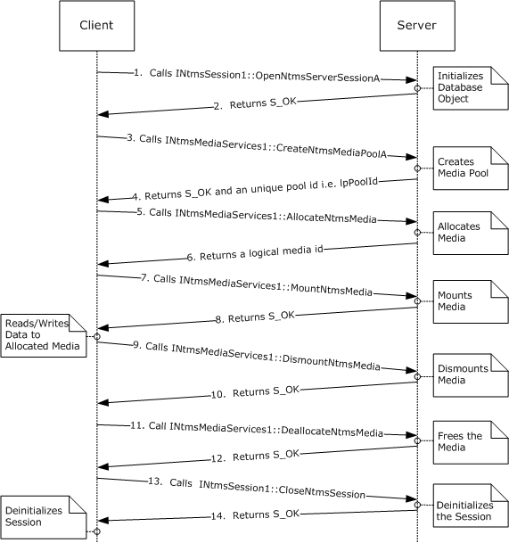
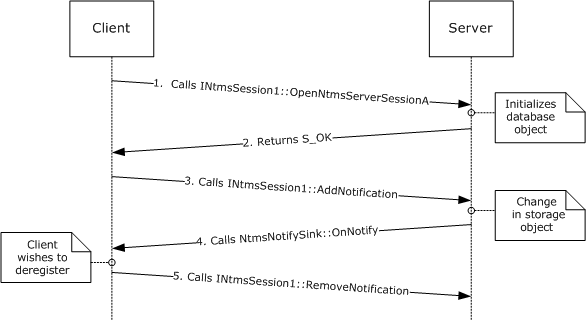
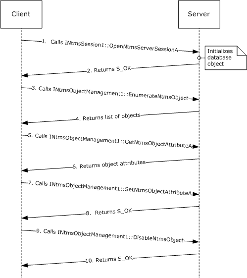
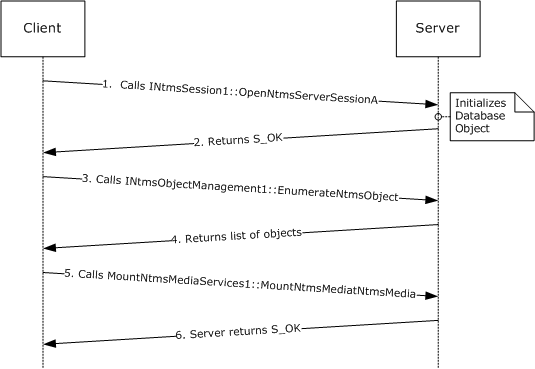

[MS-RSMP]:

Removable Storage Manager (RSM) Remote Protocol

Intellectual Property Rights Notice for Open Specifications Documentation

  Technical Documentation. Microsoft publishes Open Specifications documentation (“this

documentation”) for protocols, file formats, data portability, computer languages, and standards
support. Additionally, overview documents cover inter-protocol relationships and interactions.

  Copyrights. This documentation is covered by Microsoft copyrights. Regardless of any other

terms that are contained in the terms of use for the Microsoft website that hosts this
documentation, you can make copies of it in order to develop implementations of the technologies
that are described in this documentation and can distribute portions of it in your implementations
that use these technologies or in your documentation as necessary to properly document the
implementation. You can also distribute in your implementation, with or without modification, any
schemas, IDLs, or code samples that are included in the documentation. This permission also
applies to any documents that are referenced in the Open Specifications documentation.
  No Trade Secrets. Microsoft does not claim any trade secret rights in this documentation.
  Patents. Microsoft has patents that might cover your implementations of the technologies

described in the Open Specifications documentation. Neither this notice nor Microsoft's delivery of
this documentation grants any licenses under those patents or any other Microsoft patents.
However, a given Open Specifications document might be covered by the Microsoft Open
Specifications Promise or the Microsoft Community Promise. If you would prefer a written license,
or if the technologies described in this documentation are not covered by the Open Specifications
Promise or Community Promise, as applicable, patent licenses are available by contacting
iplg@microsoft.com.

  License Programs. To see all of the protocols in scope under a specific license program and the

associated patents, visit the Patent Map.

  Trademarks. The names of companies and products contained in this documentation might be
covered by trademarks or similar intellectual property rights. This notice does not grant any
licenses under those rights. For a list of Microsoft trademarks, visit
www.microsoft.com/trademarks.

  Fictitious Names. The example companies, organizations, products, domain names, email

addresses, logos, people, places, and events that are depicted in this documentation are fictitious.
No association with any real company, organization, product, domain name, email address, logo,
person, place, or event is intended or should be inferred.

Reservation of Rights. All other rights are reserved, and this notice does not grant any rights other
than as specifically described above, whether by implication, estoppel, or otherwise.

Tools. The Open Specifications documentation does not require the use of Microsoft programming
tools or programming environments in order for you to develop an implementation. If you have access
to Microsoft programming tools and environments, you are free to take advantage of them. Certain
Open Specifications documents are intended for use in conjunction with publicly available standards
specifications and network programming art and, as such, assume that the reader either is familiar
with the aforementioned material or has immediate access to it.

Support. For questions and support, please contact dochelp@microsoft.com.

[MS-RSMP] - v20170601
Removable Storage Manager (RSM) Remote Protocol
Copyright © 2017 Microsoft Corporation
Release: June 1, 2017

1 / 214

Revision Summary

Date

Revision
History

Revision
Class

Comments

3/2/2007

1.0

4/3/2007

1.1

5/11/2007

1.2

6/1/2007

2.0

7/3/2007

3.0

8/10/2007

3.1

9/28/2007

3.2

New

Minor

Minor

Major

Major

Minor

Minor

Version 1.0 release

Version 1.1 release

Version 1.2 release

Updated and revised the technical content.

Changed to unified format; updated technical content

Revised content based on feedback.

Clarified the meaning of the technical content.

10/23/2007  3.2.1

Editorial

Changed language and formatting in the technical content.

1/25/2008

3.2.2

Editorial

Changed language and formatting in the technical content.

3/14/2008

3.2.3

Editorial

Changed language and formatting in the technical content.

6/20/2008

4.0

7/25/2008

5.0

8/29/2008

6.0

Major

Major

Major

Updated and revised the technical content.

Updated and revised the technical content.

Updated and revised the technical content.

10/24/2008  6.0.1

Editorial

Changed language and formatting in the technical content.

12/5/2008

6.1

1/16/2009

6.2

2/27/2009

6.3

4/10/2009

7.0

Minor

Minor

Minor

Major

Clarified the meaning of the technical content.

Clarified the meaning of the technical content.

Clarified the meaning of the technical content.

Updated and revised the technical content.

5/22/2009

7.0.1

Editorial

Changed language and formatting in the technical content.

7/2/2009

8.0

8/14/2009

9.0

9/25/2009

10.0

Major

Major

Major

Updated and revised the technical content.

Updated and revised the technical content.

Updated and revised the technical content.

11/6/2009

10.0.1

Editorial

Changed language and formatting in the technical content.

12/18/2009  10.0.2

Editorial

Changed language and formatting in the technical content.

1/29/2010

10.1

Minor

Clarified the meaning of the technical content.

3/12/2010

10.1.1

Editorial

Changed language and formatting in the technical content.

4/23/2010

10.1.2

Editorial

Changed language and formatting in the technical content.

6/4/2010

10.1.3

Editorial

Changed language and formatting in the technical content.

7/16/2010

10.1.3

8/27/2010

10.1.3

None

None

No changes to the meaning, language, or formatting of the
technical content.

No changes to the meaning, language, or formatting of the

[MS-RSMP] - v20170601
Removable Storage Manager (RSM) Remote Protocol
Copyright © 2017 Microsoft Corporation
Release: June 1, 2017

2 / 214

Date

Revision
History

Revision
Class

Comments

technical content.

10/8/2010

10.1.3

None

No changes to the meaning, language, or formatting of the
technical content.

11/19/2010  10.1.3

None

No changes to the meaning, language, or formatting of the
technical content.

1/7/2011

10.1.3

None

No changes to the meaning, language, or formatting of the
technical content.

2/11/2011

10.1.3

None

No changes to the meaning, language, or formatting of the
technical content.

3/25/2011

10.1.3

None

No changes to the meaning, language, or formatting of the
technical content.

5/6/2011

10.1.3

None

No changes to the meaning, language, or formatting of the
technical content.

6/17/2011

10.2

Minor

Clarified the meaning of the technical content.

9/23/2011

10.2

None

No changes to the meaning, language, or formatting of the
technical content.

12/16/2011  10.2

None

No changes to the meaning, language, or formatting of the
technical content.

3/30/2012

10.2

None

No changes to the meaning, language, or formatting of the
technical content.

7/12/2012

10.2

None

No changes to the meaning, language, or formatting of the
technical content.

10/25/2012  10.2

None

No changes to the meaning, language, or formatting of the
technical content.

1/31/2013

10.2

None

No changes to the meaning, language, or formatting of the
technical content.

8/8/2013

10.2

None

No changes to the meaning, language, or formatting of the
technical content.

11/14/2013  10.2

None

No changes to the meaning, language, or formatting of the
technical content.

2/13/2014

10.2

None

No changes to the meaning, language, or formatting of the
technical content.

5/15/2014

11.0

Major

Updated and revised the technical content.

6/30/2015

11.0

None

No changes to the meaning, language, or formatting of the
technical content.

10/16/2015  11.0

None

No changes to the meaning, language, or formatting of the
technical content.

7/14/2016

11.0

None

No changes to the meaning, language, or formatting of the
technical content.

6/1/2017

11.0

None

No changes to the meaning, language, or formatting of the
technical content.

[MS-RSMP] - v20170601
Removable Storage Manager (RSM) Remote Protocol
Copyright © 2017 Microsoft Corporation
Release: June 1, 2017

3 / 214

## Table of Contents

- [1 Introduction](#1-introduction)
  - [1.1 Glossary](#11-glossary)
  - [1.2 References](#12-references)
    - [1.2.1 Normative References](#121-normative-references)
    - [1.2.2 Informative References](#122-informative-references)
  - [1.3 Overview](#13-overview)
  - [1.4 Relationship to Other Protocols](#14-relationship-to-other-protocols)
  - [1.5 Prerequisites/Preconditions](#15-prerequisitespreconditions)
  - [1.6 Applicability Statement](#16-applicability-statement)
  - [1.7 Versioning and Capability Negotiation](#17-versioning-and-capability-negotiation)
    - [1.7.1 Interfaces for Storage Object Management](#171-interfaces-for-storage-object-management)
    - [1.7.2 Interfaces for Media Library Management](#172-interfaces-for-media-library-management)
    - [1.7.3 Interfaces for Media Management](#173-interfaces-for-media-management)
    - [1.7.4 Interfaces for Message and Notification Distribution](#174-interfaces-for-message-and-notification-distribution)
    - [1.7.5 Security and Authentication Methods](#175-security-and-authentication-methods)
  - [1.8 Vendor-Extensible Fields](#18-vendor-extensible-fields)
  - [1.9 Standards Assignments](#19-standards-assignments)
- [2 Messages](#2-messages)
  - [2.1 Transport](#21-transport)
  - [2.2 Message Syntax](#22-message-syntax)
    - [2.2.1 Common Data Types](#221-common-data-types)
      - [2.2.1.1 LPGUID](#2211-lpguid)
      - [2.2.1.2 NTMS_GUID](#2212-ntmsguid)
      - [2.2.1.3 LPNTMS_GUID](#2213-lpntmsguid)
      - [2.2.1.4 NTMS_HANDLE](#2214-ntmshandle)
      - [2.2.1.5 PSECURITY_DESCRIPTOR_NTMS](#2215-psecuritydescriptorntms)
      - [2.2.1.6 NtmsObjectsTypes Enumeration](#2216-ntmsobjectstypes-enumeration)
      - [2.2.1.7 NtmsOpreqCommand Enumeration](#2217-ntmsopreqcommand-enumeration)
      - [2.2.1.8 NtmsNotificationOperations Enumeration](#2218-ntmsnotificationoperations-enumeration)
      - [2.2.1.9 NtmsDismountOptions Enumeration](#2219-ntmsdismountoptions-enumeration)
      - [2.2.1.10 NtmsLmState Enumeration](#22110-ntmslmstate-enumeration)
      - [2.2.1.11 NTMS_LIBRARYINFORMATION Structure](#22111-ntmslibraryinformation-structure)
      - [2.2.1.12 NtmsAccessMask](#22112-ntmsaccessmask)
    - [2.2.2 INtmsLibraryControl1 Data Types](#222-intmslibrarycontrol1-data-types)
      - [2.2.2.1 NtmsEjectOperation Enumeration](#2221-ntmsejectoperation-enumeration)
      - [2.2.2.2 NtmsInjectOperation Enumeration](#2222-ntmsinjectoperation-enumeration)
      - [2.2.2.3 NtmsInventoryMethod Enumeration](#2223-ntmsinventorymethod-enumeration)
    - [2.2.3 INtmsMediaServices1 Data Types](#223-intmsmediaservices1-data-types)
      - [2.2.3.1 NtmsAllocateOptions Enumeration](#2231-ntmsallocateoptions-enumeration)
      - [2.2.3.2 NtmsCreateOptions Enumeration](#2232-ntmscreateoptions-enumeration)
      - [2.2.3.3 NtmsMountOptions Enumeration](#2233-ntmsmountoptions-enumeration)
      - [2.2.3.4 NtmsMountPriority Enumeration](#2234-ntmsmountpriority-enumeration)
      - [2.2.3.5 SECURITY_ATTRIBUTES_NTMS Structure](#2235-securityattributesntms-structure)
      - [2.2.3.6 NTMS_ALLOCATION_INFORMATION Structure](#2236-ntmsallocationinformation-structure)
      - [2.2.3.7 NTMS_MOUNT_INFORMATION Structure](#2237-ntmsmountinformation-structure)
      - [2.2.3.8 NTMS_ASYNC_IO Structure](#2238-ntmsasyncio-structure)
    - [2.2.4 INtmsObjectInfo1 Data Types](#224-intmsobjectinfo1-data-types)
      - [2.2.4.1 NtmsBarCodeState Enumeration](#2241-ntmsbarcodestate-enumeration)
      - [2.2.4.2 NtmsDriveState Enumeration](#2242-ntmsdrivestate-enumeration)
      - [2.2.4.3 NtmsLmOperation Enumeration](#2243-ntmslmoperation-enumeration)
      - [2.2.4.4 NtmsMediaState Enumeration](#2244-ntmsmediastate-enumeration)
      - [2.2.4.5 NtmsOperationalState Enumeration](#2245-ntmsoperationalstate-enumeration)
      - [2.2.4.6 NtmsOpreqState Enumeration](#2246-ntmsopreqstate-enumeration)
      - [2.2.4.7 NtmsPartitionState Enumeration](#2247-ntmspartitionstate-enumeration)
      - [2.2.4.8 NTMS_CHANGERINFORMATIONA Structure](#2248-ntmschangerinformationa-structure)
      - [2.2.4.9 NTMS_CHANGERINFORMATIONW Structure](#2249-ntmschangerinformationw-structure)
      - [2.2.4.10 NTMS_CHANGERTYPEINFORMATIONA Structure](#22410-ntmschangertypeinformationa-structure)
      - [2.2.4.11 NTMS_CHANGERTYPEINFORMATIONW Structure](#22411-ntmschangertypeinformationw-structure)
      - [2.2.4.12 NTMS_DRIVEINFORMATIONA Structure](#22412-ntmsdriveinformationa-structure)
      - [2.2.4.13 NTMS_DRIVEINFORMATIONW Structure](#22413-ntmsdriveinformationw-structure)
      - [2.2.4.14 NTMS_DRIVETYPEINFORMATIONA Structure](#22414-ntmsdrivetypeinformationa-structure)
      - [2.2.4.15 NTMS_DRIVETYPEINFORMATIONW Structure](#22415-ntmsdrivetypeinformationw-structure)
      - [2.2.4.16 NTMS_LIBREQUESTINFORMATIONA Structure](#22416-ntmslibrequestinformationa-structure)
      - [2.2.4.17 NTMS_LIBREQUESTINFORMATIONW Structure](#22417-ntmslibrequestinformationw-structure)
      - [2.2.4.18 NTMS_MEDIAPOOLINFORMATION Structure](#22418-ntmsmediapoolinformation-structure)
      - [2.2.4.19 NTMS_MEDIATYPEINFORMATION Structure](#22419-ntmsmediatypeinformation-structure)
      - [2.2.4.20 NTMS_OBJECTINFORMATIONA Structure](#22420-ntmsobjectinformationa-structure)
      - [2.2.4.21 NTMS_OBJECTINFORMATIONW Structure](#22421-ntmsobjectinformationw-structure)
      - [2.2.4.22 NTMS_STORAGESLOTINFORMATION Structure](#22422-ntmsstorageslotinformation-structure)
      - [2.2.4.23 NTMS_IEDOORINFORMATION Structure](#22423-ntmsiedoorinformation-structure)
      - [2.2.4.24 NTMS_IEPORTINFORMATION Structure](#22424-ntmsieportinformation-structure)
      - [2.2.4.25 NTMS_LMIDINFORMATION Structure](#22425-ntmslmidinformation-structure)
      - [2.2.4.26 NTMS_COMPUTERINFORMATION Structure](#22426-ntmscomputerinformation-structure)
      - [2.2.4.27 NTMS_OPREQUESTINFORMATIONA Structure](#22427-ntmsoprequestinformationa-structure)
      - [2.2.4.28 NTMS_OPREQUESTINFORMATIONW Structure](#22428-ntmsoprequestinformationw-structure)
      - [2.2.4.29 NTMS_PARTITIONINFORMATIONA Structure](#22429-ntmspartitioninformationa-structure)
      - [2.2.4.30 NTMS_PARTITIONINFORMATIONW Structure](#22430-ntmspartitioninformationw-structure)
      - [2.2.4.31 NTMS_PMIDINFORMATIONA Structure](#22431-ntmspmidinformationa-structure)
      - [2.2.4.32 NTMS_PMIDINFORMATIONW Structure](#22432-ntmspmidinformationw-structure)
    - [2.2.5 INtmsObjectManagement2 Data Types](#225-intmsobjectmanagement2-data-types)
      - [2.2.5.1 NtmsUIOperations Enumeration](#2251-ntmsuioperations-enumeration)
      - [2.2.5.2 NtmsUIType Enumeration](#2252-ntmsuitype-enumeration)
    - [2.2.6 IMessenger Data Types](#226-imessenger-data-types)
      - [2.2.6.1 RSM_MESSAGE Structure](#2261-rsmmessage-structure)
- [3 Protocol Details](#3-protocol-details)
  - [3.1 Client Role Details](#31-client-role-details)
    - [3.1.1 Abstract Data Model](#311-abstract-data-model)
      - [3.1.1.1 Notification Callback Objects](#3111-notification-callback-objects)
    - [3.1.2 Timers](#312-timers)
    - [3.1.3 Initialization](#313-initialization)
    - [3.1.4 Higher-Layer Triggered Events](#314-higher-layer-triggered-events)
      - [3.1.4.1 Common Details](#3141-common-details)
        - [3.1.4.1.1 Methods with Prerequisites](#31411-methods-with-prerequisites)
    - [3.1.5 Message Processing Events and Sequencing Rules](#315-message-processing-events-and-sequencing-rules)
      - [3.1.5.1 Processing Server Replies to Method Calls](#3151-processing-server-replies-to-method-calls)
        - [3.1.5.1.1 Processing Notifications Sent from the Server to the Client](#31511-processing-notifications-sent-from-the-server-to-the-client)
      - [3.1.5.2 Message Processing Details](#3152-message-processing-details)
        - [3.1.5.2.1 IClientSink Interface](#31521-iclientsink-interface)
          - [3.1.5.2.1.1 IClientSink::OnNotify (Opnum 3)](#315211-iclientsinkonnotify-opnum-3)
        - [3.1.5.2.2 INtmsNotifySink Interface](#31522-intmsnotifysink-interface)
          - [3.1.5.2.2.1 INtmsNotifySink::ConnectCallback (Opnum 3)](#315221-intmsnotifysinkconnectcallback-opnum-3)
          - [3.1.5.2.2.2 INtmsNotifySink::OnNotify (Opnum 4)](#315222-intmsnotifysinkonnotify-opnum-4)
          - [3.1.5.2.2.3 INtmsNotifySink::ReleaseCallback (Opnum 5)](#315223-intmsnotifysinkreleasecallback-opnum-5)
    - [3.1.6 Timer Events](#316-timer-events)
    - [3.1.7 Other Local Events](#317-other-local-events)
  - [3.2 Server Role Details](#32-server-role-details)
    - [3.2.1 Abstract Data Model](#321-abstract-data-model)
      - [3.2.1.1 Server Object](#3211-server-object)
      - [3.2.1.2 List of Objects Present in the System](#3212-list-of-objects-present-in-the-system)
        - [3.2.1.2.1 Libraries](#32121-libraries)
        - [3.2.1.2.2 Media Pools](#32122-media-pools)
        - [3.2.1.2.3 Media](#32123-media)
      - [3.2.1.3 List of Clients Connected to the Server](#3213-list-of-clients-connected-to-the-server)
      - [3.2.1.4 List of Tasks Currently Executed on the Server](#3214-list-of-tasks-currently-executed-on-the-server)
    - [3.2.2 Timers](#322-timers)
    - [3.2.3 Initialization](#323-initialization)
      - [3.2.3.1 List of Storage Objects Present in the System](#3231-list-of-storage-objects-present-in-the-system)
      - [3.2.3.2 List of Clients Connected to the Server](#3232-list-of-clients-connected-to-the-server)
      - [3.2.3.3 List of Tasks Currently Executed on the Server](#3233-list-of-tasks-currently-executed-on-the-server)
    - [3.2.4 Higher-Layer Triggered Events](#324-higher-layer-triggered-events)
    - [3.2.5 Message Processing Events and Sequencing Rules](#325-message-processing-events-and-sequencing-rules)
      - [3.2.5.1 Rules for Modifying the List of Storage Objects](#3251-rules-for-modifying-the-list-of-storage-objects)
      - [3.2.5.2 Message Processing Details](#3252-message-processing-details)
        - [3.2.5.2.1 INtmsLibraryControl1 Interface](#32521-intmslibrarycontrol1-interface)
          - [3.2.5.2.1.1 INtmsLibraryControl1::EjectNtmsMedia (Opnum 3)](#325211-intmslibrarycontrol1ejectntmsmedia-opnum-3)
          - [3.2.5.2.1.2 INtmsLibraryControl1::InjectNtmsMedia (Opnum 4)](#325212-intmslibrarycontrol1injectntmsmedia-opnum-4)
          - [3.2.5.2.1.3 INtmsLibraryControl1::AccessNtmsLibraryDoor (Opnum 5)](#325213-intmslibrarycontrol1accessntmslibrarydoor-opnum-5)
          - [3.2.5.2.1.4 INtmsLibraryControl1::CleanNtmsDrive (Opnum 6)](#325214-intmslibrarycontrol1cleanntmsdrive-opnum-6)
          - [3.2.5.2.1.5 INtmsLibraryControl1::DismountNtmsDrive (Opnum 7)](#325215-intmslibrarycontrol1dismountntmsdrive-opnum-7)
          - [3.2.5.2.1.6 INtmsLibraryControl1::InventoryNtmsLibrary (Opnum 8)](#325216-intmslibrarycontrol1inventoryntmslibrary-opnum-8)
          - [3.2.5.2.1.7 INtmsLibraryControl1::CancelNtmsLibraryRequest (Opnum 10)](#325217-intmslibrarycontrol1cancelntmslibraryrequest-opnum-10)
          - [3.2.5.2.1.8 INtmsLibraryControl1::ReserveNtmsCleanerSlot (Opnum 11)](#325218-intmslibrarycontrol1reserventmscleanerslot-opnum-11)
          - [3.2.5.2.1.9 INtmsLibraryControl1::ReleaseNtmsCleanerSlot (Opnum 12)](#325219-intmslibrarycontrol1releasentmscleanerslot-opnum-12)
          - [3.2.5.2.1.10 INtmsLibraryControl1::InjectNtmsCleaner (Opnum 13)](#3252110-intmslibrarycontrol1injectntmscleaner-opnum-13)
          - [3.2.5.2.1.11 INtmsLibraryControl1::EjectNtmsCleaner (Opnum 14)](#3252111-intmslibrarycontrol1ejectntmscleaner-opnum-14)
          - [3.2.5.2.1.12 INtmsLibraryControl1::DeleteNtmsLibrary (Opnum 15)](#3252112-intmslibrarycontrol1deletentmslibrary-opnum-15)
          - [3.2.5.2.1.13 INtmsLibraryControl1::DeleteNtmsDrive (Opnum 16)](#3252113-intmslibrarycontrol1deletentmsdrive-opnum-16)
          - [3.2.5.2.1.14 INtmsLibraryControl1::GetNtmsRequestOrder (Opnum 17)](#3252114-intmslibrarycontrol1getntmsrequestorder-opnum-17)
          - [3.2.5.2.1.15 INtmsLibraryControl1::SetNtmsRequestOrder (Opnum 18)](#3252115-intmslibrarycontrol1setntmsrequestorder-opnum-18)
          - [3.2.5.2.1.16 INtmsLibraryControl1::DeleteNtmsRequests (Opnum 19)](#3252116-intmslibrarycontrol1deletentmsrequests-opnum-19)
          - [3.2.5.2.1.17 INtmsLibraryControl1::BeginNtmsDeviceChangeDetection (Opnum 20)](#3252117-intmslibrarycontrol1beginntmsdevicechangedetection-opnum-20)
          - [3.2.5.2.1.18 INtmsLibraryControl1::SetNtmsDeviceChangeDetection (Opnum 21)](#3252118-intmslibrarycontrol1setntmsdevicechangedetection-opnum-21)
          - [3.2.5.2.1.19 INtmsLibraryControl1::EndNtmsDeviceChangeDetection (Opnum 22)](#3252119-intmslibrarycontrol1endntmsdevicechangedetection-opnum-22)
        - [3.2.5.2.2 INtmsMediaServices1 Interface](#32522-intmsmediaservices1-interface)
          - [3.2.5.2.2.1 INtmsMediaServices1::MountNtmsMedia (Opnum 3)](#325221-intmsmediaservices1mountntmsmedia-opnum-3)
          - [3.2.5.2.2.2 INtmsMediaServices1::DismountNtmsMedia (Opnum 4)](#325222-intmsmediaservices1dismountntmsmedia-opnum-4)
          - [3.2.5.2.2.3 INtmsMediaServices1::AllocateNtmsMedia (Opnum 6)](#325223-intmsmediaservices1allocatentmsmedia-opnum-6)
          - [3.2.5.2.2.4 INtmsMediaServices1::DeallocateNtmsMedia (Opnum 7)](#325224-intmsmediaservices1deallocatentmsmedia-opnum-7)
          - [3.2.5.2.2.5 INtmsMediaServices1::SwapNtmsMedia (Opnum 8)](#325225-intmsmediaservices1swapntmsmedia-opnum-8)
          - [3.2.5.2.2.6 INtmsMediaServices1::DecommissionNtmsMedia (Opnum 9)](#325226-intmsmediaservices1decommissionntmsmedia-opnum-9)
          - [3.2.5.2.2.7 INtmsMediaServices1::SetNtmsMediaComplete (Opnum 10)](#325227-intmsmediaservices1setntmsmediacomplete-opnum-10)
          - [3.2.5.2.2.8 INtmsMediaServices1::DeleteNtmsMedia (Opnum 11)](#325228-intmsmediaservices1deletentmsmedia-opnum-11)
          - [3.2.5.2.2.9 INtmsMediaServices1::CreateNtmsMediaPoolA (Opnum 12)](#325229-intmsmediaservices1createntmsmediapoola-opnum-12)
          - [3.2.5.2.2.10 INtmsMediaServices1::CreateNtmsMediaPoolW (Opnum 13)](#3252210-intmsmediaservices1createntmsmediapoolw-opnum-13)
          - [3.2.5.2.2.11 INtmsMediaServices1::GetNtmsMediaPoolNameA (Opnum 14)](#3252211-intmsmediaservices1getntmsmediapoolnamea-opnum-14)
          - [3.2.5.2.2.12 INtmsMediaServices1::GetNtmsMediaPoolNameW (Opnum 15)](#3252212-intmsmediaservices1getntmsmediapoolnamew-opnum-15)
          - [3.2.5.2.2.13 INtmsMediaServices1::MoveToNtmsMediaPool (Opnum 16)](#3252213-intmsmediaservices1movetontmsmediapool-opnum-16)
          - [3.2.5.2.2.14 INtmsMediaServices1::DeleteNtmsMediaPool (Opnum 17)](#3252214-intmsmediaservices1deletentmsmediapool-opnum-17)
          - [3.2.5.2.2.15 INtmsMediaServices1::AddNtmsMediaType (Opnum 18)](#3252215-intmsmediaservices1addntmsmediatype-opnum-18)
          - [3.2.5.2.2.16 INtmsMediaServices1::DeleteNtmsMediaType (Opnum 19)](#3252216-intmsmediaservices1deletentmsmediatype-opnum-19)
          - [3.2.5.2.2.17 INtmsMediaServices1::ChangeNtmsMediaType (Opnum 20)](#3252217-intmsmediaservices1changentmsmediatype-opnum-20)
        - [3.2.5.2.3 INtmsObjectInfo1 Interface](#32523-intmsobjectinfo1-interface)
          - [3.2.5.2.3.1 INtmsObjectInfo1::GetNtmsServerObjectInformationA (Opnum 3)](#325231-intmsobjectinfo1getntmsserverobjectinformationa-opnum-3)
          - [3.2.5.2.3.2 INtmsObjectInfo1::GetNtmsServerObjectInformationW (Opnum 4)](#325232-intmsobjectinfo1getntmsserverobjectinformationw-opnum-4)
          - [3.2.5.2.3.3 INtmsObjectInfo1::SetNtmsObjectInformationA (Opnum 5)](#325233-intmsobjectinfo1setntmsobjectinformationa-opnum-5)
          - [3.2.5.2.3.4 INtmsObjectInfo1::SetNtmsObjectInformationW (Opnum 6)](#325234-intmsobjectinfo1setntmsobjectinformationw-opnum-6)
          - [3.2.5.2.3.5 INtmsObjectInfo1::CreateNtmsMediaA (Opnum 7)](#325235-intmsobjectinfo1createntmsmediaa-opnum-7)
          - [3.2.5.2.3.6 INtmsObjectInfo1::CreateNtmsMediaW (Opnum 8)](#325236-intmsobjectinfo1createntmsmediaw-opnum-8)
        - [3.2.5.2.4 INtmsObjectManagement1 Interface](#32524-intmsobjectmanagement1-interface)
          - [3.2.5.2.4.1 INtmsObjectManagement1::GetNtmsObjectSecurity (Opnum 3)](#325241-intmsobjectmanagement1getntmsobjectsecurity-opnum-3)
          - [3.2.5.2.4.2 INtmsObjectManagement1::SetNtmsObjectSecurity (Opnum 4)](#325242-intmsobjectmanagement1setntmsobjectsecurity-opnum-4)
          - [3.2.5.2.4.3 INtmsObjectManagement1::GetNtmsObjectAttributeA (Opnum 5)](#325243-intmsobjectmanagement1getntmsobjectattributea-opnum-5)
          - [3.2.5.2.4.4 INtmsObjectManagement1::GetNtmsObjectAttributeW (Opnum 6)](#325244-intmsobjectmanagement1getntmsobjectattributew-opnum-6)
          - [3.2.5.2.4.5 INtmsObjectManagement1::SetNtmsObjectAttributeA (Opnum 7)](#325245-intmsobjectmanagement1setntmsobjectattributea-opnum-7)
          - [3.2.5.2.4.6 INtmsObjectManagement1::SetNtmsObjectAttributeW (Opnum 8)](#325246-intmsobjectmanagement1setntmsobjectattributew-opnum-8)
          - [3.2.5.2.4.7 INtmsObjectManagement1::EnumerateNtmsObject (Opnum 9)](#325247-intmsobjectmanagement1enumeratentmsobject-opnum-9)
          - [3.2.5.2.4.8 INtmsObjectManagement1::DisableNtmsObject (Opnum 10)](#325248-intmsobjectmanagement1disablentmsobject-opnum-10)
          - [3.2.5.2.4.9 INtmsObjectManagement1::EnableNtmsObject (Opnum 11)](#325249-intmsobjectmanagement1enablentmsobject-opnum-11)
        - [3.2.5.2.5 INtmsSession1 Interface](#32525-intmssession1-interface)
          - [3.2.5.2.5.1 INtmsSession1::OpenNtmsServerSessionW (Opnum 3)](#325251-intmssession1openntmsserversessionw-opnum-3)
          - [3.2.5.2.5.2 INtmsSession1::OpenNtmsServerSessionA (Opnum 4)](#325252-intmssession1openntmsserversessiona-opnum-4)
          - [3.2.5.2.5.3 INtmsSession1::CloseNtmsSession (Opnum 5)](#325253-intmssession1closentmssession-opnum-5)
          - [3.2.5.2.5.4 INtmsSession1::SubmitNtmsOperatorRequestW (Opnum 6)](#325254-intmssession1submitntmsoperatorrequestw-opnum-6)
          - [3.2.5.2.5.5 INtmsSession1::SubmitNtmsOperatorRequestA (Opnum 7)](#325255-intmssession1submitntmsoperatorrequesta-opnum-7)
          - [3.2.5.2.5.6 INtmsSession1::WaitForNtmsOperatorRequest (Opnum 8)](#325256-intmssession1waitforntmsoperatorrequest-opnum-8)
          - [3.2.5.2.5.7 INtmsSession1::CancelNtmsOperatorRequest (Opnum 9)](#325257-intmssession1cancelntmsoperatorrequest-opnum-9)
          - [3.2.5.2.5.8 INtmsSession1::SatisfyNtmsOperatorRequest (Opnum 10)](#325258-intmssession1satisfyntmsoperatorrequest-opnum-10)
          - [3.2.5.2.5.9 INtmsSession1::ImportNtmsDatabase (Opnum 11)](#325259-intmssession1importntmsdatabase-opnum-11)
          - [3.2.5.2.5.10 INtmsSession1::ExportNtmsDatabase (Opnum 12)](#3252510-intmssession1exportntmsdatabase-opnum-12)
          - [3.2.5.2.5.11 INtmsSession1::AddNotification (Opnum 14)](#3252511-intmssession1addnotification-opnum-14)
          - [3.2.5.2.5.12 INtmsSession1::RemoveNotification (Opnum 15)](#3252512-intmssession1removenotification-opnum-15)
          - [3.2.5.2.5.13 INtmsSession1::DispatchNotification (Opnum 16)](#3252513-intmssession1dispatchnotification-opnum-16)
        - [3.2.5.2.6 INtmsLibraryControl2 Interface](#32526-intmslibrarycontrol2-interface)
          - [3.2.5.2.6.1 INtmsLibraryControl2::IdentifyNtmsSlot (Opnum 23)](#325261-intmslibrarycontrol2identifyntmsslot-opnum-23)
        - [3.2.5.2.7 INtmsObjectManagement2 Interface](#32527-intmsobjectmanagement2-interface)
          - [3.2.5.2.7.1 INtmsObjectManagement2::EnumerateNtmsObjectR (Opnum 12)](#325271-intmsobjectmanagement2enumeratentmsobjectr-opnum-12)
          - [3.2.5.2.7.2 INtmsObjectManagement2::GetNtmsUIOptionsA (Opnum 13)](#325272-intmsobjectmanagement2getntmsuioptionsa-opnum-13)
          - [3.2.5.2.7.3 INtmsObjectManagement2::GetNtmsUIOptionsW (Opnum 14)](#325273-intmsobjectmanagement2getntmsuioptionsw-opnum-14)
          - [3.2.5.2.7.4 INtmsObjectManagement2::SetNtmsUIOptionsA (Opnum 15)](#325274-intmsobjectmanagement2setntmsuioptionsa-opnum-15)
          - [3.2.5.2.7.5 INtmsObjectManagement2::SetNtmsUIOptionsW (Opnum 16)](#325275-intmsobjectmanagement2setntmsuioptionsw-opnum-16)
        - [3.2.5.2.8 INtmsObjectManagement3 Interface](#32528-intmsobjectmanagement3-interface)
          - [3.2.5.2.8.1 INtmsObjectManagement3::GetNtmsObjectAttributeAR (Opnum 17)](#325281-intmsobjectmanagement3getntmsobjectattributear-opnum-17)
          - [3.2.5.2.8.2 INtmsObjectManagement3::GetNtmsObjectAttributeWR (Opnum 18)](#325282-intmsobjectmanagement3getntmsobjectattributewr-opnum-18)
        - [3.2.5.2.9 IRobustNtmsMediaServices1 Interface](#32529-irobustntmsmediaservices1-interface)
          - [3.2.5.2.9.1 IRobustNtmsMediaServices1::GetNtmsMediaPoolNameAR (Opnum 21)](#325291-irobustntmsmediaservices1getntmsmediapoolnamear-opnum-21)
          - [3.2.5.2.9.2 IRobustNtmsMediaServices1::GetNtmsMediaPoolNameWR (Opnum 22)](#325292-irobustntmsmediaservices1getntmsmediapoolnamewr-opnum-22)
        - [3.2.5.2.10 IMessenger Interface](#325210-imessenger-interface)
          - [3.2.5.2.10.1 IMessenger::SendMessage (Opnum 3)](#3252101-imessengersendmessage-opnum-3)
          - [3.2.5.2.10.2 IMessenger::RecallMessage (Opnum 4)](#3252102-imessengerrecallmessage-opnum-4)
    - [3.2.6 Timer Events](#326-timer-events)
    - [3.2.7 Other Local Events](#327-other-local-events)
      - [3.2.7.1 Problem/Warnings for the Tape Drive](#3271-problemwarnings-for-the-tape-drive)
- [4 Protocol Examples](#4-protocol-examples)
  - [4.1 Allocation of Media with INtmsMediaServices1](#41-allocation-of-media-with-intmsmediaservices1)
  - [4.2 Registering for Notifications with INtmsSession1](#42-registering-for-notifications-with-intmssession1)
  - [4.3 Storage Object Management with INtmsObjectManagement1](#43-storage-object-management-with-intmsobjectmanagement1)
  - [4.4 Media Management Using INtmsMediaServices1](#44-media-management-using-intmsmediaservices1)
- [5 Security](#5-security)
  - [5.1 Security Considerations for Implementers](#51-security-considerations-for-implementers)
  - [5.2 Index of Security Parameters](#52-index-of-security-parameters)
- [6 Appendix A: Full IDL](#6-appendix-a-full-idl)
- [7 Appendix B: Product Behavior](#7-appendix-b-product-behavior)
- [8 Change Tracking](#8-change-tracking)
- [9 Index](#9-index)

## 1 Introduction

This document specifies the Removable Storage Manager (RSM) Remote Protocol.

The RSM Remote Protocol is a set of distributed component object model (DCOM) [MS-DCOM]
interfaces for applications to manage robotic changers, media libraries, and tape drives. The RSM
Remote Protocol deals with detailed low-level operating system and storage concepts. Although the
necessary basic concepts are outlined in this specification, this specification assumes reader familiarity
with these technologies.

Sections 1.5, 1.8, 1.9, 2, and 3 of this specification are normative. All other sections and examples in
this specification are informative.

### 1.1 Glossary

This document uses the following terms:

Allocate: To reserve an RSM resource for exclusive use by a particular client. See also

Deallocate.

application pool: A group of media in an RSM system that is specific to a particular client. Each

client that uses media managed by the RSM server uses one or more application pools.

Bar Code: A device-readable physical label that is attached to a physical medium.

Bar Code Reader: A device capable of reading a bar code and transmitting the information

encoded on it. A label with a bar code is attached to the outside of a cartridge. The labels are
designed to be both human-readable and computer-readable. Libraries that hold media with
bar codes attached can have a bar code reader. There is only one reader per library, which is
usually mounted on the transport.

Cartridge: A unit of physical media on which information can be stored. Cartridges come in
various types, including 8-mm tape, magnetic disks, optical disks, and CD-ROMs. Some
cartridges have multiple sides.

Changer: An automated mechanical device capable of mounting new media without human

intervention.

Cleaner: A special cartridge that cleans the read/write head.

Deallocate: To free up a previously allocated RSM resource, allowing it to be used by or

allocated to any future client.

Decommission: To take physical media out of use.

Dismount: To move physical media from a drive to a library slot.

Door: A means to gain unconstrained access to the physical media in a library. When the door
is open, an administrator can add and remove media from the library. See also Inject/Eject
Port.

drive: A device that can read or write to a cartridge. A library has at least one drive.

Eject: To move a cartridge out of an RSM system. Ejections are done through a door or an

inject/eject (IE) port. See also Inject.

endpoint: A network-specific address of a remote procedure call (RPC) server process for remote

procedure calls. The actual name and type of the endpoint depends on the RPC protocol
sequence that is being used. For example, for RPC over TCP (RPC Protocol Sequence

[MS-RSMP] - v20170601
Removable Storage Manager (RSM) Remote Protocol
Copyright © 2017 Microsoft Corporation
Release: June 1, 2017

9 / 214

ncacn_ip_tcp), an endpoint might be TCP port 1025. For RPC over Server Message Block (RPC
Protocol Sequence ncacn_np), an endpoint might be the name of a named pipe. For more
information, see [C706].

Free Pool: A group of media in an RSM system that is freely available to any application. Media in

a free pool is blank. An application can draw on media from a free pool when it needs
additional media, and it can return media that it no longer needs to the free pool.

globally unique identifier (GUID): A term used interchangeably with universally unique

identifier (UUID) in Microsoft protocol technical documents (TDs). Interchanging the usage of
these terms does not imply or require a specific algorithm or mechanism to generate the value.
Specifically, the use of this term does not imply or require that the algorithms described in
[RFC4122] or [C706] have to be used for generating the GUID. See also universally unique
identifier (UUID).

import: The process of creating a conglomeration or partition on a COMA server based on modules

and configurations extracted from an installer package file.

Import Pool: Media newly placed into the library that are sorted by media type. For instance, if
an administrator placed a tape written by backup on one system into a library attached to a
second system, the instance of RSM on the second system recognizes that the tape was written
using Microsoft Tape Format (MTF) and places it in the proper media type import pool.

Inject: To move a cartridge into an RSM system. Injection is done through a door or an IE port.

See also Eject.

Inject/Eject (IE) Port: A means to gain constrained access to the physical media in a library.
Media added to a library through an IE port are not placed directly into a slot, but are instead
placed in the IE port, whereupon the library uses the transport to move the media from the IE
port to a slot. IE ports are also known as mailslots. See also Door.

Inventory: The act of cataloguing all the physical media in an RSM system.

Library: A storage device that contains one or more tape drives, a number of slots to hold tape

cartridges, and an automated method for loading tapes.

Library Request: A request from an application for an operation to be performed on a library.

Logical Media: A set of data independent of the physical media it is recorded on. Logical media

are tracked using logical media identifiers (LMID). Because access to the data occurs only
through the LMID, RSM can manage the physical location of the data. For example, if the
original cartridge begins to fail, RSM can move the data to a new cartridge without having to
notify the application.

Magazines: See Slots.

Media Identifier: A unique value that identifies a particular piece of media.

Mount: To move physical media from a library slot to a drive.

Offline Library: State of library in which it is not usable for client. The library is marked as

offline library on client request or when it is disconnected from the server.

On-Media Identifier (OMID): An electronically recorded label used to uniquely identify a side of

a medium in an RSM system.

Operator Request: A request for a person (often an administrator, but possibly a user) to perform

a task.

Physical Media: The tangible media that are inserted into and removed from libraries and

mounted in drives.

10 / 214

[MS-RSMP] - v20170601
Removable Storage Manager (RSM) Remote Protocol
Copyright © 2017 Microsoft Corporation
Release: June 1, 2017

port: A place to add or remove physical media from a library.

remote procedure call (RPC): A communication protocol used primarily between client and

server. The term has three definitions that are often used interchangeably: a runtime
environment providing for communication facilities between computers (the RPC runtime); a set
of request-and-response message exchanges between computers (the RPC exchange); and the
single message from an RPC exchange (the RPC message).  For more information, see [C706].

Robotic: Done by mechanical means, without human intervention.

Side: An area on a physical medium that can store data. Although most physical media have

only a single side, some can have two sides. For instance, a magneto-optic (MO) disk has two
sides: an "A" side and a "B" side. When an MO disk is placed in a drive with the "A" side up, the
"A" side is accessible and the "B" side is not. To access the "B" side, the disk has to be inserted
with the "B" side up. The data stored on different sides of the same physical medium are
independent of one another.

Slot: A storage location within a library. For example, a tape library has one slot for each tape
that the library can hold. A stand-alone drive library has no slots. Most libraries have at
least four slots. Sometimes slots are organized into collections of slots called magazines.
Magazines are usually removable.

System Pools: The default media pools present in an RSM system. The free pool, the import

pool, and the unrecognized pool are called system pools.

Unicode: A character encoding standard developed by the Unicode Consortium that represents

almost all of the written languages of the world. The Unicode standard [UNICODE5.0.0/2007]
provides three forms (UTF-8, UTF-16, and UTF-32) and seven schemes (UTF-8, UTF-16, UTF-16
BE, UTF-16 LE, UTF-32, UTF-32 LE, and UTF-32 BE).

universally unique identifier (UUID): A 128-bit value. UUIDs can be used for multiple

purposes, from tagging objects with an extremely short lifetime, to reliably identifying very
persistent objects in cross-process communication such as client and server interfaces, manager
entry-point vectors, and RPC objects. UUIDs are highly likely to be unique. UUIDs are also
known as globally unique identifiers (GUIDs) and these terms are used interchangeably in
the Microsoft protocol technical documents (TDs). Interchanging the usage of these terms does
not imply or require a specific algorithm or mechanism to generate the UUID. Specifically, the
use of this term does not imply or require that the algorithms described in [RFC4122] or [C706]
has to be used for generating the UUID.

Unrecognized Pool: A group of media in an RSM that is not cataloged and is unreadable by the

RSM. When a cartridge is placed in a library, the RSM tries to identify it. If it has not seen this
particular medium before and is unable to determine its format or the application that last wrote
data on it, the RSM places the cartridge in the unrecognized pool for its media type. Blank
media are treated this way.

MAY, SHOULD, MUST, SHOULD NOT, MUST NOT: These terms (in all caps) are used as defined
in [RFC2119]. All statements of optional behavior use either MAY, SHOULD, or SHOULD NOT.

### 1.2 References

Links to a document in the Microsoft Open Specifications library point to the correct section in the
most recently published version of the referenced document. However, because individual documents
in the library are not updated at the same time, the section numbers in the documents may not
match. You can confirm the correct section numbering by checking the Errata.

[MS-RSMP] - v20170601
Removable Storage Manager (RSM) Remote Protocol
Copyright © 2017 Microsoft Corporation
Release: June 1, 2017

11 / 214

#### 1.2.1 Normative References

We conduct frequent surveys of the normative references to assure their continued availability. If you
have any issue with finding a normative reference, please contact dochelp@microsoft.com. We will
assist you in finding the relevant information.

[ANSI-131-1994] American National Standards Institute, "Information Systems - Small Computer
Systems Interface-2 (SCSI-2)", ANSI INCITS 131-1994 (R1999),
https://webstore.ansi.org/RecordDetail.aspx?sku=INCITS+131-1994%5bS2013%5d

Note There is a charge to download the specification.

[C706] The Open Group, "DCE 1.1: Remote Procedure Call", C706, August 1997,
https://publications.opengroup.org/c706

Note Registration is required to download the document.

[MS-DCOM] Microsoft Corporation, "Distributed Component Object Model (DCOM) Remote Protocol".

[MS-DTYP] Microsoft Corporation, "Windows Data Types".

[MS-RPCE] Microsoft Corporation, "Remote Procedure Call Protocol Extensions".

[RFC2119] Bradner, S., "Key words for use in RFCs to Indicate Requirement Levels", BCP 14, RFC
2119, March 1997, https://www.rfc-editor.org/info/rfc2119

[UNICODE] The Unicode Consortium, "The Unicode Consortium Home Page", http://www.unicode.org/

#### 1.2.2 Informative References

[MSDN-MoveToNtmsMediaPool] Microsoft Corporation, "MoveToNtmsMediaPool function",
http://msdn.microsoft.com/en-us/library/bb540698.aspx

[MSDN-SetNtmsObjectSecurity] Microsoft Corporation, "SetNtmsObjectSecurity function",
http://msdn.microsoft.com/en-us/library/bb540745.aspx

### 1.3 Overview

The RSM Remote Protocol provides a mechanism for the remote configuration and management of
removable storage devices such as robotic changers, media libraries, and tape drives. It allows
multiple clients to manage removable media within a single-server system, and share local robotic
media libraries, tape drives, and disk drives. The protocol also enables clients to obtain notifications of
changes to these storage objects.

Two entities are involved in the RSM Remote Protocol: the server, whose storage is configured, and
the client, which accesses and requests changes to the server's storage configuration.

The RSM Remote Protocol is expressed as a set of DCOM interfaces [MS-DCOM].

The client end of the protocol invokes method calls on the interface to perform various tasks with the
removable storage on the server. The client also implements some DCOM interfaces to get
notifications for changes in the removable storage.

The server end of the protocol implements DCOM interfaces to provide the following functions:<1>

  Session Management

This interface is used to open and close sessions. Establishing a session is a prerequisite to using
the other functions of the RSM Remote Protocol.

12 / 214

[MS-RSMP] - v20170601
Removable Storage Manager (RSM) Remote Protocol
Copyright © 2017 Microsoft Corporation
Release: June 1, 2017

  Media Library Management

The Media Library Management interface provides functions that:

  Eject or inject media from a library.

  Reserve or release a slot for cleaning.

  Clean the drive.



Eject or inject a cleaner.

  Object Management

During the initialization process, the server performs an inventory of media libraries, tape drives,
robotic changers, and so on. The object management functions allow a client to create, delete,
modify, or enumerate these objects. The server also maintains a record of all configured objects in
the RSM database, which can be used across sessions.

  Media Management

The media management functions enable a client to perform any of the following functions:

  Create or delete a media pool.

  Mount or dismount media.

  Allocate, deallocate, or decommission media.

### 1.4 Relationship to Other Protocols

The RSM Remote Protocol relies on the DCOM Remote Protocol, which uses RPC as its transport. See
the full specifications in [MS-DCOM] and [C706].

There are no other protocols that rely on the RSM Remote Protocol. The RSM Remote Protocol can be
used by applications directly.<2>

### 1.5 Prerequisites/Preconditions

Network considerations are as specified in [MS-DCOM]. The RSM Remote Protocol also assumes that
the client has sufficient security privileges to enumerate and configure removable storage on the
server. For further specifications, see section 2.1.

### 1.6 Applicability Statement

The RSM Remote Protocol is applicable for an application to remotely enumerate or configure robotic
changers, media libraries, and tape drives.

### 1.7 Versioning and Capability Negotiation

Supported Transports: The RSM Remote Protocol uses the DCOM Remote Protocol [MS-DCOM],
which in turn uses RPC [C706] over TCP as its only transport. For more information, see section 2.1.

Protocol Version: The RSM Remote Protocol is composed of 12 DCOM interfaces, all of which are
version 1.0.

[MS-RSMP] - v20170601
Removable Storage Manager (RSM) Remote Protocol
Copyright © 2017 Microsoft Corporation
Release: June 1, 2017

13 / 214

#### 1.7.1 Interfaces for Storage Object Management

The common interfaces implemented by the RSM server are as follows:







INtmsSession1

INtmsObjectManagement1

INtmsObjectInfo1

The optional interfaces implemented by the RSM server are as follows:





INtmsObjectManagement2

INtmsObjectManagement3 <3>

#### 1.7.2 Interfaces for Media Library Management

The interface implemented by the RSM server for library management is as follows:



INtmsLibraryControl1

The optional interface implemented by the RSM server for library management is as follows:



INtmsLibraryControl2 <4>

#### 1.7.3 Interfaces for Media Management

The interface implemented by the RSM server for managing media is as follows:



INtmsMediaServices1

The optional interface implemented by the RSM server for managing media is as follows:



IRobustNtmsMediaServices1 <5>

#### 1.7.4 Interfaces for Message and Notification Distribution

The interface implemented by the RSM client for supporting message distribution and client
notifications is as follows:



INtmsNotifySink

There are two optional interfaces implemented by RSM for supporting message distribution and client
notifications. They are as follows:





IClientSink: This interface is implemented by the RSM client for supporting message distribution
and client notifications.

IMessenger: This optional interface is implemented by the RSM server and used locally for
supporting message distribution. The IMessenger interface cannot be accessed or instantiated by
the client; it is internal to the server.

The client negotiates for a given set of server functionality by specifying the desired RPC interface's
UUID via COM IUnknown::QueryInterface ([MS-DCOM] section 3.1.1.5.8) when binding to the server.
Certain interfaces are implemented only by particular objects on the server.<6>

[MS-RSMP] - v20170601
Removable Storage Manager (RSM) Remote Protocol
Copyright © 2017 Microsoft Corporation
Release: June 1, 2017

14 / 214

#### 1.7.5 Security and Authentication Methods

This protocol allows anyone to establish a connection to the RSM server, and it relies upon the
underlying RPC protocol to obtain the identity of the user making the method call ([MS-RPCE] section
3.3.3.4.3). The server uses this identity to perform method-specific access checks (section 3.2.5.2).

### 1.8 Vendor-Extensible Fields

There are no vendor-extensible fields for this protocol.

### 1.9 Standards Assignments

The RSM Remote Protocol has no standards assignments. It uses the following private allocations.

 Interface

 UUID

RPC Interface UUID for INtmsLibraryControl1

4E934F30-341A-11D1-8FB1-00A024CB6019

RPC Interface UUID for INtmsMediaServices1

D02E4BE0-3419-11D1-8FB1-00A024CB6019

RPC Interface UUID for INtmsNotifySink

BB39332C-BFEE-4380-AD8A-BADC8AFF5BB6

RPC Interface UUID for INtmsObjectInfo1

69AB7050-3059-11D1-8FAF-00A024CB6019

RPC Interface UUID for INtmsObjectManagement1

B057DC50-3059-11D1-8FAF-00A024CB6019

RPC Interface UUID for INtmsSession1

8DA03F40-3419-11D1-8FB1-00A024CB6019

RPC Interface UUID for IClientSink

879C8BBE-41B0-11d1-BE11-00C04FB6BF70

RPC Interface UUID for INtmsLibraryControl2

DB90832F-6910-4d46-9F5E-9FD6BFA73903

RPC Interface UUID for INtmsObjectManagement2

895A2C86-270D-489d-A6C0-DC2A9B35280E

RPC Interface UUID for INtmsObjectManagement3

3BBED8D9-2C9A-4b21-8936-ACB2F995BE6C

RPC Interface UUID for IRobustNtmsMediaServices1  7D07F313-A53F-459a-BB12-012C15B1846E

RPC Interface UUID for IMessenger

081E7188-C080-4FF3-9238-29F66D6CABFD

[MS-RSMP] - v20170601
Removable Storage Manager (RSM) Remote Protocol
Copyright © 2017 Microsoft Corporation
Release: June 1, 2017

15 / 214

## 2 Messages

The following sections specify how RSM Remote Protocol messages are transported and RSM message
syntax.

### 2.1 Transport

Message transport MUST use the Microsoft DCOM Remote Protocol [MS-DCOM], which is based on RPC
[C706].

### 2.2 Message Syntax

This section specifies the enumerations, structures, and methods that the RSM Remote Protocol uses.
Unless otherwise specified, all integers MUST be represented in least-significant-byte-first ("little-
endian") order.

#### 2.2.1 Common Data Types

The following data types are used in two or more RSM Remote Protocol interfaces.

##### 2.2.1.1 LPGUID

An LPGUID is a pointer to a GUID structure.

This type is declared as follows:

 typedef GUID* LPGUID;

##### 2.2.1.2 NTMS_GUID

An NTMS_GUID structure is a GUID structure.

This type is declared as follows:

 typedef GUID NTMS_GUID;

##### 2.2.1.3 LPNTMS_GUID

An LPNTMS_GUID is a pointer an NTMS_GUID structure.

This type is declared as follows:

 typedef GUID* LPNTMS_GUID;

##### 2.2.1.4 NTMS_HANDLE

An NTMS_HANDLE is a 32-bit value identifying an RSM object.

This type is declared as follows:

 typedef ULONG_PTR NTMS_HANDLE;

[MS-RSMP] - v20170601
Removable Storage Manager (RSM) Remote Protocol
Copyright © 2017 Microsoft Corporation
Release: June 1, 2017

16 / 214

##### 2.2.1.5 PSECURITY_DESCRIPTOR_NTMS

A PSECURITY_DESCRIPTOR_NTMS is a pointer to a byte.

This type is declared as follows:

 typedef byte* PSECURITY_DESCRIPTOR_NTMS;

##### 2.2.1.6 NtmsObjectsTypes Enumeration

The NtmsObjectsTypes enumeration defines the types of RSM objects.

 enum NtmsObjectsTypes
 {
   NTMS_UNKNOWN = 0,
   NTMS_OBJECT = 1,
   NTMS_CHANGER = 2,
   NTMS_CHANGER_TYPE = 3,
   NTMS_COMPUTER = 4,
   NTMS_DRIVE = 5,
   NTMS_DRIVE_TYPE = 6,
   NTMS_IEDOOR = 7,
   NTMS_IEPORT = 8,
   NTMS_LIBRARY = 9,
   NTMS_LIBREQUEST = 10,
   NTMS_LOGICAL_MEDIA = 11,
   NTMS_MEDIA_POOL = 12,
   NTMS_MEDIA_TYPE = 13,
   NTMS_PARTITION = 14,
   NTMS_PHYSICAL_MEDIA = 15,
   NTMS_STORAGESLOT = 16,
   NTMS_OPREQUEST = 17,
   NTMS_UI_DESTINATION = 18
 };

NTMS_UNKNOWN:  The object type is unknown.

NTMS_OBJECT:  The object type is the default.

NTMS_CHANGER:  The object is a changer.

NTMS_CHANGER_TYPE:  The object is a type of changer.

NTMS_COMPUTER:  The object is the current computer.

NTMS_DRIVE:  The object is a drive.

NTMS_DRIVE_TYPE:  The object is a type of drive.

NTMS_IEDOOR:  The object is the door access mechanism of an online library unit.

NTMS_IEPORT:  The object is the IE port of an o  nline library unit.

NTMS_LIBRARY:  The object is a media library.

NTMS_LIBREQUEST:  The object is a library request.

NTMS_LOGICAL_MEDIA:  The object is a logical piece of media.

NTMS_MEDIA_POOL:  The object is a media pool.

[MS-RSMP] - v20170601
Removable Storage Manager (RSM) Remote Protocol
Copyright © 2017 Microsoft Corporation
Release: June 1, 2017

17 / 214

NTMS_MEDIA_TYPE:  The object is a type of media.

NTMS_PARTITION:  The object is a media side.

NTMS_PHYSICAL_MEDIA:  The object is a physical piece of media.

NTMS_STORAGESLOT:  The object is a slot that can hold media.

NTMS_OPREQUEST:  The object is an operator request.

NTMS_UI_DESTINATION:  The object is a user interface destination.

##### 2.2.1.7 NtmsOpreqCommand Enumeration

The NtmsOpreqCommand enumeration defines the type of an operator request.

 enum NtmsOpreqCommand
 {
   NTMS_OPREQ_UNKNOWN = 0,
   NTMS_OPREQ_NEWMEDIA = 1,
   NTMS_OPREQ_CLEANER = 2,
   NTMS_OPREQ_DEVICESERVICE = 3,
   NTMS_OPREQ_MOVEMEDIA = 4,
   NTMS_OPREQ_MESSAGE = 5
 };

NTMS_OPREQ_UNKNOWN:  The request is of an unknown type.

NTMS_OPREQ_NEWMEDIA:  The operator requested new media.

NTMS_OPREQ_CLEANER:  The operator requested cleaner media.

NTMS_OPREQ_DEVICESERVICE:  The operator requested drive service.

NTMS_OPREQ_MOVEMEDIA:  The operator requested permission to move the specified media to

service a mount for offline media, or to eject media and move it to an offline library.

NTMS_OPREQ_MESSAGE:  A message defined by and specific to a given application.

##### 2.2.1.8 NtmsNotificationOperations Enumeration

The NtmsNotificationOperations enumeration defines the types of sink notifications.

 enum NtmsNotificationOperations
 {
   NTMS_OBJ_UPDATE = 1,
   NTMS_OBJ_INSERT = 2,
   NTMS_OBJ_DELETE = 3,
   NTMS_EVENT_SIGNAL = 4,
   NTMS_EVENT_COMPLETE = 5
 };

NTMS_OBJ_UPDATE:  The object has been updated.

NTMS_OBJ_INSERT:  The object has been inserted.

NTMS_OBJ_DELETE:  The object has been deleted.

NTMS_EVENT_SIGNAL:  The object has changed.

[MS-RSMP] - v20170601
Removable Storage Manager (RSM) Remote Protocol
Copyright © 2017 Microsoft Corporation
Release: June 1, 2017

18 / 214

NTMS_EVENT_COMPLETE:  The object has completed its operation.

##### 2.2.1.9 NtmsDismountOptions Enumeration

The NtmsDismountOptions enumeration defines options for dismount operations.

 enum NtmsDismountOptions
 {
   NTMS_DISMOUNT_DEFERRED = 0x0001,
   NTMS_DISMOUNT_IMMEDIATE = 0x0002
 };

NTMS_DISMOUNT_DEFERRED:  Marks the media state as dismountable and keeps the medium in

the drive. Subsequent mount requests are satisfied using dismounted or dismountable drives.

NTMS_DISMOUNT_IMMEDIATE:  Dismounts the media immediately.

##### 2.2.1.10 NtmsLmState Enumeration

The NtmsLmState enumeration defines the state of a work request.

 enum NtmsLmState
 {
   NTMS_LM_QUEUED = 0,
   NTMS_LM_INPROCESS = 1,
   NTMS_LM_PASSED = 2,
   NTMS_LM_FAILED = 3,
   NTMS_LM_INVALID = 4,
   NTMS_LM_WAITING = 5,
   NTMS_LM_CANCELLED = 7,
   NTMS_LM_STOPPED = 8
 };

NTMS_LM_QUEUED:  The work request is queued.

NTMS_LM_INPROCESS:  The work request is being processed.

NTMS_LM_PASSED:  The work request has completed successfully.

NTMS_LM_FAILED:  The work request has completed with an error.

NTMS_LM_INVALID:  The work request is invalid.

NTMS_LM_WAITING:  The work request is blocked.

NTMS_LM_CANCELLED:  The work request has been canceled.

NTMS_LM_STOPPED:  The work request has been stopped.

##### 2.2.1.11 NTMS_LIBRARYINFORMATION Structure

The NTMS_LIBRARYINFORMATION structure defines properties specific to a library object.

 typedef struct _NTMS_LIBRARYINFORMATION {
   DWORD LibraryType;
   NTMS_GUID CleanerSlot;
   NTMS_GUID CleanerSlotDefault;
   BOOL LibrarySupportsDriveCleaning;
   BOOL BarCodeReaderInstalled;

[MS-RSMP] - v20170601
Removable Storage Manager (RSM) Remote Protocol
Copyright © 2017 Microsoft Corporation
Release: June 1, 2017

19 / 214

   DWORD InventoryMethod;
   DWORD dwCleanerUsesRemaining;
   DWORD FirstDriveNumber;
   DWORD dwNumberOfDrives;
   DWORD FirstSlotNumber;
   DWORD dwNumberOfSlots;
   DWORD FirstDoorNumber;
   DWORD dwNumberOfDoors;
   DWORD FirstPortNumber;
   DWORD dwNumberOfPorts;
   DWORD FirstChangerNumber;
   DWORD dwNumberOfChangers;
   DWORD dwNumberOfMedia;
   DWORD dwNumberOfMediaTypes;
   DWORD dwNumberOfLibRequests;
   GUID Reserved;
   BOOL AutoRecovery;
   DWORD dwFlags;
 } NTMS_LIBRARYINFORMATION;

LibraryType:  The library type object. This MUST be one of the following values.

Value

Meaning

NTMS_LIBRARYTYPE_UNKNOWN

The library type cannot be determined.

0x00000000

NTMS_LIBRARYTYPE_OFFLINE

The library is not accessible.

0x00000001

NTMS_LIBRARYTYPE_ONLINE

0x00000002

A robotic element that automates the mounting and dismounting
of media into one or more drives.

NTMS_LIBRARYTYPE_STANDALONE

0x00000003

A stand-alone drive that is modeled as a library with one drive in
RSM.

CleanerSlot:  Specifies, for each library, the slot that was assigned to the cleaner cartridge. If no

cleaner slot is defined for this library, this member MUST be NULL.

CleanerSlotDefault:  Specifies a library's default or preferred cleaner slot. If there is no preferred

slot, this MUST be NULL.

LibrarySupportsDriveCleaning:  Used by drives requiring cleaning under automated control. If

TRUE, automatic drive cleaning operations are enabled; otherwise, cleaning operations are not
enabled.

BarCodeReaderInstalled:  This MUST return TRUE if a bar code reader is installed in a library;

otherwise, it MUST return FALSE.

InventoryMethod:  A default or user-selected method for performing an inventory of this library.

This MUST be one of the following values.

Value

Meaning

NTMS_INVENTORY_NONE

0x00000000

An inventory MUST NOT be performed after the library door is closed. An
inventory might be required if a mount label check fails.

NTMS_INVENTORY_FAST

0x00000001

If the library has a bar code reader installed, a bar code inventory MUST be
performed. If the library does not have a bar code reader, a differential
inventory MUST be performed (slots that transitioned from empty to full are

[MS-RSMP] - v20170601
Removable Storage Manager (RSM) Remote Protocol
Copyright © 2017 Microsoft Corporation
Release: June 1, 2017

20 / 214

Value

Meaning

added).

NTMS_INVENTORY_OMID

0x00000002

A full inventory MUST be performed. A full inventory involves mounting each
side in a library and reading the on-media identification from the media.

dwCleanerUsesRemaining:  The number of uses remaining on the cleaner in the library. This
member MUST be 0 if no cleaner is present, or if the library does not support cleaning.

FirstDriveNumber:  The number of the first drive in the library.

dwNumberOfDrives:  The number of drives in the library.

FirstSlotNumber:  The number of the first slot in the library.

dwNumberOfSlots:  The number of slots in the library.

FirstDoorNumber:  The number of the first access door in the library.

dwNumberOfDoors:  The number of access doors in the library.

FirstPortNumber:  The number of the first IE port in the library.

dwNumberOfPorts:  The number of IE ports in the library.

FirstChangerNumber:  The number of the first changer in the library.

dwNumberOfChangers:  The number of changers in the library.

dwNumberOfMedia:  The number of media in the online or offline library.

dwNumberOfMediaTypes:  The number of media types that the library supports.

dwNumberOfLibRequests:  The number of current library requests.

Reserved:  This MUST be 0 and MUST be ignored on receipt.

AutoRecovery:  If the mount operation fails and this member is TRUE, a full inventory MUST be

performed. If this member is FALSE, a full inventory MUST NOT be performed. The failure can be
either a hardware or a label mismatch. For ATAPI CD libraries, this member MUST NOT be set to
FALSE. The default value is TRUE.

dwFlags:  This member MUST be one or more of the following values.

Value

Meaning

NTMS_LIBRARYFLAG_FIXEDOFFLINE

0x01

The library is an offline library, not a library that
is not present.

NTMS_LIBRARYFLAG_CLEANERPRESENT

A cleaner is present in the changer.

0x02

NTMS_LIBRARYFLAG_IGNORECLEANERUSESREMAINING

0x08

The cleaner cartridge MUST be used until it no
longer cleans the drive, instead of keeping track
of the number of cleanings left. This flag MUST
NOT be set by the client. The server MUST set
the flag if dwCleanerUsesRemaining is
0xFFFFFFFF, and the server MUST clear the flag
otherwise.

21 / 214

[MS-RSMP] - v20170601
Removable Storage Manager (RSM) Remote Protocol
Copyright © 2017 Microsoft Corporation
Release: June 1, 2017

Value

Meaning

NTMS_LIBRARYFLAG_RECOGNIZECLEANERBARCODE

0x10

Bar-coded cartridges that have CLN as a prefix
MUST be treated as cleaner cartridges, instead
of mounting them in the drive to identify them.

The NTMS_LIBRARYINFORMATION structure defines properties specific to a library object.

##### 2.2.1.12 NtmsAccessMask

The NtmsAccessMask enumeration defines generic access levels.

 enum NtmsAccessMask
 {
   NTMS_USE_ACCESS = 1,
   NTMS_MODIFY_ACCESS = 2,
   NTMS_CONTROL_ACCESS = 3
 };

NTMS_USE_ACCESS:  Indicates use access to an object.

NTMS_MODIFY_ACCESS:  Indicates modify access to an object.

NTMS_CONTROL_ACCESS:  Indicates control access to an object.

#### 2.2.2 INtmsLibraryControl1 Data Types

##### 2.2.2.1 NtmsEjectOperation Enumeration

The NtmsEjectOperation enumeration defines the types of actions to perform in an eject operation.

 enum NtmsEjectOperation
 {
   NTMS_EJECT_START = 0,
   NTMS_EJECT_STOP = 1,
   NTMS_EJECT_QUEUE = 2,
   NTMS_EJECT_FORCE = 3,
   NTMS_EJECT_IMMEDIATE = 4,
   NTMS_EJECT_ASK_USER = 5
 };

NTMS_EJECT_START:  Start an eject operation on a port. The specified medium MUST be ejected

unless the action times out or NTMS_EJECT_STOP is issued. The time-out value is specified in the
library object, and MUST be applied to all ejects in the library.

NTMS_EJECT_STOP:  Terminate the ejection process.

NTMS_EJECT_QUEUE:  Queue the specified media for ejection, for multislot NTMS_IEPORT objects.

NTMS_EJECT_FORCE:  Start an eject operation on a port, even if the media is in use.

NTMS_EJECT_IMMEDIATE:  Start an eject operation on a port, and block it until it completes.

NTMS_EJECT_ASK_USER:  Confirm the ejection operation with a user interface message if the

medium is in use.

[MS-RSMP] - v20170601
Removable Storage Manager (RSM) Remote Protocol
Copyright © 2017 Microsoft Corporation
Release: June 1, 2017

22 / 214

##### 2.2.2.2 NtmsInjectOperation Enumeration

The NtmsInjectOperation enumeration defines the types of actions to perform in an inject operation.

 enum NtmsInjectOperation
 {
   NTMS_INJECT_START = 0,
   NTMS_INJECT_STOP = 1,
   NTMS_INJECT_RETRACT = 2,
   NTMS_INJECT_STARTMANY = 3
 };

NTMS_INJECT_START:  Start the insert operation on a port. All media in the port MUST be inserted

until either the operation times out or NTMS_INJECT_STOP is issued.

NTMS_INJECT_STOP:  Terminate the insertion process.

NTMS_INJECT_RETRACT:  Direct the library to retract the IE port and check for media that the

operator placed there.

NTMS_INJECT_STARTMANY:  Direct the IE port to open continually and check for media that the

operator placed there. If media are found, the IE port MUST be reopened to receive more media.

##### 2.2.2.3 NtmsInventoryMethod Enumeration

The NtmsInventoryMethod enumeration defines the types of inventory actions to perform.

 enum NtmsInventoryMethod
 {
   NTMS_INVENTORY_NONE = 0,
   NTMS_INVENTORY_FAST = 1,
   NTMS_INVENTORY_OMID = 2,
   NTMS_INVENTORY_DEFAULT = 3,
   NTMS_INVENTORY_SLOT = 4,
   NTMS_INVENTORY_STOP = 5,
   NTMS_INVENTORY_MAX = 6
 };

NTMS_INVENTORY_NONE:  After the user closes the doors, the media MUST be mounted, and the
label is checked against the label already in the database. If the labels do not match, an inventory
MUST be performed; otherwise, an inventory MUST NOT be performed.

NTMS_INVENTORY_FAST:  After the user closes the doors, a full inventory MUST be performed. If
the library has a bar code reader installed, a bar code inventory MUST be performed. If the
library does not have a bar code reader, a differential inventory MUST be performed. The on-
media identifiers MUST be checked on each medium placed in an empty slot while the doors are
open.

NTMS_INVENTORY_OMID:  After the user closes the doors, a full inventory MUST be performed.

NTMS_INVENTORY_DEFAULT:  The default inventory type specified by the user.

NTMS_INVENTORY_SLOT:  Inventories only the storage slot.

NTMS_INVENTORY_STOP:  Terminates the inventory process.

NTMS_INVENTORY_MAX:  Maximum possible inventory type value.

[MS-RSMP] - v20170601
Removable Storage Manager (RSM) Remote Protocol
Copyright © 2017 Microsoft Corporation
Release: June 1, 2017

23 / 214

#### 2.2.3 INtmsMediaServices1 Data Types

Structures

The INtmsMediaServices1 interface uses the following structures.

 Structure

 Description

SECURITY_ATTRIBUTES_NTMS

Contains the security descriptor for an object.

NTMS_ALLOCATION_INFORMATION  Contains information about the source media pool from which a medium

was taken.

NTMS_MOUNT_INFORMATION

Defines mount information for the management of removable storage
libraries.

Enumerations

The INtmsMediaServices1 interface uses the following enumerations.

 Enumeration

 Description

NtmsAllocateOptions  Defines options for media allocation.

NtmsCreateOptions

Defines the types of creation operations.

NtmsMountOptions

Defines options for mount operations.

NtmsMountPriority

Defines the priority of mount requests.

##### 2.2.3.1 NtmsAllocateOptions Enumeration

The NtmsAllocateOptions enumeration defines options for media allocation.

 enum NtmsAllocateOptions
 {
   NTMS_ALLOCATE_NEW = 0x0001,
   NTMS_ALLOCATE_NEXT = 0x0002,
   NTMS_ALLOCATE_ERROR_IF_UNAVAILABLE = 0x0004
 };

NTMS_ALLOCATE_NEW:  Allocates a side of the specified medium that MUST NOT be shared with
another application's logical media. For example, this value could be used to reserve the second
side of a piece of two-sided optical media. This value is mutually exclusive with
NTMS_ALLOCATE_NEXT, and the user MUST NOT use both values in the same call.

NTMS_ALLOCATE_NEXT:  MUST allocate the next side of the multisided medium that was previously

allocated with the NTMS_ALLOCATE_NEW value. This allows a single application to use both sides
of a two-sided medium, and ensures that the application owns all the data on the physical
medium. If all sides of the medium are already allocated, the request MUST fail. This value is
mutually exclusive with NTMS_ALLOCATE_NEW, and the user MUST NOT use both values in the
same call.

NTMS_ALLOCATE_ERROR_IF_UNAVAILABLE:  MUST prevent the submission of an operator

request for new media if none can be allocated with the specified constraints.

[MS-RSMP] - v20170601
Removable Storage Manager (RSM) Remote Protocol
Copyright © 2017 Microsoft Corporation
Release: June 1, 2017

24 / 214

##### 2.2.3.2 NtmsCreateOptions Enumeration

The NtmsCreateOptions enumeration defines the types of creation operations.

 enum NtmsCreateOptions
 {
   NTMS_OPEN_EXISTING = 0x0001,
   NTMS_CREATE_NEW = 0x0002,
   NTMS_OPEN_ALWAYS = 0x0003
 };

NTMS_OPEN_EXISTING:  Open an existing media pool by name.

NTMS_CREATE_NEW:  Create a new media pool; if a media pool is already present, return

ERROR_ALREADY_EXISTS.

NTMS_OPEN_ALWAYS:  Open an existing media pool. If the pool does not already exist, it MUST be

created.

##### 2.2.3.3 NtmsMountOptions Enumeration

The NtmsMountOptions enumeration defines options for mount operations.

 enum NtmsMountOptions
 {
   NTMS_MOUNT_READ = 0x0001,
   NTMS_MOUNT_WRITE = 0x0002,
   NTMS_MOUNT_ERROR_NOT_AVAILABLE = 0x0004,
   NTMS_MOUNT_ERROR_OFFLINE = 0x0008,
   NTMS_MOUNT_SPECIFIC_DRIVE = 0x0010,
   NTMS_MOUNT_NOWAIT = 0x0020
 };

NTMS_MOUNT_READ:  Mount the media with read access enabled.

NTMS_MOUNT_WRITE:  Mount the media with write access enabled. Media that are marked as

completed MUST NOT be mounted with write access enabled.

NTMS_MOUNT_ERROR_NOT_AVAILABLE:  Return an error if the media or a drive is not available.

NTMS_MOUNT_ERROR_OFFLINE:  Return an error if the media specified is not currently in an

online library.

NTMS_MOUNT_SPECIFIC_DRIVE:  Mount the media into the drives.

NTMS_MOUNT_NOWAIT:  Specify that the server MUST NOT wait for the mount request to

complete.

##### 2.2.3.4 NtmsMountPriority Enumeration

The NtmsMountPriority enumeration defines the priority of mount requests.

 enum NtmsMountPriority
 {
   NTMS_PRIORITY_DEFAULT = 0,
   NTMS_PRIORITY_HIGHEST = 15,
   NTMS_PRIORITY_HIGH = 7,
   NTMS_PRIORITY_NORMAL = 0,
   NTMS_PRIORITY_LOW = -7,

[MS-RSMP] - v20170601
Removable Storage Manager (RSM) Remote Protocol
Copyright © 2017 Microsoft Corporation
Release: June 1, 2017

25 / 214

   NTMS_PRIORITY_LOWEST = -15
 };

NTMS_PRIORITY_DEFAULT:  Specify the default priority.

NTMS_PRIORITY_HIGHEST:  Specify the highest priority.

NTMS_PRIORITY_HIGH:  Specify mounts that are time-critical.

NTMS_PRIORITY_NORMAL:  Specify mounts that are not time-critical.

NTMS_PRIORITY_LOW:  Specify that mounts be performed as a background activity.

NTMS_PRIORITY_LOWEST:  Specify the lowest priority.

##### 2.2.3.5 SECURITY_ATTRIBUTES_NTMS Structure

The SECURITY_ATTRIBUTES_NTMS structure contains the security descriptor for an object.

 typedef struct _SECURITY_ATTRIBUTES_NTMS {
   DWORD nLength;
   [size_is(nDescriptorLength)] byte* lpSecurityDescriptor;
   BOOL bInheritHandle;
   DWORD nDescriptorLength;
 } SECURITY_ATTRIBUTES_NTMS,
  *LPSECURITY_ATTRIBUTES_NTMS;

nLength:  The size, in bytes, of the particular instance of the structure containing this field.

lpSecurityDescriptor:  A pointer to a security descriptor for the object that controls the sharing of

that object. Security descriptors are specified in [MS-DTYP].

bInheritHandle:  If set to TRUE, the new process MUST inherit the handle; if set to FALSE, the

handle MUST NOT be inherited.

nDescriptorLength:  The size, in bytes, of the descriptor.

##### 2.2.3.6 NTMS_ALLOCATION_INFORMATION Structure

The NTMS_ALLOCATION_INFORMATION structure contains information about the source media pool
from which a medium was taken.

 typedef struct _NTMS_ALLOCATION_INFORMATION {
   DWORD dwSize;
   byte* lpReserved;
   NTMS_GUID AllocatedFrom;
 } NTMS_ALLOCATION_INFORMATION,
  *LPNTMS_ALLOCATION_INFORMATION;

dwSize:  The size, in bytes, of the structure.

lpReserved:  Unused. This value MUST be NULL and MUST be ignored on receipt.

AllocatedFrom:  The GUID of the media source (that is, an import pool or any other user-defined

pool).

[MS-RSMP] - v20170601
Removable Storage Manager (RSM) Remote Protocol
Copyright © 2017 Microsoft Corporation
Release: June 1, 2017

26 / 214

##### 2.2.3.7 NTMS_MOUNT_INFORMATION Structure

The NTMS_MOUNT_INFORMATION structure defines mount information for the management of
removable storage libraries.

 typedef struct _NTMS_MOUNT_INFORMATION {
   DWORD dwSize;
 #ifdef __midl
   [ptr] LPNTMS_ASYNC_IO lpReserved;
 #else
   LPVOID lpReserved;
 #endif
 } NTMS_MOUNT_INFORMATION,
  *LPNTMS_MOUNT_INFORMATION;

dwSize:  The size, in bytes, of the structure.

lpReserved:  Unused. This value MUST be NULL and MUST be ignored on receipt.

##### 2.2.3.8 NTMS_ASYNC_IO Structure

The NTMS_ASYNC_IO structure defines the state of an asynchronous request.

 typedef struct _NTMS_ASYNC_IO {
   NTMS_GUID OperationId;
   NTMS_GUID EventId;
   DWORD dwOperationType;
   DWORD dwResult;
   DWORD dwAsyncState;
 #ifdef __midl
   NTMS_HANDLE hEvent;
 #else
   PVOID hEvent;
 #endif
   BOOL bOnStateChange;
 } NTMS_ASYNC_IO,
  *LPNTMS_ASYNC_IO;

OperationId:  Unused. This value MUST be NULL and MUST be ignored on receipt.

EventId:  The NTMS_GUID which is used by the server to notify the client using the

INtmsNotifySink::OnNotify (section 3.1.5.2.2.2) method.

dwOperationType:  Unused. This value MUST be NULL and MUST be ignored on receipt.

dwResult:  Unused. This value MUST be NULL and MUST be ignored on receipt.

dwAsyncState:  Unused. This value MUST be NULL and MUST be ignored on receipt.

hEvent:  Unused. This value MUST be NULL and MUST be ignored on receipt.

bOnStateChange:  Indicates whether or not to signal on every status change. FALSE means to signal

only upon completion of the request.

#### 2.2.4 INtmsObjectInfo1 Data Types

Enumerations

The INtmsObjectInfo1 interface uses the following enumerations.

[MS-RSMP] - v20170601
Removable Storage Manager (RSM) Remote Protocol
Copyright © 2017 Microsoft Corporation
Release: June 1, 2017

27 / 214

 Enumeration

 Description

NtmsBarCodeState

Defines the state of a bar code.

NtmsDriveState

Defines the state of a drive.

NtmsLmOperation

Defines the type of an operation request.

NtmsMediaState

Defines the state of a piece of physical media.

NtmsOperationalState  Defines the operational state of an RSM object.

NtmsOpreqState

Defines the state of an operator request.

NtmsPartitionState

Defines the state of a media side.

Structures

The INtmsObjectInfo1 interface uses the following structures.

 Structure

 Description

NTMS_CHANGERINFORMATIONA

Describes the properties of a changer object as a sequence of ASCII
characters.

NTMS_CHANGERINFORMATIONW

Describes the properties of a changer object as a sequence of Unicode
[UNICODE] characters.

NTMS_CHANGERTYPEINFORMATIONA  Describes the properties specific to a type of changer in ASCII.

NTMS_CHANGERTYPEINFORMATIONW  Describes the properties specific to a type of changer in Unicode.

NTMS_DRIVEINFORMATIONA

Describes the properties of a drive object as a sequence of ASCII
characters.

NTMS_DRIVEINFORMATIONW

Describes the properties of a drive object as a sequence of Unicode
characters.

NTMS_DRIVETYPEINFORMATIONA

Describes the properties specific to a type of drive in ASCII.

NTMS_DRIVETYPEINFORMATIONW

Describes the properties specific to a type of drive in Unicode.

NTMS_LIBREQUESTINFORMATIONA

Describes the properties of a work request in ASCII.

NTMS_LIBREQUESTINFORMATIONW

Describes the properties of a work request in Unicode.

NTMS_MEDIAPOOLINFORMATION

Defines the properties specific to a media pool object.

NTMS_MEDIATYPEINFORMATION

Defines the properties specific to a type of media supported by RSM.

NTMS_OBJECTINFORMATIONA

Describes the properties of RSM objects in ASCII.

NTMS_OBJECTINFORMATIONW

Describes the properties of RSM objects in Unicode.

NTMS_STORAGESLOTINFORMATION

Defines properties specific to a storage slot object.

NTMS_IEDOORINFORMATION

Defines properties specific to an I/E door object.

NTMS_IEPORTINFORMATION

Defines properties specific to an IE port object.

NTMS_LMIDINFORMATION

Defines the properties specific to a logical media object.

NTMS_COMPUTERINFORMATION

Defines the properties specific to the RSM server.

[MS-RSMP] - v20170601
Removable Storage Manager (RSM) Remote Protocol
Copyright © 2017 Microsoft Corporation
Release: June 1, 2017

28 / 214

 Structure

 Description

NTMS_OPREQUESTINFORMATIONA

Describes the properties of an operator request in ASCII.

NTMS_OPREQUESTINFORMATIONW

Describes the properties of an operator request in Unicode.

NTMS_PARTITIONINFORMATIONA

Describes the properties of a media side object as a sequence of ASCII
characters.

NTMS_PARTITIONINFORMATIONW

Describes the properties of a media side object as a sequence of Unicode
characters.

NTMS_PMIDINFORMATIONA

Describes the properties of a physical media object as a sequence of
ASCII characters.

NTMS_PMIDINFORMATIONW

Describes the properties of a physical media object as a sequence of
Unicode characters.

##### 2.2.4.1 NtmsBarCodeState Enumeration

The NtmsBarCodeState enumeration defines the state of a bar code.

 enum NtmsBarCodeState
 {
   NTMS_BARCODESTATE_OK = 1,
   NTMS_BARCODESTATE_UNREADABLE = 2
 };

NTMS_BARCODESTATE_OK:  The medium has a readable bar code.

NTMS_BARCODESTATE_UNREADABLE:  The medium either does not have a bar code, or the bar

code is unreadable.

##### 2.2.4.2 NtmsDriveState Enumeration

The NtmsDriveState enumeration defines the states of a drive.

 enum NtmsDriveState
 {
   NTMS_DRIVESTATE_DISMOUNTED = 0,
   NTMS_DRIVESTATE_MOUNTED = 1,
   NTMS_DRIVESTATE_LOADED = 2,
   NTMS_DRIVESTATE_UNLOADED = 5,
   NTMS_DRIVESTATE_BEING_CLEANED = 6,
   NTMS_DRIVESTATE_DISMOUNTABLE = 7
 };

NTMS_DRIVESTATE_DISMOUNTED:  No medium is in the drive.

NTMS_DRIVESTATE_MOUNTED:  A medium is mounted in the drive, but is not yet ready for

access.

NTMS_DRIVESTATE_LOADED:  A medium is mounted in the drive, and is loaded for access.

NTMS_DRIVESTATE_UNLOADED:  A medium has been dismounted, and the drive is ready to be

opened.

[MS-RSMP] - v20170601
Removable Storage Manager (RSM) Remote Protocol
Copyright © 2017 Microsoft Corporation
Release: June 1, 2017

29 / 214

NTMS_DRIVESTATE_BEING_CLEANED:  The drive is being cleaned and is unavailable.

NTMS_DRIVESTATE_DISMOUNTABLE:  If a library is set for deferred dismounts, the medium

might be left in the drive of the library when it is dismounted. RSM can satisfy mount requests for
loaded and dismounted drives.

##### 2.2.4.3 NtmsLmOperation Enumeration

The NtmsLmOperation enumeration defines the types of operation requests.

 enum NtmsLmOperation
 {
   NTMS_LM_REMOVE = 0,
   NTMS_LM_DISABLECHANGER = 1,
   NTMS_LM_DISABLELIBRARY = 1,
   NTMS_LM_ENABLECHANGER = 2,
   NTMS_LM_ENABLELIBRARY = 2,
   NTMS_LM_DISABLEDRIVE = 3,
   NTMS_LM_ENABLEDRIVE = 4,
   NTMS_LM_DISABLEMEDIA = 5,
   NTMS_LM_ENABLEMEDIA = 6,
   NTMS_LM_UPDATEOMID = 7,
   NTMS_LM_INVENTORY = 8,
   NTMS_LM_DOORACCESS = 9,
   NTMS_LM_EJECT = 10,
   NTMS_LM_EJECTCLEANER = 11,
   NTMS_LM_INJECT = 12,
   NTMS_LM_INJECTCLEANER = 13,
   NTMS_LM_PROCESSOMID = 14,
   NTMS_LM_CLEANDRIVE = 15,
   NTMS_LM_DISMOUNT = 16,
   NTMS_LM_MOUNT = 17,
   NTMS_LM_WRITESCRATCH = 18,
   NTMS_LM_CLASSIFY = 19,
   NTMS_LM_RESERVECLEANER = 20,
   NTMS_LM_RELEASECLEANER = 21,
 };

NTMS_LM_REMOVE:  Remove a work item from the queue.

NTMS_LM_DISABLECHANGER:  Disable a changer.

NTMS_LM_DISABLELIBRARY:  Disable a library.

NTMS_LM_ENABLECHANGER:  Enable a changer.

NTMS_LM_ENABLELIBRARY:  Enable a library.

NTMS_LM_DISABLEDRIVE:  Disable a drive.

NTMS_LM_ENABLEDRIVE:  Enable a drive.

NTMS_LM_DISABLEMEDIA:  Disable a piece of media.

NTMS_LM_ENABLEMEDIA:  Enable a piece of media.

NTMS_LM_UPDATEOMID:  Update an on-media identifier.

NTMS_LM_INVENTORY:  Perform an inventory of a library.

NTMS_LM_DOORACCESS:  Allow access to media through a library unit door.

NTMS_LM_EJECT:  Eject a piece of media from a library.

30 / 214

[MS-RSMP] - v20170601
Removable Storage Manager (RSM) Remote Protocol
Copyright © 2017 Microsoft Corporation
Release: June 1, 2017

NTMS_LM_EJECTCLEANER:  Eject a cleaner.

NTMS_LM_INJECT:  Insert a piece of media into a library.

NTMS_LM_INJECTCLEANER:  Insert a cleaner.

NTMS_LM_PROCESSOMID:  Process an on-media identifier of a piece of media.

NTMS_LM_CLEANDRIVE:  Clean a drive.

NTMS_LM_DISMOUNT:  Dismount a piece of media from a drive.

NTMS_LM_MOUNT:  Mount a side to a drive.

NTMS_LM_WRITESCRATCH:  Write to a free label.

NTMS_LM_CLASSIFY:  Classify a piece of media.

NTMS_LM_RESERVECLEANER:  Reserve a cleaner slot.

NTMS_LM_RELEASECLEANER:  Release a cleaner slot.

##### 2.2.4.4 NtmsMediaState Enumeration

The NtmsMediaState enumeration defines the physical states of media.

 enum NtmsMediaState
 {
   NTMS_MEDIASTATE_IDLE = 0,
   NTMS_MEDIASTATE_INUSE = 1,
   NTMS_MEDIASTATE_MOUNTED = 2,
   NTMS_MEDIASTATE_LOADED = 3,
   NTMS_MEDIASTATE_UNLOADED = 4,
   NTMS_MEDIASTATE_OPERROR = 5,
   NTMS_MEDIASTATE_OPREQ = 6
 };

NTMS_MEDIASTATE_IDLE:  The medium is in a slot in a library, in a dismounted drive, or in an

offline library.

NTMS_MEDIASTATE_INUSE:  The medium is marked as being in use.

NTMS_MEDIASTATE_MOUNTED:  The medium is placed in a drive.

NTMS_MEDIASTATE_LOADED:  The medium is available.

NTMS_MEDIASTATE_UNLOADED:  The medium is ready to be removed from a drive.

NTMS_MEDIASTATE_OPERROR:  The medium is in a recoverable error state. No operator

intervention is required.

NTMS_MEDIASTATE_OPREQ:  The medium is waiting for an operator request.

##### 2.2.4.5 NtmsOperationalState Enumeration

The NtmsOperationalState enumeration defines the operational state of an object.

 enum NtmsOperationalState
 {
   NTMS_READY = 0,

[MS-RSMP] - v20170601
Removable Storage Manager (RSM) Remote Protocol
Copyright © 2017 Microsoft Corporation
Release: June 1, 2017

31 / 214

   NTMS_INITIALIZING = 10,
   NTMS_NEEDS_SERVICE = 20,
   NTMS_NOT_PRESENT = 21
 };

NTMS_READY:  The object is ready.

NTMS_INITIALIZING:  The object is initializing and is not yet available.

NTMS_NEEDS_SERVICE:  The object has failed and requires service.

NTMS_NOT_PRESENT:  The object is not present.

##### 2.2.4.6 NtmsOpreqState Enumeration

The NtmsOpreqState enumeration defines the state of an operator request.

 enum NtmsOpreqState
 {
   NTMS_OPSTATE_UNKNOWN = 0,
   NTMS_OPSTATE_SUBMITTED = 1,
   NTMS_OPSTATE_ACTIVE = 2,
   NTMS_OPSTATE_INPROGRESS = 3,
   NTMS_OPSTATE_REFUSED = 4,
   NTMS_OPSTATE_COMPLETE = 5
 };

NTMS_OPSTATE_UNKNOWN:  The operator request is in an unknown state.

NTMS_OPSTATE_SUBMITTED:  The operator request was submitted, but has not been read by an

operator console.

NTMS_OPSTATE_ACTIVE:  The operator request has been read by one or more operator consoles,

and might be in progress.

NTMS_OPSTATE_INPROGRESS:  The user acknowledged the operator request, and is in the process

of performing the service.

NTMS_OPSTATE_REFUSED:  The user rejected the operator service request.

NTMS_OPSTATE_COMPLETE:  The user completed the operator service request.

##### 2.2.4.7 NtmsPartitionState Enumeration

The NtmsPartitionState enumeration defines the states of a side.

 enum NtmsPartitionState
 {
   NTMS_PARTSTATE_UNKNOWN = 0,
   NTMS_PARTSTATE_UNPREPARED = 1,
   NTMS_PARTSTATE_INCOMPATIBLE = 2,
   NTMS_PARTSTATE_DECOMMISSIONED = 3,
   NTMS_PARTSTATE_AVAILABLE = 4,
   NTMS_PARTSTATE_ALLOCATED = 5,
   NTMS_PARTSTATE_COMPLETE = 6,
   NTMS_PARTSTATE_FOREIGN = 7,
   NTMS_PARTSTATE_IMPORT = 8,
   NTMS_PARTSTATE_RESERVED = 9
 };

[MS-RSMP] - v20170601
Removable Storage Manager (RSM) Remote Protocol
Copyright © 2017 Microsoft Corporation
Release: June 1, 2017

32 / 214

NTMS_PARTSTATE_UNKNOWN:  The side is in an unknown state.

NTMS_PARTSTATE_UNPREPARED:  The medium is waiting for a free label to be applied.

NTMS_PARTSTATE_INCOMPATIBLE:  The medium was found to be incompatible with the drive in

which it is mounted.

NTMS_PARTSTATE_DECOMMISSIONED:  The medium is unsuitable for data storage and is no

longer usable.

NTMS_PARTSTATE_AVAILABLE:  The medium is available to be allocated.

NTMS_PARTSTATE_ALLOCATED:  The medium has been allocated to an application.

NTMS_PARTSTATE_COMPLETE:  The medium has been completely written and marked as complete

by an application.

NTMS_PARTSTATE_FOREIGN:  The medium is in an unrecognized pool.

NTMS_PARTSTATE_IMPORT:  The medium is in the import pool.

NTMS_PARTSTATE_RESERVED:  The side is reserved.

##### 2.2.4.8 NTMS_CHANGERINFORMATIONA Structure

The NTMS_CHANGERINFORMATIONA structure describes the properties of a changer object as a
sequence of ASCII characters.

 typedef struct _NTMS_CHANGERINFORMATIONA {
   DWORD Number;
   NTMS_GUID ChangerType;
   char szSerialNumber[32];
   char szRevision[32];
   char szDeviceName[64];
   unsigned short ScsiPort;
   unsigned short ScsiBus;
   unsigned short ScsiTarget;
   unsigned short ScsiLun;
   NTMS_GUID Library;
 } NTMS_CHANGERINFORMATIONA;

Number:  The number of the changer within the online library.

ChangerType:  An identifier of the type object for the changer.

szSerialNumber:   A serial number for the changer in a null-terminated ASCII-character string.

Devices that do not support serial numbers MUST report NULL for this member.

szRevision:   A null-terminated sequence of ASCII characters specifying the revision of the changer.

szDeviceName:   A null-terminated sequence of ASCII characters specifying the name of the device

used to access the changer.

ScsiPort:  The small computer system interface (SCSI) [ANSI-131-1994] host adapter to which the

changer is connected.

ScsiBus:  The SCSI bus to which the changer is connected.

ScsiTarget:  The SCSI target identifier of the changer.

ScsiLun:  The SCSI logical unit identifier of the changer.

[MS-RSMP] - v20170601
Removable Storage Manager (RSM) Remote Protocol
Copyright © 2017 Microsoft Corporation
Release: June 1, 2017

33 / 214

Library:  The identifier of the library that contains the changer.

##### 2.2.4.9 NTMS_CHANGERINFORMATIONW Structure

The NTMS_CHANGERINFORMATIONW structure describes the properties of a changer object as a
sequence of Unicode [UNICODE] characters.

 typedef struct _NTMS_CHANGERINFORMATIONW {
   DWORD Number;
   NTMS_GUID ChangerType;
   [string] wchar_t szSerialNumber[32];
   [string] wchar_t szRevision[32];
   [string] wchar_t szDeviceName[64];
   unsigned short ScsiPort;
   unsigned short ScsiBus;
   unsigned short ScsiTarget;
   unsigned short ScsiLun;
   NTMS_GUID Library;
 } NTMS_CHANGERINFORMATIONW;

Number:  The number of the changer within the online library.

ChangerType:  The identifier of the type object for the changer.

szSerialNumber:   The serial number for the changer in a null-terminated string. Devices that do not

support serial numbers MUST report NULL for this member.

szRevision:   A null-terminated sequence of Unicode characters specifying the revision of the

changer.

szDeviceName:   A null-terminated sequence of Unicode characters specifying the name of the

device used to access the changer.

ScsiPort:  The SCSI [ANSI-131-1994] host adapter to which the changer is connected.

ScsiBus:  The SCSI bus to which the changer is connected.

ScsiTarget:  The SCSI target identifier of the changer.

ScsiLun:  The SCSI logical unit identifier of the changer.

Library:  The identifier of the library that contains the changer.

##### 2.2.4.10 NTMS_CHANGERTYPEINFORMATIONA Structure

The NTMS_CHANGERTYPEINFORMATIONA structure describes the properties specific to a type of
changer, as a sequence of ASCII characters.

 typedef struct _NTMS_CHANGERTYPEINFORMATIONA {
   char szVendor[128];
   char szProduct[128];
   DWORD DeviceType;
 } NTMS_CHANGERTYPEINFORMATIONA;

szVendor:   A null-terminated sequence of ASCII characters specifying the name of the changer

vendor, acquired from device inquiry data. If no name is available, this MUST contain an empty
string.

[MS-RSMP] - v20170601
Removable Storage Manager (RSM) Remote Protocol
Copyright © 2017 Microsoft Corporation
Release: June 1, 2017

34 / 214

szProduct:   A null-terminated sequence of ASCII characters specifying the name of the changer

product, acquired through SCSI commands. If no name is available, this MUST contain an empty
string.

DeviceType:  The following SCSI device type [ANSI-131-1994] acquired from device inquiry data.

Value

Meaning

FILE_DEVICE_CHANGER

Device is a changer.

0x00000030

##### 2.2.4.11 NTMS_CHANGERTYPEINFORMATIONW Structure

The NTMS_CHANGERTYPEINFORMATIONW structure describes the properties specific to a type of
changer, in Unicode.

 typedef struct _NTMS_CHANGERTYPEINFORMATIONW {
   [string] wchar_t szVendor[128];
   [string] wchar_t szProduct[128];
   DWORD DeviceType;
 } NTMS_CHANGERTYPEINFORMATIONW;

szVendor:   A null-terminated sequence of Unicode UTF-16 characters specifying the name of the

changer vendor, acquired from device inquiry data. If no name is available, this MUST contain an
empty string.

szProduct:   A null-terminated sequence of Unicode UTF-16 characters specifying the name of the

changer product, acquired from device inquiry data. If no name is available, this MUST contain an
empty string.

DeviceType:  The following SCSI device type [ANSI-131-1994] acquired through SCSI commands.

Value

Meaning

FILE_DEVICE_CHANGER

Device is a changer.

0x00000030

##### 2.2.4.12 NTMS_DRIVEINFORMATIONA Structure

The NTMS_DRIVEINFORMATIONA structure describes the properties of a drive object, as a sequence
of ASCII characters.

 typedef struct _NTMS_DRIVEINFORMATIONA {
   DWORD Number;
   DWORD State;
   NTMS_GUID DriveType;
   char szDeviceName[64];
   char szSerialNumber[32];
   char szRevision[32];
   unsigned short ScsiPort;
   unsigned short ScsiBus;
   unsigned short ScsiTarget;
   unsigned short ScsiLun;
   DWORD dwMountCount;

[MS-RSMP] - v20170601
Removable Storage Manager (RSM) Remote Protocol
Copyright © 2017 Microsoft Corporation
Release: June 1, 2017

35 / 214

   SYSTEMTIME LastCleanedTs;
   NTMS_GUID SavedPartitionId;
   NTMS_GUID Library;
   GUID Reserved;
   DWORD dwDeferDismountDelay;
 } NTMS_DRIVEINFORMATIONA;

Number:  The number of the drive in the library. Some changers assign the number 0 to the first of

their drives; other changers number the first drive 1.

State:  A value from the NtmsDriveState enumeration specifying the state of the drive.

DriveType:  The identifier of the type object for the drive.

szDeviceName:   A null-terminated sequence of ASCII characters specifying the name of the device

path to access the drive.

szSerialNumber:   The null-terminated serial number of the drive.

szRevision:   A null-terminated sequence of ASCII characters specifying the revision of the drive.

ScsiPort:  The SCSI [ANSI-131-1994] host adapter to which the drive is connected.

ScsiBus:  The SCSI bus to which the drive is connected.

ScsiTarget:  The SCSI target identifier of the drive.

ScsiLun:  The SCSI logical unit identifier of the drive.

dwMountCount:  The number of times the drive has had media mounted in it. If the drive supports
the reporting of a unique serial number, this value MUST be the number of times the drive has
been mounted since RSM began managing this drive. If the drive does not support unique serial
numbers, this member MUST indicate the number of mounts to all the drives at that mount
location.

LastCleanedTs:  A SYSTEMTIME structure that specifies the last time the drive was cleaned.

SavedPartitionId:  The partition identifier of the medium in the drive. If this value is NULL and the
drive is marked as full, the medium was loaded by a user, and it MUST be identified and given a
partition identifier.

Library:  The identifier of the library that contains the drive.

Reserved:  This parameter is unused. It MUST be 0 and MUST be ignored on receipt.

dwDeferDismountDelay:  Minimum number of seconds that media will remain in the drive of an

online library after a deferred dismount is performed; the default is 5 minutes. This member does
not apply to stand-alone libraries.

##### 2.2.4.13 NTMS_DRIVEINFORMATIONW Structure

The NTMS_DRIVEINFORMATIONW structure describes the properties of a drive object, as a sequence
of Unicode characters.

 typedef struct _NTMS_DRIVEINFORMATIONW {
   DWORD Number;
   DWORD State;
   NTMS_GUID DriveType;
   [string] wchar_t szDeviceName[64];
   [string] wchar_t szSerialNumber[32];

[MS-RSMP] - v20170601
Removable Storage Manager (RSM) Remote Protocol
Copyright © 2017 Microsoft Corporation
Release: June 1, 2017

36 / 214

   [string] wchar_t szRevision[32];
   unsigned short ScsiPort;
   unsigned short ScsiBus;
   unsigned short ScsiTarget;
   unsigned short ScsiLun;
   DWORD dwMountCount;
   SYSTEMTIME LastCleanedTs;
   NTMS_GUID SavedPartitionId;
   NTMS_GUID Library;
   GUID Reserved;
   DWORD dwDeferDismountDelay;
 } NTMS_DRIVEINFORMATIONW;

Number:  The number of the drive in the library. Some changers assign the number 0 to the first

drive; other changers number the first drive 1.

State:  A value from the NtmsDriveState enumeration that specifies the state of the drive.

DriveType:  The identifier of the type object for the drive.

szDeviceName:   A null-terminated sequence of Unicode UTF-16 characters specifying the name of

the device path to access the drive.

szSerialNumber:   The null-terminated serial number of the drive.

szRevision:   A null-terminated sequence of Unicode UTF-16 characters specifying the revision of the

drive.

ScsiPort:  The SCSI [ANSI-131-1994] host adapter to which the drive is connected.

ScsiBus:  The SCSI bus to which the drive is connected.

ScsiTarget:  The SCSI target identifier of the drive.

ScsiLun:  The SCSI logical unit identifier of the drive.

dwMountCount:  The number of times the drive has had media mounted in it. If the drive supports
the reporting of a unique serial number, this value MUST be the number of times the drive has
been mounted since the RSM began managing this drive. If the drive does not support unique
serial numbers, this member MUST indicate the number of mounts to all the drives at that mount
location.

LastCleanedTs:  A SYSTEMTIME structure specifying the last time the drive was cleaned.

SavedPartitionId:  The partition identifier of the media in the drive. If this value is NULL and the
drive is marked as full, the medium was loaded by a user, and MUST be identified and given a
partition identifier.

Library:  The identifier of the library that contains the drive.

Reserved:  This parameter is unused. It MUST be 0 and MUST be ignored on receipt.

dwDeferDismountDelay:  The minimum number of seconds that media MUST remain in the drive of
an online library after a deferred dismount is performed; the default MUST be five minutes. This
member MUST NOT apply to stand-alone libraries.

##### 2.2.4.14 NTMS_DRIVETYPEINFORMATIONA Structure

The NTMS_DRIVETYPEINFORMATIONA structure describes the properties specific to a type of drive, in
ASCII.

37 / 214

[MS-RSMP] - v20170601
Removable Storage Manager (RSM) Remote Protocol
Copyright © 2017 Microsoft Corporation
Release: June 1, 2017

 typedef struct _NTMS_DRIVETYPEINFORMATIONA {
   char szVendor[128];
   char szProduct[128];
   DWORD NumberOfHeads;
   DWORD DeviceType;
 } NTMS_DRIVETYPEINFORMATIONA;

szVendor:   A null-terminated sequence of ASCII characters specifying the name of the vendor of the
drive, acquired from device inquiry data. If this information is not available, the member MUST
specify an empty string.

szProduct:   A null-terminated sequence of ASCII characters specifying the name of the product of

the drive, acquired from device inquiry data. If this information is not available, the member MUST
specify an empty string.

NumberOfHeads:  This parameter is currently unused. It MUST be NULL and MUST be ignored on

receipt.

DeviceType:  One of the following SCSI device types [ANSI-131-1994] acquired from device inquiry

data.

Value

Meaning

FILE_DEVICE_CD_ROM

Device is a CD-ROM.

0x00000002

FILE_DEVICE_DISK

Device is a direct-access drive.

0x00000007

FILE_DEVICE_DVD

Device is a DVD.

0x00000033

FILE_DEVICE_TAPE

Device is a sequential-access drive.

0x0000001F

##### 2.2.4.15 NTMS_DRIVETYPEINFORMATIONW Structure

The NTMS_DRIVETYPEINFORMATIONW structure describes the properties specific to a type of drive,
in Unicode.

 typedef struct _NTMS_DRIVETYPEINFORMATIONW {
   [string] wchar_t szVendor[128];
   [string] wchar_t szProduct[128];
   DWORD NumberOfHeads;
   DWORD DeviceType;
 } NTMS_DRIVETYPEINFORMATIONW;

szVendor:   A null-terminated sequence of Unicode UTF-16 characters specifying the name of the
vendor of the drive, acquired from device inquiry data. If this information is not available, the
member MUST specify an empty string.

szProduct:   A null-terminated sequence of Unicode UTF-16 characters specifying the name of the
product of the drive, acquired from device inquiry data. If this information is not available, the
member MUST specify an empty string.

[MS-RSMP] - v20170601
Removable Storage Manager (RSM) Remote Protocol
Copyright © 2017 Microsoft Corporation
Release: June 1, 2017

38 / 214

NumberOfHeads:  This parameter is currently unused. It MUST be zero and MUST be ignored on

receipt.

DeviceType:  One of the following SCSI device types [ANSI-131-1994] acquired from device inquiry

data.

Value

Meaning

FILE_DEVICE_CD_ROM

Device is a CD-ROM.

0x00000002

FILE_DEVICE_DISK

Device is a direct-access drive.

0x00000007

FILE_DEVICE_DVD

Device is a DVD.

0x00000033

FILE_DEVICE_TAPE

Device is a sequential-access drive.

0x0000001F

##### 2.2.4.16 NTMS_LIBREQUESTINFORMATIONA Structure

The NTMS_LIBREQUESTINFORMATIONA structure describes the properties of a work request, in ASCII.

 typedef struct _NTMS_LIBREQUESTINFORMATIONA {
   DWORD OperationCode;
   DWORD OperationOption;
   DWORD State;
   NTMS_GUID PartitionId;
   NTMS_GUID DriveId;
   NTMS_GUID PhysMediaId;
   NTMS_GUID Library;
   NTMS_GUID SlotId;
   SYSTEMTIME TimeQueued;
   SYSTEMTIME TimeCompleted;
   char szApplication[64];
   char szUser[64];
   char szComputer[64];
   DWORD dwErrorCode;
   NTMS_GUID WorkItemId;
   DWORD dwPriority;
 } NTMS_LIBREQUESTINFORMATIONA;

OperationCode:  A value from the NtmsLmOperation enumeration specifying the type of operation

requested.

OperationOption:  Options specific to a library request. The following table shows the meanings if

OperationCode is set to LM_MOUNT, LM_DISMOUNT, or LM_EJECT.

Value

Meaning

IMMEDIATE

0x00000000

DEFERRED

0x00000001

The operation MUST be completed immediately.

The operation MUST be completed only when the slot is later required for an
operation.

[MS-RSMP] - v20170601
Removable Storage Manager (RSM) Remote Protocol
Copyright © 2017 Microsoft Corporation
Release: June 1, 2017

39 / 214

Value

Meaning

FORCEIMMEDIATE

0x00000002

FORCEDEFERRED

0x00000003

The operation MUST be completed immediately. The operation will complete even if
there are open handles to the medium.

The operation MUST be completed only when the slot is later required for an operation.
The operation MUST complete even if there are open handles to the medium.

INJECTMANY

The operation applies to multiple slots.

0x00000004

The following table shows the meanings if OperationCode is set to LM_INVENTORY.

Value

Meaning

FULL_INVENTORY

A complete inventory of media MUST be done.

0x00000000

SLOTS_ONLY

Only the media loaded into slots MUST be inventoried.

0x00000001

State:  A value from the NtmsLmState (section 2.2.1.10) enumeration specifying the state of the

work request.

PartitionId:  The identifier of a side for which the request is submitted to the server.

DriveId:  The identifier of a drive that is being serviced.

PhysMediaId:  The identifier of a piece of physical media that is being serviced.

Library:  The identifier of the library for the request.

SlotId:  The identifier of the slot of the piece of physical media that is being serviced.

TimeQueued:  A SYSTEMTIME structure specifying the time at which the request was submitted to

the server.

TimeCompleted:  A SYSTEMTIME structure specifying the time at which the request was completed.

szApplication:   A null-terminated sequence of ASCII characters specifying the name of the

application that submitted the operator request.<7>

szUser:   A null-terminated sequence of ASCII characters specifying the name of the interactive user

who submitted the operator request.<8>

szComputer:   A null-terminated sequence of ASCII characters specifying the name of the computer

that submitted the operator request.<9>

dwErrorCode:  An implementation-specific nonzero error code that returns with State set to the

NTMS_LM_FAILED value.<10>

WorkItemId:  The associated identifier for the request, which was assigned by a server when it

received a request from a client to perform an operation on a library.

dwPriority:  The priority of the request.

[MS-RSMP] - v20170601
Removable Storage Manager (RSM) Remote Protocol
Copyright © 2017 Microsoft Corporation
Release: June 1, 2017

40 / 214

##### 2.2.4.17 NTMS_LIBREQUESTINFORMATIONW Structure

The NTMS_LIBREQUESTINFORMATIONW structure describes the properties of a work request, in
Unicode.

 typedef struct _NTMS_LIBREQUESTINFORMATIONW {
   DWORD OperationCode;
   DWORD OperationOption;
   DWORD State;
   NTMS_GUID PartitionId;
   NTMS_GUID DriveId;
   NTMS_GUID PhysMediaId;
   NTMS_GUID Library;
   NTMS_GUID SlotId;
   SYSTEMTIME TimeQueued;
   SYSTEMTIME TimeCompleted;
   [string] wchar_t szApplication[64];
   [string] wchar_t szUser[64];
   [string] wchar_t szComputer[64];
   DWORD dwErrorCode;
   NTMS_GUID WorkItemId;
   DWORD dwPriority;
 } NTMS_LIBREQUESTINFORMATIONW;

OperationCode:  A value from the NtmsLmOperation enumeration specifying the type of operation

requested.

OperationOption:  Options specific to a library request. The following table shows the meanings if

OperationCode is set to LM_MOUNT, LM_DISMOUNT, or LM_EJECT.

Value

Meaning

IMMEDIATE

0x00000000

DEFERRED

0x00000001

FORCEIMMEDIATE

0x00000002

FORCEDEFERRED

0x00000003

The operation MUST be completed immediately.

The operation MUST be completed only when the slot is later required for an
operation.

The operation MUST be completed immediately. The operation will complete even if
there are open handles to the medium.

The operation MUST be completed only when the slot is later required for an operation.
The operation MUST complete even if there are open handles to the medium.

INJECTMANY

The operation applies to multiple slots.

0x00000004

The following table shows the meanings if OperationCode is set to LM_INVENTORY.

Value

Meaning

FULL_INVENTORY

A complete inventory of media MUST be done.

0x00000000

SLOTS_ONLY

Only the media loaded into slots MUST be inventoried.

0x00000001

State:  A value from the NtmsLmState (section 2.2.1.10) enumeration specifying the state of the

work request.

41 / 214

[MS-RSMP] - v20170601
Removable Storage Manager (RSM) Remote Protocol
Copyright © 2017 Microsoft Corporation
Release: June 1, 2017

PartitionId:  The identifier of a side for which the request is submitted to the server.

DriveId:  The identifier of a drive that is being serviced.

PhysMediaId:  The identifier of a piece of physical media that is being serviced.

Library:  The identifier of the library for the request.

SlotId:  The identifier of the slot of the piece of physical media that is being serviced.

TimeQueued:  A SYSTEMTIME structure specifying the time at which the request was queued.

TimeCompleted:  A SYSTEMTIME structure specifying the time at which the request was completed.

szApplication:   A null-terminated sequence of Unicode UTF-16 characters specifying the name of the

application that submitted the operator request.<11>

szUser:   A null-terminated sequence of Unicode UTF-16 characters specifying the name of the

interactive user who submitted the operator request.

szComputer:   A null-terminated sequence of Unicode UTF-16 characters specifying the name of the

computer that submitted the operator request.

dwErrorCode:  An implementation-specific nonzero error code for requests that return with State set

to the NTMS_LM_FAILED value.<12>

WorkItemId:  The associated identifier for the request, which is assigned by a server when it

receives a request from a client to perform an operation on a library.

dwPriority:  The priority of the request.

##### 2.2.4.18 NTMS_MEDIAPOOLINFORMATION Structure

The NTMS_MEDIAPOOLINFORMATION structure defines the properties specific to a media pool object.

 typedef struct _NTMS_MEDIAPOOLINFORMATION {
   DWORD PoolType;
   NTMS_GUID MediaType;
   NTMS_GUID Parent;
   DWORD AllocationPolicy;
   DWORD DeallocationPolicy;
   DWORD dwMaxAllocates;
   DWORD dwNumberOfPhysicalMedia;
   DWORD dwNumberOfLogicalMedia;
   DWORD dwNumberOfMediaPools;
 } NTMS_MEDIAPOOLINFORMATION;

PoolType:  An NTMS-supported media pool type.

Value

Meaning

NTMS_POOLTYPE_UNKNOWN

Unknown pool type.

0x00000000

NTMS_POOLTYPE_SCRATCH

Media that are available to other applications.

0x00000001

NTMS_POOLTYPE_FOREIGN

0x00000002

Media that have been written to and that do not contain a recognizable
on-media identifier label type or label ID.

[MS-RSMP] - v20170601
Removable Storage Manager (RSM) Remote Protocol
Copyright © 2017 Microsoft Corporation
Release: June 1, 2017

42 / 214

Value

Meaning

NTMS_POOLTYPE_IMPORT

0x00000003

Media that have been written to and that have a recognizable on-media
identifier label type but an unrecognizable label ID.

NTMS_POOLTYPE_APPLICATION

0x00003E8

A media pool that is created by an application. One or more application
media pools can be created per system.

MediaType:  A single media type that makes up each media pool.

Parent:  A parent media pool or NULL.

AllocationPolicy:  A bitfield that specifies the action at allocation time. This MUST be the following

value, or left as 0.

Value

Meaning

NTMS_ALLOCATE_FROMSCRATCH

0x00000001

Draw media from the free pool if none is available in the pool. The
default is not to draw from free pool.

Return media to free when available. The default is not to return to
free.

DeallocationPolicy:  A bitfield that specifies action at deallocation time. This member can be the

following value or left as 0.

Value

Meaning

NTMS_DEALLOCATE_TOSCRATCH

Return media to free when available. The default is not to return to free.

0x00000001

dwMaxAllocates:  The maximum number of times the medium can be allocated and deallocated.

dwNumberOfPhysicalMedia:  The number of physical media in this media pool.

dwNumberOfLogicalMedia:  The number of logical media in this media pool.

dwNumberOfMediaPools:  The number of media pools in this media pool.

##### 2.2.4.19 NTMS_MEDIATYPEINFORMATION Structure

The NTMS_MEDIATYPEINFORMATION structure defines the properties specific to a type of media
supported by RSM.

 typedef struct _NTMS_MEDIATYPEINFORMATION {
   DWORD MediaType;
   DWORD NumberOfSides;
   DWORD ReadWriteCharacteristics;
   DWORD DeviceType;
 } NTMS_MEDIATYPEINFORMATION;

MediaType:  Each disk or tape driver reports the media type enumeration value of the medium that is
currently mounted in the drive. This media type value MUST be unique, and is mapped to a
human-readable string in the object szName member of a NTMS_OBJECTINFORMATIONA or
NTMS_OBJECTINFORMATIONW structure.

MediaType MUST be one of the following values.

[MS-RSMP] - v20170601
Removable Storage Manager (RSM) Remote Protocol
Copyright © 2017 Microsoft Corporation
Release: June 1, 2017

43 / 214

Value

Meaning

DDS_4mm

0x00000020

MiniQic

0x00000021

Travan

0x00000022

QIC

0x00000023

MP_8mm

0x00000024

AME_8mm

0x00000025

AIT1_8mm

0x00000026

DLT

0x00000027

NCTP

0x00000028

IBM_3480

0x00000029

IBM_3490E

0x0000002a

Tape - DAT, DDS1, DDS2, and so on (all vendors)

Tape - miniQIC tape

Tape - Travan tape (TR-1, TR-2, TR-3, and so on)

Tape - QIC tape

Tape - 8 mm Exabyte metal particle tape

Tape - 8 mm Exabyte advanced metal evaporative tape

Tape - 8 mm Sony AIT

Tape - DLT compact tape (IIIxt or IV)

Tape - Philips NCTP tape

Tape - IBM 3480 tape

Tape - IBM 3490E tape

IBM_Magstar_3590

Tape - IBM Magstar 3590 tape

0x0000002b

IBM_Magstar_MP

Tape - IBM Magstar MP tape

0x0000002c

STK_DATA_D3

Tape - STK Data D3 tape

0x0000002d

SONY_DTF

0x0000002e

DV_6mm

0x0000002f

DMI

0x00000030

SONY_D2

0x00000031

Tape - Sony DTF tape

Tape - 6 mm digital video tape

Tape - Exabyte DMI tape and compatibles

Tape - Sony D2S and D2L tape

CLEANER_CARTRIDGE

Cleaner (all drive types that support drive cleaners)

0x00000032

[MS-RSMP] - v20170601
Removable Storage Manager (RSM) Remote Protocol
Copyright © 2017 Microsoft Corporation
Release: June 1, 2017

44 / 214

Value

Meaning

CD_ROM

0x00000033

CD_R

0x00000034

CD_RW

0x00000035

DVD_ROM

0x00000036

DVD_R

0x00000037

DVD_RW

0x00000038

MO_3_RW

0x00000039

MO_5_WO

0x0000003a

MO_5_RW

0x0000003b

Optical disk - CD

Optical disk - CD-Recordable (write once)

Optical disk - CD-Rewritable

Optical disk - DVD-ROM

Optical disk - DVD-Recordable (write once)

Optical disk - DVD-Rewritable

Optical disk - 3.5 inch rewritable MO disk

Optical disk - MO 5.25 inch write once

Optical disk - MO 5.25 inch rewritable (not LIMDOW)

MO_5_LIMDOW

Optical disk - MO 5.25 inch rewritable (LIMDOW)

0x0000003c

PC_5_WO

0x0000003d

PC_5_RW

0x0000003e

PD_5_RW

0x0000003f

ABL_5_WO

0x00000040

Optical disk - Phase change 5.25 inch write once optical

Optical disk - Phase change 5.25 inch rewritable

Optical disk - Phase change dual rewritable

Optical disk - Ablative 5.25 inch write once optical

PINNACLE_APEX_5_RW

Optical disk - Pinnacle Apex 4.6GB rewritable optical

0x00000041

SONY_12_WO

0x00000042

Optical disk - Sony 12 inch write once

PHILIPS_12_WO

Optical disk - Philips/LMS 12 inch write once

0x00000043

HITACHI_12_WO

Optical disk - Hitachi 12 inch write once

0x00000044

CYGNET_12_WO

Optical disk - Cygnet/ATG 12 inch write once

0x00000045

[MS-RSMP] - v20170601
Removable Storage Manager (RSM) Remote Protocol
Copyright © 2017 Microsoft Corporation
Release: June 1, 2017

45 / 214

Value

Meaning

KODAK_14_WO

Optical disk - Kodak 14 inch write once

0x00000046

MO_NFR_525

0x00000047

Optical disk - Near field recording (Terastor)

NIKON_12_RW

Optical disk - Nikon 12 inch rewritable

0x00000048

IOMEGA_ZIP

0x00000049

IOMEGA_JAZ

0x0000004a

Magnetic disk - Iomega Zip

Magnetic disk - Iomega Jaz

SYQUEST_EZ135

Magnetic disk - Syquest EZ135

0x0000004b

SYQUEST_EZFLYER

Magnetic disk - Syquest EzFlyer

0x0000004c

SYQUEST_SYJET

Magnetic disk - Syquest SyJet

0x0000004d

AVATAR_F2

0x0000004e

MP2_8mm

0x0000004f

DST_S

0x00000050

DST_M

0x00000051

DST_L

0x00000052

VXATape_1

0x00000053

VXATape_2

0x00000054

STK_9840

0x00000055

LTO_Ultrium

0x00000056

LTO_Accelis

0x00000057

DVD_RAM

0x00000058

Magnetic disk - 2.5 inch floppy

Tape - 8 millimeter Hitachi tape

Ampex DST small tapes

Ampex DST medium tapes

Ampex DST large tapes

Ecrix 8 millimeter tape

Ecrix 8 millimeter tape

STK 9840

IBM, HP, Seagate LTO Ultrium

IBM, HP, Seagate LTO Accelis

Optical disk - DVD-RAM

[MS-RSMP] - v20170601
Removable Storage Manager (RSM) Remote Protocol
Copyright © 2017 Microsoft Corporation
Release: June 1, 2017

46 / 214

Value

Meaning

AIT_8mm

0x00000059

ADR_1

0x0000005a

ADR_2

0x0000005b

STK_9940

0x0000005c

SAIT

0x0000005d

AIT2 or higher

OnStream ADR Mediatypes

OnStream ADR Mediatypes

STK 9940

SAIT tapes

NumberOfSides:  The number of sides on the media.

ReadWriteCharacteristics:  Identifies the read/write characteristics of the media type. This MUST

be one of the following values.

Value

Meaning

NTMS_MEDIARW_UNKNOWN

0x00000000

Unknown media characteristics. This value can be used to initialize
ReadWriteCharacteristics before a final value is assigned.

NTMS_MEDIARW_REWRITABLE

0x00000001

Media that can be written to more than once. This includes magnetic
tape, magnetic disk, and some optical disk media.

NTMS_MEDIARW_WRITEONCE

0x00000002

Media that can be written to only one time. Some optical media (for
example, 5.25-inch, 12-inch, 14-inch WORM, and CD-R) are designed to
be write-once.

NTMS_MEDIARW_READONLY

Media that cannot be written to, such as a CD-ROM and a DVD-ROM.

0x00000003

DeviceType:  The SCSI device type [ANSI-131-1994] as reported from device inquiry data. This

MUST be one of the following values.

Value

Meaning

FILE_DEVICE_CD_ROM

CD-ROM device.

0x00000002

FILE_DEVICE_DISK

Direct-access device.

0x00000007

FILE_DEVICE_TAPE

Sequential-access device.

0x0000001F

##### 2.2.4.20 NTMS_OBJECTINFORMATIONA Structure

The NTMS_OBJECTINFORMATIONA structure describes the properties of RSM objects, in ASCII.

[MS-RSMP] - v20170601
Removable Storage Manager (RSM) Remote Protocol
Copyright © 2017 Microsoft Corporation
Release: June 1, 2017

47 / 214

 typedef struct _NTMS_OBJECTINFORMATIONA {
   DWORD dwSize;
   DWORD dwType;
   SYSTEMTIME Created;
   SYSTEMTIME Modified;
   NTMS_GUID ObjectGuid;
   BOOL Enabled;
   DWORD dwOperationalState;
   char szName[64];
   char szDescription[127];
   [switch_is(dwType)] union {
     [case(NTMS_DRIVE)]
       NTMS_DRIVEINFORMATIONA Drive;
     [case(NTMS_DRIVE_TYPE)]
       NTMS_DRIVETYPEINFORMATIONA DriveType;
     [case(NTMS_LIBRARY)]
       NTMS_LIBRARYINFORMATION Library;
     [case(NTMS_CHANGER)]
       NTMS_CHANGERINFORMATIONA Changer;
     [case(NTMS_CHANGER_TYPE)]
       NTMS_CHANGERTYPEINFORMATIONA ChangerType;
     [case(NTMS_STORAGESLOT)]
       NTMS_STORAGESLOTINFORMATION StorageSlot;
     [case(NTMS_IEDOOR)]
       NTMS_IEDOORINFORMATION IEDoor;
     [case(NTMS_IEPORT)]
       NTMS_IEPORTINFORMATION IEPort;
     [case(NTMS_PHYSICAL_MEDIA)]
       NTMS_PMIDINFORMATIONA PhysicalMedia;
     [case(NTMS_LOGICAL_MEDIA)]
       NTMS_LMIDINFORMATION LogicalMedia;
     [case(NTMS_PARTITION)]
       NTMS_PARTITIONINFORMATIONA Partition;
     [case(NTMS_MEDIA_POOL)]
       NTMS_MEDIAPOOLINFORMATION MediaPool;
     [case(NTMS_MEDIA_TYPE)]
       NTMS_MEDIATYPEINFORMATION MediaType;
     [case(NTMS_LIBREQUEST)]
       NTMS_LIBREQUESTINFORMATIONA LibRequest;
     [case(NTMS_OPREQUEST)]
       NTMS_OPREQUESTINFORMATIONA OpRequest;
     [case(NTMS_COMPUTER)]
       NTMS_COMPUTERINFORMATION Computer;
   } Info;
 } NTMS_OBJECTINFORMATIONA,
  *LPNTMS_OBJECTINFORMATIONA;

dwSize:  The size, in bytes, of the structure.

dwType:  A value from the NtmsObjectsTypes (section 2.2.1.6) enumeration specifying the type of

the object.

Created:  A SYSTEMTIME structure specifying the time when the object was created.

Modified:  A SYSTEMTIME structure specifying the time when the object was last modified.

ObjectGuid:  The identifier of the object.

Enabled:  If set to TRUE, the object MUST be enabled; if set to FALSE, the object MUST NOT be

enabled.

dwOperationalState:  A value from the NtmsOperationalState (section 2.2.4.5) enumeration

specifying the operation state of the object.

szName:   A null-terminated sequence of ASCII characters specifying the name of the object.

48 / 214

[MS-RSMP] - v20170601
Removable Storage Manager (RSM) Remote Protocol
Copyright © 2017 Microsoft Corporation
Release: June 1, 2017

szDescription:   The null-terminated description of the object.<13>

Info:  A device or system control object information that is specific to the value of dwType.

Drive:   An NTMS_DRIVEINFORMATIONA structure that describes the properties of a drive.

DriveType:  An NTMS_DRIVETYPEINFORMATIONA structure that describes the properties specific to a

type of drive.

Library:  An NTMS_LIBRARYINFORMATION structure that describes the properties of a media library.

Changer:  An NTMS_CHANGERINFORMATIONA structure that describes the properties of a changer

object.

ChangerType:  An NTMS_CHANGERTYPEINFORMATIONA structure that describes the properties

specific to a type of changer object.

StorageSlot:  An NTMS_STORAGESLOTINFORMATION structure that describes the properties of a

media storage slot.

IEDoor:  An NTMS_IEDOORINFORMATION structure that describes the properties of an access door.

IEPort:  An NTMS_IEPORTINFORMATION structure that describes the properties of an inject/eject

port.

PhysicalMedia:  An NTMS_PMIDINFORMATIONA structure that describes the properties of a physical

media object.

LogicalMedia:  An NTMS_LMIDINFORMATION structure that describes the properties of a logical

media object.

Partition:  An NTMS_PARTITIONINFORMATIONA structure that describes the properties of a media-

side object.

MediaPool:  An NTMS_MEDIAPOOLINFORMATION structure that describes the properties of a media

pool.

MediaType:  An NTMS_MEDIATYPEINFORMATION structure that describes the properties specific to a

type of media.

LibRequest:  An NTMS_LIBREQUESTINFORMATIONA structure that describes the properties of a

library request.

OpRequest:  An NTMS_OPREQUESTINFORMATIONA structure that describes the properties of an

operator request.

Computer:  An NTMS_COMPUTERINFORMATION structure that describes the properties of a

computer.

##### 2.2.4.21 NTMS_OBJECTINFORMATIONW Structure

The NTMS_OBJECTINFORMATIONW structure describes the properties of RSM objects, in Unicode.

 typedef struct _NTMS_OBJECTINFORMATIONW {
   DWORD dwSize;
   DWORD dwType;
   SYSTEMTIME Created;
   SYSTEMTIME Modified;
   NTMS_GUID ObjectGuid;
   BOOL Enabled;
   DWORD dwOperationalState;

[MS-RSMP] - v20170601
Removable Storage Manager (RSM) Remote Protocol
Copyright © 2017 Microsoft Corporation
Release: June 1, 2017

49 / 214

   [string] wchar_t szName[64];
   [string] wchar_t szDescription[127];
   [switch_is(dwType)] union {
     [case(NTMS_DRIVE)]
       NTMS_DRIVEINFORMATIONW Drive;
     [case(NTMS_DRIVE_TYPE)]
       NTMS_DRIVETYPEINFORMATIONW DriveType;
     [case(NTMS_LIBRARY)]
       NTMS_LIBRARYINFORMATION Library;
     [case(NTMS_CHANGER)]
       NTMS_CHANGERINFORMATIONW Changer;
     [case(NTMS_CHANGER_TYPE)]
       NTMS_CHANGERTYPEINFORMATIONW ChangerType;
     [case(NTMS_STORAGESLOT)]
       NTMS_STORAGESLOTINFORMATION StorageSlot;
     [case(NTMS_IEDOOR)]
       NTMS_IEDOORINFORMATION IEDoor;
     [case(NTMS_IEPORT)]
       NTMS_IEPORTINFORMATION IEPort;
     [case(NTMS_PHYSICAL_MEDIA)]
       NTMS_PMIDINFORMATIONW PhysicalMedia;
     [case(NTMS_LOGICAL_MEDIA)]
       NTMS_LMIDINFORMATION LogicalMedia;
     [case(NTMS_PARTITION)]
       NTMS_PARTITIONINFORMATIONW Partition;
     [case(NTMS_MEDIA_POOL)]
       NTMS_MEDIAPOOLINFORMATION MediaPool;
     [case(NTMS_MEDIA_TYPE)]
       NTMS_MEDIATYPEINFORMATION MediaType;
     [case(NTMS_LIBREQUEST)]
       NTMS_LIBREQUESTINFORMATIONW LibRequest;
     [case(NTMS_OPREQUEST)]
       NTMS_OPREQUESTINFORMATIONW  OpRequest;
     [case(NTMS_COMPUTER)]
       NTMS_COMPUTERINFORMATION Computer;
   } Info;
 } NTMS_OBJECTINFORMATIONW,
  *LPNTMS_OBJECTINFORMATIONW;

dwSize:  The size, in bytes, of the structure.

dwType:  A value from the NtmsObjectsTypes (section 2.2.1.6) enumeration specifying the type of

the object.

Created:  A SYSTEMTIME structure specifying the time when the object was created.

Modified:  A SYSTEMTIME structure specifying the time when the object was last modified.

ObjectGuid:  The identifier of the object.

Enabled:  If set to TRUE, the object MUST be enabled; if set to FALSE, the object MUST NOT be

enabled.

dwOperationalState:  A value from the NtmsOperationalState (section 2.2.4.5) enumeration

specifying the operation state of the object.

szName:   A null-terminated sequence of Unicode UTF-16 characters specifying the name of the

object.

szDescription:   The null-terminated description of the object.<14>

Info:  A device or system control object information that is specific to the value of dwType.

Drive:   An NTMS_DRIVEINFORMATIONW structure that describes the properties of a drive.

[MS-RSMP] - v20170601
Removable Storage Manager (RSM) Remote Protocol
Copyright © 2017 Microsoft Corporation
Release: June 1, 2017

50 / 214

DriveType:  An NTMS_DRIVETYPEINFORMATIONW structure that describes the properties specific to

a type of drive.

Library:  An NTMS_LIBRARYINFORMATION structure that describes the properties of a media library.

Changer:  An NTMS_CHANGERINFORMATIONW structure that describes the properties of a changer

object.

ChangerType:  An NTMS_CHANGERTYPEINFORMATIONW structure that describes the properties

specific to a type of changer object.

StorageSlot:  An NTMS_STORAGESLOTINFORMATION structure that describes the properties of a

media storage slot.

IEDoor:  An NTMS_IEDOORINFORMATION structure that describes the properties of an access door.

IEPort:  An NTMS_IEPORTINFORMATION structure that describes the properties of an IE port.

PhysicalMedia:  An NTMS_PMIDINFORMATIONW structure that describes the properties of a

physical media object.

LogicalMedia:  An NTMS_LMIDINFORMATION structure that describes the properties of a logical

media object.

Partition:  An NTMS_PARTITIONINFORMATIONW structure that describes the properties of a media-

side object.

MediaPool:  An NTMS_MEDIAPOOLINFORMATION structure that describes the properties of a media

pool.

MediaType:  An NTMS_MEDIATYPEINFORMATION structure that describes the properties specific to a

type of media.

LibRequest:  An NTMS_LIBREQUESTINFORMATIONW structure that describes the properties of a

library request.

OpRequest:  An NTMS_OPREQUESTINFORMATIONW structure that describes the properties of an

operator request.

Computer:  An NTMS_COMPUTERINFORMATION structure that describes the properties of a

computer.

##### 2.2.4.22 NTMS_STORAGESLOTINFORMATION Structure

The NTMS_STORAGESLOTINFORMATION structure defines properties specific to a storage slot object.

 typedef struct _NTMS_STORAGESLOTINFORMATION {
   DWORD Number;
   DWORD State;
   NTMS_GUID Library;
 } NTMS_STORAGESLOTINFORMATION;

Number:  The number of the slot in the library.

State:  The current state of the slot. This MUST be one of the following values.

Value

Meaning

NTMS_SLOTSTATE_UNKNOWN

The slot state cannot be determined.

[MS-RSMP] - v20170601
Removable Storage Manager (RSM) Remote Protocol
Copyright © 2017 Microsoft Corporation
Release: June 1, 2017

51 / 214

Value

0x00000000

Meaning

NTMS_SLOTSTATE_FULL

The slot is present and contains physical media.

0x00000001

NTMS_SLOTSTATE_EMPTY

The slot is present but does not contain physical media.

0x00000002

NTMS_SLOTSTATE_NOTPRESENT

0x00000003

The slot is not present. If the library contains magazines, this
value is reported for each slot when the associated magazine is
missing.

NTMS_SLOTSTATE_NEEDSINVENTORY

The slot needs inventory.

0x00000004

Library:  The library that contains the slot.

##### 2.2.4.23 NTMS_IEDOORINFORMATION Structure

The NTMS_IEDOORINFORMATION structure defines properties specific to an insert/eject door object.

 typedef struct _NTMS_IEDOORINFORMATION {
   DWORD Number;
   DWORD State;
   unsigned short MaxOpenSecs;
   NTMS_GUID Library;
 } NTMS_IEDOORINFORMATION;

Number:  The number of the doors in the library. Libraries typically have one door.

State:  The state of the door. This MUST be one of the following values.

Value

Meaning

NTMS_DOORSTATE_CLOSED

The library door is closed.

0x00000001

NTMS_DOORSTATE_OPEN

The library door is open.

0x00000002

NTMS_DOORSTATE_UNKNOWN

The state of the library is unknown.

0x00000000

MaxOpenSecs:  The maximum number of seconds the door is to remain open.

Library:  The library that contains this door.

##### 2.2.4.24 NTMS_IEPORTINFORMATION Structure

The NTMS_IEPORTINFORMATION structure defines properties specific to an IE port object.

 typedef struct _NTMS_IEPORTINFORMATION {
   DWORD Number;
   DWORD Content;
   DWORD Position;
   unsigned short MaxExtendSecs;

[MS-RSMP] - v20170601
Removable Storage Manager (RSM) Remote Protocol
Copyright © 2017 Microsoft Corporation
Release: June 1, 2017

52 / 214

   NTMS_GUID Library;
 } NTMS_IEPORTINFORMATION;

Number:   The library port number.

Content:  The full/empty state of the NTMS_IEPORT object. This MUST be one of the following values.

Value

Meaning

NTMS_PORTCONTENT_UNKNOWN

The content of the port is not known.

0x00000000

NTMS_PORTCONTENT_FULL

The port is full.

0x00000001

NTMS_PORTCONTENT_EMPTY

The port is empty.

0x00000002

Position:  The position of the NTMS_IEPORT object. This MUST be one of the following values.

Value

Meaning

NTMS_PORTPOSITION_UNKNOWN

The port position is unknown.

0x00000000

NTMS_PORTPOSITION_EXTENDED

The port is extended.

0x00000001

NTMS_PORTPOSITION_RETRACTED

The port is retracted.

0x00000002

MaxExtendSecs:  The maximum number of seconds the port is allowed to remain open before an

operator request is issued. Valid values are between zero and 65,535 seconds.

Library:  The library that contains the port.

##### 2.2.4.25 NTMS_LMIDINFORMATION Structure

The NTMS_LMIDINFORMATION structure defines the properties specific to a logical media object.

 typedef struct _NTMS_LMIDINFORMATION {
   NTMS_GUID MediaPool;
   DWORD dwNumberOfPartitions;
 } NTMS_LMIDINFORMATION;

MediaPool:  The unique identifier of the media pool that contains the logical media.

dwNumberOfPartitions:  The number of sides in the media object.

##### 2.2.4.26 NTMS_COMPUTERINFORMATION Structure

The NTMS_COMPUTERINFORMATION structure defines the properties specific to the RSM server.

 typedef struct _NTMS_COMPUTERINFORMATION {
   DWORD dwLibRequestPurgeTime;

[MS-RSMP] - v20170601
Removable Storage Manager (RSM) Remote Protocol
Copyright © 2017 Microsoft Corporation
Release: June 1, 2017

53 / 214

   DWORD dwOpRequestPurgeTime;
   DWORD dwLibRequestFlags;
   DWORD dwOpRequestFlags;
   DWORD dwMediaPoolPolicy;
 } NTMS_COMPUTERINFORMATION;

dwLibRequestPurgeTime:  The total number of seconds that the completed library requests are

maintained in the work queue.<15>

dwOpRequestPurgeTime:  The total number of seconds that the completed operator requests are

maintained in the operator request queue.<16>

dwLibRequestFlags:  The library request options. This member contains the following flag fields.

0  1  2  3  4  5  6  7  8  9

1
0  1  2  3  4  5  6  7  8  9

2
0  1  2  3  4  5  6  7  8  9

3
0  1

0  0  0  0  0  0  0  0  0  0  0  0  0  0  0  0  0  0  0  0  0  0  0  0  0  0  0  0  0  0  F  A

Where the bits are defined as:

Value

A

NTMS_LIBREQFLAGS_NOAUTOPURGE

Description

Library requests are not purged from the work queue. This MUST
be set to NULL by default.

F

NTMS_LIBREQFLAGS_NOFAILEDPURGE

Failed work items are not purged from the work queue. This
MUST be set to NULL by default.

dwOpRequestFlags:  The operator request options. Possible values include the following.

Value

Meaning

NTMS_OPREQFLAGS_NOAUTOPURGE

0x01

Operator requests MUST NOT be purged from the work queue.
This MUST be set to NULL by default.

NTMS_OPREQFLAGS_NOFAILEDPURGE

0x02

Failed operator requests MUST NOT be purged from the queue.
This MUST be set to NULL by default.

NTMS_OPREQFLAGS_NOALERTS

The alert for operator requests MUST be disabled.

0x10

NTMS_OPREQFLAGS_NOTRAYICON

The taskbar icon for operator requests MUST be disabled.

0x20

dwMediaPoolPolicy:  Media pool policies. Possible values include the following.

Value

Meaning

NTMS_POOLPOLICY_PURGEOFFLINESCRATCH

0x01

Any free media that is ejected MUST be automatically
deleted. This MUST be set to NULL by default.

NTMS_POOLPOLICY_KEEPOFFLINEIMPORT

0x02

Any import media that is ejected MUST NOT be deleted
automatically. This MUST be set to NULL by default.

[MS-RSMP] - v20170601
Removable Storage Manager (RSM) Remote Protocol
Copyright © 2017 Microsoft Corporation
Release: June 1, 2017

54 / 214

##### 2.2.4.27 NTMS_OPREQUESTINFORMATIONA Structure

The NTMS_OPREQUESTINFORMATIONA structure describes the properties of an operator request, in
ASCII.

 typedef struct _NTMS_OPREQUESTINFORMATIONA {
   DWORD Request;
   SYSTEMTIME Submitted;
   DWORD State;
   char szMessage[256];
   DWORD Arg1Type;
   NTMS_GUID Arg1;
   DWORD Arg2Type;
   NTMS_GUID Arg2;
   char szApplication[64];
   char szUser[64];
   char szComputer[64];
 } NTMS_OPREQUESTINFORMATIONA;

Request:  The value from the NtmsOpreqCommand enumeration that specifies the type of the

operator request.

Submitted:  A SYSTEMTIME structure that specifies the time at which the request was submitted.

State:  A value from the NtmsOpreqState enumeration that specifies the state of the operator

request.

szMessage:   A null-terminated string that contains operator message text. For example, "The

cleaner cartridge in %s (slot #%d) has reached its maximum usage and needs to be replaced."

Arg1Type:  A value from the NtmsObjectsTypes enumeration that specifies the type of object in

Arg1.

Arg1:  This parameter MUST be set based on the value of Request.

If Request = NTMS_OPREQ_NEWMEDIA (0x00000001), Arg1 MUST be set to the identifier of the

media pool requiring new media.

If Request = NTMS_OPREQ_CLEANER (0x00000002), Arg1 MUST be set to the identifier of the

library requiring the cleaner cartridge.

If Request = NTMS_OPREQ_DEVICESERVICE (0x00000003), Arg1 MUST be set to the identifier of

the device requiring service.

If Request = NTMS_OPREQ_MOVEMEDIA (0x00000004), Arg1 MUST be set to the identifier of the

physical medium to move.

Arg2Type:  A value from the NtmsObjectsTypes enumeration that specifies the type of object in

Arg2.

Arg2:  This parameter MUST be set based on the value of Request.

If Request = NTMS_OPREQ_NEWMEDIA (0x00000001), Arg2 MAY be set to the identifier of the

library in which the new media MUST be placed.

If Request = NTMS_OPREQ_MOVEMEDIA (0x00000004), Arg2 MUST be set to the identifier of the

library to which the physical medium MUST be moved.

szApplication:   A null-terminated sequence of Unicode characters that specifies the name of the

application that submitted the operator request.

[MS-RSMP] - v20170601
Removable Storage Manager (RSM) Remote Protocol
Copyright © 2017 Microsoft Corporation
Release: June 1, 2017

55 / 214

szUser:   A null-terminated sequence of Unicode characters that specifies the name of the interactive

user who submitted the operator request.

szComputer:   A null-terminated sequence of Unicode characters that specifies the name of the

computer that submitted the operator request.

##### 2.2.4.28 NTMS_OPREQUESTINFORMATIONW Structure

The NTMS_OPREQUESTINFORMATIONW structure describes the properties of an operator request, in
Unicode.

 typedef struct _NTMS_OPREQUESTINFORMATIONW {
   DWORD Request;
   SYSTEMTIME Submitted;
   DWORD State;
   [string] wchar_t szMessage[256];
   DWORD Arg1Type;
   NTMS_GUID Arg1;
   DWORD Arg2Type;
   NTMS_GUID Arg2;
   [string] wchar_t szApplication[64];
   [string] wchar_t szUser[64];
   [string] wchar_t szComputer[64];
 } NTMS_OPREQUESTINFORMATIONW;

Request:  A value from the NtmsOpreqCommand enumeration that specifies the type of the operator

request.

Submitted:  A SYSTEMTIME structure that specifies the time at which the request was submitted.

State:  A value from the NtmsOpreqState enumeration that specifies the state of the operator

request.

szMessage:   A null-terminated operator message text.

Arg1Type:  A value from the NtmsObjectsTypes enumeration that specifies the type of object in

Arg1.

Arg1:  This parameter MUST be set based on the value of Request.

If Request = NTMS_OPREQ_NEWMEDIA (0x00000001), Arg1 MUST be set to the identifier of the
media pool requiring new media.

If Request = NTMS_OPREQ_CLEANER (0x00000002), Arg1 MUST be set to the identifier of the
library requiring the cleaner cartridge.

If Request = NTMS_OPREQ_DEVICESERVICE (0x00000003), Arg1 MUST be set to the identifier
of the device requiring service.

If Request = NTMS_OPREQ_MOVEMEDIA (0x00000004), Arg1 MUST be set to the identifier of
the physical medium to move.

Arg2Type:  A value from the NtmsObjectsTypes enumeration that specifies the type of object in

Arg2.

Arg2:  This parameter MUST be set based on the value of Request.

If Request = NTMS_OPREQ_NEWMEDIA (0x00000001), Arg2 MAY be set to the identifier of the
library in which the new media MUST be placed.

[MS-RSMP] - v20170601
Removable Storage Manager (RSM) Remote Protocol
Copyright © 2017 Microsoft Corporation
Release: June 1, 2017

56 / 214

If Request = NTMS_OPREQ_MOVEMEDIA (0x00000004), Arg2 MUST be set to the identifier of
the library to which the physical medium MUST be moved.

szApplication:   A null-terminated sequence of Unicode characters that specifies the name of the

application that submitted the operator request.

szUser:   A null-terminated sequence of Unicode characters that specifies the name of the interactive

user who submitted the operator request.

szComputer:   A null-terminated sequence of Unicode characters that specifies the name of the

computer that submitted the operator request.

##### 2.2.4.29 NTMS_PARTITIONINFORMATIONA Structure

The NTMS_PARTITIONINFORMATIONA structure describes the properties of a media side object, as a
sequence of ASCII characters.

 typedef struct _NTMS_PARTITIONINFORMATIONA {
   NTMS_GUID PhysicalMedia;
   NTMS_GUID LogicalMedia;
   DWORD State;
   unsigned short Side;
   DWORD dwOmidLabelIdLength;
   byte OmidLabelId[255];
   char szOmidLabelType[64];
   char szOmidLabelInfo[256];
   DWORD dwMountCount;
   DWORD dwAllocateCount;
   LARGE_INTEGER Capacity;
 } NTMS_PARTITIONINFORMATIONA;

PhysicalMedia:  The identifier of the medium that contains the side.

LogicalMedia:  The identifier of the piece of logical media that contains the side. This MUST be set

to 0 if the side is not allocated.

Value  Meaning

0

The side is not allocated.

State:  The value from the NtmsPartitionState (section 2.2.4.7) enumeration describing the state of

the side.

Side:  A zero-relative value that indicates which side of a multisided media this is. For single-sided

media, this value MUST be 0. For dual-sided media, one NTMS_PARTITIONINFORMATIONA record
MUST have its member set to 0, and a second NTMS_PARTITIONINFORMATIONA record MUST
have its member set to 1.

Media\Value  Meaning

0

1

The only side of single-sided media, or the first side of dual-sided media.

The second side of dual-sided media.

dwOmidLabelIdLength:  The length of the label identification string of the on-media identifier.

OmidLabelId:   The label identifier of the on-media identifier.

[MS-RSMP] - v20170601
Removable Storage Manager (RSM) Remote Protocol
Copyright © 2017 Microsoft Corporation
Release: June 1, 2017

57 / 214

szOmidLabelType:   A null-terminated sequence of ASCII characters specifying the label type of the

on-media identifier.

szOmidLabelInfo:   A null-terminated sequence of ASCII characters specifying the label information

of the on-media identifier.

dwMountCount:  The number of times the medium has been mounted into a drive since being

initialized for this server. This member MUST be initialized to 0 when the object is created in the
database.

dwAllocateCount:  The number of times the medium has been allocated since being initialized for

this server.

Capacity:  The number of bytes available on this side.

##### 2.2.4.30 NTMS_PARTITIONINFORMATIONW Structure

The NTMS_PARTITIONINFORMATIONW structure describes the properties of a media side object, as a
sequence of Unicode characters. Unicode encoding is specified in [UNICODE].

 typedef struct _NTMS_PARTITIONINFORMATIONW {
   NTMS_GUID PhysicalMedia;
   NTMS_GUID LogicalMedia;
   DWORD State;
   unsigned short Side;
   DWORD dwOmidLabelIdLength;
   byte OmidLabelId[255];
   [string] wchar_t szOmidLabelType[64];
   [string] wchar_t szOmidLabelInfo[256];
   DWORD dwMountCount;
   DWORD dwAllocateCount;
   LARGE_INTEGER Capacity;
 } NTMS_PARTITIONINFORMATIONW;

PhysicalMedia:  The identifier of the medium that contains the side.

LogicalMedia:  The identifier of the piece of logical media that contains the side. This MUST be set

to GUID_NULL if the side is not allocated.

Value

Meaning

"GUID_NULL"  The side is not allocated.

State:  A value from the NtmsPartitionState (section 2.2.4.7) enumeration describing the state of the

side.

Side:  A zero-relative value that indicates which side of a multisided media this is. For single-sided

media, this value MUST be 0. For dual-sided media, one NTMS_PARTITIONINFORMATIONW record
MUST have its member set to 0, and a second NTMS_PARTITIONINFORMATIONW record MUST
have its member set to 1.

Media\Value  Meaning

0

1

The only side of single-sided media or the first side of dual-sided media.

The second side of dual-sided media.

dwOmidLabelIdLength:  The length of the label identification string of the on-media identifier.

[MS-RSMP] - v20170601
Removable Storage Manager (RSM) Remote Protocol
Copyright © 2017 Microsoft Corporation
Release: June 1, 2017

58 / 214

OmidLabelId:   The label identifier of the on-media identifier.

szOmidLabelType:   A null-terminated sequence of Unicode UTF-16 characters specifying the label

type of the on-media identifier.

szOmidLabelInfo:   A null-terminated sequence of Unicode characters specifying the label

information of the on-media identifier.

dwMountCount:  The number of times the medium has been mounted into a drive. This member is

initialized to 0 when the object is created in the server information database.

dwAllocateCount:  The number of times the medium has been allocated.

Capacity:  The number of bytes available on this side.

##### 2.2.4.31 NTMS_PMIDINFORMATIONA Structure

The NTMS_PMIDINFORMATIONA structure describes the properties of a physical media object, as a
sequence of ASCII characters.

 typedef struct _NTMS_PMIDINFORMATIONA {
   NTMS_GUID CurrentLibrary;
   NTMS_GUID MediaPool;
   NTMS_GUID Location;
   DWORD LocationType;
   NTMS_GUID MediaType;
   NTMS_GUID HomeSlot;
   char szBarCode[64];
   DWORD BarCodeState;
   char szSequenceNumber[32];
   DWORD MediaState;
   DWORD dwNumberOfPartitions;
   DWORD dwMediaTypeCode;
   DWORD dwDensityCode;
   NTMS_GUID MountedPartition;
 } NTMS_PMIDINFORMATIONA;

CurrentLibrary:  The identifier of the library in which the media is contained.

MediaPool:  The identifier of the media pool to which the media is assigned.

Location:  The identifier of the physical location object for the media.

LocationType:  Any of the NTMS_STORAGESLOT, NTMS_DRIVE, or NTMS_IEPORT values defined in
the NtmsObjectsTypes (section 2.2.1.6) enumeration, specifying the type of the current location
for a piece of physical media.

MediaType:  The identifier of the media type object for the medium.

HomeSlot:  The identifier of the library storage slot in which the medium is stored.

szBarCode:   The null-terminated Unicode string specifying the numeric value of the bar code of the

media. If the bar code is not available, BarCodeState MUST be set to
NTMS_BARCODESTATE_UNREADABLE. For more information, see section 2.2.4.1.

BarCodeState:  A value from the NtmsBarCodeState (section 2.2.4.1) enumeration specifying the

state of the bar code.

szSequenceNumber:   A sequential number assigned to the specified medium as a human-readable

value.

[MS-RSMP] - v20170601
Removable Storage Manager (RSM) Remote Protocol
Copyright © 2017 Microsoft Corporation
Release: June 1, 2017

59 / 214

MediaState:  The value from the NtmsMediaState (section 2.2.4.4) enumeration describing the state

of the media.

dwNumberOfPartitions:  The number of sides on the medium.

dwMediaTypeCode:  The SCSI [ANSI-131-1994] type code of the medium.

dwDensityCode:  The SCSI density code of the medium.

MountedPartition:  The identifier of the media side that is currently mounted.

##### 2.2.4.32 NTMS_PMIDINFORMATIONW Structure

The NTMS_PMIDINFORMATIONW structure describes the properties of a physical media object, as a
sequence of Unicode characters.

 typedef struct _NTMS_PMIDINFORMATIONW {
   NTMS_GUID CurrentLibrary;
   NTMS_GUID MediaPool;
   NTMS_GUID Location;
   DWORD LocationType;
   NTMS_GUID MediaType;
   NTMS_GUID HomeSlot;
   [string] wchar_t szBarCode[64];
   DWORD BarCodeState;
   [string] wchar_t szSequenceNumber[32];
   DWORD MediaState;
   DWORD dwNumberOfPartitions;
   DWORD dwMediaTypeCode;
   DWORD dwDensityCode;
   NTMS_GUID MountedPartition;
 } NTMS_PMIDINFORMATIONW;

CurrentLibrary:  The identifier of the library in which the medium is contained.

MediaPool:  The identifier of the media pool to which the medium is assigned.

Location:  The identifier of the physical location object for the medium.

LocationType:  Any of the NTMS_STORAGESLOT, NTMS_DRIVE, or NTMS_IEPORT values defined in
the NtmsObjectsTypes (section 2.2.1.6) enumeration, specifying the type of the current location
for a piece of physical media.

MediaType:  The identifier of the media type object for the medium.

HomeSlot:  The identifier of the library storage slot in which the medium is stored.

szBarCode:   The null-terminated bar code of the medium.

BarCodeState:  The value from the NtmsBarCodeState (section 2.2.4.1) enumeration specifying the

state of the bar code.

szSequenceNumber:   Sequential number assigned to the specified medium as a human-readable

value. This value MUST be transcribed by a user on the medium so it can be located in an offline
library.

MediaState:  The value from the NtmsMediaState (section 2.2.4.4) enumeration describing the state

of the media.

dwNumberOfPartitions:  The number of sides on the medium.

[MS-RSMP] - v20170601
Removable Storage Manager (RSM) Remote Protocol
Copyright © 2017 Microsoft Corporation
Release: June 1, 2017

60 / 214

dwMediaTypeCode:  The SCSI [ANSI-131-1994] type code of the medium.

dwDensityCode:  The SCSI density code of the medium.

MountedPartition:  The identifier of the media side that is currently mounted.

#### 2.2.5 INtmsObjectManagement2 Data Types

Enumerations

The INtmsObjectManagement2 interface uses the following enumerations.

 Enumeration

 Description

NtmsUIOperations  Defines the types of operations to perform on a user interface (UI) destination list.

NtmsUITypes

Defines the types of UI messages.

##### 2.2.5.1 NtmsUIOperations Enumeration

The NtmsUIOperations enumeration defines the types of operations to perform on a UI destination list.

 enum NtmsUIOperations
 {
   NTMS_UIDEST_ADD = 1,
   NTMS_UIDEST_DELETE = 2,
   NTMS_UIDEST_DELETEALL = 3
 };

NTMS_UIDEST_ADD:  Add a destination to the list.

NTMS_UIDEST_DELETE:  Delete a destination from the list.

NTMS_UIDEST_DELETEALL:  Clear the destination list.

##### 2.2.5.2 NtmsUIType Enumeration

The NtmsUITypes enumeration defines the type of a UI message.

 enum NtmsUITypes
 {
   NTMS_UITYPE_INVALID = 0,
   NTMS_UITYPE_INFO = 1,
   NTMS_UITYPE_REQ = 2,
   NTMS_UITYPE_ERR = 3,
   NTMS_UITYPE_MAX = 4
 };

NTMS_UITYPE_INVALID:  Message is of an invalid type.

NTMS_UITYPE_INFO:  Message is of the user information type and provides information.

NTMS_UITYPE_REQ:  Message is of the user information type and is a request.

NTMS_UITYPE_ERR:  Message is of the user information type and is an error.

[MS-RSMP] - v20170601
Removable Storage Manager (RSM) Remote Protocol
Copyright © 2017 Microsoft Corporation
Release: June 1, 2017

61 / 214

NTMS_UITYPE_MAX:  Maximum possible value.

#### 2.2.6 IMessenger Data Types

Structures

The IMessenger interface uses the following structure.

 Structure

 Description

RSM_MESSAGE  Describes a message.

##### 2.2.6.1 RSM_MESSAGE Structure

The RSM_MESSAGE structure describes a message.

 typedef struct _RSM_MESSAGE {
   [unique] LPGUID lpguidOperation;
   DWORD dwNtmsType;
   DWORD dwState;
   DWORD dwFlags;
   DWORD dwPriority;
   DWORD dwErrorCode;
   [string, unique] wchar_t* lpszComputerName;
   [string] wchar_t* lpszApplication;
   [string] wchar_t* lpszUser;
   [string] wchar_t* lpszTimeSubmitted;
   [string] wchar_t* lpszMessage;
 } RSM_MESSAGE,
  *LPRSM_MESSAGE;

lpguidOperation:  A pointer to the identifier of the operation to which the message refers.

dwNtmsType:  A value from the NtmsObjectsTypes (section 2.2.1.6) enumeration specifying the type

of object to which the message refers.

dwState:  A value from the NtmsLmState (section 2.2.1.10) enumeration specifying the state of the

operation to which the message refers.

dwFlags:  This parameter is unused. It MUST be 0 and MUST be ignored on receipt.

dwPriority:  The priority of the message.

dwErrorCode:  An implementation-specific, nonzero error code.

lpszComputerName:  A null-terminated sequence of Unicode characters specifying the name of the

computer from which the message was sent.

lpszApplication:  A null-terminated sequence of Unicode characters specifying the name of the

application sending the message.

lpszUser:  A null-terminated sequence of Unicode characters specifying the name of the user sending

the message.

lpszTimeSubmitted:  The null-terminated time at which the message was created.

lpszMessage:  The null-terminated description of the message.

62 / 214

[MS-RSMP] - v20170601
Removable Storage Manager (RSM) Remote Protocol
Copyright © 2017 Microsoft Corporation
Release: June 1, 2017

## 3 Protocol Details

The following sections specify details of the RSM Remote Protocol, including abstract data models,
interface method syntax, and message processing rules. All return calls from the server are
synchronous unless otherwise noted within the specific method.

### 3.1 Client Role Details

#### 3.1.1 Abstract Data Model

This section describes a conceptual model of possible data organization that an implementation
maintains to participate in this protocol. The described organization is provided to explain how the
protocol behaves. This document does not mandate that implementations adhere to this model as long
as their external behavior is consistent with that described in this document.

##### 3.1.1.1 Notification Callback Objects

Clients register callback objects if they want to receive event notifications from the server. For each
client notification callback object registered with the server, the client maintains a cookie containing a
unique 32-bit value identifying the callback. The cookie is maintained until the callback object is
deregistered. The cookie is then assigned by the server and returned to the client so that the client
can use it later to deregister the callback object. The client is not to change the identifier.

#### 3.1.2 Timers

No timers are required.

#### 3.1.3 Initialization

The client MUST be initialized by creating an RPC binding handle to the INtmsSession1 interface. How
to get a client-side RPC binding handle for an INtmsSession1 interface is specified in [MS-DCOM]
section 3.2.4.

If a client wants to receive event notifications from a server, the client MUST support the
INtmsNotifySink interface to register and deregister a callback method with the server.

A client can implement the IClientSink interface. If a client wants to implement the IClientSink
interface, the INtmsNotifySink interface MUST be implemented as a notification forwarder, and
IClientSink is implemented as a client sink. To initialize a session with the server, a client MUST do the
following:



Invoke the INtmsSession1::OpenNtmsServerSessionW method for a UTF-16–encoded session or
INtmsSession1::OpenNtmsServerSessionA for an ASCII-encoded session.

  Create an instance of a class that implements the IClientSink interface (the client-side notification

sink that receives change notifications).

  Create and register an instance of the class that implements INtmsNotifySink if the client wants to

receive notifications.

If the client does not want to implement IClientSink, the INtmsNotifySink interface MUST be
implemented as a client sink.

To initialize a session with the server, the client MUST do the following:

[MS-RSMP] - v20170601
Removable Storage Manager (RSM) Remote Protocol
Copyright © 2017 Microsoft Corporation
Release: June 1, 2017

63 / 214



Invoke the INtmsSession1::OpenNtmsServerSessionW method for a Unicode session or
INtmsSession1::OpenNtmsServerSessionA for an ASCII session.

  Create an instance of the class that implements INtmsNotifySink.

  Call its INtmsNotifySink::ConnectCallback method, passing the server's IUnknown interface and

the client-side notification sink interface as NULL.

The client MUST call the INtmsNotifySink::ReleaseCallback method followed by
INtmsSession1::CloseNtmsSession before ending the session.

#### 3.1.4 Higher-Layer Triggered Events

All method invocations are triggered by higher-layer events, such as commands issued within
administrative and diagnostic applications. The following sections provide information on method
invocations.

##### 3.1.4.1 Common Details

###### 3.1.4.1.1 Methods with Prerequisites

Except for the following specified methods, there is no client-specific processing for the methods in
this protocol. The methods are invoked by an application, and any information or status MUST be
returned back to the application.

The exceptions to this rule are the following methods, which have the following specific sequencing
behaviors:



To open and close a session, the following MUST be done in sequence:

1.  The client establishes a session with the server using
INtmsSession1::OpenNtmsServerSessionA (ASCII) or
INtmsSession1::OpenNtmsServerSessionW (Unicode).

2.  The client closes the session with INtmsSession1::CloseNtmsSession when it no longer

requires the interface's functionality.



To receive notifications from the server, the following MUST be done in sequence:

1.  The client calls INtmsNotifySink::ConnectCallback to register with server and request

notifications.

2.  The server calls INtmsNotifySink::OnNotify to send notifications to those clients that have

requested them. The client can decide what it wants to do with that notification.

3.  The client calls INtmsNotifySink::ReleaseCallback to deregister from the server and receive no

further notifications.

#### 3.1.5 Message Processing Events and Sequencing Rules

##### 3.1.5.1 Processing Server Replies to Method Calls

Upon receiving a reply from the server in response to a method call, the client MUST validate the
return code. Return codes from all method calls are HRESULTs. If the returned HRESULT is
0x00000000, indicating success, the client can assume that any output parameters are present and
valid.

[MS-RSMP] - v20170601
Removable Storage Manager (RSM) Remote Protocol
Copyright © 2017 Microsoft Corporation
Release: June 1, 2017

64 / 214

The client MUST release any DCOM interfaces returned by the server when the client no longer has
any use for them.

###### 3.1.5.1.1 Processing Notifications Sent from the Server to the Client

The client can choose to implement the INtmsNotifySink interface and/or the IClientSink interface in
order to receive notification from the server whenever there are changes to the storage objects on the
server. Notifications are sent to the client for storage object creation, deletion, and modification. The
client might choose to take some other action based on these notifications. The client might also
choose to ignore notifications from the server.

##### 3.1.5.2 Message Processing Details

###### 3.1.5.2.1 IClientSink Interface

The IClientSink interface is implemented by the client to receive notification of RSM events. The UUID
for this interface is "879C8BBE-41B0-11d1-BE11-00C04FB6BF70". The version for this interface is
"1.0".

IClientSink inherits the IUnknown interface ([MS-DCOM] section 3.1.1.5.8). Opnums 0, 1, and 2 are
IUnknown::QueryInterface, IUnknown::AddRef, and IUnknown::Release.

Methods in RPC Opnum Order

Method  Description

OnNotify  Notifies the sink of an RSM event.

Opnum: 3

All methods MUST NOT throw exceptions.

###### 3.1.5.2.1.1 IClientSink::OnNotify (Opnum 3)

The OnNotify method notifies the sink of an RSM event.

 HRESULT OnNotify(
   [in] DWORD dwType,
   [in] DWORD dwOperation,
   [in] LPNTMS_GUID lpIdentifier
 );

dwType: A value from the NtmsObjectsTypes (section 2.2.1.6) enumeration specifying the type of

object to which the notification refers.

dwOperation: A value from the NtmsNotificationOperations (section 2.2.1.8) enumeration specifying

the type of operation to which the notification refers.

lpIdentifier: A pointer to the identifier of the associated request for this event, if any.

Return value/code  Description

0x00000000

The method completed successfully.

S_OK

The action taken by a client upon receiving event notification is implementation-specific.<17>

[MS-RSMP] - v20170601
Removable Storage Manager (RSM) Remote Protocol
Copyright © 2017 Microsoft Corporation
Release: June 1, 2017

65 / 214

###### 3.1.5.2.2 INtmsNotifySink Interface

The INtmsNotifySink interface is implemented by clients to receive notifications of RSM events and
distribute them to those applications registered to receive notifications. The UUID for this interface is
"BB39332C-BFEE-4380-AD8A-BADC8AFF5BB6". The version for this interface is "1.0".

INtmsNotifySink inherits the IUnknown interface ([MS-DCOM] section 3.1.1.5.8). Opnums 0, 1, and 2
are IUnknown::QueryInterface, IUnknown::AddRef, and IUnknown::Release.

Methods in RPC Opnum Order

Method

Description

ConnectCallback  Connects a connection point to the sink.

Opnum: 3

OnNotify

Notifies the sink of an RSM event.

Opnum: 4

ReleaseCallback  Removes a connection point from the sink.

Opnum: 5

All methods MUST NOT throw exceptions.

###### 3.1.5.2.2.1 INtmsNotifySink::ConnectCallback (Opnum 3)

The ConnectCallback method connects a connection point to the sink.

 HRESULT ConnectCallback(
   [in] IUnknown* pUnkCP,
   [in] IUnknown* pUnkSink
 );

pUnkCP: A pointer to the IUnknown interface ([MS-DCOM] section 3.1.1.5.8) of the connection point.

pUnkSink: A pointer to the IUnknown interface of the sink.

Return value/code

Description

0x00000000

S_OK

0x80070057

ERROR_INVALID_PARAMETER

The method completed successfully.

A parameter is missing.

Upon receiving this message, the client sink MUST verify that both pUnkCP and pUnkSink are not
NULL. If parameter validation fails, the server MUST immediately fail the operation and return
ERROR_INVALID_PARAMETER (0x80070057).

Otherwise, the client MUST create a connection between the connection point of a client object (that
is, pUnkCP) and a client's sink and return S_OK.

The client MUST save a cookie that uniquely identifies the connection.

###### 3.1.5.2.2.2 INtmsNotifySink::OnNotify (Opnum 4)

The OnNotify method notifies the sink of an RSM event.

66 / 214

[MS-RSMP] - v20170601
Removable Storage Manager (RSM) Remote Protocol
Copyright © 2017 Microsoft Corporation
Release: June 1, 2017

 HRESULT OnNotify(
   [in] DWORD dwType,
   [in] DWORD dwOperation,
   [in] LPGUID lpIdentifier
 );

dwType: A value from the NtmsObjectsTypes (section 2.2.1.6) enumeration specifying the type of

object to which the notification refers.

dwOperation: A value from the NtmsNotificationOperations (section 2.2.1.8) enumeration specifying

the type of operation to which the notification refers.

lpIdentifier: A pointer to the identifier of the event's associated request, if any.

Return value/code  Description

0x00000000

The method completed successfully.

S_OK

Upon receiving this message, the client sink MUST forward the event notification message to the client
whose connection point is cached, and then return the value received from the client whose
connection point is cached.

###### 3.1.5.2.2.3 INtmsNotifySink::ReleaseCallback (Opnum 5)

The ReleaseCallback method removes a connection point from the sink.

 HRESULT ReleaseCallback();

This method has no parameters.

Return value/code  Description

0x00000000

The method completed successfully.

S_OK

Upon receiving this message, the client sink MUST terminate the connection that was established
through INtmsNotifySink::ConnectCallback and return S_OK.

#### 3.1.6 Timer Events

No timer events are used.

#### 3.1.7 Other Local Events

No other local events require special processing on the client.

### 3.2 Server Role Details

#### 3.2.1 Abstract Data Model

This section describes a conceptual model of possible data organization that an implementation
maintains to participate in this protocol. The described organization is provided to facilitate the
explanation of how the protocol behaves. This document does not mandate that implementations

67 / 214

[MS-RSMP] - v20170601
Removable Storage Manager (RSM) Remote Protocol
Copyright © 2017 Microsoft Corporation
Release: June 1, 2017

adhere to this model as long as their external behavior is consistent with that described in this
document.

##### 3.2.1.1 Server Object

The server object exposes the DCOM interfaces for retrieving and interacting with all storage
management objects. The server object implements the INtmsSession1, INtmsLibraryControl1,
INtmsMediaServices1, INtmsObjectInfo1, and INtmsObjectManagement1 interfaces.

The server object can implement the INtmsLibraryControl2, INtmsObjectManagement2,
INtmsObjectManagement3, IRobustNtmsMediaServices1, and IMessenger interfaces.

The server object maintains a value indicating the server-ready state. The server-ready state can be
"not ready", "ready", or "failed". On server object creation, this value will be "not ready". When the
server has completed initialization, this value is changed to "ready". Once the value is "ready", do not
change it.

If a client calls a server method and the server-ready state of the server is not "ready", the server
returns an appropriate error indicating that the server is not ready (ERROR_NOT_READY,
0x80070015), except when the call is to
INtmsSession1::OpenNtmsServerSessionW (section 3.2.5.2.5.1) or
INtmsSession1::OpenNtmsServerSessionA (section 3.2.5.2.5.2).

##### 3.2.1.2 List of Objects Present in the System

An RSM system contains libraries, media pools, and media.

###### 3.2.1.2.1 Libraries

A library can be physically connected (online) or disconnected (offline). The server maintains
information about those libraries that are currently connected (online), as well as those that were
connected previously but are currently offline.

###### 3.2.1.2.2 Media Pools

A media pool is a logical collection of media that share some common attributes. A media pool
contains media of only one type, but media in the media pool can be in more than one library. Every
cartridge is in a media pool.

There are two classes of media pools: system and application. System media pools are created by the
RSM for its own use and include the free, import, and unrecognized pools. Application media pools
are created by applications to group media. Grouping media is especially important if several
applications are sharing the libraries attached to a system and the media they contain.

Each media pool has access permissions that control access to the media that belong to the pool.
While these permissions do not control access to the data contained on the media, they do control the
manipulation of the media, including an application's ability to move media from the pool or to
allocate media for its own use.

Media pools can be used hierarchically. A media pool can be used to hold other media pools, or it can
be used to hold media. An application that needs to group media of several types into one collection
can create an application media pool for the whole collection, and additional media pools within it, one
for each media type. RSM actually uses this technique for its system pools. Within the free pool, for
example, is a media pool for each media type.

Both sides of a two-sided cartridge are to be in the same pool.

[MS-RSMP] - v20170601
Removable Storage Manager (RSM) Remote Protocol
Copyright © 2017 Microsoft Corporation
Release: June 1, 2017

68 / 214

The possible types of media pools include system pools, free pools, unrecognized pools, import
pools, and application pools.

###### 3.2.1.2.3 Media

Media can be either physical media or logical media.

For each storage object, the list contains the following data elements:



id: A unique identifier that remains associated with the storage object for the entire duration of
the server session (defined as one instantiation of the server process from initialization to
shutdown). The identifier is assigned by the server and used by the client to refer to the object in
the methods of the protocol. The server is not to change the identifier and is not to assign it to
another object until the server shuts down. The identifier can persist across server sessions.<18>



type: One of the SCSI device types [ANSI-131-1994] acquired from device inquiry data.

##### 3.2.1.3 List of Clients Connected to the Server

For each client connected to the server, the list contains the following data elements:



id: A unique identifier that remains associated with the storage object for the entire duration of
the server session (defined as one instantiation of the server process from initialization to
shutdown). The identifier is assigned by the server and is used by the client to refer to the object
in the methods of the protocol. The server is not to change the identifier and is not to assign it to
another object until the server shuts down. The identifier can persist across server sessions.<19>

  notifyInterface: A pointer to the INtmsNotifySink or IClientSink interface that is implemented by

the client to receive notifications from the server.

##### 3.2.1.4 List of Tasks Currently Executed on the Server

Library Requests

When applications make a library request, the server places these requests in a queue and
processes them as resources become available. For example, a request to mount a tape in a library
results in a mount work queue item, which might wait until a drive is available.

Operator Requests

The server generates operator requests in the following situations:

  Media is required to be moved online because an application has initiated a mount request for

media that is offline.



There are no available media online in the specified application media pool or in the appropriate
free media pool when an application requests media allocation. The operator provides new media
or available media that is offline to satisfy the request.

  A device fails and requires service.

  A drive needs to be cleaned, and there is no usable cleaner cartridge available in the library

unit.

#### 3.2.2 Timers

No timers are required.

[MS-RSMP] - v20170601
Removable Storage Manager (RSM) Remote Protocol
Copyright © 2017 Microsoft Corporation
Release: June 1, 2017

69 / 214

#### 3.2.3 Initialization

At start, the server registers the COM interfaces and then initializes the lists of objects and tasks.

##### 3.2.3.1 List of Storage Objects Present in the System

The server initializes an empty list and then populates it with all libraries, media pools, and tape drives
connected to the server.

##### 3.2.3.2 List of Clients Connected to the Server

The server initializes an empty list.

##### 3.2.3.3 List of Tasks Currently Executed on the Server

The server initializes an empty list.

#### 3.2.4 Higher-Layer Triggered Events

No higher-layer events are processed.

#### 3.2.5 Message Processing Events and Sequencing Rules

##### 3.2.5.1 Rules for Modifying the List of Storage Objects

A number of protocol message processing steps result in the server modifying its list of storage
objects. Possible actions include the following:

  Add storage object. This action is complete when a new storage object is created as a result of

processing the protocol message.

  Delete storage object. This action is complete when a storage object is deleted as a result of

processing the protocol message.

  Modify storage object. This action is complete when a storage object is modified as a result of

processing the protocol message.

The server MUST follow these rules when making a change to the list of storage objects:

  When adding a storage object, the server MUST generate a unique identifier of type logical

media identifier (LMID) for the object and MUST initialize other fields of the object.

  When updating a storage object, the server MUST update all the required fields, or all the changes

MUST be canceled if the update fails.

  Any change made to a storage object in the list MUST be accompanied by the sending of

appropriate notification messages to all clients that are registered with the server for receiving
notifications.

The following subsections list the changes that MUST be made by the server to the list of storage
objects for each one of the protocol messages.

##### 3.2.5.2 Message Processing Details

Some RSM Remote Protocol functionality is provided by two parallel methods, one providing support
for ASCII and the other for Unicode. The server MUST use an object's GUID to map the object to

70 / 214

[MS-RSMP] - v20170601
Removable Storage Manager (RSM) Remote Protocol
Copyright © 2017 Microsoft Corporation
Release: June 1, 2017

different names given via equivalent methods and perform identical operations on an object regardless
of whether the method used is ASCII or Unicode.

Before processing any of the following methods, the server SHOULD obtain the identity and
authorization information about the client from the underlying DCOM or RPC runtime.  These methods
SHOULD impose an implementation-dependent authorization policy decision before performing the
function.<20>

###### 3.2.5.2.1 INtmsLibraryControl1 Interface

The INtmsLibraryControl1 interface is implemented by the server to support management of media
libraries. The UUID for this interface is "4E934F30-341A-11D1-8FB1-00A024CB6019". The version for
this interface is "1.0".

INtmsLibraryControl1 inherits the IUnknown interface ([MS-DCOM] section 3.1.1.5.8). Opnums 0, 1,
and 2 are IUnknown::QueryInterface, IUnknown::AddRef, and IUnknown::Release.

Methods in RPC Opnum Order

Method

Description

EjectNtmsMedia

Ejects media from the port of a library.

Opnum: 3

InjectNtmsMedia

Allows media to be inserted into the port of an online library.

Opnum: 4

AccessNtmsLibraryDoor

Unlocks the door of an online library.

Opnum: 5

CleanNtmsDrive

Queues a cleaning request for a drive.

Opnum: 6

DismountNtmsDrive

Moves a medium from a drive to its storage slot.

Opnum: 7

InventoryNtmsLibrary

Queues a request to perform an inventory of an online library.

Opnum: 8

Opnum9NotUsedOnWire

Reserved for local use.

Opnum: 9

CancelNtmsLibraryRequest

Cancels outstanding library requests.

Opnum: 10

ReserveNtmsCleanerSlot

Reserves a slot in an online library for a drive cleaner cartridge.

Opnum: 11

ReleaseNtmsCleanerSlot

Removes an existing slot reservation for a cleaner cartridge.

Opnum: 12

InjectNtmsCleaner

Allows a cleaner cartridge to be inserted into an online library unit.

Opnum: 13

EjectNtmsCleaner

Ejects the cleaner cartridge from the currently reserved cleaner slot.

Opnum: 14

DeleteNtmsLibrary

Deletes a library and all the devices in it.

Opnum: 15

[MS-RSMP] - v20170601
Removable Storage Manager (RSM) Remote Protocol
Copyright © 2017 Microsoft Corporation
Release: June 1, 2017

71 / 214

Method

DeleteNtmsDrive

Description

Deletes a drive.

Opnum: 16

GetNtmsRequestOrder

Retrieves the order in which a request will be processed in the library queue.

Opnum: 17

SetNtmsRequestOrder

Sets the order in which a request will be processed in the library queue.

Opnum: 18

DeleteNtmsRequests

Deletes a request or a list of requests.

Opnum: 19

BeginNtmsDeviceChangeDetection  Begins a device change detection session.

Opnum: 20

SetNtmsDeviceChangeDetection

Sets one or more target devices for change detection.

Opnum: 21

EndNtmsDeviceChangeDetection

Ends device change detection for one or more target devices.

Opnum: 22

In the preceding table, the term "Reserved for local use" means that the client MUST NOT send the
opnum, and the server behavior is undefined<21> because it does not affect interoperability.

All methods MUST NOT throw exceptions.

###### 3.2.5.2.1.1 INtmsLibraryControl1::EjectNtmsMedia (Opnum 3)

The EjectNtmsMedia method ejects media from theport of a library.

 HRESULT EjectNtmsMedia(
   [in, unique] LPNTMS_GUID lpMediaId,
   [in, out] LPNTMS_GUID lpEjectOperation,
   [in] DWORD dwAction
 );

lpMediaId: A pointer to the media identifier of the media to eject.

lpEjectOperation: A pointer to the identifier of the eject process; MUST be used with dwAction set to

NTMS_EJECT_STOP.

dwAction: A value from the NtmsEjectOperation enumeration that specifies the action to perform.

Return value/code

Description

0x00000000

S_OK

0x80070057

The call was successful.

A parameter is not valid.

ERROR_INVALID_PARAMETER

0x800700AA

ERROR_BUSY

The media or drives are busy.

0x800710D1

The library identifier refers to an offline library.

ERROR_LIBRARY_OFFLINE

[MS-RSMP] - v20170601
Removable Storage Manager (RSM) Remote Protocol
Copyright © 2017 Microsoft Corporation
Release: June 1, 2017

72 / 214

Return value/code

Description

0x800710D5

A resource required for this operation is disabled.

ERROR_RESOURCE_DISABLED

0x800710DD

A stop was performed on an invalid operation.

ERROR_INVALID_OPERATION

Upon receiving this message, the server MUST:

  Verify that lpMediaId is not NULL.

  Verify that lpEjectOperation is not NULL.

  Verify that the value of dwAction is not greater than the value of NTMS_EJECT_FORCE.

If parameter validation fails, the server MUST fail the operation immediately and return the
corresponding invalid argument error as its response to the client. If parameter validation succeeds,
the server MUST do the following:



If the library is not busy, or if dwAction specifies NTMS_EJECT_FORCE, eject the specified medium
from the port of the current library. If the library is busy and dwAction does not specify
NTMS_EJECT_FORCE, the server MUST queue the EjectNtmsMedia message and return S_OK
(0x00000000) indicating that the eject is queued.

  Move media that are ejected to the offline library by using the EjectNtmsMedia method, or
delete them from the database. Cleaner cartridge, import media, unrecognized media, and
incompatible media MUST be deleted when ejected.

  Return an ERROR_BUSY (0x800700AA) if the media are currently in use (mounted or opened).

The EjectNtmsMedia method does not work with the offline library. If the library identifier refers to an
offline library that cannot eject media, the server MUST return ERROR_LIBRARY_OFFLINE
(0x800710D1) indicating that the media cannot be ejected. Also, if either the library or the drive is
disabled, the server MUST return ERROR_RESOURCE_DISABLED (0x800710D5).

If the NTMS_EJECT_STOP flag is specified for dwAction, the eject operation specified by the
lpEjectOperation parameter MUST be stopped. The lpEjectOperation GUID MUST be returned when
the NTMS_EJECT_START flag is used.

The NTMS_EJECT_QUEUE flag is used to bundle or batch media marked for ejection into a multislot
library. Media can be queued for ejection by using the queue action when the application has queued
all the necessary media. The application uses the start command to begin the physical eject operation.
To do this, the application can use the NTMS_EJECT_START action on the last medium or a medium
identified by all zeros. If the library does not have a port, the AccessNtmsLibraryDoor method can be
used to insert and eject media.

On completion of an asynchronous operation, notification will be sent with the identifier
lpEjectOperation.

###### 3.2.5.2.1.2 INtmsLibraryControl1::InjectNtmsMedia (Opnum 4)

The InjectNtmsMedia method allows media to be inserted into the port of an online library.

 HRESULT InjectNtmsMedia(
   [in] LPNTMS_GUID lpLibraryId,
   [in, out] LPNTMS_GUID lpInjectOperation,
   [in] DWORD dwAction
 );

[MS-RSMP] - v20170601
Removable Storage Manager (RSM) Remote Protocol
Copyright © 2017 Microsoft Corporation
Release: June 1, 2017

73 / 214

lpLibraryId: A pointer to the identifier of a media library.

lpInjectOperation: A pointer to the identifier of the insert process. In the case of a

NTMS_INJECT_START or NTMS_INJECT_STARTMANY operation, this MUST be an out parameter,
and the server will return the lpInjectOperation identifier immediately after starting the operation.
In the case of a NTMS_INJECT_STOP or NTMS_INJECT_RETRACT operation, this MUST be an input
parameter.

The lpInjectOperation identifier received in an NTMS_INJECT_START operation is used only in a
NTMS_INJECT_STOP operation. The lpInjectOperation identifier received in a
NTMS_INJECT_STARTMANY operation is used only in the NTMS_INJECT_STOP and
NTMS_INJECT_RETRACT operations.

dwAction: A value from the NtmsInjectOperation enumeration, specifying the operation to perform.

Return value/code

Description

0x00000000

S_OK

0x80070005

ERROR_ACCESS_DENIED

The insert is queued.

NTMS_CONTROL_ACCESS to the library is denied; other security errors
are possible but indicate a security subsystem error.

0x80070008

An allocation failure occurred during processing.

ERROR_NOT_ENOUGH_MEMORY

0x80070057

A parameter is missing.

ERROR_INVALID_PARAMETER

0x800710D1

ERROR_LIBRARY_OFFLINE

The library identifier refers to an offline library that cannot inject
media.

0x800710D9

The database is inaccessible or damaged.

ERROR_DATABASE_FAILURE

0x800710DA

The database is full.

ERROR_DATABASE_FULL

0x800710DD

ERROR_INVALID_OPERATION

The NTMS_INJECT_STOP action was performed on an invalid operation
identifier.

0x800710DF

The library is disabled.

ERROR_DEVICE_NOT_AVAILABLE

0x800710E2

The library is full, and no slot is available for use.

ERROR_LIBRARY_FULL

Upon receiving this message, the server MUST:

  Verify that lpLibraryId is not NULL.

  Verify that lpInjectOperation is not NULL.

  Verify that dwAction is not greater than NTMS_INJECT_STARTMANY.

If parameter validation fails, the server MUST immediately fail the operation and return
ERROR_INVALID_PARAMETER (0x80070057). If the library is offline, the method MUST return
ERROR_LIBRARY_OFFLINE (0x800710D1).

[MS-RSMP] - v20170601
Removable Storage Manager (RSM) Remote Protocol
Copyright © 2017 Microsoft Corporation
Release: June 1, 2017

74 / 214

Because libraries vary in functionality of the NTMS_IEPORT object, each device might operate slightly
differently. The following steps specify how the RSM server generally handles a media inject request:

1.  The server allows, unlocks, or extends the NTMS_IEPORT.

2.  The server checks to see whether there is a full NTMS_IEPORT, a retracted NTMS_IEPORT, a Stop
Inject command, or a time-out value. If none of these have occurred, the server MUST continue to
wait. (Multicartridge IE ports are not scanned for full status.)

3.  When one of the preceding events occurs, the NTMS_IEPORT MUST be locked; each medium in the

NTMS_IEPORT is moved to a slot; and an Identify Medium command is queued for each medium.
If there are not enough slots for the media in the NTMS_IEPORT object, the media MUST remain in
the NTMS_IEPORT object and an operator request is sent, requesting that media be removed
from the library. If an NTMS_INJECT_STOP action was issued on an invalid operation identifier, the
InjectNtmsMedia method MUST return ERROR_INVALID_OPERATION (0x800710DD). If there are
no free slots, the InjectNtmsMedia method MUST return ERROR_LIBRARY_FULL (0x800710E2).

If the library specified by the InjectNtmsMedia method does not have a port, the
AccessNtmsLibraryDoor method can be used to insert and eject media.

On completion of an asynchronous operation, notification will be sent with the identifier
lpInjectOperation.

###### 3.2.5.2.1.3 INtmsLibraryControl1::AccessNtmsLibraryDoor (Opnum 5)

The AccessNtmsLibraryDoor method unlocks the door of an online library.

 HRESULT AccessNtmsLibraryDoor(
   [in] LPNTMS_GUID lpLibraryId,
   [in] DWORD dwAction
 );

lpLibraryId: A pointer to the identifier of a media library.

dwAction: One of the NTMS_INVENTORY_NONE, NTMS_INVENTORY_OMID,

NTMS_INVENTORY_FAST, or NTMS_INVENTORY_DEFAULT values from the NtmsInventoryMethod
enumeration, specifying the action to perform when the door is closed.

Return value/code

Description

0x00000000

S_OK

0x80070005

ERROR_ACCESS_DENIED

The call was successful.

NTMS_CONTROL_ACCESS to the library is denied; other security
errors are possible but indicate a security subsystem error.

0x80070057

A parameter is not valid.

ERROR_INVALID_PARAMETER

0x800700D1

A library identifier refers to an offline library.

ERROR_LIBRARY_OFFLINE

0x800710D5

The resource required for this operation is disabled.

ERROR_RESOURCE_DISABLED

0x800710DC

The resource that is required for this operation does not exist.

ERROR_RESOURCE_NOT_PRESENT

[MS-RSMP] - v20170601
Removable Storage Manager (RSM) Remote Protocol
Copyright © 2017 Microsoft Corporation
Release: June 1, 2017

75 / 214

Return value/code

Description

0x800710D9

The database query or update failed.

ERROR_DATABASE_FAILURE

Upon receiving this message, the server MUST:

  Verify that lpLibraryId is not NULL.

  Verify that dwAction is less than NTMS_INVENTORY_MAX.

If parameter validation fails, the server MUST immediately fail the operation and return
ERROR_INVALID_PARAMETER (0x80070057).

If parameter validation succeeds, the server MUST check the access to the library and verify that the
library is enabled and online before making the call. If the library is disabled, the server MUST return
ERROR_RESOUCE_DISABLED (0x800710D5). If the library is offline, the server MUST return
ERROR_LIBRARY_OFFLINE (0x800710D1).

If the library does not have a door, the server MUST return ERROR_RESOURCE_NOT_PRESENT
(0x800710DC).

The action taken by the server depends on the value of dwAction. The following table lists all possible
values for dwAction.

 Value

 Meaning

NTMS_INVENTORY_NONE

After the user closes the door, no inventory is performed. However, if a mount-
label check fails, an inventory is performed.

NTMS_INVENTORY_OMID

After the user closes the door, a full on-media inventory is performed.

NTMS_INVENTORY_FAST

If the library has a bar code reader installed, this flag causes a bar code
inventory to be performed. If the library does not have a bar code reader, this
flag causes a differential inventory to be performed. The OMIDs are checked on
each medium placed in an empty slot while the door is open.

NTMS_INVENTORY_DEFAULT  Use the inventory method specified in the library object (for more information,

see the description of the NTMS_LIBRARYINFORMATION structure).

The server programmatically unlocks the door of the specified library. If the library is busy, the server
MUST queue the request and return success.

The failure or success of this method MUST NOT depend on the type of library. Some libraries provide
no means for the server to programmatically lock and unlock their doors. The behavior of this method
with these libraries is identical to its behavior with libraries that the server can unlock and lock.

On completion of an asynchronous operation, notification will be sent with the identifier lpLibraryId.

###### 3.2.5.2.1.4 INtmsLibraryControl1::CleanNtmsDrive (Opnum 6)

The CleanNtmsDrive method queues a cleaning request for a drive.

 HRESULT CleanNtmsDrive(
   [in] LPNTMS_GUID lpDriveId
 );

lpDriveId: A pointer to the identifier of a drive.

[MS-RSMP] - v20170601
Removable Storage Manager (RSM) Remote Protocol
Copyright © 2017 Microsoft Corporation
Release: June 1, 2017

76 / 214

Return value/code

Description

0x00000000

S_OK

0x80070005

ERROR_ACCESS_DENIED

The call was successful.

Access to an object was denied.

0x80070008

An allocation failure occurred during processing.

ERROR_NOT_ENOUGH_MEMORY

0x8007000F

The drive identifier is not valid.

ERROR_INVALID_DRIVE

0x80070057

A parameter is not valid.

ERROR_INVALID_PARAMETER

0x800710CD

The library identifier is not valid.

ERROR_INVALID_LIBRARY

0x800710D5

The resource required for this operation is disabled.

ERROR_RESOURCE_DISABLED

0x800710D9

The database query or update failed.

ERROR_DATABASE_FAILURE

0x800710DA

The database is full.

ERROR_DATABASE_FULL

0x800710DC

ERROR_RESOURCE_NOT_PRESENT

The resource that is required for this operation does not
exist.

0x800710DF

The device is not available; it might be disabled or offline.

ERROR_DEVICE_NOT_AVAILABLE

Upon receiving this message, the server MUST verify that lpDriveId is not NULL. If it is NULL, the
server MUST immediately fail the operation and return ERROR_INVALID_PARAMETER (0x80070057).

If the parameter validation succeeds, the server MUST check the access to the library and verify that
the library is enabled and online before making the call. If the client does not have the required access
rights, NTMS_CONTROL_ACCESS to the library is denied and the server MUST return
ERROR_ACCESS_DENIED (0x80070005). Other security errors are possible, but they indicate a
security subsystem error. If the library is disabled, the server MUST return
ERROR_RESOURCE_DISABLED (0x800710D5). If the library is offline, the server MUST return
ERROR_RESOURCE_NOT_PRESENT (0x800710DC).

If the drive selected in the CleanNtmsDrive method is a stand-alone drive, the drive MUST be marked
as cleaned and the time is noted in the server database; otherwise, the server MUST check for a
cleaner and issue an operator request to mount one.

On completion of an asynchronous operation, notification will be sent with the identifier lpDriveId.

###### 3.2.5.2.1.5 INtmsLibraryControl1::DismountNtmsDrive (Opnum 7)

The DismountNtmsDrive method moves a medium from a drive to its storage slot.

 HRESULT DismountNtmsDrive(
   [in] LPNTMS_GUID lpDriveId

[MS-RSMP] - v20170601
Removable Storage Manager (RSM) Remote Protocol
Copyright © 2017 Microsoft Corporation
Release: June 1, 2017

77 / 214

 );

lpDriveId: A pointer to the identifier of a drive.

Return value/code

Description

0x00000000

S_OK

0x80070005

ERROR_ACCESS_DENIED

The call was successful.

Access to an object was denied.

0x80070008

An allocation failure occurred during processing.

ERROR_NOT_ENOUGH_MEMORY

0x80070057

A parameter is not valid.

ERROR_INVALID_PARAMETER

0x8007000F

The drive identifier is not valid.

ERROR_INVALID_DRIVE

0x800710CD

The library identifier is not valid.

ERROR_INVALID_LIBRARY

0x800710D1

The library identifier refers to an offline library.

ERROR_LIBRARY_OFFLINE

0x800710D9

The database query or update failed.

ERROR_DATABASE_FAILURE

0x800710DA

The database is full.

ERROR_DATABASE_FULL

0x800710DF

ERROR_DEVICE_NOT_AVAILABLE

The device is not available; it might be disabled or
offline.

0x8007139F

An unexpected state was encountered.

ERROR_INVALID_STATE

Upon receiving this message, the server MUST verify that lpDriveId is not NULL. If it is NULL, the
server MUST immediately fail the operation and return ERROR_INVALID_PARAMETER (0x80070057).

If parameter validation succeeds, the server MUST get the selected library from the database, check
the access to the library, and verify that the library is enabled and online before making the call. If the
client does not have the required access rights, NTMS_CONTROL_ACCESS to the library is denied and
the server MUST return ERROR_ACCESS_DENIED (0x80070005). Other security errors are possible,
but they indicate a security subsystem error. If the library is disabled, the server MUST return
ERROR_RESOURCE_DISABLED (0x800710D5). If the library is offline, the server MUST return
ERROR_LIBRARY_OFFLINE (0x800710D1).

If the drive specified by the lpDriveId parameter is empty or if the media is opened, an error MUST be
returned; otherwise, the media MUST be dismounted from the drive.

On completion of an asynchronous operation, notification will be sent with the identifier lpDriveId.

###### 3.2.5.2.1.6 INtmsLibraryControl1::InventoryNtmsLibrary (Opnum 8)

[MS-RSMP] - v20170601
Removable Storage Manager (RSM) Remote Protocol
Copyright © 2017 Microsoft Corporation
Release: June 1, 2017

78 / 214

The InventoryNtmsLibrary method queues a request to perform an inventory of an online library.

 HRESULT InventoryNtmsLibrary(
   [in] LPNTMS_GUID lpLibraryId,
   [in] DWORD dwAction
 );

lpLibraryId: A pointer to the identifier of a media library.

dwAction:  One of the NTMS_INVENTORY_STOP, NTMS_INVENTORY_OMID,

NTMS_INVENTORY_FAST, or NTMS_INVENTORY_DEFAULT values from the NtmsInventoryMethod
enumeration, specifying the action to perform.

Return value/code

Description

0x00000000

S_OK

0x80070005

ERROR_ACCESS_DENIED

The call was successful.

Access to the object was denied.

0x80070057

A parameter is not valid.

ERROR_INVALID_PARAMETER

0x800708CA

Unable to connect to the server.

ERROR_NOT_CONNECTED

0x800710D1

The library identifier refers to an offline library.

ERROR_LIBRARY_OFFLINE

0x800710D5

A resource required for this operation is disabled.

ERROR_RESOURCE_DISABLED

0x800710CD

The library identifier is invalid.

ERROR_INVALID_LIBRARY

Upon receiving this message, the server MUST verify that lpLibraryId is not NULL. If parameter
validation fails, the server MUST immediately fail the operation and return
ERROR_INVALID_PARAMETER (0x80070057).

If parameter validation succeeds, the server MUST get the library selected from the database, check
the access to the library, and verify that the library is enabled and is online before making the call. If
the client does not have the required access rights, the server MUST return ERROR_ACCESS_DENIED.
If the library is disabled, the server MUST return ERROR_RESOURCE_DISABLED (0x800710D5). If the
library is offline, the server MUST return ERROR_LIBRARY_OFFLINE (0x800710D1).

The action taken by the server depends on the value of dwAction. The following table lists all possible
values for dwAction.

 Value

 Meaning

NTMS_INVENTORY_OMID

A full on-media inventory is performed. Each side of each medium MUST be
mounted into a drive.

NTMS_INVENTORY_FAST

If the library has a bar code reader installed, this flag causes a bar code
inventory to be performed. If the library does not have a bar code reader, this
flag causes a differential inventory to be performed (slots are classified).

[MS-RSMP] - v20170601
Removable Storage Manager (RSM) Remote Protocol
Copyright © 2017 Microsoft Corporation
Release: June 1, 2017

79 / 214

 Value

 Meaning

NTMS_INVENTORY_DEFAULT  Use the inventory method specified in the library object (for more information,

see the description of the NTMS_LIBRARYINFORMATION structure).

NTMS_INVENTORY_STOP

Stop the current inventory in the specified library.

The libraries that are not present MUST not be inventoried.

The InventoryNtmsLibrary method MUST mark all the slots that currently contain a medium in the
library for classification or identification. The InventoryNtmsLibrary method returns when all the media
is marked.

On completion of an asynchronous operation, notification will be sent with the identifier lpLibraryId.

###### 3.2.5.2.1.7 INtmsLibraryControl1::CancelNtmsLibraryRequest (Opnum 10)

The CancelNtmsLibraryRequest method cancels outstanding library requests.

 HRESULT CancelNtmsLibraryRequest(
   [in] LPNTMS_GUID lpRequestId
 );

lpRequestId: A pointer to the identifier of the request to cancel.

Return value/code

Description

0x00000000

S_OK

0x80070005

ERROR_ACCESS_DENIED

Method completed successfully.

Access to object is denied; only an administrator of the server can cancel
library requests.

0x80070057

 Input parameter is invalid.

ERROR_INVALID_PARAMETER

0x800710D8

The identifier of the library request object was not found.

ERROR_OBJECT_NOT_FOUND

Upon receiving this message, the server MUST verify that lpRequestId is not NULL. If it is NULL, the
server MUST immediately fail the operation and return ERROR_INVALID_PARAMETER (0x80070057).

If parameter validation succeeds, the server MUST verify that the lpRequestId is an outstanding
request identifier. If the request identifier is not outstanding, the server MUST return
ERROR_OBJECT_NOT_FOUND (0x8000710D8) and take no further action.

If the library is busy, the server MUST queue the cancellation and return success (S_OK); otherwise,
the server MUST cancel the specified library request and return success (S_OK).

On completion of an asynchronous operation, notification will be sent with the identifier lpRequestId.

###### 3.2.5.2.1.8 INtmsLibraryControl1::ReserveNtmsCleanerSlot (Opnum 11)

The ReserveNtmsCleanerSlot method reserves a slot in an online library for a drive cleaner
cartridge.

 HRESULT ReserveNtmsCleanerSlot(
   [in] LPNTMS_GUID lpLibrary,

[MS-RSMP] - v20170601
Removable Storage Manager (RSM) Remote Protocol
Copyright © 2017 Microsoft Corporation
Release: June 1, 2017

80 / 214

   [in] LPNTMS_GUID lpSlot
 );

lpLibrary: A pointer to the identifier of the media library in which to reserve the slot.

lpSlot:  A pointer to the identifier of the slot to reserve.

Return value/code

Description

0x00000000

S_OK

0x80070005

ERROR_ACCESS_DENIED

The call was successful.

Access to at least one object is denied.

0x80070006

The session handle is invalid.

ERROR_INVALID_HANDLE

0x80070057

 A parameter is missing.

ERROR_INVALID_PARAMETER

0x800708CA

Unable to connect to the server.

ERROR_NOT_CONNECTED

0x800710CD

The library identifier is invalid.

ERROR_INVALID_LIBRARY

0x800710DF

The library is not connected.

ERROR_DEVICE_NOT_AVAILABLE

0x800710EB

A cleaner slot is already reserved.

ERROR_CLEANER_SLOT_SET

0x8007138E

The specified slot already contains a medium.

ERROR_RESOURCE_NOT_AVAILABLE

Upon receiving this message, the server MUST verify that both lpLibrary and lpSlot are not NULL. If
parameter validation fails, the server MUST immediately fail the operation and return
ERROR_INVALID_PARAMETER (0x80070057).

If parameter validation succeeds, the server MUST check access rights to the library and verify that
the library is enabled and online before further processing. If the client does not have the required
access rights, the server MUST return ERROR_ACCESS_DENIED (0x80070005). If the specified slot is
not present, the server MUST return ERROR_RESOURCE_NOT_AVAILABLE (0x8007138E). If the library
is offline, the server MUST return ERROR_LIBRARY_OFFLINE (0x800710D1).

Only a single slot in a library can be reserved for a drive cleaner cartridge. If the library already has a
cleaner slot reserved, the server MUST return ERROR_CLEANER_SLOT_SET (0x800710EB).

Return value/code

Description

0x00000000

S_OK

0x80070005

ERROR_ACCESS_DENIED

The call was successful.

Access to at least one object is denied.

[MS-RSMP] - v20170601
Removable Storage Manager (RSM) Remote Protocol
Copyright © 2017 Microsoft Corporation
Release: June 1, 2017

81 / 214

Return value/code

Description

0x80070006

The session handle is invalid.

ERROR_INVALID_HANDLE

0x80070008

Not enough storage is available to process this command.

ERROR_NOT_ENOUGH_MEMORY

0x80070057

The parameter is incorrect.

ERROR_INVALID_PARAMETER

0x800701E7

An attempt was made to access an invalid address.

ERROR_INVALID_ADDRESS

0x800708CA

Unable to connect to the server.

ERROR_NOT_CONNECTED

0x800710CD

The library identifier is invalid.

ERROR_INVALID_LIBRARY

0x800710D1

The operation cannot be performed on an offline library.

ERROR_LIBRARY_OFFLINE

0x800710D5

A resource required for this operation is disabled.

ERROR_RESOURCE_DISABLED

0x800710DC

The resource that is required for this operation does not exist.

ERROR_RESOURCE_NOT_PRESENT

If the specified slot already contains a medium, the server MUST return
ERROR_RESOURCE_NOT_AVAILABLE (0x8007138E).

On completion of an asynchronous operation, notification will be sent with the identifier lpLibrary.

###### 3.2.5.2.1.9 INtmsLibraryControl1::ReleaseNtmsCleanerSlot (Opnum 12)

The ReleaseNtmsCleanerSlot method removes an existing slot reservation for a cleaning cartridge.

 HRESULT ReleaseNtmsCleanerSlot(
   [in] LPNTMS_GUID lpLibrary
 );

lpLibrary: A pointer to the identifier of the media library from which to remove the slot reservation.

Upon receiving this message, the server MUST validate that lpLibrary is not NULL. If it is NULL, the
server MUST immediately fail the operation and return ERROR_INVALID_PARAMETER
(0x80070057).

If parameter validation succeeds, the server MUST check access rights to the library and verify
that the library is enabled and online before processing further. If the client does not have the
required access rights, the server MUST return ERROR_ACCESS_DENIED (0x80070005). If the
library is disabled, the server MUST return ERROR_RESOURCE_DISABLED (0x800710D5). If the
library is offline, the server MUST return ERROR_LIBRARY_OFFLINE (0x800710D1).

The ReleaseNtmsCleanerSlot method removes an existing slot reservation for a cleaning cartridge.
The slot can then be used for data cartridges. For the ReleaseNtmsCleanerSlot method to succeed,
the slot MUST be present and empty. The library MUST also have a slot reserved for cleaning.

82 / 214

[MS-RSMP] - v20170601
Removable Storage Manager (RSM) Remote Protocol
Copyright © 2017 Microsoft Corporation
Release: June 1, 2017

On completion of an asynchronous operation, notification will be sent with the identifier lpLibrary.

###### 3.2.5.2.1.10 INtmsLibraryControl1::InjectNtmsCleaner (Opnum 13)

The InjectNtmsCleaner method allows a cleaner cartridge to be inserted into an online library unit.

 HRESULT InjectNtmsCleaner(
   [in] LPNTMS_GUID lpLibrary,
   [in, out] LPNTMS_GUID lpInjectOperation,
   [in] DWORD dwNumberOfCleansLeft,

   [in] DWORD dwAction
 );

lpLibrary: A pointer to the identifier of the media library into which the cleaner will be inserted.

lpInjectOperation: A pointer to the GUID of the insert process library operation. If the value of
dwAction is NTMS_INJECT_START, this parameter receives the GUID for the operation from
server; if the value of dwAction is NTMS_INJECT_STOP, this parameter must be set to the GUID
of the operation to be stopped.

dwNumberOfCleansLeft: The number of cleaning cycles remaining on the cleaning media.

dwAction: One of the NTMS_INJECT_START or NTMS_INJECT_STOP values from the

NtmsInjectOperation enumeration, specifying the operation to perform.

Return value/code

Description

0x00000000

S_OK

0x80070005

ERROR_ACCESS_DENIED

The call was successful.

Access to at least one object is denied.

0x80070006

The session handle is invalid.

ERROR_INVALID_HANDLE

0x80070008

Not enough storage is available to process this command.

ERROR_NOT_ENOUGH_MEMORY

0x80070057

The parameter is incorrect.

ERROR_INVALID_PARAMETER

0x800710CD

The library is not found in the database.

ERROR_INVALID_LIBRARY

0x800710D1

The library must be online for a cleaner cartridge to be inserted.

ERROR_LIBRARY_OFFLINE

0x800710D5

A resource required for this operation is disabled.

ERROR_RESOURCE_DISABLED

0x800710DF

The library is not connected.

ERROR_DEVICE_NOT_AVAILABLE

0x800710EC

A cleaner slot is not reserved.

ERROR_CLEANER_SLOT_NOT_SET

0x8007138E

The reserved slot is not empty.

[MS-RSMP] - v20170601
Removable Storage Manager (RSM) Remote Protocol
Copyright © 2017 Microsoft Corporation
Release: June 1, 2017

83 / 214

Return value/code

Description

ERROR_RESOURCE_NOT_AVAILABLE

0x80070032

ERROR_NOT_SUPPORTED

The dwaction field is set to NTMS_INJECT_STOP, but there are no
library ports.

Upon receiving this message, the server MUST verify that both lpLibrary and lpInjectOperation are not
NULL. If parameter validation fails, the server MUST fail the operation immediately and return
ERROR_INVALID_PARAMETER (0x80070057).

If parameter validation succeeds, the server MUST check access rights to the library and verify that
the library is enabled and online before processing further. If the client does not have the required
access rights, the server MUST return ERROR_ACCESS_DENIED (0x80070005). If the library or drive
is disabled, the server MUST return ERROR_RESOURCE_DISABLED (0x800710D5). If the library is
offline, the server MUST return ERROR_LIBRARY_OFFLINE (0x800710D1).

The action taken by the server depends on the value of dwAction. The following table lists all possible
values for dwAction.

 Value

 Meaning

NTMS_INJECT_START  Start the insertion with either the NTMS_IEPORT or the NTMS_IEDOOR object. A single

cleaner cartridge MUST be inserted. If the NTMS_IEDOOR object is used, no inventory is
performed on the library.

NTMS_INJECT_STOP

For libraries with NTMS_IEPORT objects, terminates the insertion process that is specified
by lpEjectOperation prior to the time-out event lapsing. For libraries without
NTMS_IEPORT objects, the server MUST return ERROR_INVALID_OPERATION.

The InjectNtmsCleaner method inserts the cleaner cartridge in the reserved library slot. To use the
InjectNtmsCleaner method, the number of cleaning cycles that remain on the cleaner cartridge MUST
be specified so that the server can keep track of it.

On completion of an asynchronous operation, notification will be sent with the identifier
lpInjectOperation.

###### 3.2.5.2.1.11 INtmsLibraryControl1::EjectNtmsCleaner (Opnum 14)

The EjectNtmsCleaner method ejects the cleaning cartridge from the currently reserved cleaner
slot.

 HRESULT EjectNtmsCleaner(
   [in] LPNTMS_GUID lpLibrary,
   [in, out] LPNTMS_GUID lpEjectOperation,
   [in] DWORD dwAction
 );

lpLibrary: A pointer to the identifier of the media library from which the cleaner will be ejected.

lpEjectOperation: A pointer to GUID of the insert process library operation. If the value of dwAction
is NTMS_EJECT_START, this parameter receives the GUID of the operation from server; if the
value of dwAction is NTMS_EJECT_STOP, this parameter must be set to the GUID of the
operation to be stopped.

dwAction:  One of the NTMS_EJECT_START or NTMS_EJECT_STOP values from the

NtmsEjectOperation (section 2.2.2.1) enumeration, specifying the operation to perform.

[MS-RSMP] - v20170601
Removable Storage Manager (RSM) Remote Protocol
Copyright © 2017 Microsoft Corporation
Release: June 1, 2017

84 / 214

Return value/code

Description

0x00000000

S_OK

0x80070005

ERROR_ACCESS_DENIED

The call was successful.

Access to one or more objects is denied.

0x80070006

The session handle is invalid.

ERROR_INVALID_HANDLE

0x80070008

Not enough storage is available to process this command.

ERROR_NOT_ENOUGH_MEMORY

0x80070057

The parameter is incorrect.

ERROR_INVALID_PARAMETER

0x800708CA

Unable to connect to the server.

ERROR_NOT_CONNECTED

0x800710CD

The library is not found in the database.

ERROR_INVALID_LIBRARY

0x800710D1

The library identifier refers to an offline library.

ERROR_LIBRARY_OFFLINE

0x800710D5

A resource required for this operation is disabled.

ERROR_RESOURCE_DISABLED

0x800710DD

ERROR_INVALID_OPERATION

 The NTMS_EJECT_STOP action was performed on an invalid operation
identifier.

Upon receiving this message, the server MUST verify that both lpLibrary and lpEjectOperation are not
NULL, and that dwAction is equal to NTMS_EJECT_START or NTMS_EJECT_STOP. If parameter
validation fails, the server MUST immediately fail the operation and return
ERROR_INVALID_PARAMETER (0x80070057).

If parameter validation succeeds, the server MUST check access rights to the library and verify that
the library is enabled and online before processing further. If the client does not have the required
access rights, the server MUST return ERROR_ACCESS_DENIED (0x80070005). If the library or drive
is disabled, the server MUST return ERROR_RESOURCE_DISABLED (0x800710D5). If the library is
offline, the server MUST return ERROR_LIBRARY_OFFLINE (0x800710D1).

The action taken by the server depends on the value of dwAction. The following table lists all possible
values for dwAction.

 Value

 Meaning

NTMS_EJECT_START  Starts the eject operation with a port. The specified medium is ejected until the time-out

event occurs or the method is called again with NTMS_EJECT_STOP. The time-out value is
specified in the library object and is applied to all ejections in the library.

NTMS_EJECT_STOP

For libraries with NTMS_IEPORT objects, terminates the ejection process that is specified
by lpEjectOperation prior to the time-out event lapsing. For libraries without
NTMS_IEPORT objects, the server MUST return ERROR_INVALID_OPERATION.

The EjectNtmsCleaner method ejects the cleaning cartridge from the currently reserved cleaner slot.

[MS-RSMP] - v20170601
Removable Storage Manager (RSM) Remote Protocol
Copyright © 2017 Microsoft Corporation
Release: June 1, 2017

85 / 214

If the library that is specified in the EjectNtmsCleaner method has an NTMS_IEPORT object, RSM uses
the NTMS_IEPORT object to eject the cleaner. If there is no NTMS_IEPORT object, the NTMS_IEDOOR
object is used to allow the operator to gain access to the cleaner slot.

Ejected cleaner cartridges are not tracked in the offline library.

On completion of an asynchronous operation, notification will be sent with the identifier
lpEjectOperation.

###### 3.2.5.2.1.12 INtmsLibraryControl1::DeleteNtmsLibrary (Opnum 15)

The DeleteNtmsLibrary method deletes a library and all the devices in it. Any media in the library are
moved to the offline library.

 HRESULT DeleteNtmsLibrary(
   [in] LPNTMS_GUID lpLibraryId
 );

lpLibraryId: A pointer to the identifier of the media library to delete.

Return value/code

Description

0x00000000

S_OK

0x80070005

ERROR_ACCESS_DENIED

The call was successful.

Access to the object was denied.

0x80070008

An allocation failure occurred during processing.

ERROR_NOT_ENOUGH_MEMORY

0x80070057

A parameter is not valid.

ERROR_INVALID_PARAMETER

0x800710CD

The library identifier is invalid.

ERROR_INVALID_LIBRARY

0x800710D9

The database is inaccessible or damaged.

ERROR_DATABASE_FAILURE

0x800710DA

The database is full.

ERROR_DATABASE_FULL

0x8007139F

The library is not in expected state for this operation.

ERROR_INVALID_STATE

Upon receiving this message, the server MUST verify that lpLibrary is not NULL. If it is NULL, the
server MUST immediately fail the operation and return ERROR_INVALID_PARAMETER (0x80070057).

If the parameter validation succeeds, the server MUST check access rights to the library and verify
that the library is enabled and offline before further processing. If the client does not have the
required access rights, NTMS_MODIFY_ACCESS to the library is denied and the server MUST return
ERROR_ACCESS_DENIED (0x80070005). Other security errors are possible but indicate a security
subsystem error. If the library is disabled or online, the server MUST return ERROR_INVALID_STATE
(0x80071139F).

[MS-RSMP] - v20170601
Removable Storage Manager (RSM) Remote Protocol
Copyright © 2017 Microsoft Corporation
Release: June 1, 2017

86 / 214

If validation is successful, the DeleteNtmsLibrary method deletes the library and all devices contained
within the library from the server database after all media in the library are moved to a location in an
offline library.

###### 3.2.5.2.1.13 INtmsLibraryControl1::DeleteNtmsDrive (Opnum 16)

The DeleteNtmsDrive method deletes a drive.

 HRESULT DeleteNtmsDrive(
   [in] LPNTMS_GUID lpDriveId
 );

lpDriveId: A pointer to the identifier of the drive to delete.

Return value/code

Description

0x00000000

S_OK

0x80070005

ERROR_ACCESS_DENIED

The call was successful.

Access to an object was denied.

0x8007000F

The drive identifier is not valid.

ERROR_INVALID_DRIVE

0x80070057

A parameter is not valid.

ERROR_INVALID_PARAMETER

0x800710CD

The library identifier is not valid.

ERROR_INVALID_LIBRARY

0x800710D9

The database query or update failed.

ERROR_DATABASE_FAILURE

0x800710DA

The database is full.

ERROR_DATABASE_FULL

0x8007139F

An unexpected state was encountered.

ERROR_INVALID_STATE

Upon receiving this message, the server MUST verify that lpDriveId is not NULL. If it is NULL, the
server MUST immediately fail the operation and return ERROR_INVALID_PARAMETER (0x80070057).

If parameter validation succeeds, the server MUST check access rights to the library and verify that
the library is enabled and offline before further processing. If the client does not have the required
access rights, NTMS_MODIFY_ACCESS to the library is denied, and the server MUST return
ERROR_ACCESS_DENIED (0x80070005). Other security errors are possible but indicate a security
subsystem error. If the library is disabled or online, the server MUST return ERROR_INVALID_STATE
(0x8007139F).

If this drive belongs to a standalone library (that is, the number of slots in the library is zero) the
server MUST delete the library, thereby leaving the media, drive and library objects in a state that is
consistent with the physical state.

The DeleteNtmsDrive method deletes a drive from the RSM database. If the drive is not a standalone
drive, then the drive MUST have dwOperationalState set to NTMS_NOT_PRESENT. If the drive does
not have dwOperationalState set to NTMS_NOT_PRESENT, the server MUST fail the operation and
return ERROR_INVALID_STATE (0x8007139F).

87 / 214

[MS-RSMP] - v20170601
Removable Storage Manager (RSM) Remote Protocol
Copyright © 2017 Microsoft Corporation
Release: June 1, 2017

###### 3.2.5.2.1.14 INtmsLibraryControl1::GetNtmsRequestOrder (Opnum 17)

The GetNtmsRequestOrder method retrieves the order in which a request will be processed in the
library queue.

 HRESULT GetNtmsRequestOrder(
   [in] LPNTMS_GUID lpRequestId,
   [out] DWORD* lpdwOrderNumber
 );

lpRequestId: A pointer to the identifier of a library request.

lpdwOrderNumber:  A pointer to the order in the queue in which the request will be processed. This

queue MUST start with order 1.

Return value/code

Description

0x00000000

S_OK

0x80070005

ERROR_ACCESS_DENIED

The call was successful.

NTMS_MODIFY_ACCESS to the library is denied; other security errors
are possible but indicate a security subsystem error.

0x80070008

An allocation failure occurred during processing.

ERROR_NOT_ENOUGH_MEMORY

0x80070057

The library identifier is missing.

ERROR_INVALID_PARAMETER

0x800710D9

The database is inaccessible or damaged.

ERROR_DATABASE_FAILURE

Upon receiving this message, the server MUST verify that both lpRequestId and lpdwOrderNumber are
not NULL. If parameter validation fails, the server MUST immediately fail the operation and return
ERROR_INVALID_PARAMETER (0x80070057).

The server MUST search the request queue for the request ID that is pointed to by lpRequestId. If the
server finds the entry for lpRequestId, it MUST return the order of that entry in lpdwOrderNumber;
otherwise, it MUST return 0 in lpdwOrderNumber.

###### 3.2.5.2.1.15 INtmsLibraryControl1::SetNtmsRequestOrder (Opnum 18)

The SetNtmsRequestOrder method sets the order in which a request will be processed in the library
queue.

 HRESULT SetNtmsRequestOrder(
   [in] LPNTMS_GUID lpRequestId,
   [in] DWORD dwOrderNumber
 );

lpRequestId: A pointer to the identifier of a library request.

dwOrderNumber:  The order in the queue in which the request will be processed. This queue MUST

start with order 1.

[MS-RSMP] - v20170601
Removable Storage Manager (RSM) Remote Protocol
Copyright © 2017 Microsoft Corporation
Release: June 1, 2017

88 / 214

Return value/code

Description

0x00000000

S_OK

0x80070005

ERROR_ACCESS_DENIED

The call was successful.

NTMS_CONTROL_ACCESS to the library is denied; other security errors
are possible but indicate a security subsystem error.

0x80070008

An allocation failure occurred during processing.

ERROR_NOT_ENOUGH_MEMORY

0x80070057

The library or operation identifiers are missing.

ERROR_INVALID_PARAMETER

0x800710D9

The database is inaccessible or damaged.

ERROR_DATABASE_FAILURE

Upon receiving this message, the server MUST verify that lpRequestId is not NULL, and
dwOrderNumber is valid. If parameter validation fails, the server MUST immediately fail the operation
and return ERROR_INVALID_PARAMETER (0x80070057).

If parameter validation succeeds, the server MUST compose a response to the client after verifying
that the user has the required access rights. If the client does not have the required access rights, the
server MUST return ERROR_ACCESS_DENIED (0x80070005).

The SetNtmsRequestOrder method sets the order that the specified request will be processed in the
library queue.

The server MUST maintain the request queue sorted by request types, as specified in section 2.2.4.3.
The server MAY select its own ordering mechanism within the same type of requests.<22>

###### 3.2.5.2.1.16 INtmsLibraryControl1::DeleteNtmsRequests (Opnum 19)

The DeleteNtmsRequests method deletes a request or a list of requests. Requests that have already
been submitted or are queued, waiting, or in progress MUST NOT be deleted.

 HRESULT DeleteNtmsRequests(
   [in, size_is(dwCount)] LPNTMS_GUID lpRequestId,
   [in] DWORD dwType,
   [in] DWORD dwCount
 );

lpRequestId: An array of library or operator request identifiers to delete.

dwType:  One of the NTMS_LIBREQUEST or NTMS_OPREQUEST values from the

NtmsObjectsTypes (section 2.2.1.6) enumeration, specifying the type of operation to cancel.

dwCount:  The number of elements in the lpRequestId array.

Return value/code

Description

0x00000000

S_OK

0x80070005

ERROR_ACCESS_DENIED

The call was successful.

Access to the object is denied; other security errors are possible but
indicate a security subsystem error.

0x80070057

The parameter is invalid.

[MS-RSMP] - v20170601
Removable Storage Manager (RSM) Remote Protocol
Copyright © 2017 Microsoft Corporation
Release: June 1, 2017

89 / 214

Return value/code

Description

ERROR_INVALID_PARAMETER

0x800710D9

The database query or update failed.

ERROR_DATABASE_FAILURE

Upon receiving this message, the server MUST verify that lpRequestId is not NULL. If it is NULL, the
server MUST immediately fail the operation and return ERROR_INVALID_PARAMETER (0x80070057).

If parameter validation succeeds, the server MUST verify that the user has the required access rights.
If the client does not have the required access rights, NTMS_MODIFY_ACCESS to the library is denied
and the server MUST return ERROR_ACCESS_DENIED (0x80070005).

The action taken by the server depends on the value of dwType. The following table lists all possible
values for dwType.

 Value

 Meaning

NTMS_LIBREQUEST  Library request

NTMS_OPREQUEST  Operator request

The DeleteNtmsRequests method deletes a request or a list of requests from the server database.
Library or operator requests that are in a completed, failed, refused, or canceled state are removed.
Submitted requests, queued requests, waiting requests, and in-progress requests are not deleted.

An error is not returned if a request or list of requests is not found.

###### 3.2.5.2.1.17 INtmsLibraryControl1::BeginNtmsDeviceChangeDetection (Opnum 20)

The BeginNtmsDeviceChangeDetection method begins a device change detection session. The libraries
for which media change detection is required MUST be set using the SetNtmsDeviceChangeDetection
method. Implementation of this method is optional.<23> The server MAY return a non-implemented
error (ERROR_CALL_NOT_IMPLEMENTED, 0x80070078).<24>

 HRESULT BeginNtmsDeviceChangeDetection(
   [out] NTMS_HANDLE* lpDetectHandle
 );

lpDetectHandle: A pointer to the new device change detection handle.

Return value/code

Description

0x00000000

S_OK

0x80070006

ERROR_INVALID_HANDLE

The call was successful.

The session handle is not valid.

0x80070057

A parameter is not valid.

ERROR_INVALID_PARAMETER

0x80070078

This function is not supported on this system.

ERROR_CALL_NOT_IMPLEMENTED

[MS-RSMP] - v20170601
Removable Storage Manager (RSM) Remote Protocol
Copyright © 2017 Microsoft Corporation
Release: June 1, 2017

90 / 214

If the method is implemented, the server MUST verify that lpDetectHandle is not NULL. If it is NULL,
the server MUST immediately fail the operation and return an invalid handler error
ERROR_INVALID_HANDLE (0x80070006).

The BeginNtmsDeviceChangeDetection method allows the application to begin a device change
detection session.

After calling BeginNtmsDeviceChangeDetection, the application can set the stand-alone libraries for
which media change detection is required using the SetNtmsDeviceChangeDetection method. RSM
continues to detect changes for the devices specified until the change detection session is closed using
the EndNtmsDeviceChangeDetection method.

The server MUST return a pointer to the new device change detection handle in lpDetectHandle.

###### 3.2.5.2.1.18 INtmsLibraryControl1::SetNtmsDeviceChangeDetection (Opnum 21)

The SetNtmsDeviceChangeDetection method sets one or more target devices for change detection.
Implementation of this method is optional.<25> The server MAY return a non-implemented error
(ERROR_CALL_NOT_IMPLEMENTED, 0x80070078). <26>

 HRESULT SetNtmsDeviceChangeDetection(
   [in] NTMS_HANDLE DetectHandle,
   [in, size_is(dwCount)] LPNTMS_GUID lpObjectId,
   [in] DWORD dwType,
   [in] DWORD dwCount
 );

DetectHandle: The device change detection handle, or NULL for a single poll of the objects in

lpObjectId. The handle MUST have come from a prior BeginNtmsDeviceChangeDetection method
invocation.

lpObjectId: An array of media library, physical media, or media type identifiers, used to specify the

target devices for change detection. All identifiers MUST be of the same type.

dwType: One of the NTMS_LIBRARY, NTMS_PHYSICAL_MEDIA, or NTMS_MEDIA_TYPE values defined
in the NtmsObjectsTypes (section 2.2.1.6) enumeration, specifying the type of the objects in
lpObjectId.

dwCount: The number of elements in the lpObjectId array.

Return value/code

Description

0x00000000

S_OK

0x80070006

ERROR_INVALID_HANDLE

The call was successful.

The session handle is not valid.

0x80070057

A parameter is not valid.

ERROR_INVALID_PARAMETER

0x80070078

This function is not supported on this system.

ERROR_CALL_NOT_IMPLEMENTED

0x800710CC

The media identifier is not valid.

ERROR_INVALID_MEDIA

0x800710CD

The library identifier is not valid.

[MS-RSMP] - v20170601
Removable Storage Manager (RSM) Remote Protocol
Copyright © 2017 Microsoft Corporation
Release: June 1, 2017

91 / 214

Return value/code

Description

ERROR_INVALID_LIBRARY

If the method is implemented, the server MUST verify that both DetectHandle and lpObjectId are not
NULL. If parameter validation fails, the server MUST immediately fail the operation and return
ERROR_INVALID_PARAMETER (0x80070057).

If parameter validation succeeds and dwCount is greater than one, the server MUST verify that the
type of objects specified in the lpObjectId array are all of the same object type. If the objects specified
in the lpObjectId array are not of the same object type, the server MUST return
ERROR_INVALID_PARAMETER (0x80070057).

The SetNtmsDeviceChangeDetection method sets one or more target devices for change detection.

The device can be specified directly by passing library GUIDs, or indirectly by passing physical media
or media type GUIDs. When using indirect specification, only stand-alone libraries that could contain
the media or media type are detected. All devices that are specified, either directly or indirectly,
continue to be detected until the device change detection handle is closed using the
EndNtmsDeviceChangeDetection method.

This method can also be used to poll for changed media in the specified devices. This feature is
typically used by a UI when opening a leaf node or implementing a refresh option.

###### 3.2.5.2.1.19 INtmsLibraryControl1::EndNtmsDeviceChangeDetection (Opnum 22)

The EndNtmsDeviceChangeDetection method ends device change detection for one or more target
devices. Implementation of this method is optional.<27> The server MAY return a non-implemented
error (ERROR_CALL_NOT_IMPLEMENTED, 0x80070078). <28>

 HRESULT EndNtmsDeviceChangeDetection(
   [in] NTMS_HANDLE DetectHandle
 );

DetectHandle: The device change detection handle to close. The handle MUST have come from a

prior BeginNtmsDeviceChangeDetection method invocation.

Return value/code

Description

0x00000000

S_OK

0x80070006

ERROR_INVALID_HANDLE

The call was successful.

The session handle was is not valid.

0x80070078

This function is not supported on this system.

ERROR_CALL_NOT_IMPLEMENTED

If the method is implemented, the server MUST verify that DetectHandle is not NULL. If it is NULL, the
server MUST immediately fail the operation and return an invalid handler error
ERROR_INVALID_HANDLE (0x80070006).

The EndNtmsDeviceChangeDetection method ends device change detection for any target devices
specified using the SetNtmsDeviceChangeDetection method, and closes the change detection handle.

Closing the RSM session also ends all device change detection sessions.

###### 3.2.5.2.2 INtmsMediaServices1 Interface

92 / 214

[MS-RSMP] - v20170601
Removable Storage Manager (RSM) Remote Protocol
Copyright © 2017 Microsoft Corporation
Release: June 1, 2017

The INtmsMediaServices1 interface is implemented by servers to support management of media. The
UUID for this interface is "D02E4BE0-3419-11D1-8FB1-00A024CB6019". The version for this interface
is "1.0".

INtmsMediaServices1 inherits the IUnknown interface ([MS-DCOM] section 3.1.1.5.8). Opnums 0, 1,
and 2 are IUnknown::QueryInterface, IUnknown::AddRef, and IUnknown::Release.

Methods in RPC Opnum Order

Method

Description

MountNtmsMedia

Mounts one or more pieces of media.

Opnum: 3

DismountNtmsMedia

Queues a command to move a medium in a drive to its storage.

Opnum: 4

Opnum5NotUsedOnWire

Reserved for local use.

Opnum: 5

AllocateNtmsMedia

Allocates a piece of available media.

Opnum: 6

DeallocateNtmsMedia

Deallocates the side associated with a piece of logical media.

Opnum: 7

SwapNtmsMedia

Swaps the position of two media sides.

Opnum: 8

DecommissionNtmsMedia  Decommissions a media side.

Opnum: 9

SetNtmsMediaComplete

Marks a piece of logical media as complete.

Opnum: 10

DeleteNtmsMedia

Deletes a physical piece of offline media by removing all references to a medium.

Opnum: 11

CreateNtmsMediaPoolA

Creates a new application media pool, with strings encoded using ASCII.

Opnum: 12

CreateNtmsMediaPoolW

Creates a new application media pool, with strings encoded using Unicode.

Opnum: 13

GetNtmsMediaPoolNameA  Retrieves a full name hierarchy of a media pool, with strings encoded using ASCII.

Opnum: 14

GetNtmsMediaPoolNameW  Retrieves a full name hierarchy of a media pool, with strings encoded using Unicode.

Opnum: 15

MoveToNtmsMediaPool

Moves a medium from its current media pool to another media pool.

Opnum: 16

DeleteNtmsMediaPool

Deletes an application media pool.

Opnum: 17

AddNtmsMediaType

Adds a media type to a library if there is not currently a relation in the library.

Opnum: 18

[MS-RSMP] - v20170601
Removable Storage Manager (RSM) Remote Protocol
Copyright © 2017 Microsoft Corporation
Release: June 1, 2017

93 / 214

Method

Description

DeleteNtmsMediaType

Deletes a media type from a library.

Opnum: 19

ChangeNtmsMediaType

Moves a physical media identifier to a new media pool, and sets the media type of
the medium to that of the pool.

Opnum: 20

In the preceding table, the phrase "Reserved for local use" means that the client MUST NOT send the
opnum, and the server behavior is undefined<29> since it does not affect interoperability.

All methods MUST NOT throw exceptions.

###### 3.2.5.2.2.1 INtmsMediaServices1::MountNtmsMedia (Opnum 3)

The MountNtmsMedia method mounts one or more pieces of media.

 HRESULT MountNtmsMedia(
   [in, size_is(dwCount)] LPNTMS_GUID lpMediaId,
   [in, out, size_is(dwCount)] LPNTMS_GUID lpDriveId,
   [in] DWORD dwCount,
   [in] DWORD dwOptions,
   [in] int dwPriority,
   [in] DWORD dwTimeout,
   [in, out] LPNTMS_MOUNT_INFORMATION lpMountInformation
 );

lpMediaId: An array of logical media identifiers or media side identifiers. Each entry in the array

MUST be unique.

lpDriveId: An array of drive identifiers that correspond to the media listed in the lpMediaId

parameter. This array MUST either specify a list of drives into which media will be mounted or
receive the list of drives into which media will be mounted when the operation completes.

dwCount: The number of elements in the lpMediaId and lpDriveId arrays.

dwOptions: A bitmap of mount options from the NtmsMountOptions (section 2.2.3.3) enumeration.

dwPriority: A value from the NtmsMountPriority (section 2.2.3.4) enumeration specifying the priority

of the mount request.

dwTimeout: The maximum time, in milliseconds, allowed for mounting of the specified media. To
wait as long as the mount takes, this parameter MUST be set to 0xFFFFFFFF. If dwOptions is
specified as NTMS_MOUNT_NOWAIT, ignore this value.

Value

Meaning

0xFFFFFFFF  Use this value to wait as long as required for the mount to occur.

lpMountInformation: This parameter is currently unused. It MUST be sent as NULL and ignored on

receipt.

Return value/code

Description

0x00000000

S_OK

The call was successful.

[MS-RSMP] - v20170601
Removable Storage Manager (RSM) Remote Protocol
Copyright © 2017 Microsoft Corporation
Release: June 1, 2017

94 / 214

Return value/code

Description

0x80070005

Access to an object was denied.

ERROR_ACCESS_DENIED

0x80070008

A allocation failure occurred during processing.

ERROR_NOT_ENOUGH_MEMORY

0x8007000F

ERROR_INVALID_DRIVE

0x80070013

ERROR_WRITE_PROTECT

The drive identifier is not valid.

The media state is set to NTMS_PARTSTATE_COMPLETE, from the
NtmsPartitionState enumeration, and the NTMS_MOUNT_WRITE
value was specified.

0x80070057

A parameter is not valid.

ERROR_INVALID_PARAMETER

0x800700AA

ERROR_BUSY

0x800705B4

ERROR_TIMEOUT

The media or drives are busy.

The time-out event expired before the medium was available.

0x800710CC

The media identifier is not valid.

ERROR_INVALID_MEDIA

0x800710CD

The library identifier is not valid.

ERROR_INVALID_LIBRARY

0x800710CF

The specified media and drive are not in the same library.

ERROR_DRIVE_MEDIA_MISMATCH

0x800710D0

The specified media is offline and cannot be allocated.

ERROR_MEDIA_OFFLINE

0x800710D5

A resource required for this operation is disabled.

ERROR_RESOURCE_DISABLED

0x800710D9

The database query or update failed.

ERROR_DATABASE_FAILURE

0x800710DA

The database is full.

ERROR_DATABASE_FULL

0x800710E0

ERROR_REQUEST_REFUSED

The request is refused as a user canceled the request through the
user interface.

0x8007139E

The specified resource is not available.

ERROR_RESOURCE_NOT_AVAILABLE

0x8007139F

ERROR_INVALID_STATE

0x800704C7

ERROR_CANCELLED

An unexpected state was encountered.

The request was cancelled.

[MS-RSMP] - v20170601
Removable Storage Manager (RSM) Remote Protocol
Copyright © 2017 Microsoft Corporation
Release: June 1, 2017

95 / 214

Upon receiving this message, the server MUST verify that dwCount is not 0, verify that lpMediaId is
not NULL, and verify that lpDriveId is not NULL. If parameter validation fails, the server MUST
immediately fail the operation and return ERROR_INVALID_PARAMETER (0x80070057).

The server MUST check the physical media that are specified to verify that the mount request can be
fulfilled. It MUST also check the validity of the physical media to ensure that they are in valid libraries,
and verify that the drive IDs passed in are valid.

If the media state is set to NTMS_PARTSTATE_COMPLETE from the NtmsPartitionState enumeration,
and the NTMS_MOUNT_WRITE value was specified, the server MUST return ERROR_WRITE_PROTECT
(0x80070013).

The MountNtmsMedia method queues a request to mount the specified media, then waits the number
of milliseconds specified in the dwTimeout parameter for the mount to complete or for an error to be
detected. If the server cannot complete the mount operation before dwTimeout expires, the server
MUST cancel the request and return an error. If the specified media are in an offline library, the server
MUST return ERROR_MEDIA_OFFLINE (0x800710D0). If the specified medium is in use or a drive is
not available, the process blocks up to the time-out value and returns ERROR_BUSY (0x800700AA). If
the NTMS_MOUNT_ERROR_NOT_AVAILABLE value is specified, the method MUST return an immediate
error when a resource (medium or drive) is unavailable.

The time-out value of 0xFFFFFFFF can be used to make the method wait without timing out. When a
nonzero time-out value is specified in the dwTimeout parameter, the server MUST wait for all the
media that are specified in lpMediaId to become mounted. If the specified time elapses before all the
media are mounted, the MountNtmsMedia method MUST return an error and cancels the request. The
application can examine the status that is returned and resubmit the request, if desired.

When multiple media to be mounted are specified with a single call, all the specified media MUST be in
a single library. If any of the specified media are offline, none of the media will be mounted until all
the media are online.

If the specified medium is offline, the server MUST post an operator request to mount the media
and the MountNtmsMedia method waits for the period of time that is specified in the dwTimeout
parameter. If the wait period exceeds the parameter, the mount request is canceled, and the server
MUST return ERROR_TIMEOUT (0x800705B4).

If the media cannot be mounted because either the library or media is offline and the client has
specified NTMS_MOUNT_ERROR_OFFLINE in dwOptions, then the server MUST return
ERROR_MEDIA_OFFLINE (0x800710D0).

If the specified medium is offline and the client has not specified NTMS_MOUNT_ERROR_OFFLINE in
dwOptions, the server MUST post an operator request to mount the media and then wait for the
period of time specified by the dwTimeout parameter.

If the specified medium is online, the server requests the mount.

If a drive or medium is unavailable, the server MUST send the request, and the MountNtmsMedia
method waits for the period of time that is specified in the dwTimeout parameter. If the wait period
exceeds the parameter, the mount request is canceled, and the server MUST return ERROR_TIMEOUT
(0x800705B4).

###### 3.2.5.2.2.2 INtmsMediaServices1::DismountNtmsMedia (Opnum 4)

The DismountNtmsMedia method queues a command to move a medium in a drive to its storage.

 HRESULT DismountNtmsMedia(
   [in, size_is(dwCount)] LPNTMS_GUID lpMediaId,
   [in] DWORD dwCount,
   [in] DWORD dwOptions

[MS-RSMP] - v20170601
Removable Storage Manager (RSM) Remote Protocol
Copyright © 2017 Microsoft Corporation
Release: June 1, 2017

96 / 214

 );

lpMediaId: An array of logical media or media side identifiers.

dwCount: The number of elements in the lpMediaId array.

dwOptions: One of the options from the NtmsDismountOptions (section 2.2.1.9) numeration.

Return value/code

Description

0x00000000

S_OK

0x80070005

ERROR_ACCESS_DENIED

The call was successful.

NTMS_USE_ACCESS to the media pool or library that contains the media
is denied; other security errors are possible, but indicate a security
subsystem error.

0x80070057

A parameter is missing.

ERROR_INVALID_PARAMETER

0x800710D9

The database is inaccessible or damaged.

ERROR_DATABASE_FAILURE

0x800710DA

The database is full.

ERROR_DATABASE_FULL

0x800710DF

ERROR_DEVICE_NOT_AVAILABLE

One or more resources required to perform the dismount are not
currently available.

0x800710CD

The library that contains the drives or media is not valid.

ERROR_INVALID_LIBRARY

0x800710CC

A medium is not valid, or lpMediaId contains duplicate identifiers.

ERROR_INVALID_MEDIA

0x8007139F

An unexpected media or device state occurred during dismount.

ERROR_INVALID_STATE

0x800710D0

The specified media is offline.

ERROR_MEDIA_OFFLINE

0x80070008

A memory allocation failure occurred during processing.

ERROR_NOT_ENOUGH_MEMORY

0x800705B4

ERROR_TIMEOUT

The time-out event expired while the application attempted to acquire
one or more resources.

Upon receiving this message, the server MUST verify that dwCount is not 0 and verify that lpMediaId
is not NULL. If parameter validation fails, the server MUST immediately fail the operation and return
ERROR_INVALID_PARAMETER (0x80070057).

The DismountNtmsMedia method MUST return as soon as the operation is queued with the server. The
application can wait for the side state to become idle. An application MUST use the
DismountNtmsMedia method to release the drive resource after the application has used the specified
medium. Unreleased media cannot be used by other RSM sessions.

On completion of an asynchronous operation, notification is sent with the identifier lpMediaId.

[MS-RSMP] - v20170601
Removable Storage Manager (RSM) Remote Protocol
Copyright © 2017 Microsoft Corporation
Release: June 1, 2017

97 / 214

###### 3.2.5.2.2.3 INtmsMediaServices1::AllocateNtmsMedia (Opnum 6)

The AllocateNtmsMedia method allocates a piece of available media.

 HRESULT AllocateNtmsMedia(
   [in] LPNTMS_GUID lpMediaPool,
   [in, unique] LPNTMS_GUID lpPartition,
   [in, out] LPNTMS_GUID lpMediaId,
   [in] DWORD dwOptions,
   [in] DWORD dwTimeout,
   [in, out] LPNTMS_ALLOCATION_INFORMATION lpAllocateInformation
 );

lpMediaPool: A pointer to the identifier of the media pool from which the media is allocated.

lpPartition: A pointer to the partition identifier of the side that MUST be used for a logical media

identifier. This feature MUST be used to allocate a particular side or to import media.

lpMediaId: A pointer to the identifier of the allocated medium.

dwOptions: A bitmap of allocation options from the NtmsAllocateOptions (section 2.2.3.1)

enumeration.

dwTimeout: The maximum time, in milliseconds, allowed to allocate the specified media. If this

parameter is -1, the function MUST NOT time out. If this parameter is 0, it MUST NOT wait for
media.

lpAllocateInformation: A pointer to an NTMS_ALLOCATION_INFORMATION (section 2.2.3.6)

structure that MUST be filled with the source media pool from which the medium was taken. A
NULL pointer MUST be passed if this information is not needed.

Return value/code

Description

0x00000000

S_OK

0x80070005

ERROR_ACCESS_DENIED

The call was successful.

NTMS_MODIFY_ACCESS to the library is denied; other security errors
are possible, but indicate a security subsystem error.

0x80070008

An allocation error occurred during processing.

ERROR_NOT_ENOUGH_MEMORY

0x80070057

The media or media pool identifiers are missing.

ERROR_INVALID_PARAMETER

0x800704C7

ERROR_CANCELLED

0x800705B4

ERROR_TIMEOUT

The operator canceled the request for new media.

The time-out event expired before the medium was available.

0x800710CC

ERROR_INVALID_MEDIA

The partition identifier or logical media identifier was invalid when
combined with the NTMS_ALLOCATE_NEXT flag.

0x800710CE

The media pool identifier is invalid.

ERROR_INVALID_MEDIA_POOL

0x800710D0

The specified media are offline and cannot be allocated.

ERROR_MEDIA_OFFLINE

[MS-RSMP] - v20170601
Removable Storage Manager (RSM) Remote Protocol
Copyright © 2017 Microsoft Corporation
Release: June 1, 2017

98 / 214

Return value/code

Description

0x800710D4

No media have been allocated in the specified time-out.

ERROR_MEDIA_UNAVAILABLE

0x800710D9

The database is inaccessible or damaged.

ERROR_DATABASE_FAILURE

0x800710DA

The database is full.

ERROR_DATABASE_FULL

0x800710DF

An intermediate resource is not available.

ERROR_DEVICE_NOT_AVAILABLE

Upon receiving this message, the server MUST verify that lpPartition and lpMediaId are not NULL. If
parameter validation fails, the server MUST immediately fail the operation and return
ERROR_INVALID_PARAMETER (0x80070057).

If parameter validation succeeds, the server MUST perform the following actions:

  Verify that the caller has permission to control the media pool specified in the call. If the client

does not have the required access rights, the server MUST immediately fail the operation and
return ERROR_ACCESS_DENIED (0x80070005).







If no errors were found while checking the partition but the partition was not suitable, the reason
for its unsuitability (ReasonCode) MUST be passed back as the error code.

If the NTMS_ALLOCATE_NEXT option is specified, the server attempts to allocate the next
partition, which MUST be on the same media as the partition (that is, pointed by lpPartition).

The server looks for an available partition in all the available drives. If none is found, the server
asks the operator to add one before repeating the search.

The AllocateNtmsMedia method returns an LMID. If the partition identifier or logical media identifier
was invalid when combined with the NTMS_ALLOCATE_NEXT flag, the server MUST return
ERROR_INVALID_MEDIA (0x800710CC).

If the specified media pool does not contain any available online media, AllocateNtmsMedia might,
depending upon the policy of the media pool, search the free media pool for the specified medium to
move to the specified media pool. Media from the designated media pool are allocated first, and then
free media are moved and allocated.

If the media pool contains any available online media, a medium from the pool is allocated.

If the media pool is automatically configured to allocate media from the free pool, and the free pool
contains available online media, a medium is moved to the specified pool and allocated.<30>

When the NTMS_ALLOCATE_NEXT value is specified, the lpMediaId parameter MUST point to a valid
media ID at the time of invocation. In this case, lpMediaId is used as an IN and OUT parameter. The
next side of the multiple-sided medium specified by lpMediaId MUST be allocated, and the new
partition ID is returned through lpMediaId (overwriting the original media ID that was passed in).

If NTMS_ALLOCATE_ERROR_IF_UNAVAILABLE is specified, ERROR_MEDIA_UNAVAILABLE MUST be
returned if no media are available.

When necessary, the server generates an operator request to insert new or available media. If the
time specified in the dwTimeout parameter elapses before the operator request is handled, RSM MUST
return ERROR_TIMEOUT and delete the operator request.

If the user cancels the allocation request, the server MUST return ERROR_CANCELLED (0x800704C7).

99 / 214

[MS-RSMP] - v20170601
Removable Storage Manager (RSM) Remote Protocol
Copyright © 2017 Microsoft Corporation
Release: June 1, 2017

When an application requires new media that contain data, a user or administrator places the media in
a library or drive. The server identifies the media and places it in the import pool. The application
searches the import pool, moves the media to its application pool, and allocates it. This routine
process can be streamlined and made atomic through a single call to AllocateNtmsMedia. After
searching the import pool the application can call AllocateNtmsMedia, passing the partition ID of the
side as the value of the lpPartition parameter. The server then moves the media to the specified
media pool, changes the media state to allocated, and returns an LMID.

For two-sided media, the flip side MUST remain in the Import state and is not available for use until
imported.

Only application pools can be specified for allocation by using the AllocateNtmsMedia method.

On completion of an asynchronous operation, notification is sent with the identifier lpMediaId.

###### 3.2.5.2.2.4 INtmsMediaServices1::DeallocateNtmsMedia (Opnum 7)

The DeallocateNtmsMedia method deallocates the side that is associated with a piece of logical
media.

 HRESULT DeallocateNtmsMedia(
   [in] LPNTMS_GUID lpMediaId,
   [in] DWORD dwOptions
 );

lpMediaId: A pointer to the identifier of the logical media.

dwOptions: This parameter is unused. It MUST be sent as 0 and MUST be ignored on receipt.

Return value/code

Description

0x00000000

S_OK

0x80070005

ERROR_ACCESS_DENIED

The call was successful.

NTMS_MODIFY_ACCESS to the library is denied; other security errors
are possible, but indicate a security subsystem error.

0x80070008

An allocation error occurred during processing.

ERROR_NOT_ENOUGH_MEMORY

0x80070057

The media or media pool identifiers are missing.

ERROR_INVALID_PARAMETER

0x800710D9

The database is inaccessible or damaged.

ERROR_DATABASE_FAILURE

0x800710DA

The database is full.

ERROR_DATABASE_FULL

Upon receiving this message, the server MUST verify that lpMediaId is not NULL. If it is NULL, the
server MUST immediately fail the operation and return ERROR_INVALID_PARAMETER (0x80070057).

If parameter validation succeeds, the server MUST verify that the user has the required access rights,
and disassociate the logical media. If the client does not have the required access rights, the server
MUST return ERROR_ACCESS_DENIED (0x80070005).

[MS-RSMP] - v20170601
Removable Storage Manager (RSM) Remote Protocol
Copyright © 2017 Microsoft Corporation
Release: June 1, 2017

100 / 214

When a logical medium is deallocated with the DeallocateNtmsMedia method, the server puts the side
that is associated with the logical media in the available or decommissioned media state, and the
logical media is deleted from the system.

Sides are decommissioned upon deallocation if the side has been allocated the maximum number of
times specified in the media pool. After media enters the decommissioned state, it cannot be allocated
again.<31>

###### 3.2.5.2.2.5 INtmsMediaServices1::SwapNtmsMedia (Opnum 8)

The SwapNtmsMedia method swaps the position of two media sides.

 HRESULT SwapNtmsMedia(
   [in] LPNTMS_GUID lpMediaId1,
   [in] LPNTMS_GUID lpMediaId2
 );

lpMediaId1: A pointer to the identifier of a logical medium.

lpMediaId2:  A pointer to the identifier of a logical medium.

Return value/code

Description

0x00000000

S_OK

0x80070005

ERROR_ACCESS_DENIED

The call was successful.

NTMS_MODIFY_ACCESS to the library is denied; other security errors
are possible, but indicate a security subsystem error.

0x80070008

An allocation error occurred during processing.

ERROR_NOT_ENOUGH_MEMORY

0x8007000B

No media label library recognizes the media label.

ERROR_BAD_FORMAT

0x80070057

At least one media identifier is missing.

ERROR_INVALID_PARAMETER

0x800710CC

A media identifier is invalid.

ERROR_INVALID_MEDIA

0x800710CE

A media pool of the logical media is invalid.

ERROR_INVALID_MEDIA_POOL

0x800710D9

The database is inaccessible or damaged.

ERROR_DATABASE_FAILURE

0x800710DA

The database is full.

ERROR_DATABASE_FULL

Upon receiving this message, the server MUST verify that both lpMediaId1 and lpMediaId2 are not
NULL. If parameter validation fails, the server MUST immediately fail the operation and return
ERROR_INVALID_PARAMETER (0x80070057).

If parameter validation succeeds, the server MUST verify that the user has the required access rights.
If the client does not have the required access rights, the server MUST return
ERROR_ACCESS_DENIED (0x80070005).

[MS-RSMP] - v20170601
Removable Storage Manager (RSM) Remote Protocol
Copyright © 2017 Microsoft Corporation
Release: June 1, 2017

101 / 214

The SwapNtmsMedia method swaps the sides that are associated with the two specified LMIDs.

If the media are not in the NTMS_PARTSTATE_ALLOCATED state of the NtmsPartitionState
enumeration, the server MUST return ERROR_INVALID_STATE (0x8007139F).

The SwapNtmsMedia method MUST be implemented in such a way that it updates physical media
without affecting the application. For this method to succeed, the media for both LMIDs MUST NOT be
in use. If any of the media is in use, the server MUST return ERROR_INVALID_MEDIA (0x800710CC).

###### 3.2.5.2.2.6 INtmsMediaServices1::DecommissionNtmsMedia (Opnum 9)

The DecommissionNtmsMedia method moves media from available state to decommissioned state.
Media that are decommissioned by the DecommissionNtmsMedia method are recognized by the
server, but decommissioned media does not contain any data and is never again used. Only media
that are in an available state can be decommissioned.

 HRESULT DecommissionNtmsMedia(
   [in] LPNTMS_GUID lpMediaId
 );

lpMediaId: A pointer to the medium identifier of the partition to be decommissioned.

Return value/code

Description

0x00000000

S_OK

0x80070005

ERROR_ACCESS_DENIED

The call was successful.

Access to the object is denied; other security errors are possible, but
indicate a security subsystem error.

0x80070008

An allocation error occurred during processing.

ERROR_NOT_ENOUGH_MEMORY

0x80070057

The parameter is not valid.

ERROR_INVALID_PARAMETER

0x800710CC

The media identifier is not valid.

ERROR_INVALID_MEDIA

0x800710CE

The media pool identifier is not valid.

ERROR_INVALID_MEDIA_POOL

0x800710D9

The database query or update failed.

ERROR_DATABASE_FAILURE

0x8007139F

An unexpected state was encountered; might be disabled or offline.

ERROR_INVALID_STATE

Upon receiving this message, the server MUST verify that lpMediaId is not NULL. If it is NULL, the
server MUST immediately fail the operation and return ERROR_INVALID_PARAMETER (0x80070057).

If parameter validation succeeds, the server MUST verify that the user has the required access rights.
If the client does not have the required access rights, NTMS_MODIFY_ACCESS to the media is denied
and the server MUST return ERROR_ACCESS_DENIED (0x80070005).

If the client has the required access rights, the server MUST verify that the media is in the
NTMS_PARTSTATE_AVAILABLE state as defined in NtmsPartitionState (section 2.2.4.7). If the media is
not in an available state, the server MUST return ERROR_INVALID_STATE (0x8007139F).

102 / 214

[MS-RSMP] - v20170601
Removable Storage Manager (RSM) Remote Protocol
Copyright © 2017 Microsoft Corporation
Release: June 1, 2017

###### 3.2.5.2.2.7 INtmsMediaServices1::SetNtmsMediaComplete (Opnum 10)

The SetNtmsMediaComplete method marks a piece of logical media as complete.

 HRESULT SetNtmsMediaComplete(
   [in] LPNTMS_GUID lpMediaId
 );

lpMediaId: A pointer to the identifier of the logical medium.

Return value/code

Description

0x00000000

S_OK

0x80070005

ERROR_ACCESS_DENIED

The call was successful.

NTMS_MODIFY_ACCESS to the library is denied; other security errors
are possible, but indicate a security subsystem error.

0x80070008

An allocation error occurred during processing.

ERROR_NOT_ENOUGH_MEMORY

0x80070057

The media identifier is missing.

ERROR_INVALID_PARAMETER

0x800710CC

The media identifier is invalid.

ERROR_INVALID_MEDIA

0x800710CE

The media pool of the media is invalid.

ERROR_INVALID_MEDIA_POOL

0x800710D9

The database is inaccessible or damaged.

ERROR_DATABASE_FAILURE

0x800710DA

The database is full.

ERROR_DATABASE_FULL

0x8007139F

The medium is not in the allocated state, or is currently mounted.

ERROR_INVALID_STATE

Upon receiving this message, the server MUST verify that lpMediaId is not NULL. If it is NULL, the
server MUST immediately fail the operation and return ERROR_INVALID_PARAMETER (0x80070057).

If parameter validation succeeds, the server MUST verify that the user has the required access rights.
If the client does not have the required access rights, the server MUST return
ERROR_ACCESS_DENIED (0x80070005).

The SetNtmsMediaComplete method marks the specified medium as complete. An application marks
the medium as complete when the application is no longer going to write to the medium. Complete
media cannot be mounted with the NTMS_MOUNT_WRITE flag.

The SetNtmsMediaComplete method is typically used when an application reaches the end of the
media. Media that are mounted or in use cannot be marked as complete.

###### 3.2.5.2.2.8 INtmsMediaServices1::DeleteNtmsMedia (Opnum 11)

The DeleteNtmsMedia method deletes a physical piece of offline media by removing all references to
it.

[MS-RSMP] - v20170601
Removable Storage Manager (RSM) Remote Protocol
Copyright © 2017 Microsoft Corporation
Release: June 1, 2017

103 / 214

 HRESULT DeleteNtmsMedia(
   [in] LPNTMS_GUID lpMediaId
 );

lpMediaId: A pointer to the identifier of a physical medium.

Return value/code

Description

0x00000000

S_OK

0x80070005

ERROR_ACCESS_DENIED

The call was successful.

NTMS_MODIFY_ACCESS to the library is denied; other security errors
are possible but indicate a security subsystem error.

0x80070008

An allocation error occurred during processing.

ERROR_NOT_ENOUGH_MEMORY

0x80070057

The media identifier is missing.

ERROR_INVALID_PARAMETER

0x800710CC

The media identifier is invalid.

ERROR_INVALID_MEDIA

0x800710CE

The media pool of the media is invalid.

ERROR_INVALID_MEDIA_POOL

0x800710D9

The database is inaccessible or damaged.

ERROR_DATABASE_FAILURE

0x800710DA

The database is full.

ERROR_DATABASE_FULL

0x8007139F

The media is not offline.

ERROR_INVALID_STATE

Upon receiving this message, the server MUST verify that lpMediaId is not NULL. If it is NULL, the
server MUST immediately fail the operation and return ERROR_INVALID_PARAMETER (0x80070057).

If parameter validation succeeds, the server MUST verify that the user has the required access rights.
If the client does not have the required access rights, the server MUST return
ERROR_ACCESS_DENIED (0x80070005).

The DeleteNtmsMedia method deletes a physical piece of offline media from the server by removing all
references to the specified medium from the database.

Media specified by the DeleteNtmsMedia method MUST be located in an offline library and not have
a side in the allocated, completed, or reserved states.

###### 3.2.5.2.2.9 INtmsMediaServices1::CreateNtmsMediaPoolA (Opnum 12)

The CreateNtmsMediaPoolA method creates a new application media pool, with strings encoded using
ASCII.

 HRESULT CreateNtmsMediaPoolA(
   [in, string] const char* lpPoolName,
   [in, unique] LPNTMS_GUID lpMediaType,
   [in] DWORD dwOptions,
   [in, unique] LPSECURITY_ATTRIBUTES_NTMS lpSecurityAttributes,

104 / 214

[MS-RSMP] - v20170601
Removable Storage Manager (RSM) Remote Protocol
Copyright © 2017 Microsoft Corporation
Release: June 1, 2017

   [out] LPNTMS_GUID lpPoolId
 );

lpPoolName: A null-terminated sequence of ASCII characters that constitute the name of the new

media pool; MUST be unique among all the media pool present in the server.

lpMediaType: Pointer to a unique identifier for the type of media in this media pool.

INtmsObjectManagement1::EnumerateNtmsObject produces a list of available media types and
their attributes. Use of a NULL pointer creates a media pool that contains only other media pools.

dwOptions: A value from the NtmsCreateOptions (section 2.2.3.2) enumeration that specifies the

type of creation to undertake.

lpSecurityAttributes: A pointer to an optional SECURITY_ATTRIBUTES_NTMS structure that is used

to restrict access to the pool.

lpPoolId: A pointer to the identifier of the new media pool.

Return value/code

Description

0x00000000

S_OK

0x80070005

ERROR_ACCESS_DENIED

The call was successful.

NTMS_MODIFY_ACCESS to the library is denied; other security errors are
possible but indicate a security subsystem error.

0x80070057

The media pool name or identifier is missing.

ERROR_INVALID_PARAMETER

0x8007007B

The pool name syntax is invalid or the name is too long.

ERROR_INVALID_NAME

0x800700B7

ERROR_ALREADY_EXISTS

A new media pool could not be created because one already exists with this
name.

0x800710CC

The selected media type is not valid.

ERROR_INVALID_MEDIA

0x800710D8

Unable to open existing media pool.

ERROR_OBJECT_NOT_FOUND

0x800710D9

The database is inaccessible or damaged.

ERROR_DATABASE_FAILURE

0x800710DA

ERROR_DATABASE_FULL

The database is full; other security errors are possible but indicate a
security subsystem error.

When the server receives this message, it MUST verify that lpPoolName, lpMediaType, lpPoolId, and
lpSecurityAttributes are not NULL. If parameter validation fails, the server MUST immediately fail the
operation and return ERROR_INVALID_PARAMETER (0x80070057).

If lpSecurityAttributes is not NULL, the server MUST verify that the SECURITY_ATTRIBUTES_NTMS
structure is valid. If validation fails, the server MUST return ERROR_INVALID_PARAMENTER
(0x800750057) else the server MUST restrict access to the pool as per client input.

If parameter validation succeeds, the server MUST verify that the user has the required access rights,
and check if lpPoolName is present. If the client does not have the required access rights, the server
MUST return ERROR_ACCESS_DENIED (0x80070005).

105 / 214

[MS-RSMP] - v20170601
Removable Storage Manager (RSM) Remote Protocol
Copyright © 2017 Microsoft Corporation
Release: June 1, 2017

If the media pool that is specified by lpPoolName is present, and if dwOptions is not
NTMS_CREATE_NEW, the server MUST open the existing media pool and return success.

If the media pool that is specified by lpPoolName is present and dwOptions is NTMS_CREATE_NEW,
the server MUST return ERROR_ALREADY_EXISTS (0x800700B7).

If the media pool that is specified by lpPoolName is not present and the parent media pool of
lpPoolName is also not present, the server MUST return ERROR_OBJECT_NOT_FOUND (0x800710D8).

If the media pool that is specified by lpPoolName is not present, and the parent media pool of
lpPoolName is present, the server creates a new pool under the parent pool, opens the newly created
media pool, and return success (S_OK).

Application-specific media pools are created by applications. Applications create media pools for their
own use under the root application pool. These media pools have names like those of file systems.
Only the endpoint of the name contains media and policy. An application can define pools such as
\MyApp\Pool1 and \MyApp\Pool2. This conveys the hierarchy to the user interface and avoids
duplicate names. Each pool level MUST be created individually; for example, first MyApp and then
Pool1 and Pool2, in much the same way as folders and files.

Strings that are sent to this method as parameters MUST be ASCII-encoded.

###### 3.2.5.2.2.10 INtmsMediaServices1::CreateNtmsMediaPoolW (Opnum 13)

The CreateNtmsMediaPoolW method creates a new application media pool whose name is composed of
a sequence of Unicode characters.

 HRESULT CreateNtmsMediaPoolW(
   [in, string] const wchar_t* lpPoolName,
   [in, unique] LPNTMS_GUID lpMediaType,
   [in] DWORD dwOptions,
   [in, unique] LPSECURITY_ATTRIBUTES_NTMS lpSecurityAttributes,
   [out] LPNTMS_GUID lpPoolId
 );

lpPoolName: A null-terminated sequence of Unicode characters, encoded using UTF-16, that

constitute the name of the new media pool; MUST be unique among all the media pools present in
the server.

lpMediaType: Pointer to a unique identifier for the type of media in this media pool.

INtmsObjectManagement1::EnumerateNtmsObject produces a list of available media types and
their attributes. Use of a NULL pointer creates a media pool that contains only other media pools.

dwOptions: A value from the NtmsCreateOptions (section 2.2.3.2) enumeration specifying the type

of creation to undertake.

lpSecurityAttributes: A pointer to an optional SECURITY_ATTRIBUTES_NTMS (section 2.2.3.5)

structure used to restrict access to the pool.

lpPoolId: A pointer to the identifier of the new media pool.

Return value/code

Description

0x00000000

S_OK

0x80070005

ERROR_ACCESS_DENIED

The call was successful.

NTMS_MODIFY_ACCESS to the library is denied; other security errors are
possible, but indicate a security subsystem error.

[MS-RSMP] - v20170601
Removable Storage Manager (RSM) Remote Protocol
Copyright © 2017 Microsoft Corporation
Release: June 1, 2017

106 / 214

Return value/code

Description

0x80070057

The media pool name or identifier is missing.

ERROR_INVALID_PARAMETER

0x8007007B

The pool name syntax is invalid or the name is too long.

ERROR_INVALID_NAME

0x800700B7

ERROR_ALREADY_EXISTS

A new media pool could not be created because one already exists with this
name.

0x800710CC

The selected media type is not valid.

ERROR_INVALID_MEDIA

0x800710D8

Unable to open an existing media pool.

ERROR_OBJECT_NOT_FOUND

0x800710D9

The database is inaccessible or damaged.

ERROR_DATABASE_FAILURE

0x800710DA

ERROR_DATABASE_FULL

The database is full; other security errors are possible, but indicate a
security subsystem error.

Upon receiving this message, the server MUST verify that lpPoolName, lpMediaType, and lpPoolId are
not NULL. If parameter validation fails, the server MUST immediately fail the operation and return
ERROR_INVALID_PARAMETER (0x80070057).

If parameter validation succeeds, the server MUST verify that the user has the required access rights,
and check whether lpPoolName is present. If the client does not have the required access rights, the
server MUST return ERROR_ACCESS_DENIED (0x80070005).

If the media pool specified by lpPoolName is present, and dwOptions is not set to
NTMS_CREATE_NEW, the server MUST open the existing media pool and return success.

If the media pool specified by lpPoolName is present, and dwOptions is set to NTMS_CREATE_NEW,
the server MUST return ERROR_ALREADY_EXISTS (0x800700B7).

If the media pool specified by lpPoolName is not present, and the parent media pool of lpPoolName is
also not present, the server MUST return ERROR_OBJECT_NOT_FOUND (0x800710D8).

If the media Pool that is specified by lpPoolName is not present, and the parent media pool of
lpPoolName is present, the server MUST create a new pool under the parent pool, open the newly
created media pool, and return success.

Application-specific media pools are created by applications. Applications create media pools for their
own use under the root application pool. These media pools have names like those of file systems.
Only the endpoint of the name contains media and policy. An application can define pools such as
\MyApp\Pool1 and \MyApp\Pool2. This conveys the hierarchy to the user interface and avoids
duplicate names. Each pool level MUST be created individually; for example, first MyApp and then
Pool1 and Pool2, in much the same way as folders and files.

Strings sent to this method as parameters MUST be Unicode-encoded.

###### 3.2.5.2.2.11 INtmsMediaServices1::GetNtmsMediaPoolNameA (Opnum 14)

The GetNtmsMediaPoolNameA method retrieves the full name hierarchy of a media pool, with null-
terminated strings encoded using ASCII.

 HRESULT GetNtmsMediaPoolNameA(

[MS-RSMP] - v20170601
Removable Storage Manager (RSM) Remote Protocol
Copyright © 2017 Microsoft Corporation
Release: June 1, 2017

107 / 214

   [in] LPNTMS_GUID lpPoolId,
   [out, size_is(*lpdwNameSizeBuf), length_is(*lpdwNameSizeBuf)]
     unsigned  char* lpBufName,
   [in] DWORD* lpdwNameSizeBuf,
   [out] DWORD* lpdwNameSize
 );

lpPoolId: A pointer to the identifier of the media pool from which to retrieve the name.

lpBufName: A null-terminated buffer that contains the name of the media pool.

lpdwNameSizeBuf:  A pointer to the size, in bytes, of lpBufName.

lpdwNameSize:  A pointer to the length of the string in lpBufName, including the terminating null

character.

Return value/code

Description

0x00000000

S_OK

0x80070005

ERROR_ACCESS_DENIED

The call was successful.

Access to an object was denied.

0x80070008

An allocation error occurred during processing.

ERROR_NOT_ENOUGH_MEMORY

0x80070057

A parameter is missing or invalid.

ERROR_INVALID_PARAMETER

0x8007007A

ERROR_INSUFFICIENT_BUFFER

The buffer is not large enough. The required size is returned in
lpdwNameSize.

0x800710CE

The media pool identifier is missing or invalid.

ERROR_INVALID_MEDIA_POOL

Upon receiving this message, the server MUST verify that lpPoolName, lpdwNameSize, and lpBufName
are not NULL. If parameter validation fails, the server MUST immediately fail the operation and return
ERROR_INVALID_PARAMETER (0x80070057).

If parameter validation succeeds, the server MUST verify that the user has the required access rights,
retrieve the name hierarchy for the given media pool, and return it to the caller in the lpBufName
buffer. If the client does not have the required access rights, the server MUST return
ERROR_ACCESS_DENIED (0x80070005).

Strings sent to this method as parameters MUST be ASCII-encoded.

###### 3.2.5.2.2.12 INtmsMediaServices1::GetNtmsMediaPoolNameW (Opnum 15)

The GetNtmsMediaPoolNameW method retrieves the full name hierarchy of a media pool, with strings
encoded using Unicode.

 HRESULT GetNtmsMediaPoolNameW(
   [in] LPNTMS_GUID lpPoolId,
   [out, size_is(*lpdwNameSizeBuf), length_is(*lpdwNameSizeBuf)]
     wchar_t* lpBufName,
   [in] DWORD* lpdwNameSizeBuf,
   [out] DWORD* lpdwNameSize

108 / 214

[MS-RSMP] - v20170601
Removable Storage Manager (RSM) Remote Protocol
Copyright © 2017 Microsoft Corporation
Release: June 1, 2017

 );

lpPoolId: A pointer to the identifier of the media pool for which to retrieve the name.

lpBufName: A null-terminated buffer that contains the name of the media pool.

lpdwNameSizeBuf: A pointer to the size, in bytes, of the client buffer that is allocated to store

lpBufName.

lpdwNameSize: A pointer to the length of the string in lpBufName, including the terminating null

character.

Return value/code

Description

0x00000000

S_OK

0x80070005

ERROR_ACCESS_DENIED

The call was successful.

Access to an object was denied.

0x80070008

An allocation error occurred during processing.

ERROR_NOT_ENOUGH_MEMORY

0x80070057

A parameter is missing or invalid.

ERROR_INVALID_PARAMETER

0x8007007A

ERROR_INSUFFICIENT_BUFFER

The buffer is not large enough. The required size is returned in
lpdwNameSize.

0x800710CE

The media pool identifier is missing or invalid.

ERROR_INVALID_MEDIA_POOL

Upon receiving this message, the server MUST verify that lpPoolName, lpdwNameSize, and lpBufName
are not NULL. If parameter validation fails, the server MUST immediately fail the operation and return
ERROR_INVALID_PARAMETER (0x80070057).

If parameter validation succeeds, the server MUST verify that the user has the required access rights,
retrieve the name hierarchy for the given media pool, and return it to the caller in the lpBufferName
buffer. If the client does not have the required access rights, the server MUST return
ERROR_ACCESS_DENIED (0x80070005).

Strings sent to this method as parameters MUST be Unicode-encoded.

###### 3.2.5.2.2.13 INtmsMediaServices1::MoveToNtmsMediaPool (Opnum 16)

The MoveToNtmsMediaPool method moves a medium from its current media pool to another media
pool.

 HRESULT MoveToNtmsMediaPool(
   [in] LPNTMS_GUID lpMediaId,
   [in] LPNTMS_GUID lpPoolId
);

lpMediaId: A pointer to the identifier of a physical medium.

lpPoolId:  A pointer to the identifier of a media pool to which the medium is to be moved.

[MS-RSMP] - v20170601
Removable Storage Manager (RSM) Remote Protocol
Copyright © 2017 Microsoft Corporation
Release: June 1, 2017

109 / 214

Return value/code

Description

0x00000000

S_OK

0x80070005

ERROR_ACCESS_DENIED

The call was successful.

NTMS_MODIFY_ACCESS to the library is denied; other security errors
are possible, but indicate a security subsystem error.

0x80070008

An allocation failure occurred during processing.

ERROR_NOT_ENOUGH_MEMORY

0x80070057

The parameter is missing or invalid.

ERROR_INVALID_PARAMETER

0x800700AA

ERROR_BUSY

0x800710CC

ERROR_INVALID_MEDIA

A side of the media is in use or currently unavailable.

The source media or implied source media pool is invalid.

0x800710CE

ERROR_INVALID_MEDIA_POOL

Either the destination media pool is invalid, or media in the
unrecognized or import pool can be moved only to the free pool.

0x800710D9

The database is inaccessible or damaged.

ERROR_DATABASE_FAILURE

0x800710DA

The database is full.

ERROR_DATABASE_FULL

0x800710DB

ERROR_MEDIA_INCOMPATIBLE

The source media type differs from the media type of the destination
pool.

Upon receiving this message, the server MUST verify that lpMediaId and lpPoolId are not NULL. If
parameter validation fails, the server MUST immediately fail the operation and return
ERROR_INVALID_PARAMETER (0x80070057).

If parameter validation succeeds, the server MUST check that the user has the required access rights,
ensure that all the partitions of the media about to be moved are currently available, and then MUST
move the specified medium from its current media pool to the specified media pool. If the client does
not have the required access rights, the server MUST return ERROR_ACCESS_DENIED (0x80070005).

The destination pool specified in the MoveToNtmsMediaPool method MUST be of the same media type
and have compatible security.

The server MUST write an on-media identifier to media before moving the media into the free media
pool.

A medium having a partition in the completed, allocated, or reserved state MUST NOT be moved to
the free media pool. A medium MAY be moved to an import pool only if all the partitions of the
medium are in the import state.<32>

On completion of an asynchronous operation, notification will be sent with the identifier lpPoolId.

###### 3.2.5.2.2.14 INtmsMediaServices1::DeleteNtmsMediaPool (Opnum 17)

The DeleteNtmsMediaPool method deletes an application media pool.

 HRESULT DeleteNtmsMediaPool(
   [in] LPNTMS_GUID lpPoolId

[MS-RSMP] - v20170601
Removable Storage Manager (RSM) Remote Protocol
Copyright © 2017 Microsoft Corporation
Release: June 1, 2017

110 / 214

 );

lpPoolId: A pointer to the identifier of a media pool.

Return value/code

Description

0x00000000

S_OK

0x80070005

ERROR_ACCESS_DENIED

The call was successful.

NTMS_CONTROL_ACCESS to the media pool is denied (for more
information, see [MSDN-SetNtmsObjectSecurity]); other security errors
are possible, but indicate a security subsystem error.

0x80070008

An allocation failure occurred during processing.

ERROR_NOT_ENOUGH_MEMORY

0x80070057

The media pool identifier is missing.

ERROR_INVALID_PARAMETER

0x800710CE

ERROR_INVALID_MEDIA_POOL

Unable to open the media pool or delete the free, import, or
unrecognized media pools.

0x800710D3

ERROR_NOT_EMPTY

The media pool must be empty to be deleted.

0x800710D9

The database is inaccessible or damaged.

ERROR_DATABASE_FAILURE

The DeleteNtmsMediaPool method deletes the specified application media pool. Only empty media
pools can be deleted with the DeleteNtmsMediaPool method. Free, unrecognized, and import media
pools are managed by RSM and cannot be deleted with DeleteNtmsMediaPool.

Upon receiving this message, the server MUST verify that lpPoolId is not NULL; otherwise, the server
MUST immediately fail the operation and return ERROR_INVALID_PARAMETER (0x80070057).

The server MUST verify that the user has the required access rights.

The server MUST check that the parent is not in a SCRATCH/IMPORT/FOREIGN media pool; if it is, it
MUST NOT perform the delete and MUST return ERROR_INVALID_MEDIA_POOL. Otherwise, the server
MUST delete the media pool from the database.

###### 3.2.5.2.2.15 INtmsMediaServices1::AddNtmsMediaType (Opnum 18)

The AddNtmsMediaType method MUST add a media type to a library if there is not currently a relation
in the library. The method MUST create the system media pools (FREE, IMPORT, and UNRECOGNIZED)
if they do not exist.

 HRESULT AddNtmsMediaType(
   [in] LPNTMS_GUID lpMediaTypeId,
   [in] LPNTMS_GUID lpLibId
 );

lpMediaTypeId: A pointer to the identifier of a media type to add to the library.

lpLibId:  A pointer to the identifier of the library to which the media type is to be added.

[MS-RSMP] - v20170601
Removable Storage Manager (RSM) Remote Protocol
Copyright © 2017 Microsoft Corporation
Release: June 1, 2017

111 / 214

Return value/code

Description

0x00000000

S_OK

0x80070005

ERROR_ACCESS_DENIED

The call was successful.

NTMS_MODIFY_ACCESS to the library is denied; other security errors
are possible, but indicate a security subsystem error.

0x80070008

An allocation failure occurred during processing.

ERROR_NOT_ENOUGH_MEMORY

0x80070057

The media type or library identifiers are missing.

ERROR_INVALID_PARAMETER

0x800710CD

The library identifier is invalid.

ERROR_INVALID_LIBRARY

0x800710D9

The database is inaccessible or damaged.

ERROR_DATABASE_FAILURE

0x800710DA

The database is full.

ERROR_DATABASE_FULL

If the specified media type is not in the library object's list of already supported media types, the
AddNtmsMediaType method adds the it to the specified library. If the specified media type is already
in the library object's list of already supported media types, the AddNtmsMediaType method will not
add the it to the specified library also it will not return error because of this. AddNtmsMediaType then
creates the system media pools if they do not exist.

If the specified media type is not in the library object's list of already supported media types, the
AddNtmsMediaType method adds it to the specified library. If the specified media type is already in
the library object's list of supported media types, the specified media type is not added to the library
object's list. In both instances, AddNtmsMediaType creates the system media pools if they do not
exist.

Upon receiving this message, the server MUST verify that lpLibId and lpMediaTypeId are not NULL. If
parameter validation fails, the server MUST immediately fail the operation and return
ERROR_INVALID_PARAMETER (0x80070057).

If parameter validation succeeds, the server MUST verify that the user has the required access rights
and that the library is enabled and online. If the library is offline, the server MUST return
ERROR_LIBRARY_OFFLINE (0x800710D1).

###### 3.2.5.2.2.16 INtmsMediaServices1::DeleteNtmsMediaType (Opnum 19)

The DeleteNtmsMediaType method deletes a media type from a library.

 HRESULT DeleteNtmsMediaType(
   [in] LPNTMS_GUID lpMediaTypeId,
   [in] LPNTMS_GUID lpLibId
 );

lpMediaTypeId: A pointer to the identifier of a media type to delete from the library.

lpLibId:  A pointer to the identifier of the library from which to delete the media type.

[MS-RSMP] - v20170601
Removable Storage Manager (RSM) Remote Protocol
Copyright © 2017 Microsoft Corporation
Release: June 1, 2017

112 / 214

Return value/code

Description

0x00000000

S_OK

0x80070005

ERROR_ACCESS_DENIED

The call was successful.

NTMS_MODIFY_ACCESS to the library is denied; other security errors
are possible but indicate a security subsystem error.

0x80070008

An allocation failure occurred during processing.

ERROR_NOT_ENOUGH_MEMORY

0x80070057

The media type or library identifiers are missing.

ERROR_INVALID_PARAMETER

0x800710CD

The library identifier is invalid.

ERROR_INVALID_LIBRARY

0x800710D3

ERROR_NOT_EMPTY

The media pool must be empty to be deleted.

0x800710D9

The database is inaccessible or damaged.

ERROR_DATABASE_FAILURE

0x800710DA

The database is full.

ERROR_DATABASE_FULL

Upon receiving this message, the server MUST verify that both lpLibId and lpMediaTypeId are not
NULL. If parameter validation fails, the server MUST immediately fail the operation and return
ERROR_INVALID_PARAMETER (0x80070057).

If parameter validation succeeds, the server MUST verify that the user has the required access rights.
If the client does not have the required access rights, the server MUST return
ERROR_ACCESS_DENIED (0x80070005).

The library MUST NOT have any media of the type specified by lpMediaTypeId in it to perform this
operation. If the library contains media of the type specified by lpMediaTypeId, the server MUST
return ERROR_NOT_EMPTY (0x800710D3).

If there are no physical media objects of the specified media type in the server system and there are
no library objects that contain the specified media type relation in the server system, the system
media pools for that media type MUST be deleted. Inability to delete the system media pools does not
cause the DeleteNtmsMediaType method to fail.

###### 3.2.5.2.2.17 INtmsMediaServices1::ChangeNtmsMediaType (Opnum 20)

 The ChangeNtmsMediaType method moves a physical media identifier to a new media pool and sets
the media type of the medium to that of the pool.

 HRESULT ChangeNtmsMediaType(
   [in] LPNTMS_GUID lpMediaId,
   [in] LPNTMS_GUID lpPoolId
 );

lpMediaId: A pointer to the identifier of the physical media to be moved.

lpPoolId:  A pointer to the identifier of the media pool to which the media will be allocated.

[MS-RSMP] - v20170601
Removable Storage Manager (RSM) Remote Protocol
Copyright © 2017 Microsoft Corporation
Release: June 1, 2017

113 / 214

Return value/code

Description

0x00000000

S_OK

0x80070005

ERROR_ACCESS_DENIED

The call was successful.

NTMS_MODIFY_ACCESS to the media pool of the media is denied.

0x80070008

An allocation failure occurred during processing.

ERROR_NOT_ENOUGH_MEMORY

0x80070057

The media pool or media identifiers are missing.

ERROR_INVALID_PARAMETER

0x800710CC

The media identifier is not valid.

ERROR_INVALID_MEDIA

0x800710CE

The identifier of the media pool is invalid.

ERROR_INVALID_MEDIA_POOL

0x800710D9

The database is inaccessible or damaged.

ERROR_DATABASE_FAILURE

0x800710DA

The database is full.

ERROR_DATABASE_FULL

Upon receiving this message, the server MUST verify that both lpMediaId and lpPoolId are not NULL. If
parameter validation fails, the server MUST immediately fail the operation and return
ERROR_INVALID_PARAMETER (0x80070057).

If parameter validation succeeds, the server MUST verify that the user has the required access rights
and that the library is enabled and online. If the client does not have the required access rights, the
server MUST return ERROR_ACCESS_DENIED (0x80070005). If the library is offline, the server MUST
return ERROR_LIBRARY_OFFLINE (0x800710D1).

The ChangeNtmsMediaType method uses the same policy for moving media as the method specified in
[MSDN-MoveToNtmsMediaPool]. A medium having a partition in the completed, allocated, or reserved
state MUST NOT be moved to the free media pool. A medium can be moved to an import pool only if
all the partitions of the medium are in the import state.

Unrecognized media can only be moved to the free pool.

If moving the given media to specified media pool is an invalid operation, it MUST return
ERROR_INVALID_MEDIA_POOL (0x800710CE).

On completion of an asynchronous operation, notification is sent with the identifier lpMediaId.

###### 3.2.5.2.3 INtmsObjectInfo1 Interface

The INtmsObjectInfo1 interface is implemented by the server to support object information retrieval
and media creation. The UUID for this interface is "69AB7050-3059-11D1-8FAF-00A024CB6019". The
version for this interface is "1.0".

INtmsObjectInfo1 inherits the IUnknown interface ([MS-DCOM] section 3.1.1.5.8). Opnums 0, 1, and
2 are IUnknown::QueryInterface, IUnknown::AddRef, and IUnknown::Release.

Methods in RPC Opnum Order

[MS-RSMP] - v20170601
Removable Storage Manager (RSM) Remote Protocol
Copyright © 2017 Microsoft Corporation
Release: June 1, 2017

114 / 214

Method

Description

GetNtmsServerObjectInformationA  Retrieves information about an object as a sequence of ASCII characters.

Opnum: 3

GetNtmsServerObjectInformationW  Retrieves information about an object as a sequence of Unicode characters.

Opnum: 4

SetNtmsObjectInformationA

Changes the information of an object, with strings encoded using ASCII.

Opnum: 5

SetNtmsObjectInformationW

Changes the information of an object, with strings encoded using Unicode.

Opnum: 6

CreateNtmsMediaA

Creates a new offline medium for a media pool, with strings encoded using
ASCII.

Opnum: 7

CreateNtmsMediaW

Creates a new offline medium for a media pool, with strings encoded using
Unicode.

All methods MUST NOT throw exceptions.

Opnum: 8

###### 3.2.5.2.3.1 INtmsObjectInfo1::GetNtmsServerObjectInformationA (Opnum 3)

The GetNtmsServerObjectInformationA method retrieves information about an object, as a sequence
of ASCII characters.

 HRESULT GetNtmsServerObjectInformationA(
   [in, unique] LPNTMS_GUID lpObjectId,
   [out] LPNTMS_OBJECTINFORMATIONA lpInfo,
   [in] DWORD dwType,
   [in] DWORD dwSize
 );

lpObjectId: A pointer to the identifier of the object for which to retrieve information.

lpInfo: A pointer to an NTMS_OBJECTINFORMATIONA structure describing the properties of the

object.

dwType: A value from the NtmsObjectsTypes enumeration defining the type of the object.

dwSize: The size, in bytes, of the appropriate structure for lpInfo.

Return value/code

Description

0x00000000

S_OK

0x80070005

ERROR_ACCESS_DENIED

The call was successful.

Access denied.

0x80070008

An allocation failure occurred during processing.

ERROR_NOT_ENOUGH_MEMORY

0x80070057

A parameter is missing, or the dwType or dwSize parameter is invalid.

ERROR_INVALID_PARAMETER

115 / 214

[MS-RSMP] - v20170601
Removable Storage Manager (RSM) Remote Protocol
Copyright © 2017 Microsoft Corporation
Release: June 1, 2017

Return value/code

Description

0x800710D8

The lpObjectId parameter is invalid.

ERROR_OBJECT_NOT_FOUND

Upon receiving this message, the server MUST verify that both lpObjectId and lpInfo are not NULL. If
parameter validation fails, the server MUST immediately fail the operation and return
ERROR_INVALID_PARAMETER (0x80070057).

If parameter validation succeeds, the server MUST verify that the user has the required access rights.
If the client does not have the required access rights, the server MUST return
ERROR_ACCESS_DENIED (0x80070005).

The caller MUST supply an object ID and an information structure of at least the size of the defined
structure.

If the dwType field of a given object has a value of NTMS_UNKNOWN, the server MUST determine the
object type. The information size and type of the information structure MUST be set correctly in the
lpInfo parameter before calling the GetNtmsObjectInformationA method.

The following objects require special access rights.

 Object

 Access

NTMS_CHANGER

Requires NTMS_USE_ACCESS to the library.

NTMS_CHANGER_TYPE

Requires NTMS_USE_ACCESS to the computer.

NTMS_COMPUTER

Requires NTMS_USE_ACCESS to the computer.

NTMS_DRIVE

Requires NTMS_USE_ACCESS to the library.

NTMS_DRIVE_TYPE

Requires NTMS_USE_ACCESS to the computer.

NTMS_IEDOOR

Requires NTMS_USE_ACCESS to the library.

NTMS_IEPORT

Requires NTMS_USE_ACCESS to the library.

NTMS_LIBRARY

Requires NTMS_USE_ACCESS to the library.

NTMS_LIBREQUEST

Requires NTMS_USE_ACCESS to the library.

NTMS_LOGICAL_MEDIA

Requires NTMS_USE_ACCESS to the media pool of the logical media.

NTMS_ MEDIA_POOL

Requires NTMS_USE_ACCESS to the media pool.

NTMS_MEDIA_TYPE

Requires NTMS_USE_ACCESS to the computer.

NTMS_OPREQUEST

Requires NTMS_USE_ACCESS to the computer.

NTMS_PARTITION

Requires NTMS_USE_ACCESS to the media pool of the side.

NTMS_PHYSICAL_MEDIA  Requires NTMS_USE_ACCESS to the media pool.

NTMS_STORAGESLOT

Requires NTMS_USE_ACCESS to the library.

Strings sent to this method as parameters MUST be ASCII-encoded.

###### 3.2.5.2.3.2 INtmsObjectInfo1::GetNtmsServerObjectInformationW (Opnum 4)

[MS-RSMP] - v20170601
Removable Storage Manager (RSM) Remote Protocol
Copyright © 2017 Microsoft Corporation
Release: June 1, 2017

116 / 214

The GetNtmsServerObjectInformationW method retrieves information about an object, as a sequence
of Unicode characters.

 HRESULT GetNtmsServerObjectInformationW(
   [in] LPNTMS_GUID lpObjectId,
   [out] LPNTMS_OBJECTINFORMATIONW lpInfo,
   [in] DWORD dwType,
   [in] DWORD dwSize
 );

lpObjectId: A pointer to the identifier of the object for which to retrieve information.

lpInfo: A pointer to an NTMS_OBJECTINFORMATIONW structure describing the properties of the

object.

dwType: A value from the NtmsObjectsTypes enumeration defining the type of the object.

dwSize: The size, in bytes, of the appropriate structure for lpInfo.

Return value/code

Description

0x00000000

S_OK

0x80070005

ERROR_ACCESS_DENIED

The call was successful.

Access denied.

0x80070008

An allocation failure occurred during processing.

ERROR_NOT_ENOUGH_MEMORY

0x80070057

A parameter is missing, or the dwType or dwSize parameter is invalid.

ERROR_INVALID_PARAMETER

0x800710D8

The lpObjectId parameter is invalid.

ERROR_OBJECT_NOT_FOUND

Upon receiving this message the server MUST verify that both lpObjectId and lpInfo are not NULL. If
parameter validation fails, the server MUST immediately fail the operation and return
ERROR_INVALID_PARAMETER (0x80070057).

If parameter validation succeeds, the server MUST verify that the user has the required access rights.
If the client does not have the required access rights, the server MUST return
ERROR_ACCESS_DENIED (0x80070005).

The caller MUST supply an object ID and an information structure of at least the size of the defined
structure.

If the given object type is an NTMS_UNKNOWN structure, the server MUST determine the object type.
The information size and type of the information structure MUST be set correctly in the lpInfo
parameter before calling the GetNtmsServerObjectInformationW method.

The following objects require special access rights.

 Object

 Access

NTMS_CHANGER

Requires NTMS_USE_ACCESS to the library.

NTMS_CHANGER_TYPE

Requires NTMS_USE_ACCESS to the computer.

[MS-RSMP] - v20170601
Removable Storage Manager (RSM) Remote Protocol
Copyright © 2017 Microsoft Corporation
Release: June 1, 2017

117 / 214

 Object

 Access

NTMS_COMPUTER

Requires NTMS_USE_ACCESS to the computer.

NTMS_DRIVE

Requires NTMS_USE_ACCESS to the library.

NTMS_DRIVE_TYPE

Requires NTMS_USE_ACCESS to the computer.

NTMS_IEDOOR

Requires NTMS_USE_ACCESS to the library.

NTMS_IEPORT

Requires NTMS_USE_ACCESS to the library.

NTMS_LIBRARY

Requires NTMS_USE_ACCESS to the library.

NTMS_LIBREQUEST

Requires NTMS_USE_ACCESS to the library.

NTMS_LOGICAL_MEDIA

Requires NTMS_USE_ACCESS to the media pool of the logical media.

NTMS_ MEDIA_POOL

Requires NTMS_USE_ACCESS to the media pool.

NTMS_MEDIA_TYPE

Requires NTMS_USE_ACCESS to the computer.

NTMS_OPREQUEST

Requires NTMS_USE_ACCESS to the computer.

NTMS_PARTITION

Requires NTMS_USE_ACCESS to the media pool of the side.

NTMS_PHYSICAL_MEDIA  Requires NTMS_USE_ACCESS to the media pool.

NTMS_STORAGESLOT

Requires NTMS_USE_ACCESS to the library.

Strings sent to this method as parameters MUST be Unicode-encoded.

###### 3.2.5.2.3.3 INtmsObjectInfo1::SetNtmsObjectInformationA (Opnum 5)

The SetNtmsObjectInformationA method changes the information of an object, with strings encoded
using ASCII.

 HRESULT SetNtmsObjectInformationA(
   [in] LPNTMS_GUID lpObjectId,
   [in] LPNTMS_OBJECTINFORMATIONA lpInfo
 );

lpObjectId: A pointer to the identifier of the object to change.

lpInfo:  A pointer to an NTMS_OBJECTINFORMATIONA structure describing the properties of the

object to change.

Return value/code

Description

0x00000000

S_OK

0x80070005

ERROR_ACCESS_DENIED

The call was successful.

Access to an object was denied.

0x80070008

An allocation failure occurred during processing.

ERROR_NOT_ENOUGH_MEMORY

0x80070057

A parameter is not valid.

ERROR_INVALID_PARAMETER

[MS-RSMP] - v20170601
Removable Storage Manager (RSM) Remote Protocol
Copyright © 2017 Microsoft Corporation
Release: June 1, 2017

118 / 214

Return value/code

Description

0x800710D9

The database query or update failed.

ERROR_DATABASE_FAILURE

0x800710DA

The database is full.

ERROR_DATABASE_FULL

Upon receiving this message, the server MUST verify that both lpObjectId and lpInfo are not NULL. If
parameter validation fails, the server MUST immediately fail the operation and return
ERROR_INVALID_PARAMETER (0x80070057).

If parameter validation succeeds, the server MUST verify that the user has the required access rights.
If the client does not have the required access rights, the server MUST return
ERROR_ACCESS_DENIED (0x80070005).

All writable properties (as specified in the following table) for the object MUST be read from the
NTMS_OBJECTINFORMATIONA structure and written to the database, regardless of any write
operations that have occurred between the time this application called the
GetNtmsServerObjectInformationA method and the SetNtmsObjectInformationA method.

The following objects have members that can be updated.

 Object

 Members

NTMS_CHANGER

szDescription

MAY require NTMS_MODIFY_ACCESS to the library.<33>

NTMS_CHANGER_TYPE

szDescription

MAY require NTMS_MODIFY_ACCESS to the computer.<34>

NTMS_COMPUTER

dwMediaPoolPolicy

dwLibRequestFlags

dwLibRequestPurgeTime

dwOpRequestFlags

dwOpRequestPurgeTime

szDescription

MAY require NTMS_MODIFY_ACCESS to the computer.<35>

NTMS_DRIVE

dwDeferDismountDelay

szDescription

MAY require NTMS_MODIFY_ACCESS to the library.<36>

NTMS_DRIVE_TYPE

szDescription

MAY require NTMS_MODIFY_ACCESS to the computer.<37>

NTMS_IEDOOR

MaxOpenSecs

szDescription

MAY require NTMS_MODIFY_ACCESS to the library.<38>

NTMS_IEPORT

MaxExtendSecs

szDescription

MAY require NTMS_MODIFY_ACCESS to the library.<39>

NTMS_LIBRARY

AutoRecovery

dwCleanerUsesRemaining

[MS-RSMP] - v20170601
Removable Storage Manager (RSM) Remote Protocol
Copyright © 2017 Microsoft Corporation
Release: June 1, 2017

119 / 214

 Object

 Members

dwFlags

InventoryMethod

szDescription

szName

MAY require NTMS_CONTROL_ACCESS to the library.<40>

NTMS_LIBREQUEST

szDescription

MAY require NTMS_MODIFY_ACCESS to the library.<41>

NTMS_LOGICAL_MEDIA

szDescription

szName

MAY require NTMS_MODIFY_ACCESS to the media pool of the logical media.<42>

NTMS_MEDIA_POOL

AllocationPolicy

DeallocationPolicy

dwMaxAllocates

MediaType

szDescription

szName

MAY require NTMS_MODIFY_ACCESS to the media pool.<43>

NTMS_MEDIA_TYPE

szDescription

MAY require NTMS_MODIFY_ACCESS to the computer.<44>

NTMS_OPREQUEST

szDescription

MAY require NTMS_MODIFY_ACCESS to the computer.<45>

NTMS_PARTITION

szName

szDescription

MAY require NTMS_MODIFY_ACCESS to the media pool of the side.<46>

NTMS_PHYSICAL_MEDIA  szDescription

szName

MAY require NTMS_MODIFY_ACCESS to the media pool.<47>

NTMS_STORAGESLOT

szDescription

MAY require NTMS_MODIFY_ACCESS to the library.<48>

Strings sent to this method as parameters MUST be ASCII-encoded.

###### 3.2.5.2.3.4 INtmsObjectInfo1::SetNtmsObjectInformationW (Opnum 6)

The SetNtmsObjectInformationW method changes the information of an object, with strings encoded
using Unicode.

 HRESULT SetNtmsObjectInformationW(
   [in] LPNTMS_GUID lpObjectId,
   [in] LPNTMS_OBJECTINFORMATIONW lpInfo
 );

lpObjectId: A pointer to the identifier of the object to change.

lpInfo:  A pointer to an NTMS_OBJECTINFORMATIONW (section 2.2.4.21) structure describing the

properties of the object to change.

120 / 214

[MS-RSMP] - v20170601
Removable Storage Manager (RSM) Remote Protocol
Copyright © 2017 Microsoft Corporation
Release: June 1, 2017

Return value/code

Description

0x00000000

S_OK

0x80070005

ERROR_ACCESS_DENIED

The call was successful.

Access to an object is denied.

0x80070008

An allocation failure occurred during processing.

ERROR_NOT_ENOUGH_MEMORY

0x80070057

A parameter is not valid.

ERROR_INVALID_PARAMETER

0x800710D9

The database query or update failed.

ERROR_DATABASE_FAILURE

0x800710DA

The database is full.

ERROR_DATABASE_FULL

Upon receiving this message, the server MUST verify that both lpObjectId and lpInfo are not NULL. If
parameter validation fails, the server MUST immediately fail the operation and return
ERROR_INVALID_PARAMETER (0x80070057).

If parameter validation succeeds, the server MUST verify that the user has the required access rights.
If the client does not have the required access rights, the server MUST return
ERROR_ACCESS_DENIED (0x80070005).

All writable properties for the object (as specified in the following table) MUST be read from the
NTMS_OBJECTINFORMATIONW structure and written to the database, regardless of any write
operations that have occurred between the time this application called the
GetNtmsServerObjectInformationW method and the SetNtmsObjectInformationW method.

The following objects have members that can be updated.

 Object

 Members

NTMS_CHANGER

szDescription

MAY require NTMS_MODIFY_ACCESS to the library.<49>

NTMS_CHANGER_TYPE

szDescription

MAY require NTMS_MODIFY_ACCESS to the computer.<50>

NTMS_COMPUTER

dwMediaPoolPolicy

dwLibRequestFlags

dwLibRequestPurgeTime

dwOpRequestFlags

dwOpRequestPurgeTime

szDescription

MAY require NTMS_MODIFY_ACCESS to the computer.<51>

NTMS_DRIVE

dwDeferDismountDelay

szDescription

MAY require NTMS_MODIFY_ACCESS to the library.<52>

NTMS_DRIVE_TYPE

szDescription

MAY require NTMS_MODIFY_ACCESS to the computer.<53>

[MS-RSMP] - v20170601
Removable Storage Manager (RSM) Remote Protocol
Copyright © 2017 Microsoft Corporation
Release: June 1, 2017

121 / 214

 Object

 Members

NTMS_IEDOOR

MaxOpenSecs

szDescription

MAY require NTMS_MODIFY_ACCESS to the library.<54>

NTMS_IEPORT

MaxExtendSecs

szDescription

MAY require NTMS_MODIFY_ACCESS to the library.<55>

NTMS_LIBRARY

AutoRecovery

dwCleanerUsesRemaining

dwFlags

InventoryMethod

szDescription

szName

MAY require NTMS_CONTROL_ACCESS to the library.<56>

NTMS_LIBREQUEST

szDescription

MAY have NTMS_MODIFY_ACCESS to the library.<57>

NTMS_LOGICAL_MEDIA

szDescription

szName

MAY require NTMS_MODIFY_ACCESS to the media pool of the logical media.<58>

NTMS_MEDIA_POOL

AllocationPolicy

DeallocationPolicy

dwMaxAllocates

MediaType

szDescription

szName

MAY require NTMS_MODIFY_ACCESS to the media pool.<59>

NTMS_MEDIA_TYPE

szDescription

MAY require NTMS_MODIFY_ACCESS to the computer.<60>

NTMS_OPREQUEST

szDescription

MAY require NTMS_MODIFY_ACCESS to the computer.<61>

NTMS_PARTITION

szName

szDescription

MAY require NTMS_MODIFY_ACCESS to the media pool of the side.<62>

NTMS_PHYSICAL_MEDIA

szDescription

szName

MAY require NTMS_MODIFY_ACCESS to the media pool.<63>

NTMS_STORAGESLOT

szDescription

MAY require NTMS_MODIFY_ACCESS to the library.<64>

Strings sent to this method as parameters MUST be Unicode-encoded.

###### 3.2.5.2.3.5 INtmsObjectInfo1::CreateNtmsMediaA (Opnum 7)

The CreateNtmsMediaA method creates a new offline medium for a media pool, with strings encoded
using ASCII.

122 / 214

[MS-RSMP] - v20170601
Removable Storage Manager (RSM) Remote Protocol
Copyright © 2017 Microsoft Corporation
Release: June 1, 2017

 HRESULT CreateNtmsMediaA(
   [in, out] LPNTMS_OBJECTINFORMATIONA lpMedia,
   [in, out, size_is(*lpdwListBufferSize), length_is(dwListCount)]
     LPNTMS_OBJECTINFORMATIONA lpList,
   [in] DWORD* lpdwListBufferSize,
   [in] DWORD dwListCount,
   [in] DWORD dwOptions
 );

lpMedia: A pointer to an NTMS_OBJECTINFORMATIONA (section 2.2.4.20) structure describing the

properties of the medium to create.

lpList: An array of NTMS_OBJECTINFORMATIONA (section 2.2.4.20) structures specifying the sides of

the new medium.

lpdwListBufferSize: A pointer to the size of lpList, in bytes.

dwListCount: The number of elements in the lpList array.

dwOptions: A bitmap of creation options.

If a medium with the specified on-media identifier already exists in the system<65> and the
client does not want to duplicate the identifier, the client MUST set dwOptions to
NTMS_ERROR_ON_DUPLICATION (0x00000001) and the server MUST NOT create a medium with
the specified identifier.

If a medium with the specified on-media identifier already exists in the system<66> and the client
wants to duplicate the identifier, the client MUST set dwOptions to 0x00000000 and the server
MUST create a medium with the specified identifier.

If a medium with the specified on-media identifier does not exist in the system,<67> there is no
change in the server behavior due to this option.

Return value/code

Description

0x00000000

S_OK

0x80070005

ERROR_ACCESS_DENIED

The call was successful.

NTMS_USE_ACCESS to the media pool or offline media library is
denied; other security errors are possible but indicate a security
subsystem error.

0x80070008

An allocation failure occurred during processing.

ERROR_NOT_ENOUGH_MEMORY

0x80070057

Invalid input parameter.

ERROR_INVALID_PARAMETER

0x800710CC

ERROR_INVALID_MEDIA

The option NTMS_ERROR_ON_DUPLICATION was provided, and a
medium with this on-media identifier already exists.

0x800710CE

ERROR_INVALID_MEDIA_POOL

The specified media pool either does not exist, or is not a valid import
or application pool.

0x800710D9

The database is inaccessible or damaged.

ERROR_DATABASE_FAILURE

0x800710DA

The database is full.

ERROR_DATABASE_FULL

123 / 214

[MS-RSMP] - v20170601
Removable Storage Manager (RSM) Remote Protocol
Copyright © 2017 Microsoft Corporation
Release: June 1, 2017

Return value/code

Description

0x800710DB

ERROR_MEDIA_INCOMPATIBLE

The number of specified sides does not match the number of sides
associated with the media type of the media pool.

Upon receiving this message, the server MUST verify that both lpMedia and lpList are not NULL. If
parameter validation fails, the server MUST immediately fail the operation and return
ERROR_INVALID_PARAMETER (0x80070057).

If dwOptions is NTMS_ERROR_ON_DUPLICATION (0x00000001), the server MUST verify that the
medium with the specified on-media identifier does not exist.<68> If the medium with the specified
on-media identifier does exist, the server MUST return ERROR_INVALID_MEDIA (0x800710CC) and
take no further action.

If parameter validation succeeds, the server MUST verify that the user has the required access rights.
If the client does not have the required access rights, the server MUST return
ERROR_ACCESS_DENIED (0x80070005).

The server MUST create a physical media object (PMID) and side (or sides) for a new piece of offline
media. For a list of NTMS_PMIDINFORMATIONA members and their descriptions, see section 2.2.4.31.
The media MUST be placed in the media pool specified for MediaPool.

The lpMedia parameter MUST point to an NTMS_OBJECTINFORMATIONA structure. A full list of
NTMS_OBJECTINFORMATIONA members and their descriptions can be found at 2.2.4.20.

The member that NTMS_OBJECTINFORMATIONA MUST contain is specified in the left column of the
following table; the criteria that the respective member MUST adhere to are specified in the right
column.

 Member

 Description

dwSize

dwType

Created

[in] CreateNtmsMedia MUST verify that this size equals the length of an
NTMS_OBJECTINFORMATION structure containing an NTMS_PMIDINFORMATION
structure. It MUST return ERROR_INVALID_PARAMETER if the size is incorrect.

[in] CreateNtmsMedia MUST verify that the value NTMS_PHYSICAL_MEDIA was provided.
It MUST return ERROR_INVALID_PARAMETER if the provided type is incorrect.

[out] Indicates the time the physical media object was entered into the NTMS
database.

Modified

[out] Indicates the time the PMID was last modified in the NTMS database.

ObjectGuid

[in/out] A unique identifier for the physical media object (PMID). If a non-NULL value is
provided, the value MUST be used as the GUID of the physical media; otherwise a GUID
MUST be generated.

Enabled

[in] Indicates whether to enable the physical media.

dwOperationalState

[out] MUST be NTMS_READY.

szName

[in/out] CreateNtmsMedia allows an application to specify the name of a new physical
medium. This functionality enables the application to continue to use the name of a
medium after moving the medium from one RSM computer to another. The RSM default
naming selection is: for single-sided media, bar code and then label information value
or sequence number; for multisided media, bar code and then sequence number.

Note that the name that appears in the RSM user interface for a partition is this name
(the name assigned to the physical media object).

szDescription

[in] An optional parameter that MAY be set using CreateNtmsMedia. Provide the empty
string ("\0") to avoid passing in a value for the description.

124 / 214

[MS-RSMP] - v20170601
Removable Storage Manager (RSM) Remote Protocol
Copyright © 2017 Microsoft Corporation
Release: June 1, 2017

The lpList parameter MUST point to an NTMS_OBJECTINFORMATIONA structure. A full list of
NTMS_OBJECTINFORMATIONA members and their descriptions can be found at 2.2.4.20.

The NTMS_OBJECTINFORMATIONA structure MUST meet the following criteria.

 Member

 Description

dwSize

dwType

Created

Modified

[in] CreateNtmsMedia MUST verify that the provided size matches the expected
length of an NTMS_OBJECTINFORMATION structure containing an
NTMS_PARTITIONINFORMATION structure. It MUST return
ERROR_INVALID_PARAMETER if the size is incorrect.

[in] CreateNtmsMedia MUST verify that the value NTMS_PARTITION was provided. It
MUST return ERROR_INVALID_PARAMETER if the provided type is incorrect.

[out] Indicates the time that the partition object was entered into the RSM database.

[out] Indicates the time that the partition object was last modified in the RSM
database.

ObjectGuid

[in/out] A unique identifier for the side. If a non-NULL value is provided, the value
MUST be used as the GUID of the side; otherwise, a GUID MUST be generated.

Enabled

[in] Determines whether to enable the side.

dwOperationalState

[out] MUST be NTMS_READY.

szName

[in] The name of a new side.

szDescription

[in] An optional parameter that MAY be set using CreateNtmsMedia. Provide the
empty string ("\0") to avoid passing in a value for the description.

PhysicalMedia

[out] The GUID of the newly created side object.

LogicalMedia

State

Side

[in/out] An optional input parameter, as well as an output parameter. If the GUID is
provided, CreateNtmsMedia MUST attempt to create a new logical media object with
the pre-assigned GUID. If the GUID is not unique, CreateNtmsMedia MUST return an
error.

[in] Any valid side state.

[out] CreateNtmsMedia sets the side number to its offset in the Partitions array.

dwOmidLabelIdLength

[in] MUST be a positive value.

CreateNtmsMedia uses the dwOmidLabelIdLength to determine the number of
significant bytes in the OmidLabelId member. If the value is not correct, the
recorded OmidLabelId is incorrect.

OmidLabelId

[in] MUST be a valid media label that can be recognized by server.

szOmidLabelType

[in] MUST not be an empty string.

szOmidLabelInfo

[in] MAY be the empty string.

dwMountCount

[in] Any value is accepted.

dwAllocateCount

[in] Any value is accepted.

Capacity

[in] SCSI [ANSI-131-1994] capacity code.

This member MUST not be used by the RSM client, but MAY be used by applications
written to RSM for additional information about the media. For a description of what
this member MUST be set to, see the Hardware Manufacturer's SCSI specification for
possible settings.

The RSM server updates this member when it mounts the newly imported medium for

125 / 214

[MS-RSMP] - v20170601
Removable Storage Manager (RSM) Remote Protocol
Copyright © 2017 Microsoft Corporation
Release: June 1, 2017

 Member

 Description

the first time.<69>

Strings sent to this method as parameters MUST be ASCII-encoded.

###### 3.2.5.2.3.6 INtmsObjectInfo1::CreateNtmsMediaW (Opnum 8)

The CreateNtmsMediaW method creates a new offline medium for a media pool, with strings encoded
using Unicode.

 HRESULT CreateNtmsMediaW(
   [in, out] LPNTMS_OBJECTINFORMATIONW lpMedia,
   [in, out, size_is(*lpdwListBufferSize), length_is(dwListCount)]
     LPNTMS_OBJECTINFORMATIONW lpList,
   [in] DWORD* lpdwListBufferSize,
   [in] DWORD dwListCount,
   [in] DWORD dwOptions
 );

lpMedia: A pointer to an NTMS_OBJECTINFORMATIONW (section 2.2.4.21) structure describing the

properties of the medium to create.

lpList: An array of NTMS_OBJECTINFORMATIONW (section 2.2.4.21) structures specifying the sides

of the new medium.

lpdwListBufferSize: A pointer to the size of lpList, in bytes.

dwListCount: The number of elements in the lpList array.

dwOptions: A bitmap of creation options.

If a medium with the specified on-media identifier already exists in the system<70> and the
client does not want to duplicate the identifier, the client MUST set dwOptions to
NTMS_ERROR_ON_DUPLICATION (0x00000001) and the server MUST NOT create a medium with
the specified identifier.

If a medium with the specified on-media identifier already exists in the system<71> and the client
wants to duplicate the identifier, the client MUST set dwOptions to 0x00000000 and the server
MUST create a medium with the specified identifier.

If a medium with the specified on-media identifier does not exist in the system,<72>there is no
change in the server behavior due to this option.

Return value/code

Description

0x00000000

S_OK

0x80070005

ERROR_ACCESS_DENIED

The call was successful.

NTMS_USE_ACCESS to the media pool or offline media library is
denied; other security errors are possible but indicate a security
subsystem error.

0x80070008

An allocation failure occurred during processing.

ERROR_NOT_ENOUGH_MEMORY

0x80070057

Invalid input parameter.

ERROR_INVALID_PARAMETER

[MS-RSMP] - v20170601
Removable Storage Manager (RSM) Remote Protocol
Copyright © 2017 Microsoft Corporation
Release: June 1, 2017

126 / 214

Return value/code

Description

0x800710CC

ERROR_INVALID_MEDIA

The option NTMS_ERROR_ON_DUPLICATION was provided, and a
medium with this on-media identifier already exists.

0x800710CE

ERROR_INVALID_MEDIA_POOL

The specified media pool either does not exist, or is not a valid import
or application pool.

0x800710D9

The database is inaccessible or damaged.

ERROR_DATABASE_FAILURE

0x800710DA

The database is full.

ERROR_DATABASE_FULL

0x800710DB

ERROR_MEDIA_INCOMPATIBLE

The number of specified sides does not match the number of sides
associated with the media type of the media pool.

Upon receiving this message, the server MUST verify that both lpMedia and lpList are not NULL. If
parameter validation fails, the server MUST immediately fail the operation and return
ERROR_INVALID_PARAMETER (0x80070057).

If dwOptions is NTMS_ERROR_ON_DUPLICATION (0x00000001), the server MUST verify that the
medium with the specified on-media identifier does not exist.<73> If the medium with the specified
on-media identifier does exist, the server MUST return ERROR_INVALID_MEDIA (0x800710CC) and
take no further action.

If parameter validation succeeds, the server MUST verify that the user has the required access rights.
If the client does not have the required access rights, the server MUST return
ERROR_ACCESS_DENIED (0x80070005).

The server MUST create a PMID and side (or sides) for a new piece of offline media. The media MUST
be placed in the media pool specified for MediaPool.

The lpMedia parameter MUST point to an NTMS_OBJECTINFORMATIONW structure. For a full list of
NTMS_OBJECTINFORMATIONW members and their descriptions, see section 2.2.4.21.

The NTMS_OBJECTINFORMATIONW structure MUST meet the following criteria.

 Member

 Description

dwSize

[in] CreateNtmsMedia MUST verify that this size equals the length of a
NTMS_OBJECTINFORMATION structure containing an
NTMS_PMIDINFORMATIONW (section 2.2.4.32) structure. It MUST return
ERROR_INVALID_PARAMETER if the size is incorrect.

dwType

[in] CreateNtmsMedia MUST verify that the value NTMS_PHYSICAL_MEDIA was provided.
It returns ERROR_INVALID_PARAMETER if the provided type is incorrect.

Created

[out] Indicates the time the PMID was entered into the NTMS database.

Modified

[out] Indicates the time the PMID was last modified in the NTMS database.

ObjectGuid

[in/out] A unique identifier for the PMID. If a non-NULL value is provided, the value
MUST be used as the GUID of the physical medium; otherwise a GUID MUST be
generated.

Enabled

[in] Indicates whether to enable the physical medium.

dwOperationalState

[out] MUST be NTMS_READY.

szName

[in/out] CreateNtmsMedia allows an application to specify the name of a new physical

127 / 214

[MS-RSMP] - v20170601
Removable Storage Manager (RSM) Remote Protocol
Copyright © 2017 Microsoft Corporation
Release: June 1, 2017

 Member

 Description

medium. This enables the application to continue to use the name of a medium after
moving it from one RSM computer to another. The RSM default naming selection is: for
single-sided media, bar code and then label information value or sequence number; for
multisided media, bar code and then sequence number.

Note that the name that appears in the RSM user interface for a partition is this name
(the name assigned to the physical media object).

szDescription

[in] An optional parameter that MAY be set using CreateNtmsMedia. Provide the empty
string ("\0") to avoid passing in a value for the description.

The lpList parameter MUST point to an NTMS_OBJECTINFORMATIONW structure. A full list of
NTMS_OBJECTINFORMATIONW members and their descriptions can be found at 2.2.4.21.

The NTMS_OBJECTINFORMATIONW structure MUST meet the following criteria.

 Member

 Description

dwSize

dwType

Created

Modified

[in] CreateNtmsMedia MUST verify that the provided size matches the expected
length of an NTMS_OBJECTINFORMATION structure containing an
NTMS_PARTITIONINFORMATION structure. It MUST return
ERROR_INVALID_PARAMETER if the size is incorrect.

[in] CreateNtmsMedia MUST verify that the value NTMS_PARTITION was provided. It
MUST return ERROR_INVALID_PARAMETER if the provided type is incorrect.

[out] Indicates the time that the partition object was entered into the RSM database.

[out] Indicates the time that the partition object was last modified in the RSM
database.

ObjectGuid

[in/out] The unique identifier for the side. If a non-NULL value is provided, the value
MUST be used as the GUID of the side; otherwise, a GUID is generated.

Enabled

[in] Determines whether to enable the side.

dwOperationalState

[out] MUST be NTMS_READY.

szName

[in] The name of a new side.

szDescription

[in] An optional parameter that MAY be set using CreateNtmsMedia. Provide the
empty string ("\0") to avoid passing in a value for the description.

PhysicalMedia

[out] The GUID of the newly created side object.

LogicalMedia

State

Side

[in/out] An optional input parameter, as well as an output parameter. If the GUID is
provided, CreateNtmsMedia MUST attempt to create a new logical media object with
the pre-assigned GUID. If the GUID is not unique, CreateNtmsMedia MUST return an
error.

[in] Any valid side state.

[out] CreateNtmsMedia MUST set the side number to its offset in the partitions array.

dwOmidLabelIdLength

[in] MUST be a positive value.

CreateNtmsMedia uses the dwOmidLabelIdLength to determine the number of
significant bytes in the OmidLabelId member. If the value is not correct, the
recorded OmidLabelId is incorrect.

OmidLabelId

[in] MUST be a valid media label that can be recognized by server.

szOmidLabelType

[in] MUST not be an empty string.

128 / 214

[MS-RSMP] - v20170601
Removable Storage Manager (RSM) Remote Protocol
Copyright © 2017 Microsoft Corporation
Release: June 1, 2017

 Member

 Description

szOmidLabelInfo

[in] MAY be the empty string.

dwMountCount

[in] Any value is accepted.

dwAllocateCount

[in] Any value is accepted.

Capacity

[in] SCSI [ANSI-131-1994] capacity code.

This member MUST NOT be used by RSM, but MAY be used by applications written to
RSM for additional information about the media. For a description of what this
member MUST be set to, see the hardware manufacturer's SCSI specification for
possible settings.

RSM MUST update this member when it mounts the newly imported medium for the
first time.

Strings sent to this method as parameters MUST be Unicode-encoded.

###### 3.2.5.2.4 INtmsObjectManagement1 Interface

The INtmsObjectManagement1 interface is implemented by the server to support security, attribute
management, and enumeration for objects. The UUID for this interface is "B057DC50-3059-11D1-
8FAF-00A024CB6019". The version for this interface is "1.0".

INtmsObjectManagement1 inherits the IUnknown interface ([MS-DCOM] section 3.1.1.5.8). Opnums
0, 1, and 2 are IUnknown::QueryInterface, IUnknown::AddRef, and IUnknown::Release.

Methods in RPC Opnum Order

Method

Description

GetNtmsObjectSecurity

Retrieves the security descriptor of an object.

Opnum: 3

SetNtmsObjectSecurity

Changes the security descriptor of an object.

Opnum: 4

GetNtmsObjectAttributeA  Retrieves private data from an object as a sequence of ASCII characters.

Opnum: 5

GetNtmsObjectAttributeW  Retrieves private data from an object as a sequence of Unicode characters.

Opnum: 6

SetNtmsObjectAttributeA

Changes the private data of an object, with strings encoded using ASCII.

Opnum: 7

SetNtmsObjectAttributeW  Changes the private data of an object, with strings encoded using Unicode.

Opnum: 8

EnumerateNtmsObject

Enumerates the objects of a container.

Opnum: 9

DisableNtmsObject

Disables an object.

Opnum: 10

EnableNtmsObject

Enables an object.

Opnum: 11

All methods MUST NOT throw exceptions.

[MS-RSMP] - v20170601
Removable Storage Manager (RSM) Remote Protocol
Copyright © 2017 Microsoft Corporation
Release: June 1, 2017

129 / 214

###### 3.2.5.2.4.1 INtmsObjectManagement1::GetNtmsObjectSecurity (Opnum 3)

The GetNtmsObjectSecurity method retrieves the security descriptor of an object.

 HRESULT GetNtmsObjectSecurity(
   [in] LPNTMS_GUID lpObjectId,
   [in] DWORD dwType,
   [in] DWORD SecurityInformation,
   [out, size_is(nLength)] PSECURITY_DESCRIPTOR_NTMS lpSecurityDescriptor,
   [in] DWORD nLength,
   [out] DWORD* lpnLengthNeeded
 );

lpObjectId: A pointer to the identifier of the object for which to retrieve information.

dwType: A value from the NtmsObjectsTypes (section 2.2.1.6) enumeration specifying the type of the

object.

SecurityInformation: A SECURITY_INFORMATION structure specifying the security data to retrieve.

lpSecurityDescriptor: A pointer to a SECURITY_DESCRIPTOR structure that describes the security of

the object.

nLength: The size, in bytes, of the client buffer for lpSecurityDescriptor.

lpnLengthNeeded: A pointer to the required size of lpSecurityDescriptor if the specified client buffer

was not large enough.

Return value/code

Description

0x00000000

S_OK

0x80070005

ERROR_ACCESS_DENIED

The call was successful.

Access to an object was denied.

0x80070057

A parameter is not valid.

ERROR_INVALID_PARAMETER

0x8007007A

The specified buffer size is not large enough.

ERROR_INSUFFICIENT_BUFFER

0x80070546

The object has no security information.

ERROR_NO_SECURITY_ON_OBJECT

0x800710D8

The object was not found.

ERROR_OBJECT_NOT_FOUND

0x800710D9

The database query or update failed.

ERROR_DATABASE_FAILURE

Upon receiving this message, the server MUST verify that lpObjectId, lpSecurityDescriptor, and
lpnLengthNeeded are not NULL. If parameter validation fails, the server MUST immediately fail the
operation and return ERROR_INVALID_PARAMETER (0x80070057).

If parameter validation succeeds, the server MUST verify that the user has the required access rights,
and return security information for the database object. If the client does not have the required access
rights, the server MUST return ERROR_ACCESS_DENIED (0x80070005).

[MS-RSMP] - v20170601
Removable Storage Manager (RSM) Remote Protocol
Copyright © 2017 Microsoft Corporation
Release: June 1, 2017

130 / 214

If the buffer size that is specified by nLength is too small, the server MUST return
ERROR_INSUFFICIENT_BUFFER (0x8007007A).

Server security uses the standard security descriptors and information members. This allows the
standard security dialog boxes to be used to select server security.

###### 3.2.5.2.4.2 INtmsObjectManagement1::SetNtmsObjectSecurity (Opnum 4)

 The SetNtmsObjectSecurity method changes the security descriptor of an object.

 HRESULT SetNtmsObjectSecurity(
   [in] LPNTMS_GUID lpObjectId,
   [in] DWORD dwType,
   [in] DWORD SecurityInformation,
   [in, size_is(nLength)] PSECURITY_DESCRIPTOR_NTMS lpSecurityDescriptor,
   [in] DWORD nLength
 );

lpObjectId: A pointer to the identifier of the object for which to change security information.

dwType: A value from the NtmsObjectsTypes (section 2.2.1.6) enumeration specifying the type of the

object.

SecurityInformation: A SECURITY_INFORMATION structure specifying the security data to change.

lpSecurityDescriptor: A pointer to a SECURITY_DESCRIPTOR structure that describes the security

descriptor to write to the object.

nLength: The length, in bytes, of lpSecurityDescriptor.

Return value/code

Description

0x00000000

S_OK

0x80070005

ERROR_ACCESS_DENIED

The call was successful.

Privileges required to modify the security descriptor are denied.

0x80070057

A parameter is not valid.

ERROR_INVALID_PARAMETER

0x800710D8

The object was not found.

ERROR_OBJECT_NOT_FOUND

0x800710D9

The database query or update failed.

ERROR_DATABASE_FAILURE

0x800710DA

The database is full.

ERROR_DATABASE_FULL

Upon receiving this message, the server MUST verify that lpObjectId, lpSecurityDescriptor, and
nLength are not NULL. If parameter validation fails, the server MUST immediately fail the operation
and return ERROR_INVALID_PARAMETER (0x80070057).

If parameter validation succeeds, the server MUST verify that the user has the required access rights,
and set the security information of the given object. If the client does not have the required access
rights to the object, the server MUST return ERROR_ACCESS_DENIED (0x80070005).

[MS-RSMP] - v20170601
Removable Storage Manager (RSM) Remote Protocol
Copyright © 2017 Microsoft Corporation
Release: June 1, 2017

131 / 214

If an application uses SetNtmsObjectSecurity to set the discretionary access control list (DACL) of an
object, the application MUST have WRITE_DAC permission or be the owner of the object.

If an application uses SetNtmsObjectSecurity to set the system DACL of an object, the
SE_SECURITY_NAME privilege MUST be enabled for the application.

###### 3.2.5.2.4.3 INtmsObjectManagement1::GetNtmsObjectAttributeA (Opnum 5)

 The GetNtmsObjectAttributeA method retrieves private data of an object, with strings encoded using
ASCII.

 HRESULT GetNtmsObjectAttributeA(
   [in] LPNTMS_GUID lpObjectId,
   [in] DWORD dwType,
   [in] const  char* lpAttributeName,
   [out, size_is(*lpdwAttributeBufferSize), length_is(*lpAttributeSize)]
     byte* lpAttributeData,
   [in] DWORD* lpdwAttributeBufferSize,
   [out] DWORD* lpAttributeSize
 );

lpObjectId: A pointer to the identifier of the object for which to retrieve private data.

dwType: A value from the NtmsObjectsTypes (section 2.2.1.6) enumeration specifying the type of the

object.

lpAttributeName: A null-terminated sequence of ASCII characters specifying the name of the
extended attribute to retrieve. The attribute name MUST be identical to that specified when
creating this attribute using SetNtmsObjectAttributeA.

lpAttributeData: A buffer containing the attribute.

lpdwAttributeBufferSize: A pointer to the size, in bytes, of the client buffer for lpAttributeData.

lpAttributeSize: The size of lpAttributeData. If the specified client buffer was not large enough,

lpAttributeSize MUST point to the required size of lpAttributeData; otherwise, it MUST point to the
number of bytes that are returned by the server in the buffer lpAttributeData.

Return value/code

Description

0x00000000

S_OK

0x80070005

ERROR_ACCESS_DENIED

The call was successful.

Access to the object is denied; other security errors are possible but
indicate a security subsystem error.

0x80070057

The parameter is not valid.

ERROR_INVALID_PARAMETER

0x8007007A

The specified buffer size is not large enough.

ERROR_INSUFFICIENT_BUFFER

0x800700E8

ERROR_NO_DATA

The specified attribute is greater than or equal to
NTMS_MAXATTR_LENGTH, defined in the Platform SDK file NTMSApi.h.

0x800706C6

The array bounds are invalid.

ERROR_RPC_S_INVALID_BOUND

0x800710D8

The specified attribute was not found.

132 / 214

[MS-RSMP] - v20170601
Removable Storage Manager (RSM) Remote Protocol
Copyright © 2017 Microsoft Corporation
Release: June 1, 2017

Return value/code

Description

ERROR_OBJECT_NOT_FOUND

0x800710D9

The database query or update failed.

ERROR_DATABASE_FAILURE

Upon receiving this message, the server MUST verify that lpObjectId, lpAttributeData,
lpAttributeName, and lpAttributeSize are not NULL. If parameter validation fails, the server MUST
immediately fail the operation and return ERROR_INVALID_PARAMETER (0x80070057).

If parameter validation succeeds, the server MUST verify that the user has the required access rights.
If the client does not have the required access rights, NTMS_USE_ACCESS to the object specified in
lpObjectId is denied and the server MUST return ERROR_ACCESS_DENIED (0x80070005).

The server MUST retrieve the extended attribute (named private data) for the specified object.

The GetNtmsObjectAttributeA method MUST be executed on the RSM server. Because the buffer of
bytes is unmarshaled between systems of different architectures, remote execution of this method can
result in unpredictable results.<74>

The following objects require special access rights.

 Object

 Access

NTMS_CHANGER

Requires NTMS_USE_ACCESS to the library.

NTMS_CHANGER_TYPE

Requires NTMS_USE_ACCESS to the computer.

NTMS_COMPUTER

Requires NTMS_USE_ACCESS to the computer.

NTMS_DRIVE

Requires NTMS_USE_ACCESS to the library.

NTMS_DRIVE_TYPE

Requires NTMS_USE_ACCESS to the computer.

NTMS_IEDOOR

Requires NTMS_USE_ACCESS to the library.

NTMS_IEPORT

Requires NTMS_USE_ACCESS to the library.

NTMS_LIBRARY

Requires NTMS_USE_ACCESS to the library.

NTMS_LIBREQUEST

Requires NTMS_USE_ACCESS to the library.

NTMS_LOGICAL_MEDIA

Requires NTMS_USE_ACCESS to the media pool of the logical media.

NTMS_MEDIA_POOL

Requires NTMS_USE_ACCESS to the media pool.

NTMS_MEDIA_TYPE

Requires NTMS_USE_ACCESS to the computer.

NTMS_OPREQUEST

Requires NTMS_USE_ACCESS to the computer.

NTMS_PARTITION

Requires NTMS_USE_ACCESS to the media pool of the side.

NTMS_PHYSICAL_MEDIA  Requires NTMS_USE_ACCESS to the media pool.

NTMS_STORAGESLOT

Requires NTMS_USE_ACCESS to the library.

Strings sent to this method as parameters MUST be ASCII-encoded.

###### 3.2.5.2.4.4 INtmsObjectManagement1::GetNtmsObjectAttributeW (Opnum 6)

[MS-RSMP] - v20170601
Removable Storage Manager (RSM) Remote Protocol
Copyright © 2017 Microsoft Corporation
Release: June 1, 2017

133 / 214

The GetNtmsObjectAttributeW method retrieves private data from an object, with strings encoded
using Unicode.

 HRESULT GetNtmsObjectAttributeW(
   [in] LPNTMS_GUID lpObjectId,
   [in] DWORD dwType,
   [in, string] const wchar_t* lpAttributeName,
   [out, size_is(*lpdwAttributeBufferSize), length_is(*lpAttributeSize)]
     byte* lpAttributeData,
   [in] DWORD* lpdwAttributeBufferSize,
   [out] DWORD* lpAttributeSize
 );

lpObjectId: A pointer to the identifier of the object for which to retrieve private data.

dwType: A value from the NtmsObjectsTypes (section 2.2.1.6) enumeration specifying the type of the

object.

lpAttributeName: A null-terminated sequence of Unicode characters specifying the name of the

extended attribute to retrieve. The attribute name MUST be identical to that specified when
creating this attribute using SetNtmsObjectAttributeW.

lpAttributeData: A buffer containing the attribute.

lpdwAttributeBufferSize: A pointer to the size, in bytes, of the client buffer for lpAttributeData.

lpAttributeSize: The size of lpAttributeData. If the specified client buffer was not large enough,

lpAttributeSize MUST point to the required size of lpAttributeData; otherwise, it MUST point to the
number of bytes that are returned by the server in the buffer lpAttributeData.

Return value/code

Description

0x00000000

S_OK

0x80070005

ERROR_ACCESS_DENIED

The call was successful.

Access to the object is denied; other security errors are possible but
indicate a security subsystem error.

0x80070057

The parameter is not valid.

ERROR_INVALID_PARAMETER

0x8007007A

The specified buffer size is not large enough.

ERROR_INSUFFICIENT_BUFFER

0x800700E8

ERROR_NO_DATA

The specified attribute is greater than or equal to
NTMS_MAXATTR_LENGTH, defined in the Platform SDK file NTMSApi.h.

0x800710D8

The specified attribute was not found.

ERROR_OBJECT_NOT_FOUND

0x800710D9

The database query or update failed.

ERROR_DATABASE_FAILURE

Upon receiving this message, the server MUST verify that lpObjectId, lpAttributeData,
lpAttributeName, and lpAttributeSize are not NULL. If parameter validation fails, the server MUST
immediately fail the operation and return ERROR_INVALID_PARAMETER (0x80070057).

[MS-RSMP] - v20170601
Removable Storage Manager (RSM) Remote Protocol
Copyright © 2017 Microsoft Corporation
Release: June 1, 2017

134 / 214

If parameter validation succeeds, the server MUST verify that the user has the required access rights.
If the client does not have the required access rights, NTMS_USE_ACCESS to the object specified in
lpObjectId is denied and the server MUST return ERROR_ACCESS_DENIED (0x80070005).

The server MUST retrieve the extended attribute (named private data) for the specified object.

The GetNtmsObjectAttributeW method MUST be executed on the RSM server. Because the buffer of
bytes is unmarshaled between systems of different architectures, remote execution of this method can
result in unpredictable results.

The following is the list of objects that require special access rights.

 Object

 Access

NTMS_CHANGER

Requires NTMS_USE_ACCESS to the library.

NTMS_CHANGER_TYPE

Requires NTMS_USE_ACCESS to the computer.

NTMS_COMPUTER

Requires NTMS_USE_ACCESS to the computer.

NTMS_DRIVE

Requires NTMS_USE_ACCESS to the library.

NTMS_DRIVE_TYPE

Requires NTMS_USE_ACCESS to the computer.

NTMS_IEDOOR

Requires NTMS_USE_ACCESS to the library.

NTMS_IEPORT

Requires NTMS_USE_ACCESS to the library.

NTMS_LIBRARY

Requires NTMS_USE_ACCESS to the library.

NTMS_LIBREQUEST

Requires NTMS_USE_ACCESS to the library.

NTMS_LOGICAL_MEDIA

Requires NTMS_USE_ACCESS to the media pool of the logical media.

NTMS_MEDIA_POOL

Requires NTMS_USE_ACCESS to the media pool.

NTMS_MEDIA_TYPE

Requires NTMS_USE_ACCESS to the computer.

NTMS_OPREQUEST

Requires NTMS_USE_ACCESS to the computer.

NTMS_PARTITION

Requires NTMS_USE_ACCESS to the media pool of the side.

NTMS_PHYSICAL_MEDIA  Requires NTMS_USE_ACCESS to the media pool.

NTMS_STORAGESLOT

Requires NTMS_USE_ACCESS to the library.

Strings sent to this method as parameters MUST be Unicode-encoded.

###### 3.2.5.2.4.5 INtmsObjectManagement1::SetNtmsObjectAttributeA (Opnum 7)

 The SetNtmsObjectAttributeA method changes the private data of an object, with strings encoded
using ASCII.

 HRESULT SetNtmsObjectAttributeA(
   [in] LPNTMS_GUID lpObjectId,
   [in] DWORD dwType,
   [in] const  char* lpAttributeName,
   [in, size_is(AttributeSize)] byte* lpAttributeData,
   [in] DWORD AttributeSize
 );

lpObjectId: A pointer to the identifier of the object for which to set private data.

135 / 214

[MS-RSMP] - v20170601
Removable Storage Manager (RSM) Remote Protocol
Copyright © 2017 Microsoft Corporation
Release: June 1, 2017

dwType: A value from the NtmsObjectsTypes (section 2.2.1.6) enumeration specifying the type of the

object.

lpAttributeName: A null-terminated sequence of ASCII characters specifying the name of the

extended attribute to set. The client can give any name to the extended attribute and MUST use
the same name in the GetNtmsObjectAttributeA method.

lpAttributeData: A buffer containing the attribute.

AttributeSize: The size of lpAttributeData.

Return value/code

Description

0x00000000

S_OK

0x80070005

ERROR_ACCESS_DENIED

The call was successful.

Access to the object is denied; other security errors are possible but
indicate a security subsystem error.

0x80070008

An allocation failure occurred during processing.

ERROR_NOT_ENOUGH_MEMORY

0x80070057

The parameter is not valid.

ERROR_INVALID_PARAMETER

0x8007007B

ERROR_INVALID_NAME

The attribute name is invalid or too long. The
NTMS_MAXATTR_NAMELEN value, defined in the Platform SDK file
NTMSApi.h, specifies the maximum null-terminated attribute name
length.

0x800710D8

The object was not found.

ERROR_OBJECT_NOT_FOUND

0x800708CA

Unable to connect to the RSM service.

ERROR_NOT_CONNECTED

Upon receiving this message, the server MUST verify that lpObjectId, lpAttributeData, and
lpAttributeName are not NULL. If parameter validation fails, the server MUST immediately fail the
operation and return ERROR_INVALID_PARAMETER (0x80070057).

If parameter validation succeeds, the server MUST verify that the user has the required access rights,
and determine the validity of the object. If the client does not have the required access rights,
NTMS_MODIFY_ACCESS to the object is denied and the server MUST return ERROR_ACCESS_DENIED
(0x80070005). If the object is valid, the server MUST update the object attribute depending on the
type of object specified. If the object is not valid, the server MUST return
ERROR_INVALID_PARAMETER (0x80070057). If the object is valid and dwType is invalid, the server
MUST ignore the invalid dwType.

Strings sent to this method as parameters MUST be ASCII-encoded.

###### 3.2.5.2.4.6 INtmsObjectManagement1::SetNtmsObjectAttributeW (Opnum 8)

 The SetNtmsObjectAttributeW method changes the private data of an object, with strings encoded
using Unicode.

 HRESULT SetNtmsObjectAttributeW(
   [in] LPNTMS_GUID lpObjectId,
   [in] DWORD dwType,
   [in, string] const wchar_t* lpAttributeName,
   [in, size_is(AttributeSize)] byte* lpAttributeData,

[MS-RSMP] - v20170601
Removable Storage Manager (RSM) Remote Protocol
Copyright © 2017 Microsoft Corporation
Release: June 1, 2017

136 / 214

   [in] DWORD AttributeSize
 );

lpObjectId: A pointer to the identifier of the object for which to set private data.

dwType: A value from the NtmsObjectsTypes (section 2.2.1.6) enumeration specifying the type of the

object.

lpAttributeName: A null-terminated sequence of Unicode characters specifying the name of the

extended attribute to set. The client can give any name to the extended attribute and MUST use
the same name in the GetNtmsObjectAttributeW method.

lpAttributeData: The buffer containing the attribute.

AttributeSize: The size of lpAttributeData.

Return value/code

Description

0x00000000

S_OK

0x80070005

ERROR_ACCESS_DENIED

The call was successful.

Access to the object is denied; other security errors are possible but
indicate a security subsystem error.

0x80070008

An allocation failure occurred during processing.

ERROR_NOT_ENOUGH_MEMORY

0x80070057

The parameter is not valid.

ERROR_INVALID_PARAMETER

0x8007007B

ERROR_INVALID_NAME

The attribute name is invalid or too long. The
NTMS_MAXATTR_NAMELEN value, defined in the Platform SDK file
NTMSApi.h, specifies the maximum null-terminated attribute name
length.

0x800710D8

The object was not found.

ERROR_OBJECT_NOT_FOUND

0x800708CA

Unable to connect to the RSM service.

ERROR_NOT_CONNECTED

Upon receiving this message, the server MUST verify that lpObjectId, lpAttributeData, and
lpAttributeName are not NULL.

If parameter validation succeeds, the server MUST verify that the user has the required access rights,
and determine the validity of the object. If the client does not have the required access rights,
NTMS_MODIFY_ACCESS to the object specified in lpOjbectID is denied and the server MUST return
ERROR_ACCESS_DENIED (0x80070005). If the object is valid, the server MUST update the object
attribute depending on the type of object specified. If the object is not valid, the server MUST return
ERROR_INVALID_PARAMETER (0x80070057). If the object is valid and dwType is invalid, the server
MUST ignore the invalid dwType.

Strings sent to this method as parameters MUST be Unicode-encoded.

###### 3.2.5.2.4.7 INtmsObjectManagement1::EnumerateNtmsObject (Opnum 9)

The EnumerateNtmsObject method enumerates the objects of the container specified by the
lpContainerId parameter.

137 / 214

[MS-RSMP] - v20170601
Removable Storage Manager (RSM) Remote Protocol
Copyright © 2017 Microsoft Corporation
Release: June 1, 2017

 HRESULT EnumerateNtmsObject(
   [in, unique] const LPNTMS_GUID lpContainerId,
   [out, size_is(*lpdwListBufferSize), length_is(*lpdwListBufferSize)]
     LPNTMS_GUID lpList,
   [in] DWORD* lpdwListBufferSize,
   [out] DWORD* lpdwListSize,
   [in] DWORD dwType,
   [in] DWORD dwOptions
 );

lpContainerId: A pointer to the GUID of the container for which to enumerate objects; can be set to

NULL to enumerate all objects of type dwType.

If the lpContainerId parameter is set to NULL, the server MUST enumerate top-level objects (such
as libraries). If more than one object is listed, the object can be enumerated from more than one
container. The NULL container is the highest-level container, and enumerates all objects in a
system. lpContainerId can be an object identifier (for example, a library identifier) which would
return the objects associated with it, depending on the type of object chosen in the dwType
parameter.

lpList: An array of object identifiers.

lpdwListBufferSize: A pointer to the size, in bytes, of lpList.

lpdwListSize: A pointer to the number of elements in lpList.

dwType: A value from the NtmsObjectsTypes (section 2.2.1.6) enumeration specifying the type of the

object.

dwOptions: This parameter is unused. It MUST be 0 and MUST be ignored on receipt.

Return value/code

Description

0x00000000

S_OK

0x80070005

ERROR_ACCESS_DENIED

 The call was successful.

Access to an object was denied.

0x80070008

 An allocation failure occurred during processing.

ERROR_NOT_ENOUGH_MEMORY

0x80070057

ERROR_INVALID_PARAMETER

 The lpdwListSize pointer is NULL, or lpContainerId is not of the object
type specified by dwType.

0x8007007A

ERROR_INSUFFICIENT_BUFFER

 The specified buffer size is too small. The required size is returned in
the lpdwListSize parameter.

0x800710D8

 The lpContainerId is not the identifier of any container in the database.

ERROR_OBJECT_NOT_FOUND

Upon receiving this message, the server MUST verify that lpdwListSize is not NULL. If parameter
validation fails, the server MUST immediately fail the operation and return
ERROR_INVALID_PARAMETER (0x80070057).

If parameter validation succeeds, the server MUST verify that the user has the required access rights.
If the client does not have the required access rights, the server MUST return
ERROR_ACCESS_DENIED (0x80070005).

[MS-RSMP] - v20170601
Removable Storage Manager (RSM) Remote Protocol
Copyright © 2017 Microsoft Corporation
Release: June 1, 2017

138 / 214

If the available number of IDs specified in the lpdwListSize parameter is greater than the current
buffer size, lpdwListSize MUST return the required size in lpdwListSize and
ERROR_INSUFFICIENT_BUFFER (0x8007007A). The client MUST then allocate a larger buffer and try
again.

If the lpContainerId parameter is set to NULL, the server MUST enumerate top-level objects (such as
libraries).

If more than one object is listed, the object can be enumerated from more than one container. The
NULL container is the highest-level container, and enumerates all objects in a system.

###### 3.2.5.2.4.8 INtmsObjectManagement1::DisableNtmsObject (Opnum 10)

The DisableNtmsObject method disables an object.

 HRESULT DisableNtmsObject(
   [in] DWORD dwType,
   [in] LPNTMS_GUID lpObjectId

 );

dwType: One of the NTMS_DRIVE, NTMS_LIBRARY, or NTMS_PHYSICAL_MEDIA values from the

NtmsObjectsTypes (section 2.2.1.6) enumeration, specifying the type of the object.

lpObjectId: A pointer to the identifier of the object to disable.

Return value/code

Description

0x00000000

S_OK

0x80070005

ERROR_ACCESS_DENIED

The call was successful.

NTMS_CONTROL_ACCESS to the library containing the object is denied.

0x80070057

The parameter is NULL or invalid.

ERROR_INVALID_PARAMETER

0x800710D1

ERROR_LIBRARY_OFFLINE

The lpObjectId parameter refers to an offline library that cannot be enabled
or disabled.

0x800710D8

The lpObjectId parameter is invalid.

ERROR_OBJECT_NOT_FOUND

0x800710D9

The database is inaccessible or damaged.

ERROR_DATABASE_FAILURE

0x8007139F

The object is already disabled.

ERROR_INVALID_STATE

Upon receiving this message, the server MUST verify that lpObjectId is not NULL. If parameter
validation fails, the server MUST immediately fail the operation and return
ERROR_INVALID_PARAMETER (0x80070057).

If parameter validation succeeds, the server MUST verify that the user has the required access rights,
and set the object state to DISABLED. If the client does not have the required access rights, the
server MUST return ERROR_ACCESS_DENIED (0x80070005).

###### 3.2.5.2.4.9 INtmsObjectManagement1::EnableNtmsObject (Opnum 11)

139 / 214

[MS-RSMP] - v20170601
Removable Storage Manager (RSM) Remote Protocol
Copyright © 2017 Microsoft Corporation
Release: June 1, 2017

The EnableNtmsObject method enables an object.

 HRESULT EnableNtmsObject(
   [in] DWORD dwType,
   [in] LPNTMS_GUID lpObjectId
 );

dwType: One of the NTMS_DRIVE, NTMS_LIBRARY, or NTMS_PHYSICAL_MEDIA values from the

NtmsObjectsTypes (section 2.2.1.6) enumeration, specifying the type of the object.

lpObjectId: A pointer to the identifier of the object to enable.

Return value/code

Description

0x00000000

S_OK

0x80070005

ERROR_ACCESS_DENIED

The call was successful.

NTMS_CONTROL_ACCESS to the library containing the object is denied.

0x80070057

The parameter is NULL or invalid.

ERROR_INVALID_PARAMETER

0x800710D1

ERROR_LIBRARY_OFFLINE

The lpObjectId parameter refers to an offline library that cannot be
enabled or disabled.

0x800710D8

The lpObjectId parameter is invalid.

ERROR_OBJECT_NOT_FOUND

0x800710D9

The database is inaccessible or damaged.

ERROR_DATABASE_FAILURE

0x8007139F

The object is already enabled.

ERROR_INVALID_STATE

Upon receiving this message, the server MUST verify that lpObjectId is not NULL. If parameter
validation fails, the server MUST immediately fail the operation and return
ERROR_INVALID_PARAMETER (0x80070057).

If parameter validation succeeds, the server MUST verify that the user has the required access rights,
and set the object state to ENABLED. If the client does not have the required access rights, the server
MUST return ERROR_ACCESS_DENIED (0x80070005).

###### 3.2.5.2.5 INtmsSession1 Interface

This interface is used to open and close sessions. Establishing a session is a prerequisite to using the
other functions of the RSM Remote Protocol.

The INtmsSession1 interface is implemented by servers to support session management. The UUID
for this interface is "8DA03F40-3419-11D1-8FB1-00A024CB6019". The version for this interface is
"1.0".

INtmsSession1 inherits the IUnknown interface ([MS-DCOM] section 3.1.1.5.8). Opnums 0, 1, and 2
are IUnknown::QueryInterface, IUnknown::AddRef, and IUnknown::Release.

Methods in RPC Opnum Order

[MS-RSMP] - v20170601
Removable Storage Manager (RSM) Remote Protocol
Copyright © 2017 Microsoft Corporation
Release: June 1, 2017

140 / 214

Method

Description

OpenNtmsServerSessionW

Sets up a session with the server, with strings encoded using Unicode.

Opnum: 3

OpenNtmsServerSessionA

Sets up a session with the server, with strings encoded using ASCII.

Opnum: 4

CloseNtmsSession

Closes a session.

Opnum: 5

SubmitNtmsOperatorRequestW  Submits an operator request, with strings encoded using Unicode.

Opnum: 6

SubmitNtmsOperatorRequestA

Submits an operator request, with strings encoded using ASCII.

Opnum: 7

WaitForNtmsOperatorRequest  Waits for an operator request.

Opnum: 8

CancelNtmsOperatorRequest

Cancels an operator request.

Opnum: 9

SatisfyNtmsOperatorRequest

Completes an operator request.

Opnum: 10

ImportNtmsDatabase

Imports the state of the server at the next server restart.

Opnum: 11

ExportNtmsDatabase

Exports the state of the server.

Opnum: 12

Opnum13NotUsedOnWire

Reserved for local use.

Opnum: 13

AddNotification

Registers a client to receive change notifications for a type of object.

Opnum: 14

RemoveNotification

Unregisters a client from receiving change notifications for a type of object.

Opnum: 15

DispatchNotification

Sends a notification to all registered sinks.

Opnum: 16

In the preceding table, the phrase "Reserved for local use" means that the client MUST NOT send the
opnum, and the server behavior is undefined<75> because it does not affect interoperability.

All methods MUST NOT throw exceptions.

###### 3.2.5.2.5.1 INtmsSession1::OpenNtmsServerSessionW (Opnum 3)

The OpenNtmsServerSessionW method sets up a session with the server. All input parameters for this
method are optional.

 HRESULT OpenNtmsServerSessionW(
   [in, string, unique] const wchar_t* lpServer,
   [in, string, unique] const wchar_t* lpApplication,
   [in, string] const wchar_t* lpClientName,
   [in, string] const wchar_t* lpUserName,

[MS-RSMP] - v20170601
Removable Storage Manager (RSM) Remote Protocol
Copyright © 2017 Microsoft Corporation
Release: June 1, 2017

141 / 214

   [in] DWORD dwOptions
 );

lpServer: The null-terminated Domain Name System (DNS) or Windows Internet Naming Service
(WINS) name of the computer with which to set up the session. If this parameter is NULL, the
current computer name MUST be used.

lpApplication: The null-terminated unique character string that identifies the application. This name

identifies resources and operator requests, and is optional.<76>

lpClientName: The null-terminated DNS or WINS name of the computer sending the request.

lpUserName: A null-terminated sequence of Unicode characters specifying the name of the

interactive user sending the request.

dwOptions: This parameter is unused. It MUST be sent as 0 and MUST be ignored on receipt.

Return value/code

Description

0x00000000

S_OK

0x80070005

ERROR_ACCESS_DENIED

0x80070015

ERROR_NOT_READY

The call was successful.

Access to an object was denied.

The service has not started. The application is to wait and retry its
request.

0x800704BA

The supplied computer name format is invalid.

ERROR_INVALID_COMPUTERNAME

0x80070719

RPC_S_NO_INTERFACES

The server is using a version of RSM that is older than the version that
is used by the client.

Upon receiving this message, the server MUST perform the following actions:



Initialize a session object.

  Verify the type of session.

  Use "RSM" as the application name if none has been provided in lpApplication.

  Verify that the user has the required access rights.



Initialize an RSM database.

  Return the handle that uniquely identifies the session.

If the service has not started, the server MUST return ERROR_NOT_READY (0x80070015). If the input
parameters lpServer or lpClientName are not NULL, the supplied computer name format is checked for
invalidity. If the name is invalid, the server MUST return ERROR_INVALID_COMPUTERNAME
(0x800704BA). If the server is using a version of RSM that is older than the version that is used by
the client, the server MUST return RPC_S_NO_INTERFACES (0x80070719).

Strings sent to this method as parameters MUST be Unicode-encoded.

###### 3.2.5.2.5.2 INtmsSession1::OpenNtmsServerSessionA (Opnum 4)

[MS-RSMP] - v20170601
Removable Storage Manager (RSM) Remote Protocol
Copyright © 2017 Microsoft Corporation
Release: June 1, 2017

142 / 214

The OpenNtmsServerSessionA method sets up a session with the server. All input parameters for this
method are optional.

 HRESULT OpenNtmsServerSessionA(
   [in, unique] const  char* lpServer,
   [in, unique] const  char* lpApplication,
   [in] const  char* lpClientName,
   [in] const  char* lpUserName,
   [in] DWORD dwOptions
 );

lpServer: The null-terminated DNS or WINS name of the computer with which to set up the session.

If this parameter is NULL, the current computer name MUST be used.

lpApplication: The null-terminated unique character string that identifies the application. This name

identifies resources and requests made by the operator. It is optional and can be NULL.

lpClientName: The null-terminated DNS or WINS name of the computer sending the request.

lpUserName: A null-terminated sequence of characters specifying the name of the interactive user

sending the request.

dwOptions: This parameter is unused. It MUST be sent as 0 and MUST be ignored on receipt.

Return value/code

Description

0x00000000

S_OK

0x80070005

ERROR_ACCESS_DENIED

0x80070015

ERROR_NOT_READY

The call was successful.

Access to an object was denied.

The service has not started. The application is to wait and retry its
request.

0x800704BA

The format of the supplied computer name is invalid.

ERROR_INVALID_COMPUTERNAME

0x80070719

The server is using an older version of RSM than that of the client.

RPC_S_NO_INTERFACES

Upon receiving this message, the server MUST perform the following actions:



Initialize a session object.

  Verify the type of session.

  Use "RSM" as the application name if none has been provided in lpApplication.

  Verify that the user has the required access rights.



Initialize an RSM database.

  Return the handle that uniquely identifies the session.

If the service has not started, the server MUST return ERROR_NOT_READY (0x80070015). If the input
parameters lpServer or lpClientName are not NULL, the supplied computer name format is checked for
invalidity. If the name is invalid, the server MUST return ERROR_INVALID_COMPUTERNAME
(0x800704BA). If the server is using an older version of RSM than that of the client, the server MUST
return RPC_S_NO_INTERFACES (0x80070719).

143 / 214

[MS-RSMP] - v20170601
Removable Storage Manager (RSM) Remote Protocol
Copyright © 2017 Microsoft Corporation
Release: June 1, 2017

Strings sent to this method as parameters MUST be ASCII-encoded.

###### 3.2.5.2.5.3 INtmsSession1::CloseNtmsSession (Opnum 5)

The CloseNtmsSession method closes a session.

 HRESULT CloseNtmsSession();

This method has no parameters.

Return value/code

Description

0x00000000

S_OK

0x800704B1

ERROR_CONNECTION_UNAVAIL

The call was successful.

The connection to the server is not available.

This method will close the session. This method MUST be called when the client has dereferenced the
session. Note, however, that the server might not yet have dereferenced the session, because one or
more interfaces might still be in process. The server, therefore, does not tear down the session, but
rather cleans up the session and releases the open session reference, allowing the session to be ended
when the last reference is removed.

If the client has an outstanding synchronous request, the requests MUST be unwound and canceled.

###### 3.2.5.2.5.4 INtmsSession1::SubmitNtmsOperatorRequestW (Opnum 6)

The SubmitNtmsOperatorRequestW method submits an operator request, with strings encoded using
Unicode.

 HRESULT SubmitNtmsOperatorRequestW(
   [in] DWORD dwRequest,
   [in, string, unique] const wchar_t* lpMessage,
   [in, unique] LPNTMS_GUID lpArg1Id,
   [in, unique] LPNTMS_GUID lpArg2Id,
   [out] LPNTMS_GUID lpRequestId
 );

dwRequest: A value from the NtmsOpreqCommand (section 2.2.1.7) enumeration specifying the type
of operation requested. If dwRequest is set to NTMS_OPREQ_UNKNOWN, the server MUST return
ERROR_INVALID_PARAMETER and take no action.

lpMessage: An optional null-terminated message string to send to the user.

lpArg1Id: This parameter MUST be set according to the value of dwRequest.

Value of dwRequest

lpArg1Id

NTMS_OPREQ_NEWMEDIA

0x00000001

MUST be set to a pointer to the identifier of the media pool from which to
retrieve the new media.

NTMS_OPREQ_CLEANER

Must be set to the pointer to the identifier of the device (library or slot).

0x00000002

NTMS_OPREQ_DEVICESERVICE  MUST be set to a pointer to the identifier of the device that needs service.

[MS-RSMP] - v20170601
Removable Storage Manager (RSM) Remote Protocol
Copyright © 2017 Microsoft Corporation
Release: June 1, 2017

144 / 214

Value of dwRequest

lpArg1Id

0x00000003

NTMS_OPREQ_MOVEMEDIA

0x00000004

MUST be set to a pointer to the identifier of the piece of physical media
to move.

NTMS_OPREQ_MESSAGE

MUST be set to NULL.

0x00000005

lpArg2Id: This parameter MUST be set according to the value of dwRequest.

Value of dwRequest

lpArg2Id

NTMS_OPREQ_NEWMEDIA

0x00000001

MUST be set to a pointer to the identifier of the media library to which
the new media MUST be added.

NTMS_OPREQ_CLEANER

MUST be set to NULL.

0x00000002

NTMS_OPREQ_DEVICESERVICE

MUST be set to NULL.

0x00000003

NTMS_OPREQ_MOVEMEDIA

0x00000004

MUST be set to a pointer to the identifier of the target library to which
the media MUST be moved.

NTMS_OPREQ_MESSAGE

MUST be set to NULL.

0x00000005

lpRequestId: A pointer to the identifier of the created operator request.

Return value/code

Description

0x00000000

S_OK

0x80070005

ERROR_ACCESS_DENIED

The call was successful.

Access to one or more objects is denied.

0x80070057

An invalid parameter was found.

ERROR_INVALID_PARAMETER

0x800708CA

Unable to connect to the service.

ERROR_NOT_CONNECTED

0x800710D8

Unable to find the source or destination object.

ERROR_OBJECT_NOT_FOUND

0x800710D9

The database query or update failed.

ERROR_DATABASE_FAILURE

The SubmitNtmsOperatorRequestW method submits an operator request, and returns the status of the
request (Satisfied or Canceled), or times out (if the operator does not act upon the request). Operator
requests are used to request media, to request that the specified medium be moved from one library
to another, or to request the server device service.

[MS-RSMP] - v20170601
Removable Storage Manager (RSM) Remote Protocol
Copyright © 2017 Microsoft Corporation
Release: June 1, 2017

145 / 214

Upon receiving this message, the server MUST verify that lpRequestId and lpMessage are not NULL. If
parameter validation fails, the server MUST immediately fail the operation and return
ERROR_INVALID_PARAMETER (0x80070057).

The NTMS_OPEREQ_MESSAGE value (in the dwRequest parameter) is the request type most often
used by applications. The server cannot use NTMS_OPEREQ_MESSAGE. RSM uses the other request
types as needed.

Strings sent to this method as parameters MUST be Unicode-encoded.

###### 3.2.5.2.5.5 INtmsSession1::SubmitNtmsOperatorRequestA (Opnum 7)

The SubmitNtmsOperatorRequestA method submits an operator request, with strings encoded using
ASCII.

 HRESULT SubmitNtmsOperatorRequestA(
   [in] DWORD dwRequest,
   [in, unique] const  char* lpMessage,
   [in, unique] LPNTMS_GUID lpArg1Id,
   [in, unique] LPNTMS_GUID lpArg2Id,
   [out] LPNTMS_GUID lpRequestId
 );

dwRequest: A value from the NtmsOpreqCommand (section 2.2.1.7) enumeration specifying the type
of operation requested. If dwRequest is set to NTMS_OPREQ_UNKNOWN, the server MUST return
ERROR_INVALID_PARAMETER and take no action.

lpMessage: An optional null-terminated message string to send to the user.

lpArg1Id: This parameter MUST be set according to the value of dwRequest.

Value of dwRequest

lpArg1Id

NTMS_OPREQ_CLEANER

MUST be set to NULL.

0x00000002

NTMS_OPREQ_DEVICESERVICE

0x00000003

MUST be set to a pointer to the identifier of the device that needs
service.

NTMS_OPREQ_MESSAGE

MUST be set to NULL.

0x00000005

NTMS_OPREQ_MOVEMEDIA

0x00000004

MUST be set to a pointer to the identifier of the piece of physical
media to move.

NTMS_OPREQ_NEWMEDIA

0x00000001

MUST be set to a pointer to the identifier of the media pool from which
to retrieve the new media.

lpArg2Id: This parameter MUST be set according to the value of dwRequest.

Value of dwRequest

lpArg2Id

NTMS_OPREQ_CLEANER

MUST be set to NULL.

0x00000002

NTMS_OPREQ_DEVICESERVICE

MUST be set to NULL.

0x00000003

[MS-RSMP] - v20170601
Removable Storage Manager (RSM) Remote Protocol
Copyright © 2017 Microsoft Corporation
Release: June 1, 2017

146 / 214

Value of dwRequest

lpArg2Id

NTMS_OPREQ_MESSAGE

MUST be set to NULL.

0x00000005

NTMS_OPREQ_MOVEMEDIA

0x00000004

NTMS_OPREQ_NEWMEDIA

0x00000001

MUST be set to a pointer to the identifier of the target library to which
the media MUST be moved.

MUST be set to a pointer to the identifier of the media library to which
the new media MUST be added.

lpRequestId: A pointer to the identifier of the created operator request.

Return value/code

Description

0x00000000

S_OK

0x80070005

ERROR_ACCESS_DENIED

The call was successful.

Access to one or more objects is denied.

0x80070057

An invalid parameter was found.

ERROR_INVALID_PARAMETER

0x800708CA

Unable to connect to the service.

ERROR_NOT_CONNECTED

0x800710D8

Unable to find the source or destination object.

ERROR_OBJECT_NOT_FOUND

0x800710D9

The database query or update failed.

ERROR_DATABASE_FAILURE

The SubmitNtmsOperatorRequestA method submits an operator request, and returns the status of the
request (Satisfied or Canceled), or times out (if the operator does not act upon the request). Operator
requests are used to request media, to request that the specified medium be moved from one library
to another, or to request the server device service.

Upon receiving this message, the server MUST verify that lpRequestId and lpMessage are not NULL. If
parameter validation fails, the server MUST immediately fail the operation and return
ERROR_INVALID_PARAMETER (0x80070057).

The NTMS_OPEREQ_MESSAGE value (in the dwRequest parameter) is the request type most often
used by applications. The server cannot use NTMS_OPEREQ_MESSAGE. RSM uses the other request
types as needed.

Strings sent to this method as parameters MUST be ASCII-encoded.

###### 3.2.5.2.5.6 INtmsSession1::WaitForNtmsOperatorRequest (Opnum 8)

The WaitForNtmsOperatorRequest method waits for an operator request.

 HRESULT WaitForNtmsOperatorRequest(
   [in] LPNTMS_GUID lpRequestId,
   [in] DWORD dwTimeout
 );

[MS-RSMP] - v20170601
Removable Storage Manager (RSM) Remote Protocol
Copyright © 2017 Microsoft Corporation
Release: June 1, 2017

147 / 214

lpRequestId: A pointer to the identifier of the request for which to wait.

dwTimeout: The number of milliseconds to wait. To check for an operator request, specify a time-out

value of 0. If a value of 0xFFFFFFFF is specified, this method does not time out.

Return value/code

Description

0x00000000

S_OK

0x80070005

ERROR_ACCESS_DENIED

The call was successful.

Access to one or more objects is denied.

0x80070057

An invalid parameter was found.

ERROR_INVALID_PARAMETER

0x800704C7

ERROR_CANCELLED

0x800705B4

ERROR_TIMEOUT

The operator request was canceled by an administrator.

The time specified in the dwTimeout parameter elapsed before
completion of the operator request.

0x800708CA

Unable to connect to the service.

ERROR_NOT_CONNECTED

0x800710D8

ERROR_OBJECT_NOT_FOUND

Unable to find the operator request object. Object requests are flushed
from the database.

Upon receiving this message, the server MUST verify that lpRequestId is not NULL. If parameter
validation fails, the server MUST immediately fail the operation and return
ERROR_INVALID_PARAMETER (0x80070057).

This method MUST wait for an operator request to complete or be refused, and return when the
request is completed or refused appropriately.

The method MUST return a time-out error if the request is not completed or not refused in dwTimeout.

###### 3.2.5.2.5.7 INtmsSession1::CancelNtmsOperatorRequest (Opnum 9)

The CancelNtmsOperatorRequest method cancels an operator request.

 HRESULT CancelNtmsOperatorRequest(
   [in] LPNTMS_GUID lpRequestId
 );

lpRequestId: A pointer to the identifier of the request to cancel.

Return value/code

Description

0x00000000

S_OK

0x80070005

ERROR_ACCESS_DENIED

The call was successful.

The user who tried to execute this method does not have administrator
privileges. Only a server administrator can cancel operator requests.

0x80070057

A parameter is missing.

ERROR_INVALID_PARAMETER

[MS-RSMP] - v20170601
Removable Storage Manager (RSM) Remote Protocol
Copyright © 2017 Microsoft Corporation
Release: June 1, 2017

148 / 214

Return value/code

Description

0x800710D8

ERROR_OBJECT_NOT_FOUND

The operator request object identifier was not found. This error occurs if
the request is completed prior to cancellation of the operation, or when an
invalid request identifier is supplied.

0x8007139F

The request has already been completed or cancelled.

ERROR_INVALID_STATE

Upon receiving this message, the server MUST verify that lpRequestId is not NULL. If parameter
validation fails, the server MUST immediately fail the operation and return
ERROR_INVALID_PARAMETER (0x80070057).

This method MUST cancel the given operator request by setting the request state to
NTMS_OPSTATE_REFUSED.

###### 3.2.5.2.5.8 INtmsSession1::SatisfyNtmsOperatorRequest (Opnum 10)

The SatisfyNtmsOperatorRequest method completes an operator request.

 HRESULT SatisfyNtmsOperatorRequest(
   [in] LPNTMS_GUID lpRequestId
 );

lpRequestId: A pointer to the identifier of the request to complete.

Return value/code

Description

0x00000000

S_OK

0x80070005

ERROR_ACCESS_DENIED

The call was successful.

The user who tried to execute this method does not have administrator
privileges. Only a server administrator can satisfy operator requests.

0x80070057

A parameter is missing.

ERROR_INVALID_PARAMETER

0x800710D8

ERROR_OBJECT_NOT_FOUND

The operator request object identifier was not found. This error occurs if
the request is completed before the operation has been satisfied, or when
an invalid request identifier is supplied.

Upon receiving this message, the server MUST verify that lpRequestId is not NULL. If parameter
validation fails, the server MUST immediately fail the operation and return
ERROR_INVALID_PARAMETER (0x80070057).

This method MUST satisfy the given operator request by setting the request state to
NTMS_OPSTATE_COMPLETE.

###### 3.2.5.2.5.9 INtmsSession1::ImportNtmsDatabase (Opnum 11)

The ImportNtmsDatabase method imports the state of the server at the next server restart.

 HRESULT ImportNtmsDatabase();

This method has no parameters.

[MS-RSMP] - v20170601
Removable Storage Manager (RSM) Remote Protocol
Copyright © 2017 Microsoft Corporation
Release: June 1, 2017

149 / 214

Return value/code

Description

0x00000000

S_OK

0x80070005

ERROR_ACCESS_DENIED

The call was successful.

Access to object was denied. For more information regarding object, see section
3.2.5.2.

0x800708CA

Unable to connect to the server.

ERROR_NOT_CONNECTED

0x800710D9

The database query or update failed.

ERROR_DATABASE_FAILURE

The ImportNtmsDatabase method directs the server to import the content of the export directory into
the database upon the next restart. When the server restarts, it MUST import the already saved
database to its current database if the import is set.

Upon receiving this message, the server MUST verify that the client has the required access rights to
the database. If the client does not have the required access rights, the server MUST return
ERROR_ACCESS_DENIED (0x80070005).

This database is saved by the INtmsSession1::ExportNtmsDatabase method.<77>

###### 3.2.5.2.5.10 INtmsSession1::ExportNtmsDatabase (Opnum 12)

The ExportNtmsDatabase method exports the state of the server.

 HRESULT ExportNtmsDatabase();

This method has no parameters.

Return value/code

Description

0x00000000

S_OK

0x80070005

ERROR_ACCESS_DENIED

The call was successful.

Access to object was denied. For more information regarding object, see section
3.2.5.2.

0x80070020

One of the files that needs to be written to is open.

ERROR_SHARING_VIOLATION

0x800708CA

Unable to connect to the server.

ERROR_NOT_CONNECTED

0x800710D9

The database query or update failed.

ERROR_DATABASE_FAILURE

Upon receiving this message, the server MUST verify that the client has the required access rights to
the database. If the client does not have the required access rights, the server MUST return
ERROR_ACCESS_DENIED (0x80070005). If the client has the required access rights,
ExportNtmsDatabase creates a consistent set of database files in the export directory under the RSM
database directory. Any existing files in the export directory are overwritten by this method.<78>

###### 3.2.5.2.5.11 INtmsSession1::AddNotification (Opnum 14)

150 / 214

[MS-RSMP] - v20170601
Removable Storage Manager (RSM) Remote Protocol
Copyright © 2017 Microsoft Corporation
Release: June 1, 2017

The AddNotification method registers a client to receive change notifications for a type of object.

 HRESULT AddNotification(
   [in] DWORD dwType
 );

dwType: A value from the NtmsObjectsTypes (section 2.2.1.6) enumeration specifying the type of

object for which the client wants to receive change notifications.

Return value/code  Description

0x00000000

The call was successful.

S_OK

Upon receiving this message, the server MUST verify that dwType is a valid notification type, verify
that the user has the required access rights, and set the server to send back notifications of dwType
type.

If parameter validation fails, the server MUST NOT be set to send back notifications, MUST return
S_OK (0x00000000), and take no further action.

###### 3.2.5.2.5.12 INtmsSession1::RemoveNotification (Opnum 15)

The RemoveNotification method unregisters a client from receiving change notifications for a type of
object.

 HRESULT RemoveNotification(
   [in] DWORD dwType
 );

dwType: A value from the NtmsObjectsTypes (section 2.2.1.6) enumeration specifying the type of

object for which the client no longer wants to receive change notifications.

Return value/code

Description

0x00000000

S_OK

The call was successful.

0x80070005

Access to an object was denied.

ERROR_ACCESS_DENIED

Upon receiving this message, the server MUST verify that dwType is a valid notification type. If it is
not, the server MUST return S_OK (0x00000000) and take no further action.

If parameter validation succeeds, the server MUST verify that the user has the required access rights,
and set the server to stop sending notifications of dwType type. If the client does not have the
required access rights, the server MUST return ERROR_ACCESS_DENIED (0x80070005) and no further
action is taken.

###### 3.2.5.2.5.13 INtmsSession1::DispatchNotification (Opnum 16)

The DispatchNotification method sends a notification to all registered sinks.

 HRESULT DispatchNotification(
   [in] DWORD dwType,
   [in] DWORD dwOperation,

[MS-RSMP] - v20170601
Removable Storage Manager (RSM) Remote Protocol
Copyright © 2017 Microsoft Corporation
Release: June 1, 2017

151 / 214

   [in] LPNTMS_GUID lpIdentifier
 );

dwType: A value from the NtmsObjectsTypes (section 2.2.1.6) enumeration specifying the type of

object to which the notification refers.

dwOperation: A value from the NtmsNotificationOperations (section 2.2.1.8) enumeration specifying

the type of operation to which the notification refers.

lpIdentifier:  A pointer to the identifier of the event for which notification is being sent.

Return value/code

Description

0x00000000

S_OK

The call was successful.

0x80070005

Access to an object was denied.

ERROR_ACCESS_DENIED

Upon receiving this message, the server MUST verify that dwType is a valid notification type. If it is
not, the server MUST return S_OK (0x00000000) and take no further action.

If parameter validation succeeds, the server MUST verify that the user has the required access rights,
and send an input notification of type dwType to all registered sinks. If the client does not have the
required access rights, the server MUST return ERROR_ACCESS_DENIED (0x80070005) and no further
action is taken.

The server MUST return value returned by client sink.

###### 3.2.5.2.6 INtmsLibraryControl2 Interface

The INtmsLibraryControl2 interface is implemented by the server to support management of media
libraries. It inherits all objects and methods from the INtmsLibraryControl1 interface. The UUID for
this interface is "DB90832F-6910-4d46-9F5E-9FD6BFA73903". The version for this interface is "1.0".

This interface is optional and the server MAY implement it.<79>

Methods in RPC Opnum Order

Method

Description

IdentifyNtmsSlot

Identifies the media in a storage slot.

Opnum: 23

All methods MUST NOT throw exceptions.

###### 3.2.5.2.6.1 INtmsLibraryControl2::IdentifyNtmsSlot (Opnum 23)

 The IdentifyNtmsSlot method identifies the media in a storage slot.

 HRESULT IdentifyNtmsSlot(
   [in] LPNTMS_GUID lpSlotId,
   [in] DWORD dwOption
 );

lpSlotId: A pointer to the identifier of the slot containing the media to identify

[MS-RSMP] - v20170601
Removable Storage Manager (RSM) Remote Protocol
Copyright © 2017 Microsoft Corporation
Release: June 1, 2017

152 / 214

dwOption: A value from the NtmsDismountOptions (section 2.2.1.9) enumeration specifying what to
do with the media after identification is complete. If dwOption does not contain a valid value, the
default value NTMS_DISMOUNT_IMMEDIATE is taken.

Return value/code

Description

0x00000000

S_OK

0x80070005

ERROR_ACCESS_DENIED

The call was successful.

Access to an object was denied.

0x80070057

A parameter is not valid.

ERROR_INVALID_PARAMETER

0x800710D1

The library identifier refers to an offline library.

ERROR_LIBRARY_OFFLINE

0x800710D8

The object was not found.

ERROR_OBJECT_NOT_FOUND

Upon receiving this message, the server MUST verify that lpSlotId is not NULL and verify that
dwOption is equal to either NTMS_DISMOUNT_DEFERRED, NTMS_DISMOUNT_IMMEDIATE, or 0. If
parameter validation fails, the server MUST immediately fail the operation and return
ERROR_INVALID_PARAMETER (0x80070057) as either the slot identifier or option is invalid.

If parameter validation succeeds, the server MUST check the access rights to the media, verify that
the slot is valid, and determine the library that the slot belongs to. If the client does not have the
required access rights, NTMS_CONTROL_ACCESS to the library is denied and the server MUST return
ERROR_ACCESS_DENIED (0x80070005). Other security errors are possible, but they indicate a
security subsystem error. If the slot is not valid, the server MUST return ERROR_OBJECT_NOT_FOUND
(0x800710D8).

The library MUST be an online library to perform an inventory. If the library is offline, the server MUST
return ERROR_LIBRARY_OFFLINE (0x800710D1.

The server then identifies the media in the specified slot. If the specified dwOption is equal to
NTMS_DISMOUNT_DEFERRED, the server MUST leave the media in the drive and mark it for deferred
dismount. If dwOption is set to NTMS_DISMOUNT_IMMEDIATE, the server MUST dismount the media
immediately.

On completion of an asynchronous operation, notification will be sent with the identifier lpSlotId.

###### 3.2.5.2.7 INtmsObjectManagement2 Interface

The INtmsObjectManagement2 interface is implemented by the server to support security, attribute
and user interface notification management, and enumeration for objects. It inherits all objects and
methods from the INtmsObjectManagement1 interface (opnums 0–11).

The UUID for this interface is "895A2C86-270D-489d-A6C0-DC2A9B35280E". The version for this
interface is "1.0".

This interface is optional and the server MAY implement it.<80>

Methods in RPC Opnum Order

Method

Description

EnumerateNtmsObjectR  Enumerates the objects of a container.

[MS-RSMP] - v20170601
Removable Storage Manager (RSM) Remote Protocol
Copyright © 2017 Microsoft Corporation
Release: June 1, 2017

153 / 214

Method

Description

Opnum: 12

GetNtmsUIOptionsA

Enumerates the list of computer names to which the specified type of UI is being
directed for an object, with strings encoded using ASCII.

Opnum: 13

GetNtmsUIOptionsW

Enumerates the list of computer names to which the specified type of UI is being
directed for an object, with strings encoded using Unicode.

Opnum: 14

SetNtmsUIOptionsA

Modifies the list of computer names to which the specified type of UI is being directed
for an object, with strings encoded using ASCII.

Opnum: 15

SetNtmsUIOptionsW

Modifies the list of computer names to which the specified type of UI is being directed
for an object, with strings encoded using Unicode.

Opnum: 16

All methods MUST NOT throw exceptions.

###### 3.2.5.2.7.1 INtmsObjectManagement2::EnumerateNtmsObjectR (Opnum 12)

The EnumerateNtmsObjectR method enumerates the objects of the container specified by
lpContainerId.

 HRESULT EnumerateNtmsObjectR(
   [in, unique] const LPNTMS_GUID lpContainerId,
   [out, size_is(*lpdwListBufferSize), length_is(*lpdwListSize)]
     LPNTMS_GUID lpList,
   [in] DWORD* lpdwListBufferSize,
   [out] DWORD* lpdwListSize,
   [out] DWORD* lpdwOutputSize,
   [in] DWORD dwType,
   [in] DWORD dwOptions
 );

lpContainerId: A pointer to the identifier of the container for which to enumerate objects. If this

parameter is set to NULL, top-level objects MUST be enumerated.

If the lpContainerId parameter is set to NULL, the server MUST enumerate top-level objects (such
as libraries). If more than one object is listed, the object can be enumerated from more than one
container. The NULL container is the highest-level container, and enumerates all objects in a
system. lpContainerId can be an object identifier (for example, a library identifier) which would
return the objects associated with it, depending on the type of object chosen in the dwType
parameter.

lpList: An array of identifiers for the objects of lpContainerId.

lpdwListBufferSize: A pointer to the size, in bytes, of the lpList buffer.

lpdwListSize: A pointer to the number of elements in lpList.

lpdwOutputSize: A pointer to the required size of the lpdwListSize parameter if more data need to
be returned than can fit in the lpList buffer. In such a case, lpdwListSize MUST be set to 0.

dwType: A value from the NtmsObjectsTypes (section 2.2.1.6) enumeration specifying the type of the

container.

154 / 214

[MS-RSMP] - v20170601
Removable Storage Manager (RSM) Remote Protocol
Copyright © 2017 Microsoft Corporation
Release: June 1, 2017

dwOptions: Enumeration options. This is applicable only when dwType is NTMS_MEDIA_POOL; if

dwType is not NTMS_MEDIA_POOL, this MUST be set to NTMS_ENUM_DEFAULT

Return value/code

Description

0x00000000

S_OK

0x80070005

ERROR_ACCESS_DENIED

The call was successful.

Access to an object was denied.

0x80070008

An allocation failure occurred during processing.

ERROR_NOT_ENOUGH_MEMORY

0x80070057

The parameter is NULL or invalid.

ERROR_INVALID_PARAMETER

0x800710D8

The lpContainerId parameter is invalid.

ERROR_OBJECT_NOT_FOUND

0x8007007A

ERROR_INSUFFICIENT_BUFFER

The specified buffer size is too small. The required size is returned in
the lpdwOutputSize parameter.

Upon receiving this message, the server MUST verify that lpdwListSize is not NULL. If it is NULL, the
server MUST immediately fail the operation and return ERROR_INVALID_PARAMETER (0x80070057).

If parameter validation succeeds, the server MUST verify that the user has the required access rights,
and get the object type code from the RSM object type. If the client does not have the required access
rights, the server MUST return ERROR_ACCESS_DENIED (0x80070005).

The server behavior depends upon the value of dwOptions.

 Value

 Meaning

NTMS_ENUM_DEFAULT

Do not include enumeration of the root pool when enumerating the media pools.

0x00000000

NTMS_ENUM_ROOTPOOL

0x00000001

Enumerates the root pool, in addition to all other top-level media pools. The root pool
MUST be returned as the first GUID in the list. Enumerating the root pool is only
required to get or set the security attributes on the object. dwType MUST be
NTMS_MEDIA_POOL and lpContainerId MUST be NULL.

If the total size of available object IDs is greater than the current buffer size, the server MUST return
ERROR_INSUFFICIENT_BUFFER (0x0000007A) and set lpdwOutputSize to the required size and set
lpdwListSize to 0. The client can then allocate a larger buffer and try again.

Since an ID can be added by another process, it is possible for a subsequent method with a resized list
to get an error indicating that the list is too small. If the lpContainerId parameter is set to NULL, RSM
MUST enumerate top-level objects (such as libraries).

If more than one object is listed, the object can be enumerated from more than one container. The
NULL container is the highest-level container, and enumerates all objects in a system.

###### 3.2.5.2.7.2 INtmsObjectManagement2::GetNtmsUIOptionsA (Opnum 13)

The GetNtmsUIOptionsA method enumerates the list of computer names to which the specified type of
UI is being directed for an object, with strings encoded using ASCII.

[MS-RSMP] - v20170601
Removable Storage Manager (RSM) Remote Protocol
Copyright © 2017 Microsoft Corporation
Release: June 1, 2017

155 / 214

 HRESULT GetNtmsUIOptionsA(
   [in, unique] const LPNTMS_GUID lpObjectId,
   [in] DWORD dwType,
   [out, size_is(*lpdwBufSize), length_is(*lpdwDataSize)]
     unsigned  char* lpszDestination,
   [in] DWORD* lpdwBufSize,
   [out] DWORD* lpdwDataSize,
   [out] DWORD* lpdwOutSize
 );

lpObjectId: A pointer to the identifier of a computer or library whose UI is being redirected. To

choose all events for this session, set this parameter to NULL.

dwType: A value from the NtmsUITypes (section 2.2.5.2) enumeration specifying the type of UI

messages to enumerate.

lpszDestination: A buffer of null-terminated destinations, with the buffer terminated by two null

characters.

lpdwBufSize: A pointer to the size, in bytes, of lpszDestination.

lpdwDataSize: A pointer to the number of strings in lpszDestination.

lpdwOutSize: A pointer to the required size of the lpdwDataSize parameter if more data needs to be

returned than can fit in lpszDestination. In such a case, lpdwDataSize MUST be set to 0.

Return value/code

Description

0x00000000

S_OK

0x80070005

ERROR_ACCESS_DENIED

The call was successful.

Access to an object was denied.

0x80070008

An allocation failure occurred during processing.

ERROR_NOT_ENOUGH_MEMORY

0x80070057

The parameter is not valid.

ERROR_INVALID_PARAMETER

0x8007007A

The specified buffer size is not large enough.

ERROR_INSUFFICIENT_BUFFER

0x800710D8

The object was not found.

ERROR_OBJECT_NOT_FOUND

Upon receiving this message, the server MUST verify that lpszDestination is not NULL, verify that
dwType is not equal to NTMS_UITYPE_INVALID, and verify that dwType is not equal to or greater than
NTMS_UITYPE_MAX. If parameter validation fails, the server MUST immediately fail the operation and
return ERROR_INVALID_PARAMETER (0x80070057).

If parameter validation succeeds, the server MUST perform the following actions:







Ensure that the client has READ permissions on the object.

 Validate the object container.

 Allocate a large enough buffer to hold all of the destinations.

156 / 214

[MS-RSMP] - v20170601
Removable Storage Manager (RSM) Remote Protocol
Copyright © 2017 Microsoft Corporation
Release: June 1, 2017



 Traverse through all the available destinations, and generate the list of machine names to which
the specified type of UI is being directed for the given object.



 Return this list to the client.

If the client does not have the required access rights, the server MUST return
ERROR_ACCESS_DENIED (0x80070005). If the buffer size specified by lpdwBufSize is too small, the
server MUST return ERROR_INSUFFICIENT_BUFFER (0x8007007A) with lpdwOutSize set to the
required size.

Strings sent to this method as parameters MUST be ASCII-encoded.

###### 3.2.5.2.7.3 INtmsObjectManagement2::GetNtmsUIOptionsW (Opnum 14)

The GetNtmsUIOptionsW method enumerates the list of computer names to which the specified type
of UI is being directed for an object. This method encodes strings using Unicode.

 HRESULT GetNtmsUIOptionsW(
   [in, unique] const LPNTMS_GUID lpObjectId,
   [in] DWORD dwType,
   [out, size_is(*lpdwBufSize), length_is(*lpdwDataSize)]
     wchar_t* lpszDestination,
   [in] DWORD* lpdwBufSize,
   [out] DWORD* lpdwDataSize,
   [out] DWORD* lpdwOutSize
 );

lpObjectId: A pointer to the identifier of a computer or library whose UI is being redirected. To

choose all events for this session, set this parameter to NULL.

dwType: A value from the NtmsUIType (section 2.2.5.2) enumeration specifying the type of UI

messages to enumerate.

lpszDestination: A buffer of null-terminated Unicode characters denoting destinations, with the

buffer terminated by two null characters.

lpdwBufSize: A pointer to the size, in bytes, of lpszDestination.

lpdwDataSize: A pointer to the number of strings in lpszDestination.

lpdwOutSize: A pointer to the required size of the lpdwDataSize parameter if more data needs to be

returned than can fit in lpszDestination. In such a case, lpdwDataSize is set to 0.

Return value/code

Description

0x00000000

S_OK

0x80070005

ERROR_ACCESS_DENIED

The call was successful.

Access to an object is denied.

0x80070008

An allocation failure occurred during processing.

ERROR_NOT_ENOUGH_MEMORY

0x80070057

A parameter is not valid.

ERROR_INVALID_PARAMETER

0x8007007A

The specified buffer size is not large enough.

ERROR_INSUFFICIENT_BUFFER

[MS-RSMP] - v20170601
Removable Storage Manager (RSM) Remote Protocol
Copyright © 2017 Microsoft Corporation
Release: June 1, 2017

157 / 214

Return value/code

Description

0x800710D8

The object was not found.

ERROR_OBJECT_NOT_FOUND

Upon receiving this message, the server MUST verify that lpszDestination is not NULL, verify that
dwType is not equal to NTMS_UITYPE_INVALID, and verify that dwType is not equal to or greater than
NTMS_UITYPE_MAX. If parameter validation fails, the server MUST immediately fail the operation and
return ERROR_INVALID_PARAMETER (0x80070057).

If parameter validation succeeds, the server MUST perform the following actions:









Ensure that the client has READ permissions on the object.

 Validate the object container.

 Allocate a large enough buffer to hold all the destinations.

 Traverse through all the available destinations and generate the list of machine names to which
the specified type of UI is being directed for the specified object.



 Return this list to the client.

If the client does not have the required access rights, NTMS_MODIFY_ACCESS to the library is denied
and the server MUST return ERROR_ACCESS_DENIED (0x80070005). Other security errors are
possible but indicate a security subsystem error. If the buffer size specified by lpdwBufSize is too
small, the server MUST return ERROR_INSUFFICIENT_BUFFER (0x8007007A) with lpdwOutSize set to
the required size.

Strings sent to this method as parameters MUST be Unicode-encoded.

###### 3.2.5.2.7.4 INtmsObjectManagement2::SetNtmsUIOptionsA (Opnum 15)

The SetNtmsUIOptionsA method modifies the list of computer names to which the specified type of UI
is being directed for an object, with strings encoded using ASCII.

 HRESULT SetNtmsUIOptionsA(
   [in, unique] const LPNTMS_GUID lpObjectId,
   [in] DWORD dwType,
   [in] DWORD dwOperation,
   [in, string] const  char* lpszDestination
 );

lpObjectId: A pointer to the identifier of a computer or library whose UI MUST be redirected. To

choose all events for this session, set this parameter to NULL.

dwType: The value from the NtmsUIType (section 2.2.5.2) enumeration specifying the type of UI

message to enumerate.

dwOperation: The value from the NtmsUIOperations (section 2.2.5.1) enumeration specifying the

type of change to make to the destination list.

lpszDestination: The null-terminated destination to add to or delete from the list.

Return value/code

Description

0x00000000

S_OK

The call was successful.

[MS-RSMP] - v20170601
Removable Storage Manager (RSM) Remote Protocol
Copyright © 2017 Microsoft Corporation
Release: June 1, 2017

158 / 214

Return value/code

Description

0x80070005

Access to an object was denied.

ERROR_ACCESS_DENIED

0x80070057

A parameter is invalid.

ERROR_INVALID_PARAMETER

0x80070008

An allocation failure occurred during processing.

ERROR_NOT_ENOUGH_MEMORY

The purpose of this method is to add or delete lpszDestination from the list of computer names to
which the specified type of UI is being directed for the specific object.

Upon receiving this message, the server MUST verify that dwType is not equal to
NTMS_UITYPE_INVALID, and verify that dwType is not equal to or greater than NTMS_UITYPE_MAX. If
parameter validation fails, the server MUST immediately fail the operation and return
ERROR_INVALID_PARAMETER (0x80070057).

If parameter validation succeeds, the server MUST verify that the user has the required access rights.
If the client does not have the required access rights, the server MUST return
ERROR_ACCESS_DENIED (0x80070005).

If lpszDestination is NULL, the server MUST use the computer name of the client as lpszDestination.

The action taken depends upon the value of dwOperation.

 Value

 Meaning

NTMS_UIDEST_ADD

Add a new lpszDestination (computer name) to the list.

NTMS_UIDEST_DELETE

Remove an lpszDestination from the list.

NTMS_UIDEST_DELETEALL  Clear all names from the list.

Strings sent to this method as parameters MUST be ASCII-encoded.

###### 3.2.5.2.7.5 INtmsObjectManagement2::SetNtmsUIOptionsW (Opnum 16)

The SetNtmsUIOptionsW method modifies the list of computer names to which the specified type of UI
is being directed for an object, with strings encoded using Unicode.

 HRESULT SetNtmsUIOptionsW(
   [in, unique] const LPNTMS_GUID lpObjectId,
   [in] DWORD dwType,
   [in] DWORD dwOperation,
   [in, string] const wchar_t* lpszDestination
 );

ObjectId: A pointer to the identifier of a computer or library whose user interface MUST be

redirected. To choose all events for this session, set this parameter to NULL.

dwType: The value from the NtmsUIType (section 2.2.5.2) enumeration specifying the type of UI

message to enumerate.

dwOperation: The value from the NtmsUIOperations (section 2.2.5.1) enumeration specifying the

type of change to make to the destination list.

lpszDestination: The null-terminated destination to add to or delete from the list.

159 / 214

[MS-RSMP] - v20170601
Removable Storage Manager (RSM) Remote Protocol
Copyright © 2017 Microsoft Corporation
Release: June 1, 2017

Return value/code

Description

0x00000000

S_OK

0x80070005

ERROR_ACCESS_DENIED

The call was successful.

Access to an object was denied.

0x80070057

A parameter is invalid.

ERROR_INVALID_PARAMETER

0x80070008

An allocation failure occurred during processing.

ERROR_NOT_ENOUGH_MEMORY

The purpose of this method is to add or delete lpszDestination from the list of computer names to
which the specified type of UI is being directed for the given object.

After the server receives this message, it MUST verify that dwType is not equal to
NTMS_UITYPE_INVALID, and verify that dwType is not equal to or greater than NTMS_UITYPE_MAX. If
parameter validation fails, the server MUST immediately fail the operation and return
ERROR_INVALID_PARAMETER (0x80070057).

If parameter validation succeeds, the server MUST compose a response to the client after verifying
that the user has the required access rights. If the client does not have the required access rights, the
server MUST return ERROR_ACCESS_DENIED (0x80070005).

If lpszDestination is NULL, the server MUST use the computer name of the client as lpszDestination.

The action taken depends on the value of dwOperation.

 Value

 Meaning

NTMS_UIDEST_ADD

Add a new lpszDestination (computer name) to the list.

NTMS_UIDEST_DELETE

Remove an lpszDestination from the list.

NTMS_UIDEST_DELETEALL  Clear all names from the list.

Strings that are sent to this method as parameters MUST be Unicode-encoded.

###### 3.2.5.2.8 INtmsObjectManagement3 Interface

The INtmsObjectManagement3 interface is implemented by the server to support security, attribute
and user interface notification management, and enumeration for objects. It inherits all objects and
methods from the INtmsObjectManagement2 interface (opnums 0–16).

The UUID for this interface is "3BBED8D9-2C9A-4b21-8936-ACB2F995BE6C". The version for this
interface is "1.0".

The INtmsObjectManagement3 interface inherits the INtmsObjectManagement2 interface, which is
inherited from the INtmsObjectManagement1 interface.

This interface is optional and the server MAY implement it.<81>

Methods in RPC Opnum Order

Method

Description

GetNtmsObjectAttributeAR  Retrieves private data from an object, with strings encoded using ASCII.

160 / 214

[MS-RSMP] - v20170601
Removable Storage Manager (RSM) Remote Protocol
Copyright © 2017 Microsoft Corporation
Release: June 1, 2017

Method

Description

Opnum: 17

GetNtmsObjectAttributeWR  Retrieves private data from an object, with strings encoded using Unicode.

Opnum: 18

All methods MUST NOT throw exceptions.

###### 3.2.5.2.8.1 INtmsObjectManagement3::GetNtmsObjectAttributeAR (Opnum 17)

The GetNtmsObjectAttributeAR method retrieves private data from an object, with strings encoded
using ASCII.

 HRESULT GetNtmsObjectAttributeAR(
   [in] LPNTMS_GUID lpObjectId,
   [in] DWORD dwType,
   [in] const  char* lpAttributeName,
   [out, size_is(*lpdwAttributeBufferSize), length_is(*lpAttributeSize)]
     byte* lpAttributeData,
   [in] DWORD* lpdwAttributeBufferSize,
   [out] DWORD* lpAttributeSize,
   [out] DWORD* lpActualAttributeSize
 );

ObjectId: A pointer to the identifier of the object for which to retrieve the attribute.

dwType: The value from the NtmsObjectsTypes (section 2.2.1.6) enumeration specifying the type of

the object.

lpAttributeName: A null-terminated sequence of ASCII characters specifying the name of the

extended attribute to retrieve.

lpAttributeData: A buffer containing the attribute.

lpdwAttributeBufferSize: A pointer to the size of the lpAttributeData buffer.

lpAttributeSize: A pointer to the size of the attribute returned in the lpAttributeData buffer. This will

point to 0 when the function returns with an insufficient input buffer error.

lpActualAttributeSize: A pointer to the actual size of the attribute.

Return value/code

Description

0x00000000

S_OK

0x80070005

ERROR_ACCESS_DENIED

The call was successful.

Access to an object was denied.

0x80070057

A parameter is not valid.

ERROR_INVALID_PARAMETER

0x8007007A

The specified buffer size is not large enough.

ERROR_INSUFFICIENT_BUFFE
R

0x800700E8

ERROR_NO_DATA

The specified attribute is greater than or equal to the
NTMS_MAXATTR_LENGTH value, specified in the Platform SDK file
NTMSApi.h.

161 / 214

[MS-RSMP] - v20170601
Removable Storage Manager (RSM) Remote Protocol
Copyright © 2017 Microsoft Corporation
Release: June 1, 2017

Return value/code

Description

0x800708CA

Unable to connect to the server.

ERROR_NOT_CONNECTED

0x800710D8

The object was not found.

ERROR_OBJECT_NOT_FOUND

0x800710D9

The database query or update failed.

ERROR_DATABASE_FAILURE

After the server receives this message, it MUST:

  Verify that ObjectId is not NULL.

  Verify that lpAttributeData is not NULL.

  Verify that lpAttributeName is not NULL.

  Verify that lpAttributeSize is not NULL.

  Verify that dwType is a valid object type.

If parameter validation fails, the server MUST immediately fail the operation and return
ERROR_INVALID_PARAMETER (0x80070057).

If parameter validation succeeds, the server MUST verify that the user has the required access rights,
get the value of the extended attribute that is specified by lpAttributeName, return it to the user in the
buffer that is pointed to by lpAttributeData, and set the size of the data that is copied in the
lpAttributeData in lpAttributeSize. If the client does not have the required access rights, the server
MUST return ERROR_ACCESS_DENIED (0x80070005).

If the buffer size that is specified by lpdwAttributeBufferSize is too small, the server MUST return
ERROR_INSUFFICIENT_BUFFER (0x8007007A) with lpActualAttributeSize set to the required size and
lpAttributeSize set to zero.

Strings that are sent to this method as parameters MUST be ASCII-encoded.

###### 3.2.5.2.8.2 INtmsObjectManagement3::GetNtmsObjectAttributeWR (Opnum 18)

The GetNtmsObjectAttributeWR method retrieves private data from an object, with strings encoded
using Unicode.

 HRESULT GetNtmsObjectAttributeWR(
   [in] LPNTMS_GUID lpObjectId,
   [in] DWORD dwType,
   [in, string] const wchar_t* lpAttributeName,
   [out, size_is(*lpdwAttributeBufferSize), length_is(*lpAttributeSize)]
     byte* lpAttributeData,
   [in] DWORD* lpdwAttributeBufferSize,
   [out] DWORD* lpAttributeSize,
   [out] DWORD* lpActualAttributeSize
 );

ObjectId: A pointer to the identifier of the object for which to retrieve the attribute.

dwType: The value from the NtmsObjectsTypes (section 2.2.1.6) enumeration specifying the type of

the object.

[MS-RSMP] - v20170601
Removable Storage Manager (RSM) Remote Protocol
Copyright © 2017 Microsoft Corporation
Release: June 1, 2017

162 / 214

lpAttributeName: A null-terminated sequence of Unicode characters specifying the name of the

extended attribute to retrieve.

lpAttributeData: A buffer containing the attribute.

lpdwAttributeBufferSize: A pointer to the size of the lpAttributeData buffer.

lpAttributeSize: A pointer to the size of the attribute returned in the lpAttributeData buffer. This will

point to zero when the function returns with an insufficient input buffer error.

lpActualAttributeSize: A pointer to the size of the attribute in the lpAttributeData buffer.

Return value/code

Description

0x00000000

S_OK

0x80070005

ERROR_ACCESS_DENIED

The call was successful.

Access to an object was denied.

0x80070057

A parameter is not valid.

ERROR_INVALID_PARAMETER

0x8007007A

The specified buffer size is not large enough.

ERROR_INSUFFICIENT_BUFFER

0x800700E8

ERROR_NO_DATA

The specified attribute is greater than or equal to the
NTMS_MAXATTR_LENGTH value, specified in the Platform SDK file
NTMSApi.h.

0x800708CA

Unable to connect to the server.

ERROR_NOT_CONNECTED

0x800710D8

The object was not found.

ERROR_OBJECT_NOT_FOUND

0x800710D9

The database query or update failed.

ERROR_DATABASE_FAILURE

Upon receiving this message, the server MUST:

  Verify that ObjectId is not NULL.

  Verify that lpAttributeData is not NULL.

  Verify that lpAttributeName is not NULL.

  Verify that lpAttributeSize is not NULL.

  Verify that dwType is a valid object type.

If parameter validation fails, the server MUST immediately fail the operation and return
ERROR_INVALID_PARAMETER (0x80070057).

If parameter validation succeeds, the server MUST verify that the user has the required access rights,
get the value of the extended attribute that is specified by lpAttributeName, return it to the user in the
buffer that is pointed to by lpAttributeData, and set the size of the data that is copied in the
lpAttributeData in lpAttributeSize. If the client does not have the required access rights, the server
MUST return ERROR_ACCESS_DENIED (0x80070005).

[MS-RSMP] - v20170601
Removable Storage Manager (RSM) Remote Protocol
Copyright © 2017 Microsoft Corporation
Release: June 1, 2017

163 / 214

If the buffer size that is specified by lpdwAttributeBufferSize is too small, the server MUST return
ERROR_INSUFFICIENT_BUFFER (0x8007007A) with lpActualAttributeSize set to the required size and
lpAttributeSize set to zero.

Strings sent to this method as parameters MUST be Unicode encoded.

###### 3.2.5.2.9 IRobustNtmsMediaServices1 Interface

The IRobustNtmsMediaServices1 interface is implemented by the server to support management of
media. It inherits all objects and methods from the INtmsMediaServices1 interface (opnums 0–20).

The UUID for this interface is "7D07F313-A53F-459a-BB12-012C15B1846E". The version for this
interface is "1.0".

The IRobustNtmsMediaServices1 interface inherits the INtmsMediaServices1 interface.

This interface is optional and the server MAY implement it.<82>

Methods in RPC Opnum Order

Method

Description

GetNtmsMediaPoolNameAR  Retrieves the full name hierarchy of a media pool, with strings encoded using

ASCII.

Opnum: 21

GetNtmsMediaPoolNameWR  Retrieves the full name hierarchy of a media pool, with strings encoded using

Unicode.

Opnum: 22

All methods MUST NOT throw exceptions.

###### 3.2.5.2.9.1 IRobustNtmsMediaServices1::GetNtmsMediaPoolNameAR (Opnum 21)

The GetNtmsMediaPoolNameAR method retrieves the full name hierarchy of a media pool, with strings
encoded using ASCII.

 HRESULT GetNtmsMediaPoolNameAR(
   [in] LPNTMS_GUID lpPoolId,
   [out, size_is(*lpdwNameSizeBuf), length_is(*lpdwNameSize)]
     unsigned  char* lpBufName,
   [in] DWORD* lpdwNameSizeBuf,
   [out] DWORD* lpdwNameSize,
   [out] DWORD* lpdwOutputSize
 );

lpPoolId: A pointer to the identifier of the media pool for which to retrieve the name.

lpBufName: The null-terminated buffer that contains the name of the media pool.

lpdwNameSizeBuf: The size, in bytes, of lpBufName.

lpdwNameSize: The length of the string in lpBufName, including the terminating null character.

lpdwOutputSize: A pointer to the buffer size required to return the name.

Return value/code

Description

0x00000000

The call was successful.

[MS-RSMP] - v20170601
Removable Storage Manager (RSM) Remote Protocol
Copyright © 2017 Microsoft Corporation
Release: June 1, 2017

164 / 214

Return value/code

Description

S_OK

0x80070005

Access to an object was denied.

ERROR_ACCESS_DENIED

0x80070008

An allocation error occurred during processing.

ERROR_NOT_ENOUGH_MEMORY

0x80070057

The parameter is missing or invalid.

ERROR_INVALID_PARAMETER

0x8007007A

ERROR_INSUFFICIENT_BUFFER

The specified buffer size is too small. The required size is returned in
lpdwOutputSize.

0x800710CE

The media pool identifier is missing or invalid.

ERROR_INVALID_MEDIA_POOL

Upon receiving this message, the server MUST:

  Verify that lpPoolId is not NULL.

  Verify that lpdwNameSize is not NULL.

  Verify that lpBufName is not NULL.

  Verify that lpdwOutputSize is not NULL.

If parameter validation fails, the server MUST immediately fail the operation and return
ERROR_INVALID_PARAMETER (0x80070057).

If parameter validation succeeds, the server MUST verify that the user has the required access rights,
retrieve the name hierarchy for the given media pool, and return it to caller in the buffer lpBufName.
If the client does not have the required access rights, the server MUST return
ERROR_ACCESS_DENIED (0x80070005).

If the output data size is bigger than the size of the buffer pointed to by lpBufName, the server MUST
copy the required buffer size in lpdwOutputSize and return ERROR_INSUFFICIENT_BUFFER
(0x8007007A). Otherwise, the server MUST copy the name hierarchy in the lpBufName parameter and
return this to the user.

Strings sent to this method as parameters MUST be ASCII-encoded.

###### 3.2.5.2.9.2 IRobustNtmsMediaServices1::GetNtmsMediaPoolNameWR (Opnum 22)

The GetNtmsMediaPoolNameWR method retrieves the full name hierarchy of a media pool, with strings
encoded using Unicode.

 HRESULT GetNtmsMediaPoolNameWR(
   [in] LPNTMS_GUID lpPoolId,
   [out, size_is(*lpdwNameSizeBuf), length_is(*lpdwNameSize)]
     wchar_t* lpBufName,
   [in] DWORD* lpdwNameSizeBuf,
   [out] DWORD* lpdwNameSize,
   [out] DWORD* lpdwOutputSize
 );

lpPoolId: A pointer to the identifier of the media pool for which to retrieve the name.

165 / 214

[MS-RSMP] - v20170601
Removable Storage Manager (RSM) Remote Protocol
Copyright © 2017 Microsoft Corporation
Release: June 1, 2017

lpBufName: The null-terminated buffer that contains the name of the media pool.

lpdwNameSizeBuf: A pointer to the size, in bytes, of lpBufName.

lpdwNameSize: A pointer to the length of the string in lpBufName, including the terminating null

character.

lpdwOutputSize: A pointer to the buffer size required to return the name.

Return value/code

Description

0x00000000

S_OK

0x80070005

ERROR_ACCESS_DENIED

The call was successful.

Access to an object was denied.

0x80070008

An allocation error occurred during processing.

ERROR_NOT_ENOUGH_MEMORY

0x80070057

The parameter is missing or invalid.

ERROR_INVALID_PARAMETER

0x8007007A

ERROR_INSUFFICIENT_BUFFER

The specified buffer size is too small. The required size is returned in
lpdwOutputSize.

0x800710CE

The media pool identifier is missing or invalid.

ERROR_INVALID_MEDIA_POOL

Upon receiving this message, the server MUST:

  Verify that lpPoolId is not NULL.

  Verify that lpdwNameSize is not NULL.

  Verify that lpBufName is not NULL.

  Verify that lpdwOutputSize is not NULL.

If parameter validation fails, the server MUST fail the operation immediately and return
ERROR_INVALID_PARAMETER (0x80070057).

If parameter validation succeeds, the server MUST verify that the user has the required access rights,
retrieve all the name hierarchy for the given media pool, and return it to the caller in the buffer
lpBufName. If the client does not have the required access rights, the server MUST return
ERROR_ACCESS_DENIED (0x80070005).

If the output data size is bigger than the size of the buffer pointed to by lpBufName, the server MUST
copy the required buffer size in lpdwOutputSize and return ERROR_INSUFFICIENT_BUFFER
(0x8007007A). Otherwise, the server MUST copy the name hierarchy in the lpBufName and return this
to the user.

Strings sent to this method as parameters MUST be Unicode-encoded.

###### 3.2.5.2.10 IMessenger Interface

The IMessenger interface is implemented by the server to support distribution of user interface
messages. The UUID for this interface is "081E7188-C080-4FF3-9238-29F66D6CABFD". The version
for this interface is "1.0".

166 / 214

[MS-RSMP] - v20170601
Removable Storage Manager (RSM) Remote Protocol
Copyright © 2017 Microsoft Corporation
Release: June 1, 2017

IMessenger inherits the IUnknown interface ([MS-DCOM] section 3.1.1.5.8). Opnums 0, 1, and 2 are
IUnknown::QueryInterface, IUnknown::AddRef, and IUnknown::Release.

This interface is optional. The server MAY implement IMessenger to support message
distribution.<83> As IMessenger is internal to the server, it cannot be accessed or instantiated by the
client.

Methods in RPC Opnum Order

Method

Description

SendMessage

Adds a message to the send queue.

Opnum: 3

RecallMessage  Retrieves a message from the send queue.

Opnum: 4

All methods MUST NOT throw exceptions.

###### 3.2.5.2.10.1 IMessenger::SendMessage (Opnum 3)

The SendMessage method adds a message to the send queue.

 HRESULT SendMessage(
   [in, unique] LPRSM_MESSAGE lpRsmMessage
 );

lpRsmMessage: A pointer to an RSM_MESSAGE (section 2.2.6.1) structure describing the message

that is to be sent.

Return value/code

Description

0x00000000

S_OK

0x80070057

The call was successful.

A parameter is missing.

ERROR_INVALID_PARAMETER

Upon receiving this message, the server MUST verify that lpRsmMessage is not NULL. If parameter
validation fails, the server MUST immediately fail the operation and return
ERROR_INVALID_PARAMETER (0x80070057).

Otherwise, the server MUST deliver the message to the operator.

###### 3.2.5.2.10.2 IMessenger::RecallMessage (Opnum 4)

The RecallMessage method retrieves a message from the send queue.

 HRESULT RecallMessage(
   [in] LPGUID lpGuid
 );

lpGuid: A pointer to the identifier of the message to retrieve.

[MS-RSMP] - v20170601
Removable Storage Manager (RSM) Remote Protocol
Copyright © 2017 Microsoft Corporation
Release: June 1, 2017

167 / 214

Return value/code

Description

0x00000000

S_OK

0x80070057

The call was successful.

A parameter is missing.

ERROR_INVALID_PARAMETER

After the server receives this message, it MUST verify that lpGuid is not equal to NULL. If parameter
validation fails, the server MUST immediately fail the operation and return
ERROR_INVALID_PARAMETER (0x80070057).

If parameter validation succeeds, the server MUST perform the following actions:

  Create an event for synchronization.

  Get the Destination List from the Sent Message List, and verify that it is not NULL.



Find the message in the Sent Message List.

  Remove the message from the list.

If there are no more active requests, the server MUST hide any existing notifications, destroy the
handler object and its corresponding dialog, and free the message object.

#### 3.2.6 Timer Events

No timer events are used.

#### 3.2.7 Other Local Events

The server MUST track changes in the storage configuration of the system. Such changes can be due
to administrative change of the hardware configuration, hardware failures, administrative
configuration of storage objects using various tools, and so on.<84>

##### 3.2.7.1 Problem/Warnings for the Tape Drive

When the operating system notifies the server that a problem exists with the tape drive, the server
MUST respond with an action or informative message. This problem can be one of the following:















Tape drive I/O warning.

Tape drive I/O error.

Tape drive read warning.

Tape drive write warning.

Tape drive read error.

Tape drive write error.

Tape drive hardware error.

  Unsupported medium is inserted in the tape drive.





Tape drive SCSI connection error.

Tape drive time to clean.

[MS-RSMP] - v20170601
Removable Storage Manager (RSM) Remote Protocol
Copyright © 2017 Microsoft Corporation
Release: June 1, 2017

168 / 214





Tape drive media life expired.

Tape drive snapped tape.

[MS-RSMP] - v20170601
Removable Storage Manager (RSM) Remote Protocol
Copyright © 2017 Microsoft Corporation
Release: June 1, 2017

169 / 214

<!-- Extracted images from page 170 -->

<!-- /Extracted images from page 170 -->

## 4 Protocol Examples

### 4.1 Allocation of Media with INtmsMediaServices1

The following example illustrates the allocation of media with the RSM Remote Protocol, using the
INtmsMediaServices1 interface.

Figure 1: Example of media allocation

1.  The client calls INtmsSession1::OpenNtmsServerSessionA to open a session with the server.

2.  The server initializes the session and indicates success.

3.  The client calls INtmsMediaServices1::CreateNtmsMediaPoolA, with lpPoolName as a pointer to the

pool name that the client wants to create.

[MS-RSMP] - v20170601
Removable Storage Manager (RSM) Remote Protocol
Copyright © 2017 Microsoft Corporation
Release: June 1, 2017

170 / 214

<!-- Extracted images from page 171 -->

<!-- /Extracted images from page 171 -->

4.  The server creates a media pool with the name that was passed by the client, and returns a

unique ID (that is, lpPoolId) and indicates success.

5.  The client calls INtmsMediaServices1::AllocateNtmsMedia and passes in lpPoolId.

6.  The server allocates media from the free pool, and moves the media to a pool identified by the
lpPoolId value sent by the client. The server returns allocation information and the media ID
(lpMediaId) to the client.

7.  The client calls INtmsMediaServices1::MountNtmsMedia, passing in both lpPoolId and lpMediaId.

8.  The server mounts the media and returns lpDriveId.

9.  The client reads and writes to the media that is identified by lpDriveId. The client then calls

INtmsMediaServices1::DismountNtmsMedia and passes in lpMediaId.

10. The server dismounts the media and indicates success.

11. The client calls INtmsMediaServices1::DeallocateNtmsMedia and passes in lpMediaId.

12. The server frees the media and indicates success.

13. The client calls INtmsSession1::CloseNtmsSession.

14. The server closes the session and indicates success.

### 4.2 Registering for Notifications with INtmsSession1

The following example illustrates how the RSM client uses the INtmsSession1 interface to register with
an RSM server for receiving notifications of changes in the storage objects.

Figure 2: Example of notification registration

1.  The client calls INtmsSession1::OpenNtmsServerSessionA to open a session with the server.

2.  The server initializes the session and indicates success.

3.  The RSM client calls INtmsSession1::AddNotification. The dwType parameter is set to a value from

the NtmsObjectsTypes enumeration.

171 / 214

[MS-RSMP] - v20170601
Removable Storage Manager (RSM) Remote Protocol
Copyright © 2017 Microsoft Corporation
Release: June 1, 2017

<!-- Extracted images from page 172 -->

<!-- /Extracted images from page 172 -->

4.  Whenever there is a change in the storage object, the server sends notification to all the clients

who are registered with the server for that particular object type. The server sends notification by
calling the clients' NtmsNotifySink::OnNotify method.

5.  When a client wants to deregister for a particular storage object type, the client calls

INtmsSession1::RemoveNotification.

### 4.3 Storage Object Management with INtmsObjectManagement1

The following example illustrates how the RSM client performs storage object management using the
INtmsObjectManagement1 interface.

Figure 3: Example of storage object management (ASCII)

1.  The client calls INtmsSession1::OpenNtmsServerSessionA to open a session with the server.

[MS-RSMP] - v20170601
Removable Storage Manager (RSM) Remote Protocol
Copyright © 2017 Microsoft Corporation
Release: June 1, 2017

172 / 214

<!-- Extracted images from page 173 -->

<!-- /Extracted images from page 173 -->

2.  The server initializes the session and indicates success.

3.  The RSM client calls INtmsObjectManagement1::EnumerateNtmsObject. The dwType parameter is

set to a value from the NtmsObjectsTypes enumeration.

4.  The server returns a list of objects.

5.  The client calls INtmsObjectManagement1::GetNtmsObjectAttributeA to get the object attributes

for a particular object.

6.  The server returns the requested object attributes.

7.  The client can also call INtmsObjectManagement1::SetNtmsObjectAttributeA to set the object

attributes for the object.

8.  The server indicates success (S_OK).

9.  The client disables the object by using INtmsObjectManagement1::EnableNtmsObject.

10. The server indicates success (S_OK).

### 4.4 Media Management Using INtmsMediaServices1

The following illustrates the how an RSM client performs media management using the
INtmsMediaServices1 interface.

Figure 4: Example of media management (ASCII)

1.  The client calls INtmsSession1::OpenNtmsServerSessionA to open a session with the server.

2.  The server initializes the session and indicates success.

[MS-RSMP] - v20170601
Removable Storage Manager (RSM) Remote Protocol
Copyright © 2017 Microsoft Corporation
Release: June 1, 2017

173 / 214

3.  The RSM client calls INtmsObjectManagement1::EnumerateNtmsObject. The dwType parameter is

set to a value from the NtmsObjectsTypes enumeration.

4.  The server returns a list of objects.

5.  The client calls INtmsMediaServices1::MountNtmsMedia to mount media in a drive, specifying the

media ID and the drive ID it obtained through EnumerateNtmsObject.

6.  The server indicates success (S_OK).

[MS-RSMP] - v20170601
Removable Storage Manager (RSM) Remote Protocol
Copyright © 2017 Microsoft Corporation
Release: June 1, 2017

174 / 214

## 5 Security

The following sections specify security considerations for implementers of the RSM Remote
Protocol.<85>

Specific to our server implementation, mapping between RSM generic mapping and Windows standard
access rights is as follows.

    GENERIC_MAPPING

{

        NTMS_GENERIC_READ |  READ_CONTROL,

        NTMS_GENERIC_WRITE  |  WRITE_DAC,

        NTMS_GENERIC_EXECUTE  |  READ_CONTROL  |  WRITE_DAC,

        NTMS_GENERIC_ALL  |  READ_CONTROL  |  WRITE_DAC

    };

### 5.1 Security Considerations for Implementers

The RSM Remote Protocol allows any user to connect to the server, allowing that user to exploit
security flaws in the server implementation. The server implementation enforces security on each
method.

### 5.2 Index of Security Parameters

 Security parameter

 Section

Authentication Protocol  1.7.5

[MS-RSMP] - v20170601
Removable Storage Manager (RSM) Remote Protocol
Copyright © 2017 Microsoft Corporation
Release: June 1, 2017

175 / 214

## 6 Appendix A: Full IDL

 import "ms-dtyp.idl";

 // typedefs

 typedef GUID * REFIID;

 typedef GUID * LPGUID;

 typedef GUID * LPNTMS_GUID;

 typedef GUID NTMS_GUID;

 typedef byte * PSECURITY_DESCRIPTOR_NTMS;

 typedef ULONG_PTR NTMS_HANDLE;

 // enumerations

 enum NtmsObjectsTypes {
     NTMS_UNKNOWN                    = 0,
     NTMS_OBJECT                     = 1,
     NTMS_CHANGER                    = 2,
     NTMS_CHANGER_TYPE               = 3,
     NTMS_COMPUTER                   = 4,
     NTMS_DRIVE                      = 5,
     NTMS_DRIVE_TYPE                 = 6,
     NTMS_IEDOOR                     = 7,
     NTMS_IEPORT                     = 8,
     NTMS_LIBRARY                    = 9,
     NTMS_LIBREQUEST                 = 10,
     NTMS_LOGICAL_MEDIA              = 11,
     NTMS_MEDIA_POOL                 = 12,
     NTMS_MEDIA_TYPE                 = 13,
     NTMS_PARTITION                  = 14,
     NTMS_PHYSICAL_MEDIA             = 15,
     NTMS_STORAGESLOT                = 16,
     NTMS_OPREQUEST                  = 17,
     NTMS_UI_DESTINATION             = 18
 };

 enum NtmsOpreqCommand {
     NTMS_OPREQ_UNKNOWN              = 0,
     NTMS_OPREQ_NEWMEDIA             = 1,
     NTMS_OPREQ_CLEANER              = 2,
     NTMS_OPREQ_DEVICESERVICE        = 3,
     NTMS_OPREQ_MOVEMEDIA            = 4,
     NTMS_OPREQ_MESSAGE              = 5
 };

 enum NtmsNotificationOperations {
     NTMS_OBJ_UPDATE                 = 1,
     NTMS_OBJ_INSERT                 = 2,
     NTMS_OBJ_DELETE                 = 3,
     NTMS_EVENT_SIGNAL               = 4,
     NTMS_EVENT_COMPLETE             = 5
 };

 enum NtmsDismountOptions {
     NTMS_DISMOUNT_DEFERRED          = 0x0001,
     NTMS_DISMOUNT_IMMEDIATE         = 0x0002
 };

[MS-RSMP] - v20170601
Removable Storage Manager (RSM) Remote Protocol
Copyright © 2017 Microsoft Corporation
Release: June 1, 2017

176 / 214

 enum NtmsLmState {
     NTMS_LM_QUEUED                  = 0,
     NTMS_LM_INPROCESS               = 1,
     NTMS_LM_PASSED                  = 2,
     NTMS_LM_FAILED                  = 3,
     NTMS_LM_INVALID                 = 4,
     NTMS_LM_WAITING                 = 5,
     NTMS_LM_CANCELLED               = 7,
     NTMS_LM_STOPPED                 = 8
 };

 enum NtmsEjectOperation {
     NTMS_EJECT_START                = 0,
     NTMS_EJECT_STOP                 = 1,
     NTMS_EJECT_QUEUE                = 2,
     NTMS_EJECT_FORCE                = 3,
     NTMS_EJECT_IMMEDIATE            = 4,
     NTMS_EJECT_ASK_USER             = 5
 };

 enum NtmsInjectOperation {
     NTMS_INJECT_START               = 0,
     NTMS_INJECT_STOP                = 1,
     NTMS_INJECT_RETRACT             = 2,
     NTMS_INJECT_STARTMANY           = 3
 };

 enum NtmsInventoryMethod {
     NTMS_INVENTORY_NONE             = 0,
     NTMS_INVENTORY_FAST             = 1,
     NTMS_INVENTORY_OMID             = 2,
     NTMS_INVENTORY_DEFAULT          = 3,
     NTMS_INVENTORY_SLOT             = 4,
     NTMS_INVENTORY_STOP             = 5,
     NTMS_INVENTORY_MAX              = 6
 };

 enum NtmsAllocateOptions {
     NTMS_ALLOCATE_NEW                  = 0x0001,
     NTMS_ALLOCATE_NEXT                 = 0x0002,
     NTMS_ALLOCATE_ERROR_IF_UNAVAILABLE = 0x0004
 };

 enum NtmsCreateOptions {
     NTMS_OPEN_EXISTING              = 0x0001,
     NTMS_CREATE_NEW                 = 0x0002,
     NTMS_OPEN_ALWAYS                = 0x0003
 };

 enum NtmsMountOptions {
     NTMS_MOUNT_READ                 = 0x0001,
     NTMS_MOUNT_WRITE                = 0x0002,
     NTMS_MOUNT_ERROR_NOT_AVAILABLE  = 0x0004,
     NTMS_MOUNT_ERROR_OFFLINE        = 0x0008,
     NTMS_MOUNT_SPECIFIC_DRIVE       = 0x0010,
     NTMS_MOUNT_NOWAIT               = 0x0020
 };

 enum NtmsMountPriority {
     NTMS_PRIORITY_DEFAULT           = 0,
     NTMS_PRIORITY_HIGHEST           = 15,
     NTMS_PRIORITY_HIGH              = 7,
     NTMS_PRIORITY_NORMAL            = 0,
     NTMS_PRIORITY_LOW               = -7,
     NTMS_PRIORITY_LOWEST            = -15
 };

 enum NtmsBarCodeState {

[MS-RSMP] - v20170601
Removable Storage Manager (RSM) Remote Protocol
Copyright © 2017 Microsoft Corporation
Release: June 1, 2017

177 / 214

     NTMS_BARCODESTATE_OK            = 1,
     NTMS_BARCODESTATE_UNREADABLE    = 2
 };

 enum NtmsDriveState {
     NTMS_DRIVESTATE_DISMOUNTED      = 0,
     NTMS_DRIVESTATE_MOUNTED         = 1,
     NTMS_DRIVESTATE_LOADED          = 2,
     NTMS_DRIVESTATE_UNLOADED        = 5,
     NTMS_DRIVESTATE_BEING_CLEANED   = 6,
     NTMS_DRIVESTATE_DISMOUNTABLE    = 7
 };

 enum NtmsLmOperation {
     NTMS_LM_REMOVE                  = 0,
     NTMS_LM_DISABLECHANGER          = 1,
     NTMS_LM_DISABLELIBRARY          = 1,
     NTMS_LM_ENABLECHANGER           = 2,
     NTMS_LM_ENABLELIBRARY           = 2,
     NTMS_LM_DISABLEDRIVE            = 3,
     NTMS_LM_ENABLEDRIVE             = 4,
     NTMS_LM_DISABLEMEDIA            = 5,
     NTMS_LM_ENABLEMEDIA             = 6,
     NTMS_LM_UPDATEOMID              = 7,
     NTMS_LM_INVENTORY               = 8,
     NTMS_LM_DOORACCESS              = 9,
     NTMS_LM_EJECT                   = 10,
     NTMS_LM_EJECTCLEANER            = 11,
     NTMS_LM_INJECT                  = 12,
     NTMS_LM_INJECTCLEANER           = 13,
     NTMS_LM_PROCESSOMID             = 14,
     NTMS_LM_CLEANDRIVE              = 15,
     NTMS_LM_DISMOUNT                = 16,
     NTMS_LM_MOUNT                   = 17,
     NTMS_LM_WRITESCRATCH            = 18,
     NTMS_LM_CLASSIFY                = 19,
     NTMS_LM_RESERVECLEANER          = 20,
     NTMS_LM_RELEASECLEANER          = 21,
 };

 enum NtmsMediaState {
     NTMS_MEDIASTATE_IDLE            = 0,
     NTMS_MEDIASTATE_INUSE           = 1,
     NTMS_MEDIASTATE_MOUNTED         = 2,
     NTMS_MEDIASTATE_LOADED          = 3,
     NTMS_MEDIASTATE_UNLOADED        = 4,
     NTMS_MEDIASTATE_OPERROR         = 5,
     NTMS_MEDIASTATE_OPREQ           = 6
 };

 enum NtmsOperationalState {
     NTMS_READY                      = 0,
     NTMS_INITIALIZING               = 10,
     NTMS_NEEDS_SERVICE              = 20,
     NTMS_NOT_PRESENT                = 21
 };

 enum NtmsOpreqState {
     NTMS_OPSTATE_UNKNOWN            = 0,
     NTMS_OPSTATE_SUBMITTED          = 1,
     NTMS_OPSTATE_ACTIVE             = 2,
     NTMS_OPSTATE_INPROGRESS         = 3,
     NTMS_OPSTATE_REFUSED            = 4,
     NTMS_OPSTATE_COMPLETE           = 5
 };

 enum NtmsPartitionState {
     NTMS_PARTSTATE_UNKNOWN          = 0,
     NTMS_PARTSTATE_UNPREPARED       = 1,

[MS-RSMP] - v20170601
Removable Storage Manager (RSM) Remote Protocol
Copyright © 2017 Microsoft Corporation
Release: June 1, 2017

178 / 214

     NTMS_PARTSTATE_INCOMPATIBLE     = 2,
     NTMS_PARTSTATE_DECOMMISSIONED   = 3,
     NTMS_PARTSTATE_AVAILABLE        = 4,
     NTMS_PARTSTATE_ALLOCATED        = 5,
     NTMS_PARTSTATE_COMPLETE         = 6,
     NTMS_PARTSTATE_FOREIGN          = 7,
     NTMS_PARTSTATE_IMPORT           = 8,
     NTMS_PARTSTATE_RESERVED         = 9
 };

 enum NtmsUIOperations {
     NTMS_UIDEST_ADD                 = 1,
     NTMS_UIDEST_DELETE              = 2,
     NTMS_UIDEST_DELETEALL           = 3
 };

 enum NtmsUITypes {
     NTMS_UITYPE_INVALID             = 0,
     NTMS_UITYPE_INFO                = 1,
     NTMS_UITYPE_REQ                 = 2,
     NTMS_UITYPE_ERR                 = 3,
     NTMS_UITYPE_MAX                 = 4
 };

 enum NtmsAccessMask {
     NTMS_USE_ACCESS                 = 1,
     NTMS_MODIFY_ACCESS              = 2,
     NTMS_CONTROL_ACCESS             = 3
 };

 // Generic Mappings :
 #define NTMS_GENERIC_READ       NTMS_USE_ACCESS
 #define NTMS_GENERIC_WRITE     (NTMS_USE_ACCESS | NTMS_MODIFY_ACCESS)
 #define NTMS_GENERIC_EXECUTE   (NTMS_USE_ACCESS | NTMS_MODIFY_ACCESS | NTMS_CONTROL_ACCESS)
 #define NTMS_GENERIC_ALL       (NTMS_USE_ACCESS | NTMS_MODIFY_ACCESS | NTMS_CONTROL_ACCESS)

 // Structures

 typedef struct _NTMS_LIBRARYINFORMATION {
     DWORD              LibraryType;
     NTMS_GUID          CleanerSlot;
     NTMS_GUID          CleanerSlotDefault;
     BOOL               LibrarySupportsDriveCleaning;
     BOOL               BarCodeReaderInstalled;
     DWORD              InventoryMethod;
     DWORD              dwCleanerUsesRemaining;
     DWORD              FirstDriveNumber;
     DWORD              dwNumberOfDrives;
     DWORD              FirstSlotNumber;
     DWORD              dwNumberOfSlots;
     DWORD              FirstDoorNumber;
     DWORD              dwNumberOfDoors;
     DWORD              FirstPortNumber;
     DWORD              dwNumberOfPorts;
     DWORD              FirstChangerNumber;
     DWORD              dwNumberOfChangers;
     DWORD              dwNumberOfMedia;
     DWORD              dwNumberOfMediaTypes;
     DWORD              dwNumberOfLibRequests;
     GUID               Reserved;
     BOOL               AutoRecovery;
     DWORD              dwFlags;
 } NTMS_LIBRARYINFORMATION;

 typedef struct _SECURITY_ATTRIBUTES_NTMS {
     DWORD              nLength;
         [size_is(nDescriptorLength)]

[MS-RSMP] - v20170601
Removable Storage Manager (RSM) Remote Protocol
Copyright © 2017 Microsoft Corporation
Release: June 1, 2017

179 / 214

         byte *         lpSecurityDescriptor;
     BOOL               bInheritHandle;
     DWORD              nDescriptorLength;
 } SECURITY_ATTRIBUTES_NTMS, *LPSECURITY_ATTRIBUTES_NTMS;

 typedef struct _NTMS_ALLOCATION_INFORMATION {
     DWORD              dwSize;
     byte *             lpReserved;
     NTMS_GUID          AllocatedFrom;
 } NTMS_ALLOCATION_INFORMATION, *LPNTMS_ALLOCATION_INFORMATION;

 typedef struct _NTMS_ASYNC_IO {
     NTMS_GUID   OperationId;                // reserved - do not use
     NTMS_GUID   EventId;                    // GUID which will be used by server to notify
the client using OnNotify method
     DWORD       dwOperationType;            // reserved - do not use
     DWORD       dwResult;                   // reserved - do not use
     DWORD       dwAsyncState;               // reserved - do not use
 #ifdef __midl
     NTMS_HANDLE hEvent;                     // reserved - do not use
 #else
     PVOID      hEvent;                     // reserved - do not use
 #endif
     BOOL        bOnStateChange;             // indicate to signal on every status change or
not; false will signal only completion
 } NTMS_ASYNC_IO, *LPNTMS_ASYNC_IO;

 typedef struct _NTMS_MOUNT_INFORMATION {
     DWORD              dwSize;
 #ifdef __midl
     [ptr]  LPNTMS_ASYNC_IO lpReserved;
 #else
     LPVOID lpReserved;
 #endif
 } NTMS_MOUNT_INFORMATION, *LPNTMS_MOUNT_INFORMATION;

 typedef struct _NTMS_CHANGERINFORMATIONA {
     DWORD              Number;
     NTMS_GUID          ChangerType;
     char               szSerialNumber[32];
     char               szRevision[32];
     char               szDeviceName[64];
     unsigned short     ScsiPort;
     unsigned short     ScsiBus;
     unsigned short     ScsiTarget;
     unsigned short     ScsiLun;
     NTMS_GUID          Library;
 } NTMS_CHANGERINFORMATIONA;

 typedef struct _NTMS_CHANGERINFORMATIONW {
     DWORD              Number;
     NTMS_GUID          ChangerType;
     [string] wchar_t   szSerialNumber[32];
     [string] wchar_t   szRevision[32];
     [string] wchar_t   szDeviceName[64];
     unsigned short     ScsiPort;
     unsigned short     ScsiBus;
     unsigned short     ScsiTarget;
     unsigned short     ScsiLun;
     NTMS_GUID          Library;
 } NTMS_CHANGERINFORMATIONW;

 typedef struct _NTMS_CHANGERTYPEINFORMATIONA {
     char               szVendor[128];
     char               szProduct[128];
     DWORD              DeviceType;
 } NTMS_CHANGERTYPEINFORMATIONA;

[MS-RSMP] - v20170601
Removable Storage Manager (RSM) Remote Protocol
Copyright © 2017 Microsoft Corporation
Release: June 1, 2017

180 / 214

 typedef struct _NTMS_CHANGERTYPEINFORMATIONW {
     [string] wchar_t   szVendor[128];
     [string] wchar_t   szProduct[128];
     DWORD              DeviceType;
 } NTMS_CHANGERTYPEINFORMATIONW;

 typedef struct _NTMS_DRIVEINFORMATIONA {
     DWORD              Number;
     DWORD              State;
     NTMS_GUID          DriveType;
     char               szDeviceName[64];
     char               szSerialNumber[32];
     char               szRevision[32];
     unsigned short     ScsiPort;
     unsigned short     ScsiBus;
     unsigned short     ScsiTarget;
     unsigned short     ScsiLun;
     DWORD              dwMountCount;
     SYSTEMTIME         LastCleanedTs;
     NTMS_GUID          SavedPartitionId;
     NTMS_GUID          Library;
     GUID               Reserved;
     DWORD              dwDeferDismountDelay;
 } NTMS_DRIVEINFORMATIONA;

 typedef struct _NTMS_DRIVEINFORMATIONW {
     DWORD              Number;
     DWORD              State;
     NTMS_GUID          DriveType;
     [string] wchar_t   szDeviceName[64];
     [string] wchar_t   szSerialNumber[32];
     [string] wchar_t   szRevision[32];
     unsigned short     ScsiPort;
     unsigned short     ScsiBus;
     unsigned short     ScsiTarget;
     unsigned short     ScsiLun;
     DWORD              dwMountCount;
     SYSTEMTIME         LastCleanedTs;
     NTMS_GUID          SavedPartitionId;
     NTMS_GUID          Library;
     GUID               Reserved;
     DWORD              dwDeferDismountDelay;
 } NTMS_DRIVEINFORMATIONW;

 typedef struct _NTMS_DRIVETYPEINFORMATIONA {
     char               szVendor[128];
     char               szProduct[128];
     DWORD              NumberOfHeads;
     DWORD              DeviceType;
 } NTMS_DRIVETYPEINFORMATIONA;

 typedef struct _NTMS_DRIVETYPEINFORMATIONW {
     [string] wchar_t   szVendor[128];
     [string] wchar_t   szProduct[128];
     DWORD              NumberOfHeads;
     DWORD              DeviceType;
 } NTMS_DRIVETYPEINFORMATIONW;

 typedef struct _NTMS_LIBREQUESTINFORMATIONA {
     DWORD              OperationCode;
     DWORD              OperationOption;
     DWORD              State;
     NTMS_GUID          PartitionId;
     NTMS_GUID          DriveId;
     NTMS_GUID          PhysMediaId;
     NTMS_GUID          Library;
     NTMS_GUID          SlotId;
     SYSTEMTIME         TimeQueued;
     SYSTEMTIME         TimeCompleted;

[MS-RSMP] - v20170601
Removable Storage Manager (RSM) Remote Protocol
Copyright © 2017 Microsoft Corporation
Release: June 1, 2017

181 / 214

     char               szApplication[64];
     char               szUser[64];
     char               szComputer[64];
     DWORD              dwErrorCode;
     NTMS_GUID          WorkItemId;
     DWORD              dwPriority;
 } NTMS_LIBREQUESTINFORMATIONA;

 typedef struct _NTMS_LIBREQUESTINFORMATIONW {
     DWORD              OperationCode;
     DWORD              OperationOption;
     DWORD              State;
     NTMS_GUID          PartitionId;
     NTMS_GUID          DriveId;
     NTMS_GUID          PhysMediaId;
     NTMS_GUID          Library;
     NTMS_GUID          SlotId;
     SYSTEMTIME         TimeQueued;
     SYSTEMTIME         TimeCompleted;
     [string] wchar_t   szApplication[64];
     [string] wchar_t   szUser[64];
     [string] wchar_t   szComputer[64];
     DWORD              dwErrorCode;
     NTMS_GUID          WorkItemId;
     DWORD              dwPriority;
 } NTMS_LIBREQUESTINFORMATIONW;

 typedef struct _NTMS_MEDIAPOOLINFORMATION {
      DWORD             PoolType;
      NTMS_GUID         MediaType;
      NTMS_GUID         Parent;
      DWORD             AllocationPolicy;
      DWORD             DeallocationPolicy;
      DWORD             dwMaxAllocates;
      DWORD             dwNumberOfPhysicalMedia;
      DWORD             dwNumberOfLogicalMedia;
      DWORD             dwNumberOfMediaPools;
 } NTMS_MEDIAPOOLINFORMATION;

 typedef struct _NTMS_MEDIATYPEINFORMATION {
     DWORD              MediaType;
     DWORD              NumberOfSides;
     DWORD              ReadWriteCharacteristics;
     DWORD              DeviceType;
 } NTMS_MEDIATYPEINFORMATION;

 typedef struct _NTMS_STORAGESLOTINFORMATION {
     DWORD              Number;
     DWORD              State;
     NTMS_GUID          Library;
 } NTMS_STORAGESLOTINFORMATION;

 typedef struct _NTMS_IEDOORINFORMATION {
   DWORD                Number;
   DWORD                State;
   unsigned short       MaxOpenSecs;
   NTMS_GUID            Library;
 } NTMS_IEDOORINFORMATION;

 typedef struct _NTMS_IEPORTINFORMATION {
     DWORD              Number;
     DWORD              Content;
     DWORD              Position;
     unsigned short     MaxExtendSecs;
     NTMS_GUID          Library;
 } NTMS_IEPORTINFORMATION;

 typedef struct _NTMS_LMIDINFORMATION {
     NTMS_GUID          MediaPool;

[MS-RSMP] - v20170601
Removable Storage Manager (RSM) Remote Protocol
Copyright © 2017 Microsoft Corporation
Release: June 1, 2017

182 / 214

     DWORD              dwNumberOfPartitions;
 } NTMS_LMIDINFORMATION;

 typedef struct _NTMS_COMPUTERINFORMATION {
     DWORD              dwLibRequestPurgeTime;
     DWORD              dwOpRequestPurgeTime;
     DWORD              dwLibRequestFlags;
     DWORD              dwOpRequestFlags;
     DWORD              dwMediaPoolPolicy;
 } NTMS_COMPUTERINFORMATION;

 typedef struct _NTMS_OPREQUESTINFORMATIONA {
     DWORD              Request;
     SYSTEMTIME         Submitted;
     DWORD              State;
     char               szMessage[256];
     DWORD              Arg1Type;
     NTMS_GUID          Arg1;
     DWORD              Arg2Type;
     NTMS_GUID          Arg2;
     char               szApplication[64];
     char               szUser[64];
     char               szComputer[64];
 } NTMS_OPREQUESTINFORMATIONA;

 typedef struct _NTMS_OPREQUESTINFORMATIONW {
     DWORD              Request;
     SYSTEMTIME         Submitted;
     DWORD              State;
     [string] wchar_t   szMessage[256];
     DWORD              Arg1Type;
     NTMS_GUID          Arg1;
     DWORD              Arg2Type;
     NTMS_GUID          Arg2;
     [string] wchar_t   szApplication[64];
     [string] wchar_t   szUser[64];
     [string] wchar_t   szComputer[64];
 } NTMS_OPREQUESTINFORMATIONW;

 typedef struct _NTMS_PARTITIONINFORMATIONA {
     NTMS_GUID          PhysicalMedia;
     NTMS_GUID          LogicalMedia;
     DWORD              State;
     unsigned short     Side;
     DWORD              dwOmidLabelIdLength;
     byte               OmidLabelId[255];
     char               szOmidLabelType[64];
     char               szOmidLabelInfo[256];
     DWORD              dwMountCount;
     DWORD              dwAllocateCount;
     LARGE_INTEGER      Capacity;
 } NTMS_PARTITIONINFORMATIONA;

 typedef struct _NTMS_PARTITIONINFORMATIONW {
     NTMS_GUID          PhysicalMedia;
     NTMS_GUID          LogicalMedia;
     DWORD              State;
     unsigned short     Side;
     DWORD              dwOmidLabelIdLength;
     byte               OmidLabelId[255];
     [string] wchar_t   szOmidLabelType[64];
     [string] wchar_t   szOmidLabelInfo[256];
     DWORD              dwMountCount;
     DWORD              dwAllocateCount;
     LARGE_INTEGER      Capacity;
 } NTMS_PARTITIONINFORMATIONW;

 typedef struct _NTMS_PMIDINFORMATIONA {
     NTMS_GUID          CurrentLibrary;

[MS-RSMP] - v20170601
Removable Storage Manager (RSM) Remote Protocol
Copyright © 2017 Microsoft Corporation
Release: June 1, 2017

183 / 214

     NTMS_GUID          MediaPool;
     NTMS_GUID          Location;
     DWORD              LocationType;
     NTMS_GUID          MediaType;
     NTMS_GUID          HomeSlot;
     char               szBarCode[64];
     DWORD              BarCodeState;
     char               szSequenceNumber[32];
     DWORD              MediaState;
     DWORD              dwNumberOfPartitions;
     DWORD              dwMediaTypeCode;
     DWORD              dwDensityCode;
     NTMS_GUID          MountedPartition;
 } NTMS_PMIDINFORMATIONA;

 typedef struct _NTMS_PMIDINFORMATIONW {
     NTMS_GUID          CurrentLibrary;
     NTMS_GUID          MediaPool;
     NTMS_GUID          Location;
     DWORD              LocationType;
     NTMS_GUID          MediaType;
     NTMS_GUID          HomeSlot;
     [string] wchar_t   szBarCode[64];
     DWORD              BarCodeState;
     [string] wchar_t   szSequenceNumber[32];
     DWORD              MediaState;
     DWORD              dwNumberOfPartitions;
     DWORD              dwMediaTypeCode;
     DWORD              dwDensityCode;
     NTMS_GUID          MountedPartition;
 } NTMS_PMIDINFORMATIONW;

 typedef struct _RSM_MESSAGE  {
     [unique] LPGUID             lpguidOperation;
     DWORD                       dwNtmsType;
     DWORD                       dwState;
     DWORD                       dwFlags;
     DWORD                       dwPriority;
     DWORD                       dwErrorCode;
     [string, unique] wchar_t *  lpszComputerName;
     [string] wchar_t *          lpszApplication;
     [string] wchar_t *          lpszUser;
     [string] wchar_t *          lpszTimeSubmitted;
     [string] wchar_t *          lpszMessage;
 } RSM_MESSAGE, *LPRSM_MESSAGE;

 typedef struct _NTMS_OBJECTINFORMATIONA {
     DWORD                       dwSize;
     DWORD                       dwType;
     SYSTEMTIME                  Created;
     SYSTEMTIME                  Modified;
     NTMS_GUID                   ObjectGuid;
     BOOL                        Enabled;
     DWORD                       dwOperationalState;
     char                        szName[64];
     char                        szDescription[127];
     [switch_is(dwType)] union {
         [case(NTMS_DRIVE)]           NTMS_DRIVEINFORMATIONA Drive;
         [case(NTMS_DRIVE_TYPE)]      NTMS_DRIVETYPEINFORMATIONA DriveType;
         [case(NTMS_LIBRARY)]         NTMS_LIBRARYINFORMATION Library;
         [case(NTMS_CHANGER)]         NTMS_CHANGERINFORMATIONA Changer;
         [case(NTMS_CHANGER_TYPE)]    NTMS_CHANGERTYPEINFORMATIONA ChangerType;
         [case(NTMS_STORAGESLOT)]     NTMS_STORAGESLOTINFORMATION StorageSlot;
         [case(NTMS_IEDOOR)]          NTMS_IEDOORINFORMATION IEDoor;
         [case(NTMS_IEPORT)]          NTMS_IEPORTINFORMATION IEPort;
         [case(NTMS_PHYSICAL_MEDIA)]  NTMS_PMIDINFORMATIONA PhysicalMedia;
         [case(NTMS_LOGICAL_MEDIA)]   NTMS_LMIDINFORMATION LogicalMedia;
         [case(NTMS_PARTITION)]       NTMS_PARTITIONINFORMATIONA Partition;
         [case(NTMS_MEDIA_POOL)]      NTMS_MEDIAPOOLINFORMATION MediaPool;

[MS-RSMP] - v20170601
Removable Storage Manager (RSM) Remote Protocol
Copyright © 2017 Microsoft Corporation
Release: June 1, 2017

184 / 214

         [case(NTMS_MEDIA_TYPE)]      NTMS_MEDIATYPEINFORMATION MediaType;
         [case(NTMS_LIBREQUEST)]      NTMS_LIBREQUESTINFORMATIONA LibRequest;
         [case(NTMS_OPREQUEST)]       NTMS_OPREQUESTINFORMATIONA OpRequest;
         [case(NTMS_COMPUTER)]        NTMS_COMPUTERINFORMATION Computer;
     } Info;
 } NTMS_OBJECTINFORMATIONA, *LPNTMS_OBJECTINFORMATIONA;

 typedef struct _NTMS_OBJECTINFORMATIONW {
     DWORD                       dwSize;
     DWORD                       dwType;
     SYSTEMTIME                  Created;
     SYSTEMTIME                  Modified;
     NTMS_GUID                   ObjectGuid;
     BOOL                        Enabled;
     DWORD                       dwOperationalState;
     [string] wchar_t            szName[64];
     [string] wchar_t            szDescription[127];
     [switch_is(dwType)] union {
         [case(NTMS_DRIVE)]           NTMS_DRIVEINFORMATIONW Drive;
         [case(NTMS_DRIVE_TYPE)]      NTMS_DRIVETYPEINFORMATIONW DriveType;
         [case(NTMS_LIBRARY)]         NTMS_LIBRARYINFORMATION Library;
         [case(NTMS_CHANGER)]         NTMS_CHANGERINFORMATIONW Changer;
         [case(NTMS_CHANGER_TYPE)]    NTMS_CHANGERTYPEINFORMATIONW ChangerType;
         [case(NTMS_STORAGESLOT)]     NTMS_STORAGESLOTINFORMATION StorageSlot;
         [case(NTMS_IEDOOR)]          NTMS_IEDOORINFORMATION IEDoor;
         [case(NTMS_IEPORT)]          NTMS_IEPORTINFORMATION IEPort;
         [case(NTMS_PHYSICAL_MEDIA)]  NTMS_PMIDINFORMATIONW PhysicalMedia;
         [case(NTMS_LOGICAL_MEDIA)]   NTMS_LMIDINFORMATION LogicalMedia;
         [case(NTMS_PARTITION)]       NTMS_PARTITIONINFORMATIONW Partition;
         [case(NTMS_MEDIA_POOL)]      NTMS_MEDIAPOOLINFORMATION MediaPool;
         [case(NTMS_MEDIA_TYPE)]      NTMS_MEDIATYPEINFORMATION MediaType;
         [case(NTMS_LIBREQUEST)]      NTMS_LIBREQUESTINFORMATIONW LibRequest;
         [case(NTMS_OPREQUEST)]       NTMS_OPREQUESTINFORMATIONW OpRequest;
         [case(NTMS_COMPUTER)]        NTMS_COMPUTERINFORMATION Computer;
     } Info;
 } NTMS_OBJECTINFORMATIONW, *LPNTMS_OBJECTINFORMATIONW;

 // interfaces

 [
         object,
         uuid(4e934f30-341a-11d1-8fb1-00a024cb6019),
         helpstring("INtms Library Control Interface"),
         pointer_default(unique)
 ]
 interface INtmsLibraryControl1 : IUnknown
 {

 HRESULT EjectNtmsMedia(
         [in, unique] LPNTMS_GUID  lpMediaId,
         [in, out] LPNTMS_GUID     lpEjectOperation,
         [in] DWORD                dwAction
         );

 HRESULT InjectNtmsMedia(
         [in] LPNTMS_GUID          lpLibraryId,
         [in, out] LPNTMS_GUID     lpInjectOperation,
         [in] DWORD                dwAction
         );

 HRESULT AccessNtmsLibraryDoor(
         [in] LPNTMS_GUID          lpLibraryId,
         [in] DWORD                dwAction
         );

 HRESULT CleanNtmsDrive(
         [in] LPNTMS_GUID          lpDriveId

[MS-RSMP] - v20170601
Removable Storage Manager (RSM) Remote Protocol
Copyright © 2017 Microsoft Corporation
Release: June 1, 2017

185 / 214

         );

 HRESULT DismountNtmsDrive(
         [in] LPNTMS_GUID          lpDriveId
         );

 HRESULT InventoryNtmsLibrary(
         [in] LPNTMS_GUID          lpLibraryId,
         [in] DWORD                dwAction
         );

 HRESULT INtmsLibraryControl1_LocalOnlyOpnum09(
     );

 HRESULT CancelNtmsLibraryRequest(
         [in] LPNTMS_GUID          lpRequestId
         );

 HRESULT ReserveNtmsCleanerSlot (
         [in] LPNTMS_GUID          lpLibrary,
         [in] LPNTMS_GUID          lpSlot
         );

 HRESULT ReleaseNtmsCleanerSlot (
         [in] LPNTMS_GUID          lpLibrary
         );

 HRESULT InjectNtmsCleaner (
         [in] LPNTMS_GUID          lpLibrary,
         [in,out] LPNTMS_GUID      lpInjectOperation,
         [in] DWORD                dwNumberOfCleansLeft,
         [in] DWORD                dwAction
         );

 HRESULT EjectNtmsCleaner (
         [in] LPNTMS_GUID          lpLibrary,
         [in,out] LPNTMS_GUID      lpEjectOperation,
         [in] DWORD                dwAction
         );

 HRESULT DeleteNtmsLibrary(
         [in] LPNTMS_GUID          lpLibraryId
         );

 HRESULT DeleteNtmsDrive(
         [in] LPNTMS_GUID          lpDriveId
         );

 HRESULT GetNtmsRequestOrder(
         [in]  LPNTMS_GUID         lpRequestId,
         [out] DWORD *             lpdwOrderNumber
         );

 HRESULT SetNtmsRequestOrder(
         [in]  LPNTMS_GUID         lpRequestId,
         [in]  DWORD               dwOrderNumber
         );

 HRESULT DeleteNtmsRequests(
         [in,
             size_is(dwCount)]
             LPNTMS_GUID           lpRequestId,
         [in] DWORD                dwType,
         [in] DWORD                dwCount
         );

 HRESULT BeginNtmsDeviceChangeDetection(
         [out] NTMS_HANDLE *       lpDetectHandle
         );

[MS-RSMP] - v20170601
Removable Storage Manager (RSM) Remote Protocol
Copyright © 2017 Microsoft Corporation
Release: June 1, 2017

186 / 214

 HRESULT SetNtmsDeviceChangeDetection(
         [in] NTMS_HANDLE          DetectHandle,
         [in,
             size_is(dwCount)]
             LPNTMS_GUID           lpObjectId,
         [in] DWORD                dwType,
         [in] DWORD                dwCount
         );

 HRESULT EndNtmsDeviceChangeDetection(
         [in] NTMS_HANDLE          DetectHandle
         );

 };

 [
         object,
         uuid(d02e4be0-3419-11d1-8fb1-00a024cb6019),
         helpstring("INtms Media Services Interface"),
         pointer_default(unique)
 ]
 interface INtmsMediaServices1 : IUnknown
 {

 HRESULT MountNtmsMedia(
         [in,
             size_is(dwCount)]
             LPNTMS_GUID                lpMediaId,
         [in, out,
             size_is(dwCount)]
             LPNTMS_GUID                lpDriveId,
         [in] DWORD                     dwCount,
         [in] DWORD                     dwOptions,
         [in] int                       dwPriority,
         [in] DWORD                     dwTimeout,
         [in,out]
             LPNTMS_MOUNT_INFORMATION   lpMountInformation
         );

 HRESULT DismountNtmsMedia(
         [in,
             size_is(dwCount)]
             LPNTMS_GUID                lpMediaId,
         [in] DWORD                     dwCount,
         [in] DWORD                     dwOptions
         );

 HRESULT Opnum5NotUsedOnWire();

 HRESULT AllocateNtmsMedia(
         [in] LPNTMS_GUID               lpMediaPool,
         [in, unique] LPNTMS_GUID       lpPartition,
         [in, out] LPNTMS_GUID          lpMediaId,
         [in] DWORD                     dwOptions,
         [in] DWORD                     dwTimeout,
         [in, out] LPNTMS_ALLOCATION_INFORMATION
                                        lpAllocateInformation
         );

 HRESULT DeallocateNtmsMedia(
         [in] LPNTMS_GUID               lpMediaId,
         [in] DWORD                     dwOptions
         );

 HRESULT SwapNtmsMedia(
         [in] LPNTMS_GUID               lpMediaId1,
         [in] LPNTMS_GUID               lpMediaId2

[MS-RSMP] - v20170601
Removable Storage Manager (RSM) Remote Protocol
Copyright © 2017 Microsoft Corporation
Release: June 1, 2017

187 / 214

         );

 HRESULT DecommissionNtmsMedia(
         [in] LPNTMS_GUID               lpMediaId
         );

 HRESULT SetNtmsMediaComplete(
         [in] LPNTMS_GUID               lpMediaId
         );

 HRESULT DeleteNtmsMedia(
         [in] LPNTMS_GUID               lpMediaId
         );

 HRESULT CreateNtmsMediaPoolA(
         [in, string] const char *              lpPoolName,
         [in, unique] LPNTMS_GUID       lpMediaType,
         [in] DWORD                     dwOptions,
         [in, unique]
             LPSECURITY_ATTRIBUTES_NTMS lpSecurityAttributes,
         [out] LPNTMS_GUID              lpPoolId
         );

 HRESULT CreateNtmsMediaPoolW(
         [in, string] const wchar_t *   lpPoolName,
         [in, unique] LPNTMS_GUID       lpMediaType,
         [in] DWORD                     dwOptions,
         [in, unique]
             LPSECURITY_ATTRIBUTES_NTMS lpSecurityAttributes,
         [out] LPNTMS_GUID              lpPoolId
         );

 HRESULT GetNtmsMediaPoolNameA(
         [in]  LPNTMS_GUID              lpPoolId,
         [out, size_is(*lpdwNameSizeBuf),
             length_is(*lpdwNameSizeBuf)]
             unsigned char *            lpBufName,
         [in] DWORD *                   lpdwNameSizeBuf,
         [out] DWORD *                  lpdwNameSize
         );

 HRESULT GetNtmsMediaPoolNameW(
         [in]  LPNTMS_GUID              lpPoolId,
         [out,
             size_is(*lpdwNameSizeBuf),
             length_is(*lpdwNameSizeBuf)]
             wchar_t *                  lpBufName,
         [in] DWORD *                   lpdwNameSizeBuf,
         [out] DWORD *                  lpdwNameSize
         );

 HRESULT MoveToNtmsMediaPool(
         [in] LPNTMS_GUID               lpMediaId,
         [in] LPNTMS_GUID               lpPoolId
         );

 HRESULT DeleteNtmsMediaPool(
         [in] LPNTMS_GUID               lpPoolId
         );

 HRESULT AddNtmsMediaType(
         [in] LPNTMS_GUID               lpMediaTypeId,
         [in] LPNTMS_GUID               lpLibId
         );

 HRESULT DeleteNtmsMediaType(
         [in] LPNTMS_GUID               lpMediaTypeId,
         [in] LPNTMS_GUID               lpLibId
         );

[MS-RSMP] - v20170601
Removable Storage Manager (RSM) Remote Protocol
Copyright © 2017 Microsoft Corporation
Release: June 1, 2017

188 / 214

 HRESULT ChangeNtmsMediaType(
         [in] LPNTMS_GUID               lpMediaId,
         [in] LPNTMS_GUID               lpPoolId
         );

 };

 [
         object,
         uuid(69ab7050-3059-11d1-8faf-00a024cb6019),
         helpstring("INtmsObjectInfo1 Interface"),
         pointer_default(unique)
 ]

 interface INtmsObjectInfo1 : IUnknown
 {

 HRESULT GetNtmsServerObjectInformationA(
         [in, unique] LPNTMS_GUID             lpObjectId,
         [out] LPNTMS_OBJECTINFORMATIONA      lpInfo,
         [in] DWORD                           dwType,
         [in] DWORD                           dwSize
         );

 HRESULT GetNtmsServerObjectInformationW(
         [in] LPNTMS_GUID                     lpObjectId,
         [out] LPNTMS_OBJECTINFORMATIONW      lpInfo,
         [in] DWORD                           dwType,
         [in] DWORD                           dwSize
         );

 HRESULT SetNtmsObjectInformationA(
         [in] LPNTMS_GUID                     lpObjectId,
         [in] LPNTMS_OBJECTINFORMATIONA       lpInfo
         );

 HRESULT SetNtmsObjectInformationW(
         [in] LPNTMS_GUID                     lpObjectId,
         [in] LPNTMS_OBJECTINFORMATIONW       lpInfo
         );

 HRESULT CreateNtmsMediaA(
         [in, out] LPNTMS_OBJECTINFORMATIONA  lpMedia,
         [in, out,
             size_is(*lpdwListBufferSize),
             length_is(dwListCount)]
             LPNTMS_OBJECTINFORMATIONA        lpList,
         [in] DWORD *                         lpdwListBufferSize,
         [in] DWORD                           dwListCount,
         [in] DWORD                           dwOptions
         );

 HRESULT CreateNtmsMediaW(
         [in, out] LPNTMS_OBJECTINFORMATIONW  lpMedia,
         [in, out,
             size_is(*lpdwListBufferSize),
             length_is(dwListCount)]
             LPNTMS_OBJECTINFORMATIONW        lpList,
         [in] DWORD *                         lpdwListBufferSize,
         [in] DWORD                           dwListCount,
         [in] DWORD                           dwOptions
         );
 };

[MS-RSMP] - v20170601
Removable Storage Manager (RSM) Remote Protocol
Copyright © 2017 Microsoft Corporation
Release: June 1, 2017

189 / 214

 [
         object,
         uuid(b057dc50-3059-11d1-8faf-00a024cb6019),
         helpstring("INtms Object Management Interface"),
         pointer_default(unique)
 ]
 interface INtmsObjectManagement1 : IUnknown
 {

 HRESULT GetNtmsObjectSecurity(
         [in] LPNTMS_GUID                     lpObjectId,
         [in] DWORD                           dwType,
         [in] DWORD                           SecurityInformation,
         [out,
             size_is(nLength)]
             PSECURITY_DESCRIPTOR_NTMS        lpSecurityDescriptor,
         [in] DWORD                           nLength,
         [out] DWORD *                        lpnLengthNeeded
         );

 HRESULT SetNtmsObjectSecurity(
         [in] LPNTMS_GUID                     lpObjectId,
         [in] DWORD                           dwType,
         [in] DWORD                           SecurityInformation,
         [in,
             size_is(nLength)]
             PSECURITY_DESCRIPTOR_NTMS        lpSecurityDescriptor,
         [in] DWORD                           nLength
         );

 HRESULT GetNtmsObjectAttributeA(
         [in] LPNTMS_GUID                     lpObjectId,
         [in] DWORD                           dwType,
         [in] const char *                    lpAttributeName,
         [out,
             size_is(*lpdwAttributeBufferSize),
             length_is(*lpAttributeSize)]
             byte *                           lpAttributeData,
         [in] DWORD *                         lpdwAttributeBufferSize,
         [out] DWORD *                        lpAttributeSize
         );

 HRESULT GetNtmsObjectAttributeW(
         [in] LPNTMS_GUID                     lpObjectId,
         [in] DWORD                           dwType,
         [in,string] const wchar_t *          lpAttributeName,
         [out,
             size_is(*lpdwAttributeBufferSize),
             length_is(*lpAttributeSize)]
             byte *                           lpAttributeData,
         [in] DWORD *                         lpdwAttributeBufferSize,
         [out] DWORD *                        lpAttributeSize
         );

 HRESULT SetNtmsObjectAttributeA(
         [in] LPNTMS_GUID                     lpObjectId,
         [in] DWORD                           dwType,
         [in] const char *                    lpAttributeName,
         [in, size_is(AttributeSize)] byte *  lpAttributeData,
         [in] DWORD                           AttributeSize
         );

 HRESULT SetNtmsObjectAttributeW(
         [in] LPNTMS_GUID                     lpObjectId,
         [in] DWORD                           dwType,
         [in, string] const wchar_t *         lpAttributeName,
         [in, size_is(AttributeSize)] byte *  lpAttributeData,

[MS-RSMP] - v20170601
Removable Storage Manager (RSM) Remote Protocol
Copyright © 2017 Microsoft Corporation
Release: June 1, 2017

190 / 214

         [in] DWORD                           AttributeSize
         );

 HRESULT EnumerateNtmsObject(
         [in, unique] const LPNTMS_GUID       lpContainerId,
         [out,
             size_is(*lpdwListBufferSize),
             length_is(*lpdwListBufferSize)]
             LPNTMS_GUID                      lpList,
         [in] DWORD *                         lpdwListBufferSize,
         [out] DWORD *                        lpdwListSize,
         [in] DWORD                           dwType,
         [in] DWORD                           dwOptions
         );

 HRESULT DisableNtmsObject(
         [in] DWORD                           dwType,
         [in] LPNTMS_GUID                     lpObjectId
         );

 HRESULT EnableNtmsObject(
         [in] DWORD                           dwType,
         [in] LPNTMS_GUID                     lpObjectId
         );

 };

 [
         object,
         uuid(8da03f40-3419-11d1-8fb1-00a024cb6019),
         helpstring("INtms Session Interface"),
         pointer_default(unique)
 ]
 interface INtmsSession1 : IUnknown
 {

 HRESULT OpenNtmsServerSessionW(
         [in, string, unique] const wchar_t * lpServer,
         [in, string, unique] const wchar_t * lpApplication,
         [in, string] const wchar_t *         lpClientName,
         [in, string] const wchar_t *         lpUserName,
         [in] DWORD                           dwOptions
         );

 HRESULT OpenNtmsServerSessionA(
         [in, unique] const char *            lpServer,
         [in, unique] const char *            lpApplication,
         [in] const char *                    lpClientName,
         [in] const char *                    lpUserName,
         [in] DWORD                           dwOptions
         );

 HRESULT CloseNtmsSession(
         );

 HRESULT SubmitNtmsOperatorRequestW(
         [in] DWORD                           dwRequest,
         [in, string, unique] const wchar_t * lpMessage,
         [in, unique] LPNTMS_GUID             lpArg1Id,
         [in, unique] LPNTMS_GUID             lpArg2Id,
         [out] LPNTMS_GUID                    lpRequestId
         );

 HRESULT SubmitNtmsOperatorRequestA(
         [in] DWORD                           dwRequest,
         [in, unique] const char *            lpMessage,
         [in, unique] LPNTMS_GUID             lpArg1Id,
         [in, unique] LPNTMS_GUID             lpArg2Id,

[MS-RSMP] - v20170601
Removable Storage Manager (RSM) Remote Protocol
Copyright © 2017 Microsoft Corporation
Release: June 1, 2017

191 / 214

         [out] LPNTMS_GUID                    lpRequestId
         );

 HRESULT WaitForNtmsOperatorRequest(
         [in] LPNTMS_GUID                     lpRequestId,
         [in] DWORD                           dwTimeout
         );

 HRESULT CancelNtmsOperatorRequest(
         [in] LPNTMS_GUID                     lpRequestId
         );

 HRESULT SatisfyNtmsOperatorRequest(
         [in] LPNTMS_GUID                     lpRequestId
         );

 HRESULT ImportNtmsDatabase(
         );

 HRESULT ExportNtmsDatabase(
         );

 HRESULT Opnum13NotUsedOnWire();

 HRESULT AddNotification(
         [in] DWORD                           dwType
         );

 HRESULT RemoveNotification(
         [in] DWORD                           dwType
         );

 HRESULT DispatchNotification(
         [in]  DWORD                          dwType,
         [in]  DWORD                          dwOperation,
         [in]  LPNTMS_GUID                    lpIdentifier
         );

 };

 [
         object,
         uuid(879C8BBE-41B0-11d1-BE11-00C04FB6BF70),
         helpstring("IClientSink Interface"),
         pointer_default(unique)
 ]
 interface IClientSink : IUnknown
 {
         HRESULT OnNotify(
         [in] DWORD                           dwType,
         [in] DWORD                           dwOperation,
         [in] LPNTMS_GUID                     lpIdentifier
         );

 };

 [
         object,
         uuid(DB90832F-6910-4d46-9F5E-9FD6BFA73903),
         helpstring("New INtms Library Control Interface "),
         pointer_default(unique)
 ]

 interface INtmsLibraryControl2  : INtmsLibraryControl1
 {
 HRESULT IdentifyNtmsSlot(
         [in] LPNTMS_GUID                     lpSlotId,
         [in] DWORD                           dwOption

[MS-RSMP] - v20170601
Removable Storage Manager (RSM) Remote Protocol
Copyright © 2017 Microsoft Corporation
Release: June 1, 2017

192 / 214

         );

 };

 [
         object,
         uuid(895A2C86-270D-489d-A6C0-DC2A9B35280E),
         helpstring("Robust INtms Object Management Interface"),
         pointer_default(unique)
 ]
 interface INtmsObjectManagement2  : INtmsObjectManagement1
 {
 HRESULT EnumerateNtmsObjectR(
         [in, unique] const LPNTMS_GUID       lpContainerId,
         [out,
             size_is(*lpdwListBufferSize),
             length_is(*lpdwListSize)]
             LPNTMS_GUID                      lpList,
         [in] DWORD *                         lpdwListBufferSize,
         [out] DWORD *                        lpdwListSize,
         [out] DWORD *                        lpdwOutputSize,
         [in] DWORD                           dwType,
         [in] DWORD                           dwOptions
         );

 HRESULT GetNtmsUIOptionsA(
         [in, unique] const LPNTMS_GUID       lpObjectId,
         [in] DWORD                           dwType,
         [out,
             size_is(*lpdwBufSize),
             length_is(*lpdwDataSize)]
             unsigned char *                  lpszDestination,
         [in] DWORD *                         lpdwBufSize,
         [out] DWORD *                        lpdwDataSize,
         [out] DWORD *                        lpdwOutSize
         );

 HRESULT GetNtmsUIOptionsW(
         [in, unique] const LPNTMS_GUID       lpObjectId,
         [in] DWORD                           dwType,
         [out,
             size_is(*lpdwBufSize),
             length_is(*lpdwDataSize)]
             wchar_t *                        lpszDestination,
         [in] DWORD *                         lpdwBufSize,
         [out] DWORD *                        lpdwDataSize,
         [out] DWORD *                        lpdwOutSize
         );

 HRESULT SetNtmsUIOptionsA(
         [in, unique] const LPNTMS_GUID       lpObjectId,
         [in] DWORD                           dwType,
         [in] DWORD                           dwOperation,
         [in, string] const char *            lpszDestination
         );

 HRESULT SetNtmsUIOptionsW(
         [in, unique] const LPNTMS_GUID       lpObjectId,
         [in] DWORD                           dwType,
         [in] DWORD                           dwOperation,
         [in, string] const wchar_t *         lpszDestination
         );

 };

[MS-RSMP] - v20170601
Removable Storage Manager (RSM) Remote Protocol
Copyright © 2017 Microsoft Corporation
Release: June 1, 2017

193 / 214

 [
         object,
         uuid(3BBED8D9-2C9A-4b21-8936-ACB2F995BE6C),
         helpstring("INtms Object Management Interface 3"),
         pointer_default(unique)
 ]
 interface INtmsObjectManagement3  : INtmsObjectManagement2
 {

 HRESULT GetNtmsObjectAttributeAR(
         [in] LPNTMS_GUID                     lpObjectId,
         [in] DWORD                           dwType,
         [in] const char *                    lpAttributeName,
         [out,
             size_is(*lpdwAttributeBufferSize),
             length_is(*lpAttributeSize)]
             byte *                           lpAttributeData,
         [in] DWORD *                         lpdwAttributeBufferSize,
         [out] DWORD *                        lpAttributeSize,
         [out] DWORD *                        lpActualAttributeSize
         );

 HRESULT GetNtmsObjectAttributeWR(
         [in] LPNTMS_GUID                     lpObjectId,
         [in] DWORD                           dwType,
         [in, string] const wchar_t *         lpAttributeName,
         [out,
             size_is(*lpdwAttributeBufferSize),
             length_is(*lpAttributeSize)]
             byte *                           lpAttributeData,
         [in] DWORD *                         lpdwAttributeBufferSize,
         [out] DWORD *                        lpAttributeSize,
         [out] DWORD *                        lpActualAttributeSize
         );

 }

 [
         object,
         uuid(7D07F313-A53F-459a-BB12-012C15B1846E),
         helpstring("Robust INtms Media Services Interface"),
         pointer_default(unique)
 ]
 interface IRobustNtmsMediaServices1 : INtmsMediaServices1
 {
 HRESULT GetNtmsMediaPoolNameAR(
         [in]  LPNTMS_GUID                    lpPoolId,
         [out,
             size_is(*lpdwNameSizeBuf),
             length_is(*lpdwNameSize)]
             unsigned char *                  lpBufName,
         [in] DWORD *                         lpdwNameSizeBuf,
         [out] DWORD *                        lpdwNameSize,
         [out] DWORD *                        lpdwOutputSize
         );

 HRESULT GetNtmsMediaPoolNameWR(
         [in]  LPNTMS_GUID                    lpPoolId,
         [out,
             size_is(*lpdwNameSizeBuf),
             length_is(*lpdwNameSize)]
             wchar_t *                        lpBufName,
         [in] DWORD *                         lpdwNameSizeBuf,
         [out] DWORD *                        lpdwNameSize,
         [out] DWORD *                        lpdwOutputSize
         );
 };

[MS-RSMP] - v20170601
Removable Storage Manager (RSM) Remote Protocol
Copyright © 2017 Microsoft Corporation
Release: June 1, 2017

194 / 214

 [
   object,
   uuid(00000000-0000-0000-C000-000000000046),

   pointer_default(unique)
 ]

 interface IUnknown
 {
     typedef [unique] IUnknown *LPUNKNOWN;

     HRESULT QueryInterface(
         [in] REFIID               riid,
         [out, iid_is(riid)] void  **ppvObject);
     DWORD AddRef();
     DWORD Release();
 }

 [
     object,
     uuid(081E7188-C080-4FF3-9238-29F66D6CABFD),
     helpstring("IMessenger Interface"),
     pointer_default(unique)
 ]
 interface IMessenger : IUnknown
 {

 [helpstring("method SendMessage")]
 HRESULT SendMessage(
         [in, unique] LPRSM_MESSAGE   lpRsmMessage
         );

 [helpstring("method RecallMessage")]
 HRESULT RecallMessage(
         [in] LPGUID                  lpGuid
         );

 };

 [
     object,
     uuid(BB39332C-BFEE-4380-AD8A-BADC8AFF5BB6),
     helpstring("INtmsNotifySink Interface"),
     pointer_default(unique)
 ]

 interface INtmsNotifySink : IUnknown
 {

 [helpstring("method ConnectCallback")]
 HRESULT ConnectCallback(
         [in] IUnknown*        pUnkCP,
         [in] IUnknown*        pUnkSink
         );

 [helpstring("method OnNotify")]
 HRESULT OnNotify(
         [in] DWORD            dwType,
         [in] DWORD            dwOperation,
         [in] LPGUID           lpIdentifier
 );

 [helpstring("method ReleaseCallback")]
 HRESULT ReleaseCallback(
 );

 };

[MS-RSMP] - v20170601
Removable Storage Manager (RSM) Remote Protocol
Copyright © 2017 Microsoft Corporation
Release: June 1, 2017

195 / 214

 [
     uuid(D61A27C6-8F53-11D0-BFA0-00A024151983),
     helpstring("Removable Storage Manager Class"),
 ]
 coclass  CNtmsSvr
 {
     [default]  interface  INtmsSession1;
 };

[MS-RSMP] - v20170601
Removable Storage Manager (RSM) Remote Protocol
Copyright © 2017 Microsoft Corporation
Release: June 1, 2017

196 / 214

## 7 Appendix B: Product Behavior

The information in this specification is applicable to the following Microsoft products or supplemental
software. References to product versions include updates to those products.

  Windows NT operating system

  Windows 2000 operating system

  Windows XP operating system

  Windows Server 2003 operating system

  Windows Vista operating system

  Windows Server 2008 operating system

Exceptions, if any, are noted in this section. If an update version, service pack or Knowledge Base
(KB) number appears with a product name, the behavior changed in that update. The new behavior
also applies to subsequent updates unless otherwise specified. If a product edition appears with the
product version, behavior is different in that product edition.

Unless otherwise specified, any statement of optional behavior in this specification that is prescribed
using the terms "SHOULD" or "SHOULD NOT" implies product behavior in accordance with the
SHOULD or SHOULD NOT prescription. Unless otherwise specified, the term "MAY" implies that the
product does not follow the prescription.

<1> Section 1.3: The server end of the RSM Remote Protocol is implemented by the Windows RSM
service on Windows Server 2008 operating system, Windows Server 2003 R2 operating system,
Windows Server 2003, Windows Vista, Windows XP, and Windows 2000. The RSM Remote Protocol is
an optional feature on Windows Server 2008 and Windows Vista machines. The client end of the RSM
Remote Protocol is implemented by a number of components, including the Windows RSM user
interface and the RSM.exe command-line tool. This protocol is supported on Windows Server 2008,
Windows Server 2003 R2, Windows Server 2003, Windows Vista, Windows XP, and Windows 2000.

<2> Section 1.4: The RSM Remote Protocol is used by the Ntbackup.exe application.

<3> Section 1.7.1: The following interfaces are implemented by Windows Server 2008, Windows
Server 2003 R2, Windows Server 2003, Windows Vista, Windows XP, and Windows 2000.







INtmsSession1

INtmsObjectManagement1

INtmsObjectInfo1

The following interfaces are implemented by Windows Server 2008, Windows Server 2003 R2,
Windows Server 2003, Windows Vista, and Windows XP.





INtmsObjectManagement2

INtmsObjectManagement3

<4> Section 1.7.2: The following interface is implemented by Windows Server 2008, Windows Server
2003 R2, Windows Server 2003, Windows Vista, Windows XP, and Windows 2000.



INtmsLibraryControl1

The following interface is implemented by Windows Server 2008, Windows Server 2003 R2, Windows
Server 2003, Windows Vista, and Windows XP.

197 / 214

[MS-RSMP] - v20170601
Removable Storage Manager (RSM) Remote Protocol
Copyright © 2017 Microsoft Corporation
Release: June 1, 2017



INtmsLibraryControl2

<5> Section 1.7.3: The following interface is implemented by Windows Server 2008, Windows Server
2003 R2, Windows Server 2003, Windows Vista, Windows XP, and Windows 2000.



INtmsMediaServices1

The following interface is implemented by Windows Server 2008, Windows Server 2003 R2, Windows
Server 2003, Windows Vista, and Windows XP.



IRobustNtmsMediaServices1

<6> Section 1.7.4: The following interface is implemented by Windows 2000, Windows XP, Windows
Server 2003, Windows Server 2003 R2, Windows Vista, and Windows Server 2008



INtmsNotifySink

The following interfaces are implemented by Windows XP, Windows Server 2003, Windows Server
2003 R2, Windows Vista, and Windows Server 2008.





IClientSink

IMessenger

<7> Section 2.2.4.16: Windows uses the application name "Removable Storage".

<8> Section 2.2.4.16: Windows sets this value to the name of the user running the client.

<9> Section 2.2.4.16: Windows sets this value to the name of the client computer.

<10> Section 2.2.4.16: Windows returns the error code of the request that failed.

<11> Section 2.2.4.17: Windows uses the application name "Removable Storage".

<12> Section 2.2.4.17: Windows returns the error code of the request that failed.

<13> Section 2.2.4.20: Windows sets this value to a blank string.

<14> Section 2.2.4.21: The Windows client uses a null-terminated string.

<15> Section 2.2.4.26: In Windows, this value is 259,200.

<16> Section 2.2.4.26: In Windows, this value is 259,200.

<17> Section 3.1.5.2.1.1: Windows displays event notification to the operator, and can perform
processing based on the type of the notification.

<18> Section 3.2.1.2.3: The RSM server maintains all the media IDs in a database that can persist
across the server sessions.

<19> Section 3.2.1.3: The RSM server maintains all of the storage object IDs in a database that can
persist across the server sessions.

<20> Section 3.2.5.2: RSM provides security for media pool and library objects. Media pool security
controls access to media, including physical media, sides, and logical media. When nested pools
are used for media pools, the security of the lowest-level media pool determines the security of the
media objects. Library security controls access to physical library units, including drives, changers,
slots, and IE ports.

Applications can use the SetNtmsObjectSecurity and GetNtmsObjectSecurity methods to set and check
security for an RSM object.

[MS-RSMP] - v20170601
Removable Storage Manager (RSM) Remote Protocol
Copyright © 2017 Microsoft Corporation
Release: June 1, 2017

198 / 214

The following tables identify the security requirements for the RSM methods, which use the following
key.

Code  Value

Description

U

NTMS_USE_ACCESS

Permission to use an NTMS object. For example, NTMS_USE_ACCESS would
allow a user to get an object's attributes or mount media within a library .

M

NTMS_MODIFY_ACCESS

Permission to make changes to an NTMS object. For example,
NTMS_MODIFY_ACCESS would allow a user to change the name of an object
or change its attributes.

C

NTMS_CONTROL_ACCESS  Permission to control an NTMS object. For example,

NTMS_CONTROL_ACCESS would allow a user to inject media, eject media,
clean, or open the door.

R

W

READ_CONTROL

Permission to read the security attribute.

WRITE_DAC

Permission to write a security attribute.

In Windows Server 2003, Windows Server 2003 R2, Windows Vista, and Windows Server 2008, the
following table identifies the RSM methods and their security requirements.

Method

Media Pool  Library  Computer

INtmsLibraryControl1::AccessNtmsLibraryDoor

INtmsMediaServices1::AddNtmsMediaType

INtmsMediaServices1::AllocateNtmsMedia

C

INtmsLibraryControl1::CancelNtmsLibraryRequest

INtmsSession1::CancelNtmsOperatorRequest

INtmsMediaServices1::ChangeNtmsMediaType

INtmsLibraryControl1::CleanNtmsDrive

INtmsObjectInfo1::CreateNtmsMediaA

INtmsObjectInfo1::CreateNtmsMediaW

INtmsMediaServices1::CreateNtmsMediaPoolA

INtmsMediaServices1::CreateNtmsMediaPoolW

INtmsMediaServices1::DeallocateNtmsMedia

INtmsMediaServices1::DecommissionNtmsMedia

INtmsLibraryControl1::DeleteNtmsDrive

INtmsLibraryControl1::DeleteNtmsLibrary

INtmsMediaServices1::DeleteNtmsMedia

INtmsMediaServices1::DeleteNtmsMediaPool

INtmsMediaServices1::DeleteNtmsMediaType

INtmsLibraryControl1::DeleteNtmsRequests

INtmsObjectManagement1::DisableNtmsObject

M

M

C

C

C

M

M

[MS-RSMP] - v20170601
Removable Storage Manager (RSM) Remote Protocol
Copyright © 2017 Microsoft Corporation
Release: June 1, 2017

C

M

C

C

M

M

M

M

C

M

M

M

M

199 / 214

Method

Media Pool  Library  Computer

INtmsLibraryControl1::DismountNtmsDrive

INtmsMediaServices1::DismountNtmsMedia

U

INtmsLibraryControl1::EjectNtmsCleaner

INtmsLibraryControl1::EjectNtmsMedia

INtmsObjectManagement1::EnableNtmsObject

INtmsSession1::ExportNtmsDatabase

INtmsObjectManagement1::GetNtmsObjectAttributeA

INtmsObjectManagement1::GetNtmsObjectAttributeW

NTMS_CHANGER

NTMS_CHANGER_TYPE

NTMS_COMPUTER

NTMS_DRIVE

NTMS_DRIVE_TYPE

NTMS_IEDOOR

NTMS_IEPORT

NTMS_LIBRARY

NTMS_LIBREQUEST

NTMS_LOGICAL_MEDIA

NTMS_MEDIA_POOL

NTMS_MEDIA_TYPE

NTMS_OPREQUEST

NTMS_PARTITION

NTMS_PHYSICAL_MEDIA

NTMS_STORAGESLOT

INtmsObjectInfo1::GetNtmsObjectInformationA

INtmsObjectInfo1::GetNtmsObjectInformationW

NTMS_CHANGER

NTMS_CHANGER_TYPE

NTMS_COMPUTER

NTMS_DRIVE

NTMS_DRIVE_TYPE

NTMS_IEDOOR

NTMS_IEPORT

NTMS_LIBRARY

NTMS_LIBREQUEST

NTMS_LOGICAL_MEDIA

NTMS_MEDIA_POOL

NTMS_MEDIA_TYPE

NTMS_OPREQUEST

NTMS_PARTITION

NTMS_PHYSICAL_MEDIA

NTMS_STORAGESLOT

INtmsObjectManagement1::GetNtmsObjectSecurity

NTMS_CHANGER

[MS-RSMP] - v20170601
Removable Storage Manager (RSM) Remote Protocol
Copyright © 2017 Microsoft Corporation
Release: June 1, 2017

U

U

U

U

U

U

U

U

M

U

C

C

M

U

U

U

U

U

U

U

U

U

U

U

U

U

U

R

C

U

U

U

U

U

U

U

U

U

U

200 / 214

Method

NTMS_CHANGER_TYPE

NTMS_COMPUTER

NTMS_DRIVE

NTMS_DRIVE_TYPE

NTMS_IEDOOR

NTMS_IEPORT

NTMS_LIBRARY

NTMS_LIBREQUEST

NTMS_LOGICAL_MEDIA

NTMS_MEDIA_POOL

NTMS_MEDIA_TYPE

NTMS_OPREQUEST

NTMS_PARTITION

NTMS_PHYSICAL_MEDIA

NTMS_STORAGESLOT

INtmsLibraryControl1::GetNtmsRequestOrder

INtmsObjectManagement2::GetNtmsUIOptionsA

INtmsObjectManagement2::GetNtmsUIOptionsW

NTMS_COMPUTER

NTMS_LIBRARY

INtmsSession1::ImportNtmsDatabase

INtmsLibraryControl1::InjectNtmsCleaner

INtmsLibraryControl1::InjectNtmsMedia

INtmsLibraryControl1::InventoryNtmsLibrary

INtmsMediaServices1::MountNtmsMedia

INtmsMediaServices1::MoveToNtmsMediaPool

INtmsSession1::OpenNtmsServerSessionA

INtmsSession1::OpenNtmsServerSessionW

INtmsLibraryControl1::ReleaseNtmsCleanerSlot

INtmsLibraryControl1::ReserveNtmsCleanerSlot

INtmsSession1::SatisfyNtmsOperatorRequest

R

R

R

R

U

C

INtmsMediaServices1::SetNtmsMediaComplete

C

INtmsObjectManagement1::SetNtmsObjectAttributeA

INtmsObjectManagement1::SetNtmsObjectAttributeW

NTMS_CHANGER

NTMS_CHANGER_TYPE

NTMS_COMPUTER

NTMS_DRIVE

NTMS_DRIVE_TYPE

NTMS_IEDOOR

NTMS_IEPORT

[MS-RSMP] - v20170601
Removable Storage Manager (RSM) Remote Protocol
Copyright © 2017 Microsoft Corporation
Release: June 1, 2017

Media Pool  Library  Computer

R

R

R

R

R

C

U

C

U

C

U

U

U

R

R

R

R

R

R

U

C

C

C

U

C

C

U

U

U

U

201 / 214

Media Pool  Library  Computer

U

U

U

U

M

M

M

M

W

W

W

W

U

U

U

M

M

M

M

C

M

M

W

W

W

W

W

W

W

U

U

M

M

M

M

M

W

W

W

W

W

C

Method

NTMS_LIBRARY

NTMS_LIBREQUEST

NTMS_LOGICAL_MEDIA

NTMS_MEDIA_POOL

NTMS_MEDIA_TYPE

NTMS_OPREQUEST

NTMS_PARTITION

NTMS_PHYSICAL_MEDIA

NTMS_STORAGESLOT

INtmsObjectInfo1::SetNtmsObjectInformationA

INtmsObjectInfo1::SetNtmsObjectInformationW

NTMS_CHANGER

NTMS_CHANGER_TYPE

NTMS_COMPUTER

NTMS_DRIVE

NTMS_DRIVE_TYPE

NTMS_IEDOOR

NTMS_IEPORT

NTMS_LIBRARY

NTMS_LIBREQUEST

NTMS_LOGICAL_MEDIA

NTMS_MEDIA_POOL

NTMS_MEDIA_TYPE

NTMS_OPREQUEST

NTMS_PARTITION

NTMS_PHYSICAL_MEDIA

NTMS_STORAGESLOT

INtmsObjectManagement1::SetNtmsObjectSecurity

NTMS_CHANGER

NTMS_CHANGER_TYPE

NTMS_COMPUTER

NTMS_DRIVE

NTMS_DRIVE_TYPE

NTMS_IEDOOR

NTMS_IEPORT

NTMS_LIBRARY

NTMS_LIBREQUEST

NTMS_LOGICAL_MEDIA

NTMS_MEDIA_POOL

NTMS_MEDIA_TYPE

NTMS_OPREQUEST

NTMS_PARTITION

NTMS_PHYSICAL_MEDIA

NTMS_STORAGESLOT

INtmsLibraryControl1::SetNtmsRequestOrder

INtmsSession1::SubmitNtmsOperatorRequestA

[MS-RSMP] - v20170601
Removable Storage Manager (RSM) Remote Protocol
Copyright © 2017 Microsoft Corporation
Release: June 1, 2017

202 / 214

Method

Media Pool  Library  Computer

INtmsSession1::SubmitNtmsOperatorRequestW

NTMS_OPREQ_CLEANER

NTMS_OPREQ_DEVICESERVICE

NTMS_OPREQ_MESSAGE

NTMS_OPREQ_MOVEMEDIA

NTMS_OPREQ_NEWMEDIA

INtmsObjectManagement2::EnumerateNtmsObjectR

NTMS_CHANGER

NTMS_CHANGER_TYPE

NTMS_COMPUTER

NTMS_DRIVE

NTMS_DRIVE_TYPE

NTMS_IEDOOR

NTMS_IEPORT

NTMS_LIBRARY

NTMS_LIBREQUEST

NTMS_LOGICAL_MEDIA

NTMS_MEDIA_POOL

NTMS_MEDIA_TYPE

NTMS_OPREQUEST

NTMS_PARTITION

NTMS_PHYSICAL_MEDIA

NTMS_STORAGESLOT

C

C

U

U

U

U

U

U

U

U

U

U

U

U

U

C

C

U

U

U

U

INtmsObjectManagement2::SetNtmsUIOptionsA

INtmsObjectManagement2::SetNtmsUIOptionsW

NTMS_COMPUTER

NTMS_LIBRARY

INtmsMediaServices1::SwapNtmsMedia

M

U&M

U&M

In Windows 2000 or Windows XP, the following table identifies the RSM methods and their security
requirements.

Method

Media Pool  Library  Computer

INtmsLibraryControl1::AccessNtmsLibraryDoor

INtmsMediaServices1::AddNtmsMediaType

INtmsMediaServices1::AllocateNtmsMedia

INtmsLibraryControl1::CancelNtmsLibraryRequest

INtmsSession1::CancelNtmsOperatorRequest

INtmsMediaServices1::ChangeNtmsMediaType

INtmsLibraryControl1::CleanNtmsDrive

INtmsObjectInfo1::CreateNtmsMediaA

INtmsObjectInfo1::CreateNtmsMediaW

M

M

C

C

C

C

C

M

C

[MS-RSMP] - v20170601
Removable Storage Manager (RSM) Remote Protocol
Copyright © 2017 Microsoft Corporation
Release: June 1, 2017

203 / 214

Method

Media Pool  Library  Computer

INtmsMediaServices1::CreateNtmsMediaPoolA

INtmsMediaServices1::CreateNtmsMediaPoolW

INtmsMediaServices1::DeallocateNtmsMedia

INtmsMediaServices1::DecommissionNtmsMedia

INtmsLibraryControl1::DeleteNtmsDrive

INtmsLibraryControl1::DeleteNtmsLibrary

INtmsMediaServices1::DeleteNtmsMedia

INtmsMediaServices1::DeleteNtmsMediaPool

INtmsMediaServices1::DeleteNtmsMediaType

INtmsLibraryControl1::DeleteNtmsRequests

INtmsObjectManagement1::DisableNtmsObject

INtmsLibraryControl1::DismountNtmsDrive

M

M

M

M

C

INtmsMediaServices1::DismountNtmsMedia

U

INtmsLibraryControl1::EjectNtmsCleaner

INtmsLibraryControl1::EjectNtmsMedia

INtmsObjectManagement1::EnableNtmsObject

INtmsSession1::ExportNtmsDatabase

INtmsObjectManagement2::GetNtmsUIOptionsA

INtmsObjectManagement2::GetNtmsUIOptionsW

NTMS_COMPUTER

NTMS_LIBRARY

INtmsLibraryControl2::IdentifyNtmsSlot

INtmsSession1::ImportNtmsDatabase

INtmsLibraryControl1::InjectNtmsCleaner

INtmsLibraryControl1::InjectNtmsMedia

INtmsLibraryControl1::InventoryNtmsLibrary

INtmsMediaServices1::MountNtmsMedia

INtmsMediaServices1::MoveToNtmsMediaPool

INtmsSession1::OpenNtmsServerSessionA

INtmsSession1::OpenNtmsServerSessionW

INtmsLibraryControl1::ReleaseNtmsCleanerSlot

INtmsLibraryControl1::ReserveNtmsCleanerSlot

INtmsSession1::SatisfyNtmsOperatorRequest

[MS-RSMP] - v20170601
Removable Storage Manager (RSM) Remote Protocol
Copyright © 2017 Microsoft Corporation
Release: June 1, 2017

U

M

M

M

C

C

C

U

C

C

C

U

C

C

C

C

U

C

C

C

C

U

C

U

C

204 / 214

Method

Media Pool  Library  Computer

INtmsMediaServices1::SetNtmsMediaComplete

INtmsObjectManagement1::SetNtmsObjectInformationA

INtmsObjectManagement1::SetNtmsObjectInformationW

NTMS_LOGICAL_MEDIA

NTMS_MEDIA_POOL

NTMS_PARTITION

NTMS_STORAGESLOT

INtmsObjectManagement1::SetNtmsObjectSecurity

NTMS_CHANGER

NTMS_CHANGER_TYPE

NTMS_COMPUTER

NTMS_DRIVE

NTMS_DRIVE_TYPE

NTMS_IEDOOR

NTMS_IEPORT

NTMS_LIBRARY

NTMS_LIBREQUEST

NTMS_LOGICAL_MEDIA

NTMS_MEDIA_POOL

NTMS_MEDIA_TYPE

NTMS_OPREQUEST

NTMS_PARTITION

NTMS_PHYSICAL_MEDIA

NTMS_STORAGESLOT

INtmsObjectManagement2::EnumerateNtmsObjectR

NTMS_CHANGER

NTMS_CHANGER_TYPE

NTMS_COMPUTER

NTMS_DRIVE

NTMS_DRIVE_TYPE

NTMS_IEDOOR

NTMS_IEPORT

NTMS_LIBRARY

NTMS_LIBREQUEST

NTMS_LOGICAL_MEDIA

NTMS_MEDIA_POOL

NTMS_MEDIA_TYPE

NTMS_OPREQUEST

NTMS_PARTITION

NTMS_PHYSICAL_MEDIA

NTMS_STORAGESLOT

M

C

C

C

W

W

W

W

U

U

U

U

C

W

W

W

W

W

W

W

U

U

U

U

U

U

U

W

W

W

W

W

U

U

U

U

U

INtmsObjectManagement2::SetNtmsUIOptionsA

INtmsObjectManagement2::SetNtmsUIOptionsW

NTMS_COMPUTER

NTMS_LIBRARY

U&M

U&M

[MS-RSMP] - v20170601
Removable Storage Manager (RSM) Remote Protocol
Copyright © 2017 Microsoft Corporation
Release: June 1, 2017

205 / 214

Method

Media Pool  Library  Computer

INtmsMediaServices1::SwapNtmsMedia

M

<21> Section 3.2.5.2.1: Opnums reserved for local use apply to Windows as follows.

Opnum  Description

9

Only used locally by Windows, never remotely.

<22> Section 3.2.5.2.1.15: The RSM Remote Protocol servers currently sort NTMS_LM_MOUNT
requests in the request queue by order number. The order number set by the SetNtmsRequestOrder
method is specific to the type of request, because the types are processed in a predetermined order.
For example, a NTMS_LM_DISMOUNT request is processed prior to a NTMS_LM_MOUNT request.
Within a specific class of requests the queue can be ordered, however, with the lower-ordered
requests processed first. To immediately process a request, a client can set the order number to 1. To
defer processing, a client sets the order number to a large number or 0xFFFFFFFF. The order number
of a request which currently has an order number of 0 cannot be changed.

<23> Section 3.2.5.2.1.17: Only RSM Remote Protocol servers on Windows 2000 support this
functionality.

<24> Section 3.2.5.2.1.17: Windows XP, Windows Server 2003, Windows Vista, and Windows Server
2008 always returns S_OK (0x00000000) because no operation is performed.

<25> Section 3.2.5.2.1.18: Only RSM Remote Protocol servers on Windows 2000 support this
functionality.

<26> Section 3.2.5.2.1.18: Windows XP, Windows Server 2003, Windows Vista, and Windows Server
2008 always returns S_OK (0x00000000) because no operation is performed.

<27> Section 3.2.5.2.1.19: Only RSM Remote Protocol servers on Windows 2000 support this
functionality.

<28> Section 3.2.5.2.1.19: Windows XP, Windows Server 2003, Windows Vista, and Windows Server
2008 always returns S_OK (0x00000000) because no operation is performed.

<29> Section 3.2.5.2.2: Opnums reserved for local use apply to Windows as follows.

Opnum  Description

5

Only used locally by Windows, never remotely

<30> Section 3.2.5.2.2.3: In Windows Server 2003, if media are being allocated from the free pool,
NTMS_USE_ACCESS to the free pool and NTMS_CONTROL_ACCESS to the destination pool are
required. If the free pool is not the source media pool, NTMS_CONTROL_ACCESS is required on both
source and destination pools.

<31> Section 3.2.5.2.2.4: In Windows Server 2003, if media are being returned to the free pool,
NTMS_USE_ACCESS to the free pool and NTMS_CONTROL_ACCESS to the source pool is required. If
the free pool is not the destination media pool, NTMS_CONTROL_ACCESS is required on both source
and destination pools.

206 / 214

[MS-RSMP] - v20170601
Removable Storage Manager (RSM) Remote Protocol
Copyright © 2017 Microsoft Corporation
Release: June 1, 2017

<32> Section 3.2.5.2.2.13: In Windows Server 2003 if the free pool is the source pool, then
NTMS_USE_ACCESS to the free pool and NTMS_CONTROL_ACCESS to the destination pool are
required. If the free pool is the destination pool, then NTMS_CONTROL_ACCESS to the source pool
and NTMS_USE_ACCESS to the free pool are required. If the free pool is neither a source pool nor a
destination pool, then NTMS_CONTROL_ACCESS is required on both source and destination pools. The
free pool MUST not be both a source pool and a destination pool simultaneously.

<33> Section 3.2.5.2.3.3: In Windows XP and Windows 2000, no access rights are required.

Windows Server 2003, Windows Server 2003 R2, Windows Vista, and Windows Server 2008 require
NTMS_MODIFY_ACCESS to the library.

<34> Section 3.2.5.2.3.3: In Windows XP and Windows 2000, no access rights are required.

Windows Server 2003, Windows Server 2003 R2, Windows Vista, and Windows Server 2008 require
NTMS_MODIFY_ACCESS to the computer.

<35> Section 3.2.5.2.3.3: In Windows XP and Windows 2000, no access rights are required.

Windows Server 2003, Windows Server 2003 R2, Windows Vista, and Windows Server 2008 require
NTMS_MODIFY_ACCESS to the computer.

<36> Section 3.2.5.2.3.3: In Windows XP and Windows 2000, no access rights are required.

Windows Server 2003, Windows Server 2003 R2, Windows Vista, and Windows Server 2008 require
NTMS_MODIFY_ACCESS to the library.

<37> Section 3.2.5.2.3.3: In Windows XP and Windows 2000, no access rights are required.

Windows Server 2003, Windows Server 2003 R2, Windows Vista, and Windows Server 2008 require
NTMS_MODIFY_ACCESS to the computer.

<38> Section 3.2.5.2.3.3: In Windows XP and Windows 2000, no access rights are required.

Windows Server 2003, Windows Server 2003 R2, Windows Vista, and Windows Server 2008 require
NTMS_MODIFY_ACCESS to the library.

<39> Section 3.2.5.2.3.3: In Windows XP and Windows 2000, no access rights are required.

Windows Server 2003, Windows Server 2003 R2, Windows Vista, and Windows Server 2008 require
NTMS_MODIFY_ACCESS to the library.

<40> Section 3.2.5.2.3.3: In Windows XP and Windows 2000, no access rights are required.

Windows Server 2003, Windows Server 2003 R2, Windows Vista, and Windows Server 2008 require
NTMS_CONTROL_ACCESS to the library.

<41> Section 3.2.5.2.3.3: In Windows XP and Windows 2000, no access rights are required.

Windows Server 2003, Windows Server 2003 R2, Windows Vista, and Windows Server 2008 require
NTMS_MODIFY_ACCESS to the library.

<42> Section 3.2.5.2.3.3: In Windows XP and Windows 2000, no access rights are required.

Windows Server 2003, Windows Server 2003 R2, Windows Vista, and Windows Server 2008 require
NTMS_MODIFY_ACCESS to the media pool.

<43> Section 3.2.5.2.3.3: Windows XP, Windows 2000, Windows Server 2003, Windows Server 2003
R2, Windows Vista, and Windows Server 2008 require NTMS_MODIFY_ACCESS to the media pool.

<44> Section 3.2.5.2.3.3: In Windows XP and Windows 2000, no access rights are required.

207 / 214

[MS-RSMP] - v20170601
Removable Storage Manager (RSM) Remote Protocol
Copyright © 2017 Microsoft Corporation
Release: June 1, 2017

Windows Server 2003, Windows Server 2003 R2, Windows Vista, and Windows Server 2008 require
NTMS_MODIFY_ACCESS to the computer.

<45> Section 3.2.5.2.3.3: In Windows XP and Windows 2000, no access rights are required.

Windows Server 2003, Windows Server 2003 R2, Windows Vista, and Windows Server 2008 require
NTMS_MODIFY_ACCESS to the computer.

<46> Section 3.2.5.2.3.3: Windows XP, Windows 2000, Windows Server 2003, Windows Server 2003
R2, Windows Vista, and Windows Server 2008 require NTMS_MODIFY_ACCESS to the media pool of
the side.

<47> Section 3.2.5.2.3.3: In Windows XP and Windows 2000, no access rights are required.

Windows Server 2003, Windows Server 2003 R2, Windows Vista, and Windows Server 2008 require
NTMS_MODIFY_ACCESS to the media pool.

<48> Section 3.2.5.2.3.3: In Windows XP and Windows 2000, no access rights are required.

Windows Server 2003, Windows Server 2003 R2, Windows Vista, and Windows Server 2008 require
NTMS_MODIFY_ACCESS to the library.

<49> Section 3.2.5.2.3.4: In Windows XP and Windows 2000, no access rights are required.

Windows Server 2003, Windows Server 2003 R2, Windows Vista, and Windows Server 2008 require
access rights.

<50> Section 3.2.5.2.3.4: In Windows XP and Windows 2000, no access rights are required.

Windows Server 2003, Windows Server 2003 R2, Windows Vista, and Windows Server 2008 require
access rights.

<51> Section 3.2.5.2.3.4: In Windows XP and Windows 2000, no access rights are required.

Windows Server 2003, Windows Server 2003 R2, Windows Vista, and Windows Server 2008 require
access rights.

<52> Section 3.2.5.2.3.4: In Windows XP and Windows 2000, no access rights are required.

Windows Server 2003, Windows Server 2003 R2, Windows Vista, and Windows Server 2008 require
access rights.

<53> Section 3.2.5.2.3.4: In Windows XP and Windows 2000, no access rights are required.

Windows Server 2003, Windows Server 2003 R2, Windows Vista, and Windows Server 2008 require
access rights.

<54> Section 3.2.5.2.3.4: In Windows XP and Windows 2000, no access rights are required.

Windows Server 2003, Windows Server 2003 R2, Windows Vista, and Windows Server 2008 require
access rights.

<55> Section 3.2.5.2.3.4: In Windows XP and Windows 2000, no access rights are required.

Windows Server 2003, Windows Server 2003 R2, Windows Vista, and Windows Server 2008 require
access rights.

<56> Section 3.2.5.2.3.4: In Windows XP and Windows 2000, no access rights are required.

Windows Server 2003, Windows Server 2003 R2, Windows Vista, and Windows Server 2008 require
NTMS_CONTROL_ACCESS to the library.

[MS-RSMP] - v20170601
Removable Storage Manager (RSM) Remote Protocol
Copyright © 2017 Microsoft Corporation
Release: June 1, 2017

208 / 214

<57> Section 3.2.5.2.3.4: In Windows XP and Windows 2000, no access rights are required.

Windows Server 2003, Windows Server 2003 R2, Windows Vista, and Windows Server 2008 require
access rights.

<58> Section 3.2.5.2.3.4: In Windows XP and Windows 2000, no access rights are required.

Windows Server 2003, Windows Server 2003 R2, Windows Vista, and Windows Server 2008 require
access rights.

<59> Section 3.2.5.2.3.4: Windows XP, Windows 2000, Windows Server 2003, Windows Server 2003
R2, Windows Vista, and Windows Server 2008 require NTMS_MODIFY_ACCESS to the media pool.

<60> Section 3.2.5.2.3.4: In Windows XP and Windows 2000, no access rights are required.

Windows Server 2003, Windows Server 2003 R2, Windows Vista, and Windows Server 2008 require
access rights.

<61> Section 3.2.5.2.3.4: In Windows XP and Windows 2000, no access rights are required.

Windows Server 2003, Windows Server 2003 R2, Windows Vista, and Windows Server 2008 require
access rights.

<62> Section 3.2.5.2.3.4: Windows XP, Windows 2000, Windows Server 2003, Windows Server 2003
R2, Windows Vista, and Windows Server 2008 require NTMS_MODIFY_ACCESS to the media pool of
the side.

<63> Section 3.2.5.2.3.4: In Windows XP and Windows 2000, no access rights are required.

Windows Server 2003, Windows Server 2003 R2, Windows Vista, and Windows Server 2008 require
access rights.

<64> Section 3.2.5.2.3.4: In Windows XP and Windows 2000, no access rights are required.

Windows Server 2003, Windows Server 2003 R2, Windows Vista, and Windows Server 2008 require
access rights.

<65> Section 3.2.5.2.3.5: Windows maintains a database of all the media that are currently under
RSM control and available to RSM. It checks this database for duplication.

<66> Section 3.2.5.2.3.5: Windows maintains a database of all the media that are currently under
RSM control and available to RSM. It checks this database for duplication.

<67> Section 3.2.5.2.3.5: Windows maintains a database of all the media that are currently under
RSM control and available to RSM. It checks this database for duplication.

<68> Section 3.2.5.2.3.5: Windows maintains a database of all the media that are currently under
RSM control and available to RSM. It checks this database for duplication.

<69> Section 3.2.5.2.3.5: Windows applications do not use this member.

<70> Section 3.2.5.2.3.6: Windows maintains a database of all the media that are currently under
RSM control and available to RSM. It checks this database for duplication.

<71> Section 3.2.5.2.3.6: Windows maintains a database of all the media that are currently under
RSM control and available to RSM. It checks this database for duplication.

<72> Section 3.2.5.2.3.6: Windows maintains a database of all the media that are currently under
RSM control and available to RSM. It checks this database for duplication.

<73> Section 3.2.5.2.3.6: Windows maintains a database of all the media that are currently under
RSM control and available to RSM. It checks this database for duplication.

209 / 214

[MS-RSMP] - v20170601
Removable Storage Manager (RSM) Remote Protocol
Copyright © 2017 Microsoft Corporation
Release: June 1, 2017

<74> Section 3.2.5.2.4.3: When the input parameter lpdwAttributeBufferSize is not large enough,
ERROR_INSUFFICIENT_BUFFER (0x8007007A) is not returned. Instead, RPC_S_INVALID_BOUND
(0x800706c6) is returned.

<75> Section 3.2.5.2.5: Opnums reserved for local use apply to Windows as follows.

Opnum  Description

13

Returns ERROR_NOT_IMPLEMENTED. It is never used.

<76> Section 3.2.5.2.5.1: If the lpApplication parameter has been set to NULL by the client, the
server uses "RSM" as the default lpApplication value.

<77> Section 3.2.5.2.5.9: The Windows RSM Remote Protocol server saves the exported database by
creating an export directory under the database directory. By default, the database directory is
%SystemRoot%\System32\NtmsData and can be set by the user by using a registry key
HKLM\System\CurrentControlSet\Control\NTMS\NtmsData .

<78> Section 3.2.5.2.5.10: The Windows RSM Remote Protocol server saves the exported database
by creating an Export directory under the database directory. By default, the database directory is
%SystemRoot%\System32\NtmsData and can be set by the user by using a registry key
HKLM\System\CurrentControlSet\Control\NTMS\NtmsData .

<79> Section 3.2.5.2.6: This interface is not supported on Windows 2000. It is available on Windows
Server 2003, Windows XP, Windows Vista, and Windows Server 2008.

This interface is implemented by the server to support management of media libraries.
INtmsLibraryControl2 inherits all objects and methods from the INtmsLibraryControl1 interface
(opnums 0–22).

<80> Section 3.2.5.2.7: This interface is not supported on Windows 2000. It is available on Windows
Server 2003, Windows XP, Windows Vista, and Windows Server 2008.

<81> Section 3.2.5.2.8: This interface is not supported on Windows 2000. It is available on Windows
Server 2003, Windows XP, Windows Vista, and Windows Server 2008.

<82> Section 3.2.5.2.9: This interface is not supported on Windows 2000. It is available on Windows
Server 2003, Windows XP, Windows Vista, and Windows Server 2008.

<83> Section 3.2.5.2.10: This interface is not supported on Windows 2000. It is available on Windows
XP, Windows Server 2003, Windows Server 2003 R2, Windows Vista, and Windows Server 2008.

<84> Section 3.2.7: Windows RSM Remote Protocol servers register with the operating system to
receive notifications of changes to the storage devices.

<85> Section 5: On Windows Server 2003, Windows Vista and Windows Server 2008,
BUILTIN\Administrators on RSM servers will have access to all RSM objects no matter what the access
control list indicates.

[MS-RSMP] - v20170601
Removable Storage Manager (RSM) Remote Protocol
Copyright © 2017 Microsoft Corporation
Release: June 1, 2017

210 / 214

## 8 Change Tracking

No table of changes is available. The document is either new or has had no changes since its last
release.

[MS-RSMP] - v20170601
Removable Storage Manager (RSM) Remote Protocol
Copyright © 2017 Microsoft Corporation
Release: June 1, 2017

211 / 214

## 9 Index
A

Abstract data model
   client 64
   server 68
AccessNtmsLibraryDoor method 76
AddNotification method 151
AddNtmsMediaType method 112
AllocateNtmsMedia method 98
Applicability 14

B

BeginNtmsDeviceChangeDetection method 91

C

CancelNtmsLibraryRequest method 81
CancelNtmsOperatorRequest method 149
Capability negotiation 14
Change tracking 211
ChangeNtmsMediaType method 114
CleanNtmsDrive method 77
Client
   abstract data model 64
   higher-layer triggered events 65
   initialization 64
   local events 68
   message processing 65
   sequencing rules 65
   timer events 68
   timers 64
CloseNtmsSession method 144
Common data types 17
Common Data Types message 17
ConnectCallback method 67
CreateNtmsMediaA method 123
CreateNtmsMediaPoolA method 105
CreateNtmsMediaPoolW method 107
CreateNtmsMediaW method 126

D

Data model - abstract
   client 64
   server 68
Data types - common 17
DeallocateNtmsMedia method 100
DecommissionNtmsMedia method 102
DeleteNtmsDrive method 87
DeleteNtmsLibrary method 86
DeleteNtmsMedia method 104
DeleteNtmsMediaPool method 111
DeleteNtmsMediaType method 113
DeleteNtmsRequests method 90
DisableNtmsObject method 139
DismountNtmsDrive method 78
DismountNtmsMedia method 97
DispatchNotification method 152

E

[MS-RSMP] - v20170601
Removable Storage Manager (RSM) Remote Protocol
Copyright © 2017 Microsoft Corporation
Release: June 1, 2017

EjectNtmsCleaner method 85
EjectNtmsMedia method 73
EnableNtmsObject method 140
EndNtmsDeviceChangeDetection method 93
EnumerateNtmsObject method 138
EnumerateNtmsObjectR method 155
Examples 170
ExportNtmsDatabase method 151

F

Fields - vendor-extensible 16
Full IDL 176

G

GetNtmsMediaPoolNameA method 108
GetNtmsMediaPoolNameAR method 165
GetNtmsMediaPoolNameW method 109
GetNtmsMediaPoolNameWR method 166
GetNtmsObjectAttributeA method 132
GetNtmsObjectAttributeAR method 162
GetNtmsObjectAttributeW method 134
GetNtmsObjectAttributeWR method 163
GetNtmsObjectSecurity method 130
GetNtmsRequestOrder method 88
GetNtmsServerObjectInformationA method 116
GetNtmsServerObjectInformationW method 117
GetNtmsUIOptionsA method 156
GetNtmsUIOptionsW method 158
Glossary 10

H

Higher-layer triggered events
   client 65
   server 71

I

IdentifyNtmsSlot method 153
IDL 176
IMessenger Data types 63
IMessenger Data Types message 63
Implementer - security considerations 175
ImportNtmsDatabase method 150
Index of security parameters 175
Informative references 13
Initialization
   client 64
   server 70
InjectNtmsCleaner method 83
InjectNtmsMedia method 74
INtmsLibraryControl1 Data types 23
INtmsMediaServices1 Data types 25
INtmsMediaServices1 Data Types message 25
INtmsObjectInfo1 Data types 28
INtmsObjectInfo1 Data Types message 28
INtmsObjectManagement2 Data types 62
INtmsObjectManagement2 Data Types message 62
Introduction 10
InventoryNtmsLibrary method 79

212 / 214

L

Local events
   client 68
   server 169
LPNTMS_ALLOCATION_INFORMATION 27
LPNTMS_ASYNC_IO 28
LPNTMS_MOUNT_INFORMATION 28
LPNTMS_OBJECTINFORMATIONA 48
LPNTMS_OBJECTINFORMATIONW 50
LPRSM_MESSAGE 63
LPSECURITY_ATTRIBUTES_NTMS 27

M

Message processing
   client 65
   server 71
Message processing details 66
Messages
   Common Data Types 17
   IMessenger Data Types 63
   INtmsMediaServices1 Data Types 25
   INtmsObjectInfo1 Data Types 28
   INtmsObjectManagement2 Data Types 62
   overview 17
   syntax 17
   transport 17
MountNtmsMedia method 94
MoveToNtmsMediaPool method 110

N

Normative references 13
NTMS_ALLOCATION_INFORMATION structure 27
NTMS_ASYNC_IO structure 28
NTMS_CHANGERINFORMATIONA structure 34
NTMS_CHANGERINFORMATIONW structure 35
NTMS_CHANGERTYPEINFORMATIONA structure 35
NTMS_CHANGERTYPEINFORMATIONW structure 36
NTMS_COMPUTERINFORMATION structure 54
NTMS_DRIVEINFORMATIONA structure 36
NTMS_DRIVEINFORMATIONW structure 37
NTMS_DRIVETYPEINFORMATIONA structure 38
NTMS_DRIVETYPEINFORMATIONW structure 39
NTMS_IEDOORINFORMATION structure 53
NTMS_IEPORTINFORMATION structure 53
NTMS_LIBRARYINFORMATION structure 20
NTMS_LIBREQUESTINFORMATIONA structure 40
NTMS_LIBREQUESTINFORMATIONW structure 42
NTMS_LMIDINFORMATION structure 54
NTMS_MEDIAPOOLINFORMATION structure 43
NTMS_MEDIATYPEINFORMATION structure 44
NTMS_MOUNT_INFORMATION structure 28
NTMS_OBJECTINFORMATIONA structure 48
NTMS_OBJECTINFORMATIONW structure 50
NTMS_OPREQUESTINFORMATIONA structure 56
NTMS_OPREQUESTINFORMATIONW structure 57
NTMS_PARTITIONINFORMATIONA structure 58
NTMS_PARTITIONINFORMATIONW structure 59
NTMS_PMIDINFORMATIONA structure 60
NTMS_PMIDINFORMATIONW structure 61
NTMS_STORAGESLOTINFORMATION structure 52
NtmsAccessMask enumeration 23

[MS-RSMP] - v20170601
Removable Storage Manager (RSM) Remote Protocol
Copyright © 2017 Microsoft Corporation
Release: June 1, 2017

NtmsAllocateOptions enumeration 25
NtmsBarCodeState enumeration 30
NtmsCreateOptions enumeration 26
NtmsDismountOptions enumeration 20
NtmsDriveState enumeration 30
NtmsEjectOperation enumeration 23
NtmsInjectOperation enumeration 24
NtmsInventoryMethod enumeration 24
NtmsLmOperation enumeration 31
NtmsLmState enumeration 20
NtmsMediaState enumeration 32
NtmsMountOptions enumeration 26
NtmsMountPriority enumeration 26
NtmsNotificationOperations enumeration 19
NtmsObjectsTypes enumeration 18
NtmsOperationalState enumeration 32
NtmsOpreqCommand enumeration 19
NtmsOpreqState enumeration 33
NtmsPartitionState enumeration 33
NtmsUIOperations enumeration 62
NtmsUIType enumeration 62

O

OnNotify method (section 3.1.5.2.1.1 66, section

3.1.5.2.2.2 67)

OpenNtmsServerSessionA method 143
OpenNtmsServerSessionW method 142
Overview (synopsis) 13

P

Parameters - security index 175
Preconditions 14
Prerequisites 14
Product behavior 197
Protocol Details
   overview 64

R

RecallMessage method 168
References 12
   informative 13
   normative 13
Relationship to other protocols 14
ReleaseCallback method 68
ReleaseNtmsCleanerSlot method 83
RemoveNotification method 152
ReserveNtmsCleanerSlot method 81
RSM_MESSAGE structure 63

S

SatisfyNtmsOperatorRequest method 150
Security
   implementer considerations 175
   overview 175
   parameter index 175
SECURITY_ATTRIBUTES_NTMS structure 27
SendMessage method 168
Sequencing rules
   client 65
   server 71
Server

213 / 214

   abstract data model 68
   higher-layer triggered events 71
   initialization 70
   local events 169
   message processing 71
   sequencing rules 71
   timer events 169
   timers 70
SetNtmsDeviceChangeDetection method 91
SetNtmsMediaComplete method 103
SetNtmsObjectAttributeA method 136
SetNtmsObjectAttributeW method 137
SetNtmsObjectInformationA method 119
SetNtmsObjectInformationW method 121
SetNtmsObjectSecurity method 131
SetNtmsRequestOrder method 89
SetNtmsUIOptionsA method 159
SetNtmsUIOptionsW method 160
Standards assignments 16
SubmitNtmsOperatorRequestA method 146
SubmitNtmsOperatorRequestW method 145
SwapNtmsMedia method 101
Syntax 17

T

Timer events
   client 68
   server 169
Timers
   client 64
   server 70
Tracking changes 211
Transport 17
Triggered events - higher-layer
   client 65
   server 71

V

Vendor-extensible fields 16
Versioning 14

W

WaitForNtmsOperatorRequest method 148

[MS-RSMP] - v20170601
Removable Storage Manager (RSM) Remote Protocol
Copyright © 2017 Microsoft Corporation
Release: June 1, 2017

214 / 214

