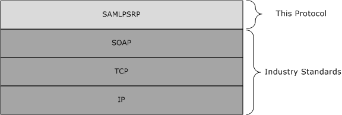
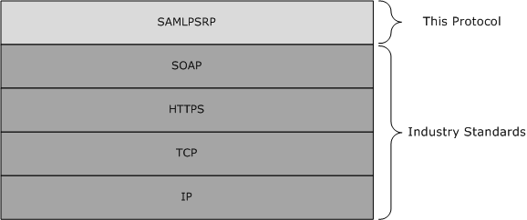

[MS-SAMLPR]:

Security Assertion Markup Language (SAML) Proxy
Request Signing Protocol

Intellectual Property Rights Notice for Open Specifications Documentation

  Technical Documentation. Microsoft publishes Open Specifications documentation (“this

documentation”) for protocols, file formats, data portability, computer languages, and standards
support. Additionally, overview documents cover inter-protocol relationships and interactions.

  Copyrights. This documentation is covered by Microsoft copyrights. Regardless of any other

terms that are contained in the terms of use for the Microsoft website that hosts this
documentation, you can make copies of it in order to develop implementations of the technologies
that are described in this documentation and can distribute portions of it in your implementations
that use these technologies or in your documentation as necessary to properly document the
implementation. You can also distribute in your implementation, with or without modification, any
schemas, IDLs, or code samples that are included in the documentation. This permission also
applies to any documents that are referenced in the Open Specifications documentation.
  No Trade Secrets. Microsoft does not claim any trade secret rights in this documentation.
  Patents. Microsoft has patents that might cover your implementations of the technologies

described in the Open Specifications documentation. Neither this notice nor Microsoft's delivery of
this documentation grants any licenses under those patents or any other Microsoft patents.
However, a given Open Specifications document might be covered by the Microsoft Open
Specifications Promise or the Microsoft Community Promise. If you would prefer a written license,
or if the technologies described in this documentation are not covered by the Open Specifications
Promise or Community Promise, as applicable, patent licenses are available by contacting
iplg@microsoft.com.

  License Programs. To see all of the protocols in scope under a specific license program and the

associated patents, visit the Patent Map.

  Trademarks. The names of companies and products contained in this documentation might be
covered by trademarks or similar intellectual property rights. This notice does not grant any
licenses under those rights. For a list of Microsoft trademarks, visit
www.microsoft.com/trademarks.

  Fictitious Names. The example companies, organizations, products, domain names, email

addresses, logos, people, places, and events that are depicted in this documentation are fictitious.
No association with any real company, organization, product, domain name, email address, logo,
person, place, or event is intended or should be inferred.

Reservation of Rights. All other rights are reserved, and this notice does not grant any rights other
than as specifically described above, whether by implication, estoppel, or otherwise.

Tools. The Open Specifications documentation does not require the use of Microsoft programming
tools or programming environments in order for you to develop an implementation. If you have access
to Microsoft programming tools and environments, you are free to take advantage of them. Certain
Open Specifications documents are intended for use in conjunction with publicly available standards
specifications and network programming art and, as such, assume that the reader either is familiar
with the aforementioned material or has immediate access to it.

Support. For questions and support, please contact dochelp@microsoft.com.

[MS-SAMLPR] - v20170601
Security Assertion Markup Language (SAML) Proxy Request Signing Protocol
Copyright © 2017 Microsoft Corporation
Release: June 1, 2017

1 / 52

Revision Summary

Date

Revision
History

Revision
Class

Comments

3/12/2010

1.0

Major

First Release.

4/23/2010

1.0.1

Editorial

Changed language and formatting in the technical content.

6/4/2010

1.0.2

Editorial

Changed language and formatting in the technical content.

7/16/2010

1.0.2

None

No changes to the meaning, language, or formatting of the
technical content.

8/27/2010

1.0.2

None

No changes to the meaning, language, or formatting of the
technical content.

10/8/2010

1.0.2

None

No changes to the meaning, language, or formatting of the
technical content.

11/19/2010  1.0.2

None

No changes to the meaning, language, or formatting of the
technical content.

1/7/2011

1.0.2

None

No changes to the meaning, language, or formatting of the
technical content.

2/11/2011

1.0.2

None

No changes to the meaning, language, or formatting of the
technical content.

3/25/2011

1.0.2

5/6/2011

2.0

6/17/2011

3.0

9/23/2011

3.0

12/16/2011  3.0

3/30/2012

3.0

None

Major

Major

None

None

None

No changes to the meaning, language, or formatting of the
technical content.

Updated and revised the technical content.

Updated and revised the technical content.

No changes to the meaning, language, or formatting of the
technical content.

No changes to the meaning, language, or formatting of the
technical content.

No changes to the meaning, language, or formatting of the
technical content.

7/12/2012

3.1

Minor

Clarified the meaning of the technical content.

10/25/2012  3.1

1/31/2013

3.1

8/8/2013

3.1

11/14/2013  3.1

2/13/2014

3.1

5/15/2014

3.1

None

None

None

None

None

None

No changes to the meaning, language, or formatting of the
technical content.

No changes to the meaning, language, or formatting of the
technical content.

No changes to the meaning, language, or formatting of the
technical content.

No changes to the meaning, language, or formatting of the
technical content.

No changes to the meaning, language, or formatting of the
technical content.

No changes to the meaning, language, or formatting of the
technical content.

[MS-SAMLPR] - v20170601
Security Assertion Markup Language (SAML) Proxy Request Signing Protocol
Copyright © 2017 Microsoft Corporation
Release: June 1, 2017

2 / 52

Date

Revision
History

Revision
Class

Comments

6/30/2015

3.1

7/14/2016

3.1

6/1/2017

3.1

None

None

None

No changes to the meaning, language, or formatting of the
technical content.

No changes to the meaning, language, or formatting of the
technical content.

No changes to the meaning, language, or formatting of the
technical content.

[MS-SAMLPR] - v20170601
Security Assertion Markup Language (SAML) Proxy Request Signing Protocol
Copyright © 2017 Microsoft Corporation
Release: June 1, 2017

3 / 52

## Table of Contents

- [1 Introduction](#1-introduction)
  - [1.1 Glossary](#11-glossary)
  - [1.2 References](#12-references)
    - [1.2.1 Normative References](#121-normative-references)
    - [1.2.2 Informative References](#122-informative-references)
  - [1.3 Overview](#13-overview)
  - [1.4 Relationship to Other Protocols](#14-relationship-to-other-protocols)
  - [1.5 Prerequisites/Preconditions](#15-prerequisitespreconditions)
  - [1.6 Applicability Statement](#16-applicability-statement)
  - [1.7 Versioning and Capability Negotiation](#17-versioning-and-capability-negotiation)
  - [1.8 Vendor-Extensible Fields](#18-vendor-extensible-fields)
  - [1.9 Standards Assignments](#19-standards-assignments)
- [2 Messages](#2-messages)
  - [2.1 Transport](#21-transport)
  - [2.2 Common Message Syntax](#22-common-message-syntax)
    - [2.2.1 Namespaces](#221-namespaces)
    - [2.2.2 Messages](#222-messages)
      - [2.2.2.1 SignMessageRequest](#2221-signmessagerequest)
      - [2.2.2.2 SignMessageResponse](#2222-signmessageresponse)
      - [2.2.2.3 VerifyMessageRequest](#2223-verifymessagerequest)
      - [2.2.2.4 VerifyMessageResponse](#2224-verifymessageresponse)
      - [2.2.2.5 IssueRequest](#2225-issuerequest)
      - [2.2.2.6 IssueResponse](#2226-issueresponse)
      - [2.2.2.7 LogoutRequest](#2227-logoutrequest)
      - [2.2.2.8 LogoutResponse](#2228-logoutresponse)
      - [2.2.2.9 CreateErrorMessageRequest](#2229-createerrormessagerequest)
      - [2.2.2.10 CreateErrorMessageResponse](#22210-createerrormessageresponse)
    - [2.2.3 Elements](#223-elements)
    - [2.2.4 Complex Types](#224-complex-types)
      - [2.2.4.1 RequestType](#2241-requesttype)
      - [2.2.4.2 ResponseType](#2242-responsetype)
      - [2.2.4.3 PrincipalType](#2243-principaltype)
      - [2.2.4.4 SamlMessageType](#2244-samlmessagetype)
      - [2.2.4.5 PostBindingType](#2245-postbindingtype)
      - [2.2.4.6 RedirectBindingType](#2246-redirectbindingtype)
    - [2.2.5 Simple Types](#225-simple-types)
      - [2.2.5.1 LogoutStatusType](#2251-logoutstatustype)
      - [2.2.5.2 PrincipalTypes](#2252-principaltypes)
    - [2.2.6 Attributes](#226-attributes)
    - [2.2.7 Groups](#227-groups)
    - [2.2.8 Attribute Groups](#228-attribute-groups)
- [3 Protocol Details](#3-protocol-details)
  - [3.1 Common Details](#31-common-details)
    - [3.1.1 Abstract Data Model](#311-abstract-data-model)
    - [3.1.2 Timers](#312-timers)
    - [3.1.3 Initialization](#313-initialization)
    - [3.1.4 Message Processing Events and Sequencing Rules](#314-message-processing-events-and-sequencing-rules)
      - [3.1.4.1 SignMessage](#3141-signmessage)
        - [3.1.4.1.1 Messages](#31411-messages)
          - [3.1.4.1.1.1 SignMessageRequest](#314111-signmessagerequest)
          - [3.1.4.1.1.2 SignMessageResponse](#314112-signmessageresponse)
      - [3.1.4.2 VerifyMessage](#3142-verifymessage)
        - [3.1.4.2.1 Messages](#31421-messages)
          - [3.1.4.2.1.1 VerifyMessageRequest](#314211-verifymessagerequest)
          - [3.1.4.2.1.2 VerifyMessageResponse](#314212-verifymessageresponse)
      - [3.1.4.3 Issue](#3143-issue)
        - [3.1.4.3.1 Messages](#31431-messages)
          - [3.1.4.3.1.1 IssueRequest](#314311-issuerequest)
          - [3.1.4.3.1.2 IssueResponse](#314312-issueresponse)
      - [3.1.4.4 Logout](#3144-logout)
        - [3.1.4.4.1 Messages](#31441-messages)
          - [3.1.4.4.1.1 LogoutRequest](#314411-logoutrequest)
          - [3.1.4.4.1.2 LogoutResponse](#314412-logoutresponse)
      - [3.1.4.5 CreateErrorMessage](#3145-createerrormessage)
        - [3.1.4.5.1 Messages](#31451-messages)
          - [3.1.4.5.1.1 CreateErrorMessageRequest](#314511-createerrormessagerequest)
          - [3.1.4.5.1.2 CreateErrorMessageResponse](#314512-createerrormessageresponse)
      - [3.1.4.6 Types Common to Multiple Operations](#3146-types-common-to-multiple-operations)
        - [3.1.4.6.1 Complex Types](#31461-complex-types)
          - [3.1.4.6.1.1 PrincipalType](#314611-principaltype)
          - [3.1.4.6.1.2 SamlMessageType](#314612-samlmessagetype)
          - [3.1.4.6.1.3 PostBindingType](#314613-postbindingtype)
          - [3.1.4.6.1.4 RedirectBindingType](#314614-redirectbindingtype)
        - [3.1.4.6.2 Simple Types](#31462-simple-types)
          - [3.1.4.6.2.1 LogoutStatusType](#314621-logoutstatustype)
          - [3.1.4.6.2.2 PrincipalTypes](#314622-principaltypes)
      - [3.1.4.7 Status Codes for Operations](#3147-status-codes-for-operations)
        - [3.1.4.7.1 Element <Status>](#31471-element)
        - [3.1.4.7.2 Element <StatusCode>](#31472-element)
        - [3.1.4.7.3 Element <StatusMessage>](#31473-element)
        - [3.1.4.7.4 Element <StatusDetail>](#31474-element)
    - [3.1.5 Timer Events](#315-timer-events)
    - [3.1.6 Other Local Events](#316-other-local-events)
  - [3.2 Server Details](#32-server-details)
    - [3.2.1 Abstract Data Model](#321-abstract-data-model)
    - [3.2.2 Timers](#322-timers)
    - [3.2.3 Initialization](#323-initialization)
    - [3.2.4 Message Processing Events and Sequencing Rules](#324-message-processing-events-and-sequencing-rules)
    - [3.2.5 Timer Events](#325-timer-events)
    - [3.2.6 Other Local Events](#326-other-local-events)
  - [3.3 Client Details](#33-client-details)
    - [3.3.1 Abstract Data Model](#331-abstract-data-model)
    - [3.3.2 Timers](#332-timers)
    - [3.3.3 Initialization](#333-initialization)
    - [3.3.4 Message Processing Events and Sequencing Rules](#334-message-processing-events-and-sequencing-rules)
    - [3.3.5 Timer Events](#335-timer-events)
    - [3.3.6 Other Local Events](#336-other-local-events)
- [4 Protocol Examples](#4-protocol-examples)
  - [4.1 Issue Operation Examples](#41-issue-operation-examples)
    - [4.1.1 IssueRequest Example](#411-issuerequest-example)
    - [4.1.2 IssueResponse Example](#412-issueresponse-example)
    - [4.1.3 IssueResponse Example Using Artifact Binding](#413-issueresponse-example-using-artifact-binding)
  - [4.2 CreateErrorMessage Operation Examples](#42-createerrormessage-operation-examples)
    - [4.2.1 CreateErrorMessageRequest Example](#421-createerrormessagerequest-example)
    - [4.2.2 CreateErrorMessageResponse Example](#422-createerrormessageresponse-example)
  - [4.3 SignMessage Operation Examples](#43-signmessage-operation-examples)
    - [4.3.1 SignMessageRequest Example](#431-signmessagerequest-example)
    - [4.3.2 SignMessageResponse Example](#432-signmessageresponse-example)
  - [4.4 VerifyMessage Operation Examples](#44-verifymessage-operation-examples)
    - [4.4.1 VerifyMessageRequest Example](#441-verifymessagerequest-example)
    - [4.4.2 VerifyMessageResponse Example](#442-verifymessageresponse-example)
    - [4.4.3 VerifyMessageResponse Example Using Redirect Binding](#443-verifymessageresponse-example-using-redirect-binding)
  - [4.5 Logout Operations Examples](#45-logout-operations-examples)
    - [4.5.1 LogoutRequest Example](#451-logoutrequest-example)
    - [4.5.2 LogoutResponse Example](#452-logoutresponse-example)
    - [4.5.3 LogoutRequest Example - Locally Initiated](#453-logoutrequest-example-locally-initiated)
    - [4.5.4 LogoutResponse Example:Final Response to Locally Initiated Request](#454-logoutresponse-examplefinal-response-to-locally-initiated-request)
    - [4.5.5 LogoutRequest Example with SAMLResponse and RelayState](#455-logoutrequest-example-with-samlresponse-and-relaystate)
    - [4.5.6 LogoutResponse Example with SAMLRequest and RelayState](#456-logoutresponse-example-with-samlrequest-and-relaystate)
- [5 Security](#5-security)
  - [5.1 Security Considerations for Implementers](#51-security-considerations-for-implementers)
  - [5.2 Index of Security Parameters](#52-index-of-security-parameters)
- [6 Appendix A: Full WSDL](#6-appendix-a-full-wsdl)
- [7 Appendix B: Product Behavior](#7-appendix-b-product-behavior)
- [8 Change Tracking](#8-change-tracking)
- [9 Index](#9-index)

## 1 Introduction

This document specifies the Security Assertion Markup Language (SAML) Proxy Request Signing
Protocol, which allows proxy servers to perform operations that require knowledge of configured keys
and other state information about federated sites known by the Security Token Service (STS)
server.

Sections 1.5, 1.8, 1.9, 2, and 3 of this specification are normative. All other sections and examples in
this specification are informative.

### 1.1 Glossary

This document uses the following terms:

Active Directory Federation Services (AD FS) Proxy Server: An AD FS 2.0 service that
processes SAML Federation Protocol messages. AD FS proxy servers are clients for the
Security Assertion Markup Language (SAML) Proxy Request Signing Protocol (SAMLPR).

Active Directory Federation Services (AD FS) Security Token Service (STS): An AD FS 2.0
service that holds configuration information about federated sites. AD FS STS servers are
servers for the Security Assertion Markup Language (SAML) Proxy Request Signing Protocol
(SAMLPR).

certificate: A certificate is a collection of attributes and extensions that can be stored persistently.
The set of attributes in a certificate can vary depending on the intended usage of the certificate.
A certificate securely binds a public key to the entity that holds the corresponding private key. A
certificate is commonly used for authentication and secure exchange of information on open
networks, such as the Internet, extranets, and intranets. Certificates are digitally signed by the
issuing certification authority (CA) and can be issued for a user, a computer, or a service. The
most widely accepted format for certificates is defined by the ITU-T X.509 version 3
international standards. For more information about attributes and extensions, see [RFC3280]
and [X509] sections 7 and 8.

SAML Artifact Binding: A method of transmitting SAML messages via references in HTTP

messages, as specified in [SamlBinding] section 3.6.

SAML Identity Provider (IdP): A provider of SAML assertions, as specified in [SAMLCore2]

section 2.

SAML Message: A SAML protocol message, as specified in [SAMLCore2] and [SamlBinding].

SAML Post Binding: A method of transmitting SAML messages via HTTP POST actions, as

specified in [SamlBinding] section 3.5.

SAML Redirect Binding: A method of transmitting SAML messages via HTTP redirects, as

specified in [SamlBinding] section 3.4.

SAML Service Provider (SP): A consumer of SAML assertions, as specified in [SAMLCore2]

section 2.

Security Assertion Markup Language (SAML): The set of specifications that describe security

assertions encoded in XML, profiles for attaching assertions to protocols and frameworks,
request/response protocols used to obtain assertions, and the protocol bindings to transfer
protocols, such as SOAP and HTTP.

security token service (STS): A web service that issues security tokens. That is, it makes

assertions based on evidence that it trusts; these assertions are for consumption by whoever
trusts it.

[MS-SAMLPR] - v20170601
Security Assertion Markup Language (SAML) Proxy Request Signing Protocol
Copyright © 2017 Microsoft Corporation
Release: June 1, 2017

7 / 52

SHA-1 hash: A hashing algorithm as specified in [FIPS180-2] that was developed by the National

Institute of Standards and Technology (NIST) and the National Security Agency (NSA).

SOAP: A lightweight protocol for exchanging structured information in a decentralized, distributed

environment. SOAP uses XML technologies to define an extensible messaging framework, which
provides a message construct that can be exchanged over a variety of underlying protocols. The
framework has been designed to be independent of any particular programming model and
other implementation-specific semantics. SOAP 1.2 supersedes SOAP 1.1. See [SOAP1.2-
1/2003].

SOAP body: A container for the payload data being delivered by a SOAP message to its recipient.

See [SOAP1.2-1/2007] section 5.3 for more information.

SOAP message: An XML document consisting of a mandatory SOAP envelope, an optional SOAP
header, and a mandatory SOAP body. See [SOAP1.2-1/2007] section 5 for more information.

Uniform Resource Locator (URL): A string of characters in a standardized format that identifies

a document or resource on the World Wide Web. The format is as specified in [RFC1738].

Web Services Description Language (WSDL): An XML format for describing network services

as a set of endpoints that operate on messages that contain either document-oriented or
procedure-oriented information. The operations and messages are described abstractly and are
bound to a concrete network protocol and message format in order to define an endpoint.
Related concrete endpoints are combined into abstract endpoints, which describe a network
service. WSDL is extensible, which allows the description of endpoints and their messages
regardless of the message formats or network protocols that are used.

XML namespace: A collection of names that is used to identify elements, types, and attributes in
XML documents identified in a URI reference [RFC3986]. A combination of XML namespace and
local name allows XML documents to use elements, types, and attributes that have the same
names but come from different sources. For more information, see [XMLNS-2ED].

XML Schema (XSD): A language that defines the elements, attributes, namespaces, and data

types for XML documents as defined by [XMLSCHEMA1/2] and [XMLSCHEMA2/2] standards. An
XML schema uses XML syntax for its language.

MAY, SHOULD, MUST, SHOULD NOT, MUST NOT: These terms (in all caps) are used as defined
in [RFC2119]. All statements of optional behavior use either MAY, SHOULD, or SHOULD NOT.

### 1.2 References

Links to a document in the Microsoft Open Specifications library point to the correct section in the
most recently published version of the referenced document. However, because individual documents
in the library are not updated at the same time, the section numbers in the documents may not
match. You can confirm the correct section numbering by checking the Errata.

#### 1.2.1 Normative References

We conduct frequent surveys of the normative references to assure their continued availability. If you
have any issue with finding a normative reference, please contact dochelp@microsoft.com. We will
assist you in finding the relevant information.

[RFC2119] Bradner, S., "Key words for use in RFCs to Indicate Requirement Levels", BCP 14, RFC
2119, March 1997, https://www.rfc-editor.org/info/rfc2119

[SamlBinding] Cantor, S., Hirsch, F., Kemp, J., et al., "Bindings for the OASIS Security Assertion
Markup Language (SAML) V2.0", March 2005, http://docs.oasis-open.org/security/saml/v2.0/saml-
bindings-2.0-os.pdf

[MS-SAMLPR] - v20170601
Security Assertion Markup Language (SAML) Proxy Request Signing Protocol
Copyright © 2017 Microsoft Corporation
Release: June 1, 2017

8 / 52

[SAMLCore2] Cantor, S., Kemp, J., Philpott, R., and Maler, E., Eds., "Assertions and Protocol for the
OASIS Security Assertion Markup Language (SAML) V2.0", March 2005, http://docs.oasis-
open.org/security/saml/v2.0/saml-core-2.0-os.pdf

[SOAP1.2-1/2003] Gudgin, M., Hadley, M., Mendelsohn, N., et al., "SOAP Version 1.2 Part 1:
Messaging Framework", W3C Recommendation, June 2003, http://www.w3.org/TR/2003/REC-soap12-
part1-20030624

[WSAddressing] Box, D., et al., "Web Services Addressing (WS-Addressing)", August 2004,
http://www.w3.org/Submission/ws-addressing/

[WSDL] Christensen, E., Curbera, F., Meredith, G., and Weerawarana, S., "Web Services Description
Language (WSDL) 1.1", W3C Note, March 2001, https://www.w3.org/TR/2001/NOTE-wsdl-20010315

[WSSC1.3] Lawrence, K., Kaler, C., Nadalin, A., et al., "WS-SecureConversation 1.3", March 2007,
http://docs.oasis-open.org/ws-sx/ws-secureconversation/200512/ws-secureconversation-1.3-os.html

[WSSU1.0] OASIS Standard, "WS Security Utility 1.0", 2004, http://docs.oasis-
open.org/wss/2004/01/oasis-200401-wss-wssecurity-utility-1.0.xsd

[WSTrust] IBM, Microsoft, Nortel, VeriSign, "WS-Trust V1.0", February 2005,
http://specs.xmlsoap.org/ws/2005/02/trust/WS-Trust.pdf

[XMLNS] Bray, T., Hollander, D., Layman, A., et al., Eds., "Namespaces in XML 1.0 (Third Edition)",
W3C Recommendation, December 2009, https://www.w3.org/TR/2009/REC-xml-names-20091208/

[XMLSCHEMA1] Thompson, H., Beech, D., Maloney, M., and Mendelsohn, N., Eds., "XML Schema Part
1: Structures", W3C Recommendation, May 2001, https://www.w3.org/TR/2001/REC-xmlschema-1-
20010502/

[XMLSCHEMA2] Biron, P.V., Ed. and Malhotra, A., Ed., "XML Schema Part 2: Datatypes", W3C
Recommendation, May 2001, https://www.w3.org/TR/2001/REC-xmlschema-2-20010502/

#### 1.2.2 Informative References

[WS-Trust1.3] Nadalin, A., Goodner, M., Gudgin, M., Barbir, A., Granqvist, H., "WS-Trust 1.3", OASIS
Standard 19 March 2007, http://docs.oasis-open.org/ws-sx/ws-trust/200512/ws-trust-1.3-os.html

### 1.3 Overview

The Security Assertion Markup Language (SAML) Proxy Request Signing Protocol (SAMLPR) provides
the capability for AD FS proxy servers to have the AD FS STS server for an installation perform
operations that require knowledge of the configured keys and other state information about federated
sites known by the Security Token Service (STS) server. For more information, see [WS-Trust1.3].
In particular, proxy servers use the SAMLPR Protocol to have the STS server in an installation perform
SAML (see [SAMLCore2] and [SamlBinding]) signature operations upon messages to be sent. Multiple
proxy servers can use a single STS server.

The protocol is stateless, with the parameters of each message being fully self-contained.

### 1.4 Relationship to Other Protocols

The Security Assertion Markup Language (SAML) Proxy Request Signing Protocol (SAMLPR) uses
SOAP over TCP for local connections, as shown in the following layering diagram:

[MS-SAMLPR] - v20170601
Security Assertion Markup Language (SAML) Proxy Request Signing Protocol
Copyright © 2017 Microsoft Corporation
Release: June 1, 2017

9 / 52

<!-- Extracted images from page 10 -->

<!-- /Extracted images from page 10 -->

Figure 1: SAMLPR SOAP over TCP layer diagram

The Security Assertion Markup Language (SAML) Proxy Request Signing Protocol (SAMLPR) uses SOAP
over HTTPS for remote connections, as shown in the following layering diagram:

Figure 2: SAMLPR SOAP over HTTPS layer diagram

### 1.5 Prerequisites/Preconditions

The client is configured with the Uniform Resource Locator (URL) of the server's SOAP service in
order to call the service.

### 1.6 Applicability Statement

The SAMLPR Protocol is used by services that perform SAML signature operations for proxy servers by
STS servers in a manner that is compatible with AD FS 2.0.

### 1.7 Versioning and Capability Negotiation

This protocol uses the versioning mechanisms defined in the following specification:

  SOAP 1.2, as specified in [SOAP1.2-1/2003].

This protocol does not perform any capability negotiation.

[MS-SAMLPR] - v20170601
Security Assertion Markup Language (SAML) Proxy Request Signing Protocol
Copyright © 2017 Microsoft Corporation
Release: June 1, 2017

10 / 52

### 1.8 Vendor-Extensible Fields

The schema for this protocol provides for extensibility points for additional elements to be added to
each SOAP message body. Elements within these extensibility points that are not understood are
ignored.

### 1.9 Standards Assignments

There are no standards assignments for this protocol beyond those defined in the following
specification:

  SOAP 1.2, as specified in [SOAP1.2-1/2003].

[MS-SAMLPR] - v20170601
Security Assertion Markup Language (SAML) Proxy Request Signing Protocol
Copyright © 2017 Microsoft Corporation
Release: June 1, 2017

11 / 52

## 2 Messages

### 2.1 Transport

The Security Assertion Markup Language (SAML) Proxy Request Signing Protocol uses SOAP, as
specified in [SOAP1.2-1/2003], over TCP locally or HTTPS remotely, for communication.

### 2.2 Common Message Syntax

This section contains no common definitions used by this protocol.

#### 2.2.1 Namespaces

This specification defines and references various XML namespaces using the mechanisms specified in
[XMLNS]. Although this specification associates a specific XML namespace prefix for each XML
namespace that is used, the choice of any particular XML namespace prefix is implementation-specific
and not significant for interoperability.

Prefix  Namespace URI

s

xs

http://www.w3.org/2003/05/soap-envelope

http://www.w3.org/2001/XMLSchema

a

http://schemas.xmlsoap.org/ws/2004/08/addressing

msis

http://schemas.microsoft.com/ws/2009/12/identityserver/samlprotocol

samlp

urn:oasis:names:tc:SAML:2.0:protocol

saml

urn:oasis:names:tc:SAML:2.0:assertion

wst

http://docs.oasis-open.org/ws-sx/ws-trust/200512

Reference

[SOAP1.2-1/2003]

[XMLSCHEMA1] and
[XMLSCHEMA2]

[WSAddressing] section
1.2

This document ([MS-
SAMLPR])

[SAMLCore2]

[SAMLCore2]

[WSTrust]

wssc

http://docs.oasis-open.org/ws-sx/ws-secureconversation/200512

[WSSC1.3]

wssu

http://docs.oasis-open.org/wss/2004/01/oasis-200401-wss-wssecurity-
utility-1.0.xsd

[WSSU1.0]

#### 2.2.2 Messages

Message

Description

SignMessageRequest

A message that requests that a SAML Message signature be applied to a SAML
Message, if the configuration for the requested principal specifies that messages
are to be signed.

SignMessageResponse

A reply message to SignMessageRequest, containing the resulting SAML Message,
which is signed, if the configuration for the requested principal specifies that
messages are to be signed.

VerifyMessageRequest

A message that requests verification that a SAML Message is from a known party
and signed according to the metadata directives for that party.

[MS-SAMLPR] - v20170601
Security Assertion Markup Language (SAML) Proxy Request Signing Protocol
Copyright © 2017 Microsoft Corporation
Release: June 1, 2017

12 / 52

Message

Description

VerifyMessageResponse

A reply message to the VerifyMessageRequest message, containing a Boolean
result.

IssueRequest

A message requesting issuance of a SAML token.

IssueResponse

A reply message to the IssueRequest message containing a SAML response
message.

LogoutRequest

A message requesting that a SAML logout be performed.

LogoutResponse

A reply message to the LogoutRequest message containing updated SessionState
and LogoutState values.

CreateErrorMessageRequest

A message that requests creation of a SAML error message, which will be signed,
if the configuration for the requested principal specifies that messages are to be
signed.

CreateErrorMessageResponse  A reply message to the CreateErrorMessageRequest message containing the

created SAML error message.

##### 2.2.2.1 SignMessageRequest

The SignMessageRequest message requests that a SAML Message signature be applied to a SAML
Message, if the configuration for the requested principal specifies that messages are to be signed. It is
used by the following message:

Message type  Action URI

Request

http://schemas.microsoft.com/ws/2009/12/identityserver/samlprotocol/ProcessRequest

body: The SOAP body MUST contain a single msis:SignMessageRequest element with the following
type:

   <complexType name="SignMessageRequestType">
     <complexContent>
       <extension base="msis:RequestType">
         <sequence>
           <element name="ActivityId" type="string"/>
           <element name="Message" type="msis:SamlMessageType"/>
           <element name="Principal" type="msis:PrincipalType"/>
           <any namespace="##other" processContents="lax" minOccurs="0" maxOccurs="unbounded"
/>
         </sequence>
       </extension>
     </complexContent>
   </complexType>

ActivityId: An opaque string supplied by the caller to track the activity to which this message

pertains.

Message: A complex type representing a SAML Protocol message.

Principal: A complex type representing a SAML EntityId for a SAML Identity Provider (IdP), a

SAML Service Provider (SP), or this STS server.

[MS-SAMLPR] - v20170601
Security Assertion Markup Language (SAML) Proxy Request Signing Protocol
Copyright © 2017 Microsoft Corporation
Release: June 1, 2017

13 / 52

##### 2.2.2.2 SignMessageResponse

A SignMessageResponse message is a reply message to SignMessageRequest, containing the resulting
SAML Message, which is signed, if the configuration for the requested principal specifies that
messages are to be signed. It is used by the following message:

Message
type

Action URI

Response

http://schemas.microsoft.com/ws/2009/12/identityserver/samlprotocol/ProcessRequestResponse

body: The SOAP body MUST contain a single msis:SignMessageResponse element with the following
type:

   <complexType name="SignMessageResponseType">
     <complexContent>
       <extension base="msis:ResponseType">
         <sequence>
           <element name="Message" type="msis:SamlMessageType"/>
           <any namespace="##other" processContents="lax" minOccurs="0" maxOccurs="unbounded"
/>
         </sequence>
       </extension>
     </complexContent>
   </complexType>

Message: A complex type representing a SAML Protocol message.

##### 2.2.2.3 VerifyMessageRequest

The VerifyMessageRequest message requests verification that a SAML Message is from a known
party and signed according to the metadata directives for that party. It is used by the following
message:

Message type  Action URI

Request

http://schemas.microsoft.com/ws/2009/12/identityserver/samlprotocol/ProcessRequest

body: The SOAP body MUST contain a single msis:VerifyMessageRequest element with the following
type:

   <complexType name="VerifyMessageRequestType" >
     <complexContent>
       <extension base="msis:RequestType">
         <sequence>
           <element name="ActivityId" type="string"/>
           <element name="Message" type="msis:SamlMessageType"/>
           <any namespace="##other" processContents="lax" minOccurs="0" maxOccurs="unbounded"
/>
         </sequence>
       </extension>
     </complexContent>
   </complexType>

ActivityId: An opaque string supplied by the caller to track the activity to which this message

pertains.

[MS-SAMLPR] - v20170601
Security Assertion Markup Language (SAML) Proxy Request Signing Protocol
Copyright © 2017 Microsoft Corporation
Release: June 1, 2017

14 / 52

Message: A complex type representing a SAML Protocol message.

##### 2.2.2.4 VerifyMessageResponse

The VerifyMessageResponse message is a reply to VerifyMessageRequest, containing a Boolean result.
It is used by the following message:

Message
type

Action URI

Response

http://schemas.microsoft.com/ws/2009/12/identityserver/samlprotocol/ProcessRequestResponse

body: The SOAP body MUST contain a single msis:VerifyMessageResponse element with the
following type:

   <complexType name="VerifyMessageResponseType" >
     <complexContent>
       <extension base="msis:ResponseType">
         <sequence>
           <element name="IsVerified" type="boolean"/>
           <any namespace="##other" processContents="lax" minOccurs="0" maxOccurs="unbounded"
/>
         </sequence>
       </extension>
     </complexContent>
   </complexType>

IsVerified: A Boolean result indicating whether a SAML Message is from a known party and signed

according to the metadata directives for that party.

##### 2.2.2.5 IssueRequest

The IssueRequest message requests the issuance of a SAML token. It is used by the following
message:

Message type  Action URI

Request

http://schemas.microsoft.com/ws/2009/12/identityserver/samlprotocol/ProcessRequest

body: The SOAP body MUST contain a single msis:IssueRequest element with the following type:

   <complexType name="IssueRequestType" >
     <complexContent>
       <extension base="msis:RequestType">
         <sequence>
           <element name="ActivityId" type="string"/>
           <element name="Message" type="msis:SamlMessageType"/>
           <element name="OnBehalfOf" type="wst:OnBehalfOfType"/>
           <element name="SessionState" type="string"/>
           <any namespace="##other" processContents="lax" minOccurs="0" maxOccurs="unbounded"
/>
         </sequence>
       </extension>
     </complexContent>
   </complexType>

[MS-SAMLPR] - v20170601
Security Assertion Markup Language (SAML) Proxy Request Signing Protocol
Copyright © 2017 Microsoft Corporation
Release: June 1, 2017

15 / 52

ActivityId: An opaque string supplied by the caller to track the activity to which this message

pertains.

Message: A complex type representing a SAML Protocol message.

OnBehalfOf: A complex type representing the party to issue the token for.

SessionState: A structured string representing the information required to log out from this session.

##### 2.2.2.6 IssueResponse

The IssueResponse message is a reply to IssueRequest, containing a SAML response message. It is
used by the following message:

Message
type

Action URI

Response

http://schemas.microsoft.com/ws/2009/12/identityserver/samlprotocol/ProcessRequestResponse

body: The SOAP body MUST contain a single msis:IssueResponse element with the following type:

   <complexType name="IssueResponseType">
     <complexContent>
       <extension base="msis:ResponseType">
         <sequence>
           <element name="Message" minOccurs="0" type="msis:SamlMessageType"/>
           <element name="SessionState" type="string"/>
           <element name="AuthenticatingProvider" type="string"/>
           <any namespace="##other" processContents="lax" minOccurs="0" maxOccurs="unbounded"
/>
         </sequence>
       </extension>
     </complexContent>
   </complexType>

Message: A complex type representing a SAML Protocol message.

SessionState: A structured string representing the information required to log out from this session.

AuthenticatingProvider: The URI of a claims provider or a local STS identifier, depending upon

where the user authenticated.

##### 2.2.2.7 LogoutRequest

The LogoutRequest message requests that a SAML logout be performed. It is used by the following
message:

Message type  Action URI

Request

http://schemas.microsoft.com/ws/2009/12/identityserver/samlprotocol/ProcessRequest

body: The SOAP body MUST contain a single msis:LogoutRequest element with the following type:

   <complexType name="LogoutRequestType" >
     <complexContent>
       <extension base="msis:RequestType">

[MS-SAMLPR] - v20170601
Security Assertion Markup Language (SAML) Proxy Request Signing Protocol
Copyright © 2017 Microsoft Corporation
Release: June 1, 2017

16 / 52

         <sequence>
           <element name="ActivityId" type="string"/>
           <element name="Message" minOccurs="0" type="msis:SamlMessageType"/>
           <element name="SessionState" type="string"/>
           <element name="LogoutState" type="string"/>
           <any namespace="##other" processContents="lax" minOccurs="0" maxOccurs="unbounded"
/>
         </sequence>
       </extension>
     </complexContent>
   </complexType>

ActivityId: An opaque string supplied by the caller to track the activity that this message pertains to.

Message: A complex type representing a SAML protocol message.

SessionState: A structured string representing the information required to log out from this session.

LogoutState: A structured string representing additional information required to log out from this

session.

##### 2.2.2.8 LogoutResponse

The LogoutResponse message is a reply to LogoutRequest, containing updated SessionState and
LogoutState values. It is used by the following message:

Message
type

Action URI

Response

http://schemas.microsoft.com/ws/2009/12/identityserver/samlprotocol/ProcessRequestResponse

body: The SOAP body MUST contain a single msis:LogoutResponse element with the following type:

   <complexType name="LogoutResponseType">
     <complexContent>
       <extension base="msis:ResponseType">
         <sequence>
           <element name="LogoutStatus" type="msis:LogoutStatusType"/>
           <element name="Message" type="msis:SamlMessageType" minOccurs="0"/>
           <element name="SessionState" type="string"/>
           <element name="LogoutState" type="string"/>
           <any namespace="##other" processContents="lax" minOccurs="0" maxOccurs="unbounded"
/>
         </sequence>
       </extension>
     </complexContent>
   </complexType>

LogoutStatus: A complex type representing the status of the logout process.

Message: A complex type representing a SAML Protocol message.

SessionState: A structured string representing the information required to log out from this session.

LogoutState: A structured string representing additional information required to log out from this

session.

[MS-SAMLPR] - v20170601
Security Assertion Markup Language (SAML) Proxy Request Signing Protocol
Copyright © 2017 Microsoft Corporation
Release: June 1, 2017

17 / 52

##### 2.2.2.9 CreateErrorMessageRequest

The CreateErrorMessageRequest message requests the creation of a SAML error message, which will
be signed, if the configuration for the requested principal specifies that messages are to be signed. It
is used by the following message:

Message type  Action URI

Request

http://schemas.microsoft.com/ws/2009/12/identityserver/samlprotocol/ProcessRequest

body: The SOAP body MUST contain a single msis:CreateErrorMessageRequest element with the
following type:

   <complexType name="CreateErrorMessageRequestType">
     <complexContent>
       <extension base="msis:RequestType">
         <sequence>
           <element name="ActivityId" type="string"/>
           <element name="Message" type="msis:SamlMessageType"/>
           <element name="Principal" type="msis:PrincipalType"/>
           <any namespace="##other" processContents="lax" minOccurs="0" maxOccurs="unbounded"
/>
         </sequence>
       </extension>
     </complexContent>
   </complexType>

ActivityId: An opaque string supplied by the caller to track the activity to which this message

pertains.

Message: A complex type representing a SAML Protocol message.

Principal: A complex type representing a SAML EntityId for a SAML IdP, a SAML SP, or this STS

server.

##### 2.2.2.10 CreateErrorMessageResponse

The CreateErrorMessageResponse message is a reply to CreateErrorMessageRequest, containing the
created SAML error message. It is used by the following messages:

Message
type

Action URI

Response

http://schemas.microsoft.com/ws/2009/12/identityserver/samlprotocol/ProcessRequestResponse

body: The SOAP body MUST contain a single msis:CreateErrorMessageResponse element with the
following type:

   <complexType name="CreateErrorMessageResponseType">
     <complexContent>
       <extension base="msis:ResponseType">
         <sequence>
           <element name="Message" type="msis:SamlMessageType"/>
           <any namespace="##other" processContents="lax" minOccurs="0" maxOccurs="unbounded"
/>
         </sequence>
       </extension>
     </complexContent>

18 / 52

[MS-SAMLPR] - v20170601
Security Assertion Markup Language (SAML) Proxy Request Signing Protocol
Copyright © 2017 Microsoft Corporation
Release: June 1, 2017

   </complexType>

Message: A complex type representing a SAML Protocol message.

#### 2.2.3 Elements

This specification does not define any common XML Schema element definitions.

#### 2.2.4 Complex Types

The following table summarizes the set of common XML schema complex type definitions defined by
this specification. XML schema complex type definitions that are specific to a particular operation are
described with the operation.

Complex type

Description

RequestType

An abstract type containing protocol request message parameters.

ResponseType

An abstract type containing protocol response messages parameters.

PrincipalType

A structure containing a PrincipalTypes value and an identifier for the principal.

SamlMessageType

A structure containing a representation of a SAML Protocol message.

PostBindingType

A structure containing SAML binding information for a SAML post binding.

RedirectBindingType  A structure containing SAML binding information for a SAML redirect binding.

##### 2.2.4.1 RequestType

This abstract type contains request message parameters for messages using this protocol. The
schema for this type MUST be as follows:

   <complexType name="RequestType" abstract="true"/>

##### 2.2.4.2 ResponseType

This abstract type contains response message parameters for messages using this protocol. The
schema for this type MUST be as follows:

   <complexType name="ResponseType" abstract="true"/>

##### 2.2.4.3 PrincipalType

This structure contains a PrincipalTypes value and an identifier for the principal. The schema for this
type MUST be as follows:

   <complexType name="PrincipalType">
     <sequence>

[MS-SAMLPR] - v20170601
Security Assertion Markup Language (SAML) Proxy Request Signing Protocol
Copyright © 2017 Microsoft Corporation
Release: June 1, 2017

19 / 52

       <element name="Type" type="msis:PrincipalTypes"/>
       <element name="Identifier" type="string"/>
     </sequence>
   </complexType>

Type: A PrincipalTypes enumeration value identifying the type of the SAML principal.

Identifier: An identifier for the SAML principal. This is a SAML EntityId.

##### 2.2.4.4 SamlMessageType

This structure contains a representation of a SAML Protocol message. The schema for this type MUST
be as follows:

   <complexType name="SamlMessageType">
     <sequence>
       <element name="BaseUri" type="anyURI"/>
       <choice>
         <element name="SAMLart" type="string"/>
         <element name="SAMLRequest" type="string"/>
         <element name="SAMLResponse" type="string"/>
       </choice>
       <choice>
         <element name="PostBindingInformation" type="msis:PostBindingType"/>
         <element name="RedirectBindingInformation" type="msis:RedirectBindingType"/>
       </choice>
     </sequence>
   </complexType>

BaseUri: The URL to post message to.

SAMLart: A SAML artifact identifier, base64-encoded as per [SamlBinding] section 3.6.

SAMLRequest: A SAML request message, base64-encoded as per [SamlBinding] sections 3.4 and

3.5.

SAMLResponse: A SAML response message, base64-encoded as per [SamlBinding] sections 3.4 and

3.5.

PostBindingInformation: Information about the SAML Message using the SAML post binding, as

per [SamlBinding] section 3.5.

RedirectBindingInformation: Information about the SAML Message using the SAML redirect

binding, as per [SamlBinding] section 3.4.

##### 2.2.4.5 PostBindingType

This structure contains SAML binding information for a SAML post binding. The schema for this type
MUST be as follows:

   <complexType name="PostBindingType">
     <sequence>
       <element name="RelayState" minOccurs="0" type="string"/>
     </sequence>
   </complexType>

[MS-SAMLPR] - v20170601
Security Assertion Markup Language (SAML) Proxy Request Signing Protocol
Copyright © 2017 Microsoft Corporation
Release: June 1, 2017

20 / 52

RelayState:  An opaque BLOB that, if present in the request, MUST be returned in the response, as

per [SamlBinding] section 3.5.3.

##### 2.2.4.6 RedirectBindingType

This structure contains SAML binding information for a SAML redirect binding. The schema for this
type MUST be as follows:

   <complexType name="RedirectBindingType">
     <sequence>
       <element name="RelayState" minOccurs="0" type="string"/>
       <sequence minOccurs="0">
         <element name="Signature" type="string"/>
         <element name="SigAlg" type="string"/>
         <element name="QueryStringHash" minOccurs="0" type="string"/>
       </sequence>
     </sequence>
   </complexType>

RelayState:  An opaque BLOB that, if present in the request, MUST be returned in the response, as

per [SamlBinding] section 3.4.3.

Signature:  The message signature (if present), encoded as per [SamlBinding] section 3.4.4.1.

SigAlg:  The message signature algorithm (if present), as per [SamlBinding] section 3.4.4.1.

QueryStringHash:  A base64-encoded SHA-1 hash of the redirect query string (if present), for

integrity purposes, as per [SamlBinding] section 3.6.4.

#### 2.2.5 Simple Types

The following table summarizes the set of common XML schema simple type definitions defined by this
specification. XML schema simple type definitions that are specific to a particular operation are
described with the operation.

Simple type

Description

LogoutStatusType  An enumeration of status values for logout operations.

PrincipalTypes

An enumeration of the types of SAML principals.

##### 2.2.5.1 LogoutStatusType

This type enumerates the set of status values for logout operations. The schema for this type MUST be
as follows:

   <simpleType name="LogoutStatusType">
     <restriction base="string">
       <enumeration value="InProgress" />
       <enumeration value="LogoutPartial" />
       <enumeration value="LogoutSuccess" />
     </restriction>
   </simpleType>

[MS-SAMLPR] - v20170601
Security Assertion Markup Language (SAML) Proxy Request Signing Protocol
Copyright © 2017 Microsoft Corporation
Release: June 1, 2017

21 / 52

InProgress:  Indicates that more logout work is required to be performed.

LogoutPartial:  Indicates that the logout process is complete, but all session participants might not

have been logged out.

LogoutSuccess:  Indicates the logout process is complete, with all session participants logged out.

##### 2.2.5.2 PrincipalTypes

This type enumerates the set of types of SAML principals. The schema for this type MUST be as
follows:

   <simpleType name="PrincipalTypes">
     <restriction base="string">
       <enumeration value="Self" />
       <enumeration value="Scope" />
       <enumeration value="Authority" />
     </restriction>
   </simpleType>

Self:  Indicates that the principal is this STS server.

Scope:  Indicates that the principal is a SAML Service Provider, identified by an Entity Identifier, as

per [SAMLCore2] section 8.3.6.

Authority:  Indicates that the principal is a SAML Identity Provider, identified by an Entity

Identifier, as per [SAMLCore2] section 8.3.6.

#### 2.2.6 Attributes

This specification does not define any common XML schema attribute definitions.

#### 2.2.7 Groups

This specification does not define any common XML schema group definitions.

#### 2.2.8 Attribute Groups

This specification does not define any common XML schema attribute group definitions.

[MS-SAMLPR] - v20170601
Security Assertion Markup Language (SAML) Proxy Request Signing Protocol
Copyright © 2017 Microsoft Corporation
Release: June 1, 2017

22 / 52

## 3 Protocol Details

### 3.1 Common Details

This section describes protocol details that are common among multiple port types.

#### 3.1.1 Abstract Data Model

This section describes a conceptual model of possible data organization that an implementation
maintains to participate in this protocol. The described organization is provided to facilitate the
explanation of how the protocol behaves. This document does not mandate that implementations
adhere to this model as long as their external behavior is consistent with that described in this
document.

The SAMLPR Protocol enables proxy servers to have STS servers perform operations requiring state
held at the STS server. Other than standard SOAP request/response protocol state that is not specific
to this protocol, no state about the protocol is maintained at either the protocol client or server.

#### 3.1.2 Timers

There are no protocol-specific timer events that MUST be serviced by an implementation. This protocol
does not require timers beyond those that are used by the underlying transport to transmit and
receive SOAP messages. The protocol does not include provisions for time-based retry for sending
protocol messages.

#### 3.1.3 Initialization

No protocol-specific initialization is required to use this protocol. Standard SOAP bindings MUST be
established between the client and server before initiating communication.

For clients running on the local machine, the standard STS server SOAP endpoint address is
net.tcp://localhost/samlprotocol. For clients running on remote machines connecting to a server, the
standard STS server SOAP endpoint address is
https://contoso.com/adfs/services/trust/samlprotocol/proxycertificatetransport, where contoso.com
represents the server domain name. Other port addresses MAY be used by implementations. <1>

#### 3.1.4 Message Processing Events and Sequencing Rules

The following table summarizes the list of operations as defined by this specification:

Operation

Description

SignMessage

This operation causes a SAML Message signature be applied to the supplied SAML
Message when the configuration requires signing, with the resulting message being
returned as a result.

VerifyMessage

This operation verifies whether a SAML Message is from a known party and signed
according to metadata directives for that party, returning the result as a Boolean.

Issue

Logout

This operation causes issuance of a SAML token.

This operation causes a SAML session to be logged out.

CreateErrorMessage  This operation creates a SAML error message, applying a signature, if the configuration for

the requested principal specifies that messages are to be signed.

[MS-SAMLPR] - v20170601
Security Assertion Markup Language (SAML) Proxy Request Signing Protocol
Copyright © 2017 Microsoft Corporation
Release: June 1, 2017

23 / 52

For each operation there is a request and reply message. In all cases, the sequence of operation is
that the client sends the request message to the server, which responds with the corresponding reply
message. The server MUST accept the request messages and the client MUST accept the
corresponding reply messages, when sent in response to a request message. The behavior of any
other uses of these messages is undefined.

##### 3.1.4.1 SignMessage

This operation causes a SAML Message signature be applied to the supplied SAML Message when the
configuration requires signing, with the resulting message being returned as a result. This operation
consists of the client sending a SignMessageRequest message to the server, which replies with a
SignMessageResponse message.

###### 3.1.4.1.1 Messages

The following table summarizes the set of message definitions that are specific to this operation.

Message

Description

SignMessageRequest

Conveys request parameters for SignMessage operation.

SignMessageResponse  Conveys response parameters for SignMessage operation.

###### 3.1.4.1.1.1 SignMessageRequest

This message conveys request parameters for the SignMessage operation.

###### 3.1.4.1.1.2 SignMessageResponse

This message conveys response parameters for the SignMessage operation.

##### 3.1.4.2 VerifyMessage

This operation verifies whether a SAML Message is from a known party and signed according to
metadata directives for that party, returning the result as a Boolean. This operation consists of the
client sending a VerifyMessageRequest message to the server, which replies with a
VerifyMessageResponse message.

###### 3.1.4.2.1 Messages

The following table summarizes the set of message definitions that are specific to this operation.

Message

Description

VerifyMessageRequest

Conveys request parameters for the VerifyMessage operation.

VerifyMessageResponse  Conveys response parameters for the VerifyMessage operation.

###### 3.1.4.2.1.1 VerifyMessageRequest

This message conveys request parameters for the VerifyMessage operation.

###### 3.1.4.2.1.2 VerifyMessageResponse

[MS-SAMLPR] - v20170601
Security Assertion Markup Language (SAML) Proxy Request Signing Protocol
Copyright © 2017 Microsoft Corporation
Release: June 1, 2017

24 / 52

This message conveys response parameters for the VerifyMessage operation.

##### 3.1.4.3 Issue

This operation causes the issuance of a SAML token. This operation consists of the client sending an
IssueRequest message to the server, which replies with an IssueResponse message.

###### 3.1.4.3.1 Messages

The following table summarizes the set of message definitions that are specific to this operation.

Message

Description

IssueRequest

Conveys request parameters for the Issue operation.

IssueResponse  Conveys response parameters for the Issue operation.

###### 3.1.4.3.1.1 IssueRequest

This message conveys request parameters for the Issue operation.

###### 3.1.4.3.1.2 IssueResponse

This message conveys response parameters for the Issue operation.

##### 3.1.4.4 Logout

This operation causes a SAML session to be logged out. This operation consists of the client sending a
LogoutRequest message to the server, which replies with a LogoutResponse message.

###### 3.1.4.4.1 Messages

The following table summarizes the set of message definitions that are specific to this operation.

Message

Description

LogoutRequest

Conveys request parameters for the Logout operation.

LogoutResponse  Conveys response parameters for the Logout operation.

###### 3.1.4.4.1.1 LogoutRequest

This message conveys request parameters for the Logout operation.

###### 3.1.4.4.1.2 LogoutResponse

This message conveys response parameters for Logout operation.

##### 3.1.4.5 CreateErrorMessage

This operation creates a SAML error message, applying a signature, if the configuration for the
requested principal specifies that messages are to be signed. This operation consists of the client

[MS-SAMLPR] - v20170601
Security Assertion Markup Language (SAML) Proxy Request Signing Protocol
Copyright © 2017 Microsoft Corporation
Release: June 1, 2017

25 / 52

sending a CreateErrorMessageRequest message to the server, which replies with a
CreateErrorMessageResponse message.

###### 3.1.4.5.1 Messages

The following table summarizes the set of message definitions that are specific to this operation.

Message

Description

CreateErrorMessageRequest

Conveys request parameters for the CreateErrorMessage operation.

CreateErrorMessageResponse  Conveys response parameters for the CreateErrorMessage operation.

###### 3.1.4.5.1.1 CreateErrorMessageRequest

This message conveys request parameters for the CreateErrorMessage operation.

###### 3.1.4.5.1.2 CreateErrorMessageResponse

This message conveys response parameters for the CreateErrorMessage operation.

##### 3.1.4.6 Types Common to Multiple Operations

This section describes types that are common to multiple operations.

###### 3.1.4.6.1 Complex Types

The following table summarizes the XML schema complex type definitions that are common to multiple
operations, the schemas for which are defined in section 2.2.4.

Complex type

Description

PrincipalType

Identifies participant in a SAML federation, including its role.

SamlMessageType

Representation of a SAML Protocol message and the binding used to send it.

PostBindingType

Information about a SAML post binding, which consists of its RelayState, if present.

RedirectBindingType

Information about a SAML redirect binding, which consists of its RelayState, if present,
and signature information, if present.

###### 3.1.4.6.1.1 PrincipalType

This complex type identifies participant in a SAML federation, including its role.

###### 3.1.4.6.1.2 SamlMessageType

This complex type specifies the representation of a SAML Protocol message and the binding used to
send it.

###### 3.1.4.6.1.3 PostBindingType

This complex type specifies information about a SAML post binding, which consists of its RelayState,
if present.

26 / 52

[MS-SAMLPR] - v20170601
Security Assertion Markup Language (SAML) Proxy Request Signing Protocol
Copyright © 2017 Microsoft Corporation
Release: June 1, 2017

###### 3.1.4.6.1.4 RedirectBindingType

This complex type specifies information about a SAML redirect binding, which consists of its
RelayState, if present, and signature information, if present.

###### 3.1.4.6.2 Simple Types

The following table summarizes the XML schema simple definitions that are common to multiple
operations, the schemas for which are defined in section 2.2.5.

Simple type

Description

LogoutStatusType

Indicates whether logout operation has completed or not, and if completed, whether all
session participants were logged out.

PrincipalTypes

Identifies role of participant in SAML federation.

###### 3.1.4.6.2.1 LogoutStatusType

This simple type indicates whether logout operation has completed or not, and if completed, whether
all session participants were logged out.

###### 3.1.4.6.2.2 PrincipalTypes

This simple type identifies the role of the participant in a SAML federation.

##### 3.1.4.7 Status Codes for Operations

This section describes both the <Status> element and the different status codes as specified in
[SAMLCore2], section 3.2.2.

###### 3.1.4.7.1 Element <Status>

The <Status> element contains the following three elements:

Element

Required/Optional  Description

<StatusCode>

Required

This element MUST contain a code that represents the status of a
request that has been received by the server.

<StatusMessage>  Optional

This element MAY contain a message that is to be returned to the
operator.

<StatusDetail>

Optional

This element MAY contain additional information concerning an error
condition.

The following schema fragment defines both the <Status> element and its corresponding StatusType
complex type:

 <element name="Status" type="samlp:StatusType"/>
 <complexType name="StatusType">
     <sequence>
         <element ref="samlp:StatusCode"/>
         <element ref="samlp:StatusMessage" minOccurs="0"/>
         <element ref="samlp:StatusDetail" minOccurs="0"/>
     </sequence>

[MS-SAMLPR] - v20170601
Security Assertion Markup Language (SAML) Proxy Request Signing Protocol
Copyright © 2017 Microsoft Corporation
Release: June 1, 2017

27 / 52

 </complexType>

###### 3.1.4.7.2 Element <StatusCode>

The <StatusCode> element contains a code or a set of nested codes that represent the status of the
request. Every <StatusCode> element has the following attribute:

Attribute  Required/Optional  Description

Value

Required

The status code value. This value MUST contain a URI reference. The Value
attribute of the top-level <StatusCode> element MUST be one of the top-
level status codes given in this section. Subordinate <StatusCode> elements
MAY use second-level status code values given in this section.

The <StatusCode> element MAY contain subordinate second-level <StatusCode> elements that
provide additional information on the error condition.

The permissible top-level status codes are:

Status code

Description

urn:oasis:names:tc:SAML:2.0:status:Success

The request succeeded.

urn:oasis:names:tc:SAML:2.0:status:Requester

urn:oasis:names:tc:SAML:2.0:status:Responder

The request could not be performed due to an error on
the part of the requester.

The request could not be performed due to an error on
the part of the SAML responder or SAML authority.

urn:oasis:names:tc:SAML:2.0:status:VersionMismatch  The SAML responder could not process the request

because the version of the request message was
incorrect.

The second-level status codes are:

Status code

Description

urn:oasis:names:tc:SAML:2.0:status:AuthnFailed

urn:oasis:names:tc:SAML:2.0:status:InvalidAttrNameOrValue

urn:oasis:names:tc:SAML:2.0:status:InvalidNameIDPolicy

urn:oasis:names:tc:SAML:2.0:status:NoAuthnContext

urn:oasis:names:tc:SAML:2.0:status:NoAvailableIDP

urn:oasis:names:tc:SAML:2.0:status:NoPassive

The responding provider was unable to
successfully authenticate the principal.

Unexpected or invalid content was
encountered within a <saml:Attribute> or
<saml:AttributeValue> element.

The responding provider cannot or will not
support the requested name identifier policy.

The specified authentication context
requirements cannot be met by the responder.

Used by an intermediary to indicate that none
of the supported identity provider <Loc>
elements in an <IDPList> can be resolved or
that none of the supported identity providers
are available.

Indicates that the responding provider cannot
authenticate the principal passively, as has
been requested.

28 / 52

[MS-SAMLPR] - v20170601
Security Assertion Markup Language (SAML) Proxy Request Signing Protocol
Copyright © 2017 Microsoft Corporation
Release: June 1, 2017

Status code

Description

urn:oasis:names:tc:SAML:2.0:status:NoSupportedIDP

urn:oasis:names:tc:SAML:2.0:status:PartialLogout

urn:oasis:names:tc:SAML:2.0:status:ProxyCountExceeded

urn:oasis:names:tc:SAML:2.0:status:RequestDenied

urn:oasis:names:tc:SAML:2.0:status:RequestUnsupported

Used by an intermediary to indicate that none
of the identity providers in an <IDPList> are
supported by the intermediary.

Used by a session authority to indicate to a
session participant that it was not able to
propagate the logout request to all other
session participants.

Indicates that a responding provider cannot
authenticate the principal directly and is not
permitted to proxy the request further.

The SAML responder or SAML authority is able
to process the request but has chosen not to
respond. This status code MAY be used when
there is concern about the security context of
the request message or the sequence of
request messages received from a particular
requester.

The SAML responder or SAML authority does
not support the request.

urn:oasis:names:tc:SAML:2.0:status:RequestVersionDeprecated  The SAML responder cannot process any

urn:oasis:names:tc:SAML:2.0:status:RequestVersionTooHigh

urn:oasis:names:tc:SAML:2.0:status:RequestVersionTooLow

urn:oasis:names:tc:SAML:2.0:status:ResourceNotRecognized

urn:oasis:names:tc:SAML:2.0:status:TooManyResponses

urn:oasis:names:tc:SAML:2.0:status:UnknownAttrProfile

urn:oasis:names:tc:SAML:2.0:status:UnknownPrincipal

urn:oasis:names:tc:SAML:2.0:status:UnsupportedBinding

requests with the protocol version specified in
the request.

The SAML responder cannot process the
request because the protocol version specified
in the request message is a major upgrade
from the highest protocol version supported
by the responder.

The SAML responder cannot process the
request because the protocol version specified
in the request message is too low.

The resource value provided in the request
message is invalid or unrecognized.

The response message would contain more
elements than the SAML responder is able to
return.

An entity that has no knowledge of a
particular attribute profile has been presented
with an attribute drawn from that profile.

The responding provider does not recognize
the principal specified or implied by the
request.

The SAML responder cannot properly fulfill the
request using the protocol binding specified in
the request.

The following schema fragment defines the <StatusCode> element and its corresponding
StatusCodeType complex type:

 <element name="StatusCode" type="samlp:StatusCodeType"/>
 <complexType name="StatusCodeType">

[MS-SAMLPR] - v20170601
Security Assertion Markup Language (SAML) Proxy Request Signing Protocol
Copyright © 2017 Microsoft Corporation
Release: June 1, 2017

29 / 52

     <sequence>
         <element ref="samlp:StatusCode" minOccurs="0"/>
     </sequence>
     <attribute name="Value" type="anyURI" use="required"/>
 </complexType>

###### 3.1.4.7.3 Element <StatusMessage>

The <StatusMessage> element specifies a message that MAY be returned to an operator. The
following schema fragment defines the <StatusMessage> element:

 <element name="StatusMessage" type="string"/>

###### 3.1.4.7.4 Element <StatusDetail>

The <StatusDetail> element MAY be used to specify additional information concerning the status of
the request. The additional information consists of zero or more elements from any namespace, with
no requirement for a schema to be present or for schema validation of the <StatusDetail> contents.

The following schema fragment defines the <StatusDetail> element and its corresponding
StatusDetailType complex type:

 <element name="StatusDetail" type="samlp:StatusDetailType"/>
 <complexType name="StatusDetailType">
     <sequence>
         <any namespace="##any" processContents="lax" minOccurs="0" maxOccurs="unbounded"/>
     </sequence>
 </complexType>

#### 3.1.5 Timer Events

This protocol does not require timers beyond those that are used by the underlying transport to
transmit and receive SOAP messages. The protocol does not include provisions for time-based retry
for sending protocol messages.

#### 3.1.6 Other Local Events

This protocol does not have dependencies on any transport protocols other than HTTP 1.1 and TCP.
This protocol relies on these transport mechanisms for the correct and timely delivery of protocol
messages. The protocol does not take action in response to any changes or failure in machine state or
network communications.

### 3.2 Server Details

#### 3.2.1 Abstract Data Model

This port type utilizes the common abstract data model described in section 3.1.1.

#### 3.2.2 Timers

This port type utilizes the common timers design described in section 3.1.2.

[MS-SAMLPR] - v20170601
Security Assertion Markup Language (SAML) Proxy Request Signing Protocol
Copyright © 2017 Microsoft Corporation
Release: June 1, 2017

30 / 52

#### 3.2.3 Initialization

This port type utilizes the common initialization design described in section 3.1.3. In addition, an
implementation SHOULD publish a SOAP endpoint at the port net.tcp://localhost/samlprotocol to be
connected to by local clients. Also, an implementation SHOULD publish a SOAP endpoint at the port
https://contoso.com/adfs/services/trust/samlprotocol/proxycertificatetransport, where contoso.com
represents the server domain name, to be connected to by remote clients. Other port addresses MAY
be used by implementations.<2>

#### 3.2.4 Message Processing Events and Sequencing Rules

This port type utilizes the common message processing events and sequencing rules described in
section 3.1.4.

#### 3.2.5 Timer Events

This port type utilizes the common timer events design described in section 3.1.5.

#### 3.2.6 Other Local Events

This port type utilizes the common other local events design described in section 3.1.6.

### 3.3 Client Details

The client side of this protocol is simply a pass-through. That is, no additional timers or other state is
required on the client side of this protocol. Calls made by the higher-layer protocol or implementation
are passed directly to the transport, and the results returned by the transport are passed directly back
to the higher-layer protocol or application.

#### 3.3.1 Abstract Data Model

This port type utilizes the common abstract data model described in section 3.1.1.

#### 3.3.2 Timers

This port type utilizes the common timers design described in section 3.1.2.

#### 3.3.3 Initialization

This port type utilizes the common initialization design described in section 3.1.3. In addition, an
implementation SHOULD connect to a SOAP endpoint at the port net.tcp://localhost/samlprotocol for
a local connection to the STS or it SHOULD connect to a SOAP endpoint at the port
https://contoso.com/adfs/services/trust/samlprotocol/proxycertificatetransport, where contoso.com
represents the STS domain name for a remote connection. Other port addresses MAY be used by
implementations.<3>

#### 3.3.4 Message Processing Events and Sequencing Rules

This port type utilizes the common message processing events and sequencing rules described in
section 3.1.4.

#### 3.3.5 Timer Events

This port type utilizes the common timer events design described in section 3.1.5.

[MS-SAMLPR] - v20170601
Security Assertion Markup Language (SAML) Proxy Request Signing Protocol
Copyright © 2017 Microsoft Corporation
Release: June 1, 2017

31 / 52

#### 3.3.6 Other Local Events

This port type utilizes the common other local events design described in section 3.1.6.

[MS-SAMLPR] - v20170601
Security Assertion Markup Language (SAML) Proxy Request Signing Protocol
Copyright © 2017 Microsoft Corporation
Release: June 1, 2017

32 / 52

## 4 Protocol Examples

### 4.1 Issue Operation Examples

#### 4.1.1 IssueRequest Example

This is an example of a message requesting issuance of a SAML token.

   <s:Envelope xmlns:s="http://www.w3.org/2003/05/soap-envelope"
xmlns:a="http://www.w3.org/2005/08/addressing">
     <s:Header>
       <a:Action
s:mustUnderstand="1">http://schemas.microsoft.com/ws/2009/12/identityserver/samlprotocol/Proc
essRequest</a:Action>
       <a:MessageID>urn:uuid:cc11441e-1d06-45b5-b0b5-ef73eee87659</a:MessageID>
       <a:ReplyTo>
         <a:Address>http://www.w3.org/2005/08/addressing/anonymous</a:Address>
       </a:ReplyTo>
       <a:To s:mustUnderstand="1">net.tcp://localhost/samlprotocol</a:To>
     </s:Header>
     <s:Body>
       <msis:IssueRequest
xmlns:msis="http://schemas.microsoft.com/ws/2009/12/identityserver/samlprotocol/">
         <msis:ActivityId>00000000-0000-0000-0000-000000000000</msis:ActivityId>
         <msis:Message>
           <msis:BaseUri>http://localhost</msis:BaseUri>

<msis:SAMLRequest>PD94bWwgdmVyc2lvbj0iMS4wIiBlbmNvZGluZz0idXRmLTE2Ij8+PHNhbWxwOkF1dGhuUmVxdWV
zdCBJRD0iX2QzYWNjZWI3LWVlZjctNDI5Ny1iMTgyLWE0NmYxYzQ3NWJjMSIgVmVyc2lvbj0iMi4wIiBJc3N1ZUluc3Rh
bnQ9IjIwMDktMTItMThUMDE6MzE6MDYuNDM0WiIgQ29uc2VudD0idXJuOm9hc2lzOm5hbWVzOnRjOlNBTUw6Mi4wOmNvb
nNlbnQ6dW5zcGVjaWZpZWQiIHhtbG5zOnNhbWxwPSJ1cm46b2FzaXM6bmFtZXM6dGM6U0FNTDoyLjA6cHJvdG9jb2wiPj
xJc3N1ZXIgeG1sbnM9InVybjpvYXNpczpuYW1lczp0YzpTQU1MOjIuMDphc3NlcnRpb24iPmh0dHA6Ly9leHRlcm5hbHJ
wL3Njb3BlPC9Jc3N1ZXI+PC9zYW1scDpBdXRoblJlcXVlc3Q+</msis:SAMLRequest>
           <msis:PostBindingInformation></msis:PostBindingInformation>
         </msis:Message>
         <msis:OnBehalfOf>
           <wssc:SecurityContextToken wssu:Id="_7b5d980c-9309-474e-ace8-23a99bbe261d-
6C82EA4288DB37210E653FCF8E064B57" xmlns:wssc="http://docs.oasis-open.org/ws-sx/ws-
secureconversation/200512" xmlns:wssu="http://docs.oasis-open.org/wss/2004/01/oasis-200401-
wss-wssecurity-utility-1.0.xsd">
             <wssc:Identifier>urn:uuid:24e876b6-1b0e-43e4-95da-7de16ec31f76</wssc:Identifier>
             <wssc:Instance>urn:uuid:a27fafd2-7e20-47c5-a004-3d83bed8e8f4</wssc:Instance>
             <mss:Cookie
xmlns:mss="http://schemas.microsoft.com/ws/2006/05/security">WFUABeuNCOwL9thXJ601uZ9/RNRXopMT
MYRhy/PRX3SAAAAABK91yIGlJLwXwgu5vEDh3wsm4zf7cBxsK5Waam5TqQjGDlJ7qhgnjpNBwz9J7r/8fqJLdscGZvU7E
ifqfkkoXX0IkDf+fUXxXr0oBE/dY4BKGrK1SQ7VqOULAR4Xr39+X8Jp/eeMncIaJuZ01DSB4MwlulVpZKhC3grjfPfAOg
1wBwAAmoPlIv2HElhlqpYbFBmaYmYzpQCOa/Ptr08YCN8YweH1FzEm929H5oEG87TMEjYnuAelBAmGo8BhqBtVS+o16jd
XCSeLF3J/vabemgbxIfJnqh4x5xuY1dIRo9FJH78syGjOtGFAVi3KRnpIvnRPg3YKRW0sknIH2lDDzjaFGPZW/w1B0Yen
bWFH+sRkfd+jOqhTVk+3++oeYCzWWSiAZhWDMZKA/kqv3RhO5Drr0v6JbzS3H+PJxzXL1NeEVd8Nhxh+0tINy+I3PWIHX
C7WFgYeS8TlTpaXBq+zrH5DDEQlv4haozU+4llT7pBcY9Nd1jLedSK/Eo5/Fyvsm8g2HKL0jgKbr6jB3XYRfFDjAlTIWZ
jq7IZQqqAnaa9xZpcVKxZ4sHySUo1GK6uFYWpdZYUe5sTmW4bdYVJw6bNS0KEzhekLrocIe8c9Ldv61idHQJuvG0qT6xU
pCkD6KeUrV6ZQxRoKs5fyemG8sRw7R+p9tLpbPjqnpj4SbAjXwOQJA0ksz0KCDn+VBQiQ/YIc+fWd0Jv6/S+rZLDi1UXg
MYPmdGcfIMFZEMIcjkNZ8IdcVGIxAuKC9AfFJpfgA+vQOwgqxop6Abi//pKNrDa+ChNOQIkSFQoz5btiOpd63j5dKu/Y5
CqR+tHD7eYsrTf1zdhwi0xYFAn0beoETCRSgsmCgo2iBvWWTxze1rKwPfn5wBOdnznh5ruPAOSQ9alto8k2dqbyavuPRi
3MqehLnsBXr9Lh5j45gs19+InjbJv/Se1Xsbh5BkbTZp9pghkG4ALivz1aRBcQdUDXe85Tb1hcJyDlAVs1PudCMHD1N8p
DDPAkgAzcIhTiBnElfljHL7uCeC+UKfEu6Hv8Nl34yw5vRPErgq8VaRBoUBXVSq9/p4Adv/HGtJbLU2hLl/rr9DqOru3h
Hlp0Rl8aLIddHt/nO04awqaIconXGILFqlwMRJXP3J8JL9CNcPbp/eszX83o1GILPR+dnSRnAjHQbcGWkSM/5VMtHRVie
g1mXQVcJ90gltdmPICtX8luaxruGJezeIzkSwjtXHSg5HPEWGw91mtx9Snro4BD9XVeIMHkInBYczKVlglR+AxopfNCgq
sKyA+EyGVOcscmDnqLmnRl2gsvnYlJZBz2uBfgqCq6BLgI0QYnSKdyyEPTfcIn6aupftsh5zmnd/lvXY6b0TCXQ+iNuLM
bxlEzh2znbAL3UNqt4hDIQGEfwqR6TPKlp0dpfd4T5yGtEcq0pfL2nwbcICsRLIlSnp4pBRuULw7cnlx4IzJcU+vplmGs
GpdtsUPJyxu+8XSAAhl3wBxv8g+X3sZKNxKDAUncwHiq7QHzPaRRat2S9i87+GJg6CFrfIbh32exctEY4c5eR/yXi8y2s
RTLqmf4X2s3+108sDMwcPunHh/ygRWk9NWq8BvuACpMkN5norSia+9//wyeeei9e3Ez3i/iMAWAyVoVYT1uom5jkwhEDR
FlZ0t5lRtejC1kPqFBAgDruJ+T402E3qUHeGaRili7XRsYO7EQocvO7UGVOJ++YGtXb//SRdIFStO+MiOHv5AOIzDlab+
qKSRRhpSWmXK18x4Rja+5qBDE2+gPfjOlp42YC9ZSvxrhHu/yHW/ZdNaafl06WAiaehYjIirfMiTx6yIXL0f6reF9FxPy

[MS-SAMLPR] - v20170601
Security Assertion Markup Language (SAML) Proxy Request Signing Protocol
Copyright © 2017 Microsoft Corporation
Release: June 1, 2017

33 / 52

JzOfWEYKLbqFa2wZumAj67Mo453IwWaJPqZ+JcExHeghuj9CMgsUxYqVbb2HEjVU3VfGOZVShAQX+HT/W8z9365vHlgXn
9X4Yg+Af3lvGgiAwznYENKTm5iWJTgINMdMxSt3dkEWZ3mMo7L21FRJLBc2vemz5hkdujTZFFymC2Rp53S700/g6l+b2t
5NvizlADXwrjZfpdG3c+BUgaq1id162qI6oqKepeo9rwCJwYxnXDZ8060zmSm0N48HbzS6uBETZ7JMKAW/ajaembKaKT4
mQAeV5DBtwhcjXn4sQ9XHQQSxjKn5MzvDdXB6YZoGq3aGY9IuWYAFAaegDgEyR2aPmlVwJPVCPFhJ9SYAq6UglSu6F5Qy
EHM5vz6kC6CMVIrqyjcPsrhRW7ferQLDcZQDfWcBZUnLoxrbiCn8yF7qv6nL26800R2Mjmybf0WKaguG/AlBq36uxnaS1
ds1zcIdeyriqQenStNPT4YACHUQifl5Wv8Vnf37LiJYDo1qhc5zWTq5ahHImDezmLeNoM4H9eHY1X3+6jDQAQ3YQk6uLZ
wOr6LdyCNns7m0IEoR3dWPqLJMiuNtow5LeN77vVVLraw14ajdQOxlohl9kmkumtjYwXI1GuPbCRfLluEu6VVVoYHDxkS
Fvx1ndWHHVi1338ALnKu7500DtH5bglIZE1UuLSPDR/B6zhS7QRS4o5j3kwRq845ro+MlLJJzmrKQKaf5sZHivqjIIJmQ
j5Meq8CGFf0HdH27zKA02mYzmPPJ3FjQ6HG+ZM+3DtSdyjIj2oPFmK1yhzet45wlpZorNNs+EVVquh+MlEE5PqgtUS3WN
rUREQM4tvGC5Ni5kApHDj1+LeQHAE1z0mM=</mss:Cookie>
           </wssc:SecurityContextToken>
         </msis:OnBehalfOf>
         <msis:SessionState></msis:SessionState>
       </msis:IssueRequest>
     </s:Body>
   </s:Envelope>

#### 4.1.2 IssueResponse Example

This is an example of a reply to a request to issue a SAML token, which contains the resulting SAML
response message.

   <s:Envelope xmlns:s="http://www.w3.org/2003/05/soap-envelope"
xmlns:a="http://www.w3.org/2005/08/addressing">
     <s:Header>
       <a:Action
s:mustUnderstand="1">http://schemas.microsoft.com/ws/2009/12/identityserver/samlprotocol/Proc
essRequestResponse</a:Action>
       <a:RelatesTo>urn:uuid:86127da1-0660-4001-9c1f-d79bf1aae52a</a:RelatesTo>
       <a:To s:mustUnderstand="1">http://www.w3.org/2005/08/addressing/anonymous</a:To>
     </s:Header>
     <s:Body>
       <msis:IssueResponse
xmlns:msis="http://schemas.microsoft.com/ws/2009/12/identityserver/samlprotocol/">
         <msis:Message>
           <msis:BaseUri>https://externalrp/rp1</msis:BaseUri>

<msis:SAMLResponse>PHNhbWxwOlJlc3BvbnNlIElEPSJfMGQ2MjE0MWMtYTAzZC00MGE1LWJmZmQtYjJmZDY2NjI5MD
kxIiBWZXJzaW9uPSIyLjAiIElzc3VlSW5zdGFudD0iMjAwOS0xMi0xOFQwMTozMToxNy41MTJaIiBEZXN0aW5hdGlvbj0
iaHR0cHM6Ly9leHRlcm5hbHJwL3JwMSIgQ29uc2VudD0idXJuOm9hc2lzOm5hbWVzOnRjOlNBTUw6Mi4wOmNvbnNlbnQ6
dW5zcGVjaWZpZWQiIEluUmVzcG9uc2VUbz0iX2QwZDE1NDE1LTY5OGMtNDk2OS1iM2E5LWRjZmNjMjEzYzE5ZSIgeG1sb
nM6c2FtbHA9InVybjpvYXNpczpuYW1lczp0YzpTQU1MOjIuMDpwcm90b2NvbCI+PElzc3VlciB4bWxucz0idXJuOm9hc2
lzOm5hbWVzOnRjOlNBTUw6Mi4wOmFzc2VydGlvbiI+aHR0cDovL2xvY2FsaG9zdC88L0lzc3Vlcj48c2FtbHA6U3RhdHV
zPjxzYW1scDpTdGF0dXNDb2RlIFZhbHVlPSJ1cm46b2FzaXM6bmFtZXM6dGM6U0FNTDoyLjA6c3RhdHVzOlN1Y2Nlc3Mi
IC8+PC9zYW1scDpTdGF0dXM+PEVuY3J5cHRlZEFzc2VydGlvbiB4bWxucz0idXJuOm9hc2lzOm5hbWVzOnRjOlNBTUw6M
i4wOmFzc2VydGlvbiI+PHhlbmM6RW5jcnlwdGVkRGF0YSBUeXBlPSJodHRwOi8vd3d3LnczLm9yZy8yMDAxLzA0L3htbG
VuYyNFbGVtZW50IiB4bWxuczp4ZW5jPSJodHRwOi8vd3d3LnczLm9yZy8yMDAxLzA0L3htbGVuYyMiPjx4ZW5jOkVuY3J
5cHRpb25NZXRob2QgQWxnb3JpdGhtPSJodHRwOi8vd3d3LnczLm9yZy8yMDAxLzA0L3htbGVuYyNhZXMyNTYtY2JjIiAv
PjxLZXlJbmZvIHhtbG5zPSJodHRwOi8vd3d3LnczLm9yZy8yMDAwLzA5L3htbGRzaWcjIj48ZTpFbmNyeXB0ZWRLZXkge
G1sbnM6ZT0iaHR0cDovL3d3dy53My5vcmcvMjAwMS8wNC94bWxlbmMjIj48ZTpFbmNyeXB0aW9uTWV0aG9kIEFsZ29yaX
RobT0iaHR0cDovL3d3dy53My5vcmcvMjAwMS8wNC94bWxlbmMjcnNhLW9hZXAtbWdmMXAiPjxEaWdlc3RNZXRob2QgQWx
nb3JpdGhtPSJodHRwOi8vd3d3LnczLm9yZy8yMDAwLzA5L3htbGRzaWcjc2hhMSIgLz48L2U6RW5jcnlwdGlvbk1ldGhv
ZD48S2V5SW5mbz48ZHM6WDUwOURhdGEgeG1sbnM6ZHM9Imh0dHA6Ly93d3cudzMub3JnLzIwMDAvMDkveG1sZHNpZyMiP
jxkczpYNTA5SXNzdWVyU2VyaWFsPjxkczpYNTA5SXNzdWVyTmFtZT5DTj1sb2NhbGhvc3Q8L2RzOlg1MDlJc3N1ZXJOYW
1lPjxkczpYNTA5U2VyaWFsTnVtYmVyPjkxMTQ4MjA1MzcxODg1MzQ1NDQzOTM1NTQ5MTM3MjE2MzIzNzkyPC9kczpYNTA
5U2VyaWFsTnVtYmVyPjwvZHM6WDUwOUlzc3VlclNlcmlhbD48L2RzOlg1MDlEYXRhPjwvS2V5SW5mbz48ZTpDaXBoZXJE
YXRhPjxlOkNpcGhlclZhbHVlPnBVUTQwMmR3cGdUUy9XYWVrK2NvdTAvOGlDYVQ0cDA4NDBTejNCK3Rxcm1JWlFCZUFIO
DFzRC83NHpSQXRSQ2NVMkova2JBUHBtRkZCckdJYWE0eGdGc3NHUUFwWk44RkN6N3pZb2VBNXN1QitGa3pXM0U4Skk3Zi
s2UGxXZGs0OGcrL1p3d1lKdlpoTDhzWTJQT3ZYVlNzRzJMUGoyRHpkdFpOeHJVTU9kRT08L2U6Q2lwaGVyVmFsdWU+PC9
lOkNpcGhlckRhdGE+PC9lOkVuY3J5cHRlZEtleT48L0tleUluZm8+PHhlbmM6Q2lwaGVyRGF0YT48eGVuYzpDaXBoZXJW
YWx1ZT5CMGQzN3FBUWJWeURIeTJac3Joa3ZIWk0zcmE1dk0vbjVuUUFhREFNcVdrWFhCdm9DTExrdjNWeEYrVDRoWGJ3U
1kvOUpVZEpJNDJwMXVFTGpxd3NXRmxNK1QwU2NJeDQ3ZG8wZ20yUCtFaG40amlXZTZwcGx4dUcwVFFpeWNKZE1OZEkzTT
d4UnNLVEhHVWc2dnNiN294bnBoWFF4TXd2SVB1WGYzQW10ZEx3YXN2RUEyMGg2N3JwSlRPRm11QU9WVksvTEFvNXd2eTZ
MZHpIczRLMEVpVW5NT09sdGREN1pKUTlSc1pyMHZEOGM2K2EybDBNYUNSL0pIWGJpTmlraGtmclFCWThqc1FFRHQ2VEoz
ZENXUEJtNGg2c1FxQ05lV2NDWlJzclBZYk5Gek1GTHhVSnJVRUVHMkJBOWp5a0x3UkhtSVUxRFZ0cmY0a3Vrbk01TkhNb
UMxU2JFQ2tqTDY3emRHOHgzSkcydld2bnhKUWQxTHlYcmZRd2VCRU90c1dJT3BCcWVmeStnMXVQLy9QSk02ZHZBSGU5az

34 / 52

[MS-SAMLPR] - v20170601
Security Assertion Markup Language (SAML) Proxy Request Signing Protocol
Copyright © 2017 Microsoft Corporation
Release: June 1, 2017

lvS2JQemJ5UWQ1SVRiY1lZSXlpVFBKZ0UrNEkralIyT211eWVHemlzY0hZc2s3MG5wRWxGb1RKb2NXZXZYb3BTd28yRnZ
jNVF0V3dicHN4UnBXS3E4OCtjcXpuV0xoS0lzMG92Y2ZjNzV1aWFnM2xpK2NRajVESm5GSlpSenpJMzFoSUpaRFJ3OXpM
TmR6eU8zN1J3RmVwRjhESTF6VDdwdFIxSDJKV3ZNQW1nb29rSWh6ZDFXaEFDSHNNNEs4Q09nWnZENmh1d1BQYm9vSWNLT
XJYWmpwQkhXVlAxZGlpb3JVZ0hZa3czY0xkUzF4bTc5Rk9MZ2lJbWRMcmhSRFFZa0VxeWlRc1g5M2FBVHBTanZvREgzMn
RsNGlZc2tnYlMvOFJKaGRHMnUxUXJ4dXlsSXQ1MmdrbDQvRWpXa1pZRHFXc0NQY1JxYWFXVTNybGJrUUlOT29sL2JvbU1
oenRFZi81dWl6UTFvY1AwV2J0UFVneXNPTnhtY29HQ3VIS0xZcDBuRWkxdXhMdFN5R0RyQTJKeGhORnpHb0hraFl6QlQy
WWhEMlZmQ2x5YXRoN1R4OXRvT29qZUJ3bjYyWmxqMWhIdmNFUmFJRVV3VFhMZnoxbmliVldIYURoV1ZlV2Nack14OXdIQ
TNZMGt2L3RJTE1qdldrL1dUTEM2dlRRcEl6NXkzT1cyazNPdUZJTytmRWRCYTlXTTNNb05HSEN0WEs1bEsxTDBmTGdYRG
NrYWxiTXNtNzRhaHE3L2xwZmJyUlF1cGdZY3ZCUnJsTmVBeFhGaml5Z0F3MVlRUHNBTm9FWkNJT2VEcTJ0a1RqS01OeXh
kdEZTNitKbTBJZ2JPb3FueGc3ejJKc1dwYVFocmtDcHg1LzFXbnl1ZVRaMWJmV3cyaXZ4N3hnUjMxZXJlNUFTTGIwdUtH
U21LenVFSFA4NHFxR3N1OHA4Y0ExQmhoNzVXMVFBMG9Sc0o1Tzd5OVc3VXQ2dWY5R1hjcnhxcjlLNzRlWnhJUDBvTEVsZ
lgzMXo5eW9pbW14WHNBZGtwR0p4bDljc0ROeTdOcE1iOXBoZmpKTGFTSEFhYjhQcjI4U0hlNUU0L2ZrcVNXSk9kT2tJcX
JjUFZ4TVlLb0pvaE9YTU84YmlINnhvdGZHODZZREllcWo4ZSs5TkVYNjV6UHg4cTBxVHY1blJvQUFFVlYyUUVsc3daU2d
uTk1OSkRvVWxZMGd4RkNxaWduN05Kc0Q3WVYyWVZHdnhtOVJmV2hGbHdON0czMWd1Vk05RlNrd0pEa3BLZVpsUU5tVHdm
WTZjVFJ5eXlzT1ovQ3hHZ2IwYmdkL3hNZm42MG14YlV1dEtYVUhkbjRvaG9nUXViUUpHM21TTlFqSlJORG1EOEt0Rmx3M
GFWd3pCYXYwT0tkU3NCQjAzUGN0YjVGWVZuNm5iNXVpTTNaTW1YbFpwOWsvaVdRbnVQT1Vya2hZaVpLNFR3SDBVdU4rc3
V5YmNKNyt2dmlwenh1MkxLZjF3YiszajNWcXJTZnlBYjVzUW43OFpUSFlOUFpFYXU4RHlYa0E0cEY3MHI2SnVRL2tGS3l
4WTVUYTA4NnNtbHRQekhaN2ZkU2dGVFRLTE5IT09BeTI3SnJIVWFEK2RBdmYramY5TVA3M3lBajZnVmRzRXBETzNudjJ4
dXRiNHpCNktxSVdKbVNzK3ZkNEJqWDFLbE8xV0tXOUFRN0FaSkFzSTJQMzZhOW9PYVJwTkpITS9yaGJGK1VZcFMvY3pvW
Ut5NWVyWC9wb2pxellpR0s1VHg1OExPdjMzM2R3ZWp5aGkzNm95NEg3K1NwWDJRYW1PNGVYTWRlR21SQ01vd0V6RTFLQV
lCOE9hY1NRSER4U2JVLyttUGlaNE9QZk5hMVV2RFJCbU43cVd3Tk1LSHlRc0FDaWMwNE9YWU1CeW0zRE1weWx2SWUva2Z
RckFKbHBrNnIza0V3RU0xUitlMk12RlZ4NEFTdldlWHRsRlNUdW1UWk1udzRmajhXUFlRdFk1SFZhVXd2dW1DTmRRL2la
WmVldUx4ajFBcFVMZUswK0lYcTNhUmlTYTJSYzBYQ2IxY3pLeVpXVE5FVmpORytLL2dxWEpSbHlWM1Zpd0JMK0Z5T09Lc
3hwT2JkamhHTHNYaTZqR2RWTytMbTRKS0R2eTQreVRwa3FOK3JwTGd5MlVSSFJ3SERUWVNQc2NraG04TVAvbmswT1ZLK2
JiN2pRZDd4bXBoNFVrMXV2aStvcGZSS0lFTVo3WjVubFgvSkpwOC9DRXk1dTVwMi96ZjVXZjR6eHpMSWExb1p0WkxKVUZ
oMnFoZXJ1LzNEZjMyU1A3OVlUblpDdTZlWkU5RVVRMFRjUGlPdTBDVHo4cVM0VUpCL0tqQWV6Q3ZJQ0I2dnlOVndSOWh6
Ti9vazdVK2NLUHRsK1M3WFNRZDdpN0didFI5Slc2b1ZPQW1yVG05RGM5dTBibzFuNXpPTXpKYUtUMldnOEVGOVJoSTE0c
nAyQ3NpVDgyQnhFTnRyMXA3L1BtNndCQ1FBbWs5RUs0aTdDcFNzdHRuOWpzajJGWmNkd0o1REZIRGQzRWZveGRLMkw0Wk
5kdE9pSUpaeEQ5bHVlQytSNHczT2V3b3pQWEVNdlNJenBiRXQyUHNpdnR6VzFFVEYwZU5xcEtlR2FsSEhoUkRML0x6UGp
KYzd1S1BmUXZ5bHp0TkszTEt1bm9rMkFTUUZYcVhCUGpWWDNDandOemdOWFdadi9xUC9uellUakpuUUdJVFdBMitqNGlR
VWpCSFAxVFZzK3EvVDUwcCtsQ2l5Qys4RmllT3Y2R0JNTG1Xd1d3QVFMNHFrV1VuRHU2bnUxSEx1MXZqdXZJcDJwTEtYS
zhmNTlLem1CdjFHU1VsYnBaY1BkVHJWSHcrcHNYRjNBWlRVU1dOTmpFMHpRY2pMUUVuc1hTRHN6S0dzVmh2d1BOQjhxL2
VvNnE0dTIzNnBGbE5tN0hzRjB3UHFwL0xtQVNZRlRNUDBkQitYMG1FTytLcWgxQzhqbkxkWWFVMjJrdCtGcStCbFhhSGl
MTSs0QlgvNnBhU2VSaU1PWkhjRkFsVEYxUU5iaklSaXdhbnJDQ1JpcHg4b1ZuVEdObWF2RzFVRnQzcnBucGFCRlpnMnNW
TWpha2kzZkpxUXkxbkVxejBLdHBUWFRaWURjK3I3U1M2TE02K1dXZitpTTR2Qkx1Ly9tejN0SDlhaFpob0s1c0NEdC9uZ
GJHSUk4emtYbngvai9aUXdtek9vMndwSFJmbXNYS25UMmNRNHp4dU5lTzVUVVZTTmN1cko5dmhidTR3OTc2b2R4K0JJK2
1QZWtzL0hxTmxibXhYYmx2czllcTVXWXVmUmhIVjFpd3NITWNKYThnZGdjY1lWN0NsaGRxUitPeVZsVWFtbEpSemFEYTd
SWXlTbU1wbzZaT3BUeTdhQWVNaWhnNit4VFhMRVBDZHZCQjczeDUrUmJIRUpQbmJocEpXUFFkc21uWk1jYkZjREF5aFhu
VmdQVXJGYnI0VVRLbDFYYVdPcDNGUS94clBHWGFVSmZRN0ZRYlZJNkdoUEFBamVPK1Y1YW5Wa3NpekpTY0dsNXp5OElGQ
1E1eEFsQ1pCSFJSLytNMWtvNzNNUnExSU8yZzhrR0k1N3gyQWczZlhQSzJvRHVVTkdwVEc5c2JZRmV5VGxCTVBuRmtaTG
dLTlBhczZLZGEyUmNWZW02Q0tGeCt3bGU1TlQ5TTQ1d1ZGbzBLVEV3UFl6QmdTa24zS2NqN0t5NmRUVGxIaUtjU0QxaCt
Pd2FyM2dDZ3lwcGcrMDBDSGl0Z2NOU282cmoxV1V6cmg5STJvQkRQMGJBUC9BS2Mva0MyckRiVmRHTGpTbS9FSDducTNw
OUlzekhhL1YrOVdFMnRVZklqQlJNRy8venV2WT08L3hlbmM6Q2lwaGVyVmFsdWU+PC94ZW5jOkNpcGhlckRhdGE+PC94Z
W5jOkVuY3J5cHRlZERhdGE+PC9FbmNyeXB0ZWRBc3NlcnRpb24+PC9zYW1scDpSZXNwb25zZT4=</msis:SAMLRespons
e>
           <msis:PostBindingInformation></msis:PostBindingInformation>
         </msis:Message>
         <msis:SessionState></msis:SessionState>
         <msis:AuthenticatingProvider>http://localhost/</msis:AuthenticatingProvider>
       </msis:IssueResponse>
     </s:Body>
   </s:Envelope>

#### 4.1.3 IssueResponse Example Using Artifact Binding

This is an example of a reply to a request to issue a SAML token, which contains the resulting SAML
response message. In this example, the SAML Artifact Binding was employed.

   <s:Envelope xmlns:s="http://www.w3.org/2003/05/soap-envelope"
xmlns:a="http://www.w3.org/2005/08/addressing">
     <s:Header>
       <a:Action
s:mustUnderstand="1">http://schemas.microsoft.com/ws/2009/12/identityserver/samlprotocol/Proc
essRequestResponse</a:Action>
       <a:RelatesTo>urn:uuid:0ac7deb2-4d52-4a77-8071-d4bb099e6db9</a:RelatesTo>
       <a:To s:mustUnderstand="1">http://www.w3.org/2005/08/addressing/anonymous</a:To>

35 / 52

[MS-SAMLPR] - v20170601
Security Assertion Markup Language (SAML) Proxy Request Signing Protocol
Copyright © 2017 Microsoft Corporation
Release: June 1, 2017

     </s:Header>
     <s:Body>
       <msis:IssueResponse
xmlns:msis="http://schemas.microsoft.com/ws/2009/12/identityserver/samlprotocol/">
         <msis:Message>
           <msis:BaseUri>https://externalrp/</msis:BaseUri>

<msis:SAMLart>AAQAAPbJen9kBjz+58LcIVeEcgTU2/CTgbpO7ZhNzAgEANlB90ECfpNEVLg=</msis:SAMLart>
           <msis:RedirectBindingInformation></msis:RedirectBindingInformation>
         </msis:Message>
         <msis:SessionState></msis:SessionState>
         <msis:AuthenticatingProvider></msis:AuthenticatingProvider>
       </msis:IssueResponse>
     </s:Body>
   </s:Envelope>

### 4.2 CreateErrorMessage Operation Examples

#### 4.2.1 CreateErrorMessageRequest Example

This is an example of a message that requests creation of a SAML error message.

   <s:Envelope xmlns:s="http://www.w3.org/2003/05/soap-envelope"
xmlns:a="http://www.w3.org/2005/08/addressing">
     <s:Header>
       <a:Action
s:mustUnderstand="1">http://schemas.microsoft.com/ws/2009/12/identityserver/samlprotocol/Proc
essRequest</a:Action>
       <a:MessageID>urn:uuid:678452fe-e24d-439e-8543-e2e72f936930</a:MessageID>
       <a:ReplyTo>
         <a:Address>http://www.w3.org/2005/08/addressing/anonymous</a:Address>
       </a:ReplyTo>
       <a:To s:mustUnderstand="1">net.tcp://localhost/samlprotocol</a:To>
     </s:Header>
     <s:Body>
       <msis:CreateErrorMessageRequest
xmlns:msis="http://schemas.microsoft.com/ws/2009/12/identityserver/samlprotocol/">
         <msis:ActivityId>00000000-0000-0000-0000-000000000000</msis:ActivityId>
         <msis:Message>
           <msis:BaseUri>http://localhost</msis:BaseUri>

<msis:SAMLRequest>PD94bWwgdmVyc2lvbj0iMS4wIiBlbmNvZGluZz0idXRmLTE2Ij8+PHNhbWxwOkF1dGhuUmVxdWV
zdCBJRD0iXzIwN2U2YTdhLTA1YTgtNGMzOS1iMTE0LTgyYzc5ZTk1Y2NmOCIgVmVyc2lvbj0iMi4wIiBJc3N1ZUluc3Rh
bnQ9IjIwMDktMTItMThUMDE6MzE6MTEuODYzWiIgQ29uc2VudD0idXJuOm9hc2lzOm5hbWVzOnRjOlNBTUw6Mi4wOmNvb
nNlbnQ6dW5zcGVjaWZpZWQiIFByb3RvY29sQmluZGluZz0idXJuOm9hc2lzOm5hbWVzOnRjOlNBTUw6Mi4wOmJpbmRpbm
dzOkhUVFAtUmVkaXJlY3QiIHhtbG5zOnNhbWxwPSJ1cm46b2FzaXM6bmFtZXM6dGM6U0FNTDoyLjA6cHJvdG9jb2wiPjx
Jc3N1ZXIgeG1sbnM9InVybjpvYXNpczpuYW1lczp0YzpTQU1MOjIuMDphc3NlcnRpb24iPmh0dHA6Ly9leHRlcm5hbHJw
L3Njb3BlPC9Jc3N1ZXI+PC9zYW1scDpBdXRoblJlcXVlc3Q+</msis:SAMLRequest>
           <msis:PostBindingInformation></msis:PostBindingInformation>
         </msis:Message>
         <samlp:Status xmlns:samlp="urn:oasis:names:tc:SAML:2.0:protocol">
           <samlp:StatusCode Value="urn:oasis:names:tc:SAML:2.0:status:Responder">
             <samlp:StatusCode
Value="urn:oasis:names:tc:SAML:2.0:status:NoAuthnContext"></samlp:StatusCode>
           </samlp:StatusCode>
         </samlp:Status>
       </msis:CreateErrorMessageRequest>
     </s:Body>
   </s:Envelope>

[MS-SAMLPR] - v20170601
Security Assertion Markup Language (SAML) Proxy Request Signing Protocol
Copyright © 2017 Microsoft Corporation
Release: June 1, 2017

36 / 52

#### 4.2.2 CreateErrorMessageResponse Example

This is an example of a reply to a message requesting creation of a SAML error message, which
contains the created SAML error message.

   <s:Envelope xmlns:s="http://www.w3.org/2003/05/soap-envelope"
xmlns:a="http://www.w3.org/2005/08/addressing">
     <s:Header>
       <a:Action
s:mustUnderstand="1">http://schemas.microsoft.com/ws/2009/12/identityserver/samlprotocol/Proc
essRequestResponse</a:Action>
       <a:RelatesTo>urn:uuid:678452fe-e24d-439e-8543-e2e72f936930</a:RelatesTo>
       <a:To s:mustUnderstand="1">http://www.w3.org/2005/08/addressing/anonymous</a:To>
     </s:Header>
     <s:Body>
       <msis:CreateErrorMessageResponse
xmlns:msis="http://schemas.microsoft.com/ws/2009/12/identityserver/samlprotocol/">
         <msis:Message>
           <msis:BaseUri>https://externalrp/</msis:BaseUri>

<msis:SAMLResponse>7b0HYBxJliUmL23Ke39K9UrX4HShCIBgEyTYkEAQ7MGIzeaS7B1pRyMpqyqBymVWZV1mFkDM7Z
28995777333nvvvfe6O51OJ/ff/z9cZmQBbPbOStrJniGAqsgfP358Hz8iHjfZolw9epU3q2rZ5OnZ088++v2zLL+/vzO
5tz3Zy/e29/PJ/e1sZ7q7ne8/yPbuP9g9mB3MPkp/Mq+bolp+9tHeeOej9Kxp1vnZsmmzZUsf7ew83N7d2949eLOz++je
7qPd3fHDvb2f+ih9mjdtscxafnPetqvm0d27+bs2r5dZWa/ufpSeABEAWdfLR1XWFM2jZbbIm0ft9NHr4y+eP6L+Hk2l0
aP1slnl0+K8yAmjs6UZx5uKhrG38yD/NHuQbe/czw6296f3Hm5Pdnf3tw/2pg8e5g/vT6fnBx+l7xblsnnEZNjc5aqu2m
palR8dPebB1vLq5peypslrDPajIwyWxlpW06ycV0179/FdgXOkk/C6zdp1E/51Us3y9Cezcp1v7qfh1jqPs7z+6IPAvKi
O1+18STPR0tR8lN49eny3C67zkf3TTMHR/wM=</msis:SAMLResponse>
           <msis:RedirectBindingInformation>

<msis:Signature>R1FtupsaiITbNa5wL4+mOnuFpRBYs5kq/ni5ycqNprqpol0c5+RUOA5/8RKmRY787oB8l7FfFJOYw
3FkI1hWaYPqc1b1HFp7AcuJFPmWVT2bGXbdRV6sCFV0g5XOlPsYG+a/9EZdiYUaMCRUvOds0s5SdtmL95FCQpLxkG5PEk
w=</msis:Signature>
             <msis:SigAlg>http://www.w3.org/2001/04/xmldsig-more#rsa-sha256</msis:SigAlg>
           </msis:RedirectBindingInformation>
         </msis:Message>
       </msis:CreateErrorMessageResponse>
     </s:Body>
   </s:Envelope>

### 4.3 SignMessage Operation Examples

#### 4.3.1 SignMessageRequest Example

This is an example of a message that requests that a SAML Message signature be applied to a SAML
Message.

   <s:Envelope xmlns:s="http://www.w3.org/2003/05/soap-envelope"
xmlns:a="http://www.w3.org/2005/08/addressing">
     <s:Header>
       <a:Action
s:mustUnderstand="1">http://schemas.microsoft.com/ws/2009/12/identityserver/samlprotocol/Proc
essRequest</a:Action>
       <a:MessageID>urn:uuid:5654c3f9-691f-4f9e-aa51-d5d37060dc88</a:MessageID>
       <a:ReplyTo>
         <a:Address>http://www.w3.org/2005/08/addressing/anonymous</a:Address>
       </a:ReplyTo>
       <a:To s:mustUnderstand="1">net.tcp://localhost/samlprotocol</a:To>
     </s:Header>
     <s:Body>
       <msis:SignMessageRequest
xmlns:msis="http://schemas.microsoft.com/ws/2009/12/identityserver/samlprotocol/">
         <msis:ActivityId>00000000-0000-0000-0000-000000000000</msis:ActivityId>

37 / 52

[MS-SAMLPR] - v20170601
Security Assertion Markup Language (SAML) Proxy Request Signing Protocol
Copyright © 2017 Microsoft Corporation
Release: June 1, 2017

         <msis:Message>
           <msis:BaseUri>http://contoso.com/</msis:BaseUri>

<msis:SAMLRequest>PHNhbWxwOkF1dGhuUmVxdWVzdCBJRD0iXzA4MTZjZjJiLTg2YzUtNDU2Ny04MGVlLTFkZjVmYjV
jZmYzYiIgVmVyc2lvbj0iMi4wIiBJc3N1ZUluc3RhbnQ9IjIwMDktMTItMThUMDE6MzE6MTMuNTEzWiIgRGVzdGluYXRp
b249Imh0dHBzOi8vbG9jYWxob3N0OjQzNDMvbnVuaXQvRmVkZXJhdGlvblBhc3NpdmUvIiBDb25zZW50PSJ1cm46b2Fza
XM6bmFtZXM6dGM6U0FNTDoyLjA6Y29uc2VudDp1bnNwZWNpZmllZCIgeG1sbnM6c2FtbHA9InVybjpvYXNpczpuYW1lcz
p0YzpTQU1MOjIuMDpwcm90b2NvbCIgLz4=</msis:SAMLRequest>
           <msis:PostBindingInformation></msis:PostBindingInformation>
         </msis:Message>
         <msis:Principal>
           <msis:Type>Scope</msis:Type>
           <msis:Identifier>http://externalrp/rp1</msis:Identifier>
         </msis:Principal>
       </msis:SignMessageRequest>
     </s:Body>
   </s:Envelope>

#### 4.3.2 SignMessageResponse Example

This is an example of a reply to a request to create a signed SAML Message, which contains the
resulting SAML Message.

   <s:Envelope xmlns:s="http://www.w3.org/2003/05/soap-envelope"
xmlns:a="http://www.w3.org/2005/08/addressing">
     <s:Header>
       <a:Action
s:mustUnderstand="1">http://schemas.microsoft.com/ws/2009/12/identityserver/samlprotocol/Proc
essRequestResponse</a:Action>
       <a:RelatesTo>urn:uuid:5654c3f9-691f-4f9e-aa51-d5d37060dc88</a:RelatesTo>
       <a:To s:mustUnderstand="1">http://www.w3.org/2005/08/addressing/anonymous</a:To>
     </s:Header>
     <s:Body>
       <msis:SignMessageResponse
xmlns:msis="http://schemas.microsoft.com/ws/2009/12/identityserver/samlprotocol/">
         <msis:Message>
           <msis:BaseUri>http://contoso.com/</msis:BaseUri>

<msis:SAMLRequest>PHNhbWxwOkF1dGhuUmVxdWVzdCBJRD0iXzA4MTZjZjJiLTg2YzUtNDU2Ny04MGVlLTFkZjVmYjV
jZmYzYiIgVmVyc2lvbj0iMi4wIiBJc3N1ZUluc3RhbnQ9IjIwMDktMTItMThUMDE6MzE6MTMuNTcyWiIgRGVzdGluYXRp
b249Imh0dHBzOi8vbG9jYWxob3N0OjQzNDMvbnVuaXQvRmVkZXJhdGlvblBhc3NpdmUvIiBDb25zZW50PSJ1cm46b2Fza
XM6bmFtZXM6dGM6U0FNTDoyLjA6Y29uc2VudDp1bnNwZWNpZmllZCIgeG1sbnM6c2FtbHA9InVybjpvYXNpczpuYW1lcz
p0YzpTQU1MOjIuMDpwcm90b2NvbCI+PElzc3VlciB4bWxucz0idXJuOm9hc2lzOm5hbWVzOnRjOlNBTUw6Mi4wOmFzc2V
ydGlvbiI+aHR0cDovL2xvY2FsaG9zdC88L0lzc3Vlcj48ZHM6U2lnbmF0dXJlIHhtbG5zOmRzPSJodHRwOi8vd3d3Lncz
Lm9yZy8yMDAwLzA5L3htbGRzaWcjIj48ZHM6U2lnbmVkSW5mbz48ZHM6Q2Fub25pY2FsaXphdGlvbk1ldGhvZCBBbGdvc
ml0aG09Imh0dHA6Ly93d3cudzMub3JnLzIwMDEvMTAveG1sLWV4Yy1jMTRuIyIgLz48ZHM6U2lnbmF0dXJlTWV0aG9kIE
FsZ29yaXRobT0iaHR0cDovL3d3dy53My5vcmcvMjAwMS8wNC94bWxkc2lnLW1vcmUjcnNhLXNoYTI1NiIgLz48ZHM6UmV
mZXJlbmNlIFVSST0iI18wODE2Y2YyYi04NmM1LTQ1NjctODBlZS0xZGY1ZmI1Y2ZmM2IiPjxkczpUcmFuc2Zvcm1zPjxk
czpUcmFuc2Zvcm0gQWxnb3JpdGhtPSJodHRwOi8vd3d3LnczLm9yZy8yMDAwLzA5L3htbGRzaWcjZW52ZWxvcGVkLXNpZ
25hdHVyZSIgLz48ZHM6VHJhbnNmb3JtIEFsZ29yaXRobT0iaHR0cDovL3d3dy53My5vcmcvMjAwMS8xMC94bWwtZXhjLW
MxNG4jIiAvPjwvZHM6VHJhbnNmb3Jtcz48ZHM6RGlnZXN0TWV0aG9kIEFsZ29yaXRobT0iaHR0cDovL3d3dy53My5vcmc
vMjAwMS8wNC94bWxlbmMjc2hhMjU2IiAvPjxkczpEaWdlc3RWYWx1ZT5FMUtyd25Ia0NYV2dKYlZmTDEwM2JaUk5jWDlG
ZWZodFVCYmJJVTM3QTBjPTwvZHM6RGlnZXN0VmFsdWU+PC9kczpSZWZlcmVuY2U+PC9kczpTaWduZWRJbmZvPjxkczpTa
WduYXR1cmVWYWx1ZT5Kb2wvUDh4blZjZTZNdm1QbDVzTEg0TmZuZU5nNENwZHZWMlRMdGpTQXVqUW9PRzFPVU5KYnEvK3
FIbWFpSUp4Q1VLSGEvK0xqWXRVUFlJRnYyc3RRQnVlVnlMbjF1Q1FQSW54S2JYZHlscndLZ0tFZDF2VnNLT3pHa1JNYW5
oVHpaaGFENjJGVVRvUzFZSVNlM3ZwSEZmWUpLamZuYzZyUmp5Ti9tZklNRmc9PC9kczpTaWduYXR1cmVWYWx1ZT48S2V5
SW5mbyB4bWxucz0iaHR0cDovL3d3dy53My5vcmcvMjAwMC8wOS94bWxkc2lnIyI+PGRzOlg1MDlEYXRhPjxkczpYNTA5Q
2VydGlmaWNhdGU+TUlJQjlqQ0NBVitnQXdJQkFnSVFSSktCZk1oeFNhaENCQkJXaGwvQTBEQU5CZ2txaGtpRzl3MEJBUV
FGQURBVU1SSXdFQVlEVlFRREV3bHNiMk5oYkdodmMzUXdIaGNOTURZd01UQTFNakkwTkRFMFdoY05Nemt4TWpNeE1qTTF
PVFU1V2pBVU1SSXdFQVlEVlFRREV3bHNiMk5oYkdodmMzUXdnWjh3RFFZSktvWklodmNOQVFFQkJRQURnWTBBTUlHSkFv
R0JBTGpJUnpQV0hSVWlvSTVqZ3F2QlBuWnRDeW5ERFA1OWxtY2k5bzdDeCsraVRZcTBPOE1CVzRmNWNLdFIvZ2hXYmVab
1VVRG5yVlJZeFpRTWdyZmJzbmw2c3Zqd0pCQjBRUzVjU0VvSzdPVWo3eGlGcnZEU1ZEellyeEJ3ZVR6NlJHU01mWEIzcF
Nna0JIcUp0K1BuMGF3UHBENU11RXNMUlJuclpVWHIyUml6QWdNQkFBR2pTVEJITUVVR0ExVWRBUVErTUR5QUVLa2l6aHQ
4TEY2TG1ta3dld3lXd1RxaEZqQVVNUkl3RUFZRFZRUURFd2xzYjJOaGJHaHZjM1NDRUVTU2dYekljVW1vUWdRUVZvWmZ3
TkF3RFFZSktvWklodmNOQVFFRUJRQURnWUVBUFQ1eEE0dzhQdE5IbC9ma2gvWDNWT3dGVk1ZQVBiSk1WZ0NsNXlMZlExT

38 / 52

[MS-SAMLPR] - v20170601
Security Assertion Markup Language (SAML) Proxy Request Signing Protocol
Copyright © 2017 Microsoft Corporation
Release: June 1, 2017

E42Z2t6Ti94VU9weFVlRjV5cXRPOU91dFZFdUV3ZnNqV3hweXFlVUJPT1l4VUZ0MFFKWW9Wc3J4MDgyV0ROS2luSGJVeV
h2RUovOURvYit0K2lTUGp1N2VtUkphVEtubnZtaEdQeXRadTVzazlyVDdPMTBISlNCQkZISTJGZmRBPTwvZHM6WDUwOUN
lcnRpZmljYXRlPjwvZHM6WDUwOURhdGE+PC9LZXlJbmZvPjwvZHM6U2lnbmF0dXJlPjwvc2FtbHA6QXV0aG5SZXF1ZXN0
Pg==</msis:SAMLRequest>
           <msis:PostBindingInformation></msis:PostBindingInformation>
         </msis:Message>
       </msis:SignMessageResponse>
     </s:Body>
   </s:Envelope>

### 4.4 VerifyMessage Operation Examples

#### 4.4.1 VerifyMessageRequest Example

This is an example of a message that requests verification that a SAML Message is from a known
party and signed according to the configuration for that party.

   <s:Envelope xmlns:s="http://www.w3.org/2003/05/soap-envelope"
xmlns:a="http://www.w3.org/2005/08/addressing">
     <s:Header>
       <a:Action
s:mustUnderstand="1">http://schemas.microsoft.com/ws/2009/12/identityserver/samlprotocol/Proc
essRequest</a:Action>
       <a:MessageID>urn:uuid:05fbb0db-e105-448b-b127-1bf689738d75</a:MessageID>
       <a:ReplyTo>
         <a:Address>http://www.w3.org/2005/08/addressing/anonymous</a:Address>
       </a:ReplyTo>
       <a:To s:mustUnderstand="1">net.tcp://localhost/samlprotocol</a:To>
     </s:Header>
     <s:Body>
       <msis:VerifyMessageRequest
xmlns:msis="http://schemas.microsoft.com/ws/2009/12/identityserver/samlprotocol/">
         <msis:ActivityId>00000000-0000-0000-0000-000000000000</msis:ActivityId>
         <msis:Message>
           <msis:BaseUri>http://contoso.com/</msis:BaseUri>

<msis:SAMLRequest>PHNhbWxwOkF1dGhuUmVxdWVzdCBJRD0iXzA4MTZjZjJiLTg2YzUtNDU2Ny04MGVlLTFkZjVmYjV
jZmYzYiIgVmVyc2lvbj0iMi4wIiBJc3N1ZUluc3RhbnQ9IjIwMDktMTItMThUMDE6MzE6MTMuNTcyWiIgRGVzdGluYXRp
b249Imh0dHBzOi8vbG9jYWxob3N0OjQzNDMvbnVuaXQvRmVkZXJhdGlvblBhc3NpdmUvIiBDb25zZW50PSJ1cm46b2Fza
XM6bmFtZXM6dGM6U0FNTDoyLjA6Y29uc2VudDp1bnNwZWNpZmllZCIgeG1sbnM6c2FtbHA9InVybjpvYXNpczpuYW1lcz
p0YzpTQU1MOjIuMDpwcm90b2NvbCI+PElzc3VlciB4bWxucz0idXJuOm9hc2lzOm5hbWVzOnRjOlNBTUw6Mi4wOmFzc2V
ydGlvbiI+aHR0cDovL2xvY2FsaG9zdC88L0lzc3Vlcj48ZHM6U2lnbmF0dXJlIHhtbG5zOmRzPSJodHRwOi8vd3d3Lncz
Lm9yZy8yMDAwLzA5L3htbGRzaWcjIj48ZHM6U2lnbmVkSW5mbz48ZHM6Q2Fub25pY2FsaXphdGlvbk1ldGhvZCBBbGdvc
ml0aG09Imh0dHA6Ly93d3cudzMub3JnLzIwMDEvMTAveG1sLWV4Yy1jMTRuIyIgLz48ZHM6U2lnbmF0dXJlTWV0aG9kIE
FsZ29yaXRobT0iaHR0cDovL3d3dy53My5vcmcvMjAwMS8wNC94bWxkc2lnLW1vcmUjcnNhLXNoYTI1NiIgLz48ZHM6UmV
mZXJlbmNlIFVSST0iI18wODE2Y2YyYi04NmM1LTQ1NjctODBlZS0xZGY1ZmI1Y2ZmM2IiPjxkczpUcmFuc2Zvcm1zPjxk
czpUcmFuc2Zvcm0gQWxnb3JpdGhtPSJodHRwOi8vd3d3LnczLm9yZy8yMDAwLzA5L3htbGRzaWcjZW52ZWxvcGVkLXNpZ
25hdHVyZSIgLz48ZHM6VHJhbnNmb3JtIEFsZ29yaXRobT0iaHR0cDovL3d3dy53My5vcmcvMjAwMS8xMC94bWwtZXhjLW
MxNG4jIiAvPjwvZHM6VHJhbnNmb3Jtcz48ZHM6RGlnZXN0TWV0aG9kIEFsZ29yaXRobT0iaHR0cDovL3d3dy53My5vcmc
vMjAwMS8wNC94bWxlbmMjc2hhMjU2IiAvPjxkczpEaWdlc3RWYWx1ZT5FMUtyd25Ia0NYV2dKYlZmTDEwM2JaUk5jWDlG
ZWZodFVCYmJJVTM3QTBjPTwvZHM6RGlnZXN0VmFsdWU+PC9kczpSZWZlcmVuY2U+PC9kczpTaWduZWRJbmZvPjxkczpTa
WduYXR1cmVWYWx1ZT5Kb2wvUDh4blZjZTZNdm1QbDVzTEg0TmZuZU5nNENwZHZWMlRMdGpTQXVqUW9PRzFPVU5KYnEvK3
FIbWFpSUp4Q1VLSGEvK0xqWXRVUFlJRnYyc3RRQnVlVnlMbjF1Q1FQSW54S2JYZHlscndLZ0tFZDF2VnNLT3pHa1JNYW5
oVHpaaGFENjJGVVRvUzFZSVNlM3ZwSEZmWUpLamZuYzZyUmp5Ti9tZklNRmc9PC9kczpTaWduYXR1cmVWYWx1ZT48S2V5
SW5mbyB4bWxucz0iaHR0cDovL3d3dy53My5vcmcvMjAwMC8wOS94bWxkc2lnIyI+PGRzOlg1MDlEYXRhPjxkczpYNTA5Q
2VydGlmaWNhdGU+TUlJQjlqQ0NBVitnQXdJQkFnSVFSSktCZk1oeFNhaENCQkJXaGwvQTBEQU5CZ2txaGtpRzl3MEJBUV
FGQURBVU1SSXdFQVlEVlFRREV3bHNiMk5oYkdodmMzUXdIaGNOTURZd01UQTFNakkwTkRFMFdoY05Nemt4TWpNeE1qTTF
PVFU1V2pBVU1SSXdFQVlEVlFRREV3bHNiMk5oYkdodmMzUXdnWjh3RFFZSktvWklodmNOQVFFQkJRQURnWTBBTUlHSkFv
R0JBTGpJUnpQV0hSVWlvSTVqZ3F2QlBuWnRDeW5ERFA1OWxtY2k5bzdDeCsraVRZcTBPOE1CVzRmNWNLdFIvZ2hXYmVab
1VVRG5yVlJZeFpRTWdyZmJzbmw2c3Zqd0pCQjBRUzVjU0VvSzdPVWo3eGlGcnZEU1ZEellyeEJ3ZVR6NlJHU01mWEIzcF
Nna0JIcUp0K1BuMGF3UHBENU11RXNMUlJuclpVWHIyUml6QWdNQkFBR2pTVEJITUVVR0ExVWRBUVErTUR5QUVLa2l6aHQ
4TEY2TG1ta3dld3lXd1RxaEZqQVVNUkl3RUFZRFZRUURFd2xzYjJOaGJHaHZjM1NDRUVTU2dYekljVW1vUWdRUVZvWmZ3
TkF3RFFZSktvWklodmNOQVFFRUJRQURnWUVBUFQ1eEE0dzhQdE5IbC9ma2gvWDNWT3dGVk1ZQVBiSk1WZ0NsNXlMZlExT
E42Z2t6Ti94VU9weFVlRjV5cXRPOU91dFZFdUV3ZnNqV3hweXFlVUJPT1l4VUZ0MFFKWW9Wc3J4MDgyV0ROS2luSGJVeV
h2RUovOURvYit0K2lTUGp1N2VtUkphVEtubnZtaEdQeXRadTVzazlyVDdPMTBISlNCQkZISTJGZmRBPTwvZHM6WDUwOUN

39 / 52

[MS-SAMLPR] - v20170601
Security Assertion Markup Language (SAML) Proxy Request Signing Protocol
Copyright © 2017 Microsoft Corporation
Release: June 1, 2017

lcnRpZmljYXRlPjwvZHM6WDUwOURhdGE+PC9LZXlJbmZvPjwvZHM6U2lnbmF0dXJlPjwvc2FtbHA6QXV0aG5SZXF1ZXN0
Pg==</msis:SAMLRequest>
           <msis:PostBindingInformation></msis:PostBindingInformation>
         </msis:Message>
       </msis:VerifyMessageRequest>
     </s:Body>
   </s:Envelope>

#### 4.4.2 VerifyMessageResponse Example

This is an example of a reply to a request to verify that a SAML Message is from a known party and
signed according to the configuration for that party, containing the verification response.

   <s:Envelope xmlns:s="http://www.w3.org/2003/05/soap-envelope"
xmlns:a="http://www.w3.org/2005/08/addressing">
     <s:Header>
       <a:Action
s:mustUnderstand="1">http://schemas.microsoft.com/ws/2009/12/identityserver/samlprotocol/Proc
essRequestResponse</a:Action>
       <a:RelatesTo>urn:uuid:05fbb0db-e105-448b-b127-1bf689738d75</a:RelatesTo>
       <a:To s:mustUnderstand="1">http://www.w3.org/2005/08/addressing/anonymous</a:To>
     </s:Header>
     <s:Body>
       <msis:VerifyMessageResponse
xmlns:msis="http://schemas.microsoft.com/ws/2009/12/identityserver/samlprotocol/">
         <msis:IsVerified>true</msis:IsVerified>
       </msis:VerifyMessageResponse>
     </s:Body>
   </s:Envelope>

#### 4.4.3 VerifyMessageResponse Example Using Redirect Binding

This is an example of a reply to a request to verify that a SAML Message is from a known party and
signed according to the configuration for that party, containing the verification response. In this
example, the SAML redirect binding was employed.

   <s:Envelope xmlns:s="http://www.w3.org/2003/05/soap-envelope"
xmlns:a="http://www.w3.org/2005/08/addressing">
     <s:Header>
       <a:Action
s:mustUnderstand="1">http://schemas.microsoft.com/ws/2009/12/identityserver/samlprotocol/Proc
essRequest</a:Action>
       <a:MessageID>urn:uuid:9525a87c-7b8b-474b-9840-eb3f202ab467</a:MessageID>
       <a:ReplyTo>
         <a:Address>http://www.w3.org/2005/08/addressing/anonymous</a:Address>
       </a:ReplyTo>
       <a:To s:mustUnderstand="1">net.tcp://localhost/samlprotocol</a:To>
     </s:Header>
     <s:Body>
       <msis:VerifyMessageRequest
xmlns:msis="http://schemas.microsoft.com/ws/2009/12/identityserver/samlprotocol/">
         <msis:ActivityId>00000000-0000-0000-0000-000000000000</msis:ActivityId>
         <msis:Message>
           <msis:BaseUri>http://contoso.com/</msis:BaseUri>

<msis:SAMLRequest>7b0HYBxJliUmL23Ke39K9UrX4HShCIBgEyTYkEAQ7MGIzeaS7B1pRyMpqyqBymVWZV1mFkDM7Z2
8995777333nvvvfe6O51OJ/ff/z9cZmQBbPbOStrJniGAqsgfP358Hz8iHjfZolw9Ol638+Wr/Bet86ZNz55+9tHvv3Ow
++n0fG+yffDp9P72/v1PH2wf7OT59u7s/P755P70/Pze5KP0J/O6KarlZx/tjXc+Ss+aZp2fLZs2W7b00c7Ow+3dve3dg
zc7u4/u7T7avTd+sLv7Ux+lT6mXYpm1/Oa8bVfNo7t3y2qalfOqaR/t39u/d3e5Xhbt3Wf5LK+54cusaYrL/O5H6Um1bH
J0sK6Xj6qsKZpHy2yRN4/a6aPXx188f0S4PJpKo0frZbPKp8V5kc8+St8tymXziEe8+e1VXbXVtCo/OnrMY6rl1c0vEYJ
5DVQ/OsKY/CHdfXxX4Bw9vtsn+NH/Aw==</msis:SAMLRequest>

[MS-SAMLPR] - v20170601
Security Assertion Markup Language (SAML) Proxy Request Signing Protocol
Copyright © 2017 Microsoft Corporation
Release: June 1, 2017

40 / 52

           <msis:RedirectBindingInformation>

<msis:Signature>Gd1KRh71Ko9hiCiS2UoDJ4fSCp1eCB0Zu5GGDYlie1lmaMc3zX/EwaIHd+fOZ+NchzJn5rhrEjznI
5KmV3jdtBDgocf2z3C/U/3HeKVde5eqC7NPchGOHhmotd1Ik2KzxmMgOW9st8m4fpLqqrx39oVInL9rIfMs3x9IFg3CoC
k=</msis:Signature>
             <msis:SigAlg>http://www.w3.org/2001/04/xmldsig-more#rsa-sha256</msis:SigAlg>

<msis:QueryStringHash>ci5RuRIGSZR2Tz4smxkIL1TU1zqAzYP4Pz798X2ZOcc=</msis:QueryStringHash>
           </msis:RedirectBindingInformation>
         </msis:Message>
       </msis:VerifyMessageRequest>
     </s:Body>
   </s:Envelope>

### 4.5 Logout Operations Examples

#### 4.5.1 LogoutRequest Example

This is an example of a message requesting that a SAML logout be performed.

   <s:Envelope xmlns:s="http://www.w3.org/2003/05/soap-envelope"
xmlns:a="http://www.w3.org/2005/08/addressing">
     <s:Header>
       <a:Action
s:mustUnderstand="1">http://schemas.microsoft.com/ws/2009/12/identityserver/samlprotocol/Proc
essRequest</a:Action>
       <a:MessageID>urn:uuid:17817720-c31e-48e8-8904-067aac199c8d</a:MessageID>
       <a:ReplyTo>
         <a:Address>http://www.w3.org/2005/08/addressing/anonymous</a:Address>
       </a:ReplyTo>
       <a:To s:mustUnderstand="1">net.tcp://localhost/samlprotocol</a:To>
     </s:Header>
     <s:Body>
       <msis:LogoutRequest
xmlns:msis="http://schemas.microsoft.com/ws/2009/12/identityserver/samlprotocol/">
         <msis:ActivityId>00000000-0000-0000-0000-000000000000</msis:ActivityId>
         <msis:Message>
           <msis:BaseUri>https://localhost:4343/nunit/FederationPassive</msis:BaseUri>

<msis:SAMLRequest>PHNhbWxwOkxvZ291dFJlcXVlc3QgSUQ9Il84N2YyMmUyNi1mMTcwLTQ4ZDQtODEwMS1lN2RhODY
xNWJlOWUiIFZlcnNpb249IjIuMCIgSXNzdWVJbnN0YW50PSIyMDA5LTEyLTE4VDAxOjMxOjIyLjc0NVoiIERlc3RpbmF0
aW9uPSJodHRwczovL2xvY2FsaG9zdDo0MzQzL251bml0L0ZlZGVyYXRpb25QYXNzaXZlIiBDb25zZW50PSJ1cm46b2Fza
XM6bmFtZXM6dGM6U0FNTDoyLjA6Y29uc2VudDp1bnNwZWNpZmllZCIgTm90T25PckFmdGVyPSIyMDA5LTEyLTE4VDAxOj
M2OjIyLjc0NVoiIHhtbG5zOnNhbWxwPSJ1cm46b2FzaXM6bmFtZXM6dGM6U0FNTDoyLjA6cHJvdG9jb2wiPjxJc3N1ZXI
geG1sbnM9InVybjpvYXNpczpuYW1lczp0YzpTQU1MOjIuMDphc3NlcnRpb24iPmh0dHA6Ly9sb2NhbGhvc3QvPC9Jc3N1
ZXI+PGRzOlNpZ25hdHVyZSB4bWxuczpkcz0iaHR0cDovL3d3dy53My5vcmcvMjAwMC8wOS94bWxkc2lnIyI+PGRzOlNpZ
25lZEluZm8+PGRzOkNhbm9uaWNhbGl6YXRpb25NZXRob2QgQWxnb3JpdGhtPSJodHRwOi8vd3d3LnczLm9yZy8yMDAxLz
EwL3htbC1leGMtYzE0biMiIC8+PGRzOlNpZ25hdHVyZU1ldGhvZCBBbGdvcml0aG09Imh0dHA6Ly93d3cudzMub3JnLzI
wMDEvMDQveG1sZHNpZy1tb3JlI3JzYS1zaGEyNTYiIC8+PGRzOlJlZmVyZW5jZSBVUkk9IiNfODdmMjJlMjYtZjE3MC00
OGQ0LTgxMDEtZTdkYTg2MTViZTllIj48ZHM6VHJhbnNmb3Jtcz48ZHM6VHJhbnNmb3JtIEFsZ29yaXRobT0iaHR0cDovL
3d3dy53My5vcmcvMjAwMC8wOS94bWxkc2lnI2VudmVsb3BlZC1zaWduYXR1cmUiIC8+PGRzOlRyYW5zZm9ybSBBbGdvcm
l0aG09Imh0dHA6Ly93d3cudzMub3JnLzIwMDEvMTAveG1sLWV4Yy1jMTRuIyIgLz48L2RzOlRyYW5zZm9ybXM+PGRzOkR
pZ2VzdE1ldGhvZCBBbGdvcml0aG09Imh0dHA6Ly93d3cudzMub3JnLzIwMDEvMDQveG1sZW5jI3NoYTI1NiIgLz48ZHM6
RGlnZXN0VmFsdWU+R1pzcGVKUkVnV2c2Q09PdG4rZnR4SlRPejgzTy9HUTB0VC9jYkJ2cmNWND08L2RzOkRpZ2VzdFZhb
HVlPjwvZHM6UmVmZXJlbmNlPjwvZHM6U2lnbmVkSW5mbz48ZHM6U2lnbmF0dXJlVmFsdWU+bEt5ME9QKzc0KzE1bG1RdE
VBOSsxUzRSMjJ3dG9HYW5wN1g4bGhDQUlxeStUbTZoREIrdC9pQUlmdi9hM3c2dUR3eXVYV1liemV0TW5qUmJFQVdZemF
GZXRwZ3NwSFBYaktFWVUxbDJia01WekZiVEVVQjEwRmFNTkdTVjdqRGtsZWtLb2lReGR5Q3FuSFMxcG8rcjEyelRDV3hM
T0NJK3pZbk1pMUp6WXk0PTwvZHM6U2lnbmF0dXJlVmFsdWU+PEtleUluZm8geG1sbnM9Imh0dHA6Ly93d3cudzMub3JnL
zIwMDAvMDkveG1sZHNpZyMiPjxkczpYNTA5RGF0YT48ZHM6WDUwOUNlcnRpZmljYXRlPk1JSUI5akNDQVYrZ0F3SUJBZ0
lRUkpLQmZNaHhTYWhDQkJCV2hsL0EwREFOQmdrcWhraUc5dzBCQVFRRkFEQVVNUkl3RUFZRFZRUURFd2xzYjJOaGJHaHZ
jM1F3SGhjTk1EWXdNVEExTWpJME5ERTBXaGNOTXpreE1qTXhNak0xT1RVNVdqQVVNUkl3RUFZRFZRUURFd2xzYjJOaGJH
aHZjM1F3Z1o4d0RRWUpLb1pJaHZjTkFRRUJCUUFEZ1kwQU1JR0pBb0dCQUxqSVJ6UFdIUlVpb0k1amdxdkJQblp0Q3luR
ERQNTlsbWNpOW83Q3grK2lUWXEwTzhNQlc0ZjVjS3RSL2doV2JlWm9VVURuclZSWXhaUU1ncmZic25sNnN2andKQkIwUV
M1Y1NFb0s3T1VqN3hpRnJ2RFNWRHpZcnhCd2VUejZSR1NNZlhCM3BTZ2tCSHFKdCtQbjBhd1BwRDVNdUVzTFJSbnJaVVh

[MS-SAMLPR] - v20170601
Security Assertion Markup Language (SAML) Proxy Request Signing Protocol
Copyright © 2017 Microsoft Corporation
Release: June 1, 2017

41 / 52

yMlJpekFnTUJBQUdqU1RCSE1FVUdBMVVkQVFRK01EeUFFS2tpemh0OExGNkxtbWt3ZXd5V3dUcWhGakFVTVJJd0VBWURW
UVFERXdsc2IyTmhiR2h2YzNTQ0VFU1NnWHpJY1Vtb1FnUVFWb1pmd05Bd0RRWUpLb1pJaHZjTkFRRUVCUUFEZ1lFQVBUN
XhBNHc4UHROSGwvZmtoL1gzVk93RlZNWUFQYkpNVmdDbDV5TGZRMUxONmdrek4veFVPcHhVZUY1eXF0TzlPdXRWRXVFd2
Zzald4cHlxZVVCT09ZeFVGdDBRSllvVnNyeDA4MldETktpbkhiVXlYdkVKLzlEb2IrdCtpU1BqdTdlbVJKYVRLbm52bWh
HUHl0WnU1c2s5clQ3TzEwSEpTQkJGSEkyRmZkQT08L2RzOlg1MDlDZXJ0aWZpY2F0ZT48L2RzOlg1MDlEYXRhPjwvS2V5
SW5mbz48L2RzOlNpZ25hdHVyZT48TmFtZUlEIHhtbG5zPSJ1cm46b2FzaXM6bmFtZXM6dGM6U0FNTDoyLjA6YXNzZXJ0a
W9uIj5iYXI8L05hbWVJRD48c2FtbHA6U2Vzc2lvbkluZGV4PjAwMDwvc2FtbHA6U2Vzc2lvbkluZGV4Pjwvc2FtbHA6TG
9nb3V0UmVxdWVzdD4=</msis:SAMLRequest>
           <msis:PostBindingInformation></msis:PostBindingInformation>
         </msis:Message>
         <msis:SessionState>http%3a%2f%2flocalhost%2f&True&aaa&&&&&111</msis:SessionState>

<msis:LogoutState>http%3a%2f%2fexternalrp%2fscope?_ID??http%3a%2f%2fexternalrp%2fscope&False&
foo&&&&?ID?</msis:LogoutState>
       </msis:LogoutRequest>
     </s:Body>
   </s:Envelope>

#### 4.5.2 LogoutResponse Example

This is an example of a reply to a request that a SAML logout be performed, which contains the
updated SessionState and LogoutState values.

   <s:Envelope xmlns:s="http://www.w3.org/2003/05/soap-envelope"
xmlns:a="http://www.w3.org/2005/08/addressing">
     <s:Header>
       <a:Action
s:mustUnderstand="1">http://schemas.microsoft.com/ws/2009/12/identityserver/samlprotocol/Proc
essRequestResponse</a:Action>
       <a:RelatesTo>urn:uuid:17817720-c31e-48e8-8904-067aac199c8d</a:RelatesTo>
       <a:To s:mustUnderstand="1">http://www.w3.org/2005/08/addressing/anonymous</a:To>
     </s:Header>
     <s:Body>
       <msis:LogoutResponse
xmlns:msis="http://schemas.microsoft.com/ws/2009/12/identityserver/samlprotocol/">
         <msis:LogoutStatus>InProgress</msis:LogoutStatus>
         <msis:Message>
           <msis:BaseUri>https://localhost:4343/SLO/RedirectResponse</msis:BaseUri>

<msis:SAMLResponse>7b0HYBxJliUmL23Ke39K9UrX4HShCIBgEyTYkEAQ7MGIzeaS7B1pRyMpqyqBymVWZV1mFkDM7Z
28995777333nvvvfe6O51OJ/ff/z9cZmQBbPbOStrJniGAqsgfP358Hz8iHjfZolw9el5dVOv2Vd6sqmWTp2dPP/vo958
9zD69n+/vbM8e7j3Y3t+/v7N9cJDvbO/s3N+f3D+/n+2cTz5KfzKvm6JafvbR3njno/Ssadb52bJps2VLH+3sPNze3dve
PXizs/vo3u6jvb3xg4cPfuqj9GnetMUya/nNeduumkd375bVNCvnVdM+2r+3f+/u6+df3n2Vz4o6n1rMPkpP8APA1/XyU
ZU1RfNomS3y5lE7ffT6+IvnjwiPR1Np9Gi9bFb5tDgv8hnhtjRQ3lQ0vIMH53t7+d6n2+e7D3a29w9m+9sHuzu72/mDWX
bw6e79Sf6Qunu3KJfNIybS5i5XddVW06r86OgxE6GWVze/lDVNXoMIHx2BCD4N7j6+K3COdIpet1m7bsK/TqpZnv5kVq7
zzf003PrRq/wXrYnwef1Revfo8d0Qrv4ZcsLR/wM=</msis:SAMLResponse>
           <msis:RedirectBindingInformation>

<msis:Signature>AIN+zc9QDY7YZ65zRXz0ob4RMuE1AGEPuok37NCdWvubEJ4E3awvi8Ieu+v+LsDhBd+zXZmjb7NDU
XUcoTzqloFNoWhlbq34OrMitR4FbGDQMpwBy1Vlmy2MXN7nZvAD+2en+Pd+bkk4P0KMH7PPCQsboj63CyzRfGnV+R81Mf
Y=</msis:Signature>
             <msis:SigAlg>http://www.w3.org/2001/04/xmldsig-more#rsa-sha256</msis:SigAlg>
           </msis:RedirectBindingInformation>
         </msis:Message>
         <msis:SessionState>http%3a%2f%2flocalhost%2f&True&aaa&&&&&111</msis:SessionState>

<msis:LogoutState>http%3a%2f%2fexternalrp%2fscope?_ID??http%3a%2f%2fexternalrp%2fscope&False&
foo&&&&?ID?</msis:LogoutState>
       </msis:LogoutResponse>
     </s:Body>
   </s:Envelope>

[MS-SAMLPR] - v20170601
Security Assertion Markup Language (SAML) Proxy Request Signing Protocol
Copyright © 2017 Microsoft Corporation
Release: June 1, 2017

42 / 52

#### 4.5.3 LogoutRequest Example - Locally Initiated

This is an example of a message requesting that a SAML logout be performed. In this example, the
request is being sent to the endpoint on the local host.

   <s:Envelope xmlns:s="http://www.w3.org/2003/05/soap-envelope"
xmlns:a="http://www.w3.org/2005/08/addressing">
     <s:Header>
       <a:Action
s:mustUnderstand="1">http://schemas.microsoft.com/ws/2009/12/identityserver/samlprotocol/Proc
essRequest</a:Action>
       <a:MessageID>urn:uuid:1fec3465-1008-490d-aeb2-da9b4df4a3d2</a:MessageID>
       <a:ReplyTo>
         <a:Address>http://www.w3.org/2005/08/addressing/anonymous</a:Address>
       </a:ReplyTo>
       <a:To s:mustUnderstand="1">net.tcp://localhost/samlprotocol</a:To>
     </s:Header>
     <s:Body>
       <msis:LogoutRequest
xmlns:msis="http://schemas.microsoft.com/ws/2009/12/identityserver/samlprotocol/">
         <msis:ActivityId>00000000-0000-0000-0000-000000000000</msis:ActivityId>
         <msis:SessionState></msis:SessionState>
         <msis:LogoutState></msis:LogoutState>
       </msis:LogoutRequest>
     </s:Body>
   </s:Envelope>

#### 4.5.4 LogoutResponse Example:Final Response to Locally Initiated Request

This is an example of a reply to a request that a SAML logout be performed, which contains the
updated SessionState and LogoutState values. In this example, the final response to a locally initiated
logout request is shown.

   <s:Envelope xmlns:s="http://www.w3.org/2003/05/soap-envelope"
xmlns:a="http://www.w3.org/2005/08/addressing">
     <s:Header>
       <a:Action
s:mustUnderstand="1">http://schemas.microsoft.com/ws/2009/12/identityserver/samlprotocol/Proc
essRequestResponse</a:Action>
       <a:RelatesTo>urn:uuid:1fec3465-1008-490d-aeb2-da9b4df4a3d2</a:RelatesTo>
       <a:To s:mustUnderstand="1">http://www.w3.org/2005/08/addressing/anonymous</a:To>
     </s:Header>
     <s:Body>
       <msis:LogoutResponse
xmlns:msis="http://schemas.microsoft.com/ws/2009/12/identityserver/samlprotocol/">
         <msis:LogoutStatus>LogoutSuccess</msis:LogoutStatus>
         <msis:SessionState></msis:SessionState>
         <msis:LogoutState></msis:LogoutState>
       </msis:LogoutResponse>
     </s:Body>
   </s:Envelope>

#### 4.5.5 LogoutRequest Example with SAMLResponse and RelayState

This is an example of a message requesting that a SAML logout be performed. In this example, the
request contains both a SAMLResponse and RelayState.

   <s:Envelope xmlns:s="http://www.w3.org/2003/05/soap-envelope"
xmlns:a="http://www.w3.org/2005/08/addressing">

[MS-SAMLPR] - v20170601
Security Assertion Markup Language (SAML) Proxy Request Signing Protocol
Copyright © 2017 Microsoft Corporation
Release: June 1, 2017

43 / 52

     <s:Header>
       <a:Action
s:mustUnderstand="1">http://schemas.microsoft.com/ws/2009/12/identityserver/samlprotocol/Proc
essRequest</a:Action>
       <a:MessageID>urn:uuid:9aaa9e19-93b7-46e5-afb8-24804341d435</a:MessageID>
       <a:ReplyTo>
         <a:Address>http://www.w3.org/2005/08/addressing/anonymous</a:Address>
       </a:ReplyTo>
       <a:To s:mustUnderstand="1">net.tcp://localhost/samlprotocol</a:To>
     </s:Header>
     <s:Body>
       <msis:LogoutRequest
xmlns:msis="http://schemas.microsoft.com/ws/2009/12/identityserver/samlprotocol/">
         <msis:ActivityId>00000000-0000-0000-0000-000000000000</msis:ActivityId>
         <msis:Message>
           <msis:BaseUri>https://localhost:4343/nunit/FederationPassive</msis:BaseUri>

<msis:SAMLResponse>PHNhbWxwOkxvZ291dFJlc3BvbnNlIElEPSJfNTNiMzFkNzEtODUxNS00NjZmLThlZTAtMTY1NT
llYjBjMjllIiBWZXJzaW9uPSIyLjAiIElzc3VlSW5zdGFudD0iMjAwOS0xMi0xOFQwMTozMToyMy4yNzZaIiBEZXN0aW5
hdGlvbj0iaHR0cHM6Ly9sb2NhbGhvc3Q6NDM0My9udW5pdC9GZWRlcmF0aW9uUGFzc2l2ZSIgQ29uc2VudD0idXJuOm9h
c2lzOm5hbWVzOnRjOlNBTUw6Mi4wOmNvbnNlbnQ6dW5zcGVjaWZpZWQiIEluUmVzcG9uc2VUbz0iQ3VycmVudElEIiB4b
WxuczpzYW1scD0idXJuOm9hc2lzOm5hbWVzOnRjOlNBTUw6Mi4wOnByb3RvY29sIj48SXNzdWVyIHhtbG5zPSJ1cm46b2
FzaXM6bmFtZXM6dGM6U0FNTDoyLjA6YXNzZXJ0aW9uIj5odHRwOi8vbG9jYWxob3N0LzwvSXNzdWVyPjxkczpTaWduYXR
1cmUgeG1sbnM6ZHM9Imh0dHA6Ly93d3cudzMub3JnLzIwMDAvMDkveG1sZHNpZyMiPjxkczpTaWduZWRJbmZvPjxkczpD
YW5vbmljYWxpemF0aW9uTWV0aG9kIEFsZ29yaXRobT0iaHR0cDovL3d3dy53My5vcmcvMjAwMS8xMC94bWwtZXhjLWMxN
G4jIiAvPjxkczpTaWduYXR1cmVNZXRob2QgQWxnb3JpdGhtPSJodHRwOi8vd3d3LnczLm9yZy8yMDAxLzA0L3htbGRzaW
ctbW9yZSNyc2Etc2hhMjU2IiAvPjxkczpSZWZlcmVuY2UgVVJJPSIjXzUzYjMxZDcxLTg1MTUtNDY2Zi04ZWUwLTE2NTU
5ZWIwYzI5ZSI+PGRzOlRyYW5zZm9ybXM+PGRzOlRyYW5zZm9ybSBBbGdvcml0aG09Imh0dHA6Ly93d3cudzMub3JnLzIw
MDAvMDkveG1sZHNpZyNlbnZlbG9wZWQtc2lnbmF0dXJlIiAvPjxkczpUcmFuc2Zvcm0gQWxnb3JpdGhtPSJodHRwOi8vd
3d3LnczLm9yZy8yMDAxLzEwL3htbC1leGMtYzE0biMiIC8+PC9kczpUcmFuc2Zvcm1zPjxkczpEaWdlc3RNZXRob2QgQW
xnb3JpdGhtPSJodHRwOi8vd3d3LnczLm9yZy8yMDAxLzA0L3htbGVuYyNzaGEyNTYiIC8+PGRzOkRpZ2VzdFZhbHVlPkN
WQ0doaktMajdYaUoxdzBzYThHT1ZDemlEVWo0MFBYb2R3ajVRRnYrOUU9PC9kczpEaWdlc3RWYWx1ZT48L2RzOlJlZmVy
ZW5jZT48L2RzOlNpZ25lZEluZm8+PGRzOlNpZ25hdHVyZVZhbHVlPktFQmZDdWh5YWxDQ3cyVVdCRzFmdUdIWlErYlp4T
llHSTRiaFYwb3lWMXlCY3FZVUdrek5Ja0lpV3JjanJ6bDVZNHhyVndYSkRsY01Ka2hHTENzcllCTDR0U2o1ZHBBMU9hd2
VRMSs5QnMxSm9lbHAyc2dhL1ozRzFYRzlBN0V5d2JGSSswRnZzWUNqUGxIWWFRdUNIeitRUjB0RWppSGJwYldFY2dvbkp
SND08L2RzOlNpZ25hdHVyZVZhbHVlPjxLZXlJbmZvIHhtbG5zPSJodHRwOi8vd3d3LnczLm9yZy8yMDAwLzA5L3htbGRz
aWcjIj48ZHM6WDUwOURhdGE+PGRzOlg1MDlDZXJ0aWZpY2F0ZT5NSUlCOWpDQ0FWK2dBd0lCQWdJUVJKS0JmTWh4U2FoQ
0JCQldobC9BMERBTkJna3Foa2lHOXcwQkFRUUZBREFVTVJJd0VBWURWUVFERXdsc2IyTmhiR2h2YzNRd0hoY05NRFl3TV
RBMU1qSTBOREUwV2hjTk16a3hNak14TWpNMU9UVTVXakFVTVJJd0VBWURWUVFERXdsc2IyTmhiR2h2YzNRd2daOHdEUVl
KS29aSWh2Y05BUUVCQlFBRGdZMEFNSUdKQW9HQkFMaklSelBXSFJVaW9JNWpncXZCUG5adEN5bkREUDU5bG1jaTlvN0N4
KytpVFlxME84TUJXNGY1Y0t0Ui9naFdiZVpvVVVEbnJWUll4WlFNZ3JmYnNubDZzdmp3SkJCMFFTNWNTRW9LN09Vajd4a
UZydkRTVkR6WXJ4QndlVHo2UkdTTWZYQjNwU2drQkhxSnQrUG4wYXdQcEQ1TXVFc0xSUm5yWlVYcjJSaXpBZ01CQUFHal
NUQkhNRVVHQTFVZEFRUStNRHlBRUtraXpodDhMRjZMbW1rd2V3eVd3VHFoRmpBVU1SSXdFQVlEVlFRREV3bHNiMk5oYkd
odmMzU0NFRVNTZ1h6SWNVbW9RZ1FRVm9aZndOQXdEUVlKS29aSWh2Y05BUUVFQlFBRGdZRUFQVDV4QTR3OFB0TkhsL2Zr
aC9YM1ZPd0ZWTVlBUGJKTVZnQ2w1eUxmUTFMTjZna3pOL3hVT3B4VWVGNXlxdE85T3V0VkV1RXdmc2pXeHB5cWVVQk9PW
XhVRnQwUUpZb1ZzcngwODJXRE5LaW5IYlV5WHZFSi85RG9iK3QraVNQanU3ZW1SSmFUS25udm1oR1B5dFp1NXNrOXJUN0
8xMEhKU0JCRkhJMkZmZEE9PC9kczpYNTA5Q2VydGlmaWNhdGU+PC9kczpYNTA5RGF0YT48L0tleUluZm8+PC9kczpTaWd
uYXR1cmU+PHNhbWxwOlN0YXR1cz48c2FtbHA6U3RhdHVzQ29kZSBWYWx1ZT0idXJuOm9hc2lzOm5hbWVzOnRjOlNBTUw6
Mi4wOnN0YXR1czpTdWNjZXNzIiAvPjwvc2FtbHA6U3RhdHVzPjwvc2FtbHA6TG9nb3V0UmVzcG9uc2U+</msis:SAMLRe
sponse>
           <msis:PostBindingInformation>
             <msis:RelayState>RelayState</msis:RelayState>
           </msis:PostBindingInformation>
         </msis:Message>

<msis:SessionState>http%3a%2f%2fexternalrp%2fscope&False&foo&&&&&000</msis:SessionState>

<msis:LogoutState>http%3a%2f%2fexternalrp%2fscope?ID??http%3a%2f%2flocalhost%2f&True&foo&&&&?
CurrentID?urn%3aoasis%3anames%3atc%3aSAML%3a2.0%3astatus%3aSuccess</msis:LogoutState>
       </msis:LogoutRequest>
     </s:Body>
   </s:Envelope>

[MS-SAMLPR] - v20170601
Security Assertion Markup Language (SAML) Proxy Request Signing Protocol
Copyright © 2017 Microsoft Corporation
Release: June 1, 2017

44 / 52

#### 4.5.6 LogoutResponse Example with SAMLRequest and RelayState

This is an example of a reply to a request that a SAML logout be performed, which contains the
updated SessionState and LogoutState values. In this example, the response is to a request where the
request contains both a SAMLResponse and RelayState.

   <s:Envelope xmlns:s="http://www.w3.org/2003/05/soap-envelope"
xmlns:a="http://www.w3.org/2005/08/addressing">
     <s:Header>
       <a:Action
s:mustUnderstand="1">http://schemas.microsoft.com/ws/2009/12/identityserver/samlprotocol/Proc
essRequestResponse</a:Action>
       <a:RelatesTo>urn:uuid:9aaa9e19-93b7-46e5-afb8-24804341d435</a:RelatesTo>
       <a:To s:mustUnderstand="1">http://www.w3.org/2005/08/addressing/anonymous</a:To>
     </s:Header>
     <s:Body>
       <msis:LogoutResponse
xmlns:msis="http://schemas.microsoft.com/ws/2009/12/identityserver/samlprotocol/">
         <msis:LogoutStatus>InProgress</msis:LogoutStatus>
         <msis:Message>
           <msis:BaseUri>https://externalrp:4343/SLO/RedirectRequest</msis:BaseUri>

<msis:SAMLRequest>7b0HYBxJliUmL23Ke39K9UrX4HShCIBgEyTYkEAQ7MGIzeaS7B1pRyMpqyqBymVWZV1mFkDM7Z2
8995777333nvvvfe6O51OJ/ff/z9cZmQBbPbOStrJniGAqsgfP358Hz8iHjfZolw9el5dVOv2Vf6L1nnTpmdPP/vo988f
5vd39/J8e+fBwWx7//7+dPvhvXyyPdmdZg/vH0weTrL7H6U/mddNUS0/+2hvvPNRetY06/xs2bTZsqWPdnYebu/ube8ev
NnZfXRv99HevfG9vYOf+ih9Sr0Uy6zlN+dtu2oe3b2bv2vzepmV9erR/r39e3dfP//y7qt8VtT51GD2UXpSLZscwNf18l
GVNUXzaJkt8uZRO330+viL548Ij0dTafRovWxW+bQ4L/LZR+mLqv1y+WV9fE699HD71OH2blEum0dMls29rOqqraZV+dH
RYx53La9ufilrmrzGuD86wrhp2GU1zcp51bR3H98VOEePX9B7Z0/fE955VT2+K28e6bS+zhvMztlylr872tnZeXw38rn5
MOCBo/8H</msis:SAMLRequest>
           <msis:RedirectBindingInformation>
             <msis:RelayState>RelayState</msis:RelayState>

<msis:Signature>TgTFsKkfCEEtm6iu18kZzRzxOOqCxAqelkobQaaS6vV8iXeqmIAdYBvZeTykQaif3KYp5herI6evS
MXA1P7KwX/GG/8o5e6QbNiBZTn48Cti+YJF7yqCZ5HPX/gRg9e9CL8LvMvy8hBa8rDnDOH3eRZFwQNSzJzdVSqs+TNAx+
4=</msis:Signature>
             <msis:SigAlg>http://www.w3.org/2001/04/xmldsig-more#rsa-sha256</msis:SigAlg>
           </msis:RedirectBindingInformation>
         </msis:Message>
         <msis:SessionState></msis:SessionState>

<msis:LogoutState>http%3a%2f%2fexternalrp%2fscope?ID??http%3a%2f%2fexternalrp%2fscope&False&f
oo&&&&&000?_e9e512ee-078d-454c-93eb-
b1ca958b9ba5?urn%3aoasis%3anames%3atc%3aSAML%3a2.0%3astatus%3aSuccess</msis:LogoutState>
       </msis:LogoutResponse>
     </s:Body>
   </s:Envelope>

[MS-SAMLPR] - v20170601
Security Assertion Markup Language (SAML) Proxy Request Signing Protocol
Copyright © 2017 Microsoft Corporation
Release: June 1, 2017

45 / 52

## 5 Security

### 5.1 Security Considerations for Implementers

Implementers have to ensure that SSL is used to authenticate between clients and servers on different
machines, and that the server is the intended server referred to by the server endpoint. Implementers
also have to ensure that the remote client role authenticates to the server role such that the server
can trust the client to perform SSL client certificate authentication where appropriate. Otherwise
there are no specific security considerations beyond those specified in normative references.

### 5.2 Index of Security Parameters

None.

[MS-SAMLPR] - v20170601
Security Assertion Markup Language (SAML) Proxy Request Signing Protocol
Copyright © 2017 Microsoft Corporation
Release: June 1, 2017

46 / 52

## 6 Appendix A: Full WSDL

For ease of implementation, the following example provides the full Web Services Description
Language (WSDL) ([WSDL]).

 <?xml version="1.0" encoding="utf-8"?>
 <wsdl:definitions xmlns:wsa10="http://www.w3.org/2005/08/addressing"
xmlns:wsx="http://schemas.xmlsoap.org/ws/2004/09/mex"
xmlns:soap12="http://schemas.xmlsoap.org/wsdl/soap12/" xmlns:wsu="http://docs.oasis-
open.org/wss/2004/01/oasis-200401-wss-wssecurity-utility-1.0.xsd"
xmlns:wsp="http://schemas.xmlsoap.org/ws/2004/09/policy"
xmlns:wsap="http://schemas.xmlsoap.org/ws/2004/08/addressing/policy"
xmlns:msc="http://schemas.microsoft.com/ws/2005/12/wsdl/contract"
xmlns:wsa="http://schemas.xmlsoap.org/ws/2004/08/addressing"
xmlns:wsam="http://www.w3.org/2007/05/addressing/metadata"
xmlns:wsaw="http://www.w3.org/2006/05/addressing/wsdl" xmlns:tns="http://tempuri.org/"
xmlns:soap="http://schemas.xmlsoap.org/wsdl/soap/"
xmlns:xsd="http://www.w3.org/2001/XMLSchema"
xmlns:soapenc="http://schemas.xmlsoap.org/soap/encoding/"
targetNamespace="http://tempuri.org/" xmlns:wsdl="http://schemas.xmlsoap.org/wsdl/">
   <wsdl:types />
   <wsdl:portType name="ISamlProtocolContract" />
   <wsdl:portType name="IAnyActionContract" />
   <wsdl:binding name="DefaultBinding_ISamlProtocolContract" type="tns:ISamlProtocolContract">
     <soap:binding transport="http://schemas.xmlsoap.org/soap/http" />
   </wsdl:binding>
   <wsdl:binding name="DefaultBinding_IAnyActionContract" type="tns:IAnyActionContract">
     <soap:binding transport="http://schemas.xmlsoap.org/soap/http" />
   </wsdl:binding>
 </wsdl:definitions>

[MS-SAMLPR] - v20170601
Security Assertion Markup Language (SAML) Proxy Request Signing Protocol
Copyright © 2017 Microsoft Corporation
Release: June 1, 2017

47 / 52

## 7 Appendix B: Product Behavior

The information in this specification is applicable to the following Microsoft products or supplemental
software. References to product versions include updates to those products.

  Windows Server 2003 R2 operating system

  Windows Server 2008 operating system

  Windows Server 2008 R2 operating system

  Active Directory Federation Services (AD FS) 2.0

  Windows Server 2012 operating system

Exceptions, if any, are noted in this section. If an update version, service pack or Knowledge Base
(KB) number appears with a product name, the behavior changed in that update. The new behavior
also applies to subsequent updates unless otherwise specified. If a product edition appears with the
product version, behavior is different in that product edition.

Unless otherwise specified, any statement of optional behavior in this specification that is prescribed
using the terms "SHOULD" or "SHOULD NOT" implies product behavior in accordance with the
SHOULD or SHOULD NOT prescription. Unless otherwise specified, the term "MAY" implies that the
product does not follow the prescription.

<1> Section 3.1.3: AD FS 2.0 does use the SOAP endpoint address net.tcp://localhost/samlprotocol
to establish local connections and the SOAP endpoint address

https://contoso.com/adfs/services/trust/samlprotocol/proxycertificatetransport, where contoso.com
represents the STS server domain name, to establish remote connections.

<2> Section 3.2.3: AD FS 2.0 does use the SOAP endpoint address net.tcp://localhost/samlprotocol to
establish local connections and the SOAP endpoint address

https://contoso.com/adfs/services/trust/samlprotocol/proxycertificatetransport, where contoso.com
represents the STS server domain name, to establish remote connections.

<3> Section 3.3.3: AD FS 2.0 does use the SOAP endpoint address net.tcp://localhost/samlprotocol to
establish local connections and the SOAP endpoint address

https://contoso.com/adfs/services/trust/samlprotocol/proxycertificatetransport, where contoso.com
represents the STS server domain name, to establish remote connections.

[MS-SAMLPR] - v20170601
Security Assertion Markup Language (SAML) Proxy Request Signing Protocol
Copyright © 2017 Microsoft Corporation
Release: June 1, 2017

48 / 52

## 8 Change Tracking

No table of changes is available. The document is either new or has had no changes since its last
release.

[MS-SAMLPR] - v20170601
Security Assertion Markup Language (SAML) Proxy Request Signing Protocol
Copyright © 2017 Microsoft Corporation
Release: June 1, 2017

49 / 52

## 9 Index
A

Abstract data model
   client (section 3.1.1 23, section 3.3.1 31)
   server (section 3.1.1 23, section 3.2.1 30)
Applicability 10
Attribute groups 22
Attributes 22

C

Capability negotiation 10
Change tracking 49
Client
   abstract data model (section 3.1.1 23, section

3.3.1 31)

   CreateErrorMessage operation 25
   initialization (section 3.1.3 23, section 3.3.3 31)
   Issue operation 25
   local events (section 3.1.6 30, section 3.3.6 32)
   Logout operation 25
   message processing (section 3.1.4 23, section

3.3.4 31)

   timer - client 31
   timer - server 31
Examples
   CreateErrorMessageRequest 36
   CreateErrorMessageResponse 37
   IssueRequest 33
   IssueResponse 34
   IssueResponse example using artifact binding 35
   LogoutRequest 41
   LogoutRequest example - locally initiated 43
   LogoutRequest example with SAMLResponse and

RelayState 43
   LogoutResponse 42
   LogoutResponse example - final response to locally

initiated request 43

   LogoutResponse example with SAMLRequest and

RelayState 45

   SignMessageRequest 37
   SignMessageResponse 38
   VerifyMessageRequest 39
   VerifyMessageResponse 40
   VerifyMessageResponse example using redirect

binding 40

   multiple operations 26
   overview (section 3.1 23, section 3.3 31)
   sequencing rules (section 3.1.4 23, section 3.3.4

F

31)

   SignMessage operation 24
   timer events (section 3.1.5 30, section 3.3.5 31)
   timers (section 3.1.2 23, section 3.3.2 31)
   VerifyMessage operation 24
Complex types 19
   overview 19
   PostBindingType 20
   PrincipalType 19
   RedirectBindingType 21
   RequestType 19
   ResponseType 19
   SamlMessageType 20
CreateErrorMessage operation 25
CreateErrorMessageRequest example 36
CreateErrorMessageRequest message 18
CreateErrorMessageResponse example 37
CreateErrorMessageResponse message 18

D

Data model - abstract
   client (section 3.1.1 23, section 3.3.1 31)
   server (section 3.1.1 23, section 3.2.1 30)

E

Events
   local
      client (section 3.1.6 30, section 3.3.6 32)
      server (section 3.1.6 30, section 3.2.6 31)
   local - client 32
   local - server 31
   timer
      client (section 3.1.5 30, section 3.3.5 31)
      server (section 3.1.5 30, section 3.2.5 31)

Fields - vendor-extensible 11
Full WSDL 47

G

Glossary 7
Groups 22

I

Implementer - security considerations 46
Index of security parameters 46
Informative references 9
Initialization
   client (section 3.1.3 23, section 3.3.3 31)
   server (section 3.1.3 23, section 3.2.3 31)
Introduction 7
Issue operation 25
IssueRequest example 33
IssueRequest message 15
IssueResponse example 34
IssueResponse example using artifact binding 35
IssueResponse message 16

L

Local events
   client (section 3.1.6 30, section 3.3.6 32)
   server (section 3.1.6 30, section 3.2.6 31)
Logout operation 25
LogoutRequest example 41
LogoutRequest example - locally initiated 43
LogoutRequest example with SAMLResponse and

RelayState 43

LogoutRequest message 16
LogoutResponse example 42

50 / 52

[MS-SAMLPR] - v20170601
Security Assertion Markup Language (SAML) Proxy Request Signing Protocol
Copyright © 2017 Microsoft Corporation
Release: June 1, 2017

LogoutResponse example - final response to locally

initiated request 43

LogoutResponse example with SAMLRequest and

   SignMessage 24
   VerifyMessage 24
Overview (synopsis) 9

RelayState 45

LogoutResponse message 17
LogoutStatusType simple type 21

M

Message processing
   client (section 3.1.4 23, section 3.3.4 31)
   server (section 3.1.4 23, section 3.2.4 31)
Messages
   attribute groups 22
   attributes 22
   complex types 19
   CreateErrorMessageRequest 18
   CreateErrorMessageRequest message 18
   CreateErrorMessageResponse 18
   CreateErrorMessageResponse message 18
   elements 19
   enumerated (section 2.2.2 12, section 2.2.2.1 13)
   groups 22
   IssueRequest 15
   IssueRequest message 15
   IssueResponse 16
   IssueResponse message 16
   LogoutRequest 16
   LogoutRequest message 16
   LogoutResponse 17
   LogoutResponse message 17
   LogoutStatusType simple type 21
   namespaces 12
   PostBindingType complex type 20
   PrincipalType complex type 19
   PrincipalTypes simple type 22
   RedirectBindingType complex type 21
   RequestType complex type 19
   ResponseType complex type 19
   SamlMessageType complex type 20
   SignMessageRequest 13
   SignMessageRequest message 13
   SignMessageResponse 14
   SignMessageResponse message 14
   simple types 21
   syntax 12
   transport 12
   VerifyMessageRequest 14
   VerifyMessageRequest message 14
   VerifyMessageResponse 15
   VerifyMessageResponse message 15
Multiple operations 26

N

Namespaces 12
Normative references 8

O

Operations
   CreateErrorMessage 25
   Issue 25
   Logout 25
   multiple operations 26

P

Parameters - security index 46
PostBindingType complex type 20
Preconditions 10
Prerequisites 10
PrincipalType complex type 19
PrincipalTypes simple type 22
Product behavior 48

R

RedirectBindingType complex type 21
References 8
   informative 9
   normative 8
Relationship to other protocols 9
RequestType complex type 19
ResponseType complex type 19

S

SamlMessageType complex type 20
Security
   implementer considerations 46
   parameter index 46
Sequencing rules
   client (section 3.1.4 23, section 3.3.4 31)
   server (section 3.1.4 23, section 3.2.4 31)
Server
   abstract data model (section 3.1.1 23, section

3.2.1 30)

   CreateErrorMessage operation 25
   initialization (section 3.1.3 23, section 3.2.3 31)
   Issue operation 25
   local events (section 3.1.6 30, section 3.2.6 31)
   Logout operation 25
   message processing (section 3.1.4 23, section

3.2.4 31)

   multiple operations 26
   overview 23
   sequencing rules (section 3.1.4 23, section 3.2.4

31)

   SignMessage operation 24
   timer events (section 3.1.5 30, section 3.2.5 31)
   timers (section 3.1.2 23, section 3.2.2 30)
   VerifyMessage operation 24
SignMessage operation 24
SignMessageRequest example 37
SignMessageRequest message 13
SignMessageResponse example 38
SignMessageResponse message 14
Simple types 21
   LogoutStatusType 21
   overview 21
   PrincipalTypes 22
Standards assignments 11
Syntax
   messages - overview 12
Syntax - messages - overview 12

51 / 52

[MS-SAMLPR] - v20170601
Security Assertion Markup Language (SAML) Proxy Request Signing Protocol
Copyright © 2017 Microsoft Corporation
Release: June 1, 2017

T

Timer events
   client (section 3.1.5 30, section 3.3.5 31)
   server (section 3.1.5 30, section 3.2.5 31)
Timers
   client (section 3.1.2 23, section 3.3.2 31)
   server (section 3.1.2 23, section 3.2.2 30)
Tracking changes 49
Transport 12
Types
   complex 19
   simple 21

V

Vendor-extensible fields 11
VerifyMessage operation 24
VerifyMessageRequest example 39
VerifyMessageRequest message 14
VerifyMessageResponse example 40
VerifyMessageResponse example using redirect

binding 40

VerifyMessageResponse message 15
Versioning 10

W

WSDL 47

[MS-SAMLPR] - v20170601
Security Assertion Markup Language (SAML) Proxy Request Signing Protocol
Copyright © 2017 Microsoft Corporation
Release: June 1, 2017

52 / 52

