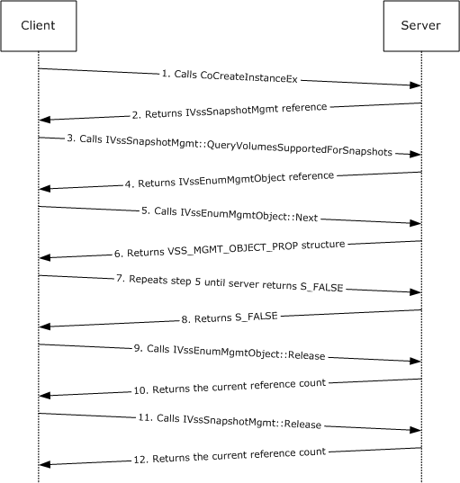
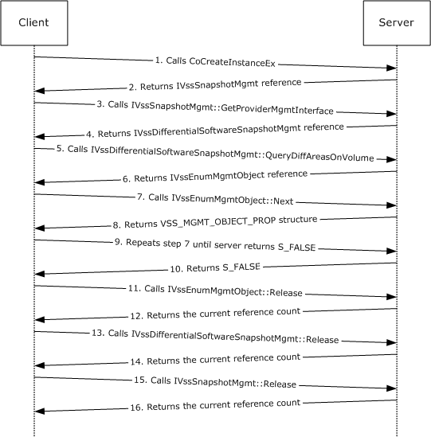
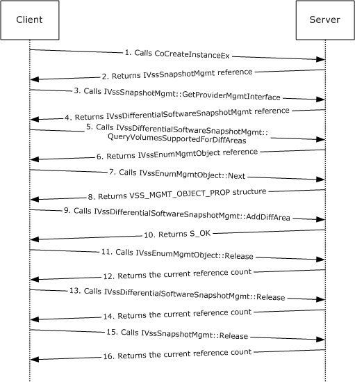

[MS-SCMP]:

Shadow Copy Management Protocol

Intellectual Property Rights Notice for Open Specifications Documentation

  Technical Documentation. Microsoft publishes Open Specifications documentation (“this

documentation”) for protocols, file formats, data portability, computer languages, and standards
support. Additionally, overview documents cover inter-protocol relationships and interactions.

  Copyrights. This documentation is covered by Microsoft copyrights. Regardless of any other

terms that are contained in the terms of use for the Microsoft website that hosts this
documentation, you can make copies of it in order to develop implementations of the technologies
that are described in this documentation and can distribute portions of it in your implementations
that use these technologies or in your documentation as necessary to properly document the
implementation. You can also distribute in your implementation, with or without modification, any
schemas, IDLs, or code samples that are included in the documentation. This permission also
applies to any documents that are referenced in the Open Specifications documentation.
  No Trade Secrets. Microsoft does not claim any trade secret rights in this documentation.
  Patents. Microsoft has patents that might cover your implementations of the technologies

described in the Open Specifications documentation. Neither this notice nor Microsoft's delivery of
this documentation grants any licenses under those patents or any other Microsoft patents.
However, a given Open Specifications document might be covered by the Microsoft Open
Specifications Promise or the Microsoft Community Promise. If you would prefer a written license,
or if the technologies described in this documentation are not covered by the Open Specifications
Promise or Community Promise, as applicable, patent licenses are available by contacting
iplg@microsoft.com.

  License Programs. To see all of the protocols in scope under a specific license program and the

associated patents, visit the Patent Map.

  Trademarks. The names of companies and products contained in this documentation might be
covered by trademarks or similar intellectual property rights. This notice does not grant any
licenses under those rights. For a list of Microsoft trademarks, visit
www.microsoft.com/trademarks.

  Fictitious Names. The example companies, organizations, products, domain names, email

addresses, logos, people, places, and events that are depicted in this documentation are fictitious.
No association with any real company, organization, product, domain name, email address, logo,
person, place, or event is intended or should be inferred.

Reservation of Rights. All other rights are reserved, and this notice does not grant any rights other
than as specifically described above, whether by implication, estoppel, or otherwise.

Tools. The Open Specifications documentation does not require the use of Microsoft programming
tools or programming environments in order for you to develop an implementation. If you have access
to Microsoft programming tools and environments, you are free to take advantage of them. Certain
Open Specifications documents are intended for use in conjunction with publicly available standards
specifications and network programming art and, as such, assume that the reader either is familiar
with the aforementioned material or has immediate access to it.

Support. For questions and support, please contact dochelp@microsoft.com.

[MS-SCMP] - v20240423
Shadow Copy Management Protocol
Copyright © 2024 Microsoft Corporation
Release: April 23, 2024

1 / 53

Revision Summary

Date

Revision
History

Revision
Class

Comments

10/24/2008  0.01

New

Version 0.01 release

12/5/2008

0.01.1

Editorial

Changed language and formatting in the technical content.

1/16/2009

0.01.2

Editorial

Changed language and formatting in the technical content.

2/27/2009

0.2

4/10/2009

0.3

Minor

Minor

Clarified the meaning of the technical content.

Clarified the meaning of the technical content.

5/22/2009

0.3.1

Editorial

Changed language and formatting in the technical content.

7/2/2009

0.4

Minor

Clarified the meaning of the technical content.

8/14/2009

0.4.1

Editorial

Changed language and formatting in the technical content.

9/25/2009

0.5

Minor

Clarified the meaning of the technical content.

11/6/2009

0.5.1

Editorial

Changed language and formatting in the technical content.

12/18/2009  0.5.2

Editorial

Changed language and formatting in the technical content.

1/29/2010

1.0

Major

Updated and revised the technical content.

3/12/2010

1.0.1

Editorial

Changed language and formatting in the technical content.

4/23/2010

1.0.2

Editorial

Changed language and formatting in the technical content.

6/4/2010

2.0

Major

Updated and revised the technical content.

7/16/2010

2.0

8/27/2010

3.0

10/8/2010

4.0

11/19/2010  4.0

1/7/2011

4.0

2/11/2011

4.0

3/25/2011

4.0

5/6/2011

4.0

None

Major

Major

None

None

None

None

None

No changes to the meaning, language, or formatting of the
technical content.

Updated and revised the technical content.

Updated and revised the technical content.

No changes to the meaning, language, or formatting of the
technical content.

No changes to the meaning, language, or formatting of the
technical content.

No changes to the meaning, language, or formatting of the
technical content.

No changes to the meaning, language, or formatting of the
technical content.

No changes to the meaning, language, or formatting of the
technical content.

6/17/2011

4.1

Minor

Clarified the meaning of the technical content.

9/23/2011

4.1

12/16/2011  4.1

None

None

No changes to the meaning, language, or formatting of the
technical content.

No changes to the meaning, language, or formatting of the
technical content.

[MS-SCMP] - v20240423
Shadow Copy Management Protocol
Copyright © 2024 Microsoft Corporation
Release: April 23, 2024

2 / 53

Date

Revision
History

Revision
Class

Comments

3/30/2012

4.1

7/12/2012

4.1

10/25/2012  4.1

1/31/2013

4.1

None

None

None

None

No changes to the meaning, language, or formatting of the
technical content.

No changes to the meaning, language, or formatting of the
technical content.

No changes to the meaning, language, or formatting of the
technical content.

No changes to the meaning, language, or formatting of the
technical content.

8/8/2013

5.0

Major

Updated and revised the technical content.

11/14/2013  5.0

2/13/2014

5.0

5/15/2014

5.0

None

None

None

No changes to the meaning, language, or formatting of the
technical content.

No changes to the meaning, language, or formatting of the
technical content.

No changes to the meaning, language, or formatting of the
technical content.

6/30/2015

6.0

Major

Significantly changed the technical content.

7/14/2016

6.0

None

No changes to the meaning, language, or formatting of the
technical content.

6/1/2017

6.0

9/15/2017

7.0

9/12/2018

8.0

4/7/2021

9.0

4/23/2024

10.0

None

Major

Major

Major

Major

No changes to the meaning, language, or formatting of the
technical content.

Significantly changed the technical content.

Significantly changed the technical content.

Significantly changed the technical content.

Significantly changed the technical content.

[MS-SCMP] - v20240423
Shadow Copy Management Protocol
Copyright © 2024 Microsoft Corporation
Release: April 23, 2024

3 / 53

## Table of Contents

- [1 Introduction](#1-introduction)
  - [1.1 Glossary](#11-glossary)
  - [1.2 References](#12-references)
    - [1.2.1 Normative References](#121-normative-references)
    - [1.2.2 Informative References](#122-informative-references)
  - [1.3 Overview](#13-overview)
  - [1.4 Relationship to Other Protocols](#14-relationship-to-other-protocols)
  - [1.5 Prerequisites/Preconditions](#15-prerequisitespreconditions)
  - [1.6 Applicability Statement](#16-applicability-statement)
  - [1.7 Versioning and Capability Negotiation](#17-versioning-and-capability-negotiation)
  - [1.8 Vendor-Extensible Fields](#18-vendor-extensible-fields)
  - [1.9 Standards Assignments](#19-standards-assignments)
- [2 Messages](#2-messages)
  - [2.1 Transport](#21-transport)
  - [2.2 Common Data Types](#22-common-data-types)
    - [2.2.1 Data Types](#221-data-types)
      - [2.2.1.1 VSS_ID](#2211-vssid)
      - [2.2.1.2 VSS_PWSZ](#2212-vsspwsz)
      - [2.2.1.3 VSS_TIMESTAMP](#2213-vsstimestamp)
    - [2.2.2 Enumerations](#222-enumerations)
      - [2.2.2.1 VSS_OBJECT_TYPE Enumeration](#2221-vssobjecttype-enumeration)
      - [2.2.2.2 VSS_MGMT_OBJECT_TYPE Enumeration](#2222-vssmgmtobjecttype-enumeration)
      - [2.2.2.3 VSS_VOLUME_SNAPSHOT_ATTRIBUTES Enumeration](#2223-vssvolumesnapshotattributes-enumeration)
      - [2.2.2.4 VSS_SNAPSHOT_STATE Enumeration](#2224-vsssnapshotstate-enumeration)
      - [2.2.2.5 VSS_PROVIDER_TYPE Enumeration](#2225-vssprovidertype-enumeration)
    - [2.2.3 Structures](#223-structures)
      - [2.2.3.1 VSS_OBJECT_UNION Union](#2231-vssobjectunion-union)
      - [2.2.3.2 VSS_OBJECT_PROP Structure](#2232-vssobjectprop-structure)
      - [2.2.3.3 VSS_SNAPSHOT_PROP Structure](#2233-vsssnapshotprop-structure)
      - [2.2.3.4 VSS_PROVIDER_PROP Structure](#2234-vssproviderprop-structure)
      - [2.2.3.5 VSS_MGMT_OBJECT_UNION Union](#2235-vssmgmtobjectunion-union)
      - [2.2.3.6 VSS_MGMT_OBJECT_PROP Structure](#2236-vssmgmtobjectprop-structure)
      - [2.2.3.7 VSS_VOLUME_PROP Structure](#2237-vssvolumeprop-structure)
      - [2.2.3.8 VSS_DIFF_VOLUME_PROP Structure](#2238-vssdiffvolumeprop-structure)
      - [2.2.3.9 VSS_DIFF_AREA_PROP Structure](#2239-vssdiffareaprop-structure)
- [3 Protocol Details](#3-protocol-details)
  - [3.1 Server Details](#31-server-details)
    - [3.1.1 IVssSnapshotMgmt Details](#311-ivsssnapshotmgmt-details)
      - [3.1.1.1 Abstract Data Model](#3111-abstract-data-model)
      - [3.1.1.2 Timers](#3112-timers)
      - [3.1.1.3 Initialization](#3113-initialization)
      - [3.1.1.4 Message Processing Events and Sequencing Rules](#3114-message-processing-events-and-sequencing-rules)
        - [3.1.1.4.1 GetProviderMgmtInterface (Opnum 3)](#31141-getprovidermgmtinterface-opnum-3)
        - [3.1.1.4.2 QueryVolumesSupportedForSnapshots (Opnum 4)](#31142-queryvolumessupportedforsnapshots-opnum-4)
          - [3.1.1.4.2.1 Volume Object Enumeration](#311421-volume-object-enumeration)
        - [3.1.1.4.3 QuerySnapshotsByVolume (Opnum 5)](#31143-querysnapshotsbyvolume-opnum-5)
          - [3.1.1.4.3.1 Shadow Copy Enumeration Return Value](#311431-shadow-copy-enumeration-return-value)
      - [3.1.1.5 Timer Events](#3115-timer-events)
      - [3.1.1.6 Other Local Events](#3116-other-local-events)
    - [3.1.2 IVssEnumObject Details](#312-ivssenumobject-details)
      - [3.1.2.1 Next (Opnum 3)](#3121-next-opnum-3)
      - [3.1.2.2 Skip (Opnum 4)](#3122-skip-opnum-4)
      - [3.1.2.3 Reset (Opnum 5)](#3123-reset-opnum-5)
      - [3.1.2.4 Clone (Opnum 6)](#3124-clone-opnum-6)
    - [3.1.3 IVssEnumMgmtObject Details](#313-ivssenummgmtobject-details)
      - [3.1.3.1 Next (Opnum 3)](#3131-next-opnum-3)
      - [3.1.3.2 Skip (Opnum 4)](#3132-skip-opnum-4)
      - [3.1.3.3 Reset (Opnum 5)](#3133-reset-opnum-5)
      - [3.1.3.4 Clone (Opnum 6)](#3134-clone-opnum-6)
    - [3.1.4 IVssDifferentialSoftwareSnapshotMgmt Details](#314-ivssdifferentialsoftwaresnapshotmgmt-details)
      - [3.1.4.1 Abstract Data Model](#3141-abstract-data-model)
      - [3.1.4.2 Timers](#3142-timers)
      - [3.1.4.3 Initialization](#3143-initialization)
      - [3.1.4.4 Message Processing Events and Sequencing Rules](#3144-message-processing-events-and-sequencing-rules)
        - [3.1.4.4.1 Shadow Copy Storage Association Object Enumeration](#31441-shadow-copy-storage-association-object-enumeration)
        - [3.1.4.4.2 AddDiffArea (Opnum 3)](#31442-adddiffarea-opnum-3)
        - [3.1.4.4.3 ChangeDiffAreaMaximumSize (Opnum 4)](#31443-changediffareamaximumsize-opnum-4)
        - [3.1.4.4.4 QueryVolumesSupportedForDiffAreas (Opnum 5)](#31444-queryvolumessupportedfordiffareas-opnum-5)
        - [3.1.4.4.5 QueryDiffAreasForVolume (Opnum 6)](#31445-querydiffareasforvolume-opnum-6)
        - [3.1.4.4.6 QueryDiffAreasOnVolume (Opnum 7)](#31446-querydiffareasonvolume-opnum-7)
      - [3.1.4.5 Timer Events](#3145-timer-events)
      - [3.1.4.6 Other Local Events](#3146-other-local-events)
  - [3.2 Client Details](#32-client-details)
    - [3.2.1 Abstract Data Model](#321-abstract-data-model)
    - [3.2.2 Timers](#322-timers)
    - [3.2.3 Initialization](#323-initialization)
    - [3.2.4 Message Processing Events and Sequencing Rules](#324-message-processing-events-and-sequencing-rules)
      - [3.2.4.1 Processing Server Replies to Method Calls](#3241-processing-server-replies-to-method-calls)
        - [3.2.4.1.1 Shadow Copy Management Protocol Object Relationships](#32411-shadow-copy-management-protocol-object-relationships)
    - [3.2.5 Timer Events](#325-timer-events)
    - [3.2.6 Other Local Events](#326-other-local-events)
- [4 Protocol Examples](#4-protocol-examples)
  - [4.1 Enumerate Volumes Supporting Shadow Copies](#41-enumerate-volumes-supporting-shadow-copies)
  - [4.2 Calculate Shadow Copy Storage Space on a Volume](#42-calculate-shadow-copy-storage-space-on-a-volume)
  - [4.3 Store Shadow Copies on a Different Volume](#43-store-shadow-copies-on-a-different-volume)
- [5 Security](#5-security)
  - [5.1 Security Considerations for Implementers](#51-security-considerations-for-implementers)
- [6 Appendix A: Full IDL](#6-appendix-a-full-idl)
- [7 Appendix B: Product Behavior](#7-appendix-b-product-behavior)
- [8 Change Tracking](#8-change-tracking)
- [9 Index](#9-index)

## 1 Introduction

The Shadow Copy Management Protocol is used to programmatically enumerate shadow copies and
configure shadow copy storage on remote machines. The protocol uses a set of Distributed
Component Object Model (DCOM) interfaces to query shadow copies and manage shadow copy
storage on a remote machine.

This specification describes storage concepts, including volume storage concepts, in the Windows
operating system. Although this specification outlines some basic storage concepts, it assumes that
the reader has familiarity with these technologies. For background information about storage, disk,
and volume concepts, see [MSDN-STC] and [MSDN-VOLMAN].

This protocol documentation is intended for use together with publicly available standard
specifications, networking programming art, and Microsoft distributed systems concepts. It assumes
that the reader is either familiar with this material or has immediate access to it.

A protocol specification does not require the use of Microsoft programming tools or programming
environments for a Licensee to develop an implementation. Licensees who have access to Microsoft
programming tools and environments are free to take advantage of them.

Sections 1.5, 1.8, 1.9, 2, and 3 of this specification are normative. All other sections and examples in
this specification are informative.

### 1.1 Glossary

This document uses the following terms:

Component Object Model (COM): An object-oriented programming model that defines how

objects interact within a single process or between processes. In COM, clients have access to an
object through interfaces implemented on the object. For more information, see [MS-DCOM].

differential data: The data that can be applied to the contents of an original volume in order to

generate the contents of a shadow copy.

Distributed Component Object Model (DCOM): The Microsoft Component Object Model (COM)
specification that defines how components communicate over networks, as specified in [MS-
DCOM].

drive letter: One of the 26 alphabetical characters A-Z, in uppercase or lowercase, that is

assigned to a volume. Drive letters serve as a namespace through which data on the volume
can be accessed. A volume with a drive letter can be referred to with the drive letter followed by
a colon (for example, C:).

endpoint: A network-specific address of a remote procedure call (RPC) server process for remote

procedure calls. The actual name and type of the endpoint depends on the RPC protocol
sequence that is being used. For example, for RPC over TCP (RPC Protocol Sequence
ncacn_ip_tcp), an endpoint might be TCP port 1025. For RPC over Server Message Block (RPC
Protocol Sequence ncacn_np), an endpoint might be the name of a named pipe. For more
information, see [C706].

free space: Space on a disk not in use by any volumes, primary partitions, or logical drives.

fully qualified domain name (FQDN): An unambiguous domain name that gives an absolute

location in the Domain Name System's (DNS) hierarchy tree, as defined in [RFC1035] section
3.1 and [RFC2181] section 11.

globally unique identifier (GUID): A term used interchangeably with universally unique

identifier (UUID) in Microsoft protocol technical documents (TDs). Interchanging the usage of
these terms does not imply or require a specific algorithm or mechanism to generate the value.

6 / 53

[MS-SCMP] - v20240423
Shadow Copy Management Protocol
Copyright © 2024 Microsoft Corporation
Release: April 23, 2024

Specifically, the use of this term does not imply or require that the algorithms described in
[RFC4122] or [C706] have to be used for generating the GUID. See also universally unique
identifier (UUID).

HRESULT: An integer value that indicates the result or status of an operation. A particular

HRESULT can have different meanings depending on the protocol using it. See [MS-ERREF]
section 2.1 and specific protocol documents for further details.

interface: A group of related function prototypes in a specific order, analogous to a C++ virtual
interface. Multiple objects, of different object classes, can implement the same interface. A
derived interface can be created by adding methods after the end of an existing interface. In the
Distributed Component Object Model (DCOM), all interfaces initially derive from IUnknown.

Interface Definition Language (IDL): The International Standards Organization (ISO) standard
language for specifying the interface for remote procedure calls. For more information, see
[C706] section 4.

mount point: See mounted folder.

Network Data Representation (NDR): A specification that defines a mapping from Interface
Definition Language (IDL) data types onto octet streams. NDR also refers to the runtime
environment that implements the mapping facilities (for example, data provided to NDR). For
more information, see [MS-RPCE] and [C706] section 14.

opnum: An operation number or numeric identifier that is used to identify a specific remote

procedure call (RPC) method or a method in an interface. For more information, see [C706]
section 12.5.2.12 or [MS-RPCE].

original volume: The volume from which the shadow copy is derived.

path: When referring to a file path on a file system, a hierarchical sequence of folders. When
referring to a connection to a storage device, a connection through which a machine can
communicate with the storage device.

remote procedure call (RPC): A communication protocol used primarily between client and

server. The term has three definitions that are often used interchangeably: a runtime
environment providing for communication facilities between computers (the RPC runtime); a set
of request-and-response message exchanges between computers (the RPC exchange); and the
single message from an RPC exchange (the RPC message).  For more information, see [C706].

RPC protocol sequence: A character string that represents a valid combination of a remote

procedure call (RPC) protocol, a network layer protocol, and a transport layer protocol, as
described in [C706] and [MS-RPCE].

RPC transport: The underlying network services used by the remote procedure call (RPC) runtime

for communications between network nodes. For more information, see [C706] section 2.

shadow copy: A duplicate of data held on a volume at a well-defined instant in time.

shadow copy provider: A software component on the server that provides local services to

create, enumerate, delete, and manage shadow copies.

shadow copy set: A collection of shadow copies that are created at the same time and identified

by a common ID.

shadow copy storage: The storage location where the differential data from an original

volume is stored in order to maintain all shadow copies for a specified original volume. The
location can be a file or a set of files on the same volume or on a separate volume.

shadow copy storage association: The relationship between the original volume and the

volume where the shadow copy storage is located.

7 / 53

[MS-SCMP] - v20240423
Shadow Copy Management Protocol
Copyright © 2024 Microsoft Corporation
Release: April 23, 2024

shadow copy storage volume: The volume on which shadow copy storage is located.

snapshot: The point in time at which a shadow copy of a volume is made.

universally unique identifier (UUID): A 128-bit value. UUIDs can be used for multiple

purposes, from tagging objects with an extremely short lifetime, to reliably identifying very
persistent objects in cross-process communication such as client and server interfaces, manager
entry-point vectors, and RPC objects. UUIDs are highly likely to be unique. UUIDs are also
known as globally unique identifiers (GUIDs) and these terms are used interchangeably in
the Microsoft protocol technical documents (TDs). Interchanging the usage of these terms does
not imply or require a specific algorithm or mechanism to generate the UUID. Specifically, the
use of this term does not imply or require that the algorithms described in [RFC4122] or [C706]
has to be used for generating the UUID.

volume: A group of one or more partitions that forms a logical region of storage and the basis for
a file system. A volume is an area on a storage device that is managed by the file system as a
discrete logical storage unit. A partition contains at least one volume, and a volume can exist
on one or more partitions.

volume mount name: A path for a volume. The path consists of a GUID formatted as a string.

Applications can use this path to open the volume.

MAY, SHOULD, MUST, SHOULD NOT, MUST NOT: These terms (in all caps) are used as defined
in [RFC2119]. All statements of optional behavior use either MAY, SHOULD, or SHOULD NOT.

### 1.2 References

Links to a document in the Microsoft Open Specifications library point to the correct section in the
most recently published version of the referenced document. However, because individual documents
in the library are not updated at the same time, the section numbers in the documents may not
match. You can confirm the correct section numbering by checking the Errata.

#### 1.2.1 Normative References

We conduct frequent surveys of the normative references to assure their continued availability. If you
have any issue with finding a normative reference, please contact dochelp@microsoft.com. We will
assist you in finding the relevant information.

[C706] The Open Group, "DCE 1.1: Remote Procedure Call", C706, August 1997,
https://publications.opengroup.org/c706

Note Registration is required to download the document.

[MS-DCOM] Microsoft Corporation, "Distributed Component Object Model (DCOM) Remote Protocol".

[MS-DTYP] Microsoft Corporation, "Windows Data Types".

[MS-OAUT] Microsoft Corporation, "OLE Automation Protocol".

[MS-RPCE] Microsoft Corporation, "Remote Procedure Call Protocol Extensions".

[RFC2119] Bradner, S., "Key words for use in RFCs to Indicate Requirement Levels", BCP 14, RFC
2119, March 1997, https://www.rfc-editor.org/info/rfc2119

#### 1.2.2 Informative References

[MS-SMB] Microsoft Corporation, "Server Message Block (SMB) Protocol".

[MS-SCMP] - v20240423
Shadow Copy Management Protocol
Copyright © 2024 Microsoft Corporation
Release: April 23, 2024

8 / 53

[MSDN-SHADOW] Microsoft Corporation, "Volume Shadow Copy Service",
http://msdn.microsoft.com/en-us/library/bb968832(VS.85).aspx

[MSDN-STC] Microsoft Corporation, "Storage Technologies Collection", March 2003,
http://technet2.microsoft.com/WindowsServer/en/Library/616e5e77-958b-42f0-a87f-
ba229ccd81721033.mspx

[MSDN-VOLMAN] Microsoft Corporation, "Volume Management", http://msdn.microsoft.com/en-
us/library/aa365728.aspx

### 1.3 Overview

The Shadow Copy Management Protocol provides a mechanism for remote configuration of shadow
copies. Through the Shadow Copy Management Protocol, a client performs operations to enumerate
shadow copies and configure the storage size and location that are used to maintain the shadow
copies on the server.

The Shadow Copy Management Protocol is expressed as a set of DCOM interfaces. The server end of
the protocol implements support for the DCOM interfaces to manage shadow copy configuration
objects. The client end of the protocol invokes method calls on the interfaces to perform shadow copy
configuration tasks on the server.<1> Specifically, the protocol is used for the following purposes:





Enumerating the volumes on the server that can be shadow copied.

Enumerating the shadow copies that are currently available on the server and that are point-in-
time copies of a specified original volume.



Enumerating the volumes on the server that can be used as shadow copy storage.

  Creating, modifying, enumerating, and deleting the shadow copy storage association objects

that define the location and size of shadow copy storage for specific original volumes.

  Querying all the shadow copy storage association objects on the server that provide shadow copy

storage for a specified original volume.

  Querying all the shadow copy storage association objects on the server that are located on a

specified shadow copy storage volume.

### 1.4 Relationship to Other Protocols

The Shadow Copy Management Protocol relies on the Distributed Component Object Model (DCOM)
Remote Protocol, as specified in [MS-DCOM], which uses remote procedure call (RPC) as its
transport.

The Shadow Copy Management Protocol provides remote management of the storage configuration for
shadow copies for shared folders, which are remotely accessible through the Server Message Block
(SMB) Protocol, as specified in [MS-SMB].

### 1.5 Prerequisites/Preconditions

The Shadow Copy Management Protocol is implemented over DCOM and RPC, and as a result, has the
prerequisites that are specified in [MS-DCOM], [MS-OAUT], and [MS-RPCE] as being common to
DCOM, DCOM "automation", and RPC interfaces.

This protocol assumes that a client has obtained the name of a server that supports this protocol suite
before the protocol is invoked. This name can be obtained by using any implementation-specific
method. The protocol also assumes that the client has sufficient security privileges to configure
snapshots and volumes on the server.

9 / 53

[MS-SCMP] - v20240423
Shadow Copy Management Protocol
Copyright © 2024 Microsoft Corporation
Release: April 23, 2024

An operating system on which an implementation of the Shadow Copy Management Protocol is to run
must support the ability to dynamically enumerate the list of volumes and shadow copies that are
configured on the server during run time.

For more information about these requirements, see
IVssSnapshotMgmt::QueryVolumesSupportedForSnapshots (section 3.1.1.4.2),
IVssSnapshotMgmt::QuerySnapshotsByVolume (section 3.1.1.4.3),
IVssDifferentialSoftwareSnapshotMgmt::QueryVolumesSupportedForDiffAreas (section 3.1.4.4.4),
IVssDifferentialSoftwareSnapshotMgmt::QueryDiffAreasForVolume (section 3.1.4.4.5), and
IVssDifferentialSoftwareSnapshotMgmt::QueryDiffAreasOnVolume (section 3.1.4.4.6).

### 1.6 Applicability Statement

An application uses this protocol to remotely configure shadow copies and shadow copy storage
on the server.

### 1.7 Versioning and Capability Negotiation

Supported Transports: This protocol uses the Distributed Component Object Model (DCOM) Remote

Protocol, as specified in [MS-DCOM], which in turn uses RPC over TCP, as its only transport. For
details, see Transport (section 2.1).

Protocol Version: This protocol consists of four DCOM interfaces, all of which are version 1.0.<2>

Functionality Negotiation: The client negotiates for a specific set of server functionalities by

specifying the UUID that corresponds to the requested RPC interface via COM
IUnknown::QueryInterface when binding to the server. Certain interfaces are implemented by only
particular objects on the server (for details, see section 2.1).

Security and Authentication Methods: This protocol relies on the security and authentication that
is provided by the DCOM Remote Protocol, as specified in [MS-DCOM], and the Remote Procedure
Call Protocol Extensions, as specified in [MS-RPCE]. This protocol configures security and
authentication as specified in Transport (section 2.1).

### 1.8 Vendor-Extensible Fields

None.

### 1.9 Standards Assignments

The following UUID assignments are Microsoft private assignments.

Parameter

Value

Reference

RPC interface UUID for IVssSnapshotMgmt

RPC interface UUID for IVssEnumObject

RPC interface UUID for
IVssDifferentialSoftwareSnapshotMgmt

RPC interface UUID for IVssEnumMgmtObject

Shadow copy provider UUID

FA7DF749-66E7-4986-A27F-
E2F04AE53772

AE1C7110-2F60-11d3-8A39-
00C04F72D8E3

214A0F28-B737-4026-B847-
4F9E37D79529

01954E6B-9254-4e6e-808C-
C9E05D007696

B5946137-7B9F-4925-AF80-
51ABD60B20D5

None

None

None

None

None

10 / 53

[MS-SCMP] - v20240423
Shadow Copy Management Protocol
Copyright © 2024 Microsoft Corporation
Release: April 23, 2024

[MS-SCMP] - v20240423
Shadow Copy Management Protocol
Copyright © 2024 Microsoft Corporation
Release: April 23, 2024

11 / 53

## 2 Messages

### 2.1 Transport

For its transport, this protocol uses the Distributed Component Object Model (DCOM) Remote Protocol,
as specified in [MS-DCOM]. The DCOM Remote Protocol uses the following RPC protocol sequence:
RPC over TCP, as specified in [MS-RPCE].

To access an interface, the client requests a DCOM connection to its object UUID endpoint on the
server, as described in Standards Assignments (section 1.9).

The RPC version number for all interfaces is 0.0.

An implementation of the Shadow Copy Management Protocol MAY configure its DCOM implementation
or underlying RPC transport with authentication parameters to restrict client connections. The details
of this behavior are implementation-specific.<3>

The Shadow Copy Management Protocol interfaces make use of the underlying DCOM security
framework, as specified in [MS-DCOM], and rely on it for access control. DCOM differentiates between
launch and access.<4>

### 2.2 Common Data Types

In addition to the RPC base types and definitions specified in [C706] and [MS-RPCE], additional data
types are defined in the following sections, which summarize the types that are defined in this
specification.

#### 2.2.1 Data Types

##### 2.2.1.1 VSS_ID

The VSS_ID data type defines the identifier (ID) as a GUID for shadow copy objects. GUID is
defined in [MS-DTYP] section 2.3.4.

This type is declared as follows:

 typedef GUID VSS_ID;

##### 2.2.1.2 VSS_PWSZ

The VSS_PWSZ data type defines a null-terminated character string.

This type is declared as follows:

 typedef [unique, string] WCHAR* VSS_PWSZ;

##### 2.2.1.3 VSS_TIMESTAMP

The VSS_TIMESTAMP data type defines a time stamp value. This data type is identical in format to the
FILETIME data type.

This type is declared as follows:

[MS-SCMP] - v20240423
Shadow Copy Management Protocol
Copyright © 2024 Microsoft Corporation
Release: April 23, 2024

12 / 53

 typedef LONGLONG VSS_TIMESTAMP;

#### 2.2.2 Enumerations

##### 2.2.2.1 VSS_OBJECT_TYPE Enumeration

The VSS_OBJECT_TYPE enumeration defines the types of objects that can be queried by the
IVssEnumObject interface.

 typedef [v1_enum] enum _VSS_OBJECT_TYPE
 {
   VSS_OBJECT_UNKNOWN = 0x00000000,
   VSS_OBJECT_NONE = 0x00000001,
   VSS_OBJECT_SNAPSHOT_SET = 0x00000002,
   VSS_OBJECT_SNAPSHOT = 0x00000003,
   VSS_OBJECT_PROVIDER = 0x00000004,
   VSS_OBJECT_TYPE_COUNT = 0x00000005
 } VSS_OBJECT_TYPE;

VSS_OBJECT_UNKNOWN:  The object is of an unknown type of shadow copy.

VSS_OBJECT_NONE:  This value MUST NOT be used and MUST be ignored upon receipt.

VSS_OBJECT_SNAPSHOT_SET:  The object is a shadow copy set.

VSS_OBJECT_SNAPSHOT:  The object is a shadow copy.

VSS_OBJECT_PROVIDER:  This value is not used by the Shadow Copy Management Protocol and

MUST NOT be referenced. It MUST be ignored on receipt.

VSS_OBJECT_TYPE_COUNT:  This value is the number of VSS_OBJECT_TYPE values in the

enumeration.

##### 2.2.2.2 VSS_MGMT_OBJECT_TYPE Enumeration

The VSS_MGMT_OBJECT_TYPE enumeration defines the types of objects that can be queried by the
IVssEnumMgmtType interface.

 typedef [v1_enum] enum _VSS_MGMT_OBJECT_TYPE
 {
   VSS_MGMT_OBJECT_UNKNOWN = 0x00000000,
   VSS_MGMT_OBJECT_VOLUME = 0x00000001,
   VSS_MGMT_OBJECT_DIFF_VOLUME = 0x00000002,
   VSS_MGMT_OBJECT_DIFF_AREA = 0x00000003,
 } VSS_MGMT_OBJECT_TYPE;

VSS_MGMT_OBJECT_UNKNOWN:  The object is of an unknown type.

VSS_MGMT_OBJECT_VOLUME:  The object is an original volume.

VSS_MGMT_OBJECT_DIFF_VOLUME:  The object is a shadow copy storage volume.

VSS_MGMT_OBJECT_DIFF_AREA:  The object is shadow copy storage.

[MS-SCMP] - v20240423
Shadow Copy Management Protocol
Copyright © 2024 Microsoft Corporation
Release: April 23, 2024

13 / 53

##### 2.2.2.3 VSS_VOLUME_SNAPSHOT_ATTRIBUTES Enumeration

The VSS_VOLUME_SNAPSHOT_ATTRIBUTES enumeration defines the set of valid attribute flags for a
shadow copy.

 typedef [v1_enum] enum _VSS_VOLUME_SNAPSHOT_ATTRIBUTES
 {
   VSS_VOLSNAP_ATTR_PERSISTENT = 0x00000001,
   VSS_VOLSNAP_ATTR_NO_AUTORECOVERY = 0x00000002,
   VSS_VOLSNAP_ATTR_CLIENT_ACCESSIBLE = 0x00000004,
   VSS_VOLSNAP_ATTR_NO_AUTO_RELEASE = 0x00000008,
   VSS_VOLSNAP_ATTR_NO_WRITERS = 0x00000010,
 } VSS_VOLUME_SNAPSHOT_ATTRIBUTES;

VSS_VOLSNAP_ATTR_PERSISTENT:  The shadow copy persists on the system despite rebooting

the machine.

VSS_VOLSNAP_ATTR_NO_AUTORECOVERY:  The shadow copy is created as read-only.

Applications are not provided an opportunity to modify its contents.

VSS_VOLSNAP_ATTR_CLIENT_ACCESSIBLE:  The shadow copy is of a specific type that can be

exposed remotely through the SMB Protocol [MS-SMB].

VSS_VOLSNAP_ATTR_NO_AUTO_RELEASE:  The shadow copy is not deleted after the client

releases all references to the local interface that is used to create the shadow copy.

VSS_VOLSNAP_ATTR_NO_WRITERS:  The shadow copy is created without any application-specific

participation.

##### 2.2.2.4 VSS_SNAPSHOT_STATE Enumeration

The VSS_SNAPSHOT_STATE enumeration defines the set of valid states of a shadow copy.

 typedef [v1_enum] enum _VSS_SNAPSHOT_STATE
 {
   VSS_SS_UNKNOWN = 0x00000000,
   VSS_SS_CREATED = 0x0000000c,
 } VSS_SNAPSHOT_STATE;

VSS_SS_UNKNOWN:  The shadow copy state is unknown. This is a restricted shadow copy state.

Shadow copies that are managed with this protocol MUST NOT appear in this state.

VSS_SS_CREATED:  The shadow copy is created.

##### 2.2.2.5 VSS_PROVIDER_TYPE Enumeration

The VSS_PROVIDER_TYPE enumeration defines the set of valid shadow copy provider types. This
enumeration is not used by the Shadow Copy Management Protocol; it MUST NOT be referenced and
MUST be ignored on receipt.

 typedef [v1_enum] enum _VSS_PROVIDER_TYPE
 {
   VSS_PROV_UNKNOWN = 0x00000000,
 } VSS_PROVIDER_TYPE;

VSS_PROV_UNKNOWN:  The shadow copy provider type is unknown.

14 / 53

[MS-SCMP] - v20240423
Shadow Copy Management Protocol
Copyright © 2024 Microsoft Corporation
Release: April 23, 2024

#### 2.2.3 Structures

##### 2.2.3.1 VSS_OBJECT_UNION Union

The VSS_OBJECT_UNION defines the union of object types that can be defined by the
VSS_OBJECT_PROP structure (section 2.2.3.2).

 [switch_type(VSS_OBJECT_TYPE)]
 typedef union  {
  [case(VSS_OBJECT_SNAPSHOT)]
     VSS_SNAPSHOT_PROP Snap;
   [case(VSS_OBJECT_PROVIDER)]
     VSS_PROVIDER_PROP Prov;
   [default];
} VSS_OBJECT_UNION;

Snap:  The structure specifies a shadow copy object as a VSS_SNAPSHOT_PROP

structure (section 2.2.3.3).

Prov:  The structure specifies a VSS provider object. The Shadow Copy Management Protocol is not

used to manage VSS provider objects; therefore, this member MUST NOT be referenced and MUST
be ignored on receipt.

##### 2.2.3.2 VSS_OBJECT_PROP Structure

The VSS_OBJECT_PROP structure specifies the union of object types that can be enumerated by the
IVssEnumObject interface.

 typedef struct _VSS_OBJECT_PROP {
   VSS_OBJECT_TYPE Type;
   [switch_is(Type)] VSS_OBJECT_UNION Obj;
 } VSS_OBJECT_PROP;

Type:  A value defined in the VSS_OBJECT_TYPE enumeration (section 2.2.2.1) that specifies the type

of object that is contained in the Obj union structure.

Obj:  A VSS_OBJECT_UNION structure (section 2.2.3.1).

##### 2.2.3.3 VSS_SNAPSHOT_PROP Structure

The VSS_SNAPSHOT_PROP structure provides information about a shadow copy object.

 typedef struct _VSS_SNAPSHOT_PROP {
   VSS_ID m_SnapshotId;
   VSS_ID m_SnapshotSetId;
   LONG m_lSnapshotsCount;
   VSS_PWSZ m_pwszSnapshotDeviceObject;
   VSS_PWSZ m_pwszOriginalVolumeName;
   VSS_PWSZ m_pwszOriginatingMachine;
   VSS_PWSZ m_pwszServiceMachine;
   VSS_PWSZ m_pwszExposedName;
   VSS_PWSZ m_pwszExposedPath;
   VSS_ID m_ProviderId;
   LONG m_lSnapshotAttributes;
   VSS_TIMESTAMP m_tsCreationTimestamp;
   VSS_SNAPSHOT_STATE m_eStatus;
 } VSS_SNAPSHOT_PROP;

[MS-SCMP] - v20240423
Shadow Copy Management Protocol
Copyright © 2024 Microsoft Corporation
Release: April 23, 2024

15 / 53

m_SnapshotId:  The VSS_ID (section 2.2.1.1) that identifies this shadow copy object.

m_SnapshotSetId:  The VSS_ID that identifies the shadow copy set of which this shadow copy

object is a member. All shadow copy objects in the same snapshot set MUST have the same
value for m_SnapshotSetId.

m_lSnapshotsCount:  The number of shadow copies in the shadow copy set when it was originally

created. It is possible that individual shadow copies that make up the shadow copy set are deleted
so that, at any time, it is possible that the number of shadow copies currently in the snapshot set
is less than m_lSnapshotCount.

m_pwszSnapshotDeviceObject:  The null-terminated character string that contains the name of the

volume device for the shadow copy volume object on the server.<5>

m_pwszOriginalVolumeName:  The null-terminated character string that contains the volume
mount name of the volume from which a shadow copy was obtained in order to generate this
shadow copy object.

m_pwszOriginatingMachine:  The null-terminated character string that contains the name of the

machine that hosts the original volume. The server MUST populate this string with the fully
qualified domain name (FQDN) of the server machine. For this protocol, the value of
m_pwszOriginatingMachine and m_pwszServiceMachine MUST be the same.

m_pwszServiceMachine:  The null-terminated character string that contains the name of the

machine on which the shadow copy was created. The server MUST populate this string with the
FQDN of the server machine. For this protocol, the value of m_pwszOriginatingMachine and
m_pwszServiceMachine MUST be the same.

m_pwszExposedName:  The null-terminated character string that contains the drive letter, mount
point, or SMB share name if the shadow copy is exposed on the server. For this protocol, the
server MUST set this value to NULL.

m_pwszExposedPath:  The null-terminated character string that contains the full, root-relative path

to a folder on the shadow copy that is to be exposed as an SMB share. For this protocol, the
server MUST set this value to NULL.

m_ProviderId:  The VSS_ID of the VSS provider that was used to create the shadow copy.

m_lSnapshotAttributes:  The attributes of the shadow copy. The value of this LONG value is a

combination of the values that are defined in VSS_VOLUME_SNAPSHOT_ATTRIBUTES.

m_tsCreationTimestamp:  The time stamp that defines when the shadow copy was created.

m_eStatus:  A value from the VSS_SNAPSHOT_STATE enumeration (section 2.2.2.4) that defines the
state of the snapshot. For this protocol, the value of m_eStatus MUST be VSS_SS_CREATED.

##### 2.2.3.4 VSS_PROVIDER_PROP Structure

The VSS_PROVIDER_PROP structure provides information about a shadow copy provider. This
structure is not used by this protocol. It MUST NOT be referenced and MUST be ignored on receipt.

 typedef struct _VSS_PROVIDER_PROP {
   VSS_ID m_ProviderId;
   VSS_PWSZ m_pwszProviderName;
   VSS_PROVIDER_TYPE m_eProviderType;
   VSS_PWSZ m_pwszProviderVersion;
   VSS_ID m_ProviderVersionId;
   CLSID m_ClassId;
 } VSS_PROVIDER_PROP;

[MS-SCMP] - v20240423
Shadow Copy Management Protocol
Copyright © 2024 Microsoft Corporation
Release: April 23, 2024

16 / 53

##### 2.2.3.5 VSS_MGMT_OBJECT_UNION Union

The VSS_MGMT_OBJECT_UNION specifies the union of object types that can be defined by the
VSS_MGMT_OBJECT_PROP structure (section 2.2.3.6).

 [switch_type(VSS_MGMT_OBJECT_TYPE)]
 typedef union  {
   [case(VSS_MGMT_OBJECT_VOLUME)]
     VSS_VOLUME_PROP Vol;
   [case(VSS_MGMT_OBJECT_DIFF_VOLUME)]
     VSS_DIFF_VOLUME_PROP DiffVol;
   [case(VSS_MGMT_OBJECT_DIFF_AREA)]
     VSS_DIFF_AREA_PROP DiffArea;
   [default];
 } VSS_MGMT_OBJECT_UNION;

Vol:  The structure specifies an original volume object as a VSS_VOLUME_PROP

structure (section 2.2.3.7).

DiffVol:  The structure specifies a shadow copy storage volume as a VSS_DIFF_VOLUME_PROP

structure.

DiffArea:  The structure specifies a shadow copy storage object as a VSS_DIFF_AREA_PROP.

##### 2.2.3.6 VSS_MGMT_OBJECT_PROP Structure

The VSS_MGMT_OBJECT_PROP structure defines the union of object types that can be enumerated by
the IVssEnumMgmtObject interface.

 typedef struct _VSS_MGMT_OBJECT_PROP {
   VSS_MGMT_OBJECT_TYPE Type;
   [switch_is(Type)] VSS_MGMT_OBJECT_UNION Obj;
 } VSS_MGMT_OBJECT_PROP;

Type:  A value that is defined in the VSS_MGMT_OBJECT_TYPE enumeration that specifies the type of

object that is contained in the Obj union structure.

Obj:  A VSS_MGMT_OBJECT_UNION structure.

##### 2.2.3.7 VSS_VOLUME_PROP Structure

The VSS_VOLUME_PROP structure defines properties of a volume.

 typedef struct _VSS_VOLUME_PROP {
   VSS_PWSZ m_pwszVolumeName;
   VSS_PWSZ m_pwszVolumeDisplayName;
 } VSS_VOLUME_PROP;

m_pwszVolumeName:  A null-terminated character string that contains the volume mount name

of the volume.

m_pwszVolumeDisplayName:  A null-terminated character string that contains a mount point

path for the volume. If the volume has no mount points, the string MUST be equal to
m_pwszVolumeName.

[MS-SCMP] - v20240423
Shadow Copy Management Protocol
Copyright © 2024 Microsoft Corporation
Release: April 23, 2024

17 / 53

##### 2.2.3.8 VSS_DIFF_VOLUME_PROP Structure

The VSS_DIFF_VOLUME_PROP structure defines the properties of a shadow copy storage volume.

 typedef struct _VSS_DIFF_VOLUME_PROP {
   VSS_PWSZ m_pwszVolumeName;
   VSS_PWSZ m_pwszVolumeDisplayName;
   LONGLONG m_llVolumeFreeSpace;
   LONGLONG m_llVolumeTotalSpace;
 } VSS_DIFF_VOLUME_PROP;

m_pwszVolumeName:  A null-terminated character string that contains the volume mount name

of the volume.

m_pwszVolumeDisplayName:  A null-terminated character string that contains one of the mount
point paths for the volume. If the volume has no mount points, the string MUST be equal to
m_pwszVolumeName.

m_llVolumeFreeSpace:  The amount of free space, in BYTEs, on the volume.

m_llVolumeTotalSpace:  The total size, in BYTEs, of the volume.

##### 2.2.3.9 VSS_DIFF_AREA_PROP Structure

The VSS_DIFF_AREA_PROP structure defines a shadow copy storage association and the current
sizes of the shadow copy storage.

 typedef struct _VSS_DIFF_AREA_PROP {
   VSS_PWSZ m_pwszVolumeName;
   VSS_PWSZ m_pwszDiffAreaVolumeName;
   LONGLONG m_llMaximumDiffSpace;
   LONGLONG m_llAllocatedDiffSpace;
   LONGLONG m_llUsedDiffSpace;
 } VSS_DIFF_AREA_PROP;

m_pwszVolumeName:  A null-terminated character string that contains the volume mount name

of the original volume that is or will be shadow copied.

m_pwszDiffAreaVolumeName:  A null-terminated character string that contains the volume mount
name of the shadow copy storage volume where shadow copy differential data will be
located for the volume specified in m_pwszVolumeName.

m_llMaximumDiffSpace:  The maximum number of BYTEs that will be consumed on the shadow

copy storage volume to maintain shadow copies.

m_llAllocatedDiffSpace:   The number of BYTEs currently allocated for shadow copy storage space.

This value MUST be less than or equal to m_llMaximumDiffSpace.

m_llUsedDiffSpace:   The number of BYTEs currently in use on the shadow copy storage volume to
maintain shadow copies. This value MUST be less than or equal to m_llAllocatedDiffSpace.

[MS-SCMP] - v20240423
Shadow Copy Management Protocol
Copyright © 2024 Microsoft Corporation
Release: April 23, 2024

18 / 53

## 3 Protocol Details

The client side of this protocol is simply a pass-through: no additional timers or other state is required
on the client side of this protocol. Calls made by the higher-layer protocol or application are passed
directly to the transport, and the results returned by the transport are passed directly back to the
higher-layer protocol or application.

### 3.1 Server Details

#### 3.1.1 IVssSnapshotMgmt Details

##### 3.1.1.1 Abstract Data Model

This section describes a conceptual model of possible data organization that an implementation
maintains to participate in this protocol. The described organization is provided to facilitate the
explanation of how the protocol behaves. This document does not mandate that implementations
adhere to this model as long as their external behavior is consistent with that described in this
document.

A server that implements the Shadow Copy Management Protocol maintains the persistent
configuration of shadow copies and shadow copy storage associations. The server also provides
interfaces to enumerate shadow copies and volumes that can be shadow copied or used as shadow
copy storage volumes.

Volumes supporting shadow copies: The server provides the mechanism to enumerate the volumes
on the server that support shadow copies. Each volume on the server that can support shadow
copies is represented in this protocol by a VSS_VOLUME_PROP structure.

Shadow copies: The server maintains a list of shadow copies for each volume that can support

shadow copies. The protocol enforces no restriction on the number of shadow copies that can exist
for a particular volume. The server provides the mechanism to enumerate existing shadow copies
on a specific volume on the server and exposes that enumeration through the IVssEnumObject
interface. Each shadow copy that is returned by the IVssEnumObject interface is represented as a
VSS_SNAPSHOT_PROP structure.

##### 3.1.1.2 Timers

None.

##### 3.1.1.3 Initialization

The server MUST register the Shadow Copy Management Protocol DCOM interfaces and begin
listening on the DCOM ports as specified in [MS-DCOM].

##### 3.1.1.4 Message Processing Events and Sequencing Rules

For all the following methods, the server SHOULD obtain the identity and authorization information
before processing the method about the client from the underlying DCOM or RPC runtime to verify
that the client has sufficient permissions to create, modify, or delete the object as appropriate. These
methods SHOULD impose an authorization policy decision before performing the function. The
suggested minimum requirement is that the caller have permission to create, modify, query, or delete
the object (or a combination of these permissions) as appropriate.

All Shadow Copy Management Protocol interfaces that are listed inherit the IUnknown interface.
Method opnum field values for all Shadow Copy Management Protocol interfaces start with 3; opnum

19 / 53

[MS-SCMP] - v20240423
Shadow Copy Management Protocol
Copyright © 2024 Microsoft Corporation
Release: April 23, 2024

values 0 through 2 represent IUnknown::QueryInterface, IUnknown::AddRef, and IUnknown::Release,
respectively. Details are specified in [MS-DCOM].

To retrieve an interface of a particular object, call the QueryInterface method on the DCOM IUnknown
interface of the object. Details are as specified in [MS-DCOM] and [MS-OAUT].

Unless otherwise specified in the following sections, all methods MUST return zero when successful or
an implementation-specific nonzero error code on failure. Unless otherwise specified, client
implementations of the protocol MUST NOT take any action on an error code but instead, return the
error to the invoking application.

If parameter validation fails, the server MUST fail the operation immediately and return
E_INVALIDARG.

Methods in RPC Opnum Order

Method

Description

GetProviderMgmtInterface

Retrieves the IVssDifferentialSoftwareSnapshotMgmt interface.

Opnum: 3

QueryVolumesSupportedForSnapshots  Retrieves from the server the collection of volumes that support

shadow copies.

Opnum: 4

QuerySnapshotsByVolume

Retrieves from the server the collection of shadow copies for the
specified client that are accessible to the client.

Opnum: 5

All methods MUST NOT throw exceptions.

Message Processing Details

This protocol indicates to the RPC runtime to do the following:





Perform a strict NDR data consistency check at target level 5.0, as specified in [MS-RPCE] section
3.1.1.5.3.2.

Perform a strict NDR data consistency check at target level 6.0, as specified in [MS-RPCE] section
3.1.1.5.3.3.

  Reject a NULL unique or full pointer with a nonzero conformant value, as specified in [MS-RPCE]

section 3.1.1.5.

###### 3.1.1.4.1 GetProviderMgmtInterface (Opnum 3)

The GetProviderMgmtInterface method retrieves the IVssDifferentialSoftwareSnapshotMgmt
interface.

 HRESULT GetProviderMgmtInterface(
   [in] VSS_ID ProviderId,
   [in] REFIID InterfaceId,
   [out, iid_is(InterfaceId)] IUnknown** ppItf
 );

ProviderId: MUST be set to the shadow copy provider UUID in Standards

Assignments (section 1.9).

[MS-SCMP] - v20240423
Shadow Copy Management Protocol
Copyright © 2024 Microsoft Corporation
Release: April 23, 2024

20 / 53

InterfaceId: MUST be set to the UUID for the IVssDifferentialSoftwareSnapshotMgmt interface in

Standards Assignments (section 1.9).

ppItf: A pointer to an IUnknown pointer that upon completion contains a pointer to an instance of the
interface object that is specified by InterfaceId. A caller MUST release the ppItf that is received
when the caller is done with it.

Return Values: The method MUST return the following error code for the specific conditions.

Return value/code

Description

0x80042304

VSS_E_PROVIDER_NOT_REGISTERED

Returned when the provider with ID ProviderId does not exist on the
server.

0x80070057

E_INVALIDARG

0x80070005

E_ACCESSDENIED

Returned when ppItf is NULL or REFIID is not equal to
__uuidof(IVssDifferentialSoftwareSnapshotMgmt).

Returned when the user making the request does not have sufficient
privileges to perform the operation.

For any other conditions, the method MUST return zero when it has succeeded or an
implementation-specific nonzero error code on failure.

No exceptions are thrown except those that are thrown by the underlying RPC protocol [MS-RPCE].

When the server receives this message, it MUST verify that ppItf is not NULL.

The server MUST set ppItf to the IUnknown interface of an object that also implements
IVssDifferentialSoftwareSnapshotMgmt or return an implementation-specific nonzero error code.

###### 3.1.1.4.2 QueryVolumesSupportedForSnapshots (Opnum 4)

The QueryVolumesSupportedForSnapshots method retrieves from the server a collection of volumes
that support shadow copies.

 HRESULT QueryVolumesSupportedForSnapshots(
   [in] VSS_ID ProviderId,
   [in] LONG lContext,
   [out] IVssEnumMgmtObject** ppEnum
 );

ProviderId: MUST be set to the shadow copy provider UUID as described in Standards

Assignments (section 1.9).

lContext: MUST be set to the bitwise OR combination of the following

VSS_VOLUME_SNAPSHOT_ATTRIBUTES flags.

Snapshot attribute mask for context value

VSS_VOLSNAP_ATTR_PERSISTENT

VSS_VOLSNAP_ATTR_CLIENT_ACCESSIBLE

VSS_VOLSNAP_ATTR_NO_AUTO_RELEASE

VSS_VOLSNAP_ATTR_NO_WRITERS

ppEnum: A pointer to an IVssEnumMgmtObject pointer that upon completion, contains a collection of

volumes that support shadow copies. Each element in the collection MUST be a

21 / 53

[MS-SCMP] - v20240423
Shadow Copy Management Protocol
Copyright © 2024 Microsoft Corporation
Release: April 23, 2024

VSS_VOLUME_PROP structure. A caller MUST release the received ppEnum when the caller is done
with it.

Return Values: The method MUST return zero when it has succeeded or an implementation-specific

nonzero error code on failure.

Return value/code

Description

0x80070057

E_INVALIDARG

0x80042304

VSS_E_PROVIDER_NOT_REGISTERED

Returned when ProviderId is GUID_NULL or when ppEnum is NULL.

Returned when the provider with ID ProviderId does not exist on
the server.

0x80070005

E_ACCESSDENIED

Returned when the user making the request does not have
sufficient privileges to perform the operation.

No exceptions are thrown except those that are thrown by the underlying RPC protocol [MS-RPCE].

After receiving this message, the server MUST verify that ppEnum is not NULL.

The server MUST set the ppEnum pointer to an instance of the IVssEnumMgmtObject that contains a
VSS_VOLUME_PROP structure for each volume on the server that is capable of supporting shadow
copies. If the server has no volumes that support shadow copies, it MUST return an empty
IVssEnumMgmtObject.

###### 3.1.1.4.2.1 Volume Object Enumeration

QueryVolumesSupportedForSnapshots returns an instance of the IVssEnumMgmtObject interface.
This interface is used to enumerate through a list of VSS_MGMT_OBJECT_PROP structures, which in
turn, contain a VSS_MGMT_OBJECT_UNION structure, each of which contains a VSS_VOLUME_PROP.

###### 3.1.1.4.3 QuerySnapshotsByVolume (Opnum 5)

The QuerySnapshotsByVolume method retrieves a collection of shadow copy objects that are present
on a specified volume of the server.

 HRESULT QuerySnapshotsByVolume(
   [in] VSS_PWSZ pwszVolumeName,
   [in] VSS_ID ProviderId,
   [out] IVssEnumObject** ppEnum
 );

pwszVolumeName: A null-terminated UNICODE string that contains the drive letter, mount point,

or volume mount name for which the existing shadow copy collection is requested.

ProviderId: MUST be set to the shadow copy provider UUID as described in Standards

Assignments (section 1.9).

ppEnum: A pointer to an IVssEnumObject pointer that upon completion, contains a collection of

shadow copies that exist on the server for the specified volume. Each element in the collection
MUST be a VSS_SNAPSHOT_PROP structure. A caller MUST release the received ppEnum when the
caller is done with it.

Return Values: The method MUST return zero when it has succeeded or an implementation-specific

nonzero error code on failure.

[MS-SCMP] - v20240423
Shadow Copy Management Protocol
Copyright © 2024 Microsoft Corporation
Release: April 23, 2024

22 / 53

Return value/code

Description

0x80070057

E_INVALIDARG

0x80042304

VSS_E_PROVIDER_NOT_REGISTERED

Returned when pwszVolumeName or ppEnum is NULL or when
ProviderId is GUID_NULL.

Returned when the provider with ID ProviderId does not exist on
the server.

0x80070005

E_ACCESSDENIED

Returned when the user making the request does not have
sufficient privileges to perform the operation.

No exceptions are thrown except those that are thrown by the underlying RPC protocol [MS-RPCE].

After the server receives this message, it MUST verify that ppEnum is not NULL.

The server MUST set the ppEnum pointer to an instance of IVssEnumObject that contains a
VSS_SNAPSHOT_PROP structure for each shadow copy for the specified volume on the server. If the
server has no shadow copies on the specified volume, it MUST return an empty IVssEnumObject
object.

###### 3.1.1.4.3.1 Shadow Copy Enumeration Return Value

 The QuerySnapshotsByVolume method returns an instance of the IVssEnumObject interface. This
interface is used to enumerate through a list of VSS_OBJECT_PROP structures, which in turn, contain
a VSS_OBJECT_UNION structure, each of which contains a VSS_SNAPSHOT_PROP.

##### 3.1.1.5 Timer Events

None.

##### 3.1.1.6 Other Local Events

None.

#### 3.1.2 IVssEnumObject Details

The IVssEnumObject interface is used to enumerate forward through a collection of objects.

Methods in RPC Opnum Order

Method  Description

Next

Retrieves the next specified number of objects in the collection.

Opnum: 3

Skip

Skips beyond the specified number of objects in the collection.

Opnum: 4

Reset

Resets the enumeration sequence to the beginning of the collection.

Opnum: 5

Clone

Creates a copy of the collection object. The copy contains an identical copy of the data and state of the
original collection.

Opnum: 6

All methods MUST NOT throw exceptions.

[MS-SCMP] - v20240423
Shadow Copy Management Protocol
Copyright © 2024 Microsoft Corporation
Release: April 23, 2024

23 / 53

##### 3.1.2.1 Next (Opnum 3)

The Next method retrieves the next specified number of objects in the collection.

 HRESULT Next(
   [in] ULONG celt,
   [out, size_is(celt), length_is(*pceltFetched)]
     VSS_OBJECT_PROP* rgelt,
   [out] ULONG* pceltFetched
 );

celt: The number of elements to retrieve from the collection.

rgelt: A pointer to an array of VSS_OBJECT_PROP structures that upon completion, contain the next

celt objects from the collection.

pceltFetched: A pointer to a ULONG variable that upon completion, contains the number of objects in

rgelt that are populated in this call. The value of pceltFetched MUST be less than or equal to celt.

Return Values: The method MUST return the following error code for the specific conditions.

Return value/code  Description

0x00000001

The number of objects returned is less than the number requested.

S_FALSE

0x80070057

Returned when parameter celt is 0, or when rgelt or pceltFetched is NULL.

E_INVALIDARG

For any other conditions, the method MUST return zero when it has succeeded or an
implementation-specific nonzero error code on failure.

No exceptions are thrown except those that are thrown by the underlying RPC protocol [MS-RPCE].

When the server receives this message, it MUST validate the following parameters:







The celt parameter is greater than zero.

The rgelt parameter is not NULL.

The pceltFetched parameter is not NULL.

The server MUST copy the next celt objects from the collection to the rgelt object array and set
pceltFetched to the number of objects actually returned. If the collection contains fewer than celt
objects, the remaining objects in the collection MUST be copied to rgelt, pceltFetched MUST be set to
the number of objects copied, and the server MUST return 0x00000001 as the method return value.

After the objects are copied to the rgelt array, the server MUST update an internal cursor variable to
point to the first object after the last object retrieved, so that a subsequent call to Next begins to
retrieve objects that start immediately after those returned on the former call.

##### 3.1.2.2 Skip (Opnum 4)

The Skip method is used to skip beyond the specified number of objects in the collection.

 HRESULT Skip(
   [in] ULONG celt
 );

[MS-SCMP] - v20240423
Shadow Copy Management Protocol
Copyright © 2024 Microsoft Corporation
Release: April 23, 2024

24 / 53

celt: The number of objects to skip beyond in the collection.

Return Values: The method MUST return the following error code for the specific condition.

Return
value/code

0x00000001

S_FALSE

Description

Returned when the number of objects skipped is greater than the number of objects
remaining in the list.

For any other conditions, the method MUST return zero when it has succeeded or an
implementation-specific nonzero error code on failure.

No exceptions are thrown except those that are thrown by the underlying RPC protocol [MS-RPCE].

When the server receives this message, it MUST verify that celt is greater than zero.

The server MUST update an internal cursor variable so that a subsequent call to Next begins to
retrieve objects that start immediately after the celt skipped objects.

##### 3.1.2.3 Reset (Opnum 5)

The Reset method is used to reset the enumeration sequence to the beginning of the collection.

 HRESULT Reset();

This method has no parameters.

Return Values: The method MUST return zero when it has succeeded or an implementation-specific

nonzero error code on failure.

No exceptions are thrown except those that are thrown by the underlying RPC protocol [MS-RPCE].

The server MUST update an internal cursor variable so that a subsequent call to Next begins to
retrieve objects that start at the beginning of the collection.

##### 3.1.2.4 Clone (Opnum 6)

The Clone method is used to create a copy of the collection object that contains an identical copy of
the data and state as the original collection.

 HRESULT Clone(
   [in, out] IVssEnumObject** ppenum
 );

ppenum: A pointer to an IVssEnumObject pointer that upon completion contains a pointer to an

instance of IVssEnumObject, which contains a copy of the data and state of the original collection.
A caller MUST release the ppenum received when the caller is done with it.

Return Values: The method MUST return zero when it has succeeded or an implementation-specific,

nonzero error code on failure.

No exceptions are thrown beyond those thrown by the underlying RPC protocol [MS-RPCE].

Upon receiving this message, the server MUST verify that ppenum is not NULL.

[MS-SCMP] - v20240423
Shadow Copy Management Protocol
Copyright © 2024 Microsoft Corporation
Release: April 23, 2024

25 / 53

The server MUST create a new IVssEnumObject instance that contains a copy of the object collection.
The internal cursor of the collection copy MUST point to the same object as the cursor in the original
collection.

#### 3.1.3 IVssEnumMgmtObject Details

The IVssEnumMgmtObject interface is used to enumerate forward through a collection of objects.

Methods in RPC Opnum Order

Method  Description

Next

Retrieves the next specified number of objects in the collection.

Opnum: 3

Skip

Skips the specified number of objects in the collection.

Opnum: 4

Reset

Resets the enumeration sequence to the beginning of the collection.

Opnum: 5

Clone

Creates a copy of the enumerator object that references the same internal collection of objects and
state as the original enumerator.

Opnum: 6

All methods MUST NOT throw exceptions.

##### 3.1.3.1 Next (Opnum 3)

The Next method is used to retrieve the next specified number of objects in the collection.

 HRESULT Next(
   [in] ULONG celt,
   [out, size_is(celt), length_is(*pceltFetched)]
     VSS_MGMT_OBJECT_PROP* rgelt,
   [out] ULONG* pceltFetched
 );

celt: The number of elements to retrieve from the collection.

rgelt: A pointer to an array of VSS_MGMT_OBJECT_PROP structures that upon completion contain the

next celt objects from the collection.

pceltFetched: A pointer to a ULONG variable that upon completion, contains the number of objects in

rgelt that are populated in this call. The value of pceltFetched MUST be less than or equal to celt.

Return Values: The method MUST return the following error code for the specific conditions.

Return value/code  Description

0x00000001

The number of objects returned is less than the number requested.

S_FALSE

0x80070057

Returned when parameter celt is 0, or when rgelt or pceltFetched is NULL

E_INVALIDARG

[MS-SCMP] - v20240423
Shadow Copy Management Protocol
Copyright © 2024 Microsoft Corporation
Release: April 23, 2024

26 / 53

For any other conditions, the method MUST return zero when it has succeeded or an
implementation-specific nonzero error code on failure.

No exceptions are thrown except those that are thrown by the underlying RPC protocol [MS-RPCE].

When the server receives this message, it MUST validate these parameters:







The celt parameter is greater than zero.

The rgelt parameter is not NULL.

The pceltFetched parameter is not NULL.

The server MUST copy the next celt objects from the collection to the rgelt object array and set
pceltFetched to the number of objects actually returned. If the collection contains fewer than celt
objects, the remaining objects in the collection MUST be copied to rgelt and pceltFetched MUST be set
to the number of objects copied. After the objects are copied to the rgelt array, the server MUST
update an internal cursor variable to point to the first object after the last object retrieved, so that a
subsequent call to Next begins to retrieve objects that start immediately after those that are returned
on the former call.

##### 3.1.3.2 Skip (Opnum 4)

The Skip method is used to skip beyond the specified number of objects in the collection.

 HRESULT Skip(
   [in] ULONG celt
 );

celt: The number of elements to skip.

Return Values: The method MUST return the following error code for the specific condition.

Return
value/code

0x00000001

S_FALSE

Description

Returned when the number of objects skipped is greater than the number of objects
remaining in the list.

For any other conditions, the method MUST return zero when it has succeeded or an
implementation-specific nonzero error code on failure.

No exceptions are thrown except those that are thrown by the underlying RPC protocol [MS-RPCE].

When the server receives this message, it MUST verify that celt is greater than zero.

The server MUST update an internal cursor variable so that a subsequent call to Next begins to
retrieve objects that start immediately after the celt skipped objects.

##### 3.1.3.3 Reset (Opnum 5)

The Reset method is used to reset the enumeration sequence to the beginning of the collection.

 HRESULT Reset();

This method has no parameters.

[MS-SCMP] - v20240423
Shadow Copy Management Protocol
Copyright © 2024 Microsoft Corporation
Release: April 23, 2024

27 / 53

Return Values: The method MUST return zero when it has succeeded or an implementation-specific

nonzero error code on failure.

No exceptions are thrown except those that are thrown by the underlying RPC protocol [MS-RPCE].

The server MUST update an internal cursor variable so that a subsequent call to Next begins to
retrieve objects that start at the beginning of the collection.

##### 3.1.3.4 Clone (Opnum 6)

The Clone method creates a copy of the collection object that contains an identical copy of the data
and state as the original collection.

 HRESULT Clone(
   [in, out] IVssEnumMgmtObject** ppenum
 );

ppenum: A pointer to an IVssEnumMgmtObject pointer that upon completion contains a pointer to an
instance of IVssEnumMgmtObject, which contains a copy of the data and state of the original
collection. A caller MUST release the ppenum received when the caller is done with it.

Return Values: The method MUST return zero when it has succeeded or an implementation-specific,

nonzero error code on failure.

No exceptions are thrown except those that are thrown by the underlying RPC protocol [MS-RPCE].

When the server receives this message, it MUST verify that ppenum is not NULL.

The server MUST create a new IVssEnumMgmtObject instance that contains a copy of the object
collection. The internal cursor of the collection copy MUST point to the same object as the cursor in
the original collection.

#### 3.1.4 IVssDifferentialSoftwareSnapshotMgmt Details

##### 3.1.4.1 Abstract Data Model

This section describes a conceptual model of possible data organization that an implementation
maintains to participate in this protocol. The described organization is provided to facilitate the
explanation of how the protocol behaves. This document does not mandate that implementations
adhere to this model as long as their external behavior is consistent with that described in this
document.

A server that implements the Shadow Copy Management Protocol maintains the persistent
configuration of shadow copies and shadow copy storage associations. The server also provides
interfaces to enumerate shadow copies and volumes that can be shadow copied or used as shadow
copy storage volumes.

Volumes supporting shadow copy storage: The server provides the mechanism to enumerate the
volumes on the server that support shadow copy storage. Each volume on the server that can
support shadow copy storage is represented in this protocol by a VSS_DIFF_VOLUME_PROP
structure. The server exposes the results of the enumeration through the IVssEnumMgmtObject
interface.

Shadow copy storage association: The server maintains a persistent list of shadow copy

associations. The server permits the creation, enumeration, resizing, and deletion of shadow copy
storage associations.

[MS-SCMP] - v20240423
Shadow Copy Management Protocol
Copyright © 2024 Microsoft Corporation
Release: April 23, 2024

28 / 53

Shadow copy storage association creation: The protocol can enforce restrictions on the number of

shadow copy associations that are permitted to exist between two volumes and can impose
restrictions on which volumes can contain shadow copy storage.

Shadow copy storage association enumeration: The server provides the mechanisms to

enumerate existing shadow copy storage associations. The server supports the following logical
queries:

  All shadow copy storage associations that are located on a specified volume.

  All shadow copy storage associations for a specified volume.

  All shadow copy storage associations that contain differential data for a specified shadow

copy.

The server exposes the results of these queries through the IVssEnumMgmtObject interface. Each
shadow copy storage association that is returned by the IVssEnumMgmtObject interface is
represented as a VSS_DIFF_AREA_PROP structure.

Shadow copy storage association resizing: The server supports the increase and decrease of the

maximum size of the shadow copy storage through this protocol.

Shadow copy storage association deletion: The server supports the deletion of shadow copy

storage association objects by resizing the object to zero BYTEs by using the
ChangeDiffAreaMaximumSize method.

##### 3.1.4.2 Timers

None.

##### 3.1.4.3 Initialization

The server MUST register the Shadow Copy Management Protocol DCOM interfaces and begin
listening on the DCOM ports as specified in [MS-DCOM].

##### 3.1.4.4 Message Processing Events and Sequencing Rules

This protocol indicates to the RPC runtime that it is to perform a strict NDR data consistency check at
target level 5.0, as specified in [MS-RPCE] section 3.1.1.5.3.2.

This protocol disables strict checking to enforce NDR data consistency. The RPC runtime will not
perform a strict data consistency check as defined in [MS-RPCE] section 3.

This protocol indicates to the RPC runtime that it is to perform a strict NDR data consistency check at
target level 6.0, as specified in [MS-RPCE] section 3.1.1.5.3.3.

This protocol ndicates to the RPC runtime that it is to reject a NULL unique or full pointer with a
nonzero conformant value, as specified in [MS-RPCE] section 3.

Methods in RPC Opnum Order

Method

AddDiffArea

Description

Creates a shadow copy storage association on the server.

Opnum: 3

ChangeDiffAreaMaximumSize

Changes the maximum size of a shadow copy storage association on the
server.

29 / 53

[MS-SCMP] - v20240423
Shadow Copy Management Protocol
Copyright © 2024 Microsoft Corporation
Release: April 23, 2024

Method

Description

Opnum: 4

QueryVolumesSupportedForDiffAreas  Retrieves the collection of volumes on the server that can be used as a
shadow copy storage volume.

QueryDiffAreasForVolume

Opnum: 5

Retrieves the collection of shadow copy storage associations that are
being used for shadow copy storage on a specified volume of the
server.

Opnum: 6

QueryDiffAreasOnVolume

Retrieves the collection of shadow copy storage associations that are
located on a specified volume of the server.

Opmun08NotUsedOnWire

Reserved for local use.

Opnum: 8

Opnum: 7

All methods MUST NOT throw exceptions.

###### 3.1.4.4.1 Shadow Copy Storage Association Object Enumeration

The IVssDifferentialSoftwareSnapshotMgmt interface is used to enumerate shadow copy storage
volumes and shadow copy storage associations.

QueryVolumesSupportedForDiffAreas, QueryDiffAreasForVolume, and QueryDiffAreasOnVolume return
an instance of the IVssEnumMgmtObject interface. This interface is used to enumerate through a list
of VSS_MGMT_OBJECT_PROP structures, which in turn, contain a VSS_MGMT_OBJECT_UNION
structure, each of which contains either a VSS_DIFF_VOLUME_PROP structure (in the case of
QueryVolumesSupportedForDiffAreas), or a VSS_DIFF_AREA_PROP structure (in the case of
QueryDiffAreasForVolume and QueryDiffAreasOnVolume).

###### 3.1.4.4.2 AddDiffArea (Opnum 3)

The AddDiffArea method creates a shadow copy storage association for a shadow copy.

 HRESULT AddDiffArea(
   [in] VSS_PWSZ pwszVolumeName,
   [in] VSS_PWSZ pwszDiffAreaVolumeName,
   [in] LONGLONG llMaximumDiffSpace
 );

pwszVolumeName:  A null-terminated UNICODE string that contains the drive letter, mount

point, or volume mount name of the volume for which the shadow copy is made. This is the
original volume.

pwszDiffAreaVolumeName: A null-terminated UNICODE string that contains the drive letter, mount
point, or volume mount name of the volume on which the shadow copy storage is located for
the volume that is specified in pwszVolumeName. This is the shadow copy storage volume.

llMaximumDiffSpace: The maximum number of BYTEs that the shadow copy storage will occupy.

The server MAY automatically delete shadow copies based on an implementation-specific algorithm
that reclaims space for newer shadow copies.

Return Values: The method MUST return the following error code for the specific conditions.

[MS-SCMP] - v20240423
Shadow Copy Management Protocol
Copyright © 2024 Microsoft Corporation
Release: April 23, 2024

30 / 53

Return value/code

Description

0x8004230d

The object already exists on the server.

VSS_E_OBJECT_ALREADY_EXISTS

0x80070057

E_INVALIDARG

0x8004230c

VSS_E_VOLUME_NOT_SUPPORTED

0x8004231e

VSS_E_MAXIMUM_DIFF-
AREA_ASSOCIATIONS_REACHED

0x80042306

VSS_E_PROVIDER_VETO

0x80070005

E_ACCESSDENIED

R returned when pwszVolumeName or
pwszDiffAreaVolumeName is NULL, or if llMaximumDiffSpace
is 0.

Returned when the pwszVolumeName does not support
shadow copies, or pwszDiffAreaVolumeName does not
support shadow copy storage.

Returned when the maximum number of diff area
associations for pwszVolumeName has been reached.

Returned when the snapshot provider receives an expected
error and tries to veto the impending operation.

Returned when the user making the request does not have
sufficient privileges to perform the operation.

For any other conditions, the method MUST return zero when it has succeeded or an
implementation-specific nonzero error code on failure.

No exceptions are thrown except those that are thrown by the underlying RPC protocol specified in
[MS-RPCE].

When the server receives this message, it MUST validate the following parameters:









The pwszVolumeName parameter is not NULL.

The volume that is contained in the pwszVolumeName parameter supports shadow copies.

The pwszDiffAreaVolumeName parameter is not NULL.

The volume that is contained in the pwszDiffAreaVolumeName parameter supports shadow copy
storage.



The llMaximumDiffSpace parameter is greater than zero.

The server MUST create a new shadow copy storage association that has the specified maximum size
property in the server abstract model or return an implementation-specific nonzero error code or an
error code from the preceding table.

###### 3.1.4.4.3 ChangeDiffAreaMaximumSize (Opnum 4)

The ChangeDiffAreaMaximumSize method changes the maximum size of a shadow copy storage
association on the server.

 HRESULT ChangeDiffAreaMaximumSize(
   [in] VSS_PWSZ pwszVolumeName,
   [in] VSS_PWSZ pwszDiffAreaVolumeName,
   [in] LONGLONG llMaximumDiffSpace
 );

pwszVolumeName: A null-terminated UNICODE string that contains the drive letter, mount point,

or volume mount name of the volume for which the shadow copy is made. This is the
original volume.

31 / 53

[MS-SCMP] - v20240423
Shadow Copy Management Protocol
Copyright © 2024 Microsoft Corporation
Release: April 23, 2024

pwszDiffAreaVolumeName: A null-terminated UNICODE string that contains the drive letter, mount
point, or volume mount name of the volume on which the shadow copy storage is located for
the volume specified in pwszVolumeName. This is the shadow copy storage volume.

llMaximumDiffSpace: The maximum number of BYTEs that the shadow copy storage will occupy.

The server MAY automatically delete shadow copies based on an implementation-specific algorithm
that reclaims space for newer shadow copies.

Return Values: The method MUST return the following error code for the specific conditions.

Return value/code

Description

0x80042308

The object does not exist on the server.

VSS_E_OBJECT_NOT_FOUND

0x80070057

E_INVALIDARG

0x8004231d

VSS_E_VOLUME_IN_USE

Returned when pwszVolumeName or pwszDiffAreaVolume is NULL.

Returned when llMaximumDiffSpace is zero, and the diff area cannot be
deleted because shadow copies are still being stored.

0x8004231f

VSS_E_INSUFFICIENT_STORAGE

Returned if a nonzero size is specified in llMaximumDiffSpace that is
smaller than the size required for storing a single shadow copy.

0x80070005

E_ACCESSDENIED

Returned when the user making the request does not have sufficient
privileges to perform the operation.

For any other conditions the method MUST return zero when it has succeeded or an
implementation-specific nonzero error code on failure.

No exceptions are thrown except those that are thrown by the underlying RPC protocol [MS-RPCE].

When the server receives this message, it MUST validate the following parameters:





The pwszVolumeName parameter is not NULL.

The pwszDiffAreaVolumeNAme parameter is not NULL.

The server MUST locate the shadow copy storage association that is specified by the
pwszVolumeName and pwszDiffAreaVolumeName parameters, modify the maximum size property to
match the specified value, and persist this change on the server. If the server receives the value of
zero for the llMaximumDiffSpace parameter, the server MUST interpret this as a request to delete the
shadow copy storage association. If the shadow copy storage association is actively in use to store
shadow copies, the server MUST fail the deletion request by using an implementation-specific nonzero
error code or an error code from the previous table. If the shadow copy storage association cannot be
found, the server MUST fail with an implementation-specific nonzero error code or an error code from
the previous table.

###### 3.1.4.4.4 QueryVolumesSupportedForDiffAreas (Opnum 5)

The QueryVolumesSupportedForDiffAreas method retrieves from the server the collection of volumes
that can be used as a shadow copy storage volume for a specified original volume.

 HRESULT QueryVolumesSupportedForDiffAreas(
   [in] VSS_PWSZ pwszOriginalVolumeName,
   [out] IVssEnumMgmtObject** ppEnum
 );

[MS-SCMP] - v20240423
Shadow Copy Management Protocol
Copyright © 2024 Microsoft Corporation
Release: April 23, 2024

32 / 53

pwszOriginalVolumeName: A null-terminated UNICODE string that contains the drive letter,

mount point, or volume mount name of the original volume.

ppEnum: A pointer to an IVssEnumMgmtObject pointer that upon completion, contains a collection of
volumes that can be used to create shadow copy storage associations with the specified
original volume. Each element in the collection MUST be a VSS_DIFF_VOLUME_PROP structure. A
caller MUST release the ppEnum received when the caller is done with it.

Return Values: The method MUST return zero when it has succeeded or an implementation-specific

nonzero error code on failure.

Return
value/code

Description

0x80070057

Returned when pwszOriginalVolumeName or ppEnum is NULL.

E_INVALIDARG

0x80070005

E_ACCESSDENIED

Returned when the user making the request does not have sufficient privileges to
perform the operation.

No exceptions are thrown except those that are thrown by the underlying RPC protocol [MS-RPCE].

When the server receives this message, it MUST validate the following parameters:





The pwszOriginalVolumeName parameter is not NULL.

The ppEnum parameter is not NULL.

The server MUST set the ppEnum pointer to an instance of IVssEnumMgmtObject that contains a
VSS_DIFF_VOLUME_PROP structure for each volume that can provide shadow copy storage for the
specified original volume. If the server contains no volumes that can provide shadow copy storage for
the specified volume, the server MUST return an empty IVssEnumMgmtObject object.

###### 3.1.4.4.5 QueryDiffAreasForVolume (Opnum 6)

The QueryDiffAreasForVolume method retrieves from the server the collection of shadow copy
storage associations that are being used for shadow copy storage for a specified original
volume.

 HRESULT QueryDiffAreasForVolume(
   [in] VSS_PWSZ pwszVolumeName,
   [out] IVssEnumMgmtObject** ppEnum
 );

pwszVolumeName: A null-terminated UNICODE string that contains the drive letter, mount point,

or volume mount name of the original volume for which the existing shadow copy association
collection is requested.

ppEnum: A pointer to an IVssEnumMgmtObject pointer that upon completion, contains a collection of
shadow copy storage associations that are providing shadow copy storage for the specified original
volume. Each element in the collection MUST be a VSS_DIFF_AREA_PROP structure. A caller MUST
release the ppEnum received when the caller is done with it.

Return Values: The method MUST return zero when it has succeeded or an implementation-specific

nonzero error code on failure.

[MS-SCMP] - v20240423
Shadow Copy Management Protocol
Copyright © 2024 Microsoft Corporation
Release: April 23, 2024

33 / 53

Return
value/code

Description

0x80070057

Returned when pwszVolumeName or ppEnum is NULL.

E_INVALIDARG

0x80070005

E_ACCESSDENIED

Returned when the user making the request does not have sufficient privileges to
perform the operation.

No exceptions are thrown except those that are thrown by the underlying RPC protocol [MS-RPCE].

When the server receives this message, it MUST validate the following parameters:





The pwszVolumeName parameter is not NULL.

The ppEnum parameter is not NULL.

The server MUST set the ppEnum pointer to an instance of IVssEnumMgmtObject that contains a
VSS_DIFF_AREA_PROP structure for each shadow copy storage association for the specified original
volume on the server. If there are no shadow copy storage associations that match the criteria, the
server MUST return an empty IVssEnumMgmtObject object.

All the shadow copy storage association objects that are returned in the collection MUST contain
VSS_DIFF_AREA_PROP structures where the m_pwszVolumeName member matches
pwszVolumeName.

###### 3.1.4.4.6 QueryDiffAreasOnVolume (Opnum 7)

The QueryDiffAreasOnVolume method retrieves from the server the collection of shadow copy
storage associations that are located on a specified volume.

 HRESULT QueryDiffAreasOnVolume(
   [in] VSS_PWSZ pwszVolumeName,
   [out] IVssEnumMgmtObject** ppEnum);

pwszVolumeName: A null-terminated UNICODE string that contains the drive letter, mount point,
or volume mount name of the shadow copy storage volume on which the existing shadow
copy association collection is requested.

ppEnum: A pointer to an IVssEnumMgmtObject pointer that upon completion, contains a collection of
shadow copy storage associations that are located on the specified volume. Each element in the
collection MUST be a VSS_DIFF_AREA_PROP structure. A caller MUST release the ppEnum
received when the caller is done with it.

Return Values: The method MUST return zero when it has succeeded or an implementation-specific

nonzero error code on failure.

Return value/code  Description

0x80070057

Returned when pwszVolumeName or ppEnum is NULL.

E_INVALIDARG

0x80070005

E_ACCESSDENIED

Returned when the user making the request does not have sufficient privileges to
perform the operation.

No exceptions are thrown except those that are thrown by the underlying RPC protocol [MS-RPCE].

When the server receives this message, it MUST validate the following parameters:

34 / 53

[MS-SCMP] - v20240423
Shadow Copy Management Protocol
Copyright © 2024 Microsoft Corporation
Release: April 23, 2024





The pwszVolumeName parameter is not NULL.

The ppEnum parameter is not NULL.

The server MUST set the ppEnum pointer to an instance of IVssEnumMgmtObject that contains a
VSS_DIFF_AREA_PROP structure for each shadow copy storage association that is located on the
specified volume. If no shadow copy storage associations match the criteria, the server MUST return
an empty IVssEnumMgmtObject object.

All the shadow copy storage association objects that are returned in the collection MUST contain
VSS_DIFF_AREA_PROP structures where the m_pwszDiffAreaVolumeName member matches
pwszVolumeName.

##### 3.1.4.5 Timer Events

No timer events are used.

##### 3.1.4.6 Other Local Events

None.

### 3.2 Client Details

#### 3.2.1 Abstract Data Model

The client is not required to maintain any information for this protocol.

#### 3.2.2 Timers

No timers are required.

#### 3.2.3 Initialization

A client initializes by creating an RPC binding handle to the interfaces that relate to the features with
which it is to work. In the case of the Shadow Copy Management Protocol, only one interface is
required. This interface is the primary Shadow Copy Management Protocol interface; all other Shadow
Copy Management Protocol interfaces can be discovered through its use. A description of how to get a
client-side RPC binding handle for the following interface is as specified in [MS-DCOM] section 3.2.4.



IVssSnapshotMgmt: Create an RPC binding handle to IVssSnapshotMgmt to query for shadow
copies and shadow copy–capable volumes; and to retrieve a client-side RPC binding handle to
IVssDifferentialSoftwareSnapshotMgmt.

#### 3.2.4 Message Processing Events and Sequencing Rules

This protocol indicates to the RPC runtime that it is to do the following:



Perform a strict NDR data consistency check at target level 5.0, as specified in [MS-RPCE] section
3.1.1.5.3.2.

  Disable strict checking to enforce NDR data consistency, as specified in [MS-RPCE] section

3.1.1.5.3.



Perform a strict NDR data consistency check at target level 6.0, as specified in [MS-RPCE] section
3.1.1.5.3.3.

35 / 53

[MS-SCMP] - v20240423
Shadow Copy Management Protocol
Copyright © 2024 Microsoft Corporation
Release: April 23, 2024

  Reject a NULL unique or full pointer with a nonzero conformant value, as specified in [MS-RPCE]

section 3.1.1.5.3.2.1.1.

##### 3.2.4.1 Processing Server Replies to Method Calls

When the client receives a reply from the server in response to a method call, it MUST validate the
return code. Return codes from all method calls are HRESULTs. If the HRESULT indicates success, the
client can assume that any output parameters are present and valid.

The client MUST release any DCOM interfaces that are returned by the server when the client no
longer has any use for them.

Some method calls for the Shadow Copy Management Protocol require no prerequisite calls against
the server and simply query for information or pass in parameters that are constructed by the client.
However, the calls that are listed in the next section are made in sequence. In general, the
prerequisite call is to an object enumeration method that retrieves information about a specific set of
Shadow Copy Management Protocol objects, such as shadow copies, shadow copy storage
associations, and volumes. Interfaces that are returned by the query method are then used to
iterate through a collection of object-specific structures.

###### 3.2.4.1.1 Shadow Copy Management Protocol Object Relationships

This section describes the hierarchy of interfaces and objects that are used by the Shadow Copy
Management Protocol and the relationships between those objects.

Shadow copies and volumes supporting shadow copies: The first interface that is obtained by

the client is the IVssSnapshotMgmt interface. The client invokes the
IVssSnapshotMgmt::QueryVolumesSupportedForSnasphots method to obtain a collection of
volumes that can be shadow copied. The server MUST respond with an IVssEnumMgmtObject
interface on which the client can call methods to iterate through the collection. The client
invokes IVssSnapshotMgmt::QuerySnapshotsByVolume to obtain a collection of shadow copies
that already exist on a specified volume. The server MUST respond with an IVssEnumObject
interface on which the client can call methods to iterate through the collection. The client
invokes the IVssSnapshotMgmt::GetProviderMgmtInterface method to obtain an
IVssDifferentialSoftwareSnapshotMgmt interface. The server MUST respond with an
IVssDifferentialSoftwareSnapshotMgmt interface on which the client can call methods to manage
shadow copy storage associations.

Shadow copy storage associations: The interface that is used to manage shadow copy storage
associations is obtained through the IVssSnapshotMgmt::GetProviderMgmtInterface. The client
invokes the IVssDifferentialSoftwareSnapshotMgmt::QueryVolumesSupportedForDiffArea
method to obtain a collection of volumes that can be used to store shadow copy differential
data. The server MUST respond with an IVssEnumMgmtObject interface on which the client can
call methods to iterate through the collection. The client invokes
IVssDifferentialSoftwareSnapshotMgmt::QueryDiffAreasForVolume to obtain a collection of
shadow copy storage associations that already exist to store shadow copy differential data for a
specific original volume. The server MUST respond with an IVssEnumMgmtObject interface on
which the client can call methods to iterate through the collection. The client invokes
IVssDifferentialSoftwareSnapshotMgmt::QueryDiffAreasOnVolume to obtain a collection of
shadow copy storage associations that are in use to store differential data on a specific volume.
The server MUST respond with an IVssEnumMgmtObject interface on which the client can call
methods to iterate through the collection.

#### 3.2.5 Timer Events

No timer events are used.

[MS-SCMP] - v20240423
Shadow Copy Management Protocol
Copyright © 2024 Microsoft Corporation
Release: April 23, 2024

36 / 53

#### 3.2.6 Other Local Events

No other local events require special processing on the client.

[MS-SCMP] - v20240423
Shadow Copy Management Protocol
Copyright © 2024 Microsoft Corporation
Release: April 23, 2024

37 / 53

## 4 Protocol Examples

The following sections provide examples of how a Shadow Copy Management Protocol client and
server communicate in common scenarios.

### 4.1 Enumerate Volumes Supporting Shadow Copies

The following message sequence illustrates how a client requests from a server the list of volumes for
which a shadow copy can be made.

1.  The client requests an RPC binding handle to the interface by calling CoCreateInstanceEx with
the class GUID that defines the COM class on the server that implements IVssSnapshotMgmt.

2.  The server returns a reference to the IVssSnapshotMgmt interface.

3.  The client calls IVssSnapshotMgmt::QueryVolumesSupportedForSnapshots, passing in the

required parameters as described section 3.1.1.4.2.

4.  The server returns a reference to an IVssEnumMgmtObject interface that contains a collection of
volumes that support shadow copies. The server initializes an internal cursor in the collection to
point to the first object.

5.  The client calls IVssEnumMgmtObject::Next, passing in 1 for the number of elements to retrieve.

6.  The server returns the cursor volume in the collection as a VSS_MGMT_OBJECT_PROP structure,
wrapping a VSS_VOLUME_PROP structure, and increments the internal cursor in the collection to
the next object.

7.  The client inspects the VSS_MGMT_OBJECT_PROP.Obj.Vol member of the returned structure,
which is a VSS_VOLUME_PROP structure, and passes the inspection results to a higher-level
component for a decision whether the volume is interesting. The client can repeat steps 5 through
7 until the IVssEnumMgmtObject::Next call returns S_FALSE to signal the end of the enumeration.

8.  The server returns the value S_FALSE as the return value for the client's final call to

IVssEnumMgmtObject::Next.

9.  The client calls IUnknown::Release, which is a COM method inherited by IVssEnumMgmtObject.

10. The server decrements the reference count for the IVssEnumMgmtObject interface and returns the

new reference count to the client.

11. The client calls IUnknown::Release, which is a COM method inherited by IVssSnapshotMgmt.

12. The server decrements the reference count for the IVssSnapshotMgmt interface and returns the

new reference count to the client.

[MS-SCMP] - v20240423
Shadow Copy Management Protocol
Copyright © 2024 Microsoft Corporation
Release: April 23, 2024

38 / 53

<!-- Extracted images from page 39 -->

<!-- /Extracted images from page 39 -->

Figure 1: Enumerate Volumes Supporting Shadow Copies

### 4.2 Calculate Shadow Copy Storage Space on a Volume

The following message sequence illustrates how a client can query the list of shadow copy storage
associations where the storage is located on a specified volume and then calculate the total amount
of storage space in use on that volume.

1.  The client requests an RPC binding handle to the IVssSnapshotMgmt interface by calling
CoCreateInstanceEx with the class GUID that defines the COM class on the server that
implements IVssSnapshotMgmt.

2.  The server returns a reference to the IVssSnapshotMgmt interface.

3.  The client calls IVssSnapshotMgmt::GetProviderMgmtInterface, passing in the required

parameters as described in section 3.1.1.4.1.

4.  The server returns a reference to an IVssDifferentialSoftwareSnapshotMgmt interface.

39 / 53

[MS-SCMP] - v20240423
Shadow Copy Management Protocol
Copyright © 2024 Microsoft Corporation
Release: April 23, 2024

5.  The client initializes a LONGLONG storage area byte-count variable to zero and calls

IVssDifferentialSoftwareSnapshotMgmt::QueryDiffAreasOnVolume, passing in the drive letter,
mount point, or volume mount name (with trailing backslash [\'] character) of a volume of
interest.

6.  The server returns a reference to an IVssEnumMgmtObject interface that contains a collection of
shadow copy storage associations on the server upon which the specified volume is in use for the
shadow copy storage location. The server initializes an internal cursor in the collection to point
to the first object.

7.  The client calls IVssEnumMgmtObject::Next, passing in 1 for the number of elements to retrieve.

8.  The server returns the cursor shadow copy storage association object in the collection as a
VSS_MGMT_OBJECT_PROP structure, wrapping a VSS_DIFF_AREA_PROP structure, and
increments the internal cursor in the collection to the next object.

9.  The client adds the value of the VSS_MGMT_OBJECT_PROP.Obj.DiffArea.m_llUsedDiffSpace

member of the returned structure to the byte-count variable. The client then repeats steps 7
through 9 until the IVssEnumMgmtObject::Next call returns S_FALSE to signal the end of the
enumeration.

10. The server returns the value S_FALSE as the return value for the client's final call to

IVssEnumMgmtObject::Next.

11. The client calls IVssEnumMgmtObject::Release.

12. The server decrements the reference count for the IVssEnumMgmtObject interface and returns the

new reference count to the client.

13. The client calls IVssDifferentialSoftwareSnapshotMgmt::Release.

14. The server decrements the reference count for the IVssDifferentialSoftwareSnapshotMgmt

interface and returns the new reference count to the client.

15. The client calls IVssSnapshotMgmt::Release.

16. The server decrements the reference count for the IVssSnapshotMgmt interface and returns the

new reference count to the client.

[MS-SCMP] - v20240423
Shadow Copy Management Protocol
Copyright © 2024 Microsoft Corporation
Release: April 23, 2024

40 / 53

<!-- Extracted images from page 41 -->

<!-- /Extracted images from page 41 -->

Figure 2: Calculate Shadow Copy Storage Space on a Volume

### 4.3 Store Shadow Copies on a Different Volume

The following message sequence illustrates how a client can set up a shadow copy storage
association on a server so that shadow copies for one volume are stored on another volume.

1.  The client requests to acquire an RPC binding handle to an IVssSnapshotMgmt interface by

calling CoCreateInstanceEx with the class GUID that defines the COM class on the server that
implements IVssSnapshotMgmt.

2.  The server returns a reference to the IVssSnapshotMgmt interface.

3.  The client calls IVssSnapshotMgmt::GetProviderMgmtInterface, passing in the required

parameters as described in section 3.1.1.4.1.

4.  The server returns a reference to an IVssDifferentialSoftwareSnapshotMgmt interface.

[MS-SCMP] - v20240423
Shadow Copy Management Protocol
Copyright © 2024 Microsoft Corporation
Release: April 23, 2024

41 / 53

5.  The client calls IVssDifferentialSoftwareSnapshotMgmt::QueryVolumesSupportedForDiffAreas,

passing in the name of the original volume to be shadow copied, either selected as described in
section 4.1 or determined through some other means external to this protocol.

6.  The server returns a reference to an IVssEnumMgmtObject interface that contains a collection of
volumes on the server that can be used as shadow copy storage for the specified original
volume. The server initializes an internal cursor in the collection to point to the first object.

7.  The client then iterates through the returned enumeration by calling IVssEnumMgmtObject::Next

as in steps 5 through 8 of section 4.1 to make a decision on which volume, if any, to select to host
the shadow copy storage.

8.  In each iteration, the server returns the appropriate volume in the collection as a

VSS_MGMT_OBJECT_PROP structure, wrapping a VSS_DIFF_VOLUME_PROP structure, and
increments the internal cursor in the collection to the next object until the client discontinues the
iteration.

9.  The client calls IVssDifferentialSoftwareSnapshotMgmt::AddDiffArea, passing in the following

parameters:





The name of the original volume passed to
IVssDifferentialSoftwareSnapshotMgmt::QueryVolumesSupportedForDiffAreas.

The name of the shadow copy storage volume (the
VSS_MGMT_OBJECT_PROP.Obj.DiffVol.m_pwszVolumeName member from the shadow copy
storage volume selected in step 7).



The desired maximum size of the shadow copy storage in BYTEs.

10. The server creates a new shadow copy storage association object between the two specified
volumes of the specified size and returns S_OK to confirm that the new object was created.

11. The client calls IVssEnumMgmtObject::Release.

12. The server decrements the reference count for the IVssEnumMgmtObject interface and returns the

new reference count to the client.

13. The client calls IVssDifferentialSoftwareSnapshotMgmt::Release.

14. The server decrements the reference count for the IVssDifferentialSoftwareSnapshotMgmt

interface and returns the new reference count to the client.

15. The client calls IVssSnapshotMgmt::Release.

16. The server decrements the reference count for the IVssSnapshotMgmt interface and returns the

new reference count to the client.

[MS-SCMP] - v20240423
Shadow Copy Management Protocol
Copyright © 2024 Microsoft Corporation
Release: April 23, 2024

42 / 53

<!-- Extracted images from page 43 -->

<!-- /Extracted images from page 43 -->

Figure 3: Store Shadow Copies on a Different Volume

[MS-SCMP] - v20240423
Shadow Copy Management Protocol
Copyright © 2024 Microsoft Corporation
Release: April 23, 2024

43 / 53

## 5 Security

### 5.1 Security Considerations for Implementers

This protocol introduces no security considerations except those that apply to DCOM interfaces. For
more information, see [MS-DCOM] section 5.

[MS-SCMP] - v20240423
Shadow Copy Management Protocol
Copyright © 2024 Microsoft Corporation
Release: April 23, 2024

44 / 53

## 6 Appendix A: Full IDL

 For ease of implementation the full IDL is provided here, where "ms-dtyp.idl" refers to the IDL found
in [MS-DTYP] Appendix A. The syntax uses the IDL syntax extensions that are defined in [MS-RPCE]
sections 2.2.4 and 3.1.1.5.1. For example, as noted in [MS-RPCE] section 2.2.4.9, a pointer_default
declaration is not required and pointer_default(unique) is assumed.

 import "ms-dtyp.idl";
 import "ms-dcom.idl";
 import "ms-oaut.idl";

 typedef [v1_enum] enum _VSS_OBJECT_TYPE {
    VSS_OBJECT_UNKNOWN      = 0x00000000,
    VSS_OBJECT_NONE         = 0x00000001,
    VSS_OBJECT_SNAPSHOT_SET = 0x00000002,
    VSS_OBJECT_SNAPSHOT     = 0x00000003,
    VSS_OBJECT_PROVIDER     = 0x00000004,
    VSS_OBJECT_TYPE_COUNT   = 0x00000005
 } VSS_OBJECT_TYPE;

 typedef [v1_enum] enum _VSS_SNAPSHOT_STATE {
    VSS_SS_UNKNOWN  = 0x00000000,
    VSS_SS_CREATED  = 0x0000000c,
 } VSS_SNAPSHOT_STATE;

 typedef [v1_enum] enum _VSS_VOLUME_SNAPSHOT_ATTRIBUTES {
    VSS_VOLSNAP_ATTR_PERSISTENT         = 0x00000001,
    VSS_VOLSNAP_ATTR_NO_AUTORECOVERY    = 0x00000002,
    VSS_VOLSNAP_ATTR_CLIENT_ACCESSIBLE  = 0x00000004,
    VSS_VOLSNAP_ATTR_NO_AUTO_RELEASE    = 0x00000008,
    VSS_VOLSNAP_ATTR_NO_WRITERS         = 0x00000010,
 } VSS_VOLUME_SNAPSHOT_ATTRIBUTES;

 typedef [v1_enum] enum _VSS_MGMT_OBJECT_TYPE {
    VSS_MGMT_OBJECT_UNKNOWN     = 0x00000000,
    VSS_MGMT_OBJECT_VOLUME      = 0x00000001,
    VSS_MGMT_OBJECT_DIFF_VOLUME = 0x00000002,
    VSS_MGMT_OBJECT_DIFF_AREA   = 0x00000003,
 } VSS_MGMT_OBJECT_TYPE;

 typedef [v1_enum] enum _VSS_PROVIDER_TYPE
 {
    VSS_PROV_UNKNOWN    = 0x00000000,
 } VSS_PROVIDER_TYPE;

 typedef GUID VSS_ID;

 typedef [unique, string] WCHAR* VSS_PWSZ;

 typedef LONGLONG VSS_TIMESTAMP;

 typedef struct _VSS_SNAPSHOT_PROP {
    VSS_ID m_SnapshotId;
    VSS_ID m_SnapshotSetId;
    LONG m_lSnapshotsCount;
    VSS_PWSZ m_pwszSnapshotDeviceObject;
    VSS_PWSZ m_pwszOriginalVolumeName;
    VSS_PWSZ m_pwszOriginatingMachine;
    VSS_PWSZ m_pwszServiceMachine;
    VSS_PWSZ m_pwszExposedName;
    VSS_PWSZ m_pwszExposedPath;
    VSS_ID m_ProviderId;
    LONG m_lSnapshotAttributes;
    VSS_TIMESTAMP m_tsCreationTimestamp;
    VSS_SNAPSHOT_STATE m_eStatus;
 } VSS_SNAPSHOT_PROP;

[MS-SCMP] - v20240423
Shadow Copy Management Protocol
Copyright © 2024 Microsoft Corporation
Release: April 23, 2024

45 / 53

 typedef struct _VSS_PROVIDER_PROP {
    VSS_ID m_ProviderId;
    VSS_PWSZ m_pwszProviderName;
    VSS_PROVIDER_TYPE m_eProviderType;
    VSS_PWSZ m_pwszProviderVersion;
    VSS_ID m_ProviderVersionId;
    CLSID m_ClassId;
 } VSS_PROVIDER_PROP;

 [ switch_type(VSS_OBJECT_TYPE) ]
 typedef union {
    [case(VSS_OBJECT_SNAPSHOT)] VSS_SNAPSHOT_PROP Snap;
    [case(VSS_OBJECT_PROVIDER)] VSS_PROVIDER_PROP Prov;
    [default];
 } VSS_OBJECT_UNION;

 typedef struct _VSS_OBJECT_PROP {
    VSS_OBJECT_TYPE Type;
    [ switch_is(Type) ] VSS_OBJECT_UNION Obj;
 } VSS_OBJECT_PROP;

 typedef struct _VSS_VOLUME_PROP {
    VSS_PWSZ m_pwszVolumeName;
    VSS_PWSZ m_pwszVolumeDisplayName;
 } VSS_VOLUME_PROP;

 typedef struct _VSS_DIFF_VOLUME_PROP {
    VSS_PWSZ m_pwszVolumeName;
    VSS_PWSZ m_pwszVolumeDisplayName;
    LONGLONG m_llVolumeFreeSpace;
    LONGLONG m_llVolumeTotalSpace;
 } VSS_DIFF_VOLUME_PROP;

 typedef struct _VSS_DIFF_AREA_PROP {
    VSS_PWSZ m_pwszVolumeName;
    VSS_PWSZ m_pwszDiffAreaVolumeName;
    LONGLONG m_llMaximumDiffSpace;
    LONGLONG m_llAllocatedDiffSpace;
    LONGLONG m_llUsedDiffSpace;
 } VSS_DIFF_AREA_PROP;

 [ switch_type(VSS_MGMT_OBJECT_TYPE) ]
 typedef union {
    [case(VSS_MGMT_OBJECT_VOLUME)] VSS_VOLUME_PROP Vol;
    [case(VSS_MGMT_OBJECT_DIFF_VOLUME)] VSS_DIFF_VOLUME_PROP DiffVol;
    [case(VSS_MGMT_OBJECT_DIFF_AREA)] VSS_DIFF_AREA_PROP DiffArea;
    [default];
 } VSS_MGMT_OBJECT_UNION;

 typedef struct _VSS_MGMT_OBJECT_PROP {
    VSS_MGMT_OBJECT_TYPE Type;
    [ switch_is(Type) ] VSS_MGMT_OBJECT_UNION Obj;
 } VSS_MGMT_OBJECT_PROP;

 interface IVssSnapshotMgmt;
 interface IVssDifferentialSoftwareSnapshotMgmt;
 interface IVssEnumObject;
 interface IVssEnumMgmtObject;

 [
    object,
    uuid(FA7DF749-66E7-4986-A27F-E2F04AE53772),
    pointer_default(unique)
 ]
 interface IVssSnapshotMgmt: IUnknown
 {
    HRESULT GetProviderMgmtInterface(
        [in] VSS_ID ProviderId,
        [in] REFIID InterfaceId,

[MS-SCMP] - v20240423
Shadow Copy Management Protocol
Copyright © 2024 Microsoft Corporation
Release: April 23, 2024

46 / 53

        [out, iid_is(InterfaceId)] IUnknown** ppItf
        );

    HRESULT QueryVolumesSupportedForSnapshots(
        [in] VSS_ID ProviderId,
        [in] LONG lContext,
        [out] IVssEnumMgmtObject **ppEnum
        );

    HRESULT QuerySnapshotsByVolume(
        [in] VSS_PWSZ pwszVolumeName,
        [in] VSS_ID ProviderId,
        [out] IVssEnumObject **ppEnum
        );
 };

 [
    object,
    uuid(214A0F28-B737-4026-B847-4F9E37D79529),
    pointer_default(unique)
 ]
 interface IVssDifferentialSoftwareSnapshotMgmt: IUnknown
 {
    HRESULT AddDiffArea(
        [in] VSS_PWSZ pwszVolumeName,
        [in] VSS_PWSZ pwszDiffAreaVolumeName,
        [in] LONGLONG llMaximumDiffSpace
        );

    HRESULT ChangeDiffAreaMaximumSize(
        [in] VSS_PWSZ pwszVolumeName,
        [in] VSS_PWSZ pwszDiffAreaVolumeName,
        [in] LONGLONG llMaximumDiffSpace
        );

    HRESULT QueryVolumesSupportedForDiffAreas(
        [in] VSS_PWSZ pwszOriginalVolumeName,
        [out] IVssEnumMgmtObject **ppEnum
        );

    HRESULT QueryDiffAreasForVolume(
        [in] VSS_PWSZ pwszVolumeName,
        [out] IVssEnumMgmtObject **ppEnum
        );

    HRESULT QueryDiffAreasOnVolume(
        [in] VSS_PWSZ pwszVolumeName,
        [out] IVssEnumMgmtObject **ppEnum
        );

    HRESULT Opnum08NotUsedOnWire(void);
 };

 [
        object,
        uuid(AE1C7110-2F60-11d3-8A39-00C04F72D8E3),
        pointer_default(unique)
 ]
 interface IVssEnumObject : IUnknown
 {
        HRESULT Next(
            [in] ULONG celt,
            [out, size_is(celt), length_is(*pceltFetched)] VSS_OBJECT_PROP *rgelt,
            [out] ULONG *pceltFetched
            );

        HRESULT Skip(
            [in] ULONG celt
            );

[MS-SCMP] - v20240423
Shadow Copy Management Protocol
Copyright © 2024 Microsoft Corporation
Release: April 23, 2024

47 / 53

        HRESULT Reset();

        HRESULT Clone(
            [in, out] IVssEnumObject **ppenum
            );
 };

 [
    object,
    uuid(01954E6B-9254-4e6e-808C-C9E05D007696),
    pointer_default(unique)
 ]
 interface IVssEnumMgmtObject : IUnknown
 {
    HRESULT Next(
        [in] ULONG celt,
        [out, size_is(celt), length_is(*pceltFetched)] VSS_MGMT_OBJECT_PROP *rgelt,
        [out] ULONG *pceltFetched
        );

    HRESULT Skip(
        [in] ULONG celt
        );

    HRESULT Reset();

    HRESULT Clone(
        [in, out] IVssEnumMgmtObject **ppenum
        );
 };

[MS-SCMP] - v20240423
Shadow Copy Management Protocol
Copyright © 2024 Microsoft Corporation
Release: April 23, 2024

48 / 53

## 7 Appendix B: Product Behavior

The information in this specification is applicable to the following Microsoft products or supplemental
software. References to product versions include updates to those products.

  Windows Server 2003 operating system

  Windows Server 2003 R2 operating system

  Windows Server 2008 operating system

  Windows Server 2008 R2 operating system

  Windows Server 2012 operating system

  Windows Server 2012 R2 operating system

  Windows Server 2016 operating system

  Windows Server operating system

  Windows Server 2019 operating system

  Windows Server 2022 operating system

  Windows Server 2025 operating system

Exceptions, if any, are noted in this section. If an update version, service pack or Knowledge Base
(KB) number appears with a product name, the behavior changed in that update. The new behavior
also applies to subsequent updates unless otherwise specified. If a product edition appears with the
product version, behavior is different in that product edition.

Unless otherwise specified, any statement of optional behavior in this specification that is prescribed
using the terms "SHOULD" or "SHOULD NOT" implies product behavior in accordance with the
SHOULD or SHOULD NOT prescription. Unless otherwise specified, the term "MAY" implies that the
product does not follow the prescription.

<1> Section 1.3: The server end of the Shadow Copy Management Protocol is implemented by the
Windows Volume Shadow Copy Service, as described in [MSDN-SHADOW]. The client end of the
Shadow Copy Management Protocol is implemented by the Shadow Copy property tab. This tab is
available as a shell extension property tab on the Windows Explorer local disk property page and on
the volume property page of the Disk Management user interface.

<2> Section 1.7: The following table lists, by operating system version, the interfaces that are
common to all storage management.

[MS-SCMP] - v20240423
Shadow Copy Management Protocol
Copyright © 2024 Microsoft Corporation
Release: April 23, 2024

49 / 53

Interface

IVssSnapshotMgmt

IVssDifferentialSoftwareSnapsho
tMgmt

IVssEnumObject

IVssEnumMgmtObject

Windo
ws
Server
2003

Windo
ws
Server
2003
R2

Windo
ws
Server
2008

Windo
ws
Server
2008
R2

Windo
ws
Server
2012

Windo
ws
Server
2012
R2

x

x

x

x

x

x

x

x

x

x

x

x

x

x

x

x

x

x

x

x

x

x

x

x

Window
s Server
2016 /
Window
s Server
operati
ng
system
/
Window
s Server
2019 /
Window
s Server
2022 /
Window
s Server
2025

x

x

x

x

<3> Section 2.1: Windows configures the underlying RPC transport with the following flags. Details
on the meaning of the following flags are as specified in [C706] and [MS-RPCE]:

  RPC_C_AUTHN_LEVEL_PKT_PRIVACY

  RPC_C_IMP_LEVEL_IDENTIFY

  EOAC_SECURE_REFS | EOAC_NO_CUSTOM_MARSHAL

<4> Section 2.1: The authorization constraints in Windows do not vary by operating system release.
All interfaces described in this document require a level of access that corresponds to any of the
following Windows security groups:

  Administrators

  Backup Operators

  Restore Operators

  SYSTEM

<5> Section 2.2.3.3: Windows sets the m_pwszSnapshotDeviceObject of the
VSS_SNAPSHOT_PROP structure (section 2.2.3.3) to a format that can be passed to the
Windows CreateFile API in order to successfully open the volume locally on the server machine. An
example of the volume name that Windows uses is:
\\?\GLOBALROOT\Device\HarddiskVolumeShadowCopy9.

[MS-SCMP] - v20240423
Shadow Copy Management Protocol
Copyright © 2024 Microsoft Corporation
Release: April 23, 2024

50 / 53

## 8 Change Tracking

This section identifies changes that were made to this document since the last release. Changes are
classified as Major, Minor, or None.

The revision class Major means that the technical content in the document was significantly revised.
Major changes affect protocol interoperability or implementation. Examples of major changes are:

  A document revision that incorporates changes to interoperability requirements.
  A document revision that captures changes to protocol functionality.

The revision class Minor means that the meaning of the technical content was clarified. Minor changes
do not affect protocol interoperability or implementation. Examples of minor changes are updates to
clarify ambiguity at the sentence, paragraph, or table level.

The revision class None means that no new technical changes were introduced. Minor editorial and
formatting changes may have been made, but the relevant technical content is identical to the last
released version.

The changes made to this document are listed in the following table. For more information, please
contact dochelp@microsoft.com.

Section

Description

7 Appendix B: Product
Behavior

Added Windows Server 2025 to the list of applicable
products.

Revision
class

Major

[MS-SCMP] - v20240423
Shadow Copy Management Protocol
Copyright © 2024 Microsoft Corporation
Release: April 23, 2024

51 / 53

## 9 Index
A

Abstract data model
   client 35
   IVssDifferentialSoftwareSnapshotMgmt 28
   IVssSnapshotMgmt server 19
AddDiffArea method 30
Applicability 10

C

   enumerate volumes supporting shadow copies 38
   enumerating volumes supporting shadow copies 38
   overview 38
   store shadow copies on a different volume 41
   storing shadow copies on a different volume 41

F

Fields - vendor-extensible 10
Full IDL 45

Calculate shadow copy storage space on a volume

G

example 39

Calculating shadow copy storage space on a volume

39

Capability negotiation 10
Change tracking 51
ChangeDiffAreaMaximumSize method 31
Client
   abstract data model 35
   initialization 35
   local events 37
   message processing 35
   Processing Server Replies to Method Calls method

36

   sequencing rules 35
   timer events 36
   timers 35
Clone method (section 3.1.2.4 25, section 3.1.3.4

28)

Common data types 12
   enumerations 13
   overview 12
   structures 15

D

Data model - abstract
   client 35
   IVssDifferentialSoftwareSnapshotMgmt 28
   IVssSnapshotMgmt server 19
Data types
   common - overview 12
   enumerations 13
   overview 12
   structures 15

E

Enumerate volumes supporting shadow copies

example 38

Enumerating volumes supporting shadow copies 38
Enumerations 13
Events
   local - client 37
   timer - client 36
Examples
   calculate shadow copy storage space on a volume

39

   calculating shadow copy storage space on a

volume 39

[MS-SCMP] - v20240423
Shadow Copy Management Protocol
Copyright © 2024 Microsoft Corporation
Release: April 23, 2024

GetProviderMgmtInterface method 20
Glossary 6

I

IDL 45
Implementer - security considerations 44
Informative references 8
Initialization
   client 35
   IVssDifferentialSoftwareSnapshotMgmt 29
   IVssSnapshotMgmt server 19
Introduction 6
IVssDifferentialSoftwareSnapshotMgmt
   abstract data model 28
   initialization 29
   local events 35
   message processing 29
   sequencing rules 29
   timer events 35
   timers 29
IVssEnumMgmtObject 26
IVssEnumObject 23
IVssSnapshotMgmt server
   abstract data model 19
   initialization 19
   local events 23
   message processing 19
   sequencing rules 19
   timer events 23
   timers 19

L

Local events
   client 37
   IVssDifferentialSoftwareSnapshotMgmt 35
   IVssSnapshotMgmt server 23

M

Message processing
   client 35
   IVssDifferentialSoftwareSnapshotMgmt 29
   IVssSnapshotMgmt server 19
Messages
   common data types 12
   data types

52 / 53

      enumerations 13
      overview 12
      specific data types 12
      structures 15
   transport 12
Methods
   Processing Server Replies to Method Calls 36

N

Next method (section 3.1.2.1 24, section 3.1.3.1 26)
Normative references 8

O

Overview (synopsis) 9

P

Preconditions 9
Prerequisites 9
Processing Server Replies to Method Calls method 36
Product behavior 49
Protocol Details
   overview 19
PVSS_DIFF_AREA_PROP 18
PVSS_DIFF_VOLUME_PROP 18
PVSS_MGMT_OBJECT_PROP 17
PVSS_OBJECT_PROP 15
PVSS_VOLUME_PROP 17

Q

QueryDiffAreasForVolume method 33
QueryDiffAreasOnVolume method 34
QuerySnapshotsByVolume method 22
QueryVolumesSupportedForDiffAreas method 32
QueryVolumesSupportedForSnapshots method 21

R

References 8
   informative 8
   normative 8
Relationship to other protocols 9
Reset method (section 3.1.2.3 25, section 3.1.3.3

27)

S

Security
   implementer considerations 44
Sequencing rules
   client 35
   IVssDifferentialSoftwareSnapshotMgmt 29
   IVssSnapshotMgmt server 19
Server - IVssSnapshotMgmt
   abstract data model 19
   initialization 19
   local events 23
   message processing 19
   sequencing rules 19
   timer events 23
   timers 19

[MS-SCMP] - v20240423
Shadow Copy Management Protocol
Copyright © 2024 Microsoft Corporation
Release: April 23, 2024

Skip method (section 3.1.2.2 24, section 3.1.3.2 27)
Standards assignments 10
Store shadow copies on a different volume example

41

Storing shadow copies on a different volume 41
Structures 15

T

Timer events
   client 36
   IVssDifferentialSoftwareSnapshotMgmt 35
   IVssSnapshotMgmt server 23
Timers
   client 35
   IVssDifferentialSoftwareSnapshotMgmt 29
   IVssSnapshotMgmt server 19
Tracking changes 51
Transport 12

V

Vendor-extensible fields 10
Versioning 10
VSS_DIFF_AREA_PROP structure 18
VSS_DIFF_VOLUME_PROP structure 18
VSS_MGMT_OBJECT_PROP structure 17
VSS_MGMT_OBJECT_TYPE enumeration 13
VSS_OBJECT_PROP structure 15
VSS_OBJECT_TYPE enumeration 13
VSS_PROVIDER_PROP structure 16
VSS_PROVIDER_TYPE enumeration 14
VSS_SNAPSHOT_PROP structure 15
VSS_SNAPSHOT_STATE enumeration 14
VSS_VOLUME_PROP structure 17
VSS_VOLUME_SNAPSHOT_ATTRIBUTES enumeration

14

53 / 53

