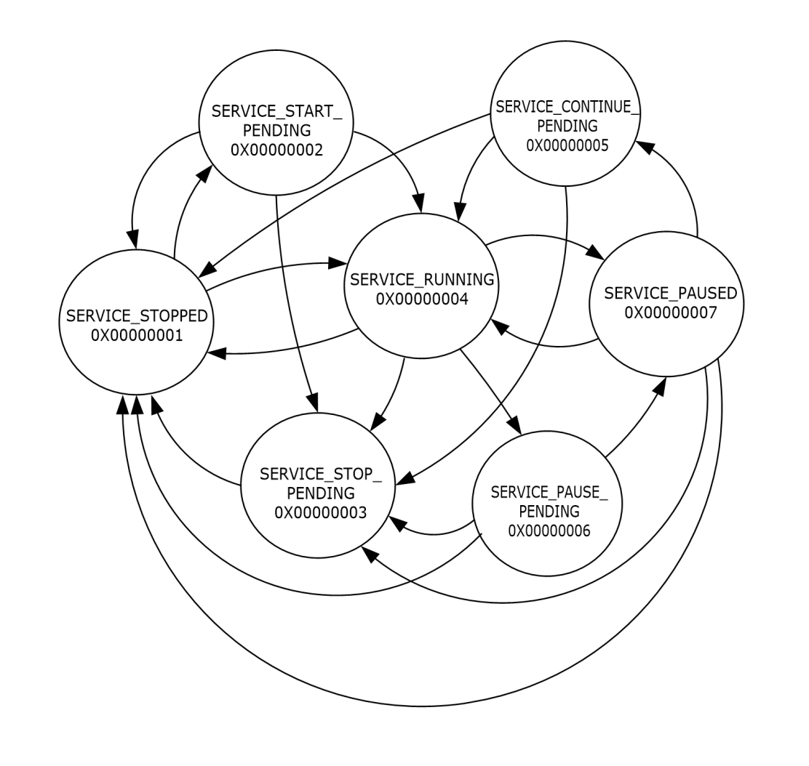

[MS-SCMR]:

Service Control Manager Remote Protocol

Intellectual Property Rights Notice for Open Specifications Documentation

  Technical Documentation. Microsoft publishes Open Specifications documentation (“this

documentation”) for protocols, file formats, data portability, computer languages, and standards
support. Additionally, overview documents cover inter-protocol relationships and interactions.

  Copyrights. This documentation is covered by Microsoft copyrights. Regardless of any other

terms that are contained in the terms of use for the Microsoft website that hosts this
documentation, you can make copies of it in order to develop implementations of the technologies
that are described in this documentation and can distribute portions of it in your implementations
that use these technologies or in your documentation as necessary to properly document the
implementation. You can also distribute in your implementation, with or without modification, any
schemas, IDLs, or code samples that are included in the documentation. This permission also
applies to any documents that are referenced in the Open Specifications documentation.
  No Trade Secrets. Microsoft does not claim any trade secret rights in this documentation.
  Patents. Microsoft has patents that might cover your implementations of the technologies

described in the Open Specifications documentation. Neither this notice nor Microsoft's delivery of
this documentation grants any licenses under those patents or any other Microsoft patents.
However, a given Open Specifications document might be covered by the Microsoft Open
Specifications Promise or the Microsoft Community Promise. If you would prefer a written license,
or if the technologies described in this documentation are not covered by the Open Specifications
Promise or Community Promise, as applicable, patent licenses are available by contacting
iplg@microsoft.com.

  License Programs. To see all of the protocols in scope under a specific license program and the

associated patents, visit the Patent Map.

  Trademarks. The names of companies and products contained in this documentation might be
covered by trademarks or similar intellectual property rights. This notice does not grant any
licenses under those rights. For a list of Microsoft trademarks, visit
www.microsoft.com/trademarks.

  Fictitious Names. The example companies, organizations, products, domain names, email

addresses, logos, people, places, and events that are depicted in this documentation are fictitious.
No association with any real company, organization, product, domain name, email address, logo,
person, place, or event is intended or should be inferred.

Reservation of Rights. All other rights are reserved, and this notice does not grant any rights other
than as specifically described above, whether by implication, estoppel, or otherwise.

Tools. The Open Specifications documentation does not require the use of Microsoft programming
tools or programming environments in order for you to develop an implementation. If you have access
to Microsoft programming tools and environments, you are free to take advantage of them. Certain
Open Specifications documents are intended for use in conjunction with publicly available standards
specifications and network programming art and, as such, assume that the reader either is familiar
with the aforementioned material or has immediate access to it.

Support. For questions and support, please contact dochelp@microsoft.com.

[MS-SCMR] - v20250811
Service Control Manager Remote Protocol
Copyright © 2025 Microsoft Corporation
Release: August 11, 2025

1 / 178

Revision Summary

Date

Revision
History

Revision
Class

Comments

5/11/2007

1.0

Major

Version 1.0 release

6/1/2007

1.0.1

Editorial

Changed language and formatting in the technical content.

7/3/2007

1.0.2

Editorial

Changed language and formatting in the technical content.

8/10/2007

1.1

9/28/2007

1.2

Minor

Minor

Revised content based on feedback.

Revised content based on feedback.

10/23/2007  1.2.1

Editorial

Changed language and formatting in the technical content.

1/25/2008

1.2.2

Editorial

Changed language and formatting in the technical content.

3/14/2008

2.0

6/20/2008

3.0

Major

Major

Updated and revised the technical content.

Updated and revised the technical content.

7/25/2008

3.0.1

Editorial

Changed language and formatting in the technical content.

8/29/2008

3.1

Minor

Clarified the meaning of the technical content.

10/24/2008  3.1.1

Editorial

Changed language and formatting in the technical content.

12/5/2008

4.0

1/16/2009

5.0

2/27/2009

6.0

4/10/2009

7.0

5/22/2009

8.0

7/2/2009

9.0

8/14/2009

10.0

9/25/2009

11.0

11/6/2009

12.0

12/18/2009  13.0

1/29/2010

13.1

3/12/2010

14.0

4/23/2010

15.0

6/4/2010

16.0

7/16/2010

17.0

8/27/2010

18.0

10/8/2010

18.1

11/19/2010  19.0

Major

Major

Major

Major

Major

Major

Major

Major

Major

Major

Minor

Major

Major

Major

Major

Major

Minor

Major

Updated and revised the technical content.

Updated and revised the technical content.

Updated and revised the technical content.

Updated and revised the technical content.

Updated and revised the technical content.

Updated and revised the technical content.

Updated and revised the technical content.

Updated and revised the technical content.

Updated and revised the technical content.

Updated and revised the technical content.

Clarified the meaning of the technical content.

Updated and revised the technical content.

Updated and revised the technical content.

Updated and revised the technical content.

Updated and revised the technical content.

Updated and revised the technical content.

Clarified the meaning of the technical content.

Updated and revised the technical content.

[MS-SCMR] - v20250811
Service Control Manager Remote Protocol
Copyright © 2025 Microsoft Corporation
Release: August 11, 2025

2 / 178

Date

Revision
History

Revision
Class

Comments

1/7/2011

19.0

2/11/2011

20.0

3/25/2011

21.0

5/6/2011

22.0

6/17/2011

22.1

9/23/2011

22.1

None

Major

Major

Major

Minor

None

No changes to the meaning, language, or formatting of the
technical content.

Updated and revised the technical content.

Updated and revised the technical content.

Updated and revised the technical content.

Clarified the meaning of the technical content.

No changes to the meaning, language, or formatting of the
technical content.

12/16/2011  23.0

Major

Updated and revised the technical content.

3/30/2012

23.0

7/12/2012

24.0

10/25/2012  24.1

1/31/2013

25.0

8/8/2013

26.0

11/14/2013  26.0

None

Major

Minor

Major

Major

None

No changes to the meaning, language, or formatting of the
technical content.

Updated and revised the technical content.

Clarified the meaning of the technical content.

Updated and revised the technical content.

Updated and revised the technical content.

No changes to the meaning, language, or formatting of the
technical content.

2/13/2014

26.0

None

No changes to the meaning, language, or formatting of the
technical content.

5/15/2014

26.0

None

No changes to the meaning, language, or formatting of the
technical content.

6/30/2015

27.0

Major

Significantly changed the technical content.

10/16/2015  27.0

None

No changes to the meaning, language, or formatting of the
technical content.

7/14/2016

27.0

None

No changes to the meaning, language, or formatting of the
technical content.

6/1/2017

27.0

9/15/2017

27.1

9/12/2018

28.0

3/13/2019

29.0

9/23/2019

30.0

4/7/2021

31.0

6/25/2021

32.0

4/29/2022

33.0

4/23/2024

34.0

None

Minor

Major

Major

Major

Major

Major

Major

Major

[MS-SCMR] - v20250811
Service Control Manager Remote Protocol
Copyright © 2025 Microsoft Corporation
Release: August 11, 2025

No changes to the meaning, language, or formatting of the
technical content.

Clarified the meaning of the technical content.

Significantly changed the technical content.

Significantly changed the technical content.

Significantly changed the technical content.

Significantly changed the technical content.

Significantly changed the technical content.

Significantly changed the technical content.

Significantly changed the technical content.

3 / 178

Date

Revision
History

Revision
Class

Comments

8/11/2025

35.0

Major

Significantly changed the technical content.

[MS-SCMR] - v20250811
Service Control Manager Remote Protocol
Copyright © 2025 Microsoft Corporation
Release: August 11, 2025

4 / 178

Table of Contents

1.1
1.2

1.2.1
1.2.2

1  Introduction ............................................................................................................ 8
Glossary ........................................................................................................... 8
References ...................................................................................................... 10
Normative References ................................................................................. 11
Informative References ............................................................................... 11
Overview ........................................................................................................ 12
Relationship to Other Protocols .......................................................................... 12
Prerequisites/Preconditions ............................................................................... 12
Applicability Statement ..................................................................................... 12
Versioning and Capability Negotiation ................................................................. 12
Vendor-Extensible Fields ................................................................................... 13
Standards Assignments ..................................................................................... 13

1.3
1.4
1.5
1.6
1.7
1.8
1.9

2.2

2.1

2.1.1
2.1.2

2  Messages ............................................................................................................... 14
Transport ........................................................................................................ 14
Server ....................................................................................................... 14
Client ........................................................................................................ 14
Common Data Types ........................................................................................ 14
SECURITY_INFORMATION ............................................................................ 15
2.2.1
SVCCTL_HANDLEA ...................................................................................... 15
2.2.2
SVCCTL_HANDLEW ..................................................................................... 15
2.2.3
SC_RPC_HANDLE ........................................................................................ 15
2.2.4
SC_RPC_LOCK ........................................................................................... 16
2.2.5
SC_NOTIFY_RPC_HANDLE ........................................................................... 16
2.2.6
BOUNDED_DWORD_4K ............................................................................... 16
2.2.7
BOUNDED_DWORD_8K ............................................................................... 16
2.2.8
BOUNDED_DWORD_256K ............................................................................ 16
2.2.9
ENUM_SERVICE_STATUSA ........................................................................... 17
2.2.10
ENUM_SERVICE_STATUSW .......................................................................... 17
2.2.11
ENUM_SERVICE_STATUS_PROCESSA ............................................................ 17
2.2.12
2.2.13
ENUM_SERVICE_STATUS_PROCESSW ........................................................... 18
2.2.14  QUERY_SERVICE_CONFIGA ......................................................................... 18
2.2.15  QUERY_SERVICE_CONFIGW ......................................................................... 20
2.2.16  QUERY_SERVICE_LOCK_STATUSA ................................................................ 21
2.2.17  QUERY_SERVICE_LOCK_STATUSW ............................................................... 22
SC_ACTION_TYPE ....................................................................................... 22
2.2.18
SC_ACTION ............................................................................................... 23
2.2.19
SC_ENUM_TYPE.......................................................................................... 23
2.2.20
SC_RPC_CONFIG_INFOA ............................................................................. 23
2.2.21
SC_RPC_CONFIG_INFOW ............................................................................ 24
2.2.22
SC_RPC_NOTIFY_PARAMS ........................................................................... 25
2.2.23
SC_RPC_NOTIFY_PARAMS_LIST ................................................................... 25
2.2.24
SC_RPC_SERVICE_CONTROL_IN_PARAMSA ................................................... 26
2.2.25
SC_RPC_SERVICE_CONTROL_IN_PARAMSW .................................................. 26
2.2.26
SC_RPC_SERVICE_CONTROL_OUT_PARAMSA ................................................ 26
2.2.27
SC_RPC_SERVICE_CONTROL_OUT_PARAMSW ............................................... 26
2.2.28
SC_STATUS_TYPE ....................................................................................... 27
2.2.29
SERVICE_CONTROL_STATUS_REASON_IN_PARAMSA ..................................... 27
2.2.30
SERVICE_CONTROL_STATUS_REASON_IN_PARAMSW ..................................... 29
2.2.31
SERVICE_CONTROL_STATUS_REASON_OUT_PARAMS ..................................... 32
2.2.32
SERVICE_DELAYED_AUTO_START_INFO ........................................................ 32
2.2.33
SERVICE_DESCRIPTIONA ............................................................................ 32
2.2.34
SERVICE_DESCRIPTIONW ........................................................................... 33
2.2.35
SERVICE_DESCRIPTION_WOW64 ................................................................. 33
2.2.36
SERVICE_FAILURE_ACTIONS_WOW64 .......................................................... 33
2.2.37

[MS-SCMR] - v20250811
Service Control Manager Remote Protocol
Copyright © 2025 Microsoft Corporation
Release: August 11, 2025

5 / 178

2.2.38
2.2.39
2.2.40
2.2.41
2.2.42
2.2.43
2.2.44
2.2.45
2.2.46
2.2.47
2.2.48
2.2.49
2.2.50
2.2.51
2.2.52
2.2.53
2.2.54
2.2.55
2.2.56
2.2.57

SERVICE_REQUIRED_PRIVILEGES_INFO_WOW64 .......................................... 34
SERVICE_FAILURE_ACTIONSA ..................................................................... 34
SERVICE_FAILURE_ACTIONSW .................................................................... 34
SERVICE_FAILURE_ACTIONS_FLAG .............................................................. 35
SERVICE_NOTIFY_STATUS_CHANGE_PARAMS ............................................... 35
SERVICE_NOTIFY_STATUS_CHANGE_PARAMS_1 ............................................ 36
SERVICE_NOTIFY_STATUS_CHANGE_PARAMS_2 ............................................ 37
SERVICE_PRESHUTDOWN_INFO ................................................................... 38
SERVICE_SID_INFO .................................................................................... 38
SERVICE_STATUS ....................................................................................... 39
SERVICE_RPC_REQUIRED_PRIVILEGES_INFO ................................................ 41
SERVICE_STATUS_PROCESS ........................................................................ 41
STRING_PTRSA .......................................................................................... 44
STRING_PTRSW ......................................................................................... 44
SERVICE_TRIGGER_SPECIFIC_DATA_ITEM .................................................... 44
SERVICE_TRIGGER ..................................................................................... 44
SERVICE_TRIGGER_INFO ............................................................................ 47
SERVICE_PREFERRED_NODE_INFO ............................................................... 47
svcctl Interface Constants ............................................................................ 48
Common Error Codes .................................................................................. 48

3.1

3.1.1
3.1.2
3.1.3
3.1.4

3  Protocol Details ..................................................................................................... 49
Server Details .................................................................................................. 49
Abstract Data Model .................................................................................... 49
Timers ...................................................................................................... 57
Initialization ............................................................................................... 58
Message Processing Events and Sequencing Rules .......................................... 58
RCloseServiceHandle (Opnum 0) ............................................................. 63
RControlService (Opnum 1) .................................................................... 64
RDeleteService (Opnum 2) ..................................................................... 66
RLockServiceDatabase (Opnum 3) .......................................................... 67
RQueryServiceObjectSecurity (Opnum 4) ................................................. 68
RSetServiceObjectSecurity (Opnum 5) ..................................................... 69
RQueryServiceStatus (Opnum 6) ............................................................ 70
RSetServiceStatus (Opnum 7) ................................................................ 71
RUnlockServiceDatabase (Opnum 8) ....................................................... 72
RNotifyBootConfigStatus (Opnum 9) ........................................................ 73
RChangeServiceConfigW (Opnum 11) ...................................................... 74
RCreateServiceW (Opnum 12) ................................................................ 78
REnumDependentServicesW (Opnum 13) ................................................. 82
REnumServicesStatusW (Opnum 14) ....................................................... 83
ROpenSCManagerW (Opnum 15) ............................................................ 85
ROpenServiceW (Opnum 16) .................................................................. 86
RQueryServiceConfigW (Opnum 17) ........................................................ 87
RQueryServiceLockStatusW (Opnum 18).................................................. 88
RStartServiceW (Opnum 19) .................................................................. 89
RGetServiceDisplayNameW (Opnum 20) .................................................. 91
RGetServiceKeyNameW (Opnum 21) ....................................................... 92
RChangeServiceConfigA (Opnum 23) ....................................................... 92
RCreateServiceA (Opnum 24) ................................................................. 96
REnumDependentServicesA (Opnum 25) ................................................ 100
REnumServicesStatusA (Opnum 26) ....................................................... 102
ROpenSCManagerA (Opnum 27) ............................................................ 104
ROpenServiceA (Opnum 28) .................................................................. 105
RQueryServiceConfigA (Opnum 29) ........................................................ 106
RQueryServiceLockStatusA (Opnum 30) ................................................. 107
RStartServiceA (Opnum 31) .................................................................. 107
RGetServiceDisplayNameA (Opnum 32) .................................................. 109

3.1.4.1
3.1.4.2
3.1.4.3
3.1.4.4
3.1.4.5
3.1.4.6
3.1.4.7
3.1.4.8
3.1.4.9
3.1.4.10
3.1.4.11
3.1.4.12
3.1.4.13
3.1.4.14
3.1.4.15
3.1.4.16
3.1.4.17
3.1.4.18
3.1.4.19
3.1.4.20
3.1.4.21
3.1.4.22
3.1.4.23
3.1.4.24
3.1.4.25
3.1.4.26
3.1.4.27
3.1.4.28
3.1.4.29
3.1.4.30
3.1.4.31

[MS-SCMR] - v20250811
Service Control Manager Remote Protocol
Copyright © 2025 Microsoft Corporation
Release: August 11, 2025

6 / 178

3.1.4.32
3.1.4.33
3.1.4.34
3.1.4.35
3.1.4.36
3.1.4.37
3.1.4.38
3.1.4.39
3.1.4.40
3.1.4.41
3.1.4.42
3.1.4.43
3.1.4.44
3.1.4.45
3.1.4.46
3.1.4.47
3.1.4.48
3.1.4.49
3.1.4.50

RGetServiceKeyNameA (Opnum 33) ....................................................... 110
REnumServiceGroupW (Opnum 35) ........................................................ 111
RChangeServiceConfig2A (Opnum 36) .................................................... 113
RChangeServiceConfig2W (Opnum 37) ................................................... 114
RQueryServiceConfig2A (Opnum 38) ...................................................... 115
RQueryServiceConfig2W (Opnum 39) ..................................................... 117
RQueryServiceStatusEx (Opnum 40) ...................................................... 119
REnumServicesStatusExA (Opnum 41) ................................................... 120
REnumServicesStatusExW (Opnum 42) .................................................. 122
RCreateServiceWOW64A (Opnum 44) ..................................................... 125
RCreateServiceWOW64W (Opnum 45) .................................................... 129
RNotifyServiceStatusChange (Opnum 47) ............................................... 132
RGetNotifyResults (Opnum 48) .............................................................. 134
RCloseNotifyHandle (Opnum 49) ............................................................ 134
RControlServiceExA (Opnum 50) ............................................................ 135
RControlServiceExW (Opnum 51) ........................................................... 138
RQueryServiceConfigEx (Opnum 56) ...................................................... 140
RCreateWowService (Opnum 60) ........................................................... 141
ROpenSCManager2 (Opnum 64) ............................................................ 147
Timer Events ............................................................................................. 148
Other Local Events ..................................................................................... 148
Conversion Between ANSI and Unicode String Formats................................... 148
RPC Runtime Check Notes ................................................................................ 148

3.1.5
3.1.6
3.1.7

3.2

4  Protocol Examples ............................................................................................... 149

5  Security ............................................................................................................... 150
Security Considerations for Implementers .......................................................... 150
Index of Security Parameters ........................................................................... 150

5.1
5.2

6  Appendix A: Full IDL ............................................................................................ 151

7  Appendix B: Product Behavior ............................................................................. 166

8  Change Tracking .................................................................................................. 174

9  Index ................................................................................................................... 175

[MS-SCMR] - v20250811
Service Control Manager Remote Protocol
Copyright © 2025 Microsoft Corporation
Release: August 11, 2025

7 / 178

1  Introduction

The Service Control Manager Remote Protocol is a remote procedure call (RPC)–based client/server
protocol that is used for remotely managing the Service Control Manager (SCM). The SCM is an
RPC server that enables service configuration and control of service programs. For more information,
see [MSDN-WINSVC].

Sections 1.5, 1.8, 1.9, 2, and 3 of this specification are normative. All other sections and examples in
this specification are informative.

1.1  Glossary

This document uses the following terms:

access control entry (ACE): An entry in an access control list (ACL) that contains a set of user
rights and a security identifier (SID) that identifies a principal for whom the rights are
allowed, denied, or audited.

American National Standards Institute (ANSI) character set: A character set defined by a

code page approved by the American National Standards Institute (ANSI). The term "ANSI" as
used to signify Windows code pages is a historical reference and a misnomer that persists in the
Windows community. The source of this misnomer stems from the fact that the Windows code
page 1252 was originally based on an ANSI draft, which became International Organization for
Standardization (ISO) Standard 8859-1 [ISO/IEC-8859-1]. In Windows, the ANSI character set
can be any of the following code pages: 1252, 1250, 1251, 1253, 1254, 1255, 1256, 1257,
1258, 874, 932, 936, 949, or 950. For example, "ANSI application" is usually a reference to a
non-Unicode or code-page-based application. Therefore, "ANSI character set" is often misused
to refer to one of the character sets defined by a Windows code page that can be used as an
active system code page; for example, character sets defined by code page 1252 or character
sets defined by code page 950. Windows is now based on Unicode, so the use of ANSI character
sets is strongly discouraged unless they are used to interoperate with legacy applications or
legacy data.

authentication level: A numeric value indicating the level of authentication or message protection

that remote procedure call (RPC) will apply to a specific message exchange. For more
information, see [C706] section 13.1.2.1 and [MS-RPCE].

Authentication Service (AS): A service that issues ticket granting tickets (TGTs), which are used
for authenticating principals within the realm or domain served by the Authentication Service.

code page: An ordered set of characters of a specific script in which a numerical index (code-point

value) is associated with each character. Code pages are a means of providing support for
character sets and keyboard layouts used in different countries/regions. Devices such as the
display and keyboard can be configured to use a specific code page and to switch from one code
page (such as the United States) to another (such as Portugal) at the user's request.

delayed start group: A service group initialized following a delay after the initial system boot for

the purpose of improving system-boot performance.

device interface class: A way of exporting device and driver functionality to other components,
including other drivers and user-mode applications. A driver can register a device interface
class, and then enable an instance of the class for each device object to which user-mode I/O
requests might be sent. On the highest level, a device interface class is a grouping of devices
by functionality. Each device interface class is associated with a GUID. Vendors can create
and define their own GUIDs for device interface classes.

[MS-SCMR] - v20250811
Service Control Manager Remote Protocol
Copyright © 2025 Microsoft Corporation
Release: August 11, 2025

8 / 178

discretionary access control list (DACL): An access control list (ACL) that is controlled by the
owner of an object and that specifies the access particular users or groups can have to the
object.

globally unique identifier (GUID): A term used interchangeably with universally unique

identifier (UUID) in Microsoft protocol technical documents (TDs). Interchanging the usage of
these terms does not imply or require a specific algorithm or mechanism to generate the value.
Specifically, the use of this term does not imply or require that the algorithms described in
[RFC4122] or [C706] have to be used for generating the GUID. See also universally unique
identifier (UUID).

Interface Definition Language (IDL): The International Standards Organization (ISO) standard

language for specifying the interface for remote procedure calls. For more information, see
[C706] section 4.

load-order group: A service group for the purpose of service loading and initialization ordering.

Microsoft Interface Definition Language (MIDL): The Microsoft implementation and extension
of the OSF-DCE Interface Definition Language (IDL). MIDL can also mean the Interface
Definition Language (IDL) compiler provided by Microsoft. For more information, see [MS-
RPCE].

named pipe: A named, one-way, or duplex pipe for communication between a pipe server and one

or more pipe clients.

NUMA Node: An arrangement of processors and memory within a system supporting Non-Uniform

Memory Access (NUMA) technology [MSDN-NUMA].

opnum: An operation number or numeric identifier that is used to identify a specific remote

procedure call (RPC) method or a method in an interface. For more information, see [C706]
section 12.5.2.12 or [MS-RPCE].

remote procedure call (RPC): A communication protocol used primarily between client and

server. The term has three definitions that are often used interchangeably: a runtime
environment providing for communication facilities between computers (the RPC runtime); a set
of request-and-response message exchanges between computers (the RPC exchange); and the
single message from an RPC exchange (the RPC message).  For more information, see [C706].

RPC context handle: A representation of state maintained between a remote procedure call (RPC)
client and server. The state is maintained on the server on behalf of the client. An RPC context
handle is created by the server and given to the client. The client passes the RPC context handle
back to the server in method calls to assist in identifying the state. For more information, see
[C706].

RPC protocol sequence: A character string that represents a valid combination of a remote

procedure call (RPC) protocol, a network layer protocol, and a transport layer protocol, as
described in [C706] and [MS-RPCE].

RPC server: A computer on the network that waits for messages, processes them when they

arrive, and sends responses using RPC as its transport acts as the responder during a remote
procedure call (RPC) exchange.

RPC transport: The underlying network services used by the remote procedure call (RPC) runtime

for communications between network nodes. For more information, see [C706] section 2.

security descriptor: A data structure containing the security information associated with a

securable object. A security descriptor identifies an object's owner by its security identifier
(SID). If access control is configured for the object, its security descriptor contains a
discretionary access control list (DACL) with SIDs for the security principals who are
allowed or denied access. Applications use this structure to set and query an object's security

9 / 178

[MS-SCMR] - v20250811
Service Control Manager Remote Protocol
Copyright © 2025 Microsoft Corporation
Release: August 11, 2025

status. The security descriptor is used to guard access to an object as well as to control which
type of auditing takes place when the object is accessed. The security descriptor format is
specified in [MS-DTYP] section 2.4.6; a string representation of security descriptors, called
SDDL, is specified in [MS-DTYP] section 2.5.1.

security identifier (SID): An identifier for security principals that is used to identify an account
or a group. Conceptually, the SID is composed of an account authority portion (typically a
domain) and a smaller integer representing an identity relative to the account authority, termed
the relative identifier (RID). The SID format is specified in [MS-DTYP] section 2.4.2; a string
representation of SIDs is specified in [MS-DTYP] section 2.4.2 and [MS-AZOD] section 1.1.1.2.

Server Message Block (SMB): A protocol that is used to request file and print services from
server systems over a network. The SMB protocol extends the CIFS protocol with additional
security, file, and disk management support. For more information, see [CIFS] and [MS-SMB].

service: A program that is managed by the Service Control Manager (SCM). The execution of

this program is governed by the rules defined by the SCM.

Service Control Manager (SCM): An RPC server that enables configuration and control of

service programs.

service group: A set of services that are grouped together for dependency or load-ordering

purposes.

service record: An entry in the SCM database that contains the configuration information

associated with a service.

session key: A relatively short-lived symmetric key (a cryptographic key negotiated by the client
and the server based on a shared secret). A session key's lifespan is bounded by the session
to which it is associated. A session key has to be strong enough to withstand cryptanalysis for
the lifespan of the session.

system access control list (SACL): An access control list (ACL) that controls the generation of
audit messages for attempts to access a securable object. The ability to get or set an object's
SACL is controlled by a privilege typically held only by system administrators.

Unicode: A character encoding standard developed by the Unicode Consortium that represents

almost all of the written languages of the world. The Unicode standard [UNICODE5.0.0/2007]
provides three forms (UTF-8, UTF-16, and UTF-32) and seven schemes (UTF-8, UTF-16, UTF-16
BE, UTF-16 LE, UTF-32, UTF-32 LE, and UTF-32 BE).

universally unique identifier (UUID): A 128-bit value. UUIDs can be used for multiple

purposes, from tagging objects with an extremely short lifetime, to reliably identifying very
persistent objects in cross-process communication such as client and server interfaces, manager
entry-point vectors, and RPC objects. UUIDs are highly likely to be unique. UUIDs are also
known as globally unique identifiers (GUIDs) and these terms are used interchangeably in
the Microsoft protocol technical documents (TDs). Interchanging the usage of these terms does
not imply or require a specific algorithm or mechanism to generate the UUID. Specifically, the
use of this term does not imply or require that the algorithms described in [RFC4122] or [C706]
has to be used for generating the UUID.

well-known endpoint: A preassigned, network-specific, stable address for a particular

client/server instance. For more information, see [C706].

MAY, SHOULD, MUST, SHOULD NOT, MUST NOT: These terms (in all caps) are used as defined
in [RFC2119]. All statements of optional behavior use either MAY, SHOULD, or SHOULD NOT.

[MS-SCMR] - v20250811
Service Control Manager Remote Protocol
Copyright © 2025 Microsoft Corporation
Release: August 11, 2025

10 / 178

1.2  References

Links to a document in the Microsoft Open Specifications library point to the correct section in the
most recently published version of the referenced document. However, because individual documents
in the library are not updated at the same time, the section numbers in the documents may not
match. You can confirm the correct section numbering by checking the Errata.

1.2.1  Normative References

We conduct frequent surveys of the normative references to assure their continued availability. If you
have any issue with finding a normative reference, please contact dochelp@microsoft.com. We will
assist you in finding the relevant information.

[C706] The Open Group, "DCE 1.1: Remote Procedure Call", C706, August 1997,
https://publications.opengroup.org/c706

Note Registration is required to download the document.

[MS-CIFS] Microsoft Corporation, "Common Internet File System (CIFS) Protocol".

[MS-DTYP] Microsoft Corporation, "Windows Data Types".

[MS-LSAD] Microsoft Corporation, "Local Security Authority (Domain Policy) Remote Protocol".

[MS-RPCE] Microsoft Corporation, "Remote Procedure Call Protocol Extensions".

[MS-SMB] Microsoft Corporation, "Server Message Block (SMB) Protocol".

[MS-UCODEREF] Microsoft Corporation, "Windows Protocols Unicode Reference".

[RFC2119] Bradner, S., "Key words for use in RFCs to Indicate Requirement Levels", BCP 14, RFC
2119, March 1997, https://www.rfc-editor.org/info/rfc2119

1.2.2  Informative References

[MS-AZOD] Microsoft Corporation, "Authorization Protocols Overview".

[MSDN-CtrlSvcEx] Microsoft Corporation, "ControlServiceEx function", http://msdn.microsoft.com/en-
us/library/ms682110(VS.85).aspx

[MSDN-CtrlSvc] Microsoft Corporation, "ControlService function", http://msdn.microsoft.com/en-
us/library/ms682108(VS.85).asp

[MSDN-MIDL] Microsoft Corporation, "Microsoft Interface Definition Language (MIDL)",
http://msdn.microsoft.com/en-us/library/ms950375.aspx

[MSDN-NUMA] Microsoft Corporation, "NUMA Architecture", https://learn.microsoft.com/en-
us/windows/win32/procthread/numa-support

[MSDN-SetSvcStatus] Microsoft Corporation, "SetServiceStatus function",
http://msdn.microsoft.com/en-us/library/ms686241(VS.85).aspx

[MSDN-STARTSERVICE] Microsoft Corporation, "StartService function",
http://msdn.microsoft.com/en-us/library/ms686321.aspx

[MSDN-WinDriverKit] Microsoft Corporation, "Windows Driver Kit Introduction",
https://learn.microsoft.com/en-us/windows-hardware/drivers/

[MS-SCMR] - v20250811
Service Control Manager Remote Protocol
Copyright © 2025 Microsoft Corporation
Release: August 11, 2025

11 / 178

[MSDN-WINSVC] Microsoft Corporation, "Services", http://msdn.microsoft.com/en-
us/library/ms685141.aspx

[SPNNAMES] Microsoft Corporation, "Name Formats for Unique SPNs", http://msdn.microsoft.com/en-
us/library/ms677601.aspx

1.3  Overview

The Service Control Manager Remote Protocol is a client/server protocol used for configuring and
controlling service programs running on a remote computer. A remote service management session
begins with the client initiating the connection request to the server. If the server grants the request,
the connection is established. The client can then make multiple requests to modify, query the
configuration, or start and stop services on the server by using the same session until the session is
terminated.

A typical Service Control Manager Remote Protocol session involves the client connecting to the server
and requesting to open the SCM on the server. If the server accepts the request, it responds with an
RPC context handle to the client. The client uses this RPC context handle to operate on the server.
This usually involves sending another request to the server and specifying the type of operation to
perform and any specific parameters associated with that operation. If the server accepts this request,
it attempts to perform the specified operation and responds to the client with the result of the
operation. After the client is finished operating on the server, it terminates the protocol by sending a
request to close the RPC context handle.

The Service Control Manager Remote Protocol maintains an internal database to store service program
configurations and state. The Service Control Manager Protocol has exclusive access to this internal
database. On one operating system instance there is only one SCM and one corresponding SCM
database. Any updates to this internal database are made only through the Service Control Manager
Remote Protocol. SCM takes care of serializing all concurrent accesses to the SCM database. The SCM
database is resident in memory; it is recreated every time the SCM restarts (after each reboot). Part
of the SCM database is retrieved from persistent storage (all information regarding registered
services) and partially nonpersistent (current active state of the services). The persistent information
is modified by the SCM when a service is added, configured, or deleted. Any attempt to directly modify
the persistent part of the database directly in the persistent storage is not a supported scenario and
will result in possible inconsistencies. Finally, if SCM were to be forcefully terminated, the operating
system will shut down and restart.

1.4  Relationship to Other Protocols

The Service Control Manager Remote Protocol uses RPC as its transport protocol.

1.5  Prerequisites/Preconditions

This protocol requires that the client and server be able to communicate via an RPC connection, as
specified in section 2.1.

1.6  Applicability Statement

This protocol is appropriate for managing a service management agent, such as an SCM, on a remote
computer.

1.7  Versioning and Capability Negotiation

This document covers versioning issues in the following areas:

[MS-SCMR] - v20250811
Service Control Manager Remote Protocol
Copyright © 2025 Microsoft Corporation
Release: August 11, 2025

12 / 178

  Supported Transports: This protocol uses multiple RPC protocol sequences, as specified in

section 2.1.

  Security and Authentication Methods: The RPC server in this protocol uses either

RPC_C_AUTHN_GSS_NEGOTIATE or RPC_C_AUTHN_WINNT authorization. This is discussed in
section 2.1.

1.8  Vendor-Extensible Fields

None.

1.9  Standards Assignments

The Service Control Manager Remote Protocol has no standards assignments, only private
assignments made by Microsoft using allocation procedures specified in other protocols.

Microsoft has allocated to this protocol an RPC interface universally unique identifier (UUID)
(using the procedure specified in [C706]) and a named pipe (as specified in [MS-SMB]). The
assignments are as follows.

Parameter

Value

RPC interface UUID   {367ABB81-9844-35F1-AD32-98F038001003}

Named pipe

\PIPE\svcctl

[MS-SCMR] - v20250811
Service Control Manager Remote Protocol
Copyright © 2025 Microsoft Corporation
Release: August 11, 2025

13 / 178

2  Messages

The following sections specify how Service Control Manager Remote Protocol messages are
transported and specify common data types.

2.1  Transport

The Service Control Manager Remote Protocol MUST use RPC as the transport protocol.

2.1.1  Server

The server interface is identified by UUID 367ABB81-9844-35F1-AD32-98F038001003, version 2.0,
using the RPC well-known endpoint "\PIPE\svcctl". The server MUST use RPC over SMB, ncacn_np
or RPC over TCP, or ncacn_ip_tcp as the RPC protocol sequence to the RPC implementation, as
specified in [MS-RPCE]. The server MUST specify the Simple and Protected GSS-API Negotiation
Mechanism (SPNEGO) (0x9) or NT LAN Manager (NTLM) (0xA), or both, as the RPC Authentication
Service (as specified in [MS-RPCE]). See [MS-RPCE] section 3.3.1.5.2.2 and [C706] section 13.

2.1.2  Client

The client MUST use RPC over SMB, ncacn_np (as specified in [MS-RPCE]) or RPC over TCP,
ncacn_ip_tcp (as specified in [MS-RPCE]) as the RPC protocol sequence to communicate with the
server. The client MUST specify either "Simple and Protected GSS-API Negotiation Mechanism
(SPNEGO)" (0x9) or "NT LAN Manager (NTLM)" (0xA), as specified in [MS-RPCE], as the
Authentication Service. When using "SPNEGO" as the Authentication Service, the client SHOULD
supply a service principal name (SPN) of "host/hostname" where hostname is the actual name of the
server to which the client is connecting and host is the literal string "host/" (for more information, see
[SPNNAMES]).

The RPC client MAY use an authentication level of RPC_C_AUTHN_LEVEL_PKT_PRIVACY.<1>

2.2  Common Data Types

In addition to RPC base types and definitions specified in [C706] and [MS-RPCE], the following
sections use these definitions, as specified in [MS-DTYP]. Unless specified, all characters are accepted
for the strings described in each section.

  BOOL

  BYTE

  CHAR

  DWORD









LPCSTR

LPCWSTR

LPWSTR

PSTR

  UCHAR

  VOID

[MS-SCMR] - v20250811
Service Control Manager Remote Protocol
Copyright © 2025 Microsoft Corporation
Release: August 11, 2025

14 / 178

  WCHAR

The additional data types given in the following sections are defined in the MIDL specification of this
RPC interface.

2.2.1  SECURITY_INFORMATION

The following bit flags indicate which components to include in a SECURITY_DESCRIPTOR structure
that clients and servers can use to specify access types.

Value

Meaning

DACL_SECURITY_INFORMATION

0x00000004

If set, the security descriptor MUST include the object's discretionary
access control list (DACL). DACL information is specified in [MS-AZOD]
section 1.1.1.3.

GROUP_SECURITY_INFORMATION

0x00000002

If set, specifies the security identifier (SID), as defined in [MS-DTYP]
section 2.4.2, (LSAPR_SID) of the object's primary group. Primary group
information is specified in [MS-DTYP].

OWNER_SECURITY_INFORMATION

0x00000001

If set, specifies the security identifier (SID) (LSAPR_SID) of the object's
owner.

SACL_SECURITY_INFORMATION

0x00000008

If set, the security descriptor MUST include the object's system access
control list (SACL). SACL information is specified in [MS-AZOD] section
1.1.1.3.

LABEL_SECURITY_INFORMATION

0x00000010

If set, specifies the mandatory integrity label. The mandatory integrity label
is an ACE in the SACL of the object.

This type is declared as follows:

 typedef unsigned long SECURITY_INFORMATION;

2.2.2  SVCCTL_HANDLEA

An RPC binding handle to the server, represented as an American National Standards Institute
(ANSI) character set string. This ANSI string and all ANSI references in the rest of this document
use the ANSI code page specified by the operating system.

This type is declared as follows:

 typedef [handle] LPSTR SVCCTL_HANDLEA;

2.2.3  SVCCTL_HANDLEW

An RPC binding handle represented as a Unicode string.

This type is declared as follows:

 typedef [handle] wchar_t* SVCCTL_HANDLEW;

2.2.4  SC_RPC_HANDLE

Defines an RPC context handle to the SCM or a service on the server.

15 / 178

[MS-SCMR] - v20250811
Service Control Manager Remote Protocol
Copyright © 2025 Microsoft Corporation
Release: August 11, 2025

 typedef [context_handle] PVOID SC_RPC_HANDLE;
 typedef SC_RPC_HANDLE* LPSC_RPC_HANDLE;

2.2.5  SC_RPC_LOCK

Defines an RPC context handle to a locked SCM database on the server.

 typedef [context_handle] PVOID SC_RPC_LOCK;
 typedef SC_RPC_LOCK* LPSC_RPC_LOCK;

2.2.6  SC_NOTIFY_RPC_HANDLE

Defines an RPC context handle used to monitor changes on a service on the server.

 typedef [context_handle] PVOID SC_NOTIFY_RPC_HANDLE;
 typedef SC_NOTIFY_RPC_HANDLE* LPSC_NOTIFY_RPC_HANDLE;

2.2.7  BOUNDED_DWORD_4K

A 4-kilobyte ranged DWORD data type used for the size given by reference in an in/out parameter.

 typedef [range(0, 1024 * 4)] DWORD BOUNDED_DWORD_4K;
 typedef BOUNDED_DWORD_4K* LPBOUNDED_DWORD_4K;

BOUNDED_DWORD_4K: A 4-kilobyte ranged DWORD used for size given by reference in an in/out
parameter.

LPBOUNDED_DWORD_4K: Pointer to a BOUNDED_DWORD_4K.

2.2.8  BOUNDED_DWORD_8K

An 8-kilobyte ranged DWORD data type used for the size given by reference in an in/out parameter.

 typedef [range(0, 1024 * 8)] DWORD BOUNDED_DWORD_8K;
 typedef BOUNDED_DWORD_8K* LPBOUNDED_DWORD_8K;

BOUNDED_DWORD_8K: An 8-kilobyte ranged DWORD used for size given by reference in an in/out
parameter.

LPBOUNDED_DWORD_8K: Pointer to a BOUNDED_DWORD_8K.

2.2.9  BOUNDED_DWORD_256K

A 256-kilobyte ranged DWORD data type used for the size given by reference in an in/out parameter.

 typedef [range(0, 1024 * 256)]
   DWORD BOUNDED_DWORD_256K;
 typedef BOUNDED_DWORD_256K* LPBOUNDED_DWORD_256K;

BOUNDED_DWORD_256K: A 256-kilobyte ranged DWORD used for size given by reference in an
in/out parameter.

16 / 178

[MS-SCMR] - v20250811
Service Control Manager Remote Protocol
Copyright © 2025 Microsoft Corporation
Release: August 11, 2025

LPBOUNDED_DWORD_256K: Pointer to a BOUNDED_DWORD_256K.

2.2.10 ENUM_SERVICE_STATUSA

The ENUM_SERVICE_STATUSA structure defines the name and status of a service in an SCM database
and returns information about the service. String values are stored in ANSI.

 typedef struct _ENUM_SERVICE_STATUSA {
   LPSTR lpServiceName;
   LPSTR lpDisplayName;
   SERVICE_STATUS ServiceStatus;
 } ENUM_SERVICE_STATUSA,
  *LPENUM_SERVICE_STATUSA;

lpServiceName:  A pointer to a null-terminated string that names a service in an SCM database.

The forward slash, back slash, comma, and space characters are illegal in service names.

lpDisplayName:  A pointer to a null-terminated string that user interface programs use to identify

the service.

ServiceStatus:  A SERVICE_STATUS (section 2.2.47) structure that contains status information.

2.2.11 ENUM_SERVICE_STATUSW

The ENUM_SERVICE_STATUSW structure defines the name and status of a service in an SCM database
and returns information about the service. String values are stored in Unicode.

 typedef struct _ENUM_SERVICE_STATUSW {
   LPWSTR lpServiceName;
   LPWSTR lpDisplayName;
   SERVICE_STATUS ServiceStatus;
 } ENUM_SERVICE_STATUSW,
  *LPENUM_SERVICE_STATUSW;

lpServiceName:  A pointer to a null-terminated string that names a service in an SCM database.

The forward slash, back slash, comma, and space characters are illegal in service names.

lpDisplayName:  A pointer to a null-terminated string that user interface programs use to identify

the service.

ServiceStatus:  A SERVICE_STATUS (section 2.2.47) structure that contains status information.

2.2.12 ENUM_SERVICE_STATUS_PROCESSA

The ENUM_SERVICE_STATUS_PROCESSA structure contains information used by the
REnumServicesStatusExA method to return the name of a service in an SCM database. The structure
also returns information about the service. String values are stored in ANSI.

 typedef struct _ENUM_SERVICE_STATUS_PROCESSA {
   LPSTR lpServiceName;
   LPSTR lpDisplayName;
   SERVICE_STATUS_PROCESS ServiceStatusProcess;
 } ENUM_SERVICE_STATUS_PROCESSA,
  *LPENUM_SERVICE_STATUS_PROCESSA;

[MS-SCMR] - v20250811
Service Control Manager Remote Protocol
Copyright © 2025 Microsoft Corporation
Release: August 11, 2025

17 / 178

lpServiceName:  A pointer to a null-terminated string that names a service in an SCM database.

The forward slash, back slash, comma, and space characters are illegal in service names.

lpDisplayName:  A pointer to a null-terminated string that contains the display name of the service.

ServiceStatusProcess:  A SERVICE_STATUS_PROCESS (section 2.2.49) structure that contains

status information for the lpServiceName service.

2.2.13 ENUM_SERVICE_STATUS_PROCESSW

The ENUM_SERVICE_STATUS_PROCESSW structure contains information used by the
REnumServicesStatusExW method to return the name of a service in an SCM database. The structure
also returns information about the service. String values are stored in Unicode.

 typedef struct _ENUM_SERVICE_STATUS_PROCESSW {
   LPWSTR lpServiceName;
   LPWSTR lpDisplayName;
   SERVICE_STATUS_PROCESS ServiceStatusProcess;
 } ENUM_SERVICE_STATUS_PROCESSW,
  *LPENUM_SERVICE_STATUS_PROCESSW;

lpServiceName:  A pointer to a null-terminated string that names a service in an SCM database.

The forward slash, back slash, comma, and space characters are illegal in service names.

lpDisplayName:  A pointer to a null-terminated string that contains the display name of the service.

ServiceStatusProcess:  A SERVICE_STATUS_PROCESS (section 2.2.49) structure that contains

status information for the lpServiceName service.

2.2.14 QUERY_SERVICE_CONFIGA

The QUERY_SERVICE_CONFIGA structure defines configuration information about an installed
service. String values are stored in ANSI.

 typedef struct _QUERY_SERVICE_CONFIGA {
   DWORD dwServiceType;
   DWORD dwStartType;
   DWORD dwErrorControl;
   [string,range(0, 8 * 1024)] LPSTR lpBinaryPathName;
   [string,range(0, 8 * 1024)] LPSTR lpLoadOrderGroup;
   DWORD dwTagId;
   [string,range(0, 8 * 1024)] LPSTR lpDependencies;
   [string,range(0, 8 * 1024)] LPSTR lpServiceStartName;
   [string,range(0, 8 * 1024)] LPSTR lpDisplayName;
 } QUERY_SERVICE_CONFIGA,
  *LPQUERY_SERVICE_CONFIGA;

dwServiceType:  The type of service. This member MUST be one of the following values.

Value

Meaning

SERVICE_KERNEL_DRIVER

0x00000001

A driver service. These are services that manage devices on the
system.

SERVICE_FILE_SYSTEM_DRIVER

0x00000002

A file system driver service. These are services that manage file
systems on the system.

18 / 178

[MS-SCMR] - v20250811
Service Control Manager Remote Protocol
Copyright © 2025 Microsoft Corporation
Release: August 11, 2025

Value

Meaning

SERVICE_WIN32_OWN_PROCESS

A service that runs in its own process.

0x00000010

SERVICE_WIN32_SHARE_PROCESS

A service that shares a process with other services.

0x00000020

dwStartType:  Defines when to start the service. This member MUST be one of the following values.

Value

Meaning

SERVICE_BOOT_START

0x00000000

Starts the driver service when the system boots up. This value is valid only for
driver services.

SERVICE_SYSTEM_START

0x00000001

Starts the driver service when the system boots up. This value is valid only for
driver services. The services marked SERVICE_SYSTEM_START are started
after all SERVICE_BOOT_START services have been started.

SERVICE_AUTO_START

A service started automatically by the SCM during system startup.

0x00000002

SERVICE_DEMAND_START

Starts the service when a client requests the SCM to start the service.

0x00000003

SERVICE_DISABLED

0x00000004

A service that cannot be started. Attempts to start the service result in the
error code ERROR_SERVICE_DISABLED.

dwErrorControl:  The severity of the error if this service fails to start during startup, and the action

that the SCM takes if failure occurs.

Value

Meaning

SERVICE_ERROR_IGNORE

The SCM ignores the error and continues the startup operation.

0x00000000

SERVICE_ERROR_NORMAL

The SCM logs the error in the event log and continues the startup operation.

0x00000001

SERVICE_ERROR_SEVERE

0x00000002

The SCM logs the error in the event log. If the last-known good configuration
is being started, the startup operation continues. Otherwise, the system is
restarted with the last-known good configuration.

SERVICE_ERROR_CRITICAL

0x00000003

The SCM SHOULD log the error in the event log if possible. If the last-known
good configuration is being started, the startup operation fails. Otherwise,
the system is restarted with the last-known good configuration.

lpBinaryPathName:  A pointer to a null-terminated string that contains the fully qualified path to the
service binary file. The path MAY include arguments. If the path contains a space, it MUST be
quoted so that it is correctly interpreted. For example, "d:\\my share\\myservice.exe" is specified
as "\"d:\\my share\\myservice.exe\"".

lpLoadOrderGroup:  A pointer to a null-terminated string that names the service group for load-

ordering of which this service is a member. If the pointer is NULL or if it points to an empty string,
the service does not belong to a group.

dwTagId:  A unique tag value for this service within the service group specified by the

lpLoadOrderGroup parameter. A value of 0 indicates that the service has not been assigned a tag.

19 / 178

[MS-SCMR] - v20250811
Service Control Manager Remote Protocol
Copyright © 2025 Microsoft Corporation
Release: August 11, 2025

lpDependencies:  A pointer to an array of null-separated names of services or names of service

groups that MUST start before this service. The array is doubly null-terminated. Service group
names are prefixed with a "+" character (to distinguish them from service names). If the pointer
is NULL or if it points to an empty string, the service has no dependencies. Cyclic dependency
between services is not allowed. The character set is ANSI. Dependency on a service means that
this service can only run if the service it depends on is running. Dependency on a group means
that this service can run if at least one member of the group is running after an attempt to start
all members of the group.

lpServiceStartName:  A pointer to a null-terminated string that contains the service name.

lpDisplayName:  A pointer to a null-terminated string that contains the service display name.

2.2.15 QUERY_SERVICE_CONFIGW

The QUERY_SERVICE_CONFIGW structure defines configuration information about an installed service.
String values are stored in Unicode.

 typedef struct _QUERY_SERVICE_CONFIGW {
   DWORD dwServiceType;
   DWORD dwStartType;
   DWORD dwErrorControl;
   [string,range(0, 8 * 1024)] LPWSTR lpBinaryPathName;
   [string,range(0, 8 * 1024)] LPWSTR lpLoadOrderGroup;
   DWORD dwTagId;
   [string,range(0, 8 * 1024)] LPWSTR lpDependencies;
   [string,range(0, 8 * 1024)] LPWSTR lpServiceStartName;
   [string,range(0, 8 * 1024)] LPWSTR lpDisplayName;
 } QUERY_SERVICE_CONFIGW,
  *LPQUERY_SERVICE_CONFIGW;

dwServiceType:  The type of service. This member MUST be one of the following values.

Value

Meaning

SERVICE_KERNEL_DRIVER

0x00000001

A driver service. These are services that manage devices on the
system.

SERVICE_FILE_SYSTEM_DRIVER

0x00000002

A file system driver service. These are services that manage file
systems on the system.

SERVICE_WIN32_OWN_PROCESS

A service that runs in its own process.

0x00000010

SERVICE_WIN32_SHARE_PROCESS

A service that shares a process with other services.

0x00000020

dwStartType:  Defines when to start the service. This member MUST be one of the following values.

Value

Meaning

SERVICE_BOOT_START

0x00000000

Starts the driver service when the system boots up. This value is valid only for
driver services.

SERVICE_SYSTEM_START

0x00000001

Starts the driver service when the system boots up. This value is valid only for
driver services. The services marked SERVICE_SYSTEM_START are started
after all SERVICE_BOOT_START services have been started.

SERVICE_AUTO_START

A service started automatically by the SCM during system startup.

20 / 178

[MS-SCMR] - v20250811
Service Control Manager Remote Protocol
Copyright © 2025 Microsoft Corporation
Release: August 11, 2025

Value

0x00000002

Meaning

SERVICE_DEMAND_START

Starts the service when a client requests the SCM to start the service.

0x00000003

SERVICE_DISABLED

0x00000004

A service that cannot be started. Attempts to start the service result in the
error code ERROR_SERVICE_DISABLED.

dwErrorControl:  The severity of the error if this service fails to start during startup and the action

the SCM takes if failure occurs.

Value

Meaning

SERVICE_ERROR_IGNORE

The SCM ignores the error and continues the startup operation.

0x00000000

SERVICE_ERROR_NORMAL

The SCM logs the error in the event log and continues the startup operation.

0x00000001

SERVICE_ERROR_SEVERE

0x00000002

The SCM logs the error in the event log. If the last-known good configuration
is being started, the startup operation continues. Otherwise, the system is
restarted with the last-known good configuration.

SERVICE_ERROR_CRITICAL

0x00000003

The SCM SHOULD log the error in the event log if possible. If the last-known
good configuration is being started, the startup operation fails. Otherwise,
the system is restarted with the last-known good configuration.

lpBinaryPathName:  A pointer to a null-terminated string that contains the fully qualified path to the
service binary file. The path MAY include arguments. If the path contains a space, it MUST be
quoted so that it is correctly interpreted. For example, "d:\\my share\\myservice.exe" is specified
as "\"d:\\my share\\myservice.exe\"".

lpLoadOrderGroup:  A pointer to a null-terminated string that names the service group for load
ordering of which this service is a member. If the pointer is NULL or if it points to an empty
string, the service does not belong to a group.

dwTagId:  A unique tag value for this service in the service group. A value of 0 indicates that the

service has not been assigned a tag.

lpDependencies:  A pointer to an array of null-separated names of services or service groups that
MUST start before this service. The array is doubly null-terminated. Service group names are
prefixed with a "+" character (to distinguish them from service names). If the pointer is NULL or if
it points to an empty string, the service has no dependencies. Cyclic dependency between services
is not allowed. The character set is Unicode. Dependency on a service means that this service can
only run if the service it depends on is running. Dependency on a group means that this service
can run if at least one member of the group is running after an attempt to start all members of
the group.

lpServiceStartName:  A pointer to a null-terminated string that contains the service start (key)

name.

lpDisplayName:  A pointer to a null-terminated string that contains the service display name.

2.2.16 QUERY_SERVICE_LOCK_STATUSA

The QUERY_SERVICE_LOCK_STATUSA structure defines information about the lock status of an SCM
database. String values are stored in ANSI.

21 / 178

[MS-SCMR] - v20250811
Service Control Manager Remote Protocol
Copyright © 2025 Microsoft Corporation
Release: August 11, 2025

 typedef struct {
   DWORD fIsLocked;
   [string,range(0, 8 * 1024)] char* lpLockOwner;
   DWORD dwLockDuration;
 } QUERY_SERVICE_LOCK_STATUSA,
  *LPQUERY_SERVICE_LOCK_STATUSA;

fIsLocked:  The lock status of the database. If this member is nonzero, the database is locked. If it is

0, the database is unlocked.

lpLockOwner:  A pointer to a null-terminated string that contains the name of the user that acquired

the lock.

dwLockDuration:  The elapsed time, in seconds, since the lock was first acquired.

2.2.17 QUERY_SERVICE_LOCK_STATUSW

The QUERY_SERVICE_LOCK_STATUSW structure defines information about the lock status of an SCM
database. String values are stored in Unicode.

 typedef struct _QUERY_SERVICE_LOCK_STATUSW {
   DWORD fIsLocked;
   [string,range(0, 8 * 1024)] LPWSTR lpLockOwner;
   DWORD dwLockDuration;
 } QUERY_SERVICE_LOCK_STATUSW,
  *LPQUERY_SERVICE_LOCK_STATUSW;

fIsLocked:  The lock status of the database. If this member is nonzero, the database is locked. If it is

0, the database is unlocked.

lpLockOwner:  A pointer to a null-terminated string that contains the name of the user that acquired

the lock.

dwLockDuration:  The elapsed time, in seconds, since the lock was first acquired.

2.2.18 SC_ACTION_TYPE

The SC_ACTION_TYPE enumeration specifies action levels for the Type member of the SC_ACTION
structure.

 typedef [v1_enum] enum _SC_ACTION_TYPE
 {
   SC_ACTION_NONE = 0,
   SC_ACTION_RESTART = 1,
   SC_ACTION_REBOOT = 2,
   SC_ACTION_RUN_COMMAND = 3
 } SC_ACTION_TYPE;

SC_ACTION_NONE:  No action.

SC_ACTION_RESTART:  Restart the service.

SC_ACTION_REBOOT:  Reboot the computer.

SC_ACTION_RUN_COMMAND:  Run a command.

[MS-SCMR] - v20250811
Service Control Manager Remote Protocol
Copyright © 2025 Microsoft Corporation
Release: August 11, 2025

22 / 178

2.2.19 SC_ACTION

The SC_ACTION structure defines an action that the SCM can perform.

 typedef struct {
   SC_ACTION_TYPE Type;
   DWORD Delay;
 } SC_ACTION,
  *LPSC_ACTION;

Type:  The action to be performed. This member MUST be one of the values from the

SC_ACTION_TYPE (section 2.2.18) enumeration.

Delay:  The time, in milliseconds, to wait before performing the specified action.

2.2.20 SC_ENUM_TYPE

The SC_ENUM_TYPE enumeration specifies information levels for the REnumServicesStatusExA and
REnumServicesStatusExW methods.

 typedef [v1_enum] enum
 {
   SC_ENUM_PROCESS_INFO = 0
 } SC_ENUM_TYPE;

SC_ENUM_PROCESS_INFO:  Information level.

2.2.21 SC_RPC_CONFIG_INFOA

The SC_RPC_CONFIG_INFOA structure defines the service configuration based on a supplied level.
String values are stored in ANSI.

 typedef struct _SC_RPC_CONFIG_INFOA {
   DWORD dwInfoLevel;
   [switch_is(dwInfoLevel)] union {
     [case(1)]
       LPSERVICE_DESCRIPTIONA psd;
     [case(2)]
       LPSERVICE_FAILURE_ACTIONSA psfa;
     [case(3)]
       LPSERVICE_DELAYED_AUTO_START_INFO psda;
     [case(4)]
       LPSERVICE_FAILURE_ACTIONS_FLAG psfaf;
     [case(5)]
       LPSERVICE_SID_INFO pssid;
     [case(6)]
       LPSERVICE_RPC_REQUIRED_PRIVILEGES_INFO psrp;
     [case(7)]
       LPSERVICE_PRESHUTDOWN_INFO psps;
     [case(8)]
       PSERVICE_TRIGGER_INFO psti;
     [case(9)]
       LPSERVICE_PREFERRED_NODE_INFO pspn;
   };
 } SC_RPC_CONFIG_INFOA;

dwInfoLevel:  A DWORD value that indicates the type of configuration information in the included

data.

23 / 178

[MS-SCMR] - v20250811
Service Control Manager Remote Protocol
Copyright © 2025 Microsoft Corporation
Release: August 11, 2025

psd:  A structure that contains a description of the service, as specified in section 2.2.34.

The following structures SHOULD<2> be available:

psfa:  A structure that contains a list of failure actions, as specified in section 2.2.39.

psda:  A structure that defines whether or not the service is part of the delayed start group, as

specified in section 2.2.33.

psfaf:  A structure that defines if failure actions are queued when the service exits with a nonzero

error code, as specified in section 2.2.41.

pssid:  A structure that defines the type of service SID, as specified in section 2.2.46.

psrp:  A structure that defines the privileges required by the service, as specified in section 2.2.48.

psps:  A structure that defines the pre-shutdown settings for the service, as specified in section

2.2.45.

psti:  A structure that defines the trigger settings for the service, as specified in section 2.2.54.

pspn:  A structure that defines the preferred node information for the service, as specified in section

2.2.55.

2.2.22 SC_RPC_CONFIG_INFOW

The SC_RPC_CONFIG_INFOW structure SHOULD<3> define, based on a supplied level, either the
service configuration or a list of failure actions. String values are stored as Unicode.

 typedef struct _SC_RPC_CONFIG_INFOW {
   DWORD dwInfoLevel;
   [switch_is(dwInfoLevel)] union {
     [case(1)]
       LPSERVICE_DESCRIPTIONW psd;
     [case(2)]
       LPSERVICE_FAILURE_ACTIONSW psfa;
     [case(3)]
       LPSERVICE_DELAYED_AUTO_START_INFO psda;
     [case(4)]
       LPSERVICE_FAILURE_ACTIONS_FLAG psfaf;
     [case(5)]
       LPSERVICE_SID_INFO pssid;
     [case(6)]
       LPSERVICE_RPC_REQUIRED_PRIVILEGES_INFO psrp;
     [case(7)]
       LPSERVICE_PRESHUTDOWN_INFO psps;
     [case(8)]
       PSERVICE_TRIGGER_INFO psti;
     [case(9)]
       LPSERVICE_PREFERRED_NODE_INFO pspn;
   };
 } SC_RPC_CONFIG_INFOW;

dwInfoLevel:  A value that indicates the type of configuration information in the included data.

psd:  A structure that contains a description of the service, as specified in section 2.2.35.

psfa:  A structure that contains a list of failure actions, as specified in section 2.2.40.

[MS-SCMR] - v20250811
Service Control Manager Remote Protocol
Copyright © 2025 Microsoft Corporation
Release: August 11, 2025

24 / 178

psda:  A structure that specifies whether the service is part of the delayed start group, as specified in

section 2.2.33.

psfaf:  A structure that specifies whether failure actions are queued when the service exits with a

nonzero error code, as specified in section 2.2.41.

pssid:  A structure that defines the type of service SID, as specified in section 2.2.46.

psrp:  A structure that defines the privileges required by the service, as specified in section 2.2.48.

psps:  A structure that defines the pre-shutdown settings for the service, as specified in section

2.2.45.

psti:  A structure that defines the trigger settings for the service, as specified in section 2.2.54.<4>

pspn:  A structure that defines the preferred node information for the service, as specified in section

2.2.55.<5>

2.2.23 SC_RPC_NOTIFY_PARAMS

The SC_RPC_NOTIFY_PARAMS structure<6> contains the parameters associated with the notification
information of the service status.

 typedef struct _SC_RPC_NOTIFY_PARAMS {
   DWORD dwInfoLevel;
   [switch_is(dwInfoLevel)] union {
     [case(1)]
       PSERVICE_NOTIFY_STATUS_CHANGE_PARAMS_1 pStatusChangeParam1;
     [case(2)]
       PSERVICE_NOTIFY_STATUS_CHANGE_PARAMS_2 pStatusChangeParams;
   };
 } SC_RPC_NOTIFY_PARAMS;

dwInfoLevel:  A value that indicates the version of the notification structure being used.

pStatusChangeParam1:  A SERVICE_NOTIFY_STATUS_CHANGE_PARAMS_1 (section 2.2.43)

structure that contains the service status notification information.

pStatusChangeParams:  A SERVICE_NOTIFY_STATUS_CHANGE_PARAMS_2 (section 2.2.44)

structure that contains the service status notification information.

2.2.24 SC_RPC_NOTIFY_PARAMS_LIST

The SC_RPC_NOTIFY_PARAMS_LIST structure<7> defines an array of service state change
parameters.

 typedef struct _SC_RPC_NOTIFY_PARAMS_LIST {
   BOUNDED_DWORD_4K cElements;
   [size_is(cElements)] SC_RPC_NOTIFY_PARAMS NotifyParamsArray[*];
 } SC_RPC_NOTIFY_PARAMS_LIST,
  *PSC_RPC_NOTIFY_PARAMS_LIST;

cElements:  The number of elements in the array.

NotifyParamsArray:  An array of SC_RPC_NOTIFY_PARAMS (section 2.2.23) structures.

[MS-SCMR] - v20250811
Service Control Manager Remote Protocol
Copyright © 2025 Microsoft Corporation
Release: August 11, 2025

25 / 178

2.2.25 SC_RPC_SERVICE_CONTROL_IN_PARAMSA

The SC_RPC_SERVICE_CONTROL_IN_PARAMSA union contains information associated with the service
control parameters. String values are in ANSI.

 typedef
 [switch_type(DWORD)]
 union _SC_RPC_SERVICE_CONTROL_IN_PARAMSA {
   [case(1)]
     PSERVICE_CONTROL_STATUS_REASON_IN_PARAMSA psrInParams;
 } SC_RPC_SERVICE_CONTROL_IN_PARAMSA,
  *PSC_RPC_SERVICE_CONTROL_IN_PARAMSA;

psrInParams:  A structure that contains the service control parameter associated with a control as

specified in section 2.2.30.

2.2.26 SC_RPC_SERVICE_CONTROL_IN_PARAMSW

The SC_RPC_SERVICE_CONTROL_IN_PARAMSW union contains information associated with the
service control parameters. String values are in Unicode.

 typedef
 [switch_type(DWORD)]
 union _SC_RPC_SERVICE_CONTROL_IN_PARAMSW {
   [case(1)]
     PSERVICE_CONTROL_STATUS_REASON_IN_PARAMSW psrInParams;
 } SC_RPC_SERVICE_CONTROL_IN_PARAMSW,
  *PSC_RPC_SERVICE_CONTROL_IN_PARAMSW;

psrInParams:  A structure that contains the service control parameter associated with a control as

specified in section 2.2.31.

2.2.27 SC_RPC_SERVICE_CONTROL_OUT_PARAMSA

The SC_RPC_SERVICE_CONTROL_OUT_PARAMSA union contains resulting status information
associated with the service control parameters. String values are in ANSI.

 typedef
 [switch_type(DWORD)]
 union _SC_RPC_SERVICE_CONTROL_OUT_PARAMSA {
   [case(1)]
     PSERVICE_CONTROL_STATUS_REASON_OUT_PARAMS psrOutParams;
 } SC_RPC_SERVICE_CONTROL_OUT_PARAMSA,
  *PSC_RPC_SERVICE_CONTROL_OUT_PARAMSA;

psrOutParams:  A structure that contains the resulting status information associated with the service

control parameter associated with a control as specified in section 2.2.32.

2.2.28 SC_RPC_SERVICE_CONTROL_OUT_PARAMSW

The SC_RPC_SERVICE_CONTROL_OUT_PARAMSW union contains resulting status information
associated with the service control parameters. String values are in Unicode.

 typedef
 [switch_type(DWORD)]
 union _SC_RPC_SERVICE_CONTROL_OUT_PARAMSW {
   [case(1)]

[MS-SCMR] - v20250811
Service Control Manager Remote Protocol
Copyright © 2025 Microsoft Corporation
Release: August 11, 2025

26 / 178

<!-- Extracted images from page 27 -->

<!-- /Extracted images from page 27 -->

     PSERVICE_CONTROL_STATUS_REASON_OUT_PARAMS psrOutParams;
 } SC_RPC_SERVICE_CONTROL_OUT_PARAMSW,
  *PSC_RPC_SERVICE_CONTROL_OUT_PARAMSW;

psrOutParams:  A structure that contains the resulting status information associated with the service

control parameter associated with a control as specified in section 2.2.32.

2.2.29 SC_STATUS_TYPE

The SC_STATUS_TYPE enumeration specifies the information level for the RQueryServiceStatusEx
method.

 typedef [v1_enum] enum
 {
   SC_STATUS_PROCESS_INFO = 0
 } SC_STATUS_TYPE;

SC_STATUS_PROCESS_INFO:  The information level

2.2.30 SERVICE_CONTROL_STATUS_REASON_IN_PARAMSA

The SERVICE_CONTROL_STATUS_REASON_IN_PARAMSA structure<8> contains the reason
associated with the SERVICE_CONTROL_STOP control. String values are in ANSI.

 typedef struct _SERVICE_CONTROL_STATUS_REASON_IN_PARAMSA {
   DWORD dwReason;
   [string, range(0, SC_MAX_COMMENT_LENGTH)]
     LPSTR pszComment;
 } SERVICE_CONTROL_STATUS_REASON_IN_PARAMSA,
  *PSERVICE_CONTROL_STATUS_REASON_IN_PARAMSA;

dwReason:  The reason associated with the SERVICE_CONTROL_STOP control. This member MUST

be set to a combination of one general reason code, one major reason code, and one minor reason
code.

The following are the general reason codes.

Value

Meaning

SERVICE_STOP_CUSTOM

 0x20000000

The reason code is defined by the user. If this flag is not present, the
reason code is defined by the system. If this flag is specified with a system
reason code, the function call fails.

Users can create custom major reason codes in the range
SERVICE_STOP_REASON_MAJOR_MIN_CUSTOM (0x00400000) through
SERVICE_STOP_REASON_MAJOR_MAX_CUSTOM (0x00ff0000) and minor
reason codes in the range SERVICE_STOP_REASON_MINOR_MIN_CUSTOM
(0x00000100) through SERVICE_STOP_REASON_MINOR_MAX_CUSTOM
(0x0000FFFF).

SERVICE_STOP_PLANNED

The service stop was planned.

27 / 178

[MS-SCMR] - v20250811
Service Control Manager Remote Protocol
Copyright © 2025 Microsoft Corporation
Release: August 11, 2025

Value

 0x40000000

Meaning

SERVICE_STOP_UNPLANNED

The service stop was not planned.

 0x10000000

The following are the major reason codes.

Value

Meaning

SERVICE_STOP_REASON_MAJOR_APPLICATION

Application issue

0x00050000

SERVICE_STOP_REASON_MAJOR_HARDWARE

Hardware issue

0x00020000

SERVICE_STOP_REASON_MAJOR_NONE

No major reason

0x00060000

SERVICE_STOP_REASON_MAJOR_OPERATINGSYSTEM

Operating system issue

0x00030000

SERVICE_STOP_REASON_MAJOR_OTHER

Other issue

0x00010000

SERVICE_STOP_REASON_MAJOR_SOFTWARE

Software issue

0x00040000

The following are the minor reason codes.

Value

SERVICE_STOP_REASON_MINOR_DISK

0x00000008

Meaning

Disk

SERVICE_STOP_REASON_MINOR_ENVIRONMENT

Environment

0x0000000a

SERVICE_STOP_REASON_MINOR_HARDWARE_DRIVER

Driver

0x0000000b

SERVICE_STOP_REASON_MINOR_HUNG

Unresponsive

0x00000006

SERVICE_STOP_REASON_MINOR_INSTALLATION

Installation

0x00000003

SERVICE_STOP_REASON_MINOR_MAINTENANCE

Maintenance

0x00000002

SERVICE_STOP_REASON_MINOR_MMC

MMC issue

0x00000016

SERVICE_STOP_REASON_MINOR_NETWORK_CONNECTIVITY

Network connectivity

0x00000011

SERVICE_STOP_REASON_MINOR_NETWORKCARD

Network card

28 / 178

[MS-SCMR] - v20250811
Service Control Manager Remote Protocol
Copyright © 2025 Microsoft Corporation
Release: August 11, 2025

Value

0x00000009

Meaning

SERVICE_STOP_REASON_MINOR_NONE

No minor reason

0x00000017

SERVICE_STOP_REASON_MINOR_OTHER

Other issue

0x00000001

SERVICE_STOP_REASON_MINOR_OTHERDRIVER

Other driver event

0x0000000c

SERVICE_STOP_REASON_MINOR_RECONFIG

Reconfigure

0x00000005

SERVICE_STOP_REASON_MINOR_SECURITY

Security issue

0x00000010

SERVICE_STOP_REASON_MINOR_SECURITYFIX

Security update

0x0000000f

SERVICE_STOP_REASON_MINOR_SECURITYFIX_UNINSTALL

Security update uninstall

0x00000015

SERVICE_STOP_REASON_MINOR_SERVICEPACK

Service pack

0x0000000d

SERVICE_STOP_REASON_MINOR_SERVICEPACK_UNINSTALL

Service pack uninstall

0x00000013

SERVICE_STOP_REASON_MINOR_SOFTWARE_UPDATE

Software update

0x0000000e

SERVICE_STOP_REASON_MINOR_SOFTWARE_UPDATE_UNINSTALL

Software update uninstall

0x00000014

SERVICE_STOP_REASON_MINOR_UNSTABLE

Unstable

0x00000007

SERVICE_STOP_REASON_MINOR_UPGRADE

Installation of software

0x00000004

SERVICE_STOP_REASON_MINOR_WMI

WMI issue

0x00000012

pszComment:  A pointer to a string that specifies a comment associated with the dwReason

parameter. String values are in ANSI.

2.2.31 SERVICE_CONTROL_STATUS_REASON_IN_PARAMSW

The SERVICE_CONTROL_STATUS_REASON_IN_PARAMSW structure<9> contains the reason
associated with the SERVICE_CONTROL_STOP. String values are in Unicode.

 typedef struct _SERVICE_CONTROL_STATUS_REASON_IN_PARAMSW {
   DWORD dwReason;
   [string, range(0, SC_MAX_COMMENT_LENGTH)]
     LPWSTR pszComment;
 } SERVICE_CONTROL_STATUS_REASON_IN_PARAMSW,

29 / 178

[MS-SCMR] - v20250811
Service Control Manager Remote Protocol
Copyright © 2025 Microsoft Corporation
Release: August 11, 2025

<!-- Extracted images from page 30 -->

<!-- /Extracted images from page 30 -->

  *PSERVICE_CONTROL_STATUS_REASON_IN_PARAMSW;

dwReason:  The reason associated with the SERVICE_CONTROL_STOP control. This member MUST

be set to a combination of one general reason code, one major reason code, and one minor reason
code.

The following are the general reason codes.

Value

Meaning

SERVICE_STOP_CUSTOM

 0x20000000

The reason code is defined by the user. If this flag is not present, the reason
code is defined by the system. If this flag is specified with a system reason
code, the function call fails.

Users can create custom major reason codes in the range
SERVICE_STOP_REASON_MAJOR_MIN_CUSTOM (0x00400000) through
SERVICE_STOP_REASON_MAJOR_MAX_CUSTOM (0x00ff0000) and minor
reason codes in the range SERVICE_STOP_REASON_MINOR_MIN_CUSTOM
(0x00000100) through SERVICE_STOP_REASON_MINOR_MAX_CUSTOM
(0x0000FFFF).

SERVICE_STOP_PLANNED

The service stop was planned.

 0x40000000

SERVICE_STOP_UNPLANNED

The service stop was not planned.

 0x10000000

The following are the major reason codes.

Value

Meaning

SERVICE_STOP_REASON_MAJOR_APPLICATION

Application issue

0x00050000

SERVICE_STOP_REASON_MAJOR_HARDWARE

Hardware issue

0x00020000

SERVICE_STOP_REASON_MAJOR_NONE

No major reason

0x00060000

SERVICE_STOP_REASON_MAJOR_OPERATINGSYSTEM

Operating system issue

0x00030000

SERVICE_STOP_REASON_MAJOR_OTHER

Other issue

0x00010000

SERVICE_STOP_REASON_MAJOR_SOFTWARE

Software issue

0x00040000

The following are the minor reason codes.

[MS-SCMR] - v20250811
Service Control Manager Remote Protocol
Copyright © 2025 Microsoft Corporation
Release: August 11, 2025

30 / 178

Value

SERVICE_STOP_REASON_MINOR_DISK

0x00000008

Meaning

Disk

SERVICE_STOP_REASON_MINOR_ENVIRONMENT

Environment

0x0000000a

SERVICE_STOP_REASON_MINOR_HARDWARE_DRIVER

Driver

0x0000000b

SERVICE_STOP_REASON_MINOR_HUNG

Unresponsive

0x00000006

SERVICE_STOP_REASON_MINOR_INSTALLATION

Installation

0x00000003

SERVICE_STOP_REASON_MINOR_MAINTENANCE

Maintenance

0x00000002

SERVICE_STOP_REASON_MINOR_MMC

MMC issue

0x00000016

SERVICE_STOP_REASON_MINOR_NETWORK_CONNECTIVITY

Network connectivity

0x00000011

SERVICE_STOP_REASON_MINOR_NETWORKCARD

Network card

0x00000009

SERVICE_STOP_REASON_MINOR_NONE

No minor reason

0x00000017

SERVICE_STOP_REASON_MINOR_OTHER

Other issue

0x00000001

SERVICE_STOP_REASON_MINOR_OTHERDRIVER

Other driver event

0x0000000c

SERVICE_STOP_REASON_MINOR_RECONFIG

Reconfigure

0x00000005

SERVICE_STOP_REASON_MINOR_SECURITY

Security issue

0x00000010

SERVICE_STOP_REASON_MINOR_SECURITYFIX

Security update

0x0000000f

SERVICE_STOP_REASON_MINOR_SECURITYFIX_UNINSTALL

Security update uninstall

0x00000015

SERVICE_STOP_REASON_MINOR_SERVICEPACK

Service pack

0x0000000d

SERVICE_STOP_REASON_MINOR_SERVICEPACK_UNINSTALL

Service pack uninstall

0x00000013

SERVICE_STOP_REASON_MINOR_SOFTWARE_UPDATE

Software update

0x0000000e

[MS-SCMR] - v20250811
Service Control Manager Remote Protocol
Copyright © 2025 Microsoft Corporation
Release: August 11, 2025

31 / 178

Value

Meaning

SERVICE_STOP_REASON_MINOR_SOFTWARE_UPDATE_UNINSTALL

Software update uninstall

0x00000014

SERVICE_STOP_REASON_MINOR_UNSTABLE

Unstable

0x00000007

SERVICE_STOP_REASON_MINOR_UPGRADE

Installation of software

0x00000004

SERVICE_STOP_REASON_MINOR_WMI

WMI issue

0x00000012

pszComment:  A pointer to a string that specifies a comment associated with the dwReason

parameter. String values are in Unicode.

2.2.32 SERVICE_CONTROL_STATUS_REASON_OUT_PARAMS

The SERVICE_CONTROL_STATUS_REASON_OUT_PARAMS structure<10> contains the status of the
service.

 typedef struct _SERVICE_CONTROL_STATUS_REASON_OUT_PARAMS {
   SERVICE_STATUS_PROCESS ServiceStatus;
 } SERVICE_CONTROL_STATUS_REASON_OUT_PARAMS,
  *PSERVICE_CONTROL_STATUS_REASON_OUT_PARAMS;

ServiceStatus:  A SERVICE_STATUS_PROCESS (section 2.2.49) structure that contains the current

status of the service.

2.2.33 SERVICE_DELAYED_AUTO_START_INFO

The SERVICE_DELAYED_AUTO_START_INFO structure<11> defines the delayed autostart setting of
an autostart service.

 typedef struct _SERVICE_DELAYED_AUTO_START_INFO {
   BOOL fDelayedAutostart;
 } SERVICE_DELAYED_AUTO_START_INFO,
  *LPSERVICE_DELAYED_AUTO_START_INFO;

fDelayedAutostart:  A Boolean value that specifies whether to delay the start of the service. If this

value is TRUE, the service is started after other autostart services are started plus a short delay of
approximately two minutes. Otherwise, the service is started during the system boot. This setting
is ignored unless the service is an autostart service.

If the service has other services that it is dependent on, as specified via the lpDependencies
member of the QUERY_SERVICE_CONFIGA structure (section 2.2.14) and the
QUERY_SERVICE_CONFIGW structure (section 2.2.15), then those services are started before this
service.

2.2.34 SERVICE_DESCRIPTIONA

The SERVICE_DESCRIPTIONA structure contains the description of the service. String values are in
ANSI.

[MS-SCMR] - v20250811
Service Control Manager Remote Protocol
Copyright © 2025 Microsoft Corporation
Release: August 11, 2025

32 / 178

 typedef struct _SERVICE_DESCRIPTIONA {
   [string, range(0, 8 * 1024)] LPSTR lpDescription;
 } SERVICE_DESCRIPTIONA,
  *LPSERVICE_DESCRIPTIONA;

lpDescription:  A pointer to a string that contains the description of the service in ANSI.

2.2.35 SERVICE_DESCRIPTIONW

The SERVICE_DESCRIPTIONW structure contains the description of the service. String values are in
Unicode.

 typedef struct _SERVICE_DESCRIPTIONW {
   [string, range(0, 8 * 1024)] LPWSTR lpDescription;
 } SERVICE_DESCRIPTIONW,
  *LPSERVICE_DESCRIPTIONW;

lpDescription:  A pointer to a string that contains the description of the service in Unicode.

2.2.36 SERVICE_DESCRIPTION_WOW64

The SERVICE_DESCRIPTION_WOW64 structure defines the offset at which SERVICE_DESRIPTIONW is
present.

 typedef struct {
   DWORD dwDescriptionOffset;
 } SERVICE_DESCRIPTION_WOW64;

dwDescriptionOffset:  A pointer to the offset for the SERVICE_DESCRIPTIONW (section 2.2.35)

structure, which contains the service description in Unicode.

2.2.37 SERVICE_FAILURE_ACTIONS_WOW64

The SERVICE_FAILURE_ACTIONS_WOW64 structure defines the action that the service controller
takes on each failure of a service.

 typedef struct {
   DWORD dwResetPeriod;
   DWORD dwRebootMsgOffset;
   DWORD dwCommandOffset;
   DWORD cActions;
   DWORD dwsaActionsOffset;
 } SERVICE_FAILURE_ACTIONS_WOW64;

dwResetPeriod:  The time, in seconds, after which to reset the failure count to zero if there are no

failures.

dwRebootMsgOffset:  The offset for the buffer containing the message that is broadcast in response
to the SC_ACTION_REBOOT service controller action (section 2.2.18) to all server users prior to a
server reboot.

dwCommandOffset:  The offset for the buffer that contains the Unicode command line of the

process that the process creation function executes in response to the
SC_ACTION_RUN_COMMAND service controller action (section 2.2.18).

33 / 178

[MS-SCMR] - v20250811
Service Control Manager Remote Protocol
Copyright © 2025 Microsoft Corporation
Release: August 11, 2025

cActions:  The number of SC_ACTION (section 2.2.19) structures in the array that is offset by the

value of dwsaActionsOffset.

dwsaActionsOffset:  The offset for the buffer that contains an array of SC_ACTION structures.

2.2.38 SERVICE_REQUIRED_PRIVILEGES_INFO_WOW64

The SERVICE_REQUIRED_PRIVILEGES_INFO_WOW64 structure defines the offset at which the
SERVICE_RPC_REQUIRED_PRIVILEGES_INFO (section 2.2.48) structure is present.

 typedef struct {
   DWORD dwRequiredPrivilegesOffset;
 } SERVICE_REQUIRED_PRIVILEGES_INFO_WOW64;

dwRequiredPrivilegesOffset:  Offset of the SERVICE_RPC_REQUIRED_PRIVILEGES_INFO structure.

2.2.39 SERVICE_FAILURE_ACTIONSA

The SERVICE_FAILURE_ACTIONSA structure defines the action that the service controller takes on
each failure of a service. String values are stored in ANSI.

 typedef struct _SERVICE_FAILURE_ACTIONSA {
   DWORD dwResetPeriod;
   [string, range(0, 8 * 1024)] LPSTR lpRebootMsg;
   [string, range(0, 8 * 1024)] LPSTR lpCommand;
   [range(0, 1024)] DWORD cActions;
   [size_is(cActions)] SC_ACTION* lpsaActions;
 } SERVICE_FAILURE_ACTIONSA,
  *LPSERVICE_FAILURE_ACTIONSA;

dwResetPeriod:  The time, in seconds, after which to reset the failure count to zero if there are no

failures.

lpRebootMsg:  The buffer that contains the message to be broadcast to server users before rebooting

in response to the SC_ACTION_REBOOT service controller action.

lpCommand:  The buffer that contains the command line of the process for the process creation
function to execute in response to the SC_ACTION_RUN_COMMAND service controller action.

cActions:  The number of elements in the lpsaActions array.

lpsaActions:  A pointer to an array of SC_ACTION (section 2.2.19) structures.

The service controller counts the number of times each service has failed since the system booted.
The count is reset to 0 if the service has not failed for dwResetPeriod seconds. When the service
fails for the Nth time, the service controller performs the action specified in element [N-1] of the
lpsaActions array. If N is greater than cActions, the service controller repeats the last action in
the array.

2.2.40 SERVICE_FAILURE_ACTIONSW

The SERVICE_FAILURE_ACTIONSW structure defines the action that the service controller takes on
each failure of a service. String values are stored in Unicode.

 typedef struct _SERVICE_FAILURE_ACTIONSW {
   DWORD dwResetPeriod;
   [string, range(0, 8 * 1024)] LPWSTR lpRebootMsg;

[MS-SCMR] - v20250811
Service Control Manager Remote Protocol
Copyright © 2025 Microsoft Corporation
Release: August 11, 2025

34 / 178

   [string, range(0, 8 * 1024)] LPWSTR lpCommand;
   [range(0, 1024)] DWORD cActions;
   [size_is(cActions)] SC_ACTION* lpsaActions;
 } SERVICE_FAILURE_ACTIONSW,
  *LPSERVICE_FAILURE_ACTIONSW;

dwResetPeriod:  The time, in seconds, after which to reset the failure count to zero if there are no

failures.

lpRebootMsg:  The buffer that contains the message to be broadcast to server users before rebooting

in response to the SC_ACTION_REBOOT service controller action.

lpCommand:  The buffer that contains the command line of the process for the process creation
function to execute in response to the SC_ACTION_RUN_COMMAND service controller action.

cActions:  The number of elements in the lpsaActions array.

lpsaActions:  A pointer to an array of SC_ACTION (section 2.2.19) structures.

The service controller counts the number of times each service has failed since the system booted.
The count is reset to 0 if the service has not failed for dwResetPeriod seconds. When the service
fails for the Nth time, the service controller performs the action specified in element [N-1] of the
lpsaActions array. If N is greater than cActions, the service controller repeats the last action in
the array.

2.2.41 SERVICE_FAILURE_ACTIONS_FLAG

The SERVICE_FAILURE_ACTIONS_FLAG structure<12> defines the failure action setting of a service.
This setting determines when failure actions are to be executed.

 typedef struct _SERVICE_FAILURE_ACTIONS_FLAG {
   BOOL fFailureActionsOnNonCrashFailures;
 } SERVICE_FAILURE_ACTIONS_FLAG,
  *LPSERVICE_FAILURE_ACTIONS_FLAG;

fFailureActionsOnNonCrashFailures:  If this member is TRUE and the service has configured

failure actions, the failure actions are queued if the service process terminates without reporting a
status of SERVICE_STOPPED or if it enters the SERVICE_STOPPED state but the
dwWin32ExitCode member of the SERVICE_STATUS (section 2.2.47) structure is not
ERROR_SUCCESS.

If this member is FALSE and the service has configured failure actions, the failure actions are
queued only if the service terminates without reporting a status of SERVICE_STOPPED.

This setting is ignored unless the service has configured failure actions.

2.2.42 SERVICE_NOTIFY_STATUS_CHANGE_PARAMS

The latest supported version of the service notification status structure.<13>

This type is declared as follows:

 typedef SERVICE_NOTIFY_STATUS_CHANGE_PARAMS_2 SERVICE_NOTIFY_STATUS_CHANGE_PARAMS,
*PSERVICE_NOTIFY_STATUS_CHANGE_PARAMS;

[MS-SCMR] - v20250811
Service Control Manager Remote Protocol
Copyright © 2025 Microsoft Corporation
Release: August 11, 2025

35 / 178

2.2.43 SERVICE_NOTIFY_STATUS_CHANGE_PARAMS_1

The SERVICE_NOTIFY_STATUS_CHANGE_PARAMS_1 structure defines the service status notification
information. If a client uses this structure, the server copies data from this structure to the newer
structure specified in 2.2.44, and uses the newer structure.

 typedef struct _SERVICE_NOTIFY_STATUS_CHANGE_PARAMS_1 {
   ULONGLONG ullThreadId;
   DWORD dwNotifyMask;
   UCHAR CallbackAddressArray[16];
   UCHAR CallbackParamAddressArray[16];
   SERVICE_STATUS_PROCESS ServiceStatus;
   DWORD dwNotificationStatus;
   DWORD dwSequence;
 } SERVICE_NOTIFY_STATUS_CHANGE_PARAMS_1,
  *PSERVICE_NOTIFY_STATUS_CHANGE_PARAMS_1;

ullThreadId:  Not used.

dwNotifyMask:  A value that specifies the status changes in which the client is interested. It MUST

be one or more of the following values.

Value

Meaning

SERVICE_NOTIFY_CREATED

Report when the service has been created.

0x00000080

SERVICE_NOTIFY_CONTINUE_PENDING

Report when the service is about to continue.

0x00000010

SERVICE_NOTIFY_DELETE_PENDING

Report when an application has specified the service to delete.

0x00000200

SERVICE_NOTIFY_DELETED

Report when the service has been deleted.

0x00000100

SERVICE_NOTIFY_PAUSE_PENDING

Report when the service is pausing.

0x00000020

SERVICE_NOTIFY_PAUSED

Report when the service has paused.

0x00000040

SERVICE_NOTIFY_RUNNING

Report when the service is running.

0x00000008

SERVICE_NOTIFY_START_PENDING

Report when the service is starting.

0x00000002

SERVICE_NOTIFY_STOP_PENDING

Report when the service is stopping.

0x00000004

SERVICE_NOTIFY_STOPPED

Report when the service has stopped.

0x00000001

CallbackAddressArray:  Not used.

CallbackParamAddressArray:  Not used.

[MS-SCMR] - v20250811
Service Control Manager Remote Protocol
Copyright © 2025 Microsoft Corporation
Release: August 11, 2025

36 / 178

ServiceStatus:  A SERVICE_STATUS_PROCESS (section 2.2.49) structure that contains information

about the service.

dwNotificationStatus:  A value that indicates the notification status. If this member is

ERROR_SUCCESS, the notification has succeeded and the server adds valid information to the
ServiceStatus, dwNotificationTriggered, and pszServiceNames members. If this member is
ERROR_REQUEST_ABORTED or ERROR_SERVICE_MARKED_FOR_DELETE, the notification has
failed.

dwSequence:  Not used.

2.2.44 SERVICE_NOTIFY_STATUS_CHANGE_PARAMS_2

The SERVICE_NOTIFY_STATUS_CHANGE_PARAMS_2 structure<14> defines the service status
notification information.

 typedef struct _SERVICE_NOTIFY_STATUS_CHANGE_PARAMS_2 {
   ULONGLONG ullThreadId;
   DWORD dwNotifyMask;
   UCHAR CallbackAddressArray[16];
   UCHAR CallbackParamAddressArray[16];
   SERVICE_STATUS_PROCESS ServiceStatus;
   DWORD dwNotificationStatus;
   DWORD dwSequence;
   DWORD dwNotificationTriggered;
   [string, range(0, 64*1024)] PWSTR pszServiceNames;
 } SERVICE_NOTIFY_STATUS_CHANGE_PARAMS_2,
  *PSERVICE_NOTIFY_STATUS_CHANGE_PARAMS_2;

ullThreadId:  Not used.

dwNotifyMask:  A value that specifies the status changes in which the client is interested. It MUST

be one or more of the following values.

Value

Meaning

SERVICE_NOTIFY_CREATED

Report when the service has been created.

 0x00000080

SERVICE_NOTIFY_CONTINUE_PENDING

Report when the service is about to continue.

 0x00000010

SERVICE_NOTIFY_DELETE_PENDING

Report when an application has specified the service to delete.

 0x00000200

SERVICE_NOTIFY_DELETED

Report when the service has been deleted.

 0x00000100

SERVICE_NOTIFY_PAUSE_PENDING

Report when the service is pausing.

 0x00000020

SERVICE_NOTIFY_PAUSED

Report when the service has paused.

 0x00000040

SERVICE_NOTIFY_RUNNING

Report when the service is running.

 0x00000008

SERVICE_NOTIFY_START_PENDING

Report when the service is starting.

 0x00000002

[MS-SCMR] - v20250811
Service Control Manager Remote Protocol
Copyright © 2025 Microsoft Corporation
Release: August 11, 2025

37 / 178

Value

Meaning

SERVICE_NOTIFY_STOP_PENDING

Report when the service is stopping.

 0x00000004

SERVICE_NOTIFY_STOPPED

Report when the service has stopped.

 0x00000001

CallbackAddressArray:  Not used.

CallbackParamAddressArray:  Not used.

ServiceStatus:  A SERVICE_STATUS_PROCESS (section 2.2.49) structure that contains information

about the service.

dwNotificationStatus:  A value that indicates the notification status. If this member is

ERROR_SUCCESS, the notification has succeeded and the server adds valid information to the
ServiceStatus, dwNotificationTriggered, and pszServiceNames members. If this member is
ERROR_REQUEST_ABORTED or ERROR_SERVICE_MARKED_FOR_DELETE, the notification has
failed.

dwSequence:  Not used.

dwNotificationTriggered:  The value that specifies the specific status change event that triggered

the notification to the client. This MUST be one or more of the values specified in the
dwNotifyMask parameter.

pszServiceNames:  A pointer to a sequence of null-terminated strings, terminated by an empty

string (\0) that contains the name of the service that was created or deleted.

The forward slash, back slash, comma, and space characters are illegal in service names.

The names of the created services are prefixed by "/" to distinguish them from the names of the
deleted services.

2.2.45 SERVICE_PRESHUTDOWN_INFO

The SERVICE_PRESHUTDOWN_INFO structure<15> defines the time-out value in milliseconds.

 typedef struct _SERVICE_PRESHUTDOWN_INFO {
   DWORD dwPreshutdownTimeout;
 } SERVICE_PRESHUTDOWN_INFO,
  *LPSERVICE_PRESHUTDOWN_INFO;

dwPreshutdownTimeout:  Time, in milliseconds, that the SCM waits for the service to enter the
SERVICE_STOPPED state after sending the SERVICE_CONTROL_PRESHUTDOWN message.

2.2.46 SERVICE_SID_INFO

The SERVICE_SID_INFO structure<16> defines the type of service security identifier (SID) associated
with a service.

 typedef struct _SERVICE_SID_INFO {
   DWORD dwServiceSidType;
 } SERVICE_SID_INFO,
  *LPSERVICE_SID_INFO;

[MS-SCMR] - v20250811
Service Control Manager Remote Protocol
Copyright © 2025 Microsoft Corporation
Release: August 11, 2025

38 / 178

dwServiceSidType:  The type of service SID. This MUST be one of the following values.

Value

Meaning

SERVICE_SID_TYPE_NONE

No service SID.

 0x00000000

SERVICE_SID_TYPE_RESTRICTED

 0x00000003

This type includes SERVICE_SID_TYPE_UNRESTRICTED. The service
SID is also added to the restricted SID list of the process token.
Three additional SIDs are added to the restricted SID list:

1. World SID S-1-1-0.

2. Service logon SID.

3. One access control entry (ACE) that allows GENERIC_ALL
access for the service logon SID is also added to the service process
token object.

If multiple services are hosted in the same process and one service
has SERVICE_SID_TYPE_RESTRICTED, all services MUST have
SERVICE_SID_TYPE_RESTRICTED.

SERVICE_SID_TYPE_UNRESTRICTED

 0x00000001

When the service process is created, the service SID is added to the
service process token with the following attributes:
SE_GROUP_ENABLED_BY_DEFAULT | SE_GROUP_OWNER.

2.2.47 SERVICE_STATUS

The SERVICE_STATUS structure defines information about a service.

 typedef struct {
   DWORD dwServiceType;
   DWORD dwCurrentState;
   DWORD dwControlsAccepted;
   DWORD dwWin32ExitCode;
   DWORD dwServiceSpecificExitCode;
   DWORD dwCheckPoint;
   DWORD dwWaitHint;
 } SERVICE_STATUS,
  *LPSERVICE_STATUS;

dwServiceType:  The type of service.

Value

Meaning

SERVICE_KERNEL_DRIVER

0x00000001

A driver service. These are services that manage devices on the
system.

SERVICE_FILE_SYSTEM_DRIVER

0x00000002

A file system driver service. These are services that manage file
systems on the system.

SERVICE_WIN32_OWN_PROCESS

A service that runs in its own process.

0x00000010

SERVICE_WIN32_SHARE_PROCESS

A service that shares a process with other services.

0x00000020

SERVICE_INTERACTIVE_PROCESS

The service can interact with the desktop.

0x00000100

39 / 178

[MS-SCMR] - v20250811
Service Control Manager Remote Protocol
Copyright © 2025 Microsoft Corporation
Release: August 11, 2025

Only SERVICE_WIN32_OWN_PROCESS and SERVICE_INTERACTIVE_PROCESS OR
SERVICE_WIN32_SHARE_PROCESS and SERVICE_INTERACTIVE_PROCESS can be combined.

dwCurrentState:  The current state of the service.

Value

Meaning

0x00000005  SERVICE_CONTINUE_PENDING

0x00000006  SERVICE_PAUSE_PENDING

0x00000007  SERVICE_PAUSED

0x00000004  SERVICE_RUNNING

0x00000002  SERVICE_START_PENDING

0x00000003  SERVICE_STOP_PENDING

0x00000001  SERVICE_STOPPED

dwControlsAccepted:  The control codes that the service accepts and processes in its handler
function. One or more of the following values can be set. By default, all services accept the
SERVICE_CONTROL_INTERROGATE value. A value of zero indicates that no controls are accepted.

Value

Meaning

0x00000008  SERVICE_ACCEPT_PARAMCHANGE

Service can reread its startup parameters without being stopped and restarted.

This control code allows the service to receive SERVICE_CONTROL_PARAMCHANGE
notifications.

0x00000002  SERVICE_ACCEPT_PAUSE_CONTINUE

Service can be paused and continued.

This control code allows the service to receive SERVICE_CONTROL_PAUSE and
SERVICE_CONTROL_CONTINUE notifications.

0x00000004  SERVICE_ACCEPT_SHUTDOWN

Service is notified when system shutdown occurs.

This control code enables the service to receive SERVICE_CONTROL_SHUTDOWN
notifications from the server.

0x00000001  SERVICE_ACCEPT_STOP

Service can be stopped.

This control code allows the service to receive SERVICE_CONTROL_STOP notifications.

0x00000020  SERVICE_ACCEPT_HARDWAREPROFILECHANGE

Service is notified when the computer's hardware profile changes.

0x00000040  SERVICE_ACCEPT_POWEREVENT

Service is notified when the computer's power status changes.

0x00000080  SERVICE_ACCEPT_SESSIONCHANGE

Service is notified when the computer's session status changes.

0x00000100  SERVICE_ACCEPT_PRESHUTDOWN<17>

The service can perform preshutdown tasks.

SERVICE_ACCEPT_PRESHUTDOWN is sent before sending SERVICE_CONTROL_SHUTDOWN
to give more time to services that need extra time before shutdown occurs.

40 / 178

[MS-SCMR] - v20250811
Service Control Manager Remote Protocol
Copyright © 2025 Microsoft Corporation
Release: August 11, 2025

Value

Meaning

0x00000200  SERVICE_ACCEPT_TIMECHANGE<18>

Service is notified when the system time changes.

0x00000400  SERVICE_ACCEPT_TRIGGEREVENT<19>

Service is notified when an event for which the service has registered occurs.

dwWin32ExitCode:  An error code that the service uses to report an error that occurs when it is
starting or stopping. To return an error code specific to the service, the service MUST set this
value to ERROR_SERVICE_SPECIFIC_ERROR to indicate that the dwServiceSpecificExitCode
member contains the error code. The service sets this value to NO_ERROR when it is running and
on normal termination.

dwServiceSpecificExitCode:  A service-specific error code that the service returns when an error
occurs while it is starting or stopping. The client SHOULD<20> ignore this value unless the
dwWin32ExitCode member is set to ERROR_SERVICE_SPECIFIC_ERROR.

dwCheckPoint:  A value that the service increments periodically to report its progress during a
lengthy start, stop, pause, or continue operation. This value is zero when the service state is
SERVICE_PAUSED, SERVICE_RUNNING, or SERVICE_STOPPED.

dwWaitHint:  An estimate of the amount of time, in milliseconds, that the service expects a pending
start, stop, pause, or continue operation to take before the service makes its next status update.
Before the specified amount of time has elapsed, the service makes its next call to the
SetServiceStatus function with either an incremented dwCheckPoint value or a change in
dwCurrentState. If the time specified by dwWaitHint passes, and dwCheckPoint has not been
incremented or dwCurrentState has not changed, the server can assume that an error has
occurred and the service can be stopped. However, if the service shares a process with other
services, the server cannot terminate the service application because it would have to terminate
the other services sharing the process as well.

2.2.48 SERVICE_RPC_REQUIRED_PRIVILEGES_INFO

The SERVICE_RPC_REQUIRED_PRIVILEGES_INFO structure<21> defines the required privileges for a
service.

 typedef struct _SERVICE_RPC_REQUIRED_PRIVILEGES_INFO {
   [range(0, 1024 * 4)] DWORD cbRequiredPrivileges;
   [size_is(cbRequiredPrivileges)]
     PBYTE pRequiredPrivileges;
 } SERVICE_RPC_REQUIRED_PRIVILEGES_INFO,
  *LPSERVICE_RPC_REQUIRED_PRIVILEGES_INFO;

cbRequiredPrivileges:  Size, in bytes, of the pRequiredPrivileges buffer.

pRequiredPrivileges:  Buffer that contains the required privileges of a service in the format of a

sequence of null-terminated strings, terminated by an empty string (\0). The privilege constants
are detailed in [MS-LSAD] section 3.1.1.2.1.

2.2.49 SERVICE_STATUS_PROCESS

The SERVICE_STATUS_PROCESS structure contains information about a service that is used by the
RQueryServiceStatusEx method.

 typedef struct {
   DWORD dwServiceType;

[MS-SCMR] - v20250811
Service Control Manager Remote Protocol
Copyright © 2025 Microsoft Corporation
Release: August 11, 2025

41 / 178

   DWORD dwCurrentState;
   DWORD dwControlsAccepted;
   DWORD dwWin32ExitCode;
   DWORD dwServiceSpecificExitCode;
   DWORD dwCheckPoint;
   DWORD dwWaitHint;
   DWORD dwProcessId;
   DWORD dwServiceFlags;
 } SERVICE_STATUS_PROCESS,
  *LPSERVICE_STATUS_PROCESS;

dwServiceType:  The type of service. This MUST be one of the following values.

Value

Meaning

SERVICE_KERNEL_DRIVER

0x00000001

A driver service. These are services that manage devices on the
system.

SERVICE_FILE_SYSTEM_DRIVER

0x00000002

A file system driver service. These are services that manage file
systems on the system.

SERVICE_WIN32_OWN_PROCESS

A service that runs in its own process.

0x00000010

SERVICE_WIN32_SHARE_PROCESS

A service that shares a process with other services.

0x00000020

SERVICE_INTERACTIVE_PROCESS

The service can interact with the desktop.

0x00000100

Only SERVICE_WIN32_OWN_PROCESS and SERVICE_INTERACTIVE_PROCESS or
SERVICE_WIN32_SHARE_PROCESS and SERVICE_INTERACTIVE_PROCESS can be combined.

dwCurrentState:  The current state of the service. This MUST be one of the following values.

Value

Meaning

0x00000005  SERVICE_CONTINUE_PENDING

0x00000006  SERVICE_PAUSE_PENDING

0x00000007  SERVICE_PAUSED

0x00000004  SERVICE_RUNNING

0x00000002  SERVICE_START_PENDING

0x00000003  SERVICE_STOP_PENDING

0x00000001  SERVICE_STOPPED

dwControlsAccepted:  The control codes that the service accepts and processes in its handler
function. This bit mask MUST be set to zero or more of the following values. The value of
dwControlsAccepted is 0x00000000 if the service type is SERVICE_KERNEL_DRIVER or
SERVICE_FILE_SYSTEM_DRIVER.

Value

Meaning

0x00000008  SERVICE_ACCEPT_PARAMCHANGE

[MS-SCMR] - v20250811
Service Control Manager Remote Protocol
Copyright © 2025 Microsoft Corporation
Release: August 11, 2025

42 / 178

Value

Meaning

Service can reread its startup parameters without being stopped and restarted.

0x00000002  SERVICE_ACCEPT_PAUSE_CONTINUE

Service can be paused and continued.

0x00000004  SERVICE_ACCEPT_SHUTDOWN

Service is notified when system shutdown occurs.

0x00000001  SERVICE_ACCEPT_STOP

Service can be stopped.

0x00000020  SERVICE_ACCEPT_HARDWAREPROFILECHANGE

Service is notified when the computer hardware profile changes.

0x00000040  SERVICE_ACCEPT_POWEREVENT

Service is notified when the computer power status changes.

0x00000080  SERVICE_ACCEPT_SESSIONCHANGE

Service is notified when the computer session status changes.

0x00000100  SERVICE_ACCEPT_PRESHUTDOWN<22>

The service can perform preshutdown tasks.

SERVICE_ACCEPT_PRESHUTDOWN is sent before sending SERVICE_CONTROL_SHUTDOWN
to give more time to services that need extra time before shutdown occurs.

0x00000200  SERVICE_ACCEPT_TIMECHANGE<23>

Service is notified when the system time changes.

0x00000400  SERVICE_ACCEPT_TRIGGEREVENT<24>

Service is notified when an event for which the service has registered occurs.

dwWin32ExitCode:  An error code that the service uses to report an error that occurs when it is

starting or stopping.

dwServiceSpecificExitCode:  A service-specific error code that the service returns when an error

occurs while it is starting or stopping.

dwCheckPoint:  A value that the service increments periodically to report its progress during a

lengthy start, stop, pause, or continue operation.

dwWaitHint:  An estimate of the amount of time, in milliseconds, that the service expects a pending
start, stop, pause, or continue operation to take before the service makes its next status update.

dwProcessId:  A process identifier of the service. A value of 0 indicates that the service is not

started.

dwServiceFlags:  The bit flags that describe the process in which the service is running. This MUST

be one of the following values.

Value

Meaning

0x00000000  Service is either running in a process that is not a system process, or the service is not

running at all. In a nonsystem process, dwProcessId is nonzero. If the service is not
running, dwProcessId is 0.

0x00000001  Service runs in a system process that MUST always be running.

[MS-SCMR] - v20250811
Service Control Manager Remote Protocol
Copyright © 2025 Microsoft Corporation
Release: August 11, 2025

43 / 178

2.2.50 STRING_PTRSA

The STRING_PTRSA structure defines a pointer to an ANSI character string.

 typedef struct _STRING_PTRSA {
   [string, range(0, SC_MAX_ARGUMENT_LENGTH)]
     LPSTR StringPtr;
 } STRING_PTRSA,
  *PSTRING_PTRSA,
  *LPSTRING_PTRSA;

StringPtr:  Pointer to an ANSI character string.

2.2.51 STRING_PTRSW

The STRING_PTRSW structure defines a pointer to a Unicode character string.

 typedef struct _STRING_PTRSW {
   [string, range(0, SC_MAX_ARGUMENT_LENGTH)]
     wchar_t* StringPtr;
 } STRING_PTRSW,
  *PSTRING_PTRSW,
  *LPSTRING_PTRSW;

StringPtr:  A pointer to a Unicode character string.

2.2.52 SERVICE_TRIGGER_SPECIFIC_DATA_ITEM

The SERVICE_TRIGGER_SPECIFIC_DATA_ITEM <25> structure contains information about one trigger
data item of a service.

 typedef struct _SERVICE_TRIGGER_SPECIFIC_DATA_ITEM {
   DWORD dwDataType;
   [range(0, 1024)] DWORD cbData;
   [size_is(cbData)] PBYTE pData;
 } SERVICE_TRIGGER_SPECIFIC_DATA_ITEM,
  *PSERVICE_TRIGGER_SPECIFIC_DATA_ITEM;

dwDataType:  The type of trigger data. This MUST be one of the following values.

Value

Meaning

0x00000001  SERVICE_TRIGGER_DATA_TYPE_BINARY

0x00000002  SERVICE_TRIGGER_DATA_TYPE_STRING

cbData:  Size in bytes of the data in pData.

pData:  Trigger data. When dwDataType is set equal to 0x00000002

(SERVICE_TRIGGER_DATA_TYPE_STRING), the encoding is Unicode string and includes a
terminating null character. This string can contain data in the format of a sequence of null-
terminated strings, terminated by an empty string (\0).

2.2.53 SERVICE_TRIGGER

The SERVICE_TRIGGER <26> structure contains information about one trigger of a service.

[MS-SCMR] - v20250811
Service Control Manager Remote Protocol
Copyright © 2025 Microsoft Corporation
Release: August 11, 2025

44 / 178

 typedef struct _SERVICE_TRIGGER {
   DWORD dwTriggerType;
   DWORD dwAction;
   GUID* pTriggerSubtype;
   [range(0, 64)] DWORD cDataItems;
   [size_is(cDataItems)] PSERVICE_TRIGGER_SPECIFIC_DATA_ITEM pDataItems;
 } SERVICE_TRIGGER,
  *PSERVICE_TRIGGER;

dwTriggerType:  The type of trigger. This MUST be one of the following values.

Value

Meaning

0x00000001  SERVICE_TRIGGER_TYPE_DEVICE_INTERFACE_ARRIVAL

The event is triggered when a device of the specified device interface class arrives or is
present when the system starts. This trigger event is commonly used to start a service.

Interface arrival occurs when a device belonging to a device interface class has been inserted.

The pTriggerSubtype member specifies the device interface class GUID, as defined in [MS-
DTYP] section 2.3.4. These GUIDs are defined in device-specific header files provided with the
Windows Driver Kit (WDK) [MSDN-WinDriverKit].

The pDataItems member specifies one or more hardware ID and compatible ID strings for
the device interface class. Strings MUST be Unicode. If more than one string is specified, the
event is triggered if any one of the strings matches. For example, the Wpdbusenum service is
started when a device of device interface class GUID_DEVINTERFACE_DISK {53f56307-b6bf-
11d0-94f2-00a0c91efb8b} and a hardware ID string of "USBSTOR\GenDisk" arrives.

0x00000002  SERVICE_TRIGGER_TYPE_IP_ADDRESS_AVAILABILITY

The event is triggered when the first IP address on the TCP/IP networking stack becomes
available or the last IP address on the stack becomes unavailable. This trigger event can be
used to start or stop a service.

The pTriggerSubtype member specifies
NETWORK_MANAGER_FIRST_IP_ADDRESS_ARRIVAL_GUID or
NETWORK_MANAGER_LAST_IP_ADDRESS_REMOVAL_GUID.

The pDataItems member is not used.

0x00000003  SERVICE_TRIGGER_TYPE_DOMAIN_JOIN

The event is triggered when the computer joins or leaves a domain. This trigger event can be
used to start or stop a service.

The pTriggerSubtype member specifies DOMAIN_JOIN_GUID or DOMAIN_LEAVE_GUID.

The pDataItems member is not used.

0x00000004  SERVICE_TRIGGER_TYPE_FIREWALL_PORT_EVENT

The event is triggered when a firewall port is opened or approximately 60 seconds after the
firewall port is closed. This trigger event can be used to start or stop a service.

The pTriggerSubtype member specifies FIREWALL_PORT_OPEN_GUID or
FIREWALL_PORT_CLOSE_GUID.

The pDataItems member specifies the port, the protocol, and optionally the executable path
and user information (SID string or name) of the service listening on the event. The "RPC"
token can be used in place of the port to specify any listening socket used by RPC. The
"system" token can be used in place of the executable path to specify ports created by and
listened on by the Windows kernel.

The event is triggered only if all strings match. For example, if MyService hosted inside
Svchost.exe is to be trigger-started when port UDP 5001 opens, the trigger-specific data
would be the Unicode representation of
"5001\0UDP\0%systemroot%\system32\svchost.exe\0MyService\0\0".

0x00000005  SERVICE_TRIGGER_TYPE_GROUP_POLICY

The event is triggered when a machine policy or user policy change occurs. This trigger event

45 / 178

[MS-SCMR] - v20250811
Service Control Manager Remote Protocol
Copyright © 2025 Microsoft Corporation
Release: August 11, 2025

Value

Meaning

is commonly used to start a service.

The pTriggerSubtype member specifies MACHINE_POLICY_PRESENT_GUID or
USER_POLICY_PRESENT_GUID.

The pDataItems member is not used.

0x00000020  SERVICE_TRIGGER_TYPE_CUSTOM

The event is a custom event generated by an Event Tracing for Windows (ETW) provider. This
trigger event can be used to start or stop a service.

The pTriggerSubtype member specifies the event provider's GUID.

The pDataItems member specifies trigger-specific data defined by the provider.

dwAction:  The type of action to be taken on the trigger arrival. This MUST be one of the following

values.

Value

Meaning

0x00000001  SERVICE_TRIGGER_ACTION_SERVICE_START

0x00000002  SERVICE_TRIGGER_ACTION_SERVICE_STOP

pTriggerSubtype:  Points to a GUID that identifies the trigger event subtype. The value of this

member depends on the value of the dwTriggerType member.

If dwTriggerType is SERVICE_TRIGGER_TYPE_CUSTOM, pTriggerSubtype is the GUID that

identifies the custom event provider.

If dwTriggerType is SERVICE_TRIGGER_TYPE_DEVICE_INTERFACE_ARRIVAL, pTriggerSubtype is

the GUID that identifies the device interface class.

For other trigger event types, pTriggerSubtype can be one of the following values.

Value

DOMAIN_JOIN_GUID

1ce20aba-9851-4421-9430-1ddeb766e809

DOMAIN_LEAVE_GUID

ddaf516e-58c2-4866-9574-c3b615d42ea1

FIREWALL_PORT_OPEN_GUID

b7569e07-8421-4ee0-ad10-86915afdad09

FIREWALL_PORT_CLOSE_GUID

a144ed38-8e12-4de4-9d96-e64740b1a524

MACHINE_POLICY_PRESENT_GUID

659FCAE6-5BDB-4DA9-B1FF-CA2A178D46E0

[MS-SCMR] - v20250811
Service Control Manager Remote Protocol
Copyright © 2025 Microsoft Corporation
Release: August 11, 2025

Meaning

The event is triggered when the computer
joins a domain. The dwTriggerType member
MUST be
SERVICE_TRIGGER_TYPE_DOMAIN_JOIN.

The event is triggered when the computer
leaves a domain. The dwTriggerType
member MUST be
SERVICE_TRIGGER_TYPE_DOMAIN_JOIN.

The event is triggered when the specified
firewall port is opened. The dwTriggerType
member MUST be
SERVICE_TRIGGER_TYPE_FIREWALL_PORT_EV
ENT.

The event is triggered approximately 60
seconds after the specified firewall port is
closed. The dwTriggerType member MUST
be
SERVICE_TRIGGER_TYPE_FIREWALL_PORT_EV
ENT.

The event is triggered when the machine
policy has changed. The dwTriggerType
member MUST be

46 / 178

Value

Meaning

NETWORK_MANAGER_FIRST_IP_ADDRESS_ARRIVAL_GUID

4f27f2de-14e2-430b-a549-7cd48cbc8245

NETWORK_MANAGER_LAST_IP_ADDRESS_REMOVAL_GUID

cc4ba62a-162e-4648-847a-b6bdf993e335

USER_POLICY_PRESENT_GUID

54FB46C8-F089-464C-B1FD-59D1B62C3B50

SERVICE_TRIGGER_TYPE_GROUP_POLICY.

The event is triggered when the first IP
address on the TCP/IP networking stack
becomes available. The dwTriggerType
member MUST be
SERVICE_TRIGGER_TYPE_IP_ADDRESS_AVAIL
ABILITY.

The event is triggered when the last IP
address on the TCP/IP networking stack
becomes unavailable. The dwTriggerType
member MUST be
SERVICE_TRIGGER_TYPE_IP_ADDRESS_AVAIL
ABILITY.

The event is triggered when the user policy
has changed. The dwTriggerType member
MUST be
SERVICE_TRIGGER_TYPE_GROUP_POLICY.

cDataItems:  Number of data items in the pDataItems array.

pDataItems:  Array of SERVICE_TRIGGER_SPECIFIC_DATA_ITEM structures.

2.2.54 SERVICE_TRIGGER_INFO

The SERVICE_TRIGGER_INFO <27> structure contains trigger information about a service.

 typedef struct _SERVICE_TRIGGER_INFO {
   [range(0, 64)] DWORD cTriggers;
   [size_is(cTriggers)] PSERVICE_TRIGGER pTriggers;
   PBYTE pReserved;
 } SERVICE_TRIGGER_INFO,
  *PSERVICE_TRIGGER_INFO;

cTriggers:  Number of items in the pTriggers array.

pTriggers:  Array of triggers each element of type SERVICE_TRIGGER.

pReserved:  Reserved, MUST be NULL.

2.2.55 SERVICE_PREFERRED_NODE_INFO

The server MUST support initializing and executing a given service within a specified node when the
server is running on a system supporting Non-Uniform Memory Access (NUMA) technology [MSDN-
NUMA]. The SERVICE_PREFERRED_NODE_INFO <28> structure defines the preferred node of a
service.

 typedef struct _SERVICE_PREFERRED_NODE_INFO {
   USHORT usPreferredNode;
   BOOLEAN fDelete;
 } SERVICE_PREFERRED_NODE_INFO,
  *LPSERVICE_PREFERRED_NODE_INFO;

usPreferredNode:  The preferred node number.

[MS-SCMR] - v20250811
Service Control Manager Remote Protocol
Copyright © 2025 Microsoft Corporation
Release: August 11, 2025

47 / 178

fDelete:  If the preferred NUMA node information of the service can be deleted, set to 1; otherwise

set to 0.

2.2.56 svcctl Interface Constants

The following are constants that are used by the svcctl interface.

Constant/value

Description

MAX_SERVICE_NAME_LENGTH

256

This constant is the maximum length of a service name. It is defined as
an unsigned short. The length does not include the terminating null
character.

SC_MAX_ACCOUNT_NAME_LENGTH

2048

This constant is the maximum size of the account name strings. It is
defined as an unsigned short. The length includes the terminating null
character.

SC_MAX_ARGUMENT_LENGTH

1024

This constant is the maximum size of the argument strings. It is defined
as an unsigned short. The length includes the terminating null character.

SC_MAX_ARGUMENTS

1024

This constant is the maximum length of the argc parameter of the
RStartServiceA (section 3.1.4.30) and RStartServiceW (section 3.1.4.19)
RPCs. It is defined as an unsigned short.

SC_MAX_COMMENT_LENGTH

128

This constant is the maximum size of the comment strings. It is defined
as an unsigned short. The length includes the terminating null character.

SC_MAX_COMPUTER_NAME_LENGTH

1024

This constant is the maximum size of the computer name strings. It is
defined as an unsigned short. The length includes the terminating null
character.

SC_MAX_DEPEND_SIZE

4096

SC_MAX_NAME_LENGTH

257

SC_MAX_PATH_LENGTH

32768

SC_MAX_PWD_SIZE

514

This constant is the maximum size in bytes of the dependency strings,
which describe the set of startup order dependencies for a service. It is
defined as an unsigned short. The length includes two terminating null
characters.

This constant is the maximum size in bytes of the name strings. It is
defined as an unsigned short. The length includes the terminating null
character.

This constant is the maximum size of the path strings. It is defined as an
unsigned short. The length includes the terminating null character.

This constant is the maximum size of the password strings. It is defined
as an unsigned short. The length includes the terminating null character.

2.2.57 Common Error Codes

Unless specified explicitly, the methods in the svcctl interface return 0 on success and a nonzero
implementation-specific value on failure in the return code of the response. All failure values MUST be
treated as equivalent for protocol purposes and SHOULD be simply passed back to the invoking
application.

[MS-SCMR] - v20250811
Service Control Manager Remote Protocol
Copyright © 2025 Microsoft Corporation
Release: August 11, 2025

48 / 178

<!-- Extracted images from page 49 -->

<!-- /Extracted images from page 49 -->

3  Protocol Details

The following sections specify details of the Service Control Manager Remote Protocol, including
abstract data models, interface method syntax, and message processing rules.

The client side of this protocol is simply a pass-through. That is, no additional timers or other state is
required on the client side of this protocol. Calls made by the higher-layer protocol or application are
passed directly to the transport, and the results returned by the transport are passed directly back to
the higher-layer protocol or application.

3.1  Server Details

The Service Control Manager Remote Protocol server handles client requests for any of the messages
specified in section 3.1.4 and operates on services on the server. For each of those messages, the
behavior of the server is specified in section 3.1.4.

3.1.1  Abstract Data Model

Services are programs that execute on a machine whose life cycle and execution properties are
governed by the rules defined by the SCM. The state diagram that models these rules follows.

[MS-SCMR] - v20250811
Service Control Manager Remote Protocol
Copyright © 2025 Microsoft Corporation
Release: August 11, 2025

49 / 178

Figure 1: State Diagram in which life cycle and execution properties are governed by the
rules defined in SCM

From state

To state

Cause

SERVICE_STOPPED

SERVICE_RUNNING

SERVICE_STOPPED

SERVICE_START_PENDING

SERVICE_START_PENDING

SERVICE_RUNNING

SERVICE_START_PENDING

SERVICE_STOP_PENDING

SERVICE_START_PENDING

SERVICE_STOPPED

[MS-SCMR] - v20250811
Service Control Manager Remote Protocol
Copyright © 2025 Microsoft Corporation
Release: August 11, 2025



















The client calls the StartService
function to start the service. For more
information, see [MSDN-
STARTSERVICE].

The server started the service at system
start.

The client calls the StartService
function to start the service. For more
information, see [MSDN-
STARTSERVICE].

The service asks the server to change its
service status to
SERVICE_START_PENDING status using
the SetServiceStatus function if it
requires more time to initialize before it
can handle requests. For more
information, see [MSDN-SetSvcStatus].

The service asks the server to set its
service status to SERVICE_RUNNING
using the SetServiceStatus function
when it is ready to handle requests. For
more information, see [MSDN-
SetSvcStatus].

A client calls the ControlService or
ControlServiceEx functions with
SERVICE_CONTROL_STOP to stop the
service. The server sets the service's
status to SERVICE_STOPPED. For more
information, see [MSDN-CtrlSvc] and
[MSDN-CtrlSvcEx].

The service asks the server to set its
service status to
SERVICE_STOP_PENDING using the
SetServiceStatus function when it
receives a stop request during
initialization and requires time to stop.
For more information, see [MSDN-
SetSvcStatus].

The server stops a service at system
shutdown.

A client calls the ControlService or
ControlServiceEx functions with
SERVICE_CONTROL_STOP to stop the
service. The server sets the service's
status to SERVICE_STOPPED. For more
information, see [MSDN-CtrlSvc] and

50 / 178

From state

To state

Cause



















[MSDN-CtrlSvcEx].

The service asks the server to set its
service status to SERVICE_STOPPED
using the SetServiceStatus function if it
receives a stop request during
initialization and is ready to stop. For
more information, see [MSDN-
SetSvcStatus].

The server stops a service at system
shutdown.

The service asks the server to set its
service status to SERVICE_STOPPED
using the SetServiceStatus function
when it is ready to stop. For more
information, see [MSDN-SetSvcStatus].

The server stops a service at system
shutdown.

A client calls the ControlService or
ControlServiceEx functions with
SERVICE_CONTROL_PAUSE to pause the
service. The server sets the service's
status to SERVICE_PAUSED. For more
information, see [MSDN-CtrlSvc] and
[MSDN-CtrlSvcEx].

The service asks the server to set its
service status to SERVICE_PAUSED using
the SetServiceStatus function if it is
ready to pause. Otherwise, the service
asks the server to set its service status
to SERVICE_PAUSE_PENDING. For more
information, see [MSDN-SetSvcStatus].

A client calls the ControlService or
ControlServiceEx functions with
SERVICE_CONTROL_PAUSE to pause the
service. The server sets the service's
status to SERVICE_PAUSED. For more
information, see [MSDN-CtrlSvc] and
[MSDN-CtrlSvcEx].

The service asks the server to set its
service status to
SERVICE_PAUSE_PENDING using the
SetServiceStatus function if it receives
a pause request and requires more time
to pause. For more information, see
[MSDN-SetSvcStatus].

A client calls the ControlService or
ControlServiceEx functions with
SERVICE_CONTROL_STOP to stop the
service. The server sets the service's

51 / 178

SERVICE_STOP_PENDING

SERVICE_STOPPED

SERVICE_RUNNING

SERVICE_PAUSED

SERVICE_RUNNING

SERVICE_PAUSE_PENDING

SERVICE_RUNNING

SERVICE_STOPPED

[MS-SCMR] - v20250811
Service Control Manager Remote Protocol
Copyright © 2025 Microsoft Corporation
Release: August 11, 2025

From state

To state

Cause

















status to SERVICE_STOPPED. For more
information, see [MSDN-CtrlSvc] and
[MSDN-CtrlSvcEx].

The service asks the server to set its
service status to SERVICE_STOPPED
using the SetServiceStatus function if it
receives a stop request and is ready to
stop. For more information, see [MSDN-
SetSvcStatus].

The server stops a service at system
shutdown.

A client calls the ControlService or
ControlServiceEx functions with
SERVICE_CONTROL_STOP to stop the
service. The server sets the service's
status to SERVICE_STOPPED. For more
information, see [MSDN-CtrlSvc] and
[MSDN-CtrlSvcEx].

The service asks the server to set its
status to SERVICE_STOP_PENDING using
the SetServiceStatus function if it
receives a stop request and requires
more time to stop. For more information,
see [MSDN-SetSvcStatus].

The server stops a service at system
shutdown.

The service asks the server to set its
service status to SERVICE_PAUSED using
the SetServiceStatus function if it is
ready to pause. For more information,
see [MSDN-SetSvcStatus].

A client calls the ControlService or
ControlServiceEx functions with
SERVICE_CONTROL_STOP to stop the
service. The server sets the service's
status to SERVICE_STOPPED. For more
information, see [MSDN-CtrlSvc] and
[MSDN-CtrlSvcEx].

The service asks the server to set its
service status to
SERVICE_STOP_PENDING using the
SetServiceStatus function if it receives
a stop request while it is preparing to
pause and requires more time to stop.
For more information, see [MSDN-
SetSvcStatus].



The server stops a service at system
shutdown.

52 / 178

SERVICE_RUNNING

SERVICE_STOP_PENDING

SERVICE_PAUSE_PENDING

SERVICE_PAUSED

SERVICE_PAUSE_PENDING

SERVICE_STOP_PENDING

[MS-SCMR] - v20250811
Service Control Manager Remote Protocol
Copyright © 2025 Microsoft Corporation
Release: August 11, 2025

From state

To state

Cause

SERVICE_PAUSE_PENDING

SERVICE_STOPPED

SERVICE_PAUSED

SERVICE_RUNNING

SERVICE_PAUSED

SERVICE_CONTINUE_PENDING

SERVICE_PAUSED

SERVICE_STOP_PENDING

[MS-SCMR] - v20250811
Service Control Manager Remote Protocol
Copyright © 2025 Microsoft Corporation
Release: August 11, 2025

















A client calls the ControlService or
ControlServiceEx functions with
SERVICE_CONTROL_STOP to stop the
service. The server sets the service's
status to SERVICE_STOPPED. For more
information, see [MSDN-CtrlSvc] and
[MSDN-CtrlSvcEx].

The service asks the server to set its
service status to SERVICE_STOPPED
using the SetServiceStatus function
when it is ready to stop. For more
information, see [MSDN-SetSvcStatus].

The server stops a service at system
shutdown.

A client calls the ControlService or
ControlServiceEx functions with
SERVICE_CONTROL_CONTINUE to
resume a paused service. The server sets
the service's status to
SERVICE_RUNNING. For more
information, see [MSDN-CtrlSvc] and
[MSDN-CtrlSvcEx].

The service asks the server to set its
service status to
SERVICE_CONTINUE_PENDING using the
SetServiceStatus function. For more
information, see [MSDN-SetSvcStatus].

A client calls the ControlService or
ControlServiceEx functions with
SERVICE_CONTROL_CONTINUE to
resume a paused service. The server sets
the service's status to
SERVICE_RUNNING. For more
information, see [MSDN-CtrlSvc] and
[MSDN-CtrlSvcEx].

The service asks the server to set its
service status to
SERVICE_CONTINUE_PENDING using the
SetServiceStatus function if it receives
a continue request while it is paused and
requires more time to resume. For more
information, see [MSDN-SetSvcStatus].

A client calls the ControlService or
ControlServiceEx functions with
SERVICE_CONTROL_STOP to stop the
service. The server sets the service's
status to SERVICE_STOPPED. For more
information, see [MSDN-CtrlSvc] and
[MSDN-CtrlSvcEx].



The service asks the server to set its
service status to

53 / 178

From state

To state

Cause



















SERVICE_STOP_PENDING using the
SetServiceStatus function if it receives
a stop request while it is paused and
requires more time to stop. For more
information, see [MSDN-SetSvcStatus].

The server stops a service at system
shutdown.

A client calls the ControlService or
ControlServiceEx functions with
SERVICE_CONTROL_STOP to stop the
service. The server sets the service's
status to SERVICE_STOPPED. For more
information, see [MSDN-CtrlSvc] and
[MSDN-CtrlSvcEx].

The service asks the server to set its
service status to SERVICE_STOPPED
using the SetServiceStatus function if it
receives a stop request while it is paused
and is ready to stop. For more
information, see [MSDN-SetSvcStatus].

The server stops a service at system
shutdown.

The service asks the server to set its
service status to SERVICE_RUNNING
using the SetServiceStatus function if it
is ready to resume. For more
information, see [MSDN-SetSvcStatus].

A client calls the ControlService or
ControlServiceEx functions with
SERVICE_CONTROL_STOP to stop the
service. The server sets the service's
status to SERVICE_STOPPED. For more
information, see [MSDN-CtrlSvc] and
[MSDN-CtrlSvcEx].

The service asks the server to set its
service status to
SERVICE_STOP_PENDING using the
SetServiceStatus function if it receives
a stop request while it is resuming and
requires more time to stop. For more
information, see [MSDN-SetSvcStatus].

The server stops a service at system
shutdown.

A client calls the ControlService or
ControlServiceEx functions with
SERVICE_CONTROL_STOP to stop the
service. The server sets the service's
status to SERVICE_STOPPED. For more
information, see [MSDN-CtrlSvc] and

54 / 178

SERVICE_PAUSED

SERVICE_STOPPED

SERVICE_CONTINUE_PENDING  SERVICE_RUNNING

SERVICE_CONTINUE_PENDING  SERVICE_STOP_PENDING

SERVICE_CONTINUE_PENDING  SERVICE_STOPPED

[MS-SCMR] - v20250811
Service Control Manager Remote Protocol
Copyright © 2025 Microsoft Corporation
Release: August 11, 2025

From state

To state

Cause

[MSDN-CtrlSvcEx].



The service asks the server to set its
service status to SERVICE_STOPPED
using the SetServiceStatus function if it
receives a stop request while it is
resuming and is ready to stop. For more
information, see [MSDN-SetSvcStatus].



The server stops a service at system
shutdown.

The Service Control Manager Remote Protocol is used to manage these services on a remote machine
by operating on the SCM on that machine.

The Service Control Manager maintains the following ADM elements.

Value

Meaning

SCM database

A collection of service records.

SecurityDescriptor  A security descriptor, as specified in [MS-AZOD] section 1.1.1.3, that is used to control

an access to the SCM database.

GroupList

An ordered list of strings that services can specify as a ServiceGroup.

BootAccepted

A flag indicating whether a successful call to RNotifyBootConfigStatus has already been
made to the server.

This element is not accessible via any method and is internal to the protocol
implementation.

The SCM database is used by the Service Control Manager to add, modify, or configure services.
Updates to the database are atomic. In the database there is a unique record, known as the service
record, used to represent each installed service. A unique service name is used as the key for each
service record.

The Service Record maintains the following ADM elements.

Value

Meaning

ServiceName

A unique name for the service.













Used as the key for the service record in the SCM database.

The string has a maximum length of SC_MAX_NAME_LENGTH.

Null and empty strings are not permitted.

The string is null terminated.

The forward slash, back slash, comma, and space characters are
illegal in service names.

The case of the characters is preserved in the SCM database;
however, service name comparisons are always case insensitive.

DisplayName

Service display name.

[MS-SCMR] - v20250811
Service Control Manager Remote Protocol
Copyright © 2025 Microsoft Corporation
Release: August 11, 2025

55 / 178

Value

Meaning

  ANSI and Unicode character sets are supported.





This string has a maximum length of SC_MAX_NAME_LENGTH.

Null and empty strings are permitted. When not null, the string has
to be null terminated.

The name is case-preserved in the Service Control Manager. Display
name comparisons are always case-insensitive.

Can specify a localized string using the following format:<29>

  @[path\]dllname,-strID



The string with identifier strID is loaded from dllname; the path is
optional.

The DisplayName cannot match any other DisplayName or another
ServiceName. The DisplayName can match the ServiceName if it
they both refer to the same service.

Description

Description of the service.







ANSI and Unicode character sets are supported.

This string has a maximum length of 8192 characters.

Null and empty strings are permitted. When not null, the string has
to be null terminated.

DependOnService

Service that starts before this service.







ANSI and Unicode character sets are supported.

This string has a maximum length of the size of
SC_MAX_DEPEND_SIZE.

Null and empty strings are permitted. When not null, the string has
to be double null terminated.

  Multiple service names are separated by a null.

  Direct or indirect circular dependencies on the same service are not

allowed.

ErrorControl

Severity of the error if this service fails to start during startup. For the
supported values, see dwErrorControl in section 3.1.4.11.

FailureActions

Actions that the service controller takes on each failure of the service.

These actions are queried and set using
SERVICE_FAILURE_ACTIONSA (section 2.2.39) and
SERVICE_FAILURE_ACTIONSW (section 2.2.40) via the
RQueryServiceConfig2A (section 3.1.4.36),
RQueryServiceConfig2W (section 3.1.4.37),
RChangeServiceConfig2A (section 3.1.4.34), and
RChangeServiceConfig2W (section 3.1.4.35) server methods.

ServiceGroup

Name of the service group the service belongs to for the purposes of
load ordering. Each service can optionally specify only one group name.

ImagePath

Full qualified path to the service binary file.

[MS-SCMR] - v20250811
Service Control Manager Remote Protocol
Copyright © 2025 Microsoft Corporation
Release: August 11, 2025

56 / 178

Value

ObjectName

Meaning

If the service is a user-mode program, the name of the account under
which the service executes. If the service is a driver, the name of the
driver object that IO manager creates for the driver in the
ObjectManager namespace.

Password

Password associated with the account specified in ObjectName.

RequiredPrivileges

Required privileges for the service. Privileges determine the type of
system operations that can be performed. The privilege constants are
detailed in [MS-LSAD] Privilege Data Model (section 3.1.1.2.1).

ServiceSidType

Type of service security identifier (SID).

FailureActionsOnNonCrashFailures  Failure action setting of a service that determines when FailureActions

are to be executed.

DependOnGroup

Service groups that MUST be started before this service.

Start

Type

Defines when to start the service.

Type of service.

TriggerInfo

Trigger setting of the service.<30>

PreferredNode

Preferred node setting of the service.<31>

Tag

A number that is unique within the Group. Refer to the definition of
Group as defined previously in this table.

For driver services that have SERVICE_BOOT_START or
SERVICE_SYSTEM_START start types [see dwStartType in
RChangeServiceConfigW (section 3.1.4.11), RCreateServiceW (section
3.1.4.12), RChangeServiceConfigA (section 3.1.4.22), RCreateServiceA
(section 3.1.4.23), and RCreateServiceWOW64A (section 3.1.4.41)], the
server starts each service based on its Tag's position within the Group.

SecurityDescriptor

A security descriptor, as specified in [MS-AZOD] section 1.1.1.3, that
describes the client access rights for changing service configuration.

The server maintains a SERVICE_STATUS (section 2.2.47) to keep track
of the service runtime information.

Counter for the number of RPC context handles currently created for this
service record.

This element is not accessible via any method and is internal to the
protocol implementation.

The flag that is set when the service record has been marked for
deletion.

This element is not accessible via any method and is internal to the
protocol implementation.

ServiceStatus

HandleCount

Deleted

3.1.2  Timers

None.

[MS-SCMR] - v20250811
Service Control Manager Remote Protocol
Copyright © 2025 Microsoft Corporation
Release: August 11, 2025

57 / 178

3.1.3  Initialization

The Service Control Manager Remote Protocol server is initialized by registering the RPC interface and
listening on the RPC well-known endpoint, as specified in section 2.1. The server MUST then wait
for Service Control Manager Remote Protocol clients to establish a connection.

3.1.4  Message Processing Events and Sequencing Rules

All Service Control Manager Remote Protocol operations begin with the client connection to the remote
SCM and the client request to open the SCM database. After this database is opened, an RPC context
handle is associated with this opened database, and this handle is returned to the client. The client
can then perform operations on this database; for example, enumerate a list of existing services, open
existing services, or install new services using this handle.

To operate on a service, the client MUST first request that the service be opened. After this service is
opened, an RPC context handle is associated with this opened service and this handle is returned to
the client. The client can then perform operations on the service; for example, change configuration,
start, or stop.

When opening the database or a service, the server MUST open it with the access rights requested by
the client if the client has sufficient permissions for the requested operation.

Note that the server SHOULD not open if the client does not have sufficient access rights for the
requested operation. Similarly, the server MUST fail specific operations if the database or the service
was not opened with sufficient access rights.

The access rights are represented as a bit field, and in addition to the standard access rights, as
specified in ACCESS_MASK of [MS-DTYP], the Service Control Manager Remote Protocol MUST support
the following access rights.

Value

Meaning

SERVICE_ALL_ACCESS

0x000F01FF

In addition to all access rights in this table, SERVICE_ALL_ACCESS
includes Delete (DE), Read Control (RC), Write DACL (WD), and Write
Owner (WO) access, as specified in ACCESS_MASK (section 2.4.3) of
[MS-DTYP].

SERVICE_CHANGE_CONFIG

Required to change the configuration of a service.

0x00000002

SERVICE_ENUMERATE_DEPENDENTS

Required to enumerate the services installed on the server.

0x00000008

SERVICE_INTERROGATE

Required to request immediate status from the service.

0x00000080

SERVICE_PAUSE_CONTINUE

Required to pause or continue the service.

0x00000040

SERVICE_QUERY_CONFIG

Required to query the service configuration.

0x00000001

SERVICE_QUERY_STATUS

Required to request the service status.

0x00000004

SERVICE_START

0x00000010

Required to start the service.

SERVICE_STOP

Required to stop the service.

[MS-SCMR] - v20250811
Service Control Manager Remote Protocol
Copyright © 2025 Microsoft Corporation
Release: August 11, 2025

58 / 178

Value

0x00000020

Meaning

SERVICE_USER_DEFINED_CONTROL

Required to specify a user-defined control code.

0x00000100

SERVICE_SET_STATUS

Required for a service to set its status.

0x00008000

Specific access types for Service Control Manager object:

Value

Meaning

SC_MANAGER_LOCK

0x00000008

Required to lock the SCM database.

SC_MANAGER_CREATE_SERVICE

Required for a service to be created.

0x00000002

SC_MANAGER_ENUMERATE_SERVICE

Required to enumerate a service.

0x00000004

SC_MANAGER_CONNECT

Required to connect to the SCM.

0x00000001

SC_MANAGER_QUERY_LOCK_STATUS

Required to query the lock status of the SCM database.

0x00000010

SC_MANAGER_MODIFY_BOOT_CONFIG

Required to call the RNotifyBootConfigStatus method.

0x0020

The remainder of this section describes the server behavior for the RPC methods supported by the
Service Control Manager Remote Protocol. The protocol clients can invoke the RPC methods specified
in this section in any order after a Service Control Manager Remote Protocol session is established
with the server. The outcome of the calls depends on the parameters passed to each of those calls.
Clients and servers SHOULD<32> support multiplexed connections, as specified in [MS-RPCE] section
3.3.1.5.8.

Methods in RPC Opnum Order

Method

Description

RCloseServiceHandle

Closes handles to the SCM and any other associated services.

Opnum: 0

RControlService

Receives a control code for a specific service handle, as specified by the client.

Opnum: 1

RDeleteService

Marks the specified service for deletion from the SCM database.

Opnum: 2

RLockServiceDatabase

Acquires a lock on a service database.

Opnum: 3

RQueryServiceObjectSecurity  Returns a copy of the security descriptor associated with a service.

Opnum: 4

[MS-SCMR] - v20250811
Service Control Manager Remote Protocol
Copyright © 2025 Microsoft Corporation
Release: August 11, 2025

59 / 178

Method

Description

RSetServiceObjectSecurity

Sets the security descriptor associated with a service.

Opnum: 5

RQueryServiceStatus

Returns the current status of the specified service.

Opnum: 6

RSetServiceStatus

Updates the SCM status information for the calling service.

Opnum: 7

RUnlockServiceDatabase

Releases a lock on a service database.

Opnum: 8

RNotifyBootConfigStatus

Reports the boot status to the SCM.

Opnum: 9

Opnum10NotUsedOnWire

Reserved for local use.

Opnum: 10

RChangeServiceConfigW

Changes the configuration parameters of a service.

Opnum: 11

RCreateServiceW

Creates a service and adds it to the specified SCM database.

Opnum: 12

REnumDependentServicesW

Returns the name and status of each service that depends on the specified
service.

Opnum: 13

REnumServicesStatusW

Enumerates services in the specified SCM database.

Opnum: 14

ROpenSCManagerW

Establishes a connection to the SCM on the specified computer and opens the
specified SCM database.

Opnum: 15

ROpenServiceW

Opens a handle to an existing service.

Opnum: 16

RQueryServiceConfigW

Returns the configuration parameters of the specified service.

Opnum: 17

RQueryServiceLockStatusW

Returns the lock status of the specified SCM database.

Opnum: 18

RStartServiceW

Starts a specified service.

Opnum: 19

RGetServiceDisplayNameW

Returns the display name of the specified service.

Opnum: 20

RGetServiceKeyNameW

Returns the key name of the specified service.

Opnum: 21

Opnum22NotUsedOnWire

Reserved for local use.

Opnum: 22

RChangeServiceConfigA

Changes the configuration parameters of a service.

[MS-SCMR] - v20250811
Service Control Manager Remote Protocol
Copyright © 2025 Microsoft Corporation
Release: August 11, 2025

60 / 178

Method

Description

Opnum: 23

RCreateServiceA

Creates a service object and adds it to the specified SCM database.

Opnum: 24

REnumDependentServicesA

Returns the name and status of each service that depends on the specified
service.

Opnum: 25

REnumServicesStatusA

Enumerates services in the specified SCM database.

Opnum: 26

ROpenSCManagerA

Opens a connection to the SCM from the client and opens the specified SCM
database.

Opnum: 27

ROpenServiceA

Opens a handle to an existing service.

Opnum: 28

RQueryServiceConfigA

Returns the configuration parameters of the specified service.

Opnum: 29

RQueryServiceLockStatusA

Returns the lock status of the specified SCM database.

Opnum: 30

RStartServiceA

Starts a specified service.

Opnum: 31

RGetServiceDisplayNameA

Returns the display name of the specified service.

Opnum: 32

RGetServiceKeyNameA

Returns the key name of the specified service.

Opnum: 33

Opnum34NotUsedOnWire

Reserved for local use.

Opnum: 34

REnumServiceGroupW

Returns the members of a service group.

Opnum: 35

RChangeServiceConfig2A

Changes the optional configuration parameters of a service.

Opnum: 36

RChangeServiceConfig2W

Changes the optional configuration parameters of a service.

Opnum: 37

RQueryServiceConfig2A

Returns the optional configuration parameters of the specified service.

Opnum: 38

RQueryServiceConfig2W

Returns the optional configuration parameters of the specified service.

Opnum: 39

RQueryServiceStatusEx

Returns the current status of the specified service, based on the specified
information level.

Opnum: 40

REnumServicesStatusExA

Enumerates services in the specified SCM database, based on the specified
information level.

61 / 178

[MS-SCMR] - v20250811
Service Control Manager Remote Protocol
Copyright © 2025 Microsoft Corporation
Release: August 11, 2025

Method

Description

Opnum: 41

REnumServicesStatusExW

Enumerates services in the specified SCM database, based on the specified
information level.

Opnum: 42

Opnum43NotUsedOnWire

Reserved for local use.

Opnum: 43

RCreateServiceWOW64A

Creates a 32-bit service in a 64-bit memory frame with the path to the file image
automatically adjusted to point to the "%windir%\syswow64" area of the system
drive. This method accepts ANSI strings, converting them to Unicode strings
where required.

Opnum: 44

RCreateServiceWOW64W

Creates a 32-bit service in a 64-bit memory frame with the path to the file image
automatically adjusted to point to the "%windir%\syswow64" area of the system
drive. This method directly supports Unicode string values.

Opnum: 45

Opnum46NotUsedOnWire

Reserved for local use.

Opnum: 46

RNotifyServiceStatusChange

Allows the client to receive a notification when the specified service is created or
deleted or when its status changes.

Opnum: 47

RGetNotifyResults

Returns notification information whenever the specified status change occurs on a
specified service.

Opnum: 48

RCloseNotifyHandle

Unregisters the client from receiving future notifications from the server for
specified status changes on a specified service.

Opnum: 49

RControlServiceExA

Receives a control code for a specific service.

Opnum: 50

RControlServiceExW

Receives a control code for a specific service.

Opnum: 51

Opnum52NotUsedOnWire

Reserved for local use.

Opnum: 52

Opnum53NotUsedOnWire

Reserved for local use.

Opnum: 53

Opnum54NotUsedOnWire

Reserved for local use.

Opnum: 54

Opnum55NotUsedOnWire

Reserved for local use.

Opnum: 55

RQueryServiceConfigEx

Returns the optional configuration parameters of the specified service.<33>

Opnum: 56

Opnum57NotUsedOnWire

Reserved for local use.

Opnum: 57

62 / 178

[MS-SCMR] - v20250811
Service Control Manager Remote Protocol
Copyright © 2025 Microsoft Corporation
Release: August 11, 2025

Method

Description

Opnum58NotUsedOnWire

Reserved for local use.

Opnum: 58

Opnum59NotUsedOnWire

Reserved for local use.

Opnum: 59

RCreateWowService

The RCreateWowService method creates a service whose binary is compiled for a
specified computer architecture. The path to the file image is automatically
adjusted to point to the correct WoW-redirected location. This method directly
supports Unicode string values.

Opnum: 60

Opnum61NotUsedOnWire

Reserved for local use.

Opnum: 61

Opnum62NotUsedOnWire

Reserved for local use.

Opnum: 62

Opnum63NotUsedOnWire

Reserved for local use.

Opnum: 63

ROpenSCManager2

Establishes a connection to the SCM on the specified computer and opens the
specified SCM database.

Opnum: 64

All methods MUST NOT throw exceptions.

Note that gaps in the opnum numbering sequence represent opnums that MUST NOT<34> be used
over the wire.

3.1.4.1  RCloseServiceHandle (Opnum 0)

The RCloseServiceHandle method is called by the client. In response, the server releases the handle to
the specified service or the SCM database.

 DWORD RCloseServiceHandle(
   [in, out] LPSC_RPC_HANDLE hSCObject
 );

hSCObject: An SC_RPC_HANDLE (section 2.2.4) data type that defines the handle to a service record
or to the SCM database that MUST have been created previously using one of the open methods
specified in section 3.1.4.

Return Values: The method returns 0x00000000 (ERROR_SUCCESS) on success; otherwise, it

returns the following error code.

Return value/code

Description

6

The handle is no longer valid.

ERROR_INVALID_HANDLE

0xFFFF75FD

The operation completed successfully. Additionally, the passed handle was the
last one created for the associated service record that was previously used in a
successful call to the RNotifyServiceStatusChange (section 3.1.4.43) method.

0xFFFF75FE

The operation completed successfully. Additionally, the passed handle was

63 / 178

[MS-SCMR] - v20250811
Service Control Manager Remote Protocol
Copyright © 2025 Microsoft Corporation
Release: August 11, 2025

Return value/code

Description

previously used in a successful call to the RNotifyServiceStatusChange method.

In response to this request from the client, for a successful operation, the server MUST close the
handle to the service record or the SCM database specified by the hSCObject parameter specified in
the client request.

If hSCObject is the RPC control handle that has been created for the service record, the server MUST
decrement the HandleCount field of the service record. If the Deleted field of the service record
indicates that RDeleteService has been successfully called with the RPC control handle created for the
same service record, and HandleCount indicates that hSCObject is the last RPC control handle
created for this service record, the server MUST delete the service record.

3.1.4.2  RControlService (Opnum 1)

The RControlService method receives a control code for a specific service handle, as specified by the
client.

 DWORD RControlService(
   [in] SC_RPC_HANDLE hService,
   [in] DWORD dwControl,
   [out] LPSERVICE_STATUS lpServiceStatus
 );

hService: An SC_RPC_HANDLE (section 2.2.4) data type that defines the handle to the service
record that MUST have been created previously using one of the open methods specified in
section 3.1.4.

dwControl: Requested control code. MUST be one of the following values.

Value

Meaning

SERVICE_CONTROL_CONTINUE

0x00000003

SERVICE_CONTROL_INTERROGATE

0x00000004

SERVICE_CONTROL_NETBINDADD

0x00000007

SERVICE_CONTROL_NETBINDDISABLE

0x0000000A

Notifies a paused service that it SHOULD resume. The
SERVICE_PAUSE_CONTINUE access right MUST have been granted
to the caller when the RPC control handle to the service record was
created. The service record MUST have the
SERVICE_ACCEPT_PAUSE_CONTINUE bit set in the
ServiceStatus.dwControlsAccepted field of the service record.

Notifies a service that it SHOULD report its current status
information to the SCM. The SERVICE_INTERROGATE access right
MUST have been granted to the caller when the RPC control handle
to the service record was created.

Notifies a service that there is a new component for binding. The
SERVICE_PAUSE_CONTINUE access right MUST have been granted
to the caller when the RPC control handle to the service record was
created. The service record MUST have the
SERVICE_ACCEPT_NETBINDCHANGE bit set in the
ServiceStatus.dwControlsAccepted field of the service record.

Notifies a network service that one of its bindings has been
disabled. The SERVICE_PAUSE_CONTINUE access right MUST have
been granted to the caller when the RPC control handle to the
service record was created. The service record MUST have the
SERVICE_ACCEPT_NETBINDCHANGE bit set in the
ServiceStatus.dwControlsAccepted field of the service record.

SERVICE_CONTROL_NETBINDENABLE

Notifies a network service that a disabled binding has been

64 / 178

[MS-SCMR] - v20250811
Service Control Manager Remote Protocol
Copyright © 2025 Microsoft Corporation
Release: August 11, 2025

Value

0x00000009

SERVICE_CONTROL_NETBINDREMOVE

0x00000008

SERVICE_CONTROL_PARAMCHANGE

0x00000006

SERVICE_CONTROL_PAUSE

0x00000002

SERVICE_CONTROL_STOP

0x00000001

Meaning

enabled. The SERVICE_PAUSE_CONTINUE access right MUST have
been granted to the caller when the RPC control handle to the
service record was created. The service record MUST have the
SERVICE_ACCEPT_NETBINDCHANGE bit set in the
ServiceStatus.dwControlsAccepted field of the service record.

Notifies a network service that a component for binding has been
removed. The SERVICE_PAUSE_CONTINUE access right MUST have
been granted to the caller when the RPC control handle to the
service record was created. The service record MUST have the
SERVICE_ACCEPT_NETBINDCHANGE bit set in the
ServiceStatus.dwControlsAccepted field of the service record.

Notifies a service that its startup parameters have changed. The
SERVICE_PAUSE_CONTINUE access right MUST have been granted
to the caller when the RPC control handle to the service record was
created. The service record MUST have the
SERVICE_ACCEPT_PARAMCHANGE bit set in the
ServiceStatus.dwControlsAccepted field of the service record.

Notifies a service that it SHOULD pause. The
SERVICE_PAUSE_CONTINUE access right MUST have been granted
to the caller when the RPC control handle to the service record was
created. The service record MUST have the
SERVICE_ACCEPT_PAUSE_CONTINUE bit set in the
ServiceStatus.dwControlsAccepted field of the service record.

Notifies a service that it SHOULD stop. The SERVICE_STOP access
right MUST have been granted to the caller when the RPC control
handle to the service record was created. The service record MUST
have the SERVICE_ACCEPT_STOP bit set in the
ServiceStatus.dwControlsAccepted field of the service record.

Services can define their own codes in the range 128-255.

lpServiceStatus: Pointer to a SERVICE_STATUS (section 2.2.47) structure that receives the latest
service status information. The returned information reflects the most recent status that the
service reported to the SCM.

Return Values: The method returns 0x00000000 (ERROR_SUCCESS) on success; otherwise, it

returns one of the following error codes.

Return value/code

Description

5

ERROR_ACCESS_DENIED

1051

ERROR_DEPENDENT_SERVICES_RUNNING

The required access right had not been granted to the caller
when the RPC context handle to the service record was created.

The service cannot be stopped because other running services
are dependent on it.

6

ERROR_INVALID_HANDLE

The handle is no longer valid.

87

The requested control code is undefined

ERROR_INVALID_PARAMETER

1052

ERROR_INVALID_SERVICE_CONTROL

The requested control code is not valid, or it is unacceptable to
the service.

1053

The process for the service was started, but it did not respond

65 / 178

[MS-SCMR] - v20250811
Service Control Manager Remote Protocol
Copyright © 2025 Microsoft Corporation
Release: August 11, 2025

Return value/code

Description

ERROR_SERVICE_REQUEST_TIMEOUT

within an implementation-specific time-out.<35>

1061

ERROR_SERVICE_CANNOT_ACCEPT_CTRL

The requested control code cannot be sent to the service
because the ServiceStatus.dwCurrentState in the service record
is SERVICE_START_PENDING or
SERVICE_STOP_PENDING.

1062

ERROR_SERVICE_NOT_ACTIVE

The service has not been started, or the
ServiceStatus.dwCurrentState in the service record is
SERVICE_STOPPED.

1115

The system is shutting down.

ERROR_SHUTDOWN_IN_PROGRESS

In response to this request from the client, for a successful operation, the SCM MUST send the control
specified in the dwControl parameter to the service created for the service record identified by the
hService parameter of the client request if the type of the service record is
SERVICE_WIN32_OWN_PROCESS or SERVICE_WIN32_SHARE_PROCESS.

If the type of the service record is SERVICE_KERNEL_DRIVER or SERVICE_FILESYSTEM_DRIVER, and
dwControl parameter is not SERVICE_CONTROL_INTERROGATE or SERVICE_CONTROL_STOP, the
SCM MUST fail the request with ERROR_INVALID_SERVICE_CONTROL.

If the type of the service record is SERVICE_KERNEL_DRIVER or SERVICE_FILESYSTEM_DRIVER, the
SCM MUST query the current status of the driver from the IO manager and set the
ServiceStatus.dwCurrentState of the service record to SERVICE_RUNNING if driver is loaded and
SERVICE_STOPPED if it is not.

If the dwControl is not SERVICE_CONTROL_INTERROGATE and type of the service record is
SERVICE_KERNEL_DRIVER or SERVICE_FILESYSTEM_DRIVER and the driver is managed by the PnP
subsystem, the SCM MUST fail the request with ERROR_INVALID_SERVICE_CONTROL.

If the ServiceStatus.dwControlsAccepted field of the service record does not have a required
SERVICE_ACCEPT_xxx bit set, the SCM MUST fail the request with
ERROR_INVALID_SERVICE_CONTROL.

In response to this request from the client, for a successful operation the server MUST set the
ServiceStatus from the service record identified by the hService parameter of the request in the
lpServiceStatus parameter.

The server SHOULD fill in the lpServiceStatus structure only when RControlService returns one of the
following error codes: NO_ERROR, ERROR_INVALID_SERVICE_CONTROL,
ERROR_SERVICE_CANNOT_ACCEPT_CTRL, ERROR_DEPENDENT_SERVICES_RUNNING, or
ERROR_SERVICE_NOT_ACTIVE.

3.1.4.3  RDeleteService (Opnum 2)

The RDeleteService method marks the specified service for deletion from the SCM database.

 DWORD RDeleteService(
   [in] SC_RPC_HANDLE hService
 );

hService: An SC_RPC_HANDLE (section 2.2.4) data type that defines the handle to the service record

that MUST have been created previously, using one of the open methods specified in section
3.1.4. The DELETE access right MUST have been granted to the caller when the RPC context
handle to the service record was created.

66 / 178

[MS-SCMR] - v20250811
Service Control Manager Remote Protocol
Copyright © 2025 Microsoft Corporation
Release: August 11, 2025

Return Values: The method returns 0x00000000 (ERROR_SUCCESS) on success; otherwise, it

returns one of the following error codes.

Return value/code

Description

5

ERROR_ACCESS_DENIED

6

ERROR_INVALID_HANDLE

1072

ERROR_SERVICE_MARKED_FOR_DELETE

The DELETE access right had not been granted to the caller when
the RPC context handle to the service record was created.

The handle is no longer valid.

The RDeleteService has already been called for the service record
identified by the hService parameter.

1115

The system is shutting down.

ERROR_SHUTDOWN_IN_PROGRESS

The server MUST change the Start in the service record to SERVICE_DISABLED.

The server MUST set the Deleted field to TRUE in the service record to indicate that the deletion is
pending.

The server MUST delete the service record when the last RPC context handle created for the service
has been closed by a call to the RCloseServiceHandle (section 3.1.4.1) function.

3.1.4.4  RLockServiceDatabase (Opnum 3)

The RLockServiceDatabase method acquires a lock on an SCM database.

 DWORD RLockServiceDatabase(
   [in] SC_RPC_HANDLE hSCManager,
   [out] LPSC_RPC_LOCK lpLock
 );

hSCManager: An SC_RPC_HANDLE (section 2.2.4) data type that defines the handle to the SCM

database created using one of the open methods specified in section 3.1.4. The caller MUST be
granted the SC_MANAGER_LOCK access right when the RPC context handle is created.

lpLock: An LPSC_RPC_LOCK (section 2.2.5) data type that defines the handle to the resulting

database lock.

Return Values: The method returns 0x00000000 (ERROR_SUCCESS) on success; otherwise, it

returns one of the following error codes.

Return value/code

Description

5

ERROR_ACCESS_DENIED

The SC_MANAGER_LOCK access rights had not been granted to the
caller when the RPC context handle was created.

6

The handle is no longer valid.

ERROR_INVALID_HANDLE

1055

The service database is locked.

ERROR_SERVICE_DATABASE_LOCKED

In response to this request from the client, for a successful operation, the server SHOULD lock the
SCM database identified by the hSCManager parameter of the client request.<36>

67 / 178

[MS-SCMR] - v20250811
Service Control Manager Remote Protocol
Copyright © 2025 Microsoft Corporation
Release: August 11, 2025

After the database is locked, the server MUST respond with error code
ERROR_SERVICE_DATABASE_LOCKED (1055) for future RLockServiceDatabase, RStartServiceW, and
RStartServiceA RPCs. All other methods are unaffected.<37>

If the client holding the lock crashes or does not cleanly shut down, then an RPC context handle
rundown callback executes on the server to release the lock. See [MS-RPCE] section 3.3.3.2.1
Connection Time-out.

3.1.4.5  RQueryServiceObjectSecurity (Opnum 4)

The RQueryServiceObjectSecurity method returns a copy of the SECURITY_DESCRIPTOR structure
associated with a service object.

 DWORD RQueryServiceObjectSecurity(
   [in] SC_RPC_HANDLE hService,
   [in] SECURITY_INFORMATION dwSecurityInformation,
   [out, size_is(cbBufSize)] LPBYTE lpSecurityDescriptor,
   [in, range(0, 1024*256)] DWORD cbBufSize,
   [out] LPBOUNDED_DWORD_256K pcbBytesNeeded
 );

hService: An SC_RPC_HANDLE (section 2.2.4) data type that defines the handle to a service record

or to the SCM database that MUST have been created previously using one of the open methods
specified in section 3.1.4.

dwSecurityInformation: A SECURITY_INFORMATION (section 2.2.1) type definition that specifies

the security information being requested.

lpSecurityDescriptor: A pointer to a buffer that contains a copy of the SECURITY_DESCRIPTOR

structure (as specified in [MS-DTYP] section 2.4.6) for the specified service object.

cbBufSize: Size, in bytes, of the buffer to which the lpSecurityDescriptor parameter points.

pcbBytesNeeded: An LPBOUNDED_DWORD_256K (section 2.2.9) pointer to a variable that contains
the number of bytes needed to return all the requested SECURITY_DESCRIPTOR information if the
method fails.

Return Values: The method returns 0x00000000 (ERROR_SUCCESS) on success; otherwise, it

returns one of the following error codes.

Return value/code

Description

5

ERROR_ACCESS_DENIED

The required access rights had not been granted to the caller when the
RPC context handle was created.

6

The handle is no longer valid.

ERROR_INVALID_HANDLE

87

A parameter that was specified is invalid.

ERROR_INVALID_PARAMETER

122

The data area passed to a system call is too small.

ERROR_INSUFFICIENT_BUFFER

The client MAY provide a combination of one or more SECURITY_INFORMATION bit flags for
dwSecurityInformation.

[MS-SCMR] - v20250811
Service Control Manager Remote Protocol
Copyright © 2025 Microsoft Corporation
Release: August 11, 2025

68 / 178

If SACL_SECURITY_INFORMATION is specified for the dwSecurityInformation parameter, then an
ACCESS_SYSTEM_SECURITY right MUST have been granted to the caller when hService was created.
(See AS in ACCESS_MASK in [MS-DTYP] 2.4.3.)

If DACL_SECURITY_INFORMATION, LABEL_SECURITY_INFORMATION,
OWNER_SECURITY_INFORMATION, or GROUP_SECURITY_INFORMATION is specified for the
dwSecurityInformation parameter, then a READ_CONTROL right MUST have been granted to the caller
when hService was created. (See RC in ACCESS_MASK in [MS-DTYP] 2.4.3.)

In response to this request from the client, for a successful operation the server MUST return a copy
of the SECURITY_DESCRIPTOR structure containing requested information obtained from the
SecurityDescriptor for the service record or the SCM database identified by the hService.

The server MUST return SECURITY_DESCRIPTOR in the buffer pointed to by the lpSecurityDescriptor
parameter. The information returned depends on the values requested by the client in the
dwSecurityInformation parameter.

The server MUST set the required buffer size, in bytes, in the pcbBytesNeeded parameter. If the buffer
pointed to by lpSecurityDescriptor is insufficient to hold all the configuration data, the server MUST fail
the call with ERROR_INSUFFICIENT_BUFFER (122).

The server MUST return ERROR_INVALID_PARAMETER (87) if dwSecurityInformation contains bits
not defined for SECURITY_INFORMATION (section 2.2.1).

3.1.4.6  RSetServiceObjectSecurity (Opnum 5)

The RSetServiceObjectSecurity method sets the SECURITY_DESCRIPTOR structure associated with a
service object.

 DWORD RSetServiceObjectSecurity(
   [in] SC_RPC_HANDLE hService,
   [in] SECURITY_INFORMATION dwSecurityInformation,
   [in, size_is(cbBufSize)] LPBYTE lpSecurityDescriptor,
   [in] DWORD cbBufSize
 );

hService: An SC_RPC_HANDLE (section 2.2.4) data type that defines the handle to a service record

or to the SCM database that MUST have been created previously using one of the open methods
specified in section 3.1.4.

dwSecurityInformation: A SECURITY_INFORMATION (section 2.2.1) type definition that specifies

the security information being set.

lpSecurityDescriptor: A pointer to a buffer of bytes that contains the new security information.

cbBufSize: Size, in bytes, of the buffer pointed to by the lpSecurityDescriptor parameter.

Return Values: The method returns 0x00000000 (ERROR_SUCCESS) on success; otherwise, it

returns one of the following error codes.

Return value/code

Description

5

ERROR_ACCESS_DENIED

6

ERROR_INVALID_HANDLE

The required access rights had not been granted to the caller
when the RPC context handle was created.

The handle is no longer valid.

87

A parameter that was specified is invalid.

69 / 178

[MS-SCMR] - v20250811
Service Control Manager Remote Protocol
Copyright © 2025 Microsoft Corporation
Release: August 11, 2025

Return value/code

Description

ERROR_INVALID_PARAMETER

1072

ERROR_SERVICE_MARKED_FOR_DELETE

The RDeleteService method has been called with an RPC
context handle identifying the same service record as the
hService parameter for this call.

The client MAY provide a combination of one or more SECURITY_INFORMATION bit flags for
dwSecurityInformation.

If SACL_SECURITY_INFORMATION is specified via dwSecurityInformation, then an
ACCESS_SYSTEM_SECURITY right MUSThave been granted to the caller when hService was created.
(See WD in ACCESS_MASK in [MS-DTYP] 2.4.3.

If LABEL_SECURITY_INFORMATION or OWNER_SECURITY_INFORMATION or
GROUP_SECURITY_INFORMATION is specified via dwSecurityInformation, then a WRITE_OWNER right
MUST have been granted to the caller when hService was created. (See WO in ACCESS_MASK in [MS-
DTYP] 2.4.3.)

If DACL_SECURITY_INFORMATION is specified via dwSecurityInformation, then a WRITE_DAC right
MUST have been granted to the caller when hService was created. (See WD in ACCESS_MASK in [MS-
DTYP] 2.4.3.)

In response to this request from the client, for a successful operation the server MUST apply the
information from the SECURITY_DESCRIPTOR structure specified in the lpSecurityDescriptor
parameter to the SecurityDescriptor associated with the SCM or the service record identified by the
hService parameter of the request.

3.1.4.7  RQueryServiceStatus (Opnum 6)

The RQueryServiceStatus method returns the current status of the specified service.

 DWORD RQueryServiceStatus(
   [in] SC_RPC_HANDLE hService,
   [out] LPSERVICE_STATUS lpServiceStatus
 );

hService: An SC_RPC_HANDLE (section 2.2.4) data type that defines the handle to the service
record that MUST have been created previously using one of the open methods specified in
section 3.1.4. The SERVICE_QUERY_STATUS access right MUST have been granted to the caller
when the RPC context handle was created.

lpServiceStatus: Pointer to a SERVICE_STATUS (section 2.2.47) structure that contains the status

information for the service.

Return Values: The method returns 0x00000000 (ERROR_SUCCESS) on success; otherwise, it

returns one of the following error codes.

Return value/code

Description

5

ERROR_ACCESS_DENIED

The SERVICE_QUERY_STATUS access right had not been granted to
the caller when the RPC context handle was created.

6

The handle is no longer valid.

ERROR_INVALID_HANDLE

3

The ImagePath of the service record identified by the hService

70 / 178

[MS-SCMR] - v20250811
Service Control Manager Remote Protocol
Copyright © 2025 Microsoft Corporation
Release: August 11, 2025

Return value/code

Description

ERROR_PATH_NOT_FOUND

parameter does not exist.

1115

The system is shutting down.

ERROR_SHUTDOWN_IN_PROGRESS

If the type of the service record is SERVICE_KERNEL_DRIVER or SERVICE_FILESYSTEM_DRIVER, the
SCM queries the current status of the driver from the operating system and set the
ServiceStatus.dwCurrentState of the service record to SERVICE_RUNNING if driver is loaded and to
SERVICE_STOPPED if it is not.

In response to this request from the client, for a successful operation, the server MUST set the
ServiceStatus from the service record identified by the hService parameter of the request in the
lpServiceStatus parameter.

If no attempts to start the service for the service record identified by the hService parameter have
been made since the last boot, the server MUST set the dwWin32ExitCode member of the
lpServiceStatus parameter to 1077 ERROR_SERVICE_NEVER_STARTED.

3.1.4.8  RSetServiceStatus (Opnum 7)

The RSetServiceStatus method updates the SCM status information for the calling service.

 DWORD RSetServiceStatus(
   [in] SC_RPC_HANDLE hServiceStatus,
   [in] LPSERVICE_STATUS lpServiceStatus
 );

hServiceStatus: An SC_RPC_HANDLE (section 2.2.4) data type that defines the handle to the

service record that MUST have been created previously using one of the open methods specified
in section 3.1.4. The SERVICE_SET_STATUS access right MUST have been granted to the caller
when the RPC context handle was created.

lpServiceStatus: Pointer to the SERVICE_STATUS (section 2.2.47) structure that contains the latest

status information for the service.

Return Values: The method returns 0x00000000 (ERROR_SUCCESS) on success; otherwise, it

returns one of the following error codes.

Return value/code

Description

6

ERROR_INVALID_HANDLE

Either the handle is no longer valid or the SERVICE_SET_STATUS access rights
had not been granted to the caller when the RPC context handle was created.

13

The data provided in the lpServiceStatus parameter is invalid.

ERROR_INVALID_DATA

The server MUST return ERROR_INVALID_DATA (13) if the following conditions are not true:



lpServiceStatus->dwCurrentState MUST be one of the following values:

  SERVICE_STOPPED

  SERVICE_START_PENDING

  SERVICE_STOP_PENDING

[MS-SCMR] - v20250811
Service Control Manager Remote Protocol
Copyright © 2025 Microsoft Corporation
Release: August 11, 2025

71 / 178

  SERVICE_RUNNING

  SERVICE_CONTINUE_PENDING

  SERVICE_PAUSE_PENDING

  SERVICE_PAUSED

  Only one of the following bits can be set if the SERVICE_INTERACTIVE_PROCESS bit is set in

lpServiceStatus->dwServiceType:

  SERVICE_WIN32_OWN_PROCESS

  SERVICE_WIN32_SHARE_PROCESS

  SERVICE_WIN32

  Only one of the following bits can be set if the SERVICE_INTERACTIVE_PROCESS bit is not set in

lpServiceStatus->dwServiceType:

  SERVICE_DRIVER

  SERVICE_WIN32

  SERVICE_WIN32_OWN_PROCESS

  SERVICE_WIN32_SHARE_PROCESS



If any bits other than these are set in lpServiceStatus->dwControlsAccepted:

  SERVICE_ACCEPT_STOP

  SERVICE_ACCEPT_PAUSE_CONTINUE

  SERVICE_ACCEPT_SHUTDOWN

  SERVICE_ACCEPT_PRESHUTDOWN

  SERVICE_ACCEPT_PARAMCHANGE

  SERVICE_ACCEPT_HARDWAREPROFILECHANGE

  SERVICE_ACCEPT_NETBINDCHANGE

  SERVICE_ACCEPT_POWEREVENT

  SERVICE_ACCEPT_SESSIONCHANGE

In response to this request from the service, for a successful operation the server MUST update the
ServiceStatus with the status specified by the service in the lpServiceStatus parameter in the service
record identified by the hServiceStatus parameter of the client request.

In response to this request from the service, for a successful operation the server MUST transition the
service for the service record identified by the hService parameter to a new state if the current value
of ServiceStatus.dwCurrentState in the service record ServiceState is different from lpServiceStatus-
>dwCurrentState (section 3.1.1).

3.1.4.9  RUnlockServiceDatabase (Opnum 8)

The RUnlockServiceDatabase method releases a lock on a service database.

[MS-SCMR] - v20250811
Service Control Manager Remote Protocol
Copyright © 2025 Microsoft Corporation
Release: August 11, 2025

72 / 178

 DWORD RUnlockServiceDatabase(
   [in, out] LPSC_RPC_LOCK Lock
 );

Lock: An LPSC_RPC_LOCK (section 2.2.5) data type that defines the database lock context handle

created by a previous call to the RLockServiceDatabase method.

Return Values: The method returns 0x00000000 (ERROR_SUCCESS) on success; otherwise, it

returns the following error code.

Return value/code

Description

1071

The specified RPC context handle is invalid.

ERROR_INVALID_SERVICE_LOCK

In response to this request from the client, for a successful operation the server MUST unlock the SCM
database for the lock specified in the Lock parameter of the client request. Once the database is
unlocked, the server MUST stop responding with error code ERROR_SERVICE_DATABASE_LOCKED
(1055) for future RLockServiceDatabase, RStartServiceW, and RStartServiceA RPCs until the
database is locked again. All other methods are unaffected.<38>

3.1.4.10

RNotifyBootConfigStatus (Opnum 9)

The RNotifyBootConfigStatus method reports the boot status to the SCM.

 DWORD RNotifyBootConfigStatus(
   [in, string, unique, range(0, SC_MAX_COMPUTER_NAME_LENGTH)]
     SVCCTL_HANDLEW lpMachineName,
   [in] DWORD BootAcceptable
 );

lpMachineName: An SVCCTL_HANDLEW (section 2.2.3) data type that defines the handle that

contains the UNICODE string name of the server to be notified.

BootAcceptable: A value that specifies whether the configuration used when booting the system is

acceptable. MUST be one of the following values.

Value

Meaning

0x00000000 < value  Server saves the configuration as the last-known good configuration.

0x00000000

Server immediately reboots, using the previously saved last-known good
configuration.

Return Values: The method returns ERROR_SUCCESS (0x00000000) on success; otherwise, it

returns one of the following error codes.

Return value/code

Description

5

ERROR_ACCESS_DENIED

The caller does not have the SC_MANAGER_MODIFY_BOOT_CONFIG
access rights granted in the SCM Security Descriptor.

1074

ERROR_ALREADY_RUNNING_LKG

The system is currently running with the last-known-good
configuration.

1076

The BootAccepted field of the SCM on the target machine indicated

73 / 178

[MS-SCMR] - v20250811
Service Control Manager Remote Protocol
Copyright © 2025 Microsoft Corporation
Release: August 11, 2025

Return value/code

Description

ERROR_BOOT_ALREADY_ACCEPTED

that a successful call to RNotifyBootConfigStatus has already been
made.

In response to this request from the client, for a successful operation the server MUST either save the
current configuration as the last-known good configuration or MUST reboot the server by using the
previously saved last-known good configuration based on the value specified in the BootAcceptable
parameter of the client request.

In response to this request from the client, the server MUST set the BootAccepted field of the SCM to
TRUE to indicate that a boot has been accepted. If the BootAccepted field of the SCM already indicates
that a boot has been accepted, the server MUST fail the request with
ERROR_BOOT_ALREADY_ACCEPTED.

If the BootAcceptable parameter is 0x00000000, the method does not return.

3.1.4.11

RChangeServiceConfigW (Opnum 11)

The RChangeServiceConfigW method changes a service's configuration parameters in the SCM
database.

 DWORD RChangeServiceConfigW(
   [in] SC_RPC_HANDLE hService,
   [in] DWORD dwServiceType,
   [in] DWORD dwStartType,
   [in] DWORD dwErrorControl,
   [in, string, unique, range(0, SC_MAX_PATH_LENGTH)]
     wchar_t* lpBinaryPathName,
   [in, string, unique, range(0, SC_MAX_NAME_LENGTH)]
     wchar_t* lpLoadOrderGroup,
   [in, out, unique] LPDWORD lpdwTagId,
   [in, unique, size_is(dwDependSize)]
     LPBYTE lpDependencies,
   [in, range(0, SC_MAX_DEPEND_SIZE)]
     DWORD dwDependSize,
   [in, string, unique, range(0, SC_MAX_ACCOUNT_NAME_LENGTH)]
     wchar_t* lpServiceStartName,
   [in, unique, size_is(dwPwSize)]
     LPBYTE lpPassword,
   [in, range(0, SC_MAX_PWD_SIZE)]
     DWORD dwPwSize,
   [in, string, unique, range(0, SC_MAX_NAME_LENGTH)]
     wchar_t* lpDisplayName
 );

hService: An SC_RPC_HANDLE (section 2.2.4) data type that defines the handle to the service record

that MUST have been created previously, using one of the open methods specified in section
3.1.4. The SERVICE_CHANGE_CONFIG access right MUST have been granted to the caller when
the RPC context handle to the service record was created.

dwServiceType: A Type value for the service record (section 3.1.1) that specifies the type of service.

This MUST be one of the following values.

Value

Meaning

SERVICE_KERNEL_DRIVER

0x00000001

A driver service. These are services that manage devices on the
system.

SERVICE_FILE_SYSTEM_DRIVER

A file system driver service. These are services that manage file

74 / 178

[MS-SCMR] - v20250811
Service Control Manager Remote Protocol
Copyright © 2025 Microsoft Corporation
Release: August 11, 2025

Value

0x00000002

Meaning

systems on the system.

SERVICE_WIN32_OWN_PROCESS

Service that runs in its own process.

0x00000010

SERVICE_WIN32_SHARE_PROCESS

Service that shares a process with other services.

0x00000020

SERVICE_NO_CHANGE

Service type does not change.

0xFFFFFFFF

The following flag can also be combined with the value passed in dwServiceStartType:

Value

Meaning

SERVICE_INTERACTIVE_PROCESS

The service can interact with the desktop.

0x00000100

dwStartType: A Start value for the service record (section 3.1.1) that specifies when to start the

service. This MUST be one of the following values.

Value

Meaning

SERVICE_BOOT_START

0x00000000

Starts the driver service when the system boots up. This value is valid only
for driver services.

SERVICE_SYSTEM_START

0x00000001

Starts the driver service when the system boots up. This value is valid only
for driver services. The services marked SERVICE_SYSTEM_START are
started after all SERVICE_BOOT_START services have been started.

SERVICE_AUTO_START

Starts the service automatically during system startup.

0x00000002

SERVICE_DEMAND_START

Starts the service when a client requests the SCM to start the service.

0x00000003

SERVICE_DISABLED

Service cannot be started.

0x00000004

SERVICE_NO_CHANGE

Service start type does not change.

0xFFFFFFFF

dwErrorControl: An ErrorControl value for the service record (section 3.1.1) that specifies the

severity of the error if the service fails to start and determines the action that the SCM takes.
MUST be one of the following values.

Value

Meaning

SERVICE_ERROR_IGNORE

The SCM ignores the error and continues the startup operation.

0x00000000

SERVICE_ERROR_NORMAL

0x00000001

The SCM logs the error and displays a message box, but continues the
startup operation.

SERVICE_ERROR_SEVERE

0x00000002

The SCM logs the error. If the last-known good configuration is being started,
the startup operation continues. Otherwise, the system is restarted with the

75 / 178

[MS-SCMR] - v20250811
Service Control Manager Remote Protocol
Copyright © 2025 Microsoft Corporation
Release: August 11, 2025

Value

Meaning

last-known good configuration.

SERVICE_ERROR_CRITICAL

0x00000003

The SCM SHOULD log the error if possible. If the last-known good
configuration is being started, the startup operation fails. Otherwise, the
system is restarted with the last-known good configuration.

SERVICE_NO_CHANGE

Service error control type does not change.

0xFFFFFFFF

lpBinaryPathName: An ImagePath value for the service record (section 3.1.1) as a pointer to a null-
terminated UNICODE string name. The pointer contains the fully qualified path to the service
binary file. The path MAY include arguments. If the path contains a space, it MUST be quoted so
that it is correctly interpreted. For example, "d:\\my share\\myservice.exe" is specified as
"\"d:\\my share\\myservice.exe\"".

lpLoadOrderGroup: A Group value for the service record (section 3.1.1) as a pointer to a null-

terminated UNICODE string that names the load-ordering group of which this service is a
member.

Specify NULL or an empty string if the service does not belong to a load-ordering group.

lpdwTagId: A Tag value for the service record (section 3.1.1) as a pointer to a variable that receives

a tag value. The value is unique to the group specified in the lpLoadOrderGroup parameter.

lpDependencies: DependOnService and DependOnGroup values for the service record (section 3.1.1)
as a pointer to an array of null-separated names of services or load ordering groups that MUST
start before this service. The array is doubly null-terminated. Load ordering group names are
prefixed with a "+" character (to distinguish them from service names). If the pointer is NULL or if
it points to an empty string, the service has no dependencies. Cyclic dependency between services
is not allowed. The character set is Unicode. Dependency on a service means that this service can
only run if the service it depends on is running. Dependency on a group means that this service
can run if at least one member of the group is running after an attempt to start all members of
the group.

dwDependSize: The size, in bytes, of the string specified by the lpDependencies parameter.

lpServiceStartName: An ObjectName value for the service record (section 3.1.1) as a pointer to a
null-terminated UNICODE string that specifies the name of the account under which the service
runs.

lpPassword: A Password value for the service record (section 3.1.1) as a pointer to a null-terminated

UNICODE string that contains the password of the account whose name was specified by the
lpServiceStartName parameter.

dwPwSize: The size, in bytes, of the password specified by the lpPassword parameter.

lpDisplayName: A DisplayName value for the service record (section 3.1.1) as a pointer to a null-
terminated UNICODE string that contains the display name that applications can use to identify
the service for its users.

Return Values: The method returns 0x00000000 (ERROR_SUCCESS) on success; otherwise it returns

one of the following error codes.

Return value/code

Description

5

ERROR_ACCESS_DENIED

The SERVICE_CHANGE_CONFIG access right had not been
granted to the caller when the RPC context handle to the service
record was created.

76 / 178

[MS-SCMR] - v20250811
Service Control Manager Remote Protocol
Copyright © 2025 Microsoft Corporation
Release: August 11, 2025

Return value/code

Description

6

ERROR_INVALID_HANDLE

The handle specified is invalid.

87

A parameter that was specified is invalid.

ERROR_INVALID_PARAMETER

1057

ERROR_INVALID_SERVICE_ACCOUNT

The user account name specified in the lpServiceStartName
parameter does not exist.

1059

A circular service dependency was specified.

ERROR_CIRCULAR_DEPENDENCY

1078

ERROR_DUPLICATE_SERVICE_NAME

The lpDisplayName matches either the ServiceName or the
DisplayName of another service record in the service control
manager database.

1072

ERROR_SERVICE_MARKED_FOR_DELETE

The RDeleteService has been called for the service record
identified by the hService parameter.

1115

The system is shutting down.

ERROR_SHUTDOWN_IN_PROGRESS

In response to this request from the client, for a successful operation the server MUST use the values
from the appropriate parameters of the client request to update the service record identified by the
hService parameter in the SCM database:















If the client passes NULL for lpBinaryPathName, the server MUST keep the existing ImagePath
value.

If the client passes NULL for lpLoadOrderGroup, the server MUST keep the existing ServiceGroup
value.

If the client passes NULL for lpdwTagId, the server MUST keep the existing Tag value.

If the client passes NULL for lpDependencies, the server MUST keep the existing DependOnService
and DependOnGroup values.

If the client passes NULL for lpServiceStartName, the server MUST keep the existing ObjectName
value.

If the client passes NULL for lpPassword, the server MUST keep the existing Password value.

If the client passes NULL for lpDisplayName, the server MUST keep the existing DisplayName
value.

If the original service type is SERVICE_WIN32_OWN_PROCESS or SERVICE_WIN32_SHARE_PROCESS,
the server MUST fail the call if dwServiceType is set to SERVICE_FILE_SYSTEM_DRIVER or
SERVICE_KERNEL_DRIVER.<39>

If dwServiceType is set to SERVICE_WIN32_OWN_PROCESS or SERVICE_WIN32_SHARE_PROCESS
and is combined with the SERVICE_INTERACTIVE_PROCESS bit, and the ObjectName field of the
service record is not equal to "LocalSystem", the server MUST fail the request with
ERROR_INVALID_PARAMETER.

If the service has a PreferredNode setting and the client requested a change in service type other than
SERVICE_WIN32_OWN_PROCESS, the server MUST fail the call with ERROR_INVALID_PARAMETER
(87).

77 / 178

[MS-SCMR] - v20250811
Service Control Manager Remote Protocol
Copyright © 2025 Microsoft Corporation
Release: August 11, 2025

If the service is a member of a load-order group has a start type of delayed autostart (see section
2.2.33), then the server MUST fail the call with ERROR_INVALID_PARAMETER (87).

If lpdwTagId has a valid value and lpLoadOrderGroup is either NULL or an empty string, then the
server MUST return ERROR_INVALID_PARAMETER.

For service record changes to apply to the running service, the service MUST be stopped and started
back up, except in the case of lpDisplayName. Changes to lpDisplayName take effect immediately.

If lpBinaryPathName contains arguments, the server MUST pass these arguments to the service entry
point.

3.1.4.12

RCreateServiceW (Opnum 12)

The RCreateServiceW method creates the service record in the SCM database.

 DWORD RCreateServiceW(
   [in] SC_RPC_HANDLE hSCManager,
   [in, string, range(0, SC_MAX_NAME_LENGTH)]
     wchar_t* lpServiceName,
   [in, string, unique, range(0, SC_MAX_NAME_LENGTH)]
     wchar_t* lpDisplayName,
   [in] DWORD dwDesiredAccess,
   [in] DWORD dwServiceType,
   [in] DWORD dwStartType,
   [in] DWORD dwErrorControl,
   [in, string, range(0, SC_MAX_PATH_LENGTH)]
     wchar_t* lpBinaryPathName,
   [in, string, unique, range(0, SC_MAX_NAME_LENGTH)]
     wchar_t* lpLoadOrderGroup,
   [in, out, unique] LPDWORD lpdwTagId,
   [in, unique, size_is(dwDependSize)]
     LPBYTE lpDependencies,
   [in, range(0, SC_MAX_DEPEND_SIZE)]
     DWORD dwDependSize,
   [in, string, unique, range(0, SC_MAX_ACCOUNT_NAME_LENGTH)]
     wchar_t* lpServiceStartName,
   [in, unique, size_is(dwPwSize)]
     LPBYTE lpPassword,
   [in, range(0, SC_MAX_PWD_SIZE)]
     DWORD dwPwSize,
   [out] LPSC_RPC_HANDLE lpServiceHandle
 );

hSCManager: An SC_RPC_HANDLE (section 2.2.4) data type that defines the handle to the SCM

database created using one of the open methods specified in section 3.1.4. The
SC_MANAGER_CREATE_SERVICE access right MUST have been granted to the caller when the RPC
context handle was created.

lpServiceName: A pointer to a null-terminated UNICODE string that specifies the name of the

service to install. This MUST not be NULL.

The forward slash, back slash, comma, and space characters are illegal in service names.

lpDisplayName: A pointer to a null-terminated UNICODE string that contains the display name by

which user interface programs identify the service.

dwDesiredAccess: A value that specifies the access to the service. This MUST be one of the values

as specified in section 3.1.4.

dwServiceType: A value that specifies the type of service. This MUST be one or a combination of the

following values.

78 / 178

[MS-SCMR] - v20250811
Service Control Manager Remote Protocol
Copyright © 2025 Microsoft Corporation
Release: August 11, 2025

Value

Meaning

SERVICE_KERNEL_DRIVER

0x00000001

A driver service. These are services that manage devices on the
system.

SERVICE_FILE_SYSTEM_DRIVER

0x00000002

A file system driver service. These are services that manage file
systems on the system.

SERVICE_WIN32_OWN_PROCESS

Service that runs in its own process.

0x00000010

SERVICE_WIN32_SHARE_PROCESS

Service that shares a process with other services.

0x00000020

SERVICE_INTERACTIVE_PROCESS

The service can interact with the desktop.

0x00000100

dwStartType: A value that specifies when to start the service. This MUST be one of the following

values.

Value

Meaning

SERVICE_BOOT_START

0x00000000

Starts the driver service when the system boots up. This value is valid only for
driver services.

SERVICE_SYSTEM_START

0x00000001

Starts the driver service when the system boots up. This value is valid only for
driver services. The services marked SERVICE_SYSTEM_START are started
after all SERVICE_BOOT_START services have been started.

SERVICE_AUTO_START

Starts the service automatically during system startup.

0x00000002

SERVICE_DEMAND_START

Starts the service when a client requests the SCM to start the service.

0x00000003

SERVICE_DISABLED

Service cannot be started.

0x00000004

dwErrorControl: A value that specifies the severity of the error if the service fails to start and

determines the action that the SCM takes. This MUST be one of the following values.

Value

Meaning

SERVICE_ERROR_IGNORE

The SCM ignores the error and continues the startup operation.

0x00000000

SERVICE_ERROR_NORMAL

The SCM logs the error, but continues the startup operation.

0x00000001

SERVICE_ERROR_SEVERE

0x00000002

The SCM logs the error. If the last-known good configuration is being started,
the startup operation continues. Otherwise, the system is restarted with the
last-known good configuration.

SERVICE_ERROR_CRITICAL

0x00000003

The SCM SHOULD log the error if possible. If the last-known good
configuration is being started, the startup operation fails. Otherwise, the
system is restarted with the last-known good configuration.

lpBinaryPathName: A pointer to a null-terminated UNICODE string that contains the fully qualified

path to the service binary file. The path MAY include arguments. If the path contains a space, it

79 / 178

[MS-SCMR] - v20250811
Service Control Manager Remote Protocol
Copyright © 2025 Microsoft Corporation
Release: August 11, 2025

MUST be quoted so that it is correctly interpreted. For example, "d:\\my share\\myservice.exe" is
specified as "\"d:\\my share\\myservice.exe\"".

lpLoadOrderGroup: A pointer to a null-terminated UNICODE string that names the load-ordering

group of which this service is a member.

Specify NULL or an empty string if the service does not belong to a load-ordering group.

lpdwTagId: A pointer to a variable that receives a tag value. The value is unique to the group

specified in the lpLoadOrderGroup parameter.

lpDependencies: A pointer to an array of null-separated names of services or load ordering groups
that MUST start before this service. The array is doubly null-terminated. Load ordering group
names are prefixed with a "+" character (to distinguish them from service names). If the pointer
is NULL or if it points to an empty string, the service has no dependencies. Cyclic dependency
between services is not allowed. The character set is Unicode. Dependency on a service means
that this service can only run if the service it depends on is running. Dependency on a group
means that this service can run if at least one member of the group is running after an attempt to
start all members of the group.

dwDependSize: The size, in bytes, of the string specified by the lpDependencies parameter.

lpServiceStartName: A pointer to a null-terminated UNICODE string that specifies the name of the

account under which the service SHOULD run.

lpPassword: A pointer to a null-terminated UNICODE string that contains the password of the

account whose name was specified by the lpServiceStartName parameter.

dwPwSize: The size, in bytes, of the password specified by the lpPassword parameter.

lpServiceHandle: An LPSC_RPC_HANDLE (section 2.2.4) data type that defines the handle to the

newly created service record.

Return Values: The method returns 0x00000000 (ERROR_SUCCESS) on success; otherwise, it

returns one of the following error codes.

Return value/code

Description

5

ERROR_ACCESS_DENIED

6

ERROR_INVALID_HANDLE

13

ERROR_INVALID_DATA

The SC_MANAGER_CREATE_SERVICE access right had not been
granted to the caller when the RPC context handle was created.

The handle specified is invalid.

The data is invalid.

87

A parameter that was specified is invalid.

ERROR_INVALID_PARAMETER

123

ERROR_INVALID_NAME

1057

ERROR_INVALID_SERVICE_ACCOUNT

The specified service name is invalid.

The user account name specified in the lpServiceStartName
parameter does not exist.

1059

A circular service dependency was specified.

ERROR_CIRCULAR_DEPENDENCY

1072

The service record with a specified name already exists and

80 / 178

[MS-SCMR] - v20250811
Service Control Manager Remote Protocol
Copyright © 2025 Microsoft Corporation
Release: August 11, 2025

Return value/code

Description

ERROR_SERVICE_MARKED_FOR_DELETE  RDeleteService has been called for it.

1073

ERROR_SERVICE_EXISTS

The service record with the ServiceName matching the specified
lpServiceName already exists.

1078

ERROR_DUPLICATE_SERVICE_NAME

The service record with the same DisplayName or the same
ServiceName as the passed in lpDisplayName already exists in
the service control manager database.

1115

The system is shutting down.

ERROR_SHUTDOWN_IN_PROGRESS

In response to this request from the client, for a successful operation the server MUST use the service
name specified in the lpServiceName parameter to create a new service record in the SCM database
and use the values from the appropriate parameters of the client request to update the attributes of
this newly created service record.

The server MUST treat the lpPassword as a clear-text password if the client is using RPC over TCP,
ncacn_ip_tcp (as specified in [MS-RPCE]). See section 2.1.2.

The server MUST treat the lpPassword as encrypted and decrypt it, if the client is using a RPC over NP,
ncacn_np (as specified in [MS-RPCE]). The server MUST first retrieve a session key as specified in
[MS-CIFS] (section 3.5.4.4). An RPC server application requests the session key of a client and then
uses the routine as specified in [MS-LSAD] (section 5.1.2) to decrypt the password.

If the service is created successfully, the server MUST return a handle to the service in the
lpServiceHandle parameter with the access rights associated with this handle as specified in the
dwDesiredAccess parameter of the client request.

If the service is created successfully, the server MUST increment the HandleCount field of the service
record.

The only valid combinations of values for dwServiceType are SERVICE_INTERACTIVE_PROCESS and
SERVICE_WIN32_OWN_PROCESS or SERVICE_INTERACTIVE_PROCESS and
SERVICE_WIN32_SHARE_PROCESS. If the value of dwServiceType has more than one bit set and the
combination of bits is not equal to SERVICE_INTERACTIVE_PROCESS and
SERVICE_WIN32_OWN_PROCESS or SERVICE_INTERACTIVE_PROCESS and
SERVICE_WIN32_SHARE_PROCESS, the server MUST fail the method and return the error
ERROR_INVALID_PARAMETER.

If lpBinaryPathName contains arguments, the server MUST pass these arguments to the service entry
point.

lpdwTagId tags MUST be evaluated by the server for driver services that have SERVICE_BOOT_START
or SERVICE_BOOT_SYSTEM_START start types.

3.1.4.13

REnumDependentServicesW (Opnum 13)

The REnumDependentServicesW method returns the ServiceName, DisplayName, and ServiceStatus
values of service records that are listed as dependents of a specified service.

 DWORD REnumDependentServicesW(
   [in] SC_RPC_HANDLE hService,
   [in] DWORD dwServiceState,
   [out, size_is(cbBufSize)] LPBYTE lpServices,
   [in, range(0, 1024*256)] DWORD cbBufSize,
   [out] LPBOUNDED_DWORD_256K pcbBytesNeeded,
   [out] LPBOUNDED_DWORD_256K lpServicesReturned

[MS-SCMR] - v20250811
Service Control Manager Remote Protocol
Copyright © 2025 Microsoft Corporation
Release: August 11, 2025

81 / 178

 );

hService: An SC_RPC_HANDLE data type that defines the handle to the service record that MUST
have been created previously, using one of the open methods specified in section 3.1.4. The
SERVICE_ENUMERATE_DEPENDENT access right MUST have been granted to the caller when the
RPC context handle to the service record was created.

dwServiceState: A value that specifies the service records to enumerate based on the value of their

ServiceStatus.dwCurrentState. This MUST be one of the following values.

Value

Meaning

SERVICE_ACTIVE

0x00000001

Enumerates service records that have a ServiceStatus.dwCurrentState equal to one
of the following: SERVICE_START_PENDING, SERVICE_STOP_PENDING,
SERVICE_RUNNING, SERVICE_CONTINUE_PENDING, SERVICE_PAUSE_PENDING,
and SERVICE_PAUSED.

SERVICE_INACTIVE

0x00000002

SERVICE_STATE_ALL

0x00000003

Enumerates service records that have a ServiceStatus.dwCurrentState equal to
SERVICE_STOPPED.

Enumerates service records that have a ServiceStatus.dwCurrentState equal to one
of the following: SERVICE_START_PENDING, SERVICE_STOP_PENDING,
SERVICE_RUNNING, SERVICE_CONTINUE_PENDING, SERVICE_PAUSE_PENDING,
SERVICE_PAUSED, and SERVICE_STOPPED.

lpServices: A pointer to an array of ENUM_SERVICE_STATUSW (section 2.2.11) structures that
contain the name and service status information for each dependent service in the database.

cbBufSize: The size, in bytes, of the array pointed to by lpServices.

pcbBytesNeeded: An LPBOUNDED_DWORD_256K (section 2.2.9) pointer to a variable that contains

the number of bytes needed to store the array of service entries.

lpServicesReturned: An LPBOUNDED_DWORD_256K (section 2.2.9) pointer to a variable that

contains the number of service entries returned.

Return Values: The method returns 0x00000000 (ERROR_SUCCESS) on success; otherwise, it

returns one of the following error codes.

Return value/code

Description

5

ERROR_ACCESS_DENIED

The SERVICE_ENUMERATE_DEPENDENT access right had not been
granted to the caller when the RPC context handle to the service
record was created.

6

The handle is no longer valid.

ERROR_INVALID_HANDLE

87

A parameter that was specified is invalid.

ERROR_INVALID_PARAMETER

234

ERROR_MORE_DATA

More data is available.

1115

The system is shutting down.

ERROR_SHUTDOWN_IN_PROGRESS

In response to this request from the client, for a successful operation the server MUST determine the
list of service records that depend on the service record identified by the hService parameter of the

82 / 178

[MS-SCMR] - v20250811
Service Control Manager Remote Protocol
Copyright © 2025 Microsoft Corporation
Release: August 11, 2025

client request. The server MUST return this list by setting the ServiceName, DisplayName, and
ServiceStatus.dwCurrentState of each service record in this list in the array of
ENUM_SERVICE_STATUSW (section 2.2.11) structures pointed to by the lpServices parameter and
MUST set the number of services returned in the lpServicesReturned parameter.

If the size of the lpServices array is insufficient for the list of services returned, the server MUST fail
the call with ERROR_MORE_DATA (234) and return the size in bytes required in the pcbBytesNeeded
parameter. If the size is sufficient for data returned, the server also returns the required size, in
bytes.

If the size of the lpServices array is sufficient for the list of services returned, the enumerated data
MAY be in the buffer in a non-contiguous manner, and portions of the lpServices array MAY be empty
(filled with 0x00).

The server MUST use the process described in section 3.1.7, "Conversion Between ANSI and Unicode
String Formats", to convert a string to the appropriate format.

The server MUST return the services in reverse sequence of the start order of the services.

The server MUST return ERROR_INVALID_PARAMETER (87) if a bitmask specified in dwServiceState
contains undefined values.

3.1.4.14

REnumServicesStatusW (Opnum 14)

The REnumServicesStatusW method enumerates service records in the specified SCM database.

 DWORD REnumServicesStatusW(
   [in] SC_RPC_HANDLE hSCManager,
   [in] DWORD dwServiceType,
   [in] DWORD dwServiceState,
   [out, size_is(cbBufSize)] LPBYTE lpBuffer,
   [in, range(0, 1024 * 256)] DWORD cbBufSize,
   [out] LPBOUNDED_DWORD_256K pcbBytesNeeded,
   [out] LPBOUNDED_DWORD_256K lpServicesReturned,
   [in, out, unique] LPBOUNDED_DWORD_256K lpResumeIndex
 );

hSCManager: An SC_RPC_HANDLE (section 2.2.4) data type that defines the handle to the SCM

database that MUST have been created previously, using one of the open methods specified in
section 3.1.4. The SC_MANAGER_ENUMERATE_SERVICE access right MUST have been granted to
the caller when the RPC context handle to the service record was created.

dwServiceType: A value that specifies what types of service records to enumerate. This MUST be one

or a combination of the following values.

Value

Meaning

SERVICE_KERNEL_DRIVER

0x00000001

A driver service. These are services that manage devices on the
system

SERVICE_FILE_SYSTEM_DRIVER

0x00000002

A file system driver service. These are services that manage file
systems on the system.

SERVICE_WIN32_OWN_PROCESS

Service that runs in its own process.

0x00000010

SERVICE_WIN32_SHARE_PROCESS

Service that shares a process with other services.

0x00000020

83 / 178

[MS-SCMR] - v20250811
Service Control Manager Remote Protocol
Copyright © 2025 Microsoft Corporation
Release: August 11, 2025

dwServiceState: A value that specifies the service records to enumerate based on the value of their

ServiceStatus.dwCurrentState. This MUST be one of the following values.

Value

Meaning

SERVICE_ACTIVE

0x00000001

Enumerates service records that have ServiceStatus.dwCurrentState equal to
one of the following: SERVICE_START_PENDING, SERVICE_STOP_PENDING,
SERVICE_RUNNING, SERVICE_CONTINUE_PENDING, SERVICE_PAUSE_PENDING,
and SERVICE_PAUSED.

SERVICE_INACTIVE

0x00000002

SERVICE_STATE_ALL

0x00000003

Enumerates service records that have ServiceStatus.dwCurrentState equal to
SERVICE_STOPPED.

Enumerates service records that have ServiceStatus.dwCurrentState equal to
one of the following: SERVICE_START_PENDING, SERVICE_STOP_PENDING,
SERVICE_RUNNING, SERVICE_CONTINUE_PENDING, SERVICE_PAUSE_PENDING,
SERVICE_PAUSED, and SERVICE_STOPPED.

lpBuffer: A pointer to an array of ENUM_SERVICE_STATUSW (section 2.2.11) structures that contain

the name and service status information for each service in the database.

cbBufSize: The size, in bytes, of the array pointed to by the lpBuffer parameter.

pcbBytesNeeded: An LPBOUNDED_DWORD_256K (section 2.2.9) pointer to a variable that contains

the number of bytes needed to store the array of service entries.

lpServicesReturned: An LPBOUNDED_DWORD_256K (section 2.2.9) pointer to a variable that

contains the number of service entries returned.

lpResumeIndex: An LPBOUNDED_DWORD_256K (section 2.2.9) pointer to a variable that specifies
the current position in the status enumeration. The server MUST assign a unique number to each
service for the boot session, in increasing order, and increment that number by one for each
service addition. The value of the lpResumeIndex parameter is one of these numbers, which the
server can use to determine the resumption point for the enumeration.

Return Values: The method returns 0x00000000 (ERROR_SUCCESS) on success; otherwise, it

returns one of the following error codes.

Return value/code

Description

5

ERROR_ACCESS_DENIED

The SM_MANAGER_ENUMERATE_SERVICE access right had not been
granted to the caller when the RPC context handle to the service record
was created.

6

The handle is no longer valid.

ERROR_INVALID_HANDLE

87

A parameter that was specified is invalid.

ERROR_INVALID_PARAMETER

234

More data is available.

ERROR_MORE_DATA

In response to this request from the client, for a successful operation the server MUST determine the
list of service records in the SCM database identified by the hSCManager parameter with the current
value of the ServiceStatus.dwCurrentState equal to the state specified by dwServiceState parameter
and Type equal to the dwServiceType parameter of the client request. The server MUST return this list
by setting the ServiceName, DisplayName, and ServiceStatus of each service in this list in the array of
ENUM_SERVICE_STATUSW (section 2.2.11) structures pointed to by the lpBuffer parameter and MUST
set the number of services returned in the lpServicesReturned parameter.

84 / 178

[MS-SCMR] - v20250811
Service Control Manager Remote Protocol
Copyright © 2025 Microsoft Corporation
Release: August 11, 2025

If the lpResumeIndex value is not zero, the server MUST use that as the offset to the list of services
and return only services starting at this offset. If the lpResumeIndex value is zero, the server MUST
return all services. The server MUST set this parameter to zero if the operation is successful. If the
lpResumeIndex value is set by the client to any nonzero number not returned by the server, the
behavior is not defined.

If the size of the lpBuffer array is insufficient for the list of service records returned, the server MUST
fail the call with ERROR_MORE_DATA (234) and return the size in bytes required in the
pcbBytesNeeded parameter. If the size is sufficient for data returned, the server also returns the
required size, in bytes. The required size is dependent on the actual number of matching service
records on the system.

If the size of the lpBuffer array is sufficient for the list of service records returned, the enumerated
data MAY be in the buffer in a non-contiguous manner, and portions of the lpBuffer array MAY be
empty (filled with 0x00).

The server MUST return ERROR_INVALID_PARAMETER (87) if a bitmask specified in the
dwServiceState parameter is zero or contains undefined values.

The server MUST return ERROR_INVALID_PARAMETER (87) if a bitmask specified in the
dwServiceType parameter is zero or contains undefined values.

3.1.4.15

ROpenSCManagerW (Opnum 15)

The ROpenSCManagerW method establishes a connection to server and opens the SCM database on
the specified server.

 DWORD ROpenSCManagerW(
   [in, string, unique, range(0, SC_MAX_COMPUTER_NAME_LENGTH)]
     SVCCTL_HANDLEW lpMachineName,
   [in, string, unique, range(0, SC_MAX_NAME_LENGTH)]
     wchar_t* lpDatabaseName,
   [in] DWORD dwDesiredAccess,
   [out] LPSC_RPC_HANDLE lpScHandle
 );

lpMachineName: An SVCCTL_HANDLEW (section 2.2.3) data type that defines the pointer to a null-

terminated UNICODE string that specifies the server's machine name.

lpDatabaseName: A pointer to a null-terminated UNICODE string that specifies the name of the

SCM database to open. The parameter MUST be set to NULL, "ServicesActive", or "ServicesFailed".

dwDesiredAccess: A value that specifies the access to the database. This MUST be one of the values

as specified in section 3.1.4.

The client MUST also have the SC_MANAGER_CONNECT access right.

lpScHandle: An LPSC_RPC_HANDLE data type that defines the handle to the newly opened SCM

database.

Return Values: The method returns 0x00000000 (ERROR_SUCCESS) on success; otherwise, it

returns one of the following error codes.

Return value/code

Description

5

ERROR_ACCESS_DENIED

The client does not have the required access rights to open the
SCM database on the server or the desired access is not granted to
it in the SCM SecurityDescriptor.

[MS-SCMR] - v20250811
Service Control Manager Remote Protocol
Copyright © 2025 Microsoft Corporation
Release: August 11, 2025

85 / 178

Return value/code

Description

123

ERROR_INVALID_NAME

The specified service name is invalid.

1065

The database specified does not exist.

ERROR_DATABASE_DOES_NOT_EXIST

1115

The system is shutting down.

ERROR_SHUTDOWN_IN_PROGRESS

In response to this request from the client, for a successful operation the server MUST create an RPC
context handle to the SCM database and grant subsequent access specified in the dwDesiredAccess
parameter of the client request to clients using this handle after evaluating the client security context
against SCM SecurityDescriptor. The server MUST return this handle by setting the lpScHandle
parameter of the client request.

If the caller cannot be granted permission requested in the dwDesiredAccess parameter, the server
MUST fail the call.<40>

The server MUST return ERROR_INVALID_NAME (123) if lpDatabaseName is not NULL and not
ServicesActive or ServicesFailed.

The server MUST return ERROR_DATABASE_DOES_NOT_EXIST (1065) if lpDatabaseName is
ServicesFailed.

3.1.4.16

ROpenServiceW (Opnum 16)

The ROpenServiceW method creates an RPC context handle to an existing service record.

 DWORD ROpenServiceW(
   [in] SC_RPC_HANDLE hSCManager,
   [in, string, range(0, SC_MAX_NAME_LENGTH)]
     wchar_t* lpServiceName,
   [in] DWORD dwDesiredAccess,
   [out] LPSC_RPC_HANDLE lpServiceHandle
 );

hSCManager: An SC_RPC_HANDLE (section 2.2.4) data type that defines the handle to the SCM

database, created using one of the open methods specified in section 3.1.4.

lpServiceName: A pointer to a null-terminated UNICODE string that specifies the ServiceName of

the service record.

The forward slash, back slash, comma, and space characters are illegal in service names.

dwDesiredAccess: A value that specifies the access right. This MUST be one of the values as

specified in section 3.1.4.

lpServiceHandle: An LPSC_RPC_HANDLE (section 2.2.4) data type that defines the handle to the

found service record.

Return Values: The method returns 0x00000000 (ERROR_SUCCESS) on success; otherwise, it

returns one of the following error codes.

Return value/code

Description

5

The access specified by the dwDesiredAccess parameter cannot be

86 / 178

[MS-SCMR] - v20250811
Service Control Manager Remote Protocol
Copyright © 2025 Microsoft Corporation
Release: August 11, 2025

Return value/code

Description

ERROR_ACCESS_DENIED

granted to the caller.

6

The handle is no longer valid.

ERROR_INVALID_HANDLE

123

ERROR_INVALID_NAME

The specified service name is invalid.

1060

ERROR_SERVICE_DOES_NOT_EXIST

The service record with a specified DisplayName does not exist in the
SCM database.

1115

The system is shutting down.

ERROR_SHUTDOWN_IN_PROGRESS

In response to this request from the client, for a successful operation the server MUST create an RPC
context handle to the service record identified by the lpServiceName parameter in the SCM database
identified by the hSCManager parameter of the client request after evaluating the SecurityDescriptor
found in the service record against the caller's security context for the requested access. The server
MUST increment the HandleCount field of the service record and return this handle by setting the
lpScHandle parameter.

3.1.4.17

RQueryServiceConfigW (Opnum 17)

The RQueryServiceConfigW method returns the configuration parameters of the specified service.

 DWORD RQueryServiceConfigW(
   [in] SC_RPC_HANDLE hService,
   [out] LPQUERY_SERVICE_CONFIGW lpServiceConfig,
   [in, range(0, 1024*8)] DWORD cbBufSize,
   [out] LPBOUNDED_DWORD_8K pcbBytesNeeded
 );

hService: An SC_RPC_HANDLE (section 2.2.4) data type that defines the handle to the service record

that MUST have been created previously, using one of the open methods specified in section
3.1.4. The SERVICE_QUERY_CONFIG access right MUST have been granted to the caller when the
RPC context handle was created.

lpServiceConfig: A pointer to a buffer that contains the QUERY_SERVICE_CONFIGW (section 2.2.15)

structure.

cbBufSize: The size, in bytes, of the lpServiceConfig parameter.

pcbBytesNeeded: An LPBOUNDED_DWORD_8K (section 2.2.8) data type that defines the pointer to
a variable that contains the number of bytes needed to return all the configuration information if
the method fails.

Return Values: The method returns 0x00000000 (ERROR_SUCCESS) on success; otherwise, it

returns one of the following error codes.

Return value/code

Description

5

ERROR_ACCESS_DENIED

The SERVICE_QUERY_CONFIG access right had not been granted to
the caller when the RPC context handle was created.

6

The handle is no longer valid.

ERROR_INVALID_HANDLE

87 / 178

[MS-SCMR] - v20250811
Service Control Manager Remote Protocol
Copyright © 2025 Microsoft Corporation
Release: August 11, 2025

Return value/code

Description

122

The data area passed to a system call is too small.

ERROR_INSUFFICIENT_BUFFER

1115

The system is shutting down.

ERROR_SHUTDOWN_IN_PROGRESS

In response to this request from the client, for a successful operation the server MUST query the
configuration information stored in the SCM database in the service record identified by the hService
parameter of the client request. The server MUST return this configuration data by setting the
lpServiceConfig parameter as specified in 2.2.15.

The server MUST set the required buffer size, in bytes, in the pcbBytesNeeded parameter. If the buffer
pointed to by lpServiceConfig is insufficient to hold all the configuration data, the server MUST fail the
call with ERROR_INSUFFICIENT_BUFFER (122).

3.1.4.18

RQueryServiceLockStatusW (Opnum 18)

The RQueryServiceLockStatusW method returns the lock status of the specified SCM database.

 DWORD RQueryServiceLockStatusW(
   [in] SC_RPC_HANDLE hSCManager,
   [out] LPQUERY_SERVICE_LOCK_STATUSW lpLockStatus,
   [in, range(0, 1024*4)] DWORD cbBufSize,
   [out] LPBOUNDED_DWORD_4K pcbBytesNeeded
 );

hSCManager: An SC_RPC_HANDLE (section 2.2.4) data type that defines the handle to the SCM

database created using one of the open methods specified in section 3.1.4. The
SC_MANAGER_QUERY_LOCK_STATUS access right MUST have been granted to the caller when the
RPC context handle was created.

lpLockStatus: A pointer to a buffer that contains QUERY_SERVICE_LOCK_STATUSW (section 2.2.17)

structures.

cbBufSize: The size, in bytes, of the lpLockStatus buffer.

pcbBytesNeeded: An LPBOUNDED_DWORD_4K (section 2.2.7) data type that defines the pointer to
a variable that receives the number of bytes needed to return all the lock status information if the
method fails.

Return Values: The method returns 0x00000000 (ERROR_SUCCESS) on success; otherwise, it

returns one of the following error codes.

Return value/code

Description

5

ERROR_ACCESS_DENIED

The SC_MANAGER_QUERY_LOCK_STATUS access right had not been
granted to the caller when the RPC context handle was created.

6

The handle is no longer valid.

ERROR_INVALID_HANDLE

122

The data area passed to a system call is too small.

ERROR_INSUFFICIENT_BUFFER

[MS-SCMR] - v20250811
Service Control Manager Remote Protocol
Copyright © 2025 Microsoft Corporation
Release: August 11, 2025

88 / 178

In response to this request from the client, for a successful operation the server MUST query the lock
status of the SCM database identified by the hSCManager parameter of the client request. The server
MUST return this lock status by setting the lpLockStatus parameter as specified in 2.2.17.

If the buffer pointed to by lpLockStatus is insufficient to hold all the lock status data, the server MUST
fail the call with ERROR_INSUFFICIENT_BUFFER (122) and set the required buffer size in the
pcbBytesNeeded parameter. If the size is sufficient for data returned, the server also returns the
required size, in bytes.

3.1.4.19

RStartServiceW (Opnum 19)

The RStartServiceW method starts a specified service.

 DWORD RStartServiceW(
   [in] SC_RPC_HANDLE hService,
   [in, range(0, SC_MAX_ARGUMENTS)]
     DWORD argc,
   [in, unique, size_is(argc)] LPSTRING_PTRSW argv
 );

hService: An SC_RPC_HANDLE (section 2.2.4) data type that defines the handle to the service
record that MUST have been created previously using one of the open methods specified in
section 3.1.4. The SERVICE_START access right MUST have been granted to the caller when the
RPC context handle to the service record was created.

argc: The number of argument strings in the argv array. If argv is NULL, this parameter MAY be 0.

argv: A pointer to a buffer that contains an array of pointers to null-terminated UNICODE strings that

are passed as arguments to the service.

Return Values: The method returns 0x00000000 (ERROR_SUCCESS) on success; otherwise, it

returns one of the following error codes.<41>

Return value/code

Description

2

ERROR_FILE_NOT_FOUND

3

ERROR_PATH_NOT_FOUND

5

ERROR_ACCESS_DENIED

6

ERROR_INVALID_HANDLE

The system cannot find the file specified.

The system cannot find the path specified.

The SERVICE_START access right had not been granted to the
caller when the RPC context handle to the service record was
created.

The handle is no longer valid.

87

A parameter that was specified is invalid.

ERROR_INVALID_PARAMETER

1053

ERROR_SERVICE_REQUEST_TIMEOUT

The process for the service was started, but it did not respond
within an implementation-specific time-out.<42>

1054

A thread could not be created for the service.

ERROR_SERVICE_NO_THREAD

1055

The service database is locked by the call to the
BlockServiceDatabase method.<43>

89 / 178

[MS-SCMR] - v20250811
Service Control Manager Remote Protocol
Copyright © 2025 Microsoft Corporation
Release: August 11, 2025

Return value/code

Description

ERROR_SERVICE_DATABASE_LOCKED

1056

ERROR_SERVICE_ALREADY_RUNNING

The ServiceStatus.dwCurrentState in the service record is
not set to SERVICE_STOPPED.

1058

ERROR_SERVICE_DISABLED

The service cannot be started because the Start field in the
service record is set to SERVICE_DISABLED.

1068

ERROR_SERVICE_DEPENDENCY_FAIL

The specified service depends on another service that has failed
to start.

1069

The service did not start due to a logon failure.

ERROR_SERVICE_LOGON_FAILED

1072

ERROR_SERVICE_MARKED_FOR_DELETE

The RDeleteService method has been called for the service
record identified by the hService parameter.

1075

ERROR_SERVICE_DEPENDENCY_DELETED

The specified service depends on a service that does not exist or
has been marked for deletion.

1115

The system is shutting down.

ERROR_SHUTDOWN_IN_PROGRESS

In response to this request from the client, for a successful operation the server MUST start the
service using the information from the service record identified by the hService parameter and pass
the arguments specified in the argv parameter as part of the service launch command.

If argv is not NULL, the client SHOULD set the first element in argv to the name of the service.

The server MUST ignore argv for service records with Type equal to SERVICE_KERNEL_DRIVER or
SERVICE_FILE_SYSTEM_DRIVER.

The server MUST set the ServiceStatus.dwCurrentState in the service record, as specified in
SERVICE_STATUS (section 2.2.47), to SERVICE_START_PENDING.

The server MUST set the ServiceStatus.dwControlsAccepted in the service record, as specified in
SERVICE_STATUS, to none (zero).

The server MUST set the ServiceStatus.dwCheckPoint in the service record, as specified in
SERVICE_STATUS, to zero.

The server MUST set the ServiceStatus.dwWaitHint in the service record, as specified in
SERVICE_STATUS, to 2 seconds.

The server MUST return ERROR_SERVICE_NO_THREAD if it is unable to create a new thread for the
service process.

If argv does not contain as many non-NULL pointers as indicated by argc, the server MUST fail the call
with ERROR_INVALID_PARAMETER (87).

3.1.4.20

RGetServiceDisplayNameW (Opnum 20)

The RGetServiceDisplayNameW method returns the display name of the specified service.

 DWORD RGetServiceDisplayNameW(
   [in] SC_RPC_HANDLE hSCManager,
   [in, string, range(0, SC_MAX_NAME_LENGTH)]
     wchar_t* lpServiceName,

[MS-SCMR] - v20250811
Service Control Manager Remote Protocol
Copyright © 2025 Microsoft Corporation
Release: August 11, 2025

90 / 178

   [out, string, range(1, 4*1024+1), size_is(*               lpcchBuffer +1)]
     wchar_t* lpDisplayName,
   [in, out] DWORD* lpcchBuffer
 );

hSCManager: An SC_RPC_HANDLE (section 2.2.4) data type that defines the handle to the SCM

database, created using one of the open methods specified in section 3.1.4.

lpServiceName: A pointer to a null-terminated UNICODE string that specifies the service name.

The forward slash, back slash, comma, and space characters are illegal in service names.

lpDisplayName: A pointer to a buffer that receives the null-terminated UNICODE string that

contains the service display name.

lpcchBuffer: A DWORD data type that defines the pointer to a variable that specifies the size, in

wchar_ts, of the buffer. On output, this variable receives the size of the service's display name,
excluding the terminating null character.

Return Values: The method returns 0x00000000 (ERROR_SUCCESS) on success; otherwise, it

returns one of the following error codes.

Return value/code

Description

122

The display name does not fit in the buffer.

ERROR_INSUFFICIENT_BUFFER

123

ERROR_INVALID_NAME

1060

ERROR_SERVICE_DOES_NOT_EXIST

The specified service name is invalid.

The service record with the specified ServiceName does not exist in
the SCM database identified by the hSCManager parameter.

In response to this request from the client, for a successful operation the server MUST look up the
service record with the ServiceName matching the specified lpServiceName in the SCM database
identified by the hSCManager parameter. The server MUST return the DisplayName from the found
service record in the lpDisplayName parameter and set the size in wchar_ts of the display name
excluding the terminating null character in lpcchBuffer.

If the lpDisplayName buffer is insufficient to hold the complete display name of the service, the server
MUST fail the call with ERROR_INSUFFICIENT_BUFFER (122) and set the size in wchar_ts of the
display name excluding the terminating null character in lpcchBuffer. If the size is sufficient for data
returned, the server also returns the required size, in bytes.

3.1.4.21

RGetServiceKeyNameW (Opnum 21)

The RGetServiceKeyNameW method returns the ServiceName of the service record with the
specified DisplayName.

 DWORD RGetServiceKeyNameW(
   [in] SC_RPC_HANDLE hSCManager,
   [in, string, range(0, SC_MAX_NAME_LENGTH)]
     wchar_t* lpDisplayName,
   [out, string, range(1, 4*1024+1), size_is(*lpcchBuffer+1)]
     wchar_t* lpServiceName,
   [in, out] DWORD* lpcchBuffer
 );

[MS-SCMR] - v20250811
Service Control Manager Remote Protocol
Copyright © 2025 Microsoft Corporation
Release: August 11, 2025

91 / 178

hSCManager: An SC_RPC_HANDLE (section 2.2.4) data type that defines the handle to the SCM

database created using one of the open methods specified in section 3.1.4.

lpDisplayName: A pointer to a null-terminated UNICODE string that specifies the service display

name.

lpServiceName: A pointer to a buffer that receives the null-terminated UNICODE string that

contains the service name.

The forward slash, back slash, comma, and space characters are illegal in service names.

lpcchBuffer: A DWORD data type that defines the pointer to a variable that specifies the size, in

wchar_ts, of the buffer. On output, this variable receives the size of the service name, excluding
the terminating null character.

Return Values: The method returns 0x00000000 (ERROR_SUCCESS) on success; otherwise, it

returns one of the following error codes.

Return value/code

Description

123

ERROR_INVALID_NAME

1060

ERROR_SERVICE_DOES_NOT_EXIST

The name specified in the lpDisplayName parameter is invalid or set
to NULL.

The service record with the DisplayName matching the value
specified in the lpDisplayName parameter does not exist in the SCM
database identified by the hSCManager parameter.

In response to this request from the client, for a successful operation the server MUST look up the
service record with DisplayName matching the display name specified by the lpDisplayName
parameter in the SCM database identified by hSCManager.

The server MUST return the ServiceName from the found service record in the lpServiceName
parameter and set the size in wchar_ts of the service name excluding the terminating null character in
the lpcchBuffer parameter.

If the lpServiceName buffer is insufficient to hold the complete service name of the service, the server
MUST fail the call with ERROR_INSUFFICIENT_BUFFER (122) and set the size in wchar_ts of the
service name excluding the terminating null character in the lpcchBuffer parameter. If the size is
sufficient for data returned, the server also returns the required size, in bytes.

3.1.4.22

RChangeServiceConfigA (Opnum 23)

The RChangeServiceConfigA method changes a service's configuration parameters in the SCM
database.

 DWORD RChangeServiceConfigA(
   [in] SC_RPC_HANDLE hService,
   [in] DWORD dwServiceType,
   [in] DWORD dwStartType,
   [in] DWORD dwErrorControl,
   [in, string, unique, range(0, SC_MAX_PATH_LENGTH)]
     LPSTR lpBinaryPathName,
   [in, string, unique, range(0, SC_MAX_NAME_LENGTH)]
     LPSTR lpLoadOrderGroup,
   [in, out, unique] LPDWORD lpdwTagId,
   [in, unique, size_is(dwDependSize)]
     LPBYTE lpDependencies,
   [in, range(0, SC_MAX_DEPEND_SIZE)]
     DWORD dwDependSize,
   [in, string, unique, range(0, SC_MAX_ACCOUNT_NAME_LENGTH)]
     LPSTR lpServiceStartName,

[MS-SCMR] - v20250811
Service Control Manager Remote Protocol
Copyright © 2025 Microsoft Corporation
Release: August 11, 2025

92 / 178

   [in, unique, size_is(dwPwSize)]
     LPBYTE lpPassword,
   [in, range(0, SC_MAX_PWD_SIZE)]
     DWORD dwPwSize,
   [in, string, unique, range(0, SC_MAX_NAME_LENGTH)]
     LPSTR lpDisplayName
 );

hService: An SC_RPC_HANDLE (section 2.2.4) data type that defines the handle to the service
record that MUST have been created previously, using one of the open methods specified in
section 3.1.4. The SERVICE_CHANGE_CONFIG access right MUST have been granted to the caller
when the RPC context handle to the service record was created.

dwServiceType: A Type value for the service record (section 3.1.1) that specifies the type of service.

This MUST be one of the following values.

Value

Meaning

SERVICE_KERNEL_DRIVER

0x00000001

A driver service. These are services that manage devices on the
system.

SERVICE_FILE_SYSTEM_DRIVER

0x00000002

A file system driver service. These are services that manage file
systems on the system.

SERVICE_WIN32_OWN_PROCESS

Service that runs in its own process.

0x00000010

SERVICE_WIN32_SHARE_PROCESS

Service that shares a process with other services.

0x00000020

SERVICE_NO_CHANGE

Service type does not change.

0xFFFFFFFF

The following flag can also be combined with the value passed in dwServiceType.

Value

Meaning

SERVICE_INTERACTIVE_PROCESS

The service can interact with the desktop.

0x00000100

dwStartType: A Start value for the service record (section 3.1.1) that specifies when to start the

service. This MUST be one of the following values.

Value

Meaning

SERVICE_BOOT_START

0x00000000

Starts the driver service when the system boots up. This value is valid only for
driver services.

SERVICE_SYSTEM_START

0x00000001

Starts the driver service when the system boots up. This value is valid only for
driver services. The services marked SERVICE_SYSTEM_START are started
after all SERVICE_BOOT_START services have been started.

SERVICE_AUTO_START

Starts the service automatically during system startup.

0x00000002

SERVICE_DEMAND_START

Starts the service when a client requests the SCM to start the service.

0x00000003

93 / 178

[MS-SCMR] - v20250811
Service Control Manager Remote Protocol
Copyright © 2025 Microsoft Corporation
Release: August 11, 2025

Value

Meaning

SERVICE_DISABLED

Service cannot be started.

0x00000004

SERVICE_NO_CHANGE

Service start type does not change.

0xFFFFFFFF

dwErrorControl: An ErrorControl value for the service record (section 3.1.1) that specifies the

severity of the error if the service fails to start and determines the action that the SCM takes. This
MUST be one of the following values.

Value

Meaning

SERVICE_ERROR_IGNORE

The SCM ignores the error and continues the startup operation.

0x00000000

SERVICE_ERROR_NORMAL

The SCM logs the error, but continues the startup operation.

0x00000001

SERVICE_ERROR_SEVERE

0x00000002

The SCM logs the error. If the last-known good configuration is being started,
the startup operation continues. Otherwise, the system is restarted with the
last-known good configuration.

SERVICE_ERROR_CRITICAL

0x00000003

The SCM SHOULD log the error if possible. If the last-known good
configuration is being started, the startup operation fails. Otherwise, the
system is restarted with the last-known good configuration.

SERVICE_NO_CHANGE

Service error control type does not change.

0xFFFFFFFF

lpBinaryPathName: An ImagePath value for the service record (section 3.1.1) as a pointer to a null-
terminated ANSI string that contains the fully qualified path to the service binary file. The path
MAY include arguments. If the path contains a space, it MUST be quoted so that it is correctly
interpreted. For example, "d:\\my share\\myservice.exe" is specified as "\"d:\\my
share\\myservice.exe\"".

lpLoadOrderGroup: A Group value for the service record (section 3.1.1) as a pointer to a null-

terminated ANSI string that names the load ordering group of which this service is a member.

Specify NULL or an empty string if the service does not belong to a load-ordering group.

lpdwTagId: A Tag value for the service record (section 3.1.1) as a pointer to a variable that receives

a tag value. The value is unique to the group specified in the lpLoadOrderGroup parameter.

lpDependencies: DependOnSize and DependOnGroup values for the service record (section 3.1.1) as

a pointer to an array of null-separated names of services or load ordering groups that MUST start
before this service. The array is doubly null-terminated. Load ordering group names are prefixed
with a "+" character (to distinguish them from service names). If the pointer is NULL or if it points
to an empty string, the service has no dependencies. Cyclic dependency between services is not
allowed. The character set is ANSI. Dependency on a service means that this service can only run
if the service it depends on is running. Dependency on a group means that this service can run if
at least one member of the group is running after an attempt to start all members of the group.

dwDependSize: The size, in bytes, of the string specified by the lpDependencies parameter.

lpServiceStartName: An ObjectName value for the service record (section 3.1.1) as a pointer to a
null-terminated ANSI string that specifies the name of the account under which the service runs.

[MS-SCMR] - v20250811
Service Control Manager Remote Protocol
Copyright © 2025 Microsoft Corporation
Release: August 11, 2025

94 / 178

lpPassword: A Password value for the service record (section 3.1.1) as a pointer to a null-terminated

ANSI string that contains the password of the account whose name was specified by the
lpServiceStartName parameter.

dwPwSize: The size, in bytes, of the password specified by the lpPassword parameter.

lpDisplayName: A DisplayName value for the service record (section 3.1.1) as a pointer to a null-
terminated ANSI string that contains the display name that applications can use to identify the
service for its users.

Return Values: The method returns 0x00000000 (ERROR_SUCCESS) on success; otherwise, it

returns one of the following error codes.

Return value/code

Description

5

ERROR_ACCESS_DENIED

6

ERROR_INVALID_HANDLE

The SERVICE_CHANGE_CONFIG access right had not been
granted to the caller when the RPC context handle to the service
record was created.

The handle specified is invalid.

87

A parameter that was specified is invalid.

ERROR_INVALID_PARAMETER

1057

ERROR_INVALID_SERVICE_ACCOUNT

The user account name specified in the lpServiceStartName
parameter does not exist.

1059

A circular service dependency was specified.

ERROR_CIRCULAR_DEPENDENCY

1078

ERROR_DUPLICATE_SERVICE_NAME

The lpDisplayName matches either the ServiceName or the
DisplayName of another service record in the service control
manager database.

1072

ERROR_SERVICE_MARKED_FOR_DELETE

The RDeleteService has been called for the service record
identified by the hService parameter.

1115

The system is shutting down.

ERROR_SHUTDOWN_IN_PROGRESS

In response to this request from the client, for a successful operation the server MUST update, using
the values from the appropriate parameters of the client request, the service record identified by the
hService parameter in the SCM database:











If the client passes NULL for lpBinaryPathName, the server MUST keep the existing ImagePath
value.

If the client passes NULL for lpLoadOrderGroup, the server MUST keep the existing ServiceGroup
value.

If the client passes NULL for lpdwTagId, the server MUST keep the existing Tag value.

If the client passes NULL for lpDependencies, the server MUST keep the existing DependOnService
and DependOnGroup values.

If the client passes NULL for lpServiceStartName, the server MUST keep the existing ObjectName
value.



If the client passes NULL for lpPassword, the server MUST keep the existing Password value.

95 / 178

[MS-SCMR] - v20250811
Service Control Manager Remote Protocol
Copyright © 2025 Microsoft Corporation
Release: August 11, 2025



If the client passes NULL for lpDisplayName, the server MUST keep the existing DisplayName
value.

If the original service type is SERVICE_WIN32_OWN_PROCESS or SERVICE_WIN32_SHARE_PROCESS,
the server MUST fail the call if dwServiceType is set to SERVICE_FILE_SYSTEM_DRIVER or
SERVICE_KERNEL_DRIVER.<44>

If dwServiceType is set to SERVICE_WIN32_OWN_PROCESS or SERVICE_WIN32_SHARE_PROCESS
combined with the SERVICE_INTERACTIVE_PROCESS bit and the ObjectName field of the service
record is not equal to LocalSystem, the server MUST fail the request with
ERROR_INVALID_PARAMETER.

If the service has a PreferredNode setting and the client requested a change in service type other than
SERVICE_WIN32_OWN_PROCESS, the server MUST fail the call with ERROR_INVALID_PARAMETER
(87).

If the service is a member of a load-order group and has a start type of delayed autostart (see section
2.2.33), then the server MUST fail the call with ERROR_INVALID_PARAMETER (87).

If lpdwTagId has a valid value and lpLoadOrderGroup is either NULL or an empty string, then the
server MUST return ERROR_INVALID_PARAMETER.

The server MUST use the process described in Conversion Between ANSI and Unicode String
Formats (section 3.1.7) to convert a string to the appropriate format.

For service record changes to apply to the running service, the service MUST be stopped and started
back up, except in the case of lpDisplayName. Changes to lpDisplayName take effect immediately.

If lpBinaryPathName contains arguments, the server MUST pass these arguments to the service entry
point.

3.1.4.23

RCreateServiceA (Opnum 24)

The RCreateServiceA method creates the service record in the SCM database.

 DWORD RCreateServiceA(
   [in] SC_RPC_HANDLE hSCManager,
   [in, string, range(0, SC_MAX_NAME_LENGTH)]
     LPSTR lpServiceName,
   [in, string, unique, range(0, SC_MAX_NAME_LENGTH)]
     LPSTR lpDisplayName,
   [in] DWORD dwDesiredAccess,
   [in] DWORD dwServiceType,
   [in] DWORD dwStartType,
   [in] DWORD dwErrorControl,
   [in, string, range(0, SC_MAX_PATH_LENGTH)]
     LPSTR lpBinaryPathName,
   [in, string, unique, range(0, SC_MAX_NAME_LENGTH)]
     LPSTR lpLoadOrderGroup,
   [in, out, unique] LPDWORD lpdwTagId,

   [in, unique, size_is(dwDependSize)]
     LPBYTE lpDependencies,
   [in, range(0, SC_MAX_DEPEND_SIZE)]
     DWORD dwDependSize,
   [in, string, unique, range(0, SC_MAX_ACCOUNT_NAME_LENGTH)]
     LPSTR lpServiceStartName,
   [in, unique, size_is(dwPwSize)]
     LPBYTE lpPassword,
   [in, range(0, SC_MAX_PWD_SIZE)]
     DWORD dwPwSize,
   [out] LPSC_RPC_HANDLE lpServiceHandle
 );

[MS-SCMR] - v20250811
Service Control Manager Remote Protocol
Copyright © 2025 Microsoft Corporation
Release: August 11, 2025

96 / 178

hSCManager: An SC_RPC_HANDLE (section 2.2.4) data type that defines the handle to the SCM

database created using one of the open methods specified in section 3.1.4. The
SC_MANAGER_CREATE_SERVICE access right MUST have been granted to the caller when the RPC
context handle was created.

lpServiceName: A pointer to a null-terminated ANSI string that specifies the name of the service to

install. This MUST not be null.

The forward slash, back slash, comma, and space characters are illegal in service names.

lpDisplayName: A pointer to a null-terminated ANSI string that contains the display name by which

user interface programs identify the service.

dwDesiredAccess: A value that specifies the access to the service. This MUST be one of the values

specified in section 3.1.4.

The following generic access types also can be specified.

dwServiceType: A value that specifies the type of service. This MUST be one or a combination of the

following values.

Value

Meaning

SERVICE_KERNEL_DRIVER

0x00000001

A driver service. These are services that manage devices on the
system.

SERVICE_FILE_SYSTEM_DRIVER

0x00000002

A file system driver service. These are services that manage file
systems on the system.

SERVICE_WIN32_OWN_PROCESS

Service that runs in its own process.

0x00000010

SERVICE_WIN32_SHARE_PROCESS

Service that shares a process with other services.

0x00000020

SERVICE_INTERACTIVE_PROCESS

The service can interact with the desktop.

0x00000100

dwStartType: A value that specifies when to start the service. This MUST be one of the following

values.

Value

Meaning

SERVICE_BOOT_START

0x00000000

Starts the driver service when the system boots up. This value is valid only for
driver services.

SERVICE_SYSTEM_START

0x00000001

Starts the driver service when the system boots up. This value is valid only for
driver services. The services marked SERVICE_SYSTEM_START are started
after all SERVICE_BOOT_START services have been started.

SERVICE_AUTO_START

Starts the service automatically during system startup.

0x00000002

SERVICE_DEMAND_START

0x00000003

The SCM starts the service when a process calls the StartService function. For
more information, see [MSDN-STARTSERVICE].

SERVICE_DISABLED

Service cannot be started.

0x00000004

[MS-SCMR] - v20250811
Service Control Manager Remote Protocol
Copyright © 2025 Microsoft Corporation
Release: August 11, 2025

97 / 178

dwErrorControl: A value that specifies the severity of the error if the service fails to start and

determines the action that the SCM takes. This MUST be one of the following values.

Value

Meaning

SERVICE_ERROR_IGNORE

The SCM ignores the error and continues the startup operation.

0x00000000

SERVICE_ERROR_NORMAL

The SCM logs the error, but continues the startup operation.

0x00000001

SERVICE_ERROR_SEVERE

0x00000002

The SCM logs the error. If the last-known good configuration is being started,
the startup operation continues. Otherwise, the system is restarted with the
last-known good configuration.

SERVICE_ERROR_CRITICAL

0x00000003

The SCM SHOULD log the error if possible. If the last-known good
configuration is being started, the startup operation fails. Otherwise, the
system is restarted with the last-known good configuration.

lpBinaryPathName: A pointer to a null-terminated ANSI string that contains the fully qualified path
to the service binary file. The path MAY include arguments. If the path contains a space, it MUST
be quoted so that it is correctly interpreted. For example, "d:\\my share\\myservice.exe" is
specified as "\"d:\\my share\\myservice.exe\"".

lpLoadOrderGroup: A pointer to a null-terminated ANSI string that names the load-ordering group of

which this service is a member.

Specify NULL or an empty string if the service does not belong to a load-ordering group.

lpdwTagId: A pointer to a variable that receives a tag value. The value is unique to the group

specified in the lpLoadOrderGroup parameter.

lpDependencies: A pointer to an array of null-separated names of services or load ordering groups
that MUST start before this service. The array is doubly null-terminated. Load ordering group
names are prefixed with a "+" character (to distinguish them from service names). If the pointer
is NULL or if it points to an empty string, the service has no dependencies. Cyclic dependency
between services is not allowed. The character set is ANSI. Dependency on a service means that
this service can only run if the service it depends on is running. Dependency on a group means
that this service can run if at least one member of the group is running after an attempt to start
all members of the group.

dwDependSize: The size, in bytes, of the string specified by the lpDependencies parameter.

lpServiceStartName: A pointer to a null-terminated ANSI string that specifies the name of the

account under which the service runs.

lpPassword: A pointer to a null-terminated ANSI string that contains the password of the account

whose name was specified by the lpServiceStartName parameter.

dwPwSize: The size, in bytes, of the password specified by the lpPassword parameter.

lpServiceHandle: An LPSC_RPC_HANDLE (section 2.2.4) data type that defines the handle to the

newly created service record.

Return Values: The method returns 0x00000000 (ERROR_SUCCESS) on success; otherwise, it

returns one of the following error codes.

Return value/code

Description

5

The SC_MANAGER_CREATE_SERVICE access right had not been

98 / 178

[MS-SCMR] - v20250811
Service Control Manager Remote Protocol
Copyright © 2025 Microsoft Corporation
Release: August 11, 2025

Return value/code

Description

ERROR_ACCESS_DENIED

granted to the caller when the RPC context handle was created.

6

ERROR_INVALID_HANDLE

13

ERROR_INVALID_DATA

The handle specified is invalid.

The data is invalid.

87

A parameter that was specified is invalid.

ERROR_INVALID_PARAMETER

123

ERROR_INVALID_NAME

1057

ERROR_INVALID_SERVICE_ACCOUNT

The specified service name is invalid.

The user account name specified in the lpServiceStartName
parameter does not exist.

1059

A circular service dependency was specified.

ERROR_CIRCULAR_DEPENDENCY

1072

ERROR_SERVICE_MARKED_FOR_DELETE

The service record with a specified name already exists, and
RDeleteService has been called for it.

1073

ERROR_SERVICE_EXISTS

The service record with the ServiceName matching the specified
lpServiceName already exists.

1078

ERROR_DUPLICATE_SERVICE_NAME

The service record with the same DisplayName or the same
ServiceName as the passed-in lpDisplayName already exists in
the service control manager database.

1115

The system is shutting down.

ERROR_SHUTDOWN_IN_PROGRESS

In response to this request from the client, for a successful operation the server MUST use the service
name specified in the lpServiceName parameter to create a new service record in the SCM database
and use the values from the appropriate parameters of the client request to update the attributes of
this newly created service record.

The server MUST treat the lpPassword as a clear-text password if the client is using RPC over TCP,
ncacn_ip_tcp (as specified in [MS-RPCE]). See section 2.1.2 Client.

The server MUST treat the lpPassword as encrypted and decrypt it, if the client is using a RPC over NP,
ncacn_np (as specified in [MS-RPCE]). The server MUST first retrieve a session key as specified in
[MS-CIFS] (section 3.5.4.4). An RPC server application requests the session key of a client and then
uses the routine as specified in [MS-LSAD] (section 5.1.2) to decrypt the password.

If the service is created successfully, the server MUST return a handle to the service in the
lpServiceHandle parameter with the access rights associated with this handle as specified in the
dwDesiredAccess parameter of the client request.

The server MUST use the process described in Conversion Between ANSI and Unicode String
Formats (section 3.1.7) to convert a string to the appropriate format.

If the service is created successfully, the server MUST increment the HandleCount field of the service
record.

The only valid combinations of values for dwServiceType are SERVICE_INTERACTIVE_PROCESS and
SERVICE_WIN32_OWN_PROCESS or SERVICE_INTERACTIVE_PROCESS and

99 / 178

[MS-SCMR] - v20250811
Service Control Manager Remote Protocol
Copyright © 2025 Microsoft Corporation
Release: August 11, 2025

SERVICE_WIN32_SHARE_PROCESS. If the value of dwServiceType has more than one bit set and the
combination of bits is not equal to SERVICE_INTERACTIVE_PROCESS and
SERVICE_WIN32_OWN_PROCESS or SERVICE_INTERACTIVE_PROCESS and
SERVICE_WIN32_SHARE_PROCESS, the server MUST fail the method and return the error
ERROR_INVALID_PARAMETER.

If lpBinaryPathName contains arguments, the server MUST pass these arguments to the service entry
point.

If lpdwTagId has a valid value and lpLoadOrderGroup is either NULL or an empty string, then the
server MUST return ERROR_INVALID_PARAMETER.

3.1.4.24

REnumDependentServicesA (Opnum 25)

The REnumDependentServicesA method returns the ServiceName, DisplayName, and ServiceStatus of
each service record that depends on the specified service.

 DWORD REnumDependentServicesA(
   [in] SC_RPC_HANDLE hService,
   [in] DWORD dwServiceState,
   [out, size_is(cbBufSize)] LPBYTE lpServices,
   [in, range(0, 1024*256)] DWORD cbBufSize,
   [out] LPBOUNDED_DWORD_256K pcbBytesNeeded,
   [out] LPBOUNDED_DWORD_256K lpServicesReturned
 );

hService: An SC_RPC_HANDLE (section 2.2.4) data type that defines the handle to the service record

that MUST have been created previously, using one of the open methods specified in section
3.1.4. The SERVICE_ENUMERATE_DEPENDENT access right MUST have been granted to the caller
when the RPC context handle to the service record was created.

dwServiceState: A value that specifies the service records to enumerate based on the value of their

ServiceStatus.dwCurrentState. This MUST be one of the following values.

Value

Meaning

SERVICE_ACTIVE

0x00000001

Enumerates service records that have ServiceStatus.dwCurrentState equal to one of
the following: SERVICE_START_PENDING, SERVICE_STOP_PENDING,
SERVICE_RUNNING, SERVICE_CONTINUE_PENDING, SERVICE_PAUSE_PENDING,
and SERVICE_PAUSED.

SERVICE_INACTIVE

0x00000002

SERVICE_STATE_ALL

0x00000003

Enumerates service records that have ServiceStatus.dwCurrentState equal to
SERVICE_STOPPED.

Enumerates services that have ServiceStatus.dwCurrentState equal to one of the
following: SERVICE_START_PENDING, SERVICE_STOP_PENDING,
SERVICE_RUNNING, SERVICE_CONTINUE_PENDING, SERVICE_PAUSE_PENDING,
SERVICE_PAUSED, and SERVICE_STOPPED.

lpServices: A pointer to an array of ENUM_SERVICE_STATUSA (section 2.2.10) structures that
contain the name and service status information for each dependent service record in the
database.

cbBufSize: The size, in bytes, of the array pointed to by lpServices.

pcbBytesNeeded: An LPBOUNDED_DWORD_256K (section 2.2.9) pointer to a variable that contains

the number of bytes needed to store the array of service entries.

[MS-SCMR] - v20250811
Service Control Manager Remote Protocol
Copyright © 2025 Microsoft Corporation
Release: August 11, 2025

100 / 178

lpServicesReturned: An LPBOUNDED_DWORD_256K (section 2.2.9) pointer to a variable that

contains the number of service entries returned.

Return Values: The method returns 0x00000000 (ERROR_SUCCESS) on success; otherwise, it

returns one of the following error codes.

Return value/code

Description

5

ERROR_ACCESS_DENIED

The SERVICE_ENUMERATE_DEPENDENT access right had not been
granted to the caller when the RPC context handle to the service
record was created.

6

The handle is no longer valid.

ERROR_INVALID_HANDLE

87

A parameter that was specified is invalid.

ERROR_INVALID_PARAMETER

234

ERROR_MORE_DATA

More data is available.

1115

The system is shutting down.

ERROR_SHUTDOWN_IN_PROGRESS

In response to this request from the client, for a successful operation, the server MUST determine the
list of service records that depend on the service record identified by the hService parameter of the
client request. The server MUST return this list by setting the ServiceName, DisplayName, and
ServiceStatus of each service record in this list in the array of
ENUM_SERVICE_STATUSA (section 2.2.10) structures pointed to by the lpServices parameter and
MUST set the number of services returned in the lpServicesReturned parameter.

If the size of the lpServices array is insufficient for the list of services returned, the server MUST fail
the call with ERROR_MORE_DATA (234) and return the size in bytes required in the pcbBytesNeeded
parameter. If the size is sufficient for data returned, the server also returns the required size, in
bytes.

If the size of the lpServices array is sufficient for the list of services returned, the enumerated data
MAY be in the buffer in a non-contiguous manner, and portions of the lpServices array MAY be empty
(filled with 0x00).

The server MUST use the process described in Conversion Between ANSI and Unicode String
Formats (section 3.1.7) to convert a string to the appropriate format.

The server MUST return the services in reverse sequence of the start order of the services.

The server MUST return ERROR_INVALID_PARAMETER (87) if a bitmask specified in dwServiceState
contains undefined values.

3.1.4.25

REnumServicesStatusA (Opnum 26)

The REnumServicesStatusA method enumerates service records in the specified SCM database.

 DWORD REnumServicesStatusA(
   [in] SC_RPC_HANDLE hSCManager,
   [in] DWORD dwServiceType,
   [in] DWORD dwServiceState,
   [out, size_is(cbBufSize)] LPBYTE lpBuffer,
   [in, range(0, 1024*256)] DWORD cbBufSize,
   [out] LPBOUNDED_DWORD_256K pcbBytesNeeded,
   [out] LPBOUNDED_DWORD_256K lpServicesReturned,

[MS-SCMR] - v20250811
Service Control Manager Remote Protocol
Copyright © 2025 Microsoft Corporation
Release: August 11, 2025

101 / 178

   [in, out, unique] LPBOUNDED_DWORD_256K lpResumeIndex
 );

hSCManager: An SC_RPC_HANDLE (section 2.2.4) data type that defines the handle to the SCM

database that MUST have been created previously, using one of the open methods specified in
section 3.1.4. The SC_MANAGER_ENUMERATE_SERVICE access right MUST have been granted to
the caller when the RPC context handle to the service record was created.

dwServiceType: A value that specifies the service records to enumerate based on the Type value.

This MUST be one or a combination of the following values.

Value

Meaning

SERVICE_KERNEL_DRIVER

0x00000001

A driver service. These are services that manage devices on the
system.

SERVICE_FILE_SYSTEM_DRIVER

0x00000002

A file system driver service. These are services that manage file
systems on the system.

SERVICE_WIN32_OWN_PROCESS

Service that runs in its own process.

0x00000010

SERVICE_WIN32_SHARE_PROCESS

Service that shares a process with other services.

0x00000020

dwServiceState: A value that specifies the service records to enumerate based on their

ServiceStatus.dwCurrentState. This MUST be one of the following values.

Value

Meaning

SERVICE_ACTIVE

0x00000001

Enumerates service records that have ServiceStatus.dwCurrentState equal to one of
the following: SERVICE_START_PENDING, SERVICE_STOP_PENDING,
SERVICE_RUNNING, SERVICE_CONTINUE_PENDING, SERVICE_PAUSE_PENDING,
and SERVICE_PAUSED.

SERVICE_INACTIVE

0x00000002

SERVICE_STATE_ALL

0x00000003

Enumerates services that have ServiceStatus.dwCurrentState equal to
SERVICE_STOPPED.

Enumerates services that have ServiceStatus.dwCurrentState equal to one of the
following: SERVICE_START_PENDING, SERVICE_STOP_PENDING,
SERVICE_RUNNING, SERVICE_CONTINUE_PENDING, SERVICE_PAUSE_PENDING,
SERVICE_PAUSED, and SERVICE_STOPPED.

lpBuffer: A pointer to an array of ENUM_SERVICE_STATUSA (section 2.2.10) structures that contain

the name and service status information for each dependent service in the database.

cbBufSize: The size, in bytes, of the array pointed to by lpBuffer.

pcbBytesNeeded: An LPBOUNDED_DWORD_256K (section 2.2.9) pointer to a variable that contains

the number of bytes needed to store the array of service entries.

lpServicesReturned: An LPBOUNDED_DWORD_256K (section 2.2.9) pointer to a variable that

contains the number of service entries returned.

lpResumeIndex: An LPBOUNDED_DWORD_256K (section 2.2.9) pointer to a variable that specifies
the current position in the status enumeration. The server MUST assign a unique number to each
service for the boot session, in increasing order, and increment that number by one for each

[MS-SCMR] - v20250811
Service Control Manager Remote Protocol
Copyright © 2025 Microsoft Corporation
Release: August 11, 2025

102 / 178

service addition. The value of the lpResumeIndex parameter is one of these numbers, which the
server can use to determine the resumption point for the enumeration.

Return Values: The method returns 0x00000000 (ERROR_SUCCESS) on success; otherwise, it

returns one of the following error codes.

Return value/code

Description

5

ERROR_ACCESS_DENIED

The SC_MANAGER_ENUMERATE_SERVICE access right had not been granted
to the caller when the RPC context handle to the service record was created.

6

The handle is no longer valid.

ERROR_INVALID_HANDLE

87

A parameter that was specified is invalid.

ERROR_INVALID_PARAMETER

234

More data is available.

ERROR_MORE_DATA

In response to this request from the client, for a successful operation the server MUST determine the
list of service records in the SCM database identified by the hSCManager parameter with the current
value of ServiceStatus.dwCurrentState equal to the state specified by the dwServiceState parameter
and Type equal to the dwServiceType of the client request. The server MUST return this list by setting
the ServiceName, DisplayName, and ServiceStatus of each service in this list in the array of
ENUM_SERVICE_STATUSA (section 2.2.10) structures pointed to by the lpServices parameter and
MUST set the number of services returned in the lpServicesReturned parameter.

If the lpResumeIndex value is not zero, the server MUST use that as the offset to the service list and
return only services starting at this offset. If the lpResumeIndex value is zero, the server MUST return
all services. The server MUST set this parameter to zero if the operation succeeds. If the
lpResumeIndex value is set by the client to any nonzero number not returned by the server, the
behavior is not defined.

If the size of the lpServices array is insufficient for the list of services returned, the server MUST fail
the call with ERROR_MORE_DATA (234) and return the size in bytes required in the pcbBytesNeeded
parameter. If the size is sufficient for data returned, the server also returns the required size, in
bytes.

If the size of the lpServices array is sufficient for the list of services returned, the enumerated data
MAY be in the buffer in a non-contiguous manner, and portions of the lpServices array MAY be empty
(filled with 0x00).

The server MUST use the process described in Conversion Between ANSI and Unicode String
Formats (section 3.1.7) to convert a string to the appropriate format.

The server MUST return ERROR_INVALID_PARAMETER (87) if a bitmask specified in dwServiceState is
zero or contains undefined values.

The server MUST return ERROR_INVALID_PARAMETER (87) if a bitmask specified in dwServiceType is
zero or contains undefined values.

3.1.4.26

ROpenSCManagerA (Opnum 27)

The ROpenSCManagerA method opens a connection to the SCM from the client and then opens the
specified SCM database.

 DWORD ROpenSCManagerA(

[MS-SCMR] - v20250811
Service Control Manager Remote Protocol
Copyright © 2025 Microsoft Corporation
Release: August 11, 2025

103 / 178

   [in, string, unique, range(0, SC_MAX_COMPUTER_NAME_LENGTH)]
     SVCCTL_HANDLEA lpMachineName,
   [in, string, unique, range(0, SC_MAX_NAME_LENGTH)]
     LPSTR lpDatabaseName,
   [in] DWORD dwDesiredAccess,
   [out] LPSC_RPC_HANDLE lpScHandle
 );

lpMachineName: An SVCCTL_HANDLEA (section 2.2.2) data type that defines the pointer to a null-

terminated ANSI string that specifies the server's machine name.

lpDatabaseName: A pointer to a null-terminated ANSI string that specifies the name of the SCM
database to open. The parameter MUST be set to NULL,  "ServicesActive", or "ServicesFailed".

dwDesiredAccess: A value that specifies the access to the database. This MUST be one of the values

specified in section 3.1.4.

The client MUST also have the SC_MANAGER_CONNECT access right.

lpScHandle: An LPSC_RPC_HANDLE (section 2.2.4) data type that defines the handle to the newly

opened SCM connection.

Return Values: The method returns 0x00000000 (ERROR_SUCCESS) on success; otherwise, it

returns one of the following error codes.

Return value/code

Description

5

ERROR_ACCESS_DENIED

123

ERROR_INVALID_NAME

The SC_MANAGER_CONNECT access right or the desired access is
not granted to the caller in the SCM SecurityDescriptor.

The specified service name is invalid.

1065

The database specified does not exist.

ERROR_DATABASE_DOES_NOT_EXIST

1115

The system is shutting down.

ERROR_SHUTDOWN_IN_PROGRESS

In response to this request from the client, for a successful operation the server MUST create an RPC
context handle to the SCM database and grant subsequent access specified in the dwDesiredAccess
parameter of the client request after evaluating the client security context against the SCM
SecurityDescriptor. The server MUST return this handle by setting the lpScHandle parameter of the
client request.

If the caller cannot be granted permission requested in the dwDesiredAccess parameter, the server
MUST fail the call.<45>

The server MUST use the process described in Conversion Between ANSI and Unicode String
Formats (section 3.1.7) to convert a string to the appropriate format.

The server MUST return ERROR_INVALID_NAME (123) if lpDatabaseName is not NULL and is not
ServicesActive or ServicesFailed.

The server MUST return ERROR_DATABASE_DOES_NOT_EXIST (1065) if lpDatabaseName is
ServicesFailed.

[MS-SCMR] - v20250811
Service Control Manager Remote Protocol
Copyright © 2025 Microsoft Corporation
Release: August 11, 2025

104 / 178

3.1.4.27

ROpenServiceA (Opnum 28)

The ROpenServiceA method creates an RPC context handle to an existing service record.

 DWORD ROpenServiceA(
   [in] SC_RPC_HANDLE hSCManager,
   [in, string, range(0, SC_MAX_NAME_LENGTH)]
     LPSTR lpServiceName,
   [in] DWORD dwDesiredAccess,
   [out] LPSC_RPC_HANDLE lpServiceHandle
 );

hSCManager: An SC_RPC_HANDLE (section 2.2.4) data type that defines the handle to the SCM

database, created using one of the open methods specified in section 3.1.4.

lpServiceName: A pointer to a null-terminated ANSI string that specifies the ServiceName of the

service record to open.

The forward slash, back slash, comma, and space characters are illegal in service names.

dwDesiredAccess: A value that specifies the access right. This MUST be one of the values specified

in section 3.1.4.

lpServiceHandle: An LPSC_RPC_HANDLE (section 2.2.4) data type that defines the handle to the

found service record.

Return Values: The method returns 0x00000000 (ERROR_SUCCESS) on success; otherwise, it

returns one of the following error codes.

Return value/code

Description

5

ERROR_ACCESS_DENIED

The access specified by the dwDesiredAccess parameter cannot be
granted to the caller.

6

The handle is no longer valid.

ERROR_INVALID_HANDLE

123

ERROR_INVALID_NAME

The specified service name is invalid.

1060

ERROR_SERVICE_DOES_NOT_EXIST

The service record with a specified DisplayName does not exist in the
SCM database.

1115

The system is shutting down.

ERROR_SHUTDOWN_IN_PROGRESS

In response to this request from the client, for a successful operation the server MUST create an RPC
context handle to the service record identified by the lpServiceName parameter in the SCM database
specified by the hSCManager parameter of the client request after evaluating the SecurityDescriptor
found in the service record against the caller's security context for the requested access. The server
MUST increment the HandleCount field of the service record and return this handle by setting the
lpScHandle parameter.

The server MUST use the process described in Conversion Between ANSI and Unicode String
Formats (section 3.1.7) to convert a string to the appropriate format.

[MS-SCMR] - v20250811
Service Control Manager Remote Protocol
Copyright © 2025 Microsoft Corporation
Release: August 11, 2025

105 / 178

3.1.4.28

RQueryServiceConfigA (Opnum 29)

The RQueryServiceConfigA method returns the configuration parameters of the specified service.

 DWORD RQueryServiceConfigA(
   [in] SC_RPC_HANDLE hService,
   [out] LPQUERY_SERVICE_CONFIGA lpServiceConfig,
   [in, range(0, 1024*8)] DWORD cbBufSize,
   [out] LPBOUNDED_DWORD_8K pcbBytesNeeded
 );

hService: An SC_RPC_HANDLE (section 2.2.4) data type that defines the handle to the service
record that MUST have been created previously, using one of the open methods specified in
section 3.1.4. The SERVICE_QUERY_CONFIG access right MUST have been granted to the caller
when the RPC context handle was created.

lpServiceConfig: A pointer to a buffer that contains the QUERY_SERVICE_CONFIGA structure.

cbBufSize: The size, in bytes, of the lpServiceConfig parameter.

pcbBytesNeeded: An LPBOUNDED_DWORD_8K (section 2.2.8) data type that defines the pointer to
a variable that contains the number of bytes needed to return all the configuration information if
the function fails.

Return Values: The method returns 0x00000000 (ERROR_SUCCESS) on success; otherwise, it

returns one of the following error codes.

Return value/code

Description

5

ERROR_ACCESS_DENIED

The SERVICE_QUERY_CONFIG access right had not been granted to
the caller when the RPC context handle was created.

6

The handle is no longer valid.

ERROR_INVALID_HANDLE

122

The data area passed to a system call is too small.

ERROR_INSUFFICIENT_BUFFER

1115

The system is shutting down.

ERROR_SHUTDOWN_IN_PROGRESS

In response to this request from the client, for a successful operation the server MUST query the
configuration information stored in the SCM database in the service record identified by the hService
parameter of the client request. The server MUST return this configuration data by setting the
lpServiceConfig parameter as specified in 2.2.14.

The server MUST set the required buffer size, in bytes, in the pcbBytesNeeded parameter. If the buffer
pointed to by lpServiceConfig is insufficient to hold all the configuration data, the server MUST fail the
call with ERROR_INSUFFICIENT_BUFFER (122).

The server MUST use the process described in Conversion Between ANSI and Unicode String
Formats (section 3.1.7) to convert a string to the appropriate format.

3.1.4.29

RQueryServiceLockStatusA (Opnum 30)

The RQueryServiceLockStatusA method returns the lock status of the specified SCM database.

 DWORD RQueryServiceLockStatusA(

[MS-SCMR] - v20250811
Service Control Manager Remote Protocol
Copyright © 2025 Microsoft Corporation
Release: August 11, 2025

106 / 178

   [in] SC_RPC_HANDLE hSCManager,
   [out] LPQUERY_SERVICE_LOCK_STATUSA lpLockStatus,
   [in, range(0, 1024*4)] DWORD cbBufSize,
   [out] LPBOUNDED_DWORD_4K pcbBytesNeeded
 );

hSCManager: An SC_RPC_HANDLE (section 2.2.4) data type that defines the handle to the SCM
database created previously, using one of the open methods specified in section 3.1.4. The
SC_MANAGER_QUERY_LOCK_STATUS access right MUST have been granted to the caller when the
RPC context handle was created.

lpLockStatus: A pointer to a buffer that contains the

QUERY_SERVICE_LOCK_STATUSA (section 2.2.16) structures.

cbBufSize: The size, in bytes, of the lpLockStatus buffer.

pcbBytesNeeded: An LPBOUNDED_DWORD_4K (section 2.2.7) data type that defines the pointer to

a variable that receives the number of bytes needed to return all the lock status.

Return Values: The method returns 0x00000000 (ERROR_SUCCESS) on success; otherwise, it

returns one of the following error codes.

Return value/code

Description

5

ERROR_ACCESS_DENIED

The SC_MANAGER_QUERY_LOCK_STATUS access right had not been
granted to the caller when the RPC context handle was created.

6

The handle is no longer valid.

ERROR_INVALID_HANDLE

122

The data area passed to a system call is too small.

ERROR_INSUFFICIENT_BUFFER

In response to this request from the client, for a successful operation the server MUST query the lock
status of the SCM database identified by the hSCManager parameter of the client request. The server
MUST return this lock status by setting the lpLockStatus parameter as specified in section 2.2.16.

If the buffer pointed to by lpLockStatus is insufficient to hold all the lock status data, the server MUST
fail the call with ERROR_INSUFFICIENT_BUFFER (122) and set the required buffer size in the
pcbBytesNeeded parameter. If the size is sufficient for data returned, the server also returns the
required size, in bytes.

The server MUST use the process described in Conversion Between ANSI and Unicode String
Formats (section 3.1.7) to convert a string to the appropriate format.

3.1.4.30

RStartServiceA (Opnum 31)

The RStartServiceA method starts a specified service.

 DWORD RStartServiceA(
   [in] SC_RPC_HANDLE hService,
   [in, range(0, SC_MAX_ARGUMENTS)]
     DWORD argc,
   [in, unique, size_is(argc)] LPSTRING_PTRSA argv

 );

[MS-SCMR] - v20250811
Service Control Manager Remote Protocol
Copyright © 2025 Microsoft Corporation
Release: August 11, 2025

107 / 178

hService: An SC_RPC_HANDLE (section 2.2.4) that defines the handle to the service record that

MUST have been created previously, using one of the open methods specified in section 3.1.4. The
SERVICE_START access right MUST have been granted to the caller when the RPC context
handle was created.

argc: The number of argument strings in the argv array. If argv is NULL, this parameter MAY be zero.

argv: A pointer to a buffer that contains an array of pointers to null-terminated ANSI strings that are

passed as arguments to the service.

Return Values: The method returns 0x00000000 (ERROR_SUCCESS) on success; otherwise, it

returns one of the following error codes.<46>

Return value/code

Description

2

ERROR_FILE_NOT_FOUND

3

ERROR_PATH_NOT_FOUND

5

ERROR_ACCESS_DENIED

6

ERROR_INVALID_HANDLE

The system cannot find the file specified.

The system cannot find the path specified.

The SERVICE_START access right had not been granted to the
caller when the RPC context handle to the service was created.

The handle is no longer valid.

87

A parameter that was specified is invalid.

ERROR_INVALID_PARAMETER

1053

ERROR_SERVICE_REQUEST_TIMEOUT

The process for the service was started, but it did not respond
within an implementation-specific time-out.<47>

1054

A thread could not be created for the service.

ERROR_SERVICE_NO_THREAD

1055

ERROR_SERVICE_DATABASE_LOCKED

The service database is locked by the call to the
RLockServiceDatabase (section 3.1.4.4) method.<48>

1056

ERROR_SERVICE_ALREADY_RUNNING

The ServiceStatus.dwCurrentState in the service record is
not set to SERVICE_STOPPED.

1058

ERROR_SERVICE_DISABLED

The service cannot be started because the Start field in the
service record is set to SERVICE_DISABLED.

1068

ERROR_SERVICE_DEPENDENCY_FAIL

The specified service depends on another service that has failed
to start.

1069

The service did not start due to a logon failure.

ERROR_SERVICE_LOGON_FAILED

1072

ERROR_SERVICE_MARKED_FOR_DELETE

The RDeleteService method has been called for the service
record identified by the hService parameter.

1075

ERROR_SERVICE_DEPENDENCY_DELETED

The specified service depends on a service that does not exist or
has been marked for deletion.

1115

The system is shutting down.

ERROR_SHUTDOWN_IN_PROGRESS

108 / 178

[MS-SCMR] - v20250811
Service Control Manager Remote Protocol
Copyright © 2025 Microsoft Corporation
Release: August 11, 2025

In response to this request from the client, for a successful operation the server MUST start the
service using the information from the service record identified by the hService parameter and pass
the arguments specified in the argv parameter as part of the service launch command.

If argv is not NULL, the client SHOULD set the first element in argv to the name of the service.

The server MUST ignore argv for service records with Type equal to SERVICE_KERNEL_DRIVER or
SERVICE_FILE_SYSTEM_DRIVER.

The server MUST set the ServiceStatus.dwCurrentState in the service record, as specified in
SERVICE_STATUS (section 2.2.47), to SERVICE_START_PENDING.

The server MUST set the ServiceStatus.dwControlsAccepted in the service record, as specified in
SERVICE_STATUS, to none (zero).

The server MUST set the ServiceStatus.dwCheckPoint in the service record, as specified in
SERVICE_STATUS, to zero.

The server MUST set the ServiceStatus.dwWaitHint in the service record, as specified in
SERVICE_STATUS, to 2 seconds.

The server MUST return ERROR_SERVICE_NO_THREAD if it is unable to create a new thread for the
service process.

If argv does not contain as many non-NULL pointers as indicated by argc, the server MUST fail the call
with ERROR_INVALID_PARAMETER (87).

3.1.4.31

RGetServiceDisplayNameA (Opnum 32)

The RGetServiceDisplayNameA method returns the display name of the specified service.

 DWORD RGetServiceDisplayNameA(
   [in] SC_RPC_HANDLE hSCManager,
   [in, string, range(0, SC_MAX_NAME_LENGTH)]
     LPSTR lpServiceName,
   [out, string, size_is(*lpcchBuffer)]
     LPSTR lpDisplayName,
   [in, out] LPBOUNDED_DWORD_4K lpcchBuffer
 );

hSCManager: An SC_RPC_HANDLE (section 2.2.4) data type that defines the handle to the SCM

database created previously, using one of the open methods specified in section 3.1.4.

lpServiceName: A pointer to a null-terminated ANSI string that specifies the service name.

The forward slash, back slash, comma, and space characters are illegal in service names.

lpDisplayName: A pointer to a buffer that receives the null-terminated ANSI string that contains the

service display name.

lpcchBuffer: An LPBOUNDED_DWORD_4K (section 2.2.7) data type that defines the pointer to a

variable that specifies the size, in chars, of the buffer. On output, this variable receives the size of
the service's display name, excluding the terminating null character.

Return Values: The method returns 0x00000000 (ERROR_SUCCESS) on success; otherwise, it

returns one of the following error codes.

[MS-SCMR] - v20250811
Service Control Manager Remote Protocol
Copyright © 2025 Microsoft Corporation
Release: August 11, 2025

109 / 178

Return value/code

Description

122

The display name does not fit in the buffer.

ERROR_INSUFFICIENT_BUFFER

123

ERROR_INVALID_NAME

1060

ERROR_SERVICE_DOES_NOT_EXIST

The specified service name is invalid.

The service record with the specified ServiceName does not exist in
the SCM database identified by the hSCManager parameter.

In response to this request from the client, for a successful operation the server MUST look up the
service record with the ServiceName matching the specified lpServiceName in the SCM database
identified by the hSCManager parameter. The server MUST return the DisplayName from the found
service record in the lpDisplayName parameter and set the size in chars of the display name excluding
the terminating null character in lpcchBuffer.

If the lpDisplayName buffer is insufficient to hold the complete display name of the service, the server
MUST fail the call with ERROR_INSUFFICIENT_BUFFER (122) and set the required size in chars of the
display name excluding the terminating null character in lpcchBuffer.<49> If the size is sufficient for
data returned, the server also returns the size that was set in lpcchBuffer.

If a service is created with a Unicode-encoded display name using the RCreateServiceW method,
then the server MUST convert the display name to an ANSI string before returning it. The conversion
process is specified in [MS-UCODEREF] section 3.1.5.1.1.2, Pseudocode for Mapping a UTF-16 String
to an ANSI Codepage.

3.1.4.32

RGetServiceKeyNameA (Opnum 33)

The RGetServiceKeyNameA method returns the ServiceName of the service record with the specified
DisplayName.

 DWORD RGetServiceKeyNameA(
   [in] SC_RPC_HANDLE hSCManager,
   [in, string, range(0, SC_MAX_NAME_LENGTH)]
     LPSTR lpDisplayName,
   [out, string, size_is(*lpcchBuffer)]
     LPSTR lpKeyName,
   [in, out] LPBOUNDED_DWORD_4K lpcchBuffer
 );

hSCManager: An SC_RPC_HANDLE (section 2.2.4) data type that defines the handle to the SCM

database created previously, using one of the open methods specified in section 3.1.4.

lpDisplayName: A pointer to a null-terminated ANSI string that specifies the service display name.

lpKeyName: A pointer to a buffer that receives the null-terminated ANSI string that contains the

service name.

lpcchBuffer: An LPBOUNDED_DWORD_4K (section 2.2.7) data type that defines the pointer to a

variable that specifies the size, in chars, of the buffer. On output, this variable receives the size of
the service name, excluding the terminating null character.

Return Values: The method returns 0x00000000 (ERROR_SUCCESS) on success; otherwise, it

returns one of the following error codes.

[MS-SCMR] - v20250811
Service Control Manager Remote Protocol
Copyright © 2025 Microsoft Corporation
Release: August 11, 2025

110 / 178

Return value/code

Description

122

The data area passed to a system call is too small.

ERROR_INSUFFICIENT_BUFFER

123

ERROR_INVALID_NAME

1060

ERROR_SERVICE_DOES_NOT_EXIST

The name specified in lpDisplayName is invalid or set to NULL.

The service record with the DisplayName matching the specified
lpDisplayName does not exist in the SCM database identified by the
hSCManager parameter.

In response to this request from the client, for a successful operation the server MUST look up the
service record with DisplayName matching the display name specified by the lpDisplayName
parameter in the SCM database identified by hSCManager.

The server MUST return the ServiceName from the found service record in the lpKeyName parameter
and set the size in chars of the service name excluding the terminating null character in lpcchBuffer.

If the lpKeyName buffer is insufficient to hold the complete service name of the service, the server
MUST fail the call with ERROR_INSUFFICIENT_BUFFER (122) and set the required size in chars of the
service name excluding the terminating null character in lpcchBuffer.<50> If the size is sufficient for
data returned, the server also returns the size that was set in lpcchBuffer.

If a service record is created with a Unicode-encoded display name using the RCreateServiceW
method, then the server MUST convert the service name to an ANSI string before returning it. The
conversion process is specified in [MS-UCODEREF] section 3.1.5.1.1.2, Pseudocode for Mapping a UTF-
16 String to an ANSI Codepage.

The server MUST use the process described in Conversion Between ANSI and Unicode String
Formats (section 3.1.7) to convert a string to the appropriate format.

3.1.4.33

REnumServiceGroupW (Opnum 35)

The REnumServiceGroupW method returns the members of a service group.

 DWORD REnumServiceGroupW(
   [in] SC_RPC_HANDLE hSCManager,
   [in] DWORD dwServiceType,
   [in] DWORD dwServiceState,
   [out, size_is(cbBufSize)] LPBYTE lpBuffer,
   [in, range(0, 1024*256)] DWORD cbBufSize,
   [out] LPBOUNDED_DWORD_256K pcbBytesNeeded,
   [out] LPBOUNDED_DWORD_256K lpServicesReturned,
   [in, out, unique] LPBOUNDED_DWORD_256K lpResumeIndex,
   [in, string, unique, range(0, SC_MAX_NAME_LENGTH)]
     LPCWSTR pszGroupName
 );

hSCManager: An SC_RPC_HANDLE (section 2.2.4) data type that defines the handle to the SCM

created using one of the open methods specified in section 3.1.4. The
SC_MANAGER_ENUMERATE_SERVICE access right MUST have been granted to the caller when the
RPC context handle was created.

dwServiceType: A value that specifies the service records to enumerate based on their Type. This

MUST be one or a combination of the following values.

[MS-SCMR] - v20250811
Service Control Manager Remote Protocol
Copyright © 2025 Microsoft Corporation
Release: August 11, 2025

111 / 178

Value

Meaning

SERVICE_KERNEL_DRIVER

0x00000001

A driver service. These are services that manage devices on the
system.

SERVICE_FILE_SYSTEM_DRIVER

0x00000002

A file system driver service. These are services that manage file
systems on the system.

SERVICE_WIN32_OWN_PROCESS

Service that runs in its own process.

0x00000010

SERVICE_WIN32_SHARE_PROCESS

Service that shares a process with other services.

0x00000020

dwServiceState: A value that specifies the service records to enumerate based on their

ServiceStatus.dwCurrentState. This MUST be one of the following values.

Value

Meaning

SERVICE_ACTIVE

0x00000001

Enumerates service records with ServiceStatus.dwCurrentState values from the
following: SERVICE_START_PENDING, SERVICE_STOP_PENDING,
SERVICE_RUNNING, SERVICE_CONTINUE_PENDING, SERVICE_PAUSE_PENDING,
and SERVICE_PAUSED.

SERVICE_INACTIVE

0x00000002

SERVICE_STATE_ALL

0x00000003

Enumerates service records with the ServiceStatus.dwCurrentState value
SERVICE_STOPPED.

Enumerates service records with ServiceStatus.dwCurrentState values from the
following: SERVICE_START_PENDING, SERVICE_STOP_PENDING,
SERVICE_RUNNING, SERVICE_CONTINUE_PENDING, SERVICE_PAUSE_PENDING,
SERVICE_PAUSED, and SERVICE_STOPPED.

lpBuffer: A pointer to an array of ENUM_SERVICE_STATUSW (section 2.2.11) structures that contain

the name and service status information for each dependent service in the database.

cbBufSize: The size, in bytes, of the array pointed to by lpBuffer.

pcbBytesNeeded: An LPBOUNDED_DWORD_256K (section 2.2.9) pointer to a variable that contains

the number of bytes needed to store the array of service entries.

lpServicesReturned: An LPBOUNDED_DWORD_256K (section 2.2.9) pointer to a variable that

contains the number of service entries returned.

lpResumeIndex: An LPBOUNDED_DWORD_256K (section 2.2.9) pointer to a variable that specifies
the current position in the status enumeration. The server MUST assign a unique number to each
service for the boot session, in increasing order, and increment that number by one for each
service addition. The value of the lpResumeIndex parameter is one of these numbers, which the
server can use to determine the resumption point for the enumeration.

pszGroupName: A pointer to a string that specifies service records to enumerate based on their

ServiceGroup value.

Return Values: The method returns 0x00000000 (ERROR_SUCCESS) on success; otherwise, it

returns one of the following error codes.

Return value/code

Description

5

ERROR_ACCESS_DENIED

The SC_MANAGER_ENUMERATE_SERVICE access right had not been
granted to the caller when the RPC context handle was created.

112 / 178

[MS-SCMR] - v20250811
Service Control Manager Remote Protocol
Copyright © 2025 Microsoft Corporation
Release: August 11, 2025

Return value/code

Description

6

The handle is no longer valid.

ERROR_INVALID_HANDLE

87

A parameter that was specified is invalid.

ERROR_INVALID_PARAMETER

234

ERROR_MORE_DATA

1060

ERROR_SERVICE_DOES_NOT_EXIST

More data is available.

The group specified by pszGroupName does not exist in the SCM
GroupList.

1115

The system is shutting down.

ERROR_SHUTDOWN_IN_PROGRESS

In response to this request from the client, for a successful operation the server MUST determine the
list of service records in the SCM database identified by the hSCManager parameter with a
ServiceGroup value matching the pszGroupName parameter, determine that their
ServiceStatus.dwCurrentState is equal to the state specified by dwCurrentState, and determine that
their Type value is equal to the dwServiceType parameter of the client request. The server MUST
return this list by setting the service name and state of each service in this list in the array of
ENUM_SERVICE_STATUSW (section 2.2.11) structures pointed to by the lpBuffer parameter and MUST
set number of services returned in the lpServicesReturned parameter.

The client MUST set lpResumeIndex to 0 on the first call. If the server fails the call with
ERROR_MORE_DATA (234), then the server MUST return a non-zero value in lpResumeIndex that the
client MUST then specify in the subsequent calls. The server MUST set this parameter to zero if the
operation succeeds. If the lpResumeIndex value is set by the client to any non-zero number not
returned by the server, the behavior is not defined.

If the size of the lpServices array is insufficient for the list of services returned, the server MUST fail
the call with ERROR_MORE_DATA (234) and return the size, in bytes, required in the pcbBytesNeeded
parameter. If the size is sufficient for data returned, the server also returns the required size, in
bytes.

If the size of the lpServices array is sufficient for the list of services returned, the enumerated data
MAY be in the buffer in a non-contiguous manner, and portions of the lpServices array MAY be empty
(filled with 0x00).

The server MUST return ERROR_INVALID_PARAMETER (87) if a bitmask specified in dwServiceState is
zero or contains undefined values.

The server MUST return ERROR_INVALID_PARAMETER (87) if a bitmask specified in dwServiceType is
zero or contains undefined values.

3.1.4.34

RChangeServiceConfig2A (Opnum 36)

The RChangeServiceConfig2A method SHOULD<51> change the optional configuration parameters of
a service.

 DWORD RChangeServiceConfig2A(
   [in] SC_RPC_HANDLE hService,
   [in] SC_RPC_CONFIG_INFOA Info
 );

[MS-SCMR] - v20250811
Service Control Manager Remote Protocol
Copyright © 2025 Microsoft Corporation
Release: August 11, 2025

113 / 178

hService: An SC_RPC_HANDLE (section 2.2.4) data type that defines the handle to the service
record that MUST have been created previously, using one of the open methods specified in
section 3.1.4. The SERVICE_CHANGE_CONFIG access right MUST have been granted to the caller
when the RPC context handle to the service record was created.

Info: An SC_RPC_CONFIG_INFOA (section 2.2.21) structure that contains optional configuration

information.

Return Values: The method returns 0x00000000 (ERROR_SUCCESS) on success; otherwise it returns

one of the following error codes.<52>

Return value/code

Description

5

ERROR_ACCESS_DENIED

6

ERROR_INVALID_HANDLE

The SERVICE_CHANGE_CONFIG access right had not been
granted to the caller when the RPC context handle to the
service record was created.

The handle is no longer valid.

87

A parameter that was specified is invalid.

ERROR_INVALID_PARAMETER

1072

ERROR_SERVICE_MARKED_FOR_DELETE

The RDeleteService has been called for the service record
identified by the hService parameter.

1080

ERROR_CANNOT_DETECT_DRIVER_FAILURE

SERVICE_CONFIG_FAILURE_ACTIONS cannot be used as a
dwInfoLevel in the Info parameter for service records with a
Type value defined for drivers.

1115

The system is shutting down.

ERROR_SHUTDOWN_IN_PROGRESS

In response to this request from the client, for a successful operation the server MUST update the
specific attributes of the service record identified by hService, using the information level and the
corresponding values associated with that information level as specified in the Info parameter of the
client request.

If the service has a PreferredNode setting and the client requested a change of a service record with a
Type other than SERVICE_WIN32_OWN_PROCESS, the server MUST fail the call with
ERROR_INVALID_PARAMETER (87).

If the service record ServiceGroup value is set and the client specifies a start type of delayed autostart
(see section 2.2.33), the server MUST fail the call with ERROR_INVALID_PARAMETER (87).

The server MUST use the process described in Conversion Between ANSI and Unicode String
Formats (section 3.1.7) to convert a string to the appropriate format.

3.1.4.35

RChangeServiceConfig2W (Opnum 37)

The RChangeServiceConfig2W <53> method changes the optional configuration parameters of a
service.

 DWORD RChangeServiceConfig2W(
   [in] SC_RPC_HANDLE hService,
   [in] SC_RPC_CONFIG_INFOW Info
 );

[MS-SCMR] - v20250811
Service Control Manager Remote Protocol
Copyright © 2025 Microsoft Corporation
Release: August 11, 2025

114 / 178

hService: An SC_RPC_HANDLE (section 2.2.4) data type that defines the handle to the service
record that MUST have been created previously, using one of the open methods specified in
section 3.1.4. The SERVICE_CHANGE_CONFIG access right MUST have been granted to the caller
when the RPC context handle to the service record was created.

Info: An SC_RPC_CONFIG_INFOW (section 2.2.22) structure that contains optional configuration

information.

Return Values: The method returns 0x00000000 (ERROR_SUCCESS) on success; otherwise it returns

one of the following error codes.<54>

Return value/code

Description

5

ERROR_ACCESS_DENIED

6

ERROR_INVALID_HANDLE

The SERVICE_CHANGE_CONFIG access right had not been
granted to the caller when the RPC context handle to the
service record was created.

The handle is no longer valid.

87

A parameter that was specified is invalid.

ERROR_INVALID_PARAMETER

1072

ERROR_SERVICE_MARKED_FOR_DELETE

The RDeleteService has been called for the service record
identified by the hService parameter.

1080

ERROR_CANNOT_DETECT_DRIVER_FAILURE

SERVICE_CONFIG_FAILURE_ACTIONS cannot be used as a
dwInfoLevel in the Info parameter for service records with a
Type value defined for drivers.

1115

The system is shutting down.

ERROR_SHUTDOWN_IN_PROGRESS

In response to this request from the client, for a successful operation the server MUST update the
specific attributes of the service record identified by hService, using the information level and the
corresponding values associated with that information level as specified in the Info parameter of the
client request.

If the service has a PreferredNode setting and the client requested a change of a service record with a
Type value other than SERVICE_WIN32_OWN_PROCESS, the server MUST fail the call with
ERROR_INVALID_PARAMETER (87).

If the service record ServiceGroup value is set and the client specifies a start type of delayed autostart
(see section 2.2.33), the server MUST fail the call with ERROR_INVALID_PARAMETER (87).

3.1.4.36

RQueryServiceConfig2A (Opnum 38)

The RQueryServiceConfig2A <55> method returns the optional configuration parameters of the
specified service based on the specified information level.

 DWORD RQueryServiceConfig2A(
   [in] SC_RPC_HANDLE hService,
   [in] DWORD dwInfoLevel,
   [out, size_is(cbBufSize)] LPBYTE lpBuffer,
   [in, range(0, 1024*8)] DWORD cbBufSize,
   [out] LPBOUNDED_DWORD_8K pcbBytesNeeded
 );

[MS-SCMR] - v20250811
Service Control Manager Remote Protocol
Copyright © 2025 Microsoft Corporation
Release: August 11, 2025

115 / 178

hService: An SC_RPC_HANDLE (section 2.2.4) data type that defines the handle to the service
record that MUST have been created previously, using one of the open methods specified in
section 3.1.4. The SERVICE_QUERY_CONFIG access right MUST have been granted to the caller
when the RPC context handle to the service record was created.

dwInfoLevel: A value that specifies the configuration information to query. This SHOULD be one of

the following values.

Value

Meaning

SERVICE_CONFIG_DESCRIPTION

0x00000001

The lpBuffer parameter is a pointer to a
SERVICE_DESCRIPTIONA structure.

SERVICE_CONFIG_FAILURE_ACTIONS

0x00000002

The lpBuffer parameter is a pointer to a
SERVICE_FAILURE_ACTIONSA structure.

SERVICE_CONFIG_DELAYED_AUTO_START_INFO

0x00000003<56>

The lpBuffer parameter is a pointer to a
SERVICE_DELAYED_AUTO_START_INFO structure.

SERVICE_CONFIG_FAILURE_ACTIONS_FLAG

0x00000004<57>

The lpBuffer parameter is a pointer to a
SERVICE_FAILURE_ACTIONS_FLAG structure.

SERVICE_CONFIG_SERVICE_SID_INFO

0x00000005<58>

The lpBuffer parameter is a pointer to a
SERVICE_SID_INFO structure.

SERVICE_CONFIG_REQUIRED_PRIVILEGES_INFO

0x00000006<59>

The lpBuffer parameter is a pointer to a
SERVICE_RPC_REQUIRED_PRIVILEGES_INFO structure.

SERVICE_CONFIG_PRESHUTDOWN_INFO

0x00000007<60>

The lpBuffer parameter is a pointer to a
SERVICE_PRESHUTDOWN_INFO structure.

SERVICE_CONFIG_PREFERRED_NODE

0x00000009<61>

The lpBuffer parameter is a pointer to a
SERVICE_PREFERRED_NODE_INFO structure.<62>

lpBuffer: A pointer to the buffer that contains the service configuration information. The format of

this data depends on the value of the dwInfoLevel parameter.

cbBufSize: The size, in bytes, of the lpBuffer parameter.

pcbBytesNeeded: An LPBOUNDED_DWORD_8K (section 2.2.8) data type that defines the pointer to
a variable that contains the number of bytes needed to return the configuration information.

Return Values: The method returns 0x00000000 (ERROR_SUCCESS) on success; otherwise, it

returns one of the following error codes.

Return value/code

Description

5

ERROR_ACCESS_DENIED

The SERVICE_QUERY_CONFIG access right had not been granted to
the caller when the RPC context handle to the service record was
created.

6

The handle is no longer valid.

ERROR_INVALID_HANDLE

87

A parameter that was specified is invalid.

ERROR_INVALID_PARAMETER

122

The data area passed to a system call is too small.

ERROR_INSUFFICIENT_BUFFER

116 / 178

[MS-SCMR] - v20250811
Service Control Manager Remote Protocol
Copyright © 2025 Microsoft Corporation
Release: August 11, 2025

Return value/code

Description

124

The dwInfoLevel parameter contains an unsupported value.

ERROR_INVALID_LEVEL

1115

The system is shutting down.

ERROR_SHUTDOWN_IN_PROGRESS

In response to this request from the client, for a successful operation the server MUST query the
specific configuration information stored in the SCM database associated with the service record
identified by the hService parameter, using the information level and the corresponding values
associated with that information level as specified in the dwInfoLevel parameter of the client request.
The server MUST return this configuration data by setting the lpBuffer parameter with the appropriate
structure filled with the configuration data based on dwInfoLevel.

The server MUST set the required buffer size in the pcbBytesNeeded parameter.

If the buffer pointed to by lpBuffer is insufficient to hold all the configuration data, the server MUST
fail the call with ERROR_INSUFFICIENT_BUFFER (122).

The server MUST use the process described in Conversion Between ANSI and Unicode String
Formats (section 3.1.7) to convert a string to the appropriate format.

The server MUST return ERROR_INVALID_PARAMETER (87) if either or both lpBuffer and
pcbBytesNeeded are NULL.<63>

3.1.4.37

RQueryServiceConfig2W (Opnum 39)

The RQueryServiceConfig2W <64> method returns the optional configuration parameters of the
specified service based on the specified information level.

 DWORD RQueryServiceConfig2W(
   [in] SC_RPC_HANDLE hService,
   [in] DWORD dwInfoLevel,
   [out, size_is(cbBufSize)] LPBYTE lpBuffer,
   [in, range(0, 1024*8)] DWORD cbBufSize,
   [out] LPBOUNDED_DWORD_8K pcbBytesNeeded
 );

hService: An SC_RPC_HANDLE (section 2.2.4) data type that defines the handle to the service
record that MUST have been created previously, using one of the open methods specified in
section 3.1.4. The SERVICE_QUERY_CONFIG access right MUST have been granted to the caller
when the RPC context handle to the service record was created.

Value

Meaning

SERVICE_CONFIG_DESCRIPTION

0x00000001

SERVICE_CONFIG_FAILURE_ACTIONS

0x00000002

The lpBuffer parameter is a pointer to a
SERVICE_DESCRIPTION_WOW64 (section 2.2.36) structure.

The lpBuffer parameter is a pointer to a
SERVICE_FAILURE_ACTIONS_WOW64 (section 2.2.37)
structure.

SERVICE_CONFIG_DELAYED_AUTO_START_INFO

0x00000003<65>

The lpBuffer parameter is a pointer to a
SERVICE_DELAYED_AUTO_START_INFO structure.

SERVICE_CONFIG_FAILURE_ACTIONS_FLAG

The lpBuffer parameter is a pointer to a

117 / 178

[MS-SCMR] - v20250811
Service Control Manager Remote Protocol
Copyright © 2025 Microsoft Corporation
Release: August 11, 2025

0x00000004<66>

SERVICE_FAILURE_ACTIONS_FLAG structure.

SERVICE_CONFIG_SERVICE_SID_INFO

0x00000005<67>

The lpBuffer parameter is a pointer to a SERVICE_SID_INFO
structure.

SERVICE_CONFIG_REQUIRED_PRIVILEGES_INFO

0x00000006<68>

The lpBuffer parameter is a pointer to a
SERVICE_REQUIRED_PRIVILEGES_INFO_WOW64 (section 2.2.
38) structure.

SERVICE_CONFIG_PRESHUTDOWN_INFO

0x00000007<69>

The lpBuffer parameter is a pointer to a
SERVICE_PRESHUTDOWN_INFO structure.

SERVICE_CONFIG_PREFERRED_NODE

0x00000009<70>

The lpBuffer parameter is a pointer to a
SERVICE_PREFERRED_NODE_INFO structure.<71>

dwInfoLevel: A value that specifies the configuration information to query. This MUST be one of the

following values.

lpBuffer: A pointer to the buffer that contains the service configuration information. The format of

this data depends on the value of the dwInfoLevel parameter.

When dwInfoLevel is SERVICE_CONFIG_DESCRIPTION, or SERVICE_CONFIG_FAILURE_ACTIONS
or SERVICE_CONFIG_REQUIRED_PRIVILEGES_INFO, the server returns an lpBuffer parameter
that has the requested data and the offset to the start of the data from the top of the buffer. The
API converts the offset into pointers that it returns to the caller by means of the lpBuffer
parameter.

cbBufSize: The size, in bytes, of the lpBuffer parameter.

pcbBytesNeeded: An LPBOUNDED_DWORD_8K (section 2.2.8) data type that defines the pointer to
a variable that receives the number of bytes needed to return the configuration information.

Return Values: The method returns 0x00000000 (ERROR_SUCCESS) on success; otherwise, it

returns one of the following error codes.

Return value/code

Description

0x00000005

ERROR_ACCESS_DENIED

The SERVICE_QUERY_CONFIG access right had not been granted to the
caller when the RPC context handle to the service record was created.

0x00000006

The handle is no longer valid.

ERROR_INVALID_HANDLE

0x00000087

A parameter that was specified is invalid.

ERROR_INVALID_PARAMETER

0x00000122

The data area passed to a system call is too small.

ERROR_INSUFFICIENT_BUFFER

0x00000124

The dwInfoLevel parameter contains an unsupported value.

ERROR_INVALID_LEVEL

0x00001115

The system is shutting down.

ERROR_SHUTDOWN_IN_PROGRESS

In response to this request from the client, for a successful operation the server MUST query the
specific configuration information stored in the SCM database associated with the service record
identified by the hService parameter, using the information level and the corresponding values
associated with that information level as specified in the dwInfoLevel parameter of the client request.

118 / 178

[MS-SCMR] - v20250811
Service Control Manager Remote Protocol
Copyright © 2025 Microsoft Corporation
Release: August 11, 2025

The server MUST return this configuration data by setting the lpBuffer parameter with the appropriate
structure filled with the configuration data based on dwInfoLevel.

The server MUST set the required buffer size in the pcbBytesNeeded parameter.

If the buffer pointed to by lpBuffer is insufficient to hold all the configuration data, the server MUST
fail the call with ERROR_INSUFFICIENT_BUFFER (122).

The server MUST return ERROR_INVALID_PARAMETER (87) if either or both lpBuffer and
pcbBytesNeeded are NULL.<72>

3.1.4.38

RQueryServiceStatusEx (Opnum 40)

The RQueryServiceStatusEx method returns the current status of the specified service, based on the
specified information level.

 DWORD RQueryServiceStatusEx(
   [in] SC_RPC_HANDLE hService,
   [in] SC_STATUS_TYPE InfoLevel,
   [out, size_is(cbBufSize)] LPBYTE lpBuffer,
   [in, range(0, 1024*8)] DWORD cbBufSize,
   [out] LPBOUNDED_DWORD_8K pcbBytesNeeded
 );

hService: An SC_RPC_HANDLE (section 2.2.4) data type that defines the handle to the service
record that MUST have been created previously, using one of the open methods specified in
section 3.1.4. The SERVICE_QUERY_STATUS access right MUST have been granted to the caller
when the RPC context handle to the service record was created.

InfoLevel: An enumerated value from SC_STATUS_TYPE (section 2.2.29) that specifies which service

attributes are returned. MUST be SC_STATUS_PROCESS_INFO.

lpBuffer: A pointer to the buffer that contains the status information in the form of a

SERVICE_STATUS_PROCESS (section 2.2.49) structure.

cbBufSize: The size, in bytes, of the lpBuffer parameter.

pcbBytesNeeded: An LPBOUNDED_DWORD_8K (section 2.2.8) data type that defines the pointer to
a variable that contains the number of bytes needed to return the configuration information.

Return Values: The method returns 0x00000000 (ERROR_SUCCESS) on success; otherwise, it

returns one of the following error codes.

Return value/code

Description

5

ERROR_ACCESS_DENIED

The SERVICE_QUERY_STATUS access right had not been granted to
the caller when the RPC context handle to the service record was
created.

6

The handle is no longer valid.

ERROR_INVALID_HANDLE

87

A parameter that was specified is invalid.

ERROR_INVALID_PARAMETER

122

The data area passed to a system call is too small.

ERROR_INSUFFICIENT_BUFFER

124

The InfoLevel parameter contains an unsupported value.

119 / 178

[MS-SCMR] - v20250811
Service Control Manager Remote Protocol
Copyright © 2025 Microsoft Corporation
Release: August 11, 2025

Return value/code

Description

ERROR_INVALID_LEVEL

1115

The system is shutting down.

ERROR_SHUTDOWN_IN_PROGRESS

In response to this request from the client, for a successful operation the server MUST query the
configuration information as specified and stored in the SCM database associated with the service
record identified by the hService parameter. The server MUST return this configuration data by setting
the lpBuffer parameter with the SERVICE_STATUS_PROCESS structure filled with the configuration
data as specified in section 2.2.49.

If the buffer pointed to by lpBuffer is insufficient to hold all the configuration data, the server MUST
fail the call with ERROR_INSUFFICIENT_BUFFER (122) and set the required buffer size in the
pcbBytesNeeded parameter.

3.1.4.39

REnumServicesStatusExA (Opnum 41)

The REnumServicesStatusExA method enumerates services in the specified SCM database, based on
the specified information level.

 DWORD REnumServicesStatusExA(
   [in] SC_RPC_HANDLE hSCManager,
   [in] SC_ENUM_TYPE InfoLevel,
   [in] DWORD dwServiceType,
   [in] DWORD dwServiceState,
   [out, size_is(cbBufSize)] LPBYTE lpBuffer,
   [in, range(0, 1024 * 256)] DWORD cbBufSize,
   [out] LPBOUNDED_DWORD_256K pcbBytesNeeded,
   [out] LPBOUNDED_DWORD_256K lpServicesReturned,
   [in, out, unique] LPBOUNDED_DWORD_256K lpResumeIndex,
   [in, string, unique, range(0, SC_MAX_NAME_LENGTH)]
     LPCSTR pszGroupName
 );

hSCManager: An SC_RPC_HANDLE (section 2.2.4) data type that defines the handle to the SCM

database that MUST have been created previously, using one of the open methods specified in
section 3.1.4. The SC_MANAGER_ENUMERATE_SERVICE access right MUST have been granted to
the caller when the RPC context handle to the SCM was created.

InfoLevel: An SC_ENUM_TYPE (section 2.2.20) structure that specifies which service attributes to

return. MUST be SC_ENUM_PROCESS_INFO.

dwServiceType: A value that specifies what type of service records to enumerate. This MUST be

one or a combination of the following values.

Value

Meaning

SERVICE_KERNEL_DRIVER

Enumerates services of type SERVICE_KERNEL_DRIVER.

0x0000000F

SERVICE_FILE_SYSTEM_DRIVER

Enumerates services of type SERVICE_FILE_SYSTEM_DRIVER.

0x00000002

SERVICE_WIN32_OWN_PROCESS

Enumerates services of type SERVICE_WIN32_OWN_PROCESS.

0x00000010

SERVICE_WIN32_SHARE_PROCESS  Enumerates services of type SERVICE_WIN32_SHARE_PROCESS.

120 / 178

[MS-SCMR] - v20250811
Service Control Manager Remote Protocol
Copyright © 2025 Microsoft Corporation
Release: August 11, 2025

Value

0x00000020

Meaning

dwServiceState: Value that specifies the service records to enumerate based on their

ServiceStatus.dwCurrentState. This MUST be one of the following values.

Value

Meaning

SERVICE_ACTIVE

0x00000001

Enumerates service records with ServiceStatus.dwCurrentState values from the
following: SERVICE_START_PENDING, SERVICE_STOP_PENDING,
SERVICE_RUNNING, SERVICE_CONTINUE_PENDING, SERVICE_PAUSE_PENDING,
and SERVICE_PAUSED.

SERVICE_INACTIVE

0x00000002

SERVICE_STATE_ALL

0x00000003

Enumerates service records with the ServiceStatus.dwCurrentState value
SERVICE_STOPPED.

Enumerates service records with ServiceStatus.dwCurrentState values from the
following: SERVICE_START_PENDING, SERVICE_STOP_PENDING,
SERVICE_RUNNING, SERVICE_CONTINUE_PENDING, SERVICE_PAUSE_PENDING,
SERVICE_PAUSED, and SERVICE_STOPPED.

lpBuffer: A pointer to the buffer that contains the status information in the form of an array of

ENUM_SERVICE_STATUS_PROCESSA (section 2.2.12) structures.

cbBufSize: The size, in bytes, of the buffer pointed to by lpBuffer.

pcbBytesNeeded: An LPBOUNDED_DWORD_256K (section 2.2.9) pointer to a variable that contains

the number of bytes needed to return the configuration information.

lpServicesReturned: An LPBOUNDED_DWORD_256K (section 2.2.9) pointer to a variable that

contains the number of service entries returned.

lpResumeIndex: An LPBOUNDED_DWORD_256K (section 2.2.9) pointer to a variable that contains
the current index in the enumerated list of service entries. The server MUST assign a unique
number to each service for the boot session, in increasing order, and increment that number by
one for each service addition. The value of the lpResumeIndex parameter is one of these numbers,
which the server can use to determine the resumption point for the enumeration.

pszGroupName: A pointer to a string that specifies service records to enumerate based on their

ServiceGroup values.

Return Values: The method returns 0x00000000 (ERROR_SUCCESS) on success; otherwise, it

returns one of the following error codes.

Return value/code

Description

5

ERROR_ACCESS_DENIED

The SC_MANAGER_ENUMERATE_SERVICE access right had not been
granted to the caller when the RPC context handle to the SCM was
created.

6

The handle is no longer valid.

ERROR_INVALID_HANDLE

87

A parameter that was specified is invalid.

ERROR_INVALID_PARAMETER

124

ERROR_INVALID_LEVEL

The InfoLevel parameter contains an unsupported value.

121 / 178

[MS-SCMR] - v20250811
Service Control Manager Remote Protocol
Copyright © 2025 Microsoft Corporation
Release: August 11, 2025

Return value/code

Description

234

ERROR_MORE_DATA

1060

ERROR_SERVICE_DOES_NOT_EXIST

More data is available.

The group specified by the pszGroupName parameter does not exist
in the SCM GroupList.

1115

The system is shutting down.

ERROR_SHUTDOWN_IN_PROGRESS

In response to this request from the client, for a successful operation the server MUST determine the
list of service records in the SCM database identified by the hSCManager parameter with the
ServiceGroup value matching the pszGroupName parameter, the ServiceStatus.dwCurrentState
equal to the state specified by dwServiceState, and the Type equal to dwServiceType of the client
request. The server MUST return this list by setting the service name, display name, and appropriate
configuration data for each of the services in the list in the array of
ENUM_SERVICE_STATUS_PROCESSA (section 2.2.12) structures pointed to by the lpBuffer parameter
and MUST set the number of services returned in the lpServicesReturned parameter.

If the lpResumeIndex value is not zero, the server MUST use that as the offset to the service list and
return only services starting at this offset. If the lpResumeIndex value is zero, the server MUST return
all services. The server MUST set this parameter to zero if the operation succeeds. If the
lpResumeIndex value is set by the client to any nonzero number not returned by the server, the
behavior is not defined.

If the pszGroupName parameter is a nonempty or non-NULL string, the server MUST enumerate only
the services that belong to the group whose name is specified by the pszGroupName parameter. If the
pszGroupName parameter is an empty string, the server MUST enumerate only the services that do
not belong to any group. If the pszGroupName parameter is NULL, the server MUST ignore the group
membership and enumerate all services.

If the size of the lpBuffer array is insufficient for the list of services returned, the server MUST fail the
call with ERROR_MORE_DATA (234) and return the size in bytes required in the pcbBytesNeeded
parameter. If the size is sufficient for data returned, the server also returns the required size, in
bytes.

If the size of the lpBuffer array is sufficient for the list of services returned, the enumerated data MAY
be in the buffer in a non-contiguous manner, and portions of the lpBuffer array MAY be empty.

The server MUST use the process described in Conversion Between ANSI and Unicode String
Formats (section 3.1.7) to convert a string to the appropriate format.

The server MUST return ERROR_INVALID_PARAMETER (87) if a bitmask specified in dwServiceState is
zero or contains undefined values.

The server MUST return ERROR_INVALID_PARAMETER (87) if a bitmask specified in dwServiceType is
zero or contains undefined values.

3.1.4.40

REnumServicesStatusExW (Opnum 42)

The REnumServicesStatusExW method enumerates services in the specified SCM database, based on
the specified information level.

 DWORD REnumServicesStatusExW(
   [in] SC_RPC_HANDLE hSCManager,
   [in] SC_ENUM_TYPE InfoLevel,
   [in] DWORD dwServiceType,
   [in] DWORD dwServiceState,

[MS-SCMR] - v20250811
Service Control Manager Remote Protocol
Copyright © 2025 Microsoft Corporation
Release: August 11, 2025

122 / 178

   [out, size_is(cbBufSize)] LPBYTE lpBuffer,
   [in, range(0, 1024*256)] DWORD cbBufSize,
   [out] LPBOUNDED_DWORD_256K pcbBytesNeeded,
   [out] LPBOUNDED_DWORD_256K lpServicesReturned,
   [in, out, unique] LPBOUNDED_DWORD_256K lpResumeIndex,
   [in, string, unique, range(0, SC_MAX_NAME_LENGTH)]
     LPCWSTR pszGroupName
 );

hSCManager: An SC_RPC_HANDLE (section 2.2.4) data type that defines the handle to the SCM

database that MUST have been created previously, using one of the open methods specified in
section 3.1.4. The SC_MANAGER_ENUMERATE_SERVICE access right MUST have been granted to
the caller when the RPC context handle to the SCM was created.

InfoLevel: An SC_ENUM_TYPE (section 2.2.20) structure that specifies which service attributes are

returned. This MUST be SC_ENUM_PROCESS_INFO.

dwServiceType: A value that specifies the service records to enumerate based on their Type. This

MUST be one or a combination of the following values.

Value

Meaning

SERVICE_KERNEL_DRIVER

Enumerates services of type SERVICE_KERNEL_DRIVER.

0x00000001

SERVICE_FILE_SYSTEM_DRIVER

Enumerates services of type SERVICE_FILE_SYSTEM_DRIVER.

0x00000002

SERVICE_WIN32_OWN_PROCESS

Enumerates services of type SERVICE_WIN32_OWN_PROCESS.

0x00000010

SERVICE_WIN32_SHARE_PROCESS

Enumerates services of type SERVICE_WIN32_SHARE_PROCESS.

0x00000020

dwServiceState: A value that specifies the service records to enumerate based on their

ServiceStatus.dwCurrentState. This MUST be one of the following values.

Value

Meaning

SERVICE_ACTIVE

0x00000001

Enumerates service records with ServiceStatus.dwCurrentState values from the
following: SERVICE_START_PENDING, SERVICE_STOP_PENDING,
SERVICE_RUNNING, SERVICE_CONTINUE_PENDING, SERVICE_PAUSE_PENDING,
and SERVICE_PAUSED.

SERVICE_INACTIVE

0x00000002

SERVICE_STATE_ALL

0x00000003

Enumerates service records with the ServiceStatus.dwCurrentState value
SERVICE_STOPPED.

Enumerates service records with ServiceStatus.dwCurrentState values from the
following: SERVICE_START_PENDING, SERVICE_STOP_PENDING,
SERVICE_RUNNING, SERVICE_CONTINUE_PENDING, SERVICE_PAUSE_PENDING,
SERVICE_PAUSED, and SERVICE_STOPPED.

lpBuffer: A pointer to the buffer that contains the status information in the form of an array of

ENUM_SERVICE_STATUS_PROCESSW (section 2.2.13) structures.

cbBufSize: The size, in bytes, of the buffer pointed to by lpBuffer.

pcbBytesNeeded: An LPBOUNDED_DWORD_256K (section 2.2.9) pointer to a variable that contains

the number of bytes needed to return the configuration information if the method fails.

123 / 178

[MS-SCMR] - v20250811
Service Control Manager Remote Protocol
Copyright © 2025 Microsoft Corporation
Release: August 11, 2025

lpServicesReturned: An LPBOUNDED_DWORD_256K (section 2.2.9) pointer to a variable that

contains the number of service entries returned.

lpResumeIndex: An LPBOUNDED_DWORD_256K (section 2.2.9) pointer to a variable that contains
the current index in the enumerated list of service entries. The server MUST assign a unique
number to each service for the boot session, in increasing order, and increment that number by
one for each service addition. The value of the lpResumeIndex parameter is one of these numbers,
which the server can use to determine the resumption point for the enumeration.

pszGroupName: A pointer to a string that specifies service records to enumerate based on their

ServiceGroup values.

Return Values: The method returns 0x00000000 (ERROR_SUCCESS) (ERROR_SUCCESS) on success;

otherwise, it returns one of the following error codes.

Return value/code

Description

5

ERROR_ACCESS_DENIED

The SC_MANAGER_ENUMERATE_SERVICE access right had not been
granted to the caller when the RPC context handle to the SCM was
created.

6

The handle is no longer valid.

ERROR_INVALID_HANDLE

87

A parameter that was specified is invalid.

ERROR_INVALID_PARAMETER

124

ERROR_INVALID_LEVEL

234

ERROR_MORE_DATA

1060

ERROR_SERVICE_DOES_NOT_EXIST

The InfoLevel parameter contains an unsupported value.

More data is available.

The group specified by the pszGroupName parameter does not exist
in the SCM GroupList.

1115

The system is shutting down.

ERROR_SHUTDOWN_IN_PROGRESS

In response to this request from the client, for a successful operation the server MUST determine the
list of service records in the SCM database identified by the hSCManager parameter with a
ServiceGroup value matching the pszGroupName parameter, ServiceStatus.dwCurrentState equal
to the state specified by dwServiceState, and Type equal to dwServiceType of the client request. The
server MUST return this list by setting the service name, display name, and the appropriate
configuration data for each of the services in the list in the array of
ENUM_SERVICE_STATUS_PROCESSW (section 2.2.13) structures pointed to by the lpBuffer parameter
and MUST set the number of services returned in the lpServicesReturned parameter.

If the lpResumeIndex value is not zero, the server MUST use that as the offset to the service list and
return only services starting at this offset. If the lpResumeIndex value is zero, the server MUST return
all services. The server MUST set this parameter to zero if the operation succeeds. If the
lpResumeIndex value is set by the client to any nonzero number not returned by the server, the
behavior is not defined.

If the pszGroupName parameter is a nonempty or non-NULL string, the server MUST enumerate only
the services that belong to the group whose name is specified by the pszGroupName parameter. If the
pszGroupName parameter is an empty string, the server MUST enumerate only the services that do
not belong to any group. If the pszGroupName parameter is NULL, the server MUST ignore the group
membership and enumerate all services.

124 / 178

[MS-SCMR] - v20250811
Service Control Manager Remote Protocol
Copyright © 2025 Microsoft Corporation
Release: August 11, 2025

If the size of the lpBuffer array is insufficient for the list of services returned, the server MUST fail the
call with ERROR_MORE_DATA (234) and return the size in bytes required in the pcbBytesNeeded
parameter. If the size is sufficient for data returned, the server also returns the required size, in
bytes.

If the size of the lpBuffer array is sufficient for the list of services returned, the enumerated data MAY
be in the buffer in a non-contiguous manner, and portions of the lpBuffer array MAY be empty.

The server MUST return ERROR_INVALID_PARAMETER (87) if a bitmask specified in dwServiceState is
zero or contains undefined values.

The server MUST return ERROR_INVALID_PARAMETER (87) if a bitmask specified in dwServiceType is
zero or contains undefined values.

3.1.4.41

RCreateServiceWOW64A (Opnum 44)

The RCreateServiceWOW64A method creates the service record for a 32-bit service on a 64-bit system
with the path to the file image automatically adjusted to point to a 32-bit file location on the system.

 DWORD RCreateServiceWOW64A(
   [in] SC_RPC_HANDLE hSCManager,
   [in, string, range(0, SC_MAX_NAME_LENGTH)]
     LPSTR lpServiceName,
   [in, string, unique, range(0, SC_MAX_NAME_LENGTH)]
     LPSTR lpDisplayName,
   [in] DWORD dwDesiredAccess,
   [in] DWORD dwServiceType,
   [in] DWORD dwStartType,
   [in] DWORD dwErrorControl,
   [in, string, range(0, SC_MAX_PATH_LENGTH)]
     LPSTR lpBinaryPathName,
   [in, string, unique, range(0, SC_MAX_NAME_LENGTH)]
     LPSTR lpLoadOrderGroup,
   [in, out, unique] LPDWORD lpdwTagId,
   [in, unique, size_is(dwDependSize)]
     LPBYTE lpDependencies,
   [in, range(0, SC_MAX_DEPEND_SIZE)]
     DWORD dwDependSize,
   [in, string, unique, range(0, SC_MAX_ACCOUNT_NAME_LENGTH)]
     LPSTR lpServiceStartName,
   [in, unique, size_is(dwPwSize)]
     LPBYTE lpPassword,
   [in, range(0, SC_MAX_PWD_SIZE)]
     DWORD dwPwSize,
   [out] LPSC_RPC_HANDLE lpServiceHandle
 );

hSCManager: An SC_RPC_HANDLE (section 2.2.4) data type that defines the handle to the SCM
database that MUST have been created previously, using one of the open methods specified in
section 3.1.4. The SC_MANAGER_CREATE_SERVICE access right MUST have been granted to the
caller when the RPC context handle to the SCM was created.

lpServiceName: A pointer to a null-terminated ANSI string that specifies the name of the service to

install. This MUST not be null.

lpDisplayName: A pointer to a null-terminated ANSI string that contains the display name by which

user interface programs identify the service.

dwDesiredAccess: A value that specifies the access to the service. This MUST be one of the values

as specified in section 3.1.4.

[MS-SCMR] - v20250811
Service Control Manager Remote Protocol
Copyright © 2025 Microsoft Corporation
Release: August 11, 2025

125 / 178

dwServiceType: A value that specifies the type of service. This MUST be one or a combination of the

following values.

Value

Meaning

SERVICE_KERNEL_DRIVER

0x00000001

A driver service. These are services that manage devices on the
system.

SERVICE_FILE_SYSTEM_DRIVER

0x00000002

A file system driver service. These are services that manage file
systems on the system.

SERVICE_WIN32_OWN_PROCESS

Service that runs within its own process.

0x00000010

SERVICE_WIN32_SHARE_PROCESS

Service that shares an execution process with other services.

0x00000020

SERVICE_INTERACTIVE_PROCESS

The service can interact with the desktop.

0x00000100

dwStartType: A value that specifies when to start the service. This MUST be one of the following

values.

Value

Meaning

SERVICE_BOOT_START

0x00000000

Starts the driver service when the system boots up. This value is valid only for
driver services.

SERVICE_SYSTEM_START

 0x00000001

Starts the driver service when the system boots up. This value is valid only for
driver services. The services marked SERVICE_SYSTEM_START are started
after all SERVICE_BOOT_START services have been started.

SERVICE_AUTO_START

Starts the service automatically during system startup.

0x00000002

SERVICE_DEMAND_START

Starts the service when a client requests the SCM to start the service.

0x00000003

SERVICE_DISABLED

Service cannot be started.

0x00000004

dwErrorControl: A value that specifies the severity of the error if the service fails to start and

determines the action that the SCM takes. This MUST be one of the following values.

Value

Meaning

SERVICE_ERROR_IGNORE

The SCM ignores the error and continues the startup operation.

0x00000000

SERVICE_ERROR_NORMAL

The SCM logs the error, but continues the startup operation.

0x00000001

SERVICE_ERROR_SEVERE

0x00000002

The SCM logs the error. If the last-known good configuration is being started,
the startup operation continues. Otherwise, the system is restarted with the
last-known good configuration.

SERVICE_ERROR_CRITICAL

0x00000003

The SCM SHOULD log the error if possible. If the last-known good
configuration is being started, the startup operation fails. Otherwise, the
system is restarted with the last-known good configuration.

126 / 178

[MS-SCMR] - v20250811
Service Control Manager Remote Protocol
Copyright © 2025 Microsoft Corporation
Release: August 11, 2025

lpBinaryPathName: A pointer to a null-terminated ANSI string that contains the fully qualified path
to the service binary file. The path MAY include arguments. If the path contains a space, it MUST
be quoted so that it is correctly interpreted. For example, "d:\\my share\\myservice.exe" is
specified as "\"d:\\my share\\myservice.exe\"".

lpLoadOrderGroup: A pointer to a null-terminated ANSI string that names the load-ordering group of

which this service is a member.

Specify NULL or an empty string if the service does not belong to a load-ordering group.

lpdwTagId: A pointer to a variable that receives a tag value. The value is unique to the group

specified in the lpLoadOrderGroup parameter.

lpDependencies: A pointer to an array of null-separated names of services or load ordering groups
that MUST start before this service. The array is doubly null-terminated. Load ordering group
names are prefixed with a "+" character (to distinguish them from service names). If the pointer
is NULL or if it points to an empty string, the service has no dependencies. Cyclic dependency
between services is not allowed. The character set is ANSI. Dependency on a service means that
this service can only run if the service it depends on is running. Dependency on a group means
that this service can run if at least one member of the group is running after an attempt to start
all members of the group.

dwDependSize: The size, in bytes, of the string specified by the dwDependSize parameter.

lpServiceStartName: A pointer to a null-terminated ANSI that specifies the name of the account

under which the service runs.

lpPassword: A pointer to a null-terminated ANSI string that contains the password of the account

whose name was specified by the lpServiceStartName parameter.

dwPwSize: The size, in bytes, of the password specified by the lpPassword parameter.

lpServiceHandle: An LPSC_RPC_HANDLE (section 2.2.4) data type that defines the handle to the

newly created service record.

Return Values: The method returns 0x00000000 (ERROR_SUCCESS) on success; otherwise, one of

the following error codes.

Return value/code

Description

5

ERROR_ACCESS_DENIED

6

ERROR_INVALID_HANDLE

13

ERROR_INVALID_DATA

The SC_MANAGER_CREATE_SERVICE access right had not been
granted to the caller when the RPC context handle to the SCM
was created.

The handle specified is invalid.

The data is invalid.

87

A parameter that was specified is invalid.

ERROR_INVALID_PARAMETER

123

ERROR_INVALID_NAME

1057

ERROR_INVALID_SERVICE_ACCOUNT

The specified service name is invalid.

The user account name specified in the lpServiceStartName
parameter does not exist.

1059

A circular service dependency was specified.

127 / 178

[MS-SCMR] - v20250811
Service Control Manager Remote Protocol
Copyright © 2025 Microsoft Corporation
Release: August 11, 2025

Return value/code

Description

ERROR_CIRCULAR_DEPENDENCY

1072

ERROR_SERVICE_MARKED_FOR_DELETE

The service record with a specified name already exists and
RDeleteService has been called for it.

1073

ERROR_SERVICE_EXISTS

The service record with the ServiceName matching the specified
lpServiceName already exists.

1078

ERROR_DUPLICATE_SERVICE_NAME

The service record with the same DisplayName or the same
ServiceName as the passed-in lpDisplayName already exists in
the SCM database.

1115

The system is shutting down.

ERROR_SHUTDOWN_IN_PROGRESS

In response to this request from the client, for a successful operation the server MUST use the service
name specified in the lpServiceName parameter to create a new service record in the SCM database
and use the values from the appropriate parameters of the client request to update the attributes of
this newly created service record.

The only valid combinations of values for dwServiceType are SERVICE_INTERACTIVE_PROCESS and
SERVICE_WIN32_OWN_PROCESS or SERVICE_INTERACTIVE_PROCESS and
SERVICE_WIN32_SHARE_PROCESS. If the value of dwServiceType has more than one bit set and the
combination of bits is not equal to SERVICE_INTERACTIVE_PROCESS and
SERVICE_WIN32_OWN_PROCESS or SERVICE_INTERACTIVE_PROCESS and
SERVICE_WIN32_SHARE_PROCESS, the server MUST fail the method and return the error
ERROR_INVALID_PARAMETER.

The server MUST convert the location specified in the lpBinaryPathName parameter to point to the 32-
bit location on a 64-bit system.<73>

If the service is created successfully, the server MUST return a handle to the service in the
lpServiceHandle parameter with the access rights associated with this handle as specified in the
dwDesiredAccess parameter of the client request.

The server MUST use the process described in Conversion Between ANSI and Unicode String
Formats (section 3.1.7) to convert a string to the appropriate format.

If lpBinaryPathName contains arguments, the server MUST pass these arguments to the service entry
point.

If lpdwTagId has a valid value and lpLoadOrderGroup is either NULL or an empty string, then the
server MUST return ERROR_INVALID_PARAMETER.

3.1.4.42

RCreateServiceWOW64W (Opnum 45)

The RCreateServiceWOW64W method creates the service record for a 32-bit service on a 64-bit
system with the path to the file image automatically adjusted to point to a 32-bit file location on the
system.

 DWORD RCreateServiceWOW64W(
   [in] SC_RPC_HANDLE hSCManager,
   [in, string, range(0, SC_MAX_NAME_LENGTH)]
     wchar_t* lpServiceName,
   [in, string, unique, range(0, SC_MAX_NAME_LENGTH)]
     wchar_t* lpDisplayName,
   [in] DWORD dwDesiredAccess,
   [in] DWORD dwServiceType,

[MS-SCMR] - v20250811
Service Control Manager Remote Protocol
Copyright © 2025 Microsoft Corporation
Release: August 11, 2025

128 / 178

   [in] DWORD dwStartType,
   [in] DWORD dwErrorControl,
   [in, string, range(0, SC_MAX_PATH_LENGTH)]
     wchar_t* lpBinaryPathName,
   [in, string, unique, range(0, SC_MAX_NAME_LENGTH)]
     wchar_t* lpLoadOrderGroup,
   [in, out, unique] LPDWORD lpdwTagId,
   [in, unique, size_is(dwDependSize)]
     LPBYTE lpDependencies,
   [in, range(0, SC_MAX_DEPEND_SIZE)]
     DWORD dwDependSize,
   [in, string, unique, range(0, SC_MAX_ACCOUNT_NAME_LENGTH)]
     wchar_t* lpServiceStartName,
   [in, unique, size_is(dwPwSize)]
     LPBYTE lpPassword,
   [in, range(0, SC_MAX_PWD_SIZE)]
     DWORD dwPwSize,
   [out] LPSC_RPC_HANDLE lpServiceHandle
 );

hSCManager: An SC_RPC_HANDLE (section 2.2.4) data type that defines the handle to the SCM

database created using one of the open methods specified in section 3.1.4. The
SC_MANAGER_CREATE_SERVICE access right MUST have been granted to the caller when the
RPC context handle to the SCM was created.

lpServiceName: A pointer to a null-terminated UNICODE string that specifies the name of the

service to install. This MUST NOT be NULL.

The forward slash, back slash, comma, and space characters are illegal in service names.

lpDisplayName: A pointer to a null-terminated UNICODE string that contains the display name by

which user interface programs identify the service.

dwDesiredAccess: A value that specifies the access to the service. This MUST be one of the values

as specified in section 3.1.4.

dwServiceType: A value that specifies the type of service. This MUST be one or a combination of the

following values.

Value

Meaning

SERVICE_KERNEL_DRIVER

0x00000001

A driver service. These are services that manage devices on the
system.

SERVICE_FILE_SYSTEM_DRIVER

0x00000002

A file system driver service. These are services that manage file
systems on the system.

SERVICE_WIN32_OWN_PROCESS

Service that runs within its own process.

0x00000010

SERVICE_WIN32_SHARE_PROCESS

Service that shares a process with other services.

0x00000020

SERVICE_INTERACTIVE_PROCESS

The service can interact with the desktop.

0x00000100

dwStartType: A value that specifies when to start the service. This MUST be one of the following

values.

[MS-SCMR] - v20250811
Service Control Manager Remote Protocol
Copyright © 2025 Microsoft Corporation
Release: August 11, 2025

129 / 178

Value

Meaning

SERVICE_BOOT_START

0x00000000

Starts the driver service when the system boots up. This value is valid only for
driver services.

SERVICE_SYSTEM_START

0x00000001

Starts the driver service when the system boots up. This value is valid only for
driver services. The services marked SERVICE_SYSTEM_START are started
after all SERVICE_BOOT_START services have been started.

SERVICE_AUTO_START

Starts the service automatically during system startup.

0x00000002

SERVICE_DEMAND_START

Starts the service when a client requests the SCM to start the service.

0x00000003

SERVICE_DISABLED

Service cannot be started.

0x00000004

dwErrorControl: A value that specifies the severity of the error if the service fails to start and

determines the action that the SCM takes. This MUST be one of the following values.

Value

Meaning

SERVICE_ERROR_IGNORE

The SCM ignores the error and continues the startup operation.

0x00000000

SERVICE_ERROR_NORMAL

The SCM logs the error, but continues the startup operation.

0x00000001

SERVICE_ERROR_SEVERE

0x00000002

The SCM logs the error. If the last-known good configuration is being started,
the startup operation continues. Otherwise, the system is restarted with the
last-known good configuration.

SERVICE_ERROR_CRITICAL

0x00000003

The SCM SHOULD log the error if possible. If the last-known good
configuration is being started, the startup operation fails. Otherwise, the
system is restarted with the last-known good configuration.

lpBinaryPathName: A pointer to a null-terminated UNICODE string that contains the fully qualified
path to the service binary file. The path MAY include arguments. If the path contains a space, it
MUST be quoted so that it is correctly interpreted. For example, "d:\\my share\\myservice.exe" is
specified as "\"d:\\my share\\myservice.exe\"".

lpLoadOrderGroup: A pointer to a null-terminated UNICODE string that names the load-ordering

group of which this service is a member.

Specify NULL or an empty string if the service does not belong to a load-ordering group.

lpdwTagId: A pointer to a variable that receives a tag value. The value is unique to the group

specified in the lpLoadOrderGroup parameter.

lpDependencies: A pointer to an array of null-separated names of services or load ordering groups
that MUST start before this service. The array is doubly null-terminated. Load ordering group
names are prefixed with a "+" character (to distinguish them from service names). If the pointer
is NULL or if it points to an empty string, the service has no dependencies. Cyclic dependency
between services is not allowed. The character set is Unicode. Dependency on a service means
that this service can only run if the service it depends on is running. Dependency on a group
means that this service can run if at least one member of the group is running after an attempt to
start all members of the group.

dwDependSize: The size, in bytes, of the string specified by the dwDependSize parameter.

130 / 178

[MS-SCMR] - v20250811
Service Control Manager Remote Protocol
Copyright © 2025 Microsoft Corporation
Release: August 11, 2025

lpServiceStartName: A pointer to a null-terminated UNICODE string that specifies the name of the

account under which the service runs.

lpPassword: A pointer to a null-terminated UNICODE string that contains the password of the

account whose name was specified by the lpServiceStartName parameter.

dwPwSize: The size, in bytes, of the password specified by the lpPassword parameter.

lpServiceHandle: An LPSC_RPC_HANDLE (section 2.2.4) data type that defines the handle to the

newly created service record.

Return Values: The method returns 0x00000000 (ERROR_SUCCESS) on success; otherwise, it

returns one of the following error codes.

Return value/code

Description

5

ERROR_ACCESS_DENIED

6

ERROR_INVALID_HANDLE

13

ERROR_INVALID_DATA

The SC_MANAGER_CREATE_SERVICE access right had not been
granted to the caller when the RPC context handle to the SCM
was created.

The handle specified is invalid.

The data is invalid.

87

A parameter that was specified is invalid.

ERROR_INVALID_PARAMETER

123

ERROR_INVALID_NAME

1057

ERROR_INVALID_SERVICE_ACCOUNT

The specified service name is invalid.

The user account name specified in the lpServiceStartName
parameter does not exist.

1059

A circular service dependency was specified.

ERROR_CIRCULAR_DEPENDENCY

1072

ERROR_SERVICE_MARKED_FOR_DELETE

The service record with a specified name already exists, and
RDeleteService has been called for it.

1073

ERROR_SERVICE_EXISTS

The service record with the ServiceName matching the specified
lpServiceName already exists.

1078

ERROR_DUPLICATE_SERVICE_NAME

The service record with the same DisplayName or the same
ServiceName as the passed-in lpDisplayName already exists in
the service control manager database.

1115

The system is shutting down.

ERROR_SHUTDOWN_IN_PROGRESS

In response to this request from the client, for a successful operation the server MUST use the service
name specified in the lpServiceName parameter to create a new service record in the SCM database
and use the values from the appropriate parameters of the client request to update the attributes of
this newly created service record.

The server MUST convert the location specified in the lpBinaryPathName parameter to point to the 32-
bit location on a 64-bit system.

[MS-SCMR] - v20250811
Service Control Manager Remote Protocol
Copyright © 2025 Microsoft Corporation
Release: August 11, 2025

131 / 178

If the service is created successfully, the server MUST return a handle to the service in the
lpServiceHandle parameter with the access rights associated with this handle as specified in the
dwDesiredAccess parameter of the client request.

The only valid combinations of values for dwServiceType are SERVICE_INTERACTIVE_PROCESS and
SERVICE_WIN32_OWN_PROCESS or SERVICE_INTERACTIVE_PROCESS and
SERVICE_WIN32_SHARE_PROCESS. If the value of dwServiceType has more than one bit set and the
combination of bits is not equal to SERVICE_INTERACTIVE_PROCESS and
SERVICE_WIN32_OWN_PROCESS or SERVICE_INTERACTIVE_PROCESS and
SERVICE_WIN32_SHARE_PROCESS, the server MUST fail the method and return the error
ERROR_INVALID_PARAMETER.

If lpBinaryPathName contains arguments, the server MUST pass these arguments to the service entry
point.

If lpdwTagId has a valid value and lpLoadOrderGroup is either NULL or an empty string, then the
server MUST return ERROR_INVALID_PARAMETER.

3.1.4.43

RNotifyServiceStatusChange (Opnum 47)

The RNotifyServiceStatusChange method<74> allows the client to register for notifications and check,
via RGetNotifyResults (section 3.1.4.44), when the specified service of type
SERVICE_WIN32_OWN_PROCESS or SERVICE_WIN32_SHARE_PROCESS is created or deleted or when
its status changes.

 DWORD RNotifyServiceStatusChange(
   [in] SC_RPC_HANDLE hService,
   [in] SC_RPC_NOTIFY_PARAMS NotifyParams,
   [in] GUID* pClientProcessGuid,
   [out] GUID* pSCMProcessGuid,
   [out] PBOOL pfCreateRemoteQueue,
   [out] LPSC_NOTIFY_RPC_HANDLE phNotify
 );

hService: An SC_RPC_HANDLE data type that defines the handle to the SCM for

SERVICE_NOTIFY_CREATED and SERVICE_NOTIFY_DELETED notifications or to the service
record for all other notification types that MUST have been created previously, using one of the
open methods specified in section 3.1.4. The SC_MANAGER_ENUMERATE_SERVICE access right
MUST have been granted to the caller when the RPC context handle to the SCM was created, or
the SERVICE_QUERY_STATUS access right MUST have been granted to the caller when the RPC
context handle to the service record was created.

NotifyParams: An SC_RPC_NOTIFY_PARAMS (section 2.2.23) data type that defines the service

status notification information.

pClientProcessGuid: Not used. This MUST be ignored.

pSCMProcessGuid: Not used. This MUST be ignored.

pfCreateRemoteQueue: Not used. This MUST be ignored.

phNotify: An LPSC_NOTIFY_RPC_HANDLE (section 2.2.6) data type that defines a handle to the

notification status associated with the client for the specified service.

Return Values: The method returns 0x00000000 (ERROR_SUCCESS) on success; otherwise, it

returns one of the following error codes.

[MS-SCMR] - v20250811
Service Control Manager Remote Protocol
Copyright © 2025 Microsoft Corporation
Release: August 11, 2025

132 / 178

Return value/code

Description

5

ERROR_ACCESS_DENIED

6

ERROR_INVALID_HANDLE

50

ERROR_NOT_SUPPORTED

The SC_MANAGER_ENUMERATE_SERVICE access right had
not been granted to the caller when the RPC context handle
to the SCM was created, or the SERVICE_QUERY_STATUS
access right had not been granted to the caller when the RPC
context handle to the service record was created.

The handle is no longer valid or is not supported for the
specified notification.

The request is not supported.

87

A parameter that was specified is invalid.

ERROR_INVALID_PARAMETER

124

ERROR_INVALID_LEVEL

1072

ERROR_SERVICE_MARKED_FOR_DELETE

The system call level is not correct.

The RDeleteService has been called for the service record
identified by the hService parameter.

1115

The system is shutting down.

ERROR_SHUTDOWN_IN_PROGRESS

1242

ERROR_ALREADY_REGISTERED

A notification status handle has already been created for the
service handle passed in the hService parameter.

1294

ERROR_SERVICE_NOTIFY_CLIENT_LAGGING

The service notification client is lagging too far behind the
current state of services in the machine.

In response to this request from the client, for a successful operation, the server MUST associate
NOTIFY_RPC_HANDLE for the caller to check for status changes using RGetNotifyResults for the
service record identified by the hService parameter.

The server MUST ignore any value set in the ullThreadId parameter in NotifyParams.

The server MUST fail the call and return ERROR_INVALID_PARAMETER if dwNotifyMask contains masks
for both create/delete events and service status events.

The client can set the value of pClientProcessGuid, pSCMProcessGuid, and pfCreatRemoteQueue to
any value, such as 0, and the server MUST ignore these.

The server MUST return ERROR_NOT_SUPPORTED (50) if the value of dwInfoLevel is greater than
SERVICE_NOTIFY_STATUS_CHANGE.

The server MUST return ERROR_INVALID_LEVEL (124) if the value of dwInfoLevel is not
SERVICE_NOTIFY_STATUS_CHANGE (0x2) or SERVICE_NOTIFY_STATUS_CHANGE_1 (0x1).

3.1.4.44

RGetNotifyResults (Opnum 48)

The RGetNotifyResults method<75> returns notification information when the specified status change
that was previously requested by the client via RNotifyServiceStatusChange (section 3.1.4.43) occurs
on a specified service.

The client MUST make one call to RGetNotifyResults for each call to RNotifyServiceStatusChange.

 error_status_t RGetNotifyResults(

[MS-SCMR] - v20250811
Service Control Manager Remote Protocol
Copyright © 2025 Microsoft Corporation
Release: August 11, 2025

133 / 178

   [in] SC_NOTIFY_RPC_HANDLE hNotify,
   [out] PSC_RPC_NOTIFY_PARAMS_LIST* ppNotifyParams
 );

hNotify: An SC_NOTIFY_RPC_HANDLE (section 2.2.6) data type that defines a handle to the

notification status associated with the client. This is the handle returned by an
RNotifyServiceStatusChange call.

ppNotifyParams: A pointer to a buffer that receives an

SC_RPC_NOTIFY_PARAMS_LIST (section 2.2.24) data type.

Return Values: The method returns 0x00000000 (ERROR_SUCCESS) on success; otherwise, it

returns one of the following error codes.

Return value/code

Description

6

The handle is no longer valid.

ERROR_INVALID_HANDLE

1115

The system is shutting down.

ERROR_SHUTDOWN_IN_PROGRESS

1235

The request was aborted.

ERROR_REQUEST_ABORTED

In response to this request, the server MUST wait until the service state in the service record
changes to one of the values specified in the SC_RPC_NOTIFY_PARAMS (section 2.2.23) structure
passed to the RNotifyServiceStatusChange method that returned the hNotify parameter. When the
service changes state to one of the values specified in the SC_RPC_NOTIFY_PARAMS structure
associated with the hNotify parameter, the server MUST update the client by setting the appropriate
values in the ppNotifyParams parameter and returning the call.<76>

The client MUST ignore any value set in the ullThreadId parameter in ppNotifyParams.

3.1.4.45

RCloseNotifyHandle (Opnum 49)

The RCloseNotifyHandle method<77> unregisters the client from receiving future notifications via the
RGetNotifyResults (section 3.1.4.44) method from the server for specified status changes on a
specified service.

 DWORD RCloseNotifyHandle(
   [in, out] LPSC_NOTIFY_RPC_HANDLE phNotify,
   [out] PBOOL pfApcFired

 );

phNotify: An SC_NOTIFY_RPC_HANDLE (section 2.2.6) data type that defines a handle to the

notification status associated with the client. This is the handle returned by an
RNotifyServiceStatusChange call.

pfApcFired: Not used.

Return Values: The method returns 0x00000000 (ERROR_SUCCESS) on success; otherwise, it

returns the following error code.

[MS-SCMR] - v20250811
Service Control Manager Remote Protocol
Copyright © 2025 Microsoft Corporation
Release: August 11, 2025

134 / 178

Return value/code

Description

6

The handle is no longer valid.

ERROR_INVALID_HANDLE

In response to this request from the client, for a successful operation the server MUST close the
handle specified in the phNotify parameter and stop notifying the client about status changes for the
service record associated with the handle.

3.1.4.46

RControlServiceExA (Opnum 50)

The RControlServiceExA method<78> receives a control code for a specific service.

 DWORD RControlServiceExA(
   [in] SC_RPC_HANDLE hService,
   [in] DWORD dwControl,
   [in] DWORD dwInfoLevel,
   [in, switch_is(dwInfoLevel)] PSC_RPC_SERVICE_CONTROL_IN_PARAMSA pControlInParams,
   [out, switch_is(dwInfoLevel)] PSC_RPC_SERVICE_CONTROL_OUT_PARAMSA pControlOutParams
 );

hService: An SC_RPC_HANDLE (section 2.2.4) data type that defines the handle to the service record

that MUST have been created previously, using one of the open methods specified in section
3.1.4.

dwControl: Requested control code. This MUST be one of the following values.

Value

Meaning

SERVICE_CONTROL_STOP

0x00000001

SERVICE_CONTROL_PAUSE

0x00000002

SERVICE_CONTROL_CONTINUE

0x00000003

Notifies a service to stop. The SERVICE_STOP access right MUST
have been granted to the caller when the RPC control handle to the
service record was created. The service record MUST have the
SERVICE_ACCEPT_STOP bit set in the
ServiceStatus.dwControlsAccepted field of the service record.

Notifies a service to pause. The SERVICE_PAUSE_CONTINUE access
right MUST have been granted to the caller when the RPC control
handle to the service record was created. The service record MUST
have the SERVICE_ACCEPT_PAUSE_CONTINUE bit set in the
ServiceStatus.dwControlsAccepted field of the service record.

Notifies a paused service to resume. The
SERVICE_PAUSE_CONTINUE access right MUST have been granted
to the caller when the RPC control handle to the service record was
created. The service record MUST have the
SERVICE_ACCEPT_PAUSE_CONTINUE bit set in the
ServiceStatus.dwControlsAccepted field of the service record.

SERVICE_CONTROL_INTERROGATE

0x00000004

Notifies a service to report its current status information to the
SCM. The SERVICE_INTERROGATE access right MUST have been
granted to the caller when the RPC control handle to the service
record was created.

SERVICE_CONTROL_PARAMCHANGE

0x00000006

Notifies a service that its startup parameters have changed. The
SERVICE_PAUSE_CONTINUE access right MUST have been granted
to the caller when the RPC control handle to the service record was
created. The service record MUST have the
SERVICE_ACCEPT_PARAMCHANGE bit set in the
ServiceStatus.dwControlsAccepted field of the service record.

[MS-SCMR] - v20250811
Service Control Manager Remote Protocol
Copyright © 2025 Microsoft Corporation
Release: August 11, 2025

135 / 178

Value

Meaning

SERVICE_CONTROL_NETBINDADD

0x00000007

SERVICE_CONTROL_NETBINDREMOVE

0x00000008

SERVICE_CONTROL_NETBINDENABLE

0x00000009

SERVICE_CONTROL_NETBINDDISABLE

0x0000000A

Notifies a service that there is a new component for binding. The
SERVICE_PAUSE_CONTINUE access right MUST have been granted
to the caller when the RPC control handle to the service record was
created. The service record MUST have the
SERVICE_ACCEPT_NETBINDCHANGE bit set in the
ServiceStatus.dwControlsAccepted field of the service record.

Notifies a network service that a component for binding has been
removed. The SERVICE_PAUSE_CONTINUE access right MUST have
been granted to the caller when the RPC control handle to the
service record was created. The service record MUST have the
SERVICE_ACCEPT_NETBINDCHANGE bit set in the
ServiceStatus.dwControlsAccepted field of the service record.

Notifies a network service that a disabled binding has been
enabled. The SERVICE_PAUSE_CONTINUE access right MUST have
been granted to the caller when the RPC control handle to the
service record was created. The service record MUST have the
SERVICE_ACCEPT_NETBINDCHANGE bit set in the
ServiceStatus.dwControlsAccepted field of the service record.

Notifies a network service that one of its bindings has been
disabled. The SERVICE_PAUSE_CONTINUE access right MUST have
been granted to the caller when the RPC control handle to the
service record was created. The service record MUST have the
SERVICE_ACCEPT_NETBINDCHANGE bit set in the
ServiceStatus.dwControlsAccepted field of the service record.

Services can define their own codes in the range 128-255.

dwInfoLevel: The information level for the service control parameters. This MUST be set to

0x00000001.

pControlInParams: A pointer to a

SERVICE_CONTROL_STATUS_REASON_IN_PARAMSA (section 2.2.30) structure that contains the
reason associated with the SERVICE_CONTROL_STOP control.

pControlOutParams: A pointer to a buffer that contains a

SERVICE_CONTROL_STATUS_REASON_OUT_PARAMS (section 2.2.32) structure to receive the
current status on the service.

Return Values: The method returns 0x00000000 (ERROR_SUCCESS) on success; otherwise, it

returns one of the following error codes.

Return value/code

Description

5

ERROR_ACCESS_DENIED

6

ERROR_INVALID_HANDLE

The required access right had not been granted to the caller
when the RPC context handle to the service record was created.

The handle is no longer valid.

87

The requested control code is undefined.

ERROR_INVALID_PARAMETER

124

ERROR_INVALID_LEVEL

The dwInfoLevel parameter contains an unsupported value.

1051

The service cannot be stopped because other running services

136 / 178

[MS-SCMR] - v20250811
Service Control Manager Remote Protocol
Copyright © 2025 Microsoft Corporation
Release: August 11, 2025

Return value/code

Description

ERROR_DEPENDENT_SERVICES_RUNNING  are dependent on it.

1052

ERROR_INVALID_SERVICE_CONTROL

The requested control code is not valid, or it is unacceptable to
the service.

1053

ERROR_SERVICE_REQUEST_TIMEOUT

The process for the service was started, but it did not respond
within an implementation-specific time-out.<79>

1061

ERROR_SERVICE_CANNOT_ACCEPT_CTRL

The requested control code cannot be sent to the service
because the state of the service is
SERVICE_START_PENDING or SERVICE_STOP_PENDING.

1062

ERROR_SERVICE_NOT_ACTIVE

The service has not been started, or the
ServiceStatus.dwCurrentState in the service record is
SERVICE_STOPPED.

1115

The system is shutting down.

ERROR_SHUTDOWN_IN_PROGRESS

In response to this request from the client, for a successful operation the SCM MUST send the control
specified in the dwControl parameter to the service created for the service record identified by the
hService parameter of the client request if the type of the service record is
SERVICE_WIN32_OWN_PROCESS or SERVICE_WIN32_SHARE_PROCESS.

If the type of the service record is SERVICE_KERNEL_DRIVER or SERVICE_FILESYSTEM_DRIVER, and
dwControl parameter is not SERVICE_CONTROL_INTERROGATE or SERVICE_CONTROL_STOP, the
SCM MUST fail the request with ERROR_INVALID_SERVICE_CONTROL.

If the type of the service record is SERVICE_KERNEL_DRIVER or SERVICE_FILESYSTEM_DRIVER, the
SCM MUST query the current status of the driver from the operating system and set the
ServiceStatus.dwCurrentState of the service record to SERVICE_RUNNING if driver is loaded and to
SERVICE_STOPPED if it is not.

If the dwControl is not SERVICE_CONTROL_INTERROGATE and the type of the service record is
SERVICE_KERNEL_DRIVER or SERVICE_FILESYSTEM_DRIVER and the driver is managed by the PnP
subsystem, the SCM MUST fail the request with ERROR_INVALID_SERVICE_CONTROL. In response to
this request from the client, for a successful operation the SCM MUST return the current status of the
service by setting pControlOutParams after the operation.

If the ServiceStatus.dwControlsAccepted field of the service record does not have a required
SERVICE_ACCEPT_xxx bit set, the SCM MUST fail the request with
ERROR_INVALID_SERVICE_CONTROL.

If the dwInfoLevel parameter of the client request is set to 0x00000001, the server MUST provide
information in pControlOutParams.

The server MUST return the services last known state if dwControl is
SERVICE_CONTROL_INTERROGATE and the service is in START_PENDING state.

If dwControl is not equal to SERVICE_CONTROL_STOP, pControlInParams->pszComment MUST be
NULL. If not, the server MUST fail the call and return ERROR_INVALID_PARAMETER (87).

The server MUST use the process described in Conversion Between ANSI and Unicode String
Formats (section 3.1.7) to convert a string to the appropriate format.

3.1.4.47

RControlServiceExW (Opnum 51)

The RControlServiceExW method<80> receives a control code for a specific service.

137 / 178

[MS-SCMR] - v20250811
Service Control Manager Remote Protocol
Copyright © 2025 Microsoft Corporation
Release: August 11, 2025

 DWORD RControlServiceExW(
   [in] SC_RPC_HANDLE hService,
   [in] DWORD dwControl,
   [in] DWORD dwInfoLevel,
   [in, switch_is(dwInfoLevel)] PSC_RPC_SERVICE_CONTROL_IN_PARAMSW pControlInParams,
   [out, switch_is(dwInfoLevel)] PSC_RPC_SERVICE_CONTROL_OUT_PARAMSW pControlOutParams
 );

hService: An SC_RPC_HANDLE (section 2.2.4) data type that defines the handle to the service record

that MUST have been created previously, using one of the open methods specified in section
3.1.4.

dwControl: Requested control code. MUST be one of the following values.

Value

Meaning

SERVICE_CONTROL_STOP

0x00000001

SERVICE_CONTROL_PAUSE

0x00000002

SERVICE_CONTROL_CONTINUE

0x00000003

Notifies a service to stop. The SERVICE_STOP access right MUST
have been granted to the caller when the RPC control handle to the
service record was created. The service record MUST have the
SERVICE_ACCEPT_STOP bit set in the
ServiceStatus.dwControlsAccepted field of the service record.

Notifies a service to pause. The SERVICE_PAUSE_CONTINUE access
right MUST have been granted to the caller when the RPC control
handle to the service record was created. The service record MUST
have the SERVICE_ACCEPT_PAUSE_CONTINUE bit set in the
ServiceStatus.dwControlsAccepted field of the service record.

Notifies a paused service to resume. The
SERVICE_PAUSE_CONTINUE access right MUST have been granted
to the caller when the RPC control handle to the service record was
created. The service record MUST have the
SERVICE_ACCEPT_PAUSE_CONTINUE bit set in the
ServiceStatus.dwControlsAccepted field of the service record.

SERVICE_CONTROL_INTERROGATE

0x00000004

Notifies a service to report its current status information to the
SCM. The SERVICE_INTERROGATE access right MUST have been
granted to the caller when the RPC control handle to the service
record was created.

SERVICE_CONTROL_PARAMCHANGE

0x00000006

SERVICE_CONTROL_NETBINDADD

0x00000007

SERVICE_CONTROL_NETBINDREMOVE

0x00000008

Notifies a service that its startup parameters have changed. The
SERVICE_PAUSE_CONTINUE access right MUST have been granted
to the caller when the RPC control handle to the service record was
created. The service record MUST have the
SERVICE_ACCEPT_PARAMCHANGE bit set in the
ServiceStatus.dwControlsAccepted field of the service record.

Notifies a service that there is a new component for binding. The
SERVICE_PAUSE_CONTINUE access right MUST have been granted
to the caller when the RPC control handle to the service record was
created. The service record MUST have the
SERVICE_ACCEPT_NETBINDCHANGE bit set in the
ServiceStatus.dwControlsAccepted field of the service record.

Notifies a network service that a component for binding has been
removed. The SERVICE_PAUSE_CONTINUE access right MUST have
been granted to the caller when the RPC control handle to the
service record was created. The service record MUST have the
SERVICE_ACCEPT_NETBINDCHANGE bit set in the
ServiceStatus.dwControlsAccepted field of the service record.

SERVICE_CONTROL_NETBINDENABLE

Notifies a network service that a disabled binding has been
enabled. The SERVICE_PAUSE_CONTINUE access right MUST have

138 / 178

[MS-SCMR] - v20250811
Service Control Manager Remote Protocol
Copyright © 2025 Microsoft Corporation
Release: August 11, 2025

Value

0x00000009

SERVICE_CONTROL_NETBINDDISABLE

0x0000000A

Meaning

been granted to the caller when the RPC control handle to the
service record was created. The service record MUST have the
SERVICE_ACCEPT_NETBINDCHANGE bit set in the
ServiceStatus.dwControlsAccepted field of the service record.

Notifies a network service that one of its bindings has been
disabled. The SERVICE_PAUSE_CONTINUE access right MUST have
been granted to the caller when the RPC control handle to the
service record was created. The service record MUST have the
SERVICE_ACCEPT_NETBINDCHANGE bit set in the
ServiceStatus.dwControlsAccepted field of the service record.

Services can define their own codes in the range 128-255.

dwInfoLevel: The information level for the service control parameters. This MUST be set to

0x00000001.

pControlInParams: A pointer to a

SERVICE_CONTROL_STATUS_REASON_IN_PARAMSW (section 2.2.31) structure that contains the
reason associated with the SERVICE_CONTROL_STOP control.

pControlOutParams: A pointer to a buffer that contains a

SERVICE_CONTROL_STATUS_REASON_OUT_PARAMS (section 2.2.32) structure to receive the
current status on the service.

Return Values: The method returns 0x00000000 (ERROR_SUCCESS) on success; otherwise, it

returns one of the following error codes.

Return value/code

Description

0x00000005

ERROR_ACCESS_DENIED

0x00000006

ERROR_INVALID_HANDLE

The required access right had not been granted to the caller
when the RPC context handle to the service record was created.

The handle is no longer valid.

0x00000087

The requested control code is undefined.

ERROR_INVALID_PARAMETER

0x00000124

ERROR_INVALID_LEVEL

0x00001051

ERROR_DEPENDENT_SERVICES_RUNNING

The dwInfoLevel parameter contains an unsupported level.

The service cannot be stopped because other running services
are dependent on it.

0x00001052

ERROR_INVALID_SERVICE_CONTROL

The requested control code is not valid, or it is unacceptable to
the service.

0x00001053

ERROR_SERVICE_REQUEST_TIMEOUT

The process for the service was started, but it did not respond
within an implementation-specific timeout.<81>

0x00001061

ERROR_SERVICE_CANNOT_ACCEPT_CTRL

The requested control code cannot be sent to the service
because the state of the service is
SERVICE_START_PENDING or SERVICE_STOP_PENDING.

0x00001062

ERROR_SERVICE_NOT_ACTIVE

The service has not been started, or the
ServiceStatus.dwCurrentState in the service record is
SERVICE_STOPPED.

139 / 178

[MS-SCMR] - v20250811
Service Control Manager Remote Protocol
Copyright © 2025 Microsoft Corporation
Release: August 11, 2025

Return value/code

Description

1115

The system is shutting down.

ERROR_SHUTDOWN_IN_PROGRESS

In response to this request from the client, for a successful operation the SCM MUST send the control
specified in the dwControl parameter to the service created for the service record identified by the
hService parameter of the client request if the type of the service record is
SERVICE_WIN32_OWN_PROCESS or SERVICE_WIN32_SHARE_PROCESS.

If the type of the service record is SERVICE_KERNEL_DRIVER or SERVICE_FILESYSTEM_DRIVER, and
dwControl parameter is not SERVICE_CONTROL_INTERROGATE or SERVICE_CONTROL_STOP, the
SCM MUST fail the request with ERROR_INVALID_SERVICE_CONTROL.

If the type of the service record is SERVICE_KERNEL_DRIVER or SERVICE_FILESYSTEM_DRIVER, the
SCM MUST query the current status of the driver from the Operating System and set the
ServiceStatus.dwCurrentState of the service record to SERVICE_RUNNING if driver is loaded and
SERVICE_STOPPED if it is not.

If the dwControl is not SERVICE_CONTROL_INTERROGATE and type of the service record is
SERVICE_KERNEL_DRIVER or SERVICE_FILESYSTEM_DRIVER and the driver is managed by the PnP
subsystem, the SCM MUST fail the request with ERROR_INVALID_SERVICE_CONTROL.

If the ServiceStatus.dwControlsAccepted field of the service record does not have a required
SERVICE_ACCEPT_xxx bit set, the SCM MUST fail the request with
ERROR_INVALID_SERVICE_CONTROL.

In response to this request from the client, for a successful operation the SCM MUST return the
current status of the service by setting pControlOutParams after the operation.

The server MUST return the services last known state if dwControl is
SERVICE_CONTROL_INTERROGATE and the service is in START_PENDING state.

The server MUST provide information in pControlOutParams.

If dwControl is not equal to SERVICE_CONTROL_STOP, pControlInParams->pszComment MUST be
NULL. If not, the server MUST fail the call and return ERROR_INVALID_PARAMETER (87).

3.1.4.48

RQueryServiceConfigEx (Opnum 56)

The RQueryServiceConfigEx  method SHOULD<82> query the optional configuration parameters of a
service.

 DWORD RQueryServiceConfigEx(
   [in] SC_RPC_HANDLE hService,
   [in] DWORD dwInfoLevel,
   [out] SC_RPC_CONFIG_INFOW* pInfo
 );

hService: An SC_RPC_HANDLE (section 2.2.4) data type that defines the handle to the service
record that MUST have been created previously, using one of the open methods specified in
section 3.1.4. The SERVICE_QUERY_CONFIG access right MUST have been granted to the caller
when the RPC context handle was created.

dwInfoLevel: The information level for the service configuration parameters. This MUST be set to

0x00000008 which corresponds to the service's trigger information.

[MS-SCMR] - v20250811
Service Control Manager Remote Protocol
Copyright © 2025 Microsoft Corporation
Release: August 11, 2025

140 / 178

pInfo: A pointer to an SC_RPC_CONFIG_INFOW (section 2.2.22) structure that contains optional

configuration information.

Return Values: The method returns 0x00000000 (ERROR_SUCCESS) on success; otherwise, it

returns one of the following error codes.

Return value/code

Description

5

ERROR_ACCESS_DENIED

The SERVICE_QUERY_CONFIG access right had not been granted to
the caller when the RPC context handle was created.

6

The handle is no longer valid.

ERROR_INVALID_HANDLE

124

The dwInfoLevel parameter contains an unsupported value.

ERROR_INVALID_LEVEL

1115

The system is shutting down.

ERROR_SHUTDOWN_IN_PROGRESS

In response to this request from the client, for a successful operation the server MUST query the
specific configuration information stored in the SCM database in the service record identified by the
hService parameter, using the information level and the corresponding values associated with that
information level as specified in the dwInfoLevel parameter of the client request. The server MUST
return this configuration data by setting the pInfo parameter with the appropriate structure filled with
the configuration data based on dwInfoLevel.

The server MUST return a service's trigger information by returning a SERVICE_TRIGGER_INFO
structure.

3.1.4.49

RCreateWowService (Opnum 60)

The RCreateWowService method creates a service whose binary is compiled for a specified computer
architecture.<83> The path to the file image is automatically adjusted to point to the correct WoW-
redirected location.

 DWORD RCreateWowService(
   [in] SC_RPC_HANDLE hSCManager,
   [in, string, range(0, SC_MAX_NAME_LENGTH)]
     wchar_t* lpServiceName,
   [in, string, unique, range(0, SC_MAX_NAME_LENGTH)]
     wchar_t* lpDisplayName,
   [in] DWORD dwDesiredAccess,
   [in] DWORD dwServiceType,
   [in] DWORD dwStartType,

   [in] DWORD dwErrorControl,
   [in, string, range(0, SC_MAX_PATH_LENGTH)]
     wchar_t* lpBinaryPathName,
   [in, string, unique, range(0, SC_MAX_NAME_LENGTH)]
     wchar_t* lpLoadOrderGroup,
   [in, out, unique] LPDWORD lpdwTagId,
   [in, unique, size_is(dwDependSize)]
     LPBYTE lpDependencies,
   [in, range(0, SC_MAX_DEPEND_SIZE)]
     DWORD dwDependSize,
   [in, string, unique, range(0, SC_MAX_ACCOUNT_NAME_LENGTH)]
     wchar_t* lpServiceStartName,
   [in, unique, size_is(dwPwSize)]
     LPBYTE lpPassword,
   [in, range(0, SC_MAX_PWD_SIZE)]
     DWORD dwPwSize,

[MS-SCMR] - v20250811
Service Control Manager Remote Protocol
Copyright © 2025 Microsoft Corporation
Release: August 11, 2025

141 / 178

   [in] USHORT dwServiceWowType,
   [out] LPSC_RPC_HANDLE lpServiceHandle
 );

hSCManager: An SC_RPC_HANDLE (section 2.2.4) data type that defines the handle to the SCM

database created using one of the open methods specified in section 3.1.4. The
SC_MANAGER_CREATE_SERVICE access right MUST have been granted to the caller when the
RPC context handle to the SCM was created.

lpServiceName: A pointer to a null-terminated Unicode string that specifies the name of the service

to install. This MUST NOT be NULL.

The forward slash, back slash, comma, and space characters are illegal in service names.

lpDisplayName: A pointer to a null-terminated Unicode string that contains the display name by

which user interface programs identify the service.

dwDesiredAccess: A value that specifies the access to the service. This MUST be one of the values

as specified in section 3.1.4.

dwServiceType: A value that specifies the type of service. This MUST be one or a combination of the

following values.

Value

Meaning

SERVICE_KERNEL_DRIVER

0x00000001

A driver service. These are services that manage devices on the
system.

SERVICE_FILE_SYSTEM_DRIVER

0x00000002

A file system driver service. These are services that manage file
systems on the system.

SERVICE_WIN32_OWN_PROCESS

Service that runs within its own process.

0x00000010

SERVICE_WIN32_SHARE_PROCESS

Service that shares a process with other services.

0x00000020

SERVICE_INTERACTIVE_PROCESS

The service can interact with the desktop.

0x00000100

dwStartType: A value that specifies when to start the service. This MUST be one of the following

values.

Value

Meaning

SERVICE_BOOT_START

0x00000000

Starts the driver service when the system boots up. This value is valid only for
driver services.

SERVICE_SYSTEM_START

0x00000001

Starts the driver service when the system boots up. This value is valid only for
driver services. The services marked SERVICE_SYSTEM_START are started
after all SERVICE_BOOT_START services have been started.

SERVICE_AUTO_START

Starts the service automatically during system startup.

0x00000002

SERVICE_DEMAND_START

Starts the service when a client requests the SCM to start the service.

0x00000003

[MS-SCMR] - v20250811
Service Control Manager Remote Protocol
Copyright © 2025 Microsoft Corporation
Release: August 11, 2025

142 / 178

Value

Meaning

SERVICE_DISABLED

Service cannot be started.

0x00000004

dwErrorControl: A value that specifies the severity of the error if the service fails to start and

determines the action that the SCM takes. This MUST be one of the following values.

Value

Meaning

SERVICE_ERROR_IGNORE

The SCM ignores the error and continues the startup operation.

0x00000000

SERVICE_ERROR_NORMAL

The SCM logs the error, but continues the startup operation.

0x00000001

SERVICE_ERROR_SEVERE

0x00000002

The SCM logs the error. If the last-known good configuration is being started,
the startup operation continues. Otherwise, the system is restarted with the
last-known good configuration.

SERVICE_ERROR_CRITICAL

0x00000003

The SCM SHOULD log the error if possible. If the last-known good
configuration is being started, the startup operation fails. Otherwise, the
system is restarted with the last-known good configuration.

lpBinaryPathName: A pointer to a null-terminated UNICODE string that contains the fully qualified
path to the service binary file. The path MAY include arguments. If the path contains a space, it
MUST be quoted so that it is correctly interpreted. For example, "d:\\my share\\myservice.exe" is
specified as "\"d:\\my share\\myservice.exe\"".

lpLoadOrderGroup: A pointer to a null-terminated UNICODE string that names the load-ordering

group of which this service is a member.

Specify NULL or an empty string if the service does not belong to a load-ordering group.

lpdwTagId: A pointer to a variable that receives a tag value. The value is unique to the group

specified in the lpLoadOrderGroup parameter.

lpDependencies: A pointer to an array of null-separated names of services or load ordering groups
that MUST start before this service. The array is doubly null-terminated. Load ordering group
names are prefixed with a "+" character (to distinguish them from service names). If the pointer
is NULL or if it points to an empty string, the service has no dependencies. Cyclic dependency
between services is not allowed. The character set is Unicode. Dependency on a service means
that this service can run only if the service it depends on is running. Dependency on a group
means that this service can run if at least one member of the group is running after an attempt to
start all members of the group.

dwDependSize: The size, in bytes, of the string specified by the dwDependSize parameter.

lpServiceStartName: A pointer to a null-terminated UNICODE string that specifies the name of the

account under which the service runs.

lpPassword: A pointer to a null-terminated UNICODE string that contains the password of the

account whose name was specified by the lpServiceStartName parameter.

dwPwSize: The size, in bytes, of the password specified by the lpPassword parameter.

dwServiceWowType: The image file machine constant corresponding to the architecture that the
service binary is compiled for. This MUST be one of the following values.

[MS-SCMR] - v20250811
Service Control Manager Remote Protocol
Copyright © 2025 Microsoft Corporation
Release: August 11, 2025

143 / 178

Value

Meaning

IMAGE_FILE_MACHINE_UNKNOWN

Unknown or unspecified

0

IMAGE_FILE_MACHINE_TARGET_HOST

Interacts with the host and not a WOW64 guest<84>

0x0001

IMAGE_FILE_MACHINE_I386

Intel 386 (also known as x86)

0x014c

IMAGE_FILE_MACHINE_R3000

MIPS 32-bit big-endian (R3000)

0x0160

IMAGE_FILE_MACHINE_R3000

MIPS 32-bit little-endian (R3000)

0x0162

IMAGE_FILE_MACHINE_R4000

MIPS 64-bit little-endian (R4000)

0x0166

IMAGE_FILE_MACHINE_R10000

MIPS 64-bit little-endian (R10000 MIPS IV)

0x0168

IMAGE_FILE_MACHINE_WCEMIPSV2

MIPS little-endian Windows Compact Edition (WCE) v2

0x0169

IMAGE_FILE_MACHINE_ALPHA

DEC Alpha AXP 32-bit

0x0184

IMAGE_FILE_MACHINE_SH3

Hitachi SH-3 32-bit little-endian

0x01a2

IMAGE_FILE_MACHINE_SH3DSP

Hitachi SH-3 DSP 32-bit

0x01a3

IMAGE_FILE_MACHINE_SH3E

Hitachi SH-3E 32-bit little-endian

0x01a4

IMAGE_FILE_MACHINE_SH4

Hitachi SH-4 32-bit little-endian

0x01a6

IMAGE_FILE_MACHINE_SH5

Hitachi SH-5 64-bit

0x01a8

IMAGE_FILE_MACHINE_ARM

ARM Little-Endian

0x01c0

IMAGE_FILE_MACHINE_THUMB

ARM Thumb/Thumb-2 Little-Endian

0x01c2

IMAGE_FILE_MACHINE_ARMNT

ARM Thumb-2 Little-Endian<85>

0x01c4

IMAGE_FILE_MACHINE_AM33

Matsushita AM33, now Panasonic MN103

0x01d3

IMAGE_FILE_MACHINE_POWERPC

IBM PowerPC 32-bit Little-Endian

0x01F0

[MS-SCMR] - v20250811
Service Control Manager Remote Protocol
Copyright © 2025 Microsoft Corporation
Release: August 11, 2025

144 / 178

Value

Meaning

IMAGE_FILE_MACHINE_POWERPCFP

PowerPC 32-bit with FPU

0x01f1

IMAGE_FILE_MACHINE_IA64

Intel IA-64 (also known as Itanium Architecture)

0x0200

IMAGE_FILE_MACHINE_MIPS16

MIPS 16-bit

0x0266

IMAGE_FILE_MACHINE_ALPHA64

DEC Alpha AXP 64-bit (same as IMAGE_FILE_MACHINE_AXP64)

0x0284

IMAGE_FILE_MACHINE_MIPSFPU

MIPS 32-bit with FPU

0x0366

IMAGE_FILE_MACHINE_MIPSFPU16

MIPS 16-bit with FPU

0x0466

IMAGE_FILE_MACHINE_AXP64

DEC Alpha AXP 64-bit (same as IMAGE_FILE_MACHINE_ALPHA64)

0x0284

IMAGE_FILE_MACHINE_TRICORE

Infineon AUDO 32-bit

0x0520

IMAGE_FILE_MACHINE_CEF

CEF

0x0CEF

IMAGE_FILE_MACHINE_EBC

EFI/UEFI Byte Code

0x0EBC

IMAGE_FILE_MACHINE_AMD64

AMD64 (also known as x64)

0x8664

IMAGE_FILE_MACHINE_M32R

Mitsubishi M32R 32-bit little-endian

0x9041

IMAGE_FILE_MACHINE_ARM64

ARM64 little-endian<86>

0xAA64

IMAGE_FILE_MACHINE_CEE

CEE

0xC0EE

lpServiceHandle: An LPSC_RPC_HANDLE (section 2.2.4) data type that defines the handle to the

newly created service record.

Return Values: The method returns 0x00000000 (ERROR_SUCCESS) on success; otherwise, it

returns one of the following error codes.

Return value/code

Description

5

ERROR_ACCESS_DENIED

The SC_MANAGER_CREATE_SERVICE access right had not been
granted to the caller when the RPC context handle to the SCM
was created.

6

The handle specified is invalid.

145 / 178

[MS-SCMR] - v20250811
Service Control Manager Remote Protocol
Copyright © 2025 Microsoft Corporation
Release: August 11, 2025

Return value/code

Description

ERROR_INVALID_HANDLE

13

ERROR_INVALID_DATA

50

ERROR_NOT_SUPPORTED

The data is invalid.

dwServiceWowType was an architecture that is not supported.

87

A parameter that was specified is invalid.

ERROR_INVALID_PARAMETER

123

ERROR_INVALID_NAME

1057

ERROR_INVALID_SERVICE_ACCOUNT

The specified service name is invalid.

The user account name specified in the lpServiceStartName
parameter does not exist.

1059

A circular service dependency was specified.

ERROR_CIRCULAR_DEPENDENCY

1072

ERROR_SERVICE_MARKED_FOR_DELETE

The service record with a specified name already exists, and
RDeleteService has been called for it.

1073

ERROR_SERVICE_EXISTS

The service record with the ServiceName matching the specified
lpServiceName already exists.

1078

ERROR_DUPLICATE_SERVICE_NAME

The service record with the same DisplayName or the same
ServiceName as the passed-in lpDisplayName already exists in
the service control manager database.

1115

The system is shutting down.

ERROR_SHUTDOWN_IN_PROGRESS

In response to this request from the client, for a successful operation the server MUST use the service
name specified in the lpServiceName parameter to create a new service record in the SCM database
and use the values from the appropriate parameters of the client request to update the attributes of
this newly created service record.

The server MUST convert the location specified in the lpBinaryPathName parameter to the appropriate
WoW redirected location if the service binary is compiled for an architecture other than the server’s
native architecture.

If the service is created successfully, the server MUST return a handle to the service in the
lpServiceHandle parameter with the access rights associated with this handle as specified in the
dwDesiredAccess parameter of the client request.

The only valid combinations of values for dwServiceType are SERVICE_INTERACTIVE_PROCESS and
SERVICE_WIN32_OWN_PROCESS or SERVICE_INTERACTIVE_PROCESS and
SERVICE_WIN32_SHARE_PROCESS. If the value of dwServiceType has more than one bit set and the
combination of bits is not equal to SERVICE_INTERACTIVE_PROCESS and
SERVICE_WIN32_OWN_PROCESS or SERVICE_INTERACTIVE_PROCESS and
SERVICE_WIN32_SHARE_PROCESS, the server MUST fail the method and return the error
ERROR_INVALID_PARAMETER.

If lpBinaryPathName contains arguments, the server MUST pass these arguments to the service entry
point.

[MS-SCMR] - v20250811
Service Control Manager Remote Protocol
Copyright © 2025 Microsoft Corporation
Release: August 11, 2025

146 / 178

If lpdwTagId has a valid value and lpLoadOrderGroup is either NULL or an empty string, then the
server MUST return ERROR_INVALID_PARAMETER.

3.1.4.50

ROpenSCManager2 (Opnum 64)

The ROpenSCManager2 method establishes a connection to server and opens the SCM database on
the specified server.<87>

 DWORD ROpenSCManager2(
   [in] handle_t hBindingHandle,
   [in, string, unique, range(0, SC_MAX_NAME_LENGTH)]
     wchar_t* lpDatabaseName,
   [in] DWORD dwDesiredAccess,
   [out] LPSC_RPC_HANDLE lpScHandle
 );

hBindingHandle: An RPC binding handle, as specified in [MS-DTYP] section 2.1.3, representing the

information needed to establish a relationship with a specific server.

lpDatabaseName: A pointer to a null-terminated Unicode string that specifies the name of the SCM
database to open. The parameter MUST be set to NULL, "ServicesActive", or "ServicesFailed".

dwDesiredAccess: A value that specifies the access to the database. This MUST be one of the values

as specified in section 3.1.4.

The client MUST also have the SC_MANAGER_CONNECT access right.

lpScHandle: An LPSC_RPC_HANDLE (section 2.2.4) data type that defines the handle to the newly

opened SCM database.

Return Values: The method returns 0x00000000 (ERROR_SUCCESS) on success; otherwise, it

returns one of the following error codes.

Return value/code

Description

5

ERROR_ACCESS_DENIED

123

ERROR_INVALID_NAME

The client does not have the required access rights to open the
SCM database on the server or the desired access is not granted to
it in the SCM SecurityDescriptor.

The specified service name is invalid.

1065

The database specified does not exist.

ERROR_DATABASE_DOES_NOT_EXIST

1115

The system is shutting down.

ERROR_SHUTDOWN_IN_PROGRESS

In response to this request from the client, for a successful operation the server MUST create an RPC
context handle to the SCM database and grant subsequent access specified in the dwDesiredAccess
parameter of the client request to clients using this handle after evaluating the client security context
against SCM SecurityDescriptor. The server MUST return this handle by setting the lpScHandle
parameter of the client request.

If the caller cannot be granted permission requested in the dwDesiredAccess parameter, the server
MUST fail the call.<88>

The server MUST return ERROR_INVALID_NAME (123) if lpDatabaseName is not NULL and not
ServicesActive or ServicesFailed.

147 / 178

[MS-SCMR] - v20250811
Service Control Manager Remote Protocol
Copyright © 2025 Microsoft Corporation
Release: August 11, 2025

The server MUST return ERROR_DATABASE_DOES_NOT_EXIST (1065) if lpDatabaseName is
ServicesFailed.

3.1.5  Timer Events

 None.

3.1.6  Other Local Events

 None.

3.1.7  Conversion Between ANSI and Unicode String Formats

For all methods that require conversion, the server utilizes the conversion process specified in [MS-
UCODEREF] section 3.1.5.1.1.2.

3.2  RPC Runtime Check Notes

The behavior of the client when methods are executed can be affected by the RPC protocol runtime
checks and MIDL compiler options used when generating stubs. For example, this often concerns
error codes when passing the NULL value in parameters with the [string] IDL attribute. In these
cases, the IDL method does not return the expected error code. Instead, an RPC exception is raised.

For more information about generating RPC stubs from IDL definitions, see the topic "Using the MIDL
Compiler" in [MSDN-MIDL].

[MS-SCMR] - v20250811
Service Control Manager Remote Protocol
Copyright © 2025 Microsoft Corporation
Release: August 11, 2025

148 / 178

4  Protocol Examples

The client receives a request from an application such as Services.msc to open the SCM database on
the server for reading. After establishing a connection to the server, the client sends an
ROpenSCManagerW call with the following values for the parameters.

 lpMachineName = "Name of the Server"
 lpDatabaseName = "ServicesActive"
 dwDesiredAccess = 0x00000001
 lpScHandle = NULL

Upon receiving this request from the client, the server opens the handle to the SCM database with
read access, the method returns an error code of 0, and the pointer is set to the opened handle in the
lpScHandle parameter of the response.

The client can then use the handle returned in lpScHandle to operate on SCM database. For instance,
to query the display name associated with a service, the client sends an RGetServiceDisplayNameW
call with the following values for the parameters.

 hSCManager = Handle returned in the lpScHandle parameter of the
              previous server response.
 lpServiceName = "GenericService\0"
 lpDisplayName = Pointer to buffer that will receive the display name
 lpcchBuffer = Size of the buffer pointed to by the lpDisplayName
               parameter

Upon receiving this request from the client, the server queries the display name associated with the
service "GenericService", the method returns an error code of 0, and then the server fills the display
name in the buffer pointed to by the lpDisplayName parameter of the response.

When it is finished operating on the SCM database, the client closes the handle to this database by
sending an RCloseServiceHandle with the following values for the parameters.

 hSCObject = Handle returned in the lpScHandle parameter of the server
             response to the ROpenSCManagerW call.

Upon receiving this request from the client, the server closes the handle to the open SCM database,
and the method returns an error code of 0.

[MS-SCMR] - v20250811
Service Control Manager Remote Protocol
Copyright © 2025 Microsoft Corporation
Release: August 11, 2025

149 / 178

5  Security

The following sections specify security considerations for implementers of the Service Control Manager
Remote Protocol.

5.1  Security Considerations for Implementers

 None.

5.2  Index of Security Parameters

 Security parameter

 Section

RPC_C_AUTHN_GSS_NEGOTIATE

2.1

RPC_C_AUTHN_WINNT

2.1

RPC_C_AUTHN_LEVEL_PKT_PRIVACY   2.1

RPC_C_AUTHN_LEVEL_CONNECT

2.1

[MS-SCMR] - v20250811
Service Control Manager Remote Protocol
Copyright © 2025 Microsoft Corporation
Release: August 11, 2025

150 / 178

6  Appendix A: Full IDL
For ease of implementation, the full Interface Definition Language (IDL) is provided as follows, where
"ms-dtyp.idl" is the IDL found in [MS-DTYP] Appendix A.

 import "ms-dtyp.idl";
 [
    uuid(367ABB81-9844-35F1-AD32-98F038001003),
    version(2.0),
    ms_union,
    pointer_default(unique)
 ]

 interface svcctl{

 const unsigned int MAX_SERVICE_NAME_LENGTH = 256;
 const unsigned short SC_MAX_DEPEND_SIZE = 4 * 1024;
 const unsigned short SC_MAX_NAME_LENGTH = MAX_SERVICE_NAME_LENGTH + 1;
 const unsigned short SC_MAX_PATH_LENGTH = 32 * 1024;
 const unsigned short SC_MAX_PWD_SIZE = 514;
 const unsigned short SC_MAX_COMPUTER_NAME_LENGTH = 1024;
 const unsigned short SC_MAX_ACCOUNT_NAME_LENGTH = 2 * 1024;
 const unsigned short SC_MAX_COMMENT_LENGTH = 128;
 const unsigned short SC_MAX_ARGUMENT_LENGTH = 1024;
 const unsigned short SC_MAX_ARGUMENTS = 1024;

 typedef [handle]
             wchar_t*  SVCCTL_HANDLEW;
 typedef [handle]
             LPSTR     SVCCTL_HANDLEA;
 typedef [context_handle]    PVOID       SC_RPC_HANDLE;
 typedef [context_handle]    PVOID       SC_RPC_LOCK;
 typedef [context_handle]    PVOID       SC_NOTIFY_RPC_HANDLE;

 typedef SC_RPC_HANDLE           *       LPSC_RPC_HANDLE;
 typedef SC_RPC_LOCK             *       LPSC_RPC_LOCK;
 typedef SC_NOTIFY_RPC_HANDLE    *       LPSC_NOTIFY_RPC_HANDLE;

 typedef struct _STRING_PTRSA {
     [string, range(0, SC_MAX_ARGUMENT_LENGTH)] LPSTR  StringPtr;
 } STRING_PTRSA, *PSTRING_PTRSA, *LPSTRING_PTRSA;

 typedef struct _STRING_PTRSW {
     [string, range(0, SC_MAX_ARGUMENT_LENGTH)] wchar_t*  StringPtr;
 } STRING_PTRSW, *PSTRING_PTRSW, *LPSTRING_PTRSW;

 typedef [range(0, 1024 * 4)] DWORD BOUNDED_DWORD_4K;
 typedef BOUNDED_DWORD_4K * LPBOUNDED_DWORD_4K;

 typedef [range(0, 1024 * 8)] DWORD BOUNDED_DWORD_8K;
 typedef BOUNDED_DWORD_8K * LPBOUNDED_DWORD_8K;

 typedef [range(0, 1024 * 256)] DWORD BOUNDED_DWORD_256K;
 typedef BOUNDED_DWORD_256K * LPBOUNDED_DWORD_256K;

 typedef struct {
   DWORD dwServiceType;
   DWORD dwCurrentState;
   DWORD dwControlsAccepted;
   DWORD dwWin32ExitCode;
   DWORD dwServiceSpecificExitCode;
   DWORD dwCheckPoint;
   DWORD dwWaitHint;
 } SERVICE_STATUS,
  *LPSERVICE_STATUS;

 typedef struct {

[MS-SCMR] - v20250811
Service Control Manager Remote Protocol
Copyright © 2025 Microsoft Corporation
Release: August 11, 2025

151 / 178

   DWORD dwServiceType;
   DWORD dwCurrentState;
   DWORD dwControlsAccepted;
   DWORD dwWin32ExitCode;
   DWORD dwServiceSpecificExitCode;
   DWORD dwCheckPoint;
   DWORD dwWaitHint;
   DWORD dwProcessId;
   DWORD dwServiceFlags;
 } SERVICE_STATUS_PROCESS,
  *LPSERVICE_STATUS_PROCESS;

 typedef struct _QUERY_SERVICE_CONFIGW {
   DWORD dwServiceType;
   DWORD dwStartType;
   DWORD dwErrorControl;
   [string,range(0, 8 * 1024)] LPWSTR lpBinaryPathName;
   [string,range(0, 8 * 1024)] LPWSTR lpLoadOrderGroup;
   DWORD dwTagId;
   [string,range(0, 8 * 1024)] LPWSTR lpDependencies;
   [string,range(0, 8 * 1024)] LPWSTR lpServiceStartName;
   [string,range(0, 8 * 1024)] LPWSTR lpDisplayName;
 } QUERY_SERVICE_CONFIGW,
  *LPQUERY_SERVICE_CONFIGW;

 typedef struct _QUERY_SERVICE_LOCK_STATUSW {
   DWORD fIsLocked;
   [string,range(0, 8 * 1024)] LPWSTR lpLockOwner;
   DWORD dwLockDuration;
 } QUERY_SERVICE_LOCK_STATUSW,
  *LPQUERY_SERVICE_LOCK_STATUSW;

 typedef struct _QUERY_SERVICE_CONFIGA {
   DWORD dwServiceType;
   DWORD dwStartType;
   DWORD dwErrorControl;
   [string,range(0, 8 * 1024)] LPSTR lpBinaryPathName;
   [string,range(0, 8 * 1024)] LPSTR lpLoadOrderGroup;
   DWORD dwTagId;
   [string,range(0, 8 * 1024)] LPSTR lpDependencies;
   [string,range(0, 8 * 1024)] LPSTR lpServiceStartName;
   [string,range(0, 8 * 1024)] LPSTR lpDisplayName;
 } QUERY_SERVICE_CONFIGA,
  *LPQUERY_SERVICE_CONFIGA;

 typedef struct {
   DWORD fIsLocked;
   [string,range(0, 8 * 1024)] char* lpLockOwner;
   DWORD dwLockDuration;
 } QUERY_SERVICE_LOCK_STATUSA,
  *LPQUERY_SERVICE_LOCK_STATUSA;

 typedef struct _SERVICE_DESCRIPTIONA {
   [string,range(0, 8 * 1024)] LPSTR lpDescription;
 } SERVICE_DESCRIPTIONA,
  *LPSERVICE_DESCRIPTIONA;

 typedef [v1_enum] enum _SC_ACTION_TYPE {
   SC_ACTION_NONE = 0,
   SC_ACTION_RESTART = 1,
   SC_ACTION_REBOOT = 2,
   SC_ACTION_RUN_COMMAND = 3
 } SC_ACTION_TYPE;

 typedef struct {
   SC_ACTION_TYPE Type;
   DWORD Delay;
 } SC_ACTION,
  *LPSC_ACTION;

[MS-SCMR] - v20250811
Service Control Manager Remote Protocol
Copyright © 2025 Microsoft Corporation
Release: August 11, 2025

152 / 178

 typedef struct _SERVICE_FAILURE_ACTIONSA {
   DWORD dwResetPeriod;
   [string,range(0, 8 * 1024)] LPSTR lpRebootMsg;
   [string,range(0, 8 * 1024)] LPSTR lpCommand;
   [range(0, 1024)] DWORD cActions;
   [size_is(cActions)] SC_ACTION * lpsaActions;
 } SERVICE_FAILURE_ACTIONSA,
  *LPSERVICE_FAILURE_ACTIONSA;

 typedef struct _SERVICE_DELAYED_AUTO_START_INFO {
   BOOL fDelayedAutostart;
 } SERVICE_DELAYED_AUTO_START_INFO,
  *LPSERVICE_DELAYED_AUTO_START_INFO;

 typedef struct _SERVICE_FAILURE_ACTIONS_FLAG {
   BOOL fFailureActionsOnNonCrashFailures;
 } SERVICE_FAILURE_ACTIONS_FLAG,
  *LPSERVICE_FAILURE_ACTIONS_FLAG;

 typedef struct _SERVICE_SID_INFO {
   DWORD dwServiceSidType;
 } SERVICE_SID_INFO,
  *LPSERVICE_SID_INFO;

 typedef struct _SERVICE_PRESHUTDOWN_INFO {
   DWORD dwPreshutdownTimeout;
 } SERVICE_PRESHUTDOWN_INFO,
  *LPSERVICE_PRESHUTDOWN_INFO;

 typedef struct _SERVICE_DESCRIPTIONW {
   [string,range(0, 8 * 1024)] LPWSTR lpDescription;
 } SERVICE_DESCRIPTIONW,
  *LPSERVICE_DESCRIPTIONW;

 typedef struct _SERVICE_FAILURE_ACTIONSW {
   DWORD dwResetPeriod;
   [string,range(0, 8 * 1024)] LPWSTR lpRebootMsg;
   [string,range(0, 8 * 1024)] LPWSTR lpCommand;
   [range(0, 1024)] DWORD cActions;
   [size_is(cActions)] SC_ACTION * lpsaActions;
 } SERVICE_FAILURE_ACTIONSW,
  *LPSERVICE_FAILURE_ACTIONSW;

 typedef [v1_enum] enum
 {
   SC_STATUS_PROCESS_INFO = 0
 } SC_STATUS_TYPE;

 typedef [v1_enum] enum
 {
   SC_ENUM_PROCESS_INFO = 0
 } SC_ENUM_TYPE;

 typedef struct _SERVICE_PREFERRED_NODE_INFO {
     USHORT                  usPreferredNode;
     BOOLEAN                 fDelete;
 } SERVICE_PREFERRED_NODE_INFO, *LPSERVICE_PREFERRED_NODE_INFO;

 typedef struct _SERVICE_TRIGGER_SPECIFIC_DATA_ITEM {
     DWORD                       dwDataType;
     [range(0, 1024)]
     DWORD                       cbData;
     [size_is(cbData)]
     PBYTE  pData;
 } SERVICE_TRIGGER_SPECIFIC_DATA_ITEM, *PSERVICE_TRIGGER_SPECIFIC_DATA_ITEM;

 typedef struct _SERVICE_TRIGGER {
     DWORD                       dwTriggerType;

[MS-SCMR] - v20250811
Service Control Manager Remote Protocol
Copyright © 2025 Microsoft Corporation
Release: August 11, 2025

153 / 178

     DWORD                       dwAction;
     GUID    *                   pTriggerSubtype;
     [range(0, 64)]
     DWORD                       cDataItems;
     [size_is(cDataItems)]
     PSERVICE_TRIGGER_SPECIFIC_DATA_ITEM  pDataItems;
 } SERVICE_TRIGGER, *PSERVICE_TRIGGER;

 typedef struct _SERVICE_TRIGGER_INFO {
     [range(0, 64)] DWORD    cTriggers;
     [size_is(cTriggers)]
     PSERVICE_TRIGGER        pTriggers;
     PBYTE                   pReserved;
 } SERVICE_TRIGGER_INFO, *PSERVICE_TRIGGER_INFO;

 typedef ULONG SECURITY_INFORMATION, *PSECURITY_INFORMATION;

     typedef struct _ENUM_SERVICE_STATUSA {
         LPSTR             lpServiceName;
         LPSTR             lpDisplayName;
         SERVICE_STATUS    ServiceStatus;
     } ENUM_SERVICE_STATUSA, *LPENUM_SERVICE_STATUSA;

 typedef struct _ENUM_SERVICE_STATUSW {
         LPWSTR            lpServiceName;
         LPWSTR            lpDisplayName;
         SERVICE_STATUS    ServiceStatus;
     } ENUM_SERVICE_STATUSW, *LPENUM_SERVICE_STATUSW;

 typedef struct _ENUM_SERVICE_STATUS_PROCESSA {
         LPSTR                     lpServiceName;
         LPSTR                     lpDisplayName;
         SERVICE_STATUS_PROCESS    ServiceStatusProcess;
     } ENUM_SERVICE_STATUS_PROCESSA, *LPENUM_SERVICE_STATUS_PROCESSA;

 typedef struct _ENUM_SERVICE_STATUS_PROCESSW {
         LPWSTR                    lpServiceName;
         LPWSTR                    lpDisplayName;
         SERVICE_STATUS_PROCESS    ServiceStatusProcess;
 } ENUM_SERVICE_STATUS_PROCESSW, *LPENUM_SERVICE_STATUS_PROCESSW;

 typedef struct _SERVICE_DESCRIPTION_WOW64
     {
         DWORD    dwDescriptionOffset;
     } SERVICE_DESCRIPTION_WOW64, *LPSERVICE_DESCRIPTION_WOW64;

 typedef struct _SERVICE_FAILURE_ACTIONS_WOW64
     {
         DWORD    dwResetPeriod;
         DWORD    dwRebootMsgOffset;
         DWORD    dwCommandOffset;
         DWORD    cActions;
         DWORD    dwsaActionsOffset;
     } SERVICE_FAILURE_ACTIONS_WOW64, *LPSERVICE_FAILURE_ACTIONS_WOW64;

 typedef struct _SERVICE_REQUIRED_PRIVILEGES_INFO_WOW64
     {
         DWORD    dwRequiredPrivilegesOffset;
     } SERVICE_REQUIRED_PRIVILEGES_INFO_WOW64, *LPSERVICE_REQUIRED_PRIVILEGES_INFO_WOW64;

 DWORD
 RCloseServiceHandle(
     [in,out] LPSC_RPC_HANDLE  hSCObject
     );

 DWORD
 RControlService(
     [in] SC_RPC_HANDLE  hService,
     [in] DWORD  dwControl,

[MS-SCMR] - v20250811
Service Control Manager Remote Protocol
Copyright © 2025 Microsoft Corporation
Release: August 11, 2025

154 / 178

     [out] LPSERVICE_STATUS  lpServiceStatus
     );

 DWORD
 RDeleteService(
     [in] SC_RPC_HANDLE  hService
     );

 DWORD
 RLockServiceDatabase(
     [in] SC_RPC_HANDLE  hSCManager,
     [out] LPSC_RPC_LOCK  lpLock
     );

 DWORD
 RQueryServiceObjectSecurity(
     [in] SC_RPC_HANDLE  hService,
     [in] SECURITY_INFORMATION  dwSecurityInformation,
     [out, size_is(cbBufSize)] LPBYTE  lpSecurityDescriptor,
     [in, range(0, 1024 * 256)] DWORD  cbBufSize,
     [out] LPBOUNDED_DWORD_256K  pcbBytesNeeded
     );

 DWORD
 RSetServiceObjectSecurity(
     [in] SC_RPC_HANDLE  hService,
     [in] SECURITY_INFORMATION dwSecurityInformation,
     [in,size_is(cbBufSize)] LPBYTE  lpSecurityDescriptor,
     [in] DWORD  cbBufSize
     );

 DWORD
 RQueryServiceStatus(
     [in] SC_RPC_HANDLE  hService,
     [out] LPSERVICE_STATUS  lpServiceStatus
     );

 DWORD
 RSetServiceStatus(
     [in] SC_RPC_HANDLE  hServiceStatus,
     [in] LPSERVICE_STATUS  lpServiceStatus
     );

 DWORD
 RUnlockServiceDatabase(
     [in,out] LPSC_RPC_LOCK  Lock
     );

 DWORD
 RNotifyBootConfigStatus(
     [in,string,unique,range(0, SC_MAX_COMPUTER_NAME_LENGTH)]
                        SVCCTL_HANDLEW  lpMachineName,
     [in] DWORD  BootAcceptable
     );

 void Opnum10NotUsedOnWire(void);

 DWORD
 RChangeServiceConfigW(
     [in] SC_RPC_HANDLE  hService,
     [in] DWORD  dwServiceType,
     [in] DWORD  dwStartType,
     [in] DWORD  dwErrorControl,
     [in,string,unique,range(0, SC_MAX_PATH_LENGTH)]
             wchar_t *  lpBinaryPathName,
     [in,string,unique,range(0, SC_MAX_NAME_LENGTH)]
             wchar_t *  lpLoadOrderGroup,
     [in,out,unique] LPDWORD  lpdwTagId,

[MS-SCMR] - v20250811
Service Control Manager Remote Protocol
Copyright © 2025 Microsoft Corporation
Release: August 11, 2025

155 / 178

     [in,unique,size_is(dwDependSize)] LPBYTE  lpDependencies,
     [in, range (0, SC_MAX_DEPEND_SIZE)] DWORD  dwDependSize,
     [in,string,unique,range(0, SC_MAX_ACCOUNT_NAME_LENGTH)]
                 wchar_t *  lpServiceStartName,
     [in,unique,size_is(dwPwSize)] LPBYTE  lpPassword,
     [in, range(0, SC_MAX_PWD_SIZE)] DWORD  dwPwSize,
     [in,string,unique,range(0, SC_MAX_NAME_LENGTH)]
                 wchar_t * lpDisplayName
     );

 DWORD
 RCreateServiceW(
     [in] SC_RPC_HANDLE  hSCManager,
     [in,string,range(0, SC_MAX_NAME_LENGTH)]
                 wchar_t *  lpServiceName,
     [in,string,unique,range(0, SC_MAX_NAME_LENGTH)]
                 wchar_t *  lpDisplayName,
     [in] DWORD   dwDesiredAccess,
     [in] DWORD   dwServiceType,
     [in] DWORD   dwStartType,
     [in] DWORD   dwErrorControl,
     [in,string, range(0, SC_MAX_PATH_LENGTH)]
                 wchar_t *  lpBinaryPathName,
     [in,string,unique,range(0, SC_MAX_NAME_LENGTH)]
                 wchar_t *  lpLoadOrderGroup,
     [in,out,unique] LPDWORD  lpdwTagId,
     [in,unique,size_is(dwDependSize)] LPBYTE  lpDependencies,
     [in, range (0, SC_MAX_DEPEND_SIZE)] DWORD  dwDependSize,
     [in,string,unique,range(0, SC_MAX_ACCOUNT_NAME_LENGTH)]
                 wchar_t *  lpServiceStartName,
     [in,unique,size_is(dwPwSize)] LPBYTE  lpPassword,
     [in, range(0, SC_MAX_PWD_SIZE)] DWORD   dwPwSize,
     [out] LPSC_RPC_HANDLE lpServiceHandle
     );

 DWORD
 REnumDependentServicesW(
     [in] SC_RPC_HANDLE hService,
     [in] DWORD  dwServiceState,
     [out, size_is(cbBufSize)] LPBYTE  lpServices,
     [in, range(0, 1024 * 256)] DWORD  cbBufSize,
     [out] LPBOUNDED_DWORD_256K  pcbBytesNeeded,
     [out] LPBOUNDED_DWORD_256K  lpServicesReturned
     );

 DWORD
 REnumServicesStatusW(
     [in] SC_RPC_HANDLE  hSCManager,
     [in] DWORD  dwServiceType,
     [in] DWORD  dwServiceState,
     [out, size_is(cbBufSize)]  LPBYTE  lpBuffer,
     [in, range(0, 1024 * 256)] DWORD  cbBufSize,
     [out] LPBOUNDED_DWORD_256K  pcbBytesNeeded,
     [out] LPBOUNDED_DWORD_256K  lpServicesReturned,
     [in,out,unique] LPBOUNDED_DWORD_256K lpResumeIndex
     );

 DWORD
 ROpenSCManagerW(
     [in,string,unique,range(0, SC_MAX_COMPUTER_NAME_LENGTH)]
                 SVCCTL_HANDLEW  lpMachineName,
     [in,string,unique,range(0, SC_MAX_NAME_LENGTH)]
                 wchar_t *  lpDatabaseName,
     [in] DWORD  dwDesiredAccess,
     [out] LPSC_RPC_HANDLE  lpScHandle
     );

 DWORD
 ROpenServiceW(

[MS-SCMR] - v20250811
Service Control Manager Remote Protocol
Copyright © 2025 Microsoft Corporation
Release: August 11, 2025

156 / 178

     [in] SC_RPC_HANDLE  hSCManager,
     [in,string,range(0, SC_MAX_NAME_LENGTH)]
                 wchar_t *  lpServiceName,
     [in] DWORD  dwDesiredAccess,
     [out] LPSC_RPC_HANDLE lpServiceHandle
     );

 DWORD
 RQueryServiceConfigW(
     [in] SC_RPC_HANDLE  hService,
     [out] LPQUERY_SERVICE_CONFIGW lpServiceConfig,
     [in, range(0, 1024 * 8)] DWORD  cbBufSize,
     [out] LPBOUNDED_DWORD_8K  pcbBytesNeeded
     );

 DWORD
 RQueryServiceLockStatusW(
     [in] SC_RPC_HANDLE  hSCManager,
     [out] LPQUERY_SERVICE_LOCK_STATUSW  lpLockStatus,
     [in, range(0, 1024 * 4)] DWORD  cbBufSize,
     [out] LPBOUNDED_DWORD_4K  pcbBytesNeeded
     );

 DWORD
 RStartServiceW(
     [in] SC_RPC_HANDLE  hService,
     [in, range(0, SC_MAX_ARGUMENTS)] DWORD  argc,
     [in,unique,size_is(argc)] LPSTRING_PTRSW  argv
     );

 DWORD
 RGetServiceDisplayNameW(
     [in] SC_RPC_HANDLE  hSCManager,
     [in,string,range(0, SC_MAX_NAME_LENGTH)]
             wchar_t *  lpServiceName,
     [out,string, range(1, 4*1024+1), size_is(*lpcchBuffer+1)]
             wchar_t *  lpDisplayName,
     [in,out] DWORD *  lpcchBuffer
     );

 DWORD
 RGetServiceKeyNameW(
     [in] SC_RPC_HANDLE  hSCManager,
     [in,string,range(0, SC_MAX_NAME_LENGTH)]
             wchar_t *  lpDisplayName,
     [out,string, range(1, 4*1024+1), size_is(*lpcchBuffer+1)]
             wchar_t *  lpServiceName,
     [in,out] DWORD *  lpcchBuffer
     );

 void Opnum22NotUsedOnWire(void);

 DWORD
 RChangeServiceConfigA(
     [in] SC_RPC_HANDLE  hService,
     [in] DWORD  dwServiceType,
     [in] DWORD  dwStartType,
     [in] DWORD  dwErrorControl,
     [in,string,unique,range(0, SC_MAX_PATH_LENGTH)]
             LPSTR  lpBinaryPathName,
     [in,string,unique,range(0, SC_MAX_NAME_LENGTH)]
             LPSTR  lpLoadOrderGroup,
     [in,out,unique] LPDWORD  lpdwTagId,
     [in,unique,size_is(dwDependSize)] LPBYTE  lpDependencies,
     [in, range (0, SC_MAX_DEPEND_SIZE)] DWORD dwDependSize,
     [in,string,unique,range(0, SC_MAX_ACCOUNT_NAME_LENGTH)]
             LPSTR  lpServiceStartName,

[MS-SCMR] - v20250811
Service Control Manager Remote Protocol
Copyright © 2025 Microsoft Corporation
Release: August 11, 2025

157 / 178

     [in,unique,size_is(dwPwSize)] LPBYTE  lpPassword,
     [in, range(0, SC_MAX_PWD_SIZE)] DWORD  dwPwSize,
     [in,string,unique,range(0, SC_MAX_NAME_LENGTH)]
             LPSTR  lpDisplayName
     );

 DWORD
 RCreateServiceA(
     [in] SC_RPC_HANDLE  hSCManager,
     [in,string,range(0, SC_MAX_NAME_LENGTH)]
                 LPSTR  lpServiceName,
     [in,string,unique,range(0, SC_MAX_NAME_LENGTH)]
                 LPSTR  lpDisplayName,
     [in] DWORD  dwDesiredAccess,
     [in] DWORD  dwServiceType,
     [in] DWORD  dwStartType,
     [in] DWORD  dwErrorControl,
     [in,string, range(0, SC_MAX_PATH_LENGTH)]
                 LPSTR  lpBinaryPathName,
     [in,string,unique,range(0, SC_MAX_NAME_LENGTH)]
                 LPSTR  lpLoadOrderGroup,
     [in,out,unique] LPDWORD  lpdwTagId,
     [in,unique,size_is(dwDependSize)] LPBYTE  lpDependencies,
     [in, range (0, SC_MAX_DEPEND_SIZE)] DWORD  dwDependSize,
     [in,string,unique,range(0, SC_MAX_ACCOUNT_NAME_LENGTH)]
                 LPSTR  lpServiceStartName,
     [in,unique,size_is(dwPwSize)] LPBYTE  lpPassword,
     [in, range(0, SC_MAX_PWD_SIZE)] DWORD  dwPwSize,
     [out] LPSC_RPC_HANDLE  lpServiceHandle
     );

 DWORD
 REnumDependentServicesA(
     [in] SC_RPC_HANDLE  hService,
     [in] DWORD  dwServiceState,
     [out, size_is(cbBufSize)] LPBYTE  lpServices,
     [in, range(0, 1024 * 256)] DWORD  cbBufSize,
     [out] LPBOUNDED_DWORD_256K  pcbBytesNeeded,
     [out] LPBOUNDED_DWORD_256K  lpServicesReturned
     );

 DWORD
 REnumServicesStatusA(
     [in] SC_RPC_HANDLE  hSCManager,
     [in] DWORD  dwServiceType,
     [in] DWORD  dwServiceState,
     [out, size_is(cbBufSize)] LPBYTE  lpBuffer,
     [in, range(0, 1024 * 256)] DWORD  cbBufSize,
     [out] LPBOUNDED_DWORD_256K  pcbBytesNeeded,
     [out] LPBOUNDED_DWORD_256K  lpServicesReturned,
     [in,out,unique] LPBOUNDED_DWORD_256K lpResumeIndex
     );

 DWORD
 ROpenSCManagerA(
     [in,string,unique,range(0, SC_MAX_COMPUTER_NAME_LENGTH)]
                 SVCCTL_HANDLEA  lpMachineName,
     [in,string,unique,range(0, SC_MAX_NAME_LENGTH)]
                 LPSTR  lpDatabaseName,
     [in] DWORD  dwDesiredAccess,
     [out] LPSC_RPC_HANDLE  lpScHandle
     );

 DWORD
 ROpenServiceA(
     [in] SC_RPC_HANDLE  hSCManager,
     [in,string,range(0, SC_MAX_NAME_LENGTH)]
                 LPSTR  lpServiceName,
     [in] DWORD  dwDesiredAccess,

[MS-SCMR] - v20250811
Service Control Manager Remote Protocol
Copyright © 2025 Microsoft Corporation
Release: August 11, 2025

158 / 178

     [out] LPSC_RPC_HANDLE lpServiceHandle
     );

 DWORD
 RQueryServiceConfigA(
     [in] SC_RPC_HANDLE   hService,
     [out] LPQUERY_SERVICE_CONFIGA lpServiceConfig,
     [in, range(0, 1024 * 8)] DWORD  cbBufSize,
     [out] LPBOUNDED_DWORD_8K  pcbBytesNeeded
     );

 DWORD
 RQueryServiceLockStatusA(
     [in] SC_RPC_HANDLE   hSCManager,
     [out] LPQUERY_SERVICE_LOCK_STATUSA  lpLockStatus,
     [in, range(0, 1024 * 4)] DWORD  cbBufSize,
     [out] LPBOUNDED_DWORD_4K  pcbBytesNeeded
     );

 DWORD
 RStartServiceA(
     [in] SC_RPC_HANDLE  hService,
     [in, range(0, SC_MAX_ARGUMENTS)] DWORD argc,
     [in,unique,size_is(argc)] LPSTRING_PTRSA argv
     );

 DWORD
 RGetServiceDisplayNameA(
     [in] SC_RPC_HANDLE hSCManager,
     [in,string,range(0, SC_MAX_NAME_LENGTH)] LPSTR  lpServiceName,
     [out,string, size_is(*lpcchBuffer)] LPSTR  lpDisplayName,
     [in,out] LPBOUNDED_DWORD_4K  lpcchBuffer
     );

 DWORD
 RGetServiceKeyNameA(
     [in] SC_RPC_HANDLE  hSCManager,
     [in,string,range(0, SC_MAX_NAME_LENGTH)] LPSTR  lpDisplayName,
     [out,string, size_is(*lpcchBuffer)] LPSTR  lpKeyName,
     [in,out] LPBOUNDED_DWORD_4K  lpcchBuffer
     );

 void Opnum34NotUsedOnWire(void);

 DWORD
 REnumServiceGroupW(
     [in] SC_RPC_HANDLE  hSCManager,
     [in] DWORD  dwServiceType,
     [in] DWORD  dwServiceState,
     [out, size_is(cbBufSize)] LPBYTE  lpBuffer,
     [in, range(0, 1024 * 256)] DWORD  cbBufSize,
     [out] LPBOUNDED_DWORD_256K  pcbBytesNeeded,
     [out] LPBOUNDED_DWORD_256K  lpServicesReturned,
     [in,out,unique] LPBOUNDED_DWORD_256K  lpResumeIndex,
     [in,string,unique,range(0, SC_MAX_NAME_LENGTH)]
             LPCWSTR  pszGroupName
     );

 typedef struct _SERVICE_RPC_REQUIRED_PRIVILEGES_INFO
 {
     [range(0, 1024 * 4)] DWORD  cbRequiredPrivileges;
     [size_is(cbRequiredPrivileges)] PBYTE  pRequiredPrivileges;
 } SERVICE_RPC_REQUIRED_PRIVILEGES_INFO,
   *LPSERVICE_RPC_REQUIRED_PRIVILEGES_INFO;

[MS-SCMR] - v20250811
Service Control Manager Remote Protocol
Copyright © 2025 Microsoft Corporation
Release: August 11, 2025

159 / 178

 typedef struct _SC_RPC_CONFIG_INFOA
 {
     DWORD  dwInfoLevel;
     [switch_is(dwInfoLevel)] union
     {
     [case(1)]
         LPSERVICE_DESCRIPTIONA  psd;
     [case(2)]
         LPSERVICE_FAILURE_ACTIONSA  psfa;
     [case(3)]
         LPSERVICE_DELAYED_AUTO_START_INFO  psda;
     [case(4)]
         LPSERVICE_FAILURE_ACTIONS_FLAG  psfaf;
     [case(5)]
         LPSERVICE_SID_INFO  pssid;
     [case(6)]
         LPSERVICE_RPC_REQUIRED_PRIVILEGES_INFO  psrp;
     [case(7)]
         LPSERVICE_PRESHUTDOWN_INFO  psps;
     [case(8)]
        PSERVICE_TRIGGER_INFO psti;
    [case(9)]
        LPSERVICE_PREFERRED_NODE_INFO pspn;
     };
 } SC_RPC_CONFIG_INFOA;

 typedef struct _SC_RPC_CONFIG_INFOW
 {
     DWORD   dwInfoLevel;
     [switch_is(dwInfoLevel)] union
     {
     [case(1)]
         LPSERVICE_DESCRIPTIONW  psd;
     [case(2)]
         LPSERVICE_FAILURE_ACTIONSW  psfa;
     [case(3)]
         LPSERVICE_DELAYED_AUTO_START_INFO  psda;
     [case(4)]
         LPSERVICE_FAILURE_ACTIONS_FLAG  psfaf;
     [case(5)]
         LPSERVICE_SID_INFO  pssid;
     [case(6)]
         LPSERVICE_RPC_REQUIRED_PRIVILEGES_INFO  psrp;
     [case(7)]
         LPSERVICE_PRESHUTDOWN_INFO  psps;
     [case(8)]
        PSERVICE_TRIGGER_INFO psti;
    [case(9)]
        LPSERVICE_PREFERRED_NODE_INFO pspn;
     };
 } SC_RPC_CONFIG_INFOW;

 DWORD
 RChangeServiceConfig2A(
     [in] SC_RPC_HANDLE  hService,
     [in] SC_RPC_CONFIG_INFOA  Info
     );

 DWORD
 RChangeServiceConfig2W(
     [in] SC_RPC_HANDLE  hService,
     [in] SC_RPC_CONFIG_INFOW  Info
     );

 DWORD
 RQueryServiceConfig2A(
     [in] SC_RPC_HANDLE  hService,
     [in] DWORD  dwInfoLevel,
     [out, size_is(cbBufSize)] LPBYTE  lpBuffer,

[MS-SCMR] - v20250811
Service Control Manager Remote Protocol
Copyright © 2025 Microsoft Corporation
Release: August 11, 2025

160 / 178

     [in, range(0, 1024 * 8)] DWORD  cbBufSize,
     [out] LPBOUNDED_DWORD_8K  pcbBytesNeeded
     );

 DWORD
 RQueryServiceConfig2W(
     [in] SC_RPC_HANDLE  hService,
     [in] DWORD  dwInfoLevel,
     [out, size_is(cbBufSize)] LPBYTE lpBuffer,
     [in, range(0, 1024 * 8)] DWORD  cbBufSize,
     [out] LPBOUNDED_DWORD_8K  pcbBytesNeeded
     );

 DWORD
 RQueryServiceStatusEx(
     [in] SC_RPC_HANDLE  hService,
     [in] SC_STATUS_TYPE  InfoLevel,
     [out, size_is(cbBufSize)] LPBYTE  lpBuffer,
     [in, range(0, 1024 * 8)] DWORD  cbBufSize,
     [out] LPBOUNDED_DWORD_8K  pcbBytesNeeded
     );

 DWORD
 REnumServicesStatusExA (
     [in] SC_RPC_HANDLE  hSCManager,
     [in] SC_ENUM_TYPE  InfoLevel,
     [in] DWORD  dwServiceType,
     [in] DWORD  dwServiceState,
     [out, size_is(cbBufSize)] LPBYTE  lpBuffer,
     [in, range(0, 1024 * 256)] DWORD  cbBufSize,
     [out] LPBOUNDED_DWORD_256K  pcbBytesNeeded,
     [out] LPBOUNDED_DWORD_256K  lpServicesReturned,
     [in,out,unique] LPBOUNDED_DWORD_256K  lpResumeIndex,
     [in,string,unique,range(0, SC_MAX_NAME_LENGTH)]
             LPCSTR  pszGroupName
     );

 DWORD
 REnumServicesStatusExW (
     [in] SC_RPC_HANDLE  hSCManager,
     [in] SC_ENUM_TYPE  InfoLevel,
     [in] DWORD  dwServiceType,
     [in] DWORD  dwServiceState,
     [out, size_is(cbBufSize)] LPBYTE  lpBuffer,
     [in, range(0, 1024 * 256)] DWORD  cbBufSize,
     [out] LPBOUNDED_DWORD_256K  pcbBytesNeeded,
     [out] LPBOUNDED_DWORD_256K  lpServicesReturned,
     [in,out,unique] LPBOUNDED_DWORD_256K  lpResumeIndex,
     [in,string,unique,range(0, SC_MAX_NAME_LENGTH)]
             LPCWSTR  pszGroupName
     );

 void Opnum43NotUsedOnWire(void);

 DWORD
 RCreateServiceWOW64A(
     [in] SC_RPC_HANDLE   hSCManager,
     [in,string,range(0, SC_MAX_NAME_LENGTH)]
                 LPSTR  lpServiceName,
     [in,string,unique,range(0, SC_MAX_NAME_LENGTH)]
                 LPSTR  lpDisplayName,
     [in] DWORD  dwDesiredAccess,
     [in] DWORD  dwServiceType,
     [in] DWORD  dwStartType,
     [in] DWORD  dwErrorControl,
     [in,string, range(0, SC_MAX_PATH_LENGTH)]
                 LPSTR  lpBinaryPathName,

[MS-SCMR] - v20250811
Service Control Manager Remote Protocol
Copyright © 2025 Microsoft Corporation
Release: August 11, 2025

161 / 178

     [in,string,unique,range(0, SC_MAX_NAME_LENGTH)]
                 LPSTR  lpLoadOrderGroup,
     [in,out,unique] LPDWORD  lpdwTagId,
     [in,unique,size_is(dwDependSize)] LPBYTE  lpDependencies,
     [in, range (0, SC_MAX_DEPEND_SIZE)] DWORD  dwDependSize,
     [in,string,unique,range(0, SC_MAX_ACCOUNT_NAME_LENGTH)]
                 LPSTR  lpServiceStartName,
     [in,unique,size_is(dwPwSize)] LPBYTE  lpPassword,
     [in, range(0, SC_MAX_PWD_SIZE)] DWORD  dwPwSize,
     [out] LPSC_RPC_HANDLE  lpServiceHandle
     );

 DWORD
 RCreateServiceWOW64W(
     [in] SC_RPC_HANDLE  hSCManager,
     [in,string,range(0, SC_MAX_NAME_LENGTH)]
                 wchar_t *  lpServiceName,
     [in,string,unique,range(0, SC_MAX_NAME_LENGTH)]
                 wchar_t *  lpDisplayName,
     [in] DWORD  dwDesiredAccess,
     [in] DWORD  dwServiceType,
     [in] DWORD  dwStartType,
     [in] DWORD  dwErrorControl,
     [in,string,range(0, SC_MAX_PATH_LENGTH)]
                 wchar_t *  lpBinaryPathName,
     [in,string,unique,range(0, SC_MAX_NAME_LENGTH)]
                 wchar_t *  lpLoadOrderGroup,
     [in,out,unique] LPDWORD  lpdwTagId,
     [in,unique,size_is(dwDependSize)] LPBYTE  lpDependencies,
     [in, range (0, SC_MAX_DEPEND_SIZE)] DWORD  dwDependSize,
     [in,string,unique,range(0, SC_MAX_ACCOUNT_NAME_LENGTH)]
                 wchar_t *  lpServiceStartName,
     [in,unique,size_is(dwPwSize)] LPBYTE  lpPassword,
     [in, range(0, SC_MAX_PWD_SIZE)] DWORD  dwPwSize,
     [out] LPSC_RPC_HANDLE  lpServiceHandle
     );

 void Opnum46NotUsedOnWire(void);

 typedef struct _SERVICE_NOTIFY_STATUS_CHANGE_PARAMS_1
 {
     ULONGLONG  ullThreadId;
     DWORD  dwNotifyMask;
     UCHAR  CallbackAddressArray [ 16 ];
     UCHAR  CallbackParamAddressArray [ 16 ];
     SERVICE_STATUS_PROCESS  ServiceStatus;
     DWORD  dwNotificationStatus;
     DWORD  dwSequence;
 } SERVICE_NOTIFY_STATUS_CHANGE_PARAMS_1,
   *PSERVICE_NOTIFY_STATUS_CHANGE_PARAMS_1;

 typedef struct _SERVICE_NOTIFY_STATUS_CHANGE_PARAMS_2
 {
     ULONGLONG  ullThreadId;
     DWORD  dwNotifyMask;
     UCHAR  CallbackAddressArray [ 16 ];
     UCHAR  CallbackParamAddressArray [ 16 ];
     SERVICE_STATUS_PROCESS  ServiceStatus;
     DWORD  dwNotificationStatus;
     DWORD  dwSequence;
     DWORD  dwNotificationTriggered;
     [string, range(0, 64*1024)] PWSTR  pszServiceNames;
 } SERVICE_NOTIFY_STATUS_CHANGE_PARAMS_2,
   *PSERVICE_NOTIFY_STATUS_CHANGE_PARAMS_2;

 typedef SERVICE_NOTIFY_STATUS_CHANGE_PARAMS_2

[MS-SCMR] - v20250811
Service Control Manager Remote Protocol
Copyright © 2025 Microsoft Corporation
Release: August 11, 2025

162 / 178

         SERVICE_NOTIFY_STATUS_CHANGE_PARAMS,
         *PSERVICE_NOTIFY_STATUS_CHANGE_PARAMS;

 typedef struct _SC_RPC_NOTIFY_PARAMS
 {
     DWORD  dwInfoLevel;
     [ switch_is ( dwInfoLevel ) ]
     union
     {
      [case(1)]
          PSERVICE_NOTIFY_STATUS_CHANGE_PARAMS_1  pStatusChangeParam1;

       [case(2)]
          PSERVICE_NOTIFY_STATUS_CHANGE_PARAMS_2  pStatusChangeParams;
     };
 } SC_RPC_NOTIFY_PARAMS;

 typedef struct _SC_RPC_NOTIFY_PARAMS_LIST
 {
     BOUNDED_DWORD_4K cElements;
     [size_is(cElements)] SC_RPC_NOTIFY_PARAMS NotifyParamsArray [*];
 } SC_RPC_NOTIFY_PARAMS_LIST, *PSC_RPC_NOTIFY_PARAMS_LIST;

 DWORD
 RNotifyServiceStatusChange(
     [in] SC_RPC_HANDLE  hService,
     [in] SC_RPC_NOTIFY_PARAMS  NotifyParams,
     [in] GUID *  pClientProcessGuid,
     [out] GUID *  pSCMProcessGuid,
     [out] PBOOL  pfCreateRemoteQueue,
     [out] LPSC_NOTIFY_RPC_HANDLE  phNotify
     );

 error_status_t
 RGetNotifyResults(
     [in] SC_NOTIFY_RPC_HANDLE  hNotify,
     [out] PSC_RPC_NOTIFY_PARAMS_LIST *ppNotifyParams
     );

 DWORD
 RCloseNotifyHandle(
     [in, out] LPSC_NOTIFY_RPC_HANDLE  phNotify,
     [out] PBOOL  pfApcFired
     );

 typedef struct _SERVICE_CONTROL_STATUS_REASON_IN_PARAMSA
 {
     DWORD dwReason;
     [string,range(0, SC_MAX_COMMENT_LENGTH)] LPSTR pszComment;
 } SERVICE_CONTROL_STATUS_REASON_IN_PARAMSA,
   *PSERVICE_CONTROL_STATUS_REASON_IN_PARAMSA;

 typedef struct _SERVICE_CONTROL_STATUS_REASON_OUT_PARAMS
 {
     SERVICE_STATUS_PROCESS ServiceStatus;
 } SERVICE_CONTROL_STATUS_REASON_OUT_PARAMS,
   *PSERVICE_CONTROL_STATUS_REASON_OUT_PARAMS;

 typedef [switch_type(DWORD)]
      union _SC_RPC_SERVICE_CONTROL_IN_PARAMSA
 {
     [case(1)]
         PSERVICE_CONTROL_STATUS_REASON_IN_PARAMSA  psrInParams;
 } SC_RPC_SERVICE_CONTROL_IN_PARAMSA,
   *PSC_RPC_SERVICE_CONTROL_IN_PARAMSA;

 typedef [switch_type(DWORD)]
      union _SC_RPC_SERVICE_CONTROL_OUT_PARAMSA

[MS-SCMR] - v20250811
Service Control Manager Remote Protocol
Copyright © 2025 Microsoft Corporation
Release: August 11, 2025

163 / 178

 {
     [case(1)]
         PSERVICE_CONTROL_STATUS_REASON_OUT_PARAMS  psrOutParams;
 } SC_RPC_SERVICE_CONTROL_OUT_PARAMSA,
   *PSC_RPC_SERVICE_CONTROL_OUT_PARAMSA;

 DWORD
 RControlServiceExA (
     [in] SC_RPC_HANDLE  hService,
     [in] DWORD  dwControl,
     [in] DWORD  dwInfoLevel,
     [in, switch_is(dwInfoLevel)]
          PSC_RPC_SERVICE_CONTROL_IN_PARAMSA  pControlInParams,
     [out, switch_is(dwInfoLevel)]
          PSC_RPC_SERVICE_CONTROL_OUT_PARAMSA  pControlOutParams
     );

 typedef struct _SERVICE_CONTROL_STATUS_REASON_IN_PARAMSW
 {
     DWORD dwReason;
     [string,range(0, SC_MAX_COMMENT_LENGTH)] LPWSTR pszComment;
 } SERVICE_CONTROL_STATUS_REASON_IN_PARAMSW,
   *PSERVICE_CONTROL_STATUS_REASON_IN_PARAMSW;

 typedef [switch_type(DWORD)]
      union _SC_RPC_SERVICE_CONTROL_IN_PARAMSW
 {
     [case(1)]
         PSERVICE_CONTROL_STATUS_REASON_IN_PARAMSW  psrInParams;
 } SC_RPC_SERVICE_CONTROL_IN_PARAMSW,
   *PSC_RPC_SERVICE_CONTROL_IN_PARAMSW;

 typedef [switch_type(DWORD)]
      union _SC_RPC_SERVICE_CONTROL_OUT_PARAMSW
 {
     [case(1)]
         PSERVICE_CONTROL_STATUS_REASON_OUT_PARAMS  psrOutParams;
 } SC_RPC_SERVICE_CONTROL_OUT_PARAMSW,
   *PSC_RPC_SERVICE_CONTROL_OUT_PARAMSW;

 DWORD
 RControlServiceExW (
     [in] SC_RPC_HANDLE  hService,
     [in] DWORD  dwControl,
     [in] DWORD  dwInfoLevel,
     [in, switch_is(dwInfoLevel)]
          PSC_RPC_SERVICE_CONTROL_IN_PARAMSW  pControlInParams,
     [out, switch_is(dwInfoLevel)]
          PSC_RPC_SERVICE_CONTROL_OUT_PARAMSW  pControlOutParams
     );

 void Opnum52NotUsedOnWire(void);

 void Opnum53NotUsedOnWire(void);

 void Opnum54NotUsedOnWire(void);

 void Opnum55NotUsedOnWire(void);

 DWORD
 RQueryServiceConfigEx (
     [in]    SC_RPC_HANDLE           hService,
     [in]    DWORD                   dwInfoLevel,
     [out]   SC_RPC_CONFIG_INFOW  *  pInfo
     );

 void Opnum57NotUsedOnWire(void);
 void Opnum58NotUsedOnWire(void);

[MS-SCMR] - v20250811
Service Control Manager Remote Protocol
Copyright © 2025 Microsoft Corporation
Release: August 11, 2025

164 / 178

 void Opnum59NotUsedOnWire(void);

 DWORD
 RCreateWowService(
     [in]        SC_RPC_HANDLE       hSCManager,
     [in,string,range(0, SC_MAX_NAME_LENGTH)]
                 wchar_t *           lpServiceName,
     [in,string,unique,range(0, SC_MAX_NAME_LENGTH)]
                 wchar_t *           lpDisplayName,
     [in]        DWORD               dwDesiredAccess,
     [in]        DWORD               dwServiceType,
     [in]        DWORD               dwStartType,
     [in]        DWORD               dwErrorControl,
     [in,string,range(0, SC_MAX_PATH_LENGTH)]
                 wchar_t *           lpBinaryPathName,
     [in,string,unique,range(0, SC_MAX_NAME_LENGTH)]
                 wchar_t *           lpLoadOrderGroup,
     [in,out,unique]
                 LPDWORD             lpdwTagId,
     [in,unique,size_is(dwDependSize)]
                 LPBYTE              lpDependencies,
     [in, range (0, SC_MAX_DEPEND_SIZE)]
                 DWORD               dwDependSize,
     [in,string,unique,range(0, SC_MAX_ACCOUNT_NAME_LENGTH)]
                 wchar_t *           lpServiceStartName,
     [in,unique,size_is(dwPwSize)]
                 LPBYTE              lpPassword,
     [in, range(0, SC_MAX_PWD_SIZE)]
                 DWORD               dwPwSize,
     [in]        USHORT              dwServiceWowType,
     [out]       LPSC_RPC_HANDLE     lpServiceHandle
     );

 void Opnum61NotUsedOnWire(void);
 void Opnum62NotUsedOnWire(void);
 void Opnum63NotUsedOnWire(void);

 DWORD
 ROpenSCManager2(
     [in] handle_t BindingHandle,
     [in,string,unique,range(0, SC_MAX_NAME_LENGTH)]
     wchar_t *DatabaseName,
     [in] DWORD DesiredAccess,
     [out] LPSC_RPC_HANDLE ScmHandle
 );
 }

[MS-SCMR] - v20250811
Service Control Manager Remote Protocol
Copyright © 2025 Microsoft Corporation
Release: August 11, 2025

165 / 178

7  Appendix B: Product Behavior

The information in this specification is applicable to the following Microsoft products or supplemental
software. References to product versions include updates to those products.

The terms "earlier" and "later", when used with a product version, refer to either all preceding
versions or all subsequent versions, respectively. The term "through" refers to the inclusive range of
versions. Applicable Microsoft products are listed chronologically in this section.

Windows Client

  Windows NT operating system

  Windows 2000 Professional operating system

  Windows XP operating system

  Windows Vista operating system

  Windows 7 operating system

  Windows 8 operating system

  Windows 8.1 operating system

  Windows 10 operating system

  Windows 11 operating system

Windows Server

  Windows 2000 Server operating system

  Windows Server 2003 operating system

  Windows Server 2003 R2 operating system

  Windows Server 2008 operating system

  Windows Server 2008 R2 operating system

  Windows Server 2012 operating system

  Windows Server 2012 R2 operating system

  Windows Server 2016 operating system

  Windows Server operating system

  Windows Server 2019 operating system

  Windows Server 2022 operating system

  Windows Server 2025 operating system

Exceptions, if any, are noted in this section. If an update version, service pack or Knowledge Base
(KB) number appears with a product name, the behavior changed in that update. The new behavior
also applies to subsequent updates unless otherwise specified. If a product edition appears with the
product version, behavior is different in that product edition.

Unless otherwise specified, any statement of optional behavior in this specification that is prescribed
using the terms "SHOULD" or "SHOULD NOT" implies product behavior in accordance with the

166 / 178

[MS-SCMR] - v20250811
Service Control Manager Remote Protocol
Copyright © 2025 Microsoft Corporation
Release: August 11, 2025

SHOULD or SHOULD NOT prescription. Unless otherwise specified, the term "MAY" implies that the
product does not follow the prescription.

<1> Section 2.1.2: An authentication level of RPC_C_AUTHN_LEVEL_PKT_PRIVACY is used only in
Windows Vista, Windows Server 2008, Windows 7, and Windows Server 2008 R2 operating system.

<2> Section 2.2.21: The structures are not available in Windows NT, Windows 2000 operating
system, Windows XP, and Windows Server 2003.

<3> Section 2.2.22: RPC_CONFIG_INFOW is not available in Windows NT, Windows 2000, Windows
XP, and Windows Server 2003.

<4> Section 2.2.22: psti is not available in Windows NT, Windows 2000, Windows XP, Windows
Server 2003, Windows Vista, Windows Server 2003 R2, or Windows Server 2008.

<5> Section 2.2.22: pspn is not available in Windows NT, Windows 2000, Windows XP, Windows
Server 2003, Windows Vista, Windows Server 2003 R2, or Windows Server 2008.

<6> Section 2.2.23: The SC_RPC_NOTIFY_PARAMS structure is not available in Windows NT, Windows
2000, Windows XP, and Windows Server 2003.

<7> Section 2.2.24: The SC_RPC_NOTIFY_PARAMS_LIST structure is not available in Windows NT,
Windows 2000, Windows XP, and Windows Server 2003.

<8> Section 2.2.30: The SERVICE_CONTROL_STATUS_REASON_IN_PARAMSA structure is not
available in Windows NT, Windows 2000, Windows XP, and Windows Server 2003.

<9> Section 2.2.31: The SERVICE_CONTROL_STATUS_REASON_IN_PARAMSW structure is not
available in Windows NT, Windows 2000, Windows XP, and Windows Server 2003.

<10> Section 2.2.32: The SERVICE_CONTROL_STATUS_REASON_OUT_PARAMS structure is not
available in Windows NT, Windows 2000, Windows XP, and Windows Server 2003.

<11> Section 2.2.33: The SERVICE_DELAYED_AUTO_START_INFO structure is not available in
Windows NT, Windows 2000, Windows XP, and Windows Server 2003.

<12> Section 2.2.41: The SERVICE_FAILURE_ACTIONS_FLAG structure is not available in Windows
NT, Windows 2000, Windows XP, and Windows Server 2003.

<13> Section 2.2.42: Not available in Windows NT, Windows 2000, Windows XP, and Windows Server
2003.

<14> Section 2.2.44: Not available in Windows NT, Windows 2000, Windows XP, and Windows Server
2003.

<15> Section 2.2.45: Not available in Windows NT, Windows 2000, Windows XP, and Windows Server
2003.

<16> Section 2.2.46: Not available in Windows NT, Windows 2000, Windows XP, and Windows Server
2003.

<17> Section 2.2.47:  Not available in Windows NT, Windows 2000, Windows XP, and Windows
Server 2003.

<18> Section 2.2.47: Not available in Windows NT, Windows 2000, Windows XP, Windows Server
2003, Windows Vista, or Windows Server 2003 R2, or Windows Server 2008.

<19> Section 2.2.47: Not available in Windows NT, Windows 2000, Windows XP, Windows Server
2003, Windows Vista, or Windows Server 2003 R2, or Windows Server 2008.

[MS-SCMR] - v20250811
Service Control Manager Remote Protocol
Copyright © 2025 Microsoft Corporation
Release: August 11, 2025

167 / 178

<20> Section 2.2.47: Windows services indicate service-specific error codes by setting
dwWin32ExitCode to ERROR_SERVICE_SPECIFIC_ERROR (1066) and setting the specific error in the
dwServiceSpecificExitCode member.

<21> Section 2.2.48: Not available in Windows NT, Windows 2000, Windows XP, and Windows Server
2003.

<22> Section 2.2.49: Not available in Windows NT, Windows 2000, Windows XP, and Windows Server
2003.

<23> Section 2.2.49: Available in Windows 7 and Windows Server 2008 R2.

<24> Section 2.2.49: Available in Windows 7 and Windows Server 2008 R2.

<25> Section 2.2.52: Available in Windows 7 and Windows Server 2008 R2.

<26> Section 2.2.53: Available in Windows 7 and Windows Server 2008 R2.

<27> Section 2.2.54: Available in Windows 7 and Windows Server 2008 R2.

<28> Section 2.2.55: Available in Windows 7 and Windows Server 2008 R2.

<29> Section 3.1.1: In Windows 2000, Windows XP, Windows Server 2003, and Windows Server
2008 R2, localized strings are not supported.

<30> Section 3.1.1: Available in Windows 7 and Windows Server 2008 R2.

<31> Section 3.1.1: Available in Windows 7 and Windows Server 2008 R2.

<32> Section 3.1.4: Windows Vista, Windows Server 2008, Windows 7, and Windows Server 2008 R2
clients use multiplexed RPC connections for RGetNotifyResults on request if the server supports them,
and they fall back to non-multiplexed connections if the server doesn't support multiplexed
connections.

<33> Section 3.1.4: Available in Windows 7 and Windows Server 2008 R2.

<34> Section 3.1.4: Gaps in the opnum numbering sequence apply to Windows as follows.

Opnum  Description

10

22

34

43

46

52

53

54

55

Only used locally by Windows, never remotely.

Only used locally by Windows, never remotely.

Only used locally by Windows, never remotely.

Only used locally by Windows, never remotely.

Only used locally by Windows, never remotely.

Only used locally by Windows, never remotely.

Only used locally by Windows, never remotely.

Only used locally by Windows, never remotely.

Only used locally by Windows, never remotely.

<35> Section 3.1.4.2: Windows waits 30 seconds for the service to respond.

[MS-SCMR] - v20250811
Service Control Manager Remote Protocol
Copyright © 2025 Microsoft Corporation
Release: August 11, 2025

168 / 178

<36> Section 3.1.4.4: In Windows NT, Windows 2000, Windows XP, Windows Server 2003, and
Windows Server 2003 R2, after the database is locked, the server does not allow further client
operations on the database until it is unlocked. In Windows Vista, Windows Server 2008, Windows 7,
and Windows Server 2008 R2, the server ignores the database lock.

In Windows NT 3.51 operating system, Windows NT 4.0 operating system, Windows 2000, Windows
2000 Server, Windows Server 2003, Windows Server 2003 R2, and Windows XP, the server responds
with the error code ERROR_SERVICE_DATABASE_LOCKED (1055) for
RStartServiceA (section 3.1.4.30) and RStartServiceW (section 3.1.4.19) RPCs if the database has
been locked using RLockServiceDatabase (section 3.1.4.4).

In Windows Vista, Windows Server 2008, Windows 7, and Windows Server 2008 R2, the server does
not respond with error code ERROR_SERVICE_DATABASE_LOCKED (1055) for
RStartServiceA (section 3.1.4.30) and RStartServiceW (section 3.1.4.19) RPCs after the database is
locked using RLockServiceDatabase (section 3.1.4.4).

<37> Section 3.1.4.4: In Windows NT, Windows 2000, Windows XP, Windows Server 2003, and
Windows Server 2003 R2, after the database is locked, the server does not allow further client
operations on the database until it is unlocked. In Windows Vista, Windows Server 2008, Windows 7,
and Windows Server 2008 R2, the server ignores the database lock.

In Windows NT 3.51, Windows NT 4.0, Windows 2000, Windows 2000 Server, Windows Server 2003,
Windows Server 2003 R2, and Windows XP, the server responds with the error code
ERROR_SERVICE_DATABASE_LOCKED (1055) for RStartServiceA (section 3.1.4.30) and
RStartServiceW (section 3.1.4.19) RPCs if the database has been locked using
RLockServiceDatabase (section 3.1.4.4).

In Windows Vista, Windows Server 2008, Windows 7, and Windows Server 2008 R2, the server does
not respond with error code ERROR_SERVICE_DATABASE_LOCKED (1055) for
RStartServiceA (section 3.1.4.30) and RStartServiceW (section 3.1.4.19) RPCs after the database is
locked using RLockServiceDatabase (section 3.1.4.4).

<38> Section 3.1.4.9: In Windows NT, Windows 2000, Windows XP, Windows Server 2003, and
Windows Server 2003 R2, after the database is locked, the server does not allow further client
operations on the database until it is unlocked. In Windows Vista, Windows Server 2008, Windows 7,
and Windows Server 2008 R2, the server ignores the database lock.

In Windows NT 3.51, Windows NT 4.0, Windows 2000, Windows 2000 Server, Windows Server 2003,
Windows Server 2003 R2, and Windows XP, the server responds with the error code
ERROR_SERVICE_DATABASE_LOCKED (1055) for RStartServiceA (section 3.1.4.30) and
RStartServiceW (section 3.1.4.19) RPCs if the database has been locked using
RLockServiceDatabase (section 3.1.4.4).

In Windows Vista, Windows Server 2008, Windows 7, and Windows Server 2008 R2, the server does
not respond with error code ERROR_SERVICE_DATABASE_LOCKED (1055) for
RStartServiceA (section 3.1.4.30) and RStartServiceW (section 3.1.4.19) RPCs after the database is
locked using RLockServiceDatabase (section 3.1.4.4).

<39> Section 3.1.4.11: Windows fails the request with ERROR_INVALID_PARAMETER (87) if the client
tries to change the dwServiceType to SERVICE_FILE_SYSTEM_DRIVER or SERVICE_KERNEL_DRIVER.

<40> Section 3.1.4.15: Windows fails the request with ERROR_ACCESS_DENIED (5) if the client does
not have sufficient access rights or for operations that do not match the granted access right.

<41> Section 3.1.4.19: In Windows NT, Windows 2000, Windows XP, Windows Server 2003, and
Windows Server 2003 R2, after the database is locked, the server does not allow further client
operations on the database until it is unlocked. In Windows Vista, Windows Server 2008, Windows 7,
and Windows Server 2008 R2, the server ignores the database lock.

[MS-SCMR] - v20250811
Service Control Manager Remote Protocol
Copyright © 2025 Microsoft Corporation
Release: August 11, 2025

169 / 178

In Windows NT 3.51, Windows NT 4.0, Windows 2000, Windows 2000 Server, Windows XP, Windows
Server 2003, and Windows Server 2003 R2, the server responds with the error code
ERROR_SERVICE_DATABASE_LOCKED (1055) for RStartServiceA (section 3.1.4.30) and
RStartServiceW (section 3.1.4.19) RPCs if the database has been locked using
RLockServiceDatabase (section 3.1.4.4).

In Windows Vista, Windows Server 2008, Windows 7, and Windows Server 2008 R2, the server does
not respond with error code ERROR_SERVICE_DATABASE_LOCKED (1055) for
RStartServiceA (section 3.1.4.30) and RStartServiceW (section 3.1.4.19) RPCs after the database is
locked using RLockServiceDatabase (section 3.1.4.4).

<42> Section 3.1.4.19: Windows waits 30 seconds for the service to respond.

<43> Section 3.1.4.19: In Windows NT, Windows 2000, Windows XP, Windows Server 2003, and
Windows Server 2003 R2, after the database is locked, the server does not allow further client
operations on the database until it is unlocked. In Windows Vista, Windows Server 2008, Windows 7,
and Windows Server 2008 R2, the server ignores the database lock.

In Windows NT 3.51, Windows NT 4.0, Windows 2000, Windows 2000 Server, Windows XP, Windows
Server 2003, and Windows Server 2003 R2, the server responds with the error code
ERROR_SERVICE_DATABASE_LOCKED (1055) for RStartServiceA (section 3.1.4.30) and
RStartServiceW (section 3.1.4.19) RPCs if the database has been locked using
RLockServiceDatabase (section 3.1.4.4).

In Windows Vista, Windows Server 2008, Windows 7, and Windows Server 2008 R2, the server does
not respond with error code ERROR_SERVICE_DATABASE_LOCKED (1055) for
RStartServiceA (section 3.1.4.30) and RStartServiceW (section 3.1.4.19) RPCs after the database is
locked using RLockServiceDatabase (section 3.1.4.4).

<44> Section 3.1.4.22: Windows fails the request with ERROR_INVALID_PARAMETER (87) if the client
tries to change dwServiceType to SERVICE_FILE_SYSTEM_DRIVER or SERVICE_KERNEL_DRIVER.

<45> Section 3.1.4.26: Windows fails the request with ERROR_ACCESS_DENIED (5) if the client does
not have sufficient access rights or for operations that do not match the granted access right.

<46> Section 3.1.4.30: In Windows NT, Windows 2000, Windows XP, Windows Server 2003, and
Windows Server 2003 R2, after the database is locked, the server does not allow further client
operations on the database until it is unlocked. In Windows Vista and later and Windows Server 2008
and later, the server ignores the database lock.

In Windows NT 3.51, Windows NT 4.0, Windows 2000, Windows 2000 Server, Windows XP, Windows
Server 2003, and Windows Server 2003 R2, the server responds with error code
ERROR_SERVICE_DATABASE_LOCKED (1055) for RStartServiceA (section 3.1.4.30) and
RStartServiceW (section 3.1.4.19) RPCs if the database has been locked using
RLockServiceDatabase (section 3.1.4.4).

In Windows Vista and later and Windows Server 2008 and later, the server does not respond with
error code ERROR_SERVICE_DATABASE_LOCKED (1055) for RStartServiceA (section 3.1.4.30) and
RStartServiceW (section 3.1.4.19) RPCs after the database is locked using
RLockServiceDatabase (section 3.1.4.4).

<47> Section 3.1.4.30: Windows waits 30 seconds for the service to respond.

<48> Section 3.1.4.30: In Windows NT, Windows 2000, Windows XP, Windows Server 2003, and
Windows Server 2003 R2, after the database is locked, the server does not allow further client
operations on the database until it is unlocked. In Windows Vista and later and Windows Server 2008
and later, the server ignores the database lock.

In Windows NT 3.51, Windows NT 4.0, Windows 2000, Windows 2000 Server, Windows XP, Windows
Server 2003, and Windows Server 2003 R2, the server responds with the error code

170 / 178

[MS-SCMR] - v20250811
Service Control Manager Remote Protocol
Copyright © 2025 Microsoft Corporation
Release: August 11, 2025

ERROR_SERVICE_DATABASE_LOCKED (1055) for RStartServiceA (section 3.1.4.30) and
RStartServiceW (section 3.1.4.19) RPCs if the database has been locked using
RLockServiceDatabase (section 3.1.4.4).

In Windows Vista and later and Windows Server 2008 and later, the server does not respond with
error code ERROR_SERVICE_DATABASE_LOCKED (1055) for RStartServiceA (section 3.1.4.30) and
RStartServiceW (section 3.1.4.19) RPCs after the database is locked using
RLockServiceDatabase (section 3.1.4.4).

<49> Section 3.1.4.31: If the lpDisplayName buffer is insufficient to hold the complete display name
of the service, Windows fails the call and sets double of the size in chars of the display name excluding
the terminating null character in lpcchBuffer.

<50> Section 3.1.4.32: If the lpKeyName buffer is insufficient to hold the complete service name of
the service, Windows fails the call and sets double of the size in chars of the service name excluding
the terminating null character in lpcchBuffer.

<51> Section 3.1.4.34: In Windows NT, ERROR_CALL_NOT_IMPLEMENTED (120) is returned.

<52> Section 3.1.4.34: Windows 2000, Windows XP, Windows Server 2003, Windows Server 2003
R2, and Windows Vista return ERROR_INVALID_LEVEL if psti or pspn (see section 2.2.21) is specified
in the Info parameter.

<53> Section 3.1.4.35: Windows returns ERROR_CALL_NOT_IMPLEMENTED (120) for Windows NT.

<54> Section 3.1.4.35: Windows 2000, Windows XP, Windows Server 2003, Windows Server 2003
R2, and Windows Vista return ERROR_INVALID_LEVEL if psti or pspn (section 2.2.21) is specified in
the Info parameter.

<55> Section 3.1.4.36: Windows returns ERROR_CALL_NOT_IMPLEMENTED (120) for Windows NT.

<56> Section 3.1.4.36:  ERROR_INVALID_PARAMETER (87) is returned in Windows 2000, Windows
XP, Windows Server 2003, and Windows Server 2003 R2.

<57> Section 3.1.4.36:  ERROR_INVALID_PARAMETER (87) is returned in Windows 2000, Windows
XP, Windows Server 2003, and Windows Server 2003 R2.

<58> Section 3.1.4.36:  ERROR_INVALID_PARAMETER (87) is returned in Windows 2000, Windows
XP, Windows Server 2003, and Windows Server 2003 R2.

<59> Section 3.1.4.36:  ERROR_INVALID_PARAMETER (87) is returned in Windows 2000, Windows
XP, Windows Server 2003, and Windows Server 2003 R2.

<60> Section 3.1.4.36: Windows returns ERROR_INVALID_PARAMETER (87) for Windows 2000,
Windows XP, Windows Server 2003, and Windows Server 2003 R2.

<61> Section 3.1.4.36:  ERROR_INVALID_PARAMETER (87) is returned in Windows 2000, Windows
XP, Windows Server 2003, and Windows Server 2003 R2.

<62> Section 3.1.4.36: Available in Windows 7 and Windows Server 2008 R2.

<63> Section 3.1.4.36: Note When the server is passing an invalid value for these parameters,
behavior can change based on the RPC runtime check. See RPC Runtime Check Notes (section 3.2).

<64> Section 3.1.4.37: Windows returns ERROR_CALL_NOT_IMPLEMENTED (120) for Windows NT.

<65> Section 3.1.4.37: Windows returns ERROR_INVALID_PARAMETER (87) for Windows 2000,
Windows XP, Windows Server 2003, and Windows Server 2003 R2.

<66> Section 3.1.4.37: Windows returns ERROR_INVALID_PARAMETER (87) for Windows 2000,
Windows XP, Windows Server 2003, and Windows Server 2003 R2.

171 / 178

[MS-SCMR] - v20250811
Service Control Manager Remote Protocol
Copyright © 2025 Microsoft Corporation
Release: August 11, 2025

<67> Section 3.1.4.37: Windows returns ERROR_INVALID_PARAMETER (87) for Windows 2000,
Windows XP, Windows Server 2003, and Windows Server 2003 R2.

<68> Section 3.1.4.37: Windows returns ERROR_INVALID_PARAMETER (87) for Windows 2000,
Windows XP, Windows Server 2003, and Windows Server 2003 R2.

<69> Section 3.1.4.37: Windows returns ERROR_INVALID_PARAMETER (87) for Windows 2000,
Windows XP, Windows Server 2003, and Windows Server 2003 R2.

<70> Section 3.1.4.37: Windows returns ERROR_INVALID_PARAMETER (87) for Windows 2000,
Windows XP, Windows Server 2003, and Windows Server 2003 R2.

<71> Section 3.1.4.37: Available in Windows 7 and Windows Server 2008 R2.

<72> Section 3.1.4.37: Note When the server is passing an invalid value for these parameters,
behavior can change based on the RPC runtime check. See RPC Runtime Check Notes (section 3.2).

<73> Section 3.1.4.41: If the lpBinaryPathName has the "%windir%\System32" folder specified
within the path, which is the 64-bit location on 64-bit Windows, Windows automatically replaces that
folder with "%windir%\SysWow64", which is the 32-bit location on 64-bit Windows.

<74> Section 3.1.4.43: Available in Windows Vista, Windows Server 2008 operating system, Windows
7, and Windows Server 2008 R2.

<75> Section 3.1.4.44: Available in Windows Vista, Windows Server 2008, Windows 7, and Windows
Server 2008 R2.

<76> Section 3.1.4.44: Windows Vista, Windows Server 2008, Windows 7, and Windows Server 2008
R2 clients use multiplexed RPC connections for RGetNotifyResults on request if the server supports
them, and they fall back to non-multiplexed connections if the server doesn't support multiplexed
connections.

<77> Section 3.1.4.45: Not available in Windows NT, Windows 2000, Windows XP, and Windows
Server 2003.

<78> Section 3.1.4.46: Available in Windows Vista, Windows Server 2008, Windows 7, and Windows
Server 2008 R2.

<79> Section 3.1.4.46: Windows waits 30 seconds for the service to respond.

<80> Section 3.1.4.47: Available in Windows Vista, Windows Server 2008, Windows 7, and Windows
Server 2008 R2.

<81> Section 3.1.4.47: Windows waits 30 seconds for the service to respond.

<82> Section 3.1.4.48: This method is available only in Windows 7.

<83> Section 3.1.4.49: This method is not available in Windows Server 2016 and earlier, and
Windows 10 and earlier.

<84> Section 3.1.4.49: This constant is not available in Windows 10 v1511 operating system and
earlier, and Windows Server 2012 R2 and earlier.

<85> Section 3.1.4.49: This constant is not available in Windows Vista and earlier, and Windows
Server 2008 and earlier.

<86> Section 3.1.4.49: This constant is not available in Windows 8 and earlier, and Windows Server
2012 and earlier.

<87> Section 3.1.4.50: Not available in Windows 10 v1809 operating system and earlier, and
Windows Server v1809 operating system and earlier.

172 / 178

[MS-SCMR] - v20250811
Service Control Manager Remote Protocol
Copyright © 2025 Microsoft Corporation
Release: August 11, 2025

<88> Section 3.1.4.50: Windows fails the request with ERROR_ACCESS_DENIED (5) if the client does
not have sufficient access rights or for operations that do not match the granted access right.

[MS-SCMR] - v20250811
Service Control Manager Remote Protocol
Copyright © 2025 Microsoft Corporation
Release: August 11, 2025

173 / 178

8  Change Tracking

This section identifies changes that were made to this document since the last release. Changes are
classified as Major, Minor, or None.

The revision class Major means that the technical content in the document was significantly revised.
Major changes affect protocol interoperability or implementation. Examples of major changes are:

  A document revision that incorporates changes to interoperability requirements.
  A document revision that captures changes to protocol functionality.

The revision class Minor means that the meaning of the technical content was clarified. Minor changes
do not affect protocol interoperability or implementation. Examples of minor changes are updates to
clarify ambiguity at the sentence, paragraph, or table level.

The revision class None means that no new technical changes were introduced. Minor editorial and
formatting changes may have been made, but the relevant technical content is identical to the last
released version.

The changes made to this document are listed in the following table. For more information, please
contact dochelp@microsoft.com.

Section

Description

6 Appendix A: Full
IDL

30455 : Fixed misplaced brace in Appendix A to enable full IDL
compilation.

Revision
class

Major

[MS-SCMR] - v20250811
Service Control Manager Remote Protocol
Copyright © 2025 Microsoft Corporation
Release: August 11, 2025

174 / 178

9  Index
A

Abstract data model 49
   server 49
ANSI and Unicode string formats - conversion 148
Applicability 12

C

Capability negotiation 12
Change tracking 174
Client - transport 14
Common data types 14
Common error codes 48
Conversion between ANSI and Unicode string

formats 148

D

Data model - abstract 49
   server 49
Data types 14
   common - overview 14

E

ENUM_SERVICE_STATUS_PROCESSA structure 17
ENUM_SERVICE_STATUS_PROCESSW structure 18
ENUM_SERVICE_STATUSA structure 17
ENUM_SERVICE_STATUSW structure 17
Error codes 48
Events
   local - server 148
   timer - server 148
Examples 149
   overview 149

F

Fields - vendor-extensible 13
Full IDL 151

G

Glossary 8

I

IDL 151
Implementer - security considerations 150
Index of security parameters 150
Informative references 11
Initialization 58
   server 58
Introduction 8

L

Local events 148
   server 148
LPENUM_SERVICE_STATUS_PROCESSA 17

[MS-SCMR] - v20250811
Service Control Manager Remote Protocol
Copyright © 2025 Microsoft Corporation
Release: August 11, 2025

LPENUM_SERVICE_STATUS_PROCESSW 18
LPENUM_SERVICE_STATUSA 17
LPENUM_SERVICE_STATUSW 17
LPQUERY_SERVICE_CONFIGA 18
LPQUERY_SERVICE_CONFIGW 20
LPQUERY_SERVICE_LOCK_STATUSA 21
LPQUERY_SERVICE_LOCK_STATUSW 22
LPSC_ACTION 23
LPSERVICE_DELAYED_AUTO_START_INFO 32
LPSERVICE_DESCRIPTIONA 32
LPSERVICE_DESCRIPTIONW 33
LPSERVICE_FAILURE_ACTIONS_FLAG 35
LPSERVICE_FAILURE_ACTIONSA 34
LPSERVICE_FAILURE_ACTIONSW 34
LPSERVICE_PREFERRED_NODE_INFO 47
LPSERVICE_PRESHUTDOWN_INFO 38
LPSERVICE_RPC_REQUIRED_PRIVILEGES_INFO 41
LPSERVICE_SID_INFO 38
LPSERVICE_STATUS 39
LPSERVICE_STATUS_PROCESS 41
LPSTRING_PTRSA 44
LPSTRING_PTRSW 44

M

MAX_SERVICE_NAME_LENGTH 48
Message processing 58
   server 58
Messages
   common data types 14
   data types 14
   overview 14
   transport 14
      client 14
      overview 14
      server 14
Methods
   RChangeServiceConfig2A (Opnum 36) 113
   RChangeServiceConfig2W (Opnum 37) 114
   RChangeServiceConfigA (Opnum 23) 92
   RChangeServiceConfigW (Opnum 11) 74
   RCloseNotifyHandle (Opnum 49) 134
   RCloseServiceHandle (Opnum 0) 63
   RControlService (Opnum 1) 64
   RControlServiceExA (Opnum 50) 135
   RControlServiceExW (Opnum 51) 138
   RCreateServiceA (Opnum 24) 96
   RCreateServiceW (Opnum 12) 78
   RCreateServiceWOW64A (Opnum 44) 125
   RCreateServiceWOW64W (Opnum 45) 129
   RCreateWowService (Opnum 60) 141
   RDeleteService (Opnum 2) 66
   REnumDependentServicesA (Opnum 25) 100
   REnumDependentServicesW (Opnum 13) 82
   REnumServiceGroupW (Opnum 35) 111
   REnumServicesStatusA (Opnum 26) 102
   REnumServicesStatusExA (Opnum 41) 120
   REnumServicesStatusExW (Opnum 42) 122
   REnumServicesStatusW (Opnum 14) 83
   RGetNotifyResults (Opnum 48) 134
   RGetServiceDisplayNameA (Opnum 32) 109

175 / 178

   RGetServiceDisplayNameW (Opnum 20) 91
   RGetServiceKeyNameA (Opnum 33) 110
   RGetServiceKeyNameW (Opnum 21) 92
   RLockServiceDatabase (Opnum 3) 67
   RNotifyBootConfigStatus (Opnum 9) 73
   RNotifyServiceStatusChange (Opnum 47) 132
   ROpenSCManager2 (Opnum 64) 147
   ROpenSCManagerA (Opnum 27) 104
   ROpenSCManagerW (Opnum 15) 85
   ROpenServiceA (Opnum 28) 105
   ROpenServiceW (Opnum 16) 86
   RQueryServiceConfig2A (Opnum 38) 115
   RQueryServiceConfig2W (Opnum 39) 117
   RQueryServiceConfigA (Opnum 29) 106
   RQueryServiceConfigEx (Opnum 56) 140
   RQueryServiceConfigW (Opnum 17) 87
   RQueryServiceLockStatusA (Opnum 30) 107
   RQueryServiceLockStatusW (Opnum 18) 88
   RQueryServiceObjectSecurity (Opnum 4) 68
   RQueryServiceStatus (Opnum 6) 70
   RQueryServiceStatusEx (Opnum 40) 119
   RSetServiceObjectSecurity (Opnum 5) 69
   RSetServiceStatus (Opnum 7) 71
   RStartServiceA (Opnum 31) 107
   RStartServiceW (Opnum 19) 89
   RUnlockServiceDatabase (Opnum 8) 72

N

Normative references 11

O

Overview (synopsis) 12

P

Parameters - security index 150
Preconditions 12
Prerequisites 12
Product behavior 166
Protocol Details
   overview 49
PSC_RPC_NOTIFY_PARAMS_LIST 25
PSERVICE_CONTROL_STATUS_REASON_IN_PARAMS

A 27

PSERVICE_CONTROL_STATUS_REASON_IN_PARAMS

W 29

PSERVICE_CONTROL_STATUS_REASON_OUT_PARA

MS 32

PSERVICE_NOTIFY_STATUS_CHANGE_PARAMS_1 36
PSERVICE_NOTIFY_STATUS_CHANGE_PARAMS_2 37
PSERVICE_TRIGGER 44
PSERVICE_TRIGGER_INFO 47
PSERVICE_TRIGGER_SPECIFIC_DATA_ITEM 44
PSTRING_PTRSA 44
PSTRING_PTRSW 44

Q

QUERY_SERVICE_CONFIGA structure 18
QUERY_SERVICE_CONFIGW structure 20
QUERY_SERVICE_LOCK_STATUSA structure 21
QUERY_SERVICE_LOCK_STATUSW structure 22

[MS-SCMR] - v20250811
Service Control Manager Remote Protocol
Copyright © 2025 Microsoft Corporation
Release: August 11, 2025

R

RChangeServiceConfig2A (Opnum 36) method 113
RChangeServiceConfig2A method 113
RChangeServiceConfig2W (Opnum 37) method 114
RChangeServiceConfig2W method 114
RChangeServiceConfigA (Opnum 23) method 92
RChangeServiceConfigA method 92
RChangeServiceConfigW (Opnum 11) method 74
RChangeServiceConfigW method 74
RCloseNotifyHandle (Opnum 49) method 134
RCloseNotifyHandle method 134
RCloseServiceHandle (Opnum 0) method 63
RCloseServiceHandle method 63
RControlService (Opnum 1) method 64
RControlService method 64
RControlServiceExA (Opnum 50) method 135
RControlServiceExA method 135
RControlServiceExW (Opnum 51) method 138
RControlServiceExW method 138
RCreateServiceA (Opnum 24) method 96
RCreateServiceA method 96
RCreateServiceW (Opnum 12) method 78
RCreateServiceW method 78
RCreateServiceWOW64A (Opnum 44) method 125
RCreateServiceWOW64A method 125
RCreateServiceWOW64W (Opnum 45) method 129
RCreateServiceWOW64W method 129
RCreateWowService (Opnum 60) method 141
RDeleteService (Opnum 2) method 66
RDeleteService method 66
References 10
   informative 11
   normative 11
Relationship to other protocols 12
REnumDependentServicesA (Opnum 25) method 100
REnumDependentServicesA method 100
REnumDependentServicesW (Opnum 13) method 82
REnumDependentServicesW method 82
REnumServiceGroupW (Opnum 35) method 111
REnumServiceGroupW method 111
REnumServicesStatusA (Opnum 26) method 102
REnumServicesStatusA method 102
REnumServicesStatusExA (Opnum 41) method 120
REnumServicesStatusExA method 120
REnumServicesStatusExW (Opnum 42) method 122
REnumServicesStatusExW method 122
REnumServicesStatusW (Opnum 14) method 83
REnumServicesStatusW method 83
RGetNotifyResults (Opnum 48) method 134
RGetNotifyResults method 134
RGetServiceDisplayNameA (Opnum 32) method 109
RGetServiceDisplayNameA method 109
RGetServiceDisplayNameW (Opnum 20) method 91
RGetServiceDisplayNameW method 91
RGetServiceKeyNameA (Opnum 33) method 110
RGetServiceKeyNameA method 110
RGetServiceKeyNameW (Opnum 21) method 92
RGetServiceKeyNameW method 92
RLockServiceDatabase (Opnum 3) method 67
RLockServiceDatabase method 67
RNotifyBootConfigStatus (Opnum 9) method 73
RNotifyBootConfigStatus method 73
RNotifyServiceStatusChange (Opnum 47) method

132

176 / 178

RNotifyServiceStatusChange method 132
ROpenSCManager2 (Opnum 64) method 147
ROpenSCManagerA (Opnum 27) method 104
ROpenSCManagerA method 104
ROpenSCManagerW (Opnum 15) method 85
ROpenSCManagerW method 85
ROpenServiceA (Opnum 28) method 105
ROpenServiceA method 105
ROpenServiceW (Opnum 16) method 86
ROpenServiceW method 86
RPC runtime check notes 148
RQueryServiceConfig2A (Opnum 38) method 115
RQueryServiceConfig2A method 115
RQueryServiceConfig2W (Opnum 39) method 117
RQueryServiceConfig2W method 117
RQueryServiceConfigA (Opnum 29) method 106
RQueryServiceConfigA method 106
RQueryServiceConfigEx (Opnum 56) method 140
RQueryServiceConfigEx method 140
RQueryServiceConfigW (Opnum 17) method 87
RQueryServiceConfigW method 87
RQueryServiceLockStatusA (Opnum 30) method 107
RQueryServiceLockStatusA method 107
RQueryServiceLockStatusW (Opnum 18) method 88
RQueryServiceLockStatusW method 88
RQueryServiceObjectSecurity (Opnum 4) method 68
RQueryServiceObjectSecurity method 68
RQueryServiceStatus (Opnum 6) method 70
RQueryServiceStatus method 70
RQueryServiceStatusEx (Opnum 40) method 119
RQueryServiceStatusEx method 119
RSetServiceObjectSecurity (Opnum 5) method 69
RSetServiceObjectSecurity method 69
RSetServiceStatus (Opnum 7) method 71
RSetServiceStatus method 71
RStartServiceA (Opnum 31) method 107
RStartServiceA method 107
RStartServiceW (Opnum 19) method 89
RStartServiceW method 89
RUnlockServiceDatabase (Opnum 8) method 72
RUnlockServiceDatabase method 72

S

SC_ACTION structure 23
SC_ACTION_TYPE enumeration 22
SC_ENUM_TYPE enumeration 23
SC_MAX_ACCOUNT_NAME_LENGTH 48
SC_MAX_ARGUMENT_LENGTH 48
SC_MAX_ARGUMENTS 48
SC_MAX_COMMENT_LENGTH 48
SC_MAX_COMPUTER_NAME_LENGTH 48
SC_MAX_DEPEND_SIZE 48
SC_MAX_NAME_LENGTH 48
SC_MAX_PATH_LENGTH 48
SC_MAX_PWD_SIZE 48
SC_RPC_CONFIG_INFOA structure 23
SC_RPC_CONFIG_INFOW [Protocol] 24
SC_RPC_CONFIG_INFOW structure 24
SC_RPC_NOTIFY_PARAMS structure 25
SC_RPC_NOTIFY_PARAMS_LIST structure 25
SC_STATUS_TYPE enumeration 27
Security
   implementer considerations 150
   overview 150

[MS-SCMR] - v20250811
Service Control Manager Remote Protocol
Copyright © 2025 Microsoft Corporation
Release: August 11, 2025

   parameter index 150
Sequencing rules 58
   server 58
Server
   abstract data model 49
   initialization 58
   local events 148
   message processing 58
   RChangeServiceConfig2A (Opnum 36) method 113
   RChangeServiceConfig2W (Opnum 37) method

114

   RChangeServiceConfigA (Opnum 23) method 92
   RChangeServiceConfigW (Opnum 11) method 74
   RCloseNotifyHandle (Opnum 49) method 134
   RCloseServiceHandle (Opnum 0) method 63
   RControlService (Opnum 1) method 64
   RControlServiceExA (Opnum 50) method 135
   RControlServiceExW (Opnum 51) method 138
   RCreateServiceA (Opnum 24) method 96
   RCreateServiceW (Opnum 12) method 78
   RCreateServiceWOW64A (Opnum 44) method 125
   RCreateServiceWOW64W (Opnum 45) method 129
   RCreateWowService (Opnum 60) method 141
   RDeleteService (Opnum 2) method 66
   REnumDependentServicesA (Opnum 25) method

100

   REnumDependentServicesW (Opnum 13) method

82

   REnumServiceGroupW (Opnum 35) method 111
   REnumServicesStatusA (Opnum 26) method 102
   REnumServicesStatusExA (Opnum 41) method 120
   REnumServicesStatusExW (Opnum 42) method

122

   REnumServicesStatusW (Opnum 14) method 83
   RGetNotifyResults (Opnum 48) method 134
   RGetServiceDisplayNameA (Opnum 32) method

109

   RGetServiceDisplayNameW (Opnum 20) method

91

   RGetServiceKeyNameA (Opnum 33) method 110
   RGetServiceKeyNameW (Opnum 21) method 92
   RLockServiceDatabase (Opnum 3) method 67
   RNotifyBootConfigStatus (Opnum 9) method 73
   RNotifyServiceStatusChange (Opnum 47) method

132

   ROpenSCManager2 (Opnum 64) method 147
   ROpenSCManagerA (Opnum 27) method 104
   ROpenSCManagerW (Opnum 15) method 85
   ROpenServiceA (Opnum 28) method 105
   ROpenServiceW (Opnum 16) method 86
   RQueryServiceConfig2A (Opnum 38) method 115
   RQueryServiceConfig2W (Opnum 39) method 117
   RQueryServiceConfigA (Opnum 29) method 106
   RQueryServiceConfigEx (Opnum 56) method 140
   RQueryServiceConfigW (Opnum 17) method 87
   RQueryServiceLockStatusA (Opnum 30) method

107

   RQueryServiceLockStatusW (Opnum 18) method

88

   RQueryServiceObjectSecurity (Opnum 4) method

68

   RQueryServiceStatus (Opnum 6) method 70
   RQueryServiceStatusEx (Opnum 40) method 119
   RSetServiceObjectSecurity (Opnum 5) method 69
   RSetServiceStatus (Opnum 7) method 71

177 / 178

   RStartServiceA (Opnum 31) method 107
   RStartServiceW (Opnum 19) method 89
   RUnlockServiceDatabase (Opnum 8) method 72
   sequencing rules 58
   timer events 148
   timers 57
Server - overview 14
SERVICE_CONTROL_STATUS_REASON_IN_PARAMSA

structure 27

SERVICE_CONTROL_STATUS_REASON_IN_PARAMS

W structure 29

SERVICE_CONTROL_STATUS_REASON_OUT_PARAM

S structure 32

SERVICE_DELAYED_AUTO_START_INFO structure 32
SERVICE_DESCRIPTION_WOW64 structure 33
SERVICE_DESCRIPTIONA structure 32
SERVICE_DESCRIPTIONW structure 33
SERVICE_FAILURE_ACTIONS_FLAG structure 35
SERVICE_FAILURE_ACTIONS_WOW64 structure 33
SERVICE_FAILURE_ACTIONSA structure 34
SERVICE_FAILURE_ACTIONSW structure 34
SERVICE_NOTIFY_STATUS_CHANGE_PARAMS_1

structure 36

SERVICE_NOTIFY_STATUS_CHANGE_PARAMS_2

structure 37

SERVICE_PREFERRED_NODE_INFO structure 47
SERVICE_PRESHUTDOWN_INFO structure 38
SERVICE_REQUIRED_PRIVILEGES_INFO_WOW64

structure 34

SERVICE_RPC_REQUIRED_PRIVILEGES_INFO

structure 41

SERVICE_SID_INFO structure 38
SERVICE_STATUS structure 39
SERVICE_STATUS_PROCESS structure 41
SERVICE_TRIGGER structure 44
SERVICE_TRIGGER_INFO structure 47
SERVICE_TRIGGER_SPECIFIC_DATA_ITEM structure

44

Standards assignments 13
STRING_PTRSA structure 44
STRING_PTRSW structure 44

T

Timer events 148
   server 148
Timers 57
   server 57
Tracking changes 174
Transport 14
   client 14
   overview 14
   server 14

U

Unicode string formats and ANSI - conversion 148

V

Vendor-extensible fields 13
Versioning 12

[MS-SCMR] - v20250811
Service Control Manager Remote Protocol
Copyright © 2025 Microsoft Corporation
Release: August 11, 2025

178 / 178

