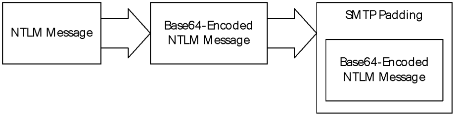
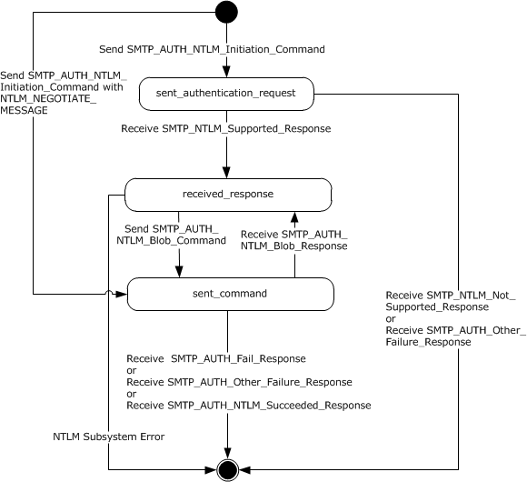
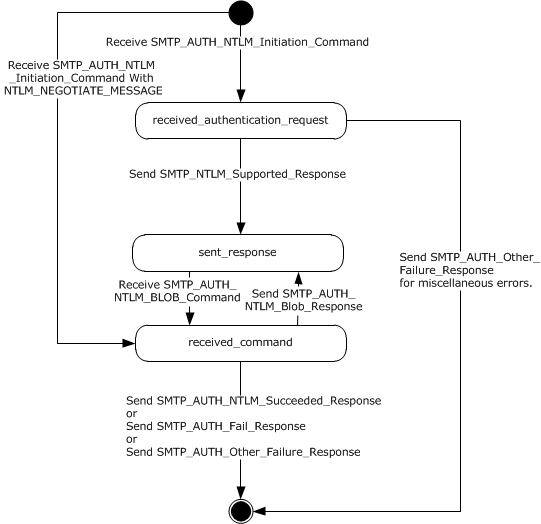
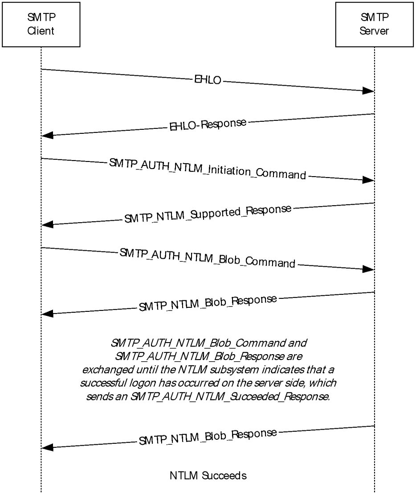
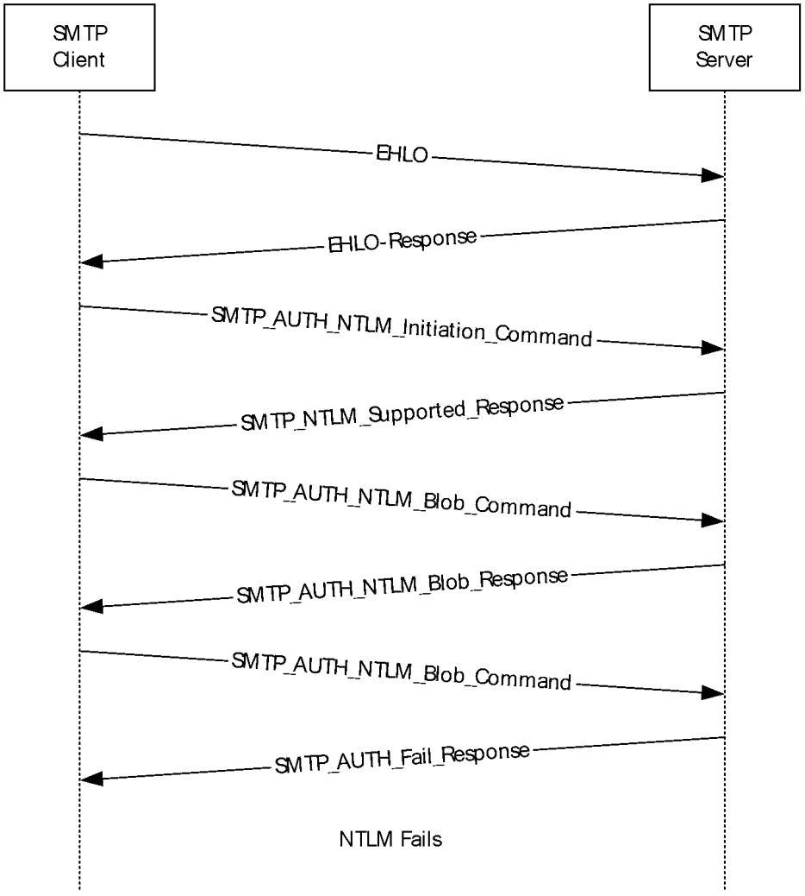

[MS-SMTPNTLM]:

NT LAN Manager (NTLM) Authentication: Simple Mail
Transfer Protocol (SMTP) Extension

Intellectual Property Rights Notice for Open Specifications Documentation

  Technical Documentation. Microsoft publishes Open Specifications documentation (“this

documentation”) for protocols, file formats, data portability, computer languages, and standards
support. Additionally, overview documents cover inter-protocol relationships and interactions.

  Copyrights. This documentation is covered by Microsoft copyrights. Regardless of any other

terms that are contained in the terms of use for the Microsoft website that hosts this
documentation, you can make copies of it in order to develop implementations of the technologies
that are described in this documentation and can distribute portions of it in your implementations
that use these technologies or in your documentation as necessary to properly document the
implementation. You can also distribute in your implementation, with or without modification, any
schemas, IDLs, or code samples that are included in the documentation. This permission also
applies to any documents that are referenced in the Open Specifications documentation.
  No Trade Secrets. Microsoft does not claim any trade secret rights in this documentation.
  Patents. Microsoft has patents that might cover your implementations of the technologies

described in the Open Specifications documentation. Neither this notice nor Microsoft's delivery of
this documentation grants any licenses under those patents or any other Microsoft patents.
However, a given Open Specifications document might be covered by the Microsoft Open
Specifications Promise or the Microsoft Community Promise. If you would prefer a written license,
or if the technologies described in this documentation are not covered by the Open Specifications
Promise or Community Promise, as applicable, patent licenses are available by contacting
iplg@microsoft.com.

  License Programs. To see all of the protocols in scope under a specific license program and the

associated patents, visit the Patent Map.

  Trademarks. The names of companies and products contained in this documentation might be
covered by trademarks or similar intellectual property rights. This notice does not grant any
licenses under those rights. For a list of Microsoft trademarks, visit
www.microsoft.com/trademarks.

  Fictitious Names. The example companies, organizations, products, domain names, email

addresses, logos, people, places, and events that are depicted in this documentation are fictitious.
No association with any real company, organization, product, domain name, email address, logo,
person, place, or event is intended or should be inferred.

Reservation of Rights. All other rights are reserved, and this notice does not grant any rights other
than as specifically described above, whether by implication, estoppel, or otherwise.

Tools. The Open Specifications documentation does not require the use of Microsoft programming
tools or programming environments in order for you to develop an implementation. If you have access
to Microsoft programming tools and environments, you are free to take advantage of them. Certain
Open Specifications documents are intended for use in conjunction with publicly available standards
specifications and network programming art and, as such, assume that the reader either is familiar
with the aforementioned material or has immediate access to it.

Support. For questions and support, please contact dochelp@microsoft.com.

[MS-SMTPNTLM] - v20250113
NT LAN Manager (NTLM) Authentication: Simple Mail Transfer Protocol (SMTP) Extension
Copyright © 2025 Microsoft Corporation
Release: January 13, 2025

1 / 36

Revision Summary

Date

Revision
History

Revision
Class

Comments

7/20/2007

0.1

Major

MCPP Milestone 5 Initial Availability

9/28/2007

0.1.1

Editorial

Changed language and formatting in the technical content.

10/23/2007  0.2

Minor

Updated to use data types in MS-DTYP.

11/30/2007  0.2.1

Editorial

Changed language and formatting in the technical content.

1/25/2008

0.2.2

Editorial

Changed language and formatting in the technical content.

3/14/2008

0.2.3

Editorial

Changed language and formatting in the technical content.

5/16/2008

1.0

6/20/2008

2.0

7/25/2008

2.1

8/29/2008

3.0

10/24/2008  4.0

12/5/2008

5.0

1/16/2009

5.1

Major

Major

Minor

Major

Major

Major

Minor

Updated and revised the technical content.

Updated and revised the technical content.

Clarified the meaning of the technical content.

Updated and revised the technical content.

Updated and revised the technical content.

Updated and revised the technical content.

Clarified the meaning of the technical content.

2/27/2009

5.1.1

Editorial

Changed language and formatting in the technical content.

4/10/2009

5.1.2

Editorial

Changed language and formatting in the technical content.

5/22/2009

5.2

7/2/2009

5.3

Minor

Minor

Clarified the meaning of the technical content.

Clarified the meaning of the technical content.

8/14/2009

5.3.1

Editorial

Changed language and formatting in the technical content.

9/25/2009

6.0

11/6/2009

7.0

12/18/2009  8.0

1/29/2010

8.1

Major

Major

Major

Minor

Updated and revised the technical content.

Updated and revised the technical content.

Updated and revised the technical content.

Clarified the meaning of the technical content.

3/12/2010

8.1.1

Editorial

Changed language and formatting in the technical content.

4/23/2010

8.1.2

Editorial

Changed language and formatting in the technical content.

6/4/2010

9.0

7/16/2010

10.0

8/27/2010

10.0

Major

Major

None

Updated and revised the technical content.

Updated and revised the technical content.

No changes to the meaning, language, or formatting of the
technical content.

10/8/2010

11.0

Major

Updated and revised the technical content.

11/19/2010  11.0

None

No changes to the meaning, language, or formatting of the
technical content.

[MS-SMTPNTLM] - v20250113
NT LAN Manager (NTLM) Authentication: Simple Mail Transfer Protocol (SMTP) Extension
Copyright © 2025 Microsoft Corporation
Release: January 13, 2025

2 / 36

Date

Revision
History

Revision
Class

Comments

1/7/2011

11.1

Minor

Clarified the meaning of the technical content.

2/11/2011

11.1

None

No changes to the meaning, language, or formatting of the
technical content.

3/25/2011

11.2

Minor

Clarified the meaning of the technical content.

5/6/2011

11.2

None

No changes to the meaning, language, or formatting of the
technical content.

6/17/2011

11.3

Minor

Clarified the meaning of the technical content.

9/23/2011

11.3

12/16/2011  12.0

3/30/2012

13.0

7/12/2012

14.0

10/25/2012  15.0

1/31/2013

15.0

None

Major

Major

Major

Major

None

No changes to the meaning, language, or formatting of the
technical content.

Updated and revised the technical content.

Updated and revised the technical content.

Updated and revised the technical content.

Updated and revised the technical content.

No changes to the meaning, language, or formatting of the
technical content.

8/8/2013

16.0

Major

Updated and revised the technical content.

11/14/2013  16.0

None

No changes to the meaning, language, or formatting of the
technical content.

2/13/2014

16.0

None

No changes to the meaning, language, or formatting of the
technical content.

5/15/2014

16.0

None

No changes to the meaning, language, or formatting of the
technical content.

6/30/2015

17.0

Major

Significantly changed the technical content.

10/16/2015  17.0

None

No changes to the meaning, language, or formatting of the
technical content.

7/14/2016

17.0

None

No changes to the meaning, language, or formatting of the
technical content.

3/16/2017

18.0

Major

Significantly changed the technical content.

6/1/2017

18.0

9/15/2017

19.0

9/12/2018

20.0

3/13/2019

21.0

4/7/2021

22.0

6/25/2021

23.0

4/23/2024

24.0

None

Major

Major

Major

Major

Major

Major

No changes to the meaning, language, or formatting of the
technical content.

Significantly changed the technical content.

Significantly changed the technical content.

Significantly changed the technical content.

Significantly changed the technical content.

Significantly changed the technical content.

Significantly changed the technical content.

[MS-SMTPNTLM] - v20250113
NT LAN Manager (NTLM) Authentication: Simple Mail Transfer Protocol (SMTP) Extension
Copyright © 2025 Microsoft Corporation
Release: January 13, 2025

3 / 36

Date

Revision
History

Revision
Class

Comments

1/13/2025

25.0

Major

Significantly changed the technical content.

[MS-SMTPNTLM] - v20250113
NT LAN Manager (NTLM) Authentication: Simple Mail Transfer Protocol (SMTP) Extension
Copyright © 2025 Microsoft Corporation
Release: January 13, 2025

4 / 36

Table of Contents

1.1
1.2

1.2.1
1.2.2

1  Introduction ............................................................................................................ 7
Glossary ........................................................................................................... 7
References ........................................................................................................ 8
Normative References ................................................................................... 8
Informative References ................................................................................. 8
Overview .......................................................................................................... 9
Relationship to Other Protocols .......................................................................... 10
Prerequisites/Preconditions ............................................................................... 11
Applicability Statement ..................................................................................... 11
Versioning and Capability Negotiation ................................................................. 11
Vendor-Extensible Fields ................................................................................... 11
Standards Assignments ..................................................................................... 11

1.3
1.4
1.5
1.6
1.7
1.8
1.9

2.2.1

2.1
2.2

2  Messages ............................................................................................................... 12
Transport ........................................................................................................ 12
Message Syntax ............................................................................................... 12
SMTP AUTH Extensions ................................................................................ 12
SMTP_AUTH_NTLM_Initiation_Command Message ..................................... 12
SMTP_NTLM_Supported_Response Message ............................................. 12
SMTP_AUTH_NTLM_BLOB_Response Message .......................................... 13
SMTP_AUTH_Fail_Response Message ....................................................... 13
SMTP_AUTH_Other_Failure_Response Message ........................................ 13
SMTP_AUTH_NTLM_Succeeded_Response Message ................................... 13
SMTP_AUTH_NTLM_BLOB_Command Message .......................................... 14
SMTP_NTLM_Not_Supported_Response Message ...................................... 14
EHLO Discovery Message ....................................................................... 14
SMTP Server Messages ................................................................................ 14
SMTP Client Messages ................................................................................. 15

2.2.1.1
2.2.1.2
2.2.1.3
2.2.1.4
2.2.1.5
2.2.1.6
2.2.1.7
2.2.1.8
2.2.1.9

2.2.2
2.2.3

3.1

3.1.5

3.1.1

3.1.1.1

3.1.4.1
3.1.4.2

3.1.2
3.1.3
3.1.4

3.1.5.1
3.1.5.2
3.1.5.3

3  Protocol Details ..................................................................................................... 16
Client Details ................................................................................................... 16
Abstract Data Model .................................................................................... 16
SMTP State Model ................................................................................. 16
Timers ...................................................................................................... 17
Initialization ............................................................................................... 17
Higher-Layer Triggered Events ..................................................................... 18
Sending an SMTP_AUTH_NTLM_Initiation_Command Message .................... 18
Sending an SMTP_AUTH_NTLM_BLOB_Command Message ......................... 18
Message Processing Events and Sequencing Rules .......................................... 18
Receiving an SMTP_NTLM_Supported_Response Message .......................... 18
Receiving an SMTP_NTLM_Not_Supported_Response Message .................... 19
Receiving an SMTP_AUTH_NTLM_BLOB_Response Message ........................ 19
Error from NTLM .............................................................................. 19
NTLM Reports Success and Returns an NTLM Message ......................... 19
Receiving an SMTP_AUTH_NTLM_Succeeded_Response Message ................ 19
Receiving an SMTP_AUTH_Fail_Response Message .................................... 19
Receiving an SMTP_AUTH_Other_Failure_Response Message ...................... 19
Timer Events .............................................................................................. 20
Other Local Events ...................................................................................... 20
Server Details .................................................................................................. 20
Abstract Data Model .................................................................................... 20
SMTP State Model ................................................................................. 21
Timers ...................................................................................................... 22
Initialization ............................................................................................... 22
Higher-Layer Triggered Events ..................................................................... 22

3.1.5.4
3.1.5.5
3.1.5.6

3.1.5.3.1
3.1.5.3.2

3.2.2
3.2.3
3.2.4

3.1.6
3.1.7

3.2.1.1

3.2.1

3.2

[MS-SMTPNTLM] - v20250113
NT LAN Manager (NTLM) Authentication: Simple Mail Transfer Protocol (SMTP) Extension
Copyright © 2025 Microsoft Corporation
Release: January 13, 2025

5 / 36

3.2.5

3.2.5.1
3.2.5.2

Message Processing Events and Sequencing Rules .......................................... 22
Receiving an SMTP_AUTH_NTLM_Initiation_Command Message .................. 23
Receiving an SMTP_AUTH_NTLM_BLOB_Command Message ....................... 23
NTLM Returns Success, Returning an NTLM Message ............................ 24
NTLM Returns Success, Indicating that the Authentication Completed
Successfully .................................................................................... 24
NTLM Returns Status, Indicating that the User Name or Password Is
Incorrect ........................................................................................ 24
NTLM Returns a Failure Status, Indicating Any Other Error ................... 24
Timer Events .............................................................................................. 24
Other Local Events ...................................................................................... 24

3.2.5.2.1
3.2.5.2.2

3.2.5.2.3

3.2.5.2.4

3.2.6
3.2.7

4  Protocol Examples ................................................................................................. 25
SMTP Client Successfully Authenticating to an SMTP Server ................................... 25
SMTP Client Not Successfully Authenticating to an SMTP Server ............................. 27

4.1
4.2

5  Security ................................................................................................................. 29
Security Considerations for Implementers ........................................................... 29
Index of Security Parameters ............................................................................ 29

5.1
5.2

6  Appendix A: Product Behavior ............................................................................... 30

7  Change Tracking .................................................................................................... 34

8  Index ..................................................................................................................... 35

[MS-SMTPNTLM] - v20250113
NT LAN Manager (NTLM) Authentication: Simple Mail Transfer Protocol (SMTP) Extension
Copyright © 2025 Microsoft Corporation
Release: January 13, 2025

6 / 36

1  Introduction

The NT LAN Manager (NTLM) Authentication: Simple Mail Transfer Protocol (SMTP) Extension specifies
the use of NTLM authentication (as specified in [MS-NLMP]) by the Simple Mail Transfer Protocol
(SMTP) to facilitate client authentication to a Windows SMTP server. SMTP specifies a protocol for
reliable and efficient transmission of email. A detailed definition of SMTP is specified in [RFC5321] and
[RFC5322].

The NT LAN Manager (NTLM) Authentication: Simple Mail Transfer Protocol (SMTP) Extension uses the
SMTP-AUTH command (as specified in [RFC2554] section 4) and SMTP response codes to negotiate
NTLM authentication and send authentication data.

Sections 1.5, 1.8, 1.9, 2, and 3 of this specification are normative. All other sections and examples in
this specification are informative.

1.1  Glossary

This document uses the following terms:

AUTH command: A Simple Mail Transfer Protocol (SMTP) command that is used to send

authentication information, as specified in [RFC2554]. The structure of the AUTH command (as
used in the NT LAN Manager (NTLM) Authentication: Simple Mail Transfer Protocol (SMTP)
Extension) is as follows: "AUTH NTLM<CR><LF>". Or, optionally, it is as follows: "AUTH NTLM
[initial-response]<CR><LF>". Both command forms are accepted, as required by the RFC.

base64 encoding: A binary-to-text encoding scheme whereby an arbitrary sequence of bytes is

converted to a sequence of printable ASCII characters, as described in [RFC4648].

challenge/response authentication: A common authentication technique in which a principal is

prompted (the challenge) to provide some private information (the response) to facilitate
authentication.

connection-oriented NTLM: A particular variant of NTLM designed to be used with connection-

oriented remote procedure call (RPC), as described in [MS-NLMP].

NT LAN Manager (NTLM) Authentication Protocol: A protocol using a challenge-response

mechanism for authentication in which clients are able to verify their identities without sending a
password to the server. It consists of three messages, commonly referred to as Type 1
(negotiation), Type 2 (challenge) and Type 3 (authentication).

NTLM AUTHENTICATE_MESSAGE: The NTLM AUTHENTICATE_MESSAGE packet defines an

NTLM authenticate message that is sent from the client to the server after the NTLM
CHALLENGE_MESSAGE is processed by the client. Message structure and other details of this
packet are specified in [MS-NLMP].

NTLM CHALLENGE_MESSAGE: The NTLM CHALLENGE_MESSAGE packet defines an NTLM

challenge message that is sent from the server to the client. NTLM CHALLENGE_MESSAGE is
generated by the local NTLM software and passed to the application that supports embedded
NTLM authentication. This message is used by the server to challenge the client to prove its
identity. Message structure and other details of this packet are specified in [MS-NLMP].

NTLM message: A message that carries authentication information. Its payload data is passed to
the application that supports embedded NTLM authentication by the NTLM software installed on
the local computer. NTLM messages are transmitted between the client and server embedded
within the application protocol that is using NTLM authentication. There are three types of NTLM
messages: NTLM NEGOTIATE_MESSAGE, NTLM CHALLENGE_MESSAGE, and NTLM
AUTHENTICATE_MESSAGE.

[MS-SMTPNTLM] - v20250113
NT LAN Manager (NTLM) Authentication: Simple Mail Transfer Protocol (SMTP) Extension
Copyright © 2025 Microsoft Corporation
Release: January 13, 2025

7 / 36

NTLM NEGOTIATE_MESSAGE: The NEGOTIATE_MESSAGE packet defines an NTLM negotiate
message that is sent from the client to the server. The NTLM NEGOTIATE_MESSAGE is
generated by the local NTLM software and passed to the application that supports embedded
NTLM authentication. This message allows the client to specify its supported NTLM options to
the server. Message structure and other details are specified in [MS-NLMP].

NTLM software: Software that implements the NT LAN Manager (NTLM) Authentication

Protocol.

SASL: The Simple Authentication and Security Layer, as described in [RFC2222]. This is an
authentication mechanism used by the Lightweight Directory Access Protocol (LDAP).

Simple Mail Transfer Protocol (SMTP): A member of the TCP/IP suite of protocols that is used

to transport Internet messages, as described in [RFC5321].

MAY, SHOULD, MUST, SHOULD NOT, MUST NOT: These terms (in all caps) are used as defined
in [RFC2119]. All statements of optional behavior use either MAY, SHOULD, or SHOULD NOT.

1.2  References

Links to a document in the Microsoft Open Specifications library point to the correct section in the
most recently published version of the referenced document. However, because individual documents
in the library are not updated at the same time, the section numbers in the documents may not
match. You can confirm the correct section numbering by checking the Errata.

1.2.1  Normative References

We conduct frequent surveys of the normative references to assure their continued availability. If you
have any issue with finding a normative reference, please contact dochelp@microsoft.com. We will
assist you in finding the relevant information.

[MS-NLMP] Microsoft Corporation, "NT LAN Manager (NTLM) Authentication Protocol".

[RFC1521] Borenstein, N., and Freed, N., "MIME (Multipurpose Internet Mail Extensions) Part One:
Mechanisms for Specifying and Describing the Format of Internet Message Bodies", RFC 1521,
September 1993, https://www.rfc-editor.org/info/rfc1521

[RFC2119] Bradner, S., "Key words for use in RFCs to Indicate Requirement Levels", BCP 14, RFC
2119, March 1997, https://www.rfc-editor.org/info/rfc2119

[RFC2554] Myers, J., "SMTP Service Extension for Authentication", RFC 2554, March, 1999,
https://www.rfc-editor.org/info/rfc2554

[RFC2821] Klensin, J., "Simple Mail Transfer Protocol", RFC 2821, April 2001, https://www.rfc-
editor.org/info/rfc2821

[RFC4234] Crocker, D., Ed., and Overell, P., "Augmented BNF for Syntax Specifications: ABNF", RFC
4234, October 2005, https://www.rfc-editor.org/info/rfc4234

[RFC5321] Klensin, J., "Simple Mail Transfer Protocol", RFC 5321, October 2008, http://rfc-
editor.org/rfc/rfc5321.txt

[RFC5322] Resnick, P., Ed., "Internet Message Format", RFC 5322, October 2008, https://www.rfc-
editor.org/info/rfc5322

1.2.2  Informative References

[MS-NETOD] Microsoft Corporation, "Microsoft .NET Framework Protocols Overview".

[MS-SMTPNTLM] - v20250113
NT LAN Manager (NTLM) Authentication: Simple Mail Transfer Protocol (SMTP) Extension
Copyright © 2025 Microsoft Corporation
Release: January 13, 2025

8 / 36

<!-- Extracted images from page 9 -->

<!-- /Extracted images from page 9 -->

[MSKB-163846] Microsoft Corporation, "SID Values For Default Windows NT Installations", Version
2.1, November 2006, http://support.microsoft.com/kb/163846

[SSPI] Microsoft Corporation, "SSPI", https://learn.microsoft.com/en-
us/windows/desktop/SecAuthN/sspi

1.3  Overview

Client applications that connect to the Simple Mail Transfer Protocol (SMTP) service on supported
operating systems (see section 6) can use NT LAN Manager Protocol (NTLM) authentication, as
specified in [MS-NLMP].

The NT LAN Manager (NTLM) Authentication: Simple Mail Transfer Protocol (SMTP) Extension specifies
how an SMTP client and SMTP server can use the NTLM Authentication Protocol, as specified in [MS-
NLMP], so that the SMTP server can authenticate the SMTP client. The NTLM Authentication Protocol,
as specified in [MS-NLMP], is a challenge/response authentication protocol that depends on the
application layer protocols to transport NTLM packets from client to server and from server to client.

The NT LAN Manager (NTLM) Authentication: Simple Mail Transfer Protocol (SMTP) Extension defines
how SMTP is extended to perform authentication using the NTLM Authentication Protocol, as specified
in [MS-NLMP]. The SMTP standard defines an extensibility mechanism for arbitrary authentication
protocols to be plugged in to the core protocol. This mechanism is the SMTP-AUTH mechanism.

The NT LAN Manager (NTLM) Authentication: Simple Mail Transfer Protocol (SMTP) Extension is an
embedded protocol in which NTLM authentication data is first transformed into a base64
representation (as specified in [RFC1521]) and then formatted by padding with SMTP status codes and
SMTP keywords, as defined by the AUTH mechanism. The base64 encoding and the formatting are
very rudimentary and solely intended to make the NTLM data look like other SMTP commands and
responses. The following diagram illustrates the sequence of transformations performed on an NTLM
message to produce a message that can be sent over SMTP.

Figure 1: Relationship between NTLM message and SMTP (NTLM Authentication Protocol
message)

The NT LAN Manager (NTLM) Authentication: Simple Mail Transfer Protocol (SMTP) Extension is a
pass-through protocol that does not specify the structure of NTLM information. Instead, the protocol
relies on the software that implements the NTLM Authentication Protocol (as specified in [MS-NLMP])
to process each NTLM message to be sent or received.

The NT LAN Manager (NTLM) Authentication: Simple Mail Transfer Protocol (SMTP) Extension defines
both server and client roles.

When SMTP requests NTLM authentication, it interacts with the NTLM software appropriately. An
overview of this interaction follows:

If acting as an SMTP client:

1.  The NTLM software returns the first NTLM message to the client to be sent to the server.

[MS-SMTPNTLM] - v20250113
NT LAN Manager (NTLM) Authentication: Simple Mail Transfer Protocol (SMTP) Extension
Copyright © 2025 Microsoft Corporation
Release: January 13, 2025

9 / 36

2.  The client applies both the base64 encoding and SMTP padding transformations mentioned earlier
(and described in detail later in this document) to produce an SMTP message, and then sends this
message to the server.

3.  The client waits for a response from the server. When the response is received, the client

determines whether the response indicates either the end of authentication (success or failure) or
the continuation of authentication.

4.  If the authentication is continuing, the response message is stripped of the SMTP padding, is

base64 decoded, and is passed into the NTLM software, on which the NTLM software can return
another NTLM message that needs to be sent to the server. Steps 2 through 4 are repeated until
authentication succeeds or fails.

If acting as an SMTP server:

1.  The server waits to receive the first SMTP authentication message from the client.

2.  When an SMTP message is received from the client, the SMTP padding is removed, the message is

base64-decoded, and the resulting NTLM message is passed into the NTLM software.

3.  The NTLM software will return a status indicating whether authentication completed successfully,

failed, or more NTLM messages need to be exchanged to complete the authentication.

4.  If the authentication is continuing, the NTLM software will return an NTLM message that needs to
be sent to the client. This message is base64-encoded, and the SMTP padding is applied and sent
to the client. Steps 2 through 4 are repeated until authentication succeeds or fails.

The sequence that follows shows the typical flow of packets between a client and server once NTLM
authentication has been selected:

1.  The SMTP client sends an NTLM NEGOTIATE_MESSAGE embedded in an

SMTP_AUTH_NTLM_BLOB_Command packet to the server.

2.  On receiving the SMTP packet with NTLM NEGOTIATE_MESSAGE, the server sends an NTLM

CHALLENGE_MESSAGE embedded in an SMTP packet to the client.

3.  In response, the SMTP client sends an NTLM AUTHENTICATE_MESSAGE embedded in an SMTP

packet.

4.  The server then sends an SMTP response to the client to successfully complete the authentication

process.

The NTLM NEGOTIATE_MESSAGE, NTLM CHALLENGE_MESSAGE, and NTLM AUTHENTICATE_MESSAGE
packets contain NTLM authentication data that is processed by the NTLM software installed on the
local computer. How to retrieve and process NTLM messages is specified in [MS-NLMP].

Implementers of the NT LAN Manager (NTLM) Authentication: Simple Mail Transfer Protocol (SMTP)
Extension need to possess a working knowledge of the following:

  Simple Mail Transfer Protocol (SMTP), as specified in [RFC5321] and [RFC5322]

  Multipurpose Internet Mail Extensions (MIME) base64 encoding method, as specified in [RFC1521]



 NTLM Authentication Protocol, as specified in [MS-NLMP]

1.4  Relationship to Other Protocols

The NT LAN Manager (NTLM) Authentication: Simple Mail Transfer Protocol (SMTP) Extension uses the
SMTP-AUTH extension mechanism, as specified in [RFC2554], and is an embedded protocol. Unlike
stand-alone application protocols, such as Telnet or Hypertext Transfer Protocol (HTTP), NTLM

[MS-SMTPNTLM] - v20250113
NT LAN Manager (NTLM) Authentication: Simple Mail Transfer Protocol (SMTP) Extension
Copyright © 2025 Microsoft Corporation
Release: January 13, 2025

10 / 36

Authentication: SMTP Extension packets are embedded in Simple Mail Transfer Protocol (SMTP)
commands and server responses.

SMTP specifies only the sequence in which an SMTP server and an SMTP client exchange NTLM
messages to successfully authenticate the client to the server. It does not specify how the client
obtains NTLM messages from the local NTLM software or how the SMTP server processes NTLM
messages. The SMTP client and SMTP server implementations depend on the availability of an
implementation of the NTLM Authentication Protocol (as specified in [MS-NLMP]) to obtain and process
NTLM messages and on the availability of the base64 encoding and decoding mechanisms (as
specified in [RFC1521]) to encode and decode the NTLM messages embedded in SMTP packets.

1.5  Prerequisites/Preconditions

Because the NT LAN Manager (NTLM) Authentication: Simple Mail Transfer Protocol (SMTP) Extension
depends on NTLM to authenticate the client to the server, both server and client require  access to an
implementation of the NTLM Authentication Protocol (as specified in [MS-NLMP]) that is capable of
supporting connection-oriented NTLM.<1>

1.6  Applicability Statement

The NT LAN Manager (NTLM) Authentication: Simple Mail Transfer Protocol (SMTP) Extension must be
used by an SMTP client and an SMTP server when the SMTP client authenticates to the SMTP server
by using NTLM authentication.

1.7  Versioning and Capability Negotiation

This document covers versioning issues in the following areas:

  Security and Authentication Methods: The NT LAN Manager (NTLM) Authentication: Simple Mail

Transfer Protocol (SMTP) Extension supports the NTLM version 1 and NTLM version 2
authentication methods, as specified in [MS-NLMP].

  Capability Negotiation: The NTLM Authentication: SMTP Extension does not support negotiation of

the NTLM Authentication Protocol (as specified in [MS-NLMP]) version to use. Instead, the NTLM
Authentication Protocol (as specified in [MS-NLMP]) version is configured on both the client and
the server prior to authentication. NTLM Authentication Protocol (as specified in [MS-NLMP])
version mismatches are handled by the NTLM Authentication Protocol (as specified in [MS-NLMP])
implementation, and not by SMTP.

The SMTP Service Extension for Authentication (as specified in [RFC2554]) does document the
framework within which SMTP clients might discover (and SMTP servers might advertise) the
capability to perform any given authentication mechanism, including (in particular) NTLM.

The client discovers if the server supports NTLM AUTH through the SMTP-EHLO, at which time
the server responds with a standard EHLO response, as specified in [RFC2821]. The EHLO
keyword that is advertised if NTLM authentication is supported is "NTLM". NTLM is an SASL
mechanism (as defined in [RFC2554] section 3 bullet 3). The messages involved are formally
specified in other sections of this document.

1.8  Vendor-Extensible Fields

None.

1.9  Standards Assignments

None.

[MS-SMTPNTLM] - v20250113
NT LAN Manager (NTLM) Authentication: Simple Mail Transfer Protocol (SMTP) Extension
Copyright © 2025 Microsoft Corporation
Release: January 13, 2025

11 / 36

2  Messages

2.1  Transport

The NT LAN Manager (NTLM) Authentication: Simple Mail Transfer Protocol (SMTP) Extension does not
establish transport connections. Instead, its messages are encapsulated in SMTP commands and
responses. How NTLM Authentication: SMTP Extension messages must be encapsulated in SMTP
commands is specified in section 2.2.

2.2  Message Syntax

NT LAN Manager (NTLM) Authentication: Simple Mail Transfer Protocol (SMTP) Extension messages
are divided into two categories, depending on whether the message is sent by the server or the client.

The formal syntax of messages is provided in Augmented Backus-Naur Form (ABNF), as specified in
[RFC4234].

2.2.1  SMTP AUTH Extensions

The first category of SMTP messages is within the SMTP-AUTH extensibility framework. These
messages are defined in [RFC2554]. The NT LAN Manager (NTLM) Authentication: Simple Mail
Transfer Protocol (SMTP) Extension introduces the following messages, as specified in sections 2.2.1.1
through 2.2.1.9.

The client can receive any one of the following responses during authentication:

  SMTP_AUTH_NTLM_BLOB_Response

  SMTP_AUTH_Fail_Response

  SMTP_AUTH_Other_Failure_Response

  SMTP_AUTH_NTLM_Succeeded_Response

Note that the syntax and meaning of these messages are completely defined by [RFC2554] except for
the SMTP_AUTH_NTLM_BLOB_Response message, for which [RFC2554] does not define the data
encapsulated within the SMTP message and leaves the definition and processing of that data to the
extension mechanism. This specification will focus on precisely defining that data.

2.2.1.1  SMTP_AUTH_NTLM_Initiation_Command Message

The SMTP_AUTH_NTLM_Initiation_Command message initiates the NTLM authentication process for
SMTP.

[RFC2554] section 4 defines the syntax of the SMTP AUTH command and related commands (for
example, EHLO) to initiate authentication. The mechanism name for NTLM authentication is defined to
be the string "NTLM" for the NTLM Authentication: SMTP Extension.

2.2.1.2  SMTP_NTLM_Supported_Response Message

The SMTP_NTLM_Supported_Response message indicates that the server supports NTLM
authentication for SMTP.

If the [initial-response] string is not supplied in the client SMTP_AUTH_NTLM_Initiation_Command
message, and NTLM is supported, the SMTP server will respond with an SMTP message prefixed with
a status code of 334 to indicate that NTLM is supported. The only data in this message that is useful is

[MS-SMTPNTLM] - v20250113
NT LAN Manager (NTLM) Authentication: Simple Mail Transfer Protocol (SMTP) Extension
Copyright © 2025 Microsoft Corporation
Release: January 13, 2025

12 / 36

the status code 334. The remaining data is a human-readable ASCII string whose contents are
constrained by the specifications in section 4.5.3 in [RFC2821]. This data has no bearing on the
authentication. The syntax of this command is shown as follows.

 334 <human-readable-string><CR><LF>

A human-readable-string is formally defined in ABNF as follows.

 human-readable-string = *CHAR

Note  CHAR is the US-ASCII character set, excluding NULL.

2.2.1.3  SMTP_AUTH_NTLM_BLOB_Response Message

The SMTP_AUTH_NTLM_BLOB_Response message is defined as follows. This message is partially
defined in [RFC2554] section 4 as a "server challenge response". The 334 status code indicates
ongoing authentication and indicates that the <base64-encoded-NTLM-message> is to be processed
by the authentication subsystem.

 334 <base64-encoded-NTLM-message><CR><LF>

Note that status code 334 is also returned by the SMTP_NTLM_Supported_Response message.

2.2.1.4  SMTP_AUTH_Fail_Response Message

SMTP_AUTH_Fail_Response is defined as follows. This message, identified by the 535 status code, is
defined in [RFC2554] section 4, and indicates that the authentication has terminated unsuccessfully
because the user name or password is incorrect.

  535 5.7.3 <human-readable-string><CR><LF>

2.2.1.5  SMTP_AUTH_Other_Failure_Response Message

The SMTP_AUTH_Other_Failure_Response message is defined as follows. This is actually a class of
messages whose syntax and interpretation are defined in [RFC2821] section 4.2 and [RFC2554]
sections 4 and 6. They indicate an abnormal termination of the NTLM authentication negotiation,
which can occur for various reasons such as software errors, lack of system resources, and so on. For
the purposes of this document, SMTP_AUTH_Other_Failure_Response is defined as any SMTP
message other than SMTP_AUTH_NTLM_Succeeded_Response, SMTP_AUTH_Fail_Response, and
SMTP_AUTH_NTLM_BLOB_Response. The interpretation of SMTP_AUTH_Other_Failure_Response, and
the suggested client action when receiving such a message, is defined in [RFC2821] section 4.3. This
message represents an exit from AUTH and, as such, is not really a part of AUTH negotiation.

2.2.1.6  SMTP_AUTH_NTLM_Succeeded_Response Message

The SMTP_AUTH_NTLM_Succeeded_Response message is defined as follows. This message is defined
in [RFC2554] section 4 and indicates that the authentication negotiation has completed with the client
successfully authenticating to the server.

       235 <human-readable-string><CR><LF>

[MS-SMTPNTLM] - v20250113
NT LAN Manager (NTLM) Authentication: Simple Mail Transfer Protocol (SMTP) Extension
Copyright © 2025 Microsoft Corporation
Release: January 13, 2025

13 / 36

2.2.1.7  SMTP_AUTH_NTLM_BLOB_Command Message

NTLM messages encapsulated by the client and sent to the server are referred to as
SMTP_AUTH_NTLM_BLOB_Command messages in this document. They have the following syntax
defined and conform to the prescription of [RFC2554] section 4.

 <base64-encoded-NTLM-message><CR><LF>

2.2.1.8  SMTP_NTLM_Not_Supported_Response Message

 The SMTP_NTLM_Not_Supported_Response_Message is defined as follows. This message is defined in
[RFC2554] section 4 and indicates that the authentication mechanism is not supported by the server.
The server rejects the AUTH command with the following message.

 504 <human-readable-string><CR><LF>

2.2.1.9  EHLO Discovery Message

The NT LAN Manager (NTLM) Authentication: Simple Mail Transfer Protocol (SMTP) Extension also
supports the discovery of supported authentication procedures.

When the EHLO command is sent to the SMTP server, the SMTP server will list available
authentication mechanisms using the syntax defined in [RFC2821] section 4.1.1.1. The NTLM
mechanism is indicated by using the "NTLM" EHLO keyword value if NTLM authentication is enabled
for the SMTP server. An example of such an advertisement of supported authentication procedures by
the server can be found in [RFC2554] section 4. The line "S: 250 AUTH CRAM-MD5 DIGEST-MD5" in
the conversation indicates that the server advertises the supported authentication procedures as
CRAM-MD5, DIGEST-MD5.

The server responds with an EHLO-Response (including the EHLO-keyword AUTH) when the client
sends the EHLO command with or without an argument.

[RFC2821] section 4.1.1.1 states that clients SHOULD send EHLO with an argument. The definition of
SHOULD in [RFC2119] allows the client to exclude the EHLO argument in exceptional circumstances.
The SMTP server MUST support such clients.

2.2.2  SMTP Server Messages

This section defines the creation of SMTP_AUTH_NTLM_BLOB_Response messages. These are NTLM
messages that are sent by the server, and MUST be encapsulated as follows to conform to syntax
specified by the SMTP-AUTH mechanism:

1.  Encode the NTLM message data as base64 (as specified in [RFC1521]). This is required because
NTLM messages contain data outside the ASCII character range whereas SMTP only supports the
sending of ASCII characters within the context of SMTP-AUTH.

2.  To the base64-encoded string, prefix the SMTP response code "334 " (that is, the numerals 334

followed by the ASCII space character 0x20).

3.  Suffix the <CR> and <LF> characters (ASCII values 0x0D and 0x0A), as required by SMTP.

The definition of a server message is as follows:

         334 <base64-encoded-NTLM-message><CR><LF>

[MS-SMTPNTLM] - v20250113
NT LAN Manager (NTLM) Authentication: Simple Mail Transfer Protocol (SMTP) Extension
Copyright © 2025 Microsoft Corporation
Release: January 13, 2025

14 / 36

De-encapsulation of these messages by the client follows the reverse logic:

1.  Remove the <CR> and <LF> characters (ASCII values 0x0D and 0x0A).

2.  Remove the SMTP response code "334" (that is, the numerals 334 followed by the ASCII space

character 0x20).

3.  base64 decode the SMTP data to produce the original NTLM message data.

2.2.3  SMTP Client Messages

This section defines the creation of SMTP_AUTH_NTLM_BLOB_Command messages. These NTLM
messages sent by the client are encapsulated as follows to conform to the SMTP-AUTH mechanism:

1.  base64-encode (as specified in [RFC1521]) the NTLM message data. This is required because
NTLM messages contain data outside the ASCII character range whereas SMTP only supports
ASCII characters to be sent within the context of SMTP-AUTH.

2.  Suffix the <CR> and <LF> characters (ASCII values 0x0D and 0x0A), as required by SMTP.

The definition of a client message is as follows:

  <base64-encoded-NTLM-message><CR><LF>

De-encapsulation of these messages by the server follows the reverse logic:

1.  Remove the <CR> and <LF> characters (ASCII values 0x0D and 0x0A).

2.  base64 decode the SMTP data to produce the original NTLM message data.

[MS-SMTPNTLM] - v20250113
NT LAN Manager (NTLM) Authentication: Simple Mail Transfer Protocol (SMTP) Extension
Copyright © 2025 Microsoft Corporation
Release: January 13, 2025

15 / 36

<!-- Extracted images from page 16 -->

<!-- /Extracted images from page 16 -->

3  Protocol Details

3.1  Client Details

This section specifies details of the SMTP client role. An implementation of the Simple Mail Transfer
Protocol (SMTP) Extension SHOULD support the client role.

3.1.1  Abstract Data Model

This section describes a conceptual model of possible data organization that an implementation
maintains to participate in this protocol. The described organization is provided to facilitate the
explanation of how the protocol behaves. This document does not mandate that implementations
adhere to this model as long as their external behavior is consistent with that described in this
document.

This section specifies details of the SMTP client role. An implementation of the Simple Mail Transfer
Protocol (SMTP) Extension supports the client role

3.1.1.1  SMTP State Model

Figure 2: SMTP NTLM authentication client state model

[MS-SMTPNTLM] - v20250113
NT LAN Manager (NTLM) Authentication: Simple Mail Transfer Protocol (SMTP) Extension
Copyright © 2025 Microsoft Corporation
Release: January 13, 2025

16 / 36

The abstract data model for the NT LAN Manager (NTLM) Authentication: Simple Mail Transfer Protocol
(SMTP) Extension has the following states:

1.

 start

This is the state of the client before the SMTP_AUTH_NTLM_Initiation_Command message has
been sent.

2.

 sent_authentication_request

This is the state of the client after the SMTP_AUTH_NTLM_Initiation_Command message has been
sent.

3.  received_response

This is the state entered by the client after it has received an SMTP_NTLM_Supported_Response
message, or when the client receives an SMTP_AUTH_NTLM_BLOB_Response message.

When the client enters this state after receiving a SMTP_NTLM_Supported_Response message, the
client invokes the NTLM software to get the NTLM_NEGOTIATE_MESSAGE and sends it to the
server embedded inside the first SMTP_AUTH_NTLM Blob_Command. The client transitions the
state to sent_command after it sends the SMTP_AUTH_NTLM Blob_Command.

The client returns to this state from the sent_command state after it receives
SMTP_AUTH_NTLM_BLOB_Response from the server.

The client transitions the state to completed_authentication if it encounters an NTLM software
error.

4.  sent_command

This is the state entered by the client after it has sent an SMTP_AUTH_NTLM_Initiation_Command
message with NTLM_NEGOTIATE_MESSAGE. During this state the client waits for a response from
the server. When SMTP_AUTH_NTLM_BLOB_Response is received, the client transitions the state
to received_response.

The client returns to this state from the received_response state after it sends the
SMTP_AUTH_NTLM Blob_Command to the server.

The client transitions to completed_authentication if it receives SMTP_AUTH_FAIL_Response,
SMTP_AUTH_Other_Failure_Response, or SMTP_AUTH_NTLM_Succeeded_Response.

5.

 completed_authentication

This is the state of the client on completion of authentication (successful or otherwise).. Section
3.1.5 defines the rules for how this state is reached. The completed_authentication represents the
end state of the authentication protocol.

This document does not address the behavior of SMTP in this state.

3.1.2  Timers

None.

3.1.3  Initialization

None.

[MS-SMTPNTLM] - v20250113
NT LAN Manager (NTLM) Authentication: Simple Mail Transfer Protocol (SMTP) Extension
Copyright © 2025 Microsoft Corporation
Release: January 13, 2025

17 / 36

3.1.4  Higher-Layer Triggered Events

3.1.4.1  Sending an SMTP_AUTH_NTLM_Initiation_Command Message

This section defines the creation of SMTP_AUTH_NTLM_Initiation_Command messages. These NTLM
messages are sent by the client when the state equals start. They SHOULD<2> contain an NTLM
NEGOTIATE_MESSAGE encapsulated in the [initial response]. The encapsulation of this message is as
specified in section 2.2.3.

3.1.4.2  Sending an SMTP_AUTH_NTLM_BLOB_Command Message

This section defines the creation of SMTP_AUTH_NTLM_BLOB_Command messages. These NTLM
messages are sent by the client when the state equals received_response and are encapsulated as
specified in section 2.2.3 to conform to the SMTP-AUTH mechanism.

3.1.5  Message Processing Events and Sequencing Rules

The NT LAN Manager (NTLM) Authentication: Simple Mail Transfer Protocol (SMTP) Extension is driven
by a series of message exchanges between an SMTP server and an SMTP client. The rules governing
the sequencing of commands and the internal states of the client and server are defined by a
combination of [RFC2554] and [MS-NLMP]. Section 3.1.1 completely defines how the rules specified in
[RFC2554] and [MS-NLMP] govern SMTP authentication.

3.1.5.1  Receiving an SMTP_NTLM_Supported_Response Message

When the client state equals sent_authentication_request and on receiving this message, a client
MUST generate the first NTLM message by calling the NTLM software. The NTLM software then
generates NTLM NEGOTIATE_MESSAGE, as specified in [MS-NLMP]. The client MUST then
encapsulate the NTLM message, as defined in section 2.2.3, and send it to the server.

Note  The server will send the SMTP_NTLM_Supported_Response message only if the client did not
embed an NTLM NEGOTIATE_MESSAGE in the SMTP_AUTH_NTLM_Initiation_Command [initial-
response] optional parameter.

The state of the client MUST be changed to received_response.

The command sent by the client determines whether the server response is interpreted as an
SMTP_NTLM_Supported_Response or an SMTP_AUTH_NTLM_BLOB_Response. Based on ABNF syntax
alone, SMTP_NTLM_Supported_Response and SMTP_AUTH_NTLM_BLOB_Response messages appear
identical, making a successful distinction between the two impossible. Therefore, the parser MUST
distinguish between these messages as follows:





If the client previously sent an SMTP_AUTH_NTLM_Initiation_Command without an [initial-
response], the server response MUST be parsed as an SMTP_NTLM_Supported_Response message
with a human-readable-string. The human-readable-string SHOULD be ignored by the client,
except to facilitate troubleshooting and debugging. This string has no consequence on the
operation of the protocol.

If the client previously sent an SMTP_AUTH_NTLM_Initiation_Command with an [initial-response],
the server response MUST be parsed as an SMTP_AUTH_NTLM_BLOB_Response message with a
base64-encoded string. The client MUST NOT ignore the base64-encoded string and it MUST be
processed by the NTLM software, as described in this document.

Note  Status code 334 is also returned by the SMTP_AUTH_NTLM_BLOB_Response message.

[MS-SMTPNTLM] - v20250113
NT LAN Manager (NTLM) Authentication: Simple Mail Transfer Protocol (SMTP) Extension
Copyright © 2025 Microsoft Corporation
Release: January 13, 2025

18 / 36

3.1.5.2  Receiving an SMTP_NTLM_Not_Supported_Response Message

When the client state equals sent_authentication_request, the SMTP client MUST change its internal
state to completed_authentication and consider that the authentication has failed. The client can then
take any appropriate action. This document does not mandate any specific course of action.

Note  This response MUST be interpreted using the rules specified in [RFC2821]. These rules include
the use of the three-digit status code to infer whether the failure is permanent or temporary, whether
or not to generate non-delivery notifications for messages queued on the client, and so on. As
implemented, this will be an exception code: 504, which indicates a permanent error.

3.1.5.3  Receiving an SMTP_AUTH_NTLM_BLOB_Response Message

When the client state equals sent_command and on receiving this message, a client MUST change its
internal state to received_response, de-encapsulate it to obtain the embedded NTLM message, and
then pass it to the NTLM software for processing. The NTLM software then extracts the NTLM
CHALLENGE_MESSAGE and produces an NTLM AUTHENTICATE_MESSAGE response. The client
MUST then encapsulate the NTLM message, as defined in section 3.1.4.2, send it to the server, and
transition to the sent_command state.

3.1.5.3.1 Error from NTLM

If the NTLM software reports an error, the implementation of this extension MUST change its
internal state to completed_authentication and fail the authentication. Handling of failures is specified
in [RFC2554], section 4.

3.1.5.3.2 NTLM Reports Success and Returns an NTLM Message

The NTLM message MUST be encapsulated and sent to the server. A change MUST NOT occur in the
state of the client.

3.1.5.4  Receiving an SMTP_AUTH_NTLM_Succeeded_Response Message

When this message is received and the client state equals sent_command, the SMTP client MUST
change its internal state to completed_authentication and consider that the authentication has
succeeded. The client then takes any action it considers appropriate. This document does not mandate
any specific course of action.

3.1.5.5  Receiving an SMTP_AUTH_Fail_Response Message

When this message is received and the client state equals sent_command, the SMTP client MUST
change its internal state to completed_authentication and consider that the authentication has failed.
The client then takes any action it considers appropriate. This document does not mandate any
specific course of action.

3.1.5.6  Receiving an SMTP_AUTH_Other_Failure_Response Message

When this message is received and the client state equals sent_command, the SMTP client MUST
change its internal state to completed_authentication and consider that the authentication has failed.
The client then takes any action it considers appropriate. This document does not mandate any
specific course of action.

Note  This response MUST be interpreted using the rules specified in [RFC2821]. These rules include
using the three-digit status code to infer whether the failure is permanent or temporary, whether or
not to generate non-delivery notifications for messages queued on the client, and so on.

[MS-SMTPNTLM] - v20250113
NT LAN Manager (NTLM) Authentication: Simple Mail Transfer Protocol (SMTP) Extension
Copyright © 2025 Microsoft Corporation
Release: January 13, 2025

19 / 36

3.1.6  Timer Events

None.

3.1.7  Other Local Events

None.

3.2  Server Details

This section specifies details of the SMTP server role. An implementation of the Simple Mail Transfer
Protocol (SMTP) Extension MAY<3> support the server role.

3.2.1  Abstract Data Model

This section describes a conceptual model of possible data organization that an implementation
maintains to participate in this protocol. The described organization is provided to facilitate the
explanation of how the protocol behaves. This document does not mandate that implementations
adhere to this model as long as their external behavior is consistent with that described in this
document.

The SMTP state model is described in this section. A state machine is created and maintained for each
client connection to the server.

[MS-SMTPNTLM] - v20250113
NT LAN Manager (NTLM) Authentication: Simple Mail Transfer Protocol (SMTP) Extension
Copyright © 2025 Microsoft Corporation
Release: January 13, 2025

20 / 36

<!-- Extracted images from page 21 -->

<!-- /Extracted images from page 21 -->

3.2.1.1  SMTP State Model

Figure 3: SMTP NTLM authentication server state model

The abstract data model for the NT LAN Manager (NTLM) Authentication: Simple Mail Transfer Protocol
(SMTP) Extension has the following states:

1.  start

This is the state of the server before the SMTP_AUTH_NTLM_Initiation_Command (section 2.2.1.1)
message has been received.

2.  received_authentication_request

This is the state of the server after the SMTP_AUTH_NTLM_Initiation_Command message has been
received.

3.  sent_response

This is the state entered by the server after it has sent an
SMTP_NTLM_Supported_Response (section 2.2.1.2) or
SMTP_AUTH_NTLM_BLOB_Response (section 2.2.1.3) message.

[MS-SMTPNTLM] - v20250113
NT LAN Manager (NTLM) Authentication: Simple Mail Transfer Protocol (SMTP) Extension
Copyright © 2025 Microsoft Corporation
Release: January 13, 2025

21 / 36

During this state the server waits for SMTP_AUTH_NTLM_BLOB_Command (section 2.2.1.7) from
the client and transition the state to received_response after receiving the
SMTP_AUTH_NTLM_BLOB_Command.

The server comes back to this state after it has sent SMTP_AUTH_NTLM_BLOB_Response to the
client.

4.  received_command

This is the state entered by the server after it has received the
SMTP_AUTH_NTLM_Initiation_Command with NTLM_NEGOTIATE_MESSAGE or
SMTP_AUTH_NTLM_BLOB_Command.

During this state the server passes the SMTP_AUTH_NTLM_Initiation_Command with
NTLM_NEGOTIATE_MESSAGE or SMTP_AUTH_NTLM_BLOB_Command to the NTLM software. If
the NTLM software returns SMTP_AUTH_NTLM_BLOB_Response message the server sends it back
to the client.

The server transitions the state to sent_response after it sends the
SMTP_AUTH_NTLM_BLOB_Response.

The server comes back to this state after receiving SMTP_AUTH_NTLM_BLOB_Command.

The server MUST transition the state to completed_authentication when it sends
SMTP_AUTH_NTLM_Succeeded_Response (section 2.2.1.6) or
SMTP_AUTH_Fail_Response (section 2.2.1.4) or
SMTP_AUTH_Other_Failure_Response (section 2.2.1.5) to the client.

5.  completed_authentication

This is the state of the server upon successfully or unsuccessfully completing authentication.
Section 3.1.5 defines the rules for how this state is reached. The completed_authentication
represents the end state of the authentication protocol.

This document does not address the behavior of SMTP in this state.

3.2.2  Timers

None.

3.2.3  Initialization

None.

3.2.4  Higher-Layer Triggered Events

None.

3.2.5  Message Processing Events and Sequencing Rules

The NT LAN Manager (NTLM) Authentication: Simple Mail Transfer Protocol (SMTP) Extension is driven
by a series of message exchanges between an SMTP server and an SMTP client. The rules governing
the sequencing of commands and the internal states of the client and server are defined by a
combination of [RFC2554] and [MS-NLMP]. Section 3.2.1 completely defines how the rules specified in
[RFC2554] and [MS-NLMP] govern SMTP authentication.

[MS-SMTPNTLM] - v20250113
NT LAN Manager (NTLM) Authentication: Simple Mail Transfer Protocol (SMTP) Extension
Copyright © 2025 Microsoft Corporation
Release: January 13, 2025

22 / 36

3.2.5.1  Receiving an SMTP_AUTH_NTLM_Initiation_Command Message

When this message is received and the server state equals start, the server examines the received
message to determine if the [initial-response] parameter is present in the message.

De-encapsulation of these messages by the server follows the logic:

1.  Remove the <CR> and <LF> characters (ASCII values 0x0D and 0x0A).

2.  base64 decode the SMTP data to produce the original NTLM message data.

There are two actions possible, depending on whether or not the client has included the [initial-
response] parameter in this message:

1.  If the client has included the [initial-response] parameter, the server MUST change its internal

state to received_command and de-encapsulate the NTLM NEGOTIATE_MESSAGE embedded
within the [initial-response] and pass it to the NTLM software with the
GSS_Accept_sec_context call, as specified in [MS-NLMP] section 3.2.4. Further, the NTLM
Authentication Protocol is used with the connection-oriented NTLM negotiation option.

The NTLM software does one of the following, as specified in [MS-NLMP]:

  Report success in processing the message. The server MUST send a

SMTP_AUTH_NTLM_BLOB_Response message to the client and change its internal state to
sent_response.

  Report that the authentication failed, which could be due to some other software error or

message corruption. The server MUST change its state to completed_authentication and return
an SMTP_AUTH_Other_Failure_Response message.

2.  If the client has not included the [initial-response] parameter, the server MUST change its state to
received_authenticaton_request and reply with the SMTP_NTLM_Supported_Response message if
it supports NTLM and change its state to the sent_response state.

3.2.5.2  Receiving an SMTP_AUTH_NTLM_BLOB_Command Message

Expected state is sent_response.

When the server state equals sent_response and on receiving this message, a server MUST change its
internal state to received_command, de-encapsulate the message, obtain the embedded NTLM
message, and pass it to the NTLM software with the GSS_Accept_sec_context call, as specified
in [MS-NLMP] section 3.2.4.

De-encapsulation of these messages by the server follows the logic:

1.  Remove the <CR> and <LF> characters (ASCII values 0x0D and 0x0A).

2.  base64 decode the SMTP data to produce the original NTLM message data.

Once the message has been obtained, the NTLM software does one of the following, as specified in
[MS-NLMP]:

  Report success in processing the message and return an NTLM message to continue the

authentication.

  Report that authentication completed successfully.

  Report that the authentication failed due to a bad user name or password, as specified in [MS-

NLMP].

[MS-SMTPNTLM] - v20250113
NT LAN Manager (NTLM) Authentication: Simple Mail Transfer Protocol (SMTP) Extension
Copyright © 2025 Microsoft Corporation
Release: January 13, 2025

23 / 36

  Report that the authentication failed, which could be due to some other software error or message

corruption.

For an overview of SMTP server authentication, see the SMTP server state model specified in section
3.2.1.1.

3.2.5.2.1 NTLM Returns Success, Returning an NTLM Message

When this message is received and the server state equals received_command, the server MUST
encapsulate the NTLM message, send it to the client, and change its internal state to sent_response.

3.2.5.2.2 NTLM Returns Success, Indicating that the Authentication Completed

Successfully

When this message is received and the server state equals received_command, the server MUST
return the SMTP_AUTH_NTLM_Succeeded_Response message and change its internal state to
completed_authentication.<4>

3.2.5.2.3 NTLM Returns Status, Indicating that the User Name or Password Is

Incorrect

When this message is received and the server state equals received_command, the server MUST
return the SMTP_AUTH_Fail_Response message and change its internal state to
completed_authentication.

3.2.5.2.4 NTLM Returns a Failure Status, Indicating Any Other Error

When this message is received and the server state equals received_command, the server MUST
return the SMTP_AUTH_Other_Failure_Response message and change its internal state to
completed_authentication.

3.2.6  Timer Events

None.

3.2.7  Other Local Events

None.

[MS-SMTPNTLM] - v20250113
NT LAN Manager (NTLM) Authentication: Simple Mail Transfer Protocol (SMTP) Extension
Copyright © 2025 Microsoft Corporation
Release: January 13, 2025

24 / 36

<!-- Extracted images from page 25 -->

<!-- /Extracted images from page 25 -->

4  Protocol Examples

4.1  SMTP Client Successfully Authenticating to an SMTP Server

This section illustrates the NT LAN Manager (NTLM) Authentication: Simple Mail Transfer Protocol
(SMTP) Extension with an example scenario in which an SMTP client successfully authenticates to an
SMTP server using NTLM.

Figure 4: SMTP client successfully authenticating to SMTP server

1.  The client sends an EHLO to the server. This command is specified in [RFC2821].

 EHLO test.com

2.  The server responds with an EHLO-Response (including the EHLO-keyword AUTH) to indicate that

the authentication is supported. Among the parameters to the AUTH EHLO-response keyword is
the keyword "NTLM", indicating that NTLM authentication is available.

[MS-SMTPNTLM] - v20250113
NT LAN Manager (NTLM) Authentication: Simple Mail Transfer Protocol (SMTP) Extension
Copyright © 2025 Microsoft Corporation
Release: January 13, 2025

25 / 36

 250-exch-cli-66 Hello [127.0.0.1]
 250-AUTH GSSAPI NTLM
 250-TURN
 250-SIZE 2097152
 250-ETRN
 250-PIPELINING
 250-DSN
 250-ENHANCEDSTATUSCODES
 250-8bitmime
 250-BINARYMIME
 250-CHUNKING
 250-VRFY
 250 OK

3.  The client then sends the SMTP AUTH command, SMTP_AUTH_NTLM_Initiation_Command,

initiating auth. In this example, the AUTH command being sent is without the optional [initial-
response] data.

 AUTH NTLM

4.  The server sends the SMTP_NTLM_Supported_Response message, indicating that it can perform

NTLM authentication.

 334 ntlm supported

5.  The client sends an SMTP_AUTH_NTLM_BLOB_Command message containing a base64-encoded

NTLM NEGOTIATE_MESSAGE.

 TlRMTVNTUAABAAAAt4II4gAAAAAAAAAAAAAAAAAAAAAFAs4OAAAADw==

6.  The server sends an SMTP_AUTH_NTLM_BLOB_Response message containing a base64-encoded

NTLM CHALLENGE_MESSAGE.

 334 TlRMTVNTUAACAAAAFgAWADgAAAA1goriZt7rI6Uq/ccAAAAAAAAAAGwAbABOAAA
 ABQLODgAAAA9FAFgAQwBIAC0AQwBMAEkALQA2ADYAAgAWAEUAWABDAEgALQBDAEwASQ
 AtADYANgABABYARQBYAEMASAAtAEMATABJAC0ANgA2AAQAFgBlAHgAYwBoAC0AYwBsA
 GkALQA2ADYAAwAWAGUAeABjAGgALQBjAGwAaQAtADYANgAAAAAA

7.  The client sends an SMTP_AUTH_NTLM_BLOB_Command message containing a base64-encoded

NTLM AUTHENTICATE_MESSAGE.

 TlRMTVNTUAADAAAAGAAYAHwAAAAYABgAlAAAABYAFgBIAAAACAAIAF4AAAAWABYAZgA
 AABAAEACsAAAANYKI4gUCzg4AAAAPZQB4AGMAaAAtAGMAbABpAC0ANgA2AHQAZQBzAH
 QARQBYAEMASAAtAEMATABJAC0ANgA2AAZKkK42dvN2AAAAAAAAAAAAAAAAAAAAABvqC
 ZdJZ0NxuuMaNT5PPn5aZ6imuk9cPZkPUjEYNIRezkCGmTwS5G0=

8.  The server sends an SMTP_AUTH_NTLM_Succeeded_Response message.

 235 2.7.0 Authentication successful

[MS-SMTPNTLM] - v20250113
NT LAN Manager (NTLM) Authentication: Simple Mail Transfer Protocol (SMTP) Extension
Copyright © 2025 Microsoft Corporation
Release: January 13, 2025

26 / 36

<!-- Extracted images from page 27 -->

<!-- /Extracted images from page 27 -->

4.2  SMTP Client Not Successfully Authenticating to an SMTP Server

This section illustrates the NT LAN Manager (NTLM) Authentication: Simple Mail Transfer Protocol
(SMTP) Extension with an example scenario in which an SMTP client attempts NTLM authentication to
an SMTP server, and the authentication fails.

Figure 5: SMTP client unsuccessfully attempts authentication to SMTP server

1.  As described in the previous example for unsuccessful AUTH, the SMTP client determines if the
server supports NTLM authentication by sending the EHLO command and parsing the EHLO
response.

2.  The client sends an SMTP_AUTH_NTLM_Initiation_Command to the server.

 AUTH NTLM

3.  The server sends the SMTP_NTLM_Supported_Response message, indicating that it can perform

NTLM authentication.

 334 ntlm supported

[MS-SMTPNTLM] - v20250113
NT LAN Manager (NTLM) Authentication: Simple Mail Transfer Protocol (SMTP) Extension
Copyright © 2025 Microsoft Corporation
Release: January 13, 2025

27 / 36

4.  The client sends an SMTP_AUTH_NTLM_BLOB_Command message.

 TlRMTVNTUAABAAAAt4II4gAAAAAAAAAAAAAAAAAAAAAFAs4OAAAADw==

5.  The server responds with an SMTP_AUTH_NTLM_BLOB_Response message.

 334 TlRMTVNTUAACAAAAFgAWADgAAAA1goriYo7ENUsXagIAAAAAAAAAAGwAbABOAAA
 ABQLODgAAAA9FAFgAQwBIAC0AQwBMAEkALQA2ADYAAgAWAEUAWABDAEgALQBDAEwASQ
 AtADYANgABABYARQBYAEMASAAtAEMATABJAC0ANgA2AAQAFgBlAHgAYwBoAC0AYwBsA
 GkALQA2ADYAAwAWAGUAeABjAGgALQBjAGwAaQAtADYANgAAAAAA

6.  The client then sends an SMTP_AUTH_NTLM_BLOB_Command message.

 TlRMTVNTUAADAAAAGAAYAHwAAAAYABgAlAAAABYAFgBIAAAACAAIAF4AAAAWABYAZgAAABAAEACsAAAANYKI4gUCzg4AA
AAPZQB4AGMAaAAtAGMAbABpAC0ANgA2AHQAZQBzAHQARQBYAEMASAAtAEMATABJAC0ANgA2AIqeV65hhASwAAAAAAAAAA
AAAAAAAAAAAHZHDVfwTU5ci0RY04eRmWy0/VWZfIfjsqdUu2WmxYUKy83PyyxzbA8=

7.  The server sends an SMTP_AUTH_Fail_Response message.

 535 5.7.3 Authentication unsuccessful

[MS-SMTPNTLM] - v20250113
NT LAN Manager (NTLM) Authentication: Simple Mail Transfer Protocol (SMTP) Extension
Copyright © 2025 Microsoft Corporation
Release: January 13, 2025

28 / 36

5  Security

5.1  Security Considerations for Implementers

Implementers of the NT LAN Manager (NTLM) Authentication: Simple Mail Transfer Protocol (SMTP)
Extension need to be aware of the security considerations of using NTLM authentication (see [MS-
NLMP] section 5.1).

5.2  Index of Security Parameters

 Security parameter

 Section

NTLM

2 and 3

[MS-SMTPNTLM] - v20250113
NT LAN Manager (NTLM) Authentication: Simple Mail Transfer Protocol (SMTP) Extension
Copyright © 2025 Microsoft Corporation
Release: January 13, 2025

29 / 36

6  Appendix A: Product Behavior

The information in this specification is applicable to the following Microsoft products or supplemental
software. References to product versions include updates to those products.

This document specifies version-specific details in the Microsoft .NET Framework. For information
about which versions of .NET Framework are available in each released Windows product or as
supplemental software, see [MS-NETOD] section 4.

  Microsoft .NET Framework 2.0

  Microsoft .NET Framework 3.0

  Microsoft .NET Framework 3.5

  Microsoft .NET Framework 4.0

  Microsoft .NET Framework 4.5

  Microsoft .NET Framework 4.6

  Microsoft .NET Framework 4.7

  Microsoft .NET Framework 4.8

  Windows 2000 operating system

  Windows XP operating system

  Windows Server 2003 operating system

  Windows Vista operating system

  Windows Server 2008 operating system

  Windows 7 operating system

  Windows Server 2008 R2 operating system

  Windows 8 operating system

  Windows Server 2012 operating system

  Windows 8.1 operating system

  Windows Server 2012 R2 operating system

  Windows 10 operating system

  Windows Server 2016 operating system

  Windows Server operating system

  Windows Server 2019 operating system

  Windows Server 2022 operating system

  Windows 11 operating system

Exceptions, if any, are noted in this section. If an update version, service pack or Knowledge Base
(KB) number appears with a product name, the behavior changed in that update. The new behavior

[MS-SMTPNTLM] - v20250113
NT LAN Manager (NTLM) Authentication: Simple Mail Transfer Protocol (SMTP) Extension
Copyright © 2025 Microsoft Corporation
Release: January 13, 2025

30 / 36

also applies to subsequent updates unless otherwise specified. If a product edition appears with the
product version, behavior is different in that product edition.

Unless otherwise specified, any statement of optional behavior in this specification that is prescribed
using the terms "SHOULD" or "SHOULD NOT" implies product behavior in accordance with the
SHOULD or SHOULD NOT prescription. Unless otherwise specified, the term "MAY" implies that the
product does not follow the prescription.

<1> Section 1.5:  A Windows SMTP server and SMTP client use Security Support Provider Interface
(SSPI) to obtain and process NTLM messages. For more information on SSPI, see [SSPI].

<2> Section 3.1.4.1: Windows-based email clients that use the ISMTPTransport interface, Microsoft
Office Outlook 2003, Microsoft Office Outlook 2007, Microsoft Outlook 2010, and Microsoft Outlook
2013 do not send the NTLM_NEGOTIATE_MESSAGE with the SMTP_AUTH_NTLM_Initiation_Command
message.

<3> Section 3.2: Windows 2000, Windows XP, and applicable Windows Server releases support the
server role.

<4> Section 3.2.5.2.2: A Windows SMTP server does not permit a client to authenticate using
credentials for the user identified as the "BUILTIN\Administrator" account, for security reasons.
Internally, the NTLM software reports to the SMTP server that the authentication succeeded, but
Windows SMTP then checks the user credentials and fails the authentication, sending the
SMTP_AUTH_Fail_Response message even though NTLM actually succeeded the authentication.

For additional information on built-in accounts and groups, see "SID Values For Default Windows NT
Installations", [MSKB-163846] as follows.

SID Values For Default Windows NT Installations (163846)

Article information applies to

Microsoft Windows NT Workstation operating system 3.5

Microsoft Windows NT Workstation 3.51

Microsoft Windows NT Workstation 4.0 operating system

Microsoft Windows NT Server 3.5 operating system

Microsoft Windows NT Server 3.51 operating system

Microsoft Windows NT Server 4.0 operating system

This article was previously published under Q163846

SUMMARY

Many User Accounts, Local Groups, and Global Groups have a default Security Identifier (SID) or
Relative Identifier (RID) value across all installations of Windows NT. These values can be displayed by
using the utility Getsid.exe from the Windows NT Resource Kit.

MORE INFORMATION

The following information was taken from a Domain Controller named DomainName. The default
groups differ on a Windows NT Workstation or Server installation, and if they are not a member of a
domain, then the computer name would be considered the authority.

The values below that have a full SID value will differ on all installations, but the RID value at the end
of the SID is the same across all installations.

[MS-SMTPNTLM] - v20250113
NT LAN Manager (NTLM) Authentication: Simple Mail Transfer Protocol (SMTP) Extension
Copyright © 2025 Microsoft Corporation
Release: January 13, 2025

31 / 36

NOTE: The values in parentheses is the hexadecimal values of the RID.

Built-In Users

DOMAINNAME\ADMINISTRATOR

S-1-5-21-917267712-1342860078-1792151419-500     (=0x1F4)

DOMAINNAME\GUEST

S-1-5-21-917267712-1342860078-1792151419-501     (=0x1F5)

Built-In Global Groups

DOMAINNAME\DOMAIN ADMINS

S-1-5-21-917267712-1342860078-1792151419-512     (=0x200)

DOMAINNAME\DOMAIN USERS

S-1-5-21-917267712-1342860078-1792151419-513     (=0x201)

DOMAINNAME\DOMAIN GUESTS

S-1-5-21-917267712-1342860078-1792151419-514     (=0x202)

Built-In Local Groups

BUILTIN\ADMINISTRATORS     S-1-5-32-544          (=0x220)

BUILTIN\USERS              S-1-5-32-545          (=0x221)

BUILTIN\GUESTS             S-1-5-32-546          (=0x222)

BUILTIN\ACCOUNT OPERATORS  S-1-5-32-548          (=0x224)

BUILTIN\SERVER OPERATORS   S-1-5-32-549          (=0x225)

BUILTIN\PRINT OPERATORS    S-1-5-32-550          (=0x226)

BUILTIN\BACKUP OPERATORS   S-1-5-32-551          (=0x227)

BUILTIN\REPLICATOR         S-1-5-32-552          (=0x228)

Special Groups

\CREATOR OWNER             S-1-3-0

\EVERYONE                  S-1-1-0

NT AUTHORITY\NETWORK       S-1-5-2

NT AUTHORITY\INTERACTIVE   S-1-5-4

NT AUTHORITY\SYSTEM        S-1-5-18

NT AUTHORITY\authenticated users   S-1-5-11 *

NT AUTHORITY\LOCAL SERVICE S-1-5-19

[MS-SMTPNTLM] - v20250113
NT LAN Manager (NTLM) Authentication: Simple Mail Transfer Protocol (SMTP) Extension
Copyright © 2025 Microsoft Corporation
Release: January 13, 2025

32 / 36

NT AUTHORITY\NETWORK SERVICE S-1-5-20

* For Windows NT 4.0 Service Pack 3 and later only

Modification Type: Major

Last Reviewed: 5/14/2003

[MS-SMTPNTLM] - v20250113
NT LAN Manager (NTLM) Authentication: Simple Mail Transfer Protocol (SMTP) Extension
Copyright © 2025 Microsoft Corporation
Release: January 13, 2025

33 / 36

7  Change Tracking

This section identifies changes that were made to this document since the last release. Changes are
classified as Major, Minor, or None.

The revision class Major means that the technical content in the document was significantly revised.
Major changes affect protocol interoperability or implementation. Examples of major changes are:

  A document revision that incorporates changes to interoperability requirements.
  A document revision that captures changes to protocol functionality.

The revision class Minor means that the meaning of the technical content was clarified. Minor changes
do not affect protocol interoperability or implementation. Examples of minor changes are updates to
clarify ambiguity at the sentence, paragraph, or table level.

The revision class None means that no new technical changes were introduced. Minor editorial and
formatting changes may have been made, but the relevant technical content is identical to the last
released version.

The changes made to this document are listed in the following table. For more information, please
contact dochelp@microsoft.com.

Section

Description

Revision
class

6 Appendix A:
Product Behavior

11896 : Removed Windows Server 2025 from the product list. The
SMTP server does not ship as part of Windows Server 2025.

Major

[MS-SMTPNTLM] - v20250113
NT LAN Manager (NTLM) Authentication: Simple Mail Transfer Protocol (SMTP) Extension
Copyright © 2025 Microsoft Corporation
Release: January 13, 2025

34 / 36

8  Index
A

Abstract data model
   client 16
   server 20
Applicability 11

C

Capability negotiation 11
Change tracking 34
Client
   abstract data model 16
   higher-layer triggered events 18
   initialization 17
   local events 20
   message processing 18
   other local events 20
   overview 16
   sequencing rules 18
   timer events 20
   timers 17

D

Data model - abstract
   client 16
   server 20

F

Fields - vendor-extensible 11

G

Glossary 7

H

Higher-layer triggered events
   client 18
   server 22

I

Implementer - security considerations 29
Index of security parameters 29
Informative references 8
Initialization
   client 17
   server 22
Introduction 7

L

Local events
   client 20
   server 24

M

Message processing
   client 18
   server 22
Messages
   SMTP AUTH Extensions 12
   SMTP Client Messages 15
   SMTP Server Messages 14
   syntax 12
   transport 12

N

Normative references 8
NTLM error 19
NTLM reports success - returns NTLM message 19

O

Other local events
   client 20
   server 24
Overview 9
Overview (synopsis) 9

P

Parameters - security index 29
Preconditions 11
Prerequisites 11
Product behavior 30
Protocol examples
   SMTP Client Not Successfully Authenticating to an

SMTP Server 27

   SMTP Client Successfully Authenticating to an

SMTP Server 25

R

References 8
   informative 8
   normative 8
Relationship to other protocols 10

S

Security
   implementer considerations 29
   parameter index 29
Sequencing rules
   client 18
   server 22
Server
   abstract data model 20
   higher-layer triggered events 22
   initialization 22
   local events 24
   message processing 22
   other local events 24
   overview 20
   sequencing rules 22

[MS-SMTPNTLM] - v20250113
NT LAN Manager (NTLM) Authentication: Simple Mail Transfer Protocol (SMTP) Extension
Copyright © 2025 Microsoft Corporation
Release: January 13, 2025

35 / 36

   timer events 24
   timers 22
SMTP AUTH extensions 12
SMTP AUTH Extensions message 12
SMTP client messages (section 2.2.3 15, section

3.1.4.2 18)

SMTP Client Messages message 15
SMTP Client Not Successfully Authenticating to an

SMTP Server example 27

SMTP Client Successfully Authenticating to an SMTP

Server example 25
SMTP server messages 14
SMTP Server Messages message 14
SMTP state model (section 3.1.1.1 16, section

3.2.1.1 21)

SMTP_AUTH_NTLM_BLOB_Response 19
SMTP_AUTH_NTLM_Initiation_Command message 23
SMTP_AUTH_Success_Response 19
SMTP_Authentication_Failed_Response 19
SMTP_Authentication_Other_Failure_Response 19
SMTP_NTLM_AUTH_BLOB_Command message 23
SMTP_NTLM_Not_Supported_Message 19
SMTP_NTLM_Supported Message 18
Standards assignments 11
Syntax 12

T

Timer events
   client 20
   server 24
Timers
   client 17
   server 22
Tracking changes 34
Transport 12
Triggered events - higher-layer
   client 18
   server 22

V

Vendor-extensible fields 11
Versioning 11

[MS-SMTPNTLM] - v20250113
NT LAN Manager (NTLM) Authentication: Simple Mail Transfer Protocol (SMTP) Extension
Copyright © 2025 Microsoft Corporation
Release: January 13, 2025

36 / 36

