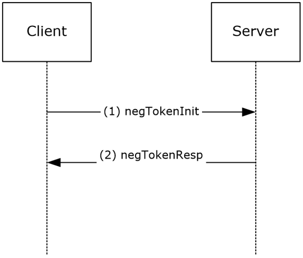
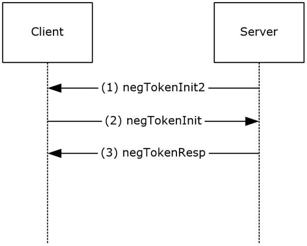

[MS-SPNG]:

Simple and Protected GSS-API Negotiation Mechanism
(SPNEGO) Extension

Intellectual Property Rights Notice for Open Specifications Documentation

  Technical Documentation. Microsoft publishes Open Specifications documentation (“this

documentation”) for protocols, file formats, data portability, computer languages, and standards
support. Additionally, overview documents cover inter-protocol relationships and interactions.

  Copyrights. This documentation is covered by Microsoft copyrights. Regardless of any other

terms that are contained in the terms of use for the Microsoft website that hosts this
documentation, you can make copies of it in order to develop implementations of the technologies
that are described in this documentation and can distribute portions of it in your implementations
that use these technologies or in your documentation as necessary to properly document the
implementation. You can also distribute in your implementation, with or without modification, any
schemas, IDLs, or code samples that are included in the documentation. This permission also
applies to any documents that are referenced in the Open Specifications documentation.
  No Trade Secrets. Microsoft does not claim any trade secret rights in this documentation.
  Patents. Microsoft has patents that might cover your implementations of the technologies

described in the Open Specifications documentation. Neither this notice nor Microsoft's delivery of
this documentation grants any licenses under those patents or any other Microsoft patents.
However, a given Open Specifications document might be covered by the Microsoft Open
Specifications Promise or the Microsoft Community Promise. If you would prefer a written license,
or if the technologies described in this documentation are not covered by the Open Specifications
Promise or Community Promise, as applicable, patent licenses are available by contacting
iplg@microsoft.com.

  License Programs. To see all of the protocols in scope under a specific license program and the

associated patents, visit the Patent Map.

  Trademarks. The names of companies and products contained in this documentation might be
covered by trademarks or similar intellectual property rights. This notice does not grant any
licenses under those rights. For a list of Microsoft trademarks, visit
www.microsoft.com/trademarks.

  Fictitious Names. The example companies, organizations, products, domain names, email

addresses, logos, people, places, and events that are depicted in this documentation are fictitious.
No association with any real company, organization, product, domain name, email address, logo,
person, place, or event is intended or should be inferred.

Reservation of Rights. All other rights are reserved, and this notice does not grant any rights other
than as specifically described above, whether by implication, estoppel, or otherwise.

Tools. The Open Specifications documentation does not require the use of Microsoft programming
tools or programming environments in order for you to develop an implementation. If you have access
to Microsoft programming tools and environments, you are free to take advantage of them. Certain
Open Specifications documents are intended for use in conjunction with publicly available standards
specifications and network programming art and, as such, assume that the reader either is familiar
with the aforementioned material or has immediate access to it.

Support. For questions and support, please contact dochelp@microsoft.com.

[MS-SPNG] - v20260427
Simple and Protected GSS-API Negotiation Mechanism (SPNEGO) Extension
Copyright © 2026 Microsoft Corporation
Release: April 27, 2026

1 / 33

Revision Summary

Date

Revision
History

Revision
Class

Comments

10/22/2006  0.01

1/19/2007

1.0

3/2/2007

1.1

4/3/2007

1.2

5/11/2007

1.3

New

Major

Minor

Minor

Minor

Version 0.01 release

Version 1.0 release

Version 1.1 release

Version 1.2 release

Version 1.3 release

6/1/2007

1.3.1

Editorial

Changed language and formatting in the technical content.

7/3/2007

1.3.2

Editorial

Changed language and formatting in the technical content.

7/20/2007

1.3.3

Editorial

Changed language and formatting in the technical content.

8/10/2007

2.0

9/28/2007

3.0

10/23/2007  4.0

11/30/2007  5.0

Major

Major

Major

Major

Updated and revised the technical content.

Updated and revised the technical content.

Added technical clarifications.

Updated and revised the technical content.

1/25/2008

5.0.1

Editorial

Changed language and formatting in the technical content.

3/14/2008

5.0.2

Editorial

Changed language and formatting in the technical content.

5/16/2008

5.0.3

Editorial

Changed language and formatting in the technical content.

6/20/2008

6.0

Major

Updated and revised the technical content.

7/25/2008

6.0.1

Editorial

Changed language and formatting in the technical content.

8/29/2008

6.0.2

Editorial

Changed language and formatting in the technical content.

10/24/2008  6.0.3

Editorial

Changed language and formatting in the technical content.

12/5/2008

7.0

Major

Updated and revised the technical content.

1/16/2009

7.0.1

Editorial

Changed language and formatting in the technical content.

2/27/2009

7.0.2

Editorial

Changed language and formatting in the technical content.

4/10/2009

7.1

5/22/2009

7.2

7/2/2009

7.3

8/14/2009

7.4

9/25/2009

7.5

Minor

Minor

Minor

Minor

Minor

Clarified the meaning of the technical content.

Clarified the meaning of the technical content.

Clarified the meaning of the technical content.

Clarified the meaning of the technical content.

Clarified the meaning of the technical content.

11/6/2009

7.5.1

Editorial

Changed language and formatting in the technical content.

12/18/2009  8.0

1/29/2010

8.1

Major

Minor

Updated and revised the technical content.

Clarified the meaning of the technical content.

[MS-SPNG] - v20260427
Simple and Protected GSS-API Negotiation Mechanism (SPNEGO) Extension
Copyright © 2026 Microsoft Corporation
Release: April 27, 2026

2 / 33

Date

Revision
History

Revision
Class

Comments

3/12/2010

8.2

4/23/2010

8.3

6/4/2010

8.4

7/16/2010

8.5

8/27/2010

8.5

10/8/2010

9.0

11/19/2010  10.0

1/7/2011

10.0

Minor

Minor

Minor

Minor

None

Major

Major

None

Clarified the meaning of the technical content.

Clarified the meaning of the technical content.

Clarified the meaning of the technical content.

Clarified the meaning of the technical content.

No changes to the meaning, language, or formatting of the
technical content.

Updated and revised the technical content.

Updated and revised the technical content.

No changes to the meaning, language, or formatting of the
technical content.

2/11/2011

10.1

Minor

Clarified the meaning of the technical content.

3/25/2011

10.1

None

No changes to the meaning, language, or formatting of the
technical content.

5/6/2011

10.1

None

No changes to the meaning, language, or formatting of the
technical content.

6/17/2011

10.2

Minor

Clarified the meaning of the technical content.

9/23/2011

10.2

None

No changes to the meaning, language, or formatting of the
technical content.

12/16/2011  11.0

Major

Updated and revised the technical content.

3/30/2012

11.0

7/12/2012

11.1

10/25/2012  11.2

1/31/2013

11.2

8/8/2013

12.0

11/14/2013  12.1

2/13/2014

12.1

None

Minor

Minor

None

Major

Minor

None

No changes to the meaning, language, or formatting of the
technical content.

Clarified the meaning of the technical content.

Clarified the meaning of the technical content.

No changes to the meaning, language, or formatting of the
technical content.

Updated and revised the technical content.

Clarified the meaning of the technical content.

No changes to the meaning, language, or formatting of the
technical content.

5/15/2014

12.1

None

No changes to the meaning, language, or formatting of the
technical content.

6/30/2015

13.0

Major

Significantly changed the technical content.

10/16/2015  13.0

None

No changes to the meaning, language, or formatting of the
technical content.

7/14/2016

13.0

6/1/2017

13.0

None

None

No changes to the meaning, language, or formatting of the
technical content.

No changes to the meaning, language, or formatting of the

[MS-SPNG] - v20260427
Simple and Protected GSS-API Negotiation Mechanism (SPNEGO) Extension
Copyright © 2026 Microsoft Corporation
Release: April 27, 2026

3 / 33

Date

Revision
History

Revision
Class

Comments

technical content.

9/15/2017

14.0

Major

Significantly changed the technical content.

12/1/2017

14.0

9/12/2018

15.0

4/7/2021

16.0

6/25/2021

17.0

4/29/2022

18.0

4/23/2024

19.0

7/29/2024

20.0

4/27/2026

21.0

None

Major

Major

Major

Major

Major

Major

Major

No changes to the meaning, language, or formatting of the
technical content.

Significantly changed the technical content.

Significantly changed the technical content.

Significantly changed the technical content.

Significantly changed the technical content.

Significantly changed the technical content.

Significantly changed the technical content.

Significantly changed the technical content.

[MS-SPNG] - v20260427
Simple and Protected GSS-API Negotiation Mechanism (SPNEGO) Extension
Copyright © 2026 Microsoft Corporation
Release: April 27, 2026

4 / 33

Table of Contents

1.3

1.1
1.2

1.2.1
1.2.2

1.3.1
1.3.2
1.3.3
1.3.4

1  Introduction ............................................................................................................ 7
Glossary ........................................................................................................... 7
References ........................................................................................................ 8
Normative References ................................................................................... 8
Informative References ................................................................................. 9
Overview .......................................................................................................... 9
Security Background ..................................................................................... 9
SPNEGO Synopsis ....................................................................................... 10
Client Initiated SPNG Message Flow .............................................................. 11
Server Initiated SPNG Message Flow ............................................................. 11
Relationship to Other Protocols .......................................................................... 12
Prerequisites/Preconditions ............................................................................... 12
Applicability Statement ..................................................................................... 12
Versioning and Capability Negotiation ................................................................. 12
Vendor-Extensible Fields ................................................................................... 12
Standards Assignments ..................................................................................... 12
Use of Constants Assigned Elsewhere ............................................................ 12

1.4
1.5
1.6
1.7
1.8
1.9

1.9.1

2  Messages ............................................................................................................... 14
Transport ........................................................................................................ 14
Message Syntax ............................................................................................... 14
NegTokenInit2 ........................................................................................... 14

2.1
2.2

2.2.1

3.1

3.1.1
3.1.2
3.1.3
3.1.4
3.1.5

3.1.5.1
3.1.5.2
3.1.5.3
3.1.5.4
3.1.5.5
3.1.5.6
3.1.5.7
3.1.5.8
3.1.5.9
3.1.5.10
3.1.5.11

3  Protocol Details ..................................................................................................... 16
Common Details .............................................................................................. 16
Abstract Data Model .................................................................................... 16
Timers ...................................................................................................... 17
Initialization ............................................................................................... 17
Higher-Layer Trigger Events ......................................................................... 17
Message Processing Events and Sequencing Rules .......................................... 17
mechListMIC Processing ......................................................................... 17
mechTypes Identification of Kerberos ...................................................... 17
mechTypes Identification of IAKerb ......................................................... 18
mechTypes Identification of Negotiate Late Fallback .................................. 18
reqFlags Processing ............................................................................... 18
InitFragmentToken() ............................................................................. 18
FragmentToken() .................................................................................. 18
Send Fragmented Messages ................................................................... 19
InitAssembleToken() ............................................................................. 19
AssembleToken() .................................................................................. 19
Receive Fragmented Messages ............................................................... 20
Timer Events .............................................................................................. 20
Other Local Events ...................................................................................... 20
Server (Acceptor) Role Details ........................................................................... 20
Abstract Data Model .................................................................................... 20
Timers ...................................................................................................... 20
Initialization ............................................................................................... 20
Higher-Layer Triggered Events ..................................................................... 20
Message Processing Events and Sequencing Rules .......................................... 20
NTLM RC4 Key State for MechListMIC and First Signed Message ................. 21
NegTokenInit2 Variation for Server-Initiation ............................................ 21
Timer Events .............................................................................................. 21
Other Local Events ...................................................................................... 21
Client (Initiator) Role Details ............................................................................. 22
Abstract Data Model .................................................................................... 22

3.2.1
3.2.2
3.2.3
3.2.4
3.2.5

3.2.5.1
3.2.5.2

3.2.6
3.2.7

3.1.6
3.1.7

3.3.1

3.3

3.2

[MS-SPNG] - v20260427
Simple and Protected GSS-API Negotiation Mechanism (SPNEGO) Extension
Copyright © 2026 Microsoft Corporation
Release: April 27, 2026

5 / 33

3.3.2
3.3.3
3.3.4
3.3.5

3.3.5.1
3.3.5.2

3.3.6
3.3.7

Timers ...................................................................................................... 22
Initialization ............................................................................................... 22
Higher-Layer Triggered Events ..................................................................... 22
Message Processing Events and Sequencing Rules .......................................... 22
NTLM RC4 Key State for MechListMIC and First Signed Message ................. 22
NegTokenInit2 Variation for Server-Initiation ............................................ 22
Timer Events .............................................................................................. 23
Other Local Events ...................................................................................... 23

4  Protocol Examples ................................................................................................. 24

5  Security ................................................................................................................. 26
Security Considerations for Implementers ........................................................... 26
Index of Security Parameters ............................................................................ 26

5.1
5.2

6  Appendix A: Product Behavior ............................................................................... 27

7  Change Tracking .................................................................................................... 30

8  Index ..................................................................................................................... 31

[MS-SPNG] - v20260427
Simple and Protected GSS-API Negotiation Mechanism (SPNEGO) Extension
Copyright © 2026 Microsoft Corporation
Release: April 27, 2026

6 / 33

1  Introduction

The Simple and Protected Generic Security Service Application Program Interface (GSS-API)
Negotiation Mechanism (SPNEGO) Extension is an extension to [RFC4178] that provides a negotiation
mechanism for the Generic Security Service Application Program Interface (GSS-API), as specified in
[RFC2743]. SPNEGO provides a framework for two parties that are engaged in authentication to select
from a set of possible authentication mechanisms, in a manner that preserves the opaque nature of
the security protocols to the application protocol that uses SPNEGO. SPNEGO was first defined in
[RFC2478], which has been superseded by [RFC4178].

Sections 1.5, 1.8, 1.9, 2, and 3 of this specification are normative. All other sections and examples in
this specification are informative.

1.1  Glossary

This document uses the following terms:

application protocol: A network protocol that operates in the application layer at the top of the

OSI model. It visibly accomplishes the task that the user or other agent wants to perform. This
is distinguished from all manner of support protocols: from Ethernet or IP at the bottom to
security and routing protocols. While necessary, these are not always visible to the user.
Application protocols include, for instance, HTTP and Server Message Block (SMB).

ASN.1: Abstract Syntax Notation One. ASN.1 is used to describe Kerberos datagrams as a

sequence of components, sent in messages. ASN.1 is described in the following specifications:
[ITUX660] for general procedures; [ITUX680] for syntax specification, and [ITUX690] for the
Basic Encoding Rules (BER), Canonical Encoding Rules (CER), and Distinguished Encoding Rules
(DER) encoding rules.

ASN.1 Header: The top-level ASN.1 tag of the message.

authentication: The ability of one entity to determine the identity of another entity by proving an

identity to a server while providing key material that binds the identity to subsequent
communications.

Generic Security Services (GSS): An Internet standard, as described in [RFC2743], for providing
security services to applications. It consists of an application programming interface (GSS-API)
set, as well as standards that describe the structure of the security data.

globally unique identifier (GUID): A term used interchangeably with universally unique

identifier (UUID) in Microsoft protocol technical documents (TDs). Interchanging the usage of
these terms does not imply or require a specific algorithm or mechanism to generate the value.
Specifically, the use of this term does not imply or require that the algorithms described in
[RFC4122] or [C706] have to be used for generating the GUID. See also universally unique
identifier (UUID).

Kerberos: An authentication system that enables two parties to exchange private information

across an otherwise open network by assigning a unique key (called a ticket) to each user that
logs on to the network and then embedding these tickets into messages sent by the users. For
more information, see [MS-KILE].

object identifier (OID): In the context of an object server, a 64-bit number that uniquely

identifies an object.

original equipment manufacturer (OEM) code page: A code page used to translate between

non-Unicode encoded strings and UTF-16 encoded strings.

security protocol: A protocol that performs authentication and possibly additional security

services on a network.

7 / 33

[MS-SPNG] - v20260427
Simple and Protected GSS-API Negotiation Mechanism (SPNEGO) Extension
Copyright © 2026 Microsoft Corporation
Release: April 27, 2026

security token: An opaque message or data packet produced by a Generic Security Services
(GSS)-style authentication package and carried by the application protocol. The application
has no visibility into the contents of the token.

Simple and Protected GSS-API Negotiation Mechanism (SPNEGO): An authentication

mechanism that allows Generic Security Services (GSS) peers to determine whether their
credentials support a common set of GSS-API security mechanisms, to negotiate different
options within a given security mechanism or different options from several security
mechanisms, to select a service, and to establish a security context among themselves using
that service. SPNEGO is specified in [RFC4178].

MAY, SHOULD, MUST, SHOULD NOT, MUST NOT: These terms (in all caps) are used as defined
in [RFC2119]. All statements of optional behavior use either MAY, SHOULD, or SHOULD NOT.

1.2  References

Links to a document in the Microsoft Open Specifications library point to the correct section in the
most recently published version of the referenced document. However, because individual documents
in the library are not updated at the same time, the section numbers in the documents may not
match. You can confirm the correct section numbering by checking the Errata.

1.2.1  Normative References

We conduct frequent surveys of the normative references to assure their continued availability. If you
have any issue with finding a normative reference, please contact dochelp@microsoft.com. We will
assist you in finding the relevant information.

[IETFDRAFT-KITTEN-IAKERB-03] B. Kaduk, Ed., J. Schaad, Ed., L. Zhu, J. Altman, "Initial and Pass
Through Authentication Using Kerberos V5 and the GSS-API (IAKERB)", March 2017,
https://datatracker.ietf.org/doc/html/draft-ietf-kitten-iakerb-03

[ISO/IEC-8859-1] International Organization for Standardization, "Information Technology -- 8-Bit
Single-Byte Coded Graphic Character Sets -- Part 1: Latin Alphabet No. 1", ISO/IEC 8859-1, 1998,
http://www.iso.org/iso/home/store/catalogue_tc/catalogue_detail.htm?csnumber=28245

Note There is a charge to download the specification.

[MS-NLMP] Microsoft Corporation, "NT LAN Manager (NTLM) Authentication Protocol".

[RFC2119] Bradner, S., "Key words for use in RFCs to Indicate Requirement Levels", BCP 14, RFC
2119, March 1997, https://www.rfc-editor.org/info/rfc2119

[RFC2478] Baize, E. and Pinkas, D., "The Simple and Protected GSS-API Negotiation Mechanism", RFC
2478, December 1998, https://www.rfc-editor.org/info/rfc2478

[RFC2743] Linn, J., "Generic Security Service Application Program Interface Version 2, Update 1", RFC
2743, January 2000, https://www.rfc-editor.org/info/rfc2743

[RFC4178] Zhu, L., Leach, P., Jaganathan, K., and Ingersoll, W., "The Simple and Protected Generic
Security Service Application Program Interface (GSS-API) Negotiation Mechanism", RFC 4178, October
2005, https://www.rfc-editor.org/info/rfc4178

[X680] ITU-T, "Abstract Syntax Notation One (ASN.1): Specification of Basic Notation",
Recommendation X.680, July 2002, http://www.itu.int/rec/T-REC-X.680/en

[X690] ITU-T, "Information Technology - ASN.1 Encoding Rules: Specification of Basic Encoding Rules
(BER), Canonical Encoding Rules (CER) and Distinguished Encoding Rules (DER)", Recommendation
X.690, July 2002, http://www.itu.int/rec/T-REC-X.690/en

[MS-SPNG] - v20260427
Simple and Protected GSS-API Negotiation Mechanism (SPNEGO) Extension
Copyright © 2026 Microsoft Corporation
Release: April 27, 2026

8 / 33

1.2.2  Informative References

[HTTPAUTH] Jaganathan, K., Zhu, L., and Brezak, J., "Kerberos based HTTP Authentication in
Windows", July 2005, http://tools.ietf.org/html/draft-jaganathan-kerberos-http-01

[IETFDRAFT-NEGOEX-02] Short, M., Zhu, L., Damour, K., and McPherson, D., "The Extended GSS-API
Negotiation Mechanism (NEGOEX)", draft-zhu-negoex-02, September 2010,
https://tools.ietf.org/html/draft-zhu-negoex-02

[KAUFMAN] Kaufman, C., Perlman, R., and M. Speciner, "Network Security: Private Communication in
a Public World, Second Edition", Prentice Hall, 2002, ISBN: 0130460192.

[MS-KILE] Microsoft Corporation, "Kerberos Protocol Extensions".

[MS-RPCE] Microsoft Corporation, "Remote Procedure Call Protocol Extensions".

[MS-SMB] Microsoft Corporation, "Server Message Block (SMB) Protocol".

[PKU2U-DRAFT] Zhu, L., Altman, J., and Williams, N., "Public Key Cryptography Based User-to-User
Authentication (PKU2U)", November 2008, http://tools.ietf.org/id/draft-zhu-pku2u-09.txt

[RFC1964] Linn, J., "The Kerberos Version 5 GSS-API Mechanism", RFC 1964, June 1996,
https://www.rfc-editor.org/info/rfc1964

[RFC2251] Wahl, M., Howes, T., and Kille, S., "Lightweight Directory Access Protocol (v3)", RFC 2251,
December 1997, https://www.rfc-editor.org/info/rfc2251

[RFC4120] Neuman, C., Yu, T., Hartman, S., and Raeburn, K., "The Kerberos Network Authentication
Service (V5)", RFC 4120, July 2005, https://www.rfc-editor.org/rfc/rfc4120

[UUKA-GSSAPI] Swift, M., Brezak, J., and Moore, P., "User to User Kerberos Authentication using
GSS-API", October 2001, https://tools.ietf.org/html/draft-swift-win2k-krb-user2user-03

1.3  Overview

Simple and Protected Generic Security Service Application Program Interface Negotiation Mechanism
(SPNEGO): Extension processes certain SPNEGO message fields differently from the standard
specification, including the NegTokenInit and universal receiver fields.

The following sections give an overview of SPNEGO extension, its processing, and message flows.

1.3.1  Security Background

The SPNEGO Extension is a security protocol. As such, the normative references in this specification
use common security-related terms. Every effort has been made to use these terms, such as principal,
key, and service, in accordance with their use in [RFC4178].

A prerequisite for understanding the variations between the SPNEGO Extension and [RFC4178] is a
working knowledge of the Generic Security Service API. Several of the informative references,
specifically [KAUFMAN], provide excellent top-level information about Generic Security Services (GSS)
and the message flow. [KAUFMAN] also provides an excellent survey of other security protocols and
concepts, and it helps to explain the terms of art that this specification uses.

Historically, the first GSS security mechanism defined was the Kerberos protocol ([RFC1964]). The
Kerberos protocol has influenced many other mechanisms; in some cases, it might be helpful to have
an example protocol to compare against. Finally, there are details that are not immediately apparent,
as specified in [RFC2743] and [RFC4178].

[MS-SPNG] - v20260427
Simple and Protected GSS-API Negotiation Mechanism (SPNEGO) Extension
Copyright © 2026 Microsoft Corporation
Release: April 27, 2026

9 / 33

1.3.2  SPNEGO Synopsis

SPNEGO is a security protocol that uses a GSS-API authentication mechanism. GSS–API is a literal
set of functions that include both an API and a methodology for approaching authentication. As
specified in [RFC2743], GSS-API and the individual security protocols that correspond to the GSS–API
(also shortened to GSS) were developed because of the need to insulate application protocols from the
specifics of security protocols as much as possible.

SPNEGO has introduced a Late Fallback mechanism to allow for retrying of authentication in case of
non-fatal failures, as described in [IETFDRAFT-KITTEN-IAKERB-03]. The Late Fallback mechanism
helps only when both parties have the SPNEGO version that supports it.

This approach led to a simplified form of interaction between an application protocol and an
authentication protocol. In this model, an application protocol is responsible for ferrying discrete,
opaque packets that the authentication protocol produces. These packets, which are referred to as
security tokens by the GSS specifications, implement the authentication process. The application
protocol has no visibility into the contents of the security tokens; its responsibility is merely to carry
them.

The application protocol in this model (see SPN exchange figures in section 1.3.3) first invokes the
authentication protocol on the client. The client portion of the authentication protocol creates a
security token and returns it to the calling application. The application protocol then transmits that
security token to the server side of its connection, embedded within the application protocol. On the
server side, the server's application protocol extracts the security token and supplies it to the
authentication protocol on the server side. The server authentication protocol can process the security
token and possibly generate a response, or it can decide that authentication is complete. If another
security token is generated, the application protocol must carry it back to the client, where the
process continues.

This exchange of security tokens continues until one side determines that authentication has failed or
both sides decide that authentication is complete. If authentication fails with critical error, the
application protocol drops the connection and indicates the error. If the authentication fails with a
non-fatal error, the Late Fallback mechanism allows retrying the authentication with the next available
protocol. If authentication succeeds, the application protocol can be assured of the identity of the
participants as far as the supporting authentication protocol can accomplish. The onus of determining
success or failure is on the abstracted security protocol, not the application protocol, which greatly
simplifies the application protocol author's task.

After the authentication is complete, session-specific security services might be available. The
application protocol can then invoke the authentication protocol to sign or encrypt the messages that
are sent as part of the application protocol. The session-specific security services operations are done
in much the same way, where the application protocol can indicate which portions of the message are
to be encrypted, and the application protocol must include a per-message security token. By signing
or encrypting the messages, the application can obtain message privacy and integrity, and detect
message loss, out of order delivery and duplication.

Because more than one GSS–compatible authentication protocol exists, determining which protocol to
use has become more important. The original GSS design had a static, compile-time binding between
the application and the GSS implementation. More recent practice is to support more than one
authentication mechanism—even for a single application protocol.

SPNEGO fills this need by presenting a GSS–compatible wrapper to other GSS mechanisms. It
securely negotiates among several authentication mechanisms, selecting one for use to satisfy the
authentication needs of the application protocol.

SPNG has errors in early implementations and an optimization for certain non–GSS scenarios. These
variations form the basis of this specification.

[MS-SPNG] - v20260427
Simple and Protected GSS-API Negotiation Mechanism (SPNEGO) Extension
Copyright © 2026 Microsoft Corporation
Release: April 27, 2026

10 / 33

<!-- Extracted images from page 11 -->

<!-- /Extracted images from page 11 -->

1.3.3  Client Initiated SPNG Message Flow

SPNG message flow is composed of the following exchange:

Figure 1: SPNG exchange

1.  The client sends a negTokenInit message to the server. This message specifies the available

authentication methods and an optimistic mechanism token ([RFC4178] section 3.1).

2.  The server sends a negTokenResp message to the client. The message specifies the state of the

negotiation.

1.3.4  Server Initiated SPNG Message Flow

Server-initiated SPNG is composed of a three-way exchange:

Figure 2: SPNG exchange

1.  The server sends a negTokenInit2 message to the client. This message specifies the available

authentication methods and an optimistic mechanism token.

2.  The client sends a negTokenInit message to the server. This message specifies the available

authentication methods and an optimistic mechanism token.

[MS-SPNG] - v20260427
Simple and Protected GSS-API Negotiation Mechanism (SPNEGO) Extension
Copyright © 2026 Microsoft Corporation
Release: April 27, 2026

11 / 33

3.  The server sends a negTokenResp message to the client. The message specifies the state of the

negotiation.

1.4  Relationship to Other Protocols

SPNEGO requires at least one other GSS–compatible authentication protocol to be present for it to
work. It does not depend on a specific protocol.<1>

Since NEGOEX negotiates security mechanisms, applications that use SPNEGO as their authentication
protocol can use protocols supported by NEGOEX.<2>

Many application protocols make use of SPNEGO as their authentication protocol. Such protocols
include the Common Internet File System (CIFS)/Server Message Block (SMB) [MS-SMB]; HTTP
[HTTPAUTH]; RPCE [MS-RPCE]; and the Lightweight Directory Access Protocol (LDAP) [RFC2251].

SPNEGO is a meta protocol that travels entirely in other application protocols; it is never used directly
without an application protocol.

After SPNEGO has completed the ferrying of the other security protocol's authentication tokens,
SPNEGO is finished. All further access to security context state and per-message services, such as
signatures or encryption, is done by directly using the "real" security protocol whose authentication
tokens were communicated via SPNEGO.

1.5  Prerequisites/Preconditions

Because SPNEGO relies on other security protocols that perform authentication, those protocols
have to be available to SPNEGO for it to operate. The set of protocols is implementation-dependent
upon the installation.<3>

Applications typically establish a connection before they invoke SPNEGO, although establishing a
connection before invoking SPNEGO is not required by the SPNEGO protocol.

1.6  Applicability Statement

As a GSS protocol, SPNEGO can be used almost anywhere that an application protocol uses GSS to
perform authentication. The protocol has to be connection-oriented because it is not designed to
tolerate packet loss; datagram-only protocols cannot support negotiation of this form.

1.7  Versioning and Capability Negotiation

SPNEGO does not contain any versioning capacity. The same is true for capabilities: any capability
negotiation must be performed by the actual authentication protocols that SPNEGO is carrying.

1.8  Vendor-Extensible Fields

None.

1.9  Standards Assignments

None.

1.9.1  Use of Constants Assigned Elsewhere

SPNEGO has been assigned the following object identifier (OID):



iso.org.dod.internet.security.mechanism.snego (1.3.6.1.5.5.2)

[MS-SPNG] - v20260427
Simple and Protected GSS-API Negotiation Mechanism (SPNEGO) Extension
Copyright © 2026 Microsoft Corporation
Release: April 27, 2026

12 / 33

See section 1.4 and section 3.1.5.2 for other OID usages.

[MS-SPNG] - v20260427
Simple and Protected GSS-API Negotiation Mechanism (SPNEGO) Extension
Copyright © 2026 Microsoft Corporation
Release: April 27, 2026

13 / 33

2  Messages

2.1  Transport

SPNEGO is transported only when encapsulated in an application protocol. As such, it can travel
over whatever transports the application protocol uses. By itself, SPNEGO never causes network
traffic.

2.2  Message Syntax

The messages that SPNEGO uses are specified in [RFC4178], in terms of ASN.1, as specified in
[X680]. There are only two messages in SPNEGO, negTokenInit and negTokenResp.

The negTokenInit message is sent from the client to the server and is used to begin the negotiation.
The client uses that message to specify the set of authentication mechanisms that are supported and
an opportunistic authentication message from the mechanism that the client believes will be agreed
upon with the server.

The negTokenResp message is used thereafter as the server selects the mechanism to use, and the
two parties exchange authentication messages that are wrapped in the negTokenResp message until
completion.

The SPNEGO Extension extends the NegTokenInit message with the NegTokenInit2 message
section 2.2.1.

2.2.1  NegTokenInit2

The NegTokenInit2 message extends NegTokenInit with a negotiation hints (negHints) field. The
NegTokenInit2 message SHOULD<4> be structured as follows.

 NegHints ::= SEQUENCE {
         hintName[0] GeneralString OPTIONAL,
         hintAddress[1] OCTET STRING OPTIONAL
 }
 NegTokenInit2 ::= SEQUENCE {
         mechTypes[0] MechTypeList OPTIONAL,
         reqFlags [1] ContextFlags OPTIONAL,
         mechToken [2] OCTET STRING OPTIONAL,
         negHints [3] NegHints OPTIONAL,
         mechListMIC [4] OCTET STRING OPTIONAL,
         ...
 }

mechTypes: The list of authentication mechanisms that are available, by OID, as specified in

[RFC4178] section 4.1.

reqFlags: As specified in [RFC4178] section 4.2.1 This field SHOULD be omitted by the sender.

mechToken: The optimistic mechanism token ([RFC4178] section 4.2.1).<5>

negHints: The server supplies the negotiation hints using a NegHints structure that is assembled as

follows.

  hintName: SHOULD<6> contain the string "not_defined_in_RFC4178@please_ignore".

  hintAddress: Never present. MUST be omitted by the sender. Note that the encoding rules,
as specified in [X690], require that this structure not be present at all, not just be zero.

[MS-SPNG] - v20260427
Simple and Protected GSS-API Negotiation Mechanism (SPNEGO) Extension
Copyright © 2026 Microsoft Corporation
Release: April 27, 2026

14 / 33

mechListMIC: The message integrity code (MIC) token ([RFC4178] section 4.2.1).

Note  In the preceding ASN.1 description, the NegTokenInit2 message occupies the same context-
specific ([X690] section 8.1.2.2) message ID as does NegTokenInit in SPNEGO.

[MS-SPNG] - v20260427
Simple and Protected GSS-API Negotiation Mechanism (SPNEGO) Extension
Copyright © 2026 Microsoft Corporation
Release: April 27, 2026

15 / 33

3  Protocol Details

3.1  Common Details

The following are common variations, as specified in [RFC4178], for both client and server processing
in the SPNEGO Extension.

3.1.1  Abstract Data Model

This section describes a conceptual model of possible data organization that an implementation
maintains to participate in this protocol. The described organization is provided to facilitate the
explanation of how the protocol behaves. This document does not mandate that implementations
adhere to this model as long as their external behavior is consistent with that described in this
document.

The SPNEGO Extension makes no extensions to the abstract data model for SPNEGO.

This protocol includes the following ADM elements, which are directly accessed from NLMP as specified
in [MS-NLMP] section 3.4.1:

  ClientHandle

  ServerHandle

SPNEGO exports a set of abstract parameters that describe the security services that a caller wants to
have available for use on the communication session after it has been established. SPNEGO cannot
directly act on these parameters because it does not perform the actual authentication. They are
passed through to the underlying security protocols as an indication of the caller's eventual plans.
These parameters are:



Integrity: A Boolean setting that indicates that the caller wants to sign messages so that they
cannot be tampered with while in transit.

  Replay Detect: A Boolean setting that indicates that the caller wants to sign messages so that they

cannot be replayed.

  Sequence Detect: A Boolean setting that indicates that the caller wants to sign messages so that

they cannot be sent out of order.

  Confidentiality: A Boolean setting that indicates that the caller wants to encrypt messages so that

they cannot be read while in transit.

  Delegate: A Boolean setting that indicates that the caller wants to make its own identity available

to the server for further identification to other services.

  Mutual Authentication: A Boolean setting that indicates that the client and server MUST

authenticate each other; unidirectional authentication is not permissible.

These flags correspond to the reqFlags:ContextFlags field in the NegTokenInit structure. As
specified in [RFC4178], the reqFlags:ContextFlags field is now only for legacy purposes and
SHOULD NOT be filled in. For more information about the reqFlags:ContextFlags field, see
section 3.1.5.5.

Extended Error: A Boolean setting that indicates that the caller wants the underlying protocol to
perform the extended error handling, potentially including retries within the GSS exchange.

FragmentToFit: A Boolean setting that indicates that the caller directs the underlying protocol to
fragment messages.<7>





[MS-SPNG] - v20260427
Simple and Protected GSS-API Negotiation Mechanism (SPNEGO) Extension
Copyright © 2026 Microsoft Corporation
Release: April 27, 2026

16 / 33

  MaxOutputTokenSize: The maximum size, in bytes, of output_token that can be returned to the

caller, as specified in [RFC2478] Section 2.2. This value MUST be at least 5 bytes to contain the
entire ASN.1 header, so that the recipient can reconstruct the length of the completed message.
Applications that request small buffers can significantly increase the number of round trips. An
application can have limitations on the number of round trips allowed, which means that setting
the buffers too small can cause failures. Also, authentication protocols can be sensitive to clock
skews between the client and server, which can cause failures if the amount of time required to
transmit all the messages is too long.

The following temporary variables are used by the fragmenting functions:

  FragmentInputToken: A Boolean setting that indicates that more fragments of input_token

remain, as specified in [RFC2478] section 4.2.

  ReceivedInputToken: The fragments of input_token received.

  TokenLength: The length of input_token.

  FragmentOutputToken: A Boolean setting that indicates that more fragments of output_token

remain.

  RemainingOutputToken: The remaining message to be sent.

The following temporary variable is used to reset the NLMP RC4 handle:

  OriginalHandle

3.1.2  Timers

None.

3.1.3  Initialization

None.

3.1.4  Higher-Layer Trigger Events

None.

3.1.5  Message Processing Events and Sequencing Rules

The following fields are processed differently than as specified in [RFC4178].

3.1.5.1  mechListMIC Processing

[RFC2478] inadequately specifies the processing of the mechanism list message integrity code (MIC),
or mechListMIC field. [RFC4178] clarifies the processing of the mechListMIC field.<8>

When Negotiate Late Fallback is supported by both parties, mechListMIC consumes a list of all
exchanged mechTypes and supportedMechs per the order of over-the-wire transmission with
delimiters.<9>

3.1.5.2  mechTypes Identification of Kerberos

An implementation SHOULD<10> use the standard Kerberos OID (1.2.840.113554.1.2.2), as
described in [RFC4120], for identification of the Kerberos mechType and the OID described in
[UUKA-GSSAPI] section 4 for identification of the Kerberos user-to-user mechType.

17 / 33

[MS-SPNG] - v20260427
Simple and Protected GSS-API Negotiation Mechanism (SPNEGO) Extension
Copyright © 2026 Microsoft Corporation
Release: April 27, 2026

3.1.5.3  mechTypes Identification of IAKerb

An implementation MUST use the standard IAKerb OID (1.3.6.1.5.2.5), as described in [IETFDRAFT-
KITTEN-IAKERB-03], for identification of the IAKerb mechType.

3.1.5.4  mechTypes Identification of Negotiate Late Fallback

An implementation MUST use the Negotiate Late Fallback OID (1.3.6.1.4.1.311.2.2.40) for
identification of the Negotiate Late Fallback mechType.

3.1.5.5  reqFlags Processing

[RFC2478], the predecessor to [RFC4178], includes the reqFlags field in the protocol. This field is
intended for the client to indicate the requested behavior according to the GSS abstract variables,
such as confidentiality and integrity. However, the reqFlags field is not covered by the signature of
the message; therefore, it can be tampered with while in transit.

As specified in [RFC4178], use of this field is explicitly discouraged due to the lack of integrity
protection, and the acceptor (server) MUST ignore the reqFlags, if present.

3.1.5.6  InitFragmentToken()

 InitFragmentToken (Token, MaxOutputTokenSize, OutputToken)
 -- Input:
 --   MaxOutputTokenSize - Maximum size, in bytes, of OutputToken that can be
      returned to the caller. MUST be greater than 5.
 --   Token – The Token message to be fragmented.
 -- Internal Temporary variables that do not pass over the wire are defined below:
 --   RemainingOutputToken – The remaining message to be sent.
 --   FragmentOutputToken - A Boolean setting that indicates that more fragments of the
output_token remain.
 -- Output:
 --   OutputToken – The first fragment of the message passed to the caller.

 Initialize RemainingOutputToken to Token.
 Set FragmentOutputToken to TRUE
 Set OutputToken to first MaxOutputTokenSize bytes of RemainingOutputToken
 Delete first MaxOutputTokenSize bytes of RemainingOutputToken

3.1.5.7  FragmentToken()

 FragmentToken(OutputToken)
 -- Internal Temporary variables that do not pass over the wire are defined below:
 --   MaxOutputTokenSize - Maximum size, in bytes, of the OutputToken that can be
      returned to the caller. MUST be greater than 5.
 --   RemainingOutputToken – The remaining message to be sent.
 --   FragmentOutputToken - A Boolean setting that indicates that more fragments of the
OutputToken remain.
 -- Output:
 --   OutputToken – The OutputToken passed to the client.

 If size of RemainingOutputToken > MaxOutputTokenSize
    Set OutputToken to first MaxOutputTokenSize bytes of RemaininggOutputToken
    Delete first MaxOutputTokenSize bytes of RemainingOutputToken
 Else
    Set OutputToken to RemainingOutputToken
    Set RemainingOutputToken to empty
    Set FragmentOutputToken to FALSE

[MS-SPNG] - v20260427
Simple and Protected GSS-API Negotiation Mechanism (SPNEGO) Extension
Copyright © 2026 Microsoft Corporation
Release: April 27, 2026

18 / 33

 EndIf

3.1.5.8  Send Fragmented Messages

The first fragment includes the ASN.1 header for the message, so that the recipient can reconstruct
the length of the completed message. This requires that MaxOutputTokenSize be at least 5 bytes.

The SPNEGO Extension calls InitFragmentToken (section 3.1.5.6), where:

  Token contains the message.

  MaxOutputTokenSize contains the MaxOutputTokenSize provided by the application.

The SPNEGO Extension MUST return GSS_S_CONTINUE_NEEDED status ([RFC2478]) and an initial
packet containing OutputToken, as specified in section 3.1.5.6.

When FragmentOutputToken is set to TRUE, the SPNEGO Extension calls FragmentToken (section
3.1.5.7) to get the next fragment, and MUST return GSS_S_CONTINUE_NEEDED status and
OutputToken. If FragmentOutputToken is not set to TRUE, the SPNEGO Extension MUST return
GSS_S_COMPLETE status, as specified in [RFC2478].

If the server does not support fragmentation, the application service receives an error from its
GSS_Accept_sec_context call, and the negotiation fails. Whether the client application receives the
error depends on the application service behavior.

3.1.5.9  InitAssembleToken()

 InitAssembleToken (Input_Token)
 -- Input:
 --  InputToken – The Input_Token received.
 --  Temporary variables that do not pass over the wire are defined below:
 --   ReceivedInputToken – The message fragments received so far.
 --   TokenLength - Length of message from the ASN.1 header.
 --   FragmentInputToken - A Boolean setting that indicates that more fragments of the message
remain.

 Initialize TokenLength to the length of the message from the ASN.1 header in InputToken.
 Initialize ReceivedInputToken to InputToken.
 Set FragmentInputToken to TRUE.

3.1.5.10

AssembleToken()

 AssembleToken(Input_Token, OutputToken)
 -- Input:
 --   InputToken – The Input_Token received.
 -- Temporary variables that do not pass over the wire are defined below:
 --  ReceivedInputToken – The message fragments received so far.
 --  TokenLength - Length of message from the ASN.1 header.
 --  FragmentInputToken - A Boolean setting that indicates that more fragments of the
InputToken remain.
 -- Output:
 --   OutputToken – The OutputToken returned, or the complete InputToken.

 Append InputToken to ReceivedInputToken
 If TokenLength > length of ReceivedInputToken
    Set OutputToken to empty
 Else
    Set OutputToken to ReceivedInputToken
    Set ReceivedInputToken to empty

[MS-SPNG] - v20260427
Simple and Protected GSS-API Negotiation Mechanism (SPNEGO) Extension
Copyright © 2026 Microsoft Corporation
Release: April 27, 2026

19 / 33

    Set FragmentInputToken to FALSE.
 EndIf

3.1.5.11

Receive Fragmented Messages

The length of the first packet specified in the ASN.1 header is used to determine the number of bytes
necessary to assemble the complete message. the SPNEGO Extension calls InitAssembleToken
(section 3.1.5.9), where Input_Token contains the Input_Token received from the caller. To
receive the next fragment, SPNG MUST return GSS_S_CONTINUE_NEEDED status with an empty
OutputToken (section 3.1.5.10).

When FragmentInputToken is set to TRUE, the SPNEGO Extension calls AssembleToken (section
3.1.5.10), where Input_Token contains the Input_Token received. If the OutputToken is not
empty, the message is complete and processing can continue as normal. Otherwise, to receive the
next fragment, the SPNEGO Extension MUST return GSS_S_CONTINUE_NEEDED status with an empty
OutputToken.

If the context is terminated before reassembly of the message is complete (for example, because the
network connection to the other entity is interrupted), the entire message MUST be discarded.

3.1.6  Timer Events

None.

3.1.7  Other Local Events

None.

3.2  Server (Acceptor) Role Details

3.2.1  Abstract Data Model

The abstract data model for the server is specified in section 3.1.1.

3.2.2  Timers

None.

3.2.3  Initialization

None.

3.2.4  Higher-Layer Triggered Events

None.

3.2.5  Message Processing Events and Sequencing Rules

The server SHOULD ignore the negHints field in the negTokenInit2 message.

The server MUST use the erroneous Kerberos value (1.2.840.48018.1.2.2) as the supportedMech
field in the response negotiation token if the optimistic Kerberos token (1.2.840.48018.1.2.2) is
accepted, as specified in [RFC4178] section 4.2.2 and Appendix C.

[MS-SPNG] - v20260427
Simple and Protected GSS-API Negotiation Mechanism (SPNEGO) Extension
Copyright © 2026 Microsoft Corporation
Release: April 27, 2026

20 / 33

The SPNG server SHOULD invoke Send Fragmented Messages (section 3.1.5.8) when a
GSS_Accept_sec_context() ([RFC2743] section 2.2.2) with the FragmentToFit parameter set to
TRUE (section 3.1.1) is received, and either:



The Negotiate Token ([RFC4178] section 4.2) to be sent exceeds MaxOutputTokenSize, or

  FragmentOutputToken is set to TRUE.

The server MUST invoke Receive Fragmented Messages (section 3.1.5.11) when a packet is
received and either:



The packet contains a valid ASN.1 header but an incomplete body, or

  FragmentOutputToken is set to TRUE.

3.2.5.1  NTLM RC4 Key State for MechListMIC and First Signed Message

When NTLM is negotiated, the SPNG server MUST set OriginalHandle to ServerHandle before
generating the mechListMIC, then set ServerHandle to OriginalHandle after generating the
mechListMIC. This results in the RC4 key state being the same for the mechListMIC and for the
first message signed by the application.

Because the RC4 key state is the same for the mechListMIC and for the first message signed by the
application, the SPNEGO Extension server MUST set OriginalHandle to ClientHandle before
validating the mechListMIC and then set ClientHandle to OriginalHandle after validating the
mechListMIC.

3.2.5.2  NegTokenInit2 Variation for Server-Initiation

Standard GSS has a strict notion of client (initiator) and server (acceptor). If the client has not sent a
negTokenInit ([RFC4178] section 4.2.1) message, no context establishment token is expected from
the server.

The SPNEGO extension allows the server to generate a context establishment token message (
NegTokenInit2 section 2.2.1) and send it to the client when GSS_Accept_sec_context() is called
without an input_token.

The server generates a NegTokenInit2 message that includes the OIDs of the security protocols
that are present and available on the server in the mechTypes field.

In the negHints field, the server places the string "not_defined_in_RFC4178@please_ignore",
expressed as ANSI encoding, as specified in [ISO/IEC-8859-1], in the hintName field. For more
information about how the hintName field is populated, see section 2.2.1.

The hintAddress field MUST be omitted and not transmitted. The NegTokenInit2 token is then
passed to the client within the application protocol. When encoding the name, the configured locale
on the computer SHOULD be used for the resulting character set.

3.2.6  Timer Events

None.

3.2.7  Other Local Events

None.

[MS-SPNG] - v20260427
Simple and Protected GSS-API Negotiation Mechanism (SPNEGO) Extension
Copyright © 2026 Microsoft Corporation
Release: April 27, 2026

21 / 33

3.3  Client (Initiator) Role Details

3.3.1  Abstract Data Model

The abstract data model for the client is specified in section 3.1.1.

3.3.2  Timers

None.

3.3.3  Initialization

The client MUST request Mutual Authentication services, as specified in section 3.1.1.

3.3.4  Higher-Layer Triggered Events

None.

3.3.5  Message Processing Events and Sequencing Rules

The SPNEGO Extension client SHOULD invoke Send Fragmented Messages (section 3.1.5.8) when a
GSS_Accept_sec_context() ([RFC2743] section 2.2.2) with the FragmentToFit parameter set to
TRUE (section 3.1.1) is received, and either:



The Negotiate Token ([RFC4178] section 4.2) to be sent exceeds MaxOutputTokenSize, or

  FragmentOutputToken is set to TRUE.

The server MUST invoke Receive Fragmented Messages (section 3.1.5.11) when a packet is
received and either:



The packet contains a valid ASN.1 header but an incomplete body, or

  FragmentOutputToken is set to TRUE.

To support non-compliant implementations of [RFC4178] that send a supportedMech field in a
subsequent NegTokenResp message, the SPNEGO Extension client SHOULD<11> accept the
message without returning an error, but MUST ignore the new supportedMech field.

3.3.5.1  NTLM RC4 Key State for MechListMIC and First Signed Message

When NTLM is negotiated, the SPNEGO Extension client MUST set OriginalHandle to ClientHandle
before generating the mechListMIC and then set ClientHandle to OriginalHandle after generating
the mechListMIC. This results in the RC4 key state being the same for the mechListMIC and for the
first message signed by the application.

Because the RC4 key state is the same for the mechListMIC and for the first message signed by the
application, the SPNEGO Extension server MUST set OriginalHandle to ServerHandle before
validating the mechListMIC and then set ServerHandle to OriginalHandle after validating the
mechListMIC.

3.3.5.2  NegTokenInit2 Variation for Server-Initiation

Standard GSS has a strict notion of client (initiator) and server (acceptor). If the client is not waiting
for a response from the server from a sent negTokenInit ([RFC4178] section 4.2.1) and the client

[MS-SPNG] - v20260427
Simple and Protected GSS-API Negotiation Mechanism (SPNEGO) Extension
Copyright © 2026 Microsoft Corporation
Release: April 27, 2026

22 / 33

receives a NegTokenInit2 (section 2.2.1) message from a server, the client SHOULD process
messages for the received token.

3.3.6  Timer Events

None.

3.3.7  Other Local Events

None.

[MS-SPNG] - v20260427
Simple and Protected GSS-API Negotiation Mechanism (SPNEGO) Extension
Copyright © 2026 Microsoft Corporation
Release: April 27, 2026

23 / 33

4  Protocol Examples

The following is an annotated hex dump of an ASN.1 encoded NegTokenInit2 (section 2.2.1)
message.

 00000000  60 82 01 5d 06 06 2b 06 01 05 05 02 a0 82 01 51  `..]..+........Q
 00000010  30 82 01 4d a0 1a 30 18 06 0a 2b 06 01 04 01 82  0..M..0...+.....
 00000020  37 02 02 1e 06 0a 2b 06 01 04 01 82 37 02 02 0a  7.....+.....7...
 00000030  a2 82 01 01 04 81 fe 4e 45 47 4f 45 58 54 53 01  .......NEGOEXTS.
 00000040  00 00 00 00 00 00 00 60 00 00 00 70 00 00 00 cf  .......`...p....
 00000050  fa 11 76 5e 12 59 9a 34 7d 76 68 52 bf ce 70 97  ..v^.Y.4}vhR..p.
 00000060  45 87 10 bb 82 42 b4 c7 df ba d2 da 89 7a a3 11  E....B.......z..
 00000070  a7 d8 68 46 34 30 95 25 62 dc 13 c5 54 f2 01 00  ..hF40.%b...T...
 00000080  00 00 00 00 00 00 00 60 00 00 00 01 00 00 00 00  .......`........
 00000090  00 00 00 00 00 00 00 5c 33 53 0d ea f9 0d 4d b2  .......\3S....M.
 000000a0  ec 4a e3 78 6e c3 08 4e 45 47 4f 45 58 54 53 03  .J.xn..NEGOEXTS.
 000000b0  00 00 00 01 00 00 00 40 00 00 00 8e 00 00 00 cf  .......@........
 000000c0  fa 11 76 5e 12 59 9a 34 7d 76 68 52 bf ce 70 5c  ..v^.Y.4}vhR..p\
 000000d0  33 53 0d ea f9 0d 4d b2 ec 4a e3 78 6e c3 08 40  3S....M..J.xn..@
 000000e0  00 00 00 4e 00 00 00 30 4c a0 4a 30 48 30 2a 80  ...N...0L.J0H0*.
 000000f0  28 30 26 31 24 30 22 06 03 55 04 03 13 1b 58 4d  (0&1$0"..U....XM
 00000100  4c 50 72 6f 76 69 64 65 72 20 49 6e 74 65 72 6d  LProvider Interm
 00000110  65 64 69 61 74 65 20 43 41 30 1a 80 18 30 16 31  ediate CA0...0.1
 00000120  14 30 12 06 03 55 04 03 13 0b 58 4d 4c 50 72 6f  .0...U....XMLPro
 00000130  76 69 64 65 72 a3 2a 30 28 a0 26 1b 24 6e 6f 74  vider.*0(.&.$not
 00000140  5f 64 65 66 69 6e 65 64 5f 69 6e 5f 52 46 43 34  _defined_in_RFC4
 00000150  31 37 38 40 70 6c 65 61 73 65 5f 69 67 6e 6f 72  178@please_ignor
 00000160  65                                               e

The first part is the ASN.1 encoding of the NegTokenInit2 message. This is the same as for the
netTokenInit ([RFC4178] section 4.2) message:

 00000000  60 82 01 5d 06 06 2b 06 01 05 05 02 a0 82 01 51  `..]..+........Q
 00000010  30 82 01 4d a0 1a 30 18                          0..M..0.

The mechTypes field is the first field of the NegTokenInit2 message. Since this is a local logon, two
types are offered:

  SPNegoEx:

iso(1).org(3).dod(6).internet(1).private(4).enterprise(1).Microsoft(311).security(2).mechanisms(2
).snegoex(30)

  NLMP:

iso(1).org(3).dod(6).internet(1).private(4).enterprise(1).Microsoft(311).security(2).mechanisms(2
).ntlm(10)

 00000010                          06 0a 2b 06 01 04 01 82          ..+.....
 00000020  37 02 02 1e 06 0a 2b 06 01 04 01 82 37 02 02 0a  7.....+.....7...

Next is the mechToken field.

 00000030  a2 82 01 01 04 81 fe 4e 45 47 4f 45 58 54 53 01  .......NEGOEXTS.
 00000040  00 00 00 00 00 00 00 60 00 00 00 70 00 00 00 cf  .......`...p....
 00000050  fa 11 76 5e 12 59 9a 34 7d 76 68 52 bf ce 70 97  ..v^.Y.4}vhR..p.
 00000060  45 87 10 bb 82 42 b4 c7 df ba d2 da 89 7a a3 11  E....B.......z..
 00000070  a7 d8 68 46 34 30 95 25 62 dc 13 c5 54 f2 01 00  ..hF40.%b...T...
 00000080  00 00 00 00 00 00 00 60 00 00 00 01 00 00 00 00  .......`........

[MS-SPNG] - v20260427
Simple and Protected GSS-API Negotiation Mechanism (SPNEGO) Extension
Copyright © 2026 Microsoft Corporation
Release: April 27, 2026

24 / 33

 00000090  00 00 00 00 00 00 00 5c 33 53 0d ea f9 0d 4d b2  .......\3S....M.
 000000a0  ec 4a e3 78 6e c3 08 4e 45 47 4f 45 58 54 53 03  .J.xn..NEGOEXTS.
 000000b0  00 00 00 01 00 00 00 40 00 00 00 8e 00 00 00 cf  .......@........
 000000c0  fa 11 76 5e 12 59 9a 34 7d 76 68 52 bf ce 70 5c  ..v^.Y.4}vhR..p\
 000000d0  33 53 0d ea f9 0d 4d b2 ec 4a e3 78 6e c3 08 40  3S....M..J.xn..@
 000000e0  00 00 00 4e 00 00 00 30 4c a0 4a 30 48 30 2a 80  ...N...0L.J0H0*.
 000000f0  28 30 26 31 24 30 22 06 03 55 04 03 13 1b 58 4d  (0&1$0"..U....XM
 00000100  4c 50 72 6f 76 69 64 65 72 20 49 6e 74 65 72 6d  LProvider Interm
 00000110  65 64 69 61 74 65 20 43 41 30 1a 80 18 30 16 31  ediate CA0...0.1
 00000120  14 30 12 06 03 55 04 03 13 0b 58 4d 4c 50 72 6f  .0...U....XMLPro
 00000130  76 69 64 65 72 a3 2a 30 28 a0 26 1b 24           vider.*0(.&.$

Finally, is the negHints.hintName field, the value of which is the string
"not_defined_in_RFC4178@please_ignore".

 00000130                                         6e 6f 74               not
 00000140  5f 64 65 66 69 6e 65 64 5f 69 6e 5f 52 46 43 34  _defined_in_RFC4
 00000150  31 37 38 40 70 6c 65 61 73 65 5f 69 67 6e 6f 72  178@please_ignor
 00000160  65                                               e

[MS-SPNG] - v20260427
Simple and Protected GSS-API Negotiation Mechanism (SPNEGO) Extension
Copyright © 2026 Microsoft Corporation
Release: April 27, 2026

25 / 33

5  Security

5.1  Security Considerations for Implementers

It is important for implementers of the SPNEGO Extension to be aware of the correct use of the hint
data that the server sends, as specified in section 3.2.5.2.

5.2  Index of Security Parameters

 Security parameter

 Section

GSS context parameters  NegTokenInit Variation for Server-Initiation (section 3.3.5.2)

[MS-SPNG] - v20260427
Simple and Protected GSS-API Negotiation Mechanism (SPNEGO) Extension
Copyright © 2026 Microsoft Corporation
Release: April 27, 2026

26 / 33

6  Appendix A: Product Behavior

The information in this specification is applicable to the following Microsoft products or supplemental
software. References to product versions include updates to those products.

The terms "earlier" and "later", when used with a product version, refer to either all preceding
versions or all subsequent versions, respectively. The term "through" refers to the inclusive range of
versions. Applicable Microsoft products are listed chronologically in this section.

Windows Client

  Windows 2000 Professional operating system

  Windows XP operating system

  Windows Vista operating system

  Windows 7 operating system

  Windows 8 operating system

  Windows 8.1 operating system

  Windows 10 operating system

  Windows 11 operating system

Windows Server

  Windows 2000 Server operating system

  Windows Server 2003 operating system

  Windows Server 2008 operating system

  Windows Server 2008 R2 operating system

  Windows Server 2012 operating system

  Windows Server 2012 R2 operating system

  Windows Server 2016 operating system

  Windows Server 2019 operating system

  Windows Server 2022 operating system

  Windows Server 2025 operating system

Exceptions, if any, are noted in this section. If an update version, service pack or Knowledge Base
(KB) number appears with a product name, the behavior changed in that update. The new behavior
also applies to subsequent updates unless otherwise specified. If a product edition appears with the
product version, behavior is different in that product edition.

Unless otherwise specified, any statement of optional behavior in this specification that is prescribed
using the terms "SHOULD" or "SHOULD NOT" implies product behavior in accordance with the
SHOULD or SHOULD NOT prescription. Unless otherwise specified, the term "MAY" implies that the
product does not follow the prescription.

<1> Section 1.4: Windows negotiates the following authentication protocols by using the object
identifier (OID) assigned to them:

[MS-SPNG] - v20260427
Simple and Protected GSS-API Negotiation Mechanism (SPNEGO) Extension
Copyright © 2026 Microsoft Corporation
Release: April 27, 2026

27 / 33

  Kerberos Network Authentication Service (V5) protocol [RFC4120] [MS-KILE].

  User-to-User Kerberos Authentication [UUKA-GSSAPI].



Extended GSS-API Negotiation Mechanism (NEGOEX) protocol [IETFDRAFT-NEGOEX-02]. The OID
assigned for NEGOEX is
iso.org.dod.internet.private.enterprise.Microsoft.security.mechanisms.NegoEx
(1.3.6.1.4.1.311.2.2.30).

  NT LAN Manager (NTLM) Authentication Protocol [MS-NLMP].

<2> Section 1.4: Windows 2000 operating system, Windows XP, Windows Server 2003, Windows
Vista, and Windows Server 2008 do not support PKU2U [PKU2U-DRAFT]. Windows implementations of
NEGOEX negotiate the following authentication protocols by the corresponding OIDs and AuthScheme
GUIDs: so.org.dod.internet.security.kerberosv5.PKU2U. The OID and GUID assigned for PKU2U
[PKU2U-DRAFT] is (1.3.6.1.5.2.7) 235F69AD-73FB-4dbc-8203-0629E739339B.

<3> Section 1.5: By default, the Kerberos protocol and NTLM are available in Windows. The interface
for authentication protocols in Windows is open and extensible; other protocols might be installed by
third parties.

<4> Section 2.2.1: Windows generates the NegTokenInit2 message.

<5> Section 2.2.1: Windows implementations use Microsoft Kerberos as the preferred optimistic
mechanism by default.

<6> Section 2.2.1: In Windows 2000, Windows XP, and Windows Server 2003, the
negHints.hintName field contains the name of the server principal, which is the service principal on
the server in the form user-name@domain-name. The name is expressed in ANSI encoding, which
uses an original equipment manufacturer (OEM) code page that the local system defines. For
two parties to use this extension, they have to agree on the OEM code page prior to using this
protocol.

<7> Section 3.1.1: Windows exposes the FragmentToFit logical parameter to applications through the
SSPI interface on Windows.

<8> Section 3.1.5.1: Windows 2000, Windows Server 2003, and Windows XP do not process the
mechListMIC field. No mechListMIC value is produced when either the client or server completes
the exchange. The GSS mechanism notifies the SPNEGO extension that the server is pre-Windows
Vista. When a Windows Vista and later client sends the last GSS token to a Windows Server 2003 or
earlier server, it omits negState from the NegTokenResp message per [RFC4178] section 4.2.2. If a
mechListMIC value is supplied to either the client or server, it is ignored. If the initiator in the GSS
exchange has the last GSS token, the server returns a NegTokenResp token that has the negState
field set to the accept_complete state and no mechListMIC field.

On all other product versions shown in the applicability list the following processing is used for the
mechListMIC field:





If AES Kerberos ciphers are negotiated by Kerberos, the signature in the SPNEGO mechListMIC
field has to be processed by the recipient.

If NTLM authentication is most preferred by the client and the server, and the client includes a MIC
in AUTHENTICATE_MESSAGE ([MS-NLMP] section 2.2.1.3), then the mechListMIC field becomes
mandatory in order for the authentication to succeed. Windows clients in this case send an NTLM
token instead of an SPNEGO token.

<9> Section 3.1.5.1: Windows 11, version 24H2 operating system and later and Windows Server
2025 and later support Late Fallback. This capability is disabled by default.

[MS-SPNG] - v20260427
Simple and Protected GSS-API Negotiation Mechanism (SPNEGO) Extension
Copyright © 2026 Microsoft Corporation
Release: April 27, 2026

28 / 33

<10> Section 3.1.5.2: Except in Windows 2000, Windows offers and accepts both standard and
truncated OIDs as identifiers for the Kerberos authentication mechanism.

Windows 2000 incorrectly encoded the OID for the Kerberos protocol in the supportedMech field.
Rather than the OID { iso(1) member-body(2) United States(840) mit(113554) infosys(1) gssapi(2)
krb5(2) }, an implementation error truncated the values at 16 bits. Therefore, the OID became {
iso(1) member-body(2) United States(840) ???(48018) infosys(1) gssapi(2) krb5 (2) }.

Windows clients will fail if the accepter accepts the preferred mechanism token (1.2.840.48018.1.2.2)
and produces a response token with the supportedMech being the standard Kerberos OID
(1.2.840.113554.1.2.2).

<11> Section 3.3.5: Windows 2000, Windows Server 2003, and Windows Vista do not support non-
compliant implementations of [RFC4178] that send a supportedMech field in a subsequent
NegTokenResp message.

[MS-SPNG] - v20260427
Simple and Protected GSS-API Negotiation Mechanism (SPNEGO) Extension
Copyright © 2026 Microsoft Corporation
Release: April 27, 2026

29 / 33

7  Change Tracking

This section identifies changes that were made to this document since the last release. Changes are
classified as Major, Minor, or None.

The revision class Major means that the technical content in the document was significantly revised.
Major changes affect protocol interoperability or implementation. Examples of major changes are:

  A document revision that incorporates changes to interoperability requirements.
  A document revision that captures changes to protocol functionality.

The revision class Minor means that the meaning of the technical content was clarified. Minor changes
do not affect protocol interoperability or implementation. Examples of minor changes are updates to
clarify ambiguity at the sentence, paragraph, or table level.

The revision class None means that no new technical changes were introduced. Minor editorial and
formatting changes may have been made, but the relevant technical content is identical to the last
released version.

The changes made to this document are listed in the following table. For more information, please
contact dochelp@microsoft.com.

Section

Description

1.3.2 SPNEGO Synopsis

Added support for SPNEGO Late Fallback mechanism for
handling the negotiation of authentication protocols using
Kerberos V5 and GSS-API (IAKERB).

3.1.5.1 mechListMIC
Processing

Updated mechListMIC processing for the Late Fallback
mechanism.

Revision
class

Major

Major

3.1.5.3 mechTypes
Identification of IAKerb

3.1.5.4 mechTypes
Identification of Negotiate
Late Fallback

Added a new section "mechTypes Identification of IAKerb".

Major

Added a new section "mechTypes Identification of Negotiate
Late Fallback".

Major

[MS-SPNG] - v20260427
Simple and Protected GSS-API Negotiation Mechanism (SPNEGO) Extension
Copyright © 2026 Microsoft Corporation
Release: April 27, 2026

30 / 33

8  Index
A

Abstract data model
   client (section 3.1.1 16, section 3.3.1 22)
   server (section 3.1.1 16, section 3.2.1 20)
Applicability 12

C

Capability negotiation 12
Change tracking 30
Client
   abstract data model (section 3.1.1 16, section

3.3.1 22)

   higher-layer triggered events (section 3.1.4 17,

section 3.3.4 22)

   initialization (section 3.1.3 17, section 3.3.3 22)
   local events (section 3.1.7 20, section 3.3.7 23)
   message processing
      AssembleToken() 19
      fragmented messages
         receive 20
         send 19
      FragmentToken() 18
      InitAssembleToken() 19
      InitFragmentToken() 18
      mechListMIC processing 17
      mechTypes Kerberos identification 17
      NegTokenInit2 variation for server-initiation 22
      NTLM RC4 key state for MechListMIC and first

signed message 22

      overview (section 3.1.5 17, section 3.3.5 22)
      reqFlags processing 18
   overview 16
   sequencing rules
      AssembleToken() 19
      fragmented messages
         receive 20
         send 19
      FragmentToken() 18
      InitAssembleToken() 19
      InitFragmentToken() 18
      mechListMIC processing 17
      mechTypes Kerberos identification 17
      NegTokenInit2 variation for server-initiation 22
      NTLM RC4 key state for MechListMIC and first

signed message 22

      overview (section 3.1.5 17, section 3.3.5 22)
      reqFlags processing 18
   timer events (section 3.1.6 20, section 3.3.6 23)
   timers (section 3.1.2 17, section 3.3.2 22)
Constants assigned elsewhere - use of 12

D

Data model - abstract
   client (section 3.1.1 16, section 3.3.1 22)
   server (section 3.1.1 16, section 3.2.1 20)

E

Examples 24

F

Fields - vendor-extensible 12

G

Glossary 7

H

Higher-layer triggered events
   client (section 3.1.4 17, section 3.3.4 22)
   server (section 3.1.4 17, section 3.2.4 20)

I

Implementer - security considerations 26
Index of security parameters 26
Informative references 9
Initialization
   client (section 3.1.3 17, section 3.3.3 22)
   server (section 3.1.3 17, section 3.2.3 20)
Introduction 7

L

Local events
   client (section 3.1.7 20, section 3.3.7 23)
   server (section 3.1.7 20, section 3.2.7 21)

M

Message processing
   client
      AssembleToken() 19
      fragmented messages
         receive 20
         send 19
      FragmentToken() 18
      InitAssembleToken() 19
      InitFragmentToken() 18
      mechListMIC processing 17
      mechTypes Kerberos identification 17
      NegTokenInit2 variation for server-initiation 22
      NTLM RC4 key state for MechListMIC and first

signed message 22

      overview (section 3.1.5 17, section 3.3.5 22)
      reqFlags processing 18
   server
      AssembleToken() 19
      fragmented messages
         receive 20
         send 19
      FragmentToken() 18
      InitAssembleToken() 19
      InitFragmentToken() 18
      mechListMIC processing 17
      mechTypes Kerberos identification 17
      NegTokenInit2 variation for server-initiation 21

31 / 33

[MS-SPNG] - v20260427
Simple and Protected GSS-API Negotiation Mechanism (SPNEGO) Extension
Copyright © 2026 Microsoft Corporation
Release: April 27, 2026

      NTLM RC4 key state for MechListMIC and first

signed message 21

      overview (section 3.1.5 17, section 3.2.5 20)
      reqFlags processing 18
Messages
   NegTokenInit2 14
   syntax 14
   transport 14

N

NegTokenInit2 message 14
Normative references 8

O

Overview
   security background 9
   server-initiated SPNG message flow 11
   SPNEGO synopsis 10
   SPNG message flow 11
Overview (synopsis) 9

P

Parameters - security index 26
Preconditions 12
Prerequisites 12
Product behavior 27

R

References 8
   informative 9
   normative 8
Relationship to other protocols 12

S

Security
   background 9
   implementer considerations 26
   parameter index 26
Sequencing rules
   client
      AssembleToken() 19
      fragmented messages
         receive 20
         send 19
      FragmentToken() 18
      InitAssembleToken() 19
      InitFragmentToken() 18
      mechListMIC processing 17
      mechTypes Kerberos identification 17
      NegTokenInit2 variation for server-initiation 22
      NTLM RC4 key state for MechListMIC and first

signed message 22

      overview (section 3.1.5 17, section 3.3.5 22)
      reqFlags processing 18
   server
      AssembleToken() 19
      fragmented messages
         receive 20
         send 19

      FragmentToken() 18
      InitAssembleToken() 19
      InitFragmentToken() 18
      mechListMIC processing 17
      mechTypes Kerberos identification 17
      NegTokenInit2 variation for server-initiation 21
      NTLM RC4 key state for MechListMIC and first

signed message 21

      overview (section 3.1.5 17, section 3.2.5 20)
      reqFlags processing 18
Server
   abstract data model (section 3.1.1 16, section

3.2.1 20)

   higher-layer triggered events (section 3.1.4 17,

section 3.2.4 20)

   initialization (section 3.1.3 17, section 3.2.3 20)
   local events (section 3.1.7 20, section 3.2.7 21)
   message processing
      AssembleToken() 19
      fragmented messages
         receive 20
         send 19
      FragmentToken() 18
      InitAssembleToken() 19
      InitFragmentToken() 18
      mechListMIC processing 17
      mechTypes Kerberos identification 17
      NegTokenInit2 variation for server-initiation 21
      NTLM RC4 key state for MechListMIC and first

signed message 21

      overview (section 3.1.5 17, section 3.2.5 20)
      reqFlags processing 18
   overview 16
   sequencing rules
      AssembleToken() 19
      fragmented messages
         receive 20
         send 19
      FragmentToken() 18
      InitAssembleToken() 19
      InitFragmentToken() 18
      mechListMIC processing 17
      mechTypes Kerberos identification 17
      NegTokenInit2 variation for server-initiation 21
      NTLM RC4 key state for MechListMIC and first

signed message 21

      overview (section 3.1.5 17, section 3.2.5 20)
      reqFlags processing 18
   timer events (section 3.1.6 20, section 3.2.6 21)
   timers (section 3.1.2 17, section 3.2.2 20)
Server-initiated SPNG message flow 11
SPNEGO synopsis 10
SPNG message flow 11
Standards assignments 12
Syntax 14

T

Timer events
   client (section 3.1.6 20, section 3.3.6 23)
   server (section 3.1.6 20, section 3.2.6 21)
Timers
   client (section 3.1.2 17, section 3.3.2 22)
   server (section 3.1.2 17, section 3.2.2 20)
Tracking changes 30

32 / 33

[MS-SPNG] - v20260427
Simple and Protected GSS-API Negotiation Mechanism (SPNEGO) Extension
Copyright © 2026 Microsoft Corporation
Release: April 27, 2026

Transport 14
Triggered events - higher-layer
   client (section 3.1.4 17, section 3.3.4 22)
   server (section 3.1.4 17, section 3.2.4 20)

V

Vendor-extensible fields 12
Versioning 12

[MS-SPNG] - v20260427
Simple and Protected GSS-API Negotiation Mechanism (SPNEGO) Extension
Copyright © 2026 Microsoft Corporation
Release: April 27, 2026

33 / 33

