[MS-SQMCS]:

Software Quality Metrics (SQM) Client-to-Service Version 1
Protocol

Intellectual Property Rights Notice for Open Specifications Documentation

  Technical Documentation. Microsoft publishes Open Specifications documentation (“this

documentation”) for protocols, file formats, data portability, computer languages, and standards
support. Additionally, overview documents cover inter-protocol relationships and interactions.

  Copyrights. This documentation is covered by Microsoft copyrights. Regardless of any other

terms that are contained in the terms of use for the Microsoft website that hosts this
documentation, you can make copies of it in order to develop implementations of the technologies
that are described in this documentation and can distribute portions of it in your implementations
that use these technologies or in your documentation as necessary to properly document the
implementation. You can also distribute in your implementation, with or without modification, any
schemas, IDLs, or code samples that are included in the documentation. This permission also
applies to any documents that are referenced in the Open Specifications documentation.
  No Trade Secrets. Microsoft does not claim any trade secret rights in this documentation.
  Patents. Microsoft has patents that might cover your implementations of the technologies

described in the Open Specifications documentation. Neither this notice nor Microsoft's delivery of
this documentation grants any licenses under those patents or any other Microsoft patents.
However, a given Open Specifications document might be covered by the Microsoft Open
Specifications Promise or the Microsoft Community Promise. If you would prefer a written license,
or if the technologies described in this documentation are not covered by the Open Specifications
Promise or Community Promise, as applicable, patent licenses are available by contacting
iplg@microsoft.com.

  License Programs. To see all of the protocols in scope under a specific license program and the

associated patents, visit the Patent Map.

  Trademarks. The names of companies and products contained in this documentation might be
covered by trademarks or similar intellectual property rights. This notice does not grant any
licenses under those rights. For a list of Microsoft trademarks, visit
www.microsoft.com/trademarks.

  Fictitious Names. The example companies, organizations, products, domain names, email

addresses, logos, people, places, and events that are depicted in this documentation are fictitious.
No association with any real company, organization, product, domain name, email address, logo,
person, place, or event is intended or should be inferred.

Reservation of Rights. All other rights are reserved, and this notice does not grant any rights other
than as specifically described above, whether by implication, estoppel, or otherwise.

Tools. The Open Specifications documentation does not require the use of Microsoft programming
tools or programming environments in order for you to develop an implementation. If you have access
to Microsoft programming tools and environments, you are free to take advantage of them. Certain
Open Specifications documents are intended for use in conjunction with publicly available standards
specifications and network programming art and, as such, assume that the reader either is familiar
with the aforementioned material or has immediate access to it.

Support. For questions and support, please contact dochelp@microsoft.com.

[MS-SQMCS] - v20170601
Software Quality Metrics (SQM) Client-to-Service Version 1 Protocol
Copyright © 2017 Microsoft Corporation
Release: June 1, 2017

1 / 47

Revision Summary

Date

Revision
History

Revision
Class

Comments

12/16/2011  1.0

3/30/2012

1.0

New

None

Released new document.

No changes to the meaning, language, or formatting of the
technical content.

7/12/2012

2.0

Major

Significantly changed the technical content.

10/25/2012  2.0

1/31/2013

2.0

None

None

No changes to the meaning, language, or formatting of the
technical content.

No changes to the meaning, language, or formatting of the
technical content.

8/8/2013

3.0

Major

Significantly changed the technical content.

11/14/2013  3.0

2/13/2014

3.0

5/15/2014

3.0

6/30/2015

3.0

10/16/2015  3.0

7/14/2016

3.0

6/1/2017

3.0

None

None

None

None

None

None

None

No changes to the meaning, language, or formatting of the
technical content.

No changes to the meaning, language, or formatting of the
technical content.

No changes to the meaning, language, or formatting of the
technical content.

No changes to the meaning, language, or formatting of the
technical content.

No changes to the meaning, language, or formatting of the
technical content.

No changes to the meaning, language, or formatting of the
technical content.

No changes to the meaning, language, or formatting of the
technical content.

[MS-SQMCS] - v20170601
Software Quality Metrics (SQM) Client-to-Service Version 1 Protocol
Copyright © 2017 Microsoft Corporation
Release: June 1, 2017

2 / 47

## Table of Contents

- [1 Introduction](#1-introduction)
  - [1.1 Glossary](#11-glossary)
  - [1.2 References](#12-references)
    - [1.2.1 Normative References](#121-normative-references)
    - [1.2.2 Informative References](#122-informative-references)
  - [1.3 Overview](#13-overview)
  - [1.4 Relationship to Other Protocols](#14-relationship-to-other-protocols)
  - [1.5 Prerequisites/Preconditions](#15-prerequisitespreconditions)
  - [1.6 Applicability Statement](#16-applicability-statement)
  - [1.7 Versioning and Capability Negotiation](#17-versioning-and-capability-negotiation)
  - [1.8 Vendor-Extensible Fields](#18-vendor-extensible-fields)
  - [1.9 Standards Assignments](#19-standards-assignments)
- [2 Messages](#2-messages)
  - [2.1 Transport](#21-transport)
  - [2.2 Message Syntax](#22-message-syntax)
    - [2.2.1 Namespaces](#221-namespaces)
    - [2.2.2 Message Upload Data Contents](#222-message-upload-data-contents)
    - [2.2.3 SQM Session](#223-sqm-session)
    - [2.2.4 Common Structures](#224-common-structures)
      - [2.2.4.1 SQM Header](#2241-sqm-header)
      - [2.2.4.2 SQM Sections](#2242-sqm-sections)
      - [2.2.4.3 SQM Section Header](#2243-sqm-section-header)
      - [2.2.4.4 SQM Section Data](#2244-sqm-section-data)
        - [2.2.4.4.1 SQM Data Point Sections](#22441-sqm-data-point-sections)
          - [2.2.4.4.1.1 SQM DWORD Data Point](#224411-sqm-dword-data-point)
          - [2.2.4.4.1.2 SQM QWORD Data Point](#224412-sqm-qword-data-point)
          - [2.2.4.4.1.3 SQM STRING Data Point](#224413-sqm-string-data-point)
        - [2.2.4.4.2 SQM Stream Section](#22442-sqm-stream-section)
          - [2.2.4.4.2.1 SQM Stream Header](#224421-sqm-stream-header)
          - [2.2.4.4.2.2 SQM Stream Record Header](#224422-sqm-stream-record-header)
          - [2.2.4.4.2.3 SQM Stream Record](#224423-sqm-stream-record)
            - [2.2.4.4.2.3.1 SQM Stream DWORD Record](#2244231-sqm-stream-dword-record)
            - [2.2.4.4.2.3.2 SQM Stream QWORD Record](#2244232-sqm-stream-qword-record)
            - [2.2.4.4.2.3.3 SQM Stream STRING Record](#2244233-sqm-stream-string-record)
    - [2.2.5 Message Response](#225-message-response)
    - [2.2.6 Adaptive Software Quality Metrics (A-SQM) Manifest](#226-adaptive-software-quality-metrics-a-sqm-manifest)
      - [2.2.6.1 A-SQM Manifest Download Header](#2261-a-sqm-manifest-download-header)
      - [2.2.6.2 A-SQM Manifest](#2262-a-sqm-manifest)
      - [2.2.6.3 A-SQM Header](#2263-a-sqm-header)
      - [2.2.6.4 A-SQM Section Header](#2264-a-sqm-section-header)
      - [2.2.6.5 A-SQM Escalation Rule Section](#2265-a-sqm-escalation-rule-section)
        - [2.2.6.5.1 A-SQM Rule Header](#22651-a-sqm-rule-header)
        - [2.2.6.5.2 A-SQM Rule Clause](#22652-a-sqm-rule-clause)
      - [2.2.6.6 A-SQM Property Set Section](#2266-a-sqm-property-set-section)
        - [2.2.6.6.1 A-SQM Property Set Header](#22661-a-sqm-property-set-header)
        - [2.2.6.6.2 A-SQM Property](#22662-a-sqm-property)
  - [2.3 Directory Service Schema Elements](#23-directory-service-schema-elements)
- [3 Protocol Details](#3-protocol-details)
  - [3.1 Client Details](#31-client-details)
    - [3.1.1 Abstract Data Model](#311-abstract-data-model)
    - [3.1.2 Timers](#312-timers)
    - [3.1.3 Initialization](#313-initialization)
    - [3.1.4 Higher-Layer Triggered Events](#314-higher-layer-triggered-events)
    - [3.1.5 Message Processing Events and Sequencing Rules](#315-message-processing-events-and-sequencing-rules)
      - [3.1.5.1 Message Construction](#3151-message-construction)
        - [3.1.5.1.1 SQM Header Construction](#31511-sqm-header-construction)
        - [3.1.5.1.2 Constructing SQM Sections](#31512-constructing-sqm-sections)
          - [3.1.5.1.2.1 SQM Session Upload Construction - Option 1 - Compressed](#315121-sqm-session-upload-construction-option-1-compressed)
          - [3.1.5.1.2.2 SQM Sections Upload Construction - Option 2 - Uncompressed](#315122-sqm-sections-upload-construction-option-2-uncompressed)
        - [3.1.5.1.3 Constructing the SQM Session](#31513-constructing-the-sqm-session)
      - [3.1.5.2 Message Data Upload Processing](#3152-message-data-upload-processing)
        - [3.1.5.2.1 HTTP 200 Status](#31521-http-200-status)
        - [3.1.5.2.2 HTTP 201 Status](#31522-http-201-status)
        - [3.1.5.2.3 HTTP 403 Status](#31523-http-403-status)
        - [3.1.5.2.4 HTTP Status - Other](#31524-http-status-other)
      - [3.1.5.3 Processing an A-SQM Resource Message](#3153-processing-an-a-sqm-resource-message)
        - [3.1.5.3.1 Downloading an A-SQM Resource](#31531-downloading-an-a-sqm-resource)
    - [3.1.6 Timer Events](#316-timer-events)
    - [3.1.7 Other Local Events](#317-other-local-events)
  - [3.2 Server Details](#32-server-details)
    - [3.2.1 Abstract Data Model](#321-abstract-data-model)
    - [3.2.2 Timers](#322-timers)
    - [3.2.3 Initialization](#323-initialization)
    - [3.2.4 Higher-Layer Triggered Events](#324-higher-layer-triggered-events)
    - [3.2.5 Message Processing Events and Sequencing Rules](#325-message-processing-events-and-sequencing-rules)
      - [3.2.5.1 Processing a Client Message SQM Header](#3251-processing-a-client-message-sqm-header)
      - [3.2.5.2 Processing SQM Section Data - Option 1 - Compressed](#3252-processing-sqm-section-data-option-1-compressed)
      - [3.2.5.3 Processing SQM Section Data - Option 2 - Uncompressed](#3253-processing-sqm-section-data-option-2-uncompressed)
      - [3.2.5.4 Processing the A-SQM Manifest Version Request](#3254-processing-the-a-sqm-manifest-version-request)
      - [3.2.5.5 Sending a Client Response](#3255-sending-a-client-response)
      - [3.2.5.6 A-SQM Manifest](#3256-a-sqm-manifest)
    - [3.2.6 Timer Events](#326-timer-events)
    - [3.2.7 Other Local Events](#327-other-local-events)
  - [3.3 Proxy Details](#33-proxy-details)
    - [3.3.1 Abstract Data Model](#331-abstract-data-model)
    - [3.3.2 Timers](#332-timers)
    - [3.3.3 Initialization](#333-initialization)
    - [3.3.4 Higher-Layer Triggered Events](#334-higher-layer-triggered-events)
    - [3.3.5 Message Processing Events and Sequencing Rules](#335-message-processing-events-and-sequencing-rules)
    - [3.3.6 Timer Events](#336-timer-events)
    - [3.3.7 Other Local Events](#337-other-local-events)
- [4 Protocol Examples](#4-protocol-examples)
  - [4.1 SQM Upload Example](#41-sqm-upload-example)
  - [4.2 SQM Header Example](#42-sqm-header-example)
  - [4.3 SQM Section Header](#43-sqm-section-header)
- [5 Security](#5-security)
  - [5.1 Security Considerations for Implementers](#51-security-considerations-for-implementers)
  - [5.2 Index of Security Parameters](#52-index-of-security-parameters)
- [6 Appendix A: Product Behavior](#6-appendix-a-product-behavior)
- [7 Change Tracking](#7-change-tracking)
- [8 Index](#8-index)

## 1 Introduction

This document is a specification of the Software Quality Metrics (SQM) Client-to-Service Protocol
Version 1 which is used to send software instrumentation metrics to the SQM service and by the client
to download client-specific control data. The protocol allows applications and operating system
components to collect and send instrumentation metrics to a hosted service over HTTP/HTTPS.

Data upload can also be transmitted through a customer-hosted SQM proxy to the SQM service. This
proxy transmits protocol messages on behalf of a client in environments in which the client cannot
access the SQM service.

Sections 1.5, 1.8, 1.9, 2, and 3 of this specification are normative. All other sections and examples in
this specification are informative.

### 1.1 Glossary

This document uses the following terms:

adaptive software quality metrics (A-SQM): A component that permits the ability to trigger the
collection of data or provide application-defined callbacks based on the state of a set of SQM
instrumentation data.

Augmented Backus-Naur Form (ABNF): A modified version of Backus-Naur Form (BNF),

commonly used by Internet specifications. ABNF notation balances compactness and simplicity
with reasonable representational power. ABNF differs from standard BNF in its definitions and
uses of naming rules, repetition, alternatives, order-independence, and value ranges. For more
information, see [RFC5234].

binary large object (BLOB): A collection of binary data stored as a single entity in a database.

checksum: A value that is the summation of a byte stream. By comparing the checksums

computed from a data item at two different times, one can quickly assess whether the data
items are identical.

Coordinated Universal Time (UTC): A high-precision atomic time standard that approximately
tracks Universal Time (UT). It is the basis for legal, civil time all over the Earth. Time zones
around the world are expressed as positive and negative offsets from UTC. In this role, it is also
referred to as Zulu time (Z) and Greenwich Mean Time (GMT). In these specifications, all
references to UTC refer to the time at UTC-0 (or GMT).

Hypertext Transfer Protocol (HTTP): An application-level protocol for distributed, collaborative,
hypermedia information systems (text, graphic images, sound, video, and other multimedia
files) on the World Wide Web.

Hypertext Transfer Protocol Secure (HTTPS): An extension of HTTP that securely encrypts and
decrypts web page requests. In some older protocols, "Hypertext Transfer Protocol over Secure
Sockets Layer" is still used (Secure Sockets Layer has been deprecated). For more information,
see [SSL3] and [RFC5246].

instrumentation data: Data values that measure the attributes of a system.  The values can

represent a dynamic measurement, such as a change over time; or they can represent static
values, such as a program name or version number.

man in the middle (MITM): An attack that deceives a server or client into accepting an

unauthorized upstream host as the actual legitimate host. Instead, the upstream host is an
attacker's host that is manipulating the network so that the attacker's host appears to be the
desired destination. This enables the attacker to decrypt and access all network traffic that
would go to the legitimate host. The attacker is able to read, insert, and modify at-will messages
between two hosts without either party knowing that the link between them is compromised.

5 / 47

[MS-SQMCS] - v20170601
Software Quality Metrics (SQM) Client-to-Service Version 1 Protocol
Copyright © 2017 Microsoft Corporation
Release: June 1, 2017

SQM partner: An abstract entity within the SQM service that logically groups instrumentation

information.

SQM service: Accepts and stores SQM session data from SQM-enabled clients.  The SQM service

manages SQM partner information and SQM partner instrumentation definitions.

SQM-enabled client: A computer on which nonidentifiable instrumentation data is collected into a

SQM session and sent to the SQM service.

Unicode character: Unless otherwise specified, a 16-bit UTF-16 code unit.

Unicode string: A Unicode 8-bit string is an ordered sequence of 8-bit units, a Unicode 16-bit
string is an ordered sequence of 16-bit code units, and a Unicode 32-bit string is an ordered
sequence of 32-bit code units. In some cases, it could be acceptable not to terminate with a
terminating null character. Unless otherwise specified, all Unicode strings follow the UTF-16LE
encoding scheme with no Byte Order Mark (BOM).

MAY, SHOULD, MUST, SHOULD NOT, MUST NOT: These terms (in all caps) are used as defined
in [RFC2119]. All statements of optional behavior use either MAY, SHOULD, or SHOULD NOT.

### 1.2 References

Links to a document in the Microsoft Open Specifications library point to the correct section in the
most recently published version of the referenced document. However, because individual documents
in the library are not updated at the same time, the section numbers in the documents may not
match. You can confirm the correct section numbering by checking the Errata.

#### 1.2.1 Normative References

We conduct frequent surveys of the normative references to assure their continued availability. If you
have any issue with finding a normative reference, please contact dochelp@microsoft.com. We will
assist you in finding the relevant information.

[MS-DTYP] Microsoft Corporation, "Windows Data Types".

[MS-RPCE] Microsoft Corporation, "Remote Procedure Call Protocol Extensions".

[RFC2119] Bradner, S., "Key words for use in RFCs to Indicate Requirement Levels", BCP 14, RFC
2119, March 1997, https://www.rfc-editor.org/info/rfc2119

[RFC2616] Fielding, R., Gettys, J., Mogul, J., et al., "Hypertext Transfer Protocol -- HTTP/1.1", RFC
2616, June 1999, https://www.rfc-editor.org/info/rfc2616

#### 1.2.2 Informative References

[MSDN-CAB] Microsoft Corporation, "Microsoft Cabinet Format", March 1997,
http://msdn.microsoft.com/en-us/library/bb417343.aspx

[MSDN-CAPI] Microsoft Corporation, "Cryptography", https://msdn.microsoft.com/en-
us/library/aa380255.aspx

[MSDN-WER] Microsoft Corporation, "Windows Error Reporting", http://msdn.microsoft.com/en-
us/library/bb513641(VS.85).aspx

### 1.3 Overview

The Software Quality Metrics (SQM) Client-to-Service Protocol defines how a SQM-enabled client
sends instrumentation data to the SQM service. The SQM Client-to-Service Protocol specifies the

6 / 47

[MS-SQMCS] - v20170601
Software Quality Metrics (SQM) Client-to-Service Version 1 Protocol
Copyright © 2017 Microsoft Corporation
Release: June 1, 2017

data transfer method, which includes an instrumentation namespace identifier and binary structured
instrumentation data.

SQM-enabled clients produce and send SQM instrumentation data. This data allows application
developers to understand product usage and failure information in order to improve their applications.
Each SQM-enabled client belongs to a SQM namespace known as a SQM partner. All SQM data is
associated with a SQM partner namespace in the SQM service.

The instrumentation data definition is defined by the SQM service. The meaning of the data is known
to the creator of the data definition. For example, an instrumentation data definition
COUNT_FILE_NOT_FOUND that is created and instrumented by an application developer has a specific
meaning to that application developer. It could mean the number of times a data file is not found, the
number of times a library file is not found, or something else entirely. The structure and method of
transferring the data from the SQM-enabled client to the SQM service is defined by the SQM Client-to-
Service Protocol. The method of creating the SQM instrumentation data definition is SQM service
implementation-specific.

The SQM Client-to-Service Protocol also defines a method for a SQM-enabled client to download SQM
partner-specific information. Typically this information is used by the SQM-enabled client to control
what instrumentation data is uploaded. This functionality is known as adaptive software quality
metrics (A-SQM). A-SQM data is created at the SQM service by the SQM-enabled client application
owner if the SQM partner wants to download and use this functionality. The method of creating the A-
SQM data is SQM service implementation-specific.

The SQM Client-to-Service Protocol uses the following communication methods:

  Uploading instrumentation data from the client to the SQM service by using HTTP/HTTPS POST.

  Uploading instrumentation data through a proxy (relay) to the SQM service.

  Downloading A-SQM data created at the SQM service by using HTTP/HTTPS GET.

### 1.4 Relationship to Other Protocols

This protocol depends on the Hypertext Transfer Protocol (HTTP) and Hypertext Transfer
Protocol over Secure Sockets Layer (HTTPS) for transport, as specified in [RFC2616].

### 1.5 Prerequisites/Preconditions

To use the SQM service, a client registers as a SQM partner with the SQM service and adds SQM
instrumentation to the client application.

### 1.6 Applicability Statement

This protocol is applicable only to SQM-enabled clients that are enabled to collect telemetry data using
the SQM service.

### 1.7 Versioning and Capability Negotiation

The SQM Client-to-Service Protocol does not perform capacity or version negotiation. The client
communicates with a SQM service that supports version 1 of the SQM Client-to-Service Protocol. The
protocol uses HTTP/HTTPS as the transport.

### 1.8 Vendor-Extensible Fields

None.

[MS-SQMCS] - v20170601
Software Quality Metrics (SQM) Client-to-Service Version 1 Protocol
Copyright © 2017 Microsoft Corporation
Release: June 1, 2017

7 / 47

### 1.9 Standards Assignments

None.

[MS-SQMCS] - v20170601
Software Quality Metrics (SQM) Client-to-Service Version 1 Protocol
Copyright © 2017 Microsoft Corporation
Release: June 1, 2017

8 / 47

<!-- Extracted images from page 9 -->
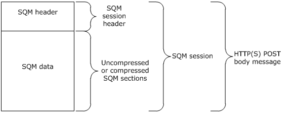
<!-- /Extracted images from page 9 -->

## 2 Messages

### 2.1 Transport

This protocol is implemented on top of HTTP/HTTPS. A proxy MAY impose additional requirements as
part of the transfer. There is no authentication between the SQM client and SQM service, or between
the SQM proxy and the SQM service.

### 2.2 Message Syntax

#### 2.2.1 Namespaces

SQM data MUST be associated with a partner namespace. The SQM Client-to-Service Protocol uses
HTTP 1.1 syntax to communicate the SQM partner namespace within the URL string. For data upload,
the URL MUST contain the SQM partner namespace following the SQM service host name.<1>

#### 2.2.2 Message Upload Data Contents

Messages are uploaded by using HTTP/HTTPS POST. The binary data is contained in the POST body of
the HTTP/HTTPS request. The binary data schema is laid out in a SQM session, as shown in Figure 1
and described in section 2.2.3. The SQM section data area MAY be compressed as shown in Figure 3.
The SQM service decompresses the data upon receipt. The entire binary data package MUST be
included in a single HTTP POST body. The common message structures and layout are described in
section 2.2.4.

Figure 1: HTTP POST body containing a SQM session

#### 2.2.3 SQM Session

A SQM session is comprised of a SQM header and zero or more SQM sections within the binary large
object (BLOB) as shown in Figure 2. The SQM-enabled client MAY send the SQM header only (for
example, to query the A-SQM Manifest version). The total length, in bytes, of the SQM session (the
SQM header and SQM sections) MUST equal the HTTP POST body length. All integer fields are encoded
using little-endian format.

[MS-SQMCS] - v20170601
Software Quality Metrics (SQM) Client-to-Service Version 1 Protocol
Copyright © 2017 Microsoft Corporation
Release: June 1, 2017

9 / 47

<!-- Extracted images from page 10 -->
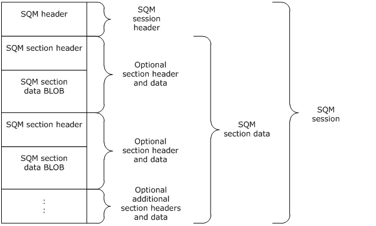
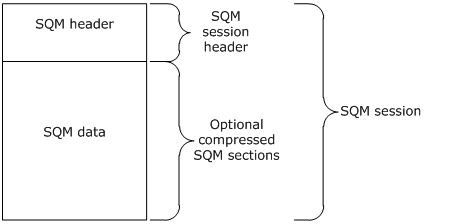
<!-- /Extracted images from page 10 -->

Figure 2: SQM session binary data stream layout (uncompressed)

The following figure illustrates the compressed SQM session binary data stream layout.

Figure 3: SQM session binary data stream layout (compressed)

#### 2.2.4 Common Structures

##### 2.2.4.1 SQM Header

Every SQM session uploaded in the HTTP POST body MUST begin with a SQM session header.

The SQM section header describes the SQM section data BLOB. The SQM section header is composed
of two fields: a SectionType field and a SectionLength field.

0  1  2  3  4  5  6  7  8  9

1
0  1  2  3  4  5  6  7  8  9

2
0  1  2  3  4  5  6  7  8  9

3
0  1

Signature

[MS-SQMCS] - v20170601
Software Quality Metrics (SQM) Client-to-Service Version 1 Protocol
Copyright © 2017 Microsoft Corporation
Release: June 1, 2017

10 / 47

HeaderLength

Flags

DataChecksum

SectionCount

DataLength

ApplicationIdentifier

ApplicationVersionHigh

ApplicationVersionLow

ManifestVersion

ClientUploadTime

...

Reserved

...

ClientSessionStartTime

...

ClientSessionEndTime

...

ClientUniqueIdentifier

…

…

…

UserUniqueIdentifier

…

[MS-SQMCS] - v20170601
Software Quality Metrics (SQM) Client-to-Service Version 1 Protocol
Copyright © 2017 Microsoft Corporation
Release: June 1, 2017

11 / 47

<!-- Extracted images from page 12 -->
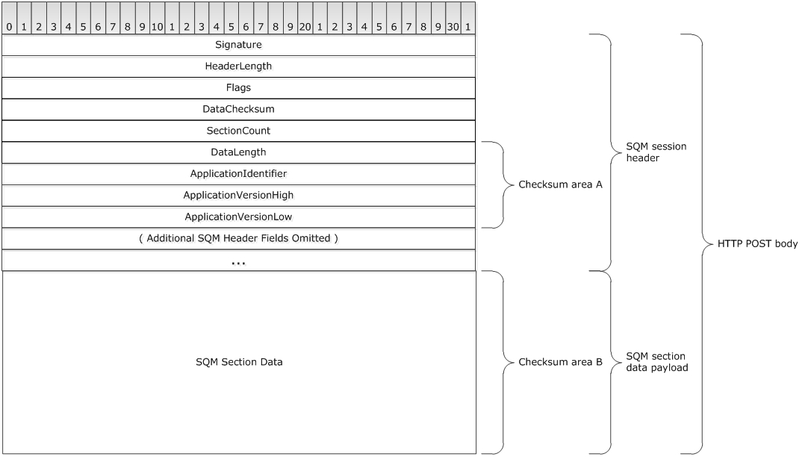
<!-- /Extracted images from page 12 -->

…

…

StudyIdentifier

InternalFlags

RawDataLength

RawDataChecksum

Signature (4 bytes): A 32-bit unsigned integer.<2>

HeaderLength (4 bytes): A 32-bit unsigned integer that specifies the length of the SQM header, in

bytes.

Flags (4 bytes): A 32-bit unsigned integer. Bit positions 0 through 10 are reserved.<3>

DataChecksum (4 bytes): A 32-bit unsigned integer value specifying the checksum result of the
SQM section data (compressed or uncompressed). In the following figure, the checksum is
computed over area A followed by area B. The SQM client and SQM server SHOULD use the same
algorithm.<4>

Figure 4: Checksum byte area in a SQM Upload

SectionCount (4 bytes): A 32-bit unsigned integer specifying the number of SQM sections in the

uploaded data. This value MUST be specified. A value of 0x0 indicates there are no SQM sections.

[MS-SQMCS] - v20170601
Software Quality Metrics (SQM) Client-to-Service Version 1 Protocol
Copyright © 2017 Microsoft Corporation
Release: June 1, 2017

12 / 47

DataLength (4 bytes): A 32-bit unsigned integer specifying the length of the SQM section data

(compressed or uncompressed), in bytes. This value MUST be specified. A value of 0x0 indicates
there is no SQM section data.

ApplicationIdentifier (4 bytes: ): A 32-bit unsigned integer specifying an application-defined

identifier value. This value MUST be specified.

ApplicationVersionHigh (4 bytes): A 32-bit unsigned integer specifying an application-defined high

order version value. This value MUST be specified.

ApplicationVersionLow (4 bytes): A 32-bit unsigned integer specifying an application-defined low

order version value. This value MUST be specified.

ManifestVersion (4 bytes: ): A 32-bit unsigned integer specifying the client version of the A-SQM

manifest. This value MUST be specified. A value of 0x0 means there is no client A-SQM
manifest.

ClientUploadTime (8 bytes): A 64-bit FILETIME value specifying the time the client uploaded the

data. This value MUST be specified. FILETIME is defined in [MS-RPCE] section 6.

Reserved (8 bytes): A 64-bit value. A value of 0x0 MUST be specified.

ClientSessionStartTime (8 bytes): A 64-bit FILETIME value specifying the client SQM session

start time. This value MUST be specified.

ClientSessionEndTime (8 bytes): A 64-bit FILETIME value specifying the client SQM session end

time. This value MUST be specified.

ClientUniqueIdentifier (16 bytes): A 128-bit globally unique identifier (GUID) that uniquely

identifies the sending computer. This value MUST be specified.

UserUniqueIdentifier (16 bytes): A 128-bit GUID that identifies the computer user. This value

MUST be specified. The client MAY specify a value of {00000000-0000-0000-0000-
000000000000} to represent that no user identifier is specified.

StudyIdentifier (4 bytes): A 32-bit unsigned integer specifying the SQM partner namespace-

specific study identifier. The value allows the client to classify data. This value MUST be
specified. A value of 0x0 specifies no study identifier.

InternalFlags (4 bytes): A 32-bit unsigned integer bit mask that specifies attributes of the

upload. The following bit values MUST be specified.

0  1  2  3  4  5  6  7  8  9

1
0  1  2  3  4  5  6  7  8  9

2
0  1  2  3  4  5  6  7  8  9

3
0  1

A

B

C

Reserved

A - IsSessionDataCompressed (1 bit): A bit value that specifies if the binary data is
compressed. A value of 0x0 specifies that the data is not compressed. A value of 0x1
specifies that the data is compressed.

B - Reserved (2 bits): Reserved.  Bits MUST be specified as 0x0.

C - RequestManifestVersion (1 bit): A bit value specifying if the A-SQM manifest version is
requested to be returned in the response. A value of 0x0 specifies that the A-SQM version
for the SQM partner namespace is not returned in the response.

Reserved (28 bits): Bits MUST be specified as 0x0.

[MS-SQMCS] - v20170601
Software Quality Metrics (SQM) Client-to-Service Version 1 Protocol
Copyright © 2017 Microsoft Corporation
Release: June 1, 2017

13 / 47

<!-- Extracted images from page 14 -->
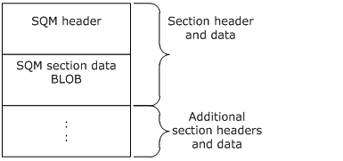
<!-- /Extracted images from page 14 -->

RawDataLength (4 bytes): A 32-bit unsigned integer specifying the length of the SQM section

data before data compression, in bytes. This value MUST be specified if bit zero of the
InternalFlags field has a value of 0x1.

RawDataChecksum (4 bytes): A 32-bit unsigned integer value specifying the checksum result

of the SQM section data before data compression. This value MUST be specified if bit zero of the
InternalFlags field has a value of 0x1. The SQM client and SQM server SHOULD use the same
algorithm as specified in the DataChecksum description.

##### 2.2.4.2 SQM Sections

SQM sections follow the SQM header in the data upload contained in the HTTP/HTTPS POST body.
Each section has a SQM section header, as specified in section 2.2.4.3, and a SQM section data BLOB,
as specified in section 2.2.4.4. There are two types of SQM sections: SQM data point sections, as
specified in section 2.2.4.4.1, and SQM stream sections, as specified in section 2.2.4.4.2.

Figure 5: SQM section in a binary data stream

##### 2.2.4.3 SQM Section Header

The SQM section header describes the SQM section data BLOB. The SQM section header is composed
of two fields: a SectionType field and a SectionLength field.

0  1  2  3  4  5  6  7  8  9

1
0  1  2  3  4  5  6  7  8  9

2
0  1  2  3  4  5  6  7  8  9

3
0  1

SectionType

SectionLength

SectionType (4 bytes): A 32-bit unsigned integer specifying the type of data in the SQM section.

This value MUST be specified from one of the following values:

Value

Meaning

0x00000000  The data type in the SQM section is SQM DWORD data points.

0x00000003  The data type in the SQM section is SQM UNICODE STRING data points.

0x00000005  The data type in the SQM section is a SQM stream, an array consisting of SQM UNICODE

STRING data, SQM DWORD data, and SQM QWORD data.

0x00000006  The data type in the SQM section is SQM QWORD data points.

SectionLength (4 bytes): A 32-bit unsigned integer specifying the length of the SQM section

data, in bytes. This value MUST be specified.

14 / 47

[MS-SQMCS] - v20170601
Software Quality Metrics (SQM) Client-to-Service Version 1 Protocol
Copyright © 2017 Microsoft Corporation
Release: June 1, 2017

##### 2.2.4.4 SQM Section Data

SQM section data follows a SQM section header and can be either a SQM data point section or a SQM
stream section. A SectionType value of 0x00000000, 0x00000003, or 0x00000006 in the SQM
section header specifies a SQM data point section. A SectionType value of 0x00000005 in the SQM
section header specifies a SQM stream section.

###### 2.2.4.4.1 SQM Data Point Sections

A SQM data point section is a type of SQM section data. Each SQM data point section is a set of zero
or more SQM data points of DWORD, QWORD, or STRING data type (see [MS-DTYP] sections 2.2.9,
2.2.40, and 2.2.44, respectively). Each SQM data point within a single SQM data point section is of
identical type (DWORD, QWORD, or STRING) as specified in the SectionType value (0x00000000,
0x00000006, 0x00000003 respectively) in the SQM section header.

###### 2.2.4.4.1.1 SQM DWORD Data Point

The SQM DWORD data point is a 3-tuple that describes a user-defined DWORD value. The
SectionType value in the SQM section header MUST be 0x00000000.

The count of SQM DWORD data points following the SQM section header is determined by the
SectionLength value in the SQM section header. Each SQM DWORD data point is 0xC bytes in length.
The SectionLength value divided by 0xC results in the count of SQM DWORD data points in the SQM
section data BLOB.

0  1  2  3  4  5  6  7  8  9

1
0  1  2  3  4  5  6  7  8  9

2
0  1  2  3  4  5  6  7  8  9

3
0  1

DataPointIdentifier

DataPointValue

TickCount

DataPointIdentifier (4 bytes): A 32-bit unsigned integer specifying the SQM data point identifier

value. This value is defined by the SQM partner and MUST be defined within the SQM service.

DataPointValue (4 bytes): A DWORD specifying the value associated with the

DataPointIdentifier. This value is defined by the SQM partner and MUST be specified.

TickCount (4 bytes): A 32-bit unsigned integer specifying the number of milliseconds that have

elapsed since the ClientSessionStartTime (see section 2.2.4.1).

###### 2.2.4.4.1.2 SQM QWORD Data Point

The SQM QWORD data point is a 3-tuple that describes a user-defined QWORD value. The
SectionType in the SQM section header MUST be 0x00000006.

The count of SQM QWORD data points following the SQM section header is determined by the
SectionLength value in the SQM section header. Each SQM QWORD data point is 0x10 bytes in
length. The SectionLength divided by 0x10 results in the count of SQM QWORD data points in the
SQM section data BLOB.

0  1  2  3  4  5  6  7  8  9

1
0  1  2  3  4  5  6  7  8  9

2
0  1  2  3  4  5  6  7  8  9

3
0  1

DataPointIdentifier

15 / 47

[MS-SQMCS] - v20170601
Software Quality Metrics (SQM) Client-to-Service Version 1 Protocol
Copyright © 2017 Microsoft Corporation
Release: June 1, 2017

<!-- Extracted images from page 16 -->
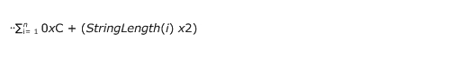
<!-- /Extracted images from page 16 -->

DataPointValue

...

TickCount

DataPointIdentifier (4 bytes): A 32-bit unsigned integer specifying the SQM data point identifier
value. This value is defined by the SQM partner and MUST be defined within the SQM service.

DataPointValue (8 bytes): A QWORD specifying the value associated with the

DataPointIdentifier. This value is defined by the SQM partner and MUST be specified.

TickCount (4 bytes): A 32-bit unsigned integer specifying the number of milliseconds that have

elapsed since the ClientSessionStartTime (see section 2.2.4.1).

###### 2.2.4.4.1.3 SQM STRING Data Point

The SQM STRING data point is a 4-tuple that describes a user-defined Unicode character array
value. This SectionType in the SQM section header MUST be 0x00000003.

The count of SQM STRING data points following the SQM section header is determined by the
SectionLength value in the SQM section header and the variable length of each SQM STRING data
point entry. Each SQM STRING data point entry has a fixed length of 0xC bytes and an additional
length of the StringLength value. The total byte length of all SQM STRING data points MUST equal
the SectionLength value in the SQM section header.

If n is the number of SQM STRING data points, then SectionLength is computed as follows:

0  1  2  3  4  5  6  7  8  9

1
0  1  2  3  4  5  6  7  8  9

2
0  1  2  3  4  5  6  7  8  9

3
0  1

DataPointIdentifier

TickCount

StringLength

String

...

DataPointIdentifier (4 bytes): A 32-bit unsigned integer specifying the SQM data point identifier
value. This value MUST be specified. This value is defined by the SQM partner within the SQM
service.

TickCount (4 bytes): A 32-bit unsigned integer specifying the number of milliseconds elapsed since

the ClientSessionStartTime (see section 2.2.4.1).

StringLength (4 bytes): A 32-bit unsigned integer specifying the length of String, in Unicode

characters. This value MUST be specified.

16 / 47

[MS-SQMCS] - v20170601
Software Quality Metrics (SQM) Client-to-Service Version 1 Protocol
Copyright © 2017 Microsoft Corporation
Release: June 1, 2017

<!-- Extracted images from page 17 -->
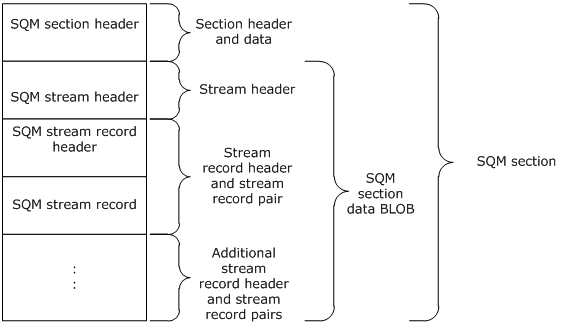
<!-- /Extracted images from page 17 -->

String (variable): An array of bytes specifying an array of Unicode character values. This value

MUST be specified. This meaning of this value is defined by the SQM partner.

###### 2.2.4.4.2 SQM Stream Section

A SQM stream section is a type of SQM section data. Each SQM stream section contains a stream
header (see section 2.2.4.4.2.1) followed by zero or more stream records (see section 2.2.4.4.2.3).
Each stream record MUST contain a stream record header specifying the record type, followed by a
stream record.

Figure 6: SQM stream section in a SQM section data BLOB

###### 2.2.4.4.2.1 SQM Stream Header

The SQM stream header describes the SQM stream. The header is a 3-tuple comprised of a data point
identifier, a count of the number of entries per record, and a count of the number of records.

One way to describe the stream is to compare the stream to a table. The StreamIdentifier specifies
the table name. The CountPerRecord specifies the number of columns in the table. The
CountRecords specifies the count of rows in the table.

0  1  2  3  4  5  6  7  8  9

1
0  1  2  3  4  5  6  7  8  9

2
0  1  2  3  4  5  6  7  8  9

3
0  1

StreamIdentifier

CountPerRecord

CountRecords

StreamIdentifier (4 bytes): A 32-bit unsigned integer specifying the SQM stream identifier value.

This value is defined by the SQM partner and MUST be defined within the SQM service.

CountPerRecord (4 bytes): A 32-bit unsigned integer specifying the number of data values

associated with the StreamIdentifier. This value specifies the number of entries per record set.
This value MUST be specified.

[MS-SQMCS] - v20170601
Software Quality Metrics (SQM) Client-to-Service Version 1 Protocol
Copyright © 2017 Microsoft Corporation
Release: June 1, 2017

17 / 47

CountRecords (4 bytes): A 32-bit unsigned integer specifying the number of record sets in the

stream. This value MUST be specified.

###### 2.2.4.4.2.2 SQM Stream Record Header

The SQM stream record header describes the SQM stream record that immediately follows the SQM
stream record header in the SQM section data.

0  1  2  3  4  5  6  7  8  9

1
0  1  2  3  4  5  6  7  8  9

2
0  1  2  3  4  5  6  7  8  9

3
0  1

StreamEntryType

StreamEntryType (4 bytes): A 32-bit unsigned integer specifying the SQM stream record type. This

value is specified from one of the following values.

Value

Meaning

0x00000000  The data type in the stream entry is SQM DWORD.

0x00000003  The data type in the stream entry is SQM UNICODE STRING.

0x00000006  The data type in the stream entry is SQM QWORD.

###### 2.2.4.4.2.3 SQM Stream Record

The SQM stream record is a single entry of type DWORD, QWORD, or STRING as specified in the
StreamEntryType value (0x00000000, 0x00000006, and 0x00000003 respectively) in the SQM
stream record header.

###### 2.2.4.4.2.3.1 SQM Stream DWORD Record

The SQM stream DWORD record is a 2-tuple single entry of type DWORD. The StreamEntryType
value in the Stream Record Header MUST be 0x00000000.

0  1  2  3  4  5  6  7  8  9

1
0  1  2  3  4  5  6  7  8  9

2
0  1  2  3  4  5  6  7  8  9

3
0  1

TickCount

DataValue

TickCount (4 bytes): A 32-bit unsigned integer specifying the number of milliseconds elapsed since

the ClientSessionStartTime (see section 2.2.4.1).

DataValue (4 bytes): ):  A DWORD specifying the value associated with the StreamIdentifier value

in the SQM Stream Header. This value is defined by the SQM partner.

###### 2.2.4.4.2.3.2 SQM Stream QWORD Record

The SQM stream QWORD record is a 2-tuple single entry of type QWORD. The StreamEntryType
value in the Stream Record Header MUST be 0x00000006.

[MS-SQMCS] - v20170601
Software Quality Metrics (SQM) Client-to-Service Version 1 Protocol
Copyright © 2017 Microsoft Corporation
Release: June 1, 2017

18 / 47

0  1  2  3  4  5  6  7  8  9

1
0  1  2  3  4  5  6  7  8  9

2
0  1  2  3  4  5  6  7  8  9

3
0  1

TickCount

DataValue

...

TickCount (4 bytes): A 32-bit unsigned integer specifying the number of milliseconds elapsed since

the ClientSessionStartTime (see section 2.2.4.1).

DataValue (8 bytes): A QWORD specifying the value associated with the StreamIdentifier value in

the SQM Stream Header. This value is defined by the SQM partner.

###### 2.2.4.4.2.3.3 SQM Stream STRING Record

The SQM stream STRING record is a 3-tuple single entry of type STRING that describes a user-defined
Unicode character array value. The StreamEntryType value in the stream record header MUST be
0x00000003.

Each SQM stream STRING record entry has a fixed length of 0x8 bytes and an additional variable
length of the StringLength value. The String byte length is StringLength x 2.

0  1  2  3  4  5  6  7  8  9

1
0  1  2  3  4  5  6  7  8  9

2
0  1  2  3  4  5  6  7  8  9

3
0  1

TickCount

StringLength

String

...

TickCount (4 bytes): A 32-bit unsigned integer specifying the number of milliseconds elapsed since

the ClientSessionStartTime (see section 2.2.4.1).

StringLength (4 bytes): A 32-bit unsigned integer specifying the length of the string, in Unicode

characters.

String (variable): An array of bytes specifying an array of Unicode character values. This value is

defined by the SQM partner.

#### 2.2.5 Message Response

The service-to-client response is specified by one of the following HTTP status codes.

Status

Meaning

200

Upload received and no action required from the sender.

201

Upload received and there is information in the HTTP response stream for the sender.

[MS-SQMCS] - v20170601
Software Quality Metrics (SQM) Client-to-Service Version 1 Protocol
Copyright © 2017 Microsoft Corporation
Release: June 1, 2017

19 / 47

<!-- Extracted images from page 20 -->
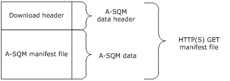
<!-- /Extracted images from page 20 -->

Status

Meaning

403

Upload received and the service requests that the client stop sending requests for 14 days (default) or
as instructed in the HTTP response message.

HTTP 200 Status:  An HTTP 200 status response indicates a successful client request and that no

further action is required by the client.

HTTP 201 Status:  An HTTP 201 status response indicates a successful client request and that the
HTTP response header has additional information for the client. The HTTP response header
includes one or both of the following key-value pairs.

ThrottleInterval: The HTTP response stream MAY contain the ThrottleInterval key-value pair
shown here in Augmented Backus-Naur Form (ABNF). The value in the key-value pair
specifies the number of days the client waits before sending any additional upload requests.
ThrottleInterval is used to control the volume of data being sent to the SQM service.

 "ThrottleInterval:" <"> throttle <"> CRLF
 throttle = 1*( DIGIT )

ManifestVersion: The HTTP response stream MAY contain the ManifestVersion key-value pair
shown here in ABNF. The value in the key-value pair specifies the version number of the
current A-SQM manifest that the client MAY download using HTTP/HTTPS GET.

"ManifestVersion:" <"> version <"> CRLF

version = 1*( DIGIT )

HTTP 403 Status:  An HTTP 403 status response indicates a successful client request. It is

recommended that the client wait 14 days before sending any additional upload requests.

#### 2.2.6 Adaptive Software Quality Metrics (A-SQM) Manifest

The A-SQM manifest contains the rules that control what instrumentation data is updated. A-SQM uses
HTTP/HTTPS GET to download a manifest package. The package contains a header describing the
contents and an A-SQM manifest.

Figure 7: A-SQM download package using HTTP/HTTPS GET

##### 2.2.6.1 A-SQM Manifest Download Header

The A-SQM download header describes the A-SQM file contained within the download.

[MS-SQMCS] - v20170601
Software Quality Metrics (SQM) Client-to-Service Version 1 Protocol
Copyright © 2017 Microsoft Corporation
Release: June 1, 2017

20 / 47

0  1  2  3  4  5  6  7  8  9

1
0  1  2  3  4  5  6  7  8  9

2
0  1  2  3  4  5  6  7  8  9

3
0  1

Signature

Length

Checksum

Reserved

Signature (4 bytes): A 32-bit unsigned integer. A value MUST be specified.

Length (4 bytes): A 32-bit unsigned integer specifying the length of the download (all inclusive), in

bytes. This value MUST be specified.

Checksum (4 bytes): A 32-bit unsigned integer value specifying the checksum result of the A-SQM

file. The SQM client and SQM server SHOULD<5> use the same algorithm.

Reserved (4 bytes): A 32-bit unsigned integer. A value of 0x0 MUST be specified.

##### 2.2.6.2 A-SQM Manifest

The A-SQM manifest is stored in the downloaded A-SQM file. The A-SQM manifest contains a header
describing the entire manifest BLOB followed by one or more A-SQM sections. Each section has a
header describing the section contents. The data schema is laid out within the manifest as shown in
the following figure. The common manifest structures are described in the following sections.

[MS-SQMCS] - v20170601
Software Quality Metrics (SQM) Client-to-Service Version 1 Protocol
Copyright © 2017 Microsoft Corporation
Release: June 1, 2017

21 / 47

<!-- Extracted images from page 22 -->
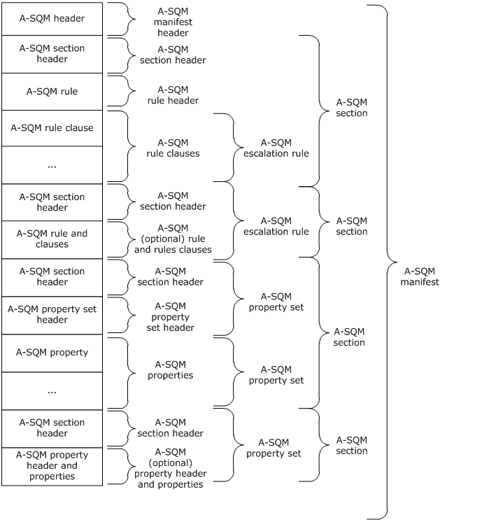
<!-- /Extracted images from page 22 -->

Figure 8: A-SQM Manifest with one or more sections

##### 2.2.6.3 A-SQM Header

The A-SQM header describes the contents of the manifest.

0  1  2  3  4  5  6  7  8  9

1
0  1  2  3  4  5  6  7  8  9

2
0  1  2  3  4  5  6  7  8  9

3
0  1

Signature

Version

[MS-SQMCS] - v20170601
Software Quality Metrics (SQM) Client-to-Service Version 1 Protocol
Copyright © 2017 Microsoft Corporation
Release: June 1, 2017

22 / 47

Length

SectionCount

ExpirationTime

...

PartnerName

…

Signature (4 bytes): A 32-bit unsigned integer.<6>

Version (4 bytes): A 32-bit unsigned integer that specifies the A-SQM manifest version. The values

0x0 and 0x00FFFFFF are reserved and MUST NOT be used.

Length (4 bytes): A 32-bit unsigned integer specifying the length of the manifest (all inclusive), in

bytes.

SectionCount (4 bytes): A 32-bit unsigned integer specifying the number of A-SQM sections in the

manifest.

ExpirationTime (8 bytes): A 64-bit FILETIME value specifying the time the manifest expires.

FILETIME is defined in [MS-RPCE] section 6.

PartnerName (128 bytes): A null-terminated Unicode string (16-bit character units) that specifies

the SQM partner name.

##### 2.2.6.4 A-SQM Section Header

The A-SQM section header describes the contents of the A-SQM section. The A-SQM section header is
composed of two fields: a SectionLength field and SectionType field. Sections can be in any order.
At least one section is required. Following the A-SQM section header is an escalation rule or a property
set.

0  1  2  3  4  5  6  7  8  9

1
0  1  2  3  4  5  6  7  8  9

2
0  1  2  3  4  5  6  7  8  9

3
0  1

SectionLength

SectionType

SectionLength (4 bytes): A 32-bit unsigned integer specifying the length of the section following the

section header, in bytes.

SectionType (4 bytes): A 32-bit unsigned integer specifying the type of the section. This value

MUST be specified from one of the following values:

Value

 Meaning

0x00000001  Escalation rule section type.

[MS-SQMCS] - v20170601
Software Quality Metrics (SQM) Client-to-Service Version 1 Protocol
Copyright © 2017 Microsoft Corporation
Release: June 1, 2017

23 / 47

Value

 Meaning

0x00000002  Property set section type.

##### 2.2.6.5 A-SQM Escalation Rule Section

The A-SQM escalation rule section contains a rule that the SQM-enabled client uses to modify
behavior. An A-SQM escalation section is specified by a value of 0x1 in the SectionType field of the
A-SQM section header. The rule is a set of rule clauses (as specified in section 2.2.6.5.2) with defined
data point values (see section 2.2.4.4.1) and/or defined data stream values (see section 2.2.4.4.2).
Clauses are joined together with a group operator. A rule is either of type callback or report, and is
read as either TRUE or FALSE.

###### 2.2.6.5.1 A-SQM Rule Header

The A-SQM rule header describes the rule.

0  1  2  3  4  5  6  7  8  9

1
0  1  2  3  4  5  6  7  8  9

2
0  1  2  3  4  5  6  7  8  9

3
0  1

RuleLength

RuleIdentifier

RuleEvaluationFlag

RuleType

RuleCallbackValue

RuleAction

RuleExpirationTime

…

RuleLength (4 bytes): A 32-bit unsigned integer specifying the length of the rule (all inclusive), in

bytes.

RuleIdentifier (4 bytes): A 32-bit unsigned integer specifying the rule identifier. Each

RuleIdentifier value MUST be unique within the manifest.

RuleEvaluationFlag (4 bytes): A 32-bit unsigned integer specifying the rule evaluation flag. Each

AND clause (see section 2.2.6.5.2) MUST be represented by a single bit set to 0x1.

The bit value is not required to be monotonically increasing in position for each AND. Each bit
MUST uniquely map to the AND Clause EvaluationFlag.

For example, a rule with 5 AND clauses could have the following RuleEvaluationFlag where A-E
evaluate to 0x1.

[MS-SQMCS] - v20170601
Software Quality Metrics (SQM) Client-to-Service Version 1 Protocol
Copyright © 2017 Microsoft Corporation
Release: June 1, 2017

24 / 47

0  1  2  3  4  5  6  7  8  9

1
0  1  2  3  4  5  6  7  8  9

2
0  1  2  3  4  5  6  7  8  9

3
0  1

A  B  C  D  E

0x0

RuleType (4 bytes): A 32-bit unsigned integer specifying the rule type. This value MUST be specified

from one of the following values:

Value

 Meaning

0x00000001  Callback rule type.

0x00000002  Report rule type.

RuleCallbackValue (4 bytes): A 32-bit unsigned integer specifying the value to make available to

the SQM-enabled application when the rule evaluates to TRUE.

RuleAction (4 bytes): A 32-bit unsigned integer specifying the action that rule evaluations resulting

in TRUE will generate. This value MUST be specified from one of the following values:

Value

 Meaning

0x00000001  The rule gives a callback to an application-defined function when triggered.

0x00000002  The rule escalates to a Windows Error Reporting (WER) report with a dump type of

WerDumpTypeMiniDump, as described in [MSDN-WER].

0x00000004  The rule escalates to a Windows Error Reporting (WER) report with a dump type of

WerDumpTypeMicroDump, as described in [MSDN-WER].

0x00000008  The rule escalates to a Windows Error Reporting (WER) report with a dump type of

WerDumpTypeHeapDump, as described in [MSDN-WER].

RuleExpirationTime (8 bytes): A 64-bit FILETIME value specifying the time the rule expires.

FILETIME is defined in [MS-RPCE] section 6.

###### 2.2.6.5.2 A-SQM Rule Clause

The A-SQM rule clause specifies the comparison value and method to be performed. The result of a
clause comparison is either TRUE or FALSE.

0  1  2  3  4  5  6  7  8  9

1
0  1  2  3  4  5  6  7  8  9

2
0  1  2  3  4  5  6  7  8  9

3
0  1

ClauseLength

EvaluationFlag

DataIdentifier

StreamRecordPosition

ClauseEvaluationOperator

ClauseGroupOperator

[MS-SQMCS] - v20170601
Software Quality Metrics (SQM) Client-to-Service Version 1 Protocol
Copyright © 2017 Microsoft Corporation
Release: June 1, 2017

25 / 47

ClauseLength (4 bytes): A 32-bit unsigned integer specifying the length of the clause, in bytes.

EvaluationFlag (4 bytes): A 32-bit unsigned integer specifying the clause evaluation flag. This value
MUST be specified. An AND clause specifies a single unique bit set to 0x1 within the rule. An OR
clause specifies a value of 0x0.

DataIdentifier (4 bytes): A 32-bit unsigned integer specifying the SQM data point or SQM stream

identifier value. This value is defined by the SQM partner and MUST be defined within the SQM
service.

StreamRecordPosition (4 bytes): A 32-bit unsigned integer specifying the value position within the
SQM Stream identified by the DataIdentifier value. A value of 0x0 specifies that the clause
references a SQM data point value, not a SQM stream.

  A value of 0x0 specifies that the clause references a SQM data point value (see section

2.2.4.4.1).

  A value of [0x1, N] specifies that the clause references a value within a SQM stream of N

record value positions (see section 2.2.4.4.2). 0x1 references the first record position value
within the SQM stream, 0x2 the second record position value within the SQM stream, up to the
Nth record position value within the SQM stream.

ClauseEvaluationOperator (4 bytes): A 32-bit unsigned integer specifying the clause operator and

data type. This value MUST be specified from one of the following values:

Value

 Meaning

0x00000001  The clause comparison operator is a DWORD Equal To.

0x00000002  The clause comparison operator is a DWORD Less Than.

0x00000003  The clause comparison operator is a DWORD Greater Than.

0x00000004  The clause comparison operator is a DWORD In Range.

0x00000005  The clause comparison operator is String Contains.

0x00000007  The clause comparison operator is a QWORD Equal To.

ClauseGroupOperator (4 bytes): A 32-bit unsigned integer specifying the clause group operator.

This value MUST be specified from one of the following values:

Value

 Meaning

0x00000000  The clause group operator is AND.

0x00000001  The clause group operator is OR.

There is a limit of 32 AND clauses per rule.

##### 2.2.6.6 A-SQM Property Set Section

An A-SQM property set section is specified by a value of 0x2 in the SectionType field of the A-SQM
section header (see section 2.2.6.4). Each A-SQM property set section contains one or more
properties as specified in sections 2.2.6.6.1 and 2.2.6.6.2.

###### 2.2.6.6.1 A-SQM Property Set Header

The A-SQM property set header describes the properties contained within the section.

[MS-SQMCS] - v20170601
Software Quality Metrics (SQM) Client-to-Service Version 1 Protocol
Copyright © 2017 Microsoft Corporation
Release: June 1, 2017

26 / 47

0  1  2  3  4  5  6  7  8  9

1
0  1  2  3  4  5  6  7  8  9

2
0  1  2  3  4  5  6  7  8  9

3
0  1

HeaderLength

PropertySetLength

PropertyCount

PropertySetName

...

HeaderLength (4 bytes): A 32-bit unsigned integer specifying the length of the A-SQM Property Set

Header, in bytes.

PropertySetLength (4 bytes): A 32-bit unsigned integer specifying the length of the A-SQM

Property Set (including the Property Set Header), in bytes.

PropertyCount (4 bytes): A 32-bit unsigned integer specifying the number of Properties in the

Property Set.

PropertySetName (variable): An array of bytes specifying a null-terminated Unicode string (16-

bit character units). Each PropertySetName within a manifest MUST be unique.

The PropertySetName byte length is computed: HeaderLength – 0xC. The PropertySetName
is aligned on an 8-byte boundary so it is possible for the byte length to be larger than the null-
terminated Unicode string requires.

###### 2.2.6.6.2 A-SQM Property

An A-SQM property is a key-value pair. Each key within the property set MUST be unique. The key-
value is an SQM-enabled application-defined value. All key-value pairs are treated as null-terminated
Unicode strings (16-bit character units).

The size of the property, in bytes, is computed: 0x8 + PropertyKeyLength + PropertyValueLength.

0  1  2  3  4  5  6  7  8  9

1
0  1  2  3  4  5  6  7  8  9

2
0  1  2  3  4  5  6  7  8  9

3
0  1

PropertyKeyLength

PropertyValueLength

PropertyKey

...

PropertyValue

...

PropertyKeyLength (4 bytes): A 32-bit unsigned integer specifying the length of the PropertyKey,

in bytes.

[MS-SQMCS] - v20170601
Software Quality Metrics (SQM) Client-to-Service Version 1 Protocol
Copyright © 2017 Microsoft Corporation
Release: June 1, 2017

27 / 47

PropertyValueLength (4 bytes): A 32-bit unsigned integer specifying the length of the

PropertyValue, in bytes.

PropertyKey (variable): An array of bytes specifying a null-terminated Unicode string (16-bit

character units). Each PropertyKey within the PropertySet MUST be unique.

The PropertyKey is aligned on an 8-byte boundary so it is possible for the byte length to be larger

than the null-terminated Unicode string requires.

PropertyValue (variable): An array of bytes specifying a null-terminated Unicode string (16-bit

character units).

The PropertyValue is aligned on an 8-byte boundary so it is possible for the byte length to be
larger than the null-terminated Unicode string requires.

### 2.3 Directory Service Schema Elements

None.

[MS-SQMCS] - v20170601
Software Quality Metrics (SQM) Client-to-Service Version 1 Protocol
Copyright © 2017 Microsoft Corporation
Release: June 1, 2017

28 / 47

<!-- Extracted images from page 29 -->
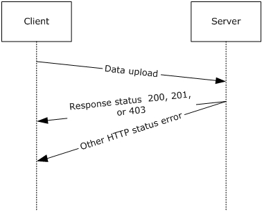
<!-- /Extracted images from page 29 -->

## 3 Protocol Details

### 3.1 Client Details

The client role in the SQM Client-to-Service Protocol is illustrated in the following figure.

Figure 9: Client-to-Service data upload and response

#### 3.1.1 Abstract Data Model

None.

#### 3.1.2 Timers

None.

#### 3.1.3 Initialization

None.

#### 3.1.4 Higher-Layer Triggered Events

None.

#### 3.1.5 Message Processing Events and Sequencing Rules

##### 3.1.5.1 Message Construction

The client constructs a data upload message as specified in section 2.2.2. Once the data is complete,
the client prepares the data for upload.

###### 3.1.5.1.1 SQM Header Construction

The client creates a SQM header as specified in section 2.2.4.1. The client sets the SQM Header field
values as specified in sections 2.2.4.1 and 3.1.5.1.1.

[MS-SQMCS] - v20170601
Software Quality Metrics (SQM) Client-to-Service Version 1 Protocol
Copyright © 2017 Microsoft Corporation
Release: June 1, 2017

29 / 47

###### 3.1.5.1.2 Constructing SQM Sections

The client constructs a SQM section as follows:

1.  The client constructs the SQM sections as specified in section 2.2.4.2.

2.  The client computes the overall length (in bytes) of the SQM sections.

3.  The client computes a checksum of the SQM sections. The client and server SHOULD use the

same checksum algorithm so that the server can validate the message stream.

4.  The client computes a count of the SQM sections.

###### 3.1.5.1.2.1 SQM Session Upload Construction - Option 1 - Compressed

The client compresses the SQM section data as illustrated in Figure 3. The client computes the length
of the compressed SQM section data and computes the checksum of the compressed SQM section
data.

The client sets the values of the following SQM header fields, which are all specified in section 2.2.4.1.









The RawDataLength field is set to the uncompressed SQM section data length value.

The RawDataChecksum field is set to the uncompressed SQM section checksum value.

The DataLength field is set to the compressed SQM section data length value.

The DataChecksum field is set to the compressed SQM section data checksum value.

  Bit 0 in the InternalFlags field is set to 1.



The SectionCount field is set to the section count value.

###### 3.1.5.1.2.2 SQM Sections Upload Construction - Option 2 - Uncompressed







The client sets the values of the following SQM header fields, which are all specified in section
2.2.4.1.

The DataLength field is set to the uncompressed SQM section data length value.

The DataChecksum field is set to the uncompressed SQM section checksum value.

  Bit 0 in the InternalFlags field is set to 0.



The SectionCount field is set to the section count value.

###### 3.1.5.1.3 Constructing the SQM Session

The client creates the SQM Session by joining the SQM header and the SQM section data (compressed
or uncompressed) as illustrated in Figure 2 and Figure 3.

##### 3.1.5.2 Message Data Upload Processing

The client creates a SQM data upload message consisting of one SQM session as described previously.
The client MUST set the SQM header ClientUploadTime field to the client's current UTC time as
specified in section 2.2.4.2.

The message is sent to the SQM service by using HTTP/HTTPS POST specifying the SQM partner
namespace, as specified in section 2.2.1. The entire message MUST be sent in one HTTP session.

[MS-SQMCS] - v20170601
Software Quality Metrics (SQM) Client-to-Service Version 1 Protocol
Copyright © 2017 Microsoft Corporation
Release: June 1, 2017

30 / 47

The maximum POST body upload length is a well-known value contracted with the SQM service. This
value MUST be known (see section 2.2.1).

  Upload length: The maximum POST body length (in bytes) as contracted with the SQM service for

the SQM partner namespace (compressed or uncompressed). This value is enforced for any SQM
upload.



Precompressed length: The maximum pre-compression length for a compressed upload. This value
is enforced for a compressed SQM upload.

A response message is returned in the HTTP status value and an additional response message MAY be
returned in the HTTP header depending on the HTTP status value as specified in section 2.2.5 .

The client processes the response message based on the HTTP status code response described in
sections 3.1.5.2.1 through 3.1.5.2.4.

###### 3.1.5.2.1 HTTP 200 Status

This message is sent when the upload is complete and no additional action is necessary.

###### 3.1.5.2.2 HTTP 201 Status

The HTTP header has additional information as defined in section 2.2.5. The response message MUST
contain a ThrottleInterval and/or ManifestVersion key-value pair as specified in section 2.2.5. The
client proceeds as specified in section 3.1.5.3.

ThrottleInterval:  ThrottleInterval indicates that the client SHOULD NOT send any data to the SQM

service for the period specified in the ThrottleInternal message (section 2.2.5).

ManifestVersion:  If the ManifestVersion value is not equal to the current client SQM manifest
version, the client downloads an SQM manifest resource as described in section 3.1.5.3.

###### 3.1.5.2.3 HTTP 403 Status

The client SHOULD NOT send any data to the SQM service for a period of 14 days (see section
2.2.5).

###### 3.1.5.2.4 HTTP Status - Other

The client MAY retry the upload at a later time if an HTTP error status code (other than a 403 error
status code described previously) is returned.

##### 3.1.5.3 Processing an A-SQM Resource Message

Upon receipt of a ManifestVersion value as specified in section 3.1.5.2.2, the client compares the
client's current manifest version value with the ManifestVersion value. If the two values are equal,
the client takes no further action. If the two values are not equal, the client SHOULD<7> download
the manifest version as described in section 3.1.5.3.1.

###### 3.1.5.3.1 Downloading an A-SQM Resource

The client downloads an A-SQM resource by using HTTPS GET (see section 2.2.6).<8> The client
forms the GET request by using the SQM-enabled application's partner namespace. In the following
example URL, this is represented as <SQM-PARTNER-NAMESPACE> and the ManifestVersion
(<VERSION> in the example URL that follows) discovered in the HTTP 201 response, as specified in
section 3.1.5.2.2.

The HTTP URL GET request form is as follows:

31 / 47

[MS-SQMCS] - v20170601
Software Quality Metrics (SQM) Client-to-Service Version 1 Protocol
Copyright © 2017 Microsoft Corporation
Release: June 1, 2017

<!-- Extracted images from page 32 -->

<!-- /Extracted images from page 32 -->

 GET https://sqm.microsoft.com/sqm/<SQM-PARTNER-NAMESPACE>/manifests/Sqm<VERSION>.bin

The client downloads the A-SQM manifest resource and verifies the A-SQM manifest header
checksum as specified in section 2.2.6.1. The client and server SHOULD<9> use the same checksum
algorithm so that the server can validate the manifest.

The client makes this resource available to SQM-enabled applications based on the SQM partner
namespace.

#### 3.1.6 Timer Events

None.

#### 3.1.7 Other Local Events

None.

### 3.2 Server Details

The server role in the SQM Client-to-Service Protocol is illustrated in the following figure.

Figure 10: Server role in the SQM Client-to-Service Protocol

#### 3.2.1 Abstract Data Model

None.

#### 3.2.2 Timers

None.

#### 3.2.3 Initialization

None.

[MS-SQMCS] - v20170601
Software Quality Metrics (SQM) Client-to-Service Version 1 Protocol
Copyright © 2017 Microsoft Corporation
Release: June 1, 2017

32 / 47

#### 3.2.4 Higher-Layer Triggered Events

None.

#### 3.2.5 Message Processing Events and Sequencing Rules

The SQM session data upload is processed during the HTTP connection. The server MUST capture the
HTTP POST body. The POST body contains the SQM session. The server processes the POST body as
described in the following sections.

##### 3.2.5.1 Processing a Client Message SQM Header

The SQM header fields SHOULD be validated as specified in section 2.2.4.1 and described in section
3.1.5.1.1.

##### 3.2.5.2 Processing SQM Section Data - Option 1 - Compressed

The server checks the SQM header InternalFlags field as specified in section 2.2.4.1. If bit 0 is set to
1, then the server processes the compressed data as follows:

1.  Verify the compressed SQM Section data length. The length MUST equal the length specified in the

SQM header DataLength field.

2.  Verify the compressed SQM Section checksum. The checksum MUST equal the value specified in

the SQM header DataChecksum field.

3.  Decompress the SQM section data.

4.  Verify the uncompressed SQM Section data length. The length MUST equal the length specified in

the SQM header RawDataLength field.

5.  Verify the uncompressed SQM Section data checksum. The checksum MUST equal the value

specified in the SQM header RawDataChecksum field.

##### 3.2.5.3 Processing SQM Section Data - Option 2 - Uncompressed

The server checks the SQM header InternalFlags field as specified in section 2.2.4.1. If bit 0 is set to
0, then the server processes the data as follows:

1.  Verify the SQM section data length. The length MUST equal the length specified in the SQM header

DataLength field.

2.  Verify the SQM section checksum. The checksum MUST equal the value specified in the SQM

header DataChecksum field.

##### 3.2.5.4 Processing the A-SQM Manifest Version Request

The server checks the SQM header InternalFlags field as specified in section 2.2.4.1. If bit 3 is set to
1 and the server manifest version is not equal to the SQM header ClientVersion field, then the server
sends a manifest version response.

##### 3.2.5.5 Sending a Client Response

The server sends one of the following responses to the client:

Completion Response:  The server sends an HTTP 200 status response to the client if the message

is processed and no action is requested from the client.

33 / 47

[MS-SQMCS] - v20170601
Software Quality Metrics (SQM) Client-to-Service Version 1 Protocol
Copyright © 2017 Microsoft Corporation
Release: June 1, 2017

Throttle Response:  The server sends an HTTP 201 status response to the client if the message is
successfully processed and the server requests that the client halt further client-server SQM
communication for the period (in days) as indicated in the value of the throttle key-value pair as
specified in section 2.2.5. This response MAY be combined with an A-SQM manifest response.

A-SQM Manifest Response:  The server sends an HTTP 201 status response to the client if the

message is successfully processed and the client requests an A-SQM version update response as
specified in section 2.2.5. This response MAY be combined with a throttle response.

Fixed-Throttle Response:  The server sends an HTTP 403 Status response to the client if the server

requests that the client halt further client-server SQM communication for 14 days.

##### 3.2.5.6 A-SQM Manifest

The server allows the client to download the A-SQM manifest as specified in section 2.2.5 and
described in section 3.1.5.3.1 using HTTP/HTTPS GET. The server resolves the HTTP/HTTPS GET URL
to the physical A-SQM manifest.

#### 3.2.6 Timer Events

None.

#### 3.2.7 Other Local Events

None.

### 3.3 Proxy Details

This section specifies the proxy role in the SQM Client-to-Service Protocol.

When a configured SQM-enabled client sends a message to the proxy that contains SQM data, the
proxy service opens the payload and adds a data point (see section 2.2.4.4.1) identifying the proxy.
The payload is then repackaged and sent to the SQM service. All messages that do not contain
payload information are sent by the proxy from the SQM client to the SQM server with no
modification.

[MS-SQMCS] - v20170601
Software Quality Metrics (SQM) Client-to-Service Version 1 Protocol
Copyright © 2017 Microsoft Corporation
Release: June 1, 2017

34 / 47

<!-- Extracted images from page 35 -->
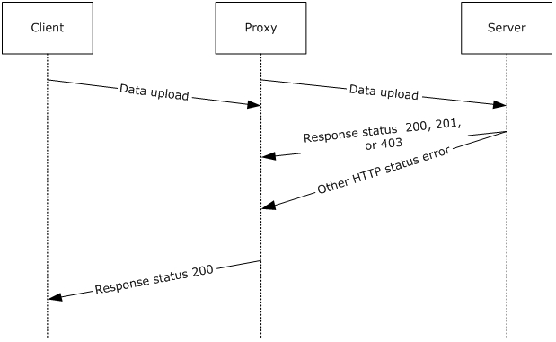
<!-- /Extracted images from page 35 -->

Figure 11: Client upload through a proxy server

#### 3.3.1 Abstract Data Model

The SQM protocol relay transmits protocol messages on behalf of a client in environments where the
client cannot access the SQM service directly (primarily where the client is protected by the firewall).
To enable the relay, a client MUST be configured to send data to the relay service.

When a configured client sends a message to the relay that contains a SQM payload, the relay service
opens the payload and adds a data point that identifies the relay<10>. This data is added to the SQM
data point section of the payload as specified in section 2. The payload is then repackaged and set to
the SQM service. If the proxy receives a message that does not fit the XML model for SQM, the
message is forwarded directly to the SQM service, without modification. This enables support for A-
SQM and SQM protocol message transmission.

#### 3.3.2 Timers

None.

#### 3.3.3 Initialization

The client MAY be configured manually to send SQM data to the relay.

#### 3.3.4 Higher-Layer Triggered Events

None.

#### 3.3.5 Message Processing Events and Sequencing Rules

The relay receives a SQM message from the client via an HTTP POST sent by using the proxy port
configured on the SQM service. If the POST contains a payload that adheres to the SQM format, the
message payload is augmented with an additional data point that identifies the relay. This is an

[MS-SQMCS] - v20170601
Software Quality Metrics (SQM) Client-to-Service Version 1 Protocol
Copyright © 2017 Microsoft Corporation
Release: June 1, 2017

35 / 47

additive change only. The payload is then repackaged and sent to the SQM service by using SSL over
port 443.

All other protocol messages are directly sent directly through the proxy without modification in a
similar manner, where the first transmission from the client to the relay is communicated over HTTP
and the second transmission is communicated using over SSL by using port 443. If the proxy receives
a message that is not of a recognized format, the message is sent to the SQM service with no
changes.

#### 3.3.6 Timer Events

None.

#### 3.3.7 Other Local Events

None.

[MS-SQMCS] - v20170601
Software Quality Metrics (SQM) Client-to-Service Version 1 Protocol
Copyright © 2017 Microsoft Corporation
Release: June 1, 2017

36 / 47

## 4 Protocol Examples

### 4.1 SQM Upload Example

The following is a network capture of a SQM upload.

           0  1  2  3  4  5  6  7  8  9  A  B  C  D  E  F
 0000  4D 53 51 4D 78 00 00 00 20 00 00 00 58 F1 4F E4
 0010  05 00 00 00 BE 03 00 00 00 00 00 00 00 00 00 00
 0020  00 00 00 00 00 00 00 00 50 42 67 70 38 58 CC 01
 0030  00 00 00 00 00 00 00 00 90 4E 55 9B 32 58 CC 01
 0040  00 61 29 9F 32 58 CC 01 46 6A DB F0 0E CB 72 4E
 0050  AD 40 3E ED F0 34 9B BE C9 87 5F 6D 25 F0 97 4C
 0060  85 99 ED F1 0E 68 69 70 00 00 00 00 02 00 00 00
 0070  00 00 00 00 00 00 00 00 00 00 00 00 EC 01 00 00
 0080  03 00 00 00 EF 1F 00 00 00 00 00 00 04 00 00 00
 0090  0E 00 00 00 00 00 00 00 05 00 00 00 69 91 5B 00
 00A0  00 00 00 00 06 00 00 00 B1 1D 00 00 00 00 00 00
 00B0  07 00 00 00 01 00 00 00 00 00 00 00 09 00 00 00
 00C0  02 00 00 00 00 00 00 00 0A 00 00 00 E8 03 00 00
 00D0  00 00 00 00 0B 00 00 00 1B 7E F6 05 00 00 00 00
 00E0  85 02 00 00 09 00 00 00 00 00 00 00 0C 00 00 00
 00F0  09 04 00 00 00 00 00 00 86 02 00 00 40 00 00 00
 0100  00 00 00 00 0D 00 00 00 09 04 00 00 00 00 00 00
 0110  0F 00 00 00 08 00 00 00 00 00 00 00 10 00 00 00
 0120  06 00 00 00 00 00 00 00 8A 02 00 00 02 00 00 00
 0130  14 0E 00 00 11 00 00 00 1A 00 00 00 00 00 00 00
 0140  12 00 00 00 05 00 00 00 00 00 00 00 15 00 00 00
 0150  00 00 00 00 1B 19 00 00 22 00 00 00 02 00 00 00
 0160  00 00 00 00 9B 02 00 00 00 00 00 00 00 00 00 00
 0170  23 00 00 00 01 00 00 00 00 00 00 00 25 00 00 00
 0180  01 00 00 00 00 00 00 00 26 00 00 00 58 F3 99 CA
 0190  00 00 00 00 29 00 00 00 00 28 23 00 00 00 00 00
 01A0  2A 00 00 00 38 0C 00 00 00 00 00 00 2B 00 00 00
 01B0  FF B7 01 00 00 00 00 00 2C 00 00 00 79 E4 00 00
 01C0  00 00 00 00 A6 02 00 00 00 00 00 00 00 00 00 00
 01D0  2D 00 00 00 20 00 00 00 00 00 00 00 2E 00 00 00
 01E0  02 00 00 00 00 00 00 00 33 00 00 00 18 B7 20 00
 01F0  00 00 00 00 AF 02 00 00 01 00 00 00 00 00 00 00
 0200  B0 02 00 00 01 00 00 00 00 00 00 00 F0 02 00 00
 0210  2F 4B 00 00 14 0E 00 00 34 02 00 00 01 00 00 00
 0220  00 00 00 00 A2 00 00 00 00 00 00 00 00 00 00 00
 0230  A3 00 00 00 01 00 00 00 00 00 00 00 A4 00 00 00
 0240  1E 57 EA ED 00 00 00 00 A7 00 00 00 00 00 00 00
 0250  8F 18 00 00 A8 00 00 00 00 00 00 00 8F 18 00 00
 0260  A9 00 00 00 00 00 00 00 00 00 00 00 03 00 00 00
 0270  42 00 00 00 A4 02 00 00 00 00 00 00 00 00 00 00
 0280  00 00 00 00 A5 02 00 00 00 00 00 00 00 00 00 00
 0290  00 00 00 00 0C 03 00 00 00 00 00 00 09 00 00 00
 02A0  31 00 30 00 30 00 30 00 34 00 30 00 32 00 31 00
 02B0  39 00 00 00 00 00 05 00 00 00 30 00 00 00 34 00
 02C0  00 00 03 00 00 00 03 00 00 00 00 00 00 00 14 0E
 02D0  00 00 FA B3 94 74 00 00 00 00 14 0E 00 00 00 00
 02E0  00 00 00 00 00 00 14 0E 00 00 0A 16 F7 2C 01 00
 02F0  00 00 08 01 00 00 35 00 00 00 0C 00 00 00 15 00
 0300  00 00 00 00 00 00 A3 9F 49 6F 01 00 00 00 00 00
 0310  00 00 55 9D 06 FB 01 00 00 00 00 00 00 00 06 78
 0320  B6 4A 01 00 00 00 00 00 00 00 30 EC 8F C6 01 00
 0330  00 00 00 00 00 00 F7 9A B8 77 01 00 00 00 00 00
 0340  00 00 96 43 17 76 01 00 00 00 00 00 00 00 23 22
 0350  3A F1 01 00 00 00 00 00 00 00 88 B4 07 24 01 00
 0360  00 00 00 00 00 00 1F 4E BA 4B 01 00 00 00 00 00
 0370  00 00 B3 23 8C 70 01 00 00 00 00 00 00 00 34 AA
 0380  4D A0 01 00 00 00 00 00 00 00 0B 82 43 40 01 00
 0390  00 00 00 00 00 00 0F 2B C1 E4 01 00 00 00 00 00
 03A0  00 00 ED DD C5 A4 01 00 00 00 00 00 00 00 B8 97

[MS-SQMCS] - v20170601
Software Quality Metrics (SQM) Client-to-Service Version 1 Protocol
Copyright © 2017 Microsoft Corporation
Release: June 1, 2017

37 / 47

 03B0  D4 EA 01 00 00 00 00 00 00 00 B4 9B 08 4B 01 00
 03C0  00 00 00 00 00 00 F1 EA BC BB 01 00 00 00 14 0E
 03D0  00 00 89 15 1A C3 01 00 00 00 C1 15 00 00 CF F5
 03E0  30 E6 01 00 00 00 E1 15 00 00 E7 DA B9 EA 01 00
 03F0  00 00 D4 17 00 00 33 86 EC 89 01 00 00 00 05 00
 0400  00 00 30 00 00 00 36 02 00 00 03 00 00 00 03 00
 0410  00 00 00 00 00 00 00 00 00 00 C6 F5 08 CE 00 00
 0420  00 00 00 00 00 00 01 00 00 00 00 00 00 00 00 00
 0430  00 00 01 00 00 00

### 4.2 SQM Header Example

This section provides an example of a SQM header, as described in section 2.2.4.1.

 0000  4D 53 51 4D 78 00 00 00 20 00 00 00 58 F1 4F E4
 0010  05 00 00 00 BE 03 00 00 00 00 00 00 00 00 00 00
 0020  00 00 00 00 00 00 00 00 50 42 67 70 38 58 CC 01
 0030  00 00 00 00 00 00 00 00 90 4E 55 9B 32 58 CC 01
 0040  00 61 29 9F 32 58 CC 01 46 6A DB F0 0E CB 72 4E
 0050  AD 40 3E ED F0 34 9B BE C9 87 5F 6D 25 F0 97 4C
 0060  85 99 ED F1 0E 68 69 70 00 00 00 00 02 00 00 00
 0070  00 00 00 00 00 00 00 00

[MS-SQMCS] - v20170601
Software Quality Metrics (SQM) Client-to-Service Version 1 Protocol
Copyright © 2017 Microsoft Corporation
Release: June 1, 2017

38 / 47

<!-- Extracted images from page 39 -->
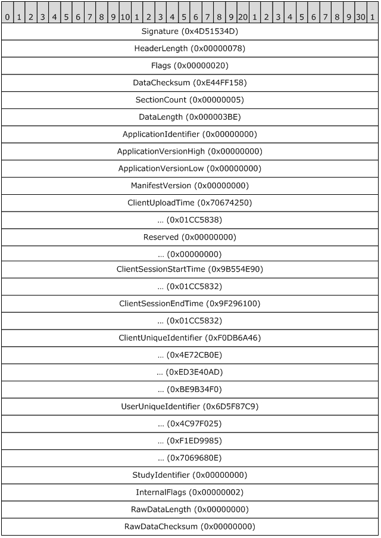
<!-- /Extracted images from page 39 -->

Figure 12: SQM header example

### 4.3 SQM Section Header

This section provides an example of a SQM section header, as described in section 2.2.4.3.

39 / 47

[MS-SQMCS] - v20170601
Software Quality Metrics (SQM) Client-to-Service Version 1 Protocol
Copyright © 2017 Microsoft Corporation
Release: June 1, 2017

<!-- Extracted images from page 40 -->
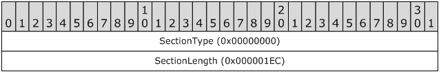
<!-- /Extracted images from page 40 -->

         0  1  2  3  4  5  6  7  8  9  A  B  C  D  E  F
 0070                         00 00 00 00 00 EC 01 00 00

Figure 13: SQM section header example

[MS-SQMCS] - v20170601
Software Quality Metrics (SQM) Client-to-Service Version 1 Protocol
Copyright © 2017 Microsoft Corporation
Release: June 1, 2017

40 / 47

## 5 Security

### 5.1 Security Considerations for Implementers

HTTPS is the recommended transport mechanism when downloading an A-SQM manifest. Using HTTPS
provides protection from man in the middle (MITM) attacks, in which a private connection is
controlled by an outside attacker, when the web server is trusted.

### 5.2 Index of Security Parameters

None.

[MS-SQMCS] - v20170601
Software Quality Metrics (SQM) Client-to-Service Version 1 Protocol
Copyright © 2017 Microsoft Corporation
Release: June 1, 2017

41 / 47

## 6 Appendix A: Product Behavior

The information in this specification is applicable to the following Microsoft products or supplemental
software. References to product versions include updates to those products.

  Windows Vista operating system

  Windows Server 2008 operating system

  Windows 7 operating system

  Windows Server 2008 R2 operating system

  Windows 8 operating system

  Windows Server 2012 operating system

  Windows 8.1 operating system

  Windows Server 2012 R2 operating system

Exceptions, if any, are noted in this section. If an update version, service pack or Knowledge Base
(KB) number appears with a product name, the behavior changed in that update. The new behavior
also applies to subsequent updates unless otherwise specified. If a product edition appears with the
product version, behavior is different in that product edition.

Unless otherwise specified, any statement of optional behavior in this specification that is prescribed
using the terms "SHOULD" or "SHOULD NOT" implies product behavior in accordance with the
SHOULD or SHOULD NOT prescription. Unless otherwise specified, the term "MAY" implies that the
product does not follow the prescription.

<1> Section 2.2.1:  The Microsoft SQM client uses the following URL to communicate the SQM partner
name to the SQM server.

 http(s)://sqm.microsoft.com/sqm/%SQM-PARTNERNAME%/sqmserver.dll

where %SQM-PARTNERNAME% is replaced with the actual partner name. The SQM partner name is
known to both the SQM client and the SQM server.

<2> Section 2.2.4.1:  On Windows client implementations of SQM, the Signature value is set to
0x4D51534D.

<3> Section 2.2.4.1:  Windows client implementations of SQM using the following Flags bit positions:

Bit Position  Meaning

0

1

2

3

4

5

6

Debug SQM application

Reserved

SSL required for upload

Do not upload

Reserved

Reserved

Partial SQM session

[MS-SQMCS] - v20170601
Software Quality Metrics (SQM) Client-to-Service Version 1 Protocol
Copyright © 2017 Microsoft Corporation
Release: June 1, 2017

42 / 47

Bit Position  Meaning

7

8

9

10

SQM session from proxy

Reserved

SQM session end time indeterminate

SQM header only upload

<4> Section 2.2.4.1:  Windows client implementations of SQM use the following algorithm to set the
DataChecksum value and the RawDataChecksum value.

 DWORD Checksum = 0
 FOR EACH BYTE b FROM SQM-Header.DataLength TO SQM-Header.ApplicationVersionLow
 Checksum = (Checksum * 101) + b
 END FOR
 FOR EACH BYTE b IN SQM-Section-Data
 Checksum = (Checksum * 101) + b
 END FOR
 RETURN Checksum

<5> Section 2.2.6.1:  Microsoft SQM server implementations of A-SQM use the following algorithm to
set the Checksum value:

 DWORD Checksum = 0
 FOR EACH BYTE b IN A-SQM Manifest Data
 Checksum = (Checksum * 101) + b
 END FOR
 RETURN Checksum

<6> Section 2.2.6.3:  Microsoft server implementations of A-SQM set the Signature value to
0x414D5153.

<7> Section 3.1.5.3:  Windows client implementations of A-SQM are not available on Windows Vista
and Windows Server 2008.

<8> Section 3.1.5.3.1:  Windows client implementations of A-SQM download a package that the
Microsoft SQM server creates. The package contains an A-SQM download header as specified in
section 2.2.6.1 within a compressed DLL file.

The DLL file contains a single resource named "ADAPTIVESQMANIFEST" with a resource type of
"ASQMMANIFEST". The A-SQM manifest as specified in section 2.2.6.2 is contained within this DLL
resource.

The DLL file (uncompressed) is signed by Microsoft. The Windows client implementations verify the file
signature. The signature is verified by the WinVerifyTrust function as described in [MSDN-CAPI]. The
ActionID used is WINTRUST_ACTION_GENERIC_VERIFY_V2.

Windows implementations of A-SQM use cabinet compression as described in [MSDN-CAB].

<9> Section 3.1.5.3.1:  The Microsoft implementation of A-SQM uses the URL to differentiate the SQM
Partner A-SQM manifests. The URL form is:

 http://sqm.microsoft.com/%SQM-PARTNERNAME%/manifests/sqm%MANIFESTVERSION%.bin

[MS-SQMCS] - v20170601
Software Quality Metrics (SQM) Client-to-Service Version 1 Protocol
Copyright © 2017 Microsoft Corporation
Release: June 1, 2017

43 / 47

where %SQM-PARTNERNAME% is replaced with the actual partner name and %MANIFESTVERSION%
is replaced with the ManifestVersion value, in decimal form, as specified in section 2.2.4.1, and
section 3.1.5.2.2. The SQM partner name is known to the SQM client and the SQM server.

<10> Section 3.3.1:  On Windows 8 and Windows 8.1, the proxy can be enabled by installing the
Windows Feedback Forwarder. Windows Feedback Forwarder contains two settings. One setting
configures the port number on which to receive SQM messages and the second setting configures
proxy information so that the Windows Feedback Forwarder service can connect to the SQM service
through a firewall. The Windows Feedback Forwarder service will not relay any messages unless a
client is configured to send SQM data to the relay.

[MS-SQMCS] - v20170601
Software Quality Metrics (SQM) Client-to-Service Version 1 Protocol
Copyright © 2017 Microsoft Corporation
Release: June 1, 2017

44 / 47

## 7 Change Tracking

No table of changes is available. The document is either new or has had no changes since its last
release.

[MS-SQMCS] - v20170601
Software Quality Metrics (SQM) Client-to-Service Version 1 Protocol
Copyright © 2017 Microsoft Corporation
Release: June 1, 2017

45 / 47

## 8 Index
A

Abstract data model
   client 29
   proxy 35
   server 32
Adaptive Software Quality Metrics (A-SQM) Manifest

message 20

Applicability 7

C

Capability negotiation 7
Change tracking 45
Client
   abstract data model 29
   higher-layer triggered events 29
   initialization 29
   message processing
      A-SQM resource message 31
      message construction 29
      message data upload processing 30
   other local events 32
   overview 29
   sequencing rules
      message construction 29
      message data upload processing 30
      processing A-SQM resource message 31
   timer events 32
   timers 29

D

Data model - abstract
   client 29
   proxy 35
   server 32
Directory service schema elements 28

E

Elements - directory service schema 28
Examples
   section header 39
   upload 37
Examples header 38

F

Fields - vendor-extensible 7

G

Glossary 5

H

Header example 38
Higher-layer triggered events
   client 29
   proxy 35
   server 33

I

Implementer - security considerations 41
Index of security parameters 41
Informative references 6
Initialization
   client 29
   proxy 35
   server 32
Introduction 5

M

Message processing
   client
      A-SQM resource message 31
      message construction 29
      message data upload processing 30
   proxy 35
   server 33
Message Response message 19
Message Upload Data Contents message 9
Messages
   Adaptive Software Quality Metrics (A-SQM)

Manifest 20

   Adaptive Software Quality Metrics (A-SQM)

Manifest message 20

   Message Response 19
   Message Response message 19
   Message Upload Data Contents 9
   Message Upload Data Contents message 9
   Namespaces 9
   Namespaces message 9
   SQM Session 9
   SQM Session message 9
   transport 9

N

Namespaces message 9
Normative references 6

O

Other local events
   client 32
   proxy 36
   server 34
Overview (synopsis) 6

P

Parameters - security index 41
Preconditions 7
Prerequisites 7
Product behavior 42
Proxy
   abstract data model 35
   higher-layer triggered events 35
   initialization 35
   message processing 35

[MS-SQMCS] - v20170601
Software Quality Metrics (SQM) Client-to-Service Version 1 Protocol
Copyright © 2017 Microsoft Corporation
Release: June 1, 2017

46 / 47

Versioning 7

   other local events 36
   overview 34
   sequencing rules 35
   timer events 36
   timers 35

R

References 6
   informative 6
   normative 6
Relationship to other protocols 7

S

Schema elements - directory service 28
Section header example 39
Security
   implementer considerations 41
   parameter index 41
Sequencing rules
   client
      message construction 29
      message data upload processing 30
      processing A-SQM resource message 31
   proxy 35
   server 33
Server
   abstract data model 32
   higher-layer triggered events 33
   initialization 32
   message processing 33
   other local events 34
   overview 32
   sequencing rules 33
   timer events 34
   timers 32
SQM Session message 9
Standards assignments 8

T

Timer events
   client 32
   proxy 36
   server 34
Timers
   client 29
   proxy 35
   server 32
Tracking changes 45
Transport 9
Triggered events - higher-layer
   client 29
   proxy 35
   server 33

U

Upload example 37

V

Vendor-extensible fields 7

[MS-SQMCS] - v20170601
Software Quality Metrics (SQM) Client-to-Service Version 1 Protocol
Copyright © 2017 Microsoft Corporation
Release: June 1, 2017

47 / 47

