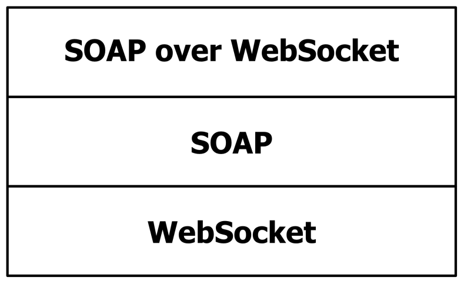

[MS-SWSB]:

SOAP Over WebSocket Protocol Binding

Intellectual Property Rights Notice for Open Specifications Documentation

  Technical Documentation. Microsoft publishes Open Specifications documentation (“this

documentation”) for protocols, file formats, data portability, computer languages, and standards
support. Additionally, overview documents cover inter-protocol relationships and interactions.

  Copyrights. This documentation is covered by Microsoft copyrights. Regardless of any other

terms that are contained in the terms of use for the Microsoft website that hosts this
documentation, you can make copies of it in order to develop implementations of the technologies
that are described in this documentation and can distribute portions of it in your implementations
that use these technologies or in your documentation as necessary to properly document the
implementation. You can also distribute in your implementation, with or without modification, any
schemas, IDLs, or code samples that are included in the documentation. This permission also
applies to any documents that are referenced in the Open Specifications documentation.
  No Trade Secrets. Microsoft does not claim any trade secret rights in this documentation.
  Patents. Microsoft has patents that might cover your implementations of the technologies

described in the Open Specifications documentation. Neither this notice nor Microsoft's delivery of
this documentation grants any licenses under those patents or any other Microsoft patents.
However, a given Open Specifications document might be covered by the Microsoft Open
Specifications Promise or the Microsoft Community Promise. If you would prefer a written license,
or if the technologies described in this documentation are not covered by the Open Specifications
Promise or Community Promise, as applicable, patent licenses are available by contacting
iplg@microsoft.com.

  License Programs. To see all of the protocols in scope under a specific license program and the

associated patents, visit the Patent Map.

  Trademarks. The names of companies and products contained in this documentation might be
covered by trademarks or similar intellectual property rights. This notice does not grant any
licenses under those rights. For a list of Microsoft trademarks, visit
www.microsoft.com/trademarks.

  Fictitious Names. The example companies, organizations, products, domain names, email

addresses, logos, people, places, and events that are depicted in this documentation are fictitious.
No association with any real company, organization, product, domain name, email address, logo,
person, place, or event is intended or should be inferred.

Reservation of Rights. All other rights are reserved, and this notice does not grant any rights other
than as specifically described above, whether by implication, estoppel, or otherwise.

Tools. The Open Specifications documentation does not require the use of Microsoft programming
tools or programming environments in order for you to develop an implementation. If you have access
to Microsoft programming tools and environments, you are free to take advantage of them. Certain
Open Specifications documents are intended for use in conjunction with publicly available standards
specifications and network programming art and, as such, assume that the reader either is familiar
with the aforementioned material or has immediate access to it.

Support. For questions and support, please contact dochelp@microsoft.com.

[MS-SWSB] - v20210625
SOAP Over WebSocket Protocol Binding
Copyright © 2021 Microsoft Corporation
Release: June 25, 2021

1 / 18

Revision Summary

Date

Revision
History

Revision
Class

Comments

12/16/2011  1.0

3/30/2012

1.0

New

None

Released new document.

No changes to the meaning, language, or formatting of the
technical content.

7/12/2012

2.0

Major

Significantly changed the technical content.

10/25/2012  2.0

1/31/2013

2.0

None

None

No changes to the meaning, language, or formatting of the
technical content.

No changes to the meaning, language, or formatting of the
technical content.

8/8/2013

2.1

Minor

Clarified the meaning of the technical content.

11/14/2013  2.1

2/13/2014

2.1

5/15/2014

2.1

None

None

None

No changes to the meaning, language, or formatting of the
technical content.

No changes to the meaning, language, or formatting of the
technical content.

No changes to the meaning, language, or formatting of the
technical content.

6/30/2015

3.0

Major

Significantly changed the technical content.

10/16/2015  3.0

7/14/2016

3.0

None

None

No changes to the meaning, language, or formatting of the
technical content.

No changes to the meaning, language, or formatting of the
technical content.

3/16/2017

4.0

Major

Significantly changed the technical content.

6/1/2017

4.0

9/15/2017

5.0

9/12/2018

6.0

3/13/2019

7.0

6/25/2021

8.0

None

Major

Major

Major

Major

No changes to the meaning, language, or formatting of the
technical content.

Significantly changed the technical content.

Significantly changed the technical content.

Significantly changed the technical content.

Significantly changed the technical content.

[MS-SWSB] - v20210625
SOAP Over WebSocket Protocol Binding
Copyright © 2021 Microsoft Corporation
Release: June 25, 2021

2 / 18

Table of Contents

1.1
1.2

1.2.1
1.2.2

1  Introduction ............................................................................................................ 4
Glossary ........................................................................................................... 4
References ........................................................................................................ 4
Normative References ................................................................................... 4
Informative References ................................................................................. 5
Overview .......................................................................................................... 5
Relationship to Other Protocols ............................................................................ 6
Prerequisites/Preconditions ................................................................................. 6
Applicability Statement ....................................................................................... 6
Versioning and Capability Negotiation ................................................................... 6
Vendor-Extensible Fields ..................................................................................... 6
Standards Assignments ....................................................................................... 7

1.3
1.4
1.5
1.6
1.7
1.8
1.9

2.1
2.2

2  Messages ................................................................................................................. 8
Transport .......................................................................................................... 8
Common Message Syntax ................................................................................... 8
Namespaces ................................................................................................ 8
Messages ..................................................................................................... 8
Elements ..................................................................................................... 8
Complex Types ............................................................................................. 8
Simple Types ............................................................................................... 8
Attributes .................................................................................................... 8
Groups ........................................................................................................ 8
Attribute Groups ........................................................................................... 9
Common Data Structures .............................................................................. 9
Directory Service Schema Elements ..................................................................... 9

2.2.1
2.2.2
2.2.3
2.2.4
2.2.5
2.2.6
2.2.7
2.2.8
2.2.9

2.3

3.1

3.1.1
3.1.2
3.1.3
3.1.4
3.1.5
3.1.6

3  Protocol Details ..................................................................................................... 10
Server Details .................................................................................................. 10
Abstract Data Model .................................................................................... 10
Timers ...................................................................................................... 10
Initialization ............................................................................................... 10
Message Processing Events and Sequencing Rules .......................................... 10
Timer Events .............................................................................................. 10
Other Local Events ...................................................................................... 10
Client Details ................................................................................................... 10
Abstract Data Model .................................................................................... 11
Timers ...................................................................................................... 11
Initialization ............................................................................................... 11
Message Processing Events and Sequencing Rules .......................................... 11
Timer Events .............................................................................................. 11
Other Local Events ...................................................................................... 11

3.2.1
3.2.2
3.2.3
3.2.4
3.2.5
3.2.6

3.2

4  Protocol Examples ................................................................................................. 12

5  Security ................................................................................................................. 13
Security Considerations for Implementers ........................................................... 13
Index of Security Parameters ............................................................................ 13

5.1
5.2

6  Appendix A: Full WSDL .......................................................................................... 14

7  Appendix B: Product Behavior ............................................................................... 15

8  Change Tracking .................................................................................................... 16

9  Index ..................................................................................................................... 17

[MS-SWSB] - v20210625
SOAP Over WebSocket Protocol Binding
Copyright © 2021 Microsoft Corporation
Release: June 25, 2021

3 / 18

1  Introduction

The SOAP over WebSocket Protocol Binding Specification defines a binding of SOAP to the WebSocket
protocol (as defined in [RFC6455]), including a WSDL transport URI and supported message
exchange patterns (MEPs). This specification also defines a WebSocket subprotocol.

Note  This specification does not define any SOAP messages. Rather, it specifies how messages
defined by a higher-layer protocol are formed and framed for transport over [RFC6455].

Sections 1.5, 1.8, 1.9, 2, and 3 of this specification are normative. All other sections and examples in
this specification are informative.

1.1  Glossary

This document uses the following terms:

endpoint: A client that is on a network and is requesting access to a network access server (NAS).

SOAP: A lightweight protocol for exchanging structured information in a decentralized, distributed

environment. SOAP uses XML technologies to define an extensible messaging framework, which
provides a message construct that can be exchanged over a variety of underlying protocols. The
framework has been designed to be independent of any particular programming model and
other implementation-specific semantics. SOAP 1.2 supersedes SOAP 1.1. See [SOAP1.2-
1/2003].

SOAP message: An XML document consisting of a mandatory SOAP envelope, an optional SOAP
header, and a mandatory SOAP body. See [SOAP1.2-1/2007] section 5 for more information.

Uniform Resource Identifier (URI): A string that identifies a resource. The URI is an addressing
mechanism defined in Internet Engineering Task Force (IETF) Uniform Resource Identifier (URI):
Generic Syntax [RFC3986].

Web Services Description Language (WSDL): An XML format for describing network services

as a set of endpoints that operate on messages that contain either document-oriented or
procedure-oriented information. The operations and messages are described abstractly and are
bound to a concrete network protocol and message format in order to define an endpoint.
Related concrete endpoints are combined into abstract endpoints, which describe a network
service. WSDL is extensible, which allows the description of endpoints and their messages
regardless of the message formats or network protocols that are used.

MAY, SHOULD, MUST, SHOULD NOT, MUST NOT: These terms (in all caps) are used as defined
in [RFC2119]. All statements of optional behavior use either MAY, SHOULD, or SHOULD NOT.

1.2  References

Links to a document in the Microsoft Open Specifications library point to the correct section in the
most recently published version of the referenced document. However, because individual documents
in the library are not updated at the same time, the section numbers in the documents may not
match. You can confirm the correct section numbering by checking the Errata.

1.2.1  Normative References

We conduct frequent surveys of the normative references to assure their continued availability. If you
have any issue with finding a normative reference, please contact dochelp@microsoft.com. We will
assist you in finding the relevant information.

4 / 18

[MS-SWSB] - v20210625
SOAP Over WebSocket Protocol Binding
Copyright © 2021 Microsoft Corporation
Release: June 25, 2021

[MC-NBFSE] Microsoft Corporation, ".NET Binary Format: SOAP Extension".

[MC-NBFS] Microsoft Corporation, ".NET Binary Format: SOAP Data Structure".

[RFC2119] Bradner, S., "Key words for use in RFCs to Indicate Requirement Levels", BCP 14, RFC
2119, March 1997, https://www.rfc-editor.org/info/rfc2119

[RFC3902] Baker, M., and Nottingham, M., "The 'application/soap+xml' media type", RFC 3902,
September 2004, https://www.rfc-editor.org/info/rfc3902

[RFC6455] Fette, I., and Melnikov, A., "The WebSocket Protocol", RFC 6455, December 2011,
http://www.ietf.org/rfc/rfc6455.txt

[SOAP1.2-1/2007] Gudgin, M., Hadley, M., Mendelsohn, N., et al., "SOAP Version 1.2 Part 1:
Messaging Framework (Second Edition)", W3C Recommendation, April 2007,
http://www.w3.org/TR/2007/REC-soap12-part1-20070427/

[SOAP1.2-2/2007] Gudgin, M., Hadley, M., Mendelsohn, N., et al., "SOAP Version 1.2 Part 2: Adjuncts
(Second Edition)", W3C Recommendation, April 2007, http://www.w3.org/TR/2007/REC-soap12-
part2-20070427

[SOAP1.2-3/2007] W3C, "SOAP 1.2 Part 3: One-Way MEP", W3C Working Group Note 2, July 2007,
http://www.w3.org/TR/2007/NOTE-soap12-part3-20070702

[WSDLSOAP] Angelov, D., Ballinger, K., Butek, R., et al., "WSDL 1.1 Binding Extension for SOAP 1.2",
W3C Member Submission, April 2006, http://www.w3.org/Submission/2006/SUBM-wsdl11soap12-
20060405/

[WSDL] Christensen, E., Curbera, F., Meredith, G., and Weerawarana, S., "Web Services Description
Language (WSDL) 1.1", W3C Note, March 2001, https://www.w3.org/TR/2001/NOTE-wsdl-20010315

[XMLNS-2ED] Bray, T., Hollander, D., Layman, A., and Tobin, R., Eds., "Namespaces in XML 1.0
(Second Edition)", W3C Recommendation, August 2006, https://www.w3.org/TR/2006/REC-xml-
names-20060816/

[XMLSCHEMA1] Thompson, H., Beech, D., Maloney, M., and Mendelsohn, N., Eds., "XML Schema Part
1: Structures", W3C Recommendation, May 2001, https://www.w3.org/TR/2001/REC-xmlschema-1-
20010502/

[XMLSCHEMA2] Biron, P.V., Ed. and Malhotra, A., Ed., "XML Schema Part 2: Datatypes", W3C
Recommendation, May 2001, https://www.w3.org/TR/2001/REC-xmlschema-2-20010502/

1.2.2  Informative References

[MS-NETOD] Microsoft Corporation, "Microsoft .NET Framework Protocols Overview".

1.3  Overview

The SOAP over WebSocket Protocol Binding:

  Specifies a WSDL Transport URI (http://schemas.microsoft.com/soap/websocket) for identifying

this protocol as the transport for sending SOAP 1.2 messages [SOAP1.2-2/2007].

  Defines a new WebSocket subprotocol (soap), as described in [RFC6455], which is used by the

client to indicate to the service that it intends to use the SOAP-over-WebSockets protocol for
message exchange.

[MS-SWSB] - v20210625
SOAP Over WebSocket Protocol Binding
Copyright © 2021 Microsoft Corporation
Release: June 25, 2021

5 / 18

<!-- Extracted images from page 6 -->

<!-- /Extracted images from page 6 -->

  Defines two new HTTP headers ('soap-content-type' and 'microsoft-binary-transfer-mode') that

are used by the client during the initial WebSocket handshake to indicate the SOAP content-type
and the transfer-mode of the subsequent messages.

1.4  Relationship to Other Protocols

The SOAP over WebSocket Protocol Binding uses the WebSocket protocol, as described in [RFC6455],
as the transport. The SOAP over WebSocket Protocol Binding uses WebSocket framing as defined in
section 5 of [RFC6455] to send SOAP 1.2 messages [SOAP1.2-2/2007].

The following figure shows the protocol stack.

Figure 1: Protocol stack

1.5  Prerequisites/Preconditions

The SOAP over WebSocket Protocol Binding requires that a client can connect to the service over the
WebSocket protocol, as described in [RFC6455].

1.6  Applicability Statement

The SOAP over WebSocket Protocol Binding is applicable in scenarios where a client and a service
require a communication mechanism to send and receive SOAP messages over WebSocket
([RFC6455]).

1.7  Versioning and Capability Negotiation

This document covers versioning issues in the following areas:

  Supported transports: This protocol requires WebSocket ([RFC6455]) as the transport.

  Protocol versions: The use of SOAP version 1.2 [SOAP1.2-1/2007] is required.

  Capability negotiation: This protocol does not support negotiation of the version or the

capabilities to use.

1.8  Vendor-Extensible Fields

This protocol has no vendor-extensible fields.

[MS-SWSB] - v20210625
SOAP Over WebSocket Protocol Binding
Copyright © 2021 Microsoft Corporation
Release: June 25, 2021

6 / 18

1.9  Standards Assignments

There are no standards assignments for this protocol.

[MS-SWSB] - v20210625
SOAP Over WebSocket Protocol Binding
Copyright © 2021 Microsoft Corporation
Release: June 25, 2021

7 / 18

2  Messages

2.1  Transport

The SOAP over WebSocket Protocol Binding requires the WebSocket transport protocol (as specified in
[RFC6455])<1>.

A service endpoint that uses the SOAP over WebSocket Protocol Binding with SOAP 1.2 [SOAP1.2-
1/2007] MUST set the value of the transport attribute of the wsoap12:binding element [WSDLSOAP]
to http://schemas.microsoft.com/soap/websocket.

2.2  Common Message Syntax

This section contains common definitions used by this protocol. The syntax of the definitions uses XML
schema as defined in [XMLSCHEMA1] and [XMLSCHEMA2], and Web Services Description
Language (WSDL) as defined in [WSDL].

2.2.1  Namespaces

This specification defines and references various XML namespaces using the mechanisms specified in
[XMLNS-2ED]. Although this specification associates a specific XML namespace prefix for each XML
namespace that is used, the choice of any particular XML namespace prefix is implementation-specific
and not significant for interoperability.

Prefix  Namespace URI

Reference

soap12   http://schemas.xmlsoap.org/wsdl/soap12/   [WSDLSOAP]

wsdl

http://schemas.xmlsoap.org/wsdl/

[WSDL]

2.2.2  Messages

This specification does not define any common XML schema message definitions.

2.2.3  Elements

This specification does not define any common XML schema element definitions.

2.2.4  Complex Types

This specification does not define any common XML schema complex type definitions.

2.2.5  Simple Types

This specification does not define any common XML schema simple type definitions.

2.2.6  Attributes

This specification does not define any common XML schema attribute definitions.

2.2.7  Groups

This specification does not define any common XML schema group definitions.

[MS-SWSB] - v20210625
SOAP Over WebSocket Protocol Binding
Copyright © 2021 Microsoft Corporation
Release: June 25, 2021

8 / 18

2.2.8  Attribute Groups

This specification does not define any common XML schema attribute group definitions.

2.2.9  Common Data Structures

This specification does not define any common XML schema data structures.

2.3  Directory Service Schema Elements

None.

[MS-SWSB] - v20210625
SOAP Over WebSocket Protocol Binding
Copyright © 2021 Microsoft Corporation
Release: June 25, 2021

9 / 18

3  Protocol Details

3.1  Server Details

A service endpoint MUST support the following message exchange patterns:





http://www.w3.org/2003/05/soap/mep/request-response/ (defined in [SOAP1.2-2/2007])

http://www.w3.org/2006/08/soap/mep/one-way/ (defined in [SOAP1.2-3/2007])

3.1.1  Abstract Data Model

None.

3.1.2  Timers

None.

3.1.3  Initialization

None.

3.1.4  Message Processing Events and Sequencing Rules

None.

3.1.5  Timer Events

None.

3.1.6  Other Local Events

None.

3.2  Client Details

A client initiates the process by establishing a WebSocket connection, as specified in [RFC6455], to a
service. A client MUST specify that it intends to communicate with the service using this SOAP-over-
Websocket subprotocol by providing a "soap" value in the "Sec-WebSocket-Protocol" HTTP header
during the initialization while performing a WebSocket handshake as specified in [RFC6455] section
1.3. A client MUST also specify a soap-content-type header to indicate the content-type of the
subsequent SOAP messages once the WebSocket handshake is successfully completed. A client
SHOULD also specify a 'microsoft-binary-transfer-mode' with the transfer-mode while using the binary
encoding as specified in [MC-NBFS] or [MC-NBFSE]. Valid values for the transfer-mode are:

1.

2.

3.

'Streamed', which indicates that messages sent and received from the web service endpoint are
transferred as a stream of bytes.

'StreamedRequest', which indicates that only the messages sent to a web service endpoint are
transferred as a stream of bytes.

'StreamedResponse', which indicates that the messages received from the web service endpoint
are interpreted as a stream of bytes.

[MS-SWSB] - v20210625
SOAP Over WebSocket Protocol Binding
Copyright © 2021 Microsoft Corporation
Release: June 25, 2021

10 / 18

Once a WebSocket connection has been successfully established between the client and the server, all
subsequent message exchanges MUST conform to the SOAP 1.2 [SOAP1.2-1/2007] specification with
the encoding as specified in [RFC3902] while sending the messages using the framing as defined in
[RFC6455].

3.2.1  Abstract Data Model

None.

3.2.2  Timers

None.

3.2.3  Initialization

None.

3.2.4  Message Processing Events and Sequencing Rules

None.

3.2.5  Timer Events

None.

3.2.6  Other Local Events

None.

[MS-SWSB] - v20210625
SOAP Over WebSocket Protocol Binding
Copyright © 2021 Microsoft Corporation
Release: June 25, 2021

11 / 18

4  Protocol Examples

Section 6, Appendix A: Full WSDL, specifies the SOAP over WebSocket Binding Transport URI defined
in this document.

The following HTTP headers section is an example of the WebSocket subprotocol defined by this
specification:

 GET http://myHost/myService HTTP/1.1
 Connection: Upgrade,Keep-Alive
 Upgrade: websocket
 Sec-WebSocket-Key: ROOw9dYOJkStW2nx5r1k9w==
 Sec-WebSocket-Version: 13
 Sec-WebSocket-Protocol: soap
 soap-content-type: application/soap+msbinsession1
 microsoft-binary-transfer-mode: Buffered
 Accept-Encoding: gzip, deflate

 HTTP/1.1 101 Switching Protocols
 Upgrade: websocket
 Connection: Upgrade
 Sec-WebSocket-Accept: s3pPLMBiTxaQ9kYGzzhZRbK+xOo=
 Sec-WebSocket-Protocol: soap

[MS-SWSB] - v20210625
SOAP Over WebSocket Protocol Binding
Copyright © 2021 Microsoft Corporation
Release: June 25, 2021

12 / 18

5  Security

5.1  Security Considerations for Implementers

Security considerations are discussed in detail under the security considerations section (section 10) in
[RFC6455].

There are no special security considerations for this protocol.

5.2  Index of Security Parameters

None.

[MS-SWSB] - v20210625
SOAP Over WebSocket Protocol Binding
Copyright © 2021 Microsoft Corporation
Release: June 25, 2021

13 / 18

6  Appendix A: Full WSDL

The following WSDL specifies the WSDL 1.1 binding extension transport URI with SOAP1.2:

WSDL 1.1 binding extension transport URI with SOAP 1.2 [SOAP1.2-2/2007]

 <?xml version="1.0" encoding="utf-8"?>
 <wsdl:definitions
     xmlns:wsdl="http://schemas.xmlsoap.org/wsdl/"
     xmlns:soap12="http://schemas.xmlsoap.org/wsdl/soap12/">
   <!-- omitted elements -->
   <wsdl:binding name="MyBinding" type="MyPortType">
             <!-- omitted elements -->
             <soap12:binding transport="http://schemas.microsoft.com/soap/websocket"/>
             <wsdl:operation name="MyOperation">
                     <!-- ommitted elements -->
             </wsdl:operation>
   </wsdl:binding>
   <wsdl:service name="MyService">
               <wsdl:port name="MyPort" binding="MyBinding">
                       <soap12:address location=" ws://myHost/myService/" />
             </wsdl:port>
 </wsdl:service>
 </wsdl:definitions>

[MS-SWSB] - v20210625
SOAP Over WebSocket Protocol Binding
Copyright © 2021 Microsoft Corporation
Release: June 25, 2021

14 / 18

7  Appendix B: Product Behavior

The information in this specification is applicable to the following Microsoft products or supplemental
software. References to product versions include updates to those products.

The terms "earlier" and "later", when used with a product version, refer to either all preceding
versions or all subsequent versions, respectively. The term "through" refers to the inclusive range of
versions. Applicable Microsoft products are listed chronologically in this section.

This document specifies version-specific details in the Microsoft .NET Framework. For information
about which versions of the .NET Framework are available in each released Windows product or as
supplemental software, see [MS-NETOD] section 4.

Framework Releases

  Microsoft .NET Framework 4.5

  Microsoft .NET Framework 4.6

  Microsoft .NET Framework 4.7

  Microsoft .NET Framework 4.8

Windows Client Releases

  Windows 8 operating system

  Windows 8.1 operating system

  Windows 10 operating system

  Windows 11 operating system

Windows Server Releases

  Windows Server 2012 operating system

  Windows Server 2012 R2 operating system

  Windows Server 2016 operating system

  Windows Server operating system

  Windows Server 2019 operating system

  Windows Server 2022 operating system

Exceptions, if any, are noted in this section. If an update version, service pack or Knowledge Base
(KB) number appears with a product name, the behavior changed in that update. The new behavior
also applies to subsequent updates unless otherwise specified. If a product edition appears with the
product version, behavior is different in that product edition.

Unless otherwise specified, any statement of optional behavior in this specification that is prescribed
using the terms "SHOULD" or "SHOULD NOT" implies product behavior in accordance with the
SHOULD or SHOULD NOT prescription. Unless otherwise specified, the term "MAY" implies that the
product does not follow the prescription.

<1> Section 2.1:  The Websocket protocol is supported only on Windows 8 and later and on Windows
Server 2012 and later.

[MS-SWSB] - v20210625
SOAP Over WebSocket Protocol Binding
Copyright © 2021 Microsoft Corporation
Release: June 25, 2021

15 / 18

8  Change Tracking

This section identifies changes that were made to this document since the last release. Changes are
classified as Major, Minor, or None.

The revision class Major means that the technical content in the document was significantly revised.
Major changes affect protocol interoperability or implementation. Examples of major changes are:

  A document revision that incorporates changes to interoperability requirements.
  A document revision that captures changes to protocol functionality.

The revision class Minor means that the meaning of the technical content was clarified. Minor changes
do not affect protocol interoperability or implementation. Examples of minor changes are updates to
clarify ambiguity at the sentence, paragraph, or table level.

The revision class None means that no new technical changes were introduced. Minor editorial and
formatting changes may have been made, but the relevant technical content is identical to the last
released version.

The changes made to this document are listed in the following table. For more information, please
contact dochelp@microsoft.com.

Section

Description

Revision class

7 Appendix B: Product Behavior  Updated for this version of Windows Client.  Major

[MS-SWSB] - v20210625
SOAP Over WebSocket Protocol Binding
Copyright © 2021 Microsoft Corporation
Release: June 25, 2021

16 / 18

9  Index
A

Abstract data model
   client 11
   server 10
Applicability 6
Attribute groups 9
Attributes 8

C

Capability negotiation 6
Change tracking 16
Client
   abstract data model 11
   initialization 11
   local events 11
   message processing 11
   sequencing rules 11
   timer events 11
   timers 11
Common data structures 9
Complex types 8

D

Data model - abstract
   client 11
   server 10
Data structures 9
Directory service schema elements 9

E

Elements - directory service schema 9
Events
   local - client 11
   local - server 10
   timer - client 11
   timer - server 10
Examples 12

F

Fields - vendor-extensible 6
Full WSDL 14

G

Glossary 4
Groups 8

I

Implementer - security considerations 13
Index of security parameters 13
Informative references 5
Initialization
   client 11
   server 10
Introduction 4

[MS-SWSB] - v20210625
SOAP Over WebSocket Protocol Binding
Copyright © 2021 Microsoft Corporation
Release: June 25, 2021

L

Local events
   client 11
   server 10

M

Message processing
   client 11
   server 10
Messages
   attribute groups 9
   attributes 8
   common data structures 9
   complex types 8
   data structures 9
   elements 8
   enumerated 8
   groups 8
   namespaces 8
   simple types 8
   syntax 8
   transport 8

N

Namespaces 8
Normative references 4

O

Overview (synopsis) 5

P

Parameters - security index 13
Preconditions 6
Prerequisites 6
Product behavior 15

R

References 4
   informative 5
   normative 4
Relationship to other protocols 6

S

Schema elements - directory service 9
Security
   implementer considerations 13
   parameter index 13
Sequencing rules
   client 11
   server 10
Server
   abstract data model 10
   initialization 10

17 / 18

   local events 10
   message processing 10
   sequencing rules 10
   timer events 10
   timers 10
Simple types 8
Standards assignments 7
Syntax
   messages - overview 8

T

Timer events
   client 11
   server 10
Timers
   client 11
   server 10
Tracking changes 16
Transport 8
Types
   complex 8
   simple 8

V

Vendor-extensible fields 6
Versioning 6

W

WSDL 14

[MS-SWSB] - v20210625
SOAP Over WebSocket Protocol Binding
Copyright © 2021 Microsoft Corporation
Release: June 25, 2021

18 / 18

