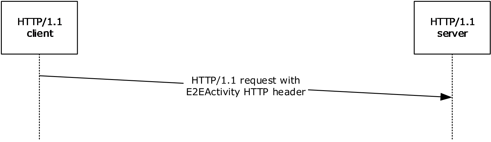

[MS-THCH]:

Tracing HTTP Correlation Header Protocol

Intellectual Property Rights Notice for Open Specifications Documentation

  Technical Documentation. Microsoft publishes Open Specifications documentation (“this

documentation”) for protocols, file formats, data portability, computer languages, and standards
support. Additionally, overview documents cover inter-protocol relationships and interactions.

  Copyrights. This documentation is covered by Microsoft copyrights. Regardless of any other

terms that are contained in the terms of use for the Microsoft website that hosts this
documentation, you can make copies of it in order to develop implementations of the technologies
that are described in this documentation and can distribute portions of it in your implementations
that use these technologies or in your documentation as necessary to properly document the
implementation. You can also distribute in your implementation, with or without modification, any
schemas, IDLs, or code samples that are included in the documentation. This permission also
applies to any documents that are referenced in the Open Specifications documentation.
  No Trade Secrets. Microsoft does not claim any trade secret rights in this documentation.
  Patents. Microsoft has patents that might cover your implementations of the technologies

described in the Open Specifications documentation. Neither this notice nor Microsoft's delivery of
this documentation grants any licenses under those patents or any other Microsoft patents.
However, a given Open Specifications document might be covered by the Microsoft Open
Specifications Promise or the Microsoft Community Promise. If you would prefer a written license,
or if the technologies described in this documentation are not covered by the Open Specifications
Promise or Community Promise, as applicable, patent licenses are available by contacting
iplg@microsoft.com.

  License Programs. To see all of the protocols in scope under a specific license program and the

associated patents, visit the Patent Map.

  Trademarks. The names of companies and products contained in this documentation might be
covered by trademarks or similar intellectual property rights. This notice does not grant any
licenses under those rights. For a list of Microsoft trademarks, visit
www.microsoft.com/trademarks.

  Fictitious Names. The example companies, organizations, products, domain names, email

addresses, logos, people, places, and events that are depicted in this documentation are fictitious.
No association with any real company, organization, product, domain name, email address, logo,
person, place, or event is intended or should be inferred.

Reservation of Rights. All other rights are reserved, and this notice does not grant any rights other
than as specifically described above, whether by implication, estoppel, or otherwise.

Tools. The Open Specifications documentation does not require the use of Microsoft programming
tools or programming environments in order for you to develop an implementation. If you have access
to Microsoft programming tools and environments, you are free to take advantage of them. Certain
Open Specifications documents are intended for use in conjunction with publicly available standards
specifications and network programming art and, as such, assume that the reader either is familiar
with the aforementioned material or has immediate access to it.

Support. For questions and support, please contact dochelp@microsoft.com.

[MS-THCH] - v20210625
Tracing HTTP Correlation Header Protocol
Copyright © 2021 Microsoft Corporation
Release: June 25, 2021

1 / 13

Revision Summary

Date

Revision
History

Revision
Class

Comments

12/16/2011  1.0

3/30/2012

1.0

7/12/2012

1.0

10/25/2012  1.0

1/31/2013

1.0

8/8/2013

1.0

11/14/2013  1.0

2/13/2014

1.0

5/15/2014

1.0

New

None

None

None

None

None

None

None

None

Released new document.

No changes to the meaning, language, or formatting of the
technical content.

No changes to the meaning, language, or formatting of the
technical content.

No changes to the meaning, language, or formatting of the
technical content.

No changes to the meaning, language, or formatting of the
technical content.

No changes to the meaning, language, or formatting of the
technical content.

No changes to the meaning, language, or formatting of the
technical content.

No changes to the meaning, language, or formatting of the
technical content.

No changes to the meaning, language, or formatting of the
technical content.

6/30/2015

2.0

Major

Significantly changed the technical content.

10/16/2015  2.0

7/14/2016

2.0

None

None

No changes to the meaning, language, or formatting of the
technical content.

No changes to the meaning, language, or formatting of the
technical content.

3/16/2017

3.0

Major

Significantly changed the technical content.

6/1/2017

3.0

None

No changes to the meaning, language, or formatting of the
technical content.

3/13/2019

4.0

Major

Significantly changed the technical content.

6/25/2021

4.0

None

No changes to the meaning, language, or formatting of the
technical content.

[MS-THCH] - v20210625
Tracing HTTP Correlation Header Protocol
Copyright © 2021 Microsoft Corporation
Release: June 25, 2021

2 / 13

## Table of Contents

- [1 Introduction](#1-introduction)
  - [1.1 Glossary](#11-glossary)
  - [1.2 References](#12-references)
    - [1.2.1 Normative References](#121-normative-references)
    - [1.2.2 Informative References](#122-informative-references)
  - [1.3 Overview](#13-overview)
  - [1.4 Relationship to Other Protocols](#14-relationship-to-other-protocols)
  - [1.5 Prerequisites/Preconditions](#15-prerequisitespreconditions)
  - [1.6 Applicability Statement](#16-applicability-statement)
  - [1.7 Versioning and Capability Negotiation](#17-versioning-and-capability-negotiation)
  - [1.8 Vendor-Extensible Fields](#18-vendor-extensible-fields)
  - [1.9 Standards Assignments](#19-standards-assignments)
- [2 Messages](#2-messages)
  - [2.1 Transport](#21-transport)
  - [2.2 Message Syntax](#22-message-syntax)
- [3 Protocol Details](#3-protocol-details)
  - [3.1 HTTP/1.1 Client Details](#31-http11-client-details)
    - [3.1.1 Abstract Data Model](#311-abstract-data-model)
    - [3.1.2 Timers](#312-timers)
    - [3.1.3 Initialization](#313-initialization)
    - [3.1.4 Higher-Layer Triggered Events](#314-higher-layer-triggered-events)
    - [3.1.5 Message Processing Events and Sequencing Rules](#315-message-processing-events-and-sequencing-rules)
    - [3.1.6 Timer Events](#316-timer-events)
    - [3.1.7 Other Local Events](#317-other-local-events)
- [4 Protocol Examples](#4-protocol-examples)
- [5 Security](#5-security)
  - [5.1 Security Considerations for Implementers](#51-security-considerations-for-implementers)
  - [5.2 Index of Security Parameters](#52-index-of-security-parameters)
- [6 Appendix A: Product Behavior](#6-appendix-a-product-behavior)
- [7 Change Tracking](#7-change-tracking)
- [8 Index](#8-index)

## 1 Introduction

The Tracing HTTP Correlation Header Protocol specifies the E2EActivity HTTP header which can be
used by an HTTP/1.1 client to communicate a unique identifier for an HTTP message to an HTTP
server. The identifier is used in turn by the server to correlate traces generated by the server to
messages received from the client.

Sections 1.5, 1.8, 1.9, 2, and 3 of this specification are normative. All other sections and examples in
this specification are informative.

### 1.1 Glossary

This document uses the following terms:

base64 encoding: A binary-to-text encoding scheme whereby an arbitrary sequence of bytes is

converted to a sequence of printable ASCII characters, as described in [RFC4648].

client: A computer on which the remote procedure call (RPC) client is executing.

ETW: Event Tracing for Windows. For more information, see [MSDN-ETW].

globally unique identifier (GUID): A term used interchangeably with universally unique

identifier (UUID) in Microsoft protocol technical documents (TDs). Interchanging the usage of
these terms does not imply or require a specific algorithm or mechanism to generate the value.
Specifically, the use of this term does not imply or require that the algorithms described in
[RFC4122] or [C706] have to be used for generating the GUID. See also universally unique
identifier (UUID).

HTTP client: A program that establishes connections for the purpose of sending requests, as

specified in [RFC2616].

HTTP server: An application that accepts connections in order to service requests by sending back

responses. For more information, see [RFC2616].

Representational State Transfer (REST): A class of web services that is used to transfer

domain-specific data by using HTTP, without additional messaging layers or session tracking,
and returns textual data, such as XML.

tracing: A mechanism used to write out diagnostic information.

WCF service: Windows Communication Foundation (WCF) service. A program that exposes a

collection of endpoints for communicating with client applications or other service applications.

MAY, SHOULD, MUST, SHOULD NOT, MUST NOT: These terms (in all caps) are used as defined
in [RFC2119]. All statements of optional behavior use either MAY, SHOULD, or SHOULD NOT.

### 1.2 References

Links to a document in the Microsoft Open Specifications library point to the correct section in the
most recently published version of the referenced document. However, because individual documents
in the library are not updated at the same time, the section numbers in the documents may not
match. You can confirm the correct section numbering by checking the Errata.

#### 1.2.1 Normative References

We conduct frequent surveys of the normative references to assure their continued availability. If you
have any issue with finding a normative reference, please contact dochelp@microsoft.com. We will
assist you in finding the relevant information.

4 / 13

[MS-THCH] - v20210625
Tracing HTTP Correlation Header Protocol
Copyright © 2021 Microsoft Corporation
Release: June 25, 2021

<!-- Extracted images from page 5 -->

<!-- /Extracted images from page 5 -->

[RFC2119] Bradner, S., "Key words for use in RFCs to Indicate Requirement Levels", BCP 14, RFC
2119, March 1997, https://www.rfc-editor.org/info/rfc2119

[RFC2616] Fielding, R., Gettys, J., Mogul, J., et al., "Hypertext Transfer Protocol -- HTTP/1.1", RFC
2616, June 1999, https://www.rfc-editor.org/info/rfc2616

#### 1.2.2 Informative References

[MS-NETOD] Microsoft Corporation, "Microsoft .NET Framework Protocols Overview".

[MSDN-ETW] Microsoft Corporation, "Improving Debugging and Performance Tuning with ETW", April
2007, http://msdn.microsoft.com/en-us/magazine/cc163437.aspx

[MSDN-WCFETW] Microsoft Corporation, "WCF Services and Event Tracing for Windows",
https://msdn.microsoft.com/en-us/library/dd764466(v=vs.110).aspx

[MSDN-WCFREST] Microsoft Corporation, "A Guide to Designing and Building RESTful Web Services
with WCF 3.5", https://msdn.microsoft.com/en-us/library/dd203052.asp

[MSDN-WCF] Microsoft Corporation, "Windows Communication Foundation",
http://msdn.microsoft.com/en-us/library/ms735119.aspx

[SOAP1.1] Box, D., Ehnebuske, D., Kakivaya, G., et al., "Simple Object Access Protocol (SOAP) 1.1",
W3C Note, May 2000, https://www.w3.org/TR/2000/NOTE-SOAP-20000508/

### 1.3 Overview

The Tracing HTTP Correlation Header Protocol specifies the E2EActivity HTTP header.

In HTTP/1.1, an HTTP client can specify a unique identifier for an HTTP message by including the
E2EActivity HTTP header in the HTTP message. When the message is received by the HTTP server,
the identifier can be used when emitting traces to provide a correlation between generated traces and
incoming messages from the client.<1>

There are no changes to the HTTP messages sent from the server to the client based on receipt of the
E2EActivity HTTP header.

Figure 1: Sequence diagram showing communication of the E2EActivity HTTP header
between the HTTP client and HTTP server

### 1.4 Relationship to Other Protocols

None.

[MS-THCH] - v20210625
Tracing HTTP Correlation Header Protocol
Copyright © 2021 Microsoft Corporation
Release: June 25, 2021

5 / 13

### 1.5 Prerequisites/Preconditions

None.

### 1.6 Applicability Statement

When no other mechanism exists for an HTTP server to uniquely identify an HTTP message received
from an HTTP client, the client can use the E2EActivity HTTP header to correlate the traces
generated by the server in response to messages received from the client.

### 1.7 Versioning and Capability Negotiation

None.

### 1.8 Vendor-Extensible Fields

None.

### 1.9 Standards Assignments

None.

[MS-THCH] - v20210625
Tracing HTTP Correlation Header Protocol
Copyright © 2021 Microsoft Corporation
Release: June 25, 2021

6 / 13

## 2 Messages

### 2.1 Transport

HTTP/1.1 is the only transport supported by this protocol for use of the E2EActivity HTTP header.

### 2.2 Message Syntax

The E2EActivity HTTP header defined by this protocol can be used by HTTP clients when sending
HTTP/1.1 messages. The syntax for HTTP/1.1 messages is defined in [RFC2616].

To provide the unique identifier, the HTTP client SHOULD base64-encode the identifier as a GUID and
include it as the value for the E2EActivity HTTP header in the HTTP header collection in the HTTP
message. The client SHOULD specify a unique identifier value for each HTTP message it sends. The
following example shows a typical E2EActivity header with a base64-encoded value:

 E2EActivity: GWABtfYCDEu4hxOZR7sWGQ==

Upon receipt of the HTTP message from the client, the HTTP server SHOULD base64-decode the
GUID value of the E2EActivity HTTP header in the HTTP message. The server MUST then include this
identifier value when emitting traces for the corresponding HTTP message. By doing so, the server
traces can be correlated to the received HTTP message which caused the trace to be generated.

[MS-THCH] - v20210625
Tracing HTTP Correlation Header Protocol
Copyright © 2021 Microsoft Corporation
Release: June 25, 2021

7 / 13

## 3 Protocol Details

### 3.1 HTTP/1.1 Client Details

#### 3.1.1 Abstract Data Model

None.

#### 3.1.2 Timers

None.

#### 3.1.3 Initialization

None.

#### 3.1.4 Higher-Layer Triggered Events

An HTTP/1.1 client can include the E2EActivity HTTP header (section 2.2) in the HTTP messages it
sends to the HTTP server.

#### 3.1.5 Message Processing Events and Sequencing Rules

When an HTTP/1.1 client includes the E2EActivity HTTP header in the HTTP messages it sends to the
HTTP server, the response message from the server is not affected. Therefore, the client processing
rules for response messages received from the server MUST NOT change.

#### 3.1.6 Timer Events

None.

#### 3.1.7 Other Local Events

None.

[MS-THCH] - v20210625
Tracing HTTP Correlation Header Protocol
Copyright © 2021 Microsoft Corporation
Release: June 25, 2021

8 / 13

## 4 Protocol Examples

The following example shows how an HTTP/1.1 client specifies a base64-encoded unique identifier as
the value for the E2EActivity HTTP header in the HTTP message. In this example, the GUID value
"100f44d4-c7ac-45dc-98f7-974c064d61dd" is base64-encoded as "1EQPEKzH3EWY95dMBk1h3Q=="
in the E2EActivity HTTP header in the HTTP message. When a value is specified for the E2EActivity
HTTP header, the HTTP server includes the value when generating tracing data related to the
received message.

 POST http://server/Service/Service1.svc HTTP/1.1
 Content-Type: text/xml; charset=utf-8
 E2EActivity: 1EQPEKzH3EWY95dMBk1h3Q==
 Content-Length: 157

[MS-THCH] - v20210625
Tracing HTTP Correlation Header Protocol
Copyright © 2021 Microsoft Corporation
Release: June 25, 2021

9 / 13

## 5 Security

### 5.1 Security Considerations for Implementers

None.

### 5.2 Index of Security Parameters

None.

[MS-THCH] - v20210625
Tracing HTTP Correlation Header Protocol
Copyright © 2021 Microsoft Corporation
Release: June 25, 2021

10 / 13

## 6 Appendix A: Product Behavior

The information in this specification is applicable to the following Microsoft products or supplemental
software. References to product versions include updates to those products.

This document specifies version-specific details in the Microsoft .NET Framework. For information
about which versions of .NET Framework are available in each released Windows product or as
supplemental software, see [MS-NETOD] section 4.

  Microsoft .NET Framework 4.5

  Microsoft .NET Framework 4.6

  Microsoft .NET Framework 4.7

  Microsoft .NET Framework 4.8

Exceptions, if any, are noted in this section. If an update version, service pack or Knowledge Base
(KB) number appears with a product name, the behavior changed in that update. The new behavior
also applies to subsequent updates unless otherwise specified. If a product edition appears with the
product version, behavior is different in that product edition.

Unless otherwise specified, any statement of optional behavior in this specification that is prescribed
using the terms "SHOULD" or "SHOULD NOT" implies product behavior in accordance with the
SHOULD or SHOULD NOT prescription. Unless otherwise specified, the term "MAY" implies that the
product does not follow the prescription.

<1> Section 1.3:  The Windows implementation of this protocol is exercised in Windows
Communication Foundation [MSDN-WCF] when ETW tracing [MSDN-ETW] is enabled on the client
and the client is communicating with a WCF service over the HTTP transport. In this scenario,
common message exchange patterns can include REST [MSDN-WCFREST] and SOAP [SOAP1.1]. For a
sample demonstration on how to use the analytic tracing in WCF to emit events in ETW, see [MSDN-
WCFETW].

[MS-THCH] - v20210625
Tracing HTTP Correlation Header Protocol
Copyright © 2021 Microsoft Corporation
Release: June 25, 2021

11 / 13

## 7 Change Tracking

No table of changes is available. The document is either new or has had no changes since its last
release.

[MS-THCH] - v20210625
Tracing HTTP Correlation Header Protocol
Copyright © 2021 Microsoft Corporation
Release: June 25, 2021

12 / 13

## 8 Index
A

Abstract data model
   client 8
Applicability 6

C

Capability negotiation 6
Change tracking 12
Client
   abstract data model 8
   higher-layer triggered events 8
   initialization 8
   message processing 8
   other local events 8
   sequencing rules 8
   timer events 8
   timers 8

D

Data model - abstract
   client 8

E

Example 9

F

Fields - vendor-extensible 6

G

Glossary 4

H

Higher-layer triggered events
   client 8

I

Implementer - security considerations 10
Index of security parameters 10
Informative references 5
Initialization
   client 8
Introduction 4

M

Message processing
   client 8
Messages
   transport 7

N

Normative references 4

[MS-THCH] - v20210625
Tracing HTTP Correlation Header Protocol
Copyright © 2021 Microsoft Corporation
Release: June 25, 2021

O

Other local events
   client 8
Overview (synopsis) 5

P

Parameters - security index 10
Preconditions 6
Prerequisites 6
Product behavior 11

R

References 4
   informative 5
   normative 4
Relationship to other protocols 5

S

Security
   implementer considerations 10
   parameter index 10
Sequencing rules
   client 8
Standards assignments 6

T

Timer events
   client 8
Timers
   client 8
Tracking changes 12
Transport 7
Triggered events - higher-layer
   client 8

V

Vendor-extensible fields 6
Versioning 6

13 / 13

