[MS-TPSOD]:

Transaction Processing Services Protocols Overview

Intellectual Property Rights Notice for Open Specifications Documentation

  Technical Documentation. Microsoft publishes Open Specifications documentation (“this

documentation”) for protocols, file formats, data portability, computer languages, and standards
support. Additionally, overview documents cover inter-protocol relationships and interactions.

  Copyrights. This documentation is covered by Microsoft copyrights. Regardless of any other

terms that are contained in the terms of use for the Microsoft website that hosts this
documentation, you can make copies of it in order to develop implementations of the technologies
that are described in this documentation and can distribute portions of it in your implementations
that use these technologies or in your documentation as necessary to properly document the
implementation. You can also distribute in your implementation, with or without modification, any
schemas, IDLs, or code samples that are included in the documentation. This permission also
applies to any documents that are referenced in the Open Specifications documentation.
  No Trade Secrets. Microsoft does not claim any trade secret rights in this documentation.
  Patents. Microsoft has patents that might cover your implementations of the technologies

described in the Open Specifications documentation. Neither this notice nor Microsoft's delivery of
this documentation grants any licenses under those patents or any other Microsoft patents.
However, a given Open Specifications document might be covered by the Microsoft Open
Specifications Promise or the Microsoft Community Promise. If you would prefer a written license,
or if the technologies described in this documentation are not covered by the Open Specifications
Promise or Community Promise, as applicable, patent licenses are available by contacting
iplg@microsoft.com.

  License Programs. To see all of the protocols in scope under a specific license program and the

associated patents, visit the Patent Map.

  Trademarks. The names of companies and products contained in this documentation might be
covered by trademarks or similar intellectual property rights. This notice does not grant any
licenses under those rights. For a list of Microsoft trademarks, visit
www.microsoft.com/trademarks.

  Fictitious Names. The example companies, organizations, products, domain names, email

addresses, logos, people, places, and events that are depicted in this documentation are fictitious.
No association with any real company, organization, product, domain name, email address, logo,
person, place, or event is intended or should be inferred.

Reservation of Rights. All other rights are reserved, and this notice does not grant any rights other
than as specifically described above, whether by implication, estoppel, or otherwise.

Tools. The Open Specifications documentation does not require the use of Microsoft programming
tools or programming environments in order for you to develop an implementation. If you have access
to Microsoft programming tools and environments, you are free to take advantage of them. Certain
Open Specifications documents are intended for use in conjunction with publicly available standards
specifications and network programming art and, as such, assume that the reader either is familiar
with the aforementioned material or has immediate access to it.

Support. For questions and support, please contact dochelp@microsoft.com.

[MS-TPSOD] - v20211026
Transaction Processing Services Protocols Overview
Copyright © 2021 Microsoft Corporation
Release: October 26, 2021

1 / 71

Revision Summary

Date

Revision
History

Revision
Class

Comments

3/30/2012

1.0

7/12/2012

1.1

10/25/2012  1.1

New

Minor

None

Released new document.

Clarified the meaning of the technical content.

No changes to the meaning, language, or formatting of the
technical content.

1/31/2013

1.1

None

No changes to the meaning, language, or formatting of the
technical content.

8/8/2013

1.2

Minor

Clarified the meaning of the technical content.

11/14/2013  1.2

2/13/2014

1.2

5/15/2014

1.2

None

None

None

No changes to the meaning, language, or formatting of the
technical content.

No changes to the meaning, language, or formatting of the
technical content.

No changes to the meaning, language, or formatting of the
technical content.

6/30/2015

2.0

Major

Significantly changed the technical content.

10/16/2015  2.0

9/26/2016

2.0

6/1/2017

2.0

12/15/2017  3.0

11/5/2018

4.0

6/3/2021

5.0

10/26/2021  6.0

None

None

None

Major

Major

Major

Major

No changes to the meaning, language, or formatting of the
technical content.

No changes to the meaning, language, or formatting of the
technical content.

No changes to the meaning, language, or formatting of the
technical content.

Significantly changed the technical content.

Significantly changed the technical content.

Significantly changed the technical content.

Significantly changed the technical content.

[MS-TPSOD] - v20211026
Transaction Processing Services Protocols Overview
Copyright © 2021 Microsoft Corporation
Release: October 26, 2021

2 / 71

Table of Contents

1.1

1  Introduction ............................................................................................................ 5
Conceptual Overview .......................................................................................... 5
Transaction Trees ......................................................................................... 6
Two-Phase Commit Protocol ........................................................................... 6
Phase Zero .................................................................................................. 7
Single-Phase Commit .................................................................................... 8
Core and Optional Protocols ........................................................................... 8
Glossary ........................................................................................................... 8
References ...................................................................................................... 11

1.1.1
1.1.2
1.1.3
1.1.4
1.1.5

1.2
1.3

2.1

2.4
2.5

2.2
2.3

2.3.1
2.3.2

2.5.1
2.5.2
2.5.3
2.5.4
2.5.5
2.5.6

2.1.1
2.1.2
2.1.3
2.1.4
2.1.5
2.1.6
2.1.7

2  Functional Architecture ......................................................................................... 13
Overview ........................................................................................................ 13
Purpose ..................................................................................................... 13
Interaction with External Components ........................................................... 13
System Components ................................................................................... 15
System Communication ............................................................................... 17
Member Protocol Functional Relationships ...................................................... 17
System Applicability .................................................................................... 19
Relevant Standards ..................................................................................... 20
Protocol Summary ............................................................................................ 20
Environment .................................................................................................... 23
Dependencies on This System ...................................................................... 23
Dependencies on Other Systems/Components ................................................ 23
Assumptions and Preconditions .......................................................................... 24
Use Cases ....................................................................................................... 24
Perform Transaction Work – Application ........................................................ 24
Complete a Transaction – Application ............................................................ 27
Transaction Management – Management Tool ................................................ 28
Recover In-doubt Transaction State – Resource Manager ................................. 29
Transaction Recovery - Remote Transaction Manager ...................................... 31
Supporting Use Cases ................................................................................. 32
Create a Transaction – Application .......................................................... 32
Enlist in a Transaction – Resource Manager .............................................. 33
Perform Transaction Work with Pull Propagation – Application .................... 34
Perform Transaction Work with Push Propagation – External Application ...... 35
Drive Completion of a Transaction – Root Transaction Manager .................. 36
Versioning, Capability Negotiation, and Extensibility ............................................. 37
Error Handling ................................................................................................. 37
Connection Disconnected ............................................................................. 37
Internal Failures ......................................................................................... 38
System Configuration Corruption or Unavailability .......................................... 38
Log Corruption or Unavailability .................................................................... 38
Coherency Requirements .................................................................................. 38
Security .......................................................................................................... 39
Transaction Information Security .................................................................. 40
System Configuration Security ..................................................................... 40
Message Security ........................................................................................ 40
Event Security ............................................................................................ 40
Connection Type and Feature Restriction ....................................................... 41
Internal Security ........................................................................................ 41
External Security ........................................................................................ 41
Additional Considerations .................................................................................. 42

2.9.1
2.9.2
2.9.3
2.9.4
2.9.5
2.9.6
2.9.7

2.5.6.1
2.5.6.2
2.5.6.3
2.5.6.4
2.5.6.5

2.7.1
2.7.2
2.7.3
2.7.4

2.6
2.7

2.8
2.9

2.10

3  Examples ............................................................................................................... 43
Example 1: Perform Transaction Work ................................................................ 43

3.1

3 / 71

[MS-TPSOD] - v20211026
Transaction Processing Services Protocols Overview
Copyright © 2021 Microsoft Corporation
Release: October 26, 2021

3.2
3.3
3.4

3.5
3.6

3.6.1
3.6.2
3.6.3

Example 2: Commit a Transaction ...................................................................... 46
Example 3: Abort a Transaction ......................................................................... 48
Example 4: Transaction Manager Recovers after a Connection Resource Manager Failure
 ..................................................................................................................... 50
Example 5: Connection to a Resource Manager Breaks Down ................................ 53
Example 6: Distributed Transaction Coordination with External Components ........... 56
Precursory Message Exchange ...................................................................... 57
Application-Driven Transactional Message Exchange ....................................... 60
Two-Phase Commit Transactional Message Exchange ...................................... 63

4  Microsoft Implementations ................................................................................... 68
Product Behavior .............................................................................................. 68

4.1

5  Change Tracking .................................................................................................... 69

6  Index ..................................................................................................................... 70

[MS-TPSOD] - v20211026
Transaction Processing Services Protocols Overview
Copyright © 2021 Microsoft Corporation
Release: October 26, 2021

4 / 71

1  Introduction

In a distributed computer network, it is sometimes necessary to ensure that a set of separate
operations is either all completed, or that none of the operations is completed. In application
programming, it is possible to achieve such semantics by using transactions. Systems that require
transactions generally rely on a transaction processing service in which the service coordinates
multiple operations simultaneously.

The transaction processing services that are described in this overview provide transaction
coordination for distributed systems. Very broadly, a transaction is defined as an activity that makes
changes to the state of a set of resources so that either all the changes are completed or none of the
changes are completed. Resources can be data, such as rows in a database, or logical entities, such as
the execution state of a program. Resources that are changed by a transaction can also be in separate
systems.

Achieving this under all expected and unexpected conditions is difficult but there is a well-established
solution, as described in [GRAY]. The solution identifies three participants in the transaction
execution:







The application

The transaction manager (TM)

The resource manager (RM)

These participants communicate with each other by using the Two-Phase Commit
Protocol (section 1.1.2). The transaction manager and the resource manager are usually provided as
part of an operating system or other platform elements, such as a database, leaving most
implementers with only the application to write.

The RM represents the resources that are involved in the transaction. A transaction manager
coordinates the transaction, keeping all the participants in step. All the changes to the resources that
are involved in a transaction are made by applications via implementation-specific protocols outside
the scope of the two-phase commit protocol. Only one of the applications that are involved in the
transaction initiates and completes the transaction, through communications with its transaction
manager. This application is known as the root application. As other participants are added to the
transaction, each participant is said to be enlisted in the transaction.

For more information about transaction processing concepts, see [GRAY] chapter 2.1, and [MS-DTCO]
section 1.3.

1.1  Conceptual Overview

A transaction is an atomic unit of work (UOW) that can either succeed or fail. A transaction
cannot be partially completed. Because a transaction can be made up of many steps, each step in the
transaction has to succeed for the transaction to be successful. If any step of the transaction fails, the
entire transaction fails. When a transaction fails, the system has to return to the state that it was in
before the transaction was started. This process is called a rollback. When a transaction fails, the
changes that had been made are said to be rolled back.

The following sections provide a conceptual overview of the major components and processes of the
transaction processing services:







Transaction Trees (section 1.1.1)

Two-Phase Commit Protocol (section 1.1.2)

Phase Zero (section 1.1.3)

[MS-TPSOD] - v20211026
Transaction Processing Services Protocols Overview
Copyright © 2021 Microsoft Corporation
Release: October 26, 2021

5 / 71

<!-- Extracted images from page 6 -->
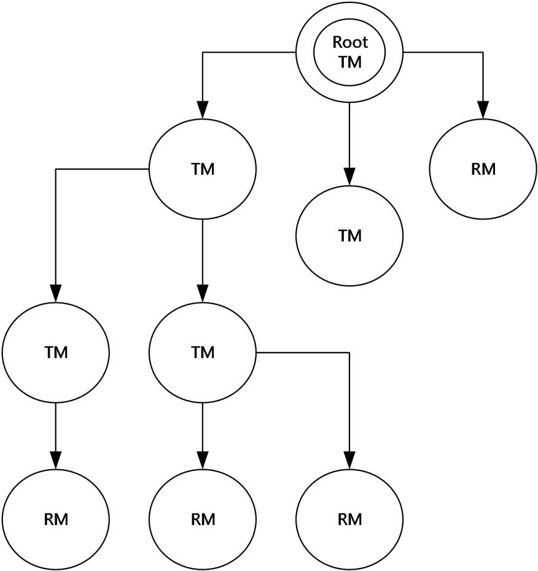
<!-- /Extracted images from page 6 -->

  Single-Phase Commit (section 1.1.4)

  Core and Optional Protocols (section 1.1.5)

1.1.1  Transaction Trees

Multiple transaction managers and resource managers can participate in a transaction. In the
two-phase commit protocol their individual responsibilities are defined by a transaction tree, as
shown in the following figure.

Figure 1: Transaction tree

The transaction manager at the root of the tree is the root transaction manager. This is the
transaction manager with which the root application communicates. Any participant that enlists with a
transaction manager is called a subordinate participant. Each transaction manager is a superior
transaction manager if any of its subordinate participants are transaction managers. All transaction
managers in the tree, apart from the root transaction manager, are subordinate transaction
managers.

1.1.2  Two-Phase Commit Protocol

The two phases of the two-phase commit protocol as described in [GRAY] are Phase One and
Phase Two. These phases can be described informally as "are you ready" and "go / no go,"
respectively.

[MS-TPSOD] - v20211026
Transaction Processing Services Protocols Overview
Copyright © 2021 Microsoft Corporation
Release: October 26, 2021

6 / 71

Phase One (are you ready) begins when all the required changes to the resource state have been
made, and the root application asks the transaction manager to complete the transaction. Phase
One ends when the transaction manager determines the outcome of the transaction; that is,
whether all the changes are to be made or whether no changes are to be made.

When the root application asks the root transaction manager to complete the transaction, it makes
either a commit request, asking that all the changes are to be made, or an abort request, asking
that no changes are to be made. A commit request causes the root transaction manager to ask each
of the subordinate participants that are involved in the transaction whether they are prepared to
commit the changes that were made. This process is called voting on the transaction outcome. Each
subordinate participant votes for one of three outcomes:

  Read-Only



Prepared

  Aborted

Read-Only and Prepared are positive votes. Aborted is a negative vote. If every subordinate
participant votes positively, then the final outcome of the transaction as a whole is to make all the
changes; that is a commit outcome.

If any subordinate participant votes negatively, the root transaction manager determines that the final
outcome of the transaction as a whole is to make no changes; that is an abort outcome. An abort
request causes the root transaction manager to notify each subordinate participant to make no
changes and to notify each of their respective subordinate participants if there are any to abort the
transaction.

A subordinate transaction manager determines its vote by aggregating the votes of its subordinate
participants. If a subordinate transaction manager has no subordinate participants, or if all of its
subordinate participants vote Read-Only, then the subordinate transaction manager votes Read-Only.
If at least one subordinate participant votes Prepared, and after collecting all votes no subordinate
participant votes Aborted, then the subordinate transaction manager votes Prepared. In all other
cases, the subordinate transaction manager votes Aborted, in which case it also notifies any
subordinate participants that had voted Prepared that the transaction has been aborted.

Until a participant votes on the outcome of a transaction, that participant can unilaterally abort the
transaction by issuing an abort request to its transaction manager. This request is called a unilateral
abort. Further details of unilateral abort are described in [MS-DTCO] section 1.3.2.1.

Phase Two begins after the root transaction manager determines the outcome of the transaction. In
this phase, each subordinate participant that voted Prepared is sent either a request to commit the
changes if the outcome was the commit outcome or a request to undo (rollback) the changes if the
outcome was the abort outcome. The root transaction manager also sends the outcome of the
transaction to the root application. A subordinate participant that voted Read-Only is not notified of
the outcome of the transaction. For example, a resource manager might vote Read-Only if it made no
changes as part of the transaction. A subordinate participant that voted Abort is also not notified of
the transaction outcome.

Phase Two ends after the root transaction manager communicates to the participants what the
outcome is (commit or abort), and participants have notified the transaction manager that the
operation is successfully completed.

The two-phase commit protocol is described in [GRAY]. The DTCO protocol adds Phase
Zero (section 1.1.3), which expands the beginning of Phase One.

[MS-TPSOD] - v20211026
Transaction Processing Services Protocols Overview
Copyright © 2021 Microsoft Corporation
Release: October 26, 2021

7 / 71

1.1.3  Phase Zero

The transaction processing services protocols extend the two-phase commit protocol by adding
Phase Zero, which expands the beginning of Phase One. It begins when the root application
requests completion of the transaction and it ends when all Phase Zero participants have voted that
the phase is complete, after which Phase One proceeds, as described previously. The value of the
additional phase is that during Phase Zero, new participants can be enlisted in the transaction.

In the two-phase commit protocol that is described in [GRAY], the set of participants is fixed from the
moment that Phase One begins. Phase Zero is a useful extension in several scenarios. For example, a
caching resource manager can be placed between an application and a database resource manager so
that all requested changes are held in memory until the caching resource manager receives a request
from the transaction manager to exit Phase Zero. Only then is the database resource manager
enlisted in the transaction and the changes are made to the durable store, yielding potentially
significant performance gains. Further details of Phase Zero are described in [MS-DTCO] section
1.3.1.1.

1.1.4  Single-Phase Commit

As an extension to the two-phase commit protocol, transaction processing services protocols use a
mechanism that is called single-phase commit optimization, which is described in [MS-DTCO]
section 1.3.2.2.

This optimization is performed when the root transaction manager has only one subordinate
transaction manager. In this case, instead of Phase One, the root transaction manager sends a
request to the subordinate transaction manager to perform a single-phase commit. If the subordinate
transaction manager supports this operation, then the root transaction manager gives the
responsibility to coordinate the outcome of the transaction to the subordinate transaction manager.
When the outcome is determined, the subordinate transaction manager notifies the root transaction
manager of the result. If the subordinate transaction manager does not support single-phase commit
optimization, it rejects the initial request, and the root transaction manager resumes the normal two-
phase commit. Single-phase commit optimization is useful when the root transaction manager and the
subordinate transaction manager are on separate networks.

1.1.5  Core and Optional Protocols

To facilitate transaction coordination, the system supports a set of core protocols and a set of optional
protocols, as described in the Protocol Summary (section 2.2). Core protocols are proprietary to the
system and are used by default by applications, application services, and resource managers. Optional
protocols allow interoperability through transaction processing industry standards. Relevant industry
standards are listed in section 2.1.7. Applications, application services, resource managers, and
transaction managers that are communicating with the system over optional protocols are referred to
as external applications, external application services, external resource managers, and external
transaction managers. The system allows the possibility of processing a transaction by using only a
single core or optional protocol, or a combination of core and optional protocols.

1.2  Glossary

This document uses the following terms:

abort outcome: A possible outcome of an atomic transaction that indicates that the work

performed during the lifetime of the transaction is discarded after the transaction completes.
An abort outcome is reached when at least one transaction participant does not agree to
commit the transaction.

abort request: An action that a participant performs to force a transaction to reach an abort

outcome.

8 / 71

[MS-TPSOD] - v20211026
Transaction Processing Services Protocols Overview
Copyright © 2021 Microsoft Corporation
Release: October 26, 2021

application: A participant that is responsible for beginning, propagating, and completing an atomic

transaction. An application communicates with a transaction manager in order to begin and
complete transactions. An application communicates with a transaction manager in order to
marshal transactions to and from other applications. An application also communicates in
application-specific ways with a resource manager in order to submit requests for work on
resources.

atomic transaction: A shared activity that provides mechanisms for achieving the atomicity,
consistency, isolation, and durability (ACID) properties when state changes occur inside
participating resource managers.

cold recovery: Initial recovery work performed by a transaction manager for a LU 6.2

implementation with respect to a specific LU Name Pair.

commit outcome: One of the outcomes of an atomic transaction. The commit outcome

indicates that the work performed during the lifetime of the transaction will be retained after
the transaction has completed, as specified by the ACID properties. A commit outcome is
reached when all transaction participants agree to commit the transaction.

commit request: The action that is performed by a root application to initiate the Two-Phase

Commit Protocol for an atomic transaction.

enlistment: The relationship between a participant and a transaction manager in an atomic

transaction. The term typically refers to the relationship between a resource manager and its
transaction manager, or between a subordinate transaction manager facet and its
superior transaction manager facet.

facet: In OleTx, a subsystem in a transaction manager that maintains its own per-transaction
state and responds to intra-transaction manager events from other facets. A facet can also
be responsible for communicating with other participants of a transaction.

globally unique identifier (GUID): A term used interchangeably with universally unique

identifier (UUID) in Microsoft protocol technical documents (TDs). Interchanging the usage of
these terms does not imply or require a specific algorithm or mechanism to generate the value.
Specifically, the use of this term does not imply or require that the algorithms described in
[RFC4122] or [C706] have to be used for generating the GUID. See also universally unique
identifier (UUID).

log: A durable store used to maintain transaction state.

logical unit (LU): An addressable network element in the Systems Network Architecture (SNA)

defined by IBM that serves as an access point to the network for programs and users, allowing
them to access resources and communicate with other programs and users.

LU Name Pair: An identifier that uniquely specifies the pairing of a local LU and a remote LU.

outcome: One of the three possible results (Commit, Abort, In Doubt) reachable at the end of a

life cycle for an atomic transaction.

participant: Any of the parties that are involved in an atomic transaction and that have a stake

in the operations that are performed under the transaction or in the outcome of the
transaction ([WSAT10], [WSAT11]).

Phase One: The initial phase of a two-phase commit sequence. During this phase, the participants
in the transaction are requested to prepare to be committed. This phase is also known as the
"Prepare" phase. At the end of Phase One, the outcome of the transaction is known.

Phase Two: The second phase of a two-phase commit sequence. This phase occurs after the

decision to commit or abort is determined. During this phase, the participants in the transaction
are ordered to either commit or rollback.

9 / 71

[MS-TPSOD] - v20211026
Transaction Processing Services Protocols Overview
Copyright © 2021 Microsoft Corporation
Release: October 26, 2021

Phase Zero: A phase in distributed transaction processing that is composed of one or more Phase
Zero waves. At the beginning of a Phase Zero wave, all Phase Zero participants are notified that
the transaction has entered Phase Zero. While the participants process the Phase Zero
notification, they can continue to marshal the transaction to new participants. Consequently,
participating transaction managers can still accept new enlistments during Phase Zero.

push propagation: An operation that enables the targeted marshaling of a transaction from one

application or resource manager to another. For marshaling the transaction, push
propagation requires the source participant to have prior knowledge about the contact
information of the transaction manager of the destination participant.

recovery: The process of reestablishing connectivity and synchronizing views on the outcome of

transactions between two participants after a transient failure. Recovery occurs either between a
resource manager and a transaction manager, or between a Superior Transaction Manager Facet
and a Subordinate Transaction Manager Facet.

remote LU: An LU 6.2 Implementation ([MS-DTCLU] section 3.2) that communicates with the local

LU, but without making use of the protocol specified in [MS-DTCLU].

remote procedure call (RPC): A communication protocol used primarily between client and

server. The term has three definitions that are often used interchangeably: a runtime
environment providing for communication facilities between computers (the RPC runtime); a set
of request-and-response message exchanges between computers (the RPC exchange); and the
single message from an RPC exchange (the RPC message).  For more information, see [C706].

resource: A logical entity or unit of data whose state changes in accordance with the outcome of

an atomic transaction. Resources are either durable or volatile.

resource manager (RM): The participant that is responsible for coordinating the state of a
resource with the outcome of atomic transactions. For a specified transaction, a resource
manager enlists with exactly one transaction manager to vote on that transaction outcome and
to obtain the final outcome. A resource manager is either durable or volatile, depending on its
resource.

rollback: Synonymous with abort.

root application: The application that is responsible for beginning and completing an atomic

transaction. The root application communicates with a root transaction manager in order
to begin and complete transactions.

root transaction manager: The specific transaction manager that processes both the Begin
Request and the Commit Request for a specified transaction. A specified transaction has
exactly one root transaction manager.

security provider: A pluggable security module that is specified by the protocol layer above the

remote procedure call (RPC) layer, and will cause the RPC layer to use this module to secure
messages in a communication session with the server. The security provider is sometimes
referred to as an authentication service. For more information, see [C706] and [MS-RPCE].

single-phase commit: An optimization of the Two-Phase Commit Protocol in which a transaction
manager delegates the right to decide the outcome of a transaction to its only subordinate
participant. This optimization can result in an In Doubt outcome.

subordinate participant: A role that is taken by a participant that is responsible for voting on
the outcome of an atomic transaction. For a specified transaction, the set of subordinate
participants is the set of all resource managers and the set of all subordinate transaction
managers.

subordinate transaction manager: A role taken by a transaction manager that is responsible
for voting on the outcome of an atomic transaction. A subordinate transaction manager

10 / 71

[MS-TPSOD] - v20211026
Transaction Processing Services Protocols Overview
Copyright © 2021 Microsoft Corporation
Release: October 26, 2021

coordinates the voting and notification of its subordinate participants on behalf of its superior
transaction manager. When communicating with those subordinate participants, the
subordinate transaction manager acts in the role of superior transaction manager. The
root transaction manager is never a subordinate transaction manager. A subordinate
transaction manager has exactly one superior transaction manager.

superior transaction manager: A role taken by a transaction manager that is responsible for

gathering outcome votes and providing the final transaction outcome. A root transaction
manager can act as a superior transaction manager to a number of subordinate
transaction managers. A transaction manager can act as both a subordinate transaction
manager and a superior transaction manager on the same transaction.

tip connection: A TIP connection that is initiated and used, as specified in [RFC2371] section 4.

transaction: In OleTx, an atomic transaction.

transaction identifier: The GUID that uniquely identifies an atomic transaction.

transaction manager: The party that is responsible for managing and distributing the outcome of

atomic transactions. A transaction manager is either a root transaction manager or a
subordinate transaction manager for a specified transaction.

transaction propagation: The act of coordinating two transaction managers to work together on
a single atomic transaction. When propagating a transaction to a transaction manager that is
not already a participant in the transaction, that transaction manager plays the role of
subordinate transaction manager to the originating transaction manager, which will play the role
of superior transaction manager. When propagating a transaction to a transaction manager that
is already a participant in the transaction, no new superior or subordinate relationship is
established.

two-phase commit: An agreement protocol that is used to resolve the outcome of an atomic

transaction in response to a commit request from the root application. Phase One and Phase
Two are the distinct phases of the Two-Phase Commit Protocol.

unit of work: A set of individual operations that MSMQ has to successfully complete before any of

the individual MSMQ operations can be considered complete.

1.3  References

[GRAY] Gray, J., and Reuter, A., "Transaction Processing: Concepts and Techniques", The Morgan
Kaufmann Series in Data Management Systems, San Francisco: Morgan Kaufmann Publishers, 1992,
Hardcover ISBN: 9781558601901.

[IBM-LU62Guide] IBM, "z/OS Communications Server Version 2 Release 4 SNA Programmer's LU 6.2
Guide", SC27-3669-40, June 2019, https://www-
01.ibm.com/servers/resourcelink/svc00100.nsf/pages/zOSV2R4sc273669/$file/istp620_v2r4.pdf

[MC-DTCXA] Microsoft Corporation, "MSDTC Connection Manager: OleTx XA Protocol".

[MS-CMOM] Microsoft Corporation, "MSDTC Connection Manager: OleTx Management Protocol".

[MS-CMPO] Microsoft Corporation, "MSDTC Connection Manager: OleTx Transports Protocol".

[MS-CMP] Microsoft Corporation, "MSDTC Connection Manager: OleTx Multiplexing Protocol".

[MS-COM] Microsoft Corporation, "Component Object Model Plus (COM+) Protocol".

[MS-DTCLU] Microsoft Corporation, "MSDTC Connection Manager: OleTx Transaction Protocol Logical
Unit Mainframe Extension".

11 / 71

[MS-TPSOD] - v20211026
Transaction Processing Services Protocols Overview
Copyright © 2021 Microsoft Corporation
Release: October 26, 2021

[MS-DTCM] Microsoft Corporation, "MSDTC Connection Manager: OleTx Transaction Internet Protocol".

[MS-DTCO] Microsoft Corporation, "MSDTC Connection Manager: OleTx Transaction Protocol".

[MS-MQOD] Microsoft Corporation, "Message Queuing Protocols Overview".

[MS-RPCE] Microsoft Corporation, "Remote Procedure Call Protocol Extensions".

[MS-TIPP] Microsoft Corporation, "Transaction Internet Protocol (TIP) Extensions".

[MS-WSRVCAT] Microsoft Corporation, "WS-AtomicTransaction (WS-AT) Version 1.0 Protocol
Extensions".

[RFC2371] Lyon, J., Evans, K., and Klein, J., "Transaction Internet Protocol Version 3.0", RFC 2371,
July 1998, https://www.rfc-editor.org/info/rfc2371

[WSAT10] Arjuna Technologies Ltd., BEA Systems, Hitachi Ltd., IBM, IONA Technologies and
Microsoft, "Web Services Atomic Transaction (WS-AtomicTransaction)", August 2005,
https://specs.xmlsoap.org/ws/2004/10/wsat/wsat.pdf

[WSAT11] OASIS, "Web Services Atomic Transaction (WS-AtomicTransaction) Version 1.1", July 2007,
https://docs.oasis-open.org/ws-tx/wstx-wsat-1.1-spec-errata-os.pdf

[X509] ITU-T, "Information Technology - Open Systems Interconnection - The Directory: Public-Key
and Attribute Certificate Frameworks", Recommendation X.509, August 2005,
http://www.itu.int/rec/T-REC-X.509/en

[XOPEN-DTP] The Open Group, "Distributed Transaction Processing: The XA Specification", February
1992, http://www.opengroup.org/bookstore/catalog/c193.htm

[MS-TPSOD] - v20211026
Transaction Processing Services Protocols Overview
Copyright © 2021 Microsoft Corporation
Release: October 26, 2021

12 / 71

2  Functional Architecture

The transaction processing services protocols are an internal infrastructure of the Windows operating
system and support applications and systems that require transaction coordination services. For
example, a message queuing system such as the one described in [MS-MQOD] can use transaction
processing to make sure that operations on separate queues either are completed or aborted. Or a
middle-tier application server system such as COM+, specified in [MS-COM], uses transaction services.
[MS-MQOD] and [MS-COM] describe how those systems interact with the transaction processing
services protocols.

Transaction processing services consist of one or more transaction managers that communicate
with each other by using protocols that are internal to the system. Multiple transaction managers can
be involved in a transaction for many reasons, for example when applications and the resources
that are involved are distributed over a network, or when one of the resources that are involved is
associated with its own specialized transaction manager.

To provide interoperability with other well-known transaction processing standards, the transaction
processing services protocols provide specific external interfaces to enable applications, resource
managers, and transaction managers that do not support the internal protocols as defined by the
system, to participate in transactions. They are referred to as external applications, external resource
managers, and external transaction managers.

2.1  Overview

2.1.1  Purpose

The transaction processing services protocols provide distributed transaction coordination services for
applications, application services, resource managers, external applications, external application
services, external resource managers, and external transaction managers. The protocols are also used
by clients that configure and manage the system.

The purpose of these protocols is to:

  Use the two-phase commit protocol, as described in [GRAY] and in [MS-DTCO] section 1.3.1, to

coordinate the transaction participants.





Enable applications, resource managers, and transaction managers that are distributed over a
networked computer system to participate in a single transaction.

Enable participating transaction managers and resource managers to recover from local failures by
reestablishing a state that is consistent with the state of the other participants in a distributed
transaction. This process is referred to as transaction recovery, as described in [MS-DTCO]
section 1.3.4.



Enable external transaction managers to participate in coordinating a transaction.

2.1.2  Interaction with External Components

The following diagram shows the external components that interact with the transaction processing
services.

[MS-TPSOD] - v20211026
Transaction Processing Services Protocols Overview
Copyright © 2021 Microsoft Corporation
Release: October 26, 2021

13 / 71

<!-- Extracted images from page 14 -->
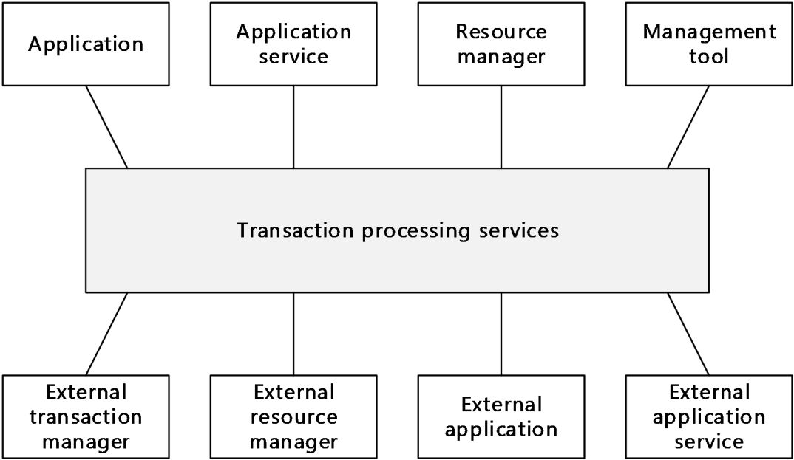
<!-- /Extracted images from page 14 -->

Figure 2: Components interacting with the transaction processing services

Applications, application services, resource managers, external applications, external application
services, external resource managers, and external transaction managers use a set of system
interfaces to participate in a distributed transaction and perform transaction-processing-specific
operations such as transaction marshaling, propagation, and recovery.

Applications and external applications use the system to:

  Demarcate when a transaction begins and completes within a series of operations.

  Marshal a transaction to other applications and resource managers.





Propagate a transaction from one transaction manager to another.

Perform administrative operations on a specific transaction or a transaction manager.

Resource managers and external resource managers use the system to:

  Register with a transaction manager and perform recovery operations.



Enlist for a specific transaction and participate in the corresponding two-phase commit protocol
notifications.

  Vote on transaction outcomes.

External transaction managers use the system to:



Enlist with the system as a superior transaction manager or subordinate transaction
manager for a specific transaction.



Participate in two-phase commit protocol notifications.

  Coordinate recovery operations.

The system can also be used by applications or other systems to provide transaction coordination
semantics to higher-level applications. For example, application programming frameworks, such as the
Microsoft .NET Framework, or a middle-tier application server system such as COM+ provide
transaction processing services to their clients by providing a set of high-level interfaces, but in the

14 / 71

[MS-TPSOD] - v20211026
Transaction Processing Services Protocols Overview
Copyright © 2021 Microsoft Corporation
Release: October 26, 2021

<!-- Extracted images from page 15 -->
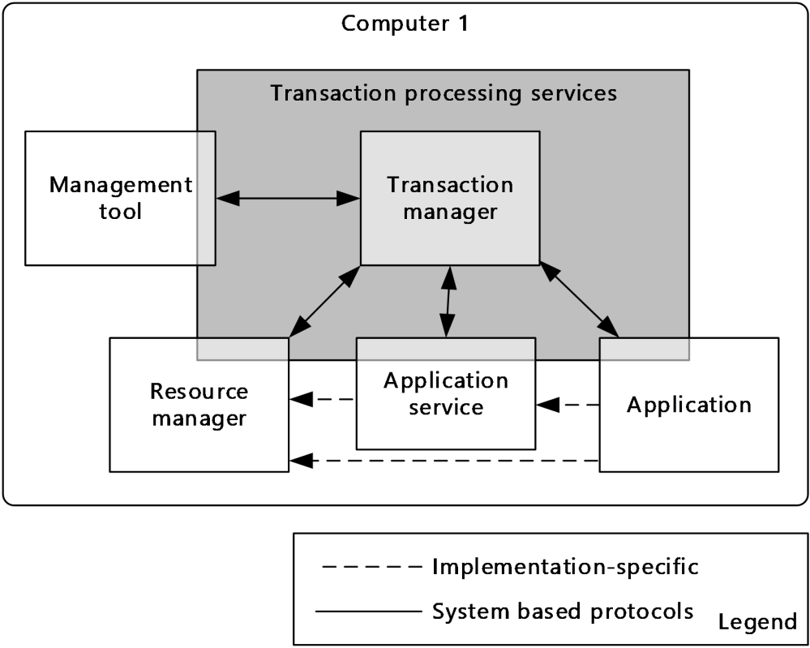
<!-- /Extracted images from page 15 -->

background, they can use transaction processing services to fulfill the required transaction
coordination semantics. This way, the complexity of interacting with the transaction processing
services is minimized.

2.1.3  System Components

This section describes the externally visible view of the system and the components within the system.

The conceptual framework for the transaction processing services is defined in terms of the roles that
are specified in [MS-DTCO] section 1.3.3. The most basic role interaction scenario is shown in the
following diagram. The application performs work on a local resource manager. No propagation is
necessary because the resource manager and the application share a common local transaction
manager. All communications between the application and the transaction manager, between the
resource manager and the transaction manager, and between the management tool and the
transaction manager are based on core protocols. Communications between the application and the
resource manager are implementation-specific.

Figure 3: Basic communication between the roles as defined in the transaction lifecycle

The following roles use the core protocols:

Application: A client application that performs transacted work on a number of resource managers.
The application creates a transaction, and therefore, only that application has the right to commit
the transaction.

Application service: A service that accepts requests to perform transacted work on local resource

managers. An application service does not have the right to commit transactions.

Transaction manager: A service that coordinates the lifetime of transactions by providing

functionality for resource managers to enlist in these transactions. The transaction manager also

[MS-TPSOD] - v20211026
Transaction Processing Services Protocols Overview
Copyright © 2021 Microsoft Corporation
Release: October 26, 2021

15 / 71

provides functionality to enlist in transactions that are coordinated by remote transaction
managers.

Resource manager: A participant that is responsible for coordinating the state of a resource with the
outcome of transactions. For a specified transaction, a resource manager enlists with exactly one
transaction manager to vote on that transaction outcome and to obtain the final outcome.

Management tool: An application that monitors the health of a transaction manager and configures

settings that are related to transaction coordination.

The following roles use the optional protocols:

External application: An application that uses a protocol other than a core protocol to communicate

with the transaction processing services.

External application service: An application service that uses a protocol other than a core protocol

to communicate with the transaction processing services.

External transaction manager: A transaction manager that uses a protocol other than a core

protocol to communicate with the transaction processing services.

External resource manager: A resource manager that uses a protocol other than a core protocol to

communicate with the transaction processing services.

The following diagram shows a distributed scenario. The application performs work on a local resource
manager and a remote resource manager. It is necessary for the transaction to be propagated from
the application's local transaction manager to the remote resource manager's transaction manager.

[MS-TPSOD] - v20211026
Transaction Processing Services Protocols Overview
Copyright © 2021 Microsoft Corporation
Release: October 26, 2021

16 / 71

<!-- Extracted images from page 17 -->
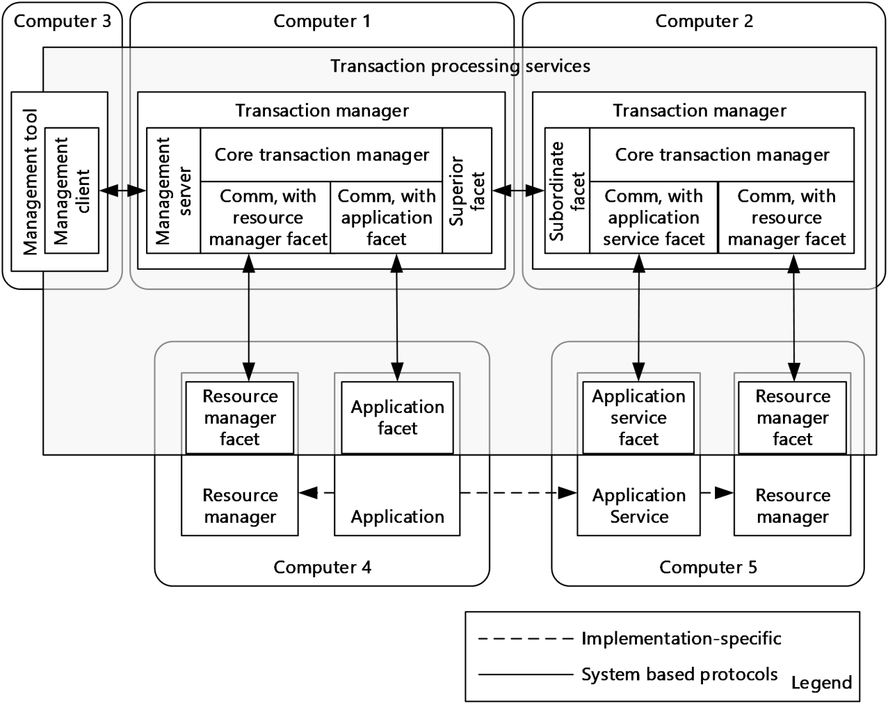
<!-- /Extracted images from page 17 -->

Figure 4: Distributed communication between the roles as defined in the transaction
lifecycle

As shown in the previous diagram, the system uses various facets to enable communication between
different roles. Specific details about these facets and their uses are discussed later in this section.

The communication between the application and application service, between the application and the
resource manager, and between the application service and the resource manager are
implementation-specific. The expectation is that this communication consists of a request for work to
be done, along with all information that is necessary to enlist in the transaction, including the
transaction identifier. Otherwise, all other communication is based on the core protocols.

2.1.4  System Communication

2.1.5  Member Protocol Functional Relationships

The following diagram represents the dependencies of the protocols that are used by the transaction
processing services.

[MS-TPSOD] - v20211026
Transaction Processing Services Protocols Overview
Copyright © 2021 Microsoft Corporation
Release: October 26, 2021

17 / 71

<!-- Extracted images from page 18 -->
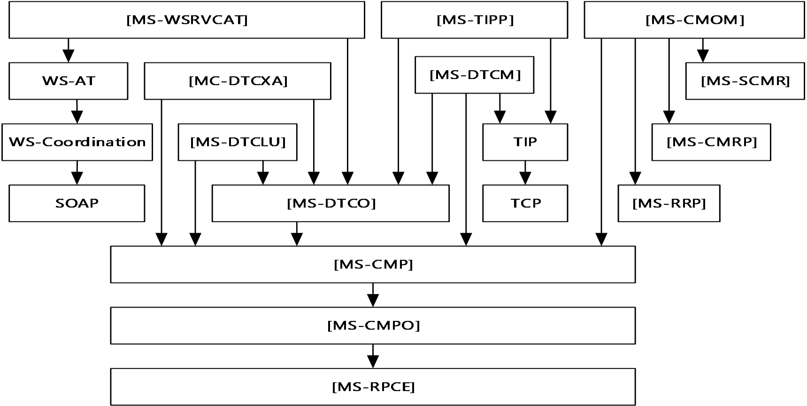
<!-- /Extracted images from page 18 -->

Figure 5: Transaction processing services protocol dependencies

This section describes the roles played by each member protocol in the overall function of the system:

  MSDTC Connection Manager: OleTx Transaction Protocol (DTCO), as specified in [MS-

DTCO], supports all the communications between the components as described in section 2.1.2,
except those between the management tool and the transaction manager, between the application
and the application service, between the application and the resource manager, and between the
application service and the resource manager. The abstract state machine that drives the
transaction lifecycle, as specified in [MS-DTCO] section 1.3.1, is defined only in [MS-DTCO]. An
implementation of this state machine is necessary for any implementation of a transaction
manager, and therefore, any implementation of the protocols, as specified in [MS-DTCM], [MS-
TIPP], [MS-DTCLU], [MS-CMOM], [WSAT10], [WSAT11], [MS-WSRVCAT], and [MC-DTCXA],
requires a DTCO implementation.

  MSDTC Connection Manager: OleTx Transaction Protocol Logical Unit Mainframe

Extension (DTCLU), as specified in [MS-DTCLU], supports communication from the external
resource manager to the transaction manager. The system uses this protocol to provide
transactional support to implementations of LU 6.2, as specified in [IBM-LU62Guide].

  MSDTC Connection Manager: OleTx Transaction Internet Protocol, as specified in [MS-

DTCM], supports communication from the external application to the transaction manager and
external application service to transaction manager communications. The system uses this
protocol to allow external application and external application services to request the system to
pull a transaction from, or push a transaction to, an external transaction manager that implements
Transaction Internal Protocol (TIP).

  Transaction Internet Protocol (TIP) Extensions, as specified in [MS-TIPP], supports external
application to transaction manager communications, external application service to transaction

18 / 71

[MS-TPSOD] - v20211026
Transaction Processing Services Protocols Overview
Copyright © 2021 Microsoft Corporation
Release: October 26, 2021

manager communications, and external transaction manager to transaction manager
communications. This protocol represents an extension to TIP as specified in [RFC2371]. It
provides mechanisms to associate TIP transactions and the transactions that are internal to the
system. It also provides mechanisms for driving a single atomic outcome, coordinating the
distribution of this outcome, and transaction propagation.

  WS-AtomicTransaction protocol ([WSAT10] and [WSAT11]) is an alternative transaction

coordination protocol. It supports external application to transaction manager communications,
external application service to transaction manager communications, and external transaction
manager to transaction manager communications.

  WS-AtomicTransaction (WS-AT) Version 1.0 Protocol Extensions, as specified in [MS-

WSRVCAT], supports external application to external transaction manager communications, and
external application to external application service communications. The system uses this protocol
to provide support for external applications to exchange system-specific transaction propagation
information with external application services. By using the data structures in the WS-
AtomicTransaction (WS-AT) Version 1.0 Protocol Extensions and also by using DTCO, external
applications can query system-specific transaction propagation information from the system.
External applications can then include this information in WS-AtomicTransaction messages
when communicating with external application services. If the external application service also
supports the protocols as specified in [MS-WSRVCAT] and [MS-DTCO], then for performance
reasons, it can choose to communicate with the system by using core protocols rather than by
using the WS-AtomicTransaction Version 1.0 Protocol Extensions. See [MS-WSRVCAT] for further
details about this protocol and its usage scenarios.

  MSDTC Connection Manager: OleTx XA Protocol, as specified in [MC-DTCXA], supports

communication from:

  An external transaction manager to a transaction manager.

  An external application to a transaction manager.

  An external resource manager to a transaction manager.

The system uses this protocol to provide transactional support for external transaction managers and
external resource managers by implementing the protocol, as specified in [XOPEN-DTP]:

  MSDTC Connection Manager: OleTx Management Protocol, as specified in [MS-CMOM], is
used for communications between the management tool and the transaction manager and
performs administration and configuration operations on the system.

  MSDTC Connection Manager: OleTx Transports Protocol, as specified in [MS-CMPO], is a

framing and message transport protocol. It implements remote procedure call (RPC)
interfaces, as specified in [MS-RPCE], for establishing duplex sessions between two partners and
for exchanging messages between them. [MS-CMPO] describes specific restrictions on the use of
RPC interfaces. Details are specified in [MS-CMPO] sections 1.3, 1.7, and 2.

  MSDTC Connection Manager: OleTx Multiplexing Protocol, as specified in [MS-CMP],

supports both multiplexing multiple logical sessions over a single CMPO session, and multiplexing
multiple protocol messages into a single CMPO.

2.1.6  System Applicability

The transaction processing services protocols are applicable in scenarios where atomic transaction
processing is required where the participants can be on the same computer or distributed in a
network, and where each participant can be configured to use a different transaction processing
protocol.

[MS-TPSOD] - v20211026
Transaction Processing Services Protocols Overview
Copyright © 2021 Microsoft Corporation
Release: October 26, 2021

19 / 71

2.1.7  Relevant Standards

The system uses the standards that are listed in the following table for interoperability with external
systems.

Protocol name

Specification
reference

System use description

Transaction Internet Protocol (TIP)

[RFC2371]

Allows transaction propagation between the
system and TIP transaction managers.

SNA LU Type 6.2 Protocol (LU 6.2)

[IBM-
LU62Guide]

Allows resources with LU Type 6.2
implementation to participate in transactions.

Web Services Atomic Transaction (WS-
AtomicTransaction)

[WSAT10],
[WSAT11]

Distributed Transaction Processing: The
XA Specification (XA)

[XOPEN-DTP]

Allows distributed transaction processing and
transaction propagation with systems
implementing WS-AtomicTransaction.

Allows distributed transaction processing and
transaction propagation with systems
implementing XA.

2.2  Protocol Summary

The following tables list the core and optional protocols that facilitate transaction coordination. Core
protocols are proprietary to the system and are used by default by applications, application services,
and resource managers. Optional protocols enable interoperability through industry standards of
transaction processing as described in section 2.1.7.

The following table lists each member protocol of the transaction processing services, its purpose, and
its corresponding specification.

Protocol name

Protocol purpose

MSDTC Connection Manager: OleTx
Transaction Protocol

Enables the creation, initiation, and distributed
propagation of transactions, and the participation in
transactions.

MSDTC Connection Manager: OleTx
Management Protocol

Enables management tools to obtain a list of
transactions being processed by a transaction
manager. Enables the changing of settings that are
used by other transaction processing services
protocols.

Document
short name

[MS-DTCO]

[MS-CMOM]

MSDTC Connection Manager: OleTx
Transaction Internet Protocol

Enables the initiation of distributed transaction
propagation via the TIP protocol.

[MS-DTCM]

Transaction Internet Protocol (TIP)
Extensions

Enables distributed propagation of transactions by
using the TIP protocol over TCP.

[MS-TIPP]

MSDTC Connection Manager: OleTx
Transaction Protocol Logical Unit
Mainframe Extension

Enables an implementation of logical unit (LU) type
6.2 as defined by the IBM System Network
Architecture (SNA) to participate in transactions that
are coordinated by a transaction manager that does
not implement SNA protocols.

[MS-DTCLU]

WS-AtomicTransaction Protocol

Enables distributed transaction processing and
propagation by using the WS-AtomicTransaction
protocol. The system supports both version 1.0 and

[WSAT10],
[WSAT11]

20 / 71

[MS-TPSOD] - v20211026
Transaction Processing Services Protocols Overview
Copyright © 2021 Microsoft Corporation
Release: October 26, 2021

Protocol name

Protocol purpose

WS-AtomicTransaction (WS-AT)
Protocol Extensions

version 1.1 of the protocol.

Enables external applications to query the system for
system-specific transaction propagation information. It
also describes how this information can be propagated
by extending the WS-AtomicTransaction Protocol.

Document
short name

[MS-WSRVCAT]

MSDTC Connection Manager: OleTx
XA Protocol

Enables external transaction managers and external
resource managers by using the protocol as described
on [XOPEN-DTP] to participate in transactions with the
system.

[MC-DTCXA]

MSDTC Connection Manager: OleTx
Multiplexing Protocol

Enables multiplexing multiple logical protocol
connections through a single CMPO connection, which
reduces the number of messages that are exchanged
over the wire.

[MS-CMP]

MSDTC Connection Manager: OleTx
Transports Protocol

Provides negotiation of connections and sending of
variable-length data for the MSDTC Connection
Manager Protocol.

[MS-CMPO]

The following tables group the member protocols of the transaction processing services according to
their primary purpose.

Protocols that enable communication among transaction managers

The protocols that are listed in the following table enable communication among transaction
managers. The transaction processing services protocols consist of one or more transaction managers
that communicate with each other by using protocols that are internal to the system and that
collectively provide external interfaces to applications and resource managers. All of this
communication uses a base set of system-defined protocols that are referred to as the core protocols.

Protocol name

Description

MSDTC Connection Manager:
OleTx Transaction Protocol

Enables the creation, initiation, and distributed
propagation of transactions, and the participation in
transactions.

MSDTC Connection Manager:
OleTx Management Protocol

Enables management tools to obtain a list of transactions
that are being processed by a transaction manager.
Enables changing the settings that are used by other
transaction processing services protocols.

Document
short name

[MS-DTCO]

[MS-CMOM]

Protocols that enable participants that support optional protocols to participate in
transactions

The protocols that are listed in the following table enable applications and transaction managers that
support protocols other than the core protocols to participate in transactions. These protocols are
referred to as the optional protocols, and the participants that use optional protocols are referred to as
external applications, external resource managers, and external transaction managers in this
overview.

Protocol name

Description

MSDTC Connection Manager: OleTx
Transaction Internet Protocol

Enables the initiation of distributed transaction
propagation via the TIP protocol.

Document
short name

[MS-DTCM]

21 / 71

[MS-TPSOD] - v20211026
Transaction Processing Services Protocols Overview
Copyright © 2021 Microsoft Corporation
Release: October 26, 2021

Protocol name

Description

Transaction Internet Protocol (TIP)
Extensions

Enables distributed propagation of transactions by
using the TIP protocol over TCP.

MSDTC Connection Manager: OleTx
Transaction Protocol Logical Unit
Mainframe Extension

Enables an implementation of LU Type 6.2 as
defined by the IBM System Network Architecture
(SNA) to participate in transactions that are
coordinated by a transaction manager that does not
implement SNA protocols.

Document
short name

[MS-TIPP]

[MS-DTCLU]

WS-AtomicTransaction Protocol

WS-AtomicTransaction (WS-AT)
Version 1.0 Protocol Extensions

Enables distributed transaction processing and
propagation by using the WS-AtomicTransaction
protocol. The system supports both version 1.0 and
version 1.1 of the protocol.

[WSAT10],
[WSAT11]

Enables external applications to query the system
for system-specific transaction propagation
information. It also describes how this information
can be propagated by extending the WS-
AtomicTransaction Protocol.

[MS-
WSRVCAT]

MSDTC Connection Manager: OleTx
XA Protocol

Enables external transaction managers and external
resource managers by using the protocol as
described in [XOPEN-DTP] to participate in
transactions with the system.

[MC-DTCXA]

Protocols that enable the underlying communication for the core protocols

The protocols that are listed in the following table enable the underlying communications functionality
for the core protocols and the protocols as described in [MS-DTCM], [MS-DTCLU], and [MC-DTCXA].

Protocol name

Description

MSDTC Connection Manager:
OleTx Multiplexing Protocol

Enables multiplexing multiple logical protocol connections
through a single CMPO connection, which reduces the
number of messages that are exchanged over the wire.

Document
short name

[MS-CMP]

MSDTC Connection Manager:
OleTx Transports Protocol

Provides negotiation of connections and sending of
variable-length data for the MSDTC Connection Manager
Protocol.

[MS-CMPO]

Protocols that enable support for TIP transactions

The protocols that are listed in the following table enable support for Transaction Internet Protocol
(TIP) transactions.

Protocol name

Description

MSDTC Connection Manager: OleTx
Transaction Internet Protocol

Enables the initiation of distributed transaction
propagation via the TIP protocol.

Document
short name

[MS-DTCM]

Transaction Internet Protocol (TIP)
Extensions

Enables distributed propagation of transactions
by using the TIP protocol over TCP.

[MS-TIPP]

Protocols that enable support for WS-AtomicTransactions

[MS-TPSOD] - v20211026
Transaction Processing Services Protocols Overview
Copyright © 2021 Microsoft Corporation
Release: October 26, 2021

22 / 71

Protocol name

Description

WS-AtomicTransaction Protocol

Enables distributed transaction processing and
propagation by using the WS-AtomicTransaction
protocol. The system supports both version 1.0 and
version 1.1 of the protocol.

Document
short name

[WSAT10],
[WSAT11]

WS-AtomicTransaction (WS-AT)
Version 1.0 Protocol Extensions

Enables external applications to query the system for
system-specific transaction propagation information. It
also describes how this information can be propagated
by extending the WS-AtomicTransaction Protocol.

[MS-
WSRVCAT]

2.3  Environment

The following sections identify the context in which the system exists. The system includes the
systems that use the interfaces that are provided by this system of protocols, other systems that
depend on this system, and, as appropriate, the manner in which the components of the system
communicate.

2.3.1  Dependencies on This System

The following systems depend on transaction processing services:

Message Queuing System: The message queuing protocols, as described in [MS-MQOD], depend on
the transaction processing services to allow message queues to be treated as resources in the
context of a distributed transaction. Without transaction processing services, the message queuing
system has to either extend its internal transaction manager to support distributed transactions or
has to rely on another transaction processing system to achieve this.

COM+: The COM+ protocol, as described in [MS-COM], depends on transaction processing services to

implement its transactional features. Without transaction processing services, the COM+ protocol
has to either implement an internal transaction processing system or has to rely on another
transaction processing system to achieve the same functionality.

2.3.2  Dependencies on Other Systems/Components

The system depends on a durable storage system to maintain the state that is used when recovering
from failure. The storage that holds this state is referred to as a log. The log is a crucial component of
the system. Without the log, following a transient failure where everything in-memory is lost, it is not
possible for the system to determine the last known state of a given transaction and whether the
transaction outcome has been communicated to the corresponding participants. If recovery is
necessary, but the log that has the recovery information is lost, it is not possible to recover the
corresponding transactions. As a result, data corruption or data loss can occur on the affected
resources.

The transaction processing services protocols depend on a networking system to connect the
computers that are involved in the system if the system spans multiple computers. The system has no
specific requirements regarding the type of network that has to be used for this purpose. The system
internal components can span across multiple computers, or some transaction participants can be
remotely communicating with the system over a network. In either case, the components on separate
computers rely on the networking system to discover and communicate with each other.

The transaction processing services protocols depend on a security identity management system to
authenticate identities and to group them. The system uses the security identity management system
to restrict access to its assets and functionality to specified groups.

23 / 71

[MS-TPSOD] - v20211026
Transaction Processing Services Protocols Overview
Copyright © 2021 Microsoft Corporation
Release: October 26, 2021

2.4  Assumptions and Preconditions

The following assumptions and preconditions apply to the transaction processing services protocols:











The system has to have access to a durable storage system where it can keep a log. The system
holds state information for each running transaction in the log. Depending on the number of
running transactions at a given time, the log size requirement can differ because the size of the
log grows with the number of transaction states that it stores.

If the system spans across a computer network, the system has to be installed on all the
computers that are involved.

The system has to be configured so that participants can access its services locally or remotely.

If the system components span across a computer network, the computers in the network has to
be connected to each other via the durable network as described previously.

It is assumed that each transaction participant is trusted by the system. It is possible that a
malicious participant can start several new transactions and never complete them, resulting in a
filled log. Such a case forces the system to stop responding to new, incoming transaction requests
until enough log space is available again.

Member protocols that are supported by the system, as listed in section 2.2, can have additional
assumptions and preconditions when that protocol is being used. See the relevant member protocol
specification for details.

2.5  Use Cases

2.5.1  Perform Transaction Work – Application

In this use case, the application performs the transaction between multiple transaction managers.

Context of use: An application performs transaction work across multiple transaction managers.

[MS-TPSOD] - v20211026
Transaction Processing Services Protocols Overview
Copyright © 2021 Microsoft Corporation
Release: October 26, 2021

24 / 71

<!-- Extracted images from page 25 -->
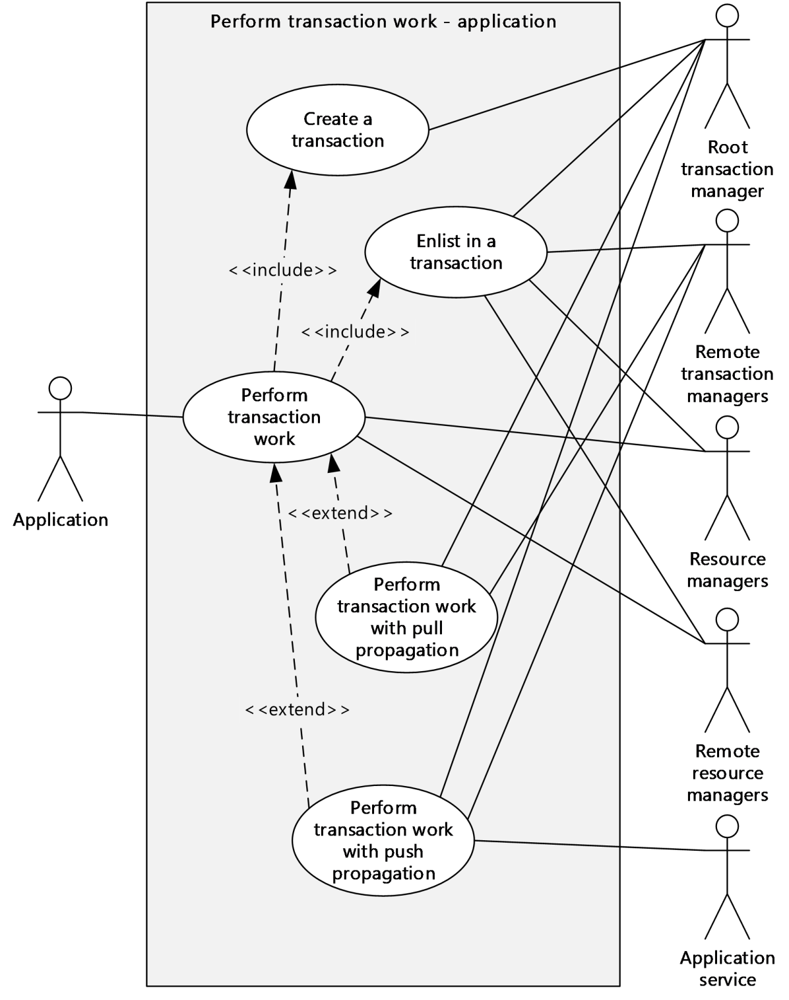
<!-- /Extracted images from page 25 -->

Figure 6: Use case diagram for performing transaction work

Goal: To perform transaction work between a root transaction manager and one or more remote

transaction managers.

Actors:

[MS-TPSOD] - v20211026
Transaction Processing Services Protocols Overview
Copyright © 2021 Microsoft Corporation
Release: October 26, 2021

25 / 71

Application: A primary actor that performs transaction work on a number of transaction managers.

The application creates a transaction, and therefore, only that application has the right to commit
the transaction.

Root transaction manager: The root transaction manager is a supporting actor. It is a service that
coordinates the lifetime of transactions by providing functionality for resource managers to enlist
in these transactions. The root transaction manager also provides functionality to enlist in
transactions that are coordinated by remote transaction managers. A root transaction manager is
a transaction manager that creates and starts the transaction.

Remote transaction manager: The remote transaction manager is a supporting actor. It is a

transaction manager that receives requests to perform transactions depending on its availability.

Resource manager: The resource manager is a supporting actor that is responsible for coordinating

the state of a resource with the outcome of transactions. For a specified transaction, a resource
manager enlists with exactly one transaction manager (here it is the root transaction manager) to
vote on that transaction outcome and to obtain the final outcome.

Remote resource manager: The remote resource manager is a supporting actor. It is a resource

manager that enlists with the remote transaction manager.

Application service: The application service is a supporting actor. It is a service that accepts

requests to perform transaction work on local resource managers. An application service cannot
commit transactions.

Stakeholders:

Application: The application is a program that creates transactions in a distributed computed

network. Only that application has the right to commit the transaction.

Preconditions:





Transaction processing services are operational.

The application can access a transaction manager in the system.

Main success scenario:

1.  Trigger: The application triggers the root transaction manager to create a transaction (section

2.5.6.1).

2.  The resource managers enlist in a transaction (section 2.5.6.2) with their respective root

transaction manager and remote transaction manager or transaction managers.

3.  After successful enlistment in a transaction, the resource manager or managers make the

requested updates to their resource in accordance with the semantics of the two-phase commit
protocol, such as isolation and durability.

4.  The application performs remote transaction work with pull propagation by using the application

service (section 2.5.6.3).

Postcondition: The transaction is performed successfully.

Extensions: None.

Variation – perform transaction work – external application: All details are identical to the use

case as described in this section except that the application performs the transaction with push
propagation where the application acts as an external application that makes use of optional
protocols (see section 2.2).

[MS-TPSOD] - v20211026
Transaction Processing Services Protocols Overview
Copyright © 2021 Microsoft Corporation
Release: October 26, 2021

26 / 71

<!-- Extracted images from page 27 -->
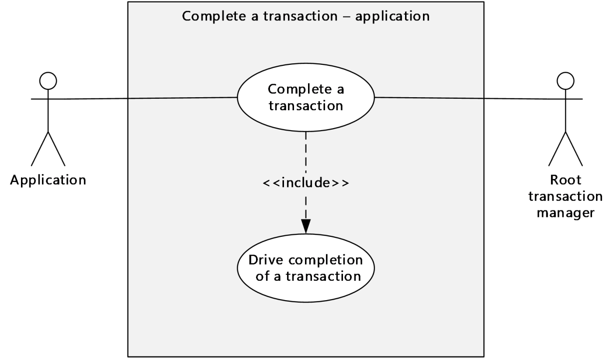
<!-- /Extracted images from page 27 -->

2.5.2  Complete a Transaction – Application

In this use case, the application either commits or aborts the transaction and completes the
transaction on all transaction participants.

Context of use: Commit or abort the transaction and drive it on all its participants until the

transaction is complete.

Figure 7: Use case diagram for transaction completion

Goal: To complete a transaction.

Actors:

Application: The application is a primary actor that performs transaction work on a number of

resource managers. The application creates a transaction, and therefore, only that application has
the right to commit the transaction.

Root transaction manager: The root transaction manager is a supporting actor. The root transaction
manager is a service that coordinates the life time of transactions, by providing functionality for
resource managers to enlist in these transactions. The root transaction manager also provides
functionality to enlist in transactions that are coordinated by remote transaction managers. Here,
the root transaction manager is a transaction manager that creates the transaction and starts the
transaction.

Stakeholders:

Application: The application is a program that creates and performs transactions in a distributed

computed network, and therefore, only that application has the right to commit the transaction.

Preconditions:





Transaction processing services are operational.

The application can access a transaction manager in the system.

27 / 71

[MS-TPSOD] - v20211026
Transaction Processing Services Protocols Overview
Copyright © 2021 Microsoft Corporation
Release: October 26, 2021

<!-- Extracted images from page 28 -->
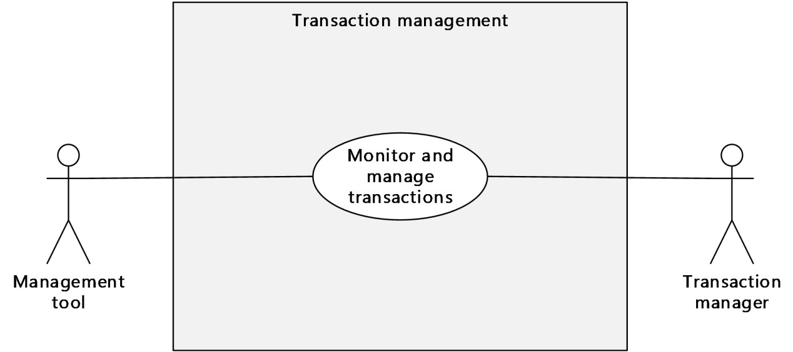
<!-- /Extracted images from page 28 -->

Main success scenario:

1.  Trigger: The application triggers the root transaction manager.

2.  The application requests that the root transaction manager commits or aborts a transaction.

3.  The root transaction manager makes a durable record for the result of the transaction and

responds to the application, indicating success.

4.  The transaction manager initiates the Drive Completion of a transaction use case (section 2.5.6.5)

to notify all participants of the outcome of the transaction.

Postcondition: The transaction has finished successfully.

Extensions: None.

Variation – complete a transaction – external application: All details are identical to the use
case as described in this section except that the application here is an external application that
makes use of optional protocols (see section 2.2).

2.5.3  Transaction Management – Management Tool

Context of use: A transaction operation is monitored or managed by the management tool.

Figure 8: Manage transactions use case

Goal: To monitor or manage a transaction.

Actors:

Management tool: The management tool is the primary actor that triggers this use case. The

management tool is an application that monitors the health of a transaction manager and
configures settings that are related to transaction coordination.

Transaction manager: The transaction manager is the supporting actor. It is a service that

coordinates the lifetime of transactions by providing functionality for resource managers to enlist
in these transactions. The root transaction manager also provides functionality to enlist in
transactions that are coordinated by remote transaction managers.

Stakeholders:

28 / 71

[MS-TPSOD] - v20211026
Transaction Processing Services Protocols Overview
Copyright © 2021 Microsoft Corporation
Release: October 26, 2021

<!-- Extracted images from page 29 -->
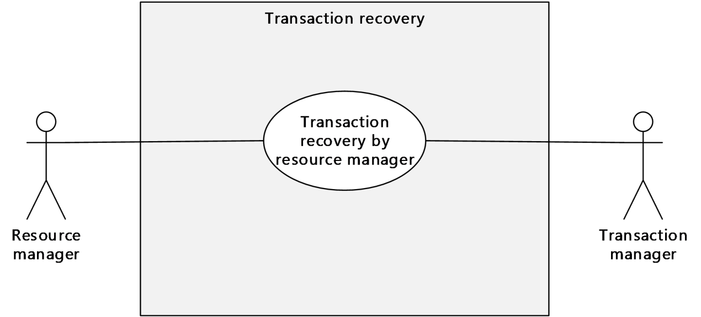
<!-- /Extracted images from page 29 -->

Application: The application is a program that performs transactions in a distributed computed

network that creates a transaction, and therefore, only that application has the right to commit
the transaction.

Preconditions:





Transaction processing services are operational.

The management tool can access the transaction manager in the system.

Main success scenario:

1.

 Trigger: The management tool requests that the transaction manager provides a list of existing
transactions.

2.  The transaction manager returns a list of existing transactions and their known states.

3.  The management tool performs a Subscribe for transaction information action against the

transaction manager to monitor the progress of the two-phase commit protocol, as described in
[MS-DTCO] section 1.3.1 and to resolve the transaction if it reaches an error state.

4.  The management tool requests that the transaction manager updates the state of a transaction.

For example, it can force the transaction to abort.

5.  The transaction manager successfully updates the state of the transaction.

Postcondition: The transaction state is correctly updated.

2.5.4  Recover In-doubt Transaction State – Resource Manager

This use case shows how the resource manager drives recovery when a connection to a resource
manager breaks down after a participant has completed Phase One, but before completing Phase
Two of the two-phase commit protocol, as described in [GRAY]. The participant uses this use case
to recover the outcome of such transactions.

Context of use: There is a failure during the two-phase commit process, and the transaction is in an

in-doubt state in the root transaction manager's log.

Figure 9: Use case for transaction recovery by a resource manager

29 / 71

[MS-TPSOD] - v20211026
Transaction Processing Services Protocols Overview
Copyright © 2021 Microsoft Corporation
Release: October 26, 2021

Goal: To recover the state of an in-doubt transaction in the root transaction manager's log.

Actors:

Resource manager: The resource manager is a primary actor which is a participant that is

responsible for coordinating the state of a resource with the outcome of transactions. For a
specified transaction, a resource manager enlists with exactly one transaction manager to vote on
that transaction outcome and to obtain the final outcome.

Transaction manager: The transaction manager is a supporting actor. The transaction manager is a

service that coordinates the lifetime of transactions by providing functionality for resource
managers to enlist in these transactions. The transaction manager also provides functionality to
enlist in transactions that are coordinated by remote transaction managers. Here, the root
transaction is a transaction manager that creates the transaction and starts performing the
transaction.

Stakeholders:

Architects: An architect is responsible for the overall design of a system while managing the technical

risks that are associated with it.

An architect can use the transaction processing services as an element of a system in the design
process to provide reliable support for distributed transactions.

IT operations personnel: If there are transactions in an in-doubt state in the resource manager log,
the resource manager executes this use case to recover the affected transactions. Similarly, if a
transaction manager has any transactions in a failed-to-notify state, then a resource manager
executes this use case to receive the outcomes of those transactions. Both of these operations can
require manual intervention by the IT operations personnel to trigger the recovery, or to force the
affected resource managers and transaction managers to forget the transactions in either an in-
doubt and failed-to-notify state.

Preconditions:







Transaction processing services is operational.

The resource manager can access a transaction manager in the system.

The resource manager has transactions in in-doubt state in its log.

Main success scenario:

1.  Trigger: The resource manager triggers this use case on startup if it has any in-doubt

transactions in its log, as described in [MS-DTCO] section 1.3.4.2.

2.  The resource manager asks the transaction manager for the outcome of the transactions in an in-

doubt state in its log.

3.  The system returns the state of each transaction if it has a record of the transaction in its log.
Otherwise, the transaction manager indicates to the resource manager that it does not have a
record of the transaction.

4.  The resource manager either aborts or commits each transaction on the basis of the outcome

information that it received from the transaction manager. If the transaction manager indicates
that it does not have a record for a transaction, the resource manager assumes that the
transaction has been aborted.

Postcondition: The transaction manager forgets the transaction and the resource manager durably
updates its records according to the outcome that it received from the transaction manager.

Extensions: None.

[MS-TPSOD] - v20211026
Transaction Processing Services Protocols Overview
Copyright © 2021 Microsoft Corporation
Release: October 26, 2021

30 / 71

<!-- Extracted images from page 31 -->
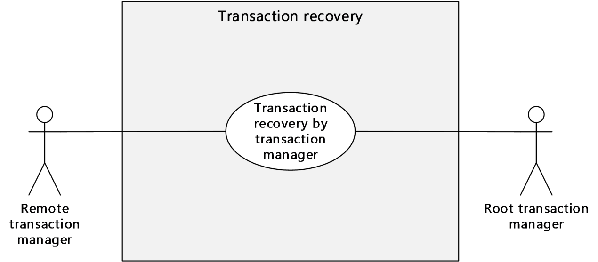
<!-- /Extracted images from page 31 -->

2.5.5  Transaction Recovery - Remote Transaction Manager

This use case shows how the transaction manager drives recovery where a connection to a
subordinate transaction manager breaks down during the two-phase commit protocol, as
described in [GRAY], when a participant has completed Phase One but has experienced a failure
before completing Phase Two. The participant uses this use case to recover the outcome of such
transactions.

Context of use: There is a failure during the two-phase commit process, and the transaction is in an

in-doubt state in the participant's log.

Figure 10: Use case for transaction recovery by a transaction manager

Goal: To recover the state of an in-doubt transaction in the participant's log.

Actors:

Remote transaction manager: The remote transaction manager is a primary actor. It is a

transaction manager that receives a request to perform some transaction depending on its
availability and enlists itself with the root transaction manager.

Root transaction manager: The root transaction manager is a supporting actor. It is a service that

coordinates the lifetime of transactions, enabling resource managers to enlist in these transactions
and to enlist in transactions that are coordinated by remote transaction managers. Here, a root
transaction manager is a transaction manager that creates and starts the transaction.

Stakeholders:

Architects: An architect is responsible for the overall design of a system while managing the technical
risks that are associated with it. An architect can use transaction processing services to provide
proven, reusable support for distributed transactions.

IT operations personnel: If there are transactions in an in-doubt state in a resource manager log,
the resource manager executes this use case to recover the affected transactions. Similarly, if a
transaction manager has any transactions in a failed-to-notify state, a resource manager executes
this use case to receive the outcomes of those transactions. Both of these operations can require
manual intervention by the IT operations personnel to trigger the recovery or to force the affected
resource managers and transaction managers to forget the transactions in the in-doubt and failed-
to-notify states.

[MS-TPSOD] - v20211026
Transaction Processing Services Protocols Overview
Copyright © 2021 Microsoft Corporation
Release: October 26, 2021

31 / 71

Preconditions:







Transaction processing services are operational.

The resource manager can access a transaction manager in the system.

The resource manager has transactions in an in-doubt state in its log.

Main Success Scenario:

1.  Trigger: The remote transaction manager triggers this use case on startup if it has any in-doubt

transactions in its log, as described in [MS-DTCO] section 1.3.4.2.

2.  The remote transaction manager initiates a CheckAbort connection with the root transaction

manager and sends a Check message to determine whether the transaction is aborted.

3.  The root transaction manager returns the state of the transaction if it has a record of the

transaction in its own log. Otherwise, the root transaction manager indicates to the resource
manager that it does not have a record for the transaction.

4.  The remote transaction manager either aborts or commits each transaction on the basis of the
outcome information that it received from the root transaction manager. If the root transaction
manager indicated that it does not have a record for a transaction, the remote transaction
manager assumes that the transaction has been aborted.

Postcondition: The remote transaction manager durably updates its records, according to the

outcome that it received from the root transaction manager.

Extensions: None.

2.5.6  Supporting Use Cases

2.5.6.1  Create a Transaction – Application

In this use case, the application triggers the root transaction manager to create a transaction.

Context of use: A transaction is to be created before performing any transaction work.

Goal: To start a new transaction with a root transaction manager in the system.

Actors:

Application: The application is a primary actor that performs transaction work on several resource

managers. The application creates a transaction, and therefore, only that application has the right
to commit the transaction.

Root transaction manager: The root transaction manager is a supporting actor. The root transaction

manager coordinates the lifetime of transactions by providing functionality for resource managers
to enlist in these transactions. The root transaction manager also provides functionality to enlist in
transactions that are coordinated by remote transaction managers. Here, the root transaction
manager is a transaction manager that creates the transaction and starts performing the
transaction.

Stakeholders:

Application: The application is a program that creates and performs transactions in a distributed

computed network, and therefore, only that application has the right to commit the transaction.

Preconditions:

32 / 71

[MS-TPSOD] - v20211026
Transaction Processing Services Protocols Overview
Copyright © 2021 Microsoft Corporation
Release: October 26, 2021





Transaction processing services are operational.

The application can access a transaction manager in the system.

Main success scenario:

1.  Trigger: The application triggers the root transaction manager to create a transaction.

2.  The application requests that the root transaction manager creates a transaction.

3.  The root transaction manager creates a transaction.

4.  The root transaction manager returns a reference to the transaction to the application.

Postcondition: A new transaction is created.

Extensions: None.

Variation – create a transaction – external application: All details are identical to the use case
that is described in this section except that the application is an external application that makes
use of optional protocols (see section 2.2).

2.5.6.2  Enlist in a Transaction – Resource Manager

In this use case, the resource manager enlists in a transaction with a respective transaction manager.

Context of use: When a resource manager is enlisted in a transaction, the resource manager can

participate in the coordination of the transaction.

Goal: To enlist a resource manager in a transaction.

Actors:

Resource manager: The resource manager is a primary actor and can be a remote resource

manager or an external resource manager.

Transaction manager: The transaction manager is a supporting actor. The transaction manager can

be a root transaction manager, a remote transaction manager, or an external transaction
manager.

Stakeholders:

  Architects



Implementers

Preconditions:





Transaction processing services are operational.

The resource manager can access the transaction manager that it has to contact to enlist in the
transaction.

Main success scenario:

1.  Trigger: The application triggers the resource manager to update its resource in the context of

the transaction that was created in the Create a Transaction (section 2.5.6.1) use case.

2.  The resource manager asks the transaction manager to enlist in the transaction.

3.  The transaction manager enlists the resource manager in the transaction and returns a success

message to the resource manager.

33 / 71

[MS-TPSOD] - v20211026
Transaction Processing Services Protocols Overview
Copyright © 2021 Microsoft Corporation
Release: October 26, 2021

4.  After successful enlistment in a transaction, the resource manager makes the requested updates
to its resource in accordance with the semantics of the two-phase commit protocol, such as
isolation and durability.

Postcondition: The resource manager enlists in a transaction with the respective transaction

manager.

Extensions: None.

Variation: All details are identical to the use case as described in this section except that the

application is an external application that makes use of optional protocols (see section 2.2).

2.5.6.3  Perform Transaction Work with Pull Propagation – Application

In this use case, the application performs transaction work with pull propagation.

Context of use: To perform a set of operations in a transaction on a remote resource manager that

has a separate transaction manager.

Goal: To perform transaction work with pull propagation on a remote resource that has a separate

transaction manager.

Actors:

Application: The application is a primary actor that performs transaction work on a number of

resource managers. The application creates a transaction, and therefore, only that application has
the right to commit the transaction.

Application service: The application service is a supporting actor. It is a service that accepts

requests to perform transaction work on local resource managers. An application service does not
have the right to commit transactions.

Root transaction manager: The root transaction manager is a supporting actor. The root transaction

manager coordinates the lifetime of transactions by providing functionality for resource managers
to enlist in these transactions. The root transaction manager also provides functionality to enlist in
transactions that are coordinated by remote transaction managers.

Remote transaction manager: The remote transaction manager is a supporting actor that receives

requests to perform transactions depending on its availability.

Remote resource manager: The remote resource manager is a supporting actor that enlists with the

remote transaction manager.

Stakeholders:

  Architects



Implementers

Preconditions:











Transaction processing services are operational.

The application can access a transaction manager in the system.

The resource manager of the resource and the application service are on a remote computer and
can access a transaction manager in the system.

The two computers involved are connected on a network.

The two transaction managers are on separate computers and can access each other.

34 / 71

[MS-TPSOD] - v20211026
Transaction Processing Services Protocols Overview
Copyright © 2021 Microsoft Corporation
Release: October 26, 2021



The transaction managers on each computer in the system are operational.

Main success scenario:

1.  Trigger:  The application triggers the resource manager to update its resource in the context of

the transaction that was created in the Create a Transaction (section 2.5.6.1) use case.

2.  The application sends the transaction reference that was received during the Create a Transaction

use case, along with information about the work to be done to the application service.

3.  Upon receiving the information about the transaction reference and the work to be done, the

application service asks its remote transaction manager to pull the transaction, passing the
transaction reference that was provided by the application.

4.  The remote transaction manager sends a transaction reference to the root transaction manager

asking to pull the transaction.

5.  The root transaction manager enlists the remote transaction manager in the transaction and

returns success.

6.  The application service passes the information about the work to be done to the remote resource

manager along with a reference to the transaction.

7.  The remote resource manager executes the Enlist in a Transaction (section 2.5.6.2) use case,

requesting that the remote transaction manager enlist it in the transaction.

8.  The remote resource manager makes the requested updates to the resource in accordance with

the two-phase commit protocol semantics, such as isolation and durability.

9.  The remote resource manager reports success to the application service, and in turn, the

application service reports success to the application.

Postcondition: Transaction work is done with pull propagation.

Extensions: None.

Variation – perform transaction work with pull propagation – external application: All details
are identical to the use case as described in this section except that the application here is an
external application that makes use of optional protocols (see section 2.2).

2.5.6.4  Perform Transaction Work with Push Propagation – External Application

In this use case, the application performs transaction work with push propagation.

Context of use: To perform set of operations in a transaction on a remote resource manager that has

a separate transaction manager with push propagation.

Goal: To perform transaction work on a remote resource that has a separate transaction manager

with push propagation.

Actors:

External application: The external application is a primary actor that performs transaction work on

several resource managers. The application creates a transaction, and therefore, only that
application has the right to commit the transaction.

Root transaction manager: The root transaction manager is a supporting actor. It coordinates the

lifetime of transactions, providing functionality for resource managers to enlist in these
transactions, and functionality to enlist in transactions that are coordinated by remote transaction
managers.

35 / 71

[MS-TPSOD] - v20211026
Transaction Processing Services Protocols Overview
Copyright © 2021 Microsoft Corporation
Release: October 26, 2021

External transaction manager: The external transaction manager is a supporting actor that

receives requests to perform transactions depending on its availability.

External resource manager: The external resource manager is a supporting actor that enlists with

the remote transaction manager.

Note  An external actor is one that uses optional protocols as well as core protocols.

Stakeholders:

  Architects



Implementers

Preconditions:









Transaction processing services are operational.

The external application and the external transaction manager can both access a transaction
manager in the system.

The external application and the external transaction manager are both on separate computers.

The two computers involved are connected on the network.

Main success scenario:

1.

 Trigger: The application triggers the resource manager to update its resource in the context of
the transaction that was created in the Create a Transaction (section 2.5.6.1) use case.

2.  The external application asks the external resource manager for the location of the external

transaction manager.

3.  The external application asks the transaction manager to push the transaction to the external

transaction manager.

4.  The transaction manager initiates a push transaction to push the transaction to the external

transaction manager. As a result, the external transaction manager is enlisted in the transaction.

5.  The external application asks the external resource manager to update the context of the

transaction.

6.  The external resource manager makes the requested updates to its resource in accordance with

the two-phase commit protocol semantics, such as isolation and durability.

7.  The external resource manager reports success to the external application.

Postcondition: Transaction work is done with push propagation.

Extensions: None.

2.5.6.5  Drive Completion of a Transaction – Root Transaction Manager

In this use case, the root transaction manager drives the completion of the transaction on all
transaction participants.

Context of use: A transaction has to be completed on all its participants.

Goal: To drive completion of the transaction on all transaction participants.

Actors:

[MS-TPSOD] - v20211026
Transaction Processing Services Protocols Overview
Copyright © 2021 Microsoft Corporation
Release: October 26, 2021

36 / 71

Root transaction manager: The root transaction manager is a supporting actor. The root transaction

manager coordinates the lifetime of transactions by providing functionality for resource managers
to enlist in these transactions and functionality to enlist in transactions that are coordinated by
remote transaction managers. Here, the root transaction manager creates the transaction and
starts performing the transaction.

Transaction managers that are subordinate to the transaction manager that is executing this use
case are supporting actors for this use case. Supporting actors execute a new instance of this use
case on resource managers and transaction managers that are enlisted in the transaction through
them.

Stakeholders:

  Architects



Implementers

Preconditions:





Transaction processing services are operational.

The transaction manager can access the participants in the transaction.

Main success scenario:

1.  Trigger: The root transaction manager triggers its subordinate transaction managers.

2.  The root transaction manager drives the two-phase commit notifications on each participant that

is enlisted in the transaction.

3.  Each transaction manager that is subordinate to this root transaction manager initiates a new use

case for the participants.

4.  The root transaction manager returns success after the transaction has completed.

Postcondition: The transaction has completed successfully.

Extensions: None.

2.6  Versioning, Capability Negotiation, and Extensibility

The system does not define any versioning and capability negotiation beyond those described in the
specifications of the protocols that are supported by the system, as listed in section 2.2.

2.7  Error Handling

This section describes the common failure scenarios and provides details about the system behavior in
such conditions.

2.7.1  Connection Disconnected

A common failure scenario is an unexpected connection breakdown between the system and external
entities or between transaction managers within the system. A disconnection can be caused by the
network not being available, or by one of the communicating participants becoming unavailable. In the
case where the network is not available, both participants remain active and expect the other party to
continue the communication pattern as described by the protocol that is being executed at the time of
the failure. Similarly, in the case where one of the participants is not available, the active participant
expects the communication to proceed as specified by the protocol that is being executed.

[MS-TPSOD] - v20211026
Transaction Processing Services Protocols Overview
Copyright © 2021 Microsoft Corporation
Release: October 26, 2021

37 / 71

Generally, a protocol detects a connection breakdown by one of the following methods:

  By using a timer object that generates an event if the corresponding participant has not responded

within a reasonable time span.

  By being notified by the underlying protocol that the connection is disconnected.

When a connection disconnected event is detected, the protocol shut downs all related
communications and updates any necessary data structures to maintain the system state.

Details about how each protocol detects a connection disconnected event and how it behaves under
this scenario are provided in the specifications of the member protocols, as listed in section 2.2.

2.7.2  Internal Failures

The system or a transaction participant can detect an unrecoverable internal state at any point during
the lifetime of a transaction. In such a scenario, if the system or the participant experiencing the
internal failure cannot continue the transaction for any reason, it can abort the existing transactions
that are not yet in the second phase of the two-phase commit protocol. The two-phase commit
protocol is designed to handle unilateral termination of transactions so that all participants are rolled
back to their states before the transaction started. For the transactions that are in the second phase,
the transaction information is persisted, which in return means that it is recoverable. When the
participant returns to a state where it can resume its operations, it can recover the transaction.
Detailed descriptions of unilateral abort and recovery scenarios are provided in [MS-DTCO] sections
1.3.2.1 and 1.3.4, respectively.

2.7.3  System Configuration Corruption or Unavailability

The system relies on the availability and consistency of its configuration data. Configuration consists of
the data that determines the behavior of the system under specific conditions or for specific
functionality. For example, the configuration can be used to enable or disable certain protocols or
determine whether the system can span across a network of computers.

If the configuration data is not available, the protocol that requires the configuration data can assume
a default value. [MS-CMOM] section 3.3.1 describes the system configuration data and the manner in
which it maps to the abstract data models in [MS-CMPO] section 3.2.1, [MS-DTCO] section 3.2.1, and
[MC-DTCXA] section 3.1.1.

2.7.4  Log Corruption or Unavailability

The log is where the system keeps the transaction state information. Availability and consistency of
the log is crucial to guaranteeing atomicity in transaction processing. The system can use
implementation-specific mechanisms to make sure the data in the log is reliable. If the log is corrupt,
or if it is not available at all, the system cannot process any new durable transactions or respond to
recovery requests.

If the log is not recoverable or if it is lost, a new log is created, which means that any transaction
information that was in the previous log is lost. This means that the data or application state that was
dependent on the transaction information from the lost log can become corrupt.

2.8  Coherency Requirements

Transactions are used by applications and other systems to maintain data coherency in the event of
transient failures. To satisfy this requirement, the system guarantees atomicity through transactions.
Transactions require the use of a log in a durable storage system. The log is used to hold important
state information. Following a transient failure, the system can access the log to recall the last known
state and continue its processing from that point.

38 / 71

[MS-TPSOD] - v20211026
Transaction Processing Services Protocols Overview
Copyright © 2021 Microsoft Corporation
Release: October 26, 2021

<!-- Extracted images from page 39 -->
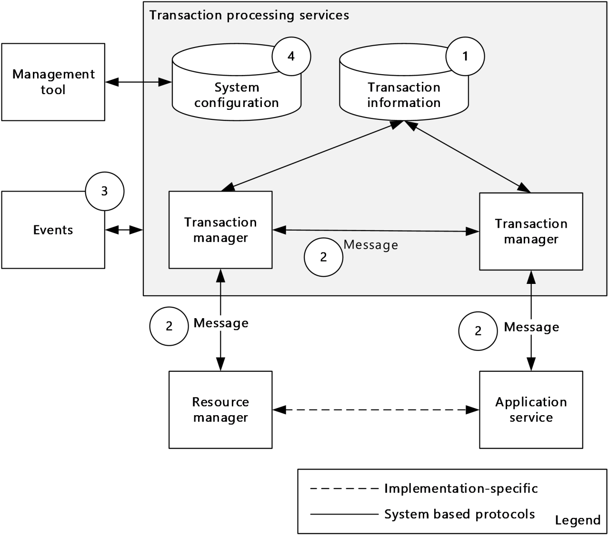
<!-- /Extracted images from page 39 -->

2.9  Security

This section documents the system-wide security issues that are not otherwise described in the
specifications for the member protocols. It does not duplicate what is already in the member protocol
specifications unless there is a unique aspect that applies to the system as a whole.

Transaction processing services are designed to protect the following assets:



Transaction information, see Transaction Information Security (section 2.9.1)

  System configuration, see System Configuration Security (section 2.9.2)

  Messages, see Message Security (section 2.9.3)



Events, see Event Security (section 2.9.4)

This is illustrated in the following diagram, where the system is shown communicating with a resource
manager and an application service.

Figure 11: Transaction processing services assets

[MS-TPSOD] - v20211026
Transaction Processing Services Protocols Overview
Copyright © 2021 Microsoft Corporation
Release: October 26, 2021

39 / 71

2.9.1  Transaction Information Security

The transaction information asset consists of the state of the transaction, the identity, and the
locations of the participants, and other data about the transaction, such as the transaction description.
The transaction information is held in memory and also in a log that is supported by a durable storage
system.

The system relies on the durable storage system to maintain the integrity of this log and to restrict
access to it.

The system accesses and modifies its transaction information as a result of events and messages that
it receives. Therefore, the security and integrity of the transaction information is also dependent on
the system's ability to secure these events and messages, which is described in sections 2.9.3 and
2.9.4.

2.9.2  System Configuration Security

The system configuration asset consists of all the configuration data that is required by the system.
Examples are security identities and associated credentials that are used by the system, and feature
enablement settings such as the setting that allows a transaction to span multiple computers. System
configuration data is kept in a durable storage system. The system relies on the durable storage
system to enforce the access restrictions as specified by the system.

The system accesses and modifies its system configuration data as a result of messages that it
receives; for example, from a management tool, as specified in [MS-CMOM]. Therefore, the security
and integrity of the system configuration is also dependent on the system's ability to secure these
messages, which is described in section 2.9.3.

2.9.3  Message Security

The messages asset consists of the messages that are received and sent by the system and messages
that are received and sent within the system. The system protects the privacy and integrity of these
messages and ensures that they are sent to and received from an authorized party.

The messages that the system receives and sends are specified by the system protocols (see section
2.2). Most of these protocols, in turn, depend on CMPO, as specified in [MS-CMPO], which requires
that an RPC session is established before exchanging any messages. CMPO uses the security
provider security model, as specified in [MS-RPCE] section 2.2.1.1.7, and an authentication level, as
specified in [MS-RPCE] section 2.2.1.1.8, to configure protection of messages; for example, full
encryption for privacy and integrity, or by requiring mutual authentication for authorization. See [MS-
CMPO] section 2.1.3 for more details. Some system protocols do not depend on CMPO, but they might
use, depend on, or extend other industry standard protocols, as described in section 2.1.7. When
communicating over protocols that do not depend on CMPO, the system adopts the security
requirements and semantics that are specified by the industry standard protocol.

When communicating over the WS-AtomicTransaction protocol, the system fully adheres to the
security requirements and semantics as specified by the WS-AtomicTransaction protocol. Additionally,
the system requires that all WS-AtomicTransaction communication is done over an HTTPS connection.
All entities that participate in transaction coordination with the system via the WS-AtomicTransaction
protocol have to use a valid X.509 security certificate (see [X509]), when communicating with the
system. The system keeps a list of X.509 security certificate thumbprints in its system configuration to
authorize whether an entity can participate in transaction coordination with the system by using the
WS-AT protocol.

2.9.4  Event Security

The Events asset consists of the events that are raised and handled by the system. These events are
limited to events that are received from the network system reporting a change of connection state

40 / 71

[MS-TPSOD] - v20211026
Transaction Processing Services Protocols Overview
Copyright © 2021 Microsoft Corporation
Release: October 26, 2021

and events that are received from the operating environment of the system when the system is
initialized. Both of these event sources and their connection to the system are trusted by the system,
and no additional protections are applied.

2.9.5  Connection Type and Feature Restriction

The system also restricts access to certain features to specified groups of security identities. This
restriction is applied at the level of connection type. A connection type specifies a set of messages.
The system protocols specify these connection types and the related messages. The system protocols
use connection types to group messages by functionality, and most messages are members of exactly
one connection type. Therefore, the functionality that is associated with a message can be restricted
by restricting access to the connection type, and by sending or receiving a message only if the
communicating party has access to the connection type.

Connection types that are related to transaction state changes are restricted to sessions that are
authenticated as administrator, and connection types that are related to transaction manager
communication are restricted to parties known to be transaction managers, as specified in [MS-DTCO]
section 5.

The system also restricts the set of supported connection types through configuration, as described in
[MS-DTCO] section 5. For example, the system can be configured to not allow connection types
related to network transactions.

When using the protocol, as specified in [MS-TIPP], the system can be configured to restrict the use of
specific functionalities that are related to that protocol through configuration, as specified in [MS-TIPP]
section 5.

The system can be configured to restrict the use of the protocol, as specified in [MC-DTCXA]. Further
details of this configuration are described in [MS-CMOM].

The system can also be configured to restrict the use of the WS-AtomicTransaction (WS-AT) protocol.

2.9.6  Internal Security

Transaction processing services apply the security mechanisms as described in sections 2.9.1, 2.9.2,
2.9.3, 2.9.4, and 2.9.5 to ensure internal security.

Other systems interacting with transaction processing services need to take the following steps to
ensure the security of this system:

  Support the mutual authentication feature of the protocol as specified in [MS-CMPO].

  Correctly execute the two-phase commit protocol so that other transaction participants

experience well-regulated progress towards a common transaction outcome.

  Always complete transactions after creating them, to avoid filling up the system log and requiring

administrative intervention.

  Do not allow transactions to stay in an in-doubt state for a longer period than the higher-layer

business logic allows.

2.9.7  External Security

Transaction processing services apply the following security measures to ensure the security of other
entities with which they interact:

  Support the mutual authentication feature of the protocol as specified in [MS-CMPO] when

communicating over that protocol.

41 / 71

[MS-TPSOD] - v20211026
Transaction Processing Services Protocols Overview
Copyright © 2021 Microsoft Corporation
Release: October 26, 2021



Establish all communication over HTTPS connections when using WS-AT.

  Correctly execute the two-phase commit protocol so that all transaction participants experience

well-regulated progress towards a common transaction outcome.

  Do not allow transactions to stay in an in-doubt state for a longer period than the higher-layer

business logic allows.

The other entities that interact with this system have to apply the following security measures to
ensure their own security during interactions with this system:



If the other entity is a resource manager or a transaction manager, it takes security measures
similar to those as described in Transaction Information Security (section 2.9.1), System
Configuration Security (section 2.9.2), Message Security (section 2.9.3), and Event
Security (section 2.9.4).

  Support the mutual authentication feature of the protocol as specified in [MS-CMPO] where

applicable, when communicating with transaction processing services.



Establish all communication over HTTPS connections when using WS-AT.

  Correctly execute the two-phase commit protocol so that other transaction participants experience

well-regulated progress towards a common transaction outcome.

  Do not allow transactions to stay in an in-doubt state for a longer period than the higher-layer

business logic allows.

2.10  Additional Considerations

None.

[MS-TPSOD] - v20211026
Transaction Processing Services Protocols Overview
Copyright © 2021 Microsoft Corporation
Release: October 26, 2021

42 / 71

3  Examples

3.1  Example 1: Perform Transaction Work

This example demonstrates performing a transaction that involves two transaction managers as
described in Perform Transaction Work – Application (section 2.5.1).

Prerequisites:







Transaction processing services meet all the preconditions that are described in section 2.4.

Transaction processing services are operational.

The application can access a transaction manager in the system.

Initial System State

No transaction has been performed by an application.

Final System State

The application performs a transaction that involves two transaction managers.

Sequence of Events

[MS-TPSOD] - v20211026
Transaction Processing Services Protocols Overview
Copyright © 2021 Microsoft Corporation
Release: October 26, 2021

43 / 71

<!-- Extracted images from page 44 -->
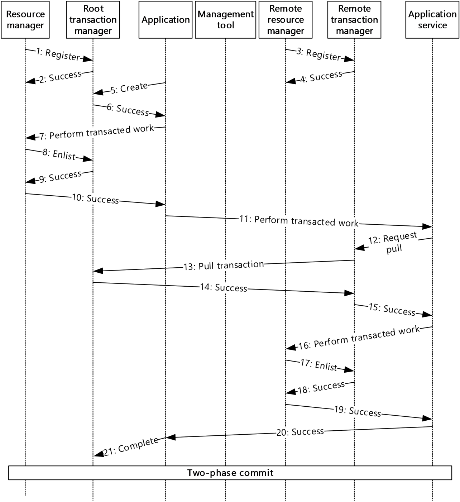
<!-- /Extracted images from page 44 -->

Figure 12: Example of performing a transaction with two transaction managers

The following steps describe the sequence:

1.  The resource manager connects to the root transaction manager by initiating a

CONNTYPE_TXUSER_RESOURCEMANAGER connection on a DTCO session with the root
transaction manager and sends a TXUSER_RESOURCEMANAGER_MTAG_CREATE message to
the root transaction manager, as specified in [MS-DTCO] section 4.4.1, to register with it.

2.  The root transaction manager sends a

TXUSER_RESOURCEMANAGER_MTAG_REQUEST_COMPLETE message, as described in [MS-

44 / 71

[MS-TPSOD] - v20211026
Transaction Processing Services Protocols Overview
Copyright © 2021 Microsoft Corporation
Release: October 26, 2021

DTCO] section 4.4.1, to the resource manager to acknowledge that the resource manager is
registered with the root transaction manager as a resource manager.

3.  The remote resource manager connects to the remote transaction manager by initiating a

CONNTYPE_TXUSER_RESOURCEMANAGER connection on a DTCO session with the remote
transaction manager and sends a TXUSER_RESOURCEMANAGER_MTAG_CREATE message to
the remote transaction manager, as described in [MS-DTCO] section 4.4.1, to register with it.

4.  The remote transaction manager sends a

TXUSER_RESOURCEMANAGER_MTAG_REQUEST_COMPLETE message, as specified in [MS-
DTCO] section 4.4.1, to the remote resource manager to acknowledge that the remote resource
manager is registered with the remote transaction manager as a resource manager. The
management tool performs a Subscribe for Transaction Information action against the root
transaction manager to monitor the progress of the two-phase commit protocol and to resolve the
transaction if it reaches an error state.

5.  The application sends a TXUSER_BEGINNER_MTAG_PROMOTE message to the root transaction
manager over a CONNTYPE_TXUSER_PROMOTE connection on a DTCO session by specifying
the isolation level, timeout, transaction description, isolation flag, and transaction identifier or
sends a TXUSER_BEGIN2_MTAG_BEGIN message to the root transaction manager over a
CONNTYPE_TXUSER_BEGIN2 connection on a DTCO session specifying the isolation level,
timeout, transaction description, and isolation flag to create a Transaction action against the root
transaction manager, as specified in [MS-DTCO] section 3.3.4.1.

6.  The root transaction manager creates the transaction object with a globally unique identifier

(GUID) (guidTx), sends a TXUSER_BEGIN2_MTAG_SINK_BEGUN message to the application,
and adds the transaction to its list of known transaction objects, as described in [MS-DTCO]
section 4.1.1 to complete the Create Transaction action that was initiated in step 5.

7.  The application initiates a Perform Transaction Work action against the resource manager.

8.  The resource manager initiates a CONNTYPE_TXUSER_ENLISTMENT connection on a DTCO

session with the root transaction manager and sends a TXUSER_ENLISTMENT_MTAG_ENLIST
message to the root transaction manager specifying the transaction GUID (guidTx), and the GUID
that uniquely identifies itself (guidRm), as described in [MS-DTCO] section 4.4.2, to initiate an
Enlist action against the root transaction manager.

9.  The root transaction manager enlists the resource manager in the requested transaction, adds the

resource manager to its list of subordinates for the transaction, and sends a
TXUSER_ENLISTMENT_MTAG_ENLISTED message to the resource manager to acknowledge
that the resource manager is enlisted in the transaction, as described in [MS-DTCO] section 4.4.2.

10. The resource manager reports successful completion of the transaction work, completing the

Perform Transaction Work action that was initiated in step 7.

11. The application initiates a Perform Transaction Work action against the application service by

passing a serialized transaction identifier that includes the transaction propagation information.

12. The application service initiates a CONNTYPE_TXUSER_ASSOCIATE connection on a DTCO

session with the remote transaction manager and sends a
TXUSER_ASSOCIATE_MTAG_ASSOCIATE message to the remote transaction manager by
using the transaction information and propagation information, as described in [MS-DTCO] section
4.2.2.

13. The remote transaction manager initiates a CONNTYPE_PARTNERTM_BRANCH connection on a

DTCO session with the root transaction manager and sends a
PARTNERTM_BRANCH_MTAG_BRANCHING message to the root transaction manager,
specifying the serialized transaction identifier, as described in [MS-DTCO] section 4.2.3.

[MS-TPSOD] - v20211026
Transaction Processing Services Protocols Overview
Copyright © 2021 Microsoft Corporation
Release: October 26, 2021

45 / 71

14. The root transaction manager creates a subordinate branch and sends a

PARTNERTM_BRANCH_MTAG_BRANCHED message to the remote transaction manager, as
described in [MS-DTCO] section 4.2.3, to acknowledge that the remote transaction manager is
now enlisted in the transaction, completing the Pull Transaction action that was initiated in step
13.

15. The remote transaction manager sends a TXUSER_ASSOCIATE_MTAG_ASSOCIATED message

to the application service on the CONNTYPE_TXUSER_ASSOCIATE connection, as specified in
[MS-DTCO] section 4.2.2, completing the Request Pull Transaction action that was initiated in
step 12.

16. The application service initiates a Perform Transaction Work action against the remote resource

manager.

17. The remote resource manager connects to the remote transaction manager by initiating a

CONNTYPE_TXUSER_ENLISTMENT connection on a DTCO session with the remote transaction
manager and sends a TXUSER_ENLISTMENT_MTAG_ENLIST message to the remote
transaction manager specifying the transaction identifier (guidTx), the resource manager
identifier (guidRm), and the resource manager session identifier (guidSession), as described in
[MS-DTCO] section 4.4.2, to initiate an Enlist action against the remote transaction manager.

18. The remote transaction manager adds the resource manager to its list of subordinate enlistments
and replies to the remote resource manager with a TXUSER_ENLISTMENT_MTAG_ENLISTED
message to acknowledge that the remote resource manager is enlisted in the transaction, as
specified in [MS-DTCO] section 4.4.2.

19. The remote resource manager reports successful completion of transacted work by completing the

Perform Transaction Work action that was initiated in step 16.

20. The application service responds to the application by completing the Perform Transaction

Work action that was initiated in step 11.

21. The application completes the transaction by sending a TXUSER_BEGIN2_MTAG_COMMIT user
message to the root transaction manager transaction, as described in [MS-DTCO] section 4.1.2.1.

3.2  Example 2: Commit a Transaction

This example demonstrates how a transaction is committed, as described in the use case Complete a
Transaction – Application (section 2.5.2). A transaction is committed if all the subordinate participants
involved in the transaction are prepared to commit the changes.

Prerequisites:









Transaction processing services protocols meet all the preconditions as described in section 2.4.

Transaction processing services are operational.

The application can access a transaction manager in the system.

Transaction work is performed.

Initial System State

A transaction is performed by resource managers and their respective transaction managers.

Final System State

The two-phase commit has been done to complete the transaction.

Sequence of Events

46 / 71

[MS-TPSOD] - v20211026
Transaction Processing Services Protocols Overview
Copyright © 2021 Microsoft Corporation
Release: October 26, 2021

<!-- Extracted images from page 47 -->
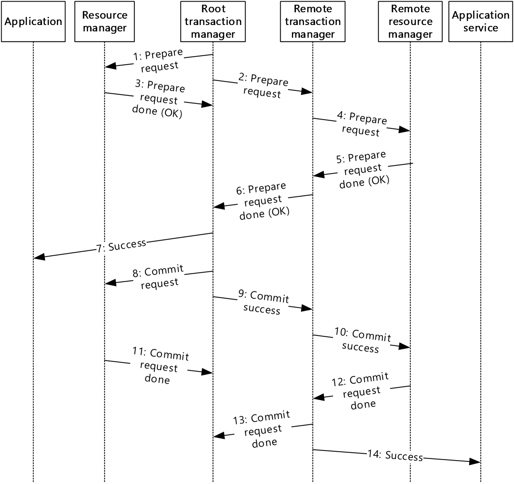
<!-- /Extracted images from page 47 -->

The messages that are exchanged in this example are contained within the two-phase commit
notifications action between the system and participating roles.

Figure 13: Example of committing a transaction

The following steps describe this sequence:

1.  The root transaction manager sends a TXUSER_ENLISTMENT_MTAG_PREPAREREQ message
to the resource manager over the CONNTYPE_TXUSER_ENLISTMENT connection, as specified
in [MS-DTCO] section 4.5.1.1, indicating that this is a two-phase commit.

2.  The root transaction manager sends a PARTNERTM_PROPAGATE_MTAG_PREPAREREQ
message to the remote transaction manager over the CONNTYPE_PARTNERTM_BRANCH
connection, as specified in [MS-DTCO] section 4.5.1.2, indicating that this is a two-phase commit.

3.  The resource manager sends a TXUSER_ENLISTMENT_MTAG_PREPAREREQDONE message to

the root transaction manager, indicating that the prepare request finished successfully

[MS-TPSOD] - v20211026
Transaction Processing Services Protocols Overview
Copyright © 2021 Microsoft Corporation
Release: October 26, 2021

47 / 71

(TXUSER_ENLISTMENT_PREPAREREQDONE_OK), as specified in [MS-DTCO] section 4.5.1.1,
completing step 1.

4.  The remote transaction manager sends a TXUSER_ENLISTMENT_MTAG_PREPAREREQ
message to the remote resource manager over the CONNTYPE_TXUSER_ENLISTMENT
connection, as specified in [MS-DTCO] section 4.5.1.1, indicating that this is a two-phase commit.

5.  The remote resource manager sends a TXUSER_ENLISTMENT_MTAG_PREPAREREQDONE
message to the remote transaction manager, indicating that the prepare request finished
successfully (TXUSER_ENLISTMENT_PREPAREREQDONE_OK) as specified in [MS-DTCO] section
4.5.1.1, completing step 4.

6.  The remote transaction manager sends a

PARTNERTM_PROPAGATE_MTAG_PREPAREREQDONE to the root transaction manager,
indicating that the prepare request finished successfully (OK), as specified in [MS-DTCO] section
4.5.1.2, completing step 2.

7.  The root transaction manager sends a TXUSER_BEGIN2_MTAG_SINK_ERROR message to the
application over the CONNTYPE_TXUSER_BEGIN2 connection, as specified in [MS-DTCO]
section 4.1.2.1, by indicating that the transaction has committed
(TRUN_TXBEGIN_ERROR_NOTIFY_COMMITTED), completing step 21 in Example 1: Perform
Transaction Work (section 3.1).

8.  The root transaction manager sends a TXUSER_ENLISTMENT_MTAG_COMMITREQ message to

the resource manager over the CONNTYPE_TXUSER_ENLISTMENT connection, as specified in
[MS-DTCO] section 4.4.3.2.

9.  The root transaction manager sends a PARTNERTM_PROPAGATE_MTAG_COMMITREQ

message to the remote transaction manager over the CONNTYPE_PARTNERTM_BRANCH
connection, as specified in [MS-DTCO] section 4.5.2.2.

10. The remote transaction manager sends a TXUSER_ENLISTMENT_MTAG_COMMITREQ message
to the remote resource manager over the CONNTYPE_TXUSER_ENLISTMENT connection, as
specified in [MS-DTCO] section 4.4.3.2.

11. The resource manager sends a TXUSER_ENLISTMENT_MTAG_COMMITREQDONE message to
the root transaction manager, completing step 8, and initiates the disconnect sequence on the
CONNTYPE_TXUSER_ENLISTMENT connection with the root transaction manager, as specified
in [MS-DTCO] section 4.4.3.2.

12. The remote resource manager sends a TXUSER_ENLISTMENT_MTAG_COMMITREQDONE
message to the remote transaction manager, completing step 8, and initiates the disconnect
sequence on the CONNTYPE_TXUSER_ENLISTMENT connection with the remote transaction
manager, as specified in [MS-DTCO] section 4.4.3.2.

13. The remote transaction manager sends a

PARTNERTM_PROPAGATE_MTAG_COMMITREQDONE message to the root transaction
manager, completing step 9, and initiates the disconnect sequence, as specified in [MS-DTCO]
section 4.5.2.2.

14. The remote transaction manager sends a success message to the application service, notifying it

of the completion of the two-phase commit sequence.

3.3  Example 3: Abort a Transaction

This example demonstrates how a transaction is aborted as described in use case Complete a
Transaction – Application (section 2.5.2). A transaction is aborted if at least one of the subordinate
participants that is involved in the transaction is prepared to abort the changes.

[MS-TPSOD] - v20211026
Transaction Processing Services Protocols Overview
Copyright © 2021 Microsoft Corporation
Release: October 26, 2021

48 / 71

<!-- Extracted images from page 49 -->
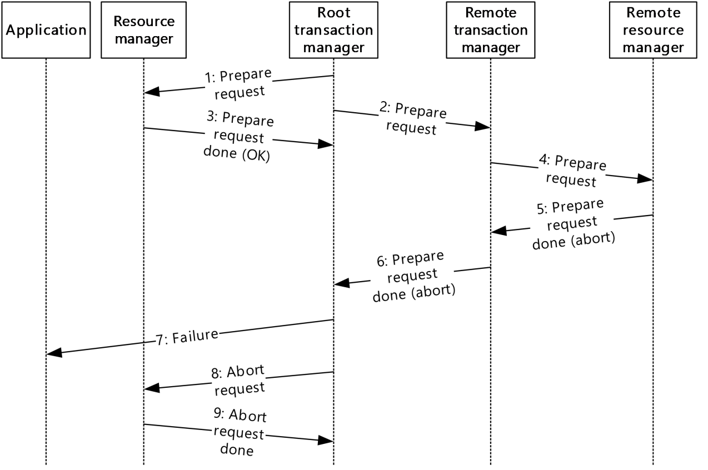
<!-- /Extracted images from page 49 -->

The diagram of the transaction tree for this example is shown in Example 1, as described in section
3.1.

Prerequisites:









Transaction processing services protocols meet all the preconditions, as described in section 2.4.

Transaction processing services are operational.

The application can access a transaction manager in the system.

Transaction work is performed.

Initial System State

A transaction is performed by an application.

Final System State

The two-phase commit sequence is completed, and the transaction is aborted.

Sequence of Events

The messages that are exchanged in this example are contained within the two-phase commit
notifications action between the system and participating roles.

Figure 14: Example of aborting a transaction

The following steps describe this sequence:

[MS-TPSOD] - v20211026
Transaction Processing Services Protocols Overview
Copyright © 2021 Microsoft Corporation
Release: October 26, 2021

49 / 71

1.  The root transaction manager sends a TXUSER_ENLISTMENT_MTAG_PREPAREREQ message
to the resource manager over the CONNTYPE_TXUSER_ENLISTMENT connection, as specified
in [MS-DTCO] section 4.5.1.1, indicating that this is a two-phase commit.

2.  The root transaction manager sends a PARTNERTM_PROPAGATE_MTAG_PREPAREREQ
message to the remote transaction manager over the CONNTYPE_PARTNERTM_BRANCH
connection, as specified in [MS-DTCO] section 4.5.1.2, indicating that this is a two-phase commit.

3.  The resource manager sends a TXUSER_ENLISTMENT_MTAG_PREPAREREQDONE message to
the root transaction manager indicating that the prepare request was finished successfully (OK)
(TXUSER_ENLISTMENT_PREPAREREQDONE_OK, as specified in [MS-DTCO] section 4.5.1.1),
completing step 1.

4.  The remote transaction manager sends a TXUSER_ENLISTMENT_MTAG_PREPAREREQ
message to the remote resource manager over the CONNTYPE_TXUSER_ENLISTMENT
connection, as specified in [MS-DTCO] section 4.5.1.1, indicating that this is a two-phase commit.

5.  The remote resource manager sends a TXUSER_ENLISTMENT_MTAG_PREPAREREQDONE

message to the remote transaction manager indicating that the prepare request was finished
unsuccessfully (Abort) (TXUSER_ENLISTMENT_PREPAREREQDONE_ABORT, as specified in [MS-
DTCO] section 4.5.1.1), completing step 4.

6.  The remote transaction manager sends a

PARTNERTM_PROPAGATE_MTAG_PREPAREREQDONE message to the root transaction
manager indicating that the prepare request was unsuccessful (Abort), as specified in [MS-DTCO]
section 4.5.1.2, completing step 2.

7.  The root transaction manager sends a TXUSER_BEGIN2_MTAG_SINK_ERROR message to the
application over the CONNTYPE_TXUSER_BEGIN2 connection, as specified in [MS-DTCO]
section 4.1.2.1, indicating that the transaction has committed
(TRUN_TXBEGIN_ERROR_NOTIFY_ABORTED), completing step 21 in Example 1: Perform
Transaction Work (section 3.1).

8.  The root transaction manager sends a TXUSER_ENLISTMENT_MTAG_ABORTREQ message to
the resource manager over the CONNTYPE_TXUSER_ENLISTMENT connection, as specified in
[MS-DTCO] section 2.2.10.2.2.1.

9.  The resource manager sends a TXUSER_ENLISTMENT_MTAG_ABORTREQDONE message to

the root transaction manager, completing step 8, as specified in [MS-DTCO] section 2.2.10.2.2.2.

3.4  Example 4: Transaction Manager Recovers after a Connection Resource Manager

Failure

This example demonstrates how a transaction is recovered when a remote transaction manager
breaks down, as described in use case Transaction Recovery - Remote Transaction
Manager (section 2.5.5).

Prerequisites:









Transaction processing services protocols meet all the preconditions, described in section 2.4.

Transaction processing services are operational.

The application can access a transaction manager in the system.

Transaction work is performed.

Initial System State

A transaction is performed by an application.

[MS-TPSOD] - v20211026
Transaction Processing Services Protocols Overview
Copyright © 2021 Microsoft Corporation
Release: October 26, 2021

50 / 71

<!-- Extracted images from page 51 -->
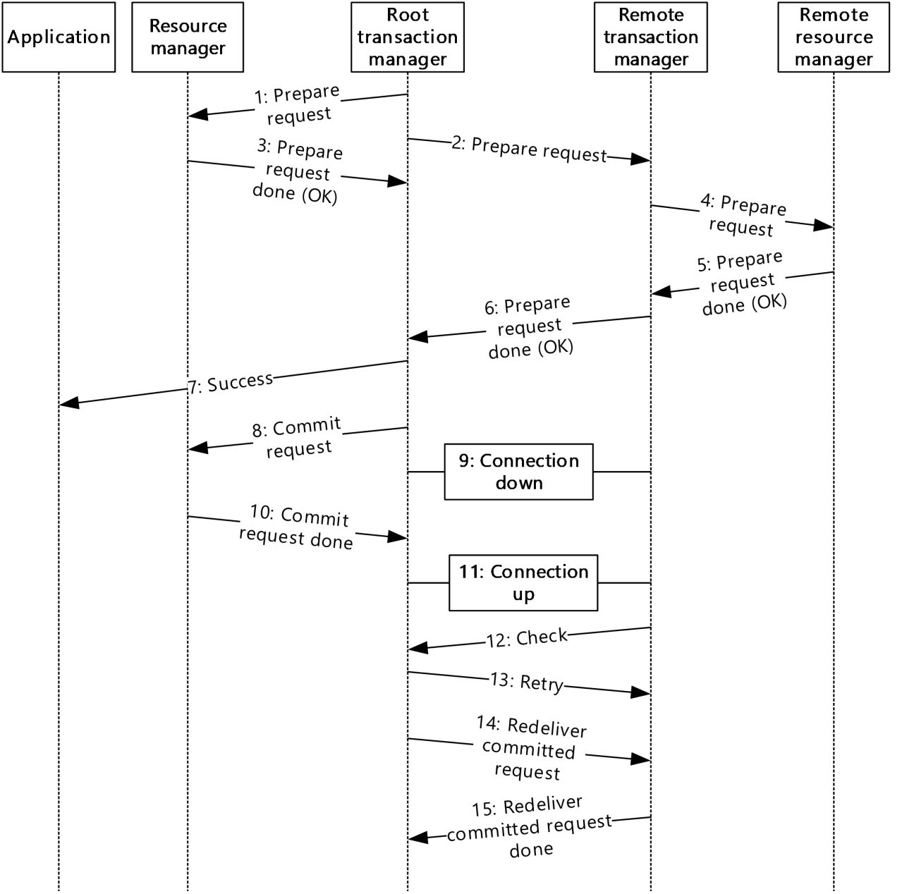
<!-- /Extracted images from page 51 -->

Final System State

Recovers the transaction after the breakdown of the remote transaction manager.

Sequence of Events

The PrepareRequest, PrepareRequestDone, CommitRequest, and CommitRequestDone
messages that are exchanged in the following example are contained within the two-phase commit
notification action between the system and participating roles.

Figure 15: Example of transaction recovery when a remote transaction manager breaks
down

The following steps describe this sequence:

[MS-TPSOD] - v20211026
Transaction Processing Services Protocols Overview
Copyright © 2021 Microsoft Corporation
Release: October 26, 2021

51 / 71

1.  The root transaction manager sends a TXUSER_ENLISTMENT_MTAG_PREPAREREQ message
to the resource manager over the CONNTYPE_TXUSER_ENLISTMENT connection, as specified
in [MS-DTCO] section 4.5.1.1, indicating that this is a two-phase commit.

2.  The root transaction manager sends a PARTNERTM_PROPAGATE_MTAG_PREPAREREQ
message to the remote transaction manager over the CONNTYPE_PARTNERTM_BRANCH
connection, as specified in [MS-DTCO] section 4.5.1.2, indicating that this is a two-phase commit.

3.  The resource manager sends a TXUSER_ENLISTMENT_MTAG_PREPAREREQDONE message to

the root transaction manager, indicating that the prepare request finished successfully
(TXUSER_ENLISTMENT_PREPAREREQDONE_OK), as specified in [MS-DTCO] section 4.5.1.1,
completing step 1.

4.  The remote transaction manager sends a TXUSER_ENLISTMENT_MTAG_PREPAREREQ
message to the remote resource manager over the CONNTYPE_TXUSER_ENLISTMENT
connection, as specified in [MS-DTCO] section 4.5.1.1, indicating that this is a two-phase commit.

5.  The remote resource manager sends a TXUSER_ENLISTMENT_MTAG_PREPAREREQDONE
message to the remote transaction manager, indicating that the prepare request finished
successfully (TXUSER_ENLISTMENT_PREPAREREQDONE_OK), as specified in [MS-DTCO] section
4.5.1.1, completing step 4.

6.  The remote transaction manager sends a

PARTNERTM_PROPAGATE_MTAG_PREPAREREQDONE message to the root transaction
manager indicating that the prepare request finished successfully (OK), as specified in [MS-DTCO]
section 4.5.1.2, completing step 2.

7.  The root transaction manager sends a TXUSER_BEGIN2_MTAG_SINK_ERROR message to the
application over the CONNTYPE_TXUSER_BEGIN2 connection, as specified in [MS-DTCO]
section 4.1.2.1, indicating that the transaction is committed
(TRUN_TXBEGIN_ERROR_NOTIFY_COMMITTED), completing step 21 in Example 1: Perform
Transaction Work (section 3.1).

8.  The root transaction manager sends a TXUSER_ENLISTMENT_MTAG_COMMITREQ message to

the resource manager over the CONNTYPE_TXUSER_ENLISTMENT connection, as specified in
[MS-DTCO] section 4.4.3.2.

9.  The connection from the root transaction manager to the remote transaction manager breaks

down. As a result, the root transaction manager cannot send a CommitRequest message to the
remote transaction manager.

10. The resource manager sends a TXUSER_ENLISTMENT_MTAG_COMMITREQDONE message to
the root transaction manager, as specified in [MS-DTCO] section 4.4.3.2, completing step 8.

11. The connection from the root transaction manager to the remote transaction manager is

reestablished.

12. The remote transaction manager initiates a CONNTYPE_PARTNERTM_CHECKABORT connection
with the root transaction manager and sends a PARTNERTM_CHECKABORT_MTAG_CHECK
message to the root transaction manager in that session, as specified in [MS-DTCO] section
3.8.7.8, to determine whether the transaction is aborted.

13. The root transaction manager sends a PARTNERTM_CHECKABORT_MTAG_RETRY message to
the remote transaction manager over the CONNTYPE_PARTNERTM_CHECKABORT connection,
as specified in [MS-DTCO] section 3.7.5.2.1.1.1, indicating that the transaction is not aborted. The
remote transaction manager waits for a commit request.

14. The root transaction manager sends a PARTNERTM_REDELIVERCOMMIT_MTAG_COMMITREQ

message to the remote transaction manager over the

[MS-TPSOD] - v20211026
Transaction Processing Services Protocols Overview
Copyright © 2021 Microsoft Corporation
Release: October 26, 2021

52 / 71

CONNTYPE_PARTNERTM_REDELIVERCOMMIT connection, as specified in [MS-DTCO] section
3.7.7.1, indicating that the committed request is redelivered.

15. The remote transaction manager sends a

PARTNERTM_REDELIVERCOMMIT_MTAG_COMMITREQDONE message to the root
transaction manager, as specified in [MS-DTCO] section 3.8.7.3, completing step 14.

This sequence causes the remote transaction manager to record this transaction as committed. The
remote resource manager will drive its own recovery sequence later. As specified in [MS-DTCO]
section 1.3.4.2, the resource manager is responsible for initiating recovery with its transaction
manager.

3.5  Example 5: Connection to a Resource Manager Breaks Down

This example demonstrates how the resource manager drives recovery when connection to a resource
manager breaks, as described in use case Recover In-doubt Transaction State – resource
manager (section 2.5.4).

Prerequisites:









The transaction processing services protocols meet all the preconditions, as described in section
2.4.

Transaction processing services are operational.

The application can access a transaction manager in the system.

Transaction work is performed.

Initial System State

A transaction is performed by an application.

Final System State

The transaction is complete after recovering from a resource manager breakdown.

Sequence of Events

The PrepareRequest, PrepareRequestDone, CommitRequest, and CommitRequestDone
messages that are exchanged in this example are contained within the two-phase commit
notifications action between the system and participating roles.

[MS-TPSOD] - v20211026
Transaction Processing Services Protocols Overview
Copyright © 2021 Microsoft Corporation
Release: October 26, 2021

53 / 71

<!-- Extracted images from page 54 -->
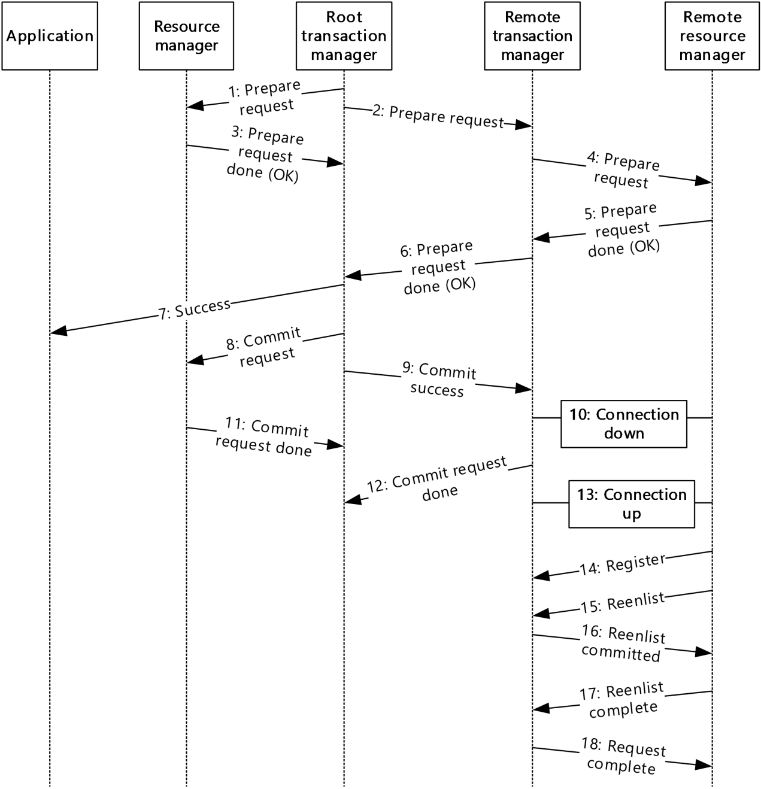
<!-- /Extracted images from page 54 -->

Figure 16: Example of a resource manager connection breakdown during a two-phase
commit

The message flow that is shown in this example is as follows:

1.  The root transaction manager sends a TXUSER_ENLISTMENT_MTAG_PREPAREREQ message
to the resource manager over the CONNTYPE_TXUSER_ENLISTMENT connection, as specified
in [MS-DTCO] section 4.5.1.1, indicating that this is a two-phase commit.

2.  The root transaction manager sends a PARTNERTM_PROPAGATE_MTAG_PREPAREREQ
message to the remote transaction manager over the CONNTYPE_PARTNERTM_BRANCH
connection, as specified in [MS-DTCO] section 4.5.1.2, indicating that this is a two-phase commit.

[MS-TPSOD] - v20211026
Transaction Processing Services Protocols Overview
Copyright © 2021 Microsoft Corporation
Release: October 26, 2021

54 / 71

3.  The resource manager sends a TXUSER_ENLISTMENT_MTAG_PREPAREREQDONE message to

the root transaction manager, indicating that the prepare request finished successfully (OK)
TXUSER_ENLISTMENT_PREPAREREQDONE_OK, as specified in [MS-DTCO] section 4.5.1.1,
completing step 1.

4.  The remote transaction manager sends a TXUSER_ENLISTMENT_MTAG_PREPAREREQ
message to the remote resource manager over the CONNTYPE_TXUSER_ENLISTMENT
connection, as specified in [MS-DTCO] section 4.5.1.1, indicating that this is a two-phase commit.

5.  The remote resource manager sends a TXUSER_ENLISTMENT_MTAG_PREPAREREQDONE
message to the remote transaction manager indicating that the prepare request finished
successfully (OK) TXUSER_ENLISTMENT_PREPAREREQDONE_OK, as specified in [MS-DTCO]
section 4.5.1.1, completing step 4.

6.  The remote transaction manager sends a

PARTNERTM_PROPAGATE_MTAG_PREPAREREQDONE to the root transaction manager,
indicating that the prepare request finished successfully (OK), as specified in [MS-DTCO] section
4.5.1.2, completing step 2.

7.  The root transaction manager sends a TXUSER_BEGIN2_MTAG_SINK_ERROR message to the
application over the CONNTYPE_TXUSER_BEGIN2 connection, as specified in [MS-DTCO]
section 4.1.2.1, specifying that the transaction has committed
(TRUN_TXBEGIN_ERROR_NOTIFY_COMMITTED), completing step 21 in Example 1, as described in
section 3.1.

8.  The root transaction manager sends a TXUSER_ENLISTMENT_MTAG_COMMITREQ message to

the resource manager over the CONNTYPE_TXUSER_ENLISTMENT connection, as specified in
[MS-DTCO] section 4.4.3.2).

9.  The root transaction manager sends a PARTNERTM_PROPAGATE_MTAG_COMMITREQ

message to the remote transaction manager over the CONNTYPE_PARTNERTM_BRANCH
connection, as specified in [MS-DTCO] section 4.5.2.2).

10. The connection from remote transaction manager to the remote resource manager breaks. As a
result, the remote transaction manager cannot send a CommitRequest message to the remote
resource manager.

11. The resource manager sends a TXUSER_ENLISTMENT_MTAG_COMMITREQDONE message to
the root transaction manager, as specified in [MS-DTCO] section 4.4.3.2, completing step 8.

12. The remote transaction manager sends a PARTNERTM_PROPAGATE_COMMITREQDONE

message to the root transaction manager, as specified in [MS-DTCO] section 4.5.2.2, completing
step 9.

13. The remote resource manager comes back up and finds the transaction in the in-doubt state.

14. The remote resource manager sends a TXUSER_RESOURCEMANAGER_MTAG_CREATE

message to the remote transaction manager over the
CONNTYPE_TXUSER_RESOURCEMANAGER connection, as specified in [MS-DTCO] section
3.5.4.10.1) to perform a Register action against the remote transaction manager.

15. The remote resource manager sends a TXUSER_REENLIST_MTAG_REENLIST message to the
remote transaction manager over the CONNTYPE_TXUSER_REENLIST connection, as specified
in [MS-DTCO] section 4.6.2) to perform a Query Transaction Outcome action against the
remote transaction manager.

16. The remote transaction manager sends a TXUSER_REENLIST_MTAG_REENLIST_COMMITTED
message to the remote resource manager, as specified in [MS-DTCO] section 4.6.2) to indicate
the outcome of the transaction is committed.

[MS-TPSOD] - v20211026
Transaction Processing Services Protocols Overview
Copyright © 2021 Microsoft Corporation
Release: October 26, 2021

55 / 71

17. The remote resource manager sends a

TXUSER_RESOURCEMANAGER_MTAG_REENLISTMENTCOMPLETE message to the remote
transaction manager over the CONNTYPE_TXUSER_RESOURCEMANAGER connection, as
specified in [MS-DTCO] section 4.6.3, to indicate that it has recovered its transactions.

18. The remote transaction manager sends a

TXUSER_RESOURCEMANAGER_MTAG_REQUEST_COMPLETE message to the remote
resource manager, as specified in [MS-DTCO] section 4.6.3, to confirm the completion of
recovery.

3.6  Example 6: Distributed Transaction Coordination with External Components

This example demonstrates how a transaction is completed and committed with external components
by making use of optional protocols, as described in the following use cases:



Transaction Management – Management Tool (section 2.5.3)

  Create a Transaction – Application (section 2.5.6.1)







Enlist in a Transaction – Resource Manager (section 2.5.6.2)

Perform Transaction Work with Pull Propagation – Application (section 2.5.6.3)

Perform Transaction Work with Push Propagation – External Application (section 2.5.6.4)

  Drive Completion of a Transaction – Root Transaction Manager (section 2.5.6.5)

Prerequisites:















Transaction processing services protocols meet all the preconditions, as described in section 2.4.

Transaction processing services are operational.

The application can access a transaction manager in the system.

The resource manager can access the transaction manager that it has to contact to enlist in the
transaction.

The computers involved are connected on the network.

The two transaction managers are on separate computers and can access each other.

The transaction managers in the system on each of the computers are operational.

  Both the external application and the external transaction manager can access a transaction

manager in the system.





The external application and the external transaction manager are on separate computers.

The transaction manager can access the participants in the transaction.

Initial System State

No transaction has been performed by the external application.

Final System State

A two-phase commit has been done to complete the transaction which involves an external
application.

Sequence of Events:

[MS-TPSOD] - v20211026
Transaction Processing Services Protocols Overview
Copyright © 2021 Microsoft Corporation
Release: October 26, 2021

56 / 71

<!-- Extracted images from page 57 -->
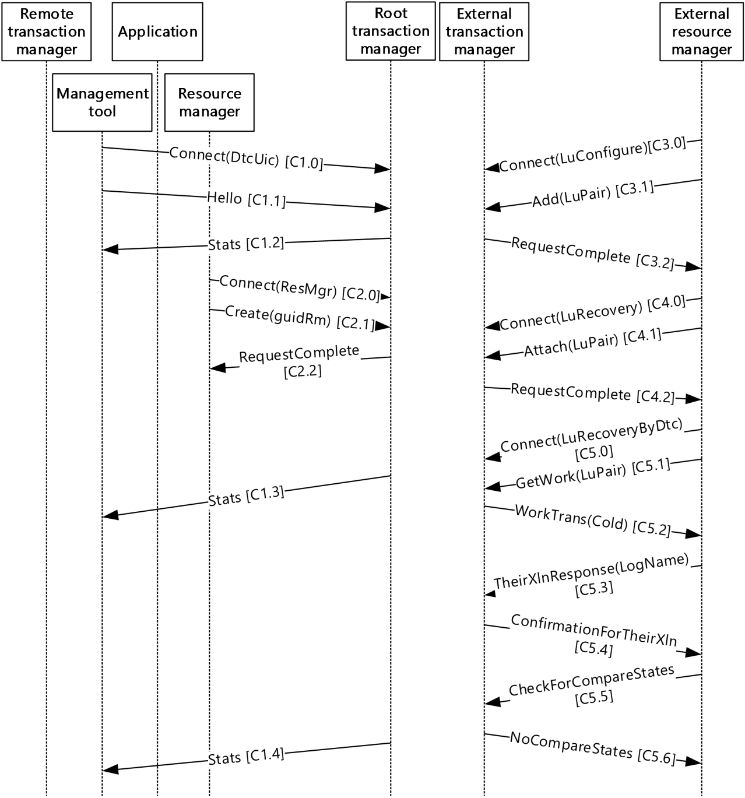
<!-- /Extracted images from page 57 -->



Precursory Message Exchange (section 3.6.1)

  Application-Driven Transactional Message Exchange (section 3.6.2)



Two-Phase Commit Transactional Message Exchange (section 3.6.3)

3.6.1  Precursory Message Exchange

The following diagram shows precursory message exchange in a distributed transaction with external
components.

[MS-TPSOD] - v20211026
Transaction Processing Services Protocols Overview
Copyright © 2021 Microsoft Corporation
Release: October 26, 2021

57 / 71

Figure 17: Precursory message exchange in a distributed transaction with external
components

The following steps describe this sequence:

1.  Connect(DtcUic) [C1.0]: The management tool initiates a CONNTYPE_TXUSER_DTCUIC

connection on an MSDTC Connection Manager: OleTx Management Protocol session with the root
transaction manager, as specified in [MS-CMOM] section 3.2.1.1.

2.  Hello [C1.1]: The management tool sends an MTAG_HELLO message to the root transaction

manager, as specified in [MS-CMOM] section 3.2.1.1.

3.  Stats [C1.2]: The root transaction manager receives the connection request. It starts a timer (if

one does not exist) and adds the management tool to its list of Management Client Role
connections. Each time the timer expires, the root transaction manager sends an
MSG_DTCUIC_STATS message to the management tool, as specified in [MS-CMOM] section
3.2.1.1. If the root transaction manager is tracking any active transactions, the root transaction
manager also sends an MSG_DTCUIC_TRANLIST message, as specified in [MS-CMOM] section
3.2.1.1. In this example, no MSG_DTCUIC_TRANLIST message is sent. The management tool
continues to receive these messages from the root transaction manager until it closes the
connection by initiating the disconnect sequence [C1.3; C1.4].

4.  Connect (ResMgr) [C2.0]: The resource manager initiates a

CONNTYPE_TXUSER_RESOURCEMANAGER connection on a DTCO session, as specified in [MS-
DTCO] section 4.4.1, with the root transaction manager.

5.  Create(guidRm) [C2.1]: The resource manager sends a

TXUSER_RESOURCEMANAGER_MTAG_CREATE message specifying a GUID that uniquely
identifies the resource manager (guidRm) to the root transaction manager, as specified in [MS-
DTCO] section 4.4.1.

6.  RequestComplete [C2.2]: The root transaction manager adds the resource manager to its list of

registered resource managers and sends a
TXUSER_RESOURCEMANAGER_MTAG_REQUEST_COMPLETE message to the resource
manager protocol, as specified in [MS-DTCO] section 4.4.1. The resource manager continues to
maintain this connection to enable the creation of new enlistments in transactions and its
participation in two-phase commit processing.

7.  Connect(LuConfigure) [C3.0]: The external resource manager initiates a

CONNTYPE_TXUSER_DTCLUCONFIGURE connection on a DTCLU session with the external
transaction manager, as specified in [MS-DTCLU] section 4.1.1.

8.  Add(LuPair) [C3.1]: The external resource manager sends a

TXUSER_DTCLURMCONFIGURE_MTAG_ADD message specifying the LU name pair (LuPair) to
the external transaction manager, as specified in [MS-DTCLU] section 4.1.1.

9.  RequestComplete [C3.2]: The external transaction manager adds the LU name pair to its table of
LU name pairs and sends a TXUSER_DTCLURMCONFIGURE_MTAG_REQUEST_COMPLETED
message to the external resource manager, as specified in [MS-DTCLU] section 4.1.1. When the
external resource manager receives the
TXUSER_DTCLURMCONFIGURE_MTAG_REQUEST_COMPLETED response from the external
transaction manager, the external resource manager initiates the disconnect sequence.

10. Connect(LuRecovery) [C4.0]: The external resource manager initiates a

CONNTYPE_TXUSER_DTCLURECOVERY connection on a DTCLU session with the external
transaction manager, as specified in [MS-DTCLU] section 4.2.1.

11. Attach(LuPair) [C4.1]: The external resource manager sends a

TXUSER_DTCLURMRECOVERY_MTAG_ATTACH message to the external transaction manager

58 / 71

[MS-TPSOD] - v20211026
Transaction Processing Services Protocols Overview
Copyright © 2021 Microsoft Corporation
Release: October 26, 2021

specifying an LuPair which was previously configured with the external transaction manager, as
specified in [MS-DTCLU] section 4.2.1.

12. RequestComplete [C4.2]: The external transaction manager registers the connection's CMPO

session, as specified in [MS-CMPO], for all Recovery Processing associated with the LU name pair
and sends a TXUSER_DTCLURMRECOVERY_MTAG_REQUEST_COMPLETED message to the
external resource manager, as specified in [MS-DTCLU] section 4.2.1. The external resource
manager continues to maintain the connection to enable recovery processes to be initiated and to
enable the creation of new enlistments in the transactional work associated with the LU name pair.

13. Connect(LuRecoveryByDtc) [C5.0]: The external resource manager initiates a

CONNTYPE_TXUSER_DTCLURECOVERYINITIATEDBYDTC connection a DTCLU session with
the external transaction manager, as specified in [MS-DTCLU] section 4.3.1.

14. GetWork (LuPair) [C5.1]: The external resource manager sends a

TXUSER_DTCLURECOVERYINITIATEDBYDTC_MTAG_GETWORK message to the external
transaction manager specifying the LuPair for which the external resource manager registered as
the recovery process, as specified in [MS-DTCLU] section 4.3.1.

15. WorkTrans (Cold) [C5.2]: The external transaction manager determines that it has to perform a

cold recovery (Cold) for the LU name pair and sends a
TXUSER_DTCLURECOVERYINITIATEDBYDTC_MTAG_WORK_TRANS message to the external
resource manager, as specified in [MS-DTCLU] section 4.3.1.

16. TheirXlnResponse (LogName) [C5.3]: The external resource manager exchanges log names with

the remote LU and sends a
TXUSER_DTCLURECOVERYINITIATEDBYDTC_MTAG_THEIR_XLN_RESPONSE message
specifying the remote LU log name (LogName) to the external transaction manager, as specified in
[MS-DTCLU] section 4.3.1.

17. ConfirmationForTheirXln [C5.4]: The external transaction manager verifies that the reported state

of the remote LU is consistent with the external transaction manager's state and sends a
TXUSER_DTCLURECOVERYINITIATEDBYDTC_MTAG_CONFIRMATION_FOR_THEIR_XLN
message to the external resource manager, as specified in [MS-DTCLU] section 4.3.1.

18. CheckForCompareStates [C5.5]: The external resource manager sends a

TXUSER_DTCLURECOVERYINITIATEDBYDTC_MTAG_CHECK_FOR_COMPARESTATES
message to the external transaction manager to query whether recovery work is required for any
LU 6.2 transactional work involving the LU name pair, as specified in [MS-DTCLU] section 4.3.1.

19. NoCompareStates [C5.6]: The external transaction manager checks the local and remote

transactional state and sends a
TXUSER_DTCLURECOVERYINITIATEDBYDTC_MTAG_NO_COMPARESTATES message to the
external resource manager, as specified in [MS-DTCLU] section 4.3.1. When the external resource
manager has received the
TXUSER_DTCLURECOVERYINITIATEDBYDTC_MTAG_NO_COMPARESTATES message, no
further messages are sent using this connection and the external resource manager initiates the
disconnect sequence.

[MS-TPSOD] - v20211026
Transaction Processing Services Protocols Overview
Copyright © 2021 Microsoft Corporation
Release: October 26, 2021

59 / 71

<!-- Extracted images from page 60 -->
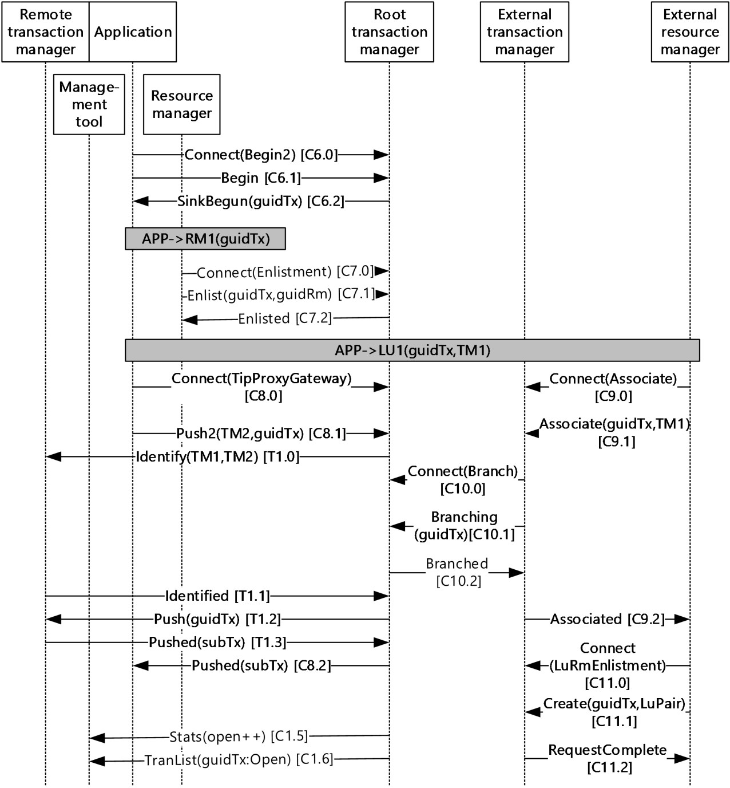
<!-- /Extracted images from page 60 -->

3.6.2  Application-Driven Transactional Message Exchange

Figure 18: Transactional message exchange before a two-phase commit in a distributed
transaction

The following steps describe this sequence:

1.  Connect(Begin2) [C6.0]: The application initiates a CONNTYPE_TXUSER_BEGIN2 connection on

a DTCO session with the root transaction manager, as specified in [MS-DTCO] section 4.1.1.

[MS-TPSOD] - v20211026
Transaction Processing Services Protocols Overview
Copyright © 2021 Microsoft Corporation
Release: October 26, 2021

60 / 71

2.  Begin [C6.1]: The application sends a TXUSER_BEGIN2_MTAG_BEGIN message to the root

transaction manager specifying the isolation level, timeout, transaction description, and isolation
flag, as specified in [MS-DTCO] section 4.1.1.

3.  SinkBegun(guidTx) [C6.2]: The root transaction manager creates a transaction object with a
globally unique identifier (guidTx), sends a TXUSER_BEGIN2_MTAG_SINK_BEGUN
message to the application, and adds the transaction to its list of known transaction objects (as
specified in [MS-DTCO] section 4.1.1). When the application receives the
TXUSER_BEGIN2_MTAG_BEGUN message from the root transaction manager, the transaction
(guidTx) has begun. The application is now free to propagate this transaction to transaction
managers, resource managers, and application services to perform work as part of the
transaction, as long as it maintains the CONNTYPE_TXUSER_BEGIN2 connection. Eventually,
the application determines whether to commit or abort the transaction. If the application
disconnects the connection before committing or aborting the transaction, then the root
transaction manager will abort the transaction.

4.  Connect(Enlistment) [C7.0]: The resource manager initiates a

CONNTYPE_TXUSER_ENLISTMENT connection on a DTCO session with the root transaction
manager, as specified in [MS-DTCO] section 4.4.2).

5.  Enlist(guidTx, guidRm) [C7.1]: The resource manager sends a

TXUSER_ENLISTMENT_MTAG_ENLIST message to the root transaction manager specifying the
transaction GUID (guidTx), and the GUID that uniquely identifies itself (guidRm), as specified in
[MS-DTCO] section 4.4.2.

6.  Enlisted [C7.2]: The root transaction manager enlists the resource manager in the requested

transaction, adds the resource manager to its list of subordinates for the transaction, and sends a
TXUSER_ENLISTMENT_MTAG_ENLISTED message to the resource manager, as specified in
[MS-DTCO] section 4.4.2. The resource manager continues to maintain the connection and waits
for two-phase commit notifications from the root transaction manager.

7.  Connect(TipProxyGateway) [C8.0]: The application initiates a

CONNTYPE_TXUSER_TIPPROXYGATEWAY connection on an MSDTC Connection Manager:
OleTx Transaction Internet Protocol session with the root transaction manager, as specified in
[MS-DTCM] section 4.1.1.

8.  Push2(guidTx,TM2) [C8.1]: The application sends a

TXUSER_TIPPROXYGATEWAY_MTAG_PUSH user message, as specified in [MS-DTCM] section
2.2.5.1.3.6, or a TXUSER_TIPPROXYGATEWAY_MTAG_PUSH2 user message, as specified in
[MS-DTCM] section 2.2.5.1.3.7, specifying the transaction GUID (guidTx), and the Transaction
Internet Protocol (TIP) URL of the remote transaction manager.

9.  Identify(TM1,TM2) [T1.0]: The root transaction manager locates the transaction and creates a
new TIP connection with the remote transaction manager in the INITIAL state. The root
transaction manager uses the TIP URL specified in the message to create the TIP connection over
the TCP transport session established with the remote transaction manager and sends an
IDENTIFY command to the remote transaction manager specifying the root transaction
manager's primary transaction manager address and the remote transaction manager's secondary
transaction manager address, as specified in [MS-TIPP] section 4.1.1.

10. Identified [T1.1]: When the remote transaction manager receives the IDENTIFY command, the
remote transaction manager sends an IDENTIFIED command to the root transaction manager
and the state of the TIP connection is changed to IDLE, as specified in [MS-TIPP] section 4.1.1.

11. Push(guidTx) [T1.2]: When the root transaction manager receives the IDENTIFIED command,
the root transaction manager sends a PUSH command to the remote transaction manager
specifying the primary's transaction identifier (guidTx), as specified in [MS-TIPP] section 4.1.2.2.

12. Pushed(subTx) [T1.3]: When the remote transaction manager receives the PUSH command, the
remote transaction manager adds the transaction to its list of transaction objects with a newly

61 / 71

[MS-TPSOD] - v20211026
Transaction Processing Services Protocols Overview
Copyright © 2021 Microsoft Corporation
Release: October 26, 2021

created transaction identifier (subTx), sends a PUSHED command to the root transaction
manager, and the state of the TIP connection changes to ENLISTED, as specified in [MS-TIPP]
section 4.1.2.2.

13. Pushed(subTx) [C8.2]: When the root transaction manager receives the PUSHED command, the
root transaction manager sends a TXUSER_TIPPROXYGATEWAY_MTAG_PUSHED message to
the application specifying the remote transaction manager 's transaction identifier (subTx), as
specified in [MS-DTCM] section 4.2.3. When the application receives the
TXUSER_TIPPROXYGATEWAY_MTAG_PUSHED message, the application initiates the
disconnect sequence on the CONNTYPE_TXUSER_TIPPROXYGATEWAY connection.

14. Connect(Associate) [C9.0]: The external resource manager initiates a

CONNTYPE_TXUSER_ASSOCIATE connection on a DTCO session with the external transaction
manager, as specified in [MS-DTCO] section 4.2.2.

15. Associate(guidTx,TM1) [C9.1]: The external resource manager sends a

TXUSER_ASSOCIATE_MTAG_ASSOCIATE message to the external transaction manager
specifying the transaction identifier (guidTx) and sufficient information (the root transaction
manager's machine name and endpoint GUID) to establish a DTCO session with the root
transaction manager, as specified in [MS-DTCO] section 4.2.2.

16. Connect(Branch) [C10.0]: The external transaction manager attempts to locate the transaction in
its list of transaction objects by using the transaction identifier (guidTx). Because the transaction
object is not located, the external transaction manager attempts to pull the transaction from the
root transaction manager by using information contained in the message, and therefore the
external transaction manager initiates a CONNTYPE_PARTNERTM_BRANCH connection on a
DTCO session with the root transaction manager, as specified in [MS-DTCO] section 4.2.3.

17. Branching(guidTx) [C10.1]: The external transaction manager sends a

PARTNERTM_BRANCH_MTAG_BRANCHING message with the transaction identifier (guidTx)
of the requested transaction to the root transaction manager, as specified in [MS-DTCO] section
4.2.3.

18. Branched [C10.2]: The root transaction manager creates a subordinate branch and sends a

PARTNERTM_BRANCH_MTAG_BRANCHED message to the external transaction manager, as
specified in [MS-DTCO] section 4.2.3.

19. Associated [C9.2]: The external transaction manager keeps the connection open to process two-

phase commit notifications from the root transaction manager and sends a
TXUSER_ASSOCIATE_MTAG_ASSOCIATED message to the external resource manager on the
CONNTYPE_TXUSER_ASSOCIATE connection to inform the external resource manager that the
pull operation was successful, as specified in [MS-DTCO] section 4.2.2. The external transaction
manager continues to maintain the CONNTYPE_PARTNERTM_BRANCH connection with the root
transaction manager and waits for two-phase commit processing. When the external resource
manager receives the TXUSER_ASSOCIATE_MTAG_ASSOCIATED message, the external
resource manager initiates the disconnect sequence on the CONNTYPE_TXUSER_ASSOCIATE
connection.

20. Connect(LuRmEnlistment) [C11.0]: The external resource manager initiates a

CONNTYPE_TXUSER_DTCLURMENLISTMENT connection on a DTCLU session with the external
transaction manager, as specified in [MS-DTCLU] section 4.4.1.

21. Create(guidTx,LuPair) [C11.1]: The external resource manager sends a

TXUSER_DTCLURMENLISTMENT_MTAG_CREATE message to the external transaction
manager specifying the transaction identifier (guidTx) and the LU Name Pair (LuPair), as
specified in [MS-DTCLU] section 4.4.1.

22. RequestComplete [C11.2]: The external transaction manager creates an LU enlistment on the
transaction and sends a TXUSER_DTCLURMENLISTMENT_MTAG_REQUEST_COMPLETED
message to the external resource manager, as specified in [MS-DTCLU] section 4.4.1. When the

62 / 71

[MS-TPSOD] - v20211026
Transaction Processing Services Protocols Overview
Copyright © 2021 Microsoft Corporation
Release: October 26, 2021

external resource manager receives the
TXUSER_DTCLURMENLISTMENT_MTAG_REQUEST_COMPLETED message, the external
resource manager continues to maintain the connection and waits for two-phase commit
processing.

23. Stats(open++) [C1.5]: Because the transaction (guidTx) is active but not yet committing or
aborting, the root transaction manager sends an MSG_DTCUIC_STATS message to the
management tool with the number of open transactions incremented by one (open++), as
specified in [MS-CMOM] section 3.2.1.1.

24. TranList(guidTx:Open) [C1.6]: The root transaction manager sends an MSG_DTCUIC_TRANLIST

message to the management tool listing the transaction (guidTx) in the open state
(XACTSACT_OPEN), as specified in [MS-CMOM] section 3.2.1.1.

3.6.3  Two-Phase Commit Transactional Message Exchange

The following diagram shows two-phase commit protocol message exchange in a distributed
transaction.

[MS-TPSOD] - v20211026
Transaction Processing Services Protocols Overview
Copyright © 2021 Microsoft Corporation
Release: October 26, 2021

63 / 71

<!-- Extracted images from page 64 -->
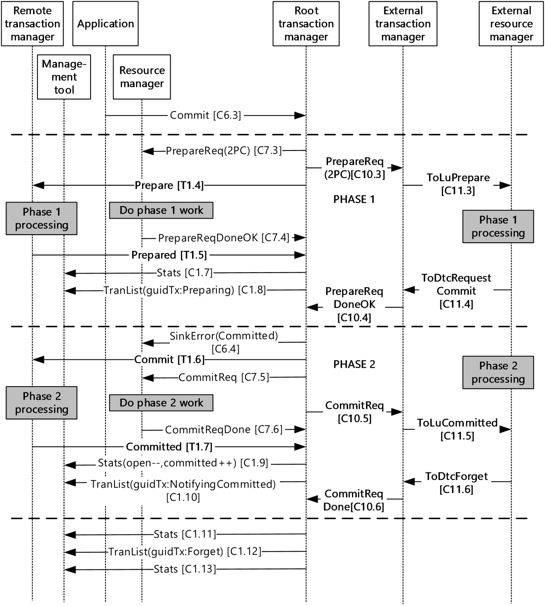
<!-- /Extracted images from page 64 -->

Figure 19: Two-phase commit protocol message exchange in a distributed transaction

The following steps describe this sequence:

1.  Commit [C6.3]: The application sends a TXUSER_BEGIN2_MTAG_COMMIT message to the root

transaction manager over its existing CONNTYPE_TXUSER_BEGIN2 connection, as specified in
[MS-DTCO] section 4.5.1. The application maintains the connection and waits for the outcome of
the transaction to the root transaction manager.

2.  PrepareReq (2PC) [C7.3]: The root transaction manager sends a

TXUSER_ENLISTMENT_MTAG_PREPAREREQ message to the resource manager over the

64 / 71

[MS-TPSOD] - v20211026
Transaction Processing Services Protocols Overview
Copyright © 2021 Microsoft Corporation
Release: October 26, 2021

CONNTYPE_TXUSER_ENLISTMENT connection, indicating that this is a two-phase commit
(2PC), as specified in [MS-DTCO] section 4.5.1.1.

3.  Prepare [T1.4]: The root transaction manager sends a PREPARE command over the Transaction
Internet Protocol (TIP) connection associated with the transaction to the remote transaction
manager, as specified in [MS-TIPP] section 4.1.3.1.1.

4.  PrepareReqDoneOK [C7.4]: When the resource manager has successfully completed its Phase

One work, it sends a TXUSER_ENLISTMENT_MTAG_PREPAREREQDONE message to the root
transaction manager indicating TXUSER_ENLISTMENT_PREPAREREQDONE_OK, as specified in
[MS-DTCO] section 4.5.1.1. The resource manager maintains the connection and waits for the
transaction outcome from the root transaction manager.

5.  Prepared [T1.5]: When the remote transaction manager has successfully completed its Phase One

processing, it sends a PREPARED command to the root transaction manager over the TIP
connection, as specified in [MS-TIPP] section 4.1.3.1.2. The state of the TIP connection is now
PREPARED, and the remote transaction manager waits for the transaction outcome from the root
transaction manager.

6.  PrepareReq (2PC) [C10.3]: The root transaction manager sends a

PARTNERTM_PROPAGATE_MTAG_PREPAREREQ message to the external transaction manager
over the CONNTYPE_PARTNERTM_BRANCH connection, indicating that this is a two-phase
commit (2PC), as specified in [MS-DTCO] section 4.5.1.2.

7.  ToLuPrepare [C11.3]: The external transaction manager iterates through each of its subordinate

branches to send out Phase One notifications and sends a
TXUSER_DTCLURMENLISTMENT_MTAG_TO_LU_PREPARE message to the external resource
manager over the CONNTYPE_TXUSER_DTCLURMENLISTMENT connection, as specified in
[MS-DTCLU] section 4.4.2.

8.  ToDtcRequestCommit [C11.4]: The external resource manager completes its Phase One work,

sends a TXUSER_DTCLURMENLISTMENT_MTAG_TO_DTC_REQUESTCOMMIT message to the
external transaction manager, and waits for the transaction outcome from the external transaction
manager, as specified in [MS-DTCO] section 4.4.2.

9.  PrepareReqDoneOK [C10.4]: The external transaction manager sends a

PARTNERTM_PROPAGATE_MTAG_PREPAREREQDONE message to the root transaction
manager, as specified in [MS-DTCLU] section 4.5.1.2. The external transaction manager maintains
the connection and waits for the transaction outcome from the root transaction manager.

10. Stats [C1.7]: Because the transaction's outcome is not yet known, the root transaction manager
sends a MSG_DTCUIC_STATS message to the management tool with no changes from its
previous message [T1.5] related to this transaction, as specified in [MS-CMOM] section 3.2.1.1.

11. TranList (guidTx:Preparing) [C1.8]: The root transaction manager sends a

MSG_DTCUIC_TRANLIST message to the management tool, listing the transaction (guidTx) in
the preparing state (XACTSACT_PREPARING), as specified in [MS-CMOM] section 3.2.1.1.

12. SinkError(Committed) [C6.4]: The root transaction manager sends a

TXUSER_BEGIN2_MTAG_SINK_ERROR message to the application over the
CONNTYPE_TXUSER_BEGIN2 connection, specifying that the transaction has been committed
(TRUN_TXBEGIN_ERROR_NOTIFY_COMMITTED), as specified in [MS-DTCO] section 4.5.1.3. When
the application receives the TXUSER_BEGIN2_MTAG_SINK_ERROR message, it initiates the
disconnect sequence.

13. Commit [T1.6]: The root transaction manager sends a COMMIT command over the TIP

connection associated with the transaction to the remote transaction manager, as specified in
[MS-TIPP] section 4.1.3.1.4.

[MS-TPSOD] - v20211026
Transaction Processing Services Protocols Overview
Copyright © 2021 Microsoft Corporation
Release: October 26, 2021

65 / 71

14. CommitReq [C7.5]: The root transaction manager sends a

TXUSER_ENLISTMENT_MTAG_COMMITREQ message to the resource manager over the
CONNTYPE_TXUSER_ENLISTMENT connection, as specified in [MS-DTCO] section 4.5.2.1.

15. CommitReqDone [C7.6]: When the resource manager has completed its commit work, it sends a
TXUSER_ENLISTMENT_MTAG_COMMITREQDONE message to the root transaction manager
and initiates the disconnect sequence on the CONNTYPE_TXUSER_ENLISTMENT connection
with the root transaction manager, as specified in [MS-DTCO] section 4.5.2.1.

16. Committed [T1.7]: When the remote transaction manager has successfully completed its Phase

Two processing, it sends a COMMITTED command to the root transaction manager over the TIP
connection, as specified in [MS-TIPP] section 4.1.3.1.4.

17. CommitReq [C10.5]: The root transaction manager sends a

PARTNERTM_PROPAGATE_MTAG_COMMITREQ message to the remote transaction manager
over the CONNTYPE_PARTNERTM_BRANCH connection, as specified in [MS-DTCO] section
4.5.2.2.

18. ToLuCommitted [C11.5]: When the external transaction manager receives the

PARTNERTM_PROPAGATE_MTAG_COMMITREQ message, it iterates through each of its
subordinate branches to send out commit notifications and sends a
TXUSER_DTCLURMENLISTMENT_MTAG_TO_LU_COMMITTED message to the external
resource manager over the CONNTYPE_TXUSER_DTCLURMENLISTMENT connection, as
specified in [MS-DTCLU] section 4.4.2.

19. ToDtcForget [C11.6]: When the external resource manager receives the

TXUSER_DTCLURMENLISTMENT_MTAG_TO_LU_COMMITTED message, it completes its
Phase-Two processing, sends a TXUSER_DTCLURMENLISTMENT_MTAG_TO_DTC_FORGET
message to the external transaction manager, and initiates the disconnect sequence, as specified
in [MS-DTCLU] section 4.4.2.

20. CommitReqDone [C10.6]: When the external transaction manager receives the

TXUSER_DTCLURMENLISTMENT_MTAG_TO_DTC_FORGET message, it sends a
PARTNERTM_PROPAGATE_MTAG_COMMITREQDONE user message to the root transaction
manager and initiates the disconnect sequence, as specified in [MS-DTCO] section 4.5.2.2.

21. Stats(open--,committed++) [C1.9]: Because the transaction is now committed, the root

transaction manager sends a MSG_DTCUIC_STATS message to the management tool, as
specified in [MS-CMOM] section 3.2.1.1, with the number of open transactions decremented by
one (open--) and the number of committed transactions incremented by one (committed++).

22. TranList(guidTx:NotifyingCommitted) [C1.10]: The root transaction manager sends a

MSG_DTCUIC_TRANLIST message to the management tool, as specified in [MS-CMOM] section
3.2.1.1, listing the transaction (guidTx) in the notifying committed state
(XACTSACT_NOTIFYING_COMMITTED).

23. Stats [C1.11]: The root transaction manager sends an MSG_DTCUIC_STATS message to the

management tool, as specified in [MS-CMOM] section 3.2.1.1, with no changes from its previous
message [C1.9] related to this transaction.

24. TranList(guidTx:Forget) [C1.12]: The root transaction manager sends an

MSG_DTCUIC_TRANLIST message to the management tool, as specified in [MS-CMOM] section
3.2.1.1, listing the transaction (guidTx) in the forget state (XACTSACT_FORGET). Any future
MSG_DTCUIC_TRANLIST messages do not include this transaction.

25. Stats [C1.13]: The root transaction manager sends an MSG_DTCUIC_STATS message to the

management tool, as specified in [MS-CMOM] section 3.2.1.1, with no changes from its previous
message [C1.11] related to this transaction. Because there are no active transactions that the root
transaction manager is tracking, no MSG_DTCUIC_TRANLIST message is sent.

66 / 71

[MS-TPSOD] - v20211026
Transaction Processing Services Protocols Overview
Copyright © 2021 Microsoft Corporation
Release: October 26, 2021

Note  The sequence of the messages in this example might not always be the same. It can vary
slightly.

[MS-TPSOD] - v20211026
Transaction Processing Services Protocols Overview
Copyright © 2021 Microsoft Corporation
Release: October 26, 2021

67 / 71

4  Microsoft Implementations

The information in this specification is applicable to the following Microsoft products or supplemental
software. References to product versions include released service packs:

  Windows 2000 operating system

  Windows XP operating system

  Windows Server 2003 operating system

  Windows Server 2003 R2 operating system

  Windows Vista operating system

  Windows Server 2008 operating system

  Windows 7 operating system

  Windows Server 2008 R2 operating system

  Windows 8 operating system

  Windows Server 2012 operating system

  Windows 8.1 operating system

  Windows Server 2012 R2 operating system

  Windows 10 operating system

  Windows Server 2016 operating system

  Windows Server operating system

  Windows Server 2019 operating system

  Windows Server 2022 operating system

  Windows 11 operating system

4.1  Product Behavior

None.

[MS-TPSOD] - v20211026
Transaction Processing Services Protocols Overview
Copyright © 2021 Microsoft Corporation
Release: October 26, 2021

68 / 71

5  Change Tracking

This section identifies changes that were made to this document since the last release. Changes are
classified as Major, Minor, or None.

The revision class Major means that the technical content in the document was significantly revised.
Major changes affect protocol interoperability or implementation. Examples of major changes are:

  A document revision that incorporates changes to interoperability requirements.
  A document revision that captures changes to protocol functionality.

The revision class Minor means that the meaning of the technical content was clarified. Minor changes
do not affect protocol interoperability or implementation. Examples of minor changes are updates to
clarify ambiguity at the sentence, paragraph, or table level.

The revision class None means that no new technical changes were introduced. Minor editorial and
formatting changes may have been made, but the relevant technical content is identical to the last
released version.

The changes made to this document are listed in the following table. For more information, please
contact dochelp@microsoft.com.

Section

Description

Revision class

4 Microsoft Implementations  Added Windows 11 to the list of applicable products.  Major

[MS-TPSOD] - v20211026
Transaction Processing Services Protocols Overview
Copyright © 2021 Microsoft Corporation
Release: October 26, 2021

69 / 71

6  Index
A

Additional considerations 42
Applicable protocols 20
Architecture 13
Assumptions 24

C

Capability negotiation 37
Change tracking 69
Coherency requirement 38
Coherency requirements 38
Communications 23
   with other systems 23
   within the system 23
Complete a transaction – application
   overview 27
Component dependencies 23
Concepts 13
Conceptual overview 5
Considerations
   additional 42
   security 39

D

Dependencies
   with other systems 23
   within the system 23
Design intent
   complete a transaction – application 27
   perform transaction work – application 24
   recover in-doubt transaction state – resource

manager 29

Functional architecture 13

G

Glossary 8

H

Handling requirements 37

I

Implementations - Microsoft 68
Implementer - security considerations 39
Informative references 11
Initial state 24
Introduction 5

M

Microsoft implementations 68

O

Overview
   summary of protocols 20
Overview (synopsis) (section 1.1 5, section 2.1 13)

P

Perform transaction work – application
   overview 24
Preconditions 24
Product behavior 68

   transaction management – management tool 28
   transaction recovery - remote transaction manager

R

31

E

Environment 23
Error handling 37
Examples
   how a transaction is aborted 48
   how a transaction is committed 46
   how a transaction is completed and committed

with external components 56

   how a transaction is recovered when a remote

transaction manager breaks down 50

   how the resource manager drives recovery 53
   how to perform a transaction that involves two

transaction managers 43

Extensibility
   Microsoft implementations 68
   overview 37
Extensibility - overview 37
External dependencies 23

F

[MS-TPSOD] - v20211026
Transaction Processing Services Protocols Overview
Copyright © 2021 Microsoft Corporation
Release: October 26, 2021

Recover in-doubt transaction state – resource

manager
   overview 29
References 11
Requirements
   coherency 38
   error handling 37
   preconditions 24

S

Security considerations 39
System architecture 13
System dependencies 23
   with other systems 23
   within the system 23
System errors 37
System overview - introduction 5
System protocols 20
System use cases
   complete a transaction – application 27
   perform transaction work – application 24
   recover in-doubt transaction state – resource

manager 29

70 / 71

   transaction management – management tool 28
   transaction recovery - remote transaction manager

31

T

Table of protocols 20
Tracking changes 69
Transaction management – management tool
   overview 28
Transaction recovery - remote transaction manager
   overview 31

U

Use cases
   complete a transaction 27
   complete a transaction – application 27
   perform transaction work – application 24
   perform transactional work 24
   recover in-doubt transaction state – resource

manager 29

   transaction management 28
   transaction management – management tool 28
   transaction recovery - remote transaction manager

31

   transaction recovery by a remote manager 31
   transaction recovery by a resource manager 29

V

Versioning
   Microsoft implementations 68
   overview 37

[MS-TPSOD] - v20211026
Transaction Processing Services Protocols Overview
Copyright © 2021 Microsoft Corporation
Release: October 26, 2021

71 / 71

