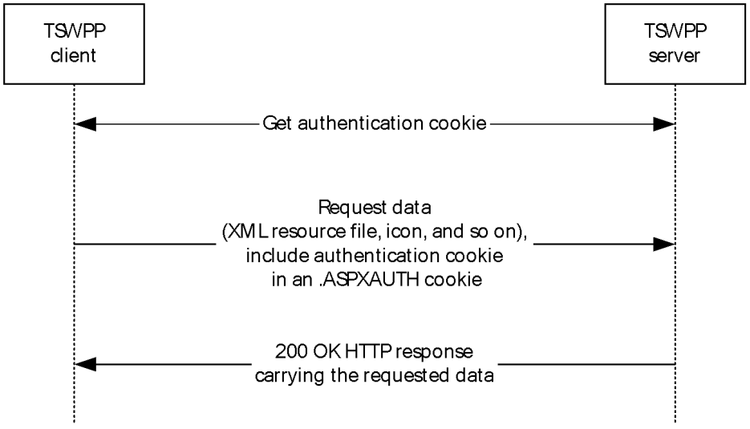
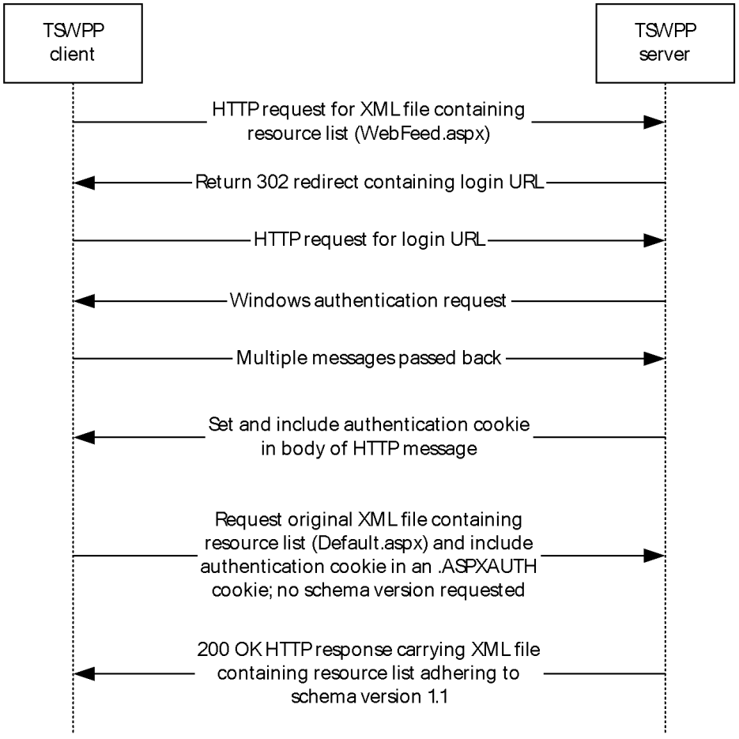
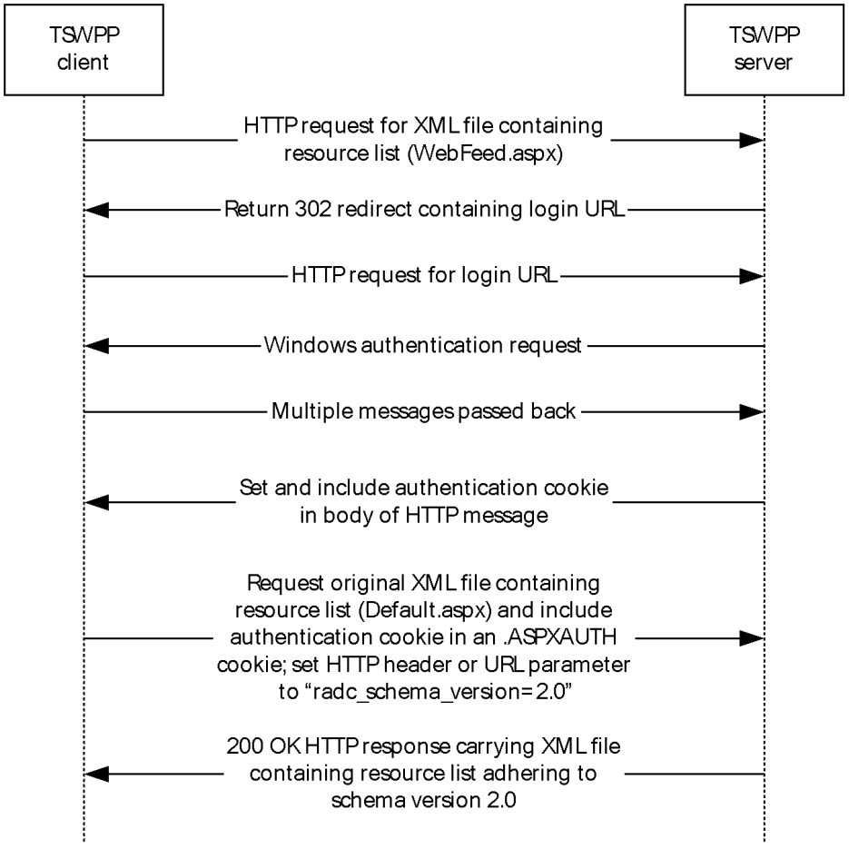
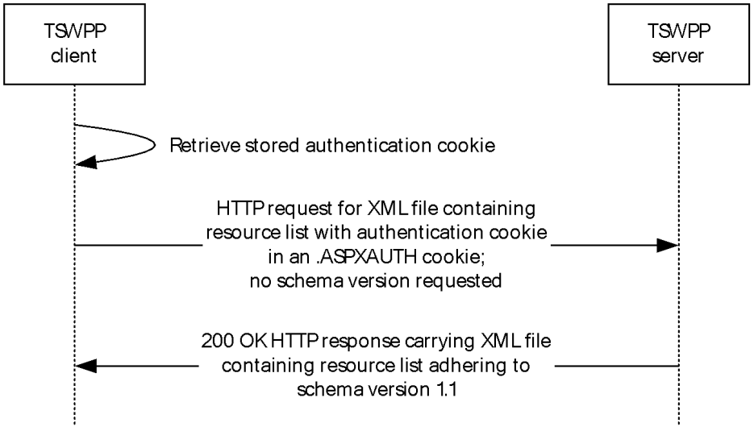
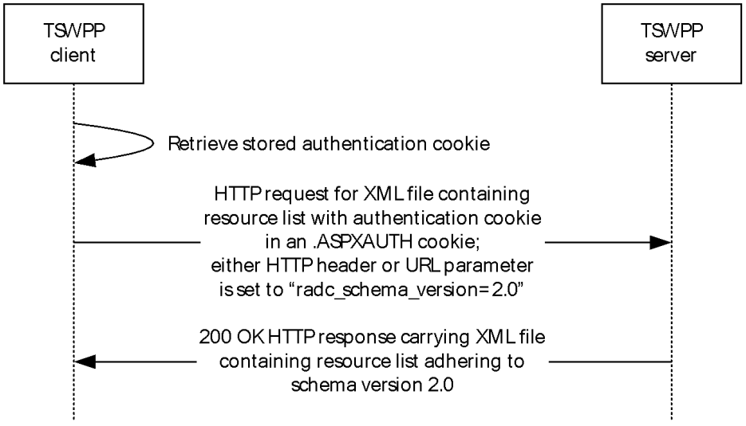
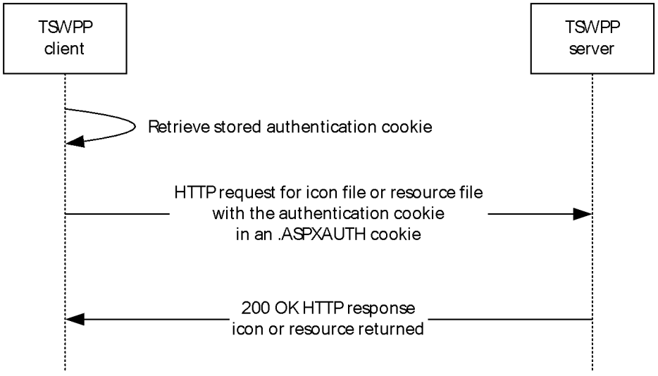

[MS-TSWP]:

Terminal Services Workspace Provisioning Protocol

Intellectual Property Rights Notice for Open Specifications Documentation

  Technical Documentation. Microsoft publishes Open Specifications documentation (“this

documentation”) for protocols, file formats, data portability, computer languages, and standards
support. Additionally, overview documents cover inter-protocol relationships and interactions.

  Copyrights. This documentation is covered by Microsoft copyrights. Regardless of any other

terms that are contained in the terms of use for the Microsoft website that hosts this
documentation, you can make copies of it in order to develop implementations of the technologies
that are described in this documentation and can distribute portions of it in your implementations
that use these technologies or in your documentation as necessary to properly document the
implementation. You can also distribute in your implementation, with or without modification, any
schemas, IDLs, or code samples that are included in the documentation. This permission also
applies to any documents that are referenced in the Open Specifications documentation.
  No Trade Secrets. Microsoft does not claim any trade secret rights in this documentation.
  Patents. Microsoft has patents that might cover your implementations of the technologies

described in the Open Specifications documentation. Neither this notice nor Microsoft's delivery of
this documentation grants any licenses under those patents or any other Microsoft patents.
However, a given Open Specifications document might be covered by the Microsoft Open
Specifications Promise or the Microsoft Community Promise. If you would prefer a written license,
or if the technologies described in this documentation are not covered by the Open Specifications
Promise or Community Promise, as applicable, patent licenses are available by contacting
iplg@microsoft.com.

  License Programs. To see all of the protocols in scope under a specific license program and the

associated patents, visit the Patent Map.

  Trademarks. The names of companies and products contained in this documentation might be
covered by trademarks or similar intellectual property rights. This notice does not grant any
licenses under those rights. For a list of Microsoft trademarks, visit
www.microsoft.com/trademarks.

  Fictitious Names. The example companies, organizations, products, domain names, email

addresses, logos, people, places, and events that are depicted in this documentation are fictitious.
No association with any real company, organization, product, domain name, email address, logo,
person, place, or event is intended or should be inferred.

Reservation of Rights. All other rights are reserved, and this notice does not grant any rights other
than as specifically described above, whether by implication, estoppel, or otherwise.

Tools. The Open Specifications documentation does not require the use of Microsoft programming
tools or programming environments in order for you to develop an implementation. If you have access
to Microsoft programming tools and environments, you are free to take advantage of them. Certain
Open Specifications documents are intended for use in conjunction with publicly available standards
specifications and network programming art and, as such, assume that the reader either is familiar
with the aforementioned material or has immediate access to it.

Support. For questions and support, please contact dochelp@microsoft.com.

[MS-TSWP] - v20240423
Terminal Services Workspace Provisioning Protocol
Copyright © 2024 Microsoft Corporation
Release: April 23, 2024

1 / 53

Revision Summary

Date

Revision
History

Revision
Class

12/5/2008

0.1

1/16/2009

0.2

Major

Minor

Comments

Initial Availability

Clarified the meaning of the technical content.

2/27/2009

0.2.1

Editorial

Changed language and formatting in the technical content.

4/10/2009

1.0

Major

Updated and revised the technical content.

5/22/2009

1.0.1

Editorial

Changed language and formatting in the technical content.

7/2/2009

2.0

Major

Updated and revised the technical content.

8/14/2009

2.0.1

Editorial

Changed language and formatting in the technical content.

9/25/2009

2.1

11/6/2009

2.2

12/18/2009  3.0

1/29/2010

3.1

3/12/2010

4.0

4/23/2010

5.0

6/4/2010

6.0

7/16/2010

6.0

8/27/2010

6.0

10/8/2010

6.0

Minor

Minor

Major

Minor

Major

Major

Major

None

None

None

Clarified the meaning of the technical content.

Clarified the meaning of the technical content.

Updated and revised the technical content.

Clarified the meaning of the technical content.

Updated and revised the technical content.

Updated and revised the technical content.

Updated and revised the technical content.

No changes to the meaning, language, or formatting of the
technical content.

No changes to the meaning, language, or formatting of the
technical content.

No changes to the meaning, language, or formatting of the
technical content.

11/19/2010  7.0

Major

Updated and revised the technical content.

1/7/2011

7.0

2/11/2011

7.0

None

None

No changes to the meaning, language, or formatting of the
technical content.

No changes to the meaning, language, or formatting of the
technical content.

3/25/2011

8.0

Major

Updated and revised the technical content.

5/6/2011

8.0

None

No changes to the meaning, language, or formatting of the
technical content.

6/17/2011

8.1

Minor

Clarified the meaning of the technical content.

9/23/2011

8.1

None

No changes to the meaning, language, or formatting of the
technical content.

12/16/2011  9.0

Major

Updated and revised the technical content.

3/30/2012

9.0

None

No changes to the meaning, language, or formatting of the
technical content.

[MS-TSWP] - v20240423
Terminal Services Workspace Provisioning Protocol
Copyright © 2024 Microsoft Corporation
Release: April 23, 2024

2 / 53

Date

Revision
History

Revision
Class

Comments

7/12/2012

9.0

None

No changes to the meaning, language, or formatting of the
technical content.

10/25/2012  9.1

Minor

Clarified the meaning of the technical content.

1/31/2013

9.1

8/8/2013

10.0

11/14/2013  11.0

2/13/2014

11.0

None

Major

Major

None

No changes to the meaning, language, or formatting of the
technical content.

Updated and revised the technical content.

Updated and revised the technical content.

No changes to the meaning, language, or formatting of the
technical content.

5/15/2014

11.0

None

No changes to the meaning, language, or formatting of the
technical content.

6/30/2015

11.0

None

No changes to the meaning, language, or formatting of the
technical content.

10/16/2015  11.0

None

No changes to the meaning, language, or formatting of the
technical content.

7/14/2016

11.0

None

No changes to the meaning, language, or formatting of the
technical content.

6/1/2017

11.0

9/15/2017

12.0

9/12/2018

13.0

4/7/2021

14.0

6/25/2021

15.0

4/23/2024

16.0

None

Major

Major

Major

Major

Major

No changes to the meaning, language, or formatting of the
technical content.

Significantly changed the technical content.

Significantly changed the technical content.

Significantly changed the technical content.

Significantly changed the technical content.

Significantly changed the technical content.

[MS-TSWP] - v20240423
Terminal Services Workspace Provisioning Protocol
Copyright © 2024 Microsoft Corporation
Release: April 23, 2024

3 / 53

## Table of Contents

- [1 Introduction](#1-introduction)
  - [1.1 Glossary](#11-glossary)
  - [1.2 References](#12-references)
    - [1.2.1 Normative References](#121-normative-references)
    - [1.2.2 Informative References](#122-informative-references)
  - [1.3 Overview](#13-overview)
    - [1.3.1 General Message Flow](#131-general-message-flow)
  - [1.4 Relationship to Other Protocols](#14-relationship-to-other-protocols)
  - [1.5 Prerequisites/Preconditions](#15-prerequisitespreconditions)
  - [1.6 Applicability Statement](#16-applicability-statement)
  - [1.7 Versioning and Capability Negotiation](#17-versioning-and-capability-negotiation)
  - [1.8 Vendor-Extensible Fields](#18-vendor-extensible-fields)
  - [1.9 Standards Assignments](#19-standards-assignments)
- [2 Messages](#2-messages)
  - [2.1 Transport](#21-transport)
  - [2.2 Message Syntax](#22-message-syntax)
    - [2.2.1 Resource List Syntax](#221-resource-list-syntax)
      - [2.2.1.1 Schema Version 1.1](#2211-schema-version-11)
      - [2.2.1.2 Schema Version 2.0](#2212-schema-version-20)
      - [2.2.1.3 Schema Version 2.1](#2213-schema-version-21)
      - [2.2.1.4 Resource List Content-Type](#2214-resource-list-content-type)
    - [2.2.2 Schema Element Definitions](#222-schema-element-definitions)
      - [2.2.2.1 Schema Version 1.1 Element Definitions](#2221-schema-version-11-element-definitions)
        - [2.2.2.1.1 ResourceCollection Element](#22211-resourcecollection-element)
        - [2.2.2.1.2 Publisher Element](#22212-publisher-element)
        - [2.2.2.1.3 Resources Element](#22213-resources-element)
        - [2.2.2.1.4 Resource Element](#22214-resource-element)
        - [2.2.2.1.5 Icons Element](#22215-icons-element)
        - [2.2.2.1.6 Icon Elements](#22216-icon-elements)
        - [2.2.2.1.7 HostingTerminalServers Element](#22217-hostingterminalservers-element)
        - [2.2.2.1.8 HostingTerminalServer Element](#22218-hostingterminalserver-element)
        - [2.2.2.1.9 ResourceFile Element](#22219-resourcefile-element)
        - [2.2.2.1.10 TerminalServerRef Element](#222110-terminalserverref-element)
        - [2.2.2.1.11 TerminalServers Element](#222111-terminalservers-element)
        - [2.2.2.1.12 TerminalServer Element](#222112-terminalserver-element)
        - [2.2.2.1.13 FileExtensions Element](#222113-fileextensions-element)
        - [2.2.2.1.14 FileExtension Element](#222114-fileextension-element)
      - [2.2.2.2 Schema Version 2.0 Element Definitions](#2222-schema-version-20-element-definitions)
        - [2.2.2.2.1 ResourceCollection Element](#22221-resourcecollection-element)
        - [2.2.2.2.2 FileExtensions Element](#22222-fileextensions-element)
        - [2.2.2.2.3 FileExtension Element](#22223-fileextension-element)
        - [2.2.2.2.4 FileAssociationIcons Element](#22224-fileassociationicons-element)
        - [2.2.2.2.5 SubFolders Element](#22225-subfolders-element)
        - [2.2.2.2.6 Folders Element](#22226-folders-element)
        - [2.2.2.2.7 Folder Element](#22227-folder-element)
      - [2.2.2.3 Schema Version 2.1 Element Definitions](#2223-schema-version-21-element-definitions)
        - [2.2.2.3.1 Resource Element](#22231-resource-element)
    - [2.2.3 .ASPXAUTH Cookie](#223-aspxauth-cookie)
    - [2.2.4 Resources](#224-resources)
    - [2.2.5 Content Negotiation](#225-content-negotiation)
    - [2.2.6 Folders](#226-folders)
- [3 Protocol Details](#3-protocol-details)
  - [3.1 Common Details](#31-common-details)
    - [3.1.1 Abstract Data Model](#311-abstract-data-model)
      - [3.1.1.1 Authentication Cookie](#3111-authentication-cookie)
      - [3.1.1.2 XML Files](#3112-xml-files)
      - [3.1.1.3 Icon Files](#3113-icon-files)
      - [3.1.1.4 Resource Files](#3114-resource-files)
      - [3.1.1.5 Resources](#3115-resources)
    - [3.1.2 Timers](#312-timers)
    - [3.1.3 Initialization](#313-initialization)
    - [3.1.4 Higher-Layer Triggered Events](#314-higher-layer-triggered-events)
    - [3.1.5 Message Processing Events and Sequencing Rules](#315-message-processing-events-and-sequencing-rules)
      - [3.1.5.1 Message Flow for First Request](#3151-message-flow-for-first-request)
        - [3.1.5.1.1 Without Content Negotiation](#31511-without-content-negotiation)
        - [3.1.5.1.2 With Content Negotiation](#31512-with-content-negotiation)
      - [3.1.5.2 Message Flow for Subsequent Requests](#3152-message-flow-for-subsequent-requests)
        - [3.1.5.2.1 Without Content Negotiation](#31521-without-content-negotiation)
        - [3.1.5.2.2 With Content Negotiation](#31522-with-content-negotiation)
      - [3.1.5.3 Message Flow for Icon and Resource File Requests](#3153-message-flow-for-icon-and-resource-file-requests)
    - [3.1.6 Timer Events](#316-timer-events)
    - [3.1.7 Other Local Events](#317-other-local-events)
  - [3.2 Client Details](#32-client-details)
    - [3.2.1 Abstract Data Model](#321-abstract-data-model)
    - [3.2.2 Timers](#322-timers)
    - [3.2.3 Initialization](#323-initialization)
    - [3.2.4 Higher-Layer Triggered Events](#324-higher-layer-triggered-events)
    - [3.2.5 Message Processing Events and Sequencing Rules](#325-message-processing-events-and-sequencing-rules)
    - [3.2.6 Timer Events](#326-timer-events)
    - [3.2.7 Other Local Events](#327-other-local-events)
  - [3.3 Server Details](#33-server-details)
    - [3.3.1 Abstract Data Model](#331-abstract-data-model)
      - [3.3.1.1 Authentication Cookie](#3311-authentication-cookie)
    - [3.3.2 Timers](#332-timers)
    - [3.3.3 Initialization](#333-initialization)
    - [3.3.4 Higher-Layer Triggered Events](#334-higher-layer-triggered-events)
    - [3.3.5 Message Processing Events and Sequencing Rules](#335-message-processing-events-and-sequencing-rules)
    - [3.3.6 Timer Events](#336-timer-events)
    - [3.3.7 Other Local Events](#337-other-local-events)
- [4 Protocol Examples](#4-protocol-examples)
  - [4.1 Schema Version 1.1 Examples](#41-schema-version-11-examples)
    - [4.1.1 Message with One Hosting Terminal Server](#411-message-with-one-hosting-terminal-server)
    - [4.1.2 Message with Multiple Terminal Servers](#412-message-with-multiple-terminal-servers)
  - [4.2 Schema Version 2.0 Examples](#42-schema-version-20-examples)
    - [4.2.1 Message with One Hosting Terminal Server](#421-message-with-one-hosting-terminal-server)
    - [4.2.2 Message with Subfolders and Display Folder](#422-message-with-subfolders-and-display-folder)
    - [4.2.3 Message with Multiple Folders and No Display Folder](#423-message-with-multiple-folders-and-no-display-folder)
  - [4.3 .ASPXAUTH Cookie Message Returned from the Server](#43-aspxauth-cookie-message-returned-from-the-server)
- [5 Security](#5-security)
  - [5.1 Security Considerations for Implementers](#51-security-considerations-for-implementers)
  - [5.2 Index of Security Parameters](#52-index-of-security-parameters)
- [6 Appendix A: Product Behavior](#6-appendix-a-product-behavior)
- [7 Change Tracking](#7-change-tracking)
- [8 Index](#8-index)

## 1 Introduction

This is a specification of the Terminal Services Workspace Provisioning Protocol.

The Terminal Services Workspace Provisioning Protocol is used to discover and provision workspaces
by transferring remote resource information from a server to a client. The client can use this resource
information to launch resources such as remote applications on a remote server.

Sections 1.5, 1.8, 1.9, 2, and 3 of this specification are normative. All other sections and examples in
this specification are informative.

### 1.1 Glossary

This document uses the following terms:

authentication: The act of proving an identity to a server while providing key material that binds

the identity to subsequent communications.

binary large object (BLOB): A discrete packet of data that is stored in a database and is treated

as a sequence of uninterpreted bytes.

client: The entity that initiates the HTTP connection.

Content-Type: A property of an HTTP message, specified in the message header, which defines
the type of data in the message payload. The Content Type header is defined in [RFC7231]
section 3.1.1.5.

domain name: A name with a structure indicated by dots.

globally unique identifier (GUID): A term used interchangeably with universally unique

identifier (UUID) in Microsoft protocol technical documents (TDs). Interchanging the usage of
these terms does not imply or require a specific algorithm or mechanism to generate the value.
Specifically, the use of this term does not imply or require that the algorithms described in
[RFC4122] or [C706] have to be used for generating the GUID. See also universally unique
identifier (UUID).

HTTPS proxy: An intermediary program that acts as both a server and a client for the purpose of

making requests on behalf of other clients, tunneled using Secure Sockets Layer (SSL) or
Transport Layer Security (TLS) for providing secure, encrypted communication.

Hypertext Transfer Protocol (HTTP): An application-level protocol for distributed, collaborative,
hypermedia information systems (text, graphic images, sound, video, and other multimedia
files) on the World Wide Web.

Hypertext Transfer Protocol Secure (HTTPS): An extension of HTTP that securely encrypts and

decrypts web page requests. In some older protocols, "Hypertext Transfer Protocol over Secure
Sockets Layer" is still used (Secure Sockets Layer has been deprecated). For more information,
see [SSL3] and [RFC5246].

Kerberos: An authentication system that enables two parties to exchange private information

across an otherwise open network by assigning a unique key (called a ticket) to each user that
logs on to the network and then embedding these tickets into messages sent by the users. For
more information, see [MS-KILE].

NT LAN Manager (NTLM) Authentication Protocol: A protocol using a challenge-response
mechanism for authentication in which clients are able to verify their identities without
sending a password to the server. It consists of three messages, commonly referred to as Type
1 (negotiation), Type 2 (challenge) and Type 3 (authentication).

6 / 53

[MS-TSWP] - v20240423
Terminal Services Workspace Provisioning Protocol
Copyright © 2024 Microsoft Corporation
Release: April 23, 2024

publisher: A set of resources that are contained in the same workspace.

remote application: An application running on a remote server.

Remote Desktop Protocol (RDP): A multi-channel protocol that allows a user to connect to a
computer running Microsoft Terminal Services (TS). RDP enables the exchange of client and
server settings and also enables negotiation of common settings to use for the duration of the
connection, so that input, graphics, and other data can be exchanged and processed between
client and server.

schema: The set of attributes and object classes that govern the creation and update of objects.

server: The entity that responds to the HTTP connection. See [MS-TSWP].

Simple and Protected GSS-API Negotiation Mechanism (SPNEGO): An authentication
mechanism that allows Generic Security Services (GSS) peers to determine whether their
credentials support a common set of GSS-API security mechanisms, to negotiate different
options within a given security mechanism or different options from several security
mechanisms, to select a service, and to establish a security context among themselves using
that service. SPNEGO is specified in [RFC4178].

terminal server: A computer on which terminal services is running.

terminal services (TS): A service on a server computer that allows delivery of applications, or

the desktop itself, to various computing devices. When a user runs an application on a terminal
server, the application execution takes place on the server computer and only keyboard,
mouse, and display information is transmitted over the network. Each user sees only his or her
individual session, which is managed transparently by the server operating system and is
independent of any other client session.

Transmission Control Protocol (TCP): A protocol used with the Internet Protocol (IP) to send
data in the form of message units between computers over the Internet. TCP handles keeping
track of the individual units of data (called packets) that a message is divided into for efficient
routing through the Internet.

TSWPP: The Terminal Services Workspace Provisioning Protocol.

Uniform Resource Locator (URL): A string of characters in a standardized format that identifies

a document or resource on the World Wide Web. The format is as specified in [RFC1738].

workspace: A set of remote resources, such as remote applications and desktops, which are

published to end users.

XML: The Extensible Markup Language, as described in [XML1.0].

XML namespace: A collection of names that is used to identify elements, types, and attributes in
XML documents identified in a URI reference [RFC3986]. A combination of XML namespace and
local name allows XML documents to use elements, types, and attributes that have the same
names but come from different sources. For more information, see [XMLNS-2ED].

XML resource list: An XML file that is sent from a TSWPP server to a TSWPP client. This file,

which conforms to the XML schema (XSD) in section 2.2.1, describes a set of remote
resources.

XML schema: A description of a type of XML document that is typically expressed in terms of
constraints on the structure and content of documents of that type, in addition to the basic
syntax constraints that are imposed by XML itself. An XML schema provides a view of a
document type at a relatively high level of abstraction.

[MS-TSWP] - v20240423
Terminal Services Workspace Provisioning Protocol
Copyright © 2024 Microsoft Corporation
Release: April 23, 2024

7 / 53

XML Schema (XSD): A language that defines the elements, attributes, namespaces, and data

types for XML documents as defined by [XMLSCHEMA1/2] and [XMLSCHEMA2/2] standards. An
XML schema uses XML syntax for its language.

MAY, SHOULD, MUST, SHOULD NOT, MUST NOT: These terms (in all caps) are used as defined
in [RFC2119]. All statements of optional behavior use either MAY, SHOULD, or SHOULD NOT.

### 1.2 References

Links to a document in the Microsoft Open Specifications library point to the correct section in the
most recently published version of the referenced document. However, because individual documents
in the library are not updated at the same time, the section numbers in the documents may not
match. You can confirm the correct section numbering by checking the Errata.

#### 1.2.1 Normative References

We conduct frequent surveys of the normative references to assure their continued availability. If you
have any issue with finding a normative reference, please contact dochelp@microsoft.com. We will
assist you in finding the relevant information.

[MS-DTYP] Microsoft Corporation, "Windows Data Types".

[RFC2109] Kristol, D., and Montulli, L., "HTTP State Management Mechanism", RFC 2109, February
1997, https://www.rfc-editor.org/info/rfc2109

[RFC2119] Bradner, S., "Key words for use in RFCs to Indicate Requirement Levels", BCP 14, RFC
2119, March 1997, https://www.rfc-editor.org/info/rfc2119

[RFC2818] Rescorla, E., "HTTP Over TLS", RFC 2818, May 2000, https://www.rfc-
editor.org/info/rfc2818

[RFC4559] Jaganathan, K., Zhu, L., and Brezak, J., "SPNEGO-based Kerberos and NTLM HTTP
Authentication in Microsoft Windows", RFC 4559, June 2006, https://www.rfc-editor.org/info/rfc4559

[RFC7230] Fielding, R., and Reschke, J., Eds., "Hypertext Transfer Protocol (HTTP/1.1): Message
Syntax and Routing", RFC 7230, June 2014, https://www.rfc-editor.org/info/rfc7230

[RFC7231] Fielding, R., and Reschke, J., Eds., "Hypertext Transfer Protocol -- HTTP/1.1: Semantics
and Content", RFC7231, June 2014, https://www.rfc-editor.org/info/rfc7231

#### 1.2.2 Informative References

[MS-RDPBCGR] Microsoft Corporation, "Remote Desktop Protocol: Basic Connectivity and Graphics
Remoting".

[MS-RDWR] Microsoft Corporation, "Remote Desktop Workspace Runtime Protocol".

[MSDN-TSCCRDP] Microsoft Corporation, "Terminal Services Client Configuration through the .rdp
File", http://msdn.microsoft.com/en-us/library/aa915001.aspx

[NTLM] Microsoft Corporation, "Microsoft NTLM", http://msdn.microsoft.com/en-
us/library/aa378749.aspx

[XML10/4] W3C Recommendation, "Extensible Markup Language (XML) 1.0 (Fourth Edition)", August
16, 2006, http://www.w3.org/TR/2006/REC-xml-20060816

[MS-TSWP] - v20240423
Terminal Services Workspace Provisioning Protocol
Copyright © 2024 Microsoft Corporation
Release: April 23, 2024

8 / 53

<!-- Extracted images from page 9 -->

<!-- /Extracted images from page 9 -->

[XMLSCHEMA1/2] Thompson, H., Beech, D., Maloney, M., and Mendelsohn, N., Eds., "XML Schema
Part 1: Structures Second Edition", W3C Recommendation, October 2004,
https://www.w3.org/TR/2004/REC-xmlschema-1-20041028/

[XMLSCHEMA2/2] Biron, P., and Malhotra, A., Eds., "XML Schema Part 2: Datatypes Second Edition",
W3C Recommendation, October 2004, https://www.w3.org/TR/2004/REC-xmlschema-2-20041028/

### 1.3 Overview

The Terminal Services Workspace Provisioning Protocol (TSWPP) was created to provide users with a
unified view of the resources that have been made available to them by an administrator. This
protocol obtains information that a client machine can use to launch a remote application that runs
on a server or a virtual machine (VM). The client can arrange the remote resources so that a user can
use a pointing device to launch the application.

TSWPP specifies an HTTP–based interface [RFC7230] that uses XML messages to describe the remote
resources that are available. In this specification, the entity that initiates the HTTP connection is
referred to as the client, and the entity that responds to the HTTP connection is referred to as the
server.

#### 1.3.1 General Message Flow

The general communication pattern between a TSWPP client and TSWPP server is shown in the
following figure.

Figure 1: Basic message flow between a TSWPP client and TSWPP server

Communication between a TSWPP client and a TSWPP server is always initiated by the client. During
the first request from the client to the server, the client obtains an authentication cookie from the
server as specified in section 3.1.5.1. On subsequent requests, the previously obtained authentication
cookie is simply passed to the server as specified in section 3.1.5.2. The TSWPP client can request
various forms of data from the TSWPP server, such as an XML file describing the resources that are
available, and icon and resource files for the available resources. Information about the available
forms of data is specified in section 3.1.1, details about the message flow for downloading the XML file
are specified in sections 3.1.5.1 and 3.1.5.2, and details for downloading resource files and icon files
are specified in section 3.1.5.3.

[MS-TSWP] - v20240423
Terminal Services Workspace Provisioning Protocol
Copyright © 2024 Microsoft Corporation
Release: April 23, 2024

9 / 53

### 1.4 Relationship to Other Protocols

TSWPP depends on HTTP (as defined in [RFC7230] and [RFC2109]) and HTTPS ([RFC2818]) to
transfer all protocol messages, including resource information. Any version of HTTP can be used with
TSWPP.

For initial authentication, TSWPP depends on the authentication scheme defined in [RFC4559].

### 1.5 Prerequisites/Preconditions

The following are prerequisites for using TSWPP:



TSWPP does not provide a mechanism for a client to discover the Uniform Resource Locator
(URL) to the server; thus, the client is required to have a valid URL to the server. This URL
provides a path either to the XML resource list or to the entry point that the server uses to
generate the XML resource list for the client.

  Both client and server implementations of TSWPP are present and running.



The client machine has the necessary applications to launch any of the resource files contained in
the XML resource file. For example, if one of the resource files in the XML resource file is a
Remote Desktop Protocol (RDP) configuration file [MSDN-TSCCRDP], then the Terminal
Services client is required to be present in order to launch the application, and that client will use
the RDP protocol [MS-RDPBCGR] to connect.

### 1.6 Applicability Statement

TSWPP is applicable when a client requires the constituent elements of an application that is located
on a remote server in order to execute that application remotely on the server machine. These
elements can include, but are not limited to, icons, remote files, and information describing the
remotely-executing resource or application.

### 1.7 Versioning and Capability Negotiation

This document covers versioning issues in the following areas:

  Supported Transports: TSWPP is implemented on HTTP (section 2.1).

  Protocol Versions: Servers specify the protocol version by using the SchemaVersion attribute
in the XML file.  Clients support the version specified by the server because TSWPP does not
support protocol negotiation. For more information, see section 2.2.5.<1><2>

  Security and Authentication Methods: TSWPP supports HTTP access authentication, as

specified in [RFC4559].

  Localization: This specification does not define any locale-specific protocol behavior.

  Capability Negotiation: Communication of the XML feed is performed using the highest schema

version recognized by both the HTTP/1.1 client and the HTTP server, as defined in section
2.2.5.<3><4>

### 1.8 Vendor-Extensible Fields

None.

[MS-TSWP] - v20240423
Terminal Services Workspace Provisioning Protocol
Copyright © 2024 Microsoft Corporation
Release: April 23, 2024

10 / 53

### 1.9 Standards Assignments

Parameter

Value

TCP port

443

Reference

[RFC2818]

XML namespace

"http://schemas.microsoft.com/ts/2007/05/tswf"

[XML10/4]

[MS-TSWP] - v20240423
Terminal Services Workspace Provisioning Protocol
Copyright © 2024 Microsoft Corporation
Release: April 23, 2024

11 / 53

## 2 Messages

### 2.1 Transport

TSWPP uses HTTP protocol messages that are carried in the HTTP message headers and message
body, as specified in [RFC7230] and [RFC2109]. TSWPP uses HTTPS to transport these messages, as
specified in [RFC2818].

A TCP port has not been reserved for TSWPP. Administrators often use TCP port 443 when setting up
their web servers, because many HTTPS proxy servers forward only HTTPS traffic that uses port 443.
TSWPP can use any port as defined in [RFC2818] section 2.3 "Port Number".

TSWPP uses the access authentication functionality of the HTTP layer. The supported HTTP access
authentication schemes are implementation-specific, as specified in [RFC4559].

### 2.2 Message Syntax

#### 2.2.1 Resource List Syntax

This section specifies the complete XML schema, the set of attributes and object classes that govern
the creation and update of objects, (see [XMLSCHEMA1/2] and [XMLSCHEMA2/2] for details on XML
schemas) for messages that are sent from the TSWPP server to the TSWPP client, which defines the
syntax for XML resource lists.

The targetNamespace listed here (http://schemas.microsoft.com/ts/2007/05/tswf) is a URI (see
http://www.w3.org/tr/REC-xml-names/ and http://www.ietf.org/rfc/rfc3986.txt for details on XML
namespace URIs), and is just meant to be used as a string identifier for the TSWPP namespace.

##### 2.2.1.1 Schema Version 1.1

The schema version for this XML schema is 1.1 and is listed in the version attribute of the
<xs:schema> element example that follows.

 <?xml version="1.0" encoding="utf-8"?>
 <xs:schema targetNamespace="http://schemas.microsoft.com/ts/2007/05/tswf"
elementFormDefault="qualified" xmlns="http://schemas.microsoft.com/ts/2007/05/tswf"
xmlns:mstns="http://schemas.microsoft.com/ts/2007/05/tswf"
xmlns:xs="http://www.w3.org/2001/XMLSchema" version="1.1">
   <xs:element name="ResourceCollection" type="ResourceCollectionType" />
   <xs:complexType name="ResourceCollectionType">
     <xs:sequence>
       <xs:element name="Publisher" type="PublisherType" minOccurs="1" maxOccurs="unbounded">
         <xs:key name="ResourceIDKey">
           <xs:selector xpath="mstns:Resources/mstns:Resource" />
           <xs:field xpath="@ID" />
         </xs:key>
         <xs:key name="TerminalServerIDKey">
           <xs:selector xpath="mstns:TerminalServers/mstns:TerminalServer" />
           <xs:field xpath="@ID" />
         </xs:key>
         <xs:keyref name="ResourceToTerminalServerRef" refer="TerminalServerIDKey">
           <xs:selector
xpath="mstns:Resources/mstns:Resource/mstns:HostingTerminalServers/mstns:HostingTerminalServe
r/mstns:TerminalServerRef" />
           <xs:field xpath="@Ref" />
         </xs:keyref>
       </xs:element>
     </xs:sequence>
     <xs:attribute name="SchemaVersion" type="xs:string" use="required" />

12 / 53

[MS-TSWP] - v20240423
Terminal Services Workspace Provisioning Protocol
Copyright © 2024 Microsoft Corporation
Release: April 23, 2024

     <xs:attribute name="PubDate" type="xs:dateTime" />
     <xs:anyAttribute />
   </xs:complexType>
   <xs:complexType name="PublisherType">
     <xs:sequence>
       <xs:element name="Resources">
         <xs:complexType>
           <xs:sequence>
             <xs:element name="Resource" type="ResourceType" minOccurs="0"
maxOccurs="unbounded" />
           </xs:sequence>
         </xs:complexType>
       </xs:element>
       <xs:element name="TerminalServers">
         <xs:complexType>
           <xs:sequence>
             <xs:element name="TerminalServer" type="TerminalServerType" minOccurs="0"
maxOccurs="unbounded" />
           </xs:sequence>
         </xs:complexType>
       </xs:element>
       <xs:any minOccurs="0" maxOccurs="unbounded" />
     </xs:sequence>
     <xs:attribute name="LastUpdated" type="xs:dateTime" />
     <xs:attribute name="Name" type="xs:string" />
     <xs:attribute name="ID" type="xs:string" />
     <xs:attribute name="Description" type="xs:string" />
     <xs:anyAttribute />
   </xs:complexType>
   <!-- Resource and related Types -->
   <xs:complexType name="ResourceType">
     <xs:sequence>
       <xs:element name="Icons" minOccurs="0" maxOccurs="1">
         <xs:complexType>
           <xs:all>
             <xs:element name="Icon16" type="IconType" minOccurs="0" maxOccurs="1" />
             <xs:element name="Icon32" type="IconType" minOccurs="0" maxOccurs="1" />
             <xs:element name="Icon48" type="IconType" minOccurs="0" maxOccurs="1" />
             <xs:element name="Icon64" type="IconType" minOccurs="0" maxOccurs="1" />
             <xs:element name="Icon100" type="IconType" minOccurs="0" maxOccurs="1" />
             <xs:element name="Icon256" type="IconType" minOccurs="0" maxOccurs="1" />
             <xs:element name="IconRaw" type="IconType">
             </xs:element>
           </xs:all>
         </xs:complexType>
       </xs:element>
       <xs:element name="FileExtensions" minOccurs="0" maxOccurs="1">
         <xs:complexType>
           <xs:sequence>
             <xs:element name="FileExtension" type="FileExtensionType" minOccurs="0"
maxOccurs="unbounded" />
           </xs:sequence>
         </xs:complexType>
       </xs:element>
       <xs:element name="HostingTerminalServers">
         <xs:complexType>
           <xs:sequence>
             <xs:element name="HostingTerminalServer" type="HostingTerminalServerType"
minOccurs="0" maxOccurs="unbounded" />
           </xs:sequence>
           <xs:anyAttribute />
         </xs:complexType>
       </xs:element>
       <xs:any minOccurs="0" maxOccurs="unbounded" />
     </xs:sequence>
     <xs:attribute name="ID" type="xs:string" use="required" />
     <xs:attribute name="Alias" type="xs:string" />
     <xs:attribute name="Title" type="xs:string" />
     <xs:attribute name="LastUpdated" type="xs:dateTime" />

[MS-TSWP] - v20240423
Terminal Services Workspace Provisioning Protocol
Copyright © 2024 Microsoft Corporation
Release: April 23, 2024

13 / 53

     <xs:attribute name="Type">
       <xs:simpleType>
         <xs:restriction base="xs:string">
           <xs:enumeration value="Desktop" />
           <xs:enumeration value="RemoteApp" />
         </xs:restriction>
       </xs:simpleType>
     </xs:attribute>
     <xs:attribute name="RequiredCommandLine" type="xs:string" />
     <xs:attribute name="ExecutableName" type="xs:string" />
     <xs:anyAttribute />
   </xs:complexType>
   <xs:complexType name="IconType">
     <xs:sequence>
       <xs:element name="FileContent" type="xs:string" minOccurs="0" maxOccurs="1" />
     </xs:sequence>
     <xs:attribute name="Dimensions" type="xs:string" />
     <xs:attribute name="FileType" type="xs:string" />
     <xs:attribute name="FileURL" type="xs:string" />
     <xs:attribute name="Index" type="xs:integer" />
     <xs:anyAttribute />
   </xs:complexType>
   <xs:complexType name="FileExtensionType">
     <xs:sequence>
       <xs:any minOccurs="0" maxOccurs="unbounded" />
     </xs:sequence>
     <xs:attribute name="Name" type="xs:string" />
     <xs:anyAttribute />
   </xs:complexType>
   <xs:complexType name="TerminalServerRefType">
     <xs:attribute name="Ref" type="xs:string" use="required" />
   </xs:complexType>
   <xs:complexType name="ResourceFileType">
     <xs:sequence>
       <xs:element name="Content" type="xs:string" minOccurs="0" maxOccurs="1" />
     </xs:sequence>
     <xs:attribute name="URL" type="xs:string" />
     <xs:attribute name="FileExtension" type="xs:string" default=".rdp" />
     <xs:anyAttribute />
   </xs:complexType>
   <xs:complexType name="HostingTerminalServerType">
     <xs:sequence>
       <xs:element name="ResourceFile" type="ResourceFileType" minOccurs="0" maxOccurs="1" />
       <xs:element name="TerminalServerRef" type="TerminalServerRefType" />
       <xs:any minOccurs="0" maxOccurs="unbounded" />
     </xs:sequence>
     <xs:anyAttribute />
   </xs:complexType>
   <!-- TerminalServer and related Types -->
   <xs:complexType name="TerminalServerType">
     <xs:attribute name="ID" type="xs:string" use="required" />
     <xs:attribute name="Name" type="xs:string" />
     <xs:attribute name="LastUpdated" type="xs:dateTime" />
     <xs:anyAttribute />
   </xs:complexType>
 </xs:schema>

##### 2.2.1.2 Schema Version 2.0

 The schema version for this XML schema is 2.0 and is listed in the version attribute of the
<xs:schema> element example below.

Due to the way the schema is written, documents that adhere to schema version 1.1 will also validate
against schema version 2.0. Documents that adhere to schema version 2.0 will not necessarily
validate against schema version 1.1.

14 / 53

[MS-TSWP] - v20240423
Terminal Services Workspace Provisioning Protocol
Copyright © 2024 Microsoft Corporation
Release: April 23, 2024

 <?xml version="1.0" encoding="utf-8"?>
 <xs:schema targetNamespace="http://schemas.microsoft.com/ts/2007/05/tswf"
 elementFormDefault="qualified" xmlns="http://schemas.microsoft.com/ts/2007/05/tswf"
xmlns:mstns="http://schemas.microsoft.com/ts/2007/05/tswf"
xmlns:xs="http://www.w3.org/2001/XMLSchema" version="2.0">
   <xs:element name="ResourceCollection" type="ResourceCollectionType" />
   <xs:complexType name="ResourceCollectionType">
     <xs:sequence>
       <xs:element name="Publisher" type="PublisherType"
                   minOccurs="1" maxOccurs="unbounded">
         <xs:key name="ResourceIDKey">
           <xs:selector xpath="mstns:Resources/mstns:Resource" />
           <xs:field xpath="@ID" />
         </xs:key>
         <xs:key name="TerminalServerIDKey">
           <xs:selector xpath="mstns:TerminalServers/mstns:TerminalServer" />
           <xs:field xpath="@ID" />
         </xs:key>
         <xs:keyref name="ResourceToTerminalServerRef" refer="TerminalServerIDKey">
           <xs:selector xpath="mstns:Resources/mstns:Resource/
                               mstns:HostingTerminalServers/mstns:HostingTerminalServer/
                               mstns:TerminalServerRef" />
           <xs:field xpath="@Ref" />
         </xs:keyref>
       </xs:element>
     </xs:sequence>
     <xs:attribute name="SchemaVersion" type="xs:string" use="required" />
     <xs:attribute name="PubDate" type="xs:dateTime" />
     <xs:anyAttribute processContents="lax" />
   </xs:complexType>
   <xs:complexType name="PublisherType">
     <xs:sequence>
       <xs:element name="SubFolders" minOccurs="0" maxOccurs="unbounded">
         <xs:complexType>
           <xs:sequence>
             <xs:element name="Folder" type="FolderType"
                         minOccurs="0" maxOccurs="unbounded" />
           </xs:sequence>
           <xs:anyAttribute processContents="lax" />
         </xs:complexType>
       </xs:element>
       <xs:element name="Resources">
         <xs:complexType>
           <xs:sequence>
             <xs:element name="Resource" type="ResourceType"
                         minOccurs="0" maxOccurs="unbounded" />
           </xs:sequence>
         </xs:complexType>
       </xs:element>
       <xs:element name="TerminalServers">
         <xs:complexType>
           <xs:sequence>
             <xs:element name="TerminalServer" type="TerminalServerType"
                         minOccurs="0" maxOccurs="unbounded" />
           </xs:sequence>
         </xs:complexType>
       </xs:element>
       <xs:any minOccurs="0" maxOccurs="unbounded" processContents="lax" />
     </xs:sequence>
     <xs:attribute name="LastUpdated" type="xs:dateTime" />
     <xs:attribute name="Name" type="xs:string" />
     <xs:attribute name="ID" type="xs:string" />
     <xs:attribute name="Description" type="xs:string" />
     <xs:attribute name="SupportsReconnect" type="xs:boolean" />
     <xs:attribute name="DisplayFolder" type="xs:string"/>
     <xs:anyAttribute processContents="lax" />
   </xs:complexType>
   <!-- Resource and related Types -->
   <xs:complexType name="ResourceType">

[MS-TSWP] - v20240423
Terminal Services Workspace Provisioning Protocol
Copyright © 2024 Microsoft Corporation
Release: April 23, 2024

15 / 53

     <xs:sequence>
       <xs:element name="Icons" minOccurs="0" maxOccurs="1">
         <xs:complexType>
           <xs:sequence>
             <xs:element name="IconRaw" type="IconType" />
             <xs:element name="Icon16" type="IconType" minOccurs="0" maxOccurs="1" />
             <xs:element name="Icon32" type="IconType" minOccurs="0" maxOccurs="1" />
             <xs:element name="Icon48" type="IconType" minOccurs="0" maxOccurs="1" />
             <xs:element name="Icon64" type="IconType" minOccurs="0" maxOccurs="1" />
             <xs:element name="Icon100" type="IconType" minOccurs="0" maxOccurs="1" />
             <xs:element name="Icon256" type="IconType" minOccurs="0" maxOccurs="1" />
             <xs:element name="Icon" type="IconType" minOccurs="0" maxOccurs="unbounded" />
           </xs:sequence>
         </xs:complexType>
       </xs:element>
       <xs:element name="FileExtensions" minOccurs="0" maxOccurs="1">
         <xs:complexType>
           <xs:sequence>
             <xs:element name="FileExtension" type="FileExtensionType"
                         minOccurs="0" maxOccurs="unbounded" />
           </xs:sequence>
           <xs:anyAttribute processContents="lax" />
         </xs:complexType>
       </xs:element>
       <xs:element name="Folders" minOccurs="0" maxOccurs="1">
         <xs:complexType>
           <xs:sequence>
             <xs:element name="Folder" type="FolderType"
                         minOccurs="0" maxOccurs="unbounded" />
           </xs:sequence>
           <xs:anyAttribute processContents="lax" />
         </xs:complexType>
       </xs:element>
       <xs:element name="HostingTerminalServers">
         <xs:complexType>
           <xs:sequence>
             <xs:element name="HostingTerminalServer" type="HostingTerminalServerType"
                         minOccurs="0" maxOccurs="unbounded" />
           </xs:sequence>
           <xs:anyAttribute processContents="lax" />
         </xs:complexType>
       </xs:element>
       <xs:any minOccurs="0" maxOccurs="unbounded" processContents="lax" />
     </xs:sequence>
     <xs:attribute name="ID" type="xs:string" use="required" />
     <xs:attribute name="Alias" type="xs:string" />
     <xs:attribute name="Title" type="xs:string" />
     <xs:attribute name="LastUpdated" type="xs:dateTime" />
     <xs:attribute name="Type">
       <xs:simpleType>
         <xs:restriction base="xs:string">
           <xs:enumeration value="Desktop" />
           <xs:enumeration value="RemoteApp" />
         </xs:restriction>
       </xs:simpleType>
     </xs:attribute>
     <xs:attribute name="RequiredCommandLine" type="xs:string" />
     <xs:attribute name="ExecutableName" type="xs:string" />
     <xs:anyAttribute processContents="lax" />
   </xs:complexType>
   <xs:complexType name="IconType">
     <xs:sequence>
       <xs:element name="FileContent" type="xs:string" minOccurs="0" maxOccurs="1" />
     </xs:sequence>
     <xs:attribute name="Dimensions" type="xs:string" />
     <xs:attribute name="FileType" type="xs:string" />
     <xs:attribute name="FileURL" type="xs:string" />
     <xs:attribute name="Index" type="xs:integer" />
     <xs:anyAttribute processContents="lax" />

[MS-TSWP] - v20240423
Terminal Services Workspace Provisioning Protocol
Copyright © 2024 Microsoft Corporation
Release: April 23, 2024

16 / 53

   </xs:complexType>
   <xs:complexType name="FileExtensionType">
     <xs:sequence>
       <xs:any minOccurs="0" maxOccurs="unbounded" processContents="lax" />
     </xs:sequence>
     <xs:attribute name="Name" type="xs:string" />
     <xs:attribute name="PrimaryHandler" type="xs:string" />
     <xs:anyAttribute processContents="lax" />
   </xs:complexType>
   <xs:element name="FileAssociationIcons">
     <xs:complexType>
       <xs:sequence>
         <xs:element name="IconRaw" type="IconType" />
         <xs:element name="Icon16" type="IconType" minOccurs="0" maxOccurs="1" />
         <xs:element name="Icon32" type="IconType" minOccurs="0" maxOccurs="1" />
         <xs:element name="Icon48" type="IconType" minOccurs="0" maxOccurs="1" />
         <xs:element name="Icon64" type="IconType" minOccurs="0" maxOccurs="1" />
         <xs:element name="Icon100" type="IconType" minOccurs="0" maxOccurs="1" />
         <xs:element name="Icon256" type="IconType" minOccurs="0" maxOccurs="1" />
         <xs:element name="Icon" type="IconType" minOccurs="0" maxOccurs="unbounded" />
       </xs:sequence>
     </xs:complexType>
   </xs:element>
   <xs:complexType name="TerminalServerRefType">
     <xs:attribute name="Ref" type="xs:string" use="required" />
   </xs:complexType>
   <xs:complexType name="FolderType">
     <xs:attribute name="Name" type="xs:string" use="required" />
     <xs:anyAttribute processContents="lax" />
   </xs:complexType>
   <xs:complexType name="ResourceFileType">
     <xs:sequence>
       <xs:element name="Content" type="xs:string" minOccurs="0" maxOccurs="1" />
     </xs:sequence>
     <xs:attribute name="URL" type="xs:string" />
     <xs:attribute name="FileExtension" type="xs:string" default=".rdp" />
     <xs:anyAttribute processContents="lax" />
   </xs:complexType>
   <xs:complexType name="HostingTerminalServerType">
     <xs:sequence>
       <xs:element name="ResourceFile" type="ResourceFileType"
                   minOccurs="0" maxOccurs="1" />
       <xs:element name="TerminalServerRef" type="TerminalServerRefType" />
       <xs:any minOccurs="0" maxOccurs="unbounded" processContents="lax" />
     </xs:sequence>
     <xs:anyAttribute processContents="lax" />
   </xs:complexType>
   <!-- TerminalServer and related Types -->
   <xs:complexType name="TerminalServerType">
     <xs:attribute name="ID" type="xs:string" use="required" />
     <xs:attribute name="Name" type="xs:string" />
     <xs:attribute name="LastUpdated" type="xs:dateTime" />
     <xs:anyAttribute processContents="lax" />
   </xs:complexType>
 </xs:schema>

##### 2.2.1.3 Schema Version 2.1

The schema version for this XML schema is 2.1 and is listed in the version attribute of the
<xs:schema> element example later in this section.

Due to the way the schema is written, documents that adhere to schema version 2.1 will also validate
against schema version 2.0. Similarly, documents that adhere to schema version 2.0 will also validate
against the schema version 2.1. Documents that adhere to schema version 1.1 will validate against

17 / 53

[MS-TSWP] - v20240423
Terminal Services Workspace Provisioning Protocol
Copyright © 2024 Microsoft Corporation
Release: April 23, 2024

schema version 2.1, but documents that adhere to schema version 2.1 will not necessarily validate
against schema version 1.1.

 <?xml version="1.0" encoding="utf-8"?>
 <xs:schema targetNamespace="http://schemas.microsoft.com/ts/2007/05/tswf"
elementFormDefault="qualified" xmlns="http://schemas.microsoft.com/ts/2007/05/tswf"
xmlns:mstns="http://schemas.microsoft.com/ts/2007/05/tswf"
xmlns:xs="http://www.w3.org/2001/XMLSchema" version="2.1">
   <xs:element name="ResourceCollection" type="ResourceCollectionType" />
   <xs:complexType name="ResourceCollectionType">
     <xs:sequence>
       <xs:element name="Publisher" type="PublisherType" minOccurs="1" maxOccurs="unbounded">
         <xs:key name="ResourceIDKey">
           <xs:selector xpath="mstns:Resources/mstns:Resource" />
           <xs:field xpath="@ID" />
         </xs:key>
         <xs:key name="TerminalServerIDKey">
           <xs:selector xpath="mstns:TerminalServers/mstns:TerminalServer" />
           <xs:field xpath="@ID" />
         </xs:key>
         <xs:keyref name="ResourceToTerminalServerRef" refer="TerminalServerIDKey">
           <xs:selector
xpath="mstns:Resources/mstns:Resource/mstns:HostingTerminalServers/mstns:HostingTerminalServe
r/mstns:TerminalServerRef" />
           <xs:field xpath="@Ref" />
         </xs:keyref>
       </xs:element>
     </xs:sequence>
     <xs:attribute name="SchemaVersion" type="xs:string" use="required" />
     <xs:attribute name="PubDate" type="xs:dateTime" />
     <xs:anyAttribute processContents="lax" />
   </xs:complexType>
   <xs:complexType name="PublisherType">
     <xs:sequence>
       <xs:element name="SubFolders" minOccurs="0" maxOccurs="unbounded">
         <xs:complexType>
           <xs:sequence>
             <xs:element name="Folder" type="FolderType" minOccurs="0" maxOccurs="unbounded"
/>
           </xs:sequence>
           <xs:anyAttribute processContents="lax" />
         </xs:complexType>
       </xs:element>
       <xs:element name="Resources">
         <xs:complexType>
           <xs:sequence>
             <xs:element name="Resource" type="ResourceType" minOccurs="0"
maxOccurs="unbounded" />
           </xs:sequence>
         </xs:complexType>
       </xs:element>
       <xs:element name="TerminalServers">
         <xs:complexType>
           <xs:sequence>
             <xs:element name="TerminalServer" type="TerminalServerType" minOccurs="0"
maxOccurs="unbounded" />
           </xs:sequence>
         </xs:complexType>
       </xs:element>
       <xs:any minOccurs="0" maxOccurs="unbounded" processContents="lax" />
     </xs:sequence>
     <xs:attribute name="LastUpdated" type="xs:dateTime" />
     <xs:attribute name="Name" type="xs:string" />
     <xs:attribute name="ID" type="xs:string" />
     <xs:attribute name="Description" type="xs:string" />
     <xs:attribute name="SupportsReconnect" type="xs:boolean" />
     <xs:attribute name="DisplayFolder" type="xs:string"/>
     <xs:anyAttribute processContents="lax" />

18 / 53

[MS-TSWP] - v20240423
Terminal Services Workspace Provisioning Protocol
Copyright © 2024 Microsoft Corporation
Release: April 23, 2024

   </xs:complexType>
   <!-- Resource and related Types -->
   <xs:complexType name="ResourceType">
     <xs:sequence>
       <xs:element name="Icons" minOccurs="0" maxOccurs="1">
         <xs:complexType>
           <xs:sequence>
             <xs:element name="IconRaw" type="IconType" />
             <xs:element name="Icon16" type="IconType" minOccurs="0" maxOccurs="1" />
             <xs:element name="Icon32" type="IconType" minOccurs="0" maxOccurs="1" />
             <xs:element name="Icon48" type="IconType" minOccurs="0" maxOccurs="1" />
             <xs:element name="Icon64" type="IconType" minOccurs="0" maxOccurs="1" />
             <xs:element name="Icon100" type="IconType" minOccurs="0" maxOccurs="1" />
             <xs:element name="Icon256" type="IconType" minOccurs="0" maxOccurs="1" />
             <xs:element name="Icon" type="IconType" minOccurs="0" maxOccurs="unbounded" />
           </xs:sequence>
         </xs:complexType>
       </xs:element>
       <xs:element name="FileExtensions" minOccurs="0" maxOccurs="1">
         <xs:complexType>
           <xs:sequence>
             <xs:element name="FileExtension" type="FileExtensionType" minOccurs="0"
maxOccurs="unbounded" />
           </xs:sequence>
           <xs:anyAttribute processContents="lax" />
         </xs:complexType>
       </xs:element>
       <xs:element name="Folders" minOccurs="0" maxOccurs="1">
         <xs:complexType>
           <xs:sequence>
             <xs:element name="Folder" type="FolderType" minOccurs="0" maxOccurs="unbounded"
/>
           </xs:sequence>
           <xs:anyAttribute processContents="lax" />
         </xs:complexType>
       </xs:element>
       <xs:element name="HostingTerminalServers">
         <xs:complexType>
           <xs:sequence>
             <xs:element name="HostingTerminalServer" type="HostingTerminalServerType"
minOccurs="0" maxOccurs="unbounded" />
           </xs:sequence>
           <xs:anyAttribute processContents="lax" />
         </xs:complexType>
       </xs:element>
       <xs:any minOccurs="0" maxOccurs="unbounded" processContents="lax" />
     </xs:sequence>
     <xs:attribute name="ID" type="xs:string" use="required" />
     <xs:attribute name="Alias" type="xs:string" />
     <xs:attribute name="Title" type="xs:string" />
     <xs:attribute name="LastUpdated" type="xs:dateTime" />
     <xs:attribute name="Type">
       <xs:simpleType>
         <xs:restriction base="xs:string">
           <xs:enumeration value="Desktop" />
           <xs:enumeration value="RemoteApp" />
         </xs:restriction>
       </xs:simpleType>
     </xs:attribute>
     <xs:attribute name="RequiredCommandLine" type="xs:string" />
     <xs:attribute name="ExecutableName" type="xs:string" />
     <xs:attribute name="ShowByDefault" type="xs:boolean" />
     <xs:anyAttribute processContents="lax" />
   </xs:complexType>
   <xs:complexType name="IconType">
     <xs:sequence>
       <xs:element name="FileContent" type="xs:string" minOccurs="0" maxOccurs="1" />
     </xs:sequence>
     <xs:attribute name="Dimensions" type="xs:string" />

[MS-TSWP] - v20240423
Terminal Services Workspace Provisioning Protocol
Copyright © 2024 Microsoft Corporation
Release: April 23, 2024

19 / 53

     <xs:attribute name="FileType" type="xs:string" />
     <xs:attribute name="FileURL" type="xs:string" />
     <xs:attribute name="Index" type="xs:integer" />
     <xs:anyAttribute processContents="lax" />
   </xs:complexType>
   <xs:complexType name="FileExtensionType">
     <xs:sequence>
       <xs:any minOccurs="0" maxOccurs="unbounded" processContents="lax" />
     </xs:sequence>
     <xs:attribute name="Name" type="xs:string" />
     <xs:attribute name="PrimaryHandler" type="xs:string" />
     <xs:anyAttribute processContents="lax" />
   </xs:complexType>
   <xs:element name="FileAssociationIcons">
     <xs:complexType>
       <xs:sequence>
         <xs:element name="IconRaw" type="IconType" />
         <xs:element name="Icon16" type="IconType" minOccurs="0" maxOccurs="1" />
         <xs:element name="Icon32" type="IconType" minOccurs="0" maxOccurs="1" />
         <xs:element name="Icon48" type="IconType" minOccurs="0" maxOccurs="1" />
         <xs:element name="Icon64" type="IconType" minOccurs="0" maxOccurs="1" />
         <xs:element name="Icon100" type="IconType" minOccurs="0" maxOccurs="1" />
         <xs:element name="Icon256" type="IconType" minOccurs="0" maxOccurs="1" />
         <xs:element name="Icon" type="IconType" minOccurs="0" maxOccurs="unbounded" />
       </xs:sequence>
     </xs:complexType>
   </xs:element>
   <xs:complexType name="TerminalServerRefType">
     <xs:attribute name="Ref" type="xs:string" use="required" />
   </xs:complexType>
   <xs:complexType name="FolderType">
     <xs:attribute name="Name" type="xs:string" use="required" />
     <xs:anyAttribute processContents="lax" />
   </xs:complexType>
   <xs:complexType name="ResourceFileType">
     <xs:sequence>
       <xs:element name="Content" type="xs:string" minOccurs="0" maxOccurs="1" />
     </xs:sequence>
     <xs:attribute name="URL" type="xs:string" />
     <xs:attribute name="FileExtension" type="xs:string" default=".rdp" />
     <xs:anyAttribute processContents="lax" />
   </xs:complexType>
   <xs:complexType name="HostingTerminalServerType">
     <xs:sequence>
       <xs:element name="ResourceFile" type="ResourceFileType" minOccurs="0" maxOccurs="1" />
       <xs:element name="TerminalServerRef" type="TerminalServerRefType" />
       <xs:any minOccurs="0" maxOccurs="unbounded" processContents="lax" />
     </xs:sequence>
     <xs:anyAttribute processContents="lax" />
   </xs:complexType>
   <!-- TerminalServer and related Types -->
   <xs:complexType name="TerminalServerType">
     <xs:attribute name="ID" type="xs:string" use="required" />
     <xs:attribute name="Name" type="xs:string" />
     <xs:attribute name="LastUpdated" type="xs:dateTime" />
     <xs:anyAttribute processContents="lax" />
   </xs:complexType>
 </xs:schema>

##### 2.2.1.4 Resource List Content-Type

If the client sends an HTTP Accept header ([RFC7231] section 5.3.2) requesting the "application/x-
msts-radc+xml" and content compatible with schema version 2.0 (see section 2.2.5), the server
SHOULD set the Content-Type of the response resource list as "application\x-msts-radc+xml".
Otherwise, the server MUST set the Content-Type of the response resource list as "text/xml".<5>

[MS-TSWP] - v20240423
Terminal Services Workspace Provisioning Protocol
Copyright © 2024 Microsoft Corporation
Release: April 23, 2024

20 / 53

#### 2.2.2 Schema Element Definitions

##### 2.2.2.1 Schema Version 1.1 Element Definitions

This section specifies the elements in the XML schema (XSD) that are defined in section 2.2.1.1. The
values of all attributes MUST be xs:string, unless specified otherwise.

###### 2.2.2.1.1 ResourceCollection Element

The <ResourceCollection> element contains all the other elements defined in section 2.2.2.1. The
server MUST only put one <Publisher> element as defined in section 2.2.2.1.2. The
<ResourceCollection> element defines the following attributes:

  PubDate: The publication date. This date SHOULD be included in the <ResourceCollection>

element and MUST be in the form xs:dateTime.

  SchemaVersion: The version number of the XML schema. This attribute MUST be included in

the <ResourceCollection> element and SHOULD be based on the version of the schema described
in section 2.2.1.1 of this document. The schema version for the XML schema listed in section
2.2.1.1 of this document is schema version 1.1. The schema version number can be found in the
version attribute of the <xs:schema> element in the XML schema (section 2.2.1).

###### 2.2.2.1.2 Publisher Element

The <Publisher> element contains all the attributes for one publisher. It defines the following
attributes:

  LastUpdated: A timestamp that indicates the date and time of any changes made by any entries

under the <Publisher> element. This timestamp MUST be in xs:dateTime format.

  Name: The name of the publisher of the resources.



ID: A GUID, as defined in [MS-DTYP] sections 2.3.4, 2.3.4.2, and 2.3.4.3, or the fully qualified
domain name, a name with a structure indicated by dots, of the server that provides the XML
file. The value of this attribute MUST be globally unique.

  Description: An optional description of the publisher.

The <Publisher> element contains the following keys in the schema that MUST be unique in a
<Publisher> element.

  TerminalServerIDKey: This declares that the ID attribute of the <TerminalServer> element
(section 2.2.2.1.12) MUST be unique among the <TerminalServer> elements contained in the
<TerminalServer> element (section 2.2.2.1.11). The ID attribute is defined in section 2.2.2.1.12.

  ResourceToTerminalServerRef:  This declares that references to a <TerminalServer> element
by ID SHOULD be contained in <TerminalServerRef> elements. The link to the <TerminalServer>
ID is in the Ref attribute as defined in section 2.2.2.1.10.

###### 2.2.2.1.3 Resources Element

The <Resources>element contains all of the resources that have been published by a publisher as
specified in section 2.2.2.1.2.

###### 2.2.2.1.4 Resource Element

The <Resource> element describes one resource such as an application that can be launched
remotely. It contains all information that a client requires to display and launch the application. This
element defines the following attributes:

21 / 53

[MS-TSWP] - v20240423
Terminal Services Workspace Provisioning Protocol
Copyright © 2024 Microsoft Corporation
Release: April 23, 2024



ID: A unique identifier for the resource. This identifier MUST be unique among all other resource
identifiers within the containing <Resources> element (section 2.2.2.1.3). The unique identifier
SHOULD be generated in such a manner that the identifier remains the same on each request for
the XML file.

  Alias: An identifier that the server uses to look up the requested resource. This identifier MUST

be unique among all other resource identifiers within the containing <Resources> element
(section 2.2.2.1.3). The unique identifier SHOULD be generated in such a manner that the
identifier remains the same on each request for the XML file.

  Title: The name of the resource. The client SHOULD use the value of this attribute to display the

resource name to the user.

  LastUpdated: An optional timestamp, which specifies the last time that anything changed in this

resource. The timestamp MUST be in xs:dateTime format.

  Type: The type of resource that this <Resource> element specifies. This type MUST be either

"Desktop" or "RemoteApp". If the resource will start a complete desktop on a remote computer,
use the "Desktop" type; otherwise, use the "RemoteApp" type.

  ExecutableName: This attribute specifies the executable that runs on the server if this resource

is launched.

  RequiredCommandLine: This attribute is ignored by the client and MUST NOT be used by the

server.

###### 2.2.2.1.5 Icons Element

The <Icons> element contains all icons associated with one resource.

###### 2.2.2.1.6 Icon Elements

The Icon elements specify icons for a resource or application. Icon elements include <Icon16>,
<Icon32>, <Icon48>, <Icon64>, <Icon100>, <Icon256>, and <IconRaw>. The numeric part of the
name specifies that the image used for the icon MUST be square, with height and width equal to that
number. For example, an icon with the name Icon256 must have a height and width of 256 pixels.
The <IconRaw> element can contain multiple icons with different sizes.

Icon elements define the following attributes:

  Dimensions: An attribute that specifies the height and width of the icon with an "x" separating

the two entries, such as "32x32". This attribute SHOULD appear only when the icon name is a
value that contains a specific size such as Icon16 and SHOULD NOT appear when the icon name
is IconRaw.

  FileType: The file extension for the file type of the image. For example, if the image file on the

server is named Paint.ico, then the FileType attribute would be "Ico".

  FileURL: An optional URL that specifies the location of the image file. This attribute MUST be

present if the icon is available from a web server.

  FileContent: This element is ignored by the client and MUST NOT be used by the server.



Index: This attribute is ignored by the client and MUST NOT be used by the server.

###### 2.2.2.1.7 HostingTerminalServers Element

The <HostingTerminalServers> element contains elements for all the terminal servers, computers
on which Terminal Services is running, that are hosting a resource. This element MUST contain at
least one HostingTerminalServer element, as defined in section 2.2.2.1.8.

22 / 53

[MS-TSWP] - v20240423
Terminal Services Workspace Provisioning Protocol
Copyright © 2024 Microsoft Corporation
Release: April 23, 2024

###### 2.2.2.1.8 HostingTerminalServer Element

The <HostingTerminalServer> element contains the name of the file required to launch a remote
resource as defined in section 2.2.2.1.9 and an element that links to the terminal server reference,
as defined in section 2.2.2.1.10.

###### 2.2.2.1.9 ResourceFile Element

The <ResourceFile> element contains the name of the file that is required in order to launch a remote
resource on a server. This element defines the following attributes:

  FileExtension: The file extension of the resource file that is defined in this resource. This file
extension is what the client SHOULD use to determine how to launch the resource file. For
example, if the file is for the terminal server client, then this file extension MUST be ".rdp".

  URL: The URL to the location of this resource file. This attribute MUST be present if the resource

file is available from a web server.

  Content: This element is ignored by the client and MUST NOT be used by the server.

###### 2.2.2.1.10 TerminalServerRef Element

The <TerminalServerRef> element is a link element that contains one attribute: Ref. This attribute is
the unique identifier for the terminal server as defined in section 2.2.2.1.12.

###### 2.2.2.1.11 TerminalServers Element

The <TerminalServers> element contains <TerminalServer> elements (section 2.2.2.1.12) for all
terminal servers that host the remote resources defined in section 2.2.2.1.3.

###### 2.2.2.1.12 TerminalServer Element

The <TerminalServer> element contains the definition for one hosting terminal server. It defines the
following attributes:



ID: A reference as defined in section 2.2.2.1.10. This attribute value MUST be unique among all
terminal server elements contained in the <TerminalServers> element (section 2.2.2.1.11).

  Name: The name of the terminal server, which SHOULD be the fully qualified domain name of

that server.

  LastUpdated: The timestamp, which specifies the last time anything changed in this

<TerminalServer> element. This entry MUST be in xs:dateTime format.

###### 2.2.2.1.13 FileExtensions Element

The <FileExtensions> element SHOULD contain <FileExtension> elements (section 2.2.2.1.14) for all
the file types that can be opened by the remote resource defined in section 2.2.2.1.4.<6>

The <FileExtensions> element MUST be set as empty by the server if the remote resource does not
handle any file types.

###### 2.2.2.1.14 FileExtension Element

The <FileExtension> element MUST contain the definition of one file type that the remote resource is
capable of opening.

[MS-TSWP] - v20240423
Terminal Services Workspace Provisioning Protocol
Copyright © 2024 Microsoft Corporation
Release: April 23, 2024

23 / 53

  Name: The name of the file type, which MUST be preceded by a dot (for example, ".txt"). This

attribute value SHOULD be unique among all <FileExtension> elements contained in the
<Resources> element (see section 2.2.2.1.3).

##### 2.2.2.2 Schema Version 2.0 Element Definitions

This section specifies the elements in the XML schema (XSD) that are defined in section 2.2.1.2. It
does this by listing the changes from schema version 1.1, the element definitions for which can be
found in section 2.2.2.1. Unless specified otherwise in this section, the definition of an element in
schema version 2.0 is the same as its definition in schema version 1.1.

###### 2.2.2.2.1 ResourceCollection Element

The <ResourceCollection> element contains all of the other elements defined in sections 2.2.2.1 and
2.2.2.2. The server MUST only put one <Publisher> element as defined in section 2.2.2.1.2. The
<ResourceCollection> element defines the following attributes:

  PubDate: The publication date. This date SHOULD be included in the <ResourceCollection>

element and MUST be in the form xs:dateTime.

  SchemaVersion: The version number of the XML schema. This attribute MUST be included in

the <ResourceCollection> element and SHOULD be based on the version of the schema described
in section 2.2.1.2 of this document. The schema version for the XML schema listed in section
2.2.1.2 of this document is schema version 2.0. The schema version number can be found in the
version attribute of the <xs:schema> element in the XML schema (see section 2.2.1).

  DisplayFolder: When present, this attribute indicates that the <ResourceCollection> element

contains a subset of the available resources. The subset consists of the resources that exist in the
folder name specified in this attribute. If this attribute is not present, the <ResourceCollection>
element contains resources from all folders. Folders are described in section 2.2.6.

  SupportsReconnect: Indicates whether the server supports the Remote Desktop Workspace
Runtime Protocol [MS-RDWR]. This attribute SHOULD be included in the <ResourceCollection>
element and MUST be in the form xs:boolean.

###### 2.2.2.2.2 FileExtensions Element

The <FileExtensions> element SHOULD contain <FileExtension> elements (section 2.2.2.2.3) for all
the file types that can be opened by the remote resource defined in section 2.2.2.1.4.

The <FileExtensions> element MUST be set as empty by the server if the remote resource cannot
handle any file types.

###### 2.2.2.2.3 FileExtension Element

The <FileExtension> element contains the definition of one file type such that the remote resource is
capable of opening documents of that type.

  Name: The name of the file type, which MUST be preceded by a dot (for example, ".txt"). This

attribute value SHOULD be unique among all <FileExtension> elements contained in the
<Resources> element (section 2.2.2.1.3).

  PrimaryHandler: This attribute is reserved for future use and MUST be set by the server to the

xs:boolean value of True.

###### 2.2.2.2.4 FileAssociationIcons Element

[MS-TSWP] - v20240423
Terminal Services Workspace Provisioning Protocol
Copyright © 2024 Microsoft Corporation
Release: April 23, 2024

24 / 53

The <FileAssociationIcons> element contains all icons associated with one file type. The icon element
is defined in section 2.2.2.1.6.

###### 2.2.2.2.5 SubFolders Element

The <SubFolders> element SHOULD contain <Folder> elements (section 2.2.2.2.7) for all folders
contained in the current display folder as defined by the DisplayFolder attribute of the
<ResourceCollection> element (section 2.2.2.2.1). If no display folder is defined, the <SubFolders>
element MUST NOT be included. The <Folder> elements included in the <SubFolders> element
describe any folders that are contained in the current display folder.

###### 2.2.2.2.6 Folders Element

The <Folders> element SHOULD contain <Folder> elements (section 2.2.2.2.7) for all folders within
which the remote resource exists. Folders are described in section 2.2.6.

###### 2.2.2.2.7 Folder Element

The <Folder> element describes a folder (see section 2.2.6) and defines the following attribute:

  Name: The name of the folder as specified in section 2.2.6. This attribute MUST be included in the

<Folder> element.

##### 2.2.2.3 Schema Version 2.1 Element Definitions

This section specifies the elements in the XML schema (XSD) that are defined in section 2.2.1.3. It
does this by listing the changes from schema version 2.0, the element definitions for which can be
found in section 2.2.2.2. Unless specified otherwise in this section, the definition of an element in
schema version 2.1 is the same as its definition in schema version 2.0 (which can in turn be the same
as its definition in schema version 1.1).

###### 2.2.2.3.1 Resource Element

The <Resource> element describes one resource, such as an application that can be launched
remotely. It contains all information that a client requires to display and launch the application. This
element defines the following attributes:



ID: A unique identifier for the resource. This identifier MUST be unique among all other resource
identifiers within the containing <Resource> element (section 2.2.2.1.3). The unique identifier
SHOULD be generated in such a manner that the identifier remains the same on each request for
the XML file.

  Alias: An identifier that the server uses to look up the requested resource. This identifier MUST be
unique among all other resource identifiers within the containing <Resources> element (section
2.2.2.1.3). The unique identifier SHOULD be generated in such a manner that the identifier
remains the same on each request for the XML file.

  Title: The name of the resource. The client SHOULD use the value of this attribute to display the

resource name to the user.

  LastUpdated: An optional time stamp, which specifies the last time that anything changed in this

resource. The time stamp MUST be in xs:dateTime format.

  Type: The type of resource that this <Resource> element specifies. This type MUST be either

"Desktop" or "RemoteApp". If the resource will start a complete desktop on a remote computer,
use the "Desktop" type; otherwise, use the "RemoteApp" type.

[MS-TSWP] - v20240423
Terminal Services Workspace Provisioning Protocol
Copyright © 2024 Microsoft Corporation
Release: April 23, 2024

25 / 53

  ExecutableName: This attribute specifies the executable that runs on the server if this resource

is launched.

  RequiredCommandLine: This attribute is ignored by the client and MUST NOT be used by the

server.

  ShowByDefault: Clients MAY take advantage of this attribute to run in two different modes:

"install" mode, and "catalog" mode.

Clients running in "install" mode SHOULD ignore all resources with a ShowByDefault value of
"false" and make all resources with a ShowByDefault value of "true" available to be launched by
the user.

Clients running in "catalog" mode SHOULD provide a list of all resources to the user and let the
user choose which ones to make available to be launched.

This attribute SHOULD be included in the <Resource> element and MUST be in the form
xs:boolean. If this attribute is not present in the <Resource> element, clients MUST act as if it
were present with a value of "true".

#### 2.2.3 .ASPXAUTH Cookie

If a user's interactions with the HTML login URL have allowed the TSWPP server to establish the
user’s identity, the remote server SHOULD generate a cookie that identifies the user and allows
authentication to the server. The contents of the cookie SHOULD be signed and encrypted. The
specific implementation of this cookie including the signing and encryption algorithms is dependent on
the implementation of the TSWPP server, because only the server is required to parse the contents of
the cookie. If the server implements the cookie, then the cookie MUST be returned in an HTTP
payload with a Content-Type of "application/x-msts-webfeed-login".

#### 2.2.4 Resources

Resources are stored on the TSWPP server in memory and comprise the list of resources that are
used to generate the XML files (section 3.1.1.2) that are sent to the TSWPP client. The data stored for
a resource includes the following:



The resource file (section 3.1.1.4)

  A friendly display name for the resource

  A unique identifier for the resource

  Any icon files (section 3.1.1.3) associated with the resource

  A list of folder paths that specifies the folders where the resource exists (see section 2.2.6)

A client MUST be able to authenticate to the TSWPP server before the client can retrieve the XML
file (section 3.1.1.2) containing the list of resources. A client MUST request the XML file from the
TSWPP server, and the server MUST respond to requests from a client for the XML file containing the
list of resources, as specified in section 2. The mechanism by which the XML file (section 3.1.1.2)
contents are assembled is server implementation-specific. The server SHOULD receive a user identity
as shown in the figures in section 3.1.5, and it SHOULD use that identity to create a customized XML
resource list for that user. How the XML resource list is customized or if is customized at all is up to
the server implementation. This is done by including only <ResourceFile> elements that the user can
access.

If the server is configured to customize the XML resource list for each user, each user can have a
different XML resource list returned from a TSWPP server. The server SHOULD cache the information

[MS-TSWP] - v20240423
Terminal Services Workspace Provisioning Protocol
Copyright © 2024 Microsoft Corporation
Release: April 23, 2024

26 / 53

used to generate the XML file (section 3.1.1.2), so that the server can quickly respond to requests for
the list of resources.

If the XML resource list that the client requests from the server is not available, the server MUST
return an HTTP "404 Not Found" error code [RFC7230].

The client implementation can run in two modes: "install" mode and "catalog" mode. The client
implementation makes some of the resources described in the XML resource list available to the user
by installing them in a manner that allows easy user access to the resources. The client
implementation SHOULD use the ShowByDefault attribute to determine which resources to install
(section 2.2.2.3.1). In addition, the client implementation stores the XML resource list locally and
updates it at least every 24 hours through new TSWPP transactions.

The client SHOULD make efforts to keep the locally stored XML resource list up-to-date. The client
SHOULD accomplish this by periodically retrieving a new copy of the resource list from the server. The
method of triggering this periodic retrieval of the XML resource list is specific to the client
implementation. The client MAY trigger retrieval of the XML resource list by using a periodic task
scheduler provided by the client operating system.

The client SHOULD prevent resource files with unsafe file extensions from being downloaded. This
SHOULD be done before downloading by checking the FileExtension attribute of the <ResourceFile>
element section 2.2.2.1.9 and determining whether the file extension listed in that attribute is
registered as being safe. Which file extensions are considered safe and the manner in which they are
registered as safe for download with the client is a detail of the client implementation. The server has
no concept of safe or unsafe file extensions.

If the server returns an HTTP "404 Not Found" error code [RFC7230] when the client is connecting on
the initial attempt to set up a workspace, the client SHOULD NOT set up a workspace and SHOULD
warn the user that the connection could not be made. If the server returns an HTTP "404 Not Found"
error when the client is connecting in order to update workspace resources that were previously
downloaded, the client SHOULD log a warning but leave the existing resources untouched.

#### 2.2.5 Content Negotiation

The client SHOULD request that the server provide a copy of the XML feed that will validate against
the highest schema version that the client is able to process.<7> The client MUST do this by
requesting a specific schema version in an HTTP Accept header ([RFC7231] section 5.3.2). The header
MUST specify a media-range of "application\x-msts-radc+xml" and MUST specify an accept-extension
parameter named "radc_schema_version" with a value of either "1.1" or "2.0". For example:
"radc_schema_version=2.0" requests schema versions 2.0 and 2.1.

The server SHOULD support content negotiation.<8> If the server does not support content
negotiation, or if the client does not request a specific schema version, the server MUST provide a
copy of the XML feed adhering to schema version 1.1. If the server supports content negotiation but
does not recognize the requested schema version, it SHOULD provide a copy of the XML feed adhering
to schema version 1.1.

#### 2.2.6 Folders

Resources in the XML file can be organized in a hierarchical tree of folders consisting of a root folder
that contains zero or more subfolders, and where only the root folder can contain subfolders.

Each subfolder in the hierarchy contains one or more remote resources and each resource can exist in
one or more subfolders. When no subfolders are specified for a resource, the resource exists only in
the root folder.

The name of the root folder is "/". The name of each subfolder is a descriptive string with the root
folder name prepended to it, as in "/subfolder_name".

27 / 53

[MS-TSWP] - v20240423
Terminal Services Workspace Provisioning Protocol
Copyright © 2024 Microsoft Corporation
Release: April 23, 2024

## 3 Protocol Details

### 3.1 Common Details

#### 3.1.1 Abstract Data Model

This section describes a conceptual model of possible data organization that an implementation
maintains to participate in this protocol. The described organization is provided to facilitate the
explanation of how the protocol behaves. This document does not mandate that implementations
adhere to this model as long as their external behavior is consistent with that described in this
document.

##### 3.1.1.1 Authentication Cookie

When a TSWPP client first connects to the TSWPP server, an authentication cookie is transmitted
to the client, as specified in section 3.1. This opaque server generated cookie contains information to
authenticate a user to the server as well as the security identifier (SID), as defined in [MS-DTYP]
section 2.4.2, for the user that originally authenticated to the server.

##### 3.1.1.2 XML Files

XML files contain resource lists, as specified in Resource List Syntax (section 2.2.1). The TSWPP
server generates these XML files and passes them back to the TSWPP client when the client requests
them, so that each user can get a unique XML file. The files that are referenced by the XML file are
stored on the server so that the client can download them on subsequent connections without the
additional overhead of retrieving the resources.

##### 3.1.1.3 Icon Files

Icon files represent icons and are stored on the TSWPP server file system. An XML resource list
references icon files so that a TSWPP client can download and store them on the client machine for
use in the presentation of the operating system user interface.<9>

##### 3.1.1.4 Resource Files

Resource files represent the resources that are stored on the TSWPP server file system. An XML
resource list references resource files so that a TSWPP client can download and store them on the
client machine for use in launching remote applications from the operating system user
interface.<10>

##### 3.1.1.5 Resources

Resources are stored on the TSWPP server in memory and comprise the list of resources that are
used to generate the XML files (section 3.1.1.2) that are sent to the TSWPP client. The data stored for
a resource includes any icon files (section 3.1.1.3) associated with that resource as well as the
resource file (section 3.1.1.4) itself. This data includes a friendly display name for the resource as well
as a unique identifier. In addition, if the server implementation makes XML files unique for each user,
then the information to determine whether a user is authorized to see a particular resource is also
stored.

#### 3.1.2 Timers

None.

[MS-TSWP] - v20240423
Terminal Services Workspace Provisioning Protocol
Copyright © 2024 Microsoft Corporation
Release: April 23, 2024

28 / 53

<!-- Extracted images from page 29 -->

<!-- /Extracted images from page 29 -->

#### 3.1.3 Initialization

None.

#### 3.1.4 Higher-Layer Triggered Events

None.

#### 3.1.5 Message Processing Events and Sequencing Rules

##### 3.1.5.1 Message Flow for First Request

###### 3.1.5.1.1 Without Content Negotiation

The message flow between a TSWPP client and TSWPP server on the first connection without content
negotiation is shown in the following figure.

Figure 2: Message flow between TSWPP client and TSWPP server on first connection
without content negotiation

In the above figure, the TSWPP client MUST send an HTTP request for the XML file containing the
resource list. The XML resource list MUST conform to the XML schema (XSD) for messages that are
sent from a TSWPP server to a TSWPP client as specified in section 2.2.1.

[MS-TSWP] - v20240423
Terminal Services Workspace Provisioning Protocol
Copyright © 2024 Microsoft Corporation
Release: April 23, 2024

29 / 53

Because the TSWPP client did not include the .ASPXAUTH cookie in its request, the client is not
authenticated and the server SHOULD send a 302 redirect code with the login URL for the client to
authenticate. If the client receives the 302 packet from the server, the client MUST send an HTTP
request to the login URL provided by the server.

The server SHOULD then redirect the client to the login URL. This login URL SHOULD initiate the
authentication process, and this process SHOULD be achieved using the Simple and Protected
GSS-API Negotiation Mechanism (SPNEGO)-based Kerberos and the NT LAN Manager (NTLM)
Authentication Protocol over HTTP, as specified in [RFC4559]. For more information about the
authentication process, see [NTLM].

The specific authentication mechanism is negotiated between the server and the client, and therefore
results in multiple messages being passed between the client and server to complete authentication as
defined in [RFC4559].

The authentication cookie SHOULD be obtained in the initial request to the server and MUST be carried
in the HTTP message body, as specified in [RFC7230] and [RFC2109]. If the server provides an
authentication cookie in the previous step, the authentication cookie is treated as an opaque binary
large object (BLOB) and MUST be sent by the client to the server in all subsequent requests and
MUST be carried in the HTTP message headers, as specified in [RFC7230] and [RFC2109].

If the client does not request that the resource list adhere to a specific version of the XML schema,
the server SHOULD return a version of the resource list adhering to schema version 1.1.

###### 3.1.5.1.2 With Content Negotiation

The message flow between a TSWPP client and TSWPP server on the first connection with content
negotiation is shown in the following figure.

[MS-TSWP] - v20240423
Terminal Services Workspace Provisioning Protocol
Copyright © 2024 Microsoft Corporation
Release: April 23, 2024

30 / 53

<!-- Extracted images from page 31 -->

<!-- /Extracted images from page 31 -->

Figure 3: Message flow between TSWPP client and TSWPP server on first connection with
content negotiation

The message flow proceeds as in section 3.1.5.1 until the final round of communication between the
client and the server in the figure.

If the client requests that the server return a copy of the resource list adhering to schema version 2.0,
as defined in section 2.2.5, and if the server is capable of returning a copy of the resource list
adhering to schema version 2.0, the server SHOULD return a resource list that adheres to that schema
version. Otherwise, the server MUST return a copy of the resource list adhering to schema version
1.1.

##### 3.1.5.2 Message Flow for Subsequent Requests

###### 3.1.5.2.1 Without Content Negotiation

The message flow between a client and server on subsequent requests for the XML file containing the
resource list, without content negotiation, is shown in the following figure.

[MS-TSWP] - v20240423
Terminal Services Workspace Provisioning Protocol
Copyright © 2024 Microsoft Corporation
Release: April 23, 2024

31 / 53

<!-- Extracted images from page 32 -->

<!-- /Extracted images from page 32 -->

Figure 4: Message flow between TSWPP client and TSWPP server on subsequent requests
without content negotiation

In the preceding figure, the TSWPP client has already obtained the .ASPXAUTH cookie shown in
section 3.1.5.1.1. This cookie is set in the HTTP request header (section 2.2.3) and the XML file
containing the resource list is requested. No schema version is requested by the client.

When no schema version is requested, the XML resource list SHOULD conform to the XML schema
(XSD) version 1.1 for messages that are sent from a TSWPP server to a TSWPP client as specified in
section 2.2.1.1.

If the server provides a cookie authentication mechanism, the server SHOULD authenticate the user's
access by using the .ASPXAUTH cookie (section 3.3.1.1) and MUST return the XML file to the client.

###### 3.1.5.2.2 With Content Negotiation

The message flow between a client and a server on subsequent requests for the XML file containing
the resource list, with content negotiation, is shown in the following figure.

Figure 5: Message flow between TSWPP client and TSWPP server on subsequent requests
with content negotiation

32 / 53

[MS-TSWP] - v20240423
Terminal Services Workspace Provisioning Protocol
Copyright © 2024 Microsoft Corporation
Release: April 23, 2024

<!-- Extracted images from page 33 -->

<!-- /Extracted images from page 33 -->

In the preceding figure, the TSWPP client has already obtained the .ASPXAUTH cookie as shown in
section 3.1.5.2.1. This cookie is set in the HTTP request header (section 2.2.3) and the XML file
containing the resource list is requested.

The client requests that the server generate a resource list adhering to the XML schema version 2.0
by specifying the parameter "radc_schema_version=2.0" as either an HTTP Header or as an URL
parameter (section 2.2.5).

When the client requests that the resource list adhere to a schema version, the server SHOULD return
an XML resource list conforming to XML schema (XSD) version 2.0 as specified in section 2.2.1.

If the server provides a cookie authentication mechanism, the server SHOULD authenticate the user's
access by using the .ASPXAUTH cookie (section 3.3.1.1) and MUST return the XML file to the client.

##### 3.1.5.3 Message Flow for Icon and Resource File Requests

The message flow between a client and a server for requests for icon and resource file URLs that were
specified in the XML file containing the resource list is shown in the following diagram. Icon and
resource file URLs are specified in the XML schema definitions for <Icon> elements (section
2.2.2.1.6) and the <ResourceFile> element (section 2.2.2.1.9).

Figure 6: Message flow between TSWPP client and TSWPP server on requests for icon and
resource file URLs

In the preceding figure, the XML file containing the list of resources has already been downloaded. The
client is downloading the resource files and icon files that are defined in the XML file.

If the server provided an authentication cookie, the client MUST set the .ASPXAUTH cookie and the
client MUST request the resource and icon files by using the resources that were returned in the XML
file.

If the requested resource or icon does not exist, the server MUST return an HTTP "404 Not Found"
error code [RFC7230].

#### 3.1.6 Timer Events

None.

[MS-TSWP] - v20240423
Terminal Services Workspace Provisioning Protocol
Copyright © 2024 Microsoft Corporation
Release: April 23, 2024

33 / 53

#### 3.1.7 Other Local Events

None.

### 3.2 Client Details

#### 3.2.1 Abstract Data Model

This section describes a conceptual model of possible data organization that an implementation
maintains to participate in this protocol. The described organization is provided to facilitate the
explanation of how the protocol behaves. This document does not mandate that implementations
adhere to this model as long as their external behavior is consistent with that described in this
document.

#### 3.2.2 Timers

None.

#### 3.2.3 Initialization

None.

#### 3.2.4 Higher-Layer Triggered Events

None.

#### 3.2.5 Message Processing Events and Sequencing Rules

The only sequence rule is that the client initiates a request for an XML file (section 3.1.1.2).

The client can request the resources that are described in the XML file in separate HTTP requests
(section 2.1), and the order of those requests is not significant.

#### 3.2.6 Timer Events

None.

#### 3.2.7 Other Local Events

None.

### 3.3 Server Details

#### 3.3.1 Abstract Data Model

This section describes a conceptual model of possible data organization that an implementation
maintains to participate in this protocol. The described organization is provided to facilitate the
explanation of how the protocol behaves. This document does not mandate that implementations
adhere to this model as long as their external behavior is consistent with that described in this
document.

[MS-TSWP] - v20240423
Terminal Services Workspace Provisioning Protocol
Copyright © 2024 Microsoft Corporation
Release: April 23, 2024

34 / 53

##### 3.3.1.1 Authentication Cookie

When a TSWPP client first connects to the TSWPP server, an authentication cookie is transmitted to
the client, as specified in section 3.1. This cookie contains information to authenticate a user to the
server, as well as the security identifier (SID), as defined in [MS-DTYP] section 2.4.2, for the user that
originally authenticated to the server.

#### 3.3.2 Timers

None.

#### 3.3.3 Initialization

None.

#### 3.3.4 Higher-Layer Triggered Events

The TSWPP server SHOULD be implemented so that changing a resource triggers the update of an
XML resource list that contains that resource. How this event is triggered is implementation-specific,
and it depends on how the server obtains data about resources that are being included in XML
resource lists.

#### 3.3.5 Message Processing Events and Sequencing Rules

When a client makes a request for an XML file, the server returns the XML file containing the
resources. The set of resource elements contained in the XML file (section 3.1.1.2) are determined
entirely by the identity of the user making the request. If the server is unable to provide the
requested file to the client, the server returns an HTTP "404 Not Found" error code [RFC7230].

#### 3.3.6 Timer Events

None.

#### 3.3.7 Other Local Events

None.

[MS-TSWP] - v20240423
Terminal Services Workspace Provisioning Protocol
Copyright © 2024 Microsoft Corporation
Release: April 23, 2024

35 / 53

## 4 Protocol Examples

### 4.1 Schema Version 1.1 Examples

#### 4.1.1 Message with One Hosting Terminal Server

The following is an example of a message adhering to schema version 1.1 that specifies only one
<HostingTerminalServer> element.

 <?xml version="1.0" encoding="utf-8"?>
 <ResourceCollection PubDate="2010-09-02T22:22:25.295284Z" SchemaVersion="1.1"
xmlns="http://schemas.microsoft.com/ts/2007/05/tswf">
   <Publisher LastUpdated="2010-09-02T22:22:25.295284Z" Name="Remote Desktop Services Default
Connection" ID="examplehost.exampledomain" Description="">
     <Resources>
       <Resource ID="daecc587f26279f5626ba992a9c5842b04f3c1ac" Alias="calc-TestAppCollection-
CmsRdsh" Title="Calculator" LastUpdated="2010-09-02T22:22:25.2796622Z" Type="RemoteApp">
         <Icons>
           <IconRaw FileType="Ico" FileURL="/RDWeb/Pages/rdp/calc-TestAppCollection-
CmsRdsh.ico?hash=faK4lzW0J5Ij8XvPxwtB8F1LpTHwset9rZB4ttg7tsU%3D" />
           <Icon32 Dimensions="32x32" FileType="Png" FileURL="/RDWeb/Pages/rdp/calc-
TestAppCollection-CmsRdsh_32x32.png?hash=f4eV7HuTXB6H6HRaG59oCI%2BfjXeOjSixtU1nMHPvbVA%3D" />
         </Icons>
         <FileExtensions />
         <HostingTerminalServers>
           <HostingTerminalServer>
             <ResourceFile FileExtension=".rdp" URL="/RDWeb/Pages/rdp/examplehost-calc-
TestAppCollection-CmsRdsh.rdp" />
             <TerminalServerRef Ref="examplehost" />
           </HostingTerminalServer>
         </HostingTerminalServers>
       </Resource>
       <Resource ID="48765b62a141dda2f1f4ae3465d3fa7fc5528c1b" Alias="mspaint-
TestAppCollection-CmsRdsh" Title="Paint" LastUpdated="2010-09-02T22:22:25.295284Z"
Type="RemoteApp">
         <Icons>
           <IconRaw FileType="Ico" FileURL="/RDWeb/Pages/rdp/mspaint-TestAppCollection-
CmsRdsh.ico?hash=faK4lzW0J5Ij8XvPxwtB8F1LpTHwset9rZB4ttg7tsU%3D" />
           <Icon32 Dimensions="32x32" FileType="Png" FileURL="/RDWeb/Pages/rdp/mspaint-
TestAppCollection-CmsRdsh_32x32.png?hash=f4eV7HuTXB6H6HRaG59oCI%2BfjXeOjSixtU1nMHPvbVA%3D" />
         </Icons>
         <FileExtensions>
           <FileExtension Name=".bmp" />
           <FileExtension Name=".dib" />
           <FileExtension Name=".emf" />
           <FileExtension Name=".rle" />
           <FileExtension Name=".wmf" />
         </FileExtensions>
         <HostingTerminalServers>
           <HostingTerminalServer>
             <ResourceFile FileExtension=".rdp" URL="/RDWeb/Pages/rdp/examplehost-mspaint-
TestAppCollection-CmsRdsh.rdp" />
             <TerminalServerRef Ref="examplehost" />
           </HostingTerminalServer>
         </HostingTerminalServers>
       </Resource>
       <Resource ID="9358b60fd0d1d2f6d170bca9af66efc29e2c3092" Alias="wordpad-
TestAppCollection-CmsRdsh" Title="WordPad" LastUpdated="2010-09-02T22:22:25.295284Z"
Type="RemoteApp">
         <Icons>
           <IconRaw FileType="Ico" FileURL="/RDWeb/Pages/rdp/wordpad-TestAppCollection-
CmsRdsh.ico?hash=faK4lzW0J5Ij8XvPxwtB8F1LpTHwset9rZB4ttg7tsU%3D" />
           <Icon32 Dimensions="32x32" FileType="Png" FileURL="/RDWeb/Pages/rdp/wordpad-
TestAppCollection-CmsRdsh_32x32.png?hash=f4eV7HuTXB6H6HRaG59oCI%2BfjXeOjSixtU1nMHPvbVA%3D" />
         </Icons>

36 / 53

[MS-TSWP] - v20240423
Terminal Services Workspace Provisioning Protocol
Copyright © 2024 Microsoft Corporation
Release: April 23, 2024

         <FileExtensions>
           <FileExtension Name=".docx" />
           <FileExtension Name=".odt" />
           <FileExtension Name=".rtf" />
         </FileExtensions>
         <HostingTerminalServers>
           <HostingTerminalServer>
             <ResourceFile FileExtension=".rdp" URL="/RDWeb/Pages/rdp/examplehost-wordpad-
TestAppCollection-CmsRdsh.rdp" />
             <TerminalServerRef Ref="examplehost" />
           </HostingTerminalServer>
         </HostingTerminalServers>
       </Resource>
       <Resource ID="be8f309b7755f3b495f98a7075e4e7cd8bb82c3f" Alias="TSRemoteDesktop-
TestDesktopCollection-CmsRdsh" Title="Remote Desktop" LastUpdated="2010-09-
02T22:22:25.295284Z" Type="Desktop">
         <Icons>
           <IconRaw FileType="Ico" FileURL="/RDWeb/Pages/rdp/mstsc256.ico" />
           <Icon32 Dimensions="32x32" FileType="Png"
FileURL="/RDWeb/Pages/rdp/mstsc256_32x32.png" />
         </Icons>
         <FileExtensions />
         <HostingTerminalServers>
           <HostingTerminalServer>
             <ResourceFile FileExtension=".rdp" URL="/RDWeb/Pages/rdp/examplehost-
TSRemoteDesktop-TestDesktopCollection-CmsRdsh.rdp" />
             <TerminalServerRef Ref="examplehost" />
           </HostingTerminalServer>
         </HostingTerminalServers>
       </Resource>
     </Resources>
     <TerminalServers>
       <TerminalServer ID="examplehost" Name="examplehost" LastUpdated="2010-09-
02T22:22:25.295284Z" />
     </TerminalServers>
   </Publisher>
 </ResourceCollection>

#### 4.1.2 Message with Multiple Terminal Servers

The following is an example of a message adhering to schema version 1.1 that specifies multiple
<HostingTerminalServer> elements.

 <?xml version="1.0" encoding="utf-8" ?>
  <ResourceCollection PubDate="2008-08-09T21:04:44.4216774Z"
   SchemaVersion="1.0" xmlns="http://schemas.microsoft.com/ts/2007/05/tswf">
  <Publisher LastUpdated="2008-08-09T21:04:30.0467694Z" Name="TSWF Default
   Publisher" ID="C5DBDC2D-AED2-3871-5216-B4B26E523DAC" Description="A test
   publisher">
  <Resources>
   <Resource ID="6e4514834a0969aaa34b36149a6e5db453a4347e"
    Alias="wmplayer-examplehost2-VmFarm" Title="Windows Media Player"
    LastUpdated="2008-08-09T21:04:29.9842698Z" Type="RemoteApp">
    <Icons>
     <IconRaw FileType="Ico" FileURL="/TS/images/wmplayer-examplehost2-
      VmFarm032x32.ico" />
     <Icon32 Dimensions="32x32" FileType="Png" FileURL="/TS/images/wmplayer-
      examplehost2-VmFarm032x32.png" />
    </Icons>
    <FileExtensions />
    <HostingTerminalServers>
     <HostingTerminalServer>
      <ResourceFile FileExtension=".rdp" URL="/TS/images/EXAMPLEHOST2-wmplayer-
       kl-testbed4-VmFarm.rdp" />
      <TerminalServerRef Ref=" EXAMPLEHOST2" />

[MS-TSWP] - v20240423
Terminal Services Workspace Provisioning Protocol
Copyright © 2024 Microsoft Corporation
Release: April 23, 2024

37 / 53

     </HostingTerminalServer>
    </HostingTerminalServers>
   </Resource>
   <Resource ID="95c33f5c2e9042e18e046c7fae8248fa91a8c399" Alias="dfrgui-examplehost2-VmFarm"
Title="Disk Defragmenter" LastUpdated="2008-08-
    09T21:04:29.9842698Z" Type="RemoteApp">
    <Icons>
     <IconRaw FileType="Ico" FileURL="/TS/images/dfrgui-kl-testbed4-
      VmFarm032x32.ico" />
     <Icon32 Dimensions="32x32" FileType="Png" FileURL="/TS/images/dfrgui-examplehost2-
VmFarm032x32.png" />
    </Icons>
    <FileExtensions />
    <HostingTerminalServers>
     <HostingTerminalServer>
      <ResourceFile FileExtension=".rdp" URL="/TS/images/EXAMPLEHOST2-dfrgui-
       examplehost2-VmFarm.rdp" />
      <TerminalServerRef Ref="EXAMPLEHOST2" />
     </HostingTerminalServer>
    </HostingTerminalServers>
   </Resource>
   <Resource ID="e7692debcdcabebfa3acfe0de2c84cfa05e5b18e" Alias="cleanmgr-examplehost2-
VmFarm" Title="Disk Cleanup" LastUpdated="2008-08-
    09T21:04:29.9998947Z" Type="RemoteApp">
    <Icons>
     <IconRaw FileType="Ico" FileURL="/TS/images/cleanmgr-examplehost2-
      VmFarm032x32.ico" />
     <Icon32 Dimensions="32x32" FileType="Png" FileURL="/TS/images/cleanmgr-
      examplehost2-VmFarm032x32.png" />
    </Icons>
    <FileExtensions />
    <HostingTerminalServers>
     <HostingTerminalServer>
      <ResourceFile FileExtension=".rdp" URL="/TS/images/EXAMPLEHOST2-cleanmgr-
       examplehost2-VmFarm.rdp" />
      <TerminalServerRef Ref="EXAMPLEHOST2" />
     </HostingTerminalServer>
    </HostingTerminalServers>
   </Resource>
   <Resource ID="aa8cfd93a7028f13b1c6e0579923f824ea9f0cbf"
    Alias="TSRemoteDesktop-localhost-VmFarm" Title="Remote Desktop"
    LastUpdated="2008-08-09T21:04:30.0155196Z" Type="RemoteApp">
    <Icons>
     <IconRaw FileType="Ico" FileURL="/TS/images/TSRemoteDesktop-localhost-
      VmFarm32x32.ico" />
     <Icon32 Dimensions="32x32" FileType="Png"
      FileURL="/TS/images/mstsc25632x32.png" />
    </Icons>
    <FileExtensions />
    <HostingTerminalServers>
     <HostingTerminalServer>
      <ResourceFile FileExtension=".rdp" URL="/TS/images/EXAMPLEHOST1-
       TSRemoteDesktop-localhost-VmFarm.rdp" />
      <TerminalServerRef Ref="EXAMPLEHOST1" />
     </HostingTerminalServer>
    </HostingTerminalServers>
   </Resource>
   <Resource ID="ed04af6be1cc8fe836bbb136dbe61f07162551e9" Alias="wordpad-
    localhost-VmFarm" Title="WordPad" LastUpdated="2008-08-
    09T21:04:30.0155196Z" Type="RemoteApp">
    <Icons>
     <IconRaw FileType="Ico" FileURL="/TS/images/wordpad-localhost-
      VmFarm032x32.ico" />
     <Icon32 Dimensions="32x32" FileType="Png" FileURL="/TS/images/wordpad-
      localhost-VmFarm032x32.png" />
    </Icons>
    <FileExtensions />
    <HostingTerminalServers>
     <HostingTerminalServer>

38 / 53

[MS-TSWP] - v20240423
Terminal Services Workspace Provisioning Protocol
Copyright © 2024 Microsoft Corporation
Release: April 23, 2024

      <ResourceFile FileExtension=".rdp" URL="/TS/images/EXAMPLEHOST1-wordpad-
       localhost-VmFarm.rdp" />
      <TerminalServerRef Ref="EXAMPLEHOST1" />
     </HostingTerminalServer>
    </HostingTerminalServers>
   </Resource>
   <Resource ID="5c97c0e4e29031e123965236f9d0385f863faa9a" Alias="mspaint
    (1)-localhost-VmFarm" Title="Paint" LastUpdated="2008-08-
    09T21:04:30.0311445Z" Type="RemoteApp">
    <Icons>
     <IconRaw FileType="Ico" FileURL="/TS/images/mspaint__1_-localhost-
      VmFarm032x32.ico" />
     <Icon32 Dimensions="32x32" FileType="Png"
      FileURL="/TS/images/mspaint__1_-localhost-VmFarm032x32.png" />
    </Icons>
    <FileExtensions />
    <HostingTerminalServers>
     <HostingTerminalServer>
      <ResourceFile FileExtension=".rdp" URL="/TS/images/EXAMPLEHOST1-
       mspaint_(1_-localhost-VmFarm.rdp" />
      <TerminalServerRef Ref="EXAMPLEHOST1" />
     </HostingTerminalServer>
    </HostingTerminalServers>
   </Resource>
   <Resource ID="34cf1eb036041f5e31c20cb569e9125b8fdc4edb"
    Alias="CompMgmtLauncher-localhost-VmFarm" Title="Server Manager"
    LastUpdated="2008-08-09T21:04:30.0467694Z" Type="RemoteApp">
    <Icons>
     <IconRaw FileType="Ico" FileURL="/TS/images/CompMgmtLauncher-localhost-
      VmFarm032x32.ico" />
     <Icon32 Dimensions="32x32" FileType="Png"
      FileURL="/TS/images/CompMgmtLauncher-localhost-VmFarm032x32.png" />
    </Icons>
    <FileExtensions />
    <HostingTerminalServers>
     <HostingTerminalServer>
      <ResourceFile FileExtension=".rdp" URL="/TS/images/EXAMPLEHOST1-
       CompMgmtLauncher-localhost-VmFarm.rdp" />
      <TerminalServerRef Ref="EXAMPLEHOST1" />
     </HostingTerminalServer>
    </HostingTerminalServers>
   </Resource>
   <Resource ID="35a43a391cb9654cfd2c5b6d732fd054667e2fc6" Alias="calc-
    localhost-VmFarm" Title="Calculator" LastUpdated="2008-08-
    09T21:04:30.0467694Z" Type="RemoteApp">
    <Icons>
     <IconRaw FileType="Ico" FileURL="/TS/images/calc-localhost-
      VmFarm032x32.ico" />
     <Icon32 Dimensions="32x32" FileType="Png" FileURL="/TS/images/calc-
      localhost-VmFarm032x32.png" />
    </Icons>
    <FileExtensions />
    <HostingTerminalServers>
     <HostingTerminalServer>
      <ResourceFile FileExtension=".rdp" URL="/TS/images/EXAMPLEHOST1-calc-
       localhost-VmFarm.rdp" />
      <TerminalServerRef Ref="EXAMPLEHOST1" />
     </HostingTerminalServer>
    </HostingTerminalServers>
   </Resource>
  </Resources>
  <TerminalServers>
   <TerminalServer ID="EXAMPLEHOST1" Name="EXAMPLEHOST1.exampledomain" LastUpdated="2008-08-
    09T21:04:30.0467694Z">
   </TerminalServer>
   <TerminalServer ID="EXAMPLEHOST1" Name="EXAMPLEHOST2.exampledomain" LastUpdated="2008-08-
    09T21:04:30.0467694Z">
   </TerminalServer>
  </TerminalServers>

[MS-TSWP] - v20240423
Terminal Services Workspace Provisioning Protocol
Copyright © 2024 Microsoft Corporation
Release: April 23, 2024

39 / 53

  </Publisher>
 </ResourceCollection>

### 4.2 Schema Version 2.0 Examples

#### 4.2.1 Message with One Hosting Terminal Server

The following is an example of a message adhering to schema version 2.0 that specifies only one
<HostingTerminalServer> element.

 <?xml version="1.0" encoding="utf-8"?>
 <ResourceCollection PubDate="2010-09-02T22:49:50.4818001Z" SchemaVersion="2.0"
xmlns="http://schemas.microsoft.com/ts/2007/05/tswf">
   <Publisher LastUpdated="2010-09-02T22:22:25.295284Z" Name="Remote Desktop Services Default
Connection" ID="examplehost.exampledomain" Description="" SupportsReconnect="true">
     <Resources>
       <Resource ID="daecc587f26279f5626ba992a9c5842b04f3c1ac" Alias="calc-TestAppCollection-
CmsRdsh" Title="Calculator" LastUpdated="2010-09-02T22:22:25.2796622Z" Type="RemoteApp">
         <Icons>
           <IconRaw FileType="Ico" FileURL="/RDWeb/Pages/rdp/calc-TestAppCollection-
CmsRdsh.ico" />
           <Icon32 Dimensions="32x32" FileType="Png" FileURL="/RDWeb/Pages/rdp/calc-
TestAppCollection-CmsRdsh_32x32.png" />
         </Icons>
         <FileExtensions />
         <Folders>
           <Folder Name="Utility" />
         </Folders>
         <HostingTerminalServers>
           <HostingTerminalServer>
             <ResourceFile FileExtension=".rdp" URL="/RDWeb/Pages/rdp/examplehost-calc-
TestAppCollection-CmsRdsh.rdp" />
             <TerminalServerRef Ref="examplehost" />
           </HostingTerminalServer>
         </HostingTerminalServers>
       </Resource>
       <Resource ID="48765b62a141dda2f1f4ae3465d3fa7fc5528c1b" Alias="mspaint-
TestAppCollection-CmsRdsh" Title="Paint" LastUpdated="2010-09-02T22:22:25.295284Z"
Type="RemoteApp">
         <Icons>
           <IconRaw FileType="Ico" FileURL="/RDWeb/Pages/rdp/mspaint-TestAppCollection-
CmsRdsh.ico" />
           <Icon32 Dimensions="32x32" FileType="Png" FileURL="/RDWeb/Pages/rdp/mspaint-
TestAppCollection-CmsRdsh_32x32.png" />
         </Icons>
         <FileExtensions>
           <FileExtension Name=".bmp" PrimaryHandler="True">
             <FileAssociationIcons>
               <IconRaw FileType="Ico" FileURL="/RDWeb/Pages/rdp/fileassoc/.bmp/mspaint-
TestAppCollection-CmsRdsh.ico" />
             </FileAssociationIcons>
           </FileExtension>
           <FileExtension Name=".dib" PrimaryHandler="True">
             <FileAssociationIcons>
               <IconRaw FileType="Ico" FileURL="/RDWeb/Pages/rdp/fileassoc/.dib/mspaint-
TestAppCollection-CmsRdsh.ico" />
             </FileAssociationIcons>
           </FileExtension>
           <FileExtension Name=".emf" PrimaryHandler="True">
             <FileAssociationIcons>
               <IconRaw FileType="Ico" FileURL="/RDWeb/Pages/rdp/fileassoc/.emf/mspaint-
TestAppCollection-CmsRdsh.ico" />
             </FileAssociationIcons>
           </FileExtension>
           <FileExtension Name=".rle" PrimaryHandler="True">

40 / 53

[MS-TSWP] - v20240423
Terminal Services Workspace Provisioning Protocol
Copyright © 2024 Microsoft Corporation
Release: April 23, 2024

             <FileAssociationIcons>
               <IconRaw FileType="Ico" FileURL="/RDWeb/Pages/rdp/fileassoc/.rle/mspaint-
TestAppCollection-CmsRdsh.ico" />
             </FileAssociationIcons>
           </FileExtension>
           <FileExtension Name=".wmf" PrimaryHandler="True">
             <FileAssociationIcons>
               <IconRaw FileType="Ico" FileURL="/RDWeb/Pages/rdp/fileassoc/.wmf/mspaint-
TestAppCollection-CmsRdsh.ico" />
             </FileAssociationIcons>
           </FileExtension>
         </FileExtensions>
         <HostingTerminalServers>
           <HostingTerminalServer>
             <ResourceFile FileExtension=".rdp" URL="/RDWeb/Pages/rdp/examplehost-mspaint-
TestAppCollection-CmsRdsh.rdp" />
             <TerminalServerRef Ref="examplehost" />
           </HostingTerminalServer>
         </HostingTerminalServers>
       </Resource>
       <Resource ID="9358b60fd0d1d2f6d170bca9af66efc29e2c3092" Alias="wordpad-
TestAppCollection-CmsRdsh" Title="WordPad" LastUpdated="2010-09-02T22:22:25.295284Z"
Type="RemoteApp">
         <Icons>
           <IconRaw FileType="Ico" FileURL="/RDWeb/Pages/rdp/wordpad-TestAppCollection-
CmsRdsh.ico" />
           <Icon32 Dimensions="32x32" FileType="Png" FileURL="/RDWeb/Pages/rdp/wordpad-
TestAppCollection-CmsRdsh_32x32.png" />
         </Icons>
         <FileExtensions>
           <FileExtension Name=".docx" PrimaryHandler="True">
             <FileAssociationIcons>
               <IconRaw FileType="Ico" FileURL="/RDWeb/Pages/rdp/fileassoc/.docx/wordpad-
TestAppCollection-CmsRdsh.ico" />
             </FileAssociationIcons>
           </FileExtension>
           <FileExtension Name=".odt" PrimaryHandler="True">
             <FileAssociationIcons>
               <IconRaw FileType="Ico" FileURL="/RDWeb/Pages/rdp/fileassoc/.odt/wordpad-
TestAppCollection-CmsRdsh.ico" />
             </FileAssociationIcons>
           </FileExtension>
           <FileExtension Name=".rtf" PrimaryHandler="True">
             <FileAssociationIcons>
               <IconRaw FileType="Ico" FileURL="/RDWeb/Pages/rdp/fileassoc/.rtf/wordpad-
TestAppCollection-CmsRdsh.ico" />
             </FileAssociationIcons>
           </FileExtension>
         </FileExtensions>
         <HostingTerminalServers>
           <HostingTerminalServer>
             <ResourceFile FileExtension=".rdp" URL="/RDWeb/Pages/rdp/examplehost-wordpad-
TestAppCollection-CmsRdsh.rdp" />
             <TerminalServerRef Ref="examplehost" />
           </HostingTerminalServer>
         </HostingTerminalServers>
       </Resource>
       <Resource ID="be8f309b7755f3b495f98a7075e4e7cd8bb82c3f" Alias="TSRemoteDesktop-
TestDesktopCollection-CmsRdsh" Title="Remote Desktop" LastUpdated="2010-09-
02T22:22:25.295284Z" Type="Desktop">
         <Icons>
           <IconRaw FileType="Ico" FileURL="/RDWeb/Pages/rdp/mstsc256.ico" />
           <Icon32 Dimensions="32x32" FileType="Png"
FileURL="/RDWeb/Pages/rdp/mstsc256_32x32.png" />
         </Icons>
         <FileExtensions />
         <HostingTerminalServers>
           <HostingTerminalServer>

[MS-TSWP] - v20240423
Terminal Services Workspace Provisioning Protocol
Copyright © 2024 Microsoft Corporation
Release: April 23, 2024

41 / 53

             <ResourceFile FileExtension=".rdp" URL="/RDWeb/Pages/rdp/examplehost-
TSRemoteDesktop-TestDesktopCollection-CmsRdsh.rdp" />
             <TerminalServerRef Ref="examplehost" />
           </HostingTerminalServer>
         </HostingTerminalServers>
       </Resource>
     </Resources>
     <TerminalServers>
       <TerminalServer ID="examplehost" Name="examplehost.exampledomain" LastUpdated="2010-09-
02T22:22:25.295284Z" />
     </TerminalServers>
   </Publisher>
 </ResourceCollection>

#### 4.2.2 Message with Subfolders and Display Folder

The following is an example of a message adhering to schema version 2.0 that specifies a
DisplayFolder attribute and a <SubFolders> element.

 <?xml version="1.0" encoding="utf-8"?>
 <ResourceCollection
   PubDate="2011-06-17T19:04:10.5016737Z"
   SchemaVersion="2.0" xmlns="http://schemas.microsoft.com/ts/2007/05/tswf">
   <Publisher
     LastUpdated="2011-06-17T19:03:31.5149404Z"
     Name="Example Connection"
     ID="examplehost.exampledomain"
     Description=""
     SupportsReconnect="true"
     DisplayFolder="/">
     <SubFolders>
       <Folder
         Name="/Utility" />
       <Folder
         Name="/System tools" />
     </SubFolders>
     <Resources>
       <Resource
         ID="e13cf7ba28237d579452c939bf0ce33157b2effb"
         Alias="wordpad-Remote-CmsRdsh"
         Title="WordPad"
         LastUpdated="2011-06-17T19:03:31.5149404Z"
         Type="RemoteApp">
         <Icons>
           <IconRaw
             FileType="Ico"
             FileURL="https://contoso.com/RDWeb/img/rawicon/wordpad-Remote-CmsRdsh.ico" />
           <Icon32
             Dimensions="32x32"
             FileType="Png"
             FileURL="https://contoso.com/RDWeb/img/png/wordpad-Remote-CmsRdsh_32x32.png" />
         </Icons>
         <FileExtensions />
         <Folders>
           <Folder
             Name="/" />
         </Folders>
         <HostingTerminalServers>
           <HostingTerminalServer>
             <ResourceFile
               FileExtension=".rdp"
               URL="/RDWeb/Pages/rdp/examplehost.exampledomain-wordpad-Remote-CmsRdsh.rdp" />
             <TerminalServerRef
               Ref="examplehost.exampledomain" />
           </HostingTerminalServer>

42 / 53

[MS-TSWP] - v20240423
Terminal Services Workspace Provisioning Protocol
Copyright © 2024 Microsoft Corporation
Release: April 23, 2024

         </HostingTerminalServers>
       </Resource>
     </Resources>
     <TerminalServers>
       <TerminalServer
         ID="examplehost.exampledomain"
         Name="examplehost.exampledomain"
         LastUpdated="2011-06-17T19:03:31.5149404Z" />
     </TerminalServers>
   </Publisher>
 </ResourceCollection>

#### 4.2.3 Message with Multiple Folders and No Display Folder

The following is an example of a message adhering to schema version 2.0 that does not specify a
DisplayFolder attribute, but does have multiple folders containing resources and some resources that
are contained in multiple folders.

 <?xml version="1.0" encoding="utf-8"?>
 <ResourceCollection
   PubDate="2011-06-17T20:10:46.6550408Z"
   SchemaVersion="2.0" xmlns="http://schemas.microsoft.com/ts/2007/05/tswf">
   <Publisher
     LastUpdated="2011-06-17T20:10:13.17941Z"
     Name="Example Connection"
     ID="examplehost.exampledomain"
     Description=""
     SupportsReconnect="true">
     <Resources>
       <Resource
         ID="3572b2f082b9081a91c406b8c74f3559eebe2613"
         Alias="calc-Remote-CmsRdsh"
         Title="Calculator"
         LastUpdated="2011-06-17T20:10:13.1744096Z"
         Type="RemoteApp">
         <Icons>
           <IconRaw
             FileType="Ico"
             FileURL="/RDWeb/Pages/rdp/calc-Remote-CmsRdsh.ico" />
           <Icon32
             Dimensions="32x32"
             FileType="Png"
             FileURL="/RDWeb/Pages/rdp/calc-Remote-CmsRdsh_32x32.png" />
         </Icons>
         <FileExtensions />
         <Folders>
           <Folder
             Name="/Utility" />
         </Folders>
         <HostingTerminalServers>
           <HostingTerminalServer>
             <ResourceFile
               FileExtension=".rdp"
               URL="/RDWeb/Pages/rdp/examplehost.exampledomain-calc-Remote-CmsRdsh.rdp" />
             <TerminalServerRef
               Ref="examplehost.exampledomain" />
           </HostingTerminalServer>
         </HostingTerminalServers>
       </Resource>
       <Resource
         ID="294ec54b83ccc5a80343f600c37aa5765a8deaf2"
         Alias="mspaint-Remote-CmsRdsh"
         Title="Paint"
         LastUpdated="2011-06-17T20:10:13.1764105Z"
         Type="RemoteApp">

[MS-TSWP] - v20240423
Terminal Services Workspace Provisioning Protocol
Copyright © 2024 Microsoft Corporation
Release: April 23, 2024

43 / 53

         <Icons>
           <IconRaw
             FileType="Ico"
             FileURL="/RDWeb/Pages/rdp/mspaint-Remote-CmsRdsh.ico" />
           <Icon32
             Dimensions="32x32"
             FileType="Png"
             FileURL="/RDWeb/Pages/rdp/mspaint-Remote-CmsRdsh_32x32.png" />
         </Icons>
         <FileExtensions />
         <Folders>
           <Folder
             Name="/Utility" />
         </Folders>
         <HostingTerminalServers>
           <HostingTerminalServer>
             <ResourceFile
               FileExtension=".rdp"
               URL="/RDWeb/Pages/rdp/examplehost.exampledomain-mspaint-Remote-CmsRdsh.rdp" />
             <TerminalServerRef
               Ref="examplehost.exampledomain" />
           </HostingTerminalServer>
         </HostingTerminalServers>
       </Resource>
       <Resource
         ID="0776bf31f519bd7f3456f9ff631d2c6709484aed"
         Alias="msconfig-Remote-CmsRdsh"
         Title="System Configuration"
         LastUpdated="2011-06-17T20:10:13.1754104Z"
         Type="RemoteApp">
         <Icons>
           <IconRaw
             FileType="Ico"
             FileURL="/RDWeb/Pages/rdp/msconfig-Remote-CmsRdsh.ico" />
           <Icon32
             Dimensions="32x32"
             FileType="Png"
             FileURL="/RDWeb/Pages/rdp/msconfig-Remote-CmsRdsh_32x32.png" />
         </Icons>
         <FileExtensions />
         <Folders>
           <Folder
             Name="/System tools" />
         </Folders>
         <HostingTerminalServers>
           <HostingTerminalServer>
             <ResourceFile
               FileExtension=".rdp"
               URL="/RDWeb/Pages/rdp/examplehost.exampledomain-msconfig-Remote-CmsRdsh.rdp" />
             <TerminalServerRef
               Ref="examplehost.exampledomain" />
           </HostingTerminalServer>
         </HostingTerminalServers>
       </Resource>
       <Resource
         ID="bbad20436e5237b6e2789b1eee200518920c06d5"
         Alias="powershell-Remote-CmsRdsh"
         Title="Windows PowerShell"
         LastUpdated="2011-06-17T20:10:13.1774102Z"
         Type="RemoteApp">
         <Icons>
           <IconRaw
             FileType="Ico"
             FileURL="/RDWeb/Pages/rdp/powershell-Remote-CmsRdsh.ico" />
           <Icon32
             Dimensions="32x32"
             FileType="Png"
             FileURL="/RDWeb/Pages/rdp/powershell-Remote-CmsRdsh_32x32.png" />
         </Icons>

44 / 53

[MS-TSWP] - v20240423
Terminal Services Workspace Provisioning Protocol
Copyright © 2024 Microsoft Corporation
Release: April 23, 2024

         <FileExtensions />
         <Folders>
           <Folder
             Name="/" />
           <Folder
             Name="/System tools" />
           <Folder
             Name="/Utility" />
         </Folders>
         <HostingTerminalServers>
           <HostingTerminalServer>
             <ResourceFile
               FileExtension=".rdp"
               URL="/RDWeb/Pages/rdp/examplehost.exampledomain-powershell-Remote-CmsRdsh.rdp"
/>
             <TerminalServerRef
               Ref="examplehost.exampledomain" />
           </HostingTerminalServer>
         </HostingTerminalServers>
       </Resource>
       <Resource
         ID="e13cf7ba28237d579452c939bf0ce33157b2effb"
         Alias="wordpad-Remote-CmsRdsh"
         Title="WordPad"
         LastUpdated="2011-06-17T20:10:13.1784095Z"
         Type="RemoteApp">
         <Icons>
           <IconRaw
             FileType="Ico"
             FileURL="/RDWeb/Pages/rdp/wordpad-Remote-CmsRdsh.ico" />
           <Icon32
             Dimensions="32x32"
             FileType="Png"
             FileURL="/RDWeb/Pages/rdp/wordpad-Remote-CmsRdsh_32x32.png" />
         </Icons>
         <FileExtensions />
         <Folders>
           <Folder
             Name="/" />
         </Folders>
         <HostingTerminalServers>
           <HostingTerminalServer>
             <ResourceFile
               FileExtension=".rdp"
               URL="/RDWeb/Pages/rdp/examplehost.exampledomain-wordpad-Remote-CmsRdsh.rdp" />
             <TerminalServerRef
               Ref="examplehost.exampledomain" />
           </HostingTerminalServer>
         </HostingTerminalServers>
       </Resource>
       <Resource
         ID="d6cf42c8757f9cecac42f4bce3ff2cef5a6d6188"
         Alias="Remote-Remote-CmsRdsh"
         Title="Remote"
         LastUpdated="2011-06-17T20:10:13.17941Z"
         Type="Desktop">
         <Icons>
           <IconRaw
             FileType="Ico"
             FileURL="/RDWeb/Pages/rdp/mstsc256.ico" />
           <Icon32
             Dimensions="32x32"
             FileType="Png"
             FileURL="/RDWeb/Pages/rdp/mstsc256_32x32.png" />
         </Icons>
         <FileExtensions />
         <HostingTerminalServers>
           <HostingTerminalServer>
             <ResourceFile

45 / 53

[MS-TSWP] - v20240423
Terminal Services Workspace Provisioning Protocol
Copyright © 2024 Microsoft Corporation
Release: April 23, 2024

               FileExtension=".rdp"
               URL="/RDWeb/Pages/rdp/examplehost.exampledomain-Remote-Remote-CmsRdsh.rdp" />
             <TerminalServerRef
               Ref="examplehost.exampledomain" />
           </HostingTerminalServer>
         </HostingTerminalServers>
       </Resource>
     </Resources>
     <TerminalServers>
       <TerminalServer
         ID="examplehost.exampledomain"
         Name="examplehost.exampledomain"
         LastUpdated="2011-06-17T20:10:13.17941Z" />
     </TerminalServers>
   </Publisher>
 </ResourceCollection>

### 4.3 .ASPXAUTH Cookie Message Returned from the Server

The following is an example of the .ASPXAUTH cookie that is returned from the server after the
server has authorized the user for access. The contents of the cookie are then set as a cookie, in the
client's responses, with the name of .ASPXAUTH.

 HTTP/1.1 200 OK
 Cache-Control: private
 Content-Type: application/x-msts-webfeed-login; charset=utf-8
 Server: Microsoft-IIS/7.5
 X-AspNet-Version: 2.0.50727
 Persistent-Auth: true
 X-Powered-By: ASP.NET
 Date: Thu, 11 Mar 2010 00:51:13 GMT
 Content-Length: 384

Note  The contents of a server-generated cookie are as defined in section 2.2.3

[MS-TSWP] - v20240423
Terminal Services Workspace Provisioning Protocol
Copyright © 2024 Microsoft Corporation
Release: April 23, 2024

46 / 53

## 5 Security

### 5.1 Security Considerations for Implementers

None.

### 5.2 Index of Security Parameters

None.

[MS-TSWP] - v20240423
Terminal Services Workspace Provisioning Protocol
Copyright © 2024 Microsoft Corporation
Release: April 23, 2024

47 / 53

## 6 Appendix A: Product Behavior

The information in this specification is applicable to the following Microsoft products or supplemental
software. References to product versions include updates to those products.

  Windows 7 operating system

  Windows Server 2008 R2 operating system

  Windows 8 operating system

  Windows Server 2012 operating system

  Windows 8.1 operating system

  Windows Server 2012 R2 operating system

  Windows 10 operating system

  Windows Server 2016 operating system

  Windows Server 2019 operating system

  Windows Server 2022 operating system

  Windows 11 operating system

  Windows Server 2025 operating system

Exceptions, if any, are noted in this section. If an update version, service pack or Knowledge Base
(KB) number appears with a product name, the behavior changed in that update. The new behavior
also applies to subsequent updates unless otherwise specified. If a product edition appears with the
product version, behavior is different in that product edition.

Unless otherwise specified, any statement of optional behavior in this specification that is prescribed
using the terms "SHOULD" or "SHOULD NOT" implies product behavior in accordance with the
SHOULD or SHOULD NOT prescription. Unless otherwise specified, the term "MAY" implies that the
product does not follow the prescription.

<1> Section 1.7: The Windows 7 TSWPP client implementation never requests a specific version of the
XML feed from the server.

<2> Section 1.7: The Windows Server 2008 R2 operating system TSWPP server implementation never
honors client requests for a specific schema version and always returns an XML feed adhering to
schema version 1.1.

<3> Section 1.7: The Windows 7 TSWPP client implementation never requests a specific version of the
XML feed from the server.

<4> Section 1.7: The Windows Server 2008 R2 TSWPP server implementation never honors client
requests for a specific schema version and always returns an XML feed adhering to schema version
1.1.

<5> Section 2.2.1.4: The Windows Server 2008 R2 TSWPP server implementation always uses the
"text/xml" Content-Type.

<6> Section 2.2.2.1.13: The Windows Server 2008 R2 implementation always leaves the
<FileExtensions> element empty.

<7> Section 2.2.5: The Windows 7 TSWPP client implementation never requests a specific version of
the XML feed from the server.

48 / 53

[MS-TSWP] - v20240423
Terminal Services Workspace Provisioning Protocol
Copyright © 2024 Microsoft Corporation
Release: April 23, 2024

<8> Section 2.2.5: The Windows Server 2008 R2 TSWPP server implementation never honors client
requests for a specific schema version and always returns an XML feed adhering to schema version
1.1.

<9> Section 3.1.1.3:  Windows client implementations use the information in icon files in the
presentation of the Windows Start menu.

<10> Section 3.1.1.4: The Windows client implementations use the information in resource files in
launching remote applications from the Windows Start menu.

[MS-TSWP] - v20240423
Terminal Services Workspace Provisioning Protocol
Copyright © 2024 Microsoft Corporation
Release: April 23, 2024

49 / 53

## 7 Change Tracking

This section identifies changes that were made to this document since the last release. Changes are
classified as Major, Minor, or None.

The revision class Major means that the technical content in the document was significantly revised.
Major changes affect protocol interoperability or implementation. Examples of major changes are:

  A document revision that incorporates changes to interoperability requirements.
  A document revision that captures changes to protocol functionality.

The revision class Minor means that the meaning of the technical content was clarified. Minor changes
do not affect protocol interoperability or implementation. Examples of minor changes are updates to
clarify ambiguity at the sentence, paragraph, or table level.

The revision class None means that no new technical changes were introduced. Minor editorial and
formatting changes may have been made, but the relevant technical content is identical to the last
released version.

The changes made to this document are listed in the following table. For more information, please
contact dochelp@microsoft.com.

Section

Description

6 Appendix A: Product
Behavior

Added Windows Server 2025 to the list of applicable
products.

Revision
class

Major

[MS-TSWP] - v20240423
Terminal Services Workspace Provisioning Protocol
Copyright © 2024 Microsoft Corporation
Release: April 23, 2024

50 / 53

## 8 Index
.

.ASPXAUTH
   cookie 25
   cookie message returned from server example 45
.aspxauth cookie message returned from the server

example 45

A

Abstract data model
   client 33
      authentication cookie 27
      icon files 27
      overview (section 3.1.1 27, section 3.2.1 33)
      resource files 27
      resources 27
      XML files 27
   server 33
      authentication cookie (section 3.1.1.1 27,

section 3.3.1.1 34)

      icon files 27
      overview (section 3.1.1 27, section 3.3.1 33)
      resource files 27
      resources 27
      XML files 27
Applicability 10
ASPXAUTH
   cookie 25
   cookie message returned from server example 45

C

Capability negotiation 10
Change tracking 49
Client
   abstract data model 33
      authentication cookie 27
      icon files 27
      overview (section 3.1.1 27, section 3.2.1 33)
      resource files 27
      resources 27
      XML files 27
   higher-layer triggered events 33
   initialization 33
   local events 33
   message flow
      for first request
         with content negotiation 29
         without content negotiation 28
      for icon and resource file requests 32
      for subsequent requests
         with content negotiation 31
         without content negotiation 30
   message processing 33
   overview 27
   sequencing rules 33
   timer events 33
   timers 33
Content negotiation 26
Content-Type - resource list message syntax 19

[MS-TSWP] - v20240423
Terminal Services Workspace Provisioning Protocol
Copyright © 2024 Microsoft Corporation
Release: April 23, 2024

D

Data model - abstract
   client 33
      authentication cookie 27
      icon files 27
      overview (section 3.1.1 27, section 3.2.1 33)
      resource files 27
      resources 27
      XML files 27
   server 33
      authentication cookie (section 3.1.1.1 27,

section 3.3.1.1 34)

      icon files 27
      overview (section 3.1.1 27, section 3.3.1 33)
      resource files 27
      resources 27
      XML files 27

E

Element definitions
   schema version 1.1 20
   schema version 2.0 23
Events
   local - client 33
   local - server 34
   timer - client 33
   timer - server 34
Examples
   .ASPXAUTH cookie message returned from server

45

   .aspxauth cookie message returned from the

server 45

   messages
      with multiple terminal servers 36
      with one hosting terminal server
         schema version 1.1 35
         schema version 2.0 39

F

Fields - vendor-extensible 10

G

Glossary 6

H

Higher-layer triggered events
   client 33
   server 34

I

Implementer - security considerations 46
Index of security parameters 46
Informative references 8
Initialization

51 / 53

   client 33
   server 34
Introduction 6

L

Local events
   client 33
   server 34

M

Message processing
   client 33
   server 34
Messages
   .ASPXAUTH cookie 25
   content negotiation 26
   element definitions
      schema version 1.1 20
      schema version 2.0 23
   flow
      for first request
         with content negotiation 29
         without content negotiation 28
      for icon and resource requests 32
      for subsequent requests
         with content negotiation 31
         without content negotiation 30
   multiple terminal servers example 36
   one hosting terminal server example
      schema version 1.1 35
      schema version 2.0 39
   resource list syntax
      Content-Type 19
      overview 11
      schema version 1.1 11
      schema version 2.0 13
   resources 25
   transport 11

N

Normative references 8

O

Overview (synopsis) 9

P

Parameters - security index 46
Preconditions 10
Prerequisites 10
Product behavior 47

R

References 8
   informative 8
   normative 8
Relationship to other protocols 9
Resource list syntax
   Content-Type 19

   overview 11
   schema version 1.1 11
   schema version 2.0 13

S

Schema version 1.1
   element definitions 20
   examples - messages
      with multiple terminal servers 36
      with one hosting terminal server 35
   resource list syntax 11
Schema version 2.0
   element definitions 23
   example - message with one hosting terminal

server 39

   resource list syntax 13
Security
   implementer considerations 46
   parameter index 46
Sequencing rules
   client 33
   server 34
Server
   abstract data model 33
      authentication cookie (section 3.1.1.1 27,

section 3.3.1.1 34)

      icon files 27
      overview (section 3.1.1 27, section 3.3.1 33)
      resource files 27
      resources 27
      XML files 27
   higher-layer triggered events 34
   initialization 34
   local events 34
   message flow
      for first request
         with content negotiation 29
         without content negotiation 28
      for icon and resource file requests 32
      for subsequent requests
         with content negotiation 31
         without content negotiation 30
   message processing 34
   overview 27
   sequencing rules 34
   timer events 34
   timers 34
Standards assignments 10

T

Timer events
   client 33
   server 34
Timers
   client 33
   server 34
Tracking changes 49
Transport 11
Triggered events
   client 33
   server 34

V

[MS-TSWP] - v20240423
Terminal Services Workspace Provisioning Protocol
Copyright © 2024 Microsoft Corporation
Release: April 23, 2024

52 / 53

Vendor-extensible fields 10
Versioning 10

[MS-TSWP] - v20240423
Terminal Services Workspace Provisioning Protocol
Copyright © 2024 Microsoft Corporation
Release: April 23, 2024

53 / 53

