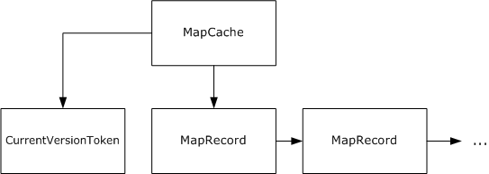
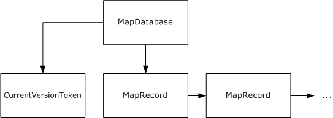

[MS-UNMP]:

User Name Mapping Protocol

Intellectual Property Rights Notice for Open Specifications Documentation

  Technical Documentation. Microsoft publishes Open Specifications documentation (“this

documentation”) for protocols, file formats, data portability, computer languages, and standards
support. Additionally, overview documents cover inter-protocol relationships and interactions.

  Copyrights. This documentation is covered by Microsoft copyrights. Regardless of any other

terms that are contained in the terms of use for the Microsoft website that hosts this
documentation, you can make copies of it in order to develop implementations of the technologies
that are described in this documentation and can distribute portions of it in your implementations
that use these technologies or in your documentation as necessary to properly document the
implementation. You can also distribute in your implementation, with or without modification, any
schemas, IDLs, or code samples that are included in the documentation. This permission also
applies to any documents that are referenced in the Open Specifications documentation.
  No Trade Secrets. Microsoft does not claim any trade secret rights in this documentation.
  Patents. Microsoft has patents that might cover your implementations of the technologies

described in the Open Specifications documentation. Neither this notice nor Microsoft's delivery of
this documentation grants any licenses under those patents or any other Microsoft patents.
However, a given Open Specifications document might be covered by the Microsoft Open
Specifications Promise or the Microsoft Community Promise. If you would prefer a written license,
or if the technologies described in this documentation are not covered by the Open Specifications
Promise or Community Promise, as applicable, patent licenses are available by contacting
iplg@microsoft.com.

  License Programs. To see all of the protocols in scope under a specific license program and the

associated patents, visit the Patent Map.

  Trademarks. The names of companies and products contained in this documentation might be
covered by trademarks or similar intellectual property rights. This notice does not grant any
licenses under those rights. For a list of Microsoft trademarks, visit
www.microsoft.com/trademarks.

  Fictitious Names. The example companies, organizations, products, domain names, email

addresses, logos, people, places, and events that are depicted in this documentation are fictitious.
No association with any real company, organization, product, domain name, email address, logo,
person, place, or event is intended or should be inferred.

Reservation of Rights. All other rights are reserved, and this notice does not grant any rights other
than as specifically described above, whether by implication, estoppel, or otherwise.

Tools. The Open Specifications documentation does not require the use of Microsoft programming
tools or programming environments in order for you to develop an implementation. If you have access
to Microsoft programming tools and environments, you are free to take advantage of them. Certain
Open Specifications documents are intended for use in conjunction with publicly available standards
specifications and network programming art and, as such, assume that the reader either is familiar
with the aforementioned material or has immediate access to it.

Support. For questions and support, please contact dochelp@microsoft.com.

[MS-UNMP] - v20240423
User Name Mapping Protocol
Copyright © 2024 Microsoft Corporation
Release: April 23, 2024

1 / 73

Revision Summary

Date

Revision
History

Revision
Class

Comments

3/2/2007

1.0

4/3/2007

1.1

5/11/2007

1.2

7/3/2007

2.0

New

Minor

Minor

Major

Version 1.0 release

Version 1.1 release

Version 1.2 release

Changed to unified format; updated technical content.

8/10/2007

2.0.1

Editorial

Changed language and formatting in the technical content.

9/28/2007

3.0

Major

Added and deleted sections; revised technical content.

10/23/2007  3.0.1

Editorial

Changed language and formatting in the technical content.

1/25/2008

3.0.2

Editorial

Changed language and formatting in the technical content.

3/14/2008

3.0.3

Editorial

Changed language and formatting in the technical content.

6/20/2008

3.1

Minor

Clarified the meaning of the technical content.

7/25/2008

3.1.1

Editorial

Changed language and formatting in the technical content.

8/29/2008

4.0

10/24/2008  5.0

12/5/2008

6.0

Major

Major

Major

Updated and revised the technical content.

Updated and revised the technical content.

Updated and revised the technical content.

1/16/2009

6.0.1

Editorial

Changed language and formatting in the technical content.

2/27/2009

6.0.2

Editorial

Changed language and formatting in the technical content.

4/10/2009

6.0.3

Editorial

Changed language and formatting in the technical content.

5/22/2009

6.0.4

Editorial

Changed language and formatting in the technical content.

7/2/2009

6.0.5

Editorial

Changed language and formatting in the technical content.

8/14/2009

6.0.6

Editorial

Changed language and formatting in the technical content.

9/25/2009

6.1

Minor

Clarified the meaning of the technical content.

11/6/2009

6.1.1

Editorial

Changed language and formatting in the technical content.

12/18/2009  6.1.2

Editorial

Changed language and formatting in the technical content.

1/29/2010

6.1.3

Editorial

Changed language and formatting in the technical content.

3/12/2010

6.1.4

Editorial

Changed language and formatting in the technical content.

4/23/2010

6.1.5

Editorial

Changed language and formatting in the technical content.

6/4/2010

6.1.6

Editorial

Changed language and formatting in the technical content.

7/16/2010

6.1.6

None

No changes to the meaning, language, or formatting of the
technical content.

8/27/2010

6.1.6

None

No changes to the meaning, language, or formatting of the
technical content.

[MS-UNMP] - v20240423
User Name Mapping Protocol
Copyright © 2024 Microsoft Corporation
Release: April 23, 2024

2 / 73

Date

Revision
History

Revision
Class

Comments

10/8/2010

6.1.6

None

No changes to the meaning, language, or formatting of the
technical content.

11/19/2010  6.1.6

None

No changes to the meaning, language, or formatting of the
technical content.

1/7/2011

6.2

Minor

Clarified the meaning of the technical content.

2/11/2011

6.2

None

No changes to the meaning, language, or formatting of the
technical content.

3/25/2011

7.0

Major

Updated and revised the technical content.

5/6/2011

7.0

None

No changes to the meaning, language, or formatting of the
technical content.

6/17/2011

7.1

Minor

Clarified the meaning of the technical content.

9/23/2011

7.1

None

No changes to the meaning, language, or formatting of the
technical content.

12/16/2011  8.0

Major

Updated and revised the technical content.

3/30/2012

8.0

None

No changes to the meaning, language, or formatting of the
technical content.

7/12/2012

9.0

Major

Updated and revised the technical content.

10/25/2012  9.0

1/31/2013

9.0

None

None

No changes to the meaning, language, or formatting of the
technical content.

No changes to the meaning, language, or formatting of the
technical content.

8/8/2013

10.0

Major

Updated and revised the technical content.

11/14/2013  10.0

None

No changes to the meaning, language, or formatting of the
technical content.

2/13/2014

10.0

None

No changes to the meaning, language, or formatting of the
technical content.

5/15/2014

10.0

None

No changes to the meaning, language, or formatting of the
technical content.

6/30/2015

11.0

Major

Significantly changed the technical content.

10/16/2015  11.0

None

No changes to the meaning, language, or formatting of the
technical content.

7/14/2016

11.0

None

No changes to the meaning, language, or formatting of the
technical content.

6/1/2017

11.0

9/15/2017

12.0

9/12/2018

13.0

4/7/2021

14.0

None

Major

Major

Major

No changes to the meaning, language, or formatting of the
technical content.

Significantly changed the technical content.

Significantly changed the technical content.

Significantly changed the technical content.

[MS-UNMP] - v20240423
User Name Mapping Protocol
Copyright © 2024 Microsoft Corporation
Release: April 23, 2024

3 / 73

Date

Revision
History

Revision
Class

Comments

6/25/2021

15.0

Major

Significantly changed the technical content.

4/23/2024

15.0

None

No changes to the meaning, language, or formatting of the
technical content.

[MS-UNMP] - v20240423
User Name Mapping Protocol
Copyright © 2024 Microsoft Corporation
Release: April 23, 2024

4 / 73

Table of Contents

1.1
1.2

1.2.1
1.2.2

1  Introduction ............................................................................................................ 8
Glossary ........................................................................................................... 8
References ...................................................................................................... 10
Normative References ................................................................................. 10
Informative References ............................................................................... 10
Overview ........................................................................................................ 10
Relationship to Other Protocols .......................................................................... 11
Prerequisites/Preconditions ............................................................................... 12
Applicability Statement ..................................................................................... 12
Versioning and Capability Negotiation ................................................................. 12
Vendor-Extensible Fields ................................................................................... 12
Standards Assignments ..................................................................................... 12

1.3
1.4
1.5
1.6
1.7
1.8
1.9

2.2.2

2.2.1

2.1
2.2

2.2.1.1
2.2.1.2

2  Messages ............................................................................................................... 13
Transport ........................................................................................................ 13
Message Syntax ............................................................................................... 13
User Name Mapping Protocol Message Headers .............................................. 13
SUNRPC Request Header........................................................................ 13
SUNRPC Response Header ..................................................................... 13
Common User Name Mapping Protocol Data Types.......................................... 13
Sizes ................................................................................................... 13
2.2.2.1
MapSvrMBCSNameString ....................................................................... 14
2.2.2.2
MapSvrUnicodeNameString .................................................................... 14
2.2.2.3
MapSvrMBCSWindowsNameString ........................................................... 14
2.2.2.4
MapSvrUnicodeWindowsNameString ........................................................ 14
2.2.2.5
MapSvrMBCSMapString .......................................................................... 14
2.2.2.6
MapSvrUnicodeMapString ....................................................................... 16
2.2.2.7
unix_account ........................................................................................ 16
2.2.2.8
unix_accountW ..................................................................................... 17
2.2.2.9
unix_user_auth..................................................................................... 17
2.2.2.10
2.2.2.11
unix_user_authW .................................................................................. 18
2.2.2.12  windows_creds ..................................................................................... 18
2.2.2.13  windows_credsW .................................................................................. 19
2.2.2.14  windows_account .................................................................................. 19
2.2.2.15  windows_accountW ............................................................................... 19
unix_auth ............................................................................................ 20
2.2.2.16
unix_authW .......................................................................................... 20
2.2.2.17
unix_creds ........................................................................................... 20
2.2.2.18
unix_credsW ........................................................................................ 21
2.2.2.19
2.2.2.20
dump_map_req .................................................................................... 21
sequence_number ................................................................................. 21
2.2.2.21
2.2.2.22  mapping_record .................................................................................... 22
2.2.2.23
sid ...................................................................................................... 22
2.2.2.24  mapping_recordW ................................................................................. 23
Non-XDR-Compliant Data Structures ............................................................. 23
mapping .............................................................................................. 23
maps ................................................................................................... 24
mappingW ........................................................................................... 24
mapsW ................................................................................................ 24
Standard Failure Responses ......................................................................... 25
User Name Mapping Protocol Messages ......................................................... 26
MAPPROC_NULL (PROC 0) ...................................................................... 26
GETWINDOWSCREDSFROMUNIXUSERNAME_PROC (PROC 1) ...................... 27
GETUNIXCREDSFROMNTUSERNAME_PROC (PROC 2) ................................. 27
AUTHUSINGUNIXCREDS_PROC (PROC 3) ................................................. 27

2.2.5.1
2.2.5.2
2.2.5.3
2.2.5.4

2.2.3.1
2.2.3.2
2.2.3.3
2.2.3.4

2.2.4
2.2.5

2.2.3

[MS-UNMP] - v20240423
User Name Mapping Protocol
Copyright © 2024 Microsoft Corporation
Release: April 23, 2024

5 / 73

DUMPALLMAPS_PROC (PROC 4) .............................................................. 28
2.2.5.5
GETCURRENTVERSIONTOKEN_PROC (PROC 5) ......................................... 28
2.2.5.6
DUMPALLMAPSEX_PROC (PROC 6) .......................................................... 29
2.2.5.7
GETWINDOWSGROUPFROMUNIXGROUPNAME_PROC (PROC 7) ................... 29
2.2.5.8
2.2.5.9
GETUNIXCREDSFROMNTGROUPNAME_PROC (PROC 8) .............................. 29
2.2.5.10  GETUNIXCREDSFROMNTUSERSID_PROC (PROC 9) .................................... 30
2.2.5.11  DUMPALLMAPSW_PROC (PROC 10) ......................................................... 30
2.2.5.12  DUMPALLMAPSEXW_PROC (PROC 11) ...................................................... 30
2.2.5.13  GETWINDOWSUSERFROMUNIXUSERNAMEW_PROC (PROC 12) ................... 31
2.2.5.14  GETUNIXCREDSFROMNTUSERNAMEW_PROC (PROC 13) ............................ 31
2.2.5.15
AUTHUSINGUNIXCREDSW_PROC (PROC 14) ............................................ 32
2.2.5.16  GETWINDOWSGROUPFROMUNIXGROUPNAMEW_PROC (PROC 15) .............. 32
2.2.5.17  GETUNIXCREDSFROMNTGROUPNAMEW_PROC (PROC 16) .......................... 32
2.2.5.18  GETUNIXCREDSFROMNTUSERSIDW_PROC (PROC 17) ............................... 33

3.1

3.1.6
3.1.7

3.1.1
3.1.2
3.1.3
3.1.4
3.1.5

3.1.5.1
3.1.5.2
3.1.5.3
3.1.5.4

3  Protocol Details ..................................................................................................... 34
Client Details ................................................................................................... 34
Abstract Data Model .................................................................................... 34
Timers ...................................................................................................... 35
Initialization ............................................................................................... 35
Higher-Layer Triggered Events ..................................................................... 35
Message Processing Events and Sequencing Rules .......................................... 35
Making the Initial Account Mapping Request to the Server.......................... 36
Processing the Account Mapping Response from the Server ........................ 36
Making Further Account Mapping Requests to the Server ........................... 36
Polling for Cache Consistency ................................................................. 36
Timer Events .............................................................................................. 37
Local Events............................................................................................... 37
Server Details .................................................................................................. 37
Abstract Data Model .................................................................................... 37
Timers ...................................................................................................... 38
Initialization ............................................................................................... 38
Higher-Layer Triggered Events ..................................................................... 38
Message Processing Events and Sequencing Rules .......................................... 38
Processing for All Procedures .................................................................. 38
Processing of DUMPALLMAPSXXX_PROC Request and
GETCURRENTVERSIONTOKEN_PROC Request ........................................... 38
Processing the Initial Account Mapping Request from the Client............. 38
Processing Further Account Mapping Requests from the Client .............. 38
Processing the Client Account Mapping Cache Refresh .......................... 39
Timer Events .............................................................................................. 39
Other Local Events ...................................................................................... 39

3.2.5.2.1
3.2.5.2.2
3.2.5.2.3

3.2.1
3.2.2
3.2.3
3.2.4
3.2.5

3.2.5.1
3.2.5.2

3.2.6
3.2.7

3.2

4  Protocol Examples ................................................................................................. 40
GETWINDOWSCREDSFROMUNIXUSERNAME_PROC ............................................... 40
4.1
GETUNIXCREDSFROMNTUSERNAME_PROC .......................................................... 41
4.2
AUTHUSINGUNIXCREDS_PROC .......................................................................... 42
4.3
DUMPALLMAPS_PROC ....................................................................................... 43
4.4
GETCURRENTVERSIONTOKEN_PROC .................................................................. 46
4.5
DUMPALLMAPSEX_PROC ................................................................................... 46
4.6
GETWINDOWSGROUPFROMUNIXGROUPNAME_PROC ............................................ 48
4.7
GETUNIXCREDSFROMNTGROUPNAME_PROC........................................................ 49
4.8
4.9
GETUNIXCREDSFROMNTUSERSID_PROC ............................................................. 50
4.10  DUMPALLMAPSW_PROC .................................................................................... 51
4.11  DUMPALLMAPSEXW_PROC................................................................................. 53
4.12  GETWINDOWSUSERFROMUNIXUSERNAMEW_PROC .............................................. 54
4.13  GETUNIXCREDSFROMNTUSERNAMEW_PROC ....................................................... 55
4.14
AUTHUSINGUNIXCREDSW_PROC ....................................................................... 56
4.15  GETWINDOWSGROUPFROMUNIXGROUPNAMEW_PROC ......................................... 57

6 / 73

[MS-UNMP] - v20240423
User Name Mapping Protocol
Copyright © 2024 Microsoft Corporation
Release: April 23, 2024

4.16  GETUNIXCREDSFROMNTGROUPNAMEW_PROC ..................................................... 58
4.17  GETUNIXCREDSFROMNTUSERSIDW_PROC .......................................................... 59

5  Security ................................................................................................................. 61
Security Considerations for Implementers ........................................................... 61
Index of Security Parameters ............................................................................ 61

5.1
5.2

6  Appendix A: Full SunRPC IDL ................................................................................. 62

7  Appendix B: Sample Code to Encode and Decode Non-XDR-Compliant Data Types 65
Header File Content .......................................................................................... 65
Encode/Decode Routines for Non-XDR Data Types Using XDR Primitives ................. 66

7.1
7.2

8  Appendix C: Product Behavior ............................................................................... 68

9  Change Tracking .................................................................................................... 70

10  Index ..................................................................................................................... 71

[MS-UNMP] - v20240423
User Name Mapping Protocol
Copyright © 2024 Microsoft Corporation
Release: April 23, 2024

7 / 73

1  Introduction

The Windows and UNIX operating systems use different mechanisms for user identification,
authentication, and resource access control. Users have separate accounts in the Windows portion and
the UNIX portion of any network. Because Windows and UNIX user identifications and user names are
stored and used differently, there is no association between the two sets, even though the same users
exist on each network.

The User Name Mapping Protocol maps Windows domain user and group account names
(DOMAIN\NAME) to the POSIX user and group identifiers (UIDs and GIDs) utilized in AUTH_UNIX
authentication and vice versa. This enables the association of user names for users who have different
identities in Windows-based and UNIX-based domains. For example, this protocol allows user and
group accounts from multiple Windows domains to access resources on Network File System (NFS) file
servers by using UIDs and GIDs. The User Name Mapping Protocol supports only retrieval of
mappings; it does not include procedures for changing user mappings.

Sections 1.5, 1.8, 1.9, 2, and 3 of this specification are normative. All other sections and examples in
this specification are informative.

1.1  Glossary

This document uses the following terms:

advanced map: Used to map accounts that have different names on the UNIX and Windows

systems. Advanced maps are also used to map users from different Windows domains, and
they can also explicitly map accounts that would generally be mapped by simple maps. For
more information, see [NFSAUTH].

domain: A set of users and computers sharing a common namespace and management

infrastructure. At least one computer member of the set has to act as a domain controller (DC)
and host a member list that identifies all members of the domain, as well as optionally hosting
the Active Directory service. The domain controller provides authentication of members, creating
a unit of trust for its members. Each domain has an identifier that is shared among its members.
For more information, see [MS-AUTHSOD] section 1.1.1.5 and [MS-ADTS].

DUMPALLMAPSXXX_PROC: A reference to the following procedures:  DUMPALLMAPS_PROC,

DUMPALLMAPSEX_PROC,  DUMPALLMAPSW_PROC, and DUMPALLMAPSEXW_PROC.

group identifier (group ID or GID): A number that identifies a group of users to a UNIX

operating system. The scope of the number is at least machine-wide but can also be coordinated
across a group of machines by means of services, such as the Network Information Service
(NIS).

group map: An association between a Windows group account name, a UNIX group account

name, and a GID.

little-endian: Multiple-byte values that are byte-ordered with the least significant byte stored in

the memory location with the lowest address.

map: An association between a Windows-based network user or group name and a UNIX-based

network user or group name.

multibyte character set (MBCS): An alternative to Unicode for supporting character sets, like

Japanese and Chinese, that cannot be represented in a single byte. Under MBCS, characters are
encoded in either one or two bytes. In two-byte characters, the first byte, or "lead" byte, signals
that both it and the following byte are to be interpreted as one character. The first byte comes
from a range of codes reserved for use as lead bytes. Which ranges of bytes can be lead bytes

8 / 73

[MS-UNMP] - v20240423
User Name Mapping Protocol
Copyright © 2024 Microsoft Corporation
Release: April 23, 2024

depends on the code page in use. For example, Japanese code page 932 uses the range 0x81
through 0x9F as lead bytes, but Korean code page 949 uses a different range.

Network File System (NFS): A Network File System protocol, as specified in [RFC1094] and
[RFC1813]. This protocol is compatible with NFS version 3 (NFSv3). NFS version 4 (NFSv4)
obviates the need for this protocol by allowing Windows and UNIX domains to interoperate
using Kerberos version 5, which allows them to share the same namespace.

OEMCP: The default OEM code page of the system. The OEM code page is used for conversions of

MS-DOS–based, text-mode applications.

portmapper service: A portmapper service is a SUNRPC service that provides discovery

services; clients of the portmapper service can use it to discover other SUNRPC services
running on the same computer. The information returned by the portmapper service is then
used by the client of the portmapper service to act as a client for the discovered SUNRPC
service. The portmapper service runs on a specific well-known port (Port 111 on TCP/UDP).

POSIX: Portable Operating System Interface, as specified in [IEEE1003.1]. POSIX is a set of

standard operating system interfaces based on UNIX. This term is used interchangeably with
UNIX in the rest of this document, as described in [IEEE1003.1].

primary map: When multiple Windows accounts are mapped to a single UNIX account, one of
these mappings can be designated as a "primary" mapping. For more information, see
[NFSAUTH].

security identifier (SID): An identifier for security principals that is used to identify an account
or a group. Conceptually, the SID is composed of an account authority portion (typically a
domain) and a smaller integer representing an identity relative to the account authority,
termed the relative identifier (RID). The SID format is specified in [MS-DTYP] section 2.4.2; a
string representation of SIDs is specified in [MS-DTYP] section 2.4.2 and [MS-AZOD] section
1.1.1.2.

simple map: Maps between accounts with the exact same name in UNIX as in Windows. For

more information, see [NFSAUTH].

SUNRPC: A remote procedure call (RPC) protocol from Sun Microsystems [RFC1057]. SUNRPC

forms the basis of the Network File System (NFS) Protocol. SUNRPC has no relationship to
Remote Procedure Call Protocol Extensions, as specified in [MS-RPCE].

Unicode: A character encoding standard developed by the Unicode Consortium that represents

almost all of the written languages of the world. The Unicode standard [UNICODE5.0.0/2007]
provides three forms (UTF-8, UTF-16, and UTF-32) and seven schemes (UTF-8, UTF-16, UTF-16
BE, UTF-16 LE, UTF-32, UTF-32 LE, and UTF-32 BE).

UNIX: A multiuser, multitasking operating system developed at Bell Laboratories in the 1970s. In
this document, the term "UNIX" is used to refer to any derivatives of this operating system.

user identifier (user ID or UID): A number that identifies a particular user to a UNIX operating
system. The scope of the number is at least machine-wide and can be coordinated across a
group of machines by means of services such as NIS.

user map: An association between a Windows user account name, a UNIX user account name,

and a UID.

wide characters: Characters represented by a 2-byte value that are encoded using Unicode UTF-

16. Unless otherwise stated, no range restrictions apply.

XDR: The data encoding standard used by SUNRPC for a selection of common data types such as

strings, integers, and arrays of integers, as specified in [RFC4506].

[MS-UNMP] - v20240423
User Name Mapping Protocol
Copyright © 2024 Microsoft Corporation
Release: April 23, 2024

9 / 73

MAY, SHOULD, MUST, SHOULD NOT, MUST NOT: These terms (in all caps) are used as defined
in [RFC2119]. All statements of optional behavior use either MAY, SHOULD, or SHOULD NOT.

1.2  References

Links to a document in the Microsoft Open Specifications library point to the correct section in the
most recently published version of the referenced document. However, because individual documents
in the library are not updated at the same time, the section numbers in the documents may not
match. You can confirm the correct section numbering by checking the Errata.

1.2.1  Normative References

We conduct frequent surveys of the normative references to assure their continued availability. If you
have any issue with finding a normative reference, please contact dochelp@microsoft.com. We will
assist you in finding the relevant information.

[IEEE1003.1] The Open Group, "IEEE Std 1003.1, 2004 Edition", 2004,
http://www.unix.org/version3/ieee_std.html

[MS-DTYP] Microsoft Corporation, "Windows Data Types".

[RFC1057] Sun Microsystems, Inc., "RPC: Remote Procedure Call Protocol Specification Version 2",
RFC 1057, June 1988, https://www.rfc-editor.org/info/rfc1057

[RFC1831] Srinivasan, R., "RPC: Remote Procedure Call Protocol Specification Version 2", RFC 1831,
August 1995, https://www.rfc-editor.org/info/rfc1831

[RFC2119] Bradner, S., "Key words for use in RFCs to Indicate Requirement Levels", BCP 14, RFC
2119, March 1997, https://www.rfc-editor.org/info/rfc2119

[RFC4506] Network Appliance, Inc., "XDR: External Data Representation Standard", STD 67, RFC
4506, May 2006, https://www.rfc-editor.org/info/rfc4506

1.2.2  Informative References

[MSFT-ADNaming] Microsoft Corporation, "Naming conventions in Active Directory for computers,
domains, sites, and OUs", https://learn.microsoft.com/en-US/troubleshoot/windows-
server/identity/naming-conventions-for-computer-domain-site-ou

[MSFT-SFUPerms] Microsoft Corporation, "Permissions In Microsoft Services for UNIX v3.0",
https://technet.microsoft.com/en-us/library/bb463216.aspx

[NFSAUTH] Russel, C., "NFS Authentication", https://technet.microsoft.com/en-
us/library/bb463203.aspx

[NIS] Sun Microsystems, Inc., "System Administration Guide: Naming and Directory Services (DNS,
NIS, and LDAP)", https://docs.oracle.com/cd/E19253-01/816-4556/

1.3  Overview

The User Name Mapping Protocol maps Windows domain identities (user and group account names) to
UNIX user and UNIX group identities (user and group account names and their corresponding UID
and GID) and vice versa. Clients of the User Name Mapping Protocol use SUNRPC-formatted
messages to enumerate and/or translate user and group account information between a UNIX and a
Windows domain. The User Name Mapping Protocol exists to allow a one-to-one mapping of each
Windows group account name to a GID number and a one-to-one mapping of each Windows user
account name to a user identifier (user ID or UID) number.

10 / 73

[MS-UNMP] - v20240423
User Name Mapping Protocol
Copyright © 2024 Microsoft Corporation
Release: April 23, 2024

The User Name Mapping Protocol is invoked by a client application when the application needs to
provide a user map or a group map between a UNIX user or group and the corresponding Windows
user or group. This need is application specific and is not specified by the User Name Mapping
Protocol. The UNIX or Windows user, or UNIX or Windows group, that needs to be mapped is supplied
to the User Name Mapping Protocol by the client application, and the mapped user/group is returned
to the client by the User Name Mapping Protocol server. For user mapping and group mapping
enumerations, the client application specifies the enumeration parameters, and the User Name
Mapping Protocol server returns the enumerated user mappings/group mappings to the client.

These mapping enumerations can be cached by the client application and kept up to date by
periodically polling the server to determine if the cached mappings are still valid. The User Name
Mapping Protocol does not provide authentication or authorization of the application-provided
user/group; to the client, it is a read-only account mapping service.

An example of this authentication behavior is a user on a UNIX machine making a file access request
that contains AUTH_UNIX–formatted user credentials to an NFS server implemented on a computer
running Windows. The NFS server acts as a User Name Mapping Protocol client (or "user map") to
request the Windows domain user and group names (from the User Name Mapping Protocol server)
that match the AUTH_UNIX credentials, [RFC1057] section 9.2, supplied by the UNIX user. This action
enables the NFS server to authenticate the file access request.

This document specifies the SUNRPC-formatted messages that provide support for the following
operations:

  Mapping POSIX user and group names and/or UIDs/GIDs to Windows domain and account

names.

  Mapping Windows domain and account names to POSIX user and group names, and UIDs and

GIDs.

  Allowing a User Name Mapping Protocol client to authenticate a POSIX user by providing a user

name and password.





Enumerating all user mappings and group mappings between POSIX accounts and Windows
accounts known to the User Name Mapping Protocol server.

Testing to see if any maps previously enumerated by a client have changed from the time of the
last check.

  Mapping a Windows domain security identifier (SID) to a POSIX user/group name and

UID/GID.

This document specifies versions 1 and 2 of the User Name Mapping Protocol. Version 1 is comprised
of a set of nine SUNRPC procedures; version 2 consists of a set of 18 SUNRPC procedures. For a list of
these procedures, see the table in section 2.2.5.

There are several differences between User Name Mapping Protocol version 1 and User Name Mapping
Protocol version 2. Version 2 added procedures 10–17, which are the wide character (Unicode)
counterparts of procedures 1–4 and 6–9. Procedures 1–4 and 6–8 accept multibyte character set
(MBCS) character-encoded strings as input. Version 2 includes the additional procedure 9, which
takes a Windows account SID and returns an MBCS character-encoded UNIX account map that
corresponds to the Windows account represented by that SID. The wide character (Unicode)
counterpart to procedure 9 is procedure 17.

1.4  Relationship to Other Protocols

The User Name Mapping Protocol relies on [RFC1057] and [RFC4506] for communicating with clients
by means of the SUNRPC message version 2 and XDR protocols as specified in those documents. The
User Name Mapping Protocol uses SUNRPC authentication level AUTH_NULL (as specified in

11 / 73

[MS-UNMP] - v20240423
User Name Mapping Protocol
Copyright © 2024 Microsoft Corporation
Release: April 23, 2024

[RFC1057]). The User Name Mapping Protocol uses SUNRPC message version 2 implemented on top of
TCP and UDP. The User Name Mapping Protocol message formats are not sensitive to which underlying
transports (TCP or UDP) are being used.

1.5  Prerequisites/Preconditions

It is required that the User Name Mapping Protocol server has been previously configured with all the
appropriate UNIX and Windows domain name and group mapping information, and that it has
registered with the portmapper service (as specified in [RFC1057] Appendix A) on the same
computer as the User Name Mapping Protocol server. Normal TCP/IP services sufficient to provide
TCP-based or UDP-based communications must be available.<1>

1.6  Applicability Statement

The User Name Mapping Protocol is applicable in a heterogeneous network environment where users
have separate accounts in UNIX and Windows infrastructures. This protocol provides a means to
associate user and group accounts in two networks for users or groups that have different identities in
UNIX-based and Windows-based administrative domains.

1.7  Versioning and Capability Negotiation

This document covers versioning issues in the following areas:

  Protocol Versions: The User Name Mapping Protocol supports versions 1 and 2. These dialects

are defined in section 2.2.

  Capability Negotiation: Version negotiation of the User Name Mapping Protocol is achieved
using the standard method for protocol negotiation for SUNRPC services as specified in
[RFC1057] section 8. The User Name Mapping Protocol client requests a specific version of the
User Name Mapping Protocol from the portmapper service (as specified in [RFC1057] Appendix
A). The portmapper service replies with the available versions registered by the User Name
Mapping Protocol server. It is recommended that requests made to the User Name Mapping
Protocol server for versions other than those supported with a SUNRPC PROG_MISMATCH
message, as specified in [RFC1057].

1.8  Vendor-Extensible Fields

None.

1.9  Standards Assignments

 Parameter

 Value

 Reference

MAPSVC_PROGRAM  351455

[RFC1057] section 7.3

[MS-UNMP] - v20240423
User Name Mapping Protocol
Copyright © 2024 Microsoft Corporation
Release: April 23, 2024

12 / 73

2  Messages

2.1  Transport

The User Name Mapping Protocol is a SUNRPC protocol (as specified in [RFC1057]) that runs on
TCP/IP using TCP and/or UDP transports, with a well-known program number of MAPSVC_PROGRAM
(351455). The User Name Mapping Protocol server registers an available TCP/UDP port with the local
portmapper service on startup using the MAPSVC_PROGRAM number for all combinations of TCP,
UDP, and protocol versions that the User Name Mapping Protocol server is capable of or configured to
accept. User Name Mapping Protocol clients query the SUNRPC portmapper server for the TCP/UDP
port number on which the User Name Mapping Protocol is registered and listening for the requested
version and transport combination.

Configuration of the portmapper service and port registration is specified in [RFC1057] Appendix A.
The User Name Mapping Protocol does not define a configuration interface to the portmapper service.

The User Name Mapping Protocol server provides a procedure-oriented interface to the User Name
Mapping Protocol clients. Clients identify the remote procedure by using a combination of a 32-bit
program number, a 32-bit version number, and a 32-bit procedure number (as specified in
[RFC1057]). The service is stateless; every SUNRPC call is self-contained and does not depend on the
previous calls made or previous state of the service.

The User Name Mapping Protocol server accepts all SUNRPC packets with an authentication level of
AUTH_NULL, as specified in [RFC1057] section 9.1. Therefore, no authentication information is
required by the client.

2.2  Message Syntax

The following structures are specified in XDR Data Definition Language syntax (as specified in
[RFC4506] section 6) while procedures are defined in the SUNRPC language, as specified in
[RFC1057] section 11.

2.2.1  User Name Mapping Protocol Message Headers

2.2.1.1  SUNRPC Request Header

The User Name Mapping Protocol uses standard SUNRPC version 2 msg_type CALL headers. Requests
are made with an authentication level of AUTH_NULL. This header format and its fields and values are
specified in [RFC1057] section 8.

2.2.1.2  SUNRPC Response Header

The User Name Mapping Protocol uses standard SUNRPC version 2 msg_type REPLY headers. This
header format and its fields and values are specified in [RFC1057] section 8.

2.2.2  Common User Name Mapping Protocol Data Types

In this section, the XDR Data Description Language (as specified in [RFC4506]) is used to specify the
XDR format parameters and results of each of the SUNRPC service procedures that a User Name
Mapping Protocol server provides.

2.2.2.1  Sizes

 const MAXNAMELEN = 128;
 const MAXNAMELENx2 = 256;

[MS-UNMP] - v20240423
User Name Mapping Protocol
Copyright © 2024 Microsoft Corporation
Release: April 23, 2024

13 / 73

 const MAXLINELEN = 256;
 const MAXLINELENx2 = 512;
 const MAXGIDS = 32;
 const MAXSIDLEN = 72;

(MAXGIDS is the maximum count of GIDs. This includes both the primary GID and any supplementary
GIDs.)

2.2.2.2  MapSvrMBCSNameString

 typedef opaque MapSvrMBCSNameString<MAXNAMELEN>;

An XDR variable-length opaque data field, as specified in [RFC4506] section 4.10, whose maximum
length is specified in bytes. The length is equal to the number of MBCS bytes encoded in the system
OEM code page (OEMCP), including multibyte characters, as specified by the length field that
precedes the byte stream. The value of the length field MUST NOT exceed the value MAXNAMELEN.
Minimum length is 0.

2.2.2.3  MapSvrUnicodeNameString

 typedef opaque MapSvrUnicodeNameString<MAXNAMELENx2>;

An XDR variable-length opaque data field, as specified in [RFC4506] section 4.10, whose maximum
length is specified in bytes. The maximum length is defined by the length field that precedes the byte
stream. The value of the length field MUST NOT exceed the value MAXNAMELENx2. The maximum
length of the character string is equal to as many 2-byte Unicode (UTF-16) characters as can be
stored in a MapSvrUnicodeNameString, with a maximum length equal to length. Minimum length is 0.

2.2.2.4  MapSvrMBCSWindowsNameString

 typedef opaque MapSvrMBCSWindowsNameString<MAXLINELEN>;

An XDR variable-length opaque data field, as specified in [RFC4506] section 4.10, whose maximum
length is specified in bytes. The length is equal to the number of MBCS bytes encoded in the system
OEMCP, including multibyte characters, as specified by the length field that precedes the byte
stream. The value of the length field MUST NOT exceed the value MAXLINELEN. Minimum length is 0.

2.2.2.5  MapSvrUnicodeWindowsNameString

 typedef opaque MapSvrUnicodeWindowsNameString<MAXLINELENx2>;

An XDR variable-length opaque data field, as specified in [RFC4506] section 4.10, whose maximum
length is specified in bytes. The maximum length is defined by the length field that precedes the byte
stream. The value of the length field MUST NOT exceed the value MAXLINELENx2. The maximum
length of the character string is equal to as many 2-byte Unicode (UTF-16) characters as can be
stored in a MapSvrUnicodeWindowsNameString, with a maximum length equal to length. Minimum
length is 0.

2.2.2.6  MapSvrMBCSMapString

 typedef opaque MapSvrMBCSMapString<MAXLINELEN>;

[MS-UNMP] - v20240423
User Name Mapping Protocol
Copyright © 2024 Microsoft Corporation
Release: April 23, 2024

14 / 73

An XDR variable-length opaque data field, as specified in [RFC4506] section 4.10, whose maximum
length is specified in bytes. The length is equal to the number of MBCS bytes encoded in the system
OEMCP, including multibyte characters, as specified by the length field that precedes the byte
stream. The value of the length field MUST NOT exceed the value MAXLINELEN. Minimum length is 0.

This type is used to define a single account map as a colon-delimited string of MBCS characters. This
type is returned as an output from the map enumeration procedure. For more details, see section
2.2.3.2.

The format of MapSvrMBCSMapString is a sequence of colon-delimited fields. It has one of two forms,
depending on the context: user map or group map, as follows.

For user map, MapSvrMBCSMapString has the following format.

 MapType:WindowsAccountName:AuthType:UNIXDomain:UNIXServer:
 UNIXAccountName:UNIXPassword:ID:GIDArray

For group map, MapSvrMBCSMapString has the following format.

 MapType:WindowsAccountName:AuthType:UNIXDomain:UNIXServer:
 UNIXAccountName:GID

MapType: A single MBCS character that indicates the type of map from which the mapping was

derived. It MUST be one of the following characters.

 Value

 Meaning

'*'

'^'

'-'

The map is a primary map.

The map is an advanced map.

The map is a simple map.

WindowsAccountName: A string of MBCS characters that contains the Windows account name. It

MUST be in DOMAIN\NAME format.

AuthType: A single MBCS character that indicates which entity provided the map. AuthType MUST
be one of the values in the following table. If the value is AUTH_NIS, the source MUST be a NIS
service on the network. If the value is AUTH_FILE, the source SHOULD<2> be from the service-
maintained database local to the User Name Mapping Protocol server.

 Value

 Meaning

'0'
(AUTH_FILE)

The map was obtained from a service-maintained database local to the User Name
Mapping Protocol server. The form of the database is implementation-specific.

'1'
(AUTH_NIS)

The map was obtained from a NIS service on the network. NIS is specified in [NIS].

UNIXDomain: A string of MBCS characters that contains the string "PCNFS" if the map was obtained
from a service-maintained database, or the NIS server domain to which the account belongs if the
map was obtained from a NIS service. If AuthType is equal to AUTH_NIS, this field MUST contain
the NIS server domain the account is a member of.

UNIXServer: A string of MBCS characters that contains the string "PCNFS" if the map was obtained

from a service-maintained database, or a string that represents the NIS server name to which the
account belongs if the map was obtained from a NIS server.

15 / 73

[MS-UNMP] - v20240423
User Name Mapping Protocol
Copyright © 2024 Microsoft Corporation
Release: April 23, 2024

UNIXAccountName: A string of MBCS characters that represents the UNIX account name.

UNIXPassword: A sequence of bytes that represents the password for a user record as returned by a

call to the crypt() API that uses the user's cleartext password, as specified in [IEEE1003.1]
System Interfaces Volume (XSH). This field is empty when the password is not available or does
not apply. The password record MUST NOT contain any MBCS colon characters.

ID: A string of MBCS characters that contains the ID for the UNIX account.

GID: A string of MBCS characters that contains the GID for the UNIX account.

GIDArray: A string of MBCS characters that contains the primary and supplementary GIDs for the
UNIX account, with each supplementary GID after the primary GID, and separated by additional
colon characters.

2.2.2.7  MapSvrUnicodeMapString

 typedef opaque MapSvrUnicodeMapString<MAXLINELENx2>;

An XDR variable-length opaque data field, as specified in [RFC4506] section 4.10, whose maximum
length is specified in bytes. The maximum length is defined by the length field that precedes the byte
stream. The value of the length field MUST NOT exceed the value MAXLINELENx2. The maximum
length of the character string is equal to as many 2-byte Unicode (UTF-16) characters as can be
stored in a MapSvrUnicodeMapString, with a maximum length equal to length. Minimum length is 0.

This type is used to define a single account map in colon-delimited string format when returned as an
output from the map enumeration procedure. For more details, see section 2.2.3.4.

The format of a MapSvrUnicodeMapString field is a sequence of colon-delimited fields as specified in
section 2.2.2.6, substituting Unicode characters for MBCS characters.

2.2.2.8  unix_account

This type is used to specify a UNIX account name in MBCS format, in addition to an ID used to
search for the corresponding Windows account information when mapping a UNIX account name to a
Windows account name. For more information, see sections 2.2.5.2 and 2.2.5.8.

 struct unix_account {
     long SearchOption;
     long Reserved;
     long ID;
     MapSvrMBCSNameString UnixAccountName;
 };

SearchOption: An XDR-encoded, 32-bit signed integer that defines the user search criteria to use for

the request. SearchOption MUST be one of the following values.

 Value

 Meaning

0x00000001

If set, UnixAccountName is valid and MUST be used as the search criterion.

0x00000002

If set, ID is valid and MUST be used as the search criterion.

0x00000003

If set, UnixAccountName and ID are both valid and both MUST be used as the search
criteria.

[MS-UNMP] - v20240423
User Name Mapping Protocol
Copyright © 2024 Microsoft Corporation
Release: April 23, 2024

16 / 73

Reserved: A 32-bit signed integer that MUST be sent as 0x00000000 and MUST be ignored on

receipt.

ID: An XDR-encoded, 32-bit signed integer that contains the UNIX account ID to use as the search
criterion. If SearchOption is not 0x00000002 or 0x00000003, this value MUST be ignored.

UnixAccountName: A MapSvrMBCSNameString (section 2.2.2.2) that contains the name of the UNIX
account to use as the search criterion. The length of the string MUST NOT exceed 128 bytes.
POSIX user and group account name constraints are specified in [IEEE1003.1]. If SearchOption
is not 0x00000001 or 0x00000003, this value MUST be ignored.

2.2.2.9  unix_accountW

This type is used to specify a UNIX account name in Unicode format, in addition to an ID used to
search for the corresponding Windows account information when mapping a UNIX account name to a
Windows account name. For more information, see sections 2.2.5.13 and 2.2.5.16.

 struct unix_accountW {
     long SearchOption;
     long Reserved;
     long ID;
     MapSvrUnicodeNameString UnixAccountName;
 };

SearchOption: An XDR-encoded, 32-bit signed integer that defines the user search criteria to use for

the request. SearchOption MUST be one of the following values.

 Value

 Meaning

0x00000001

If set, UnixAccountName is valid and MUST be used as the search criterion.

0x00000002

If set, ID is valid and MUST be used as the search criterion.

0x00000003

If set, UnixAccountName and ID are both valid and both MUST be used as the search
criteria.

Reserved: A 32-bit signed integer that MUST be sent as 0x00000000 and MUST be ignored on

receipt.

ID: An XDR-encoded, 32-bit signed integer that contains the UNIX account ID to use as the search
criterion. If SearchOption is not 0x00000002 or 0x00000003, this value MUST be ignored.

UnixAccountName: A MapSvrUnicodeNameString (section 2.2.2.3) that contains the name of the

UNIX account to use as the search criterion. The length of the string MUST NOT exceed 256 bytes.
POSIX user and group account name constraints are specified in [IEEE1003.1]. If SearchOption
is not 0x00000001 or 0x00000003, this value MUST be ignored.

2.2.2.10

unix_user_auth

This type is used to specify a UNIX account name (in MBCS format) and a password to retrieve the
set of UNIX account details that correspond to the account. For more details, see section 2.2.5.4.

 struct unix_user_auth {
     MapSvrMBCSNameString UnixUserAccountName;
     MapSvrMBCSNameString UnixUserAccountPassword;
 };

[MS-UNMP] - v20240423
User Name Mapping Protocol
Copyright © 2024 Microsoft Corporation
Release: April 23, 2024

17 / 73

UnixUserAccountName: A MapSvrMBCSNameString (section 2.2.2.2) that contains the name of the
UNIX user account to use as the search criterion. The length of this string MUST NOT exceed 128
bytes. POSIX user and group account name constraints are specified in [IEEE1003.1].

UnixUserAccountPassword: An XDR variable-length opaque data field, as defined in [RFC4506]

section 4.10, that contains the password of the UNIX user account to use as the search criterion.
The length of this field MUST NOT exceed 128 bytes. This string MUST be generated by a call to
the POSIX crypt function, as specified in [IEEE1003.1] System Interfaces Volume (XSH) Chapter
3.

2.2.2.11

unix_user_authW

This type is used to specify a UNIX account name (in Unicode format) and a password to retrieve the
set of UNIX account details that correspond to the account. For more details, see section 2.2.5.15.

 struct unix_user_authW {
     MapSvrUnicodeNameString UnixUserAccountName;
     MapSvrUnicodeNameString UnixUserAccountPassword;
 };

UnixUserAccountName: A MapSvrUnicodeNameString (section 2.2.2.3) that contains the name of
the UNIX user to use as the search criterion. The length of the string MUST NOT exceed 256
bytes. POSIX user and group account name constraints are specified in [IEEE1003.1].

UnixUserAccountPassword: A MapSvrUnicodeNameString (section 2.2.2.3) that contains the

password of the UNIX user account to use as the search criterion. The length of the string MUST
NOT exceed 256 bytes. This string MUST be generated by a call to the POSIX crypt function, as
specified in [IEEE1003.1] System Interfaces Volume (XSH) Chapter 3.

2.2.2.12

windows_creds

This type represents the Windows account name (in MBCS format) when used as an output parameter
from a search for the corresponding UNIX account name (in MBCS format) and/or UNIX ID. For more
information, see sections 2.2.5.2 and 2.2.5.8)

 struct windows_creds {
     long Status;
     long Reserved;
     MapSvrMBCSWindowsNameString WindowsAccountName;
 };

Status: An XDR-encoded, Boolean return value. This MUST be either 0 or 1. A value of 0 indicates

success; a value of 1 indicates failure.

Reserved: A 32-bit signed integer that MUST be 0x00000000 and MUST be ignored on receipt.

WindowsAccountName: A MapSvrMBCSWindowsNameString (section 2.2.2.4) that contains the

name of the mapped Windows user or group account that MUST be in the form "DOMAIN\NAME".
The length of the string MUST NOT exceed 256 bytes. Windows user/group account name
constraints are specified in [MSFT-SFUPerms], and Windows domain naming conventions are
specified in [MSFT-ADNaming]. If Status does not equal 0x00000000, this value MUST be
ignored.

[MS-UNMP] - v20240423
User Name Mapping Protocol
Copyright © 2024 Microsoft Corporation
Release: April 23, 2024

18 / 73

2.2.2.13

windows_credsW

This type represents the Windows account name (in Unicode format) when used as an output
parameter from a search for the corresponding UNIX account name (in Unicode format) and/or UNIX
ID. For more details, see sections 2.2.5.13 and 2.2.5.16.

 struct windows_credsW {
     long Status;
     long Reserved;
     MapSvrUnicodeWindowsNameString WindowsAccountName;
 };

Status: An XDR-encoded, Boolean return value. This MUST be either 0 or 1. A value of 0 indicates

success; a value of 1 indicates failure.

Reserved: A 32-bit signed integer that MUST be 0x00000000 and MUST be ignored on receipt.

WindowsAccountName: A MapSvrUnicodeWindowsNameString (section 2.2.2.5) that contains the

name of the mapped Windows user or group account that MUST be in the form "DOMAIN\NAME".
The length of the string MUST NOT exceed 512 bytes. Windows user account and group account
name constraints are specified in [MSFT-SFUPerms], and Windows domain naming conventions
are specified in [MSFT-ADNaming]. If Status does not equal 0x00000000, this value MUST be
ignored.

2.2.2.14

windows_account

This type is used to specify a Windows account name in MBCS format used to search for the
corresponding UNIX account information. For more details, see sections 2.2.5.3 and 2.2.5.9.

 struct windows_account {
     MapSvrMBCSNameString WindowsAccountName;
 };

WindowsAccountName: A MapSvrMBCSNameString (section 2.2.2.2) that MUST contain the name

of the Windows account in the "DOMAIN\NAME" format to use as the search criterion. Windows
user account and group account name constraints are specified in [MSFT-SFUPerms], and
Windows domain naming conventions are specified in [MSFT-ADNaming]. The length of the string
MUST NOT exceed 256 bytes.

2.2.2.15

windows_accountW

This type is used to specify a Windows account name in Unicode format used to search for the
corresponding UNIX account information. For more details, see sections 2.2.5.14 and 2.2.5.17.

 struct windows_accountW {
     MapSvrUnicodeNameString WindowsAccountName;
 };

WindowsAccountName: A MapSvrUnicodeNameString (section 2.2.2.3) that contains the name of
the Windows user account to use as the search criterion. The account name MUST be in the form
"DOMAIN\NAME". Windows user account and group account name constraints are specified in
[MSFT-SFUPerms], and Windows domain naming conventions are specified in [MSFT-ADNaming].
The length of the string MUST NOT exceed 512 bytes.

[MS-UNMP] - v20240423
User Name Mapping Protocol
Copyright © 2024 Microsoft Corporation
Release: April 23, 2024

19 / 73

2.2.2.16

unix_auth

This type is used to specify UNIX account details returned as a result of an authentication operation
on the server. For more details, see sections 2.2.5.4 and 2.2.5.15.

 struct unix_auth {
     MapSvrMBCSNameString UnixAccountPassword;
     long ID;
     long GIDArray<MAXGIDS>;
 };

UnixAccountPassword: A MapSvrMBCSNameString (section 2.2.2.2) that contains the password of

the mapped UNIX account. The length of the string MUST NOT exceed 128 bytes.

ID: An XDR-encoded, 32-bit signed integer that contains the UNIX user ID for the

UnixAccountPassword that was looked up.

GIDArray: An array of XDR-encoded, 32-bit signed integers that contains the group IDs for the

UnixAccountPassword that was looked up. The maximum size of this array is MAXGIDS.

2.2.2.17

unix_authW

This type is used to specify UNIX account details returned as a result of an authentication operation
on the server. For more details, see sections 2.2.5.4 and 2.2.5.15.

 struct unix_authW {
     MapSvrUnicodeNameString UnixAccountPassword;
     long ID;
     long GIDArray<MAXGIDS>;
 };

UnixAccountPassword: A MapSvrUnicodeNameString (section 2.2.2.3) that contains the password

of the mapped UNIX account. The length of the string MUST NOT exceed 256 bytes.

ID: An XDR-encoded, 32-bit signed integer that contains the UNIX user ID for the

UnixAccountPassword that was looked up.

GIDArray: An array of XDR-encoded, 32-bit signed integers that contains the group IDs for the

UnixAccountPassword that was looked up. The maximum size of this array is MAXGIDS.

2.2.2.18

unix_creds

This type is used to specify UNIX account details returned as a result of a lookup operation on the
server. For more details, see sections 2.2.5.3, 2.2.5.9, and 2.2.5.10.

 struct unix_creds {
     MapSvrMBCSNameString UnixAccountName;
     long ID;
     long GIDArray<MAXGIDS>;
 };

UnixAccountName: A MapSvrMBCSNameString (section 2.2.2.2) that contains the name of the

mapped UNIX account. The length of the string MUST NOT exceed 128 bytes.

ID: An XDR-encoded, 32-bit signed integer that contains the UNIX user ID for UnixAccountName.

[MS-UNMP] - v20240423
User Name Mapping Protocol
Copyright © 2024 Microsoft Corporation
Release: April 23, 2024

20 / 73

GIDArray: An array of XDR-encoded, 32-bit signed integers that contains the group IDs for

UnixAccountName. The maximum size of this array is MAXGIDS.

2.2.2.19

unix_credsW

This type is used to specify UNIX account details returned as a result of a lookup operation on the
server. For more details, see sections 2.2.5.14, 2.2.5.17, and 2.2.5.18.

 struct unix_credsW {
     MapSvrUnicodeNameString UnixAccountName;
     long ID;
     long GIDArray<MAXGIDS>;
 };

UnixAccountName: A MapSvrUnicodeNameString (section 2.2.2.3) that contains the name of the

mapped UNIX account. The length of the string MUST NOT exceed 256 bytes.

ID: An XDR-encoded, 32-bit signed integer that contains the UNIX user ID for UnixAccountName.

GIDArray: An array of XDR-encoded, 32-bit signed integers that contains the group IDs for

UnixAccountName. The maximum size of this array is MAXGIDS.

2.2.2.20

dump_map_req

This type is used to specify an input parameter to start or continue a map enumeration request to the
server. For more details, see sections 2.2.5.5, 2.2.5.7, 2.2.5.11, and 2.2.5.12.

 struct dump_map_req {
     long PrincipalType;
     long MapRecordIndex;
 };

PrincipalType: An XDR-encoded, 32-bit signed integer that defines the type of account mapping to

enumerate. PrincipalType MUST be one of the following values.

 Value

 Meaning

0x00000000  Enumerate user account mappings.

0x00000001  Enumerate group account mappings.

MapRecordIndex: An XDR-encoded, 32-bit signed integer that is an index into the set of mapping

records. This MUST be set to 0 on the first call in an enumeration sequence, and to the sum of all
the records returned by all preceding replies on subsequent calls in the enumeration sequence. For
more information on enumeration sequences, see sections 3.1.5 and 3.2.5.

2.2.2.21

sequence_number

This type is used by the server to define a version for a set of account mappings at a given point in
time. This number is changed by the server whenever any changes are made to the set of account
mappings that it maintains (for more details, see section 2.2.5.6). If either of the member fields
changes, the sequence_number as a whole MUST be considered as changed.

 struct sequence_number {
     long CurrentVersionTokenLowPart;
     long CurrentVersionTokenHighPart;

[MS-UNMP] - v20240423
User Name Mapping Protocol
Copyright © 2024 Microsoft Corporation
Release: April 23, 2024

21 / 73

 };

CurrentVersionTokenLowPart: An XDR-encoded, 32-bit signed integer that MUST be either

0x00000000 or a value returned by the server from a previous call to
GETCURRENTVERSIONTOKEN_PROC or DUMPALLMAPSXXX_PROC. For more information about
CurrentVersionTokenLowPart, see sections 3.1.5 and 3.2.5.

CurrentVersionTokenHighPart: An XDR-encoded, 32-bit signed integer that MUST be either

0x00000000 or a value returned by the server from a previous call to
GETCURRENTVERSIONTOKEN_PROC or DUMPALLMAPSXXX_PROC. For more information about
CurrentVersionTokenHighPart, see sections 3.1.5 and 3.2.5.

2.2.2.22

mapping_record

This type is used to define a single account map when returned as an output from the map
enumeration procedure. For more details, see section 2.2.3.1.

 struct mapping_record {
     MapSvrMBCSNameString WindowsAccountName;
     MapSvrMBCSNameString UnixAccountName;
     long ID;
 };

WindowsAccountName: A MapSvrMBCSNameString (section 2.2.2.2) that contains the name of the
Windows user or group account in the enumeration. The length of the string MUST NOT exceed
128 bytes. The Windows account name MUST be in the "DOMAIN\NAME" format.

UnixAccountName: A MapSvrMBCSNameString that contains the name of the UNIX user or group

account in the enumeration. The length of the string MUST NOT exceed 128 bytes.

ID: An XDR-encoded, 32-bit signed integer that contains the UNIX user ID or group ID for
UnixAccountName as specified by PrincipalType in the request (section 2.2.5.5).

2.2.2.23

sid

This type is used to define a Windows account SID when used as input to look up the UNIX account
mapping details that correspond to the Windows account represented by this SID. For more details,
see section 2.2.5.10 and section 2.2.5.18.

 struct sid {
     char SID<MAXSIDLEN>;
 };

SID: An array of XDR-encoded unsigned bytes that is a stream representation of the Windows

account SID, as specified in [MS-DTYP] section 2.4.2. The SubAuthority field of the SID packet
([MS-DTYP] section 2.4.2.2) is a variable-length array of unsigned 32-bit little-endian integers.
The sid structure is an opaque data type generated by the Windows security subsystem. It is not
converted to any byte-ordered network representation and SHOULD NOT be interpreted by the
User Name Mapping Protocol client or server directly; instead, it SHOULD be supplied to the
underlying implementation-defined security subsystem. The maximum size of the SID array in the
sid structure is MAXSIDLEN.

Note  Because the SID is transmitted as a raw array of bytes, the client and server MUST have
identical native SID representations for user name mapping to succeed. See section 4.9 and
section 4.17 for examples.

22 / 73

[MS-UNMP] - v20240423
User Name Mapping Protocol
Copyright © 2024 Microsoft Corporation
Release: April 23, 2024

2.2.2.24

mapping_recordW

This type is used to define a single account map when returned as output from the map enumeration
procedure. For more details, see section 2.2.3.3.

 struct mapping_recordW {
     MapSvrUnicodeNameString WindowsAccountName;
     MapSvrUnicodeNameString UnixAccountName;
     long ID;
 };

WindowsAccountName: A MapSvrUnicodeNameString (section 2.2.2.3) that contains the name of
the Windows user or group account in the enumeration. The length of the string MUST NOT
exceed 256 bytes. The account name MUST be in the form "DOMAIN\NAME".

UnixAccountName: A MapSvrUnicodeNameString that contains the name of the UNIX user or group

account in the enumeration. The length of the string MUST NOT exceed 256 bytes.

ID: An XDR-encoded, 32-bit signed integer that contains the UNIX user ID or group ID for

UnixAccountName, as specified by PrincipalType in the request (section 2.2.5.11).

2.2.3  Non-XDR-Compliant Data Structures

There are four data structures that cannot be defined using a pure XDR definition. Instead they are
defined in terms of lower-level XDR primitives. The difference is as follows. XDR defines fixed-size
arrays in terms of constants only. On the other hand, the User Name Mapping Protocol has four
structures that use a dynamic value for the array size, and the layout of the fields in the User Name
Mapping Protocol precludes the use of the XDR variable-sized array data type. For each of the four
data types that follow, the structures are described as their standard XDR types, followed by an XDR
vector that uses a dynamic size rather than a constant. This is very similar to the standard XDR
variable-sized array but with a separate size value rather than one built into the array type.

See section 7 for sample code that shows how to encode and decode each of the four data structures.

2.2.3.1  mapping

This type is used to define a set of account maps when returned as output from the map enumeration
procedure. For more details, see section 2.2.5.5.

 struct mapping {
     sequence_number Token;
     long MappingRecordCount;
     long TotalMappingRecordCount;
     mapping_record MapArray[MappingRecordCount];
 };

Token: A sequence_number (section 2.2.2.21) that represents the current version of the data set

maintained by the User Name Mapping Protocol server.

MappingRecordCount: An XDR-encoded, 32-bit signed integer that indicates the number of records

that are returned in MapArray.

TotalMappingRecordCount: A 32-bit signed integer value that indicates the total number of

mapping records of the specified PrincipalType (as specified in section 2.2.5.5) held by the
server that are available to be enumerated.

[MS-UNMP] - v20240423
User Name Mapping Protocol
Copyright © 2024 Microsoft Corporation
Release: April 23, 2024

23 / 73

MapArray: An array of account mapping records that is returned as a part of the current enumeration

sequence, as specified in section 2.2.2.22.

2.2.3.2  maps

This type is used to define a set of account maps in colon-delimited string format when returned as
output from the map enumeration procedure. For more details, see section 2.2.5.7.

 struct maps {
     sequence_number Token;
     long MappingRecordCount;
     long TotalMappingRecordCount;
     MapSvrMBCSMapString MapArray[MappingRecordCount];
 };

Token: A sequence of numbers that represent the version for the set of account maps returned in the

current enumeration.

MappingRecordCount: An XDR-encoded, 32-bit signed integer that indicates the maximum number

of records to be returned in the MapArray field.

TotalMappingRecordCount: A 32-bit signed integer value that indicates the total number of

mapping records of the specified PrincipalType (as specified in section 2.2.5.7) held by the
server that are available to be enumerated.

MapArray: An array of account mapping records that is returned as a part of the current enumeration

sequence (as specified in section 2.2.2.6).

2.2.3.3  mappingW

This type is used to define a set of account maps when returned as output from the map enumeration
procedure. For more details, see section 2.2.5.11.

 struct mappingW {
     sequence_number Token;
     long MappingRecordCount;
     long TotalMappingRecordCount;
     mapping_recordW MapArray[MappingRecordCount];
 };

Token: A sequence number that represents the version for the set of account mappings that are

returned in the current enumeration.

MappingRecordCount: An XDR-encoded, 32-bit signed integer that indicates the number of records

that are returned in the MapArray field.

TotalMappingRecordCount: A 32-bit signed integer value that indicates the total number of

mapping records of the specified PrincipalType (section 2.2.5.11) held by the server that are
available to be enumerated.

MapArray: An array of account mapping records that is returned as a part of the current enumeration

sequence. For more details, see section 2.2.2.24.

2.2.3.4  mapsW

This type is used to define a set of account maps in colon-delimited string format when returned as an
output from the map enumeration procedure. For more details, see section 2.2.5.12.

24 / 73

[MS-UNMP] - v20240423
User Name Mapping Protocol
Copyright © 2024 Microsoft Corporation
Release: April 23, 2024

 struct mapsW {
     sequence_number Token;
     long MappingRecordCount;
     long TotalMappingRecordCount;
     MapSvrUnicodeMapString MapArray[MappingRecordCount];
 };

Token: A sequence_number (section 2.2.2.21).

MappingRecordCount: An XDR-encoded, 32-bit signed integer that indicates the maximum number

of records in MapArray.

TotalMappingRecordCount: A 32-bit signed integer value that indicates the total number of

mapping records of the specified PrincipalType (section 2.2.5.12) held by the server that are
available to be enumerated.

MapArray: An array of MapSvrUnicodeMapString (section 2.2.2.7).

2.2.4  Standard Failure Responses

SUNRPC defines a set of standard responses to requests that the User Name Mapping Protocol server
is unable to service. The following tables list the set of status codes that can be returned by the User
Name Mapping Protocol server.

If SUNRPC status is MSG_ACCEPTED.

Accept status

SUCCESS

PROG_UNAVAIL

PROG_MISMATCH

PROC_UNAVAIL

GARBAGE_ARGS

SYSTEM_ERR

If SUNRPC status is MSG_DENIED.

Reject status

Reason rejected

RPC_MISMATCH

AUTH_ERROR

AUTH_BADCRED

These status codes have the following meanings:

  SUCCESS: RPC call executed successfully ([RFC1057]).







PROG_UNAVAIL: Wrong PROGRAM_NUMBER for the port ([RFC1057]).

PROG_MISMATCH: Unsupported protocol version number requested ([RFC1057]).

PROC_UNAVAIL: Nonexistent procedure number requested ([RFC1057]).

  GARBAGE_ARGS: Supplied arguments illegal or otherwise not decodable ([RFC1057]).

[MS-UNMP] - v20240423
User Name Mapping Protocol
Copyright © 2024 Microsoft Corporation
Release: April 23, 2024

25 / 73

  SYSTEM_ERR: Errors like memory allocation failure ([RFC1831]).

  RPC_MISMATCH: Invalid SUNRPC version number ([RFC1057]).

  AUTH_ERROR: Remote cannot authenticate caller ([RFC1057]).

  AUTH_BADCRED: Bad credentials in RPC call ([RFC1057]).<3>

2.2.5  User Name Mapping Protocol Messages

The User Name Mapping Protocol procedure messages are defined in the SUNRPC request and
response headers, as specified in [RFC1057] section 8. The following table lists the procedure
messages in procedure number order.

Procedure number  Version

Procedure name

MAPPROC_NULL

GETWINDOWSCREDSFROMUNIXUSERNAME_PROC

GETUNIXCREDSFROMNTUSERNAME_PROC

AUTHUSINGUNIXCREDS_PROC

DUMPALLMAPS_PROC

GETCURRENTVERSIONTOKEN_PROC

DUMPALLMAPSEX_PROC

GETWINDOWSGROUPFROMUNIXGROUPNAME_PROC

GETUNIXCREDSFROMNTGROUPNAME_PROC

GETUNIXCREDSFROMNTUSERSID_PROC

DUMPALLMAPSW_PROC

DUMPALLMAPSEXW_PROC

GETWINDOWSUSERFROMUNIXUSERNAMEW_PROC

GETUNIXCREDSFROMNTUSERNAMEW_PROC

AUTHUSINGUNIXCREDSW_PROC

0

1

2

3

4

5

6

7

8

9

10

11

12

13

14

GETWINDOWSGROUPFROMUNIXGROUPNAMEW_PROC  15

GETUNIXCREDSFROMNTGROUPNAMEW_PROC

GETUNIXCREDSFROMNTUSERSIDW_PROC

16

17

1, 2

1, 2

1, 2

1, 2

1, 2

1, 2

1, 2

1, 2

1, 2

2

2

2

2

2

2

2

2

2

2.2.5.1  MAPPROC_NULL (PROC 0)

A null procedure that is used for service discovery as specified in [RFC1057] section A.2.

 void
 MAPPROC_NULL(
 void

[MS-UNMP] - v20240423
User Name Mapping Protocol
Copyright © 2024 Microsoft Corporation
Release: April 23, 2024

26 / 73

 );

This procedure requires no arguments, and a successful reply MUST contain no data other than a
SUNRPC reply status of MSG_ACCEPTED, as specified in [RFC1057].

The typical use of a null procedure is for the clients to discover whether the service is started and
available. This procedure has a procedure number equal to 0.

2.2.5.2  GETWINDOWSCREDSFROMUNIXUSERNAME_PROC (PROC 1)

A request to fetch the mapped Windows user account name for a specified UNIX user name and/or
UNIX user.

 windows_creds
 GETWINDOWSCREDSFROMUNIXUSERNAME_PROC(
 unix_account UnixUser
 );

UnixUser: The UNIX user to search for, using the account name and/or UID as the search criteria, as

specified by the value for SearchOption.

Return Value: A windows_creds record that contains the mapped Windows user account details for
the specified UNIX user. Whenever the lookup request for a specified UNIX account succeeds or
fails to find a corresponding Windows account map, the User Name Mapping Protocol server MUST
return a SUNRPC status of MSG_ACCEPTED with an accept status of SUCCESS. The actual
success or failure of the request MUST be set in the Status member of the returned structure.
Status is a Boolean value, with 0 indicating a successful lookup request and 1 indicating a failed
lookup request.

2.2.5.3  GETUNIXCREDSFROMNTUSERNAME_PROC (PROC 2)

A request to fetch the mapped UNIX user account details for a specified Windows user account name.

 unix_creds
 GETUNIXCREDSFROMNTUSERNAME_PROC(
 windows_account WindowsUserAccountName
 );

WindowsUserAccountName: The Windows user to use for the account name as the search criterion.

Return Value: A unix_creds record containing the mapped UNIX user account details for the specified
Windows account name. Whenever the lookup request for a specified Windows account fails to find
a corresponding UNIX account map, the User Name Mapping Protocol server MUST return a
SUNRPC status of MSG_ACCEPTED with an accept status of SUCCESS. It MUST also return a zero-
length string in the UnixAccountName member of the returned structure.

2.2.5.4  AUTHUSINGUNIXCREDS_PROC (PROC 3)

A request to fetch the UNIX account details for a given UNIX user name and password.

This procedure is typically used by clients that are doing a simple authentication by providing a user
name and password. The password string is the string returned by a call to the crypt function API
using the user's cleartext password, as specified in [IEEE1003.1] System Interfaces Volume (XSH)
Chapter 3.

27 / 73

[MS-UNMP] - v20240423
User Name Mapping Protocol
Copyright © 2024 Microsoft Corporation
Release: April 23, 2024

 unix_auth
 AUTHUSINGUNIXCREDS_PROC(
 unix_user_auth UnixUserAuth
 );

UnixUserAuth: UNIX user name and password to use as the search criteria.<4>

Return Value: A unix_auth record that contains the mapped UNIX user account details for the

specified UNIX account. Whenever the lookup request for a specified UNIX account fails to find a
corresponding UNIX account map, the User Name Mapping Protocol server MUST return a
SUNRPC status of MSG_ACCEPTED with an accept status of SUCCESS. It MUST also return a zero-
length string in the UnixAccountPassword member of the returned structure.

2.2.5.5  DUMPALLMAPS_PROC (PROC 4)

A request to enumerate all account mappings held by the service.

 mapping
 DUMPALLMAPS_PROC(
 dump_map_req EnumCursor
 );

EnumCursor: A PrincipalType and index to start or continue an enumeration.

Return Value: A mapping type that describes an array of zero or more mapping_record types.
Whenever the enumeration request fails to find any records to either begin or continue the
enumeration, the User Name Mapping Protocol server MUST return a SUNRPC status of
MSG_ACCEPTED with an accept status of SUCCESS, and MUST return 0 in the
MappingRecordCount field. It MUST also return a zero-length set of mapping_record types in
the MapArray member of the returned structure. The User Name Mapping Protocol server MUST
also return current values for the server sequence_number in the Token field and the total
mapping record count for the specified enumeration in the TotalMappingRecordCount field of
the returned structure.

2.2.5.6  GETCURRENTVERSIONTOKEN_PROC (PROC 5)

A request for the current account-mapping sequence number for the set of mapping records held by
the server. This procedure is used by clients to check whether any map records changed since the last
enumeration by the client.

 sequence_number
 GETCURRENTVERSIONTOKEN_PROC(
 sequence_number SequenceNumber
 );

SequenceNumber: A data structure that contains two 32-bit signed integers. SequenceNumber MUST

contain either 0x00000000 for each member field or a value returned by the server from a
previous call to GETCURRENTVERSIONTOKEN_PROC or DUMPALLMAPSXXX_PROC. For more
details, see sections 3.1.5 and 3.2.5.

Return Value: The User Name Mapping Protocol server MUST return a SUNRPC status of

MSG_ACCEPTED with an accept status of SUCCESS. It MUST also return a sequence_number
structure with the current sequence number value for the set of mapping records held by the
server.

[MS-UNMP] - v20240423
User Name Mapping Protocol
Copyright © 2024 Microsoft Corporation
Release: April 23, 2024

28 / 73

2.2.5.7  DUMPALLMAPSEX_PROC (PROC 6)

A request to enumerate all account mappings held by the service.

 maps
 DUMPALLMAPSEX_PROC(
 dump_map_req EnumCursor
 );

EnumCursor: A PrincipalType and index to start or continue an enumeration.

Return Value: A maps type record that describes an array of zero or more MapSvrMBCSMapString

types. Whenever the enumeration request fails to find any records to either begin or continue the
enumeration, the User Name Mapping Protocol server MUST return a SUNRPC status of
MSG_ACCEPTED with an accept status of SUCCESS, and MUST return 0 in the
MappingRecordCount field. It MUST also return a zero-length set of MapSvrMBCSMapString
types in the MapArray member of the returned structure.

The User Name Mapping Protocol server MUST also return current values for the server
sequence_number in the Token field and the total mapping record count for the specified
enumeration in the TotalMappingRecordCount field of the returned structure.

2.2.5.8  GETWINDOWSGROUPFROMUNIXGROUPNAME_PROC (PROC 7)

A request to fetch the Windows group account information that corresponds to a UNIX group name.

 windows_creds
 GETWINDOWSGROUPFROMUNIXGROUPNAME_PROC(
 unix_account UnixGroupAccount
 );

UnixGroupAccount: A UNIX group to search for, using the account name and/or GID as the search

criteria, as specified by the value for SearchOption.

Return Value: A windows_creds record that contains the mapped Windows group account details for
the specified UNIX group. Whenever the lookup request for a specified UNIX account succeeds or
fails to find a corresponding Windows account map, the User Name Mapping Protocol server MUST
return a SUNRPC status of MSG_ACCEPTED with an accept status of SUCCESS. The actual
success or failure of the request MUST be set in the Status member of the returned structure.
Status is a Boolean value, with 0 indicating a successful lookup request and 1 indicating a failed
lookup request.

2.2.5.9  GETUNIXCREDSFROMNTGROUPNAME_PROC (PROC 8)

A request to fetch the UNIX group account information that corresponds to a Windows group name.

 unix_creds
 GETUNIXCREDSFROMNTGROUPNAME_PROC(
 windows_account WindowsGroupAccountName
 );

WindowsGroupAccountName: A Windows group to use for the account name as the search criteria.

Return Value: A unix_creds record that contains the mapped UNIX group account details for the

specified Windows account name. Whenever the lookup request for a specified Windows account
fails to find a corresponding UNIX account map, the User Name Mapping Protocol server MUST

29 / 73

[MS-UNMP] - v20240423
User Name Mapping Protocol
Copyright © 2024 Microsoft Corporation
Release: April 23, 2024

return a SUNRPC status of MSG_ACCEPTED with an accept status of SUCCESS. It MUST also
return a zero-length string in the UnixAccountName member of the returned structure.

2.2.5.10

GETUNIXCREDSFROMNTUSERSID_PROC (PROC 9)

A request for the UNIX account information that corresponds to the Windows account specified by the
SID.

 unix_creds
 GETUNIXCREDSFROMNTUSERSID_PROC(
 sid SID
 );

SID: A Windows SID to use as the search criteria.

Return Value: A unix_creds record that contains the mapped UNIX account details for the specified

Windows SID. Whenever the lookup request for a specified Windows SID fails to find a
corresponding UNIX account map, the User Name Mapping Protocol server MUST return a
SUNRPC status of MSG_ACCEPTED with an accept status of SUCCESS. It MUST also return a zero-
length string in the UnixAccountName member of the returned structure.

2.2.5.11

DUMPALLMAPSW_PROC (PROC 10)

This procedure is the wide character counterpart of DUMPALLMAPS_PROC. The request and response
packets are identical to DUMPALLMAPS_PROC, except that the return value is a mappingW data
type instead of a mapping data type. For example, the MapSvrMBCSNameString data type is replaced
with a MapSvrUnicodeNameString type in the byte stream.

 mappingW
 DUMPALLMAPSW_PROC(
 dump_map_req EnumCursor
 );

EnumCursor: A PrincipalType and index to start or continue an enumeration.

Return Value: A mappingW type that describes an array of zero or more mapping_recordW types.
Whenever the enumeration request fails to find any records to either begin or continue the
enumeration, the User Name Mapping Protocol server MUST return a SUNRPC status of
MSG_ACCEPTED with an accept status of SUCCESS, and MUST return 0 in the
MappingRecordCount field. It MUST also return a zero-length set of mapping_recordW types in
the MapArray member of the returned structure. The User Name Mapping Protocol server MUST
also return current values for the server sequence_number in the Token field, and the total
mapping record count for the specified enumeration in the TotalMappingRecordCount field of
the returned structure.

2.2.5.12

DUMPALLMAPSEXW_PROC (PROC 11)

This procedure is the wide character counterpart of DUMPALLMAPSEX_PROC. The request and
response packets are identical to DUMPALLMAPSEX_PROC, except that the MapSvrMBCSMapString
data type is replaced with a MapSvrUnicodeMapString type in the byte stream.

 mapsW
 DUMPALLMAPSEXW_PROC(
 dump_map_req EnumCursor
 );

[MS-UNMP] - v20240423
User Name Mapping Protocol
Copyright © 2024 Microsoft Corporation
Release: April 23, 2024

30 / 73

EnumCursor: A PrincipalType and index to start or continue an enumeration.

Return Value: A mapsW type record that describes an array of zero or more

MapSvrUnicodeMapString types. Whenever the enumeration request fails to find any records to
either begin or continue the enumeration, the User Name Mapping Protocol server MUST return a
SUNRPC status of MSG_ACCEPTED with an accept status of SUCCESS, and MUST return 0 in the
MappingRecordCount field. It MUST also return a zero-length set of
MapSvrUnicodeMapString types in the MapArray member of the returned structure. The User
Name Mapping Protocol server MUST also return current values for the server sequence_number
in the Token field, and the total mapping record count for the specified enumeration in the
TotalMappingRecordCount field of the returned structure.

2.2.5.13

GETWINDOWSUSERFROMUNIXUSERNAMEW_PROC (PROC 12)

This procedure is the wide character counterpart to
GETWINDOWSCREDSFROMUNIXUSERNAME_PROC. The request and response packets are identical to
GETWINDOWSCREDSFROMUNIXUSERNAME_PROC, except that the MapSvrMBCSNameString
data type is replaced with a MapSvrUnicodeNameString type in the byte stream.

 windows_credsW
 GETWINDOWSUSERFROMUNIXUSERNAMEW_PROC(
 unix_accountW UnixUser
 );

UnixUser: A UNIX account to search for, using the account name and/or UID as the search criteria, as

specified by the value for SearchOption.

Return Value: A windows_credsW record that contains the mapped Windows user account details for

the specified UNIX user account. Whenever the lookup request for a specified UNIX account
succeeds or fails to find a corresponding Windows account map, the User Name Mapping Protocol
server MUST return a SUNRPC status of MSG_ACCEPTED with an accept status of SUCCESS. The
actual success or failure of the request MUST be set in the Status member of the returned
structure. Status is a Boolean value, with 0 indicating a successful lookup request and 1
indicating a failed lookup request.

2.2.5.14

GETUNIXCREDSFROMNTUSERNAMEW_PROC (PROC 13)

This procedure is the wide character counterpart to GETUNIXCREDSFROMNTUSERNAME_PROC. The
request and response packets are identical to GETUNIXCREDSFROMNTUSERNAME_PROC, except
that the MapSvrMBCSNameString data type is replaced with a MapSvrUnicodeNameString type in the
byte stream.

 unix_credsW
 GETUNIXCREDSFROMNTUSERNAMEW_PROC(
 windows_accountW WindowsUserAccountName
 );

WindowsUserAccountName: A Windows account to use for the account name as the search criterion.

Return Value: A unix_credsW record that contains the mapped UNIX user account details for the

specified Windows account name. Whenever the lookup request for a specified Windows account
fails to find a corresponding UNIX account map, the User Name Mapping Protocol server MUST
return a SUNRPC status of MSG_ACCEPTED with an accept status of SUCCESS. It MUST also
return a zero-length string in the UnixAccountName member of the returned structure.

[MS-UNMP] - v20240423
User Name Mapping Protocol
Copyright © 2024 Microsoft Corporation
Release: April 23, 2024

31 / 73

2.2.5.15

AUTHUSINGUNIXCREDSW_PROC (PROC 14)

This procedure is the wide character counterpart to AUTHUSINGUNIXCREDS_PROC. The request and
response packets are identical to AUTHUSINGUNIXCREDS_PROC, except that the
MapSvrMBCSNameString data type is replaced with a MapSvrUnicodeNameString type in the byte
stream.

 unix_authW
 AUTHUSINGUNIXCREDSW_PROC(
 unix_user_authW UnixUserAuth
 );

UnixUserAuth: A UNIX user name and password to use as the search criteria.<5>

Return Value: A unix_authW record that contains the mapped UNIX user account details for the

specified UNIX account. Whenever the lookup request for a specified UNIX account fails to find a
corresponding UNIX account map, the User Name Mapping Protocol server MUST return a
SUNRPC status of MSG_ACCEPTED with an accept status of SUCCESS. It MUST also return a zero-
length string in the UnixAccountPassword member of the returned structure.

2.2.5.16

GETWINDOWSGROUPFROMUNIXGROUPNAMEW_PROC (PROC 15)

This procedure is the wide character counterpart to
GETWINDOWSGROUPFROMUNIXGROUPNAME_PROC. The request and response packets are identical
to GETWINDOWSGROUPFROMUNIXGROUPNAME_PROC, except that the
MapSvrMBCSNameString data type is replaced with a MapSvrUnicodeNameString type in the byte
stream.

 windows_credsW
 GETWINDOWSGROUPFROMUNIXGROUPNAMEW_PROC(
 unix_accountW UnixGroupAccount
 );

UnixGroupAccount: A UNIX group to search for, using the account name and/or GID as the search

criteria, as specified by the value for SearchOption.

Return Value: A windows_credsW record that contains the mapped Windows group account details

for the specified UNIX group. Whenever the lookup request for a specified UNIX account succeeds
or fails to find a corresponding Windows account map, the User Name Mapping Protocol server
MUST return a SUNRPC status of MSG_ACCEPTED with an accept status of SUCCESS. The actual
success or failure of the request MUST be set in the Status member of the returned structure.
Status is a Boolean value, with 0 indicating a successful lookup request and 1 indicating a failed
lookup request.

2.2.5.17

GETUNIXCREDSFROMNTGROUPNAMEW_PROC (PROC 16)

This procedure is the wide character counterpart to GETUNIXCREDSFROMNTGROUPNAME_PROC.
The request and response packets are identical to GETUNIXCREDSFROMNTGROUPNAME_PROC,
except that the MapSvrMBCSNameString data type is replaced with a MapSvrUnicodeNameString type
in the byte stream.

 unix_credsW
 GETUNIXCREDSFROMNTGROUPNAMEW_PROC(
 windows_accountW WindowsGroupAccountName
 );

[MS-UNMP] - v20240423
User Name Mapping Protocol
Copyright © 2024 Microsoft Corporation
Release: April 23, 2024

32 / 73

WindowsGroupAccountName: A Windows group to use as the account name in the search criteria.

Return Value: A unix_credsW record that contains the mapped UNIX group account details for the
specified Windows account name. Whenever the lookup request for a specified Windows account
fails to find a corresponding UNIX account map, the User Name Mapping Protocol server MUST
return a SUNRPC status of MSG_ACCEPTED with an accept status of SUCCESS. It MUST also
return a zero-length string in the UnixAccountName member of the returned structure.

2.2.5.18

GETUNIXCREDSFROMNTUSERSIDW_PROC (PROC 17)

This procedure is the wide character counterpart to GETUNIXCREDSFROMNTUSERSID_PROC. The
request and response packets are identical to GETUNIXCREDSFROMNTUSERSID_PROC, except
that the MapSvrMBCSNameString data type is replaced with a MapSvrUnicodeNameString type in the
byte stream.

 unix_credsW
 GETUNIXCREDSFROMNTUSERSIDW_PROC(
 sid SID
 );

SID: A Windows SID to use as the search criteria.

Return Value: A unix_credsW record that contains the mapped UNIX account details for the

specified Windows SID. Whenever the lookup request for a specified Windows SID fails to find a
corresponding UNIX account map, the User Name Mapping Protocol server MUST return a
SUNRPC status of MSG_ACCEPTED with an accept status of SUCCESS. It MUST also return a zero-
length string in the UnixAccountName member of the returned structure.

[MS-UNMP] - v20240423
User Name Mapping Protocol
Copyright © 2024 Microsoft Corporation
Release: April 23, 2024

33 / 73

3  Protocol Details

With the exception of the DUMPALLMAPSXXX_PROC procedures, requests sent by the User Name
Mapping Protocol client generate a single response from the User Name Mapping Protocol server.
There is no predetermined sequencing.

The DUMPALLMAPSXXX_PROC procedures are used to enumerate some, or all the mapping records
held by the User Name Mapping Protocol server. All the DUMPALLMAPSXXX_PROC procedures
follow the same sequencing rules, as defined in the following sections. The sequence can be restricted
to a single request-response pair, or it can extend over many request-response pairs, depending on
the number of maps available on the User Name Mapping Protocol server and the requirements of the
User Name Mapping Protocol client.

Each enumeration sequence is independent of other individual requests or enumeration sequences
between the User Name Mapping Protocol client and server. Therefore, multiple enumerations (from
the same or different clients) for user map and group map can proceed in parallel without any
interference.

3.1  Client Details

3.1.1  Abstract Data Model

This section describes a conceptual model of possible data organization that an implementation
maintains to participate in this protocol. The described organization is provided to facilitate the
explanation of how the protocol behaves. This document does not mandate that implementations
adhere to this model, as long as their external behavior is consistent with that described in this
document.

Clients of the User Name Mapping Protocol can maintain copies of user mappings (and group
mappings) enumerated from the server. Clients can use the DUMPALLMAPSXXX_PROC procedures
to enumerate all individual maps from the server. The server treats account mappings as an
unordered array of mapping records of total count equal to TotalMappingRecordCount, as explained
in sections 2.2.3.1 and 2.2.3.3. The index of records begins at zero, and MappingRecordCount
indicates the number of map records returned by the server in the current RPC response packet.

Clients can cache CurrentVersionTokenHighPart and CurrentVersionTokenLowPart values
returned by the DUMPALLMAPSXXX_PROC response to implement cache consistency. Cache
consistency is implemented on clients by periodically polling the server's
GETCURRENTVERSIONTOKEN_PROC procedure to know when to refresh their locally cached copies of
mappings.

As an alternative to the enumeration request (DUMPALLMAPSXXX_PROC), the clients can cache the
results of individual account lookup requests and use GETCURRENTVERSIONTOKEN_PROC to know
when to refresh their locally cached copies of mappings.

Clients of the User Name Mapping Protocol are at liberty to implement caching and persistence in any
way they please. The User Name Mapping Protocol server functions as a read-only lookup service of
account mappings.

The following figure shows the data model for a client of the User Name Mapping Protocol.

[MS-UNMP] - v20240423
User Name Mapping Protocol
Copyright © 2024 Microsoft Corporation
Release: April 23, 2024

34 / 73

<!-- Extracted images from page 35 -->

<!-- /Extracted images from page 35 -->

Figure 1: User Name Mapping Protocol data model: Client

There are three elements in the model: MapCache, MapRecord, and CurrentVersionToken.

MapCache: The MapCache element models the information that the client has collected from the

server by enumerating maps using the DUMPALLMAPSXXX_PROC. The MapCache element contains
a list (or array) of MapRecord elements, each of which describes the mapping between a Windows
and a UNIX account.

MapRecord: The MapRecord element models the information for a single Windows-to-UNIX user

account mapping or group account mapping. It contains the UNIX account name and UID, a GID,
and the supplementary GID details that correspond to a Windows account name and domain.

CurrentVersionToken: This element models the version of the cache as a whole. This element is

guaranteed by the server to be different for different versions of the MapCache. Clients can use
this element to implement cache consistency with respect to the server by periodically polling this
token by using the GETCURRENTVERSIONTOKEN_PROC procedure.

3.1.2  Timers

There are no timers in the User Name Mapping Protocol beyond those used by SUNRPC.

3.1.3  Initialization

None.

3.1.4  Higher-Layer Triggered Events

None.

3.1.5  Message Processing Events and Sequencing Rules

The User Name Mapping Protocol allows a User Name Mapping Protocol client to retrieve a complete
set of account mappings from the server and to maintain a copy of these mappings in a local cache.
The client uses a combination of the DUMPALLMAPSXXX_PROC and
GETCURRENTVERSIONTOKEN_PROC procedure calls to retrieve the account mappings and to check for
updates to the account mappings in the server, respectively. The DUMPALLMAPSXXX_PROC
procedure that is chosen is determined by the type of information that the User Name Mapping
Protocol client chooses to cache.

All procedures other than DUMPALLMAPSXXX_PROC are self-contained in that they do not require
any other procedures to be sequenced to complete successfully. The User Name Mapping Protocol
client does not need to maintain any state to implement sequencing across procedure calls.

35 / 73

[MS-UNMP] - v20240423
User Name Mapping Protocol
Copyright © 2024 Microsoft Corporation
Release: April 23, 2024

For all procedures, the processing rules for a server-returned response packet are specified in
[RFC1057] section 8. The client MUST interpret server procedure response status of MSG_ACCEPTED
or MSG_DENIED according to those rules.

3.1.5.1  Making the Initial Account Mapping Request to the Server

The sequence begins when a User Name Mapping Protocol client sends a DUMPALLMAPSXXX_PROC
procedure request to the server, with the MapRecordIndex field equal to 0 to indicate the start of a
new enumeration sequence and the PrincipalType field equal to the record type to be returned.

3.1.5.2  Processing the Account Mapping Response from the Server

If the DUMPALLMAPSXXX_PROC response from the server indicates success and the returned value
of MappingRecordCount is less than the returned value of TotalMappingRecordCount, the client
proceeds to section 3.1.5.3; the enumeration of account mappings returned from the server is
incomplete and there are more records to retrieve.

Otherwise, the enumeration returned is complete if the response indicates success. The client MAY
send another DUMPALLMAPSXXX_PROC request to the server if the response indicates failure.

3.1.5.3  Making Further Account Mapping Requests to the Server

The User Name Mapping Protocol client continues to make further DUMPALLMAPSXXX_PROC
requests, each time increasing the value of MapRecordIndex to the total number of map records
returned by the server so far for this enumeration. For example, if the first reply returned 15 records,
and the second reply returned 12 records, the third request in the sequence sets the
MapRecordIndex to 27 (15 + 12). The User Name Mapping Protocol client continues to make
requests until there are no more account mappings to retrieve from the server. This is indicated by a
DUMPALLMAPSXXX_PROC reply that contains zero records (MappingRecordCount is 0), or if the
next DUMPALLMAPSXXX_PROC request would set MapRecordIndex to
TotalMappingRecordCount. TotalMappingRecordCount is returned in the server
DUMPALLMAPSXXX_PROC response.

If at any point the values of CurrentVersionTokenHighPart, CurrentVersionTokenLowPart, or
TotalMappingRecordCount returned by the server in the DUMPALLMAPSXXX_PROC response
change from the initial values returned when MapRecordIndex was set to 0 in the
DUMPALLMAPSXXX_PROC request, the current enumeration MUST be abandoned and restarted
with a new DUMPALLMAPSXXX_PROC request (MapRecordIndex equal to 0).

3.1.5.4  Polling for Cache Consistency

The User Name Mapping Protocol client uses GETCURRENTVERSIONTOKEN_PROC to periodically check
the server for cache consistency. Whenever any of the user or group account mappings on the server
change, the tokens returned in the response to GETCURRENTVERSIONTOKEN_PROC are different,
at which point the client MUST discard its cached copy of all the mappings in their entirety and
enumerate the new set of mappings from the server.

If CurrentVersionTokenHighPart and CurrentVersionTokenLowPart in the
GETCURRENTVERSIONTOKEN_PROC reply are the same as those from the previous enumeration,
there have been no changes to any map records, and any cache of map records being maintained by
the User Name Mapping Protocol client is still valid. If either CurrentVersionTokenHighPart or
CurrentVersionTokenLowPart in the GETCURRENTVERSIONTOKEN_PROC reply differs from
those returned by the previous enumeration, the mapping records have been updated, and the User
Name Mapping Protocol client MUST consider the local cached copies of the mapping records as out of
date and MUST repeat the enumeration to get the updated set of mapping records.

[MS-UNMP] - v20240423
User Name Mapping Protocol
Copyright © 2024 Microsoft Corporation
Release: April 23, 2024

36 / 73

<!-- Extracted images from page 37 -->

<!-- /Extracted images from page 37 -->

3.1.6  Timer Events

None.

3.1.7  Local Events

None.

3.2  Server Details

3.2.1  Abstract Data Model

This section describes a conceptual model of possible data organization that an implementation
maintains to participate in this protocol. The described organization is provided to facilitate the
explanation of how the protocol behaves. This document does not mandate that implementations
adhere to this model, as long as their external behavior is consistent with that described in this
document.

The User Name Mapping Protocol server maintains a database of account mappings and provides
procedures for enumeration of these account mappings. The server maintains a unique 64-bit
sequence number that is initialized at server startup and changed whenever the database of maps is
updated.

The User Name Mapping Protocol server returns the 64-bit sequence number to the clients to allow
them to implement a polling-based cache consistency scheme that times out locally cached copies of
account mappings on the client.

The following figure shows the data model for the User Name Mapping Protocol server.

Figure 2: User Name Mapping Protocol data model: Server

There are three elements in the model: MapDatabase, MapRecord, and CurrentVersionToken.

MapDatabase: The MapDatabase element models a nonvolatile store of mapping information

between Windows and UNIX accounts. This element contains a set of MapRecord elements and a
CurrentVersionToken element.

MapRecord: The MapRecord element models the information for a single Windows-to-UNIX user

account mapping or group account mapping. It contains the UNIX account name and UID, a GID,
and the supplementary GID details that correspond to a Windows account name and domain.

CurrentVersionToken: This element models the version of the MapDatabase as a whole. This
element MUST be guaranteed by the server to be unique following each update to the
MapDatabase.

37 / 73

[MS-UNMP] - v20240423
User Name Mapping Protocol
Copyright © 2024 Microsoft Corporation
Release: April 23, 2024

3.2.2  Timers

None.

3.2.3  Initialization

None.

3.2.4  Higher-Layer Triggered Events

None.

3.2.5  Message Processing Events and Sequencing Rules

3.2.5.1  Processing for All Procedures

The User Name Mapping Protocol server performs a simple lookup or enumeration service on behalf of
clients. As defined in section 3.2.1, the server maintains a set of current mappings that it traverses to
answer queries by clients. For each lookup procedure from the client, the User Name Mapping Protocol
server queries the persistent data store of account mappings and returns details of the located map, if
found.

The SUNRPC response packet generated by the User Name Mapping Protocol server adheres to the
rules indicated in [RFC1057] section 8. Whenever a well-formed SUNRPC request is received, the body
of the response packet MUST have a status of MSG_ACCEPTED to indicate a successful receipt of the
packet.<6>

The server MUST return an error of SUNRPC PROG_MISMATCH whenever the client requests a
program version other than 1 or 2.

In all cases where the server fails to decode the lookup or enumeration procedure request arguments,
it MUST return a response error value of GARBAGE_ARGS.

In all cases where the lookup or enumeration request succeeds, the server MUST return a SUCCESS
status in the reply body and encode the procedure-specific return values according to the XDR rules
defined in [RFC4506].

3.2.5.2  Processing of DUMPALLMAPSXXX_PROC Request and
GETCURRENTVERSIONTOKEN_PROC Request

3.2.5.2.1 Processing the Initial Account Mapping Request from the Client

The User Name Mapping Protocol server replies to the DUMPALLMAPSXXX_PROC request with a
two-part version token (CurrentVersionTokenHighPart and CurrentVersionTokenLowPart), a
count of the number of maps in the reply (MappingRecordCount), the total number of maps
available on the server (TotalMappingRecordCount), and a list of MappingRecordCount mapping
records that begin at the MapRecordIndex index equal to 0. The number of account mapping
records returned by the server to the client is implementation specific.<7><8>

3.2.5.2.2 Processing Further Account Mapping Requests from the Client

The User Name Mapping Protocol server replies to the DUMPALLMAPSXXX_PROC request with the
next set of mapping records, starting with the map record at the MapRecordIndex index requested.
If the MapRecordIndex requested is out of bounds of the TotalMappingRecordCount number of
account mappings stored on the server, MappingRecordCount MUST be returned with a value of 0,
and no records are returned. The number of account mapping records returned by the server to the

38 / 73

[MS-UNMP] - v20240423
User Name Mapping Protocol
Copyright © 2024 Microsoft Corporation
Release: April 23, 2024

client is implementation specific. For example, the server might limit the number of mappings
returned to the amount of data that can fit in a single SUNRPC packet of a chosen maximum
size.<9><10><11>

3.2.5.2.3 Processing the Client Account Mapping Cache Refresh

The User Name Mapping Protocol server replies with CurrentVersionTokenHighPart and
CurrentVersionTokenLowPart in the GETCURRENTVERSIONTOKEN_PROC reply set to an
implementation-specific value. If the account mappings have been changed since a client's previous
GETCURRENTVERSIONTOKEN_PROC or DUMPALLMAPSXXX_PROC enumeration request, the
values returned to the client MUST be different from the values returned for the previous request to
GETCURRENTVERSIONTOKEN_PROC or DUMPALLMAPSXXX_PROC. (The method used to track
changes in account mappings is implementation specific.) If the account mappings have not changed,
the values returned to the client MUST be the values returned for the previous request to
GETCURRENTVERSIONTOKEN_PROC or DUMPALLMAPSXXX_PROC.<12>

3.2.6  Timer Events

None.

3.2.7  Other Local Events

None.

[MS-UNMP] - v20240423
User Name Mapping Protocol
Copyright © 2024 Microsoft Corporation
Release: April 23, 2024

39 / 73

4  Protocol Examples

Several examples of network traffic for common User Name Mapping Protocol SUNRPC procedures
are outlined in the following sections, giving an indication of normal traffic flow. The example network
traffic is illustrated with the aid of the following sample user and group mapping database at the
server. In this example, a sample User Name Mapping Protocol SUNRPC service has been configured
on the server to map users in the Windows domain "nfs-dom-1" to POSIX user and group
identifiers.

Advanced User Mappings

Windows user

POSIX user  UID  GID

nfs-dom-1\administrator  Root

0

0

nfs-dom-1\u1

nfs-dom-1\u2

nfs-dom-1\u3

u1

u2

u3

401

401

402

401

403

402

Advanced Group Mappings

Windows group

POSIX group  GID

nfs-dom-1\Domain Admins  bin

nfs-dom-1\g1

nfs-dom-1\g2

g1

g3

1

401

402

Simple User Mappings

Windows user  POSIX user  UID  GID

nfs-dom-1\spec

spec

500

500

nfs-dom-1\u4

u4

404

402

nfs-dom-1\u5

u5

405

401

nfs-dom-1\u6

u6

406

402

Simple Group Mappings

Windows group

POSIX group  GID

nfs-dom-1\specgroup

specgroup

nfs-dom-1\g4

g4

500

404

4.1  GETWINDOWSCREDSFROMUNIXUSERNAME_PROC

The client sends a SUNRPC packet to the User Name Mapping Protocol service requesting the
Windows account mapping for POSIX user "root". The client asks for a match on the POSIX username
alone in the SearchOption of the procedure.

40 / 73

[MS-UNMP] - v20240423
User Name Mapping Protocol
Copyright © 2024 Microsoft Corporation
Release: April 23, 2024

   Frame:
 + Ethernet: Etype = Internet IP (IPv4)
 + Ipv4: Next Protocol = UDP, Packet ID = 33455, Total IP Length = 88
 + Udp: SrcPort = 965, DstPort = UNM(819), Length = 68
 - Rpc: Call, Program = mapsvc, Procedure =
   GETWINDOWSCREDSFROMUNIXUSERNAME_PROC
     TransactionID: 1221413202 (0x48CD4952)
     MessageType: Call
   - ServiceCall:
       RPCVersionNumber: 2 (0x2)
       ProgramNumber: mapsvc, 351455(0x00055CDF)
       ProgramVersion: 2 (0x2)
       ProcedureNumber: GETWINDOWSCREDSFROMUNIXUSERNAME_PROC
     - Credential: No Identity Authentication
         Flavor: No Identity Authentication
         AuthDataLength: 0 (0x0)
     - Verification:
         Flavor: No Identity Authentication
         AuthDataLength: 0 (0x0)
 - Unm: GETWINDOWSCREDSFROMUNIXUSERNAME_PROC Call
   - UnixUser:
       SearchOption: UnixAccountName is valid (0x1)
       Reserved: Send as 0x00000000
       ID: 0
     - UnixAccountName: 0x1
       - UNMName: root
           Length: 4
           Data: root

The User Name Mapping Protocol service on the server responds with a SUNRPC response packet with
the advanced map for POSIX user "root" to Windows user "nfs-dom-1\administrator", illustrated as
follows.

   Frame:
 + Ethernet: Etype = Internet IP (IPv4)
 + Ipv4: Next Protocol = UDP, Packet ID = 62340, Total IP Length = 88
 + Udp: SrcPort = UNM(819), DstPort = 965, Length = 68
 - Rpc: Reply, Status = Message accepted, Detail = Call succeeded
     TransactionID: 1221413202 (0x48CD4952)
     MessageType: Reply
   - ServiceReply:
       ReplyStatus: Message accepted
     - MessageAccepted:
       - Verification:
           Flavor: No Identity Authentication
           AuthDataLength: 0 (0x0)
         AcceptState: Call succeeded
 - Unm: GETWINDOWSCREDSFROMUNIXUSERNAME_PROC Reply
   - WindowsCreds:
       Status: 0
       Reserved: Send as 0x00000000
     - WindowsAccountName: 0x1
       - UNMWindowsName: nfs-dom-1\administrator
           Length: 23
           Data: nfs-dom-1\administrator
           Padding: Binary Large Object (1 Bytes)

4.2  GETUNIXCREDSFROMNTUSERNAME_PROC

The client sends a SUNRPC packet to the User Name Mapping Protocol service that requests the
POSIX account mapping for the Windows user "nfs-dom-1\administrator".

   Frame:

[MS-UNMP] - v20240423
User Name Mapping Protocol
Copyright © 2024 Microsoft Corporation
Release: April 23, 2024

41 / 73

 + Ethernet: Etype = Internet IP (IPv4)
 + Ipv4: Next Protocol = UDP, Packet ID = 40198, Total IP Length = 96
 + Udp: SrcPort = 965, DstPort = UNM(819), Length = 76
 - Rpc: Call, Program = mapsvc, Procedure =
   GETUNIXCREDSFROMNTUSERNAME_PROC
     TransactionID: 1305299282 (0x4DCD4952)
     MessageType: Call
   - ServiceCall:
       RPCVersionNumber: 2 (0x2)
       ProgramNumber: mapsvc, 351455(0x00055CDF)
       ProgramVersion: 2 (0x2)
       ProcedureNumber: GETUNIXCREDSFROMNTUSERNAME_PROC
     - Credential: No Identity Authentication
         Flavor: No Identity Authentication
         AuthDataLength: 0 (0x0)
     - Verification:
         Flavor: No Identity Authentication
         AuthDataLength: 0 (0x0)
 - Unm: GETUNIXCREDSFROMNTUSERNAME_PROC Call
   - WindowsUserAccountName:
     - WindowsAccountName: 0x1
       - UNMName: nfs-dom-1\administrator
           Length: 23
           Data: nfs-dom-1\administrator
           Padding: Binary Large Object (1 Bytes)

The User Name Mapping Protocol service on the server responds with a SUNRPC response packet with
the advanced map for Windows user "nfs-dom-1\administrator" to POSIX user "root" with UID 0 and
GID 0, illustrated as follows.

   Frame:
 + Ethernet: Etype = Internet IP (IPv4)
 + Ipv4: Next Protocol = UDP, Packet ID = 20813, Total IP Length = 76
 + Udp: SrcPort = UNM(819), DstPort = 965, Length = 56
 - Rpc: Reply, Status = Message accepted, Detail = Call succeeded
     TransactionID: 1305299282 (0x4DCD4952)
     MessageType: Reply
   - ServiceReply:
       ReplyStatus: Message accepted
     - MessageAccepted:
       - Verification:
           Flavor: No Identity Authentication
           AuthDataLength: 0 (0x0)
         AcceptState: Call succeeded
 - Unm: GETUNIXCREDSFROMNTUSERNAME_PROC Reply
   - UnixCreds:
     - UnixAccountName: 0x1
       - UNMName: root
           Length: 4
           Data: root
       ID: 0
       GidCount: 2
     - GID:
         GID: 1
         GID: 1

4.3  AUTHUSINGUNIXCREDS_PROC

The client sends a SUNRPC packet to the User Name Mapping Protocol service requesting the POSIX
account details for the POSIX user "root" with an empty password.

   Frame:
 + Ethernet: Etype = Internet IP (IPv4)

[MS-UNMP] - v20240423
User Name Mapping Protocol
Copyright © 2024 Microsoft Corporation
Release: April 23, 2024

42 / 73

 + Ipv4: Next Protocol = UDP, Packet ID = 41135, Total IP Length = 80
 + Udp: SrcPort = 965, DstPort = UNM(819), Length = 60
 - Rpc: Call, Program = mapsvc, Procedure = AUTHUSINGUNIXCREDS_PROC
     TransactionID: 1322076498 (0x4ECD4952)
     MessageType: Call
   - ServiceCall:
       RPCVersionNumber: 2 (0x2)
       ProgramNumber: mapsvc, 351455(0x00055CDF)
       ProgramVersion: 2 (0x2)
       ProcedureNumber: AUTHUSINGUNIXCREDS_PROC
     - Credential: No Identity Authentication
         Flavor: No Identity Authentication
         AuthDataLength: 0 (0x0)
     - Verification:
         Flavor: No Identity Authentication
         AuthDataLength: 0 (0x0)
 - Unm: AUTHUSINGUNIXCREDS_PROC Call
   - UnixUserAuth:
     - UnixUserAccountName: 0x1
       - UNMName: root
           Length: 4
           Data: root
     - UnixUserAccountPassword: 0x1
       - UNMName:
           Length: 0
           Data:

The User Name Mapping Protocol service on the server responds with a SUNRPC response packet with
the mapped POSIX account details for the user "root", illustrated as follows.

   Frame:
 + Ethernet: Etype = Internet IP (IPv4)
 + Ipv4: Next Protocol = UDP, Packet ID = 25985, Total IP Length = 76
 + Udp: SrcPort = UNM(819), DstPort = 965, Length = 56
 - Rpc: Reply, Status = Message accepted, Detail = Call succeeded
     TransactionID: 1322076498 (0x4ECD4952)
     MessageType: Reply
   - ServiceReply:
       ReplyStatus: Message accepted
     - MessageAccepted:
       - Verification:
           Flavor: No Identity Authentication
           AuthDataLength: 0 (0x0)
         AcceptState: Call succeeded
 - Unm: AUTHUSINGUNIXCREDS_PROC Reply
   - UnixCreds:
     - UnixUserAccountPassword: 0x1
       - UNMName: x
           Length: 1
           Data: x
           Padding: Binary Large Object (3 Bytes)
       ID: 0
       GidCount: 2
     - GID:
         GID: 1
         GID: 1

4.4  DUMPALLMAPS_PROC

The client sends a SUNRPC packet to the User Name Mapping Protocol service that requests an
enumeration of all user maps (PrincipalType=0) starting at index zero (MapRecordIndex=0).

   Frame:

[MS-UNMP] - v20240423
User Name Mapping Protocol
Copyright © 2024 Microsoft Corporation
Release: April 23, 2024

43 / 73

 + Ethernet: Etype = Internet IP (IPv4)
 + Ipv4: Next Protocol = UDP, Packet ID = 57181, Total IP Length = 76
 + Udp: SrcPort = 965, DstPort = UNM(819), Length = 56
 - Rpc: Call, Program = mapsvc, Procedure = DUMPALLMAPS_PROC
     TransactionID: 1238190418 (0x49CD4952)
     MessageType: Call
   - ServiceCall:
       RPCVersionNumber: 2 (0x2)
       ProgramNumber: mapsvc, 351455(0x00055CDF)
       ProgramVersion: 2 (0x2)
       ProcedureNumber: DUMPALLMAPS_PROC
     - Credential: No Identity Authentication
         Flavor: No Identity Authentication
         AuthDataLength: 0 (0x0)
     - Verification:
         Flavor: No Identity Authentication
         AuthDataLength: 0 (0x0)
 - Unm: DUMPALLMAPS_PROC Call
   - EnumCursor:
       PrincipalType: Enumerate user account mappings (0)
       MapRecordIndex: 0

The User Name Mapping Protocol service on the server responds with a listing of advanced and simple
user mappings in the database. The response packet includes a sequence number that indicates the
version for the current set of account mappings, a record count that indicates the number of mappings
returned as a part of the current packet payload, the total number of maps in the database of the
requested types, and finally, the individual maps themselves.

   Frame:
 + Ethernet: Etype = Internet IP (IPv4)
 + Ipv4: Next Protocol = UDP, Packet ID = 45847, Total IP Length = 308
 + Udp: SrcPort = UNM(819), DstPort = 965, Length = 288
 - Rpc: Reply, Status = Message accepted, Detail = Call succeeded
     TransactionID: 1238190418 (0x49CD4952)
     MessageType: Reply
   - ServiceReply:
       ReplyStatus: Message accepted
     - MessageAccepted:
       - Verification:
           Flavor: No Identity Authentication
           AuthDataLength: 0 (0x0)
         AcceptState: Call succeeded
 - Unm: DUMPALLMAPS_PROC Reply
   - Mapping:
     - Token:
         CurrentVersionTokenLowPart: 19924186
         CurrentVersionTokenHighPart: 0
       MappingRecordCount: 8
       TotalMappingRecordCount: 8
     - Map:
       - WindowsAccountName: 0x1
         - UNMName: nfs-dom-1\administrator
             Length: 23
             Data: nfs-dom-1\administrator
             Padding: Binary Large Object (1 Bytes)
       - UnixAccountName: 0x1
         - UNMName: root
             Length: 4
             Data: root
         ID: 0
     - Map:
       - WindowsAccountName: 0x1
         - UNMName: NFS-DOM-1\u1
             Length: 12
             Data: NFS-DOM-1\u1
       - UnixAccountName: 0x1

[MS-UNMP] - v20240423
User Name Mapping Protocol
Copyright © 2024 Microsoft Corporation
Release: April 23, 2024

44 / 73

         - UNMName: u1
             Length: 2
             Data: u1
             Padding: Binary Large Object (2 Bytes)
         ID: 401
     - Map:
       - WindowsAccountName: 0x1
         - UNMName: NFS-DOM-1\u2
             Length: 12
             Data: NFS-DOM-1\u2
       - UnixAccountName: 0x1
         - UNMName: u2
             Length: 2
             Data: u2
             Padding: Binary Large Object (2 Bytes)
         ID: 402
     - Map:
       - WindowsAccountName: 0x1
         - UNMName: NFS-DOM-1\u3
             Length: 12
             Data: NFS-DOM-1\u3
       - UnixAccountName: 0x1
         - UNMName: u3
             Length: 2
             Data: u3
             Padding: Binary Large Object (2 Bytes)
         ID: 403
     - Map:
       - WindowsAccountName: 0x1
         - UNMName: NFS-DOM-1\spec
             Length: 14
             Data: NFS-DOM-1\spec
             Padding: Binary Large Object (2 Bytes)
       - UnixAccountName: 0x1
         - UNMName: spec
             Length: 4
             Data: spec
         ID: 500
     - Map:
       - WindowsAccountName: 0x1
         - UNMName: NFS-DOM-1\u4
             Length: 12
             Data: NFS-DOM-1\u4
       - UnixAccountName: 0x1
         - UNMName: u4
             Length: 2
             Data: u4
             Padding: Binary Large Object (2 Bytes)
         ID: 404
     - Map:
       - WindowsAccountName: 0x1
         - UNMName: NFS-DOM-1\u5
             Length: 12
             Data: NFS-DOM-1\u5
       - UnixAccountName: 0x1
         - UNMName: u5
             Length: 2
             Data: u5
             Padding: Binary Large Object (2 Bytes)
         ID: 405
     - Map:
       - WindowsAccountName: 0x1
         - UNMName: NFS-DOM-1\u6
             Length: 12
             Data: NFS-DOM-1\u6
       - UnixAccountName: 0x1
         - UNMName: u6
             Length: 2
             Data: u6

[MS-UNMP] - v20240423
User Name Mapping Protocol
Copyright © 2024 Microsoft Corporation
Release: April 23, 2024

45 / 73

             Padding: Binary Large Object (2 Bytes)
         ID: 406

4.5  GETCURRENTVERSIONTOKEN_PROC

The client sends a SUNRPC packet to the User Name Mapping Protocol service that requests the
current account mapping sequence number for the set of mapping records held by the server.

   Frame:
 + Ethernet: Etype = Internet IP (IPv4)
 + Ipv4: Next Protocol = UDP, Packet ID = 47908, Total IP Length = 76
 + Udp: SrcPort = 965, DstPort = UNM(819), Length = 56
 - Rpc: Call, Program = mapsvc, Procedure = GETCURRENTVERSIONTOKEN_PROC
     TransactionID: 1422739794 (0x54CD4952)
     MessageType: Call
   - ServiceCall:
       RPCVersionNumber: 2 (0x2)
       ProgramNumber: mapsvc, 351455(0x00055CDF)
       ProgramVersion: 2 (0x2)
       ProcedureNumber: GETCURRENTVERSIONTOKEN_PROC
     - Credential: No Identity Authentication
         Flavor: No Identity Authentication
         AuthDataLength: 0 (0x0)
     - Verification:
         Flavor: No Identity Authentication
         AuthDataLength: 0 (0x0)
 - Unm: GETCURRENTVERSIONTOKEN_PROC Call
   - SequenceNumber:
       CurrentVersionTokenLowPart: 11337900
       CurrentVersionTokenHighPart: 0

The User Name Mapping Protocol service on the server responds with a SUNRPC response packet with
the current sequence number value for the set of mapping records held by it, illustrated as follows.

   Frame:
 + Ethernet: Etype = Internet IP (IPv4)
 + Ipv4: Next Protocol = UDP, Packet ID = 38726, Total IP Length = 60
 + Udp: SrcPort = UNM(819), DstPort = 965, Length = 40
 - Rpc: Reply, Status = Message accepted, Detail = Call succeeded
     TransactionID: 1422739794 (0x54CD4952)
     MessageType: Reply
   - ServiceReply:
       ReplyStatus: Message accepted
     - MessageAccepted:
       - Verification:
           Flavor: No Identity Authentication
           AuthDataLength: 0 (0x0)
         AcceptState: Call succeeded
 - Unm: GETCURRENTVERSIONTOKEN_PROC Reply
   - SequenceNumber:
       CurrentVersionTokenLowPart: 19924186
       CurrentVersionTokenHighPart: 0

4.6  DUMPALLMAPSEX_PROC

The client sends a SUNRPC packet to the User Name Mapping Protocol service requesting an
enumeration of all user maps (PrincipalType=0) starting at index zero (MapRecordIndex=0).

   Frame:
 + Ethernet: Etype = Internet IP (IPv4)

[MS-UNMP] - v20240423
User Name Mapping Protocol
Copyright © 2024 Microsoft Corporation
Release: April 23, 2024

46 / 73

 + Ipv4: Next Protocol = UDP, Packet ID = 48740, Total IP Length = 76
 + Udp: SrcPort = 965, DstPort = UNM(819), Length = 56
 - Rpc: Call, Program = mapsvc, Procedure = DUMPALLMAPSEX_PROC
     TransactionID: 1439517010 (0x55CD4952)
     MessageType: Call
   - ServiceCall:
       RPCVersionNumber: 2 (0x2)
       ProgramNumber: mapsvc, 351455(0x00055CDF)
       ProgramVersion: 2 (0x2)
       ProcedureNumber: DUMPALLMAPSEX_PROC
     - Credential: No Identity Authentication
         Flavor: No Identity Authentication
         AuthDataLength: 0 (0x0)
     - Verification:
         Flavor: No Identity Authentication
         AuthDataLength: 0 (0x0)
 - Unm: DUMPALLMAPSEX_PROC Call
   - EnumCursor:
       PrincipalType: Enumerate user account mappings
       MapRecordIndex: 0

The User Name Mapping Protocol service on the server responds with a listing of advanced and simple
user mappings in the database. The response packet includes a sequence number that indicates the
version for the current set of account mappings, a record count that indicates the number of mappings
returned as a part of the current packet payload, the total number of maps in the database of the
requested types, and finally, the individual maps themselves.

   Frame:
 + Ethernet: Etype = Internet IP (IPv4)
 + Ipv4: Next Protocol = UDP, Packet ID = 42795, Total IP Length = 464
 + Udp: SrcPort = UNM(819), DstPort = 965, Length = 444
 - Rpc: Reply, Status = Message accepted, Detail = Call succeeded
     TransactionID: 1439517010 (0x55CD4952)
     MessageType: Reply
   - ServiceReply:
       ReplyStatus: Message accepted
     - MessageAccepted:
       - Verification:
           Flavor: No Identity Authentication
           AuthDataLength: 0 (0x0)
         AcceptState: Call succeeded
 - Unm: DUMPALLMAPSEX_PROC Reply
   - Maps: Count = 8
     - Token:
         CurrentVersionTokenLowPart: 19924186
         CurrentVersionTokenHighPart: 0
       MappingRecordCount: 8
       TotalMappingRecordCount: 8
     - Map: 0x1
       - UNMMapString: *:nfs-dom-1\administrator:0:PCNFS:PCNFS:
         root:x:0:1:1
           Length: 52
           Data: *:nfs-dom-1\administrator:0:PCNFS:PCNFS:root:x:0:1:1
     - Map: 0x1
       - UNMMapString: *:NFS-DOM-1\u1:0:PCNFS:PCNFS:u1:x:401:401
           Length: 41
           Data: *:NFS-DOM-1\u1:0:PCNFS:PCNFS:u1:x:401:401
           Padding: Binary Large Object (3 Bytes)
     - Map: 0x1
       - UNMMapString: *:NFS-DOM-1\u2:0:PCNFS:PCNFS:u2:x:402:401
           Length: 41
           Data: *:NFS-DOM-1\u2:0:PCNFS:PCNFS:u2:x:402:401
           Padding: Binary Large Object (3 Bytes)
     - Map: 0x1
       - UNMMapString: *:NFS-DOM-1\u3:0:PCNFS:PCNFS:u3:x:403:402
           Length: 41

[MS-UNMP] - v20240423
User Name Mapping Protocol
Copyright © 2024 Microsoft Corporation
Release: April 23, 2024

47 / 73

           Data: *:NFS-DOM-1\u3:0:PCNFS:PCNFS:u3:x:403:402
           Padding: Binary Large Object (3 Bytes)
     - Map: 0x1
       - UNMMapString: -:NFS-DOM-1\spec:0:PCNFS:PCNFS:spec:x:500:500
           Length: 45
           Data: -:NFS-DOM-1\spec:0:PCNFS:PCNFS:spec:x:500:500
           Padding: Binary Large Object (3 Bytes)
     - Map: 0x1
       - UNMMapString: -:NFS-DOM-1\u4:0:PCNFS:PCNFS:u4:x:404:402
           Length: 41
           Data: -:NFS-DOM-1\u4:0:PCNFS:PCNFS:u4:x:404:402
           Padding: Binary Large Object (3 Bytes)
     - Map: 0x1
       - UNMMapString: -:NFS-DOM-1\u5:0:PCNFS:PCNFS:u5:x:405:401
           Length: 41
           Data: -:NFS-DOM-1\u5:0:PCNFS:PCNFS:u5:x:405:401
           Padding: Binary Large Object (3 Bytes)
     - Map: 0x1
       - UNMMapString: -:NFS-DOM-1\u6:0:PCNFS:PCNFS:u6:x:406:402
           Length: 41
           Data: -:NFS-DOM-1\u6:0:PCNFS:PCNFS:u6:x:406:402
           Padding: Binary Large Object (3 Bytes)

4.7  GETWINDOWSGROUPFROMUNIXGROUPNAME_PROC

The client sends a SUNRPC packet to the User Name Mapping Protocol service requesting the
Windows group mapping for POSIX group "bin".

   Frame:
 + Ethernet: Etype = Internet IP (IPv4)
 + Ipv4: Next Protocol = UDP, Packet ID = 53170, Total IP Length = 88
 + Udp: SrcPort = 965, DstPort = UNM(819), Length = 68
 - Rpc: Call, Program = mapsvc, Procedure =
   GETNTCREDSFROMUNIXGROUPNAME_PROC
     TransactionID: 1473071442 (0x57CD4952)
     MessageType: Call
   - ServiceCall:
       RPCVersionNumber: 2 (0x2)
       ProgramNumber: mapsvc, 351455(0x00055CDF)
       ProgramVersion: 2 (0x2)
       ProcedureNumber: GETNTCREDSFROMUNIXGROUPNAME_PROC
     - Credential: No Identity Authentication
         Flavor: No Identity Authentication
         AuthDataLength: 0 (0x0)
     - Verification:
         Flavor: No Identity Authentication
         AuthDataLength: 0 (0x0)
 - Unm: GETNTCREDSFROMUNIXGROUPNAME_PROC Call
   - UnixGroupAccount:
       SearchOption: UnixAccountName and ID are both valid
       Reserved: Send as 0x00000000
       ID: 1
     - UnixAccountName: 0x1
       - UNMName: bin
           Length: 3
           Data: bin
           Padding: Binary Large Object (1 Bytes)

The User Name Mapping Protocol service on the server responds with a SUNRPC response packet with
the group map for POSIX group "bin" to Windows group "nfs-dom-1\Domain Admins", illustrated as
follows.

   Frame:

[MS-UNMP] - v20240423
User Name Mapping Protocol
Copyright © 2024 Microsoft Corporation
Release: April 23, 2024

48 / 73

 + Ethernet: Etype = Internet IP (IPv4)
 + Ipv4: Next Protocol = UDP, Packet ID = 49784, Total IP Length = 88
 + Udp: SrcPort = UNM(819), DstPort = 965, Length = 68
 - Rpc: Reply, Status = Message accepted, Detail = Call succeeded
     TransactionID: 1473071442 (0x57CD4952)
     MessageType: Reply
   - ServiceReply:
       ReplyStatus: Message accepted
     - MessageAccepted:
       - Verification:
           Flavor: No Identity Authentication
           AuthDataLength: 0 (0x0)
         AcceptState: Call succeeded
 - Unm: GETNTCREDSFROMUNIXGROUPNAME_PROC Reply
   - WindowsCreds:
       Status: 0
       Reserved: Send as 0x00000000
     - WindowsAccountName: 0x1
       - UNMWindowsName: NFS-DOM-1\Domain Admins
           Length: 23
           Data: NFS-DOM-1\Domain Admins
           Padding: Binary Large Object (1 Bytes)

4.8  GETUNIXCREDSFROMNTGROUPNAME_PROC

The client sends a SUNRPC packet to the User Name Mapping Protocol service requesting the POSIX
group mapping for the Windows group "nfs-dom-1\g1".

   Frame:
 + Ethernet: Etype = Internet IP (IPv4)
 + Ipv4: Next Protocol = UDP, Packet ID = 54821, Total IP Length = 84
 + Udp: SrcPort = 965, DstPort = UNM(819), Length = 64
 - Rpc: Call, Program = mapsvc, Procedure =
   GETUNIXCREDSFROMNTGROUPNAME_PROC
     TransactionID: 1489848658 (0x58CD4952)
     MessageType: Call
   - ServiceCall:
       RPCVersionNumber: 2 (0x2)
       ProgramNumber: mapsvc, 351455(0x00055CDF)
       ProgramVersion: 2 (0x2)
       ProcedureNumber: GETUNIXCREDSFROMNTGROUPNAME_PROC
     - Credential: No Identity Authentication
         Flavor: No Identity Authentication
         AuthDataLength: 0 (0x0)
     - Verification:
         Flavor: No Identity Authentication
         AuthDataLength: 0 (0x0)
 - Unm: GETUNIXCREDSFROMNTGROUPNAME_PROC Call
   - WindowsGroupAccountName:
     - WindowsAccountName: 0x1
       - UNMName: nfs-dom-1\g1
           Length: 12
           Data: nfs-dom-1\g1

The User Name Mapping Protocol service on the server responds with a SUNRPC response packet with
the group map for Windows group "nfs-dom-1\g1" to the POSIX group "g1", illustrated as follows.

   Frame:
 + Ethernet: Etype = Internet IP (IPv4)
 + Ipv4: Next Protocol = UDP, Packet ID = 50256, Total IP Length = 68
 + Udp: SrcPort = UNM(819), DstPort = 965, Length = 48
 - Rpc: Reply, Status = Message accepted, Detail = Call succeeded
     TransactionID: 1489848658 (0x58CD4952)

49 / 73

[MS-UNMP] - v20240423
User Name Mapping Protocol
Copyright © 2024 Microsoft Corporation
Release: April 23, 2024

     MessageType: Reply
   - ServiceReply:
       ReplyStatus: Message accepted
     - MessageAccepted:
       - Verification:
           Flavor: No Identity Authentication
           AuthDataLength: 0 (0x0)
         AcceptState: Call succeeded
 - Unm: GETUNIXCREDSFROMNTGROUPNAME_PROC Reply
   - UnixCreds:
     - UnixAccountName: 0x1
       - UNMName: g1
           Length: 2
           Data: g1
           Padding: Binary Large Object (2 Bytes)
       ID: 401
       GidCount: 0

4.9  GETUNIXCREDSFROMNTUSERSID_PROC

The client sends a SUNRPC packet to the User Name Mapping Protocol service requesting the POSIX
credentials for the Windows user SID "S-1-5-21-3994172400-2625080034-4079281819-500" that
represents Windows user account "nfs-dom-1\administrator".

   Frame:
 + Ethernet: Etype = Internet IP (IPv4)
 + Ipv4: Next Protocol = UDP, Packet ID = 51864, Total IP Length = 100
 + Udp: SrcPort = 1013, DstPort = UNM(819), Length = 80
 - Rpc: Call, Program = mapsvc, Procedure =
   GETUNIXCREDSFROMNTUSERSID_PROC
     TransactionID: 1238234037 (0x49CDF3B5)
     MessageType: Call
   - ServiceCall:
       RPCVersionNumber: 2 (0x2)
       ProgramNumber: mapsvc, 351455(0x00055CDF)
       ProgramVersion: 2 (0x2)
       ProcedureNumber: GETUNIXCREDSFROMNTUSERSID_PROC
     - Credential: No Identity Authentication
         Flavor: No Identity Authentication
         AuthDataLength: 0 (0x0)
     - Verification:
         Flavor: No Identity Authentication
         AuthDataLength: 0 (0x0)
 - Unm: GETUNIXCREDSFROMNTUSERSID_PROC Call
   - Sid:
       Sidlength: 28
       SID: 01 05 00 00 00 00 00 05 15 00 00 00 F0 3B 12 EE
            E2 8A 77 9C 9B E6 24 F3 F4 01 00 00

The User Name Mapping Protocol service on the server responds with a SUNRPC response packet with
the POSIX credentials for the mapped UNIX account that corresponds to Windows user "nfs-dom-
1\Administrator" as POSIX user "root", illustrated as follows.

   Frame:
 + Ethernet: Etype = Internet IP (IPv4)
 + Ipv4: Next Protocol = UDP, Packet ID = 14698, Total IP Length = 76
 + Udp: SrcPort = UNM(819), DstPort = 1013, Length = 56
 - Rpc: Reply, Status = Message accepted, Detail = Call succeeded
     TransactionID: 1238234037 (0x49CDF3B5)
     MessageType: Reply
   - ServiceReply:
       ReplyStatus: Message accepted
     - MessageAccepted:

[MS-UNMP] - v20240423
User Name Mapping Protocol
Copyright © 2024 Microsoft Corporation
Release: April 23, 2024

50 / 73

       - Verification:
           Flavor: No Identity Authentication
           AuthDataLength: 0 (0x0)
         AcceptState: Call succeeded
 - Unm: GETUNIXCREDSFROMNTUSERSID_PROC Reply
   - UnixCreds:
     - UnixAccountName: 0x1
       - UNMName: root
           Length: 4
           Data: root
       ID: 0
       GidCount: 2
     - GID:
         GID: 1
         GID: 1

4.10  DUMPALLMAPSW_PROC

The client sends a SUNRPC packet to the User Name Mapping Protocol service requesting an
enumeration of all user maps (PrincipalType=0) starting at index zero (MapRecordIndex=0).

   Frame:
 + Ethernet: Etype = Internet IP (IPv4)
 + Ipv4: Next Protocol = UDP, Packet ID = 59252, Total IP Length = 76
 + Udp: SrcPort = 965, DstPort = UNM(819), Length = 56
 - Rpc: Call, Program = mapsvc, Procedure = DUMPALLMAPSW_PROC
     TransactionID: 1590511954 (0x5ECD4952)
     MessageType: Call
   - ServiceCall:
       RPCVersionNumber: 2 (0x2)
       ProgramNumber: mapsvc, 351455(0x00055CDF)
       ProgramVersion: 2 (0x2)
       ProcedureNumber: DUMPALLMAPSW_PROC
     - Credential: No Identity Authentication
         Flavor: No Identity Authentication
         AuthDataLength: 0 (0x0)
     - Verification:
         Flavor: No Identity Authentication
         AuthDataLength: 0 (0x0)
 - Unm: DUMPALLMAPSW_PROC Call
   - EnumCursor:
       PrincipalType: Enumerate user account mappings
       MapRecordIndex: 0

The User Name Mapping Protocol service on the server responds with a listing of advanced and simple
user mappings in the database. The response packet includes a sequence number that indicates the
version for the current set of account mappings, a record count that indicates the number of mappings
returned as a part of the current packet payload, the total number of maps in the database of the
requested types, and finally, the individual maps themselves.

   Frame:
 + Ethernet: Etype = Internet IP (IPv4)
 + Ipv4: Next Protocol = UDP, Packet ID = 55477, Total IP Length = 424
 + Udp: SrcPort = UNM(819), DstPort = 965, Length = 404
 - Rpc: Reply, Status = Message accepted, Detail = Call succeeded
     TransactionID: 1590511954 (0x5ECD4952)
     MessageType: Reply
   - ServiceReply:
       ReplyStatus: Message accepted
     - MessageAccepted:
       - Verification:
           Flavor: No Identity Authentication
           AuthDataLength: 0 (0x0)

[MS-UNMP] - v20240423
User Name Mapping Protocol
Copyright © 2024 Microsoft Corporation
Release: April 23, 2024

51 / 73

         AcceptState: Call succeeded
 - Unm: DUMPALLMAPSW_PROC Reply
   - MappingW:
     - Token:
         CurrentVersionTokenLowPart: 19924186
         CurrentVersionTokenHighPart: 0
       MappingRecordCount: 8
       TotalMappingRecordCount: 8
     - Map:
       - WindowsAccountName: 0x1
         - UNMNameW: nfs-dom-1\administrator
             Length: 46
             Data: nfs-dom-1\administrator
             Padding: Binary Large Object (2 Bytes)
       - UnixAccountName: 0x1
         - UNMNameW: root
             Length: 8
             Data: root
         ID: 0
     - Map:
       - WindowsAccountName: 0x1
         - UNMNameW: NFS-DOM-1\u1
             Length: 24
             Data: NFS-DOM-1\u1
       - UnixAccountName: 0x1
         - UNMNameW: u1
             Length: 4
             Data: u1
         ID: 401
     - Map:
       - WindowsAccountName: 0x1
         - UNMNameW: NFS-DOM-1\u2
             Length: 24
             Data: NFS-DOM-1\u2
       - UnixAccountName: 0x1
         - UNMNameW: u2
             Length: 4
             Data: u2
         ID: 402
     - Map:
       - WindowsAccountName: 0x1
         - UNMNameW: NFS-DOM-1\u3
             Length: 24
             Data: NFS-DOM-1\u3
       - UnixAccountName: 0x1
         - UNMNameW: u3
             Length: 4
             Data: u3
         ID: 403
     - Map:
       - WindowsAccountName: 0x1
         - UNMNameW: NFS-DOM-1\spec
             Length: 28
             Data: NFS-DOM-1\spec
       - UnixAccountName: 0x1
         - UNMNameW: spec
             Length: 8
             Data: spec
         ID: 500
     - Map:
       - WindowsAccountName: 0x1
         - UNMNameW: NFS-DOM-1\u4
             Length: 24
             Data: NFS-DOM-1\u4
       - UnixAccountName: 0x1
         - UNMNameW: u4
             Length: 4
             Data: u4
         ID: 404

[MS-UNMP] - v20240423
User Name Mapping Protocol
Copyright © 2024 Microsoft Corporation
Release: April 23, 2024

52 / 73

     - Map:
       - WindowsAccountName: 0x1
         - UNMNameW: NFS-DOM-1\u5
             Length: 24
             Data: NFS-DOM-1\u5
       - UnixAccountName: 0x1
         - UNMNameW: u5
             Length: 4
             Data: u5
         ID: 405
     - Map:
       - WindowsAccountName: 0x1
         - UNMNameW: NFS-DOM-1\u6
             Length: 24
             Data: NFS-DOM-1\u6
       - UnixAccountName: 0x1
         - UNMNameW: u6
             Length: 4
             Data: u6
         ID: 406

4.11  DUMPALLMAPSEXW_PROC

The client sends a SUNRPC packet to the User Name Mapping Protocol service requesting an
enumeration of all user maps (PrincipalType=0) starting at index zero (MapRecordIndex=0).

   Frame:
 + Ethernet: Etype = Internet IP (IPv4)
 + Ipv4: Next Protocol = UDP, Packet ID = 60653, Total IP Length = 76
 + Udp: SrcPort = 965, DstPort = UNM(819), Length = 56
 - Rpc: Call, Program = mapsvc, Procedure = DUMPALLMAPSEXW_PROC
     TransactionID: 1607289170 (0x5FCD4952)
     MessageType: Call
   - ServiceCall:
       RPCVersionNumber: 2 (0x2)
       ProgramNumber: mapsvc, 351455(0x00055CDF)
       ProgramVersion: 2 (0x2)
       ProcedureNumber: DUMPALLMAPSEXW_PROC
     - Credential: No Identity Authentication
         Flavor: No Identity Authentication
         AuthDataLength: 0 (0x0)
     - Verification:
         Flavor: No Identity Authentication
         AuthDataLength: 0 (0x0)
 - Unm: DUMPALLMAPSEXW_PROC Call
   - EnumCursor:
       PrincipalType: Enumerate user account mappings
       MapRecordIndex: 0

The User Name Mapping Protocol service on the server responds with a listing of advanced and simple
user mappings in the database. The response packet includes a sequence number that indicates the
version for the current set of account mappings, a record count that indicates the number of mappings
returned as a part of the current packet payload, the total number of maps in the database of the
requested types, and finally, the individual maps themselves.

   Frame:
 + Ethernet: Etype = Internet IP (IPv4)
 + Ipv4: Next Protocol = UDP, Packet ID = 56145, Total IP Length = 800
 + Udp: SrcPort = UNM(819), DstPort = 965, Length = 780
 - Rpc: Reply, Status = Message accepted, Detail = Call succeeded
     TransactionID: 1607289170 (0x5FCD4952)
     MessageType: Reply
   - ServiceReply:

53 / 73

[MS-UNMP] - v20240423
User Name Mapping Protocol
Copyright © 2024 Microsoft Corporation
Release: April 23, 2024

       ReplyStatus: Message accepted
     - MessageAccepted:
       - Verification:
           Flavor: No Identity Authentication
           AuthDataLength: 0 (0x0)
         AcceptState: Call succeeded
 - Unm: DUMPALLMAPSEXW_PROC Reply
   - MapsW:
     - Token:
         CurrentVersionTokenLowPart: 19924186
         CurrentVersionTokenHighPart: 0
       MappingRecordCount: 8
       TotalMappingRecordCount: 8
     - Map: 0x1
       - UNMMapStringW: *:nfs-dom-1\administrator:0:PCNFS:PCNFS:
         root:x:0:1:1
           Length: 104
           Data: *:nfs-dom-1\administrator:0:PCNFS:PCNFS:root:x:0:1:1
     - Map: 0x1
       - UNMMapStringW: *:NFS-DOM-1\u1:0:PCNFS:PCNFS:u1:x:401:401
           Length: 82
           Data: *:NFS-DOM-1\u1:0:PCNFS:PCNFS:u1:x:401:401
           Padding: Binary Large Object (2 Bytes)
     - Map: 0x1
       - UNMMapStringW: *:NFS-DOM-1\u2:0:PCNFS:PCNFS:u2:x:402:401
           Length: 82
           Data: *:NFS-DOM-1\u2:0:PCNFS:PCNFS:u2:x:402:401
           Padding: Binary Large Object (2 Bytes)
     - Map: 0x1
       - UNMMapStringW: *:NFS-DOM-1\u3:0:PCNFS:PCNFS:u3:x:403:402
           Length: 82
           Data: *:NFS-DOM-1\u3:0:PCNFS:PCNFS:u3:x:403:402
           Padding: Binary Large Object (2 Bytes)
     - Map: 0x1
       - UNMMapStringW: -:NFS-DOM-1\spec:0:PCNFS:PCNFS:spec:x:500:500
           Length: 90
           Data: -:NFS-DOM-1\spec:0:PCNFS:PCNFS:spec:x:500:500
           Padding: Binary Large Object (2 Bytes)
     - Map: 0x1
       - UNMMapStringW: -:NFS-DOM-1\u4:0:PCNFS:PCNFS:u4:x:404:402
           Length: 82
           Data: -:NFS-DOM-1\u4:0:PCNFS:PCNFS:u4:x:404:402
           Padding: Binary Large Object (2 Bytes)
     - Map: 0x1
       - UNMMapStringW: -:NFS-DOM-1\u5:0:PCNFS:PCNFS:u5:x:405:401
           Length: 82
           Data: -:NFS-DOM-1\u5:0:PCNFS:PCNFS:u5:x:405:401
           Padding: Binary Large Object (2 Bytes)
     - Map: 0x1
       - UNMMapStringW: -:NFS-DOM-1\u6:0:PCNFS:PCNFS:u6:x:406:402
           Length: 82
           Data: -:NFS-DOM-1\u6:0:PCNFS:PCNFS:u6:x:406:402
           Padding: Binary Large Object (2 Bytes)

4.12  GETWINDOWSUSERFROMUNIXUSERNAMEW_PROC

The client sends a SUNRPC packet to the User Name Mapping Protocol service requesting the
Windows user mapping for POSIX user "root".

   Frame:
 + Ethernet: Etype = Internet IP (IPv4)
 + Ipv4: Next Protocol = UDP, Packet ID = 61716, Total IP Length = 92
 + Udp: SrcPort = 965, DstPort = UNM(819), Length = 72
 - Rpc: Call, Program = mapsvc, Procedure =
   GETNTCREDSFROMUNIXUSERNAMEW_PROC
     TransactionID: 1624066386 (0x60CD4952)

54 / 73

[MS-UNMP] - v20240423
User Name Mapping Protocol
Copyright © 2024 Microsoft Corporation
Release: April 23, 2024

     MessageType: Call
   - ServiceCall:
       RPCVersionNumber: 2 (0x2)
       ProgramNumber: mapsvc, 351455(0x00055CDF)
       ProgramVersion: 2 (0x2)
       ProcedureNumber: GETNTCREDSFROMUNIXUSERNAMEW_PROC
     - Credential: No Identity Authentication
         Flavor: No Identity Authentication
         AuthDataLength: 0 (0x0)
     - Verification:
         Flavor: No Identity Authentication
         AuthDataLength: 0 (0x0)
 - Unm: GETNTCREDSFROMUNIXUSERNAMEW_PROC Call
   - UnixUserW:
       SearchOption: UnixAccountName and ID are both valid
       Reserved: Send as 0x00000000
       ID: 0
     - UnixAccountName: 0x1
       - UNMNameW: root
           Length: 8
           Data: root

The User Name Mapping Protocol service on the server responds with a SUNRPC response packet with
the user map for POSIX user "root" to Windows user "nfs-dom-1\Administrator", illustrated as
follows.

   Frame:
 + Ethernet: Etype = Internet IP (IPv4)
 + Ipv4: Next Protocol = UDP, Packet ID = 60521, Total IP Length = 112
 + Udp: SrcPort = UNM(819), DstPort = 965, Length = 92
 - Rpc: Reply, Status = Message accepted, Detail = Call succeeded
     TransactionID: 1624066386 (0x60CD4952)
     MessageType: Reply
   - ServiceReply:
       ReplyStatus: Message accepted
     - MessageAccepted:
       - Verification:
           Flavor: No Identity Authentication
           AuthDataLength: 0 (0x0)
         AcceptState: Call succeeded
 - Unm: GETNTCREDSFROMUNIXUSERNAMEW_PROC Reply
   - WindowsCredsW:
       Status: 0
       Reserved: Send as 0x00000000
     - WindowsAccountName: 0x1
       - UNMWindowsNameW: nfs-dom-1\administrator
           Length: 46
           Data: nfs-dom-1\administrator
           Padding: Binary Large Object (2 Bytes)

4.13  GETUNIXCREDSFROMNTUSERNAMEW_PROC

The client sends a SUNRPC packet to the User Name Mapping Protocol service requesting the POSIX
user mapping for the Windows user "nfs-dom-1\Administrator".

   Frame:
 + Ethernet: Etype = Internet IP (IPv4)
 + Ipv4: Next Protocol = UDP, Packet ID = 62611, Total IP Length = 120
 + Udp: SrcPort = 965, DstPort = UNM(819), Length = 100
 - Rpc: Call, Program = mapsvc, Procedure =
   GETUNIXCREDSFROMNTUSERNAMEW_PROC
     TransactionID: 1640843602 (0x61CD4952)
     MessageType: Call

55 / 73

[MS-UNMP] - v20240423
User Name Mapping Protocol
Copyright © 2024 Microsoft Corporation
Release: April 23, 2024

   - ServiceCall:
       RPCVersionNumber: 2 (0x2)
       ProgramNumber: mapsvc, 351455(0x00055CDF)
       ProgramVersion: 2 (0x2)
       ProcedureNumber: GETUNIXCREDSFROMNTUSERNAMEW_PROC
     - Credential: No Identity Authentication
         Flavor: No Identity Authentication
         AuthDataLength: 0 (0x0)
     - Verification:
         Flavor: No Identity Authentication
         AuthDataLength: 0 (0x0)
 - Unm: GETUNIXCREDSFROMNTUSERNAMEW_PROC Call
   - WindowsUserAccountNameW:
     - WindowsAccountName: 0x1
       - UNMNameW: nfs-dom-1\administrator
           Length: 46
           Data: nfs-dom-1\administrator
           Padding: Binary Large Object (2 Bytes)

The User Name Mapping Protocol service on the server responds with a SUNRPC response packet with
the user map for Windows user "nfs-dom-1\Administrator" to the POSIX user "root", illustrated as
follows.

   Frame:
 + Ethernet: Etype = Internet IP (IPv4)
 + Ipv4: Next Protocol = UDP, Packet ID = 63086, Total IP Length = 80
 + Udp: SrcPort = UNM(819), DstPort = 965, Length = 60
 - Rpc: Reply, Status = Message accepted, Detail = Call succeeded
     TransactionID: 1640843602 (0x61CD4952)
     MessageType: Reply
   - ServiceReply:
       ReplyStatus: Message accepted
     - MessageAccepted:
       - Verification:
           Flavor: No Identity Authentication
           AuthDataLength: 0 (0x0)
         AcceptState: Call succeeded
 - Unm: GETUNIXCREDSFROMNTUSERNAMEW_PROC Reply
   - UnixCredsW:
     - UnixAccountName: 0x1
       - UNMNameW: root
           Length: 8
           Data: root
       ID: 0
       GidCount: 2
     - GID:
         GID: 1
         GID: 1

4.14  AUTHUSINGUNIXCREDSW_PROC

The client sends a SUNRPC packet to the User Name Mapping Protocol service requesting the POSIX
account details for the POSIX user "root" with an empty password.

   Frame:
 + Ethernet: Etype = Internet IP (IPv4)
 + Ipv4: Next Protocol = UDP, Packet ID = 64478, Total IP Length = 84
 + Udp: SrcPort = 965, DstPort = UNM(819), Length = 64
 - Rpc: Call, Program = mapsvc, Procedure = AUTHUSINGUNIXCREDSW_PROC
     TransactionID: 1724729682 (0x66CD4952)
     MessageType: Call
   - ServiceCall:
       RPCVersionNumber: 2 (0x2)

56 / 73

[MS-UNMP] - v20240423
User Name Mapping Protocol
Copyright © 2024 Microsoft Corporation
Release: April 23, 2024

       ProgramNumber: mapsvc, 351455(0x00055CDF)
       ProgramVersion: 2 (0x2)
       ProcedureNumber: AUTHUSINGUNIXCREDSW_PROC
     - Credential: No Identity Authentication
         Flavor: No Identity Authentication
         AuthDataLength: 0 (0x0)
     - Verification:
         Flavor: No Identity Authentication
         AuthDataLength: 0 (0x0)
 - Unm: AUTHUSINGUNIXCREDSW_PROC Call
   - UnixUserAuthW:
     - UnixUserAccountName: 0x1
       - UNMNameW: root
           Length: 8
           Data: root
     - UnixUserAccountPassword: 0x1
       - UNMNameW:
           Length: 0
           Data:

The User Name Mapping Protocol service on the server responds with a SUNRPC response packet with
the mapped POSIX account details for the user "root", illustrated as follows.

   Frame:
 + Ethernet: Etype = Internet IP (IPv4)
 + Ipv4: Next Protocol = UDP, Packet ID = 5741, Total IP Length = 76
 + Udp: SrcPort = UNM(819), DstPort = 965, Length = 56
 - Rpc: Reply, Status = Message accepted, Detail = Call succeeded
     TransactionID: 1724729682 (0x66CD4952)
     MessageType: Reply
   - ServiceReply:
       ReplyStatus: Message accepted
     - MessageAccepted:
       - Verification:
           Flavor: No Identity Authentication
           AuthDataLength: 0 (0x0)
         AcceptState: Call succeeded
 - Unm: AUTHUSINGUNIXCREDSW_PROC Reply
   - UnixCredsW:
     - UnixAccountPassword: 0x1
       - UNMNameW: x
           Length: 2
           Data: x
           Padding: Binary Large Object (2 Bytes)
       ID: 0
       GidCount: 2
     - GID:
         GID: 1
         GID: 1

4.15  GETWINDOWSGROUPFROMUNIXGROUPNAMEW_PROC

The client sends a SUNRPC packet to the User Name Mapping Protocol service requesting the
Windows group mapping for POSIX group "g1".

   Frame:
 + Ethernet: Etype = Internet IP (IPv4)
 + Ipv4: Next Protocol = UDP, Packet ID = 65220, Total IP Length = 88
 + Udp: SrcPort = 965, DstPort = UNM(819), Length = 68
 - Rpc: Call, Program = mapsvc, Procedure =
   GETNTCREDSFROMUNIXGROUPNAMEW_PROC
     TransactionID: 1741506898 (0x67CD4952)
     MessageType: Call

[MS-UNMP] - v20240423
User Name Mapping Protocol
Copyright © 2024 Microsoft Corporation
Release: April 23, 2024

57 / 73

   - ServiceCall:
       RPCVersionNumber: 2 (0x2)
       ProgramNumber: mapsvc, 351455(0x00055CDF)
       ProgramVersion: 2 (0x2)
       ProcedureNumber: GETNTCREDSFROMUNIXGROUPNAMEW_PROC
     - Credential: No Identity Authentication
         Flavor: No Identity Authentication
         AuthDataLength: 0 (0x0)
     - Verification:
         Flavor: No Identity Authentication
         AuthDataLength: 0 (0x0)
 - Unm: GETNTCREDSFROMUNIXGROUPNAMEW_PROC Call
   - UnixGroupAccountW:
       SearchOption: UnixAccountName and ID are both valid
       Reserved: Send as 0x00000000
       ID: 401
     - UnixAccountName: 0x1
       - UNMNameW: g1
           Length: 4
           Data: g1

The User Name Mapping Protocol service on the server responds with a SUNRPC response packet with
the group map for POSIX group "bin" to Windows group "nfs-dom-1\Domain Admins", illustrated as
follows.

   Frame:
 + Ethernet: Etype = Internet IP (IPv4)
 + Ipv4: Next Protocol = UDP, Packet ID = 8813, Total IP Length = 88
 + Udp: SrcPort = UNM(819), DstPort = 965, Length = 68
 - Rpc: Reply, Status = Message accepted, Detail = Call succeeded
     TransactionID: 1741506898 (0x67CD4952)
     MessageType: Reply
   - ServiceReply:
       ReplyStatus: Message accepted
     - MessageAccepted:
       - Verification:
           Flavor: No Identity Authentication
           AuthDataLength: 0 (0x0)
         AcceptState: Call succeeded
 - Unm: GETNTCREDSFROMUNIXGROUPNAMEW_PROC Reply
   - WindowsCredsW:
       Status: 0
       Reserved: Send as 0x00000000
     - WindowsAccountName: 0x1
       - UNMWindowsNameW: NFS-DOM-1\g1
           Length: 24
           Data: NFS-DOM-1\g1

4.16  GETUNIXCREDSFROMNTGROUPNAMEW_PROC

The client sends a SUNRPC packet to the User Name Mapping Protocol service requesting the POSIX
group mapping for the Windows group "nfs-dom-1\Domain Admins".

   Frame:
 + Ethernet: Etype = Internet IP (IPv4)
 + Ipv4: Next Protocol = UDP, Packet ID = 2126, Total IP Length = 120
 + Udp: SrcPort = 965, DstPort = UNM(819), Length = 100
 - Rpc: Call, Program = mapsvc, Procedure =
   GETUNIXCREDSFROMNTGROUPNAMEW_PROC
     TransactionID: 1758284114 (0x68CD4952)
     MessageType: Call
   - ServiceCall:
       RPCVersionNumber: 2 (0x2)

[MS-UNMP] - v20240423
User Name Mapping Protocol
Copyright © 2024 Microsoft Corporation
Release: April 23, 2024

58 / 73

       ProgramNumber: mapsvc, 351455(0x00055CDF)
       ProgramVersion: 2 (0x2)
       ProcedureNumber: GETUNIXCREDSFROMNTGROUPNAMEW_PROC
     - Credential: No Identity Authentication
         Flavor: No Identity Authentication
         AuthDataLength: 0 (0x0)
     - Verification:
         Flavor: No Identity Authentication
         AuthDataLength: 0 (0x0)
 - Unm: GETUNIXCREDSFROMNTGROUPNAMEW_PROC Call
   - WindowsGroupAccountNameW:
     - WindowsAccountName: 0x1
       - UNMNameW: nfs-dom-1\Domain Admins
           Length: 46
           Data: nfs-dom-1\Domain Admins
           Padding: Binary Large Object (2 Bytes)

The User Name Mapping Protocol service on the server responds with a SUNRPC response packet with
the group map for Windows group "nfs-dom-1\Domain Adminis" to the POSIX group "bin", illustrated
as follows.

   Frame:
 + Ethernet: Etype = Internet IP (IPv4)
 + Ipv4: Next Protocol = UDP, Packet ID = 14900, Total IP Length = 72
 + Udp: SrcPort = UNM(819), DstPort = 965, Length = 52
 - Rpc: Reply, Status = Message accepted, Detail = Call succeeded
     TransactionID: 1758284114 (0x68CD4952)
     MessageType: Reply
   - ServiceReply:
       ReplyStatus: Message accepted
     - MessageAccepted:
       - Verification:
           Flavor: No Identity Authentication
           AuthDataLength: 0 (0x0)
         AcceptState: Call succeeded
 - Unm: GETUNIXCREDSFROMNTGROUPNAMEW_PROC Reply
   - UnixCredsW:
     - UnixAccountName: 0x1
       - UNMNameW: bin
           Length: 6
           Data: bin
           Padding: Binary Large Object (2 Bytes)
       ID: 1
       GidCount: 0

4.17  GETUNIXCREDSFROMNTUSERSIDW_PROC

The client sends a SUNRPC packet to the User Name Mapping Protocol service requesting the POSIX
credentials for the Windows user SID "S-1-5-21-3994172400-2625080034-4079281819-500"
representing Windows user account "nfs-dom-1\administrator".

   Frame:
 + Ethernet: Etype = Internet IP (IPv4)
 + Ipv4: Next Protocol = UDP, Packet ID = 50594, Total IP Length = 100
 + Udp: SrcPort = 1013, DstPort = UNM(819), Length = 80
 - Rpc: Call, Program = mapsvc, Procedure =
   GETUNIXCREDSFROMNTUSERSIDW_PROC
     TransactionID: 1221456821 (0x48CDF3B5)
     MessageType: Call
   - ServiceCall:
       RPCVersionNumber: 2 (0x2)
       ProgramNumber: mapsvc, 351455(0x00055CDF)
       ProgramVersion: 2 (0x2)

[MS-UNMP] - v20240423
User Name Mapping Protocol
Copyright © 2024 Microsoft Corporation
Release: April 23, 2024

59 / 73

       ProcedureNumber: GETUNIXCREDSFROMNTUSERSIDW_PROC
     - Credential: No Identity Authentication
         Flavor: No Identity Authentication
         AuthDataLength: 0 (0x0)
     - Verification:
         Flavor: No Identity Authentication
         AuthDataLength: 0 (0x0)
 - Unm: GETUNIXCREDSFROMNTGROUPNAMEW_PROC Call
   - WindowsUserAccountNameW:
     - WindowsAccountName: 0x1
       - UNMNameW:
           Length: 28
           Data: 01 05 00 00 00 00 00 05 15 00 00 00 F0 3B 12 EE
                 E2 8A 77 9C 9B E6 24 F3 F4 01 00 00

The User Name Mapping Protocol service on the server responds with a SUNRPC response packet with
the POSIX credentials for the mapped UNIX account corresponding to Windows user "nfs-dom-
1\Administrator" as POSIX user "root", illustrated as follows.

   Frame:
 + Ethernet: Etype = Internet IP (IPv4)
 + Ipv4: Next Protocol = UDP, Packet ID = 13116, Total IP Length = 80
 + Udp: SrcPort = UNM(819), DstPort = 1013, Length = 60
 - Rpc: Reply, Status = Message accepted, Detail = Call succeeded
     TransactionID: 1221456821 (0x48CDF3B5)
     MessageType: Reply
   - ServiceReply:
       ReplyStatus: Message accepted
     - MessageAccepted:
       - Verification:
           Flavor: No Identity Authentication
           AuthDataLength: 0 (0x0)
         AcceptState: Call succeeded
 - Unm: GETUNIXCREDSFROMNTGROUPNAMEW_PROC Reply
   - UnixCredsW:
     - UnixAccountName: 0x1
       - UNMNameW: root
           Length: 8
           Data: root
       ID: 0
       GidCount: 2
     - GID:
         GID: 1
         GID: 1

[MS-UNMP] - v20240423
User Name Mapping Protocol
Copyright © 2024 Microsoft Corporation
Release: April 23, 2024

60 / 73

5  Security

The User Name Mapping Protocol accepts requests with SUNRPC authentication level AUTH_NULL.

5.1  Security Considerations for Implementers

None.

5.2  Index of Security Parameters

None.

[MS-UNMP] - v20240423
User Name Mapping Protocol
Copyright © 2024 Microsoft Corporation
Release: April 23, 2024

61 / 73

6  Appendix A: Full SunRPC IDL

This IDL section excludes the following procedures, which need to be coded separately because the
IDL is unable to describe the returned data types. Sample code for the required structure definitions
and encode/decode routines can be found in section 7.

Version 1

  DUMPALLMAPS_PROC (procedure 4)

  DUMPALLMAPSEX_PROC (procedure 6)

Version 2

  DUMPALLMAPS_PROC (procedure 4)

  DUMPALLMAPSEX_PROC (procedure 6)

  DUMPALLMAPSW_PROC (procedure 10)

  DUMPALLMAPSEXW_PROC (procedure 11)

 const MAXNAMELEN = 128;
 const MAXNAMELENx2 = 256;
 const MAXLINELEN = 256;
 const MAXLINELENx2 = 512;
 const MAXGIDS = 32;
 const MAXSIDLEN = 72;

 typedef opaque MapSvrMBCSNameString<MAXNAMELEN>;
 typedef opaque MapSvrUnicodeNameString<MAXNAMELENx2>;
 typedef opaque MapSvrMBCSWindowsNameString<MAXLINELEN>;
 typedef opaque MapSvrUnicodeWindowsNameString<MAXLINELENx2>;
 typedef opaque MapSvrMBCSMapString<MAXLINELEN>;
 typedef opaque MapSvrUnicodeMapString<MAXLINELENx2>;

 struct unix_account {
     long SearchOption;
     long Reserved;
     long ID;
     MapSvrMBCSNameString UnixAccountName;
 };

 struct unix_accountW {
     long SearchOption;
     long Reserved;
     long ID;
     MapSvrUnicodeNameString UnixAccountName;
 };

 struct unix_user_auth {
     MapSvrMBCSNameString UnixUserAccountName;
     MapSvrMBCSNameString UnixUserAccountPassword;
 };

 struct unix_user_authW {
     MapSvrUnicodeNameString UnixUserAccountName;
     MapSvrUnicodeNameString UnixUserAccountPassword;
 };

 struct windows_creds {
     long Status;
     long Reserved;
     MapSvrMBCSWindowsNameString WindowsAccountName;
 };

[MS-UNMP] - v20240423
User Name Mapping Protocol
Copyright © 2024 Microsoft Corporation
Release: April 23, 2024

62 / 73

 struct windows_credsW {
     long Status;
     long Reserved;
     MapSvrUnicodeWindowsNameString WindowsAccountName;
 };

 struct windows_account {
     MapSvrMBCSNameString WindowsAccountName;
 };

 struct windows_accountW {
     MapSvrUnicodeNameString WindowsAccountName;
 };

 struct unix_auth {
     MapSvrMBCSNameString UnixAccountPassword;
     long ID;
     long GIDArray<MAXGIDS>;
 };

 struct unix_authW {
     MapSvrUnicodeNameString UnixAccountPassword;
     long ID;
     long GIDArray<MAXGIDS>;
 };

 struct unix_creds {
     MapSvrMBCSNameString UnixAccountName;
     long ID;
     long GIDArray<MAXGIDS>;
 };

 struct unix_credsW {
     MapSvrUnicodeNameString UnixAccountName;
     long ID;
     long GIDArray<MAXGIDS>;
 };

 struct dump_map_req {
     long PrincipalType;
     long MapRecordIndex;
 };

 struct sequence_number {
     long CurrentVersionTokenLowPart;
     long CurrentVersionTokenHighPart;
 };

 struct mapping_record {
     MapSvrMBCSNameString WindowsAccountName;
     MapSvrMBCSNameString UnixAccountName;
     long ID;
 };

 struct sid {
     char SID<MAXSIDLEN>;
 };

 struct mapping_recordW {
     MapSvrUnicodeNameString WindowsAccountName;
     MapSvrUnicodeNameString UnixAccountName;
     long ID;
 };

 program MAPPROG {
     version MAPVERS_V1 {
         void
         MAPPROC_NULL(void) = 0;

[MS-UNMP] - v20240423
User Name Mapping Protocol
Copyright © 2024 Microsoft Corporation
Release: April 23, 2024

63 / 73

         windows_creds
         GETWINDOWSCREDSFROMUNIXUSERNAME_PROC(unix_account)= 1;

         unix_creds
         GETUNIXCREDSFROMNTUSERNAME_PROC(windows_account) = 2;

         unix_auth
         AUTHUSINGUNIXCREDS_PROC(unix_user_auth) = 3;

         sequence_number
         GETCURRENTVERSIONTOKEN_PROC(sequence_number)  = 5;

         windows_creds
         GETWINDOWSGROUPFROMUNIXGROUPNAME_PROC(unix_account)= 7;

         unix_creds
         GETUNIXCREDSFROMNTGROUPNAME_PROC(windows_account) = 8;
     } = 1;
 } = 351455;

 program MAPPROG {
     version MAPVERS_V2 {

         void
         MAPPROC_NULL(void) = 0;

         windows_creds
         GETWINDOWSCREDSFROMUNIXUSERNAME_PROC(unix_account)= 1;

         unix_creds
         GETUNIXCREDSFROMNTUSERNAME_PROC(windows_account)  = 2;

         unix_auth
         AUTHUSINGUNIXCREDS_PROC(unix_user_auth)   = 3;

         sequence_number
         GETCURRENTVERSIONTOKEN_PROC(sequence_number)  = 5;

         windows_creds
         GETWINDOWSGROUPFROMUNIXGROUPNAME_PROC(unix_account)= 7;

         unix_creds
         GETUNIXCREDSFROMNTGROUPNAME_PROC(windows_account) = 8;

         unix_creds
         GETUNIXCREDSFROMNTUSERSID_PROC(sid) = 9;

         windows_credsW
         GETWINDOWSUSERFROMUNIXUSERNAMEW_PROC(unix_accountW)=12;

         unix_credsW
         GETUNIXCREDSFROMNTUSERNAMEW_PROC(windows_accountW)= 13;

         unix_authW
         AUTHUSINGUNIXCREDSW_PROC(unix_user_authW) = 14;

         windows_credsW
         GETWINDOWSGROUPFROMUNIXGROUPNAMEW_PROC(unix_accountW)= 15;

         unix_credsW
         GETUNIXCREDSFROMNTGROUPNAMEW_PROC(windows_accountW) = 16;

         unix_credsW
         GETUNIXCREDSFROMNTUSERSIDW_PROC(sid) = 17;
     } = 2;
 } = 351455;

[MS-UNMP] - v20240423
User Name Mapping Protocol
Copyright © 2024 Microsoft Corporation
Release: April 23, 2024

64 / 73

[MS-UNMP] - v20240423
User Name Mapping Protocol
Copyright © 2024 Microsoft Corporation
Release: April 23, 2024

65 / 73

7  Appendix B: Sample Code to Encode and Decode Non-XDR-

Compliant Data Types

Interpret the sample code in the following sections as being written in the C programming language.

7.1  Header File Content

 struct mapping {
     sequence_number Token;
     uint MappingRecordCount;
     uint TotalMappingRecordCount;
     mapping_record *MapArray;
 };
 typedef struct mapping mapping;

 struct maps {
     sequence_number Token;
     uint MappingRecordCount;
     uint TotalMappingRecordCount;
     MapSvrMBCSMapString *MapArray;
 };
 typedef struct maps maps;

 struct mappingW {
     sequence_number Token;
     uint MappingRecordCount;
     uint TotalMappingRecordCount;
     mapping_recordW *MapArray;
 };
 typedef struct mappingW mappingW;

 struct mapsW {
     sequence_number Token;
     uint MappingRecordCount;
     uint TotalMappingRecordCount;
     MapSvrUnicodeMapString *MapArray;
 };
 typedef struct mapsW mapsW;

 #define DUMPALLMAPS_PROC 4
 extern  mapping * dumpallmaps_proc_1(dump_map_req *, CLIENT *);
 extern  mapping * dumpallmaps_proc_1_svc(dump_map_req *,
                                          struct svc_req *);

 #define DUMPALLMAPSEX_PROC 6
 extern  maps * dumpallmapsex_proc_1(dump_map_req *, CLIENT *);
 extern  maps * dumpallmapsex_proc_1_svc(dump_map_req *,
                                         struct svc_req *);

 #define DUMPALLMAPS_PROC 4
 extern  mapping * dumpallmaps_proc_2(dump_map_req *, CLIENT *);
 extern  mapping * dumpallmaps_proc_2_svc(dump_map_req *,
                                          struct svc_req *);

 #define DUMPALLMAPSEX_PROC 6
 extern  maps * dumpallmapsex_proc_2(dump_map_req *, CLIENT *);
 extern  maps * dumpallmapsex_proc_2_svc(dump_map_req *,
                                         struct svc_req *);

 #define DUMPALLMAPSW_PROC 10
 extern  mappingW * dumpallmapsw_proc_2(dump_map_req *, CLIENT *);
 extern  mappingW * dumpallmapsw_proc_2_svc(dump_map_req *,
                                            struct svc_req *);

[MS-UNMP] - v20240423
User Name Mapping Protocol
Copyright © 2024 Microsoft Corporation
Release: April 23, 2024

66 / 73

 #define DUMPALLMAPSEXW_PROC 11
 extern  mapsW * dumpallmapsexw_proc_2(dump_map_req *, CLIENT *);
 extern  mapsW * dumpallmapsexw_proc_2_svc(dump_map_req *,
                                           struct svc_req *);

 extern  bool_t xdr_mapping(XDR *, mapping*);
 extern  bool_t xdr_maps(XDR *, maps*);
 extern  bool_t xdr_mappingW(XDR *, mappingW*);
 extern  bool_t xdr_mapsW(XDR *, mapsW*);

7.2  Encode/Decode Routines for Non-XDR Data Types Using XDR Primitives

 bool_t
 xdr_mapping(register XDR *xdrs, mapping *objp)
 {
     if (!xdr_sequence_number(xdrs, &objp->Token))
         return (FALSE);
     if (!xdr_u_int(xdrs, &objp->MappingRecordCount))
         return (FALSE);
     if (!xdr_u_int(xdrs, &objp->TotalMappingRecordCount))
         return (FALSE);

     objp->MapArray = (mapping_record *) malloc (
         objp->MappingRecordCount * sizeof (mapping_record));

     if (!objp->MapArray)
         return (FALSE);

     if (!xdr_vector(xdrs,
                     (char *)objp->MapArray,
                     objp->MappingRecordCount,
                     sizeof (mapping_record),
                     (xdrproc_t) xdr_mapping_record))
         return (TRUE);
 }

 bool_t
 xdr_maps(register XDR *xdrs, maps *objp)
 {
     if (!xdr_sequence_number(xdrs, &objp->Token))
         return (FALSE);
     if (!xdr_u_int(xdrs, &objp->MappingRecordCount))
         return (FALSE);
     if (!xdr_u_int(xdrs, &objp->TotalMappingRecordCount))
         return (FALSE);

     objp->MapArray = (MapSvrMBCSMapString *) malloc (
         objp->MappingRecordCount * sizeof (MapSvrMBCSMapString));

     if (!objp->MapArray)
         return (FALSE);

     if (!xdr_vector(xdrs,
                     (char *)objp->MapArray,
                     objp->MappingRecordCount,
                     sizeof (MapSvrMBCSMapString),
                     (xdrproc_t) xdr_MapSvrMBCSMapString))
         return (FALSE);

     return (TRUE);
 }

 bool_t
 xdr_mappingW(register XDR *xdrs, mappingW *objp)

[MS-UNMP] - v20240423
User Name Mapping Protocol
Copyright © 2024 Microsoft Corporation
Release: April 23, 2024

67 / 73

 {
     if (!xdr_sequence_number(xdrs, &objp->Token))
         return (FALSE);
     if (!xdr_u_int(xdrs, &objp->MappingRecordCount))
         return (FALSE);
     if (!xdr_u_int(xdrs, &objp->TotalMappingRecordCount))
         return (FALSE);

     objp->MapArray = (mapping_recordW *) malloc (
         objp->MappingRecordCount * sizeof (mapping_recordW));

     if (!objp->MapArray)
         return (FALSE);

     if (!xdr_vector(xdrs,
                     (char *)objp->MapArray,
                     objp->MappingRecordCount,
                     sizeof (mapping_recordW),
                     (xdrproc_t) xdr_mapping_recordW))
         return (FALSE);

     return (TRUE);
 }

 bool_t
 xdr_mapsW(register XDR *xdrs, mapsW *objp)
 {
     if (!xdr_sequence_number(xdrs, &objp->Token))
         return (FALSE);
     if (!xdr_u_int(xdrs, &objp->MappingRecordCount))
         return (FALSE);
     if (!xdr_u_int(xdrs, &objp->TotalMappingRecordCount))
         return (FALSE);

     objp->MapArray = (MapSvrUnicodeMapString *) malloc (
         objp->MappingRecordCount * sizeof (MapSvrUnicodeMapString));

     if (!objp->MapArray)
         return (FALSE);

     if (!xdr_vector(xdrs,
                     (char *)objp->MapArray,
                     objp->MappingRecordCount,
                     sizeof (MapSvrUnicodeMapString),
                     (xdrproc_t) xdr_MapSvrUnicodeMapString))
         return (FALSE);

     return (TRUE);
 }

[MS-UNMP] - v20240423
User Name Mapping Protocol
Copyright © 2024 Microsoft Corporation
Release: April 23, 2024

68 / 73

8  Appendix C: Product Behavior

The information in this specification is applicable to the following Microsoft products or supplemental
software. References to product versions include updates to those products.

  Windows Server 2003 R2 operating system

  Windows Vista operating system

  Windows Server 2008 operating system

  Windows 7 operating system

  Windows Server 2008 R2 operating system

  Windows 8 operating system

  Windows Server 2012 operating system

  Windows 8.1 operating system

  Windows Server 2012 R2 operating system

  Windows 10 operating system

  Windows Server 2016 operating system

  Windows Server operating system

  Windows Server 2019 operating system

  Windows Server 2022 operating system

  Windows 11 operating system

  Windows Server 2025 operating system

Exceptions, if any, are noted in this section. If an update version, service pack or Knowledge Base
(KB) number appears with a product name, the behavior changed in that update. The new behavior
also applies to subsequent updates unless otherwise specified. If a product edition appears with the
product version, behavior is different in that product edition.

Unless otherwise specified, any statement of optional behavior in this specification that is prescribed
using the terms "SHOULD" or "SHOULD NOT" implies product behavior in accordance with the
SHOULD or SHOULD NOT prescription. Unless otherwise specified, the term "MAY" implies that the
product does not follow the prescription.

<1> Section 1.5: The User Name Mapping Protocol server is only available in Windows Server 2003
R2. In Windows, the User Name Mapping Protocol server is used by the "Client for NFS", "Server for
NFS", and "Remote Shell Service" components of the "Services for UNIX" product suite and Windows
Server 2003 R2. [NFSAUTH] describes how the Windows User Name Mapping Protocol is configured
with appropriate Windows and UNIX account mappings.

<2> Section 2.2.2.6: Due to an error in Windows Server 2003 R2 User Name Mapping Protocol server,
for maps obtained from a NIS service, the value of the AuthType field can unpredictably be set to '0'
(AUTH_FILE) rather than the expected value of '1' (AUTH_NIS). The other fields in the map are valid.

Note the User Name Mapping Protocol server is only available in Windows Server 2003 R2.

<3> Section 2.2.4: Although the only authentication mechanism defined by the User Name Mapping
Protocol is AUTH_NULL (as specified in [RFC1057] section 9.1), in Windows the User Name Mapping

69 / 73

[MS-UNMP] - v20240423
User Name Mapping Protocol
Copyright © 2024 Microsoft Corporation
Release: April 23, 2024

Protocol server returns a SUNRPC status of MSG_DENIED with a reject status of AUTH_ERROR, and
an authentication status of AUTH_BADCRED, whenever the client IP address does not match the list of
trusted client addresses as configured by the administrator.

<4> Section 2.2.5.4: In Windows, the User Name Mapping Protocol server uses only the UNIX user
name as search criteria; the password given as input is ignored.

<5> Section 2.2.5.15: In Windows, the User Name Mapping Protocol server uses only the UNIX user
name as search criteria; the password given as input is ignored.

<6> Section 3.2.5.1: In Windows, the User Name Mapping Protocol server returns a SUNRPC status of
MSG_DENIED with a reject status of AUTH_ERROR and an authentication status of AUTH_BADCRED,
whenever the client IP address does not match the list of trusted client addresses, as configured by
the administrator. This Windows-specific behavior is documented in [NFSAUTH].

<7> Section 3.2.5.2.1: In Windows, the User Name Mapping Protocol server returns a maximum of
200 mapping records in a SUNRPC packet response.

<8> Section 3.2.5.2.1: In Windows, the User Name Mapping Protocol initializes
CurrentVersionTokenHighPart and CurrentVersionTokenLowPart to a locally unique identifier as
returned by the Win32 API AllocateLocallyUniqueId call on startup.

<9> Section 3.2.5.2.2: In Windows, the User Name Mapping Protocol server limits the number of
mapping records returned by both DUMPALLMAPS_PROC and DUMPALLMAPSW_PROC in a single
SUNRPC packet response to a value set by the registry DWORD value
HKLM\System\CurrentControlSet\Services\MapSvc\CurrentVersion\WriteBlock. The default value for
this limit is 200. Any changes to this value require a restart of the Windows User Name Mapping
Protocol server to become effective.

<10> Section 3.2.5.2.2: In Windows, the User Name Mapping Protocol server limits the size of a
single SUNRPC response that uses the UDP transport to 8,800 bytes. There is no such limit when using
the TCP transport. For the DUMPALLMAPSXXXX_PROC procedures, if the number of records to be
returned in a single SUNRPC UDP response message cannot be contained in a message of this size,
then Windows User Name Mapping Protocol server replies with a SUNRPC message status of
MSG_ACCEPTED, with the ACCEPT status set to SYSTEM_ERR.

<11> Section 3.2.5.2.2: In Windows, the User Name Mapping Protocol server ignores the value of
MapRecordIndex in the DUMPALLMAPSEX_PROC and DUMPALLMAPSEXW_PROC request, and the
response always contains the maps enumerated from index 0. In the response, the
TotalMappingRecordCount value is set to the sum of the total number of map records held by the
server and the value of MapRecordIndex in the request.

<12> Section 3.2.5.2.3: In Windows, the User Name Mapping Protocol server changes the 64-bit
integer sequence number to a random value every time the account mapping database is updated.
This value is unique only within the lifetime of the current server process—its uniqueness can only be
guaranteed within the span of a single server process. The server returns this sequence number to the
client as CurrentVersionTokenHighPart and CurrentVersionTokenLowPart in the
GETCURRENTVERSIONTOKEN_PROC response and the DUMPALLMAPSXXX_PROC response.

[MS-UNMP] - v20240423
User Name Mapping Protocol
Copyright © 2024 Microsoft Corporation
Release: April 23, 2024

70 / 73

9  Change Tracking

No table of changes is available. The document is either new or has had no changes since its last
release.

[MS-UNMP] - v20240423
User Name Mapping Protocol
Copyright © 2024 Microsoft Corporation
Release: April 23, 2024

71 / 73

10  Index
A

Abstract data model
   client 34
   server 37
Applicability 12
AUTHUSINGUNIXCREDS_PROC 42
AUTHUSINGUNIXCREDS_PROC (PROC 3) 27
AUTHUSINGUNIXCREDSW_PROC 56
AUTHUSINGUNIXCREDSW_PROC (PROC 14) 32

C

Capability negotiation 12
Change tracking 70
Client
   abstract data model 34
   higher-layer triggered events 35
   initialization 35
   local events 37
   message processing 35
   sequencing rules 35
   timer events 37
   timers 35
Common User Name Mapping Protocol Data Types 13
Common User Name Mapping Protocol Data Types

message 13

D

Data model - abstract
   client 34
   server 37
dump_map_req 21
DUMPALLMAPS_PROC 43
DUMPALLMAPS_PROC (PROC 4) 28
DUMPALLMAPSEX_PROC 46
DUMPALLMAPSEX_PROC (PROC 6) 29
DUMPALLMAPSEXW_PROC 53
DUMPALLMAPSEXW_PROC (PROC 11) 30
DUMPALLMAPSW_PROC 51
DUMPALLMAPSW_PROC (PROC 10) 30
DUMPALLMAPSXXX_PROC request 38

F

Fields - vendor-extensible 12
Full SunRPC IDL 62

G

GETCURRENTVERSIONTOKEN_PROC 46
GETCURRENTVERSIONTOKEN_PROC (PROC 5) 28
GETCURRENTVERSIONTOKEN_PROC request 38
GETUNIXCREDSFROMNTGROUPNAME_PROC 49
GETUNIXCREDSFROMNTGROUPNAME_PROC (PROC

8) 29

GETUNIXCREDSFROMNTGROUPNAMEW_PROC 58
GETUNIXCREDSFROMNTGROUPNAMEW_PROC (PROC

16) 32

GETUNIXCREDSFROMNTUSERNAME_PROC 41

[MS-UNMP] - v20240423
User Name Mapping Protocol
Copyright © 2024 Microsoft Corporation
Release: April 23, 2024

GETUNIXCREDSFROMNTUSERNAME_PROC (PROC 2)s

27

GETUNIXCREDSFROMNTUSERNAMEW_PROC 55
GETUNIXCREDSFROMNTUSERNAMEW_PROC (PROC

13) 31

GETUNIXCREDSFROMNTUSERSID_PROC 50
GETUNIXCREDSFROMNTUSERSID_PROC (PROC 9)

30

GETUNIXCREDSFROMNTUSERSIDW_PROC 59
GETUNIXCREDSFROMNTUSERSIDW_PROC (PROC

17) 33

GETWINDOWSCREDSFROMUNIXUSERNAME_PROC

40

GETWINDOWSCREDSFROMUNIXUSERNAME_PROC

(PROC 1) 27

GETWINDOWSGROUPFROMUNIXGROUPNAME_PROC

48

GETWINDOWSGROUPFROMUNIXGROUPNAME_PROC

(PROC 7) 29

GETWINDOWSGROUPFROMUNIXGROUPNAMEW_PRO

C 57

GETWINDOWSGROUPFROMUNIXGROUPNAMEW_PRO

C (PROC 15) 32

GETWINDOWSUSERFROMUNIXUSERNAMEW_PROC

54

GETWINDOWSUSERFROMUNIXUSERNAMEW_PROC

(PROC 12) 31

Glossary 8

H

Higher-layer triggered events
   client 35
   server 38

I

IDL 62
Implementer - security considerations 61
Index of security parameters 61
Informative references 10
Initialization
   client 35
   server 38
Introduction 8

L

Local events
   client 37
   server 39

M

mapping 23
mapping_record 22
mapping_recordW 23
mappingW 24
MAPPROC_NULL (PROC 0) 26
maps 24
MapSvrMBCSMapString 14
MapSvrMBCSNameString 14

72 / 73

MapSvrMBCSWindowsNameString 14
MapSvrUnicodeMapString 16
MapSvrUnicodeNameString 14
MapSvrUnicodeWindowsNameString 14
mapsW 24
Message processing
   client 35
   server 38
Messages
   Common User Name Mapping Protocol Data Types

13

   Non-XDR-Compliant Data Structures 23
   Standard Failure Responses 25
   syntax 13
   transport 13
   User Name Mapping Protocol Messages 26

   initialization 38
   local events 39
   message processing 38
   other local events 39
   sequencing rules 38
   timer events 39
   timers 38
sid 22
Sizes 13
Standard failure responses 25
Standard Failure Responses message 25
Standards assignments 12
SunRPC IDL 62
SUNRPC Request header 13
SUNRPC Response header 13
Syntax - message 13

N

T

Non-XDR-Compliant Data Structures message 23
Normative references 10

O

Other local events
   server 39
Overview (synopsis) 10

P

Parameters - security index 61
Polling for cache consistency 36
Preconditions 12
Prerequisites 12
Processing for all procedures 38
Product behavior 68
Protocol Details
   overview 34

R

References 10
   informative 10
   normative 10
Relationship to other protocols 11
Request from the server - processing account

mapping response 36

Request to the server
   further account mapping 36
   initial account mapping 36

S

Security
   implementer considerations 61
   overview 61
   parameter index 61
sequence_number 21
Sequencing rules
   client 35
   server 38
Server
   abstract data model 37
   higher-layer triggered events 38

[MS-UNMP] - v20240423
User Name Mapping Protocol
Copyright © 2024 Microsoft Corporation
Release: April 23, 2024

Timer events
   client 37
   server 39
Timers
   client 35
   server 38
Tracking changes 70
Transport 13
Transport - message 13
Triggered events - higher-layer
   client 35
   server 38

U

unix_account 16
unix_accountW 17
unix_auth 20
unix_authW 20
unix_creds 20
unix_credsW 21
unix_user_auth 17
unix_user_authW 18
User Name Mapping Protocol Messages 26
User Name Mapping Protocol Messages message 26

V

Vendor-extensible fields 12
Versioning 12

W

windows_account 19
windows_accountW 19
windows_creds 18
windows_credsW 19

73 / 73

