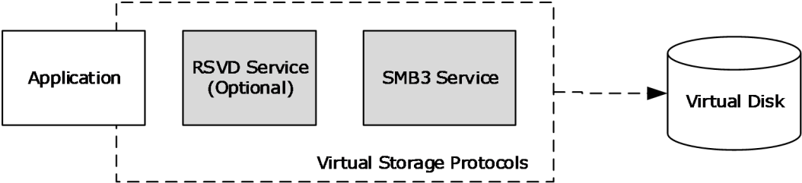
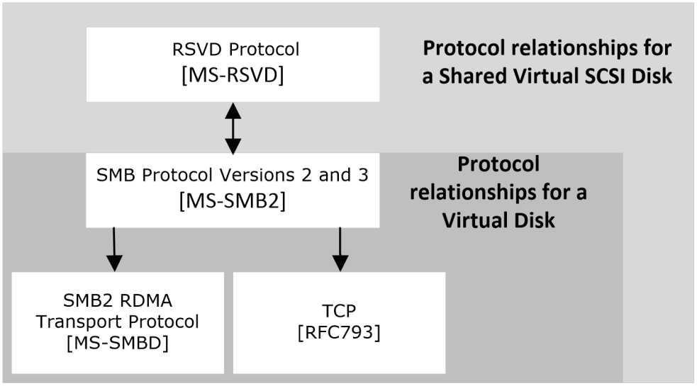
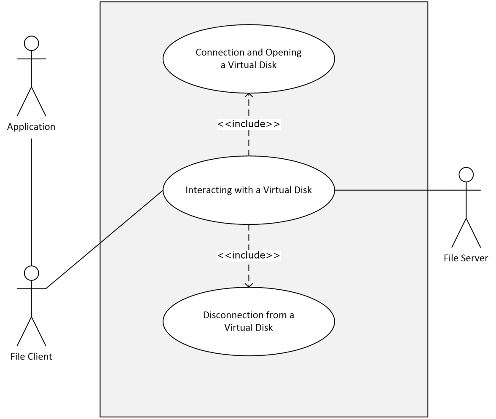
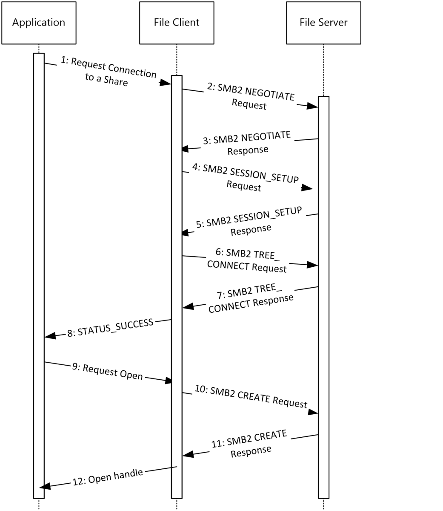
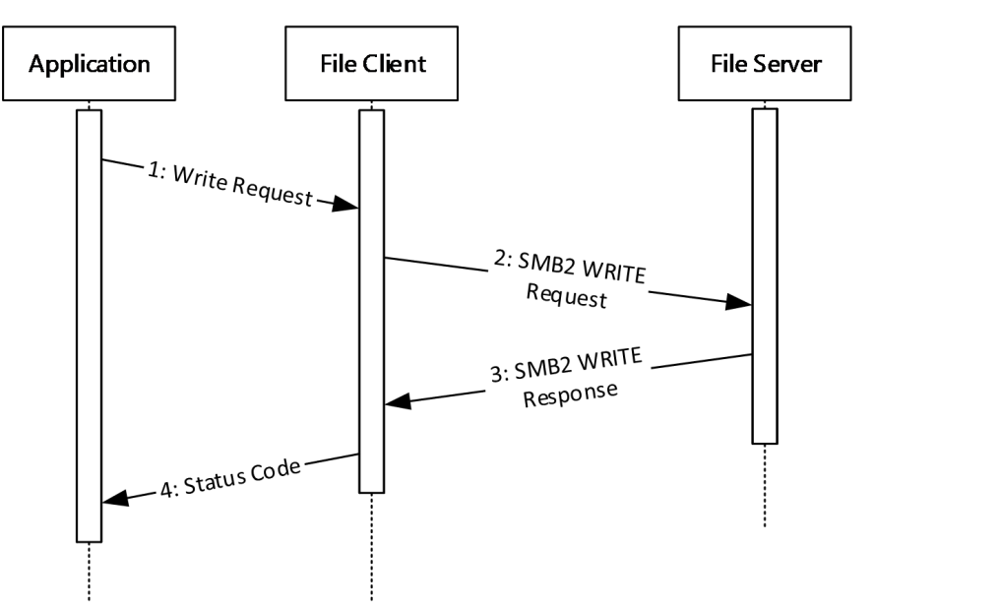
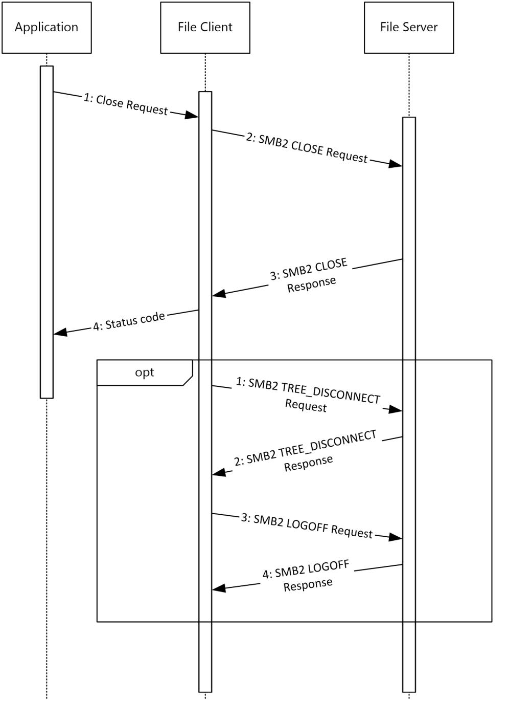
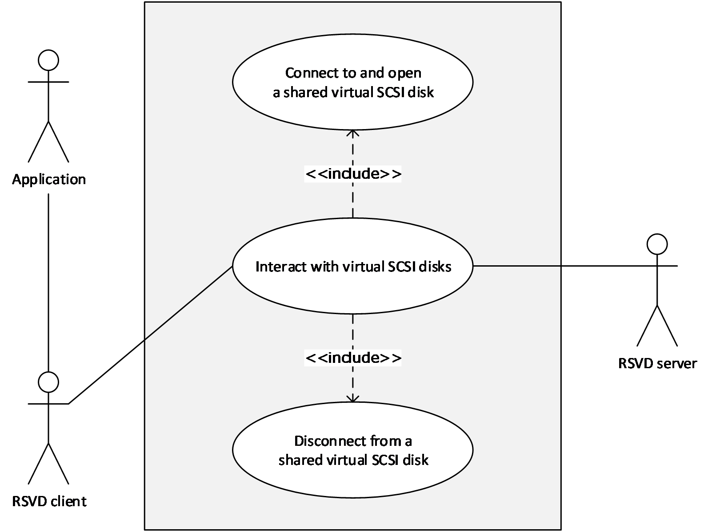
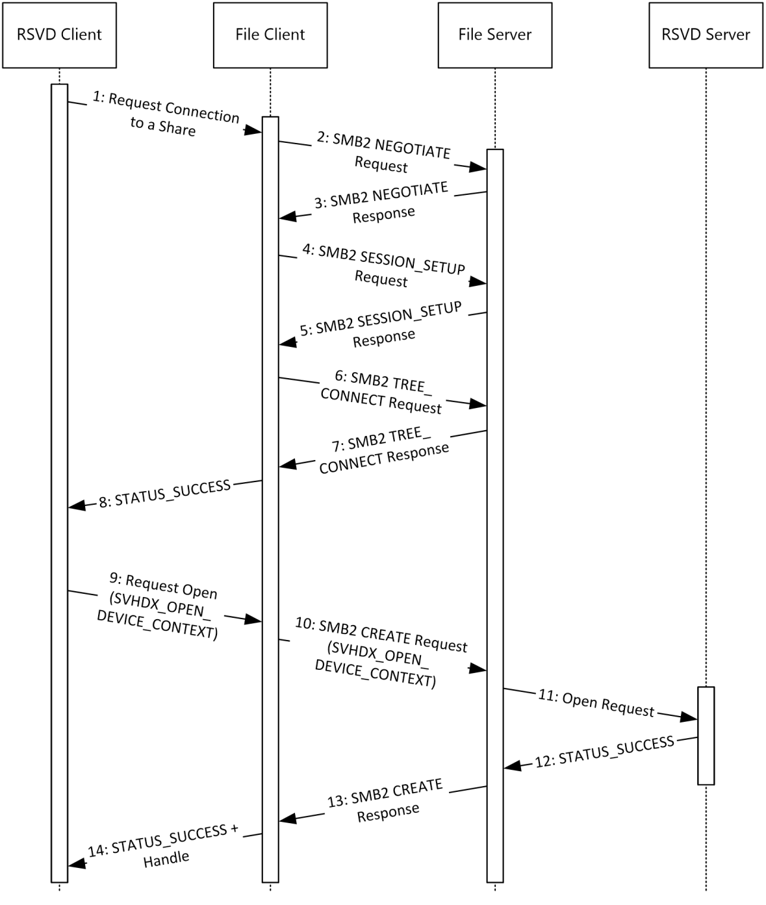
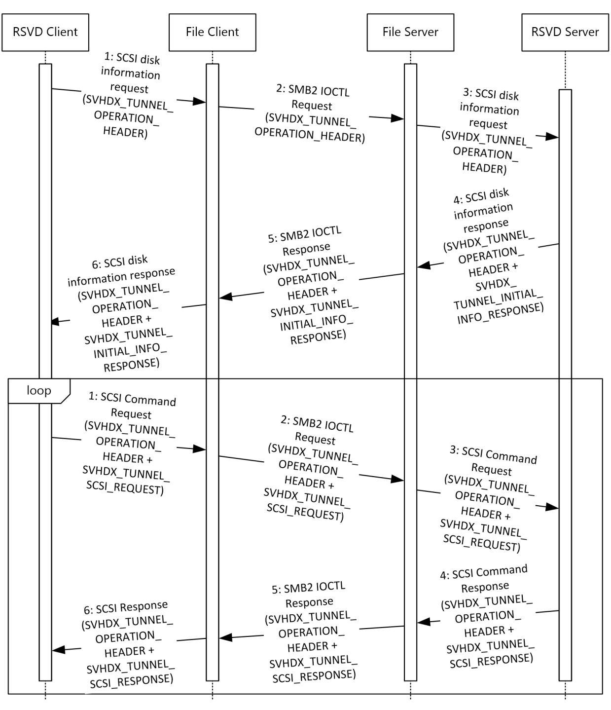
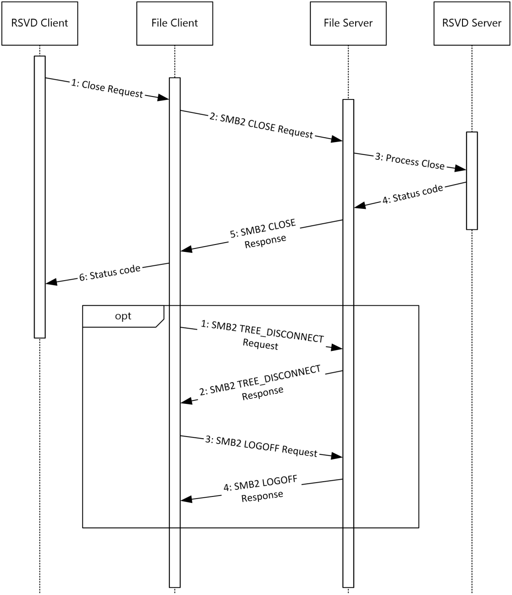

[MS-VSOD]:

Virtual Storage Protocols Overview

Intellectual Property Rights Notice for Open Specifications Documentation

  Technical Documentation. Microsoft publishes Open Specifications documentation (“this

documentation”) for protocols, file formats, data portability, computer languages, and standards
support. Additionally, overview documents cover inter-protocol relationships and interactions.

  Copyrights. This documentation is covered by Microsoft copyrights. Regardless of any other

terms that are contained in the terms of use for the Microsoft website that hosts this
documentation, you can make copies of it in order to develop implementations of the technologies
that are described in this documentation and can distribute portions of it in your implementations
that use these technologies or in your documentation as necessary to properly document the
implementation. You can also distribute in your implementation, with or without modification, any
schemas, IDLs, or code samples that are included in the documentation. This permission also
applies to any documents that are referenced in the Open Specifications documentation.
  No Trade Secrets. Microsoft does not claim any trade secret rights in this documentation.
  Patents. Microsoft has patents that might cover your implementations of the technologies

described in the Open Specifications documentation. Neither this notice nor Microsoft's delivery of
this documentation grants any licenses under those patents or any other Microsoft patents.
However, a given Open Specifications document might be covered by the Microsoft Open
Specifications Promise or the Microsoft Community Promise. If you would prefer a written license,
or if the technologies described in this documentation are not covered by the Open Specifications
Promise or Community Promise, as applicable, patent licenses are available by contacting
iplg@microsoft.com.

  License Programs. To see all of the protocols in scope under a specific license program and the

associated patents, visit the Patent Map.

  Trademarks. The names of companies and products contained in this documentation might be
covered by trademarks or similar intellectual property rights. This notice does not grant any
licenses under those rights. For a list of Microsoft trademarks, visit
www.microsoft.com/trademarks.

  Fictitious Names. The example companies, organizations, products, domain names, email

addresses, logos, people, places, and events that are depicted in this documentation are fictitious.
No association with any real company, organization, product, domain name, email address, logo,
person, place, or event is intended or should be inferred.

Reservation of Rights. All other rights are reserved, and this notice does not grant any rights other
than as specifically described above, whether by implication, estoppel, or otherwise.

Tools. The Open Specifications documentation does not require the use of Microsoft programming
tools or programming environments in order for you to develop an implementation. If you have access
to Microsoft programming tools and environments, you are free to take advantage of them. Certain
Open Specifications documents are intended for use in conjunction with publicly available standards
specifications and network programming art and, as such, assume that the reader either is familiar
with the aforementioned material or has immediate access to it.

Support. For questions and support, please contact dochelp@microsoft.com.

[MS-VSOD] - v20211026
Virtual Storage Protocols Overview
Copyright © 2021 Microsoft Corporation
Release: October 26, 2021

1 / 30

Revision Summary

Date

Revision
History

Revision
Class

Comments

4/26/2017

1.0

6/1/2017

1.0

12/15/2017  2.0

11/5/2018

3.0

6/3/2021

4.0

10/26/2021  5.0

New

None

Major

Major

Major

Major

Released new document.

No changes to the meaning, language, or formatting of the
technical content.

Significantly changed the technical content.

Significantly changed the technical content.

Significantly changed the technical content.

Significantly changed the technical content.

[MS-VSOD] - v20211026
Virtual Storage Protocols Overview
Copyright © 2021 Microsoft Corporation
Release: October 26, 2021

2 / 30

## Table of Contents

- [1 Introduction](#1-introduction)
  - [1.1 Glossary](#11-glossary)
  - [1.2 References](#12-references)
  - [1.3 Overview](#13-overview)
  - [1.4 Prerequisites/Preconditions](#14-prerequisitespreconditions)
- [2 Functional Description](#2-functional-description)
  - [2.1 Components and Capabilities](#21-components-and-capabilities)
  - [2.2 Summary of Protocols](#22-summary-of-protocols)
  - [2.3 Protocol Relationships](#23-protocol-relationships)
  - [2.4 Coherency Requirements](#24-coherency-requirements)
  - [2.5 Security](#25-security)
  - [2.6 Additional Considerations](#26-additional-considerations)
- [3 Use Cases](#3-use-cases)
  - [3.1 Accessing a Virtual Disk File](#31-accessing-a-virtual-disk-file)
    - [3.1.1 Connecting and Opening a Virtual Disk](#311-connecting-and-opening-a-virtual-disk)
      - [3.1.1.1 Success Case Example](#3111-success-case-example)
    - [3.1.2 Interacting with a Virtual Disk](#312-interacting-with-a-virtual-disk)
      - [3.1.2.1 Success Case Example](#3121-success-case-example)
    - [3.1.3 Disconnecting from a Virtual Disk](#313-disconnecting-from-a-virtual-disk)
      - [3.1.3.1 Success Case Example](#3131-success-case-example)
  - [3.2 Accessing a Shared Virtual SCSI Disk](#32-accessing-a-shared-virtual-scsi-disk)
    - [3.2.1 Connecting and Opening a Shared Virtual SCSI Disk](#321-connecting-and-opening-a-shared-virtual-scsi-disk)
      - [3.2.1.1 Success Case Example](#3211-success-case-example)
    - [3.2.2 Interacting with a Shared Virtual SCSI Disk](#322-interacting-with-a-shared-virtual-scsi-disk)
      - [3.2.2.1 Success Case Example](#3221-success-case-example)
    - [3.2.3 Disconnecting from a Shared Virtual SCSI Disk](#323-disconnecting-from-a-shared-virtual-scsi-disk)
      - [3.2.3.1 Success Case Example](#3231-success-case-example)
- [4 Product Behavior](#4-product-behavior)
- [5 Change Tracking](#5-change-tracking)
- [6 Index](#6-index)

## 1 Introduction

Virtualizing storage allows for high availability and more efficient use of physical storage space. Virtual
files can be hosted either locally or remotely for multiple access. An implementer can also leverage
network adapters that have Remote Direct Memory Access (RDMA) capability to provide faster
throughput and lower latency and CPU utilization. This document provides an overview of the
protocols that support virtual storage and provides examples of their use.

### 1.1 Glossary

This document uses the following terms:

application: A participant that is responsible for beginning, propagating, and completing an atomic

transaction. An application communicates with a transaction manager in order to begin and
complete transactions. An application communicates with a transaction manager in order to
marshal transactions to and from other applications. An application also communicates in
application-specific ways with a resource manager in order to submit requests for work on
resources.

Authentication Service (AS): A service that issues ticket granting tickets (TGTs), which are used
for authenticating principals within the realm or domain served by the Authentication Service.

file client: An application that implements client-side file access protocol components and enables

the primary actor, the user, to access the shared files on a remote file server.

file server: The service or process on a server computer that implements the server-side file

access protocol components to enable remote file sharing for the file clients.

high-availability share: A share that supports continuous availability of data by storing copies of

that data on multiple hosts.

open: A runtime object that corresponds to a currently established access to a specific file or a

named pipe from a specific client to a specific server, using a specific user security context. Both
clients and servers maintain opens that represent active accesses.

small computer system interface (SCSI): A set of standards for physically connecting and

transferring data between computers and peripheral devices.

user: The real person who has a member account. The user is authenticated by being asked to

prove knowledge of the secret password associated with the user name.

virtual disk: A disk that does not have a physical mechanical counterpart to it, and is not exposed
as a hardware array LUN. It is a disk that uses a file to store its data. When this file is exposed
to the operating system as a disk device, the exposed disk device emulates and, for all intents
and purposes, behaves like a physical disk.

virtual disk file: The file that is the backing store for a virtual disk. This file can be exposed to
an operating system as a disk device. The exposed disk device is referred to as a virtual disk.

### 1.2 References

Links to a document in the Microsoft Open Specifications library point to the correct section in the
most recently published version of the referenced document. However, because individual documents
in the library are not updated at the same time, the section numbers in the documents may not
match. You can confirm the correct section numbering by checking the Errata.

[MS-AUTHSOD] Microsoft Corporation, "Authentication Services Protocols Overview".

4 / 30

[MS-VSOD] - v20211026
Virtual Storage Protocols Overview
Copyright © 2021 Microsoft Corporation
Release: October 26, 2021

[MS-RSVD] Microsoft Corporation, "Remote Shared Virtual Disk Protocol".

[MS-SMB2] Microsoft Corporation, "Server Message Block (SMB) Protocol Versions 2 and 3".

[MS-SMBD] Microsoft Corporation, "SMB2 Remote Direct Memory Access (RDMA) Transport Protocol".

### 1.3 Overview

This document provides an overview of the functionality of and relationship among the Virtual Storage
protocols, which provide a means for a client to access, read, and write to virtual storage (for
example, a virtual disk file) on a remote server. Virtual Storage protocols can also provide this
functionality to multiple clients by using a shared virtual SCSI disk.

This document describes the intended functionality of the Virtual Storage protocols and how those
protocols interact with each other. It provides examples of some common use cases. It does not
restate the processing rules and other details that are specific for each protocol. Those details are
described in the specifications for the protocols and data structures that belong to this group.

### 1.4 Prerequisites/Preconditions

There are no prerequisites or preconditions beyond what is already described in [MS-SMB2] section
1.4, [MS-RSVD] section 1.4, and [MS-SMBD] section 1.4.

[MS-VSOD] - v20211026
Virtual Storage Protocols Overview
Copyright © 2021 Microsoft Corporation
Release: October 26, 2021

5 / 30

## 2 Functional Description

The Virtual Storage protocols that are described in this document provide functionality that supports:

  Allowing clients to open a virtual disk file on a remote server message block (SMB) share.

  Reading, writing, or closing of a virtual disk file on a remote SMB share.

  Allowing clients to close a virtual disk file on a remote SMB share.

  Allowing multiple clients to open a shared virtual SCSI disk on a remote share.

  Reading, writing, or closing shared virtual SCSI disk files on the target server.



Forwarding of raw SCSI commands and receipt of their results.

The following table describes the available methods of accessing the remote virtual disk, and the
advantages and limitations of each.

Method of Accessing Remote Virtual
Disk

Advantages

Limitations

Using Server Message Block (SMB)
Protocol Version 3 (SMB3)

Uses commodity storage
hardware

Single-user access

Using SMB3 when using the SMB2 Remote
Direct Memory Access (RDMA) Transport
Protocol (SMBDirect) as a transport

Using the Remote Shared Virtual Disk
Protocol (RSVD) on top of SMB3

Using RSVD on top of SMB3 when using
SMBDirect as a transport

Using Internet SCSI (iSCSI) to access the
remote virtual disk

Leverages RDMA-capable
networks for higher
throughputs, lower latencies,
and CPU utilization

Uses commodity storage
hardware

Multi-user access

Uses commodity storage
hardware

Secure access to files

Multi-user access

Leverages RDMA-capable
networks for higher
throughputs, lower latencies,
and CPU utilization

Uses commodity storage

Secure access to files

Multi-user access

Uses commodity storage
hardware

Single-user access

Requires specialized network
adapter hardware

### 2.1 Components and Capabilities

The primary purpose of this overview document is to describe the interactions among the protocols
used to access, read, and write to virtual storage, as shown in the following diagram.

[MS-VSOD] - v20211026
Virtual Storage Protocols Overview
Copyright © 2021 Microsoft Corporation
Release: October 26, 2021

6 / 30

<!-- Extracted images from page 7 -->

<!-- /Extracted images from page 7 -->

Figure 1: Virtual disk components

Application: The primary actor that triggers this use case.

RSVD service (Optional): Used for accessing the shared virtual SCSI disk and sending SCSI
commands.

SMB3 service: Used for connecting to and interacting with a virtual disk. Also used for connecting to
and forwarding RSVD service commands.

### 2.2 Summary of Protocols

The following table summarizes the primary purpose of the Virtual Storage protocols.

Applicability

Name

Description

Reference

Connecting to and
accessing shared file
resources

Server Message Block
(SMB) Protocol Versions 2
and 3

Supports the sharing of
file and print resources
between machines.

Accessing virtual disk files
via SMB and forwarding
SCSI commands

Remote Shared Virtual
Disk Protocol

Enables opening,
querying, administering,
reserving, reading, and
writing the virtual disk
objects, providing for
flexible access by single
or multiple consumers.

[MS-SMB2]

[MS-RSVD]

### 2.3 Protocol Relationships

The following diagram shows the dependencies and relationships of the Virtual Storage protocols to
each other and to industry standards.

[MS-VSOD] - v20211026
Virtual Storage Protocols Overview
Copyright © 2021 Microsoft Corporation
Release: October 26, 2021

7 / 30

<!-- Extracted images from page 8 -->

<!-- /Extracted images from page 8 -->

Figure 2: Protocol relationships

### 2.4 Coherency Requirements

This group of protocols has no special coherency requirements.

### 2.5 Security

When using SMB3 as the transport protocol, message signing ([MS-SMB2] section 3.2.4.1.1) and
encryption ([MS-SMB2] section 3.2.4.1.8) are available for privacy. For more information about
security, see [MS-SMB2] section 5.

### 2.6 Additional Considerations

There are no additional considerations.

[MS-VSOD] - v20211026
Virtual Storage Protocols Overview
Copyright © 2021 Microsoft Corporation
Release: October 26, 2021

8 / 30

<!-- Extracted images from page 9 -->

<!-- /Extracted images from page 9 -->

## 3 Use Cases

### 3.1 Accessing a Virtual Disk File

These use cases support accessing the content of a virtual disk that is on a high-availability share.

Method

Use cases

Using SMB3 to access the remote virtual disk

Connect and disconnect from the virtual disk.

Read and write commands to the virtual disk.

Figure 3: Accessing the content of a virtual disk

#### 3.1.1 Connecting and Opening a Virtual Disk

Goal

To create a connection and open a virtual disk on an SMB3 share.

Context of use

The user wants access to a virtual disk to access its contents. A connection has to be established to
the virtual disk first.

9 / 30

[MS-VSOD] - v20211026
Virtual Storage Protocols Overview
Copyright © 2021 Microsoft Corporation
Release: October 26, 2021

Actors

Application: The application is the primary actor that triggers this use case.

Authentication Service: The Authentication Service (AS) is a supporting actor that is used for
authentication purposes.

File Client: The file client is a supporting actor that implements client-side protocol components and
consumes the file services that are offered by the file server.

File Server: The file server is a supporting actor and implements server-side protocol components
and the file services that are consumed by the file client.

Preconditions

The virtual disk has already been created and hosted on an SMB3 share.

The user has located the path of the virtual disk.

The user has permissions to access the virtual disk.

Main success scenario

1.  Trigger: Based on interactions with the user, the application requests that the virtual disk be

opened.

2.  The application requests that the file client make a connection to and open the virtual disk.

3.  The file client first establishes the connection with the file server, as described in [MS-SMB2]

section 3.2.4.2.

4.  The file server authenticates the user through the mechanisms described in [MS-AUTHSOD].

5.  If the connection is successful, the file client opens the virtual disk on the file server, as described

in [MS-SMB2] section 3.2.4.3.

6.  The file server processes the open request, as described in [MS-SMB2] section 3.3.5.9.

7.  The file client returns a handle for the virtual disk to the application, as described in [MS-SMB2]

section 3.2.5.7.3.

Postcondition

The application can now use the file handle to read and write to the virtual disk.

Variations

None.

##### 3.1.1.1 Success Case Example

The following diagram shows the steps required to connect to and open the shared virtual disk.

[MS-VSOD] - v20211026
Virtual Storage Protocols Overview
Copyright © 2021 Microsoft Corporation
Release: October 26, 2021

10 / 30

<!-- Extracted images from page 11 -->

<!-- /Extracted images from page 11 -->

Figure 4: Connecting and opening a virtual disk

1.  The application requests that the file client open the share as described in [MS-SMB2] section

3.2.4.2.

2.  The file client processes the request and sends an SMB2 NEGOTIATE Request ([MS-SMB2] section
2.2.3) to the file server to notify the server about the dialects of the SMB2 protocol that the file
client understands.

3.  The file server processes the SMB2 NEGOTIATE Request, as described in [MS-SMB2] section

3.3.5.3. The file server responds to the file client with an SMB2 NEGOTIATE Response ([MS-SMB2]
section 2.2.4) to notify the file client of the preferred common dialect.

4.  The file client processes the SMB2 NEGOTIATE Request as described in [MS-SMB2] section

3.2.5.2. The file client attempts to establish a session with the file server, as described in [MS-
SMB2] section 3.2.4.2.3, by using the SMB2 SESSION_SETUP Request ([MS-SMB2] section 2.2.5).

[MS-VSOD] - v20211026
Virtual Storage Protocols Overview
Copyright © 2021 Microsoft Corporation
Release: October 26, 2021

11 / 30

5.  The file server processes the SMB2 SESSION_SETUP Request, as described in [MS-SMB2] section
3.3.5.5. The file server responds with an SMB2 SESSION_SETUP Response ([MS-SMB2] section
2.2.6).

6.  The file client processes the SMB2 SESSION_SETUP Response, as described in [MS-SMB2] section
3.2.5.3. The file client attempts to establish a tree connection to the file server, as described in
[MS-SMB2] section 3.2.4.2.4, using an SMB2 TREE_CONNECT Request ([MS-SMB2] section 2.2.9).

7.  The file server processes the SMB2 TREE_CONNECT request, as described in [MS-SMB2] section
3.3.5.7. The file server responds with an SMB2 TREE_CONNECT Response, as described in [MS-
SMB2] section 2.2.10.

8.  The file client processes the SMB2 TREE_CONNECT Response, as described in [MS-SMB2] section

3.2.5.5, and returns the STATUS_SUCCESS status code to the application.

9.  Upon success, the application requests that the file client open the virtual disk.

10. The file client processes the request, as described in [MS-SMB2] section 3.2.4.3. The file client
constructs an SMB2 CREATE Request that contains an SMB2_CREATE_CONTEXT Request ([MS-
SMB2] section 2.2.13.2).

11. The file server processes the SMB2 CREATE Request, as described in [MS-SMB2] section 3.3.5.9.

The file server constructs an SMB2 CREATE Response, as described in [MS-SMB2] section 3.3.5.9,
starting at the “Response Construction” phase.

12. The file client processes the SMB2 CREATE Response, as described in [MS-SMB2] section 3.2.5.7,

and returns the open handle to the application.

#### 3.1.2 Interacting with a Virtual Disk

Goal

To read and write to a virtual disk that is hosted on an SMB3 share.

Context of use

The user wants access to a virtual disk to be able to access its contents. A connection has to be
established to the virtual disk first.

Actors

Application: The application is the primary actor that triggers this use case.

File Client: The file client is a supporting actor that implements client-side protocol components and
consumes the file services that are offered by the file server.

File Server: The file server is a supporting actor and implements server-side protocol components
and the file services that are consumed by the file client.

Preconditions

The application has a valid file handle to the virtual disk, as described in section 3.1.1.

Main success scenario

1.  Trigger: Based on user interaction or an event, the application sends a read or write command to

the virtual disk.

2.  The application uses the interface described in [MS-SMB2] section 3.2.4.7 to request the file client

write to the virtual disk.

12 / 30

[MS-VSOD] - v20211026
Virtual Storage Protocols Overview
Copyright © 2021 Microsoft Corporation
Release: October 26, 2021

<!-- Extracted images from page 13 -->

<!-- /Extracted images from page 13 -->

3.  The file server processes the write, as described in [MS-SMB2] section 3.3.5.13.

Postconditions

Data has been written to the virtual disk.

Variations

None.

##### 3.1.2.1 Success Case Example

The following diagram shows the steps required to write to the virtual disk.

Figure 5: Writing to a virtual disk

1.  The application requests that the file client open the share as described in [MS-SMB2] section

3.2.4.7.

2.  The file client processes the request and sends an SMB2 WRITE Request ([MS-SMB2] section

2.2.21) to the file server.

3.  The file server processes the request as described in [MS-SMB2] section 3.3.5.13 and returns an

SMB2 WRITE Response ([MS-SMB2] section 2.2.22) to the file client.

4.  The file client processes the request as described in [MS-SMB2] section 3.2.5.12 and returns the

status code to the application.

#### 3.1.3 Disconnecting from a Virtual Disk

Goal

To close the connection to the virtual disk.

Context of use

The user no longer needs access to the contents of the virtual disk.

[MS-VSOD] - v20211026
Virtual Storage Protocols Overview
Copyright © 2021 Microsoft Corporation
Release: October 26, 2021

13 / 30

Actors

Application: The application is the primary actor that triggers this use case.

File Client: The file client is a supporting actor that implements client-side protocol components and
consumes the file services that are offered by the file server.

File Server: The file server is a supporting actor that implements server-side protocol components
and the file services that are consumed by the file client.

Preconditions

The application has a file handle identifying the virtual disk.

Main success scenario

1.  Trigger: Based on interactions with the user, the application closes the connection to the virtual

disk.

2.  The application uses the interface described in [MS-SMB2] section 3.2.4.5 to request that the file

client close the open on the virtual disk.

3.  The file server processes the close, as described in [MS-SMB2] section 3.3.4.17.

4.  Optionally, the file client can disconnect from the share.

Postcondition

The open to the virtual disk is now closed.

Variations

After the file handle is closed, the file client can optionally log off from the share.

##### 3.1.3.1 Success Case Example

The following diagram shows the steps required to close the connection to the virtual disk. Optionally,
the file client can log off from the share.

[MS-VSOD] - v20211026
Virtual Storage Protocols Overview
Copyright © 2021 Microsoft Corporation
Release: October 26, 2021

14 / 30

<!-- Extracted images from page 15 -->

<!-- /Extracted images from page 15 -->

Figure 6: Disconnecting from a virtual disk

The application is required to have a handle to the virtual disk as described in section 3.1.1.

1.  The application requests that the file client close the connection to the virtual disk. The file client

processes the close as described in [MS-SMB2] section 3.2.4.5.

2.  The file client sends an SMB2 CLOSE Request to the file server. The file server processes the SMB2

CLOSE Request as described in [MS-SMB2] section 3.3.5.10.

3.  The file server sends an SMB2 CLOSE Response, containing the status code returned from the

close operation, to the file client.

15 / 30

[MS-VSOD] - v20211026
Virtual Storage Protocols Overview
Copyright © 2021 Microsoft Corporation
Release: October 26, 2021

4.  The file client processes the SMB2 CLOSE Response, as described in [MS-SMB2] section 3.2.5.9,

and passes the status code to the application.

Optionally, the file client can disconnect from the file server.

1.  The file client processes the disconnect request as described in [MS-SMB2] section 3.2.4.22. The
file client sends an SMB2 TREE_DISCONNECT Request ([MS-SMB2] section 2.2.11) to the file
server.

2.  The file server processes the SMB2 TREE_DISCONNECT Request as described in [MS-SMB2]

section 3.3.5.8. The file server sends an SMB2 TREE_DISCONNECT Response ([MS-SMB2] section
2.2.12) to the file client.

3.  The file client processes the SMB2 TREE_DISCONNECT Response as described in [MS-SMB2]

section 3.2.5.6. The file client terminates the connection to the file server, as described in [MS-
SMB2] section 3.2.4.23, by sending an SMB2 LOGOFF Request.

4.  The file server processes the SMB2 LOGOFF Request as described in [MS-SMB2] section 3.3.5.6

and sends an SMB2 LOGOFF Response to the file client.

5.  Finally, the file client processes the SMB2 LOGOFF Response as described in [MS-SMB2] section

3.2.5.4.

### 3.2 Accessing a Shared Virtual SCSI Disk

These use cases support accessing the content of a shared virtual SCSI disk that is on a high-
availability share.

Method

Use cases

Using SMB3 to access the remote virtual disk
(optionally use SMBDirect)

Connect and disconnect from the shared virtual disk.

Read and write commands to the disk.

[MS-VSOD] - v20211026
Virtual Storage Protocols Overview
Copyright © 2021 Microsoft Corporation
Release: October 26, 2021

16 / 30

<!-- Extracted images from page 17 -->

<!-- /Extracted images from page 17 -->

Figure 7: Accessing the content of a shared virtual SCSI disk

#### 3.2.1 Connecting and Opening a Shared Virtual SCSI Disk

Goal

To create a connection and open a shared virtual SCSI disk on a high-availability share .

Context of use

The user wants access to the contents that are on a shared virtual SCSI disk. A connection has to be
established to the shared virtual SCI disk first.

Actors

Application: The application is the primary actor that triggers this use case.

RSVD Client: The RSVD client is a supporting actor that both implements the client role and
consumes the services that are offered by the RSVD server.

RSVD Server: The RSVD server is a supporting actor that implements the server role and services
the requests made by the RSVD client.

Authentication Service: The Authentication Service is a supporting actor that is used for
authentication purposes.

[MS-VSOD] - v20211026
Virtual Storage Protocols Overview
Copyright © 2021 Microsoft Corporation
Release: October 26, 2021

17 / 30

File Client: The file client is a supporting actor that implements client-side protocol components and
consumes the file services that are offered by the file server.

File Server: The file server is a supporting actor and implements server-side protocol components
and the file services that are consumed by the file client.

Preconditions

The shared virtual SCSI disk has already been created.

The user has located the path of the shared virtual SCSI disk.

The user has permissions to access the shared virtual SCSI disk.

Main success scenario

1.  Trigger: Based on interactions with the user, the application requests that the shared virtual SCSI

disk be opened.

2.  The application requests that the RSVD client connects to and opens the shared virtual SCSI disk

using the file client, as described in [MS-RSVD] section 3.1.4.2.

3.  The file client first establishes the connection with the file server as described in [MS-SMB2]

section 3.2.4.2.

4.  The file server authenticates the user through the mechanisms described in [MS-AUTHSOD].

5.  If the connection is successful, the file client opens the shared virtual SCSI disk on the file server

as described in [MS-SMB2] section 3.2.4.3.

6.  When the file server processes the open request, as described in [MS-SMB2] sections 3.3.5.9 and
3.3.5.9.14, the RSVD server processes the received open request as described in [MS-RSVD]
section 3.2.5.1.

7.  The RSVD client returns a handle for the shared virtual SCSI disk to the application.

Postcondition

The application can now use the file handle to read and write to the shared virtual SCSI disk.

Variations

None.

##### 3.2.1.1 Success Case Example

The following diagram shows the steps required to connect to and open the shared virtual SCSI disk.

[MS-VSOD] - v20211026
Virtual Storage Protocols Overview
Copyright © 2021 Microsoft Corporation
Release: October 26, 2021

18 / 30

<!-- Extracted images from page 19 -->

<!-- /Extracted images from page 19 -->

Figure 8: Connecting and opening a shared virtual SCSI disk

1.  The RSVD client requests opening a shared virtual SCSI disk as described in [MS-RSVD] section
3.1.4.2. The RSVD client requests that the file client open the share as described in [MS-SMB2]
section 3.2.4.2.

2.  The file client processes the request and sends an SMB2 NEGOTIATE Request ([MS-SMB2] section
2.2.3) to the file server to notify the server about the dialects of the SMB2 protocol that the file
client understands.

3.  The file server processes the SMB2 NEGOTIATE Request, as described in [MS-SMB2] section

3.3.5.3. The file server responds to the file client with an SMB2 NEGOTIATE Response ([MS-SMB2]

19 / 30

[MS-VSOD] - v20211026
Virtual Storage Protocols Overview
Copyright © 2021 Microsoft Corporation
Release: October 26, 2021

section 2.2.4) to notify the client of the preferred common dialect. The preferred common dialect
has to be version 3.0.2 or later.

4.  The file client processes the SMB2 NEGOTIATE Request as described in [MS-SMB2] section

3.2.5.2. The file client attempts to establish a session with the file server, as described in [MS-
SMB2] section 3.2.4.2.3, by using the SMB2 SESSION_SETUP Request ([MS-SMB2] section 2.2.5).

5.  The file server processes the SMB2 SESSION_SETUP Request, as described in [MS-SMB2] section
3.3.5.5. The file server responds with an SMB2 SESSION_SETUP Response ([MS-SMB2] section
2.2.6).

6.  The file client processes the SMB2 SESSION_SETUP Response, as described in [MS-SMB2] section
3.2.5.3. The file client attempts to establish a tree connection to the file server, as described in
[MS-SMB2] section 3.2.4.2.4, using an SMB2 TREE_CONNECT Request ([MS-SMB2] section 2.2.9).

7.  The file server processes the SMB2 TREE_CONNECT Request, as described in [MS-SMB2] section

3.3.5.7. The file server responds with an SMB2 TREE_CONNECT Response, as described in [MS-
SMB2] section 2.2.10.

8.  The file client processes the SMB2 TREE_CONNECT Response, as described in [MS-SMB2] section

3.2.5.5, and returns STATUS_SUCCESS to the RSVD client.

9.  Upon success, the RSVD client requests opening the shared virtual SCSI disk by sending the file

name of the shared virtual SCSI disk, and an SVHDX_OPEN_DEVICE_CONTEXT structure ([MS-
RSVD] section 2.2.4.12), and requests that the CreateOptions field of the SMB2 CREATE Request
be set to FILE_NO_INTERMEDIATE_BUFFERING. The values for the
SVHDX_OPEN_DEVICE_CONTEXT structure are described in [MS-RSVD] section 3.1.4.2.

10. The file client processes the request, as described in [MS-SMB2] section 3.2.4.3. The file client
constructs an SMB2 CREATE Request that contains an SMB2_CREATE_CONTEXT Request ([MS-
SMB2] section 2.2.13.2). The Buffer field of the SMB2_CREATE_CONTEXT will contain the
SVHDX_OPEN_DEVICE_CONTEXT structure that was passed in from the RSVD client ([MS-SMB2]
section 2.2.13.2.14).

11. The file server processes the SMB2 CREATE Request, as described in [MS-SMB2] sections 3.3.5.9

and 3.3.5.9.14. If successful, the file server passes the SVHDX_OPEN_DEVICE_CONTEXT structure
that is contained in the SMB2_CREATE_CONTEXT Request to the RSVD server.

12. The RSVD server processes the open request, as described in [MS-RSVD] section 3.2.5.1. If

successful, the RSVD server returns STATUS_SUCCESS to the file server.

13. The file server constructs an SMB2 CREATE Response, as described in [MS-SMB2] section 3.3.5.9,

starting at the “Response Construction” phase.

14. The file client processes the SMB2 CREATE Response, as described in [MS-SMB2] section 3.2.5.7,

and returns STATUS_SUCCESS to the RSVD client.

15. The RSVD client returns a handle for the opened shared virtual SCSI disk to the calling application.

#### 3.2.2 Interacting with a Shared Virtual SCSI Disk

Goal

This use case supports sending and receiving SCSI commands to a shared virtual SCSI disk.

Context of use

The user interacts with the application, causing information about the shared virtual SCSI disk to be
accessed for the contents contained in the shared virtual SCSI disk. Other events can also cause the
application to send SCSI commands to the shared virtual SCSI disk.

20 / 30

[MS-VSOD] - v20211026
Virtual Storage Protocols Overview
Copyright © 2021 Microsoft Corporation
Release: October 26, 2021

Actors

Application: The application is the primary actor that triggers this use case.

RSVD Client: The RSVD client is a supporting actor that both implements the client role and
consumes the services that are offered by the RSVD server.

RSVD Server: The RSVD server is a supporting actor that implements the server role and services
the requests made by the RSVD client.

File Client: The file client is a supporting actor that implements client-side protocol components and
consumes the file services that are offered by the file server.

File Server: The file server is a supporting actor and implements server-side protocol components
and the file services that are consumed by the file client.

Preconditions

The application has a valid file handle to the shared virtual SCSI disk, as described in section 3.2.1.

Main success scenario

1.  Trigger: Based on user interaction or an event, the application sends a SCSI command to the

shared virtual SCSI disk.

2.  Before sending the first SCSI command, the application queries the shared virtual SCSI disk for
information about itself. The application can retrieve this information as described in [MS-RSVD]
section 3.1.4.6.

3.  The RSVD server processes the request, as described in [MS-RSVD] section 3.2.5.5.1.

4.  The application sends a SCSI command to the shared virtual SCSI disk, as described in [MS-

RSVD] section 3.1.4.9.

5.  The RSVD server processes the SCSI command, as described in [MS-RSVD] section 3.2.5.5.5, and

sends the response from the shared virtual SCSI disk back to the RSVD client.

6.  The RSVD client passes any error or success data back to the application.

Postcondition

The application has received the data it requested from the shared virtual SCSI disk.

Variations

None.

##### 3.2.2.1 Success Case Example

The following diagram shows the steps required for the application to send SCSI commands to the
shared virtual SCSI disk. The application has to first retrieve the information about the shared virtual
SCSI disk before SCSI commands can be sent.

[MS-VSOD] - v20211026
Virtual Storage Protocols Overview
Copyright © 2021 Microsoft Corporation
Release: October 26, 2021

21 / 30

<!-- Extracted images from page 22 -->

<!-- /Extracted images from page 22 -->

Figure 9: Interacting with a shared virtual SCSI disk

The application is required to have a handle to the shared virtual SCSI disk, as described in section
3.2.1.

1.  Before the first SCSI command can be sent, the application has to retrieve the shared virtual SCSI
disk’s information. The application calls the RSVD client, providing the handle to the shared virtual
SCSI disk that was received in section 3.2.1 and providing the maximum buffer size the
application will accept, as described in [MS-RSVD] section 3.1.4.6. The RSVD client constructs an
SVHDX_TUNNEL_OPERATION_HEADER structure, as described in [MS-RSVD] section 3.1.4.6. The

22 / 30

[MS-VSOD] - v20211026
Virtual Storage Protocols Overview
Copyright © 2021 Microsoft Corporation
Release: October 26, 2021

RSVD client then calls the file client, as described in [MS-SMB2] section 3.2.4.20.11, providing the
handle, the control code of FSCTL_SVHDX_SYNC_TUNNEL_REQUEST, the
SVHDX_TUNNEL_OPERATION_HEADER structure ([MS-RSVD] section 2.2.4.11), and the buffer
size.

2.  The file client processes the request and sends an SMB2 IOCTL Request ([MS-SMB2] section

2.2.31) to the file server, as described in [MS-SMB2] section 3.3.5.15.15, with the
SVHDX_TUNNEL_OPERATION_HEADER structure in the Buffer field and the
MaxOutputResponse field set to the response buffer size.

3.  The file server processes the SMB2 IOCTL Request and passes the

SVHDX_TUNNEL_OPERATION_HEADER structure, the handle, and the value from the
MaxOutputResponse field to the RSVD server, as described in [MS-RSVD] section 3.2.4.

4.  The RSVD server processes the request, as described in [MS-RSVD] sections 3.2.5.5 and

3.2.5.5.1. The RSVD server returns an SVHDX_TUNNEL_OPERATION_HEADER structure and an
SVHDX_TUNNEL_INITIAL_INFO_RESPONSE structure to the file server containing the response.

5.  The file server creates an SMB2 IOCTL Response, as described in [MS-SMB2] section 2.2.32, with

the SVHDX_TUNNEL_OPERATION_HEADER and SVHDX_TUNNEL_INITIAL_INFO_RESPONSE
structures in the Buffer field. The SMB2 IOCTL Response is sent to the file client.

6.  The file client processes the SMB2 IOCTL Response as described in [MS-SMB2] section

3.2.5.14.13. The file client sends the response data to the RSVD client as described in [MS-RSVD]
section 3.1.5.5.

7.  The RSVD client processes the response and sends the status and the shared virtual SCSI disk’s
information to the application. With the virtual SCSI disk’s information, the application can now
send SCSI commands to the shared virtual SCSI disk.

The application calls the RSVD client as described in [MS-RSVD] section 3.1.4.9.

1.  The RSVD client constructs an SVHDX_TUNNEL_OPERATION_HEADER and

SVHDX_TUNNEL_SCSI_REQUEST structure. The RSVD client is only a transport for the SCSI
commands and doesn’t perform any processing on the application-provided values for the
CDBLength, SenseInfoExLength, DataIn, SrbFlags, and CDBBuffer fields of the
SVHDX_TUNNEL_SCSI_REQUEST structure. If the optional fields are not provided by the
application, the DataTransferLength field is set to zero and the DataBuffer field is set to
empty. The RSVD client then calls the interface on the file client, described in [MS-SMB2] section
3.2.4.20.11, and provides the handle and the SVHDX_TUNNEL_OPERATION_HEADER and
SVHDX_TUNNEL_SCSI_REQUEST structures.

2.  The file client processes the request, as described in [MS-SMB2] section 3.2.4.20.11, and sends
and SMB2 IOCTL Request to the file server. The Buffer field of the SMB2 IOCTL Request has to
contain the SVHDX_TUNNEL_OPERATION_HEADER and SVHDX_TUNNEL_SCSI_REQUEST
structures.

3.  The file server processes the request as described in [MS-SMB2] section 3.3.5.15.15. The file

server passes the SVHDX_TUNNEL_OPERATION_HEADER and SVHDX_TUNNEL_SCSI_REQUEST
structures to the RSVD server as described in [MS-RSVD] section 3.2.4.

4.  The RSVD server processes the request as described in [MS-RSVD] sections 3.2.5.5 and 3.2.5.5.5.
The RSVD server issues the CDB command contained in the SVHDX_TUNNEL_SCSI_REQUEST
structure to the shared virtual SCSI disk. The RSVD server constructs an
SVHDX_TUNNEL_OPERATION_HEADER and SVHDX_TUNNEL_SCSI_RESPONSE structure that
contains the response to the CDB command from the shared virtual SCSI disk.

5.  The file server creates an SMB2 IOCTL Response, as described in [MS-SMB2] section 2.2.32, with

the SVHDX_TUNNEL_OPERATION_HEADER and SVHDX_TUNNEL_SCSI_RESPONSE structures in
the Buffer field. The SMB2 IOCTL Response is then sent to the file client.

23 / 30

[MS-VSOD] - v20211026
Virtual Storage Protocols Overview
Copyright © 2021 Microsoft Corporation
Release: October 26, 2021

6.  The file client processes the SMB2 IOCTL Response as described in [MS-SMB2] section

3.2.5.14.13. The file client sends the response data to the RSVD client as described in [MS-RSVD]
section 3.1.5.8.

7.  The RSVD client processes the response and sends the status and the results of the CDB

command to the application.

#### 3.2.3 Disconnecting from a Shared Virtual SCSI Disk

Goal

To close the connection to the shared virtual SCSI disk.

Context of use

The user no longer needs access to the contents of the shared virtual SCSI disk.

Actors

Application: The application is the primary actor that triggers this use case.

RSVD Client: The RSVD client is a supporting actor that both implements the client role and
consumes the services that are offered by the RSVD server.

RSVD Server: The RSVD server is a supporting actor that implements the server role and services
the requests made by the RSVD client.

File Client: The file client is a supporting actor that implements client-side protocol components and
consumes the file services that are offered by the file server.

File Server: The file server is a supporting actor and implements server-side protocol components
and the file services that are consumed by the file client.

Preconditions

The application has a file handle identifying the shared virtual SCSI disk.

Main success scenario

1.  Trigger: The application receives input from the user indicating that the connection to the shared

virtual SCSI disk can be closed.

2.  The application uses the interface described in [MS-RSVD] section 3.1.4.3 to close the open on the

shared virtual SCSI disk using the file client.

3.  The file client closes the open as described in [MS-SMB2] section 3.2.4.5.

4.  The file server processes the close, as described in [MS-SMB2] section 3.3.4.17, and causes the

RSVD server to close the open as described in [MS-RSVD] section 3.2.5.2.

5.  Optionally, the file client can disconnect from the share.

Postcondition

The open to the shared virtual SCSI disk is now closed.

Variations

After the file handle is closed, the file client can optionally log off from the share.

[MS-VSOD] - v20211026
Virtual Storage Protocols Overview
Copyright © 2021 Microsoft Corporation
Release: October 26, 2021

24 / 30

<!-- Extracted images from page 25 -->

<!-- /Extracted images from page 25 -->

##### 3.2.3.1 Success Case Example

The following diagram shows the steps required to close the connection to the shared virtual SCSI
disk. Optionally, the file client can log off from the share.

Figure 10: Disconnecting from a shared virtual SCSI disk

The application is required to have a handle to the shared virtual SCSI disk as described in section
3.2.1.

[MS-VSOD] - v20211026
Virtual Storage Protocols Overview
Copyright © 2021 Microsoft Corporation
Release: October 26, 2021

25 / 30

1.  The application requests that the RSVD client close its connection to the shared virtual SCSI disk
as described in [MS-RSVD] section 3.1.4.3. The RSVD client requests that the file client process
the close as described in [MS-SMB2] section 3.2.4.5.

2.  The file client sends an SMB2 CLOSE Request to the file server. The file server passes the close

request to the RSVD server as described in [MS-RSVD] section 3.2.5.2.

3.  The RSVD server processes the close request.

4.  The RSVD server requests that the file server send an SMB2 CLOSE Response, containing the

status code returned from the close operation, to the file client.

5.  The file client processes the SMB2 CLOSE Response, as described in [MS-SMB2] section 3.2.5.9,

and passes the status code to the RSVD client.

6.  The RSVD client returns the response to the application as described in [MS-RSVD] section

3.1.5.2.

Optionally, the file client can disconnect from the file server.

1.  The file client processes the disconnect request as described in [MS-SMB2] section 3.2.4.22. The
file client sends an SMB2 TREE_DISCONNECT Request ([MS-SMB2] section 2.2.11) to the file
server.

2.  The file server processes the SMB2 TREE_DISCONNECT Request as described in [MS-SMB2]

section 3.3.5.8. The file server then sends an SMB2 TREE_DISCONNECT Response ([MS-SMB2]
section 2.2.12) to the file client.

3.  The file client processes the SMB2 TREE_DISCONNECT Response as described in [MS-SMB2]

section 3.2.5.6. The file client then terminates the connection to the file server, as described in
[MS-SMB2] section 3.2.4.23, by sending an SMB2 LOGOFF Request.

4.  The file server processes the SMB2 LOGOFF Request as described in [MS-SMB2] section 3.3.5.6.

The file server then sends an SMB2 LOGOFF Response to the file client.

5.  Finally, the file client processes the SMB2 LOGOFF Response as described in [MS-SMB2] section

3.2.5.4.

[MS-VSOD] - v20211026
Virtual Storage Protocols Overview
Copyright © 2021 Microsoft Corporation
Release: October 26, 2021

26 / 30

## 4 Product Behavior

The information in this document is applicable to the following Microsoft products or supplemental
software. References to product versions include released service packs:

  Windows 8.1 operating system

  Windows Server 2012 R2 operating system

  Windows 10 operating system

  Windows Server 2016 operating system

  Windows Server operating system

  Windows Server 2019 operating system

  Windows Server 2022 operating system

  Windows 11 operating system

[MS-VSOD] - v20211026
Virtual Storage Protocols Overview
Copyright © 2021 Microsoft Corporation
Release: October 26, 2021

27 / 30

## 5 Change Tracking

This section identifies changes that were made to this document since the last release. Changes are
classified as Major, Minor, or None.

The revision class Major means that the technical content in the document was significantly revised.
Major changes affect protocol interoperability or implementation. Examples of major changes are:

  A document revision that incorporates changes to interoperability requirements.
  A document revision that captures changes to protocol functionality.

The revision class Minor means that the meaning of the technical content was clarified. Minor changes
do not affect protocol interoperability or implementation. Examples of minor changes are updates to
clarify ambiguity at the sentence, paragraph, or table level.

The revision class None means that no new technical changes were introduced. Minor editorial and
formatting changes may have been made, but the relevant technical content is identical to the last
released version.

The changes made to this document are listed in the following table. For more information, please
contact dochelp@microsoft.com.

Section

Description

Revision class

4 Product Behavior  Updated for this version of Windows client.  Major

[MS-VSOD] - v20211026
Virtual Storage Protocols Overview
Copyright © 2021 Microsoft Corporation
Release: October 26, 2021

28 / 30

## 6 Index
C

Change tracking 28
Connecting and opening a shared virtual SCSI disk
   success case example 18
   use case detail 17
Connecting and opening a virtual disk
   success case example 10
   use case detail 9

D

   connecting and opening a shared virtual SCSI disk

17

   connecting and opening a virtual disk 9
   disconnecting from a shared virtual SCSI disk 24
   disconnecting from a virtual disk 13
   interacting with a shared virtual SCSI disk 20
   interacting with a virtual disk 12
Message signing 8
Methods used to access virtual disks – advantages

and limitations 6

Multi-user access to virtual disks 6

Diagrams
   accessing the content of a shared virtual SCSI disk

O

16

Overview (synopsis) 5

   accessing the content of a virtual disk 9
   connecting and opening a shared virtual SCSI disk

P

18

   connecting and opening a virtual disk 10
   disconnecting from a shared virtual SCSI disk 25
   disconnecting from a virtual disk 14
   interacting with shared virtual SCSI disks 21
   protocol relationships 7
   virtual disk components 6
   writing to a virtual disk 13
Disconnecting from a shared virtual SCSI disk
   success case example 25
   use case detail 24
Disconnecting from a virtual disk
   success case example 14
   use case detail 13

E

Encryption 8

G

Glossary 4

I

Informative references 4
Interacting with a shared virtual SCSI disk
   success case example 21
   use case detail 20
Interacting with a virtual disk
   success case example 13
   use case detail 12
Introduction 4

L

Limitation
   lower network speed 6
   single-user access 6
   specialized hardware 6

M

Main success scenario

[MS-VSOD] - v20211026
Virtual Storage Protocols Overview
Copyright © 2021 Microsoft Corporation
Release: October 26, 2021

Preconditions 5
Preferred common dialect notification (section

3.1.1.1 10, section 3.2.1.1 18)

Prerequisites 5
Primary purpose of protocols 7
Protocol relationships 7
Protocols - primary purpose 7

R

References 4
Relationships - protocols 7
RSVD client and RSVD server (section 3.2.1.1 18,

section 3.2.2.1 21, section 3.2.3.1 25)

RVSD service 6

S

Security 8
Single-user access to virtual disks 6
SMB3 service 6
Success case example
   connecting and opening a shared virtual SCSI disk

18

   connecting and opening a virtual disk 10
   disconnecting from a shared virtual SCSI disk 25
   disconnecting from a virtual disk 14
   interacting with a shared virtual SCSI disk 21
   interacting with a virtual disk 13

T

Tracking changes 28

U

Use case detail
   connecting and opening a shared virtual SCSI disk

17

   connecting and opening a virtual disk 9
   disconnecting from a shared virtual SCSI disk 24
   disconnecting from a virtual disk 13
   interacting with a shared virtual SCSI disk 20

29 / 30

   interacting with a virtual disk 12
   SMB3 share (section 3.1.1 9, section 3.1.2 12)
Use cases
   accessing a shared SCSI disk
      connect and disconnect 16
      read and write commands 16
   accessing a virtual disk file
      connect and disconnect 9
      read and write commands 9

[MS-VSOD] - v20211026
Virtual Storage Protocols Overview
Copyright © 2021 Microsoft Corporation
Release: October 26, 2021

30 / 30

