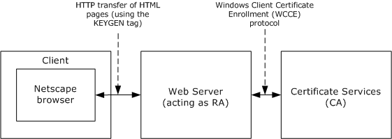
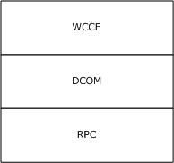
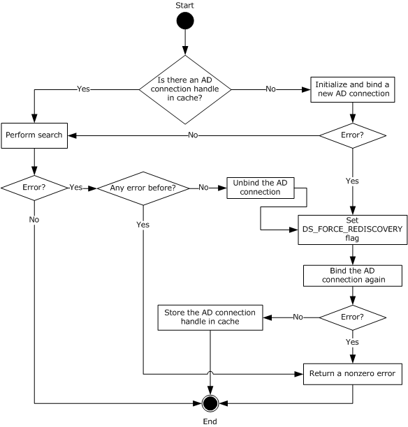
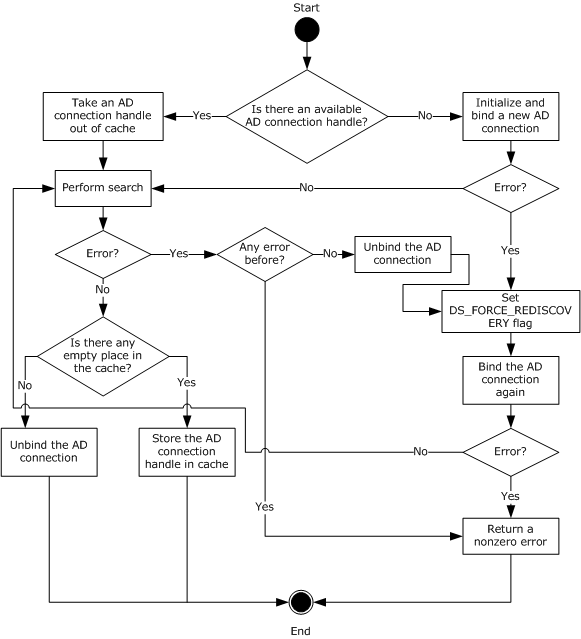
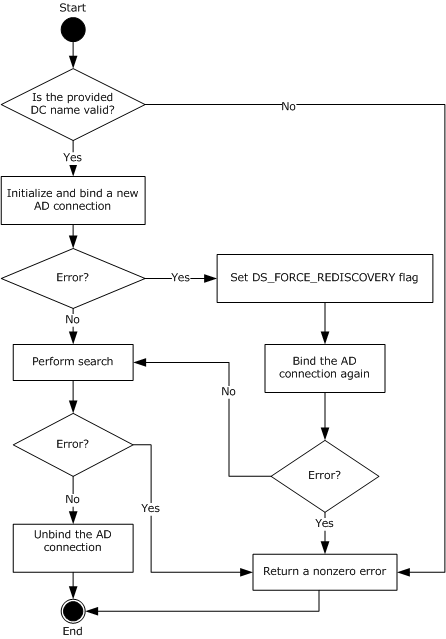
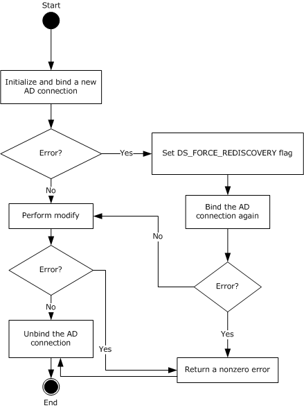
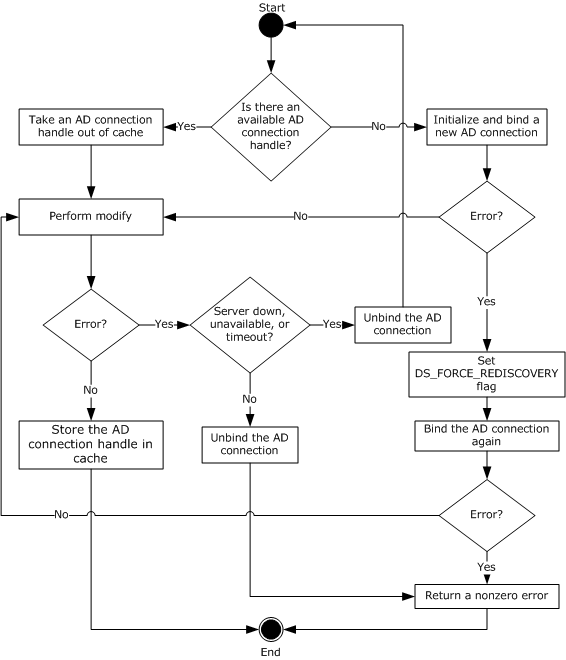
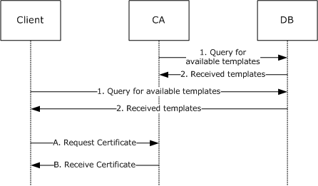

[MS-WCCE]:

Windows Client Certificate Enrollment Protocol

Intellectual Property Rights Notice for Open Specifications Documentation

  Technical Documentation. Microsoft publishes Open Specifications documentation (“this

documentation”) for protocols, file formats, data portability, computer languages, and standards
support. Additionally, overview documents cover inter-protocol relationships and interactions.

  Copyrights. This documentation is covered by Microsoft copyrights. Regardless of any other

terms that are contained in the terms of use for the Microsoft website that hosts this
documentation, you can make copies of it in order to develop implementations of the technologies
that are described in this documentation and can distribute portions of it in your implementations
that use these technologies or in your documentation as necessary to properly document the
implementation. You can also distribute in your implementation, with or without modification, any
schemas, IDLs, or code samples that are included in the documentation. This permission also
applies to any documents that are referenced in the Open Specifications documentation.
  No Trade Secrets. Microsoft does not claim any trade secret rights in this documentation.
  Patents. Microsoft has patents that might cover your implementations of the technologies

described in the Open Specifications documentation. Neither this notice nor Microsoft's delivery of
this documentation grants any licenses under those patents or any other Microsoft patents.
However, a given Open Specifications document might be covered by the Microsoft Open
Specifications Promise or the Microsoft Community Promise. If you would prefer a written license,
or if the technologies described in this documentation are not covered by the Open Specifications
Promise or Community Promise, as applicable, patent licenses are available by contacting
iplg@microsoft.com.

  License Programs. To see all of the protocols in scope under a specific license program and the

associated patents, visit the Patent Map.

  Trademarks. The names of companies and products contained in this documentation might be
covered by trademarks or similar intellectual property rights. This notice does not grant any
licenses under those rights. For a list of Microsoft trademarks, visit
www.microsoft.com/trademarks.

  Fictitious Names. The example companies, organizations, products, domain names, email

addresses, logos, people, places, and events that are depicted in this documentation are fictitious.
No association with any real company, organization, product, domain name, email address, logo,
person, place, or event is intended or should be inferred.

Reservation of Rights. All other rights are reserved, and this notice does not grant any rights other
than as specifically described above, whether by implication, estoppel, or otherwise.

Tools. The Open Specifications documentation does not require the use of Microsoft programming
tools or programming environments in order for you to develop an implementation. If you have access
to Microsoft programming tools and environments, you are free to take advantage of them. Certain
Open Specifications documents are intended for use in conjunction with publicly available standards
specifications and network programming art and, as such, assume that the reader either is familiar
with the aforementioned material or has immediate access to it.

Support. For questions and support, please contact dochelp@microsoft.com.

[MS-WCCE] - v20251121
Windows Client Certificate Enrollment Protocol
Copyright © 2025 Microsoft Corporation
Release: November 21, 2025

1 / 259

Revision Summary

Date

Revision
History

Revision
Class

Comments

2/22/2007

0.01

6/1/2007

1.0

New

Major

Version 0.01 release

Updated and revised the technical content.

7/3/2007

1.0.1

Editorial

Changed language and formatting in the technical content.

7/20/2007

1.1

Minor

Clarified the meaning of the technical content.

8/10/2007

1.1.1

Editorial

Changed language and formatting in the technical content.

9/28/2007

1.2

10/23/2007  2.0

11/30/2007  3.0

1/25/2008

4.0

3/14/2008

5.0

5/16/2008

6.0

6/20/2008

7.0

7/25/2008

7.1

8/29/2008

8.0

10/24/2008  9.0

12/5/2008

10.0

1/16/2009

11.0

2/27/2009

12.0

4/10/2009

13.0

5/22/2009

14.0

7/2/2009

15.0

8/14/2009

16.0

9/25/2009

17.0

11/6/2009

18.0

12/18/2009  19.0

1/29/2010

20.0

3/12/2010

21.0

4/23/2010

22.0

6/4/2010

23.0

7/16/2010

24.0

Minor

Major

Major

Major

Major

Major

Major

Minor

Major

Major

Major

Major

Major

Major

Major

Major

Major

Major

Major

Major

Major

Major

Major

Major

Major

Clarified the meaning of the technical content.

Updated and revised the technical content.

Updated and revised the technical content.

Updated and revised the technical content.

Updated and revised the technical content.

Updated and revised the technical content.

Updated and revised the technical content.

Clarified the meaning of the technical content.

Updated and revised the technical content.

Updated and revised the technical content.

Updated and revised the technical content.

Updated and revised the technical content.

Updated and revised the technical content.

Updated and revised the technical content.

Updated and revised the technical content.

Updated and revised the technical content.

Updated and revised the technical content.

Updated and revised the technical content.

Updated and revised the technical content.

Updated and revised the technical content.

Updated and revised the technical content.

Updated and revised the technical content.

Updated and revised the technical content.

Updated and revised the technical content.

Updated and revised the technical content.

[MS-WCCE] - v20251121
Windows Client Certificate Enrollment Protocol
Copyright © 2025 Microsoft Corporation
Release: November 21, 2025

2 / 259

Date

Revision
History

Revision
Class

Comments

8/27/2010

25.0

10/8/2010

26.0

11/19/2010  27.0

1/7/2011

28.0

2/11/2011

29.0

3/25/2011

30.0

5/6/2011

31.0

6/17/2011

31.1

9/23/2011

32.0

12/16/2011  33.0

3/30/2012

33.0

7/12/2012

34.0

10/25/2012  35.0

1/31/2013

35.0

8/8/2013

36.0

11/14/2013  37.0

2/13/2014

38.0

5/15/2014

38.0

Major

Major

Major

Major

Major

Major

Major

Minor

Major

Major

None

Major

Major

None

Major

Major

Major

None

Updated and revised the technical content.

Updated and revised the technical content.

Updated and revised the technical content.

Updated and revised the technical content.

Updated and revised the technical content.

Updated and revised the technical content.

Updated and revised the technical content.

Clarified the meaning of the technical content.

Updated and revised the technical content.

Updated and revised the technical content.

No changes to the meaning, language, or formatting of the
technical content.

Updated and revised the technical content.

Updated and revised the technical content.

No changes to the meaning, language, or formatting of the
technical content.

Updated and revised the technical content.

Updated and revised the technical content.

Updated and revised the technical content.

No changes to the meaning, language, or formatting of the
technical content.

6/30/2015

39.0

Major

Significantly changed the technical content.

10/16/2015  39.0

None

No changes to the meaning, language, or formatting of the
technical content.

7/14/2016

40.0

Major

Significantly changed the technical content.

6/1/2017

40.0

None

No changes to the meaning, language, or formatting of the
technical content.

9/15/2017

41.0

Major

Significantly changed the technical content.

12/1/2017

41.0

3/16/2018

42.0

9/12/2018

43.0

10/1/2020

44.0

4/7/2021

45.0

None

Major

Major

Major

Major

No changes to the meaning, language, or formatting of the
technical content.

Significantly changed the technical content.

Significantly changed the technical content.

Significantly changed the technical content.

Significantly changed the technical content.

[MS-WCCE] - v20251121
Windows Client Certificate Enrollment Protocol
Copyright © 2025 Microsoft Corporation
Release: November 21, 2025

3 / 259

Date

Revision
History

Revision
Class

Comments

6/25/2021

46.0

10/6/2021

47.0

9/20/2023

48.0

4/23/2024

49.0

5/12/2025

50.0

7/28/2025

50.0

8/11/2025

51.0

8/25/2025

52.0

11/21/2025  53.0

Major

Major

Major

Major

Major

None

Major

Major

Major

Significantly changed the technical content.

Significantly changed the technical content.

Significantly changed the technical content.

Significantly changed the technical content.

Significantly changed the technical content.

No changes to the meaning, language, or formatting of the
technical content.

Significantly changed the technical content.

Significantly changed the technical content.

Significantly changed the technical content.

[MS-WCCE] - v20251121
Windows Client Certificate Enrollment Protocol
Copyright © 2025 Microsoft Corporation
Release: November 21, 2025

4 / 259

## Table of Contents

- [1 Introduction](#1-introduction)
  - [1.1 Glossary](#11-glossary)
  - [1.2 References](#12-references)
    - [1.2.1 Normative References](#121-normative-references)
    - [1.2.2 Informative References](#122-informative-references)
  - [1.3 Overview](#13-overview)
    - [1.3.1 High-Level Protocol Operations](#131-high-level-protocol-operations)
    - [1.3.2 Concepts](#132-concepts)
      - [1.3.2.1 Key Archival](#1321-key-archival)
      - [1.3.2.2 Key Attestation](#1322-key-attestation)
      - [1.3.2.3 Certificate Transparency](#1323-certificate-transparency)
      - [1.3.2.4 Netscape KEYGEN Tag](#1324-netscape-keygen-tag)
      - [1.3.2.5 Sanitizing Common Names](#1325-sanitizing-common-names)
    - [1.3.3 Information for Certificate Templates](#133-information-for-certificate-templates)
      - [1.3.3.1 Template IDs](#1331-template-ids)
      - [1.3.3.2 Implementations Without Templates](#1332-implementations-without-templates)
      - [1.3.3.3 Modifying Templates](#1333-modifying-templates)
      - [1.3.3.4 Permissions on Templates](#1334-permissions-on-templates)
  - [1.4 Relationship to Other Protocols](#14-relationship-to-other-protocols)
  - [1.5 Prerequisites/Preconditions](#15-prerequisitespreconditions)
  - [1.6 Applicability Statement](#16-applicability-statement)
  - [1.7 Versioning and Capability Negotiation](#17-versioning-and-capability-negotiation)
  - [1.8 Vendor-Extensible Fields](#18-vendor-extensible-fields)
  - [1.9 Standards Assignments](#19-standards-assignments)
- [2 Messages](#2-messages)
  - [2.1 Transport](#21-transport)
  - [2.2 Common Data Types](#22-common-data-types)
    - [2.2.1 BYTE](#221-byte)
    - [2.2.2 Common Structures](#222-common-structures)
      - [2.2.2.1 CACERTBLOB](#2221-cacertblob)
      - [2.2.2.2 CERTTRANSBLOB](#2222-certtransblob)
        - [2.2.2.2.1 Marshaling Unicode Strings in CERTTRANSBLOB](#22221-marshaling-unicode-strings-in-certtransblob)
        - [2.2.2.2.2 Marshaling X.509 Certificates in a CERTTRANSBLOB](#22222-marshaling-x509-certificates-in-a-certtransblob)
        - [2.2.2.2.3 Marshaling an X.509 CRL in a CERTTRANSBLOB](#22223-marshaling-an-x509-crl-in-a-certtransblob)
        - [2.2.2.2.4 Marshaling CMS in a CERTTRANSBLOB](#22224-marshaling-cms-in-a-certtransblob)
        - [2.2.2.2.5 Marshaling CAINFO in CERTTRANSBLOB](#22225-marshaling-cainfo-in-certtransblob)
        - [2.2.2.2.6 Marshaling Certificate Requests in a CERTTRANSBLOB](#22226-marshaling-certificate-requests-in-a-certtransblob)
        - [2.2.2.2.7 Marshaling CMC in a CERTTRANSBLOB](#22227-marshaling-cmc-in-a-certtransblob)
      - [2.2.2.3 CATRANSPROP](#2223-catransprop)
        - [2.2.2.3.1 Marshaling CATRANSPROP in a CERTTRANSBLOB](#22231-marshaling-catransprop-in-a-certtransblob)
      - [2.2.2.4 CAINFO](#2224-cainfo)
      - [2.2.2.5 KeyAttestationStatement](#2225-keyattestationstatement)
      - [2.2.2.6 Request Format](#2226-request-format)
        - [2.2.2.6.1 PKCS #10 Request Format](#22261-pkcs-10-request-format)
        - [2.2.2.6.2 CMS Request Format](#22262-cms-request-format)
        - [2.2.2.6.3 CMC Request Format](#22263-cmc-request-format)
        - [2.2.2.6.4 Netscape KEYGEN Tag Request Format](#22264-netscape-keygen-tag-request-format)
          - [2.2.2.6.4.1 CertType](#222641-certtype)
          - [2.2.2.6.4.2 Relative Distinguished Name](#222642-relative-distinguished-name)
        - [2.2.2.6.5 Null Signature](#22265-null-signature)
      - [2.2.2.7 Certificate Request Attributes](#2227-certificate-request-attributes)
        - [2.2.2.7.1 szOID_OS_VERSION](#22271-szoidosversion)
        - [2.2.2.7.2 szOID_ENROLLMENT_CSP_PROVIDER](#22272-szoidenrollmentcspprovider)
        - [2.2.2.7.3 szOID_RENEWAL_CERTIFICATE](#22273-szoidrenewalcertificate)
        - [2.2.2.7.4 szOID_REQUEST_CLIENT_INFO](#22274-szoidrequestclientinfo)
        - [2.2.2.7.5 szOID_NT_PRINCIPAL_NAME](#22275-szoidntprincipalname)
        - [2.2.2.7.6 szOID_NTDS_REPLICATION](#22276-szoidntdsreplication)
        - [2.2.2.7.7 szOID_CERT_EXTENSIONS](#22277-szoidcertextensions)
          - [2.2.2.7.7.1 szOID_ENROLL_CERTTYPE](#222771-szoidenrollcerttype)
          - [2.2.2.7.7.2 szOID_CERTIFICATE_TEMPLATE](#222772-szoidcertificatetemplate)
          - [2.2.2.7.7.3 Encoding a Certificate Application Policy Extension](#222773-encoding-a-certificate-application-policy-extension)
          - [2.2.2.7.7.4 szOID_NTDS_CA_SECURITY_EXT](#222774-szoidntdscasecurityext)
        - [2.2.2.7.8 szOID_ARCHIVED_KEY_ATTR](#22278-szoidarchivedkeyattr)
        - [2.2.2.7.9 szOID_ENCRYPTED_KEY_HASH](#22279-szoidencryptedkeyhash)
        - [2.2.2.7.10 szENROLLMENT_NAME_VALUE_PAIR](#222710-szenrollmentnamevaluepair)
        - [2.2.2.7.11 szOID_ISSUED_CERT_HASH](#222711-szoidissuedcerthash)
        - [2.2.2.7.12 szOID_ENROLL_ATTESTATION_STATEMENT](#222712-szoidenrollattestationstatement)
        - [2.2.2.7.13 szOID_ENROLL_EK_INFO](#222713-szoidenrollekinfo)
        - [2.2.2.7.14 szOID_ENROLL_KSP_NAME](#222714-szoidenrollkspname)
        - [2.2.2.7.15 szOID_ENROLL_AIK_INFO](#222715-szoidenrollaikinfo)
      - [2.2.2.8 Response Format](#2228-response-format)
        - [2.2.2.8.1 CA Response Attributes](#22281-ca-response-attributes)
          - [2.2.2.8.1.1 szOID_ENROLL_ATTESTATION_CHALLENGE](#222811-szoidenrollattestationchallenge)
          - [2.2.2.8.1.2 szOID_ENROLL_CAXCHGCERT_HASH](#222812-szoidenrollcaxchgcerthash)
          - [2.2.2.8.1.3 szOID_ENROLL_KSP_NAME](#222813-szoidenrollkspname)
          - [2.2.2.8.1.4 szOID_ENROLL_ENCRYPTION_ALGORITHM](#222814-szoidenrollencryptionalgorithm)
      - [2.2.2.9 Private Key BLOB](#2229-private-key-blob)
        - [2.2.2.9.1 RSA Private Key BLOB](#22291-rsa-private-key-blob)
        - [2.2.2.9.2 BCRYPT RSA Private Key BLOB](#22292-bcrypt-rsa-private-key-blob)
        - [2.2.2.9.3 ECDH Private Key BLOB](#22293-ecdh-private-key-blob)
      - [2.2.2.10 Key Spec](#22210-key-spec)
      - [2.2.2.11 Enterprise PKI Data Structures](#22211-enterprise-pki-data-structures)
        - [2.2.2.11.1 Certificate Templates Container](#222111-certificate-templates-container)
        - [2.2.2.11.2 Enrollment Services Container](#222112-enrollment-services-container)
          - [2.2.2.11.2.1 cn Attribute](#2221121-cn-attribute)
          - [2.2.2.11.2.2 displayName Attribute](#2221122-displayname-attribute)
          - [2.2.2.11.2.3 certificateTemplates Attribute](#2221123-certificatetemplates-attribute)
          - [2.2.2.11.2.4 dNSHostName](#2221124-dnshostname)
          - [2.2.2.11.2.5 cACertificate Attribute](#2221125-cacertificate-attribute)
        - [2.2.2.11.3 NTAuthCertificates Object](#222113-ntauthcertificates-object)
        - [2.2.2.11.4 Certification Authorities Container](#222114-certification-authorities-container)
          - [2.2.2.11.4.1 cn Attribute](#2221141-cn-attribute)
          - [2.2.2.11.4.2 cACertificate Attribute](#2221142-cacertificate-attribute)
    - [2.2.3 Certificate Requirements](#223-certificate-requirements)
      - [2.2.3.1 Key Recovery Certificate](#2231-key-recovery-certificate)
    - [2.2.4 Common Error Codes](#224-common-error-codes)
  - [2.3 Directory Service Schema Elements](#23-directory-service-schema-elements)
- [3 Protocol Details](#3-protocol-details)
  - [3.1 Client Role](#31-client-role)
    - [3.1.1 Client Mode: Basic Enrollment](#311-client-mode-basic-enrollment)
      - [3.1.1.1 Abstract Data Model](#3111-abstract-data-model)
      - [3.1.1.2 Timers](#3112-timers)
      - [3.1.1.3 Initialization](#3113-initialization)
      - [3.1.1.4 Message Processing Events and Sequencing Rules](#3114-message-processing-events-and-sequencing-rules)
        - [3.1.1.4.1 Algorithms](#31141-algorithms)
          - [3.1.1.4.1.1 Sanitizing Common Names](#311411-sanitizing-common-names)
            - [3.1.1.4.1.1.1 Hashing Processing Rules](#3114111-hashing-processing-rules)
            - [3.1.1.4.1.1.2 Disallowed Characters](#3114112-disallowed-characters)
        - [3.1.1.4.2 Processing Rules for the pwszAuthority Parameter](#31142-processing-rules-for-the-pwszauthority-parameter)
        - [3.1.1.4.3 ICertRequestD::Request and ICertRequestD2::Request2 Processing](#31143-icertrequestdrequest-and-icertrequestd2request2-processing)
          - [3.1.1.4.3.1 New Certificate Requests](#311431-new-certificate-requests)
            - [3.1.1.4.3.1.1 New Certificate Request Using PKCS #10 Request Format](#3114311-new-certificate-request-using-pkcs-10-request-format)
            - [3.1.1.4.3.1.2 New Certificate Request Using CMS and PKCS #10 Request Formats](#3114312-new-certificate-request-using-cms-and-pkcs-10-request-formats)
            - [3.1.1.4.3.1.3 New Certificate Request Using CMS and CMC Request Formats](#3114313-new-certificate-request-using-cms-and-cmc-request-formats)
            - [3.1.1.4.3.1.4 New Certificate Request Using Netscape KEYGEN Request Format](#3114314-new-certificate-request-using-netscape-keygen-request-format)
          - [3.1.1.4.3.2 Renew Certificate Requests](#311432-renew-certificate-requests)
            - [3.1.1.4.3.2.1 Renew Certificate Request Using CMS and PKCS #10 Request Formats](#3114321-renew-certificate-request-using-cms-and-pkcs-10-request-formats)
            - [3.1.1.4.3.2.2 Renew Certificate Request Using CMS and CMC Request Formats](#3114322-renew-certificate-request-using-cms-and-cmc-request-formats)
          - [3.1.1.4.3.3 Enroll on Behalf of Certificate Requests](#311433-enroll-on-behalf-of-certificate-requests)
            - [3.1.1.4.3.3.1 Abstract Data Model](#3114331-abstract-data-model)
            - [3.1.1.4.3.3.2 Enroll on Behalf of Request Using CMS and PKCS #10 Request Formats](#3114332-enroll-on-behalf-of-request-using-cms-and-pkcs-10-request-formats)
            - [3.1.1.4.3.3.3 Enroll on Behalf of Certificate Request Using CMS and CMC Request](#3114333-enroll-on-behalf-of-certificate-request-using-cms-and-cmc-request)
          - [3.1.1.4.3.4 Certificate Request with Key Attestation](#311434-certificate-request-with-key-attestation)
            - [3.1.1.4.3.4.1 EK Attestation (Authority and Subject)](#3114341-ek-attestation-authority-and-subject)
              - [3.1.1.4.3.4.1.1 New Certificate Request with Key Attestation Statement](#31143411-new-certificate-request-with-key-attestation-statement)
              - [3.1.1.4.3.4.1.2 Responding to a CA Challenge Message](#31143412-responding-to-a-ca-challenge-message)
              - [3.1.1.4.3.4.1.3 Certificate Request with Challenge Response](#31143413-certificate-request-with-challenge-response)
            - [3.1.1.4.3.4.2 AIK Attestation (Subject Only)](#3114342-aik-attestation-subject-only)
              - [3.1.1.4.3.4.2.1 New Certificate Request with Key Attestation Statement](#31143421-new-certificate-request-with-key-attestation-statement)
          - [3.1.1.4.3.5 Certificate Requests with Certificate Transparency](#311435-certificate-requests-with-certificate-transparency)
            - [3.1.1.4.3.5.1 New Certificate Request with Certificate Transparency](#3114351-new-certificate-request-with-certificate-transparency)
            - [3.1.1.4.3.5.2 Signed Certificate Timestamp List Request](#3114352-signed-certificate-timestamp-list-request)
          - [3.1.1.4.3.6 Certificate Requests with Private Key Info](#311436-certificate-requests-with-private-key-info)
            - [3.1.1.4.3.6.1 Certificate Request with a Private Key Using CMC Request Format](#3114361-certificate-request-with-a-private-key-using-cmc-request-format)
          - [3.1.1.4.3.7 Certificate Request for Certificate Retrieval](#311437-certificate-request-for-certificate-retrieval)
          - [3.1.1.4.3.8 Certificate Requests in Pre-sign flow](#311438-certificate-requests-in-pre-sign-flow)
            - [3.1.1.4.3.8.1 New Certificate Request for Pre-sign Processing](#3114381-new-certificate-request-for-pre-sign-processing)
            - [3.1.1.4.3.8.2 New Certificate Request After Pre-sign Processing](#3114382-new-certificate-request-after-pre-sign-processing)
        - [3.1.1.4.4 ICertRequestD::GetCACert Request Processing](#31144-icertrequestdgetcacert-request-processing)
        - [3.1.1.4.5 ICertRequestD::Ping and ICertRequestD2::Ping2 Request Processing](#31145-icertrequestdping-and-icertrequestd2ping2-request-processing)
        - [3.1.1.4.6 ICertRequestD2::GetCAProperty Request Processing](#31146-icertrequestd2getcaproperty-request-processing)
        - [3.1.1.4.7 ICertRequestD2::GetCAPropertyInfo Request Processing](#31147-icertrequestd2getcapropertyinfo-request-processing)
      - [3.1.1.5 Timer Events](#3115-timer-events)
      - [3.1.1.6 Other Local Events](#3116-other-local-events)
        - [3.1.1.6.1 Retrieving the Pending Certificate Request](#31161-retrieving-the-pending-certificate-request)
        - [3.1.1.6.2 Submitting Certificate Request](#31162-submitting-certificate-request)
    - [3.1.2 Client Mode: Enrollment Based on Certificate Templates](#312-client-mode-enrollment-based-on-certificate-templates)
      - [3.1.2.1 Abstract Data Model](#3121-abstract-data-model)
      - [3.1.2.2 Timers](#3122-timers)
      - [3.1.2.3 Initialization](#3123-initialization)
      - [3.1.2.4 Message Processing Events and Sequencing Rules](#3124-message-processing-events-and-sequencing-rules)
        - [3.1.2.4.1 Algorithms](#31241-algorithms)
        - [3.1.2.4.2 ICertRequestD::Request and ICertRequestD2::Request2 Processing](#31242-icertrequestdrequest-and-icertrequestd2request2-processing)
          - [3.1.2.4.2.1 Choosing Certificate Request Types](#312421-choosing-certificate-request-types)
          - [3.1.2.4.2.2 Certificate Template Processing Rules](#312422-certificate-template-processing-rules)
            - [3.1.2.4.2.2.1 Processing Rules for Certificate Template Version 1](#3124221-processing-rules-for-certificate-template-version-1)
              - [3.1.2.4.2.2.1.1 Certificate.Template.flags](#31242211-certificatetemplateflags)
              - [3.1.2.4.2.2.1.2 Certificate.Template.pKIExtendedKeyUsage](#31242212-certificatetemplatepkiextendedkeyusage)
              - [3.1.2.4.2.2.1.3 Certificate.Template.pKIKeyUsage](#31242213-certificatetemplatepkikeyusage)
              - [3.1.2.4.2.2.1.4 Certificate.Template.pKIMaxIssuingDepth](#31242214-certificatetemplatepkimaxissuingdepth)
              - [3.1.2.4.2.2.1.5 Certificate.Template.pKIDefaultKeySpec](#31242215-certificatetemplatepkidefaultkeyspec)
              - [3.1.2.4.2.2.1.6 Certificate.Template.pKIDefaultCSPs](#31242216-certificatetemplatepkidefaultcsps)
              - [3.1.2.4.2.2.1.7 Certificate.Template.pKICriticalExtensions](#31242217-certificatetemplatepkicriticalextensions)
              - [3.1.2.4.2.2.1.8 Certificate.Template.cn](#31242218-certificatetemplatecn)
              - [3.1.2.4.2.2.1.9 Certificate.Template.revision](#31242219-certificatetemplaterevision)
            - [3.1.2.4.2.2.2 Processing Rules for Certificate Template Versions 2, 3, and 4](#3124222-processing-rules-for-certificate-template-versions-2-3-and-4)
              - [3.1.2.4.2.2.2.1 Certificate.Template.msPKI-Minimal-Key-Size](#31242221-certificatetemplatemspki-minimal-key-size)
              - [3.1.2.4.2.2.2.2 Certificate.Template.pKIDefaultCSPs](#31242222-certificatetemplatepkidefaultcsps)
              - [3.1.2.4.2.2.2.3 Certificate.Template.msPKI-Template-Cert-Template-OID](#31242223-certificatetemplatemspki-template-cert-template-oid)
              - [3.1.2.4.2.2.2.4 Certificate.Template.msPKI-Template-Minor-Revision](#31242224-certificatetemplatemspki-template-minor-revision)
              - [3.1.2.4.2.2.2.5 Certificate.Template.msPKI-RA-Application-Policies](#31242225-certificatetemplatemspki-ra-application-policies)
              - [3.1.2.4.2.2.2.6 Certificate.Template.msPKI-Certificate-Application-Policy](#31242226-certificatetemplatemspki-certificate-application-policy)
              - [3.1.2.4.2.2.2.7 Certificate.Template.msPKI-Enrollment-Flag](#31242227-certificatetemplatemspki-enrollment-flag)
              - [3.1.2.4.2.2.2.8 Certificate.Template.msPKI-Private-Key-Flag](#31242228-certificatetemplatemspki-private-key-flag)
              - [3.1.2.4.2.2.2.9 Certificate.Template.msPKI-Certificate-Policy](#31242229-certificatetemplatemspki-certificate-policy)
              - [3.1.2.4.2.2.2.10 Certificate.Template.msPKI-Certificate-Name-Flag](#312422210-certificatetemplatemspki-certificate-name-flag)
          - [3.1.2.4.2.3 Encoding Certificate Template Identifier in the Request](#312423-encoding-certificate-template-identifier-in-the-request)
      - [3.1.2.5 Timer Events](#3125-timer-events)
      - [3.1.2.6 Other Local Events](#3126-other-local-events)
        - [3.1.2.6.1 Creating a Certificate Request Based on a Certificate Template](#31261-creating-a-certificate-request-based-on-a-certificate-template)
  - [3.2 Server Role](#32-server-role)
          - [3.2.1.4.2.2 and 3.2.1.4.3.2, respectively.](#321422-and-321432-respectively)
            - [3.2.1.4.2.2.1 GETCERT_CASIGCERT - 0x00000000](#3214221-getcertcasigcert-0x00000000)
            - [3.2.1.4.2.2.2 GETCERT_CAXCHGCERT - 0x00000001](#3214222-getcertcaxchgcert-0x00000001)
            - [3.2.1.4.2.2.3 GETCERT_CURRENTCRL - 0x6363726C](#3214223-getcertcurrentcrl-0x6363726c)
            - [3.2.1.4.2.2.4 GETCERT_FILEVERSION - 0x66696C65](#3214224-getcertfileversion-0x66696c65)
            - [3.2.1.4.2.2.5 GETCERT_CAINFO - 0x696E666F](#3214225-getcertcainfo-0x696e666f)
            - [3.2.1.4.2.2.6 GETCERT_CANAME - 0x6E616D65](#3214226-getcertcaname-0x6e616d65)
            - [3.2.1.4.2.2.7 GETCERT_PARENTCONFIG - 0x70617265](#3214227-getcertparentconfig-0x70617265)
            - [3.2.1.4.2.2.8 GETCERT_POLICYVERSION - 0x706F6C69](#3214228-getcertpolicyversion-0x706f6c69)
            - [3.2.1.4.2.2.9 GETCERT_PRODUCTVERSION - 0x70726F64](#3214229-getcertproductversion-0x70726f64)
            - [3.2.1.4.2.2.10 GETCERT_SANITIZEDCANAME - 0x73616E69](#32142210-getcertsanitizedcaname-0x73616e69)
            - [3.2.1.4.2.2.11 GETCERT_SHAREDFOLDER - 0x73686172](#32142211-getcertsharedfolder-0x73686172)
            - [3.2.1.4.2.2.12 GETCERT_CATYPE - 0x74797065](#32142212-getcertcatype-0x74797065)
            - [3.2.1.4.2.2.13 GETCERT_CRLBYINDEX - 0x636C](#32142213-getcertcrlbyindex-0x636c)
            - [3.2.1.4.2.2.14 GETCERT_CACERTBYINDEX - 0x6374](#32142214-getcertcacertbyindex-0x6374)
            - [3.2.1.4.2.2.15 GETCERT_EXITVERSIONBYINDEX - 0x6578](#32142215-getcertexitversionbyindex-0x6578)
            - [3.2.1.4.2.2.16 GETCERT_CRLSTATEBYINDEX - 0x736C](#32142216-getcertcrlstatebyindex-0x736c)
            - [3.2.1.4.2.2.17 GETCERT_CACERTSTATEBYINDEX - 0x7374](#32142217-getcertcacertstatebyindex-0x7374)
          - [3.2.1.4.2.3 ICertRequestD::Ping (Opnum 5)](#321423-icertrequestdping-opnum-5)
        - [3.2.1.4.3 ICertRequestD2](#32143-icertrequestd2)
          - [3.2.1.4.3.1 ICertRequestD2::Request2 (Opnum 6)](#321431-icertrequestd2request2-opnum-6)
            - [3.2.1.4.3.1.1 dwFlags Packed Data Requirements](#3214311-dwflags-packed-data-requirements)
            - [3.2.1.4.3.1.2 Requesting Status Inspection](#3214312-requesting-status-inspection)
          - [3.2.1.4.3.2 ICertRequestD2::GetCAProperty (Opnum 7)](#321432-icertrequestd2getcaproperty-opnum-7)
            - [3.2.1.4.3.2.1 PropID = 0x00000001 (CR_PROP_FILEVERSION) "CA File Version"](#3214321-propid-0x00000001-crpropfileversion-ca-file-version)
            - [3.2.1.4.3.2.2 PropID = 0x00000002 (CR_PROP_PRODUCTVERSION) "CA Product](#3214322-propid-0x00000002-crpropproductversion-ca-product)
            - [3.2.1.4.3.2.3 PropID = 0x00000003 (CR_PROP_EXITCOUNT) "Exit Count"](#3214323-propid-0x00000003-crpropexitcount-exit-count)
            - [3.2.1.4.3.2.4 PropID = 0x00000004 (CR_PROP_EXITDESCRIPTION) "Exit Description"](#3214324-propid-0x00000004-crpropexitdescription-exit-description)
            - [3.2.1.4.3.2.5 PropID = 0x00000005 (CR_PROP_POLICYDESCRIPTION) "Policy](#3214325-propid-0x00000005-crproppolicydescription-policy)
            - [3.2.1.4.3.2.6 PropID = 0x00000006 (CR_PROP_CANAME) "Certification Authority](#3214326-propid-0x00000006-crpropcaname-certification-authority)
            - [3.2.1.4.3.2.7 PropID = 0x00000007 (CR_PROP_SANITIZEDCANAME) "Sanitized CA](#3214327-propid-0x00000007-crpropsanitizedcaname-sanitized-ca)
            - [3.2.1.4.3.2.8 PropID = 0x00000008 (CR_PROP_SHAREDFOLDER) "Shared Folder](#3214328-propid-0x00000008-crpropsharedfolder-shared-folder)
            - [3.2.1.4.3.2.9 PropID = 0x00000009 (CR_PROP_PARENTCA) "Parent CA Name"](#3214329-propid-0x00000009-crpropparentca-parent-ca-name)
            - [3.2.1.4.3.2.10 PropID = 0x0000000A (CR_PROP_CATYPE) "CA Type"](#32143210-propid-0x0000000a-crpropcatype-ca-type)
            - [3.2.1.4.3.2.11 PropID = 0x0000000B (CR_PROP_CASIGCERTCOUNT) "CA](#32143211-propid-0x0000000b-crpropcasigcertcount-ca)
            - [3.2.1.4.3.2.12 PropID = 0x0000000C (CR_PROP_CASIGCERT) "CA Signature](#32143212-propid-0x0000000c-crpropcasigcert-ca-signature)
            - [3.2.1.4.3.2.13 PropID = 0x0000000D (CR_PROP_CASIGCERTCHAIN) "CA signing](#32143213-propid-0x0000000d-crpropcasigcertchain-ca-signing)
            - [3.2.1.4.3.2.14 PropID = 0x0000000E (CR_PROP_CAXCHGCERTCOUNT) "CA](#32143214-propid-0x0000000e-crpropcaxchgcertcount-ca)
            - [3.2.1.4.3.2.15 PropID = 0x0000000F (CR_PROP_CAXCHGCERT) "CA Exchange](#32143215-propid-0x0000000f-crpropcaxchgcert-ca-exchange)
              - [3.2.1.4.3.2.15.1 Creating a CA Exchange Certificate](#321432151-creating-a-ca-exchange-certificate)
            - [3.2.1.4.3.2.16 PropID = 0x00000010 (CR_PROP_CAXCHGCERTCHAIN) "CA](#32143216-propid-0x00000010-crpropcaxchgcertchain-ca)
            - [3.2.1.4.3.2.17 PropID = 0x00000011 (CR_PROP_BASECRL) "Base CRL"](#32143217-propid-0x00000011-crpropbasecrl-base-crl)
            - [3.2.1.4.3.2.18 PropID = 0x00000012 (CR_PROP_DELTACRL) "Delta CRL"](#32143218-propid-0x00000012-crpropdeltacrl-delta-crl)
            - [3.2.1.4.3.2.19 PropID = 0x00000013 (CR_PROP_CACERTSTATE) "CA Signing](#32143219-propid-0x00000013-crpropcacertstate-ca-signing)
            - [3.2.1.4.3.2.20 PropID = 0x00000014 (CR_PROP_CRLSTATE) "CA CRL State"](#32143220-propid-0x00000014-crpropcrlstate-ca-crl-state)
            - [3.2.1.4.3.2.21 PropID = 0x00000015 (CR_PROP_CAPROPIDMAX) "Maximum](#32143221-propid-0x00000015-crpropcapropidmax-maximum)
            - [3.2.1.4.3.2.22 PropID = 0x00000016 (CR_PROP_DNSNAME) "CA Fully Qualified](#32143222-propid-0x00000016-crpropdnsname-ca-fully-qualified)
            - [3.2.1.4.3.2.23 PropID = 0x00000017 (CR_PROP_ROLESEPARATIONENABLED)](#32143223-propid-0x00000017-crproproleseparationenabled)
            - [3.2.1.4.3.2.24 PropID = 0x00000018 (CR_PROP_KRACERTUSEDCOUNT) "Count](#32143224-propid-0x00000018-crpropkracertusedcount-count)
            - [3.2.1.4.3.2.25 PropID = 0x00000019 (CR_PROP_KRACERTCOUNT) "Count Of](#32143225-propid-0x00000019-crpropkracertcount-count-of)
            - [3.2.1.4.3.2.26 PropID = 0x0000001A (CR_PROP_KRACERT) "KRA Certificate"](#32143226-propid-0x0000001a-crpropkracert-kra-certificate)
            - [3.2.1.4.3.2.27 PropID = 0x0000001B (CR_PROP_KRACERTSTATE) "KRA](#32143227-propid-0x0000001b-crpropkracertstate-kra)
            - [3.2.1.4.3.2.28 PropID = 0x0000001C (CR_PROP_ADVANCEDSERVER) "Advanced](#32143228-propid-0x0000001c-crpropadvancedserver-advanced)
            - [3.2.1.4.3.2.29 PropID = 0x0000001D (CR_PROP_TEMPLATES) "Configured](#32143229-propid-0x0000001d-crproptemplates-configured)
            - [3.2.1.4.3.2.30 PropID = 0x0000001E (CR_PROP_BASECRLPUBLISHSTATUS)](#32143230-propid-0x0000001e-crpropbasecrlpublishstatus)
            - [3.2.1.4.3.2.31 PropID = 0x0000001F (CR_PROP_DELTACRLPUBLISHSTATUS)](#32143231-propid-0x0000001f-crpropdeltacrlpublishstatus)
            - [3.2.1.4.3.2.32 PropID = 0x00000020 (CR_PROP_CASIGCERTCRLCHAIN) "CA](#32143232-propid-0x00000020-crpropcasigcertcrlchain-ca)
            - [3.2.1.4.3.2.33 PropID = 0x00000021 (CR_PROP_CAXCHGCERTCRLCHAIN) "CA](#32143233-propid-0x00000021-crpropcaxchgcertcrlchain-ca)
            - [3.2.1.4.3.2.34 PropID = 0x00000022 (CR_PROP_CACERTSTATUSCODE) "CA](#32143234-propid-0x00000022-crpropcacertstatuscode-ca)
            - [3.2.1.4.3.2.35 PropID = 0x00000023 (CR_PROP_CAFORWARDCROSSCERT) "CA](#32143235-propid-0x00000023-crpropcaforwardcrosscert-ca)
            - [3.2.1.4.3.2.36 PropID = 0x00000024 (CR_PROP_CABACKWARDCROSSCERT) "CA](#32143236-propid-0x00000024-crpropcabackwardcrosscert-ca)
            - [3.2.1.4.3.2.37 PropID = 0x00000025](#32143237-propid-0x00000025)
            - [3.2.1.4.3.2.38 PropID = 0x00000026](#32143238-propid-0x00000026)
            - [3.2.1.4.3.2.39 PropID = 0x00000027 (CR_PROP_CACERTVERSION) "CA Signing](#32143239-propid-0x00000027-crpropcacertversion-ca-signing)
            - [3.2.1.4.3.2.40 PropID = 0x00000028 (CR_PROP_SANITIZEDCASHORTNAME)](#32143240-propid-0x00000028-crpropsanitizedcashortname)
            - [3.2.1.4.3.2.41 PropID = 0x00000029 (CR_PROP_CERTCDPURLS) "CRL](#32143241-propid-0x00000029-crpropcertcdpurls-crl)
            - [3.2.1.4.3.2.42 PropID = 0x0000002A (CR_PROP_CERTAIAURLS) "Authority](#32143242-propid-0x0000002a-crpropcertaiaurls-authority)
            - [3.2.1.4.3.2.43 PropID = 0x0000002B (CR_PROP_CERTAIAOCSPRLS) "OCSP](#32143243-propid-0x0000002b-crpropcertaiaocsprls-ocsp)
            - [3.2.1.4.3.2.44 PropID = 0x0000002C (CR_PROP_LOCALENAME) "CA Locale](#32143244-propid-0x0000002c-crproplocalename-ca-locale)
            - [3.2.1.4.3.2.45 PropID = 0x0000002D (CR_PROP_SUBJECTTEMPLATE_OIDS)](#32143245-propid-0x0000002d-crpropsubjecttemplateoids)
            - [3.2.1.4.3.2.46 PropID = 0x0000002E (CR_PROP_CRLPARTITIONCOUNT) "CRL](#32143246-propid-0x0000002e-crpropcrlpartitioncount-crl)
            - [3.2.1.4.3.2.47 PropID = 0x0000002F (CR_PROP_PARTITIONED_BASECRL)](#32143247-propid-0x0000002f-crproppartitionedbasecrl)
            - [3.2.1.4.3.2.48 PropID = 0x00000030 (CR_PROP_PARTITIONED_DELTACRL)](#32143248-propid-0x00000030-crproppartitioneddeltacrl)
            - [3.2.1.4.3.2.49 PropID = 0x00000031](#32143249-propid-0x00000031)
            - [3.2.1.4.3.2.50 PropID = 0x00000032 (CR_PROP_](#32143250-propid-0x00000032-crprop)
          - [3.2.1.4.3.3 ICertRequestD2::GetCAPropertyInfo (Opnum 8)](#321433-icertrequestd2getcapropertyinfo-opnum-8)
          - [3.2.1.4.3.4 ICertRequestD2::Ping2 (Opnum 9)](#321434-icertrequestd2ping2-opnum-9)
      - [3.2.1.5 Timer Events](#3215-timer-events)
      - [3.2.1.6 Other Local Events](#3216-other-local-events)
    - [3.2.2 Server Mode: Enterprise CA](#322-server-mode-enterprise-ca)
      - [3.2.2.1 Interaction with Active Directory](#3221-interaction-with-active-directory)
        - [3.2.2.1.1 Search Requests for Reading Objects under Enrollment Services or Certificate](#32211-search-requests-for-reading-objects-under-enrollment-services-or-certificate)
          - [3.2.2.1.1.1 Search Requests](#322111-search-requests)
          - [3.2.2.1.1.2 Bind Requests](#322112-bind-requests)
        - [3.2.2.1.2 Search Requests for Querying End Entity Object Attributes](#32212-search-requests-for-querying-end-entity-object-attributes)
          - [3.2.2.1.2.1 Search Requests](#322121-search-requests)
          - [3.2.2.1.2.2 Bind Requests](#322122-bind-requests)
        - [3.2.2.1.3 Search Requests for Querying End Entity Object Attributes with an End Entity](#32213-search-requests-for-querying-end-entity-object-attributes-with-an-end-entity)
          - [3.2.2.1.3.1 Search Requests](#322131-search-requests)
          - [3.2.2.1.3.2 Bind Requests](#322132-bind-requests)
        - [3.2.2.1.4 Publishing KRA Certificates](#32214-publishing-kra-certificates)
          - [3.2.2.1.4.1 Search Requests](#322141-search-requests)
          - [3.2.2.1.4.2 Bind Requests](#322142-bind-requests)
        - [3.2.2.1.5 Publishing Issued Certificates](#32215-publishing-issued-certificates)
          - [3.2.2.1.5.1 Search Requests](#322151-search-requests)
          - [3.2.2.1.5.2 Bind Requests](#322152-bind-requests)
        - [3.2.2.1.6 Determining DC Support for Signing](#32216-determining-dc-support-for-signing)
        - [3.2.2.1.7 Converting the LDAP results to HRESULT](#32217-converting-the-ldap-results-to-hresult)
      - [3.2.2.2 CA Information in the Active Directory](#3222-ca-information-in-the-active-directory)
      - [3.2.2.3 Abstract Data Model](#3223-abstract-data-model)
        - [3.2.2.3.1 Certificate Templates Replica Table](#32231-certificate-templates-replica-table)
      - [3.2.2.4 Timers](#3224-timers)
      - [3.2.2.5 Initialization](#3225-initialization)
      - [3.2.2.6 Message Processing Events and Sequencing Rules](#3226-message-processing-events-and-sequencing-rules)
        - [3.2.2.6.1 Algorithms](#32261-algorithms)
        - [3.2.2.6.2 ICertRequestD](#32262-icertrequestd)
          - [3.2.2.6.2.1 ICertRequestD::Request (Opnum 3)](#322621-icertrequestdrequest-opnum-3)
            - [3.2.2.6.2.1.1 Parsing and Verifying pwszAttributes](#3226211-parsing-and-verifying-pwszattributes)
            - [3.2.2.6.2.1.2 Processing a Request](#3226212-processing-a-request)
              - [3.2.2.6.2.1.2.1 Processing Rules for Request on Behalf of a Different Subject](#32262121-processing-rules-for-request-on-behalf-of-a-different-subject)
                - [3.2.2.6.2.1.2.1.1 Request on Behalf of Using CMS and PKCS #10 Request Formats](#322621211-request-on-behalf-of-using-cms-and-pkcs-10-request-formats)
                - [3.2.2.6.2.1.2.1.2 Request on Behalf of Using CMS and CMC Request Format](#322621212-request-on-behalf-of-using-cms-and-cmc-request-format)
              - [3.2.2.6.2.1.2.2 Processing Rules for Requests That Include Private Key](#32262122-processing-rules-for-requests-that-include-private-key)
              - [3.2.2.6.2.1.2.3 Processing Rules for Renewal Request](#32262123-processing-rules-for-renewal-request)
              - [3.2.2.6.2.1.2.4 Processing Renewal Request on Behalf of a Different Subject](#32262124-processing-renewal-request-on-behalf-of-a-different-subject)
              - [3.2.2.6.2.1.2.5 Processing Rules for an Initial Key Attestation Request](#32262125-processing-rules-for-an-initial-key-attestation-request)
                - [3.2.2.6.2.1.2.5.1 Processing Rules for Key Attestation Based on Certificates](#322621251-processing-rules-for-key-attestation-based-on-certificates)
                - [3.2.2.6.2.1.2.5.2 Processing Rules for Key Attestation Based on a Key](#322621252-processing-rules-for-key-attestation-based-on-a-key)
              - [3.2.2.6.2.1.2.6 Processing Rules for Providing a Challenge Response to an Initial](#32262126-processing-rules-for-providing-a-challenge-response-to-an-initial)
              - [3.2.2.6.2.1.2.7 Processing Rules for a Challenge Response Request](#32262127-processing-rules-for-a-challenge-response-request)
            - [3.2.2.6.2.1.3 Storing Request Parameters in the Request Table](#3226213-storing-request-parameters-in-the-request-table)
            - [3.2.2.6.2.1.4 CA Policy Algorithm](#3226214-ca-policy-algorithm)
              - [3.2.2.6.2.1.4.1 Verify Configured Certificate Template](#32262141-verify-configured-certificate-template)
              - [3.2.2.6.2.1.4.2 Verify Certificate Template Version](#32262142-verify-certificate-template-version)
              - [3.2.2.6.2.1.4.3 Verify End Entity Permissions](#32262143-verify-end-entity-permissions)
              - [3.2.2.6.2.1.4.4 Version 1 Certificate Template Server Processing](#32262144-version-1-certificate-template-server-processing)
                - [3.2.2.6.2.1.4.4.1 Flags](#322621441-flags)
                - [3.2.2.6.2.1.4.4.2 pKIExpirationPeriod](#322621442-pkiexpirationperiod)
                - [3.2.2.6.2.1.4.4.3 pKIExtendedKeyUsage](#322621443-pkiextendedkeyusage)
                - [3.2.2.6.2.1.4.4.4 pKIKeyUsage](#322621444-pkikeyusage)
                - [3.2.2.6.2.1.4.4.5 pKIMaxIssuingDepth](#322621445-pkimaxissuingdepth)
                - [3.2.2.6.2.1.4.4.6 pKICriticalExtensions](#322621446-pkicriticalextensions)
              - [3.2.2.6.2.1.4.5 Version 2, 3, and 4 Certificate Template Server Processing](#32262145-version-2-3-and-4-certificate-template-server-processing)
                - [3.2.2.6.2.1.4.5.1 msPKI-RA-Signature](#322621451-mspki-ra-signature)
                - [3.2.2.6.2.1.4.5.2 msPKI-Minimal-Key-Size](#322621452-mspki-minimal-key-size)
                - [3.2.2.6.2.1.4.5.3 msPKI-RA-Policies](#322621453-mspki-ra-policies)
                - [3.2.2.6.2.1.4.5.4 msPKI-RA-Application-Policies](#322621454-mspki-ra-application-policies)
                - [3.2.2.6.2.1.4.5.5 msPKI-Certificate-Application-Policy](#322621455-mspki-certificate-application-policy)
                - [3.2.2.6.2.1.4.5.6 msPKI-Enrollment-Flag](#322621456-mspki-enrollment-flag)
              - [3.2.2.6.2.1.4.8 are met.](#32262148-are-met)
        - [3.2.2.6.3 ICertRequestD2](#32263-icertrequestd2)
          - [3.2.2.6.3.1 ICertRequestD2::GetCAProperty (Opnum 7)](#322631-icertrequestd2getcaproperty-opnum-7)
            - [3.2.2.6.3.1.1 PropID=0x0000001D (CR_PROP_TEMPLATES) "Configured Certificate](#3226311-propid0x0000001d-crproptemplates-configured-certificate)
            - [3.2.2.6.3.1.2 PropID=0x0000000A (CR_PROP_CATYPE) "CA Type"](#3226312-propid0x0000000a-crpropcatype-ca-type)
      - [3.2.2.7 Timer Events](#3227-timer-events)
      - [3.2.2.8 Other Local Events](#3228-other-local-events)
- [4 Protocol Examples](#4-protocol-examples)
- [5 Security Considerations](#5-security-considerations)
  - [5.1 Security Considerations for Implementers](#51-security-considerations-for-implementers)
    - [5.1.1 Keeping Information Secret](#511-keeping-information-secret)
    - [5.1.2 Generating Keys](#512-generating-keys)
    - [5.1.3 Entropy Sources](#513-entropy-sources)
    - [5.1.4 Name Selection](#514-name-selection)
    - [5.1.5 Name Binding](#515-name-binding)
    - [5.1.6 Attribute Definition](#516-attribute-definition)
    - [5.1.7 Attribute Binding](#517-attribute-binding)
    - [5.1.8 Coding Practices](#518-coding-practices)
    - [5.1.9 Security Consideration Citations](#519-security-consideration-citations)
    - [5.1.10 Key Archival Security Considerations](#5110-key-archival-security-considerations)
    - [5.1.11 Data Consistency for Certificate Templates](#5111-data-consistency-for-certificate-templates)
- [6 Appendix A: Full IDL](#6-appendix-a-full-idl)
- [7 Appendix B: Product Behavior](#7-appendix-b-product-behavior)
- [8 Change Tracking](#8-change-tracking)
- [9 Index](#9-index)

## 1 Introduction

The Windows Client Certificate Enrollment Protocol consists of a set of DCOM interfaces (as specified
in [MS-DCOM]) that allow clients to request various services from a certification authority (CA).
These services enable X.509 (as specified in [X509]) digital certificate enrollment, issuance,
revocation, and property retrieval.

Active Directory can be used to store domain policies for certificate enrollment. An implementation
of the protocol that is specified in this document might retrieve Active Directory objects (1) and
attributes that define these enrollment policies. Because Active Directory is an independent
component with its own protocols, the exact process for Active Directory discovery and objects
retrieval is covered in [MS-ADTS].

Familiarity with public key infrastructure (PKI) concepts such as asymmetric and symmetric
cryptography, digital certificates, and cryptographic key exchange is required for a complete
understanding of this specification. In addition, a comprehensive understanding of the [X509]
standard is required for a complete understanding of the protocol and its usage. For a comprehensive
introduction to cryptography and PKI concepts, see [SCHNEIER]. PKI basics and certificate concepts
are as specified in [X509]. For an introduction to certificate revocation lists (CRLs) and revocation
concepts, see [MSFT-CRL].

Sections 1.5, 1.8, 1.9, 2, and 3 of this specification are normative. All other sections and examples in
this specification are informative.

### 1.1 Glossary

This document uses the following terms:

access control list (ACL): A list of access control entries (ACEs) that collectively describe the

security rules for authorizing access to some resource; for example, an object or set of objects.

Active Directory: The Windows implementation of a general-purpose directory service, which

uses LDAP as its primary access protocol. Active Directory stores information about a variety of
objects in the network such as user accounts, computer accounts, groups, and all related
credential information used by Kerberos [MS-KILE]. Active Directory is either deployed as Active
Directory Domain Services (AD DS) or Active Directory Lightweight Directory Services (AD LDS),
which are both described in [MS-ADOD]: Active Directory Protocols Overview.

advanced certification authority (CA): A certification authority (CA) (server role of the

Windows Client Certificate Enrollment Protocol) that supports subprotocols 1–6, as specified in
[MS-WCCE] section 1.3.1.

AIK public key (AIKPub): The public key portion of an Attestation Identity Key's private/public

key pair.

attestation: A process of establishing some property of a computer platform or of a trusted

platform module (TPM) key, in part through TPM cryptographic operations.

attestation certificate (AIKCert): An X.509 certificate, issued by a Privacy-CA ([TCG-Cred]
section 2.6), that contains the public portion of an Attestation Identity Key signed by a
Privacy-CA. It states that the public key is associated with a valid TPM. See [TCG-Cred] section
3.4 for more information.

Attestation Identity Key (AIK): An asymmetric (public/private) key pair that can substitute for

the Endorsement Key (EK) as an identity for the trusted platform module (TPM). The private
portion of an AIK can never be revealed or used outside the TPM and can only be used inside the
TPM for a limited set of operations. Furthermore, it can only be used for signing, and only for
limited, TPM-defined operations.

14 / 259

[MS-WCCE] - v20251121
Windows Client Certificate Enrollment Protocol
Copyright © 2025 Microsoft Corporation
Release: November 21, 2025

attribute: A characteristic of some object or entity, typically encoded as a name/value pair.

autoenrollment: An automated process that performs certificate enrollment and renewal. For

more information about autoenrollment behavior, see [MS-CERSOD].

backward cross certificate: Given a set of signing certificates for a specific certificate authority

(CA), this certificate is a cross certificate created between one of the certificates in the CA's set
and a certificate that precedes the set certificate (based on the value of the notBefore field), and
has a different public-private key pair than the certificate with the set's.

big-endian: Multiple-byte values that are byte-ordered with the most significant byte stored in the

memory location with the lowest address.

binary large object (BLOB): A collection of binary data stored as a single entity in a database.

CA exit algorithm: An optional addition to the CA (WCCE server role) functionality. The algorithm
is invoked whenever a certificate is issued. The algorithm can perform customer-defined, post-
processing functionality such as publishing the certificate to a predefined path or sending an
email message about the issued certificate to an administrator.

CA policy algorithm: An algorithm that determines whether to issue a certificate for a specified

certificate request and defines how that certificate is constructed.

CA role separation: The configuration of a CA to disallow an administrator CA operator from

performing multiple roles on a CA simultaneously. Role separation is the concept of configuring
a CA to enhance security by allowing a user to be assigned only a single role, such as auditor,
backup manager, administrator, or certificate manager, at one time. Role separation is an
optional Common Criteria requirement, as specified in [CIMC-PP].

certificate: A certificate is a collection of attributes and extensions that can be stored

persistently. The set of attributes in a certificate can vary depending on the intended usage of
the certificate. A certificate securely binds a public key to the entity that holds the corresponding
private key. A certificate is commonly used for authentication and secure exchange of
information on open networks, such as the Internet, extranets, and intranets. Certificates are
digitally signed by the issuing certification authority (CA) and can be issued for a user, a
computer, or a service. The most widely accepted format for certificates is defined by the ITU-T
X.509 version 3 international standards. For more information about attributes and extensions,
see [RFC3280] and [X509] sections 7 and 8.

certificate enrollment: The process of acquiring a digital certificate from a certificate

authority (CA), which typically requires an end entity to first makes itself known to the CA
(either directly, or through a registration authority). This certificate and its associated private
key establish a trusted identity for an entity that is using the public key–based services and
applications. Also referred to as simply "enrollment".

certificate issuance: The granting of a digital certificate to an end entity by a certificate

authority (CA) as part of the certification process. Sometimes referred to as simply
"issuance".

certificate renewal request: An enrollment request for a new certificate where the request is

signed using an existing certificate. The renewal request can use the key pair from the existing
certificate or a new key pair. After the new certificate has been issued, it is meant (but not
required) to replace the older certificate (a renewed certificate).

certificate revocation list (CRL): A list of certificates that have been revoked by the

certification authority (CA) that issued them (that have not yet expired of their own accord).
The list has to be cryptographically signed by the CA that issues it. Typically, the certificates are
identified by serial number. In addition to the serial number for the revoked certificates, the CRL
contains the revocation reason for each certificate and the time the certificate was revoked. As
described in [RFC3280], two types of CRLs commonly exist in the industry. Base CRLs keep a

15 / 259

[MS-WCCE] - v20251121
Windows Client Certificate Enrollment Protocol
Copyright © 2025 Microsoft Corporation
Release: November 21, 2025

complete list of revoked certificates, while delta CRLs maintain only those certificates that have
been revoked since the last issuance of a base CRL. For more information, see [X509] section
7.3, [MSFT-CRL], and [RFC3280] section 5.

certificate template: A list of attributes that define a blueprint for creating an X.509 certificate.
It is often referred to in non-Microsoft documentation as a "certificate profile". A certificate
template is used to define the content and purpose of a digital certificate, including issuance
requirements (certificate policies), implemented X.509 extensions such as application policies,
key usage, or extended key usage as specified in [X509], and enrollment permissions.
Enrollment permissions define the rules by which a certification authority (CA) will issue or
deny certificate requests. In Windows environments, certificate templates are stored as
objects in the Active Directory and used by Microsoft enterprise CAs.

certification: The certificate request and issuance process whereby an end entity first makes
itself known to a certification authority (CA) (directly, or through a registration authority)
through the submission of a certificate enrollment request, prior to that CA issuing a certificate
or certificates for that end entity.

certification authority (CA): A third party that issues public key certificates. Certificates serve

to bind public keys to a user identity. Each user and certification authority (CA) can decide
whether to trust another user or CA for a specific purpose, and whether this trust is to be
transitive. For more information, see [RFC3280].

common name (CN): A string attribute of a certificate that is one component of a

distinguished name (DN). In Microsoft Enterprise uses, a CN has to be unique within the
forest where it is defined and any forests that share trust with the defining forest. The website
or email address of the certificate owner is often used as a common name. Client applications
often refer to a certification authority (CA) by the CN of its signing certificate.

container: An object in the directory that can serve as the parent for other objects. In the
absence of schema constraints, all objects would be containers. The schema allows only
objects of specific classes to be containers.

cross certificate: An [X509] digital certificate issued between two existing independent
certification authorities (CAs) for the purpose of extending or constraining public key
infrastructure (PKI) trust hierarchies. A cross certificate is specified in [X509] section
3.3.21. For an introduction to cross certificates and cross certification, see [MSFT-
CROSSCERT].

cross-certification: The certificate issuance process by which two certificate authorities

(CAs), CA1 and CA2, issue specialized certificates so that any relying party (RP) that has CA1
in its trust root but not CA2 can link from CA1 to CA2 and thereby validate certificates in the
hierarchy under CA2 and make use of those. For more information on cross-certification, see
section 3.5 of [RFC3280]. For an introduction to cross-certificates and cross-certification, see
[MSFT-CROSSCERT].

Cryptographic Message Syntax (CMS): A public standard that defines how to digitally sign,

digest, authenticate, or encrypt arbitrary message content, as specified in [RFC3852].

cryptographic service provider (CSP): A software module that implements cryptographic

functions for calling applications that generates digital signatures. Multiple CSPs can be installed.
A CSP is identified by a name represented by a NULL-terminated Unicode string.

digital certificate: See the "digital certificate definition standard," as described in [X509].

digital signature: A message authenticator that is typically derived from a cryptographic

operation using an asymmetric algorithm and private key. When a symmetric algorithm is used
for this purpose, the authenticator is typically called a Message Authentication Code (MAC). In
some contexts, the term digital signature is used to refer to either type of authenticator;
however, in this Windows Client Certificate Enrollment Protocol, the term digital signature is

16 / 259

[MS-WCCE] - v20251121
Windows Client Certificate Enrollment Protocol
Copyright © 2025 Microsoft Corporation
Release: November 21, 2025

used only for authenticators created by asymmetric algorithms.  For more information, see
[SCHNEIER] chapters 2 and 20.

directory: The database that stores information about objects such as users, groups, computers,

printers, and the directory service that makes this information available to users and
applications.

directory object: An Active Directory object, which is a specialization of the "object" concept

that is described in [MS-ADTS] section 1 or [MS-DRSR] section 1, Introduction, under Pervasive
Concepts. An Active Directory object can be identified by the objectGUID attribute of a
dsname according to the matching rules defined in [MS-DRSR] section 5.50, DSNAME. The
parent-identifying attribute (not exposed as an LDAP attribute) is parent. Active Directory
objects are similar to LDAP entries, as defined in [RFC2251]; the differences are specified in
[MS-ADTS] section 3.1.1.3.1.

directory service (DS): A service that stores and organizes information about a computer

network's users and network shares, and that allows network administrators to manage users'
access to the shares. See also Active Directory.

Distinguished Encoding Rules (DER): A method for encoding a data object based on Basic

Encoding Rules (BER) encoding but with additional constraints. DER is used to encode X.509
certificates that need to be digitally signed or to have their signatures verified.

distinguished name (DN): A name that uniquely identifies an object by using the relative

distinguished name (RDN) for the object, and the names of container objects and domains
that contain the object. The distinguished name (DN) identifies the object and its location in a
tree.

Distributed Component Object Model (DCOM): The Microsoft Component Object Model (COM)
specification that defines how components communicate over networks, as specified in [MS-
DCOM].

domain: A set of users and computers sharing a common namespace and management

infrastructure. At least one computer member of the set has to act as a domain controller
(DC) and host a member list that identifies all members of the domain, as well as optionally
hosting the Active Directory service. The domain controller provides authentication of
members, creating a unit of trust for its members. Each domain has an identifier that is shared
among its members. For more information, see [MS-AUTHSOD] section 1.1.1.5 and [MS-ADTS].

domain controller (DC): The service, running on a server, that implements Active Directory, or
the server hosting this service. The service hosts the data store for objects and interoperates
with other DCs to ensure that a local change to an object replicates correctly across all DCs.
When Active Directory is operating as Active Directory Domain Services (AD DS), the DC
contains full NC replicas of the configuration naming context (config NC), schema naming
context (schema NC), and one of the domain NCs in its forest. If the AD DS DC is a global
catalog server (GC server), it contains partial NC replicas of the remaining domain NCs in its
forest. For more information, see [MS-AUTHSOD] section 1.1.1.5.2 and [MS-ADTS]. When
Active Directory is operating as Active Directory Lightweight Directory Services (AD LDS),
several AD LDS DCs can run on one server. When Active Directory is operating as AD DS, only
one AD DS DC can run on one server. However, several AD LDS DCs can coexist with one AD
DS DC on one server. The AD LDS DC contains full NC replicas of the config NC and the schema
NC in its forest. The domain controller is the server side of Authentication Protocol Domain
Support [MS-APDS].

Domain Name System (DNS): A hierarchical, distributed database that contains mappings of
domain names to various types of data, such as IP addresses. DNS enables the location of
computers and services by user-friendly names, and it also enables the discovery of other
information stored in the database.

[MS-WCCE] - v20251121
Windows Client Certificate Enrollment Protocol
Copyright © 2025 Microsoft Corporation
Release: November 21, 2025

17 / 259

EK private key (EKPriv): The private key portion of an endorsement key's private/public key

pair.

EK public key (EKPub): The public key portion of an endorsement key's private/public key pair.

encryption: In cryptography, the process of obscuring information to make it unreadable without

special knowledge.

end entity: The keyholder (person or computer) to whose key or name a particular certificate

refers.

endorsement certificate (EKCert): An X.509 certificate issued by a platform manufacturer

indicating that the trusted platform module (TPM) with the specified endorsement key was
built into a specified computer platform. See [TCG-Cred] section 3.2 for more information.

endorsement key (EK): A Rivest-Shamir-Adleman (RSA) public and private key pair, which is

created randomly on the trusted platform module (TPM) at manufacture time and cannot be
changed. The private key never leaves the TPM, while the public key is used for attestation and
for encryption of sensitive data sent to the TPM. See [TCG-Cred] section 2.4 for more
information.

enhanced key usage (EKU): An extension that is a collection of object identifiers (OIDs) that

indicate the applications that use the key.

enroll: To request and acquire a digital certificate from a certificate authority (CA). This is

typically accomplished through a certificate enrollment process.

Enroll On Behalf Of (EOBO): A proxy enrollment process in which one user, typically an

administrator, enrolls for a certificate for a second user by using the administrator credentials.

enrollment agent (EA): An entity that can request a certificate on behalf of other entities. For

more information, see Request On Behalf Of (ROBO).

enterprise certificate authority (enterprise CA): A certificate authority (CA) that is a

member of a domain and that uses the domain's Active Directory service to store policy,
authentication, and other information related to the operation of the CA. Specifically, the
enterprise CA is a server implementation of the Windows Client Certificate Enrollment Protocol
that uses the certificate template data structure (see [MS-CRTD]) in its CA policy algorithm
implementation.

exchange certificate: A certificate that can be used for encryption purposes. This certificate
can be used by clients to encrypt their private keys as part of their certificate request. In
Windows environments, an enterprise certificate authority (CA) creates an exchange
certificate periodically (by default, weekly), and returns the exchange certificate upon
request of a client. For more information, see [MSFT-ARCHIVE].

forward cross certificate: Given a set of signing certificates for a specific certificate authority

(CA), this certificate is a cross certificate created between one of the certificates in the CA's set
and a certificate that follows the set certificate (based on the value of the notBefore field), and
has a different public-private key pair than the certificate with the set's.

fully qualified domain name (FQDN): An unambiguous domain name that gives an absolute

location in the Domain Name System's (DNS) hierarchy tree, as defined in [RFC1035] section
3.1 and [RFC2181] section 11.

globally unique identifier (GUID): A term used interchangeably with universally unique

identifier (UUID) in Microsoft protocol technical documents (TDs). Interchanging the usage of
these terms does not imply or require a specific algorithm or mechanism to generate the value.
Specifically, the use of this term does not imply or require that the algorithms described in

18 / 259

[MS-WCCE] - v20251121
Windows Client Certificate Enrollment Protocol
Copyright © 2025 Microsoft Corporation
Release: November 21, 2025

[RFC4122] or [C706] have to be used for generating the GUID. See also universally unique
identifier (UUID).

Interface Definition Language (IDL): The International Standards Organization (ISO) standard

language for specifying the interface for remote procedure calls. For more information, see
[C706] section 4.

key: In cryptography, a generic term used to refer to cryptographic data that is used to initialize a

cryptographic algorithm. Keys are also sometimes referred to as keying material.

key archival: The process by which the entity requesting the certificate also submits the private
key during the process. The private key is encrypted such that only a key recovery agent
can obtain it, preventing accidental disclosure, but preserving a copy in case the entity is unable
or unwilling to decrypt data.

key archival certificate: See key recovery certificate.

key attestation: See attestation.

key exchange: A synonym for key establishment. The procedure that results in shared secret

keying material among different parties. Key agreement and key transport are two forms of key
exchange. For more information, see [CRYPTO] section 1.11, [SP800-56A] section 3.1, and
[IEEE1363] section 3.

key length: A value specified by a cryptographic module that indicates the length of the public-
private key pair and symmetric keys that are used within the module. The key length
values are expressed in bits. For more information about cryptographic key lengths, see
[SP800-56A] section 3.1.

key recovery agent (KRA): A user, machine, or registration authority that has enrolled and

obtained a key recovery certificate. A KRA is any entity that possesses a KRA private key
and certificate. For more information on KRAs and the archival process, see [MSFT-ARCHIVE].

key recovery certificate: A certificate with the unique object identifier (OID) in the extended

key usage extension for key archival. Also known as key archival certificate.

key spec: Specifies how a given private key is used within a cryptographic module.

KEYGEN: An HTML tag defined by Netscape to allow HTML communications with a browser to
trigger certificate enrollment. For more information on usage, see [HTMLQ-keygen] and
section 1.3.2.4.

keyholder: The entity that holds a private key and is therefore capable of signing and decrypting.
The keyholder of a public key is defined as the keyholder of the corresponding private key.

Lightweight Directory Access Protocol (LDAP): The primary access protocol for Active

Directory. Lightweight Directory Access Protocol (LDAP) is an industry-standard protocol,
established by the Internet Engineering Task Force (IETF), which allows users to query and
update information in a directory service (DS), as described in [MS-ADTS]. The Lightweight
Directory Access Protocol can be either version 2 [RFC1777] or version 3 [RFC3377].

little-endian: Multiple-byte values that are byte-ordered with the least significant byte stored in

the memory location with the lowest address.

object: (1) In Active Directory, an entity consisting of a set of attributes, each attribute with a
set of associated values. For more information, see [MS-ADTS]. See also directory object.

(2) In the DCOM protocol, a software entity that implements one or more object remote
protocol (ORPC) interfaces and which is uniquely identified, within the scope of an object
exporter, by an object identifier (OID). For more information, see [MS-DCOM].

19 / 259

[MS-WCCE] - v20251121
Windows Client Certificate Enrollment Protocol
Copyright © 2025 Microsoft Corporation
Release: November 21, 2025

object identifier (OID): In the Lightweight Directory Access Protocol (LDAP), a sequence of

numbers in a format described by [RFC1778]. In many LDAP directory implementations, an OID
is the standard internal representation of an attribute. In the directory model used in this
specification, the more familiar ldapDisplayName represents an attribute.

object remote procedure call (ORPC): A remote procedure call whose target is an interface on
an object. The target interface (and therefore the object) is identified by an interface pointer
identifier (IPID).

opnum: An operation number or numeric identifier that is used to identify a specific remote

procedure call (RPC) method or a method in an interface. For more information, see [C706]
section 12.5.2.12 or [MS-RPCE].

principal: A unique entity identifiable by a security identifier (SID) that is typically the requester of
access to securable objects or resources. It often corresponds to a human user but can also be
a computer or service. It is sometimes referred to as a security principal.

private key: One of a pair of keys used in public-key cryptography. The private key is kept secret
and is used to decrypt data that has been encrypted with the corresponding public key. For an
introduction to this concept, see [CRYPTO] section 1.8 and [IEEE1363] section 3.1.

pseudo-random number generator (PRNG): An algorithm that generates values (numbers,

bits, and so on) that give the appearance of being random from the point of view of any known
test. If initialized with a true random value (called its "seed"), the output of a cryptographically
strong PRNG will have the same resistance to guessing as a true random source.

public key: One of a pair of keys used in public-key cryptography. The public key is distributed
freely and published as part of a digital certificate. For an introduction to this concept, see
[CRYPTO] section 1.8 and [IEEE1363] section 3.1.

public key algorithm: An asymmetric cipher that uses two cryptographic keys: one for

encryption, the public key, and the other for decryption, the private key. In signature and
verification, the roles are reversed: public key is used for verification, and private key is used for
signature generation. Examples of public key algorithms are described in various standards,
including Digital Signature Algorithm (DSA) and Elliptic Curve Digital Signature Algorithm
(ECDSA) in FIPS 186-2 ([FIPS186]), RSA in PKCS#1 ([RFC8017]), the National Institute of
Standards and Technology (NIST) also published an introduction to public key technology in
SP800-32 ([SP800-32] section 5.6).

public key infrastructure (PKI): The laws, policies, standards, and software that regulate or
manipulate certificates and public and private keys. In practice, it is a system of digital
certificates, certificate authorities (CAs), and other registration authorities that verify and
authenticate the validity of each party involved in an electronic transaction. For more
information, see [X509] section 6.

public-private key pair: The association of a public key and its corresponding private key when
used in cryptography. Also referred to simply as a "key pair". For an introduction to public-
private key pairs, see [IEEE1363] section 3.

registration authority (RA): The authority in a PKI that verifies user requests for a digital
certificate and indicates to the certificate authority (CA) that it is acceptable to issue a
certificate.

relative distinguished name (RDN): In the Active Directory directory service, the unique

name of a child element relative to its parent in Active Directory. The RDN of a child element
combined with the fully qualified domain name (FQDN) of the parent forms the FQDN of the
child.

[MS-WCCE] - v20251121
Windows Client Certificate Enrollment Protocol
Copyright © 2025 Microsoft Corporation
Release: November 21, 2025

20 / 259

relying party (RP): The entity (person or computer) using information from a certificate in order
to make a security decision. Typically, the RP is responsible for guarding some resource and
applying access control policies based on information learned from a certificate.

Request On Behalf Of (ROBO): A request process that is used during a proxy enrollment

process in which one user, typically an administrator, enrolls for a certificate for a second user
by using the administrator credentials.

revocation: The process of invalidating a certificate. For more details, see [RFC3280] section 3.3.

Rivest-Shamir-Adleman (RSA): A system for public key cryptography. RSA is specified in

[RFC8017].

root CA: A type of certificate authority (CA) that is directly trusted by an end entity, including a
relying party; that is, securely acquiring the value of a root CA public key requires some out-of-
band steps. This term is not meant to imply that a root CA is necessarily at the top of any
hierarchy, simply that the CA in question is trusted directly (as specified in [RFC2510]). A root
CA is implemented in software and in Windows, is the topmost CA in a CA hierarchy, and is the
trust point for all certificates that are issued by the CAs in the CA hierarchy. If a user, computer,
or service trusts a root CA, it implicitly trusts all certificates that are issued by all other CAs in
the CA hierarchy. For more information, see [RFC3280].

root certificate: A self-signed certificate that identifies the public key of a root certification

authority (CA) and has been trusted to terminate a certificate chain.

sanitized name: The form of a certification authority (CA) name that is used in file names

(such as for a certificate revocation list (CRL); see [MSFT-CRL] for more information) and in
other contexts where character sets are restricted. The process of sanitizing the CA name is
necessary to remove characters that are illegal for file names, registry key names, or
distinguished name (DN) values, or that are illegal for technology-specific reasons.

SHA-1 hash: A hashing algorithm as specified in [FIPS180-2] that was developed by the National

Institute of Standards and Technology (NIST) and the National Security Agency (NSA).

signing certificates: The certificate that represents the identity of an entity (for example, a

certification authority (CA), a web server or an S/MIME mail author) and is used to verify
signatures made by the private key of that entity. For more information, see [RFC3280].

standalone CA: A certification authority (CA) that is not a member of a domain. For more

information, see [MSFT-PKI].

standard CA: A CA (server role of the Windows Client Certificate Enrollment Protocol) that

supports subprotocols 1–5, as specified in section 1.3.1.

subordinate CA: A type of CA that is not a root CA for a relying party (RP) or for a client. A

subordinate CA is a CA whose certificate is signed by some other CA, as specified in
[RFC2510].

symmetric key: A secret key used with a cryptographic symmetric algorithm. The key needs to be
known to all communicating parties. For an introduction to this concept, see [CRYPTO] section
1.5.

Triple Data Encryption Standard: A block cipher that is formed from the Data Encryption

Standard (DES) cipher by using it three times.

trust: To accept another authority's statements for the purposes of authentication and

authorization, especially in the case of a relationship between two domains. If domain A trusts
domain B, domain A accepts domain B's authentication and authorization statements for
principals represented by security principal objects in domain B; for example, the list of

[MS-WCCE] - v20251121
Windows Client Certificate Enrollment Protocol
Copyright © 2025 Microsoft Corporation
Release: November 21, 2025

21 / 259

groups to which a particular user belongs. As a noun, a trust is the relationship between two
domains described in the previous sentence.

trust root: A collection of root CA keys trusted by the RP. A store within the computer of a relying
party that is protected from tampering and in which the root keys of all root CAs are held. Those
root keys are typically encoded within self-signed certificates, and the contents of a trust root
are therefore sometimes called root certificates.

trusted platform module (TPM): A component of a trusted computing platform. The TPM stores

keys, passwords, and digital certificates. See [TCG-Architect] for more information.

Universal Naming Convention (UNC): A string format that specifies the location of a resource.

For more information, see [MS-DTYP] section 2.2.57.

user principal name (UPN): A user account name (sometimes referred to as the user logon

name) and a domain name that identifies the domain in which the user account is located. This
is the standard usage for logging on to a Windows domain. The format is:
someone@example.com (in the form of an email address). In Active Directory, the
userPrincipalName attribute of the account object, as described in [MS-ADTS].

UTF-16: A standard for encoding Unicode characters, defined in the Unicode standard, in which the

most commonly used characters are defined as double-byte characters. Unless specified
otherwise, this term refers to the UTF-16 encoding form specified in [UNICODE5.0.0/2007]
section 3.9.

UTF-8: A byte-oriented standard for encoding Unicode characters, defined in the Unicode standard.

Unless specified otherwise, this term refers to the UTF-8 encoding form specified in
[UNICODE5.0.0/2007] section 3.9.

Windows registry: The Windows implementation of the registry.

MAY, SHOULD, MUST, SHOULD NOT, MUST NOT: These terms (in all caps) are used as defined
in [RFC2119]. All statements of optional behavior use either MAY, SHOULD, or SHOULD NOT.

### 1.2 References

Links to a document in the Microsoft Open Specifications library point to the correct section in the
most recently published version of the referenced document. However, because individual documents
in the library are not updated at the same time, the section numbers in the documents may not
match. You can confirm the correct section numbering by checking the Errata.

#### 1.2.1 Normative References

We conduct frequent surveys of the normative references to assure their continued availability. If you
have any issue with finding a normative reference, please contact dochelp@microsoft.com. We will
assist you in finding the relevant information.

[C706] The Open Group, "DCE 1.1: Remote Procedure Call", C706, August 1997,
https://publications.opengroup.org/c706

Note Registration is required to download the document.

[CIMC-PP] National Security Agency (NSA), "Certificate Issuing and Management Components Family
of Protection Profiles", Version 1.0, October 2001,
https://www.commoncriteriaportal.org/files/ppfiles/PP_CIMCPP_SL1-4_V1.0.pdf

[FIPS140] FIPS PUBS, "Security Requirements for Cryptographic Modules", FIPS PUB 140-2, May
2001, https://csrc.nist.gov/csrc/media/publications/fips/140/2/final/documents/fips1402.pdf

22 / 259

[MS-WCCE] - v20251121
Windows Client Certificate Enrollment Protocol
Copyright © 2025 Microsoft Corporation
Release: November 21, 2025

[FIPS186] FIPS PUBS, "Digital Signature Standard (DSS)", FIPS PUB 186-3, June 2009,
https://csrc.nist.gov/csrc/media/publications/fips/186/3/archive/2009-06-25/documents/fips_186-
3.pdf

[MS-ADA1] Microsoft Corporation, "Active Directory Schema Attributes A-L".

[MS-ADA2] Microsoft Corporation, "Active Directory Schema Attributes M".

[MS-ADA3] Microsoft Corporation, "Active Directory Schema Attributes N-Z".

[MS-ADSC] Microsoft Corporation, "Active Directory Schema Classes".

[MS-ADTS] Microsoft Corporation, "Active Directory Technical Specification".

[MS-CRTD] Microsoft Corporation, "Certificate Templates Structure".

[MS-CSRA] Microsoft Corporation, "Certificate Services Remote Administration Protocol".

[MS-DCOM] Microsoft Corporation, "Distributed Component Object Model (DCOM) Remote Protocol".

[MS-DSSP] Microsoft Corporation, "Directory Services Setup Remote Protocol".

[MS-DTYP] Microsoft Corporation, "Windows Data Types".

[MS-ERREF] Microsoft Corporation, "Windows Error Codes".

[MS-ICPR] Microsoft Corporation, "ICertPassage Remote Protocol".

[MS-KILE] Microsoft Corporation, "Kerberos Protocol Extensions".

[MS-LSAD] Microsoft Corporation, "Local Security Authority (Domain Policy) Remote Protocol".

[MS-LSAT] Microsoft Corporation, "Local Security Authority (Translation Methods) Remote Protocol".

[MS-NLMP] Microsoft Corporation, "NT LAN Manager (NTLM) Authentication Protocol".

[MS-NRPC] Microsoft Corporation, "Netlogon Remote Protocol".

[MS-RPCE] Microsoft Corporation, "Remote Procedure Call Protocol Extensions".

[MS-WKST] Microsoft Corporation, "Workstation Service Remote Protocol".

[RFC2119] Bradner, S., "Key words for use in RFCs to Indicate Requirement Levels", BCP 14, RFC
2119, March 1997, https://www.rfc-editor.org/info/rfc2119

[RFC2251] Wahl, M., Howes, T., and Kille, S., "Lightweight Directory Access Protocol (v3)", RFC 2251,
December 1997, https://www.rfc-editor.org/info/rfc2251

[RFC2478] Baize, E. and Pinkas, D., "The Simple and Protected GSS-API Negotiation Mechanism", RFC
2478, December 1998, https://www.rfc-editor.org/info/rfc2478

[RFC2527] Chokhani, S. and Ford, W., "Internet X.509 Public Key Infrastructure Certificate Policy and
Certification Practices Framework", RFC 2527, March 1999, https://www.rfc-editor.org/info/rfc2527

[RFC2559] Boeyen, S., Howes, T., and Richard, P., "Internet X.509 Public Key Infrastructure
Operational Protocols - LDAPv2", RFC 2559, April 1999, https://www.rfc-editor.org/info/rfc2559

[RFC2560] Myers, M., Ankney, R., Malpani, A., Glaperin, S., and Adams, C., "X.509 Internet Public
Key Infrastructure Online Certificate Status Protocol - OCSP", RFC 2560, June 1999, http://www.rfc-
editor.org/info/rfc2560

23 / 259

[MS-WCCE] - v20251121
Windows Client Certificate Enrollment Protocol
Copyright © 2025 Microsoft Corporation
Release: November 21, 2025

[RFC2616] Fielding, R., Gettys, J., Mogul, J., et al., "Hypertext Transfer Protocol -- HTTP/1.1", RFC
2616, June 1999, https://www.rfc-editor.org/info/rfc2616

[RFC2631] Rescorla, E., "Diffie-Hellman Key Agreement Method", Proposed Standard, June 1999,
https://www.rfc-editor.org/info/rfc2631

[RFC2785] Zuccherato, R., "Methods for Avoiding the", Small-Subgroup" Attacks on the Diffie-Hellman
Key Agreement Method for S/MIME", RFC 2785, March 2000, https://www.rfc-editor.org/info/rfc2785

[RFC2797] Myers, M., Liu, X., Schaad, J., and Weinstein, J., "Certificate Management Messages Over
CMS", RFC 2797, April 2000, http://www.rfc-editor.org/info/rfc2797

[RFC2985] Nystrom, M. and Kaliski, B., "PKCS #9: Selected Object Classes and Attribute Types
Version 2.0", RFC 2985, November 2000, https://www.rfc-editor.org/info/rfc2985

[RFC2986] Nystrom, M. and Kaliski, B., "PKCS#10: Certificate Request Syntax Specification", RFC
2986, November 2000, http://www.rfc-editor.org/info/rfc2986

[RFC3280] Housley, R., Polk, W., Ford, W., and Solo, D., "Internet X.509 Public Key Infrastructure
Certificate and Certificate Revocation List (CRL) Profile", RFC 3280, April 2002, http://www.rfc-
editor.org/info/rfc3280

[RFC3852] Housley, R., "Cryptographic Message Syntax (CMS)", RFC 3852, July 2004,
https://www.rfc-editor.org/info/rfc3852

[RFC4055] Schaad, J., Kaliski, B., and Housley, Rl, "Additional Algorithms and Identifiers for RSA
Cryptography for use in the Internet X.509 Public Key Infrastructure Certificate and Certificate
Revocation List (CRL) Profile", RFC 4055, June 2005, https://www.rfc-editor.org/info/rfc4055

[RFC4120] Neuman, C., Yu, T., Hartman, S., and Raeburn, K., "The Kerberos Network Authentication
Service (V5)", RFC 4120, July 2005, https://www.rfc-editor.org/rfc/rfc4120

[RFC4262] Santesson, S., "X.509 Certificate Extension for Secure/Multipurpose Internet Mail
Extensions (S/MIME) Capabilities", RFC 4262, December 2005, https://www.rfc-
editor.org/info/rfc4262

[RFC4523] Zeilenga, K., "Lightweight Directory Access Protocol (LDAP) Schema Definitions for X.509
Certificates", RFC 4523, June 2006, https://www.rfc-editor.org/info/rfc4523

[RFC4646] Phillips, A., and Davis, M., Eds., "Tags for Identifying Languages", BCP 47, RFC 4646,
September 2006, https://www.rfc-editor.org/info/rfc4646

[RFC5280] Cooper, D., Santesson, S., Farrell, S., et al., "Internet X.509 Public Key Infrastructure
Certificate and Certificate Revocation List (CRL) Profile", RFC 5280, May 2008, https://www.rfc-
editor.org/info/rfc5280

[RFC6962] Laurie, B., Langley, A., and Kasper, E., "Certificate Transparency", https://www.rfc-
editor.org/info/rfc6962

[RFC7292] Moriarty, K., Ed., Nystrom, M., Parkinson, S., et al., "PKCS #12: Personal Information
Exchange Syntax v1.1", July 2014, https://www.rfc-editor.org/info/rfc7292

[RFC8017] Moriarty, K., Ed., Kaliski, B., Jonsson, J., and Rusch, A., "PKCS #1: RSA Cryptography
Specifications Version 2.2", November 2016, https://www.rfc-editor.org/info/rfc8017

[RFC959] Postel, J., and Reynolds, J., "File Transfer Protocol (FTP)", RFC 959, October 1985,
https://www.rfc-editor.org/info/rfc959

[MS-WCCE] - v20251121
Windows Client Certificate Enrollment Protocol
Copyright © 2025 Microsoft Corporation
Release: November 21, 2025

24 / 259

[SP800-56A] NIST, "Recommendation for Pair-Wise Key Establishment Schemes Using Discrete
Logarithm Cryptography", March 2006, http://csrc.nist.gov/groups/ST/toolkit/documents/SP800-
56Arev1_3-8-07.pdf

[TCG-Commands-V2] Trusted Computing Group, "Trusted Platform Module Library Part 3:
Commands", Family "2.0", Level 00, Revision 01.16, October, 2014,
https://www.trustedcomputinggroup.org/wp-content/uploads/TPM-Rev-2.0-Part-3-Commands-01.16-
code.pdf

[TCG-Commands] Trusted Computing Group, "TPM Main Part 3 Commands", Specification Version 1.2,
Level 2, Revision 116, March 2011, http://trustedcomputinggroup.org/wp-content/uploads/TPM-Main-
Part-3-Commands_v1.2_rev116_01032011.pdf

[TCG-Cred] Trusted Computing Group, "TCG Credential Profiles", Specification Version 1.1, Revision
1.014,  May 2007, http://www.trustedcomputinggroup.org/wp-content/uploads/IWG-
Credential_Profiles_V1_R1_14.pdf

[TCG-Struct-V2] Trusted Computing Group, "Trusted Platform Module Library Part 2: Structures",
Family "2.0", Level 00, Revision 01.16, October, 2014, http://www.trustedcomputinggroup.org/wp-
content/uploads/TPM-Rev-2.0-Part-2-Structures-01.16.pdf

[TCG-Struct] Trusted Computing Group, "TPM Main Part 2 TPM Structures", Specification Version 1.2,
Revision 116, March 2011, http://www.trustedcomputinggroup.org/wp-content/uploads/TPM-Main-
Part-2-TPM-Structures_v1.2_rev116_01032011.pdf

[UNICODE4.0] The Unicode Consortium, "Unicode 4.0.0",
http://www.unicode.org/versions/Unicode4.0.0/

[UNICODE] The Unicode Consortium, "The Unicode Consortium Home Page", http://www.unicode.org/

[X509] ITU-T, "Information Technology - Open Systems Interconnection - The Directory: Public-Key
and Attribute Certificate Frameworks", Recommendation X.509, August 2005,
http://www.itu.int/rec/T-REC-X.509/en

[X660] ITU-T, "Information Technology - Open Systems Interconnection - Procedures for the
Operation of OSI Registration Authorities: General Procedures and Top Arcs of the ASN.1 Object
Identifier Tree", Recommendation X.660, August 2004, http://www.itu.int/rec/T-REC-X.660/en

[X690] ITU-T, "Information Technology - ASN.1 Encoding Rules: Specification of Basic Encoding Rules
(BER), Canonical Encoding Rules (CER) and Distinguished Encoding Rules (DER)", Recommendation
X.690, July 2002, http://www.itu.int/rec/T-REC-X.690/en

[X9.62] American National Standards Institute, "Public Key Cryptography for the Financial Services
Industry, The Elliptic Curve Digital Signature Algorithm (ECDSA)", ANSI X9.62:2005, November 2005,
https://global.ihs.com/doc_detail.cfm?document_name=ANSI%20X9.62&item_s_key=00325725&rid=
IHS

Note There is a charge to download the specification.

#### 1.2.2 Informative References

[CertTransp] Microsoft Corporation, "Introduction of AD CS Certificate Transparency", April 2018,
https://mskb.pkisolutions.com/kb/4093260

[HOWARD] Howard, M., "Writing Secure Code", Microsoft Press, 2002, ISBN: 0735617228.

[HTMLQ-keygen] HTML Quick, "KEYGEN ELEMENT",
https://www.htmlquick.com/reference/tags/keygen.html

25 / 259

[MS-WCCE] - v20251121
Windows Client Certificate Enrollment Protocol
Copyright © 2025 Microsoft Corporation
Release: November 21, 2025

[MS-CERSOD] Microsoft Corporation, "Certificate Services Protocols Overview".

[MS-EFSR] Microsoft Corporation, "Encrypting File System Remote (EFSRPC) Protocol".

[MSDN-CertEnroll] Microsoft Corporation, "Certificate Enrollment API", http://msdn.microsoft.com/en-
us/library/aa374863.aspx

[MSDN-DPAPI] Microsoft Corporation, "Windows Data Protection", October 2001,
https://learn.microsoft.com/en-us/previous-versions/ms995355(v%3Dmsdn.10)

[MSDN-ICERTEXIT2] Microsoft Corporation, "ICertExit2 interface", http://msdn.microsoft.com/en-
us/library/aa385022(VS.85).aspx

[MSDN-OSVERSIONINFO] Microsoft Corporation, "OSVERSIONINFO structure",
http://msdn.microsoft.com/en-us/library/ms724834.aspx

[MSDN-XEnroll] Microsoft Corporation, "Certificate Enrollment Interfaces",
http://msdn.microsoft.com/en-us/library/aa380253.aspx#certificate_enrollment_interfaces

[MSDOCS-certreq] Microsoft Corporation, "certreq", command syntax, https://learn.microsoft.com/en-
us/windows-server/administration/windows-commands/certreq_1

[MSDOCS-WHfB] Microsoft Corporation, "Windows Hello for Business", https://learn.microsoft.com/en-
us/windows/security/identity-protection/hello-for-business/hello-identity-verification

[MSFT-ARCHIVE] Microsoft Corporation, "Key Archival and Management in Windows Server 2003",
December 2004, http://technet.microsoft.com/en-us/library/cc755395(v=ws.10).aspx

[MSFT-AUTOENROLLMENT] Microsoft Corporation, "Certificate Autoenrollment in Windows Server
2003", April 2003, http://technet.microsoft.com/en-us/library/cc778954.aspx

[MSFT-CRL] Microsoft Corporation, "Windows XP: Certificate Status and Revocation Checking", June
2017, https://social.technet.microsoft.com/wiki/contents/articles/4954.windows-xp-certificate-status-
and-revocation-checking.aspx

[MSFT-CROSSCERT] Microsoft Corporation, "Planning and Implementing Cross-Certification and
Qualified Subordination Using Windows Server 2003", http://technet.microsoft.com/en-
us/library/cc787237.aspx

[MSFT-CVE-2022-26931] Microsoft Corporation, "Windows Kerberos Elevation of Privilege
Vulnerability", CVE-2022-26931 May 10, 2022, https://msrc.microsoft.com/update-
guide/vulnerability/CVE-2022-26931

[MSFT-CVE-2022-37976] Microsoft Corporation, "Active Directory Certificate Services Elevation of
Privilege Vulnerability", CVE-2022-37976, https://msrc.microsoft.com/update-guide/vulnerability/CVE-
2022-37976

[MSFT-EXITMAIL] Microsoft Corporation, "Send e-mail when a certification event occurs", Jan 2005,
http://technet.microsoft.com/en-us/library/cc738001(WS.10).aspx

[MSFT-EXIT] Microsoft Corporation, "Configuring the policy and exit modules", Jan 2005,
http://technet2.microsoft.com/windowsserver/en/library/79496bb6-6c2c-4d2d-bffd-
aa6421999b341033.mspx?mfr=true

[MSFT-MODULES] Microsoft Corporation, "Policy and exit modules", Jan 2005,
http://technet.microsoft.com/en-us/library/72e92b2d-80c1-4d61-9625-e00fbacb61db

[MSFT-PKI] Microsoft Corporation, "Best Practices for Implementing a Microsoft Windows Server 2003
Public Key Infrastructure", July 2004,

26 / 259

[MS-WCCE] - v20251121
Windows Client Certificate Enrollment Protocol
Copyright © 2025 Microsoft Corporation
Release: November 21, 2025

http://technet2.microsoft.com/WindowsServer/en/library/091cda67-79ec-481d-8a96-
03e0be7374ed1033.mspx

[MSFT-SHAREDFOLDER] Microsoft Corporation, "Online Enterprise Issuing CAs (CorporateEnt1CA)",
http://technet2.microsoft.com/WindowsServer/en/library/4276821f-162f-4a8d-8441-
65302da8d8b71033.mspx

[MSKB-5017379] Microsoft Corporation, "September 2022 - KB5017379",
https://support.microsoft.com/en-us/topic/september-20-2022-kb5017379-os-build-17763-3469-
preview-50a9b9e2-745d-49df-aaae-19190e10d307

[MSKB-5017381] Microsoft Corporation, "September 2022 - KB5017381", September 2022,
https://support.microsoft.com/en-au/topic/september-20-2022-kb5017381-os-build-20348-1070-
preview-dc843fea-bccd-4550-9891-a021ae5088f0

[OPENSSL] OpenSSL, "Welcome to the OpenSSL Project", 2006, http://www.openssl.org

[RFC2246] Dierks, T., and Allen, C., "The TLS Protocol Version 1.0", RFC 2246, January 1999,
https://www.rfc-editor.org/info/rfc2246

[SCHNEIER] Schneier, B., "Applied Cryptography, Second Edition", John Wiley and Sons, 1996, ISBN:
0471117099.

### 1.3 Overview

The Windows Client Certificate Enrollment Protocol is built from two DCOM interfaces: ICertRequestD
and ICertRequestD2, successive versions. The two DCOM interfaces allow a client to interact with a CA
to request a certificate and to obtain certain information about the CA. This document specifies the
protocol, the Windows Client Certificate Enrollment Protocol, but also specifies certain elements of the
behavior of the client and the CA (the server), because those behaviors are reflected in or influence
protocol behavior.

The Windows Client Certificate Enrollment Protocol occurs between one client and one server.
However, the client and the server are subject to variation, so the enrollment process can appear very
complex. Other machines and services can also interact with the client and/or the server during
enrollment, but those interactions depend on the particular variations in use.

Two elements of a server are subject to variation. These elements are independent of each other and
independent of the implementation of the Windows Client Certificate Enrollment Protocol stack. This
protocol specification refers to these elements as follows:

  CA policy algorithm

This algorithm determines 1) whether to issue the certificate requested, and 2) how to populate
the fields of a certificate that is issued.

  CA exit algorithm

The optional algorithm that is invoked when a certificate is issued. This algorithm might store a
copy of that certificate in one or more repositories, or the algorithm might make a log entry or
notify some person of the issuance of the certificate.

The variants of interest in the CA policy algorithm are as follows:

  Hard-coded

A policy algorithm that performs the same operation on certificate requests regardless of the
information specified in the request is called a hard-coded policy algorithm. A simple, hard-coded
policy algorithm might issue any certificate that is requested.

27 / 259

[MS-WCCE] - v20251121
Windows Client Certificate Enrollment Protocol
Copyright © 2025 Microsoft Corporation
Release: November 21, 2025

  Manual

A policy algorithm that requires human intervention in order to determine whether or not to issue
a certificate is called a manual policy algorithm. A simple manual policy algorithm accepts the
requester's choice of certificate fields, presents the requested certificate to an administrator, and
asks the administrator whether or not to issue the certificate.



Policy-driven via certificate templates

A policy algorithm that determines whether or not to issue certificates based on enrollment
policies specified in a certificate template [MS-CRTD]. Each certificate template in a collection of
certificate templates describes a kind of certificate with its fields. The security descriptor on the
certificate template provides an access control list (ACL) that can include the Enroll permission
for an individual or, more typically, a group of individuals. A policy algorithm that strictly
implements a policy stored as certificate templates is described in section 3.2.2.6.2.1.4.

Note  The capability to base certificate policy on user types is not available for a standalone CA
since standalone CAs do not support the use of certificate templates.

One aspect of a client subject to variation is whether certificate templates are used to form certificate
requests.

#### 1.3.1 High-Level Protocol Operations

The high-level operations performed by the Windows Client Certificate Enrollment Protocol are the
following:

1.  Request a new certificate for the client directly from the CA. (For more information, see section

3.1.1.4.3.1.) This operation makes one ICertRequestD::Request or ICertRequestD2::Request2 call
from the client to the CA.

2.  Get a new certificate on behalf of another through a Request On Behalf Of (ROBO) process. The
registration authority (RA) requests a certificate on behalf of a client – a person (usually) or
machine (potentially). For more information, see section 3.1.1.4.3.3. This operation makes one
ICertRequestD::Request or ICertRequestD2::Request2 call from the RA to the CA.

3.  Renew a certificate in which the client requests a certificate (presumably with a later expiration

date) to replace an old certificate that is reaching its end of life (for more information, see section
3.1.1.4.3.2). This operation makes one ICertRequestD::Request or ICertRequestD2::Request2 call
from the client to the CA.

4.  Get CA properties in which a client or RA queries the CA for its configuration and state (for more

information, see sections 3.1.1.4.4, 3.1.1.4.6, and 3.1.1.4.7). This operation makes one
ICertRequestD::GetCACert or ICertRequestD2::GetCAProperty call to the CA.

5.  Issue a Ping request against a CA in which an end entity or RA queries the CA to discover

availability of the CA service (for more information, see section 3.1.1.4.5). This operation makes
one ICertRequestD::Ping or ICertRequestD2::Ping2 call to the CA.

6.  Archive a private key where a client uses a public key belonging to the CA to encrypt a copy of
the private key corresponding to an encryption certificate and sends that encrypted private key
to the CA for archiving. This archiving is an optional subprotocol, with security considerations
specified in section 5.1.10. (For more information, see section 3.1.1.4.3.6.) This operation makes
two calls from the client to the CA: ICertRequestD::GetCACert or ICertRequestD2::GetCAProperty
to retrieve the CA exchange certificate, followed by ICertRequestD::Request or
ICertRequestD2::Request2 to deliver a certificate request including the encrypted private key.

[MS-WCCE] - v20251121
Windows Client Certificate Enrollment Protocol
Copyright © 2025 Microsoft Corporation
Release: November 21, 2025

28 / 259

#### 1.3.2 Concepts

The following topics specify concepts and technologies used by the Windows Client Certificate
Enrollment Protocol.

##### 1.3.2.1 Key Archival

The Windows Client Certificate Enrollment Protocol allows clients to archive (escrow) a private key
with a CA. Enterprise key archival policy is communicated by setting the
CT_FLAG_REQUIRE_PRIVATE_KEY_ARCHIVAL flag in certificate templates.

The key archival policy serves two functions:





 Backup-Protects the private key from loss for the benefit of the keyholder.

 Escrow-Prevents the keyholder from keeping the encrypted data secret from the enterprise.

With respect to the first function, key archival policy is allowed. With respect to the second function,
key archival policy is required.

The CA's exchange certificate is used to transport the client's private key for archiving.

It is the responsibility of the CA to protect archived private keys from disclosure to unauthorized
parties. How that protection is accomplished is up to the implementer of the CA. For more information
on security considerations around key archival, see section 5.1.10. For processing rules concerning
key archival, see section 3.2.2.6.2.1.2.2.

##### 1.3.2.2 Key Attestation

The trusted platform module (TPM) can be used to create cryptographic public/private key pairs
in such a way that the private key can never be revealed or used outside the TPM (that is, the key is
non-migratable). This type of key can be used to guarantee that a certain cryptographic operation
occurred in the TPM of a particular computer by virtue of the fact that any operation that uses the
private key of such a key pair must occur inside that specific TPM.

It can also be useful to be able to cryptographically prove such a property of a key, so that a relying
party can know that any use of the private key must have occurred inside that TPM.

An Attestation Identity Key (AIK) is used to provide such a cryptographic proof by signing the
properties of the non-migratable key and providing the properties and signature to the CA for
verification. Since the signature is created using the AIK private key, which can only be used in the
TPM that created it, the CA can trust that the attested key is truly non-migratable and cannot be used
outside that TPM.

A CA needs to know that it can trust an AIK, and that it is not being provided just any key that was
created outside a TPM and can be used anywhere. This trust is formed by AIK activation, which is a
process defined by the TPM that can be used to transfer trust from a TPM endorsement key (EK) to
an AIK.

A TPM EK is another public/private key pair of which the private portion never leaves the TPM, but the
EK is the root of the TPM's identity, and should be assumed to be unchangeable. As the root of the
TPM's identity, there has to be a way to establish trust in the EK so that CA can have some degree of
trust that the private portion of the EK will never be used outside the TPM.

Windows server supports the following methods for establishing trust in a TPM device:

1.  Trust module key validation where a SHA2 hash of the client-provided EK public key (EKPub) or
AIK public key (AIKPub) is checked against an administrator-managed list. For processing
rules, see section 3.2.2.6.2.1.2.5.2.

29 / 259

[MS-WCCE] - v20251121
Windows Client Certificate Enrollment Protocol
Copyright © 2025 Microsoft Corporation
Release: November 21, 2025

<!-- Extracted images from page 30 -->

<!-- /Extracted images from page 30 -->

2.  Trust module certificate validation where the chain for the client-provided EK certificate ([TCG-
Cred] section 3.2) or AIK certificate is built and verified to chain up to an administrator-selected
list of CAs and root CAs. For processing rules, see section 3.2.2.6.2.1.2.5.1.

3.  Trust the calling client's assertion that the EKPub is from a TPM. For processing rules, see section

3.2.2.6.2.1.2.5.

The Windows Client Certificate Enrollment Protocol allows clients and CAs to perform key
attestation.<1> Enterprise key attestation is communicated by setting either of the following flags in
the certificate template: CT_FLAG_ATTEST_REQUIRED or CT_FLAG_ATTEST_PREFERRED.

##### 1.3.2.3 Certificate Transparency

Per [RFC6962], Certificate Transparency is a scheme that allows digital certificates to be issued in a
manner that is monitorable and auditable by a compliant operator. Issued certificates are added to
publicly available logs either before or after certificate issuance, and these logs can be called on by
any application for proof of inclusion.

Any digital certificate issued by Windows Server v1803 operating system<2> can be trivially
submitted to a Certificate Transparency Log.

In addition, Windows Server v1803 supports the submission of digital certificates to Certificate
Transparency Logs prior to issuance via signed precertificates, as defined in [RFC6962]. For
processing rules, see sections 3.1.1.4.3.5 and 3.2.1.4.2.1.4.3.

##### 1.3.2.4 Netscape KEYGEN Tag

The Netscape browsers implement their own store mechanism for certificates and keys and have
their own enrollment request syntax, using HTTP and HTML.

Figure 1: Netscape enrollment

The Windows Client Certificate Enrollment Protocol supports Netscape enrollment, as shown in the
preceding figure. The impact on the protocol defined in this specification is that structures defined in
"Netscape Extensions for User Key Generation Communicator 4.0 Version" are supported as certificate
requests. For more information, see [HTMLQ-keygen].

The process is:

The client machine's (Netscape) browser connects to a web page served by a web server that serves
as a registration authority RA.

1.  The web page delivered by the web server to the client includes the <KEYGEN> tag. For more

information, see [HTMLQ-keygen].

30 / 259

[MS-WCCE] - v20251121
Windows Client Certificate Enrollment Protocol
Copyright © 2025 Microsoft Corporation
Release: November 21, 2025

2.  In response to the <KEYGEN> tag, the browser generates a public-private key pair and builds a

certificate enrollment request in a format defined by Netscape.

3.  This request is delivered back to the web server with additional parameters.

4.  The web server takes those parameters, builds a new request, and sends it to the CA using the

WCCE protocol, noting in the call that its parameters are in Netscape format (for more
information, see sections 2.2.2.6.4 and 3.1.1.4.3.1.4).

5.  The CA returns a certificate in response to that request to the RA (for more information, see

section 3.2.2.6.2.1.4).

6.  The RA returns the certificate issued in step 6 to the Netscape browser over HTTP.

Note  Only steps 5 and 6 are specified in this document.

##### 1.3.2.5 Sanitizing Common Names

Lightweight Directory Access Protocol (LDAP) limits subelements to a maximum of 64
[UNICODE] characters. Because the Windows Client Certificate Enrollment Protocol uses Active
Directory [MS-ADTS] to communicate with the directory for retrieval and storage of certificates
and certificate templates, objects with longer names (in excess of 64 [UNICODE] characters)
necessitates sanitation.

The algorithm for creating a sanitized name is specified in section 3.1.1.4.1.1.

In the following example, the number sign (#) is replaced by !0023, the percent (%) is replaced by
!0025, and the carat symbol (^) is replaced by !005e.

 Original Name: 'LongCAName(WithSpeci@#$%^Characters'
 Sanitized Name: 'LongCAName!0028WithSpeci@!0023$!0025!005eCharacters'

The algorithm for creating a sanitized name is specified in section 3.1.1.4.1.1.

#### 1.3.3 Information for Certificate Templates

When an enterprise operates its CA with certificate issuance that is controlled through certificate
templates, the CA is bound to issue only those certificates that fit a particular template. Each user
that requests enrollment must have been granted access to the template that is specified in the
enrollment request. In this environment, the Active Directory contains the list of available certificate
templates. The directory also contains a list of certificate templates for which a given certificate
authority can issue certificates.

For information on server processing rules for certificate templates, see section 3.2.2.6.2.1.4.1.

##### 1.3.3.1 Template IDs

Certificate templates are designed to be stored in Active Directory, although any directory
accessible by LDAP can hold certificate templates.<3>

Certificate templates constitute data that are shared among multiple computers and that therefore
might not be current.

To accommodate nonfreshness of certificate templates, the certificate template data structure, as
specified in [MS-CRTD], includes fields that can address freshness. These are:

  msPKI-Template-Template-OID: The template's OID

31 / 259

[MS-WCCE] - v20251121
Windows Client Certificate Enrollment Protocol
Copyright © 2025 Microsoft Corporation
Release: November 21, 2025



revision: The template's major revision number

  msPKI-Template-Minor-Revision: The template's minor revision number

If a customer who modifies a template would like to distinguish the new template from the previous
one, that customer either can generate a new OID for the modified template, or can give the new
template a higher major or minor revision value.<4>

If client software requires a template of a particular revision level or a particular OID, it can request a
template by that OID and revision value. The protocol as defined here notifies the client whether the
CA with which it is communicating has a template of that OID and at least that revision value;
otherwise, the protocol returns an error. For more information, see section 3.1.2.4.2.2 and its
subsections.

Note  The protocol does not guarantee that the client and server implementations connect to the
same Active Directory instance to retrieve templates. In addition, [MS-ADTS] does not guarantee that
at any time two instances of Active Directory will be in sync and store the same data. Because of
these limitations, the following scenarios are possible:





Permission changes are available to the client but are not available to the server, and vice versa.

Template modifications are available to the client but are not available to the server, and vice
versa.

Certificate templates were designed to resolve some of the sync issues by allowing the client to
identify the version of the certificate template it used when constructing the request. Specifications for
the syntax of the template revision can be found in section 2.2.2.7.7.2.

In case of template version mismatch between the client and the server, the server fails a request that
refers to a template with a higher version than the server has in its replica. If the server has a higher
version than the one requested, the server uses the highest version available.

##### 1.3.3.2 Implementations Without Templates

If a vendor chooses to implement a CA without using templates, as specified in [MS-CRTD], then the
"template names" and "template version number and OID" (as they are called in this document)
become merely policy identifiers. It is then up to the vendor of the CA to write the code that maps
from these policy identifiers to certificate bodies that correspond to those requests.

##### 1.3.3.3 Modifying Templates

A set of default templates is documented in [MS-CRTD]. However, a customer is free at any time to
create new templates, delete existing ones, or modify templates.<5> A template is a normal
directory object accessed through LDAP. Any new or existing software capable of modifying LDAP
objects can be used. By editing certificate templates, a customer can express custom certificate
issuance policy.

##### 1.3.3.4 Permissions on Templates

A template object in Active Directory has an ACL, as does every object in Active Directory. A
customer can set those ACLs so that users (or groups of users) have read permission only for
templates for certificates (thus, for certificate requests) that are available to those users. In addition,
the CA enforces a permission, enroll, which is associated with a template object, by honoring a
certificate request from a given user only if that user has enroll permission for the template that
corresponds to that request.

If a non-Microsoft implementation of the CA wants to avoid using templates but still wants this kind of
access control, then it needs to implement that access control in some other manner.

32 / 259

[MS-WCCE] - v20251121
Windows Client Certificate Enrollment Protocol
Copyright © 2025 Microsoft Corporation
Release: November 21, 2025

<!-- Extracted images from page 33 -->

<!-- /Extracted images from page 33 -->

### 1.4 Relationship to Other Protocols

The Windows Client Certificate Enrollment Protocol depends on the Distributed Component Object
Model (DCOM) Remote Protocol [MS-DCOM]. The DCOM Remote Protocol is built on top of the Remote
Procedure Call Protocol Extensions (RPCE) [MS-RPCE], and the Windows Client Certificate Enrollment
Protocol accesses RPCE directly to obtain certain security settings for the client-to-server connections.
The Windows Client Certificate Enrollment Protocol depends on the Netlogon Remote Protocol
Specification [MS-NRPC] for locating the domain controller (DC).

The Windows Client Certificate Enrollment Protocol uses the Hypertext Transfer Protocol -- HTTP/1.1
[RFC2616] for retrieving CRLs. When using HTTP, the behavior will be to use HTTP v1.1 (see
[RFC2616]) on port 80 unless one of the following cases:



The URL has a prefix of "https://" in which case it uses port 443.

  A URL explicitly specifies an alternative port, or the processing rule explicitly requests an

alternative port.

The HTTP v1.1 behavior is to use persistent connections.

The Windows Client Certificate Enrollment Protocol uses the DCOM Remote Protocol to create and use
DCOM object (2) references to server objects, as specified in section 2.1 of this document and [MS-
DCOM] section 3.2.4.1. The Windows Client Certificate Enrollment Protocol also uses the DCOM
Remote Protocol to select authentication settings. The specific parameters passed from the Windows
Client Certificate Enrollment Protocol to the DCOM Remote Protocol are specified in section 2.1.

Using input from a higher-layer protocol or application, the DCOM Remote Protocol negotiates its
authentication method and settings by using the Generic Security Service Application Programming
Interface (GSS-API) (as specified in [RFC2478]), and these settings are in turn passed to the
activation request and object remote procedure calls (ORPC) made by the DCOM client to the
DCOM server, as specified in [MS-DCOM] sections 3.2.4.1.1.2 and 3.2.4.2. The following figure shows
the layering of the protocol stack.

Figure 2: Windows Client Certificate Enrollment protocol stack

Data structures that are defined in the certificate template structure specification (see [MS-CRTD]),
can be retrieved over LDAP, as specified in [RFC2559], and used by the Windows Client Certificate
Enrollment Protocol.

The Certificate Services Remote Administration Protocol [MS-CSRA] is a management protocol for the
Windows Client Certificate Enrollment Protocol server. When implemented together Windows Client

33 / 259

[MS-WCCE] - v20251121
Windows Client Certificate Enrollment Protocol
Copyright © 2025 Microsoft Corporation
Release: November 21, 2025

Certificate Enrollment Protocol shares ADM with Certificate Services Remote Administration Protocol
[MS-CSRA] as specified in sections 3.2.1.1 and 3.2.1.1.3.

The ICertPassage Remote Protocol [MS-ICPR] is another certificate enrollment protocol that is built
directly on top of the Remote Procedure Call Protocol Extensions (RPCE) [MS-RPCE]. When
implemented together the Windows Client Certificate Enrollment Protocol shares some of its ADM with
ICertPassage Remote Protocol [MS-ICPR], as specified in [MS-ICPR] 3.1.1 and 3.2.1.

The Encrypting File System Remote (EFSRPC) Protocol [MS-EFSR] depends on the Windows Client
Certificate Enrollment Protocol.

Indirectly, as an example, other protocols that rely on certificates for authentication (such as the
Transport Layer Security Protocol (TLS), [RFC2246]) can use this protocol for certificate enrollment
and issuance.

### 1.5 Prerequisites/Preconditions

The configuration elements defined in section 3.2.1.1.4 are available. Server implementations that
also implement the Certificate Services Remote Administration Protocol, specified in [MS-CSRA], or
the ICertPassage Remote Protocol, specified in [MS-ICPR], use the same configuration data elements,
defined in section 3.2.1.1.4 as "public", for those implementations.

### 1.6 Applicability Statement

The Windows Client Certificate Enrollment Protocol is applicable to an environment in which clients
benefit from the capability to interact with the CA in order to enroll or manage [X509] certificates.

### 1.7 Versioning and Capability Negotiation

This document covers versioning issues in the following areas.



Interface support: The Windows Client Certificate Enrollment Protocol uses DCOM [MS-DCOM]
to determine interface support, as specified in section 3.1.1.4.

### 1.8 Vendor-Extensible Fields

A vendor that implements a customized CA policy algorithm or CA exit algorithm MUST NOT
return an implementation description identical to the one implemented by Microsoft: "Windows
default". The returned value of the implementation description is specified in section 3.2.1.4.3.2.4 and
3.2.1.4.3.2.5.

### 1.9 Standards Assignments

No standards assignments have been received for the Windows Client Certificate Enrollment Protocol
described in this document. All values used in these extensions are in private ranges.

The following table contains the Remote Procedure Call (RPC) interface universally unique identifiers
(UUIDs) for all the interfaces that are part of the Windows Client Certificate Enrollment Protocol.

Parameter

Value

RPC Interface UUID for ICertRequestD

RPC Interface UUID for ICertRequestD2

{d99e6e70-fc88-11d0-b498-
00a0c90312f3}

{5422fd3a-d4b8-4cef-a12e-
e87d4ca22e90}

Reference

[C706] section
A.2.5.

[C706] section
A.2.5.

34 / 259

[MS-WCCE] - v20251121
Windows Client Certificate Enrollment Protocol
Copyright © 2025 Microsoft Corporation
Release: November 21, 2025

Parameter

Value

Reference

CLSID for CCertRequestD (the class [MS-DCOM]

that implements the ICertRequestD and
ICertRequestD2 interfaces)

{d99e6e74-fc88-11d0-b498-
00a0c90312f3}

[C706] section
A.2.5.

[MS-WCCE] - v20251121
Windows Client Certificate Enrollment Protocol
Copyright © 2025 Microsoft Corporation
Release: November 21, 2025

35 / 259

## 2 Messages

The following sections specify how Windows Client Certificate Enrollment Protocol messages are
transported and their syntax.

### 2.1 Transport

The Distributed Component Object Model (DCOM) Remote Protocol [MS-DCOM] is used as the
transport protocol.

The Windows Client Certificate Enrollment Protocol uses DCOM to create and use DCOM object (2)
references to server objects.

Windows Client Certificate Enrollment Protocol clients initialize a connection to the Windows Client
Certificate Enrollment Protocol server by creating and executing a DCOM activation request. As a
result of this DCOM activation, the Windows Client Certificate Enrollment Protocol client can use the
DCOM client to call the methods specified in this document. The activation process is detailed in [MS-
DCOM] section 3.2.4.

The RPC version number for all interfaces MUST be 0.0.

[MS-DCOM] section 3.2.4.1 specifies the various elements that an application using DCOM passes to
the DCOM client as part of the initial activation request. Below are the values that the Windows Client
Certificate Enrollment Protocol sends to the DCOM layer.

General DCOM settings:

  Remote server name the application-supplied remote server name as specified in [MS-DCOM]

section 3.2.4.2. The Windows Client Certificate Enrollment Protocol client sends the name of the
CA server.

  Class identifier (CLSID) of the object requested. This value is implementation-specific.



Interface identifier(s) (IID) of interface(s) requested (see section 1.9).

Security settings ([MS-DCOM] section 3.2.4.1.1.2):

  Security provider: RPC_C_AUTHN_GSS_NEGOTIATE (9).

  Authentication level: SHOULD be set to RPC_C_AUTHN_LEVEL_PKT_PRIVACY (0x06).

Windows clients typically set the authentication level to RPC_C_AUTHN_LEVEL_PKT_PRIVACY
(0x06).<6>

If a certificate authority (CA) server has IF_ENFORCEENCRYPTICERTREQUEST set (section
3.2.1.1.4) and the RPC_C_AUTHN_LEVEL_PKT_PRIVACY (0x06) authentication level ([MS-RPCE]
section 2.2.1.1.8) is not specified by the client for certificate-request operations, the CA MUST
deny a connection to the client and return a non-zero error. If a CA server has
IF_ENFORCEENCRYPTICERTADMIN set (section 3.2.1.1.4) and the
RPC_C_AUTHN_LEVEL_PKT_PRIVACY (0x06) authentication level is not specified by the client for
certificate administrative operations, the CA MUST deny a connection to the client and return a
non-zero error.<7> <8>

As a result of the security provider and authentication level used, there is a negotiation between
the client and server security providers that results in either NTLM, as specified in  [MS-NLMP],
or Kerberos, as specified in [RFC4120] and [MS-KILE], being used as the authentication method.



Impersonation level: RPC_C_IMP_LEVEL_IMPERSONATE (3).

[MS-WCCE] - v20251121
Windows Client Certificate Enrollment Protocol
Copyright © 2025 Microsoft Corporation
Release: November 21, 2025

36 / 259

This means the server can use the client's security context while acting on behalf of the client,
to access local resources such as files on the server.

  Authentication identity and credentials: NULL.

Passing NULL authentication identity and credentials for the RPC_C_AUTHN_GSS_NEGOTIATE security
provider means that the ORPC call uses the identity and credentials of the higher-layer application.

Default values, as specified in [MS-DCOM], are used for all DCOM inputs not specified above, such as
Security Principal Name (SPN), client and prototype context property buffers, and their context
property identifiers.

### 2.2 Common Data Types

#### 2.2.1 BYTE

A BYTE is an 8-bit value. This data type maps to the byte base Interface Definition Language
(IDL) type, as specified in [C706] section 4.2.9.5.

This type is declared as follows:

 typedef byte BYTE;

#### 2.2.2 Common Structures

This section defines the structures used by the Windows Client Certificate Enrollment Protocol. These
structures are used when a certificate request is submitted to the server and as part of the server's
response. Use of these structures is specified in section 3.2.1.4.

All communications of binary large objects (BLOBs) between the client and server use the
CERTTRANSBLOB data structure (which also takes the acronym BLOB). The CERTTRANSBLOB data
structure contains a length and a pointer to a byte array. The type of content, stored in the byte array
buffer, depends on the particular call context.

A BLOB contains any one of the following:

  CATRANSPROP: A structure used to return information for CA properties, as specified in section

2.2.2.3.

  CAINFO: A structure that contains basic information on the CA, as specified in section 2.2.2.4.

  An ASN.1 (as specified in [X690])-encoded CMS (as specified in [RFC3852]), PKCS #10 (as

specified in [RFC2986]), or CMC (as specified in [RFC2797]) request certificate submitted to the
CA, as specified in section 2.2.2.6.

  An ASN.1 (as specified in [X690])-encoded CMS with a full certificate chain (as specified in
[RFC3852]) or a CMC full PKI response (as specified in [RFC2797]) returned by the CA, as
specified in section 2.2.2.8.

  An ASN.1 (as specified in [X690])-encoded X.509 certificate returned by the CA, as specified in

section 2.2.2.2.2.

  A Unicode (as specified in [UNICODE4.0]) disposition text message returned by the CA, as

specified in section 2.2.2.2.1.

Data type definitions of HRESULT, BOOL, LONG, wchar_t, and DWORD, used in the following sections,
are as specified in [MS-RPCE], [MS-DTYP], and [MS-ERREF].

37 / 259

[MS-WCCE] - v20251121
Windows Client Certificate Enrollment Protocol
Copyright © 2025 Microsoft Corporation
Release: November 21, 2025

##### 2.2.2.1 CACERTBLOB

The CACERTBLOB construct consists of serialized elements. Each element is a data structure
consisting of a header and its value. The element header consists of the following fields.

Field

Data type  Description

Element type  DWORD

Identifies the type of the element.

Encoding type  DWORD

Specifies the encoding used.

Length

DWORD

Specifies the length of the element.

The following table defines the element types that are possible.

Element type

Encoding type

Meaning

FILE_ELEMENT_CERT_TYPE

X509_ASN_ENCODING

(0x00000020)

(0x00000001)

CERT_FRIENDLY_NAME_PROP_ID

X509_ASN_ENCODING

(0x0000000d)

(0x00000001)

The element contains ASN.1-encoded
X.509 certificates, as defined in
[RFC3280].

A friendly name can be associated with
the certificate. The friendly name is
specified as a null-terminated Unicode
character string.

CERT_DESCRIPTION_PROP_ID

X509_ASN_ENCODING

(0x0000000b)

(0x00000001)

This property allows the user to
describe the use for the certificate.

CERT_ENHKEY_USAGE_PROP_ID

X509_ASN_ENCODING

(0x00000009)

(0x00000001)

CERT_CROSS_CERT_DIST_POINTS_PROP_ID

X509_ASN_ENCODING

(0x00000017)

(0x00000001)

A specific set of enhanced key usages
can be enabled or disabled for a
certificate. The ASN.1 representation for
enhanced key usage (EKU) is
described in [RFC3280] section
4.2.1.13.

The Cross-Certificate Distribution Points
extension can be used to specify the
download URL for cross certificates
that are associated with a particular
certificate.

The ASN.1 definition for Cross-
Certificate Distribution Points is:

 CrossCertDistPoints ::=
SEQUENCE {
   syncDeltaTime INTEGER
(0..4294967295) OPTIONAL,
   crossCertDistPointNames
CrossCertDistPointNames
 }
 CrossCertDistPointNames ::=
SEQUENCE OF GeneralNames
 GeneralNames ::= AltNames

For the definition of AltNames, see
[RFC3280] section 4.2.1.7, the
definition of GeneralNames.

38 / 259

[MS-WCCE] - v20251121
Windows Client Certificate Enrollment Protocol
Copyright © 2025 Microsoft Corporation
Release: November 21, 2025

##### 2.2.2.2 CERTTRANSBLOB

The CERTTRANSBLOB structure defines a byte buffer that is used to store certificates, request
certificates, transmit responses, manipulate [UNICODE] strings, and marshal property values.

 typedef struct _CERTTRANSBLOB {
   ULONG cb;
   [size_is(cb), unique] BYTE* pb;
 } CERTTRANSBLOB;

cb:  Unsigned integer value that MUST contain the length of the buffer pointed to by pb in bytes.

pb:  Byte buffer that MUST contain the binary contents being transported in this CERTTRANSBLOB.

CERTTRANSBLOB is empty when both cb and pb are set to 0.

The following sections specify marshaling of all supported structures that can be passed in the pb Byte
buffer of CERTTRANSBLOB.

All instances of CERTTRANSBLOB used by this protocol MUST use one of the marshaling rules
described in the following sections.

###### 2.2.2.2.1 Marshaling Unicode Strings in CERTTRANSBLOB

When a [UNICODE] string is returned in the byte array referenced by the pb field of a
CERTTRANSBLOB (section 2.2.2.2) structure, each [UNICODE] character MUST be marshaled in little-
endian format.

###### 2.2.2.2.2 Marshaling X.509 Certificates in a CERTTRANSBLOB

The following table specifies how [X509] certificates are to be returned in the byte array referenced
by the pb field of a CERTTRANSBLOB (section 2.2.2.2) structure.

0  1  2  3  4  5  6  7  8  9

1
0  1  2  3  4  5  6  7  8  9

2
0  1  2  3  4  5  6  7  8  9

3
0  1

Data (variable)

...

Data (variable): This field contains the X.509 certificate (as specified in [X509]), which is encoded

by using Distinguished Encoding Rules (DER), as specified in [X690].

###### 2.2.2.2.3 Marshaling an X.509 CRL in a CERTTRANSBLOB

The following table specifies how an X.509 certificate revocation list (CRL), as specified in
[RFC3280], is to be returned in the byte array referenced by the pb field of a
CERTTRANSBLOB (section 2.2.2.2) structure.

0  1  2  3  4  5  6  7  8  9

1
0  1  2  3  4  5  6  7  8  9

2
0  1  2  3  4  5  6  7  8  9

3
0  1

Data (variable)

...

[MS-WCCE] - v20251121
Windows Client Certificate Enrollment Protocol
Copyright © 2025 Microsoft Corporation
Release: November 21, 2025

39 / 259

Data (variable): This field contains an X.509 CRL (as specified in [RFC3280]), which is encoded by

using DER, as specified in [X690].

###### 2.2.2.2.4 Marshaling CMS in a CERTTRANSBLOB

The following table specifies how a Cryptographic Message Syntax (CMS), as specified in
[RFC3852], is to be returned in the byte array that is referenced by the pb field of a
CERTTRANSBLOB (section 2.2.2.2) structure.

0  1  2  3  4  5  6  7  8  9

1
0  1  2  3  4  5  6  7  8  9

2
0  1  2  3  4  5  6  7  8  9

3
0  1

Data (variable)

...

Data (variable): This field is CMS (as specified in [RFC3852]), which is encoded by using DER, as

specified in [X690].

###### 2.2.2.2.5 Marshaling CAINFO in CERTTRANSBLOB

When a CAINFO (section 2.2.2.4) structure is returned within the pb field of a
CERTTRANSBLOB (section 2.2.2.2) structure, CAINFO is marshaled by using the same data types and
structure as those specified in section 2.2.2.4. All fields MUST be marshaled as little-endian. For
more information on supported values of the fields within that structure, see section 2.2.2.4.

###### 2.2.2.2.6 Marshaling Certificate Requests in a CERTTRANSBLOB

The following table specifies how a certificate request is to be returned in the byte array that is
referenced by the pb field of a CERTTRANSBLOB structure.

0  1  2  3  4  5  6  7  8  9

1
0  1  2  3  4  5  6  7  8  9

2
0  1  2  3  4  5  6  7  8  9

3
0  1

Data (variable)

...

Data (variable): This field is a CMS (as specified in [RFC3852]), Public-Key Cryptography Standards
(PKCS) #10 (as specified in [RFC2986]), or CMC (as specified in [RFC2797]) request certificate
encoded by using DER, as specified in [X690].

###### 2.2.2.2.7 Marshaling CMC in a CERTTRANSBLOB

The following table specifies how a CMC, as specified in [RFC2797], is to be returned in the byte array
referenced by the pb field of a CERTTRANSBLOB (section 2.2.2.2) structure.

0  1  2  3  4  5  6  7  8  9

1
0  1  2  3  4  5  6  7  8  9

2
0  1  2  3  4  5  6  7  8  9

3
0  1

Data (variable)

...

[MS-WCCE] - v20251121
Windows Client Certificate Enrollment Protocol
Copyright © 2025 Microsoft Corporation
Release: November 21, 2025

40 / 259

Data (variable): This field is CMC (as specified in [RFC2797]) encoded by using DER, as specified in

[X690].

##### 2.2.2.3 CATRANSPROP

The CATRANSPROP structure encapsulates information about a CA property. For a list of CA
properties, see section 3.2.1.4.3.2. An array of these structures is carried in a
CERTTRANSBLOB (section 2.2.2.2) structure, and is returned by GetCAPropertyInfo, as specified in
section 3.2.1.4.3.3. Note that this structure does not contain property values themselves; rather,
CATRANSPROP contains information about properties.

 typedef struct _CATRANSPROP {
   LONG lPropID;
   BYTE propType;
   BYTE Reserved;
   USHORT propFlags;
   ULONG obwszDisplayName;
 } CATRANSPROP;

lPropID:  Integer value that MUST contain the property identifier. For the list of supported properties,

see section 3.2.1.4.3.2.

propType:  Byte value that MUST contain the data type for the property. Must be one of the following

values.

Value

Meaning

PROPTYPE_LONG

Property type is a signed long integer.

0x1

PROPTYPE_DATE

Property type is a date-time value.

0x2

PROPTYPE_BINARY

Property type is binary data.

0x3

PROPTYPE_STRING

Property type is a string.

0x4

Reserved:  MUST be set to 0 and ignored upon receipt.

propFlags:  16-bit flag field.

0

1

2

3

4

5

6

7

8

9

1
0

1

2

3

4

5

0  0  0  0  0  0  0  0  0  0  0  0  0  0  0

I

Where the bits are defined as:

Value

Description

I

This bit provides indication that the property is indexed and has multiple values. If this bit is set to
1, then a property is indexed. If the bit is set to 0, then the property is not indexed.

obwszDisplayName:  Integer that MUST contain the offset to the string that contains the display
name of this property, where the offset begins at the beginning of the byte array referenced by

41 / 259

[MS-WCCE] - v20251121
Windows Client Certificate Enrollment Protocol
Copyright © 2025 Microsoft Corporation
Release: November 21, 2025

the pb field of the containing CERTTRANSBLOB (section 2.2.2.2) structure. The string format
MUST be null-terminated [UNICODE]. The offset MUST be DWORD-aligned. For marshaling
information about this property, see Marshaling CATRANSPROP in a
CERTTRANSBLOB (section 2.2.2.3.1).

###### 2.2.2.3.1 Marshaling CATRANSPROP in a CERTTRANSBLOB

A CERTTRANSBLOB (section 2.2.2.2) structure MUST be used to return an array of
CATRANSPROP (section 2.2.2.3) structures, where the count of array elements is returned in a
separate output parameter of the remote procedure call. It MUST also contain a null-terminated
Unicode string for each CATRANSPROP (section 2.2.2.3) structure that represents the display name of
the CA property.

The following tables show the sequence of fields in the byte array referenced by the pb field of the
CERTTRANSBLOB (section 2.2.2.2) structure when used to transfer an array of
CATRANSPROP (section 2.2.2.3) structures and their corresponding data.

0  1  2  3  4  5  6  7  8  9

1
0  1  2  3  4  5  6  7  8  9

2
0  1  2  3  4  5  6  7  8  9

3
0  1

CATRANSPROP Structures (variable)

...

...

Byte Array (variable)

...

...

CATRANSPROP Structures (variable): An array of CATRANSPROP (section 2.2.2.3) structures each

of which is marshaled in the following manner.

0  1  2  3  4  5  6  7  8  9

1
0  1  2  3  4  5  6  7  8  9

2
0  1  2  3  4  5  6  7  8  9

3
0  1

lPropID

propType

Reserved

propFlags

obwszDisplayName

lPropID (4 bytes): These 4 bytes indicate the value of the lPropID field of the first

CATRANSPROP (section 2.2.2.3) structure that is transferred in the CERTTRANSBLOB (section
2.2.2.2) structure. Little-endian encoding format MUST be used.

propType (1 byte): This byte indicates the value of propType field of the first CATRANSPROP
(section 2.2.2.3) structure that is transferred in the CERTTRANSBLOB (section 2.2.2.2)
structure.

Reserved (1 byte): MUST be set to 0 and ignored upon receipt.

42 / 259

[MS-WCCE] - v20251121
Windows Client Certificate Enrollment Protocol
Copyright © 2025 Microsoft Corporation
Release: November 21, 2025

propFlags (2 bytes): These 2 bytes indicate the value of the propFlags field of the first

CATRANSPROP (section 2.2.2.3) structure that is transferred in the CERTTRANSBLOB (section
2.2.2.2) structure. Little-endian encoding format MUST be used.

obwszDisplayName (4 bytes): These 4 bytes indicate the value of the obwszDisplayName

field of the first CATRANSPROP (section 2.2.2.3) structure that transfers in the
CERTTRANSBLOB (section 2.2.2.2) structure. Little-endian encoding format MUST be used.
The value of this field indicates an offset from the beginning of the pb field to where the data
value for this property can be found in the byte array. The value of this field must be DWORD-
aligned.

Byte Array (variable): Contains the DisplayName data value for all the properties. The data value
for one property MUST not overlap with another property's data value. Arbitrary padding can be
added before or after data values. Each data value MUST be encoded as a [UNICODE] null-
terminated string in little-endian format.

##### 2.2.2.4 CAINFO

The CAINFO structure defines a basic informational block that describes a CA.

 typedef struct _CAINFO {
   DWORD cbSize;
   long CAType;
   DWORD cCASignatureCerts;
   DWORD cCAExchangeCerts;
   DWORD cExitAlgorithms;
   long lPropIDMax;
   long lRoleSeparationEnabled;
   DWORD cKRACertUsedCount;
   DWORD cKRACertCount;
   DWORD fAdvancedServer;
 } CAINFO;

cbSize:  Unsigned integer value that MUST contain the size of this structure in bytes.

CAType:  Integer value that SHOULD contain a constant describing the CA type. The value SHOULD

be one of the values in the following table.

Note  The value 0x00000002 MUST NOT be used for this parameter.

Value

Meaning

ENUM_ENTERPRISE_ROOTCA

0x00000000

The CA is an enterprise root (self-signed) CA. For more information, see
[MSFT-PKI].

ENUM_ENTERPRISE_SUBCA

0x00000001

The CA is an enterprise subordinate CA. For more information, see
[MSFT-PKI].

ENUM_STANDALONE_ROOTCA

0x00000003

The CA is a stand-alone root (self-signed) CA. For more information, see
[MSFT-PKI].

ENUM_STANDALONE_SUBCA

0x00000004

The CA is a stand-alone subordinate CA. For more information, see
[MSFT-PKI].

ENUM_UNKNOWN_CA

The CA type is unknown.

0x00000005

cCASignatureCerts:  Unsigned integer value that SHOULD contain the count of CA signing

certificates in the CA. A CA signing certificate contains a public key that is in turn associated

43 / 259

[MS-WCCE] - v20251121
Windows Client Certificate Enrollment Protocol
Copyright © 2025 Microsoft Corporation
Release: November 21, 2025

with the private key used to sign certificates that are issued by the CA. For more information on
CA signing certificates, see [MSFT-PKI].

cCAExchangeCerts:  Unsigned integer value that SHOULD contain the count of CA exchange

certificates in the CA. CA exchange certificates contain public keys that are used to encrypt
requests sent to a CA. For more information, see [MSFT-ARCHIVE].

cExitAlgorithms:  Unsigned integer value that SHOULD contain the number of exit algorithms that

are installed and active for the CA.

lPropIDMax:  Integer that SHOULD contain the maximum supported value for the PropID parameter

in the ICertRequestD2::GetCAProperty method. For more information on CA properties, see
section 3.2.1.4.3.2.

lRoleSeparationEnabled:  Integer value that SHOULD indicate whether CA role separation is

enabled on the CA. A value of 0 indicates that CA role separation is disabled; a value of 1 indicates
that it is enabled.

cKRACertUsedCount:  Unsigned integer value that SHOULD contain the number of key recovery

agent (KRA) keys used to encrypt each archived private key.

cKRACertCount:  Unsigned integer value that SHOULD contain the number of KRA keys available for

the CA to encrypt archived private keys.

fAdvancedServer:  Unsigned integer value that SHOULD be set to 0 for standard CA and 1 for

advanced CA. This value is a Boolean value. The CA SHOULD return 0 or 1.

##### 2.2.2.5 KeyAttestationStatement

The KeyAttestationStatement structure is defined as follows:<9>

 typedef struct  {
   UINT32 Magic;
   UINT32 Version;
   UINT32 Platform;
   UINT32 HeaderSize;
   UINT32 cbIdBinding;
   UINT32 cbKeyAttestation;
   UINT32 cbAIKOpaque;
   BYTE idBinding[cbIdBinding];
   BYTE keyAttestation[cbKeyAttestation];
   BYTE aikOpaque[cbAIKOpaque];
 } KeyAttestationStatement;

Magic:  The value MUST be 0x5453414B.

Version:  The value MUST be 1.

Platform:  The value MUST be either 1 or 2 indicating the TPM platform.

HeaderSize:  An integer value denoting the size of the header.

cbIdBinding:  An integer value denoting the size of the idBinding field.

cbKeyAttestation:  An integer value denoting the size of the keyAttestation field.

cbAIKOpaque:  An integer value denoting the size of the aikOpaque field.

idBinding:  When the Platform member equals 1, a byte array containing the signature of a

TPM_IDENTITY_CONTENTS structure, as defined in [TCG-Struct] section 12.5. When Platform
equals 2, a byte array containing a concatenation of the following structures:<10>

44 / 259

[MS-WCCE] - v20251121
Windows Client Certificate Enrollment Protocol
Copyright © 2025 Microsoft Corporation
Release: November 21, 2025

  A TPM2B_PUBLIC structure defined in [TCG-Struct-V2] section 12.2.5.

  A TPM2B_CREATION_DATA structure defined in [TCG-Struct-V2] section 15.2.

  A TPM2B_ATTEST structure defined in [TCG-Struct-V2] section 10.12.9.

  A TPMT_SIGNATURE structure defined in [TCG-Struct-V2] section 11.3.4.

For information on how this signature is constructed, see the following references:

  When Platform equals 1, [TCG-Commands] section 15.1.

  When Platform equals 2, [TCG-Commands-V2] section 12.1.

keyAttestation:  A structure that is defined as follows:

 typedef struct {
   UINT32 Magic;
   UINT32 Platform;
   UINT32 HeaderSize;
   UINT32 cbKeyAttest;
   UINT32 cbSignature;
   UINT32 cbKeyBlob;
   BYTE keyAttest[cbKeyAttest];
   BYTE signature[cbSignature];
   BYTE keyBlob[cbKeyBlob];
 } keyAttestation;

Magic:  The value MUST be 0x5344414B.

Platform:  The value MUST be either 1 or 2 indicating the TPM platform.

HeaderSize:  An integer value denoting the size of the header.

cbKeyAttest:  An integer value denoting the size of the keyAttest array.

cbSignature:  An integer value denoting the size of the signature array.

cbKeyBlob:  An integer value denoting the size of the keyBlob array.

keyAttest:  MUST be a TPM_CERTIFY_INFO structure if the Platform field equals 1, or a

TPM_CERTIFY_INFO2 structure if Platform equals 2, as defined in [TCG-Struct] sections 11.1
and 11.2.

signature:  Contains the signature of the keyAttest array using the AIK private key.

keyBlob:  Contains a CSP-specific opaque format of the attested key.

aikOpaque:  Contains a CSP-specific opaque format of the AIK private key.

##### 2.2.2.6 Request Format

The Windows Client Certificate Enrollment Protocol is a simple request-response pattern between the
client and the server (CA). The client MUST send the certificate request by using one of the following
ASN.1 encoded message formats: PKCS #10, CMS, Netscape, or CMC. Each format contains a set of
attributes and extensions that describe the request.

This section defines the format for the various client request types. A single ASN.1 encoded request
makes up the entire byte buffer of a CERTTRANSBLOB (section 2.2.2.2) structure passed to the CA.
Detailed processing rules for each of the message formats are specified in section 3.1.1.4.

45 / 259

[MS-WCCE] - v20251121
Windows Client Certificate Enrollment Protocol
Copyright © 2025 Microsoft Corporation
Release: November 21, 2025

###### 2.2.2.6.1 PKCS #10 Request Format

Clients use PKCS #10 structures, as specified in [RFC2986], to submit a certificate request to a CA.
A PKCS #10 request can be used by itself or encapsulated within a CMC (as specified in [RFC2797]) or
a CMS (as specified in [RFC3852]) request.

The following fields are introduced and specified in [RFC2986] section 4 and used by this protocol:

  CertificationRequest

  CertificationRequestInfo

  Name

  SubjectPublicKeyInfo

  Attributes

  AlgorithmIdentifier

For detailed server processing information, see section 3.1.1.4.3.1.1.

###### 2.2.2.6.2 CMS Request Format

Clients use CMS structures, as specified in [RFC3852], to submit requests to a CA.

The following fields are introduced and specified in [RFC3852] sections 4, 5, 6, and 8, and are used by
this protocol:

  ContentType

  Version

  DigestAlgorithmIdentifiers

  ContentInfo

  ExtendedCertificateOrCertificate

  RevocationInfoChoices

  SignerInfos



IssuerAndSerialNumber

  Attributes

  DigestAlgorithmIdentifiers

  EncryptedContentEnvelopedData

  RecipientInfos

  EncryptedContentInfo

  ContentEncryptionAlgorithmIdentifier

  EncryptedContent

  UnprotectedAttributes

For processing rules for these fields, see section 3.1.1.4.3.1.2.

[MS-WCCE] - v20251121
Windows Client Certificate Enrollment Protocol
Copyright © 2025 Microsoft Corporation
Release: November 21, 2025

46 / 259

###### 2.2.2.6.3 CMC Request Format

Clients use CMC structures that are documented (as specified in [RFC2797]) for certificate requests.
A CMC request consists of a CMS message with CMC content.

The following fields are specified in section 3 and in [RFC2797] (Appendix A) and are used by this
protocol:

  TaggedRequest

  TaggedContentInfo

  OtherMsg

  BodyPartId

  AttributeValue

  TaggedCertificationRequest

  CertReqMsg

  BodyPartId

  ContentInfo

RegInfo: This field is an octet string that is used as follows in this protocol: It MUST contain zero or
more request attributes, which MUST take the form of name-value pairs. The name-value pairs
MUST be formatted as "Name=Value". An '=' MUST be the separator. An '&' MUST separate
adjacent name-value pairs. The string value MUST be encoded as a UTF-8 string and then
converted to an octet string.

For processing rules for these fields, see section 3.2.1.4.2.1.3.

###### 2.2.2.6.4 Netscape KEYGEN Tag Request Format

Certificate requests MAY use the Netscape request format, which MUST be the same format that a
Netscape 3.x or Network 4.x browser would send to a web server in response to an HTML <KEYGEN>
tag (section 1.3.2.4) after a user fills in the information into the request form that it instantiates.

The data sent in the request string is called a Signed Public Key and Challenge (SPKAC) and MUST be
encoded as specified in the following ASN.1 structure example.

 PublicKeyAndChallenge ::= SEQUENCE {
     spki SubjectPublicKeyInfo,
     challenge IA5STRING
 }

 SignedPublicKeyAndChallenge ::= SEQUENCE {
     publicKeyAndChallenge PublicKeyAndChallenge,
     signatureAlgorithm AlgorithmIdentifier,
     signature BIT STRING
 }

Two attributes are associated with a request from a Netscape browser: CertType and rdn. These
attributes MUST be passed along with the Netscape certificate request in the pwszAttributes to
ICertRequestD::Request or ICertRequestD2::Request2 methods. Method specifications are in sections
3.2.1.4.2.1 and 3.2.1.4.3.1.

[MS-WCCE] - v20251121
Windows Client Certificate Enrollment Protocol
Copyright © 2025 Microsoft Corporation
Release: November 21, 2025

47 / 259

###### 2.2.2.6.4.1 CertType

The CertType attribute is used to specify the type of the requested certificate. The only supported
value for a KEYGEN certificate request for this attribute is the string "server". For specifications, see
section 2.2.2.7.

###### 2.2.2.6.4.2 Relative Distinguished Name

The relative distinguished name (RDN), as specified in [MS-ADTS] section 3.1.1.1.4, is used to
pass the requested values for the Subject field in the issued certificate to the CA.

The RDN MUST be one of the following:

































"C" or "Country" or "2.5.4.6".

 "O" or "Org" or "Organization" or "2.5.4.10".

 "OU" or "OrgUnit" or "OrganizationUnit" or "OrganizationalUnit" or "2.5.4.11".

 "CN" or "CommonName" or "2.5.4.3".

 "L" or "Locality" or "2.5.4.7".

 "S" or "ST" or "State" or "2.5.4.8".

 "T" or "Title" or "2.5.4.12".

 "G" or "GivenName" or "2.5.4.42".

 "I" or "Initials" or "2.5.4.43".

 "SN" or "SurName" or "2.5.4.4".

 "DC" or "DomainComponent" or "0.9.2342.19200300.100.1.25".

 "E" or "Email" or "1.2.840.113549.1.9.1".

 "Street" or "StreetAddress" or "2.5.4.9".

 "UnstructuredName" or "1.2.840.113549.1.9.2".

 "UnstructuredAddress" or " 1.2.840.113549.1.9.8".

 "DeviceSerialNumber" or "2.5.4.5".

###### 2.2.2.6.5 Null Signature

In CMS and CMC certificate request formats, the PKCS #10 request specified in the TaggedRequest
field (see section 3.2.1.4.2.1.4.1.3) can contain only a null signature with the following signature field
values:

signatureAlgorithm (see section 4.2, [RFC2986]) would be set to a hashing algorithm such as
"Sha256" (OID 2.16.840.1.101.3.4.2.1).

signature (see section 4.2, [RFC2986]) contains only the unencrypted hash octets computed over
the DER encoded certificationRequestInfo component (see section 4.2 of RFC2986) using the
hash algorithm specified in the signatureAlgorithm field.

Clients can send a PKCS #10 request with a null signature when the PKCS #10 request is specified in
the TaggedRequest field in the CMS and CMC request formats as specified in sections 3.1.1.4.3.1.3,
3.1.1.4.3.2.2, 3.1.1.4.3.3.3, 3.1.1.4.3.6.1, and 3.2.1.4.2.1.4.1.1.

48 / 259

[MS-WCCE] - v20251121
Windows Client Certificate Enrollment Protocol
Copyright © 2025 Microsoft Corporation
Release: November 21, 2025

If the signature validation fails in section 3.2.1.4.2.1.4.1.1, then the CA MUST also check for a null
signature and return a nonzero error to the client only when null signature validation fails as well. CA
MUST check for a null signature only when the PKCS#10 request is specified in the CMS and CMC
request formats as specified in sections 3.2.1.4.2.1.4.1.3, 3.2.1.4.2.1.4.2.2, 3.2.2.6.2.1.2.1.2, and
3.2.2.6.2.1.2.2.

##### 2.2.2.7 Certificate Request Attributes

A certificate request can contain attributes. The client uses these attributes to pass additional
information to the CA, and the CA uses these attributes when issuing the certificate.

There are various locations for these attributes:







For certificate requests based on the PKCS #10 message format, the SHOULD be passed in the
Attributes field, as specified in [RFC2986].

For certificate requests based on the CMS format, the attributes SHOULD be passed in the
Attributes field of the inner PKCS #10 certificate request that MUST be passed in the CMS.
Details are specified in section 3.1.1.4.3.1.2.

For certificate requests based on the CMC format, attributes SHOULD be passed in the Attributes
field of the inner PKCS #10 certificate request that MUST be passed in the CMC. Details are
specified in section 3.1.1.4.3.1.3. The attributes specified in section 2.2.2.7.10 MAY be passed in
the RegInfo field of the CMC request. For formatting rules, see section 2.2.2.6.3.

In addition, the client can pass the attributes specified in section 2.2.2.7.10 in the pwszAttributes
parameter for ICertRequestD::Request and ICertRequestD2::Request2 methods. The format for this
parameter is specified in section 3.2.1.4.2.1.

Because the Netscape KEYGEN tag request format does not support passing additional attributes, any
request call that uses a Netscape KEYGEN tag request format MUST pass any additional attributes in
the pwszAttributes parameter for the ICertRequestD::Request and ICertRequestD2::Request2
methods.

For processing rule specifications, see section 3.

Each attribute has an object identifier (OID) that MUST uniquely identify the attribute and a value.
The value MUST be an ASN.1 DER-encoded value, as specified in [X690]. The following sections define
the various attributes for this protocol and define their formats.

###### 2.2.2.7.1 szOID_OS_VERSION

OID = 1.3.6.1.4.1.311.13.2.3.

Internal Name: szOID_OS_VERSION.

Description: This attribute specifies the client's operating system version.

Format: The following is the ASN.1 structure for this attribute.

 AnyString ::= CHOICE {
         numericString   NUMERICSTRING,   -- tag 0x12 (18)
         printableString PRINTABLESTRING, -- tag 0x13 (19)
         teletexString   TELETEXSTRING,   -- tag 0x14 (20)
         videotexString  VIDEOTEXSTRING,  -- tag 0x15 (21)
         ia5String       IA5STRING,       -- tag 0x16 (22)
         graphicString   GRAPHICSTRING,   -- tag 0x19 (25)
         visibleString   VISIBLESTRING,   -- tag 0x1A (26)
         generalString   GENERALSTRING,   -- tag 0x1B (27)
         universalString UNIVERSALSTRING, -- tag 0x1C (28)
         bmpString       BMPSTRING,       -- tag 0x1E (30)

[MS-WCCE] - v20251121
Windows Client Certificate Enrollment Protocol
Copyright © 2025 Microsoft Corporation
Release: November 21, 2025

49 / 259

     } --#public

###### 2.2.2.7.2 szOID_ENROLLMENT_CSP_PROVIDER

OID = 1.3.6.1.4.1.311.13.2.2.

Internal Name: szOID_ENROLLMENT_CSP_PROVIDER.

Description: This attribute MUST specify the cryptographic service provider (CSP) used to
generate the key pair on the enrollment client.

Format: Following is the ASN.1 format for this attribute.

 CSPProvider ::= SEQUENCE {
 keySpec_INTEGER,
 cspName_BMPSTRING,
 signature_BITSTRING
 }

###### 2.2.2.7.3 szOID_RENEWAL_CERTIFICATE

OID = 1.3.6.1.4.1.311.13.1.

Internal Name: szOID_RENEWAL_CERTIFICATE.

Description: This attribute MUST be the certificate associated with the private key used to sign a
request to renew an existing certificate.

Format: The value of the attribute MUST be the DER, as specified in [X690], encoded certificate.

###### 2.2.2.7.4 szOID_REQUEST_CLIENT_INFO

OID = 1.3.6.1.4.1.311.21.20.

Internal Name: szOID_REQUEST_CLIENT_INFO.

The supported request format for this attribute MUST be only PKCS #10.

Description: Provides information about the client.

Client ID: An integer value that identifies the client application that sent the request. The values 0x1,
0x2, 0x3, 0x4, 0x5, 0x6, 0x7, 0x8, 0x9, and 0x3E8 are reserved and SHOULD NOT be used.<11>

Machine Name: A UTF-8 string representing the name of the machine on which this request is
generated.

User Name: A UTF-8 string representing the name of the user who is responsible for creating the
request.

Process Name: A UTF-8 string representing the application name that generated the request (for
example, "certreq").

Format: The following is the ASN.1 format for this attribute.

 SEQUENCE {
 clientId INTEGER,
 MachineName UTF8STRING,
 UserName UTF8STRING,

[MS-WCCE] - v20251121
Windows Client Certificate Enrollment Protocol
Copyright © 2025 Microsoft Corporation
Release: November 21, 2025

50 / 259

 ProcessName UTF8STRING
 }

###### 2.2.2.7.5 szOID_NT_PRINCIPAL_NAME

OID = 1.3.6.1.4.1.311.20.2.3.

Internal Name: szOID_NT_PRINCIPAL_NAME.

Description: Used to encode the user principal name (UPN) as OtherName in a subject alternative
name (SAN) extension, as specified in [RFC3280] section 4.2.1.7.

Format: UTF8String.

###### 2.2.2.7.6 szOID_NTDS_REPLICATION

OID = 1.3.6.1.4.1.311.25.1.

Internal Name: szOID_NTDS_REPLICATION.

Description: Used to encode the directory globally unique identifier (GUID) (see [MS-DTYP]
section 2.3.4) as OtherName in a subject alternative name (SAN) extension, as specified in
[RFC3280] section 4.2.1.7.

Format: Octet string.

###### 2.2.2.7.7 szOID_CERT_EXTENSIONS

OID = 1.3.6.1.4.1.311.2.1.14.

Internal Name: szOID_CERT_EXTENSIONS.

Description: Provides an array of certificate extensions.

Format: Format is specified in [RFC2985] section 5.4.2.

This field MUST contain zero or more extensions as specified in [X509] section 8.2.2.

In addition, clients can pass these certificate extensions:

1.  Certificate template information. There are two versions for certificate templates: V1 and V2.

Certificate template specifications are in [MS-CRTD]. See sections 2.2.2.7.7.1 and 2.2.2.7.7.2 for
specifics on how to encode these extensions.

2.  Certificate Application Policies. See section 2.2.2.7.7.3 for specifics on how to encode this

extension.

###### 2.2.2.7.7.1 szOID_ENROLL_CERTTYPE

OID = 1.3.6.1.4.1.311.20.2.

Internal Name: szOID_ENROLL_CERTTYPE.

Description: Contains the certificate name template extension.

Name: The value of the cn attribute of a certificate template object, as specified in [MS-CRTD]
section 2.1. This extension value MUST be DER-encoded. The critical field for this extension MUST be
set to FALSE.

Format: The following is the ASN.1 format for this attribute.

51 / 259

[MS-WCCE] - v20251121
Windows Client Certificate Enrollment Protocol
Copyright © 2025 Microsoft Corporation
Release: November 21, 2025

 CertificateTemplateName ::= SEQUENCE {
    Name            UTF8String
 }

###### 2.2.2.7.7.2 szOID_CERTIFICATE_TEMPLATE

OID = 1.3.6.1.4.1.311.21.7.

Internal Name: szOID_CERTIFICATE_TEMPLATE.

Description: Contains the information about the template. This extension value MUST be DER-
encoded. The critical field for this extension SHOULD be set to FALSE.

TemplateID: The value of the msPKI-Cert-Template-OID attribute of a certificate template object,
as specified in [MS-CRTD] section 2.20.

TemplateMajorVersion: The value of the revision attribute of a certificate template object, as specified
in [MS-CRTD] section 2.6.

TemplateMinorVersion: The value of the msPKI-Template-Minor-Revision attribute of a certificate
template object, as specified in [MS-CRTD] section 2.17.

Format: The following is the ASN.1 format for this attribute.

 CertificateTemplateOID ::= SEQUENCE {
         templateID              OBJECT IDENTIFIER,
         templateMajorVersion    INTEGER (0..4294967295) OPTIONAL,
         templateMinorVersion    INTEGER (0..4294967295) OPTIONAL
     } --#public

###### 2.2.2.7.7.3 Encoding a Certificate Application Policy Extension

The OID for the Certificate Application Policy Extension is "1.3.6.1.4.1.311.21.10". The Certificate
Application Policy Extension is encoded as a Certificate Policies extension (as specified in [RFC3280]
section 4.2.1.5), with an instance of PolicyInformation for each given OID in which the
policyIdentifier field is set to the OID and the policyQualifiers field is not present.

###### 2.2.2.7.7.4 szOID_NTDS_CA_SECURITY_EXT

OID = 1.3.6.1.4.1.311.25.2.

Internal Name: szOID_NTDS_CA_SECURITY_EXT<12>.

Description: Contains objectSid of the Active Directory object whose information is being used to
construct the subject information of an issued certificate. The CA MUST consider this extension from
request attributes only when the CT_FLAG_ENROLLEE_SUPPLIES_SUBJECT flag is set on the
corresponding certificate template object. See section 3.2.2.6.2.1.4.5.9 for specifics on how the CA
processes this extension. This extension value MUST be DER-encoded ([X690]). The critical field for
this extension SHOULD be set to FALSE.

szOID_NTDS_OBJECTSID: 1.3.6.1.4.1.311.25.2.1.

Format: The following is the ASN.1 format ([X690]) for this attribute.

   OtherName ::= SEQUENCE {
        type-id    szOID_NTDS_OBJECTSID,
        value      octet string }

52 / 259

[MS-WCCE] - v20251121
Windows Client Certificate Enrollment Protocol
Copyright © 2025 Microsoft Corporation
Release: November 21, 2025

###### 2.2.2.7.8 szOID_ARCHIVED_KEY_ATTR

OID = 1.3.6.1.4.1.311.21.13.

Internal Name: szOID_ARCHIVED_KEY_ATTR.

Description: The value for the attribute MUST be the encrypted private key.

Format: The format MUST be a CMC certificate request (as specified in [RFC2797]), ASN.1 DER
encoded, as specified in [X690]. Format for this context is specified in section 3.1.1.4.3.6.1.

###### 2.2.2.7.9 szOID_ENCRYPTED_KEY_HASH

OID = 1.3.6.1.4.1.311.21.21.

Internal Name: szOID_ENCRYPTED_KEY_HASH.

Description: This value MUST be a hash used to identify the client's private key.<13> For specific
client processing rules, see section 3.1.1.4.3.6.1.

Format: The hash value. This value MUST be encoded as an octet string.

###### 2.2.2.7.10 szENROLLMENT_NAME_VALUE_PAIR

OID = 1.3.6.1.4.1.311.13.2.1

Internal Name: szOID_ENROLLMENT_NAME_VALUE_PAIR.

Description: Additional attributes that SHOULD be used.

Format: This attribute MUST be a collection of zero or more name-value pairs. The following is the
ASN.1 format.

 EnrollmentNameValuePairs ::= SEQUENCE OF EnrollmentNameValuePair

 EnrollmentNameValuePair ::= SEQUENCE {
         name                BMPSTRING,
         value               BMPSTRING
 }  --#public

The following table lists all the values that SHOULD be supported by the CA. Processing rules for the
supported values for this collection MUST be as specified in section 3.2.1.4.2.1.2.

Note  If a value is in quotes, the value must be exactly as the string within the quote. For example,
CertType has only a single possible value, "server".

 Name

CertType

"server"

 Values

 Comments

 Value example

CertificateUsage

Comma-
delimited OIDs

This attribute MUST be used
along with a Netscape KEYGEN
request. It MUST define the type
of certificate that the client
needs.

The request OIDs for use in the
ExtendedKeyUsage extension, as
specified in [RFC3280] section
4.2.1.13.

server

2.5.29.3, 2.5.43.1

ValidityPeriod

"Seconds" or

The validity period of the request
MUST be defined in two values:

Weeks

53 / 259

[MS-WCCE] - v20251121
Windows Client Certificate Enrollment Protocol
Copyright © 2025 Microsoft Corporation
Release: November 21, 2025

 Name

 Values

 Comments

 Value example

 "Minutes" or

 "Hours" or

 "Days" or

 "Weeks" or

 "Months" or

 "Years"

number and units. For example,
number=3 and units=weeks
means that the request is for a
certificate that will be valid for 3
weeks.

This value MUST define the units
for the validity period.

ValidityPeriodUnits

Unsigned integer   This value MUST define the

3

ExpirationDate

Date and time

number units used for the
validity period. The units are
defined in the ValidityPeriod
attribute.

This value MUST define the exact
request expiration time of the
requested certificate in the
format defined in section 3.3 of
the [RFC2616].<14>

L"Tue, 21 Nov 2000 01:06:53
GMT"

cdc

rmd

CertificateTemplate

SAN

FQDN

An Active Directory server
FQDN.

dcmachine.contoso.com

FQDN

The requesting machine FQDN.

mymachine.contoso.com

The cn attribute
on the Active
Directory object
that contains the
certificate
template

Name-value
collection

This value MUST define the
certificate template that was
used by the client to construct
the certificate request.

ContosoAdministrator

1.2.3.4=user679

&guid=exampleguid

&oid=4.3.2.1

&email=user679@contoso.com

This value MUST contain a
collection of one or more name-
value pairs for the
SubjectAltName extension. The
format for the internal collection
MUST be:
"name1=value1&name2=value".

The supported names for this
internal name-value collection
are:

Guid

Email

FQDN

Dn

url

ipaddress

oid

upn

spn

For all these names, the value
MAY be any string.

In addition to these names, the
name MAY be any OID. If it is an
OID, the value MUST be encoded
as defined in the following table.

[MS-WCCE] - v20251121
Windows Client Certificate Enrollment Protocol
Copyright © 2025 Microsoft Corporation
Release: November 21, 2025

54 / 259

 Name

challenge

 Values

 Comments

 Value example

Password

mypassword

This attribute MUST be passed
only with a Netscape KEYGEN
request format. The value of the
attribute MUST be the challenge
(password) string associated with
the request. For specifications,
see section 3.1.1.4.3.1.4.

requestername

Domain\account  The identity of the user whose

Contoso\tester

information MUST be used to
construct the subject information
of an issued certificate. It is used
along with a ROBO for a
different subject.

Note: Unlike the other attributes
in this table, this attribute can be
passed only within a request
format and cannot be passed
using the pwszAttributes
parameter.

Other (see section
2.2.2.6.4.2 for possible
values)

See section
2.2.2.6.4.2 for
possible values

A valid RDN string SHOULD be
used to pass subject names for a
certificate request generated by
using the KEYGEN format on a
Netscape browser.

US

 certfile

 UNC path

RequestId

ULONG

CRLPartitionIndex<17>  ULONG

The client requests that the
server publish the issued
certificate to the Universal
Naming Convention (UNC) path
that is specified in the value for
this attribute.<15>

c:\mycert.cer

The request ID of the request
that is pending the attestation
Challenge Response.<16>

1, 158, etc.

0, 1, 2, etc.

The index of the CRL partition to
which the certificate should be
assigned to for the purpose of
revocation. This value MUST be
less than or equal to the value of
Config_CA_CRL_Max_Partitions
datum.

When the SAN value in the preceding table, which is a list of name-value pairs, includes an OID as the
name, the value of that OID MUST be encoded in one of the formats in the following table. In the
following encoding, the format tag (for example, "{asn}") is a literal string.

Possible SAN values.

 Format

 Meaning

 Example¹

{asn}Base64String

The value is any valid base64 text string. The
base64 text string is decoded into binary
data, which is then used as the OtherName
value. The decoded binary data is expected to
already be a valid ASN.1 encoded BLOB.

{asn}DApzdHJpbmcxMjM0

{utf8}UTF8String

The value is a text string. The string is ASN.1

{utf8}string1234

55 / 259

[MS-WCCE] - v20251121
Windows Client Certificate Enrollment Protocol
Copyright © 2025 Microsoft Corporation
Release: November 21, 2025

 Format

 Meaning

 Example¹

{octet}Base64String

encoded into a UTF-8 string and used as the
OtherName value.

The value is any valid base64 text string. The
base64 text string is decoded into binary. The
binary is ASN.1 encoded into an octet string
and is used as the OtherName value.

{octet}{hex}HexadecimalString   The value is a hexadecimal text string with an

{hex}HexadecimalString

even number of digits. The hexadecimal text
string is decoded into binary. The binary is
ASN.1 encoded into an octet string and is
used as the OtherName value.

The value is a hexadecimal text string with an
even number of digits. The hexadecimal text
string is decoded into binary and the binary is
used as the OtherName value. The decoded
binary is expected to already be a valid ASN.1
encoded BLOB.

{octet}c3RyaW5nMTIzNA==

 {octet}{hex}12 34 56 78 9a
bc de f0

 {hex}02 02 12 34

The string in the Example column refers to a value equal to "string1234" in any one of the formats
supported.

Details about various string encodings are specified in [X690].

###### 2.2.2.7.11 szOID_ISSUED_CERT_HASH

OID = 1.3.6.1.4.1.311.21.17.

Internal Name: szOID_ISSUED_CERT_HASH.

Description: This value MUST be a SHA1 hash of the end entity certificate.

Format: The SHA1 hash value of a certificate. This value MUST be encoded as an octet string.

###### 2.2.2.7.12 szOID_ENROLL_ATTESTATION_STATEMENT

OID = 1.3.6.1.4.1.311.21.33

Internal Name: szOID_ENROLL_ATTESTATION_STATEMENT

Description: This attribute is used to send data BLOBs related to key attestation.

Format: The value MUST include a KeyAttestationStatement structure (section 2.2.2.5) encoded as
octet string.

###### 2.2.2.7.13 szOID_ENROLL_EK_INFO

OID = 1.3.6.1.4.1.311.21.23.

Internal Name: szOID_ENROLL_EK_INFO

Description: The value of this attribute contains endorsement certificates (EKCerts) and an
EKPub from the TPM, protected by a certificate. A maximum of 3 non-manufacturer EKCerts will be
passed. If there is a manufacturer EKCert then it is guaranteed to be supplied as the first EKCert in
the sequence after the EKPub (as shown below).

[MS-WCCE] - v20251121
Windows Client Certificate Enrollment Protocol
Copyright © 2025 Microsoft Corporation
Release: November 21, 2025

56 / 259

Format: The value of the property is an EnvelopedData CMS structure ([RFC3852] section 6.1) with
one RecipientInfo ([RFC3852] section 6.2). The RecipientInfo is for the CA exchange certificate. The
EncryptedContent field MUST be the encrypted form of the following ASN.1 structure, DER encoded:

 EndorsementKeyInfo ::= SEQUENCE SIZE (2..5) OF ANY

The first element of the sequence must be a SubjectPublicKeyInfo ([RFC2986] section 4) for the
EKPub.

The second element of the sequence must be the manufacturer certificate, if available. Otherwise, it
must contain the zero length NULL tag: 05 00.

If there are any non-manufacturer EKCerts available, then element three up to element five contain
individual EKCerts.

The total number of EKCerts cannot exceed three.

###### 2.2.2.7.14 szOID_ENROLL_KSP_NAME

OID = 1.3.6.1.4.1.311.21.25

Internal Name:  szOID_ENROLL_KSP_NAME

Description: The value of this attribute contains a cryptographic provider name encoded as a Unicode
string. The CA MUST return the cryptographic provider name as an attribute to the full PKCS10 and
CMC response used to encrypt the challenge, as specified in section 2.2.2.8.1.1.

Format: The string value of the cryptographic provider name used by the CA to encrypt the challenge.
This value MUST be encoded as a Unicode string.

###### 2.2.2.7.15 szOID_ENROLL_AIK_INFO

OID = 1.3.6.1.4.1.311.21.39

Internal Name: szOID_ENROLL_AIK_INFO

Description: The value of this attribute contains an AIKPub and optionally an attestation
certificate (AIKCert). A maximum of one AIKCert will be passed.<18>

Format: The value of the property is an EnvelopedData CMS structure with one RecipientInfo
([RFC3852] section 6.2). The RecipientInfo is for the CA exchange certificate. The
EncryptedContent field MUST be the encrypted form of the following ASN.1 structure, DER encoded:

 AttestationIdentityKeyInfo ::= SEQUENCE SIZE (1..2) OF ANY

The first element of the sequence must be a SubjectPublicKeyInfo ([RFC2986] section 4) for the
AIKPub.

If there is an AIKCert available, then the second element contains an AIKCert.

The total number of AIKCerts cannot exceed one.

##### 2.2.2.8 Response Format

There are two possible response formats:

  CMS certificate chain format, as specified in [RFC3852].

[MS-WCCE] - v20251121
Windows Client Certificate Enrollment Protocol
Copyright © 2025 Microsoft Corporation
Release: November 21, 2025

57 / 259

The CA uses the CMS structures, as specified in [RFC3852], to generate responses to a client's
certificate enrollment requests. When the CA responds to a certificate request, it returns a
CMS that MUST include the issued certificate and MAY return all of the CA certificates in the
certificate chain of the issued certificate.

The following fields are specified in [RFC3852] and used by this protocol:

  ContentType

  Version

  DigestAlgorithmIdentifiers

  ContentInfo

  ExtendedCertificateOrCertificate

  RevocationInfoChoicesSignerInfos

  CMC full PKI response, as specified in [RFC2797] section 4.4.

The response format is requested by the client in the dwFlags parameter of the
ICertRequestD::Request and ICertRequestD2::Request2 methods, as specified in sections
3.2.1.4.2.1 and 3.2.1.4.3.1.

The following fields are specified in [RFC2797] section 3.1 and are used by this protocol:

  TaggedAttribute

  OtherMsg content

  BodyPartId

  AttributeValue

  ContentInfo

Processing rules for these fields are specified in sections 3.2.1.4.2.1.4.8.1 and 3.2.2.6.2.1.4.

###### 2.2.2.8.1 CA Response Attributes

###### 2.2.2.8.1.1 szOID_ENROLL_ATTESTATION_CHALLENGE

OID = 1.3.6.1.4.1.311.21.28

Internal Name: szOID_ENROLL_ATTESTATION_CHALLENGE

Description: The value of this attribute contains a randomly generated secret encrypted by the
EKPub received in the request.

Format: This value is encoded as an octet string.

###### 2.2.2.8.1.2 szOID_ENROLL_CAXCHGCERT_HASH

OID = 1.3.6.1.4.1.311.21.27

Internal Name:  szOID_ENROLL_CAXCHGCERT_HASH

Description: The value of this attribute contains a SHA1 hash of the entire encoded content of a CA
exchange certificate. The CA returns it in response to an attested key enrollment CMC request for
the end entity certificate.

58 / 259

[MS-WCCE] - v20251121
Windows Client Certificate Enrollment Protocol
Copyright © 2025 Microsoft Corporation
Release: November 21, 2025

Format: The SHA1 hash value of the entire encoded content of a CA exchange certificate. This value
MUST be encoded as an octet string.

###### 2.2.2.8.1.3 szOID_ENROLL_KSP_NAME

See Section 2.2.2.7.14

###### 2.2.2.8.1.4 szOID_ENROLL_ENCRYPTION_ALGORITHM

OID = 1.3.6.1.4.1.311.21.29

Internal Name: szOID_ENROLL_ENCRYPTION_ALGORITHM

Description: The value of this attribute contains an algorithm OID used to encrypt the enveloped
data when responding to the CA Challenge message, as specified in section 3.1.1.4.3.4.2. The CA
SHOULD set this attribute to the algorithm OID used to encrypt the szOID_ENROLL_EK_INFO value in
section 2.2.2.7.13.

Format: The OID identifying the encryption algorithm. This value MUST be encoded as an algorithm
identifier.

##### 2.2.2.9 Private Key BLOB

During the archival process, the client sends its private key to the CA encrypted to the CA exchange
key. The CA decrypts the encrypted BLOB and retrieves the private key BLOB. More details are
specified in section 1.3.2.1.

###### 2.2.2.9.1 RSA Private Key BLOB

The following is the diagram of elements in the RSA private key BLOB that MUST be passed to the
CA.

0  1  2  3  4  5  6  7  8  9

1
0  1  2  3  4  5  6  7  8  9

2
0  1  2  3  4  5  6  7  8  9

3
0  1

Type

Version

Reserved

Key Alg

Magic

Bitlen

PubExp

Modulus (variable)

...

P (variable)

...

Q (variable)

[MS-WCCE] - v20251121
Windows Client Certificate Enrollment Protocol
Copyright © 2025 Microsoft Corporation
Release: November 21, 2025

59 / 259

...

Dp (variable)

...

Dq (variable)

...

Iq (variable)

...

D (variable)

...

Type (1 byte): Length MUST be 1 byte.

This field MUST be set to 0x07.

Version (1 byte): Length MUST be 1 byte.

This field MUST be set to 0x02.

Reserved (2 bytes): Length MUST be 2 bytes.

This field MUST be set to 0 and ignored upon receipt.

Key Alg (4 bytes): Length MUST be 4 bytes.

This field MUST be present as an unsigned integer in little-endian format.

Value MUST be 0x0000A400 (RSA_KEYX).

Magic (4 bytes): Length MUST be 4 bytes.

This field MUST be present as an unsigned integer in little-endian format.

Value MUST be 0x32415352 (RSA2).

Bitlen (4 bytes): Length MUST be 4 bytes.

This field MUST be present as an unsigned integer in little-endian format.

The value of this field MUST indicate the number of bits in the Rivest-Shamir-Adleman (RSA)
modules. (This is the RSA key size.)

PubExp (4 bytes): Length MUST be 4 bytes.

This field MUST be present as an unsigned integer in little-endian format.

The value of this field MUST be the RSA public key exponent for this key. The client SHOULD set
this value to 65,537.

[MS-WCCE] - v20251121
Windows Client Certificate Enrollment Protocol
Copyright © 2025 Microsoft Corporation
Release: November 21, 2025

60 / 259

Modulus (variable): This field MUST be of length ceil(bl/8), where bl is the value of the Bitlen field

defined in the preceding diagram.

This field MUST be present as a byte string in little-endian format.

The value MUST be the RSA key modulus. The modulus is defined as p*q.

P (variable): This field MUST be of length ceil(bl/16), where bl is the value of the Bitlen field defined

in the preceding diagram.

This field MUST be present as a byte string in little-endian format.

The value contained in this field MUST be one of the prime number factors of the modulus (given
in the previous field).

Q (variable): This field MUST be of length ceil(bl/16), where bl is the value of the Bitlen field defined

in the preceding diagram.

This field MUST be present as a byte string in little-endian format.

The value MUST be the other prime number factor of the RSA modulus.

Dp (variable): This field MUST be of length ceil(bl/16), where bl is the value of the Bitlen field

defined in the preceding diagram.

This field MUST be present as a byte string in little-endian format.

The value of this field MUST be d mod (p-1), where d is the private exponent of this RSA private
key.

Dq (variable): This field MUST be of length ceil(bl/16), where bl is the value of the Bitlen field

defined in the preceding diagram.

This field MUST be present as a byte string in little-endian format.

The value of this field MUST be d mod (q-1), where d is the private exponent of this RSA private
key.

Iq (variable): This field MUST be of length ceil(bl/16), where bl is the value of the Bitlen field

defined in the preceding diagram.

This field MUST be present as a byte string in little-endian format.

This field MUST contain the inverse of q modulus p.

D (variable): This field MUST be of length ceil(bl/8), where bl is the value of the Bitlen field defined

in the preceding diagram.

This field MUST be present as a byte string in little-endian format.

The value in this field is the RSA private exponent.

Note  Ceil(x) is the value of x rounded up to the closest integer. For example, ceil(1.2) = 2 and
ceil(3) = 3.

###### 2.2.2.9.2 BCRYPT RSA Private Key BLOB

The following is the diagram of elements in the RSA private key BLOB that MUST be passed to the
CA.

[MS-WCCE] - v20251121
Windows Client Certificate Enrollment Protocol
Copyright © 2025 Microsoft Corporation
Release: November 21, 2025

61 / 259

0  1  2  3  4  5  6  7  8  9

1
0  1  2  3  4  5  6  7  8  9

2
0  1  2  3  4  5  6  7  8  9

3
0  1

Magic

BitLength

PubExpLength

ModulusLength

PLength

QLength

PubExp (variable)

...

Modulus (variable)

...

P (variable)

...

Q (variable)

...

Magic (4 bytes): Length MUST be 4 bytes.

This field MUST be present as an unsigned long in big-endian format.

The value of this field MUST be 0x32415352 (RSA2).

BitLength (4 bytes): Length MUST be 4 bytes.

This field MUST be present as an unsigned long in big-endian format.

The value of this field is the size, in bits, of the RSA key.

PubExpLength (4 bytes): Length MUST be 4 bytes.

This field MUST be present as an unsigned long in big-endian format.

The value of this field is the size, in bytes, of the RSA key exponent.

ModulusLength (4 bytes): Length MUST be 4 bytes.

The field MUST be present as an unsigned long in big-endian format.

The value of this field is the size, in bytes, of the modulus of the key.

[MS-WCCE] - v20251121
Windows Client Certificate Enrollment Protocol
Copyright © 2025 Microsoft Corporation
Release: November 21, 2025

62 / 259

PLength (4 bytes): Length MUST be 4 bytes.

This field MUST be present as an unsigned long in big-endian format.

The value of this field is the size, in bytes, of the first prime number of the private key.

QLength (4 bytes): Length MUST be 4 bytes.

This field MUST be present as an unsigned long in big-endian format.

The value of this field is the size, in bytes, of the second prime number of the private key.

PubExp (variable): The exponent of the key with a length defined by PubExpLength.

This field MUST be present as a byte string in big-endian format.

Modulus (variable): The modulus of the key with a length defined by ModulusLength.

This field MUST be present as a byte string in big-endian format.

P (variable): The first prime number of the private key with a length defined by PLength.

This field MUST be present as a byte string in big-endian format.

Q (variable): The second prime number of the private key with a length defined by QLength.

This field MUST be present as a byte string in big-endian format.

###### 2.2.2.9.3 ECDH Private Key BLOB

Following is the table of elements in the Elliptic Curve Diffie-Hellman (ECDH) private key BLOB that
MUST be passed to the CA.

0  1  2  3  4  5  6  7  8  9

1
0  1  2  3  4  5  6  7  8  9

2
0  1  2  3  4  5  6  7  8  9

3
0  1

Magic

Length

XParam (variable)

...

YParam (variable)

...

PrivateExp (variable)

...

Magic (4 bytes): The length of this field MUST be 4 bytes.

This field MUST be an unsigned integer in little-endian format.

Value MUST specify the type of key that this BLOB represents. The possible values for this
member MUST be one of the following.

63 / 259

[MS-WCCE] - v20251121
Windows Client Certificate Enrollment Protocol
Copyright © 2025 Microsoft Corporation
Release: November 21, 2025

Value

Meaning

0x314B4345  The key is a 256-bit ECDH public key.

0x324B4345  The key is a 256-bit ECDH private key.

0x334B4345  The key is a 384-bit ECDH public key.

0x344B4345  The key is a 384-bit ECDH private key.

0x354B4345  The key is a 521-bit ECDH public key.

0x364B4345  The key is a 521-bit ECDH private key.

Length (4 bytes): The length of this field MUST be 4 bytes.

This field MUST be an unsigned integer in little-endian format.

Value MUST be the length, in bytes, of the ECDH key.

XParam (variable): The length of this field MUST be equal to the Length field value.

This field MUST be bytes in little-endian format.

Value MUST be the elliptical curve X parameter.

YParam (variable): The length of this field MUST be equal to the Length field value.

This field MUST be bytes in little-endian format.

Value MUST be the elliptical curve Y parameter.

PrivateExp (variable): The length of this field MUST be equal to the Length field value.

This field MUST be bytes in little-endian format.

Value MUST be the elliptical curve private exponent.

##### 2.2.2.10 Key Spec

Key spec is a flag that specifies how a given private key MUST be used. Key spec must have one of
the values in the following table.

Value  Meaning

1

2

The key can be used for encryption.

The key can be used for signatures.

##### 2.2.2.11 Enterprise PKI Data Structures

This section specifies the structure of the Active Directory containers and objects that are related
to this protocol. The usage of the data that is stored in these data structures is specified in section 3.

###### 2.2.2.11.1 Certificate Templates Container

The Certificate Templates container is stored in Active Directory under the following location:

64 / 259

[MS-WCCE] - v20251121
Windows Client Certificate Enrollment Protocol
Copyright © 2025 Microsoft Corporation
Release: November 21, 2025

"CN=Public Key Services, CN=Services, CN=Configuration, DC=..."

The container contains objects of type pKICertificateTemplate; each of these objects is referred to in
this protocol specification as a certificate template. The structure and the syntax of the object
attributes are specified in [MS-CRTD].

###### 2.2.2.11.2 Enrollment Services Container

The Enrollment Services container is stored in Active Directory under the following location:

"CN=Public Key Services, CN=Services, CN=Configuration, DC=..."

The container contains objects of type pKIEnrollmentService. The following attributes of these
objects are used by the protocol specified in this protocol specification.

###### 2.2.2.11.2.1 cn Attribute

The cn attribute contains the value of the cn field in the Subject attribute of the CA signing
certificate. The value is not sanitized as specified in 3.1.1.4.1.1.

###### 2.2.2.11.2.2 displayName Attribute

The displayName attribute contains the value of the cn field in the Subject attribute of the CA
signing certificate. The value is not sanitized.

###### 2.2.2.11.2.3 certificateTemplates Attribute

This attribute contains information for the list of configured certificate templates for the CA
identified by the signing certificates stored in the cACertificate attribute. Each string in the attribute
identifies a certificate template and is identical to the value of the cn field ([MS-CRTD], section 2.1) of
one of the pKICertificateTemplate objects.

In this document, this certificate template is referred to as a configured certificate template.

cn: Certificate-Templates

ldapDisplayName: certificateTemplates

attributeId: 1.2.840.113556.1.4.823

attributeSyntax: 2.5.5.12

omSyntax: 64

isSingleValued: FALSE

schemaIdGuid: 2a39c5b1-8960-11d1-aebc-0000f80367c1

systemOnly: FALSE

searchFlags: 0

isMemberOfPartialAttributeSet: TRUE

systemFlags: FLAG_SCHEMA_BASE_OBJECT

###### 2.2.2.11.2.4 dNSHostName

This attribute contains the FQDN of the computer that hosts the CA service:

[MS-WCCE] - v20251121
Windows Client Certificate Enrollment Protocol
Copyright © 2025 Microsoft Corporation
Release: November 21, 2025

65 / 259

cn: DNS-Host-Name

dapDisplayName: dNSHostName

attributeId: 1.2.840.113556.1.4.619

attributeSyntax: 2.5.5.12

omSyntax: 64

isSingleValued: TRUE

schemaIdGuid: 72e39547-7b18-11d1-adef-00c04fd8d5cd

systemOnly: FALSE

searchFlags: 0

rangeLower: 0

rangeUpper: 2048

attributeSecurityGuid: 72e39547-7b18-11d1-adef-00c04fd8d5cd

isMemberOfPartialAttributeSet: TRUE

systemFlags: FLAG_SCHEMA_BASE_OBJECT

###### 2.2.2.11.2.5 cACertificate Attribute

The cACertificate attribute is a multivalue Octet String attribute that contains the CA signing
certificate DER encoded.

Specifications on the syntax of this attribute can be found in [MS-ADA1] section 2.95.

###### 2.2.2.11.3 NTAuthCertificates Object

The NTAuthCertificate Object is as follows:

1.  Object (1) of type certificationAuthority

2.  Object with cn=NTAuthCertificates

3.

 Object under the following container.

 CN=Public Key Services, CN=Services, CN=Configuration, DC=...

This object contains a CA Certificate attribute, which is a multivalue Octet String attribute where
each one of its value is a DER-encoded CA signing certificate.

Specifications on the syntax of this attribute can be found in [MS-ADA1] section 2.95.

###### 2.2.2.11.4 Certification Authorities Container

The Certification Authorities container exists under the following container.

 CN=Public Key Services, CN=Services, CN=Configuration, DC=...

[MS-WCCE] - v20251121
Windows Client Certificate Enrollment Protocol
Copyright © 2025 Microsoft Corporation
Release: November 21, 2025

66 / 259

This container contains an object of type certificationAuthority for each root CA that the enterprise
trusts.

The following attributes of these objects are used by the protocol.

Specifications on the syntax of this class can be found in [MS-ADSC] section 2.16.

###### 2.2.2.11.4.1 cn Attribute

The cn attribute contains the value of the cn of the subject field of the root CA certificate stored in
the cACertificate attribute, specified in the following section.

###### 2.2.2.11.4.2 cACertificate Attribute

The cACertificate attribute is a multivalue Octet String attribute that contains the root CA signing
certificate DER encoded.

Specifications on the syntax of this attribute can be found in [MS-ADA1] section 2.95.

#### 2.2.3 Certificate Requirements

##### 2.2.3.1 Key Recovery Certificate

A CA MAY use one or more locally configured and specified key recovery keys to encrypt the private
key of a client, which is submitted to the CA encapsulated in a certificate enrollment request.

A key recovery certificate MUST contain the following fields and extensions identified in [RFC3280]:

  Version

  Serial Number

  Signature





notBefore

notAfter

  Subject



Issuer

  Subject Public Key Info

  Authority Key Identifier

  Subject Key Identifier

  Authority Information Access

  Key Usage (Key Encipherment = 0x20)

  CDP (CRL Distribution Point)



Extended Key Usage (Key Recovery OID = szOID_KP_KEY_RECOVERY_AGENT
(1.3.6.1.4.1.311.21.6)).<19>

[MS-WCCE] - v20251121
Windows Client Certificate Enrollment Protocol
Copyright © 2025 Microsoft Corporation
Release: November 21, 2025

67 / 259

#### 2.2.4 Common Error Codes

The following error codes are used by this protocol to indicate specific error conditions. Other error
values might be used and are implementation-specific.

Return value/code

Description

0x80070002

The system cannot find the specified file.

ERROR_FILE_NOT_FOUND

0x8007000D

The data is not valid.

ERROR_INVALID_DATA

0x80074004

A required property value is empty.

CERTSRV_E_PROPERTY_EMPTY

0x80070057

E_INVALIDARG

The parameter is incorrect.

0x80091004

The cryptographic message type is not valid.

CRYPT_E_INVALID_MSG_TYPE

0x8009200E

CRYPT_E_NO_SIGNER

The signed cryptographic message does not have a signer for the specified
signer index.

### 2.3 Directory Service Schema Elements

This protocol accesses the directory service schema classes and attributes that are listed in the
following table. For the syntactic specifications of the following class or class/attribute pairs, refer to
Active Directory Domain Services (AD DS) in [MS-ADA1], [MS-ADA2], [MS-ADA3], and [MS-ADSC].

Class

Attribute

certificationAuthority

cACertificate

Computer

cn

cn

distinguishedName

dNSHostName

objectGuid

objectSid

msPKI-PrivateKeyRecoveryAgent

cn

userCertificate

pKIEnrollmentService

certificateTemplates

pKICertificateTemplate

cn

displayName

dNSHostName

cn

flags

ntSecurityDescriptor

revision

[MS-WCCE] - v20251121
Windows Client Certificate Enrollment Protocol
Copyright © 2025 Microsoft Corporation
Release: November 21, 2025

68 / 259

Class

Attribute

pKICriticalExtensions

pKIDefaultCSPs

pKIDefaultKeySpec

pKIEnrollmentAccess

pKIExpirationPeriod

pKIExtendedKeyUsage

pKIKeyUsage

pKIMaxIssuingDepth

pKIOverlapPeriod

msPKI-Template-Schema-Version

msPKI-Template-Minor-Revision

msPKI-RA-Signature

msPKI-Minimal-Key-Size

msPKI-Cert-Template-OID

msPKI-Supersede-Templates

msPKI-RA-Policies

msPKI-RA-Application-Policies

msPKI-Certificate-Policy

msPKI-Certificate-Application-Policy

msPKI-Enrollment-Flag

msPKI-Private-Key-Flag

msPKI-Certificate-Name-Flag

cn

distinguishedName

objectGuid

objectSid

mail

userCertificate

userPrincipalName

User

[MS-WCCE] - v20251121
Windows Client Certificate Enrollment Protocol
Copyright © 2025 Microsoft Corporation
Release: November 21, 2025

69 / 259

## 3 Protocol Details

The Windows Client Certificate Enrollment Protocol is a simple request-response protocol. The client
sends a certificate request and the server responds with a signed certificate or a detailed disposition
message. The primary usage of this protocol is certificate enrollment. In almost all cases, the
protocol is a single message followed by a single reply. An overview of subprotocols is specified in
section 1.3.1. Many of the DCOM methods that are specified in section 2 are made available for
nonprotocol functions, such as diagnostics.

### 3.1 Client Role

The following sections specify implementation modes of the client role:<20>

  Basic Enrollment: Specifies a client that sends an enrollment request that is not based on

certificate templates.



Enrollment based on certificate templates: Specifies a client that sends an enrollment request,
based on enterprise policies published in Active Directory, by using certificate templates.

#### 3.1.1 Client Mode: Basic Enrollment

The Windows Client Certificate Enrollment Protocol constructs a certificate request as specified in
section 2.2.2.6, sends the request to the CA, and retrieves the issued certificate. After the client has
obtained the certificate, the client SHOULD store the certificate and its associated private key for
later use by applications running on the client machine.<21>

This section specifies the behavior of a client to this protocol that does not use the certificate
templates.

##### 3.1.1.1 Abstract Data Model

This section describes a conceptual model of data organization that a possible implementation would
maintain to participate in this protocol. The described organization is provided to facilitate
understanding of how the protocol behaves. This protocol specification does not mandate that
implementations adhere to this model as long as their external behavior is consistent with the
behavior described in this specification.

The following abstract data model elements are defined:

Client_HardwareKeyInfo: Contains one of the following DER-encoded ASN.1 structures where trust
module public keys and trust module certificates are initialized from the TPM. Trust module
public keys MUST be present. Trust module certificates can contain up to 4 certificates.

For syntactical details and semantics in the case of EK attestation (authority and subject)
(section 3.1.1.4.3.4.1), see section 2.2.2.7.13. For syntactical details and semantics in the case of
AIK attestation (subject only) (section 3.1.1.4.3.4.2), see section 2.2.2.7.15.

Client_KeyAttestationStatement: Contains the CSP-specific KeyAttestationStatement structure
(section 2.2.2.5) that is generated for each TPM key associated with a certificate request.

Returned_Request_ID: A ULONG that contains the request ID created by the CA when it receives a

request for a certificate. This value is returned in the pdwRequestId parameter of the
ICertRequestD::Request and ICertRequestD2::Request2 methods.

##### 3.1.1.2 Timers

 None.

[MS-WCCE] - v20251121
Windows Client Certificate Enrollment Protocol
Copyright © 2025 Microsoft Corporation
Release: November 21, 2025

70 / 259

##### 3.1.1.3 Initialization

The Windows Client Certificate Enrollment Protocol depends on DCOM for authentication, as specified
in [MS-DCOM].

##### 3.1.1.4 Message Processing Events and Sequencing Rules

The Windows Client Certificate Enrollment Protocol is based on DCOM [MS-DCOM]. DCOM provides
the capability to obtain the version of an interface. Clients SHOULD use the
IRemIUnknown.RemQueryInterface method to determine if the server supports the ICertRequestD2
interface version. If the server supports the ICertRequestD2 interface, clients SHOULD use that
interface. <22>If the server does not support ICertRequestD2 interface, clients MUST use the
ICertRequestD interface.

The following sections define the processing rules for each of the methods in
ICertRequestD (section 3.2.1.4.2) and ICertRequestD2 (section 3.2.1.4.3). For all methods of this
protocol, a returned value of 0 indicates a successful invocation. Unless specified otherwise, any
returned non-zero value indicates an error and the client SHOULD NOT rely on any specific value for
its processing rules.

###### 3.1.1.4.1 Algorithms

The following section specifies subroutines that are used by the Client Mode: Basic Enrollment protocol
role.

###### 3.1.1.4.1.1 Sanitizing Common Names

The CNs of the Active Directory (as specified in [MS-ADTS]) objects used by the Windows Client
Certificate Enrollment Protocol are created by sanitizing the names of other objects and shortening the
sanitized name so that it does not exceed 57 characters, including spaces. The sanitized name MUST
NOT exceed 57 characters in length. A name is sanitized by replacing disallowed characters with an
exclamation point(!) followed by four hexadecimal values that represent the 16-bit character that is
being replaced.

The following rules apply to creating a sanitized CN (short name):

  All disallowed characters in the original name MUST be replaced with the appropriate replacements

values as specified in section 3.1.1.4.1.1.2.





The sanitized name MUST be truncated to no more than 51 characters in total length. The
truncated name MUST NOT exceed 51 characters. If an incomplete sanitized character sequence
remains at the end of the string (for example, !002 instead of !0023), the incomplete sequence
MUST be truncated completely.

The characters that were removed or truncated from the sanitized string in the preceding bulleted
item MUST be hashed according to the rules specified in section 3.1.1.4.1.1.1. The resultant hash
MUST be converted to a 5-character string. The string MUST be five characters in total length and
MUST be padded with leading zeros on the left to ensure a total length of five characters.

  A minus sign (–) MUST be appended to the truncated sanitized name followed by the 5-character

string that contains the hash value.

###### 3.1.1.4.1.1.1 Hashing Processing Rules

The hash to represent truncated characters is computed by rotating a 16-bit value one bit to the left
and adding each character truncated from the full CN (original name) until all of the truncated
characters have been exhausted, as shown in the following example hash process rule.

[MS-WCCE] - v20251121
Windows Client Certificate Enrollment Protocol
Copyright © 2025 Microsoft Corporation
Release: November 21, 2025

71 / 259

If the string length of the full CN is less than 52 characters in total length, the sanitized short name is
the same as the full CN. Otherwise, the string base equals the first 51 characters of the full CN.

The string excess equals characters 52 through the end of the full CN. For each character that is in
excess of 51, the following algorithm will be applied to hash the excess characters:

  Hash is initialized with 0.

For each excess character, the following interaction is performed:

  An unsigned, 16-bit integer (LowBit) is calculated by using the following formula:

((0x8000 & Hash)? 1 : 0).



The value of the hash is recalculated by using the following formula: ((Hash << 1) |
LowBit) + [excess character].

  Next, the resultant hash equals the decimal representation of the calculated hash. The hash is left-
padded with zeros (0) to ensure that it is five characters in total length. The final, short sanitized
name equals the concatenation of the string base plus a minus sign (–) plus the 5-character hash.

###### 3.1.1.4.1.1.2 Disallowed Characters

The following characters are disallowed and MUST NOT be used. The disallowed characters and their
appropriate replacement values are noted in the table.

Characters that MUST NOT be used in a file name are shown in the following table.

A character whose value is less than 0x20 MUST be replaced with !00xx where xx is the hexadecimal
value of the character (for example, the value of 0x10 is replaced with !0010). A character whose
value is greater than or equal to 0x7F MUST be replaced with !00xx where xx is the hexadecimal value
of the character (for example, the value of 0x80 is replaced with !0080).

 Name

 Character

 Value in !xxxx format

Exclamation point

!

Inch or quotation mark

"

Number sign

Percent

Ampersand

Apostrophe

Opening parenthesis

Closing parenthesis

Asterisk

Plus sign

Comma

Slash mark

Colon

Semicolon

#

%

&

'

(

)

*

+

,

/

:

;

!0021

!0022

!0023

!0025

!0026

!0027

!0028

!0029

!002a

!002b

!002c

!002f

!003a

!003b

[MS-WCCE] - v20251121
Windows Client Certificate Enrollment Protocol
Copyright © 2025 Microsoft Corporation
Release: November 21, 2025

72 / 259

 Name

 Character

 Value in !xxxx format

Less than sign

Equal sign

Greater than sign

Question mark

Opening bracket

Backslash

Closing bracket

<

=

>

?

[

\

]

Caret or circumflex

^

Grave accent

Opening brace

Pipe or vertical line

Closing brace

`

{

|

}

!003c

!003d

!003e

!003f

!005b

!005c

!005d

!005e

!0060

!007b

!007c

!007d

###### 3.1.1.4.2 Processing Rules for the pwszAuthority Parameter

The pwszAuthority parameter is a common parameter for each of the methods in this protocol. The
following sections describe the client processing rules for this parameter.

The [UNICODE] string in pwszAuthority MUST be equal to either the CA common name, the CA
sanitized name, or the CA short sanitized name. The algorithm for sanitizing common names is
specified in section 3.1.1.4.1.1.

Note  Comparing the CA name in the preceding operations MUST NOT be case-sensitive.

CA name specifications are in section 1.3.2.5.

###### 3.1.1.4.3 ICertRequestD::Request and ICertRequestD2::Request2 Processing

The processing for the ICertRequestD::Request method and the ICertRequestD2::Request2 method
MUST be identical on the client side, except for the handling of the additional pwszSerialNumber
parameter.

Rules for each argument passed to ICertRequestD::Request and ICertRequestD2::Request2 are as
follows.

pwszAuthority: The client MUST follow the processing rules for pwszAuthority as specified in section
3.1.1.4.2.

dwFlags: The client MUST set the dwFlags parameter as specified in section 3.2.1.4.3.1.1.

pwszSerialNumber: For new requests, clients MUST set this parameter to NULL. To retrieve the status
on an issued certificate, clients MUST set this parameter to the serial number of the issued
certificate.

pdwRequestId: For new requests, clients MUST set this parameter to 0. To retrieve the status of a
pending certificate request, the client MUST set this parameter to the request ID of the pending
request.

73 / 259

[MS-WCCE] - v20251121
Windows Client Certificate Enrollment Protocol
Copyright © 2025 Microsoft Corporation
Release: November 21, 2025

pwszAttributes: The client MAY set the pwszAttributes parameter to a string representing a collection
of attributes to be applied to the enrollment request. For specifications on the format of the string,
see section 2.2.2.7.

pctbRequest: The pb member of CERTTRANSBLOB MUST be the encoded certificate request, and the
cb member MUST be the length in bytes of the encoded certificate request. The Windows Client
Certificate Enrollment Protocol can be used as the transport for four types of certificate requests,
specified as follows.

The following table shows the various request types and request formats that are used when
constructing each certificate request.

Certificate request types

 CMS with PKCS
#10

 PKCS
#10

 CMS with
CMC

 Netscape
KEYGEN

New request

Renewal request

Enroll On Behalf Of (EOBO)
request

Key archival request

Initial key attestation request

Yes

Yes

Yes

No

Yes

Yes

No

No

No

Yes

Yes

Yes

Yes

Yes

Yes

Yes

No

No

No

No

"Yes" indicates that this format is supported for this request type. "No" indicates that this format is
not supported by this protocol.

The following sections define the requirement for the certificate request types in the table. Fields that
are not defined in the following sections MUST be submitted by using the definitions from the relevant
RFC as specified in [RFC3852] for CMS, [RFC2797] for CMC requests, [HTMLQ-keygen] for Netscape
request format, and [RFC2986] for PKCS #10 certificate requests.

pdwDisposition: Upon a successful return from an ICertRequestD::Request or
ICertRequestD2::Request2 method invocation, the client receives the pdwDisposition parameter as an
output value.

If this value is 0x00000005 (CR_DISP_UNDER_SUBMISSION), the CA has not finished processing the
enrollment request and the certificate has not been signed. This request is considered to be pending.
See section 3.1.1.4.3.7 for information about how to retrieve pending requests from a CA.

If the value is any other nonzero value, the server has encountered an error. Unless otherwise
specified in this document, the client SHOULD NOT rely on any specific error for its processing rules.

pctbDispositionMessage: Upon a successful return from an ICertRequestD::Request or
ICertRequestD2::Request2 method invocation, the client receives the pctbDispositionMessage
parameter as an output value. The client MUST NOT interpret or process this information in any way
for anything other than display purposes. If the method encounters an error, the error string
associated with the error code is returned. Error codes are specified in [MS-ERREF]. The client
SHOULD NOT use the value in this field.

###### 3.1.1.4.3.1 New Certificate Requests

A new certificate request is defined as a certificate request that does not depend upon, and is not
associated with, any previous certificate. For new certificate requests, the client MUST use one of the
supported request formats when sending the request to the CA. The exact format is specific to the
application making the request.

[MS-WCCE] - v20251121
Windows Client Certificate Enrollment Protocol
Copyright © 2025 Microsoft Corporation
Release: November 21, 2025

74 / 259

Before creating a new certificate request, the client MUST generate a new public-private key pair.
This newly generated public key will be the one that is certified by the CA while its associated
private key is used to sign the request. For details, see the following sections.

###### 3.1.1.4.3.1.1 New Certificate Request Using PKCS #10 Request Format

The request MUST be an ASN.1 DER-encoded PKCS #10 request as specified in [RFC2986]. The PKCS
#10 ASN.1 structure includes the following fields:

  Attributes: This field SHOULD be used to send additional parameters to the CA.

Section 2.2.2.7 specifies the required format for each of these attributes. The following OIDs
identify the attributes that are supported by the protocol:











szOID_OS_VERSION (1.3.6.1.4.1.311.13.2.3): The client SHOULD use this attribute to
specify the version information of the client's operating system in the form of a string.
<23> The client SHOULD encode the value of this attribute as a IA5String. The format for
this attribute is as specified in section 2.2.2.7.

szOID_ENROLLMENT_CSP_PROVIDER (1.3.6.1.4.1.311.13.2.2): The client SHOULD use
this attribute to specify the CSP that was used to generate a private key. CSP
specifications are in section 1.1.

szOID_REQUEST_CLIENT_INFO (1.3.6.1.4.1.311.21.20): Clients SHOULD use this value to
pass additional client information such as machine name, user name, and application
name. For details see section 2.2.2.7.4.

szOID_CERT_EXTENSIONS (1.3.6.1.4.1.311.2.1.14): The client SHOULD use this value to
pass additional certificate extensions that are to be added to the issued certificate.

szOID_ENROLLMENT_NAME_VALUE_PAIR (1.3.6.1.4.1.311.13.2.1): The client SHOULD
use this value to pass additional enrollment information as name-value pair collection.
Following are the names that are supported by the protocol and their associated client-
processing rules:

  SAN: The client SHOULD use this value to pass a string that defines the requested
value for the SubjectAltName extension in the issued certificate. Specifications on
possible values for this attribute are in section 3.2.1.4.2.1.2.

  CertificateUsage: The client SHOULD use this value to pass one or more OIDs that
define the requested ExtendedKeyUsage extension for the issued certificate, as
specified in [RFC3280] section 4.2.1.13.

  ValidityPeriod: The client SHOULD use this value to request the CA to issue the

certificate for a specific validity time. For example, if the validity period is three weeks,
then the client requests that the issued certificate be valid for three weeks after
issuance. If ValidityPeriod is used, the client MUST use it with the ValidityPeriodUnits
attribute.

  ValidityPeriodUnits: The client SHOULD use this value to send the count of

"ValidityPeriod" for the requested validity period for the issued certificate. The client
MUST use this attribute with the ValidityPeriod attribute.





cdc: The client SHOULD use this value to pass an Active Directory server FQDN for
the CA to use in case the end entity's information cannot be obtained.

rmd: The client SHOULD use this value to identify the exact FQDN of the machine
object associated with the request.

###### 3.1.1.4.3.1.2 New Certificate Request Using CMS and PKCS #10 Request Formats

75 / 259

[MS-WCCE] - v20251121
Windows Client Certificate Enrollment Protocol
Copyright © 2025 Microsoft Corporation
Release: November 21, 2025

The request MUST be an ASN.1 DER encoded CMS request as specified in [RFC3852]. The CMS ASN.1
structure includes the following fields:

  ContentType: This field MUST be the OID szOID_PKCS_7_SIGNED (1.2.840.113549.1.7.2, id-

signedData).

  Content: This field MUST be a SignedData with the following values for its fields:



encapContentInfo: This field MUST have the following values for its fields:





eContentType: This field MUST be OIDszOID_PKCS_7_DATA (1.2.840.113549.1.7.1, id-
data).

eContent: This field MUST be a PKCS #10 certificate request as specified in section
3.1.1.4.3.1.1.

SignerInfos: The request MUST be signed as specified in [RFC3852].

###### 3.1.1.4.3.1.3 New Certificate Request Using CMS and CMC Request Formats

The request MUST be an ASN.1 DER encoded CMS request (as specified in [RFC3852]), that includes
a CMC request (as specified in [RFC2797]). The ASN.1 structure includes the following fields. The
client MUST construct an ASN.1 CMC request structure with the following fields:





TaggedRequest: This field MUST contain exactly one certificate request. The certificaterequest
MUST be PKCS #10 as specified in sections 2.2.2.6.1, 2.2.2.6.5,  and 3.1.1.4.3.1.1.

TaggedAttributes: The client MAY pass additional enrollment attributes in the RegInfo attribute
as specified in [RFC2797] section 5.12. The semantics for the value of this attribute are identical
to the ones that are defined for the pwszAttributes parameter for ICertRequestD::Request and
ICertRequestD2::Request2. The format of the value is specified in section 2.2.2.6.3.

Client MUST construct CMS (as specified in [RFC3852]) with the following requirements:

  ContentType: This field MUST be the OID szOID_PKCS_7_SIGNED (1.2.840.113549.1.7.2, id-

signedData).

  Content: This field MUST be a SignedData with the following values for its fields:



encapContentInfo field: This field MUST have the following values for its fields:





eContentType: This field MUST be the OID szOID_CT_PKI_DATA (1.3.6.1.5.5.7.12.2, Id-
cct-PKIData).

eContent: This field MUST be the CMC certificate request constructed in the preceding
(first) step.

  SignerInfo fields: The first signerInfo MUST use either the subjectKeyIdentifier form of

signerInfo, as specified in [RFC2797] section 4.2, or MUST use the No-Signature Signature
Mechanism, as specified in [RFC2797] section 3.3.3.1.

###### 3.1.1.4.3.1.4 New Certificate Request Using Netscape KEYGEN Request Format

The request MUST be compliant with "Netscape Extensions for User Key Generation Communicator 4.0
Version". For specifications, see [HTMLQ-keygen].

Processing rules for the pwszAttributes parameter:

  CertType: Client MUST add the CertType attribute to the pwszAttributes parameter. The value for

this attribute MUST be the string "server".

76 / 259

[MS-WCCE] - v20251121
Windows Client Certificate Enrollment Protocol
Copyright © 2025 Microsoft Corporation
Release: November 21, 2025



rdn value: Client MUST request the subject name information through the rdn attributes.
Supported values and their formats MUST be as specified in section 2.2.2.6.4.2.<24>

###### 3.1.1.4.3.2 Renew Certificate Requests

When sending a certificate renewal request, clients MUST use the CMS structure with an
embedded PKCS #10 certificate request, as specified in [RFC3852] and [RFC2986], or the CMS
structure with an embedded CMC request format, as specified in [RFC3852] and [RFC2797]. The client
MUST follow the requirements specified in the following sections.

The renewal request MUST be done either by using an existing public-private key pair associated
with the certificate being renewed or by creating a new public-private key pair. See the following
sections for details about how those key pairs are used to form a request.

###### 3.1.1.4.3.2.1 Renew Certificate Request Using CMS and PKCS #10 Request Formats

The request MUST be an ASN.1 DER encoded CMS request as specified in [RFC3852]. The CMS ASN.1
structure includes the following fields:





The client SHOULD construct a request for a new certificate by using the PKCS #10 certificate
format as specified in section 3.1.1.4.3.1.1 or section 3.1.1.4.3.4.<25>

The client MUST add an attribute to the Attributes field in the PKCS #10. The attribute is
szOID_RENEWAL_CERTIFICATE (1.3.6.1.4.1.311.13.1) as specified in section 2.2.2.7.3. The value
for this attribute MUST be an ASN.1 DER encoded certificate to be renewed.



The client MUST construct a CMS with the following requirements:

  ContentType: This field MUST be the OID szOID_RSA_signedData (1.2.840.113549.1.7.2, id-

signedData).

  Content: This field MUST be a SignedData with the following values for its fields:



encapContentInfo: This field MUST have the following values for its fields:





eContentType: This field MUST be the OID szOID_PKCS_7_DATA
(1.2.840.113549.1.7.1, id-data).

eContent: This field MUST be the new PKCS #10 certificate request constructed in the
preceding (first) step.

  Certificates: This field MUST include the certificate to be renewed and that is associated with

the private key used to sign the request (the same certificate as the one in the PKCS #10
Attributes field specified in the preceding (second) step).

  SignerInfos: The first SignerInfo in the SignerInfos collection MUST use the key associated

with the certificate to be renewed.

###### 3.1.1.4.3.2.2 Renew Certificate Request Using CMS and CMC Request Formats

The request MUST be an ASN.1 DER encoded CMS request (as specified in [RFC3852]) that includes a
CMC request (as specified in [RFC2797]). The ASN.1 structure includes the following fields:





The client SHOULD construct a request for a new certificate by using the PKCS #10 certificate
format as specified in section 2.2.2.6.5, 3.1.1.4.3.1.1, or 3.1.1.4.3.4.<26>

The client MUST add an attribute to the Attributes field in the PKCS #10. The attribute is
szOID_RENEWAL_CERTIFICATE (1.3.6.1.4.1.311.13.1) as specified in section 2.2.2.7.3. The value
for this attribute MUST be the ASN.1 DER encoded certificate to be renewed.

77 / 259

[MS-WCCE] - v20251121
Windows Client Certificate Enrollment Protocol
Copyright © 2025 Microsoft Corporation
Release: November 21, 2025



The client MUST construct a CMC request with the following requirements:





TaggedRequest: This field MUST contain exactly one certificate request. The certificate request
MUST be the PKCS #10 constructed in the first of the preceding steps.

TaggedAttributes: The client MAY pass additional enrollment attributes in the RegInfo attribute
as specified in [RFC2797] section 5.12. The cosemantics for the value of this attribute are
identical to the ones that are defined for the pwszAttributes parameter for
ICertRequestD::Request and ICertRequestD2::Request2. To read more on the supported
attributes, see section 3.1.1.4.3.1.1. The format of the value is specified in section 2.2.2.6.3.



The client MUST construct a CMS with the following requirements:

  ContentType: This field MUST be the OID szOID_RSA_signedData (1.2.840.113549.1.7.2, id-

signedData).

  Content: This field MUST be a SignedData with the following values for its fields:



encapContentInfo: This field MUST have the following values for its fields:





eContentType: This field MUST be the OID szOID_CT_PKI_DATA (1.3.6.1.5.5.7.12.2,
Id-cct-PKIData).

eContent: This field MUST be the CMC certificate request constructed in the preceding
(first) step.

  SignerInfos: This collection MUST include at least two SignerInfo structures.





The first signerInfo MUST either use the subjectKeyIdentifier form of signerInfo, as
specified in [RFC2797] section 4.2, or MUST use the No-Signature Signature
Mechanism as specified in [RFC2797] section 3.3.3.1.

The second SignerInfo MUST use the key associated with the certificate to be
renewed.

###### 3.1.1.4.3.3 Enroll on Behalf of Certificate Requests

The Enroll On Behalf Of (EOBO) proxy process is used when the client that sends a certificate
request requests a certificate on behalf of another end entity.

When sending a ROBO for another entity, clients MUST use the CMS structure with an embedded
PKCS #10 certificate request, as specified in [RFC3852] and [RFC2986], or clients MUST use the CMS
structure with an embedded CMC request format, as specified in [RFC3852] and [RFC2797]. Clients
MUST follow the specific requirements defined in the following sections.

###### 3.1.1.4.3.3.1 Abstract Data Model

This section describes a conceptual model of data organization that a possible implementation would
maintain to participate in this protocol. The described organization is provided to facilitate
understanding of how the protocol behaves. This protocol specification does not mandate that
implementations adhere to this model so long as their external behavior is consistent with the
behavior described in this document.

In addition to the data described in section 3.1.1.1, the client that implements ROBO-requests
processing maintains the following data:

  OtherEndEntityRequest

PKCS#10 request constructed as specified in section 3.1.1.4.3.1.1 or section 3.1.1.4.3.4.1.1, or
CMS request constructed as specified in section 3.1.1.4.3.1.3. It is left up to the implementation

78 / 259

[MS-WCCE] - v20251121
Windows Client Certificate Enrollment Protocol
Copyright © 2025 Microsoft Corporation
Release: November 21, 2025

of the protocol to provide a way for end entities to exchange the requests and store it in this
data.<27>

###### 3.1.1.4.3.3.2 Enroll on Behalf of Request Using CMS and PKCS #10 Request Formats

The request MUST be an ASN.1 DER encoded CMS request as specified in [RFC3852]. The CMS ASN.1
structure includes the following fields:



The client MUST construct a CMS with the following requirements:

  ContentType: This field MUST be the OID szOID_RSA_signedData (1.2.840.113549.1.7.2, id-

signedData).

  Content: This field MUST be a SignedData with the following values for its fields:



encapContentInfo: This field MUST have the following values for its fields:





eContentType: This field MUST be the OID szOID_PKCS_7_DATA
(1.2.840.113549.1.7.1, id-data).

eContent: This field MUST be the PKCS #10 certificate request constructed as
specified in the section 3.1.1.4.3.1.1 or section 3.1.1.4.3.4.1.1, or retrieved from the
OtherEndEntityRequest data.

  Certificates: This field MUST include the certificate that is associated with the private key

used to sign the certificate request.

  SignerInfo: The signing MUST be done with the key associated to the certificate that is

passed in the preceding Certificates field:

  AuthenticatedAttributes (in the first SignerInfo): This field MUST include the OID

szENROLLMENT_NAME_VALUE_PAIR (1.3.6.1.4.1.311.13.2.1) attribute. The value of
the attribute MUST include the requestername name-value pair. The value of
requestername MUST be the requested value for the Subject field in the issued
certificate.

###### 3.1.1.4.3.3.3 Enroll on Behalf of Certificate Request Using CMS and CMC Request

Formats

The request MUST be an ASN.1 DER encoded CMS message (as specified in [RFC3852]) that includes
a CMC request (as specified in [RFC2797]). The ASN.1 structure includes the following fields:



The client MUST construct a CMC request with the following requirements:





TaggedRequest: This field MUST contain exactly one certificate request. The certificate
request MUST be the PKCS #10 constructed in the preceding step. See also section 2.2.2.6.5.

TaggedAttributes: The client MAY pass additional enrollment attributes in the RegInfo
attribute as specified in [RFC2797] section 5.12. The semantics for the value of this attribute
are identical to the ones that are defined for the pwszAttributes parameter for
ICertRequestD::Request and ICertRequestD2::Request2. Specifications on the supported
attributes are in section 3.1.1.4.3.1.1. The format of the value is specified in section 2.2.2.6.3.
The value of the attribute MUST include the requestername name-value pair. The value of
requestername MUST be the requested value for the Subject field in the Issued certificate.



The client MUST construct a CMS with the following requirement:

  ContentType: This field MUST be the OID szOID_RSA_signedData (1.2.840.113549.1.7.2, id-

signedData).

79 / 259

[MS-WCCE] - v20251121
Windows Client Certificate Enrollment Protocol
Copyright © 2025 Microsoft Corporation
Release: November 21, 2025

  Content: This field MUST be a SignedData with the following values for its fields:



encapContentInfo: This field MUST have the following values for its fields:





eContentType: This field MUST be the OID szOID_CT_PKI_DATA (1.3.6.1.5.5.7.12.2,
Id-cct-PKIData).

eContent: This field MUST be the CMC certificate request constructed as specified in
the section 3.1.1.4.3.1.3 or retrieved from the OtherEndEntityRequest data.

  Certificates: This field MUST include the certificate associated with the private key used

to sign the certificate request.

  SignerInfos: This collection MUST include at least two SignerInfo structures.





The first signerInfo MUST either use the subjectKeyIdentifier form of signerInfo, as
specified in [RFC2797] section 4.2, or MUST use the No-Signature Signature
Mechanism as specified in [RFC2797] section 3.3.3.1.

The second SignerInfo MUST be done with the key associated to the certificate that is
passed in the preceding Certificates field.

###### 3.1.1.4.3.4 Certificate Request with Key Attestation

Note  For information on product behavior, see the following product behavior note.<28>

Before the client can submit the request to the CA for key attestation purposes, it MUST initialize a
secure channel to the CA. To create a secure channel to the CA, the client MUST retrieve the current
CA key exchange certificate, either through a call to ICertRequestD::GetCACert (providing the
GETCERT_CAXCHGCERT 0x00000001 property identifier (ID) in the fchain parameter) or
ICertRequestD2::GetCAProperty (providing the CR_PROP_CAXCHGCERT 0x0000000F flag in the
PropID parameter). Both methods can be used to retrieve the CA exchange certificate with no
preference. Once retrieved, the CA exchange certificate MUST be verified as being trusted for the
szOID_KP_CA_EXCHANGE EKU or the szOID_KP_PRIVACY_CA EKU before being used further.

The request MUST be an ASN.1 DER-encoded PKCS10 request [RFC3852] that includes a
szOID_ENROLL_EK_INFO or szOID_ENROLL_AIK_INFO attribute, an
szOID_ENROLL_ATTESTATION_STATEMENT attribute, and an szOID_ENROLL_KSP_NAME attribute.
More specifically:



The client MUST construct an EnvelopedData CMS structure that complies with the following
requirements:

  RecipientInfos: This field MUST reference the CA exchange certificate that contains the public
key that is used to encrypt the Client_HardwareKeyInfo ADM element. The exact format of
RecipientInfos is specified in [RFC3852] section 6.1.



EncryptedContent: This field MUST be the encrypted form of the Client_HardwareKeyInfo
ADM element. For EK attestation (authority and subject) (section 3.1.1.4.3.4.1), the
Client_HardwareKeyInfo MUST contain the client endorsement key (EK) and certificates
(EKCerts). For AIK attestation (subject only) (section 3.1.1.4.3.4.2), the
Client_HardwareKeyInfo MUST contain the Attestation Identity Key (AIK) and certificates
(AIKCerts).



The client MUST construct a PKCS #10 request, as specified in section 3.1.1.4.3.1.1 with:



The szOID_ENROLL_EK_INFO or szOID_ENROLL_AIK_INFO attribute set to the
EnvelopedData CMS structure that was constructed in the previous step. The
szOID_ENROLL_EK_INFO attribute MUST be used if the encrypted Client_HardwareKeyInfo
contains the client endorsement key (EK) and certificates; that is, when EK attestation

80 / 259

[MS-WCCE] - v20251121
Windows Client Certificate Enrollment Protocol
Copyright © 2025 Microsoft Corporation
Release: November 21, 2025

(authority and subject) (section 3.1.1.4.3.4.1) is being performed. The
szOID_ENROLL_AIK_INFO attribute MUST be used if the encrypted
Client_HardwareKeyInfo contains the client Attestation Identity Key (AIK) and certificates;
that is, when AIK attestation (subject only) (section 3.1.1.4.3.4.2) is being performed.





The szOID_ENROLL_ATTESTATION_STATEMENT attribute set to the
Client_KeyAttestationStatement ADM element.

The szOID_ENROLL_KSP_NAME attribute set to the CSP name used to create the
private/public key pair.

Note  All request formats detailed in the following sections MUST be marshaled by using DER-
encoding rules, as specified in [X690], for transmission.

###### 3.1.1.4.3.4.1 EK Attestation (Authority and Subject)

The client MUST locally generate a symmetric key and MUST use it to encrypt the
Client_HardwareKeyInfo ADM element in the request. The client MUST then encrypt the symmetric key
by using the public key from the retrieved CA exchange certificate. The encrypted symmetric key
MUST then be included in a certificate request, as specified in section 3.1.1.4.3.4.

###### 3.1.1.4.3.4.1.1 New Certificate Request with Key Attestation Statement

The request MUST be an ASN.1 DER-encoded PKCS10 request [RFC3852] that includes
szOID_ENROLL_EK_INFO, szOID_ENROLL_ATTESTATION_STATEMENT, and
szOID_ENROLL_KSP_NAME attributes. See section 3.1.1.4.3.4 for details.

###### 3.1.1.4.3.4.1.2 Responding to a CA Challenge Message

When the CA receives a certificate request with a key attestation statement containing
szOID_ENROLL_EK_INFO, as specified in section 3.1.1.4.3.4.1, it SHOULD return a challenge to the
client to prove that the client owns the corresponding EK private key (EKPriv), as specified in
section 3.2.2.6.2.1.2.6.<29> Windows Client Certificate Enrollment protocol SHOULD verify and
process the challenge as described below.<30>

1.  The pctbCertChain parameter returned by the ICertRequestD::Request method MUST be a CMC

full PKI response. This parameter contains the CAChallenge as described in section
3.2.2.6.2.1.2.6. Message syntax MUST be as specified in section 3.2.2.6.2.1.2.6.

2.  The client MUST verify the signature on the CAChallenge and MUST validate the CA signing
certificate and its chain. The validation MUST be based on chain validation as specified in
[RFC3280].

3.  The client MUST validate the CA exchange certificate included in the CAChallenge and verify

that it is a valid exchange certificate (for more information, see [MSFT-ARCHIVE]).

4.  The client MUST decrypt the secret included in the CAChallenge using its TPM and use the result

as the secret in the next step. This process is CSP-specific.

5.  The client generates enveloped data as described in section 3.1.1.4.3.4.1.3 by setting the
encrypted content to the secret obtained in the previous step. The client MUST use the
encryption algorithm provided in the szOID_ENROLL_ENCRYPTION_ALGORITHM attribute
(section 2.2.2.8.1.4). The client sets the pctbRequest parameter in the ICertRequestD::Request
method to this enveloped data.

6.  The client adds the RequestId attribute (section 2.2.2.7.10), constructed from the
Returned_Request_ID ADM element, to the pwszAttributes parameter of the
ICertRequestD::Request method.

[MS-WCCE] - v20251121
Windows Client Certificate Enrollment Protocol
Copyright © 2025 Microsoft Corporation
Release: November 21, 2025

81 / 259

7.  The client MUST set the 0x00000500 bit in the dwFlags parameter of

ICertRequestD2::Request2, as described in section 3.2.1.4.3.1.1, to designate the request as
containing the response to the CAChallenge.

###### 3.1.1.4.3.4.1.3 Certificate Request with Challenge Response

The request MUST be an ASN.1 DER-encoded CMS request (as specified in [RFC3852]). The ASN.1
structure includes the following fields:

  RecipientInfos: This field MUST reference the CA exchange certificate that contains the public

key that is used to encrypt the client's private key. The exact format of RecipientInfos is
specified in [RFC3852] section 6.1.



EncryptedContent: This field MUST include the secret that the CA has sent (in encrypted format)
as described in section 3.2.2.6.2.1.2.6.

###### 3.1.1.4.3.4.2 AIK Attestation (Subject Only)

The client MUST generate a symmetric key locally and MUST use it to encrypt the
Client_HardwareKeyInfo ADM element in the request. The client MUST then encrypt the symmetric
key by using the public key from the retrieved CA exchange certificate. The encrypted symmetric
key MUST then be included in a certificate request, as specified in section 3.1.1.4.3.4.<31>

###### 3.1.1.4.3.4.2.1 New Certificate Request with Key Attestation Statement

The request MUST be an ASN.1 DER-encoded PKCS10 request [RFC3852] that includes
szOID_ENROLL_AIK_INFO, szOID_ENROLL_ATTESTATION_STATEMENT, and
szOID_ENROLL_KSP_NAME attributes.

Subject-only attestation uses only the keyAttestation field in the
Client_KeyAttestationStatement ADM element. The idBinding and aikOpaque fields are empty.

###### 3.1.1.4.3.5 Certificate Requests with Certificate Transparency

###### 3.1.1.4.3.5.1 New Certificate Request with Certificate Transparency

A certificate request can be designated for additional Certificate Transparency processing at the
server by setting the A flag (0x04000000) in the dwFlags parameter of ICertRequestD2::Request2,
as described in section 3.2.1.4.3.1.1.

###### 3.1.1.4.3.5.2 Signed Certificate Timestamp List Request

Processing of the server response to a client’s new certificate request with Certificate Transparency
flagged for additional Certificate Transparency processing consists of the following.

1.  After an enrollment client submits a new certificate request with Certificate Transparency, the
pctbCertChain parameter returned by the ICertRequestD::Request method MUST be a
Certificate Management Messages over CMS (CMC) [RFC2797], full PKI response as described in
section 3.2.1.4.2.1.4.8.2, and MUST contain the Certificate Transparency precertificate
[RFC6962], rather than an issued end entity certificate.

2.  The client SHOULD then submit the precertificate to a suitable set of Certificate Transparency

Logs and construct a SignedCertificateTimestampList structure with the results of the
submission, as described in [RFC6962]. The client SHOULD return the resulting
SignedCertificateTimestampList structure to the certificate authority (CA) encoded within
the pctbRequest parameter of the ICertRequestD::Request method, as described in [RFC6962].

[MS-WCCE] - v20251121
Windows Client Certificate Enrollment Protocol
Copyright © 2025 Microsoft Corporation
Release: November 21, 2025

82 / 259

3.  The client MUST add the RequestId attribute (section 2.2.2.7.10), constructed from the

Returned_Request_ID ADM element, to the pwszAttributes parameter of the
ICertRequestD::Request method.

4.  The client MUST set the 0x00000600 bit in the dwFlags parameter of

ICertRequestD2::Request2, as described in section 3.2.1.4.3.1.1, to designate the request as
containing the SignedCertificateTimestampList.

###### 3.1.1.4.3.6 Certificate Requests with Private Key Info

Before submitting a request to the CA for archiving purposes, the client MUST initialize a secure
channel to the CA. To create a secure channel to the CA, the client MUST retrieve the current CA key
exchange certificate, either through a call to ICertRequestD::GetCACert (while providing the
GETCERT_CAXCHGCERT 0x00000001 property identifier (ID) in the fchain parameter) or a call to
ICertRequestD2::GetCAProperty (while providing the CR_PROP_CAXCHGCERT 0x0000000F flag in the
PropID parameter). Both methods can be used to retrieve the CA key exchange certificate with no
preference.

The client MUST locally generate a symmetric key and MUST use it to encrypt the private key
associated with the certificate to be enrolled. The client MUST then encrypt the symmetric key by
using the public key from the retrieved CA exchange certificate. The encrypted symmetric key MUST
then be included in a certificate request, as specified in section 3.1.1.4.3.6.1.

For more information about the key archival and recovery process, see [MSFT-ARCHIVE].

When sending a request with an encrypted private key, clients MUST use the CMS structure with an
embedded CMC request format, which MUST be as specified in [RFC3852] and [RFC2797]. The client
MUST use ICertRequestD2::Request2 to submit the request and follow the specific requirements
specified in the following section.

###### 3.1.1.4.3.6.1 Certificate Request with a Private Key Using CMC Request Format

The request MUST be an ASN.1 DER-encoded CMS request (as specified in [RFC3852]) that includes a
CMC request (as specified in [RFC2797]). The ASN.1 structure includes the following fields:





The client MUST construct a PKCS #10, as specified in sections 2.2.2.6.5 and 3.1.1.4.3.1.1.

The client MUST construct an EnvelopedData CMS structure that complies with the following
requirements:

  RecipientInfos: This field MUST reference the CA exchange certificate that contains the

public key that is used to encrypt the client private key. The exact format of RecipientInfos
is specified in [RFC3852] section 6.1.



EncryptedContent: This field MUST be the encrypted private key (from the public/private key
pair that is used in the PKCS #10 of the preceding step).



The client MUST construct a CMC that complies with the following requirements:





TaggedRequest: This field MUST contain exactly one certificate request. The certificate
request MUST be the PKCS #10 constructed in the preceding (first) step.

TaggedAttributes: This field MUST include the key hash attribute. The OID for this attribute
is szOID_ENCRYPTED_KEY_HASH (1.3.6.1.4.1.311.21.21). The value for this attribute MUST
be the hash of the ASN.1 DER-encoded value of the EnvelopedData CMS structure that is
created in the preceding (second) step. The hash algorithm MUST be the same as the
algorithm used to sign the certificate request itself. The hash value MUST be encoded as an
octet string. The client MAY pass additional enrollment attributes in the RegInfo attribute as
specified in [RFC2797] section 5.12. The format and semantics for the value of this attribute
are identical to the values that are defined for the pwszAttributes parameter for

83 / 259

[MS-WCCE] - v20251121
Windows Client Certificate Enrollment Protocol
Copyright © 2025 Microsoft Corporation
Release: November 21, 2025

ICertRequestD2::Request2. For more information about the supported attributes, see section
3.1.1.4.3.1.1. The client MUST set the Y flag in the dwFlags parameter of
ICertRequestD2::Request2.



The client MUST construct a CMS that complies with the following requirements:

  ContentType: This field MUST be the OID szOID_RSA_signedData (1.2.840.113549.1.7.2, id-

signedData).

  Content: This field MUST be a SignedData that uses the following values for its fields:



encapContentInfo: This field MUST have the following values for its fields:





eContentType: This field MUST be the OID szOID_CT_PKI_DATA (1.3.6.1.5.5.7.12.2,
Id-cct-PKIData).

eContent: This field MUST be the CMC certificate request that is constructed in the
preceding (third) step.

  SignerInfo: This CMS certificate request MUST be signed with the private key that is
associated with the PKCS #10 certificate request that is constructed in the preceding
(first) step. The UnauthenticatedAttributes of the SignerInfo field MUST contain the OID
szOID_ARCHIVED_KEY_ATTR (1.3.6.1.4.1.311.21.13) attribute. The value of this attribute
is the CMS certificate request that is constructed in the preceding (second) step.

Note  All the request formats detailed in the following sections MUST be marshaled via DER-encoding
rules, as specified in [X690], for transmission.

###### 3.1.1.4.3.7 Certificate Request for Certificate Retrieval

A client retrieves an issued certificate from a CA by calling ICertRequestD::Request and
ICertRequestD2::Request2 methods. The call that the client makes does not contain information on a
new certificate request; rather, it contains an identifier of the certificate the client wants to retrieve. It
has identical semantics for the ICertRequestD::Request (section 3.2.1.4.2.1) and
ICertRequestD2::Request2 (section 3.2.1.4.3.1) methods, with the exception of the
pwszSerialNumber parameter. The client MUST make a call to the same CA that has received the
original request.

The client MUST identify the certificate that it wants to retrieve, either by setting the
pwszSerialNumber to the requested certificate serial number or by setting pdwRequestId to the value
of the pdwRequestId parameter that was returned in a previous call to this function.

pwszAuthority: The client MUST follow the processing rules for pwszAuthority as specified in section
3.1.1.4.2.

dwFlags: The client MUST NOT set the RequestType byte of the dwFlags parameter (as specified in
section 3.2.1.4.3.1.1). The client SHOULD set the values of the Flags byte in the dwFlags parameter
(as specified in section 3.2.1.4.3.1.1) as necessary to specify the type of information to be returned.

pwszSerialNumber: If pdwRequestId is 0, then the client MUST set this parameter to the serial
number of the issued certificate that it requests.

pdwRequestId: If pwszSerialNumber is NULL, the client MUST set this parameter to the request ID of
the pending request.

pwszAttributes: This parameter MUST be NULL.

pctbRequest: This parameter MUST be NULL.

[MS-WCCE] - v20251121
Windows Client Certificate Enrollment Protocol
Copyright © 2025 Microsoft Corporation
Release: November 21, 2025

84 / 259

pdwDisposition: Upon a successful return from an ICertRequestD::Request or
ICertRequestD2::Request2 method invocation, the client receives the pdwDisposition parameter as an
output value.

If this value is 0x00000005 (CR_DISP_UNDER_SUBMISSION), the CA has not completed processing
the enrollment request and the certificate has not been signed.

If the value is 0x00000003 (CR_DISP_ISSUED), the CA has issued the certificate.

###### 3.1.1.4.3.8 Certificate Requests in Pre-sign flow

###### 3.1.1.4.3.8.1 New Certificate Request for Pre-sign Processing

A certificate request can be designated for Pre-sign certificate processing<32> at the server by
setting the B flag (0x08000000) in the dwFlags parameter of ICertRequestD::Request or
ICertRequestD2::Request2, as described in section 3.2.1.4.3.1.1.

###### 3.1.1.4.3.8.2 New Certificate Request After Pre-sign Processing

Processing at the client after receiving a response for the request with a Pre-sign flag (section
3.1.1.4.3.8.1) consists of the following:

1.  After an enrollment client submits a certificate request for a Pre-signed certificate, the

pctbCertChain parameter returned by the ICertRequestD::Request or
ICertRequestD2::Request2 method MUST be a Certificate Management Messages over CMS
(CMC) [RFC2797], full PKI response as described in section 3.2.1.4.2.1.4.8.2, and MUST contain
the Pre-signed certificate.

2.  The client SHOULD then validate the Pre-signed certificate for consistency with standards (e.g.
[RFC5280]) and other relevant PKI requirements. If the validation is successful, the client
SHOULD submit another request to the certificate authority (CA) without setting the B flag
(0x08000000) in the dwFlags parameter but adding the RequestId attribute (section 2.2.2.7.10),
constructed from the Returned_Request_ID ADM element, to the pwszAttributes parameter of the
ICertRequestD::Request or ICertRequestD2::Request2. Otherwise, the client SHOULD call
ICertAdminD::DenyRequest, as described in [MS-CSRA] section 3.1.4.1.4, to mark the request
as denied.

###### 3.1.1.4.4 ICertRequestD::GetCACert Request Processing

This method returns a CA property.

To invoke this method:

pwszAuthority: This parameter MUST be set according to the processing rules for pwszAuthority as
specified in section 3.1.1.4.2.

fchain: This parameter MUST be set to indicate the CA property preferred. If the client requests a
certificate or property for which it is possible to have multiple instances on the CA, the low-order 16
bits MUST contain the index of the certificate to be returned. Details about the fchain parameter are
specified in section 3.2.1.4.2.2.

###### 3.1.1.4.5 ICertRequestD::Ping and ICertRequestD2::Ping2 Request Processing

A client invokes either the ICertRequestD::Ping or ICertRequestD2::Ping2 method to determine
whether the CA can be contacted.

To invoke one of these methods, use the following parameter:

[MS-WCCE] - v20251121
Windows Client Certificate Enrollment Protocol
Copyright © 2025 Microsoft Corporation
Release: November 21, 2025

85 / 259

pwszAuthority (see section 3.1.1.4.2): If the client knows any one of the CA names (common name,
sanitized name, or short name) it SHOULD pass it in this parameter. If the client does not know any
of the CA names, it MAY pass a NULL string for this parameter.

Both the ICertRequestD::Ping and ICertRequestD2::Ping2 methods have the same meaning and use.
The only difference between the methods is that Ping is a member of the ICertRequestD interface, and
Ping2 is a member of the ICertRequestD2 interface.

###### 3.1.1.4.6 ICertRequestD2::GetCAProperty Request Processing

This method returns a CA property.

To invoke this method:









pwszAuthority: The client MUST follow the processing rules for pwszAuthority, as specified in
section 3.1.1.4.2.

PropID: The client MUST pass the ID of the requested property. A list of optional values is
specified in section 3.2.1.4.3.2.

PropIndex: Values and restrictions MUST be as specified in the parameter requirements table in
section 3.2.1.4.3.2.

PropType: Values and restrictions MUST be as specified in the parameter requirements table in
section 3.2.1.4.3.2.

The value and format of pctbPropertyValue MUST be as specified in section 3.2.1.4.3.2.

###### 3.1.1.4.7 ICertRequestD2::GetCAPropertyInfo Request Processing

This method retrieves an array of structures that provide information about properties available on the
CA.

To invoke this method:

pwszAuthority: The client MUST follow the processing rules for pwszAuthority, as specified in section
3.1.1.4.2.

On a successful return, the LONG pointed to by pcProperty contains the count of the number of
CATRANSPROP structures returned in pctbPropInfo. Rules for marshaling multiple CATRANSPROP
structures in a CERTTRANSBLOB are specified in section 2.2.2.3.1.

##### 3.1.1.5 Timer Events

None.

##### 3.1.1.6 Other Local Events

This client can be triggered when an end user starts an application that requires enrollment for an
X.509 certificate.<33> The following sections describe local events that capture the processing rules
when the WCCE client is triggered. Simultaneous invocations of the WCCE client by the higher level
code are not supported and the result of such invocations is undefined.

###### 3.1.1.6.1 Retrieving the Pending Certificate Request

This local event allows higher level code to retrieve a certificate for a request that was set to pending
by a CA.

Input Parameters:

[MS-WCCE] - v20251121
Windows Client Certificate Enrollment Protocol
Copyright © 2025 Microsoft Corporation
Release: November 21, 2025

86 / 259

CAName: The name of the CA which processed the original request. The type and value of this

parameter is the same as the pwszAuthority parameter in the
ICertRequestD::Request (section 3.2.1.4.2.1) method.

ServerName: The FQDN of the server on which the CA specified by the CAName is running.

Flags: The flags associated with the request. The type and value of this parameter is the same as the

dwFlags parameter in the ICertRequestD::Request method.

RequestID: The identifier used to identify the original request. The type and value of this parameter

is the same as the pdwRequestID parameter in the ICertRequestD::Request method.

Output Parameters:

Disposition: Possible values are "Issued", "Pending", or "Error".

IssuedCertificate: Contains the requested certificate if it has been issued. The type and value of this
parameter is the same as the pctbEncodedCert parameter in the ICertRequestD::Request method.

Processing:

1.  Initialize a DCOM client as specified in section 2.1 by using the value of the ServerName input

parameter as the remote server name setting of the DCOM client. If initialization did not succeed,
then set the Disposition output parameter to "Error".

2.  Determine the version of the certificate request interface supported by the server by following the
processing rules specified in section 3.1.1.4. If errors were encountered, set the Disposition
output parameter to "Error".

3.  If the server supports the ICertRequestD2 (section 3.2.1.4.3) interface, then

1.  Retrieve the pending certificate request by invoking

ICertRequestD2::Request2 (section 3.2.1.4.3.1), using the following parameters:













pwszAuthority: set to the value of the CAName input parameter.

dwFlags: set to the value of the Flags input parameter.

pdwRequestId: set to the value of the RequestID input parameter.

pwszSerialNumber: NULL.

pwszAttributes: NULL.

pctbRequest: NULL.

2.  If the return value of the ICertRequestD2::Request2 method is zero and:

1.  If ICertRequestD2::Request2 returns pdwDisposition with value of CR_DISP_ISSUED, set

the Disposition output parameter to "Issued".

2.  If ICertRequestD2::Request2 returns pdwDisposition with value of

CR_DISP_UNDER_SUBMISSION, set the Disposition output parameter to "Pending".

3.  Else, set the Disposition output parameter to "Error".

3.  If the return value of ICertRequestD::Request method is nonzero, set the Disposition output

parameter to "Error".

4.  If Disposition equals "Issued", set the IssuedCertificate output parameter to the value of

the pctbEncodedCert returned by ICertRequestD2::Request2.

87 / 259

[MS-WCCE] - v20251121
Windows Client Certificate Enrollment Protocol
Copyright © 2025 Microsoft Corporation
Release: November 21, 2025

4.  If the server does not support the ICertRequestD2 interface, then

1.  Retrieve the pending certificate request by invoking ICertRequestD::Request, using the

following parameters:











pwszAuthority: set to the value of the CAName input parameter.

dwFlags: set to the value of the Flags input parameter.

pdwRequestId: set to the value of the RequestID input parameter.

pwszAttributes: NULL.

pctbRequest: NULL.

2.  If the return value of the ICertRequestD::Request method is zero and:

1.  If ICertRequestD::Request returns pdwDisposition with value of CR_DISP_ISSUED, set the

Disposition output parameter to "Issued".

2.  If ICertRequestD::Request returns pdwDisposition with value of

CR_DISP_UNDER_SUBMISSION, set the Disposition output parameter to "Pending".

3.  Else, set the Disposition output parameter to "Error".

3.  If the return value of the ICertRequestD::Request method is nonzero, set the Disposition

output parameter to "Error".

4.  If Disposition equals "Issued", set the IssuedCertificate output parameter to the value of

the pctbEncodedCert returned by ICertRequestD::Request.

###### 3.1.1.6.2 Submitting Certificate Request

This local event allows higher level code to submit a certificate request to a CA.

Input Parameters:

CAName: Identical to the pwszAuthority parameter in the
ICertRequestD::Request (section 3.2.1.4.2.1) method.

ServerName: The FQDN of the server on which the CA specified by the CAName is running.

Flags: The flags associated with the request. The type and value of this parameter is the same as the

dwFlags parameter in the ICertRequestD::Request method.

Request: A certificate (1) request. The type and value of this parameter is the same as the

pctbRequest parameter in the ICertRequestD::Request method.

Output Parameters:

Disposition: Possible values are "Issued", "Pending", or "Error".

IssuedCertificate: Contains the requested certificate, if it has been issued. The type and value of
this parameter is the same as the pctbEncodedCert parameter in the ICertRequestD::Request
method.

Response: Contains the CA response if a certificate has been issued. The type and value of this

parameter is the same as the pctbCertChain parameter in the ICertRequestD::Request method.

Processing:

[MS-WCCE] - v20251121
Windows Client Certificate Enrollment Protocol
Copyright © 2025 Microsoft Corporation
Release: November 21, 2025

88 / 259

1.  Initialize a DCOM client as specified in section 2.1 by using the value of the ServerName input
parameter as the remote server name setting of the DCOM client. If the initialization did not
succeed, then set the Disposition output parameter to "Error".

2.  Determine the version of the certificate request interface supported by the server by following the
processing rules specified in section 3.1.1.4. If errors were encountered, set the Disposition
output parameter to "Error".

3.  If the server supports the ICertRequestD2 (section 3.2.1.4.3) interface, then

1.  Submit the certificate request by invoking ICertRequestD2::Request2 (section 3.2.1.4.3.1),

using the following parameters:













pwszAuthority: set to the value of the CAName input parameter.

dwFlags: set to the value of the Flags input parameter.

pdwRequestId: set to 0.

pwszSerialNumber: NULL

pwszAttributes: NULL

pctbRequest: set to the value of the Request input parameter.

2.  If the return value of the ICertRequestD2::Request2 method is zero and:

1.  If ICertRequestD2::Request2 returns pdwDisposition with value of CR_DISP_ISSUED, set

the Disposition output parameter to "Issued".

2.  If ICertRequestD2::Request2 returns pdwDisposition with value of

CR_DISP_UNDER_SUBMISSION, and if the CA response is not a challenge message (as
described in section 3.2.2.6.2.1.2.6), then set the Disposition output parameter to
"Pending"; otherwise, the client SHOULD invoke the processing rules in section
3.1.1.4.3.4.1.2 using the CA response. Perform step 1 again with the Request parameter
set to the enveloped data created in section 3.1.1.4.3.4.1.2.<34>

3.  Else, set the Disposition output parameter to "Error".

3.  If the return value of ICertRequestD::Request method is nonzero, set the Disposition output

parameter to "Error".

4.  If Disposition equals "Issued", set the IssuedCertificate output parameter to the value of

the pctbEncodedCert and set the Response output parameter to the value of the
pctbCertChain returned by ICertRequestD2::Request2.

4.  If the server does not support the ICertRequestD2 interface, then

1.  Submit the certificate request by invoking ICertRequestD::Request, using the following

parameters:











pwszAuthority: set to the value of the CAName input parameter.

dwFlags: set to the value of the Flags input parameter.

pdwRequestId: set to 0.

pwszAttributes: NULL.

pctbRequest: set to the value of the Request input parameter.

2.  If the return value of the ICertRequestD::Request method is zero and:

[MS-WCCE] - v20251121
Windows Client Certificate Enrollment Protocol
Copyright © 2025 Microsoft Corporation
Release: November 21, 2025

89 / 259

1.  If ICertRequestD::Request returns pdwDisposition with value of CR_DISP_ISSUED, set the

Disposition output parameter to "Issued".

2.  If ICertRequestD::Request returns pdwDisposition with value of

CR_DISP_UNDER_SUBMISSION, set the Disposition output parameter to "Pending".

3.  Else, set the Disposition output parameter to "Error".

3.  If the return value of the ICertRequestD::Request method is nonzero, set the Disposition

output parameter to "Error".

4.  If Disposition equals "Issued", set the IssuedCertificate output parameter to the value of

the pctbEncodedCert and set the Response output parameter to the value of the
pctbCertChain returned by ICertRequestD::Request.

#### 3.1.2 Client Mode: Enrollment Based on Certificate Templates

This client extends the specification in section 3.1.1 and performs certificate enrollment in an
enterprise environment where the enterprise has specified enrollment policies by using certificate
templates [MS-CRTD] and other Active Directory objects (see section 2.2.2.11) and where the
client enforces those policies. This mode of use of the Windows Client Certificate Enrollment Protocol is
invoked by some client processes, such as the autoenrollment task [MS-CERSOD], for each
enrollment request.

##### 3.1.2.1 Abstract Data Model

This client defines the following abstract elements in addition to those specified in section 3.1.1.1.

Client_Intermediate_CA_Certificates: A collection of CACERTBLOB constructs (section 2.2.2.1)
that contain intermediate CA certificates that are used by clients and servers to build certificate
chains. A client and server must validate and verify certificate path information, as specified in
[RFC3280] section 6. Details about the requirements for certificate path validation are specified in
[RFC3280] section 9.<35>

Client_Root_CA_Certificates: A collection of CACERTBLOB constructs that contain root CA

certificates that are used by clients and servers to validate certificate chains. A client and server
must validate and verify certificate path information, as specified in [RFC3280] section 6. Details
about the requirements for certificate path validation are specified in [RFC3280] section 9.<36>

Client_Current_Version: An unsigned integer with values between 0 and 15. This ADM element is

used to determine whether the current template is supported by the client. If
CT_FLAG_REQUIRE_SAME_KEY_RENEWAL is implemented (see section 3.1.2.4.2.2.2.8 for
more details), then this ADM element MUST be set equal to 4. Otherwise, it MUST be set to 15.

The following abstract data represents the subset of values set on a certificate template with which
this mode is invoked by a caller. The certificate template data structure is defined in [MS-CRTD]. Each
element of the Certificate.Template.* data corresponds to a single attribute of a certificate template
and shares its type. For example, the Certificate.Template.flags datum corresponds to the flags
attribute specified in [MS-CRTD] section 2.4 and is an integer.

Certificate.Template.flags: Corresponds to flags attribute defined in [MS-CRTD] section 2.4.

Certificate.Template.pKIExtendedKeyUsage: Corresponds to the pKIExtendedKeyUsage attribute

defined in [MS-CRTD] section 2.12.

Certificate.Template.pKIKeyUsage: Corresponds to the pKIKeyUsage attribute defined in [MS-

CRTD] section 2.13.

[MS-WCCE] - v20251121
Windows Client Certificate Enrollment Protocol
Copyright © 2025 Microsoft Corporation
Release: November 21, 2025

90 / 259

Certificate.Template.pKIMaxIssuingDepth: Corresponds to the pKIMaxIssuingDepth attribute

defined in [MS-CRTD] section 2.14.

Certificate.Template.pKIDefaultKeySpec: Corresponds to the pKIDefaultKeySpec attribute defined

in [MS-CRTD] section 2.9.

Certificate.Template.pKIDefaultCSPs: Corresponds to the pKIDefaultCSPs attribute defined in [MS-

CRTD] section 2.8.

Certificate.Template.pKICriticalExtensions: Corresponds to the pKICriticalExtensions attribute

defined in [MS-CRTD] section 2.7.

Certificate.Template.msPKI-RA-Signature: Corresponds to the msPKI-RA-Signature attribute

defined in [MS-CRTD] section 2.18.

Certificate.Template.msPKI-Minimal-Key-Size: Corresponds to the msPKI-Minimal-Key-Size

attribute defined in [MS-CRTD] section 2.19.

Certificate.Template.msPKI-Template-Cert-Template-OID: Corresponds to the msPKI-Cert-

Template-OID attribute defined in [MS-CRTD] section 2.20.

Certificate.Template.msPKI-RA-Policies: Corresponds to the msPKI-RA-Policies attribute defined

in [MS-CRTD] section 2.22.

Certificate.Template.msPKI-RA-Application-Policies: Corresponds to the msPKI-RA-Application-

Policies attribute defined in [MS-CRTD] section 2.23.

Certificate.Template.msPKI-Certificate-Application-Policy: Corresponds to the msPKI-

Certificate-Application-Policy attribute defined in [MS-CRTD] section 2.25.

Certificate.Template.msPKI-Enrollment-Flag: Corresponds to the msPKI-Enrollment-Flag attribute

defined in [MS-CRTD] section 2.26.

Certificate.Template.msPKI-Private-Key-Flag: Corresponds to the msPKI-Private-Key-Flag

attribute defined in [MS-CRTD] section 2.27.

Certificate.Template.msPKI-Certificate-Policy: Corresponds to the msPKI-Certificate-Policy

attribute defined in [MS-CRTD] section 2.24.

Certificate.Template.msPKI-Certificate-Name-Flag: Corresponds to the msPKI-Certificate-Name-

Flag attribute defined in [MS-CRTD] section 2.28.

Certificate.Template.msPKI-Template-Schema-Version: Corresponds to the msPKI-Template-

Schema-Version attribute defined in [MS-CRTD] section 2.16.

Certificate.Template.revision: Corresponds to the revision attribute defined in [MS-CRTD] section

2.6.

Certificate.Template.msPKI-Template-Minor-Revision: Corresponds to the msPKI-Template-

Minor-Revision attribute defined in [MS-CRTD] section 2.17.

Certificate.Template.cn: Corresponds to the cn attribute specified in [MS-CRTD] section 2.1.

The following ADM elements define data needed to construct a certificate request, but not defined
within a certificate template. These elements are set by a caller that invokes this client mode.

IsRenewalRequest: A Boolean flag indicating if a certificate request is a renewal request.

CertificateToBeRenewed: When certificate request is a renewal request, this element contains a

certificate that is being renewed as well as its private key.

[MS-WCCE] - v20251121
Windows Client Certificate Enrollment Protocol
Copyright © 2025 Microsoft Corporation
Release: November 21, 2025

91 / 259

RACertificates: A list of certificates and their corresponding private keys to co-sign a certificate

request.

##### 3.1.2.2 Timers

None.

##### 3.1.2.3 Initialization

Same as specified in section 3.1.1.3.

##### 3.1.2.4 Message Processing Events and Sequencing Rules

The client implemented according to section 3.1.2 differs from the client specified in section 3.1.1 in
the usage of the following methods:





ICertRequestD::Request and ICertRequestD2::Request2

ICertRequestD::GetCACert and ICertRequestD2::GetCAProperty

The following section specifies the difference between those specifications.

###### 3.1.2.4.1 Algorithms

The Client Mode: Enrollment Based on Certificate Templates protocol role uses the algorithms specified
in section 3.1.1.4.1, and its subsections.

###### 3.1.2.4.2 ICertRequestD::Request and ICertRequestD2::Request2 Processing

Certificate Template Based Enrollment adheres to the specification for this method detailed in section
3.1.1.4.3 with the exceptions documented in the following sections. It is required that the abstract
data elements defined in section 3.1.2.1 have been initialized using the method specified in section
3.1.2.6.1.

###### 3.1.2.4.2.1 Choosing Certificate Request Types

This section describes what type of certificate request is used in different situations.



If the IsRenewalRequest datum is set to false:





If the Certificate.Template.msPKI-Template-Schema-Version datum equals to 1, the
client SHOULD create a new certificate request as specified in section 3.1.1.4.3.1.1.

If the Certificate.Template.msPKI-Template-Schema-Version datum is equal to 2, 3, or
4, the client SHOULD<37> create a certificate request as follows:

1.  If the CT_FLAG_ATTEST_REQUIRED or CT_FLAG_ATTEST_PREFERRED flag under the

Certificate.Template.msPKI-Private-Key-Flag datum is set, the client SHOULD create a new
certificate request as specified in section 3.1.1.4.3.4.1.1 <38>; otherwise, if the
CT_FLAG_REQUIRE_PRIVATE_KEY_ARCHIVAL flag under the Certificate.Template.msPKI-
Private-Key-Flag datum is set, clients MUST create the key archival certificate request
as specified in section 3.1.1.4.3.5.1. Otherwise, create a new certificate request as
specified in section 3.1.1.4.3.1.3.

2.  If the RACertificates list is not empty, sign the request created in the previous step with

each key from the RACertificates list and include each certificate associated with those
keys in the certificates field of the CMS message.

92 / 259

[MS-WCCE] - v20251121
Windows Client Certificate Enrollment Protocol
Copyright © 2025 Microsoft Corporation
Release: November 21, 2025



If the Certificate.Template.msPKI-Template-Schema-Version datum equals to some
other value or has not been set at all, the client SHOULD NOT<39> submit a certificate
request.



If the IsRenewalRequest datum is set to true:





If the Certificate.Template.msPKI-Template-Schema-Version datum equals to 1, the
client SHOULD create a new certificate request as specified in section 3.1.1.4.3.2.1.

If the Certificate.Template.msPKI-Template-Schema-Version datum is equal to 2, 3, or
4, the client SHOULD<40> create a certificate request as follows:

1.  The client MUST create a renewal certificate request as specified in section 3.1.1.4.3.2.2.

2.  The client MUST sign the certificate request with a key from the

CertificateToBeRenewed datum and include the associated certificate in the
certificates field of the CMS message.

3.  If the RACertificates list is not empty, the request cannot be processed as a renewal

request. Instead, the client MUST create a new certificate request as if the
IsRenewalRequest datum were set to false.



If the Certificate.Template.msPKI-Template-Schema-Version datum equals to some
other value or has not been set at all, the client SHOULD NOT<41> submit a certificate
request.

###### 3.1.2.4.2.2 Certificate Template Processing Rules

The client MUST follow the rules identified in this section to create a request based on the abstract
data model specified in section 3.1.2.1.

  Clients MUST adhere to the following rules based on the existence or value of the

Certificate.Template.msPKI-Template-Schema-Version datum:





If the Certificate.Template.msPKI-Template-Schema-Version datum was not set by the
caller, or if the datum has a value of 1, the client MUST adhere to the processing rules as
specified in section 3.1.2.4.2.2.1.1.

If the value of the Certificate.Template.msPKI-Template-Schema-Version datum is 2, 3,
or 4, the client SHOULD adhere to the processing rules as specified in sections 3.1.2.4.2.2.1.1
and 3.1.2.4.2.2.1.2.<42>



The client MUST ignore attributes and flags of a certificate template that are not specified in the
following sections.

###### 3.1.2.4.2.2.1 Processing Rules for Certificate Template Version 1

The following sections contain the client processing rules for all certificate requests.

###### 3.1.2.4.2.2.1.1 Certificate.Template.flags

The following processing rules are applied to flags in the Certificate.Template.flags datum.

Flag

Client processing

0x00000040 -
CT_FLAG_MACHINE_TYPE

If this flag is set, an enrollment client MUST NOT send a certificate request
based on this template unless the certificate and its associated key are to be
used by the hosting machine.

0x00000080 - CT_FLAG_IS_CA

If this flag is set, an enrollment client MUST request a certificate for a CA.

93 / 259

[MS-WCCE] - v20251121
Windows Client Certificate Enrollment Protocol
Copyright © 2025 Microsoft Corporation
Release: November 21, 2025

Flag

Client processing

0x00000800 -
CT_FLAG_IS_CROSS_CA

If this flag is set, an enrollment client MUST request a certificate for cross-
certifying a CA. For more information on cross certification, see [MSFT-
CROSSCERT].

If the CT_FLAG_IS_CA or CT_FLAG_IS_CROSS_CA flag is set, the client MUST add the Basic
Constraints extension (as specified in [RFC3280] section 4.2.1.10) to the certificate request. The cA
field of the Basic Constraints extension MUST be set to TRUE, and the pathLenConstraint field MUST
be set as specified in section 3.1.2.4.2.2.1.4. This extension MUST be added as a request attribute to
the certificate request, as specified in section 2.2.2.7.7.

###### 3.1.2.4.2.2.1.2 Certificate.Template.pKIExtendedKeyUsage

The client MUST create the extended key usage extension with the keyPurposeId as specified for the
Certificate.Template.pKIExtendedKeyUsage datum (section 3.1.2.4.2.2.1.2). Specifications on
this extension are in [RFC3280] section 4.2.1.13.

This extension MUST be added as a request attribute to the certificate request, as specified in
section 2.2.2.7.7.

###### 3.1.2.4.2.2.1.3 Certificate.Template.pKIKeyUsage

The client MUST create the key usage extension with the bits value as specified in the
Certificate.Template.pKIKeyUsage datum. Specifications on this extension are in [RFC3280]
section 4.2.1.3.

This extension MUST be added as a request attribute to the certificate request, as specified in
section 2.2.2.7.7.

###### 3.1.2.4.2.2.1.4 Certificate.Template.pKIMaxIssuingDepth

If a Basic Constraints extension (as specified in [RFC3280] section 4.2.1.10) is being added to the
request:



If the value of the cA field of the Basic Constraints extension is TRUE:





If the value of the Certificate.Template.pKIMaxIssuingDepth datum is not equal
0xFFFFFFFF, the client MUST use the value of the
Certificate.Template.pKIMaxIssuingDepth datum to populate the pathLenConstraint
field of the Basic Constraints extension.

If the value of the Certificate.Template.pKIMaxIssuingDepth datum is equal to
0xFFFFFFFF, the client MUST NOT include the pathLenConstraint field in the Basic
Constraints extension.



If the value of the cA field of the Basic Constraints extension is FALSE, the client MUST NOT
include the pathLenConstraint field in the Basic Constraints extension.

The conditions under which the Basic Constraints extension is added to the request are specified in
sections 3.1.2.4.2.2.1.1 and 3.1.2.4.2.2.2.7.

###### 3.1.2.4.2.2.1.5 Certificate.Template.pKIDefaultKeySpec

The Certificate.Template.pKIDefaultKeySpec datum SHOULD be used to determine the
cryptographic key information for generating the cryptographic keys used with the certificate.<43>

Possible values are specified in section 2.2.2.10.

94 / 259

[MS-WCCE] - v20251121
Windows Client Certificate Enrollment Protocol
Copyright © 2025 Microsoft Corporation
Release: November 21, 2025

###### 3.1.2.4.2.2.1.6 Certificate.Template.pKIDefaultCSPs

The client SHOULD use the Certificate.Template.pKIDefaultCSPs datum to determine the
algorithm and the key size to be used to generate the private key as follows. For more details about
the definition of the intNum and strCSP strings used in the processing rules below, see [MS-CRTD]
section 2.8.

1.  Sort the list by using the intNum value in an ascending order.

2.  For each item in the list:

  Map the strCSP string to an algorithm name and key size using the table below:

Algorithm, key size when
Certificate.Template.pkiDefaultKeySpec
Value = 0x1 (AT_KEYEXCHANGE)

Algorithm, key size when
Certificate.Template.pkiDefaultKeySpec
Value = 0x2 (AT_SIGNATURE)

RSA, 512 [RFC8017]

RSA, 512 [RFC8017]

RSA, 1024 [RFC8017]

RSA, 1024 [RFC8017]

RSA, 1024 [RFC8017]

RSA, 1024 [RFC8017]

RSA, 1024 [RFC8017]

RSA, 1024 [RFC8017]

Not available

DSA, 1024 [FIPS186]

Diffie-Hellman, 512 [RFC2631]

DSA, 1024 [FIPS186]

Diffie-Hellman, 1024 [RFC2631]

DSA, 1024 [FIPS186]

Diffie-Hellman, 512 [RFC2631]

"Not available"

RSA, 1024, [RFC8017]

"Not available"

strCSP

"Microsoft Base
Cryptographic
Provider"

"Microsoft Strong
Cryptographic
Provider"

"Microsoft
Enhanced
Cryptographic
Provider"

"Microsoft AES
Cryptographic
Provider"

"Microsoft DSS
Cryptographic
Provider"

"Microsoft Base
DSS and Diffie-
Hellman
Cryptographic
Provider"

"Microsoft
Enhanced DSS
and Diffie-Hellman
Cryptographic
Provider"

"Microsoft DSS
and Diffie-
Hellman/Schannel
Cryptographic
Provider"

"Microsoft
RSA/Schannel
Cryptographic
Provider"



If the value of the strCSP is not on the list or the value in the table equals "Not available",
continue with the next item in the list.

95 / 259

[MS-WCCE] - v20251121
Windows Client Certificate Enrollment Protocol
Copyright © 2025 Microsoft Corporation
Release: November 21, 2025



If the value of the strCSP is on the list, use the mapped algorithm when creating a private
key.

3.  If no algorithm was selected in step 2, use RSA algorithm and generate a 1024-bit key.

###### 3.1.2.4.2.2.1.7 Certificate.Template.pKICriticalExtensions

The client MUST mark the extensions listed in the Certificate.Template.pKICriticalExtensions
datum critical when encoding the extensions in the request. Specifications on the extensions format
are in section 2.2.2.7.7.

###### 3.1.2.4.2.2.1.8 Certificate.Template.cn

The client MAY use the value of the Certificate.Template.cn datum to encode certificate template
name as specified in section 2.2.2.7.7.1.<44>

###### 3.1.2.4.2.2.1.9 Certificate.Template.revision

The value of the Certificate.Template.revision datum SHOULD <45> be encoded as a
templateMajorVersion field of the Certificate Template OID extension specified in section
2.2.2.7.7.2.

###### 3.1.2.4.2.2.2 Processing Rules for Certificate Template Versions 2, 3, and 4

The client MUST adhere to the processing rules as specified in section 3.1.2.4.2.2.1. If the
certificate.Template.msPKI-Template-Schema-Version datum is set to 2, 3, or 4, the client
MUST also adhere to processing rules specified in this section.

###### 3.1.2.4.2.2.2.1 Certificate.Template.msPKI-Minimal-Key-Size

The client MUST create the key pair with a key length greater than or equal to the value of the
Certificate.Template.msPKI-Minimal-Key-Size datum. The client MUST ignore the key length
derived by processing the Certificate.Template.pKIDefaultCSPs (section 3.1.2.4.2.2.1.6) datum, as
specified in section 3.1.2.4.2.2.1.6.

###### 3.1.2.4.2.2.2.2 Certificate.Template.pKIDefaultCSPs

The client SHOULD use the Certificate.Template.pKIDefaultCSPs datum to determine the
algorithm and the key size to be used to generate the private key as follows



If the certificate.Template.msPKI-Template-Schema-Version datum equals 0x2:

1.  Determine the algorithm for the private key, as specified in section 3.1.2.4.2.2.1.6.

2.  Determined the key size, as specified in section 3.1.2.4.2.2.2.1.



If the certificate.Template.msPKI-Template-Schema-Version datum equals 0x3:

1.  Determine the algorithm for the private key by processing the msPKI-Asymmetric-Algorithm

property type, as specified in section 3.1.2.4.2.2.2.5.

2.  Determined the key size, as specified in section 3.1.2.4.2.2.2.1.



If the certificate.Template.msPKI-Template-Schema-Version datum equals 0x4 and if
CT_FLAG_USE_LEGACY_PROVIDER is set:

1.  Determine the algorithm for the private key, as specified in section 3.1.2.4.2.2.1.6.

2.  Determine the key size, as specified in section 3.1.2.4.2.2.2.1.

96 / 259

[MS-WCCE] - v20251121
Windows Client Certificate Enrollment Protocol
Copyright © 2025 Microsoft Corporation
Release: November 21, 2025



If the certificate.Template.msPKI-Template-Schema-Version datum equals 0x4 and if
CT_FLAG_USE_LEGACY_PROVIDER is not set:

1.  Determine the algorithm for the private key by processing the msPKI-Asymmetric-Algorithm

property type, as specified in section 3.1.2.4.2.2.2.5.

2.  Determine the key size, as specified in section 3.1.2.4.2.2.2.1.

3.  If the CT_FLAG_ATTEST_REQUIRED or CT_FLAG_ATTEST_PREFERRED flag under the

Certificate.Template.msPKI-Private-Key-Flag datum is set, the client SHOULD initialize the
Client_HardwareKeyInfo and Client_KeyAttestationStatement ADM elements using CSP-
specific methods, and the szOID_ENROLL_KSP_NAME attribute containing the CSP
name.<46> If initialization failed and CT_FLAG_ATTEST_REQUIRED is set, the client SHOULD
NOT submit a certificate request based on this template.<47>

###### 3.1.2.4.2.2.2.3 Certificate.Template.msPKI-Template-Cert-Template-OID

The value of the Certificate.Template.msPKI-Template-Cert-Template-OID datum MUST be
encoded as a templateID field of the Certificate Template OID extension, as specified in section
2.2.2.7.7.2.

###### 3.1.2.4.2.2.2.4 Certificate.Template.msPKI-Template-Minor-Revision

The value of the Certificate.Template.msPKI-Template-Minor-Revision datum MUST be encoded
as a templateMinorVersion field of the Certificate Template OID extension as specified in section
2.2.2.7.7.2.

###### 3.1.2.4.2.2.2.5 Certificate.Template.msPKI-RA-Application-Policies

Clients MUST inspect the value of the Certificate.Template.msPKI-RA-Application-Policies datum
as specified in [MS-CRTD] section 2.23. For each property type, the following client processing rules
apply:

  msPKI-Asymmetric-Algorithm: If this property type is present, the client MUST use the algorithm
specified in this property to generate the public-private key pair, based on the following table:

Value

Algorithm

DH

DS

The Diffie-Hellman key exchange algorithm [RFC2631]

The digital signature algorithm [FIPS186]

ECDSA_P256  Elliptic Curve Digital Signature Algorithm on p-256 curve [FIPS186]

ECDSA_P384  Elliptic Curve Digital Signature Algorithm on p-384 curve [FIPS186]

ECDSA_P521  Elliptic Curve Digital Signature Algorithm on p-521 curve [FIPS186]

ECDH_P256

Elliptic curve Diffie–Hellman on p-256 curve [SP800-56A]

ECDH_P384

Elliptic curve Diffie–Hellman on p-384 curve [SP800-56A]

ECDH_P521

Elliptic curve Diffie–Hellman on p-521 curve [SP800-56A]

RSA

The RSA public key algorithm [RFC8017]

If the property type is not present, clients MAY choose defaults based on local policy.<48>

  msPKI-SecurityDescriptor: If this property type is present, the client MUST use the security
descriptor (as specified in [MS-DTYP]) to set the access permissions on the private key

97 / 259

[MS-WCCE] - v20251121
Windows Client Certificate Enrollment Protocol
Copyright © 2025 Microsoft Corporation
Release: November 21, 2025

corresponding to the public key in the request. If this property type is not present, clients MAY
choose defaults based on local policy.<49>

  msPKI-Symmetric-Algorithm: If this property type is present, the client MUST use the algorithm

specified in this property to encrypt the private key corresponding to the public key in the request
while generating the key archival enrollment request, as specified in section 1.3.2.1. In
addition, the client SHOULD use this algorithm to encrypt the Client_HardwareKeyInfo ADM
element as described in section 3.1.1.4.3.4.1.1.<50> If this property type is not present, clients
MAY choose defaults based on local policy.<51>

  msPKI-Symmetric-Key-Length: If this property type is present, the client MUST use the value
specified in this property as the length of the symmetric key used to encrypt the private key
while generating the key archival enrollment request, as specified in section 1.3.2.1. If this
property type is not present, clients MAY choose defaults based on local policy.<52>

  msPKI-Hash-Algorithm: If this property type is present, the client MUST use the value specified in
this property as the hash algorithm while creating the signature of the certificate request. If this
property type is not present, clients MAY choose defaults based on local policy.<53>

  msPKI-Key-Usage: This property type MUST<54> be used to determine the cryptographic key
information for generating the cryptographic keys that are used with the certificate. If this
property type is not present, clients MAY choose defaults based on local policy.<55>

###### 3.1.2.4.2.2.2.6 Certificate.Template.msPKI-Certificate-Application-Policy

The client MUST create the Certificate Application Policy extension as specified in section 2.2.2.7.7.3,
and using the OIDs in this abstract datum.

This extension MUST be added as a request attribute to the certificate request. Specifications are in
section 2.2.2.7.7.<56>

###### 3.1.2.4.2.2.2.7 Certificate.Template.msPKI-Enrollment-Flag

The following processing rules are applied to flags in the Certificate.Template.msPKI-Enrollment-
Flag datum.

Flag

Client processing

CT_FLAG_INCLUDE_SYMMETRIC_ALGORITHMS

0x00000001

The client MUST include a Secure/Multipurpose Internet Mail Extensions (S/MIME), as specified in
[RFC4262], in the request.

Note that although the flag contains the words "SYMMETRIC ALGORITHMS" as part of its name, it
specifies only S/MIME extensions.

0x00008000  CT_FLAG_INCLUDE_BASIC_CONSTRAINTS_FOR_EE_CERTS

If this flag is set, the client SHOULD add a Basic Constraints extension (as specified in [RFC3280],
section 4.2.1.10) to the certificate request and set the cA field to FALSE. The client SHOULD NOT
include the pathLenConstraint field in the Basic Constraints extension. <57>

###### 3.1.2.4.2.2.2.8 Certificate.Template.msPKI-Private-Key-Flag

The following processing rules are applied to flags in the Certificate.Template.msPKI-Private-Key-
Flag datum.

[MS-WCCE] - v20251121
Windows Client Certificate Enrollment Protocol
Copyright © 2025 Microsoft Corporation
Release: November 21, 2025

98 / 259

Flag

0x00000001

CT_FLAG_REQUIRE_PRIVATE_KEY_ARCHIVAL

0x00000010

CT_FLAG_EXPORTABLE_KEY

Client processing

If all of the following conditions are met:







The CT_FLAG_REQUIRE_SAME_KEY_RENEWAL
flag (0x00000080) is also set,

The IsRenewalRequest datum is set to true,

The CT_FLAG_EXPORTABLE_KEY (0x00000010)
is not set,

then the client SHOULD ignore this flag<58>;
otherwise, clients MUST create the key archival
certificate request as specified in section
3.1.1.4.3.5.1.

If this flag is set, clients MUST allow other
applications to copy the private key to a PFX (as
specified in [RFC7292]) file at a later time.

0x00000020

CT_FLAG_STRONG_KEY_PROTECTION_REQUIRED

If this flag is set, clients MUST use a stronger
encryption protocol for the private key.<59>

0x00000040

CT_FLAG_REQUIRE_ALTERNATE_SIGNATURE_ALGORITHM

0x00000080

CT_FLAG_REQUIRE_SAME_KEY_RENEWAL

0x00000100

CT_FLAG_USE_LEGACY_PROVIDER

0x000002000

CT_FLAG_ATTEST_REQUIRED *

0x000001000

CT_FLAG_ATTEST_PREFERRED *

0x00200000

CT_FLAG_HELLO_LOGON_KEY *

If this flag is set, the client SHOULD sign PKCS#10
request as follows.<60>





For RSA keys, use signature algorithm and
ASN structures as specified in section 3 of
[RFC4055].

For ECC keys, follow algorithm and structures
specified in [X9.62].

For other algorithms, the client MUST ignore this
flag.

If the IsRenewalRequest datum is set, the client
SHOULD use the key of the CertificateToBeRenewed
ADM datum to generate a certificate request.<61>

This flag instructs the client to generate a
public/private key pair as explained in section
3.1.2.4.2.2.1.6.<62> If this flag is not set, the
public/private key MUST be generated as explained
in section 3.1.2.4.2.2.2.5.

This flag instructs the client to generate a certificate
request as explained in section 3.1.1.4.3.4.1.1.

This flag instructs the client to generate a certificate
request as explained in section 3.1.1.4.3.4.1.1 if the
Client_HardwareKeyInfo and
Client_KeyAttestationStatement ADM elements are
not empty (as described in section 3.1.2.4.2.2.2.2).

This flag instructs the client to generate a certificate
request for the Windows Hello Logon key. For more
information about Windows Hello for Business, see
[MSDOCS-WHfB].

* Support for these flags is specified in the following behavior note.<63>

99 / 259

[MS-WCCE] - v20251121
Windows Client Certificate Enrollment Protocol
Copyright © 2025 Microsoft Corporation
Release: November 21, 2025



If the value of a bitwise AND of Certificate.Template.msPKI-Private-Key-Flag and
0x0F000000 is larger than 0x0Y000000, where Y denotes the value of the
Client_Current_Version ADM element, the client SHOULD NOT enroll for this template.<64>

###### 3.1.2.4.2.2.2.9 Certificate.Template.msPKI-Certificate-Policy

The client MUST construct the "certificate policies" extension as specified in [RFC3280] section
4.2.1.5.

For each value in this multiple-value datum, clients encode a PolicyInformation object, where the
policyIdentifier MUST contain the value stored in this datum and the PolicyQualifier MUST NOT be
present.

This extension MUST be added as a request attribute to the certificate request. Specifications are in
section 2.2.2.7.7.

###### 3.1.2.4.2.2.2.10 Certificate.Template.msPKI-Certificate-Name-Flag

The following processing rules are applied to flags in the Certificate.Template.msPKI-Certificate-
Name-Flag datum.

1.  If the CT_FLAG_ENROLLEE_SUPPLIES_SUBJECT flag or the

CT_FLAG_ENROLLEE_SUPPLIES_SUBJECT_ALT_NAME flag is set, then:

1.  If the CT_FLAG_OLD_CERT_SUPPLIES_SUBJECT_AND_ALT_NAME flag is set and the

enrollment client is creating a renewal request, the client SHOULD <65>:

1.  Use the value of the Subject field to populate the Name filed of the PKCS #10 request

(see section 3.1.1.4.3.1.1).

2.  Add a subject alternative name extension to the certificate extensions attribute

szOID_CERT_EXTENSIONS (section 2.2.2.7.7) of the PKCS #10 request (see section
3.1.1.4.3.1.1).

2.  Otherwise, the client MUST supply subject information in the certificate request in the Name

field or the subject alternative name extension in the certificate extensions attribute
szOID_CERT_EXTENSIONS of the PKCS #10 request (see section 3.1.1.4.3.1.1).

2.  If neither the CT_FLAG_ENROLLEE_SUPPLIES_SUBJECT flag nor the

CT_FLAG_ENROLLEE_SUPPLIES_SUBJECT_ALT_NAME flag is set, the client MUST set the Subject
field to empty and encode it as a 0 length DER-encoded sequence.

###### 3.1.2.4.2.3 Encoding Certificate Template Identifier in the Request

Clients MUST identify certificate template to the server in one of the following ways:









The certificate template name as specified in section 3.1.2.4.2.2.1.8.

The certificate template OID as specified in section 3.1.2.4.2.2.2.3.

The certificate template name (value of the Certificate.Template.cn datum) as an Enrollment-
Name-Value pair as specified in section 3.1.1.4.7.

The certificate template name (value of the Certificate.Template.cn datum) in the
pwszAttributes parameter of ICertRequestD::Request or ICertRequestD2::Request2 as specified in
section 3.2.1.4.3.1.

[MS-WCCE] - v20251121
Windows Client Certificate Enrollment Protocol
Copyright © 2025 Microsoft Corporation
Release: November 21, 2025

100 / 259

##### 3.1.2.5 Timer Events

None.

##### 3.1.2.6 Other Local Events

###### 3.1.2.6.1 Creating a Certificate Request Based on a Certificate Template

Input Parameters

Parameter.Certificate.Template.flags: The type and value of this parameter is the same as the

Certificate.Template.flags ADM element described in section 3.1.2.1.

Parameter.Certificate.Template.pKIExtendedKeyUsage: The type and value of this parameter is
the same as the Certificate.Template.pKIExtendedKeyUsage ADM element described in
section 3.1.2.1.

Parameter.Certificate.Template.pKIKeyUsage: The type and value of this parameter is the same

as the Certificate.Template.pKIKeyUsage ADM element described in section 3.1.2.1.

Parameter.Certificate.Template.pKIMaxIssuingDepth: The type and value of this parameter is

the same as the Certificate.Template.pKIMaxIssuingDepth ADM element described in section
3.1.2.1.

Parameter.Certificate.Template.pKIDefaultKeySpec: The type and value of this parameter is the
same as the Certificate.Template.pKIDefaultKeySpec ADM element described in section
3.1.2.1.

Parameter.Certificate.Template.pKIDefaultCSPs: The type and value of this parameter is the

same as the Certificate.Template.pKIDefaultCSPs ADM element described in section 3.1.2.1.

Parameter.Certificate.Template.pKICriticalExtensions: The type and value of this parameter is

the same as the Certificate.Template.pKICriticalExtensions ADM element described in section
3.1.2.1.

Parameter.Certificate.Template.msPKI-RA-Signature: The type and value of this parameter is

the same as the Certificate.Template.msPKI-RA-Signature ADM element described in section
3.1.2.1.

Parameter.Certificate.Template.msPKI-Minimal-Key-Size: The type and value of this parameter

is the same as the Certificate.Template.msPKI-Minimal-Key-Size ADM element described in
section 3.1.2.1.

Parameter.Certificate.Template.msPKI-Template-Cert-Template-OID: The type and value of

this parameter is the same as the Certificate.Template.msPKI-Template-Cert-Template-OID
ADM element described in section 3.1.2.1.

Parameter.Certificate.Template.msPKI-RA-Policies: The type and value of this parameter is the
same as the Certificate.Template.msPKI-RA-Policies ADM element described in section
3.1.2.1.

Parameter.Certificate.Template.msPKI-RA-Application-Policies: The type and value of this
parameter is the same as the Certificate.Template.msPKI-RA-Application-Policies ADM
element described in section 3.1.2.1.

Parameter.Certificate.Template.msPKI-Certificate-Application-Policy:  The type and value of

this parameter is the same as the Certificate.Template.msPKI-Certificate-Application-Policy
ADM element described in section 3.1.2.1.

[MS-WCCE] - v20251121
Windows Client Certificate Enrollment Protocol
Copyright © 2025 Microsoft Corporation
Release: November 21, 2025

101 / 259

Parameter.Certificate.Template.msPKI-Enrollment-Flag: The type and value of this parameter is
the same as the Certificate.Template.msPKI-Enrollment-Flag ADM element described in
section 3.1.2.1.

Parameter.Certificate.Template.msPKI-Private-Key-Flag: The type and value of this parameter

is the same as the Certificate.Template.msPKI-Private-Key-Flag ADM element described in
section 3.1.2.1.

Parameter.Certificate.Template.msPKI-Certificate-Policy: The type and value of this parameter

is the same as the Certificate.Template.msPKI-Certificate-Policy ADM element described in
section 3.1.2.1.

Parameter.Certificate.Template.msPKI-Certificate-Name-Flag: The type and value of this
parameter is the same as the Certificate.Template.msPKI-Certificate-Name-Flag ADM
element described in section 3.1.2.1.

Parameter.Certificate.Template.msPKI-Template-Schema-Version: The type and value of this
parameter is the same as the Certificate.Template.msPKI-Template-Schema-Version ADM
element described in section 3.1.2.1.

Parameter.Certificate.Template.revision: The type and value of this parameter is the same as the

Certificate.Template.revision ADM element described in section 3.1.2.1.

Parameter.Certificate.Template.msPKI-Template-Minor-Revision: The type and value of this
parameter is the same as the Certificate.Template.msPKI-Template-Minor-Revision ADM
element described in section 3.1.2.1.

Parameter.Certificate.Template.cn: The type and value of this parameter is the same as the

Certificate.Template.cn ADM element described in section 3.1.2.1.

Parameter.IsRenewalRequest: The type and value of this parameter is the same as the

IsRenewalRequest ADM element described in section 3.1.2.1.

Parameter.CertificateToBeRenewed: The type and value of this parameter is the same as the

CertificateToBeRenewed ADM element described in section 3.1.2.1.

Parameter.RACertificates: The type and value of this parameter is the same as the RACertificates

ADM element described in section 3.1.2.1.

Output Parameter

Request: A certificate request created based on the certificate template settings. The type and

value of this parameter is the same as the pctbRequest parameter in the
ICertRequestD::Request (section 3.2.1.4.2.1) method.

Processing

1.  Initialize the ADM elements described in section 3.1.2.1 using the input parameters as follows:

Parameter

Initializes …

Parameter.Certificate.Template.flags

Certificate.Template.flags

Parameter.Certificate.Template.pKIExtendedKeyUsage

Certificate.Template.pKIExtendedKeyUsage

Parameter.Certificate.Template.pKIKeyUsage

Certificate.Template.pKIKeyUsage

Parameter.Certificate.Template.pKIMaxIssuingDepth

Certificate.Template.pKIMaxIssuingDepth

Parameter.Certificate.Template.pKIDefaultKeySpec

Certificate.Template.pKIDefaultKeySpec

[MS-WCCE] - v20251121
Windows Client Certificate Enrollment Protocol
Copyright © 2025 Microsoft Corporation
Release: November 21, 2025

102 / 259

Parameter

Initializes …

Parameter.Certificate.Template.pKIDefaultCSPs

Certificate.Template.pKIDefaultCSPs

Parameter.Certificate.Template.pKICriticalExtensions

Certificate.Template.pKICriticalExtensions

Parameter.Certificate.Template.msPKI-RA-Signature

Certificate.Template.msPKI-RA-Signature

Parameter.Certificate.Template.msPKI-Minimal-Key-Size

Certificate.Template.msPKI-Minimal-Key-Size

Parameter.Certificate.Template.msPKI-Template-Cert-
Template-OID

Certificate.Template.msPKI-Template-Cert-
Template-OID

Parameter.Certificate.Template.msPKI-RA-Policies

Certificate.Template.msPKI-RA-Policies

Parameter.Certificate.Template.msPKI-RA-Application-
Policies

Certificate.Template.msPKI-RA-Application-
Policies

Parameter.Certificate.Template.msPKI-Certificate-
Application-Policy

Certificate.Template.msPKI-Certificate-
Application-Policy

Parameter.Certificate.Template.msPKI-Enrollment-Flag

Certificate.Template.msPKI-Enrollment-Flag

Parameter.Certificate.Template.msPKI-Private-Key-Flag

Certificate.Template.msPKI-Private-Key-Flag

Parameter.Certificate.Template.msPKI-Certificate-Policy

Certificate.Template.msPKI-Certificate-Policy

Parameter.Certificate.Template.msPKI-Certificate-Name-Flag  Certificate.Template.msPKI-Certificate-Name-Flag

Parameter.Certificate.Template.msPKI-Template-Schema-
Version

Certificate.Template.msPKI-Template-Schema-
Version

Parameter.Certificate.Template.revision

Certificate.Template.revision

Parameter.Certificate.Template.msPKI-Template-Minor-
Revision

Certificate.Template.msPKI-Template-Minor-
Revision

Parameter.Certificate.Template.cn

Certificate.Template.cn

Parameter.IsRenewalRequest

IsRenewalRequest

Parameter.CertificateToBeRenewed

CertificateToBeRenewed

Parameter.RACertificates

RACertificates

2.  Determine the request type as specified in section 3.1.2.4.2.1.

3.  Create a certificate request as specified in section 3.1.2.4.2.2.

4.  Set the Request output parameter to the certificaterequest generated in the previous step.

### 3.2 Server Role

The server implements the interfaces as specified in sections 3.2.1 and 3.2.2 of this protocol
specification.





The server MUST implement a CA policy algorithm as described in section 3.2.1.4.2.1.4.5 or
section 3.2.2.6.2.1.4.

The server MUST implement the standalone CA mode functionality specified in section 3.2.1
(except for section 3.2.1.4.3).

[MS-WCCE] - v20251121
Windows Client Certificate Enrollment Protocol
Copyright © 2025 Microsoft Corporation
Release: November 21, 2025

103 / 259











The server SHOULD implement the ICertRequestD2 interface as specified in section
3.2.1.4.3.<66> See section 1.7 on how clients determine what interface is supported by the
server.

The server SHOULD implement enterprise certificate authority (enterprise CA) mode
functionality. If the server implements multiple CA modes, then it MUST implement customer
selection of a mode.<67>

The server MAY implement one or more CA exit algorithms as described in section
3.2.1.4.2.1.4.9.

The server MAY implement key archival, making it an advanced CA.<68>

The server SHOULD return properties on its implementation by implementing
ICertRequestD::GetCACert and ICertRequestD2::GetCAProperty methods as specified in sections
###### 3.2.1.4.2.2 and 3.2.1.4.3.2, respectively.

The following sections describe the server modes:

  Server Mode: Standalone CA: This mode is a server to the Windows Client Certificate Enrollment
Protocol that implements the minimum required server functionality. This mode is specified in
section 3.2.1.

  Server Mode: Enterprise CA: This mode is a server to the Windows Client Certificate Enrollment

Protocol that integrates with Active Directory and uses certificate templates [MS-CRTD] for its
CA policy algorithm. This mode is specified in section 3.2.2.

3.2.1  Server Mode: Standalone CA

3.2.1.1  Abstract Data Model

This section describes a conceptual model of data organization that a possible implementation would
maintain to participate in this protocol. The described organization is provided to facilitate
understanding of how the protocol behaves. This specification does not mandate that implementations
adhere to this model, as long as their external behavior is consistent with the behavior described in
this specification.

CA_DNS_Domain_Name: The fully qualified domain name (FQDN) for the domain to which the
CA belongs. This ADM element is shared with DomainName.FQDN ([MS-WKST] section 3.2.1.6).

CA_Client_Name: A string that contains the CA account name. This ADM element is shared with

ClientName ([MS-WKST] section 3.2.1.6).

CA_Account_Name: A string that contains the security account name under which CA is running. For

more information on how this ADM is initialized, see section 3.2.1.3.

CA_SID: Contains the SID of the CA account.

Per_Request: A collection of ADM elements which are initialized per each certificate request and are

only valid during the processing of that request. This collection contains two elements:

Per_Request.Caller_Account_Name: A string that contains the caller's account name.

Per_Request.Caller_SID: Contains the SID (section 2.4.2), as specified in [MS-DTYP] section 2.4.2,

of the end entity that requested a certificate from CA.

Note that some of the elements of this section are used by servers implementing the [MS-CSRA]
protocol.

[MS-WCCE] - v20251121
Windows Client Certificate Enrollment Protocol
Copyright © 2025 Microsoft Corporation
Release: November 21, 2025

104 / 259

Note  The abstract interface notation (Public) indicates that this abstract data model element can be
directly accessed from outside this protocol.

3.2.1.1.1 Request Table

The Request table is identical to the Request table specified in [MS-CSRA] section 3.1.1.1.

The table columns of the Request table specified in [MS-CSRA] and used by this protocol are as
specified in sections 3.2.1.1.1.1 and 3.2.1.1.1.2.

3.2.1.1.1.1  Request Table Required Data Elements

Values for the following elements are required in the Request table:

  Request_Request_ID

  Request_Raw_Request

  Request_Disposition

  Request_Raw_Archived_Key

  Serial_Number

3.2.1.1.1.2  Request Table Optional Data Elements

Values for the following elements of the Request table SHOULD be maintained by the CA:

  Request_Raw_Old_Certificate

  Request_Request_Attributes

  Request_Request_Type

  Request_Request_Flags

  Request_Status_Code

  Request_Disposition_Message

  Request_Submitted_When

  Request_Resolved_When

  Request_Requester_Name

  Request_Caller_Name

  Request_Signer_Policies

  Request_Signer_Application_Policies

  Request_Officer

  Request_Distinguished_Name

  Request_Raw_Name

  Request_Country

  Request_Organization

[MS-WCCE] - v20251121
Windows Client Certificate Enrollment Protocol
Copyright © 2025 Microsoft Corporation
Release: November 21, 2025

105 / 259

  Request_Org_Unit

  Request_Common_Name

  Request_Locality

  Request_State

  Request_Title

  Request_Given_Name

  Request_Initials

  Request_SurName

  Request_Domain_Component

  Request_Email

  Request_Street_Address

  Request_Unstructured_Name

  Request_Unstructured_Address

  Request_Device_Serial_Number

  Request_Key_Recovery_Hashes

  Request_Attestation_Challenge

  Request_Endorsement_Key_Hash

  Request_Endorsement_Certificate_Hash



Issuer_Name_Id

  Request_CRL_Partition_Index<69>

  Request_Binary_Linter_Certificate<70>

3.2.1.1.2 Signing_Cert Table

The Signing_Cert table maintains an ordered list of CA private key and associated other data,
including public key certificates. The data is maintained in the following columns.

Column name

Column description

Signing_Cert_Certificate (Public)

Contains the CA certificate.

Signing_Private_Key (Public)

Contains the private key associated with the CA certificate stored in the
CA_Signing_Cert column.

Signing_Cert_Version_ID (Public)

A unique identifier for the CA signing certificate stored in the
CA_Signing_Cert column.

Signing_Private_Key_Version_ID
(Public)

An identifier (not unique) for the private key stored in the
CA_Signing_Private_Key column.

Signing_Forward_Cross_Certificate
(Public)

The forward cross certificate. This column does not have a value for
the last row of the table, or when a certificate stored in the
Signing_Cert_Certificate column of this raw and next raw have the same

106 / 259

[MS-WCCE] - v20251121
Windows Client Certificate Enrollment Protocol
Copyright © 2025 Microsoft Corporation
Release: November 21, 2025

Column name

Column description

Signing_Backward_Cross_Certificate
(Public)

associated public-private key pair. For more information, see [MSFT-
CROSSCERT].

The backward cross certificate. This column does not have a value for
the first raw of the table or when a certificate stored in the
Signing_Cert_Certificate column of this raw and previous raw have the
same associated public-private key pair. For more information, see
[MSFT-CROSSCERT].

The Signing_Cert_Certificate in the last row of the Signing_Cert table is the current CA signing
certificate.

3.2.1.1.3 CRL Table

The CRL table is identical to the one specified in [MS-CSRA] section 3.1.1.4. The columns used by this
protocol are as follows:













 CRL_Row_Id

 CRL_Name_Id

 CRL_Raw_CRL

 Base_Or_Delta

 CRL_Publish_Status_Code

 Publish_Date

  CRL_Partition_Index<71>

3.2.1.1.4 Configuration List

The following list contains configuration data for the CA. Server implementations that also implement
the Certificate Services Remote Administration protocol specified in [MS-CSRA] or the ICertPassage
Remote Protocol specified in [MS-ICPR] use the same configuration data elements, defined here as
"public", for those implementations. If either Certificate Services Remote Administration Protocol or
ICertPassage Remote Protocol or both are also implemented, access to the configuration list from
either or both of these protocols SHOULD be serialized.

Data name

Data description

Config_CA_KRA_Cert_List (Public)

An indexed list of KRA certificates.

Config_CA_KRA_Cert_Count (Public)

Config_SKU

Config_Configuration_Directory (Public)

Config_Max_Property_ID

The minimum amount of valid KRA certificates
required to archive a key.

Data that specifies the operating system SKU.

Possible values are Advanced_SKU and
Standard_SKU.<72>

A UNC path that can be used to publish server
data.

An integer that defines the greatest number
that a client can pass in the PropID parameter
of the GetCAProperty method.

Config_FQDN

The fully qualified domain name (FQDN) of

107 / 259

[MS-WCCE] - v20251121
Windows Client Certificate Enrollment Protocol
Copyright © 2025 Microsoft Corporation
Release: November 21, 2025

Data name

Data description

Config_CA_Role_Separation (Public)

the machine hosting the CA service.

Indicates the role separation state.

Possible values are as follows:

Role_Separation_Enabled
Role_Separation_Disable

Config_CA_Parent_DNS (Public)

The FQDN of the parent CA.

Config_CA_Exchange_Cert (Public)

Current_CA_Exchange_Cert

Store_CA_Exchange_Cert

Config_CA_CDP_Publish_To_Base (Public)

Config_CA_CDP_Publish_To_Delta (Public)

Config_CA_CDP_Include_In_Cert (Public)

Config_CA_CDP_Include_In_CRL_Publish_Locations_Extension
(Public)

Config_CA_CDP_Include_In_CRL_Freshest_CRL_Extension
(Public)

Config_CA_CDP_Include_In_CRL_IDP_Extension (Public)

Config_CA_Set_OnlyContainsUserCerts_In_CRL_IDP_Extension
(Public)

Config_CA_Set_OnlyContainsCACerts_In_CRL_IDP_Extension
(Public)

Config_CA_AIA_Include_In_Cert (Public)

[MS-WCCE] - v20251121
Windows Client Certificate Enrollment Protocol
Copyright © 2025 Microsoft Corporation
Release: November 21, 2025

List of SHA-1 hash values of all currently valid
CA exchange certificates used to protect
private keys in certificate requests.

x.509 certificate that is the current CA
exchange certificate.

List of x.509 certificates that is the current set
of valid CA exchange certificates.

A list of one or more CRL Publishing Locations
to which the CA is configured to publish base
CRLs. This data is used in [MS-CSRA].

A list of one or more CRL Publishing Locations
to which the CA is configured to publish delta
CRLs. This data is used in [MS-CSRA].

The list of strings to be added as UNC paths
into the CDP extension of all certificates issued,
with the key associated with the certificate in
the CASigningCert column. CDP is specified in
[RFC3280] section 4.2.1.14.

A list of one or more CRL Publishing Locations
that will be included in the Published CRL
Locations custom extension of CRLs created by
the CA. This data is used in [MS-CSRA].

A list of one or more delta CRL Publishing
Locations that will be included in the freshest
CRL extension of base CRLs created by the CA.
This data is used in [MS-CSRA].

A list of one or more CRL Publishing Locations
that will be included in the Issuing Distribution
Point (IDP) CRL extension of CRLs created by
the CA. This data is used in [MS-CSRA].

A Boolean value that indicates whether the
OnlyContainsUserCerts bit MUST be set in the
IDP extension of the CRLs created by the CA, as
defined in section 5.2.5 of [RFC5280].<73>

A Boolean value that indicates whether the
OnlyContainsCACerts bit MUST be set in the IDP
extension of the CRLs created by the CA, as
defined in section 5.2.5 of [RFC5280].<74>

The list of strings to be added as UNC paths
into the AIA extension of all certificates issued,
with the key associated with the certificate in
the CASigningCert column. AIA is specified in

108 / 259

Data name

Config_CA_OCSP_Include_In_Cert (Public)

Data description

[RFC3280] section 4.2.2.1.

The list of strings to be added as OCSP paths
into the (Authority Information Access) AIA
extension of all certificates issued, with the key
associated with the certificate in the
CASigningCert column. The Online Certificate
Status Protocol (OCSP) UNC path is specified in
[RFC2560] section 4.2.2.1.

Config_File_Version

Stores information on the CA service file.

Config_Product_Version (Public)

Config_Database_View_Open (Public)

Config_Permissions_CA_Security (Public)

Config_Permissions_Officer_Rights (Public)

Config_Permissions_Enrollment_Agent_Rights (Public)

Stores information on the product hosting the
CA service.

Indicates whether a caller has opened a view to
the database. This data has two possible
values: True and False. This data is used by
methods specified in [MS-CSRA].

A list of administrator-defined rights of
designated principals to administer the CA.
The CA security information is configured with
the SetCASecurity method and retrieved with
the GetCASecurity method specified in [MS-
CSRA].

A list of administrator-defined rights possessed
by each CA officer to approve certificate
requests associated with a given set of
principles. Officer rights are set with the
SetOfficerRights method and retrieved with
the GetOfficerRights method specified in [MS-
CSRA].

A list of administrator-defined rights possessed
by each enrollment agent (EA) to obtain a
certificate, with subject information pertaining
to a different principal, from a CA. Enrollment
agent is not one of the roles defined in [CIMC-
PP]. Like Officer rights, Enrollment Agent rights
are set with the SetOfficerRights method and
retrieved with the GetOfficerRights method
specified in [MS-CSRA].

Config_Base_CRL_Validity_Period (Public)

Contains the validity period of the base CRL.

Config_Base_CRL_Overlap_Period (Public)

Contains the overlap period of the base CRL.

Config_Delta_CRL_Validity_Period (Public)

Contains the validity period of a delta CRL.

Config_Delta_CRL_Overlap_Period (Public)

Contains the overlap period of a delta CRL.

Config_CA_Policy_Algorithm_Implementation (Public)

Config_CA_Exit_Algorithm_Implementation_List (Public)

Config_CA_Exit_Count (Public)

Information on the algorithm that implements
the CA policy algorithm.

Information on the algorithms that implement
the CA exit algorithm.

The number of exit algorithms registered on the
CA.

Config_CA_Exit_Description_List

An indexed list that contains a description for all

109 / 259

[MS-WCCE] - v20251121
Windows Client Certificate Enrollment Protocol
Copyright © 2025 Microsoft Corporation
Release: November 21, 2025

Data name

Data description

registered CA exit algorithms.

Config_CA_Policy_Description

A string that describes the CA policy algorithm.

Config_CA_Accept_Request_Attributes_ValidityTime (Public)

Config_CA_Accept_Request_Attributes_Extensions (Public)

Config_CA_Accept_Request_Attributes_SAN (Public)

Config_CA_Accept_Request_Attributes_Other (Public)

Config_CA_Accept_Request_Attributes_CertPath (Public)

Config_CA_Clock_Skew_Minutes (Public)

Config_CA_No_OCSP_Revocation_Check

Config_CA_Allow_RenewOnBehalfOf_Requests (Public)

Config_CA_Interface_Flags (Public)

[MS-WCCE] - v20251121
Windows Client Certificate Enrollment Protocol
Copyright © 2025 Microsoft Corporation
Release: November 21, 2025

A Boolean value that indicates whether the CA
accepts request attributes that specify the
validity time for the certificate being requested.

A Boolean value that indicates whether the CA
accepts request attributes that specify
certificate enhanced key usage (EKU)
extensions to be added to the certificate being
requested.

A Boolean value that indicates whether the CA
accepts request attributes that specify the
subject alternative name for the certificate
being requested.

A Boolean value that indicates whether the CA
accepts 'Other' request attribute specified in
section 2.2.2.7.10.

A Boolean value that indicates whether the CA
accepts request attributes that specify the
subject name for the certificate being
requested.

Contains the number of minutes used in CA
calculations to account for differences in system
time across machines.

A Boolean flag that indicates whether the CA
honors the CT_FLAG_ADD_OCSP_NOCHECK flag
of the certificate template, as specified in
section 3.2.2.6.2.1.4.5.6.

A Boolean flag that indicates whether the CA
allows requests as specified in section
3.2.2.6.2.1.2.4.

A set of flags which implementers can use to
affect server behavior.

The defined values are as follows:

IF_NOREMOTEICERTREQUEST: The CA will
not issue any certificates or hold pending any
requests for remote users.

IF_NOLOCALICERTREQUEST: The CA will not
issue any certificates or hold pending any
requests for local users.

IF_NORPCICERTREQUEST: The CA will not
issue any certificates or hold pending any
requests for callers using the ICertPassage
interface, as specified in [MS-ICPR] section
3.2.4.1.

IF_NOREMOTEICERTADMIN: No access to
CSRA methods for remote callers.

IF_NOLOCALICERTADMIN: No access to
CSRA methods for local callers.

IF_NOREMOTEICERTADMINBACKUP: The
CA restricts access to the backup-related

110 / 259

Data name

Data description

methods of this protocol for remote callers.

IF_NOLOCALICERTADMINBACKUP: The CA
restricts access to the backup-related methods
of this protocol for local callers.

IF_NOSNAPSHOTBACKUP: The database files
cannot be backed up using a mechanism other
than the methods of this interface.

IF_ENFORCEENCRYPTICERTREQUEST:
RPC_C_AUTHN_LEVEL_PKT_PRIVACY, as
defined in [MS-RPCE] section 2.2.1.1.8, is to be
defined for all RPC connections to the server for
certificate-request operations.

IF_ENFORCEENCRYPTICERTADMIN:
RPC_C_AUTHN_LEVEL_PKT_PRIVACY, as
defined in [MS-RPCE] section 2.2.1.1.8, is to be
defined for all RPC connections to the server for
certificate administrative operations (the
methods defined in this interface).

IF_ENABLEEXITKEYRETRIEVAL: Enables an
exit algorithm to retrieve the Encrypted private-
Key Blob.

IF_ENABLEADMINASAUDITOR: Only CA
administrators can update the CA audit filter
settings.

A 4-byte integer used in generating certificate
serial numbers. See section 3.2.1.4.2.1.4.6
about how certificate serial numbers are
generated.

A string value used in generating certificate
serial numbers. See section 3.2.1.4.2.1.4.6
about how certificate serial numbers are
generated.

A 4-byte integer that indicates whether the CA
sets all requests to pending, accepts all
requests, or denies all requests. The value is
the bitwise OR of the following:







0x00000100 (REQDISP_PENDINGFIRST):
The CA MUST set all certificate requests to
pending.

0x00000001 (REQDISP_ISSUE): The CA
MUST issue all certificate requests.

0x00000002 (REQDISP_DENY): The CA
MUST deny all certificate requests.

A 1-byte integer that indicates which port is
used for connecting to LDAP servers and
whether to sign the requests sent to the LDAP
server or not. The value is the bitwise OR of the
following:



0x00000001(LDAPF_SSLENABLE): The CA
MUST connect to SSL port of the LDAP

111 / 259

Config_High_Serial_Number (Public)

Config_High_Serial_String (Public)

Config_CA_Requests_Disposition (Public)

Config_CA_LDAP_Flags

[MS-WCCE] - v20251121
Windows Client Certificate Enrollment Protocol
Copyright © 2025 Microsoft Corporation
Release: November 21, 2025

Data name

Config_Disable_LDAP_Sign_Encrypt

Config_Max_Number_Of_AD_Connections

Config_AD_Connection_Referral

Config_Hardware_Key_List_Directories (Public)

Config_CA_DN_Order_String

Config_CertificateTransparency_Enabled

Config_CertificateTransparency_Disable_SCTList_Validation

Config_CertificateTransparency_Max_SCTList_Size

Config_CertificateTransparency_Info_Extension_Oid

Config_PreSignCert_Enabled

Signing_Dummy_Private_Key

Config_CRLPartition_Enabled<75>

Data description

server.



0x00000002 (LDAPF_SIGNDISABLE): The
CA MUST NOT sign the requests sent to
LDAP server.

A flag that indicates whether LDAP queries for
CRL retrievals will be signed and encrypted or
not.

A 4-byte integer that indicates the maximum
number of cached ADConnection handles.

A flag that indicates whether the referral option
for ADConnection is set to TRUE.

A list of zero or more UNC or local file paths,
each pointing to a folder that contains a 0-size
file where the name of the file is the SHA2 hash
of the trust module public key. The CA has
read access to this location. See also [MS-
CSRA] section 3.1.1.10.

A string value that the CA follows to order the
RelativeDistinguishedName in the subject as
specified in section 3.2.1.4.3.2.45.

A flag that indicates whether Certificate
Transparency processing is enabled at the
server. The default value is FALSE (not
enabled).

A flag that indicates whether syntactical
validation of the
SignedCertificateTimestampList is validated
at the server. The default value is FALSE (not
validated).

A 4-byte integer that indicates the maximum
size of the SignedCertificateTimestampList,
in bytes. The default value is 1024.

A string value that the CA sets for the
SignedCertificateTimestampList extension in
the issued certificate. The default value is OID
szOID_CT_CERT_SCTLIST
(1.3.6.1.4.1.11129.2.4.2) [RFC6962].

A flag that indicates whether Certificate Pre-
sign processing is enabled at the server. The
default value is FALSE (not enabled).

Contains the dummy private key generated with
the same public key algorithm  and key size
as the private key of the current CA signing
certificate, as specified in section 3.2.1.1.2.

A flag that indicates whether CRL partitioning is
enabled at the server. Defaults to FALSE.

Config_CRLPartition_PartitionZero_Exclusive<76>

A flag that indicates whether the partition zero

112 / 259

[MS-WCCE] - v20251121
Windows Client Certificate Enrollment Protocol
Copyright © 2025 Microsoft Corporation
Release: November 21, 2025

Data name

Data description

Config_CA_CRL_Max_Partitions<77>

Config_CA_CRL_Suspended_Partitions<78>

Config_CA_CRL_Current_Partition<79>

CRL must be treated as exclusive, meaning it
contains only the serial numbers of certificates
assigned to partition zero. If the flag is set to
FALSE, the partition zero CRL includes the serial
numbers of all certificates revoked at the CA,
regardless of their assigned partition. Defaults
to FALSE.

A 4-byte integer that indicates the maximum
number of CRL partitions configured at the
server. Defaults to zero.

A 4-byte integer that indicates the CRL partition
number up to and including which all partitions
starting from zero are suspended. Defaults to
zero. This value MUST be less than or equal to
Config_CA_CRL_Max_Partitions.

A 4-byte integer that specifies the starting CRL
partition for round-robin partition selection
(section 3.2.1.4.2.1.4.4) when configured. By
default, this setting is not configured.

3.2.1.2  Timers

The CA server uses a CRL retrieval timer to ensure that the response time from the server hosting
CRLs does not exceed 15 seconds. The CRL retrieval timer is specified per CRL retrieval request and is
used in the processing steps for obtaining a CRL, as specified in section 3.2.1.4.1.3.

3.2.1.3  Initialization



Interface Initialization: DCOM object (2) and interface initialization is performed by the DCOM
object exporter in response to an activation request from the DCOM client. The Windows Client
Certificate Enrollment Protocol client calls the DCOM client to initiate the activation request to the
server. As a result, the DCOM server returns an object reference to the DCOM client, and the
Windows Client Certificate Enrollment Protocol client can use this client object reference to make
calls to the Windows Client Certificate Enrollment Protocol server methods specified in this
document. The CA MUST initializes the object exporter as specified in [MS-DCOM] section 3.1.1.3.
If Config_CA_Interface_Flags contains the values IF_NOREMOTEICERTREQUEST and
IF_NOLOCALICERTREQUEST, the CA MUST NOT initialize the object exporter. The details of DCOM
object initialization on the server, in response to client activation requests and ORPCs, are
specified in [MS-DCOM] sections 3.1.1.5.1 and 3.1.1.5.4.

  Cryptographic Initialization: The CA MUST have access to the signing and exchange private keys.
In addition, the CA SHOULD validate the CA signing certificate and its chain. The validation
MUST be based on chain validation as specified in [RFC3280].

  Revocation Initialization: The CA SHOULD verify the validity of the last published base and delta
CRLs of each partition and publish new ones if required; the behavior MUST be as specified in
[RFC3280].

  Configuration Initialization: The CA SHOULD initialize the Configuration List (section 3.2.1.1.4) as

specified in [MS-CSRA] section 3.1.3.



The CA SHOULD initialize ADM elements CA_Account_Name and CA_SID by invoking the
processing rules in section 3.2.1.4.1.1, setting the CA_Account_Name equal to the

113 / 259

[MS-WCCE] - v20251121
Windows Client Certificate Enrollment Protocol
Copyright © 2025 Microsoft Corporation
Release: November 21, 2025

OutputAccountName output parameter, and setting the CA_SID equal to the OutputSID
output parameter.

3.2.1.3.1 CRL Partitioning Configuration Checks

The CA MUST perform the following checks when Config_CRLPartition_Enabled is set to TRUE, and it
MUST fail to start if any of these checks fail.

1.  Config_CA_CRL_Max_Partitions value MUST be set to non-zero and MUST be less than or equal to

0xFFFF.

2.  If Config_CA_CRL_Suspended_Partitions is set to non-zero, it MUST be less than or equal to

Config_CA_CRL_Max_Partitions.

3.  The number of entries in the Signing_Cert Table MUT be less than or equal to 0x10000.

4.  All the paths configured in Config_CA_CDP_Include_In_Cert, Config_CA_CDP_Publish_To_Base,

Config_CA_CDP_Publish_To_Delta, Config_CA_CDP_Include_In_CRL_Publish_Locations_Extension,
Config_CA_CDP_Include_In_CRL_Freshest_CRL_Extension, and
Config_CA_CDP_Include_In_CRL_IDP_Extension, MUST have <CRLPartitionIndex> in their paths.

5.  None of the paths configured in Config_CA_CDP_Include_In_Cert,

Config_CA_CDP_Publish_To_Base, Config_CA_CDP_Publish_To_Delta,
Config_CA_CDP_Include_In_CRL_Publish_Locations_Extension,
Config_CA_CDP_Include_In_CRL_Freshest_CRL_Extension, and
Config_CA_CDP_Include_In_CRL_IDP_Extension MUST have "ldap:" prefix.

6.  The Config_CA_CDP_Include_In_CRL_IDP_Extension list MUST contain at least one location.

3.2.1.4  Message Processing Events and Sequencing Rules

The Windows Client Certificate Enrollment Protocol defines the following interfaces for the server role.

 Interface

 Meaning

ICertRequestD

Defines methods that enable a client to request certificates from a certificate authority.

ICertRequestD2

Inherits and extends the ICertRequestD interface.

The return value for each method in these two interfaces is a signed 32-bit value per the definition of
HRESULT, as specified in [MS-ERREF]. If the method returns a negative value, the method has failed.

Many of the DCOM methods defined in this section are made available for non-protocol functions,
such as diagnostics.

3.2.1.4.1 Algorithms

In addition to the algorithms specified in section 3.1.1.4.1 and its subsections, the Server Mode:
StandaloneCA protocol role uses the algorithms in the following sections.

3.2.1.4.1.1  AccountGetInfo Abstract Interface

The AccountGetInfo abstract interface retrieves the name of the user or other security principal
associated with the current execution context.

Input Parameters: None.

Output Parameters:

[MS-WCCE] - v20251121
Windows Client Certificate Enrollment Protocol
Copyright © 2025 Microsoft Corporation
Release: November 21, 2025

114 / 259

OutputAccountName: A string that contains the security account name under which CA is

running.

OutputSID: The SID of the security account name under which CA is running.

Processing Rules:

In the following steps, the following local variable is used:

CallerToken: A token/authorization context (section 2.5.2). For more information see [MS-DTYP]

section 2.5.2.



If the CA is running on a computer joined to a domain:

  Set the OutputAccountName output parameter equal to a string that contains the name of

the user or other security principal associated with the current execution context of the CA.
The string is the concatenation of the CA_DNS_Domain_Name ADM element, "\", and the
CA_Client_Name ADM element.



Invoke the processing rules specified in [MS-DTYP] section 2.7.3 and store the returned value
in CallerToken. Set the OutputSID output parameter equal to the
CallerToken.Sids[CallerToken.UserIndex].



Else, set the OutputAccountName output parameter equal to a legacy account name of the form
"Engineering\JSmith" or, in the case of a machine account,"workgroup\ComputerName$". Also,
set the OutputSID output parameter to NULL.

3.2.1.4.1.2  Retrieving Caller Identity Information

The processing rules in this section return the identity of the caller in the form of
{Domain\UserName}, and they also return the SID of the caller.

Input Parameters: None.

Output Parameters:

Output_Account_Name: The caller's account name in the form of <domain netbios

name>\<account name> for the caller.

Output_SID: The SID of the caller.

Processing Rules:

The caller identity is in the form {Domain\UserName}. The domain and UserName are found as
follows:

1.  Call Abstract Interface GetRpcImpersonationAccessToken (section 3.3.3.4.3.1) as specified in [MS-
RPCE] section 3.3.3.4.3.1, passing NULL as a parameter to obtain the token of the current thread
as specified in [MS-RPCE] section 3.3.3.4.3.1, and use the output parameter
RpcImpersonationAccessToken in the following steps.

2.  Call LsarOpenPolicy (section 3.1.4.2) as specified in [MS-LSAT] section 3.1.4.2 with the following

as input:

  SystemName: NULL.

  DesiredAccess: Contains the bit value 0x00000800 for POLICY_LOOKUP_NAMES.

3.  Call LsarLookupSids (section 3.1.4.11) as specified in [MS-LSAT] section 3.1.4.11 on the returned

PolicyHandle.

[MS-WCCE] - v20251121
Windows Client Certificate Enrollment Protocol
Copyright © 2025 Microsoft Corporation
Release: November 21, 2025

115 / 259



PolicyHandle: The PolicyHandle returned from the aforementioned LsarOpenPolicy.

  SidEnumBuffer: The SidInfo part of this structure contains the SID returned from the element
RpcImpersonationAccessToken.Sids[RpcImpersonationAccessToken.UserIndex] as specified in
[MS-RPCE] section 3.3.3.4.3. The Entries part of this structure is set to 1.



LookupLevel: Set to LsapLookupWksta.

The return values from the LsarLookupSids are as follows:

  ReferencedDomains list: The domain name is found in the Name field of the Domains

structure of the list entry whose index matches the DomainIndex of the Names structure of
the entry in the TranslatedNames list that corresponds to the SID in question.



TranslatedNames: Contains the UserName in the Name field of the Names structure of the
entry in the list corresponding to the SID in question (from the SidEnumBuffer input list).

4.  Concatenate the Domain name and UserName returned in previous steps using "\" as

Domain\UserName, and store it in the output parameter Output_ Account_Name.

5.  Store the element RpcImpersonationAccessToken.Sids[RpcImpersonationAccessToken.UserIndex]

as specified in [MS-RPCE] section 3.3.3.4.3 in the output parameter Output_SID.

3.2.1.4.1.3  Retrieving CRLs

The CA uses the cRLDistributionPoints extension (specified in [RFC3280] section 4.2.1.14) of the
ParameterCertificate parameter to retrieve CRLs. The CA MUST be able to retrieve the CRLs that are
published using HTTP [RFC2616] or LDAP [RFC2251]. The CA SHOULD NOT support retrieving CRLs
that are published using FTP [RFC959].

Input parameter: None.

ParameterCertificate: The certificate for which the CRL needs to be retrieved.

Output parameter: None.

ParameterCRL: The retrieved CRL

Processing rules:

The CA MUST obtain the CRLs in the following manner:

If the cRLDistributionPoints extension has multiple DistributionPoints, retrieve the CRLs from the
cRLDistributionPoints in the order in which they are encoded in the extension. For each
DistributionPoint, obtain CRLs by using cRLDistributionPoints extension, as specified in [RFC3280]
section 4.2.1.14, of the certificate passed in the ParameterCertificate parameter to retrieve CRLs as
follows:

1.  If the URL in cRLDistributionPoints extension is an LDAP URL:

1.  The CA SHOULD follow the processing rules in section 3.2.1.4.1.3.1 for retrieving CRLs.

2.  If the retrieval attempt is successful from the current DistributionPoint, set the ParameterCRL

output parameter to the retrieved CRL and exit.

3.  If the retrieval is not successful, move to the next DistributionPoints.

2.  If the URL in cRLDistributionPoints extension is an HTTP URL:

1.  The CA MUST initialize the CRL retrieval timer to 15 seconds.

[MS-WCCE] - v20251121
Windows Client Certificate Enrollment Protocol
Copyright © 2025 Microsoft Corporation
Release: November 21, 2025

116 / 259

2.  The CA MUST follow the processing rules in [RFC2616] for retrieval.

3.  If the retrieval attempt is successful from the current DistributionPoint, set the

ParameterCRL output parameter to the retrieved CRL, cancel the CRL retrieval timer, and
exit.

4.  If the retrieval is not successful, move to the next DistributionPoints component, cancel the

CRL retrieval timer, and go to step 1.

5.  If the CRL retrieval timer times out before retrieving the CRL from the current

DistributionPoint, move to the next DistributionPoint component of the cRLDistributionPoints
extension.

3.  If all DistributionPoints components in cRLDistributionPoints extension have been examined,

return empty as the ParameterCRL output parameter and exit.

3.2.1.4.1.3.1  Search Requests for Retrieving CRLs from Active Directory

This type of search request is used to read CRLs from Active Directory using the LDAP URI provided
in the DistributionPoint component of the cRLDistributionPoints extension. In the sections that follow,
the following local variable is used:

ActiveDirectory_Connection: An ADConnection handle (see [MS-ADTS] section 7.2) for more

information about ADConnection.

3.2.1.4.1.3.1.1

Search Requests

The CA SHOULD perform a search request as follows:

1.  Invoke the "Initialize ADConnection" task ([MS-ADTS] section 7.6.1.1) to construct an

ADConnection handle, with the following parameters:





TaskInputTargetName: The <host> part of the LDAP URI in DistributionPoint. If <host> part
is not present, set it to NULL.

TaskInputPortNumber: If the port number is provided in the LDAP URI in DistributionPoint
URI, use it. Otherwise, use port 389.

Store the created ADConnection handle in the ActiveDirectory_Connection variable.

2.  Perform a bind request as specified in section 3.2.1.4.1.3.1.2.

3.  Invoke the "Perform an LDAP Operation on an ADConnection" task ([MS-ADTS] section 7.6.1.6)

with the following parameters:





TaskInputADConnection: ActiveDirectory_Connection

TaskInputRequestMessage: LDAP SearchRequest message ([RFC2251] section 4.5.1), as
follows:











baseObject: If the baseObject is provided in the LDAP URI in DistributionPoint, use it. If
not, set it to EMPTY string.

scope: Use the provided scope in URI. If not present in URI, set it to baseObject

filter: Use the provided filter in URI. If not present in URI, use (objectClass=*)

attributes: Use the provided filter in URI. If not present in URI, set it to NULL

derefAliases: neverDerefAliases

[MS-WCCE] - v20251121
Windows Client Certificate Enrollment Protocol
Copyright © 2025 Microsoft Corporation
Release: November 21, 2025

117 / 259



typesOnly: FALSE



TaskOutputResultMessage: Upon successful return from the task, this parameter will contain
the results of the LDAP search.

4.  If the TaskReturnStatus returned is not 0, then:

1.  Invoke the "Perform an LDAP Unbind on an ADConnection" task ([MS-ADTS] section 7.6.1.5)
with the TaskInputADConnection parameter set equal to ActiveDirectory_Connection.

2.  Perform steps 1 and 2 in section 3.2.1.4.1.3.1.2 with the exception that in step 1, use the

following parameters:





TaskInputOptionName: LDAP_OPT_GETDSNAME_FLAGS

TaskInputOptionValue: Bitwise OR of the bits A, D, and R defined by [MS-NRPC] section
3.5.4.3.1

If the TaskReturnStatus returned is not 0, convert it to a 4-byte HRESULT value (errors are
specified in [MS-ERREF] section 2.1) by performing the processing rules in section 3.2.2.1.7
with the following input parameters:





InputReturnStatus: TaskReturnStatus

InputResultMessage: NULL

Return the OutputHRESULT output parameter to the client and exit.

3.  Repeat step 3.

4.  If the TaskReturnStatus returned is not 0, convert it to a 4-byte HRESULT value (errors are
specified in [MS-ERREF] section 2.1) by performing the processing rules in section 3.2.2.1.7
with the following input parameters:





InputReturnStatus: TaskReturnStatus

InputResultMessage:  TaskOutputResultMessages

3.2.1.4.1.3.1.2

Bind Requests

Bind requests are used to connect and to authenticate the user to an LDAP directory. The CA MUST
perform bind requests as follows:

1.  Invoke the "Setting an LDAP Option on an ADConnection" task ([MS-ADTS] section 7.6.1.2) once

for each of the following pairs of option and value parameters. For each of these, the
TaskInputADConnection parameter is the ActiveDirectory_Connection.

TaskInputOptionName

TaskInputOptionValue

LDAP_OPT_GETDSNAME_FLAGS

Bitwise OR of the bits D and R defined by [MS-NRPC] section 3.5.4.3.1

LDAP_OPT_SIGN

If Config_Disable_LDAP_Sign_Encrypt is not set, set to TRUE

LDAP_OPT_REFFERALS

If Config_AD_Connection_Referral ADM element is FALSE, set to FALSE

LDAP_OPT_PROTOCOL_VERSION  3

LDAP_OPT_ ENCRYPT

If Config_Disable_LDAP_Sign_Encrypt is not set, set to TRUE

LDAP_OPT_TIMELIMIT

15

[MS-WCCE] - v20251121
Windows Client Certificate Enrollment Protocol
Copyright © 2025 Microsoft Corporation
Release: November 21, 2025

118 / 259

2.  Invoke the "Establishing an ADConnection" task ([MS-ADTS] section 7.6.1.3) with the following

parameters:

TaskInputADConnection: ActiveDirectory_Connection

3.  If the TaskReturnStatus returned is not 0,

  Repeat step 1 with the following modification:





TaskInputOptionName: LDAP_OPT_GETDSNAME_FLAGS

TaskInputOptionValue: Bitwise OR of the bits A, D and R defined by [MS-NRPC] section
3.5.4.3.1.

  Repeat step 2.



If the TaskReturnStatus returned is not 0, convert it to a 4-byte HRESULT value (errors are
specified in [MS-ERREF] section 2.1) by performing the processing rules in section 3.2.2.1.7
with the following input parameters:





InputReturnStatus: TaskReturnStatus

InputResultMessage: NULL

Return the OutputHRESULT output parameter to the client and exit.

4.  Invoke the "Performing an LDAP Bind on an ADConnection" task ([MS-ADTS] section 7.6.1.4) with

the following parameter:



TaskInputADConnection: ActiveDirectory_Connection

If successful, exit.

5.  If the TaskReturnStatus returned is not 0, repeat step 1 with this additional option:





TaskInputOptionName: LDAP_OPT_AUTH_INFO

TaskInputOptionValue:







bindMethod: SIMPLE ([MS-ADTS] section 5.1.1.1)

name: NULL

password: NULL

6.  Invoke the "Performing an LDAP Bind on an ADConnection" task ([MS-ADTS] section 7.6.1.4) with

the following parameters:



TaskInputADConnection: ActiveDirectory_Connection

If successful, exit.

7.  If the TaskReturnStatus returned is not 0, repeat step 1 with this additional option:





TaskInputOptionName: LDAP_OPT_PROTOCOL_VERSION

TaskInputOptionValue: 2

8.  Invoke the "Performing an LDAP Bind on an ADConnection" task ([MS-ADTS] section 7.6.1.4) with

the following parameters:



TaskInputADConnection: ActiveDirectory_Connection

119 / 259

[MS-WCCE] - v20251121
Windows Client Certificate Enrollment Protocol
Copyright © 2025 Microsoft Corporation
Release: November 21, 2025

If successful, exit.

9.  If the TaskReturnStatus returned is not 0, convert it to a 4-byte HRESULT value (errors are

specified in [MS-ERREF] section 2.1) by performing the processing rules in section 3.2.2.1.7 with
the following input parameters:





InputReturnStatus: TaskReturnStatus

InputResultMessage: NULL

Return the OutputHRESULT output parameter to the client and exit.

3.2.1.4.2 ICertRequestD

The ICertRequestD DCOM interface exposes a set of methods that allow the client to request the
services provided by the CA. The ICertRequestD interface MUST inherit the IRemUnknown interface.
IRemUnknown is specified in [MS-DCOM] section 3.1.1.5.6.

The version number for this interface is "1.0". The UUID for this interface is "D99E6E70-FC88-11D0-
B498-00A0C90312F3", as specified in [MS-DCOM].

Methods in RPC Opnum Order

Method

Description

Request

Initiates the certificate issuance process.

Opnum: 3

GetCACert  Returns property values on the CA.

Opnum: 4

Ping

Performs a request response test (ping) to the CA.

Opnum: 5

Note  Opnums 0, 1, and 2 are reserved for the IUnknown_QueryInterface, AddRef, and Release
methods used by the standard COM IUnknown interface, as specified in [MS-DCOM].

3.2.1.4.2.1

ICertRequestD::Request (Opnum 3)

The Request method initiates the certificate issuance process.

 HRESULT Request(
   [in] DWORD dwFlags,
   [in, string, unique, range(1, 1536)] wchar_t const * pwszAuthority,
   [in, out, ref] DWORD* pdwRequestId,
   [out] DWORD* pdwDisposition,
   [in, string, unique, range(1, 1536)] wchar_t const * pwszAttributes,
   [in, ref] CERTTRANSBLOB const * pctbRequest,
   [out, ref] CERTTRANSBLOB* pctbCertChain,
   [out, ref] CERTTRANSBLOB* pctbEncodedCert,
   [out, ref] CERTTRANSBLOB* pctbDispositionMessage
 );

dwFlags: This field MUST contain packed data as specified in section 3.2.1.4.3.1.1. The data in this
field MUST define the structure of the pctbRequest parameter and the expected content in
pctbCertChain.

pwszAuthority: A null-terminated [UNICODE] string that contains the name of the CA.

[MS-WCCE] - v20251121
Windows Client Certificate Enrollment Protocol
Copyright © 2025 Microsoft Corporation
Release: November 21, 2025

120 / 259

pdwRequestId: A 32-bit integer value that contains the identifier used to identify the request.

Details about processing information are specified in section 3.1.1.4.3.

pdwDisposition: An unsigned integer that identifies the request status for this invocation. The value

MUST be one of the following:

  CR_DISP_ISSUED, 0x00000003: The requested certificate was issued.

  CR_DISP_UNDER_SUBMISSION, 0x00000005: The requested certificate was not issued and is

now in a pending state waiting for additional processing before it can be issued.

  A nonzero value, excluding 0x00000003 and 0x00000005, indicating an error.

pwszAttributes: A null-terminated [UNICODE] string that contains a set of request attributes. The
parameter contains zero or more request attributes, which MUST be empty or take the form of
name/value pairs. The name/value pairs MUST be formatted as "Name:Value". A colon MUST be
the separator, and a new line ('\n') MUST separate name/value pairs.

pctbRequest: A CERTTRANSBLOB structure that contains a certificate request as a raw binary object.
This request binary object can be in one of a number of formats. The format used is specified in
the dwFlags parameter. The syntax of that structure is provided in section 2.2.2.8.

pctbCertChain: A CERTTRANSBLOB structure that is empty or contains a simple CMS or a CMC full

PKI response for the certificate chain issued by the CA based on the request (in the pctbRequest
parameter) supplied by the caller. The parameter format is as requested by the client in the
dwFlags parameter. Message syntax MUST be as specified in section 2.2.2.2.

pctbEncodedCert: A CERTTRANSBLOB structure that is empty or contains the issued certificate. The
returned value MUST be an X509 cert encoded by using DER, as specified in [X660]. Message
syntax MUST be as specified in section 2.2.2.2.

pctbDispositionMessage:  A CERTTRANSBLOB structure that contains a null-terminated [UNICODE]

string with a message that identifies the status of the request. Message syntax MUST be as
specified in section 2.2.2.2.

Return Values:  The method MUST return zero unless otherwise explicitly stated in this section. The

server MUST return errors through the pdwDisposition parameter.

This section, and the following sections, describe the processing rules for ICertRequestD::Request and
ICertRequestD2::Request2.

The following is an overview of the CA processing rules for these methods:

The CA MUST obtain the end entity account name and SID by performing the processing rules in
section 3.2.1.4.1.2 and storing the returned Output_Account_Name in the
Per_Request.Caller_Account_Name ADM element and the returned Output_SID in
Per_Request.Caller_SID.

If Config_CA_Interface_Flags contains the value IF_NOREMOTEICERTREQUEST, the server SHOULD
return 0x80094011 (CERTSRV_E_ENROLL_DENIED) to the client.<80>

If Config_CA_Interface_Flags contains the value IF_ENFORCEENCRYPTICERTREQUEST and the
RPC_C_AUTHN_LEVEL_PKT_PRIVACY authentication level, as defined in [MS-RPCE] section 2.2.1.1.8,
is not specified on the RPC connection from the client, the CA MUST refuse to establish a connection
with the client by returning a nonzero error.<81>

1.  The CA MUST verify the CA name passed in the pwszAuthority attribute by invoking the processing

rules in section 3.2.1.4.2.1.1 with the CANameString input parameter set to the CA name passed
in the pwszAuthority parameter and the EmptyNameAllowed input parameter set to false. If false
is returned, the CA MUST return the E_INVALIDARG (0x80070057) error code to the client.

121 / 259

[MS-WCCE] - v20251121
Windows Client Certificate Enrollment Protocol
Copyright © 2025 Microsoft Corporation
Release: November 21, 2025

2.  The CA MUST parse attributes passed in pwszAttributes parameter as specified in section

3.2.1.4.2.1.2.

3.  The CA MUST check if the request is a status inspection as specified in section 3.2.1.4.2.1.3 and
process it accordingly if it is. If it is not, it is a new or renewal request and the CA MUST proceed
to the following steps.

4.  If the value of the pdwRequestId parameter is 0, the CA MUST process the request BLOB as

specified in section 3.2.1.4.2.1.4.

5.  The CA MUST store the request fields in the Request table as specified in sections 3.2.1.4.2.1.4.4

and 3.2.1.4.2.1.4.5.

6.  The CA MUST call its CA policy algorithm implementation as specified in section 3.2.1.4.2.1.4.5.

7.  If the CA policy algorithm implementation decided to issue a certificate, then the CA MUST sign

the certificate as specified in section 3.2.1.4.2.1.3.

8.  If the CA policy algorithm implementation decided to issue a certificate, then the CA MUST follow
the post processing rules as specified in section 3.2.1.4.2.1.4 and construct the certificate as
specified in section 3.2.1.4.2.1.4.7.

9.  The CA MUST set the following values for the out parameters:









pdwDisposition: If a certificate was issued, then the CA MUST return 0x00000003; if a
certificate issuance requires manager approval, then the CA MUST return 0x00000005. If an
error was encountered, the CA MUST set the value of this parameter to a non-zero value.

pctbCertChain: If a certificate was issued, then the CA MUST return the issued certificate and
its full chain as constructed in section 3.2.1.4.2.1.4.8 in this parameter.

pctbEncodedCert: If a certificate was issued, then the CA MUST return the issued certificate in
this parameter.

pctbDispositionMessage: In this parameter, the CA SHOULD send additional information in the
form of a Unicode string that can be used to troubleshoot the server response.<82>

3.2.1.4.2.1.1  Verifying the CA Name

Input Parameter: None.

CANameString: A null terminated [UNICODE] string.

EmptyNameAllowed: BOOLEAN (true or false).

Output Parameter: BOOLEAN (true or false).

Processing Rules:

1.  Return true if the CANameString parameter equals one of the following:







The CN attribute of the Subject field in the latest CA signing certificate stored in the
Signing_Cert_Certificate column in the Signing_Cert datum.

The sanitized value (as specified in section 3.1.1.4.1.1) of the CN attribute of the Subject
field in the latest CA signing certificate stored in the Signing_Cert_Certificate column in the
Signing_Cert datum.

The short sanitized value (as specified in section 3.1.1.4.1.1) of the CN attribute of the
Subject field in the latest CA signing certificate stored in the Signing_Cert_Certificate column

[MS-WCCE] - v20251121
Windows Client Certificate Enrollment Protocol
Copyright © 2025 Microsoft Corporation
Release: November 21, 2025

122 / 259

in the Signing_Cert datum. The algorithm for shortening names is specified in section
3.1.1.4.1.1.1.

2.  Return true if the EmptyNameAllowed is set to true and if the CANameString equals one of the

following:

  NULL



L'\0'

3.  Otherwise, return false.

3.2.1.4.2.1.2  Parsing and Verifying pwszAttributes

The CA MUST parse the [UNICODE] string that is passed in the pwszAttributes parameter. The string
MUST be a combination of one or more lines separated by '\n'. Each line MUST have the attribute
name token, a ':' separator, and the value token.

A line that contains invalid syntax or a missing token MUST be ignored by the CA. Blanks and minus
signs before the separator on each line MUST be removed by the receiving CA, even if they appear
before or within the name string. Blanks that occur before or after the value string MUST be removed;
however, blanks within the value string can remain.

A list of actions follows, which the CA MUST perform for each of the supported attributes. This list
contains supported attributes and sample values:

  SAN:type_1=value1[&type_N=value_N]



Processing: If the Config_CA_Accept_Request_Attributes_SAN data is set to false, the CA
MUST ignore this attribute. If the Config_CA_Accept_Request_Attributes_SAN data is set to
true, the CA MUST use the values that are defined in this attribute to construct the
SubjectAltName in the issued certificate. SubjectAltName MUST be constructed with one
or more values specified in the GeneralName structure in [RFC3280] section 4.2.1.7. The CA
MUST map the attribute value to a supported type in the GeneralName structure. This
attribute supports multiple values separated by the '&' character and prepended by their type
and '=' character. The mapping MUST be as illustrated in the following examples:



Email=sample@contoso.com is mapped to the rfc822Name that has the
sample@contoso.com value.

  Dns=contoso.com is mapped to a FQDN that has the contoso.com value.













dn=CN=xxx,OU=xxx,DC=xxx is mapped to a directoryName that has a value of
CN=xxx,OU=xxx,DC=xxx.

url=http://adatum.com/default.html is mapped to a uniformResourceIdentifier that
has a value of http://adatum.com/default.html.

ipaddress=172.134.10.134 is mapped to the IPAddress that has the 172.134.10.134
value.

upn=sample@cpandl.com is mapped to the otherName that has an OID
szOID_NT_PRINCIPAL_NAME (1.3.6.1.4.1.311.20.2.3) and a value of sample@cpandl.com
that is encoded as a UTF-8 string.

oid=2.1.3.3.2 is mapped to the registeredID that has the 2.1.3.3.2 value.

guid=f7c3ac41-b8ce-4fb4-aa58-3d1dc0e36b39 is mapped to the otherName that has an
OID szOID_NTDS_REPLICATION (1.3.6.1.4.1.311.25.1) and a value of f7c3ac41-b8ce-
4fb4-aa58-3d1dc0e36b39 that is encoded as an octet string.

123 / 259

[MS-WCCE] - v20251121
Windows Client Certificate Enrollment Protocol
Copyright © 2025 Microsoft Corporation
Release: November 21, 2025

  1.2.3.4=contoso. The name of this token can be any OID (in this example 1.2.3.4). It is
mapped to an otherName structure that has the OID 1.2.3.4. The format for the value
uses an octet string for the OID and contoso for the value that is encoded as an octet
string.

Note  The otherName structure is as specified in [RFC3280] section 4.2.1.7. The otherName
structure includes an OID and a value.

  CertificateUsage:OID,OID



Processing: If the Config_CA_Accept_Request_Attributes_Extensions data is set to true, the
CA MUST use the OIDs that are passed with this value to construct the ExtendedKeyUsage
extension in the issued certificate. The ExtendedKeyUsage extension is specified in [RFC3280]
section 4.2.1.13. If the Config_CA_Accept_Request_Attributes_Extensions data is set to false,
the CA MUST ignore this attribute.

  ValidityPeriod:Weeks\nValidityPeriodUnits:3



Processing: If the Config_CA_Accept_Request_Attributes_ValidityTime data is set to true and
the ExpirationDate attribute is not present, the CA MUST set the notAfter field of the issued
certificate equal to the value of the notBefore field plus the value of the
ValidityPeriod.<83> In this sample, the client requests a validity period of three weeks. If
the Config_CA_Accept_Request_Attributes_ValidityTime datum is set to false, the CA MUST
ignore this attribute.



ExpirationDate:Tue, 21 Nov 2000 01:06:53 GMT



Processing: If the Config_CA_Accept_Request_Attributes_ValidityTime data is set to true, the
CA MUST set the notAfter field of the issued certificate to this value and MUST ignore the
ValidityPeriod.<84> If the Config_CA_Accept_Request_Attributes_ValidityTime data is set to
false, the CA MUST ignore this attribute.



certfile:c:\mycert.cer



Processing: If the Config_CA_Accept_Request_Attributes_CertPath data is set to true, the CA
MAY<85> publish the issued certificate to the path that is specified in this attribute. If the
Config_CA_Accept_Request_Attributes_CertPath datum is set to false, the CA MUST ignore
this attribute.

  CertType:server



Processing: If this attribute is present and the value is "server", the CA MUST add an
extension 2.16.840.1.113730.1.1 with a bit string value of 0x01100000 (SSL server). If this
attribute is present and the value is not "server", the CA MUST add an extension
2.16.840.1.113730.1.1 by using a bit string value of 0x01000000 (SSL client). If the request
is a KEYGEN request and this attribute is not present, the CA MUST add an extension
2.16.840.1.113730.1.1 by using a bit string value of 0x01000000 (SSL client). The Netscape
KEYGEN Tag Format is specified in section 2.2.2.6.4.

  CRLPartitionIndex:number



Processing: If the Config_CRLPartition_Enabled data is set to TRUE, the CA MUST set this
attribute value as the value of Request_CRL_Partition_Index in the Request table. Otherwise,
the CA MUST ignore this attribute.

  Other:...



Processing: If the Config_CA_Accept_Request_Attributes_Other data is set to TRUE and the
request is a KEYGEN type, the CA MUST process the string to construct the subject name

[MS-WCCE] - v20251121
Windows Client Certificate Enrollment Protocol
Copyright © 2025 Microsoft Corporation
Release: November 21, 2025

124 / 259

based on the rdn attribute, as specified in section 3.2.1.4.2.1.4.1.4. Otherwise, the CA MUST
ignore this attribute.

3.2.1.4.2.1.3  Requesting Status Inspection

If the pb field of the pctbRequest parameter is NULL, the client has requested a status inspection of a
certificate request. This section describes the rules for processing certificate status requests. If the
pb field of the pctbRequest parameter is not NULL, the CA MUST process the request as a new
request as specified in section 3.2.1.4.2.1.4.

The rules for processing the status inspection are as follows:

1.  If the *pdwRequestId is 0, the CA MUST fail the request with a non-zero error.

2.  If pwszAttributes is not NULL, the CA MUST look up the record in the request table defined in the
section 3.2.1.1.1 by matching the serial number of the certificate in pwszAttributes parameter
with the values in the Serial_Number column. If the lookup failed, the function MUST return the
error 0x80094004 (CERTSRV_E_PROPERTY_EMPTY).

3.  The CA MUST set the value of the pdwDisposition parameter by mapping the value of the

Request_Disposition column for the located record as described in the table below. The values of
the Request_Disposition column are defined in [MS-CSRA] section 3.1.1.1.1.

Request_Disposition column
value

pdwDisposition value

foreign certificate

request denied

certificate issued

request pending

certificate revoked

request failed

0

2

3

5

6

Non-zero value indicating an error that is not one of the values already
defined in this table

4.  If the value of the Request_Disposition column is "certificate issued", the CA MUST return the
previously issued certificate through the pctbEncodedCert parameter as specified in section
3.2.1.4.2.1.4.8.

5.  If the value of the Request_Disposition column is "request denied", the CA SHOULD set the return

value to the 0x80094014 (CERTSRV_E_ADMIN_DENIED_REQUEST).<86>

3.2.1.4.2.1.4  Processing a Request

The CA MUST inspect the format of certificate requests. If the requestor sets the RequestType byte
of the dwFlags parameter to a nonzero value, the RequestType specifies the format of the request
(see section 3.2.1.4.3.1.1 for more details). The request can be a PKCS #10, CMS, KEYGEN, or CMC
structured request. If the RequestType byte of the dwFlags is set to zero, the client relies on CA to
determine the request type.

There are two scenarios for requests:

  New certificate request

  Request to renew an existing certificate

[MS-WCCE] - v20251121
Windows Client Certificate Enrollment Protocol
Copyright © 2025 Microsoft Corporation
Release: November 21, 2025

125 / 259

The following table describes the different request types and request formats that are used when
constructing each certificate request, as indicated in the column heading.

Request type

 CMS with PKCS #10

 PKCS #10

 CMS with CMC

 Netscape KeyGen

New request

Yes

Renewal request  Yes

Yes

No

Yes

Yes

Yes

No

"Yes" indicates that this format is supported for this request type. "No" indicates that this format is
not supported by this protocol.

If a certificate request is submitted by using a certificate format that is not supported, or if the type of
the request does not match the format denoted by the RequestType byte of the dwFlags parameter
(see section 3.2.1.4.3.1.1 for more details), the CA MUST return an error code. The error code
SHOULD be CRYPT_E_INVALID_MSG_TYPE.

The server MUST apply the rules specified in the following subsections for each one of these request
types. To determine the type of the request, the CA MUST perform the following processing rules:

1.  The received request with a "CMS with PKCS #10" format is a renewal request if it meets all of the

requirements specified in section 3.2.1.4.2.1.4.2.1. Otherwise, it is a new request.

2.  The received request with a "CMS with CMC" format is a renewal request if it meets all of the

requirements specified in section 3.2.1.4.2.1.4.2.2. Otherwise, it is a new request.

3.  In all other cases, the received request is a new request.

3.2.1.4.2.1.4.1

Processing Rules for New Certificate Request

A new certificate request MUST use one of the following certificate request formats as specified in
section 2.2.2.6:



PKCS #10

  CMS with embedded PKCS #10

  CMS with embedded CMC

  KEYGEN

The following sections specify the specific CA processing rules for a new certificate request for each
one of the preceding formats.

3.2.1.4.2.1.4.1.1  New Certificate Request Using PKCS #10 Request Format

In general, the request MUST be compliant with the information in [RFC2986]. The processing rules
listed with the following fields MUST be adhered to by the CA. These are not explicitly specified by
[RFC2986]:

  Subject: The CA MUST use the information supplied in this field to construct the Subject field, as

specified in [RFC3280], in the issued certificate.

  SubjectPublicKeyInfo: This field MUST contain the required information on the public key

associated with the certificate request. The CA MUST copy this field to the SubjectPublicKeyInfo
field, as specified in [RFC3280], in the issued certificate. The CA MUST validate the requester
possession of the key by verifying that the signature on the request was computed by using a
private key corresponding to the public key info in this field. See section 4.2 in [RFC2986] for
more information on certificate request signatures. If the SubjectPublicKeyInfo field is not

126 / 259

[MS-WCCE] - v20251121
Windows Client Certificate Enrollment Protocol
Copyright © 2025 Microsoft Corporation
Release: November 21, 2025

present in the request or signature validation fails, the CA MUST return a nonzero error to the
client.

  Attribute: This field MAY be used to send additional parameters to the CA. The CA MUST parse it

and use it to construct the issued certificate. The following rules MUST be followed for each one of
the supported attributes:

  OID = szOID_OS_VERSION (1.3.6.1.4.1.311.13.2.3)

  Description: This attribute MUST define the client's operating system version.

  CA Semantics: The CA MUST ignore the value of this attribute. The CA MUST NOT assume
any specific values or value ranges that it receives in this attribute. If this field contains
more than one value the CA MUST return 0x8007000D (ERROR_INVALID_DATA) to the
client. If the format is not compliant with the requirement specified in section 2.2.2.7, the
CA MUST return a nonzero error to the client.

  OID = szOID_ENROLLMENT_CSP_PROVIDER (1.3.6.1.4.1.311.13.2.2) attribute

  Description: This attribute MUST define the CSP used to generate the key pair on the

enrollment client.

  CA Semantics: The CA MUST ignore the value of this attribute. The CA MUST NOT assume
any specific values or value ranges that it receives in this attribute. If this field contains
more than one value, the CA MUST return 0x8007000D (ERROR_INVALID_DATA) to the
client. If the format is not compliant with the requirement specified in section 2.2.2.7, the
CA MUST return a nonzero error to the client.

  OID = szOID_REQUEST_CLIENT_INFO (1.3.6.1.4.1.311.21.20)

  Description: Provides information on the client. For details, see section 2.2.2.7.4.

  CA Semantics: CA MUST ignore the value of this attribute. The CA MUST NOT assume any

specific values or value ranges that it receives in this attribute.

  OID = szOID_CERT_EXTENSIONS (1.3.6.1.4.1.311.2.1.14)

  Description: This OID MUST be used to encode an array of extensions into an attribute so

that extensions can be included in a PKCS10. CA Semantics are as follows:



The CA SHOULD add the requested extensions as specified in this value to the issued
certificate.<87>

  OID = szOID_ENROLLMENT_NAME_VALUE_PAIR (1.3.6.1.4.1.311.13.2.1)

  Description: Additional attributes that MAY be used for the certificate request. The

attributes are identical to the attributes that are defined for the pwszAttributes parameter.

  CA Semantics: The CA behavior for this attribute is identical to the behavior for attributes

in the pwszAttributes parameter as specified in section 3.2.1.4.2.1.2.

3.2.1.4.2.1.4.1.2  New Certificate Request Using CMS and PKCS #10 Request Format

The request MUST be compliant with the information that is specified in [RFC3852], otherwise the CA
MUST return a non-zero error. The processing rules listed with the following fields MUST be adhered to
by the CA. These are not explicitly specified by [RFC3852]:



contentType: This field ([RFC3852] section 3) MUST be OID szOID_PKCS_7_SIGNED
(1.2.840.113549.1.7.2, id-signedData). If it is not, the CA MUST return a non-zero error.

[MS-WCCE] - v20251121
Windows Client Certificate Enrollment Protocol
Copyright © 2025 Microsoft Corporation
Release: November 21, 2025

127 / 259



content: This field is a SignedData structure (as specified in [RFC3852] section 5.1) and has the
following requirements for its fields:



encapContentInfo: This field has the eContentType field set to OID szOID_PKCS_7_DATA
(1.2.840.113549.1.7.1, id-data) and the eContent field contains a PKCS#10 certificate
request. If the eContentType field is not set to OID szOID_PKCS_7_DATA
(1.2.840.113549.1.7.1, id-data) or the eContent field does not contain a PKCS#10 certificate
request conforming to rules specified in section 3.2.1.4.2.1.4.1.1, the CA MUST return
0x8007000D (ERROR_INVALID_DATA) to the client.



signerInfos: The request MUST be signed. If the request is not signed, the CA MUST return
0x8009200E (CRYPT_E_NO_SIGNER) to the client.

3.2.1.4.2.1.4.1.3  New Certificate Request Using CMS and CMC Request Format

The request MUST be compliant with the information that is specified in [RFC2797], otherwise the CA
MUST return a non-zero error. The processing rules listed with the following fields MUST be adhered to
by the CA. These are not explicitly specified by [RFC2797]:





contentType: This field ([RFC3852] section 3) MUST be OID szOID_RSA_signedData
(1.2.840.113549.1.7.2, id-signedData). If it is not, the CA MUST return a non-zero error.

content: The content structure MUST be a SignedData structure ([RFC3852] section 5.1). The
SignedData structure MUST adhere to the following requirements:



encapContentInfo: This field MUST have the following values for its fields:





eContentType: This field ([RFC3852] section 5.2) MUST be OID szOID_CT_PKI_DATA
(1.3.6.1.5.5.7.12.2, id-cct-PKIData). If not, the CA MUST return a non-zero error.

eContent: This field MUST be a PKIData structure, as specified in [RFC2797] section 3.1.
The PKIData structure MUST adhere to the following requirements:





TaggedRequest: This field MUST contain exactly one certificate request. If the
contents of this field is not exactly one PKCS #10 certificate request conforming to
rules specified in sections 2.2.2.6.5 and 3.2.1.4.2.1.4.1.1, the CA MUST return
0x8007000D (ERROR_INVALID_DATA) to the client.

TaggedAttribute: This field MAY contain additional enrollment attributes. If the field
contains the RegInfo attribute (as specified in [RFC2797] section 5.12), processing
rules for its value are identical to the ones for the pwszAttributes parameter (as
specified in section 3.2.1.4.2.1.2).



signerInfos: The request MUST be signed. If the request is not signed, the CA MUST return
0x8009200E (CRYPT_E_NO_SIGNER) to the client.

3.2.1.4.2.1.4.1.4  New Certificate Request Using KEYGEN Request Format

The certificate request MUST be compliant with "Netscape Extensions for User Key Generation
Communicator 4.0 Version", otherwise the CA MUST return a non-zero error. For specifications, see
[HTMLQ-keygen]. For information on how <KEYGEN> works with a CA, see section 1.3.2.4.

The request MUST contain the following attributes in the pwszAttributes parameter:



challenge ([HTMLQ-keygen] – see ‘Meter’ element): If the challenge string is supplied in the
certificate request, the CA MUST verify that the same string (case-sensitive comparison) is
supplied in the pwszAttributes parameter. The syntax for this attribute is specified in section
2.2.2.7. If this is not the case, the CA MUST return a non-zero error.

  CertType: The processing rules for this attribute are specified in section 3.2.1.4.2.1.2.

128 / 259

[MS-WCCE] - v20251121
Windows Client Certificate Enrollment Protocol
Copyright © 2025 Microsoft Corporation
Release: November 21, 2025



rdn ([HTMLQ-keygen] - see ‘Meter’ element): This attribute MUST be added to this parameter. If
the attribute is not added, the CA MUST return a non-zero error code. If the attribute is present in
this parameter, the CA MUST use the value to construct the Subject field in the issued certificate.
Optional values are specified in section 2.2.2.6.4.2.

3.2.1.4.2.1.4.2

Processing Rules for Renewing a Certificate Request

A request to renew an existing certificate MUST use one of the following formats, as specified in
section 2.2.2.6:





 CMS with embedded PKCS #10.

 CMS with embedded CMC.

Rules specified in the following sections MUST be used by the CA to process the certificate request for
each of the preceding formats.

3.2.1.4.2.1.4.2.1

Renewing a Certificate Request Using CMS and PKCS #10 Request

Formats

The request MUST be compliant with the information that is specified in [RFC3852], otherwise the CA
MUST return a nonzero error. The processing rules for the following fields MUST be adhered to the CA
but are not specified by [RFC3852].

  ContentType: This field ([RFC3852] section 3) MUST be OID szOID_PKCS_7_SIGNED

(1.2.840.113549.1.7.2, id-signedData). If not, the CA MUST return a nonzero error.

  Content: MUST have a SignedData structure ([RFC3852] section 5.1). If not, the CA MUST return

a nonzero error.



encapContentInfo: In the SignedData field. This field MUST have the following values for its
fields:





eContentType: This field MUST be OID szOID_PKCS_7_DATA (1.2.840.113549.1.7.1, id-
data). If not, the CA MUST return a nonzero error.

eContent: This field MUST be the PKCS #10 certificate request. Processing rules are
identical to the ones specified in section 3.2.1.4.2.1.4.1.1. In addition, the Attributes
field MUST include the szOID_RENEWAL_CERTIFICATE (1.3.6.1.4.1.311.13.1) attribute.
If this attribute is not included, the CA assumes that this is a new certificate request and
follows the processing rules in section 3.2.1.4.2.1.4.1.1.The value for this attribute MUST
be the already issued certificate DER encoded. If the issued certificate is not included in
the value of this attribute, the CA MUST return 0x8009400E
(CERTSRV_E_BAD_RENEWAL_CERT_ATTRIBUTE) to the client.

  Certificates: This field MUST include the already-issued certificate that is associated with the
private key used to sign the request (the same certificate as the one in the PKCS #10
Attributes that MUST be included in the PKCS #10 attribute specified in the preceding
requirement). If this field does not contain the already-issued certificate, the CA MUST return
0x8009400E (CERTSRV_E_BAD_RENEWAL_CERT_ATTRIBUTE) to the client.

  SignerInfo: The signing MUST use the key associated with the already-issued certificate that

is passed in the Certificates field, otherwise the CA MUST return a nonzero error to the client.

3.2.1.4.2.1.4.2.2

Renewing a Certificate Request Using CMS and CMC Request

Format

[MS-WCCE] - v20251121
Windows Client Certificate Enrollment Protocol
Copyright © 2025 Microsoft Corporation
Release: November 21, 2025

129 / 259

The request MUST be compliant with the information specified in [RFC2797], otherwise the CA MUST
return a non-zero error. The processing rules for the following fields MUST be adhered to by the CA
but are not specified by [RFC2797]:

  ContentType: This field MUST be OID szOID_RSA_signedData (1.2.840.113549.1.7.2, id-

signedData). If not, the CA MUST return a non-zero error.

  Content: The content structure MUST be SignedData. The SignedData structure MUST adhere to

the following requirements:



encapContentInfo: This field MUST have the following values for its fields:





eContentType: This field MUST be szOID_CT_PKI_DATA (1.3.6.1.5.5.7.12.2, Id-cct-
PKIData). If not, the CA MUST return a non-zero error.

eContent: This field MUST be a PKIData. The PKIData structure MUST adhere to the
following requirements:



TaggedRequest: This field contains a single PKCS #10 certificate request. If the
content of this field is not exactly one PKCS #10 certificate request conforming to the
rules specified in sections 2.2.2.6.5 and 3.2.1.4.2.1.4.1.1, the CA MUST return
0x8007000D (ERROR_INVALID_DATA) to the client. In addition, the Attributes field
in the PKCS #10 certificate request MUST include the szOID_RENEWAL_CERTIFICATE
(1.3.6.1.4.1.311.13.1) attribute. If this attribute is not included, the CA assumes that
this is a new certificate request and follows the processing rules in section
3.2.1.4.2.1.4.1.1. The value for this attribute MUST be the already issued certificate
DER encoded. If the issued certificate is not included in the value of this attribute, the
CA MUST return 0x8009400E (CERTSRV_E_BAD_RENEWAL_CERT_ATTRIBUTE) to the
client.



TaggedAttribute: This field MAY contain additional enrollment attributes. If the field
contains the RegInfo attribute (as specified in [RFC2797] section 5.12), processing
rules for its value are identical to the ones for the pwszAttributes parameter (as
specified in section 3.2.1.4.2.1.2).

  Certificates: This field MUST include the already issued certificate associated with the private key
used to sign the request (the same certificate as the one in the PKCS #10 Attributes that MUST be
included in the PKCS #10 attribute). If this field does not contain the already issued certificate,
the CA MUST return 0x8009400E (CERTSRV_E_BAD_RENEWAL_CERT_ATTRIBUTE) to the client

  SignerInfo: The signing MUST be done with the key associated to the already issued certificate

that is passed in the Certificates field.

3.2.1.4.2.1.4.3

Processing Rules for Certificate Transparency Requests

A request can be designated for additional Certificate Transparency processing by the client, as
specified in section 3.1.1.4.3.5.

3.2.1.4.2.1.4.3.1

Initial Certificate Transparency Request

In addition to the processing rules defined in section 3.2.1.4.2.1.4, the CA MUST perform the
following processing on the certificate request:

1.  If the Config_CertificateTransparency_Enabled flag (section 3.2.1.1.4) is not set, reject the

request with a nonzero error.

2.  Process the request as defined in section 3.2.1.4.2.1.4.1 and construct a precertificate to be

returned to the client as specified in section 3.2.1.4.2.1.4.7, with the addition of the
precertificate poison extension, as defined in [RFC6962].

130 / 259

[MS-WCCE] - v20251121
Windows Client Certificate Enrollment Protocol
Copyright © 2025 Microsoft Corporation
Release: November 21, 2025

3.2.1.4.2.1.4.3.2

Signed Certificate Timestamp List

In addition to the processing rules defined in section 3.2.1.4.2.1.4, the CA MUST perform the
following processing on the certificate request, which is formatted as described in section
3.1.1.4.3.5:

1.  If the Config_CertificateTransparency_Enabled flag is not set, reject the request with a nonzero

error.

2.  The CA MUST look up the relevant request row in the Request Table by using the RequestId

attribute (section 2.2.2.7.10) specified in the pwszAttributes parameter of the
ICertRequestD::Request or ICertRequestD2::Request2 method.

3.  The CA MUST verify that the Request_Disposition column in the Request table ([MS-CSRA] section

3.1.1.1.1) is set to "request pending".

4.  The CA MUST verify that the original requester or caller of the request is the caller for this request.

5.  If the size of the data in the pctbRequest parameter of the ICertRequestD::Request call is

greater than the size of the Config_CertificateTransparency_Max_SCTList_Size value, reject the
request with a nonzero error.

6.  If Config_CertificateTransparency_Disable_SCTList_Validation is set to FALSE, verify that the

syntax of the data in the pctbRequest parameter of the ICertRequestD::Request call matches
the SignedCertificateTimestampList, as defined in [RFC6962].

7.  If the TBSCertificate has been modified from when the precertificate was initially issued, as

described in section 3.2.1.4.2.1.4.3.1, the CA MUST fail the request.

8.  Continue processing the request as described in section 3.2.1.4.2.1.4.1. To construct the issued

end entity certificate, the precertificate poison extension MUST be removed from the
precertificate and a SignedCertificateTimestampList extension MUST be added per
[RFC6962], where the following applies:





The extension OID MUST be set to the Config_CertificateTransparency_InformationExtension
value.

The extension value MUST be set to the data contents of the pctbRequest parameter of the
ICertRequestD::Request call.

3.2.1.4.2.1.4.4

Storing Request Parameters in the Request Table

The CA MUST create a new row in the Request table and set the following values:

  Request_Request_ID: Assign a unique value in this column.

  Request_Disposition: Assign the value "request pending".

  Request_Raw_Request: Assign the value of the pb field of the CERTTRANSBLOB structure

contained in the pctbRequest parameter.

In addition, the CA MAY store request parameters in the Request table. If the CA decides to store the
additional parameters, it MUST follow the processing rules specified in the following table. If the CA
fails to store the request parameters in the Request table, the CA MUST return a nonzero error to the
client. <88>

Column name

Processing rules

Request_Raw_Old_Certificate

If the request is a renewal request, the CA MUST store the X.509
certificate passed in the Certificates field of the CMS request as

131 / 259

[MS-WCCE] - v20251121
Windows Client Certificate Enrollment Protocol
Copyright © 2025 Microsoft Corporation
Release: November 21, 2025

Column name

Processing rules

specified in [RFC3852] section 5.1.

Request_Request_Attributes

The CA MUST store all the request attributes as specified in 2.2.2.7.

Request_Request_Type

Request_Request_Flags

The CA MUST store the type of the request as passed in the dwFlags
parameter. See section 3.2.1.4.3.1.1

The CA MUST store additional information on the request process in
this column. Specified values are documented in [MS-CSRA] section
3.1.1.1.2.

Request_Status_Code

The CA MUST store the returned value from the call to
ICertRequestD::Request or ICertRequestD2::Request2 methods.

Request_Submitted_When

The CA MUST store the time the request was received by the CA.

Request_Resolved_When

The CA MUST store the time the CA completed the request processing.

Request_Requester_Name

The CA MUST store the value of the requestername attribute that is
passed in the request.

Request_Caller_Name

The value of the Per_Request.Caller_Account_Name ADM element.

Request_Signer_Policies

Request_Signer_Application_Policies

Request_Officer

Request_Distinguished_Name

Request_Raw_Name

Request_Country

Request_Organization

Request_Org_Unit

Request_Common_Name

Request_Locality

Request_State

The CA MUST store the value of all the OIDs stored in the Policy
extension of the certificate stored in the Certificate field in the CMS
request as specified in [RFC3852] section 5.1.

The CA MUST store the value of all the OIDs stored in the EKU
extension of the certificate stored in the Certificate field in the CMS
request as specified in [RFC3852] section 5.1.

The CA MUST store True if the caller name stored in the
Request_Requester_Name column is an Officer_Rights as specified in
[MS-CSRA].

The CA MUST store the distinguished name (DN) from the Subject
field of the certificate request as specified in [RFC3280] section
4.1.2.4.

The CA MUST store the Subject field of the certificate request as
specified in [RFC3280] section 4.1.2.4.

The CA MUST store the Country attribute from the DN from the Subject
of the certificate request as specified in [RFC3280] section 4.1.2.4.

The CA MUST store the Organization attribute from the DN from the
Subject of the certificate request as specified in [RFC3280] section
4.1.2.4.

The CA MUST store the Organizational-Unit attribute from the DN from
the Subject of the certificate request as specified in [RFC3280] section
4.1.2.4.

The CA MUST store the common name (CN) attribute from the DN
from the Subject of the certificate request as specified in [RFC3280]
section 4.1.2.4.

The CA MUST store the Locality attribute from the DN from the Subject
of the certificate request as specified in [RFC3280] section 4.1.2.4.

The CA MUST store the Province name attribute from the DN from the
Subject of the certificate request as specified in [RFC3280] section
4.1.2.4.

132 / 259

[MS-WCCE] - v20251121
Windows Client Certificate Enrollment Protocol
Copyright © 2025 Microsoft Corporation
Release: November 21, 2025

Column name

Request_Title

Request_Given_Name

Request_Initials

Request_SurName

Request_Domain_Component

Request_Email

Request_Street_Address

Request_Unstructured_Name

Request_Unstructured_Address

Request_Device_Serial_Number

Processing rules

The CA MUST store the Title attribute from the DN from the Subject of
the certificate request as specified in [RFC3280] section 4.1.2.4.

The CA MUST store the Given Name attribute from the DN from the
Subject of the certificate request as specified in [RFC3280] section
4.1.2.4.

The CA MUST store the Initials attribute from the DN from the Subject
of the certificate request as specified in [RFC3280] section 4.1.2.4.

The CA MUST store the Surname attribute from the DN from the
Subject of the certificate request as specified in [RFC3280] section
4.1.2.4.

The CA MUST store the Domain Component attribute from the DN from
the Subject of the certificate request as specified in [RFC3280] section
4.1.2.4.

The CA MUST store the Email Address attribute from the DN from the
Subject of the certificate request as specified in [RFC3280] section
4.1.2.4.

The CA MUST store the Street Address attribute from the DN from the
Subject of the certificate request as specified in [RFC3280] section
4.1.2.4.

The CA MUST store the Unstructured Name attribute from the DN from
the Subject of the certificate request as specified in [RFC3280] section
4.1.2.4.

The CA MUST store the Unstructured Address attribute from the DN
from the Subject of the certificate request as specified in [RFC3280]
section 4.1.2.4.

The CA MUST store the Device Serial Number attribute from the DN
from the Subject of the certificate request as specified in [RFC3280]
section 4.1.2.4.

Request_Attestation_Challenge

The CA MUST store the AttestationChallenge attribute from the
certificate request.

Request_Endorsement_Key_Hash

The CA MUST store the SHA2 hash of the trust module key from the
certificate request as a hexadecimal string with no spaces.

Request_Endorsement_Certificate_Hash  The CA MUST store the SHA2 hash of the trust module certificate used

Issuer_Name_Id

for attestation from the certificate request as a hexadecimal string
with no spaces.

The CA MUST store the version information (section 3.2.1.4.3.2.39)
of the current CA signing certificate as stored in the
Signing_Cert_Certificate datum.

Request_CRL_Partition_Index<89>

If Config_CRLPartition_Enabled is set to FALSE, CA MUST store a value
of zero for this column. Otherwise:



If Config_CA_CRL_Current_Partition is configured:





Increment Config_CA_CRL_Current_Partition by 1.

If the new value is greater than
Config_CA_CRL_Max_Partitions, set
Config_CA_CRL_Current_Partition to

133 / 259

[MS-WCCE] - v20251121
Windows Client Certificate Enrollment Protocol
Copyright © 2025 Microsoft Corporation
Release: November 21, 2025

Column name

Processing rules

(Config_CA_CRL_Suspended_Partitions + 1)



Store the updated Config_CA_CRL_Current_Partition value as
the column value.



If Config_CA_CRL_Current_Partition is not configured:

  Generate a random number between

(Config_CA_CRL_Suspended_Partitions + 1) and
Config_CA_CRL_Max_Partitions, both inclusive, and store that
value as the column value.

3.2.1.4.2.1.4.5

CA Policy Algorithm

The CA SHOULD use Config_CA_Policy_Algorithm_Implementation data to obtain the CA policy
algorithm. The policy algorithm MUST determine if the certificate should be issued, set to pending,
or denied, using the following processing rules:

1.  If the value of the Config_CA_Requests_Disposition datum has 0x00000100

(REQDISP_PENDINGFIRST) bit set, set the request to pending.

2.  Else, if the value of the Config_CA_Requests_Disposition datum equals 0x00000001

(REQDISP_ISSUE), issue the certificate

3.  Else, if the value of the Config_CA_Requests_Disposition datum equals 0x00000002

(REQDISP_DENY), deny the request.

4.  Else, set the request to pending.

In the Request table row for the current certificate request, the CA MUST set the following values to
the values that are returned from the policy algorithm:

  Request_Disposition: If the policy algorithm resulted in the certificate being issued, the CA MUST

set the value to "certificate issued". If the policy algorithm resulted in the certificate being pended,
the CA MUST set the value to "request pending". If the policy algorithm encountered an error, the
CA MUST set the value to "request failed".

  Request_Disposition_Message: The CA SHOULD populate this element with additional information

that the licensee considers informative to a human.<90>

Certificates constructed by the policy algorithm MUST satisfy all the processing rules specified in
section 3.2.1.4.2.1.

The CA SHOULD store some description of the policy algorithm in the Config_CA_Policy_Description
data of the Abstract Data Model that can be requested by clients as described in section 3.2.1.4.3.2.5.

3.2.1.4.2.1.4.6

Generating a Serial Number

The CA SHOULD follow these steps to generate a serial number for a certificate. The CA MAY use an
alternative algorithm to generate serial numbers. Note that the following steps do not conform to
[RFC3280] section 4.1.2.2.

The following numbers are used in processing rules in this section:

C:  A 4-byte arbitrary integer generated with any pseudo random number generator.

[MS-WCCE] - v20251121
Windows Client Certificate Enrollment Protocol
Copyright © 2025 Microsoft Corporation
Release: November 21, 2025

134 / 259

R:  An 8-byte arbitrary integer generated with any pseudo random number generator.

1.  If Config_High_Serial_String is not empty, the CA SHOULD<91>:

1.  Generate a serial number as specified in section 3.2.1.4.2.1.4.6.3.

2.  Continue with step 5.

2.  If Config_High_Serial_Number equals 0xFFFFFFFF, the CA SHOULD<92>:

1.  Generate a serial number as specified in section 3.2.1.4.2.1.4.6.4.

2.  Generate a serial number as specified in section 3.2.1.4.2.1.4.6.3.

3.  Continue with step 5.

3.  If Config_High_Serial_Number is not zero, the CA MUST:

1.  Generate a serial number as specified in section 3.2.1.4.2.1.4.6.2.

2.  Continue with step 5.

4.  The CA MUST generate a serial number as specified in section 3.2.1.4.2.1.4.6.1.

5.  Zero the high bit of the high byte of the serial number generated in the preceding steps.

6.  If the high byte is zero, set it to 0x61. Otherwise, if the high nibble of the high byte is zero XOR

the high byte with 0x10.

3.2.1.4.2.1.4.6.1

Default Serial Numbers

1.  Generate a number C defined in section 3.2.1.4.2.1.4.6 using any pseudo random number

generator.

2.  Construct a serial number that consists of these parts (from low byte to high):

  Bytes 0-3: The 4-byte little-endian value of the request ID (the value of the

Request_Request_ID column in the Request table generated in section 3.2.1.4.2.1.4.3).

  Bytes 4-5: The 2-byte little-endian value of the zero-based index of the last row of the

Signing_Cert table.

  Bytes 6-9: The value of C generated at step 1.

3.2.1.4.2.1.4.6.2

Serial Numbers Based on Config_High_Serial_Number

1.  Generate a number R defined in section 3.2.1.4.2.1.4.6 using any pseudo random number

generator.

2.  Construct a serial number that consists of these parts (from low byte to high):

  Bytes 0-3: The 4-byte little-endian value of the request ID (the value of the

Request_Request_ID column in the Request table generated in section 3.2.1.4.2.1.4.4).

  Bytes 4-5: The 2-byte little-endian value of the index of the last row of the Signing_Cert table.

  Bytes 6-13: The value of R generated at step 1.

  Bytes 14-17: The 4-byte little-endian value of the request ID (the value of the

Request_Request_ID column in the Request table generated in section 3.2.1.4.2.1.4.4).

  Byte 18: The low byte of the value in Config_High_Serial_Number datum.

135 / 259

[MS-WCCE] - v20251121
Windows Client Certificate Enrollment Protocol
Copyright © 2025 Microsoft Corporation
Release: November 21, 2025

3.2.1.4.2.1.4.6.3

Serial Numbers Based on Config_High_Serial_String

Construct a serial number that consists of these parts (from low byte to high):

  Bytes 0-3: The 4-byte little-endian value of the request ID (the value of the

Request_Request_ID column in the Request table generated in section 3.2.1.4.2.1.4.4).

  Bytes 4-5: The 2-byte little-endian value of the index of the last row of the Signing_Cert table.

  Bytes 6-18: Up to 13 initial bytes of the numeric value of Config_High_Serial_String. To obtain a

numeric value, convert the string to a multi-byte integer by interpreting each pair of characters as
hexadecimal string representation of a single byte while ignoring any spaces or tabs. The order of
bytes in the string is high to low.

3.2.1.4.2.1.4.6.4

Creating a Serial Number String

Follow these steps to create a serial number string:

1.  Generate a number R defined in section 3.2.1.4.2.1.4.6 using any pseudo random number

generator.

2.  Convert the number to a string form where each byte is represented in a hexadecimal form by two

characters starting from high byte to low. For example, "1f2cd56a8293f8a0".

3.  Set the value of the Config_High_Serial_String to the string generated in the previous step.

4.  If the CA implements the Certificate Services Remote Administration Protocol [MS-CSRA] protocol,
write the value generated in step 2 to the OnNextRestart_Config_High_Serial_String persisted
datum. If the CA does not implement Certificate Services Remote Administration Protocol [MS-
CSRA], write the value to the implementation specific storage.

3.2.1.4.2.1.4.7

Constructing Certificate

The CA SHOULD add required certificate fields to the certificate as specified in [RFC3280]. This
specification does not guarantee serial number uniqueness and that deviates from [RFC3280] section
4.1.2.2. The serial number SHOULD be generated as specified in section 3.2.1.4.2.1.4.6.

The CA MUST NOT issue a certificate that does not have at least subject name or SAN extension. If
after processing the certificate request the CA does not have information to be encoded in subject
name or SAN extension, the CA MUST return 0x80094001 (CERTSRV_E_BAD_REQUESTSUBJECT) to
the client.

The CA MUST set the notBefore field equal to the current time minus the value of the
Config_CA_Clock_Skew_Minutes data.

The CA also MUST add the following extensions:

  CRL Distribution Point (CDP) Extension

This extension is described in [RFC3280], section 4.2.1.14. The CA MUST construct this
extension in the following manner:

The cRLDistributionPoint MUST consist of a single instance of the DistributionPoint.

The DistributionPoint MUST have distributionPoint field set with the fullName containing all
entries from the Config_CA_CDP_Include_In_Cert data.

If Config_CRLPartition_Enabled is set to TRUE, the first occurrence of the substring
"<CRLPartitionIndex>" in each entry of the Config_CA_CDP_Include_In_Cert data MUST be
replaced with "_PartitionXXXXX" where "XXXXX" is the zero padded, 5-digit decimal







136 / 259

[MS-WCCE] - v20251121
Windows Client Certificate Enrollment Protocol
Copyright © 2025 Microsoft Corporation
Release: November 21, 2025

representation of the Request_CRL_Partition_Index value. If the value of
Request_CRL_Partition_Index is zero, the substring <CRLPartitionIndex> MUST be removed
completely. For example, if Request_CRL_Partition_Index is 11, then "<CRLPartitionIndex>"
will be replaced with "_Partition00011".



If Config_CA_AIA_Include_In_Cert or Config_CA_OCSP_Include_In_Cert lists are not empty, the
CA MUST add the AIA Extension.

This extension is described in [RFC3280], section 4.2.2.1. The CA MUST construct this extension
in the following manner:







The AuthorityInfoAccessSyntax MUST consist of a sequence of AccessDescription elements
corresponding to each item in the Config_CA_AIA_Include_In_Cert and
Config_CA_OCSP_Include_In_Cert lists.

For the items from the Config_CA_AIA_Include_In_Cert list, the accessMethod field of the
AccessDescription structure MUST be set to the OID szOID_PKIX_CA_ISSUERS
(1.3.6.1.5.5.7.48.2, id-ad-caIssuers).

For the items from the Config_CA_OCSP_Include_In_Cert list, the accessMethod field of the
AccessDescription structure MUST be set to the OID szOID_PKIX_OCSP (1.3.6.1.5.5.7.48.1,
id-ad-ocsp).

3.2.1.4.2.1.4.8

Signing and Returning the Issued Certificate

After constructing the certificate, the CA MUST sign the certificate with its signing key stored in the
Signing_Private_Key data. Then the CA MUST save the certificate's serial number in the
Serial_Number column of the Request table and MUST construct the response defined in the following
sections. Note that the response MUST consist only of fields and content specified in the following
subsections.

3.2.1.4.2.1.4.8.1

Returning the Certificate as a CMS Certificate Response

If the client did not set the Y flag in the dwFlags parameter of ICertRequestD::Request or
ICertRequestD2::Request2, the CA MUST use the CMS structures that are specified in [RFC3852] for
constructing the response structure. If no end entity certificate is to be returned to the client (due
to a failed, pending, or denied request), the CA MUST NOT build a CMS response and MUST return
NULL in the pctbCertChain parameter. The following are the values for specific fields that the CA MUST
set:

  ContentType: szOID_PKCS_7_SIGNED (1.2.840.113549.1.7.2, id-signedData).

  Content: SignedData (as specified in [RFC3852], section 5.1) with the following requirements:









version: See section [RFC3852], section 5.1.

digestAlgorithms: Not used.

encapContentInfo: EncapsulatedContentInfo structure (as specified in [RFC3852], section 5.2)
with the eContentType set to the OID szOID_PKCS_7_DATA (1.2.840.113549.1.7.1, id-data)
and the eContent field not used.

certificates: Contains the end entity certificate that has been issued or retrieved, as well as all
CA certificates in its chain. If the request is pending with an issued precertificate, the
precertificate is returned instead of the end entity certificate. If the request is pending with a
pre-signed certificate, the pre-signed certificate from the
Request_Binary_Linter_Certificate column is returned instead of the end entity
certificate.<93>

[MS-WCCE] - v20251121
Windows Client Certificate Enrollment Protocol
Copyright © 2025 Microsoft Corporation
Release: November 21, 2025

137 / 259



crls: If the client passed the X flag in the dwFlag parameter, this field MUST contain all current
CRLs and delta CRLs for the CAs whose certificates were added to the certificates field. For
each certificate in the certificates field, the CA SHOULD retrieve the CRL using the processing
rules in section 3.2.1.4.1.3 by setting the ParameterCertificate parameter equal to the current
certificate and by adding the returned ParameterCRL output parameter to the crls field.



signerInfos: Not used.

3.2.1.4.2.1.4.8.2

Returning the Certificate as CMC Full PKI Response

When the client sets the Y flag in the dwFlags parameter of ICertRequestD2::Request2, the CA MUST
return a CMC structure wrapped in the CMS message. CMS and CMC are specified in [RFC3852] and
[RFC2797] respectively.

The format of the response is a signed CMS message. The following are the values for specific fields
that the CA MUST set:

  ContentType: szOID_RSA_signedData (1.2.840.113549.1.7.2, id-signedData).

  Content: szOID_RSA_signedData (1.2.840.113549.1.7.2, id-signedData) with the following

requirements:









version: See [RFC3852], section 5.1.

digestAlgorithms: See [RFC3852], section 5.1.

encapContentInfo: See the description of the encapContentInfo field later in this section.

certificates:







If an end entity certificate is being returned to the client, the content of this field MUST
include the certificates field in section 3.2.1.4.2.1.4.8.1.

This field MUST include the signing certificate that was used to sign the CMS message.

This field SHOULD include the CA certificates in the chain of the certificate that was used
to sign the CMS message.



crls: If an end entity certificate is being returned to the client, the content of this field is the
same as crls field in section 3.2.1.4.2.1.4.8.1. Otherwise this field is not used.



signerInfos: See the description of the signerInfos field later in this section.

encapContentInfo

The encapContentInfo field is of type EncapsulatedContentInfo, as specified in [RFC3852], section
5.2. The fields of it are populated as follows:





eContentType: szOID_CT_PKI_RESPONSE (1.3.6.1.5.5.7.12.3, id-cct-PKIResponse).

eContent: ResponseBody, as specified in [RFC2797], section 3.2.



controlSequence: Contains the following attributes of type TaggedAttribute (as specified in
[RFC2797], section 3.5):



attribute[0]:







bodyPartID: 0x1.

attrType: szOID_CMC_STATUS_INFO (1.3.6.1.5.5.7.7.1, id-cmc-cMCStatusInfo).

attrValues:

138 / 259

[MS-WCCE] - v20251121
Windows Client Certificate Enrollment Protocol
Copyright © 2025 Microsoft Corporation
Release: November 21, 2025



value[0]: Set to the CMCStatusInfo structure specified in [RFC2797], section 5.1.









cMCStatus: If the value of the Request_Disposition column for this certificate
is "certificate issued", "certificate revoked", or "foreign certificate", this field
MUST be set to 0x0. If the value of the Request_Disposition column for this
certificate is "request denied" or "request failed", this field MUST be set to 0x2.
If the value of the Request_Disposition column for this certificate is "request
pending", this field MUST be set to 0x3.

bodyList: 0x1.

statusString: A human readable string representing the status of the certificate
request, as specified in [RFC2797], section 5.1.

otherInfo: If cMCStatus equals to 0x3 (pending), this field MUST be set to the
structure of type PendInfo (as specified in [RFC2797], section 5.1) with
pendToken set to the request ID and pendTime set to the time when CA
received the request. For all other values, the otherInfo field MUST NOT be
included.



attribute[1]:





bodyPartID: 0x2.

attrType: szOID_CMC_ADD_ATTRIBUTES (1.3.6.1.4.1.311.10.10.1). The structure of
the CMC Attributes type is identical to the Attributes type specified in [RFC2986],
section 4.1.



attrValues:



value[0]: The attributes are as specified below.



attribute[0]: This attribute is included only if an end entity certificate is being
returned as a part of this response.





type: szOID_ISSUED_CERT_HASH (1.3.6.1.4.1.311.21.17) see section
2.2.2.7.10.

values: A single value containing the SHA1 hash of the certificate being
issued or retrieved.



attribute[1]: This attribute is included only if an end entity certificate is being
returned as a part of this response and client's key is being (or has been)
archived.





type: szOID_ENCRYPTED_KEY_HASH (1.3.6.1.4.1.311.21.21) see section
2.2.2.7.9.

values: A single value containing the hash of the archived private key.
The CA MUST calculate the hash using the same algorithm that client has
used when submitting the request. See section 3.2.2.6.2.1.2.2 for details.





cmsSequence: Not used.

otherMsgSequence: Not used.

signerInfos

The signerInfos field MUST be populated with a single SignerInfo structure (as specified in [RFC3852],
section 5.3). The fields MUST be populated as follows:

139 / 259

[MS-WCCE] - v20251121
Windows Client Certificate Enrollment Protocol
Copyright © 2025 Microsoft Corporation
Release: November 21, 2025





version: See [RFC3852], section 5.3.

sid: A IssuerAndSerialNumber type (as specified in [RFC3852], section 10.2.4), with its fields set
as follows:





issuer: The subject name of the CA's signing certificate.

serialNumber: The serial number of the CA's signing certificate.



digestAlgorithm: A DigestAlgorithmIdentifier type (as specified in [RFC3852], section 10.1.1). The
algorithm MUST be the same as used by the CA for signing end entity certificate.



signedAttrs: The attributes are as follows.



attribute[0]:





attrType: szOID_PKCS_9_CONTENT_TYPE (1.2.840.113549.1.9.3, id-contentType).

attrValues: A single value set to the OID szOID_CT_PKI_RESPONSE (1.3.6.1.5.5.7.12.3,
id-cct-PKIResponse).



attribute[1]:





attrType: szOID_PKCS_9_MESSAGE_DIGEST (1.2.840.113549.1.9.4, id-messageDigest).

attrValues: A hash of the CMS payload.





signatureAlgorithm: Depends on the algorithm of the CA's signing certificate.

signature: The message signature. The CA MUST use the same key as it used to sign the end
entity certificate.



unsignedAttrs: Not used.

3.2.1.4.2.1.4.9

CA Exit Algorithm

The CA MAY implement one or more CA exit algorithms. In a Microsoft CA implementation, the CA
exit algorithm is implemented via exit modules. Exit modules do not affect the Windows Client
Certificate Enrollment Protocol in any way. The exit modules can perform the following tasks:





If the certificate request contained the certFile attribute (specified in section 2.2.2.7.10), the
default exit module publishes the issued certificate to the UNC path as specified in section
2.2.2.7.10.

If the CA administrator configured the exit module to send email notifications on certificate
issuance as specified in [MSFT-EXITMAIL], then the exit module sends email notifications.

The exit module can be configured as described in [MSFT-MODULES]. It can also be replaced as
described in [MSDN-ICERTEXIT2].

If the CA implements exit algorithms, these algorithms SHOULD be stored in the
Config_CA_Exit_Algorithm_Implementation_List data field, and MUST be triggered by the
issuance of a certificate.

The CA SHOULD store the information about the number of CA exit algorithms it implements and their
description in Config_CA_Exit_Count and Config_CA_Exit_Description_List respectively. This
information can be requested by a client as described in sections 3.2.1.4.3.2.3 and 3.2.1.4.3.2.4.

3.2.1.4.2.1.4.10

Processing Rules for Pre-sign Certificate Requests

3.2.1.4.2.1.4.10.1  New Certificate Request with Pre-sign flag

140 / 259

[MS-WCCE] - v20251121
Windows Client Certificate Enrollment Protocol
Copyright © 2025 Microsoft Corporation
Release: November 21, 2025

A request can be designated for Pre-sign certificate processing by the client, as specified in section
3.1.1.4.3.8.1. In addition to the processing rules defined in section 3.2.1.4.2.1.4, the CA MUST
perform the following processing on the certificate request:

1.  If the Config_PreSignCert_Enabled flag (section 3.2.1.1.4) is not set, reject the request with a

nonzero error.

2.  Otherwise, process the request as defined in section 3.2.1.4.2.1.4.1 and construct a certificate to
be returned to the client as specified in section 3.2.1.4.2.1.4.7, however the CA MUST sign the
certificate (section 3.2.1.4.2.1.4.8) with its dummy signing key stored in the
Signing_Dummy_Private_Key (section 3.2.1.1.4) rather than the real signing key stored in
Signing_Private_Key data. The pre-signed certificate MUST be stored in the
Request_Binary_Linter_Certificate column of the corresponding row in the Request
table.<94>

3.2.1.4.2.1.4.10.2  New Certificate Request without Pre-sign flag

The CA MUST perform the following processing on every new certificate request that does not have
the Pre-sign flag set (section 3.1.1.4.3.8.1):

The CA MUST process the request as defined in section 3.2.1.4.2.1.4.1 and construct a certificate to
be returned to the client as specified in section 3.2.1.4.2.1.4.7 but the Serial Number (section
3.2.1.4.2.1.4.6) and notBefore and notAfter properties MUST be taken from the relevant row in the
Request Table ([MS-CSRA] section 3.1.1.1.1) when all of the following conditions are satisfied:

1.  The Config_PreSignCert_Enabled flag (section 3.2.1.1.4) is set.

2.  The RequestId attribute (section 2.2.2.7.10) is specified in the pwszAttributes parameter of the
ICertRequestD::Request or ICertRequestD2::Request2 method and a corresponding row is
found in the Request table.

3.  The Request_Disposition column of the relevant row in the Request table ([MS-CSRA] section

3.1.1.1.1) is set to "request pending".

4.  The original requester or caller of the request matches with the caller of this request as well.

5.  The Request_Request_Type column of the relevant row in the Request table has the B flag

(0x08000000) set as described in section 3.2.1.4.3.1.1.

6.  When all of the above conditions are satisfied the CA MUST verify that the pctbRequest parameter
of the ICertRequestD::Request or ICertRequestD2::Request2 matches with the value stored
in Request_Raw_Request column of the relevant row in the Request table. Otherwise, the CA
MUST reject the request with a nonzero error.

3.2.1.4.2.2

ICertRequestD::GetCACert (Opnum 4)

The GetCACert method returns property values on the CA. The main use of this method is to enable
clients to diagnose issues and the state of the server. In addition, one of the properties returned by
this method is required to support the advanced CA functionality (GETCERT_CAXCHGCERT).

 HRESULT GetCACert(
   [in] DWORD fchain,
   [in, string, unique, range(1, 1536)] wchar_t const * pwszAuthority,
   [out, ref] CERTTRANSBLOB* pctbOut
 );

fchain: Specifies the type of information to include in the output parameter.

pwszAuthority: Contains the name of the CA.

[MS-WCCE] - v20251121
Windows Client Certificate Enrollment Protocol
Copyright © 2025 Microsoft Corporation
Release: November 21, 2025

141 / 259

pctbOut:  If the function returns success (0) this parameter is a pointer to a CERTTRANSBLOB

structure containing the returned value.

Return Values: For a successful invocation, the CA MUST return 0; otherwise, the CA MUST return a

nonzero value.

The processing rules for this method are as follows.

If the server implements the advanced CA functionality, it MUST implement the
GETCERT_CAXCHGCERT property specified as follows.

If Config_CA_Interface_Flags contains the value IF_NOREMOTEICERTREQUEST, the server SHOULD
return 0x80094011 (CERTSRV_E_ENROLL_DENIED) to the client.<95>

If Config_CA_Interface_Flags contains the value IF_ENFORCEENCRYPTICERTREQUEST and the
RPC_C_AUTHN_LEVEL_PKT_PRIVACY authentication level, as defined in [MS-RPCE] section 2.2.1.1.8,
is not specified on the RPC connection from the client, the CA MUST refuse to establish a connection
with the client by returning a nonzero error.<96>

1.  The fchain parameter MUST be one of the values in the first table that follows, or the two most

significant bytes of fchain MUST be one of the values in the second table that follows.

Value

Meaning

GETCERT_CASIGCERT
0x00000000

GETCERT_CAXCHGCERT
0x00000001

The request is for a CA signing certificate.

The request is for a CA exchange certificate.

GETCERT_CURRENTCRL
0x6363726C

The request is for the current CRL in ASN.1 format encoded by using
DER for the latest CA signing certificates.

GETCERT_FILEVERSION
0x66696C65

The request is for a string value containing the version number of the CA
implementation.

GETCERT_CAINFO 0x696E666F

The request is for a specific CA informational block, marshaled as a
CAINFO structure.

GETCERT_CANAME 0x6E616D65   The request is for the CA name. The CA name is a [UNICODE] string that

contains the CN of the CA.

GETCERT_PARENTCONFIG
0x70617265

GETCERT_POLICYVERSION
0x706F6C69

The request is for the name of the parent CA to the current CA.

The request is for the policy algorithm description.

GETCERT_PRODUCTVERSION
0x70726F64

The request is for a string value that contains the product version (build
number) of the CA.

GETCERT_SANITIZEDCANAME
0x73616E69

The request is for the CA sanitized name. The sanitized name algorithm
is specified in section 3.1.1.4.1.1.

GETCERT_SHAREDFOLDER
0x73686172

The request is for a common shared folder location. The shared folder is
a UNC path name. This property was implemented for CAs deployed in a
network without Active Directory. For more information on
implementation and usage for shared folders, see [MSFT-
SHAREDFOLDER].

GETCERT_CATYPE 0x74797065

The request is for the CA type.

[MS-WCCE] - v20251121
Windows Client Certificate Enrollment Protocol
Copyright © 2025 Microsoft Corporation
Release: November 21, 2025

142 / 259

The values in the following table define the indexed properties for the fchain parameter. The two
most significant bytes of fchain define the property type, and the two least significant bytes of
fchain define the index required for these properties.

For example, a property with the value 0x636C0002 is the GETCERT_CRLBYINDEX value with the
index value of 0x0002.

Value

Meaning

GETCERT_CRLBYINDEX 0x636C

The request is for the CRL at the specified index. The index of the CRL
MUST represent the CA certificate that is associated with the CRL. Because
each CRL has an index, this method provides the means to retrieve a
specific CRL based on its index. The CA Abstract Data Model is specified in
section 3.1.1.1.

GETCERT_CACERTBYINDEX 0x6374   The request is for the CA certificate at the specified index. The index MUST
refer to the number of the certificate of the CA. Because each CA certificate
has an index, this method provides the means to retrieve a specific
certificate based on its index.

GETCERT_EXITVERSIONBYINDEX
0x6578

GETCERT_CRLSTATEBYINDEX
0x736C

GETCERT_CACERTSTATEBYINDEX
0x7374

The request is for the exit algorithm description at the specified index.

The request is for the CRL state at the specified index.

The request is for the CA certificate state at the specified index.

If the value is not one of the preceding specified values, the server MUST return an error, which
SHOULD be 0x80070057.

2.  If fchain doesn't equal GETCERT_SANITIZEDCANAME (0x73616E69) or GETCERT_CANAME

(0x6E616D65), the server MUST invoke the processing rules in section 3.2.1.4.2.1.1 with the
CANameString input parameter set to the CA name passed in the pwszAuthority parameter and
the EmptyNameAllowed input parameter set to false. If false is returned, the CA MUST return the
E_INVALIDARG (0x80070057) error code to the client.

3.  Returned data type:

The data type of the value returned depends on the value specified in the fchain parameter:

  A [UNICODE] null-terminated string: A [UNICODE] string MUST be returned if fchain is equal

to one of the following values:

  GETCERT_FILEVERSION

  GETCERT_CANAME

  GETCERT_PARENTCONFIG

  GETCERT_POLICYVERSION

  GETCERT_PRODUCTVERSION

  GETCERT_SANITIZEDCANAME

  GETCERT_SHAREDFOLDER

  GETCERT_EXITVERSIONBYINDEX

Marshaling rules for [UNICODE] strings MUST be as specified in section 2.2.2.2.1.

143 / 259

[MS-WCCE] - v20251121
Windows Client Certificate Enrollment Protocol
Copyright © 2025 Microsoft Corporation
Release: November 21, 2025

  A CAINFO structure: A CAINFO structure MUST be returned if fchain is equal to the following:

GETCERT_CAINFO

Marshaling rules for CAINFO MUST be as specified in section 2.2.2.2.5.

  A CRL: A CRL MUST be returned if fchain is equal to the following:

GETCERT_CURRENTCRL

GETCERT_CRLBYINDEX

Marshaling rules for a CRL MUST be as specified in section 2.2.2.2.3.



[X509] Certificate: A certificate MUST be returned if fchain is equal to the following:

GETCERT_CASIGCERT

GETCERT_CAXCHGCERT

GETCERT_CACERTBYINDEX

Marshaling rules for [X509] certificates MUST be as specified in section 2.2.2.2.2.

  Byte array: A byte array MUST be returned if fchain is equal to the following:

GETCERT_CRLSTATEBYINDEX

GETCERT_CACERTSTATEBYINDEX

Marshaling: pctbOut MUST be a pointer to a CERTTRANSBLOB structure. The pb member of
the structure MUST point to the byte array.

  An unsigned integer: An unsigned integer MUST be returned if fchain is equal to the following:

GETCERT_CATYPE

Marshaling: pctbOut MUST be a pointer to a CERTTRANSBLOB structure. The pb member of
the structure MUST point to an unsigned integer in little-endian format.

Note  The numeric values for these constants are defined in the preceding table.

4.  Computing the returned values:

  Sections 3.2.1.4.2.2.1 to 3.2.1.4.2.2.12 define the possible values for the fchain parameter.

  Sections 3.2.1.4.2.2.13 to 3.2.1.4.2.2.17 define the possible values for the most significant

two bytes of the fchain parameter.

###### 3.2.1.4.2.2.1 GETCERT_CASIGCERT - 0x00000000

Processing rules MUST be identical to the ones specified in section 3.2.1.4.3.2 for the
CR_PROP_CASIGCERT property ID identified in the PropID parameter and the number of rows in the
Signing_Cert table in the PropIndex parameter.

###### 3.2.1.4.2.2.2 GETCERT_CAXCHGCERT - 0x00000001

The CA SHOULD process this client request identically to one specified in section 3.2.1.4.3.2 for the
CR_PROP_CAXCHGCERT property ID identified in the PropID parameter.<97>

###### 3.2.1.4.2.2.3 GETCERT_CURRENTCRL - 0x6363726C

144 / 259

[MS-WCCE] - v20251121
Windows Client Certificate Enrollment Protocol
Copyright © 2025 Microsoft Corporation
Release: November 21, 2025

Processing rules MUST be identical to the ones specified in section 3.2.1.4.3.2 for the
CR_PROP_BASECRL property ID identified in the PropID parameter and the number of rows in the
Signing_Cert table in the PropIndex parameter.

###### 3.2.1.4.2.2.4 GETCERT_FILEVERSION - 0x66696C65

Processing rules MUST be identical to the ones specified in section 3.2.1.4.3.2 for the
CR_PROP_FILEVERSION property ID identified in the PropID parameter.

###### 3.2.1.4.2.2.5 GETCERT_CAINFO - 0x696E666F

Processing rules MUST be identical to the ones specified in section 3.2.1.4.3.2 for the
CR_PROP_CATYPE property ID identified in the PropID parameter.

###### 3.2.1.4.2.2.6 GETCERT_CANAME - 0x6E616D65

Processing rules MUST be identical to the ones specified in section 3.2.1.4.3.2 for the
CR_PROP_CANAME property ID identified in the PropID parameter.

###### 3.2.1.4.2.2.7 GETCERT_PARENTCONFIG - 0x70617265

Processing rules MUST be identical to the ones specified in section 3.2.1.4.3.2 for the
CR_PROP_PARENTCA property ID identified in the PropID parameter.

###### 3.2.1.4.2.2.8 GETCERT_POLICYVERSION - 0x706F6C69

Processing rules MUST be identical to the ones specified in section 3.2.1.4.3.2 for the
CR_PROP_POLICYDESCRIPTION property ID identified in the PropID parameter.

###### 3.2.1.4.2.2.9 GETCERT_PRODUCTVERSION - 0x70726F64

Processing rules MUST be identical to the ones specified in section 3.2.1.4.3.2 for the
CR_PROP_PRODUCTVERSION property ID identified in the PropID parameter.

###### 3.2.1.4.2.2.10 GETCERT_SANITIZEDCANAME - 0x73616E69

Processing rules MUST be identical to the ones specified in section 3.2.1.4.3.2 for the
CR_PROP_SANITIZEDCANAME property ID identified in the PropID parameter.

###### 3.2.1.4.2.2.11 GETCERT_SHAREDFOLDER - 0x73686172

Processing rules MUST be identical to the ones specified in section 3.2.1.4.3.2 for the
CR_PROP_SHAREDFOLDER property ID identified in the PropID parameter.

###### 3.2.1.4.2.2.12 GETCERT_CATYPE - 0x74797065

Processing rules MUST be identical to the ones specified in section 3.2.1.4.3.2 for the
CR_PROP_CATYPE property ID identified in the PropID parameter.

###### 3.2.1.4.2.2.13 GETCERT_CRLBYINDEX - 0x636C

The index for this property MUST be passed in the least significant two bytes of the property value.

Processing rules MUST be identical to the ones specified in section 3.2.1.4.3.2 for the
CR_PROP_BASECRL property ID identified in the PropID parameter.

###### 3.2.1.4.2.2.14 GETCERT_CACERTBYINDEX - 0x6374

145 / 259

[MS-WCCE] - v20251121
Windows Client Certificate Enrollment Protocol
Copyright © 2025 Microsoft Corporation
Release: November 21, 2025

The index for this property MUST be passed in the least significant two bytes of the property value.

Processing rules MUST be identical to the ones specified in section 3.2.1.4.3.2 for the
CR_PROP_CASIGCERT property ID identified in the PropID parameter.

###### 3.2.1.4.2.2.15 GETCERT_EXITVERSIONBYINDEX - 0x6578

The index for this property MUST be passed in the least significant two bytes of the property value.

Processing rules MUST be identical to the ones specified in section 3.2.1.4.3.2 for the
CR_PROP_EXITDESCRIPTION property ID identified in the PropID parameter.

###### 3.2.1.4.2.2.16 GETCERT_CRLSTATEBYINDEX - 0x736C

The index for this property MUST be passed in the least significant two bytes of the property value.

Processing rules MUST be identical to the ones specified in section 3.2.1.4.3.2 for the
CR_PROP_CRLSTATE property ID identified in the PropID parameter.

###### 3.2.1.4.2.2.17 GETCERT_CACERTSTATEBYINDEX - 0x7374

The index for this property MUST be passed in the least significant two bytes of the property value.

Processing rules MUST be identical to the ones specified in section 3.2.1.4.3.2 for the
CR_PROP_CACERTSTATE property ID identified in the PropID parameter.

###### 3.2.1.4.2.3 ICertRequestD::Ping (Opnum 5)

The Ping method performs a request response test (ping) to the CA.

 HRESULT Ping(
   [in, string, unique, range(1, 1536)] wchar_t const * pwszAuthority
 );

pwszAuthority: A null-terminated [UNICODE] string that MUST contain the name of the CA. The CA
name MUST be the CN value in the Subject field of the CA signing certificates or its sanitized
name. The sanitized names algorithm is specified in section 3.1.1.4.1.1.

Return Values: For a successful invocation, the CA MUST return 0; otherwise, the CA MUST return a

nonzero value.

The processing rules for this method are as follows.

If Config_CA_Interface_Flags contains the value IF_NOREMOTEICERTREQUEST, the server SHOULD
return 0x80094011 (CERTSRV_E_ENROLL_DENIED) to the client.<98>

If Config_CA_Interface_Flags contains the value IF_ENFORCEENCRYPTICERTREQUEST and the
RPC_C_AUTHN_LEVEL_PKT_PRIVACY authentication level, as defined in [MS-RPCE] section 2.2.1.1.8,
is not specified on the RPC connection from the client, the CA MUST refuse to establish a connection
with the client by returning a nonzero error.<99>

Upon receiving this invocation, the CA MUST verify the CA name that is passed in the pwszAuthority
parameter by invoking the processing rules in section 3.2.1.4.2.1.1 with the CANameString input
parameter set to the CA name passed in the pwszAuthority parameter and the EmptyNameAllowed
input parameter set to true. If false is returned, the CA MUST return the E_INVALIDARG
(0x80070057) error code to the client.

###### 3.2.1.4.3 ICertRequestD2

[MS-WCCE] - v20251121
Windows Client Certificate Enrollment Protocol
Copyright © 2025 Microsoft Corporation
Release: November 21, 2025

146 / 259

The ICertRequestD2 interface MUST extend (derive from) the ICertRequestD interface specified in this
protocol specification. The additional functionality provided by ICertRequestD2 includes the following:

  Additional CA properties MAY be retrieved from GetCAProperty.

  CA property syntax MAY be retrieved from GetCAPropertyInfo.

The version number for this interface MUST be "1.0". The UUID for this interface MUST be "5422FD3A-
D4B8-4CEF-A12E-E87D4CA22E90".

Methods in RPC Opnum Order

Method

Description

Request

Initiates the certificate issuance process.

Opnum: 3

GetCACert

Returns property values on the CA.

Opnum: 4

Ping

Performs a request response test (ping) to the CA.

Opnum: 5

Request2

The Request2 method requests a certificate from the CA.

Opnum: 6

GetCAProperty

The GetCAProperty method retrieves a property value from the CA.

Opnum: 7

GetCAPropertyInfo  The GetCAPropertyInfo method retrieves a set of property structures from the CA.

Opnum: 8

Ping2

The Ping2 method pings the CA.

Opnum: 9

Note  Opnums 0, 1, and 2 are reserved for the IUnknown_QueryInterface, AddRef, and Release
methods used by the standard COM IUnknown interface, as specified in [MS-DCOM].

###### 3.2.1.4.3.1 ICertRequestD2::Request2 (Opnum 6)

The Request2 method requests a certificate from the CA. It is similar to the ICertRequestD::Request
method, but it has an additional parameter, pwszSerialNumber, which is specified as follows.

 HRESULT Request2(
   [in, string, unique, range(1, 1536)] wchar_t const * pwszAuthority,
   [in] DWORD dwFlags,
   [in, string, unique, range(1, 64)] wchar_t const * pwszSerialNumber,
   [in, out, ref] DWORD* pdwRequestId,
   [out] DWORD* pdwDisposition,
   [in, string, unique, range(1, 1536)] wchar_t const * pwszAttributes,
   [in, ref] CERTTRANSBLOB const * pctbRequest,
   [out, ref] CERTTRANSBLOB* pctbFullResponse,
   [out, ref] CERTTRANSBLOB* pctbEncodedCert,
   [out, ref] CERTTRANSBLOB* pctbDispositionMessage
 );

pwszAuthority: Identical to the pwszAuthority parameter in the ICertRequestD::Request method.

dwFlags: Identical to the dwFlags parameter in the ICertRequestD::Request method.

147 / 259

[MS-WCCE] - v20251121
Windows Client Certificate Enrollment Protocol
Copyright © 2025 Microsoft Corporation
Release: November 21, 2025

pwszSerialNumber: A null-terminated [UNICODE] string that specifies a serial number that identifies
a certificate. The string MUST specify the serial number as an even number of hexadecimal digits.
If necessary, a zero can be prefixed to the number to produce an even number of digits. The
string MUST NOT contain more than one leading zero. Information on the serial number is
specified in [RFC3280] section 4.1.2.2.

pdwRequestId: Identical to the pdwRequestId parameter in the ICertRequestD::Request method.

pdwDisposition:  Identical to the pdwDisposition parameter in the ICertRequestD::Request method.

pwszAttributes: Identical to the pwszAttributes parameter in the ICertRequestD::Request method.

pctbRequest: Identical to the pctbRequest parameter in the ICertRequestD::Request method.

pctbFullResponse: Identical to the pctbCertChain parameter in the ICertRequestD::Request method.

pctbEncodedCert: Identical to the pctbEncodedCert parameter in the ICertRequestD::Request

method.

pctbDispositionMessage: Identical to the pctbDispositionMessage parameter in the

ICertRequestD::Request method.

Return Values: Identical to the return value of the ICertRequestD::Request method.

The processing rules for this message MUST be the same as for the information that is specified in
3.2.1.4.2.1.

###### 3.2.1.4.3.1.1 dwFlags Packed Data Requirements

The dwFlags field consists of a set of flags and values that MUST define the pctbRequest parameter
BLOB and the expected content of the pctbCertChain parameter. This field MUST contain packed data
specified as follows.

0  1  2  3  4  5  6  7  8  9

1
0  1  2  3  4  5  6  7  8  9

2
0  1  2  3  4  5  6  7  8  9

3
0  1

ExtendedFlags

Flags

RequestType

Padding2

ExtendedFlags: This bit-field defines extended options for the server’s request processing.

0

1

2

3

4

5

6

7

0  0  0  0  B  A  0  0

Where the bits are defined as follows:

Description

A

B

If this bit is set, the server MUST process the request as a new Certificate Transparency request, in
accordance with section 3.2.1.4.2.1.4.3.1.

If this bit is set, the server MUST process the request as a new Pre-sign certificate request, in
accordance with section 3.2.1.4.2.1.4.10.1.

Flags (1 byte): This bit-field MUST define options for the server's request processing and the

response.

[MS-WCCE] - v20251121
Windows Client Certificate Enrollment Protocol
Copyright © 2025 Microsoft Corporation
Release: November 21, 2025

148 / 259

0

1

2

3

4

5

6

7

0  0  Z  0  X  Y  0  0

Where the bits are defined as follows:

Value  Description

X

Y

Z

If this bit is set, the response MUST include the CRLs for all the certificates returned in the
pctbCertChain and pctbEncodedCert parameters.

If this bit is set, then the response MUST be a CMC full PKI response. If it is not set, the response
MUST be a CMS. This bit supported by the ICertRequestD2::Request2 method only.

If this bit is set, this is a renewal request on behalf of another user. The processing rules for this
type of request are specified in section 3.2.2.6.2.1.2.4.

RequestType (1 byte): RequestType MUST define the possible formats of the certificate request

submitted in the pctbRequest parameter (format types are specified in [RFC2797]).

Value  Meaning

0x00

The client relies on CA to determine the request type. See section 3.2.1.4.2.1.4 for more details.

0x01

The request format MUST be a PKCS #10 request structure.

0x02

The request format MUST be a Netscape KEYGEN request structure.

0x03

The request format MUST be a CMS request structure.

0x04

The request format MUST be a Certificate Management Messages over a CMS (CMC) request
structure.

0x05

The request format MUST be a response to the attestation CAChallenge.

0x06

The request format MUST be a SignedCertificateTimestampList structure.

Padding2 (1 byte): This field MUST be set to 0 and ignored upon receipt.

###### 3.2.1.4.3.1.2 Requesting Status Inspection

The caller of the ICertRequestD2::Request2 can request a status inspection of a certificate request
similar to how it is defined in section 3.2.1.4.2.1.4.1.3. If the pb field of the pctbRequest parameter is
NULL, the client has requested a status inspection of a certificate request and the CA MUST follow the
rules defined in this section to respond to the request. The rules for processing a status inspection are
as follows:

1.  If the *pdwRequestId is 0 and pwszSerialNumber is NULL, the CA MUST fail the request with a

nonzero error.

2.  If the *pdwRequestId is nonzero and pwszSerialNumber is not NULL, the CA MUST fail the request

with a nonzero error.

3.  If the *pdwRequestId is nonzero, the CA MUST look up the record in the Request table that is

defined in section 3.2.1.1.1 by matching the request ID passed in the *pdwRequestId parameter
with the values in the Request_RequestID column. If the lookup failed, the function MUST return
the error 0x80094004 (CERTSRV_E_PROPERTY_EMPTY).

[MS-WCCE] - v20251121
Windows Client Certificate Enrollment Protocol
Copyright © 2025 Microsoft Corporation
Release: November 21, 2025

149 / 259

4.  If pwszSerialNumber is not NULL, the CA MUST look up the record in the Request table that is

defined in section 3.2.1.1.1 by matching the serial number of the certificate in the
pwszSerialNumber parameter with the values in the Serial_Number column. If the lookup failed,
the function MUST return the error 0x80094004 (CERTSRV_E_PROPERTY_EMPTY).

5.  The CA MUST set the value of the pdwDisposition parameter by mapping the value of the

Request_Disposition column for the located record as described in the table below. The values of
the Request_Disposition column are defined in [MS-CSRA] section 3.1.1.1.1.

Request_Disposition column
value

pdwDisposition value

foreign certificate

request denied

certificate issued

request pending

certificate revoked

request failed

0

2

3

5

6

A nonzero value indicating an error that is not one of the values already
defined in this table.

6.  If the value of the Request_Disposition column is "certificate issued", the CA MUST return the
previously issued certificate through the pctbEncodedCert parameter as specified in section
3.2.1.4.2.1.4.8.

7.  If the value of the Request_Disposition column is "request denied", the CA SHOULD set the return

value to the 0x80094014 (CERTSRV_E_ADMIN_DENIED_REQUEST).<100>

###### 3.2.1.4.3.2 ICertRequestD2::GetCAProperty (Opnum 7)

The GetCAProperty method retrieves a property value from the CA.

 HRESULT GetCAProperty(
   [in, string, unique, range(1, 1536)] wchar_t const * pwszAuthority,
   [in] long PropID,
   [in] long PropIndex,
   [in] long PropType,
   [out, ref] CERTTRANSBLOB* pctbPropertyValue
 );

pwszAuthority: Contains the name of the CA.

PropID:  An integer value that specifies the property to be returned.

Property name

CR_PROP_FILEVERSION

CR_PROP_PRODUCTVERSION

CR_PROP_EXITCOUNT

0x0000000

Long

[MS-WCCE] - v20251121
Windows Client Certificate Enrollment Protocol
Copyright © 2025 Microsoft Corporation
Release: November 21, 2025

Numerical
value

Type/Inde
x

Meaning

0x0000000
1

String

0x0000000
2

String

A string that MUST
contain the CA version
information.

A string that MUST
contain the build number
of the CA.

MUST be the number of
exit algorithms registered

150 / 259

Property name

Numerical
value

Type/Inde
x

3

Meaning

on the CA.

CR_PROP_EXITDESCRIPTION

0x0000000
4

String

indexed

CR_PROP_POLICYDESCRIPTION

CR_PROP_CANAME

CR_PROP_SANITIZEDCANAME

0x0000000
5

String

0x0000000
6

String

0x0000000
7

String

CR_PROP_SHAREDFOLDER

0x0000000
8

String

CR_PROP_PARENTCA

CR_PROP_CATYPE

CR_PROP_CASIGCERTCOUNT

CR_PROP_CASIGCERT

0x0000000
9

String

0x0000000
A

Long

0x0000000
B

Long

0x0000000
C

Binary,
indexed

CR_PROP_CASIGCERTCHAIN

0x0000000
D

Binary,
indexed

A string that MUST
contain the name of the
exit algorithm identified
by the PropIndex
parameter.

A string that MUST
contain the description of
the policy algorithm on
the CA.

A string that MUST
contain the CN, as
specified in [RFC3280], of
a CA.

A string that MUST
contain the sanitized
name of the CA. More
information about
sanitized name is
specified in section
3.1.1.4.1.1.

A string that MUST
contain the UNC path of a
folder that contains the
CA information and
signature certificates.

A string that MUST
contain the name of the
parent CA to the current
CA.

MUST be a CAINFO
structure that MUST
contain the CA type. More
information is specified in
section 3.2.1.4.3.2.10.

MUST be the number of
signing certificates on
the CA.

MUST be a binary object
that contains a signing
certificate identified by
the PropIndex parameter.

MUST be a binary object
that contains the
certificate chain for a
signing certificate
identified by the
PropIndex parameter.

CR_PROP_CAXCHGCERTCOUNT

0x0000000
E

Long

MUST be 0x1.

151 / 259

[MS-WCCE] - v20251121
Windows Client Certificate Enrollment Protocol
Copyright © 2025 Microsoft Corporation
Release: November 21, 2025

Property name

CR_PROP_CAXCHGCERT

Numerical
value

Type/Inde
x

Meaning

0x0000000
F

Binary,
indexed

MUST be a binary object
that contains the CA's
current exchange
certificate from the
Current_CA_Exchange_Ce
rt datum. The PropIndex
parameter MUST be 0x0
or 0xFFFFFFFF.

MUST be a binary object
that contains the
certificate chain for the
CA's current exchange
certificate from the
Current_CA_Exchange_Ce
rt datum. The PropIndex
parameter MUST be 0x0
or 0xFFFFFFFF.

MUST be a base CRL, for
a CA signing certificate
identified by the
PropIndex parameter.

MUST be a delta CRL, for
a CA signing certificate
identified by the
PropIndex parameter. For
more information about
delta CRLs, see [MSFT-
CRL]. Additional
information is specified in
[RFC3280] section 5.2.

MUST be a byte array that
contains the disposition
status of all CA signing
certificates. Disposition
status is specified in
section 3.2.1.4.3.2.19.

MUST be a byte array that
contains the status for all
the CRLs of the CA.

MUST be the maximum
property identifier
supported by the CA.

MUST be the fully
qualified domain name
(FQDN) of the computer
on which the CA is
installed.

Indicates whether
administrative role
separation has been
enabled on the CA. A
nonzero return value
means that role
separation has been

152 / 259

CR_PROP_CAXCHGCERTCHAIN

0x0000001
0

Binary,
indexed

CR_PROP_BASECRL

CR_PROP_DELTACRL

0x0000001
1

Binary,
indexed

0x0000001
2

Binary,
indexed

CR_PROP_CACERTSTATE

0x0000001
3

Long

indexed

CR_PROP_CRLSTATE

CR_PROP_CAPROPIDMAX

CR_PROP_DNSNAME

0x0000001
4

Long

indexed

0x0000001
5

Long

0x0000001
6

String

CR_PROP_ROLESEPARATIONENABLED

0x0000001
7

Long

[MS-WCCE] - v20251121
Windows Client Certificate Enrollment Protocol
Copyright © 2025 Microsoft Corporation
Release: November 21, 2025

Property name

Numerical
value

Type/Inde
x

Meaning

CR_PROP_KRACERTUSEDCOUNT

0x0000001
8

Long

CR_PROP_KRACERTCOUNT

0x0000001
9

Long

CR_PROP_KRACERT

CR_PROP_KRACERTSTATE

CR_PROP_ADVANCEDSERVER

CR_PROP_TEMPLATES

0x0000001
A

Binary,
indexed

0x0000001
B

Long,
indexed

0x0000001
C

Long

0x0000001
D

String

CR_PROP_BASECRLPUBLISHSTATUS

0x0000001
E

Long,
indexed

CR_PROP_DELTACRLPUBLISHSTATUS

0x0000001
F

Long,
indexed

CR_PROP_CASIGCERTCRLCHAIN

0x0000002
0

Binary,
indexed

CR_PROP_CAXCHGCERTCRLCHAIN

0x0000002
1

Binary,
indexed

[MS-WCCE] - v20251121
Windows Client Certificate Enrollment Protocol
Copyright © 2025 Microsoft Corporation
Release: November 21, 2025

enabled. Zero means that
role separation has not
been enabled.

MUST be the minimum
number of KRAs to use
when archiving a private
key. For more
information about KRA
usage, see [MSFT-
ARCHIVE].

MUST be the maximum
number of KRA
certificates available on
the CA.

A KRA certificate
identified by the
PropIndex parameter.

MUST be a byte array that
contains the status of the
KRA certificates registered
with the CA.

MUST identify whether
the CA operating system
is an advanced server
platform.

MUST be a collection of
name and OID pairs that
identify the templates
supported by a CA.

MUST be the publishing
status of a signing
certificate base CRL
identified by the
PropIndex parameter.

MUST be the publishing
status of a signing
certificate delta CRL
identified by the
PropIndex parameter.

MUST be a binary object
that contains the
certificate chain for a
signing certificate and the
CRL for the certificates in
the chain identified by the
PropIndex parameter.

MUST be a binary object
for a chain containing
CRLs for the CA's current
exchange certificate from
the
Current_CA_Exchange_Ce

153 / 259

Property name

Numerical
value

Type/Inde
x

Meaning

CR_PROP_CACERTSTATUSCODE

0x0000002
2

Long,
indexed

CR_PROP_CAFORWARDCROSSCERT

0x0000002
3

Binary,
indexed

CR_PROP_CABACKWARDCROSSCERT

0x0000002
4

Binary,
indexed

CR_PROP_CAFORWARDCROSSCERTSTATE

0x0000002
5

Long,
indexed

CR_PROP_CABACKWARDCROSSCERTSTATE

0x0000002
6

Long,
indexed

CR_PROP_CACERTVERSION

0x0000002
7

Long,
indexed

CR_PROP_SANITIZEDCASHORTNAME

0x0000002
8

String

CR_PROP_CERTCDPURLS

0x0000002
9

String,
indexed

rt datum. The PropIndex
parameter MUST be
0x00000000 or
0xFFFFFFFF.

MUST be an HRESULT
that identifies the result
of certificate validation, as
specified in [RFC3280], by
the CA for the CA signing
certificates identified by
the PropIndex parameter.

MUST be a forward
cross certificate, by
index, from a CA. For
more information about
cross certificates, see
[MSFT-CROSSCERT].

MUST be a backward
cross certificate, by
index, from a CA. For
more information about
cross certificates.

MUST be a byte array that
identifies the status of all
backward cross
certificates for a CA.

MUST be a byte array that
identifies the disposition
status of all forward cross
certificates for a CA.

MUST be an indexed 32-
bit integer that contains
the version number of a
CA signing certificate.

The property MUST return
the sanitized shortened
name of the CA. More
information about the
sanitized name is
specified in section
3.1.1.4.1.1.

MUST be a null-
terminated [UNICODE]
string of the format
"String1\nString2\n",
where each string
(separated by '\n') MUST
represent a URI to be part
of a CRL Distribution Point
(CDP) extension, as
specified in [RFC3280]
section 4.2.1.14.

CR_PROP_CERTAIAURLS

0x0000002

String,

MUST be a null-

154 / 259

[MS-WCCE] - v20251121
Windows Client Certificate Enrollment Protocol
Copyright © 2025 Microsoft Corporation
Release: November 21, 2025

Property name

Numerical
value

Type/Inde
x

Meaning

A

indexed

CR_PROP_CERTAIAOCSPRLS

0x0000002
B

String,
indexed

CR_PROP_LOCALENAME

0x0000002
C

String

CR_PROP_SUBJECTTEMPLATE_OIDS

0x0000002
D

String

CR_PROP_CRLPARTITIONCOUNT

CR_PROP_PARTITIONED_BASECRL

0x0000002
E

Long

0x0000002
F

Binary,
indexed

CR_PROP_PARTITIONED_DELTACRL

0x0000003
0

Binary,
indexed

CR_PROP_PARTITIONED_BASECRLPUBLISHSTAT
US

0x0000003
1

Long,
indexed

terminated [UNICODE]
string of the format
"String1\nString2\n",
where each string
(separated by '\n') MUST
represent a URI to be part
of Authority Information
Access extension, as
specified in [RFC3280]
section 4.2.2.1.

MUST be a null-
terminated [UNICODE]
string of the format
"String1\nString2\n",
where each string
(separated by '\n') MUST
represent the OCSP URLs
configured on the CA, as
specified in [RFC3280]
section 4.2.2.1.

MUST be a null-
terminated [UNICODE]
string in the 'Language-
Region' format (as
specified in [RFC4646])
that represents the locale
of the CA.

MUST be a null-
terminated [UNICODE]
string of the format
"OID1\nOID2\n", where
each OID (separated by
'\n') MUST represent a
Relative Distinguished
Name that is in a
certificate Subject
Distinguished Name.

MUST be the maximum
number of CRL partitions
configured at the CA.

MUST be a base CRL, for
a CA signing certificate
and partition identified by
the PropIndex parameter.

MUST be a delta CRL, for
a CA signing certificate
and partition identified by
the PropIndex parameter.

MUST be the publishing
status of a base CRL, for
a CA signing certificate
and partition identified by
the PropIndex parameter.

155 / 259

[MS-WCCE] - v20251121
Windows Client Certificate Enrollment Protocol
Copyright © 2025 Microsoft Corporation
Release: November 21, 2025

Property name

Numerical
value

Type/Inde
x

Meaning

CR_PROP_PARTITIONED_DELTACRLPUBLISHSTAT
US

0x0000003
2

Long,
indexed

MUST be the publishing
status of a delta CRL, for
a CA signing certificate
and partition identified by
the PropIndex parameter.

PropIndex: This parameter is used as the index to a property that can contain multiple values.

PropType: An integer value that specifies the property data type.

Value

Meaning

PROPTYPE_LONG

The property type is a signed long integer or a byte array.

0x00000001

PROPTYPE_BINARY

The property type is binary data.

0x00000003

PROPTYPE_STRING

The property type is a string.

0x00000004

pctbPropertyValue: If the function succeeds, this method returns a CERTTRANSBLOB structure in

this parameter that contains the property value. If the function fails, the content of this parameter
is undefined.

The data type of the value returned depends on the value specified in the PropType parameter and
the property specified in the PropID parameter.

Return Values: For a successful invocation, the CA MUST return 0; otherwise, the CA MUST return a

nonzero value.

The processing rules for this method are as follows:

If Config_CA_Interface_Flags contains the value IF_NOREMOTEICERTREQUEST, the server SHOULD
return 0x80094011 (CERTSRV_E_ENROLL_DENIED) to the client.<101>

If Config_CA_Interface_Flags contains the value IF_ENFORCEENCRYPTICERTREQUEST and the
RPC_C_AUTHN_LEVEL_PKT_PRIVACY authentication level, as defined in [MS-RPCE] section 2.2.1.1.8,
is not specified on the RPC connection from the client, the CA MUST refuse to establish a connection
with the client by returning a non-zero error.<102>

If the server implements advanced CA functionality, it MUST implement the CR_PROP_CAXCHGCERT
property that is specified in section 3.2.1.4.3.2.15.

To return server properties to the client using this method, the server implementation MUST follow the
processing rules specified as follows.

1.  Validate arguments: The server MUST invoke the processing rules in section 3.2.1.4.2.1.1 with the
CANameString input parameter set to the CA name passed in the pwszAuthority parameter and
the EmptyNameAllowed input parameter set to false. If false is returned, the CA MUST return the
E_INVALIDARG (0x80070057) error code to the client.

2.

 Returned server property: The server MUST follow the steps that are specified in section
3.2.1.4.3.2.2.

The following table defines the values that MUST be set for the PropIndex and PropType parameters
for each property value passed via the PropID parameter.

156 / 259

[MS-WCCE] - v20251121
Windows Client Certificate Enrollment Protocol
Copyright © 2025 Microsoft Corporation
Release: November 21, 2025

PropType
MUST be

0x00000004

0x00000004

0x00000001

0x00000004

0x00000004

0x00000004

0x00000004

0x00000004

0x00000004

0x00000001

0x00000001

0x00000003

0x00000001

0x00000003

0x00000003

0x00000003

PropID
value

PropIndex MUST be

0x01

0x00000000

0x02

0x00000000

0x03

0x00000000

0x04

The minimum index is 0. The maximum value is one less than the value stored in the
Config_CA_Exit_Count datum.

0x05

0x00000000

0x06

0x00000000

0x07

0x00000000

0x08

0x00000000

0x09

0x00000000

0x0a

0x00000000

0x0b

0x00000000

The minimum index is 0. The maximum index is one less than the count of rows in
the Signing_Cert table. An index of 0xFFFFFFFF is allowed and indicates the
maximum valid index.

0x0c

0x0d

0x0f

0x10

0x11

0x12

0x13

0x14

The minimum index is 0. The maximum index is one less than the count of rows in
the Signing_Cert table. An index of 0xFFFFFFFF is allowed and indicates the
maximum valid index.

0x00000003

0x0e

0x00000000

0x00000000. An index of 0xFFFFFFFF is also valid and implies an index of
0x00000000.

0x00000000. An index of 0xFFFFFFFF is also valid and implies an index of
0x00000000.

The minimum index is 0. The maximum index is one less than the count of rows in
the Signing_Cert table. An index of 0xFFFFFFFF is allowed and indicates the
maximum valid index.

The minimum index is 0. The maximum index is one less than the count of rows in
the Signing_Cert table. An index of 0xFFFFFFFF is allowed and indicates the
maximum valid index.

0x00000003

The minimum index is 0. The maximum index is one less than the count of rows in
the Signing_Cert table.

0x00000001

The minimum index is 0. The maximum index is one less than the count of rows in
the Signing_Cert table.

0x00000001

0x15

0x00000000

0x16

0x00000000

0x17

0x00000000

0x18

0x00000000

0x19

0x00000000

[MS-WCCE] - v20251121
Windows Client Certificate Enrollment Protocol
Copyright © 2025 Microsoft Corporation
Release: November 21, 2025

0x00000001

0x00000004

0x00000001

0x00000001

0x00000001

157 / 259

PropType
MUST be

0x00000003

0x00000001

0x00000001

0x00000004

0x00000001

0x00000001

0x00000003

0x00000001

PropID
value

0x1a

0x1b

PropIndex MUST be

The minimum index is 0. The maximum index is one less than value of the
Config_CA_KRA_Cert_Count datum.

The minimum index is 0. The maximum index is one less than the value of the
Config_CA_KRA_Cert_Count datum.

0x1c

0x00000000

0x1d

0x00000000

The minimum index is 0. The maximum index is one less than the count of rows in
the Signing_Cert table. An index of 0xFFFFFFFF is allowed and indicates the
maximum valid index.

The minimum index is 0. The maximum index is one less than the count of rows in
the Signing_Cert table. An index of 0xFFFFFFFF is allowed and indicates the
maximum valid index.

The minimum index is 0. The maximum index is one less than the count of rows in
the Signing_Cert table. An index of 0xFFFFFFFF is allowed and indicates the
maximum valid index.

0x00000003

0x21

0x00000000

The minimum index is 0. The maximum index is one less than the count of rows in
the Signing_Cert table. An index of 0xFFFFFFFF is allowed and indicates the
maximum valid index.

The index corresponds to a particular CA signing certificate. Since the last CA signing
certificate cannot have a forward cross certificate, the minimum index is 0 and the
maximum index is two less than the count of rows in the Signing_Cert table.

0x00000003

The index corresponds to a particular CA signing certificate. Since the first CA signing
certificate cannot have a backward cross certificate, the minimum index is 1 and the
maximum index is one less than the count of rows in the Signing_Cert table.

0x00000003

The index corresponds to a particular CA signing certificate. Since the last CA signing
certificate cannot have a forward cross certificate, the minimum index is 0 and the
maximum index is two less than the count of rows in the Signing_Cert table.

0x00000001

The index corresponds to a particular CA signing certificate. Since the first CA signing
certificate cannot have a backward cross certificate, the minimum index is 1 and the
maximum index is one less than the count of rows in the Signing_Cert table.

0x00000001

0x27

The minimum index is 0. The maximum index is one less than the count of rows in
the Signing_Cert table.

0x00000001

0x28

0x00000000

The minimum index is 0. The maximum index is one less than the count of rows in
the Signing_Cert table. An index of 0xFFFFFFFF is allowed and indicates the
maximum valid index.

The minimum index is 0. The maximum index is one less than the count of rows in
the Signing_Cert table. An index of 0xFFFFFFFF is allowed and indicates the
maximum valid index.

0x00000004

The minimum index is 0. The maximum index is one less than the count of rows in
the Signing_Cert table. An index of 0xFFFFFFFF is allowed and indicates the
maximum valid index.

0x00000004

0x00000004

0x00000004

0x2C

0x00000000

[MS-WCCE] - v20251121
Windows Client Certificate Enrollment Protocol
Copyright © 2025 Microsoft Corporation
Release: November 21, 2025

0x00000004

158 / 259

0x1e

0x1f

0x20

0x22

0x23

0x24

0x25

0x26

0x29

0x2A

0x2B

PropID
value

PropIndex MUST be

0x2D

0x00000000

0x2E

0x00000000

0x2F

0x30

0x31

0x32

The minimum index is 0. The maximum value in the lower two bytes MUST be one
less than the count of rows in the Signing_Cert table. The maximum value in the
higher two bytes (obtained by right-shifting PropIndex by 16 bits) MUST be equal to
Config_CA_CRL_Max_Partitions. An index value of 0xFFFFFFFF is invalid and MUST
NOT be used.

The minimum index is 0. The maximum value in the lower two bytes MUST be one
less than the count of rows in the Signing_Cert table. The maximum value in the
higher two bytes (obtained by right-shifting PropIndex by 16 bits) MUST be equal to
Config_CA_CRL_Max_Partitions. An index value of 0xFFFFFFFF is invalid and MUST
NOT be used.

The minimum index is 0. The maximum value in the lower two bytes MUST be one
less than the count of rows in the Signing_Cert table. The maximum value in the
higher two bytes (obtained by right-shifting PropIndex by 16 bits) MUST be equal to
Config_CA_CRL_Max_Partitions. An index value of 0xFFFFFFFF is invalid and MUST
NOT be used.

The minimum index is 0. The maximum value in the lower two bytes MUST be one
less than the count of rows in the Signing_Cert table. The maximum value in the
higher two bytes (obtained by right-shifting PropIndex by 16 bits) MUST be equal to
Config_CA_CRL_Max_Partitions. An index value of 0xFFFFFFFF is invalid and MUST
NOT be used.

PropType
MUST be

0x00000004

0x00000001

0x00000001

0x00000001

0x00000001

0x00000001

When processing the GetCAProperty method, the server MUST determine its behavior based on the
requested property ID (PropID parameter). All valid property IDs are listed in the preceding table.

The CA MUST return a nonzero error if either of the following conditions is met.





The value of PropID is not listed in the preceding table.

For a specific PropID value, the PropType value does not match the required values that are
defined in the preceding table.

For a specific non-indexed PropID value, the PropIndex value does not match the required values that
are defined in the preceding table.

For a specific indexed PropID value, if the PropIndex value does not match the required values that
are defined in the preceding table, the CA MUST return a nonzero error.

The following sections specify the CA behavior of the method for each requested property ID. The
returned property MUST be returned to the caller in the pctbPropertyValue parameter as a
CERTTRANSBLOB structure. The message format for this structure MUST be as specified in section
2.2.2.2 and its subsections.

###### 3.2.1.4.3.2.1 PropID = 0x00000001 (CR_PROP_FILEVERSION) "CA File Version"

The client has requested the CA file version property. If the CA implements the Config_File_Version
datum, the CA constructs a [UNICODE] string of the form "w.x.y.z" or "w.x:y.z",<103> where w, x, y,
and z MUST be numeric values indicating the version of the CA. If the CA does not implement the
Config_File_Version datum, it MUST return a NULL string. The [UNICODE] string MUST be returned
through the CERTTRANSBLOB (section 2.2.2.2) structure.<104>

Marshaling rules for CERTTRANSBLOB are specified in section 2.2.2.2.

159 / 259

[MS-WCCE] - v20251121
Windows Client Certificate Enrollment Protocol
Copyright © 2025 Microsoft Corporation
Release: November 21, 2025

###### 3.2.1.4.3.2.2 PropID = 0x00000002 (CR_PROP_PRODUCTVERSION) "CA Product

Version"

The client has requested the CA product version property. If the CA implements the
Config_Product_Version datum, the CA constructs a [UNICODE] string of the form "w.x.y.z" or
"w.x:y.z",<105> where w, x, y, and z MUST be numeric values indicating the version of the server
hosting the CA, which might or might not match the version of the CA returned for the previous
property. If the CA does not implement the Config_Product_Version datum, it MUST return a NULL
string. The [UNICODE] string MUST be returned through the CERTTRANSBLOB (section 2.2.2.2)
structure.<106>

Marshaling rules for CERTTRANSBLOB are specified in section 2.2.2.2.

###### 3.2.1.4.3.2.3 PropID = 0x00000003 (CR_PROP_EXITCOUNT) "Exit Count"

The client has requested the count of exit algorithms installed on the CA. The CA MUST return the
number stored in the Config_CA_Exit_Count datum. The returned value is returned through the
cExitAlgorithms field of a CAINFO structure in the returned CERTTRANSBLOB (section 2.2.2.2)
structure.<107>

If the CA does not implement the Config_CA_Exit_Count datum or does not implement any exit
algorithms, the CA MUST return 0.

Marshaling rules for CERTTRANSBLOB are specified in section 2.2.2.2.

###### 3.2.1.4.3.2.4 PropID = 0x00000004 (CR_PROP_EXITDESCRIPTION) "Exit Description"

The client has requested the text description for a particular exit algorithm. The client has indicated
the particular algorithm by using the PropIndex parameter.

The CA MUST return a value that is stored in the Config_CA_Exit_Description_List at the position that
is specified by the PropIndex parameter. The value is passed as a [UNICODE] string through a
CERTTRANSBLOB (section 2.2.2.2) structure. If the index provided by the client is out of range for the
Config_CA_Exit_Description_List, the CA MUST return a nonzero error code. The error code SHOULD
be ERROR_FILE_NOT_FOUND (0x80070002).

If the CA does not implement the Config_CA_Exit_Description_List, the CA MUST return a null-
terminated [UNICODE] string through a CERTTRANSBLOB structure.

Marshaling rules for CERTTRANSBLOB are specified in section 2.2.2.2.<108>

###### 3.2.1.4.3.2.5 PropID = 0x00000005 (CR_PROP_POLICYDESCRIPTION) "Policy

Description"

The client has requested the text description of the policy algorithm.

The CA MUST return the value of the Config_CA_Policy_Description datum. The returned value MUST
be returned as a [UNICODE] string through a CERTTRANSBLOB (section 2.2.2.2) structure.

If the CA does not implement the Config_CA_Policy_Description datum, it MUST return a NULL
[UNICODE] string through a CERTTRANSBLOB structure.

Marshaling rules for CERTTRANSBLOB are specified in section 2.2.2.2.1.<109>

###### 3.2.1.4.3.2.6 PropID = 0x00000006 (CR_PROP_CANAME) "Certification Authority

Name"

The client has requested the common name of the CA.

160 / 259

[MS-WCCE] - v20251121
Windows Client Certificate Enrollment Protocol
Copyright © 2025 Microsoft Corporation
Release: November 21, 2025

The CA MUST return the value of the CN attribute of the Subject field in the CA signing certificate
found in the Signing_Cert_Certificate column in the indexed row of the Signing_Cert table specified by
the PropIndex parameter as a [UNICODE] string, through a CERTTRANSBLOB (section 2.2.2.2)
structure.

Marshaling rules for the CERTTRANSBLOB structure are specified in section 2.2.2.2.

###### 3.2.1.4.3.2.7 PropID = 0x00000007 (CR_PROP_SANITIZEDCANAME) "Sanitized CA

Name"

The client has requested the common name of the certification authority (CA) in the sanitized
form. The name of the CA returned in this property is taken from the CN attribute of the Subject
field in the CA signing certificate, and is then sanitized. More information about the Windows
sanitizing name algorithm is specified in section 1.3.2.5.

The CA MUST return a sanitized value (as specified in section 3.1.1.4.1.1) of the CN attribute of the
Subject field in the CA signing certificate found in the Signing_Cert_Certificate column in the indexed
row of the Signing_Cert table specified by the PropIndex parameter as a [UNICODE] string, through a
CERTTRANSBLOB structure.

Marshaling rules for CERTTRANSBLOB are specified in section 2.2.2.2.

###### 3.2.1.4.3.2.8 PropID = 0x00000008 (CR_PROP_SHAREDFOLDER) "Shared Folder

Path"

The client has requested the UNC path that is used as a shared folder for the CA. If the CA
implements the Config_Configuration_Directory data, the CA MUST return its value as a [UNICODE]
string, through a CERTTRANSBLOB (section 2.2.2.2) structure. If the CA does not implement the
Config_Configuration_Directory data, the CA MUST return a nonzero error. The error SHOULD be
0x80070002. For more information about Windows implementation and usage for shared folders, see
[MSFT-SHAREDFOLDER].<110>

Marshaling rules for CERTTRANSBLOB are specified in section 2.2.2.2.

###### 3.2.1.4.3.2.9 PropID = 0x00000009 (CR_PROP_PARENTCA) "Parent CA Name"

The client has requested the name of the parent of the CA.

If the CA is a root CA, it has no parent and the server MUST return a non-zero error code.

If the CA implements the Config_CA_Parent_DNS datum, then the CA MUST return this name as a
[UNICODE] string, through a CERTTRANSBLOB (section 2.2.2.2) structure. The format of the name
SHOULD be Parent-FQDN + "\" + Parent-CommonName. Otherwise, the CA MUST return an empty
string.

Marshaling rules for CERTTRANSBLOB are specified in section 2.2.2.2.

###### 3.2.1.4.3.2.10 PropID = 0x0000000A (CR_PROP_CATYPE) "CA Type"

The client requested the type of the CA.

If the CA signing certificate that is stored in the Signing_Cert_Certificate column (section 3.2.1.1.2)
is one of the root certificate types specified in the following table, the CA MUST return the applicable
value, as specified in the table:

Root certificate type

Value CA MUST return

Enterprise root certificate

0x00000000

161 / 259

[MS-WCCE] - v20251121
Windows Client Certificate Enrollment Protocol
Copyright © 2025 Microsoft Corporation
Release: November 21, 2025

Root certificate type

Value CA MUST return

Enterprise subordinate certificate

0x00000001

Standalone root certificate

0x00000003

Standalone subordinate certificate

0x00000004

The CA MUST return its type through the CAType field of a CAINFO (section 2.2.2.4) structure. The
server MUST return the CAINFO structure through a CERTTRANSBLOB (section 2.2.2.2) structure.

Marshaling rules for the CERTTRANSBLOB structure are specified in section 2.2.2.2.

###### 3.2.1.4.3.2.11 PropID = 0x0000000B (CR_PROP_CASIGCERTCOUNT) "CA

Signature Certificate Count"

The client has requested the count of signature certificates on the CA. The CA SHOULD return the
count of rows in the Signing_Cert Table. The CA MUST return the count through the
cCASignatureCerts field of a CAINFO (section 2.2.2.4) structure. The CA MUST return the
CAINFO (section 2.2.2.4) structure through a CERTTRANSBLOB (section 2.2.2.2) structure.

Marshaling rules for CERTTRANSBLOB are specified in section 2.2.2.2.

###### 3.2.1.4.3.2.12 PropID = 0x0000000C (CR_PROP_CASIGCERT) "CA Signature

Certificate"

The client has requested a particular signing certificate.

 The CA SHOULD retrieve the CA certificate from the Signing_Cert_Certificate column in the row
indexed by the value of the PropIndex parameter. The CA MUST return the signature certificate in
X509 format, as specified in [X660]. The CA MUST return the value through a
CERTTRANSBLOB (section 2.2.2.2) structure.

Marshaling rules for the CERTTRANSBLOB structure are specified in section 2.2.2.2.

###### 3.2.1.4.3.2.13 PropID = 0x0000000D (CR_PROP_CASIGCERTCHAIN) "CA signing

certificate Chain"

The client has requested a particular signing certificate and its complete chain. The CA SHOULD
retrieve the CA certificate from the Signing_Cert_Certificate column in the row indexed by the value
of the PropIndex parameter. The CA SHOULD return the chain of this certificate as specified in
[RFC3280] section 3.2. The CA MUST return the certificate chain through a
CERTTRANSBLOB (section 2.2.2.2) structure.

Marshaling rules for the CERTTRANSBLOB structure are specified in section 2.2.2.2.

###### 3.2.1.4.3.2.14 PropID = 0x0000000E (CR_PROP_CAXCHGCERTCOUNT) "CA

Exchange Certificate Count"

The client has requested the count of exchange certificates on the CA. The CA MUST return 0x1
through the cCAExchangeCerts field of a CAINFO structure. The CA MUST return the CAINFO
structure through a CERTTRANSBLOB (section 2.2.2.2) structure. For more information, see [MSFT-
ARCHIVE].

Marshaling rules for CERTTRANSBLOB are specified in section 2.2.2.2.

###### 3.2.1.4.3.2.15 PropID = 0x0000000F (CR_PROP_CAXCHGCERT) "CA Exchange

Certificate"

162 / 259

[MS-WCCE] - v20251121
Windows Client Certificate Enrollment Protocol
Copyright © 2025 Microsoft Corporation
Release: November 21, 2025

The client has requested the CA exchange certificate. The CA MUST follow these processing rules to
process the client's request:

1.  If the PropIndex parameter is not equal to 0x0 or 0xFFFFFFFF, return the E_INVALIDARG

(0x80070057) error to the client.

2.  If Current_CA_Exchange_Cert element is NULL, load exchange certificate as follows:

  Clear all contents from the Store_CA_Exchange_Cert list and set it back to NULL

  Read each entry from the Config_CA_Exchange_Cert list. For each entry:

  Retrieve the certificate from the request database by finding the row with

Certificate_Hash equal to the Config_CA_Exchange_Cert entry value.



If the certificate is found and it meets the following criteria, add it to the
Store_CA_Exchange_Cert element.







The certificate is within its validity period.

The issuer name of the certificate matches the subject name of the current CA
signing certificate.

The public key that signed the certificate matches the public key of the current CA
signing certificate.



Populate the Current_CA_Exchange_Cert element with the certificate from
Store_CA_Exchange_Cert with the latest notAfter date.

3.  If no entries were found in Config_CA_Exchange_Cert above, or if no certificates met the criteria

to be added to Store_CA_Exchange_Cert above, or if Current_CA_Exchange_Cert is not NULL and
any of the following is true:

  Current_CA_Exchange_Cert is not within its validity period.

  Current_CA_Exchange_Cert is revoked.

Create a new exchange certificate as specified in section 3.2.1.4.3.2.15.1. Then go through the
list Store_CA_Exchange_Cert and add the hash value of each certificate, including the new
exchange certificate, to the Config_CA_Exchange_Cert list.

4.  By this point there should be a valid exchange certificate in Current_CA_Exchange_Cert. Return
the contents of this datum by marshaling it in a CERTTRANSBLOB (section 2.2.2.2) structure as
specified in section 2.2.2.2.2. Marshaling rules for the CERTTRANSBLOB structure are specified in
section 2.2.2.2.

###### 3.2.1.4.3.2.15.1 Creating a CA Exchange Certificate

The CA MUST perform the following steps to create an exchange certificate.

1.  Determine the role of the machine that the CA is running on by performing external behavior

consistent with locally invoking DsRolerGetPrimaryDomainInformation (specified in [MS-DSSP]
section 3.2.5.1), using the following parameters:

  Set the hBinding parameter to NULL.

  Set the InfoLevel parameter to DsRolePrimaryDomainInfoBasic.

If the MachineRole field of the returned DomainInfo structure is not equal to
DsRole_RoleStandaloneWorkstation or DsRole_RoleStandaloneServer, then perform the following
steps.

163 / 259

[MS-WCCE] - v20251121
Windows Client Certificate Enrollment Protocol
Copyright © 2025 Microsoft Corporation
Release: November 21, 2025

1.  Invoke the "Initialize ADConnection" task ([MS-ADTS] section 7.6.1.1) to construct an

ADConnection with the following parameters:





TaskInputTargetName: NULL.

TaskInputPortNumber: If the value of the Config_CA_LDAP_Flags datum has 0x0000001
(LDAPF_SSLENABLE) bit set, use port 636. Otherwise, use port 389.

2.  Invoke the "Setting an LDAP Option on an ADConnection" task ([MS-ADTS] section 7.6.1.2)
once for each of the pairs of option and value parameters in the following table. For each of
these, the TaskInputADConnection parameter is the ADConnection handle created in the
previous step.

TaskInputOptionName

TaskInputOptionValue

LDAP_OPT_GETDSNAME_FLAGS

Bitwise OR of the bits D and R, as defined in [MS-NRPC] section
3.5.4.3.1

LDAP_OPT_REFFERALS

If Config_AD_Connection_Referral ADM element is FALSE, set to
FALSE

LDAP_OPT_PROTOCOL_VERSION  2

3.  If the value of the Config_CA_LDAP_Flags datum does not have the 0x0000002

(LDAPF_SIGNDISABLE) bit set and:





If after invoking the processing rules that are specified in section 3.2.2.1.6 with input
parameter InputADConnectionHandle set equal to ActiveDirectory_Connection, the
returned value is TRUE (that is, DC supports signing) set  LDAP_OPT_SIGN to TRUE.

Else, if the Config_CA_LDAP_Flags datum does not have the 0x0000001
(LDAPF_SSLENABLE) bit set, return 0x80094013
(CERTSRV_E_DOWNLEVEL_DC_SSL_OR_UPGRADE) to the client and exit.

4.  Invoke the "Performing an LDAP Bind on an ADConnection" task ([MS-ADTS] section 7.6.1.4)

with the following parameter:

TaskInputADConnection: The ADConnection handle generated in the previous step

If the TaskReturnStatus returned is not 0:

  Repeat step 1.2 with the following modification:





TaskInputOptionName: LDAP_OPT_GETDSNAME_FLAGS

TaskInputOptionValue: Bitwise OR of the bits A, D, and R, as defined in [MS-NRPC]
section 3.5.4.3.1

  Repeat this step (1.4). If the TaskReturnStatus returned is not 0, go to step 2.

5.  Obtain the distinguished name for the Certificate Templates Container (section 2.2.2.11.1),

as specified in the following steps:



Invoke the "Perform an LDAP Operation on an ADConnection" task ([MS-ADTS] section
7.6.1.6) with the following parameters:





TaskInputADConnection: The ADConnection handle generated in the previous step

TaskInputRequestMessage: LDAP SearchRequest message (see [RFC2251] section
4.5.1), as follows:

[MS-WCCE] - v20251121
Windows Client Certificate Enrollment Protocol
Copyright © 2025 Microsoft Corporation
Release: November 21, 2025

164 / 259

















baseObject: distinguished name of the rootDSE object as specified in [MS-ADTS]
section 3.1.1.3.2.1

scope: baseObject

filter: (objectCategory=*)

attributes: The CA SHOULD use the following attributes:





configurationNamingContext

defaultNamingContext

sizeLimit: 10000

timeLimit: 120

derefAliases: neverDerefAliases

typesOnly: FALSE



TaskOutputResultMessage: Upon successful return from the task, this parameter will
contain the results of the LDAP search.

If the TaskReturnStatus returned is not 0, go to step 2.

  Build the distinguished name by concatenating the "CN=Certificate Templates,CN=Public

Key Services,CN=Services, CN=Configuration" path and the value for
configurationNamingContext attribute from the previous step.

6.  Read all objects under the Certificate Templates Container as follows:

Repeat the previous step with the following modifications:









baseObject: distinguished name of the Certificate Templates Container obtained in the
previous step.

scope: wholeSubtree

filter: (objectCategory=pKICertificateTemplate)

attributes: The CA SHOULD use the following attributes:





















cn

flags

ntSecurityDescriptor

revision

pKICriticalExtensions

pKIDefaultCSPs

pKIDefaultKeySpec

pKIEnrollmentAccess

pKIExpirationPeriod

pKIExtendedKeyUsage

[MS-WCCE] - v20251121
Windows Client Certificate Enrollment Protocol
Copyright © 2025 Microsoft Corporation
Release: November 21, 2025

165 / 259







pKIKeyUsage

pKIMaxIssuingDepth

pKIOverlapPeriod

  msPKI-Template-Schema-Version

  msPKI-Template-Minor-Revision

  msPKI-RA-Signature

  msPKI-Minimal-Key-Size

  msPKI-Cert-Template-OID

  msPKI-Supersede-Templates

  msPKI-RA-Policies

  msPKI-RA-Application-Policies

  msPKI-Certificate-Policy

  msPKI-Certificate-Application-Policy

  msPKI-Enrollment-Flag

  msPKI-Private-Key-Flag

  msPKI-Certificate-Name-Flag

If the TaskReturnStatus returned is not 0, go to step 2.

7.  If a certificate template with a commonName attribute equal to "CAExchange" (case-

insensitive comparison) was read in the previous step and CA has the permission to enroll for
that template (by invoking the processing rules in Verify End Entity
Permissions (section 3.2.2.6.2.1.4.3) with input parameter Input_ntSecurityDescriptor set
equal to the ntSecurityDescriptor attribute of the CAExchange certificate template and
Input_SID set equal to CA_SID ADM element), create the exchange certificate based on the
attribute value processing specified in sections 3.2.2.6.2.1.4.4 and 3.2.2.6.2.1.4.5.

2.  If an exchange certificate wasn't created in previous steps, create it by adding the following fields

and extensions:

1.  For the Subject of the exchange certificate, a common name attribute is used with a value
the same as the value of the common name attribute in the subject information of the CA
signing certificate (Signing_Cert_Certificate datum) and appending "-Xchg" to the value.
The Issuer field is filled with the same value as the Subject field of the CA signing certificate
(Signing_Cert_Certificate datum).

2.  Key Usage extension with KeyEncipherment bit enabled. The Key Usage extension is specified

in [RFC3280] section 4.2.1.3.

3.  Extended Key Usage extension containing the OID szOID_KP_CA_EXCHANGE

(1.3.6.1.4.1.311.21.5) as the KeyPurposeId. The Extended Key Usage extension is specified in
[RFC3280] section 4.2.1.13.

4.  Application Policies extension containing the OID szOID_KP_CA_EXCHANGE

(1.3.6.1.4.1.311.21.5) as the Application Policy OID. The Application Policies extension is
specified in section 2.2.2.7.7.3.

166 / 259

[MS-WCCE] - v20251121
Windows Client Certificate Enrollment Protocol
Copyright © 2025 Microsoft Corporation
Release: November 21, 2025

5.  Certificate Template Common Name extension with the value of Name as "CAExchange".

Encoding a Certificate Template Common Name Extension is specified in section 2.2.2.7.7.1.

6.  If the CA signing certificate contains a Certificate Policies extension, add this extension with

the same value as in the CA signing certificate (Signing_Cert_Certificate datum). The
Certificate Policies extension is specified in [RFC3280] section 4.2.1.5.

7.  The Authority Key Identifier extension is added with the same value as the Subject Key
Identifier extension in the CA signing certificate (Signing_Cert_Certificate datum). If the
Subject Key Identifier extension is not found in the CA signing certificate
(Signing_Cert_Certificate datum), then the SHA1 hash of the public key of CA signing
certificate (Signing_Cert_Certificate datum) is used as the value for the Authority Key
Identifier extension. The Authority Key Identifier extension is specified in [RFC3280] section
4.2.1.1.

8.  The Subject Key Identifier extension is added with the same value as the SHA1 hash of the
public key associated with the exchange certificate. The Subject Key Identifier extension is
specified in [RFC3280] section 4.2.1.2.

9.  The Authority Information Access extension is added with the same value the CA returns when

ICertRequestD2::GetCAProperty is called for PropID of CR_PROP_CERTAIAURLS and
propIndex of 0xFFFFFFFF. See section 3.2.1.4.3.2.42 for details on how this value is
computed. The Authority Information Access extension is specified in [RFC3280] section
4.2.2.1.

10. The CRL Distribution Point extension is added with the same value the CA returns when
ICertRequestD2::GetCAProperty is called for PropID of CR_PROP_CERTCDPURLS and
propIndex of 0xFFFFFFFF. See section 3.2.1.4.3.2.43 for details on how this value is
computed. The CRL Distribution Point extension is specified in [RFC3280] section 4.2.1.14.

11. The value for Valid From field is the date and time when the request for CA exchange

certificate was received minus the value of the Config_CA_Clock_Skew_Minutes data. The
Valid To field is set to one week later. Valid From and Valid To are specified in [RFC3280]
section 4.1.2.5.

12. The serial number SHOULD be generated as specified in section 3.2.1.4.2.1.4.6 and stored in
the Serial Number field. The Serial Number field is specified in [RFC3280] section 4.1.2.2.

13. The value for the Signature Algorithm field is the name of the signing algorithm configured at

the CA. The Signature Algorithm field is specified in [RFC3280] section 4.1.1.2.

14. The value for the Subject Public Key field is the public key associated with the exchange

certificate. The Subject Public Key field is specified in [RFC3280] section 4.1.

3.  Store the created certificate as follows:

  Store the certificate as an entry in the request table.

  Add the x.509 certificate to the Store_CA_Exchange_Cert list of certificates and set it as the

Current_CA_Exchange_Cert data element value.

  Delete the list of hash values from the Config_CA_Exchange_Cert datum.

4.  The CA MUST create a new row in the Request table and set the following values:

  Request_Request_ID: Assign a unique value in this column.

  Request_Disposition: Assign the value "certificate issued".

  Request_Raw_Request: Set to empty.

167 / 259

[MS-WCCE] - v20251121
Windows Client Certificate Enrollment Protocol
Copyright © 2025 Microsoft Corporation
Release: November 21, 2025

In addition, the CA SHOULD store the following request parameters in the Request table.

Column name

Value

Request_Raw_Old_Certificate

Empty

Request_Request_Attributes

Request_Request_Type

Request_Request_Flags

Empty

Empty

0x0000000C (The bitwise OR of CR_FLG_CAXCHGCERT flag and
CR_FLG_FORCEUTF8 flag. For more details see [MS-CSRA] section
3.1.1.1.2.)

Request_Status_Code

0x00000000 (The operation completed successfully.)

Request_Submitted_When

The time the request for CA exchange server was received by the CA.

Request_Resolved_When

The time the CA completed the processing for the CA exchange
certificate.

Request_Requester_Name

The value of CA_Account_Name ADM element.

Request_Caller_Name

The value of Per_Request.Caller_Account_Name ADM element.

Request_Signer_Policies

Empty

Request_Signer_Application_Policies  Empty

Request_Officer

Empty

Request_Distinguished_Name

The distinguished name (DN) from the Subject field of the CA
exchange certificate (Config_CA_Exchange_Cert datum).

Request_Raw_Name

Request_Country

Request_Organization

Request_Org_Unit

The Subject field of the CA exchange certificate
(Config_CA_Exchange_Cert datum).

The Country attribute from the DN from the Subject field of the CA
exchange certificate (Config_CA_Exchange_Cert datum).

The Organization attribute from the DN from the Subject field of the
CA exchange certificate (Config_CA_Exchange_Cert datum).

The Organizational-Unit attribute from the DN from the Subject field
of the CA exchange certificate (Config_CA_Exchange_Cert datum).

Request_Common_Name

The Common Name attribute from the DN from the Subject field of
the CA exchange certificate (Config_CA_Exchange_Cert datum).

Request_Locality

Request_State

Request_Title

The Locality attribute from the DN from the Subject field of the CA
exchange certificate (Config_CA_Exchange_Cert datum).

The Province name attribute from the DN from the Subject field of the
CA exchange certificate (Config_CA_Exchange_Cert datum).

The Title attribute from the DN from the Subject field of the CA
exchange certificate (Config_CA_Exchange_Cert datum).

Request_Given_Name

The Given Name attribute from the DN from the Subject field of the
CA exchange certificate (Config_CA_Exchange_Cert datum).

Request_Initials

The Initials attribute from the DN from the Subject field of the CA
exchange certificate (Config_CA_Exchange_Cert datum).

Request_SurName

The Surname attribute from the DN from the Subject field of the CA

168 / 259

[MS-WCCE] - v20251121
Windows Client Certificate Enrollment Protocol
Copyright © 2025 Microsoft Corporation
Release: November 21, 2025

Column name

Value

exchange certificate (Config_CA_Exchange_Cert datum).

Request_Domain_Component

The Domain Component attribute from the DN from the Subject field
of the CA exchange certificate (Config_CA_Exchange_Cert datum).

Request_Email

The Email Address attribute from the DN from the Subject field of the
CA exchange certificate (Config_CA_Exchange_Cert datum).

Request_Street_Address

The Street Address attribute from the DN from the Subject field of the
CA exchange certificate (Config_CA_Exchange_Cert datum).

Request_Unstructured_Name

The Unstructured Name attribute from the DN from the Subject field
of the CA exchange certificate (Config_CA_Exchange_Cert datum).

Request_Unstructured_Address

Request_Device_Serial_Number

The Unstructured Address attribute from the DN from the Subject
field of the CA exchange certificate (Config_CA_Exchange_Cert
datum).

The Device Serial Number attribute from the DN from the Subject
field of the CA exchange certificate (Config_CA_Exchange_Cert
datum).

###### 3.2.1.4.3.2.16 PropID = 0x00000010 (CR_PROP_CAXCHGCERTCHAIN) "CA

Exchange Certificate Chain"

The client has requested the CA exchange certificate and its complete chain. The CA MUST follow
these processing rules to process the client's request:

1.  If PropIndex parameter is not equal to 0x0 or 0xFFFFFFFF, return the E_INVALIDARG

(0x80070057) error to the client.

2.  Validate that the Current_CA_Exchange_Cert datum contains a current, valid CA exchange

certificate by executing steps 2 and 3 in section 3.2.1.4.3.2.15.

3.  Retrieve the Issuer_Name_Id from the request database by finding the row with the

Certificate_Hash equal to the Current_CA_Exchange_Cert hash value.

4.  Find the CA signing certificate corresponding to the Current_CA_Exchange_Cert by looking for an
entry in the Signing_Cert table with the certificate index (section 3.2.1.4.3.2.39) matching the
lower 16 bits of the Issuer_Name_Id value retrieved in step 3 of this procedure.<111>

5.  Construct a signed CMS message with the following fields:

  ContentType: szOID_RSA_signedData (1.2.840.113549.1.7.2, id-signedData).

  Content: SignedData (as specified in [RFC3852], section 5.1) with the following requirements:







version: See section [RFC3852], section 5.1.

digestAlgorithms: Same digest algorithm as was used by the CA signing certificate
retrieved in step 4 of this procedure to sign the Current_CA_Exchange_Cert.

encapContentInfo: EncapsulatedContentInfo structure (as specified in [RFC3852], section
5.2) with the eContentType set to the OID szOID_PKCS_7_DATA
(1.2.840.113549.1.7.1, id-data) and the eContent field set to the CA's exchange
certificate from the Current_CA_Exchange_Cert datum.

[MS-WCCE] - v20251121
Windows Client Certificate Enrollment Protocol
Copyright © 2025 Microsoft Corporation
Release: November 21, 2025

169 / 259







certificates: Contains CA's certificate, as retrieved in step 4 of this procedure, and its
parent certificates. To obtain parent certificates, the CA SHOULD use Authority
Information Access (AIA) extension of its certificate and its parent certificates. The AIA
extension is specified in [RFC3280] section 4.2.2.1.

crls: Not used.

signerInfos: Not used.

6.  Return the CMS message through a CERTTRANSBLOB structure (as specified in section 2.2.2.2).

Marshaling rules for the CERTTRANSBLOB structure are specified in section 2.2.2.2.

###### 3.2.1.4.3.2.17 PropID = 0x00000011 (CR_PROP_BASECRL) "Base CRL"

The client has requested a particular base CRL.

If both Config_CRLPartition_Enabled and Config_CRLPartition_PartitionZero_Exclusive are set to TRUE,
the CA MUST return E_INVALIDARG, as specified in [MS-ERREF].

If the CA implements the CRL table, then it MUST return the value of the CRL_Raw_CRL datum from
the following row:







 The value of the Base_Or_Delta column is equal to Base.

The value of the CRL_Name_Id is equal to the value of the PropIndex parameter.

The value of the Publish_Date column is the newest among the rows that meet the preceding
criteria.

Otherwise, the CA MUST return an empty CERTTRANSBLOB (section 2.2.2.2) structure. The CA MUST
return the base CRL in X.509 format, as specified in [X660]. The CA MUST return the value through a
CERTTRANSBLOB (section 2.2.2.2) structure.

Marshaling rules for the CERTTRANSBLOB structure are specified in section 2.2.2.2.4.

###### 3.2.1.4.3.2.18 PropID = 0x00000012 (CR_PROP_DELTACRL) "Delta CRL"

The client has requested a particular delta CRL.

If both Config_CRLPartition_Enabled and Config_CRLPartition_PartitionZero_Exclusive are set to TRUE,
the CA MUST return E_INVALIDARG, as specified in [MS-ERREF].

If the CA implements the CRL table, then it MUST return the value of the CRL_Raw_CRL datum from
the following row:







The value of the Base_Or_Delta column is equal to Delta.

The value of the CRL_Name_Id is equal to the value of the PropIndex parameter.

The value of the Publish_Date column is the newest among the rows that meet the
aforementioned criteria.

Otherwise, the CA MUST return an empty CERTTRANSBLOB (section 2.2.2.2) structure. The CA MUST
return the delta CRL in X.509 format, as specified in [X660]. The CA MUST return the delta CRL
through a CERTTRANSBLOB (section 2.2.2.2) structure.

Marshaling rules for the CERTTRANSBLOB structure are specified in section 2.2.2.2.

###### 3.2.1.4.3.2.19 PropID = 0x00000013 (CR_PROP_CACERTSTATE) "CA Signing

Certificates State"

170 / 259

[MS-WCCE] - v20251121
Windows Client Certificate Enrollment Protocol
Copyright © 2025 Microsoft Corporation
Release: November 21, 2025

The client has requested the disposition status of all CA signing certificates.

If the server implements the Signing_Cert Table, it MUST validate all the signing certificates stored in
the Signing_Cert_Certificate column.

The server MUST return a byte array that contains the status. The value used MUST be one of the
following.

 Value

 Meaning

CA_DISP_INCOMPLETE (0x00)  The signing certificate is incomplete.

CA_DISP_ERROR (0x01)

The signing certificate is unavailable.

CA_DISP_REVOKED (0x02)

The signing certificate has been revoked.

CA_DISP_VALID (0x03)

The signing certificate is valid.

CA_DISP_INVALID (0x04)

The signing certificate has expired.

The CA MUST return the byte array in a CERTTRANSBLOB (section 2.2.2.2) structure. The first byte
MUST identify the status of the signing certificate in row 1 of the Signing_Cert table, and the second
byte MUST identify the status of the signing certificate in the second row of the Signing_Cert table.
Subsequent bytes MUST repeat this pattern so that byte n MUST contain the disposition of the signing
certificate in row n.

###### 3.2.1.4.3.2.20 PropID = 0x00000014 (CR_PROP_CRLSTATE) "CA CRL State"

The client has requested the CA signing certificate status for all CRLs.

The CA MUST do the following for each one of the rows in Signing_Cert table:









The CA MUST evaluate the certificate status stored in the Signing_Cert_Certificate column by
building its chain based on the specification defined in [RFC3280].

If the signing certificate is revoked, the CA MUST return the status CA_DISP_REVOKED.

If the certificate index (identified by the Signing_Cert_Certificate column) does not match the key
index, the CA MUST return the status CA_DISP_ERROR.

If the certificate index (identified by Signing_Cert_Certificate column) matches the key (2) index,
the CA MUST return the status CA_DISP_VALID.

The CA MUST return a byte array that identifies whether a certificate has been used to publish a CRL.
Each byte in the array MUST have one of the values in the following table.

 Value

 Meaning

CA_DISP_ERROR (0x01)

This indexed signing certificate is not associated with the key used to generate the
CRL.

CA_DISP_REVOKED
(0x02)

This indexed signing certificate was revoked and its associated key MUST NOT be
used to sign CRLs.

CA_DISP_VALID (0x03)

This indexed signing certificate is associated with the key used to sign the last CRL.

CA_DISP_INVALID
(0x04)

The indexed signing certificate has expired and the associated key MUST NOT be
used to sign CRLs.

[MS-WCCE] - v20251121
Windows Client Certificate Enrollment Protocol
Copyright © 2025 Microsoft Corporation
Release: November 21, 2025

171 / 259

The CA MUST return the byte array in a CERTTRANSBLOB (section 2.2.2.2) structure. The first byte
MUST specify the status of the first signing certificate, and the second byte MUST specify the status of
the second signing certificate. Subsequent bytes MUST repeat this pattern.

###### 3.2.1.4.3.2.21 PropID = 0x00000015 (CR_PROP_CAPROPIDMAX) "Maximum

Property ID"

The client has requested to know the maximum value for the PropID parameter. If the CA implements
the Config_Max_Property_ID data, the CA MUST return the value of this data. Otherwise, the CA
MUST return the value 0.

The CA MUST return the number through the lPropIDMax field of a CAINFO (section 2.2.2.4)
structure. The CA MUST return the CAINFO (section 2.2.2.4) through a
CERTTRANSBLOB (section 2.2.2.2) structure.<112>

###### 3.2.1.4.3.2.22 PropID = 0x00000016 (CR_PROP_DNSNAME) "CA Fully Qualified

DNS"

The client has requested to know the FQDN of the server that hosts the CA. If the CA implements the
Config_FQDN data, then the CA MUST return the value of this data. Otherwise, the CA MUST return an
empty string. The CA MUST return the FQDN as a [UNICODE] string through a
CERTTRANSBLOB (section 2.2.2.2) structure.

Marshaling rules for CERTTRANSBLOB are specified in section 2.2.2.2.

###### 3.2.1.4.3.2.23 PropID = 0x00000017 (CR_PROP_ROLESEPARATIONENABLED)

"Role Separated Enabled"

The client requested to know whether the role separation feature is enabled on the CA.

If the CA implements the Config_CA_Role_Separation data, the CA must return a value listed in the
following table.

Stored value

CA MUST return

Role_Separation_Enabled

1

Role_Separation_Disabled  0

If the CA does not implement this data, the CA MUST return a nonzero error code. The error code
SHOULD be E_INVALIDARG (0x80070057).<113>

The CA MUST return the value through the lRoleSeparationEnabled field of a
CAINFO (section 2.2.2.4) structure. The CA MUST return the CAINFO (section 2.2.2.4) through a
CERTTRANSBLOB (section 2.2.2.2) structure.

Marshaling rules for CERTTRANSBLOB are specified in section 2.2.2.2.

###### 3.2.1.4.3.2.24 PropID = 0x00000018 (CR_PROP_KRACERTUSEDCOUNT) "Count

Of Required KRAs For Archival"

The client has requested to know how many KRAs are required to be used when archiving a private
key on the CA.

If the CA implements the Config_CA_KRA_Cert_Count data, then the CA MUST return the value of this
data; otherwise, the CA MUST return 0.

[MS-WCCE] - v20251121
Windows Client Certificate Enrollment Protocol
Copyright © 2025 Microsoft Corporation
Release: November 21, 2025

172 / 259

The CA MUST return the count through the cKRACertUsedCount field of a CAINFO (section 2.2.2.4)
structure. The CA MUST return the CAINFO (section 2.2.2.4) through a
CERTTRANSBLOB (section 2.2.2.2) structure.<114>

Marshaling rules for CERTTRANSBLOB are specified in section 2.2.2.2.

###### 3.2.1.4.3.2.25 PropID = 0x00000019 (CR_PROP_KRACERTCOUNT) "Count Of

Registered KRAs"

The client has sent a request for the number of KRAs registered and available for the CA.

If the CA implements the Config_CA_KRA_Cert_List datum, then the CA MUST return the count of
items in this list; otherwise, the CA MUST return 0.

The CA MUST return the count through the cKRACertCount field of a CAINFO (section 2.2.2.4)
structure. The CA MUST return the CAINFO (section 2.2.2.4) through a
CERTTRANSBLOB (section 2.2.2.2) structure. For more information, see [MSFT-ARCHIVE].

Marshaling rules for CERTTRANSBLOB are specified in section 2.2.2.2.

###### 3.2.1.4.3.2.26 PropID = 0x0000001A (CR_PROP_KRACERT) "KRA Certificate"

The client has requested a particular KRA certificate. The client MUST specify the required index for
the certificate in the Config_CA_KRA_Cert_List through the PropIndex parameter. The CA SHOULD
retrieve the KRA certificate from the Config_CA_KRA_Cert_List list at the specified index. Otherwise,
the CA MUST return an empty CERTTRANSBLOB (section 2.2.2.2) structure.

The CA MUST return the KRA certificate in X.509 format, as specified in [X660]. The CA MUST return
the certificate through a CERTTRANSBLOB structure.

Marshaling rules for the CERTTRANSBLOB structure are specified in section 2.2.2.2. If the index
provided by the client is out of range for the Config_CA_KRA_Cert_List, the CA MUST return a nonzero
error code. The error code SHOULD be 0x80070002 (ERROR_FILE_NOT_FOUND).

###### 3.2.1.4.3.2.27 PropID = 0x0000001B (CR_PROP_KRACERTSTATE) "KRA

Certificates State"

The client has sent a request for the state of all registered KRA certificates. If the CA implements
the Config_CA_KRA_Cert_List data, then the CA MUST return a byte array that contains the status for
each of the KRAs in the Config_CA_KRA_Cert_List data. The value used MUST be one of the following.

 Value

 Meaning

KRA_DISP_EXPIRED (0x00)

The certificate has expired.

KRA_DISP_NOTFOUND (0x01)

The certificate was not found.

KRA_DISP_REVOKED (0x02)

The certificate has been revoked.

KRA_DISP_VALID (0x03)

The certificate is valid.

KRA_DISP_NOTLOADED (0x04)  The certificate is not loaded.

KRA_DISP_INVALID (0x05)

The certificate is invalid.

KRA_DISP_UNTRUSTED (0x06)  The certificate is not trusted.

The CA MUST return the byte array in a CERTTRANSBLOB (section 2.2.2.2) structure. The first byte
MUST identify the status for the first KRA certificate in the list, and the second byte MUST identify the

173 / 259

[MS-WCCE] - v20251121
Windows Client Certificate Enrollment Protocol
Copyright © 2025 Microsoft Corporation
Release: November 21, 2025

same for the second KRA certificate. Subsequent bytes MUST repeat this pattern. For more
information, see [MSFT-ARCHIVE].

If the CA does not implement the Config_CA_KRA_Cert_List data, the CA MUST return a non-zero
error.

###### 3.2.1.4.3.2.28 PropID = 0x0000001C (CR_PROP_ADVANCEDSERVER) "Advanced

Server"

The client requested to know whether the operating system that hosts the CA is an advanced server.
If the CA implements the Config_SKU data, then it MUST inspect its value: If the value is
Advanced_SKU, the CA MUST return 1; if the value is Standard_SKU or if the data is not implemented,
the CA MUST return 0.

The CA MUST return this information through the fAdvancedServer field of a
CAINFO (section 2.2.2.4) structure. The CA MUST return the CAINFO (section 2.2.2.4) structure
through a CERTTRANSBLOB (section 2.2.2.2) structure.

Marshaling rules for the CERTTRANSBLOB (section 2.2.2.2) structure are specified in section 2.2.2.2.

###### 3.2.1.4.3.2.29 PropID = 0x0000001D (CR_PROP_TEMPLATES) "Configured

Certificate Templates"

The client requested to know the list of certificate templates that are configured for this CA.

The server MUST return a string containing the list of templates supported by this CA, with one pair of
name and string OID for each template and separated by new lines, as in the format that follows:

"name1\nOID1\nname2\OID2...\nnameN\nOIDN\n\0"

If the template does not have an associated OID (Win2k domain), there will be an empty string in its
place.

###### 3.2.1.4.3.2.30 PropID = 0x0000001E (CR_PROP_BASECRLPUBLISHSTATUS)

"Base CRL Publishing Status"

The client requested the publishing status of a particular base CRL.

If the CA does not implement the CRL_Publish_Flags column in the CRL table data, it MUST return 0.
If the CA implements the CRL_Publish_Flags column, it MUST identify the publishing status by
specifying a ULONG value that is a bitwise OR of the CPF_BASE flag and one or more of the other
values specified in the table in [MS-CSRA] section 3.1.1.4.1 for the CRL_Publish_Flags element,
except for the CPF_DELTA flag, which is never set for this call.

The CA MUST return the publishing status in a CERTTRANSBLOB (section 2.2.2.2) structure. The pb
member of the structure MUST point to a ULONG in little-endian format that contains the publishing
status as defined earlier. The cb member MUST contain the length of a ULONG.

###### 3.2.1.4.3.2.31 PropID = 0x0000001F (CR_PROP_DELTACRLPUBLISHSTATUS)

"Delta CRL Publishing State"

The client requested the publishing status of a particular delta CRL.

If the CA does not implement the CRL_Publish_Flags column or has not published any Delta CRLs, it
MUST return a non-zero error.

If the CA implements the CRL_Publish_Flags column, it MUST identify the publishing status by using a
ULONG value that is a bitwise OR of the CPF_DELTA flag and one or more of the other values that are

174 / 259

[MS-WCCE] - v20251121
Windows Client Certificate Enrollment Protocol
Copyright © 2025 Microsoft Corporation
Release: November 21, 2025

specified in the table in [MS-CSRA] section 3.1.1.4.1 for the CRL_Publish_Flags element, except for
the CPF_BASE flag, which is never set for this call.

The CA MUST return the publishing status in a CERTTRANSBLOB structure. The pb member of the
structure MUST point to a ULONG in a little-endian format that contains the publishing status as
defined earlier. The cb member MUST contain the length of a ULONG.

The revocation process is specified in [RFC3280].

###### 3.2.1.4.3.2.32 PropID = 0x00000020 (CR_PROP_CASIGCERTCRLCHAIN) "CA

Signing Certificate Chain and CRL"

The client has requested a particular signing certificate, its complete chain, and all relevant CRLs.
The CA MUST retrieve the CA certificate from the Signing_Cert_Certificate column in the row indexed
by the value of the PropIndex parameter. The CA MUST return the chain of this certificate and all
associated CRLs in a CMS format, as specified in [X660]. The CA MUST return the certificate chain
through a CERTTRANSBLOB structure (as specified in section 2.2.2.2.3).

Marshaling rules for CERTTRANSBLOB are specified in section 2.2.2.2.

###### 3.2.1.4.3.2.33 PropID = 0x00000021 (CR_PROP_CAXCHGCERTCRLCHAIN) "CA

Exchange Certificate Chain and CRL"

The client has requested the CA exchange certificate, its complete chain, and all relevant CRLs. The
CA MUST follow these processing rules to process a client's request:

1.  If the PropIndex parameter is not equal to 0x0 or 0xFFFFFFFF, return the E_INVALIDARG

(0x80070057) error to the client.

2.  Validate that the Current_CA_Exchange_Cert datum contains a current, valid CA exchange

certificate by executing steps 2 and 3 in section 3.2.1.4.3.2.15.

3.  Retrieve the Issuer_Name_Id from the request database by finding the row with the

Certificate_Hash equal to the Current_CA_Exchange_Cert hash value.

4.  Find the CA signing certificate corresponding to the Current_CA_Exchange_Cert by looking for an
entry in the Signing_Cert table with the certificate index (section 3.2.1.4.3.2.39) matching the
lower 16 bits of the Issuer_Name_Id value retrieved in step 3 of this procedure.<115>

5.  Construct a signed CMS message with the following fields:

  ContentType: szOID_RSA_signedData (1.2.840.113549.1.7.2, id-signedData).

  Content: SignedData (as specified in [RFC3852] section 5.1) with the following requirements:









version: See [RFC3852] section 5.1.

digestAlgorithms: Same digest algorithm as was used by the CA signing certificate
retrieved in step 4 of this procedure, to sign the Current_CA_Exchange Cert.

encapContentInfo: EncapsulatedContentInfo structure (as specified in [RFC3852] section
5.2) with the eContentType set to the OID szOID_PKCS_7_DATA (1.2.840.113549.1.7.1)
and the eContent field set to the CA's exchange certificate from the
Current_CA_Exchange_Cert datum.

certificates: Contains the CA's certificate retrieved in step 4 of this procedure and its
parent certificates. To obtain parent certificates, the CA SHOULD use Authority
Information Access (AIA) extension of its certificate and its parent certificates. The AIA
extension is specified in [RFC3280] section 4.2.2.1.

175 / 259

[MS-WCCE] - v20251121
Windows Client Certificate Enrollment Protocol
Copyright © 2025 Microsoft Corporation
Release: November 21, 2025



crls: Contains all current CRLs and delta CRLs for the CAs whose certificates were added to
the certificates field. For each certificate in the certificates field, the CA SHOULD
retrieve the CRL using the processing rules in section 3.2.1.4.1.3 by setting the
ParameterCertificate to be equal to the current certificate.



signerInfos: Not used.

6.  Return the CMS message through a CERTTRANSBLOB structure (as specified in section 2.2.2.2).

Marshaling rules for CERTTRANSBLOB are specified in section 2.2.2.2.4.

###### 3.2.1.4.3.2.34 PropID = 0x00000022 (CR_PROP_CACERTSTATUSCODE) "CA

Signing Certificate Status"

The client has requested the status of a particular CA signing certificate. If the PropIndex value of
the request is (-1), the client has requested the status of the certificate that has the highest index in
the Signing_Cert_Certificate column.

If the CA implements the Signing_Cert_Certificate column, it MUST validate the status of the
requested signing certificate that is pointed to by the PropIndex parameter. It MUST also return an
HRESULT value that identifies the status of the signing certificate. Otherwise, it MUST return an empty
CERTTRANSBLOB (section 2.2.2.2).

If the certificate validation succeeded, the property value SHOULD be S_OK. If the certificate
validation failed, the returned HRESULT value SHOULD indicate the error. Certificate validation
SHOULD follow the requirements as specified in [RFC3280].

The CA MUST return the status in a CERTTRANSBLOB structure. The pb member of the structure MUST
point to the returned HRESULT value in little-endian format. The cb member MUST contain the
length of a LONG.

Possible values include but are not limited to those in the following table. Other common error codes
are specified in [MS-ERREF].

 Value

 Meaning

Section in RFC 3280

CRYPT_E_REVOCATION_OFFLINE

(0x80092013)_

The revocation status cannot
be checked because the
revocation server is offline.

An operational error occurred as
specified in sections 3.3, 5.3.1, and 9.

CERT_E_EXPIRED

(0x800B0101)

CERT_E_REVOKED

(0x800B010C)

CERT_E_CHAINING

(0x800B010B)

A required certificate is not
within its validity period.

A time validity check failed as specified
in section 4.1.2.5.

A certificate was explicitly
revoked by its issuer.

Revocation of certificates by a CA are
uniquely tracked as specified in section
5.1.2.6.

A certificate chain cannot be
built to a trusted root
authority.

An error occurred while building name
chaining, as specified in sections 4.1.2.4
and 6.

CERT_E_UNTRUSTEDROOT

(0x800B010A)

A certificate chain was
processed but terminated in a
root certificate, which is not
trusted by the trust provider.

CRYPT_E_NO_REVOCATION_DLL

(0x80092011)

No DLL or exported function
was found to verify revocation.

An invalid path validation results in this
error as specified in section 6.2.

An operational error occurred as
specified in sections 3.3, 5.3.1, and 9.
Specifically, this error code is included
to indicate that the revocation library is
missing.

176 / 259

[MS-WCCE] - v20251121
Windows Client Certificate Enrollment Protocol
Copyright © 2025 Microsoft Corporation
Release: November 21, 2025

 Value

 Meaning

Section in RFC 3280

CRYPT_E_NO_REVOCATION_CHECK

(0x80092012)

The revocation status for the
certificate cannot be verified.

An operational error occurred as
specified in sections 3.3, 5.3.1, and 9.

###### 3.2.1.4.3.2.35 PropID = 0x00000023 (CR_PROP_CAFORWARDCROSSCERT) "CA

Forward Cross Certificate"

The client has requested a particular forward cross certificate. The client MUST specify the required
index through the PropIndex parameter.

If the CA is a root CA, the CA MUST return a non-zero error.

If the server implements the Signing_Forward_Cross_Certificate column, it MUST return the value of
this column in the row identified by the value of the PropIndex parameter. The CA MUST return the
forward cross certificate in X.509 format (as specified in [X660]) marshaled in a CERTTRANSBLOB
structure (as specified in section 2.2.2.2.2).

If there is no value stored in the table (see section 3.2.1.1), the CA MUST return a non-zero error.

If the index provided by the client is out of range as defined in the table in section 3.2.1.4.3.2, the CA
MUST return a nonzero error code.

If the server does not implement the Signing_Forward_Cross_Certificate column, the server MUST
return an empty CERTTRANSBLOB (as specified in section 2.2.2.2).  Marshaling rules for
CERTTRANSBLOB are specified in section 2.2.2.2.

###### 3.2.1.4.3.2.36 PropID = 0x00000024 (CR_PROP_CABACKWARDCROSSCERT) "CA

Backward Cross Certificate"

The client has requested a particular backward cross certificate. The client MUST specify the
required index through the PropIndex parameter.

If the CA is a root CA, the CA MUST return a non-zero error code.

If the server implements the Signing_Backward_Cross_Certificate column, it MUST return the value of
this column in the row that is identified by the value of the PropIndex parameter. The CA MUST return
the backward cross certificate in the X.509 format (as specified in [X660]) marshaled in a
CERTTRANSBLOB structure (as specified in section 2.2.2.2.2).

If there is no value stored in the table (see section 3.2.1.1), the CA MUST return a non-zero error.

If the index provided by the client is out of range as defined in the table in section 3.2.1.4.3.2, the CA
MUST return a non-zero error.

If the server does not implement the Signing_Backward_Cross_Certificate column, the server MUST
return an empty CERTTRANSBLOB. Marshaling rules for CERTTRANSBLOB are specified in section
2.2.2.2.

###### 3.2.1.4.3.2.37 PropID = 0x00000025

(CR_PROP_CAFORWARDCROSSCERTSTATE) "CA Forward Cross Certificate
State"

The client requested the state of all forward cross certificates. If the server implements the
Signing_Forward_Cross_Certificate column, it MUST return a byte array that MUST contain the status

[MS-WCCE] - v20251121
Windows Client Certificate Enrollment Protocol
Copyright © 2025 Microsoft Corporation
Release: November 21, 2025

177 / 259

for each one of the forward cross certificates. Otherwise, the server MUST return an empty
CERTTRANSBLOB (section 2.2.2.2) structure.

The disposition's value SHOULD be one of the following.

 Value

 Meaning

CA_DISP_INCOMPLETE (0x00)  The certificate is incomplete.

CA_DISP_ERROR (0x01)

The certificate is unavailable.

CA_DISP_REVOKED (0x02)

The certificate has been revoked.

CA_DISP_VALID (0x03)

The certificate is valid.

CA_DISP_INVALID (0x04)

The certificate has expired.

The CA MUST return the byte array in a CERTTRANSBLOB (section 2.2.2.2) structure. The first byte
MUST identify the status for the first forward cross certificate, and the second byte MUST identify the
same for the second forward cross certificate. Subsequent bytes MUST repeat this pattern.

The content of the byte array returned in the CERTTRANSBLOB (section 2.2.2.2) structure is best
explained by an example. Assume that the client has renewed its CA certificates in the following
manner.

CA certificate 0 contains the original key.

CA certificate 1 is created by renewing CA certificate 0 with a new key.

CA certificate 2 is created by renewing CA certificate 1 with the key used to create CA certificate 1. A
new key is not used.

CA certificate 3 is created by renewing CA certificate 2 with a new key.

Two forward cross certificates exist, the first from certificate 0 to 1 and the second from certificate 2
to 3. The following table identifies the values of the byte array returned by this property.

Byte

Value

 Meaning

0

1

2

3

Any

Contains the status of the forward cross certificate from CA certificate 0 to CA certificate 1. This
can be any value from the preceding disposition table.

0x01

Because the CA was renewed by using the same key, there is no forward cross certificate, and
the status is unavailable.

Any

Contains the status of the forward cross certificate from CA certificate 2 to CA certificate 3. This
can be any value from the preceding disposition table.

0x01

The last CA certificate cannot have a forward cross certificate.

###### 3.2.1.4.3.2.38 PropID = 0x00000026

(CR_PROP_CABACKWARDCROSSCERTSTATE) "CA Backward Cross
Certificate State"

The client requested the state of all backward cross certificates. If the server implements the
Signing_Backward_Cross_Certificate column, it MUST return a byte array that contains the status for
each of the backward cross certificates. Otherwise, the server MUST return an empty
CERTTRANSBLOB (section 2.2.2.2) structure.

178 / 259

[MS-WCCE] - v20251121
Windows Client Certificate Enrollment Protocol
Copyright © 2025 Microsoft Corporation
Release: November 21, 2025

The possible disposition's values SHOULD be a set of values in the following table.

 Value

 Meaning

CA_DISP_INCOMPLETE (0x00)  The certificate is incomplete.

CA_DISP_ERROR (0x01)

The certificate is unavailable.

CA_DISP_REVOKED (0x02)

The certificate has been revoked.

CA_DISP_VALID (0x03)

The certificate is valid.

CA_DISP_INVALID (0x04)

The certificate has expired.

The CA MUST return the byte array in a CERTTRANSBLOB structure. The first byte MUST identify the
status for the first backward cross certificate, and the second byte MUST identify the same for the
second backward cross certificate. Subsequent bytes MUST repeat this pattern.

###### 3.2.1.4.3.2.39 PropID = 0x00000027 (CR_PROP_CACERTVERSION) "CA Signing

Certificates Revisions"

The client has requested the revisions on the CA signing certificate. If the server implements the
Signing_Cert table, it MUST return a ULONG array that identifies the revisions to its signing certificates
as specified as follows. Otherwise, the server MUST return an empty CERTTRANSBLOB structure.

The CA MUST return the array in a CERTTRANSBLOB (section 2.2.2.2) structure. Each ULONG value in
the returned array MUST contain version information for a signing certificate in little-endian
format. The upper 16 bits MUST contain a zero-based key index, and the lower 16 MUST contain a
zero-based certificate index.

Example: The CA has renewed its certificates in the following manner:



















 Certificate_0 contains the original key.

 Certificate_1 is created by renewing Certificate_0 with a new key.

 Certificate_2 is created by renewing Certificate_1 with the key used to create Certificate_1.

 Certificate_3 is created by renewing Certificate_2 with the key used to create Certificate_1.

 Certificate_4 is created by renewing Certificate_3 with the key used to create Certificate_1.

 Certificate_5 is created by renewing Certificate_4 with a new key.

 Certificate_6 is created by renewing Certificate_5 with the key used to create Certificate_5.

 Certificate_7 is created by renewing Certificate_6 with the key used to create Certificate_5.

 Certificate_8 is created by renewing Certificate_7 with a new key.

This renewal pattern leads to the following ULONG array.

 Index

 ULONG

 Key index

 Certificate index

0

1

2

3

0x00000000  0000

0x00010001  0001

0x00010002  0001

0x00010003  0001

0000

0001

0002

0003

[MS-WCCE] - v20251121
Windows Client Certificate Enrollment Protocol
Copyright © 2025 Microsoft Corporation
Release: November 21, 2025

179 / 259

 Index

 ULONG

 Key index

 Certificate index

4

5

6

7

8

0x00010004  0001

0x00050005  0005

0x00050006  0005

0x00050007  0005

0x00080008  0008

0004

0005

0006

0007

0008

###### 3.2.1.4.3.2.40 PropID = 0x00000028 (CR_PROP_SANITIZEDCASHORTNAME)

"CA Sanitized Short Name"

The client has requested the CN of the CA in the short sanitized form.

The CA MUST return the short sanitized form of the common name for the CA (cn field of the CA
signing certificate) as a [UNICODE] string, through a CERTTRANSBLOB (section 2.2.2.2) structure.

Marshaling rules for CERTTRANSBLOB are specified in section 2.2.2.2.

###### 3.2.1.4.3.2.41 PropID = 0x00000029 (CR_PROP_CERTCDPURLS) "CRL

Distribution Points"

The client has requested the list of CRL distribution points (CDPs), as specified in [RFC3280] section
4.2.1.14, for a particular CA certificate. The client MUST specify the required CA certificate through
the PropIndex parameter.

If the CA does not implement the Config_CA_CDP_Include_In_Cert column, the CA SHOULD return an
empty string. If the CA implements the Config_CA_CDP_Include_In_Cert column, the CA MUST
construct a string that has a format of "String1\nString2\n" by using the strings that are stored in the
CDP data.<116>

The CA MUST return the string as a [UNICODE] string through a CERTTRANSBLOB (section 2.2.2.2)
structure.

###### 3.2.1.4.3.2.42 PropID = 0x0000002A (CR_PROP_CERTAIAURLS) "Authority

Information Access"

The client has requested the authority information access (AIA) list for a particular CA certificate.
(AIA is specified in [RFC3280] section 4.2.2.1.) The client MUST specify the required CA certificate
through the PropIndex parameter.

If the CA does not implement the Config_CA_AIA_Include_In_Cert column, the CA MUST return an
empty string. If the CA implements the AIA column, the CA SHOULD construct a string that has a
format of "String1\nString2\n" by using the strings stored in the AIA data.<117>

###### 3.2.1.4.3.2.43 PropID = 0x0000002B (CR_PROP_CERTAIAOCSPRLS) "OCSP

URLs"

The client has requested the list of Online Certificate Status Protocol (OCSP) URLs, as specified in
[RFC2560] section 4.2.2.2.1. OCSP URLs are configured for a particular CA certificate. The client
MUST specify the required CA certificate through the PropIndex parameter.

[MS-WCCE] - v20251121
Windows Client Certificate Enrollment Protocol
Copyright © 2025 Microsoft Corporation
Release: November 21, 2025

180 / 259

If the CA does not implement the Config_CA_OCSP_Include_In_Cert column, the CA MUST return an
empty string. If the CA implements the OCSP column, the CA MUST construct a string that has a
format of "String1\nString2\n" by using the strings that are stored in OCSP data.

The CA MUST return the list as a [UNICODE] string through a CERTTRANSBLOB (section 2.2.2.2)
structure.<118>

###### 3.2.1.4.3.2.44 PropID = 0x0000002C (CR_PROP_LOCALENAME) "CA Locale

Name"

The client has request the locale of the CA. The CA SHOULD return its locale in the "Language-Region"
format as specified in the [RFC4646]. The CA MUST return it as a [UNICODE] string, through a
CERTTRANSBLOB (section 2.2.2.2) structure.<119>

###### 3.2.1.4.3.2.45 PropID = 0x0000002D (CR_PROP_SUBJECTTEMPLATE_OIDS)

"Subject Template"

The client has requested the CR_PROP_SUBJECTTEMPLATE_OIDS property from the CA to order
the RelativeDistinguishedName ([RFC3280]) in the subject. If the CA does not implement
Config_CA_DN_Order_String, then CA MUST return an empty string. If the CA implements
Config_CA_DN_Order_String, the CA MUST construct a string that has a format of
"String1\nString2\n" by converting the strings that are stored in Config_CA_DN_Order_String into
their respective OIDs ([MS-ADTS] section 3.1.1.4) in string representation.

The CA MUST return the string as a Unicode string through a CERTTRANSBLOB (section 2.2.2.2)
structure.<120>

###### 3.2.1.4.3.2.46 PropID = 0x0000002E (CR_PROP_CRLPARTITIONCOUNT) "CRL

Partitions Count"

The client has requested to know the value of Config_CA_CRL_Max_Partitions (section 3.2.1.1.4)
configured on CA. If the Config_CRLPartition_Enabled is set to TRUE, the CA MUST return the value of
Config_CA_CRL_Max_Partitions. Otherwise, the CA MUST return the value 0.

The CA MUST return the value in a CERTTRANSBLOB (section 2.2.2.2) structure. The pb member of
the structure MUST point to the value of Config_CA_CRL_Max_Partitions as specified earlier, in little-
endian format. The cb member MUST contain the length of a ULONG.

Marshaling rules for CERTTRANSBLOB are specified in section 2.2.2.2.

###### 3.2.1.4.3.2.47 PropID = 0x0000002F (CR_PROP_PARTITIONED_BASECRL)

"Partitioned Base CRL"

The client has requested a particular partitioned base CRL.

If Config_CRLPartition_Enabled is set to FALSE, the CA MUST return E_INVALIDARG error.

If the CA implements the CRL table, then it MUST return the value of the CRL_Raw_CRL datum from
the following row:









The value of the Base_Or_Delta column is equal to Base.

The value of the CRL_Name_Id is equal to the lower two bytes of PropIndex parameter.

The value of the CRL_Partition_Index is equal to the upper two bytes of PropIndex parameter, that
is, the value obtained by right-shifting PropIndex by 16 bits.

The value of the Publish_Date column is the newest among the rows that meet the preceding
criteria.

181 / 259

[MS-WCCE] - v20251121
Windows Client Certificate Enrollment Protocol
Copyright © 2025 Microsoft Corporation
Release: November 21, 2025

Otherwise, the CA MUST return an empty CERTTRANSBLOB (section 2.2.2.2) structure. The CA
MUST return the base CRL in X.509 format, as specified in [X660]. The CA MUST return the value
through a CERTTRANSBLOB (section 2.2.2.2) structure.

Marshaling rules for the CERTTRANSBLOB structure are specified in section 2.2.2.2.4.

###### 3.2.1.4.3.2.48 PropID = 0x00000030 (CR_PROP_PARTITIONED_DELTACRL)

"Partitioned Delta CRL"

The client has requested a particular partitioned delta CRL.

If Config_CRLPartition_Enabled is set to FALSE, CA MUST return E_INVALIDARG error.

If the CA implements the CRL table, then it MUST return the value of the CRL_Raw_CRL datum from
the following row:









The value of the Base_Or_Delta column is equal to Delta.

The value of the CRL_Name_Id is equal to the lower two bytes of PropIndex parameter.

The value of the CRL_Partition_Index is equal to the upper two bytes of PropIndex parameter, that
is, the value obtained by right-shifting PropIndex by 16 bits.

The value of the Publish_Date column is the newest among the rows that meet the preceding
criteria.

Otherwise, the CA MUST return an empty CERTTRANSBLOB (section 2.2.2.2) structure. The CA
MUST return the base CRL in X.509 format, as specified in [X660]. The CA MUST return the value
through a CERTTRANSBLOB (section 2.2.2.2) structure.

Marshaling rules for the CERTTRANSBLOB structure are specified in section 2.2.2.2.4.

###### 3.2.1.4.3.2.49 PropID = 0x00000031

(CR_PROP_PARTITIONED_BASECRLPUBLISHSTATUS) "Partitioned Base
CRL Publishing Status"

The client requested the publishing status of a particular partitioned base CRL.

If Config_CRLPartition_Enabled is set to FALSE, CA MUST return E_INVALIDARG error.

If the CA does not implement the CRL_Publish_Flags column in the CRL table data, it MUST return 0.

If the CA implements the CRL_Publish_Flags column in the CRL table data, then it MUST return the
value of the CRL_Publish_Flags datum as the publishing status from the following row:







The value of the Base_Or_Delta column is equal to Base.

The value of the CRL_Name_Id is equal to the lower two bytes of PropIndex parameter.

The value of the CRL_Partition_Index is equal to the upper two bytes of PropIndex parameter, that
is, the value obtained by right-shifting PropIndex by 16 bits.

The CA MUST return the publishing status in a CERTTRANSBLOB (section 2.2.2.2) structure. The pb
member of the structure MUST point to a ULONG in little-endian format that contains the publishing
status as defined earlier. The cb member MUST contain the length of a ULONG.

###### 3.2.1.4.3.2.50 PropID = 0x00000032 (CR_PROP_

PARTITIONED_DELTACRLPUBLISHSTATUS) "Partitioned Delta CRL
Publishing Status"

182 / 259

[MS-WCCE] - v20251121
Windows Client Certificate Enrollment Protocol
Copyright © 2025 Microsoft Corporation
Release: November 21, 2025

The client requested the publishing status of a particular partitioned delta CRL.

If Config_CRLPartition_Enabled is set to FALSE, CA MUST return E_INVALIDARG error.

If the CA does not implement the CRL_Publish_Flags column or has not published any Delta CRLs, it
MUST return a non-zero error.

If the CA implements the CRL_Publish_Flags column in the CRL table data, then it MUST return the
value of the CRL_Publish_Flags datum as the publishing status from the following row:







The value of the Base_Or_Delta column is equal to Delta.

The value of the CRL_Name_Id is equal to the lower two bytes of PropIndex parameter.

The value of the CRL_Partition_Index is equal to the upper two bytes of PropIndex parameter, that
is, the value obtained by right-shifting PropIndex by 16 bits.

The CA MUST return the publishing status in a CERTTRANSBLOB (section 2.2.2.2) structure. The pb
member of the structure MUST point to a ULONG in little-endian format that contains the publishing
status as defined earlier. The cb member MUST contain the length of a ULONG.

###### 3.2.1.4.3.3 ICertRequestD2::GetCAPropertyInfo (Opnum 8)

The GetCAPropertyInfo method retrieves a set of property structures from the CA. The list of
properties is specified in section 3.2.1.4.3.2.

 HRESULT GetCAPropertyInfo(
   [in, string, unique, range(1, 1536)] wchar_t const * pwszAuthority,
   [out] long* pcProperty,
   [out, ref] CERTTRANSBLOB* pctbPropInfo
 );

pwszAuthority: Contains the name of the CA.

pcProperty: An integer value that contains the number of property structures returned.

pctbPropInfo: A CERTTRANSBLOB structure that contains zero or more CATRANSPROP structures.

For more information about the CERTTRANSBLOB and CATRANSPROP structures, see Common
Structures.

Return Values: For a successful invocation, the CA MUST return 0. Otherwise, the CA MUST return a

nonzero value.

The processing rules for this method are as follows.

If Config_CA_Interface_Flags contains the value IF_NOREMOTEICERTREQUEST, the server SHOULD
return 0x80094011 (CERTSRV_E_ENROLL_DENIED) to the client. <121>

If Config_CA_Interface_Flags contains the value IF_ENFORCEENCRYPTICERTREQUEST and the
RPC_C_AUTHN_LEVEL_PKT_PRIVACY authentication level, as defined in [MS-RPCE] section 2.2.1.1.8,
is not specified on the RPC connection from the client, the CA MUST refuse to establish a connection
with the client by returning a nonzero error.<122>

When the CA receives this invocation, it MUST verify the CA name that is passed in pwszAuthority by
invoking the processing rules in section 3.2.1.4.2.1.1 with the CANameString input parameter set to
the CA name passed in the pwszAuthority parameter and the EmptyNameAllowed input parameter set
to false. If false is returned, the CA MUST return the E_INVALIDARG (0x80070057) error code to the
client.

[MS-WCCE] - v20251121
Windows Client Certificate Enrollment Protocol
Copyright © 2025 Microsoft Corporation
Release: November 21, 2025

183 / 259

If the CA name validation succeeded, the CA MUST return success (0), MUST construct the returned
CA properties information in the pctbPropInfo field (as specified in section 2.2.2.3.1), and MUST return
the number of CA properties in the pcProperty parameter.

###### 3.2.1.4.3.4 ICertRequestD2::Ping2 (Opnum 9)

The Ping2 method pings the CA.

 HRESULT Ping2(
   [in, string, unique, range(1, 1536)] wchar_t const * pwszAuthority
 );

pwszAuthority: Contains the name of the CA.

Return Values: For a successful invocation, the CA MUST return 0; otherwise, the CA MUST return a

nonzero value.

The processing rules for this request MUST be the same as those specified in section 3.2.1.4.2.3.

##### 3.2.1.5 Timer Events

None.

##### 3.2.1.6 Other Local Events

None.

#### 3.2.2 Server Mode: Enterprise CA

The CA is an implementation of the server mode specified in section 3.2.1 with a different
implementation for its CA policy algorithm implementation. The CA policy algorithm of this server
mode uses the certificate template data structure as specified in [MS-CRTD] for its certificate
issuance policies. Note that unless specified otherwise in the following sections, this server mode is
compliant with the specifications documented in 3.2.1.

##### 3.2.2.1 Interaction with Active Directory

This section provides a recommendation for the Enterprise CA on how to access Active Directory.
Server implementations can use an alternative method to read or write the information to the Active
Directory that is required for the server processing rules in 3.2.2.

The CA SHOULD use LDAP search and modify operations, as specified in [RFC2251] sections 4.5 and
4.6, to read and write to the Active Directory. The profile of LDAP as implemented by the Active
Directory servers (DCs) as described in [MS-ADTS] section 3.1.1.3.

###### 3.2.2.1.1 Search Requests for Reading Objects under Enrollment Services or Certificate

Templates Container

This type of search request is used to read objects under Enrollment Services
Container (section 2.2.2.11.2) or Certificate Templates Container (section 2.2.2.11.1) from the LDAP
directory.

Input Parameters:

InputContainer: Determines which container is being queried. The possible values are Enrollment

Services Container and Certificate Templates Container.

184 / 259

[MS-WCCE] - v20251121
Windows Client Certificate Enrollment Protocol
Copyright © 2025 Microsoft Corporation
Release: November 21, 2025

Output Parameters:

CertificateTemplatesandEnrollmentServicesObjects: The set of objects under Enrollment

Services Container or Certificate Templates Container in Active Directory.

Processing Rules:

The CA MUST perform the processing rules in section 3.2.2.1.1.1.

In the following sections, the following local variable is used:

ActiveDirectory_Connection: An ADConnection handle. For more information, see [MS-ADTS]

section 7.2.

ContainerDistinguishedName: A distinguished name.

###### 3.2.2.1.1.1 Search Requests

The CA SHOULD perform search requests demonstrated in the following figure.

[MS-WCCE] - v20251121
Windows Client Certificate Enrollment Protocol
Copyright © 2025 Microsoft Corporation
Release: November 21, 2025

185 / 259

<!-- Extracted images from page 186 -->

<!-- /Extracted images from page 186 -->

Figure 3: Retrieving ADConnection handle for reading objects under certificate templates
and enrollment services containers

The preceding figure describes the algorithm used for retrieving an ADConnection handle for reading
objects under certificate templates and enrollment services containers.

The following steps describe the flow of the preceding figure:

1.  If the CertificateTemplatesAndEnrollmentServices_AD_Connection ADM element is NULL:

1.  Invoke the "Initialize ADConnection" task ([MS-ADTS] section 7.6.1.1) to construct an

ADConnection with the following parameters:





TaskInputTargetName: NULL

TaskInputPortNumber: If the value of the Config_CA_LDAP_Flags datum has 0x0000001
(LDAPF_SSLENABLE) bit set, use port 636. Otherwise, use port 389.

Store the returned ADConnection handle in the ActiveDirectory_Connection variable.

186 / 259

[MS-WCCE] - v20251121
Windows Client Certificate Enrollment Protocol
Copyright © 2025 Microsoft Corporation
Release: November 21, 2025

2.  Perform a bind request as specified in section 3.2.2.1.1.2. Store the returned ADConnection

handle in the CertificateTemplatesAndEnrollmentServices_AD_Connection ADM
element.

2.  Obtain the distinguished name for the Certificate Templates Container (section 2.2.2.11.1) or

Enrollment Services Container (section 2.2.2.11.2) as specified in the following steps:

1.  Invoke the "Perform an LDAP Operation on an ADConnection" task ([MS-ADTS] section

7.6.1.6) with the following parameters:





TaskInputADConnection:
CertificateTemplatesAndEnrollmentServices_AD_Connection

TaskInputRequestMessage: LDAP SearchRequest message (see [RFC2251] section 4.5.1)
as follows:

















baseObject: distinguished name of the rootDSE object, as specified in [MS-ADTS]
section 3.1.1.3.2.1

scope: baseObject

filter: (objectCategory=*)

attributes: The CA SHOULD use the following attributes:



configurationNamingContext

  defaultNamingContext

sizeLimit: 10000

timeLimit: 120

derefAliases: neverDerefAliases

typesOnly: FALSE



TaskOutputResultMessage: Upon successful return from the task, this parameter will
contain the results of the LDAP search.

2.  If the TaskReturnStatus returned in the previous step is not 0, go to step 4.

3.  If InputContainer is equal to Certificate Templates Container, set

ContainerDistinguishedName equal to the concatenation of "CN=Certificate
Templates,CN=Public Key Services,CN=Services, CN=Configuration" path and the value for
configurationNamingContext attribute from step 2.1.

If InputContainer is equal to Enrollment Services Container, set
ContainerDistinguishedName equal to the concatenation of "CN=Enrollment
Services,CN=Public Key Services,CN=Services, CN=Configuration" path and the value for
configurationNamingContext attribute from step 2.1.

3.  Read all objects under the Certificate Templates Container or Enrollment Services Container as

follows: Repeat step 2.1 with the following modifications:







baseObject: ContainerDistinguishedName

scope: wholeSubtree

filter: The CA SHOULD use the following filters:

[MS-WCCE] - v20251121
Windows Client Certificate Enrollment Protocol
Copyright © 2025 Microsoft Corporation
Release: November 21, 2025

187 / 259





If InputContainer is equal to Certificate Templates Container:
(objectCategory=pKICertificateTemplate).

If InputContainer is equal to Enrollment Services Container:
(&(objectCategory=pKIEnrollmentServce)(cn=SomeCA)), where SomeCA is a sanitized
name, as specified in section 3.1.1.4.1.1, of the CA.



attributes: The CA SHOULD use the following attributes:



If InputContainer is equal to Certificate Templates Container:



























cn

flags

ntSecurityDescriptor

revision

pKICriticalExtensions

pKIDefaultCSPs

pKIDefaultKeySpec

pKIEnrollmentAccess

pKIExpirationPeriod

pKIExtendedKeyUsage

pKIKeyUsage

pKIMaxIssuingDepth

pKIOverlapPeriod

  msPKI-Template-Schema-Version

  msPKI-Template-Minor-Revision

  msPKI-RA-Signature

  msPKI-Minimal-Key-Size

  msPKI-Cert-Template-OID

  msPKI-Supersede-Templates

  msPKI-RA-Policies

  msPKI-RA-Application-Policies

  msPKI-Certificate-Policy

  msPKI-Certificate-Application-Policy

  msPKI-Enrollment-Flag

  msPKI-Private-Key-Flag

  msPKI-Certificate-Name-Flag

[MS-WCCE] - v20251121
Windows Client Certificate Enrollment Protocol
Copyright © 2025 Microsoft Corporation
Release: November 21, 2025

188 / 259



If InputContainer is equal to Enrollment Services Container:









certificateTemplates

cn

displayName

dNSHostName



controls: Sequence of two Control structures, as follows:

  Control







controlType: LDAP_SERVER_SD_FLAGS_OID_W (see [MS-ADTS] section
3.1.1.3.4.1.11)

criticality: TRUE

controlValue:

Flags: DACL_SECURITY_INFORMATION | OWNER_SECURITY_INFORMATION |
GROUP_SECURITY_INFORMATION

  Control



controlType: LDAP_SERVER_PERMISSIVE_MODIFY_OID_W (see [MS-ADTS] section
3.1.1.3.4.1.8)



criticality: FALSE



TaskOutputResultMessage: Upon successful return from the task, this parameter will contain
the results of the LDAP search. Set CertificateTemplatesandEnrollmentServicesObjects
equal to TaskOutputResultMessage

4.  If the TaskReturnStatus returned in step 2 is not 0, then,

1.  Invoke the "Perform an LDAP Unbind on an ADConnection" task (see [MS-ADTS] section

7.6.1.5) with the TaskInputADConnection parameter set to
CertificateTemplatesAndEnrollmentServices_AD_Connection.

2.  Repeat step 1.1

3.  Perform steps 1 and 2 in section 3.2.2.1.1.2 with the exception that in step 1, use the

following parameters:





TaskInputOptionName: LDAP_OPT_GETDSNAME_FLAGS

TaskInputOptionValue: Bitwise OR of the bits A, D, and R, as defined in [MS-NRPC] section
3.5.4.3.1.

If the TaskReturnStatus returned is not 0, convert it to a 4-byte HRESULT value (errors are
specified in [MS-ERREF] section 2.1) by performing the processing rules in section 3.2.2.1.7
with the following input parameters:





InputReturnStatus: TaskReturnStatus

InputResultMessage: TaskOutputResultMessages

Return the OutputHRESULT output parameter to the client and exit.

[MS-WCCE] - v20251121
Windows Client Certificate Enrollment Protocol
Copyright © 2025 Microsoft Corporation
Release: November 21, 2025

189 / 259

4.  Repeat step 3. If the TaskReturnStatus returned is not 0, convert it to a 4-byte HRESULT

value (errors are specified in [MS-ERREF] section 2.1) by performing the processing rules in
section 3.2.2.1.7 with the following input parameters:





InputReturnStatus: TaskReturnStatus

InputResultMessage: TaskOutputResultMessages

Return the OutputHRESULT output parameter to the client and exit.

###### 3.2.2.1.1.2 Bind Requests

Bind requests are used to connect and to authenticate the user to an LDAP directory. The CA MUST
perform bind requests as follows:

1.  Invoke the "Setting an LDAP Option on an ADConnection" task (see [MS-ADTS] section 7.6.1.2)

once for each of the pairs of option and value parameters in the following table. For each of these,
the TaskInputADConnection parameter is the ActiveDirectory_Connection.

TaskInputOptionName

TaskInputOptionValue

LDAP_OPT_GETDSNAME_FLAGS

Bitwise OR of the bits J and R, as defined in [MS-NRPC] section 3.5.4.3.1.

LDAP_OPT_REFFERALS

If the Config_AD_Connection_Referral ADM element is FALSE, set to
FALSE.

LDAP_OPT_PROTOCOL_VERSION  0

LDAP_OPT_TCP_KEEPALIVE

TRUE

LDAP_OPT_AUTO_RECONNECT

TRUE

2.  If the value of the Config_CA_LDAP_Flags datum does not have the 0x0000002

(LDAPF_SIGNDISABLE) bit set and:





If after invoking the processing rules that are specified in section 3.2.2.1.6 with input
parameter InputADConnectionHandle set equal to ActiveDirectory_Connection, the
returned value is TRUE (that is, DC supports signing) set LDAP_OPT_SIGN to TRUE.

Else, if the Config_CA_LDAP_Flags datum does not have the 0x0000001 (LDAPF_SSLENABLE)
bit set, return 0x80094013 (CERTSRV_E_DOWNLEVEL_DC_SSL_OR_UPGRADE) to the client
and exit.

3.  Invoke the "Performing an LDAP Bind on an ADConnection" task (see [MS-ADTS] section 7.6.1.4)

with the following parameter:

TaskInputADConnection: ActiveDirectory_Connection

4.  If the TaskReturnStatus returned is not 0:

  Repeat step 1 with the following modification:





TaskInputOptionName: LDAP_OPT_GETDSNAME_FLAGS

TaskInputOptionValue: Bitwise OR of the bits A, J, and R, as defined in [MS-NRPC] section
3.5.4.3.1.

  Repeat step 3.

[MS-WCCE] - v20251121
Windows Client Certificate Enrollment Protocol
Copyright © 2025 Microsoft Corporation
Release: November 21, 2025

190 / 259



If the TaskReturnStatus returned is not 0, convert it to a 4-byte HRESULT value (errors are
specified in [MS-ERREF] section 2.1) by performing the processing rules in section 3.2.2.1.7
with the following input parameters:





InputReturnStatus: TaskReturnStatus

InputResultMessage: NULL

Return the OutputHRESULT output parameter to the client and exit.

###### 3.2.2.1.2 Search Requests for Querying End Entity Object Attributes

This type of search request is used to read attributes from user or computer object from the LDAP
directory.

Input Parameters:

EndEntityDistinguishedName: The distinguished name of the user or computer object in Active

Directory.

Output Parameters:

EndEntityAttributes: The set of values of the user object attributes in Active Directory.

Processing Rules:

The CA MUST perform the processing rules in section 3.2.2.1.2.1.

In the following sections, the following local variable is used:

ActiveDirectory_Connection: An ADConnection handle. For more information, see [MS-ADTS]

section 7.2.

###### 3.2.2.1.2.1 Search Requests

The CA SHOULD perform search requests demonstrated in the following figure.

[MS-WCCE] - v20251121
Windows Client Certificate Enrollment Protocol
Copyright © 2025 Microsoft Corporation
Release: November 21, 2025

191 / 259

<!-- Extracted images from page 192 -->

<!-- /Extracted images from page 192 -->

Figure 4: Retrieving an ADConnection handle for reading user or computer object.

The following steps describe the flow of the preceding figure.

1.  If the Collection_Of_End_Entity_Object_Query_AD_Connections ADM has no

ADConnection handle:

1.  Invoke the "Initialize ADConnection" task ([MS-ADTS] section 7.6.1.1) to construct an

ADConnection, with the following parameter:





TaskInputTargetName: NULL

TaskInputPortNumber: 3268

Store the generated ADConnection handle in the ActiveDirectory_Connection variable.

2.  Perform a bind request as specified in section 3.2.2.1.2.2. Go to step 3.

[MS-WCCE] - v20251121
Windows Client Certificate Enrollment Protocol
Copyright © 2025 Microsoft Corporation
Release: November 21, 2025

192 / 259

2.  Remove from the Collection_Of_End_Entity_Object_Query_AD_Connections ADM element

the ADConnection handle that was added the last, and use it as the ADConnection handle in
the following steps.

3.  Invoke the "Perform an LDAP Operation on an ADConnection" task (see [MS-ADTS] section

7.6.1.6) with the following parameters:





TaskInputADConnection: ActiveDirectory_Connection

TaskInputRequestMessage: LDAP SearchRequest message (see [RFC2251] section 4.5.1), as
follows:

















baseObject: EndEntityDistinguishedName

scope: baseObject

filter: (|(objectCategory=user)(objectCategory=computer))

attributes: The CA SHOULD use the following attributes:







objectClass

cn

dNSHostName

  mail







objectGUID

objectSid

userPrincipalName

sizeLimit: 10000

timeLimit: 120 <123>

derefAliases: neverDerefAliases

typesOnly: FALSE



TaskOutputResultMessage: Upon successful return from the task, this parameter will contain
the results of the LDAP search. Set the output parameter EndEntityAttributes equal to
TaskOutputResultMessage.

4.  If the TaskReturnStatus returned from LDAP search operation in step 3 is not 0, then:



Invoke the "Perform an LDAP Unbind on an ADConnection" task (see [MS-ADTS] section
7.6.1.5) with the TaskInputADConnection parameter set to the
ActiveDirectory_Connection.

  Repeat step 1.1



Perform steps 1 and 2 in section 3.2.2.1.2.2 with the exception that in step 1, use the
following parameters:





TaskInputOptionName: LDAP_OPT_GETDSNAME_FLAGS

TaskInputOptionValue: Bitwise OR of the bits A, D, J, and R, as defined in [MS-NRPC]
section 3.5.4.3.1

[MS-WCCE] - v20251121
Windows Client Certificate Enrollment Protocol
Copyright © 2025 Microsoft Corporation
Release: November 21, 2025

193 / 259



If the TaskReturnStatus returned is not 0, convert it to a 4-byte HRESULT value (errors are
specified in [MS-ERREF] section 2.1) by performing the processing rules in section 3.2.2.1.7
with the following input parameters:





InputReturnStatus: TaskReturnStatus

InputResultMessage: NULL

Return the OutputHRESULT output parameter to the client and exit.

  Repeat step 3. If the TaskReturnStatus returned is not 0, convert it to a 4-byte HRESULT

value (errors are specified in [MS-ERREF] section 2.1) by performing the processing rules in
section 3.2.2.1.7 with the following input parameters:





InputReturnStatus: TaskReturnStatus

InputResultMessage: TaskOutputResultMessages

Return the OutputHRESULT output parameter to the client and exit.

5.  If the number of ADConnection handles in the

Collection_Of_End_Entity_Object_Query_AD_Connections ADM element is less than
Config_Max_Number_Of_AD_Connections, add the ActiveDirectory_Connection variable to
the Collection_Of_End_Entity_Object_Query_AD_Connections ADM element.

6.  Otherwise, invoke the "Perform an LDAP Unbind on an ADConnection" task (see [MS-ADTS]

section 7.6.1.5) with the TaskInputADConnection parameter set to
ActiveDirectory_Connection.

###### 3.2.2.1.2.2 Bind Requests

Bind requests are used to connect and to authenticate the user to an LDAP directory. The CA MUST
perform bind requests as follows:

1.  Invoke the "Setting an LDAP Option on an ADConnection" task ([MS-ADTS] section 7.6.1.2) once
for each of the pairs of option and value parameters in the following table. For each of these, the
TaskInputADConnection parameter is the ActiveDirectory_Connection.

TaskInputOptionName

TaskInputOptionValue

LDAP_OPT_GETDSNAME_FLAGS

Bitwise OR of the bits D, J and R as defined in [MS-NRPC] section 3.5.4.3.1

LDAP_OPT_SIGN

TRUE

LDAP_OPT_REFFERALS

If the Config_AD_Connection_Referral ADM element is FALSE, set to
FALSE

LDAP_OPT_PROTOCOL_VERSION  2

2.  Invoke the "Performing an LDAP Bind on an ADConnection" task ([MS-ADTS] section 7.6.1.4) with

the following parameter:

TaskInputADConnection: ActiveDirectory_Connection

3.  If the TaskReturnStatus returned is not 0:

  Repeat step 1 with the following modification:



TaskInputOptionName: LDAP_OPT_GETDSNAME_FLAGS

[MS-WCCE] - v20251121
Windows Client Certificate Enrollment Protocol
Copyright © 2025 Microsoft Corporation
Release: November 21, 2025

194 / 259



TaskInputOptionValue: Bitwise OR of the bits A, D, J, and R, as defined by [MS-NRPC]
section 3.5.4.3.1.

  Repeat step 2.



If the TaskReturnStatus returned is not 0, convert it to a 4-byte HRESULT value (errors are
specified in [MS-ERREF] section 2.1) by performing the processing rules in section 3.2.2.1.7
with the following input parameters:





InputReturnStatus: TaskReturnStatus

InputResultMessage: NULL

Return the OutputHRESULT output parameter to the client and exit.

###### 3.2.2.1.3 Search Requests for Querying End Entity Object Attributes with an End Entity

Provided DC Name

This section specifies how to perform a search request against a domain controller (DC) specified by
the client, as specified in section 3.2.2.6.2.1.1.

Input Parameters:

DCName: The name of the domain controller (DC) that the client provided to the CA. This is a null-

terminated UTF-16 string that contains a fully qualified domain name (FQDN) of the domain
controller, prefixed with "\\".

EndEntityDistinguishedName: The distinguished name of the user or computer object in Active

Directory.

Output Parameters:

EndEntityAttributes: The set of values of the user object attributes in Active Directory.

Processing Rules:

The CA MUST perform the processing rules in section 3.2.2.1.3.1.

In the following sections, the following local variable is used:

ActiveDirectory_Connection: An ADConnection handle. For more information about

ADConnection see [MS-ADTS] section 7.2.

###### 3.2.2.1.3.1 Search Requests

The CA SHOULD perform search requests demonstrated in the following figure.<124>

[MS-WCCE] - v20251121
Windows Client Certificate Enrollment Protocol
Copyright © 2025 Microsoft Corporation
Release: November 21, 2025

195 / 259

<!-- Extracted images from page 196 -->

<!-- /Extracted images from page 196 -->

Figure 5: Retrieving an ADConnection handle for reading user or computer object with
provided DC name.

The following steps describe the flow of the preceding figure:

1.  The CA MUST validate the provided DC name by performing the following processing rules:

1.  Perform the processing rules in section 3.2.2.1.2 with the following modification: in step 3 of

the processing rules in section 3.2.2.1.2.1 use the following parameters:



baseObject: NULL

196 / 259

[MS-WCCE] - v20251121
Windows Client Certificate Enrollment Protocol
Copyright © 2025 Microsoft Corporation
Release: November 21, 2025





scope: wholeSubtree

filter: (&(objectCategory=computer)( servicePrincipalName=HOST/DCName)) where
DCName is the input parameter.



attributes: The CA SHOULD use the following attributes:

  dNSHostName





serverReferenceBL

servicePrincipalName

The rest of the parameters and processing rules are the same as in section 3.2.2.1.2.

2.  Perform the processing rules in section 3.2.2.1.2 with the following modification: in step 3 of

the processing rules in section 3.2.2.1.2.1, use the following parameters:









baseObject: serverReferenceBL attribute value from the previous step

scope: wholeSubtree

filter: (objectCategory=nTDSDSA)

attributes: NULL

The rest of parameters and processing rules are the same as in section 3.2.2.1.2.

3.  If the previous search request returned exactly one entry, proceed with the rest of the

processing rules. Otherwise, return a nonzero error to the client and exit.

2.  Invoke the "Initialize ADConnection" task ([MS-ADTS] section 7.6.1.1) to construct an

ADConnection with the following parameters:





TaskInputTargetName: DCName

TaskInputPortNumber: 389

  Store the generated ADConnection handle in ActiveDirectory_Connection variable.

3.  Perform a bind request as specified in section 3.2.2.1.3.2.

4.  Invoke the "Perform an LDAP Operation on an ADConnection" task ([MS-ADTS] section 7.6.1.6)

with the following parameters:





TaskInputADConnection: ActiveDirectory_Connection

TaskInputRequestMessage: LDAP SearchRequest message (see [RFC2251] section 4.5.1), as
follows:









baseObject: EndEntityDistinguishedName

scope: baseObject

filter: (|(objectCategory=user)(objectCategory=computer))

attributes: The CA SHOULD use the following attributes







objectClass

cn

dNSHostName

[MS-WCCE] - v20251121
Windows Client Certificate Enrollment Protocol
Copyright © 2025 Microsoft Corporation
Release: November 21, 2025

197 / 259

  mail







objectGUID

objectSid

userPrincipalName

sizeLimit: 10000

timeLimit: 120

derefAliases: neverDerefAliases

typesOnly: FALSE











TaskOutputResultMessage: Upon successful return from the task, this parameter will contain
the results of the LDAP search. Set the output parameter EndEntityAttributes equal to
TaskOutputResultMessage.

5.  If the TaskReturnStatus returned is not 0, convert it to a 4-byte HRESULT value (errors are

specified in [MS-ERREF] section 2.1) by performing the processing rules in section 3.2.2.1.7 with
the following input parameters:





InputReturnStatus: TaskReturnStatus

InputResultMessage: TaskOutputResultMessages

Return the OutputHRESULT output parameter to the client and exit.

6.  Invoke the "Perform an LDAP Unbind on an ADConnection" task (see [MS-ADTS] section 7.6.1.5)
with the TaskInputADConnection parameter set to be equal to ActiveDirectory_Connection.

###### 3.2.2.1.3.2 Bind Requests

Bind requests are used to connect and to authenticate the user to an LDAP directory. The CA MUST
perform bind requests as follows:

1.  Invoke the "Setting an LDAP Option on an ADConnection" task ([MS-ADTS] section 7.6.1.2) once
for each of the pairs of option and value parameters in the following table. For each of these, the
TaskInputADConnection parameter is the ActiveDirectory_Connection.

TaskInputOptionName

TaskInputOptionValue

LDAP_OPT_GETDSNAME_FLAGS

Bitwise OR of the bits J and R, as defined by [MS-NRPC] section 3.5.4.3.1

LDAP_OPT_SIGN

LDAP_OPT_REFFERALS

TRUE

FALSE

2.  Invoke the "Performing an LDAP Bind on an ADConnection" task (see [MS-ADTS] section 7.6.1.4)

with the following parameters:

TaskInputADConnection: ActiveDirectory_Connection

3.  If the TaskReturnStatus returned is not 0:

  Repeat steps 1 and 2.

[MS-WCCE] - v20251121
Windows Client Certificate Enrollment Protocol
Copyright © 2025 Microsoft Corporation
Release: November 21, 2025

198 / 259



If the TaskReturnStatus returned is not 0, convert it to a 4-byte HRESULT value (errors are
specified in [MS-ERREF] section 2.1) by performing the processing rules in section 3.2.2.1.7
with the following input parameters:





InputReturnStatus: TaskReturnStatus

InputResultMessage: NULL

Return the OutputHRESULT output parameter to the client and exit.

###### 3.2.2.1.4 Publishing KRA Certificates

Modify requests are used to write information to the LDAP directory. The CA SHOULD perform
modify requests to publish KRA certificates to user objects in the Active Directory.

Input Parameters:

IssuedCertificate: The issued certificate to be published to Active Directory.

Output Parameters: None

Processing Rules:

The CA MUST perform the processing rules that are specified in section 3.2.2.1.4.1.

In the following sections, the following local variables are used:

ActiveDirectory_Connection: An ADConnection handle. See [MS-ADTS] section 7.2 for more

information about ADConnection.

Set_Of_Certificates: A set of certificates.

###### 3.2.2.1.4.1 Search Requests

The CA SHOULD perform modify requests as demonstrated in the following figure.

[MS-WCCE] - v20251121
Windows Client Certificate Enrollment Protocol
Copyright © 2025 Microsoft Corporation
Release: November 21, 2025

199 / 259

<!-- Extracted images from page 200 -->

<!-- /Extracted images from page 200 -->

Figure 6: Retrieving an ADConnection handle for publishing KRA certificates to AD

The following steps describe the flow of the preceding figure:

1.  Invoke the "Initialize ADConnection" task ([MS-ADTS] section 7.6.1.1) to construct an

ADConnection with the following parameters:





TaskInputTargetName: NULL

TaskInputPortNumber: If the value of the Config_CA_LDAP_Flags datum has 0x0000001
(LDAPF_SSLENABLE) bit set, use port 636. Otherwise, use port 389.

[MS-WCCE] - v20251121
Windows Client Certificate Enrollment Protocol
Copyright © 2025 Microsoft Corporation
Release: November 21, 2025

200 / 259

Store the returned ADConnection handle in the ActiveDirectory_Connection variable.

2.  Perform a bind request, as specified in section 3.2.2.1.4.2.

3.  Obtain the distinguished name (DN) for the KRA container as specified in the following steps:

1.  Invoke the "Perform an LDAP Operation on an ADConnection" task ([MS-ADTS] section

7.6.1.6) with the following parameters:





TaskInputADConnection: ActiveDirectory_Connection

TaskInputRequestMessage: LDAP SearchRequest message (see [RFC2251] section 4.5.1)
as follows:

















baseObject: distinguished name (DN) of the rootDSE object, as specified in [MS-ADTS]
section 3.1.1.3.2.1

scope: baseObject

filter: (objectCategory=*)

attributes: The CA SHOULD use the following attributes:



configurationNamingContext

  defaultNamingContext

sizeLimit: 10000

timeLimit: 120

derefAliases: neverDerefAliases

typesOnly: FALSE



TaskOutputResultMessage: Upon successful return from the task, this parameter will
contain the results of the LDAP search.

2.  If the TaskReturnStatus returned is not 0, convert it to a 4-byte HRESULT value (errors are
specified in [MS-ERREF] section 2.1) by performing the processing rules in section 3.2.2.1.7
with the following input parameters:





InputReturnStatus: TaskReturnStatus

InputResultMessage: TaskOutputResultMessages

Return the OutputHRESULT output parameter to the client and exit. Also, invoke the
"Perform an LDAP Unbind on an ADConnection" task ([MS-ADTS] section 7.6.1.5) with the
TaskInputADConnection parameter set equal to ActiveDirectory_Connection.

3.  Build the distinguished name (DN) by combining the "CN=KRA, CN=Public Key
Services,CN=Services, CN=Configuration" path and the value from step 3.1.

4.  Verify that the issued certificate, passed in as input parameter IssuedCertificate, does not

already exist under the KRA container as specified in the following steps.

1.  Invoke the "Perform an LDAP Operation on an ADConnection" task ([MS-ADTS] section

7.6.1.6) with the following parameters:



TaskInputADConnection: ActiveDirectory_Connection

[MS-WCCE] - v20251121
Windows Client Certificate Enrollment Protocol
Copyright © 2025 Microsoft Corporation
Release: November 21, 2025

201 / 259



TaskInputRequestMessage: LDAP SearchRequest message ([RFC2251] section 4.5.1) as
follows:

















baseObject: distinguished name (DN) of the object of the class msPKI-Private-Key-
Recovery-Agent stored in the KRA container in the working directory. DN of the KRA
container is obtained in step 3.

scope: baseObject

filter: NULL

attributes:  userCertificate

sizeLimit: 10000

timeLimit: 120

derefAliases: neverDerefAliases

typesOnly: FALSE



TaskOutputResultMessage: Upon successful return from the task, this parameter will
contain the results of the LDAP search.

Store the returned value for userCertificate attribute in the Set_Of_Certificates variable.

2.  If the TaskReturnStatus returned is not 0, convert it to a 4-byte HRESULT value (errors are
specified in [MS-ERREF] section 2.1) by performing the processing rules in section 3.2.2.1.7
with the following input parameters:





InputReturnStatus: TaskReturnStatus

InputResultMessage: TaskOutputResultMessages

Return the OutputHRESULT output parameter to the client and exit. Also invoke the "Perform
an LDAP Unbind on an ADConnection" task ([MS-ADTS] section 7.6.1.5) with the
TaskInputADConnection parameter set equal to ActiveDirectory_Connection and then exit.

3.  If the certificate in input parameter IssuedCertificate does not exist in the

Set_Of_Certificates variable, add it to this set.

4.  If any of the certificates in Set_Of_Certificates variable has expired for more than 24 hours,

remove it from Set_Of_Certificates.

5.  If Set_Of_Certificates is not changed as part of step 4.3 and 4.4, go to step 7.

5.  Invoke the "Perform an LDAP Operation on an ADConnection" task ([MS-ADTS] section 7.6.1.6)

with the following parameters:





TaskInputADConnection: ActiveDirectory_Connection

TaskInputRequestMessage: An LDAP ModifyRequest (see [RFC2251] section 4.6) as follows:



object: distinguished name (DN) of the object of the class msPKI-Private-Key-Recovery-
Agent stored in the KRA container in the working directory. Distinguished name (DN) of
the KRA container is obtained in step 3.



The modification sequence has one entry, as follows:



operation: replace

  modification:

[MS-WCCE] - v20251121
Windows Client Certificate Enrollment Protocol
Copyright © 2025 Microsoft Corporation
Release: November 21, 2025

202 / 259





type: userCertificate

vals: Set_Of_Certificates



TaskOutputResultMessage: Upon successful return from the task, this parameter will contain
the results of the LDAP operation.

6.  If the TaskReturnStatus returned is not 0, convert it to a 4-byte HRESULT value (errors are

specified in [MS-ERREF] section 2.1) by performing the processing rules in section 3.2.2.1.7 with
the following input parameters:





InputReturnStatus: TaskReturnStatus

InputResultMessage: TaskOutputResultMessages

Return the OutputHRESULT output parameter to the client and exit.

7.  Invoke the "Perform an LDAP Unbind on an ADConnection" task (see [MS-ADTS] section 7.6.1.5)

with the TaskInputADConnection parameter set equal to ActiveDirectory_Connection.

###### 3.2.2.1.4.2 Bind Requests

Bind requests are used to connect and to authenticate the user to an LDAP directory. The CA MUST
perform bind requests as follows:

1.  Invoke the "Setting an LDAP Option on an ADConnection" task ([MS-ADTS] section 7.6.1.2) once
for each of the pairs of option and value parameters in the following table. For each of these, the
TaskInputADConnection parameter is the ActiveDirectory_Connection.

TaskInputOptionName

TaskInputOptionValue

LDAP_OPT_GETDSNAME_FLAGS  Bitwise OR of the bits J and R, as defined in [MS-NRPC] section 3.5.4.3.1.

LDAP_OPT_REFFERALS

If the Config_AD_Connection_Referral ADM element is FALSE, set to
FALSE.

2.  If the value of the Config_CA_LDAP_Flags datum does not have the 0x0000002

(LDAPF_SIGNDISABLE) bit set and:





If after invoking the processing rules that are specified in section 3.2.2.1.6 with input
parameter InputADConnectionHandle set equal to ActiveDirectory_Connection, the
returned value is TRUE (that is, DC supports signing) set LDAP_OPT_SIGN to TRUE.

Else, if the Config_CA_LDAP_Flags datum does not have the 0x0000001 (LDAPF_SSLENABLE)
bit set, return 0x80094013 (CERTSRV_E_DOWNLEVEL_DC_SSL_OR_UPGRADE) to the client
and exit.

3.  Invoke the "Performing an LDAP Bind on an ADConnection" task ([MS-ADTS] section 7.6.1.4) with

the following parameter:

TaskInputADConnection: ActiveDirectory_Connection.

4.  If the TaskReturnStatus returned is not 0:

  Repeat step 1 with the following modification:





TaskInputOptionName: LDAP_OPT_GETDSNAME_FLAGS.

TaskInputOptionValue: Bitwise OR of the bits A, J, and R, as defined in [MS-NRPC] section
3.5.4.3.1.

203 / 259

[MS-WCCE] - v20251121
Windows Client Certificate Enrollment Protocol
Copyright © 2025 Microsoft Corporation
Release: November 21, 2025

  Repeat step 3.



If the TaskReturnStatus returned is not 0, convert it to a 4-byte HRESULT value (errors are
specified in [MS-ERREF] section 2.1) by performing the processing rules in section 3.2.2.1.7
with the following input parameters:





InputReturnStatus: TaskReturnStatus

InputResultMessage: NULL

Return the OutputHRESULT output parameter to the client and exit.

###### 3.2.2.1.5 Publishing Issued Certificates

Modify requests are used to write information from the LDAP directory. The CA SHOULD perform
modify requests to publish issued certificates to end entity object in the Active Directory.

Input Parameters:

EndEntityDistinguishedName: The distinguished name of the user or computer object in Active

Directory.

IssuedCertificate: The issued certificate (1) to be published to Active Directory.

Output Parameters: None

Processing Rules:

The CA MUST perform the processing rules that are specified in section 3.2.2.1.5.1.

In the following sections, we use the following local variables:

ActiveDirectory_Connection: An ADConnection handle (see [MS-ADTS] section 7.2 for more

information about ADConnection).

Set_Of_Certificates: A set of certificates.

###### 3.2.2.1.5.1 Search Requests

The CA SHOULD perform modify requests as demonstrated in the following figure.

[MS-WCCE] - v20251121
Windows Client Certificate Enrollment Protocol
Copyright © 2025 Microsoft Corporation
Release: November 21, 2025

204 / 259

<!-- Extracted images from page 205 -->

<!-- /Extracted images from page 205 -->

Figure 7: Retrieving an ADConnection handle for publishing issued certificates to a user or
computer object

The following steps describe the flow of the preceding figure:

1.  If the Collection_of_Certificates_Publication_AD_Connections ADM has no ADConnection

element:

1.  Invoke the "Initialize ADConnection" task ([MS-ADTS] section 7.6.1.1) to construct an

ADConnection with the following parameters:



TaskInputTargetName: Domain Name System (DNS) of the end entity obtained from
the distinguished name (DN) of the end entity passed in as input parameter
EndEntityDistinguishedName.

[MS-WCCE] - v20251121
Windows Client Certificate Enrollment Protocol
Copyright © 2025 Microsoft Corporation
Release: November 21, 2025

205 / 259



TaskInputPortNumber: If the value of the Config_CA_LDAP_Flags datum has 0x0000001
(LDAPF_SSLENABLE) bit set, use port 636. Otherwise, use port 389.

Store the returned ADConnection handle in the ActiveDirectory_Connection variable.

2.  Perform a bind request, as specified in section 3.2.2.1.5.2. Go to step 3.

2.  If the Collection_of_Certificates_Publication_AD_Connections ADM has an ADConnection
handle, remove it from the Collection_of_Certificates_Publication_AD_Connections ADM
and use it as ActiveDirectory_Connection in the following steps.

3.  Verify that the issued certificate, passed in as input parameter IssuedCertificate, does not

already exist under the user object as specified in the following steps.

1.  Invoke the "Perform an LDAP Operation on an ADConnection" task ([MS-ADTS] section

7.6.1.6) with the following parameters:





TaskInputADConnection: ActiveDirectory_Connection

TaskInputRequestMessage: LDAP SearchRequest message (see [RFC2251] section 4.5.1)
as follows:

















baseObject: EndEntityDistinguishedName

scope: baseObject

filter: NULL

attributes: userCertificate

sizeLimit: 10000

timeLimit: 120

derefAliases: neverDerefAliases

typesOnly: FALSE



TaskOutputResultMessage: Upon successful return from the task, this parameter will
contain the results of the LDAP search.

Store the returned value for userCertificate attribute in the Set_Of_Certificates variable.

2.  If the TaskReturnStatus returned is not 0, convert it to a 4-byte HRESULT value (errors are
specified in [MS-ERREF] section 2.1) by performing the processing rules in section 3.2.2.1.7
with the following input parameters:





InputReturnStatus: TaskReturnStatus

InputResultMessage: TaskOutputResultMessages

Return the OutputHRESULT output parameter to the client and exit. Also, invoke the
"Perform an LDAP Unbind on an ADConnection" task (see [MS-ADTS] section 7.6.1.5) with the
TaskInputADConnection parameter set equal ActiveDirectory_Connection and then exit.

3.  If the certificate in input parameter IssuedCertificate does not exist in the

Set_Of_Certificates variable, add it to this set.

4.  If any of the certificates in Set_Of_Certificates variable has expired for more than 24 hours,

remove it from Set_Of_Certificates.

[MS-WCCE] - v20251121
Windows Client Certificate Enrollment Protocol
Copyright © 2025 Microsoft Corporation
Release: November 21, 2025

206 / 259

5.  If Set_Of_Certificates is not changed as part of step 3.3 and 3.4, add the

ActiveDirectory_Connection to the
Collection_of_Certificates_Publication_AD_Connections ADM and then exit.

4.  Invoke the "Perform an LDAP Operation on an ADConnection" task ([MS-ADTS] section 7.6.1.6)

with the following parameters:





TaskInputADConnection: ActiveDirectory_Connection

TaskInputRequestMessage: An LDAP ModifyRequest (see [RFC2251] section 4.6) as follows:

  Object: EndEntityDistinguishedName



The modification sequence has one entry, as follows:



operation: replace

  modification:





type: userCertificate

vals: Set_Of_Certificates



TaskOutputResultMessage: Upon successful return from the task, this parameter will contain
the results of the LDAP search.

5.  If the LDAP modify is successful, add the ActiveDirectory_Connection to the
Collection_of_Certificates_Publication_AD_Connections ADM and exit.

6.  If an error is returned from the LDAP modify indicating that the LDAP server is down, unavailable,

or that there is a timeout (that is, the error code LDAP_SERVER_DOWN, indicating the directory
server is unreachable), the CA MUST do the following:

1.  Invoke the "Perform an LDAP Unbind on an ADConnection" task (see [MS-ADTS] section

7.6.1.5) with the TaskInputADConnection parameter set to ActiveDirectory_Connection.

2.  Go to step 1.

7.  If an error is returned from the LDAP modify for reasons not covered in step 6, the CA MUST do

the following:

1.  Invoke the "Perform an LDAP Unbind on an ADConnection" task (see [MS-ADTS] section

7.6.1.5) with the TaskInputADConnection parameter set to ActiveDirectory_Connection.

2.  Return a nonzero error to the client and then exit.

###### 3.2.2.1.5.2 Bind Requests

Bind requests are used to connect and to authenticate the user to an LDAP directory. The CA MUST
perform bind requests as follows:

1.  Invoke the "Setting an LDAP Option on an ADConnection" task ([MS-ADTS] section 7.6.1.2) once
for each of the pairs of option and value parameters in the following table. For each of these, the
TaskInputADConnection parameter is the ActiveDirectory_Connection.

TaskInputOptionName

TaskInputOptionValue

LDAP_OPT_GETDSNAME_FLAGS  Bitwise OR of the bits J and R, as defined in [MS-NRPC] section 3.5.4.3.1.

LDAP_OPT_REFFERALS

If the Config_AD_Connection_Referral ADM element is FALSE, set to
FALSE.

207 / 259

[MS-WCCE] - v20251121
Windows Client Certificate Enrollment Protocol
Copyright © 2025 Microsoft Corporation
Release: November 21, 2025

2.  If the value of the Config_CA_LDAP_Flags datum does not have the 0x0000002

(LDAPF_SIGNDISABLE) bit set and:





If after invoking the processing rules that are specified in section 3.2.2.1.6 with input
parameter InputADConnectionHandle set equal to ActiveDirectory_Connection, the
returned value is TRUE (that is, DC supports signing) set LDAP_OPT_SIGN to TRUE.

Else, if the Config_CA_LDAP_Flags datum does not have the 0x0000001 (LDAPF_SSLENABLE)
bit set, return 0x80094013 (CERTSRV_E_DOWNLEVEL_DC_SSL_OR_UPGRADE) to the client
and exit.

3.  Invoke the "Performing an LDAP Bind on an ADConnection" task ([MS-ADTS] section 7.6.1.4) with

the following parameter:

TaskInputADConnection: ActiveDirectory_Connection.

4.  If not successful:

  Repeat step 1 with the following modification:





TaskInputOptionName: LDAP_OPT_GETDSNAME_FLAGS.

TaskInputOptionValue: Bitwise OR of the bits A, J, and R, as defined in [MS-NRPC] section
3.5.4.3.1.

  Repeat step 3.



If the TaskReturnStatus returned is not 0, convert it to a 4-byte HRESULT value (errors are
specified in [MS-ERREF] section 2.1) by performing the processing rules in section 3.2.2.1.7
with the following input parameters:





InputReturnStatus: TaskReturnStatus

InputResultMessage: NULL

Return the OutputHRESULT output parameter to the client and exit.

###### 3.2.2.1.6 Determining DC Support for Signing

The processing rules in this section are used to determine whether the domain controller (DC)
supports signing or not.

Input Parameters:

InputADConnectionHandle: An ADConnection handle (see [MS-ADTS] section 7.2 for more

information about ADConnection).

Output Parameters:

True or False, depending on whether the DC supports signing or not.

Processing Rules:

1.  Invoke the "Establishing an ADConnection" task ([MS-ADTS] section 7.6.1.3) with the following

parameter:

TaskInputADConnection: InputADConnectionHandle

2.  If the TaskReturnStatus returned is FALSE, return FALSE.

3.  Invoke the "Perform an LDAP Operation on an ADConnection" task ([MS-ADTS] section 7.6.1.6)

with the following parameters:

208 / 259

[MS-WCCE] - v20251121
Windows Client Certificate Enrollment Protocol
Copyright © 2025 Microsoft Corporation
Release: November 21, 2025





TaskInputADConnection: InputADConnectionHandle

TaskInputRequestMessage: LDAP SearchRequest message ([RFC2251] section 4.5.1) as
follows:

















baseObject: NULL

scope: baseObject

filter: (objectClass=*)

attributes: The CA SHOULD use the following attributes:



supportedCapabilities

sizeLimit: 10000

timeLimit: 120

derefAliases: neverDerefAliases

typesOnly: FALSE



TaskOutputResultMessage: Upon successful return from the task, this parameter will contain
the results of the LDAP search.

4.  If the TaskReturnStatus returned is not 0, return FALSE.

5.  If TaskOutputResultMessage contains 1.2.840.113556.1.4.1791

(LDAP_CAP_ACTIVE_DIRECTORY_LDAP_INTEG_OID_W), then return TRUE, else return FALSE.

###### 3.2.2.1.7 Converting the LDAP results to HRESULT

The processing rules in this section are used to convert the returned LDAP result into an
HRESULT (section 2.2.18), as specified in [MS-DTYP] section 2.2.18.

Input Parameters:

InputReturnStatus: An LDAP resultCode ([RFC2251] section 4.1.10) returned from the directory
server in response to the request or an error indicating that the directory server could not be
contacted or a timeout has occurred.

InputResultMessage: A list of LDAPMessage values ([RFC2251] section 4.1.1) which contains the

response from the directory server.

Output Parameters:

OutputHRESULT: The returned HRESULT value.

Processing Rules:

1.  If the input parameter InputResultMessages is set to NULL (as in the case of the Bind task), use

the InputReturnStatus input parameter. Convert this value to a Win32 error using the
conversion specified in [MS-ERREF] section 2.4, and then convert the Win32 error to HRESULT
using the conversion specified in [MS-ERREF] section 2.1.2. Set the output parameter
OutputHRESULT equal to the returned HRESULT and exit.

2.  If the input parameter InputResultMessages.errorMessage is at least 8 bytes long:

1.  If each of the first 8 bytes is between '0' and '9' inclusive, or between 'a' and 'f' inclusive, or

between 'A' and 'F' inclusive, then use this value as the hexadecimal representation of a Win32
error and then convert the Win32 error to HRESULT using the conversion specified in [MS-

209 / 259

[MS-WCCE] - v20251121
Windows Client Certificate Enrollment Protocol
Copyright © 2025 Microsoft Corporation
Release: November 21, 2025

ERREF] section 2.1.2. Set output parameter OutputHRESULT equal to the returned HRESULT
and exit.

2.  If each of the first 8 bytes is 0, use ERROR_DS_GENERIC_ERROR, as specified in [MS-ERREF]

section 2.4, as the Win32 error and then convert the Win32 error to HRESULT using the
conversion specified in [MS-ERREF] section 2.1.2. Set the output parameter OutputHRESULT
equal to the returned HRESULT and exit.

3.  Otherwise, use the input InputResultMessages.resultCode. Convert it to a Win32 error using

the conversion specified in [MS-ERREF] section 2.4, and then convert the Win32 error to HRESULT
using the conversion specified in [MS-ERREF] section 2.1.2. Set the output parameter
OutputHRESULT equal to the returned HRESULT and exit.

##### 3.2.2.2 CA Information in the Active Directory

This section specifies the information that is required to exist in the Active Directory of the client's
domain for Enterprise CA.

Attributes and certificates in the Enrollment service object:

1.  The object of type pKIEnrollmentService under the following container where "CN=Configuration,
DC=..." is replaced with the value of the configurationNamingContext attribute (specified in
[MS-ADTS] section 3.1.1.3.2.1) of the rootDSE object.

 "CN=Enrollment Services,CN=Public Key Services,CN=Services,CN=Configuration,DC=..."

2.  The CN attribute of this object is set to the CN value of the Subject field of the CA signing

certificate. The value is bold sanitized as specified in 3.1.1.4.1.1.

3.  The displayName attribute of this object is set to the CN value of the Subject field of the CA

signing certificate. The value is not sanitized.

4.  The dNSHostName attribute of this object is set to the fully qualified domain name (FQDN)

of the machine that the CA is running on.

5.  The certificateTemplates attribute of this object is set with the list of names of the certificate

templates that this CA issues as specified in section 2.2.2.11.2.3.

6.  The CA signing certificate is added to the cACertificate attribute of that object.

CA signing certificates in the NTAuthCertificates object:

1.  The object of type certificationAuthority under the following container where "CN=Configuration,

DC=..." is replaced with the value of the configurationNamingContext attribute (specified in
[MS-ADTS] section 3.1.1.3.2.1) of the rootDSE object.

 "CN=Public Key Services,CN=Services,CN=Configuration,DC=..."

2.  The CN of this object is set to NTAuthCertificates.

3.  All the CA signing certificates are added to the cACertificate attribute of that object.

For root enterprise CAs only, the CA signing certificates in the CA object:

1.  The object of type certificationAuthority under the following container where "CN=Configuration,

DC=..." is replaced with the value of the configurationNamingContext attribute (specified in
[MS-ADTS] section 3.1.1.3.2.1) of the rootDSE object.

210 / 259

[MS-WCCE] - v20251121
Windows Client Certificate Enrollment Protocol
Copyright © 2025 Microsoft Corporation
Release: November 21, 2025

 "CN=Certification Authorities,CN=Public Key Services,CN=Services,CN=Configuration,DC=..."

2.  The CN attribute of this object is set to the CN value of the Subject field of the CA signing

certificate.

3.  All the CA signing certificates are added to the cACertificate attribute of that object.

##### 3.2.2.3 Abstract Data Model

In addition to the tables specified in section 3.2.1 and maintained by the server, the enterprise CA
maintains the data detailed in the following sections.

Server_Current_Version: An unsigned integer with values between 0 and 15. This ADM element is

used to determine whether the current template is supported by the server. If
CT_FLAG_REQUIRE_SAME_KEY_RENEWAL is implemented (see section 3.2.2.6.2.1.4.5.7 for more
details), then this ADM element MUST be set to 4; otherwise, it MUST be set to 15.

Collection_Of_End_Entity_Object_Query_AD_Connections: A collection of ADConnection

handles whose maximum size SHOULD be set to Config_Max_Number_Of_AD_Connections.<125>
Each element of this collection can be used each time the CA establishes an Active Directory
connection. This collection is initialized with no element. In order to support multiple simultaneous
requests, the CA SHOULD enforce mutual exclusion on read and write operations on the elements
of this ADM.

CertificateTemplatesAndEnrollmentServices_AD_Connection: An ADConnection handle

initialized to NULL. In order to support multiple simultaneous requests, the CA SHOULD serialize
the access to this ADM element. All Windows Client Certificate Enrollment server implementations
serialize access to the ADconnection handle. Other implementations are not required to do this.

Collection_of_Certificates_Publication_AD_Connections: A collection of ADConnection

handles. Each element of this collection can be used each time the CA establishes an Active
Directory connection to publish issued certificates. This collection is initialized with no element.

See [MS-ADTS] section 7.2 for more information about ADConnection.

###### 3.2.2.3.1 Certificate Templates Replica Table

The server maintains the following table.

 Column name

 Column description

 Certificate_Template_Data

Contains the certificate template attributes that are documented in
[MS-CRTD].

Certificate_Template_IsConfigured

Instructs the CA whether it can issue certificates, based on this certificate
template.

Possible values are True and False.

##### 3.2.2.4 Timers

There are no timers for this protocol.

[MS-WCCE] - v20251121
Windows Client Certificate Enrollment Protocol
Copyright © 2025 Microsoft Corporation
Release: November 21, 2025

211 / 259

##### 3.2.2.5 Initialization

In addition to the initialization steps documented in section 3.2.1.3, the server MUST perform the
following initialization steps:

1.  Reads the list of objects under the certificate templates container in the working directory, by

performing the processing rules specified in section 3.2.2.1.1 with input parameter
InputContainer set to Certificate Templates Container.

2.  For each certificate template in CertificateTemplatesandEnrollmentServicesObjects returned

in step 1 that does not have a msPKI-Template-Schema-Version attribute or has msPKI-
Template-Schema-Version value of 0x1, 0x2, 0x3, or 0x4, the CA SHOULD create a new row in
the Certificate Templates Replica table, store each certificate template object in a
Certificate_Template_Data column, and set the value of the Certificate_Template_IsConfigured to
False.<126>

3.  Reads the list of objects under the enrollment services container in the working directory by

performing the processing rules specified in section 3.2.2.1.1 with input parameter
InputContainer set to Enrollment Services Container.

For each object in CertificateTemplatesandEnrollmentServicesObjects returned from
section 3.2.2.1.1, the CA MUST look for the object that has the following characteristics:

1.  The object is of type pKIEnrollmentService as specified in section 2.2.2.11.2.

2.  The value of the cn field is equal to the sanitized value of cn in the subject field of the CA

signing certificate.

4.  Looks at the certificateTemplates attribute of the object identified in step 3. This is a multiple-

value string and each value of this attribute is a configured certificate template. For each value of
this string, the server performs the following steps:

1.  Compares the value of the string to the value of the cn field for each certificate template that

is stored in the Certificate_Template_Data column in the certificate template replica.

2.  If the values are equal, sets the value of the Certificate_Template_IsConfigured of the same

row to True.

If the CA fails to complete any of the initialization steps in this section, the CA MUST continue to
receive requests from clients. When the CA receives a request from a client, it MUST reattempt all the
initialization steps, and if it still fails to initialize, it MUST return a nonzero error to the client.

##### 3.2.2.6 Message Processing Events and Sequencing Rules

The following sections specify processing rules that the server implements, in addition to those
specified in section 3.2.1.4, or rules where the Enterprise CA deviates from those specified in section
3.2.1.4. If an interface or method is specified in section 3.2.1.4, but is omitted in this section, the
Enterprise CA implements that method or that interface exactly as specified in section 3.2.1.4.

###### 3.2.2.6.1 Algorithms

The Server Mode: Enterprise CA protocol role uses the algorithms specified in 3.1.1.4.1, and its
subsections, in addition to the algorithms specified in 3.2.1.4.1.

###### 3.2.2.6.2 ICertRequestD

###### 3.2.2.6.2.1 ICertRequestD::Request (Opnum 3)

The server follows the specifications documented in section 3.2.1.4.2.1, with the following exceptions:

212 / 259

[MS-WCCE] - v20251121
Windows Client Certificate Enrollment Protocol
Copyright © 2025 Microsoft Corporation
Release: November 21, 2025







The server MUST support the additional request attributes as specified in section 3.2.2.6.2.1.1.

The server MUST support the additional request scenarios and their supporting structures as
documented in 3.2.2.6.2.1.2.

The server MUST replace the CA policy algorithm specified in section 3.2.1.4.2.1.4.5 with the
one specified in section 3.2.2.6.2.1.4.

###### 3.2.2.6.2.1.1 Parsing and Verifying pwszAttributes

In addition to the processing rules specified in section 3.2.1.4.2.1.2, the server MUST support the
following attributes:

  CertificateTemplate:



Processing: The server MUST use this attribute when processing the request. Specifications
are in section 3.2.2.6.2.1.4.1.



cdc:



Processing: If for any reason the CA fails to read information on the requesting end entity
from the working directory and the client provided this attribute in the request, it MUST try to
read that information from the Active Directory server by invoking the processing rules in
section 3.2.2.1.3 (and its subsections) with input parameters DCName set to the value of the
cdc attribute and EndEntityDistinguishedName set equal to the requester's distinguished
name.

  Rmd:



Processing: The CA SHOULD verify the value of this attribute with the FQDN for the requestor
obtained from the dNSHostName attribute of the requester's object in the working directory.
The CA MUST obtain the dNSHostName attribute by invoking the processing rules in section
3.2.2.1.2 with input parameter EndEntityDistinguishedName set equal to the requester
distinguished name and then retrieving the dNSHostName from the returned
EndEntityAttributes output parameter.

###### 3.2.2.6.2.1.2 Processing a Request

In addition to the request types specified in section 3.2.1.4.2.1.4, the server MUST support the
following types of certificate requests:

  A Request On Behalf Of (ROBO) a different subject.

  A request that includes private key materials.

  A request that includes key attestation materials.

  A request that includes challenge response materials.

The following table describes the different request formats for these additional scenarios.

Request type

 CMS with PKCS #10

 PKCS #10

 CMS with CMC

 Netscape KEYGEN

 ROBO

 Key archival request

Yes

No

Initial Key Attestation Request  Yes

Challenge Response

Yes

No

No

Yes

No

Yes

Yes

Yes

Yes

No

No

No

No

213 / 259

[MS-WCCE] - v20251121
Windows Client Certificate Enrollment Protocol
Copyright © 2025 Microsoft Corporation
Release: November 21, 2025

"Yes" indicates that this format is supported for this request type. "No" indicates that this format is
not supported by this protocol.

If a certificate request is submitted using a certificate format that is not supported, the CA MUST
return an error code. The error code SHOULD be CRYPT_E_INVALID_MSG_TYPE.

The server MUST apply the rules specified in the following sections for each of these request types.

###### 3.2.2.6.2.1.2.1 Processing Rules for Request on Behalf of a Different Subject

A ROBO certificate request MUST use one of the following formats as specified in section
3.2.1.4.2.1.4:





 CMS with embedded PKCS #10.

 CMS with embedded CMC.

The following are the specific CA processing rules for the certificate request for each one of the
preceding formats.

If the CA implements Config_Permissions_Enrollment_Agent_Rights data,<127> the CA MUST verify
that the EA that has permissions to request a certificate for the specific end-entity (subject of the
certificate being requested) based on the specific template. If the EA does not have the permissions to
make a request, the CA MUST return a nonzero error. The error SHOULD be 0x80094009
(CERTSRV_E_RESTRICTEDOFFICER).

###### 3.2.2.6.2.1.2.1.1 Request on Behalf of Using CMS and PKCS #10 Request Formats

The request MUST be compliant with the information that is specified in [RFC3852]. The processing
rules for the following fields MUST be adhered to by the CA but are not specified by [RFC3852]:





contentType: This field MUST be set to the OID szOID_RSA_signedData (1.2.840.113549.1.7.2,
id-signedData). If it is not, the CA MUST return a non-zero error.

content: This field is a SignedData structure (as specified in [RFC3852] section 5.1) and has the
following requirements for its fields:



encapContentInfo: This field MUST have the following values for its fields:





eContentType: This field MUST be set to the OID szOID_PKCS_7_DATA
(1.2.840.113549.1.7.1, id-data). If it is not, the CA MUST return a non-zero error.

eContent: this field MUST be the PKCS #10 certificate request. Processing rules MUST be
identical to the ones specified in section 3.2.1.4.2.1.4.1.1.





certificates: This field MUST include all the certificates that are associated with the private
keys used to sign the certificate request. The certificates MUST have the certificate request
agent EKU (1.3.6.1.4.1.311.20.2.1).

signerInfos: The signing MUST be done with the key (or keys) associated with the certificate
or certificates that are passed in the certificates field.

  AuthenticatedAttributes (in the first SignerInfo instance): This field MUST include the OID
szENROLLMENT_NAME_VALUE_PAIR (1.3.6.1.4.1.311.13.2.1) attribute. The value of the
attribute MUST include the requestername name-value pair. The value of the
requestername name-value pair MUST be used to construct the Subject field in the issued
certificate.

###### 3.2.2.6.2.1.2.1.2 Request on Behalf of Using CMS and CMC Request Format

214 / 259

[MS-WCCE] - v20251121
Windows Client Certificate Enrollment Protocol
Copyright © 2025 Microsoft Corporation
Release: November 21, 2025

The request MUST be compliant with the information that is specified in [RFC2797]. The processing
rules for the following fields MUST be adhered to by the CA but are not specified by [RFC2797]:



contentType: This field MUST be set to the OID szOID_RSA_signedData (1.2.840.113549.1.7.2,
id-signedData). If it is not, the CA MUST return a non-zero error.



content: This field is a SignedData structure. If it is not, the CA MUST return a non-zero error.



encapContentInfo: This field MUST have the following values for its fields:





eContentType: This field MUST be set to the OID szOID_CT_PKI_DATA
(1.3.6.1.5.5.7.12.2, Id-cct-PKIData). If it is not, the CA MUST return a non-zero error.

eContent: This field MUST be a PKIData structure, as specified in [RFC2797] section 3.1.
The PKIData structure MUST adhere to the following requirements:





TaggedRequest: This field MUST contain exactly one certificate request. The
certificate request MUST be PKCS #10 conforming to rules specified in sections
2.2.2.6.5 and 3.2.1.4.2.1.4.1.1. If it is not, the CA MUST return a non-zero error.

TaggedAttribute: This field MUST include the RegInfo attribute (as specified in
[RFC2797] section 5.12). The RegInfo value MUST include the OID
szENROLLMENT_NAME_VALUE_PAIR (1.3.6.1.4.1.311.13.2.1) attribute. The value of
the attribute MUST include the requestername name-value pair. The value of the
requestername name-value pair MUST be used to construct the Subject field in the
issued certificate.





certificates: This field MUST include all the certificates that are associated with the private
keys used to sign the certificate request. The certificates MUST have the certificate request
agent EKU (1.3.6.1.4.1.311.20.2.1).

signerInfos: The signing MUST be done with the key (or keys) associated with the already
issued certificate (or certificates) that are passed in the certificates field.

###### 3.2.2.6.2.1.2.2 Processing Rules for Requests That Include Private Key

Information

A certificate request that includes its associated private key MUST use a CMS certificate request
with an embedded CMC structure.

The request MUST be compliant with the information that is specified in [RFC3852]. The processing
rules for the following fields MUST be adhered to by the CA, but are not specified by [RFC3852].





contentType: This field MUST be set to the OID szOID_RSA_signedData (1.2.840.113549.1.7.2,
id-signedData). If it is not, the CA MUST return a non-zero error.

content: The content structure MUST be SignedData. The SignedData structure MUST adhere to
the following requirements:



encapContentInfo: This field MUST have the following values for its fields:





eContentType: This field MUST be set to the OID szOID_CT_PKI_DATA
(1.3.6.1.5.5.7.12.2, Id-cct-PKIData). If it is not, the CA MUST return a non-zero error.

eContent: This field MUST be a PKIData structure, as specified in [RFC2797] section 3.1.
The PKIData structure MUST adhere to the following requirements:



TaggedRequest: This field MUST contain exactly one certificate request. The certificate
request MUST be PKCS #10 conforming to rules specified in sections 2.2.2.6.5 and
3.2.1.4.2.1.4.1.1. If it does not, the CA MUST return a non-zero error.

215 / 259

[MS-WCCE] - v20251121
Windows Client Certificate Enrollment Protocol
Copyright © 2025 Microsoft Corporation
Release: November 21, 2025



TaggedAttribute: This field MUST include the key hash attribute. The OID for this
attribute is the OID szOID_ENCRYPTED_KEY_HASH (1.3.6.1.4.1.311.21.21), as
specified in section 2.2.2.7.9. The value for this attribute MUST be the hash of the
value of the OID szOID_ARCHIVED_KEY_ATTR (1.3.6.1.4.1.311.21.13) attribute,
specified in the subsequent steps. The hash algorithm could be either algorithm used
to sign certificate request or SHA1. <128> The hash value MUST be encoded as an
octet string. The CA MUST calculate its own hash of the enveloped private key using
the same hash algorithm and confirm it matches to the value in this field. If it doesn't,
the CA MUST fail the request with a non-zero error.

This field MAY also contain additional enrollment attributes. If the field contains the
RegInfo attribute (as specified in [RFC2797] section 5.12), processing rules for its
value are identical to the ones for the pwszAttributes parameter (as specified in
section 3.2.1.4.2.1.2).



signerInfos: The SignerInfo structure MUST adhere to the following requirements:



unauthenticatedAttributes: One of the attributes in this field MUST be the OID
szOID_ARCHIVED_KEY_ATTR (1.3.6.1.4.1.311.21.13). The value for this attribute
MUST be ASN.1 DER encoded CMS. This CMS MUST have the following structure:





contentType: This field MUST be the OID szOID_PKCS_7_ENVELOPED
(1.2.840.113549.1.7.3, id-envelopedData). If it is not, the CA MUST return a non-
zero error.

content: This field MUST be an EnvelopedData structure with the following
requirements:





recipientInfos: This field MUST reference the CA exchange certificate that
contains the public key used for encrypting the private key. Other certificates
in this collection SHOULD be ignored.

encryptedContentInfo: The encryptedContent field of the
EncryptedContentInfo structure includes the private key that is to be sent
to the CA encrypted to the public key of the certificate in the
Current_CA_Exchange_Cert datum. The format of this private key is specified
in section 2.2.2.9. If this private key does not correspond to the public key in
the encapsulated PKCS #10 request, the CA MUST return a non-zero error.

###### 3.2.2.6.2.1.2.3 Processing Rules for Renewal Request

In addition to the processing rules defined in section 3.2.1.4.2.1.4.2, Enterprise CA MUST validate
that the renewal request is based on the same certificate template as the certificate being
renewed. If certificate templates do not match, the CA MUST return a non-zero error.

###### 3.2.2.6.2.1.2.4 Processing Renewal Request on Behalf of a Different Subject

The CA SHOULD accept renewal requests submitted on behalf of other end entities.<129> The client
indicates this type of request by setting 0x00200000 bit of the dwFlags parameter of the Request
method.

The following are the rules for processing these types of requests:

1.  The CA MUST validate the format of the certificate request as specified in sections

3.2.1.4.2.1.4.2 and 3.2.2.6.2.1.2.3.

2.  If the CA implements the Config_CA_Allow_RenewOnBehalfOf_Requests datum and it is set to

false, the CA MUST return a nonzero error.

[MS-WCCE] - v20251121
Windows Client Certificate Enrollment Protocol
Copyright © 2025 Microsoft Corporation
Release: November 21, 2025

216 / 259

3.  For a renewal request on behalf of others, the key that signed the request MUST be treated as the
authentication of the renewal request, overriding any authentication applied to the message that
carries this request. If the CA fails to identify the end entity, it MUST return a nonzero error.

4.  Once the end entity has been identified in step 3, the CA MUST process the request as if that end-
entity has made the call to the Request method and follow the all of the method's applicable
processing rules as specified in section 3.2.2.6.2.1.

###### 3.2.2.6.2.1.2.5 Processing Rules for an Initial Key Attestation Request

Note  For information on product behavior, see the following product behavior note.<130>

In addition to the processing rules defined in section 3.2.1.4.2.1.4, the CA MUST perform the following
processing on the certificate request, which is formatted as explained in section 3.1.1.4.3.4.

1.  The CA MUST decrypt the encrypted szOID_ENROLL_EK_INFO or szOID_ENROLL_AIK_INFO
attribute that contains the Client_HardwareKeyInfo ADM element using the current CA
exchange certificate private key. The encryption algorithm will be sent back to the client as
the szOID_ENROLL_ENCRYPTION_ALGORITHM attribute defined in section 2.2.2.8.1.4. On failure
to decrypt the szOID_ENROLL_EK_INFO or szOID_ENROLL_AIK_INFO attribute, fail with a suitable
HRESULT.

2.  The CA MUST extract the trust module public key from the decrypted

Client_HardwareKeyInfo, verify it can be loaded, and record its SHA-2 hash as a hexadecimal
string with no spaces in the EndorsementKeyHash column of the database ([MS-CSRA] section
3.1.1.1.2).

3.  The CA performs the following processing.

1.  The CA SHOULD set the CR_FLG_TRUSTONUSE flag in the Request_Request_Flags column of

the Request table ([MS-CSRA] section 3.1.1.1.2).

2.  The CA SHOULD verify all trust module certificates obtained from the decrypted

Client_HardwareKeyInfo according to the processing rules in section 3.2.2.6.2.1.2.5.1.

3.  The CA SHOULD check that the trust module public key exists in one of the locations listed
under the Config_Hardware_Key_List_Directories ADM element according to the processing
rules in section 3.2.2.6.2.1.2.5.2; if it exists, the CA MUST set the CR_FLG_TRUSTEKKEY in
the Request_Request_Flags column of the Request table ([MS-CSRA] section 3.1.1.1.2).

4.  The CA MUST verify the KeyAttestationStatement data stored under the

szOID_ENROLL_ATTESTATION_STATEMENT attribute in a CSP-specific manner; otherwise, fail
with an HRESULT indicating that the CA failed to validate the KeyAttestationStatement data.

5.  The CA MUST verify that the value of the szOID_ENROLL_KSP_NAME attribute is a Unicode string

that contains the name of a valid TPM provider.<131>

6.  If the request contains an szOID_ENROLL_EK_INFO attribute (section 3.1.1.4.3.4.1), then the CA

creates a Challenge message, sends it to the client, and sets the CR_FLG_CHALLENGEPENDING bit
in the Request_Request_Flags column, as described in section 3.2.2.6.2.1.2.6. If the request
contains an szOID_ENROLL_AIK_INFO attribute (section 3.1.1.4.3.4.2), then the CA sets the
CR_FLG_CHALLENGESATISFIED bit in the Request_Request_Flags column.

###### 3.2.2.6.2.1.2.5.1 Processing Rules for Key Attestation Based on Certificates

The CA MUST follow the processing rules for key attestation as outlined in section 3.2.2.6.2.1.2.5
and below in order to perform key attestation based on trusted certificates (EKCerts or AIKCerts).

1.  The CA SHOULD verify that there are a maximum of 4 trust module certificates in the Request.

217 / 259

[MS-WCCE] - v20251121
Windows Client Certificate Enrollment Protocol
Copyright © 2025 Microsoft Corporation
Release: November 21, 2025

2.  The CA MUST check that any one of the certificates in the request meets the following criteria:











It is a valid certificate according to [RFC5280].

Its public key matches the trust module public key in the request.

It chains up to a trusted root [RFC5280] in the Endorsement Root store using the
Endorsement CA store for intermediate CA certificates.

If revocation information is available in the certificate, it must be validated for revocation.

If the request contains the szOID_ENROLL_AIK_INFO attribute, the CA MUST also verify the
following on the certificate:





It contains the szOID_KP_TPM_AIK_CERTIFICATE (2.23.133.8.3) EKU OID.

Its certificate chain is valid for the szOID_KP_TPM_AIK_CERTIFICATE EKU OID.

3.  If successful, the CA MUST store the SHA2 hash of the valid trust module certificate as a

hexadecimal string with no spaces in the EndorsementCertificateHash column of the Request table
([MS-CSRA] section 3.1.1.1.2), and the CA MUST set the CR_FLG_TRUSTEKCERT flag in the
Request_Request_Flags column to indicate that key attestation succeeded while processing a
trusted certificate.

###### 3.2.2.6.2.1.2.5.2 Processing Rules for Key Attestation Based on a Key

The CA MUST follow the processing rules outlined below to perform key attestation based on a
trusted public key.

1.  The CA MUST create a SHA2 hash of the trust module public key as a hexadecimal string with

spaces removed.

2.  For each folder location contained by the Config_Hardware_Key_List_Directories ADM

element, the CA MUST search for a file with a name matching the SHA2 hash of the public key
created in step 1.

Note  This search SHOULD be case-insensitive.

3.  If a file is found with the SHA2 hash of the public key as a hexadecimal string with no spaces in

step 2, the CA MUST set the CR_FLG_TRUSTEKKEY flag in the Request_Request_Flags column of
the Request table ([MS-CSRA] section 3.1.1.1.2) to indicate that key attestation succeeded on a
trusted key.

###### 3.2.2.6.2.1.2.6 Processing Rules for Providing a Challenge Response to an Initial

Key Attestation Request

If processing for initial key attestation request, as specified in section 3.2.2.6.2.1.2.5, is successful,
the CA MUST create the response as show below:

1.  The CA MUST generate a random secret of 32 bytes and encrypt the secret into a challenge using

the szOID_ENROLL_ATTESTATION_STATEMENT attribute.

2.  The CA MUST encrypt the secret with a current CA exchange certificate private key and store it

in the AttestationChallenge column of the Request table ([MS-CSRA] section 3.1.1.1.2).

3.  The CA MUST set the Request_Request_Flags column to CR_FLG_CHALLENGEPENDING as

specified in [MS-CSRA] section 3.1.1.1.2.

4.  The CA MUST send a CMC full PKI response including a CA exchange certificate and its full chain.

[MS-WCCE] - v20251121
Windows Client Certificate Enrollment Protocol
Copyright © 2025 Microsoft Corporation
Release: November 21, 2025

218 / 259

5.  The CA MUST also include additional attributes as specified in section 2.2.2.8.1 where

pdwDisposition is set to request pending (5).

###### 3.2.2.6.2.1.2.7 Processing Rules for a Challenge Response Request

If a request of type Challenge Response is received the CA MUST adhere to the following processing
rules:

1.  The CA MUST look up the relevant Request row in the Request Table using the RequestId

attribute (section 2.2.2.7.10) specified in the pwszAttributes parameter of
ICertRequestD::Request or ICertRequestD2::Request2.

2.  The CA MUST verify that the Request_Disposition column in the Request table ([MS-CSRA] section

3.1.1.1.1) is set to "request pending".

3.  The CA MUST verify that the original requester or caller of the request is the caller for this request.

4.  The CA MUST verify that the Request_Request_Flags column in the Request Table is set to

CR_FLG_CHALLENGEPENDING and CR_FLG_CHALLENGESATISFIED is not set as specified in [MS-
CSRA] section 3.1.1.1.2.

5.  The CA MUST verify that the KeyAttestationChallenge column still has a challenge and is not set to
a single zero byte. If this is true, then after these processing rules are complete (regardless of
eventual success or failure), the contents of the KeyAttestationChallenge column MUST be set to a
single zero byte to indicate a challenge response has been attempted.

6.  The CA MUST decrypt the challenge in the response with the current CA exchange private key.

7.  The CA MUST decrypt the challenge in the KeyAttestationChallenge column of the Request table.

8.  The CA MUST verify that the decrypted challenge from the response matches the decrypted

challenge in the database.

9.  If the above processing is successful, the CA MUST set the Request_Request_Flags column in the
Request table to CR_FLG_CHALLENGESATISFIED indicating that challenge verification is satisfied
as specified in [MS-CSRA] section 3.1.1.1.2.

10. The CA MUST call the CA policy algorithm to process the request according to section

3.2.2.6.2.1.4.

###### 3.2.2.6.2.1.3 Storing Request Parameters in the Request Table

Unless specified otherwise in this section, the CA MUST store the request parameters as specified in
section 3.2.1.4.2.1.4.4.

If a request is a key archival request as specified in section 3.2.2.6.2.1.2.2:





The CA MUST remove the unauthenticated attribute szOID_ARCHIVED_KEY_ATTR
(1.3.6.1.4.1.311.21.13) from the outer CMS message before saving the request to the
Request_Raw_Request column as specified in section 3.2.1.4.2.1.4.4.

If the CA implements the ICertAdminD2 interface specified in [MS-CSRA], it MUST follow these
steps to archive the client's private key from the szOID_ARCHIVED_KEY_ATTR
(1.3.6.1.4.1.311.21.13) attribute:

1.  If the Config_CA_KRA_Cert_List is empty, return a non-zero error to the client.

2.  If the Config_CA_KRA_Cert_Count is less than a number of certificates in the

Config_CA_KRA_Cert_List, return a non-zero error to the client.

[MS-WCCE] - v20251121
Windows Client Certificate Enrollment Protocol
Copyright © 2025 Microsoft Corporation
Release: November 21, 2025

219 / 259

3.  From the Config_CA_KRA_Cert_List select Config_CA_KRA_Cert_Count number of certificates.

These certificates will be used in steps 4 and 6.

4.  Construct an enveloped CMS message as specified in section 6 of [RFC3852] with the following

requirements:

  RecipientInfos: Use certificates selected in step 3.



EncryptedContent: Encrypt the private key from the szOID_ARCHIVED_KEY_ATTR
(1.3.6.1.4.1.311.21.13) attribute of the certificate request.

5.  Save the message from the previous step in the Request_Raw_Archived_Key column.

6.  Save the SHA1 hashes of the certificates selected in step 3 by following these steps:

1.  Convert each hash into a string form by using hexadecimal digits and separating each byte

with a space. Use lower case for letters 'a' through 'f'. For example, "01 23 fe dc".

2.  Concatenate each hash into a single string separating them with a '\n' character.

3.  Save the resultant string in the Request_Key_Recovery_Hashes column.



If the CA doesn't implement the ICertAdminD2 interface specified in [MS-CSRA], it MAY archive
the client's private key by implementation specific means.

If the request is a key attestation request as specified in section 3.2.2.6.2.1.2.5, the CA MUST store
the request parameters as specified in section 3.2.1.4.2.1.4.3:



If the request contains an szOID_ENROLL_EK_INFO attribute, then the CA MUST set the
CR_FLG_CHALLENGEPENDING bit in the Request_Request_Flags column when key attestation
begins and the CR_FLG_CHALLENGESATISFIED bit when key attestation is completed.

If the request contains an szOID_ENROLL_AIK_INFO attribute, then the CA MUST set the
CR_FLG_CHALLENGESATISFIED bit in the Request_Request_Flags column when processing is
completed.

  Save the SHA2 hash of the trust module certificate in the Request_Endorsement_Certificate_Hash

column as a hexadecimal string with no spaces.









If the request is validly formed, set the CR_FLG_TRUSTONUSE flag in the Request_Request_Flags
column and store the hash of the EK or AIK public key contained in the
Client_HardwareKeyInfo ADM element as a hexadecimal string with no spaces in the
Request_Endorsement_Key_Hash column.

If attestation processing succeeded according to section 3.2.2.6.2.1.2.5.1, set the
CR_FLG_TRUSTEKCERT flag in the Request_Request_Flags column and store the hash of the
succeeding certificate as a hexadecimal string with no spaces in the
Request_Endorsement_Certificate_Hash column.

If attestation processing happened according to section 3.2.2.6.2.1.2.5.2, set the
CR_FLG_TRUSTEKKEY flag in the Request_Request_Flags column.

If the request contains an szOID_ENROLL_EK_INFO attribute, then the CA MUST save the secret
that was encrypted with the CA exchange key in the Request_Attestation_Challenge column.

###### 3.2.2.6.2.1.4 CA Policy Algorithm

In addition to the rules specified in section 3.2.1.4.2.1.4.1.3, the server MUST adhere to the
processing rules described in this section and subsections that describe how the CA policy algorithm
has to be implemented using certificate templates:

220 / 259

[MS-WCCE] - v20251121
Windows Client Certificate Enrollment Protocol
Copyright © 2025 Microsoft Corporation
Release: November 21, 2025

1.  The server MUST verify that the request contains an identifier to a configured certificate template

and is for a template configured to be issued by this CA. See section 3.2.2.6.2.1.4.1.

2.  The server MUST compare the version of the requested certificate template to the version of the

certificate template stored in its certificate template table. See section 3.2.2.6.2.1.4.2.

3.  The server MUST verify that the requester has enroll permission on the requested certificate

template, by invoking the processing rules in section Verify End Entity
Permissions (section 3.2.2.6.2.1.4.3) with input parameter Input_ntSecurityDescriptor set to
the ntSecurityDescriptor attribute of the certificate template, and Input_SID set equal to the
Per_Request.Caller_SID ADM element.

4.  The server MUST construct the issued certificate. It MUST adhere to the processing rules on the
certificate template attributes as specified in section 3.2.2.6.2.1.4.1. If the certificate template
object has an msPKI-Template-Schema-Version attribute and it is set to 2, 3, or 4, the CA MUST
also adhere to processing rules specified in section 3.2.2.6.2.1.4.2.

The certificate templates data structure is specified in [MS-CRTD].

###### 3.2.2.6.2.1.4.1 Verify Configured Certificate Template

After it receives a request, the server MUST first verify that the request is for a certificate that is
based on a configured certificate template by performing the following steps:

1.  The CA MUST retrieve the certificate template identifier from the following four optional locations:

  Name: From the CertificateTemplateName structure as specified in section 2.2.2.7.7.1.

  Name: From the Enrollment-Name-Value pair as specified in section 2.2.2.7.10.

  Name: From the pwszAttributes parameter of ICertRequestD::Request or

ICertRequestD2::Request2 as specified in section 3.2.1.4.2.1.2.

  OID: From the CertificateTemplateOID structure as specified in section 2.2.2.7.7.2.

2.  The CA MUST map each of these identifiers to one of the certificate templates in its certificate

template table in the following way:

  A name identifier is mapped to the value of the cn attribute of a certificate template object

that is stored in the Certificate_Template_Data column.

  An OID identifier is mapped to the value of the msPKI-Cert-Template-OID attribute ([MS-

CRTD] section 2.20) of a certificate template object that is stored in the
Certificate_Template_Data column.

3.  The CA MUST validate that all the certificate template identifiers that are passed in the request are

mapped to a single certificate template object. This certificate template is referred to as the
certificate template for this request. If there are no certificate template identifiers, the CA MUST
return a nonzero error. The error SHOULD be 0x80094800
(CERTSRV_E_UNSUPPORTED_CERT_TYPE). If the certificate template identifiers are mapped to
more than one certificate template, the CA MUST return a nonzero error. The error code SHOULD
be 0x80094802 (CERTSRV_E_TEMPLATE_CONFLICT).

4.  The CA MUST verify that the value of the Certificate_Template_IsConfigured column of the

identified certificate template is True. If the value is False, the CA MUST fail the request. The error
code SHOULD be 0x80094800 (CERTSRV_E_UNSUPPORTED_CERT_TYPE).

###### 3.2.2.6.2.1.4.2 Verify Certificate Template Version

[MS-WCCE] - v20251121
Windows Client Certificate Enrollment Protocol
Copyright © 2025 Microsoft Corporation
Release: November 21, 2025

221 / 259

The server MUST verify that the version of the certificate template that is submitted in the request
is not newer than the certificate template that the server stores in its certificate template table. The
server MUST perform the following steps:

1.  If the certificate template does not have the msPKI-Template-Schema-Version attribute or if the
attribute exists and its value is 1, the certificate template version is correct and the server MUST
continue processing according to the rules specified in section 3.2.2.6.2.1.4.

2.  If the attribute exists and its value is 2 or 3, the server MUST perform the following steps:

1.  The server MUST inspect the version information specified in the V2 template extension

OID_CERTIFICATE_TEMPLATE "1.3.6.1.4.1.311.21.7" (as specified in section 2.2.2.7.7.2). If
this extension is not specified in the request, the request is assumed to have (0, 0) as the
(major, minor) version for the template.

2.  If the V2 template extension exists in the request and the specified major version is greater

than the value of the revision attribute of the certificate template that is stored in the
Certificate_Template_Data column, the request MUST be rejected with a disposition of error
code CERTSRV_E_BAD_TEMPLATE_VERSION.

3.  If the V2 template extension exists in the request and the specified minor version is greater

than the value of the msPKI-Template-Minor-Revision attribute of the certificate template that
is stored in the Certificate_Template_Data column, the request MUST be rejected with a
disposition of error code as CERTSRV_E_BAD_TEMPLATE_VERSION.

###### 3.2.2.6.2.1.4.3 Verify End Entity Permissions

Input Parameters:

Input_ntSecurityDescriptor: The ntSecurityDescriptor attribute of the input template.

Input_SID: Contains the SID of the end entity requesting the certificate based on the input

template.

Output Parameters:

TRUE or FALSE

Processing Rules:

The server MUST verify that the requester is allowed to enroll for the identified certificate template
by following these steps:

1.  Invoke the processing rules in Determining enrollment permission of an end entity for a

template (section 2.5.1) as specified in [MS-CRTD] section 2.5.1, by setting
Template_ntSecurityDescriptor equal to Input_ntSecurityDescriptor, and Requester_SID
equal to Input_SID.

2.  If the enrolling entity does not have the Enroll permission, as determined in the previous step, the

CA MUST reject the request. The returned error code MUST be 0x80094012
(CERTSRV_E_TEMPLATE_DENIED).

###### 3.2.2.6.2.1.4.4 Version 1 Certificate Template Server Processing

The following sections describe the required server processing rules for attributes for certificate
template version 1.

###### 3.2.2.6.2.1.4.4.1 Flags

The following processing rules are applied to flags in this attribute.

222 / 259

[MS-WCCE] - v20251121
Windows Client Certificate Enrollment Protocol
Copyright © 2025 Microsoft Corporation
Release: November 21, 2025

Flag

0x00000040

CT_FLAG_MACHINE_TYPE

0x00000080

CT_FLAG_IS_CA

0x00000800

CT_FLAG_IS_CROSS_CA

Server processing

If this flag is set and CT_FLAG_ENROLLEE_SUPPLIES_SUBJECT is not set in
msPKI-Certificate-Name-Flag (section 3.2.2.6.2.1.4.5.9), and either
CT_FLAG_SUBJECT_REQUIRE_COMMON_NAME,
CT_FLAG_SUBJECT_REQUIRE_DNS_AS_CN, or CT_FLAG_SUBJECT
_ALT_REQUIRE_DNS is set in msPKI-Certificate-Name-Flag, the CA MUST
require a nonempty value for the dNSHostName attribute of the requestor's
computer object in the working directory. For this, the CA MUST invoke the
processing rules in section 3.2.2.1.2 with input parameter
EndEntityDistinguishedName set equal to the requester's computer object
distinguished name and retrieve the dNSHostName attribute from the
returned EndEntityAttributes output parameter. Also, the CA MUST use the
value to construct the Subject field of the issued certificate. If the value is
empty or if the computer object is not found, the CA MUST reject the request.
The returned code SHOULD be 0x8009480F
(CERTSRV_E_SUBJECT_DNS_REQUIRED).

If this flag is set, a CA MUST set the basic constraint extension and key usage
extension in the certificate to be issued for the request. Specifications are in
[RFC3280] sections 4.2.1.3 and 4.2.1.10.  The CA MUST set the cA field of the
Basic Constraints extension to TRUE, and set the pathLenConstraint field as
specified in section 3.2.2.6.2.1.4.4.5.

If this flag is set, a CA MUST set the basic constraint extension and key usage
extension in the certificate to be issued for the request. Specifications are in
[RFC3280] sections 4.2.1.3 and 4.2.1.10. The CA MUST set the cA field of the
Basic Constraints extension to TRUE, and the pathLenConstraint field MUST
be set as specified in section 3.2.2.6.2.1.4.4.5.

0x00001000

CT_FLAG_DONOTPERSISTINDB

If this flag is set and if the certificate has been issued, the CA SHOULD NOT
persist the information about the request in the Request table that is specified
in section 3.2.1.1.1.<132>

###### 3.2.2.6.2.1.4.4.2 pKIExpirationPeriod

The CA MUST issue a certificate with a validity period that does not exceed the period defined by this
attribute's value. Additional information on certificate validity period is specified in [RFC3280] section
4.1.2.5.

###### 3.2.2.6.2.1.4.4.3 pKIExtendedKeyUsage

The server MUST add the extended key usage extension with the OID as specified by this attribute
to the issued certificate. Specifications on this extension are in [RFC3280] section 4.2.1.13.

###### 3.2.2.6.2.1.4.4.4 pKIKeyUsage

The server SHOULD use this attribute from the certificate template, and use the public key
algorithm sent in the certificate request, to construct the key usage extension in the issued
certificate. Specifications on this extension are in [RFC3280] section 4.2.1.3.

###### 3.2.2.6.2.1.4.4.5 pKIMaxIssuingDepth

If a Basic Constraints extension (as specified in [RFC3280] section 4.2.1.10) is being added to the
certificate:



If the value of the cA field of the Basic Constraints extension is TRUE:

[MS-WCCE] - v20251121
Windows Client Certificate Enrollment Protocol
Copyright © 2025 Microsoft Corporation
Release: November 21, 2025

223 / 259





If the value of the pKIMaxIssuingDepth attribute is not equal to 0xFFFFFFFF, the CA MUST
use the value of the pKIMaxIssuingDepth attribute to populate the pathLenConstraint field
of the Basic Constraints extension.

If the value of the pKIMaxIssuingDepth attribute is equal to 0xFFFFFFFF, the CA MUST NOT
include the pathLenConstraint field in the Basic Constraints extension.



If the value of the cA field of the Basic Constraints extension is FALSE, the CA MUST NOT include
the pathLenConstraint field in the Basic Constraints extension.

The conditions under which a Basic Constraints extension is added to the certificate are specified in
sections 3.2.2.6.2.1.4.4.1 and 3.2.2.6.2.1.4.5.6.

###### 3.2.2.6.2.1.4.4.6 pKICriticalExtensions

CAs MUST use this attribute to determine which extension is to be marked critical in the certificate
for the request that is being processed. Specifications on certificates format and extensions are in
[RFC3280] section 4.2.

###### 3.2.2.6.2.1.4.5 Version 2, 3, and 4 Certificate Template Server Processing

The following sections describe the required server processing rules for attributes for certificate
templates, versions 2, 3, and 4.

Specifications on certificate template versions are in [MS-CRTD] section 2.16.

###### 3.2.2.6.2.1.4.5.1 msPKI-RA-Signature

CAs that receive a certificate request referring to a template where the msPKI-RA-Signature is
nonzero MUST require that the private keys used to sign the request are associated with certificates
that meet the requirements of the msPKI-RA-Policies and msPKI-RA-Application-Policies attributes.

If the value of this property is non-zero and there are no (additional) signatures in the request, the CA
SHOULD return a non-zero error. The error SHOULD be 0x80094809
(CERTSRV_E_SIGNATURE_POLICY_REQUIRED).

If the number of signatures on the certificate request is less than the number defined by this property,
the CA SHOULD return a non-zero error. The error SHOULD be 0x8009480A
(CERTSRV_E_SIGNATURE_COUNT).

###### 3.2.2.6.2.1.4.5.2 msPKI-Minimal-Key-Size

When receiving a certificate request, a CA MUST require that the length of the specified public key
be greater than or equal to the value of this property.

If the key length is less than this value, the CA SHOULD return the disposition as
CERTSRV_E_KEY_LENGTH.

###### 3.2.2.6.2.1.4.5.3 msPKI-RA-Policies

If any OID present in this attribute doesn't exist in Certificate Policies extension(defined in section
4.2.1.5 of the [RFC3280]) of at least one certificate whose private key was used to sign the
certificate request, the CA MUST reject the request and return a non-zero error. The error SHOULD be
0x8009480B (CERTSRV_E_SIGNATURE_REJECTED).

###### 3.2.2.6.2.1.4.5.4 msPKI-RA-Application-Policies

If any OID in this attribute doesn't exist as a KeyPurposeID in Extended Key Usage extension
(defined in section 4.2.1.13 of the [RFC3280]) of at least one certificate whose private key was

224 / 259

[MS-WCCE] - v20251121
Windows Client Certificate Enrollment Protocol
Copyright © 2025 Microsoft Corporation
Release: November 21, 2025

used to sign the certificate request, the CA MUST reject the request and return a non-zero error. The
error SHOULD be 0x8009480B (CERTSRV_E_SIGNATURE_REJECTED).

###### 3.2.2.6.2.1.4.5.5 msPKI-Certificate-Application-Policy

A CA that processes the request MUST add the OIDs specified in this property to the Certificate
Application Policy extension, as specified in section 2.2.2.7.7.3.

###### 3.2.2.6.2.1.4.5.6 msPKI-Enrollment-Flag

The following processing rules are applied to flags in this attribute.

Flag

Client processing

0x00000001 CT_FLAG_INCLUDE_SYMMETRIC_ALGORITHMS

0x00000002 CT_FLAG_PEND_ALL_REQUESTS

0x00000004 CT_FLAG_PUBLISH_TO_KRA_CONTAINER

0x00000008 CT_FLAG_PUBLISH_TO_DS

0x00000040
CT_FLAG_PREVIOUS_APPROVAL_VALIDATE_REENROLLMENT

[MS-WCCE] - v20251121
Windows Client Certificate Enrollment Protocol
Copyright © 2025 Microsoft Corporation
Release: November 21, 2025

The CA MUST include an S/MIME extension,
as specified in [RFC4262], in the issued
certificate.

If this flag is included in the template, the
CA MUST return a pending state response
for the certificate request and require a CA
manager to approve the request before
issuing the certificate.

If this flag is included in the template, the
CA MUST publish the certificate to the
userCertificate attribute of an object of the
class msPKI-Private-Key-Recovery-Agent
stored in the "CN=KRA, CN=Public Key
Services,CN=Services, CN=Configuration"
container in the working directory by
invoking the processing rules in section
3.2.2.1.4 with input parameter
IssuedCertificate set equal to the issued
certificate. The CN of that object MUST be
equal to the sanitized short name of the
CA. The algorithm for sanitizing names is
described in section 3.1.1.4.1.1.

If this flag is included in the template, the
CA MUST append the issued certificate to
the userCertificate attribute, as specified in
[RFC4523], of the user object in the working
directory by invoking the processing rules in
section 3.2.2.1.5 with input parameter
IssuedCertificate set equal to the issued
certificate and input parameter
EndEntityDistinguishedName set equal
to the requester's user object
distinguished name.

The CA MUST enforce this flag only for
certificate renewal requests and only
when the conditions specified in section
###### 3.2.2.6.2.1.4.8 are met.

If this flag is set in the template:



The CA MUST NOT enforce the
signature processing rules specified for
the following attributes: msPKI-RA-
Signature, msPKI-RA-Policies, and
msPKI-Application-Policy.

225 / 259

Flag

Client processing





The CA MUST ignore the
CT_FLAG_PEND_ALL_REQUESTS flag.

If the
CT_FLAG_ENROLLEE_SUPPLIES_SUBJE
CT is set and the old certificate, based
on which reenrollment is occurring,
contains the subject alternative name
(SAN) extension, then the same SAN
extension MUST be added to the new
certificate being issued.

If this flag is set and the following are all
true:





The CA implements
Config_CA_No_OCSP_Revocation_Chec
k datum and it is set to true or the CA
doesn't implement this datum.

Certificate template's msPKI-Certificate-
Application-Policy attribute contains the
OID szOID_PKIX_KP_OCSP_SIGNING
(1.3.6.1.5.5.7.3.9, id-kp-OCSPSigning).

The CA SHOULD NOT include the OIDs
szOID_AUTHORITY_INFO_ACCESS
(1.3.6.1.5.5.7.1.1, id-pe-
authorityInfoAccess) and
szOID_CRL_DIST_POINTS (2.5.29.31, id-ce-
cRLDistributionPoints) extensions and
SHOULD add a NULL value extension with
the OID szOID_PKIX_OCSP_NOCHECK
(1.3.6.1.5.5.7.48.1.5, id-pkix-ocsp-nocheck)
to the issued certificate.<133>

If this flag is set the CA SHOULD NOT
include entries from the
Config_CA_OCSP_Include_In_Cert list in the
OID szOID_AUTHORITY_INFO_ACCESS
(1.3.6.1.5.5.7.1.1, id-pe-
authorityInfoAccess) extension of the issued
certificate and SHOULD NOT include the OID
szOID_CRL_DIST_POINTS (2.5.29.31, id-ce-
cRLDistributionPoints) extension in the
issued certificate.<134>

If this flag is set, the CA SHOULD add a
Basic Constraints extension (as specified in
[RFC3280] section 4.2.1.10) to the
certificate and set the cA field to FALSE. The
CA SHOULD NOT include the
pathLenConstraint field in the Basic
Constraints extension.<135>

The CA MUST enforce this flag only for
certificate renewal requests when the
CT_FLAG_ENROLLEE_SUPPLIES_SUBJECT
and
CT_FLAG_PREVIOUS_APPROVAL_VALIDATE
_REENROLLMENT flags are also set. If this

226 / 259

0x00001000 CT_FLAG_ADD_OCSP_NOCHECK

0x00004000

CT_FLAG_NOREVOCATIONINFOINISSUEDCERTS

0x00008000

CT_FLAG_INCLUDE_BASIC_CONSTRAINTS_FOR_EE_CERTS

0x00010000

CT_FLAG_ALLOW_PREVIOUS_APPROVAL_KEYBASEDRENEWAL_VA
LIDATE_REENROLLMENT

[MS-WCCE] - v20251121
Windows Client Certificate Enrollment Protocol
Copyright © 2025 Microsoft Corporation
Release: November 21, 2025

Flag

Client processing

0x00020000

CT_FLAG_ISSUANCE_POLICIES_FROM_REQUEST

flag is set on the template, the CA SHOULD
NOT enforce the processing rules specified
in section 3.2.2.6.2.1.4.3.<136>

If this flag is set the CA SHOULD apply
special processing rules to the msPKI-
Certificate-Policy attribute as specified in
section 3.2.2.6.2.1.4.5.8.<137>

3.2.2.6.2.1.4.5.7  msPKI-Private-Key-Flag

The following processing rules are applied to flags in this attribute.

Flag

Client processing

0x00000001
CT_FLAG_REQUIRE_PRIVATE_KEY_ARCHIVAL

0x00000080

CT_FLAG_REQUIRE_SAME_KEY_RENEWAL

0x00002000

CT_FLAG_ATTEST_REQUIRED *

If this flag is set, the CA MUST verify that the certificate
request is a key archival request as specified in section
3.2.2.6.2.1.2.2. If this is a renewal request and
CT_FLAG_REQUIRE_SAME_KEY_RENEWAL is set, the CA
SHOULD ignore this flag.<138> If the request does not comply
with the specifications of the key archival request, the CA
SHOULD return the following error code:

 0x80094804 CERTSRV_E_ARCHIVED_KEY_REQUIRED.

If this flag is set and the request is a renewal request, the CA
MUST verify that the key used in the request matches one of
the certificates being renewed. If it does not match, the CA
SHOULD return error CERTSRV_E_RENEWAL_BAD_PUBLIC_KEY
(0x80094816) to the client.<139>

If this flag is set and the request contains the attestation data,
the CA MUST invoke the key Attestation processing rules
specified in section 3.2.2.6.2.1.2.5 and its subsections. The CA
SHOULD return error
CERTSRV_E_KEY_ATTESTATION_(0x8009481AL) to the client if
none of the key attestation is performed. If flag
CT_FLAG_ATTESTATION_WITHOUT_POLICY is not set, the CA
MUST add at least one of the OIDs in the msPKI-Certificate-
Policy attribute indicating key attestation. The CA MUST add
OIDs as specified below to the msPKI-CertificatePolicy attribute
if key attestation processing rules are performed according to
the corresponding processing sections.



Processing rules section: 3.2.2.6.2.1.2.5

Add OID: szOID_ENROLL_EKVERIFYCREDS
(1.3.6.1.4.1.311.21.32)



Processing rules section: 3.2.2.6.2.1.2.5.1

Add OID: szOID_ENROLL_EKVERIFYCERT
(1.3.6.1.4.1.311.21.31)



Processing rules section: 3.2.2.6.2.1.2.5.2

Add OID: szOID_ENROLL_EKVERIFYKEY
(1.3.6.1.4.1.311.21.30)

227 / 259

[MS-WCCE] - v20251121
Windows Client Certificate Enrollment Protocol
Copyright © 2025 Microsoft Corporation
Release: November 21, 2025

Flag

0x00001000

CT_FLAG_ATTEST_PREFERRED *

0x00000000

CT_FLAG_ATTEST_NONE *

0x00004000

CT_FLAG_ATTESTATION_WITHOUT_POLICY *

0x00000200

CT_FLAG_EK_TRUST_ON_USE *

0x00000400

CT_FLAG_EK_VALIDATE_CERT *

Client processing

If this flag is set and the request contains the attestation data,
the CA MUST invoke the key attestation processing rules
specified in section 3.2.2.6.2.1.2.5 and its subsections. The CA
SHOULD not return an error to the client, if none of the key
attestation is performed. If flag
CT_FLAG_ATTESTATION_WITHOUT_POLICY is not set, the CA
MUST add OIDs in the msPKI-Certificate-Policy attribute
indicating key attestation. The CA MUST add OIDs as specified
below to the msPKI-CertificatePolicy attribute if key attestation
processing rules are performed according to the corresponding
processing sections.



Processing rules section: 3.2.2.6.2.1.2.5

Add OID: szOID_ENROLL_EKVERIFYCREDS
(1.3.6.1.4.1.311.21.32)



Processing rules section: 3.2.2.6.2.1.2.5.1

Add OID: szOID_ENROLL_EKVERIFYCERT
(1.3.6.1.4.1.311.21.31)



Processing rules section: 3.2.2.6.2.1.2.5.2

Add OID: szOID_ENROLL_EKVERIFYKEY
(1.3.6.1.4.1.311.21.30)

If this flag is set, the CA MUST NOT add certificate policy OIDs
to the msPKI-Certificate-Policy attribute to indicate attestation
occurred, and the CA MUST NOT return an error if key
attestation failed, even if the request contained key attestation
data as specified in section 3.2.2.6.2.1.2.5 and the CA invoked
key attestation processing rules.

If this flag is set, the CA MUST NOT add the certificate policy
OIDs as specified in the CT_FLAG_ATTEST_REQUIRED or
CT_FLAG_ATTEST_PREFERRED flags to the msPKI-Certificate-
Policy attribute, but the CA SHOULD follow the processing rules
specified in section 3.2.2.6.2.1.2.5.

If this flag is set, the CA MUST invoke the key attestation
processing rules in section 3.2.2.6.2.1.2.5 and the CA MUST
base the attestation on valid user credentials. If the
CT_FLAG_ATTESTATION_WITHOUT_POLICY flag is not set, the
CA MUST add OID szOID_ENROLL_EKVERIFYCREDS
"1.3.6.1.4.1.311.21.32" to the certificate policy extension
indicating that key attestation has occurred based on valid user
credentials.

If this flag is set, the CA MUST invoke the key attestation
processing rules in section 3.2.2.6.2.1.2.5 and the CA MUST
validate the trust module certificate according to section
3.2.2.6.2.1.2.5.1. The CA SHOULD return
CERTSRV_E_INVALID_EK (0x80094817L) if an error occurs. If
the CT_FLAG_ATTESTATION_WITHOUT_POLICY flag is not set,
the CA MUST add OID szOID_ENROLL_EKVERIFYCERT
"1.3.6.1.4.1.311.21.31" to the certificate policy extension
indicating that key attestation has occurred based on a valid
trust module certificate.

0x00000800

If this flag is set, the CA MUST invoke the key attestation

228 / 259

[MS-WCCE] - v20251121
Windows Client Certificate Enrollment Protocol
Copyright © 2025 Microsoft Corporation
Release: November 21, 2025

Flag

Client processing

CT_FLAG_EK_VALIDATE_KEY *

processing rules in section 3.2.2.6.2.1.2.5 and the CA MUST
check the trust module public key in the request against the
trust module public key list located using
Config_Hardware_Key_List_Directories. The entire processing is
described in section 3.2.2.6.2.1.2.5.2. If the
CT_FLAG_ATTESTATION_WITHOUT_POLICY flag is not set, the
CA MUST add OID szOID_ENROLL_EKVERIFYKEY
"1.3.6.1.4.1.311.21.30" to the certificate policy extension
indicating that key attestation has occurred based on a valid
trust module key.

* Support for these flags is specified in the following behavior note.<140>



If the value of a bitwise AND of Certificate.Template.msPKI-Private-Key-Flag and
0x000F0000 is larger than 0x000Z0000, where Z denotes the value of the
Server_Current_Version ADM element, the server SHOULD NOT enroll for this template.<141>

3.2.2.6.2.1.4.5.8  msPKI-Certificate-Policy

The CA MUST construct a certificate policies extension as specified in [RFC3280] section 4.2.1.5, and
the CA MUST use the OIDs specified in this attribute in the certificate request as the OIDs in the
certificate policy extension of the certificate.





Let CurrentCertificateRequestPolicies be a list of OIDs identifying each certificate policy
requested by the client via the szOID_CERT_EXTENSIONS attribute (1.3.6.1.4.1.311.2.1.14)
containing a certificate policy extension as defined in [RFC3280] section 4.2.1.5.

Let KeyAttestationPolicies be a list of OIDs identifying each certificate policy verified by the CA
according to section 3.2.2.6.2.1.4.5.7.

Processing for CurrentCertificateRequestPolicies



If CT_FLAG_ISSUANCE_POLICIES_FROM_REQUEST flag of the msPKI-Enrollment-Flag attribute
is set AND the msPKI-Certificate-Policy attribute is empty AND the
CurrentCertificateRequestCertPolicies list is not empty, the CA SHOULD return the
CERTSRV_E_TEMPLATE_CONFLICT error (0x80094802) to the client.<142>



For each OID in the msPKI-Certificate-Policy attribute:



If the CT_FLAG_ISSUANCE_POLICIES_FROM_REQUEST flag of the msPKI-Enrollment-Flag
attribute is set and the CurrentCertificateRequestCertPolicies list does not contain the
current OID, the CA SHOULD continue with the next OID.<143>

  Add a certificate policy identified by the current OID to the certificate policy extension of the

certificate to be issued.

Processing When KeyAttestationPolicies Is Not Empty





If the KeyAttestationPolicies list is not empty, the CA MUST obtain a union between
KeyAttestationPolicies OIDs and the OIDs in the msPKI-Certificate-Policy attribute. If there are
any duplicates, the CA MUST preserve the OID in msPKI-Certificate-Policy and discard the one
from KeyAttestationPolicies.

If the CT_FLAG_ISSUANCE_POLICIES_FROM_REQUEST flag of the msPKI-Enrollment-Flag
attribute is set and both KeyAttestationPolicies and CurrentCertificateRequestCertPolicies
are not empty, the CA MUST follow the processing rules for
CurrentCertificateRequestCertPolicies specified earlier in this section. The CA MUST then
obtain a union between KeyAttestationPolicies OIDs and the OIDs in the msPKI-Certificate-

229 / 259

[MS-WCCE] - v20251121
Windows Client Certificate Enrollment Protocol
Copyright © 2025 Microsoft Corporation
Release: November 21, 2025

Policy attribute. If there are any duplicates, the CA MUST preserve the OID in msPKI-Certificate-
Policy and discard the one from KeyAttestationPolicies.

3.2.2.6.2.1.4.5.9  msPKI-Certificate-Name-Flag

The following processing rules are applied to flags in this attribute. If the CA fails to obtain any data
that is required by this section to be stored in the certificate, the CA MUST return a nonzero error to
the client.

1.  The CA MUST ignore the CT_FLAG_ENROLLEE_SUPPLIES_SUBJECT_ALT_NAME flag.

2.  If the CT_FLAG_ENROLLEE_SUPPLIES_SUBJECT flag is not set, then:

1.  The CA MUST ignore any subject name information provided in the certificate request.

2.  If the CT_FLAG_SUBJECT_REQUIRE_DIRECTORY_PATH flag is set, then the CA MUST set the
Subject field of the issued certificate to the requestor's DN from the working directory

3.  If the CT_FLAG_SUBJECT_REQUIRE_DIRECTORY_PATH flag is not set and either the

CT_FLAG_SUBJECT_REQUIRE_COMMON_NAME or CT_FLAG_SUBJECT_REQUIRE_DNS_AS_CN
flag is set, do the following:

1.  If the request is for a machine certificate, the CA MUST set the CN of the Subject field of
the issued certificate with the dNSHostName attribute of the requestor's computer object
in the working directory. For this, the CA MUST invoke the processing rules in section
3.2.2.1.2 with input parameter EndEntityDistinguishedName set equal to the
requester's computer object distinguished name and retrieve the dNSHostName attribute
from the returned EndEntityAttributes output parameter.

2.  If the request is for a user certificate, the CA MUST set the Subject field of the issued
certificate as a DN whose CN component value is attribute obtained from the User cn
attribute in the working directory. For this, the CA MUST invoke the processing rules in
section 3.2.2.1.2 with input parameter EndEntityDistinguishedName set equal to the
requester's user object distinguished name and retrieve the cn attribute from the returned
EndEntityAttributes output parameter.

4.  If CT_FLAG_SUBJECT_REQUIRE_EMAIL is set, the CA MUST set the Subject field of the issued

certificate as a DN whose E component value is obtained from the value of the mail attribute
of the requestor's user object in the working directory. For this, the CA MUST invoke the
processing rules in section 3.2.2.1.2 with input parameter EndEntityDistinguishedName set
equal to the requester's user object distinguished name and retrieve the mail attribute from
the returned EndEntityAttributes output parameter.

5.  If the CT_FLAG_NO_SECURITY_EXTENSION flag is not set, the CA MUST add the

szOID_NTDS_CA_SECURITY_EXT security extension, as specified in section 2.2.2.7.7.4, to the
issued certificate with the value set to the string format of the objectSid attribute obtained
from the requestor’s user object in the working directory. For this, the CA MUST invoke the
processing rules in section 3.2.2.1.2, with input parameter EndEntityDistinguishedName
set equal to the requester's user object distinguished name, and retrieve the objectSid
attribute from the returned EndEntityAttributes output parameter.

3.  If CT_FLAG_ENROLLEE_SUPPLIES_SUBJECT is set, then the CA MUST use the subject and subject
alternative name information provided in the certificate request. If no subject name is provided in
the request, the CA MUST reject the request.

4.

 If CT_FLAG_ENROLLEE_SUPPLIES_SUBJECT is set and CT_FLAG_NO_SECURITY_EXTENSION is
not set, then the CA MUST add the szOID_NTDS_CA_SECURITY_EXT security extension (section
2.2.2.7.7.4) to the issued certificate, that is, if it is provided as an extension in the request.

[MS-WCCE] - v20251121
Windows Client Certificate Enrollment Protocol
Copyright © 2025 Microsoft Corporation
Release: November 21, 2025

230 / 259

5.  If the CT_FLAG_SUBJECT_ALT_REQUIRE_UPN or CT_FLAG_SUBJECT_ALT_REQUIRE_SPN flag is
set, the CA MUST add the value of the userPrincipalName attribute from the requestor's user
object in the working directory to the subject alternative name extension of the issued certificate.
For this, the CA MUST invoke the processing rules in section 3.2.2.1.2 with input parameter
EndEntityDistinguishedName set equal to the requester's user object distinguished name and
retrieve the userPrincipalName attribute from the returned EndEntityAttributes output
parameter.

6.  If the CT_FLAG_SUBJECT_ALT_REQUIRE_EMAIL flag is set, the CA MUST add the value of the

mail attribute from the requestor's user object in the working directory to the subject alternative
name extension of the issued certificate. For this, the CA MUST invoke the processing rules in
section 3.2.2.1.2 with input parameter EndEntityDistinguishedName set equal to the
requester's user object distinguished name and retrieve the mail attribute from the returned
EndEntityAttributes output parameter.

7.  If the CT_FLAG_SUBJECT_ALT_REQUIRE_DIRECTORY_GUID flag is set, the CA MUST add the

value of the objectGuid attribute from the requestor's user object in the working directory to the
subject alternative name extension of the issued certificate. For this, the CA MUST invoke the
processing rules in section 3.2.2.1.2 with input parameter EndEntityDistinguishedName set
equal to the requester's user object distinguished name and retrieve the objectGuid attribute
from the returned EndEntityAttributes output parameter.

8.  If the CT_FLAG_SUBJECT_ALT_REQUIRE_DOMAIN_DNS flag is set, the CA SHOULD<144>:

1.  The CA SHOULD retrieve a handle for the information policy using the LsarOpenPolicy
method ([MS-LSAD] section 3.1.4.4.2 ), with the SystemName parameter set as the
dNSHostName attribute from the requestor's computer object, all fields of the
ObjectAttributes set to NULL, and the DesiredAccess parameter set to
POLICY_VIEW_LOCAL_INFORMATION.

2.  The CA SHOULD obtain the requester's computer DNS Domain Information by using the

LsarQueryInformationPolicy method ([MS-LSAD] section 3.1.4.4.4), with the PolicyHandle
parameter set to the value obtained in the previous step, and the InformationClass parameter
set to PolicyDnsDomainInformation.

3.  The CA MUST add the value of the Name and DNSDomainName field in the returned DNS

Domain Information from the previous step, to the subject alternative name extension of the
issued certificate.

9.  If the CT_FLAG_SUBJECT_ALT_REQUIRE_DNS flag is set, the CA MUST add the value of the

dNSHostName attribute from the requestor's computer object in the working directory to the
subject alternative name extension of the issued certificate. For this, the CA MUST invoke the
processing rules in section 3.2.2.1.2 with input parameter EndEntityDistinguishedName set
equal to the requester's computer object distinguished name and retrieve the dNSHostName
attribute from the returned EndEntityAttributes output parameter.

3.2.2.6.2.1.4.6

Additional Processing Rules for Certificate Requests

Upon receiving a certificate request, based on the specific value of either a certificate template
extension (as specified in 2.2.2.7.7) in the certificate request or the value of "CertificateTemplate"
attribute 1.3.3, the CA MUST apply following processing rules:





If the value is the same as "SubCA", "CA", or "CrossCA" (case-insensitive comparison), the CA
MUST add a basic constraint extension in the certificate (to be issued corresponding to the
request) with a Boolean value set to true, as specified in [RFC3280] section 4.2.1.10.

If the value is the same as "ExchangeUser" or "ExchangeUserSignature" (case-insensitive
comparison), and the Subject Alternative Name extension (SubjectAltName) is present in the
certificate (to be issued corresponding to the request), and if SubjectAltName contains an

231 / 259

[MS-WCCE] - v20251121
Windows Client Certificate Enrollment Protocol
Copyright © 2025 Microsoft Corporation
Release: November 21, 2025

rfc822Name, then the CA MUST remove any directoryName with only X520CommonName as the
RelativeDistinguishedName, as specified in [RFC3280] section 4.2.1.7.

3.2.2.6.2.1.4.7

Enforcing Configured Certificate Templates Issuance

If the CA uses the certificate template identifiers that are supplied in the request to enforce its
issuance and enrollment policies, the CA MUST require that the identified certificate template is
listed as a configured certificate template under the enrollment services container, as specified in
section 2.2.2.11.2. The CA MUST adhere to the following rules:





Locate a pKIEnrollmentService object that has a cn value that is identical to the sanitized cn value
of the Subject field in the CA certificate.

The certificateTemplates attributes of the object that is located in the preceding step MUST
contain a string with a value that is identical to the value of the cn attribute of the certificate
templates identified in the request.



If one or both of these steps fail, the enterprise CA MUST reject the request.

3.2.2.6.2.1.4.8

CT_FLAG_PREVIOUS_APPROVAL_VALIDATE_REENROLLMENT

Enforcement Conditions

If the CT_FLAG_PREVIOUS_APPROVAL_VALIDATE_REENROLLMENT flag is set in the template, the CA
MUST verify that all the following conditions are satisfied before enforcing the
CT_FLAG_PREVIOUS_APPROVAL_VALIDATE_REENROLLMENT flag:















The old certificate, based on which the reenrollment is occurring, MUST contain the Certificate
Template OID extension, as specified in section 2.2.2.7.7.2.

The TemplateID from the old certificate MUST match the TemplateID of the current template.

If the CT_FLAG_ENROLLEE_SUPPLIES_SUBJECT flag is set, then the CA MUST verify that subject
name is supplied in the request, and that it matches with the subject of the old certificate.

If the CT_FLAG_ENROLLEE_SUPPLIES_SUBJECT flag is not set, then the old certificate MUST
contain the subject alternative name (SubjectAltName) extension.

If the CT_FLAG_ENROLLEE_SUPPLIES_SUBJECT flag is not set, then the SubjectAltName extension
from the old certificate MUST contain either an rfc822Name or otherName with OID
szOID_NT_PRINCIPAL_NAME (1.3.6.1.4.1.311.20.2.3).

If the CT_FLAG_ENROLLEE_SUPPLIES_SUBJECT flag is not set and the SubjectAltName contains
otherName, then the value of otherName MUST match the value of the userPrincipalName
attribute from the requestor's user object in the working directory.

If the CT_FLAG_ENROLLEE_SUPPLIES_SUBJECT flag is not set,and the SubjectAltName contains
the rfc822Name, then the value of rfc822Name MUST match the value of the mail attribute
from the requestor's user object in the working directory.

###### 3.2.2.6.3 ICertRequestD2

###### 3.2.2.6.3.1 ICertRequestD2::GetCAProperty (Opnum 7)

The server MUST comply with the requirements specified in section 3.2.1.4.3.2, with the following
exceptions:



If PropID is equal to 0x0000001D (CR_PROP_TEMPLATES), the server MUST follow the processing
rules as specified in section 3.2.2.6.3.1.1.

[MS-WCCE] - v20251121
Windows Client Certificate Enrollment Protocol
Copyright © 2025 Microsoft Corporation
Release: November 21, 2025

232 / 259



If PropID is equal to 0x0000000A (CR_PROP_CATYPE), the server MUST follow the processing
rules as specified in section 3.2.2.6.3.1.2.

###### 3.2.2.6.3.1.1 PropID=0x0000001D (CR_PROP_TEMPLATES) "Configured Certificate

Templates"

The client requested to know the list of certificate templates that are configured for this CA.

The CA MUST return the name and OID of each certificate template in its certificate template table
where the value of the Certificate_Template_IsConfigured is True.

The returned string MUST have the following format:

"TemplateName1\nTemplateOID1\nTemplateName2\nTemplateOID2...\nTemplateNameN\nTemplateO
IDN\n\0" where





TemplateName1 is one of the values of the cn attribute of the certificate template object that is
stored in the Certificate_Template_Data column.

TemplateOID1 is the value of the msPKI-Cert-Template-OID attribute ([MS-CRTD] section 2.20) of
the certificate template stored in the Certificate_Template_Data column.<145>

Note  If the certificate template does not have the msPKI-Cert-Template-OID attribute, then
the value of TemplateOID1 is empty. The CA MUST return the configured certificate template as
a [UNICODE] string through a CERTTRANSBLOB (section 2.2.2.2) structure.

Marshaling rules for CERTTRANSBLOB are specified in section 2.2.2.2.

###### 3.2.2.6.3.1.2 PropID=0x0000000A (CR_PROP_CATYPE) "CA Type"

The client has requested the type of the CA:





If the CA signing certificate that is stored in the Signing_Cert_Certificate column is a root
certificate, the CA MUST return 0x00000000. Otherwise, the CA SHOULD return 0x00000001.

 The CA MUST return its type through the CAType field of a CAINFO (section 2.2.2.4) structure.
The server MUST return the CAINFO structure through a CERTTRANSBLOB structure.

Marshaling rules for the CERTTRANSBLOB structure are specified in 2.2.2.2.

##### 3.2.2.7 Timer Events

None.

##### 3.2.2.8 Other Local Events

The server SHOULD monitor whether a change was made to the certificate template container or
to its enrollment service object, as identified in section 3.2.2.5 steps 1 and 3 respectively by using the
LDAP_SERVER_NOTIFICATION_OID control specified in [MS-ADTS] section 3.1.1.3.4.1.9. A change in
one of these objects SHOULD trigger the initialization steps documented in section 3.2.2.5.

[MS-WCCE] - v20251121
Windows Client Certificate Enrollment Protocol
Copyright © 2025 Microsoft Corporation
Release: November 21, 2025

233 / 259

<!-- Extracted images from page 234 -->

<!-- /Extracted images from page 234 -->

## 4 Protocol Examples

Figure 8: Certificate enrollment

The process of requesting a certificate by citing certificate templates is shown in the preceding
figure. The certificate request process has two separate phases. The first phase, numbered 1 and 2,
occurs for both the client and the server (CA), in any order and at any time. In this first step, each
asks the DB that holds templates for a list of available templates. The second phase of the process is
the request for a certificate, identified A and B in the preceding figure based on a certificate templates
that was retrieved from the DB. Because templates are optional, this describes Microsoft code
behavior and the behavior of any client and server code that chooses to implement templates as
Microsoft does.

[MS-WCCE] - v20251121
Windows Client Certificate Enrollment Protocol
Copyright © 2025 Microsoft Corporation
Release: November 21, 2025

234 / 259

## 5 Security Considerations

Any cryptographic protocol has security considerations dealing with key handling during cryptographic
operations and key distribution. A public-key certificate, although it is not by itself a protocol, has
most of the same security considerations that a cryptographic protocol has—in the sense that a public
key certificate is a "message" from the CA to the relying parties (RPs). This "message" is
addressed, in effect, to "to whom it may concern". A cryptographic protocol that deals with the
transmission, issuance, or other use of a public key certificate therefore has security considerations
in two areas: around the protocol itself and around the certificate and its use.

In addition, a certificate binds two or more pieces of information together. In the most common case,
that would be a public key and a name. The name in such a certificate has security relevance, and
there are security considerations around the use and provisioning of those names. In some certificate
forms, there are attributes bound to either a name or a key, and there are security considerations
around the use and provisioning of those attributes.

### 5.1 Security Considerations for Implementers

#### 5.1.1 Keeping Information Secret

Any cryptographic key has to be kept secret. Additionally, any function of a secret (such as a key
schedule) that an attacker could use to decipher the secret more easily also has to be kept secret.

When a secret must be in the normal memory of a general-purpose computer in order to be used, that
secret should be erased (for example, replaced with a constant value, such as 0) as soon as possible
after it is used.

A secret might be kept in a specially protected memory where it can be used without being erased.
Typically, such memory is found in a hardware security module (HSM). If an HSM is used, it should be
as specified in [FIPS140], or the equivalent, at a level consistent with the security requirements of the
customer deploying the cryptographic protocol or CA that uses the HSM.

#### 5.1.2 Generating Keys

Generation of a cryptographic key requires randomness so that the generated key cannot be guessed
by an attacker. Randomness is expressed in terms of entropy, in units of bits. A symmetric key
should have as many bits of entropy as there are bits in the key. A public key pair should have as
many bits of entropy as there are bits in the key minus a small number of bits.

#### 5.1.3 Entropy Sources

How entropy is acquired is up to the implementer of any protocol. The literature on measurement of
entropy and on methods of harvesting entropy in computer systems is extensive and well known to
anyone skilled in the cryptographic art. The best entropy source is probably a properly verified
hardware random-bit generator that has circuitry attached to monitor all bits produced and to verify
the entropy of the bits, raising an error condition if the hardware starts to malfunction. Such a
hardware source of entropy can be used to drive a conditioning function (sometimes called "a
whitening function") and might be used to drive a pseudo-random number generator (PRNG). If a
PRNG is used, it should be compliant with recognized standards, such as FIPS 140-2 Annex C, as
specified in [FIPS140].

#### 5.1.4 Name Selection

Human beings use names from an ID certificate to refer to end entities. When the relying party
(RP) is a human being and that human makes a security decision based on the name from an ID

235 / 259

[MS-WCCE] - v20251121
Windows Client Certificate Enrollment Protocol
Copyright © 2025 Microsoft Corporation
Release: November 21, 2025

certificate, that name should be clear and unambiguous to the human RP. It is the responsibility of the
CA (or the human administering the CA or associated RA) to choose (or approve) the name for an ID
certificate.

#### 5.1.5 Name Binding

A CA has the responsibility to bind a name to a key within an ID certificate and to do so with a
proper level of care. In commercial CAs, this is called "certification practices". The actual certification
practices required in any deployment of a CA depend on the security requirements of the various RPs
that will use these certificates. However, each deployment of a CA should establish the security
requirements of its RPs and the appropriate certification practices. The trust root on an RP should list
only those CA root keys (root certificates) that meet the RP's security requirements.

#### 5.1.6 Attribute Definition

When a certificate binds an attribute to either a key or a name, if that attribute is to be used by a
human RP in making a security decision, the presentation of that attribute to the human has to be
clear and unambiguous.

#### 5.1.7 Attribute Binding

When attributes are bound to either a key or a name, some authority is responsible for making that
assignment of attributes. In any given deployment, it is important that the authority empowered to
assign the attributes be consistent with the security requirements of the RPs that will use these
attribute assignments. Because this varies on a per-deployment basis, this document cannot specify
either these security requirements or the selection of attribute authorities. However, each deployment
should establish security requirements of RPs and, for each attribute, should establish the list of
authorities empowered to assign that attribute.

Different attributes frequently have different lists of authorities. When the attribute is carried in a
certificate, the issuer of the certificate carrying that attribute should be on the list of authorities for
that attribute. This might imply the use of multiple certificates for carrying attributes. Alternatively,
when attributes are held in a directory (such as Active Directory), the list of authorities for an
attribute should be reflected in the ACL for that directory entry.

#### 5.1.8 Coding Practices

Any implementation of a protocol exposes code to inputs from attackers. Such code has to be
developed according to secure coding and development practices to avoid buffer overflows, denial-of-
service (DOS) attacks, escalation of privilege, and disclosure of information. For an introduction to
these concepts, secure development best practices, and common errors, see [HOWARD].

#### 5.1.9 Security Consideration Citations

Implementers of this protocol should be aware of the following security considerations:

  A secure communications channel should exist between the client and server that might require an
out-of-band trust initialization process, such as DCOM (as specified in [MS-DCOM]) or TLS (as
specified in [RFC2246]).

  A client or server should follow generally accepted principles of secure key management, as

specified in [RFC3280] section 9. For an introduction to these generally accepted principles, see
[SCHNEIER] and [HOWARD].

  A client or server should not archive or escrow a signing key. Details are specified in [RFC2797]

section 9.

236 / 259

[MS-WCCE] - v20251121
Windows Client Certificate Enrollment Protocol
Copyright © 2025 Microsoft Corporation
Release: November 21, 2025

  Clients should verify the public key of the server prior to submission of a private key for archival

or escrow. Details are specified in [RFC2797] section 9.

  Certificate enrollment clients and CAs that support the Diffie-Hellman algorithm for the

certificate's key pair should validate cryptographic parameters prior to issuing or accepting
certificates. Details are specified in [RFC2785]. Windows enrollment clients and CAs do not
support Diffie-Hellman in the certificate requests.

  A CA and RA should take care to validate the binding of a client identity to a public key. Details
are specified in [RFC3280] section 9. An introduction on CA practices of binding an identity to a
public key is specified in [RFC2527].

  A client and server should validate and verify certificate path information, as specified in

[RFC3280] section 6. Details about the requirement for certificate path validation are specified in
[RFC3280] section 9.

  A client and server should validate and verify the freshness of revocation information of all

digital certificates prior to usage, trust, or encryption, as specified in [RFC3280] section 6.3.
Details about the requirement for revocation freshness are specified in [RFC3280] section 9.

  A CA must encode the DN in the subject field of a CA certificate identically to the DN in the issuer

field in certificates issued by that CA. Details are specified in [RFC3280] section 9.

  A client or server should follow all security considerations discussed throughout [RFC3852] and

[RFC2986], as neither normative reference has a specific security section.

  A client and server should use an authentication session between client and server to mitigate
DOS attacks, as specified in [MS-DCOM]. For more information on generic DOS mitigation
techniques, see [HOWARD].

  A client and server should consider security issues regarding PKI or certificate repositories. For
example, security considerations regarding LDAP repositories are as specified in [RFC2559]
section 10.

#### 5.1.10 Key Archival Security Considerations

Key archival is for decryption keys only. The purpose of key archival is the prevention of loss of
data. Just as backup preserves the bits of a file, key archival permits recovery of decryption keys.
Because a decryption key inherits the security value of everything it can decrypt, this key has to be
protected from disclosure strongly enough to withstand an attack by an attacker motivated by that
accumulated value.

In the protocol specified here, a private decryption key is protected in transit by being encrypted with
a key (the exchange key) belonging to the CA. The CA must then (through any manner deemed
appropriate by the vendor and/or customer of that CA) do the following:







Protect its own decryption key from disclosure (because the exchange key acquires the sum of
value of all of the keys transmitted by using it).

Protect any archived private keys from disclosure.

Protect any archived private keys from loss or destruction.

  Make some process available by which a private key can be restored to its owner (including some

human-to-human process by which the proper owner of the private key is authenticated).

How the CA chooses to meet these requirements is not addressed in this document. In the Microsoft
CA implementation, a private key offered for archival, is decrypted on receipt and then re-encrypted in
multiple KRA keys. The resulting encrypted key BLOBs are then stored in multiple backup copies.

237 / 259

[MS-WCCE] - v20251121
Windows Client Certificate Enrollment Protocol
Copyright © 2025 Microsoft Corporation
Release: November 21, 2025

This redundancy meets the third requirement listed above. The recovery process is entirely manual
and is a function of the enterprise within which the CA is deployed.

#### 5.1.11 Data Consistency for Certificate Templates

It is not possible to achieve all three of the desirable properties of a distributed system:

  Data consistency.

  Application availability.



Tolerance of network partitions.

Because network partitions are unavoidable, the implementer must sacrifice either data consistency or
application availability in the system design.

The Microsoft CA and the client code that requests certificates have chosen to provide application
availability and sacrifice data consistency, if a conflict arises. This shows up in a variety of design
decisions—including, in particular, the caching of certificate templates.

The design of these systems places data consistency after network partitions are healed. The amount
of time needed to reach consistency can be significant (perhaps several hours or days).

If the use of an old certificate template would create a security flaw for the user of this system,
methods exist that let the user identify whether the template is up-to-date and, if necessary, retrieve
the current template.

When making a request for a certificate to match a particular template, the user can request that
template not only by CN but also by OID and by revision number.

The user can, in critical cases, define a new OID for the new template, and retire certificates that were
built according to the previous OID. In less-critical cases, the user can wait for Active Directory
propagation, as is normal for anything else stored in Active Directory and can expect changes to
become fully distributed sometime during that wait period.

[MS-WCCE] - v20251121
Windows Client Certificate Enrollment Protocol
Copyright © 2025 Microsoft Corporation
Release: November 21, 2025

238 / 259

## 6 Appendix A: Full IDL

For ease of implementation, the full interface definition language (IDL) is provided here, where
"ms-dcom.idl" is the IDL as specified in [MS-DCOM] section 6.

 import "ms-dcom.idl";
 typedef byte BYTE;

 typedef struct _CERTTRANSBLOB {
     ULONG                       cb;
     [size_is(cb), unique] BYTE *pb;
 } CERTTRANSBLOB;

 typedef struct _CATRANSPROP {
     LONG   lPropID;
     BYTE   propType;
     BYTE   Reserved;
     USHORT propFlags;
     ULONG  obwszDisplayName;
 } CATRANSPROP;

 typedef struct _CAINFO {
     DWORD               cbSize;
     long                CAType;
     DWORD               cCASignatureCerts;
     DWORD               cCAExchangeCerts;
     DWORD               cExitAlgorithms;
     long                lPropIDMax;
     long                lRoleSeparationEnabled;
     DWORD               cKRACertUsedCount;
     DWORD               cKRACertCount;
     DWORD               fAdvancedServer;
 } CAINFO;

 [
     object,
     uuid(d99e6e70-fc88-11d0-b498-00a0c90312f3),
     helpstring("ICertRequest DCOM Interface"),
     pointer_default(unique)
 ]
 interface ICertRequestD: IUnknown
 {
     HRESULT Request(
         [in]                 DWORD                dwFlags,
         [in, string, unique, range(1, 1536)] wchar_t const       *pwszAuthority,
         [in, out, ref]       DWORD               *pdwRequestId,
         [out]                DWORD               *pdwDisposition,
         [in, string, unique, range(1, 1536)] wchar_t const       *pwszAttributes,
         [in, ref]            CERTTRANSBLOB const *pctbRequest,
         [out, ref]           CERTTRANSBLOB       *pctbCertChain,
         [out, ref]           CERTTRANSBLOB       *pctbEncodedCert,
         [out, ref]           CERTTRANSBLOB       *pctbDispositionMessage
     );

     HRESULT GetCACert(
         [in]                 DWORD          fchain,
         [in, string, unique, range(1, 1536)] wchar_t const *pwszAuthority,
         [out, ref]           CERTTRANSBLOB *pctbOut
     );

     HRESULT Ping(
         [in, string, unique, range(1, 1536)] wchar_t const *pwszAuthority
     );
 };

[MS-WCCE] - v20251121
Windows Client Certificate Enrollment Protocol
Copyright © 2025 Microsoft Corporation
Release: November 21, 2025

239 / 259

 [
     object,
     uuid(5422fd3a-d4b8-4cef-a12e-e87d4ca22e90),
     helpstring("ICertRequest2 DCOM Interface"),
     pointer_default(unique)
 ]
 interface ICertRequestD2: ICertRequestD
 {
     HRESULT Request2(
         [in, string, unique, range(1, 1536)] wchar_t const       *pwszAuthority,
         [in]                 DWORD                dwFlags,
         [in, string, unique, range(1, 64)] wchar_t const       *pwszSerialNumber,
         [in, out, ref]       DWORD               *pdwRequestId,
         [out]                DWORD               *pdwDisposition,
         [in, string, unique, range(1, 1536)] wchar_t const       *pwszAttributes,
         [in, ref]            CERTTRANSBLOB const *pctbRequest,
         [out, ref]           CERTTRANSBLOB       *pctbFullResponse,
         [out, ref]           CERTTRANSBLOB       *pctbEncodedCert,
         [out, ref]           CERTTRANSBLOB       *pctbDispositionMessage
     );

     HRESULT GetCAProperty(
         [in, string, unique, range(1, 1536)] wchar_t const *pwszAuthority,
         [in]                 long           PropID,
         [in]                 long           PropIndex,
         [in]                 long           PropType,
         [out, ref]           CERTTRANSBLOB *pctbPropertyValue
     );

     HRESULT GetCAPropertyInfo(
         [in, string, unique, range(1, 1536)] wchar_t const *pwszAuthority,
         [out]                long          *pcProperty,
         [out, ref]           CERTTRANSBLOB *pctbPropInfo
     );

     HRESULT Ping2(
         [in, string, unique, range(1, 1536)] wchar_t const *pwszAuthority
     );
 };

[MS-WCCE] - v20251121
Windows Client Certificate Enrollment Protocol
Copyright © 2025 Microsoft Corporation
Release: November 21, 2025

240 / 259

## 7 Appendix B: Product Behavior

The information in this specification is applicable to the following Microsoft products or supplemental
software. References to product versions include updates to those products.

The terms "earlier" and "later", when used with a product version, refer to either all preceding
versions or all subsequent versions, respectively. The term "through" refers to the inclusive range of
versions. Applicable Microsoft products are listed chronologically in this section.

The following tables show the relationships between Microsoft product versions or supplemental
software and the roles they perform.

Windows Client Releases

Server Role

Client Role

Windows 2000 Professional operating system

Windows XP operating system

Windows Vista operating system

Windows 7 operating system

Windows 8 operating system

Windows 8.1 operating system

Windows 10 operating system

Windows 11 operating system

No

No

No

No

No

No

No

No

Yes

Yes

Yes

Yes

Yes

Yes

Yes

Yes

Windows Server Releases

Server Role

Client Role

Windows 2000 Server operating system

Windows Server 2003 operating system

Windows Server 2008 operating system

Windows Server 2008 R2 operating system

Windows Server 2012 operating system

Windows Server 2012 R2 operating system

Windows Server 2016 operating system

Windows Server operating system

Windows Server 2019 operating system

Windows Server 2022 operating system

Windows Server 2025 operating system

Yes

Yes

Yes

Yes

Yes

Yes

Yes

Yes

Yes

Yes

Yes

Yes

Yes

Yes

Yes

Yes

Yes

Yes

Yes

Yes

Yes

Yes

Exceptions, if any, are noted in this section. If an update version, service pack or Knowledge Base
(KB) number appears with a product name, the behavior changed in that update. The new behavior
also applies to subsequent updates unless otherwise specified. If a product edition appears with the
product version, behavior is different in that product edition.

Unless otherwise specified, any statement of optional behavior in this specification that is prescribed
using the terms "SHOULD" or "SHOULD NOT" implies product behavior in accordance with the

241 / 259

[MS-WCCE] - v20251121
Windows Client Certificate Enrollment Protocol
Copyright © 2025 Microsoft Corporation
Release: November 21, 2025

SHOULD or SHOULD NOT prescription. Unless otherwise specified, the term "MAY" implies that the
product does not follow the prescription.

<1> Section 1.3.2.2: Windows 8.1 and later and Windows Server 2012 R2 and later support key
attestation.

<2> Section 1.3.2.3: Windows Server v1803 operating system and later support Certificate
Transparency processing. The Certificate Transparency feature is also supported in Windows Server
2016 via the instructions provided in [CertTransp].

<3> Section 1.3.3.1: Certificate templates were first introduced with the release of Windows 2000
Server. The Active Directory schema for this release defined a new class named
pKICertificateTemplate (as specified in [MS-ADSC] section 2.222) and the unique attributes for this
class. It was technically possible to modify the attributes of these pKICertificateTemplate objects, but
such modifications were not supported by Microsoft. The attributes were not documented.

One of the requirements for the release of Windows Server 2003 was to support attribute
modifications. To meet this requirement, a schema change was introduced that defined the following
new attributes for the pKICertificateTemplate class.

  msPKI-Template-Schema-Version: This attribute defines the pKICertificateTemplate class
version and instructs the client and server as to those processing rules that apply to the object.
For example, certificate template version 2 is a pKICertificateTemplate object where the value
of msPKI-Template-Schema-Version is 2.

  msPKI-Template-Minor-Version: With this attribute, the certificate template revision number

has two parts (revision and msPKI-Template-Minor-Version). It can be used to identify the
minimum revision required in an Windows Client Certificate Enrollment Protocol request.

In addition to the schema change, a new certificate template extension was introduced that can be
added to a certificate request and can be used by clients to request a specific revision of a certificate
template. For more information, see 2.2.2.7.7.2.

<4> Section 1.3.3.1: The MMC Certificate Templates snap-in that ships with applicable Windows
Server releases automatically increments the minor revision value with each modification of a
certificate template.

<5> Section 1.3.3.3: Microsoft offers an MMC snap-in to allow a customer to modify templates.
However, the customer is not prohibited from using any other application to modify templates.

<6> Section 2.1: Windows XP sets the authentication level to RPC_C_AUTHN_LEVEL_PKT_INTEGRITY
(0x05).

<7> Section 2.1: By default, CAs on Windows Server 2012 operating system and later have
IF_ENFORCEENCRYPTICERTREQUEST and IF_ENFORCEENCRYPTICERTADMIN auth levels set.

<8> Section 2.1: The operating systems specified in [MSFT-CVE-2022-37976], each with their related
KB article download installed, require that clients MUST connect with the
RPC_C_AUTHN_LEVEL_PKT_PRIVACY authentication level or the connection to the CA server will be
denied, regardless of the IF_ENFORCEENCRYPTICERTADMIN or IF_ENFORCEENCRYPTICERTREQUEST
setting.

<9> Section 2.2.2.5: Windows 8.1 and later and Windows Server 2012 R2 and later support key
attestation.

<10> Section 2.2.2.5: Windows 8.1 and later and Windows Server 2012 R2 and later support [TCG-
Struct-V2].

<11> Section 2.2.2.7.4: Windows implementations set the value of the Client ID as follows:

[MS-WCCE] - v20251121
Windows Client Certificate Enrollment Protocol
Copyright © 2025 Microsoft Corporation
Release: November 21, 2025

242 / 259

Values for client application sending the request

Value

 Internal name

 Meaning

0

1

2

3

4

5

6

7

8

9

ClientIdNone

No information about the client application.

ClientIdXEnroll2003

The client application in XEnroll.dll shipped with Windows Server 2003.

ClientIdAutoEnroll2003  The client application in the Windows autoenrollment service shipped with

Windows Server 2003.

ClientIdWizard2003

The client application in the enrollment wizard shipped with Windows Server
2003.

ClientIdCertReq2003

The client application in certreq.exe shipped with Windows Server 2003.

ClientIdDefaultRequest  The client application that uses Windows Vista and later enrollment classes.

ClientIdAutoEnroll

The client application in the Windows autoenrollment service shipped with
Windows Vista and later.

ClientIdRequestWizard

The client application in the enrollment wizard shipped with Windows Vista
and later.

ClientIdEOBO

The client application that makes Enroll On Behalf Of (EOBO) requests.

ClientIdCertReq

The client application in certreq.exe shipped with Windows Vista, Windows 7,
Windows 8, Windows 8.1, and Windows 10.

1000

ClientIdUserStart

The client application is not adequately described by the preceding entries.

<12> Section 2.2.2.7.7.4: This security extension is supported by the operating systems specified in
[MSFT-CVE-2022-26931], each with its related KB article download installed.

<13> Section 2.2.2.7.9: In Windows 2000 operating system, Windows XP, and Windows Server 2003,
the hash algorithm used is always set to SHA1. In Windows Vista and later and in Windows Server
2008 and later, the hash algorithm is defined by the certificate template that is used for enrollment.
For more information, see section 3.2.2.6.2.1.4.5.4.

<14> Section 2.2.2.7.10: Windows 2000, Windows XP, and Windows Server 2003 do not support the
"ExpirationDate" value for the OID szENROLLMENT_NAME_VALUE_PAIR (1.3.6.1.4.1.311.13.2.1).

<15> Section 2.2.2.7.10: To enable this feature for the Microsoft CA, follow the instructions as
specified in [MSFT-EXIT].

Windows Server 2003 and later ignore the value of this attribute and instead copy the certificate to
the following location:"%system%\certsrv\certenroll". The file name is the request ID with a '.cer'
extension.

<16> Section 2.2.2.7.10: The RequestId attribute is available in Windows Server 2012 R2 and
Windows Server 2016 only.

<17> Section 2.2.2.7.10:  This attribute and the associated functionality are available in Windows
Server 2019 and later versions of the Windows OS after installing the September (9B) Windows
update.

<18> Section 2.2.2.7.15: Support for szOID_ENROLL_AIK_INFO is included in Windows 10, Windows
Server 2016, Windows Server operating system, and in Windows Server 2019 and later.

[MS-WCCE] - v20251121
Windows Client Certificate Enrollment Protocol
Copyright © 2025 Microsoft Corporation
Release: November 21, 2025

243 / 259

<19> Section 2.2.3.1: Applicable Windows Server releases use key recovery certificates that
contain the following X.509v3 extensions that are specific to such releases:

  Application Policies (Policy Identifier = Key Recovery Agent)

  Certificate Template Name

  Certificate Template Information

Key recovery certificates, when issued by a Windows enterprise CA, are automatically written to the
configuration container of Active Directory. The actual certificates are published to the
userCertificate attribute (as specified in [RFC4523]) of the KRA object when issued to a member of
the domain administrators group in Active Directory.

<20> Section 3.1: Microsoft implements multiple clients of this protocol, including:







 Certificates snap-in for the Microsoft Management Console (MMC)

 Certreq.exe tool (see [MSDOCS-certreq] for more information)

 Certificate Autoenrollment (see [MSFT-AUTOENROLLMENT] for more information).

<21> Section 3.1.1: Windows clients implement an abstraction layer on top of the interfaces specified
in this document. Windows 2000, Windows XP, and Windows Server 2003 support the interfaces
documented in [MSDN-XEnroll]. Windows 2000, Windows XP, and Windows Server 2003 do not
support the interfaces documented in [MSDN-CertEnroll].

<22> Section 3.1.1.4: Windows 2000 clients do not obtain a supported interface version from the
server and always use the ICertRequestD interface.

<23> Section 3.1.1.4.3.1.1: Windows clients use the OS version structure defined in [MSDN-
OSVERSIONINFO] to create a string in the format "A.B.C.D", where the A is the value of the
dwMajorVersion field, B is the value of the dwMinorVersion field, C is the value of the
dwBuildNumber field, and D is the value of the dwPlatformId. All numbers are represented in the
decimal format. For example, the string "6.1.7600.2" represents Windows Server 2008 R2.

<24> Section 3.1.1.4.3.1.4: This format was designed by Netscape, and there are no Microsoft tools
to create a request in this format. To construct a certificate request using this format, the SPKAC tool
can be used (for more information, see [OPENSSL]).

<25> Section 3.1.1.4.3.2.1: Windows 8.1 and later and Windows Server 2012 R2 and later support
the processing rules in section 3.1.1.4.3.4.

<26> Section 3.1.1.4.3.2.2: Windows 8.1 and later and Windows Server 2012 R2 and later support
the processing rules in section 3.1.1.4.3.4.

<27> Section 3.1.1.4.3.3.1: The Microsoft client allows importing a request file during the enrollment
implemented in the certificates snap-in for the MMC in Windows Vista and later and in Windows Server
2008 and later; and during web enrollment in Windows 2000, Windows XP, and Windows Server 2003.

<28> Section 3.1.1.4.3.4: Windows 8.1 and later and Windows Server 2012 R2 and later support key
attestation.

<29> Section 3.1.1.4.3.4.1.2: Only Windows Server 2012 R2, Windows Server 2016, Windows Server
operating system, and Windows Server 2019 and later support this behavior.

<30> Section 3.1.1.4.3.4.1.2: Windows 8.1 and later and Windows Server 2012 R2 and later support
these processing rules.

<31> Section 3.1.1.4.3.4.2: Support for AIK Attestation (subject only) is included in Windows 10,
Windows Server 2016, Windows Server operating system, and in Windows Server 2019 and later.

244 / 259

[MS-WCCE] - v20251121
Windows Client Certificate Enrollment Protocol
Copyright © 2025 Microsoft Corporation
Release: November 21, 2025

<32> Section 3.1.1.4.3.8.1: Pre-sign certificate processing is supported by the operating systems
specified in [MSKB-5017379] and [MSKB-5017381], each with its related KB article download
installed.

<33> Section 3.1.1.6: Windows Certificate MMC snap-in has a command to trigger this client.

<34> Section 3.1.1.6.2: Windows 8.1 and later and Windows Server 2012 R2 and later support this
behavior.

<35> Section 3.1.2.1: In the Windows implementation, the Client_Intermediate_CA_Certificates
collection is stored in the Windows registry using the following registry path:

HKEY_LOCAL_MACHINE\Software\Microsoft\SystemCertificates\CA\Certificates\

A unique registry key for each intermediate CA certificate is added using the thumbprint of the
certificate as the key name. Each element in Client_Intermediate_CA_Certificates is the BLOB
value under the corresponding key (stored as a binary type).

<36> Section 3.1.2.1: In the Windows implementation, the Client_Root_CA_Certificates collection
is stored in the Windows registry using the following registry path:

HKEY_LOCAL_MACHINE\Software\Microsoft\SystemCertificates\Root\Certificates\

A unique registry key for each root CA certificate is added using the thumbprint of the certificate as
the key name. Each element in Client_Root_CA_Certificates is the BLOB value under the
corresponding key (stored as a binary type).

<37> Section 3.1.2.4.2.1: Windows 2000 does not support certificate templates with these versions.
Windows XP and Windows Server 2003 do not support certificate templates that have the
Certificate.Template.msPKI-Template-Schema-Version datum equal to 3. Windows Vista,
Windows Server 2008, Windows 7, and Windows Server 2008 R2 do not support certificate templates
that have the Certificate.Template.msPKI-Template-Schema-Version datum equal to 4.

<38> Section 3.1.2.4.2.1: Windows 8.1 and later and Windows Server 2012 R2 and later support this
flag.

<39> Section 3.1.2.4.2.1: Windows 2000 does not process the Certificate.Template.msPKI-
Template-Schema-Version datum and treats all templates with a Certificate.Template.msPKI-
Template-Schema-Version datum less than 100 as templates that have the
Certificate.Template.msPKI-Template-Schema-Version datum set to 1. Windows XP treats
templates with the Certificate.Template.msPKI-Template-Schema-Version datum set to 0 the
same as templates with Certificate.Template.msPKI-Template-Schema-Version datum set to 1.

<40> Section 3.1.2.4.2.1: Windows 2000 does not support certificate templates with these versions.
Windows XP and Windows Server 2003 do not support certificate templates that have the
Certificate.Template.msPKI-Template-Schema-Version datum equal to 3. Windows Vista,
Windows Server 2008, Windows 7, and Windows Server 2008 R2 do not support certificate templates
that have the Certificate.Template.msPKI-Template-Schema-Version datum equal to 4.

<41> Section 3.1.2.4.2.1: Windows 2000 does not process the Certificate.Template.msPKI-
Template-Schema-Version datum and treats all templates with a Certificate.Template.revision
datum less than 100 as templates that have the Certificate.Template.msPKI-Template-Schema-
Version datum set to 1. Windows XP treats templates with the Certificate.Template.msPKI-
Template-Schema-Version datum set to 0 the same as templates with
Certificate.Template.msPKI-Template-Schema-Version datum set to 1.

<42> Section 3.1.2.4.2.2: The Microsoft Certificate Services client uses the following values for the
Certificate.Template.msPKI-Template-Schema-Version datum:

  When the datum does not exist: Windows can use this certificate template.

245 / 259

[MS-WCCE] - v20251121
Windows Client Certificate Enrollment Protocol
Copyright © 2025 Microsoft Corporation
Release: November 21, 2025

  When the value = 1: Windows can use this certificate template.

  When the value = 2: Windows XP, Windows Server 2003, and Windows Vista and later and

Windows Server 2008 and later can use this certificate template.

  When the value = 3: Windows 2000, Windows XP, and Windows Server 2003 cannot use this

certificate template.

  When the value = 4: Windows 8 and later and Windows Server 2012 and later can use this

certificate template.



For other values, existing Windows clients ignore the certificate template.

<43> Section 3.1.2.4.2.2.1.5: The Microsoft Certificate Services client uses this flag with the
cryptographic service provider (CSP) when creating the cryptographic keys.

<44> Section 3.1.2.4.2.2.1.8: Windows XP and later and Windows Server 2003 and later create this
extension only if the Certificate.Template.msPKI-Template-Schema-Version datum equals 1 or
is not initialized with any value.

<45> Section 3.1.2.4.2.2.1.9: Windows 2000 does not add certificate template OID extension as an
attribute of the request.

<46> Section 3.1.2.4.2.2.2.2: Windows 8.1 and later and Windows Server 2012 R2 and later support
these flags.

<47> Section 3.1.2.4.2.2.2.2: Windows 8.1 and later and Windows Server 2012 R2 and later support
this behavior.

<48> Section 3.1.2.4.2.2.2.5: Windows clients default to RSA.

<49> Section 3.1.2.4.2.2.2.5: Windows clients default to set Read permissions on the key associated
with the certificate request for the entity sending the certificate request.

<50> Section 3.1.2.4.2.2.2.5: Windows 8.1 and later and Windows Server 2012 R2 and later support
this behavior.

<51> Section 3.1.2.4.2.2.2.5: Windows clients default to Triple Data Encryption Standard.

<52> Section 3.1.2.4.2.2.2.5: Windows clients default to 168.

<53> Section 3.1.2.4.2.2.2.5: Windows clients defaults to SHA1.

<54> Section 3.1.2.4.2.2.2.5: The Microsoft client uses the msPKI-Key-Usage value with the
cryptographic service provider (CSP) when creating the cryptographic keys.

<55> Section 3.1.2.4.2.2.2.5: Windows clients default to all key usages.

<56> Section 3.1.2.4.2.2.2.6: CryptoAPI, a Windows cryptographic application programming
interface, creates a union of the values in the Extended Key Usage and Application Policy extensions.
The combined union will be used as the extended key usages for the certificate as specified in
[RFC3280] section 4.2.1.5.

<57> Section 3.1.2.4.2.2.2.7: Windows 7 and later and Windows Server 2008 R2 and later support
this flag.

<58> Section 3.1.2.4.2.2.2.8: Windows 8 and later and Windows Server 2012 and later ignore this
flag.

<59> Section 3.1.2.4.2.2.2.8: Windows uses the Data Protection API (DPAPI) to protect private
keys. For more information, see [MSDN-DPAPI].

246 / 259

[MS-WCCE] - v20251121
Windows Client Certificate Enrollment Protocol
Copyright © 2025 Microsoft Corporation
Release: November 21, 2025

<60> Section 3.1.2.4.2.2.2.8: Windows 2000, Windows XP, and Windows Server 2003 do not support
this flag.

<61> Section 3.1.2.4.2.2.2.8: Windows 8 and later and Windows Server 2012 and later support this
flag.

<62> Section 3.1.2.4.2.2.2.8: Windows 8 and later and Windows Server 2012 and later support this
flag.

<63> Section 3.1.2.4.2.2.2.8: Windows 8.1 and later and Windows Server 2012 R2 and later support
this flag.

<64> Section 3.1.2.4.2.2.2.8: Windows 8 and later and Windows Server 2012 and later implement
the Client_Current_Version ADM element.

<65> Section 3.1.2.4.2.2.2.10: Windows 2000, Windows XP, Windows Server 2003, Windows Vista,
and Windows Server 2008 ignore the CT_FLAG_OLD_CERT_SUPPLIES_SUBJECT_AND_ALT_NAME flag.

<66> Section 3.2: Windows 2000 Server doesn't implement ICertRequestD2 interface.

<67> Section 3.2: All Microsoft CAs implement selection among the CA modes during setup.

<68> Section 3.2: CAs that run on Windows Server 2003 Datacenter Edition operating system,
Windows Server 2003 Enterprise Edition operating system, Windows Server 2008 Datacenter
operating system, and Windows Server 2008 Enterprise operating system implement key archival.
CAs that run on Windows Server 2003 Standard Edition operating system and on Windows Server
2008 and later do not implement key archival.

<69> Section 3.2.1.1.1.2:  This element and the associated functionality are available in Windows
Server 2019 and later versions of the Windows OS after installing the September (9B) Windows
update.

<70> Section 3.2.1.1.1.2:  This functionality is available in Windows Server 2022 and later OS
versions after installing August (8B) Windows update. However, the fix is currently disabled and will
be enabled starting with the November (11B) or later Windows updates.

<71> Section 3.2.1.1.3:  This column and the associated functionality are available in Windows Server
2019 and later versions of the Windows OS after installing the September (9B) Windows update.

<72> Section 3.2.1.1.4: Windows clients use this CA property for diagnostics information only on the
operating system that hosts the CA. The Windows Client Certificate Enrollment Protocol does not
depend on the value of this property.

CAs running on Windows Server 2003 Enterprise Edition, Windows Server 2003 Datacenter Edition,
Windows Server 2008 Enterprise operating system, and Windows Server 2008 Datacenter operating
system support key archival and are considered "advanced server". Windows Server 2003 Standard
Edition and Windows Server 2008 and later CAs are considered "standard server".

<73> Section 3.2.1.1.4:  This functionality is available in Windows Server 2022 after installing the
August (8B) update. However, the fix is currently disabled and will be enabled starting with the
January 2026 (2026.01B) or later Windows updates.

<74> Section 3.2.1.1.4:  This functionality is available in Windows Server 2022  after installing the
August (8B) update. However, the fix is currently disabled and will be enabled starting with the
January 2026 (2026.01B) or later Windows updates.

<75> Section 3.2.1.1.4:  This configuration and the associated functionality are available in Windows
Server 2019 and later versions of the Windows OS after installing the September (9B) Windows
update.

[MS-WCCE] - v20251121
Windows Client Certificate Enrollment Protocol
Copyright © 2025 Microsoft Corporation
Release: November 21, 2025

247 / 259

<76> Section 3.2.1.1.4:  This configuration and the associated functionality are available in Windows
Server 2019 and later versions of the Windows OS after installing the September (9B) Windows
update.

<77> Section 3.2.1.1.4:  This configuration and the associated functionality are available in Windows
Server 2019 and later versions of the Windows OS after installing the September (9B) Windows
update.

<78> Section 3.2.1.1.4:  This configuration and the associated functionality are available in Windows
Server 2019 and later versions of the Windows OS after installing the September (9B) Windows
update.

<79> Section 3.2.1.1.4:  This configuration and the associated functionality are available in Windows
Server 2019 and later versions of the Windows OS after installing the September (9B) Windows
update.

<80> Section 3.2.1.4.2.1: Windows 2000 does not return an error.

<81> Section 3.2.1.4.2.1: The operating systems specified in [MSFT-CVE-2022-37976], each with
their related KB article download installed, require that clients MUST connect with the
RPC_C_AUTHN_LEVEL_PKT_PRIVACY authentication level or the connection to the CA server will be
denied, regardless of the IF_ENFORCEENCRYPTICERTREQUEST (section 3.2.1.1.4) setting.

<82> Section 3.2.1.4.2.1: If pdwDisposition was request failed (1, or an error code from [MS-
ERREF]), the disposition messages include the following:







Error archiving private key.

Error parsing request.

Error verifying request signature or signing certificate.

  Resubmitted by {domain\name}, where {domain\name} is replaced with the user name of the
caller if the request was submitted by using the ResubmitRequest method of [MS-CSRA].

If pdwDisposition was request denied (2), the disposition messages include the following:

  Denied by {domain\name}, where {domain\name} is replaced with the user name of the caller if

the request was submitted by using the DenyRequest method of [MS-CSRA].

  Denied by policy module.

  Denied by policy module, combined with a descriptive error message such as: "Renewing a

certificate with the 'xyz' Certificate Template failed because the renewal overlap period is longer
than the certificate validity period."

  Requested by {domain\name}, where {domain\name} is replaced with the user name of the

caller if the request was formerly in a pending state and was issued by using the ResubmitRequest
method of [MS-CSRA].

If pdwDisposition was certificate issued (3), the disposition messages include the following:

  Requested by {domain\name} where {domain\name} is replaced with the user name of the

caller.

Issued.

Issued, combined with a descriptive informational message from the policy algorithm.





[MS-WCCE] - v20251121
Windows Client Certificate Enrollment Protocol
Copyright © 2025 Microsoft Corporation
Release: November 21, 2025

248 / 259

  Resubmitted by {domain\name}, where {domain\name} is replaced with the user name of the

caller if the request was formerly in a pending state and was issued by using the ResubmitRequest
method of [MS-CSRA].

If pdwDisposition was request pending (5), the disposition messages include the following:







Taken under submission.

Taken under submission, combined with an informational message from the policy algorithm.

The disposition message contains text in the system language of the server.

<83> Section 3.2.1.4.2.1.2: The ExpirationDate value of the OID
szENROLLMENT_NAME_VALUE_PAIR (1.3.6.1.4.1.311.13.2.1) is supported in Windows Vista and later
and in Windows Server 2008 and later.

<84> Section 3.2.1.4.2.1.2: The ExpirationDate value of the OID
szENROLLMENT_NAME_VALUE_PAIR (1.3.6.1.4.1.311.13.2.1) is supported in Windows Vista and later
and in Windows Server 2008 and later.

<85> Section 3.2.1.4.2.1.2: Only a Windows 2000 CA publishes the certificate to the location that is
provided by the requestor through this attribute.

<86> Section 3.2.1.4.2.1.3: Windows 2000, Windows Server 2003, and Windows Server 2008 CAs
will set this value to 0 in this case.

<87> Section 3.2.1.4.2.1.4.1.1: Microsoft standalone CAs will not add a requested extension to the
certificate unless it is configured as allowed locally by the administrator. By default when the CA is
installed, the following extensions are allowed:

  1.2.840.113549.1.9.15 - SMIME Capabilities

  1.3.6.1.4.1.311.21.1 - CA Version

  1.3.6.1.4.1.311.21.2 - Previous CA Certificate Hash

  2.5.29.15 - Key Usage

  1.3.6.1.4.1.311.10.9.1 - Cross-Certificate Distribution Points

  1.3.6.1.4.1.311.20.2 - Certificate Template Name (Certificate Type)

  1.3.6.1.4.1.311.21.7 - Certificate Template Information

  1.3.6.1.4.1.311.21.10 - Application Policies

  1.3.6.1.4.1.311.21.11 - Application Policy Mappings

  1.3.6.1.4.1.311.21.12 - Application Policy Constraints

  2.5.29.17 - Subject Alternative Name

  2.5.29.30 - Name Constraints

  2.5.29.32 - Certificate Policies

  2.5.29.33 - Policy Mappings

  2.5.29.36 - Policy Constraints

  2.5.29.37 - Enhanced Key Usage

[MS-WCCE] - v20251121
Windows Client Certificate Enrollment Protocol
Copyright © 2025 Microsoft Corporation
Release: November 21, 2025

249 / 259

<88> Section 3.2.1.4.2.1.4.4: A Windows CA stores these additional values in the Request table.

<89> Section 3.2.1.4.2.1.4.4:  This column and the associated functionality are available in Windows
Server 2019 and later versions of the Windows OS after installing the September (9B) Windows
update.

<90> Section 3.2.1.4.2.1.4.5: If the disposition was Error (30), the disposition messages include the
following:







Error archiving private key.

Error parsing request.

Error verifying request signature or signing certificate.

  Resubmitted by {domain\name}, where {domain\name} is replaced with the user name of the
caller if the request was submitted by using the ResubmitRequest method of [MS-CSRA].

If the disposition was Denied (31), the disposition messages include the following:

  Denied by {domain\name}, where {domain\name} is replaced with the user name of the caller if

the request was submitted by using the DenyRequest method of [MS-CSRA].

  Denied by policy module.

  Denied by policy module, combined with a descriptive error message such as "Renewing a

certificate with the 'xyz' Certificate Template failed because the renewal overlap period is longer
than the certificate validity period."

  Requested by {domain\name}, where {domain\name} is replaced with the user name of the

caller if the request was formerly in a pending state and was issued by using the ResubmitRequest
method of [MS-CSRA].

If the disposition was Issued (20), the disposition messages include the following:

  Requested by {domain\name} where {domain\name} is replaced with the user name of the

caller.

Issued.

Issued, combined with a descriptive informational message from the policy algorithm.





  Resubmitted by {domain\name}, where {domain\name} is replaced with the user name of the

caller if the request was formerly in a pending state and was issued by using the ResubmitRequest
method of [MS-CSRA].

If the disposition was Pending (9), the disposition messages include the following:







Taken under submission.

Taken under submission, combined with an informational message from the policy algorithm.

The disposition message will contain text in the system language of the server.

<91> Section 3.2.1.4.2.1.4.6: All applicable Windows Server releases support this behavior, with
exception of Windows 2000.

<92> Section 3.2.1.4.2.1.4.6: All applicable Windows Server releases support this behavior, with
exception of Windows 2000.

[MS-WCCE] - v20251121
Windows Client Certificate Enrollment Protocol
Copyright © 2025 Microsoft Corporation
Release: November 21, 2025

250 / 259

<93> Section 3.2.1.4.2.1.4.8.1:  This functionality is available in Windows Server 2022 and later OS
versions after installing August (8B) Windows update. However, the fix is currently disabled and will
be enabled starting with the November (11B) or later Windows updates.

<94> Section 3.2.1.4.2.1.4.10.1:  This functionality is available in Windows Server 2022 and later OS
versions after installing August (8B) Windows update. However, the fix is currently disabled and will
be enabled starting with the November (11B) or later Windows updates.

<95> Section 3.2.1.4.2.2: Windows 2000 does not return an error.

<96> Section 3.2.1.4.2.2: The operating systems specified in [MSFT-CVE-2022-37976], each with
their related KB article download installed, require that clients MUST connect with the
RPC_C_AUTHN_LEVEL_PKT_PRIVACY authentication level or the connection to the CA server will be
denied, regardless of the IF_ENFORCEENCRYPTICERTREQUEST (section 3.2.1.1.4) setting.

<97> Section 3.2.1.4.2.2.2: Applicable Windows Server releases implement this property, with
exception of Windows 2000.

<98> Section 3.2.1.4.2.3: Windows 2000 does not return an error.

<99> Section 3.2.1.4.2.3: The operating systems specified in [MSFT-CVE-2022-37976], each with
their related KB article download installed, require that clients MUST connect with the
RPC_C_AUTHN_LEVEL_PKT_PRIVACY authentication level or the connection to the CA server will be
denied, regardless of the IF_ENFORCEENCRYPTICERTREQUEST (section 3.2.1.1.4) setting.

<100> Section 3.2.1.4.3.1.2: Windows 2000, Windows Server 2003, and Windows Server 2008 CAs
will set this value to 0 in this case.

<101> Section 3.2.1.4.3.2: Windows 2000 does not return an error.

<102> Section 3.2.1.4.3.2: The operating systems specified in [MSFT-CVE-2022-37976], each with
their related KB article download installed, require that clients MUST connect with the
RPC_C_AUTHN_LEVEL_PKT_PRIVACY authentication level or the connection to the CA server will be
denied, regardless of the IF_ENFORCEENCRYPTICERTREQUEST (section 3.2.1.1.4) setting.

<103> Section 3.2.1.4.3.2.1: The format of the string is "w.x:y.z" in all applicable Windows Server
releases, with the exception of Windows Server 2016, Windows Server operating system, and
Windows Server 2019 and later.

<104> Section 3.2.1.4.3.2.1: This string is based on the file version attribute of the certsrv.exe file.
For example, in Windows Server 2003, the string is "5.2:3790.0" and in Windows Server 2003
operating system with Service Pack 1 (SP1), the string is "5.2:3790.1830". The string might change to
represent servicing changes to the CA binaries.

<105> Section 3.2.1.4.3.2.2: The format of the string is "w.x:y.z" in all applicable Windows Server
releases, with the exception of Windows Server 2016, Windows Server operating system, and
Windows Server 2019 and later.

<106> Section 3.2.1.4.3.2.2: This string is based on the product version attribute of the certsrv.exe
file. For example, in Windows Server 2003, the string is "5.2:3790.0" and in Windows Server 2003
with SP1, the string is "5.2:3790.1830". The string might change to represent servicing changes to
the server product.

<107> Section 3.2.1.4.3.2.3: By default, the Microsoft CA returns the value 1 for this CA property.

<108> Section 3.2.1.4.3.2.4: By default, if the requested index is 0, a Microsoft CA returns the value
"Windows default".

<109> Section 3.2.1.4.3.2.5: By default, a Windows CA returns the value "Windows default".

[MS-WCCE] - v20251121
Windows Client Certificate Enrollment Protocol
Copyright © 2025 Microsoft Corporation
Release: November 21, 2025

251 / 259

<110> Section 3.2.1.4.3.2.8: In Windows 2000 Server and Windows Server 2003 CAs, the Shared
Folder feature is disabled and can be enabled through the CA setup wizard. If the feature is enabled,
the folder contains a file named "certsrv.txt".

In Windows Server 2008 and later, the Shared Folder feature is also disabled, but it cannot be enabled
through the CA setup wizard. If Windows Server 2003 CA has the shared folder enabled and is
upgraded to the Windows Server 2008 CA, the folder remains shared.

The "Certsrv.txt" file provides limited ability to publish information about CAs. With the introduction of
Active Directory in Windows 2000 Server, the benefit of storing CA information in a shared folder was
minimized and use of the technique became rare.

The "Certsrv.txt" file contains one or more lines of text that identifies the location of CAs. Each line
has the following form.

Note  Line breaks have been added to improve readability. They do not exist in the file.

 CASanitizedCN,
   CASanitizedOU,
     CASanitizedO,
       CASanitizedL,
         CASanitizedS,
           CASanitizedC,
             CAFullDNSMachineName\CASanitizedCommonName,
               ExchangeCertName,
                 SignatureCertName,
                   Description

Each field in the preceding string is described in the following table. Optional fields that are not
populated contain quotation marks (""). All but the first and seventh fields are optional.

Field

Description

CASanitizedCN

The sanitized CN from the CA certificate subject.

CASanitizedOU

Optional. The sanitized OU from the CA certificate subject.

CASanitizedO

Optional. The sanitized O from the CA certificate subject.

CASanitizedL

Optional. The sanitized L from the CA certificate subject.

CASanitizedS

Optional. The sanitized S from the CA certificate subject.

CASanitizedC

Optional. The sanitized C from the CA certificate subject.

CAFullDNSMachineName\

CASanitizedCommonName

A configuration string that contains the CA Domain Name System (DNS) name
and the sanitized common name.

ExchangeCertName

Optional. The file name of the CA exchange certificate. This field is never used
and the value is empty.

SignatureCertName

Optional. The file name of the CA signing certificate. For the first CA signing
certificate only, this is stored in the %windir%\System32\CertSrv\CertEnroll
directory.

Description

Optional. This is the CA description. If specified, this is the sanitized CN from the CA
certificate subject.

For more information about sanitized names, see section 1.3.2.5.

The shared folder can also contain the additional files specified as follows:

252 / 259

[MS-WCCE] - v20251121
Windows Client Certificate Enrollment Protocol
Copyright © 2025 Microsoft Corporation
Release: November 21, 2025

  CA signing certificates: The certificate files are encoded by using DER, and the naming convention
is "CAComputerDNSName_CASanitizedName(CertIndex).crt". Because the CertIndex value is
based on CA certificate renewal, no index value is present for the first certificate.

  Certificate request files: Subordinate CAs copy the certificate request file to this folder. This file
contains data on the certificate that the subordinate CA requests from its parent CA. The file is
encoded by using DER, and the naming convention is
"CAComputerDNSName_CASanitizedName(CertIndex).req". Because the CertIndex value is based
on CA certificate renewal, no index value is present for the first certificate.

Note  No Windows-based clients depend on these certificates being stored in the shared folder.

<111> Section 3.2.1.4.3.2.16: In some cases, the CA signing certificate with "certificate index" zero
could be returned instead of the actual signing certificate that issued Current_CA_Exchange_Cert.This
behavior can be automatically fixed by restarting the certificate service whenever a new exchange
certificate is created.

<112> Section 3.2.1.4.3.2.21: Windows Server 2003 returns the value 40. Windows Server 2008
returns the value 43, Windows Server 2008 R2 returns the value 44, and Windows Server 2012 and
later return the value 45.

<113> Section 3.2.1.4.3.2.23: Microsoft Windows 2000, Windows Server 2003, and Windows Server
2008 CAs do not implement CR_PROP_ROLESEPARATIONENABLED property and always return
E_INVALIDARG (0x80070057).

<114> Section 3.2.1.4.3.2.24: For more information on the Windows implementation for KRAs and
key archival, see [MSFT-ARCHIVE].

<115> Section 3.2.1.4.3.2.33: In some cases, the CA signing certificate with "certificate index" zero
could be returned instead of the actual signing certificate that issued Current_CA_Exchange_Cert. This
behavior can be automatically fixed by restarting the certificate service whenever a new exchange
certificate is created.

<116> Section 3.2.1.4.3.2.41: Windows 2000 and Windows Server 2003 CAs do not implement this
property and always return 0x80070057 (E_INVALIDARG).

<117> Section 3.2.1.4.3.2.42: Windows 2000 and Windows Server 2003 CAs do not implement this
property and always return 0x80070057 (E_INVALIDARG).

<118> Section 3.2.1.4.3.2.43: Windows 2000 and Windows Server 2003 CAs do not implement this
property and always return 0x80070057 (E_INVALIDARG).

<119> Section 3.2.1.4.3.2.44: This property is supported by Windows Server 2008 R2 and later.

<120> Section 3.2.1.4.3.2.45: The CT_FLAG_ISSUANCE_POLICIES_FROM_REQUEST flag is supported
by Windows 8 and later clients.

<121> Section 3.2.1.4.3.3: In Windows Server 2003 and later the error is E_ACCESSDENIED
(0x80000009). Windows 2000 does not return an error.

<122> Section 3.2.1.4.3.3: The operating systems specified in [MSFT-CVE-2022-37976], each with
their related KB article download installed, require that clients MUST connect with the
RPC_C_AUTHN_LEVEL_PKT_PRIVACY authentication level or the connection to the CA server will be
denied, regardless of the IF_ENFORCEENCRYPTICERTREQUEST (section 3.2.1.1.4) setting.

<123> Section 3.2.2.1.2.1: Windows 2000 operating system Service Pack 1 (SP1) and Windows 2000
operating system Service Pack 2 (SP2) set the timeLimit to 300.

<124> Section 3.2.2.1.3.1: Windows 2000 does not support this feature.

[MS-WCCE] - v20251121
Windows Client Certificate Enrollment Protocol
Copyright © 2025 Microsoft Corporation
Release: November 21, 2025

253 / 259

<125> Section 3.2.2.3: In Windows 2000, the maximum size of
Collection_Of_End_Entity_Object_Query_AD_Connections is always one.

<126> Section 3.2.2.5: Windows 2000 Server only supports templates that do not have msPKI-
Template-Schema-Version, or that have msPKI-Template-Schema-Version set to 0x1. Windows Server
2003 only supports templates that do not have msPKI-Template-Schema-Version, or that have msPKI-
Template-Schema-Version set to 0x1 or 0x2. Windows Server 2008 and Windows Server 2008 R2 CAs
only support templates that do not have msPKI-Template-Schema-Version or that have msPKI-
Template-Schema-Version set to 0x1, 0x2, or 0x3.

<127> Section 3.2.2.6.2.1.2.1: Windows Server 2008 and later CAs implement this data.

<128> Section 3.2.2.6.2.1.2.2: Windows 2000 and Windows Server 2003 CAs only attempt to
calculate the SHA1 hash.

<129> Section 3.2.2.6.2.1.2.4: These types of requests are supported by Windows Server 2008 R2
and later.

<130> Section 3.2.2.6.2.1.2.5: Windows 8.1 and later and Windows Server 2012 R2 and later
support key attestation.

<131> Section 3.2.2.6.2.1.2.5: In the Windows implementation, the value of this string is "Microsoft
Platform Crypto Provider".

<132> Section 3.2.2.6.2.1.4.4.1: Windows Server 2008 R2 and later support this flag.

<133> Section 3.2.2.6.2.1.4.5.6: Windows Server 2008 and later support this flag.

<134> Section 3.2.2.6.2.1.4.5.6: Windows Server 2008 R2 and later support this flag.

<135> Section 3.2.2.6.2.1.4.5.6: Windows Server 2008 R2 and later support this flag.

<136> Section 3.2.2.6.2.1.4.5.6: Windows Server 2012 and later support this flag.

<137> Section 3.2.2.6.2.1.4.5.6: Windows Server 2012 and later support this flag.

<138> Section 3.2.2.6.2.1.4.5.7: Flag CT_FLAG_REQUIRE_SAME_KEY_RENEWAL is supported by
Windows Server 2012 and later.

<139> Section 3.2.2.6.2.1.4.5.7: This flag is supported by Windows Server 2012 and later.

<140> Section 3.2.2.6.2.1.4.5.7: These flags are supported only in Windows Server 2012 R2 and
later.

<141> Section 3.2.2.6.2.1.4.5.7: Windows Server 2012 and later implement the
Server_Current_Version ADM element.

<142> Section 3.2.2.6.2.1.4.5.8: The CT_FLAG_ISSUANCE_POLICIES_FROM_REQUEST flag is
supported by Windows Server 2012 and later.

<143> Section 3.2.2.6.2.1.4.5.8: The CT_FLAG_ISSUANCE_POLICIES_FROM_REQUEST flag is
supported by Windows Server 2012 and later.

<144> Section 3.2.2.6.2.1.4.5.9: Windows Server 2008 and later support the
CT_FLAG_SUBJECT_ALT_REQUIRE_DOMAIN_DNS flag.

<145> Section 3.2.2.6.3.1.1: The format of the returned value depends on the Active Directory
schema.

For a DC running with a Windows Server 2003 Active Directory schema, a Windows Server 2008,
Windows Server 2008 R2, Windows Server 2012, or Windows Server 2012 R2 Active Directory Domain

254 / 259

[MS-WCCE] - v20251121
Windows Client Certificate Enrollment Protocol
Copyright © 2025 Microsoft Corporation
Release: November 21, 2025

Services (AD DS) schema, or Windows Server 2016 Active Directory Domain Services (AD DS)
schema, or Windows Server operating system Active Directory Domain Services (AD DS) schema, or a
Windows Server 2019 and later Active Directory Domain Services (AD DS) schema:

If the DC is running with a Windows Server 2003 Active Directory schema and at least one Windows
Server 2003, Enterprise Edition CA has been installed in the forest, the string returned in the
pctbPropertyValue parameter contains the name (cn attribute of the certificate template) and OID
(msPKI-Cert-Template-OID) attribute of the certificate template of each configured certificate
template and has the following format:

TemplateName1\nTemplateOID1\nTemplateName2\nTemplateOID2\...

Note  All certificate templates are represented with their OID and name regardless of the certificate
template version.

For a DC running with a Windows 2000 Server Active Directory schema:

If the DC is running with a Windows 2000 Server Active Directory schema or if no Windows Server
2003, Enterprise Edition CA has been installed in the forest, the string returned in the
pctbPropertyValue parameter contains the names (cn attribute of the certificate template) of the
configured certificate template and has the following format:

TemplateName1\n\nTemplateName2\n\nTemplateName3\n\...

[MS-WCCE] - v20251121
Windows Client Certificate Enrollment Protocol
Copyright © 2025 Microsoft Corporation
Release: November 21, 2025

255 / 259

## 8 Change Tracking

This section identifies changes that were made to this document since the last release. Changes are
classified as Major, Minor, or None.

The revision class Major means that the technical content in the document was significantly revised.
Major changes affect protocol interoperability or implementation. Examples of major changes are:

  A document revision that incorporates changes to interoperability requirements.
  A document revision that captures changes to protocol functionality.

The revision class Minor means that the meaning of the technical content was clarified. Minor changes
do not affect protocol interoperability or implementation. Examples of minor changes are updates to
clarify ambiguity at the sentence, paragraph, or table level.

The revision class None means that no new technical changes were introduced. Minor editorial and
formatting changes may have been made, but the relevant technical content is identical to the last
released version.

The changes made to this document are listed in the following table. For more information, please
contact dochelp@microsoft.com.

Section

Description

Revision
class

3.2.1.4.3.2
ICertRequestD2::GetCAProperty (Opnum
7)

30551 : Extended the tables for PropID values,
and the PropIndex and PropType values.

Major

[MS-WCCE] - v20251121
Windows Client Certificate Enrollment Protocol
Copyright © 2025 Microsoft Corporation
Release: November 21, 2025

256 / 259

## 9 Index
A

Abstract data model
   client
      basic enrollment 70
      enrollment based on certificate templates 90
   server
      enterprise CA 211
      standalone CA 104
Active Directory - server - enterprise CA
   CA information 210
   interaction 184
Applicability 34
Attributes
   binding 236
   certificate request 49
   definition 236

B

Basic enrollment mode - client 70
BYTE data type 37

C

CAINFO structure 43
Capability negotiation 34
CATRANSPROP packet 42
CATRANSPROP structure 41
Certificate
   request attributes 49
   templates - data consistency 238
Certificate_Request packet 40
CERTTRANSBLOB structure 39
Change tracking 256
Client
   basic enrollment
      abstract data model 70
      initialization 71
      local events 86
      message processing 71
      mode 70
      overview 70
      sequencing rules 71
      timer events 86
      timers 70
   enrollment based on certificate templates
      abstract data model 90
      initialization 92
      local events - creating certificate request based

on certificate template 101

      message processing 92
      mode 90
      overview 90
      sequencing rules 92
      timer events 101
      timers 92
   overview 70
CMC packet 40
cms_pb packet 40
Coding practices 236

[MS-WCCE] - v20251121
Windows Client Certificate Enrollment Protocol
Copyright © 2025 Microsoft Corporation
Release: November 21, 2025

Concepts 29
crl_pb packet 39

D

Data model - abstract
   client
      basic enrollment 70
      enrollment based on certificate templates 90
   server
      enterprise CA 211
      standalone CA 104
Data types - BYTE 37
Directory service schema elements 68
dwFlags packet 148

E

ECDH_Private_Key_Blob packet 63
Editing templates 32
Elements - directory service schema 68
Enrollment based on certificate templates mode -

client 90

Enterprise
   CA mode - server 184
   PKI data structures 64
Entropy sources 235
Error codes - common 68
Events
   local
      client
         basic enrollment 86
         enrollment based on certificate templates -

creating certificate request based on certificate
template 101

      server
         enterprise CA 233
         standalone CA 184
   timer
      client
         basic enrollment 86
         enrollment based on certificate templates 101
      server
         enterprise CA 233
         standalone CA 184
Examples 234
   overview 234

F

Fields - vendor-extensible 34
Full IDL 239

G

Generating keys 235
GetCACert method 141
GetCAProperty method 150
GetCAPropertyInfo method 183
Glossary 14

257 / 259

H

High-level protocol operations 28

I

IDL 239
Implementations without templates 32
Implementer - security considerations 235
Information - keeping secret 235
Informative references 25
Initialization
   client
      basic enrollment 71
      enrollment based on certificate templates 92
   server
      enterprise CA 212
      standalone CA 113
Introduction 14

K

Key
   archival 29
   archival security considerations 237
   generating 235
   recovery certificate 67
   spec 64
KeyAttestationStatement structure 44
KEYGEN 30

L

Local events
   client
      basic enrollment 86
      enrollment based on certificate templates -

creating certificate request based on certificate
template 101

   server
      enterprise CA 233
      standalone CA 184

M

Message processing
   client
      basic enrollment 71
      enrollment based on certificate templates 92
   server
      enterprise CA 212
      standalone CA 114
Messages
   overview 36
   transport 36
Modes
   client
      basic enrollment 70
      enrollment based on certificate templates 90
   server - enterprise CA 184

N

Name

[MS-WCCE] - v20251121
Windows Client Certificate Enrollment Protocol
Copyright © 2025 Microsoft Corporation
Release: November 21, 2025

   binding 236
   selection 235
Netscape KEYGEN tag 30
New certificate requests 126
Normative references 22

O

Overview (synopsis) 27

P

Permissions on templates 32
Ping method 146
Ping2 method 184
Preconditions 34
Prerequisites 34
Private key BLOB 59
Product behavior 241
Protocol Details
   overview 70

R

References 22
   informative 25
   normative 22
Relationship to other protocols 33
Request format 45
Request method 120
Request2 method 147
Response format 57
RSA_Private_Key_Blob packet 59

S

Sanitizing common names 31
Schema elements - directory service 68
Secret information 235
Security
   attributes
      binding 236
      definition 236
   certificate templates - data consistency 238
   coding practices 236
   consideration citations 236
   entropy sources 235
   information - keeping secret 235
   key
      archival security considerations 237
      generating 235
   name
      binding 236
      selection 235
   overview 235
Security - implementer considerations 235
Sequencing rules
   client
      basic enrollment 71
      enrollment based on certificate templates 92
   server
      enterprise CA 212
      standalone CA 114
Server
   enterprise CA

258 / 259

      abstract data model 211
      Active Directory
         CA information 210
         interaction 184
      initialization 212
      local events 233
      message processing 212
      mode 184
      overview 184
      sequencing rules 212
      timer events 233
      timers 211
   overview 103
   standalone CA
      abstract data model 104
      initialization 113
      local events 184
      message processing 114
      sequencing rules 114
      timer events 184
      timers 113
Standards assignments 34
Structures
   common 37
   enterprise PKI 64
   key spec 64
   private key BLOB 59
   request format 45
   response format 57
Supported templates 31

T

Templates
   editing 32
   IDs 31
   implementation without 32
   permissions 32
   supported 31
Timer events
   client
      basic enrollment 86
      enrollment based on certificate templates 101
   server
      enterprise CA 233
      standalone CA 184
Timers
   client
      basic enrollment 70
      enrollment based on certificate templates 92
   server
      enterprise CA 211
      standalone CA 113
Tracking changes 256
Transport 36
Transport - message 36

V

Vendor-extensible fields 34
Versioning 34

X

x509_pb packet 39

[MS-WCCE] - v20251121
Windows Client Certificate Enrollment Protocol
Copyright © 2025 Microsoft Corporation
Release: November 21, 2025

259 / 259

