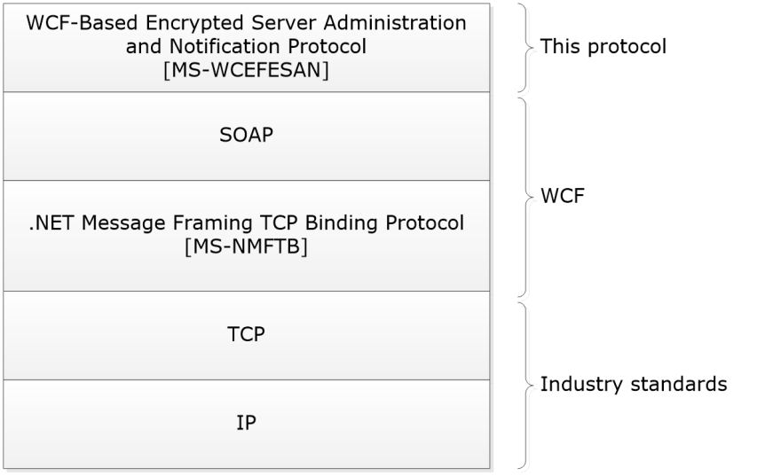
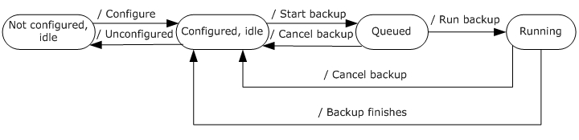

[MS-WCFESAN]:

WCF-Based Encrypted Server Administration and
Notification Protocol

Intellectual Property Rights Notice for Open Specifications Documentation

  Technical Documentation. Microsoft publishes Open Specifications documentation (“this

documentation”) for protocols, file formats, data portability, computer languages, and standards
support. Additionally, overview documents cover inter-protocol relationships and interactions.

  Copyrights. This documentation is covered by Microsoft copyrights. Regardless of any other

terms that are contained in the terms of use for the Microsoft website that hosts this
documentation, you can make copies of it in order to develop implementations of the technologies
that are described in this documentation and can distribute portions of it in your implementations
that use these technologies or in your documentation as necessary to properly document the
implementation. You can also distribute in your implementation, with or without modification, any
schemas, IDLs, or code samples that are included in the documentation. This permission also
applies to any documents that are referenced in the Open Specifications documentation.
  No Trade Secrets. Microsoft does not claim any trade secret rights in this documentation.
  Patents. Microsoft has patents that might cover your implementations of the technologies

described in the Open Specifications documentation. Neither this notice nor Microsoft's delivery of
this documentation grants any licenses under those patents or any other Microsoft patents.
However, a given Open Specifications document might be covered by the Microsoft Open
Specifications Promise or the Microsoft Community Promise. If you would prefer a written license,
or if the technologies described in this documentation are not covered by the Open Specifications
Promise or Community Promise, as applicable, patent licenses are available by contacting
iplg@microsoft.com.

  License Programs. To see all of the protocols in scope under a specific license program and the

associated patents, visit the Patent Map.

  Trademarks. The names of companies and products contained in this documentation might be
covered by trademarks or similar intellectual property rights. This notice does not grant any
licenses under those rights. For a list of Microsoft trademarks, visit
www.microsoft.com/trademarks.

  Fictitious Names. The example companies, organizations, products, domain names, email

addresses, logos, people, places, and events that are depicted in this documentation are fictitious.
No association with any real company, organization, product, domain name, email address, logo,
person, place, or event is intended or should be inferred.

Reservation of Rights. All other rights are reserved, and this notice does not grant any rights other
than as specifically described above, whether by implication, estoppel, or otherwise.

Tools. The Open Specifications documentation does not require the use of Microsoft programming
tools or programming environments in order for you to develop an implementation. If you have access
to Microsoft programming tools and environments, you are free to take advantage of them. Certain
Open Specifications documents are intended for use in conjunction with publicly available standards
specifications and network programming art and, as such, assume that the reader either is familiar
with the aforementioned material or has immediate access to it.

Support. For questions and support, please contact dochelp@microsoft.com.

[MS-WCFESAN] - v20240423
WCF-Based Encrypted Server Administration and Notification Protocol
Copyright © 2024 Microsoft Corporation
Release: April 23, 2024

1 / 580

Revision Summary

Date

Revision
History

Revision
Class

Comments

7/12/2012

1.0

10/25/2012  2.0

1/31/2013

3.0

8/8/2013

4.0

11/14/2013  5.0

2/13/2014

5.0

New

Major

Major

Major

Major

None

Released new document.

Significantly changed the technical content.

Significantly changed the technical content.

Significantly changed the technical content.

Significantly changed the technical content.

No change to the meaning, language, or formatting of the
technical content.

5/15/2014

5.0

None

No change to the meaning, language, or formatting of the
technical content.

6/30/2015

6.0

Major

Significantly changed the technical content.

10/16/2015  6.0

7/14/2016

7.0

6/1/2017

8.0

9/15/2017

9.0

12/1/2017

9.0

9/12/2018

10.0

4/7/2021

11.0

4/23/2024

12.0

None

Major

Major

Major

None

Major

Major

Major

No changes to the meaning, language, or formatting of the
technical content.

Significantly changed the technical content.

Significantly changed the technical content.

Significantly changed the technical content.

No changes to the meaning, language, or formatting of the
technical content.

Significantly changed the technical content.

Significantly changed the technical content.

Significantly changed the technical content.

[MS-WCFESAN] - v20240423
WCF-Based Encrypted Server Administration and Notification Protocol
Copyright © 2024 Microsoft Corporation
Release: April 23, 2024

2 / 580

## Table of Contents

- [1 Introduction](#1-introduction)
  - [1.1 Glossary](#11-glossary)
  - [1.2 References](#12-references)
    - [1.2.1 Normative References](#121-normative-references)
    - [1.2.2 Informative References](#122-informative-references)
  - [1.3 Overview](#13-overview)
  - [1.4 Relationship to Other Protocols](#14-relationship-to-other-protocols)
  - [1.5 Prerequisites/Preconditions](#15-prerequisitespreconditions)
  - [1.6 Applicability Statement](#16-applicability-statement)
  - [1.7 Versioning and Capability Negotiation](#17-versioning-and-capability-negotiation)
  - [1.8 Vendor-Extensible Fields](#18-vendor-extensible-fields)
  - [1.9 Standards Assignments](#19-standards-assignments)
- [2 Messages](#2-messages)
  - [2.1 Transport](#21-transport)
  - [2.2 Message Syntax](#22-message-syntax)
    - [2.2.1 Namespaces](#221-namespaces)
    - [2.2.2 Messages](#222-messages)
      - [2.2.2.1 Common SOAP Fault](#2221-common-soap-fault)
      - [2.2.2.2 Keepalive](#2222-keepalive)
    - [2.2.3 Elements](#223-elements)
    - [2.2.4 Complex Types](#224-complex-types)
      - [2.2.4.1 Client File Backup Provider](#2241-client-file-backup-provider)
        - [2.2.4.1.1 ClientFileBackupException](#22411-clientfilebackupexception)
        - [2.2.4.1.2 ConfigurationSet](#22412-configurationset)
      - [2.2.4.2 Client Backup Provider](#2242-client-backup-provider)
        - [2.2.4.2.1 AutoExclusionSizesInfo](#22421-autoexclusionsizesinfo)
        - [2.2.4.2.2 PCBackupClientFault](#22422-pcbackupclientfault)
        - [2.2.4.2.3 PCBackupConfiguration](#22423-pcbackupconfiguration)
        - [2.2.4.2.4 PCBackupServerFault](#22424-pcbackupserverfault)
        - [2.2.4.2.5 PCBackupStatus](#22425-pcbackupstatus)
        - [2.2.4.2.6 BadFileInfo](#22426-badfileinfo)
        - [2.2.4.2.7 ClientConfig](#22427-clientconfig)
        - [2.2.4.2.8 ClientConfigurationInfo](#22428-clientconfigurationinfo)
        - [2.2.4.2.9 ClientJobInfo](#22429-clientjobinfo)
        - [2.2.4.2.10 ClientRepairStatus](#224210-clientrepairstatus)
        - [2.2.4.2.11 ClientVolumeInfo](#224211-clientvolumeinfo)
        - [2.2.4.2.12 ConfigureBackupFault](#224212-configurebackupfault)
        - [2.2.4.2.13 ExcludedFolderInfo](#224213-excludedfolderinfo)
        - [2.2.4.2.14 FolderInfo](#224214-folderinfo)
        - [2.2.4.2.15 FolderInfoGroup](#224215-folderinfogroup)
        - [2.2.4.2.16 FolderRequest](#224216-folderrequest)
        - [2.2.4.2.17 OperationStatusResponse](#224217-operationstatusresponse)
        - [2.2.4.2.18 ServiceStatusResponse](#224218-servicestatusresponse)
        - [2.2.4.2.19 VolumeJobInfo](#224219-volumejobinfo)
        - [2.2.4.2.20 WaitingOperation](#224220-waitingoperation)
        - [2.2.4.2.21 RepairResult](#224221-repairresult)
      - [2.2.4.3 Health Provider](#2243-health-provider)
        - [2.2.4.3.1 AlertListChunk](#22431-alertlistchunk)
        - [2.2.4.3.2 AlertInfo](#22432-alertinfo)
        - [2.2.4.3.3 UserContextTask](#22433-usercontexttask)
        - [2.2.4.3.4 ClearCommand](#22434-clearcommand)
        - [2.2.4.3.5 RaiseCommand](#22435-raisecommand)
        - [2.2.4.3.6 SuppressCommand](#22436-suppresscommand)
        - [2.2.4.3.7 PlugInInfo](#22437-plugininfo)
      - [2.2.4.4 Machine Identity Provider](#2244-machine-identity-provider)
        - [2.2.4.4.1 ReturnClass Type](#22441-returnclass-type)
        - [2.2.4.4.2 GetMachineStatusType](#22442-getmachinestatustype)
      - [2.2.4.5 User Identity Provider](#2245-user-identity-provider)
        - [2.2.4.5.1 PersonalInfo](#22451-personalinfo)
        - [2.2.4.5.2 UserInfo](#22452-userinfo)
        - [2.2.4.5.3 UserFault](#22453-userfault)
        - [2.2.4.5.4 UserExceptionFault](#22454-userexceptionfault)
        - [2.2.4.5.5 ReturnClass](#22455-returnclass)
      - [2.2.4.6 Provider Registry Service](#2246-provider-registry-service)
        - [2.2.4.6.1 ProviderEndpointBehaviorAttribute](#22461-providerendpointbehaviorattribute)
        - [2.2.4.6.2 ProviderInfo](#22462-providerinfo)
        - [2.2.4.6.3 RequiredImpersonationLevelAttribute](#22463-requiredimpersonationlevelattribute)
        - [2.2.4.6.4 QuerySpecification](#22464-queryspecification)
      - [2.2.4.7 Addin Management](#2247-addin-management)
        - [2.2.4.7.1 PackageInfo](#22471-packageinfo)
        - [2.2.4.7.2 ClientInstallFilter](#22472-clientinstallfilter)
        - [2.2.4.7.3 Package](#22473-package)
        - [2.2.4.7.4 BinaryReference](#22474-binaryreference)
        - [2.2.4.7.5 Filter](#22475-filter)
        - [2.2.4.7.6 OtherBinariesMap](#22476-otherbinariesmap)
        - [2.2.4.7.7 Preinstall](#22477-preinstall)
        - [2.2.4.7.8 UninstallConfirm](#22478-uninstallconfirm)
      - [2.2.4.8 Network Service](#2248-network-service)
        - [2.2.4.8.1 VPNSetting](#22481-vpnsetting)
        - [2.2.4.8.2 VirtualNetworkSettings](#22482-virtualnetworksettings)
        - [2.2.4.8.3 AddressPrefix](#22483-addressprefix)
        - [2.2.4.8.4 IPAddress](#22484-ipaddress)
      - [2.2.4.9 Domain Infrastructure Service](#2249-domain-infrastructure-service)
        - [2.2.4.9.1 DomainProviderCredentials](#22491-domainprovidercredentials)
        - [2.2.4.9.2 DomainManagerFault](#22492-domainmanagerfault)
        - [2.2.4.9.3 DnsRecord](#22493-dnsrecord)
        - [2.2.4.9.4 SrvRecord](#22494-srvrecord)
        - [2.2.4.9.5 ARecord](#22495-arecord)
        - [2.2.4.9.6 MXRecord](#22496-mxrecord)
        - [2.2.4.9.7 TxtRecord](#22497-txtrecord)
        - [2.2.4.9.8 CNameRecord](#22498-cnamerecord)
        - [2.2.4.9.9 DomainState](#22499-domainstate)
        - [2.2.4.9.10 CertificateState](#224910-certificatestate)
        - [2.2.4.9.11 DomainNameConfiguration](#224911-domainnameconfiguration)
        - [2.2.4.9.12 Offering](#224912-offering)
        - [2.2.4.9.13 DynamicDNSInfo](#224913-dynamicdnsinfo)
        - [2.2.4.9.14 DomainProviderManagerSettings](#224914-domainprovidermanagersettings)
      - [2.2.4.10 Office 365 Integration Service](#22410-office-365-integration-service)
        - [2.2.4.10.1 O365ConfigurationException](#224101-o365configurationexception)
      - [2.2.4.11 Client Notification Service](#22411-client-notification-service)
        - [2.2.4.11.1 NotificationResult](#224111-notificationresult)
        - [2.2.4.11.2 NotificationResults](#224112-notificationresults)
        - [2.2.4.11.3 Exception](#224113-exception)
    - [2.2.5 Simple Types](#225-simple-types)
      - [2.2.5.1 Client File Backup Provider](#2251-client-file-backup-provider)
        - [2.2.5.1.1 SourceLibrary](#22511-sourcelibrary)
        - [2.2.5.1.2 ManagedStatus](#22512-managedstatus)
      - [2.2.5.2 Client Backup Provider](#2252-client-backup-provider)
        - [2.2.5.2.1 AbortReason](#22521-abortreason)
        - [2.2.5.2.2 PCBackupClientFaultReason](#22522-pcbackupclientfaultreason)
        - [2.2.5.2.3 PCBackupProviderState](#22523-pcbackupproviderstate)
        - [2.2.5.2.4 PCBackupStatusOperation](#22524-pcbackupstatusoperation)
        - [2.2.5.2.5 PCBackupVolumePhase](#22525-pcbackupvolumephase)
        - [2.2.5.2.6 CleanupStatus](#22526-cleanupstatus)
        - [2.2.5.2.7 PCClientDataStatus](#22527-pcclientdatastatus)
        - [2.2.5.2.8 ClientHealth](#22528-clienthealth)
        - [2.2.5.2.9 ClientJobStatus](#22529-clientjobstatus)
        - [2.2.5.2.10 ConfigureBackupFaultReason](#225210-configurebackupfaultreason)
        - [2.2.5.2.11 DatabaseState](#225211-databasestate)
        - [2.2.5.2.12 ExclusionReason](#225212-exclusionreason)
        - [2.2.5.2.13 FailureReason](#225213-failurereason)
        - [2.2.5.2.14 MountPhase](#225214-mountphase)
        - [2.2.5.2.15 PCBackupRepairState](#225215-pcbackuprepairstate)
        - [2.2.5.2.16 RetentionState](#225216-retentionstate)
        - [2.2.5.2.17 StopReason](#225217-stopreason)
        - [2.2.5.2.18 VolumeJobStatus](#225218-volumejobstatus)
        - [2.2.5.2.19 VolumeLocation](#225219-volumelocation)
        - [2.2.5.2.20 VolumeStatus](#225220-volumestatus)
        - [2.2.5.2.21 PCBackupServerFaultReason](#225221-pcbackupserverfaultreason)
      - [2.2.5.3 Health Provider](#2253-health-provider)
        - [2.2.5.3.1 TaskType](#22531-tasktype)
        - [2.2.5.3.2 HealthStatus](#22532-healthstatus)
        - [2.2.5.3.3 StreamBody](#22533-streambody)
      - [2.2.5.4 Machine Identity Provider](#2254-machine-identity-provider)
        - [2.2.5.4.1 ErrorCatalogType](#22541-errorcatalogtype)
        - [2.2.5.4.2 MachineStatus](#22542-machinestatus)
      - [2.2.5.5 User Identity Provider](#2255-user-identity-provider)
        - [2.2.5.5.1 WSSServerGroupType](#22551-wssservergrouptype)
        - [2.2.5.5.2 UserCustomExceptionCode](#22552-usercustomexceptioncode)
        - [2.2.5.5.3 RemoteAccessType](#22553-remoteaccesstype)
        - [2.2.5.5.4 AccessLevelType](#22554-accessleveltype)
        - [2.2.5.5.5 UserStatus](#22555-userstatus)
      - [2.2.5.6 Provider Registry Service](#2256-provider-registry-service)
        - [2.2.5.6.1 CredentialType](#22561-credentialtype)
        - [2.2.5.6.2 ConnectionSetting](#22562-connectionsetting)
        - [2.2.5.6.3 ImpersonationLevel](#22563-impersonationlevel)
      - [2.2.5.7 Addin Management](#2257-addin-management)
        - [2.2.5.7.1 UpdateClassification](#22571-updateclassification)
        - [2.2.5.7.2 OSEditions](#22572-oseditions)
        - [2.2.5.7.3 AddInError](#22573-addinerror)
      - [2.2.5.8 Network Service](#2258-network-service)
        - [2.2.5.8.1 AddressFamily](#22581-addressfamily)
      - [2.2.5.9 Domain Infrastructure Service](#2259-domain-infrastructure-service)
        - [2.2.5.9.1 FailureReason](#22591-failurereason)
        - [2.2.5.9.2 DomainStatus](#22592-domainstatus)
        - [2.2.5.9.3 CertificateStatus](#22593-certificatestatus)
        - [2.2.5.9.4 DomainType](#22594-domaintype)
        - [2.2.5.9.5 DomainProviderEnvironment](#22595-domainproviderenvironment)
      - [2.2.5.10 AzureAD and HostedEmail Integration Service](#22510-azuread-and-hostedemail-integration-service)
        - [2.2.5.10.1 PasswordChangeType](#225101-passwordchangetype)
        - [2.2.5.10.2 PasswordChangeStatus](#225102-passwordchangestatus)
- [3 Protocol Details](#3-protocol-details)
  - [3.1 Client File Backup Provider Service Contract Details](#31-client-file-backup-provider-service-contract-details)
    - [3.1.1 Abstract Data Model](#311-abstract-data-model)
    - [3.1.2 Timers](#312-timers)
    - [3.1.3 Initialization](#313-initialization)
    - [3.1.4 Higher-Layer Triggered Events](#314-higher-layer-triggered-events)
    - [3.1.5 Message Processing Events and Sequencing Rules](#315-message-processing-events-and-sequencing-rules)
      - [3.1.5.1 IUserConfigProvider.GetUserSettingAsync](#3151-iuserconfigprovidergetusersettingasync)
        - [3.1.5.1.1 Messages](#31511-messages)
          - [3.1.5.1.1.1 IUserConfigProvider_GetUserSettingAsync_InputMessage](#315111-iuserconfigprovidergetusersettingasyncinputmessage)
        - [3.1.5.1.2 Elements](#31512-elements)
          - [3.1.5.1.2.1 GetUserSettingAsync](#315121-getusersettingasync)
      - [3.1.5.2 IUserConfigProvider.GetClientManagedSettingAsync](#3152-iuserconfigprovidergetclientmanagedsettingasync)
        - [3.1.5.2.1 Messages](#31521-messages)
          - [3.1.5.2.1.1 IUserConfigProvider_GetClientManagedSettingAsync_InputMessage](#315211-iuserconfigprovidergetclientmanagedsettingasyncinputmessage)
        - [3.1.5.2.2 Elements](#31522-elements)
          - [3.1.5.2.2.1 GetClientManagedSettingAsync](#315221-getclientmanagedsettingasync)
      - [3.1.5.3 IUserConfigProviderCallback.GetUserSettingCompleted](#3153-iuserconfigprovidercallbackgetusersettingcompleted)
        - [3.1.5.3.1 Messages](#31531-messages)
          - [3.1.5.3.1.1 IUserConfigProvider_GetUserSettingCompleted_OutputCallbackMessage](#315311-iuserconfigprovidergetusersettingcompletedoutputcallbackmessage)
        - [3.1.5.3.2 Elements](#31532-elements)
          - [3.1.5.3.2.1 GetUserSettingCompleted](#315321-getusersettingcompleted)
      - [3.1.5.4 IUserConfigProvider.GetClientManagedCompleted](#3154-iuserconfigprovidergetclientmanagedcompleted)
        - [3.1.5.4.1 Messages](#31541-messages)
          - [3.1.5.4.1.1 IUserConfigProvider_GetClientManagedCompleted_OutputCallbackMessa](#315411-iuserconfigprovidergetclientmanagedcompletedoutputcallbackmessa)
        - [3.1.5.4.2 Elements](#31542-elements)
          - [3.1.5.4.2.1 GetClientManagedCompleted](#315421-getclientmanagedcompleted)
      - [3.1.5.5 GetUserManagedSettingAsync](#3155-getusermanagedsettingasync)
        - [3.1.5.5.1 Messages](#31551-messages)
          - [3.1.5.5.1.1 IUserConfigProvider_GetUserManagedSettingAsync_InputMessage](#315511-iuserconfigprovidergetusermanagedsettingasyncinputmessage)
        - [3.1.5.5.2 Elements](#31552-elements)
          - [3.1.5.5.2.1 GetUserManagedSettingAsync](#315521-getusermanagedsettingasync)
    - [3.1.6 Timer Events](#316-timer-events)
    - [3.1.7 Other Local Events](#317-other-local-events)
  - [3.2 Client Backup Provider Service Contract Details](#32-client-backup-provider-service-contract-details)
    - [3.2.1 Abstract Data Model](#321-abstract-data-model)
      - [3.2.1.1 Backup Server](#3211-backup-server)
        - [3.2.1.1.1 List of Backup Client Configurations](#32111-list-of-backup-client-configurations)
        - [3.2.1.1.2 List of Backup Status](#32112-list-of-backup-status)
        - [3.2.1.1.3 List of Backup Volume Configurations for Each Client](#32113-list-of-backup-volume-configurations-for-each-client)
        - [3.2.1.1.4 List of Backup Jobs](#32114-list-of-backup-jobs)
        - [3.2.1.1.5 Backup Window and Retention Policy](#32115-backup-window-and-retention-policy)
        - [3.2.1.1.6 Retention Policy](#32116-retention-policy)
      - [3.2.1.2 Backup Client](#3212-backup-client)
    - [3.2.2 Timers](#322-timers)
    - [3.2.3 Initialization](#323-initialization)
    - [3.2.4 Higher-Layer Triggered Events](#324-higher-layer-triggered-events)
    - [3.2.5 Message Processing Events and Sequencing Rules](#325-message-processing-events-and-sequencing-rules)
      - [3.2.5.1 IPCBackupServerRegister.RegisterBackupClient](#3251-ipcbackupserverregisterregisterbackupclient)
        - [3.2.5.1.1 Messages](#32511-messages)
          - [3.2.5.1.1.1 IPCBackupServerRegister_RegisterBackupClient_InputMessage](#325111-ipcbackupserverregisterregisterbackupclientinputmessage)
          - [3.2.5.1.1.2 IPCBackupServerRegister_RegisterBackupClient_OutputMessage](#325112-ipcbackupserverregisterregisterbackupclientoutputmessage)
        - [3.2.5.1.2 Elements](#32512-elements)
          - [3.2.5.1.2.1 RegisterBackupClient](#325121-registerbackupclient)
          - [3.2.5.1.2.2 RegisterBackupClientResponse](#325122-registerbackupclientresponse)
      - [3.2.5.2 IPCBackupServerRegister.KeepAlive](#3252-ipcbackupserverregisterkeepalive)
        - [3.2.5.2.1 Messages](#32521-messages)
          - [3.2.5.2.1.1 IPCBackupServerRegister_KeepAlive_InputMessage](#325211-ipcbackupserverregisterkeepaliveinputmessage)
          - [3.2.5.2.1.2 IPCBackupServerRegister_KeepAlive_OutputMessage](#325212-ipcbackupserverregisterkeepaliveoutputmessage)
        - [3.2.5.2.2 Elements](#32522-elements)
          - [3.2.5.2.2.1 KeepAlive](#325221-keepalive)
          - [3.2.5.2.2.2 KeepAliveResponse](#325222-keepaliveresponse)
      - [3.2.5.3 IPCBackupServerRegister.VolumeCalculatorProgress](#3253-ipcbackupserverregistervolumecalculatorprogress)
        - [3.2.5.3.1 Messages](#32531-messages)
          - [3.2.5.3.1.1 IPCBackupServerRegister_VolumeCalculatorProgress_InputMessage](#325311-ipcbackupserverregistervolumecalculatorprogressinputmessage)
        - [3.2.5.3.2 Elements](#32532-elements)
          - [3.2.5.3.2.1 VolumeCalculatorProgress](#325321-volumecalculatorprogress)
      - [3.2.5.4 IPCBackupServerRegister.GetClientPriority](#3254-ipcbackupserverregistergetclientpriority)
        - [3.2.5.4.1 Messages](#32541-messages)
          - [3.2.5.4.1.1 IPCBackupServerRegister_GetClientPriority_OutputCallbackMessage](#325411-ipcbackupserverregistergetclientpriorityoutputcallbackmessage)
          - [3.2.5.4.1.2 IPCBackupServerRegister_GetClientPriority_InputCallbackMessage](#325412-ipcbackupserverregistergetclientpriorityinputcallbackmessage)
        - [3.2.5.4.2 Elements](#32542-elements)
          - [3.2.5.4.2.1 GetClientPriority](#325421-getclientpriority)
          - [3.2.5.4.2.2 GetClientPriorityResponse](#325422-getclientpriorityresponse)
      - [3.2.5.5 IPCBackupServerRegister.OnBatteryPower](#3255-ipcbackupserverregisteronbatterypower)
        - [3.2.5.5.1 Messages](#32551-messages)
          - [3.2.5.5.1.1 IPCBackupServerRegister_OnBatteryPower_OutputCallbackMessage](#325511-ipcbackupserverregisteronbatterypoweroutputcallbackmessage)
          - [3.2.5.5.1.2 IPCBackupServerRegister_OnBatteryPower_InputCallbackMessage](#325512-ipcbackupserverregisteronbatterypowerinputcallbackmessage)
        - [3.2.5.5.2 Elements](#32552-elements)
          - [3.2.5.5.2.1 OnBatteryPower](#325521-onbatterypower)
          - [3.2.5.5.2.2 OnBatteryPowerResponse](#325522-onbatterypowerresponse)
      - [3.2.5.6 IPCBackupServerRegister.StartBackup](#3256-ipcbackupserverregisterstartbackup)
        - [3.2.5.6.1 Messages](#32561-messages)
          - [3.2.5.6.1.1 IPCBackupServerRegister_StartBackup_OutputCallbackMessage](#325611-ipcbackupserverregisterstartbackupoutputcallbackmessage)
          - [3.2.5.6.1.2 IPCBackupServerRegister_StartBackup_InputCallbackMessage](#325612-ipcbackupserverregisterstartbackupinputcallbackmessage)
        - [3.2.5.6.2 Elements](#32562-elements)
          - [3.2.5.6.2.1 StartBackup](#325621-startbackup)
          - [3.2.5.6.2.2 StartBackupResponse](#325622-startbackupresponse)
      - [3.2.5.7 IPCBackupServerRegister.CancelBackup](#3257-ipcbackupserverregistercancelbackup)
        - [3.2.5.7.1 Messages](#32571-messages)
          - [3.2.5.7.1.1 IPCBackupServerRegister_CancelBackup_OutputCallbackMessage](#325711-ipcbackupserverregistercancelbackupoutputcallbackmessage)
          - [3.2.5.7.1.2 IPCBackupServerRegister_CancelBackup_InputCallbackMessage](#325712-ipcbackupserverregistercancelbackupinputcallbackmessage)
        - [3.2.5.7.2 Elements](#32572-elements)
          - [3.2.5.7.2.1 CancelBackup](#325721-cancelbackup)
          - [3.2.5.7.2.2 CancelBackupResponse](#325722-cancelbackupresponse)
      - [3.2.5.8 IPCBackupServerRegister.UpdateBackupConfiguration](#3258-ipcbackupserverregisterupdatebackupconfiguration)
        - [3.2.5.8.1 Messages](#32581-messages)
          - [3.2.5.8.1.1 IPCBackupServerRegister_UpdateBackupConfiguration_OutputCallbackM](#325811-ipcbackupserverregisterupdatebackupconfigurationoutputcallbackm)
        - [3.2.5.8.2 Elements](#32582-elements)
          - [3.2.5.8.2.1 UpdateBackupConfiguration](#325821-updatebackupconfiguration)
      - [3.2.5.9 IPCBackupServerRegister.SendBackupProgress](#3259-ipcbackupserverregistersendbackupprogress)
        - [3.2.5.9.1 Messages](#32591-messages)
          - [3.2.5.9.1.1 IPCBackupServerRegister_SendBackupProgress_OutputCallbackMessage](#325911-ipcbackupserverregistersendbackupprogressoutputcallbackmessage)
        - [3.2.5.9.2 Elements](#32592-elements)
          - [3.2.5.9.2.1 SendBackupProgress](#325921-sendbackupprogress)
      - [3.2.5.10 IPCBackupServerRegister.GetFolderChildren](#32510-ipcbackupserverregistergetfolderchildren)
        - [3.2.5.10.1 Messages](#325101-messages)
          - [3.2.5.10.1.1 IPCBackupServerRegister_GetFolderChildren_OutputCallbackMessage](#3251011-ipcbackupserverregistergetfolderchildrenoutputcallbackmessage)
          - [3.2.5.10.1.2 IPCBackupServerRegister_GetFolderChildren_InputCallbackMessage](#3251012-ipcbackupserverregistergetfolderchildreninputcallbackmessage)
        - [3.2.5.10.2 Elements](#325102-elements)
          - [3.2.5.10.2.1 GetFolderChildren](#3251021-getfolderchildren)
          - [3.2.5.10.2.2 GetFolderChildrenResponse](#3251022-getfolderchildrenresponse)
      - [3.2.5.11 IPCBackupServerRegister.CalculateVolumeAsync](#32511-ipcbackupserverregistercalculatevolumeasync)
        - [3.2.5.11.1 Messages](#325111-messages)
          - [3.2.5.11.1.1 IPCBackupServerRegister_CalculateVolumeAsync_OutputCallbackMessa](#3251111-ipcbackupserverregistercalculatevolumeasyncoutputcallbackmessa)
          - [3.2.5.11.1.2 IPCBackupServerRegister_CalculateVolumeAsync_InputCallbackMessag](#3251112-ipcbackupserverregistercalculatevolumeasyncinputcallbackmessag)
        - [3.2.5.11.2 Elements](#325112-elements)
          - [3.2.5.11.2.1 CalculateVolumeAsync](#3251121-calculatevolumeasync)
          - [3.2.5.11.2.2 CalculateVolumeAsyncResponse](#3251122-calculatevolumeasyncresponse)
      - [3.2.5.12 IPCBackupServerRegister.CleanFolderSizeCalculation](#32512-ipcbackupserverregistercleanfoldersizecalculation)
        - [3.2.5.12.1 Messages](#325121-messages)
          - [3.2.5.12.1.1 IPCBackupServerRegister_CleanFolderSizeCalculation_OutputCallbackM](#3251211-ipcbackupserverregistercleanfoldersizecalculationoutputcallbackm)
        - [3.2.5.12.2 Elements](#325122-elements)
          - [3.2.5.12.2.1 CleanFolderSizeCalculation](#3251221-cleanfoldersizecalculation)
      - [3.2.5.13 IPCBackupServerRegister.GetConnectedVolumes](#32513-ipcbackupserverregistergetconnectedvolumes)
        - [3.2.5.13.1 Messages](#325131-messages)
          - [3.2.5.13.1.1 IPCBackupServerRegister_GetConnectedVolumes_OutputCallbackMessa](#3251311-ipcbackupserverregistergetconnectedvolumesoutputcallbackmessa)
          - [3.2.5.13.1.2 IPCBackupServerRegister_GetConnectedVolumes_InputCallbackMessag](#3251312-ipcbackupserverregistergetconnectedvolumesinputcallbackmessag)
        - [3.2.5.13.2 Elements](#325132-elements)
          - [3.2.5.13.2.1 GetConnectedVolumes](#3251321-getconnectedvolumes)
          - [3.2.5.13.2.2 GetConnectedVolumesResponse](#3251322-getconnectedvolumesresponse)
      - [3.2.5.14 IPCBackupClientManagement.RescanVolumesAsync](#32514-ipcbackupclientmanagementrescanvolumesasync)
        - [3.2.5.14.1 Messages](#325141-messages)
          - [3.2.5.14.1.1 IPCBackupServerRegister_RescanVolumesAsync_OutputCallbackMessag](#3251411-ipcbackupserverregisterrescanvolumesasyncoutputcallbackmessag)
        - [3.2.5.14.2 Elements](#325142-elements)
          - [3.2.5.14.2.1 RescanVolumesAsync](#3251421-rescanvolumesasync)
      - [3.2.5.15 IPCBackupServerProvider.Register](#32515-ipcbackupserverproviderregister)
        - [3.2.5.15.1 Messages](#325151-messages)
          - [3.2.5.15.1.1 IPCBackupServerProvider_Register_InputMessage](#3251511-ipcbackupserverproviderregisterinputmessage)
          - [3.2.5.15.1.2 IPCBackupServerProvider_Register_OutputMessage](#3251512-ipcbackupserverproviderregisteroutputmessage)
        - [3.2.5.15.2 Elements](#325152-elements)
          - [3.2.5.15.2.1 Register](#3251521-register)
          - [3.2.5.15.2.2 RegisterResponse](#3251522-registerresponse)
      - [3.2.5.16 IPCBackupServerProvider.GetClients](#32516-ipcbackupserverprovidergetclients)
        - [3.2.5.16.1 Messages](#325161-messages)
          - [3.2.5.16.1.1 IPCBackupServerProvider_GetClients_InputMessage](#3251611-ipcbackupserverprovidergetclientsinputmessage)
          - [3.2.5.16.1.2 IPCBackupServerProvider_GetClients_OutputMessage](#3251612-ipcbackupserverprovidergetclientsoutputmessage)
        - [3.2.5.16.2 Elements](#325162-elements)
          - [3.2.5.16.2.1 GetClients](#3251621-getclients)
          - [3.2.5.16.2.2 GetClientsResponse](#3251622-getclientsresponse)
      - [3.2.5.17 IPCBackupServerProvider.GetClient](#32517-ipcbackupserverprovidergetclient)
        - [3.2.5.17.1 Messages](#325171-messages)
          - [3.2.5.17.1.1 IPCBackupServerProvider_GetClient_InputMessage](#3251711-ipcbackupserverprovidergetclientinputmessage)
          - [3.2.5.17.1.2 IPCBackupServerProvider_GetClient_OutputMessage](#3251712-ipcbackupserverprovidergetclientoutputmessage)
        - [3.2.5.17.2 Elements](#325172-elements)
          - [3.2.5.17.2.1 GetClient](#3251721-getclient)
          - [3.2.5.17.2.2 GetClientResponse](#3251722-getclientresponse)
      - [3.2.5.18 IPCBackupServerProvider.GetClientJobs](#32518-ipcbackupserverprovidergetclientjobs)
        - [3.2.5.18.1 Messages](#325181-messages)
          - [3.2.5.18.1.1 IPCBackupServerProvider_GetClientJobs_InputMessage](#3251811-ipcbackupserverprovidergetclientjobsinputmessage)
          - [3.2.5.18.1.2 IPCBackupServerProvider_GetClientJobs_OutputMessage](#3251812-ipcbackupserverprovidergetclientjobsoutputmessage)
        - [3.2.5.18.2 Elements](#325182-elements)
          - [3.2.5.18.2.1 GetClientJobs](#3251821-getclientjobs)
          - [3.2.5.18.2.2 GetClientJobsResponse](#3251822-getclientjobsresponse)
      - [3.2.5.19 IPCBackupServerProvider.GetVolumeJobs](#32519-ipcbackupserverprovidergetvolumejobs)
        - [3.2.5.19.1 Messages](#325191-messages)
          - [3.2.5.19.1.1 IPCBackupServerProvider_GetVolumeJobs_InputMessage](#3251911-ipcbackupserverprovidergetvolumejobsinputmessage)
          - [3.2.5.19.1.2 IPCBackupServerProvider_GetVolumeJobs_OutputMessage](#3251912-ipcbackupserverprovidergetvolumejobsoutputmessage)
        - [3.2.5.19.2 Elements](#325192-elements)
          - [3.2.5.19.2.1 GetVolumeJobs](#3251921-getvolumejobs)
          - [3.2.5.19.2.2 GetVolumeJobsResponse](#3251922-getvolumejobsresponse)
      - [3.2.5.20 IPCBackupServerProvider.GetClientVolumes](#32520-ipcbackupserverprovidergetclientvolumes)
        - [3.2.5.20.1 Messages](#325201-messages)
          - [3.2.5.20.1.1 IPCBackupServerProvider_GetClientVolumes_InputMessage](#3252011-ipcbackupserverprovidergetclientvolumesinputmessage)
          - [3.2.5.20.1.2 IPCBackupServerProvider_GetClientVolumes_OutputMessage](#3252012-ipcbackupserverprovidergetclientvolumesoutputmessage)
        - [3.2.5.20.2 Elements](#325202-elements)
          - [3.2.5.20.2.1 GetClientVolumes](#3252021-getclientvolumes)
          - [3.2.5.20.2.2 GetClientVolumesResponse](#3252022-getclientvolumesresponse)
      - [3.2.5.21 IPCBackupServerProvider.SetClientJobDescription](#32521-ipcbackupserverprovidersetclientjobdescription)
        - [3.2.5.21.1 Messages](#325211-messages)
          - [3.2.5.21.1.1 IPCBackupServerProvider_SetClientJobDescription_InputMessage](#3252111-ipcbackupserverprovidersetclientjobdescriptioninputmessage)
          - [3.2.5.21.1.2 IPCBackupServerProvider_SetClientJobDescription_OutputMessage](#3252112-ipcbackupserverprovidersetclientjobdescriptionoutputmessage)
        - [3.2.5.21.2 Elements](#325212-elements)
          - [3.2.5.21.2.1 SetClientJobDescription](#3252121-setclientjobdescription)
          - [3.2.5.21.2.2 SetClientJobDescriptionResponse](#3252122-setclientjobdescriptionresponse)
      - [3.2.5.22 IPCBackupServerProvider.SetClientJobRetentionState](#32522-ipcbackupserverprovidersetclientjobretentionstate)
        - [3.2.5.22.1 Messages](#325221-messages)
          - [3.2.5.22.1.1 IPCBackupServerProvider_SetClientJobRetentionState_InputMessage](#3252211-ipcbackupserverprovidersetclientjobretentionstateinputmessage)
          - [3.2.5.22.1.2 IPCBackupServerProvider_SetClientJobRetentionState_OutputMessage](#3252212-ipcbackupserverprovidersetclientjobretentionstateoutputmessage)
        - [3.2.5.22.2 Elements](#325222-elements)
          - [3.2.5.22.2.1 SetClientJobRetentionState](#3252221-setclientjobretentionstate)
          - [3.2.5.22.2.2 SetClientJobRetentionStateResponse](#3252222-setclientjobretentionstateresponse)
      - [3.2.5.23 IPCBackupServerProvider.SetClientVolumeStatus](#32523-ipcbackupserverprovidersetclientvolumestatus)
        - [3.2.5.23.1 Messages](#325231-messages)
          - [3.2.5.23.1.1 IPCBackupServerProvider_SetClientVolumeStatus_InputMessage](#3252311-ipcbackupserverprovidersetclientvolumestatusinputmessage)
          - [3.2.5.23.1.2 IPCBackupServerProvider_SetClientVolumeStatus_OutputMessage](#3252312-ipcbackupserverprovidersetclientvolumestatusoutputmessage)
        - [3.2.5.23.2 Elements](#325232-elements)
          - [3.2.5.23.2.1 SetClientVolumeStatus](#3252321-setclientvolumestatus)
          - [3.2.5.23.2.2 SetClientVolumeStatusResponse](#3252322-setclientvolumestatusresponse)
      - [3.2.5.24 IPCBackupServerProvider.SetExcludedFolders](#32524-ipcbackupserverprovidersetexcludedfolders)
        - [3.2.5.24.1 Messages](#325241-messages)
          - [3.2.5.24.1.1 IPCBackupServerProvider_SetExcludedFolders_InputMessage](#3252411-ipcbackupserverprovidersetexcludedfoldersinputmessage)
          - [3.2.5.24.1.2 IPCBackupServerProvider_SetExcludedFolders_OutputMessage](#3252412-ipcbackupserverprovidersetexcludedfoldersoutputmessage)
        - [3.2.5.24.2 Elements](#325242-elements)
          - [3.2.5.24.2.1 SetExcludedFolders](#3252421-setexcludedfolders)
          - [3.2.5.24.2.2 SetExcludedFoldersResponse](#3252422-setexcludedfoldersresponse)
      - [3.2.5.25 IPCBackupServerProvider.EnableBackups](#32525-ipcbackupserverproviderenablebackups)
        - [3.2.5.25.1 Messages](#325251-messages)
          - [3.2.5.25.1.1 IPCBackupServerProvider_EnableBackups_InputMessage](#3252511-ipcbackupserverproviderenablebackupsinputmessage)
          - [3.2.5.25.1.2 IPCBackupServerProvider_EnableBackups_OutputMessage](#3252512-ipcbackupserverproviderenablebackupsoutputmessage)
        - [3.2.5.25.2 Elements](#325252-elements)
          - [3.2.5.25.2.1 EnableBackups](#3252521-enablebackups)
          - [3.2.5.25.2.2 EnableBackupsResponse](#3252522-enablebackupsresponse)
      - [3.2.5.26 IPCBackupServerProvider.DisableBackups](#32526-ipcbackupserverproviderdisablebackups)
        - [3.2.5.26.1 Messages](#325261-messages)
          - [3.2.5.26.1.1 IPCBackupServerProvider_DisableBackups_InputMessage](#3252611-ipcbackupserverproviderdisablebackupsinputmessage)
          - [3.2.5.26.1.2 IPCBackupServerProvider_DisableBackups_OutputMessage](#3252612-ipcbackupserverproviderdisablebackupsoutputmessage)
        - [3.2.5.26.2 Elements](#325262-elements)
          - [3.2.5.26.2.1 DisableBackups](#3252621-disablebackups)
          - [3.2.5.26.2.2 DisableBackupsResponse](#3252622-disablebackupsresponse)
      - [3.2.5.27 IPCBackupServerProvider.GetBackupConfiguration](#32527-ipcbackupserverprovidergetbackupconfiguration)
        - [3.2.5.27.1 Messages](#325271-messages)
          - [3.2.5.27.1.1 IPCBackupServerProvider_GetBackupConfiguration_InputMessage](#3252711-ipcbackupserverprovidergetbackupconfigurationinputmessage)
          - [3.2.5.27.1.2 IPCBackupServerProvider_GetBackupConfiguration_OutputMessage](#3252712-ipcbackupserverprovidergetbackupconfigurationoutputmessage)
        - [3.2.5.27.2 Elements](#325272-elements)
          - [3.2.5.27.2.1 GetBackupConfiguration](#3252721-getbackupconfiguration)
          - [3.2.5.27.2.2 GetBackupConfigurationResponse](#3252722-getbackupconfigurationresponse)
      - [3.2.5.28 IPCBackupServerProvider.GetDefaultBackupConfiguration](#32528-ipcbackupserverprovidergetdefaultbackupconfiguration)
        - [3.2.5.28.1 Messages](#325281-messages)
          - [3.2.5.28.1.1 IPCBackupServerProvider_GetDefaultBackupConfiguration_InputMessag](#3252811-ipcbackupserverprovidergetdefaultbackupconfigurationinputmessag)
          - [3.2.5.28.1.2 IPCBackupServerProvider_GetDefaultBackupConfiguration_OutputMessa](#3252812-ipcbackupserverprovidergetdefaultbackupconfigurationoutputmessa)
        - [3.2.5.28.2 Elements](#325282-elements)
          - [3.2.5.28.2.1 GetDefaultBackupConfiguration](#3252821-getdefaultbackupconfiguration)
          - [3.2.5.28.2.2 GetDefaultBackupConfigurationResponse](#3252822-getdefaultbackupconfigurationresponse)
      - [3.2.5.29 IPCBackupServerProvider.GetBackupOperationStatus](#32529-ipcbackupserverprovidergetbackupoperationstatus)
        - [3.2.5.29.1 Messages](#325291-messages)
          - [3.2.5.29.1.1 IPCBackupServerProvider_GetBackupOperationStatus_InputMessage](#3252911-ipcbackupserverprovidergetbackupoperationstatusinputmessage)
          - [3.2.5.29.1.2 IPCBackupServerProvider_GetBackupOperationStatus_OutputMessage](#3252912-ipcbackupserverprovidergetbackupoperationstatusoutputmessage)
        - [3.2.5.29.2 Elements](#325292-elements)
          - [3.2.5.29.2.1 GetBackupOperationStatus](#3252921-getbackupoperationstatus)
          - [3.2.5.29.2.2 GetBackupOperationStatusResponse](#3252922-getbackupoperationstatusresponse)
      - [3.2.5.30 IPCBackupServerProvider.GetServiceStatus](#32530-ipcbackupserverprovidergetservicestatus)
        - [3.2.5.30.1 Messages](#325301-messages)
          - [3.2.5.30.1.1 IPCBackupServerProvider_GetServiceStatus_InputMessage](#3253011-ipcbackupserverprovidergetservicestatusinputmessage)
          - [3.2.5.30.1.2 IPCBackupServerProvider_GetServiceStatus_OutputMessage](#3253012-ipcbackupserverprovidergetservicestatusoutputmessage)
        - [3.2.5.30.2 Elements](#325302-elements)
          - [3.2.5.30.2.1 GetServiceStatus](#3253021-getservicestatus)
          - [3.2.5.30.2.2 GetServiceStatusResponse](#3253022-getservicestatusresponse)
      - [3.2.5.31 IPCBackupServerProvider.GetWaitingOperations](#32531-ipcbackupserverprovidergetwaitingoperations)
        - [3.2.5.31.1 Messages](#325311-messages)
          - [3.2.5.31.1.1 IPCBackupServerProvider_GetWaitingOperations_InputMessage](#3253111-ipcbackupserverprovidergetwaitingoperationsinputmessage)
          - [3.2.5.31.1.2 IPCBackupServerProvider_GetWaitingOperations_OutputMessage](#3253112-ipcbackupserverprovidergetwaitingoperationsoutputmessage)
        - [3.2.5.31.2 Elements](#325312-elements)
          - [3.2.5.31.2.1 GetWaitingOperations](#3253121-getwaitingoperations)
          - [3.2.5.31.2.2 GetWaitingOperationsResponse](#3253122-getwaitingoperationsresponse)
      - [3.2.5.32 IPCBackupServerProvider.SetBackupConfiguration](#32532-ipcbackupserverprovidersetbackupconfiguration)
        - [3.2.5.32.1 Messages](#325321-messages)
          - [3.2.5.32.1.1 IPCBackupServerProvider_SetBackupConfiguration_InputMessage](#3253211-ipcbackupserverprovidersetbackupconfigurationinputmessage)
          - [3.2.5.32.1.2 IPCBackupServerProvider_SetBackupConfiguration_OutputMessage](#3253212-ipcbackupserverprovidersetbackupconfigurationoutputmessage)
        - [3.2.5.32.2 Elements](#325322-elements)
          - [3.2.5.32.2.1 SetBackupConfiguration](#3253221-setbackupconfiguration)
          - [3.2.5.32.2.2 SetBackupConfigurationResponse](#3253222-setbackupconfigurationresponse)
      - [3.2.5.33 IPCBackupServerProvider.GetUsedBytes](#32533-ipcbackupserverprovidergetusedbytes)
        - [3.2.5.33.1 Messages](#325331-messages)
          - [3.2.5.33.1.1 IPCBackupServerProvider_GetUsedBytes_InputMessage](#3253311-ipcbackupserverprovidergetusedbytesinputmessage)
          - [3.2.5.33.1.2 IPCBackupServerProvider_GetUsedBytes_OutputMessage](#3253312-ipcbackupserverprovidergetusedbytesoutputmessage)
        - [3.2.5.33.2 Elements](#325332-elements)
          - [3.2.5.33.2.1 GetUsedBytes](#3253321-getusedbytes)
          - [3.2.5.33.2.2 GetUsedBytesResponse](#3253322-getusedbytesresponse)
      - [3.2.5.34 IPCBackupServerProvider.StartCleanup](#32534-ipcbackupserverproviderstartcleanup)
        - [3.2.5.34.1 Messages](#325341-messages)
          - [3.2.5.34.1.1 IPCBackupServerProvider_StartCleanup_InputMessage](#3253411-ipcbackupserverproviderstartcleanupinputmessage)
          - [3.2.5.34.1.2 IPCBackupServerProvider_StartCleanup_OutputMessage](#3253412-ipcbackupserverproviderstartcleanupoutputmessage)
        - [3.2.5.34.2 Elements](#325342-elements)
          - [3.2.5.34.2.1 StartCleanup](#3253421-startcleanup)
          - [3.2.5.34.2.2 StartCleanupResponse](#3253422-startcleanupresponse)
      - [3.2.5.35 IPCBackupServerProvider.CancelCleanup](#32535-ipcbackupserverprovidercancelcleanup)
        - [3.2.5.35.1 Messages](#325351-messages)
          - [3.2.5.35.1.1 IPCBackupServerProvider_CancelCleanup_InputMessage](#3253511-ipcbackupserverprovidercancelcleanupinputmessage)
          - [3.2.5.35.1.2 IPCBackupServerProvider_CancelCleanup_OutputMessage](#3253512-ipcbackupserverprovidercancelcleanupoutputmessage)
        - [3.2.5.35.2 Elements](#325352-elements)
          - [3.2.5.35.2.1 CancelCleanup](#3253521-cancelcleanup)
          - [3.2.5.35.2.2 CancelCleanupResponse](#3253522-cancelcleanupresponse)
      - [3.2.5.36 IPCBackupServerProvider.StartRepair](#32536-ipcbackupserverproviderstartrepair)
        - [3.2.5.36.1 Messages](#325361-messages)
          - [3.2.5.36.1.1 IPCBackupServerProvider_StartRepair_InputMessage](#3253611-ipcbackupserverproviderstartrepairinputmessage)
          - [3.2.5.36.1.2 IPCBackupServerProvider_StartRepair_OutputMessage](#3253612-ipcbackupserverproviderstartrepairoutputmessage)
        - [3.2.5.36.2 Elements](#325362-elements)
          - [3.2.5.36.2.1 StartRepair](#3253621-startrepair)
          - [3.2.5.36.2.2 StartRepairResponse](#3253622-startrepairresponse)
      - [3.2.5.37 IPCBackupServerProvider.CancelRepair](#32537-ipcbackupserverprovidercancelrepair)
        - [3.2.5.37.1 Messages](#325371-messages)
          - [3.2.5.37.1.1 IPCBackupServerProvider_CancelRepair_InputMessage](#3253711-ipcbackupserverprovidercancelrepairinputmessage)
          - [3.2.5.37.1.2 IPCBackupServerProvider_CancelRepair_OutputMessage](#3253712-ipcbackupserverprovidercancelrepairoutputmessage)
        - [3.2.5.37.2 Elements](#325372-elements)
          - [3.2.5.37.2.1 CancelRepair](#3253721-cancelrepair)
          - [3.2.5.37.2.2 CancelRepairResponse](#3253722-cancelrepairresponse)
      - [3.2.5.38 IPCBackupServerProvider.GetLastRepairResult](#32538-ipcbackupserverprovidergetlastrepairresult)
        - [3.2.5.38.1 Messages](#325381-messages)
          - [3.2.5.38.1.1 IPCBackupServerProvider_GetLastRepairResult_InputMessage](#3253811-ipcbackupserverprovidergetlastrepairresultinputmessage)
          - [3.2.5.38.1.2 IPCBackupServerProvider_GetLastRepairResult_OutputMessage](#3253812-ipcbackupserverprovidergetlastrepairresultoutputmessage)
        - [3.2.5.38.2 Elements](#325382-elements)
          - [3.2.5.38.2.1 GetLastRepairResult](#3253821-getlastrepairresult)
          - [3.2.5.38.2.2 GetLastRepairResultResponse](#3253822-getlastrepairresultresponse)
      - [3.2.5.39 IPCBackupServerProvider.StartConsistencyChecker](#32539-ipcbackupserverproviderstartconsistencychecker)
        - [3.2.5.39.1 Messages](#325391-messages)
          - [3.2.5.39.1.1 IPCBackupServerProvider_StartConsistencyChecker_InputMessage](#3253911-ipcbackupserverproviderstartconsistencycheckerinputmessage)
          - [3.2.5.39.1.2 IPCBackupServerProvider_StartConsistencyChecker_OutputMessage](#3253912-ipcbackupserverproviderstartconsistencycheckeroutputmessage)
        - [3.2.5.39.2 Elements](#325392-elements)
          - [3.2.5.39.2.1 StartConsistencyChecker](#3253921-startconsistencychecker)
          - [3.2.5.39.2.2 StartConsistencyCheckerResponse](#3253922-startconsistencycheckerresponse)
      - [3.2.5.40 IPCBackupServerProvider.CancelConsistencyChecker](#32540-ipcbackupserverprovidercancelconsistencychecker)
        - [3.2.5.40.1 Messages](#325401-messages)
          - [3.2.5.40.1.1 IPCBackupServerProvider_CancelConsistencyChecker_InputMessage](#3254011-ipcbackupserverprovidercancelconsistencycheckerinputmessage)
          - [3.2.5.40.1.2 IPCBackupServerProvider_CancelConsistencyChecker_OutputMessage](#3254012-ipcbackupserverprovidercancelconsistencycheckeroutputmessage)
        - [3.2.5.40.2 Elements](#325402-elements)
          - [3.2.5.40.2.1 CancelConsistencyChecker](#3254021-cancelconsistencychecker)
          - [3.2.5.40.2.2 CancelConsistencyCheckerResponse](#3254022-cancelconsistencycheckerresponse)
      - [3.2.5.41 IPCBackupServerProvider.Remove](#32541-ipcbackupserverproviderremove)
        - [3.2.5.41.1 Messages](#325411-messages)
          - [3.2.5.41.1.1 IPCBackupServerProvider_Remove_InputMessage](#3254111-ipcbackupserverproviderremoveinputmessage)
          - [3.2.5.41.1.2 IPCBackupServerProvider_Remove_OutputMessage](#3254112-ipcbackupserverproviderremoveoutputmessage)
        - [3.2.5.41.2 Elements](#325412-elements)
          - [3.2.5.41.2.1 Remove](#3254121-remove)
          - [3.2.5.41.2.2 RemoveResponse](#3254122-removeresponse)
      - [3.2.5.42 IPCBackupServerProvider.CalculateVolumeAsync](#32542-ipcbackupserverprovidercalculatevolumeasync)
        - [3.2.5.42.1 Messages](#325421-messages)
          - [3.2.5.42.1.1 IPCBackupServerProvider_CalculateVolumeAsync_InputMessage](#3254211-ipcbackupserverprovidercalculatevolumeasyncinputmessage)
          - [3.2.5.42.1.2 IPCBackupServerProvider_CalculateVolumeAsync_OutputMessage](#3254212-ipcbackupserverprovidercalculatevolumeasyncoutputmessage)
        - [3.2.5.42.2 Elements](#325422-elements)
          - [3.2.5.42.2.1 CalculateVolumeAsync](#3254221-calculatevolumeasync)
          - [3.2.5.42.2.2 CalculateVolumeAsyncResponse](#3254222-calculatevolumeasyncresponse)
      - [3.2.5.43 IPCBackupServerProvider.GetFolderChildren](#32543-ipcbackupserverprovidergetfolderchildren)
        - [3.2.5.43.1 Messages](#325431-messages)
          - [3.2.5.43.1.1 IPCBackupServerProvider_GetFolderChildren_InputMessage](#3254311-ipcbackupserverprovidergetfolderchildreninputmessage)
          - [3.2.5.43.1.2 IPCBackupServerProvider_GetFolderChildren_OutputMessage](#3254312-ipcbackupserverprovidergetfolderchildrenoutputmessage)
        - [3.2.5.43.2 Elements](#325432-elements)
          - [3.2.5.43.2.1 GetFolderChildren](#3254321-getfolderchildren)
          - [3.2.5.43.2.2 GetFolderChildrenResponse](#3254322-getfolderchildrenresponse)
      - [3.2.5.44 IPCBackupServerProvider.GetConnectedVolumes](#32544-ipcbackupserverprovidergetconnectedvolumes)
        - [3.2.5.44.1 Messages](#325441-messages)
          - [3.2.5.44.1.1 IPCBackupServerProvider_GetConnectedVolumes_InputMessage](#3254411-ipcbackupserverprovidergetconnectedvolumesinputmessage)
          - [3.2.5.44.1.2 IPCBackupServerProvider_GetConnectedVolumes_OutputMessage](#3254412-ipcbackupserverprovidergetconnectedvolumesoutputmessage)
        - [3.2.5.44.2 Elements](#325442-elements)
          - [3.2.5.44.2.1 GetConnectedVolumes](#3254421-getconnectedvolumes)
          - [3.2.5.44.2.2 GetConnectedVolumesResponse](#3254422-getconnectedvolumesresponse)
      - [3.2.5.45 IPCBackupServerProvider.CleanFolderSizeCalculation](#32545-ipcbackupserverprovidercleanfoldersizecalculation)
        - [3.2.5.45.1 Messages](#325451-messages)
          - [3.2.5.45.1.1 IPCBackupServerProvider_CleanFolderSizeCalculation_InputMessage](#3254511-ipcbackupserverprovidercleanfoldersizecalculationinputmessage)
        - [3.2.5.45.2 Elements](#325452-elements)
          - [3.2.5.45.2.1 CleanFolderSizeCalculation](#3254521-cleanfoldersizecalculation)
      - [3.2.5.46 IPCBackupServerProvider.StartBackup](#32546-ipcbackupserverproviderstartbackup)
        - [3.2.5.46.1 Messages](#325461-messages)
          - [3.2.5.46.1.1 IPCBackupServerProvider_StartBackup_InputMessage](#3254611-ipcbackupserverproviderstartbackupinputmessage)
          - [3.2.5.46.1.2 IPCBackupServerProvider_StartBackup_OutputMessage](#3254612-ipcbackupserverproviderstartbackupoutputmessage)
        - [3.2.5.46.2 Elements](#325462-elements)
          - [3.2.5.46.2.1 StartBackup](#3254621-startbackup)
          - [3.2.5.46.2.2 StartBackupResponse](#3254622-startbackupresponse)
      - [3.2.5.47 IPCBackupServerProvider.CancelBackup](#32547-ipcbackupserverprovidercancelbackup)
        - [3.2.5.47.1 Messages](#325471-messages)
          - [3.2.5.47.1.1 IPCBackupServerProvider_CancelBackup_InputMessage](#3254711-ipcbackupserverprovidercancelbackupinputmessage)
          - [3.2.5.47.1.2 IPCBackupServerProvider_CancelBackup_OutputMessage](#3254712-ipcbackupserverprovidercancelbackupoutputmessage)
        - [3.2.5.47.2 Elements](#325472-elements)
          - [3.2.5.47.2.1 CancelBackup](#3254721-cancelbackup)
          - [3.2.5.47.2.2 CancelBackupResponse](#3254722-cancelbackupresponse)
      - [3.2.5.48 IPCBackupServerProvider.StartBackupService](#32548-ipcbackupserverproviderstartbackupservice)
        - [3.2.5.48.1 Messages](#325481-messages)
          - [3.2.5.48.1.1 IPCBackupServerProvider_StartBackupService_InputMessage](#3254811-ipcbackupserverproviderstartbackupserviceinputmessage)
          - [3.2.5.48.1.2 IPCBackupServerProvider_StartBackupService_OutputMessage](#3254812-ipcbackupserverproviderstartbackupserviceoutputmessage)
        - [3.2.5.48.2 Elements](#325482-elements)
          - [3.2.5.48.2.1 StartBackupService](#3254821-startbackupservice)
          - [3.2.5.48.2.2 StartBackupServiceResponse](#3254822-startbackupserviceresponse)
      - [3.2.5.49 IPCBackupServerProvider.StopBackupService](#32549-ipcbackupserverproviderstopbackupservice)
        - [3.2.5.49.1 Messages](#325491-messages)
          - [3.2.5.49.1.1 IPCBackupServerProvider_StopBackupService_InputMessage](#3254911-ipcbackupserverproviderstopbackupserviceinputmessage)
          - [3.2.5.49.1.2 IPCBackupServerProvider_StopBackupService_OutputMessage](#3254912-ipcbackupserverproviderstopbackupserviceoutputmessage)
        - [3.2.5.49.2 Elements](#325492-elements)
          - [3.2.5.49.2.1 StopBackupService](#3254921-stopbackupservice)
          - [3.2.5.49.2.2 StopBackupServiceResponse](#3254922-stopbackupserviceresponse)
      - [3.2.5.50 IPCBackupServerProvider.NotifyBackupOperationStatusChange](#32550-ipcbackupserverprovidernotifybackupoperationstatuschange)
        - [3.2.5.50.1 Messages](#325501-messages)
          - [3.2.5.50.1.1 IPCBackupServerProvider_NotifyBackupOperationStatusChange_Output](#3255011-ipcbackupserverprovidernotifybackupoperationstatuschangeoutput)
        - [3.2.5.50.2 Elements](#325502-elements)
          - [3.2.5.50.2.1 NotifyBackupOperationStatusChange](#3255021-notifybackupoperationstatuschange)
      - [3.2.5.51 IPCBackupServerProvider.VolumeCalculatorProgress](#32551-ipcbackupserverprovidervolumecalculatorprogress)
        - [3.2.5.51.1 Messages](#325511-messages)
          - [3.2.5.51.1.1 IPCBackupServerProvider_VolumeCalculatorProgress_OutputCallbackMe](#3255111-ipcbackupserverprovidervolumecalculatorprogressoutputcallbackme)
        - [3.2.5.51.2 Elements](#325512-elements)
          - [3.2.5.51.2.1 VolumeCalculatorProgress](#3255121-volumecalculatorprogress)
      - [3.2.5.52 IPCBackupServerProvider.NotifyServiceStatusChange](#32552-ipcbackupserverprovidernotifyservicestatuschange)
        - [3.2.5.52.1 Messages](#325521-messages)
          - [3.2.5.52.1.1 IPCBackupServerProvider_NotifyServiceStatusChange_OutputCallbackM](#3255211-ipcbackupserverprovidernotifyservicestatuschangeoutputcallbackm)
        - [3.2.5.52.2 Elements](#325522-elements)
          - [3.2.5.52.2.1 NotifyServiceStatusChange](#3255221-notifyservicestatuschange)
    - [3.2.6 Timer Events](#326-timer-events)
    - [3.2.7 Other Local Events](#327-other-local-events)
  - [3.3 Health Provider Service Contract Details](#33-health-provider-service-contract-details)
    - [3.3.1 Abstract Data Model](#331-abstract-data-model)
      - [3.3.1.1 ADM_ArrayOfKeyValueOfstringArrayOfAlertInfo](#3311-admarrayofkeyvalueofstringarrayofalertinfo)
        - [3.3.1.1.1 Data Model](#33111-data-model)
          - [3.3.1.1.1.1 AlertInfo](#331111-alertinfo)
    - [3.3.2 Timers](#332-timers)
    - [3.3.3 Initialization](#333-initialization)
    - [3.3.4 Higher-Layer Triggered Events](#334-higher-layer-triggered-events)
    - [3.3.5 Message Processing Events and Sequencing Rules](#335-message-processing-events-and-sequencing-rules)
      - [3.3.5.1 IAlertProviderCallback.RaiseAlertCompleted](#3351-ialertprovidercallbackraisealertcompleted)
        - [3.3.5.1.1 Messages](#33511-messages)
          - [3.3.5.1.1.1 IAlertProviderCallback_RaiseAlertCompleted_OutputCallbackMessage](#335111-ialertprovidercallbackraisealertcompletedoutputcallbackmessage)
        - [3.3.5.1.2 Elements](#33512-elements)
          - [3.3.5.1.2.1 RaiseAlertCompleted](#335121-raisealertcompleted)
      - [3.3.5.2 IAlertProviderCallback.ClearAlertCompleted](#3352-ialertprovidercallbackclearalertcompleted)
        - [3.3.5.2.1 Messages](#33521-messages)
          - [3.3.5.2.1.1 IAlertProviderCallback_ClearAlertCompleted_OutputCallbackMessage](#335211-ialertprovidercallbackclearalertcompletedoutputcallbackmessage)
        - [3.3.5.2.2 Elements](#33522-elements)
          - [3.3.5.2.2.1 ClearAlertCompleted](#335221-clearalertcompleted)
      - [3.3.5.3 IAlertProviderCallback.SuppressAlertCompleted](#3353-ialertprovidercallbacksuppressalertcompleted)
        - [3.3.5.3.1 Messages](#33531-messages)
          - [3.3.5.3.1.1 IAlertProviderCallback_SuppressAlertCompleted_OutputCallbackMessag](#335311-ialertprovidercallbacksuppressalertcompletedoutputcallbackmessag)
        - [3.3.5.3.2 Elements](#33532-elements)
          - [3.3.5.3.2.1 SuppressAlertCompleted](#335321-suppressalertcompleted)
      - [3.3.5.4 IAlertProviderCallback.RepairAlertCompleted](#3354-ialertprovidercallbackrepairalertcompleted)
        - [3.3.5.4.1 Messages](#33541-messages)
          - [3.3.5.4.1.1 IAlertProviderCallback_RepairAlertCompleted_OutputCallbackMessage](#335411-ialertprovidercallbackrepairalertcompletedoutputcallbackmessage)
        - [3.3.5.4.2 Elements](#33542-elements)
          - [3.3.5.4.2.1 RepairAlertCompleted](#335421-repairalertcompleted)
      - [3.3.5.5 IAlertProviderCallback.EvaluateAlertsCompleted](#3355-ialertprovidercallbackevaluatealertscompleted)
        - [3.3.5.5.1 Messages](#33551-messages)
          - [3.3.5.5.1.1 IAlertProviderCallback_EvaluateAlertsCompleted_OutputCallbackMessag](#335511-ialertprovidercallbackevaluatealertscompletedoutputcallbackmessag)
        - [3.3.5.5.2 Elements](#33552-elements)
          - [3.3.5.5.2.1 EvaluateAlertsCompleted](#335521-evaluatealertscompleted)
      - [3.3.5.6 IAlertProviderCallback.RaisedAlerts](#3356-ialertprovidercallbackraisedalerts)
        - [3.3.5.6.1 Messages](#33561-messages)
          - [3.3.5.6.1.1 IAlertProviderCallback_RaisedAlerts_OutputCallbackMessage](#335611-ialertprovidercallbackraisedalertsoutputcallbackmessage)
        - [3.3.5.6.2 Elements](#33562-elements)
          - [3.3.5.6.2.1 RaisedAlerts](#335621-raisedalerts)
      - [3.3.5.7 IAlertProviderCallback.ClearedAlerts](#3357-ialertprovidercallbackclearedalerts)
        - [3.3.5.7.1 Messages](#33571-messages)
          - [3.3.5.7.1.1 IAlertProviderCallback_ClearedAlerts_OutputCallbackMessage](#335711-ialertprovidercallbackclearedalertsoutputcallbackmessage)
        - [3.3.5.7.2 Elements](#33572-elements)
          - [3.3.5.7.2.1 ClearedAlerts](#335721-clearedalerts)
      - [3.3.5.8 IAlertSynchCallback.AlertChanged](#3358-ialertsynchcallbackalertchanged)
        - [3.3.5.8.1 Messages](#33581-messages)
          - [3.3.5.8.1.1 IAlertSynchCallback_AlertChanged_OutputCallbackMessage](#335811-ialertsynchcallbackalertchangedoutputcallbackmessage)
        - [3.3.5.8.2 Elements](#33582-elements)
          - [3.3.5.8.2.1 AlertChanged](#335821-alertchanged)
      - [3.3.5.9 IAlertManagementProviderService.GetAllNetworkAlerts](#3359-ialertmanagementproviderservicegetallnetworkalerts)
        - [3.3.5.9.1 Messages](#33591-messages)
          - [3.3.5.9.1.1 IAlertManagementProviderService_GetAllNetworkAlerts_InputMessage](#335911-ialertmanagementproviderservicegetallnetworkalertsinputmessage)
          - [3.3.5.9.1.2 IAlertManagementProviderService_GetAllNetworkAlerts_OutputMessage](#335912-ialertmanagementproviderservicegetallnetworkalertsoutputmessage)
        - [3.3.5.9.2 Elements](#33592-elements)
          - [3.3.5.9.2.1 GetAllNetworkAlerts](#335921-getallnetworkalerts)
          - [3.3.5.9.2.2 GetAllNetworkAlertsResponse](#335922-getallnetworkalertsresponse)
      - [3.3.5.10 IAlertManagementProviderService.ClearAlertOneWay](#33510-ialertmanagementproviderserviceclearalertoneway)
        - [3.3.5.10.1 Messages](#335101-messages)
          - [3.3.5.10.1.1 IAlertManagementProviderService_ClearAlertOneWay_InputMessage](#3351011-ialertmanagementproviderserviceclearalertonewayinputmessage)
        - [3.3.5.10.2 Elements](#335102-elements)
          - [3.3.5.10.2.1 ClearAlertOneWay](#3351021-clearalertoneway)
      - [3.3.5.11 IAlertManagementProviderService.ClearAlert](#33511-ialertmanagementproviderserviceclearalert)
        - [3.3.5.11.1 Messages](#335111-messages)
          - [3.3.5.11.1.1 IAlertManagementProviderService_ClearAlert_InputMessage](#3351111-ialertmanagementproviderserviceclearalertinputmessage)
          - [3.3.5.11.1.2 IAlertManagementProviderService_ClearAlert_OutputMessage](#3351112-ialertmanagementproviderserviceclearalertoutputmessage)
        - [3.3.5.11.2 Elements](#335112-elements)
          - [3.3.5.11.2.1 ClearAlert](#3351121-clearalert)
          - [3.3.5.11.2.2 ClearAlertResponse](#3351122-clearalertresponse)
      - [3.3.5.12 IAlertManagementProviderService.SuppressAlertOneWay](#33512-ialertmanagementproviderservicesuppressalertoneway)
        - [3.3.5.12.1 Messages](#335121-messages)
          - [3.3.5.12.1.1 IAlertManagementProviderService_SuppressAlertOneWay_InputMessag](#3351211-ialertmanagementproviderservicesuppressalertonewayinputmessag)
        - [3.3.5.12.2 Elements](#335122-elements)
          - [3.3.5.12.2.1 SuppressAlertOneWay](#3351221-suppressalertoneway)
      - [3.3.5.13 IAlertManagementProviderService.SuppressAlert](#33513-ialertmanagementproviderservicesuppressalert)
        - [3.3.5.13.1 Messages](#335131-messages)
          - [3.3.5.13.1.1 IAlertManagementProviderService_SuppressAlert_InputMessage](#3351311-ialertmanagementproviderservicesuppressalertinputmessage)
          - [3.3.5.13.1.2 IAlertManagementProviderService_SuppressAlert_OutputMessage](#3351312-ialertmanagementproviderservicesuppressalertoutputmessage)
        - [3.3.5.13.2 Elements](#335132-elements)
          - [3.3.5.13.2.1 SuppressAlert](#3351321-suppressalert)
          - [3.3.5.13.2.2 SuppressAlertResponse](#3351322-suppressalertresponse)
      - [3.3.5.14 IAlertManagementProviderService.RaiseAlertOneWay](#33514-ialertmanagementproviderserviceraisealertoneway)
        - [3.3.5.14.1 Messages](#335141-messages)
          - [3.3.5.14.1.1 IAlertManagementProviderService_RaiseAlertOneWay_InputMessage](#3351411-ialertmanagementproviderserviceraisealertonewayinputmessage)
        - [3.3.5.14.2 Elements](#335142-elements)
          - [3.3.5.14.2.1 RaiseAlertOneWay](#3351421-raisealertoneway)
      - [3.3.5.15 IAlertManagementProviderService.RaiseAlert](#33515-ialertmanagementproviderserviceraisealert)
        - [3.3.5.15.1 Messages](#335151-messages)
          - [3.3.5.15.1.1 IAlertManagementProviderService_RaiseAlert_InputMessage](#3351511-ialertmanagementproviderserviceraisealertinputmessage)
          - [3.3.5.15.1.2 IAlertManagementProviderService_RaiseAlert_OutputMessage](#3351512-ialertmanagementproviderserviceraisealertoutputmessage)
        - [3.3.5.15.2 Elements](#335152-elements)
          - [3.3.5.15.2.1 RaiseAlert](#3351521-raisealert)
          - [3.3.5.15.2.2 RaiseAlertResponse](#3351522-raisealertresponse)
      - [3.3.5.16 IAlertManagementProviderService.IsAuthorized](#33516-ialertmanagementproviderserviceisauthorized)
        - [3.3.5.16.1 Messages](#335161-messages)
          - [3.3.5.16.1.1 IAlertManagementProviderService_IsAuthorized_InputMessage](#3351611-ialertmanagementproviderserviceisauthorizedinputmessage)
          - [3.3.5.16.1.2 IAlertManagementProviderService_IsAuthorized_OutputMessage](#3351612-ialertmanagementproviderserviceisauthorizedoutputmessage)
        - [3.3.5.16.2 Elements](#335162-elements)
          - [3.3.5.16.2.1 IsAuthorized](#3351621-isauthorized)
          - [3.3.5.16.2.2 IsAuthorizedResponse](#3351622-isauthorizedresponse)
      - [3.3.5.17 IAlertSynchProviderService.RegisterClientAgent](#33517-ialertsynchproviderserviceregisterclientagent)
        - [3.3.5.17.1 Messages](#335171-messages)
          - [3.3.5.17.1.1 IAlertSynchProviderService_RegisterClientAgent_InputMessage](#3351711-ialertsynchproviderserviceregisterclientagentinputmessage)
          - [3.3.5.17.1.2 IAlertSynchProviderService_RegisterClientAgent_OutputMessage](#3351712-ialertsynchproviderserviceregisterclientagentoutputmessage)
        - [3.3.5.17.2 Elements](#335172-elements)
          - [3.3.5.17.2.1 RegisterClientAgent](#3351721-registerclientagent)
          - [3.3.5.17.2.2 RegisterClientAgentResponse](#3351722-registerclientagentresponse)
      - [3.3.5.18 IAlertSynchProviderService.SynchronizeAlerts](#33518-ialertsynchproviderservicesynchronizealerts)
        - [3.3.5.18.1 Messages](#335181-messages)
          - [3.3.5.18.1.1 IAlertSynchProviderService_SynchronizeAlerts_InputMessage](#3351811-ialertsynchproviderservicesynchronizealertsinputmessage)
        - [3.3.5.18.2 Elements](#335182-elements)
          - [3.3.5.18.2.1 SynchronizeAlerts](#3351821-synchronizealerts)
      - [3.3.5.19 IAlertSynchProviderService.ClearCallbackCommandQueue](#33519-ialertsynchproviderserviceclearcallbackcommandqueue)
        - [3.3.5.19.1 Messages](#335191-messages)
          - [3.3.5.19.1.1 IAlertSynchProviderService_ClearCallbackCommandQueue_InputMessag](#3351911-ialertsynchproviderserviceclearcallbackcommandqueueinputmessag)
          - [3.3.5.19.1.2 IAlertSynchProviderService_ClearCallbackCommandQueue_OutputMessa](#3351912-ialertsynchproviderserviceclearcallbackcommandqueueoutputmessa)
        - [3.3.5.19.2 Elements](#335192-elements)
          - [3.3.5.19.2.1 ClearCallbackCommandQueue](#3351921-clearcallbackcommandqueue)
          - [3.3.5.19.2.2 ClearCallbackCommandQueueResponse](#3351922-clearcallbackcommandqueueresponse)
      - [3.3.5.20 IAlertSynchProviderService.GetPlugInInformation](#33520-ialertsynchproviderservicegetplugininformation)
        - [3.3.5.20.1 Messages](#335201-messages)
          - [3.3.5.20.1.1 IAlertSynchProviderService_GetPlugInInformation_InputMessage](#3352011-ialertsynchproviderservicegetplugininformationinputmessage)
          - [3.3.5.20.1.2 IAlertSynchProviderService_GetPlugInInformation_OutputMessage](#3352012-ialertsynchproviderservicegetplugininformationoutputmessage)
        - [3.3.5.20.2 Elements](#335202-elements)
          - [3.3.5.20.2.1 GetPlugInInformation](#3352021-getplugininformation)
          - [3.3.5.20.2.2 GetPlugInInformationResponse](#3352022-getplugininformationresponse)
      - [3.3.5.21 IAlertSynchProviderService.DownloadDefinition](#33521-ialertsynchproviderservicedownloaddefinition)
        - [3.3.5.21.1 Messages](#335211-messages)
          - [3.3.5.21.1.1 IAlertSynchProviderService_DownloadDefinition_InputMessage](#3352111-ialertsynchproviderservicedownloaddefinitioninputmessage)
          - [3.3.5.21.1.2 IAlertSynchProviderService_DownloadDefinition_OutputMessage](#3352112-ialertsynchproviderservicedownloaddefinitionoutputmessage)
        - [3.3.5.21.2 Elements](#335212-elements)
          - [3.3.5.21.2.1 DownloadDefinition](#3352121-downloaddefinition)
          - [3.3.5.21.2.2 DownloadDefinitionResponse](#3352122-downloaddefinitionresponse)
      - [3.3.5.22 IAlertSynchProviderService.DownloadConfiguration](#33522-ialertsynchproviderservicedownloadconfiguration)
        - [3.3.5.22.1 Messages](#335221-messages)
          - [3.3.5.22.1.1 IAlertSynchProviderService_DownloadConfiguration_InputMessage](#3352211-ialertsynchproviderservicedownloadconfigurationinputmessage)
          - [3.3.5.22.1.2 IAlertSynchProviderService_DownloadConfiguration_OutputMessage](#3352212-ialertsynchproviderservicedownloadconfigurationoutputmessage)
        - [3.3.5.22.2 Elements](#335222-elements)
          - [3.3.5.22.2.1 DownloadConfiguration](#3352221-downloadconfiguration)
          - [3.3.5.22.2.2 DownloadConfigurationResponse](#3352222-downloadconfigurationresponse)
    - [3.3.6 Timer Events](#336-timer-events)
    - [3.3.7 Other Local Events](#337-other-local-events)
  - [3.4 Machine Identity Provider Service Contract Details](#34-machine-identity-provider-service-contract-details)
    - [3.4.1 Abstract Data Model](#341-abstract-data-model)
      - [3.4.1.1 Machine Identity](#3411-machine-identity)
      - [3.4.1.2 Machine RDP Permission](#3412-machine-rdp-permission)
    - [3.4.2 Timers](#342-timers)
    - [3.4.3 Initialization](#343-initialization)
    - [3.4.4 Higher-Layer Triggered Events](#344-higher-layer-triggered-events)
    - [3.4.5 Message Processing Events and Sequencing Rules](#345-message-processing-events-and-sequencing-rules)
      - [3.4.5.1 IMachineIdentityProvider.ReturnNewCertResponse](#3451-imachineidentityproviderreturnnewcertresponse)
        - [3.4.5.1.1 Messages](#34511-messages)
          - [3.4.5.1.1.1 IMachineIdentityProvider_ReturnNewCertResponse_OutputCallbackMes](#345111-imachineidentityproviderreturnnewcertresponseoutputcallbackmes)
        - [3.4.5.1.2 Elements](#34512-elements)
          - [3.4.5.1.2.1 ReturnNewCertResponse](#345121-returnnewcertresponse)
      - [3.4.5.2 IMachineIdentityProvider.ReturnRenewCert](#3452-imachineidentityproviderreturnrenewcert)
        - [3.4.5.2.1 Messages](#34521-messages)
          - [3.4.5.2.1.1 IMachineIdentityProvider_ReturnRenewCert_OutputCallbackMessage](#345211-imachineidentityproviderreturnrenewcertoutputcallbackmessage)
        - [3.4.5.2.2 Elements](#34522-elements)
          - [3.4.5.2.2.1 ReturnRenewCert](#345221-returnrenewcert)
      - [3.4.5.3 IMachineIdentityProvider.ReturnSid](#3453-imachineidentityproviderreturnsid)
        - [3.4.5.3.1 Messages](#34531-messages)
          - [3.4.5.3.1.1 IMachineIdentityProvider_ReturnSid_OutputCallbackMessage](#345311-imachineidentityproviderreturnsidoutputcallbackmessage)
        - [3.4.5.3.2 Elements](#34532-elements)
          - [3.4.5.3.2.1 ReturnSid](#345321-returnsid)
      - [3.4.5.4 IMachineIdentityProvider.ReturnRevokeCert](#3454-imachineidentityproviderreturnrevokecert)
        - [3.4.5.4.1 Messages](#34541-messages)
          - [3.4.5.4.1.1 IMachineIdentityProvider_ReturnRevokeCert_OutputCallbackMessage](#345411-imachineidentityproviderreturnrevokecertoutputcallbackmessage)
        - [3.4.5.4.2 Elements](#34542-elements)
          - [3.4.5.4.2.1 ReturnRevokeCert](#345421-returnrevokecert)
      - [3.4.5.5 IMachineIdentityProvider.ReturnRemoveMachine](#3455-imachineidentityproviderreturnremovemachine)
        - [3.4.5.5.1 Messages](#34551-messages)
          - [3.4.5.5.1.1 IMachineIdentityProvider_ReturnRemoveMachine_OutputCallbackMessa](#345511-imachineidentityproviderreturnremovemachineoutputcallbackmessa)
        - [3.4.5.5.2 Elements](#34552-elements)
          - [3.4.5.5.2.1 ReturnRemoveMachine](#345521-returnremovemachine)
      - [3.4.5.6 IMachineIdentityProvider.ReturnGetMachineStatus](#3456-imachineidentityproviderreturngetmachinestatus)
        - [3.4.5.6.1 Messages](#34561-messages)
          - [3.4.5.6.1.1 IMachineIdentityProvider_ReturnGetMachineStatus_OutputCallbackMes](#345611-imachineidentityproviderreturngetmachinestatusoutputcallbackmes)
        - [3.4.5.6.2 Elements](#34562-elements)
          - [3.4.5.6.2.1 ReturnGetMachineStatus](#345621-returngetmachinestatus)
      - [3.4.5.7 IMachineIdentityProvider.ReturnMakeUserRemoteDesktopMapping](#3457-imachineidentityproviderreturnmakeuserremotedesktopmapping)
        - [3.4.5.7.1 Messages](#34571-messages)
          - [3.4.5.7.1.1 IMachineIdentityProvider_ReturnMakeUserRemoteDesktopMapping_Out](#345711-imachineidentityproviderreturnmakeuserremotedesktopmappingout)
        - [3.4.5.7.2 Elements](#34572-elements)
          - [3.4.5.7.2.1 ReturnMakeUserRemoteDesktopMapping](#345721-returnmakeuserremotedesktopmapping)
      - [3.4.5.8 IMachineIdentityProvider.RemoveMachine](#3458-imachineidentityproviderremovemachine)
        - [3.4.5.8.1 Messages](#34581-messages)
          - [3.4.5.8.1.1 IMachineIdentityProvider_RemoveMachine_InputMessage](#345811-imachineidentityproviderremovemachineinputmessage)
        - [3.4.5.8.2 Elements](#34582-elements)
          - [3.4.5.8.2.1 RemoveMachine](#345821-removemachine)
      - [3.4.5.9 IMachineIdentityProvider.RenewCert](#3459-imachineidentityproviderrenewcert)
        - [3.4.5.9.1 Messages](#34591-messages)
          - [3.4.5.9.1.1 IMachineIdentityProvider_RenewCert_InputMessage](#345911-imachineidentityproviderrenewcertinputmessage)
        - [3.4.5.9.2 Elements](#34592-elements)
          - [3.4.5.9.2.1 RenewCert](#345921-renewcert)
      - [3.4.5.10 IMachineIdentityProvider.RevokeCert](#34510-imachineidentityproviderrevokecert)
        - [3.4.5.10.1 Messages](#345101-messages)
          - [3.4.5.10.1.1 IMachineIdentityProvider_RevokeCert_InputMessage](#3451011-imachineidentityproviderrevokecertinputmessage)
        - [3.4.5.10.2 Elements](#345102-elements)
          - [3.4.5.10.2.1 RevokeCert](#3451021-revokecert)
      - [3.4.5.11 IMachineIdentityProvider.GenerateCertResponse](#34511-imachineidentityprovidergeneratecertresponse)
        - [3.4.5.11.1 Messages](#345111-messages)
          - [3.4.5.11.1.1 IMachineIdentityProvider_GenerateCertResponse_InputMessage](#3451111-imachineidentityprovidergeneratecertresponseinputmessage)
        - [3.4.5.11.2 Elements](#345112-elements)
          - [3.4.5.11.2.1 GenerateCertResponse](#3451121-generatecertresponse)
      - [3.4.5.12 IMachineIdentityProvider.GenerateSid](#34512-imachineidentityprovidergeneratesid)
        - [3.4.5.12.1 Messages](#345121-messages)
          - [3.4.5.12.1.1 IMachineIdentityProvider_GenerateSid_InputMessage](#3451211-imachineidentityprovidergeneratesidinputmessage)
        - [3.4.5.12.2 Elements](#345122-elements)
          - [3.4.5.12.2.1 GenerateSid](#3451221-generatesid)
      - [3.4.5.13 IMachineIdentityProvider.GetMachineStatus](#34513-imachineidentityprovidergetmachinestatus)
        - [3.4.5.13.1 Messages](#345131-messages)
          - [3.4.5.13.1.1 IMachineIdentityProvider_GetMachineStatus_InputMessage](#3451311-imachineidentityprovidergetmachinestatusinputmessage)
        - [3.4.5.13.2 Elements](#345132-elements)
          - [3.4.5.13.2.1 GetMachineStatus](#3451321-getmachinestatus)
      - [3.4.5.14 IMachineIdentityProvider.MakeUserRemoteDesktopMapping](#34514-imachineidentityprovidermakeuserremotedesktopmapping)
        - [3.4.5.14.1 Messages](#345141-messages)
          - [3.4.5.14.1.1 IMachineIdentityProvider_MakeUserRemoteDesktopMapping_InputMess](#3451411-imachineidentityprovidermakeuserremotedesktopmappinginputmess)
        - [3.4.5.14.2 Elements](#345142-elements)
          - [3.4.5.14.2.1 MakeUserRemoteDesktopMapping](#3451421-makeuserremotedesktopmapping)
    - [3.4.6 Timer Events](#346-timer-events)
    - [3.4.7 Other Local Events](#347-other-local-events)
  - [3.5 User Identity Provider Service Contract Details](#35-user-identity-provider-service-contract-details)
    - [3.5.1 Abstract Data Model](#351-abstract-data-model)
      - [3.5.1.1 ADM_KeyValueOfUser](#3511-admkeyvalueofuser)
        - [3.5.1.1.1 Data Model](#35111-data-model)
          - [3.5.1.1.1.1 UserInfo](#351111-userinfo)
            - [3.5.1.1.1.1.1 PersonalInfo](#3511111-personalinfo)
    - [3.5.2 Timers](#352-timers)
    - [3.5.3 Initialization](#353-initialization)
    - [3.5.4 Higher-Layer Triggered Events](#354-higher-layer-triggered-events)
    - [3.5.5 Message Processing Events and Sequencing Rules](#355-message-processing-events-and-sequencing-rules)
      - [3.5.5.1 IUserLogonProvider.LogonUser](#3551-iuserlogonproviderlogonuser)
        - [3.5.5.1.1 Messages](#35511-messages)
          - [3.5.5.1.1.1 IUserLogonProvider_LogonUser_InputMessage](#355111-iuserlogonproviderlogonuserinputmessage)
          - [3.5.5.1.1.2 IUserLogonProvider_LogonUser_OutputMessage](#355112-iuserlogonproviderlogonuseroutputmessage)
        - [3.5.5.1.2 Elements](#35512-elements)
          - [3.5.5.1.2.1 LogonUser](#355121-logonuser)
          - [3.5.5.1.2.2 LogonUserResponse](#355122-logonuserresponse)
      - [3.5.5.2 IUserChangePasswordProvider.ChangePassword](#3552-iuserchangepasswordproviderchangepassword)
        - [3.5.5.2.1 Messages](#35521-messages)
          - [3.5.5.2.1.1 IUserChangePasswordProvider_ChangePassword_InputMessage](#355211-iuserchangepasswordproviderchangepasswordinputmessage)
          - [3.5.5.2.1.2 IUserChangePasswordProvider_ChangePassword_OutputMessage](#355212-iuserchangepasswordproviderchangepasswordoutputmessage)
        - [3.5.5.2.2 Elements](#35522-elements)
          - [3.5.5.2.2.1 ChangePassword](#355221-changepassword)
          - [3.5.5.2.2.2 ChangePasswordResponse](#355222-changepasswordresponse)
      - [3.5.5.3 IUserInfoProvider.ReturnGroups](#3553-iuserinfoproviderreturngroups)
        - [3.5.5.3.1 Messages](#35531-messages)
          - [3.5.5.3.1.1 IUserInfoProvider_ReturnGroups_OutputCallbackMessage](#355311-iuserinfoproviderreturngroupsoutputcallbackmessage)
        - [3.5.5.3.2 Elements](#35532-elements)
          - [3.5.5.3.2.1 ReturnGroups](#355321-returngroups)
      - [3.5.5.4 IUserInfoProvider.ReturnWSSServerGroups](#3554-iuserinfoproviderreturnwssservergroups)
        - [3.5.5.4.1 Messages](#35541-messages)
          - [3.5.5.4.1.1 IUserInfoProvider_ReturnWSSServerGroups_OutputCallbackMessage](#355411-iuserinfoproviderreturnwssservergroupsoutputcallbackmessage)
        - [3.5.5.4.2 Elements](#35542-elements)
          - [3.5.5.4.2.1 ReturnWSSServerGroups](#355421-returnwssservergroups)
      - [3.5.5.5 IUserInfoProvider.ReturnIsPartOfServerUsers](#3555-iuserinfoproviderreturnispartofserverusers)
        - [3.5.5.5.1 Messages](#35551-messages)
          - [3.5.5.5.1.1 IUserInfoProvider_ReturnIsPartOfServerUsers_OutputCallbackMessage](#355511-iuserinfoproviderreturnispartofserverusersoutputcallbackmessage)
        - [3.5.5.5.2 Elements](#35552-elements)
          - [3.5.5.5.2.1 ReturnIsPartOfServerUsers](#355521-returnispartofserverusers)
      - [3.5.5.6 IUserInfoProvider.GetGroups](#3556-iuserinfoprovidergetgroups)
        - [3.5.5.6.1 Messages](#35561-messages)
          - [3.5.5.6.1.1 IUserInfoProvider_GetGroups_InputMessage](#355611-iuserinfoprovidergetgroupsinputmessage)
        - [3.5.5.6.2 Elements](#35562-elements)
          - [3.5.5.6.2.1 GetGroups](#355621-getgroups)
      - [3.5.5.7 IUserInfoProvider.GetWSSServerGroups](#3557-iuserinfoprovidergetwssservergroups)
        - [3.5.5.7.1 Messages](#35571-messages)
          - [3.5.5.7.1.1 IUserInfoProvider_GetWSSServerGroups_InputMessage](#355711-iuserinfoprovidergetwssservergroupsinputmessage)
        - [3.5.5.7.2 Elements](#35572-elements)
          - [3.5.5.7.2.1 GetWSSServerGroups](#355721-getwssservergroups)
      - [3.5.5.8 IUserInfoProvider.IsPartOfServerUsers](#3558-iuserinfoproviderispartofserverusers)
        - [3.5.5.8.1 Messages](#35581-messages)
          - [3.5.5.8.1.1 IUserInfoProvider_IsPartOfServerUsers_InputMessage](#355811-iuserinfoproviderispartofserverusersinputmessage)
        - [3.5.5.8.2 Elements](#35582-elements)
          - [3.5.5.8.2.1 IsPartOfServerUsers](#355821-ispartofserverusers)
    - [3.5.6 Timer Events](#356-timer-events)
    - [3.5.7 Other Local Events](#357-other-local-events)
  - [3.6 Provider Registry Service Contract Details](#36-provider-registry-service-contract-details)
    - [3.6.1 Abstract Data Model](#361-abstract-data-model)
    - [3.6.2 Timers](#362-timers)
    - [3.6.3 Initialization](#363-initialization)
    - [3.6.4 Higher-Layer Triggered Events](#364-higher-layer-triggered-events)
    - [3.6.5 Message Processing Events and Sequencing Rules](#365-message-processing-events-and-sequencing-rules)
      - [3.6.5.1 IProviderRegistry.Disconnect](#3651-iproviderregistrydisconnect)
        - [3.6.5.1.1 Messages](#36511-messages)
          - [3.6.5.1.1.1 IProviderRegistry_Disconnect_InputMessage](#365111-iproviderregistrydisconnectinputmessage)
        - [3.6.5.1.2 Elements](#36512-elements)
          - [3.6.5.1.2.1 Disconnect](#365121-disconnect)
      - [3.6.5.2 IProviderRegistry.Query](#3652-iproviderregistryquery)
        - [3.6.5.2.1 Messages](#36521-messages)
          - [3.6.5.2.1.1 IProviderRegistry_Query_InputMessage](#365211-iproviderregistryqueryinputmessage)
          - [3.6.5.2.1.2 IProviderRegistry_Query_OutputMessage](#365212-iproviderregistryqueryoutputmessage)
        - [3.6.5.2.2 Elements](#36522-elements)
          - [3.6.5.2.2.1 Query](#365221-query)
          - [3.6.5.2.2.2 QueryResponse](#365222-queryresponse)
      - [3.6.5.3 IProviderRegistry.QueryAll](#3653-iproviderregistryqueryall)
        - [3.6.5.3.1 Messages](#36531-messages)
          - [3.6.5.3.1.1 IProviderRegistry_QueryAll_InputMessage](#365311-iproviderregistryqueryallinputmessage)
          - [3.6.5.3.1.2 IProviderRegistry_QueryAll_OutputMessage](#365312-iproviderregistryqueryalloutputmessage)
        - [3.6.5.3.2 Elements](#36532-elements)
          - [3.6.5.3.2.1 QueryAll](#365321-queryall)
          - [3.6.5.3.2.2 QueryAllResponse](#365322-queryallresponse)
      - [3.6.5.4 IProviderRegistry.RequestProviderInfoUpdate](#3654-iproviderregistryrequestproviderinfoupdate)
        - [3.6.5.4.1 Messages](#36541-messages)
          - [3.6.5.4.1.1 IProviderRegistry_RequestProviderInfoUpdate_InputMessage](#365411-iproviderregistryrequestproviderinfoupdateinputmessage)
          - [3.6.5.4.1.2 IProviderRegistry_RequestProviderInfoUpdate_OutputMessage](#365412-iproviderregistryrequestproviderinfoupdateoutputmessage)
        - [3.6.5.4.2 Elements](#36542-elements)
          - [3.6.5.4.2.1 RequestProviderInfoUpdate](#365421-requestproviderinfoupdate)
          - [3.6.5.4.2.2 RequestProviderInfoUpdateResponse](#365422-requestproviderinfoupdateresponse)
      - [3.6.5.5 IProviderRegistry.GetVersion](#3655-iproviderregistrygetversion)
        - [3.6.5.5.1 Messages](#36551-messages)
          - [3.6.5.5.1.1 IProviderRegistry_GetVersion_InputMessage](#365511-iproviderregistrygetversioninputmessage)
          - [3.6.5.5.1.2 IProviderRegistry_GetVersion_OutputMessage](#365512-iproviderregistrygetversionoutputmessage)
        - [3.6.5.5.2 Elements](#36552-elements)
          - [3.6.5.5.2.1 GetVersion](#365521-getversion)
          - [3.6.5.5.2.2 GetVersionResponse](#365522-getversionresponse)
      - [3.6.5.6 IProviderRegistry.InformOfProviderUpdate](#3656-iproviderregistryinformofproviderupdate)
        - [3.6.5.6.1 Messages](#36561-messages)
          - [3.6.5.6.1.1 IProviderRegistry_InformOfProviderUpdate_OutputCallbackMessage](#365611-iproviderregistryinformofproviderupdateoutputcallbackmessage)
        - [3.6.5.6.2 Elements](#36562-elements)
          - [3.6.5.6.2.1 InformOfProviderUpdate](#365621-informofproviderupdate)
      - [3.6.5.7 INotificationProviderServiceAdminOnly.Connect](#3657-inotificationproviderserviceadminonlyconnect)
        - [3.6.5.7.1 Messages](#36571-messages)
          - [3.6.5.7.1.1 INotificationProviderServiceAdminOnly_Connect_InputMessage](#365711-inotificationproviderserviceadminonlyconnectinputmessage)
        - [3.6.5.7.2 Elements](#36572-elements)
          - [3.6.5.7.2.1 Connect](#365721-connect)
      - [3.6.5.8 INotificationProviderServiceAdminOnly.RaiseNotifications](#3658-inotificationproviderserviceadminonlyraisenotifications)
        - [3.6.5.8.1 Messages](#36581-messages)
          - [3.6.5.8.1.1 INotificationProviderServiceAdminOnly_RaiseNotifications_InputMessag](#365811-inotificationproviderserviceadminonlyraisenotificationsinputmessag)
        - [3.6.5.8.2 Elements](#36582-elements)
          - [3.6.5.8.2.1 RaiseNotifications](#365821-raisenotifications)
      - [3.6.5.9 INotificationProviderServiceAdminOnly.ClearNotifications](#3659-inotificationproviderserviceadminonlyclearnotifications)
        - [3.6.5.9.1 Messages](#36591-messages)
          - [3.6.5.9.1.1 INotificationProviderServiceAdminOnly_ClearNotifications_InputMessag](#365911-inotificationproviderserviceadminonlyclearnotificationsinputmessag)
        - [3.6.5.9.2 Elements](#36592-elements)
          - [3.6.5.9.2.1 ClearNotifications](#365921-clearnotifications)
      - [3.6.5.10 INotificationProviderServiceAdminOnly.RequestNotificationChange](#36510-inotificationproviderserviceadminonlyrequestnotificationchange)
        - [3.6.5.10.1 Messages](#365101-messages)
          - [3.6.5.10.1.1 INotificationProviderServiceAdminOnly_RequestNotificationChange_Inp](#3651011-inotificationproviderserviceadminonlyrequestnotificationchangeinp)
        - [3.6.5.10.2 Elements](#365102-elements)
          - [3.6.5.10.2.1 RequestNotificationChange](#3651021-requestnotificationchange)
      - [3.6.5.11 INotificationProviderServiceAdminOnly.FireEvent](#36511-inotificationproviderserviceadminonlyfireevent)
        - [3.6.5.11.1 Messages](#365111-messages)
          - [3.6.5.11.1.1 INotificationProviderServiceAdminOnly_FireEvent_InputMessage](#3651111-inotificationproviderserviceadminonlyfireeventinputmessage)
        - [3.6.5.11.2 Elements](#365112-elements)
          - [3.6.5.11.2.1 FireEvent](#3651121-fireevent)
      - [3.6.5.12 INotificationProviderServiceAdminOnly.AddCategoryFilters](#36512-inotificationproviderserviceadminonlyaddcategoryfilters)
        - [3.6.5.12.1 Messages](#365121-messages)
          - [3.6.5.12.1.1 INotificationProviderServiceAdminOnly_AddCategoryFilters_InputMessa](#3651211-inotificationproviderserviceadminonlyaddcategoryfiltersinputmessa)
        - [3.6.5.12.2 Elements](#365122-elements)
          - [3.6.5.12.2.1 AddCategoryFilters](#3651221-addcategoryfilters)
      - [3.6.5.13 INotificationProviderServiceAdminOnly.RemoveCategoryFilters](#36513-inotificationproviderserviceadminonlyremovecategoryfilters)
        - [3.6.5.13.1 Messages](#365131-messages)
          - [3.6.5.13.1.1 INotificationProviderServiceAdminOnly_RemoveCategoryFilters_InputM](#3651311-inotificationproviderserviceadminonlyremovecategoryfiltersinputm)
        - [3.6.5.13.2 Elements](#365132-elements)
          - [3.6.5.13.2.1 RemoveCategoryFilters](#3651321-removecategoryfilters)
      - [3.6.5.14 INotificationProviderServiceAdminOnly.Disconnect](#36514-inotificationproviderserviceadminonlydisconnect)
        - [3.6.5.14.1 Messages](#365141-messages)
          - [3.6.5.14.1.1 INotificationProviderServiceAdminOnly_Disconnect_InputMessage](#3651411-inotificationproviderserviceadminonlydisconnectinputmessage)
        - [3.6.5.14.2 Elements](#365142-elements)
          - [3.6.5.14.2.1 Disconnect](#3651421-disconnect)
    - [3.6.6 Timer Events](#366-timer-events)
    - [3.6.7 Other Local Events](#367-other-local-events)
  - [3.7 Addin Management Service Contract Details](#37-addin-management-service-contract-details)
    - [3.7.1 Abstract Data Model](#371-abstract-data-model)
    - [3.7.2 Timers](#372-timers)
    - [3.7.3 Initialization](#373-initialization)
    - [3.7.4 Higher-Layer Triggered Events](#374-higher-layer-triggered-events)
    - [3.7.5 Message Processing Events and Sequencing Rules](#375-message-processing-events-and-sequencing-rules)
      - [3.7.5.1 IAddInMetadata.GetPackagePath](#3751-iaddinmetadatagetpackagepath)
        - [3.7.5.1.1 Messages](#37511-messages)
          - [3.7.5.1.1.1 IAddInMetadata_GetPackagePath_InputMessage](#375111-iaddinmetadatagetpackagepathinputmessage)
          - [3.7.5.1.1.2 IAddInMetadata_GetPackagePath_OutputMessage](#375112-iaddinmetadatagetpackagepathoutputmessage)
        - [3.7.5.1.2 Elements](#37512-elements)
          - [3.7.5.1.2.1 GetPackagePath](#375121-getpackagepath)
          - [3.7.5.1.2.2 GetPackagePathResponse](#375122-getpackagepathresponse)
      - [3.7.5.2 IAddInMetadata.GetAddInIds](#3752-iaddinmetadatagetaddinids)
        - [3.7.5.2.1 Messages](#37521-messages)
          - [3.7.5.2.1.1 IAddInMetadata_GetAddInIds_InputMessage](#375211-iaddinmetadatagetaddinidsinputmessage)
          - [3.7.5.2.1.2 IAddInMetadata_GetAddInIds_OutputMessage](#375212-iaddinmetadatagetaddinidsoutputmessage)
        - [3.7.5.2.2 Elements](#37522-elements)
          - [3.7.5.2.2.1 GetAddInIds](#375221-getaddinids)
          - [3.7.5.2.2.2 GetAddInIdsResponse](#375222-getaddinidsresponse)
      - [3.7.5.3 IAddInMetadata.GetAddInInformation](#3753-iaddinmetadatagetaddininformation)
        - [3.7.5.3.1 Messages](#37531-messages)
          - [3.7.5.3.1.1 IAddInMetadata_GetAddInInformation_InputMessage](#375311-iaddinmetadatagetaddininformationinputmessage)
          - [3.7.5.3.1.2 IAddInMetadata_GetAddInInformation_OutputMessage](#375312-iaddinmetadatagetaddininformationoutputmessage)
        - [3.7.5.3.2 Elements](#37532-elements)
          - [3.7.5.3.2.1 GetAddInInformation](#375321-getaddininformation)
          - [3.7.5.3.2.2 GetAddInInformationResponse](#375322-getaddininformationresponse)
      - [3.7.5.4 IAddInMetadata.RegisterForChanges](#3754-iaddinmetadataregisterforchanges)
        - [3.7.5.4.1 Messages](#37541-messages)
          - [3.7.5.4.1.1 IAddInMetadata_RegisterForChanges_InputMessage](#375411-iaddinmetadataregisterforchangesinputmessage)
          - [3.7.5.4.1.2 IAddInMetadata_RegisterForChanges_OutputMessage](#375412-iaddinmetadataregisterforchangesoutputmessage)
        - [3.7.5.4.2 Elements](#37542-elements)
          - [3.7.5.4.2.1 RegisterForChanges](#375421-registerforchanges)
          - [3.7.5.4.2.2 RegisterForChangesResponse](#375422-registerforchangesresponse)
      - [3.7.5.5 IAddInMetadata.OperationInProgress](#3755-iaddinmetadataoperationinprogress)
        - [3.7.5.5.1 Messages](#37551-messages)
          - [3.7.5.5.1.1 IAddInMetadata_OperationInProgress_InputMessage](#375511-iaddinmetadataoperationinprogressinputmessage)
          - [3.7.5.5.1.2 IAddInMetadata_OperationInProgress_OutputMessage](#375512-iaddinmetadataoperationinprogressoutputmessage)
        - [3.7.5.5.2 Elements](#37552-elements)
          - [3.7.5.5.2.1 OperationInProgress](#375521-operationinprogress)
          - [3.7.5.5.2.2 OperationInProgressResponse](#375522-operationinprogressresponse)
      - [3.7.5.6 IAddInMetadata.ChangeOccured](#3756-iaddinmetadatachangeoccured)
        - [3.7.5.6.1 Messages](#37561-messages)
          - [3.7.5.6.1.1 IAddInMetadata_ChangeOccured_OutputCallbackMessage](#375611-iaddinmetadatachangeoccuredoutputcallbackmessage)
        - [3.7.5.6.2 Elements](#37562-elements)
          - [3.7.5.6.2.1 ChangeOccured](#375621-changeoccured)
      - [3.7.5.7 IAddInMetadataInstall.CheckCredentials](#3757-iaddinmetadatainstallcheckcredentials)
        - [3.7.5.7.1 Messages](#37571-messages)
          - [3.7.5.7.1.1 IAddInMetadataInstall_CheckCredentials_InputMessage](#375711-iaddinmetadatainstallcheckcredentialsinputmessage)
          - [3.7.5.7.1.2 IAddInMetadataInstall_CheckCredentials_OutputMessage](#375712-iaddinmetadatainstallcheckcredentialsoutputmessage)
        - [3.7.5.7.2 Elements](#37572-elements)
          - [3.7.5.7.2.1 CheckCredentials](#375721-checkcredentials)
          - [3.7.5.7.2.2 CheckCredentialsResponse](#375722-checkcredentialsresponse)
      - [3.7.5.8 IAddInMetadataInstall.InstallAddIn](#3758-iaddinmetadatainstallinstalladdin)
        - [3.7.5.8.1 Messages](#37581-messages)
          - [3.7.5.8.1.1 IAddInMetadataInstall_InstallAddIn_InputMessage](#375811-iaddinmetadatainstallinstalladdininputmessage)
        - [3.7.5.8.2 Elements](#37582-elements)
          - [3.7.5.8.2.1 InstallAddIn](#375821-installaddin)
      - [3.7.5.9 IAddInMetadataInstall.DownloadInstallAddIn](#3759-iaddinmetadatainstalldownloadinstalladdin)
        - [3.7.5.9.1 Messages](#37591-messages)
          - [3.7.5.9.1.1 IAddInMetadataInstall_DownloadInstallAddIn_InputMessage](#375911-iaddinmetadatainstalldownloadinstalladdininputmessage)
        - [3.7.5.9.2 Elements](#37592-elements)
          - [3.7.5.9.2.1 DownloadInstallAddIn](#375921-downloadinstalladdin)
      - [3.7.5.10 IAddInMetadataInstall.UninstallAddIn](#37510-iaddinmetadatainstalluninstalladdin)
        - [3.7.5.10.1 Messages](#375101-messages)
          - [3.7.5.10.1.1 IAddInMetadataInstall_UninstallAddIn_InputMessage](#3751011-iaddinmetadatainstalluninstalladdininputmessage)
        - [3.7.5.10.2 Elements](#375102-elements)
          - [3.7.5.10.2.1 UninstallAddIn](#3751021-uninstalladdin)
      - [3.7.5.11 IAddInMetadataInstall.CancelOperation](#37511-iaddinmetadatainstallcanceloperation)
        - [3.7.5.11.1 Messages](#375111-messages)
          - [3.7.5.11.1.1 IAddInMetadataInstall_CancelOperation_InputMessage](#3751111-iaddinmetadatainstallcanceloperationinputmessage)
        - [3.7.5.11.2 Elements](#375112-elements)
          - [3.7.5.11.2.1 CancelOperation](#3751121-canceloperation)
      - [3.7.5.12 IAddInMetadataInstall.StartUploadAddinFile](#37512-iaddinmetadatainstallstartuploadaddinfile)
        - [3.7.5.12.1 Messages](#375121-messages)
          - [3.7.5.12.1.1 IAddInMetadataInstall_StartUploadAddinFile_InputMessage](#3751211-iaddinmetadatainstallstartuploadaddinfileinputmessage)
          - [3.7.5.12.1.2 IAddInMetadataInstall_StartUploadAddinFile_OutputMessage](#3751212-iaddinmetadatainstallstartuploadaddinfileoutputmessage)
        - [3.7.5.12.2 Elements](#375122-elements)
          - [3.7.5.12.2.1 StartUploadAddinFile](#3751221-startuploadaddinfile)
          - [3.7.5.12.2.2 StartUploadAddinFileResponse](#3751222-startuploadaddinfileresponse)
      - [3.7.5.13 IAddInMetadataInstall.UploadAddinFile](#37513-iaddinmetadatainstalluploadaddinfile)
        - [3.7.5.13.1 Messages](#375131-messages)
          - [3.7.5.13.1.1 IAddInMetadataInstall_UploadAddinFile_InputMessage](#3751311-iaddinmetadatainstalluploadaddinfileinputmessage)
          - [3.7.5.13.1.2 IAddInMetadataInstall_UploadAddinFile_OutputMessage](#3751312-iaddinmetadatainstalluploadaddinfileoutputmessage)
        - [3.7.5.13.2 Elements](#375132-elements)
          - [3.7.5.13.2.1 UploadAddinFile](#3751321-uploadaddinfile)
          - [3.7.5.13.2.2 UploadAddinFileResponse](#3751322-uploadaddinfileresponse)
      - [3.7.5.14 IAddInMetadataInstall.EndUploadAddinFile](#37514-iaddinmetadatainstallenduploadaddinfile)
        - [3.7.5.14.1 Messages](#375141-messages)
          - [3.7.5.14.1.1 IAddInMetadataInstall_EndUploadAddinFile_InputMessage](#3751411-iaddinmetadatainstallenduploadaddinfileinputmessage)
          - [3.7.5.14.1.2 IAddInMetadataInstall_EndUploadAddinFile_OutputMessage](#3751412-iaddinmetadatainstallenduploadaddinfileoutputmessage)
        - [3.7.5.14.2 Elements](#375142-elements)
          - [3.7.5.14.2.1 EndUploadAddinFile](#3751421-enduploadaddinfile)
          - [3.7.5.14.2.2 EndUploadAddinFileResponse](#3751422-enduploadaddinfileresponse)
      - [3.7.5.15 IAddInMetadataInstall.ProgressChanged](#37515-iaddinmetadatainstallprogresschanged)
        - [3.7.5.15.1 Messages](#375151-messages)
          - [3.7.5.15.1.1 IAddInMetadataInstall_ProgressChanged_OutputCallbackMessage](#3751511-iaddinmetadatainstallprogresschangedoutputcallbackmessage)
        - [3.7.5.15.2 Elements](#375152-elements)
          - [3.7.5.15.2.1 ProgressChanged](#3751521-progresschanged)
      - [3.7.5.16 IAddInMetadataInstall.ErrorOccured](#37516-iaddinmetadatainstallerroroccured)
        - [3.7.5.16.1 Messages](#375161-messages)
          - [3.7.5.16.1.1 IAddInMetadataInstall_ErrorOccured_OutputCallbackMessage](#3751611-iaddinmetadatainstallerroroccuredoutputcallbackmessage)
        - [3.7.5.16.2 Elements](#375162-elements)
          - [3.7.5.16.2.1 ErrorOccured](#3751621-erroroccured)
      - [3.7.5.17 IAddInMetadataInstall.RebootRequired](#37517-iaddinmetadatainstallrebootrequired)
        - [3.7.5.17.1 Messages](#375171-messages)
          - [3.7.5.17.1.1 IAddInMetadataInstall_RebootRequired_OutputCallbackMessage](#3751711-iaddinmetadatainstallrebootrequiredoutputcallbackmessage)
        - [3.7.5.17.2 Elements](#375172-elements)
          - [3.7.5.17.2.1 RebootRequired](#3751721-rebootrequired)
      - [3.7.5.18 IAddInMetadataInstall.RestartDashboardRequired](#37518-iaddinmetadatainstallrestartdashboardrequired)
        - [3.7.5.18.1 Messages](#375181-messages)
          - [3.7.5.18.1.1 IAddInMetadataInstall_RestartDashboardRequired_OutputCallbackMess](#3751811-iaddinmetadatainstallrestartdashboardrequiredoutputcallbackmess)
        - [3.7.5.18.2 Elements](#375182-elements)
          - [3.7.5.18.2.1 RestartDashboardRequired](#3751821-restartdashboardrequired)
    - [3.7.6 Timer Events](#376-timer-events)
    - [3.7.7 Other Local Events](#377-other-local-events)
  - [3.8 Network Service Contract Details](#38-network-service-contract-details)
    - [3.8.1 Abstract Data Model](#381-abstract-data-model)
    - [3.8.2 Timers](#382-timers)
    - [3.8.3 Initialization](#383-initialization)
    - [3.8.4 Higher-Layer Triggered Events](#384-higher-layer-triggered-events)
    - [3.8.5 Message Processing Events and Sequencing Rules](#385-message-processing-events-and-sequencing-rules)
      - [3.8.5.1 INetworkingService.UpdateClientAddress](#3851-inetworkingserviceupdateclientaddress)
        - [3.8.5.1.1 Messages](#38511-messages)
          - [3.8.5.1.1.1 INetworkingService_UpdateClientAddress_InputMessage](#385111-inetworkingserviceupdateclientaddressinputmessage)
          - [3.8.5.1.1.2 INetworkingService_UpdateClientAddress_OutputMessage](#385112-inetworkingserviceupdateclientaddressoutputmessage)
        - [3.8.5.1.2 Elements](#38512-elements)
          - [3.8.5.1.2.1 UpdateClientAddress](#385121-updateclientaddress)
          - [3.8.5.1.2.2 UpdateClientAddressResponse](#385122-updateclientaddressresponse)
      - [3.8.5.2 INetworkingService.RemoveClient](#3852-inetworkingserviceremoveclient)
        - [3.8.5.2.1 Messages](#38521-messages)
          - [3.8.5.2.1.1 INetworkingService_RemoveClient_InputMessage](#385211-inetworkingserviceremoveclientinputmessage)
          - [3.8.5.2.1.2 INetworkingService_RemoveClient_OutputMessage](#385212-inetworkingserviceremoveclientoutputmessage)
        - [3.8.5.2.2 Elements](#38522-elements)
          - [3.8.5.2.2.1 RemoveClient](#385221-removeclient)
          - [3.8.5.2.2.2 RemoveClientResponse](#385222-removeclientresponse)
      - [3.8.5.3 INetworkingService.Ping](#3853-inetworkingserviceping)
        - [3.8.5.3.1 Messages](#38531-messages)
          - [3.8.5.3.1.1 INetworkingService_Ping_InputMessage](#385311-inetworkingservicepinginputmessage)
          - [3.8.5.3.1.2 INetworkingService_Ping_OutputMessage](#385312-inetworkingservicepingoutputmessage)
        - [3.8.5.3.2 Elements](#38532-elements)
          - [3.8.5.3.2.1 Ping](#385321-ping)
          - [3.8.5.3.2.2 PingResponse](#385322-pingresponse)
      - [3.8.5.4 INetworkingService.GetVPNServerSetting](#3854-inetworkingservicegetvpnserversetting)
        - [3.8.5.4.1 Messages](#38541-messages)
          - [3.8.5.4.1.1 INetworkingService_GetVPNServerSetting_InputMessage](#385411-inetworkingservicegetvpnserversettinginputmessage)
          - [3.8.5.4.1.2 INetworkingService_GetVPNServerSetting_OutputMessage](#385412-inetworkingservicegetvpnserversettingoutputmessage)
        - [3.8.5.4.2 Elements](#38542-elements)
          - [3.8.5.4.2.1 GetVPNServerSetting](#385421-getvpnserversetting)
          - [3.8.5.4.2.2 GetVPNServerSettingResponse](#385422-getvpnserversettingresponse)
      - [3.8.5.5 INetworkService.GetVirtualNetworkSettings](#3855-inetworkservicegetvirtualnetworksettings)
        - [3.8.5.5.1 Messages](#38551-messages)
          - [3.8.5.5.1.1 INetworkService_GetVirtualNetworkSettings_InputMessage](#385511-inetworkservicegetvirtualnetworksettingsinputmessage)
          - [3.8.5.5.1.2 INetworkService_GetVirtualNetworkSettings_OutputMessage](#385512-inetworkservicegetvirtualnetworksettingsoutputmessage)
        - [3.8.5.5.2 Elements](#38552-elements)
          - [3.8.5.5.2.1 GetVirtualNetworkSettings](#385521-getvirtualnetworksettings)
          - [3.8.5.5.2.2 GetVirtualNetworkSettingsResponse](#385522-getvirtualnetworksettingsresponse)
    - [3.8.6 Timer Events](#386-timer-events)
    - [3.8.7 Other Local Events](#387-other-local-events)
  - [3.9 Domain Infrastructure Service Contract Details](#39-domain-infrastructure-service-contract-details)
    - [3.9.1 Abstract Data Model](#391-abstract-data-model)
    - [3.9.2 Timers](#392-timers)
    - [3.9.3 Initialization](#393-initialization)
    - [3.9.4 Higher-Layer Triggered Events](#394-higher-layer-triggered-events)
    - [3.9.5 Message Processing Events and Sequencing Rules](#395-message-processing-events-and-sequencing-rules)
      - [3.9.5.1 IDomainMaintenanceManager.SetCredentials](#3951-idomainmaintenancemanagersetcredentials)
        - [3.9.5.1.1 Messages](#39511-messages)
          - [3.9.5.1.1.1 IDomainMaintenanceManager_SetCredentials_InputMessage](#395111-idomainmaintenancemanagersetcredentialsinputmessage)
          - [3.9.5.1.1.2 IDomainMaintenanceManager_SetCredentials_OutputMessage](#395112-idomainmaintenancemanagersetcredentialsoutputmessage)
        - [3.9.5.1.2 Elements](#39512-elements)
          - [3.9.5.1.2.1 SetCredentials](#395121-setcredentials)
          - [3.9.5.1.2.2 SetCredentialsResponse](#395122-setcredentialsresponse)
      - [3.9.5.2 IDomainMaintenanceManager.ValidateCredentials](#3952-idomainmaintenancemanagervalidatecredentials)
        - [3.9.5.2.1 Messages](#39521-messages)
          - [3.9.5.2.1.1 IDomainMaintenanceManager_ValidateCredentials_InputMessage](#395211-idomainmaintenancemanagervalidatecredentialsinputmessage)
          - [3.9.5.2.1.2 IDomainMaintenanceManager_ValidateCredentials_OutputMessage](#395212-idomainmaintenancemanagervalidatecredentialsoutputmessage)
        - [3.9.5.2.2 Elements](#39522-elements)
          - [3.9.5.2.2.1 ValidateCredentials](#395221-validatecredentials)
          - [3.9.5.2.2.2 ValidateCredentialsResponse](#395222-validatecredentialsresponse)
      - [3.9.5.3 IDomainMaintenanceManager.UpdateDnsRecords](#3953-idomainmaintenancemanagerupdatednsrecords)
        - [3.9.5.3.1 Messages](#39531-messages)
          - [3.9.5.3.1.1 IDomainMaintenanceManager_UpdateDnsRecords_InputMessage](#395311-idomainmaintenancemanagerupdatednsrecordsinputmessage)
          - [3.9.5.3.1.2 IDomainMaintenanceManager_UpdateDnsRecords_OutputMessage](#395312-idomainmaintenancemanagerupdatednsrecordsoutputmessage)
        - [3.9.5.3.2 Elements](#39532-elements)
          - [3.9.5.3.2.1 UpdateDnsRecords](#395321-updatednsrecords)
          - [3.9.5.3.2.2 UpdateDnsRecordsResponse](#395322-updatednsrecordsresponse)
      - [3.9.5.4 IDomainMaintenanceManager.QueryAddressFromDNS](#3954-idomainmaintenancemanagerqueryaddressfromdns)
        - [3.9.5.4.1 Messages](#39541-messages)
          - [3.9.5.4.1.1 IDomainMaintenanceManager_QueryAddressFromDNS_InputMessage](#395411-idomainmaintenancemanagerqueryaddressfromdnsinputmessage)
          - [3.9.5.4.1.2 IDomainMaintenanceManager_QueryAddressFromDNS_OutputMessage](#395412-idomainmaintenancemanagerqueryaddressfromdnsoutputmessage)
        - [3.9.5.4.2 Elements](#39542-elements)
          - [3.9.5.4.2.1 QueryAddressFromDNS](#395421-queryaddressfromdns)
          - [3.9.5.4.2.2 QueryAddressFromDNSResponse](#395422-queryaddressfromdnsresponse)
      - [3.9.5.5 IDomainMaintenanceManager.QueryAddressFromProvider](#3955-idomainmaintenancemanagerqueryaddressfromprovider)
        - [3.9.5.5.1 Messages](#39551-messages)
          - [3.9.5.5.1.1 IDomainMaintenanceManager_QueryAddressFromProvider_InputMessag](#395511-idomainmaintenancemanagerqueryaddressfromproviderinputmessag)
          - [3.9.5.5.1.2 IDomainMaintenanceManager_QueryAddressFromProvider_OutputMess](#395512-idomainmaintenancemanagerqueryaddressfromprovideroutputmess)
        - [3.9.5.5.2 Elements](#39552-elements)
          - [3.9.5.5.2.1 QueryAddressFromProvider](#395521-queryaddressfromprovider)
          - [3.9.5.5.2.2 QueryAddressFromProviderResponse](#395522-queryaddressfromproviderresponse)
      - [3.9.5.6 IDomainMaintenanceManager.TestConnection](#3956-idomainmaintenancemanagertestconnection)
        - [3.9.5.6.1 Messages](#39561-messages)
          - [3.9.5.6.1.1 IDomainMaintenanceManager_TestConnection_InputMessage](#395611-idomainmaintenancemanagertestconnectioninputmessage)
          - [3.9.5.6.1.2 IDomainMaintenanceManager_TestConnection_OutputMessage](#395612-idomainmaintenancemanagertestconnectionoutputmessage)
        - [3.9.5.6.2 Elements](#39562-elements)
          - [3.9.5.6.2.1 TestConnection](#395621-testconnection)
          - [3.9.5.6.2.2 TestConnectionResponse](#395622-testconnectionresponse)
      - [3.9.5.7 IDomainMaintenanceManager.GetDomainState](#3957-idomainmaintenancemanagergetdomainstate)
        - [3.9.5.7.1 Messages](#39571-messages)
          - [3.9.5.7.1.1 IDomainMaintenanceManager_GetDomainState_InputMessage](#395711-idomainmaintenancemanagergetdomainstateinputmessage)
          - [3.9.5.7.1.2 IDomainMaintenanceManager_GetDomainState_OutputMessage](#395712-idomainmaintenancemanagergetdomainstateoutputmessage)
        - [3.9.5.7.2 Elements](#39572-elements)
          - [3.9.5.7.2.1 GetDomainState](#395721-getdomainstate)
          - [3.9.5.7.2.2 GetDomainStateResponse](#395722-getdomainstateresponse)
      - [3.9.5.8 IDomainMaintenanceManager.GetCertificateState](#3958-idomainmaintenancemanagergetcertificatestate)
        - [3.9.5.8.1 Messages](#39581-messages)
          - [3.9.5.8.1.1 IDomainMaintenanceManager_GetCertificateState_InputMessage](#395811-idomainmaintenancemanagergetcertificatestateinputmessage)
          - [3.9.5.8.1.2 IDomainMaintenanceManager_GetCertificateState_OutputMessage](#395812-idomainmaintenancemanagergetcertificatestateoutputmessage)
        - [3.9.5.8.2 Elements](#39582-elements)
          - [3.9.5.8.2.1 GetCertificateState](#395821-getcertificatestate)
          - [3.9.5.8.2.2 GetCertificateStateResponse](#395822-getcertificatestateresponse)
      - [3.9.5.9 IDomainMaintenanceManager.GetDomainNameConfiguration](#3959-idomainmaintenancemanagergetdomainnameconfiguration)
        - [3.9.5.9.1 Messages](#39591-messages)
          - [3.9.5.9.1.1 IDomainMaintenanceManager_GetDomainNameConfiguration_InputMes](#395911-idomainmaintenancemanagergetdomainnameconfigurationinputmes)
          - [3.9.5.9.1.2 IDomainMaintenanceManager_GetDomainNameConfiguration_OutputMe](#395912-idomainmaintenancemanagergetdomainnameconfigurationoutputme)
        - [3.9.5.9.2 Elements](#39592-elements)
          - [3.9.5.9.2.1 GetDomainNameConfiguration](#395921-getdomainnameconfiguration)
          - [3.9.5.9.2.2 GetDomainNameConfigurationResponse](#395922-getdomainnameconfigurationresponse)
      - [3.9.5.10 IDomainMaintenanceManager.GetDynamicDNSInfo](#39510-idomainmaintenancemanagergetdynamicdnsinfo)
        - [3.9.5.10.1 Messages](#395101-messages)
          - [3.9.5.10.1.1 IDomainMaintenanceManager_GetDynamicDNSInfo_InputMessage](#3951011-idomainmaintenancemanagergetdynamicdnsinfoinputmessage)
          - [3.9.5.10.1.2 IDomainMaintenanceManager_GetDynamicDNSInfo_OutputMessage](#3951012-idomainmaintenancemanagergetdynamicdnsinfooutputmessage)
        - [3.9.5.10.2 Elements](#395102-elements)
          - [3.9.5.10.2.1 GetDynamicDNSInfo](#3951021-getdynamicdnsinfo)
          - [3.9.5.10.2.2 GetDynamicDNSInfoResponse](#3951022-getdynamicdnsinforesponse)
      - [3.9.5.11 IDomainMaintenanceManager.GetSettings](#39511-idomainmaintenancemanagergetsettings)
        - [3.9.5.11.1 Messages](#395111-messages)
          - [3.9.5.11.1.1 IDomainMaintenanceManager_GetSettings_InputMessage](#3951111-idomainmaintenancemanagergetsettingsinputmessage)
          - [3.9.5.11.1.2 IDomainMaintenanceManager_GetSettings_OutputMessage](#3951112-idomainmaintenancemanagergetsettingsoutputmessage)
        - [3.9.5.11.2 Elements](#395112-elements)
          - [3.9.5.11.2.1 GetSettings](#3951121-getsettings)
          - [3.9.5.11.2.2 GetSettingsResponse](#3951122-getsettingsresponse)
    - [3.9.6 Timer Events](#396-timer-events)
    - [3.9.7 Other Local Events](#397-other-local-events)
  - [3.10 AzureAD and HostedEmail Integration Service Contract Details](#310-azuread-and-hostedemail-integration-service-contract-details)
    - [3.10.1 Abstract Data Model](#3101-abstract-data-model)
    - [3.10.2 Timers](#3102-timers)
    - [3.10.3 Initialization](#3103-initialization)
    - [3.10.4 Higher-Layer Triggered Events](#3104-higher-layer-triggered-events)
    - [3.10.5 Message Processing Events and Sequencing Rules](#3105-message-processing-events-and-sequencing-rules)
      - [3.10.5.1 IPasswordSyncClientProvider.Disconnect](#31051-ipasswordsyncclientproviderdisconnect)
        - [3.10.5.1.1 Messages](#310511-messages)
          - [3.10.5.1.1.1 IPasswordSyncClientProvider_Disconnect_InputMessage](#3105111-ipasswordsyncclientproviderdisconnectinputmessage)
        - [3.10.5.1.2 Elements](#310512-elements)
          - [3.10.5.1.2.1 Disconnect](#3105121-disconnect)
      - [3.10.5.2 IPasswordSyncClientProvider.RaiseOperationInvokeEvent](#31052-ipasswordsyncclientproviderraiseoperationinvokeevent)
        - [3.10.5.2.1 Messages](#310521-messages)
          - [3.10.5.2.1.1 IO365ClientProvider_RaiseOperationInvokeEvent_OutputCallbackMessa](#3105211-io365clientproviderraiseoperationinvokeeventoutputcallbackmessa)
        - [3.10.5.2.2 Elements](#310522-elements)
          - [3.10.5.2.2.1 RaiseOperationInvokeEvent](#3105221-raiseoperationinvokeevent)
      - [3.10.5.3 IO365ClientProvider.GetSharePointAddress](#31053-io365clientprovidergetsharepointaddress)
        - [3.10.5.3.1 Messages](#310531-messages)
          - [3.10.5.3.1.1 IO365ClientProvider_GetSharePointAddress_InputMessage](#3105311-io365clientprovidergetsharepointaddressinputmessage)
          - [3.10.5.3.1.2 IO365ClientProvider_GetSharePointAddress_OutputMessage](#3105312-io365clientprovidergetsharepointaddressoutputmessage)
        - [3.10.5.3.2 Elements](#310532-elements)
          - [3.10.5.3.2.1 GetSharePointAddress](#3105321-getsharepointaddress)
          - [3.10.5.3.2.2 GetSharePointAddressResponse](#3105322-getsharepointaddressresponse)
      - [3.10.5.4 IO365ClientProvider.IsActivated](#31054-io365clientproviderisactivated)
        - [3.10.5.4.1 Messages](#310541-messages)
          - [3.10.5.4.1.1 IO365ClientProvider_IsActivated_InputMessage](#3105411-io365clientproviderisactivatedinputmessage)
          - [3.10.5.4.1.2 IO365ClientProvider_IsActivated_OutputMessage](#3105412-io365clientproviderisactivatedoutputmessage)
        - [3.10.5.4.2 Elements](#310542-elements)
          - [3.10.5.4.2.1 IsActivated](#3105421-isactivated)
          - [3.10.5.4.2.2 IsActivatedResponse](#3105422-isactivatedresponse)
      - [3.10.5.5 IPasswordSyncClientProvider.GetPasswordChangeStatus](#31055-ipasswordsyncclientprovidergetpasswordchangestatus)
        - [3.10.5.5.1 Messages](#310551-messages)
          - [3.10.5.5.1.1 IPasswordSyncClientProvider_GetPasswordChangeStatus_InputMessage](#3105511-ipasswordsyncclientprovidergetpasswordchangestatusinputmessage)
          - [3.10.5.5.1.2 IPasswordSyncClientProvider_GetPasswordChangeStatus_OutputMessa](#3105512-ipasswordsyncclientprovidergetpasswordchangestatusoutputmessa)
        - [3.10.5.5.2 Elements](#310552-elements)
          - [3.10.5.5.2.1 GetPasswordChangeStatus](#3105521-getpasswordchangestatus)
          - [3.10.5.5.2.2 GetPasswordChangeStatusResponse](#3105522-getpasswordchangestatusresponse)
      - [3.10.5.6 IPasswordSyncClientProvider.MarkUserPasswordChangeFixed](#31056-ipasswordsyncclientprovidermarkuserpasswordchangefixed)
        - [3.10.5.6.1 Messages](#310561-messages)
          - [3.10.5.6.1.1 IPasswordSyncClientProvider_MarkUserPasswordChangeFixed_InputMe](#3105611-ipasswordsyncclientprovidermarkuserpasswordchangefixedinputme)
          - [3.10.5.6.1.2 IPasswordSyncClientProvider_MarkUserPasswordChangeFixed_OutputM](#3105612-ipasswordsyncclientprovidermarkuserpasswordchangefixedoutputm)
        - [3.10.5.6.2 Elements](#310562-elements)
          - [3.10.5.6.2.1 MarkUserPasswordChangeFixed](#3105621-markuserpasswordchangefixed)
          - [3.10.5.6.2.2 MarkUserPasswordChangeFixedResponse](#3105622-markuserpasswordchangefixedresponse)
      - [3.10.5.7 IO365ClientProvider.GetEmailAddress](#31057-io365clientprovidergetemailaddress)
        - [3.10.5.7.1 Messages](#310571-messages)
          - [3.10.5.7.1.1 IO365ClientProvider_GetEmailAddress_InputMessage](#3105711-io365clientprovidergetemailaddressinputmessage)
          - [3.10.5.7.1.2 IO365ClientProvider_GetEmailAddress_OutputMessage](#3105712-io365clientprovidergetemailaddressoutputmessage)
        - [3.10.5.7.2 Elements](#310572-elements)
          - [3.10.5.7.2.1 GetEmailAddress](#3105721-getemailaddress)
          - [3.10.5.7.2.2 GetEmailAddressResponse](#3105722-getemailaddressresponse)
    - [3.10.6 Timer Events](#3106-timer-events)
    - [3.10.7 Other Local Events](#3107-other-local-events)
  - [3.11 Client Notification Service Contract Details](#311-client-notification-service-contract-details)
    - [3.11.1 Abstract Data Model](#3111-abstract-data-model)
    - [3.11.2 Timers](#3112-timers)
    - [3.11.3 Initialization](#3113-initialization)
    - [3.11.4 Higher-Layer Triggered Events](#3114-higher-layer-triggered-events)
    - [3.11.5 Message Processing Events and Sequencing Rules](#3115-message-processing-events-and-sequencing-rules)
      - [3.11.5.1 IClientRegistrationService.RegisterClient](#31151-iclientregistrationserviceregisterclient)
        - [3.11.5.1.1 Messages](#311511-messages)
          - [3.11.5.1.1.1 IClientRegistrationService_RegisterClient_InputMessage](#3115111-iclientregistrationserviceregisterclientinputmessage)
        - [3.11.5.1.2 Elements](#311512-elements)
          - [3.11.5.1.2.1 RegisterClient](#3115121-registerclient)
      - [3.11.5.2 IClientNotificationCallback.NotificationReceived](#31152-iclientnotificationcallbacknotificationreceived)
        - [3.11.5.2.1 Messages](#311521-messages)
          - [3.11.5.2.1.1 IClientNotificationCallback_NotificationReceived_OutputCallbackMessag](#3115211-iclientnotificationcallbacknotificationreceivedoutputcallbackmessag)
          - [3.11.5.2.1.2 IClientNotificationCallback_NotificationReceived_InputCallbackMessage](#3115212-iclientnotificationcallbacknotificationreceivedinputcallbackmessage)
        - [3.11.5.2.2 Elements](#311522-elements)
          - [3.11.5.2.2.1 NotificationReceived](#3115221-notificationreceived)
          - [3.11.5.2.2.2 NotificationReceivedResponse](#3115222-notificationreceivedresponse)
      - [3.11.5.3 IClientNotificationProvider.NotifyClientByName](#31153-iclientnotificationprovidernotifyclientbyname)
        - [3.11.5.3.1 Messages](#311531-messages)
          - [3.11.5.3.1.1 IClientNotificationProvider_NotifyClientByName_InputMessage](#3115311-iclientnotificationprovidernotifyclientbynameinputmessage)
          - [3.11.5.3.1.2 IClientNotificationProvider_NotifyClientByName_OutputMessage](#3115312-iclientnotificationprovidernotifyclientbynameoutputmessage)
        - [3.11.5.3.2 Elements](#311532-elements)
          - [3.11.5.3.2.1 NotifyClientByName](#3115321-notifyclientbyname)
          - [3.11.5.3.2.2 NotifyClientByNameResponse](#3115322-notifyclientbynameresponse)
      - [3.11.5.4 IClientNotificationProvider.NotifyClientById](#31154-iclientnotificationprovidernotifyclientbyid)
        - [3.11.5.4.1 Messages](#311541-messages)
          - [3.11.5.4.1.1 IClientNotificationProvider_NotifyClientById_InputMessage](#3115411-iclientnotificationprovidernotifyclientbyidinputmessage)
          - [3.11.5.4.1.2 IClientNotificationProvider_NotifyClientById_OutputMessage](#3115412-iclientnotificationprovidernotifyclientbyidoutputmessage)
        - [3.11.5.4.2 Elements](#311542-elements)
          - [3.11.5.4.2.1 NotifyClientById](#3115421-notifyclientbyid)
          - [3.11.5.4.2.2 NotifyClientByIdResponse](#3115422-notifyclientbyidresponse)
      - [3.11.5.5 IClientNotificationProvider.NotifyAllClients](#31155-iclientnotificationprovidernotifyallclients)
        - [3.11.5.5.1 Messages](#311551-messages)
          - [3.11.5.5.1.1 IClientNotificationProvider_NotifyAllClients_InputMessage](#3115511-iclientnotificationprovidernotifyallclientsinputmessage)
          - [3.11.5.5.1.2 IClientNotificationProvider_NotifyAllClients_OutputMessage](#3115512-iclientnotificationprovidernotifyallclientsoutputmessage)
        - [3.11.5.5.2 Elements](#311552-elements)
          - [3.11.5.5.2.1 NotifyAllClients](#3115521-notifyallclients)
          - [3.11.5.5.2.2 NotifyAllClientsResponse](#3115522-notifyallclientsresponse)
- [4 Protocol Examples](#4-protocol-examples)
  - [4.1 Get the Computer Backup Service Status](#41-get-the-computer-backup-service-status)
- [5 Security](#5-security)
  - [5.1 Security Considerations for Implementers](#51-security-considerations-for-implementers)
    - [5.1.1 User Identity](#511-user-identity)
    - [5.1.2 Machine Identity](#512-machine-identity)
  - [5.2 Index of Security Parameters](#52-index-of-security-parameters)
- [6 Appendix A: Full WSDL](#6-appendix-a-full-wsdl)
  - [6.1 Client File Backup Provider Service WSDL](#61-client-file-backup-provider-service-wsdl)
    - [6.1.1 wsdl](#611-wsdl)
    - [6.1.2 http://tempuri.org/](#612-httptempuriorg)
    - [6.1.3 http://schemas.datacontract.org/2004/07/Microsoft.WindowsServerSolutions](#613-httpschemasdatacontractorg200407microsoftwindowsserversolutions)
    - [6.1.4 http://schemas.microsoft.com/2003/10/Serialization/](#614-httpschemasmicrosoftcom200310serialization)
    - [6.1.5 http://schemas.datacontract.org/2004/07/System](#615-httpschemasdatacontractorg200407system)
  - [6.2 Client Backup Provider Service WSDL](#62-client-backup-provider-service-wsdl)
    - [6.2.1 IPCBackupServerRegister](#621-ipcbackupserverregister)
      - [6.2.1.1 wsdl](#6211-wsdl)
      - [6.2.1.2 http://tempuri.org](#6212-httptempuriorg)
      - [6.2.1.3 http://schemas.datacontract.org/2004/07/Microsoft.WindowsServerSolution](#6213-httpschemasdatacontractorg200407microsoftwindowsserversolution)
      - [6.2.1.4 http://schemas.microsoft.com/2003/10/Serialization/Arrays](#6214-httpschemasmicrosoftcom200310serializationarrays)
      - [6.2.1.5 http://schemas.microsoft.com/2003/10/Serialization](#6215-httpschemasmicrosoftcom200310serialization)
      - [6.2.1.6 http://schemas.datacontract.org/2004/07/System](#6216-httpschemasdatacontractorg200407system)
    - [6.2.2 IPCBackupServerProvider](#622-ipcbackupserverprovider)
      - [6.2.2.1 wsdl](#6221-wsdl)
      - [6.2.2.2 http://tempuri.org](#6222-httptempuriorg)
      - [6.2.2.3 http://schemas.datacontract.org/2004/07/Microsoft.WindowsServerSolution](#6223-httpschemasdatacontractorg200407microsoftwindowsserversolution)
      - [6.2.2.4 http://schemas.microsoft.com/2003/10/Serialization/Arrays](#6224-httpschemasmicrosoftcom200310serializationarrays)
      - [6.2.2.5 http://schemas.microsoft.com/2003/10/Serialization](#6225-httpschemasmicrosoftcom200310serialization)
      - [6.2.2.6 http://schemas.datacontract.org/2004/07/System.ServiceModel.Security](#6226-httpschemasdatacontractorg200407systemservicemodelsecurity)
      - [6.2.2.7 http://schemas.datacontract.org/2004/07/System.ServiceModel](#6227-httpschemasdatacontractorg200407systemservicemodel)
      - [6.2.2.8 http://schemas.datacontract.org/2004/07/System](#6228-httpschemasdatacontractorg200407system)
  - [6.3 Health Provider Service WSDL](#63-health-provider-service-wsdl)
    - [6.3.1 wsdl](#631-wsdl)
    - [6.3.2 http://tempuri.org](#632-httptempuriorg)
    - [6.3.3 http://schemas.datacontract.org/2004/07/Microsoft.WindowsServerSolutions](#633-httpschemasdatacontractorg200407microsoftwindowsserversolutions)
    - [6.3.4 http://schemas.datacontract.org/2004/07/Microsoft.WindowsServerSolutions](#634-httpschemasdatacontractorg200407microsoftwindowsserversolutions)
    - [6.3.5 http://schemas.datacontract.org/2004/07/Microsoft.WindowsServerSolutions](#635-httpschemasdatacontractorg200407microsoftwindowsserversolutions)
    - [6.3.6 http://schemas.datacontract.org/2004/07/Microsoft.WindowsServerSolutions](#636-httpschemasdatacontractorg200407microsoftwindowsserversolutions)
    - [6.3.7 http://schemas.microsoft.com/2003/10/Serialization/Arrays](#637-httpschemasmicrosoftcom200310serializationarrays)
    - [6.3.8 http://schemas.microsoft.com/2003/10/Serialization](#638-httpschemasmicrosoftcom200310serialization)
    - [6.3.9 http://schemas.microsoft.com/Message](#639-httpschemasmicrosoftcommessage)
    - [6.3.10 http://schemas.datacontract.org/2004/07/System.ServiceModel.Security](#6310-httpschemasdatacontractorg200407systemservicemodelsecurity)
    - [6.3.11 http://schemas.datacontract.org/2004/07/System.ServiceModel](#6311-httpschemasdatacontractorg200407systemservicemodel)
    - [6.3.12 http://schemas.datacontract.org/2004/07/System](#6312-httpschemasdatacontractorg200407system)
  - [6.4 Machine Identity Provider Service WSDL](#64-machine-identity-provider-service-wsdl)
    - [6.4.1 wsdl](#641-wsdl)
    - [6.4.2 http://tempuri.org](#642-httptempuriorg)
    - [6.4.3 http://schemas.datacontract.org/2004/07/Microsoft.WindowsServerSolutions](#643-httpschemasdatacontractorg200407microsoftwindowsserversolutions)
    - [6.4.4 http://schemas.microsoft.com/2003/10/Serialization](#644-httpschemasmicrosoftcom200310serialization)
  - [6.5 User Identity Provider Service WSDL](#65-user-identity-provider-service-wsdl)
    - [6.5.1 IUserLogonProvider](#651-iuserlogonprovider)
      - [6.5.1.1 wsdl1](#6511-wsdl1)
      - [6.5.1.2 wsdl2](#6512-wsdl2)
      - [6.5.1.3 http://schemas.datacontract.org/2004/07/Microsoft.WindowsServerSolution](#6513-httpschemasdatacontractorg200407microsoftwindowsserversolution)
      - [6.5.1.4 http://schemas.microsoft.com/2003/10/Serialization/Arrays](#6514-httpschemasmicrosoftcom200310serializationarrays)
      - [6.5.1.5 http://schemas.microsoft.com/2003/10/Serialization](#6515-httpschemasmicrosoftcom200310serialization)
      - [6.5.1.6 http://schemas.datacontract.org/2004/07/System](#6516-httpschemasdatacontractorg200407system)
      - [6.5.1.7 http://www.microsoft.com/WindowsServerSolutions/ProviderFramework/N](#6517-httpwwwmicrosoftcomwindowsserversolutionsproviderframeworkn)
    - [6.5.2 IUserChangePasswordProvider](#652-iuserchangepasswordprovider)
      - [6.5.2.1 wsdl](#6521-wsdl)
      - [6.5.2.2 wsdl2](#6522-wsdl2)
      - [6.5.2.3 http://schemas.datacontract.org/2004/07/Microsoft.WindowsServerSolution](#6523-httpschemasdatacontractorg200407microsoftwindowsserversolution)
      - [6.5.2.4 http://schemas.microsoft.com/2003/10/Serialization](#6524-httpschemasmicrosoftcom200310serialization)
      - [6.5.2.5 http://schemas.datacontract.org/2004/07/System](#6525-httpschemasdatacontractorg200407system)
      - [6.5.2.6 http://www.microsoft.com/WindowsServerSolutions/ProviderFramework/N](#6526-httpwwwmicrosoftcomwindowsserversolutionsproviderframeworkn)
    - [6.5.3 IUserInfoProvider](#653-iuserinfoprovider)
      - [6.5.3.1 wsdl](#6531-wsdl)
      - [6.5.3.2 wsdl2](#6532-wsdl2)
      - [6.5.3.3 http://schemas.datacontract.org/2004/07/Microsoft.WindowsServerSolution](#6533-httpschemasdatacontractorg200407microsoftwindowsserversolution)
      - [6.5.3.4 http://schemas.microsoft.com/2003/10/Serialization/Arrays](#6534-httpschemasmicrosoftcom200310serializationarrays)
      - [6.5.3.5 http://schemas.microsoft.com/2003/10/Serialization](#6535-httpschemasmicrosoftcom200310serialization)
      - [6.5.3.6 http://www.microsoft.com/WindowsServerSolutions/ProviderFramework/N](#6536-httpwwwmicrosoftcomwindowsserversolutionsproviderframeworkn)
  - [6.6 Provider Registry Service WSDL](#66-provider-registry-service-wsdl)
    - [6.6.1 IProviderRegistry](#661-iproviderregistry)
      - [6.6.1.1 wsdl](#6611-wsdl)
      - [6.6.1.2 http://tempuri.org](#6612-httptempuriorg)
      - [6.6.1.3 http://schemas.datacontract.org/2004/07/Microsoft.WindowsServerSolution](#6613-httpschemasdatacontractorg200407microsoftwindowsserversolution)
      - [6.6.1.4 http://schemas.microsoft.com/2003/10/Serialization](#6614-httpschemasmicrosoftcom200310serialization)
      - [6.6.1.5 http://schemas.datacontract.org/2004/07/System](#6615-httpschemasdatacontractorg200407system)
      - [6.6.1.6 http://www.microsoft.com/2010/06/Microsoft.WindowsServerSolutions.Co](#6616-httpwwwmicrosoftcom201006microsoftwindowsserversolutionsco)
    - [6.6.2 INotificationProviderServiceAdminOnly](#662-inotificationproviderserviceadminonly)
      - [6.6.2.1 wsdl](#6621-wsdl)
      - [6.6.2.2 wsdl2](#6622-wsdl2)
      - [6.6.2.3 http://schemas.microsoft.com/2003/10/Serialization/Arrays](#6623-httpschemasmicrosoftcom200310serializationarrays)
      - [6.6.2.4 http://schemas.microsoft.com/2003/10/Serialization](#6624-httpschemasmicrosoftcom200310serialization)
      - [6.6.2.5 http://www.microsoft.com/WindowsServerSolutions/ProviderFramework/N](#6625-httpwwwmicrosoftcomwindowsserversolutionsproviderframeworkn)
  - [6.7 Addin Management Service WSDL](#67-addin-management-service-wsdl)
    - [6.7.1 wsdl](#671-wsdl)
    - [6.7.2 http://tempuri.org](#672-httptempuriorg)
    - [6.7.3 http://schemas.datacontract.org/2004/07/Microsoft.WindowsServerSolutions](#673-httpschemasdatacontractorg200407microsoftwindowsserversolutions)
    - [6.7.4 http://schemas.microsoft.com/2003/10/Serialization/Arrays](#674-httpschemasmicrosoftcom200310serializationarrays)
    - [6.7.5 http://schemas.microsoft.com/2003/10/Serialization](#675-httpschemasmicrosoftcom200310serialization)
    - [6.7.6 http://schemas.microsoft.com/WindowsServerSolutions/2010/03/Addins](#676-httpschemasmicrosoftcomwindowsserversolutions201003addins)
    - [6.7.7 http://schemas.datacontract.org/2004/07/System.Collections.ObjectModel](#677-httpschemasdatacontractorg200407systemcollectionsobjectmodel)
    - [6.7.8 http://schemas.datacontract.org/2004/07/System](#678-httpschemasdatacontractorg200407system)
  - [6.8 Network Service WSDL](#68-network-service-wsdl)
    - [6.8.1 wsdl](#681-wsdl)
    - [6.8.2 http://tempuri.org](#682-httptempuriorg)
    - [6.8.3 http://schemas.datacontract.org/2004/07/Microsoft.WindowsServerSolutions](#683-httpschemasdatacontractorg200407microsoftwindowsserversolutions)
    - [6.8.4 http://schemas.datacontract.org/2004/07/Microsoft.WindowsServerSolutions](#684-httpschemasdatacontractorg200407microsoftwindowsserversolutions)
    - [6.8.5 http://schemas.microsoft.com/2003/10/Serialization/Arrays](#685-httpschemasmicrosoftcom200310serializationarrays)
    - [6.8.6 http://schemas.microsoft.com/2003/10/Serialization](#686-httpschemasmicrosoftcom200310serialization)
    - [6.8.7 http://schemas.datacontract.org/2004/07/System.Net.Sockets](#687-httpschemasdatacontractorg200407systemnetsockets)
    - [6.8.8 http://schemas.datacontract.org/2004/07/System.Net](#688-httpschemasdatacontractorg200407systemnet)
  - [6.9 Domain Infrastructure Service WSDL](#69-domain-infrastructure-service-wsdl)
    - [6.9.1 wsdl](#691-wsdl)
    - [6.9.2 http://tempuri.org](#692-httptempuriorg)
    - [6.9.3 http://schemas.datacontract.org/2004/07/Microsoft.WindowsServerSolutions](#693-httpschemasdatacontractorg200407microsoftwindowsserversolutions)
    - [6.9.4 http://schemas.microsoft.com/2003/10/Serialization/Arrays](#694-httpschemasmicrosoftcom200310serializationarrays)
    - [6.9.5 http://schemas.microsoft.com/2003/10/Serialization](#695-httpschemasmicrosoftcom200310serialization)
    - [6.9.6 http://schemas.datacontract.org/2004/07/System.Collections.ObjectModel](#696-httpschemasdatacontractorg200407systemcollectionsobjectmodel)
    - [6.9.7 http://schemas.datacontract.org/2004/07/System.Net.Sockets](#697-httpschemasdatacontractorg200407systemnetsockets)
    - [6.9.8 http://schemas.datacontract.org/2004/07/System.Net](#698-httpschemasdatacontractorg200407systemnet)
    - [6.9.9 http://schemas.datacontract.org/2004/07/System](#699-httpschemasdatacontractorg200407system)
  - [6.10 AzureAD and HostedEmail Integration Service WSDL](#610-azuread-and-hostedemail-integration-service-wsdl)
    - [6.10.1 IPasswordSyncClientProvider](#6101-ipasswordsyncclientprovider)
      - [6.10.1.1 wsdl](#61011-wsdl)
      - [6.10.1.2 <?xml version="1.0" encoding="utf-8"?>](#61012)
      - [6.10.1.3 utions.PasswordSync](#61013-utionspasswordsync)
      - [6.10.1.4 <?xml version="1.0" encoding="utf-8"?>](#61014)
      - [6.10.1.5 <?xml version="1.0" encoding="utf-8"?>](#61015)
    - [6.10.2 IO365ClientProvider](#6102-io365clientprovider)
      - [6.10.2.1 wsdl](#61021-wsdl)
      - [6.10.2.2 <?xml version="1.0" encoding="utf-8"?>](#61022)
      - [6.10.2.3 <?xml version="1.0" encoding="utf-8"?>](#61023)
      - [6.10.2.4 odel](#61024-odel)
      - [6.10.2.5 <?xml version="1.0" encoding="utf-8"?>](#61025)
      - [6.10.2.6 utions.O365Integration](#61026-utionso365integration)
      - [6.10.2.7 utions.RemoteAccess.Domains](#61027-utionsremoteaccessdomains)
      - [6.10.2.8 <?xml version="1.0" encoding="utf-8"?>](#61028)
      - [6.10.2.9 <?xml version="1.0" encoding="utf-8"?>](#61029)
      - [6.10.2.11 <?xml version="1.0" encoding="utf-8"?>](#610211)
      - [6.10.2.12 <?xml version="1.0" encoding="utf-8"?>](#610212)
  - [6.11 Client Notification Service WSDL](#611-client-notification-service-wsdl)
    - [6.11.1 wsdl](#6111-wsdl)
    - [6.11.2 http://tempuri.org](#6112-httptempuriorg)
    - [6.11.3 http://schemas.microsoft.com/2003/10/Serialization](#6113-httpschemasmicrosoftcom200310serialization)
    - [6.11.4 http://schemas.datacontract.org/2004/07/System](#6114-httpschemasdatacontractorg200407system)
- [7 Appendix B: Product Behavior](#7-appendix-b-product-behavior)
- [8 Change Tracking](#8-change-tracking)
- [9 Index](#9-index)

## 1 Introduction

The WCF-Based Encrypted Server Administration and Notification Protocol (Provider Framework)
enables the protocol client to monitor and manage the protocol server in the same network.

This protocol is an extension to the .NET Message Framing TCP Binding Protocol [MS-NMFTB].

Sections 1.5, 1.8, 1.9, 2, and 3 of this specification are normative. All other sections and examples in
this specification are informative.

### 1.1 Glossary

This document uses the following terms:

Active Directory: The Windows implementation of a general-purpose directory service, which uses

LDAP as its primary access protocol. Active Directory stores information about a variety of
objects in the network such as user accounts, computer accounts, groups, and all related
credential information used by Kerberos [MS-KILE]. Active Directory is either deployed as Active
Directory Domain Services (AD DS) or Active Directory Lightweight Directory Services (AD LDS),
which are both described in [MS-ADOD]: Active Directory Protocols Overview.

Coordinated Universal Time (UTC): A high-precision atomic time standard that approximately
tracks Universal Time (UT). It is the basis for legal, civil time all over the Earth. Time zones
around the world are expressed as positive and negative offsets from UTC. In this role, it is also
referred to as Zulu time (Z) and Greenwich Mean Time (GMT). In these specifications, all
references to UTC refer to the time at UTC-0 (or GMT).

Domain Name System (DNS): A hierarchical, distributed database that contains mappings of
domain names to various types of data, such as IP addresses. DNS enables the location of
computers and services by user-friendly names, and it also enables the discovery of other
information stored in the database.

fully qualified domain name (FQDN): An unambiguous domain name that gives an absolute

location in the Domain Name System's (DNS) hierarchy tree, as defined in [RFC1035] section
3.1 and [RFC2181] section 11.

globally unique identifier (GUID): A term used interchangeably with universally unique

identifier (UUID) in Microsoft protocol technical documents (TDs). Interchanging the usage of
these terms does not imply or require a specific algorithm or mechanism to generate the value.
Specifically, the use of this term does not imply or require that the algorithms described in
[RFC4122] or [C706] have to be used for generating the GUID. See also universally unique
identifier (UUID).

security identifier (SID): An identifier for security principals that is used to identify an account
or a group. Conceptually, the SID is composed of an account authority portion (typically a
domain) and a smaller integer representing an identity relative to the account authority, termed
the relative identifier (RID). The SID format is specified in [MS-DTYP] section 2.4.2; a string
representation of SIDs is specified in [MS-DTYP] section 2.4.2 and [MS-AZOD] section 1.1.1.2.

service (SRV) resource record: A Domain Name System (DNS) resource record used to

identify computers that host specific services, as specified in [RFC2782]. SRV resource records
are used to locate domain controllers (DCs) for Active Directory.

SOAP: A lightweight protocol for exchanging structured information in a decentralized, distributed

environment. SOAP uses XML technologies to define an extensible messaging framework, which
provides a message construct that can be exchanged over a variety of underlying protocols. The
framework has been designed to be independent of any particular programming model and

[MS-WCFESAN] - v20240423
WCF-Based Encrypted Server Administration and Notification Protocol
Copyright © 2024 Microsoft Corporation
Release: April 23, 2024

30 / 580

other implementation-specific semantics. SOAP 1.2 supersedes SOAP 1.1. See [SOAP1.2-
1/2003].

SOAP message: An XML document consisting of a mandatory SOAP envelope, an optional SOAP
header, and a mandatory SOAP body. See [SOAP1.2-1/2007] section 5 for more information.

Transmission Control Protocol (TCP): A protocol used with the Internet Protocol (IP) to send
data in the form of message units between computers over the Internet. TCP handles keeping
track of the individual units of data (called packets) that a message is divided into for efficient
routing through the Internet.

Uniform Resource Identifier (URI): A string that identifies a resource. The URI is an addressing
mechanism defined in Internet Engineering Task Force (IETF) Uniform Resource Identifier (URI):
Generic Syntax [RFC3986].

XML namespace: A collection of names that is used to identify elements, types, and attributes in
XML documents identified in a URI reference [RFC3986]. A combination of XML namespace and
local name allows XML documents to use elements, types, and attributes that have the same
names but come from different sources. For more information, see [XMLNS-2ED].

MAY, SHOULD, MUST, SHOULD NOT, MUST NOT: These terms (in all caps) are used as defined
in [RFC2119]. All statements of optional behavior use either MAY, SHOULD, or SHOULD NOT.

### 1.2 References

Links to a document in the Microsoft Open Specifications library point to the correct section in the
most recently published version of the referenced document. However, because individual documents
in the library are not updated at the same time, the section numbers in the documents may not
match. You can confirm the correct section numbering by checking the Errata.

#### 1.2.1 Normative References

We conduct frequent surveys of the normative references to assure their continued availability. If you
have any issue with finding a normative reference, please contact dochelp@microsoft.com. We will
assist you in finding the relevant information.

[IANAPORT] IANA, "Service Name and Transport Protocol Port Number Registry",
https://www.iana.org/assignments/service-names-port-numbers/service-names-port-numbers.xhtml

[MS-KILE] Microsoft Corporation, "Kerberos Protocol Extensions".

[MS-NMFTB] Microsoft Corporation, ".NET Message Framing TCP Binding Protocol".

[MS-WSPOL] Microsoft Corporation, "Web Services: Policy Assertions and WSDL Extensions".

[RFC1518] Rekhter, Y., Watson, T.J., and Li, T., "An Architecture for IP Address Allocation with CIDR",
RFC 1518, September 1993, https://www.rfc-editor.org/info/rfc1518

[RFC1519] Fuller, V., Li, T., Yu, J., and Varadhan, K., "Classless Inter-Domain Routing (CIDR): an
Address Assignment and Aggregation Strategy", RFC 1519, September 1993, https://www.rfc-
editor.org/info/rfc1519

[RFC2119] Bradner, S., "Key words for use in RFCs to Indicate Requirement Levels", BCP 14, RFC
2119, March 1997, https://www.rfc-editor.org/info/rfc2119

[RFC2246] Dierks, T., and Allen, C., "The TLS Protocol Version 1.0", RFC 2246, January 1999,
https://www.rfc-editor.org/info/rfc2246

[MS-WCFESAN] - v20240423
WCF-Based Encrypted Server Administration and Notification Protocol
Copyright © 2024 Microsoft Corporation
Release: April 23, 2024

31 / 580

[RFC4120] Neuman, C., Yu, T., Hartman, S., and Raeburn, K., "The Kerberos Network Authentication
Service (V5)", RFC 4120, July 2005, https://www.rfc-editor.org/rfc/rfc4120

[SOAP1.2-1/2007] Gudgin, M., Hadley, M., Mendelsohn, N., et al., "SOAP Version 1.2 Part 1:
Messaging Framework (Second Edition)", W3C Recommendation, April 2007,
http://www.w3.org/TR/2007/REC-soap12-part1-20070427/

[SOAP1.2-2/2007] Gudgin, M., Hadley, M., Mendelsohn, N., et al., "SOAP Version 1.2 Part 2: Adjuncts
(Second Edition)", W3C Recommendation, April 2007, http://www.w3.org/TR/2007/REC-soap12-
part2-20070427

[WSADDSoapBind1.0] Gudgin, M., Hadley, M., and Rogers, T., Eds., "Web Services Addressing 1.0 -
SOAP Binding", W3C Recommendation, May 2006, http://www.w3.org/TR/2006/REC-ws-addr-soap-
20060509/ws-addr-soap.pdf

[WSDL] Christensen, E., Curbera, F., Meredith, G., and Weerawarana, S., "Web Services Description
Language (WSDL) 1.1", W3C Note, March 2001, https://www.w3.org/TR/2001/NOTE-wsdl-20010315

[XMLNS-2ED] Bray, T., Hollander, D., Layman, A., and Tobin, R., Eds., "Namespaces in XML 1.0
(Second Edition)", W3C Recommendation, August 2006, https://www.w3.org/TR/2006/REC-xml-
names-20060816/

[XMLSCHEMA1] Thompson, H., Beech, D., Maloney, M., and Mendelsohn, N., Eds., "XML Schema Part
1: Structures", W3C Recommendation, May 2001, https://www.w3.org/TR/2001/REC-xmlschema-1-
20010502/

[XMLSCHEMA2] Biron, P.V., Ed. and Malhotra, A., Ed., "XML Schema Part 2: Datatypes", W3C
Recommendation, May 2001, https://www.w3.org/TR/2001/REC-xmlschema-2-20010502/

#### 1.2.2 Informative References

[MSDN-GetLocMachCert] Microsoft Corporation, "MachineIdentityManager.GetLocalMachineCert
method",
http://msdn.microsoft.com/library/microsoft.windowsserversolutions.devices.identity.machineidentity
manager.getlocalmachinecert.aspx

[MSDN-NETTcpBE] Microsoft Corporation, "TcpTransportBindingElement Class",
http://msdn.microsoft.com/en-us/library/system.servicemodel.channels.tcptranspo
rtbindingelement.aspx

[MSDN-ProviderException] Microsoft Corporation, "ProviderException Class",
http://msdn.microsoft.com/library/microsoft.windowsserversolutions.common.providerframework.prov
iderexception

[MSDN-WSSSDK] Microsoft Corporation, "Windows Server Solutions SDK",
http://msdn.microsoft.com/library/gg513877.aspx

[MSKB-2975719] Microsoft Corporation, "August 2014 update rollup for Windows RT 8.1, Windows
8.1, and Windows Server 2012 R2", http://support.microsoft.com/kb/2975719

### 1.3 Overview

The WCF-Based Encrypted Server Administration and Notification Protocol (Provider Framework)
defines a series of WCF services that provide basic monitoring and manageability functionalities of the
protocol server. Network administrators can use the protocol to monitor and manage the protocol
server. It is a classic duplex mode client-server protocol.

[MS-WCFESAN] - v20240423
WCF-Based Encrypted Server Administration and Notification Protocol
Copyright © 2024 Microsoft Corporation
Release: April 23, 2024

32 / 580

<!-- Extracted images from page 33 -->

<!-- /Extracted images from page 33 -->

The WCF services defined by Provider Framework are described in section 3. The data contracts used
by these services are described in section 2.2.

### 1.4 Relationship to Other Protocols

The Provider Framework protocol uses SOAP messages to format the requests and responses as
specified in [SOAP1.2-1/2007] and [SOAP1.2-2/2007]. These SOAP messages are encrypted by the
TcpTransportBindingElement Class described in [MSDN-NETTcpBE] and sent over the .NET Message
Framing TCP Binding Protocol [MS-NMFTB], which is built on top of the TCP/IP protocol.

Figure 1: Protocol stack diagram

### 1.5 Prerequisites/Preconditions

This protocol operates against a protocol server that exposes a set of WCF service methods that are
known by protocol clients.

Provider Framework services needs to be deployed on the protocol server for this protocol to work
correctly.

The protocol also assumes that the authentication has been performed by the underlying protocols.

### 1.6 Applicability Statement

This protocol is intended for use by protocol clients and protocol servers that are connected by high-
bandwidth, low-latency network connections.

### 1.7 Versioning and Capability Negotiation

This document covers versioning issues in the following areas:

  Supported transports: This protocol can be implemented on top of TCP as discussed in section

2.1.

  Protocol versions: This protocol is not versioned.

  Capability negotiation: This protocol does not support version negotiation.

[MS-WCFESAN] - v20240423
WCF-Based Encrypted Server Administration and Notification Protocol
Copyright © 2024 Microsoft Corporation
Release: April 23, 2024

33 / 580

### 1.8 Vendor-Extensible Fields

Vendor-extensible fields can extend the Provider Framework by writing their own WCF services. This is
done by using the Provider Framework API, which is included in the Windows Server Solutions SDK
[MSDN-WSSSDK], to create a provider.

### 1.9 Standards Assignments

The Provider Framework protocol uses the following assignment:

Parameter

TCP Port

Reference

wsscomfrmwk  6602(0x19CA)

[IANAPORT]

[MS-WCFESAN] - v20240423
WCF-Based Encrypted Server Administration and Notification Protocol
Copyright © 2024 Microsoft Corporation
Release: April 23, 2024

34 / 580

## 2 Messages

### 2.1 Transport

This protocol transports messages using a TCP stream and specifies a framing for messages over a
TCP stream. The protocol does not define a mechanism to establish the TCP connection; rather, an
established TCP connection is a precondition for this protocol.

This protocol does not define any means for activating a protocol server or protocol client. The
protocol server MUST be configured and begin listening in an implementation-specific way.
Additionally, the protocol client MUST know the format and transport that is used by the protocol
server, for example, the SOAP format over a TCP transport.

The protocol server MUST support formatting of SOAP over TCP/IP as specified in [MS-NMFTB].

All protocol messages MUST be transported by using TCP bindings at the transport level.

All protocol messages MUST be formatted as specified in [SOAP1.2-1/2007] or [SOAP1.2-2/2007].

The protocol MUST use Message Framing Security Provider WindowsTransportSecurity as specified in
[MS-WSPOL] section 2.2.3.8 with the ProtectionLevel being EncryptAndSign.

### 2.2 Message Syntax

This section contains common definitions used by this protocol. The syntax of the definitions uses XML
schema (XSD) as defined in [XMLSCHEMA1] and [XMLSCHEMA2], and Web Services Description
Language as defined in [WSDL].

In the following sections, the schema definition might be less restrictive than the processing rules
imposed by the protocol. The WSDL in this specification provides a base description of the schema.
The text that introduces the WSDL specifies additional restrictions that reflect protocol behavior. For
example, the schema definition might allow for an element to be empty, null, or not present, but the
behavior of the protocol as specified restricts the same elements to being non-empty, present, and not
null.

#### 2.2.1 Namespaces

This specification defines and references various XML namespaces using the mechanisms specified in
[XMLNS-2ED]. Although this specification associates a specific XML namespace prefix for each XML
namespace that is used, the choice of any particular XML namespace prefix is implementation-specific
and not significant for interoperability.

Prefi
x

None

Namespace URI

Reference

http://www.microsoft.com/WindowsServerSolutions/ProviderFramework/Notificatio
ns/3/2010

xsd

http://www.w3.org/2001/XMLSchema

soap

http://schemas.xmlsoap.org/wsdl/soap/

s

a

http://www.w3.org/2003/05/soap-envelope

http://www.w3.org/2005/08/addressing

[MS-WCFESAN] - v20240423
WCF-Based Encrypted Server Administration and Notification Protocol
Copyright © 2024 Microsoft Corporation
Release: April 23, 2024

[XMLSCHEMA1]

[XMLSCHEMA2]

[SOAP1.2-1/2007]

[SOAP1.2-2/2007]

[SOAP1.2-1/2007]

[WSADDSoapBind1

35 / 580

Prefi
x

Namespace URI

#### 2.2.2 Messages

Message

Description

Reference

.0]

Common Soap
Fault

The structure of the common SOAP fault that is returned by the protocol server to the protocol
client when there is an error processing the request.

Keepalive

The structure of the Keepalive message sent by the management client to the management
server to detect loss of the underlying transport connection.

##### 2.2.2.1 Common SOAP Fault

The SOAP fault message is defined in [SOAP1.2-1/2007]. The following is the specific format used by
this protocol.

 <s:Envelope xmlns:s="http://www.w3.org/2003/05/soap-envelope">
   <s:Body>
     <s:Fault>
       <s:Code>
         <s:Value>s:Sender</s:Value>
       </s:Code>
       <s:Reason>
         <s:Text xml:lang="en-US">The creator of this fault did not specify a Reason.</s:Text>
       </s:Reason>
       <s:Detail>
         [ProviderException]
       </s:Detail>
     </s:Fault>
   </s:Body>
 </s:Envelope>

The [ProviderException] element is the part of the message that provides more information about the
fault itself. This will be of type
Microsoft.WindowsServerSolutions.Common.ProviderFramework.ProviderException [MSDN-
ProviderException] or the types that extend the same.

##### 2.2.2.2 Keepalive

Following is the Keepalive message that is transmitted by the protocol client in a period of inactivity
and ignored by the server. This helps to detect the drop of the TCP session because of inactivity.

 <s:Envelope xmlns:s="http://www.w3.org/2003/05/soap-envelope"
xmlns:a="http://www.w3.org/2005/08/addressing">
   <s:Header>
     <a:Action
s:mustUnderstand="1">Microsoft.WindowsServerSolutions.Common.ProviderFramework.Keepalive</a:A
ction>
   </s:Header>
   <s:Body/>
 </s:Envelope>

[MS-WCFESAN] - v20240423
WCF-Based Encrypted Server Administration and Notification Protocol
Copyright © 2024 Microsoft Corporation
Release: April 23, 2024

36 / 580

#### 2.2.3 Elements

This specification does not define any common XML schema element definitions.

#### 2.2.4 Complex Types

The following table summarizes the set of common XML schema complex type definitions defined by
this specification. XML Schema complex type definitions that are specific to a particular operation are
described with the operation.

Complex Type

Description

ClientFileBackupException (section 2.2.4.1.1)  The errors in a client file backup provider.

ConfigurationSet (section 2.2.4.1.2)

The configuration settings for client file backups.

AutoExclusionSizesInfo (section 2.2.4.2.1)

Information about sizes of data automatically excluded from a
backup.

PCBackupClientFault (section 2.2.4.2.2)

Information about an error occurring in the computer backup
provider service.

PCBackupConfiguration (section 2.2.4.2.3)

The entire computer backup configuration as seen from
management UI.

PCBackupServerFault (section 2.2.4.2.4)

Information about an error occurring in the computer backup
server provider service.

PCBackupStatus (section 2.2.4.2.5)

The state of the current backup set operation.

BadFileInfo (section 2.2.4.2.6)

One file in the backup that contains a bad block.

ClientConfig (section 2.2.4.2.7)

All of the client configuration of a backup.

ClientConfigurationInfo (section 2.2.4.2.8)

The type of client configuration of a backup.

PCClientDataStatus

The status of backups for each client after repair.

ClientJobInfo (section 2.2.4.2.9)

Information about one machine-wide backup job.

ClientRepairStatus (section 2.2.4.2.10)

The status of backups for each client after repair.

ClientVolumeInfo (section 2.2.4.2.11)

Information for a one-client volume.

ConfigureBackupFault (section 2.2.4.2.12)

Information about an error occurring when configure backup for a
client fails due to another configure backup being in progress.

ExcludedFolderInfo (section 2.2.4.2.13)

Information about one excluded folder.

FolderInfo (section 2.2.4.2.14)

Information about one folder.

FolderInfoGroup (section 2.2.4.2.15)

Information about a group of folders.

FolderRequest (section 2.2.4.2.16)

Data needed for Get Folder Children.

OperationStatusResponse (section
2.2.4.2.17)

The response of a Get Operation Status request.

ServiceStatusResponse (section 2.2.4.2.18)

The response of service status request.

VolumeJobInfo (section 2.2.4.2.19)

Information about a volume job.

WaitingOperation (section 2.2.4.2.20)

Information about a waiting operation.

[MS-WCFESAN] - v20240423
WCF-Based Encrypted Server Administration and Notification Protocol
Copyright © 2024 Microsoft Corporation
Release: April 23, 2024

37 / 580

Complex Type

Description

RepairResult (section 2.2.4.2.21)

Information about the result of a repair job.

AlertListChunk (section 2.2.4.3.1)

A portion of a list of alerts.

AlertInfo (section 2.2.4.3.2)

Information about a Network Health Alert.

UserContextTask (section 2.2.4.3.3)

Defines a task that is expected to be launched from a user
context.

ClearCommand (section 2.2.4.3.4)

Clears an alert.

RaiseCommand (section 2.2.4.3.5)

Raises an alert.

SuppressCommand (section 2.2.4.3.6)

Suppresses an alert.

ReturnClass Type (section 2.2.4.4.1)

Describes the return class for the machine identity provider.

GetMachineStatusType (section 2.2.4.4.2)

The return of the get security identifier (SID) request.

PersonalInfo (section 2.2.4.5.1)

User personal information.

UserInfo (section 2.2.4.5.2)

Present information about a user.

UserFault (section 2.2.4.5.3)

Failure information for custom exceptions generated by a user
identity provider call.

UserExceptionFault (section 2.2.4.5.4)

Failure information for errors generated by a user identity
provider call.

ReturnClass (section 2.2.4.5.5)

Represents return codes for a user identity provider call

ProviderEndpointBehaviorAttribute (section
2.2.4.6.1)

An attribute used to decorate Provider contracts to specify their
behavior.

ProviderInfo (section 2.2.4.6.2)

The information necessary to connect to a provider.

RequiredImpersonationLevelAttribute
(section 2.2.4.6.3)

An attribute used to decorate Provider contracts to specify
Impersonation Level.

PackageInfo (section 2.2.4.7.1)

The information about an add-in that is not contained in the
normal metadata file.

ClientInstallFilter (section 2.2.4.7.2)

In which clients (if any) an add-in is installed.

Package (section 2.2.4.7.3)

Information used to describe and install an add-in package.

BinaryReference (section 2.2.4.7.4)

The information needed to install an MSI on a machine.

Filter (section 2.2.4.7.5)

Limits which computers a client add-in MSI will be installed to.

OtherBinariesMap (section 2.2.4.7.6)

The list of binaries for other client platforms.<1>

Preinstall (section 2.2.4.7.7)

The details of preinstall.

UninstallConfirm (section 2.2.4.7.8)

The details of UninstallCommand.

VPNSetting (section 2.2.4.8.1)

The information about an add-in that is not contained in the
normal metadata file.

VirtualNetworkSettings (section 2.2.4.8.2)

The information about Azure Virtual Network settings

AddressPrefix (section 2.2.4.8.3)

An IP address range in Classless Inter-Domain Routing (CIDR)
notion

[MS-WCFESAN] - v20240423
WCF-Based Encrypted Server Administration and Notification Protocol
Copyright © 2024 Microsoft Corporation
Release: April 23, 2024

38 / 580

Complex Type

Description

DomainProviderCredentials (section
2.2.4.9.1)

The credentials for a domain provider.

DomainManagerFault (section 2.2.4.9.2)

The fault generated by a domain manager.

DnsRecord (section 2.2.4.9.3)

A DNS record.

SrvRecord (section 2.2.4.9.4)

An SRV record in DNS.

ARecord (section 2.2.4.9.5)

An A record in DNS.

MXRecord (section 2.2.4.9.6)

A mail service (MX) record in DNS.

TxtRecord (section 2.2.4.9.7)

A text record in DNS.

CNameRecord (section 2.2.4.9.8)

A canonical name record in DNS.

DomainState (section 2.2.4.9.9)

The status of the domain.

CertificateState (section 2.2.4.9.10)

The status of the certificate.

DomainNameConfiguration (section
2.2.4.9.11)

The currently active domain name configuration.

Offering (section 2.2.4.9.12)

The domain name offering.

DynamicDNSInfo (section 2.2.4.9.13)

The information of dynamic DNS.

DomainProviderManagerSettings (section
2.2.4.9.14)

O365ConfigurationException (section
2.2.4.10.1)

The settings for Domain Manager operation.

An error in Microsoft Office 365 integration configurations.

NotificationResult (section 2.2.4.11.1)

The client notification result.

NotificationResults (section 2.2.4.11.2)

The client notification results.

##### 2.2.4.1 Client File Backup Provider

###### 2.2.4.1.1 ClientFileBackupException

The ClientFileBackupException type describes errors in client file backup provider.

       <xs:complexType name="ClientFileBackupException">
         <xs:complexContent mixed="false">
           <xs:extension xmlns:q1="http://schemas.datacontract.org/2004/07/System"
base="q1:Exception" />
         </xs:complexContent>
       </xs:complexType>

###### 2.2.4.1.2 ConfigurationSet

The ConfigurationSet type describes the global file backup configuration settings.

       <xs:complexType name="ConfigurationSet">
         <xs:sequence>

[MS-WCFESAN] - v20240423
WCF-Based Encrypted Server Administration and Notification Protocol
Copyright © 2024 Microsoft Corporation
Release: April 23, 2024

39 / 580

           <xs:element minOccurs="0" name="FrequencyInMinutes" type="xs:unsignedInt" />
           <xs:element minOccurs="0" name="IsEnabled" type="xs:boolean" />
           <xs:element minOccurs="0" name="RetentionInMonths" type="xs:unsignedInt" />
           <xs:element minOccurs="0" name="SourceLibraries" type="tns:SourceLibrary" />
           <xs:element minOccurs="0" name="TargetPath" nillable="true" type="xs:string" />
           <xs:element minOccurs="0" name="UnmanagedClients" nillable="true" type="xs:string"
/>
         </xs:sequence>
       </xs:complexType>

FrequencyInMinutes: The backup frequency in minutes.

IsEnabled: TRUE if the client file backup is enabled; otherwise, FALSE.

RetentionInMonths: The backup retention age in months.

SourceLibraries: The source libraries to back up.

TargetPath: The target folder’s UNC path for the caller.

UnmanagedClients: The list of machine names of unmanaged clients, separated by the pipe (|)

character.

##### 2.2.4.2 Client Backup Provider

###### 2.2.4.2.1 AutoExclusionSizesInfo

The AutoExclusionSizesInfo type describes information about sizes of data that are automatically
excluded from a backup.

   <xs:complexType name="AutoExclusionSizesInfo">
     <xs:sequence>
       <xs:element minOccurs="1" maxOccurs="1" name="ClientSideCache" type="xs:long" />
       <xs:element minOccurs="1" maxOccurs="1" name="TemporaryFiles" type="xs:long" />
       <xs:element minOccurs="1" maxOccurs="1" name="DigitalVideoRecorder" type="xs:long" />
       <xs:element minOccurs="1" maxOccurs="1" name="PageFile" type="xs:long" />
       <xs:element minOccurs="1" maxOccurs="1" name="RecycleBin" type="xs:long" />
       <xs:element minOccurs="1" maxOccurs="1" name="HibernationFile" type="xs:long" />
       <xs:element minOccurs="1" maxOccurs="1" name="MemoryDump" type="xs:long" />
       <xs:element minOccurs="1" maxOccurs="1" name="ShadowVolumes" type="xs:long" />
       <xs:element minOccurs="1" maxOccurs="1" name="Other" type="xs:long" />
     </xs:sequence>  </xs:complexType>

ClientSideCache: The size allocated for client side cache folders.

TemporaryFiles: The size allocated for user temporary files.

DigitalVideoRecorder: The size allocated for media center temporary files.

PageFile: The size allocated for the system page file.

RecycleBin: The size allocated for the recycle bin folder.

HibernationFile: The size allocated for the hibernation file.

MemoryDump: The size allocated for the memory dump file.

ShadowVolumes: The size allocated for shadow volume implementation folders.

Other: The size allocated for other automatic exclusions.

[MS-WCFESAN] - v20240423
WCF-Based Encrypted Server Administration and Notification Protocol
Copyright © 2024 Microsoft Corporation
Release: April 23, 2024

40 / 580

###### 2.2.4.2.2 PCBackupClientFault

The PCBackupClientFault type contains information about an error that occurred in the computer
backup client provider service.

   <xs:complexType name="PCBackupClientFault">
     <xs:sequence>
       <xs:element minOccurs="1" maxOccurs="1" name="Reason" type="PCBackupClientFaultReason"
/>
       <xs:element minOccurs="0" maxOccurs="1" name="Description" type="xs:string" />
       <xs:element minOccurs="0" maxOccurs="1" name="Other" type="xs:string" />
     </xs:sequence>
   </xs:complexType>

Reason: The fault reason.

Description: The fault description.

Other: Any other information.

###### 2.2.4.2.3 PCBackupConfiguration

The PCBackupConfiguration type contains all the computer backup configurations as seen from
management UI.

   <xs:complexType name="PCBackupConfiguration">
     <xs:sequence>
       <xs:element minOccurs="1" maxOccurs="1" name="windowStartTime" type="TimeSpan" />
       <xs:element minOccurs="1" maxOccurs="1" name="windowEndTime" type="TimeSpan" />
       <xs:element minOccurs="1" maxOccurs="1" name="dailyRetainCount" type="xs:unsignedInt"
/>
       <xs:element minOccurs="1" maxOccurs="1" name="weeklyRetainCount" type="xs:unsignedInt"
/>
       <xs:element minOccurs="1" maxOccurs="1" name="monthlyRetainCount" type="xs:unsignedInt"
/>
       <xs:element minOccurs="1" maxOccurs="1" name="yearlyRetainCount" type="xs:unsignedInt"
/>
       <xs:element minOccurs="1" maxOccurs="1" name="alertDiskBytes" type="xs:long" />
     </xs:sequence>
   </xs:complexType>

windowStartTime: The backup window start time.

windowEndTime: The backup window end time.

dailyRetainCount: The daily backup retain count.

weeklyRetainCount: The weekly backup retain count.

monthlyRetainCount: The monthly backup retain count.

yearlyRetainCount: The yearly backup retain count.

alertDiskBytes: The alert disk bytes.

###### 2.2.4.2.4 PCBackupServerFault

The PCBackupServerFault type contains information about an error that occurred in the computer
backup server provider service.

[MS-WCFESAN] - v20240423
WCF-Based Encrypted Server Administration and Notification Protocol
Copyright © 2024 Microsoft Corporation
Release: April 23, 2024

41 / 580

   <xs:complexType name="PCBackupServerFault">
     <xs:sequence>
       <xs:element minOccurs="1" maxOccurs="1" name="Reason" type="PCBackupServerFaultReason"
/>
       <xs:element minOccurs="0" maxOccurs="1" name="Description" type="xs:string" />
       <xs:element minOccurs="0" maxOccurs="1" name="Other" type="xs:string" />
     </xs:sequence>
   </xs:complexType>

Reason: The fault reason.

Description: The fault description.

Other: Any other information.

###### 2.2.4.2.5 PCBackupStatus

The PCBackupStatus type describes the state of the current backup set operation.

   <xs:complexType name="PCBackupStatus">
     <xs:sequence>
       <xs:element minOccurs="1" maxOccurs="1" name="clientJobStatus"
         type="ClientJobStatus" />
       <xs:element minOccurs="1" maxOccurs="1" name="progress" type="xs:int" />
       <xs:element minOccurs="1" maxOccurs="1" name="failureReason"
         type="AbortReason" />
       <xs:element minOccurs="1" maxOccurs="1" name="lastBackupTime"
         type="xs:dateTime" />
       <xs:element minOccurs="0" maxOccurs="1" name="IncompleteVolumeMountPoints"
         type="ArrayOfString" />
       <xs:element minOccurs="0" maxOccurs="1" name="IncompleteVolumeLabels"
         type="ArrayOfString" />
     </xs:sequence>
   </xs:complexType>

clientJobStatus: The current job status.

progress: How far the backup has progressed in the current phase, 0 <= progress <= 100.

failureReason: The reason for the most recent failure. Set only if backup status is Failed.

lastBackupTime: The last backup time.

IncompleteVolumeMountPoints: The mount points of volumes that are yet to be backed up in

current backup, as well as volumes that were not backed up if the last backup failed or was
incomplete.

IncompleteVolumeLabels: The labels of volumes that are yet to be backed up in the current

backup, as well as volumes that were not backed up if the last backup failed or was incomplete.

###### 2.2.4.2.6 BadFileInfo

The BadFileInfo type describes one file in the backup that contains a bad block.

   <xs:complexType name="BadFileInfo">
     <xs:sequence>
       <xs:element minOccurs="0" maxOccurs="1" name="Name" type="xs:string" />
       <xs:element minOccurs="1" maxOccurs="1" name="Size" type="xs:long" />
     </xs:sequence>
   </xs:complexType>

[MS-WCFESAN] - v20240423
WCF-Based Encrypted Server Administration and Notification Protocol
Copyright © 2024 Microsoft Corporation
Release: April 23, 2024

42 / 580

Name: The name of the file.

Size: The size of the file.

###### 2.2.4.2.7 ClientConfig

The ClientConfig type contains all the client configuration of a backup.

   <xs:complexType name="ClientConfig">
     <xs:sequence>
       <xs:element minOccurs="1" maxOccurs="1" name="IsConfigured" type="xs:boolean" />
       <xs:element minOccurs="1" maxOccurs="1" name="AnyVolumesIncluded" type="xs:boolean" />
       <xs:element minOccurs="1" maxOccurs="1" name="WindowStart" type="xs:int" />
       <xs:element minOccurs="1" maxOccurs="1" name="WindowEnd" type="xs:int" />
     </xs:sequence>
   </xs:complexType>

IsConfigured: TRUE if the backup is enabled; otherwise, FALSE.

AnyVolumesIncluded: TRUE if any volumes eligible for backup are included; otherwise FALSE. If

backup is not enabled or not configured, then the value of this variable is irrelevant.

WindowStart: The backup window start time, in number of minutes from midnight.

WindowEnd: The backup window end time, in number of minutes from midnight.

###### 2.2.4.2.8 ClientConfigurationInfo

The ClientConfigurationInfo type describes the type of client configuration of a backup.

   <xs:complexType name="ClientConfigurationInfo">
     <xs:sequence>
       <xs:element minOccurs="0" maxOccurs="1" name="Sid" type="xs:string" />
       <xs:element minOccurs="0" maxOccurs="1" name="Name" type="xs:string" />
       <xs:element minOccurs="1" maxOccurs="1" name="IsOnline" type="xs:boolean" />
       <xs:element minOccurs="1" maxOccurs="1" name="IsConfigured" type="xs:boolean"
         />
       <xs:element minOccurs="1" maxOccurs="1" name="AllVolumesConfigured"
         type="xs:boolean" />
       <xs:element minOccurs="1" maxOccurs="1" name="AnyVolumesIncluded"
         type="xs:boolean" />
       <xs:element minOccurs="1" maxOccurs="1" name="JobsExist" type="xs:boolean" />
       <xs:element minOccurs="1" maxOccurs="1" name="LastGoodBackupTime"
         type="xs:dateTime" />
       <xs:element minOccurs="1" maxOccurs="1" name="LastBackupEnabledTime"
         type="xs:dateTime" />
       <xs:element minOccurs="1" maxOccurs="1" name="LastStatus"
         type="ClientJobStatus" />
     </xs:sequence>
   </xs:complexType>

The following members SHOULD be used only for reading the property. Each is marked as writable
only so that it can support the infrastructure.

Sid: The client machine SID, used to uniquely identify the client.

Name: The client machine name.

IsOnline: TRUE if the machine is online; otherwise FALSE.

IsConfigured: TRUE if client is configured for backup; otherwise FALSE.

[MS-WCFESAN] - v20240423
WCF-Based Encrypted Server Administration and Notification Protocol
Copyright © 2024 Microsoft Corporation
Release: April 23, 2024

43 / 580

AllVolumesConfigured: TRUE if all volumes are configured for backup; otherwise FALSE.

AnyVolumesIncluded: TRUE if at least one volume is included for backup; otherwise FALSE.

JobsExist: TRUE if a backup exists for the client; otherwise false.

LastGoodBackupTime: The time of the last successfully completed backup.

LastBackupEnabledTime: When the client was last enabled for backups.

LastStatus: The last backup status.

###### 2.2.4.2.9 ClientJobInfo

The ClientJobInfo type describes one machine-wide backup job.

   <xs:complexType name="ClientJobInfo">
     <xs:sequence>
       <xs:element minOccurs="1" maxOccurs="1" name="Index" type="xs:int" />
       <xs:element minOccurs="1" maxOccurs="1" name="StartTime" type="xs:dateTime" />
       <xs:element minOccurs="1" maxOccurs="1" name="Duration" type="TimeSpan" />
       <xs:element minOccurs="1" maxOccurs="1" name="BytesUsed" type="xs:long" />
       <xs:element minOccurs="1" maxOccurs="1" name="IsAutomatic" type="xs:boolean" />
       <xs:element minOccurs="0" maxOccurs="1" name="Description" type="xs:string" />
       <xs:element minOccurs="1" maxOccurs="1" name="Status" type="ClientJobStatus" />
       <xs:element minOccurs="1" maxOccurs="1" name="retentionState" type="RetentionState" />
       <xs:element minOccurs="1" maxOccurs="1" name="failureReason" type="AbortReason" />
       <xs:element minOccurs="0" maxOccurs="1" name="FailureDetails" type="ArrayOfString" />
     </xs:sequence>
   </xs:complexType>

The following members SHOULD be used only for reading the property. Each is marked as writable
only so that it can support the infrastructure.

Index: The backup job index.

StartTime: The backup start time.

Duration: The duration for which the backup ran.

BytesUsed: The bytes used on disk on the server for this backup.

IsAutomatic: TRUE if a scheduled backup; FALSE if manual.

Description: The backup job description.

Status: The backup job status.

retentionState: The retention state for the job, such as "marked for deletion", following the normal

retention policy, or locked status.

failureReason: The failure reason for the job, or "none" if the job succeeded.

FailureDetails: The failure details for the job. Empty array or null if successful.

###### 2.2.4.2.10 ClientRepairStatus

The ClientRepairStatus type describes the status of backups for each client after repair.

   <xs:complexType name="ClientRepairStatus">
     <xs:sequence>
       <xs:element minOccurs="0" maxOccurs="1" name="Sid" type="xs:string" />

44 / 580

[MS-WCFESAN] - v20240423
WCF-Based Encrypted Server Administration and Notification Protocol
Copyright © 2024 Microsoft Corporation
Release: April 23, 2024

       <xs:element minOccurs="1" maxOccurs="1" name="DataStatus" type="PCClientDataStatus" />
       <xs:element minOccurs="0" maxOccurs="1" name="Name" type="xs:string" />
     </xs:sequence>
   </xs:complexType>

The following members SHOULD be used only for reading the property. Each is marked as writable
only so that it can support the infrastructure.

Sid: The client SID, used to uniquely identify the client.

DataStatus: The status of backup for this client.

Name: The client name, used to identify a client to the user.

###### 2.2.4.2.11 ClientVolumeInfo

The ClientVolumeInfo type describes a one-client volume.

 <?xml version="1.0" encoding="utf-8"?>
   <xs:complexType name="ClientVolumeInfo">
     <xs:sequence>
       <xs:element minOccurs="1" maxOccurs="1" name="guid"
         xmlns:q1="http://microsoft.com/wsdl/types/" type="q1:guid" />
       <xs:element minOccurs="0" maxOccurs="1" name="uniqueIdBytes"
         type="ArrayOfUnsignedByte" />
       <xs:element minOccurs="0" maxOccurs="1" name="MountPoint" type="xs:string" />
       <xs:element minOccurs="0" maxOccurs="1" name="VolumeName" type="xs:string" />
       <xs:element minOccurs="1" maxOccurs="1" name="Capacity" type="xs:long" />
       <xs:element minOccurs="1" maxOccurs="1" name="BytesUsed" type="xs:long" />
       <xs:element minOccurs="0" maxOccurs="1" name="FileSystem" type="xs:string" />
       <xs:element minOccurs="1" maxOccurs="1" name="BytesPerSector" type="xs:int"
         />
       <xs:element minOccurs="1" maxOccurs="1" name="BytesPerCluster" type="xs:int"
         />
       <xs:element minOccurs="1" maxOccurs="1" name="Location" type="VolumeLocation"
         />
       <xs:element minOccurs="1" maxOccurs="1" name="BackupBytes" type="xs:long" />
       <xs:element minOccurs="1" maxOccurs="1" name="Status" type="VolumeStatus" />
       <xs:element minOccurs="1" maxOccurs="1" name="IsEligibleForBackup"
         type="xs:boolean" />
       <xs:element minOccurs="1" maxOccurs="1" name="JobsExist" type="xs:boolean" />
       <xs:element minOccurs="0" maxOccurs="1" name="ExcludedFolders"
         type="ArrayOfString" />
     </xs:sequence>
   </xs:complexType>

The following members SHOULD be used only for reading the property. Each is marked as writable
only so that it can support the infrastructure.

guid: The volume GUID.

uniqueIdBytes: The unique ID of the volume.

MountPoint: The volume mount point.

VolumeName: The name of the volume.

Capacity: The total capacity of the volume in bytes.

BytesUsed: The total number of bytes used on the volume.

FileSystem: The file system type of the volume.

[MS-WCFESAN] - v20240423
WCF-Based Encrypted Server Administration and Notification Protocol
Copyright © 2024 Microsoft Corporation
Release: April 23, 2024

45 / 580

BytesPerSector: The bytes per sector for the volume.

BytesPerCluster: The bytes per cluster for the volume.

Location: The volume location details, such as internal, external, and so on.

BackupBytes: The total number of bytes for backup on the volume.

Status: The volume status.

IsEligibleForBackup: TRUE if volume is eligible for backup; otherwise FALSE.

JobsExist: TRUE if any volume jobs exist for the volume; otherwise FALSE.

ExcludedFolders: A list of excluded folders.

###### 2.2.4.2.12 ConfigureBackupFault

The ConfigureBackupFault type contains information about an error that occurred when configure
backup for a client failed due to another configure backup being in progress.

   <xs:complexType name="ConfigureBackupFault">
     <xs:sequence>
       <xs:element minOccurs="1" maxOccurs="1" name="Reason"
         type="ConfigureBackupFaultReason" />
       <xs:element minOccurs="0" maxOccurs="1" name="Description" type="xs:string"
         />
       <xs:element minOccurs="0" maxOccurs="1" name="Other" type="xs:string" />
     </xs:sequence>
   </xs:complexType>

Reason: The fault reason.

Description: The fault description.

Other: Any other information, such as Exception Stack trace if needed for logging.

###### 2.2.4.2.13 ExcludedFolderInfo

The ExcludedFolderInfo type describes one excluded folder.

   <xs:complexType name="ExcludedFolderInfo">
     <xs:sequence>
       <xs:element minOccurs="0" maxOccurs="1" name="Name" type="xs:string" />
       <xs:element minOccurs="1" maxOccurs="1" name="Size" type="xs:long" />
       <xs:element minOccurs="1" maxOccurs="1" name="IsAutomatic" type="xs:boolean"
         />
     </xs:sequence>
   </xs:complexType>

Name: The folder name.

Size: The folder size, excluding automatically excluded content.

IsAutomatic: TRUE, if and only if the folder is automatically excluded; otherwise FALSE.

###### 2.2.4.2.14 FolderInfo

The FolderInfo type describes one folder.

[MS-WCFESAN] - v20240423
WCF-Based Encrypted Server Administration and Notification Protocol
Copyright © 2024 Microsoft Corporation
Release: April 23, 2024

46 / 580

   <xs:complexType name="FolderInfo">
     <xs:sequence>
       <xs:element minOccurs="0" maxOccurs="1" name="Name" type="xs:string" />
       <xs:element minOccurs="1" maxOccurs="1" name="FileRecordIndex" type="xs:long" />
       <xs:element minOccurs="1" maxOccurs="1" name="UsedBytes" type="xs:long" />
       <xs:element minOccurs="1" maxOccurs="1" name="ExclusionReason" type="ExclusionReason"
/>
       <xs:element minOccurs="1" maxOccurs="1" name="IsFolder" type="xs:boolean" />
       <xs:element minOccurs="1" maxOccurs="1" name="HasChildren" type="xs:boolean" />
     </xs:sequence>
   </xs:complexType>

Name: The folder name.

FileRecordIndex: The file record index.

UsedBytes: The bytes used by this folder, including subfolders.

ExclusionReason: The exclusion reason.

IsFolder: TRUE only if the entry is a folder; otherwise FALSE.

HasChildren: TRUE, if this folder has children; otherwise, FALSE.

###### 2.2.4.2.15 FolderInfoGroup

The FolderInfoGroup type describes a group of folders.

   <xs:complexType name="FolderInfoGroup">
     <xs:sequence>
       <xs:element minOccurs="0" maxOccurs="1" name="FolderInfoList" type="ArrayOfFolderInfo"
/>
       <xs:element minOccurs="1" maxOccurs="1" name="TotalNumChildren" type="xs:int" />
     </xs:sequence>
   </xs:complexType>

FolderInfoList: The list of folder information objects in the group.

TotalNumChildren: The total number of children in the group.

###### 2.2.4.2.16 FolderRequest

The FolderRequest type describes the data needed for Get Folder Children.

   <xs:complexType name="FolderRequest">
     <xs:sequence>
       <xs:element minOccurs="1" maxOccurs="1" name="volumeGuid"
xmlns:q1="http://microsoft.com/wsdl/types/" type="q1:guid" />
       <xs:element minOccurs="1" maxOccurs="1" name="fileRecordIndex" type="xs:long" />
     </xs:sequence>
   </xs:complexType>

volumeGuid: The GUID of the volume.

fileRecordIndex: The index of the file record.

###### 2.2.4.2.17 OperationStatusResponse

The OperationStatusResponse type contains the response of a Get Operation Status request.

47 / 580

[MS-WCFESAN] - v20240423
WCF-Based Encrypted Server Administration and Notification Protocol
Copyright © 2024 Microsoft Corporation
Release: April 23, 2024

   <xs:complexType name="OperationStatusResponse">
     <xs:sequence>
       <xs:element minOccurs="1" maxOccurs="1" name="Operation" type="PCBackupStatusOperation"
/>
       <xs:element minOccurs="0" maxOccurs="1" name="ClientSid" type="xs:string" />
       <xs:element minOccurs="0" maxOccurs="1" name="Machine" type="xs:string" />
       <xs:element minOccurs="1" maxOccurs="1" name="PercentDone" type="xs:int" />
       <xs:element minOccurs="1" maxOccurs="1" name="Phase" type="PCBackupVolumePhase" />
       <xs:element minOccurs="1" maxOccurs="1" name="RepairState" type="PCBackupRepairState"
/>
     </xs:sequence>
   </xs:complexType>

Operation: The type of operation in progress.

ClientSid: The GUID of the client backing up or restoring, or Guid.Empty if none.

Machine: The name of the client backing up or restoring, or null if none.

PercentDone: The progress indicator of the current operation, from 0 to 100 percent.

Phase: The phase of the operation.

RepairState: The repair state of the operation.

###### 2.2.4.2.18 ServiceStatusResponse

The ServiceStatusResponse type contains the response of a service status request.

   <xs:complexType name="ServiceStatusResponse">
     <xs:sequence>
       <xs:element minOccurs="1" maxOccurs="1" name="Ready" type="xs:boolean" />
     </xs:sequence>
   </xs:complexType>

Ready: TRUE only if the service is ready for requests; otherwise FALSE.

###### 2.2.4.2.19 VolumeJobInfo

The VolumeJobInfo type contains information about a volume job.

   <xs:complexType name="VolumeJobInfo">
     <xs:sequence>
       <xs:element minOccurs="0" maxOccurs="1" name="volumeInfo" type="ClientVolumeInfo" />
       <xs:element minOccurs="0" maxOccurs="1" name="uniqueIdBytes" type="xs:base64Binary" />
       <xs:element minOccurs="0" maxOccurs="1" name="MountPoint" type="xs:string" />
       <xs:element minOccurs="0" maxOccurs="1" name="VolumeName" type="xs:string" />
       <xs:element minOccurs="0" maxOccurs="1" name="FileSystem" type="xs:string" />
       <xs:element minOccurs="1" maxOccurs="1" name="BytesPerSector" type="xs:int" />
       <xs:element minOccurs="1" maxOccurs="1" name="BytesPerCluster" type="xs:int" />
       <xs:element minOccurs="1" maxOccurs="1" name="StartTimeUtc" type="xs:dateTime" />
       <xs:element minOccurs="1" maxOccurs="1" name="Duration" type="TimeSpan" />
       <xs:element minOccurs="1" maxOccurs="1" name="InitialCapacity" type="xs:long" />
       <xs:element minOccurs="1" maxOccurs="1" name="MinimumCapacity" type="xs:long" />
       <xs:element minOccurs="1" maxOccurs="1" name="BytesUsed" type="xs:long" />
       <xs:element minOccurs="1" maxOccurs="1" name="Status" type="VolumeJobStatus" />
       <xs:element minOccurs="0" maxOccurs="1" name="autoExclusionSizes"
type="AutoExclusionSizesInfo" />
       <xs:element minOccurs="0" maxOccurs="1" name="ExcludedFolders"
type="ArrayOfExcludedFolderInfo" />
       <xs:element minOccurs="0" maxOccurs="1" name="BadFiles" type="ArrayOfBadFileInfo" />
       <xs:element minOccurs="1" maxOccurs="1" name="failureReason" type="AbortReason" />

48 / 580

[MS-WCFESAN] - v20240423
WCF-Based Encrypted Server Administration and Notification Protocol
Copyright © 2024 Microsoft Corporation
Release: April 23, 2024

       <xs:element minOccurs="0" maxOccurs="1" name="FailureDetails" type="ArrayOfString" />
     </xs:sequence>
   </xs:complexType>

The following members SHOULD be used only for reading the property. Each is marked as writable so
as to support the infrastructure.

volumeInfo: The volume details.

uniqueIdBytes: The unique ID of the volume at the time of backup.

MountPoint: The volume mount point at time of backup.

VolumeName: The volume name at time of backup.

FileSystem: The file system time at the time of backup.

BytesPerSector: The bytes per sector for the volume at the time of backup.

BytesPerCluster: The bytes per cluster for the volume at the time of backup.

StartTimeUtc: The Coordinated Universal Time (UTC) start time for the volume job.

Duration: The volume job duration.

InitialCapacity: The initial capacity of the volume during backup, in bytes.

MinimumCapacity: The minimum capacity of the volume required for restoring this volume backup.

BytesUsed: The bytes used for this volume job.

Status: The volume job status for the volume job.

autoExclusionSizes: The size of all auto-excluded folders.

ExcludedFolders: List of excluded folders.

BadFiles: Information about the file that contains a list of bad blocks on the volume.

failureReason: The failure reason for the volume job. If the job succeeded, this element SHOULD be

set to "None".

FailureDetails: The failure details for the volume job. If the job succeeded, this element SHOULD be

set to Null or an empty array.

###### 2.2.4.2.20 WaitingOperation

The WaitingOperation type contains information about a waiting operation.

   <xs:complexType name="WaitingOperation">
     <xs:sequence>
       <xs:element minOccurs="1" maxOccurs="1" name="Operation" type="PCBackupStatusOperation"
/>
       <xs:element minOccurs="0" maxOccurs="1" name="MachineSID" type="xs:string" />
       <xs:element minOccurs="0" maxOccurs="1" name="MachineName" type="xs:string" />
       <xs:element minOccurs="1" maxOccurs="1" name="PercentComplete" type="xs:int" />
     </xs:sequence>
   </xs:complexType>

Operation: An indicator that the backup operation is queued.

[MS-WCFESAN] - v20240423
WCF-Based Encrypted Server Administration and Notification Protocol
Copyright © 2024 Microsoft Corporation
Release: April 23, 2024

49 / 580

MachineSID: The SID of the machine for which backup/restore is queued.

MachineName: The name of the machine for which backup/restore is queued.

PercentComplete: The progress indicator of the current operation, from 0 to 100 percent

###### 2.2.4.2.21 RepairResult

The RepairResult type contains information about the result of a repair job.

   <xs:complexType name="RepairResult">
     <xs:sequence>
       <xs:element minOccurs="0" name="ClientStatus" nillable="true"
type="tns:ArrayOfClientRepairStatus" />
       <xs:element minOccurs="0" name="RepairStartTime" type="xs:dateTime" />
       <xs:element minOccurs="0" name="RepairState" type="tns:PCBackupRepairState" />
     </xs:sequence>
   </xs:complexType>

ClientStatus: A list of client repair status values.

RepairStartTime: The start time of the repair job.

RepairState: The state of the repair job.

##### 2.2.4.3 Health Provider

###### 2.2.4.3.1 AlertListChunk

The AlertListChunk type describes a portion of a list of alerts.

   <xs:complexType name="AlertListChunk">
     <xs:sequence>
       <xs:element minOccurs="0" name="Alerts" nillable="true"
xmlns:q1="http://schemas.datacontract.org/2004/07/Microsoft.WindowsServerSolutions.NetworkHea
lth.AlertFramework" type="q1:ArrayOfAlertInfo" />
       <xs:element minOccurs="0" name="HasMore" type="xs:boolean" />
     </xs:sequence>
   </xs:complexType>

Alerts: The alerts in this chunk.

HasMore: TRUE, if there are more alerts to be sent in another chunk; otherwise FALSE.

###### 2.2.4.3.2 AlertInfo

The AlertInfo type contains informational data about a Network Health Alert.

   <xs:complexType name="AlertInfo">
     <xs:sequence>
       <xs:element minOccurs="1" maxOccurs="1" name="InstanceId" type="Guid" />
       <xs:element minOccurs="1" maxOccurs="1" name="MachineName" type="xs:string" />
       <xs:element minOccurs="1" maxOccurs="1" name="MachineId" type="xs:string" />
       <xs:element minOccurs="1" maxOccurs="1" name="FeatureName" type="xs:string" />
       <xs:element minOccurs="1" maxOccurs="1" name="HealthDefinitionName" type="xs:string" />
       <xs:element minOccurs="1" maxOccurs="1" name="FeatureTitle" type=" xs:string" />
       <xs:element minOccurs="1" maxOccurs="1" name="HealthDefinitionTitle" type="xs:string"
/>
       <xs:element minOccurs="1" maxOccurs="1" name="Description" type="xs:string" />
       <xs:element minOccurs="1" maxOccurs="1" name="Severity" type="HealthStatus" />

50 / 580

[MS-WCFESAN] - v20240423
WCF-Based Encrypted Server Administration and Notification Protocol
Copyright © 2024 Microsoft Corporation
Release: April 23, 2024

       <xs:element minOccurs="1" maxOccurs="1" name="ActionPerformed" type="xs:string" />
       <xs:element minOccurs="1" maxOccurs="1" name="IsRepairDefined" type="xs:boolean" />
       <xs:element minOccurs="1" maxOccurs="1" name="RepairActionPerformed" type="xs:string"
/>
       <xs:element minOccurs="1" maxOccurs="1" name="DateAndTime" type="xs:dateTime" />
       <xs:element minOccurs="1" maxOccurs="1" name="IsSystem" type="xs:boolean" />
       <xs:element minOccurs="1" maxOccurs="1" name="TroubleshootSteps" type="xs:string" />
       <xs:element minOccurs="1" maxOccurs="1" name="SupportLink" type="xs:string" />
       <xs:element minOccurs="1" maxOccurs="1" name="Troubleshooter" type="UserContextTask" />
       <xs:element minOccurs="1" maxOccurs="1" name="IsNew" type="xs:boolean" />
       <xs:element minOccurs="1" maxOccurs="1" name="IsSuppressed" type="xs:boolean" />
       <xs:element minOccurs="1" maxOccurs="1" name="LastSuppressedDateTime"
type="xs:dateTime" />
       <xs:element minOccurs="1" maxOccurs="1" name="AdditionalInfo"
type="IEnumerable<string>" />
       <xs:element minOccurs="1" maxOccurs="1" name="Escalate" type="xs:boolean" />
     </xs:sequence>
   </xs:complexType>

InstanceId: The instance ID of the alert.

MachineName: The name of the machine on which the alert is raised.

MachineId: Typically the SID of the client computer.

FeatureName: The name of the feature definition to which the health definition belongs.

HealthDefinitionName: The name of the feature definition for which the alert is raised.

FeatureTitle: The title of the health definition for which the alert is raised.

HealthDefinitionTitle: The title of the feature definition to which the health definition belongs.

Description: A description of the alert.

Severity: The health status.

ActionPerformed: The health definition alert action performed when the alert is detected.

IsRepairDefined: TRUE, if the alert is repairable; otherwise, FALSE.

RepairActionPerformed: The information about the health definition repair action performed when

the alert is repaired.

DateAndTime: The date and time when the alert was raised.

IsSystem: TRUE, if the alert is a system alert; otherwise, FALSE.

TroubleshootSteps: The troubleshooting steps of the alert.

SupportLink: The support link of the alert.

Troubleshooter: Allows the user to launch the task from the Alert Viewer.

IsNew: TRUE, if the alert being raised is not already present; otherwise, FALSE.

IsSuppressed: TRUE, if the alert is suppressed; otherwise, FALSE.

LastSuppressedDateTime: The last time the alert was suppressed.

AdditionalInfo: A store of additional information bound to the alert.

Escalate: TRUE, if the alert will be escalated to the administrator through email; otherwise, FALSE.

51 / 580

[MS-WCFESAN] - v20240423
WCF-Based Encrypted Server Administration and Notification Protocol
Copyright © 2024 Microsoft Corporation
Release: April 23, 2024

###### 2.2.4.3.3 UserContextTask

The UserContextTask type defines a task that is expected to be launched from a user context.

   <xs:complexType name="UserContextTask">
     <xs:sequence>
       <xs:element minOccurs="0" name="Arguments" nillable="true" type="xs:string" />
       <xs:element minOccurs="0" name="Program" nillable="true" type="xs:string" />
       <xs:element minOccurs="0" name="Title" nillable="true" type="xs:string" />
     </xs:sequence>
   </xs:complexType>

Arguments: The command line arguments to the program. These arguments can contain references

to environment variables.

Program: The program path of the task. This path can contain references to environment variables.

Title: The title of the task.

###### 2.2.4.3.4 ClearCommand

The ClearCommand type describes the command to clear an alert.

   <xs:complexType name="ClearCommand">
     <xs:sequence>
       <xs:element minOccurs="1" maxOccurs="1" name="AlertInstanceId" type="Guid" />
       <xs:element minOccurs="1" maxOccurs="1" name="MachineId" type="xs:string"/>
       <xs:element minOccurs="1" maxOccurs="1" name="AlertDateAndTime" type="xs:dateTime" />
     </xs:sequence>
   </xs:complexType>

AlertInstanceId: The instance SID of the alert.

MachineId: The SID of the target machine.

AlertDateAndTime: The alert date and time.

###### 2.2.4.3.5 RaiseCommand

The RaiseCommand type describes the command to raise an alert.

   <xs:complexType name="RaiseCommand">
     <xs:sequence>
       <xs:element minOccurs="1" maxOccurs="1" name="RaisedAlert" type="AlertInfo" />
     </xs:sequence>
   </xs:complexType>

RaisedAlert: The alert that needs to be raised.

###### 2.2.4.3.6 SuppressCommand

The SuppressCommand type describes the command to suppress an alert.

   <xs:complexType name=" SecurityUpdateDetailProperty">
     <xs:sequence>
       <xs:element minOccurs="1" maxOccurs="1" name="AlertInstanceId" type="Guid" />
       <xs:element minOccurs="1" maxOccurs="1" name="MachineId" type="xs:string" />
       <xs:element minOccurs="1" maxOccurs="1" name="AlertDateAndTime" type="xs:dateTime" />

52 / 580

[MS-WCFESAN] - v20240423
WCF-Based Encrypted Server Administration and Notification Protocol
Copyright © 2024 Microsoft Corporation
Release: April 23, 2024

       <xs:element minOccurs="1" maxOccurs="1" name="Suppress" type="xs:boolean" />
       <xs:element minOccurs="1" maxOccurs="1" name="SuppressTime" type="xs:dateTime" />
     </xs:sequence>
   </xs:complexType>

AlertInstanceId: The instance SID of the alert.

MachineId: The SID of the target machine.

AlertDateAndTime: The alert date and time.

Suppress: TRUE, if the user wants to suppress an alert; otherwise, FALSE.

SuppressTime: The date and time when the alert was suppressed.

###### 2.2.4.3.7 PlugInInfo

The PlugInInfo type describes the data structure that is used to get the summary of the installed
plug-in.

 <xs:complexType name="PlugInInfo">
   <xs:sequence>
     <xs:element name="_x003C_ConfigHashCode_x003E_k__BackingField" nillable="true"
type="xs:base64Binary" />
     <xs:element name="_x003C_DefinitionHashCode_x003E_k__BackingField" nillable="true"
type="xs:base64Binary" />
     <xs:element name="_x003C_FeatureName_x003E_k__BackingField" nillable="true"
type="xs:string" />
     <xs:element name="_x003C_RelativePath_x003E_k__BackingField" nillable="true"
type="xs:string" />
   </xs:sequence>
 </xs:complexType>

_x003C_ConfigHashCode_x003E_k__BackingField: A BASE64 binary that contains the hash of
the definition configuration file.

_x003C_DefinitionHashCode_x003E_k__BackingField: A BASE64 binary that contains the hash
of the definition file.

_x003C_FeatureName_x003E_k__BackingField: A string that contains the name of the feature.

_x003C_RelativePath_x003E_k__BackingField: A string that contains the relative installed folder
name under the feature definitions folder.

##### 2.2.4.4 Machine Identity Provider

###### 2.2.4.4.1 ReturnClass Type

The ReturnClass type describes the return class for the Machine Identity Provider.

       <xs:complexType name="ReturnClass">
         <xs:sequence>
           <xs:element minOccurs="0" name="ErrorCatalog" type="tns:ErrorCatalogType" />
           <xs:element minOccurs="0" name="NativeError" type="xs:int" />
         </xs:sequence>
       </xs:complexType>

ErrorCatalog: The ErrorCatalogType value of an error, if one occurred.

53 / 580

[MS-WCFESAN] - v20240423
WCF-Based Encrypted Server Administration and Notification Protocol
Copyright © 2024 Microsoft Corporation
Release: April 23, 2024

NativeError: The native error code if an error happened.

###### 2.2.4.4.2 GetMachineStatusType

The GetMachineStatusType type contains the result of GetMachineStatus request.

   <xs:complexType name="GetMachineStatusType">
     <xs:sequence>
       <xs:element minOccurs="1" maxOccurs="1" name="MaxClientComputer" type="xs:int" />
       <xs:element minOccurs="1" maxOccurs="1" name="CurrentClientComputer" type="xs:int" />
       <xs:element minOccurs="1" maxOccurs="1" name="MachineStatus" type="MachineStatus" />
     </xs:sequence>
   </xs:complexType>

MaxClientComputer: The maximum number of clients allowed.

CurrentClientComputer: The current number of clients.

MachineStatus: The return status for the specified client machine.

##### 2.2.4.5 User Identity Provider

###### 2.2.4.5.1 PersonalInfo

The PersonalInfo type describes user personal information.

   <xs:complexType name="PersonalInfo">
     <xs:sequence>
       <xs:element minOccurs="1" maxOccurs="1" name="IsLocalUser" type="xs:boolean" />
       <xs:element minOccurs="0" maxOccurs="1" name="UserFolder" type="xs:string" />
       <xs:element minOccurs="0" maxOccurs="1" name="FirstName" type="xs:string" />
       <xs:element minOccurs="0" maxOccurs="1" name="LastName" type="xs:string" />
       <xs:element minOccurs="1" maxOccurs="1" name="RemoteAccess" type="RemoteAccessType" />
       <xs:element minOccurs="1" maxOccurs="1" name="VpnAccess" type="RemoteAccessType" />
       <xs:element minOccurs="1" maxOccurs="1" name="AccessLevel" type="AccessLevelType" />
       <xs:element minOccurs="1" maxOccurs="1" name="IsBuiltIn" type="xs:boolean" />
       <xs:element minOccurs="1" maxOccurs="1" name="IsShowInUI" type="xs:boolean" />
     </xs:sequence>
   </xs:complexType>

IsLocalUser: TRUE, if this is the local user; otherwise, FALSE.

UserFolder: The path of the shared folder belonging to this user.

FirstName: The first name of the user.

LastName: The last name of the user.

RemoteAccess: The remote access status of the user.

VpnAccess: The VPN access status of the user.

AccessLevel: The access level of the user.

IsBuiltIn: TRUE, if the user is built-in; otherwise, FALSE.

IsShowInUI: TRUE, if user will be shown in the UI; otherwise, FALSE.

###### 2.2.4.5.2 UserInfo

[MS-WCFESAN] - v20240423
WCF-Based Encrypted Server Administration and Notification Protocol
Copyright © 2024 Microsoft Corporation
Release: April 23, 2024

54 / 580

The UserInfo type presents the information of a user.

   <xs:complexType name="UserInfo">
     <xs:sequence>
       <xs:element minOccurs="0" maxOccurs="1" name="UserName" type="xs:string" />
       <xs:element minOccurs="0" maxOccurs="1" name="PersonalInfo" type="PersonalInfo" />
       <xs:element minOccurs="1" maxOccurs="1" name="UserStatus" type="UserStatus" />
       <xs:element minOccurs="1" maxOccurs="1" name="Warning" type="UserCustomExceptionCode"
/>
       <xs:element minOccurs="0" maxOccurs="1" name="WindowsSID" type="xs:string" />
       <xs:element minOccurs="0" maxOccurs="1" name="WindowsAccount" type="xs:string" />
       <xs:element minOccurs="0" maxOccurs="1" name="FullUserName" type="xs:string" />
     </xs:sequence>
 </xs:complexType>

UserName: The name of the user.

PersonalInfo: The detailed personal information of the given user.

UserStatus: The status of the user.

Warning: The last error of import/update/add user.

WindowsSID: The SID of this user.<2>

WindowsAccount: The account of this user.<3>

FullUserName: The domain/server name of the user.

###### 2.2.4.5.3 UserFault

The UserFault type contains failure information from a custom user identity provider call.

   <xs:complexType name="UserFault">
     <xs:sequence>
       <xs:element minOccurs="0" name="ExceptionCode" type="xs:int" />
       <xs:element minOccurs="0" name="Message" nillable="true" type="xs:string" />
       <xs:element minOccurs="0" name="UserCode" type="tns:UserCustomExceptionCode" />
     </xs:sequence>
   </xs:complexType>

ExceptionCode: The custom exception code.

Message: The custom error message.

UserCode: The user custom exception code.

###### 2.2.4.5.4 UserExceptionFault

The UserExceptionFault type contains information about exceptions raised by a custom user identity
provider call.

   <xs:complexType name="UserExceptionFault">
     <xs:sequence>
       <xs:element minOccurs="0" name="ErrorCode" type="xs:int" />
       <xs:element minOccurs="0" name="Message" nillable="true" type="xs:string" />
       <xs:element minOccurs="0" name="UserErrorCode" type="tns:UserCustomExceptionCode" />
     </xs:sequence>
   </xs:complexType>

[MS-WCFESAN] - v20240423
WCF-Based Encrypted Server Administration and Notification Protocol
Copyright © 2024 Microsoft Corporation
Release: April 23, 2024

55 / 580

ErrorCode: The custom error code.

Message: The custom error message.

UserErrorCode: The user custom exception code.

###### 2.2.4.5.5 ReturnClass

The ReturnClass type represents return codes for a custom user identity provider call.

   <xs:complexType name="ReturnClass">
     <xs:sequence>
       <xs:element minOccurs="0" name="NativeError" type="xs:int" />
       <xs:element minOccurs="0" name="UserCode" type="tns:UserCustomExceptionCode" />
     </xs:sequence>
   </xs:complexType>

NativeError: The native error code.

UserCode: The user custom exception code.

##### 2.2.4.6 Provider Registry Service

###### 2.2.4.6.1 ProviderEndpointBehaviorAttribute

The ProviderEndpointBehaviorAttribute type describes the attribute to use to decorate Provider
contracts to specify their behavior.

   <xs:complexType name="ProviderEndpointBehaviorAttribute">
     <xs:sequence>
       <xs:element minOccurs="1" maxOccurs="1" name="EndpointCredentialType"
type="CredentialType" />
       <xs:element minOccurs="0" maxOccurs="1" name="AllowedConnectionType"
type="ConnectionSetting" />
     </xs:sequence>
   </xs:complexType>

EndpointCredentialType: The credential type expected by a provider.

AllowedConnectionType: The connection setting used or expected by a provider.

###### 2.2.4.6.2 ProviderInfo

The ProviderInfo type represents the information necessary to connect to a provider.

 <xs:complexType name="ProviderInfo">
   <xs:sequence>
     <xs:element minOccurs="0" name="Address" nillable="true" type="xs:anyURI" />
     <xs:element minOccurs="0" name="Binding" nillable="true" type="xs:string" />
     <xs:element minOccurs="0" name="Connected" type="xs:boolean" />
     <xs:element minOccurs="0" name="Contract" nillable="true" type="xs:string" />
     <xs:element minOccurs="0" name="Host" nillable="true" type="xs:string" />
     <xs:element minOccurs="0" name="Identifier" nillable="true" type="xs:string" />
     <xs:element minOccurs="0" name="IsInProc" type="xs:boolean" />
     <xs:element minOccurs="0" name="ProviderEndpointBehavior" nillable="true"
xmlns:q1="http://schemas.datacontract.org/2004/07/Microsoft.WindowsServerSolutions.Common.Pro
viderFramework" type="q1:ProviderEndpointBehaviorAttribute" />
     <xs:element minOccurs="0" name="RequiredImpersonationLevel" nillable="true"
xmlns:q2="http://schemas.datacontract.org/2004/07/Microsoft.WindowsServerSolutions.Common.Pro
viderFramework" type="q2:RequiredImpersonationLevelAttribute" />

56 / 580

[MS-WCFESAN] - v20240423
WCF-Based Encrypted Server Administration and Notification Protocol
Copyright © 2024 Microsoft Corporation
Release: April 23, 2024

   </xs:sequence>
 </xs:complexType>

Address: The URI of the provider.

Binding: The binding type to use for the provider.

Connected: TRUE, if the provider is currently connected; otherwise, FALSE.

Contract: The name of the contract of the provider, as a string.

Host: The host of this provider.

Identifier: The identifier of the provider. The identifier is used to differentiate between multiple

providers that expose the same contract.

IsInProc: True if the provider is in-process loadable; otherwise, false.

ProviderEndpointBehavior: The endpoint behavior of the provider.

RequiredImpersonationLevel: The required client's impersonation level needed by the provider.

###### 2.2.4.6.3 RequiredImpersonationLevelAttribute

The RequiredImpersonationLevelAttribute type describes the attribute to use to decorate provider
contracts to specify the Impersonation Level.

   <xs:complexType name="RequiredImpersonationLevelAttribute">
     <xs:sequence>
       <xs:element minOccurs="1" maxOccurs="1" name="Level" type="ImpersonationLevel" />
     </xs:sequence>
   </xs:complexType>

Level: The impersonation level expected by the provider.

###### 2.2.4.6.4 QuerySpecification

The QuerySpecification type describes the details of providers to query for.

<xs:complexType name="QuerySpecification">
    <xs:sequence>
      <xs:element minOccurs="0" name="Contract" nillable="true" type="xs:string" />
      <xs:element minOccurs="0" name="ProviderId" nillable="true" type="xs:string" />
      <xs:element minOccurs="0" name="Server" type="xs:boolean" />
    </xs:sequence>
  </xs:complexType>

Contract: A string that contains the contract to query.

ProviderId: A string that contains the ID of the provider.

Server: A Boolean where TRUE indicates that the provider is for a server; otherwise, this value is
FALSE.

##### 2.2.4.7 Addin Management

###### 2.2.4.7.1 PackageInfo

[MS-WCFESAN] - v20240423
WCF-Based Encrypted Server Administration and Notification Protocol
Copyright © 2024 Microsoft Corporation
Release: April 23, 2024

57 / 580

The PackageInfo type describes the information about an add-in that is not contained in the typical
metadata file.

 <xs:complexType name="PackageInfo">
     <xs:sequence>
         <xs:element minOccurs="0" name="Company" nillable="true" type="xs:string" />
         <xs:element minOccurs="0" name="ExpirationDateUtc" type="xs:dateTime" />
         <xs:element minOccurs="0" name="Filter" nillable="true"
type="tns:ClientInstallFilter" />
         <xs:element minOccurs="0" name="Install" type="xs:boolean" />
         <xs:element minOccurs="0" name="InstallDateUtc" type="xs:dateTime" />
         <xs:element minOccurs="0" name="LastRedeployDate" type="xs:dateTime" />
         <xs:element minOccurs="0" name="Package" nillable="true" type="tns:Package" />
         <xs:element minOccurs="0" name="RenewalUri" nillable="true" type="xs:anyURI" />
         <xs:element minOccurs="0" name="UpdateType" type="tns:UpdateClassification" />
         <xs:element minOccurs="0" name="UpdateUri" nillable="true" type="xs:anyURI" />
         <xs:element minOccurs="0" name="UpdateVersion" nillable="true"
xmlns:q1="http://schemas.datacontract.org/2004/07/System" type="q1:Version" />
         <xs:element minOccurs="0" name="VersionOnServer" nillable="true"
xmlns:q2="http://schemas.datacontract.org/2004/07/System" type="q2:Version" />
     </xs:sequence>
 </xs:complexType>

Company: The company that the add-in package is for. This is set only for add-ins that have a

verified digital signature.

ExpirationDateUtc: The date on which the add-in package subscription will expire.

DateTime.MinValue means that there is no expiration date.

Filter: Determines which clients (if any) to install the add-in to.

Install: TRUE, if the add-in is meant to be installed; otherwise, FALSE.

InstallDateUtc: The time the add-in was first installed.

LastRedeployDate: The date of the last redeployment or of the initial install if there was not a

redeploy.

Package: The actual add-in metadata.

RenewalUri: The address to show for renewing the add-in.

UpdateType: The type of update.

UpdateUri: The Uri of the latest update.

UpdateVersion: The version of the latest update.

VersionOnServer: The version of the package that is currently installed on the server. Used to

prevent clients from installing/upgrading before the server has installed the package.

###### 2.2.4.7.2 ClientInstallFilter

The ClientInstallFilter type indicates in which clients (if any) an add-in is installed.

 <xs:complexType name="ClientInstallFilter">
     <xs:sequence>
         <xs:element minOccurs="0" name="clientSidList" nillable="true"
xmlns:q3="http://schemas.microsoft.com/2003/10/Serialization/Arrays" type="q3:ArrayOfstring"
/>
         <xs:element minOccurs="0" name="listIsMachinesToInclude" type="xs:boolean" />
     </xs:sequence>

[MS-WCFESAN] - v20240423
WCF-Based Encrypted Server Administration and Notification Protocol
Copyright © 2024 Microsoft Corporation
Release: April 23, 2024

58 / 580

 </xs:complexType>

clientSidList: The list of client machine SIDs, will always be sorted.

listIsMachinesToInclude: TRUE, if the list is of machines to be included; otherwise, FALSE.

###### 2.2.4.7.3 Package

The Package type contains information used to describe and install an add-in package.

 <xs:complexType name="Package">
     <xs:sequence>
         <xs:element name="Id" type="ser:guid" />
         <xs:element name="Version" nillable="true" type="xs:string" />
         <xs:element name="Name" nillable="true" type="xs:string" />
         <xs:element minOccurs="0" name="Allow32BitOn64BitClients" type="xs:boolean" />
         <xs:element minOccurs="0" name="ServerBinary" nillable="true"
type="tns:BinaryCollection" />
         <xs:element minOccurs="0" name="ClientBinary32" nillable="true"
type="tns:BinaryCollection" />
         <xs:element minOccurs="0" name="ClientBinary64" nillable="true"
type="tns:BinaryCollection" />
         <xs:element minOccurs="0" name="SupportedSkus" nillable="true"
type="tns:SkuCollection" />
         <xs:element minOccurs="0" name="SupportUrl" nillable="true" type="xs:anyURI" />
         <xs:element minOccurs="0" name="Location" nillable="true" type="xs:string" />
         <xs:element minOccurs="0" name="PrivacyStatement" nillable="true" type="xs:anyURI" />
         <xs:element minOccurs="0" name="OtherBinaries" nillable="true"
type="tns:OtherBinariesMap" />
         <xs:element minOccurs="0" name="Preinstall" nillable="true" type="tns:Preinstall" />
         <xs:element minOccurs="0" name="UninstallConfirm" nillable="true"
type="tns:UninstallConfirm" />
     </xs:sequence>
 </xs:complexType>

Id: The ID for the package.

Version: The version of the add-in package.

Name: The name of the package.

Allow32BitOn64BitClients: TRUE, if 64-bit clients fall back to the 32-bit binaries when no 64-bit

binaries can be found; otherwise, FALSE.

ServerBinary: The binaries to install on the server.

ClientBinary32: The binary to install on 32-bit clients.

ClientBinary64: The binary to install on 64-bit clients.

SupportedSkus: A list of operating systems that are supported by this package.

SupportUrl: The support URL for add-in.

Location: Indicates whether the add-in integrates with an online service or mainly has functionality

local to the server.

PrivacyStatement: A link to the privacy statement for the add-in.

OtherBinaries: Other client binaries.<4>

Preinstall: The specified preinstall command.

[MS-WCFESAN] - v20240423
WCF-Based Encrypted Server Administration and Notification Protocol
Copyright © 2024 Microsoft Corporation
Release: April 23, 2024

59 / 580

UninstallConfirm: The specified uninstall command to override the default action.

###### 2.2.4.7.4 BinaryReference

The BinaryReference type encapsulates the information needed to install an MSI on a machine.

 <xs:complexType name="BinaryReference">
   <xs:sequence>
     <xs:element name="ProductCode" type="ser:guid" />
     <xs:element name="Version" nillable="true" type="xs:string" />
     <xs:element name="Name" nillable="true" type="xs:string" />
     <xs:element minOccurs="0" name="Arguments" nillable="true" type="xs:string" />
     <xs:element minOccurs="0" name="Filter" nillable="true" type="tns:Filter" />
   </xs:sequence>
 </xs:complexType>

ProductCode: The product code for the MSI to be installed.

Version: The version of the MSI to be installed.

Name: The name of the file to be installed.

Arguments: Any parameters that will be used to install the MSI.

Filter: The filter used to determine whether the binary applies to a given computer.

###### 2.2.4.7.5 Filter

The Filter type limits which client computers the add-in MSI can be installed on.

 <xs:complexType name="Filter">
   <xs:sequence>
     <xs:element minOccurs="0" name="MinOSVersion" nillable="true" type="xs:string" />
     <xs:element minOccurs="0" name="MaxOSVersion" nillable="true" type="xs:string" />
     <xs:element minOccurs="0" name="OSEdition"
xmlns:q1="http://schemas.datacontract.org/2004/07/Microsoft.WindowsServerSolutions.AddinInfra
structure" type="q1:OSEditions" />
     <xs:element minOccurs="0" name="Language" nillable="true" type="xs:string" />
     <xs:element minOccurs="0" name="IsLanguageFallback" type="xs:boolean" />
   </xs:sequence>
 </xs:complexType>

MinOSVersion: The minimum OS version supported (inclusive).

MaxOSVersion: The maximum OS version supported (inclusive).

OSEdition: The supported OS editions.

Language: The supported OS languages.

IsLanguageFallback: TRUE, if this binary is to be used as the language fallback when the client OS

language is not used as the language fallback; otherwise, false.

###### 2.2.4.7.6 OtherBinariesMap

The OtherBinariesMap type describes the list of binaries for other client platforms.<5>

 <xs:complexType name="OtherBinariesMap">
   <xs:annotation>
     <xs:appinfo>

[MS-WCFESAN] - v20240423
WCF-Based Encrypted Server Administration and Notification Protocol
Copyright © 2024 Microsoft Corporation
Release: April 23, 2024

60 / 580

     <IsDictionary
xmlns="http://schemas.microsoft.com/2003/10/Serialization/">true</IsDictionary>
     </xs:appinfo>
   </xs:annotation>
   <xs:sequence>
     <xs:element minOccurs="0" maxOccurs="unbounded" name="Item">
       <xs:complexType>
         <xs:sequence>
         <xs:element name="Target" nillable="true" type="xs:string" />
         <xs:element name="FileName" nillable="true" type="xs:string" />
         </xs:sequence>
       </xs:complexType>
     </xs:element>
   </xs:sequence>
 </xs:complexType>

Target: The key of the map.

FileName: The value of the map.

###### 2.2.4.7.7 Preinstall

The Preinstall type describes the details of preinstall.

 <xs:complexType name="Preinstall">
   <xs:sequence>
     <xs:element name="Executable" nillable="true" type="xs:string" />
     <xs:element minOccurs="0" name="NormalArgs" nillable="true" type="xs:string" />
     <xs:element minOccurs="0" name="SilentArgs" nillable="true" type="xs:string" />
     <xs:element minOccurs="0" name="IgnoreExitCode" type="xs:boolean" />
   </xs:sequence>
 </xs:complexType>

Executable: The file name of executable; the path is relative inside the package.

NormalArgs: An argument for normal option.

SilentArgs: An argument for silent option.

IgnoreExitCode: Whether to ignore the exit code.

###### 2.2.4.7.8 UninstallConfirm

The UninstallConfirm type describes the details of UninstallCommand.

 <xs:complexType name="UninstallConfirm">
   <xs:sequence>
     <xs:element name="Executable" nillable="true" type="xs:string" />
     <xs:element minOccurs="0" name="Arguments" nillable="true" type="xs:string" />
   </xs:sequence>
 </xs:complexType>

Executable: The file name of the executable.

Arguments: The arguments of the executable.

##### 2.2.4.8 Network Service

###### 2.2.4.8.1 VPNSetting

[MS-WCFESAN] - v20240423
WCF-Based Encrypted Server Administration and Notification Protocol
Copyright © 2024 Microsoft Corporation
Release: April 23, 2024

61 / 580

The VPNSetting type describes the information about an add-in that is not contained in the normal
metadata file.

 <xs:complexType name="VPNSetting">
   <xs:sequence>
     <xs:element minOccurs="0" name="ConnectionName" nillable="true" type="xs:string" />
     <xs:element minOccurs="0" name="InternetAddress" nillable="true" type="xs:string" />
     <xs:element minOccurs="0" name="IntranetDnsSuffix" nillable="true" type="xs:string" />
   </xs:sequence>
 </xs:complexType>

ConnectionName: The name for the VPN connection (that is, both the phone-book entry name and

the PPP adapter name).

InternetAddress: The connect-to address for the VPN connection. It can be either a public IP

address or a fully qualified domain name (FQDN) that can be resolved on the Internet. VPN
clients use this address to dial-up the VPN server.

IntranetDnsSuffix: The common suffix of the FQDNs of the computers on the private network, which
will be set as the connection-specific DNS suffix of the PPP adapter on VPN clients. With these
settings, nondomain-joined clients are able to resolve FQDNs of the computers on the private
network.

###### 2.2.4.8.2 VirtualNetworkSettings

The VirtualNetworkSettings type SHOULD<6> describe the Azure Virtual Network settings .

 <xs:complexType name="VirtualNetworkSettings">
   <xs:sequence>
     <xs:element minOccurs="1" maxOccurs="1" name="Enabled" type="xs:boolean" />
     <xs:element minOccurs="0" maxOccurs="1" name="VpnDeviceName" nillable="true"
type="xs:string" />
     <xs:element minOccurs="0" maxOccurs="1" name="VirtualNetworkAddressPrefixes"
nillable="true"
xmlns:q1="http://schemas.datacontract.org/2004/07/Microsoft.WindowsServerSolutions.Networking
" type="q1:ArrayOfAddressPrefix " />
   </xs:sequence>
 </xs:complexType>

Enabled:  TRUE if the Azure Virtual Network integration is enabled; otherwise, FALSE.

VpnDeviceName:  The name of the local VPN device.

VirtualNetworkAddressPrefixes:  The IP address ranges assigned to the Azure Virtual Network

resources in Classless Inter-Domain Routing (CIDR) notation.

###### 2.2.4.8.3 AddressPrefix

The AddressPrefix type SHOULD<7> describe an IP address range in Classless Inter-Domain Routing
(CIDR) notation. For more information about Classless Inter-Domain Routing (CIDR), see [RFC1518]
and [RFC1519].

 <xs:complexType name="AddressPrefix">
   <xs:sequence>
     <xs:element minOccurs="0" maxOccurs="1" name="Address" nillable="true"
xmlns:q2="http://schemas.datacontract.org/2004/07/System.Net" type="q2:IPAddress"/>
     <xs:element minOccurs="1" maxOccurs="1" name="PrefixLength" type="xs:int" />
   </xs:sequence>
 </xs:complexType>

[MS-WCFESAN] - v20240423
WCF-Based Encrypted Server Administration and Notification Protocol
Copyright © 2024 Microsoft Corporation
Release: April 23, 2024

62 / 580

Address:  The IP address of the Classless Inter-Domain Routing (CIDR) block.

PrefixLength:  The prefix length of the Classless Inter-Domain Routing (CIDR) block.

###### 2.2.4.8.4 IPAddress

The IPAddress type specifies an IP address independent of the address family.

  <xs:complexType name="IPAddress">
    <xs:sequence>
      <xs:element name="m_Address" type="xs:long" />
      <xs:element

xmlns:q1="http://schemas.datacontract.org/2004/07/System.Net.Sockets" name="m_Family"
type="q1:AddressFamily" />

      <xs:element name="m_HashCode" type="xs:int" />
      <xs:element xmlns:q2="http://schemas.microsoft.com/2003/10/Serialization/Arrays"

name="m_Numbers" nillable="true" type="q2:ArrayOfunsignedShort" />

      <xs:element name="m_ScopeId" type="xs:long" />
    </xs:sequence>
  </xs:complexType>

m_Address: A long integer that represents an IPv4 address if the address family is InterNetwork;
otherwise, it is 0.

m_Family: An AddressFamily (section 2.2.5.8.1) simple type containing the address family of the
address. The supported values for this are InterNetwork and InterNetworkV6.

m_HashCode: This is a reserved element and MUST be ignored.

m_Numbers: An array of unsigned short integers that represent the bytes of the IP address.

m_ScopeId: A long integer that represents the scope identifier of the address, if the address family is
InterNetworkV6; otherwise, it MUST be ignored.

##### 2.2.4.9 Domain Infrastructure Service

###### 2.2.4.9.1 DomainProviderCredentials

The DomainProviderCredentials type carries credentials for the domain provider.

 <xs:complexType name="DomainProviderCredentials">
   <xs:sequence>
     <xs:element minOccurs="0" name="Password" nillable="true" type="xs:string" />
     <xs:element minOccurs="0" name="UserName" nillable="true" type="xs:string" />
   </xs:sequence>
 </xs:complexType>

Password: The password for the credential.

UserName: The user name for the credential.

###### 2.2.4.9.2 DomainManagerFault

The DomainManagerFault type describes the fault generated by the domain manager.

 <xs:complexType name="DomainManagerFault">
   <xs:sequence>
     <xs:element minOccurs="0" name="Detail" nillable="true" type="xs:string" />
     <xs:element minOccurs="0" name="Message" nillable="true" type="xs:string" />

[MS-WCFESAN] - v20240423
WCF-Based Encrypted Server Administration and Notification Protocol
Copyright © 2024 Microsoft Corporation
Release: April 23, 2024

63 / 580

     <xs:element minOccurs="0" name="Reason" type="tns:FailureReason" />
   </xs:sequence>
 </xs:complexType>

Detail: The details about this fault.

Message: A message about this fault.

Reason: The reason for this fault.

###### 2.2.4.9.3 DnsRecord

The DnsRecord type describes a DNS record.

 <xs:complexType name="DnsRecord">
   <xs:sequence>
     <xs:element minOccurs="0" name="Label" nillable="true" type="xs:string" />
     <xs:element minOccurs="0" name="TimeToLive" type="ser:duration" />
   </xs:sequence>
 </xs:complexType>

Label: The label of the record.

TimeToLive: The time span within which the record is effective.

###### 2.2.4.9.4 SrvRecord

The SrvRecord type describes a service (SRV) resource record in DNS.

 <xs:complexType name="SrvRecord">
   <xs:complexContent mixed="false">
     <xs:extension base="tns:DnsRecord">
       <xs:sequence>
         <xs:element minOccurs="0" name="Port" type="xs:int" />
         <xs:element minOccurs="0" name="Priority" type="xs:int" />
         <xs:element minOccurs="0" name="Protocol" nillable="true" type="xs:string" />
         <xs:element minOccurs="0" name="Service" nillable="true" type="xs:string" />
         <xs:element minOccurs="0" name="Target" nillable="true" type="xs:string" />
         <xs:element minOccurs="0" name="Weight" type="xs:int" />
       </xs:sequence>
     </xs:extension>
   </xs:complexContent>
 </xs:complexType>

Port: The port number of the service.

Priority: The priority of the target host. Lower values indicate greater priority.

Protocol: The transport protocol.

Service: The symbolic name of the desired service.

Target: The canonical name of the host providing the service.

Weight: A weighting factor for records with the same priority value.

###### 2.2.4.9.5 ARecord

The ARecord type describes an A record in DNS.

[MS-WCFESAN] - v20240423
WCF-Based Encrypted Server Administration and Notification Protocol
Copyright © 2024 Microsoft Corporation
Release: April 23, 2024

64 / 580

 <xs:complexType name="ARecord">
   <xs:complexContent mixed="false">
     <xs:extension base="tns:DnsRecord">
       <xs:sequence>
         <xs:element minOccurs="0" name="Address" nillable="true"
xmlns:q1="http://schemas.datacontract.org/2004/07/System.Net" type="q1:IPAddress" />
       </xs:sequence>
     </xs:extension>
   </xs:complexContent>
 </xs:complexType>

Address: The address of the DNS record.

###### 2.2.4.9.6 MXRecord

The MXRecord type describes a mail service (MX) record in DNS.

 <xs:complexType name="MXRecord">
   <xs:complexContent mixed="false">
     <xs:extension base="tns:DnsRecord">
       <xs:sequence>
         <xs:element minOccurs="0" name="MailExchange" nillable="true" type="xs:string" />
         <xs:element minOccurs="0" name="MailExchangePreference" type="xs:int" />
       </xs:sequence>
     </xs:extension>
   </xs:complexContent>
 </xs:complexType>

MailExchange: The name or address of the mail Exchange server.

MailExchangePreference: The preference for mail Exchange server.

###### 2.2.4.9.7 TxtRecord

The TxtRecord type describes a text record in DNS.

 <xs:complexType name="TxtRecord">
   <xs:complexContent mixed="false">
     <xs:extension base="tns:DnsRecord">
       <xs:sequence>
         <xs:element minOccurs="0" name="Text" nillable="true" type="xs:string" />
       </xs:sequence>
     </xs:extension>
   </xs:complexContent>
 </xs:complexType>

Text: The text for the record.

###### 2.2.4.9.8 CNameRecord

The CNameRecord type describes a canonical name record in DNS.

 <xs:complexType name="CNameRecord">
   <xs:complexContent mixed="false">
     <xs:extension base="tns:DnsRecord">
       <xs:sequence>
         <xs:element minOccurs="0" name="CanonicalName" nillable="true" type="xs:string" />
       </xs:sequence>
     </xs:extension>
   </xs:complexContent>

65 / 580

[MS-WCFESAN] - v20240423
WCF-Based Encrypted Server Administration and Notification Protocol
Copyright © 2024 Microsoft Corporation
Release: April 23, 2024

 </xs:complexType>

CanonicalName: The canonical name for the record.

###### 2.2.4.9.9 DomainState

The DomainState type describes the status of the domain.

 <xs:complexType name="DomainState">
   <xs:sequence>
     <xs:element minOccurs="0" name="ExpirationDate" type="xs:dateTime" />
     <xs:element minOccurs="0" name="Status" type="tns:DomainStatus" />
     <xs:element minOccurs="0" name="StatusDescription" nillable="true" type="xs:string" />
   </xs:sequence>
 </xs:complexType>

ExpirationDate: The expiration date.

Status: The domain status.

StatusDescription: The description for domain status.

###### 2.2.4.9.10 CertificateState

The CertificateState type describes the status of the certificate.

 <xs:complexType name="CertificateState">
   <xs:sequence>
     <xs:element minOccurs="0" name="Status" type="tns:CertificateStatus" />
     <xs:element minOccurs="0" name="StatusDescription" nillable="true" type="xs:string" />
   </xs:sequence>
 </xs:complexType>

Status: The certificate status.

StatusDescription: The description of the certificate status.

###### 2.2.4.9.11 DomainNameConfiguration

The DomainNameConfiguration type represents the currently active domain name configuration.

 <xs:complexType name="DomainNameConfiguration">
   <xs:sequence>
     <xs:element minOccurs="0" name="AccountName" nillable="true" type="xs:string" />
     <xs:element minOccurs="0" name="CertificateRenewInProgress" type="xs:boolean" />
     <xs:element minOccurs="0" name="CertificateRenewStatus" type="tns:CertificateStatus" />
     <xs:element minOccurs="0" name="CertificateStatus" type="tns:CertificateStatus" />
     <xs:element minOccurs="0" name="CertificateStatusDescription" nillable="true"
type="xs:string" />
     <xs:element minOccurs="0" name="AutoConfiguredAnywhereAccessHostName" type="tns:Idn" />
     <xs:element minOccurs="0" name="AutoConfiguredInternetDomainFullName" type="tns:Idn" />
     <xs:element minOccurs="0" name="DomainPrefix" type="tns:Idn" />
     <xs:element minOccurs="0" name="DomainStatus" type="tns:DomainStatus" />
     <xs:element minOccurs="0" name="DomainStatusDescription" nillable="true" type="xs:string"
/>
     <xs:element minOccurs="0" name="ExpirationDate" type="xs:dateTime" />
     <xs:element minOccurs="0" name="ManualModeEnabled" type="xs:boolean" />
     <xs:element minOccurs="0" name="Offering" nillable="true" type="tns:Offering" />
     <xs:element minOccurs="0" name="ProviderID" type="ser:guid" />

66 / 580

[MS-WCFESAN] - v20240423
WCF-Based Encrypted Server Administration and Notification Protocol
Copyright © 2024 Microsoft Corporation
Release: April 23, 2024

   </xs:sequence>
 </xs:complexType>

AccountName: The account name used by the user to configure this offering.

CertificateRenewInProgress: TRUE, if a certificate renew is in progress; otherwise, FALSE.

CertificateRenewStatus: The status of the certificate renew task.

CertificateStatus: The certificate status.

CertificateStatusDescription: The description of the certificate status.

AutoConfiguredAnywhereAccessHostName: If the domain was automatically configured, this

element contains the relative domain name of a host address, which can then be used to access
the server from other network locations.

AutoConfiguredInternetDomainFullName: If the domain was automatically configured, this

element contains the absolute domain name of the forward-lookup domain zone on the Internet.

DomainPrefix: The domain name prefix.

DomainStatus: The domain status.

DomainStatusDescription: The description for the domain status.

ExpirationDate: The expiration date.

ManualModeEnabled: TRUE, if manual mode is enabled; otherwise, FALSE.

Offering: The domain offering.

ProviderID: The provider ID.

###### 2.2.4.9.12 Offering

The Offering type describes the domain name offering.

 <xs:complexType name="Offering">
   <xs:sequence>
     <xs:element minOccurs="0" name="AccountManagementUrl" nillable="true" type="xs:anyURI" />
     <xs:element minOccurs="0" name="AdditionalSites" nillable="true"
xmlns:q2="http://schemas.datacontract.org/2004/07/System.Collections.ObjectModel"
type="q2:ReadOnlyCollectionOfanyURI" />
     <xs:element minOccurs="0" name="Description" nillable="true" type="xs:string" />
     <xs:element minOccurs="0" name="EulaUrl" nillable="true" type="xs:anyURI" />
     <xs:element minOccurs="0" name="Icon" nillable="true" type="xs:base64Binary" />
     <xs:element minOccurs="0" name="MembershipServiceName" nillable="true" type="xs:string"
/>
     <xs:element minOccurs="0" name="MembershipServiceSignupUrl" nillable="true"
type="xs:anyURI" />
     <xs:element minOccurs="0" name="MoreInfoUrl" nillable="true" type="xs:anyURI" />
     <xs:element minOccurs="0" name="Name" nillable="true" type="xs:string" />
     <xs:element minOccurs="0" name="ProviderID" type="ser:guid" />
     <xs:element minOccurs="0" name="SupportedDomainType" type="tns:DomainType" />
     <xs:element minOccurs="0" name="TroubleshootingUrl" nillable="true" type="xs:anyURI" />
   </xs:sequence>
 </xs:complexType>

AccountManagementUrl: The account management URL.

[MS-WCFESAN] - v20240423
WCF-Based Encrypted Server Administration and Notification Protocol
Copyright © 2024 Microsoft Corporation
Release: April 23, 2024

67 / 580

AdditionalSites: A collection of additional sites.

Description: The description of the offering.

EulaUrl: The URL pointing to the EULA of the offering.

Icon: The icon of the offering.

MembershipServiceName: The membership service name.

MembershipServiceSignupUrl: The membership service signup URL.

MoreInfoUrl: The URL pointing to more information for the offering.

Name: The name of the offering.

ProviderID: The provider ID.

SupportedDomainType: A description of the supported domain type.

TroubleshootingUrl: A URL pointing to a troubleshooting webpage.

###### 2.2.4.9.13 DynamicDNSInfo

The DynamicDNSInfo type describes the information of dynamic DNS.

 <xs:complexType name="DynamicDNSInfo">
   <xs:sequence>
     <xs:element minOccurs="0" name="FailedDNSUpdateAttempts" type="xs:int" />
     <xs:element minOccurs="0" name="LastSuccessfulDNSUpdate" type="xs:dateTime" />
     <xs:element minOccurs="0" name="LastUpdatedIPAddress" nillable="true"
xmlns:q3="http://schemas.datacontract.org/2004/07/System.Net" type="q3:IPAddress" />
   </xs:sequence>
 </xs:complexType>

FailedDNSUpdateAttempts: Retrieves the number of unsuccessful DNS update attempts since the

last successful update.

LastSuccessfulDNSUpdate: The time of the most recent successful DNS update.

LastUpdatedIPAddress: The most recently updated IP address by the dynamic DNS.

###### 2.2.4.9.14 DomainProviderManagerSettings

The DomainProviderManagerSettings type describes settings for Domain Manager operation. At
run-time, these settings are read-only. Administrators and/or tools can change these settings in the
registry if needed.

 <xs:complexType name="DomainProviderManagerSettings">
   <xs:sequence>
     <xs:element minOccurs="0" name="BypassProxyForLocalAddresses" type="xs:boolean" />
     <xs:element minOccurs="0" name="DNSUpdateInterval" type="ser:duration" />
     <xs:element minOccurs="0" name="DomainStatusQueryInterval" type="ser:duration" />
     <xs:element minOccurs="0" name="Environment" type="tns:DomainProviderEnvironment" />
     <xs:element minOccurs="0" name="Proxy" nillable="true" type="xs:string" />
   </xs:sequence>
 </xs:complexType>

BypassProxyForLocalAddresses: TRUE, if the proxy for local addresses is bypassed; otherwise,

FALSE.

[MS-WCFESAN] - v20240423
WCF-Based Encrypted Server Administration and Notification Protocol
Copyright © 2024 Microsoft Corporation
Release: April 23, 2024

68 / 580

DNSUpdateInterval: The DNS update interval.

DomainStatusQueryInterval: The domain status query interval.

Environment: The environment in which the provider is running.

Proxy: The proxy setting.

##### 2.2.4.10 Office 365 Integration Service

###### 2.2.4.10.1 O365ConfigurationException

The O365ConfigurationException type describes errors in Office 365 integration configurations.

 <xs:complexType name="O365ConfigureException">
   <xs:complexContent mixed="false">
     <xs:extension xmlns:q1="http://schemas.datacontract.org/2004/07/System"
base="q1:Exception" />
   </xs:complexContent>
 </xs:complexType>

##### 2.2.4.11 Client Notification Service

###### 2.2.4.11.1 NotificationResult

The NotificationResult type describes the notification result in the client notification service.

<xs:complexType name="NotificationResult">
  <xs:sequence>
    <xs:element minOccurs="0" name="clientName" nillable="true" type="xs:string" />
    <xs:element minOccurs="0" name="result" type="xs:boolean" />
  </xs:sequence>
</xs:complexType>

clientName: A string that contains the name of the client.

result: A Boolean where TRUE indicates the notification is successfully sent to the client; otherwise,

the value is FALSE.

###### 2.2.4.11.2 NotificationResults

The NotificationResults type describes notification results in the client notification service.

<xs:complexType name="NotificationResults">
  <xs:sequence>
    <xs:list minOccurs="0" name="result" type="NotificationResult" />
  </xs:sequence>
</xs:complexType>

result: A list of NotificationResults (section 2.2.4.11.1) that contains the results of the notifications.

###### 2.2.4.11.3 Exception

The Exception type is an error complex type that contains information about a protocol server-side
error. This complex type MUST only be included as part of a SOAP fault, as specified in section 2.2.4.

[MS-WCFESAN] - v20240423
WCF-Based Encrypted Server Administration and Notification Protocol
Copyright © 2024 Microsoft Corporation
Release: April 23, 2024

69 / 580

<xs:complexType name="Exception">
    <xs:sequence>
      <xs:any minOccurs="0" maxOccurs="unbounded" namespace="##local"

processContents="skip" />

    </xs:sequence>
    <xs:attribute ref="ser:FactoryType" />
 </xs:complexType>

FactoryType: Specifies a factory class that can deserialize the type.

#### 2.2.5 Simple Types

The following table summarizes the set of common XML Schema simple type definitions defined by this
specification. XML Schema simple type definitions that are specific to a particular operation are
described with the operation.

Simple Type

Description

SourceLibrary (section 2.2.5.1.1)

The SourceLibrary type contains the options governing which source
libraries the client file backup provider will back up.

ManagedStatus (section 2.2.5.1.2)  The ManagedStatus type describes the computer managed status.

AbortReason (section 2.2.5.2.1)

The AbortReason type describes why a client backup job is aborted.

PCBackupClientFaultReason
(section 2.2.5.2.2)

The PCBackupClientFaultReason type describes the type of fault that
occurred in the client backup provider.

PCBackupProviderState (section
2.2.5.2.3)

The PCBackupProviderState type describes the state of the current
backup set operation.

PCBackupStatusOperation (section
2.2.5.2.4)

The PCBackupStatusOperation type describes the operation status of the
backup service.

PCBackupVolumePhase (section
2.2.5.2.5)

The PCBackupVolumePhase type describes the state of the current
backup volume operation.

CleanupStatus (section 2.2.5.2.6)

The CleanupStatus type describes the status of the cleanup job.

PCClientDataStatus (section
2.2.5.2.7)

The PCClientDataStatus type describes the status of backups for each
client after repair.

ClientHealth (section 2.2.5.2.8)

The ClientHealth type describes the client backup health status.

ClientJobStatus (section 2.2.5.2.9)  The ClientJobStatus type describes the status of client backup job.

ConfigureBackupFaultReason
(section 2.2.5.2.10)

The ConfigureBackupFaultReason type contains the reason for an error
that occurred when configuring the computer backup.

DatabaseState (section
2.2.5.2.11)

The DatabaseState type describes the state of the computer backup
database.

ExclusionReason (section
2.2.5.2.12)

The ExclusionReason type describes why a file is excluded.

FailureReason (section 2.2.5.2.13)

The FailureReason type describes the reason for a backup failure.

MountPhase (section 2.2.5.2.14)

The MountPhase type describes the different phases of mounting a
backup.

[MS-WCFESAN] - v20240423
WCF-Based Encrypted Server Administration and Notification Protocol
Copyright © 2024 Microsoft Corporation
Release: April 23, 2024

70 / 580

Simple Type

Description

PCBackupRepairState (section
2.2.5.2.15)

The PCBackupRepairState type describes the state of a backup repair
operation.

RetentionState (section
2.2.5.2.16)

The RetentionState type describes backup jobs retention state.

StopReason (section 2.2.5.2.17)

The StopReason type describes why the computer backup service is
stopped.

VolumeJobStatus (section
2.2.5.2.18)

VolumeLocation (section
2.2.5.2.19)

The VolumeJobStatus type describes the configuration status of a volume.

The VolumeLocation type indicates the location of a volume.

VolumeStatus (section 2.2.5.2.20)

The VolumeStatus type describes the configuration status of a volume.

PCBackupServerFaultReason
(section 2.2.5.2.21)

The PCBackupServerFaultReason type indicates the type of fault that
occurred in the client backup provider on the backup server.

TaskType (section 2.2.5.3.1)

The TaskType type represents type of tasks that the health provider
processes.

HealthStatus (section 2.2.5.3.2)

The HealthStatus type represents the status of a health alert.

ErrorCatalogType (section
2.2.5.4.1)

The ErrorCatalogType describes the error catalog of the Machine provider
call. It is used as error code.

MachineStatus (section 2.2.5.4.2)

The MachineStatus type describes the current status of a machine.

WSSServerGroupType (section
2.2.5.5.1)

The WSSServerGroupType type describes the type of group to which the
user belongs.

UserCustomExceptionCode
(section 2.2.5.5.2)

The UserCustomExceptionCode type describes the definition of the error
code for the user operation in the user provider.

RemoteAccessType (section
2.2.5.5.3)

AccessLevelType (section
2.2.5.5.4)

The RemoteAccessType type describes the type of remote access.

The AccessLevelType type describes the type of access level.

UserStatus (section 2.2.5.5.5)

The UserStatus type describes the user status.

CredentialType (section 2.2.5.6.1)

The CredentialType type describes the type of credentials that will be used
for client authentication on the provider.

ConnectionSetting (section
2.2.5.6.2)

The ConnectionSetting type describes the connection setting to decide
what type of sources are allowed to access the provider.

ImpersonationLevel (section
2.2.5.6.3)

The ImpersonationLevel type defines security impersonation levels.
Security impersonation levels govern the degree to which a server process
can act on behalf of a client process.

UpdateClassification (section
2.2.5.7.1)

The UpdateClassification type represents the different types of updates
that an add-in can have.

OSEditions (section 2.2.5.7.2)

The OSEditions type describes information about the operating system that
is used to limit which clients a file is installed to.

AddInError (section 2.2.5.7.3)

The AddInError type represents the error ID strings that can be reported
back from the download provider.

[MS-WCFESAN] - v20240423
WCF-Based Encrypted Server Administration and Notification Protocol
Copyright © 2024 Microsoft Corporation
Release: April 23, 2024

71 / 580

Simple Type

Description

FailureReason (section 2.2.5.9.1)

The FailureReason type represents the reason a failure occurred in the
domain infrastructure service.

DomainStatus (section 2.2.5.9.2)

The DomainStatus type represents domain status from the point of view of
the domain provider.

CertificateStatus (section
2.2.5.9.3)

The CertificateStatus type represents certificate status from the point of
view of the domain provider.

DomainType (section 2.2.5.9.4)

The DomainType type describes the type of the domain supported.

DomainProviderEnvironment
(section 2.2.5.9.5)

The DomainProviderEnvironment type describes the environment that
the domain provider is running.

PasswordChangeStatus (section
2.2.5.10.2)

The PasswordChangeStatus type describes the status of a password
change operation.

##### 2.2.5.1 Client File Backup Provider

###### 2.2.5.1.1 SourceLibrary

The SourceLibrary type contains the options governing which source libraries the client file backup
provider will back up.

 <xs:simpleType name="SourceLibrary">
   <xs:restriction base="xs:string">
     <xs:enumeration value="DocumentsAndDesktop" />
     <xs:enumeration value="NoMediaLibraries" />
     <xs:enumeration value="All" />
   </xs:restriction>
 </xs:simpleType>

The following table describes the values for this type.

Value

Description

DocumentsAndDesktop  The provider will back up the client’s documents library and desktop items.

NoMediaLibraries

The provider will back up all files except media libraries (picture, video, music).

All

The provider will back up all files supported by the file history.

###### 2.2.5.1.2 ManagedStatus

The ManagedStatus type describes the computer managed status.

 <xs:simpleType name="ManagedStatus">
   <xs:restriction base="xs:string">
     <xs:enumeration value="Managed" />
     <xs:enumeration value="NotManaged" />
     <xs:enumeration value="Unknown" />
   </xs:restriction>
 </xs:simpleType>

The following table describes the values for this type.

[MS-WCFESAN] - v20240423
WCF-Based Encrypted Server Administration and Notification Protocol
Copyright © 2024 Microsoft Corporation
Release: April 23, 2024

72 / 580

Value

Description

Managed

The file backup feature on the client is managed by the server.

NotManaged  The file backup feature on the client is not managed by the server.

Unknown

The managed status is unknown.

##### 2.2.5.2 Client Backup Provider

###### 2.2.5.2.1 AbortReason



The AbortReason type describes why a client backup job is aborted.

   <xs:simpleType name="AbortReason">
     <xs:restriction base="xs:string">
       <xs:enumeration value="None" />
       <xs:enumeration value="Authentication" />
       <xs:enumeration value="VersionMismatch" />
       <xs:enumeration value="Cancel" />
       <xs:enumeration value="ServerUnreachable" />
       <xs:enumeration value="ClientVssProblem" />
       <xs:enumeration value="ClientVssInsufficientSpace" />
       <xs:enumeration value="ClientIoError" />
       <xs:enumeration value="ClientException" />
       <xs:enumeration value="DBErrors" />
       <xs:enumeration value="ConnectionLost" />
       <xs:enumeration value="NotConfigured" />
       <xs:enumeration value="ServerFailure" />
       <xs:enumeration value="Unknown" />
       <xs:enumeration value="VolumeMissing" />
       <xs:enumeration value="CantOpenVolume" />
       <xs:enumeration value="BadFileSystem" />
       <xs:enumeration value="DBIsOffline" />
       <xs:enumeration value="EspCaptureFailed" />
     </xs:restriction>
   </xs:simpleType>

The following table describes the values for this type.

Value

None

Description

No abort occurred; never send this.

Authentication

Authentication problem.

VersionMismatch

Mismatch between server side and client side protocol versions.

Cancel

Operation canceled by user.

ServerUnreachable

Server could not be contacted.

ClientVssProblem

VSS problem on client.

ClientVssInsufficientSpace

Insufficient space on client for a VSS snapshot.

ClientIoError

Disk I/O error on client.

ClientException

Unexpected exception on client.

DBErrors

Server database is corrupt.

[MS-WCFESAN] - v20240423
WCF-Based Encrypted Server Administration and Notification Protocol
Copyright © 2024 Microsoft Corporation
Release: April 23, 2024

73 / 580

Value

Description

ConnectionLost

Connection was lost after backup was started.

NotConfigured

Either the client or the volume is not configured for backup.

ServerFailure

Unexpected exception on server.

Unknown

Failed due to unknown reason.

VolumeMissing

Volume is currently missing.

CantOpenVolume

Volume could not be opened.

BadFileSystem

Volume's file system is not supported.

DBIsOffline

Backup database is currently offline.

EspCaptureFailed

Backup engine failed to capture ESP.

###### 2.2.5.2.2 PCBackupClientFaultReason

The PCBackupClientFaultReason type describes the type of fault that occurred in the client backup
provider.

   <xs:simpleType name="PCBackupClientFaultReason">
     <xs:restriction base="xs:string">
       <xs:enumeration value="ServerNotReachable" />
       <xs:enumeration value="ClientNotConfigured" />
       <xs:enumeration value="Unknown" />
     </xs:restriction>
   </xs:simpleType>

The following table describes the values for this type.

Value

Description

ServerNotReachable  ServerProvider is not reachable.

ClientNotConfigured  Client is not configured.

Unknown

Unknown error.

###### 2.2.5.2.3 PCBackupProviderState

The PCBackupProviderState type describes the state of the current backup set operation.

   <xs:simpleType name="PCBackupProviderState">
     <xs:restriction base="xs:string">
       <xs:enumeration value="Disconnected" />
       <xs:enumeration value="NotConfigured" />
       <xs:enumeration value="Connected" />
     </xs:restriction>
   </xs:simpleType>

The following table describes the values for this type.

[MS-WCFESAN] - v20240423
WCF-Based Encrypted Server Administration and Notification Protocol
Copyright © 2024 Microsoft Corporation
Release: April 23, 2024

74 / 580

Value

Description

Disconnected

Server is not available.

NotConfigured  Client is not configured for backup.

Connected

Server is connected.

###### 2.2.5.2.4 PCBackupStatusOperation

The PCBackupStatusOperation type describes the operation status of the backup service.

   <xs:simpleType name="PCBackupStatusOperation">
     <xs:restriction base="xs:string">
       <xs:enumeration value="None" />
       <xs:enumeration value="DeleteBackup" />
       <xs:enumeration value="Cleanup" />
       <xs:enumeration value="Backup" />
       <xs:enumeration value="PrepareRestore" />
       <xs:enumeration value="BasicChecker" />
       <xs:enumeration value="ComprehensiveChecker" />
       <xs:enumeration value="Suspend" />
       <xs:enumeration value="Repair" />
       <xs:enumeration value="Unknown" />
     </xs:restriction>
   </xs:simpleType>

The following table describes the values for this type.

Value

None

Description

Backup server is idle.

DeleteBackup

Delete backups of a volume OR remove machine.

Cleanup

Backup

Database cleanup is in progress.

Backup operation is in progress.

PrepareRestore

Preparation phase of restore is in progress

BasicChecker

Basic consistency checker (BCC).

ComprehensiveChecker  Comprehensive consistency checker (CCC).

Suspend

Repair

Unknown

A suspend operation (external).

Backup repair is in progress.

Backup service is not reachable.

###### 2.2.5.2.5 PCBackupVolumePhase

The PCBackupVolumePhase type describes the state of the current backup volume operation.

   <xs:simpleType name="PCBackupVolumePhase">
     <xs:restriction base="xs:string">
       <xs:enumeration value="Idle" />
       <xs:enumeration value="ScanFileRecords" />
       <xs:enumeration value="ScanClusters" />
       <xs:enumeration value="Reorganize1" />

[MS-WCFESAN] - v20240423
WCF-Based Encrypted Server Administration and Notification Protocol
Copyright © 2024 Microsoft Corporation
Release: April 23, 2024

75 / 580

       <xs:enumeration value="SendClusters" />
       <xs:enumeration value="Reorganize2" />
       <xs:enumeration value="Complete" />
     </xs:restriction>
   </xs:simpleType>

The following table describes the values for this type.

Value

Idle

Description

No volume operation in progress.

ScanFileRecords  Phase 1: Determining which file records have changed.

ScanClusters

Phase 2: Determining which clusters have changed.

Reorganize1

Phase 3: Reorganizing data on the server.

SendClusters

Phase 4: Sending data to the server.

Reorganize2

Phase 5: Reorganizing data on the server.

Complete

Volume completed.

###### 2.2.5.2.6 CleanupStatus

The CleanupStatus type describes the status of the cleanup job.

   <xs:simpleType name="CleanupStatus">
     <xs:restriction base="xs:string">
       <xs:enumeration value="None" />
       <xs:enumeration value="Running" />
       <xs:enumeration value="CancelRequested" />
       <xs:enumeration value="Completed" />
       <xs:enumeration value="Cancelled" />
       <xs:enumeration value="CleanupStatusPendingRestore" />
       <xs:enumeration value="CleanupStatusDBErrors" />
     </xs:restriction>
   </xs:simpleType>

The following table describes the values for this type.

Value

None

Running

Description

No cleanup attempted since the last server start.

Cleanup is currently running.

CancelRequested

Cleanup is running; cancel has been requested.

Completed

Cancelled

Most recent cleanup completed successfully.

Most recent cleanup was canceled.

CleanupStatusPendingRestore  Cleanup could not run due to pending restores.

CleanupStatusDBErrors

Cleanup could not run due to database errors.

###### 2.2.5.2.7 PCClientDataStatus

[MS-WCFESAN] - v20240423
WCF-Based Encrypted Server Administration and Notification Protocol
Copyright © 2024 Microsoft Corporation
Release: April 23, 2024

76 / 580

The PCClientDataStatus type describes the status of backups for each client after repair.

   <xs:simpleType name="PCClientDataStatus">
     <xs:restriction base="xs:string">
       <xs:enumeration value="NoLoss" />
       <xs:enumeration value="PartialLoss" />
       <xs:enumeration value="FullLoss" />
     </xs:restriction>
   </xs:simpleType>

The following table describes the values for this type.

Value

Description

NoLoss

All backups were preserved after repair.

PartialLoss  Some backups were lost after repair.

FullLoss

All backups were lost for this machine.

###### 2.2.5.2.8 ClientHealth

The ClientHealth type describes the client backup health status.

   <xs:simpleType name="ClientHealth">
     <xs:restriction base="xs:string">
       <xs:enumeration value="Unknown" />
       <xs:enumeration value="Normal" />
       <xs:enumeration value="Warning" />
       <xs:enumeration value="Error" />
     </xs:restriction>
   </xs:simpleType>

The following table describes the values for this type.

Value

Description

Unknown  No information.

Normal

Backups on schedule.

Warning  Missed a few backups.

Error

Missed several backups.

###### 2.2.5.2.9 ClientJobStatus

The ClientJobStatus type describes the status of client backup job.

   <xs:simpleType name="ClientJobStatus">
     <xs:restriction base="xs:string">
       <xs:enumeration value="Complete" />
       <xs:enumeration value="Incomplete" />
       <xs:enumeration value="Failed" />
       <xs:enumeration value="InProgress" />
       <xs:enumeration value="InQueue" />
     </xs:restriction>
   </xs:simpleType>

[MS-WCFESAN] - v20240423
WCF-Based Encrypted Server Administration and Notification Protocol
Copyright © 2024 Microsoft Corporation
Release: April 23, 2024

77 / 580

The following table describes the values for this type.

Value

Description

Complete

Job completed successfully. All configured volumes were backed up successfully.

Incomplete  Backup of at least one configured volume failed or skipped because volume was not available or

broken because of data loss after backup.

Failed

Backup of every volume failed or every volume was skipped.

InProgress  Backup job is in progress. Backup of at least one volume is in progress or not started.

InQueue

Backup job is queued/waiting.

###### 2.2.5.2.10 ConfigureBackupFaultReason

The ConfigureBackupFaultReason type contains the reason for an error that occurred when
configuring the computer backup.

   <xs:simpleType name="ConfigureBackupFaultReason">
     <xs:restriction base="xs:string">
       <xs:enumeration value="ConfigurationInProgress" />
     </xs:restriction>
   </xs:simpleType>

The following table describes the values for this type.

Value

Description

ConfigurationInProgress  Another configuration is in progress.

###### 2.2.5.2.11 DatabaseState

The DatabaseState type describes the state of the computer backup database.

   <xs:simpleType name="DatabaseState">
     <xs:restriction base="xs:string">
       <xs:enumeration value="Unknown" />
       <xs:enumeration value="Healthy" />
       <xs:enumeration value="DBHasErrors" />
       <xs:enumeration value="DBIsNew" />
       <xs:enumeration value="DBIsOld" />
     </xs:restriction>
   </xs:simpleType>

The following table describes the values for this type.

Value

Description

Unknown

Database state is unknown.

Healthy

Database is online without any errors.

DBHasErrors  Database is online with errors.

DBIsNew

Database is offline because it is newer than code.

DBIsOld

Database is offline because it is older than code.

[MS-WCFESAN] - v20240423
WCF-Based Encrypted Server Administration and Notification Protocol
Copyright © 2024 Microsoft Corporation
Release: April 23, 2024

78 / 580

###### 2.2.5.2.12 ExclusionReason

The ExclusionReason type describes why a file is excluded.

   <xs:simpleType name="ExclusionReason">
     <xs:restriction base="xs:string">
       <xs:enumeration value="NotExcluded" />
       <xs:enumeration value="ClientSideCache" />
       <xs:enumeration value="TemporaryFiles" />
       <xs:enumeration value="DigitalVideoRecorder" />
       <xs:enumeration value="PageFile" />
       <xs:enumeration value="RecycleBin" />
       <xs:enumeration value="HibernationFile" />
       <xs:enumeration value="MemoryDump" />
       <xs:enumeration value="ShadowVolumes" />
       <xs:enumeration value="Other" />
       <xs:enumeration value="Count" />
     </xs:restriction>
   </xs:simpleType>

The following table describes the values for this type.

Value

Description

NotExcluded

File is not excluded.

ClientSideCache

File is excluded because it is a client-side cache file.

TemporaryFiles

File is excluded because it is a temporary file.

DigitalVideoRecorder  File is excluded because it is a digital video recorder file.

PageFile

File is excluded because it is a page file.

RecycleBin

File is excluded because it is in the recycle bin.

HibernationFile

File is excluded because it is a hibernation file.

MemoryDump

File is excluded because it is a memory dump.

ShadowVolumes

File is excluded because it is a shadow volume file.

Other

Count

File is excluded because of some other reason.

Count of items in this enumeration.

###### 2.2.5.2.13 FailureReason

The FailureReason type describes the reason for a backup failure.

   <xs:simpleType name="FailureReason">
     <xs:restriction base="xs:string">
       <xs:enumeration value="Unknown" />
       <xs:enumeration value="NotAuthed" />
       <xs:enumeration value="InvalidSID" />
       <xs:enumeration value="ServerBusy" />
       <xs:enumeration value="MaxRestoreSessions" />
       <xs:enumeration value="DBErrors" />
       <xs:enumeration value="VolumeMissing" />
       <xs:enumeration value="BackupSetMissing" />
       <xs:enumeration value="BackupFailed" />
       <xs:enumeration value="RestoreVeriferFailed" />
       <xs:enumeration value="DBIsOffline" />

[MS-WCFESAN] - v20240423
WCF-Based Encrypted Server Administration and Notification Protocol
Copyright © 2024 Microsoft Corporation
Release: April 23, 2024

79 / 580

     </xs:restriction>
   </xs:simpleType>

The following table describes the values for this type.

Value

Description

Unknown

Unknown failure reason.

NotAuthed

User is not authorized to perform this operation.

InvalidSID

Invalid client SID.

ServerBusy

Server is busy.

MaxRestoreSessions  Reached maximum number of simultaneous restore sessions.

DBErrors

Backup database has errors.

VolumeMissing

Requested volume GUID not in the volume configuration file.

BackupSetMissing

Requested backup set not in backup set file.

BackupFailed

Requested backup is marked as failed backup.

RestoreVeriferFailed  Restore verifier detected an error during preparation.

DBIsOffline

Backup database is currently offline.

###### 2.2.5.2.14 MountPhase

The MountPhase type describes the different phases of mounting a backup.

   <xs:simpleType name="MountPhase">
     <xs:restriction base="xs:string">
       <xs:enumeration value="MountConnect" />
       <xs:enumeration value="MountAuthenticate" />
       <xs:enumeration value="MountLocateComputer" />
       <xs:enumeration value="MountLocateBackup" />
       <xs:enumeration value="MountLocateVolume" />
       <xs:enumeration value="MountMountVolume" />
       <xs:enumeration value="MountExploreVolume" />
     </xs:restriction>
   </xs:simpleType>

The following table describes the values for this type.

Value

Description

MountConnect

Connect to the server.

MountAuthenticate

Authenticate the connection.

MountLocateComputer  Locate source computer.

MountLocateBackup

Locate source backup set.

MountLocateVolume

Locate source volume.

[MS-WCFESAN] - v20240423
WCF-Based Encrypted Server Administration and Notification Protocol
Copyright © 2024 Microsoft Corporation
Release: April 23, 2024

80 / 580

Value

Description

MountMountVolume

Actually mount the volume.

MountExploreVolume

Allow exploring the mounted volume.

###### 2.2.5.2.15 PCBackupRepairState

The PCBackupRepairState type describes the state of a backup repair operation.

   <xs:simpleType name="PCBackupRepairState">
     <xs:restriction base="xs:string">
       <xs:enumeration value="NotStarted" />
       <xs:enumeration value="RepairNoErrors" />
       <xs:enumeration value="RepairDBIsNew" />
       <xs:enumeration value="RepairDBIsOld" />
       <xs:enumeration value="RepairInProgress" />
       <xs:enumeration value="RepairSucceeded" />
       <xs:enumeration value="RepairFailed" />
       <xs:enumeration value="RepairCanceled" />
       <xs:enumeration value="Unknown" />
     </xs:restriction>
   </xs:simpleType>

The following table describes the values for this type.

Value

Description

NotStarted

Repair is starting. Not started yet.

RepairNoErrors

No database errors. Repair did not run.

RepairDBIsNew

Database is new. Repair did not run.

RepairDBIsOld

Database is old. Repair did not run.

RepairInProgress  Repair is running.

RepairSucceeded  Repair succeeded, for example, fixed all errors.

RepairFailed

Repair failed, for example, could not fix all errors.

RepairCanceled

Repair was canceled by user.

Unknown

Repair state is unknown.

###### 2.2.5.2.16 RetentionState

The RetentionState type describes backup jobs retention state.

   <xs:simpleType name="RetentionState">
     <xs:restriction base="xs:string">
       <xs:enumeration value="Delete" />
       <xs:enumeration value="Normal" />
       <xs:enumeration value="Locked" />
     </xs:restriction>
   </xs:simpleType>

The following table describes the values for this type.

[MS-WCFESAN] - v20240423
WCF-Based Encrypted Server Administration and Notification Protocol
Copyright © 2024 Microsoft Corporation
Release: April 23, 2024

81 / 580

Value  Description

Delete  Delete this job at next cleanup.

Normal  Delete this job when it is outside of retention policy.

Locked  Do not automatically delete this job.

###### 2.2.5.2.17 StopReason

The StopReason type describes why the computer backup service is stopped.

   <xs:simpleType name="StopReason">
     <xs:restriction base="xs:string">
       <xs:enumeration value="None" />
       <xs:enumeration value="DatabaseRestore" />
       <xs:enumeration value="DatabaseRepair" />
       <xs:enumeration value="DatabaseLocationChanged" />
     </xs:restriction>
   </xs:simpleType>

The following table describes the values for this type.

Value

None

Description

This is not used.

DatabaseRestore

Service is stopped because the database is being restored.

DatabaseRepair

Service is stopped because the database is being repaired.

DatabaseLocationChanged  Service is stopped because the database location has changed.

###### 2.2.5.2.18 VolumeJobStatus

The VolumeJobStatus type describes the configuration status of a volume.

 <xs:simpleType name="VolumeJobStatus">
   <xs:restriction base="xs:string">
     <xs:enumeration value="Complete" />
     <xs:enumeration value="Broken" />
     <xs:enumeration value="Failed" />
     <xs:enumeration value="Cancelled" />
     <xs:enumeration value="Skipped" />
     <xs:enumeration value="CheckPoint" />
     <xs:enumeration value="NotStarted" />
     <xs:enumeration value="InProgress" />
   </xs:restriction>
 </xs:simpleType>

The following table describes the values for this type.

Value

Description

Complete

Volume backup completed successfully. Volume can be used for restoration successfully.

Broken

Volume backup is broken due to data loss. Volume can be used for restoration but restore might
fail.

[MS-WCFESAN] - v20240423
WCF-Based Encrypted Server Administration and Notification Protocol
Copyright © 2024 Microsoft Corporation
Release: April 23, 2024

82 / 580

Value

Description

Failed

Volume backup failed. Volume backup cannot be used for restoration.

Cancelled

Volume backup canceled. Volume backup cannot be used for restoration.

Skipped

Volume backup skipped. Volume backup cannot be used for restoration.

CheckPoint  Volume backup was completed but marked as a checkpoint. Volume backup cannot be used for

restoration.

NotStarted  Volume backup has not started yet. Volume backup cannot be used for restoration.

InProgress  Volume backup is in progress.

###### 2.2.5.2.19 VolumeLocation

The VolumeLocation type indicates the location of a volume.

   <xs:simpleType name="VolumeLocation">
     <xs:restriction base="xs:string">
       <xs:enumeration value="Missing" />
       <xs:enumeration value="Internal" />
       <xs:enumeration value="External" />
     </xs:restriction>
   </xs:simpleType>

The following table describes the values for this type.

Value

Description

Missing

Volume is not attached to the client.

Internal  Volume is attached and not removable.

External  Volume is attached but removable.

###### 2.2.5.2.20 VolumeStatus

The VolumeStatus type describes the configuration status of a volume.

   <xs:simpleType name="VolumeStatus">
     <xs:restriction base="xs:string">
       <xs:enumeration value="NotConfigured" />
       <xs:enumeration value="Exclude" />
       <xs:enumeration value="Include" />
     </xs:restriction>
   </xs:simpleType>

The following table describes the values for this type.

Value

Description

NotConfigured  User has not indicated whether to back up this volume.

Exclude

Exclude this volume from backups.

Include

Include this volume in backups.

[MS-WCFESAN] - v20240423
WCF-Based Encrypted Server Administration and Notification Protocol
Copyright © 2024 Microsoft Corporation
Release: April 23, 2024

83 / 580

###### 2.2.5.2.21 PCBackupServerFaultReason

The PCBackupServerFaultReason type indicates the type of fault that occurred in the client backup
provider on the backup server.

   <xs:simpleType name="PCBackupServerFaultReason">
     <xs:restriction base="xs:string">
       <xs:enumeration value="ClientNotReachable" />
       <xs:enumeration value="ClientNotConfigured" />
       <xs:enumeration value="ServiceBusy" />
       <xs:enumeration value="ServiceNotReachable" />
       <xs:enumeration value="ClientNotFound" />
       <xs:enumeration value="ClientJobNotFound" />
       <xs:enumeration value="ClientVolumeNotFound" />
       <xs:enumeration value="RepairRunning" />
       <xs:enumeration value="DBHasErrors" />
       <xs:enumeration value="DBIsOffline" />
       <xs:enumeration value="ArgumentOutOfRange" />
       <xs:enumeration value="UnexpectedError" />
     </xs:restriction>
   </xs:simpleType>

The following table describes the values for this type.

Value

Description

ClientNotReachable

Client cannot be reached.

ClientNotConfigured

Client is not configured for backup.

ServiceBusy

Backup service is busy.

ServiceNotReachable

Backup service cannot be reached.

ClientNotFound

Client was not found.

ClientJobNotFound

Client job was not found.

ClientVolumeNotFound  Client volume was not found.

RepairRunning

Repair operation is running.

DBHasErrors

Error occurred in the backup database.

DBIsOffline

Backup database is offline.

ArgumentOutOfRange

Invalid argument.

UnexpectedError

Unexpected error occurred.

##### 2.2.5.3 Health Provider

###### 2.2.5.3.1 TaskType

The TaskType type represents type of tasks that the health provider processes.

 <xs:simpleType name="TaskType">
   <xs:restriction base="xs:string">
     <xs:enumeration value="Raise" />
     <xs:enumeration value="Evaluate" />
     <xs:enumeration value="Clear" />
     <xs:enumeration value="Update" />

[MS-WCFESAN] - v20240423
WCF-Based Encrypted Server Administration and Notification Protocol
Copyright © 2024 Microsoft Corporation
Release: April 23, 2024

84 / 580

   </xs:restriction>
 </xs:simpleType>

The following table describes the values for this type.

Value

Description

Raise

Represents raising an alert via an API call.

Evaluate  Represents evaluating local alerts.

Clear

Clearing an alert via an API call.

Update

Updates an alert via an API call.

###### 2.2.5.3.2 HealthStatus

The HealthStatus type represents the status of a health alert.

 <xs:simpleType name="HealthStatus">
   <xs:restriction base="xs:string">
     <xs:enumeration value="OK" />
     <xs:enumeration value="Information" />
     <xs:enumeration value="Warning" />
     <xs:enumeration value="Critical" />
     <xs:enumeration value="Report" />
   </xs:restriction>
 </xs:simpleType>

The following table describes the values for this type.

Value

Description

OK

The alert is not active.

Information  The alert is an information alert.

Warning

The alert is a warning alert.

Critical

The alert is a critical alert.

Report

The alert is a report containing additional information.

###### 2.2.5.3.3 StreamBody

The StreamBody type represents a BASE64 encoded stream of data.

   <xs:simpleType name="StreamBody">
     <xs:restriction base="xs:base64Binary" />
   </xs:simpleType>

##### 2.2.5.4 Machine Identity Provider

###### 2.2.5.4.1 ErrorCatalogType

The ErrorCatalogType describes the error catalog of the Machine provider call. It is used as error
code.

85 / 580

[MS-WCFESAN] - v20240423
WCF-Based Encrypted Server Administration and Notification Protocol
Copyright © 2024 Microsoft Corporation
Release: April 23, 2024

 <xs:simpleType name="ErrorCatalogType">
   <xs:restriction base="xs:string">
     <xs:enumeration value="Succeeded" />
     <xs:enumeration value="MachineExists" />
     <xs:enumeration value="NetworkError" />
     <xs:enumeration value="CAError" />
     <xs:enumeration value="InvalidUser" />
     <xs:enumeration value="InvalidOwnerOfMachine" />
     <xs:enumeration value="InvaildCert" />
     <xs:enumeration value="ProviderNotAvailable" />
     <xs:enumeration value="AccessDenied" />
     <xs:enumeration value="TooManyComputers" />
     <xs:enumeration value="OtherError" />
   </xs:restriction>
 </xs:simpleType>

The following table describes the values for this type.

Value

Description

Succeeded

The call succeeded.

MachineExists

Found the same Certificate in the Server, and the Enroll is not a forced enrollment.

NetworkError

An HTTPS error occurred.

CAError

Any error reported back from the certificate authority.

InvalidUser

The user credentials are incorrect. The detailed error code will be a native error code.

InvalidOwnerOfMachine  The machine object is not owned by the user.

InvaildCert

The certificate has expired.

ProviderNotAvailable

The dependent provider is not available.

AccessDenied

The current user does not have the required permissions.

TooManyComputers

Too many computers.

OtherError

All other errors.

###### 2.2.5.4.2 MachineStatus

The MachineStatus type describes the current status of a machine.

 <xs:simpleType name="MachineStatus">
   <xs:restriction base="xs:string">
     <xs:enumeration value="Active" />
     <xs:enumeration value="Deactive" />
     <xs:enumeration value="ActiveWithCert" />
     <xs:enumeration value="DeactiveWithCert" />
     <xs:enumeration value="NotExists" />
   </xs:restriction>
 </xs:simpleType>

The following table describes the values for this type.

Value

Active

Description

The machine is active.

[MS-WCFESAN] - v20240423
WCF-Based Encrypted Server Administration and Notification Protocol
Copyright © 2024 Microsoft Corporation
Release: April 23, 2024

86 / 580

Value

Description

Deactive

The machine is disabled or inactive.

ActiveWithCert

The machine is active with a certificate.

DeactiveWithCert  The machine is disabled or inactive with a certificate.

NotExists

The machine does not exist.

##### 2.2.5.5 User Identity Provider

###### 2.2.5.5.1 WSSServerGroupType

The WSSServerGroupType type describes the type of group to which the user belongs.

   <xs:simpleType name="WSSServerGroupType">
     <xs:restriction base="xs:string">
       <xs:enumeration value="InvalidAccess" />
       <xs:enumeration value="RemoteAccess" />
       <xs:enumeration value="ShareAccess" />
       <xs:enumeration value="ComputerAccess" />
       <xs:enumeration value="MediaAccess" />
       <xs:enumeration value="AddInAccess" />
       <xs:enumeration value="DashboardAccess" />
       <xs:enumeration value="HomePageLinks" />
       <xs:enumeration value="NetworkAlertAccess" />
       <xs:enumeration value="VpnAccess" />
     </xs:restriction>
   </xs:simpleType>

The following table describes the values for this type.

Value

Description

InvalidAccess

InvalidAccess Group.

RemoteAccess

Global group that defines whether the user can log into the Remote Web Access (RWA).

ShareAccess

A user in this group can see the same shares they would if the user were internal on the
network.

ComputerAccess

A user in this group can connect to the computers the user could if they were internal on
the network.

MediaAccess

A user in this group has access to media components of the RWA as well as WMP RME Vail.

AddInAccess

A user in this group can see web-enabled add-ins.

DashboardAccess

A user in this group gets a link to the server dashboard in their RWA.

HomePageLinks

A user in this group can see the administrator-defined links on the home page.

NetworkAlertAccess  Network Alert Administrators. The user in this group is the alert administrator.

VpnAccess

A user in this group can access via VPN.

###### 2.2.5.5.2 UserCustomExceptionCode

The UserCustomExceptionCode type describes the definition of the error code for the user
operation in the user provider.

87 / 580

[MS-WCFESAN] - v20240423
WCF-Based Encrypted Server Administration and Notification Protocol
Copyright © 2024 Microsoft Corporation
Release: April 23, 2024

   <xs:simpleType name="UserCustomExceptionCode">
     <xs:restriction base="xs:string">
       <xs:enumeration value="Succeeded" />
       <xs:enumeration value="WinLogonFailed" />
       <xs:enumeration value="UserExists" />
       <xs:enumeration value="UserNotExist" />
       <xs:enumeration value="ProviderNotAvailable" />
       <xs:enumeration value="AccessDenied" />
       <xs:enumeration value="TooManyUsers" />
       <xs:enumeration value="CreateUserSharedFolderFailed" />
       <xs:enumeration value="Failed" />
     </xs:restriction>
   </xs:simpleType>

The following table describes the values for this type.

Value

Succeeded

Description

The user operation succeeded.

WinLogonFailed

Account does not exist, or the password of the account is wrong.

UserExists

User already exists.

UserNotExist

User does not exist.

ProviderNotAvailable

Dependent provider not available.

AccessDenied

Caller does not have the access required for this operation.

TooManyUsers

User number limit exceeds the policy per the Eula.

CreateUserSharedFolderFailed  Cannot create user folder.

Failed

General failure for any other reason.

###### 2.2.5.5.3 RemoteAccessType

The RemoteAccessType type describes the type of remote access.

   <xs:simpleType name="RemoteAccessType">
     <xs:restriction base="xs:string">
       <xs:enumeration value="Unknown" />
       <xs:enumeration value="Allowed" />
       <xs:enumeration value="NotAllowed" />
     </xs:restriction>
   </xs:simpleType>

The following table describes the values for this type.

Value

Description

Unknown

Remote access type is unknown.

Allowed

Remote access is allowed.

NotAllowed  Remote access is not allowed.

###### 2.2.5.5.4 AccessLevelType

[MS-WCFESAN] - v20240423
WCF-Based Encrypted Server Administration and Notification Protocol
Copyright © 2024 Microsoft Corporation
Release: April 23, 2024

88 / 580

The AccessLevelType type describes the type of access level.

   <xs:simpleType name="AccessLevelType">
     <xs:restriction base="xs:string">
       <xs:enumeration value="Unknown" />
       <xs:enumeration value="Guest" />
       <xs:enumeration value="User" />
       <xs:enumeration value="Administrator" />
     </xs:restriction>
   </xs:simpleType>

The following table describes the values for this type.

Value

Description

Unknown

Access level type is unknown.

Guest

Guest account.

User

Standard user account.

Administrator  Administrator account.

###### 2.2.5.5.5 UserStatus

The UserStatus type describes the user status.

   <xs:simpleType name="UserStatus">
     <xs:restriction base="xs:string">
       <xs:enumeration value="Disabled" />
       <xs:enumeration value="Enabled" />
       <xs:enumeration value="Error" />
     </xs:restriction>
   </xs:simpleType>

The following table describes the values for this type.

Value

Description

Disabled

It is disabled.

Enabled

It is enabled.

Error

User creation encountered an error.

##### 2.2.5.6 Provider Registry Service

###### 2.2.5.6.1 CredentialType

The CredentialType type describes the type of credentials that will be used for client authentication
on the provider.

   <xs:simpleType name="CredentialType">
     <xs:restriction base="xs:string">
       <xs:enumeration value="User" />
       <xs:enumeration value="Machine" />
       <xs:enumeration value="None" />
     </xs:restriction>

[MS-WCFESAN] - v20240423
WCF-Based Encrypted Server Administration and Notification Protocol
Copyright © 2024 Microsoft Corporation
Release: April 23, 2024

89 / 580

   </xs:simpleType>

The following table describes the values for this type.

Value

Description

User

Client credential type will be tied to the user.<8>

Machine  Client credential type will be tied to the machine.<9>

None

No client credential will be used.

###### 2.2.5.6.2 ConnectionSetting

The ConnectionSetting type describes the connection setting to decide what type of sources are
allowed to access the provider.

   <xs:simpleType name="ConnectionSetting">
     <xs:restriction base="xs:string">
       <xs:enumeration value="AllowLocalAccessOnly" />
       <xs:enumeration value="AllowRemoteAccess" />
     </xs:restriction>
   </xs:simpleType>

The following table describes the values for this type.

Value

Description

AllowLocalAccessOnly  Allows the provider to accept incoming connections based on whether they are from the

local host computer or the remote connection.

AllowRemoteAccess

Allows the provider to accept incoming connections from the local host and to have
remote access to the host computer.

###### 2.2.5.6.3 ImpersonationLevel

The ImpersonationLevel type defines security impersonation levels. Security impersonation levels
govern the degree to which a server process can act on behalf of a client process.

   <xs:simpleType name="ImpersonationLevel">
     <xs:restriction base="xs:string">
       <xs:enumeration value="Identification" />
       <xs:enumeration value="Impersonation" />
     </xs:restriction>
   </xs:simpleType>

The following table describes the values for this type.

Value

Description

Identification

The server process can obtain information about the client, such as security identifiers and
privileges, but it cannot impersonate the client. This is useful for servers that export their own
objects, such as database products that export tables and views. Using the retrieved client-
security information, the server can make access-validation decisions without being able to use
other services that are using the client's security context.

[MS-WCFESAN] - v20240423
WCF-Based Encrypted Server Administration and Notification Protocol
Copyright © 2024 Microsoft Corporation
Release: April 23, 2024

90 / 580

Value

Description

Impersonation  The server process can impersonate the client's security context on its local system, but not on

remote systems.

##### 2.2.5.7 Addin Management

###### 2.2.5.7.1 UpdateClassification

The UpdateClassification type represents the different types of updates that an add-in can have.

 <xs:simpleType name="UpdateClassification">
   <xs:restriction base="xs:string">
     <xs:enumeration value="Unknown" />
     <xs:enumeration value="CriticalUpate" />
     <xs:enumeration value="ImportantUpdate" />
     <xs:enumeration value="Update" />
   </xs:restriction>
 </xs:simpleType>

The following table describes the values for this type.

Value

Description

Unknown

Unknown is not a valid value to set using AddInManager.NewAddInVersionAvailable.

CriticalUpate

The update is critical. Note the idiosyncratic spelling of the value string.

ImportantUpdate  The update is important.

Update

The update is less important.

###### 2.2.5.7.2 OSEditions

The OSEditions type describes information about the operating system that is used to limit which
clients a file is installed to.

 <xs:simpleType name="OSEditions">
   <xs:list>
     <xs:simpleType>
       <xs:restriction base="xs:string">
         <xs:enumeration value="None">
         <xs:annotation>
             <xs:appinfo>
             <EnumerationValue
xmlns="http://schemas.microsoft.com/2003/10/Serialization/">0</EnumerationValue>
             </xs:appinfo>
         </xs:annotation>
         </xs:enumeration>
         <xs:enumeration value="NotSet">
         <xs:annotation>
             <xs:appinfo>
             <EnumerationValue
xmlns="http://schemas.microsoft.com/2003/10/Serialization/">0</EnumerationValue>
             </xs:appinfo>
         </xs:annotation>
         </xs:enumeration>
         <xs:enumeration value="Home">
         <xs:annotation>
             <xs:appinfo>

[MS-WCFESAN] - v20240423
WCF-Based Encrypted Server Administration and Notification Protocol
Copyright © 2024 Microsoft Corporation
Release: April 23, 2024

91 / 580

             <EnumerationValue
xmlns="http://schemas.microsoft.com/2003/10/Serialization/">1</EnumerationValue>
             </xs:appinfo>
         </xs:annotation>
         </xs:enumeration>
         <xs:enumeration value="Pro">
         <xs:annotation>
             <xs:appinfo>
             <EnumerationValue
xmlns="http://schemas.microsoft.com/2003/10/Serialization/">2</EnumerationValue>
             </xs:appinfo>
         </xs:annotation>
         </xs:enumeration>
         <xs:enumeration value="Starter">
         <xs:annotation>
             <xs:appinfo>
             <EnumerationValue
xmlns="http://schemas.microsoft.com/2003/10/Serialization/">4</EnumerationValue>
             </xs:appinfo>
         </xs:annotation>
         </xs:enumeration>
         <xs:enumeration value="MediaCenter">
         <xs:annotation>
             <xs:appinfo>
             <EnumerationValue
xmlns="http://schemas.microsoft.com/2003/10/Serialization/">8</EnumerationValue>
             </xs:appinfo>
         </xs:annotation>
         </xs:enumeration>
       </xs:restriction>
     </xs:simpleType>
   </xs:list>
 </xs:simpleType>

The following table describes the values for this type.

Value

Description

None

The filter is not based on an operating system (OS) edition.

NotSet

Compatible with published SDK.

Home

Home OS SKUs.

Pro

Pro OS SKUs.

Starter

Starter OS SKUs.

MediaCenter  OS editions that contain Media Center.

###### 2.2.5.7.3 AddInError

The AddInError type represents the error ID strings that can be reported back from the download
provider.

 <xs:simpleType name="AddInError">
   <xs:restriction base="xs:string">
     <xs:enumeration value="None" />
     <xs:enumeration value="OperationCancelled" />
     <xs:enumeration value="UnknownException" />
     <xs:enumeration value="FileNotInPackage" />
     <xs:enumeration value="InvalidSignature" />
     <xs:enumeration value="DownloadError" />
     <xs:enumeration value="PackageExtraction" />

[MS-WCFESAN] - v20240423
WCF-Based Encrypted Server Administration and Notification Protocol
Copyright © 2024 Microsoft Corporation
Release: April 23, 2024

92 / 580

     <xs:enumeration value="InstallError" />
     <xs:enumeration value="UpgradeError" />
     <xs:enumeration value="UnableToQueryServer" />
     <xs:enumeration value="InvalidDownloadRequest" />
     <xs:enumeration value="UninstallError" />
     <xs:enumeration value="AuthorizationError" />
     <xs:enumeration value="ProviderConnectionError" />
     <xs:enumeration value="PackageFileCopyError" />
     <xs:enumeration value="SettingsProviderError" />
     <xs:enumeration value="InvalidData" />
     <xs:enumeration value="UnknownAddIn" />
     <xs:enumeration value="OperationInProgress" />
   </xs:restriction>
 </xs:simpleType>

The following table describes the values for this type.

Value

None

Description

No error.

OperationCancelled

The asynchronous operation was successfully canceled.

UnknownException

An unknown error has occurred.

FileNotInPackage

The add-in package does not include an expected file.

InvalidSignature

The add-in package either does not have a signature when it is needed, or the
signature is invalid.

DownloadError

An error occurred while downloading a file.

PackageExtraction

An error occurred while extracting files from the add-in package.

InstallError

An error occurred while installing an MSI.

UpgradeError

An error occurred while upgrading an MSI.

UnableToQueryServer

Unable to query server.

InvalidDownloadRequest  The download request was invalid (for example, an attempt to download using neither

HTTP nor a signed package).

UninstallError

An error occurred while uninstalling an MSI.

AuthorizationError

Access denied.

ProviderConnectionError  An error occurred while connecting to the provider.

PackageFileCopyError

Could not copy add-in package.

SettingsProviderError

An error occurred while contacting the settings provider; changes will not be persisted.

InvalidData

The provided data is invalid; no changes have been made.

UnknownAddIn

The given add-in ID is not known; no action was taken.

OperationInProgress

An install/uninstall operation is already in progress.

##### 2.2.5.8 Network Service

###### 2.2.5.8.1 AddressFamily

[MS-WCFESAN] - v20240423
WCF-Based Encrypted Server Administration and Notification Protocol
Copyright © 2024 Microsoft Corporation
Release: April 23, 2024

93 / 580

The Network Service type is an enumeration that defines the various address family types. This
protocol supports only the InterNetwork and InterNetworkV6 address family types. The other values
MUST NOT be used. The InterNetwork address family specifies the IPv4 address family, and the
InterNetworkV6 address family specifies the IPv6 address family.

<xs:simpleType name="AddressFamily">
    <xs:restriction base="xs:string">
      <xs:enumeration value="Unknown">
        <xs:annotation>
          <xs:appinfo>
            <EnumerationValue

xmlns="http://schemas.microsoft.com/2003/10/Serialization/">-1</EnumerationValue>

          </xs:appinfo>
        </xs:annotation>
      </xs:enumeration>
      <xs:enumeration value="Unspecified">
        <xs:annotation>
          <xs:appinfo>
            <EnumerationValue

xmlns="http://schemas.microsoft.com/2003/10/Serialization/">0</EnumerationValue>

          </xs:appinfo>
        </xs:annotation>
      </xs:enumeration>
      <xs:enumeration value="Unix">
        <xs:annotation>
          <xs:appinfo>
            <EnumerationValue

xmlns="http://schemas.microsoft.com/2003/10/Serialization/">1</EnumerationValue>

          </xs:appinfo>
        </xs:annotation>
      </xs:enumeration>
      <xs:enumeration value="InterNetwork">
        <xs:annotation>
          <xs:appinfo>
            <EnumerationValue

xmlns="http://schemas.microsoft.com/2003/10/Serialization/">2</EnumerationValue>

          </xs:appinfo>
        </xs:annotation>
      </xs:enumeration>
      <xs:enumeration value="ImpLink">
        <xs:annotation>
          <xs:appinfo>
            <EnumerationValue

xmlns="http://schemas.microsoft.com/2003/10/Serialization/">3</EnumerationValue>

          </xs:appinfo>
        </xs:annotation>
      </xs:enumeration>
      <xs:enumeration value="Pup">
        <xs:annotation>
          <xs:appinfo>
            <EnumerationValue

xmlns="http://schemas.microsoft.com/2003/10/Serialization/">4</EnumerationValue>

          </xs:appinfo>
        </xs:annotation>
      </xs:enumeration>
      <xs:enumeration value="Chaos">
        <xs:annotation>
          <xs:appinfo>
            <EnumerationValue

xmlns="http://schemas.microsoft.com/2003/10/Serialization/">5</EnumerationValue>

          </xs:appinfo>
        </xs:annotation>
      </xs:enumeration>
      <xs:enumeration value="NS">
        <xs:annotation>
          <xs:appinfo>
            <EnumerationValue

xmlns="http://schemas.microsoft.com/2003/10/Serialization/">6</EnumerationValue>

94 / 580

[MS-WCFESAN] - v20240423
WCF-Based Encrypted Server Administration and Notification Protocol
Copyright © 2024 Microsoft Corporation
Release: April 23, 2024

          </xs:appinfo>
        </xs:annotation>
      </xs:enumeration>
      <xs:enumeration value="Ipx">
        <xs:annotation>
          <xs:appinfo>
            <EnumerationValue

xmlns="http://schemas.microsoft.com/2003/10/Serialization/">6</EnumerationValue>

          </xs:appinfo>
        </xs:annotation>
      </xs:enumeration>
      <xs:enumeration value="Iso">
        <xs:annotation>
          <xs:appinfo>
            <EnumerationValue

xmlns="http://schemas.microsoft.com/2003/10/Serialization/">7</EnumerationValue>

          </xs:appinfo>
        </xs:annotation>
      </xs:enumeration>
      <xs:enumeration value="Osi">
        <xs:annotation>
          <xs:appinfo>
            <EnumerationValue

xmlns="http://schemas.microsoft.com/2003/10/Serialization/">7</EnumerationValue>

          </xs:appinfo>
        </xs:annotation>
      </xs:enumeration>
      <xs:enumeration value="Ecma">
        <xs:annotation>
          <xs:appinfo>
            <EnumerationValue

xmlns="http://schemas.microsoft.com/2003/10/Serialization/">8</EnumerationValue>

          </xs:appinfo>
        </xs:annotation>
      </xs:enumeration>
      <xs:enumeration value="DataKit">
        <xs:annotation>
          <xs:appinfo>
            <EnumerationValue

xmlns="http://schemas.microsoft.com/2003/10/Serialization/">9</EnumerationValue>

          </xs:appinfo>
        </xs:annotation>
      </xs:enumeration>
      <xs:enumeration value="Ccitt">
        <xs:annotation>
          <xs:appinfo>
            <EnumerationValue

xmlns="http://schemas.microsoft.com/2003/10/Serialization/">10</EnumerationValue>

          </xs:appinfo>
        </xs:annotation>
      </xs:enumeration>
      <xs:enumeration value="Sna">
        <xs:annotation>
          <xs:appinfo>
            <EnumerationValue

xmlns="http://schemas.microsoft.com/2003/10/Serialization/">11</EnumerationValue>

          </xs:appinfo>
        </xs:annotation>
      </xs:enumeration>
      <xs:enumeration value="DecNet">
        <xs:annotation>
          <xs:appinfo>
            <EnumerationValue

xmlns="http://schemas.microsoft.com/2003/10/Serialization/">12</EnumerationValue>

          </xs:appinfo>
        </xs:annotation>
      </xs:enumeration>
      <xs:enumeration value="DataLink">
        <xs:annotation>

[MS-WCFESAN] - v20240423
WCF-Based Encrypted Server Administration and Notification Protocol
Copyright © 2024 Microsoft Corporation
Release: April 23, 2024

95 / 580

          <xs:appinfo>
            <EnumerationValue

xmlns="http://schemas.microsoft.com/2003/10/Serialization/">13</EnumerationValue>

          </xs:appinfo>
        </xs:annotation>
      </xs:enumeration>
      <xs:enumeration value="Lat">
        <xs:annotation>
          <xs:appinfo>
            <EnumerationValue

xmlns="http://schemas.microsoft.com/2003/10/Serialization/">14</EnumerationValue>

          </xs:appinfo>
        </xs:annotation>
      </xs:enumeration>
      <xs:enumeration value="HyperChannel">
        <xs:annotation>
          <xs:appinfo>
            <EnumerationValue

xmlns="http://schemas.microsoft.com/2003/10/Serialization/">15</EnumerationValue>

          </xs:appinfo>
        </xs:annotation>
      </xs:enumeration>
      <xs:enumeration value="AppleTalk">
        <xs:annotation>
          <xs:appinfo>
            <EnumerationValue

xmlns="http://schemas.microsoft.com/2003/10/Serialization/">16</EnumerationValue>

          </xs:appinfo>
        </xs:annotation>
      </xs:enumeration>
      <xs:enumeration value="NetBios">
        <xs:annotation>
          <xs:appinfo>
            <EnumerationValue

xmlns="http://schemas.microsoft.com/2003/10/Serialization/">17</EnumerationValue>

          </xs:appinfo>
        </xs:annotation>
      </xs:enumeration>
      <xs:enumeration value="VoiceView">
        <xs:annotation>
          <xs:appinfo>
            <EnumerationValue

xmlns="http://schemas.microsoft.com/2003/10/Serialization/">18</EnumerationValue>

          </xs:appinfo>
        </xs:annotation>
      </xs:enumeration>
      <xs:enumeration value="FireFox">
        <xs:annotation>
          <xs:appinfo>
            <EnumerationValue

xmlns="http://schemas.microsoft.com/2003/10/Serialization/">19</EnumerationValue>

          </xs:appinfo>
        </xs:annotation>
      </xs:enumeration>
      <xs:enumeration value="Banyan">
        <xs:annotation>
          <xs:appinfo>
            <EnumerationValue

xmlns="http://schemas.microsoft.com/2003/10/Serialization/">21</EnumerationValue>

          </xs:appinfo>
        </xs:annotation>
      </xs:enumeration>
      <xs:enumeration value="Atm">
        <xs:annotation>
          <xs:appinfo>
            <EnumerationValue

xmlns="http://schemas.microsoft.com/2003/10/Serialization/">22</EnumerationValue>

          </xs:appinfo>
        </xs:annotation>

96 / 580

[MS-WCFESAN] - v20240423
WCF-Based Encrypted Server Administration and Notification Protocol
Copyright © 2024 Microsoft Corporation
Release: April 23, 2024

      </xs:enumeration>
      <xs:enumeration value="InterNetworkV6">
        <xs:annotation>
          <xs:appinfo>
            <EnumerationValue

xmlns="http://schemas.microsoft.com/2003/10/Serialization/">23</EnumerationValue>

          </xs:appinfo>
        </xs:annotation>
      </xs:enumeration>
      <xs:enumeration value="Cluster">
        <xs:annotation>
          <xs:appinfo>
            <EnumerationValue

xmlns="http://schemas.microsoft.com/2003/10/Serialization/">24</EnumerationValue>

          </xs:appinfo>
        </xs:annotation>
      </xs:enumeration>
      <xs:enumeration value="Ieee12844">
        <xs:annotation>
          <xs:appinfo>
            <EnumerationValue

xmlns="http://schemas.microsoft.com/2003/10/Serialization/">25</EnumerationValue>

          </xs:appinfo>
        </xs:annotation>
      </xs:enumeration>
      <xs:enumeration value="Irda">
        <xs:annotation>
          <xs:appinfo>
            <EnumerationValue

xmlns="http://schemas.microsoft.com/2003/10/Serialization/">26</EnumerationValue>

          </xs:appinfo>
        </xs:annotation>
      </xs:enumeration>
      <xs:enumeration value="NetworkDesigners">
        <xs:annotation>
          <xs:appinfo>
            <EnumerationValue

xmlns="http://schemas.microsoft.com/2003/10/Serialization/">28</EnumerationValue>

          </xs:appinfo>
        </xs:annotation>
      </xs:enumeration>
      <xs:enumeration value="Max">
        <xs:annotation>
          <xs:appinfo>
            <EnumerationValue

xmlns="http://schemas.microsoft.com/2003/10/Serialization/">29</EnumerationValue>

          </xs:appinfo>
        </xs:annotation>
      </xs:enumeration>
    </xs:restriction>
  </xs:simpleType>

The following table describes the values for this type.

Value

Description

InterNetwork

Specifies the IPv4 address family.

InterNetworkV6  Specifies the IPv6 address family.

[MS-WCFESAN] - v20240423
WCF-Based Encrypted Server Administration and Notification Protocol
Copyright © 2024 Microsoft Corporation
Release: April 23, 2024

97 / 580

##### 2.2.5.9 Domain Infrastructure Service

###### 2.2.5.9.1 FailureReason

The FailureReason type represents the reason a failure occurred in the domain infrastructure
service.

 <xs:simpleType name="FailureReason">
   <xs:restriction base="xs:string">
     <xs:enumeration value="Unknown" />
     <xs:enumeration value="InvalidCredentials" />
     <xs:enumeration value="InvalidDomainName" />
     <xs:enumeration value="QuotaExceeded" />
     <xs:enumeration value="PurchaseNotStarted" />
     <xs:enumeration value="PurchaseFailed" />
     <xs:enumeration value="PendingCustomerInterventionRequired" />
     <xs:enumeration value="InRenewalCustomerInterventionRequired" />
     <xs:enumeration value="RenewalFailed" />
     <xs:enumeration value="RemoteProviderFailure" />
     <xs:enumeration value="CommunicationFailure" />
     <xs:enumeration value="LocalProviderFailure" />
     <xs:enumeration value="CertificateInstallFailure" />
     <xs:enumeration value="CertificateFileBroken" />
     <xs:enumeration value="CertificateNotTrusted" />
     <xs:enumeration value="CertificateBebeforeValidPeriod" />
     <xs:enumeration value="CertificateNoPrivateKey" />
     <xs:enumeration value="CertificateFileBrokenOrPasswordWrong" />
   </xs:restriction>
 </xs:simpleType>

The following table describes the values for this type.

Value

Unknown

Description

Unknown failure.

InvalidCredentials

User credentials are incorrect.

InvalidDomainName

Domain name is not valid.

QuotaExceeded

Domain names under a user account exceeded the quota.

PurchaseNotStarted

User has not correctly initiated the purchase process.

PurchaseFailed

An error occurred when purchasing the domain name.

PendingCustomerInterventionRequired

Domain setup in progress; customer intervention needed.

InRenewalCustomerInterventionRequired  Domain renewal in progress; customer intervention needed.

RenewalFailed

Domain renewal failed.

RemoteProviderFailure

Remote provider failure.

CommunicationFailure

Communication failure.

LocalProviderFailure

Local provider failure.

CertificateInstallFailure

An error occurred when installing the certificate.

CertificateFileBroken

Certificate file is broken.

CertificateNotTrusted

Certificate is not trusted.

[MS-WCFESAN] - v20240423
WCF-Based Encrypted Server Administration and Notification Protocol
Copyright © 2024 Microsoft Corporation
Release: April 23, 2024

98 / 580

Value

Description

CertificateBebeforeValidPeriod

The current time precedes the valid certificate period.

CertificateNoPrivateKey

Certificate has no private key.

CertificateFileBrokenOrPasswordWrong

Certificate file is broken or the provider password is wrong.

###### 2.2.5.9.2 DomainStatus

The DomainStatus type represents domain status from the point of view of the domain provider.

 <xs:simpleType name="DomainStatus">
   <xs:restriction base="xs:string">
     <xs:enumeration value="Unknown" />
     <xs:enumeration value="NotConfigured">
       <xs:annotation>
         <xs:appinfo>
           <EnumerationValue
xmlns="http://schemas.microsoft.com/2003/10/Serialization/">0</EnumerationValue>
         </xs:appinfo>
       </xs:annotation>
     </xs:enumeration>
     <xs:enumeration value="Ready">
       <xs:annotation>
         <xs:appinfo>
           <EnumerationValue
xmlns="http://schemas.microsoft.com/2003/10/Serialization/">1</EnumerationValue>
         </xs:appinfo>
       </xs:annotation>
     </xs:enumeration>
     <xs:enumeration value="Pending">
       <xs:annotation>
         <xs:appinfo>
           <EnumerationValue
xmlns="http://schemas.microsoft.com/2003/10/Serialization/">2</EnumerationValue>
         </xs:appinfo>
       </xs:annotation>
     </xs:enumeration>
     <xs:enumeration value="PendingCustomerInterventionRequired">
       <xs:annotation>
         <xs:appinfo>
           <EnumerationValue
xmlns="http://schemas.microsoft.com/2003/10/Serialization/">3</EnumerationValue>
         </xs:appinfo>
       </xs:annotation>
     </xs:enumeration>
     <xs:enumeration value="Failed">
       <xs:annotation>
         <xs:appinfo>
           <EnumerationValue
xmlns="http://schemas.microsoft.com/2003/10/Serialization/">4</EnumerationValue>
         </xs:appinfo>
       </xs:annotation>
     </xs:enumeration>
     <xs:enumeration value="PurchaseFailed">
       <xs:annotation>
         <xs:appinfo>
           <EnumerationValue
xmlns="http://schemas.microsoft.com/2003/10/Serialization/">5</EnumerationValue>
         </xs:appinfo>
       </xs:annotation>
     </xs:enumeration>
     <xs:enumeration value="DomainNotFound">
       <xs:annotation>
         <xs:appinfo>

[MS-WCFESAN] - v20240423
WCF-Based Encrypted Server Administration and Notification Protocol
Copyright © 2024 Microsoft Corporation
Release: April 23, 2024

99 / 580

           <EnumerationValue
xmlns="http://schemas.microsoft.com/2003/10/Serialization/">6</EnumerationValue>
         </xs:appinfo>
       </xs:annotation>
     </xs:enumeration>
     <xs:enumeration value="InRenewal">
       <xs:annotation>
         <xs:appinfo>
           <EnumerationValue
xmlns="http://schemas.microsoft.com/2003/10/Serialization/">7</EnumerationValue>
         </xs:appinfo>
       </xs:annotation>
     </xs:enumeration>
     <xs:enumeration value="InRenewalCustomerInterventionRequired">
       <xs:annotation>
         <xs:appinfo>
           <EnumerationValue
xmlns="http://schemas.microsoft.com/2003/10/Serialization/">8</EnumerationValue>
         </xs:appinfo>
       </xs:annotation>
     </xs:enumeration>
     <xs:enumeration value="RenewalFailed">
       <xs:annotation>
         <xs:appinfo>
           <EnumerationValue
xmlns="http://schemas.microsoft.com/2003/10/Serialization/">9</EnumerationValue>
         </xs:appinfo>
       </xs:annotation>
     </xs:enumeration>
   </xs:restriction>
 </xs:simpleType>

The following table describes the values for this type.

Value

Unknown

Description

Domain status is unknown.

NotConfigured

Domain is not configured

Ready

Pending

Domain name is ready. DNS data might still be propagating.

Domain setup in progress; no customer intervention needed.

PendingCustomerInterventionRequired

Domain setup in progress; customer intervention needed.

Failed

PurchaseFailed

DomainNotFound

Domain setup failed without a specific reason.

Purchase of domain failed.

Domain is not found for this credential. This usually means that the
purchase has not started.

InRenewal

Domain renewal in progress; no customer intervention needed.

InRenewalCustomerInterventionRequired  Domain renewal in progress; customer intervention needed.

RenewalFailed

Domain renewal failed.

###### 2.2.5.9.3 CertificateStatus

[MS-WCFESAN] - v20240423
WCF-Based Encrypted Server Administration and Notification Protocol
Copyright © 2024 Microsoft Corporation
Release: April 23, 2024

100 / 580

The CertificateStatus type represents certificate status from the point of view of the domain
provider.

 <xs:simpleType name="CertificateStatus">
   <xs:restriction base="xs:string">
     <xs:enumeration value="Unknown" />
     <xs:enumeration value="Ready" />
     <xs:enumeration value="Failed" />
     <xs:enumeration value="CertificateRequestNotSubmitted" />
     <xs:enumeration value="Pending" />
     <xs:enumeration value="PendingCustomerInterventionRequired" />
   </xs:restriction>
 </xs:simpleType>

The following table describes the values for this type.

Value

Unknown

Ready

Failed

Description

Certificate status is unknown.

Certificate has been successfully provisioned or renewed and is ready for
downloading.

Certificate request failed.

CertificateRequestNotSubmitted

Certificate request has not been submitted.

Pending

Trusted certificate issuance pending; no customer intervention needed.

PendingCustomerInterventionRequired  Trusted certificate issuance pending; customer intervention needed.

###### 2.2.5.9.4 DomainType

The DomainType type describes the type of the domain supported.

 <xs:simpleType name="DomainType">
   <xs:restriction base="xs:string">
     <xs:enumeration value="None" />
     <xs:enumeration value="Home" />
     <xs:enumeration value="Business" />
     <xs:enumeration value="All" />
   </xs:restriction>
 </xs:simpleType>

The following table describes the values for this type.

Value

Description

None

Domain is not supported.

Home

Domain is for a home network.

Business  Domain is for a business network.

All

Domain is for any network.

###### 2.2.5.9.5 DomainProviderEnvironment

The DomainProviderEnvironment type describes the environment that the domain provider is
running.

101 / 580

[MS-WCFESAN] - v20240423
WCF-Based Encrypted Server Administration and Notification Protocol
Copyright © 2024 Microsoft Corporation
Release: April 23, 2024

 <xs:simpleType name="DomainProviderEnvironment">
   <xs:restriction base="xs:string">
     <xs:enumeration value="Testing" />
     <xs:enumeration value="Production" />
   </xs:restriction>
 </xs:simpleType>

The following table describes the values for this type.

Value

Description

Testing

Domain provider is running in a testing environment.

Production  Domain provider is running in a production environment.

##### 2.2.5.10 AzureAD and HostedEmail Integration Service

AzureAD and HostedEmail integration service SHOULD<10> be implemented.

###### 2.2.5.10.1 PasswordChangeType

The PasswordChangeType type describes the type of a password change operation.

 <xs:simpleType name="PasswordChangeType">
   <xs:restriction base="xs:string">
     <xs:enumeration value="AzureAD" />
     <xs:enumeration value="HostedEmail" />
   </xs:restriction>
 </xs:simpleType>

The following table describes the values for this type.

Value

Description

AzureAD

The password change is for AzureAD.

HostedEmail  The password change is for HostedEmail.

###### 2.2.5.10.2 PasswordChangeStatus

The PasswordChangeStatus type describes the status of a password change operation.

 <xs:simpleType name="PasswordChangeStatus">
   <xs:restriction base="xs:string">
     <xs:enumeration value="Unknown" />
     <xs:enumeration value="Required" />
     <xs:enumeration value="UnSubmitted" />
     <xs:enumeration value="New" />
     <xs:enumeration value="InProcess" />
     <xs:enumeration value="Success" />
     <xs:enumeration value="WaitForRetry" />
     <xs:enumeration value="Failed" />
     <xs:enumeration value="Fixed" />
     <xs:enumeration value="InvalidPassword" />
   </xs:restriction>
 </xs:simpleType>

[MS-WCFESAN] - v20240423
WCF-Based Encrypted Server Administration and Notification Protocol
Copyright © 2024 Microsoft Corporation
Release: April 23, 2024

102 / 580

The following table describes the values for this type.

Value

Description

Unknown

Password change status is unknown.

Required

User is required to change the password, but it is not changed yet.

UnSubmitted

Password has not been submitted to the password sync receiver.

New

Password has been submitted to the password sync manager as a new event.

InProcess

Password change event needs to process.

Success

Succeeded in syncing with online.

WaitForRetry

Process failed within retry time, pending next retry.

Failed

Fixed

Retry exceeded retry time.

Marked fixed by end-users for failed data.

InvalidPassword  The password is invalid for Azure Active Directory.<11>

[MS-WCFESAN] - v20240423
WCF-Based Encrypted Server Administration and Notification Protocol
Copyright © 2024 Microsoft Corporation
Release: April 23, 2024

103 / 580

## 3 Protocol Details

### 3.1 Client File Backup Provider Service Contract Details

#### 3.1.1 Abstract Data Model

None.

#### 3.1.2 Timers

None.

#### 3.1.3 Initialization

None.

#### 3.1.4 Higher-Layer Triggered Events

 None.

#### 3.1.5 Message Processing Events and Sequencing Rules

OperationContract

Description

IUserConfigProvider.GetUserSettingAsync

An asynchronous operation to obtain user settings.

IUserConfigProvider.GetClientManagedSettingAsync   An asynchronous operation to determine whether a client is

IUserConfigProvider.GetUserSettingCompleted

IUserConfigProvider.GetClientManagedCompleted

managed.

The callback for the
IUserConfigProvider.GetUserSettingAsync operation
contract.

The callback for the
IUserConfigProvider.GetClientManagedSettingAsync
operation contract.

##### 3.1.5.1 IUserConfigProvider.GetUserSettingAsync

This operation submits an asynchronous request to obtain user settings.

 <wsdl:operation name="GetUserSettingAsync">
   <wsdl:input wsam:Action="http://tempuri.org/IUserConfigProvider/GetUserSettingAsync"
message="tns:IUserConfigProvider_GetUserSettingAsync_InputMessage" />
 </wsdl:operation>

Upon receiving the IUserConfigProvider_GetUserSettingAsync_InputMessage request message,
the protocol server retrieves the specified user settings and returns them through the
IUserConfigProvider.GetUserSettingCompleted callback.

###### 3.1.5.1.1 Messages

###### 3.1.5.1.1.1 IUserConfigProvider_GetUserSettingAsync_InputMessage

[MS-WCFESAN] - v20240423
WCF-Based Encrypted Server Administration and Notification Protocol
Copyright © 2024 Microsoft Corporation
Release: April 23, 2024

104 / 580

This is the request for the GetUserSettingAsync operation.

 <wsdl:message name="IUserConfigProvider_GetUserSettingAsync_InputMessage">
   <wsdl:part name="parameters" element="tns:GetUserSettingAsync" />
 </wsdl:message>

This message MUST be sent with the following SOAP action.

 http://tempuri.org/IUserConfigProvider/GetUserSettingAsyncResponse

The body of the SOAP message MUST contain the GetUserSettingAsync element.

###### 3.1.5.1.2 Elements

###### 3.1.5.1.2.1 GetUserSettingAsync

This element specifies input values for the GetUserSettingAsync operation. This element has no
parameters.

 <xs:element name="GetUserSettingAsync">
   <xs:complexType>
     <xs:sequence />
   </xs:complexType>
 </xs:element>

##### 3.1.5.2 IUserConfigProvider.GetClientManagedSettingAsync

This operation determines whether the client is managed.

 <wsdl:operation name="GetClientManagedSettingAsync">
   <wsdl:input
wsam:Action="http://tempuri.org/IUserConfigProvider/GetClientManagedSettingAsync"
message="tns:IUserConfigProvider_GetClientManagedSettingAsync_InputMessage" />
 </wsdl:operation>

Upon receiving the IUserConfigProvider_GetClientManagedSettingAsync_InputMessage
request message, the protocol server retrieves the specified user settings and returns them through
the IUserConfigProvider.GetClientManagedCompleted callback.

###### 3.1.5.2.1 Messages

###### 3.1.5.2.1.1 IUserConfigProvider_GetClientManagedSettingAsync_InputMessage

This is the request for the GetClientManagedSettingAsync operation.

 <wsdl:message name="IUserConfigProvider_GetClientManagedSettingAsync_InputMessage">
   <wsdl:part name="parameters" element="tns:GetClientManagedSettingAsync" />
 </wsdl:message>

This message MUST be sent with the following SOAP action.

 http://tempuri.org/IUserConfigProvider/GetClientManagedSettingAsync

[MS-WCFESAN] - v20240423
WCF-Based Encrypted Server Administration and Notification Protocol
Copyright © 2024 Microsoft Corporation
Release: April 23, 2024

105 / 580

The body of the SOAP message MUST contain the GetClientManagedSettingAsync element.

###### 3.1.5.2.2 Elements

###### 3.1.5.2.2.1 GetClientManagedSettingAsync

This element specifies input values for the GetClientManagedSettingAsync operation.

 <xs:element name="GetClientManagedSettingAsync">
   <xs:complexType>
     <xs:sequence>
       <xs:element minOccurs="0" name="machineName" nillable="true" type="xs:string"
         />
     </xs:sequence>
   </xs:complexType>
 </xs:element>

machineName: A string that contains the name of the machine from which the client managed
setting is retrieved.

##### 3.1.5.3 IUserConfigProviderCallback.GetUserSettingCompleted

This operation is the callback associated with the IUserConfigProvider.GetUserSettingAsync
operation.

 <wsdl:operation name="GetUserSettingCompleted">
   <wsdl:output wsam:Action="http://tempuri.org/IUserConfigProvider/GetUserSettingCompleted"
     message="tns:IUserConfigProvider_GetUserSettingCompleted_OutputCallbackMessage"
   />
 </wsdl:operation>

###### 3.1.5.3.1 Messages

###### 3.1.5.3.1.1 IUserConfigProvider_GetUserSettingCompleted_OutputCallbackMessage

This is the request for the GetUserSettingCompleted operation.

 <wsdl:message name="IUserConfigProviderCallback_GetUserSettingCompleted_InputMessage">
   <wsdl:part name="parameters" element="tns:GetUserSettingCompleted" />
 </wsdl:message>

This message MUST be sent with the following SOAP action.

 http://tempuri.org/IUserConfigProviderCallback/GetUserSettingCompleted

The body of the SOAP message MUST contain the GetUserSettingCompleted element.

###### 3.1.5.3.2 Elements

###### 3.1.5.3.2.1 GetUserSettingCompleted

This element specifies input values for the GetUserSettingCompleted operation.

 <xs:element name="GetUserSettingCompleted">

[MS-WCFESAN] - v20240423
WCF-Based Encrypted Server Administration and Notification Protocol
Copyright © 2024 Microsoft Corporation
Release: April 23, 2024

106 / 580

   <xs:complexType>
     <xs:sequence>
       <xs:element minOccurs="0" name="exception" nillable="true"
type="ClientFileBackupException" />
       <xs:element minOccurs="0" name="configSet" type="ConfigurationSet" />
     </xs:sequence>
   </xs:complexType>
 </xs:element>

exception: A ClientFileBackupException (section 2.2.4.1.1) complex type that contains the
exception thrown when getting user setting, if there is any; otherwise, the value is null.

configset: A ConfigurationSet (section 2.2.4.1.2) complex type that contains the user configuration
setting returned.

##### 3.1.5.4 IUserConfigProvider.GetClientManagedCompleted

This operation is the callback associated with the
IUserConfigProvider.GetClientManagedSettingAsync operation.

 <wsdl:operation name="GetClientManagedCompleted">
   <wsdl:output wsam:Action="http://tempuri.org/IUserConfigProvider/GetClientManagedCompleted"
message="tns:IUserConfigProvider_GetClientManagedCompleted_OutputCallbackMessage" />
 </wsdl:operation>

###### 3.1.5.4.1 Messages

###### 3.1.5.4.1.1 IUserConfigProvider_GetClientManagedCompleted_OutputCallbackMessa

ge

This operation is the request for the GetClientManagedCompleted operation.

 <wsdl:message name="IUserConfigProvider_GetClientManagedCompleted_OutputCallbackMessage">
   <wsdl:part name="parameters" element="tns:GetClientManagedCompleted" />
 </wsdl:message>

This message MUST be sent with the following SOAP action.

 http://tempuri.org/IUserConfigProvider/GetClientManagedCompleted

The body of the SOAP message MUST contain the GetClientManagedCompleted element.

###### 3.1.5.4.2 Elements

###### 3.1.5.4.2.1 GetClientManagedCompleted

This element specifies input values for the GetClientManagedCompleted operation.

 <xs:element name="GetClientManagedCompleted">
   <xs:complexType>
     <xs:sequence>
       <xs:element minOccurs="0" name="exception" nillable="true"
xmlns:q3="http://schemas.datacontract.org/2004/07/Microsoft.WindowsServerSolutions.DataProtec
tion.FileBackup" type="q3:ClientFileBackupException" />

[MS-WCFESAN] - v20240423
WCF-Based Encrypted Server Administration and Notification Protocol
Copyright © 2024 Microsoft Corporation
Release: April 23, 2024

107 / 580

       <xs:element minOccurs="0" name="isManaged"
xmlns:q4="http://schemas.datacontract.org/2004/07/Microsoft.WindowsServerSolutions.DataProtec
tion.FileBackup" type="q4:ManagedStatus" />
     </xs:sequence>
   </xs:complexType>
 </xs:element>

exception: A ClientFileBackupException (section 2.2.4.1.1) complex type that contains the
exception thrown when calling GetClientManagedAsync, if there is any; otherwise, the value is null.

isManaged: A ManagedStatus (section 2.2.5.1.2) string that indicates the management status of
the client.

##### 3.1.5.5 GetUserManagedSettingAsync

This operation submits an asynchronous request to obtain user managed settings.

 <wsdl:operation name="GetUserManagedSettingAsync">
    <wsdl:input
wsaw:Action="http://tempuri.org/IUserConfigProvider/GetUserManagedSettingAsync"
message="tns:IUserConfigProvider_GetUserManagedSettingAsync_InputMessage" />
 </wsdl:operation>

Upon receiving the IUserConfigProvider_GetUserManagedSettingAsync_InputMessage request
message, the protocol server retrieves the specified user settings and returns them through
IUserConfigProviderCallback.GetUserSettingCompleted (section 3.1.5.3).

###### 3.1.5.5.1 Messages

###### 3.1.5.5.1.1 IUserConfigProvider_GetUserManagedSettingAsync_InputMessage

This operation is the request for the GetUserManagedCompleted operation.

 <wsdl:operation name="GetUserManagedSettingAsync">
    <wsdl:input
wsaw:Action="http://tempuri.org/IUserConfigProvider/GetUserManagedSettingAsync"
message="tns:IUserConfigProvider_GetUserManagedSettingAsync_InputMessage" />
 </wsdl:operation>

This message MUST be sent with the following SOAP action.

http://tempuri.org/IUserConfigProvider/GetUserManagedSettingAsync

The body of the SOAP message MUST contain the GetUserManagedSettingAsync element.

###### 3.1.5.5.2 Elements

###### 3.1.5.5.2.1 GetUserManagedSettingAsync

This element specifies input values for the GetUserManagedSettingAsync operation.

 <xs:element name="GetUserManagedSettingAsync">
    <xs:complexType>
       <xs:sequence>
          <xs:element minOccurs="0" name="userName" nillable="true" type="xs:string" />

[MS-WCFESAN] - v20240423
WCF-Based Encrypted Server Administration and Notification Protocol
Copyright © 2024 Microsoft Corporation
Release: April 23, 2024

108 / 580

<!-- Extracted images from page 109 -->

<!-- /Extracted images from page 109 -->

       </xs:sequence>
    </xs:complexType>
 </xs:element>

userName: A string that contains the name of the user from which the user managed setting is
retrieved.

#### 3.1.6 Timer Events

None.

#### 3.1.7 Other Local Events

None.

### 3.2 Client Backup Provider Service Contract Details

#### 3.2.1 Abstract Data Model

This section describes a conceptual service contract that an implementation maintains to participate in
this protocol. The described operations of the service contract are provided to facilitate the
explanation of how the protocol behaves. This document does not mandate that implementations
adhere to this service contract as long as their external behavior is consistent with how it is described
in this document.

##### 3.2.1.1 Backup Server

The backup server maintains the following data elements.

###### 3.2.1.1.1 List of Backup Client Configurations

The server maintains a list of backup configurations for each client.

###### 3.2.1.1.2 List of Backup Status

The server maintains a list of backup statuses for each client. The protocol allows the backup client to
request to change the status.

The following state machine diagram illustrates the relationship between backup status and series of
backup requests.

Figure 2: Backup status machine diagram

###### 3.2.1.1.3 List of Backup Volume Configurations for Each Client

[MS-WCFESAN] - v20240423
WCF-Based Encrypted Server Administration and Notification Protocol
Copyright © 2024 Microsoft Corporation
Release: April 23, 2024

109 / 580

The server maintains a list of backup configurations for each volume of each client.

###### 3.2.1.1.4 List of Backup Jobs

The server maintains a list of backup jobs, including jobs that are complete but not cleaned up, the
job that is currently running, and jobs that are scheduled in the job queue.

###### 3.2.1.1.5 Backup Window and Retention Policy

Specifies the start time and the end time of the backup window in which automatic backups are
scheduled.

###### 3.2.1.1.6 Retention Policy

Specifies the retention policy for old backups.

##### 3.2.1.2 Backup Client

The backup clients maintain the following data elements:



Priority: The priority of backup jobs for the client. This protocol only gets this value over the wire.
This value can only be changed locally on the client by adding or changing a registry.

  Automatic backup schedule: The backup schedule of automatic backup jobs for the client. This is

calculated from the backup window on the server. Each client has a different backup schedule; this
prevents two clients from starting the automatic backup process at the same time. The schedule
can be saved in the task scheduler.<12>

#### 3.2.2 Timers

None.

#### 3.2.3 Initialization

None.

#### 3.2.4 Higher-Layer Triggered Events

 None.

#### 3.2.5 Message Processing Events and Sequencing Rules

OperationContract

Description

IPCBackupServerRegister.RegisterBackupClient

Registers the client's callback interface. Also
returns client configuration from the server
when called for the first time. For example,
before the client sends any volume
configuration information.

IPCBackupServerRegister.KeepAlive

Keeps the channel alive.

IPCBackupServerRegister.VolumeCalculatorProgress

Notifies the server of changes in progress on
the volume tree calculation.

IPCBackupServerRegister.GetClientPriority

Returns the priority of the client.

IPCBackupServerRegister.OnBatteryPower

Returns whether the client is running on battery

110 / 580

[MS-WCFESAN] - v20240423
WCF-Based Encrypted Server Administration and Notification Protocol
Copyright © 2024 Microsoft Corporation
Release: April 23, 2024

OperationContract

IPCBackupServerRegister.StartBackup

IPCBackupServerRegister.CancelBackup

IPCBackupServerRegistert.UpdateBackupConfiguration

IPCBackupServerRegister.SendBackupProgress

IPCBackupServerRegister.GetFolderChildren

Description

power.

Throws a fault of type invalid operation if the
backup job is not in a stopped or started state.
If the backup is already started, the operation
has no effect and returns without any faults.

Cancels the backup job without regard for its
state. Does nothing if it is already idle.

Updates the backup configuration on the client
whenever it changes.

Updates the progress percentage of a running
backup operation.

Gets folder children. Called after
CalculateVolume finishes.

IPCBackupServerRegister.CalculateVolumeAsync

Calculates the folder tree for the volume.

IPCBackupServerRegister.CleanFolderSizeCalculation

IPCBackupServerRegister.GetConnectedVolumes

IPCBackupServerRegister.RescanVolumesAsync

IPCBackupServerProvider.Register

Called by the server to clean the folder size
calculation. Also called internally when the
connection with the server breaks.

Called by the server to get the list of volumes
that are connected to the client. Some could be
configured while others are not.

Forces the client to send the volume
configuration to the server.

Registers the caller with the PC backup server
provider.

IPCBackupServerProvider.GetClients

Operation to get list of all clients.

IPCBackupServerProvider.GetClient

Operation to get a specific client.

IPCBackupServerProvider.GetClientJobs

Returns the list of up to 100 client jobs from
index.

IPCBackupServerProvider.GetVolumeJobs

Operation to get list of all volume jobs.

IPCBackupServerProvider.GetClientVolumes

Operation to get list of all client volumes.

IPCBackupServerProvider.SetClientJobDescription

Operation to set client job description.

IPCBackupServerProvider.SetClientJobRetentionState

Operation to set client job retention state.

IPCBackupServerProvider.SetClientVolumeStatus

Operation to set client volume status.

IPCBackupServerProvider.SetExcludedFolders

Operation to set excluded folders.

IPCBackupServerProvider.EnableBackups

Operation to enable backups on a client.

IPCBackupServerProvider.DisableBackups

Operation to disable backups on a client.

IPCBackupServerProvider.GetBackupConfiguration

Operation to get system wide backup
configuration: backup windows, cleanup
schedule etc.

IPCBackupServerProvider.GetDefaultBackupConfiguration

Operation to get default backup configuration:

[MS-WCFESAN] - v20240423
WCF-Based Encrypted Server Administration and Notification Protocol
Copyright © 2024 Microsoft Corporation
Release: April 23, 2024

111 / 580

OperationContract

Description

backup windows, cleanup schedule etc.

IPCBackupServerProvider.GetBackupOperationStatus

Operation to get backup operation status.

IPCBackupServerProvider.GetServiceStatus

Operation to get backup service status.

IPCBackupServerProvider.GetWaitingOperations

Operation to get waiting operations.

IPCBackupServerProvider.SetBackupConfiguration

Operation to set system wide backup
configurations.

IPCBackupServerProvider.GetUsedBytes

Get total number of used bytes for all backups.

IPCBackupServerProvider.StartCleanup

Operation to start cleanup operation.

IPCBackupServerProvider.CancelCleanup

Operation to cancel cleanup operation.

IPCBackupServerProvider.StartRepair

Operation to start repair operation.

IPCBackupServerProvider.CancelRepair

Operation to cancel repair operation.

IPCBackupServerProvider.GetLastRepairResult

Get last repair result.

IPCBackupServerProvider.StartConsistencyChecker

IPCBackupServerProvider.CancelConsistencyChecker

Operation to start consistency checker
operation.

Operation to cancel consistency checker
operation.

IPCBackupServerProvider.Remove

Operation to remove specific client.

IPCBackupServerProvider.CalculateVolumeAsync

Starts to calculate the specific volume.

IPCBackupServerProvider.GetFolderChildren

Get children of the specified folder.

IPCBackupServerProvider.GetConnectedVolumes

Get connected volumes of the specified client.

IPCBackupServerProvider.CleanFolderSizeCalculation

Cleanup folder size calculation.

IPCBackupServerProvider.StartBackup

Operation to start backup on a particular client.

IPCBackupServerProvider.CancelBackup

Operation to cancel backup on a particular
client.

IPCBackupServerProvider.StartBackupService

Operation to start backup service.

IPCBackupServerProvider.StopBackupService

Operation to stop backup service.

IPCBackupServerProvider.NotifyBackupOperationStatusChange   Callback operation to notify caller of backup

IPCBackupServerProvider.VolumeCalculatorProgress

IPCBackupServerProvider.NotifyServiceStatusChange

operation status change.

Callback operation to notify caller of volume
calculator progress change.

Callback operation to notify caller of service
status change.

##### 3.2.5.1 IPCBackupServerRegister.RegisterBackupClient

Registers the client's callback interface. Also returns client configuration from the server when called
for the first time. For example, before the client sends any volume configuration information.

[MS-WCFESAN] - v20240423
WCF-Based Encrypted Server Administration and Notification Protocol
Copyright © 2024 Microsoft Corporation
Release: April 23, 2024

112 / 580

 <wsdl:operation name="RegisterBackupClient">
   <wsdl:input wsam:Action="http://tempuri.org/IPCBackupServerRegister/RegisterBackupClient"
message="tns:IPCBackupServerRegister_RegisterBackupClient_InputMessage" />
   <wsdl:output
wsam:Action="http://tempuri.org/IPCBackupServerRegister/RegisterBackupClientResponse"
message="tns:IPCBackupServerRegister_RegisterBackupClient_OutputMessage" />
   <wsdl:fault
wsam:Action="http://tempuri.org/IPCBackupServerRegister/RegisterBackupClientInvalidOperationE
xceptionFault" name="InvalidOperationExceptionFault"
message="tns:IPCBackupServerRegister_RegisterBackupClient_InvalidOperationExceptionFault_Faul
tMessage" />
 </wsdl:operation>

Upon receiving the IPCBackupServerRegister_RegisterBackupClient_InputMessage request
message, the protocol server registers the callback interface. Upon successful completion of the
action, the server MUST respond
withIPCBackupServerRegister_RegisterBackupClient_OutputMessage. In the event of a failure,
the appropriate SOAP fault MUST be sent to the client, as specified in section 2.2.2.1.

###### 3.2.5.1.1 Messages

###### 3.2.5.1.1.1 IPCBackupServerRegister_RegisterBackupClient_InputMessage

This is the request for the RegisterBackupClient operation.

 <wsdl:message name="IPCBackupServerRegister_RegisterBackupClient_InputMessage">
   <wsdl:part name="parameters" element="tns:RegisterBackupClient" />
 </wsdl:message>

This message MUST be sent with the following SOAP action.

 http://tempuri.org/IPCBackupServerRegister/RegisterBackupClient

The body of the SOAP message MUST contain the RegisterBackupClient element.

###### 3.2.5.1.1.2 IPCBackupServerRegister_RegisterBackupClient_OutputMessage

This is the response for the RegisterBackupClient operation.

 <wsdl:message name="IPCBackupServerRegister_RegisterBackupClient_OutputMessage">
   <wsdl:part name="parameters" element="tns:RegisterBackupClientResponse" />
 </wsdl:message>

This message MUST be sent with the following SOAP action.

 http://tempuri.org/IPCBackupServerRegister/RegisterBackupClientResponse

The body of the SOAP message MUST contain the RegisterBackupClientResponse element.

###### 3.2.5.1.2 Elements

###### 3.2.5.1.2.1 RegisterBackupClient

[MS-WCFESAN] - v20240423
WCF-Based Encrypted Server Administration and Notification Protocol
Copyright © 2024 Microsoft Corporation
Release: April 23, 2024

113 / 580

This element specifies input values for the RegisterBackupClient operation. This element has no
parameters.

 <xs:element name="RegisterBackupClient">
   <xs:complexType>
     <xs:sequence />
   </xs:complexType>
 </xs:element>

###### 3.2.5.1.2.2 RegisterBackupClientResponse

This element specifies output values for the RegisterBackupClient operation.

 <xs:element name="RegisterBackupClientResponse">
   <xs:complexType>
     <xs:sequence>
       <xs:element minOccurs="0" name="RegisterBackupClientResult" nillable="true"
xmlns:q1="http://schemas.datacontract.org/2004/07/Microsoft.WindowsServerSolutions.DataProtec
tion.PCBackup.BackupUtil.WcfContracts" type="q1:ClientConfig" />
     </xs:sequence>
   </xs:complexType>
 </xs:element>

RegisterBackupClientResult: A ClientConfig (section 2.2.4.2.7) complex type that contains the
result of the attempt to register the backup client.

##### 3.2.5.2 IPCBackupServerRegister.KeepAlive

This operation only keeps the channel alive.

 <wsdl:operation name="KeepAlive">
   <wsdl:input wsam:Action="http://tempuri.org/IPCBackupServerRegister/KeepAlive"
message="tns:IPCBackupServerRegister_KeepAlive_InputMessage" />
   <wsdl:output wsam:Action="http://tempuri.org/IPCBackupServerRegister/KeepAliveResponse"
message="tns:IPCBackupServerRegister_KeepAlive_OutputMessage" />
 </wsdl:operation>

Upon receiving IPCBackupServerRegister_KeepAlive_InputMessage request message, the
protocol server gets the priority of the client. Upon successful completion of the action, the server
MUST respond with IPCBackupServerRegister_KeepAlive_OutputMessage. In the event of a
failure, the appropriate SOAP fault MUST be sent to the client as specified in section 2.2.2.1.

###### 3.2.5.2.1 Messages

###### 3.2.5.2.1.1 IPCBackupServerRegister_KeepAlive_InputMessage

This is the request for the KeepAlive operation.

 <wsdl:message name="IPCBackupServerRegister_KeepAlive_InputMessage">
   <wsdl:part name="parameters" element="tns:KeepAlive" />
 </wsdl:message>

This message MUST be sent with the following SOAP action.

 http://tempuri.org/IPCBackupServerRegister/KeepAlive

[MS-WCFESAN] - v20240423
WCF-Based Encrypted Server Administration and Notification Protocol
Copyright © 2024 Microsoft Corporation
Release: April 23, 2024

114 / 580

The body of the SOAP message MUST contain the KeepAlive element.

###### 3.2.5.2.1.2 IPCBackupServerRegister_KeepAlive_OutputMessage

This is the response for the KeepAlive operation.

 <wsdl:message name="IPCBackupServerRegister_KeepAlive_OutputMessage">
   <wsdl:part name="parameters" element="tns:KeepAliveResponse" />
 </wsdl:message>

This message MUST be sent with the following SOAP action.

 http://tempuri.org/IPCBackupServerRegister/KeepAliveResponse

The body of the SOAP message MUST contain the KeepAliveResponse element.

###### 3.2.5.2.2 Elements

###### 3.2.5.2.2.1 KeepAlive

This element specifies input values for the KeepAlive operation. This element has no parameters.

 <xs:element name="KeepAlive">
   <xs:complexType>
     <xs:sequence />
   </xs:complexType>
 </xs:element>

###### 3.2.5.2.2.2 KeepAliveResponse

This element specifies output values for the KeepAlive operation. This element has no parameters.

 <xs:element name="KeepAliveResponse">
   <xs:complexType>
     <xs:sequence />
   </xs:complexType>
 </xs:element>

##### 3.2.5.3 IPCBackupServerRegister.VolumeCalculatorProgress

Notifies the server of progress on a volume tree calculation.

 <wsdl:operation name="VolumeCalculatorProgress">
   <wsdl:input
wsam:Action="http://tempuri.org/IPCBackupServerRegister/VolumeCalculatorProgress"
message="tns:IPCBackupServerRegister_VolumeCalculatorProgress_InputMessage" />
 </wsdl:operation>

Upon receiving the IPCBackupServerRegister_VolumeCalculatorProgress_InputMessage
request message, the protocol server is notified of the changes in progress on the volume tree
calculation.

###### 3.2.5.3.1 Messages

[MS-WCFESAN] - v20240423
WCF-Based Encrypted Server Administration and Notification Protocol
Copyright © 2024 Microsoft Corporation
Release: April 23, 2024

115 / 580

###### 3.2.5.3.1.1 IPCBackupServerRegister_VolumeCalculatorProgress_InputMessage

This is the request for the VolumeCalculatorProgress operation.

 <wsdl:message name="IPCBackupServerRegister_VolumeCalculatorProgress_InputMessage">
   <wsdl:part name="parameters" element="tns:VolumeCalculatorProgress" />
 </wsdl:message>

This message MUST be sent with the following SOAP action.

 http://tempuri.org/IPCBackupServerRegister/VolumeCalculatorProgress

The body of the SOAP message MUST contain the VolumeCalculatorProgress element.

###### 3.2.5.3.2 Elements

###### 3.2.5.3.2.1 VolumeCalculatorProgress

This element specifies input values for the VolumeCalculatorProgress operation.

 <xs:element name="VolumeCalculatorProgress">
   <xs:complexType>
     <xs:sequence>
       <xs:element minOccurs="0" name="guid"
xmlns:q2="http://schemas.microsoft.com/2003/10/Serialization/" type="q2:guid" />
       <xs:element minOccurs="0" name="percentDone" type="xs:int" />
       <xs:element minOccurs="0" name="folders" nillable="true"
xmlns:q3="http://schemas.datacontract.org/2004/07/Microsoft.WindowsServerSolutions.DataProtec
tion.PCBackup.BackupUtil.WcfContracts" type="q3:ArrayOfFolderInfo" />
     </xs:sequence>
   </xs:complexType>
 </xs:element>

guid: The GUID of the volume.

percentDone: An integer that contains the progress of the current operation; valid values range from
0 to 100 percent.

Folders: An array of FolderInfo (section 2.2.4.2.14) complex types that contains folders that have
already been calculated.

##### 3.2.5.4 IPCBackupServerRegister.GetClientPriority

This callback operation returns the priority of the client.

 <wsdl:operation name="GetClientPriority">
   <wsdl:output wsam:Action="http://tempuri.org/IPCBackupServerRegister/GetClientPriority"
message="tns:IPCBackupServerRegister_GetClientPriority_OutputCallbackMessage" />
   <wsdl:input
wsam:Action="http://tempuri.org/IPCBackupServerRegister/GetClientPriorityResponse"
message="tns:IPCBackupServerRegister_GetClientPriority_InputCallbackMessage" />
 </wsdl:operation>

Upon receiving the IPCBackupServerRegister_GetClientPriority_OutputCallbackMessage
request message, the protocol client MUST return its priority with

[MS-WCFESAN] - v20240423
WCF-Based Encrypted Server Administration and Notification Protocol
Copyright © 2024 Microsoft Corporation
Release: April 23, 2024

116 / 580

IPCBackupServerRegister_GetClientPriority_InputCallbackMessage. In the event of a failure,
the appropriate SOAP fault MUST be sent to the server as specified in section 2.2.2.1.

###### 3.2.5.4.1 Messages

###### 3.2.5.4.1.1 IPCBackupServerRegister_GetClientPriority_OutputCallbackMessage

This is the request for the GetClientPriority operation.

 <wsdl:message name="IPCBackupServerRegister_GetClientPriority_OutputCallbackMessage">
   <wsdl:part name="parameters" element="tns:GetClientPriority" />
 </wsdl:message>

This message MUST be sent with the following SOAP action.

 http://tempuri.org/IPCBackupServerRegister/GetClientPriority

The body of the SOAP message MUST contain the GetClientPriority element.

###### 3.2.5.4.1.2 IPCBackupServerRegister_GetClientPriority_InputCallbackMessage

This is the response for the GetClientPriority operation.

 <wsdl:message name="IPCBackupServerRegister_GetClientPriority_InputCallbackMessage">
   <wsdl:part name="parameters" element="tns:GetClientPriorityResponse" />
 </wsdl:message>

This message MUST be sent with the following SOAP action.

 http://tempuri.org/IPCBackupServerRegister/GetClientPriorityResponse

The body of the SOAP message MUST contain the GetClientPriorityResponse element.

###### 3.2.5.4.2 Elements

###### 3.2.5.4.2.1 GetClientPriority

This element specifies input values for the GetClientPriority operation. This element has no
parameters.

 <xs:element name="GetClientPriority">
   <xs:complexType>
     <xs:sequence />
   </xs:complexType>
 </xs:element>

###### 3.2.5.4.2.2 GetClientPriorityResponse

This element specifies output values for the GetClientPriority operation.

 <xs:element name="GetClientPriorityResponse">
   <xs:complexType>
     <xs:sequence>

[MS-WCFESAN] - v20240423
WCF-Based Encrypted Server Administration and Notification Protocol
Copyright © 2024 Microsoft Corporation
Release: April 23, 2024

117 / 580

       <xs:element minOccurs="0" name="GetClientPriorityResult" type="xs:int" />
     </xs:sequence>
   </xs:complexType>
 </xs:element>

GetClientPriorityResult: An integer that contains the priority of the client for the on-demand backup
job. The lowest priority value is Int.MaxValue; the smaller the value, the higher the priority.

##### 3.2.5.5 IPCBackupServerRegister.OnBatteryPower

This callback operation returns a value indicating whether the client is running on battery power.

 <wsdl:operation name="OnBatteryPower">
   <wsdl:output wsam:Action="http://tempuri.org/IPCBackupServerRegister/OnBatteryPower"
message="tns:IPCBackupServerRegister_OnBatteryPower_OutputCallbackMessage" />
   <wsdl:input wsam:Action="http://tempuri.org/IPCBackupServerRegister/OnBatteryPowerResponse"
message="tns:IPCBackupServerRegister_OnBatteryPower_InputCallbackMessage" />
 </wsdl:operation>

Upon receiving the IPCBackupServerRegister_OnBatteryPower_OutputCallbackMessage
request message, the protocol client checks whether it is running on battery. On successful completion
of the action, the client MUST respond with
IPCBackupServerRegister_OnBatteryPower_InputCallbackMessage. In the event of a failure,
the appropriate SOAP fault MUST be sent to the server as specified in section 2.2.2.1.

###### 3.2.5.5.1 Messages

###### 3.2.5.5.1.1 IPCBackupServerRegister_OnBatteryPower_OutputCallbackMessage

This is the request for the OnBatteryPower operation.

 <wsdl:message name="IPCBackupServerRegister_OnBatteryPower_OutputCallbackMessage">
   <wsdl:part name="parameters" element="tns:OnBatteryPower" />
 </wsdl:message>

This message MUST be sent with the following SOAP action.

 http://tempuri.org/IPCBackupServerRegister/OnBatteryPower

The body of the SOAP message MUST contain the OnBatteryPower element.

###### 3.2.5.5.1.2 IPCBackupServerRegister_OnBatteryPower_InputCallbackMessage

This is the response for the OnBatteryPower operation.

 <wsdl:message name="IPCBackupServerRegister_OnBatteryPower_InputCallbackMessage">
   <wsdl:part name="parameters" element="tns:OnBatteryPowerResponse" />
 </wsdl:message>

This message MUST be sent with the following SOAP action.

 http://tempuri.org/IPCBackupServerRegister/OnBatteryPowerResponse

[MS-WCFESAN] - v20240423
WCF-Based Encrypted Server Administration and Notification Protocol
Copyright © 2024 Microsoft Corporation
Release: April 23, 2024

118 / 580

The body of the SOAP message MUST contain the OnBatteryPowerResponse element.

###### 3.2.5.5.2 Elements

###### 3.2.5.5.2.1 OnBatteryPower

This element specifies input values for the OnBatteryPower operation. This element has no
parameters.

 <xs:element name="OnBatteryPower">
   <xs:complexType>
     <xs:sequence />
   </xs:complexType>
 </xs:element>

###### 3.2.5.5.2.2 OnBatteryPowerResponse

This element specifies output values for the OnBatteryPower operation.

 <xs:element name="OnBatteryPowerResponse">
   <xs:complexType>
     <xs:sequence>
       <xs:element minOccurs="0" name="OnBatteryPowerResult" type="xs:boolean" />
     </xs:sequence>
   </xs:complexType>
 </xs:element>

OnBatteryPowerResult: A Boolean where TRUE indicates that the client is currently on battery;
otherwise, the value is FALSE.

##### 3.2.5.6 IPCBackupServerRegister.StartBackup

This callback operation throws an invalid operation fault if the backup job is not in the stopped or
started state. Has no effect if the backup job is already started.

 <wsdl:operation name="StartBackup">
   <wsdl:output wsam:Action="http://tempuri.org/IPCBackupServerRegister/StartBackup"
message="tns:IPCBackupServerRegister_StartBackup_OutputCallbackMessage" />
   <wsdl:input wsam:Action="http://tempuri.org/IPCBackupServerRegister/StartBackupResponse"
message="tns:IPCBackupServerRegister_StartBackup_InputCallbackMessage" />
   <wsdl:fault
wsam:Action="http://tempuri.org/IPCBackupServerRegister/StartBackupPCBackupClientFaultFault"
name="PCBackupClientFaultFault"
message="tns:IPCBackupServerRegister_StartBackup_PCBackupClientFaultFault_FaultMessage" />
 </wsdl:operation>

Upon receiving the IPCBackupServerRegister_StartBackup_OutputCallbackMessage request
message, the protocol client starts a backup. Upon successful completion of a start backup operation,
or if one is already in progress, the client MUST respond with
IPCBackupServerRegister_StartBackup_InputCallbackMessage. In the event of a failure, or if
backup is not in a stopped or started state, the appropriate SOAP fault MUST be sent to the server as
specified in section 2.2.2.1.

If backup is automatic, allowPostpone specifies whether a queued backup can be postponed if the
automatic backup window is finished. The allowPostpone option is ignored if backups are configured
to be started manually.

[MS-WCFESAN] - v20240423
WCF-Based Encrypted Server Administration and Notification Protocol
Copyright © 2024 Microsoft Corporation
Release: April 23, 2024

119 / 580

###### 3.2.5.6.1 Messages

###### 3.2.5.6.1.1 IPCBackupServerRegister_StartBackup_OutputCallbackMessage

This is the request for the StartBackup operation.

 <wsdl:message name="IPCBackupServerRegister_StartBackup_OutputCallbackMessage">
   <wsdl:part name="parameters" element="tns:StartBackup" />
 </wsdl:message>

This message MUST be sent with the following SOAP action.

 http://tempuri.org/IPCBackupServerRegister/StartBackup

The body of the SOAP message MUST contain the StartBackup element.

###### 3.2.5.6.1.2 IPCBackupServerRegister_StartBackup_InputCallbackMessage

This is the response for the StartBackup operation.

 <wsdl:message name="IPCBackupServerRegister_StartBackup_InputCallbackMessage">
   <wsdl:part name="parameters" element="tns:StartBackupResponse" />
 </wsdl:message>

This message MUST be sent with the following SOAP action.

 http://tempuri.org/IPCBackupServerRegister/StartBackupResponse

The body of the SOAP message MUST contain the StartBackupResponse element.

###### 3.2.5.6.2 Elements

###### 3.2.5.6.2.1 StartBackup

This element specifies input values for the StartBackup operation.

 <xs:element name="StartBackup">
   <xs:complexType>
     <xs:sequence>
       <xs:element minOccurs="0" name="automatic" type="xs:boolean" />
       <xs:element minOccurs="0" name="description" nillable="true" type="xs:string" />
       <xs:element minOccurs="0" name="allowPostpone" type="xs:boolean" />
     </xs:sequence>
   </xs:complexType>
 </xs:element>

automatic: A Boolean where TRUE indicates the backup is automatic; otherwise, the value is FALSE.

description: The description of the backup.

allowPostpone: A Boolean where TRUE indicates that postponing the backup is allowed; otherwise,
the value is FALSE.

[MS-WCFESAN] - v20240423
WCF-Based Encrypted Server Administration and Notification Protocol
Copyright © 2024 Microsoft Corporation
Release: April 23, 2024

120 / 580

###### 3.2.5.6.2.2 StartBackupResponse

This element specifies output values for the StartBackup operation. This element has no parameters.

 <xs:element name="StartBackupResponse">
   <xs:complexType>
     <xs:sequence />
   </xs:complexType>
 </xs:element>

##### 3.2.5.7 IPCBackupServerRegister.CancelBackup

This callback operation cancels the backup job, regardless of the job's current state.

 <wsdl:operation name="CancelBackup">
   <wsdl:output wsam:Action="http://tempuri.org/IPCBackupServerRegister/CancelBackup"
message="tns:IPCBackupServerRegister_CancelBackup_OutputCallbackMessage" />
   <wsdl:input wsam:Action="http://tempuri.org/IPCBackupServerRegister/CancelBackupResponse"
message="tns:IPCBackupServerRegister_CancelBackup_InputCallbackMessage" />
   <wsdl:fault
wsam:Action="http://tempuri.org/IPCBackupServerRegister/CancelBackupPCBackupClientFaultFault"
name="PCBackupClientFaultFault"
message="tns:IPCBackupServerRegister_CancelBackup_PCBackupClientFaultFault_FaultMessage" />
 </wsdl:operation>

Upon receiving the IPCBackupServerRegister_CancelBackup_OutputCallbackMessage request
message, the protocol client cancels the backup job without regard for its state. If it is already idle,
then it does nothing. On successful completion of the action, the client MUST respond with
IPCBackupServerRegister_CancelBackup_InputCallbackMessage. In the event of a failure, the
appropriate SOAP fault MUST be sent to the server as specified in section 2.2.2.1.

###### 3.2.5.7.1 Messages

###### 3.2.5.7.1.1 IPCBackupServerRegister_CancelBackup_OutputCallbackMessage

This is the request for the CancelBackup operation.

 <wsdl:message name="IPCBackupServerRegister_CancelBackup_OutputCallbackMessage">
   <wsdl:part name="parameters" element="tns:CancelBackup" />
 </wsdl:message>

This message MUST be sent with the following SOAP action.

 http://tempuri.org/IPCBackupServerRegister/CancelBackup

The body of the SOAP message MUST contain the CancelBackup element.

###### 3.2.5.7.1.2 IPCBackupServerRegister_CancelBackup_InputCallbackMessage

This is the response for the CancelBackup operation.

 <wsdl:message name="IPCBackupServerRegister_CancelBackup_InputCallbackMessage">
   <wsdl:part name="parameters" element="tns:CancelBackupResponse" />
 </wsdl:message>

[MS-WCFESAN] - v20240423
WCF-Based Encrypted Server Administration and Notification Protocol
Copyright © 2024 Microsoft Corporation
Release: April 23, 2024

121 / 580

This message MUST be sent with the following SOAP action.

 http://tempuri.org/IPCBackupServerRegister/CancelBackupResponse

The body of the SOAP message MUST contain the CancelBackupResponse element.

###### 3.2.5.7.2 Elements

###### 3.2.5.7.2.1 CancelBackup

This element specifies input values for the CancelBackup operation. This element has no parameters.

 <xs:element name="CancelBackup">
   <xs:complexType>
     <xs:sequence />
   </xs:complexType>
 </xs:element>

###### 3.2.5.7.2.2 CancelBackupResponse

This element specifies output values for the CancelBackup operation. This element has no
parameters.

 <xs:element name="CancelBackupResponse">
   <xs:complexType>
     <xs:sequence />
   </xs:complexType>
 </xs:element>

##### 3.2.5.8 IPCBackupServerRegister.UpdateBackupConfiguration

This callback operation sets the protocol server to update the backup configuration on the client
whenever it changes.

 <wsdl:operation name="UpdateBackupConfiguration">
   <wsdl:output
wsam:Action="http://tempuri.org/IPCBackupServerRegister/UpdateBackupConfiguration"
message="tns:IPCBackupServerRegister_UpdateBackupConfiguration_OutputCallbackMessage" />
 </wsdl:operation>

Upon receiving the
IPCBackupServerRegister_UpdateBackupConfiguration_OutputCallbackMessage request
message, the protocol client updates the backup configuration on the server whenever it changes. In
the event of a failure, the appropriate SOAP fault MUST be sent to the server as specified in section
2.2.2.1.

###### 3.2.5.8.1 Messages

###### 3.2.5.8.1.1 IPCBackupServerRegister_UpdateBackupConfiguration_OutputCallbackM

essage

This is the request for the UpdateBackupConfiguration operation.

[MS-WCFESAN] - v20240423
WCF-Based Encrypted Server Administration and Notification Protocol
Copyright © 2024 Microsoft Corporation
Release: April 23, 2024

122 / 580

 <wsdl:message name="IPCBackupServerRegister_UpdateBackupConfiguration_OutputCallbackMessage">
   <wsdl:part name="parameters" element="tns:UpdateBackupConfiguration" />
 </wsdl:message>

This message MUST be sent with the following SOAP action.

 http://tempuri.org/IPCBackupServerRegister/UpdateBackupConfiguration

The body of the SOAP message MUST contain the UpdateBackupConfiguration element.

###### 3.2.5.8.2 Elements

###### 3.2.5.8.2.1 UpdateBackupConfiguration

This element specifies input values for the UpdateBackupConfiguration operation.

 <xs:element name="UpdateBackupConfiguration">
   <xs:complexType>
     <xs:sequence>
       <xs:element minOccurs="0" name="backupConfig" nillable="true"
xmlns:q4="http://schemas.datacontract.org/2004/07/Microsoft.WindowsServerSolutions.DataProtec
tion.PCBackup.BackupUtil.WcfContracts" type="q4:ClientConfig" />
     </xs:sequence>
   </xs:complexType>
 </xs:element>

backupConfig: A ClientConfig (section 2.2.4.2.7) complex type that indicates the type of backup
configuration.

##### 3.2.5.9 IPCBackupServerRegister.SendBackupProgress

This callback operation updates the percent complete of a running backup operation.

 <wsdl:operation name="SendBackupProgress">
   <wsdl:output wsam:Action="http://tempuri.org/IPCBackupServerRegister/SendBackupProgress"
message="tns:IPCBackupServerRegister_SendBackupProgress_OutputCallbackMessage" />
 </wsdl:operation>

Upon receiving the IPCBackupServerRegister_SendBackupProgress_OutputCallbackMessage
request message, the protocol client updates the progress percentage of a running backup operation.
In the event of a failure, the appropriate SOAP fault MUST be sent to the server as specified in section
2.2.2.1.

###### 3.2.5.9.1 Messages

###### 3.2.5.9.1.1 IPCBackupServerRegister_SendBackupProgress_OutputCallbackMessage

This is the request for the SendBackupProgress operation.

 <wsdl:message name="IPCBackupServerRegister_SendBackupProgress_OutputCallbackMessage">
   <wsdl:part name="parameters" element="tns:SendBackupProgress" />
 </wsdl:message>

This message MUST be sent with the following SOAP action.

[MS-WCFESAN] - v20240423
WCF-Based Encrypted Server Administration and Notification Protocol
Copyright © 2024 Microsoft Corporation
Release: April 23, 2024

123 / 580

 http://tempuri.org/IPCBackupServerRegister/SendBackupProgress

The body of the SOAP message MUST contain the SendBackupProgress element.

###### 3.2.5.9.2 Elements

###### 3.2.5.9.2.1 SendBackupProgress

This element specifies input values for the SendBackupProgress operation.

 <xs:element name="SendBackupProgress">
   <xs:complexType>
     <xs:sequence>
       <xs:element minOccurs="0" name="progress" type="xs:int" />
     </xs:sequence>
   </xs:complexType>
 </xs:element>

progress: An integer that contains the progress of the backup; valid values range from 0 to 100
percent.

##### 3.2.5.10 IPCBackupServerRegister.GetFolderChildren

This callback operation returns the children of a specific folder.

 <wsdl:operation name="GetFolderChildren">
   <wsdl:output wsam:Action="http://tempuri.org/IPCBackupServerRegister/GetFolderChildren"
message="tns:IPCBackupServerRegister_GetFolderChildren_OutputCallbackMessage" />
   <wsdl:input
wsam:Action="http://tempuri.org/IPCBackupServerRegister/GetFolderChildrenResponse"
message="tns:IPCBackupServerRegister_GetFolderChildren_InputCallbackMessage" />
   <wsdl:fault
wsam:Action="http://tempuri.org/IPCBackupServerRegister/GetFolderChildrenPCBackupClientFaultF
ault" name="PCBackupClientFaultFault"
message="tns:IPCBackupServerRegister_GetFolderChildren_PCBackupClientFaultFault_FaultMessage"
/>
 </wsdl:operation>

Upon receiving the IPCBackupServerRegister_GetFolderChildren_OutputCallbackMessage
request message, the protocol client returns the children of the specific folder. It is called after
CalculateVolume has finished. On successful completion of the action, the client MUST respond with
IPCBackupServerRegister_GetFolderChildren_InputCallbackMessage. In the event of a failure,
the appropriate SOAP fault MUST be sent to the server as specified in section 2.2.2.1.

###### 3.2.5.10.1 Messages

###### 3.2.5.10.1.1 IPCBackupServerRegister_GetFolderChildren_OutputCallbackMessage

This is the request for the GetFolderChildren operation.

 <wsdl:message name="IPCBackupServerRegister_GetFolderChildren_OutputCallbackMessage">
   <wsdl:part name="parameters" element="tns:GetFolderChildren" />
 </wsdl:message>

This message MUST be sent with the following SOAP action.

[MS-WCFESAN] - v20240423
WCF-Based Encrypted Server Administration and Notification Protocol
Copyright © 2024 Microsoft Corporation
Release: April 23, 2024

124 / 580

 http://tempuri.org/IPCBackupServerRegister/GetFolderChildren

The body of the SOAP message MUST contain the GetFolderChildren element.

###### 3.2.5.10.1.2 IPCBackupServerRegister_GetFolderChildren_InputCallbackMessage

This is the response for the GetFolderChildren operation.

 <wsdl:message name="IPCBackupServerRegister_GetFolderChildren_InputCallbackMessage">
   <wsdl:part name="parameters" element="tns:GetFolderChildrenResponse" />
 </wsdl:message>

This message MUST be sent with the following SOAP action.

 http://tempuri.org/IPCBackupServerRegister/GetFolderChildrenResponse

The body of the SOAP message MUST contain the GetFolderChildrenResponse element.

###### 3.2.5.10.2 Elements

###### 3.2.5.10.2.1 GetFolderChildren

This element specifies input values for the GetFolderChildren operation.

 <xs:element name="GetFolderChildren">
   <xs:complexType>
     <xs:sequence>
       <xs:element minOccurs="0" name="folderRequest" nillable="true"
xmlns:q5="http://schemas.datacontract.org/2004/07/Microsoft.WindowsServerSolutions.DataProtec
tion.PCBackup.BackupUtil.WcfContracts" type="q5:FolderRequest" />
       <xs:element minOccurs="0" name="index" type="xs:int" />
     </xs:sequence>
   </xs:complexType>
 </xs:element>

folderRequest: A FolderRequest (section 2.2.4.2.16) complex type that contains the data needed
for getting folder children.

index: An integer that contains the index of the request.

###### 3.2.5.10.2.2 GetFolderChildrenResponse

This element specifies output values for the GetFolderChildren operation.

 <xs:element name="GetFolderChildrenResponse">
   <xs:complexType>
     <xs:sequence>
       <xs:element minOccurs="0" name="GetFolderChildrenResult" nillable="true"
xmlns:q6="http://schemas.datacontract.org/2004/07/Microsoft.WindowsServerSolutions.DataProtec
tion.PCBackup.BackupUtil.WcfContracts" type="q6:FolderInfoGroup" />
     </xs:sequence>
   </xs:complexType>
 </xs:element>

[MS-WCFESAN] - v20240423
WCF-Based Encrypted Server Administration and Notification Protocol
Copyright © 2024 Microsoft Corporation
Release: April 23, 2024

125 / 580

GetFolderChildrenResult: A FolderInfoGroup (section 2.2.4.2.15) complex type that contains the
result of the attempt to get information about folder children.

##### 3.2.5.11 IPCBackupServerRegister.CalculateVolumeAsync

This callback operation calculates the folder tree for a given volume.

 <wsdl:operation name="CalculateVolumeAsync">
   <wsdl:output wsam:Action="http://tempuri.org/IPCBackupServerRegister/CalculateVolumeAsync"
message="tns:IPCBackupServerRegister_CalculateVolumeAsync_OutputCallbackMessage" />
   <wsdl:input
wsam:Action="http://tempuri.org/IPCBackupServerRegister/CalculateVolumeAsyncResponse"
message="tns:IPCBackupServerRegister_CalculateVolumeAsync_InputCallbackMessage" />
   <wsdl:fault
wsam:Action="http://tempuri.org/IPCBackupServerRegister/CalculateVolumeAsyncPCBackupClientFau
ltFault" name="PCBackupClientFaultFault"
message="tns:IPCBackupServerRegister_CalculateVolumeAsync_PCBackupClientFaultFault_FaultMessa
ge" />
 </wsdl:operation>

Upon receiving the IPCBackupServerRegister_CalculateVolumeAsync_OutputCallbackMessage
request message, the protocol client calculates the folder tree for the volume. On successful
completion of the action, the client MUST respond with
IPCBackupServerRegister_CalculateVolumeAsync_InputCallbackMessage. In the event of a
failure, the appropriate SOAP fault MUST be sent to the server as specified in section 2.2.2.1.

###### 3.2.5.11.1 Messages

###### 3.2.5.11.1.1 IPCBackupServerRegister_CalculateVolumeAsync_OutputCallbackMessa

ge

This is the request for the CalculateVolumeAsync operation.

 <wsdl:message name="IPCBackupServerRegister_CalculateVolumeAsync_OutputCallbackMessage">
   <wsdl:part name="parameters" element="tns:CalculateVolumeAsync" />
 </wsdl:message>

This message MUST be sent with the following SOAP action.

 http://tempuri.org/IPCBackupServerRegister/CalculateVolumeAsync

The body of the SOAP message MUST contain the CalculateVolumeAsync element.

###### 3.2.5.11.1.2 IPCBackupServerRegister_CalculateVolumeAsync_InputCallbackMessag

e

This is the response for the CalculateVolumeAsync operation.

 <wsdl:message name="IPCBackupServerRegister_CalculateVolumeAsync_InputCallbackMessage">
   <wsdl:part name="parameters" element="tns:CalculateVolumeAsyncResponse" />
 </wsdl:message>

This message MUST be sent with the following SOAP action.

[MS-WCFESAN] - v20240423
WCF-Based Encrypted Server Administration and Notification Protocol
Copyright © 2024 Microsoft Corporation
Release: April 23, 2024

126 / 580

 http://tempuri.org/IPCBackupServerRegister/CalculateVolumeAsyncResponse

The body of the SOAP message MUST contain the CalculateVolumeAsyncResponse element.

###### 3.2.5.11.2 Elements

###### 3.2.5.11.2.1 CalculateVolumeAsync

This element specifies input values for the CalculateVolumeAsync operation.

 <xs:element name="CalculateVolumeAsync">
   <xs:complexType>
     <xs:sequence>
       <xs:element minOccurs="0" name="volumeGuid"
xmlns:q7="http://schemas.microsoft.com/2003/10/Serialization/" type="q7:guid" />
       <xs:element minOccurs="0" name="excludedFolders" nillable="true"
xmlns:q8="http://schemas.microsoft.com/2003/10/Serialization/Arrays" type="q8:ArrayOfstring"
/>
     </xs:sequence>
   </xs:complexType>
 </xs:element>

volumeGuid: The GUID of the volume.

excludedFolders: An array of string values that contains the folders that should be excluded.

###### 3.2.5.11.2.2 CalculateVolumeAsyncResponse

This element specifies output values for the CalculateVolumeAsync operation.

 <xs:element name="CalculateVolumeAsyncResponse">
   <xs:complexType>
     <xs:sequence>
       <xs:element minOccurs="0" name="CalculateVolumeAsyncResult" type="xs:boolean" />
     </xs:sequence>
   </xs:complexType>
 </xs:element>

CalculateVolumeAsyncResult: A Boolean where TRUE indicates that the calculation was successfully
started; otherwise, the value is FALSE.

##### 3.2.5.12 IPCBackupServerRegister.CleanFolderSizeCalculation

This callback operation resets the protocol client’s folder size calculation.

 <wsdl:operation name="CleanFolderSizeCalculation">
   <wsdl:output
wsam:Action="http://tempuri.org/IPCBackupServerRegister/CleanFolderSizeCalculation"
message="tns:IPCBackupServerRegister_CleanFolderSizeCalculation_OutputCallbackMessage" />
 </wsdl:operation>

Upon receiving the
IPCBackupServerRegister_CleanFolderSizeCalculation_OutputCallbackMessage request
message, the protocol client resets the folder size calculation. In the event of a failure, an appropriate
SOAP fault MUST be sent to the server as specified in section 2.2.2.1.

[MS-WCFESAN] - v20240423
WCF-Based Encrypted Server Administration and Notification Protocol
Copyright © 2024 Microsoft Corporation
Release: April 23, 2024

127 / 580

###### 3.2.5.12.1 Messages

###### 3.2.5.12.1.1 IPCBackupServerRegister_CleanFolderSizeCalculation_OutputCallbackM

essage

This is the request for the CleanFolderSizeCalculation operation.

 <wsdl:message
name="IPCBackupServerRegister_CleanFolderSizeCalculation_OutputCallbackMessage">
   <wsdl:part name="parameters" element="tns:CleanFolderSizeCalculation" />
 </wsdl:message>

This message MUST be sent with the following SOAP action.

 http://tempuri.org/IPCBackupServerRegister/CleanFolderSizeCalculation

The body of the SOAP message MUST contain the CleanFolderSizeCalculation element.

###### 3.2.5.12.2 Elements

###### 3.2.5.12.2.1 CleanFolderSizeCalculation

This element specifies input values for the CleanFolderSizeCalculation operation. This element has
no parameters.

 <xs:element name="CleanFolderSizeCalculation">
   <xs:complexType>
     <xs:sequence />
   </xs:complexType>
 </xs:element>

##### 3.2.5.13 IPCBackupServerRegister.GetConnectedVolumes

This callback operation is called by the server to obtain the list of volumes connected to the client.

 <wsdl:operation name="GetConnectedVolumes">
   <wsdl:output wsam:Action="http://tempuri.org/IPCBackupServerRegister/GetConnectedVolumes"
message="tns:IPCBackupServerRegister_GetConnectedVolumes_OutputCallbackMessage" />
   <wsdl:input
wsam:Action="http://tempuri.org/IPCBackupServerRegister/GetConnectedVolumesResponse"
message="tns:IPCBackupServerRegister_GetConnectedVolumes_InputCallbackMessage" />
   <wsdl:fault
wsam:Action="http://tempuri.org/IPCBackupServerRegister/GetConnectedVolumesPCBackupClientFaul
tFault" name="PCBackupClientFaultFault"
message="tns:IPCBackupServerRegister_GetConnectedVolumes_PCBackupClientFaultFault_FaultMessag
e" />
 </wsdl:operation>

Upon receiving the IPCBackupServerRegister_GetConnectedVolumes_OutputCallbackMessage
request message, the protocol client returns the list of configured and unconfigured volumes
connected to the client. On successful completion of the action, the client MUST respond with
IPCBackupServerRegister_GetConnectedVolumes_InputCallbackMessage. In the event of a
failure, the appropriate SOAP fault MUST be sent to the server as specified in section 2.2.2.1.

###### 3.2.5.13.1 Messages

128 / 580

[MS-WCFESAN] - v20240423
WCF-Based Encrypted Server Administration and Notification Protocol
Copyright © 2024 Microsoft Corporation
Release: April 23, 2024

###### 3.2.5.13.1.1 IPCBackupServerRegister_GetConnectedVolumes_OutputCallbackMessa

ge

This is the request for the GetConnectedVolumes operation.

 <wsdl:message name="IPCBackupServerRegister_GetConnectedVolumes_OutputCallbackMessage">
   <wsdl:part name="parameters" element="tns:GetConnectedVolumes" />
 </wsdl:message>

This message MUST be sent with the following SOAP action.

 http://tempuri.org/IPCBackupServerRegister/GetConnectedVolumes

The body of the SOAP message MUST contain the GetConnectedVolumes element.

###### 3.2.5.13.1.2 IPCBackupServerRegister_GetConnectedVolumes_InputCallbackMessag

e

This is the response for the GetConnectedVolumes operation.

 <wsdl:message name="IPCBackupServerRegister_GetConnectedVolumes_InputCallbackMessage">
   <wsdl:part name="parameters" element="tns:GetConnectedVolumesResponse" />
 </wsdl:message>

This message MUST be sent with the following SOAP action.

 http://tempuri.org/IPCBackupServerRegister/GetConnectedVolumesResponse

The body of the SOAP message MUST contain the GetConnectedVolumesResponse element.

###### 3.2.5.13.2 Elements

###### 3.2.5.13.2.1 GetConnectedVolumes

This element specifies input values for the GetConnectedVolumes operation. This element has no
parameters.

 <xs:element name="GetConnectedVolumes">
   <xs:complexType>
     <xs:sequence />
   </xs:complexType>
 </xs:element>

###### 3.2.5.13.2.2 GetConnectedVolumesResponse

This element specifies output values for the GetConnectedVolumes operation.

 <xs:element name="GetConnectedVolumesResponse">
   <xs:complexType>
     <xs:sequence>
       <xs:element minOccurs="0" name="GetConnectedVolumesResult" nillable="true"
xmlns:q9="http://schemas.datacontract.org/2004/07/Microsoft.WindowsServerSolutions.DataProtec
tion.PCBackup.BackupUtil.WcfContracts" type="q9:ArrayOfClientVolumeInfo" />
     </xs:sequence>

129 / 580

[MS-WCFESAN] - v20240423
WCF-Based Encrypted Server Administration and Notification Protocol
Copyright © 2024 Microsoft Corporation
Release: April 23, 2024

   </xs:complexType>
 </xs:element>

GetConnectedVolumesResult: An array of ClientVolumeInfo (section 2.2.4.2.11) complex types
that contains the result of the attempt to get information about the connected volumes of the specified
client.

##### 3.2.5.14 IPCBackupClientManagement.RescanVolumesAsync

This callback operation is called by the server to force a client to send the volume configuration to the
server.

 <wsdl:operation name="RescanVolumesAsync">
   <wsdl:output wsam:Action="http://tempuri.org/IPCBackupServerRegister/RescanVolumesAsync"
message="tns:IPCBackupServerRegister_RescanVolumesAsync_OutputCallbackMessage" />
 </wsdl:operation>

Upon receiving the IPCBackupServerRegister_RescanVolumesAsync_OutputCallbackMessage
request message, the protocol client starts to send the volume configuration to the protocol server. In
the event of a failure, the appropriate SOAP fault MUST be sent to the server as specified in section
2.2.2.1.

###### 3.2.5.14.1 Messages

###### 3.2.5.14.1.1 IPCBackupServerRegister_RescanVolumesAsync_OutputCallbackMessag

e

This is the request for the RescanVolumesAsync operation.

 <wsdl:message name="IPCBackupServerRegister_RescanVolumesAsync_OutputCallbackMessage">
   <wsdl:part name="parameters" element="tns:RescanVolumesAsync" />
 </wsdl:message>

This message MUST be sent with the following SOAP action.

 http://tempuri.org/IPCBackupServerRegister/RescanVolumesAsync

The body of the SOAP message MUST contain the RescanVolumesAsync element.

###### 3.2.5.14.2 Elements

###### 3.2.5.14.2.1 RescanVolumesAsync

This element specifies input values for the RescanVolumesAsync operation. This element has no
parameters.

 <xs:element name="RescanVolumesAsync">
   <xs:complexType>
     <xs:sequence />
   </xs:complexType>
 </xs:element>

[MS-WCFESAN] - v20240423
WCF-Based Encrypted Server Administration and Notification Protocol
Copyright © 2024 Microsoft Corporation
Release: April 23, 2024

130 / 580

##### 3.2.5.15 IPCBackupServerProvider.Register

This operation registers the caller with the PC backup server provider.

 <wsdl:operation name="Register">
   <wsdl:input wsam:Action="http://tempuri.org/IPCBackupServerProvider/Register"
message="tns:IPCBackupServerProvider_Register_InputMessage" />
   <wsdl:output wsam:Action="http://tempuri.org/IPCBackupServerProvider/RegisterResponse"
message="tns:IPCBackupServerProvider_Register_OutputMessage" />
   <wsdl:fault
wsam:Action="http://tempuri.org/IPCBackupServerProvider/RegisterSecurityAccessDeniedException
Fault" name="SecurityAccessDeniedExceptionFault"
message="tns:IPCBackupServerProvider_Register_SecurityAccessDeniedExceptionFault_FaultMessage
" />
 </wsdl:operation>

Upon receiving the IPCBackupServerProvider_Register_InputMessage request message, the
protocol server registers the caller with the PC backup server provider. Upon successful completion of
the action, the server MUST respond with IPCBackupServerProvider_Register_OutputMessage.
In the event of a failure, the appropriate SOAP fault MUST be sent to the client as specified in section
2.2.2.1.

###### 3.2.5.15.1 Messages

###### 3.2.5.15.1.1 IPCBackupServerProvider_Register_InputMessage

This is the request for the Register operation.

 <wsdl:message name="IPCBackupServerProvider_Register_InputMessage">
   <wsdl:part name="parameters" element="tns:Register" />
 </wsdl:message>

This message MUST be sent with the following SOAP action.

 http://tempuri.org/IPCBackupServerProvider/Register

The body of the SOAP message MUST contain the Register element.

###### 3.2.5.15.1.2 IPCBackupServerProvider_Register_OutputMessage

This is the response for the Register operation.

 <wsdl:message name="IPCBackupServerProvider_Register_OutputMessage">
   <wsdl:part name="parameters" element="tns:RegisterResponse" />
 </wsdl:message>

This message MUST be sent with the following SOAP action.

 http://tempuri.org/IPCBackupServerProvider/RegisterResponse

The body of the SOAP message MUST contain the RegisterResponse element.

###### 3.2.5.15.2 Elements

[MS-WCFESAN] - v20240423
WCF-Based Encrypted Server Administration and Notification Protocol
Copyright © 2024 Microsoft Corporation
Release: April 23, 2024

131 / 580

###### 3.2.5.15.2.1 Register

This element specifies input values for the RegisterResponse operation. This element has no
parameters.

 <xs:element name="Register">
   <xs:complexType>
     <xs:sequence />
   </xs:complexType>
 </xs:element>

###### 3.2.5.15.2.2 RegisterResponse

This element specifies output values for the RegisterResponse operation. This element has no
parameters.

 <xs:element name="RegisterResponse">
   <xs:complexType>
     <xs:sequence />
   </xs:complexType>
 </xs:element>

##### 3.2.5.16 IPCBackupServerProvider.GetClients

This operation returns the server's list of all clients.

 <wsdl:operation name="GetClients">
   <wsdl:input wsam:Action="http://tempuri.org/IPCBackupServerProvider/GetClients"
message="tns:IPCBackupServerProvider_GetClients_InputMessage" />
   <wsdl:output wsam:Action="http://tempuri.org/IPCBackupServerProvider/GetClientsResponse"
message="tns:IPCBackupServerProvider_GetClients_OutputMessage" />
   <wsdl:fault
wsam:Action="http://tempuri.org/IPCBackupServerProvider/GetClientsSecurityAccessDeniedExcepti
onFault" name="SecurityAccessDeniedExceptionFault"
message="tns:IPCBackupServerProvider_GetClients_SecurityAccessDeniedExceptionFault_FaultMessa
ge" />
   <wsdl:fault
wsam:Action="http://tempuri.org/IPCBackupServerProvider/GetClientsPCBackupServerFaultFault"
name="PCBackupServerFaultFault"
message="tns:IPCBackupServerProvider_GetClients_PCBackupServerFaultFault_FaultMessage" />
 </wsdl:operation>

Upon receiving the IPCBackupServerProvider_GetClients_InputMessage request message, the
protocol server generates list of all clients. Upon successful completion of the action, the server MUST
respond with IPCBackupServerProvider_GetClients_OutputMessage. In the event of a failure,
the appropriate SOAP fault MUST be sent to the client as specified in section 2.2.2.1.

###### 3.2.5.16.1 Messages

###### 3.2.5.16.1.1 IPCBackupServerProvider_GetClients_InputMessage

This is the request for the GetClients operation.

 <wsdl:message name="IPCBackupServerProvider_GetClients_InputMessage">
   <wsdl:part name="parameters" element="tns:GetClients" />
 </wsdl:message>

[MS-WCFESAN] - v20240423
WCF-Based Encrypted Server Administration and Notification Protocol
Copyright © 2024 Microsoft Corporation
Release: April 23, 2024

132 / 580

This message MUST be sent with the following SOAP action.

 http://tempuri.org/IPCBackupServerProvider/GetClients

The body of the SOAP message MUST contain the GetClients element.

###### 3.2.5.16.1.2 IPCBackupServerProvider_GetClients_OutputMessage

This is the response for the GetClients operation.

 <wsdl:message name="IPCBackupServerProvider_GetClients_OutputMessage">
   <wsdl:part name="parameters" element="tns:GetClientsResponse" />
 </wsdl:message>

This message MUST be sent with the following SOAP action.

 http://tempuri.org/IPCBackupServerProvider/GetClientsResponse

The body of the SOAP message MUST contain the GetClientsResponse element.

###### 3.2.5.16.2 Elements

###### 3.2.5.16.2.1 GetClients

This element specifies input values for the GetClients operation. This element has no parameters.

 <xs:element name="GetClients">
   <xs:complexType>
     <xs:sequence />
   </xs:complexType>
 </xs:element>

###### 3.2.5.16.2.2 GetClientsResponse

This element specifies output values for the GetClients operation.

 <xs:element name="GetClientsResponse">
   <xs:complexType>
     <xs:sequence>
       <xs:element minOccurs="0" name="GetClientsResult" nillable="true"
xmlns:q1="http://schemas.datacontract.org/2004/07/Microsoft.WindowsServerSolutions.DataProtec
tion.PCBackup.BackupUtil.WcfContracts" type="q1:ArrayOfClientConfigurationInfo" />
     </xs:sequence>
   </xs:complexType>
 </xs:element>

GetClientsResult: An array of ClientConfigurationInfo (section 2.2.4.2.8) complex types that
contains the results of the attempt to get information about the specified clients.

##### 3.2.5.17 IPCBackupServerProvider.GetClient

This operation returns the backup configuration information for a specific client.

 <wsdl:operation name="GetClient">

133 / 580

[MS-WCFESAN] - v20240423
WCF-Based Encrypted Server Administration and Notification Protocol
Copyright © 2024 Microsoft Corporation
Release: April 23, 2024

   <wsdl:input wsam:Action="http://tempuri.org/IPCBackupServerProvider/GetClient"
message="tns:IPCBackupServerProvider_GetClient_InputMessage" />
   <wsdl:output wsam:Action="http://tempuri.org/IPCBackupServerProvider/GetClientResponse"
message="tns:IPCBackupServerProvider_GetClient_OutputMessage" />
   <wsdl:fault
wsam:Action="http://tempuri.org/IPCBackupServerProvider/GetClientSecurityAccessDeniedExceptio
nFault" name="SecurityAccessDeniedExceptionFault"
message="tns:IPCBackupServerProvider_GetClient_SecurityAccessDeniedExceptionFault_FaultMessag
e" />
   <wsdl:fault
wsam:Action="http://tempuri.org/IPCBackupServerProvider/GetClientPCBackupServerFaultFault"
name="PCBackupServerFaultFault"
message="tns:IPCBackupServerProvider_GetClient_PCBackupServerFaultFault_FaultMessage" />
 </wsdl:operation>

Upon receiving the IPCBackupServerProvider_GetClient_InputMessage request message, the
protocol server gets the backup client information of the client. Upon successful completion of the
action, the server MUST respond with IPCBackupServerProvider_GetClient_OutputMessage. In
the event of a failure, the appropriate SOAP fault MUST be sent to the client as specified in section
2.2.2.1.

###### 3.2.5.17.1 Messages

###### 3.2.5.17.1.1 IPCBackupServerProvider_GetClient_InputMessage

This is the request for the GetClient operation.

 <wsdl:message name="IPCBackupServerProvider_GetClient_InputMessage">
   <wsdl:part name="parameters" element="tns:GetClient" />
 </wsdl:message>

This message MUST be sent with the following SOAP action.

 http://tempuri.org/IPCBackupServerProvider/GetClient

The body of the SOAP message MUST contain the GetClient element.

###### 3.2.5.17.1.2 IPCBackupServerProvider_GetClient_OutputMessage

This is the response for the GetClient operation.

 <wsdl:message name="IPCBackupServerProvider_GetClient_OutputMessage">
   <wsdl:part name="parameters" element="tns:GetClientResponse" />
 </wsdl:message>

This message MUST be sent with the following SOAP action.

 http://tempuri.org/IPCBackupServerProvider/GetClientResponse

The body of the SOAP message MUST contain the GetClientResponse element.

###### 3.2.5.17.2 Elements

###### 3.2.5.17.2.1 GetClient

[MS-WCFESAN] - v20240423
WCF-Based Encrypted Server Administration and Notification Protocol
Copyright © 2024 Microsoft Corporation
Release: April 23, 2024

134 / 580

This element specifies input values for the GetClient operation.

 <xs:element name="GetClient">
   <xs:complexType>
     <xs:sequence>
       <xs:element minOccurs="0" name="clientSid" nillable="true" type="xs:string" />
     </xs:sequence>
   </xs:complexType>
 </xs:element>

clientSid: A string that contains the security identifier of the client.

###### 3.2.5.17.2.2 GetClientResponse

This element specifies output values for the GetClient operation.

 <xs:element name="GetClientResponse">
   <xs:complexType>
     <xs:sequence>
       <xs:element minOccurs="0" name="GetClientResult" nillable="true"
xmlns:q2="http://schemas.datacontract.org/2004/07/Microsoft.WindowsServerSolutions.DataProtec
tion.PCBackup.BackupUtil.WcfContracts" type="q2:ClientConfigurationInfo" />
     </xs:sequence>
   </xs:complexType>
 </xs:element>

GetClientResult: A ClientConfigurationInfo (section 2.2.4.2.8) complex type that contains the
result of the attempt to get information about the specified client.

##### 3.2.5.18 IPCBackupServerProvider.GetClientJobs

This operation returns the list of up to 100 client jobs from the server's index.

 <wsdl:operation name="GetClientJobs">
   <wsdl:input wsam:Action="http://tempuri.org/IPCBackupServerProvider/GetClientJobs"
message="tns:IPCBackupServerProvider_GetClientJobs_InputMessage" />
   <wsdl:output wsam:Action="http://tempuri.org/IPCBackupServerProvider/GetClientJobsResponse"
message="tns:IPCBackupServerProvider_GetClientJobs_OutputMessage" />
   <wsdl:fault
wsam:Action="http://tempuri.org/IPCBackupServerProvider/GetClientJobsSecurityAccessDeniedExce
ptionFault" name="SecurityAccessDeniedExceptionFault"
message="tns:IPCBackupServerProvider_GetClientJobs_SecurityAccessDeniedExceptionFault_FaultMe
ssage" />
   <wsdl:fault
wsam:Action="http://tempuri.org/IPCBackupServerProvider/GetClientJobsPCBackupServerFaultFault
" name="PCBackupServerFaultFault"
message="tns:IPCBackupServerProvider_GetClientJobs_PCBackupServerFaultFault_FaultMessage" />
 </wsdl:operation>

Upon receiving the IPCBackupServerProvider_GetClientJobs_InputMessage request message,
the protocol server gets the list of the specified client jobs, or the first 100 if the list contains more
than 100 jobs. Upon successful completion of the action, the server MUST respond with
IPCBackupServerProvider_GetClientJobs_OutputMessage. In the event of a failure, the
appropriate SOAP fault MUST be sent to the client as specified in section 2.2.2.1.

###### 3.2.5.18.1 Messages

###### 3.2.5.18.1.1 IPCBackupServerProvider_GetClientJobs_InputMessage

135 / 580

[MS-WCFESAN] - v20240423
WCF-Based Encrypted Server Administration and Notification Protocol
Copyright © 2024 Microsoft Corporation
Release: April 23, 2024

This is the request for the GetClientJobs operation.

 <wsdl:message name="IPCBackupServerProvider_GetClientJobs_InputMessage">
   <wsdl:part name="parameters" element="tns:GetClientJobs" />
 </wsdl:message>

This message MUST be sent with the following SOAP action.

 http://tempuri.org/IPCBackupServerProvider/GetClientJobs

The body of the SOAP message MUST contain the GetClientJobs element.

###### 3.2.5.18.1.2 IPCBackupServerProvider_GetClientJobs_OutputMessage

This is the response for the GetClientJobs operation.

 <wsdl:message name="IPCBackupServerProvider_GetClientJobs_OutputMessage">
   <wsdl:part name="parameters" element="tns:GetClientJobsResponse" />
 </wsdl:message>

This message MUST be sent with the following SOAP action.

 http://tempuri.org/IPCBackupServerProvider/GetClientJobsResponse

The body of the SOAP message MUST contain the GetClientJobsResponse element.

###### 3.2.5.18.2 Elements

###### 3.2.5.18.2.1 GetClientJobs

This element specifies input values for the GetClientJobs operation.

 <xs:element name="GetClientJobs">
   <xs:complexType>
     <xs:sequence>
       <xs:element minOccurs="0" name="clientSid" nillable="true" type="xs:string" />
       <xs:element minOccurs="0" name="index" type="xs:int" />
     </xs:sequence>
   </xs:complexType>
 </xs:element>

clientSid: A string that contains the security identifier of the client.

index: An integer that contains the index of the client.

###### 3.2.5.18.2.2 GetClientJobsResponse

This element specifies output values for the GetClientJobs operation.

 <xs:element name="GetClientJobsResponse">
   <xs:complexType>
     <xs:sequence>

[MS-WCFESAN] - v20240423
WCF-Based Encrypted Server Administration and Notification Protocol
Copyright © 2024 Microsoft Corporation
Release: April 23, 2024

136 / 580

       <xs:element minOccurs="0" name="GetClientJobsResult" nillable="true"
xmlns:q3="http://schemas.datacontract.org/2004/07/Microsoft.WindowsServerSolutions.DataProtec
tion.PCBackup.BackupUtil.WcfContracts" type="q3:ArrayOfClientJobInfo" />
     </xs:sequence>
   </xs:complexType>
 </xs:element>

GetClientJobsResult: An array of ClientJobInfo (section 2.2.4.2.9) complex types that contains the
results of the attempt to get information about the specified client jobs.

##### 3.2.5.19 IPCBackupServerProvider.GetVolumeJobs

This operation gets the list of all volume jobs.

 <wsdl:operation name="GetVolumeJobs">
   <wsdl:input wsam:Action="http://tempuri.org/IPCBackupServerProvider/GetVolumeJobs"
message="tns:IPCBackupServerProvider_GetVolumeJobs_InputMessage" />
   <wsdl:output wsam:Action="http://tempuri.org/IPCBackupServerProvider/GetVolumeJobsResponse"
message="tns:IPCBackupServerProvider_GetVolumeJobs_OutputMessage" />
   <wsdl:fault
wsam:Action="http://tempuri.org/IPCBackupServerProvider/GetVolumeJobsPCBackupServerFaultFault
" name="PCBackupServerFaultFault"
message="tns:IPCBackupServerProvider_GetVolumeJobs_PCBackupServerFaultFault_FaultMessage" />
   <wsdl:fault
wsam:Action="http://tempuri.org/IPCBackupServerProvider/GetVolumeJobsSecurityAccessDeniedExce
ptionFault" name="SecurityAccessDeniedExceptionFault"
message="tns:IPCBackupServerProvider_GetVolumeJobs_SecurityAccessDeniedExceptionFault_FaultMe
ssage" />
 </wsdl:operation>

Upon receiving the IPCBackupServerProvider_GetVolumeJobs_InputMessage request message,
the protocol server generates the list of all volume jobs. Upon successful completion of the action, the
server MUST respond with IPCBackupServerProvider_GetVolumeJobs_OutputMessage. In the
event of a failure, the appropriate SOAP fault MUST be sent to the client as specified in section
2.2.2.1.

###### 3.2.5.19.1 Messages

###### 3.2.5.19.1.1 IPCBackupServerProvider_GetVolumeJobs_InputMessage

This is the request for the GetVolumeJobs operation.

 <wsdl:message name="IPCBackupServerProvider_GetVolumeJobs_InputMessage">
   <wsdl:part name="parameters" element="tns:GetVolumeJobs" />
 </wsdl:message>

This message MUST be sent with the following SOAP action.

 http://tempuri.org/IPCBackupServerProvider/GetVolumeJobs

The body of the SOAP message MUST contain the GetVolumeJobs element.

###### 3.2.5.19.1.2 IPCBackupServerProvider_GetVolumeJobs_OutputMessage

This is the response for the GetVolumeJobs operation.

[MS-WCFESAN] - v20240423
WCF-Based Encrypted Server Administration and Notification Protocol
Copyright © 2024 Microsoft Corporation
Release: April 23, 2024

137 / 580

 <wsdl:message name="IPCBackupServerProvider_GetVolumeJobs_OutputMessage">
   <wsdl:part name="parameters" element="tns:GetVolumeJobsResponse" />
 </wsdl:message>

This message MUST be sent with the following SOAP action.

 http://tempuri.org/IPCBackupServerProvider/GetVolumeJobsResponse

The body of the SOAP message MUST contain the GetVolumeJobsResponse element.

###### 3.2.5.19.2 Elements

###### 3.2.5.19.2.1 GetVolumeJobs

This element specifies input values for the GetVolumeJobs operation.

 <xs:element name="GetVolumeJobs">
   <xs:complexType>
     <xs:sequence>
       <xs:element minOccurs="0" name="clientSid" nillable="true" type="xs:string" />
       <xs:element minOccurs="0" name="jobIndex" type="xs:int" />
     </xs:sequence>
   </xs:complexType>
 </xs:element>

clientSid: A string that contains the security identifier of the client.

jobIndex: An integer that contains the index of the job.

###### 3.2.5.19.2.2 GetVolumeJobsResponse

This element specifies output values for the GetVolumeJobs operation.

 <xs:element name="GetVolumeJobsResponse">
   <xs:complexType>
     <xs:sequence>
       <xs:element minOccurs="0" name="GetVolumeJobsResult" nillable="true"
xmlns:q4="http://schemas.datacontract.org/2004/07/Microsoft.WindowsServerSolutions.DataProtec
tion.PCBackup.BackupUtil.WcfContracts" type="q4:ArrayOfVolumeJobInfo" />
     </xs:sequence>
   </xs:complexType>
 </xs:element>

GetVolumeJobsResult: An array of VolumeJobInfo (section 2.2.4.2.19) complex types that
contains the result of the attempt to get volume jobs.

##### 3.2.5.20 IPCBackupServerProvider.GetClientVolumes

This operation gets the list of all client volumes.

 <wsdl:operation name="GetClientVolumes">
   <wsdl:input wsam:Action="http://tempuri.org/IPCBackupServerProvider/GetClientVolumes"
message="tns:IPCBackupServerProvider_GetClientVolumes_InputMessage" />
   <wsdl:output
wsam:Action="http://tempuri.org/IPCBackupServerProvider/GetClientVolumesResponse"
message="tns:IPCBackupServerProvider_GetClientVolumes_OutputMessage" />

[MS-WCFESAN] - v20240423
WCF-Based Encrypted Server Administration and Notification Protocol
Copyright © 2024 Microsoft Corporation
Release: April 23, 2024

138 / 580

   <wsdl:fault
wsam:Action="http://tempuri.org/IPCBackupServerProvider/GetClientVolumesSecurityAccessDeniedE
xceptionFault" name="SecurityAccessDeniedExceptionFault"
message="tns:IPCBackupServerProvider_GetClientVolumes_SecurityAccessDeniedExceptionFault_Faul
tMessage" />
   <wsdl:fault
wsam:Action="http://tempuri.org/IPCBackupServerProvider/GetClientVolumesPCBackupServerFaultFa
ult" name="PCBackupServerFaultFault"
message="tns:IPCBackupServerProvider_GetClientVolumes_PCBackupServerFaultFault_FaultMessage"
/>
 </wsdl:operation>

Upon receiving the IPCBackupServerProvider_GetClientVolumes_InputMessage request
message, the protocol server gets the list of all client volumes. Upon successful completion of the
action, the server MUST respond with
IPCBackupServerProvider_GetClientVolumes_OutputMessage. In the event of a failure, the
appropriate SOAP fault MUST be sent to the client as specified in section 2.2.2.1.

###### 3.2.5.20.1 Messages

###### 3.2.5.20.1.1 IPCBackupServerProvider_GetClientVolumes_InputMessage

This is the request for the GetClientVolumes operation.

 <wsdl:message name="IPCBackupServerProvider_GetClientVolumes_InputMessage">
   <wsdl:part name="parameters" element="tns:GetClientVolumes" />
 </wsdl:message>

This message MUST be sent with the following SOAP action.

 http://tempuri.org/IPCBackupServerProvider/GetClientVolumes

The body of the SOAP message MUST contain the GetClientVolumes element.

###### 3.2.5.20.1.2 IPCBackupServerProvider_GetClientVolumes_OutputMessage

This is the response for the GetClientVolumes operation.

 <wsdl:message name="IPCBackupServerProvider_GetClientVolumes_OutputMessage">
   <wsdl:part name="parameters" element="tns:GetClientVolumesResponse" />
 </wsdl:message>

This message MUST be sent with the following SOAP action.

 http://tempuri.org/IPCBackupServerProvider/GetClientVolumesResponse

The body of the SOAP message MUST contain the GetClientVolumesResponse element.

###### 3.2.5.20.2 Elements

###### 3.2.5.20.2.1 GetClientVolumes

This element specifies input values for the GetClientVolumes operation.

[MS-WCFESAN] - v20240423
WCF-Based Encrypted Server Administration and Notification Protocol
Copyright © 2024 Microsoft Corporation
Release: April 23, 2024

139 / 580

 <xs:element name="GetClientVolumes">
   <xs:complexType>
     <xs:sequence>
       <xs:element minOccurs="0" name="clientSid" nillable="true" type="xs:string" />
     </xs:sequence>
   </xs:complexType>
 </xs:element>

clientSid: A string that contains the security identifier of the client.

###### 3.2.5.20.2.2 GetClientVolumesResponse

This element specifies output values for the GetClientVolumes operation.

 <xs:element name="GetClientVolumesResponse">
   <xs:complexType>
     <xs:sequence>
       <xs:element minOccurs="0" name="GetClientVolumesResult" nillable="true"
xmlns:q5="http://schemas.datacontract.org/2004/07/Microsoft.WindowsServerSolutions.DataProtec
tion.PCBackup.BackupUtil.WcfContracts" type="q5:ArrayOfClientVolumeInfo" />
     </xs:sequence>
   </xs:complexType>
 </xs:element>

GetClientVolumesResult: An array of ClientVolumeInfo (section 2.2.4.2.11) complex types that
contains the result of the attempt to get client volumes.

##### 3.2.5.21 IPCBackupServerProvider.SetClientJobDescription

This operation sets a description for a client job.

 <wsdl:operation name="SetClientJobDescription">
   <wsdl:input
wsam:Action="http://tempuri.org/IPCBackupServerProvider/SetClientJobDescription"
message="tns:IPCBackupServerProvider_SetClientJobDescription_InputMessage" />
   <wsdl:output
wsam:Action="http://tempuri.org/IPCBackupServerProvider/SetClientJobDescriptionResponse"
message="tns:IPCBackupServerProvider_SetClientJobDescription_OutputMessage" />
   <wsdl:fault
wsam:Action="http://tempuri.org/IPCBackupServerProvider/SetClientJobDescriptionPCBackupServer
FaultFault" name="PCBackupServerFaultFault"
message="tns:IPCBackupServerProvider_SetClientJobDescription_PCBackupServerFaultFault_FaultMe
ssage" />
   <wsdl:fault
wsam:Action="http://tempuri.org/IPCBackupServerProvider/SetClientJobDescriptionSecurityAccess
DeniedExceptionFault" name="SecurityAccessDeniedExceptionFault"
message="tns:IPCBackupServerProvider_SetClientJobDescription_SecurityAccessDeniedExceptionFau
lt_FaultMessage" />
 </wsdl:operation>

Upon receiving the IPCBackupServerProvider_SetClientJobDescription_InputMessage request
message, the protocol server sets the client job description. Upon successful completion of the action,
the server MUST respond with
IPCBackupServerProvider_SetClientJobDescription_OutputMessage. In the event of a failure,
the appropriate SOAP fault MUST be sent to the client as specified in section 2.2.2.1.

###### 3.2.5.21.1 Messages

###### 3.2.5.21.1.1 IPCBackupServerProvider_SetClientJobDescription_InputMessage

140 / 580

[MS-WCFESAN] - v20240423
WCF-Based Encrypted Server Administration and Notification Protocol
Copyright © 2024 Microsoft Corporation
Release: April 23, 2024

This is the request for the SetClientJobDescription operation.

 <wsdl:message name="IPCBackupServerProvider_SetClientJobDescription_InputMessage">
   <wsdl:part name="parameters" element="tns:SetClientJobDescription" />
 </wsdl:message>

This message MUST be sent with the following SOAP action.

 http://tempuri.org/IPCBackupServerProvider/SetClientJobDescription

The body of the SOAP message MUST contain the SetClientJobDescription element.

###### 3.2.5.21.1.2 IPCBackupServerProvider_SetClientJobDescription_OutputMessage

This is the response for the SetClientJobDescription operation.

 <wsdl:message name="IPCBackupServerProvider_SetClientJobDescription_OutputMessage">
   <wsdl:part name="parameters" element="tns:SetClientJobDescriptionResponse" />
 </wsdl:message>

This message MUST be sent with the following SOAP action.

 http://tempuri.org/IPCBackupServerProvider/SetClientJobDescriptionResponse

The body of the SOAP message MUST contain the SetClientJobDescriptionResponse element.

###### 3.2.5.21.2 Elements

###### 3.2.5.21.2.1 SetClientJobDescription

This element specifies input values for the SetClientJobDescription operation.

 <xs:element name="SetClientJobDescription">
   <xs:complexType>
     <xs:sequence>
       <xs:element minOccurs="0" name="clientSid" nillable="true" type="xs:string" />
       <xs:element minOccurs="0" name="clientJobIndex" type="xs:int" />
       <xs:element minOccurs="0" name="Description" nillable="true" type="xs:string" />
     </xs:sequence>
   </xs:complexType>
 </xs:element>

clientSid: A string that contains the security identifier of the client.

clientJobIndex: An integer that contains the index of the client job.

Description: A string that contains the description of the client job.

###### 3.2.5.21.2.2 SetClientJobDescriptionResponse

This element specifies output values for the SetClientJobDescription operation. This element has no
parameters.

 <xs:element name="SetClientJobDescriptionResponse">

141 / 580

[MS-WCFESAN] - v20240423
WCF-Based Encrypted Server Administration and Notification Protocol
Copyright © 2024 Microsoft Corporation
Release: April 23, 2024

   <xs:complexType>
     <xs:sequence />
   </xs:complexType>
 </xs:element>

##### 3.2.5.22 IPCBackupServerProvider.SetClientJobRetentionState

This operation sets the retention state for a client job.

 <wsdl:operation name="SetClientJobRetentionState">
   <wsdl:input
wsam:Action="http://tempuri.org/IPCBackupServerProvider/SetClientJobRetentionState"
message="tns:IPCBackupServerProvider_SetClientJobRetentionState_InputMessage" />
   <wsdl:output
wsam:Action="http://tempuri.org/IPCBackupServerProvider/SetClientJobRetentionStateResponse"
message="tns:IPCBackupServerProvider_SetClientJobRetentionState_OutputMessage" />
   <wsdl:fault
wsam:Action="http://tempuri.org/IPCBackupServerProvider/SetClientJobRetentionStateSecurityAcc
essDeniedExceptionFault" name="SecurityAccessDeniedExceptionFault"
message="tns:IPCBackupServerProvider_SetClientJobRetentionState_SecurityAccessDeniedException
Fault_FaultMessage" />
   <wsdl:fault
wsam:Action="http://tempuri.org/IPCBackupServerProvider/SetClientJobRetentionStatePCBackupSer
verFaultFault" name="PCBackupServerFaultFault"
message="tns:IPCBackupServerProvider_SetClientJobRetentionState_PCBackupServerFaultFault_Faul
tMessage" />
 </wsdl:operation>

Upon receiving the IPCBackupServerProvider_SetClientJobRetentionState_InputMessage
request message, the protocol server gets the client job retention state. Upon successful completion of
the action, the server MUST respond with
IPCBackupServerProvider_SetClientJobRetentionState_OutputMessage. In the event of a
failure, the appropriate SOAP fault MUST be sent to the client as specified in section 2.2.2.1.

###### 3.2.5.22.1 Messages

###### 3.2.5.22.1.1 IPCBackupServerProvider_SetClientJobRetentionState_InputMessage

This is the request for the SetClientJobRetentionState operation.

 <wsdl:message name="IPCBackupServerProvider_SetClientJobRetentionState_InputMessage">
   <wsdl:part name="parameters" element="tns:SetClientJobRetentionState" />
 </wsdl:message>

This message MUST be sent with the following SOAP action.

 http://tempuri.org/IPCBackupServerProvider/SetClientJobRetentionState

The body of the SOAP message MUST contain the SetClientJobRetentionState element.

###### 3.2.5.22.1.2 IPCBackupServerProvider_SetClientJobRetentionState_OutputMessage

This is the response for the SetClientJobRetentionState operation.

 <wsdl:message name="IPCBackupServerProvider_SetClientJobRetentionState_OutputMessage">
   <wsdl:part name="parameters" element="tns:SetClientJobRetentionStateResponse" />

142 / 580

[MS-WCFESAN] - v20240423
WCF-Based Encrypted Server Administration and Notification Protocol
Copyright © 2024 Microsoft Corporation
Release: April 23, 2024

 </wsdl:message>

This message MUST be sent with the following SOAP action.

 http://tempuri.org/IPCBackupServerProvider/SetClientJobRetentionStateResponse

The body of the SOAP message MUST contain the SetClientJobRetentionStateResponse element.

###### 3.2.5.22.2 Elements

###### 3.2.5.22.2.1 SetClientJobRetentionState

This element specifies input values for the SetClientJobRetentionState operation.

 <xs:element name="SetClientJobRetentionState">
   <xs:complexType>
     <xs:sequence>
       <xs:element minOccurs="0" name="clientSid" nillable="true" type="xs:string" />
       <xs:element minOccurs="0" name="clientJobIndex" type="xs:int" />
       <xs:element minOccurs="0" name="retentionState"
xmlns:q6="http://schemas.datacontract.org/2004/07/Microsoft.WindowsServerSolutions.DataProtec
tion.PCBackup.BackupUtil.WcfContracts" type="q6:RetentionState" />
     </xs:sequence>
   </xs:complexType>
 </xs:element>

clientSid: A string that contains the security identifier of the client.

clientJobIndex: An integer that contains the index of the client job.

retentionState: A RetentionState (section 2.2.5.2.16) string that indicates the retention state of
the client job.

###### 3.2.5.22.2.2 SetClientJobRetentionStateResponse

This element specifies output values for the SetClientJobRetentionState operation. This element
has no parameters.

 <xs:element name="SetClientJobRetentionStateResponse">
   <xs:complexType>
     <xs:sequence />
   </xs:complexType>
 </xs:element>

##### 3.2.5.23 IPCBackupServerProvider.SetClientVolumeStatus

This operation sets the status of a client volume.

 <wsdl:operation name="SetClientVolumeStatus">
   <wsdl:input wsam:Action="http://tempuri.org/IPCBackupServerProvider/SetClientVolumeStatus"
message="tns:IPCBackupServerProvider_SetClientVolumeStatus_InputMessage" />
   <wsdl:output
wsam:Action="http://tempuri.org/IPCBackupServerProvider/SetClientVolumeStatusResponse"
message="tns:IPCBackupServerProvider_SetClientVolumeStatus_OutputMessage" />
   <wsdl:fault
wsam:Action="http://tempuri.org/IPCBackupServerProvider/SetClientVolumeStatusPCBackupServerFa

143 / 580

[MS-WCFESAN] - v20240423
WCF-Based Encrypted Server Administration and Notification Protocol
Copyright © 2024 Microsoft Corporation
Release: April 23, 2024

ultFault" name="PCBackupServerFaultFault"
message="tns:IPCBackupServerProvider_SetClientVolumeStatus_PCBackupServerFaultFault_FaultMess
age" />
   <wsdl:fault
wsam:Action="http://tempuri.org/IPCBackupServerProvider/SetClientVolumeStatusSecurityAccessDe
niedExceptionFault" name="SecurityAccessDeniedExceptionFault"
message="tns:IPCBackupServerProvider_SetClientVolumeStatus_SecurityAccessDeniedExceptionFault
_FaultMessage" />
 </wsdl:operation>

Upon receiving the IPCBackupServerProvider_SetClientVolumeStatus_InputMessage request
message, the protocol server sets the client volume status. Upon successful completion of the action,
the server MUST respond with
IPCBackupServerProvider_SetClientVolumeStatus_OutputMessage. In the event of a failure,
the appropriate SOAP fault MUST be sent to the client as specified in section 2.2.2.1.

###### 3.2.5.23.1 Messages

###### 3.2.5.23.1.1 IPCBackupServerProvider_SetClientVolumeStatus_InputMessage

This is the request for the SetClientVolumeStatus operation.

 <wsdl:message name="IPCBackupServerProvider_SetClientVolumeStatus_InputMessage">
   <wsdl:part name="parameters" element="tns:SetClientVolumeStatus" />
 </wsdl:message>

This message MUST be sent with the following SOAP action.

 http://tempuri.org/IPCBackupServerProvider/SetClientVolumeStatus

The body of the SOAP message MUST contain the SetClientVolumeStatus element.

###### 3.2.5.23.1.2 IPCBackupServerProvider_SetClientVolumeStatus_OutputMessage

This is the response for the SetClientVolumeStatus operation.

 <wsdl:message name="IPCBackupServerProvider_SetClientVolumeStatus_OutputMessage">
   <wsdl:part name="parameters" element="tns:SetClientVolumeStatusResponse" />
 </wsdl:message>

This message MUST be sent with the following SOAP action.

 http://tempuri.org/IPCBackupServerProvider/SetClientVolumeStatusResponse

The body of the SOAP message MUST contain the SetClientVolumeStatusResponse element.

###### 3.2.5.23.2 Elements

###### 3.2.5.23.2.1 SetClientVolumeStatus

This element specifies input values for the SetClientVolumeStatus operation.

 <xs:element name="SetClientVolumeStatus">
   <xs:complexType>

[MS-WCFESAN] - v20240423
WCF-Based Encrypted Server Administration and Notification Protocol
Copyright © 2024 Microsoft Corporation
Release: April 23, 2024

144 / 580

     <xs:sequence>
       <xs:element minOccurs="0" name="clientSid" nillable="true" type="xs:string" />
       <xs:element minOccurs="0" name="volumeGuid"
xmlns:q7="http://schemas.microsoft.com/2003/10/Serialization/" type="q7:guid" />
       <xs:element minOccurs="0" name="Status"
xmlns:q8="http://schemas.datacontract.org/2004/07/Microsoft.WindowsServerSolutions.DataProtec
tion.PCBackup.BackupUtil.WcfContracts" type="q8:VolumeStatus" />
       <xs:element minOccurs="0" name="DeleteJobs" type="xs:boolean" />
     </xs:sequence>
   </xs:complexType>
 </xs:element>

clientSid: A string that contains the security identifier of the client.

volumeGuid: The GUID of the volume.

Status: A VolumeStatus (section 2.2.5.2.20) value that contains the status of the volume.

DeleteJobs: A Boolean where TRUE indicates all volume jobs need to be deleted for the volume;
otherwise, the value is FALSE.

###### 3.2.5.23.2.2 SetClientVolumeStatusResponse

This element specifies output values for the SetClientVolumeStatus operation. This element has no
parameters.

 <xs:element name="SetClientVolumeStatusResponse">
   <xs:complexType>
     <xs:sequence />
   </xs:complexType>
 </xs:element>

##### 3.2.5.24 IPCBackupServerProvider.SetExcludedFolders

This operation sets excluded folders.

 <wsdl:operation name="SetExcludedFolders">
   <wsdl:input wsam:Action="http://tempuri.org/IPCBackupServerProvider/SetExcludedFolders"
message="tns:IPCBackupServerProvider_SetExcludedFolders_InputMessage" />
   <wsdl:output
wsam:Action="http://tempuri.org/IPCBackupServerProvider/SetExcludedFoldersResponse"
message="tns:IPCBackupServerProvider_SetExcludedFolders_OutputMessage" />
   <wsdl:fault
wsam:Action="http://tempuri.org/IPCBackupServerProvider/SetExcludedFoldersPCBackupServerFault
Fault" name="PCBackupServerFaultFault"
message="tns:IPCBackupServerProvider_SetExcludedFolders_PCBackupServerFaultFault_FaultMessage
" />
   <wsdl:fault
wsam:Action="http://tempuri.org/IPCBackupServerProvider/SetExcludedFoldersSecurityAccessDenie
dExceptionFault" name="SecurityAccessDeniedExceptionFault"
message="tns:IPCBackupServerProvider_SetExcludedFolders_SecurityAccessDeniedExceptionFault_Fa
ultMessage" />
 </wsdl:operation>

Upon receiving the IPCBackupServerProvider_SetExcludedFolders_InputMessage request
message, the protocol server sets the specified excluded folders. Upon successful completion of the
action, the server MUST respond with
IPCBackupServerProvider_SetExcludedFolders_OutputMessage. In the event of a failure, the
appropriate SOAP fault MUST be sent to the client as specified in section 2.2.2.1.

[MS-WCFESAN] - v20240423
WCF-Based Encrypted Server Administration and Notification Protocol
Copyright © 2024 Microsoft Corporation
Release: April 23, 2024

145 / 580

###### 3.2.5.24.1 Messages

###### 3.2.5.24.1.1 IPCBackupServerProvider_SetExcludedFolders_InputMessage

This is the request for the SetExcludedFolders operation.

 <wsdl:message name="IPCBackupServerProvider_SetExcludedFolders_InputMessage">
     <wsdl:part name="parameters" element="tns:SetExcludedFolders" />
   </wsdl:message>

This message MUST be sent with the following SOAP action.

 http://tempuri.org/IPCBackupServerProvider/SetExcludedFolders

The body of the SOAP message MUST contain the SetExcludedFolders element.

###### 3.2.5.24.1.2 IPCBackupServerProvider_SetExcludedFolders_OutputMessage

This is the response for the SetExcludedFolders operation.

 <wsdl:message name="IPCBackupServerProvider_SetExcludedFolders_OutputMessage">
   <wsdl:part name="parameters" element="tns:SetExcludedFoldersResponse" />
 </wsdl:message>
 This message MUST be sent with the following SOAP action.
 http://tempuri.org/IPCBackupServerProvider/SetExcludedFoldersResponse
 The body of the SOAP message MUST contain the SetExcludedFoldersResponse element.

###### 3.2.5.24.2 Elements

###### 3.2.5.24.2.1 SetExcludedFolders

This element specifies input values for the SetExcludedFolders operation.

 <xs:element name="SetExcludedFolders">
   <xs:complexType>
     <xs:sequence>
       <xs:element minOccurs="0" name="clientSid" nillable="true" type="xs:string" />
       <xs:element minOccurs="0" name="volumeGuid"
xmlns:q9="http://schemas.microsoft.com/2003/10/Serialization/" type="q9:guid" />
       <xs:element minOccurs="0" name="excludedFolders" nillable="true"
xmlns:q10="http://schemas.microsoft.com/2003/10/Serialization/Arrays"
type="q10:ArrayOfstring" />
     </xs:sequence>
   </xs:complexType>
 </xs:element>

clientSid: A string that contains the security identifier of the client.

volumeGuid: The GUID of the volume.

excludedFolders: An array of string values that indicates the folders that should be excluded.

###### 3.2.5.24.2.2 SetExcludedFoldersResponse

This element specifies output values for the SetExcludedFolders operation. This element has no
parameters.

[MS-WCFESAN] - v20240423
WCF-Based Encrypted Server Administration and Notification Protocol
Copyright © 2024 Microsoft Corporation
Release: April 23, 2024

146 / 580

 <xs:element name="SetExcludedFoldersResponse">
   <xs:complexType>
     <xs:sequence />
   </xs:complexType>
 </xs:element>

##### 3.2.5.25 IPCBackupServerProvider.EnableBackups

This operation enables backups on a client.

 <wsdl:operation name="EnableBackups">
   <wsdl:input wsam:Action="http://tempuri.org/IPCBackupServerProvider/EnableBackups"
message="tns:IPCBackupServerProvider_EnableBackups_InputMessage" />
   <wsdl:output wsam:Action="http://tempuri.org/IPCBackupServerProvider/EnableBackupsResponse"
message="tns:IPCBackupServerProvider_EnableBackups_OutputMessage" />
   <wsdl:fault
wsam:Action="http://tempuri.org/IPCBackupServerProvider/EnableBackupsSecurityAccessDeniedExce
ptionFault" name="SecurityAccessDeniedExceptionFault"
message="tns:IPCBackupServerProvider_EnableBackups_SecurityAccessDeniedExceptionFault_FaultMe
ssage" />
   <wsdl:fault
wsam:Action="http://tempuri.org/IPCBackupServerProvider/EnableBackupsPCBackupServerFaultFault
" name="PCBackupServerFaultFault"
message="tns:IPCBackupServerProvider_EnableBackups_PCBackupServerFaultFault_FaultMessage" />
 </wsdl:operation>

Upon receiving the IPCBackupServerProvider_EnableBackups_InputMessage request message,
the protocol server enables backups on a client. Upon successful completion of the action, the server
MUST respond with IPCBackupServerProvider_EnableBackups_OutputMessage. In the event of
a failure, the appropriate SOAP fault MUST be sent to the client as specified in section 2.2.2.1.

###### 3.2.5.25.1 Messages

###### 3.2.5.25.1.1 IPCBackupServerProvider_EnableBackups_InputMessage

This is the request for the EnableBackups operation.

 <wsdl:message name="IPCBackupServerProvider_EnableBackups_InputMessage">
   <wsdl:part name="parameters" element="tns:EnableBackups" />
 </wsdl:message>

This message MUST be sent with the following SOAP action.

 http://tempuri.org/IPCBackupServerProvider/EnableBackups

The body of the SOAP message MUST contain the EnableBackups element.

###### 3.2.5.25.1.2 IPCBackupServerProvider_EnableBackups_OutputMessage

This is the response for the EnableBackups operation.

 <wsdl:message name="IPCBackupServerProvider_EnableBackups_OutputMessage">
   <wsdl:part name="parameters" element="tns:EnableBackupsResponse" />
 </wsdl:message>

[MS-WCFESAN] - v20240423
WCF-Based Encrypted Server Administration and Notification Protocol
Copyright © 2024 Microsoft Corporation
Release: April 23, 2024

147 / 580

This message MUST be sent with the following SOAP action.

 http://tempuri.org/IPCBackupServerProvider/EnableBackupsResponse

The body of the SOAP message MUST contain the EnableBackupsResponse element.

###### 3.2.5.25.2 Elements

###### 3.2.5.25.2.1 EnableBackups

This element specifies input values for the EnableBackups operation.

 <xs:element name="EnableBackups">
   <xs:complexType>
     <xs:sequence>
       <xs:element minOccurs="0" name="clientSid" nillable="true" type="xs:string" />
     </xs:sequence>
   </xs:complexType>
 </xs:element>

clientSid: A string that contains the security identifier of the client.

###### 3.2.5.25.2.2 EnableBackupsResponse

This element specifies output values for the EnableBackups operation. This element has no
parameters.

 <xs:element name="EnableBackupsResponse">
   <xs:complexType>
     <xs:sequence />
   </xs:complexType>
 </xs:element>

##### 3.2.5.26 IPCBackupServerProvider.DisableBackups

This operation disables backups on a client.

 <wsdl:operation name="DisableBackups">
   <wsdl:input wsam:Action="http://tempuri.org/IPCBackupServerProvider/DisableBackups"
message="tns:IPCBackupServerProvider_DisableBackups_InputMessage" />
   <wsdl:output
wsam:Action="http://tempuri.org/IPCBackupServerProvider/DisableBackupsResponse"
message="tns:IPCBackupServerProvider_DisableBackups_OutputMessage" />
   <wsdl:fault
wsam:Action="http://tempuri.org/IPCBackupServerProvider/DisableBackupsSecurityAccessDeniedExc
eptionFault" name="SecurityAccessDeniedExceptionFault"
message="tns:IPCBackupServerProvider_DisableBackups_SecurityAccessDeniedExceptionFault_FaultM
essage" />
   <wsdl:fault
wsam:Action="http://tempuri.org/IPCBackupServerProvider/DisableBackupsPCBackupServerFaultFaul
t" name="PCBackupServerFaultFault"
message="tns:IPCBackupServerProvider_DisableBackups_PCBackupServerFaultFault_FaultMessage" />
 </wsdl:operation>

Upon receiving the IPCBackupServerProvider_DisableBackups_InputMessage request message,
the protocol server disables backups on a client. Upon successful completion of the action, the server

[MS-WCFESAN] - v20240423
WCF-Based Encrypted Server Administration and Notification Protocol
Copyright © 2024 Microsoft Corporation
Release: April 23, 2024

148 / 580

MUST respond with IPCBackupServerProvider_DisableBackups_OutputMessage. In the event of
a failure, the appropriate SOAP fault MUST be sent to the client as specified in section 2.2.2.1.

###### 3.2.5.26.1 Messages

###### 3.2.5.26.1.1 IPCBackupServerProvider_DisableBackups_InputMessage

This is the request for the DisableBackups operation.

 <wsdl:message name="IPCBackupServerProvider_DisableBackups_InputMessage">
   <wsdl:part name="parameters" element="tns:DisableBackups" />
 </wsdl:message>

This message MUST be sent with the following SOAP action.

 http://tempuri.org/IPCBackupServerProvider/DisableBackups

The body of the SOAP message MUST contain the DisableBackups element.

###### 3.2.5.26.1.2 IPCBackupServerProvider_DisableBackups_OutputMessage

This is the response for the DisableBackups operation.

 <wsdl:message name="IPCBackupServerProvider_DisableBackups_OutputMessage">
   <wsdl:part name="parameters" element="tns:DisableBackupsResponse" />
 </wsdl:message>

This message MUST be sent with the following SOAP action.

 http://tempuri.org/IPCBackupServerProvider/DisableBackupsResponse

The body of the SOAP message MUST contain the DisableBackupsResponse element.

###### 3.2.5.26.2 Elements

###### 3.2.5.26.2.1 DisableBackups

This element specifies input values for the DisableBackups operation.

 <xs:element name="DisableBackups">
   <xs:complexType>
     <xs:sequence>
       <xs:element minOccurs="0" name="clientSid" nillable="true" type="xs:string" />
       <xs:element minOccurs="0" name="deleteAllJobs" type="xs:boolean" />
     </xs:sequence>
   </xs:complexType>
 </xs:element>

clientSid: A string that contains the security identifier of the client.

deleteAllJobs: A Boolean where TRUE indicates that all volume jobs for the identified client need to
be deleted from the volume; otherwise, the value is FALSE.

###### 3.2.5.26.2.2 DisableBackupsResponse

[MS-WCFESAN] - v20240423
WCF-Based Encrypted Server Administration and Notification Protocol
Copyright © 2024 Microsoft Corporation
Release: April 23, 2024

149 / 580

This element specifies output values for the DisableBackups operation. This element has no
parameters.

 <xs:element name="DisableBackupsResponse">
   <xs:complexType>
     <xs:sequence />
   </xs:complexType>
 </xs:element>

##### 3.2.5.27 IPCBackupServerProvider.GetBackupConfiguration

This operation returns a system-wide backup configuration, such as backup window and cleanup
schedule.

 <wsdl:operation name="GetBackupConfiguration">
   <wsdl:input wsam:Action="http://tempuri.org/IPCBackupServerProvider/GetBackupConfiguration"
message="tns:IPCBackupServerProvider_GetBackupConfiguration_InputMessage" />
   <wsdl:output
wsam:Action="http://tempuri.org/IPCBackupServerProvider/GetBackupConfigurationResponse"
message="tns:IPCBackupServerProvider_GetBackupConfiguration_OutputMessage" />
   <wsdl:fault
wsam:Action="http://tempuri.org/IPCBackupServerProvider/GetBackupConfigurationPCBackupServerF
aultFault" name="PCBackupServerFaultFault"
message="tns:IPCBackupServerProvider_GetBackupConfiguration_PCBackupServerFaultFault_FaultMes
sage" />
   <wsdl:fault
wsam:Action="http://tempuri.org/IPCBackupServerProvider/GetBackupConfigurationSecurityAccessD
eniedExceptionFault" name="SecurityAccessDeniedExceptionFault"
message="tns:IPCBackupServerProvider_GetBackupConfiguration_SecurityAccessDeniedExceptionFaul
t_FaultMessage" />
 </wsdl:operation>

Upon receiving the IPCBackupServerProvider_GetBackupConfiguration_InputMessage request
message, the protocol server gets the system wide backup configuration. Upon successful completion
of the action, the server MUST respond with
IPCBackupServerProvider_GetBackupConfiguration_OutputMessage. In the event of a failure,
the appropriate SOAP fault MUST be sent to the client as specified in section 2.2.2.1.

###### 3.2.5.27.1 Messages

###### 3.2.5.27.1.1 IPCBackupServerProvider_GetBackupConfiguration_InputMessage

This is the request for the GetBackupConfiguration operation.

 <wsdl:message name="IPCBackupServerProvider_GetBackupConfiguration_InputMessage">
   <wsdl:part name="parameters" element="tns:GetBackupConfiguration" />
 </wsdl:message>

This message MUST be sent with the following SOAP action.

 http://tempuri.org/IPCBackupServerProvider/GetBackupConfiguration

The body of the SOAP message MUST contain the GetBackupConfiguration element.

###### 3.2.5.27.1.2 IPCBackupServerProvider_GetBackupConfiguration_OutputMessage

[MS-WCFESAN] - v20240423
WCF-Based Encrypted Server Administration and Notification Protocol
Copyright © 2024 Microsoft Corporation
Release: April 23, 2024

150 / 580

This is the response for the GetBackupConfiguration operation.

 <wsdl:message name="IPCBackupServerProvider_GetBackupConfiguration_OutputMessage">
   <wsdl:part name="parameters" element="tns:GetBackupConfigurationResponse" />
 </wsdl:message>

This message MUST be sent with the following SOAP action.

 http://tempuri.org/IPCBackupServerProvider/GetBackupConfigurationResponse

The body of the SOAP message MUST contain the GetBackupConfigurationResponse element.

###### 3.2.5.27.2 Elements

###### 3.2.5.27.2.1 GetBackupConfiguration

This element specifies input values for the GetBackupConfiguration operation. This element has no
parameters.

 <xs:element name="GetBackupConfiguration">
   <xs:complexType>
     <xs:sequence />
   </xs:complexType>
 </xs:element>

###### 3.2.5.27.2.2 GetBackupConfigurationResponse

This element specifies output values for the GetBackupConfiguration operation.

 <xs:element name="GetBackupConfigurationResponse">
   <xs:complexType>
     <xs:sequence>
       <xs:element minOccurs="0" name="GetBackupConfigurationResult" nillable="true"
xmlns:q11="http://schemas.datacontract.org/2004/07/Microsoft.WindowsServerSolutions.DataProte
ction.PCBackup.BackupUtil.WcfContracts" type="q11:PCBackupConfiguration" />
     </xs:sequence>
   </xs:complexType>
 </xs:element>

GetBackupConfigurationResult: A PCBackupConfiguration (section 2.2.4.2.3) complex type that
contains the result of the attempt to get the backup configuration.

##### 3.2.5.28 IPCBackupServerProvider.GetDefaultBackupConfiguration

This operation returns the default backup configuration settings, such as for backup window and
cleanup schedule.

 <wsdl:operation name="GetDefaultBackupConfiguration">
   <wsdl:input
wsam:Action="http://tempuri.org/IPCBackupServerProvider/GetDefaultBackupConfiguration"
message="tns:IPCBackupServerProvider_GetDefaultBackupConfiguration_InputMessage" />
   <wsdl:output
wsam:Action="http://tempuri.org/IPCBackupServerProvider/GetDefaultBackupConfigurationResponse
" message="tns:IPCBackupServerProvider_GetDefaultBackupConfiguration_OutputMessage" />
   <wsdl:fault
wsam:Action="http://tempuri.org/IPCBackupServerProvider/GetDefaultBackupConfigurationSecurity

[MS-WCFESAN] - v20240423
WCF-Based Encrypted Server Administration and Notification Protocol
Copyright © 2024 Microsoft Corporation
Release: April 23, 2024

151 / 580

AccessDeniedExceptionFault" name="SecurityAccessDeniedExceptionFault"
message="tns:IPCBackupServerProvider_GetDefaultBackupConfiguration_SecurityAccessDeniedExcept
ionFault_FaultMessage" />
   <wsdl:fault
wsam:Action="http://tempuri.org/IPCBackupServerProvider/GetDefaultBackupConfigurationPCBackup
ServerFaultFault" name="PCBackupServerFaultFault"
message="tns:IPCBackupServerProvider_GetDefaultBackupConfiguration_PCBackupServerFaultFault_F
aultMessage" />
 </wsdl:operation>

Upon receiving the IPCBackupServerProvider_GetDefaultBackupConfiguration_InputMessage
request message, the protocol server gets the default backup configuration. Upon successful
completion of the action, the server MUST respond with
IPCBackupServerProvider_GetDefaultBackupConfiguration_OutputMessage. In the event of a
failure, the appropriate SOAP fault MUST be sent to the client as specified in section 2.2.2.1.

###### 3.2.5.28.1 Messages

###### 3.2.5.28.1.1 IPCBackupServerProvider_GetDefaultBackupConfiguration_InputMessag

e

This is the request for the GetDefaultBackupConfiguration operation.

 <wsdl:message name="IPCBackupServerProvider_GetDefaultBackupConfiguration_InputMessage">
   <wsdl:part name="parameters" element="tns:GetDefaultBackupConfiguration" />
 </wsdl:message>

This message MUST be sent with the following SOAP action.

 http://tempuri.org/IPCBackupServerProvider/GetDefaultBackupConfiguration

The body of the SOAP message MUST contain the GetDefaultBackupConfiguration element.

###### 3.2.5.28.1.2 IPCBackupServerProvider_GetDefaultBackupConfiguration_OutputMessa

ge

This is the response for the GetDefaultBackupConfiguration operation.

 <wsdl:message name="IPCBackupServerProvider_GetDefaultBackupConfiguration_OutputMessage">
   <wsdl:part name="parameters" element="tns:GetDefaultBackupConfigurationResponse" />
 </wsdl:message>

This message MUST be sent with the following SOAP action.

 http://tempuri.org/IPCBackupServerProvider/GetDefaultBackupConfigurationResponse

The body of the SOAP message MUST contain the GetDefaultBackupConfigurationResponse
element.

###### 3.2.5.28.2 Elements

###### 3.2.5.28.2.1 GetDefaultBackupConfiguration

[MS-WCFESAN] - v20240423
WCF-Based Encrypted Server Administration and Notification Protocol
Copyright © 2024 Microsoft Corporation
Release: April 23, 2024

152 / 580

This element specifies input values for the GetDefaultBackupConfiguration operation. This element
has no parameters.

 <xs:element name="GetDefaultBackupConfiguration">
   <xs:complexType>
     <xs:sequence />
   </xs:complexType>
 </xs:element>

###### 3.2.5.28.2.2 GetDefaultBackupConfigurationResponse

This element specifies output values for the GetDefaultBackupConfiguration operation.

 <xs:element name="GetDefaultBackupConfigurationResponse">
   <xs:complexType>
     <xs:sequence>
       <xs:element minOccurs="0" name="GetDefaultBackupConfigurationResult" nillable="true"
xmlns:q12="http://schemas.datacontract.org/2004/07/Microsoft.WindowsServerSolutions.DataProte
ction.PCBackup.BackupUtil.WcfContracts" type="q12:PCBackupConfiguration" />
     </xs:sequence>
   </xs:complexType>
 </xs:element>

GetDefaultBackupConfigurationResult: A PCBackupConfiguration (section 2.2.4.2.3) complex
type that contains the result of the attempt to get the default backup configuration.

##### 3.2.5.29 IPCBackupServerProvider.GetBackupOperationStatus

This operation gets the status of a backup operation.

 <wsdl:operation name="GetBackupOperationStatus">
   <wsdl:input
wsam:Action="http://tempuri.org/IPCBackupServerProvider/GetBackupOperationStatus"
message="tns:IPCBackupServerProvider_GetBackupOperationStatus_InputMessage" />
   <wsdl:output
wsam:Action="http://tempuri.org/IPCBackupServerProvider/GetBackupOperationStatusResponse"
message="tns:IPCBackupServerProvider_GetBackupOperationStatus_OutputMessage" />
   <wsdl:fault
wsam:Action="http://tempuri.org/IPCBackupServerProvider/GetBackupOperationStatusSecurityAcces
sDeniedExceptionFault" name="SecurityAccessDeniedExceptionFault"
message="tns:IPCBackupServerProvider_GetBackupOperationStatus_SecurityAccessDeniedExceptionFa
ult_FaultMessage" />
   <wsdl:fault
wsam:Action="http://tempuri.org/IPCBackupServerProvider/GetBackupOperationStatusPCBackupServe
rFaultFault" name="PCBackupServerFaultFault"
message="tns:IPCBackupServerProvider_GetBackupOperationStatus_PCBackupServerFaultFault_FaultM
essage" />
 </wsdl:operation>

Upon receiving the IPCBackupServerProvider_GetBackupOperationStatus_InputMessage
request message, the protocol server gets the backup operation status. Upon successful completion of
the action, the server MUST respond with
IPCBackupServerProvider_GetBackupOperationStatus_OutputMessage. In the event of a
failure, the appropriate SOAP fault MUST be sent to the client as specified in section 2.2.2.1.

###### 3.2.5.29.1 Messages

###### 3.2.5.29.1.1 IPCBackupServerProvider_GetBackupOperationStatus_InputMessage

[MS-WCFESAN] - v20240423
WCF-Based Encrypted Server Administration and Notification Protocol
Copyright © 2024 Microsoft Corporation
Release: April 23, 2024

153 / 580

This is the request for the GetBackupOperationStatus operation.

 <wsdl:message name="IPCBackupServerProvider_GetBackupOperationStatus_InputMessage">
   <wsdl:part name="parameters" element="tns:GetBackupOperationStatus" />
 </wsdl:message>

This message MUST be sent with the following SOAP action.

 http://tempuri.org/IPCBackupServerProvider/GetBackupOperationStatus

The body of the SOAP message MUST contain the GetBackupOperationStatus element.

###### 3.2.5.29.1.2 IPCBackupServerProvider_GetBackupOperationStatus_OutputMessage

This is the response for the GetBackupOperationStatus operation.

 <wsdl:message name="IPCBackupServerProvider_GetBackupOperationStatus_OutputMessage">
   <wsdl:part name="parameters" element="tns:GetBackupOperationStatusResponse" />
 </wsdl:message>

This message MUST be sent with the following SOAP action.

 http://tempuri.org/IPCBackupServerProvider/GetBackupOperationStatusResponse

The body of the SOAP message MUST contain the GetBackupOperationStatusResponse element.

###### 3.2.5.29.2 Elements

###### 3.2.5.29.2.1 GetBackupOperationStatus

This element specifies input values for the GetBackupOperationStatus operation. This element has
no parameters.

 <xs:element name="GetBackupOperationStatus">
   <xs:complexType>
     <xs:sequence />
   </xs:complexType>
 </xs:element>

###### 3.2.5.29.2.2 GetBackupOperationStatusResponse

This element specifies output values for the GetBackupOperationStatus operation.

 <xs:element name="GetBackupOperationStatusResponse">
   <xs:complexType>
     <xs:sequence>
       <xs:element minOccurs="0" name="GetBackupOperationStatusResult" nillable="true"
xmlns:q13="http://schemas.datacontract.org/2004/07/Microsoft.WindowsServerSolutions.DataProte
ction.PCBackup.BackupUtil.WcfContracts" type="q13:OperationStatusResponse" />
     </xs:sequence>
   </xs:complexType>
 </xs:element>

[MS-WCFESAN] - v20240423
WCF-Based Encrypted Server Administration and Notification Protocol
Copyright © 2024 Microsoft Corporation
Release: April 23, 2024

154 / 580

##### 3.2.5.30 IPCBackupServerProvider.GetServiceStatus

This operation gets the status of the backup service.

 <wsdl:operation name="GetServiceStatus">
   <wsdl:input wsam:Action="http://tempuri.org/IPCBackupServerProvider/GetServiceStatus"
message="tns:IPCBackupServerProvider_GetServiceStatus_InputMessage" />
   <wsdl:output
wsam:Action="http://tempuri.org/IPCBackupServerProvider/GetServiceStatusResponse"
message="tns:IPCBackupServerProvider_GetServiceStatus_OutputMessage" />
   <wsdl:fault
wsam:Action="http://tempuri.org/IPCBackupServerProvider/GetServiceStatusSecurityAccessDeniedE
xceptionFault" name="SecurityAccessDeniedExceptionFault"
message="tns:IPCBackupServerProvider_GetServiceStatus_SecurityAccessDeniedExceptionFault_Faul
tMessage" />
   <wsdl:fault
wsam:Action="http://tempuri.org/IPCBackupServerProvider/GetServiceStatusPCBackupServerFaultFa
ult" name="PCBackupServerFaultFault"
message="tns:IPCBackupServerProvider_GetServiceStatus_PCBackupServerFaultFault_FaultMessage"
/>
 </wsdl:operation>

Upon receiving the IPCBackupServerProvider_GetServiceStatus_InputMessage request
message, the protocol server gets the backup service status. Upon successful completion of the
action, the server MUST respond with
IPCBackupServerProvider_GetServiceStatus_OutputMessage. In the event of a failure, the
appropriate SOAP fault MUST be sent to the client as specified in section 2.2.2.1.

###### 3.2.5.30.1 Messages

###### 3.2.5.30.1.1 IPCBackupServerProvider_GetServiceStatus_InputMessage

This is the request for the GetServiceStatus operation.

 <wsdl:message name="IPCBackupServerProvider_GetServiceStatus_InputMessage">
   <wsdl:part name="parameters" element="tns:GetServiceStatus" />
 </wsdl:message>

This message MUST be sent with the following SOAP action.

 http://tempuri.org/IPCBackupServerProvider/GetServiceStatus

The body of the SOAP message MUST contain the GetServiceStatus element.

###### 3.2.5.30.1.2 IPCBackupServerProvider_GetServiceStatus_OutputMessage

This is the response for the GetServiceStatus operation.

 <wsdl:message name="IPCBackupServerProvider_GetServiceStatus_OutputMessage">
   <wsdl:part name="parameters" element="tns:GetServiceStatusResponse" />
 </wsdl:message>

This message MUST be sent with the following SOAP action.

 http://tempuri.org/IPCBackupServerProvider/GetServiceStatusResponse

[MS-WCFESAN] - v20240423
WCF-Based Encrypted Server Administration and Notification Protocol
Copyright © 2024 Microsoft Corporation
Release: April 23, 2024

155 / 580

The body of the SOAP message MUST contain the GetServiceStatusResponse element.

###### 3.2.5.30.2 Elements

###### 3.2.5.30.2.1 GetServiceStatus

This element specifies input values for the GetServiceStatus operation. This element has no
parameters.

 <xs:element name="GetServiceStatus">
   <xs:complexType>
     <xs:sequence />
   </xs:complexType>
 </xs:element>

###### 3.2.5.30.2.2 GetServiceStatusResponse

This element specifies output values for the GetServiceStatus operation.

 <xs:element name="GetServiceStatusResponse">
   <xs:complexType>
     <xs:sequence>
       <xs:element minOccurs="0" name="GetServiceStatusResult" nillable="true"
xmlns:q14="http://schemas.datacontract.org/2004/07/Microsoft.WindowsServerSolutions.DataProte
ction.PCBackup.BackupUtil.WcfContracts" type="q14:ServiceStatusResponse" />
     </xs:sequence>
   </xs:complexType>
 </xs:element>

GetServcieStatusResult: A ServiceStatusResponse (section 2.2.4.2.18) value that contains the
result of getting the service status.

##### 3.2.5.31 IPCBackupServerProvider.GetWaitingOperations

This operation returns a list of pending operations.

 <wsdl:operation name="GetWaitingOperations">
   <wsdl:input wsam:Action="http://tempuri.org/IPCBackupServerProvider/GetWaitingOperations"
message="tns:IPCBackupServerProvider_GetWaitingOperations_InputMessage" />
   <wsdl:output
wsam:Action="http://tempuri.org/IPCBackupServerProvider/GetWaitingOperationsResponse"
message="tns:IPCBackupServerProvider_GetWaitingOperations_OutputMessage" />
   <wsdl:fault
wsam:Action="http://tempuri.org/IPCBackupServerProvider/GetWaitingOperationsSecurityAccessDen
iedExceptionFault" name="SecurityAccessDeniedExceptionFault"
message="tns:IPCBackupServerProvider_GetWaitingOperations_SecurityAccessDeniedExceptionFault_
FaultMessage" />
   <wsdl:fault
wsam:Action="http://tempuri.org/IPCBackupServerProvider/GetWaitingOperationsPCBackupServerFau
ltFault" name="PCBackupServerFaultFault"
message="tns:IPCBackupServerProvider_GetWaitingOperations_PCBackupServerFaultFault_FaultMessa
ge" />
 </wsdl:operation>

Upon receiving the IPCBackupServerProvider_GetWaitingOperations_InputMessage request
message, the protocol server gets the list of pending operations. Upon successful completion of the
action, the server MUST respond with
IPCBackupServerProvider_GetWaitingOperations_OutputMessage. In the event of a failure,
the appropriate SOAP fault MUST be sent to the client as specified in section 2.2.2.1.

156 / 580

[MS-WCFESAN] - v20240423
WCF-Based Encrypted Server Administration and Notification Protocol
Copyright © 2024 Microsoft Corporation
Release: April 23, 2024

###### 3.2.5.31.1 Messages

###### 3.2.5.31.1.1 IPCBackupServerProvider_GetWaitingOperations_InputMessage

This is the request for the GetWaitingOperations operation.

 <wsdl:message name="IPCBackupServerProvider_GetWaitingOperations_InputMessage">
   <wsdl:part name="parameters" element="tns:GetWaitingOperations" />
 </wsdl:message>

This message MUST be sent with the following SOAP action.

 http://tempuri.org/IPCBackupServerProvider/GetWaitingOperations

The body of the SOAP message MUST contain the GetWaitingOperations element.

###### 3.2.5.31.1.2 IPCBackupServerProvider_GetWaitingOperations_OutputMessage

This is the response for the GetWaitingOperations operation.

 <wsdl:message name="IPCBackupServerProvider_GetWaitingOperations_OutputMessage">
   <wsdl:part name="parameters" element="tns:GetWaitingOperationsResponse" />
 </wsdl:message>

This message MUST be sent with the following SOAP action.

 http://tempuri.org/IPCBackupServerProvider/GetWaitingOperationsResponse

The body of the SOAP message MUST contain the GetWaitingOperationsResponse element.

###### 3.2.5.31.2 Elements

###### 3.2.5.31.2.1 GetWaitingOperations

This element specifies input values for the GetWaitingOperations operation. This element has no
parameters.

 <xs:element name="GetWaitingOperations">
   <xs:complexType>
     <xs:sequence />
   </xs:complexType>
 </xs:element>

###### 3.2.5.31.2.2 GetWaitingOperationsResponse

This element specifies output values for the GetWaitingOperations operation.

 <xs:element name="GetWaitingOperationsResponse">
   <xs:complexType>
     <xs:sequence>
       <xs:element minOccurs="0" name="GetWaitingOperationsResult" nillable="true"
xmlns:q15="http://schemas.datacontract.org/2004/07/Microsoft.WindowsServerSolutions.DataProte
ction.PCBackup.BackupUtil.WcfContracts" type="q15:ArrayOfWaitingOperation" />
     </xs:sequence>

157 / 580

[MS-WCFESAN] - v20240423
WCF-Based Encrypted Server Administration and Notification Protocol
Copyright © 2024 Microsoft Corporation
Release: April 23, 2024

   </xs:complexType>
 </xs:element>

GetWaitingOperationsResult: An array of WaitingOperation (section 2.2.4.2.20) complex types
that contains the result of the waiting operation.

##### 3.2.5.32 IPCBackupServerProvider.SetBackupConfiguration

This operation sets system-wide backup configurations.

 <wsdl:operation name="SetBackupConfiguration">
   <wsdl:input wsam:Action="http://tempuri.org/IPCBackupServerProvider/SetBackupConfiguration"
message="tns:IPCBackupServerProvider_SetBackupConfiguration_InputMessage" />
   <wsdl:output
wsam:Action="http://tempuri.org/IPCBackupServerProvider/SetBackupConfigurationResponse"
message="tns:IPCBackupServerProvider_SetBackupConfiguration_OutputMessage" />
   <wsdl:fault
wsam:Action="http://tempuri.org/IPCBackupServerProvider/SetBackupConfigurationSecurityAccessD
eniedExceptionFault" name="SecurityAccessDeniedExceptionFault"
message="tns:IPCBackupServerProvider_SetBackupConfiguration_SecurityAccessDeniedExceptionFaul
t_FaultMessage" />
   <wsdl:fault
wsam:Action="http://tempuri.org/IPCBackupServerProvider/SetBackupConfigurationPCBackupServerF
aultFault" name="PCBackupServerFaultFault"
message="tns:IPCBackupServerProvider_SetBackupConfiguration_PCBackupServerFaultFault_FaultMes
sage" />
 </wsdl:operation>

Upon receiving the IPCBackupServerProvider_SetBackupConfiguration_InputMessage request
message, the protocol server sets the system-wide backup configurations. Upon successful completion
of the action, the server MUST respond with
IPCBackupServerProvider_SetBackupConfiguration_OutputMessage. In the event of a failure,
the appropriate SOAP fault MUST be sent to the client as specified in section 2.2.2.1.

###### 3.2.5.32.1 Messages

###### 3.2.5.32.1.1 IPCBackupServerProvider_SetBackupConfiguration_InputMessage

This is the request for the SetBackupConfiguration operation.

 <wsdl:message name="IPCBackupServerProvider_SetBackupConfiguration_InputMessage">
   <wsdl:part name="parameters" element="tns:SetBackupConfiguration" />
 </wsdl:message>

This message MUST be sent with the following SOAP action.

 http://tempuri.org/IPCBackupServerProvider/SetBackupConfiguration

The body of the SOAP message MUST contain the SetBackupConfiguration element.

###### 3.2.5.32.1.2 IPCBackupServerProvider_SetBackupConfiguration_OutputMessage

This is the response for the SetBackupConfiguration operation.

 <wsdl:message name="IPCBackupServerProvider_SetBackupConfiguration_OutputMessage">
   <wsdl:part name="parameters" element="tns:SetBackupConfigurationResponse" />

158 / 580

[MS-WCFESAN] - v20240423
WCF-Based Encrypted Server Administration and Notification Protocol
Copyright © 2024 Microsoft Corporation
Release: April 23, 2024

 </wsdl:message>

This message MUST be sent with the following SOAP action.

 http://tempuri.org/IPCBackupServerProvider/SetBackupConfigurationResponse

The body of the SOAP message MUST contain the SetBackupConfigurationResponse element.

###### 3.2.5.32.2 Elements

###### 3.2.5.32.2.1 SetBackupConfiguration

This element specifies input values for the SetBackupConfiguration operation.

 <xs:element name="SetBackupConfiguration">
   <xs:complexType>
     <xs:sequence>
       <xs:element minOccurs="0" name="backupConfig" nillable="true"
xmlns:q16="http://schemas.datacontract.org/2004/07/Microsoft.WindowsServerSolutions.DataProte
ction.PCBackup.BackupUtil.WcfContracts" type="q16:PCBackupConfiguration" />
     </xs:sequence>
   </xs:complexType>
 </xs:element>

backupConfig: A PCBackupConfiguration (section 2.2.4.2.3) complex type that contains the
backup configuration details.

###### 3.2.5.32.2.2 SetBackupConfigurationResponse

This element specifies output values for the SetBackupConfiguration operation. This element has no
parameters.

 <xs:element name="SetBackupConfigurationResponse">
   <xs:complexType>
     <xs:sequence />
   </xs:complexType>
 </xs:element>

##### 3.2.5.33 IPCBackupServerProvider.GetUsedBytes

This operation returns the total number of bytes used for all backups.

 <wsdl:operation name="GetUsedBytes">
   <wsdl:input wsam:Action="http://tempuri.org/IPCBackupServerProvider/GetUsedBytes"
message="tns:IPCBackupServerProvider_GetUsedBytes_InputMessage" />
   <wsdl:output wsam:Action="http://tempuri.org/IPCBackupServerProvider/GetUsedBytesResponse"
message="tns:IPCBackupServerProvider_GetUsedBytes_OutputMessage" />
   <wsdl:fault
wsam:Action="http://tempuri.org/IPCBackupServerProvider/GetUsedBytesPCBackupServerFaultFault"
name="PCBackupServerFaultFault"
message="tns:IPCBackupServerProvider_GetUsedBytes_PCBackupServerFaultFault_FaultMessage" />
   <wsdl:fault
wsam:Action="http://tempuri.org/IPCBackupServerProvider/GetUsedBytesSecurityAccessDeniedExcep
tionFault" name="SecurityAccessDeniedExceptionFault"
message="tns:IPCBackupServerProvider_GetUsedBytes_SecurityAccessDeniedExceptionFault_FaultMes
sage" />

[MS-WCFESAN] - v20240423
WCF-Based Encrypted Server Administration and Notification Protocol
Copyright © 2024 Microsoft Corporation
Release: April 23, 2024

159 / 580

 </wsdl:operation>

Upon receiving the IPCBackupServerProvider_GetUsedBytes_InputMessage request message,
the protocol server returns the total number of bytes used for all backups. Upon successful completion
of the action, the server MUST respond with
IPCBackupServerProvider_GetUsedBytes_OutputMessage. In the event of a failure, the
appropriate SOAP fault MUST be sent to the client as specified in section 2.2.2.1.

###### 3.2.5.33.1 Messages

###### 3.2.5.33.1.1 IPCBackupServerProvider_GetUsedBytes_InputMessage

This is the request for the GetUsedBytes operation.

 <wsdl:message name="IPCBackupServerProvider_GetUsedBytes_InputMessage">
   <wsdl:part name="parameters" element="tns:GetUsedBytes" />
 </wsdl:message>

This message MUST be sent with the following SOAP action.

 http://tempuri.org/IPCBackupServerProvider/GetUsedBytes

The body of the SOAP message MUST contain the GetUsedBytes element.

###### 3.2.5.33.1.2 IPCBackupServerProvider_GetUsedBytes_OutputMessage

This is the response for the GetUsedBytes operation.

 <wsdl:message name="IPCBackupServerProvider_GetUsedBytes_OutputMessage">
   <wsdl:part name="parameters" element="tns:GetUsedBytesResponse" />
 </wsdl:message>

This message MUST be sent with the following SOAP action.

 http://tempuri.org/IPCBackupServerProvider/GetUsedBytesResponse

The body of the SOAP message MUST contain the GetUsedBytesResponse element.

###### 3.2.5.33.2 Elements

###### 3.2.5.33.2.1 GetUsedBytes

This element specifies input values for the GetUsedBytes operation. This element has no parameters.

 <xs:element name="GetUsedBytes">
   <xs:complexType>
     <xs:sequence />
   </xs:complexType>
 </xs:element>

###### 3.2.5.33.2.2 GetUsedBytesResponse

[MS-WCFESAN] - v20240423
WCF-Based Encrypted Server Administration and Notification Protocol
Copyright © 2024 Microsoft Corporation
Release: April 23, 2024

160 / 580

This element specifies output values for the GetUsedBytes operation.

 <xs:element name="GetUsedBytesResponse">
   <xs:complexType>
     <xs:sequence>
       <xs:element minOccurs="0" name="GetUsedBytesResult" type="xs:long" />
     </xs:sequence>
   </xs:complexType>
 </xs:element>

GetUsedBytesResult: A long integer that contains the number of bytes used by the backup.

##### 3.2.5.34 IPCBackupServerProvider.StartCleanup

This operation starts the cleanup operation.

 <wsdl:operation name="StartCleanup">
   <wsdl:input wsam:Action="http://tempuri.org/IPCBackupServerProvider/StartCleanup"
message="tns:IPCBackupServerProvider_StartCleanup_InputMessage" />
   <wsdl:output wsam:Action="http://tempuri.org/IPCBackupServerProvider/StartCleanupResponse"
message="tns:IPCBackupServerProvider_StartCleanup_OutputMessage" />
   <wsdl:fault
wsam:Action="http://tempuri.org/IPCBackupServerProvider/StartCleanupPCBackupServerFaultFault"
name="PCBackupServerFaultFault"
message="tns:IPCBackupServerProvider_StartCleanup_PCBackupServerFaultFault_FaultMessage" />
   <wsdl:fault
wsam:Action="http://tempuri.org/IPCBackupServerProvider/StartCleanupSecurityAccessDeniedExcep
tionFault" name="SecurityAccessDeniedExceptionFault"
message="tns:IPCBackupServerProvider_StartCleanup_SecurityAccessDeniedExceptionFault_FaultMes
sage" />
 </wsdl:operation>

Upon receiving the IPCBackupServerProvider_StartCleanup_InputMessage request message,
the protocol server starts the cleanup operation. Upon successful completion of the action, the server
MUST respond with IPCBackupServerProvider_StartCleanup_OutputMessage. In the event of a
failure, the appropriate SOAP fault MUST be sent to the client as specified in section 2.2.2.1.

###### 3.2.5.34.1 Messages

###### 3.2.5.34.1.1 IPCBackupServerProvider_StartCleanup_InputMessage

This is the request for the StartCleanup operation.

 <wsdl:message name="IPCBackupServerProvider_StartCleanup_InputMessage">
   <wsdl:part name="parameters" element="tns:StartCleanup" />
 </wsdl:message>

This message MUST be sent with the following SOAP action.

 http://tempuri.org/IPCBackupServerProvider/StartCleanup

The body of the SOAP message MUST contain the StartCleanup element.

###### 3.2.5.34.1.2 IPCBackupServerProvider_StartCleanup_OutputMessage

This is the response for the StartCleanup operation.

[MS-WCFESAN] - v20240423
WCF-Based Encrypted Server Administration and Notification Protocol
Copyright © 2024 Microsoft Corporation
Release: April 23, 2024

161 / 580

 <wsdl:message name="IPCBackupServerProvider_StartCleanup_OutputMessage">
   <wsdl:part name="parameters" element="tns:StartCleanupResponse" />
 </wsdl:message>

This message MUST be sent with the following SOAP action.

 http://tempuri.org/IPCBackupServerProvider/StartCleanupResponse

The body of the SOAP message MUST contain the StartCleanupResponse element.

###### 3.2.5.34.2 Elements

###### 3.2.5.34.2.1 StartCleanup

This element specifies input values for the StartCleanup operation. This element has no parameters.

 <xs:element name="StartCleanup">
   <xs:complexType>
     <xs:sequence />
   </xs:complexType>
 </xs:element>

###### 3.2.5.34.2.2 StartCleanupResponse

This element specifies output values for the StartCleanup operation. This element has no
parameters.

 <xs:element name="StartCleanupResponse">
   <xs:complexType>
     <xs:sequence />
   </xs:complexType>
 </xs:element>

##### 3.2.5.35 IPCBackupServerProvider.CancelCleanup

This operation cancels the cleanup operation.

 <wsdl:operation name="CancelCleanup">
   <wsdl:input wsam:Action="http://tempuri.org/IPCBackupServerProvider/CancelCleanup"
message="tns:IPCBackupServerProvider_CancelCleanup_InputMessage" />
   <wsdl:output wsam:Action="http://tempuri.org/IPCBackupServerProvider/CancelCleanupResponse"
message="tns:IPCBackupServerProvider_CancelCleanup_OutputMessage" />
   <wsdl:fault
wsam:Action="http://tempuri.org/IPCBackupServerProvider/CancelCleanupPCBackupServerFaultFault
" name="PCBackupServerFaultFault"
message="tns:IPCBackupServerProvider_CancelCleanup_PCBackupServerFaultFault_FaultMessage" />
   <wsdl:fault
wsam:Action="http://tempuri.org/IPCBackupServerProvider/CancelCleanupSecurityAccessDeniedExce
ptionFault" name="SecurityAccessDeniedExceptionFault"
message="tns:IPCBackupServerProvider_CancelCleanup_SecurityAccessDeniedExceptionFault_FaultMe
ssage" />
 </wsdl:operation>

Upon receiving the IPCBackupServerProvider_CancelCleanup_InputMessage request message,
the protocol server cancels the cleanup operation. Upon successful completion of the action, the
server MUST respond with IPCBackupServerProvider_CancelCleanup_OutputMessage. In the

162 / 580

[MS-WCFESAN] - v20240423
WCF-Based Encrypted Server Administration and Notification Protocol
Copyright © 2024 Microsoft Corporation
Release: April 23, 2024

event of a failure, the appropriate SOAP fault MUST be sent to the client as specified in section
2.2.2.1.

###### 3.2.5.35.1 Messages

###### 3.2.5.35.1.1 IPCBackupServerProvider_CancelCleanup_InputMessage

This is the request for the CancelCleanup operation.

 <wsdl:message name="IPCBackupServerProvider_CancelCleanup_InputMessage">
   <wsdl:part name="parameters" element="tns:CancelCleanup" />
 </wsdl:message>

This message MUST be sent with the following SOAP action.

 http://tempuri.org/IPCBackupServerProvider/CancelCleanup

The body of the SOAP message MUST contain the CancelCleanup element.

###### 3.2.5.35.1.2 IPCBackupServerProvider_CancelCleanup_OutputMessage

This is the response for the CancelCleanup operation.

 <wsdl:message name="IPCBackupServerProvider_CancelCleanup_OutputMessage">
   <wsdl:part name="parameters" element="tns:CancelCleanupResponse" />
 </wsdl:message>

This message MUST be sent with the following SOAP action.

 http://tempuri.org/IPCBackupServerProvider/CancelCleanupResponse

The body of the SOAP message MUST contain the CancelCleanupResponse element.

###### 3.2.5.35.2 Elements

###### 3.2.5.35.2.1 CancelCleanup

This element specifies input values for the CancelCleanup operation. This element has no
parameters.

 <xs:element name="CancelCleanup">
   <xs:complexType>
     <xs:sequence />
   </xs:complexType>
 </xs:element>

###### 3.2.5.35.2.2 CancelCleanupResponse

This element specifies output values for the CancelCleanup operation. This element has no
parameters.

 <xs:element name="CancelCleanupResponse">
   <xs:complexType>

[MS-WCFESAN] - v20240423
WCF-Based Encrypted Server Administration and Notification Protocol
Copyright © 2024 Microsoft Corporation
Release: April 23, 2024

163 / 580

     <xs:sequence />
   </xs:complexType>
 </xs:element>

##### 3.2.5.36 IPCBackupServerProvider.StartRepair

This operation starts the repair operation.

 <wsdl:operation name="StartRepair">
   <wsdl:input wsam:Action="http://tempuri.org/IPCBackupServerProvider/StartRepair"
message="tns:IPCBackupServerProvider_StartRepair_InputMessage" />
   <wsdl:output wsam:Action="http://tempuri.org/IPCBackupServerProvider/StartRepairResponse"
message="tns:IPCBackupServerProvider_StartRepair_OutputMessage" />
   <wsdl:fault
wsam:Action="http://tempuri.org/IPCBackupServerProvider/StartRepairPCBackupServerFaultFault"
name="PCBackupServerFaultFault"
message="tns:IPCBackupServerProvider_StartRepair_PCBackupServerFaultFault_FaultMessage" />
   <wsdl:fault
wsam:Action="http://tempuri.org/IPCBackupServerProvider/StartRepairSecurityAccessDeniedExcept
ionFault" name="SecurityAccessDeniedExceptionFault"
message="tns:IPCBackupServerProvider_StartRepair_SecurityAccessDeniedExceptionFault_FaultMess
age" />
 </wsdl:operation>

Upon receiving the IPCBackupServerProvider_StartRepair_InputMessage request message, the
protocol server starts the repair operation. Upon successful completion of the action, the server MUST
respond with the IPCBackupServerProvider_StartRepair_OutputMessage. In the event of a
failure, the appropriate SOAP fault MUST be sent to the client as specified in section 2.2.2.1.

###### 3.2.5.36.1 Messages

###### 3.2.5.36.1.1 IPCBackupServerProvider_StartRepair_InputMessage

This is the request for the StartRepair operation.

 <wsdl:message name="IPCBackupServerProvider_StartRepair_InputMessage">
   <wsdl:part name="parameters" element="tns:StartRepair" />
 </wsdl:message>

This message MUST be sent with the following SOAP action.

 http://tempuri.org/IPCBackupServerProvider/StartRepair

The body of the SOAP message MUST contain the StartRepair element.

###### 3.2.5.36.1.2 IPCBackupServerProvider_StartRepair_OutputMessage

This is the response for the StartRepair operation.

 <wsdl:message name="IPCBackupServerProvider_StartRepair_OutputMessage">
   <wsdl:part name="parameters" element="tns:StartRepairResponse" />
 </wsdl:message>

This message MUST be sent with the following SOAP action.

[MS-WCFESAN] - v20240423
WCF-Based Encrypted Server Administration and Notification Protocol
Copyright © 2024 Microsoft Corporation
Release: April 23, 2024

164 / 580

 http://tempuri.org/IPCBackupServerProvider/StartRepairResponse

The body of the SOAP message MUST contain the StartRepairResponse element.

###### 3.2.5.36.2 Elements

###### 3.2.5.36.2.1 StartRepair

This element specifies input values for the StartRepair operation. This element has no parameters.

 <xs:element name="StartRepair">
   <xs:complexType>
     <xs:sequence />
   </xs:complexType>
 </xs:element>

###### 3.2.5.36.2.2 StartRepairResponse

This element specifies output values for the StartRepair operation. This element has no parameters.

 <xs:element name="StartRepairResponse">
   <xs:complexType>
     <xs:sequence />
   </xs:complexType>
 </xs:element>

##### 3.2.5.37 IPCBackupServerProvider.CancelRepair

This operation cancels the repair operation.

 <wsdl:operation name="CancelRepair">
   <wsdl:input wsam:Action="http://tempuri.org/IPCBackupServerProvider/CancelRepair"
message="tns:IPCBackupServerProvider_CancelRepair_InputMessage" />
   <wsdl:output wsam:Action="http://tempuri.org/IPCBackupServerProvider/CancelRepairResponse"
message="tns:IPCBackupServerProvider_CancelRepair_OutputMessage" />
   <wsdl:fault
wsam:Action="http://tempuri.org/IPCBackupServerProvider/CancelRepairPCBackupServerFaultFault"
name="PCBackupServerFaultFault"
message="tns:IPCBackupServerProvider_CancelRepair_PCBackupServerFaultFault_FaultMessage" />
   <wsdl:fault
wsam:Action="http://tempuri.org/IPCBackupServerProvider/CancelRepairSecurityAccessDeniedExcep
tionFault" name="SecurityAccessDeniedExceptionFault"
message="tns:IPCBackupServerProvider_CancelRepair_SecurityAccessDeniedExceptionFault_FaultMes
sage" />
 </wsdl:operation>

Upon receiving the IPCBackupServerProvider_CancelRepair_InputMessage request message,
the protocol server cancels the repair operation. Upon successful completion of the action, the server
MUST respond with IPCBackupServerProvider_CancelRepair_OutputMessage. In the event of a
failure, the appropriate SOAP fault MUST be sent to the client as specified in section 2.2.2.1.

###### 3.2.5.37.1 Messages

###### 3.2.5.37.1.1 IPCBackupServerProvider_CancelRepair_InputMessage

This is the request for the CancelRepair operation.

165 / 580

[MS-WCFESAN] - v20240423
WCF-Based Encrypted Server Administration and Notification Protocol
Copyright © 2024 Microsoft Corporation
Release: April 23, 2024

 <wsdl:message name="IPCBackupServerProvider_CancelRepair_InputMessage">
   <wsdl:part name="parameters" element="tns:CancelRepair" />
 </wsdl:message>

This message MUST be sent with the following SOAP action.

 http://tempuri.org/IPCBackupServerProvider/CancelRepair

The body of the SOAP message MUST contain the CancelRepair element.

###### 3.2.5.37.1.2 IPCBackupServerProvider_CancelRepair_OutputMessage

This is the response for the CancelRepair operation.

 <wsdl:message name="IPCBackupServerProvider_CancelRepair_OutputMessage">
   <wsdl:part name="parameters" element="tns:CancelRepairResponse" />
 </wsdl:message>

This message MUST be sent with the following SOAP action.

 http://tempuri.org/IPCBackupServerProvider/CancelRepairResponse

The body of the SOAP message MUST contain the CancelRepairResponse element.

###### 3.2.5.37.2 Elements

###### 3.2.5.37.2.1 CancelRepair

This element specifies input values for the CancelRepair operation. This element has no parameters.

 <xs:element name="CancelRepair">
   <xs:complexType>
     <xs:sequence />
   </xs:complexType>
 </xs:element>

###### 3.2.5.37.2.2 CancelRepairResponse

This element specifies output values for the CancelRepair operation. This element has no
parameters.

 <xs:element name="CancelRepairResponse">
   <xs:complexType>
     <xs:sequence />
   </xs:complexType>
 </xs:element>

##### 3.2.5.38 IPCBackupServerProvider.GetLastRepairResult

This operation gets the most recent repair result.

 <wsdl:operation name="GetLastRepairResult">

[MS-WCFESAN] - v20240423
WCF-Based Encrypted Server Administration and Notification Protocol
Copyright © 2024 Microsoft Corporation
Release: April 23, 2024

166 / 580

   <wsdl:input wsam:Action="http://tempuri.org/IPCBackupServerProvider/GetLastRepairResult"
message="tns:IPCBackupServerProvider_GetLastRepairResult_InputMessage" />
   <wsdl:output
wsam:Action="http://tempuri.org/IPCBackupServerProvider/GetLastRepairResultResponse"
message="tns:IPCBackupServerProvider_GetLastRepairResult_OutputMessage" />
   <wsdl:fault
wsam:Action="http://tempuri.org/IPCBackupServerProvider/GetLastRepairResultSecurityAccessDeni
edExceptionFault" name="SecurityAccessDeniedExceptionFault"
message="tns:IPCBackupServerProvider_GetLastRepairResult_SecurityAccessDeniedExceptionFault_F
aultMessage" />
   <wsdl:fault
wsam:Action="http://tempuri.org/IPCBackupServerProvider/GetLastRepairResultPCBackupServerFaul
tFault" name="PCBackupServerFaultFault"
message="tns:IPCBackupServerProvider_GetLastRepairResult_PCBackupServerFaultFault_FaultMessag
e" />
 </wsdl:operation>

Upon receiving the IPCBackupServerProvider_GetLastRepairResult_InputMessage request
message, the protocol server gets the most recent repair result. Upon successful completion of the
action, the server MUST respond with
IPCBackupServerProvider_GetLastRepairResult_OutputMessage. In the event of a failure, the
appropriate SOAP fault MUST be sent to the client as specified in section 2.2.2.1.

###### 3.2.5.38.1 Messages

###### 3.2.5.38.1.1 IPCBackupServerProvider_GetLastRepairResult_InputMessage

This is the request for the GetLastRepairResult operation.

 <wsdl:message name="IPCBackupServerProvider_GetLastRepairResult_InputMessage">
   <wsdl:part name="parameters" element="tns:GetLastRepairResult" />
 </wsdl:message>

This message MUST be sent with the following SOAP action.

 http://tempuri.org/IPCBackupServerProvider/GetLastRepairResult

The body of the SOAP message MUST contain the GetLastRepairResult element.

###### 3.2.5.38.1.2 IPCBackupServerProvider_GetLastRepairResult_OutputMessage

This is the response for the GetLastRepairResult operation.

 <wsdl:message name="IPCBackupServerProvider_GetLastRepairResult_OutputMessage">
   <wsdl:part name="parameters" element="tns:GetLastRepairResultResponse" />
 </wsdl:message>

This message MUST be sent with the following SOAP action.

 http://tempuri.org/IPCBackupServerProvider/GetLastRepairResultResponse

The body of the SOAP message MUST contain the GetLastRepairResultResponse element.

###### 3.2.5.38.2 Elements

[MS-WCFESAN] - v20240423
WCF-Based Encrypted Server Administration and Notification Protocol
Copyright © 2024 Microsoft Corporation
Release: April 23, 2024

167 / 580

###### 3.2.5.38.2.1 GetLastRepairResult

This element specifies input values for the GetLastRepairResult operation. This element has no
parameters.

 <xs:element name="GetLastRepairResult">
   <xs:complexType>
     <xs:sequence />
   </xs:complexType>
 </xs:element>

###### 3.2.5.38.2.2 GetLastRepairResultResponse

This element specifies output values for the GetLastRepairResult operation.

 <xs:element name="GetLastRepairResultResponse">
   <xs:complexType>
     <xs:sequence>
       <xs:element minOccurs="0" name="GetLastRepairResultResult" nillable="true"
xmlns:q17="http://schemas.datacontract.org/2004/07/Microsoft.WindowsServerSolutions.DataProte
ction.PCBackup.BackupUtil.WcfContracts" type="q17:RepairResult" />
     </xs:sequence>
   </xs:complexType>
 </xs:element>

GetLastRepairResultResult: A RepairResult (section 2.2.4.2.21) complex type that contains the
last repair result.

##### 3.2.5.39 IPCBackupServerProvider.StartConsistencyChecker

This operation starts the consistency checking operation.

 <wsdl:operation name="StartConsistencyChecker">
   <wsdl:input
wsam:Action="http://tempuri.org/IPCBackupServerProvider/StartConsistencyChecker"
message="tns:IPCBackupServerProvider_StartConsistencyChecker_InputMessage" />
   <wsdl:output
wsam:Action="http://tempuri.org/IPCBackupServerProvider/StartConsistencyCheckerResponse"
message="tns:IPCBackupServerProvider_StartConsistencyChecker_OutputMessage" />
   <wsdl:fault
wsam:Action="http://tempuri.org/IPCBackupServerProvider/StartConsistencyCheckerPCBackupServer
FaultFault" name="PCBackupServerFaultFault"
message="tns:IPCBackupServerProvider_StartConsistencyChecker_PCBackupServerFaultFault_FaultMe
ssage" />
   <wsdl:fault
wsam:Action="http://tempuri.org/IPCBackupServerProvider/StartConsistencyCheckerSecurityAccess
DeniedExceptionFault" name="SecurityAccessDeniedExceptionFault"
message="tns:IPCBackupServerProvider_StartConsistencyChecker_SecurityAccessDeniedExceptionFau
lt_FaultMessage" />
 </wsdl:operation>

Upon receiving the IPCBackupServerProvider_StartConsistencyChecker_InputMessage request
message, the protocol server starts the consistency checking operation. Upon successful completion of
the action, the server MUST respond with
IPCBackupServerProvider_StartConsistencyChecker_OutputMessage. In the event of a failure,
the appropriate SOAP fault MUST be sent to the client as specified in section 2.2.2.1.

###### 3.2.5.39.1 Messages

[MS-WCFESAN] - v20240423
WCF-Based Encrypted Server Administration and Notification Protocol
Copyright © 2024 Microsoft Corporation
Release: April 23, 2024

168 / 580

###### 3.2.5.39.1.1 IPCBackupServerProvider_StartConsistencyChecker_InputMessage

This is the request for the StartConsistencyChecker operation.

 <wsdl:message name="IPCBackupServerProvider_StartConsistencyChecker_InputMessage">
   <wsdl:part name="parameters" element="tns:StartConsistencyChecker" />
 </wsdl:message>

This message MUST be sent with the following SOAP action.

 http://tempuri.org/IPCBackupServerProvider/StartConsistencyChecker

The body of the SOAP message MUST contain the StartConsistencyChecker element.

###### 3.2.5.39.1.2 IPCBackupServerProvider_StartConsistencyChecker_OutputMessage

This is the response for the StartConsistencyChecker operation.

 <wsdl:message name="IPCBackupServerProvider_StartConsistencyChecker_OutputMessage">
   <wsdl:part name="parameters" element="tns:StartConsistencyCheckerResponse" />
 </wsdl:message>

This message MUST be sent with the following SOAP action.

 http://tempuri.org/IPCBackupServerProvider/StartConsistencyCheckerResponse

The body of the SOAP message MUST contain the StartConsistencyCheckerResponse element.

###### 3.2.5.39.2 Elements

###### 3.2.5.39.2.1 StartConsistencyChecker

This element specifies input values for the StartConsistencyChecker operation.

 <xs:element name="StartConsistencyChecker">
   <xs:complexType>
     <xs:sequence>
       <xs:element minOccurs="0" name="fPreempt" type="xs:boolean" />
     </xs:sequence>
   </xs:complexType>
 </xs:element>

fPreempt: A Boolean where TRUE indicates that the existing operation will be preempted; otherwise,
the value is FALSE.

###### 3.2.5.39.2.2 StartConsistencyCheckerResponse

This element specifies output values for the StartConsistencyChecker operation. This element has
no parameters.

 <xs:element name="StartConsistencyCheckerResponse">
   <xs:complexType>
     <xs:sequence />
   </xs:complexType>

[MS-WCFESAN] - v20240423
WCF-Based Encrypted Server Administration and Notification Protocol
Copyright © 2024 Microsoft Corporation
Release: April 23, 2024

169 / 580

 </xs:element>

##### 3.2.5.40 IPCBackupServerProvider.CancelConsistencyChecker

This operation cancels the consistency checking operation.

 <wsdl:operation name="CancelConsistencyChecker">
   <wsdl:input
wsam:Action="http://tempuri.org/IPCBackupServerProvider/CancelConsistencyChecker"
message="tns:IPCBackupServerProvider_CancelConsistencyChecker_InputMessage" />
   <wsdl:output
wsam:Action="http://tempuri.org/IPCBackupServerProvider/CancelConsistencyCheckerResponse"
message="tns:IPCBackupServerProvider_CancelConsistencyChecker_OutputMessage" />
   <wsdl:fault
wsam:Action="http://tempuri.org/IPCBackupServerProvider/CancelConsistencyCheckerSecurityAcces
sDeniedExceptionFault" name="SecurityAccessDeniedExceptionFault"
message="tns:IPCBackupServerProvider_CancelConsistencyChecker_SecurityAccessDeniedExceptionFa
ult_FaultMessage" />
   <wsdl:fault
wsam:Action="http://tempuri.org/IPCBackupServerProvider/CancelConsistencyCheckerPCBackupServe
rFaultFault" name="PCBackupServerFaultFault"
message="tns:IPCBackupServerProvider_CancelConsistencyChecker_PCBackupServerFaultFault_FaultM
essage" />
 </wsdl:operation>

Upon receiving the IPCBackupServerProvider_CancelConsistencyChecker_InputMessage
request message, the protocol server cancels the consistency checking operation. Upon successful
completion of the action, the server MUST respond with
IPCBackupServerProvider_CancelConsistencyChecker_OutputMessage. In the event of a
failure, the appropriate SOAP fault MUST be sent to the client as specified in section 2.2.2.1.

###### 3.2.5.40.1 Messages

###### 3.2.5.40.1.1 IPCBackupServerProvider_CancelConsistencyChecker_InputMessage

This is the request for the CancelConsistencyChecker operation.

 <wsdl:message name="IPCBackupServerProvider_CancelConsistencyChecker_InputMessage">
   <wsdl:part name="parameters" element="tns:CancelConsistencyChecker" />
 </wsdl:message>

This message MUST be sent with the following SOAP action.

 http://tempuri.org/IPCBackupServerProvider/CancelConsistencyChecker

The body of the SOAP message MUST contain the CancelConsistencyChecker element.

###### 3.2.5.40.1.2 IPCBackupServerProvider_CancelConsistencyChecker_OutputMessage

This is the response for the CancelConsistencyChecker operation.

 <wsdl:message name="IPCBackupServerProvider_CancelConsistencyChecker_OutputMessage">
   <wsdl:part name="parameters" element="tns:CancelConsistencyCheckerResponse" />
 </wsdl:message>

[MS-WCFESAN] - v20240423
WCF-Based Encrypted Server Administration and Notification Protocol
Copyright © 2024 Microsoft Corporation
Release: April 23, 2024

170 / 580

This message MUST be sent with the following SOAP action.

 http://tempuri.org/IPCBackupServerProvider/CancelConsistencyCheckerResponse

The body of the SOAP message MUST contain the CancelConsistencyCheckerResponse element.

###### 3.2.5.40.2 Elements

###### 3.2.5.40.2.1 CancelConsistencyChecker

This element specifies input values for the CancelConsistencyChecker operation. This element has
no parameters.

 <xs:element name="CancelConsistencyChecker">
   <xs:complexType>
     <xs:sequence />
   </xs:complexType>
 </xs:element>

###### 3.2.5.40.2.2 CancelConsistencyCheckerResponse

This element specifies output values for the CancelConsistencyChecker operation. This element has
no parameters.

 <xs:element name="CancelConsistencyCheckerResponse">
   <xs:complexType>
     <xs:sequence />
   </xs:complexType>
 </xs:element>

##### 3.2.5.41 IPCBackupServerProvider.Remove

This operation removes a specific client.

 <wsdl:operation name="Remove">
   <wsdl:input wsam:Action="http://tempuri.org/IPCBackupServerProvider/Remove"
message="tns:IPCBackupServerProvider_Remove_InputMessage" />
   <wsdl:output wsam:Action="http://tempuri.org/IPCBackupServerProvider/RemoveResponse"
message="tns:IPCBackupServerProvider_Remove_OutputMessage" />
   <wsdl:fault
wsam:Action="http://tempuri.org/IPCBackupServerProvider/RemoveSecurityAccessDeniedExceptionFa
ult" name="SecurityAccessDeniedExceptionFault"
message="tns:IPCBackupServerProvider_Remove_SecurityAccessDeniedExceptionFault_FaultMessage"
/>
   <wsdl:fault
wsam:Action="http://tempuri.org/IPCBackupServerProvider/RemovePCBackupServerFaultFault"
name="PCBackupServerFaultFault"
message="tns:IPCBackupServerProvider_Remove_PCBackupServerFaultFault_FaultMessage" />
 </wsdl:operation>

Upon receiving the IPCBackupServerProvider_Remove_InputMessage request message, the
protocol server removes the specified client. Upon successful completion of the action, the server
MUST respond with IPCBackupServerProvider_Remove_OutputMessage. In the event of a
failure, the appropriate SOAP fault MUST be sent to the client as specified in section 2.2.2.1.

###### 3.2.5.41.1 Messages

[MS-WCFESAN] - v20240423
WCF-Based Encrypted Server Administration and Notification Protocol
Copyright © 2024 Microsoft Corporation
Release: April 23, 2024

171 / 580

###### 3.2.5.41.1.1 IPCBackupServerProvider_Remove_InputMessage

This is the request for the Remove operation.

 <wsdl:message name="IPCBackupServerProvider_Remove_InputMessage">
   <wsdl:part name="parameters" element="tns:Remove" />
 </wsdl:message>

This message MUST be sent with the following SOAP action.

 http://tempuri.org/IPCBackupServerProvider/Remove

The body of the SOAP message MUST contain the Remove element.

###### 3.2.5.41.1.2 IPCBackupServerProvider_Remove_OutputMessage

This is the response for the Remove operation.

 <wsdl:message name="IPCBackupServerProvider_Remove_OutputMessage">
   <wsdl:part name="parameters" element="tns:RemoveResponse" />
 </wsdl:message>

This message MUST be sent with the following SOAP action.

 http://tempuri.org/IPCBackupServerProvider/RemoveResponse

The body of the SOAP message MUST contain the RemoveResponse element.

###### 3.2.5.41.2 Elements

###### 3.2.5.41.2.1 Remove

This element specifies input values for the Remove operation.

 <xs:element name="Remove">
   <xs:complexType>
     <xs:sequence>
       <xs:element minOccurs="0" name="clientSid" nillable="true" type="xs:string" />
     </xs:sequence>
   </xs:complexType>
 </xs:element>

clientSid: A string that contains the security identifier of the client.

###### 3.2.5.41.2.2 RemoveResponse

This element specifies output values for the Remove operation. This element has no parameters.

 <xs:element name="RemoveResponse">
   <xs:complexType>
     <xs:sequence />
   </xs:complexType>
 </xs:element>

[MS-WCFESAN] - v20240423
WCF-Based Encrypted Server Administration and Notification Protocol
Copyright © 2024 Microsoft Corporation
Release: April 23, 2024

172 / 580

##### 3.2.5.42 IPCBackupServerProvider.CalculateVolumeAsync

This operation calculates the specific volume.

 <wsdl:operation name="CalculateVolumeAsync">
   <wsdl:input wsam:Action="http://tempuri.org/IPCBackupServerProvider/CalculateVolumeAsync"
message="tns:IPCBackupServerProvider_CalculateVolumeAsync_InputMessage" />
   <wsdl:output
wsam:Action="http://tempuri.org/IPCBackupServerProvider/CalculateVolumeAsyncResponse"
message="tns:IPCBackupServerProvider_CalculateVolumeAsync_OutputMessage" />
   <wsdl:fault
wsam:Action="http://tempuri.org/IPCBackupServerProvider/CalculateVolumeAsyncSecurityAccessDen
iedExceptionFault" name="SecurityAccessDeniedExceptionFault"
message="tns:IPCBackupServerProvider_CalculateVolumeAsync_SecurityAccessDeniedExceptionFault_
FaultMessage" />
   <wsdl:fault
wsam:Action="http://tempuri.org/IPCBackupServerProvider/CalculateVolumeAsyncPCBackupServerFau
ltFault" name="PCBackupServerFaultFault"
message="tns:IPCBackupServerProvider_CalculateVolumeAsync_PCBackupServerFaultFault_FaultMessa
ge" />
 </wsdl:operation>

Upon receiving the IPCBackupServerProvider_CalculateVolumeAsync_InputMessage request
message, the protocol server calculates the specific volume. Upon successful completion of the action,
the server MUST respond with
IPCBackupServerProvider_CalculateVolumeAsync_OutputMessage. In the event of a failure,
the appropriate SOAP fault MUST be sent to the client as specified in section 2.2.2.1.

###### 3.2.5.42.1 Messages

###### 3.2.5.42.1.1 IPCBackupServerProvider_CalculateVolumeAsync_InputMessage

This is the request for the CalculateVolumeAsync operation.

 <wsdl:message name="IPCBackupServerProvider_CalculateVolumeAsync_InputMessage">
   <wsdl:part name="parameters" element="tns:CalculateVolumeAsync" />
 </wsdl:message>

This message MUST be sent with the following SOAP action.

 http://tempuri.org/IPCBackupServerProvider/CalculateVolumeAsync

The body of the SOAP message MUST contain the CalculateVolumeAsync element.

###### 3.2.5.42.1.2 IPCBackupServerProvider_CalculateVolumeAsync_OutputMessage

This is the response for the CalculateVolumeAsync operation.

 <wsdl:message name="IPCBackupServerProvider_CalculateVolumeAsync_OutputMessage">
   <wsdl:part name="parameters" element="tns:CalculateVolumeAsyncResponse" />
 </wsdl:message>

This message MUST be sent with the following SOAP action.

 http://tempuri.org/IPCBackupServerProvider/CalculateVolumeAsyncResponse

[MS-WCFESAN] - v20240423
WCF-Based Encrypted Server Administration and Notification Protocol
Copyright © 2024 Microsoft Corporation
Release: April 23, 2024

173 / 580

The body of the SOAP message MUST contain the CalculateVolumeAsyncResponse element.

###### 3.2.5.42.2 Elements

###### 3.2.5.42.2.1 CalculateVolumeAsync

This element specifies input values for the CalculateVolumeAsync operation.

 <xs:element name="CalculateVolumeAsync">
   <xs:complexType>
     <xs:sequence>
       <xs:element minOccurs="0" name="clientSid" nillable="true" type="xs:string" />
       <xs:element minOccurs="0" name="volumeGuid"
xmlns:q18="http://schemas.microsoft.com/2003/10/Serialization/" type="q18:guid" />
       <xs:element minOccurs="0" name="excludedFolders" nillable="true"
xmlns:q19="http://schemas.microsoft.com/2003/10/Serialization/Arrays"
type="q19:ArrayOfstring" />
     </xs:sequence>
   </xs:complexType>
 </xs:element>

clientSid: A string that contains the security identifier of the client.

volumeGuid: The GUID of the volume.

excludedFolders: An array of string values that contains the folder that should be excluded.

###### 3.2.5.42.2.2 CalculateVolumeAsyncResponse

This element specifies output values for the CalculateVolumeAsync operation.

 <xs:element name="CalculateVolumeAsyncResponse">
   <xs:complexType>
     <xs:sequence>
       <xs:element minOccurs="0" name="CalculateVolumeAsyncResult" type="xs:boolean" />
     </xs:sequence>
   </xs:complexType>
 </xs:element>

CalculateVolumeAsyncResult: A Boolean where TRUE indicates that the calculation has successfully
started; otherwise, the value is FALSE.

##### 3.2.5.43 IPCBackupServerProvider.GetFolderChildren

This operation gets the children of specified folder.

 <wsdl:operation name="GetFolderChildren">
   <wsdl:input wsam:Action="http://tempuri.org/IPCBackupServerProvider/GetFolderChildren"
message="tns:IPCBackupServerProvider_GetFolderChildren_InputMessage" />
   <wsdl:output
wsam:Action="http://tempuri.org/IPCBackupServerProvider/GetFolderChildrenResponse"
message="tns:IPCBackupServerProvider_GetFolderChildren_OutputMessage" />
   <wsdl:fault
wsam:Action="http://tempuri.org/IPCBackupServerProvider/GetFolderChildrenSecurityAccessDenied
ExceptionFault" name="SecurityAccessDeniedExceptionFault"
message="tns:IPCBackupServerProvider_GetFolderChildren_SecurityAccessDeniedExceptionFault_Fau
ltMessage" />
   <wsdl:fault
wsam:Action="http://tempuri.org/IPCBackupServerProvider/GetFolderChildrenPCBackupServerFaultF
ault" name="PCBackupServerFaultFault"

174 / 580

[MS-WCFESAN] - v20240423
WCF-Based Encrypted Server Administration and Notification Protocol
Copyright © 2024 Microsoft Corporation
Release: April 23, 2024

message="tns:IPCBackupServerProvider_GetFolderChildren_PCBackupServerFaultFault_FaultMessage"
/>
 </wsdl:operation>

Upon receiving the IPCBackupServerProvider_GetFolderChildren_InputMessage request
message, the protocol server gets the children of the specified folder. Upon successful completion of
the action, the server MUST respond with
IPCBackupServerProvider_GetFolderChildren_OutputMessage. In the event of a failure, the
appropriate SOAP fault MUST be sent to the client as specified in section 2.2.2.1.

###### 3.2.5.43.1 Messages

###### 3.2.5.43.1.1 IPCBackupServerProvider_GetFolderChildren_InputMessage

This is the request for the GetFolderChildren operation.

 <wsdl:message name="IPCBackupServerProvider_GetFolderChildren_InputMessage">
   <wsdl:part name="parameters" element="tns:GetFolderChildren" />
 </wsdl:message>

This message MUST be sent with the following SOAP action.

 http://tempuri.org/IPCBackupServerProvider/GetFolderChildren

The body of the SOAP message MUST contain the GetFolderChildren element.

###### 3.2.5.43.1.2 IPCBackupServerProvider_GetFolderChildren_OutputMessage

This is the response for the GetFolderChildren operation.

 <wsdl:message name="IPCBackupServerProvider_GetFolderChildren_OutputMessage">
   <wsdl:part name="parameters" element="tns:GetFolderChildrenResponse" />
 </wsdl:message>

This message MUST be sent with the following SOAP action.

 http://tempuri.org/IPCBackupServerProvider/GetFolderChildrenResponse

The body of the SOAP message MUST contain the GetFolderChildrenResponse element.

###### 3.2.5.43.2 Elements

###### 3.2.5.43.2.1 GetFolderChildren

This element specifies input values for the GetFolderChildren operation.

 <xs:element name="GetFolderChildren">
   <xs:complexType>
     <xs:sequence>
       <xs:element minOccurs="0" name="clientSid" nillable="true" type="xs:string" />
       <xs:element minOccurs="0" name="folderRequest" nillable="true"
xmlns:q20="http://schemas.datacontract.org/2004/07/Microsoft.WindowsServerSolutions.DataProte
ction.PCBackup.BackupUtil.WcfContracts" type="q20:FolderRequest" />
       <xs:element minOccurs="0" name="index" type="xs:int" />

175 / 580

[MS-WCFESAN] - v20240423
WCF-Based Encrypted Server Administration and Notification Protocol
Copyright © 2024 Microsoft Corporation
Release: April 23, 2024

     </xs:sequence>
   </xs:complexType>
 </xs:element>

clientSid: A string that contains the security identifier of the client.

folderRequest: A FolderRequest (section 2.2.4.2.16) complex type that contains the data needed
for getting folder children.

index: An integer that contains the index of the request.

###### 3.2.5.43.2.2 GetFolderChildrenResponse

This element specifies output values for the GetFolderChildren operation.

 <xs:element name="GetFolderChildrenResponse">
   <xs:complexType>
     <xs:sequence>
       <xs:element minOccurs="0" name="GetFolderChildrenResult" nillable="true"
xmlns:q21="http://schemas.datacontract.org/2004/07/Microsoft.WindowsServerSolutions.DataProte
ction.PCBackup.BackupUtil.WcfContracts" type="q21:FolderInfoGroup" />
     </xs:sequence>
   </xs:complexType>
 </xs:element>

GetFolderChildrenResult: A FolderInfoGroup (section 2.2.4.2.15) complex type that contains the
results of the attempt to get folder children.

##### 3.2.5.44 IPCBackupServerProvider.GetConnectedVolumes

This operation gets the connected volumes of the specified client.

 <wsdl:operation name="GetConnectedVolumes">
   <wsdl:input wsam:Action="http://tempuri.org/IPCBackupServerProvider/GetConnectedVolumes"
message="tns:IPCBackupServerProvider_GetConnectedVolumes_InputMessage" />
   <wsdl:output
wsam:Action="http://tempuri.org/IPCBackupServerProvider/GetConnectedVolumesResponse"
message="tns:IPCBackupServerProvider_GetConnectedVolumes_OutputMessage" />
   <wsdl:fault
wsam:Action="http://tempuri.org/IPCBackupServerProvider/GetConnectedVolumesPCBackupServerFaul
tFault" name="PCBackupServerFaultFault"
message="tns:IPCBackupServerProvider_GetConnectedVolumes_PCBackupServerFaultFault_FaultMessag
e" />
   <wsdl:fault
wsam:Action="http://tempuri.org/IPCBackupServerProvider/GetConnectedVolumesSecurityAccessDeni
edExceptionFault" name="SecurityAccessDeniedExceptionFault"
message="tns:IPCBackupServerProvider_GetConnectedVolumes_SecurityAccessDeniedExceptionFault_F
aultMessage" />
 </wsdl:operation>

Upon receiving the IPCBackupServerProvider_GetConnectedVolumes_InputMessage request
message, the protocol server gets the connected volumes of the client. Upon successful completion of
the action, the server MUST respond with
IPCBackupServerProvider_GetConnectedVolumes_OutputMessage. In the event of a failure,
the appropriate SOAP fault MUST be sent to the client as specified in section 2.2.2.1.

###### 3.2.5.44.1 Messages

[MS-WCFESAN] - v20240423
WCF-Based Encrypted Server Administration and Notification Protocol
Copyright © 2024 Microsoft Corporation
Release: April 23, 2024

176 / 580

###### 3.2.5.44.1.1 IPCBackupServerProvider_GetConnectedVolumes_InputMessage

This is the request for the GetConnectedVolumes operation.

 <wsdl:message name="IPCBackupServerProvider_GetConnectedVolumes_InputMessage">
   <wsdl:part name="parameters" element="tns:GetConnectedVolumes" />
 </wsdl:message>

This message MUST be sent with the following SOAP action.

 http://tempuri.org/IPCBackupServerProvider/GetConnectedVolumes

The body of the SOAP message MUST contain the GetConnectedVolumes element.

###### 3.2.5.44.1.2 IPCBackupServerProvider_GetConnectedVolumes_OutputMessage

This is the response for the GetConnectedVolumes operation.

 <wsdl:message name="IPCBackupServerProvider_GetConnectedVolumes_OutputMessage">
   <wsdl:part name="parameters" element="tns:GetConnectedVolumesResponse" />
 </wsdl:message>

This message MUST be sent with the following SOAP action.

 http://tempuri.org/IPCBackupServerProvider/GetConnectedVolumesResponse

The body of the SOAP message MUST contain the GetConnectedVolumesResponse element.

###### 3.2.5.44.2 Elements

###### 3.2.5.44.2.1 GetConnectedVolumes

This element specifies input values for the GetConnectedVolumes operation.

 <xs:element name="GetConnectedVolumes">
   <xs:complexType>
     <xs:sequence>
       <xs:element minOccurs="0" name="clientSid" nillable="true" type="xs:string" />
     </xs:sequence>
   </xs:complexType>
 </xs:element>

clientSid: A string that contains the security identifier of the client.

###### 3.2.5.44.2.2 GetConnectedVolumesResponse

This element specifies output values for the GetConnectedVolumes operation.

 <xs:element name="GetConnectedVolumesResponse">
   <xs:complexType>
     <xs:sequence>
       <xs:element minOccurs="0" name="GetConnectedVolumesResult" nillable="true"
xmlns:q22="http://schemas.datacontract.org/2004/07/Microsoft.WindowsServerSolutions.DataProte
ction.PCBackup.BackupUtil.WcfContracts" type="q22:ArrayOfClientVolumeInfo" />

177 / 580

[MS-WCFESAN] - v20240423
WCF-Based Encrypted Server Administration and Notification Protocol
Copyright © 2024 Microsoft Corporation
Release: April 23, 2024

     </xs:sequence>
   </xs:complexType>
 </xs:element>

GetConnectedVolumesResult: An array of ClientVolumeInfo (section 2.2.4.2.11) complex types
that contains the result of the attempt to get connected volumes.

##### 3.2.5.45 IPCBackupServerProvider.CleanFolderSizeCalculation

This operation resets the folder size calculation.

 <wsdl:operation name="CleanFolderSizeCalculation">
   <wsdl:input
wsam:Action="http://tempuri.org/IPCBackupServerProvider/CleanFolderSizeCalculation"
message="tns:IPCBackupServerProvider_CleanFolderSizeCalculation_InputMessage" />
 </wsdl:operation>

Upon receiving the IPCBackupServerProvider_CleanFolderSizeCalculation_InputMessage
request message, the protocol server resets its folder size calculations. Upon successful completion of
the action, the server MUST respond with
IPCBackupServerProvider_CleanFolderSizeCalculation_OutputMessage. In the event of a
failure, the appropriate SOAP fault MUST be sent to the client as specified in section 2.2.2.1.

###### 3.2.5.45.1 Messages

###### 3.2.5.45.1.1 IPCBackupServerProvider_CleanFolderSizeCalculation_InputMessage

This is the request for the CleanFolderSizeCalculation operation.

 <wsdl:message name="IPCBackupServerProvider_CleanFolderSizeCalculation_InputMessage">
   <wsdl:part name="parameters" element="tns:CleanFolderSizeCalculation" />
 </wsdl:message>

This message MUST be sent with the following SOAP action.

 http://tempuri.org/IPCBackupServerProvider/CleanFolderSizeCalculation

The body of the SOAP message MUST contain the CleanFolderSizeCalculation element.

###### 3.2.5.45.2 Elements

###### 3.2.5.45.2.1 CleanFolderSizeCalculation

This element specifies input values for the CleanFolderSizeCalculation operation.

 <xs:element name="CleanFolderSizeCalculation">
   <xs:complexType>
     <xs:sequence>
       <xs:element minOccurs="0" name="clientSid" nillable="true" type="xs:string" />
     </xs:sequence>
   </xs:complexType>
 </xs:element>

clientSid: A string that contains the security identifier of the client.

[MS-WCFESAN] - v20240423
WCF-Based Encrypted Server Administration and Notification Protocol
Copyright © 2024 Microsoft Corporation
Release: April 23, 2024

178 / 580

##### 3.2.5.46 IPCBackupServerProvider.StartBackup

This operation starts a backup operation on a particular client.

 <wsdl:operation name="StartBackup">
   <wsdl:input wsam:Action="http://tempuri.org/IPCBackupServerProvider/StartBackup"
message="tns:IPCBackupServerProvider_StartBackup_InputMessage" />
   <wsdl:output wsam:Action="http://tempuri.org/IPCBackupServerProvider/StartBackupResponse"
message="tns:IPCBackupServerProvider_StartBackup_OutputMessage" />
   <wsdl:fault
wsam:Action="http://tempuri.org/IPCBackupServerProvider/StartBackupPCBackupServerFaultFault"
name="PCBackupServerFaultFault"
message="tns:IPCBackupServerProvider_StartBackup_PCBackupServerFaultFault_FaultMessage" />
   <wsdl:fault
wsam:Action="http://tempuri.org/IPCBackupServerProvider/StartBackupSecurityAccessDeniedExcept
ionFault" name="SecurityAccessDeniedExceptionFault"
message="tns:IPCBackupServerProvider_StartBackup_SecurityAccessDeniedExceptionFault_FaultMess
age" />
 </wsdl:operation>

Upon receiving the IPCBackupServerProvider_StartBackup_InputMessage request message, the
protocol server starts a backup operation on the particular client. Upon successful completion of the
action, the server MUST respond with IPCBackupServerProvider_StartBackup_OutputMessage.
In the event of a failure, the appropriate SOAP fault MUST be sent to the client as specified in section
2.2.2.1.

###### 3.2.5.46.1 Messages

###### 3.2.5.46.1.1 IPCBackupServerProvider_StartBackup_InputMessage

This is the request for the StartBackup operation.

 <wsdl:message name="IPCBackupServerProvider_StartBackup_InputMessage">
   <wsdl:part name="parameters" element="tns:StartBackup" />
 </wsdl:message>

This message MUST be sent with the following SOAP action.

 http://tempuri.org/IPCBackupServerProvider/StartBackup

The body of the SOAP message MUST contain the StartBackup element.

###### 3.2.5.46.1.2 IPCBackupServerProvider_StartBackup_OutputMessage

This is the response for the StartBackup operation.

 <wsdl:message name="IPCBackupServerProvider_StartBackup_OutputMessage">
   <wsdl:part name="parameters" element="tns:StartBackupResponse" />
 </wsdl:message>

This message MUST be sent with the following SOAP action.

 http://tempuri.org/IPCBackupServerProvider/StartBackupResponse

The body of the SOAP message MUST contain the StartBackupResponse element.

[MS-WCFESAN] - v20240423
WCF-Based Encrypted Server Administration and Notification Protocol
Copyright © 2024 Microsoft Corporation
Release: April 23, 2024

179 / 580

###### 3.2.5.46.2 Elements

###### 3.2.5.46.2.1 StartBackup

This element specifies input values for the StartBackup operation.

 <xs:element name="StartBackup">
   <xs:complexType>
     <xs:sequence>
       <xs:element minOccurs="0" name="clientSid" nillable="true" type="xs:string" />
       <xs:element minOccurs="0" name="description" nillable="true" type="xs:string" />
     </xs:sequence>
   </xs:complexType>
 </xs:element>

clientSid: A string that contains the security identifier of the client.

description: A string that contains the description of the backup.

###### 3.2.5.46.2.2 StartBackupResponse

This element specifies output values for the StartBackup operation. This element has no parameters.

 <xs:element name="StartBackupResponse">
   <xs:complexType>
     <xs:sequence />
   </xs:complexType>
 </xs:element>

##### 3.2.5.47 IPCBackupServerProvider.CancelBackup

This operation cancels a backup on a particular client.

 <wsdl:operation name="CancelBackup">
   <wsdl:input wsam:Action="http://tempuri.org/IPCBackupServerProvider/CancelBackup"
message="tns:IPCBackupServerProvider_CancelBackup_InputMessage" />
   <wsdl:output wsam:Action="http://tempuri.org/IPCBackupServerProvider/CancelBackupResponse"
message="tns:IPCBackupServerProvider_CancelBackup_OutputMessage" />
   <wsdl:fault
wsam:Action="http://tempuri.org/IPCBackupServerProvider/CancelBackupSecurityAccessDeniedExcep
tionFault" name="SecurityAccessDeniedExceptionFault"
message="tns:IPCBackupServerProvider_CancelBackup_SecurityAccessDeniedExceptionFault_FaultMes
sage" />
   <wsdl:fault
wsam:Action="http://tempuri.org/IPCBackupServerProvider/CancelBackupPCBackupServerFaultFault"
name="PCBackupServerFaultFault"
message="tns:IPCBackupServerProvider_CancelBackup_PCBackupServerFaultFault_FaultMessage" />
 </wsdl:operation>

Upon receiving the IPCBackupServerProvider_CancelBackup_InputMessage request message,
the protocol server cancels a backup on the particular client. Upon successful completion of the action,
the server MUST respond with IPCBackupServerProvider_CancelBackup_OutputMessage. In the
event of a failure, the appropriate SOAP fault MUST be sent to the client as specified in section
2.2.2.1.

###### 3.2.5.47.1 Messages

###### 3.2.5.47.1.1 IPCBackupServerProvider_CancelBackup_InputMessage

180 / 580

[MS-WCFESAN] - v20240423
WCF-Based Encrypted Server Administration and Notification Protocol
Copyright © 2024 Microsoft Corporation
Release: April 23, 2024

This is the request for the CancelBackup operation.

 <wsdl:message name="IPCBackupServerProvider_CancelBackup_InputMessage">
   <wsdl:part name="parameters" element="tns:CancelBackup" />
 </wsdl:message>

This message MUST be sent with the following SOAP action.

 http://tempuri.org/IPCBackupServerProvider/CancelBackup

The body of the SOAP message MUST contain the CancelBackup element.

###### 3.2.5.47.1.2 IPCBackupServerProvider_CancelBackup_OutputMessage

This is the response for the CancelBackup operation.

 <wsdl:message name="IPCBackupServerProvider_CancelBackup_OutputMessage">
   <wsdl:part name="parameters" element="tns:CancelBackupResponse" />
 </wsdl:message>

This message MUST be sent with the following SOAP action.

 http://tempuri.org/IPCBackupServerProvider/CancelBackupResponse

The body of the SOAP message MUST contain the CancelBackupResponse element.

###### 3.2.5.47.2 Elements

###### 3.2.5.47.2.1 CancelBackup

This element specifies input values for the CancelBackup operation.

 <xs:element name="CancelBackup">
   <xs:complexType>
     <xs:sequence>
       <xs:element minOccurs="0" name="clientSid" nillable="true" type="xs:string" />
     </xs:sequence>
   </xs:complexType>
 </xs:element>

clientSid: A string that contains the security identifier of the client.

###### 3.2.5.47.2.2 CancelBackupResponse

This element specifies output values for the CancelBackup operation. This element has no
parameters.

 <xs:element name="CancelBackupResponse">
   <xs:complexType>
     <xs:sequence />
   </xs:complexType>
 </xs:element>

[MS-WCFESAN] - v20240423
WCF-Based Encrypted Server Administration and Notification Protocol
Copyright © 2024 Microsoft Corporation
Release: April 23, 2024

181 / 580

##### 3.2.5.48 IPCBackupServerProvider.StartBackupService

This operation starts the backup service.

 <wsdl:operation name="StartBackupService">
   <wsdl:input wsam:Action="http://tempuri.org/IPCBackupServerProvider/StartBackupService"
message="tns:IPCBackupServerProvider_StartBackupService_InputMessage" />
   <wsdl:output
wsam:Action="http://tempuri.org/IPCBackupServerProvider/StartBackupServiceResponse"
message="tns:IPCBackupServerProvider_StartBackupService_OutputMessage" />
   <wsdl:fault
wsam:Action="http://tempuri.org/IPCBackupServerProvider/StartBackupServicePCBackupServerFault
Fault" name="PCBackupServerFaultFault"
message="tns:IPCBackupServerProvider_StartBackupService_PCBackupServerFaultFault_FaultMessage
" />
   <wsdl:fault
wsam:Action="http://tempuri.org/IPCBackupServerProvider/StartBackupServiceSecurityAccessDenie
dExceptionFault" name="SecurityAccessDeniedExceptionFault"
message="tns:IPCBackupServerProvider_StartBackupService_SecurityAccessDeniedExceptionFault_Fa
ultMessage" />
 </wsdl:operation>

Upon receiving the IPCBackupServerProvider_StartBackupService_InputMessage request
message, the protocol server starts the backup service. Upon successful completion of the action, the
server MUST respond with IPCBackupServerProvider_StartBackupService_OutputMessage. In
the event of a failure, the appropriate SOAP fault MUST be sent to the client as specified in section
2.2.2.1.

###### 3.2.5.48.1 Messages

###### 3.2.5.48.1.1 IPCBackupServerProvider_StartBackupService_InputMessage

This is the request for the StartBackupService operation.

 <wsdl:message name="IPCBackupServerProvider_StartBackupService_InputMessage">
   <wsdl:part name="parameters" element="tns:StartBackupService" />
 </wsdl:message>

This message MUST be sent with the following SOAP action.

 http://tempuri.org/IPCBackupServerProvider/StartBackupService

The body of the SOAP message MUST contain the StartBackupService element.

###### 3.2.5.48.1.2 IPCBackupServerProvider_StartBackupService_OutputMessage

This is the response for the StartBackupService operation.

 <wsdl:message name="IPCBackupServerProvider_StartBackupService_OutputMessage">
   <wsdl:part name="parameters" element="tns:StartBackupServiceResponse" />
 </wsdl:message>

This message MUST be sent with the following SOAP action.

 http://tempuri.org/IPCBackupServerProvider/StartBackupServiceResponse

[MS-WCFESAN] - v20240423
WCF-Based Encrypted Server Administration and Notification Protocol
Copyright © 2024 Microsoft Corporation
Release: April 23, 2024

182 / 580

The body of the SOAP message MUST contain the StartBackupServiceResponse element.

###### 3.2.5.48.2 Elements

###### 3.2.5.48.2.1 StartBackupService

This element specifies input values for the StartBackupService operation. This element has no
parameters.

 <xs:element name="StartBackupService">
   <xs:complexType>
     <xs:sequence />
   </xs:complexType>
 </xs:element>

###### 3.2.5.48.2.2 StartBackupServiceResponse

This element specifies output values for the StartBackupService operation. This element has no
parameters.

 <xs:element name="StartBackupServiceResponse">
   <xs:complexType>
     <xs:sequence />
   </xs:complexType>
 </xs:element>

##### 3.2.5.49 IPCBackupServerProvider.StopBackupService

This operation stops the backup service.

 <wsdl:operation name="StopBackupService">
   <wsdl:input wsam:Action="http://tempuri.org/IPCBackupServerProvider/StopBackupService"
message="tns:IPCBackupServerProvider_StopBackupService_InputMessage" />
   <wsdl:output
wsam:Action="http://tempuri.org/IPCBackupServerProvider/StopBackupServiceResponse"
message="tns:IPCBackupServerProvider_StopBackupService_OutputMessage" />
   <wsdl:fault
wsam:Action="http://tempuri.org/IPCBackupServerProvider/StopBackupServiceSecurityAccessDenied
ExceptionFault" name="SecurityAccessDeniedExceptionFault"
message="tns:IPCBackupServerProvider_StopBackupService_SecurityAccessDeniedExceptionFault_Fau
ltMessage" />
   <wsdl:fault
wsam:Action="http://tempuri.org/IPCBackupServerProvider/StopBackupServicePCBackupServerFaultF
ault" name="PCBackupServerFaultFault"
message="tns:IPCBackupServerProvider_StopBackupService_PCBackupServerFaultFault_FaultMessage"
/>
 </wsdl:operation>

Upon receiving the IPCBackupServerProvider_StopBackupService_InputMessage request
message, the protocol server stops the backup service. Upon successful completion of the action, the
server MUST respond with IPCBackupServerProvider_StopBackupService_OutputMessage. In
the event of a failure, the appropriate SOAP fault MUST be sent to the client as specified in section
2.2.2.1.

###### 3.2.5.49.1 Messages

###### 3.2.5.49.1.1 IPCBackupServerProvider_StopBackupService_InputMessage

[MS-WCFESAN] - v20240423
WCF-Based Encrypted Server Administration and Notification Protocol
Copyright © 2024 Microsoft Corporation
Release: April 23, 2024

183 / 580

This is the request for the StopBackupService operation.

 <wsdl:message name="IPCBackupServerProvider_StopBackupService_InputMessage">
   <wsdl:part name="parameters" element="tns:StopBackupService" />
 </wsdl:message>

This message MUST be sent with the following SOAP action.

 http://tempuri.org/IPCBackupServerProvider/StopBackupService

The body of the SOAP message MUST contain the StopBackupService element.

###### 3.2.5.49.1.2 IPCBackupServerProvider_StopBackupService_OutputMessage

This is the response for the StopBackupService operation.

 <wsdl:message name="IPCBackupServerProvider_StopBackupService_OutputMessage">
   <wsdl:part name="parameters" element="tns:StopBackupServiceResponse" />
 </wsdl:message>

This message MUST be sent with the following SOAP action.

 http://tempuri.org/IPCBackupServerProvider/StopBackupServiceResponse

The body of the SOAP message MUST contain the StopBackupServiceResponse element.

###### 3.2.5.49.2 Elements

###### 3.2.5.49.2.1 StopBackupService

This element specifies input values for the StopBackupService operation.

 <xs:element name="StopBackupService">
   <xs:complexType>
     <xs:sequence>
       <xs:element minOccurs="0" name="reason"
xmlns:q23="http://schemas.datacontract.org/2004/07/Microsoft.WindowsServerSolutions.DataProte
ction.PCBackup.BackupUtil.WcfContracts" type="q23:StopReason" />
     </xs:sequence>
   </xs:complexType>
 </xs:element>

reason: A StopReason (section 2.2.5.2.17) string that contains the reason why the backup service
should be stopped.

###### 3.2.5.49.2.2 StopBackupServiceResponse

This element specifies output values for the StopBackupService operation. This element has no
parameters.

 <xs:element name="StopBackupServiceResponse">
   <xs:complexType>
     <xs:sequence />
   </xs:complexType>

[MS-WCFESAN] - v20240423
WCF-Based Encrypted Server Administration and Notification Protocol
Copyright © 2024 Microsoft Corporation
Release: April 23, 2024

184 / 580

 </xs:element>

##### 3.2.5.50 IPCBackupServerProvider.NotifyBackupOperationStatusChange

This callback operation notifies the caller of a change in the status of a backup operation.

 <wsdl:operation name="NotifyBackupOperationStatusChange">
   <wsdl:output
wsam:Action="http://tempuri.org/IPCBackupServerProvider/NotifyBackupOperationStatusChange"
message="tns:IPCBackupServerProvider_NotifyBackupOperationStatusChange_OutputCallbackMessage"
/>
 </wsdl:operation>

Upon receiving the
IPCBackupServerProvider_NotifyBackupOperationStatusChange_OutputCallbackMessage
request message, the protocol client is notified of a change in the status of a backup operation.

###### 3.2.5.50.1 Messages

###### 3.2.5.50.1.1 IPCBackupServerProvider_NotifyBackupOperationStatusChange_Output

CallbackMessage

This is the request for the NotifyBackupOperationStatusChange operation.

 <wsdl:message
name="IPCBackupServerProvider_NotifyBackupOperationStatusChange_OutputCallbackMessage">
   <wsdl:part name="parameters" element="tns:NotifyBackupOperationStatusChange" />
 </wsdl:message>

This message MUST be sent with the following SOAP action.

 http://tempuri.org/IPCBackupServerProvider/NotifyBackupOperationStatusChange

The body of the SOAP message MUST contain the NotifyBackupOperationStatusChange element.

###### 3.2.5.50.2 Elements

###### 3.2.5.50.2.1 NotifyBackupOperationStatusChange

This element specifies input values for the NotifyBackupOperationStatusChange operation.

 <xs:element name="NotifyBackupOperationStatusChange">
   <xs:complexType>
     <xs:sequence>
       <xs:element minOccurs="0" name="backupOperationStatus" nillable="true"
xmlns:q24="http://schemas.datacontract.org/2004/07/Microsoft.WindowsServerSolutions.DataProte
ction.PCBackup.BackupUtil.WcfContracts" type="q24:OperationStatusResponse" />
     </xs:sequence>
   </xs:complexType>
 </xs:element>

backupOperationStatus: An OperationStatusResponse (section 2.2.4.2.17) complex type that
contains the status of the backup operation.

[MS-WCFESAN] - v20240423
WCF-Based Encrypted Server Administration and Notification Protocol
Copyright © 2024 Microsoft Corporation
Release: April 23, 2024

185 / 580

##### 3.2.5.51 IPCBackupServerProvider.VolumeCalculatorProgress

This callback operation notifies the caller of the current progress of a volume calculation.

 <wsdl:operation name="VolumeCalculatorProgress">
   <wsdl:output
wsam:Action="http://tempuri.org/IPCBackupServerProvider/VolumeCalculatorProgress"
message="tns:IPCBackupServerProvider_VolumeCalculatorProgress_OutputCallbackMessage" />
 </wsdl:operation>

Upon receiving the
IPCBackupServerProvider_VolumeCalculatorProgress_OutputCallbackMessage request
message, the protocol client is notified of the current progress of a volume calculation.

###### 3.2.5.51.1 Messages

###### 3.2.5.51.1.1 IPCBackupServerProvider_VolumeCalculatorProgress_OutputCallbackMe

ssage

This is the request for the VolumeCalculatorProgress operation.

 <wsdl:message name="IPCBackupServerProvider_VolumeCalculatorProgress_OutputCallbackMessage">
   <wsdl:part name="parameters" element="tns:VolumeCalculatorProgress" />
 </wsdl:message>

This message MUST be sent with the following SOAP action.

 http://tempuri.org/IPCBackupServerProvider/VolumeCalculatorProgress

The body of the SOAP message MUST contain the VolumeCalculatorProgress element.

###### 3.2.5.51.2 Elements

###### 3.2.5.51.2.1 VolumeCalculatorProgress

This element specifies input values for the VolumeCalculatorProgress operation.

 <xs:element name="VolumeCalculatorProgress">
   <xs:complexType>
     <xs:sequence>
       <xs:element minOccurs="0" name="guid"
xmlns:q25="http://schemas.microsoft.com/2003/10/Serialization/" type="q25:guid" />
       <xs:element minOccurs="0" name="percentDone" type="xs:int" />
       <xs:element minOccurs="0" name="folders" nillable="true"
xmlns:q26="http://schemas.datacontract.org/2004/07/Microsoft.WindowsServerSolutions.DataProte
ction.PCBackup.BackupUtil.WcfContracts" type="q26:ArrayOfFolderInfo" />
     </xs:sequence>
   </xs:complexType>
 </xs:element>

guid: The GUID of the specified volume.

percentDone: An integer that indicates the progress of the current operation; valid values range
from 0 to 100 percent.

[MS-WCFESAN] - v20240423
WCF-Based Encrypted Server Administration and Notification Protocol
Copyright © 2024 Microsoft Corporation
Release: April 23, 2024

186 / 580

Folders: An array of FolderInfo (section 2.2.4.2.14) complex types that contains details about the
folder that have already been calculated.

##### 3.2.5.52 IPCBackupServerProvider.NotifyServiceStatusChange

This callback operation notifies the caller of a service status change.

 <wsdl:operation name="NotifyServiceStatusChange">
   <wsdl:output
wsam:Action="http://tempuri.org/IPCBackupServerProvider/NotifyServiceStatusChange"
message="tns:IPCBackupServerProvider_NotifyServiceStatusChange_OutputCallbackMessage" />
 </wsdl:operation>

Upon receiving the
IPCBackupServerProvider_NotifyServiceStatusChange_OutputCallbackMessage request
message, the protocol client is notified of service status change.

###### 3.2.5.52.1 Messages

###### 3.2.5.52.1.1 IPCBackupServerProvider_NotifyServiceStatusChange_OutputCallbackM

essage

This is the request for the NotifyServiceStatusChange operation.

 <wsdl:message name="IPCBackupServerProvider_NotifyServiceStatusChange_OutputCallbackMessage">
   <wsdl:part name="parameters" element="tns:NotifyServiceStatusChange" />
 </wsdl:message>

This message MUST be sent with the following SOAP action.

 http://tempuri.org/IPCBackupServerProvider/NotifyServiceStatusChange

The body of the SOAP message MUST contain the NotifyServiceStatusChange element.

###### 3.2.5.52.2 Elements

###### 3.2.5.52.2.1 NotifyServiceStatusChange

This element specifies input values for the NotifyServiceStatusChange operation.

 <xs:element name="NotifyServiceStatusChange">
   <xs:complexType>
     <xs:sequence>
       <xs:element minOccurs="0" name="serviceStatus" nillable="true"
xmlns:q27="http://schemas.datacontract.org/2004/07/Microsoft.WindowsServerSolutions.DataProte
ction.PCBackup.BackupUtil.WcfContracts" type="q27:ServiceStatusResponse" />
     </xs:sequence>
   </xs:complexType>
 </xs:element>

serviceStatus: A ServiceStatusResponse (section 2.2.4.2.18) complex type that contains the
service status details.

[MS-WCFESAN] - v20240423
WCF-Based Encrypted Server Administration and Notification Protocol
Copyright © 2024 Microsoft Corporation
Release: April 23, 2024

187 / 580

#### 3.2.6 Timer Events

 None.

#### 3.2.7 Other Local Events

None.

### 3.3 Health Provider Service Contract Details

#### 3.3.1 Abstract Data Model

This section describes a conceptual service contract that an implementation maintains to participate in
this protocol. The described operations of the service contract are provided to facilitate the
explanation of how the protocol behaves. This document does not mandate that implementations
adhere to this service contract as long as their external behavior is consistent with how it is described
in this document.

##### 3.3.1.1 ADM_ArrayOfKeyValueOfstringArrayOfAlertInfo

This is an array of dictionaries of the alert information for all joined devices.

Key: The SID of the device.

Value: The alert information of the given alert.

###### 3.3.1.1.1 Data Model

###### 3.3.1.1.1.1 AlertInfo

Note that the AlertInfo data model also has a corresponding SOAP complex type defined in section
2.2.4.3.2.

ActionPerformed: The health definition alert action performed when the alert is detected.

AdditionalInfo: A store of additional information bound to the alert.

DateAndTime: The date and time when the alert was raised.

Description: The description of the alert.

Escalate: TRUE, if the alert will be escalated to admin through email; otherwise, FALSE.

FeatureName: The name of the feature definition to which the health definition belongs.

FeatureTile: The title of the health definition for which the alert is raised.

HealthDefinitionName: The name of the feature definition for which the alert is raised.

HealthDefinitionTitle: The title of the feature definition to which the health definition belongs.

InstanceId: The instance ID of the alert.

IsNew: TRUE, if the alert being raised is not already present; otherwise, FALSE.

IsRepairDefined: TRUE, if the alert is repairable; otherwise, FALSE.

IsSuppressed: TRUE, if the alert is suppressed; otherwise, FALSE.

[MS-WCFESAN] - v20240423
WCF-Based Encrypted Server Administration and Notification Protocol
Copyright © 2024 Microsoft Corporation
Release: April 23, 2024

188 / 580

IsSystem: TRUE, if an alert is a system alert; otherwise, FALSE.

LastSuppressedDateTime: The last time the alert was suppressed.

MachineId: Typically the SID of the client computer.

MachineName: The name of the machine on which the alert is raised.

RepairActionPerformed: The information about the health definition repair action performed when

the alert is repaired.

Severity: The health status:

  OK: There is no existing alert.



Information: Informational alert.

  Warning: Warning alert.

  Critical: Critical alert.

  Report: An alert which collects information from the client.

SupportLink: The support link of the alert.

TroubleshootSteps: The troubleshooting steps of the alert.

Troubleshooter: Allow the user to launch the task from the Alert Viewer.

#### 3.3.2 Timers

None.

#### 3.3.3 Initialization

None.

#### 3.3.4 Higher-Layer Triggered Events

 None.

#### 3.3.5 Message Processing Events and Sequencing Rules

OperationContract

Description

IAlertProviderCallback.RaiseAlertCompleted

Indicates the raise alert has completed.

IAlertProviderCallback.ClearAlertCompleted

Indicates the clear alert has completed.

IAlertProviderCallback.SuppressAlertCompleted

Indicates the suppress alert has completed.

IAlertProviderCallback.RepairAlertCompleted

Indicates the repair alert has completed.

IAlertProviderCallback.EvaluateAlertsCompleted

Indicates the health evaluation cycle has completed.

IAlertProviderCallback.RaisedAlerts

Provides the alerts raised on a client computer.

IAlertProviderCallback.ClearedAlerts

Provides the alerts cleared on a client computer.

IAlertSynchCallback.AlertChanged

Indicates a callback for alert changed event.

[MS-WCFESAN] - v20240423
WCF-Based Encrypted Server Administration and Notification Protocol
Copyright © 2024 Microsoft Corporation
Release: April 23, 2024

189 / 580

OperationContract

Description

IAlertManagementProviderService.GetAllNetworkAlerts

Gets the list of AlertInfo objects representing the
alerts currently active in the entire network.

IAlertManagementProviderService.ClearAlertOneWay

IAlertManagementProviderService.ClearAlert

IAlertManagementProviderService.SuppressAlertOneWay

IAlertManagementProviderService.SuppressAlert

IAlertManagementProviderService.RaiseAlertOneWay

IAlertManagementProviderService.RaiseAlert

IAlertManagementProviderService.IsAuthorized

IAlertSynchProviderService.RegisterClientAgent

IAlertSynchProviderService.SynchronizeAlerts

Clears an alert that is currently active in the network,
either on the primary server or on a client computer.
This operation does not wait until the alert is cleared
before returning.

Clears an alert that is currently active in the network,
either on the primary server or on a client computer.
This operation waits until the alert is cleared before
returning.

Changes the suppress flag on an alert that is
currently active in the network, either on the primary
server or on a client computer, to the value provided.
This operation does not wait until the alert is
suppressed before returning.

Changes the suppress flag on an alert that is
currently active in the network, either on the primary
server or on a client computer with the value
provided. This operation waits until the alert is
suppressed before returning.

Raises an alert for a health definition defined for a
feature. This operation does not wait until the alert is
raised before returning.

Raises an alert for a health definition defined for a
feature. This operation waits until the alert is raised
before returning.

Determines whether the connected user has network
alert access. This is a provider service running on the
primary server.

Registers a client computer for callback with
IAlertSynchProviderService provider service
running on the primary server.

Synchronizes the list of AlertInfo objects
representing alerts raised, cleared, updated, or
evaluated on a particular machine in the network to
the server.

IAlertSynchProviderService.ClearCallbackCommandQueue  Clears all the pending command queues for the

machine. Used when a device cannot have an Agent
running.

IAlertSynchProviderService.GetPlugInInformation

Get information about all the installed plugins.

IAlertSynchProviderService.DownloadDefinition

Get stream of definition file of a feature plug-in.

IAlertSynchProviderService.DownloadConfiguration

Get stream of definition configuration file of a feature
plug-in.

##### 3.3.5.1 IAlertProviderCallback.RaiseAlertCompleted

This operation is a callback indicating that the raise alert operation has completed.

[MS-WCFESAN] - v20240423
WCF-Based Encrypted Server Administration and Notification Protocol
Copyright © 2024 Microsoft Corporation
Release: April 23, 2024

190 / 580

 <wsdl:operation name="RaiseAlertCompleted">
   <wsdl:output
wsam:Action="http://tempuri.org/IAlertManagementProviderService/RaiseAlertCompleted"
message="tns:IAlertManagementProviderService_RaiseAlertCompleted_OutputCallbackMessage" />
 </wsdl:operation>

###### 3.3.5.1.1 Messages

###### 3.3.5.1.1.1 IAlertProviderCallback_RaiseAlertCompleted_OutputCallbackMessage

This is the request for the RaiseAlertCompleted operation.

 <wsdl:message
name="IAlertManagementProviderService_RaiseAlertCompleted_OutputCallbackMessage">
   <wsdl:part name="parameters" element="tns:RaiseAlertCompleted" />
 </wsdl:message>

This message MUST be sent with the following SOAP action.

 http://tempuri.org/IAlertManagementProviderService/RaiseAlertCompleted

The body of the SOAP message MUST contain the RaiseAlertCompleted element.

###### 3.3.5.1.2 Elements

###### 3.3.5.1.2.1 RaiseAlertCompleted

This element specifies input values for the RaiseAlertCompleted operation.

 <xs:element name="RaiseAlertCompleted">
   <xs:complexType>
     <xs:sequence>
       <xs:element minOccurs="0" name="alertInfo" nillable="true"
xmlns:q5="http://schemas.datacontract.org/2004/07/Microsoft.WindowsServerSolutions.NetworkHea
lth.AlertFramework" type="q5:AlertInfo" />
       <xs:element minOccurs="0" name="errMessage" nillable="true" type="xs:string" />
     </xs:sequence>
   </xs:complexType>
 </xs:element>

alertInfo: An AlertInfo (section 2.2.4.3.2) complex type that contains the alert information.

errMessage: A string that contains any error received when raising an alert.

##### 3.3.5.2 IAlertProviderCallback.ClearAlertCompleted

This operation is a callback indicating that the clear alert operation has completed.

 <wsdl:operation name="ClearAlertCompleted">
   <wsdl:output
wsam:Action="http://tempuri.org/IAlertManagementProviderService/ClearAlertCompleted"
message="tns:IAlertManagementProviderService_ClearAlertCompleted_OutputCallbackMessage" />
 </wsdl:operation>

###### 3.3.5.2.1 Messages

[MS-WCFESAN] - v20240423
WCF-Based Encrypted Server Administration and Notification Protocol
Copyright © 2024 Microsoft Corporation
Release: April 23, 2024

191 / 580

###### 3.3.5.2.1.1 IAlertProviderCallback_ClearAlertCompleted_OutputCallbackMessage

This is the request for the ClearAlertCompleted operation.

 <wsdl:message name="IAlertProviderCallback_ClearAlertCompleted_OutputCallbackMessage">
   <wsdl:part name="parameters" element="tns:ClearAlertCompleted" />
 </wsdl:message>

This message MUST be sent with the following SOAP action.

 http://tempuri.org/IAlertManagementProviderService/ClearAlertCompleted

The body of the SOAP message MUST contain the ClearAlertCompleted element.

###### 3.3.5.2.2 Elements

###### 3.3.5.2.2.1 ClearAlertCompleted

This element specifies input values for the ClearAlertCompleted operation.

 <xs:element name="ClearAlertCompleted">
   <xs:complexType>
     <xs:sequence>
       <xs:element minOccurs="0" name="alertKey" nillable="true" type="xs:string" />
       <xs:element minOccurs="0" name="errMessage" nillable="true" type="xs:string" />
     </xs:sequence>
   </xs:complexType>
 </xs:element>

alertKey: A string that contains the key of the alert.

errMessage: A string that contains any error received when clearing an alert.

##### 3.3.5.3 IAlertProviderCallback.SuppressAlertCompleted

This operation is a callback indicating that the suppress alert operation has completed.

 <wsdl:operation name="SuppressAlertCompleted">
   <wsdl:output
wsam:Action="http://tempuri.org/IAlertManagementProviderService/SuppressAlertCompleted"
message="tns:IAlertManagementProviderService_SuppressAlertCompleted_OutputCallbackMessage" />
 </wsdl:operation>

###### 3.3.5.3.1 Messages

###### 3.3.5.3.1.1 IAlertProviderCallback_SuppressAlertCompleted_OutputCallbackMessag

e

This is the request for the SuppressAlertCompleted operation.

 <wsdl:message name="IAlertProviderCallback_SuppressAlertCompleted_OutputCallbackMessage">
   <wsdl:part name="parameters" element="tns:SuppressAlertCompleted" />
 </wsdl:message>

[MS-WCFESAN] - v20240423
WCF-Based Encrypted Server Administration and Notification Protocol
Copyright © 2024 Microsoft Corporation
Release: April 23, 2024

192 / 580

This message MUST be sent with the following SOAP action.

 http://tempuri.org/IAlertManagementProviderService/SuppressAlertCompleted

The body of the SOAP message MUST contain the SuppressAlertCompleted element.

###### 3.3.5.3.2 Elements

###### 3.3.5.3.2.1 SuppressAlertCompleted

This element specifies input values for the SuppressAlertCompleted operation.

 <xs:element name="SuppressAlertCompleted">
   <xs:complexType>
     <xs:sequence>
       <xs:element minOccurs="0" name="alertKey" nillable="true" type="xs:string" />
       <xs:element minOccurs="0" name="errMessage" nillable="true" type="xs:string" />
     </xs:sequence>
   </xs:complexType>
 </xs:element>

alertKey: A string that contains the key to the alert.

errMessage: A string that contains any error received when suppressing an alert.

##### 3.3.5.4 IAlertProviderCallback.RepairAlertCompleted

This operation is a callback indicating that the repair alert operation has completed.

 <wsdl:operation name="RepairAlertCompleted">
   <wsdl:output
wsam:Action="http://tempuri.org/IAlertManagementProviderService/RepairAlertCompleted"
message="tns:IAlertManagementProviderService_RepairAlertCompleted_OutputCallbackMessage" />
 </wsdl:operation>

###### 3.3.5.4.1 Messages

###### 3.3.5.4.1.1 IAlertProviderCallback_RepairAlertCompleted_OutputCallbackMessage

This is the request for the RepairAlertCompleted operation.

 <wsdl:message name="IAlertProviderCallback_RepairAlertCompleted_OutputCallbackMessage">
   <wsdl:part name="parameters" element="tns:RepairAlertCompleted" />
 </wsdl:message>

This message MUST be sent with the following SOAP action.

 http://tempuri.org/IAlertManagementProviderService/RepairAlertCompleted

The body of the SOAP message MUST contain the RepairAlertCompleted element.

###### 3.3.5.4.2 Elements

[MS-WCFESAN] - v20240423
WCF-Based Encrypted Server Administration and Notification Protocol
Copyright © 2024 Microsoft Corporation
Release: April 23, 2024

193 / 580

###### 3.3.5.4.2.1 RepairAlertCompleted

This element specifies input values for the RepairAlertCompleted operation.

 <xs:element name="RepairAlertCompleted">
   <xs:complexType>
     <xs:sequence>
       <xs:element minOccurs="0" name="alertKey" nillable="true" type="xs:string" />
       <xs:element minOccurs="0" name="errMessage" nillable="true" type="xs:string" />
     </xs:sequence>
   </xs:complexType>
 </xs:element>

alertKey: A string that contains the key to the alert.

errMessage: A string that contains any error received when repairing an alert.

##### 3.3.5.5 IAlertProviderCallback.EvaluateAlertsCompleted

This operation is a callback indicating that the health evaluation process has completed.

 <wsdl:operation name="EvaluateAlertsCompleted">
   <wsdl:output
wsam:Action="http://tempuri.org/IAlertManagementProviderService/EvaluateAlertsCompleted"
message="tns:IAlertManagementProviderService_EvaluateAlertsCompleted_OutputCallbackMessage"
/>
 </wsdl:operation>

###### 3.3.5.5.1 Messages

###### 3.3.5.5.1.1 IAlertProviderCallback_EvaluateAlertsCompleted_OutputCallbackMessag

e

This is the request for the EvaluateAlertsCompleted operation.

 <wsdl:message name="IAlertProviderCallback_EvaluateAlertsCompleted_OutputCallbackMessage">
   <wsdl:part name="parameters" element="tns:EvaluateAlertsCompleted" />
 </wsdl:message>

This message MUST be sent with the following SOAP action.

 http://tempuri.org/IAlertManagementProviderService/EvaluateAlertsCompleted

The body of the SOAP message MUST contain the EvaluateAlertsCompleted element.

###### 3.3.5.5.2 Elements

###### 3.3.5.5.2.1 EvaluateAlertsCompleted

This element specifies input values for the EvaluateAlertsCompleted operation.

 <xs:element name="EvaluateAlertsCompleted">
   <xs:complexType>
     <xs:sequence>
       <xs:element minOccurs="0" name="machineId" nillable="true" type="xs:string" />

[MS-WCFESAN] - v20240423
WCF-Based Encrypted Server Administration and Notification Protocol
Copyright © 2024 Microsoft Corporation
Release: April 23, 2024

194 / 580

       <xs:element minOccurs="0" name="ignoreSchedule" nillable="true" type="xs:boolean" />
       <xs:element minOccurs="0" name="errMessage" nillable="true" type="xs:string" />
     </xs:sequence>
   </xs:complexType>
 </xs:element>

machineId: A string that contains the ID of the machine.

ignoreSchedule: A Boolean where TRUE indicates that the individual evaluation schedule of the
health definition is ignored; otherwise, the value is FALSE.

errMessage: A string that contains any error received when evaluating an alert.

##### 3.3.5.6 IAlertProviderCallback.RaisedAlerts

This operation is a callback that provides the alerts that have been raised on a client computer.

 <wsdl:operation name="RaisedAlerts">
   <wsdl:output wsam:Action="http://tempuri.org/IAlertManagementProviderService/RaisedAlerts"
message="tns:IAlertManagementProviderService_RaisedAlerts_OutputCallbackMessage" />
 </wsdl:operation>

###### 3.3.5.6.1 Messages

###### 3.3.5.6.1.1 IAlertProviderCallback_RaisedAlerts_OutputCallbackMessage

This is the request for the RaisedAlerts operation.

 <wsdl:message name="IAlertProviderCallback_RaisedAlerts_OutputCallbackMessage">
   <wsdl:part name="parameters" element="tns:RaisedAlerts" />
 </wsdl:message>

This message MUST be sent with the following SOAP action.

 http://tempuri.org/IAlertManagementProviderService/RaisedAlerts

The body of the SOAP message MUST contain the RaisedAlerts element.

###### 3.3.5.6.2 Elements

###### 3.3.5.6.2.1 RaisedAlerts

This element specifies input values for the RaisedAlerts operation.

 <xs:element name="RaisedAlerts">
   <xs:complexType>
     <xs:sequence>
       <xs:element minOccurs="0" name="alertInfoList" nillable="true"
xmlns:q6="http://schemas.datacontract.org/2004/07/Microsoft.WindowsServerSolutions.NetworkHea
lth.AlertFramework" type="q6:ArrayOfAlertInfo" />
       <xs:element minOccurs="0" name="task"
xmlns:q7="http://schemas.datacontract.org/2004/07/Microsoft.WindowsServerSolutions.NetworkHea
lth.AlertFramework" type="q7:TaskType" />
       <xs:element minOccurs="0" name="machineId" nillable="true" type="xs:string" />
     </xs:sequence>

195 / 580

[MS-WCFESAN] - v20240423
WCF-Based Encrypted Server Administration and Notification Protocol
Copyright © 2024 Microsoft Corporation
Release: April 23, 2024

   </xs:complexType>
 </xs:element>

alertInfoList: An array of AlertInfo (section 2.2.4.3.2) complex types that contains a list of the
alerts raised.

task: A TaskType (section 2.2.5.3.1) value that contains the type of task that raised the alerts.

machineId: A string that contains the ID of the machine.

##### 3.3.5.7 IAlertProviderCallback.ClearedAlerts

This operation is a callback that provides the alerts that have been cleared on a client computer.

 <wsdl:operation name="ClearedAlerts">
   <wsdl:output wsam:Action="http://tempuri.org/IAlertManagementProviderService/ClearedAlerts"
message="tns:IAlertManagementProviderService_ClearedAlerts_OutputCallbackMessage" />
 </wsdl:operation>

###### 3.3.5.7.1 Messages

###### 3.3.5.7.1.1 IAlertProviderCallback_ClearedAlerts_OutputCallbackMessage

This is the request for the ClearedAlerts operation.

 <wsdl:message name="IAlertProviderCallback_ClearedAlerts_OutputCallbackMessage">
   <wsdl:part name="parameters" element="tns:ClearedAlerts" />
 </wsdl:message>

This message MUST be sent with the following SOAP action.

 http://tempuri.org/IAlertManagementProviderService/ClearedAlerts

The body of the SOAP message MUST contain the ClearedAlerts element.

###### 3.3.5.7.2 Elements

###### 3.3.5.7.2.1 ClearedAlerts

This element specifies input values for the ClearedAlerts operation.

 <xs:element name="ClearedAlerts">
   <xs:complexType>
     <xs:sequence>
       <xs:element minOccurs="0" name="alertInfoList" nillable="true"
xmlns:q8="http://schemas.datacontract.org/2004/07/Microsoft.WindowsServerSolutions.NetworkHea
lth.AlertFramework" type="q8:ArrayOfAlertInfo" />
       <xs:element minOccurs="0" name="task"
xmlns:q9="http://schemas.datacontract.org/2004/07/Microsoft.WindowsServerSolutions.NetworkHea
lth.AlertFramework" type="q9:TaskType" />
       <xs:element minOccurs="0" name="machineId" nillable="true" type="xs:string" />
     </xs:sequence>
   </xs:complexType>
 </xs:element>

[MS-WCFESAN] - v20240423
WCF-Based Encrypted Server Administration and Notification Protocol
Copyright © 2024 Microsoft Corporation
Release: April 23, 2024

196 / 580

alertInfoList: An array of AlertInfo (section 2.2.4.3.2) complex types that contains a list of the
alerts cleared.

task: A TaskType (section 2.2.5.3.1) value that contains the type of task that cleared the alerts.

machineId: A string that contains the ID of the machine.

##### 3.3.5.8 IAlertSynchCallback.AlertChanged

This operation is a callback for the alert changed event.

 <wsdl:operation name="AlertChanged">
   <wsdl:output wsam:Action="http://tempuri.org/IAlertSynchProviderService/AlertChanged"
message="tns:IAlertSynchProviderService_AlertChanged_OutputCallbackMessage" />
 </wsdl:operation>

###### 3.3.5.8.1 Messages

###### 3.3.5.8.1.1 IAlertSynchCallback_AlertChanged_OutputCallbackMessage

This is the request for the AlertChanged operation.

 <wsdl:message name="IAlertSynchCallback_AlertChanged_OutputCallbackMessage">
   <wsdl:part name="parameters" element="tns:AlertChanged" />
 </wsdl:message>

This message MUST be sent with the following SOAP action.

 http://tempuri.org/IAlertSynchProviderCallback/AlertChanged

The body of the SOAP message MUST contain the AlertChanged element.

###### 3.3.5.8.2 Elements

###### 3.3.5.8.2.1 AlertChanged

This element specifies input values for the AlertChanged operation.

 <xs:element name="AlertChanged">
   <xs:complexType>
     <xs:sequence>
       <xs:element minOccurs="0" name="commands" nillable="true"
xmlns:q6="http://schemas.microsoft.com/2003/10/Serialization/Arrays" type="q6:ArrayOfanyType"
/>
     </xs:sequence>
   </xs:complexType>
 </xs:element>

commands: An array of values that contains the commands to process the alert.

##### 3.3.5.9 IAlertManagementProviderService.GetAllNetworkAlerts

This operation returns the list of AlertInfo objects representing the alerts currently active in the
entire network.

[MS-WCFESAN] - v20240423
WCF-Based Encrypted Server Administration and Notification Protocol
Copyright © 2024 Microsoft Corporation
Release: April 23, 2024

197 / 580

 <wsdl:operation name="GetAllNetworkAlerts">
   <wsdl:input
wsam:Action="http://tempuri.org/IAlertManagementProviderService/GetAllNetworkAlerts"
message="tns:IAlertManagementProviderService_GetAllNetworkAlerts_InputMessage" />
   <wsdl:output
wsam:Action="http://tempuri.org/IAlertManagementProviderService/GetAllNetworkAlertsResponse"
message="tns:IAlertManagementProviderService_GetAllNetworkAlerts_OutputMessage" />
   <wsdl:fault
wsam:Action="http://tempuri.org/IAlertManagementProviderService/GetAllNetworkAlertsSecurityAc
cessDeniedExceptionFault" name="SecurityAccessDeniedExceptionFault"
message="tns:IAlertManagementProviderService_GetAllNetworkAlerts_SecurityAccessDeniedExceptio
nFault_FaultMessage" />
   <wsdl:fault
wsam:Action="http://tempuri.org/IAlertManagementProviderService/GetAllNetworkAlertsStringFaul
t" name="StringFault"
message="tns:IAlertManagementProviderService_GetAllNetworkAlerts_StringFault_FaultMessage" />
 </wsdl:operation>

Upon receiving the IAlertManagementProviderService_GetAllNetworkAlerts_InputMessage
request message, the protocol server starts to query the alerts currently active in the entire network.
Upon successful completion of the action, the server MUST respond with
IAlertManagementProviderService_GetAllNetworkAlerts_OutputMessage, which includes the
list of AlertInfo objects representing the results. In the event of a failure, an appropriate SOAP fault
MUST be sent to the client as specified in section 2.2.2.1.

###### 3.3.5.9.1 Messages

###### 3.3.5.9.1.1 IAlertManagementProviderService_GetAllNetworkAlerts_InputMessage

This is the request for the GetAllNetworkAlerts operation.

 <wsdl:message name="IAlertManagementProviderService_GetAllNetworkAlerts_InputMessage">
   <wsdl:part name="parameters" element="tns:GetAllNetworkAlerts" />
 </wsdl:message>

This message MUST be sent with the following SOAP action.

 http://tempuri.org/IAlertManagementProviderService/GetAllNetworkAlerts

The body of the SOAP message MUST contain the GetAllNetworkAlerts element.

###### 3.3.5.9.1.2 IAlertManagementProviderService_GetAllNetworkAlerts_OutputMessage

This is the response for the GetAllNetworkAlerts operation.

 <wsdl:message name="IAlertManagementProviderService_GetAllNetworkAlerts_OutputMessage">
   <wsdl:part name="parameters" element="tns:GetAllNetworkAlertsResponse" />
 </wsdl:message>

This message MUST be sent with the following SOAP action.

 http://tempuri.org/IAlertManagementProviderService/GetAllNetworkAlertsResponse

The body of the SOAP message MUST contain the GetAllNetworkAlertsResponse element.

[MS-WCFESAN] - v20240423
WCF-Based Encrypted Server Administration and Notification Protocol
Copyright © 2024 Microsoft Corporation
Release: April 23, 2024

198 / 580

###### 3.3.5.9.2 Elements

###### 3.3.5.9.2.1 GetAllNetworkAlerts

This element specifies input values for the GetAllNetworkAlerts operation. This element has no
parameters.

 <xs:element name="GetAllNetworkAlerts">
   <xs:complexType>
     <xs:sequence />
   </xs:complexType>
 </xs:element>

###### 3.3.5.9.2.2 GetAllNetworkAlertsResponse

This element specifies output values for the GetAllNetworkAlerts operation.

 <xs:element name="GetAllNetworkAlertsResponse">
   <xs:complexType>
     <xs:sequence>
       <xs:element minOccurs="0" name="GetAllNetworkAlertsResult" nillable="true"
xmlns:q1="http://schemas.datacontract.org/2004/07/Microsoft.WindowsServerSolutions.NetworkHea
lth.AlertFramework.Service" type="q1:AlertListChunk" />
     </xs:sequence>
   </xs:complexType>
 </xs:element>

GetAllNetworkAlertsResult: An AlertListChunk (section 2.2.4.3.1) complex type that contains the
result of getting all network alerts.

##### 3.3.5.10 IAlertManagementProviderService.ClearAlertOneWay

Clears an alert that is currently active in the network, either on the primary server or on a client
computer. This operation does not wait for the alert to be cleared before returning.

 <wsdl:operation name="ClearAlertOneWay">
   <wsdl:input
wsam:Action="http://tempuri.org/IAlertManagementProviderService/ClearAlertOneWay"
message="tns:IAlertManagementProviderService_ClearAlertOneWay_InputMessage" />
 </wsdl:operation>

Upon receiving the IAlertManagementProviderService_ClearAlertOneWay_InputMessage
request message, the protocol server is notified to clear the specific alert.

###### 3.3.5.10.1 Messages

###### 3.3.5.10.1.1 IAlertManagementProviderService_ClearAlertOneWay_InputMessage

This is the request for the ClearAlertOneWay operation.

 <wsdl:message name="IAlertManagementProviderService_ClearAlertOneWay_InputMessage">
   <wsdl:part name="parameters" element="tns:ClearAlertOneWay" />
 </wsdl:message>

This message MUST be sent with the following SOAP action.

[MS-WCFESAN] - v20240423
WCF-Based Encrypted Server Administration and Notification Protocol
Copyright © 2024 Microsoft Corporation
Release: April 23, 2024

199 / 580

 http://tempuri.org/IAlertManagementProviderService/ClearAlertOneWay

The body of the SOAP message MUST contain the ClearAlertOneWay element.

###### 3.3.5.10.2 Elements

###### 3.3.5.10.2.1 ClearAlertOneWay

This element specifies input values for the ClearAlertOneWay operation.

 <xs:element name="ClearAlertOneWay">
   <xs:complexType>
     <xs:sequence>
       <xs:element minOccurs="0" name="alertKey" nillable="true" type="xs:string" />
     </xs:sequence>
   </xs:complexType>
 </xs:element>

alertKey: A string that contains the key to the alert.

##### 3.3.5.11 IAlertManagementProviderService.ClearAlert

This operation clears an alert that is currently active in the network, either on the primary server or on
a client computer. This operation waits until the alert is cleared before returning.

 <wsdl:operation name="ClearAlert">
   <wsdl:input wsam:Action="http://tempuri.org/IAlertManagementProviderService/ClearAlert"
message="tns:IAlertManagementProviderService_ClearAlert_InputMessage" />
   <wsdl:output
wsam:Action="http://tempuri.org/IAlertManagementProviderService/ClearAlertResponse"
message="tns:IAlertManagementProviderService_ClearAlert_OutputMessage" />
   <wsdl:fault
wsam:Action="http://tempuri.org/IAlertManagementProviderService/ClearAlertStringFault"
name="StringFault"
message="tns:IAlertManagementProviderService_ClearAlert_StringFault_FaultMessage" />
   <wsdl:fault
wsam:Action="http://tempuri.org/IAlertManagementProviderService/ClearAlertSecurityAccessDenie
dExceptionFault" name="SecurityAccessDeniedExceptionFault"
message="tns:IAlertManagementProviderService_ClearAlert_SecurityAccessDeniedExceptionFault_Fa
ultMessage" />
 </wsdl:operation>

Upon receiving the IAlertManagementProviderService_ClearAlert_InputMessage request
message, the protocol server starts to clear the specific alert. Upon successful completion of the
action, the server MUST respond with
IAlertManagementProviderService_ClearAlert_OutputMessage. In the event of a failure, an
appropriate SOAP fault MUST be sent to the client as specified in section 2.2.2.1.

###### 3.3.5.11.1 Messages

###### 3.3.5.11.1.1 IAlertManagementProviderService_ClearAlert_InputMessage

This is the request for the ClearAlert operation.

 <wsdl:message name="IAlertManagementProviderService_ClearAlert_InputMessage">
   <wsdl:part name="parameters" element="tns:ClearAlert" />

[MS-WCFESAN] - v20240423
WCF-Based Encrypted Server Administration and Notification Protocol
Copyright © 2024 Microsoft Corporation
Release: April 23, 2024

200 / 580

 </wsdl:message>

This message MUST be sent with the following SOAP action.

 http://tempuri.org/IAlertManagementProviderService/ClearAlert

The body of the SOAP message MUST contain the ClearAlert element.

###### 3.3.5.11.1.2 IAlertManagementProviderService_ClearAlert_OutputMessage

This is the response for the ClearAlert operation.

 <wsdl:message name="IAlertManagementProviderService_ClearAlert_OutputMessage">
   <wsdl:part name="parameters" element="tns:ClearAlertResponse" />
 </wsdl:message>

This message MUST be sent with the following SOAP action.

 http://tempuri.org/IAlertManagementProviderService/ClearAlertResponse

The body of the SOAP message MUST contain the ClearAlertResponse element.

###### 3.3.5.11.2 Elements

###### 3.3.5.11.2.1 ClearAlert

This element specifies input values for the ClearAlert operation.

 <xs:element name="ClearAlert">
   <xs:complexType>
     <xs:sequence>
       <xs:element minOccurs="0" name="alertKey" nillable="true"
   type="xs:string" />
     </xs:sequence>
   </xs:complexType>
 </xs:element>

alertKey: A string that contains the key to the alert.

###### 3.3.5.11.2.2 ClearAlertResponse

This element specifies output values for the ClearAlert operation. This element has no parameters.

 <xs:element name="ClearAlertResponse">
   <xs:complexType>
     <xs:sequence />
   </xs:complexType>
 </xs:element>

[MS-WCFESAN] - v20240423
WCF-Based Encrypted Server Administration and Notification Protocol
Copyright © 2024 Microsoft Corporation
Release: April 23, 2024

201 / 580

##### 3.3.5.12 IAlertManagementProviderService.SuppressAlertOneWay

This operation sets the suppress flag on an alert that is currently active in the network to the value
provided. The alert can be either on the primary server or on a client computer. This operation does
not wait until the alert is suppressed before returning.

 <wsdl:operation name="SuppressAlertOneWay">
   <wsdl:input
wsam:Action="http://tempuri.org/IAlertManagementProviderService/SuppressAlertOneWay"
message="tns:IAlertManagementProviderService_SuppressAlertOneWay_InputMessage" />
 </wsdl:operation>

Upon receiving the IAlertManagementProviderService_SuppressAlertOneWay_InputMessage
request message, the protocol server is notified to suppress the specific alert.

###### 3.3.5.12.1 Messages

###### 3.3.5.12.1.1 IAlertManagementProviderService_SuppressAlertOneWay_InputMessag

e

This is the request for the SuppressAlertOneWay operation.

 <wsdl:message name="IAlertManagementProviderService_SuppressAlertOneWay_InputMessage">
   <wsdl:part name="parameters" element="tns:SuppressAlertOneWay" />
 </wsdl:message>

This message MUST be sent with the following SOAP action.

 http://tempuri.org/IAlertManagementProviderService/SuppressAlertOneWay

The body of the SOAP message MUST contain the SuppressAlertOneWay element.

###### 3.3.5.12.2 Elements

###### 3.3.5.12.2.1 SuppressAlertOneWay

This element specifies input values for the SuppressAlertOneWay operation.

 <xs:element name="SuppressAlertOneWay">
   <xs:complexType>
     <xs:sequence>
       <xs:element minOccurs="0" name="alertKey" nillable="true" type="xs:string" />
       <xs:element minOccurs="0" name="value" type="xs:boolean" />
     </xs:sequence>
   </xs:complexType>
 </xs:element>

alertKey: A string that contains the key to the alert.

value: A Boolean where TRUE indicates that the alert should be suppressed; otherwise, the value is
FALSE.

[MS-WCFESAN] - v20240423
WCF-Based Encrypted Server Administration and Notification Protocol
Copyright © 2024 Microsoft Corporation
Release: April 23, 2024

202 / 580

##### 3.3.5.13 IAlertManagementProviderService.SuppressAlert

This operation sets the suppress flag on an alert that is currently active in the network to the value
provided. The alert can be either on the primary server or on a client computer. This operation waits
until the alert is cleared before returning.

 <wsdl:operation name="SuppressAlert">
   <wsdl:input wsam:Action="http://tempuri.org/IAlertManagementProviderService/SuppressAlert"
message="tns:IAlertManagementProviderService_SuppressAlert_InputMessage" />
   <wsdl:output
wsam:Action="http://tempuri.org/IAlertManagementProviderService/SuppressAlertResponse"
message="tns:IAlertManagementProviderService_SuppressAlert_OutputMessage" />
   <wsdl:fault
wsam:Action="http://tempuri.org/IAlertManagementProviderService/SuppressAlertStringFault"
name="StringFault"
message="tns:IAlertManagementProviderService_SuppressAlert_StringFault_FaultMessage" />
   <wsdl:fault
wsam:Action="http://tempuri.org/IAlertManagementProviderService/SuppressAlertSecurityAccessDe
niedExceptionFault" name="SecurityAccessDeniedExceptionFault"
message="tns:IAlertManagementProviderService_SuppressAlert_SecurityAccessDeniedExceptionFault
_FaultMessage" />
 </wsdl:operation>

Upon receiving the IAlertManagementProviderService_SuppressAlert_InputMessage request
message, the protocol server starts to suppress the specific alert. Upon successful completion of the
action, the server MUST respond with
IAlertManagementProviderService_SuppressAlert_OutputMessage. In the event of a failure,
an appropriate SOAP fault MUST be sent to the client as specified in section 2.2.2.1.

###### 3.3.5.13.1 Messages

###### 3.3.5.13.1.1 IAlertManagementProviderService_SuppressAlert_InputMessage

This is the request for the SuppressAlert operation.

 <wsdl:message name="IAlertManagementProviderService_SuppressAlert_InputMessage">
   <wsdl:part name="parameters" element="tns:SuppressAlert" />
 </wsdl:message>

This message MUST be sent with the following SOAP action.

 http://tempuri.org/IAlertManagementProviderService/SuppressAlert

The body of the SOAP message MUST contain the SuppressAlert element.

###### 3.3.5.13.1.2 IAlertManagementProviderService_SuppressAlert_OutputMessage

This is the response for the SuppressAlert operation.

 <wsdl:message name="IAlertManagementProviderService_SuppressAlert_OutputMessage">
   <wsdl:part name="parameters" element="tns:SuppressAlertResponse" />
 </wsdl:message>

This message MUST be sent with the following SOAP action.

[MS-WCFESAN] - v20240423
WCF-Based Encrypted Server Administration and Notification Protocol
Copyright © 2024 Microsoft Corporation
Release: April 23, 2024

203 / 580

 http://tempuri.org/IAlertManagementProviderService/SuppressAlertResponse

The body of the SOAP message MUST contain the SuppressAlertResponse element.

###### 3.3.5.13.2 Elements

###### 3.3.5.13.2.1 SuppressAlert

This element specifies input values for the SuppressAlert operation.

 <xs:element name="SuppressAlert">
   <xs:complexType>
     <xs:sequence>
       <xs:element minOccurs="0" name="alertKey" nillable="true"
 type="xs:string" />
       <xs:element minOccurs="0" name="value" type="xs:boolean" />
     </xs:sequence>
   </xs:complexType>
 </xs:element>

alertKey: A string that contains the key to the alert.

value: A Boolean where TRUE indicates that the alert should be suppressed; otherwise, the value is
FALSE.

###### 3.3.5.13.2.2 SuppressAlertResponse

This element specifies input values for the SuppressAlert operation. This element has no parameters.

 <xs:element name="SuppressAlertResponse">
   <xs:complexType>
     <xs:sequence />
   </xs:complexType>
 </xs:element>

##### 3.3.5.14 IAlertManagementProviderService.RaiseAlertOneWay

This operation raises an alert for a health definition for a feature. This operation does not wait until
the alert is raised before returning.

 <wsdl:operation name="RaiseAlertOneWay">
   <wsdl:input
wsam:Action="http://tempuri.org/IAlertManagementProviderService/RaiseAlertOneWay"
message="tns:IAlertManagementProviderService_RaiseAlertOneWay_InputMessage" />
 </wsdl:operation>

Upon receiving the IAlertManagementProviderService_RaiseAlertOneWay_InputMessage
request message, the protocol server is notified to raise the specific alert.

###### 3.3.5.14.1 Messages

###### 3.3.5.14.1.1 IAlertManagementProviderService_RaiseAlertOneWay_InputMessage

This is the request for the RaiseAlertOneWay operation.

[MS-WCFESAN] - v20240423
WCF-Based Encrypted Server Administration and Notification Protocol
Copyright © 2024 Microsoft Corporation
Release: April 23, 2024

204 / 580

 <wsdl:message name="IAlertManagementProviderService_RaiseAlertOneWay_InputMessage">
   <wsdl:part name="parameters" element="tns:RaiseAlertOneWay" />
 </wsdl:message>

This message MUST be sent with the following SOAP action.

 http://tempuri.org/IAlertManagementProviderService/RaiseAlertOneWay

The body of the SOAP message MUST contain the RaiseAlertOneWay element.

###### 3.3.5.14.2 Elements

###### 3.3.5.14.2.1 RaiseAlertOneWay

This element specifies input values for the RaiseAlertOneWay operation.

 <xs:element name="RaiseAlertOneWay">
   <xs:complexType>
     <xs:sequence>
       <xs:element minOccurs="0" name="alertInfo" nillable="true"
xmlns:q2="http://schemas.datacontract.org/2004/07/Microsoft.WindowsServerSolutions.NetworkHea
lth.AlertFramework" type="q2:AlertInfo" />
     </xs:sequence>
   </xs:complexType>
 </xs:element>

alertInfo: An AlertInfo (section 2.2.4.3.2) complex type that contains the alert information.

##### 3.3.5.15 IAlertManagementProviderService.RaiseAlert

This operation raises an alert for a health definition for a feature. This operation waits until the alert is
cleared before returning.

 <wsdl:operation name="RaiseAlert">
   <wsdl:input wsam:Action="http://tempuri.org/IAlertManagementProviderService/RaiseAlert"
message="tns:IAlertManagementProviderService_RaiseAlert_InputMessage" />
   <wsdl:output
wsam:Action="http://tempuri.org/IAlertManagementProviderService/RaiseAlertResponse"
message="tns:IAlertManagementProviderService_RaiseAlert_OutputMessage" />
   <wsdl:fault
wsam:Action="http://tempuri.org/IAlertManagementProviderService/RaiseAlertStringFault"
name="StringFault"
message="tns:IAlertManagementProviderService_RaiseAlert_StringFault_FaultMessage" />
   <wsdl:fault
wsam:Action="http://tempuri.org/IAlertManagementProviderService/RaiseAlertSecurityAccessDenie
dExceptionFault" name="SecurityAccessDeniedExceptionFault"
message="tns:IAlertManagementProviderService_RaiseAlert_SecurityAccessDeniedExceptionFault_Fa
ultMessage" />
 </wsdl:operation>

Upon receiving the IAlertManagementProviderService_RaiseAlert_InputMessage request
message, the protocol server starts to raise the specific alert. Upon successful completion of the
action, the server MUST respond with
IAlertManagementProviderService_RaiseAlert_OutputMessage. In the event of a failure, an
appropriate SOAP fault MUST be sent to the client as specified in section 2.2.2.1.

###### 3.3.5.15.1 Messages

[MS-WCFESAN] - v20240423
WCF-Based Encrypted Server Administration and Notification Protocol
Copyright © 2024 Microsoft Corporation
Release: April 23, 2024

205 / 580

###### 3.3.5.15.1.1 IAlertManagementProviderService_RaiseAlert_InputMessage

This is the request for the RaiseAlert operation.

 <wsdl:message name="IAlertManagementProviderService_RaiseAlert_InputMessage">
   <wsdl:part name="parameters" element="tns:RaiseAlert" />
 </wsdl:message>

This message MUST be sent with the following SOAP action.

 http://tempuri.org/IAlertManagementProviderService/RaiseAlert

The body of the SOAP message MUST contain the RaiseAlert element.

###### 3.3.5.15.1.2 IAlertManagementProviderService_RaiseAlert_OutputMessage

This is the response for the RaiseAlert operation.

 <wsdl:message name="IAlertManagementProviderService_RaiseAlert_OutputMessage">
   <wsdl:part name="parameters" element="tns:RaiseAlertResponse" />
 </wsdl:message>

This message MUST be sent with the following SOAP action.

 http://tempuri.org/IAlertManagementProviderService/RaiseAlertResponse

The body of the SOAP message MUST contain the RaiseAlertResponse element.

###### 3.3.5.15.2 Elements

###### 3.3.5.15.2.1 RaiseAlert

This element specifies input values for the RaiseAlert operation.

 <xs:element name="RaiseAlert">
   <xs:complexType>
     <xs:sequence>
       <xs:element minOccurs="0" name="alertInfo" nillable="true"
xmlns:q3="http://schemas.datacontract.org/2004/07/Microsoft.WindowsServerSolutions.NetworkHea
lth.AlertFramework" type="q3:AlertInfo" />
     </xs:sequence>
   </xs:complexType>
 </xs:element>

alertInfo: An AlertInfo (section 2.2.4.3.2) complex type that contains the alert information.

###### 3.3.5.15.2.2 RaiseAlertResponse

This element specifies output values for the RaiseAlert operation.

 <xs:element name="RaiseAlertResponse">
   <xs:complexType>
     <xs:sequence>

[MS-WCFESAN] - v20240423
WCF-Based Encrypted Server Administration and Notification Protocol
Copyright © 2024 Microsoft Corporation
Release: April 23, 2024

206 / 580

       <xs:element minOccurs="0" name="RaiseAlertResult" nillable="true"
xmlns:q4="http://schemas.datacontract.org/2004/07/Microsoft.WindowsServerSolutions.NetworkHea
lth.AlertFramework" type="q4:AlertInfo" />
     </xs:sequence>
   </xs:complexType>
 </xs:element>

RaiseAlertResult: An AlertInfo (section 2.2.4.3.2) complex type that contains the result of raising
an alert.

##### 3.3.5.16 IAlertManagementProviderService.IsAuthorized

This operation determines whether the connected user has network alert access.

 <wsdl:operation name="IsAuthorized">
   <wsdl:input wsam:Action="http://tempuri.org/IAlertManagementProviderService/IsAuthorized"
message="tns:IAlertManagementProviderService_IsAuthorized_InputMessage" />
   <wsdl:output
wsam:Action="http://tempuri.org/IAlertManagementProviderService/IsAuthorizedResponse"
message="tns:IAlertManagementProviderService_IsAuthorized_OutputMessage" />
 </wsdl:operation>

Upon receiving the IAlertManagementProviderService_IsAuthorized_InputMessage request
message, the protocol server starts to check whether the connected user has network alert access.
Upon successful completion of the action, the server MUST respond with
IAlertManagementProviderService_IsAuthorized_OutputMessage. In the event of a failure, an
appropriate SOAP fault MUST be sent to the client as specified in section 2.2.2.1.

###### 3.3.5.16.1 Messages

###### 3.3.5.16.1.1 IAlertManagementProviderService_IsAuthorized_InputMessage

This is the request for the IsAuthorized operation.

 <wsdl:message name="IAlertManagementProviderService_IsAuthorized_InputMessage">
   <wsdl:part name="parameters" element="tns:IsAuthorized" />
 </wsdl:message>

This message MUST be sent with the following SOAP action.

 http://tempuri.org/IAlertManagementProviderService/IsAuthorized

The body of the SOAP message MUST contain the IsAuthorized element.

###### 3.3.5.16.1.2 IAlertManagementProviderService_IsAuthorized_OutputMessage

This is the response for the IsAuthorized operation.

 <wsdl:message name="IAlertManagementProviderService_IsAuthorized_OutputMessage">
   <wsdl:part name="parameters" element="tns:IsAuthorizedResponse" />
 </wsdl:message>

This message MUST be sent with the following SOAP action.

[MS-WCFESAN] - v20240423
WCF-Based Encrypted Server Administration and Notification Protocol
Copyright © 2024 Microsoft Corporation
Release: April 23, 2024

207 / 580

 http://tempuri.org/IAlertManagementProviderService/IsAuthorizedResponse

The body of the SOAP message MUST contain the IsAuthorizedResponse element.

###### 3.3.5.16.2 Elements

###### 3.3.5.16.2.1 IsAuthorized

This element specifies input values for the IsAuthorized operation. This element has no parameters.

 <xs:element name="IsAuthorized">
   <xs:complexType>
     <xs:sequence />
   </xs:complexType>
 </xs:element>

###### 3.3.5.16.2.2 IsAuthorizedResponse

This element specifies output values for the IsAuthorized operation.

 <xs:element name="IsAuthorizedResponse">
   <xs:complexType>
     <xs:sequence>
       <xs:element minOccurs="1" name="returnValue" type="xs:boolean" />
     </xs:sequence>
   </xs:complexType>

returnValue: A Boolean where TRUE indicates that the service is authorized; otherwise, the value is
FALSE.

##### 3.3.5.17 IAlertSynchProviderService.RegisterClientAgent

This operation registers a client computer for callbacks with the IAlertSynchProviderService
instance running on the primary server.

 <wsdl:operation name="RegisterClientAgent">
   <wsdl:input wsam:Action="http://tempuri.org/IAlertSynchProviderService/RegisterClientAgent"
message="tns:IAlertSynchProviderService_RegisterClientAgent_InputMessage" />
   <wsdl:output
wsam:Action="http://tempuri.org/IAlertSynchProviderService/RegisterClientAgentResponse"
message="tns:IAlertSynchProviderService_RegisterClientAgent_OutputMessage" />
   <wsdl:fault
wsam:Action="http://tempuri.org/IAlertSynchProviderService/RegisterClientAgentArgumentNullExc
eptionFault" name="ArgumentNullExceptionFault"
message="tns:IAlertSynchProviderService_RegisterClientAgent_ArgumentNullExceptionFault_FaultM
essage" />
 </wsdl:operation>

Upon receiving the IAlertSynchProviderService_RegisterClientAgent_InputMessage request
message, the protocol server starts to register the client computer. Upon successful completion of the
action, the server MUST respond with
IAlertSynchProviderService_RegisterClientAgent_OutputMessage. In the event of a failure, an
appropriate SOAP fault MUST be sent to the client as specified in section 2.2.2.1.

###### 3.3.5.17.1 Messages

[MS-WCFESAN] - v20240423
WCF-Based Encrypted Server Administration and Notification Protocol
Copyright © 2024 Microsoft Corporation
Release: April 23, 2024

208 / 580

###### 3.3.5.17.1.1 IAlertSynchProviderService_RegisterClientAgent_InputMessage

This is the request for the RegisterClientAgent operation.

 <wsdl:message name="IAlertSynchProviderService_RegisterClientAgent_InputMessage">
   <wsdl:part name="parameters" element="tns:RegisterClientAgent" />
 </wsdl:message>

This message MUST be sent with the following SOAP action.

 http://tempuri.org/IAlertSynchProviderService/RegisterClientAgent

The body of the SOAP message MUST contain the RegisterClientAgent element.

###### 3.3.5.17.1.2 IAlertSynchProviderService_RegisterClientAgent_OutputMessage

This is the response for the RegisterClientAgent operation.

 <wsdl:message name="IAlertSynchProviderService_RegisterClientAgent_OutputMessage">
   <wsdl:part name="parameters" element="tns:RegisterClientAgentResponse" />
 </wsdl:message>

This message MUST be sent with the following SOAP action.

 http://tempuri.org/IAlertSynchProviderService/RegisterClientAgentResponse

The body of the SOAP message MUST contain the RegisterClientAgentResponse element.

###### 3.3.5.17.2 Elements

###### 3.3.5.17.2.1 RegisterClientAgent

This element specifies input values for the RegisterClientAgent operation.

 <xs:element name="RegisterClientAgent">
   <xs:complexType>
     <xs:sequence>
       <xs:element minOccurs="0" name="networkMachineId" nillable="true"  type="xs:string" />
     </xs:sequence>
   </xs:complexType>
 </xs:element>

networkMachineId: A string that contains the ID of the network machine.

###### 3.3.5.17.2.2 RegisterClientAgentResponse

This element specifies output values for the RegisterClientAgent operation. This element has no
parameters.

 <xs:element name="RegisterClientAgentResponse">
   <xs:complexType>
     <xs:sequence />
   </xs:complexType>

[MS-WCFESAN] - v20240423
WCF-Based Encrypted Server Administration and Notification Protocol
Copyright © 2024 Microsoft Corporation
Release: April 23, 2024

209 / 580

 </xs:element>

##### 3.3.5.18 IAlertSynchProviderService.SynchronizeAlerts

This operation synchronizes the list of AlertInfo objects representing alerts raised, cleared, updated,
or evaluated on a particular machine in the network to the server.

 <wsdl:operation name="SynchronizeAlerts">
   <wsdl:input wsam:Action="http://tempuri.org/IAlertSynchProviderService/SynchronizeAlerts"
message="tns:IAlertSynchProviderService_SynchronizeAlerts_InputMessage" />
 </wsdl:operation>

Upon receiving the IAlertSynchProviderService_SynchronizeAlerts_InputMessage request
message, the protocol server starts to synchronize the list of AlertInfo objects.

###### 3.3.5.18.1 Messages

###### 3.3.5.18.1.1 IAlertSynchProviderService_SynchronizeAlerts_InputMessage

This is the request for the SynchronizeAlerts operation.

 <wsdl:message name="IAlertSynchProviderService_SynchronizeAlerts_InputMessage">
   <wsdl:part name="parameters" element="tns:SynchronizeAlerts" />
 </wsdl:message>

This message MUST be sent with the following SOAP action.

 http://tempuri.org/IAlertSynchProviderService/SynchronizeAlerts

The body of the SOAP message MUST contain the SynchronizeAlerts element.

###### 3.3.5.18.2 Elements

###### 3.3.5.18.2.1 SynchronizeAlerts

This element specifies input values for the SynchronizeAlerts operation.

 <xs:element name="SynchronizeAlerts">
   <xs:complexType>
     <xs:sequence>
       <xs:element minOccurs="0" name="alerts" nillable="true"
xmlns:q1="http://schemas.datacontract.org/2004/07/Microsoft.WindowsServerSolutions.NetworkHea
lth.AlertFramework" type="q1:ArrayOfAlertInfo" />
       <xs:element minOccurs="0" name="networkMachineId" nillable="true" type="xs:string" />
       <xs:element minOccurs="0" name="task"
xmlns:q2="http://schemas.datacontract.org/2004/07/Microsoft.WindowsServerSolutions.NetworkHea
lth.AlertFramework" type="q2:TaskType" />
     </xs:sequence>
   </xs:complexType>
 </xs:element>

alerts: An array of AlertInfo (section 2.2.4.3.2) complex types that contains a list of the objects of
the alerts raised, cleared, updated, or evaluated between a particular machine in the network and the
server.

210 / 580

[MS-WCFESAN] - v20240423
WCF-Based Encrypted Server Administration and Notification Protocol
Copyright © 2024 Microsoft Corporation
Release: April 23, 2024

networkMachineId: A string that contains the ID of the network machine.

Task: A TaskType (section 2.2.5.3.1) value that indicates the type of task performed for which the
alerts are being reported.

##### 3.3.5.19 IAlertSynchProviderService.ClearCallbackCommandQueue

This operation clears all pending command queues for the machine.

 <wsdl:operation name="ClearCallbackCommandQueue">
   <wsdl:input
wsam:Action="http://tempuri.org/IAlertSynchProviderService/ClearCallbackCommandQueue"
message="tns:IAlertSynchProviderService_ClearCallbackCommandQueue_InputMessage" />
   <wsdl:output
wsam:Action="http://tempuri.org/IAlertSynchProviderService/ClearCallbackCommandQueueResponse"
message="tns:IAlertSynchProviderService_ClearCallbackCommandQueue_OutputMessage" />
 </wsdl:operation>

Upon receiving the IAlertSynchProviderService_ClearCallbackCommandQueue_InputMessage
request message, the protocol server starts to clear all pending command queues for the machine.
Upon successful completion of the action, the server MUST respond with
IAlertSynchProviderService_ClearCallbackCommandQueue_OutputMessage. In the event of a
failure, an appropriate SOAP fault MUST be sent to the client as specified in section 2.2.2.1.

###### 3.3.5.19.1 Messages

###### 3.3.5.19.1.1 IAlertSynchProviderService_ClearCallbackCommandQueue_InputMessag

e

This is the request for the ClearCallbackCommandQueue operation.

 <wsdl:message name="IAlertSynchProviderService_ClearCallbackCommandQueue_InputMessage">
   <wsdl:part name="parameters" element="tns:ClearCallbackCommandQueue" />
 </wsdl:message>

This message MUST be sent with the following SOAP action.

 http://tempuri.org/IAlertSynchProviderService/ClearCallbackCommandQueue

The body of the SOAP message MUST contain the ClearCallbackCommandQueue element.

###### 3.3.5.19.1.2 IAlertSynchProviderService_ClearCallbackCommandQueue_OutputMessa

ge

This is the response for the ClearCallbackCommandQueue operation.

 <wsdl:message name="IAlertSynchProviderService_ClearCallbackCommandQueue_OutputMessage">
   <wsdl:part name="parameters" element="tns:ClearCallbackCommandQueueResponse" />
 </wsdl:message>

This message MUST be sent with the following SOAP action.

 http://tempuri.org/IAlertSynchProviderService/ClearCallbackCommandQueueResponse

[MS-WCFESAN] - v20240423
WCF-Based Encrypted Server Administration and Notification Protocol
Copyright © 2024 Microsoft Corporation
Release: April 23, 2024

211 / 580

The body of the SOAP message MUST contain the ClearCallbackCommandQueueResponse
element.

###### 3.3.5.19.2 Elements

###### 3.3.5.19.2.1 ClearCallbackCommandQueue

This element specifies input values for the ClearCallbackCommandQueue operation.

 <xs:element name="ClearCallbackCommandQueue">
   <xs:complexType>
     <xs:sequence>
       <xs:element minOccurs="0" name="networkMachineId" nillable="true" type="xs:string" />
     </xs:sequence>
   </xs:complexType>
 </xs:element>

networkMachineId: A string that contains the ID of the network machine.

###### 3.3.5.19.2.2 ClearCallbackCommandQueueResponse

This element specifies output values for the ClearCallbackCommandQueue operation. This element
has no parameters.

 <xs:element name="ClearCallbackCommandQueueResponse">
   <xs:complexType>
     <xs:sequence />
   </xs:complexType>
 </xs:element>

##### 3.3.5.20 IAlertSynchProviderService.GetPlugInInformation

This operation gets information for all installed plugins.

 <wsdl:operation name="GetPlugInInformation">
   <wsdl:input
wsam:Action="http://tempuri.org/IAlertSynchProviderService/GetPlugInInformation"
message="tns:IAlertSynchProviderService_GetPlugInInformation_InputMessage" />
   <wsdl:output
wsam:Action="http://tempuri.org/IAlertSynchProviderService/GetPlugInInformationResponse"
message="tns:IAlertSynchProviderService_GetPlugInInformation_OutputMessage" />
 </wsdl:operation>

Upon receiving the IAlertSynchProviderService_GetPlugInInformation_InputMessage request
message, the protocol server starts to get the plugin information. Upon successful completion of the
action, the server MUST respond with
IAlertSynchProviderService_GetPlugInInformation_OutputMessage. In the event of a failure,
an appropriate SOAP fault MUST be sent to the client as specified in section 2.2.2.1.

###### 3.3.5.20.1 Messages

###### 3.3.5.20.1.1 IAlertSynchProviderService_GetPlugInInformation_InputMessage

This is the request for the GetPlugInInformation operation.

 <wsdl:message name="IAlertSynchProviderService_GetPlugInInformation_InputMessage">

[MS-WCFESAN] - v20240423
WCF-Based Encrypted Server Administration and Notification Protocol
Copyright © 2024 Microsoft Corporation
Release: April 23, 2024

212 / 580

   <wsdl:part name="parameters" element="tns:GetPlugInInformation" />
 </wsdl:message>

This message MUST be sent with the following SOAP action.

 http://tempuri.org/IAlertSynchProviderService/GetPlugInInformation

The body of the SOAP message MUST contain the GetPlugInInformation element.

###### 3.3.5.20.1.2 IAlertSynchProviderService_GetPlugInInformation_OutputMessage

This is the response for the GetPlugInInformation operation.

 <wsdl:message name="IAlertSynchProviderService_GetPlugInInformation_OutputMessage">
   <wsdl:part name="parameters" element="tns:GetPlugInInformationResponse" />
 </wsdl:message>

This message MUST be sent with the following SOAP action.

 http://tempuri.org/IAlertSynchProviderService/GetPlugInInformationResponse

The body of the SOAP message MUST contain the GetPlugInInformationResponse element.

###### 3.3.5.20.2 Elements

###### 3.3.5.20.2.1 GetPlugInInformation

This element specifies input values for the GetPlugInInformation operation. This element has no
parameters.

 <xs:element name="GetPlugInInformation">
   <xs:complexType>
     <xs:sequence />
   </xs:complexType>
 </xs:element>

###### 3.3.5.20.2.2 GetPlugInInformationResponse

This element specifies output values for the GetPlugInInformation operation.

 <xs:element name="GetPlugInInformationResponse">
   <xs:complexType>
     <xs:sequence>
       <xs:element minOccurs="0" name="GetPlugInInformationResult" nillable="true"
xmlns:q3="http://schemas.datacontract.org/2004/07/Microsoft.WindowsServerSolutions.NetworkHea
lth.Engine" type="q3:ArrayOfPlugInInfo" />
     </xs:sequence>
   </xs:complexType>
 </xs:element>

GetPlugInInformationResult: An array of PlugInInfo (section 2.2.4.3.7) complex types that
contains the result of getting plugin information.

[MS-WCFESAN] - v20240423
WCF-Based Encrypted Server Administration and Notification Protocol
Copyright © 2024 Microsoft Corporation
Release: April 23, 2024

213 / 580

##### 3.3.5.21 IAlertSynchProviderService.DownloadDefinition

This operation obtains a stream containing the definition file for a feature plug-in.

 <wsdl:operation name="DownloadDefinition">
   <wsdl:input wsam:Action="http://tempuri.org/IAlertSynchProviderService/DownloadDefinition"
message="tns:IAlertSynchProviderService_DownloadDefinition_InputMessage" />
   <wsdl:output
wsam:Action="http://tempuri.org/IAlertSynchProviderService/DownloadDefinitionResponse"
message="tns:IAlertSynchProviderService_DownloadDefinition_OutputMessage" />
 </wsdl:operation>

Upon receiving the IAlertSynchProviderService_DownloadDefinition_InputMessage request
message, the protocol server generates a stream containing the definition file for the feature plug-in.
Upon successful completion of the action, the server MUST respond with
IAlertSynchProviderService_DownloadDefinition_OutputMessage. In the event of a failure, an
appropriate SOAP fault MUST be sent to the client as specified in section 2.2.2.1.

###### 3.3.5.21.1 Messages

###### 3.3.5.21.1.1 IAlertSynchProviderService_DownloadDefinition_InputMessage

This is the request for the DownloadDefinition operation.

 <wsdl:message name="IAlertSynchProviderService_DownloadDefinition_InputMessage">
   <wsdl:part name="parameters" element="tns:DownloadDefinition" />
 </wsdl:message>

This message MUST be sent with the following SOAP action.

 http://tempuri.org/IAlertSynchProviderService/DownloadDefinition

The body of the SOAP message MUST contain the DownloadDefinition element.

###### 3.3.5.21.1.2 IAlertSynchProviderService_DownloadDefinition_OutputMessage

This is the response for the DownloadDefinition operation.

 <wsdl:message name="IAlertSynchProviderService_DownloadDefinition_OutputMessage">
   <wsdl:part name="parameters" element="tns:DownloadDefinitionResponse" />
 </wsdl:message>

This message MUST be sent with the following SOAP action.

 http://tempuri.org/IAlertSynchProviderService/DownloadDefinitionResponse

The body of the SOAP message MUST contain the DownloadDefinitionResponse element.

###### 3.3.5.21.2 Elements

###### 3.3.5.21.2.1 DownloadDefinition

This element specifies input values for the DownloadDefinition operation.

[MS-WCFESAN] - v20240423
WCF-Based Encrypted Server Administration and Notification Protocol
Copyright © 2024 Microsoft Corporation
Release: April 23, 2024

214 / 580

 <xs:element name="DownloadDefinition">
   <xs:complexType>
     <xs:sequence>
       <xs:element minOccurs="0" name="featureName" nillable="true"  type="xs:string" />
     </xs:sequence>
   </xs:complexType>
 </xs:element>

featureName: A string that contains the feature name of the definition.

###### 3.3.5.21.2.2 DownloadDefinitionResponse

This element specifies output values for the DownloadDefinition operation.

 <xs:element name="DownloadDefinitionResponse">
   <xs:complexType>
     <xs:sequence>
       <xs:element name="DownloadDefinitionResult"
xmlns:q4="http://schemas.microsoft.com/Message" type="q4:StreamBody" />
     </xs:sequence>
   </xs:complexType>
 </xs:element>

DownloadDefinitionResult: A StreamBody (section 2.2.5.3.3) simple type that contains the result
of downloading the definition.

##### 3.3.5.22 IAlertSynchProviderService.DownloadConfiguration

This operation obtains a stream containing the definition configuration file for a feature plug-in.

 <wsdl:operation name="DownloadConfiguration">
   <wsdl:input
wsam:Action="http://tempuri.org/IAlertSynchProviderService/DownloadConfiguration"
message="tns:IAlertSynchProviderService_DownloadConfiguration_InputMessage" />
   <wsdl:output
wsam:Action="http://tempuri.org/IAlertSynchProviderService/DownloadConfigurationResponse"
message="tns:IAlertSynchProviderService_DownloadConfiguration_OutputMessage" />
 </wsdl:operation>

Upon receiving the IAlertSynchProviderService_DownloadConfiguration_InputMessage
request message, the protocol server generates a stream containing the definition configuration file
for the feature plug-in. Upon successful completion of the action, the server MUST respond with
IAlertSynchProviderService_DownloadConfiguration_OutputMessage. In the event of a failure,
an appropriate SOAP fault MUST be sent to the client as specified in section 2.2.2.1.

###### 3.3.5.22.1 Messages

###### 3.3.5.22.1.1 IAlertSynchProviderService_DownloadConfiguration_InputMessage

This is the request for the DownloadConfiguration operation.

 <wsdl:message name="IAlertSynchProviderService_DownloadConfiguration_InputMessage">
   <wsdl:part name="parameters" element="tns:DownloadConfiguration" />
 </wsdl:message>

This message MUST be sent with the following SOAP action.

[MS-WCFESAN] - v20240423
WCF-Based Encrypted Server Administration and Notification Protocol
Copyright © 2024 Microsoft Corporation
Release: April 23, 2024

215 / 580

 http://tempuri.org/IAlertSynchProviderService/DownloadConfiguration

The body of the SOAP message MUST contain the DownloadConfiguration element.

###### 3.3.5.22.1.2 IAlertSynchProviderService_DownloadConfiguration_OutputMessage

This is the response for the DownloadConfiguration operation.

 <wsdl:message name="IAlertSynchProviderService_DownloadConfiguration_OutputMessage">
   <wsdl:part name="parameters" element="tns:DownloadConfigurationResponse" />
 </wsdl:message>

This message MUST be sent with the following SOAP action.

 http://tempuri.org/IAlertSynchProviderService/DownloadConfigurationResponse

The body of the SOAP message MUST contain the DownloadConfigurationResponse element.

###### 3.3.5.22.2 Elements

###### 3.3.5.22.2.1 DownloadConfiguration

This element specifies input values for the DownloadConfiguration operation.

 <xs:element name="DownloadConfiguration">
   <xs:complexType>
     <xs:sequence>
       <xs:element minOccurs="0" name="featureName" nillable="true" type="xs:string" />
     </xs:sequence>
   </xs:complexType>
 </xs:element>

featureName: A string that contains the feature name of the configuration.

###### 3.3.5.22.2.2 DownloadConfigurationResponse

This element specifies input values for the DownloadConfiguration operation.

 <xs:element name="DownloadConfigurationResponse">
   <xs:complexType>
     <xs:sequence>
       <xs:element name="DownloadConfigurationResult"
xmlns:q5="http://schemas.microsoft.com/Message" type="q5:StreamBody" />
     </xs:sequence>
   </xs:complexType>
 </xs:element>

DownloadConfigurationResult: A StreamBody (section 2.2.5.3.3) simple type that contains the
result of downloading the configuration.

#### 3.3.6 Timer Events

None.

[MS-WCFESAN] - v20240423
WCF-Based Encrypted Server Administration and Notification Protocol
Copyright © 2024 Microsoft Corporation
Release: April 23, 2024

216 / 580

#### 3.3.7 Other Local Events

None.

### 3.4 Machine Identity Provider Service Contract Details

#### 3.4.1 Abstract Data Model

This section describes a conceptual service contract that an implementation maintains to participate in
this protocol. The described operations of the service contract are provided to facilitate the
explanation of how the protocol behaves. This document does not mandate that implementations
adhere to this service contract as long as their external behavior is consistent with how it is described
in this document.

##### 3.4.1.1 Machine Identity

The protocol server saves certificates issued for each add machine request, and get machine identity
status from the system certificates store.

##### 3.4.1.2 Machine RDP Permission

The protocol server maintains the user-computer RDP permission allowance mapping that tells who
has permission to connect to which machine using remote desktop. This can be achieved by creating
one Activate Directory security group for each machine and then joining the allowed users to the
group.

#### 3.4.2 Timers

None.

#### 3.4.3 Initialization

None.

#### 3.4.4 Higher-Layer Triggered Events

None.

#### 3.4.5 Message Processing Events and Sequencing Rules

OperationContract

Description

IMachineIdentityProviderCallback.ReturnNewCertResponse

IMachineIdentityProviderCallback.ReturnRenewCert

IMachineIdentityProviderCallback.ReturnSid

Callback for the New Certificate
Response.

Callback for the Renew New
Certificate.

Callback for the machine SID. This
happens only when a new machine
is added to the Colorado system and
the machine connects with the
server. SID is the ID for this
machine.

IMachineIdentityProviderCallback.ReturnRevokeCert

Callback for the Revoke Certificate.

217 / 580

[MS-WCFESAN] - v20240423
WCF-Based Encrypted Server Administration and Notification Protocol
Copyright © 2024 Microsoft Corporation
Release: April 23, 2024

OperationContract

Description

IMachineIdentityProviderCallback.ReturnRemoveMachine

Callback to remove a machine.  This
happens after the connection
between the server and client
terminates.

IMachineIdentityProviderCallback.ReturnGetMachineStatus

Get the machine status.

IMachineIdentityProviderCallback.ReturnMakeUserRemoteDesktopMapping  Callback for the

IMachineIdentityProvider.RemoveMachine

MakeUserRemoteDesktopMapping
operation.

Remove machine from the managed
network. This is called from the
server side.

IMachineIdentityProvider.RenewCert

Renew the caller's certificate.

IMachineIdentityProvider.RevokeCert

Revoke the caller's certificate.

IMachineIdentityProvider.GenerateCertResponse

IMachineIdentityProvider.GenerateSid

IMachineIdentityProvider.GetMachineStatus

IMachineIdentityProvider.MakeUserRemoteDesktopMapping

This function is called by Enroll
WebService. UserName/Password
required to authenticate the user.

Generate the SID for the machine.
UserName/Password required to
authenticate the user.

Returns the status of machine
named by the callback.

Map a user to a particular remote
desktop computer.

##### 3.4.5.1 IMachineIdentityProvider.ReturnNewCertResponse

This operation is the callback for the IMachineIdentityProvider.GenerateCertResponse operation.

 <wsdl:operation name="ReturnNewCertResponse">
   <wsdl:output
wsam:Action="http://tempuri.org/IMachineIdentityProvider/ReturnNewCertResponse"
message="tns:IMachineIdentityProvider_ReturnNewCertResponse_OutputCallbackMessage" />
 </wsdl:operation>

###### 3.4.5.1.1 Messages

###### 3.4.5.1.1.1 IMachineIdentityProvider_ReturnNewCertResponse_OutputCallbackMes

sage

This is the request for the ReturnNewCertResponse operation.

 <wsdl:message name="IMachineIdentityProviderCallback_ReturnNewCertResponse_OutputMessage">
   <wsdl:part name="parameters" element="tns:ReturnNewCertResponse" />
 </wsdl:message>

This message MUST be sent with the following SOAP action.

[MS-WCFESAN] - v20240423
WCF-Based Encrypted Server Administration and Notification Protocol
Copyright © 2024 Microsoft Corporation
Release: April 23, 2024

218 / 580

 http://tempuri.org/IMachineIdentityProvider/ReturnNewCertResponse

The body of the SOAP message MUST contain the ReturnNewCertResponse element.

###### 3.4.5.1.2 Elements

###### 3.4.5.1.2.1 ReturnNewCertResponse

This element specifies input values for the ReturnNewCertResponse operation. This operation MUST
NOT be invoked by the management client and MUST be ignored by the server.

 <xs:element name="ReturnNewCertResponse">
   <xs:complexType>
     <xs:sequence>
       <xs:element minOccurs="0" name="newCert" nillable="true" type="xs:string" />
       <xs:element minOccurs="0" name="returnCode" nillable="true"
xmlns:q1="http://schemas.datacontract.org/2004/07/Microsoft.WindowsServerSolutions.Devices.Id
entity" type="q1:ReturnClass" />
     </xs:sequence>
   </xs:complexType>
 </xs:element>

newCert: A string that contains the new certificate response.

returnCode: A ReturnClass (section 2.2.4.5.5) complex type that contains the return code of the
response.

##### 3.4.5.2 IMachineIdentityProvider.ReturnRenewCert

This operation is the callback for the IMachineIdentityProvider.RenewCert operation. This
operation MUST NOT be invoked by the management client and MUST be ignored by the server.

 <wsdl:operation name="ReturnRenewCert">
   <wsdl:output wsam:Action="http://tempuri.org/IMachineIdentityProvider/ReturnRenewCert"
message="tns:IMachineIdentityProvider_ReturnRenewCert_OutputCallbackMessage" />
 </wsdl:operation>

###### 3.4.5.2.1 Messages

###### 3.4.5.2.1.1 IMachineIdentityProvider_ReturnRenewCert_OutputCallbackMessage

This is the request for the ReturnRenewCert operation.

 <wsdl:message name="IMachineIdentityProvider_ReturnRenewCert_OutputCallbackMessage">
   <wsdl:part name="parameters" element="tns:ReturnRenewCert" />
 </wsdl:message>

This message MUST be sent with the following SOAP action.

 http://tempuri.org/IMachineIdentityProvider/ReturnRenewCert

The body of the SOAP message MUST contain the ReturnRenewCert element.

###### 3.4.5.2.2 Elements

[MS-WCFESAN] - v20240423
WCF-Based Encrypted Server Administration and Notification Protocol
Copyright © 2024 Microsoft Corporation
Release: April 23, 2024

219 / 580

###### 3.4.5.2.2.1 ReturnRenewCert

This element specifies input values for the ReturnRenewCert operation.

 <xs:element name="ReturnRenewCert">
   <xs:complexType>
     <xs:sequence>
       <xs:element minOccurs="0" name="newCert" nillable="true" type="xs:string" />
       <xs:element minOccurs="0" name="returnCode" nillable="true"
xmlns:q2="http://schemas.datacontract.org/2004/07/Microsoft.WindowsServerSolutions.Devices.Id
entity" type="q2:ReturnClass" />
     </xs:sequence>
   </xs:complexType>
 </xs:element>

newCert: A string that contains the response to the certificate renewal attempt.

returnCode: A ReturnClass (section 2.2.4.5.5) complex type that contains the return code of the
response.

##### 3.4.5.3 IMachineIdentityProvider.ReturnSid

This operation is the callback for the IMachineIdentityProvider.GenerateSid operation.

 <wsdl:operation name="ReturnSid">
   <wsdl:output wsam:Action="http://tempuri.org/IMachineIdentityProvider/ReturnSid"
message="tns:IMachineIdentityProvider_ReturnSid_OutputCallbackMessage" />
 </wsdl:operation>

###### 3.4.5.3.1 Messages

###### 3.4.5.3.1.1 IMachineIdentityProvider_ReturnSid_OutputCallbackMessage

This is the request for the ReturnSid operation.

 <wsdl:message name="IMachineIdentityProvider_ReturnSid_OutputCallbackMessage">
   <wsdl:part name="parameters" element="tns:ReturnSid" />
 </wsdl:message>

This message MUST be sent with the following SOAP action.

 http://tempuri.org/IMachineIdentityProvider/ReturnSid

The body of the SOAP message MUST contain the ReturnSid element.

###### 3.4.5.3.2 Elements

###### 3.4.5.3.2.1 ReturnSid

This element specifies input values for the ReturnSid operation.

 <xs:element name="ReturnSid">
   <xs:complexType>
     <xs:sequence>
       <xs:element minOccurs="0" name="sid" nillable="true" type="xs:string" />

[MS-WCFESAN] - v20240423
WCF-Based Encrypted Server Administration and Notification Protocol
Copyright © 2024 Microsoft Corporation
Release: April 23, 2024

220 / 580

       <xs:element minOccurs="0" name="returnCode" nillable="true"
xmlns:q3="http://schemas.datacontract.org/2004/07/Microsoft.WindowsServerSolutions.Devices.Id
entity" type="q3:ReturnClass" />
     </xs:sequence>
   </xs:complexType>
 </xs:element>

sid: A string that contains the security identifier of the response.

returnCode: A ReturnClass (section 2.2.4.5.5) complex type that contains the return code of the
response.

##### 3.4.5.4 IMachineIdentityProvider.ReturnRevokeCert

This operation is the callback for the IMachineIdentityProvider.RevokeCert operation.

 <wsdl:operation name="ReturnRevokeCert">
   <wsdl:output wsam:Action="http://tempuri.org/IMachineIdentityProvider/ReturnRevokeCert"
message="tns:IMachineIdentityProvider_ReturnRevokeCert_OutputCallbackMessage" />
 </wsdl:operation>

###### 3.4.5.4.1 Messages

###### 3.4.5.4.1.1 IMachineIdentityProvider_ReturnRevokeCert_OutputCallbackMessage

This is the request for the ReturnRevokeCert operation.

 <wsdl:message name="IMachineIdentityProvider_ReturnRevokeCert_OutputCallbackMessage">
   <wsdl:part name="parameters" element="tns:ReturnRevokeCert" />
 </wsdl:message>

This message MUST be sent with the following SOAP action.

 http://tempuri.org/IMachineIdentityProvider/ReturnRevokeCert

The body of the SOAP message MUST contain the ReturnRevokeCert element.

###### 3.4.5.4.2 Elements

###### 3.4.5.4.2.1 ReturnRevokeCert

This element specifies input values for the ReturnRevokeCert operation.

 <xs:element name="ReturnRevokeCert">
   <xs:complexType>
     <xs:sequence>
       <xs:element minOccurs="0" name="returnCode" nillable="true"
xmlns:q4="http://schemas.datacontract.org/2004/07/Microsoft.WindowsServerSolutions.Devices.Id
entity" type="q4:ReturnClass" />
     </xs:sequence>
   </xs:complexType>
 </xs:element>

[MS-WCFESAN] - v20240423
WCF-Based Encrypted Server Administration and Notification Protocol
Copyright © 2024 Microsoft Corporation
Release: April 23, 2024

221 / 580

returnCode: A ReturnClass (section 2.2.4.5.5) complex type that contains the return code of the
response.

##### 3.4.5.5 IMachineIdentityProvider.ReturnRemoveMachine

This operation is the callback for the IMachineIdentityProvider.RemoveMachine operation<13>.

 <wsdl:operation name="ReturnRemoveMachine">
   <wsdl:output wsam:Action="http://tempuri.org/IMachineIdentityProvider/ReturnRemoveMachine"
message="tns:IMachineIdentityProvider_ReturnRemoveMachine_OutputCallbackMessage" />
 </wsdl:operation>

###### 3.4.5.5.1 Messages

###### 3.4.5.5.1.1 IMachineIdentityProvider_ReturnRemoveMachine_OutputCallbackMessa

ge

This is the request for the ReturnRemoveMachine operation.

 <wsdl:message name="IMachineIdentityProvider_ReturnRemoveMachine_OutputCallbackMessage">
   <wsdl:part name="parameters" element="tns:ReturnRemoveMachine" />
 </wsdl:message>

This message MUST be sent with the following SOAP action.

 http://tempuri.org/IMachineIdentityProvider/ReturnRemoveMachine

The body of the SOAP message MUST contain the ReturnRemoveMachine element.

###### 3.4.5.5.2 Elements

###### 3.4.5.5.2.1 ReturnRemoveMachine

This element specifies input values for the ReturnRemoveMachine operation.

 <xs:element name="ReturnRemoveMachine">
   <xs:complexType>
     <xs:sequence>
       <xs:element minOccurs="0" name="returnCode" nillable="true"
xmlns:q5="http://schemas.datacontract.org/2004/07/Microsoft.WindowsServerSolutions.Devices.Id
entity" type="q5:ReturnClass" />
     </xs:sequence>
   </xs:complexType>
 </xs:element>

returnCode: A ReturnClass (section 2.2.4.5.5) complex type that contains the return code of the
response.

##### 3.4.5.6 IMachineIdentityProvider.ReturnGetMachineStatus

This operation is the callback for the IMachineIdentityProvider.GetMachineStatus operation.

 <wsdl:operation name="ReturnGetMachineStatus">

[MS-WCFESAN] - v20240423
WCF-Based Encrypted Server Administration and Notification Protocol
Copyright © 2024 Microsoft Corporation
Release: April 23, 2024

222 / 580

   <wsdl:output
wsam:Action="http://tempuri.org/IMachineIdentityProvider/ReturnGetMachineStatus"
message="tns:IMachineIdentityProvider_ReturnGetMachineStatus_OutputCallbackMessage" />
 </wsdl:operation>

###### 3.4.5.6.1 Messages

###### 3.4.5.6.1.1 IMachineIdentityProvider_ReturnGetMachineStatus_OutputCallbackMes

sage

This is the request for the ReturnGetMachineStatus operation.

 <wsdl:message name="IMachineIdentityProvider_ReturnGetMachineStatus_OutputCallbackMessage">
   <wsdl:part name="parameters" element="tns:ReturnGetMachineStatus" />
 </wsdl:message>

 This message MUST be sent with the following SOAP action.
 http://tempuri.org/IMachineIdentityProvider/ReturnGetMachineStatus

The body of the SOAP message MUST contain the ReturnGetMachineStatus element.

###### 3.4.5.6.2 Elements

###### 3.4.5.6.2.1 ReturnGetMachineStatus

This element specifies input values for the ReturnGetMachineStatus operation.

 <xs:element name="ReturnGetMachineStatus">
   <xs:complexType>
     <xs:sequence>
       <xs:element minOccurs="0" name="status" nillable="true"
xmlns:q6="http://schemas.datacontract.org/2004/07/Microsoft.WindowsServerSolutions.Devices.Id
entity" type="q6:GetMachineStatusType" />
       <xs:element minOccurs="0" name="returnCode" nillable="true"
xmlns:q7="http://schemas.datacontract.org/2004/07/Microsoft.WindowsServerSolutions.Devices.Id
entity" type="q7:ReturnClass" />
     </xs:sequence>
   </xs:complexType>
 </xs:element>

status: A GetMachineStatusType (section 2.2.4.4.2) complex type that contains the status of the
specified machine.

returnCode: A ReturnClass (section 2.2.4.5.5) complex type that contains the return code of the
response.

##### 3.4.5.7 IMachineIdentityProvider.ReturnMakeUserRemoteDesktopMapping

This operation is the callback for the
IMachineIdentityProvider.MakeUserRemoteDesktopMapping operation.

 <wsdl:operation name="ReturnMakeUserRemoteDesktopMapping">
   <wsdl:output
wsam:Action="http://tempuri.org/IMachineIdentityProvider/ReturnMakeUserRemoteDesktopMapping"
message="tns:IMachineIdentityProvider_ReturnMakeUserRemoteDesktopMapping_OutputCallbackMessag
e" />
 </wsdl:operation>

[MS-WCFESAN] - v20240423
WCF-Based Encrypted Server Administration and Notification Protocol
Copyright © 2024 Microsoft Corporation
Release: April 23, 2024

223 / 580

###### 3.4.5.7.1 Messages

###### 3.4.5.7.1.1 IMachineIdentityProvider_ReturnMakeUserRemoteDesktopMapping_Out

putCallbackMessage

This is the request for the ReturnMakeUserRemoteDesktopMapping operation.

 <wsdl:message
name="IMachineIdentityProvider_ReturnMakeUserRemoteDesktopMapping_OutputCallbackMessage">
   <wsdl:part name="parameters" element="tns:ReturnMakeUserRemoteDesktopMapping" />
 </wsdl:message>

This message MUST be sent with the following SOAP action.

 http://tempuri.org/IMachineIdentityProvider/ReturnMakeUserRemoteDesktopMapping

The body of the SOAP message MUST contain the ReturnMakeUserRemoteDesktopMapping
element.

###### 3.4.5.7.2 Elements

###### 3.4.5.7.2.1 ReturnMakeUserRemoteDesktopMapping

This element specifies input values for the ReturnMakeUserRemoteDesktopMapping operation.

 <xs:element name="ReturnMakeUserRemoteDesktopMapping">
   <xs:complexType>
     <xs:sequence>
       <xs:element minOccurs="0" name="returnCode" nillable="true"
xmlns:q8="http://schemas.datacontract.org/2004/07/Microsoft.WindowsServerSolutions.Devices.Id
entity" type="q8:ReturnClass" />
     </xs:sequence>
   </xs:complexType>
 </xs:element>

returnCode: A ReturnClass (section 2.2.4.5.5) complex type that contains the return code of the
response.

##### 3.4.5.8 IMachineIdentityProvider.RemoveMachine

This operation removes a machine from the managed network.<14>

 <wsdl:operation name="RemoveMachine">
   <wsdl:input wsam:Action="http://tempuri.org/IMachineIdentityProvider/RemoveMachine"
message="tns:IMachineIdentityProvider_RemoveMachine_InputMessage" />
 </wsdl:operation>

Upon receiving the IMachineIdentityProvider_RemoveMachine_InputMessage request
message, the protocol server is notified to remove the specific machine. In the event of a failure, an
appropriate SOAP fault MUST be sent to the client as specified in section 2.2.2.1.

###### 3.4.5.8.1 Messages

###### 3.4.5.8.1.1 IMachineIdentityProvider_RemoveMachine_InputMessage

224 / 580

[MS-WCFESAN] - v20240423
WCF-Based Encrypted Server Administration and Notification Protocol
Copyright © 2024 Microsoft Corporation
Release: April 23, 2024

This is the request for the RemoveMachine operation.

 <wsdl:message name="IMachineIdentityProvider_RemoveMachine_InputMessage">
   <wsdl:part name="parameters" element="tns:RemoveMachine" />
 </wsdl:message>

This message MUST be sent with the following SOAP action.

 http://tempuri.org/IMachineIdentityProvider/RemoveMachine

The body of the SOAP message MUST contain the RemoveMachine element.

###### 3.4.5.8.2 Elements

###### 3.4.5.8.2.1 RemoveMachine

This element specifies input values for the RemoveMachine operation.

 <xs:element name="RemoveMachine">
   <xs:complexType>
     <xs:sequence>
       <xs:element minOccurs="0" name="machineID" type="xs:string" />
       <xs:element minOccurs="0" name="serialNo" type="xs:string" />
     </xs:sequence>
   </xs:complexType>
 </xs:element>

machineID: A string that contains the ID of the machine to be removed.

serialNo: A string that contains the serial number of the machine to be removed.

##### 3.4.5.9 IMachineIdentityProvider.RenewCert

This operation renews the caller's certificate.

 <wsdl:operation name="RenewCert">
   <wsdl:input wsam:Action="http://tempuri.org/IMachineIdentityProvider/RenewCert"
message="tns:IMachineIdentityProvider_RenewCert_InputMessage" />
 </wsdl:operation>

Upon receiving the IMachineIdentityProvider_RenewCert_InputMessage request message, the
protocol server is notified to renew the caller’s certificate. In the event of a failure, an appropriate
SOAP fault MUST be sent to the client as specified in section 2.2.2.1.

###### 3.4.5.9.1 Messages

###### 3.4.5.9.1.1 IMachineIdentityProvider_RenewCert_InputMessage

This is the request for the RenewCert operation.

 <wsdl:message name="IMachineIdentityProvider_RenewCert_InputMessage">
   <wsdl:part name="parameters" element="tns:RenewCert" />
 </wsdl:message>

[MS-WCFESAN] - v20240423
WCF-Based Encrypted Server Administration and Notification Protocol
Copyright © 2024 Microsoft Corporation
Release: April 23, 2024

225 / 580

This message MUST be sent with the following SOAP action.

 http://tempuri.org/IMachineIdentityProvider/RenewCert

The body of the SOAP message MUST contain the RenewCert element.

###### 3.4.5.9.2 Elements

###### 3.4.5.9.2.1 RenewCert

This element specifies input values for the RenewCert operation.

 <xs:element name="RenewCert">
   <xs:complexType>
     <xs:sequence>
       <xs:element minOccurs="0" name="strCSR" type="xs:string" />
     </xs:sequence>
   </xs:complexType>
 </xs:element>

strCSR: A string that contains the CSR for the certificate.

##### 3.4.5.10 IMachineIdentityProvider.RevokeCert

This operation revokes the caller's certificate.

 <wsdl:operation name="RevokeCert">
   <wsdl:output wsaw:Action="net.tcp://Microsoft.WindowsServerSolutions.Devices.Identity/
IMachineIdentityProvider/RevokeCertResponse"
message="IMachineIdentityProvider_RevokeCert_InputMessage" />
 </wsdl:operation>

Upon receiving the IMachineIdentityProvider_RevokeCert_InputMessage request message, the
protocol server is notified to revoke the caller’s certificate. In the event of a failure, an appropriate
SOAP fault MUST be sent to the client as specified in section 2.2.2.1.

###### 3.4.5.10.1 Messages

###### 3.4.5.10.1.1 IMachineIdentityProvider_RevokeCert_InputMessage

This is the response for the RevokeCert operation.

 <wsdl:message name="IMachineIdentityProvider_RevokeCert_InputMessage">
   <wsdl:part name="parameters" element="tns:RevokeCert" />
 </wsdl:message>

This message MUST be sent with the following SOAP action.

 http://tempuri.org/IMachineIdentityProvider/RevokeCert

The body of the SOAP message MUST contain the RevokeCertResponse element.

###### 3.4.5.10.2 Elements

[MS-WCFESAN] - v20240423
WCF-Based Encrypted Server Administration and Notification Protocol
Copyright © 2024 Microsoft Corporation
Release: April 23, 2024

226 / 580

###### 3.4.5.10.2.1 RevokeCert

This element specifies input values for the RevokeCert operation. This element has no parameters.

 <xs:element name="RevokeCert">
   <xs:complexType>
     <xs:sequence />
   </xs:complexType>
 </xs:element>

##### 3.4.5.11 IMachineIdentityProvider.GenerateCertResponse

This operation generates a certificate for a machine.

 <wsdl:operation name="GenerateCertResponse">
   <wsdl:input wsam:Action="http://tempuri.org/IMachineIdentityProvider/GenerateCertResponse"
message="tns:IMachineIdentityProvider_GenerateCertResponse_InputMessage" />
 </wsdl:operation>

Upon receiving the IMachineIdentityProvider_GenerateCertResponse_InputMessage request
message, the protocol server is notified to generate a certificate for the machine. In the event of a
failure, an appropriate SOAP fault MUST be sent to the client as specified in section 2.2.2.1.

###### 3.4.5.11.1 Messages

###### 3.4.5.11.1.1 IMachineIdentityProvider_GenerateCertResponse_InputMessage

This is the request for the GenerateCertResponse operation.

 <wsdl:message name="IMachineIdentityProvider_GenerateCertResponse_InputMessage">
   <wsdl:part name="parameters" element="tns:GenerateCertResponse" />
 </wsdl:message>

This message MUST be sent with the following SOAP action.

 http://tempuri.org/IMachineIdentityProvider/GenerateCertResponse

The body of the SOAP message MUST contain the GenerateCertResponse element.

###### 3.4.5.11.2 Elements

###### 3.4.5.11.2.1 GenerateCertResponse

This element specifies input values for the GenerateCertResponse operation.

 <xs:element name="GenerateCertResponse">
   <xs:complexType>
     <xs:sequence>
       <xs:element minOccurs="0" name="userName" type="xs:string" />
       <xs:element minOccurs="0" name="password" type="xs:string" />
       <xs:element minOccurs="0" name="strCSR" type="xs:string" />
       <xs:element minOccurs="0" name="machineName" type="xs:string" />
     </xs:sequence>
   </xs:complexType>
 </xs:element>

[MS-WCFESAN] - v20240423
WCF-Based Encrypted Server Administration and Notification Protocol
Copyright © 2024 Microsoft Corporation
Release: April 23, 2024

227 / 580

username: A string that contains the user name of the credential performing the operation.

password: A string that contains the password of the credential performing the operation.

strCSR: A string that contains the CSR for the certificate.

machineName: A string that contains the name of the machine to which the certificate is issued.

##### 3.4.5.12 IMachineIdentityProvider.GenerateSid

This operation generates the SID for a machine.

 <wsdl:operation name="GenerateSid">
   <wsdl:input wsam:Action="http://tempuri.org/IMachineIdentityProvider/GenerateSid"
message="tns:IMachineIdentityProvider_GenerateSid_InputMessage" />
 </wsdl:operation>

Upon receiving the IMachineIdentityProvider_GenerateSid_InputMessage request message, the
protocol server is notified to generate the SID for the machine. In the event of a failure, an
appropriate SOAP fault MUST be sent to the client as specified in section 2.2.2.1.

###### 3.4.5.12.1 Messages

###### 3.4.5.12.1.1 IMachineIdentityProvider_GenerateSid_InputMessage

This is the request for the GenerateSid operation.

 <wsdl:message name="IMachineIdentityProvider_GenerateSid_InputMessage">
   <wsdl:part name="parameters" element="tns:GenerateSid" />
 </wsdl:message>

This message MUST be sent with the following SOAP action.

 http://tempuri.org/IMachineIdentityProvider/GenerateSid

The body of the SOAP message MUST contain the GenerateSid element.

###### 3.4.5.12.2 Elements

###### 3.4.5.12.2.1 GenerateSid

This element specifies input values for the GenerateSid operation.

 <xs:element name="GenerateSid">
   <xs:complexType>
     <xs:sequence>
       <xs:element minOccurs="0" name="userName" type="xs:string" />
       <xs:element minOccurs="0" name="password" type="xs:string" />
       <xs:element minOccurs="0" name="machineName" type="xs:string" />
       <xs:element minOccurs="0" name="bForce" type="xs:boolean" />
     </xs:sequence>
   </xs:complexType>
 </xs:element>

username: A string that contains the user name of the credential performing the operation.

228 / 580

[MS-WCFESAN] - v20240423
WCF-Based Encrypted Server Administration and Notification Protocol
Copyright © 2024 Microsoft Corporation
Release: April 23, 2024

password: A string that contains the password of the credential performing the operation.

machineName: A string that contains the name of the machine to which the certificate is issued.

bForce: A Boolean where TRUE indicates that the existing machine name will be overwritten;
otherwise, the value is FALSE.

##### 3.4.5.13 IMachineIdentityProvider.GetMachineStatus

This operation returns the status of the machine named by the callback.

 <wsdl:operation name="GetMachineStatus">
   <wsdl:input wsam:Action="http://tempuri.org/IMachineIdentityProvider/GetMachineStatus"
message="tns:IMachineIdentityProvider_GetMachineStatus_InputMessage" />
 </wsdl:operation>

Upon receiving the IMachineIdentityProvider_GetMachineStatus_InputMessage request
message, the protocol server is notified to return the status of the machine. In the event of a failure,
an appropriate SOAP fault MUST be sent to the client as specified in section 2.2.2.1.

###### 3.4.5.13.1 Messages

###### 3.4.5.13.1.1 IMachineIdentityProvider_GetMachineStatus_InputMessage

This is the request for the GetMachineStatus operation.

 <wsdl:message name="IMachineIdentityProvider_GetMachineStatus_InputMessage">
   <wsdl:part name="parameters" element="tns:GetMachineStatus" />
 </wsdl:message>

This message MUST be sent with the following SOAP action.

 http://tempuri.org/IMachineIdentityProvider/GetMachineStatus

The body of the SOAP message MUST contain the GetMachineStatus element.

###### 3.4.5.13.2 Elements

###### 3.4.5.13.2.1 GetMachineStatus

This element specifies input values for the GetMachineStatus operation.

 <xs:element name="GetMachineStatus">
   <xs:complexType>
     <xs:sequence>
       <xs:element minOccurs="0" name="userName" type="xs:string" />
       <xs:element minOccurs="0" name="password" type="xs:string" />
       <xs:element minOccurs="0" name="machineName" type="xs:string" />
     </xs:sequence>
   </xs:complexType>
 </xs:element>

username: A string that contains the user name of the credential performing the operation.

password: A string that contains the password of the credential performing the operation.

229 / 580

[MS-WCFESAN] - v20240423
WCF-Based Encrypted Server Administration and Notification Protocol
Copyright © 2024 Microsoft Corporation
Release: April 23, 2024

machineName: A string that contains the name of the machine to which the certificate is issued.

##### 3.4.5.14 IMachineIdentityProvider.MakeUserRemoteDesktopMapping

This operation maps a user to a particular computer.

 <wsdl:operation name="MakeUserRemoteDesktopMapping">
   <wsdl:input
wsam:Action="http://tempuri.org/IMachineIdentityProvider/MakeUserRemoteDesktopMapping"
message="tns:IMachineIdentityProvider_MakeUserRemoteDesktopMapping_InputMessage" />
 </wsdl:operation>

Upon receiving the
IMachineIdentityProvider_MakeUserRemoteDesktopMapping_InputMessage request
message, the protocol server is notified to map a user to a particular computer. In the event of a
failure, an appropriate SOAP fault MUST be sent to the client as specified in section 2.2.2.1.

###### 3.4.5.14.1 Messages

###### 3.4.5.14.1.1 IMachineIdentityProvider_MakeUserRemoteDesktopMapping_InputMess

age

This is the request for the MakeUserRemoteDesktopMapping operation.

 <wsdl:message name="IMachineIdentityProvider_MakeUserRemoteDesktopMapping_InputMessage">
   <wsdl:part name="parameters" element="tns:MakeUserRemoteDesktopMapping" />
 </wsdl:message>

This message MUST be sent with the following SOAP action.

 http://tempuri.org/IMachineIdentityProvider/MakeUserRemoteDesktopMapping

The body of the SOAP message MUST contain the MakeUserRemoteDesktopMapping element.

###### 3.4.5.14.2 Elements

###### 3.4.5.14.2.1 MakeUserRemoteDesktopMapping

This element specifies input values for the MakeUserRemoteDesktopMapping operation.

 <xs:element name="MakeUserRemoteDesktopMapping">
   <xs:complexType>
     <xs:sequence>
       <xs:element minOccurs="0" name="userName" type="xs:string" />
     </xs:sequence>
   </xs:complexType>
 </xs:element>

username: A string that contains the name of the user that will be the owner of the remote machine.

#### 3.4.6 Timer Events

None.

[MS-WCFESAN] - v20240423
WCF-Based Encrypted Server Administration and Notification Protocol
Copyright © 2024 Microsoft Corporation
Release: April 23, 2024

230 / 580

#### 3.4.7 Other Local Events

None.

### 3.5 User Identity Provider Service Contract Details

#### 3.5.1 Abstract Data Model

This section describes a conceptual service contract that an implementation maintains to participate in
this protocol. The described operations of the service contract are provided to facilitate the
explanation of how the protocol behaves. This document does not mandate that implementations
adhere to this service contract as long as their external behavior is consistent with how it is described
in this document.

##### 3.5.1.1 ADM_KeyValueOfUser

This is a dictionary of user information for all domain users.

Key: The SID of the user.

Value: Information about the given user.

###### 3.5.1.1.1 Data Model

###### 3.5.1.1.1.1 UserInfo

Note that the UserInfo data model also has a corresponding SOAP complex type defined in section
2.2.4.5.2.

FullUserName: The domain/ServerName of the user. Mainly used in Launchpad.

PersonalInfo: Detailed personal information about the given user. The PersonalInfo type is defined in

section 2.2.4.5.1; see also the details in section 3.5.1.1.1.1.1.

UserName: The name of the user.

UserStatus: The status of the user. The UserStatus type is defined in section 2.2.5.5.5.

Warning: The last error of import/update/add user.

WindowsAccount: The account of this user.<15>

WindowsSID: The SID of this user.<16>

###### 3.5.1.1.1.1.1 PersonalInfo

AccessLevel: The access level of the user. The AccessLevelType is defined in section 2.2.5.5.4.

FirstName: The first name of the user.

IsBuiltIn: TRUE if the user is built-in; otherwise FALSE.

IsLocalUser: TRUE if the user is local; otherwise FALSE.

IsShowInUI: TRUE if this user shows in the UI; otherwise FALSE.

LastName: The last name of the user.

[MS-WCFESAN] - v20240423
WCF-Based Encrypted Server Administration and Notification Protocol
Copyright © 2024 Microsoft Corporation
Release: April 23, 2024

231 / 580

RemoteAccess: The remote access status of the user. RemoteAccessType is defined in section

2.2.5.5.3.

UserFolder: The path of the shared folder belonging to this user.

VpnAccess: The VPN access status of the user. VPNAccessType is defined in section 2.2.5.5.3.

#### 3.5.2 Timers

None.

#### 3.5.3 Initialization

None.

#### 3.5.4 Higher-Layer Triggered Events

None.

#### 3.5.5 Message Processing Events and Sequencing Rules

OperationContract

Description

IUserIdentityProvider.ChangePassword

Change the user password.

IUserLogonProvider.LogonUser

Log on a user (who provides the correct password) and display
the requested UserInfo.

IUserChangePasswordProvider.ChangePassword  Change the user password.

IUserInfoProvider.ReturnGroups

Callback to OM after GetGroups.

IUserInfoProvider.ReturnWSSServerGroups

Callback to OM after GetWSSServerGroups.

IUserInfoProvider.ReturnIsPartOfServerUsers

Callback to OM after IsPartOfServerUsers.

IUserInfoProvider.GetGroups

Get groups for the current user.

IUserInfoProvider.GetWSSServerGroups

Get WSSServer Groups for the current user.

IUserInfoProvider.IsPartOfServerUsers

Check whether the use is server users.

##### 3.5.5.1 IUserLogonProvider.LogonUser

This operation logs a user on and displays the requested UserInfo. <17>

 <wsdl:operation name="LogonUser">
   <wsdl:input
wsam:Action="http://www.microsoft.com/WindowsServerSolutions/ProviderFramework/Notifications/
3/2010/IUserLogonProvider/LogonUser" message="tns:IUserLogonProvider_LogonUser_InputMessage"
/>
   <wsdl:output
wsam:Action="http://www.microsoft.com/WindowsServerSolutions/ProviderFramework/Notifications/
3/2010/IUserLogonProvider/LogonUserResponse"
message="tns:IUserLogonProvider_LogonUser_OutputMessage" />
   <wsdl:fault
wsam:Action="http://www.microsoft.com/WindowsServerSolutions/ProviderFramework/Notifications/
3/2010/IUserLogonProvider/LogonUserUserFaultFault" name="UserFaultFault"
message="tns:IUserLogonProvider_LogonUser_UserFaultFault_FaultMessage" />

[MS-WCFESAN] - v20240423
WCF-Based Encrypted Server Administration and Notification Protocol
Copyright © 2024 Microsoft Corporation
Release: April 23, 2024

232 / 580

   <wsdl:fault
wsam:Action="http://www.microsoft.com/WindowsServerSolutions/ProviderFramework/Notifications/
3/2010/IUserLogonProvider/LogonUserUserExceptionFaultFault" name="UserExceptionFaultFault"
message="tns:IUserLogonProvider_LogonUser_UserExceptionFaultFault_FaultMessage" />
   <wsdl:fault
wsam:Action="http://www.microsoft.com/WindowsServerSolutions/ProviderFramework/Notifications/
3/2010/IUserLogonProvider/LogonUserUserExceptionFault" name="UserExceptionFault"
message="tns:IUserLogonProvider_LogonUser_UserExceptionFault_FaultMessage" />
 </wsdl:operation>

Upon receiving the IUserLogonProvider_LogonUser_InputMessage request message, the
protocol server logs on the user if they provided the correct password. Upon successful completion of
the action, the server MUST respond with IUserLogonProvider_LogonUser_OutputMessage,
which includes the user information object. In the event of a failure, an appropriate SOAP fault MUST
be sent to the client as specified in section 2.2.2.1.

###### 3.5.5.1.1 Messages

###### 3.5.5.1.1.1 IUserLogonProvider_LogonUser_InputMessage

This is the request for the LogonUser operation.

 <wsdl:message name="IUserLogonProvider_LogonUser_InputMessage">
   <wsdl:part name="parameters" element="tns:LogonUser" />
 </wsdl:message>

This message MUST be sent with the following SOAP action.

 http://www.microsoft.com/WindowsServerSolutions/ProviderFramework/Notifications/3/2010/IUserL
ogonProvider/LogonUser

The body of the SOAP message MUST contain the LogonUser element.

###### 3.5.5.1.1.2 IUserLogonProvider_LogonUser_OutputMessage

This is the response for the LogonUser operation.

 <wsdl:message name="IUserLogonProvider_LogonUser_OutputMessage">
   <wsdl:part name="parameters" element="tns:LogonUserResponse" />
 </wsdl:message>

This message MUST be sent with the following SOAP action.

 http://www.microsoft.com/WindowsServerSolutions/ProviderFramework/Notifications/3/2010/IUserI
dentityProvider/LogonUserResponse

The body of the SOAP message MUST contain the LogonUserResponse element.

###### 3.5.5.1.2 Elements

###### 3.5.5.1.2.1 LogonUser

This element specifies input values for the LogonUser operation.

[MS-WCFESAN] - v20240423
WCF-Based Encrypted Server Administration and Notification Protocol
Copyright © 2024 Microsoft Corporation
Release: April 23, 2024

233 / 580

 <xs:element name="LogonUser">
   <xs:complexType>
     <xs:sequence>
       <xs:element minOccurs="0" name="userName" nillable="true"  type="xs:string" />
       <xs:element minOccurs="0" name="password" nillable="true"  type="xs:string" />
       <xs:element minOccurs="0" name="bCleanSession" type="xs:boolean" />
     </xs:sequence>
   </xs:complexType>
 </xs:element>

username: A string that contains the name of the user that is attempting to log on.

password: A string that contains the password of the user that is attempting to log on.

bCleanSession: A Boolean where TRUE indicates that the session should be cleaned; otherwise, the
value is FALSE.

###### 3.5.5.1.2.2 LogonUserResponse

This element specifies output values for the LogonUser operation.

 <xs:element name="LogonUserResponse">
   <xs:complexType>
     <xs:sequence>
       <xs:element minOccurs="0" name="LogonUserResult" nillable="true"
xmlns:q1="http://schemas.datacontract.org/2004/07/Microsoft.WindowsServerSolutions.Users"
type="q1:UserInfo" />
     </xs:sequence>
   </xs:complexType>
 </xs:element>

LogonUserResult: A UserInfo (section 2.2.4.5.2) complex type that contains the result of the
specified user's logon attempt.

##### 3.5.5.2 IUserChangePasswordProvider.ChangePassword

This operation changes a user's password. <18>

 <wsdl:operation name="ChangePassword">
   <wsdl:input
wsam:Action="http://www.microsoft.com/WindowsServerSolutions/ProviderFramework/Notifications/
3/2010/ IUserChangePasswordProvider /ChangePassword" message="tns:
IUserChangePasswordProvider _ChangePassword_InputMessage" />
   <wsdl:output
wsam:Action="http://www.microsoft.com/WindowsServerSolutions/ProviderFramework/Notifications/
3/2010/ IUserChangePasswordProvider /ChangePasswordResponse" message="tns:
IUserChangePasswordProvider _ChangePassword_OutputMessage" />
   <wsdl:fault
wsam:Action="http://www.microsoft.com/WindowsServerSolutions/ProviderFramework/Notifications/
3/2010/ IUserChangePasswordProvider /ChangePasswordUserExceptionFault"
name="UserExceptionFault" message="tns: IUserChangePasswordProvider
_ChangePassword_UserExceptionFault_FaultMessage" />
   <wsdl:fault
wsam:Action="http://www.microsoft.com/WindowsServerSolutions/ProviderFramework/Notifications/
3/2010/ IUserChangePasswordProvider /ChangePasswordUserExceptionFaultFault"
name="UserExceptionFaultFault" message="tns: IUserChangePasswordProvider
_ChangePassword_UserExceptionFaultFault_FaultMessage" />
   <wsdl:fault
wsam:Action="http://www.microsoft.com/WindowsServerSolutions/ProviderFramework/Notifications/
3/2010/ IUserChangePasswordProvider /ChangePasswordUserFaultFault" name="UserFaultFault"
message="tns: IUserChangePasswordProvider _ChangePassword_UserFaultFault_FaultMessage" />

[MS-WCFESAN] - v20240423
WCF-Based Encrypted Server Administration and Notification Protocol
Copyright © 2024 Microsoft Corporation
Release: April 23, 2024

234 / 580

 </wsdl:operation>

Upon receiving the IUserChangePasswordProvider _ChangePassword_InputMessage request
message, the protocol server changes the specified user’s password. Upon successful completion of
the action, the server MUST respond with IUserChangePasswordProvider
_ChangePassword_OutputMessage. In the event of a failure, an appropriate SOAP fault MUST be
sent to the client as specified in section 2.2.2.1.

###### 3.5.5.2.1 Messages

###### 3.5.5.2.1.1 IUserChangePasswordProvider_ChangePassword_InputMessage

This is the request for the ChangePassword operation.

 <wsdl:message name="IUserChangePasswordProvider_ChangePassword_InputMessage">
   <wsdl:part name="parameters" element="tns:ChangePassword" />
 </wsdl:message>

This message MUST be sent with the following SOAP action.

 http://www.microsoft.com/WindowsServerSolutions/ProviderFramework/Notifications/3/2010/IUserC
hangePasswordProvider/ChangePassword

The body of the SOAP message MUST contain the ChangePassword element.

###### 3.5.5.2.1.2 IUserChangePasswordProvider_ChangePassword_OutputMessage

This is the response for the ChangePassword operation.

 <wsdl:message name="IUserChangePasswordProvider_ChangePassword_OutputMessage">
   <wsdl:part name="parameters" element="tns:ChangePasswordResponse" />
 </wsdl:message>

This message MUST be sent with the following SOAP action.

 http://www.microsoft.com/WindowsServerSolutions/ProviderFramework/Notifications/3/2010/IUserC
hangePasswordProvider/ChangePasswordResponse

The body of the SOAP message MUST contain the ChangePasswordResponse element.

###### 3.5.5.2.2 Elements

###### 3.5.5.2.2.1 ChangePassword

This element specifies input values for the ChangePassword operation.

 <xs:element name="ChangePassword">
   <xs:complexType>
     <xs:sequence>
       <xs:element minOccurs="0" name="userName" nillable="true" type="xs:string" />
       <xs:element minOccurs="0" name="oldPassword" nillable="true" type="xs:string" />
       <xs:element minOccurs="0" name="newPassword" nillable="true" type="xs:string" />
     </xs:sequence>

[MS-WCFESAN] - v20240423
WCF-Based Encrypted Server Administration and Notification Protocol
Copyright © 2024 Microsoft Corporation
Release: April 23, 2024

235 / 580

   </xs:complexType>
 </xs:element>

username: A string that contains the name of the user whose password will be changed.

oldPassword: A string that contains the specified user's old password.

newPassword: A string that contains the specified user's new password.

###### 3.5.5.2.2.2 ChangePasswordResponse

This element specifies output values for the ChangePassword operation.

 <xs:element name="ChangePasswordResponse">
   <xs:complexType>
     <xs:sequence>
       <xs:element minOccurs="1" maxOccurs="1" name="ChangePasswordResult" type="UserInfo" />
     </xs:sequence>
   </xs:complexType>
 </xs:element>

ChangePasswordResult: A UserInfo (section 2.2.4.5.2) complex type that contains the result of
the password change attempt.

##### 3.5.5.3 IUserInfoProvider.ReturnGroups

This operation is a callback for the IUserInfoProvider.GetGroups operation. This operation MUST
NOT be invoked by the management client and MUST be ignored by the server.

 <wsdl:operation name="ReturnGroups">
   <wsdl:output
wsam:Action="http://www.microsoft.com/WindowsServerSolutions/ProviderFramework/Notifications/
3/2010/IUserInfoProvider/ReturnGroups"
message="tns:IUserInfoProvider_ReturnGroups_OutputCallbackMessage" />
 </wsdl:operation>

Upon receiving the IUserInfoProvider_ReturnGroups_OutputCallbackMessage request
message, the protocol client performs the following processing steps. In the event of a failure, an
appropriate SOAP fault MUST be sent to the server as specified in section 2.2.2.1.

###### 3.5.5.3.1 Messages

###### 3.5.5.3.1.1 IUserInfoProvider_ReturnGroups_OutputCallbackMessage

This is the request for the ReturnGroups operation.

 <wsdl:message name="IUserInfoProviderCallback_ReturnGroups_OutputCallbackMessage">
   <wsdl:part name="parameters" element="tns:ReturnGroups" />
 </wsdl:message>

This message MUST be sent with the following SOAP action.

 http://www.microsoft.com/WindowsServerSolutions/ProviderFramework/Notifications/3/2010/IUserI
nfoProviderCallback/ReturnGroups

[MS-WCFESAN] - v20240423
WCF-Based Encrypted Server Administration and Notification Protocol
Copyright © 2024 Microsoft Corporation
Release: April 23, 2024

236 / 580

The body of the SOAP message MUST contain the ReturnGroups element.

###### 3.5.5.3.2 Elements

###### 3.5.5.3.2.1 ReturnGroups

This element specifies input values for the ReturnGroups operation.

 <xs:element name="ReturnGroups">
   <xs:complexType>
     <xs:sequence>
       <xs:element minOccurs="0" name="groups" nillable="true"
xmlns:q1="http://schemas.microsoft.com/2003/10/Serialization/Arrays" type="q1:ArrayOfstring"
/>
       <xs:element minOccurs="0" name="ret" nillable="true"
xmlns:q2="http://schemas.datacontract.org/2004/07/Microsoft.WindowsServerSolutions.Users"
type="q2:ReturnClass" />
     </xs:sequence>
   </xs:complexType>
 </xs:element>

groups: An array of strings that contains the server groups to which the current user belongs.

ret: A ReturnClass (section 2.2.4.5.5) complex type representing the return code from the
operation.

##### 3.5.5.4 IUserInfoProvider.ReturnWSSServerGroups

This operation is callback for the IUserInfoProvider.GetWSSServerGroups operation. This
operation MUST NOT be invoked by the management client and MUST be ignored by the server.

 <wsdl:operation name="ReturnWSSServerGroups">
   <wsdl:output
wsam:Action="http://www.microsoft.com/WindowsServerSolutions/ProviderFramework/Notifications/
3/2010/IUserInfoProvider/ReturnWSSServerGroups"
message="tns:IUserInfoProvider_ReturnWSSServerGroups_OutputCallbackMessage" />
 </wsdl:operation>

Upon receiving the IUserInfoProvider_ReturnWSSServerGroups_OutputCallbackMessage
request message, the protocol client performs the following processing steps. In the event of a failure,
an appropriate SOAP fault MUST be sent to the server as specified in section 2.2.2.1.

###### 3.5.5.4.1 Messages

###### 3.5.5.4.1.1 IUserInfoProvider_ReturnWSSServerGroups_OutputCallbackMessage

This is the request for the ReturnWSSServerGroups operation.

 <wsdl:message name="IUserInfoProviderCallback_ReturnWSSServerGroups_OutputCallbackMessage">
   <wsdl:part name="parameters" element="ReturnWSSServerGroups" />
 </wsdl:message>

This message MUST be sent with the following SOAP action.

 http://Microsoft.WindowsServerSolutions.Users/IUserInfoProviderCallback/ReturnWSSServerGroups

[MS-WCFESAN] - v20240423
WCF-Based Encrypted Server Administration and Notification Protocol
Copyright © 2024 Microsoft Corporation
Release: April 23, 2024

237 / 580

The body of the SOAP message MUST contain the ReturnWSSServerGroups element.

###### 3.5.5.4.2 Elements

###### 3.5.5.4.2.1 ReturnWSSServerGroups

This element specifies input values for the ReturnWSSServerGroups operation.

 <xs:element name="ReturnWSSServerGroups">
   <xs:complexType>
     <xs:sequence>
       <xs:element minOccurs="0" name="groups" nillable="true"
xmlns:q3="http://schemas.datacontract.org/2004/07/Microsoft.WindowsServerSolutions.Users"
type="q3:ArrayOfWSSServerGroupType" />
       <xs:element minOccurs="0" name="ret" nillable="true"
xmlns:q4="http://schemas.datacontract.org/2004/07/Microsoft.WindowsServerSolutions.Users"
type="q4:ReturnClass" />
     </xs:sequence>
   </xs:complexType>
 </xs:element>

groups: An array of WSSServerGroupType (section 2.2.5.5.1) strings that contains the server
groups to which the current user belongs.

ret: A ReturnClass (section 2.2.4.5.5) complex type representing the return code from the
operation.

##### 3.5.5.5 IUserInfoProvider.ReturnIsPartOfServerUsers

This operation is a callback for the IUserInfoProvider.IsPartOfServerUsers operation. This
operation MUST NOT be invoked by the management client and MUST be ignored by the server.

 <wsdl:operation name="ReturnIsPartOfServerUsers">
   <wsdl:output
wsam:Action="http://www.microsoft.com/WindowsServerSolutions/ProviderFramework/Notifications/
3/2010/IUserInfoProvider/ReturnIsPartOfServerUsers"
message="tns:IUserInfoProvider_ReturnIsPartOfServerUsers_OutputCallbackMessage" />
 </wsdl:operation>

Upon receiving the IUserInfoProvider_ReturnIsPartOfServerUsers_OutputCallbackMessage
request message, the protocol client performs the following processing steps. In the event of a failure,
an appropriate SOAP fault MUST be sent to the server as specified in section 2.2.2.1.

###### 3.5.5.5.1 Messages

###### 3.5.5.5.1.1 IUserInfoProvider_ReturnIsPartOfServerUsers_OutputCallbackMessage

This is the request for the ReturnIsPartOfServerUsers operation.

 <wsdl:message
name="IUserInfoProviderCallback_ReturnIsPartOfServerUsers_OutputCallbackMessage">
   <wsdl:part name="parameters" element="tns:ReturnIsPartOfServerUsers" />
 </wsdl:message>

This message MUST be sent with the following SOAP action.

[MS-WCFESAN] - v20240423
WCF-Based Encrypted Server Administration and Notification Protocol
Copyright © 2024 Microsoft Corporation
Release: April 23, 2024

238 / 580

 http://www.microsoft.com/WindowsServerSolutions/ProviderFramework/Notifications/3/2010/IUserI
nfoProviderCallback/ReturnIsPartOfServerUsers

The body of the SOAP message MUST contain the ReturnIsPartOfServerUsers element.

###### 3.5.5.5.2 Elements

###### 3.5.5.5.2.1 ReturnIsPartOfServerUsers

This element specifies input values for the ReturnIsPartOfServerUsers operation.

 <xs:element name="ReturnIsPartOfServerUsers">
   <xs:complexType>
     <xs:sequence>
       <xs:element minOccurs="0" name="bIsPartOfServerUsers" type="xs:boolean" />
       <xs:element minOccurs="0" name="ret" nillable="true"
xmlns:q5="http://schemas.datacontract.org/2004/07/Microsoft.WindowsServerSolutions.Users"
type="q5:ReturnClass" />
     </xs:sequence>
   </xs:complexType>
 </xs:element>

bIsPartOfServerUsers: A Boolean where TRUE indicates that the current user is a part of server
users; otherwise, the value is FALSE.

ret: A ReturnClass (section 2.2.4.5.5) complex type that contains the return code from the
operation.

##### 3.5.5.6 IUserInfoProvider.GetGroups

This operation returns the groups for the current user.

 <wsdl:operation name="GetGroups">
   <wsdl:input
wsam:Action="http://www.microsoft.com/WindowsServerSolutions/ProviderFramework/Notifications/
3/2010/IUserInfoProvider/GetGroups" message="tns:IUserInfoProvider_GetGroups_InputMessage" />
 </wsdl:operation>

Upon receiving the IUserInfoProvider_GetGroups_InputMessage request message, the protocol
server starts to get the groups for current user. In the event of a failure, an appropriate SOAP fault
MUST be sent to the client as specified in section 2.2.2.1.

###### 3.5.5.6.1 Messages

###### 3.5.5.6.1.1 IUserInfoProvider_GetGroups_InputMessage

This is the request for the GetGroups operation.

 <wsdl:message name="IUserInfoProvider_GetGroups_InputMessage">
   <wsdl:part name="parameters" element="tns:GetGroups" />
 </wsdl:message>

This message MUST be sent with the following SOAP action.

[MS-WCFESAN] - v20240423
WCF-Based Encrypted Server Administration and Notification Protocol
Copyright © 2024 Microsoft Corporation
Release: April 23, 2024

239 / 580

 http://www.microsoft.com/WindowsServerSolutions/ProviderFramework/Notifications/3/2010/IUserI
nfoProvider/GetGroups

The body of the SOAP message MUST contain the GetGroups element.

###### 3.5.5.6.2 Elements

###### 3.5.5.6.2.1 GetGroups

This element specifies input values for the GetGroups operation. This element has no parameters.

 <xs:element name="GetGroups">
   <xs:complexType>
     <xs:sequence />
   </xs:complexType>
 </xs:element>

##### 3.5.5.7 IUserInfoProvider.GetWSSServerGroups

This operation returns the WSSServer groups for the current user.

 <wsdl:operation name="GetWSSServerGroups">
   <wsdl:input
wsam:Action="http://www.microsoft.com/WindowsServerSolutions/ProviderFramework/Notifications/
3/2010/IUserInfoProvider/GetWSSServerGroups"
message="tns:IUserInfoProvider_GetWSSServerGroups_InputMessage" />
 </wsdl:operation>

Upon receiving the IUserInfoProvider_GetWSSServerGroups_InputMessage request message,
the protocol server starts to get the WSSServer Groups for current user. In the event of a failure, an
appropriate SOAP fault MUST be sent to the client as specified in section 2.2.2.1.

###### 3.5.5.7.1 Messages

###### 3.5.5.7.1.1 IUserInfoProvider_GetWSSServerGroups_InputMessage

This is the request for the GetWSSServerGroups operation.

 <wsdl:message name="IUserInfoProvider_GetWSSServerGroups_InputMessage">
   <wsdl:part name="parameters" element="tns:GetWSSServerGroups" />
 </wsdl:message>

This message MUST be sent with the following SOAP action.

 http://www.microsoft.com/WindowsServerSolutions/ProviderFramework/Notifications/3/2010/IUserI
nfoProvider/GetWSSServerGroups

The body of the SOAP message MUST contain the GetWSSServerGroups element.

###### 3.5.5.7.2 Elements

###### 3.5.5.7.2.1 GetWSSServerGroups

[MS-WCFESAN] - v20240423
WCF-Based Encrypted Server Administration and Notification Protocol
Copyright © 2024 Microsoft Corporation
Release: April 23, 2024

240 / 580

This element specifies input values for the GetWSSServerGroups operation. This element has no
parameters.

 <xs:element name="GetWSSServerGroups">
   <xs:complexType>
     <xs:sequence />
   </xs:complexType>
 </xs:element>

##### 3.5.5.8 IUserInfoProvider.IsPartOfServerUsers

This operation returns a value indicating whether the user is a member of the set of server users.

 <wsdl:operation name="IsPartOfServerUsers">
   <wsdl:input
wsam:Action="http://www.microsoft.com/WindowsServerSolutions/ProviderFramework/Notifications/
3/2010/IUserInfoProvider/IsPartOfServerUsers"
message="tns:IUserInfoProvider_IsPartOfServerUsers_InputMessage" />
 </wsdl:operation>

Upon receiving the IUserInfoProvider_IsPartOfServerUsers_InputMessage request message,
the protocol server starts to get a Boolean indicating whether the current user is part of server users.
In the event of a failure, an appropriate SOAP fault MUST be sent to the client as specified in section
2.2.2.1.

###### 3.5.5.8.1 Messages

###### 3.5.5.8.1.1 IUserInfoProvider_IsPartOfServerUsers_InputMessage

This is the request for the IsPartOfServerUsers operation.

 <wsdl:message name="IUserInfoProvider_IsPartOfServerUsers_InputMessage">
   <wsdl:part name="parameters" element="tns:IsPartOfServerUsers" />
 </wsdl:message>

This message MUST be sent with the following SOAP action.

 http://www.microsoft.com/WindowsServerSolutions/ProviderFramework/Notifications/3/2010/IUserI
nfoProvider/IsPartOfServerUsers

The body of the SOAP message MUST contain the IsPartOfServerUsers element.

###### 3.5.5.8.2 Elements

###### 3.5.5.8.2.1 IsPartOfServerUsers

This element specifies input values for the IsPartOfServerUsers operation. This element has no
parameters.

 <xs:element name="IsPartOfServerUsers">
   <xs:complexType>
     <xs:sequence />
   </xs:complexType>
 </xs:element>

[MS-WCFESAN] - v20240423
WCF-Based Encrypted Server Administration and Notification Protocol
Copyright © 2024 Microsoft Corporation
Release: April 23, 2024

241 / 580

#### 3.5.6 Timer Events

None.

#### 3.5.7 Other Local Events

None.

### 3.6 Provider Registry Service Contract Details

#### 3.6.1 Abstract Data Model

None.

#### 3.6.2 Timers

None.

#### 3.6.3 Initialization

None.

#### 3.6.4 Higher-Layer Triggered Events

None.

#### 3.6.5 Message Processing Events and Sequencing Rules

OperationContract

Description

IProviderRegistry.Disconnect

IProviderRegistry.Query

Signal the ProviderRegistryService that
the connection is terminating.

Return a list of ProviderInfo data for a
given contract.

IProviderRegistry.QueryAll

Get all registered providers.

IProviderRegistry.RequestProviderInfoUpdate

Request an update for specific providers.

IProviderRegistry.GetVersion

Get the provider version.

IProviderRegistry.InformOfProviderUpdate

Send an updated ProviderInfo object to the
connected client.

INotificationProviderServiceAdminOnly.Connect

Connect to the notification provider.

INotificationProviderServiceAdminOnly.RaiseNotifications

INotificationProviderServiceAdminOnly.ClearNotifications

Send persistent notifications to be raised on
the provider.

Send persistent notifications to be cleared on
the provider.

INotificationProviderServiceAdminOnly.RequestNotificationChange  Request a change to the specified persistent

INotificationProviderServiceAdminOnly.FireEvent

notification.

Send a one-time notification to be raised on
the provider.

242 / 580

[MS-WCFESAN] - v20240423
WCF-Based Encrypted Server Administration and Notification Protocol
Copyright © 2024 Microsoft Corporation
Release: April 23, 2024

OperationContract

Description

INotificationProviderServiceAdminOnly.AddCategoryFilters

INotificationProviderServiceAdminOnly.RemoveCategoryFilters

Indicate that the caller is interested in
additional categories of notifications.

Indicate that the caller is no longer
interested in the specified categories.

INotificationProviderServiceAdminOnly.Disconnect

Disconnect from the notification provider.

##### 3.6.5.1 IProviderRegistry.Disconnect

This operation signals the ProviderRegistryService that the connection is terminating.

 <wsdl:operation msc:isInitiating="true" msc:isTerminating="true" name="Disconnect">
   <wsdl:input wsam:Action="http://tempuri.org/IProviderRegistryConnection/Disconnect"
message="tns:IProviderRegistry_Disconnect_InputMessage" />
 </wsdl:operation>

Upon receiving the IProviderRegistry_Disconnect_InputMessage request message, the protocol
server is notified that the connection is terminating. In the event of a failure, an appropriate SOAP
fault MUST be sent to the client as specified in section 2.2.2.1.

###### 3.6.5.1.1 Messages

###### 3.6.5.1.1.1 IProviderRegistry_Disconnect_InputMessage

This is the request for the Disconnect operation.

 <wsdl:message name="IProviderRegistry_Disconnect_InputMessage">
   <wsdl:part name="parameters" element="tns:Disconnect" />
 </wsdl:message>

This message MUST be sent with the following SOAP action.

 http://tempuri.org/IProviderRegistryConnection/Disconnect

The body of the SOAP message MUST contain the Disconnect element.

###### 3.6.5.1.2 Elements

###### 3.6.5.1.2.1 Disconnect

This element specifies input values for the Disconnect operation. This element has no parameters.

 <xs:element name="Disconnect">
   <xs:complexType>
     <xs:sequence />
   </xs:complexType>
 </xs:element>

##### 3.6.5.2 IProviderRegistry.Query

This operation returns a list of ProviderInfo data for a given contract.

[MS-WCFESAN] - v20240423
WCF-Based Encrypted Server Administration and Notification Protocol
Copyright © 2024 Microsoft Corporation
Release: April 23, 2024

243 / 580

 <wsdl:operation msc:isInitiating="true" msc:isTerminating="false" name="Query">
   <wsdl:input wsam:Action="http://tempuri.org/IProviderRegistry/Query"
message="tns:IProviderRegistry_Query_InputMessage" />
   <wsdl:output wsam:Action="http://tempuri.org/IProviderRegistry/QueryResponse"
message="tns:IProviderRegistry_Query_OutputMessage" />
 </wsdl:operation>

Upon receiving the IProviderRegistry_Query_InputMessage request message, the protocol server
returns a list of ProviderInfo data for a given contract. Upon successful completion of the action, the
server MUST respond with IProviderRegistry_Query_OutputMessage. In the event of a failure, an
appropriate SOAP fault MUST be sent to the client as specified in section 2.2.2.1.

###### 3.6.5.2.1 Messages

###### 3.6.5.2.1.1 IProviderRegistry_Query_InputMessage

This is the request for the Query operation.

 <wsdl:message name="IProviderRegistry_Query_InputMessage">
   <wsdl:part name="parameters" element="tns:Query" />
 </wsdl:message>

This message MUST be sent with the following SOAP action.

 http://tempuri.org/IProviderRegistry/Query

The body of the SOAP message MUST contain the Query element.

###### 3.6.5.2.1.2 IProviderRegistry_Query_OutputMessage

This is the response for the Query operation.

 <wsdl:message name="IProviderRegistry_Query_OutputMessage">
   <wsdl:part name="parameters" element="tns:QueryResponse" />
 </wsdl:message>

This message MUST be sent with the following SOAP action.

 http://tempuri.org/IProviderRegistry/QueryResponse

The body of the SOAP message MUST contain the QueryResponse element.

###### 3.6.5.2.2 Elements

###### 3.6.5.2.2.1 Query

This element specifies input values for the Query operation.

 <xs:element name="Query">
   <xs:complexType>
     <xs:sequence>
       <xs:element minOccurs="0" name="specification" nillable="true"
xmlns:q1="http://schemas.datacontract.org/2004/07/Microsoft.WindowsServerSolutions.Common.Pro
viderFramework" type="q1:QuerySpecification" />

244 / 580

[MS-WCFESAN] - v20240423
WCF-Based Encrypted Server Administration and Notification Protocol
Copyright © 2024 Microsoft Corporation
Release: April 23, 2024

     </xs:sequence>
   </xs:complexType>
 </xs:element>

specification: A QuerySpecification (section 2.2.4.6.4) complex type that contains details for the
specified providers.

###### 3.6.5.2.2.2 QueryResponse

This element specifies output values for the Query operation.

 <xs:element name="QueryResponse">
   <xs:complexType>
     <xs:sequence>
       <xs:element minOccurs="0" name="QueryResult" nillable="true"
xmlns:q2="http://www.microsoft.com/2010/06/Microsoft.WindowsServerSolutions.Common.ProviderFr
amework" type="q2:ArrayOfProviderInfo" />
     </xs:sequence>
   </xs:complexType>
 </xs:element>

QueryResult: An array of ProviderInfo (section 2.2.4.6.2) complex types that contains the results
of the Query operation.

##### 3.6.5.3 IProviderRegistry.QueryAll

This operation returns all registered providers.

 <wsdl:operation msc:isInitiating="true" msc:isTerminating="false" name="QueryAll">
   <wsdl:input wsam:Action="http://tempuri.org/IProviderRegistry/QueryAll"
message="tns:IProviderRegistry_QueryAll_InputMessage" />
   <wsdl:output wsam:Action="http://tempuri.org/IProviderRegistry/QueryAllResponse"
message="tns:IProviderRegistry_QueryAll_OutputMessage" />
 </wsdl:operation>

Upon receiving the IProviderRegistry_QueryAll_InputMessage request message, the protocol
server returns the list of data for all providers. Upon successful completion of the action, the server
MUST respond with IProviderRegistry_QueryAll_OutputMessage. In the event of a failure, an
appropriate SOAP fault MUST be sent to the client as specified in section 2.2.2.1.

###### 3.6.5.3.1 Messages

###### 3.6.5.3.1.1 IProviderRegistry_QueryAll_InputMessage

This is the request for the QueryAll operation.

 <wsdl:message name="IProviderRegistry_QueryAll_InputMessage">
   <wsdl:part name="parameters" element="tns:QueryAll" />
 </wsdl:message>

This message MUST be sent with the following SOAP action.

 http://tempuri.org/IProviderRegistry/QueryAll

[MS-WCFESAN] - v20240423
WCF-Based Encrypted Server Administration and Notification Protocol
Copyright © 2024 Microsoft Corporation
Release: April 23, 2024

245 / 580

The body of the SOAP message MUST contain the QueryAll element.

###### 3.6.5.3.1.2 IProviderRegistry_QueryAll_OutputMessage

This is the response for the QueryAll operation.

 <wsdl:message name="IProviderRegistry_QueryAll_OutputMessage">
   <wsdl:part name="parameters" element="tns:QueryAllResponse" />
 </wsdl:message>

This message MUST be sent with the following SOAP action.

 http://tempuri.org/IProviderRegistry/QueryAllResponse

The body of the SOAP message MUST contain the QueryAllResponse element.

###### 3.6.5.3.2 Elements

###### 3.6.5.3.2.1 QueryAll

This element specifies input values for the QueryAll operation. This element has no parameters.

 <xs:element name="QueryAll">
   <xs:complexType>
     <xs:sequence />
   </xs:complexType>
 </xs:element>

###### 3.6.5.3.2.2 QueryAllResponse

This element specifies output values for the QueryAll operation.

 <xs:element name="QueryAllResponse">
   <xs:complexType>
     <xs:sequence>
       <xs:element minOccurs="0" name="QueryAllResult" nillable="true"
xmlns:q3="http://www.microsoft.com/2010/06/Microsoft.WindowsServerSolutions.Common.ProviderFr
amework" type="q3:ArrayOfProviderInfo" />
     </xs:sequence>
   </xs:complexType>
 </xs:element>

QueryAllResult: An array of ProviderInfo (section 2.2.4.6.2) complex types that contains the
results of the QueryAll operation.

##### 3.6.5.4 IProviderRegistry.RequestProviderInfoUpdate

This operation requests an update for specific providers.

 <wsdl:operation msc:isInitiating="true" msc:isTerminating="false"
name="RequestProviderInfoUpdate">
   <wsdl:input wsam:Action="http://tempuri.org/IProviderRegistry/RequestProviderInfoUpdate"
message="tns:IProviderRegistry_RequestProviderInfoUpdate_InputMessage" />
   <wsdl:output
wsam:Action="http://tempuri.org/IProviderRegistry/RequestProviderInfoUpdateResponse"
message="tns:IProviderRegistry_RequestProviderInfoUpdate_OutputMessage" />

246 / 580

[MS-WCFESAN] - v20240423
WCF-Based Encrypted Server Administration and Notification Protocol
Copyright © 2024 Microsoft Corporation
Release: April 23, 2024

 </wsdl:operation>

Upon receiving the IProviderRegistry_RequestProviderInfoUpdate_InputMessage request
message, the protocol server performs an update for specific providers. Upon successful completion of
the action, the server MUST respond with
IProviderRegistry_RequestProviderInfoUpdate_OutputMessage. In the event of a failure, an
appropriate SOAP fault MUST be sent to the client as specified in section 2.2.2.1.

###### 3.6.5.4.1 Messages

###### 3.6.5.4.1.1 IProviderRegistry_RequestProviderInfoUpdate_InputMessage

This is the request for the RequestProviderInfoUpdate operation.

 <wsdl:message name="IProviderRegistry_RequestProviderInfoUpdate_InputMessage">
   <wsdl:part name="parameters" element="tns:RequestProviderInfoUpdate" />
 </wsdl:message>

This message MUST be sent with the following SOAP action.

 http://tempuri.org/IProviderRegistry/RequestProviderInfoUpdate

The body of the SOAP message MUST contain the RequestProviderInfoUpdate element.

###### 3.6.5.4.1.2 IProviderRegistry_RequestProviderInfoUpdate_OutputMessage

This is the response for the RequestProviderInfoUpdate operation.

 <wsdl:message name="IProviderRegistry_RequestProviderInfoUpdate_OutputMessage">
   <wsdl:part name="parameters" element="tns:RequestProviderInfoUpdateResponse" />
 </wsdl:message>

This message MUST be sent with the following SOAP action.

 http://tempuri.org/IProviderRegistry/RequestProviderInfoUpdateResponse

The body of the SOAP message MUST contain the RequestProviderInfoUpdateResponse element.

###### 3.6.5.4.2 Elements

###### 3.6.5.4.2.1 RequestProviderInfoUpdate

This element specifies input values for the RequestProviderInfoUpdate operation.

 <xs:element name="RequestProviderInfoUpdate">
   <xs:complexType>
     <xs:sequence>
       <xs:element minOccurs="0" name="providersToUpdate" nillable="true"
xmlns:q4="http://www.microsoft.com/2010/06/Microsoft.WindowsServerSolutions.Common.ProviderFr
amework" type="q4:ArrayOfProviderInfo" />
     </xs:sequence>
   </xs:complexType>
 </xs:element>

247 / 580

[MS-WCFESAN] - v20240423
WCF-Based Encrypted Server Administration and Notification Protocol
Copyright © 2024 Microsoft Corporation
Release: April 23, 2024

###### 3.6.5.4.2.2 RequestProviderInfoUpdateResponse

This element specifies output values for the RequestProviderInfoUpdate operation.

 <xs:element name="RequestProviderInfoUpdateResponse">
   <xs:complexType>
     <xs:sequence>
       <xs:element minOccurs="0" name="RequestProviderInfoUpdateResult" nillable="true"
xmlns:q5="http://www.microsoft.com/2010/06/Microsoft.WindowsServerSolutions.Common.ProviderFr
amework" type="q5:ArrayOfProviderInfo" />
     </xs:sequence>
   </xs:complexType>
 </xs:element>

RequestProviderInfoUpdateResult: An array of ProviderInfo (section 2.2.4.6.2) complex types
that contains the provider information update results.

##### 3.6.5.5 IProviderRegistry.GetVersion

This operation returns the provider version number.

 <wsdl:operation msc:isInitiating="true" msc:isTerminating="false" name="GetVersion">
   <wsdl:input wsam:Action="http://tempuri.org/IProviderRegistry/GetVersion"
message="tns:IProviderRegistry_GetVersion_InputMessage" />
   <wsdl:output wsam:Action="http://tempuri.org/IProviderRegistry/GetVersionResponse"
message="tns:IProviderRegistry_GetVersion_OutputMessage" />
 </wsdl:operation>

Upon receiving the IProviderRegistry_GetVersion_InputMessage request message, the protocol
server returns the version of the protocol server. Upon successful completion of the action, the server
MUST respond with IProviderRegistry_GetVersion_OutputMessage. In the event of a failure, an
appropriate SOAP fault MUST be sent to the client as specified in section 2.2.2.1.

###### 3.6.5.5.1 Messages

###### 3.6.5.5.1.1 IProviderRegistry_GetVersion_InputMessage

This is the request for the GetVersion operation.

 <wsdl:message name="IProviderRegistry_GetVersion_InputMessage">
   <wsdl:part name="parameters" element="tns:GetVersion" />
 </wsdl:message>

This message MUST be sent with the following SOAP action.

 http://temporg.uri/IProviderRegistry/GetVersion

The body of the SOAP message MUST contain the GetVersion element.

###### 3.6.5.5.1.2 IProviderRegistry_GetVersion_OutputMessage

This is the response for the GetVersion operation.

 <wsdl:message name="IProviderRegistry_GetVersion_OutputMessage">
   <wsdl:part name="parameters" element="tns:GetVersionResponse" />

[MS-WCFESAN] - v20240423
WCF-Based Encrypted Server Administration and Notification Protocol
Copyright © 2024 Microsoft Corporation
Release: April 23, 2024

248 / 580

 </wsdl:message>

This message MUST be sent with the following SOAP action.

 http://tempuri.org/IProviderRegistry/GetVersionResponse

The body of the SOAP message MUST contain the GetVersionResponse element.

###### 3.6.5.5.2 Elements

###### 3.6.5.5.2.1 GetVersion

This element specifies input values for the GetVersion operation. This element has no parameters.

 <xs:element name="GetVersion">
   <xs:complexType>
     <xs:sequence />
   </xs:complexType>
 </xs:element>

###### 3.6.5.5.2.2 GetVersionResponse

This element specifies output values for the GetVersion operation.

 <xs:element name="GetVersionResponse">
   <xs:complexType>
     <xs:sequence>
       <xs:element minOccurs="0" name="GetVersionResult" nillable="true" type="xs:string" />
     </xs:sequence>
   </xs:complexType>
 </xs:element>

GetVersionResult: A string that contains the version of the specified provider.

##### 3.6.5.6 IProviderRegistry.InformOfProviderUpdate

This operation sends an updated ProviderInfo object to a connected client. This operation MUST NOT
be invoked by the management client and MUST be ignored by the server.

 <wsdl:operation msc:isInitiating="true" msc:isTerminating="false"
name="InformOfProviderUpdate">
   <wsdl:output wsam:Action="http://tempuri.org/IProviderRegistry/InformOfProviderUpdate"
message="tns:IProviderRegistry_InformOfProviderUpdate_OutputCallbackMessage" />
 </wsdl:operation>

Upon receiving the IProviderRegistry_InformOfProviderUpdate_OutputCallbackMessage
request message, the protocol client receives an updated ProviderInfo object. In the event of a
failure, an appropriate SOAP fault MUST be sent to the client as specified in section 2.2.2.1.

###### 3.6.5.6.1 Messages

###### 3.6.5.6.1.1 IProviderRegistry_InformOfProviderUpdate_OutputCallbackMessage

This is the request for the InformOfProviderUpdate operation.

249 / 580

[MS-WCFESAN] - v20240423
WCF-Based Encrypted Server Administration and Notification Protocol
Copyright © 2024 Microsoft Corporation
Release: April 23, 2024

 <wsdl:message name="IProviderRegistry_InformOfProviderUpdate_OutputCallbackMessage">
   <wsdl:part name="parameters" element="tns:InformOfProviderUpdate" />
 </wsdl:message>

This message MUST be sent with the following SOAP action.

 http://tempuri.org/IProviderRegistry/InformOfProviderUpdate

The body of the SOAP message MUST contain the InformOfProviderUpdate element.

###### 3.6.5.6.2 Elements

###### 3.6.5.6.2.1 InformOfProviderUpdate

This element specifies input values for the InformOfProviderUpdate operation.

 <xs:element name="InformOfProviderUpdate">
   <xs:complexType>
     <xs:sequence>
       <xs:element minOccurs="0" name="info" nillable="true"
xmlns:q6="http://www.microsoft.com/2010/06/Microsoft.WindowsServerSolutions.Common.ProviderFr
amework" type="q6:ProviderInfo" />
     </xs:sequence>
   </xs:complexType>
 </xs:element>

info: A ProviderInfo (section 2.2.4.6.2) complex type that contains the updated information for the
specified provider.

##### 3.6.5.7 INotificationProviderServiceAdminOnly.Connect

This operation connects to the notification provider.

 <wsdl:operation msc:isInitiating="true" msc:isTerminating="false" name="Connect">
   <wsdl:input
wsam:Action="http://www.microsoft.com/WindowsServerSolutions/ProviderFramework/Notifications/
3/2010/INotificationProviderService/Connect"
message="tns:INotificationProviderServiceAdminOnly_Connect_InputMessage" />
 </wsdl:operation>

Upon receiving the INotificationProviderServiceAdminOnly_Connect_InputMessage request
message, the protocol server establishes a connection with the protocol client. In the event of a
failure, an appropriate SOAP fault MUST be sent to the client as specified in section 2.2.2.1.

###### 3.6.5.7.1 Messages

###### 3.6.5.7.1.1 INotificationProviderServiceAdminOnly_Connect_InputMessage

This is the request for the Connect operation.

 <wsdl:message name="INotificationProviderServiceAdminOnly_Connect_InputMessage">
   <wsdl:part name="parameters" element="tns:Connect" />
 </wsdl:message>

[MS-WCFESAN] - v20240423
WCF-Based Encrypted Server Administration and Notification Protocol
Copyright © 2024 Microsoft Corporation
Release: April 23, 2024

250 / 580

This message MUST be sent with the following SOAP action.

 http://www.microsoft.com/WindowsServerSolutions/ProviderFramework/Notifications/3/2010/INotif
icationProviderService/Connect

The body of the SOAP message MUST contain the Connect element.

###### 3.6.5.7.2 Elements

###### 3.6.5.7.2.1 Connect

This element specifies input values for the Connect operation.

 <xs:element name="Connect">
   <xs:complexType>
     <xs:sequence>
       <xs:element minOccurs="0" name="name" nillable="true" type="xs:string" />
       <xs:element minOccurs="0" name="categoryFilter" nillable="true"
xmlns:q1="http://schemas.microsoft.com/2003/10/Serialization/Arrays" type="q1:ArrayOfstring"
/>
     </xs:sequence>
   </xs:complexType>
 </xs:element>

name: A string that contains the name of the remote provider.

categoryFilter: An array of string values representing the notification categories that the caller is
interested in receiving.

##### 3.6.5.8 INotificationProviderServiceAdminOnly.RaiseNotifications

This operation raises persistent notifications on the provider.

 <wsdl:operation msc:isInitiating="false" msc:isTerminating="false" name="RaiseNotifications">
   <wsdl:input
wsam:Action="http://www.microsoft.com/WindowsServerSolutions/ProviderFramework/Notifications/
3/2010/INotificationProviderService/RaiseNotifications"
message="tns:INotificationProviderServiceAdminOnly_RaiseNotifications_InputMessage" />
 </wsdl:operation>

Upon receiving the INotificationProviderServiceAdminOnly_RaiseNotifications_InputMessage
request message, the protocol server raises persistent notifications. In the event of a failure, an
appropriate SOAP fault MUST be sent to the client as specified in section 2.2.2.1.

If any notification already exists, it will be replaced.

###### 3.6.5.8.1 Messages

###### 3.6.5.8.1.1 INotificationProviderServiceAdminOnly_RaiseNotifications_InputMessag

e

This is the request for the RaiseNotifications operation.

 <wsdl:message name="INotificationProviderServiceAdminOnly_RaiseNotifications_InputMessage">
   <wsdl:part name="parameters" element="tns:RaiseNotifications" />
 </wsdl:message>

[MS-WCFESAN] - v20240423
WCF-Based Encrypted Server Administration and Notification Protocol
Copyright © 2024 Microsoft Corporation
Release: April 23, 2024

251 / 580

This message MUST be sent with the following SOAP action.

 http://www.microsoft.com/WindowsServerSolutions/ProviderFramework/Notifications/3/2010/INotif
icationProviderService/RaiseNotifications

The body of the SOAP message MUST contain the RaiseNotifications element.

###### 3.6.5.8.2 Elements

###### 3.6.5.8.2.1 RaiseNotifications

This element specifies input values for the RaiseNotifications operation.

 <xs:element name="RaiseNotifications">
   <xs:complexType>
     <xs:sequence>
       <xs:element minOccurs="0" name="newNotificationListChunk" nillable="true"
type="xs:base64Binary" />
       <xs:element minOccurs="0" name="moreData" type="xs:boolean" />
     </xs:sequence>
   </xs:complexType>
 </xs:element>

newNotificationListChunk: A BASE64 binary that contains the persistent notifications to be raised,
in serialized and chunked format.

moreData: A Boolean where True indicates that there are more chunks coming; otherwise, the value
is FALSE.

##### 3.6.5.9 INotificationProviderServiceAdminOnly.ClearNotifications

This operation clears persistent notifications on the provider.

 <wsdl:operation msc:isInitiating="false" msc:isTerminating="false" name="ClearNotifications">
   <wsdl:input
wsam:Action="http://www.microsoft.com/WindowsServerSolutions/ProviderFramework/Notifications/
3/2010/INotificationProviderService/ClearNotifications"
message="tns:INotificationProviderServiceAdminOnly_ClearNotifications_InputMessage" />
 </wsdl:operation>

Upon receiving the INotificationProviderServiceAdminOnly_ClearNotifications_InputMessage
request message, the protocol server clears persistent notifications. In the event of a failure, an
appropriate SOAP fault MUST be sent to the client as specified in section 2.2.2.1.

###### 3.6.5.9.1 Messages

###### 3.6.5.9.1.1 INotificationProviderServiceAdminOnly_ClearNotifications_InputMessag

e

This is the request for the ClearNotifications operation.

 <wsdl:message name="INotificationProviderServiceAdminOnly_ClearNotifications_InputMessage">
   <wsdl:part name="parameters" element="tns:ClearNotifications" />
 </wsdl:message>

[MS-WCFESAN] - v20240423
WCF-Based Encrypted Server Administration and Notification Protocol
Copyright © 2024 Microsoft Corporation
Release: April 23, 2024

252 / 580

This message MUST be sent with the following SOAP action.

 http://www.microsoft.com/WindowsServerSolutions/ProviderFramework/Notifications/3/2010/INotif
icationProviderService/ClearNotifications

The body of the SOAP message MUST contain the ClearNotifications element.

###### 3.6.5.9.2 Elements

###### 3.6.5.9.2.1 ClearNotifications

This element specifies input values for the ClearNotifications operation.

 <xs:element name="ClearNotifications">
   <xs:complexType>
     <xs:sequence>
       <xs:element minOccurs="0" name="oldNotificationListChunk" nillable="true"
type="xs:base64Binary" />
       <xs:element minOccurs="0" name="moreData" type="xs:boolean" />
     </xs:sequence>
   </xs:complexType>
 </xs:element>

oldNotificationListChunk: A BASE64 binary that contains the persistent notifications to be raised, in
serialized and chunked format.

moreData: A Boolean where TRUE indicates that there are more chunks coming; otherwise, the value
is FALSE.

##### 3.6.5.10 INotificationProviderServiceAdminOnly.RequestNotificationChange

This operation requests a change to the specified persistent notification.

 <wsdl:operation msc:isInitiating="false" msc:isTerminating="false"
name="RequestNotificationChange">
   <wsdl:input
wsam:Action="http://www.microsoft.com/WindowsServerSolutions/ProviderFramework/Notifications/
3/2010/INotificationProviderService/RequestNotificationChange"
message="tns:INotificationProviderServiceAdminOnly_RequestNotificationChange_InputMessage" />
 </wsdl:operation>

Upon receiving the
INotificationProviderServiceAdminOnly_RequestNotificationChange_InputMessage request
message, the protocol server changes the persistent notification. In the event of a failure, an
appropriate SOAP fault MUST be sent to the client as specified in section 2.2.2.1.

###### 3.6.5.10.1 Messages

###### 3.6.5.10.1.1 INotificationProviderServiceAdminOnly_RequestNotificationChange_Inp

utMessage

This is the request for the RequestNotificationChange operation.

 <wsdl:message
name="INotificationProviderServiceAdminOnly_RequestNotificationChange_InputMessage">
   <wsdl:part name="parameters" element="tns:RequestNotificationChange" />

253 / 580

[MS-WCFESAN] - v20240423
WCF-Based Encrypted Server Administration and Notification Protocol
Copyright © 2024 Microsoft Corporation
Release: April 23, 2024

 </wsdl:message>

This message MUST be sent with the following SOAP action.

 http://www.microsoft.com/WindowsServerSolutions/ProviderFramework/Notifications/3/2010/INotif
icationProviderService/RequestNotificationChange

The body of the SOAP message MUST contain the RequestNotificationChange element.

###### 3.6.5.10.2 Elements

###### 3.6.5.10.2.1 RequestNotificationChange

This element specifies input values for the RequestNotificationChange operation.

 <xs:element name="RequestNotificationChange">
   <xs:complexType>
     <xs:sequence>
       <xs:element minOccurs="0" name="changeRequestChunk" nillable="true"
type="xs:base64Binary" />
       <xs:element minOccurs="0" name="moreData" type="xs:boolean" />
     </xs:sequence>
   </xs:complexType>
 </xs:element>

changeRequestChunk: A BASE64 binary that contains the persistent notifications to be raised, in
serialized and chunked format.

moreData: A Boolean where TRUE indicates that there are more chunks coming; otherwise, the value
is FALSE.

##### 3.6.5.11 INotificationProviderServiceAdminOnly.FireEvent

This operation sends a one-time notification to be raised on the provider.

 <wsdl:operation msc:isInitiating="false" msc:isTerminating="false" name="FireEvent">
   <wsdl:input
wsam:Action="http://www.microsoft.com/WindowsServerSolutions/ProviderFramework/Notifications/
3/2010/INotificationProviderService/FireEvent"
message="tns:INotificationProviderServiceAdminOnly_FireEvent_InputMessage" />
 </wsdl:operation>

Upon receiving the INotificationProviderServiceAdminOnly_FireEvent_InputMessage request
message, the protocol server raises a one-time notification. In the event of a failure, the appropriate
SOAP fault MUST be sent to the client as specified in section 2.2.2.1.

###### 3.6.5.11.1 Messages

###### 3.6.5.11.1.1 INotificationProviderServiceAdminOnly_FireEvent_InputMessage

This is the request for the FireEvent operation.

 <wsdl:message name="INotificationProviderServiceAdminOnly_FireEvent_InputMessage">
   <wsdl:part name="parameters" element="tns:FireEvent" />

[MS-WCFESAN] - v20240423
WCF-Based Encrypted Server Administration and Notification Protocol
Copyright © 2024 Microsoft Corporation
Release: April 23, 2024

254 / 580

 </wsdl:message>

This message MUST be sent with the following SOAP action.

 http://www.microsoft.com/WindowsServerSolutions/ProviderFramework/Notifications/3/2010/INotif
icationProviderService/FireEvent

The body of the SOAP message MUST contain the FireEvent element.

###### 3.6.5.11.2 Elements

###### 3.6.5.11.2.1 FireEvent

This element specifies input values for the FireEvent operation.

 <xs:element name="FireEvent">
   <xs:complexType>
     <xs:sequence>
       <xs:element minOccurs="0" name="oneShotChunk" nillable="true" type="xs:base64Binary" />
       <xs:element minOccurs="0" name="moreData" type="xs:boolean" />
     </xs:sequence>
   </xs:complexType>
 </xs:element>

oneShotChunk: A BASE64 binary that contains the one-shot notification to be fired, in serialized and
chunked format.

moreData: A Boolean where TRUE indicates that there are more chunks coming; otherwise, the value
is FALSE.

##### 3.6.5.12 INotificationProviderServiceAdminOnly.AddCategoryFilters

This operation indicates that the caller is interested in additional categories of filters.

 <wsdl:operation msc:isInitiating="false" msc:isTerminating="false" name="AddCategoryFilters">
   <wsdl:input
wsam:Action="http://www.microsoft.com/WindowsServerSolutions/ProviderFramework/Notifications/
3/2010/INotificationProviderService/AddCategoryFilters"
message="tns:INotificationProviderServiceAdminOnly_AddCategoryFilters_InputMessage" />
 </wsdl:operation>

Upon receiving the
INotificationProviderServiceAdminOnly_AddCategoryFilters_InputMessage request message,
the protocol server treats the caller as being interested in additional categories of notifications. In the
event of a failure, the appropriate SOAP fault MUST be sent to the client as specified in section
2.2.2.1.

###### 3.6.5.12.1 Messages

###### 3.6.5.12.1.1 INotificationProviderServiceAdminOnly_AddCategoryFilters_InputMessa

ge

This is the request for the AddCategoryFilters operation.

[MS-WCFESAN] - v20240423
WCF-Based Encrypted Server Administration and Notification Protocol
Copyright © 2024 Microsoft Corporation
Release: April 23, 2024

255 / 580

 <wsdl:message name="INotificationProviderServiceAdminOnly_AddCategoryFilters_InputMessage">
   <wsdl:part name="parameters" element="tns:AddCategoryFilters" />
 </wsdl:message>

This message MUST be sent with the following SOAP action.

 http://www.microsoft.com/WindowsServerSolutions/ProviderFramework/Notifications/3/2010/INotif
icationProviderService/AddCategoryFilters

The body of the SOAP message MUST contain the AddCategoryFilters element.

###### 3.6.5.12.2 Elements

###### 3.6.5.12.2.1 AddCategoryFilters

This element specifies input values for the AddCategoryFilters operation.

 <xs:element name="AddCategoryFilters">
   <xs:complexType>
     <xs:sequence>
       <xs:element minOccurs="0" name="addFilters" nillable="true"
xmlns:q2="http://schemas.microsoft.com/2003/10/Serialization/Arrays" type="q2:ArrayOfstring"
/>
     </xs:sequence>
   </xs:complexType>
 </xs:element>

addFilters: An array of string values representing the additional notification categories that the caller
is interested in receiving.

##### 3.6.5.13 INotificationProviderServiceAdminOnly.RemoveCategoryFilters

This operation indicates that the caller is no longer interested in the specified categories of
Notifications.

 <wsdl:operation msc:isInitiating="false" msc:isTerminating="false"
name="RemoveCategoryFilters">
   <wsdl:input
wsam:Action="http://www.microsoft.com/WindowsServerSolutions/ProviderFramework/Notifications/
3/2010/INotificationProviderService/RemoveCategoryFilters"
message="tns:INotificationProviderServiceAdminOnly_RemoveCategoryFilters_InputMessage" />
 </wsdl:operation>

Upon receiving the
INotificationProviderServiceAdminOnly_RemoveCategoryFilters_InputMessage request
message, the protocol server treats the caller as no longer being interested in additional categories of
notifications. In the event of a failure, the appropriate SOAP fault MUST be sent to the client as
specified in section 2.2.2.1.

###### 3.6.5.13.1 Messages

###### 3.6.5.13.1.1 INotificationProviderServiceAdminOnly_RemoveCategoryFilters_InputM

essage

This is the request for the RemoveCategoryFilters operation.

256 / 580

[MS-WCFESAN] - v20240423
WCF-Based Encrypted Server Administration and Notification Protocol
Copyright © 2024 Microsoft Corporation
Release: April 23, 2024

 <wsdl:message
name="INotificationProviderServiceAdminOnly_RemoveCategoryFilters_InputMessage">
   <wsdl:part name="parameters" element="tns:RemoveCategoryFilters" />
 </wsdl:message>

This message MUST be sent with the following SOAP action.

 http://www.microsoft.com/WindowsServerSolutions/ProviderFramework/Notifications/3/2010/INotif
icationProviderService/RemoveCategoryFilters

The body of the SOAP message MUST contain the RemoveCategoryFilters element.

###### 3.6.5.13.2 Elements

###### 3.6.5.13.2.1 RemoveCategoryFilters

This element specifies input values for the RemoveCategoryFilters operation.

 <xs:element name="RemoveCategoryFilters">
   <xs:complexType>
     <xs:sequence>
       <xs:element minOccurs="0" name="removeFilters" nillable="true"
xmlns:q3="http://schemas.microsoft.com/2003/10/Serialization/Arrays" type="q3:ArrayOfstring"
/>
     </xs:sequence>
   </xs:complexType>
 </xs:element>

removeFilters: An array of string values representing the notification categories that the caller is no
longer interested in receiving.

##### 3.6.5.14 INotificationProviderServiceAdminOnly.Disconnect

This operation disconnects from the notification provider.

 <wsdl:operation msc:isInitiating="false" msc:isTerminating="true" name="Disconnect">
   <wsdl:input
wsam:Action="http://www.microsoft.com/WindowsServerSolutions/ProviderFramework/Notifications/
3/2010/INotificationProviderService/Disconnect"
message="tns:INotificationProviderServiceAdminOnly_Disconnect_InputMessage" />
 </wsdl:operation>

Upon receiving the INotificationProviderServiceAdminOnly_Disconnect_InputMessage request
message, the protocol server disconnects the caller. In the event of a failure, the appropriate SOAP
fault MUST be sent to the client as specified in section 2.2.2.1.

###### 3.6.5.14.1 Messages

###### 3.6.5.14.1.1 INotificationProviderServiceAdminOnly_Disconnect_InputMessage

This is the request for the Disconnect operation.

 <wsdl:message name="INotificationProviderServiceAdminOnly_Disconnect_InputMessage">
   <wsdl:part name="parameters" element="tns:Disconnect" />

[MS-WCFESAN] - v20240423
WCF-Based Encrypted Server Administration and Notification Protocol
Copyright © 2024 Microsoft Corporation
Release: April 23, 2024

257 / 580

 </wsdl:message>

This message MUST be sent with the following SOAP action.

 http://www.microsoft.com/WindowsServerSolutions/ProviderFramework/Notifications/3/2010/INotif
icationProviderService/Disconnect

The body of the SOAP message MUST contain the Disconnect element.

###### 3.6.5.14.2 Elements

###### 3.6.5.14.2.1 Disconnect

This element specifies input values for the Disconnect operation. This element has no parameters.

 <xs:element name="Disconnect">
   <xs:complexType>
     <xs:sequence />
   </xs:complexType>
 </xs:element>

#### 3.6.6 Timer Events

None.

#### 3.6.7 Other Local Events

None.

### 3.7 Addin Management Service Contract Details

None.

#### 3.7.1 Abstract Data Model

None.

#### 3.7.2 Timers

None.

#### 3.7.3 Initialization

None.

#### 3.7.4 Higher-Layer Triggered Events

None.

[MS-WCFESAN] - v20240423
WCF-Based Encrypted Server Administration and Notification Protocol
Copyright © 2024 Microsoft Corporation
Release: April 23, 2024

258 / 580

#### 3.7.5 Message Processing Events and Sequencing Rules

The following table specifies the message processing events and sequencing rules that are associated
with this specification.

OperationContract

Description

IAddInMetadata.GetPackagePath

Gets the server path where the add-in package will be
copied.

IAddInMetadata.GetAddInIds

Gets the installed and uninstalled add-ins.

IAddInMetadata.GetAddInInformation

Gets details about the add-in.

IAddInMetadata.RegisterForChanges

Registers for changes to the add-in infrastructure.

IAddInMetadata.OperationInProgress

Checks whether there are any current installs or uninstalls
that would block another operation.

IAddInMetadata.ChangeOccured

Callback triggered when the metadata for an add-in has
changed.

IAddInMetadataInstall.CheckCredentials

Checks whether administrator credentials are valid by
validating that the user is an administrator.

IAddInMetadataInstall.InstallAddIn

Installs the given add-in.

IAddInMetadataInstall.DownloadInstallAddIn

Downloads and installs the given add-in.

IAddInMetadataInstall.UninstallAddIn

Uninstalls the add-in with the given ID. There is no effect if
there is no add-in with that ID.

IAddInMetadataInstall.CancelOperation

Cancels the current operation.

IAddInMetadataInstall.StartUploadAddinFile

Starts the upload of the add-in with the given ID.

IAddInMetadataInstall.UploadAddinFile

Uploads a chunk of a file.

IAddInMetadataInstall.EndUploadAddinFile

Ends the upload of a file.

IAddInMetadataInstall.ProgressChanged

Callback triggered when the progress for the given
installation has changed, or the installation is complete.

IAddInMetadataInstall.ErrorOccured

Callback triggered when an error has occurred during
installation.

IAddInMetadataInstall.RebootRequired

Callback triggered if the installation requires a reboot.

IAddInMetadataInstall.RestartDashboardRequired  Callback triggered if the installation requires a restart of the

dashboard.

##### 3.7.5.1 IAddInMetadata.GetPackagePath

This operation returns the server path where the add-in package will be copied.

 <wsdl:operation name="GetPackagePath">
   <wsdl:input wsam:Action="http://tempuri.org/IAddInMetadata/GetPackagePath"
message="tns:IAddInMetadata_GetPackagePath_InputMessage" />
   <wsdl:output wsam:Action="http://tempuri.org/IAddInMetadata/GetPackagePathResponse"
message="tns:IAddInMetadata_GetPackagePath_OutputMessage" />

[MS-WCFESAN] - v20240423
WCF-Based Encrypted Server Administration and Notification Protocol
Copyright © 2024 Microsoft Corporation
Release: April 23, 2024

259 / 580

   <wsdl:fault wsam:Action="http://tempuri.org/IAddInMetadata/GetPackagePathAddInErrorFault"
name="AddInErrorFault"
message="tns:IAddInMetadata_GetPackagePath_AddInErrorFault_FaultMessage" />
 </wsdl:operation>

Upon receiving the IAddInMetadata_GetPackagePath_InputMessage request message, the
protocol server is notified that the connection is terminating. Upon successful completion of the action,
the server MUST respond with IAddInMetadata_GetPackagePath_OutputMessage. In the event
of a failure, an appropriate SOAP fault MUST be sent to the client as specified in section 2.2.2.1.

###### 3.7.5.1.1 Messages

###### 3.7.5.1.1.1 IAddInMetadata_GetPackagePath_InputMessage

This is the request for the GetPackagePath operation.

 <wsdl:message name="IAddInMetadata_GetPackagePath_InputMessage">
   <wsdl:part name="parameters" element="tns:GetPackagePath" />
 </wsdl:message>

This message MUST be sent with the following SOAP action.

 http://tempuri.org/IAddInMetadata/GetPackagePath

The body of the SOAP message MUST contain the GetPackagePath element.

###### 3.7.5.1.1.2 IAddInMetadata_GetPackagePath_OutputMessage

This is the response for the GetPackagePath operation.

 <wsdl:message name="IAddInMetadata_GetPackagePath_OutputMessage">
   <wsdl:part name="parameters" element="tns:GetPackagePathResponse" />
 </wsdl:message>

This message MUST be sent with the following SOAP action.

 http://tempuri.org/IAddInMetadata/GetPackagePathResponse

The body of the SOAP message MUST contain the GetPackagePathResponse element.

###### 3.7.5.1.2 Elements

###### 3.7.5.1.2.1 GetPackagePath

This element specifies input values for the GetPackagePath operation.

 <xs:element name="GetPackagePath">
    <xs:complexType>
     <xs:sequence>
       <xs:element minOccurs="0" name="packageId"
xmlns:q1="http://schemas.microsoft.com/2003/10/Serialization/" type="q1:guid" />
     </xs:sequence>
   </xs:complexType>

[MS-WCFESAN] - v20240423
WCF-Based Encrypted Server Administration and Notification Protocol
Copyright © 2024 Microsoft Corporation
Release: April 23, 2024

260 / 580

 </xs:element>

packageId: A GUID representing the package ID.

###### 3.7.5.1.2.2 GetPackagePathResponse

This element specifies output values for the GetPackagePath operation.

 <xs:element name="GetPackagePathResponse">
   <xs:complexType>
    <xs:sequence>
      <xs:element minOccurs="0" name="GetPackagePathResult" type="xs:string" />
    </xs:sequence>
   </xs:complexType>
 </xs:element>

GetPackagePathResult: A string that contains the path for the package.

##### 3.7.5.2 IAddInMetadata.GetAddInIds

This operation returns the installed and uninstalled add-ins.

 <wsdl:operation name="GetAddInIds">
   <wsdl:input wsam:Action="http://tempuri.org/IAddInMetadata/GetAddInIds"
message="tns:IAddInMetadata_GetAddInIds_InputMessage" />
   <wsdl:output wsam:Action="http://tempuri.org/IAddInMetadata/GetAddInIdsResponse"
message="tns:IAddInMetadata_GetAddInIds_OutputMessage" />
   <wsdl:fault wsam:Action="http://tempuri.org/IAddInMetadata/GetAddInIdsAddInErrorFault"
name="AddInErrorFault" message="tns:IAddInMetadata_GetAddInIds_AddInErrorFault_FaultMessage"
/>
 </wsdl:operation>

Upon receiving the IAddInMetadata_GetAddInIds_InputMessage request message, the protocol
server is notified that the connection is terminating. Upon successful completion of the action, the
server MUST respond with IAddInMetadata_GetAddInIds_OutputMessage. In the event of a
failure, an appropriate SOAP fault MUST be sent to the client as specified in section 2.2.2.1.

###### 3.7.5.2.1 Messages

###### 3.7.5.2.1.1 IAddInMetadata_GetAddInIds_InputMessage

This is the request for the GetAddInIds operation.

 <wsdl:message name="IAddInMetadata_GetAddInIds_InputMessage">
   <wsdl:part name="parameters" element="tns:GetAddInIds" />
 </wsdl:message>

This message MUST be sent with the following SOAP action.

 http://tempuri.org/IAddInMetadata/GetAddInIds

The body of the SOAP message MUST contain the GetAddInIds element.

###### 3.7.5.2.1.2 IAddInMetadata_GetAddInIds_OutputMessage

[MS-WCFESAN] - v20240423
WCF-Based Encrypted Server Administration and Notification Protocol
Copyright © 2024 Microsoft Corporation
Release: April 23, 2024

261 / 580

This is the response for the GetAddInIds operation.

 <wsdl:message name="IAddInMetadata_GetAddInIds_OutputMessage">
   <wsdl:part name="parameters" element="tns:GetAddInIdsResponse" />
 </wsdl:message>

This message MUST be sent with the following SOAP action.

 http://tempuri.org/IAddInMetadata/GetAddInIdsResponse

The body of the SOAP message MUST contain the GetAddInIdsResponse element.

###### 3.7.5.2.2 Elements

###### 3.7.5.2.2.1 GetAddInIds

This element specifies input values for the GetAddInIds operation. This element has no parameters.

 <xs:element name="GetAddInIds">
   <xs:complexType>
     <xs:sequence />
   </xs:complexType>
 </xs:element>

###### 3.7.5.2.2.2 GetAddInIdsResponse

This element specifies output values for the GetAddInIds operation.

 <xs:element name="GetAddInIdsResponse">
   <xs:complexType>
    <xs:sequence>
       <xs:element minOccurs="0" name="GetAddInIdsResult" nillable="true"
xmlns:q2="http://schemas.datacontract.org/2004/07/System.Collections.ObjectModel"
type="q2:ReadOnlyCollectionOfguid" />
    </xs:sequence>
   </xs:complexType>
 </xs:element>

GetAddInIdsResult: An array of GUIDs representing the AddIn IDs.

##### 3.7.5.3 IAddInMetadata.GetAddInInformation

This operation returns details about an add-in.

 <wsdl:operation name="GetAddInInformation">
   <wsdl:input wsam:Action="http://tempuri.org/IAddInMetadata/GetAddInInformation"
message="tns:IAddInMetadata_GetAddInInformation_InputMessage" />
   <wsdl:output wsam:Action="http://tempuri.org/IAddInMetadata/GetAddInInformationResponse"
message="tns:IAddInMetadata_GetAddInInformation_OutputMessage" />
   <wsdl:fault
wsam:Action="http://tempuri.org/IAddInMetadata/GetAddInInformationAddInErrorFault"
name="AddInErrorFault"
message="tns:IAddInMetadata_GetAddInInformation_AddInErrorFault_FaultMessage" />
 </wsdl:operation>

[MS-WCFESAN] - v20240423
WCF-Based Encrypted Server Administration and Notification Protocol
Copyright © 2024 Microsoft Corporation
Release: April 23, 2024

262 / 580

Upon receiving the IAddInMetadata_GetAddInInformation_InputMessage request message, the
protocol server is notified that the connection is terminating. Upon successful completion of the action,
the server MUST respond with IAddInMetadata_GetAddInInformation_OutputMessage. In the
event of a failure, an appropriate SOAP fault MUST be sent to the client as specified in section 2.2.2.1.

###### 3.7.5.3.1 Messages

###### 3.7.5.3.1.1 IAddInMetadata_GetAddInInformation_InputMessage

This is the request for the GetAddInInformation operation.

 <wsdl:message name="IAddInMetadata_GetAddInInformation_InputMessage">
   <wsdl:part name="parameters" element="tns:GetAddInInformation" />
 </wsdl:message>

This message MUST be sent with the following SOAP action.

 http://tempuri.org/IAddInMetadata/GetAddInInformation

The body of the SOAP message MUST contain the GetAddInInformation element.

###### 3.7.5.3.1.2 IAddInMetadata_GetAddInInformation_OutputMessage

This is the response for the GetAddInInformation operation.

 <wsdl:message name="IAddInMetadata_GetAddInInformation_OutputMessage">
   <wsdl:part name="parameters" element="tns:GetAddInInformationResponse" />
 </wsdl:message>

This message MUST be sent with the following SOAP action.

 http://tempuri.org/IAddInMetadata/GetAddInInformationResponse

The body of the SOAP message MUST contain the GetAddInInformationResponse element.

###### 3.7.5.3.2 Elements

###### 3.7.5.3.2.1 GetAddInInformation

This element specifies input values for the GetAddInInformation operation.

 <xs:element name="GetAddInInformation">
   <xs:complexType>
     <xs:sequence>
       <xs:element minOccurs="0" name="packageId"
xmlns:q3="http://schemas.microsoft.com/2003/10/Serialization/" type="q3:guid" />
     </xs:sequence>
   </xs:complexType>
 </xs:element>

packageId: A GUID that represents the package Id.

###### 3.7.5.3.2.2 GetAddInInformationResponse

[MS-WCFESAN] - v20240423
WCF-Based Encrypted Server Administration and Notification Protocol
Copyright © 2024 Microsoft Corporation
Release: April 23, 2024

263 / 580

This element specifies output values for the GetAddInInformation operation.

 <xs:element name="GetAddInInformationResponse">
   <xs:complexType>
     <xs:sequence>
       <xs:element minOccurs="0" name="GetAddInInformationResult" nillable="true"
xmlns:q4="http://schemas.microsoft.com/WindowsServerSolutions/2010/03/Addins"
type="q4:PackageInfo" />
    </xs:sequence>
   </xs:complexType>
 </xs:element>

GetAddInInformationResult: A PackageInfo (section 2.2.4.7.1) complex type that contains the
requested AddIn information.

##### 3.7.5.4 IAddInMetadata.RegisterForChanges

This operation registers for changes to an add-in.

 <wsdl:operation name="RegisterForChanges">
   <wsdl:input wsam:Action="http://tempuri.org/IAddInMetadata/RegisterForChanges"
message="tns:IAddInMetadata_RegisterForChanges_InputMessage" />
   <wsdl:output wsam:Action="http://tempuri.org/IAddInMetadata/RegisterForChangesResponse"
message="tns:IAddInMetadata_RegisterForChanges_OutputMessage" />
 </wsdl:operation>

Upon receiving the IAddInMetadata_RegisterForChanges_InputMessage request message, the
protocol server is notified that the connection is terminating. Upon successful completion of the action,
the server MUST respond with IAddInMetadata_RegisterForChanges_OutputMessage. In the
event of a failure, an appropriate SOAP fault MUST be sent to the client as specified in section 2.2.2.1.

###### 3.7.5.4.1 Messages

###### 3.7.5.4.1.1 IAddInMetadata_RegisterForChanges_InputMessage

This is the request for the RegisterForChanges operation.

 <wsdl:message name="IAddInMetadata_RegisterForChanges_InputMessage">
   <wsdl:part name="parameters" element="tns:RegisterForChanges" />
 </wsdl:message>

This message MUST be sent with the following SOAP action.

 http://tempuri.org/IAddInMetadata/RegisterForChanges

The body of the SOAP message MUST contain the RegisterForChanges element.

###### 3.7.5.4.1.2 IAddInMetadata_RegisterForChanges_OutputMessage

This is the response for the RegisterForChanges operation.

 <wsdl:message name="IAddInMetadata_RegisterForChanges_OutputMessage">
   <wsdl:part name="parameters" element="tns:RegisterForChangesResponse" />
 </wsdl:message>

[MS-WCFESAN] - v20240423
WCF-Based Encrypted Server Administration and Notification Protocol
Copyright © 2024 Microsoft Corporation
Release: April 23, 2024

264 / 580

This message MUST be sent with the following SOAP action.

 http://tempuri.org/IAddInMetadata/RegisterForChangesResponse

The body of the SOAP message MUST contain the RegisterForChangesResponse element.

###### 3.7.5.4.2 Elements

###### 3.7.5.4.2.1 RegisterForChanges

This element specifies input values for the RegisterForChanges operation.

 <xs:element name="RegisterForChanges">
   <xs:complexType>
     <xs:sequence>
       <xs:element minOccurs="0" name="server" type="xs:boolean" />
     </xs:sequence>
   </xs:complexType>
 </xs:element>

server: A Boolean where TRUE indicates that server callbacks should be listened for; otherwise, the
value is FALSE.

###### 3.7.5.4.2.2 RegisterForChangesResponse

This element specifies output values for the RegisterForChanges operation. This element has no
parameters.

 <xs:element name="RegisterForChangesResponse">
   <xs:complexType>
     <xs:sequence />
   </xs:complexType>
 </xs:element>

##### 3.7.5.5 IAddInMetadata.OperationInProgress

This operation checks whether there are any active install or uninstall processes that would block
another operation.

 <wsdl:operation name="OperationInProgress">
   <wsdl:input wsam:Action="http://tempuri.org/IAddInMetadata/OperationInProgress"
message="tns:IAddInMetadata_OperationInProgress_InputMessage" />
   <wsdl:output wsam:Action="http://tempuri.org/IAddInMetadata/OperationInProgressResponse"
message="tns:IAddInMetadata_OperationInProgress_OutputMessage" />
   <wsdl:fault
wsam:Action="http://tempuri.org/IAddInMetadata/OperationInProgressAddInErrorFault"
name="AddInErrorFault"
message="tns:IAddInMetadata_OperationInProgress_AddInErrorFault_FaultMessage" />
 </wsdl:operation>

Upon receiving the IAddInMetadata_OperationInProgress_InputMessage request message, the
protocol server is notified that the connection is terminating. Upon successful completion of the action,
the server MUST respond with IAddInMetadata_OperationInProgress_OutputMessage. In the
event of a failure, an appropriate SOAP fault MUST be sent to the client as specified in section 2.2.2.1.

###### 3.7.5.5.1 Messages

265 / 580

[MS-WCFESAN] - v20240423
WCF-Based Encrypted Server Administration and Notification Protocol
Copyright © 2024 Microsoft Corporation
Release: April 23, 2024

###### 3.7.5.5.1.1 IAddInMetadata_OperationInProgress_InputMessage

This is the request for the OperationInProgress operation.

 <wsdl:message name="IAddInMetadata_OperationInProgress_InputMessage">
   <wsdl:part name="parameters" element="tns:OperationInProgress" />
 </wsdl:message>

This message MUST be sent with the following SOAP action.

 http://tempuri.org/IAddInMetadata/OperationInProgress

The body of the SOAP message MUST contain the OperationInProgress element.

###### 3.7.5.5.1.2 IAddInMetadata_OperationInProgress_OutputMessage

This is the response for the OperationInProgress operation.

 <wsdl:message name="IAddInMetadata_OperationInProgress_OutputMessage">
   <wsdl:part name="parameters" element="tns:OperationInProgressResponse" />
 </wsdl:message>

This message MUST be sent with the following SOAP action.

 http://tempuri.org/IAddInMetadata/OperationInProgressResponse

The body of the SOAP message MUST contain the OperationInProgressResponse element.

###### 3.7.5.5.2 Elements

###### 3.7.5.5.2.1 OperationInProgress

This element specifies input values for the OperationInProgress operation. This element has no
parameters.

 <xs:element name="OperationInProgress">
   <xs:complexType>
     <xs:sequence />
   </xs:complexType>
 </xs:element>

###### 3.7.5.5.2.2 OperationInProgressResponse

This element specifies output values for the OperationInProgress operation.

 <xs:element name="OperationInProgressResponse">
   <xs:complexType>
     <xs:sequence>
       <xs:element minOccurs="0" name="OperationInProgressResult" type="xs:boolean" />
    </xs:sequence>
   </xs:complexType>
 </xs:element>

[MS-WCFESAN] - v20240423
WCF-Based Encrypted Server Administration and Notification Protocol
Copyright © 2024 Microsoft Corporation
Release: April 23, 2024

266 / 580

OperationInProgressResult: A Boolean where TRUE indicates that the operation is in progress;
otherwise, the value is FALSE.

##### 3.7.5.6 IAddInMetadata.ChangeOccured

This callback operation is called when a change has occurred.

 <wsdl:operation name="ChangeOccured">
   <wsdl:output wsam:Action="http://tempuri.org/IAddInMetadata/ChangeOccured"
message="tns:IAddInMetadata_ChangeOccured_OutputCallbackMessage" />
 </wsdl:operation>

###### 3.7.5.6.1 Messages

###### 3.7.5.6.1.1 IAddInMetadata_ChangeOccured_OutputCallbackMessage

This is the request for the ChangeOccured operation.

 <wsdl:message name="IAddInMetadata_ChangeOccured_OutputCallbackMessage">
   <wsdl:part name="parameters" element="tns:ChangeOccured" />
 </wsdl:message>

This message MUST be sent with the following SOAP action.

 http://tempuri.org/IAddInMetadata/ChangeOccured

The body of the SOAP message MUST contain the ChangeOccured element.

###### 3.7.5.6.2 Elements

###### 3.7.5.6.2.1 ChangeOccured

 This element specifies input values for the ChangeOccured operation. This element has no
parameters.

 <xs:element name="ChangeOccured">
   <xs:complexType>
     <xs:sequence />
   </xs:complexType>
 </xs:element>

##### 3.7.5.7 IAddInMetadataInstall.CheckCredentials

This operation validates that the user is an administrator.

 <wsdl:operation name="CheckCredentials">
   <wsdl:input wsam:Action="http://tempuri.org/IAddInMetadataInstall/CheckCredentials"
message="tns:IAddInMetadataInstall_CheckCredentials_InputMessage" />
   <wsdl:output
wsam:Action="http://tempuri.org/IAddInMetadataInstall/CheckCredentialsResponse"
message="tns:IAddInMetadataInstall_CheckCredentials_OutputMessage" />
   <wsdl:fault
wsam:Action="http://tempuri.org/IAddInMetadataInstall/CheckCredentialsAddInErrorFault"
name="AddInErrorFault"
message="tns:IAddInMetadataInstall_CheckCredentials_AddInErrorFault_FaultMessage" />

[MS-WCFESAN] - v20240423
WCF-Based Encrypted Server Administration and Notification Protocol
Copyright © 2024 Microsoft Corporation
Release: April 23, 2024

267 / 580

 </wsdl:operation>

Upon receiving the IAddInMetadataInstall_CheckCredentials_InputMessage request message,
the protocol server is notified that the connection is terminating. Upon successful completion of the
action, the server MUST respond with
IAddInMetadataInstall_CheckCredentials_OutputMessage. In the event of a failure, an
appropriate SOAP fault MUST be sent to the client as specified in section 2.2.2.1.

###### 3.7.5.7.1 Messages

###### 3.7.5.7.1.1 IAddInMetadataInstall_CheckCredentials_InputMessage

This is the request for the CheckCredentials operation.

 <wsdl:message name="IAddInMetadataInstall_CheckCredentials_InputMessage">
   <wsdl:part name="parameters" element="tns:CheckCredentials" />
 </wsdl:message>

This message MUST be sent with the following SOAP action.

 http://tempuri.org/IAddInMetadataInstall/CheckCredentials

The body of the SOAP message MUST contain the CheckCredentials element.

###### 3.7.5.7.1.2 IAddInMetadataInstall_CheckCredentials_OutputMessage

This is the response for the CheckCredentials operation.

 <wsdl:message name="IAddInMetadataInstall_CheckCredentials_OutputMessage">
   <wsdl:part name="parameters" element="tns:CheckCredentialsResponse" />
 </wsdl:message>

This message MUST be sent with the following SOAP action.

 http://tempuri.org/IAddInMetadataInstall/CheckCredentialsResponse

The body of the SOAP message MUST contain the CheckCredentialsResponse element.

###### 3.7.5.7.2 Elements

###### 3.7.5.7.2.1 CheckCredentials

This element specifies input values for the CheckCredentials operation. This element has no
parameters.

 <xs:element name="CheckCredentials">
   <xs:complexType>
     <xs:sequence />
   </xs:complexType>
 </xs:element>

###### 3.7.5.7.2.2 CheckCredentialsResponse

[MS-WCFESAN] - v20240423
WCF-Based Encrypted Server Administration and Notification Protocol
Copyright © 2024 Microsoft Corporation
Release: April 23, 2024

268 / 580

This element specifies output values for the CheckCredentials operation. This element has no
parameters.

 <xs:element name="CheckCredentialsResponse">
   <xs:complexType>
     <xs:sequence />
   </xs:complexType>
 </xs:element>

##### 3.7.5.8 IAddInMetadataInstall.InstallAddIn

This operation installs the given add-in.

 <wsdl:operation name="InstallAddIn">
   <wsdl:input wsam:Action="http://tempuri.org/IAddInMetadataInstall/InstallAddIn"
message="tns:IAddInMetadataInstall_InstallAddIn_InputMessage" />
 </wsdl:operation>

Upon receiving the IAddInMetadataInstall_InstallAddIn_InputMessage request message, the
protocol server is notified that the connection is terminating. In the event of a failure, an appropriate
SOAP fault MUST be sent to the client as specified in section 2.2.2.1.

###### 3.7.5.8.1 Messages

###### 3.7.5.8.1.1 IAddInMetadataInstall_InstallAddIn_InputMessage

This is the request for the InstallAddIn operation.

 <wsdl:message name="IAddInMetadataInstall_InstallAddIn_InputMessage">
   <wsdl:part name="parameters" element="tns:InstallAddIn" />
 </wsdl:message>

This message MUST be sent with the following SOAP action.

 http://tempuri.org/IAddInMetadataInstall/InstallAddIn

The body of the SOAP message MUST contain the InstallAddIn element.

###### 3.7.5.8.2 Elements

###### 3.7.5.8.2.1 InstallAddIn

This element specifies input values for the InstallAddIn operation.

 <xs:element name="InstallAddIn">
   <xs:complexType>
     <xs:sequence>
       <xs:element minOccurs="0" name="addin" nillable="true"
xmlns:q1="http://schemas.microsoft.com/WindowsServerSolutions/2010/03/Addins"
type="q1:Package" />
       <xs:element minOccurs="0" name="installOnClients" nillable="true"
xmlns:q2="http://schemas.microsoft.com/WindowsServerSolutions/2010/03/Addins"
type="q2:ClientInstallFilter" />
     </xs:sequence>
   </xs:complexType>

[MS-WCFESAN] - v20240423
WCF-Based Encrypted Server Administration and Notification Protocol
Copyright © 2024 Microsoft Corporation
Release: April 23, 2024

269 / 580

 </xs:element>

addin: A Package (section 2.2.4.7.3) complex type that contains details for the AddIn to be installed.

installOnClients: A ClientInstallFilter (section 2.2.4.7.2) complex type that contains the client
installation filter details.

##### 3.7.5.9 IAddInMetadataInstall.DownloadInstallAddIn

This operation downloads and installs the given add-in.

 <wsdl:operation name="DownloadInstallAddIn">
   <wsdl:input wsam:Action="http://tempuri.org/IAddInMetadataInstall/DownloadInstallAddIn"
message="tns:IAddInMetadataInstall_DownloadInstallAddIn_InputMessage" />
 </wsdl:operation>

Upon receiving the IAddInMetadataInstall_DownloadInstallAddIn_InputMessage request
message, the protocol server is notified that the connection is terminating. In the event of a failure,
an appropriate SOAP fault MUST be sent to the client as specified in section 2.2.2.1.

###### 3.7.5.9.1 Messages

###### 3.7.5.9.1.1 IAddInMetadataInstall_DownloadInstallAddIn_InputMessage

This is the request for the DownloadInstallAddIn operation.

 <wsdl:message name="IAddInMetadataInstall_DownloadInstallAddIn_InputMessage">
   <wsdl:part name="parameters" element="tns:DownloadInstallAddIn" />
 </wsdl:message>

This message MUST be sent with the following SOAP action.

 http://tempuri.org/IAddInMetadataInstall/DownloadInstallAddIn

The body of the SOAP message MUST contain the DownloadInstallAddIn element.

###### 3.7.5.9.2 Elements

###### 3.7.5.9.2.1 DownloadInstallAddIn

This element specifies input values for the DownloadInstallAddIn operation.

 <xs:element name="DownloadInstallAddIn">
   <xs:complexType>
     <xs:sequence>
       <xs:element minOccurs="0" name="address" nillable="true" type="xs:anyURI" />
       <xs:element minOccurs="0" name="certThumbprint" nillable="true" type="xs:string" />
       <xs:element minOccurs="0" name="expectedPackageId"
xmlns:q3="http://schemas.microsoft.com/2003/10/Serialization/" type="q3:guid" />
       <xs:element minOccurs="0" name="installOnClients" nillable="true"
xmlns:q4="http://schemas.microsoft.com/WindowsServerSolutions/2010/03/Addins"
type="q4:ClientInstallFilter" />
     </xs:sequence>
   </xs:complexType>

[MS-WCFESAN] - v20240423
WCF-Based Encrypted Server Administration and Notification Protocol
Copyright © 2024 Microsoft Corporation
Release: April 23, 2024

270 / 580

 </xs:element>

address: A URI that represents the address of the addin package.

certThumbprint: A string that contains the thumbprint of the certificate that the package is signed
with.

expectedPackageId: A GUID that represents the ID of the expected package.

installOnClients: A ClientInstallFilter (section 2.2.4.7.2) complex type that contains the client
installation filter details.

##### 3.7.5.10 IAddInMetadataInstall.UninstallAddIn

This operation uninstalls the given add-in. This operation has no effect if there is no add-in that
matches the supplied ID.

 <wsdl:operation name="UninstallAddIn">
   <wsdl:input wsam:Action="http://tempuri.org/IAddInMetadataInstall/UninstallAddIn"
message="tns:IAddInMetadataInstall_UninstallAddIn_InputMessage" />
 </wsdl:operation>

Upon receiving the IAddInMetadataInstall_UninstallAddIn_InputMessage request message, the
protocol server is notified that the connection is terminating. In the event of a failure, an appropriate
SOAP fault MUST be sent to the client as specified in section 2.2.2.1.

###### 3.7.5.10.1 Messages

###### 3.7.5.10.1.1 IAddInMetadataInstall_UninstallAddIn_InputMessage

This is the request for the UninstallAddIn operation.

 <wsdl:message name="IAddInMetadataInstall_UninstallAddIn_InputMessage">
   <wsdl:part name="parameters" element="tns:UninstallAddIn" />
 </wsdl:message>

This message MUST be sent with the following SOAP action.

 http://tempuri.org/IAddInMetadataInstall/UninstallAddIn

The body of the SOAP message MUST contain the UninstallAddIn element.

###### 3.7.5.10.2 Elements

###### 3.7.5.10.2.1 UninstallAddIn

This element specifies input values for the UninstallAddIn operation.

 <xs:element name="UninstallAddIn">
   <xs:complexType>
     <xs:sequence>
      <xs:element minOccurs="0" name="id"
xmlns:q5="http://schemas.microsoft.com/2003/10/Serialization/" type="q5:guid" />
    </xs:sequence>

[MS-WCFESAN] - v20240423
WCF-Based Encrypted Server Administration and Notification Protocol
Copyright © 2024 Microsoft Corporation
Release: April 23, 2024

271 / 580

   </xs:complexType>
 </xs:element>

id: A GUID that represents the AddIn ID.

##### 3.7.5.11 IAddInMetadataInstall.CancelOperation

This operation cancels the current operation.

 <wsdl:operation name="CancelOperation">
   <wsdl:input wsam:Action="http://tempuri.org/IAddInMetadataInstall/CancelOperation"
message="tns:IAddInMetadataInstall_CancelOperation_InputMessage" />
 </wsdl:operation>

Upon receiving the IAddInMetadataInstall_CancelOperation_InputMessage request message,
the protocol server is notified that the connection is terminating. In the event of a failure, an
appropriate SOAP fault MUST be sent to the client as specified in section 2.2.2.1.

###### 3.7.5.11.1 Messages

###### 3.7.5.11.1.1 IAddInMetadataInstall_CancelOperation_InputMessage

This is the request for the CancelOperation operation.

 <wsdl:message name="IAddInMetadataInstall_CancelOperation_InputMessage">
   <wsdl:part name="parameters" element="tns:CancelOperation" />
 </wsdl:message>

This message MUST be sent with the following SOAP action.

 http://tempuri.org/IAddInMetadataInstall/CancelOperation

The body of the SOAP message MUST contain the CancelOperation element.

###### 3.7.5.11.2 Elements

###### 3.7.5.11.2.1 CancelOperation

This element specifies input values for the CancelOperation operation. This element has no
parameters.

 <xs:element name="CancelOperation">
   <xs:complexType>
     <xs:sequence />
   </xs:complexType>
 </xs:element>

##### 3.7.5.12 IAddInMetadataInstall.StartUploadAddinFile

This operation starts the upload of the add-in with the given ID value.

 <wsdl:operation name="StartUploadAddinFile">

[MS-WCFESAN] - v20240423
WCF-Based Encrypted Server Administration and Notification Protocol
Copyright © 2024 Microsoft Corporation
Release: April 23, 2024

272 / 580

   <wsdl:input wsam:Action="http://tempuri.org/IAddInMetadataInstall/StartUploadAddinFile"
message="tns:IAddInMetadataInstall_StartUploadAddinFile_InputMessage" />
   <wsdl:output
wsam:Action="http://tempuri.org/IAddInMetadataInstall/StartUploadAddinFileResponse"
message="tns:IAddInMetadataInstall_StartUploadAddinFile_OutputMessage" />
   <wsdl:fault
wsam:Action="http://tempuri.org/IAddInMetadataInstall/StartUploadAddinFileAddInErrorFault"
name="AddInErrorFault"
message="tns:IAddInMetadataInstall_StartUploadAddinFile_AddInErrorFault_FaultMessage" />
 </wsdl:operation>

Upon receiving the IAddInMetadataInstall_StartUploadAddinFile_InputMessage request
message, the protocol server is notified that the connection is terminating. Upon successful completion
of the action, the server MUST respond with
IAddInMetadataInstall_StartUploadAddinFile_OutputMessage. In the event of a failure, an
appropriate SOAP fault MUST be sent to the client as specified in section 2.2.2.1.

###### 3.7.5.12.1 Messages

###### 3.7.5.12.1.1 IAddInMetadataInstall_StartUploadAddinFile_InputMessage

This is the request for the StartUploadAddinFile operation.

 <wsdl:message name="IAddInMetadataInstall_StartUploadAddinFile_InputMessage">
   <wsdl:part name="parameters" element="tns:StartUploadAddinFile" />
 </wsdl:message>

This message MUST be sent with the following SOAP action.

 http://tempuri.org/IAddInMetadataInstall/StartUploadAddinFile

The body of the SOAP message MUST contain the StartUploadAddinFile element.

###### 3.7.5.12.1.2 IAddInMetadataInstall_StartUploadAddinFile_OutputMessage

This is the response for the StartUploadAddinFile operation.

 <wsdl:message name="IAddInMetadataInstall_StartUploadAddinFile_OutputMessage">
   <wsdl:part name="parameters" element="tns:StartUploadAddinFileResponse" />
 </wsdl:message>

This message MUST be sent with the following SOAP action.

 http://tempuri.org/IAddInMetadataInstall/StartUploadAddinFileResponse

The body of the SOAP message MUST contain the StartUploadAddinFileResponse element.

###### 3.7.5.12.2 Elements

###### 3.7.5.12.2.1 StartUploadAddinFile

This element specifies input values for the StartUploadAddinFile operation.

[MS-WCFESAN] - v20240423
WCF-Based Encrypted Server Administration and Notification Protocol
Copyright © 2024 Microsoft Corporation
Release: April 23, 2024

273 / 580

 <xs:element name="StartUploadAddinFile">
   <xs:complexType>
     <xs:sequence>
      <xs:element minOccurs="0" name="addinId"
xmlns:q6="http://schemas.microsoft.com/2003/10/Serialization/" type="q6:guid" />
    </xs:sequence>
   </xs:complexType>
 </xs:element>

addinId: A GUID that represents the AddIn ID.

###### 3.7.5.12.2.2 StartUploadAddinFileResponse

This element specifies output values for the StartUploadAddinFile operation.

 <xs:element name="StartUploadAddinFileResponse">
   <xs:complexType>
     <xs:sequence>
       <xs:element minOccurs="0" name="StartUploadAddinFileResult"
xmlns:q7="http://schemas.microsoft.com/2003/10/Serialization/" type="q7:guid" />
    </xs:sequence>
   </xs:complexType>
 </xs:element>

StartUploadAddinFileResult: A GUID that represents the upload session ID.

##### 3.7.5.13 IAddInMetadataInstall.UploadAddinFile

This operation uploads a chunk of an add-in file.

 <wsdl:operation name="UploadAddinFile">
   <wsdl:input wsam:Action="http://tempuri.org/IAddInMetadataInstall/UploadAddinFile"
message="tns:IAddInMetadataInstall_UploadAddinFile_InputMessage" />
   <wsdl:output wsam:Action="http://tempuri.org/IAddInMetadataInstall/UploadAddinFileResponse"
message="tns:IAddInMetadataInstall_UploadAddinFile_OutputMessage" />
   <wsdl:fault
wsam:Action="http://tempuri.org/IAddInMetadataInstall/UploadAddinFileAddInErrorFault"
name="AddInErrorFault"
message="tns:IAddInMetadataInstall_UploadAddinFile_AddInErrorFault_FaultMessage" />
 </wsdl:operation>

Upon receiving the IAddInMetadataInstall_UploadAddinFile_InputMessage request message,
the protocol server is notified that the connection is terminating. Upon successful completion of the
action, the server MUST respond with IAddInMetadataInstall_UploadAddinFile_OutputMessage.
In the event of a failure, an appropriate SOAP fault MUST be sent to the client as specified in section
2.2.2.1.

###### 3.7.5.13.1 Messages

###### 3.7.5.13.1.1 IAddInMetadataInstall_UploadAddinFile_InputMessage

This is the request for the UploadAddinFile operation.

 <wsdl:message name="IAddInMetadataInstall_UploadAddinFile_InputMessage">
   <wsdl:part name="parameters" element="tns:UploadAddinFile" />
 </wsdl:message>

[MS-WCFESAN] - v20240423
WCF-Based Encrypted Server Administration and Notification Protocol
Copyright © 2024 Microsoft Corporation
Release: April 23, 2024

274 / 580

This message MUST be sent with the following SOAP action.

 http://tempuri.org/IAddInMetadataInstall/UploadAddinFile

The body of the SOAP message MUST contain the UploadAddinFile element.

###### 3.7.5.13.1.2 IAddInMetadataInstall_UploadAddinFile_OutputMessage

This is the response for the UploadAddinFile operation.

 <wsdl:message name="IAddInMetadataInstall_UploadAddinFile_OutputMessage">
   <wsdl:part name="parameters" element="tns:UploadAddinFileResponse" />
 </wsdl:message>

This message MUST be sent with the following SOAP action.

 http://tempuri.org/IAddInMetadataInstall/UploadAddinFileResponse

The body of the SOAP message MUST contain the UploadAddinFileResponse element.

###### 3.7.5.13.2 Elements

###### 3.7.5.13.2.1 UploadAddinFile

This element specifies input values for the UploadAddinFile operation.

 <xs:element name="UploadAddinFile">
   <xs:complexType>
     <xs:sequence>
      <xs:element minOccurs="0" name="sessionId"
xmlns:q8="http://schemas.microsoft.com/2003/10/Serialization/" type="q8:guid" />
       <xs:element minOccurs="0" name="data" nillable="true" type="xs:base64Binary" />
    </xs:sequence>
   </xs:complexType>
 </xs:element>

sessionId: A GUID that represents the session ID.

data: A BASE64 binary that contains the AddIn data to be uploaded.

###### 3.7.5.13.2.2 UploadAddinFileResponse

This element specifies output values for the UploadAddinFile operation. This element has no
parameters.

 <xs:element name="UploadAddinFileResponse">
   <xs:complexType>
     <xs:sequence />
   </xs:complexType>
 </xs:element>

##### 3.7.5.14 IAddInMetadataInstall.EndUploadAddinFile

This operation ends the upload of an add-in file.

[MS-WCFESAN] - v20240423
WCF-Based Encrypted Server Administration and Notification Protocol
Copyright © 2024 Microsoft Corporation
Release: April 23, 2024

275 / 580

 <wsdl:operation name="EndUploadAddinFile">
   <wsdl:input wsam:Action="http://tempuri.org/IAddInMetadataInstall/EndUploadAddinFile"
message="tns:IAddInMetadataInstall_EndUploadAddinFile_InputMessage" />
   <wsdl:output
wsam:Action="http://tempuri.org/IAddInMetadataInstall/EndUploadAddinFileResponse"
message="tns:IAddInMetadataInstall_EndUploadAddinFile_OutputMessage" />
   <wsdl:fault
wsam:Action="http://tempuri.org/IAddInMetadataInstall/EndUploadAddinFileAddInErrorFault"
name="AddInErrorFault"
message="tns:IAddInMetadataInstall_EndUploadAddinFile_AddInErrorFault_FaultMessage" />
 </wsdl:operation>

Upon receiving the IAddInMetadataInstall_EndUploadAddinFile_InputMessage request
message, the protocol server is notified that the connection is terminating. Upon successful completion
of the action, the server MUST respond with
IAddInMetadataInstall_EndUploadAddinFile_OutputMessage. In the event of a failure, an
appropriate SOAP fault MUST be sent to the client as specified in section 2.2.2.1.

###### 3.7.5.14.1 Messages

###### 3.7.5.14.1.1 IAddInMetadataInstall_EndUploadAddinFile_InputMessage

This is the request for the EndUploadAddinFile operation.

 <wsdl:message name="IAddInMetadataInstall_EndUploadAddinFile_InputMessage">
   <wsdl:part name="parameters" element="tns:EndUploadAddinFile" />
 </wsdl:message>

This message MUST be sent with the following SOAP action.

 http://tempuri.org/IAddInMetadataInstall/EndUploadAddinFile

The body of the SOAP message MUST contain the EndUploadAddinFile element.

###### 3.7.5.14.1.2 IAddInMetadataInstall_EndUploadAddinFile_OutputMessage

This is the response for the EndUploadAddinFile operation.

 <wsdl:message name="IAddInMetadataInstall_EndUploadAddinFile_OutputMessage">
   <wsdl:part name="parameters" element="tns:EndUploadAddinFileResponse" />
 </wsdl:message>

This message MUST be sent with the following SOAP action.

 http://tempuri.org/IAddInMetadataInstall/EndUploadAddinFileResponse

The body of the SOAP message MUST contain the EndUploadAddinFileResponse element.

###### 3.7.5.14.2 Elements

###### 3.7.5.14.2.1 EndUploadAddinFile

This element specifies input values for the EndUploadAddinFile operation.

[MS-WCFESAN] - v20240423
WCF-Based Encrypted Server Administration and Notification Protocol
Copyright © 2024 Microsoft Corporation
Release: April 23, 2024

276 / 580

 <xs:element name="EndUploadAddinFile">
   <xs:complexType>
     <xs:sequence>
      <xs:element minOccurs="0" name="sessionId"
xmlns:q9="http://schemas.microsoft.com/2003/10/Serialization/" type="q9:guid" />
    </xs:sequence>
   </xs:complexType>
 </xs:element>

sessionId: A GUID that represents the session ID.

###### 3.7.5.14.2.2 EndUploadAddinFileResponse

This element specifies output values for the EndUploadAddinFile operation. This element has no
parameters.

 <xs:element name="EndUploadAddinFileResponse">
   <xs:complexType>
     <xs:sequence />
   </xs:complexType>
 </xs:element>

##### 3.7.5.15 IAddInMetadataInstall.ProgressChanged

This callback operation is triggered when the progress for the given operation has changed, or the
operation has completed.

 <wsdl:operation name="ProgressChanged">
   <wsdl:output wsam:Action="http://tempuri.org/IAddInMetadataInstall/ProgressChanged"
message="tns:IAddInMetadataInstall_ProgressChanged_OutputCallbackMessage" />
 </wsdl:operation>

###### 3.7.5.15.1 Messages

###### 3.7.5.15.1.1 IAddInMetadataInstall_ProgressChanged_OutputCallbackMessage

This is the request for the ProgressChanged operation.

 <wsdl:message name="IAddInMetadataInstall_ProgressChanged_OutputCallbackMessage">
   <wsdl:part name="parameters" element="tns:ProgressChanged" />
 </wsdl:message>

This message MUST be sent with the following SOAP action.

 http://tempuri.org/IAddInMetadataInstall/ProgressChanged

The body of the SOAP message MUST contain the ProgressChanged element.

###### 3.7.5.15.2 Elements

###### 3.7.5.15.2.1 ProgressChanged

This element specifies input values for the ProgressChanged operation.

[MS-WCFESAN] - v20240423
WCF-Based Encrypted Server Administration and Notification Protocol
Copyright © 2024 Microsoft Corporation
Release: April 23, 2024

277 / 580

 <xs:element name="ProgressChanged">
   <xs:complexType>
     <xs:sequence>
       <xs:element minOccurs="0" name="p" type="xs:int" />
       <xs:element minOccurs="0" name="completed" type="xs:boolean" />
     </xs:sequence>
   </xs:complexType>
 </xs:element>

p: An integer representing the installation progress of the AddIn, from 0 to 100 percent.

completed: A Boolean where TRUE indicates that the installation was completed; otherwise, the value
is FALSE.

##### 3.7.5.16 IAddInMetadataInstall.ErrorOccured

This callback operation is triggered when an error has occurred during the operation.

 <wsdl:operation name="ErrorOccured">
   <wsdl:output wsam:Action="http://tempuri.org/IAddInMetadataInstall/ErrorOccured"
message="tns:IAddInMetadataInstall_ErrorOccured_OutputCallbackMessage" />
 </wsdl:operation>

###### 3.7.5.16.1 Messages

###### 3.7.5.16.1.1 IAddInMetadataInstall_ErrorOccured_OutputCallbackMessage

This is the request for the ErrorOccured operation.

 <wsdl:message name="IAddInMetadataInstall_ErrorOccured_OutputCallbackMessage">
   <wsdl:part name="parameters" element="tns:ErrorOccured" />
 </wsdl:message>

This message MUST be sent with the following SOAP action.

 http://tempuri.org/IAddInMetadataInstall/ErrorOccured

The body of the SOAP message MUST contain the ErrorOccured element.

###### 3.7.5.16.2 Elements

###### 3.7.5.16.2.1 ErrorOccured

This element specifies input values for the ErrorOccured operation.

 <xs:element name="ErrorOccured">
   <xs:complexType>
     <xs:sequence>
       <xs:element minOccurs="0" name="messageId"
xmlns:q10="http://schemas.datacontract.org/2004/07/Microsoft.WindowsServerSolutions.AddinInfr
astructure" type="q10:AddInError" />
     </xs:sequence>
   </xs:complexType>
 </xs:element>

[MS-WCFESAN] - v20240423
WCF-Based Encrypted Server Administration and Notification Protocol
Copyright © 2024 Microsoft Corporation
Release: April 23, 2024

278 / 580

messageId: An AddInError (section 2.2.5.7.3) string that contains the ID of the error message.

##### 3.7.5.17 IAddInMetadataInstall.RebootRequired

This callback operation is triggered if the operation required a reboot.

 <wsdl:operation name="RebootRequired">
   <wsdl:output wsam:Action="http://tempuri.org/IAddInMetadataInstall/RebootRequired"
message="tns:IAddInMetadataInstall_RebootRequired_OutputCallbackMessage" />
 </wsdl:operation>

###### 3.7.5.17.1 Messages

###### 3.7.5.17.1.1 IAddInMetadataInstall_RebootRequired_OutputCallbackMessage

This is the request for the RebootRequired operation.

 <wsdl:message name="IAddInMetadataInstall_RebootRequired_OutputCallbackMessage">
   <wsdl:part name="parameters" element="tns:RebootRequired" />
 </wsdl:message>

This message MUST be sent with the following SOAP action.

 http://tempuri.org/IAddInMetadataInstall/RebootRequired

The body of the SOAP message MUST contain the RebootRequired element.

###### 3.7.5.17.2 Elements

###### 3.7.5.17.2.1 RebootRequired

This element specifies input values for the RebootRequired operation. This element has no
parameters.

 <xs:element name="RebootRequired">
   <xs:complexType>
     <xs:sequence />
   </xs:complexType>
 </xs:element>

##### 3.7.5.18 IAddInMetadataInstall.RestartDashboardRequired

This callback operation is triggered if the operation required a restart of the dashboard.

 <wsdl:operation name="RestartDashboardRequired">
   <wsdl:output
wsam:Action="http://tempuri.org/IAddInMetadataInstall/RestartDashboardRequired"
message="tns:IAddInMetadataInstall_RestartDashboardRequired_OutputCallbackMessage" />
 </wsdl:operation>

###### 3.7.5.18.1 Messages

[MS-WCFESAN] - v20240423
WCF-Based Encrypted Server Administration and Notification Protocol
Copyright © 2024 Microsoft Corporation
Release: April 23, 2024

279 / 580

###### 3.7.5.18.1.1 IAddInMetadataInstall_RestartDashboardRequired_OutputCallbackMess

age

This is the request for the RestartDashboardRequired operation.

 <wsdl:message name="IAddInMetadataInstall_RestartDashboardRequired_OutputCallbackMessage">
   <wsdl:part name="parameters" element="tns:RestartDashboardRequired" />
 </wsdl:message>

This message MUST be sent with the following SOAP action.

 http://tempuri.org/IAddInMetadataInstall/RestartDashboardRequired

The body of the SOAP message MUST contain the RestartDashboardRequired element.

###### 3.7.5.18.2 Elements

###### 3.7.5.18.2.1 RestartDashboardRequired

This element specifies input values for the RestartDashboardRequired operation. This element has
no parameters.

 <xs:element name="RestartDashboardRequired">
   <xs:complexType>
     <xs:sequence />
   </xs:complexType>
 </xs:element>

#### 3.7.6 Timer Events

None.

#### 3.7.7 Other Local Events

None.

### 3.8 Network Service Contract Details

#### 3.8.1 Abstract Data Model

None.

#### 3.8.2 Timers

None.

#### 3.8.3 Initialization

None.

[MS-WCFESAN] - v20240423
WCF-Based Encrypted Server Administration and Notification Protocol
Copyright © 2024 Microsoft Corporation
Release: April 23, 2024

280 / 580

#### 3.8.4 Higher-Layer Triggered Events

None.

#### 3.8.5 Message Processing Events and Sequencing Rules

OperationContract

Description

INetworkingService.UpdateClientAddress

Called by the client to notify the server of the client's current IP
address.

INetworkingService.RemoveClient

Called when the client is permanently removed in the
dashboard. Requires administrator access and can only be called
locally.

INetworkingService.Ping

Used to implement IsServerOnline API.

INetworkingService.GetVPNServerSetting

Used to retrieve VPN server settings.

INetworkingService.GetVirtualNetworkSettings  Used to retrieve Azure Virtual Network settings.

##### 3.8.5.1 INetworkingService.UpdateClientAddress

This operation notifies the server of the client’s current IP address.

 <wsdl:operation name="UpdateClientAddress">
   <wsdl:input wsam:Action="http://tempuri.org/INetworkingService/UpdateClientAddress"
message="tns:INetworkingService_UpdateClientAddress_InputMessage" />
   <wsdl:output
wsam:Action="http://tempuri.org/INetworkingService/UpdateClientAddressResponse"
message="tns:INetworkingService_UpdateClientAddress_OutputMessage" />
   <wsdl:fault
wsam:Action="http://tempuri.org/INetworkingService/UpdateClientAddressArgumentExceptionFault"
name="ArgumentExceptionFault"
message="tns:INetworkingService_UpdateClientAddress_ArgumentExceptionFault_FaultMessage" />
 </wsdl:operation>

Upon receiving the INetworkingService_UpdateClientAddress_InputMessage request message,
the protocol server is notified that the connection is terminating. Upon successful completion of the
action, the server MUST respond with
INetworkingService_UpdateClientAddress_OutputMessage. In the event of a failure, an
appropriate SOAP fault MUST be sent to the client as specified in section 2.2.2.1.

###### 3.8.5.1.1 Messages

###### 3.8.5.1.1.1 INetworkingService_UpdateClientAddress_InputMessage

This is the request for the UpdateClientAddress operation.

 <wsdl:message name="INetworkingService_UpdateClientAddress_InputMessage">
   <wsdl:part name="parameters" element="tns:UpdateClientAddress" />
 </wsdl:message>

This message MUST be sent with the following SOAP action.

[MS-WCFESAN] - v20240423
WCF-Based Encrypted Server Administration and Notification Protocol
Copyright © 2024 Microsoft Corporation
Release: April 23, 2024

281 / 580

 http://tempuri.org/INetworkingService/UpdateClientAddress

The body of the SOAP message MUST contain the UpdateClientAddress element.

###### 3.8.5.1.1.2 INetworkingService_UpdateClientAddress_OutputMessage

This is the response for the UpdateClientAddress operation.

 <wsdl:message name="IProviderRegistry_UpdateClientAddress_OutputMessage">
   <wsdl:part name="parameters" element="tns:UpdateClientAddressResponse" />
 </wsdl:message>

This message MUST be sent with the following SOAP action.

 http://tempuri.org/IProviderRegistry/UpdateClientAddressResponse

The body of the SOAP message MUST contain the UpdateClientAddressResponse element.

###### 3.8.5.1.2 Elements

###### 3.8.5.1.2.1 UpdateClientAddress

This element specifies input values for the UpdateClientAddress operation.

 <xs:element name="UpdateClientAddress">
   <xs:complexType>
     <xs:element minOccurs="0" name="client" nillable="true" type="xs:string" />
   </xs:complexType>
 </xs:element>

client: A string that contains the address of the specified client.

###### 3.8.5.1.2.2 UpdateClientAddressResponse

This element specifies output values for the UpdateClientAddress operation. This element has no
parameters.

 <xs:element name="UpdateClientAddressResponse">
   <xs:complexType>
     <xs:sequence />
   </xs:complexType>
 </xs:element>

##### 3.8.5.2 INetworkingService.RemoveClient

This operation permanently removes a client from the dashboard. This operation requires
administrator access and can only be called locally.

 <wsdl:operation name="RemoveClient">
   <wsdl:input wsam:Action="http://tempuri.org/INetworkingService/RemoveClient"
message="tns:INetworkingService_RemoveClient_InputMessage" />
   <wsdl:output wsam:Action="http://tempuri.org/INetworkingService/RemoveClientResponse"
message="tns:INetworkingService_RemoveClient_OutputMessage" />

[MS-WCFESAN] - v20240423
WCF-Based Encrypted Server Administration and Notification Protocol
Copyright © 2024 Microsoft Corporation
Release: April 23, 2024

282 / 580

   <wsdl:fault
wsam:Action="http://tempuri.org/INetworkingService/RemoveClientArgumentExceptionFault"
name="ArgumentExceptionFault"
message="tns:INetworkingService_RemoveClient_ArgumentExceptionFault_FaultMessage" />
 </wsdl:operation>

Upon receiving the INetworkingService_RemoveClient_InputMessage request message, the
protocol server is notified that the connection is terminating. Upon successful completion of the action,
the server MUST respond with INetworkingService_RemoveClient_OutputMessage. In the event
of a failure, an appropriate SOAP fault MUST be sent to the client as specified in section 2.2.2.1.

###### 3.8.5.2.1 Messages

###### 3.8.5.2.1.1 INetworkingService_RemoveClient_InputMessage

This is the request for the RemoveClient operation.

 <wsdl:message name="INetworkingService_RemoveClient_InputMessage">
   <wsdl:part name="parameters" element="tns:RemoveClient" />
 </wsdl:message>

This message MUST be sent with the following SOAP action.

 http://tempuri.org/INetworkingService/RemoveClient

The body of the SOAP message MUST contain the RemoveClient element.

###### 3.8.5.2.1.2 INetworkingService_RemoveClient_OutputMessage

This is the response for the RemoveClient operation.

 <wsdl:message name="IProviderRegistry_RemoveClient_OutputMessage">
   <wsdl:part name="parameters" element="tns:RemoveClientResponse" />
 </wsdl:message>

This message MUST be sent with the following SOAP action.

 http://tempuri.org/IProviderRegistry/RemoveClientResponse

The body of the SOAP message MUST contain the RemoveClientResponse element.

###### 3.8.5.2.2 Elements

###### 3.8.5.2.2.1 RemoveClient

This element specifies input values for the RemoveClient operation.

 <xs:element name="RemoveClient">
   <xs:complexType>
     <xs:element minOccurs="0" name="client" nillable="true" type="xs:string" />
   </xs:complexType>
 </xs:element>

[MS-WCFESAN] - v20240423
WCF-Based Encrypted Server Administration and Notification Protocol
Copyright © 2024 Microsoft Corporation
Release: April 23, 2024

283 / 580

client: A string that contains the address of the specified client.

###### 3.8.5.2.2.2 RemoveClientResponse

This element specifies output values for the RemoveClient operation. This element has no
parameters.

 <xs:element name="RemoveClientResponse">
   <xs:complexType>
    <xs:sequence />
   </xs:complexType>
 </xs:element>

##### 3.8.5.3 INetworkingService.Ping

This operation is used to implement the IsServerOnline API.

 <wsdl:operation name="Ping">
   <wsdl:input wsam:Action="http://tempuri.org/INetworkingService/Ping"
message="tns:INetworkingService_Ping_InputMessage" />
   <wsdl:output wsam:Action="http://tempuri.org/INetworkingService/PingResponse"
message="tns:INetworkingService_Ping_OutputMessage" />
 </wsdl:operation>

Upon receiving the INetworkingService_Ping_InputMessage request message, the protocol
server is notified that the connection is terminating. Upon successful completion of the action, the
server MUST respond with INetworkingService_Ping_OutputMessage. In the event of a failure,
an appropriate SOAP fault MUST be sent to the client as specified in section 2.2.2.1.

###### 3.8.5.3.1 Messages

###### 3.8.5.3.1.1 INetworkingService_Ping_InputMessage

This is the request for the Ping operation.

 <wsdl:message name="INetworkingService_Ping_InputMessage">
   <wsdl:part name="parameters" element="tns:Ping" />
 </wsdl:message>

This message MUST be sent with the following SOAP action.

 http://tempuri.org/INetworkingService/Ping

The body of the SOAP message MUST contain the Ping element.

###### 3.8.5.3.1.2 INetworkingService_Ping_OutputMessage

This is the response for the Ping operation.

 <wsdl:message name="IProviderRegistry_Ping_OutputMessage">
   <wsdl:part name="parameters" element="tns:PingResponse" />
 </wsdl:message>

This message MUST be sent with the following SOAP action.

[MS-WCFESAN] - v20240423
WCF-Based Encrypted Server Administration and Notification Protocol
Copyright © 2024 Microsoft Corporation
Release: April 23, 2024

284 / 580

 http://tempuri.org/IProviderRegistry/PingResponse

The body of the SOAP message MUST contain the PingResponse element.

###### 3.8.5.3.2 Elements

###### 3.8.5.3.2.1 Ping

This element specifies input values for the Ping operation. This element has no parameters.

 <xs:element name="Ping">
   <xs:complexType>
     <xs:sequence />
   </xs:complexType>
 </xs:element>

###### 3.8.5.3.2.2 PingResponse

This element specifies output values for the Ping operation. This element has no parameters.

 <xs:element name="PingResponse">
   <xs:complexType>
     <xs:sequence />
   </xs:complexType>
 </xs:element>

##### 3.8.5.4 INetworkingService.GetVPNServerSetting

This operation returns the server's VPN settings.

 <wsdl:operation name="GetVPNServerSetting">
   <wsdl:input wsam:Action="http://tempuri.org/INetworkingService/GetVPNServerSetting"
message="tns:INetworkingService_GetVPNServerSetting_InputMessage" />
   <wsdl:output
wsam:Action="http://tempuri.org/INetworkingService/GetVPNServerSettingResponse"
message="tns:INetworkingService_GetVPNServerSetting_OutputMessage" />
 </wsdl:operation>

Upon receiving the INetworkingService_GetVPNServerSetting_InputMessage request message,
the protocol server is notified that the connection is terminating. Upon successful completion of the
action, the server MUST respond with
INetworkingService_GetVPNServerSetting_OutputMessage. In the event of a failure, an
appropriate SOAP fault MUST be sent to the client as specified in section 2.2.2.1.

###### 3.8.5.4.1 Messages

###### 3.8.5.4.1.1 INetworkingService_GetVPNServerSetting_InputMessage

This is the request for the GetVPNServerSetting operation.

 <wsdl:message name="INetworkingService_GetVPNServerSetting_InputMessage">
   <wsdl:part name="parameters" element="tns:GetVPNServerSetting" />
 </wsdl:message>

[MS-WCFESAN] - v20240423
WCF-Based Encrypted Server Administration and Notification Protocol
Copyright © 2024 Microsoft Corporation
Release: April 23, 2024

285 / 580

This message MUST be sent with the following SOAP action.

 http://tempuri.org/INetworkingService/GetVPNServerSetting

The body of the SOAP message MUST contain the GetVPNServerSetting element.

###### 3.8.5.4.1.2 INetworkingService_GetVPNServerSetting_OutputMessage

This is the response for the GetVPNServerSetting operation.

 <wsdl:message name="IProviderRegistry_GetVPNServerSetting_OutputMessage">
   <wsdl:part name="parameters" element="tns:GetVPNServerSettingResponse" />
 </wsdl:message>

This message MUST be sent with the following SOAP action.

 http://tempuri.org/IProviderRegistry/GetVPNServerSettingResponse

The body of the SOAP message MUST contain the GetVPNServerSettingResponse element.

###### 3.8.5.4.2 Elements

###### 3.8.5.4.2.1 GetVPNServerSetting

This element specifies input values for the GetVPNServerSetting operation. This element has no
parameters.

 <xs:element name="GetVPNServerSetting">
   <xs:complexType>
     <xs:sequence />
   </xs:complexType>
 </xs:element>

###### 3.8.5.4.2.2 GetVPNServerSettingResponse

This element specifies output values for the GetVPNServerSetting operation.

 <xs:element name="GetVPNServerSettingResponse">
   <xs:complexType>
     <xs:sequence>
       <xs:element minOccurs="0" name="GetVPNServerSettingResult" nillable="true"
xmlns:q1="http://schemas.datacontract.org/2004/07/Microsoft.WindowsServerSolutions.RemoteAcce
ss" type="q1:VPNSetting" />
     </xs:sequence>
   </xs:complexType>
 </xs:element>

GetVPNServerSettingResult: A VPNSetting (section 2.2.4.8.1) complex type that contains the
requested VPN server settings details.

##### 3.8.5.5 INetworkService.GetVirtualNetworkSettings

This operation returns the server's Azure Virtual Network settings (section 2.2.4.8.2).

[MS-WCFESAN] - v20240423
WCF-Based Encrypted Server Administration and Notification Protocol
Copyright © 2024 Microsoft Corporation
Release: April 23, 2024

286 / 580

 <wsdl:operation name="GetVirtualNetworkSettings">
   <wsdl:input wsam:Action="http://tempuri.org/INetworkingService/GetVirtualNetworkSettings"
message="tns:INetworkingService_GetVirtualNetworkSettings_InputMessage" />
   <wsdl:output wsam:Action="http://tempuri.org/INetworkingService/GetVirtualNetworkSettings"
message="tns:INetworkingService_GetVirtualNetworkSettings_OutputMessage" />
 </wsdl:operation>

Upon receiving the INetworkingService_GetVirtualNetworkSettings_InputMessage request
message, the protocol server is notified that the connection is terminating. Upon successful completion
of the action, the server MUST respond with
INetworkingService_GetVirtualNetworkSettings_OutputMessage. In the event of a failure, an
appropriate SOAP fault MUST be sent to the client as specified in section 2.2.2.1.

###### 3.8.5.5.1 Messages

###### 3.8.5.5.1.1 INetworkService_GetVirtualNetworkSettings_InputMessage

This is the request for the GetVirtualNetworkSettings operation.

 <wsdl:message name="INetworkingService_GetVirtualNetworkSettings_InputMessage">
   <wsdl:part name="parameters" element="tns:GetVirtualNetworkSettings" />
 </wsdl:message>

This message MUST be sent with the following SOAP action.

 http://tempuri.org/INetworkingService/GetVirtualNetworkSettings

The body of the SOAP message MUST contain the GetVirtualNetworkSettings element.

###### 3.8.5.5.1.2 INetworkService_GetVirtualNetworkSettings_OutputMessage

This is the response for the GetVirtualNetworkSettings operation.

 <wsdl:message name="IProviderRegistry_GetVirtualNetworkSettings_OutputMessage">
   <wsdl:part name="parameters" element="tns:GetVirtualNetworkSettingsResponse" />
 </wsdl:message>

This message MUST be sent with the following SOAP action.

 http://tempuri.org/IProviderRegistry/GetVirtualNetworkSettingsResponse

The body of the SOAP message MUST contain the GetVirtualNetworkSettingsResponse element.

###### 3.8.5.5.2 Elements

###### 3.8.5.5.2.1 GetVirtualNetworkSettings

This element specifies input values for the GetVirtualNetworkSettings operation. This element has
no parameters.

 <xs:element name="GetVirtualNetworkSettings">
   <xs:complexType>
     <xs:sequence />

[MS-WCFESAN] - v20240423
WCF-Based Encrypted Server Administration and Notification Protocol
Copyright © 2024 Microsoft Corporation
Release: April 23, 2024

287 / 580

   </xs:complexType>
 </xs:element>

###### 3.8.5.5.2.2 GetVirtualNetworkSettingsResponse

This element specifies output values for the GetVirtualNetworkSettings operation.

 <xs:element name="GetVirtualNetworkSettingsResponse">
   <xs:complexType>
     <xs:sequence>
       <xs:element minOccurs="0" name=" GetVirtualNetworkSettingsResult" nillable="true"
xmlns:q1="http://schemas.datacontract.org/2004/07/Microsoft.WindowsServerSolutions.RemoteAcce
ss" type="q1:VirtualNetworkSettings" />
     </xs:sequence>
   </xs:complexType>
 </xs:element>

GetVirtualNetworkSettingsResult: A VirtualNetworkSettings (section 2.2.4.8.2) complex type
that contains the requested virtual network settings details.

#### 3.8.6 Timer Events

None.

#### 3.8.7 Other Local Events

None.

### 3.9 Domain Infrastructure Service Contract Details

#### 3.9.1 Abstract Data Model

None.

#### 3.9.2 Timers

None.

#### 3.9.3 Initialization

None.

#### 3.9.4 Higher-Layer Triggered Events

None.

#### 3.9.5 Message Processing Events and Sequencing Rules

OperationContract

Description

IDomainMaintenanceManager.SetCredentials

Set and validate user credentials for current
domain configuration. This API is intended for
repair scenarios when credentials provided
previously become stale (for example, a password

288 / 580

[MS-WCFESAN] - v20240423
WCF-Based Encrypted Server Administration and Notification Protocol
Copyright © 2024 Microsoft Corporation
Release: April 23, 2024

OperationContract

Description

has changed) and need to be updated before
domain maintenance can continue successfully.

IDomainMaintenanceManager.ValidateCredentials

Validate the current user credentials.

IDomainMaintenanceManager.UpdateDnsRecords

Update DNS records for the domain.

IDomainMaintenanceManager.QueryAddressFromDNS

IDomainMaintenanceManager.QueryAddressFromProvider

IDomainMaintenanceManager.TestConnection

IDomainMaintenanceManager.GetDomainState

IDomainMaintenanceManager.GetCertificateState

Determine the public IP address (IPv4 or IPv6)
corresponding to the currently configured domain
name using public DNS infrastructure.

Query the active maintenance provider for the
server's public IP address.

Verify whether the connection to the current
provider's backend service can be established.
This method is used for diagnostics only, as no
guarantees of network/service conditions can be
made immediately after this method returns.

Query the active maintenance provider for current
domain state.

Quey the active maintenance provider for current
certificate state.

IDomainMaintenanceManager.GetDomainNameConfiguration  Return the currently active domain name

IDomainMaintenanceManager.GetDynamicDNSInfo

configuration.

Return data about dynamic DNS updates (the time
of the most recent successful update, for
example).

IDomainMaintenanceManager.GetSettings

Return current domain manager settings.

##### 3.9.5.1 IDomainMaintenanceManager.SetCredentials

This operation sets and validates user credentials for the current domain configuration.

 <wsdl:operation name="SetCredentials">
   <wsdl:input wsam:Action="http://tempuri.org/IDomainMaintenanceManager/SetCredentials"
message="tns:IDomainMaintenanceManager_SetCredentials_InputMessage" />
   <wsdl:output
wsam:Action="http://tempuri.org/IDomainMaintenanceManager/SetCredentialsResponse"
message="tns:IDomainMaintenanceManager_SetCredentials_OutputMessage" />
   <wsdl:fault
wsam:Action="http://tempuri.org/IDomainMaintenanceManager/SetCredentialsDomainManagerFaultFau
lt" name="DomainManagerFaultFault"
message="tns:IDomainMaintenanceManager_SetCredentials_DomainManagerFaultFault_FaultMessage"
/>
 </wsdl:operation>

Upon receiving the IDomainMaintenanceManager_SetCredentials_InputMessage request
message, the protocol server sets and validates user credentials. Upon successful completion of the
action, the server MUST respond with
IDomainMaintenanceManager_SetCredentials_OutputMessage. In the event of a failure, an
appropriate SOAP fault MUST be sent to the client as specified in section 2.2.2.1.

[MS-WCFESAN] - v20240423
WCF-Based Encrypted Server Administration and Notification Protocol
Copyright © 2024 Microsoft Corporation
Release: April 23, 2024

289 / 580

###### 3.9.5.1.1 Messages

###### 3.9.5.1.1.1 IDomainMaintenanceManager_SetCredentials_InputMessage

This is the request for the SetCredentials operation.

 <wsdl:message name="IDomainMaintenanceManager_SetCredentials_InputMessage">
   <wsdl:part name="parameters" element="tns:SetCredentials" />
 </wsdl:message>

This message MUST be sent with the following SOAP action.

 http://tempuri.org/IDomainMaintenanceManager/SetCredentials

The body of the SOAP message MUST contain the SetCredentials element.

###### 3.9.5.1.1.2 IDomainMaintenanceManager_SetCredentials_OutputMessage

This is the response for the SetCredentials operation.

 <wsdl:message name="IDomainMaintenanceManager_SetCredentials_OutputMessage">
   <wsdl:part name="parameters" element="tns:SetCredentialsResponse" />
 </wsdl:message>

This message MUST be sent with the following SOAP action.

 http://tempuri.org/IDomainMaintenanceManager/SetCredentialsResponse

The body of the SOAP message MUST contain the SetCredentialsResponse element.

###### 3.9.5.1.2 Elements

###### 3.9.5.1.2.1 SetCredentials

This element specifies input values for the SetCredentials operation.

 <xs:element name="SetCredentialsResponse">
   <xs:complexType>
     <xs:sequence>
       <xs:element minOccurs="0" name="SetCredentialsResult" type="xs:boolean" />
     </xs:sequence>
   </xs:complexType>
 </xs:element>

SetCredentialsResult: A Boolean where TRUE indicates that the credentials were set successfully;
otherwise, the value is FALSE.

###### 3.9.5.1.2.2 SetCredentialsResponse

This element specifies output values for the SetCredentials operation.

 <xs:element name="SetCredentialsResponse">
   <xs:complexType>

[MS-WCFESAN] - v20240423
WCF-Based Encrypted Server Administration and Notification Protocol
Copyright © 2024 Microsoft Corporation
Release: April 23, 2024

290 / 580

     <xs:sequence>
       <xs:element minOccurs="0" name="SetCredentialsResult" type="xs:boolean" />
     </xs:sequence>
   </xs:complexType>
 </xs:element>

SetCredentialsResult: A Boolean where TRUE indicates that the credentials were set successfully;
otherwise, the value is FALSE.

##### 3.9.5.2 IDomainMaintenanceManager.ValidateCredentials

This operation validates the current user credentials.

 <wsdl:operation name="ValidateCredentials">
   <wsdl:input wsam:Action="http://tempuri.org/IDomainMaintenanceManager/ValidateCredentials"
message="tns:IDomainMaintenanceManager_ValidateCredentials_InputMessage" />
   <wsdl:output
wsam:Action="http://tempuri.org/IDomainMaintenanceManager/ValidateCredentialsResponse"
message="tns:IDomainMaintenanceManager_ValidateCredentials_OutputMessage" />
   <wsdl:fault
wsam:Action="http://tempuri.org/IDomainMaintenanceManager/ValidateCredentialsDomainManagerFau
ltFault" name="DomainManagerFaultFault"
message="tns:IDomainMaintenanceManager_ValidateCredentials_DomainManagerFaultFault_FaultMessa
ge" />
 </wsdl:operation>

Upon receiving the IDomainMaintenanceManager_ValidateCredentials_InputMessage request
message, the protocol server validates user credentials. Upon successful completion of the action, the
server MUST respond with IDomainMaintenanceManager_ValidateCredentials_OutputMessage.
In the event of a failure, an appropriate SOAP fault MUST be sent to the client as specified in section
2.2.2.1.

###### 3.9.5.2.1 Messages

###### 3.9.5.2.1.1 IDomainMaintenanceManager_ValidateCredentials_InputMessage

This is the request for the ValidateCredentials operation.

 <wsdl:message name="IDomainMaintenanceManager_ValidateCredentials_InputMessage">
   <wsdl:part name="parameters" element="tns:ValidateCredentials" />
 </wsdl:message>

This message MUST be sent with the following SOAP action.

 http://tempuri.org/IDomainMaintenanceManager/ValidateCredentials

The body of the SOAP message MUST contain the ValidateCredentials element.

###### 3.9.5.2.1.2 IDomainMaintenanceManager_ValidateCredentials_OutputMessage

This is the response for the ValidateCredentials operation.

 <wsdl:message name="IDomainMaintenanceManager_ValidateCredentials_OutputMessage">
   <wsdl:part name="parameters" element="tns:ValidateCredentialsResponse" />
 </wsdl:message>

[MS-WCFESAN] - v20240423
WCF-Based Encrypted Server Administration and Notification Protocol
Copyright © 2024 Microsoft Corporation
Release: April 23, 2024

291 / 580

This message MUST be sent with the following SOAP action.

 http://tempuri.org/IDomainMaintenanceManager/ValidateCredentialsResponse

The body of the SOAP message MUST contain the ValidateCredentialsResponse element.

###### 3.9.5.2.2 Elements

###### 3.9.5.2.2.1 ValidateCredentials

This element specifies input values for the ValidateCredentials operation. This element has no
parameters.

 <xs:element name="ValidateCredentials">
   <xs:complexType>
     <xs:sequence />
   </xs:complexType>
 </xs:element>

###### 3.9.5.2.2.2 ValidateCredentialsResponse

This element specifies output values for the ValidateCredentials operation.

 <xs:element name="ValidateCredentialsResponse">
   <xs:complexType>
     <xs:sequence>
       <xs:element minOccurs="0" name="ValidateCredentialsResult" type="xs:boolean" />
     </xs:sequence>
   </xs:complexType>
 </xs:element>

ValidateCredentialsResult: A Boolean where TRUE indicates that the credentials were validated
successfully; otherwise, the value is FALSE.

##### 3.9.5.3 IDomainMaintenanceManager.UpdateDnsRecords

This operation updates the DNS records for the domain.

 <wsdl:operation name="UpdateDnsRecords">
   <wsdl:input wsam:Action="http://tempuri.org/IDomainMaintenanceManager/UpdateDnsRecords"
message="tns:IDomainMaintenanceManager_UpdateDnsRecords_InputMessage" />
   <wsdl:output
wsam:Action="http://tempuri.org/IDomainMaintenanceManager/UpdateDnsRecordsResponse"
message="tns:IDomainMaintenanceManager_UpdateDnsRecords_OutputMessage" />
   <wsdl:fault
wsam:Action="http://tempuri.org/IDomainMaintenanceManager/UpdateDnsRecordsDomainManagerFaultF
ault" name="DomainManagerFaultFault"
message="tns:IDomainMaintenanceManager_UpdateDnsRecords_DomainManagerFaultFault_FaultMessage"
/>
   <wsdl:fault
wsam:Action="http://tempuri.org/IDomainMaintenanceManager/UpdateDnsRecordsArgumentExceptionFa
ult" name="ArgumentExceptionFault"
message="tns:IDomainMaintenanceManager_UpdateDnsRecords_ArgumentExceptionFault_FaultMessage"
/>
 </wsdl:operation>

[MS-WCFESAN] - v20240423
WCF-Based Encrypted Server Administration and Notification Protocol
Copyright © 2024 Microsoft Corporation
Release: April 23, 2024

292 / 580

Upon receiving the IDomainMaintenanceManager_UpdateDnsRecords_InputMessage request
message, the protocol server updates DNS records for the domain. Upon successful completion of the
action, the server MUST respond with
IDomainMaintenanceManager_UpdateDnsRecords_OutputMessage. In the event of a failure,
an appropriate SOAP fault MUST be sent to the client as specified in section 2.2.2.1.

###### 3.9.5.3.1 Messages

###### 3.9.5.3.1.1 IDomainMaintenanceManager_UpdateDnsRecords_InputMessage

This is the request for the UpdateDnsRecords operation.

 <wsdl:message name="IDomainMaintenanceManager_UpdateDnsRecords_InputMessage">
   <wsdl:part name="parameters" element="tns:UpdateDnsRecords" />
 </wsdl:message>

This message MUST be sent with the following SOAP action.

 http://tempuri.org/IDomainMaintenanceManager/UpdateDnsRecords

The body of the SOAP message MUST contain the UpdateDnsRecords element.

###### 3.9.5.3.1.2 IDomainMaintenanceManager_UpdateDnsRecords_OutputMessage

This is the response for the UpdateDnsRecords operation.

 <wsdl:message name="IDomainMaintenanceManager_UpdateDnsRecords_OutputMessage">
   <wsdl:part name="parameters" element="tns:UpdateDnsRecordsResponse" />
 </wsdl:message>

This message MUST be sent with the following SOAP action.

 http://tempuri.org/IDomainMaintenanceManager/UpdateDnsRecordsResponse

The body of the SOAP message MUST contain the UpdateDnsRecordsResponse element.

###### 3.9.5.3.2 Elements

###### 3.9.5.3.2.1 UpdateDnsRecords

This element specifies input values for the UpdateDnsRecords operation.

 <xs:element name="UpdateDnsRecords">
   <xs:complexType>
     <xs:sequence>
       <xs:element minOccurs="0" name="records" nillable="true"
xmlns:q2="http://schemas.datacontract.org/2004/07/Microsoft.WindowsServerSolutions.RemoteAcce
ss.Domains" type="q2:ArrayOfDnsRecord" />
     </xs:sequence>
   </xs:complexType>
 </xs:element>

records: A list of DnsRecord (section 2.2.4.9.3) objects representing the DNS records to be updated.

[MS-WCFESAN] - v20240423
WCF-Based Encrypted Server Administration and Notification Protocol
Copyright © 2024 Microsoft Corporation
Release: April 23, 2024

293 / 580

###### 3.9.5.3.2.2 UpdateDnsRecordsResponse

This element specifies output values for the UpdateDnsRecords operation.

 <xs:element name="UpdateDnsRecordsResponse">
   <xs:complexType>
     <xs:sequence>
       <xs:element minOccurs="0" name="UpdateDnsRecordsResult" type="xs:boolean" />
     </xs:sequence>
   </xs:complexType>
 </xs:element>

UpdateDnsRecordsResult: A Boolean where TRUE indicates that the DNS records were updated
successfully; otherwise, this value is FALSE.

##### 3.9.5.4 IDomainMaintenanceManager.QueryAddressFromDNS

This operation returns the public IPv4 or IPv6 address corresponding to the currently configured
domain name, using the public DNS infrastructure.

 <wsdl:operation name="QueryAddressFromDNS">
   <wsdl:input wsam:Action="http://tempuri.org/IDomainMaintenanceManager/QueryAddressFromDNS"
message="tns:IDomainMaintenanceManager_QueryAddressFromDNS_InputMessage" />
   <wsdl:output
wsam:Action="http://tempuri.org/IDomainMaintenanceManager/QueryAddressFromDNSResponse"
message="tns:IDomainMaintenanceManager_QueryAddressFromDNS_OutputMessage" />
   <wsdl:fault
wsam:Action="http://tempuri.org/IDomainMaintenanceManager/QueryAddressFromDNSDomainManagerFau
ltFault" name="DomainManagerFaultFault"
message="tns:IDomainMaintenanceManager_QueryAddressFromDNS_DomainManagerFaultFault_FaultMessa
ge" />
 </wsdl:operation>

Upon receiving the IDomainMaintenanceManager_QueryAddressFromDNS_InputMessage
request message, the protocol server determines the public IP address (IPv4 or IPv6) corresponding
to the currently configured domain name using the public DNS infrastructure. Upon successful
completion of the action, the server MUST respond with
IDomainMaintenanceManager_QueryAddressFromDNS_OutputMessage. In the event of a
failure, an appropriate SOAP fault MUST be sent to the client as specified in section 2.2.2.1.

###### 3.9.5.4.1 Messages

###### 3.9.5.4.1.1 IDomainMaintenanceManager_QueryAddressFromDNS_InputMessage

This is the request for the QueryAddressFromDNS operation.

 <wsdl:message name="IDomainMaintenanceManager_QueryAddressFromDNS_InputMessage">
   <wsdl:part name="parameters" element="tns:QueryAddressFromDNS" />
 </wsdl:message>

This message MUST be sent with the following SOAP action.

 http://tempuri.org/IDomainMaintenanceManager/QueryAddressFromDNS

The body of the SOAP message MUST contain the QueryAddressFromDNS element.

[MS-WCFESAN] - v20240423
WCF-Based Encrypted Server Administration and Notification Protocol
Copyright © 2024 Microsoft Corporation
Release: April 23, 2024

294 / 580

###### 3.9.5.4.1.2 IDomainMaintenanceManager_QueryAddressFromDNS_OutputMessage

This is the response for the QueryAddressFromDNS operation.

 <wsdl:message name="IDomainMaintenanceManager_QueryAddressFromDNS_OutputMessage">
   <wsdl:part name="parameters" element="tns:QueryAddressFromDNSResponse" />
 </wsdl:message>

This message MUST be sent with the following SOAP action.

 http://tempuri.org/IDomainMaintenanceManager/QueryAddressFromDNSResponse

The body of the SOAP message MUST contain the QueryAddressFromDNSResponse element.

###### 3.9.5.4.2 Elements

###### 3.9.5.4.2.1 QueryAddressFromDNS

This element specifies input values for the QueryAddressFromDNS operation. This element has no
parameters.

 <xs:element name="QueryAddressFromDNS">
   <xs:complexType>
     <xs:sequence />
   </xs:complexType>
 </xs:element>

###### 3.9.5.4.2.2 QueryAddressFromDNSResponse

This element specifies output values for the QueryAddressFromDNS operation.

 <xs:element name="QueryAddressFromDNSResponse">
   <xs:complexType>
     <xs:sequence>
       <xs:element minOccurs="0" name="QueryAddressFromDNSResult" nillable="true"
xmlns:q3="http://schemas.datacontract.org/2004/07/System.Net" type="q3:IPAddress" />
     </xs:sequence>
   </xs:complexType>
 </xs:element>

QueryAddressFromDNSResult: A value of type IPAddress (section 2.2.4.8.4) that contains the
requested address from the DNS.

##### 3.9.5.5 IDomainMaintenanceManager.QueryAddressFromProvider

This operation returns the server’s public IPv4 or IPv6 address by using the active maintenance
provider.

 <wsdl:operation name="QueryAddressFromProvider">
   <wsdl:input
wsam:Action="http://tempuri.org/IDomainMaintenanceManager/QueryAddressFromProvider"
message="tns:IDomainMaintenanceManager_QueryAddressFromProvider_InputMessage" />
   <wsdl:output
wsam:Action="http://tempuri.org/IDomainMaintenanceManager/QueryAddressFromProviderResponse"
message="tns:IDomainMaintenanceManager_QueryAddressFromProvider_OutputMessage" />

[MS-WCFESAN] - v20240423
WCF-Based Encrypted Server Administration and Notification Protocol
Copyright © 2024 Microsoft Corporation
Release: April 23, 2024

295 / 580

   <wsdl:fault
wsam:Action="http://tempuri.org/IDomainMaintenanceManager/QueryAddressFromProviderDomainManag
erFaultFault" name="DomainManagerFaultFault"
message="tns:IDomainMaintenanceManager_QueryAddressFromProvider_DomainManagerFaultFault_Fault
Message" />
 </wsdl:operation>

Upon receiving the IDomainMaintenanceManager_QueryAddressFromProvider_InputMessage
request message, the protocol server queries the active maintenance provider for the server's public
IP address. Upon successful completion of the action, the server MUST respond with
IDomainMaintenanceManager_QueryAddressFromProvider_OutputMessage. In the event of a
failure, an appropriate SOAP fault MUST be sent to the client as specified in section 2.2.2.1.

###### 3.9.5.5.1 Messages

###### 3.9.5.5.1.1 IDomainMaintenanceManager_QueryAddressFromProvider_InputMessag

e

This is the request for the QueryAddressFromProvider operation.

 <wsdl:message name="IDomainMaintenanceManager_QueryAddressFromProvider_InputMessage">
   <wsdl:part name="parameters" element="tns:QueryAddressFromProvider" />
 </wsdl:message>

This message MUST be sent with the following SOAP action.

 http://tempuri.org/IDomainMaintenanceManager/QueryAddressFromProvider

The body of the SOAP message MUST contain the QueryAddressFromProvider element.

###### 3.9.5.5.1.2 IDomainMaintenanceManager_QueryAddressFromProvider_OutputMess

age

This is the response for the QueryAddressFromProvider operation.

 <wsdl:message name="IDomainMaintenanceManager_QueryAddressFromProvider_OutputMessage">
   <wsdl:part name="parameters" element="tns:QueryAddressFromProviderResponse" />
 </wsdl:message>

This message MUST be sent with the following SOAP action.

 http://tempuri.org/IDomainMaintenanceManager/QueryAddressFromProviderResponse

The body of the SOAP message MUST contain the QueryAddressFromProviderResponse element.

###### 3.9.5.5.2 Elements

###### 3.9.5.5.2.1 QueryAddressFromProvider

This element specifies input values for the QueryAddressFromProvider operation. This element has
no parameters.

[MS-WCFESAN] - v20240423
WCF-Based Encrypted Server Administration and Notification Protocol
Copyright © 2024 Microsoft Corporation
Release: April 23, 2024

296 / 580

 <xs:element name="QueryAddressFromProvider">
   <xs:complexType>
     <xs:sequence />
   </xs:complexType>
 </xs:element>

###### 3.9.5.5.2.2 QueryAddressFromProviderResponse

This element specifies output values for the QueryAddressFromProvider operation.

 <xs:element name="QueryAddressFromProviderResponse">
   <xs:complexType>
     <xs:sequence>
       <xs:element minOccurs="0" name="QueryAddressFromProviderResult" nillable="true"
xmlns:q4="http://schemas.datacontract.org/2004/07/System.Net" type="q4:IPAddress" />
     </xs:sequence>
   </xs:complexType>
 </xs:element>

QueryAddressFromProviderResult: A value of type IPAddress (section 2.2.4.8.4) that contains
the requested IP address from the specified provider.

##### 3.9.5.6 IDomainMaintenanceManager.TestConnection

This operation returns a value indicating whether a connection to the current provider's backend
service can be established.

 <wsdl:operation name="TestConnection">
   <wsdl:input wsam:Action="http://tempuri.org/IDomainMaintenanceManager/TestConnection"
message="tns:IDomainMaintenanceManager_TestConnection_InputMessage" />
   <wsdl:output
wsam:Action="http://tempuri.org/IDomainMaintenanceManager/TestConnectionResponse"
message="tns:IDomainMaintenanceManager_TestConnection_OutputMessage" />
   <wsdl:fault
wsam:Action="http://tempuri.org/IDomainMaintenanceManager/TestConnectionDomainManagerFaultFau
lt" name="DomainManagerFaultFault"
message="tns:IDomainMaintenanceManager_TestConnection_DomainManagerFaultFault_FaultMessage"
/>
 </wsdl:operation>

Upon receiving the IDomainMaintenanceManager_TestConnection_InputMessage request
message, the protocol server verifies whether a connection to the current provider's backend service
can be established. Upon successful completion of the action, the server MUST respond with
IDomainMaintenanceManager_TestConnection_OutputMessage. In the event of a failure, an
appropriate SOAP fault MUST be sent to the client as specified in section 2.2.2.1.

###### 3.9.5.6.1 Messages

###### 3.9.5.6.1.1 IDomainMaintenanceManager_TestConnection_InputMessage

This is the request for the TestConnection operation.

 <wsdl:message name="IDomainMaintenanceManager_TestConnection_InputMessage">
   <wsdl:part name="parameters" element="tns:TestConnection" />
 </wsdl:message>

This message MUST be sent with the following SOAP action.

[MS-WCFESAN] - v20240423
WCF-Based Encrypted Server Administration and Notification Protocol
Copyright © 2024 Microsoft Corporation
Release: April 23, 2024

297 / 580

 http://tempuri.org/IDomainMaintenanceManager/TestConnection

The body of the SOAP message MUST contain the TestConnection element.

###### 3.9.5.6.1.2 IDomainMaintenanceManager_TestConnection_OutputMessage

This is the response for the TestConnection operation.

 <wsdl:message name="IDomainMaintenanceManager_TestConnection_OutputMessage">
   <wsdl:part name="parameters" element="tns:TestConnectionResponse" />
 </wsdl:message>

This message MUST be sent with the following SOAP action.

 http://tempuri.org/IDomainMaintenanceManager/TestConnectionResponse

The body of the SOAP message MUST contain the TestConnectionResponse element.

###### 3.9.5.6.2 Elements

###### 3.9.5.6.2.1 TestConnection

This element specifies input values for the TestConnection operation. This element has no
parameters.

 <xs:element name="TestConnection">
   <xs:complexType>
     <xs:sequence />
   </xs:complexType>
 </xs:element>

###### 3.9.5.6.2.2 TestConnectionResponse

This element specifies output values for the TestConnection operation.

 <xs:element name="TestConnectionResponse">
   <xs:complexType>
     <xs:sequence>
       <xs:element minOccurs="0" name="TestConnectionResult" type="xs:boolean" />
     </xs:sequence>
   </xs:complexType>
 </xs:element>

TestConnectionResult: A Boolean where TRUE indicates that the connection is good; otherwise, the
value is FALSE.

##### 3.9.5.7 IDomainMaintenanceManager.GetDomainState

This operation returns the current domain state from the active maintenance provider.

 <wsdl:operation name="GetDomainState">
   <wsdl:input wsam:Action="http://tempuri.org/IDomainMaintenanceManager/GetDomainState"
message="tns:IDomainMaintenanceManager_GetDomainState_InputMessage" />

[MS-WCFESAN] - v20240423
WCF-Based Encrypted Server Administration and Notification Protocol
Copyright © 2024 Microsoft Corporation
Release: April 23, 2024

298 / 580

   <wsdl:output
wsam:Action="http://tempuri.org/IDomainMaintenanceManager/GetDomainStateResponse"
message="tns:IDomainMaintenanceManager_GetDomainState_OutputMessage" />
   <wsdl:fault
wsam:Action="http://tempuri.org/IDomainMaintenanceManager/GetDomainStateDomainManagerFaultFau
lt" name="DomainManagerFaultFault"
message="tns:IDomainMaintenanceManager_GetDomainState_DomainManagerFaultFault_FaultMessage"
/>
 </wsdl:operation>

Upon receiving the IDomainMaintenanceManager_GetDomainState_InputMessage request
message, the protocol server queries the active maintenance provider for the current domain state.
Upon successful completion of the action, the server MUST respond with
IDomainMaintenanceManager_GetDomainState_OutputMessage. In the event of a failure, an
appropriate SOAP fault MUST be sent to the client as specified in section 2.2.2.1.

###### 3.9.5.7.1 Messages

###### 3.9.5.7.1.1 IDomainMaintenanceManager_GetDomainState_InputMessage

This is the request for the GetDomainState operation.

 <wsdl:message name="IDomainMaintenanceManager_GetDomainState_InputMessage">
   <wsdl:part name="parameters" element="tns:GetDomainState" />
 </wsdl:message>

This message MUST be sent with the following SOAP action.

 http://tempuri.org/IDomainMaintenanceManager/GetDomainState

The body of the SOAP message MUST contain the GetDomainState element.

###### 3.9.5.7.1.2 IDomainMaintenanceManager_GetDomainState_OutputMessage

This is the response for the GetDomainState operation.

 <wsdl:message name="IDomainMaintenanceManager_GetDomainState_OutputMessage">
   <wsdl:part name="parameters" element="tns:GetDomainStateResponse" />
 </wsdl:message>

This message MUST be sent with the following SOAP action.

 http://tempuri.org/IDomainMaintenanceManager/GetDomainStateResponse

The body of the SOAP message MUST contain the GetDomainStateResponse element.

###### 3.9.5.7.2 Elements

###### 3.9.5.7.2.1 GetDomainState

This element specifies input values for the GetDomainState operation. This element has no
parameters.

[MS-WCFESAN] - v20240423
WCF-Based Encrypted Server Administration and Notification Protocol
Copyright © 2024 Microsoft Corporation
Release: April 23, 2024

299 / 580

 <xs:element name="GetDomainState">
   <xs:complexType>
     <xs:sequence />
   </xs:complexType>
 </xs:element>

###### 3.9.5.7.2.2 GetDomainStateResponse

This element specifies output values for the GetDomainState operation.

 <xs:element name="GetDomainStateResponse">
   <xs:complexType>
     <xs:sequence>
       <xs:element minOccurs="0" name="GetDomainStateResult" nillable="true"
xmlns:q5="http://schemas.datacontract.org/2004/07/Microsoft.WindowsServerSolutions.RemoteAcce
ss.Domains" type="q5:DomainState" />
     </xs:sequence>
   </xs:complexType>
 </xs:element>

GetDomainStateResult: A DomainState (section 2.2.4.9.9) complex type that contains the
requested domain state details.

##### 3.9.5.8 IDomainMaintenanceManager.GetCertificateState

This operation returns the current certificate state from the active maintenance provider.

 <wsdl:operation name="GetCertificateState">
   <wsdl:input wsam:Action="http://tempuri.org/IDomainMaintenanceManager/GetCertificateState"
message="tns:IDomainMaintenanceManager_GetCertificateState_InputMessage" />
   <wsdl:output
wsam:Action="http://tempuri.org/IDomainMaintenanceManager/GetCertificateStateResponse"
message="tns:IDomainMaintenanceManager_GetCertificateState_OutputMessage" />
   <wsdl:fault
wsam:Action="http://tempuri.org/IDomainMaintenanceManager/GetCertificateStateDomainManagerFau
ltFault" name="DomainManagerFaultFault"
message="tns:IDomainMaintenanceManager_GetCertificateState_DomainManagerFaultFault_FaultMessa
ge" />
 </wsdl:operation>

Upon receiving the IDomainMaintenanceManager_GetCertificateState_InputMessage request
message, the protocol server queries the active maintenance provider for the current certificate state.
Upon successful completion of the action, the server MUST respond with
IDomainMaintenanceManager_GetCertificateState_OutputMessage. In the event of a failure,
an appropriate SOAP fault MUST be sent to the client as specified in section 2.2.2.1.

###### 3.9.5.8.1 Messages

###### 3.9.5.8.1.1 IDomainMaintenanceManager_GetCertificateState_InputMessage

This is the request for the GetCertificateState operation.

 <wsdl:message name="IDomainMaintenanceManager_GetCertificateState_InputMessage">
   <wsdl:part name="parameters" element="tns:GetCertificateState" />
 </wsdl:message>

This message MUST be sent with the following SOAP action.

[MS-WCFESAN] - v20240423
WCF-Based Encrypted Server Administration and Notification Protocol
Copyright © 2024 Microsoft Corporation
Release: April 23, 2024

300 / 580

 http://tempuri.org/IDomainMaintenanceManager/GetCertificateState

The body of the SOAP message MUST contain the GetCertificateState element.

###### 3.9.5.8.1.2 IDomainMaintenanceManager_GetCertificateState_OutputMessage

This is the response for the GetCertificateState operation.

 <wsdl:message name="IDomainMaintenanceManager_GetCertificateState_OutputMessage">
   <wsdl:part name="parameters" element="tns:GetCertificateStateResponse" />
 </wsdl:message>

This message MUST be sent with the following SOAP action.

 http://tempuri.org/IDomainMaintenanceManager/GetCertificateStateResponse

The body of the SOAP message MUST contain the GetCertificateStateResponse element.

###### 3.9.5.8.2 Elements

###### 3.9.5.8.2.1 GetCertificateState

This element specifies input values for the GetCertificateState operation. This element has no
parameters.

 <xs:element name="GetCertificateState">
   <xs:complexType>
     <xs:sequence />
   </xs:complexType>
 </xs:element>

###### 3.9.5.8.2.2 GetCertificateStateResponse

This element specifies output values for the GetCertificateState operation.

 <xs:element name="GetCertificateStateResponse">
   <xs:complexType>
     <xs:sequence>
       <xs:element minOccurs="0" name="GetCertificateStateResult" nillable="true"
xmlns:q6="http://schemas.datacontract.org/2004/07/Microsoft.WindowsServerSolutions.RemoteAcce
ss.Domains" type="q6:CertificateState" />
     </xs:sequence>
   </xs:complexType>
 </xs:element>

GetCertificateStateResult: A CertificateState (section 2.2.4.9.10) complex type that contains the
requested certificate state details.

##### 3.9.5.9 IDomainMaintenanceManager.GetDomainNameConfiguration

This operation returns the currently active domain name configuration.

 <wsdl:operation name="GetDomainNameConfiguration">

[MS-WCFESAN] - v20240423
WCF-Based Encrypted Server Administration and Notification Protocol
Copyright © 2024 Microsoft Corporation
Release: April 23, 2024

301 / 580

   <wsdl:input
wsam:Action="http://tempuri.org/IDomainMaintenanceManager/GetDomainNameConfiguration"
message="tns:IDomainMaintenanceManager_GetDomainNameConfiguration_InputMessage" />
   <wsdl:output
wsam:Action="http://tempuri.org/IDomainMaintenanceManager/GetDomainNameConfigurationResponse"
message="tns:IDomainMaintenanceManager_GetDomainNameConfiguration_OutputMessage" />
 </wsdl:operation>

Upon receiving the
IDomainMaintenanceManager_GetDomainNameConfiguration_InputMessage request
message, the protocol server returns the currently active domain name configuration. Upon successful
completion of the action, the server MUST respond with
IDomainMaintenanceManager_GetDomainNameConfiguration_OutputMessage. In the event
of a failure, an appropriate SOAP fault MUST be sent to the client as specified in section 2.2.2.1.

###### 3.9.5.9.1 Messages

###### 3.9.5.9.1.1 IDomainMaintenanceManager_GetDomainNameConfiguration_InputMes

sage

This is the request for the GetDomainNameConfiguration operation.

 <wsdl:message name="IDomainMaintenanceManager_GetDomainNameConfiguration_InputMessage">
   <wsdl:part name="parameters" element="tns:GetDomainNameConfiguration" />
 </wsdl:message>

This message MUST be sent with the following SOAP action.

 http://tempuri.org/IDomainMaintenanceManager/GetDomainNameConfiguration

The body of the SOAP message MUST contain the GetDomainNameConfiguration element.

###### 3.9.5.9.1.2 IDomainMaintenanceManager_GetDomainNameConfiguration_OutputMe

ssage

This is the response for the GetDomainNameConfiguration operation.

 <wsdl:message name="IDomainMaintenanceManager_GetDomainNameConfiguration_OutputMessage">
   <wsdl:part name="parameters" element="tns:GetDomainNameConfigurationResponse" />
 </wsdl:message>

This message MUST be sent with the following SOAP action.

 http://tempuri.org/IDomainMaintenanceManager/GetDomainNameConfigurationResponse

The body of the SOAP message MUST contain the GetDomainNameConfigurationResponse
element.

###### 3.9.5.9.2 Elements

###### 3.9.5.9.2.1 GetDomainNameConfiguration

[MS-WCFESAN] - v20240423
WCF-Based Encrypted Server Administration and Notification Protocol
Copyright © 2024 Microsoft Corporation
Release: April 23, 2024

302 / 580

This element specifies input values for the GetDomainNameConfiguration operation. This element
has no parameters.

 <xs:element name="GetDomainNameConfiguration">
   <xs:complexType>
     <xs:sequence />
   </xs:complexType>
 </xs:element>

###### 3.9.5.9.2.2 GetDomainNameConfigurationResponse

This element specifies output values for the GetDomainNameConfiguration operation.

 <xs:element name="GetDomainNameConfigurationResponse">
   <xs:complexType>
     <xs:sequence>
       <xs:element minOccurs="0" name="GetDomainNameConfigurationResult" nillable="true"
xmlns:q7="http://schemas.datacontract.org/2004/07/Microsoft.WindowsServerSolutions.RemoteAcce
ss.Domains" type="q7:DomainNameConfiguration" />
     </xs:sequence>
   </xs:complexType>
 </xs:element>

GetDomainNameConfigurationResult: A DomainNameConfiguration (section 2.2.4.9.11)
complex type that contains the requested domain name configuration details.

##### 3.9.5.10 IDomainMaintenanceManager.GetDynamicDNSInfo

This operation returns data about dynamic DNS updates, for example, the time of the most recent
successful update.

 <wsdl:operation name="GetDynamicDNSInfo">
   <wsdl:input wsam:Action="http://tempuri.org/IDomainMaintenanceManager/GetDynamicDNSInfo"
message="tns:IDomainMaintenanceManager_GetDynamicDNSInfo_InputMessage" />
   <wsdl:output
wsam:Action="http://tempuri.org/IDomainMaintenanceManager/GetDynamicDNSInfoResponse"
message="tns:IDomainMaintenanceManager_GetDynamicDNSInfo_OutputMessage" />
 </wsdl:operation>

Upon receiving the IDomainMaintenanceManager_GetDynamicDNSInfo_InputMessage request
message, the protocol server returns data about dynamic DNS updates (the time of the last most
recent successful update, for example). Upon successful completion of the action, the server MUST
respond with IDomainMaintenanceManager_GetDynamicDNSInfo_OutputMessage. In the
event of a failure, an appropriate SOAP fault MUST be sent to the client as specified in section 2.2.2.1.

###### 3.9.5.10.1 Messages

###### 3.9.5.10.1.1 IDomainMaintenanceManager_GetDynamicDNSInfo_InputMessage

This is the request for the GetDynamicDNSInfo operation.

 <wsdl:message name="IDomainMaintenanceManager_GetDynamicDNSInfo_InputMessage">
   <wsdl:part name="parameters" element="tns:GetDynamicDNSInfo" />
 </wsdl:message>

This message MUST be sent with the following SOAP action.

[MS-WCFESAN] - v20240423
WCF-Based Encrypted Server Administration and Notification Protocol
Copyright © 2024 Microsoft Corporation
Release: April 23, 2024

303 / 580

 http://tempuri.org/IDomainMaintenanceManager/GetDynamicDNSInfo

The body of the SOAP message MUST contain the GetDynamicDNSInfo element.

###### 3.9.5.10.1.2 IDomainMaintenanceManager_GetDynamicDNSInfo_OutputMessage

This is the response for the GetDynamicDNSInfo operation.

 <wsdl:message name="IDomainMaintenanceManager_GetDynamicDNSInfo_OutputMessage">
   <wsdl:part name="parameters" element="tns:GetDynamicDNSInfoResponse" />
 </wsdl:message>

This message MUST be sent with the following SOAP action.

 http://tempuri.org/IDomainMaintenanceManager/GetDynamicDNSInfoResponse

The body of the SOAP message MUST contain the GetDynamicDNSInfoResponse element.

###### 3.9.5.10.2 Elements

###### 3.9.5.10.2.1 GetDynamicDNSInfo

This element specifies input values for the GetDynamicDNSInfo operation. This element has no
parameters.

 <xs:element name="GetDynamicDNSInfo">
   <xs:complexType>
     <xs:sequence />
   </xs:complexType>
 </xs:element>

###### 3.9.5.10.2.2 GetDynamicDNSInfoResponse

This element specifies output values for the GetDynamicDNSInfo operation.

 <xs:element name="GetDynamicDNSInfoResponse">
   <xs:complexType>
     <xs:sequence>
       <xs:element minOccurs="0" name="GetDynamicDNSInfoResult" nillable="true"
xmlns:q8="http://schemas.datacontract.org/2004/07/Microsoft.WindowsServerSolutions.RemoteAcce
ss.Domains" type="q8:DynamicDNSInfo" />
     </xs:sequence>
   </xs:complexType>
 </xs:element>

GetDynamicDNSInfoResult: A DynamicDNSInfo (section 2.2.4.9.13) complex type that contains
the requested dynamic DNS information.

##### 3.9.5.11 IDomainMaintenanceManager.GetSettings

This operation returns the current domain manager settings.

 <wsdl:operation name="GetSettings">

[MS-WCFESAN] - v20240423
WCF-Based Encrypted Server Administration and Notification Protocol
Copyright © 2024 Microsoft Corporation
Release: April 23, 2024

304 / 580

   <wsdl:input wsam:Action="http://tempuri.org/IDomainMaintenanceManager/GetSettings"
message="tns:IDomainMaintenanceManager_GetSettings_InputMessage" />
   <wsdl:output wsam:Action="http://tempuri.org/IDomainMaintenanceManager/GetSettingsResponse"
message="tns:IDomainMaintenanceManager_GetSettings_OutputMessage" />
 </wsdl:operation>

Upon receiving the IDomainMaintenanceManager_GetSettings_InputMessage request message,
the protocol server returns the current domain manager settings. Upon successful completion of the
action, the server MUST respond with
IDomainMaintenanceManager_GetSettings_OutputMessage. In the event of a failure, an
appropriate SOAP fault MUST be sent to the client as specified in section 2.2.2.1.

###### 3.9.5.11.1 Messages

###### 3.9.5.11.1.1 IDomainMaintenanceManager_GetSettings_InputMessage

This is the request for the GetSettings operation.

 <wsdl:message name="IDomainMaintenanceManager_GetSettings_InputMessage">
   <wsdl:part name="parameters" element="tns:GetSettings" />
 </wsdl:message>

This message MUST be sent with the following SOAP action.

 http://tempuri.org/IDomainMaintenanceManager/GetSettings

The body of the SOAP message MUST contain the GetSettings element.

###### 3.9.5.11.1.2 IDomainMaintenanceManager_GetSettings_OutputMessage

This is the response for the GetSettings operation.

 <wsdl:message name="IDomainMaintenanceManager_GetSettings_OutputMessage">
   <wsdl:part name="parameters" element="tns:GetSettingsResponse" />
 </wsdl:message>

This message MUST be sent with the following SOAP action.

 http://tempuri.org/IDomainMaintenanceManager/GetSettingsResponse

The body of the SOAP message MUST contain the GetSettingsResponse element.

###### 3.9.5.11.2 Elements

###### 3.9.5.11.2.1 GetSettings

This element specifies input values for the GetSettings operation. This element has no parameters.

 <xs:element name="GetSettings">
   <xs:complexType>
     <xs:sequence />
   </xs:complexType>
 </xs:element>

[MS-WCFESAN] - v20240423
WCF-Based Encrypted Server Administration and Notification Protocol
Copyright © 2024 Microsoft Corporation
Release: April 23, 2024

305 / 580

###### 3.9.5.11.2.2 GetSettingsResponse

This element specifies output values for the GetSettings operation.

 <xs:element name="GetSettingsResponse">
   <xs:complexType>
     <xs:sequence>
       <xs:element minOccurs="0" name="GetSettingsResult" nillable="true"
xmlns:q9="http://schemas.datacontract.org/2004/07/Microsoft.WindowsServerSolutions.RemoteAcce
ss.Domains" type="q9:DomainProviderManagerSettings" />
     </xs:sequence>
   </xs:complexType>
 </xs:element>

GetSettingsResult: A DomainProviderManagerSettings (section 2.2.4.9.14) complex type that
indicates the result of getting domain provider manager settings.

#### 3.9.6 Timer Events

None.

#### 3.9.7 Other Local Events

None.

### 3.10 AzureAD and HostedEmail Integration Service Contract Details

#### 3.10.1 Abstract Data Model

None.

#### 3.10.2 Timers

None.

#### 3.10.3 Initialization

None.

#### 3.10.4 Higher-Layer Triggered Events

None

#### 3.10.5 Message Processing Events and Sequencing Rules

OperationContract

Description

IPasswordSyncClientProvider.Disconnect

Disconnects from the provider service.

IPasswordSyncClientProvider.RaiseOperationInvokeEvent  Raises an operation invoke event.

IO365ClientProvider.GetSharePointAddress<19>

Returns the address of the SharePoint web portal
associated with the Microsoft Office 365 subscription.

IO365ClientProvider.IsActivated

Checks whether Office 365 integration is activated.

[MS-WCFESAN] - v20240423
WCF-Based Encrypted Server Administration and Notification Protocol
Copyright © 2024 Microsoft Corporation
Release: April 23, 2024

306 / 580

OperationContract

Description

IPasswordSyncClientProvider.GetPasswordChangeStatus  Gets password change status.

IPasswordSyncClientProvider.MarkPasswordChangeFixed  Marks password change status as fixed.

IO365ClientProvider.GetEmailAddress

Gets the email address for the caller.

##### 3.10.5.1 IPasswordSyncClientProvider.Disconnect

This operation disconnects from the provider service.

 <wsdl:operation msc:isInitiating="true" msc:isTerminating="true" name="Disconnect">
   <wsdl:input wsam:Action="http://tempuri.org/IProvider/Disconnect" message="tns:
IPasswordSyncClientProvider_Disconnect_InputMessage" />
 </wsdl:operation>

Upon receiving the IPasswordSyncClientProvider_Disconnect_InputMessage request message,
the protocol server disconnects the caller from the provider service. In the event of a failure, an
appropriate SOAP fault MUST be sent to the client as specified in section 2.2.2.1.

###### 3.10.5.1.1 Messages

###### 3.10.5.1.1.1 IPasswordSyncClientProvider_Disconnect_InputMessage

This is the request for the Disconnect operation.

 <wsdl:message name="IPasswordSyncClientProvider_Disconnect_InputMessage">
   <wsdl:part name="parameters" element="tns:Disconnect" />
 </wsdl:message>

This message MUST be sent with the following SOAP action.

 http://tempuri.org/IProvider/Disconnect

The body of the SOAP message MUST contain the Disconnect element.

###### 3.10.5.1.2 Elements

###### 3.10.5.1.2.1 Disconnect

This element specifies input values for the Disconnect operation. This element has no parameters.

 <xs:element name="Disconnect">
   <xs:complexType>
     <xs:sequence />
   </xs:complexType>
 </xs:element>

##### 3.10.5.2 IPasswordSyncClientProvider.RaiseOperationInvokeEvent

This operation raises an operation invoke event.<20>

[MS-WCFESAN] - v20240423
WCF-Based Encrypted Server Administration and Notification Protocol
Copyright © 2024 Microsoft Corporation
Release: April 23, 2024

307 / 580

 <wsdl:operation msc:isInitiating="true" msc:isTerminating="false"
name="RaiseOperationInvokeEvent">
   <wsdl:output wsam:Action="http://tempuri.org/IProvider/RaiseOperationInvokeEvent"
message="tns: IPasswordSyncClientProvider_RaiseOperationInvokeEvent_OutputCallbackMessage" />
 </wsdl:operation>

###### 3.10.5.2.1 Messages

###### 3.10.5.2.1.1 IO365ClientProvider_RaiseOperationInvokeEvent_OutputCallbackMessa

ge

This is the request for the RaiseOperationInvoke operation.

 <wsdl:message name="IO365ClientProvider_RaiseOperationInvokeEvent_OutputCallbackMessage">
   <wsdl:part name="parameters" element="tns:RaiseOperationInvokeEvent" />
 </wsdl:message>

This message MUST be sent with the following SOAP action.

 http://tempuri.org/IProvider/RaiseOperationInvokeEvent

The body of the SOAP message MUST contain the RaiseOperationInvokeEvent element.

###### 3.10.5.2.2 Elements

###### 3.10.5.2.2.1 RaiseOperationInvokeEvent

This element specifies input values for the RaiseOperationInvoke operation.

 <xs:element name="RaiseOperationInvokeEvent">
   <xs:complexType>
     <xs:sequence>
       <xs:element minOccurs="0" name="operationName" nillable="true" type="xs:string" />
       <xs:element minOccurs="0" name="result" nillable="true" type="xs:anyType" />
       <xs:element minOccurs="0" name="errorException" nillable="true"
xmlns:q1="http://schemas.datacontract.org/2004/07/System" type="q1:Exception" />
     </xs:sequence>
   </xs:complexType>
 </xs:element>

operationName: A string that contains the name of the operation.

result: A value that indicates the result of the operation.

errorException: A value of type Exception (section 2.2.4.11.3) that describes any exception thrown
in the operation, if there is any; otherwise, this value is null.

##### 3.10.5.3 IO365ClientProvider.GetSharePointAddress

This operation MAY<21> return the address of the SharePoint web portal associated with the Office
365 subscription.

 <wsdl:operation msc:isInitiating="true" msc:isTerminating="false"
name="GetSharePointAddress">

[MS-WCFESAN] - v20240423
WCF-Based Encrypted Server Administration and Notification Protocol
Copyright © 2024 Microsoft Corporation
Release: April 23, 2024

308 / 580

   <wsdl:input wsam:Action="http://tempuri.org/IO365ClientProvider/GetSharePointAddress"
message="tns:IO365ClientProvider_GetSharePointAddress_InputMessage" />
   <wsdl:output
wsam:Action="http://tempuri.org/IO365ClientProvider/GetSharePointAddressResponse"
message="tns:IO365ClientProvider_GetSharePointAddress_OutputMessage" />
   <wsdl:fault
wsam:Action="http://tempuri.org/IO365ClientProvider/GetSharePointAddressO365ConfigureExceptio
nFault" name="O365ConfigureExceptionFault"
message="tns:IO365ClientProvider_GetSharePointAddress_O365ConfigureExceptionFault_FaultMessag
e" />
 </wsdl:operation>

Upon receiving the IO365ClientProvider_GetSharePointAddress_InputMessage request
message, the protocol server returns the SharePoint address. Upon successful completion of the
action, the server MUST respond with
IO365ClientProvider_GetSharePointAddress_OutputMessage. In the event of a failure, an
appropriate SOAP fault MUST be sent to the client as specified in section 2.2.2.1.

###### 3.10.5.3.1 Messages

###### 3.10.5.3.1.1 IO365ClientProvider_GetSharePointAddress_InputMessage

This is the request for the GetSharePointAddress operation.

 <wsdl:message name="IO365ClientProvider_GetSharePointAddress_InputMessage">
   <wsdl:part name="parameters" element="tns:GetSharePointAddress" />
 </wsdl:message>

This message MUST be sent with the following SOAP action.

 http://tempuri.org/IProvider/GetSharePointAddress

The body of the SOAP message MUST contain the GetSharePointAddress element.

###### 3.10.5.3.1.2 IO365ClientProvider_GetSharePointAddress_OutputMessage

This is the response for the GetSharePointAddress operation.

 <wsdl:message name="IO365ClientProvider_GetSharePointAddress_OutputMessage">
   <wsdl:part name="parameters" element="tns:GetSharePointAddressResponse" />
 </wsdl:message>

This message MUST be sent with the following SOAP action.

 http://tempuri.org/IProvider/GetSharePointAddressResponse

The body of the SOAP message MUST contain the GetSharePointAddressResponse element.

###### 3.10.5.3.2 Elements

###### 3.10.5.3.2.1 GetSharePointAddress

This element specifies input values for the GetSharePointAddress operation. This element has no
parameters.

309 / 580

[MS-WCFESAN] - v20240423
WCF-Based Encrypted Server Administration and Notification Protocol
Copyright © 2024 Microsoft Corporation
Release: April 23, 2024

 <xs:element name="GetSharePointAddress">
   <xs:complexType>
     <xs:sequence />
   </xs:complexType>
 </xs:element>

###### 3.10.5.3.2.2 GetSharePointAddressResponse

This element specifies output values for the GetSharePointAddress operation.

 <xs:element name="GetSharePointAddressResponse">
   <xs:complexType>
     <xs:sequence>
       <xs:element minOccurs="0" name="GetSharePointAddressResult" nillable="true"
type="xs:string" />
     </xs:sequence>
   </xs:complexType>
 </xs:element>

GetSharePointAddressResult: A string that contains the address of the requested SharePoint site.

##### 3.10.5.4 IO365ClientProvider.IsActivated

This operation MAY<22> return a value indicating whether Office 365 integration is activated.

 <wsdl:operation msc:isInitiating="true" msc:isTerminating="false" name="IsActivated">
   <wsdl:input wsam:Action="http://tempuri.org/IO365ClientProvider/IsActivated"
message="tns:IO365ClientProvider_IsActivated_InputMessage" />
   <wsdl:output wsam:Action="http://tempuri.org/IO365ClientProvider/IsActivatedResponse"
message="tns:IO365ClientProvider_IsActivated_OutputMessage" />
   <wsdl:fault
wsam:Action="http://tempuri.org/IO365ClientProvider/IsActivatedO365ConfigureExceptionFault"
name="O365ConfigureExceptionFault"
message="tns:IO365ClientProvider_IsActivated_O365ConfigureExceptionFault_FaultMessage" />
 </wsdl:operation>

Upon receiving the IO365ClientProvider_IsActivated_InputMessage request message, the
protocol server checks whether the Office 365 integration is activated. Upon successful completion of
the action, the server MUST respond with IO365ClientProvider_IsActivated_OutputMessage. In
the event of a failure, an appropriate SOAP fault MUST be sent to the client as specified in section
2.2.2.1.

###### 3.10.5.4.1 Messages

###### 3.10.5.4.1.1 IO365ClientProvider_IsActivated_InputMessage

This is the request for the IsActivated operation.

 <wsdl:message name="IO365ClientProvider_IsActivated_InputMessage">
   <wsdl:part name="parameters" element="tns:IsActivated" />
 </wsdl:message>

This message MUST be sent with the following SOAP action.

 http://tempuri.org/IProvider/IsActivated

[MS-WCFESAN] - v20240423
WCF-Based Encrypted Server Administration and Notification Protocol
Copyright © 2024 Microsoft Corporation
Release: April 23, 2024

310 / 580

The body of the SOAP message MUST contain the IsActivated element.

###### 3.10.5.4.1.2 IO365ClientProvider_IsActivated_OutputMessage

This is the response for the IsActivated operation.

 <wsdl:message name="IO365ClientProvider_IsActivated_OutputMessage">
   <wsdl:part name="parameters" element="tns:IsActivatedResponse" />
 </wsdl:message>

This message MUST be sent with the following SOAP action.

 http://tempuri.org/IProvider/IsActivatedResponse

The body of the SOAP message MUST contain the IsActivatedResponse element.

###### 3.10.5.4.2 Elements

###### 3.10.5.4.2.1 IsActivated

This element specifies input values for the IsActivated operation. This element has no parameters.

 <xs:element name="IsActivated">
   <xs:complexType>
     <xs:sequence />
   </xs:complexType>
 </xs:element>

###### 3.10.5.4.2.2 IsActivatedResponse

This element specifies output values for the IsActivated operation.

 <xs:element name="IsActivatedResponse">
   <xs:complexType>
     <xs:sequence>
       <xs:element minOccurs="0" name="IsActivatedResult" type="xs:boolean" />
     </xs:sequence>
   </xs:complexType>
 </xs:element>

IsActivatedResult: A Boolean where TRUE indicates that the Office 365 integration is activated;
otherwise, the value is FALSE.

##### 3.10.5.5 IPasswordSyncClientProvider.GetPasswordChangeStatus

This operation returns the password change status.

 name="GetPasswordChangeStatus">
   <wsdl:input
wsam:Action="http://tempuri.org/IPasswordSyncClientProvider/GetPasswordChangeStatus"
message="tns:IPasswordSyncClientProvider_GetPasswordChangeStatus_InputMessage" />
   <wsdl:output
wsam:Action="http://tempuri.org/IPasswordSyncClientProvider/GetPasswordChangeStatusResponse"
message="tns:IPasswordSyncClientProvider_GetPasswordChangeStatus_OutputMessage" />
   <wsdl:fault
wsam:Action="http://tempuri.org/IPasswordSyncClientProvider/GetPasswordChangeStatusPwdSyncCon

311 / 580

[MS-WCFESAN] - v20240423
WCF-Based Encrypted Server Administration and Notification Protocol
Copyright © 2024 Microsoft Corporation
Release: April 23, 2024

figureExceptionFault" name="PwdSyncConfigureExceptionFault"
message="tns:IPasswordSyncClientProvider_GetPasswordChangeStatus_PwdSyncConfigureExceptionFau
lt_FaultMessage" />

Upon receiving the IPasswordSyncClientProvider_GetPasswordChangeStatus_InputMessage
request message, the protocol server returns the password change status. Upon successful completion
of the action, the server MUST respond with
IPasswordSyncClientProvider_GetPasswordChangeStatus_OutputMessage. In the event of a
failure, an appropriate SOAP fault MUST be sent to the client as specified in section 2.2.2.1.

###### 3.10.5.5.1 Messages

###### 3.10.5.5.1.1 IPasswordSyncClientProvider_GetPasswordChangeStatus_InputMessage

This is the request for the GetPasswordChangeStatus operation.

 <wsdl:message name="IPasswordSyncClientProvider_GetPasswordChangeStatus_InputMessage">
   <wsdl:part name="parameters" element="tns:GetPasswordChangeStatus" />
 </wsdl:message>

This message MUST be sent with the following SOAP action.

 http://tempuri.org/IProvider/GetPasswordChangeStatus

The body of the SOAP message MUST contain the GetPasswordChangeStatus element.

###### 3.10.5.5.1.2 IPasswordSyncClientProvider_GetPasswordChangeStatus_OutputMessa

ge

This is the response for the GetPasswordChangeStatus operation.

 <wsdl:message name="IPasswordSyncClientProvider_GetPasswordChangeStatus_OutputMessage">
   <wsdl:part name="parameters" element="tns:GetPasswordChangeStatusResponse" />
 </wsdl:message>

This message MUST be sent with the following SOAP action.

 http://tempuri.org/IProvider/GetPasswordChangeStatusResponse

The body of the SOAP message MUST contain the GetPasswordChangeStatusResponse element.

###### 3.10.5.5.2 Elements

###### 3.10.5.5.2.1 GetPasswordChangeStatus

This element specifies input values for the GetPasswordChangeStatus operation.

 <xs:element name="GetPasswordChangeStatus">
   <xs:complexType>
     <xs:sequence>
       <xs:element minOccurs="0" name="localuser" nillable="true" type="xs:string" />
     </xs:sequence>
   </xs:complexType>

312 / 580

[MS-WCFESAN] - v20240423
WCF-Based Encrypted Server Administration and Notification Protocol
Copyright © 2024 Microsoft Corporation
Release: April 23, 2024

 </xs:element>

localuser: A string that contains the name of the local user whose password change status has been
queried.

###### 3.10.5.5.2.2 GetPasswordChangeStatusResponse

This element specifies output values for the GetPasswordChangeStatus operation.

 <xs:element name="GetPasswordChangeStatusResponse">
   <xs:complexType>
     <xs:sequence>
       <xs:element minOccurs="0" name="GetPasswordChangeStatusResult"
xmlns:q2="http://schemas.datacontract.org/2004/07/Microsoft.WindowsServerSolutions.
PasswordSync " type="q3:PasswordChangeStatus" />
     </xs:sequence>
   </xs:complexType>
 </xs:element>

GetPasswordChangeStatusResult: A PasswordChangeStatus (section 2.2.5.10.2) string that
contains the password change status of the specified user.

##### 3.10.5.6 IPasswordSyncClientProvider.MarkUserPasswordChangeFixed

This operation marks the password change status as fixed.

 </wsdl:operation>
 <wsdl:operation msc:isInitiating="true" msc:isTerminating="false"
name="MarkPasswordChangeFixed">
   <wsdl:input
wsam:Action="http://tempuri.org/IPasswordSyncClientProvider/MarkUserPasswordChangeFixed"
message="tns:IPasswordSyncClientProvider_MarkPasswordChangeFixed_InputMessage" />
   <wsdl:output
wsam:Action="http://tempuri.org/IPasswordSyncClientProvider/MarkUserPasswordChangeFixedRespon
se" message="tns:IPasswordSyncClientProvider_MarkPasswordChangeFixed_OutputMessage" />
   <wsdl:fault
wsam:Action="http://tempuri.org/IPasswordSyncClientProvider/MarkUserPasswordChangeFixedPwdSyn
cConfigureExceptionFault" name="PwdSyncConfigureExceptionFault"
message="tns:IPasswordSyncClientProvider_MarkUserPasswordChangeFixed_PwdSyncConfigureExceptio
nFault_FaultMessage" />

Upon receiving the IPasswordSyncClientProvider_MarkPasswordChangeFixed_InputMessage
request message, the protocol server marks the password change status as fixed. Upon successful
completion of the action, the server MUST respond with
IPasswordSyncClientProvider_MarkPasswordChangeFixed_OutputMessage. In the event of a
failure, an appropriate SOAP fault MUST be sent to the client as specified in section 2.2.2.1.

###### 3.10.5.6.1 Messages

###### 3.10.5.6.1.1 IPasswordSyncClientProvider_MarkUserPasswordChangeFixed_InputMe

ssage

This is the request for the MarkPasswordChangeFixed operation.

 <wsdl:message name="IPasswordSyncClientProvider_MarkUserPasswordChangeFixed_InputMessage">
   <wsdl:part name="parameters" element="tns:MarkPasswordChangeFixed" />

313 / 580

[MS-WCFESAN] - v20240423
WCF-Based Encrypted Server Administration and Notification Protocol
Copyright © 2024 Microsoft Corporation
Release: April 23, 2024

 </wsdl:message>

This message MUST be sent with the following SOAP action.

 http://tempuri.org/IProvider/MarkUserPasswordChangeFixed

The body of the SOAP message MUST contain the MarkUserPasswordChangeFixed element.

###### 3.10.5.6.1.2 IPasswordSyncClientProvider_MarkUserPasswordChangeFixed_OutputM

essage

This is the response for the MarkPasswordChangeFixed operation.

 <wsdl:message name="IPasswordSyncClientProvider_MarkPasswordChangeFixed_OutputMessage">
   <wsdl:part name="parameters" element="tns:MarkPasswordChangeFixedResponse" />
 </wsdl:message>

This message MUST be sent with the following SOAP action.

 http://tempuri.org/IProvider/MarkUserPasswordChangeFixedResponse

The body of the SOAP message MUST contain the MarkUserPasswordChangeFixedResponse
element.

###### 3.10.5.6.2 Elements

###### 3.10.5.6.2.1 MarkUserPasswordChangeFixed

This element specifies input values for the MarkUserPasswordChangeFixed operation.

 <xs:element name="MarkUserPasswordChangeFixed">
   <xs:complexType>
     <xs:sequence>
       <xs:element minOccurs="0" name="localuser" nillable="true" type="xs:string" />
     </xs:sequence>
   </xs:complexType>
 </xs:element>

localuser: A string that contains the name of the local user whose password change status needs to
be marked fixed.

###### 3.10.5.6.2.2 MarkUserPasswordChangeFixedResponse

This element specifies output values for the MarkUserPasswordChangeFixed operation. This
element has no parameters.

 <xs:element name="MarkUserPasswordChangeFixedResponse">
   <xs:complexType>
     <xs:sequence />
   </xs:complexType>
 </xs:element>

[MS-WCFESAN] - v20240423
WCF-Based Encrypted Server Administration and Notification Protocol
Copyright © 2024 Microsoft Corporation
Release: April 23, 2024

314 / 580

##### 3.10.5.7 IO365ClientProvider.GetEmailAddress

This operation MAY<23> return the email address for the caller.

 </wsdl:operation>
 <wsdl:operation msc:isInitiating="true" msc:isTerminating="false" name="GetEmailAddress">
   <wsdl:input wsam:Action="http://tempuri.org/IO365ClientProvider/GetEmailAddress"
message="tns:IO365ClientProvider_GetEmailAddress_InputMessage" />
   <wsdl:output wsam:Action="http://tempuri.org/IO365ClientProvider/GetEmailAddressResponse"
message="tns:IO365ClientProvider_GetEmailAddress_OutputMessage" />
   <wsdl:fault
wsam:Action="http://tempuri.org/IO365ClientProvider/GetEmailAddressO365ConfigureExceptionFaul
t" name="O365ConfigureExceptionFault"
message="tns:IO365ClientProvider_GetEmailAddress_O365ConfigureExceptionFault_FaultMessage" />
 </wsdl:operation>

Upon receiving the IO365ClientProvider_GetEmailAddress_InputMessage request message, the
protocol server marks the password change status as fixed. Upon successful completion of the action,
the server MUST respond with IO365ClientProvider_GetEmailAddress_OutputMessage. In the
event of a failure, an appropriate SOAP fault MUST be sent to the client as specified in section 2.2.2.1.

###### 3.10.5.7.1 Messages

###### 3.10.5.7.1.1 IO365ClientProvider_GetEmailAddress_InputMessage

This is the request for the GetEmailAddress operation.

 <wsdl:message name="IO365ClientProvider_GetEmailAddress_InputMessage">
   <wsdl:part name="parameters" element="tns:GetEmailAddress" />
 </wsdl:message>

This message MUST be sent with the following SOAP action.

 http://tempuri.org/IProvider/GetEmailAddress

The body of the SOAP message MUST contain the GetEmailAddress element.

###### 3.10.5.7.1.2 IO365ClientProvider_GetEmailAddress_OutputMessage

This is the response for the GetEmailAddress operation.

 <wsdl:message name="IO365ClientProvider_GetEmailAddress_OutputMessage">
   <wsdl:part name="parameters" element="tns:GetEmailAddressResponse" />
 </wsdl:message>

This message MUST be sent with the following SOAP action.

 http://tempuri.org/IProvider/GetEmailAddressResponse

The body of the SOAP message MUST contain the GetEmailAddressResponse element.

###### 3.10.5.7.2 Elements

###### 3.10.5.7.2.1 GetEmailAddress

[MS-WCFESAN] - v20240423
WCF-Based Encrypted Server Administration and Notification Protocol
Copyright © 2024 Microsoft Corporation
Release: April 23, 2024

315 / 580

This element specifies input values for the GetEmailAddress operation.

 <xs:element name="GetEmailAddress">
   <xs:complexType>
     <xs:sequence>
       <xs:element minOccurs="0" name="localuser" nillable="true" type="xs:string" />
     </xs:sequence>
   </xs:complexType>
 </xs:element>

localuser: A string that contains the name of the local user whose email address was queried.

###### 3.10.5.7.2.2 GetEmailAddressResponse

This element specifies output values for the GetEmailAddress operation.

 <xs:element name="GetEmailAddressResponse">
   <xs:complexType>
     <xs:sequence>
       <xs:element minOccurs="0" name="GetEmailAddressResult" nillable="true" type="xs:string"
/>
     </xs:sequence>
   </xs:complexType>
 </xs:element>

GetEmailAddressResult: A string that contains the email address of the specified user.

#### 3.10.6 Timer Events

None.

#### 3.10.7 Other Local Events

None.

### 3.11 Client Notification Service Contract Details

#### 3.11.1 Abstract Data Model

None.<24>

#### 3.11.2 Timers

None.

#### 3.11.3 Initialization

None.

#### 3.11.4 Higher-Layer Triggered Events

None.

[MS-WCFESAN] - v20240423
WCF-Based Encrypted Server Administration and Notification Protocol
Copyright © 2024 Microsoft Corporation
Release: April 23, 2024

316 / 580

#### 3.11.5 Message Processing Events and Sequencing Rules

OperationContract

Description

IClientRegistrationService.RegisterClient

Registers a client callback channel to the server.

IClientNotificationCallback.NotificationReceived

Indicates a notification event has been received from server.

IClientNotificationProvider.NotifyClientByName   Sends a notification to a client with the specified machine name.

IClientNotificationProvider.NotifyClientById

Sends a notification to a client with the specified SID.

IClientNotificationProvider.NotifyAllClients

Sends a notification to all online clients.

##### 3.11.5.1 IClientRegistrationService.RegisterClient

The operation registers the client callback channel to the server.

 <wsdl:operation name="RegisterClient">
   <wsdl:input wsam:Action="http://tempuri.org/IClientRegistrationService/RegisterClient"
message="tns:IClientRegistrationService_RegisterClient_InputMessage" />
   </wsdl:operation>

Upon receiving the IClientRegistrationService_RegisterClient_InputMessage request message,
the protocol server adds the callback channel handle to its dictionary and the server, the protocol
server MAY send notification messages through this channel.

###### 3.11.5.1.1 Messages

###### 3.11.5.1.1.1 IClientRegistrationService_RegisterClient_InputMessage

This is the request for the RegisterClient operation.

 <wsdl:message name="IClientRegistrationService_RegisterClient_InputMessage">
   <wsdl:part name="parameters" element="tns:RegisterClient" />
 </wsdl:message>

The message MUST be sent with the following SOAP action.

 http://tempuri.org/IClientRegistrationService/RegisterClient

The body of the SOAP message MUST contain the RegisterClient element.

###### 3.11.5.1.2 Elements

###### 3.11.5.1.2.1 RegisterClient

This element specifies input values for the RegisterClient operation.

 <xs:element name="RegisterClient">
   <xs:complexType>
     <xs:sequence>
       <xs:element minOccurs="0" name="clientId" nillable="true" type="xs:string" />
       </xs:sequence>

[MS-WCFESAN] - v20240423
WCF-Based Encrypted Server Administration and Notification Protocol
Copyright © 2024 Microsoft Corporation
Release: April 23, 2024

317 / 580

     </xs:complexType>
 </xs:element>

clientId: A string representing the ID of the client.

##### 3.11.5.2 IClientNotificationCallback.NotificationReceived

The operation is a callback that processes a notification message from the server.

 <wsdl:operation name="NotificationReceived">
   <wsdl:output
wsam:Action="http://tempuri.org/IClientRegistrationService/NotificationReceived"
message="tns:IClientRegistrationService_NotificationReceived_OutputCallbackMessage" />
   <wsdl:input
wsam:Action="http://tempuri.org/IClientRegistrationService/NotificationReceivedResponse"
message="tns:IClientRegistrationService_NotificationReceived_InputCallbackMessage" />
 </wsdl:operation>

###### 3.11.5.2.1 Messages

###### 3.11.5.2.1.1 IClientNotificationCallback_NotificationReceived_OutputCallbackMessag

e

This message is the request for the NotificationReceived operation.

 <wsdl:message name="IClientRegistrationService_NotificationReceived_OutputCallbackMessage">
   <wsdl:part name="parameters" element="tns:NotificationReceived" />
 </wsdl:message>

The message MUST be sent with the following SOAP action:

 http://tempuri.org/IClientRegistrationService/NotificationReceived

The body of the SOAP message MUST contain the NotificationReceived element.

###### 3.11.5.2.1.2 IClientNotificationCallback_NotificationReceived_InputCallbackMessage

This message is the response for the NotificationReceived operation.

 <wsdl:message name="IClientRegistrationService_NotificationReceived_InputCallbackMessage">
   <wsdl:part name="parameters" element="tns:NotificationReceivedResponse" />
 </wsdl:message>

The message MUST be sent with the following SOAP action:

 http://tempuri.org/IClientRegistrationService/NotificationReceived

The body of the SOAP message MUST contain the NotificationReceivedResponse element.

###### 3.11.5.2.2 Elements

###### 3.11.5.2.2.1 NotificationReceived

[MS-WCFESAN] - v20240423
WCF-Based Encrypted Server Administration and Notification Protocol
Copyright © 2024 Microsoft Corporation
Release: April 23, 2024

318 / 580

This element specifies input values for the NotificationReceived operation.

 <xs:element name="NotificationReceived">
   <xs:complexType>
     <xs:sequence>
       <xs:element minOccurs="0" name="messageId" type="xs:unsignedInt" />
       <xs:element minOccurs="0" name="message" nillable="true" type="xs:string" />
     </xs:sequence>
   </xs:complexType>
 </xs:element>

messageId: An integer representing the ID of the notification message.

message: A string that contains the content of the notification message.

###### 3.11.5.2.2.2 NotificationReceivedResponse

This element specifies input values for the NotificationReceivedResponse operation.

 <xs:element name="NotificationReceivedResponse">
   <xs:complexType>
     <xs:sequence>
       <xs:element minOccurs="0" name="NotificationReceivedResult" type="xs:boolean" />
     </xs:sequence>
   </xs:complexType>
 </xs:element>

NotificationReceivedResult: A Boolean where TRUE indicates that the notification was successfully
written; otherwise, the value is FALSE.

##### 3.11.5.3 IClientNotificationProvider.NotifyClientByName

The operation sends a notification message to a client by using the machine name.

<wsdl:operation name="NotifyClientByName">
  <wsdl:input

wsam:Action="http://tempuri.org/IClientNotificationProvider/NotifyClientByName"
message="tns:IClientNotificationProvider_NotifyClientByName_InputMessage" />

  <wsdl:output

wsam:Action="http://tempuri.org/ClientNotificationProvider/NotifyClientByNameResponse"
message="tns:IClientNotificationProvider_NotifyClientByName_OutputMessage" />

</wsdl:operation>

###### 3.11.5.3.1 Messages

###### 3.11.5.3.1.1 IClientNotificationProvider_NotifyClientByName_InputMessage

This message is the request for the NotifyClientByName operation.

<wsdl:message name="IClientNotificationProvider_NotifyClientByName_InputMessage">
  <wsdl:part name="parameters" element="tns:NotifyClientByName" />
</wsdl:message>

The message MUST be sent with the following SOAP action:

http://tempuri.org/IClientNotificationProvider/NotifyClientByName

[MS-WCFESAN] - v20240423
WCF-Based Encrypted Server Administration and Notification Protocol
Copyright © 2024 Microsoft Corporation
Release: April 23, 2024

319 / 580

The body of the SOAP message MUST contain the NotifyClientByName element.

###### 3.11.5.3.1.2 IClientNotificationProvider_NotifyClientByName_OutputMessage

This message is the response for the NotifyClientByName operation.

<wsdl:message name="IClientNotificationProvider_NotifyClientByName_OutputMessage">
  <wsdl:part name="parameters" element="tns:NotifyClientByNameResponse" />
</wsdl:message>

The message MUST be sent with the following SOAP action:

http://tempuri.org/ClientNotificationProvider/NotifyClientByNameResponse

The body of the SOAP message MUST contain the NotifyClientByNameResponse element.

###### 3.11.5.3.2 Elements

###### 3.11.5.3.2.1 NotifyClientByName

This element specifies input values for the NotifyClientByName operation.

<xs:element name="NotifyClientByName">
  <xs:complexType>
    <xs:sequence>
      <xs:element minOccurs="0" name="name" nillable="true" type="xs:string" />
      <xs:element minOccurs="0" name="messageId" type="xs:unsignedInt" />
      <xs:element minOccurs="0" name="message" nillable="true" type="xs:string" />
    </xs:sequence>
  </xs:complexType>
</xs:element>

name: A string representing the ID of the client.

messageId: An integer representing the ID of the client notification message.

message: A string that contains the content of the client notification message.

###### 3.11.5.3.2.2 NotifyClientByNameResponse

This element specifies output values for the NotifyClientByName operation.

<xs:element name="NotifyClientByNameResponse">
  <xs:complexType>
    <xs:sequence>
      <xs:element minOccurs="0" name="NotifyClientByNameResult" type="xs:boolean" />
    </xs:sequence>
  </xs:complexType>
</xs:element>

NotifyClientByNameResult: A Boolean where TRUE indicates that the notification was successfully
sent to the client; otherwise, it is FALSE.

##### 3.11.5.4 IClientNotificationProvider.NotifyClientById

The operation sends a notification message to a client by using the machine SID.

320 / 580

[MS-WCFESAN] - v20240423
WCF-Based Encrypted Server Administration and Notification Protocol
Copyright © 2024 Microsoft Corporation
Release: April 23, 2024

<wsdl:operation name="NotifyClientById">
  <wsdl:input

wsam:Action="http://tempuri.org/IClientNotificationProvider/NotifyClientById"
message="tns:IClientNotificationProvider_NotifyClientById_InputMessage" />

  <wsdl:output

wsam:Action="http://tempuri.org/ClientNotificationProvider/NotifyClientByIdResponse"
message="tns:IClientNotificationProvider_NotifyClientById_OutputMessage" />

</wsdl:operation>

###### 3.11.5.4.1 Messages

###### 3.11.5.4.1.1 IClientNotificationProvider_NotifyClientById_InputMessage

This message is the request for the NotifyClientById operation.

<wsdl:message name="IClientNotificationProvider_NotifyClientById_InputMessage">
  <wsdl:part name="parameters" element="tns:NotifyClientById" />
</wsdl:message>

The message MUST be sent with the following SOAP action:

http://tempuri.org/IClientNotificationProvider/NotifyClientById

The body of the SOAP message MUST contain the NotifyClientById element.

###### 3.11.5.4.1.2 IClientNotificationProvider_NotifyClientById_OutputMessage

This message is the response for the NotifyClientById operation.

<wsdl:message name="IClientNotificationProvider_NotifyClientById_OutputMessage">
  <wsdl:part name="parameters" element="tns:NotifyClientByIdResponse" />
</wsdl:message>

The message MUST be sent with the following SOAP action:

http://tempuri.org/ClientNotificationProvider/NotifyClientByIdResponse

The body of the SOAP message MUST contain the NotifyClientByIdResponse element.

###### 3.11.5.4.2 Elements

###### 3.11.5.4.2.1 NotifyClientById

This element specifies input values for the NotifyClientById operation.

<xs:element name="NotifyClientById">
  <xs:complexType>
    <xs:sequence>
      <xs:element minOccurs="0" name="id" nillable="true" type="xs:string" />
      <xs:element minOccurs="0" name="messageId" type="xs:unsignedInt" />
      <xs:element minOccurs="0" name="message" nillable="true" type="xs:string" />
    </xs:sequence>
  </xs:complexType>
</xs:element>

[MS-WCFESAN] - v20240423
WCF-Based Encrypted Server Administration and Notification Protocol
Copyright © 2024 Microsoft Corporation
Release: April 23, 2024

321 / 580

id: A string representing the ID of the client.

messageId: An integer representing the ID of the client notification message.

message: A string that contains the content of the client notification message.

###### 3.11.5.4.2.2 NotifyClientByIdResponse

This element specifies output values for the NotifyClientById operation.

<xs:element name="NotifyClientByIdResponse">
  <xs:complexType>
    <xs:sequence>
      <xs:element minOccurs="0" name="NotifyClientByIdResult" type="xs:boolean" />
    </xs:sequence>
  </xs:complexType>
</xs:element>

NotifyClientByIdResult: A Boolean where TRUE indicates that the notification was successfully sent
to the client; otherwise, it is FALSE.

##### 3.11.5.5 IClientNotificationProvider.NotifyAllClients

The operation sends notification messages to all the online clients.

<wsdl:operation name="NotifyAllClients">
  <wsdl:input

wsam:Action="http://tempuri.org/IClientNotificationProvider/NotifyAllClients"
message="tns:IClientNotificationProvider_NotifyAllClients_InputMessage" />

  <wsdl:output

wsam:Action="http://tempuri.org/ClientNotificationProvider/NotifyAllClientsResponse"
message="tns:IClientNotificationProvider_NotifyAllClients_OutputMessage" />

</wsdl:operation>

###### 3.11.5.5.1 Messages

###### 3.11.5.5.1.1 IClientNotificationProvider_NotifyAllClients_InputMessage

This message is the request for the NotifyAllClients operation.

<wsdl:message name="IClientNotificationProvider_NotifyAllClients_InputMessage">
  <wsdl:part name="parameters" element="tns:NotifyAllClients" />
</wsdl:message>

The message MUST be sent with the following SOAP action:

http://tempuri.org/IClientNotificationProvider/NotifyAllClients

The body of the SOAP message MUST contain the NotifyAllClients element.

###### 3.11.5.5.1.2 IClientNotificationProvider_NotifyAllClients_OutputMessage

This message is the response for the NotifyAllClients operation.

<wsdl:message name="IClientNotificationProvider_NotifyAllClients_OutputMessage">

[MS-WCFESAN] - v20240423
WCF-Based Encrypted Server Administration and Notification Protocol
Copyright © 2024 Microsoft Corporation
Release: April 23, 2024

322 / 580

  <wsdl:part name="parameters" element="tns:NotifyAllClientsResponse" />
</wsdl:message>

The message MUST be sent with the following SOAP action:

http://tempuri.org/ClientNotificationProvider/NotifyAllClientsResponse

The body of the SOAP message MUST contain the NotifyAllClientsResponse element.

###### 3.11.5.5.2 Elements

###### 3.11.5.5.2.1 NotifyAllClients

This element specifies input values for the NotifyAllClients operation.

<xs:element name="NotifyAllClients">
  <xs:complexType>
    <xs:sequence>
      <xs:element minOccurs="0" name="messageId" type="xs:unsignedInt" />
      <xs:element minOccurs="0" name="message" nillable="true" type="xs:string" />
    </xs:sequence>
  </xs:complexType>
</xs:element>

messageId: An integer representing the ID of the notification message sent to all the clients.

message: A string that contains the content of the notification message sent to all the clients.

###### 3.11.5.5.2.2 NotifyAllClientsResponse

This element specifies output values for the NotifyAllClients operation.

<xs:element name="NotifyAllClientsResponse">
  <xs:complexType>
    <xs:sequence>
      <xs:element minOccurs="0" name="NotifyAllClientsResult" type="NotificationResults"

/>

    </xs:sequence>
  </xs:complexType>
</xs:element>

NotifyAllClientsResult: A NotificationResults (section 2.2.4.11.2) complex type where TRUE
indicates that the notification was successfully sent to all the clients; otherwise, the value is FALSE.

[MS-WCFESAN] - v20240423
WCF-Based Encrypted Server Administration and Notification Protocol
Copyright © 2024 Microsoft Corporation
Release: April 23, 2024

323 / 580

## 4 Protocol Examples

### 4.1 Get the Computer Backup Service Status

The following is the SOAP request message that can be sent to get the status of the Client Computer
Backup Service.

 <s:Envelope xmlns:a="http://www.w3.org/2005/08/addressing"
xmlns:s="http://www.w3.org/2003/05/soap-envelope">
   <s:Header>
     <a:Action
s:mustUnderstand="1">http://tempuri.org/IPCBackupServerProvider/GetServiceStatus</a:Action>
     <a:MessageID>urn:uuid:18c442b8-7715-4895-ae63-1d036d073091</a:MessageID>
     <a:ReplyTo>
       <a:Address>http://www.w3.org/2005/08/addressing/anonymous</a:Address>
     </a:ReplyTo>
     <a:To s:mustUnderstand="1">net.tcp://liming-
sbs1:6602/Microsoft.WindowsServerSolutions.wssg_pc_backup_server/Microsoft.WindowsServerSolut
ions.DataProtection.PCBackup.BackupUtil.WcfContracts.IPCBackupServerProvider</a:To>
   </s:Header>
   <s:Body>
     <GetServiceStatus xmlns="http://tempuri.org/"></GetServiceStatus>
   </s:Body>
 </s:Envelope>

The following is one example of the SOAP response message for the above request.

 <s:Envelope xmlns:a="http://www.w3.org/2005/08/addressing"
xmlns:s="http://www.w3.org/2003/05/soap-envelope">
   <s:Header>
     <a:Action
s:mustUnderstand="1">http://tempuri.org/IPCBackupServerProvider/GetServiceStatusResponse</a:A
ction>
   </s:Header>
   <s:Body>
     <GetServiceStatusResponse xmlns="http://tempuri.org/">
       <GetServiceStatusResult
xmlns:d4p1="http://schemas.datacontract.org/2004/07/Microsoft.WindowsServerSolutions.DataProt
ection.PCBackup.BackupUtil.WcfContracts" xmlns:i="http://www.w3.org/2001/XMLSchema-instance">
         <d4p1:Ready>true</d4p1:Ready>
       </GetServiceStatusResult>
     </GetServiceStatusResponse>
   </s:Body>
 </s:Envelope>

[MS-WCFESAN] - v20240423
WCF-Based Encrypted Server Administration and Notification Protocol
Copyright © 2024 Microsoft Corporation
Release: April 23, 2024

324 / 580

## 5 Security

### 5.1 Security Considerations for Implementers

The Provider Framework protocol is recommended to use TCP transport security in order to secure the
communication between protocol client and protocol server, as well as to support authentication. The
protocol is recommended to support two authentication types:

1.  By user identity

2.  By machine identity

Each provider can specify its appropriate authentication type.

#### 5.1.1 User Identity

Stream security settings are recommended to be bound to the endpoint, with protection level
configured to support encryption and sign. The channel factory client credential is recommended to be
set to the credential of current application logon user, or from the current user of the logon session.
Kerberos authentication protocol is used. For more information about Kerberos authentication
protocol, see [RFC4120] and [MS-KILE].

More specifically, implementation is recommended to use WindowsStreamSecurityBindingElement,
setting ProtectionLevel = EncryptAndSign.

#### 5.1.2 Machine Identity

Channel security using an SSL stream is recommended to be bound to the endpoint, specifying to
require client certificate. SSL authentication protocol is used. For more information about SSL
authentication protocol, see [RFC2246].

More specifically, use SslStreamSecurityBindingElement, setting RequireClientCertificate to true.<25>

### 5.2 Index of Security Parameters

None.

[MS-WCFESAN] - v20240423
WCF-Based Encrypted Server Administration and Notification Protocol
Copyright © 2024 Microsoft Corporation
Release: April 23, 2024

325 / 580

## 6 Appendix A: Full WSDL

### 6.1 Client File Backup Provider Service WSDL

#### 6.1.1 wsdl

 <?xml version="1.0" encoding="utf-8"?>
 <wsdl:definitions xmlns:wsap="http://schemas.xmlsoap.org/ws/2004/08/addressing/policy"
xmlns:wsa10="http://www.w3.org/2005/08/addressing" xmlns:tns="http://tempuri.org/"
xmlns:msc="http://schemas.microsoft.com/ws/2005/12/wsdl/contract"
xmlns:soapenc="http://schemas.xmlsoap.org/soap/encoding/"
xmlns:soap="http://schemas.xmlsoap.org/wsdl/soap/"
xmlns:wsp="http://schemas.xmlsoap.org/ws/2004/09/policy"
xmlns:wsam="http://www.w3.org/2007/05/addressing/metadata"
xmlns:wsa="http://schemas.xmlsoap.org/ws/2004/08/addressing"
xmlns:wsaw="http://www.w3.org/2006/05/addressing/wsdl"
xmlns:soap12="http://schemas.xmlsoap.org/wsdl/soap12/" xmlns:wsu="http://docs.oasis-
open.org/wss/2004/01/oasis-200401-wss-wssecurity-utility-1.0.xsd"
xmlns:xsd="http://www.w3.org/2001/XMLSchema" name="UserConfigProvider"
targetNamespace="http://tempuri.org/" xmlns:wsdl="http://schemas.xmlsoap.org/wsdl/">
   <wsp:Policy wsu:Id="CustomBinding_IUserConfigProvider_policy">
     <wsp:ExactlyOne>
       <wsp:All>
         <msb:BinaryEncoding
xmlns:msb="http://schemas.microsoft.com/ws/06/2004/mspolicy/netbinary1" />
         <sp:TransportBinding xmlns:sp="http://schemas.xmlsoap.org/ws/2005/07/securitypolicy">
           <wsp:Policy>
             <sp:TransportToken>
               <wsp:Policy>
                 <msf:WindowsTransportSecurity
xmlns:msf="http://schemas.microsoft.com/ws/2006/05/framing/policy">
                   <msf:ProtectionLevel>EncryptAndSign</msf:ProtectionLevel>
                 </msf:WindowsTransportSecurity>
               </wsp:Policy>
             </sp:TransportToken>
             <sp:AlgorithmSuite>
               <wsp:Policy>
                 <sp:Basic256 />
               </wsp:Policy>
             </sp:AlgorithmSuite>
             <sp:Layout>
               <wsp:Policy>
                 <sp:Strict />
               </wsp:Policy>
             </sp:Layout>
           </wsp:Policy>
         </sp:TransportBinding>
         <wsaw:UsingAddressing />
       </wsp:All>
     </wsp:ExactlyOne>
   </wsp:Policy>
   <wsdl:types>
     <xsd:schema targetNamespace="http://tempuri.org/Imports">
       <xsd:import schemaLocation="" namespace="http://tempuri.org/" />
       <xsd:import schemaLocation=""
namespace="http://schemas.microsoft.com/2003/10/Serialization/" />
       <xsd:import schemaLocation=""
namespace="http://schemas.datacontract.org/2004/07/Microsoft.WindowsServerSolutions.DataProte
ction.FileBackup" />
       <xsd:import schemaLocation=""
namespace="http://schemas.datacontract.org/2004/07/System" />
     </xsd:schema>
   </wsdl:types>
   <wsdl:message name="IUserConfigProvider_GetUserSettingAsync_InputMessage">
     <wsdl:part name="parameters" element="tns:GetUserSettingAsync" />
   </wsdl:message>

326 / 580

[MS-WCFESAN] - v20240423
WCF-Based Encrypted Server Administration and Notification Protocol
Copyright © 2024 Microsoft Corporation
Release: April 23, 2024

   <wsdl:message name="IUserConfigProvider_GetUserManagedSettingAsync_InputMessage">
     <wsdl:part name="parameters" element="tns:GetUserManagedSettingAsync" />
   </wsdl:message>
   <wsdl:message name="IUserConfigProvider_GetUserSettingCompleted_OutputCallbackMessage">
     <wsdl:part name="parameters" element="tns:GetUserSettingCompleted" />
   </wsdl:message>
   <wsdl:message name="IUserConfigProvider_GetClientManagedCompleted_OutputCallbackMessage">
     <wsdl:part name="parameters" element="tns:GetClientManagedCompleted" />
   </wsdl:message>
   <wsdl:portType name="IUserConfigProvider">
     <wsdl:operation name="GetUserSettingAsync">
       <wsdl:input wsaw:Action="http://tempuri.org/IUserConfigProvider/GetUserSettingAsync"
message="tns:IUserConfigProvider_GetUserSettingAsync_InputMessage" />
     </wsdl:operation>
     <wsdl:operation name="GetUserManagedSettingAsync">
       <wsdl:input
wsaw:Action="http://tempuri.org/IUserConfigProvider/GetUserManagedSettingAsync"
message="tns:IUserConfigProvider_GetUserManagedSettingAsync_InputMessage" />
     </wsdl:operation>
     <wsdl:operation name="GetUserSettingCompleted">
       <wsdl:output
wsaw:Action="http://tempuri.org/IUserConfigProvider/GetUserSettingCompleted"
message="tns:IUserConfigProvider_GetUserSettingCompleted_OutputCallbackMessage" />
     </wsdl:operation>
     <wsdl:operation name="GetClientManagedCompleted">
       <wsdl:output
wsaw:Action="http://tempuri.org/IUserConfigProvider/GetClientManagedCompleted"
message="tns:IUserConfigProvider_GetClientManagedCompleted_OutputCallbackMessage" />
     </wsdl:operation>
   </wsdl:portType>
   <wsdl:binding name="CustomBinding_IUserConfigProvider" type="tns:IUserConfigProvider">
     <wsp:PolicyReference URI="#CustomBinding_IUserConfigProvider_policy" />
     <soap12:binding transport="http://schemas.microsoft.com/soap/tcp" />
     <wsdl:operation name="GetUserSettingAsync">
       <soap12:operation
soapAction="http://tempuri.org/IUserConfigProvider/GetUserSettingAsync" style="document" />
       <wsdl:input>
         <soap12:body use="literal" />
       </wsdl:input>
     </wsdl:operation>
     <wsdl:operation name="GetUserManagedSettingAsync">
       <soap12:operation
soapAction="http://tempuri.org/IUserConfigProvider/GetUserManagedSettingAsync"
style="document" />
       <wsdl:input>
         <soap12:body use="literal" />
       </wsdl:input>
     </wsdl:operation>
     <wsdl:operation name="GetUserSettingCompleted">
       <soap12:operation
soapAction="http://tempuri.org/IUserConfigProvider/GetUserSettingCompleted" style="document"
/>
       <wsdl:output>
         <soap12:body use="literal" />
       </wsdl:output>
     </wsdl:operation>
     <wsdl:operation name="GetClientManagedCompleted">
       <soap12:operation
soapAction="http://tempuri.org/IUserConfigProvider/GetClientManagedCompleted"
style="document" />
       <wsdl:output>
         <soap12:body use="literal" />
       </wsdl:output>
     </wsdl:operation>
   </wsdl:binding>
   <wsdl:service name="UserConfigProvider">
     <wsdl:port name="CustomBinding_IUserConfigProvider"
binding="tns:CustomBinding_IUserConfigProvider">

[MS-WCFESAN] - v20240423
WCF-Based Encrypted Server Administration and Notification Protocol
Copyright © 2024 Microsoft Corporation
Release: April 23, 2024

327 / 580

       <soap12:address
location="net.tcp://serverName:6602/Microsoft.WindowsServerSolutions.DataProtection.FileBacku
p.UserConfigProvider/Microsoft.WindowsServerSolutions.DataProtection.FileBackup.IUserConfigPr
ovider" />
       <wsa10:EndpointReference>

<wsa10:Address>net.tcp://serverName:6602/Microsoft.WindowsServerSolutions.DataProtection.File
Backup.UserConfigProvider/Microsoft.WindowsServerSolutions.DataProtection.FileBackup.IUserCon
figProvider</wsa10:Address>
         <Identity xmlns="http://schemas.xmlsoap.org/ws/2006/02/addressingidentity">
           <Spn>host/serverName.domain</Spn>
         </Identity>
       </wsa10:EndpointReference>
     </wsdl:port>
   </wsdl:service>
 </wsdl:definitions>

#### 6.1.2 http://tempuri.org/

 <?xml version="1.0" encoding="utf-8"?>
 <xs:schema xmlns:tns="http://tempuri.org/" elementFormDefault="qualified"
targetNamespace="http://tempuri.org/" xmlns:xs="http://www.w3.org/2001/XMLSchema">
   <xs:import schemaLocation=""
namespace="http://schemas.datacontract.org/2004/07/Microsoft.WindowsServerSolutions.DataProte
ction.FileBackup" />
   <xs:element name="GetUserSettingAsync">
     <xs:complexType>
       <xs:sequence />
     </xs:complexType>
   </xs:element>
   <xs:element name="GetUserManagedSettingAsync">
     <xs:complexType>
       <xs:sequence>
         <xs:element minOccurs="0" name="userName" nillable="true" type="xs:string" />
       </xs:sequence>
     </xs:complexType>
   </xs:element>
   <xs:element name="GetUserSettingCompleted">
     <xs:complexType>
       <xs:sequence>
         <xs:element
xmlns:q1="http://schemas.datacontract.org/2004/07/Microsoft.WindowsServerSolutions.DataProtec
tion.FileBackup" minOccurs="0" name="exception" nillable="true"
type="q1:ClientFileBackupException" />
         <xs:element
xmlns:q2="http://schemas.datacontract.org/2004/07/Microsoft.WindowsServerSolutions.DataProtec
tion.FileBackup" minOccurs="0" name="configSet" nillable="true" type="q2:ConfigurationSet" />
       </xs:sequence>
     </xs:complexType>
   </xs:element>
   <xs:element name="GetClientManagedCompleted">
     <xs:complexType>
       <xs:sequence>
         <xs:element
xmlns:q3="http://schemas.datacontract.org/2004/07/Microsoft.WindowsServerSolutions.DataProtec
tion.FileBackup" minOccurs="0" name="exception" nillable="true"
type="q3:ClientFileBackupException" />
         <xs:element
xmlns:q4="http://schemas.datacontract.org/2004/07/Microsoft.WindowsServerSolutions.DataProtec
tion.FileBackup" minOccurs="0" name="isManaged" type="q4:ManagedStatus" />
       </xs:sequence>
     </xs:complexType>
   </xs:element>
 </xs:schema>

[MS-WCFESAN] - v20240423
WCF-Based Encrypted Server Administration and Notification Protocol
Copyright © 2024 Microsoft Corporation
Release: April 23, 2024

328 / 580

#### 6.1.3 http://schemas.datacontract.org/2004/07/Microsoft.WindowsServerSolutions

.DataProtection.FileBackup

 <?xml version="1.0" encoding="utf-8"?>
 <xs:schema
xmlns:tns="http://schemas.datacontract.org/2004/07/Microsoft.WindowsServerSolutions.DataProte
ction.FileBackup" elementFormDefault="qualified"
targetNamespace="http://schemas.datacontract.org/2004/07/Microsoft.WindowsServerSolutions.Dat
aProtection.FileBackup" xmlns:xs="http://www.w3.org/2001/XMLSchema">
   <xs:import schemaLocation="" namespace="http://schemas.datacontract.org/2004/07/System" />
   <xs:complexType name="ClientFileBackupException">
     <xs:complexContent mixed="false">
       <xs:extension xmlns:q1="http://schemas.datacontract.org/2004/07/System"
base="q1:Exception" />
     </xs:complexContent>
   </xs:complexType>
   <xs:element name="ClientFileBackupException" nillable="true"
type="tns:ClientFileBackupException" />
   <xs:complexType name="ConfigurationSet">
     <xs:sequence>
       <xs:element xmlns:q2="http://schemas.datacontract.org/2004/07/System" minOccurs="0"
name="CfgVersion" nillable="true" type="q2:Version" />
       <xs:element minOccurs="0" name="FrequencyInMinutes" type="xs:unsignedInt" />
       <xs:element minOccurs="0" name="IsEnabled" type="xs:boolean" />
       <xs:element minOccurs="0" name="RetentionInMonths" type="xs:unsignedInt" />
       <xs:element minOccurs="0" name="SourceLibraries" type="tns:SourceLibrary" />
       <xs:element minOccurs="0" name="TargetPath" nillable="true" type="xs:string" />
       <xs:element minOccurs="0" name="UnmanagedUsers" nillable="true" type="xs:string" />
     </xs:sequence>
   </xs:complexType>
   <xs:element name="ConfigurationSet" nillable="true" type="tns:ConfigurationSet" />
   <xs:simpleType name="SourceLibrary">
     <xs:restriction base="xs:string">
       <xs:enumeration value="DocumentsAndDesktop" />
       <xs:enumeration value="NoMediaLibraries" />
       <xs:enumeration value="All" />
     </xs:restriction>
   </xs:simpleType>
   <xs:element name="SourceLibrary" nillable="true" type="tns:SourceLibrary" />
   <xs:simpleType name="ManagedStatus">
     <xs:restriction base="xs:string">
       <xs:enumeration value="Managed" />
       <xs:enumeration value="NotManaged" />
       <xs:enumeration value="Unknown" />
     </xs:restriction>
   </xs:simpleType>
   <xs:element name="ManagedStatus" nillable="true" type="tns:ManagedStatus" />
 </xs:schema>

#### 6.1.4 http://schemas.microsoft.com/2003/10/Serialization/

 <?xml version="1.0" encoding="utf-8"?>
 <xs:schema xmlns:tns="http://schemas.microsoft.com/2003/10/Serialization/"
attributeFormDefault="qualified" elementFormDefault="qualified"
targetNamespace="http://schemas.microsoft.com/2003/10/Serialization/"
xmlns:xs="http://www.w3.org/2001/XMLSchema">
   <xs:element name="anyType" nillable="true" type="xs:anyType" />
   <xs:element name="anyURI" nillable="true" type="xs:anyURI" />
   <xs:element name="base64Binary" nillable="true" type="xs:base64Binary" />
   <xs:element name="boolean" nillable="true" type="xs:boolean" />
   <xs:element name="byte" nillable="true" type="xs:byte" />
   <xs:element name="dateTime" nillable="true" type="xs:dateTime" />
   <xs:element name="decimal" nillable="true" type="xs:decimal" />
   <xs:element name="double" nillable="true" type="xs:double" />
   <xs:element name="float" nillable="true" type="xs:float" />
   <xs:element name="int" nillable="true" type="xs:int" />
   <xs:element name="long" nillable="true" type="xs:long" />

[MS-WCFESAN] - v20240423
WCF-Based Encrypted Server Administration and Notification Protocol
Copyright © 2024 Microsoft Corporation
Release: April 23, 2024

329 / 580

   <xs:element name="QName" nillable="true" type="xs:QName" />
   <xs:element name="short" nillable="true" type="xs:short" />
   <xs:element name="string" nillable="true" type="xs:string" />
   <xs:element name="unsignedByte" nillable="true" type="xs:unsignedByte" />
   <xs:element name="unsignedInt" nillable="true" type="xs:unsignedInt" />
   <xs:element name="unsignedLong" nillable="true" type="xs:unsignedLong" />
   <xs:element name="unsignedShort" nillable="true" type="xs:unsignedShort" />
   <xs:element name="char" nillable="true" type="tns:char" />
   <xs:simpleType name="char">
     <xs:restriction base="xs:int" />
   </xs:simpleType>
   <xs:element name="duration" nillable="true" type="tns:duration" />
   <xs:simpleType name="duration">
     <xs:restriction base="xs:duration">
       <xs:pattern value="\-?P(\d*D)?(T(\d*H)?(\d*M)?(\d*(\.\d*)?S)?)?" />
       <xs:minInclusive value="-P10675199DT2H48M5.4775808S" />
       <xs:maxInclusive value="P10675199DT2H48M5.4775807S" />
     </xs:restriction>
   </xs:simpleType>
   <xs:element name="guid" nillable="true" type="tns:guid" />
   <xs:simpleType name="guid">
     <xs:restriction base="xs:string">
       <xs:pattern value="[\da-fA-F]{8}-[\da-fA-F]{4}-[\da-fA-F]{4}-[\da-fA-F]{4}-[\da-fA-
F]{12}" />
     </xs:restriction>
   </xs:simpleType>
   <xs:attribute name="FactoryType" type="xs:QName" />
   <xs:attribute name="Id" type="xs:ID" />
   <xs:attribute name="Ref" type="xs:IDREF" />
 </xs:schema>

#### 6.1.5 http://schemas.datacontract.org/2004/07/System

 <?xml version="1.0" encoding="utf-8"?>
 <xs:schema xmlns:ser="http://schemas.microsoft.com/2003/10/Serialization/"
xmlns:tns="http://schemas.datacontract.org/2004/07/System" elementFormDefault="qualified"
targetNamespace="http://schemas.datacontract.org/2004/07/System"
xmlns:xs="http://www.w3.org/2001/XMLSchema">
   <xs:import schemaLocation=""
namespace="http://schemas.microsoft.com/2003/10/Serialization/" />
   <xs:complexType name="Exception">
     <xs:sequence>
       <xs:any minOccurs="0" maxOccurs="unbounded" namespace="##local" processContents="skip"
/>
     </xs:sequence>
     <xs:attribute ref="ser:FactoryType" />
   </xs:complexType>
   <xs:element name="Exception" nillable="true" type="tns:Exception" />
   <xs:complexType name="Version">
     <xs:sequence>
       <xs:element name="_Build" type="xs:int" />
       <xs:element name="_Major" type="xs:int" />
       <xs:element name="_Minor" type="xs:int" />
       <xs:element name="_Revision" type="xs:int" />
     </xs:sequence>
   </xs:complexType>
   <xs:element name="Version" nillable="true" type="tns:Version" />
 </xs:schema>

[MS-WCFESAN] - v20240423
WCF-Based Encrypted Server Administration and Notification Protocol
Copyright © 2024 Microsoft Corporation
Release: April 23, 2024

330 / 580

### 6.2 Client Backup Provider Service WSDL

#### 6.2.1 IPCBackupServerRegister

##### 6.2.1.1 wsdl

 <?xml version="1.0" encoding="utf-8"?>
 <wsdl:definitions xmlns:wsap="http://schemas.xmlsoap.org/ws/2004/08/addressing/policy"
xmlns:wsa10="http://www.w3.org/2005/08/addressing" xmlns:tns="http://tempuri.org/"
xmlns:msc="http://schemas.microsoft.com/ws/2005/12/wsdl/contract"
xmlns:soapenc="http://schemas.xmlsoap.org/soap/encoding/"
xmlns:soap="http://schemas.xmlsoap.org/wsdl/soap/"
xmlns:wsp="http://schemas.xmlsoap.org/ws/2004/09/policy"
xmlns:wsam="http://www.w3.org/2007/05/addressing/metadata"
xmlns:wsa="http://schemas.xmlsoap.org/ws/2004/08/addressing"
xmlns:wsaw="http://www.w3.org/2006/05/addressing/wsdl"
xmlns:soap12="http://schemas.xmlsoap.org/wsdl/soap12/" xmlns:wsu="http://docs.oasis-
open.org/wss/2004/01/oasis-200401-wss-wssecurity-utility-1.0.xsd"
xmlns:xsd="http://www.w3.org/2001/XMLSchema" name="PCBackupServerRegisterImpl"
targetNamespace="http://tempuri.org/" xmlns:wsdl="http://schemas.xmlsoap.org/wsdl/">
   <wsp:Policy wsu:Id="CustomBinding_IPCBackupServerRegister_policy">
     <wsp:ExactlyOne>
       <wsp:All>
         <msb:BinaryEncoding
xmlns:msb="http://schemas.microsoft.com/ws/06/2004/mspolicy/netbinary1" />
         <sp:TransportBinding xmlns:sp="http://schemas.xmlsoap.org/ws/2005/07/securitypolicy">
           <wsp:Policy>
             <sp:TransportToken>
               <wsp:Policy>
                 <msf:SslTransportSecurity
xmlns:msf="http://schemas.microsoft.com/ws/2006/05/framing/policy">
                   <msf:RequireClientCertificate />
                 </msf:SslTransportSecurity>
               </wsp:Policy>
             </sp:TransportToken>
             <sp:AlgorithmSuite>
               <wsp:Policy>
                 <sp:Basic256 />
               </wsp:Policy>
             </sp:AlgorithmSuite>
             <sp:Layout>
               <wsp:Policy>
                 <sp:Strict />
               </wsp:Policy>
             </sp:Layout>
           </wsp:Policy>
         </sp:TransportBinding>
         <wsaw:UsingAddressing />
       </wsp:All>
     </wsp:ExactlyOne>
   </wsp:Policy>
   <wsdl:types>
     <xsd:schema targetNamespace="http://tempuri.org/Imports">
       <xsd:import schemaLocation="" namespace="http://tempuri.org/" />
       <xsd:import schemaLocation=""
namespace="http://schemas.datacontract.org/2004/07/System" />
       <xsd:import schemaLocation=""
namespace="http://schemas.microsoft.com/2003/10/Serialization/" />
       <xsd:import schemaLocation=""
namespace="http://schemas.datacontract.org/2004/07/Microsoft.WindowsServerSolutions.DataProte
ction.PCBackup.BackupUtil.WcfContracts" />
       <xsd:import schemaLocation=""
namespace="http://schemas.microsoft.com/2003/10/Serialization/Arrays" />
     </xsd:schema>
   </wsdl:types>
   <wsdl:message name="IPCBackupServerRegister_RegisterBackupClient_InputMessage">
     <wsdl:part name="parameters" element="tns:RegisterBackupClient" />

331 / 580

[MS-WCFESAN] - v20240423
WCF-Based Encrypted Server Administration and Notification Protocol
Copyright © 2024 Microsoft Corporation
Release: April 23, 2024

   </wsdl:message>
   <wsdl:message name="IPCBackupServerRegister_RegisterBackupClient_OutputMessage">
     <wsdl:part name="parameters" element="tns:RegisterBackupClientResponse" />
   </wsdl:message>
   <wsdl:message
name="IPCBackupServerRegister_RegisterBackupClient_InvalidOperationExceptionFault_FaultMessag
e">
     <wsdl:part xmlns:q1="http://schemas.datacontract.org/2004/07/System" name="detail"
element="q1:InvalidOperationException" />
   </wsdl:message>
   <wsdl:message name="IPCBackupServerRegister_KeepAlive_InputMessage">
     <wsdl:part name="parameters" element="tns:KeepAlive" />
   </wsdl:message>
   <wsdl:message name="IPCBackupServerRegister_KeepAlive_OutputMessage">
     <wsdl:part name="parameters" element="tns:KeepAliveResponse" />
   </wsdl:message>
   <wsdl:message name="IPCBackupServerRegister_VolumeCalculatorProgress_InputMessage">
     <wsdl:part name="parameters" element="tns:VolumeCalculatorProgress" />
   </wsdl:message>
   <wsdl:message name="IPCBackupServerRegister_GetClientPriority_OutputCallbackMessage">
     <wsdl:part name="parameters" element="tns:GetClientPriority" />
   </wsdl:message>
   <wsdl:message name="IPCBackupServerRegister_GetClientPriority_InputCallbackMessage">
     <wsdl:part name="parameters" element="tns:GetClientPriorityResponse" />
   </wsdl:message>
   <wsdl:message name="IPCBackupServerRegister_OnBatteryPower_OutputCallbackMessage">
     <wsdl:part name="parameters" element="tns:OnBatteryPower" />
   </wsdl:message>
   <wsdl:message name="IPCBackupServerRegister_OnBatteryPower_InputCallbackMessage">
     <wsdl:part name="parameters" element="tns:OnBatteryPowerResponse" />
   </wsdl:message>
   <wsdl:message name="IPCBackupServerRegister_StartBackup_OutputCallbackMessage">
     <wsdl:part name="parameters" element="tns:StartBackup" />
   </wsdl:message>
   <wsdl:message name="IPCBackupServerRegister_StartBackup_InputCallbackMessage">
     <wsdl:part name="parameters" element="tns:StartBackupResponse" />
   </wsdl:message>
   <wsdl:message
name="IPCBackupServerRegister_StartBackup_PCBackupClientFaultFault_FaultMessage">
     <wsdl:part
xmlns:q2="http://schemas.datacontract.org/2004/07/Microsoft.WindowsServerSolutions.DataProtec
tion.PCBackup.BackupUtil.WcfContracts" name="detail" element="q2:PCBackupClientFault" />
   </wsdl:message>
   <wsdl:message name="IPCBackupServerRegister_CancelBackup_OutputCallbackMessage">
     <wsdl:part name="parameters" element="tns:CancelBackup" />
   </wsdl:message>
   <wsdl:message name="IPCBackupServerRegister_CancelBackup_InputCallbackMessage">
     <wsdl:part name="parameters" element="tns:CancelBackupResponse" />
   </wsdl:message>
   <wsdl:message
name="IPCBackupServerRegister_CancelBackup_PCBackupClientFaultFault_FaultMessage">
     <wsdl:part
xmlns:q3="http://schemas.datacontract.org/2004/07/Microsoft.WindowsServerSolutions.DataProtec
tion.PCBackup.BackupUtil.WcfContracts" name="detail" element="q3:PCBackupClientFault" />
   </wsdl:message>
   <wsdl:message
name="IPCBackupServerRegister_UpdateBackupConfiguration_OutputCallbackMessage">
     <wsdl:part name="parameters" element="tns:UpdateBackupConfiguration" />
   </wsdl:message>
   <wsdl:message name="IPCBackupServerRegister_SendBackupProgress_OutputCallbackMessage">
     <wsdl:part name="parameters" element="tns:SendBackupProgress" />
   </wsdl:message>
   <wsdl:message name="IPCBackupServerRegister_GetFolderChildren_OutputCallbackMessage">
     <wsdl:part name="parameters" element="tns:GetFolderChildren" />
   </wsdl:message>
   <wsdl:message name="IPCBackupServerRegister_GetFolderChildren_InputCallbackMessage">
     <wsdl:part name="parameters" element="tns:GetFolderChildrenResponse" />
   </wsdl:message>

[MS-WCFESAN] - v20240423
WCF-Based Encrypted Server Administration and Notification Protocol
Copyright © 2024 Microsoft Corporation
Release: April 23, 2024

332 / 580

   <wsdl:message
name="IPCBackupServerRegister_GetFolderChildren_PCBackupClientFaultFault_FaultMessage">
     <wsdl:part
xmlns:q4="http://schemas.datacontract.org/2004/07/Microsoft.WindowsServerSolutions.DataProtec
tion.PCBackup.BackupUtil.WcfContracts" name="detail" element="q4:PCBackupClientFault" />
   </wsdl:message>
   <wsdl:message name="IPCBackupServerRegister_CalculateVolumeAsync_OutputCallbackMessage">
     <wsdl:part name="parameters" element="tns:CalculateVolumeAsync" />
   </wsdl:message>
   <wsdl:message name="IPCBackupServerRegister_CalculateVolumeAsync_InputCallbackMessage">
     <wsdl:part name="parameters" element="tns:CalculateVolumeAsyncResponse" />
   </wsdl:message>
   <wsdl:message
name="IPCBackupServerRegister_CalculateVolumeAsync_PCBackupClientFaultFault_FaultMessage">
     <wsdl:part
xmlns:q5="http://schemas.datacontract.org/2004/07/Microsoft.WindowsServerSolutions.DataProtec
tion.PCBackup.BackupUtil.WcfContracts" name="detail" element="q5:PCBackupClientFault" />
   </wsdl:message>
   <wsdl:message
name="IPCBackupServerRegister_CleanFolderSizeCalculation_OutputCallbackMessage">
     <wsdl:part name="parameters" element="tns:CleanFolderSizeCalculation" />
   </wsdl:message>
   <wsdl:message name="IPCBackupServerRegister_GetConnectedVolumes_OutputCallbackMessage">
     <wsdl:part name="parameters" element="tns:GetConnectedVolumes" />
   </wsdl:message>
   <wsdl:message name="IPCBackupServerRegister_GetConnectedVolumes_InputCallbackMessage">
     <wsdl:part name="parameters" element="tns:GetConnectedVolumesResponse" />
   </wsdl:message>
   <wsdl:message
name="IPCBackupServerRegister_GetConnectedVolumes_PCBackupClientFaultFault_FaultMessage">
     <wsdl:part
xmlns:q6="http://schemas.datacontract.org/2004/07/Microsoft.WindowsServerSolutions.DataProtec
tion.PCBackup.BackupUtil.WcfContracts" name="detail" element="q6:PCBackupClientFault" />
   </wsdl:message>
   <wsdl:message name="IPCBackupServerRegister_RescanVolumesAsync_OutputCallbackMessage">
     <wsdl:part name="parameters" element="tns:RescanVolumesAsync" />
   </wsdl:message>
   <wsdl:portType name="IPCBackupServerRegister">
     <wsdl:operation name="RegisterBackupClient">
       <wsdl:input
wsaw:Action="http://tempuri.org/IPCBackupServerRegister/RegisterBackupClient"
message="tns:IPCBackupServerRegister_RegisterBackupClient_InputMessage" />
       <wsdl:output
wsaw:Action="http://tempuri.org/IPCBackupServerRegister/RegisterBackupClientResponse"
message="tns:IPCBackupServerRegister_RegisterBackupClient_OutputMessage" />
       <wsdl:fault
wsaw:Action="http://tempuri.org/IPCBackupServerRegister/RegisterBackupClientInvalidOperationE
xceptionFault" name="InvalidOperationExceptionFault"
message="tns:IPCBackupServerRegister_RegisterBackupClient_InvalidOperationExceptionFault_Faul
tMessage" />
     </wsdl:operation>
     <wsdl:operation name="KeepAlive">
       <wsdl:input wsaw:Action="http://tempuri.org/IPCBackupServerRegister/KeepAlive"
message="tns:IPCBackupServerRegister_KeepAlive_InputMessage" />
       <wsdl:output wsaw:Action="http://tempuri.org/IPCBackupServerRegister/KeepAliveResponse"
message="tns:IPCBackupServerRegister_KeepAlive_OutputMessage" />
     </wsdl:operation>
     <wsdl:operation name="VolumeCalculatorProgress">
       <wsdl:input
wsaw:Action="http://tempuri.org/IPCBackupServerRegister/VolumeCalculatorProgress"
message="tns:IPCBackupServerRegister_VolumeCalculatorProgress_InputMessage" />
     </wsdl:operation>
     <wsdl:operation name="GetClientPriority">
       <wsdl:output wsaw:Action="http://tempuri.org/IPCBackupServerRegister/GetClientPriority"
message="tns:IPCBackupServerRegister_GetClientPriority_OutputCallbackMessage" />
       <wsdl:input
wsaw:Action="http://tempuri.org/IPCBackupServerRegister/GetClientPriorityResponse"
message="tns:IPCBackupServerRegister_GetClientPriority_InputCallbackMessage" />
     </wsdl:operation>

333 / 580

[MS-WCFESAN] - v20240423
WCF-Based Encrypted Server Administration and Notification Protocol
Copyright © 2024 Microsoft Corporation
Release: April 23, 2024

     <wsdl:operation name="OnBatteryPower">
       <wsdl:output wsaw:Action="http://tempuri.org/IPCBackupServerRegister/OnBatteryPower"
message="tns:IPCBackupServerRegister_OnBatteryPower_OutputCallbackMessage" />
       <wsdl:input
wsaw:Action="http://tempuri.org/IPCBackupServerRegister/OnBatteryPowerResponse"
message="tns:IPCBackupServerRegister_OnBatteryPower_InputCallbackMessage" />
     </wsdl:operation>
     <wsdl:operation name="StartBackup">
       <wsdl:output wsaw:Action="http://tempuri.org/IPCBackupServerRegister/StartBackup"
message="tns:IPCBackupServerRegister_StartBackup_OutputCallbackMessage" />
       <wsdl:input
wsaw:Action="http://tempuri.org/IPCBackupServerRegister/StartBackupResponse"
message="tns:IPCBackupServerRegister_StartBackup_InputCallbackMessage" />
       <wsdl:fault
wsaw:Action="http://tempuri.org/IPCBackupServerRegister/StartBackupPCBackupClientFaultFault"
name="PCBackupClientFaultFault"
message="tns:IPCBackupServerRegister_StartBackup_PCBackupClientFaultFault_FaultMessage" />
     </wsdl:operation>
     <wsdl:operation name="CancelBackup">
       <wsdl:output wsaw:Action="http://tempuri.org/IPCBackupServerRegister/CancelBackup"
message="tns:IPCBackupServerRegister_CancelBackup_OutputCallbackMessage" />
       <wsdl:input
wsaw:Action="http://tempuri.org/IPCBackupServerRegister/CancelBackupResponse"
message="tns:IPCBackupServerRegister_CancelBackup_InputCallbackMessage" />
       <wsdl:fault
wsaw:Action="http://tempuri.org/IPCBackupServerRegister/CancelBackupPCBackupClientFaultFault"
name="PCBackupClientFaultFault"
message="tns:IPCBackupServerRegister_CancelBackup_PCBackupClientFaultFault_FaultMessage" />
     </wsdl:operation>
     <wsdl:operation name="UpdateBackupConfiguration">
       <wsdl:output
wsaw:Action="http://tempuri.org/IPCBackupServerRegister/UpdateBackupConfiguration"
message="tns:IPCBackupServerRegister_UpdateBackupConfiguration_OutputCallbackMessage" />
     </wsdl:operation>
     <wsdl:operation name="SendBackupProgress">
       <wsdl:output
wsaw:Action="http://tempuri.org/IPCBackupServerRegister/SendBackupProgress"
message="tns:IPCBackupServerRegister_SendBackupProgress_OutputCallbackMessage" />
     </wsdl:operation>
     <wsdl:operation name="GetFolderChildren">
       <wsdl:output wsaw:Action="http://tempuri.org/IPCBackupServerRegister/GetFolderChildren"
message="tns:IPCBackupServerRegister_GetFolderChildren_OutputCallbackMessage" />
       <wsdl:input
wsaw:Action="http://tempuri.org/IPCBackupServerRegister/GetFolderChildrenResponse"
message="tns:IPCBackupServerRegister_GetFolderChildren_InputCallbackMessage" />
       <wsdl:fault
wsaw:Action="http://tempuri.org/IPCBackupServerRegister/GetFolderChildrenPCBackupClientFaultF
ault" name="PCBackupClientFaultFault"
message="tns:IPCBackupServerRegister_GetFolderChildren_PCBackupClientFaultFault_FaultMessage"
/>
     </wsdl:operation>
     <wsdl:operation name="CalculateVolumeAsync">
       <wsdl:output
wsaw:Action="http://tempuri.org/IPCBackupServerRegister/CalculateVolumeAsync"
message="tns:IPCBackupServerRegister_CalculateVolumeAsync_OutputCallbackMessage" />
       <wsdl:input
wsaw:Action="http://tempuri.org/IPCBackupServerRegister/CalculateVolumeAsyncResponse"
message="tns:IPCBackupServerRegister_CalculateVolumeAsync_InputCallbackMessage" />
       <wsdl:fault
wsaw:Action="http://tempuri.org/IPCBackupServerRegister/CalculateVolumeAsyncPCBackupClientFau
ltFault" name="PCBackupClientFaultFault"
message="tns:IPCBackupServerRegister_CalculateVolumeAsync_PCBackupClientFaultFault_FaultMessa
ge" />
     </wsdl:operation>
     <wsdl:operation name="CleanFolderSizeCalculation">
       <wsdl:output
wsaw:Action="http://tempuri.org/IPCBackupServerRegister/CleanFolderSizeCalculation"
message="tns:IPCBackupServerRegister_CleanFolderSizeCalculation_OutputCallbackMessage" />
     </wsdl:operation>

334 / 580

[MS-WCFESAN] - v20240423
WCF-Based Encrypted Server Administration and Notification Protocol
Copyright © 2024 Microsoft Corporation
Release: April 23, 2024

     <wsdl:operation name="GetConnectedVolumes">
       <wsdl:output
wsaw:Action="http://tempuri.org/IPCBackupServerRegister/GetConnectedVolumes"
message="tns:IPCBackupServerRegister_GetConnectedVolumes_OutputCallbackMessage" />
       <wsdl:input
wsaw:Action="http://tempuri.org/IPCBackupServerRegister/GetConnectedVolumesResponse"
message="tns:IPCBackupServerRegister_GetConnectedVolumes_InputCallbackMessage" />
       <wsdl:fault
wsaw:Action="http://tempuri.org/IPCBackupServerRegister/GetConnectedVolumesPCBackupClientFaul
tFault" name="PCBackupClientFaultFault"
message="tns:IPCBackupServerRegister_GetConnectedVolumes_PCBackupClientFaultFault_FaultMessag
e" />
     </wsdl:operation>
     <wsdl:operation name="RescanVolumesAsync">
       <wsdl:output
wsaw:Action="http://tempuri.org/IPCBackupServerRegister/RescanVolumesAsync"
message="tns:IPCBackupServerRegister_RescanVolumesAsync_OutputCallbackMessage" />
     </wsdl:operation>
   </wsdl:portType>
   <wsdl:binding name="CustomBinding_IPCBackupServerRegister"
type="tns:IPCBackupServerRegister">
     <wsp:PolicyReference URI="#CustomBinding_IPCBackupServerRegister_policy" />
     <soap12:binding transport="http://schemas.microsoft.com/soap/tcp" />
     <wsdl:operation name="RegisterBackupClient">
       <soap12:operation
soapAction="http://tempuri.org/IPCBackupServerRegister/RegisterBackupClient" style="document"
/>
       <wsdl:input>
         <soap12:body use="literal" />
       </wsdl:input>
       <wsdl:output>
         <soap12:body use="literal" />
       </wsdl:output>
       <wsdl:fault name="InvalidOperationExceptionFault">
         <soap12:fault use="literal" name="InvalidOperationExceptionFault" namespace="" />
       </wsdl:fault>
     </wsdl:operation>
     <wsdl:operation name="KeepAlive">
       <soap12:operation soapAction="http://tempuri.org/IPCBackupServerRegister/KeepAlive"
style="document" />
       <wsdl:input>
         <soap12:body use="literal" />
       </wsdl:input>
       <wsdl:output>
         <soap12:body use="literal" />
       </wsdl:output>
     </wsdl:operation>
     <wsdl:operation name="VolumeCalculatorProgress">
       <soap12:operation
soapAction="http://tempuri.org/IPCBackupServerRegister/VolumeCalculatorProgress"
style="document" />
       <wsdl:input>
         <soap12:body use="literal" />
       </wsdl:input>
     </wsdl:operation>
     <wsdl:operation name="GetClientPriority">
       <soap12:operation
soapAction="http://tempuri.org/IPCBackupServerRegister/GetClientPriority" style="document" />
       <wsdl:input>
         <soap12:body use="literal" />
       </wsdl:input>
       <wsdl:output>
         <soap12:body use="literal" />
       </wsdl:output>
     </wsdl:operation>
     <wsdl:operation name="OnBatteryPower">
       <soap12:operation
soapAction="http://tempuri.org/IPCBackupServerRegister/OnBatteryPower" style="document" />
       <wsdl:input>

335 / 580

[MS-WCFESAN] - v20240423
WCF-Based Encrypted Server Administration and Notification Protocol
Copyright © 2024 Microsoft Corporation
Release: April 23, 2024

         <soap12:body use="literal" />
       </wsdl:input>
       <wsdl:output>
         <soap12:body use="literal" />
       </wsdl:output>
     </wsdl:operation>
     <wsdl:operation name="StartBackup">
       <soap12:operation soapAction="http://tempuri.org/IPCBackupServerRegister/StartBackup"
style="document" />
       <wsdl:input>
         <soap12:body use="literal" />
       </wsdl:input>
       <wsdl:output>
         <soap12:body use="literal" />
       </wsdl:output>
       <wsdl:fault name="PCBackupClientFaultFault">
         <soap12:fault use="literal" name="PCBackupClientFaultFault" namespace="" />
       </wsdl:fault>
     </wsdl:operation>
     <wsdl:operation name="CancelBackup">
       <soap12:operation soapAction="http://tempuri.org/IPCBackupServerRegister/CancelBackup"
style="document" />
       <wsdl:input>
         <soap12:body use="literal" />
       </wsdl:input>
       <wsdl:output>
         <soap12:body use="literal" />
       </wsdl:output>
       <wsdl:fault name="PCBackupClientFaultFault">
         <soap12:fault use="literal" name="PCBackupClientFaultFault" namespace="" />
       </wsdl:fault>
     </wsdl:operation>
     <wsdl:operation name="UpdateBackupConfiguration">
       <soap12:operation
soapAction="http://tempuri.org/IPCBackupServerRegister/UpdateBackupConfiguration"
style="document" />
       <wsdl:output>
         <soap12:body use="literal" />
       </wsdl:output>
     </wsdl:operation>
     <wsdl:operation name="SendBackupProgress">
       <soap12:operation
soapAction="http://tempuri.org/IPCBackupServerRegister/SendBackupProgress" style="document"
/>
       <wsdl:output>
         <soap12:body use="literal" />
       </wsdl:output>
     </wsdl:operation>
     <wsdl:operation name="GetFolderChildren">
       <soap12:operation
soapAction="http://tempuri.org/IPCBackupServerRegister/GetFolderChildren" style="document" />
       <wsdl:input>
         <soap12:body use="literal" />
       </wsdl:input>
       <wsdl:output>
         <soap12:body use="literal" />
       </wsdl:output>
       <wsdl:fault name="PCBackupClientFaultFault">
         <soap12:fault use="literal" name="PCBackupClientFaultFault" namespace="" />
       </wsdl:fault>
     </wsdl:operation>
     <wsdl:operation name="CalculateVolumeAsync">
       <soap12:operation
soapAction="http://tempuri.org/IPCBackupServerRegister/CalculateVolumeAsync" style="document"
/>
       <wsdl:input>
         <soap12:body use="literal" />
       </wsdl:input>
       <wsdl:output>

336 / 580

[MS-WCFESAN] - v20240423
WCF-Based Encrypted Server Administration and Notification Protocol
Copyright © 2024 Microsoft Corporation
Release: April 23, 2024

         <soap12:body use="literal" />
       </wsdl:output>
       <wsdl:fault name="PCBackupClientFaultFault">
         <soap12:fault use="literal" name="PCBackupClientFaultFault" namespace="" />
       </wsdl:fault>
     </wsdl:operation>
     <wsdl:operation name="CleanFolderSizeCalculation">
       <soap12:operation
soapAction="http://tempuri.org/IPCBackupServerRegister/CleanFolderSizeCalculation"
style="document" />
       <wsdl:output>
         <soap12:body use="literal" />
       </wsdl:output>
     </wsdl:operation>
     <wsdl:operation name="GetConnectedVolumes">
       <soap12:operation
soapAction="http://tempuri.org/IPCBackupServerRegister/GetConnectedVolumes" style="document"
/>
       <wsdl:input>
         <soap12:body use="literal" />
       </wsdl:input>
       <wsdl:output>
         <soap12:body use="literal" />
       </wsdl:output>
       <wsdl:fault name="PCBackupClientFaultFault">
         <soap12:fault use="literal" name="PCBackupClientFaultFault" namespace="" />
       </wsdl:fault>
     </wsdl:operation>
     <wsdl:operation name="RescanVolumesAsync">
       <soap12:operation
soapAction="http://tempuri.org/IPCBackupServerRegister/RescanVolumesAsync" style="document"
/>
       <wsdl:output>
         <soap12:body use="literal" />
       </wsdl:output>
     </wsdl:operation>
   </wsdl:binding>
   <wsdl:service name="PCBackupServerRegisterImpl">
     <wsdl:port name="CustomBinding_IPCBackupServerRegister"
binding="tns:CustomBinding_IPCBackupServerRegister">
       <soap12:address
location="net.tcp://serverName:6602/Microsoft.WindowsServerSolutions.wssg_pc_backup_register/
Microsoft.WindowsServerSolutions.DataProtection.PCBackup.BackupUtil.WcfContracts.IPCBackupSer
verRegister" />
       <wsa10:EndpointReference>

<wsa10:Address>net.tcp://serverName:6602/Microsoft.WindowsServerSolutions.wssg_pc_backup_regi
ster/Microsoft.WindowsServerSolutions.DataProtection.PCBackup.BackupUtil.WcfContracts.IPCBack
upServerRegister</wsa10:Address>
         <Identity xmlns="http://schemas.xmlsoap.org/ws/2006/02/addressingidentity">
           <Dns>SERVERNAME</Dns>
         </Identity>
       </wsa10:EndpointReference>
     </wsdl:port>
   </wsdl:service>
 </wsdl:definitions>

##### 6.2.1.2 http://tempuri.org

 <?xml version="1.0" encoding="utf-8"?>
 <xs:schema xmlns:tns="http://tempuri.org/" elementFormDefault="qualified"
targetNamespace="http://tempuri.org/" xmlns:xs="http://www.w3.org/2001/XMLSchema">
   <xs:import schemaLocation=""
namespace="http://schemas.datacontract.org/2004/07/Microsoft.WindowsServerSolutions.DataProte
ction.PCBackup.BackupUtil.WcfContracts" />
   <xs:import schemaLocation=""
namespace="http://schemas.microsoft.com/2003/10/Serialization/" />

337 / 580

[MS-WCFESAN] - v20240423
WCF-Based Encrypted Server Administration and Notification Protocol
Copyright © 2024 Microsoft Corporation
Release: April 23, 2024

   <xs:import schemaLocation=""
namespace="http://schemas.microsoft.com/2003/10/Serialization/Arrays" />
   <xs:element name="RegisterBackupClient">
     <xs:complexType>
       <xs:sequence />
     </xs:complexType>
   </xs:element>
   <xs:element name="RegisterBackupClientResponse">
     <xs:complexType>
       <xs:sequence>
         <xs:element
xmlns:q1="http://schemas.datacontract.org/2004/07/Microsoft.WindowsServerSolutions.DataProtec
tion.PCBackup.BackupUtil.WcfContracts" minOccurs="0" name="RegisterBackupClientResult"
nillable="true" type="q1:ClientConfig" />
       </xs:sequence>
     </xs:complexType>
   </xs:element>
   <xs:element name="KeepAlive">
     <xs:complexType>
       <xs:sequence />
     </xs:complexType>
   </xs:element>
   <xs:element name="KeepAliveResponse">
     <xs:complexType>
       <xs:sequence />
     </xs:complexType>
   </xs:element>
   <xs:element name="VolumeCalculatorProgress">
     <xs:complexType>
       <xs:sequence>
         <xs:element xmlns:q2="http://schemas.microsoft.com/2003/10/Serialization/"
minOccurs="0" name="guid" type="q2:guid" />
         <xs:element minOccurs="0" name="percentDone" type="xs:int" />
         <xs:element
xmlns:q3="http://schemas.datacontract.org/2004/07/Microsoft.WindowsServerSolutions.DataProtec
tion.PCBackup.BackupUtil.WcfContracts" minOccurs="0" name="folders" nillable="true"
type="q3:ArrayOfFolderInfo" />
       </xs:sequence>
     </xs:complexType>
   </xs:element>
   <xs:element name="GetClientPriority">
     <xs:complexType>
       <xs:sequence />
     </xs:complexType>
   </xs:element>
   <xs:element name="GetClientPriorityResponse">
     <xs:complexType>
       <xs:sequence>
         <xs:element minOccurs="0" name="GetClientPriorityResult" type="xs:int" />
       </xs:sequence>
     </xs:complexType>
   </xs:element>
   <xs:element name="OnBatteryPower">
     <xs:complexType>
       <xs:sequence />
     </xs:complexType>
   </xs:element>
   <xs:element name="OnBatteryPowerResponse">
     <xs:complexType>
       <xs:sequence>
         <xs:element minOccurs="0" name="OnBatteryPowerResult" type="xs:boolean" />
       </xs:sequence>
     </xs:complexType>
   </xs:element>
   <xs:element name="StartBackup">
     <xs:complexType>
       <xs:sequence>
         <xs:element minOccurs="0" name="automatic" type="xs:boolean" />
         <xs:element minOccurs="0" name="description" nillable="true" type="xs:string" />

[MS-WCFESAN] - v20240423
WCF-Based Encrypted Server Administration and Notification Protocol
Copyright © 2024 Microsoft Corporation
Release: April 23, 2024

338 / 580

         <xs:element minOccurs="0" name="allowPostpone" type="xs:boolean" />
       </xs:sequence>
     </xs:complexType>
   </xs:element>
   <xs:element name="StartBackupResponse">
     <xs:complexType>
       <xs:sequence />
     </xs:complexType>
   </xs:element>
   <xs:element name="CancelBackup">
     <xs:complexType>
       <xs:sequence />
     </xs:complexType>
   </xs:element>
   <xs:element name="CancelBackupResponse">
     <xs:complexType>
       <xs:sequence />
     </xs:complexType>
   </xs:element>
   <xs:element name="UpdateBackupConfiguration">
     <xs:complexType>
       <xs:sequence>
         <xs:element
xmlns:q4="http://schemas.datacontract.org/2004/07/Microsoft.WindowsServerSolutions.DataProtec
tion.PCBackup.BackupUtil.WcfContracts" minOccurs="0" name="backupConfig" nillable="true"
type="q4:ClientConfig" />
       </xs:sequence>
     </xs:complexType>
   </xs:element>
   <xs:element name="SendBackupProgress">
     <xs:complexType>
       <xs:sequence>
         <xs:element minOccurs="0" name="progress" type="xs:int" />
       </xs:sequence>
     </xs:complexType>
   </xs:element>
   <xs:element name="GetFolderChildren">
     <xs:complexType>
       <xs:sequence>
         <xs:element
xmlns:q5="http://schemas.datacontract.org/2004/07/Microsoft.WindowsServerSolutions.DataProtec
tion.PCBackup.BackupUtil.WcfContracts" minOccurs="0" name="folderRequest" nillable="true"
type="q5:FolderRequest" />
         <xs:element minOccurs="0" name="index" type="xs:int" />
       </xs:sequence>
     </xs:complexType>
   </xs:element>
   <xs:element name="GetFolderChildrenResponse">
     <xs:complexType>
       <xs:sequence>
         <xs:element
xmlns:q6="http://schemas.datacontract.org/2004/07/Microsoft.WindowsServerSolutions.DataProtec
tion.PCBackup.BackupUtil.WcfContracts" minOccurs="0" name="GetFolderChildrenResult"
nillable="true" type="q6:FolderInfoGroup" />
       </xs:sequence>
     </xs:complexType>
   </xs:element>
   <xs:element name="CalculateVolumeAsync">
     <xs:complexType>
       <xs:sequence>
         <xs:element xmlns:q7="http://schemas.microsoft.com/2003/10/Serialization/"
minOccurs="0" name="volumeGuid" type="q7:guid" />
         <xs:element xmlns:q8="http://schemas.microsoft.com/2003/10/Serialization/Arrays"
minOccurs="0" name="excludedFolders" nillable="true" type="q8:ArrayOfstring" />
       </xs:sequence>
     </xs:complexType>
   </xs:element>
   <xs:element name="CalculateVolumeAsyncResponse">
     <xs:complexType>

[MS-WCFESAN] - v20240423
WCF-Based Encrypted Server Administration and Notification Protocol
Copyright © 2024 Microsoft Corporation
Release: April 23, 2024

339 / 580

       <xs:sequence>
         <xs:element minOccurs="0" name="CalculateVolumeAsyncResult" type="xs:boolean" />
       </xs:sequence>
     </xs:complexType>
   </xs:element>
   <xs:element name="CleanFolderSizeCalculation">
     <xs:complexType>
       <xs:sequence />
     </xs:complexType>
   </xs:element>
   <xs:element name="GetConnectedVolumes">
     <xs:complexType>
       <xs:sequence />
     </xs:complexType>
   </xs:element>
   <xs:element name="GetConnectedVolumesResponse">
     <xs:complexType>
       <xs:sequence>
         <xs:element
xmlns:q9="http://schemas.datacontract.org/2004/07/Microsoft.WindowsServerSolutions.DataProtec
tion.PCBackup.BackupUtil.WcfContracts" minOccurs="0" name="GetConnectedVolumesResult"
nillable="true" type="q9:ArrayOfClientVolumeInfo" />
       </xs:sequence>
     </xs:complexType>
   </xs:element>
   <xs:element name="RescanVolumesAsync">
     <xs:complexType>
       <xs:sequence />
     </xs:complexType>
   </xs:element>
 </xs:schema>

##### 6.2.1.3 http://schemas.datacontract.org/2004/07/Microsoft.WindowsServerSolution

s.DataProtection.PCBackup.BackupUtil.WcfContracts

 <?xml version="1.0" encoding="utf-8"?>
 <xs:schema xmlns:ser="http://schemas.microsoft.com/2003/10/Serialization/"
xmlns:tns="http://schemas.datacontract.org/2004/07/Microsoft.WindowsServerSolutions.DataProte
ction.PCBackup.BackupUtil.WcfContracts" elementFormDefault="qualified"
targetNamespace="http://schemas.datacontract.org/2004/07/Microsoft.WindowsServerSolutions.Dat
aProtection.PCBackup.BackupUtil.WcfContracts" xmlns:xs="http://www.w3.org/2001/XMLSchema">
   <xs:import schemaLocation=""
namespace="http://schemas.microsoft.com/2003/10/Serialization/" />
   <xs:import schemaLocation=""
namespace="http://schemas.microsoft.com/2003/10/Serialization/Arrays" />
   <xs:complexType name="ClientConfig">
     <xs:sequence>
       <xs:element minOccurs="0" name="AnyVolumesIncluded" type="xs:boolean" />
       <xs:element minOccurs="0" name="IsConfigured" type="xs:boolean" />
       <xs:element minOccurs="0" name="WindowEnd" type="xs:int" />
       <xs:element minOccurs="0" name="WindowStart" type="xs:int" />
     </xs:sequence>
   </xs:complexType>
   <xs:element name="ClientConfig" nillable="true" type="tns:ClientConfig" />
   <xs:complexType name="ArrayOfFolderInfo">
     <xs:sequence>
       <xs:element minOccurs="0" maxOccurs="unbounded" name="FolderInfo" nillable="true"
type="tns:FolderInfo" />
     </xs:sequence>
   </xs:complexType>
   <xs:element name="ArrayOfFolderInfo" nillable="true" type="tns:ArrayOfFolderInfo" />
   <xs:complexType name="FolderInfo">
     <xs:sequence>
       <xs:element minOccurs="0" name="ExclusionReason" type="tns:ExclusionReason" />
       <xs:element minOccurs="0" name="FileRecordIndex" type="xs:long" />
       <xs:element minOccurs="0" name="HasChildren" type="xs:boolean" />
       <xs:element minOccurs="0" name="IsFolder" type="xs:boolean" />

340 / 580

[MS-WCFESAN] - v20240423
WCF-Based Encrypted Server Administration and Notification Protocol
Copyright © 2024 Microsoft Corporation
Release: April 23, 2024

       <xs:element minOccurs="0" name="Name" nillable="true" type="xs:string" />
       <xs:element minOccurs="0" name="UsedBytes" type="xs:long" />
     </xs:sequence>
   </xs:complexType>
   <xs:element name="FolderInfo" nillable="true" type="tns:FolderInfo" />
   <xs:simpleType name="ExclusionReason">
     <xs:restriction base="xs:string">
       <xs:enumeration value="NotExcluded" />
       <xs:enumeration value="ClientSideCache" />
       <xs:enumeration value="TemporaryFiles" />
       <xs:enumeration value="DigitalVideoRecorder" />
       <xs:enumeration value="PageFile" />
       <xs:enumeration value="RecycleBin" />
       <xs:enumeration value="HibernationFile" />
       <xs:enumeration value="MemoryDump" />
       <xs:enumeration value="ShadowVolumes" />
       <xs:enumeration value="Other" />
       <xs:enumeration value="Count" />
     </xs:restriction>
   </xs:simpleType>
   <xs:element name="ExclusionReason" nillable="true" type="tns:ExclusionReason" />
   <xs:complexType name="PCBackupClientFault">
     <xs:sequence>
       <xs:element minOccurs="0" name="Description" nillable="true" type="xs:string" />
       <xs:element minOccurs="0" name="Other" nillable="true" type="xs:string" />
       <xs:element minOccurs="0" name="Reason" type="tns:PCBackupClientFaultReason" />
     </xs:sequence>
   </xs:complexType>
   <xs:element name="PCBackupClientFault" nillable="true" type="tns:PCBackupClientFault" />
   <xs:simpleType name="PCBackupClientFaultReason">
     <xs:restriction base="xs:string">
       <xs:enumeration value="ServerNotReachable" />
       <xs:enumeration value="ClientNotConfigured" />
       <xs:enumeration value="Unknown" />
     </xs:restriction>
   </xs:simpleType>
   <xs:element name="PCBackupClientFaultReason" nillable="true"
type="tns:PCBackupClientFaultReason" />
   <xs:complexType name="FolderRequest">
     <xs:sequence>
       <xs:element minOccurs="0" name="fileRecordIndex" type="xs:long" />
       <xs:element minOccurs="0" name="volumeGuid" type="ser:guid" />
     </xs:sequence>
   </xs:complexType>
   <xs:element name="FolderRequest" nillable="true" type="tns:FolderRequest" />
   <xs:complexType name="FolderInfoGroup">
     <xs:sequence>
       <xs:element minOccurs="0" name="FolderInfoList" nillable="true"
type="tns:ArrayOfFolderInfo" />
       <xs:element minOccurs="0" name="TotalNumChildren" type="xs:int" />
     </xs:sequence>
   </xs:complexType>
   <xs:element name="FolderInfoGroup" nillable="true" type="tns:FolderInfoGroup" />
   <xs:complexType name="ArrayOfClientVolumeInfo">
     <xs:sequence>
       <xs:element minOccurs="0" maxOccurs="unbounded" name="ClientVolumeInfo" nillable="true"
type="tns:ClientVolumeInfo" />
     </xs:sequence>
   </xs:complexType>
   <xs:element name="ArrayOfClientVolumeInfo" nillable="true"
type="tns:ArrayOfClientVolumeInfo" />
   <xs:complexType name="ClientVolumeInfo">
     <xs:sequence>
       <xs:element minOccurs="0" name="BackupBytes" type="xs:long" />
       <xs:element minOccurs="0" name="BytesPerCluster" type="xs:int" />
       <xs:element minOccurs="0" name="BytesPerSector" type="xs:int" />
       <xs:element minOccurs="0" name="BytesUsed" type="xs:long" />
       <xs:element minOccurs="0" name="Capacity" type="xs:long" />

[MS-WCFESAN] - v20240423
WCF-Based Encrypted Server Administration and Notification Protocol
Copyright © 2024 Microsoft Corporation
Release: April 23, 2024

341 / 580

       <xs:element xmlns:q1="http://schemas.microsoft.com/2003/10/Serialization/Arrays"
minOccurs="0" name="ExcludedFolders" nillable="true" type="q1:ArrayOfstring" />
       <xs:element minOccurs="0" name="FileSystem" nillable="true" type="xs:string" />
       <xs:element minOccurs="0" name="IsEligibleForBackup" type="xs:boolean" />
       <xs:element minOccurs="0" name="JobsExist" type="xs:boolean" />
       <xs:element minOccurs="0" name="Location" type="tns:VolumeLocation" />
       <xs:element minOccurs="0" name="MountPoint" nillable="true" type="xs:string" />
       <xs:element minOccurs="0" name="Status" type="tns:VolumeStatus" />
       <xs:element minOccurs="0" name="VolumeName" nillable="true" type="xs:string" />
       <xs:element minOccurs="0" name="guid" type="ser:guid" />
       <xs:element xmlns:q2="http://schemas.microsoft.com/2003/10/Serialization/Arrays"
minOccurs="0" name="uniqueIdBytes" nillable="true" type="q2:ArrayOfunsignedByte" />
     </xs:sequence>
   </xs:complexType>
   <xs:element name="ClientVolumeInfo" nillable="true" type="tns:ClientVolumeInfo" />
   <xs:simpleType name="VolumeLocation">
     <xs:restriction base="xs:string">
       <xs:enumeration value="Missing" />
       <xs:enumeration value="Internal" />
       <xs:enumeration value="External" />
     </xs:restriction>
   </xs:simpleType>
   <xs:element name="VolumeLocation" nillable="true" type="tns:VolumeLocation" />
   <xs:simpleType name="VolumeStatus">
     <xs:restriction base="xs:string">
       <xs:enumeration value="NotConfigured" />
       <xs:enumeration value="Exclude" />
       <xs:enumeration value="Include" />
     </xs:restriction>
   </xs:simpleType>
   <xs:element name="VolumeStatus" nillable="true" type="tns:VolumeStatus" />
 </xs:schema>

##### 6.2.1.4 http://schemas.microsoft.com/2003/10/Serialization/Arrays

 <?xml version="1.0" encoding="utf-8"?>
 <xs:schema xmlns:tns="http://schemas.microsoft.com/2003/10/Serialization/Arrays"
elementFormDefault="qualified"
targetNamespace="http://schemas.microsoft.com/2003/10/Serialization/Arrays"
xmlns:xs="http://www.w3.org/2001/XMLSchema">
   <xs:complexType name="ArrayOfstring">
     <xs:sequence>
       <xs:element minOccurs="0" maxOccurs="unbounded" name="string" nillable="true"
type="xs:string" />
     </xs:sequence>
   </xs:complexType>
   <xs:element name="ArrayOfstring" nillable="true" type="tns:ArrayOfstring" />
   <xs:complexType name="ArrayOfunsignedByte">
     <xs:sequence>
       <xs:element minOccurs="0" maxOccurs="unbounded" name="unsignedByte"
type="xs:unsignedByte" />
     </xs:sequence>
   </xs:complexType>
   <xs:element name="ArrayOfunsignedByte" nillable="true" type="tns:ArrayOfunsignedByte" />
 </xs:schema>

##### 6.2.1.5 http://schemas.microsoft.com/2003/10/Serialization

 <?xml version="1.0" encoding="utf-8"?>
 <xs:schema xmlns:tns="http://schemas.microsoft.com/2003/10/Serialization/"
attributeFormDefault="qualified" elementFormDefault="qualified"
targetNamespace="http://schemas.microsoft.com/2003/10/Serialization/"
xmlns:xs="http://www.w3.org/2001/XMLSchema">
   <xs:element name="anyType" nillable="true" type="xs:anyType" />
   <xs:element name="anyURI" nillable="true" type="xs:anyURI" />

[MS-WCFESAN] - v20240423
WCF-Based Encrypted Server Administration and Notification Protocol
Copyright © 2024 Microsoft Corporation
Release: April 23, 2024

342 / 580

   <xs:element name="base64Binary" nillable="true" type="xs:base64Binary" />
   <xs:element name="boolean" nillable="true" type="xs:boolean" />
   <xs:element name="byte" nillable="true" type="xs:byte" />
   <xs:element name="dateTime" nillable="true" type="xs:dateTime" />
   <xs:element name="decimal" nillable="true" type="xs:decimal" />
   <xs:element name="double" nillable="true" type="xs:double" />
   <xs:element name="float" nillable="true" type="xs:float" />
   <xs:element name="int" nillable="true" type="xs:int" />
   <xs:element name="long" nillable="true" type="xs:long" />
   <xs:element name="QName" nillable="true" type="xs:QName" />
   <xs:element name="short" nillable="true" type="xs:short" />
   <xs:element name="string" nillable="true" type="xs:string" />
   <xs:element name="unsignedByte" nillable="true" type="xs:unsignedByte" />
   <xs:element name="unsignedInt" nillable="true" type="xs:unsignedInt" />
   <xs:element name="unsignedLong" nillable="true" type="xs:unsignedLong" />
   <xs:element name="unsignedShort" nillable="true" type="xs:unsignedShort" />
   <xs:element name="char" nillable="true" type="tns:char" />
   <xs:simpleType name="char">
     <xs:restriction base="xs:int" />
   </xs:simpleType>
   <xs:element name="duration" nillable="true" type="tns:duration" />
   <xs:simpleType name="duration">
     <xs:restriction base="xs:duration">
       <xs:pattern value="\-?P(\d*D)?(T(\d*H)?(\d*M)?(\d*(\.\d*)?S)?)?" />
       <xs:minInclusive value="-P10675199DT2H48M5.4775808S" />
       <xs:maxInclusive value="P10675199DT2H48M5.4775807S" />
     </xs:restriction>
   </xs:simpleType>
   <xs:element name="guid" nillable="true" type="tns:guid" />
   <xs:simpleType name="guid">
     <xs:restriction base="xs:string">
       <xs:pattern value="[\da-fA-F]{8}-[\da-fA-F]{4}-[\da-fA-F]{4}-[\da-fA-F]{4}-[\da-fA-
F]{12}" />
     </xs:restriction>
   </xs:simpleType>
   <xs:attribute name="FactoryType" type="xs:QName" />
   <xs:attribute name="Id" type="xs:ID" />
   <xs:attribute name="Ref" type="xs:IDREF" />
 </xs:schema>

##### 6.2.1.6 http://schemas.datacontract.org/2004/07/System

 <?xml version="1.0" encoding="utf-8"?>
 <xs:schema xmlns:ser="http://schemas.microsoft.com/2003/10/Serialization/"
xmlns:tns="http://schemas.datacontract.org/2004/07/System" elementFormDefault="qualified"
targetNamespace="http://schemas.datacontract.org/2004/07/System"
xmlns:xs="http://www.w3.org/2001/XMLSchema">
   <xs:import schemaLocation=""
namespace="http://schemas.microsoft.com/2003/10/Serialization/" />
   <xs:complexType name="InvalidOperationException">
     <xs:complexContent mixed="false">
       <xs:extension base="tns:SystemException" />
     </xs:complexContent>
   </xs:complexType>
   <xs:element name="InvalidOperationException" nillable="true"
type="tns:InvalidOperationException" />
   <xs:complexType name="SystemException">
     <xs:complexContent mixed="false">
       <xs:extension base="tns:Exception" />
     </xs:complexContent>
   </xs:complexType>
   <xs:element name="SystemException" nillable="true" type="tns:SystemException" />
   <xs:complexType name="Exception">
     <xs:sequence>
       <xs:any minOccurs="0" maxOccurs="unbounded" namespace="##local" processContents="skip"
/>
     </xs:sequence>

343 / 580

[MS-WCFESAN] - v20240423
WCF-Based Encrypted Server Administration and Notification Protocol
Copyright © 2024 Microsoft Corporation
Release: April 23, 2024

     <xs:attribute ref="ser:FactoryType" />
   </xs:complexType>
   <xs:element name="Exception" nillable="true" type="tns:Exception" />
 </xs:schema>

#### 6.2.2 IPCBackupServerProvider

##### 6.2.2.1 wsdl

 <?xml version="1.0" encoding="utf-8"?>
 <wsdl:definitions xmlns:wsap="http://schemas.xmlsoap.org/ws/2004/08/addressing/policy"
xmlns:wsa10="http://www.w3.org/2005/08/addressing" xmlns:tns="http://tempuri.org/"
xmlns:msc="http://schemas.microsoft.com/ws/2005/12/wsdl/contract"
xmlns:soapenc="http://schemas.xmlsoap.org/soap/encoding/"
xmlns:soap="http://schemas.xmlsoap.org/wsdl/soap/"
xmlns:wsp="http://schemas.xmlsoap.org/ws/2004/09/policy"
xmlns:wsam="http://www.w3.org/2007/05/addressing/metadata"
xmlns:wsa="http://schemas.xmlsoap.org/ws/2004/08/addressing"
xmlns:wsaw="http://www.w3.org/2006/05/addressing/wsdl"
xmlns:soap12="http://schemas.xmlsoap.org/wsdl/soap12/" xmlns:wsu="http://docs.oasis-
open.org/wss/2004/01/oasis-200401-wss-wssecurity-utility-1.0.xsd"
xmlns:xsd="http://www.w3.org/2001/XMLSchema" name="PCBackupServerProviderImpl"
targetNamespace="http://tempuri.org/" xmlns:wsdl="http://schemas.xmlsoap.org/wsdl/">
   <wsp:Policy wsu:Id="CustomBinding_IPCBackupServerProvider_policy">
     <wsp:ExactlyOne>
       <wsp:All>
         <msb:BinaryEncoding
xmlns:msb="http://schemas.microsoft.com/ws/06/2004/mspolicy/netbinary1" />
         <sp:TransportBinding xmlns:sp="http://schemas.xmlsoap.org/ws/2005/07/securitypolicy">
           <wsp:Policy>
             <sp:TransportToken>
               <wsp:Policy>
                 <msf:WindowsTransportSecurity
xmlns:msf="http://schemas.microsoft.com/ws/2006/05/framing/policy">
                   <msf:ProtectionLevel>EncryptAndSign</msf:ProtectionLevel>
                 </msf:WindowsTransportSecurity>
               </wsp:Policy>
             </sp:TransportToken>
             <sp:AlgorithmSuite>
               <wsp:Policy>
                 <sp:Basic256 />
               </wsp:Policy>
             </sp:AlgorithmSuite>
             <sp:Layout>
               <wsp:Policy>
                 <sp:Strict />
               </wsp:Policy>
             </sp:Layout>
           </wsp:Policy>
         </sp:TransportBinding>
         <wsaw:UsingAddressing />
       </wsp:All>
     </wsp:ExactlyOne>
   </wsp:Policy>
   <wsdl:types>
     <xsd:schema targetNamespace="http://tempuri.org/Imports">
       <xsd:import schemaLocation="" namespace="http://tempuri.org/" />
       <xsd:import schemaLocation=""
namespace="http://schemas.datacontract.org/2004/07/System.ServiceModel.Security" />
       <xsd:import schemaLocation=""
namespace="http://schemas.microsoft.com/2003/10/Serialization/" />
       <xsd:import schemaLocation=""
namespace="http://schemas.datacontract.org/2004/07/System.ServiceModel" />
       <xsd:import schemaLocation=""
namespace="http://schemas.datacontract.org/2004/07/System" />

[MS-WCFESAN] - v20240423
WCF-Based Encrypted Server Administration and Notification Protocol
Copyright © 2024 Microsoft Corporation
Release: April 23, 2024

344 / 580

       <xsd:import schemaLocation=""
namespace="http://schemas.datacontract.org/2004/07/Microsoft.WindowsServerSolutions.DataProte
ction.PCBackup.BackupUtil.WcfContracts" />
       <xsd:import schemaLocation=""
namespace="http://schemas.microsoft.com/2003/10/Serialization/Arrays" />
     </xsd:schema>
   </wsdl:types>
   <wsdl:message name="IPCBackupServerProvider_Register_InputMessage">
     <wsdl:part name="parameters" element="tns:Register" />
   </wsdl:message>
   <wsdl:message name="IPCBackupServerProvider_Register_OutputMessage">
     <wsdl:part name="parameters" element="tns:RegisterResponse" />
   </wsdl:message>
   <wsdl:message
name="IPCBackupServerProvider_Register_SecurityAccessDeniedExceptionFault_FaultMessage">
     <wsdl:part
xmlns:q1="http://schemas.datacontract.org/2004/07/System.ServiceModel.Security" name="detail"
element="q1:SecurityAccessDeniedException" />
   </wsdl:message>
   <wsdl:message name="IPCBackupServerProvider_GetClients_InputMessage">
     <wsdl:part name="parameters" element="tns:GetClients" />
   </wsdl:message>
   <wsdl:message name="IPCBackupServerProvider_GetClients_OutputMessage">
     <wsdl:part name="parameters" element="tns:GetClientsResponse" />
   </wsdl:message>
   <wsdl:message
name="IPCBackupServerProvider_GetClients_PCBackupServerFaultFault_FaultMessage">
     <wsdl:part
xmlns:q2="http://schemas.datacontract.org/2004/07/Microsoft.WindowsServerSolutions.DataProtec
tion.PCBackup.BackupUtil.WcfContracts" name="detail" element="q2:PCBackupServerFault" />
   </wsdl:message>
   <wsdl:message
name="IPCBackupServerProvider_GetClients_SecurityAccessDeniedExceptionFault_FaultMessage">
     <wsdl:part
xmlns:q3="http://schemas.datacontract.org/2004/07/System.ServiceModel.Security" name="detail"
element="q3:SecurityAccessDeniedException" />
   </wsdl:message>
   <wsdl:message name="IPCBackupServerProvider_GetClient_InputMessage">
     <wsdl:part name="parameters" element="tns:GetClient" />
   </wsdl:message>
   <wsdl:message name="IPCBackupServerProvider_GetClient_OutputMessage">
     <wsdl:part name="parameters" element="tns:GetClientResponse" />
   </wsdl:message>
   <wsdl:message
name="IPCBackupServerProvider_GetClient_PCBackupServerFaultFault_FaultMessage">
     <wsdl:part
xmlns:q4="http://schemas.datacontract.org/2004/07/Microsoft.WindowsServerSolutions.DataProtec
tion.PCBackup.BackupUtil.WcfContracts" name="detail" element="q4:PCBackupServerFault" />
   </wsdl:message>
   <wsdl:message
name="IPCBackupServerProvider_GetClient_SecurityAccessDeniedExceptionFault_FaultMessage">
     <wsdl:part
xmlns:q5="http://schemas.datacontract.org/2004/07/System.ServiceModel.Security" name="detail"
element="q5:SecurityAccessDeniedException" />
   </wsdl:message>
   <wsdl:message name="IPCBackupServerProvider_OnBattery_InputMessage">
     <wsdl:part name="parameters" element="tns:OnBattery" />
   </wsdl:message>
   <wsdl:message name="IPCBackupServerProvider_OnBattery_OutputMessage">
     <wsdl:part name="parameters" element="tns:OnBatteryResponse" />
   </wsdl:message>
   <wsdl:message
name="IPCBackupServerProvider_OnBattery_PCBackupServerFaultFault_FaultMessage">
     <wsdl:part
xmlns:q6="http://schemas.datacontract.org/2004/07/Microsoft.WindowsServerSolutions.DataProtec
tion.PCBackup.BackupUtil.WcfContracts" name="detail" element="q6:PCBackupServerFault" />
   </wsdl:message>
   <wsdl:message
name="IPCBackupServerProvider_OnBattery_SecurityAccessDeniedExceptionFault_FaultMessage">

345 / 580

[MS-WCFESAN] - v20240423
WCF-Based Encrypted Server Administration and Notification Protocol
Copyright © 2024 Microsoft Corporation
Release: April 23, 2024

     <wsdl:part
xmlns:q7="http://schemas.datacontract.org/2004/07/System.ServiceModel.Security" name="detail"
element="q7:SecurityAccessDeniedException" />
   </wsdl:message>
   <wsdl:message name="IPCBackupServerProvider_GetClientJobs_InputMessage">
     <wsdl:part name="parameters" element="tns:GetClientJobs" />
   </wsdl:message>
   <wsdl:message name="IPCBackupServerProvider_GetClientJobs_OutputMessage">
     <wsdl:part name="parameters" element="tns:GetClientJobsResponse" />
   </wsdl:message>
   <wsdl:message
name="IPCBackupServerProvider_GetClientJobs_PCBackupServerFaultFault_FaultMessage">
     <wsdl:part
xmlns:q8="http://schemas.datacontract.org/2004/07/Microsoft.WindowsServerSolutions.DataProtec
tion.PCBackup.BackupUtil.WcfContracts" name="detail" element="q8:PCBackupServerFault" />
   </wsdl:message>
   <wsdl:message
name="IPCBackupServerProvider_GetClientJobs_SecurityAccessDeniedExceptionFault_FaultMessage">
     <wsdl:part
xmlns:q9="http://schemas.datacontract.org/2004/07/System.ServiceModel.Security" name="detail"
element="q9:SecurityAccessDeniedException" />
   </wsdl:message>
   <wsdl:message name="IPCBackupServerProvider_GetVolumeJobs_InputMessage">
     <wsdl:part name="parameters" element="tns:GetVolumeJobs" />
   </wsdl:message>
   <wsdl:message name="IPCBackupServerProvider_GetVolumeJobs_OutputMessage">
     <wsdl:part name="parameters" element="tns:GetVolumeJobsResponse" />
   </wsdl:message>
   <wsdl:message
name="IPCBackupServerProvider_GetVolumeJobs_PCBackupServerFaultFault_FaultMessage">
     <wsdl:part
xmlns:q10="http://schemas.datacontract.org/2004/07/Microsoft.WindowsServerSolutions.DataProte
ction.PCBackup.BackupUtil.WcfContracts" name="detail" element="q10:PCBackupServerFault" />
   </wsdl:message>
   <wsdl:message
name="IPCBackupServerProvider_GetVolumeJobs_SecurityAccessDeniedExceptionFault_FaultMessage">
     <wsdl:part
xmlns:q11="http://schemas.datacontract.org/2004/07/System.ServiceModel.Security"
name="detail" element="q11:SecurityAccessDeniedException" />
   </wsdl:message>
   <wsdl:message name="IPCBackupServerProvider_GetClientVolumes_InputMessage">
     <wsdl:part name="parameters" element="tns:GetClientVolumes" />
   </wsdl:message>
   <wsdl:message name="IPCBackupServerProvider_GetClientVolumes_OutputMessage">
     <wsdl:part name="parameters" element="tns:GetClientVolumesResponse" />
   </wsdl:message>
   <wsdl:message
name="IPCBackupServerProvider_GetClientVolumes_PCBackupServerFaultFault_FaultMessage">
     <wsdl:part
xmlns:q12="http://schemas.datacontract.org/2004/07/Microsoft.WindowsServerSolutions.DataProte
ction.PCBackup.BackupUtil.WcfContracts" name="detail" element="q12:PCBackupServerFault" />
   </wsdl:message>
   <wsdl:message
name="IPCBackupServerProvider_GetClientVolumes_SecurityAccessDeniedExceptionFault_FaultMessag
e">
     <wsdl:part
xmlns:q13="http://schemas.datacontract.org/2004/07/System.ServiceModel.Security"
name="detail" element="q13:SecurityAccessDeniedException" />
   </wsdl:message>
   <wsdl:message name="IPCBackupServerProvider_SetClientJobDescription_InputMessage">
     <wsdl:part name="parameters" element="tns:SetClientJobDescription" />
   </wsdl:message>
   <wsdl:message name="IPCBackupServerProvider_SetClientJobDescription_OutputMessage">
     <wsdl:part name="parameters" element="tns:SetClientJobDescriptionResponse" />
   </wsdl:message>
   <wsdl:message
name="IPCBackupServerProvider_SetClientJobDescription_PCBackupServerFaultFault_FaultMessage">

[MS-WCFESAN] - v20240423
WCF-Based Encrypted Server Administration and Notification Protocol
Copyright © 2024 Microsoft Corporation
Release: April 23, 2024

346 / 580

     <wsdl:part
xmlns:q14="http://schemas.datacontract.org/2004/07/Microsoft.WindowsServerSolutions.DataProte
ction.PCBackup.BackupUtil.WcfContracts" name="detail" element="q14:PCBackupServerFault" />
   </wsdl:message>
   <wsdl:message
name="IPCBackupServerProvider_SetClientJobDescription_SecurityAccessDeniedExceptionFault_Faul
tMessage">
     <wsdl:part
xmlns:q15="http://schemas.datacontract.org/2004/07/System.ServiceModel.Security"
name="detail" element="q15:SecurityAccessDeniedException" />
   </wsdl:message>
   <wsdl:message name="IPCBackupServerProvider_SetClientJobRetentionState_InputMessage">
     <wsdl:part name="parameters" element="tns:SetClientJobRetentionState" />
   </wsdl:message>
   <wsdl:message name="IPCBackupServerProvider_SetClientJobRetentionState_OutputMessage">
     <wsdl:part name="parameters" element="tns:SetClientJobRetentionStateResponse" />
   </wsdl:message>
   <wsdl:message
name="IPCBackupServerProvider_SetClientJobRetentionState_PCBackupServerFaultFault_FaultMessag
e">
     <wsdl:part
xmlns:q16="http://schemas.datacontract.org/2004/07/Microsoft.WindowsServerSolutions.DataProte
ction.PCBackup.BackupUtil.WcfContracts" name="detail" element="q16:PCBackupServerFault" />
   </wsdl:message>
   <wsdl:message
name="IPCBackupServerProvider_SetClientJobRetentionState_SecurityAccessDeniedExceptionFault_F
aultMessage">
     <wsdl:part
xmlns:q17="http://schemas.datacontract.org/2004/07/System.ServiceModel.Security"
name="detail" element="q17:SecurityAccessDeniedException" />
   </wsdl:message>
   <wsdl:message name="IPCBackupServerProvider_SetClientVolumeStatus_InputMessage">
     <wsdl:part name="parameters" element="tns:SetClientVolumeStatus" />
   </wsdl:message>
   <wsdl:message name="IPCBackupServerProvider_SetClientVolumeStatus_OutputMessage">
     <wsdl:part name="parameters" element="tns:SetClientVolumeStatusResponse" />
   </wsdl:message>
   <wsdl:message
name="IPCBackupServerProvider_SetClientVolumeStatus_PCBackupServerFaultFault_FaultMessage">
     <wsdl:part
xmlns:q18="http://schemas.datacontract.org/2004/07/Microsoft.WindowsServerSolutions.DataProte
ction.PCBackup.BackupUtil.WcfContracts" name="detail" element="q18:PCBackupServerFault" />
   </wsdl:message>
   <wsdl:message
name="IPCBackupServerProvider_SetClientVolumeStatus_SecurityAccessDeniedExceptionFault_FaultM
essage">
     <wsdl:part
xmlns:q19="http://schemas.datacontract.org/2004/07/System.ServiceModel.Security"
name="detail" element="q19:SecurityAccessDeniedException" />
   </wsdl:message>
   <wsdl:message name="IPCBackupServerProvider_SetExcludedFolders_InputMessage">
     <wsdl:part name="parameters" element="tns:SetExcludedFolders" />
   </wsdl:message>
   <wsdl:message name="IPCBackupServerProvider_SetExcludedFolders_OutputMessage">
     <wsdl:part name="parameters" element="tns:SetExcludedFoldersResponse" />
   </wsdl:message>
   <wsdl:message
name="IPCBackupServerProvider_SetExcludedFolders_SecurityAccessDeniedExceptionFault_FaultMess
age">
     <wsdl:part
xmlns:q20="http://schemas.datacontract.org/2004/07/System.ServiceModel.Security"
name="detail" element="q20:SecurityAccessDeniedException" />
   </wsdl:message>
   <wsdl:message
name="IPCBackupServerProvider_SetExcludedFolders_PCBackupServerFaultFault_FaultMessage">
     <wsdl:part
xmlns:q21="http://schemas.datacontract.org/2004/07/Microsoft.WindowsServerSolutions.DataProte
ction.PCBackup.BackupUtil.WcfContracts" name="detail" element="q21:PCBackupServerFault" />
   </wsdl:message>

[MS-WCFESAN] - v20240423
WCF-Based Encrypted Server Administration and Notification Protocol
Copyright © 2024 Microsoft Corporation
Release: April 23, 2024

347 / 580

   <wsdl:message name="IPCBackupServerProvider_EnableBackups_InputMessage">
     <wsdl:part name="parameters" element="tns:EnableBackups" />
   </wsdl:message>
   <wsdl:message name="IPCBackupServerProvider_EnableBackups_OutputMessage">
     <wsdl:part name="parameters" element="tns:EnableBackupsResponse" />
   </wsdl:message>
   <wsdl:message
name="IPCBackupServerProvider_EnableBackups_PCBackupServerFaultFault_FaultMessage">
     <wsdl:part
xmlns:q22="http://schemas.datacontract.org/2004/07/Microsoft.WindowsServerSolutions.DataProte
ction.PCBackup.BackupUtil.WcfContracts" name="detail" element="q22:PCBackupServerFault" />
   </wsdl:message>
   <wsdl:message
name="IPCBackupServerProvider_EnableBackups_SecurityAccessDeniedExceptionFault_FaultMessage">
     <wsdl:part
xmlns:q23="http://schemas.datacontract.org/2004/07/System.ServiceModel.Security"
name="detail" element="q23:SecurityAccessDeniedException" />
   </wsdl:message>
   <wsdl:message name="IPCBackupServerProvider_DisableBackups_InputMessage">
     <wsdl:part name="parameters" element="tns:DisableBackups" />
   </wsdl:message>
   <wsdl:message name="IPCBackupServerProvider_DisableBackups_OutputMessage">
     <wsdl:part name="parameters" element="tns:DisableBackupsResponse" />
   </wsdl:message>
   <wsdl:message
name="IPCBackupServerProvider_DisableBackups_PCBackupServerFaultFault_FaultMessage">
     <wsdl:part
xmlns:q24="http://schemas.datacontract.org/2004/07/Microsoft.WindowsServerSolutions.DataProte
ction.PCBackup.BackupUtil.WcfContracts" name="detail" element="q24:PCBackupServerFault" />
   </wsdl:message>
   <wsdl:message
name="IPCBackupServerProvider_DisableBackups_SecurityAccessDeniedExceptionFault_FaultMessage"
>
     <wsdl:part
xmlns:q25="http://schemas.datacontract.org/2004/07/System.ServiceModel.Security"
name="detail" element="q25:SecurityAccessDeniedException" />
   </wsdl:message>
   <wsdl:message name="IPCBackupServerProvider_GetBackupConfiguration_InputMessage">
     <wsdl:part name="parameters" element="tns:GetBackupConfiguration" />
   </wsdl:message>
   <wsdl:message name="IPCBackupServerProvider_GetBackupConfiguration_OutputMessage">
     <wsdl:part name="parameters" element="tns:GetBackupConfigurationResponse" />
   </wsdl:message>
   <wsdl:message
name="IPCBackupServerProvider_GetBackupConfiguration_PCBackupServerFaultFault_FaultMessage">
     <wsdl:part
xmlns:q26="http://schemas.datacontract.org/2004/07/Microsoft.WindowsServerSolutions.DataProte
ction.PCBackup.BackupUtil.WcfContracts" name="detail" element="q26:PCBackupServerFault" />
   </wsdl:message>
   <wsdl:message
name="IPCBackupServerProvider_GetBackupConfiguration_SecurityAccessDeniedExceptionFault_Fault
Message">
     <wsdl:part
xmlns:q27="http://schemas.datacontract.org/2004/07/System.ServiceModel.Security"
name="detail" element="q27:SecurityAccessDeniedException" />
   </wsdl:message>
   <wsdl:message name="IPCBackupServerProvider_GetDefaultBackupConfiguration_InputMessage">
     <wsdl:part name="parameters" element="tns:GetDefaultBackupConfiguration" />
   </wsdl:message>
   <wsdl:message name="IPCBackupServerProvider_GetDefaultBackupConfiguration_OutputMessage">
     <wsdl:part name="parameters" element="tns:GetDefaultBackupConfigurationResponse" />
   </wsdl:message>
   <wsdl:message
name="IPCBackupServerProvider_GetDefaultBackupConfiguration_PCBackupServerFaultFault_FaultMes
sage">
     <wsdl:part
xmlns:q28="http://schemas.datacontract.org/2004/07/Microsoft.WindowsServerSolutions.DataProte
ction.PCBackup.BackupUtil.WcfContracts" name="detail" element="q28:PCBackupServerFault" />
   </wsdl:message>

348 / 580

[MS-WCFESAN] - v20240423
WCF-Based Encrypted Server Administration and Notification Protocol
Copyright © 2024 Microsoft Corporation
Release: April 23, 2024

   <wsdl:message
name="IPCBackupServerProvider_GetDefaultBackupConfiguration_SecurityAccessDeniedExceptionFaul
t_FaultMessage">
     <wsdl:part
xmlns:q29="http://schemas.datacontract.org/2004/07/System.ServiceModel.Security"
name="detail" element="q29:SecurityAccessDeniedException" />
   </wsdl:message>
   <wsdl:message name="IPCBackupServerProvider_GetBackupOperationStatus_InputMessage">
     <wsdl:part name="parameters" element="tns:GetBackupOperationStatus" />
   </wsdl:message>
   <wsdl:message name="IPCBackupServerProvider_GetBackupOperationStatus_OutputMessage">
     <wsdl:part name="parameters" element="tns:GetBackupOperationStatusResponse" />
   </wsdl:message>
   <wsdl:message
name="IPCBackupServerProvider_GetBackupOperationStatus_PCBackupServerFaultFault_FaultMessage"
>
     <wsdl:part
xmlns:q30="http://schemas.datacontract.org/2004/07/Microsoft.WindowsServerSolutions.DataProte
ction.PCBackup.BackupUtil.WcfContracts" name="detail" element="q30:PCBackupServerFault" />
   </wsdl:message>
   <wsdl:message
name="IPCBackupServerProvider_GetBackupOperationStatus_SecurityAccessDeniedExceptionFault_Fau
ltMessage">
     <wsdl:part
xmlns:q31="http://schemas.datacontract.org/2004/07/System.ServiceModel.Security"
name="detail" element="q31:SecurityAccessDeniedException" />
   </wsdl:message>
   <wsdl:message name="IPCBackupServerProvider_GetServiceStatus_InputMessage">
     <wsdl:part name="parameters" element="tns:GetServiceStatus" />
   </wsdl:message>
   <wsdl:message name="IPCBackupServerProvider_GetServiceStatus_OutputMessage">
     <wsdl:part name="parameters" element="tns:GetServiceStatusResponse" />
   </wsdl:message>
   <wsdl:message
name="IPCBackupServerProvider_GetServiceStatus_PCBackupServerFaultFault_FaultMessage">
     <wsdl:part
xmlns:q32="http://schemas.datacontract.org/2004/07/Microsoft.WindowsServerSolutions.DataProte
ction.PCBackup.BackupUtil.WcfContracts" name="detail" element="q32:PCBackupServerFault" />
   </wsdl:message>
   <wsdl:message
name="IPCBackupServerProvider_GetServiceStatus_SecurityAccessDeniedExceptionFault_FaultMessag
e">
     <wsdl:part
xmlns:q33="http://schemas.datacontract.org/2004/07/System.ServiceModel.Security"
name="detail" element="q33:SecurityAccessDeniedException" />
   </wsdl:message>
   <wsdl:message name="IPCBackupServerProvider_GetWaitingOperations_InputMessage">
     <wsdl:part name="parameters" element="tns:GetWaitingOperations" />
   </wsdl:message>
   <wsdl:message name="IPCBackupServerProvider_GetWaitingOperations_OutputMessage">
     <wsdl:part name="parameters" element="tns:GetWaitingOperationsResponse" />
   </wsdl:message>
   <wsdl:message
name="IPCBackupServerProvider_GetWaitingOperations_PCBackupServerFaultFault_FaultMessage">
     <wsdl:part
xmlns:q34="http://schemas.datacontract.org/2004/07/Microsoft.WindowsServerSolutions.DataProte
ction.PCBackup.BackupUtil.WcfContracts" name="detail" element="q34:PCBackupServerFault" />
   </wsdl:message>
   <wsdl:message
name="IPCBackupServerProvider_GetWaitingOperations_SecurityAccessDeniedExceptionFault_FaultMe
ssage">
     <wsdl:part
xmlns:q35="http://schemas.datacontract.org/2004/07/System.ServiceModel.Security"
name="detail" element="q35:SecurityAccessDeniedException" />
   </wsdl:message>
   <wsdl:message name="IPCBackupServerProvider_SetBackupConfiguration_InputMessage">
     <wsdl:part name="parameters" element="tns:SetBackupConfiguration" />
   </wsdl:message>
   <wsdl:message name="IPCBackupServerProvider_SetBackupConfiguration_OutputMessage">

[MS-WCFESAN] - v20240423
WCF-Based Encrypted Server Administration and Notification Protocol
Copyright © 2024 Microsoft Corporation
Release: April 23, 2024

349 / 580

     <wsdl:part name="parameters" element="tns:SetBackupConfigurationResponse" />
   </wsdl:message>
   <wsdl:message
name="IPCBackupServerProvider_SetBackupConfiguration_PCBackupServerFaultFault_FaultMessage">
     <wsdl:part
xmlns:q36="http://schemas.datacontract.org/2004/07/Microsoft.WindowsServerSolutions.DataProte
ction.PCBackup.BackupUtil.WcfContracts" name="detail" element="q36:PCBackupServerFault" />
   </wsdl:message>
   <wsdl:message
name="IPCBackupServerProvider_SetBackupConfiguration_SecurityAccessDeniedExceptionFault_Fault
Message">
     <wsdl:part
xmlns:q37="http://schemas.datacontract.org/2004/07/System.ServiceModel.Security"
name="detail" element="q37:SecurityAccessDeniedException" />
   </wsdl:message>
   <wsdl:message name="IPCBackupServerProvider_GetUsedBytes_InputMessage">
     <wsdl:part name="parameters" element="tns:GetUsedBytes" />
   </wsdl:message>
   <wsdl:message name="IPCBackupServerProvider_GetUsedBytes_OutputMessage">
     <wsdl:part name="parameters" element="tns:GetUsedBytesResponse" />
   </wsdl:message>
   <wsdl:message
name="IPCBackupServerProvider_GetUsedBytes_PCBackupServerFaultFault_FaultMessage">
     <wsdl:part
xmlns:q38="http://schemas.datacontract.org/2004/07/Microsoft.WindowsServerSolutions.DataProte
ction.PCBackup.BackupUtil.WcfContracts" name="detail" element="q38:PCBackupServerFault" />
   </wsdl:message>
   <wsdl:message
name="IPCBackupServerProvider_GetUsedBytes_SecurityAccessDeniedExceptionFault_FaultMessage">
     <wsdl:part
xmlns:q39="http://schemas.datacontract.org/2004/07/System.ServiceModel.Security"
name="detail" element="q39:SecurityAccessDeniedException" />
   </wsdl:message>
   <wsdl:message name="IPCBackupServerProvider_StartCleanup_InputMessage">
     <wsdl:part name="parameters" element="tns:StartCleanup" />
   </wsdl:message>
   <wsdl:message name="IPCBackupServerProvider_StartCleanup_OutputMessage">
     <wsdl:part name="parameters" element="tns:StartCleanupResponse" />
   </wsdl:message>
   <wsdl:message
name="IPCBackupServerProvider_StartCleanup_PCBackupServerFaultFault_FaultMessage">
     <wsdl:part
xmlns:q40="http://schemas.datacontract.org/2004/07/Microsoft.WindowsServerSolutions.DataProte
ction.PCBackup.BackupUtil.WcfContracts" name="detail" element="q40:PCBackupServerFault" />
   </wsdl:message>
   <wsdl:message
name="IPCBackupServerProvider_StartCleanup_SecurityAccessDeniedExceptionFault_FaultMessage">
     <wsdl:part
xmlns:q41="http://schemas.datacontract.org/2004/07/System.ServiceModel.Security"
name="detail" element="q41:SecurityAccessDeniedException" />
   </wsdl:message>
   <wsdl:message name="IPCBackupServerProvider_CancelCleanup_InputMessage">
     <wsdl:part name="parameters" element="tns:CancelCleanup" />
   </wsdl:message>
   <wsdl:message name="IPCBackupServerProvider_CancelCleanup_OutputMessage">
     <wsdl:part name="parameters" element="tns:CancelCleanupResponse" />
   </wsdl:message>
   <wsdl:message
name="IPCBackupServerProvider_CancelCleanup_PCBackupServerFaultFault_FaultMessage">
     <wsdl:part
xmlns:q42="http://schemas.datacontract.org/2004/07/Microsoft.WindowsServerSolutions.DataProte
ction.PCBackup.BackupUtil.WcfContracts" name="detail" element="q42:PCBackupServerFault" />
   </wsdl:message>
   <wsdl:message
name="IPCBackupServerProvider_CancelCleanup_SecurityAccessDeniedExceptionFault_FaultMessage">
     <wsdl:part
xmlns:q43="http://schemas.datacontract.org/2004/07/System.ServiceModel.Security"
name="detail" element="q43:SecurityAccessDeniedException" />
   </wsdl:message>

350 / 580

[MS-WCFESAN] - v20240423
WCF-Based Encrypted Server Administration and Notification Protocol
Copyright © 2024 Microsoft Corporation
Release: April 23, 2024

   <wsdl:message name="IPCBackupServerProvider_StartRepair_InputMessage">
     <wsdl:part name="parameters" element="tns:StartRepair" />
   </wsdl:message>
   <wsdl:message name="IPCBackupServerProvider_StartRepair_OutputMessage">
     <wsdl:part name="parameters" element="tns:StartRepairResponse" />
   </wsdl:message>
   <wsdl:message
name="IPCBackupServerProvider_StartRepair_PCBackupServerFaultFault_FaultMessage">
     <wsdl:part
xmlns:q44="http://schemas.datacontract.org/2004/07/Microsoft.WindowsServerSolutions.DataProte
ction.PCBackup.BackupUtil.WcfContracts" name="detail" element="q44:PCBackupServerFault" />
   </wsdl:message>
   <wsdl:message
name="IPCBackupServerProvider_StartRepair_SecurityAccessDeniedExceptionFault_FaultMessage">
     <wsdl:part
xmlns:q45="http://schemas.datacontract.org/2004/07/System.ServiceModel.Security"
name="detail" element="q45:SecurityAccessDeniedException" />
   </wsdl:message>
   <wsdl:message name="IPCBackupServerProvider_CancelRepair_InputMessage">
     <wsdl:part name="parameters" element="tns:CancelRepair" />
   </wsdl:message>
   <wsdl:message name="IPCBackupServerProvider_CancelRepair_OutputMessage">
     <wsdl:part name="parameters" element="tns:CancelRepairResponse" />
   </wsdl:message>
   <wsdl:message
name="IPCBackupServerProvider_CancelRepair_PCBackupServerFaultFault_FaultMessage">
     <wsdl:part
xmlns:q46="http://schemas.datacontract.org/2004/07/Microsoft.WindowsServerSolutions.DataProte
ction.PCBackup.BackupUtil.WcfContracts" name="detail" element="q46:PCBackupServerFault" />
   </wsdl:message>
   <wsdl:message
name="IPCBackupServerProvider_CancelRepair_SecurityAccessDeniedExceptionFault_FaultMessage">
     <wsdl:part
xmlns:q47="http://schemas.datacontract.org/2004/07/System.ServiceModel.Security"
name="detail" element="q47:SecurityAccessDeniedException" />
   </wsdl:message>
   <wsdl:message name="IPCBackupServerProvider_GetLastRepairResult_InputMessage">
     <wsdl:part name="parameters" element="tns:GetLastRepairResult" />
   </wsdl:message>
   <wsdl:message name="IPCBackupServerProvider_GetLastRepairResult_OutputMessage">
     <wsdl:part name="parameters" element="tns:GetLastRepairResultResponse" />
   </wsdl:message>
   <wsdl:message
name="IPCBackupServerProvider_GetLastRepairResult_PCBackupServerFaultFault_FaultMessage">
     <wsdl:part
xmlns:q48="http://schemas.datacontract.org/2004/07/Microsoft.WindowsServerSolutions.DataProte
ction.PCBackup.BackupUtil.WcfContracts" name="detail" element="q48:PCBackupServerFault" />
   </wsdl:message>
   <wsdl:message
name="IPCBackupServerProvider_GetLastRepairResult_SecurityAccessDeniedExceptionFault_FaultMes
sage">
     <wsdl:part
xmlns:q49="http://schemas.datacontract.org/2004/07/System.ServiceModel.Security"
name="detail" element="q49:SecurityAccessDeniedException" />
   </wsdl:message>
   <wsdl:message name="IPCBackupServerProvider_StartConsistencyChecker_InputMessage">
     <wsdl:part name="parameters" element="tns:StartConsistencyChecker" />
   </wsdl:message>
   <wsdl:message name="IPCBackupServerProvider_StartConsistencyChecker_OutputMessage">
     <wsdl:part name="parameters" element="tns:StartConsistencyCheckerResponse" />
   </wsdl:message>
   <wsdl:message
name="IPCBackupServerProvider_StartConsistencyChecker_PCBackupServerFaultFault_FaultMessage">
     <wsdl:part
xmlns:q50="http://schemas.datacontract.org/2004/07/Microsoft.WindowsServerSolutions.DataProte
ction.PCBackup.BackupUtil.WcfContracts" name="detail" element="q50:PCBackupServerFault" />
   </wsdl:message>

[MS-WCFESAN] - v20240423
WCF-Based Encrypted Server Administration and Notification Protocol
Copyright © 2024 Microsoft Corporation
Release: April 23, 2024

351 / 580

   <wsdl:message
name="IPCBackupServerProvider_StartConsistencyChecker_SecurityAccessDeniedExceptionFault_Faul
tMessage">
     <wsdl:part
xmlns:q51="http://schemas.datacontract.org/2004/07/System.ServiceModel.Security"
name="detail" element="q51:SecurityAccessDeniedException" />
   </wsdl:message>
   <wsdl:message name="IPCBackupServerProvider_CancelConsistencyChecker_InputMessage">
     <wsdl:part name="parameters" element="tns:CancelConsistencyChecker" />
   </wsdl:message>
   <wsdl:message name="IPCBackupServerProvider_CancelConsistencyChecker_OutputMessage">
     <wsdl:part name="parameters" element="tns:CancelConsistencyCheckerResponse" />
   </wsdl:message>
   <wsdl:message
name="IPCBackupServerProvider_CancelConsistencyChecker_PCBackupServerFaultFault_FaultMessage"
>
     <wsdl:part
xmlns:q52="http://schemas.datacontract.org/2004/07/Microsoft.WindowsServerSolutions.DataProte
ction.PCBackup.BackupUtil.WcfContracts" name="detail" element="q52:PCBackupServerFault" />
   </wsdl:message>
   <wsdl:message
name="IPCBackupServerProvider_CancelConsistencyChecker_SecurityAccessDeniedExceptionFault_Fau
ltMessage">
     <wsdl:part
xmlns:q53="http://schemas.datacontract.org/2004/07/System.ServiceModel.Security"
name="detail" element="q53:SecurityAccessDeniedException" />
   </wsdl:message>
   <wsdl:message name="IPCBackupServerProvider_Remove_InputMessage">
     <wsdl:part name="parameters" element="tns:Remove" />
   </wsdl:message>
   <wsdl:message name="IPCBackupServerProvider_Remove_OutputMessage">
     <wsdl:part name="parameters" element="tns:RemoveResponse" />
   </wsdl:message>
   <wsdl:message name="IPCBackupServerProvider_Remove_PCBackupServerFaultFault_FaultMessage">
     <wsdl:part
xmlns:q54="http://schemas.datacontract.org/2004/07/Microsoft.WindowsServerSolutions.DataProte
ction.PCBackup.BackupUtil.WcfContracts" name="detail" element="q54:PCBackupServerFault" />
   </wsdl:message>
   <wsdl:message
name="IPCBackupServerProvider_Remove_SecurityAccessDeniedExceptionFault_FaultMessage">
     <wsdl:part
xmlns:q55="http://schemas.datacontract.org/2004/07/System.ServiceModel.Security"
name="detail" element="q55:SecurityAccessDeniedException" />
   </wsdl:message>
   <wsdl:message name="IPCBackupServerProvider_CalculateVolumeAsync_InputMessage">
     <wsdl:part name="parameters" element="tns:CalculateVolumeAsync" />
   </wsdl:message>
   <wsdl:message name="IPCBackupServerProvider_CalculateVolumeAsync_OutputMessage">
     <wsdl:part name="parameters" element="tns:CalculateVolumeAsyncResponse" />
   </wsdl:message>
   <wsdl:message
name="IPCBackupServerProvider_CalculateVolumeAsync_PCBackupServerFaultFault_FaultMessage">
     <wsdl:part
xmlns:q56="http://schemas.datacontract.org/2004/07/Microsoft.WindowsServerSolutions.DataProte
ction.PCBackup.BackupUtil.WcfContracts" name="detail" element="q56:PCBackupServerFault" />
   </wsdl:message>
   <wsdl:message
name="IPCBackupServerProvider_CalculateVolumeAsync_SecurityAccessDeniedExceptionFault_FaultMe
ssage">
     <wsdl:part
xmlns:q57="http://schemas.datacontract.org/2004/07/System.ServiceModel.Security"
name="detail" element="q57:SecurityAccessDeniedException" />
   </wsdl:message>
   <wsdl:message name="IPCBackupServerProvider_GetFolderChildren_InputMessage">
     <wsdl:part name="parameters" element="tns:GetFolderChildren" />
   </wsdl:message>
   <wsdl:message name="IPCBackupServerProvider_GetFolderChildren_OutputMessage">
     <wsdl:part name="parameters" element="tns:GetFolderChildrenResponse" />
   </wsdl:message>

[MS-WCFESAN] - v20240423
WCF-Based Encrypted Server Administration and Notification Protocol
Copyright © 2024 Microsoft Corporation
Release: April 23, 2024

352 / 580

   <wsdl:message
name="IPCBackupServerProvider_GetFolderChildren_PCBackupServerFaultFault_FaultMessage">
     <wsdl:part
xmlns:q58="http://schemas.datacontract.org/2004/07/Microsoft.WindowsServerSolutions.DataProte
ction.PCBackup.BackupUtil.WcfContracts" name="detail" element="q58:PCBackupServerFault" />
   </wsdl:message>
   <wsdl:message
name="IPCBackupServerProvider_GetFolderChildren_SecurityAccessDeniedExceptionFault_FaultMessa
ge">
     <wsdl:part
xmlns:q59="http://schemas.datacontract.org/2004/07/System.ServiceModel.Security"
name="detail" element="q59:SecurityAccessDeniedException" />
   </wsdl:message>
   <wsdl:message name="IPCBackupServerProvider_GetConnectedVolumes_InputMessage">
     <wsdl:part name="parameters" element="tns:GetConnectedVolumes" />
   </wsdl:message>
   <wsdl:message name="IPCBackupServerProvider_GetConnectedVolumes_OutputMessage">
     <wsdl:part name="parameters" element="tns:GetConnectedVolumesResponse" />
   </wsdl:message>
   <wsdl:message
name="IPCBackupServerProvider_GetConnectedVolumes_PCBackupServerFaultFault_FaultMessage">
     <wsdl:part
xmlns:q60="http://schemas.datacontract.org/2004/07/Microsoft.WindowsServerSolutions.DataProte
ction.PCBackup.BackupUtil.WcfContracts" name="detail" element="q60:PCBackupServerFault" />
   </wsdl:message>
   <wsdl:message
name="IPCBackupServerProvider_GetConnectedVolumes_SecurityAccessDeniedExceptionFault_FaultMes
sage">
     <wsdl:part
xmlns:q61="http://schemas.datacontract.org/2004/07/System.ServiceModel.Security"
name="detail" element="q61:SecurityAccessDeniedException" />
   </wsdl:message>
   <wsdl:message name="IPCBackupServerProvider_CleanFolderSizeCalculation_InputMessage">
     <wsdl:part name="parameters" element="tns:CleanFolderSizeCalculation" />
   </wsdl:message>
   <wsdl:message name="IPCBackupServerProvider_StartBackup_InputMessage">
     <wsdl:part name="parameters" element="tns:StartBackup" />
   </wsdl:message>
   <wsdl:message name="IPCBackupServerProvider_StartBackup_OutputMessage">
     <wsdl:part name="parameters" element="tns:StartBackupResponse" />
   </wsdl:message>
   <wsdl:message
name="IPCBackupServerProvider_StartBackup_PCBackupServerFaultFault_FaultMessage">
     <wsdl:part
xmlns:q62="http://schemas.datacontract.org/2004/07/Microsoft.WindowsServerSolutions.DataProte
ction.PCBackup.BackupUtil.WcfContracts" name="detail" element="q62:PCBackupServerFault" />
   </wsdl:message>
   <wsdl:message
name="IPCBackupServerProvider_StartBackup_SecurityAccessDeniedExceptionFault_FaultMessage">
     <wsdl:part
xmlns:q63="http://schemas.datacontract.org/2004/07/System.ServiceModel.Security"
name="detail" element="q63:SecurityAccessDeniedException" />
   </wsdl:message>
   <wsdl:message name="IPCBackupServerProvider_CancelBackup_InputMessage">
     <wsdl:part name="parameters" element="tns:CancelBackup" />
   </wsdl:message>
   <wsdl:message name="IPCBackupServerProvider_CancelBackup_OutputMessage">
     <wsdl:part name="parameters" element="tns:CancelBackupResponse" />
   </wsdl:message>
   <wsdl:message
name="IPCBackupServerProvider_CancelBackup_PCBackupServerFaultFault_FaultMessage">
     <wsdl:part
xmlns:q64="http://schemas.datacontract.org/2004/07/Microsoft.WindowsServerSolutions.DataProte
ction.PCBackup.BackupUtil.WcfContracts" name="detail" element="q64:PCBackupServerFault" />
   </wsdl:message>
   <wsdl:message
name="IPCBackupServerProvider_CancelBackup_SecurityAccessDeniedExceptionFault_FaultMessage">

[MS-WCFESAN] - v20240423
WCF-Based Encrypted Server Administration and Notification Protocol
Copyright © 2024 Microsoft Corporation
Release: April 23, 2024

353 / 580

     <wsdl:part
xmlns:q65="http://schemas.datacontract.org/2004/07/System.ServiceModel.Security"
name="detail" element="q65:SecurityAccessDeniedException" />
   </wsdl:message>
   <wsdl:message name="IPCBackupServerProvider_StartBackupService_InputMessage">
     <wsdl:part name="parameters" element="tns:StartBackupService" />
   </wsdl:message>
   <wsdl:message name="IPCBackupServerProvider_StartBackupService_OutputMessage">
     <wsdl:part name="parameters" element="tns:StartBackupServiceResponse" />
   </wsdl:message>
   <wsdl:message
name="IPCBackupServerProvider_StartBackupService_PCBackupServerFaultFault_FaultMessage">
     <wsdl:part
xmlns:q66="http://schemas.datacontract.org/2004/07/Microsoft.WindowsServerSolutions.DataProte
ction.PCBackup.BackupUtil.WcfContracts" name="detail" element="q66:PCBackupServerFault" />
   </wsdl:message>
   <wsdl:message
name="IPCBackupServerProvider_StartBackupService_SecurityAccessDeniedExceptionFault_FaultMess
age">
     <wsdl:part
xmlns:q67="http://schemas.datacontract.org/2004/07/System.ServiceModel.Security"
name="detail" element="q67:SecurityAccessDeniedException" />
   </wsdl:message>
   <wsdl:message name="IPCBackupServerProvider_StopBackupService_InputMessage">
     <wsdl:part name="parameters" element="tns:StopBackupService" />
   </wsdl:message>
   <wsdl:message name="IPCBackupServerProvider_StopBackupService_OutputMessage">
     <wsdl:part name="parameters" element="tns:StopBackupServiceResponse" />
   </wsdl:message>
   <wsdl:message
name="IPCBackupServerProvider_StopBackupService_PCBackupServerFaultFault_FaultMessage">
     <wsdl:part
xmlns:q68="http://schemas.datacontract.org/2004/07/Microsoft.WindowsServerSolutions.DataProte
ction.PCBackup.BackupUtil.WcfContracts" name="detail" element="q68:PCBackupServerFault" />
   </wsdl:message>
   <wsdl:message
name="IPCBackupServerProvider_StopBackupService_SecurityAccessDeniedExceptionFault_FaultMessa
ge">
     <wsdl:part
xmlns:q69="http://schemas.datacontract.org/2004/07/System.ServiceModel.Security"
name="detail" element="q69:SecurityAccessDeniedException" />
   </wsdl:message>
   <wsdl:message
name="IPCBackupServerProvider_NotifyBackupOperationStatusChange_OutputCallbackMessage">
     <wsdl:part name="parameters" element="tns:NotifyBackupOperationStatusChange" />
   </wsdl:message>
   <wsdl:message
name="IPCBackupServerProvider_VolumeCalculatorProgress_OutputCallbackMessage">
     <wsdl:part name="parameters" element="tns:VolumeCalculatorProgress" />
   </wsdl:message>
   <wsdl:message
name="IPCBackupServerProvider_NotifyServiceStatusChange_OutputCallbackMessage">
     <wsdl:part name="parameters" element="tns:NotifyServiceStatusChange" />
   </wsdl:message>
   <wsdl:message
name="IPCBackupServerProvider_NotifyBackupClientProviderStatus_OutputCallbackMessage">
     <wsdl:part name="parameters" element="tns:NotifyBackupClientProviderStatus" />
   </wsdl:message>
   <wsdl:portType name="IPCBackupServerProvider">
     <wsdl:operation name="Register">
       <wsdl:input wsaw:Action="http://tempuri.org/IPCBackupServerProvider/Register"
message="tns:IPCBackupServerProvider_Register_InputMessage" />
       <wsdl:output wsaw:Action="http://tempuri.org/IPCBackupServerProvider/RegisterResponse"
message="tns:IPCBackupServerProvider_Register_OutputMessage" />
       <wsdl:fault
wsaw:Action="http://tempuri.org/IPCBackupServerProvider/RegisterSecurityAccessDeniedException
Fault" name="SecurityAccessDeniedExceptionFault"
message="tns:IPCBackupServerProvider_Register_SecurityAccessDeniedExceptionFault_FaultMessage
" />

[MS-WCFESAN] - v20240423
WCF-Based Encrypted Server Administration and Notification Protocol
Copyright © 2024 Microsoft Corporation
Release: April 23, 2024

354 / 580

     </wsdl:operation>
     <wsdl:operation name="GetClients">
       <wsdl:input wsaw:Action="http://tempuri.org/IPCBackupServerProvider/GetClients"
message="tns:IPCBackupServerProvider_GetClients_InputMessage" />
       <wsdl:output
wsaw:Action="http://tempuri.org/IPCBackupServerProvider/GetClientsResponse"
message="tns:IPCBackupServerProvider_GetClients_OutputMessage" />
       <wsdl:fault
wsaw:Action="http://tempuri.org/IPCBackupServerProvider/GetClientsPCBackupServerFaultFault"
name="PCBackupServerFaultFault"
message="tns:IPCBackupServerProvider_GetClients_PCBackupServerFaultFault_FaultMessage" />
       <wsdl:fault
wsaw:Action="http://tempuri.org/IPCBackupServerProvider/GetClientsSecurityAccessDeniedExcepti
onFault" name="SecurityAccessDeniedExceptionFault"
message="tns:IPCBackupServerProvider_GetClients_SecurityAccessDeniedExceptionFault_FaultMessa
ge" />
     </wsdl:operation>
     <wsdl:operation name="GetClient">
       <wsdl:input wsaw:Action="http://tempuri.org/IPCBackupServerProvider/GetClient"
message="tns:IPCBackupServerProvider_GetClient_InputMessage" />
       <wsdl:output wsaw:Action="http://tempuri.org/IPCBackupServerProvider/GetClientResponse"
message="tns:IPCBackupServerProvider_GetClient_OutputMessage" />
       <wsdl:fault
wsaw:Action="http://tempuri.org/IPCBackupServerProvider/GetClientPCBackupServerFaultFault"
name="PCBackupServerFaultFault"
message="tns:IPCBackupServerProvider_GetClient_PCBackupServerFaultFault_FaultMessage" />
       <wsdl:fault
wsaw:Action="http://tempuri.org/IPCBackupServerProvider/GetClientSecurityAccessDeniedExceptio
nFault" name="SecurityAccessDeniedExceptionFault"
message="tns:IPCBackupServerProvider_GetClient_SecurityAccessDeniedExceptionFault_FaultMessag
e" />
     </wsdl:operation>
     <wsdl:operation name="OnBattery">
       <wsdl:input wsaw:Action="http://tempuri.org/IPCBackupServerProvider/OnBattery"
message="tns:IPCBackupServerProvider_OnBattery_InputMessage" />
       <wsdl:output wsaw:Action="http://tempuri.org/IPCBackupServerProvider/OnBatteryResponse"
message="tns:IPCBackupServerProvider_OnBattery_OutputMessage" />
       <wsdl:fault
wsaw:Action="http://tempuri.org/IPCBackupServerProvider/OnBatteryPCBackupServerFaultFault"
name="PCBackupServerFaultFault"
message="tns:IPCBackupServerProvider_OnBattery_PCBackupServerFaultFault_FaultMessage" />
       <wsdl:fault
wsaw:Action="http://tempuri.org/IPCBackupServerProvider/OnBatterySecurityAccessDeniedExceptio
nFault" name="SecurityAccessDeniedExceptionFault"
message="tns:IPCBackupServerProvider_OnBattery_SecurityAccessDeniedExceptionFault_FaultMessag
e" />
     </wsdl:operation>
     <wsdl:operation name="GetClientJobs">
       <wsdl:input wsaw:Action="http://tempuri.org/IPCBackupServerProvider/GetClientJobs"
message="tns:IPCBackupServerProvider_GetClientJobs_InputMessage" />
       <wsdl:output
wsaw:Action="http://tempuri.org/IPCBackupServerProvider/GetClientJobsResponse"
message="tns:IPCBackupServerProvider_GetClientJobs_OutputMessage" />
       <wsdl:fault
wsaw:Action="http://tempuri.org/IPCBackupServerProvider/GetClientJobsPCBackupServerFaultFault
" name="PCBackupServerFaultFault"
message="tns:IPCBackupServerProvider_GetClientJobs_PCBackupServerFaultFault_FaultMessage" />
       <wsdl:fault
wsaw:Action="http://tempuri.org/IPCBackupServerProvider/GetClientJobsSecurityAccessDeniedExce
ptionFault" name="SecurityAccessDeniedExceptionFault"
message="tns:IPCBackupServerProvider_GetClientJobs_SecurityAccessDeniedExceptionFault_FaultMe
ssage" />
     </wsdl:operation>
     <wsdl:operation name="GetVolumeJobs">
       <wsdl:input wsaw:Action="http://tempuri.org/IPCBackupServerProvider/GetVolumeJobs"
message="tns:IPCBackupServerProvider_GetVolumeJobs_InputMessage" />
       <wsdl:output
wsaw:Action="http://tempuri.org/IPCBackupServerProvider/GetVolumeJobsResponse"
message="tns:IPCBackupServerProvider_GetVolumeJobs_OutputMessage" />

355 / 580

[MS-WCFESAN] - v20240423
WCF-Based Encrypted Server Administration and Notification Protocol
Copyright © 2024 Microsoft Corporation
Release: April 23, 2024

       <wsdl:fault
wsaw:Action="http://tempuri.org/IPCBackupServerProvider/GetVolumeJobsPCBackupServerFaultFault
" name="PCBackupServerFaultFault"
message="tns:IPCBackupServerProvider_GetVolumeJobs_PCBackupServerFaultFault_FaultMessage" />
       <wsdl:fault
wsaw:Action="http://tempuri.org/IPCBackupServerProvider/GetVolumeJobsSecurityAccessDeniedExce
ptionFault" name="SecurityAccessDeniedExceptionFault"
message="tns:IPCBackupServerProvider_GetVolumeJobs_SecurityAccessDeniedExceptionFault_FaultMe
ssage" />
     </wsdl:operation>
     <wsdl:operation name="GetClientVolumes">
       <wsdl:input wsaw:Action="http://tempuri.org/IPCBackupServerProvider/GetClientVolumes"
message="tns:IPCBackupServerProvider_GetClientVolumes_InputMessage" />
       <wsdl:output
wsaw:Action="http://tempuri.org/IPCBackupServerProvider/GetClientVolumesResponse"
message="tns:IPCBackupServerProvider_GetClientVolumes_OutputMessage" />
       <wsdl:fault
wsaw:Action="http://tempuri.org/IPCBackupServerProvider/GetClientVolumesPCBackupServerFaultFa
ult" name="PCBackupServerFaultFault"
message="tns:IPCBackupServerProvider_GetClientVolumes_PCBackupServerFaultFault_FaultMessage"
/>
       <wsdl:fault
wsaw:Action="http://tempuri.org/IPCBackupServerProvider/GetClientVolumesSecurityAccessDeniedE
xceptionFault" name="SecurityAccessDeniedExceptionFault"
message="tns:IPCBackupServerProvider_GetClientVolumes_SecurityAccessDeniedExceptionFault_Faul
tMessage" />
     </wsdl:operation>
     <wsdl:operation name="SetClientJobDescription">
       <wsdl:input
wsaw:Action="http://tempuri.org/IPCBackupServerProvider/SetClientJobDescription"
message="tns:IPCBackupServerProvider_SetClientJobDescription_InputMessage" />
       <wsdl:output
wsaw:Action="http://tempuri.org/IPCBackupServerProvider/SetClientJobDescriptionResponse"
message="tns:IPCBackupServerProvider_SetClientJobDescription_OutputMessage" />
       <wsdl:fault
wsaw:Action="http://tempuri.org/IPCBackupServerProvider/SetClientJobDescriptionPCBackupServer
FaultFault" name="PCBackupServerFaultFault"
message="tns:IPCBackupServerProvider_SetClientJobDescription_PCBackupServerFaultFault_FaultMe
ssage" />
       <wsdl:fault
wsaw:Action="http://tempuri.org/IPCBackupServerProvider/SetClientJobDescriptionSecurityAccess
DeniedExceptionFault" name="SecurityAccessDeniedExceptionFault"
message="tns:IPCBackupServerProvider_SetClientJobDescription_SecurityAccessDeniedExceptionFau
lt_FaultMessage" />
     </wsdl:operation>
     <wsdl:operation name="SetClientJobRetentionState">
       <wsdl:input
wsaw:Action="http://tempuri.org/IPCBackupServerProvider/SetClientJobRetentionState"
message="tns:IPCBackupServerProvider_SetClientJobRetentionState_InputMessage" />
       <wsdl:output
wsaw:Action="http://tempuri.org/IPCBackupServerProvider/SetClientJobRetentionStateResponse"
message="tns:IPCBackupServerProvider_SetClientJobRetentionState_OutputMessage" />
       <wsdl:fault
wsaw:Action="http://tempuri.org/IPCBackupServerProvider/SetClientJobRetentionStatePCBackupSer
verFaultFault" name="PCBackupServerFaultFault"
message="tns:IPCBackupServerProvider_SetClientJobRetentionState_PCBackupServerFaultFault_Faul
tMessage" />
       <wsdl:fault
wsaw:Action="http://tempuri.org/IPCBackupServerProvider/SetClientJobRetentionStateSecurityAcc
essDeniedExceptionFault" name="SecurityAccessDeniedExceptionFault"
message="tns:IPCBackupServerProvider_SetClientJobRetentionState_SecurityAccessDeniedException
Fault_FaultMessage" />
     </wsdl:operation>
     <wsdl:operation name="SetClientVolumeStatus">
       <wsdl:input
wsaw:Action="http://tempuri.org/IPCBackupServerProvider/SetClientVolumeStatus"
message="tns:IPCBackupServerProvider_SetClientVolumeStatus_InputMessage" />

[MS-WCFESAN] - v20240423
WCF-Based Encrypted Server Administration and Notification Protocol
Copyright © 2024 Microsoft Corporation
Release: April 23, 2024

356 / 580

       <wsdl:output
wsaw:Action="http://tempuri.org/IPCBackupServerProvider/SetClientVolumeStatusResponse"
message="tns:IPCBackupServerProvider_SetClientVolumeStatus_OutputMessage" />
       <wsdl:fault
wsaw:Action="http://tempuri.org/IPCBackupServerProvider/SetClientVolumeStatusPCBackupServerFa
ultFault" name="PCBackupServerFaultFault"
message="tns:IPCBackupServerProvider_SetClientVolumeStatus_PCBackupServerFaultFault_FaultMess
age" />
       <wsdl:fault
wsaw:Action="http://tempuri.org/IPCBackupServerProvider/SetClientVolumeStatusSecurityAccessDe
niedExceptionFault" name="SecurityAccessDeniedExceptionFault"
message="tns:IPCBackupServerProvider_SetClientVolumeStatus_SecurityAccessDeniedExceptionFault
_FaultMessage" />
     </wsdl:operation>
     <wsdl:operation name="SetExcludedFolders">
       <wsdl:input wsaw:Action="http://tempuri.org/IPCBackupServerProvider/SetExcludedFolders"
message="tns:IPCBackupServerProvider_SetExcludedFolders_InputMessage" />
       <wsdl:output
wsaw:Action="http://tempuri.org/IPCBackupServerProvider/SetExcludedFoldersResponse"
message="tns:IPCBackupServerProvider_SetExcludedFolders_OutputMessage" />
       <wsdl:fault
wsaw:Action="http://tempuri.org/IPCBackupServerProvider/SetExcludedFoldersSecurityAccessDenie
dExceptionFault" name="SecurityAccessDeniedExceptionFault"
message="tns:IPCBackupServerProvider_SetExcludedFolders_SecurityAccessDeniedExceptionFault_Fa
ultMessage" />
       <wsdl:fault
wsaw:Action="http://tempuri.org/IPCBackupServerProvider/SetExcludedFoldersPCBackupServerFault
Fault" name="PCBackupServerFaultFault"
message="tns:IPCBackupServerProvider_SetExcludedFolders_PCBackupServerFaultFault_FaultMessage
" />
     </wsdl:operation>
     <wsdl:operation name="EnableBackups">
       <wsdl:input wsaw:Action="http://tempuri.org/IPCBackupServerProvider/EnableBackups"
message="tns:IPCBackupServerProvider_EnableBackups_InputMessage" />
       <wsdl:output
wsaw:Action="http://tempuri.org/IPCBackupServerProvider/EnableBackupsResponse"
message="tns:IPCBackupServerProvider_EnableBackups_OutputMessage" />
       <wsdl:fault
wsaw:Action="http://tempuri.org/IPCBackupServerProvider/EnableBackupsPCBackupServerFaultFault
" name="PCBackupServerFaultFault"
message="tns:IPCBackupServerProvider_EnableBackups_PCBackupServerFaultFault_FaultMessage" />
       <wsdl:fault
wsaw:Action="http://tempuri.org/IPCBackupServerProvider/EnableBackupsSecurityAccessDeniedExce
ptionFault" name="SecurityAccessDeniedExceptionFault"
message="tns:IPCBackupServerProvider_EnableBackups_SecurityAccessDeniedExceptionFault_FaultMe
ssage" />
     </wsdl:operation>
     <wsdl:operation name="DisableBackups">
       <wsdl:input wsaw:Action="http://tempuri.org/IPCBackupServerProvider/DisableBackups"
message="tns:IPCBackupServerProvider_DisableBackups_InputMessage" />
       <wsdl:output
wsaw:Action="http://tempuri.org/IPCBackupServerProvider/DisableBackupsResponse"
message="tns:IPCBackupServerProvider_DisableBackups_OutputMessage" />
       <wsdl:fault
wsaw:Action="http://tempuri.org/IPCBackupServerProvider/DisableBackupsPCBackupServerFaultFaul
t" name="PCBackupServerFaultFault"
message="tns:IPCBackupServerProvider_DisableBackups_PCBackupServerFaultFault_FaultMessage" />
       <wsdl:fault
wsaw:Action="http://tempuri.org/IPCBackupServerProvider/DisableBackupsSecurityAccessDeniedExc
eptionFault" name="SecurityAccessDeniedExceptionFault"
message="tns:IPCBackupServerProvider_DisableBackups_SecurityAccessDeniedExceptionFault_FaultM
essage" />
     </wsdl:operation>
     <wsdl:operation name="GetBackupConfiguration">
       <wsdl:input
wsaw:Action="http://tempuri.org/IPCBackupServerProvider/GetBackupConfiguration"
message="tns:IPCBackupServerProvider_GetBackupConfiguration_InputMessage" />

[MS-WCFESAN] - v20240423
WCF-Based Encrypted Server Administration and Notification Protocol
Copyright © 2024 Microsoft Corporation
Release: April 23, 2024

357 / 580

       <wsdl:output
wsaw:Action="http://tempuri.org/IPCBackupServerProvider/GetBackupConfigurationResponse"
message="tns:IPCBackupServerProvider_GetBackupConfiguration_OutputMessage" />
       <wsdl:fault
wsaw:Action="http://tempuri.org/IPCBackupServerProvider/GetBackupConfigurationPCBackupServerF
aultFault" name="PCBackupServerFaultFault"
message="tns:IPCBackupServerProvider_GetBackupConfiguration_PCBackupServerFaultFault_FaultMes
sage" />
       <wsdl:fault
wsaw:Action="http://tempuri.org/IPCBackupServerProvider/GetBackupConfigurationSecurityAccessD
eniedExceptionFault" name="SecurityAccessDeniedExceptionFault"
message="tns:IPCBackupServerProvider_GetBackupConfiguration_SecurityAccessDeniedExceptionFaul
t_FaultMessage" />
     </wsdl:operation>
     <wsdl:operation name="GetDefaultBackupConfiguration">
       <wsdl:input
wsaw:Action="http://tempuri.org/IPCBackupServerProvider/GetDefaultBackupConfiguration"
message="tns:IPCBackupServerProvider_GetDefaultBackupConfiguration_InputMessage" />
       <wsdl:output
wsaw:Action="http://tempuri.org/IPCBackupServerProvider/GetDefaultBackupConfigurationResponse
" message="tns:IPCBackupServerProvider_GetDefaultBackupConfiguration_OutputMessage" />
       <wsdl:fault
wsaw:Action="http://tempuri.org/IPCBackupServerProvider/GetDefaultBackupConfigurationPCBackup
ServerFaultFault" name="PCBackupServerFaultFault"
message="tns:IPCBackupServerProvider_GetDefaultBackupConfiguration_PCBackupServerFaultFault_F
aultMessage" />
       <wsdl:fault
wsaw:Action="http://tempuri.org/IPCBackupServerProvider/GetDefaultBackupConfigurationSecurity
AccessDeniedExceptionFault" name="SecurityAccessDeniedExceptionFault"
message="tns:IPCBackupServerProvider_GetDefaultBackupConfiguration_SecurityAccessDeniedExcept
ionFault_FaultMessage" />
     </wsdl:operation>
     <wsdl:operation name="GetBackupOperationStatus">
       <wsdl:input
wsaw:Action="http://tempuri.org/IPCBackupServerProvider/GetBackupOperationStatus"
message="tns:IPCBackupServerProvider_GetBackupOperationStatus_InputMessage" />
       <wsdl:output
wsaw:Action="http://tempuri.org/IPCBackupServerProvider/GetBackupOperationStatusResponse"
message="tns:IPCBackupServerProvider_GetBackupOperationStatus_OutputMessage" />
       <wsdl:fault
wsaw:Action="http://tempuri.org/IPCBackupServerProvider/GetBackupOperationStatusPCBackupServe
rFaultFault" name="PCBackupServerFaultFault"
message="tns:IPCBackupServerProvider_GetBackupOperationStatus_PCBackupServerFaultFault_FaultM
essage" />
       <wsdl:fault
wsaw:Action="http://tempuri.org/IPCBackupServerProvider/GetBackupOperationStatusSecurityAcces
sDeniedExceptionFault" name="SecurityAccessDeniedExceptionFault"
message="tns:IPCBackupServerProvider_GetBackupOperationStatus_SecurityAccessDeniedExceptionFa
ult_FaultMessage" />
     </wsdl:operation>
     <wsdl:operation name="GetServiceStatus">
       <wsdl:input wsaw:Action="http://tempuri.org/IPCBackupServerProvider/GetServiceStatus"
message="tns:IPCBackupServerProvider_GetServiceStatus_InputMessage" />
       <wsdl:output
wsaw:Action="http://tempuri.org/IPCBackupServerProvider/GetServiceStatusResponse"
message="tns:IPCBackupServerProvider_GetServiceStatus_OutputMessage" />
       <wsdl:fault
wsaw:Action="http://tempuri.org/IPCBackupServerProvider/GetServiceStatusPCBackupServerFaultFa
ult" name="PCBackupServerFaultFault"
message="tns:IPCBackupServerProvider_GetServiceStatus_PCBackupServerFaultFault_FaultMessage"
/>
       <wsdl:fault
wsaw:Action="http://tempuri.org/IPCBackupServerProvider/GetServiceStatusSecurityAccessDeniedE
xceptionFault" name="SecurityAccessDeniedExceptionFault"
message="tns:IPCBackupServerProvider_GetServiceStatus_SecurityAccessDeniedExceptionFault_Faul
tMessage" />
     </wsdl:operation>
     <wsdl:operation name="GetWaitingOperations">

[MS-WCFESAN] - v20240423
WCF-Based Encrypted Server Administration and Notification Protocol
Copyright © 2024 Microsoft Corporation
Release: April 23, 2024

358 / 580

       <wsdl:input
wsaw:Action="http://tempuri.org/IPCBackupServerProvider/GetWaitingOperations"
message="tns:IPCBackupServerProvider_GetWaitingOperations_InputMessage" />
       <wsdl:output
wsaw:Action="http://tempuri.org/IPCBackupServerProvider/GetWaitingOperationsResponse"
message="tns:IPCBackupServerProvider_GetWaitingOperations_OutputMessage" />
       <wsdl:fault
wsaw:Action="http://tempuri.org/IPCBackupServerProvider/GetWaitingOperationsPCBackupServerFau
ltFault" name="PCBackupServerFaultFault"
message="tns:IPCBackupServerProvider_GetWaitingOperations_PCBackupServerFaultFault_FaultMessa
ge" />
       <wsdl:fault
wsaw:Action="http://tempuri.org/IPCBackupServerProvider/GetWaitingOperationsSecurityAccessDen
iedExceptionFault" name="SecurityAccessDeniedExceptionFault"
message="tns:IPCBackupServerProvider_GetWaitingOperations_SecurityAccessDeniedExceptionFault_
FaultMessage" />
     </wsdl:operation>
     <wsdl:operation name="SetBackupConfiguration">
       <wsdl:input
wsaw:Action="http://tempuri.org/IPCBackupServerProvider/SetBackupConfiguration"
message="tns:IPCBackupServerProvider_SetBackupConfiguration_InputMessage" />
       <wsdl:output
wsaw:Action="http://tempuri.org/IPCBackupServerProvider/SetBackupConfigurationResponse"
message="tns:IPCBackupServerProvider_SetBackupConfiguration_OutputMessage" />
       <wsdl:fault
wsaw:Action="http://tempuri.org/IPCBackupServerProvider/SetBackupConfigurationPCBackupServerF
aultFault" name="PCBackupServerFaultFault"
message="tns:IPCBackupServerProvider_SetBackupConfiguration_PCBackupServerFaultFault_FaultMes
sage" />
       <wsdl:fault
wsaw:Action="http://tempuri.org/IPCBackupServerProvider/SetBackupConfigurationSecurityAccessD
eniedExceptionFault" name="SecurityAccessDeniedExceptionFault"
message="tns:IPCBackupServerProvider_SetBackupConfiguration_SecurityAccessDeniedExceptionFaul
t_FaultMessage" />
     </wsdl:operation>
     <wsdl:operation name="GetUsedBytes">
       <wsdl:input wsaw:Action="http://tempuri.org/IPCBackupServerProvider/GetUsedBytes"
message="tns:IPCBackupServerProvider_GetUsedBytes_InputMessage" />
       <wsdl:output
wsaw:Action="http://tempuri.org/IPCBackupServerProvider/GetUsedBytesResponse"
message="tns:IPCBackupServerProvider_GetUsedBytes_OutputMessage" />
       <wsdl:fault
wsaw:Action="http://tempuri.org/IPCBackupServerProvider/GetUsedBytesPCBackupServerFaultFault"
name="PCBackupServerFaultFault"
message="tns:IPCBackupServerProvider_GetUsedBytes_PCBackupServerFaultFault_FaultMessage" />
       <wsdl:fault
wsaw:Action="http://tempuri.org/IPCBackupServerProvider/GetUsedBytesSecurityAccessDeniedExcep
tionFault" name="SecurityAccessDeniedExceptionFault"
message="tns:IPCBackupServerProvider_GetUsedBytes_SecurityAccessDeniedExceptionFault_FaultMes
sage" />
     </wsdl:operation>
     <wsdl:operation name="StartCleanup">
       <wsdl:input wsaw:Action="http://tempuri.org/IPCBackupServerProvider/StartCleanup"
message="tns:IPCBackupServerProvider_StartCleanup_InputMessage" />
       <wsdl:output
wsaw:Action="http://tempuri.org/IPCBackupServerProvider/StartCleanupResponse"
message="tns:IPCBackupServerProvider_StartCleanup_OutputMessage" />
       <wsdl:fault
wsaw:Action="http://tempuri.org/IPCBackupServerProvider/StartCleanupPCBackupServerFaultFault"
name="PCBackupServerFaultFault"
message="tns:IPCBackupServerProvider_StartCleanup_PCBackupServerFaultFault_FaultMessage" />
       <wsdl:fault
wsaw:Action="http://tempuri.org/IPCBackupServerProvider/StartCleanupSecurityAccessDeniedExcep
tionFault" name="SecurityAccessDeniedExceptionFault"
message="tns:IPCBackupServerProvider_StartCleanup_SecurityAccessDeniedExceptionFault_FaultMes
sage" />
     </wsdl:operation>
     <wsdl:operation name="CancelCleanup">

[MS-WCFESAN] - v20240423
WCF-Based Encrypted Server Administration and Notification Protocol
Copyright © 2024 Microsoft Corporation
Release: April 23, 2024

359 / 580

       <wsdl:input wsaw:Action="http://tempuri.org/IPCBackupServerProvider/CancelCleanup"
message="tns:IPCBackupServerProvider_CancelCleanup_InputMessage" />
       <wsdl:output
wsaw:Action="http://tempuri.org/IPCBackupServerProvider/CancelCleanupResponse"
message="tns:IPCBackupServerProvider_CancelCleanup_OutputMessage" />
       <wsdl:fault
wsaw:Action="http://tempuri.org/IPCBackupServerProvider/CancelCleanupPCBackupServerFaultFault
" name="PCBackupServerFaultFault"
message="tns:IPCBackupServerProvider_CancelCleanup_PCBackupServerFaultFault_FaultMessage" />
       <wsdl:fault
wsaw:Action="http://tempuri.org/IPCBackupServerProvider/CancelCleanupSecurityAccessDeniedExce
ptionFault" name="SecurityAccessDeniedExceptionFault"
message="tns:IPCBackupServerProvider_CancelCleanup_SecurityAccessDeniedExceptionFault_FaultMe
ssage" />
     </wsdl:operation>
     <wsdl:operation name="StartRepair">
       <wsdl:input wsaw:Action="http://tempuri.org/IPCBackupServerProvider/StartRepair"
message="tns:IPCBackupServerProvider_StartRepair_InputMessage" />
       <wsdl:output
wsaw:Action="http://tempuri.org/IPCBackupServerProvider/StartRepairResponse"
message="tns:IPCBackupServerProvider_StartRepair_OutputMessage" />
       <wsdl:fault
wsaw:Action="http://tempuri.org/IPCBackupServerProvider/StartRepairPCBackupServerFaultFault"
name="PCBackupServerFaultFault"
message="tns:IPCBackupServerProvider_StartRepair_PCBackupServerFaultFault_FaultMessage" />
       <wsdl:fault
wsaw:Action="http://tempuri.org/IPCBackupServerProvider/StartRepairSecurityAccessDeniedExcept
ionFault" name="SecurityAccessDeniedExceptionFault"
message="tns:IPCBackupServerProvider_StartRepair_SecurityAccessDeniedExceptionFault_FaultMess
age" />
     </wsdl:operation>
     <wsdl:operation name="CancelRepair">
       <wsdl:input wsaw:Action="http://tempuri.org/IPCBackupServerProvider/CancelRepair"
message="tns:IPCBackupServerProvider_CancelRepair_InputMessage" />
       <wsdl:output
wsaw:Action="http://tempuri.org/IPCBackupServerProvider/CancelRepairResponse"
message="tns:IPCBackupServerProvider_CancelRepair_OutputMessage" />
       <wsdl:fault
wsaw:Action="http://tempuri.org/IPCBackupServerProvider/CancelRepairPCBackupServerFaultFault"
name="PCBackupServerFaultFault"
message="tns:IPCBackupServerProvider_CancelRepair_PCBackupServerFaultFault_FaultMessage" />
       <wsdl:fault
wsaw:Action="http://tempuri.org/IPCBackupServerProvider/CancelRepairSecurityAccessDeniedExcep
tionFault" name="SecurityAccessDeniedExceptionFault"
message="tns:IPCBackupServerProvider_CancelRepair_SecurityAccessDeniedExceptionFault_FaultMes
sage" />
     </wsdl:operation>
     <wsdl:operation name="GetLastRepairResult">
       <wsdl:input
wsaw:Action="http://tempuri.org/IPCBackupServerProvider/GetLastRepairResult"
message="tns:IPCBackupServerProvider_GetLastRepairResult_InputMessage" />
       <wsdl:output
wsaw:Action="http://tempuri.org/IPCBackupServerProvider/GetLastRepairResultResponse"
message="tns:IPCBackupServerProvider_GetLastRepairResult_OutputMessage" />
       <wsdl:fault
wsaw:Action="http://tempuri.org/IPCBackupServerProvider/GetLastRepairResultPCBackupServerFaul
tFault" name="PCBackupServerFaultFault"
message="tns:IPCBackupServerProvider_GetLastRepairResult_PCBackupServerFaultFault_FaultMessag
e" />
       <wsdl:fault
wsaw:Action="http://tempuri.org/IPCBackupServerProvider/GetLastRepairResultSecurityAccessDeni
edExceptionFault" name="SecurityAccessDeniedExceptionFault"
message="tns:IPCBackupServerProvider_GetLastRepairResult_SecurityAccessDeniedExceptionFault_F
aultMessage" />
     </wsdl:operation>
     <wsdl:operation name="StartConsistencyChecker">
       <wsdl:input
wsaw:Action="http://tempuri.org/IPCBackupServerProvider/StartConsistencyChecker"
message="tns:IPCBackupServerProvider_StartConsistencyChecker_InputMessage" />

360 / 580

[MS-WCFESAN] - v20240423
WCF-Based Encrypted Server Administration and Notification Protocol
Copyright © 2024 Microsoft Corporation
Release: April 23, 2024

       <wsdl:output
wsaw:Action="http://tempuri.org/IPCBackupServerProvider/StartConsistencyCheckerResponse"
message="tns:IPCBackupServerProvider_StartConsistencyChecker_OutputMessage" />
       <wsdl:fault
wsaw:Action="http://tempuri.org/IPCBackupServerProvider/StartConsistencyCheckerPCBackupServer
FaultFault" name="PCBackupServerFaultFault"
message="tns:IPCBackupServerProvider_StartConsistencyChecker_PCBackupServerFaultFault_FaultMe
ssage" />
       <wsdl:fault
wsaw:Action="http://tempuri.org/IPCBackupServerProvider/StartConsistencyCheckerSecurityAccess
DeniedExceptionFault" name="SecurityAccessDeniedExceptionFault"
message="tns:IPCBackupServerProvider_StartConsistencyChecker_SecurityAccessDeniedExceptionFau
lt_FaultMessage" />
     </wsdl:operation>
     <wsdl:operation name="CancelConsistencyChecker">
       <wsdl:input
wsaw:Action="http://tempuri.org/IPCBackupServerProvider/CancelConsistencyChecker"
message="tns:IPCBackupServerProvider_CancelConsistencyChecker_InputMessage" />
       <wsdl:output
wsaw:Action="http://tempuri.org/IPCBackupServerProvider/CancelConsistencyCheckerResponse"
message="tns:IPCBackupServerProvider_CancelConsistencyChecker_OutputMessage" />
       <wsdl:fault
wsaw:Action="http://tempuri.org/IPCBackupServerProvider/CancelConsistencyCheckerPCBackupServe
rFaultFault" name="PCBackupServerFaultFault"
message="tns:IPCBackupServerProvider_CancelConsistencyChecker_PCBackupServerFaultFault_FaultM
essage" />
       <wsdl:fault
wsaw:Action="http://tempuri.org/IPCBackupServerProvider/CancelConsistencyCheckerSecurityAcces
sDeniedExceptionFault" name="SecurityAccessDeniedExceptionFault"
message="tns:IPCBackupServerProvider_CancelConsistencyChecker_SecurityAccessDeniedExceptionFa
ult_FaultMessage" />
     </wsdl:operation>
     <wsdl:operation name="Remove">
       <wsdl:input wsaw:Action="http://tempuri.org/IPCBackupServerProvider/Remove"
message="tns:IPCBackupServerProvider_Remove_InputMessage" />
       <wsdl:output wsaw:Action="http://tempuri.org/IPCBackupServerProvider/RemoveResponse"
message="tns:IPCBackupServerProvider_Remove_OutputMessage" />
       <wsdl:fault
wsaw:Action="http://tempuri.org/IPCBackupServerProvider/RemovePCBackupServerFaultFault"
name="PCBackupServerFaultFault"
message="tns:IPCBackupServerProvider_Remove_PCBackupServerFaultFault_FaultMessage" />
       <wsdl:fault
wsaw:Action="http://tempuri.org/IPCBackupServerProvider/RemoveSecurityAccessDeniedExceptionFa
ult" name="SecurityAccessDeniedExceptionFault"
message="tns:IPCBackupServerProvider_Remove_SecurityAccessDeniedExceptionFault_FaultMessage"
/>
     </wsdl:operation>
     <wsdl:operation name="CalculateVolumeAsync">
       <wsdl:input
wsaw:Action="http://tempuri.org/IPCBackupServerProvider/CalculateVolumeAsync"
message="tns:IPCBackupServerProvider_CalculateVolumeAsync_InputMessage" />
       <wsdl:output
wsaw:Action="http://tempuri.org/IPCBackupServerProvider/CalculateVolumeAsyncResponse"
message="tns:IPCBackupServerProvider_CalculateVolumeAsync_OutputMessage" />
       <wsdl:fault
wsaw:Action="http://tempuri.org/IPCBackupServerProvider/CalculateVolumeAsyncPCBackupServerFau
ltFault" name="PCBackupServerFaultFault"
message="tns:IPCBackupServerProvider_CalculateVolumeAsync_PCBackupServerFaultFault_FaultMessa
ge" />
       <wsdl:fault
wsaw:Action="http://tempuri.org/IPCBackupServerProvider/CalculateVolumeAsyncSecurityAccessDen
iedExceptionFault" name="SecurityAccessDeniedExceptionFault"
message="tns:IPCBackupServerProvider_CalculateVolumeAsync_SecurityAccessDeniedExceptionFault_
FaultMessage" />
     </wsdl:operation>
     <wsdl:operation name="GetFolderChildren">
       <wsdl:input wsaw:Action="http://tempuri.org/IPCBackupServerProvider/GetFolderChildren"
message="tns:IPCBackupServerProvider_GetFolderChildren_InputMessage" />

[MS-WCFESAN] - v20240423
WCF-Based Encrypted Server Administration and Notification Protocol
Copyright © 2024 Microsoft Corporation
Release: April 23, 2024

361 / 580

       <wsdl:output
wsaw:Action="http://tempuri.org/IPCBackupServerProvider/GetFolderChildrenResponse"
message="tns:IPCBackupServerProvider_GetFolderChildren_OutputMessage" />
       <wsdl:fault
wsaw:Action="http://tempuri.org/IPCBackupServerProvider/GetFolderChildrenPCBackupServerFaultF
ault" name="PCBackupServerFaultFault"
message="tns:IPCBackupServerProvider_GetFolderChildren_PCBackupServerFaultFault_FaultMessage"
/>
       <wsdl:fault
wsaw:Action="http://tempuri.org/IPCBackupServerProvider/GetFolderChildrenSecurityAccessDenied
ExceptionFault" name="SecurityAccessDeniedExceptionFault"
message="tns:IPCBackupServerProvider_GetFolderChildren_SecurityAccessDeniedExceptionFault_Fau
ltMessage" />
     </wsdl:operation>
     <wsdl:operation name="GetConnectedVolumes">
       <wsdl:input
wsaw:Action="http://tempuri.org/IPCBackupServerProvider/GetConnectedVolumes"
message="tns:IPCBackupServerProvider_GetConnectedVolumes_InputMessage" />
       <wsdl:output
wsaw:Action="http://tempuri.org/IPCBackupServerProvider/GetConnectedVolumesResponse"
message="tns:IPCBackupServerProvider_GetConnectedVolumes_OutputMessage" />
       <wsdl:fault
wsaw:Action="http://tempuri.org/IPCBackupServerProvider/GetConnectedVolumesPCBackupServerFaul
tFault" name="PCBackupServerFaultFault"
message="tns:IPCBackupServerProvider_GetConnectedVolumes_PCBackupServerFaultFault_FaultMessag
e" />
       <wsdl:fault
wsaw:Action="http://tempuri.org/IPCBackupServerProvider/GetConnectedVolumesSecurityAccessDeni
edExceptionFault" name="SecurityAccessDeniedExceptionFault"
message="tns:IPCBackupServerProvider_GetConnectedVolumes_SecurityAccessDeniedExceptionFault_F
aultMessage" />
     </wsdl:operation>
     <wsdl:operation name="CleanFolderSizeCalculation">
       <wsdl:input
wsaw:Action="http://tempuri.org/IPCBackupServerProvider/CleanFolderSizeCalculation"
message="tns:IPCBackupServerProvider_CleanFolderSizeCalculation_InputMessage" />
     </wsdl:operation>
     <wsdl:operation name="StartBackup">
       <wsdl:input wsaw:Action="http://tempuri.org/IPCBackupServerProvider/StartBackup"
message="tns:IPCBackupServerProvider_StartBackup_InputMessage" />
       <wsdl:output
wsaw:Action="http://tempuri.org/IPCBackupServerProvider/StartBackupResponse"
message="tns:IPCBackupServerProvider_StartBackup_OutputMessage" />
       <wsdl:fault
wsaw:Action="http://tempuri.org/IPCBackupServerProvider/StartBackupPCBackupServerFaultFault"
name="PCBackupServerFaultFault"
message="tns:IPCBackupServerProvider_StartBackup_PCBackupServerFaultFault_FaultMessage" />
       <wsdl:fault
wsaw:Action="http://tempuri.org/IPCBackupServerProvider/StartBackupSecurityAccessDeniedExcept
ionFault" name="SecurityAccessDeniedExceptionFault"
message="tns:IPCBackupServerProvider_StartBackup_SecurityAccessDeniedExceptionFault_FaultMess
age" />
     </wsdl:operation>
     <wsdl:operation name="CancelBackup">
       <wsdl:input wsaw:Action="http://tempuri.org/IPCBackupServerProvider/CancelBackup"
message="tns:IPCBackupServerProvider_CancelBackup_InputMessage" />
       <wsdl:output
wsaw:Action="http://tempuri.org/IPCBackupServerProvider/CancelBackupResponse"
message="tns:IPCBackupServerProvider_CancelBackup_OutputMessage" />
       <wsdl:fault
wsaw:Action="http://tempuri.org/IPCBackupServerProvider/CancelBackupPCBackupServerFaultFault"
name="PCBackupServerFaultFault"
message="tns:IPCBackupServerProvider_CancelBackup_PCBackupServerFaultFault_FaultMessage" />
       <wsdl:fault
wsaw:Action="http://tempuri.org/IPCBackupServerProvider/CancelBackupSecurityAccessDeniedExcep
tionFault" name="SecurityAccessDeniedExceptionFault"
message="tns:IPCBackupServerProvider_CancelBackup_SecurityAccessDeniedExceptionFault_FaultMes
sage" />
     </wsdl:operation>

362 / 580

[MS-WCFESAN] - v20240423
WCF-Based Encrypted Server Administration and Notification Protocol
Copyright © 2024 Microsoft Corporation
Release: April 23, 2024

     <wsdl:operation name="StartBackupService">
       <wsdl:input wsaw:Action="http://tempuri.org/IPCBackupServerProvider/StartBackupService"
message="tns:IPCBackupServerProvider_StartBackupService_InputMessage" />
       <wsdl:output
wsaw:Action="http://tempuri.org/IPCBackupServerProvider/StartBackupServiceResponse"
message="tns:IPCBackupServerProvider_StartBackupService_OutputMessage" />
       <wsdl:fault
wsaw:Action="http://tempuri.org/IPCBackupServerProvider/StartBackupServicePCBackupServerFault
Fault" name="PCBackupServerFaultFault"
message="tns:IPCBackupServerProvider_StartBackupService_PCBackupServerFaultFault_FaultMessage
" />
       <wsdl:fault
wsaw:Action="http://tempuri.org/IPCBackupServerProvider/StartBackupServiceSecurityAccessDenie
dExceptionFault" name="SecurityAccessDeniedExceptionFault"
message="tns:IPCBackupServerProvider_StartBackupService_SecurityAccessDeniedExceptionFault_Fa
ultMessage" />
     </wsdl:operation>
     <wsdl:operation name="StopBackupService">
       <wsdl:input wsaw:Action="http://tempuri.org/IPCBackupServerProvider/StopBackupService"
message="tns:IPCBackupServerProvider_StopBackupService_InputMessage" />
       <wsdl:output
wsaw:Action="http://tempuri.org/IPCBackupServerProvider/StopBackupServiceResponse"
message="tns:IPCBackupServerProvider_StopBackupService_OutputMessage" />
       <wsdl:fault
wsaw:Action="http://tempuri.org/IPCBackupServerProvider/StopBackupServicePCBackupServerFaultF
ault" name="PCBackupServerFaultFault"
message="tns:IPCBackupServerProvider_StopBackupService_PCBackupServerFaultFault_FaultMessage"
/>
       <wsdl:fault
wsaw:Action="http://tempuri.org/IPCBackupServerProvider/StopBackupServiceSecurityAccessDenied
ExceptionFault" name="SecurityAccessDeniedExceptionFault"
message="tns:IPCBackupServerProvider_StopBackupService_SecurityAccessDeniedExceptionFault_Fau
ltMessage" />
     </wsdl:operation>
     <wsdl:operation name="NotifyBackupOperationStatusChange">
       <wsdl:output
wsaw:Action="http://tempuri.org/IPCBackupServerProvider/NotifyBackupOperationStatusChange"
message="tns:IPCBackupServerProvider_NotifyBackupOperationStatusChange_OutputCallbackMessage"
/>
     </wsdl:operation>
     <wsdl:operation name="VolumeCalculatorProgress">
       <wsdl:output
wsaw:Action="http://tempuri.org/IPCBackupServerProvider/VolumeCalculatorProgress"
message="tns:IPCBackupServerProvider_VolumeCalculatorProgress_OutputCallbackMessage" />
     </wsdl:operation>
     <wsdl:operation name="NotifyServiceStatusChange">
       <wsdl:output
wsaw:Action="http://tempuri.org/IPCBackupServerProvider/NotifyServiceStatusChange"
message="tns:IPCBackupServerProvider_NotifyServiceStatusChange_OutputCallbackMessage" />
     </wsdl:operation>
     <wsdl:operation name="NotifyBackupClientProviderStatus">
       <wsdl:output
wsaw:Action="http://tempuri.org/IPCBackupServerProvider/NotifyBackupClientProviderStatus"
message="tns:IPCBackupServerProvider_NotifyBackupClientProviderStatus_OutputCallbackMessage"
/>
     </wsdl:operation>
   </wsdl:portType>
   <wsdl:binding name="CustomBinding_IPCBackupServerProvider"
type="tns:IPCBackupServerProvider">
     <wsp:PolicyReference URI="#CustomBinding_IPCBackupServerProvider_policy" />
     <soap12:binding transport="http://schemas.microsoft.com/soap/tcp" />
     <wsdl:operation name="Register">
       <soap12:operation soapAction="http://tempuri.org/IPCBackupServerProvider/Register"
style="document" />
       <wsdl:input>
         <soap12:body use="literal" />
       </wsdl:input>
       <wsdl:output>
         <soap12:body use="literal" />

363 / 580

[MS-WCFESAN] - v20240423
WCF-Based Encrypted Server Administration and Notification Protocol
Copyright © 2024 Microsoft Corporation
Release: April 23, 2024

       </wsdl:output>
       <wsdl:fault name="SecurityAccessDeniedExceptionFault">
         <soap12:fault use="literal" name="SecurityAccessDeniedExceptionFault" namespace="" />
       </wsdl:fault>
     </wsdl:operation>
     <wsdl:operation name="GetClients">
       <soap12:operation soapAction="http://tempuri.org/IPCBackupServerProvider/GetClients"
style="document" />
       <wsdl:input>
         <soap12:body use="literal" />
       </wsdl:input>
       <wsdl:output>
         <soap12:body use="literal" />
       </wsdl:output>
       <wsdl:fault name="PCBackupServerFaultFault">
         <soap12:fault use="literal" name="PCBackupServerFaultFault" namespace="" />
       </wsdl:fault>
       <wsdl:fault name="SecurityAccessDeniedExceptionFault">
         <soap12:fault use="literal" name="SecurityAccessDeniedExceptionFault" namespace="" />
       </wsdl:fault>
     </wsdl:operation>
     <wsdl:operation name="GetClient">
       <soap12:operation soapAction="http://tempuri.org/IPCBackupServerProvider/GetClient"
style="document" />
       <wsdl:input>
         <soap12:body use="literal" />
       </wsdl:input>
       <wsdl:output>
         <soap12:body use="literal" />
       </wsdl:output>
       <wsdl:fault name="PCBackupServerFaultFault">
         <soap12:fault use="literal" name="PCBackupServerFaultFault" namespace="" />
       </wsdl:fault>
       <wsdl:fault name="SecurityAccessDeniedExceptionFault">
         <soap12:fault use="literal" name="SecurityAccessDeniedExceptionFault" namespace="" />
       </wsdl:fault>
     </wsdl:operation>
     <wsdl:operation name="OnBattery">
       <soap12:operation soapAction="http://tempuri.org/IPCBackupServerProvider/OnBattery"
style="document" />
       <wsdl:input>
         <soap12:body use="literal" />
       </wsdl:input>
       <wsdl:output>
         <soap12:body use="literal" />
       </wsdl:output>
       <wsdl:fault name="PCBackupServerFaultFault">
         <soap12:fault use="literal" name="PCBackupServerFaultFault" namespace="" />
       </wsdl:fault>
       <wsdl:fault name="SecurityAccessDeniedExceptionFault">
         <soap12:fault use="literal" name="SecurityAccessDeniedExceptionFault" namespace="" />
       </wsdl:fault>
     </wsdl:operation>
     <wsdl:operation name="GetClientJobs">
       <soap12:operation soapAction="http://tempuri.org/IPCBackupServerProvider/GetClientJobs"
style="document" />
       <wsdl:input>
         <soap12:body use="literal" />
       </wsdl:input>
       <wsdl:output>
         <soap12:body use="literal" />
       </wsdl:output>
       <wsdl:fault name="PCBackupServerFaultFault">
         <soap12:fault use="literal" name="PCBackupServerFaultFault" namespace="" />
       </wsdl:fault>
       <wsdl:fault name="SecurityAccessDeniedExceptionFault">
         <soap12:fault use="literal" name="SecurityAccessDeniedExceptionFault" namespace="" />
       </wsdl:fault>
     </wsdl:operation>

364 / 580

[MS-WCFESAN] - v20240423
WCF-Based Encrypted Server Administration and Notification Protocol
Copyright © 2024 Microsoft Corporation
Release: April 23, 2024

     <wsdl:operation name="GetVolumeJobs">
       <soap12:operation soapAction="http://tempuri.org/IPCBackupServerProvider/GetVolumeJobs"
style="document" />
       <wsdl:input>
         <soap12:body use="literal" />
       </wsdl:input>
       <wsdl:output>
         <soap12:body use="literal" />
       </wsdl:output>
       <wsdl:fault name="PCBackupServerFaultFault">
         <soap12:fault use="literal" name="PCBackupServerFaultFault" namespace="" />
       </wsdl:fault>
       <wsdl:fault name="SecurityAccessDeniedExceptionFault">
         <soap12:fault use="literal" name="SecurityAccessDeniedExceptionFault" namespace="" />
       </wsdl:fault>
     </wsdl:operation>
     <wsdl:operation name="GetClientVolumes">
       <soap12:operation
soapAction="http://tempuri.org/IPCBackupServerProvider/GetClientVolumes" style="document" />
       <wsdl:input>
         <soap12:body use="literal" />
       </wsdl:input>
       <wsdl:output>
         <soap12:body use="literal" />
       </wsdl:output>
       <wsdl:fault name="PCBackupServerFaultFault">
         <soap12:fault use="literal" name="PCBackupServerFaultFault" namespace="" />
       </wsdl:fault>
       <wsdl:fault name="SecurityAccessDeniedExceptionFault">
         <soap12:fault use="literal" name="SecurityAccessDeniedExceptionFault" namespace="" />
       </wsdl:fault>
     </wsdl:operation>
     <wsdl:operation name="SetClientJobDescription">
       <soap12:operation
soapAction="http://tempuri.org/IPCBackupServerProvider/SetClientJobDescription"
style="document" />
       <wsdl:input>
         <soap12:body use="literal" />
       </wsdl:input>
       <wsdl:output>
         <soap12:body use="literal" />
       </wsdl:output>
       <wsdl:fault name="PCBackupServerFaultFault">
         <soap12:fault use="literal" name="PCBackupServerFaultFault" namespace="" />
       </wsdl:fault>
       <wsdl:fault name="SecurityAccessDeniedExceptionFault">
         <soap12:fault use="literal" name="SecurityAccessDeniedExceptionFault" namespace="" />
       </wsdl:fault>
     </wsdl:operation>
     <wsdl:operation name="SetClientJobRetentionState">
       <soap12:operation
soapAction="http://tempuri.org/IPCBackupServerProvider/SetClientJobRetentionState"
style="document" />
       <wsdl:input>
         <soap12:body use="literal" />
       </wsdl:input>
       <wsdl:output>
         <soap12:body use="literal" />
       </wsdl:output>
       <wsdl:fault name="PCBackupServerFaultFault">
         <soap12:fault use="literal" name="PCBackupServerFaultFault" namespace="" />
       </wsdl:fault>
       <wsdl:fault name="SecurityAccessDeniedExceptionFault">
         <soap12:fault use="literal" name="SecurityAccessDeniedExceptionFault" namespace="" />
       </wsdl:fault>
     </wsdl:operation>
     <wsdl:operation name="SetClientVolumeStatus">

[MS-WCFESAN] - v20240423
WCF-Based Encrypted Server Administration and Notification Protocol
Copyright © 2024 Microsoft Corporation
Release: April 23, 2024

365 / 580

       <soap12:operation
soapAction="http://tempuri.org/IPCBackupServerProvider/SetClientVolumeStatus"
style="document" />
       <wsdl:input>
         <soap12:body use="literal" />
       </wsdl:input>
       <wsdl:output>
         <soap12:body use="literal" />
       </wsdl:output>
       <wsdl:fault name="PCBackupServerFaultFault">
         <soap12:fault use="literal" name="PCBackupServerFaultFault" namespace="" />
       </wsdl:fault>
       <wsdl:fault name="SecurityAccessDeniedExceptionFault">
         <soap12:fault use="literal" name="SecurityAccessDeniedExceptionFault" namespace="" />
       </wsdl:fault>
     </wsdl:operation>
     <wsdl:operation name="SetExcludedFolders">
       <soap12:operation
soapAction="http://tempuri.org/IPCBackupServerProvider/SetExcludedFolders" style="document"
/>
       <wsdl:input>
         <soap12:body use="literal" />
       </wsdl:input>
       <wsdl:output>
         <soap12:body use="literal" />
       </wsdl:output>
       <wsdl:fault name="SecurityAccessDeniedExceptionFault">
         <soap12:fault use="literal" name="SecurityAccessDeniedExceptionFault" namespace="" />
       </wsdl:fault>
       <wsdl:fault name="PCBackupServerFaultFault">
         <soap12:fault use="literal" name="PCBackupServerFaultFault" namespace="" />
       </wsdl:fault>
     </wsdl:operation>
     <wsdl:operation name="EnableBackups">
       <soap12:operation soapAction="http://tempuri.org/IPCBackupServerProvider/EnableBackups"
style="document" />
       <wsdl:input>
         <soap12:body use="literal" />
       </wsdl:input>
       <wsdl:output>
         <soap12:body use="literal" />
       </wsdl:output>
       <wsdl:fault name="PCBackupServerFaultFault">
         <soap12:fault use="literal" name="PCBackupServerFaultFault" namespace="" />
       </wsdl:fault>
       <wsdl:fault name="SecurityAccessDeniedExceptionFault">
         <soap12:fault use="literal" name="SecurityAccessDeniedExceptionFault" namespace="" />
       </wsdl:fault>
     </wsdl:operation>
     <wsdl:operation name="DisableBackups">
       <soap12:operation
soapAction="http://tempuri.org/IPCBackupServerProvider/DisableBackups" style="document" />
       <wsdl:input>
         <soap12:body use="literal" />
       </wsdl:input>
       <wsdl:output>
         <soap12:body use="literal" />
       </wsdl:output>
       <wsdl:fault name="PCBackupServerFaultFault">
         <soap12:fault use="literal" name="PCBackupServerFaultFault" namespace="" />
       </wsdl:fault>
       <wsdl:fault name="SecurityAccessDeniedExceptionFault">
         <soap12:fault use="literal" name="SecurityAccessDeniedExceptionFault" namespace="" />
       </wsdl:fault>
     </wsdl:operation>
     <wsdl:operation name="GetBackupConfiguration">
       <soap12:operation
soapAction="http://tempuri.org/IPCBackupServerProvider/GetBackupConfiguration"
style="document" />

366 / 580

[MS-WCFESAN] - v20240423
WCF-Based Encrypted Server Administration and Notification Protocol
Copyright © 2024 Microsoft Corporation
Release: April 23, 2024

       <wsdl:input>
         <soap12:body use="literal" />
       </wsdl:input>
       <wsdl:output>
         <soap12:body use="literal" />
       </wsdl:output>
       <wsdl:fault name="PCBackupServerFaultFault">
         <soap12:fault use="literal" name="PCBackupServerFaultFault" namespace="" />
       </wsdl:fault>
       <wsdl:fault name="SecurityAccessDeniedExceptionFault">
         <soap12:fault use="literal" name="SecurityAccessDeniedExceptionFault" namespace="" />
       </wsdl:fault>
     </wsdl:operation>
     <wsdl:operation name="GetDefaultBackupConfiguration">
       <soap12:operation
soapAction="http://tempuri.org/IPCBackupServerProvider/GetDefaultBackupConfiguration"
style="document" />
       <wsdl:input>
         <soap12:body use="literal" />
       </wsdl:input>
       <wsdl:output>
         <soap12:body use="literal" />
       </wsdl:output>
       <wsdl:fault name="PCBackupServerFaultFault">
         <soap12:fault use="literal" name="PCBackupServerFaultFault" namespace="" />
       </wsdl:fault>
       <wsdl:fault name="SecurityAccessDeniedExceptionFault">
         <soap12:fault use="literal" name="SecurityAccessDeniedExceptionFault" namespace="" />
       </wsdl:fault>
     </wsdl:operation>
     <wsdl:operation name="GetBackupOperationStatus">
       <soap12:operation
soapAction="http://tempuri.org/IPCBackupServerProvider/GetBackupOperationStatus"
style="document" />
       <wsdl:input>
         <soap12:body use="literal" />
       </wsdl:input>
       <wsdl:output>
         <soap12:body use="literal" />
       </wsdl:output>
       <wsdl:fault name="PCBackupServerFaultFault">
         <soap12:fault use="literal" name="PCBackupServerFaultFault" namespace="" />
       </wsdl:fault>
       <wsdl:fault name="SecurityAccessDeniedExceptionFault">
         <soap12:fault use="literal" name="SecurityAccessDeniedExceptionFault" namespace="" />
       </wsdl:fault>
     </wsdl:operation>
     <wsdl:operation name="GetServiceStatus">
       <soap12:operation
soapAction="http://tempuri.org/IPCBackupServerProvider/GetServiceStatus" style="document" />
       <wsdl:input>
         <soap12:body use="literal" />
       </wsdl:input>
       <wsdl:output>
         <soap12:body use="literal" />
       </wsdl:output>
       <wsdl:fault name="PCBackupServerFaultFault">
         <soap12:fault use="literal" name="PCBackupServerFaultFault" namespace="" />
       </wsdl:fault>
       <wsdl:fault name="SecurityAccessDeniedExceptionFault">
         <soap12:fault use="literal" name="SecurityAccessDeniedExceptionFault" namespace="" />
       </wsdl:fault>
     </wsdl:operation>
     <wsdl:operation name="GetWaitingOperations">
       <soap12:operation
soapAction="http://tempuri.org/IPCBackupServerProvider/GetWaitingOperations" style="document"
/>
       <wsdl:input>
         <soap12:body use="literal" />

367 / 580

[MS-WCFESAN] - v20240423
WCF-Based Encrypted Server Administration and Notification Protocol
Copyright © 2024 Microsoft Corporation
Release: April 23, 2024

       </wsdl:input>
       <wsdl:output>
         <soap12:body use="literal" />
       </wsdl:output>
       <wsdl:fault name="PCBackupServerFaultFault">
         <soap12:fault use="literal" name="PCBackupServerFaultFault" namespace="" />
       </wsdl:fault>
       <wsdl:fault name="SecurityAccessDeniedExceptionFault">
         <soap12:fault use="literal" name="SecurityAccessDeniedExceptionFault" namespace="" />
       </wsdl:fault>
     </wsdl:operation>
     <wsdl:operation name="SetBackupConfiguration">
       <soap12:operation
soapAction="http://tempuri.org/IPCBackupServerProvider/SetBackupConfiguration"
style="document" />
       <wsdl:input>
         <soap12:body use="literal" />
       </wsdl:input>
       <wsdl:output>
         <soap12:body use="literal" />
       </wsdl:output>
       <wsdl:fault name="PCBackupServerFaultFault">
         <soap12:fault use="literal" name="PCBackupServerFaultFault" namespace="" />
       </wsdl:fault>
       <wsdl:fault name="SecurityAccessDeniedExceptionFault">
         <soap12:fault use="literal" name="SecurityAccessDeniedExceptionFault" namespace="" />
       </wsdl:fault>
     </wsdl:operation>
     <wsdl:operation name="GetUsedBytes">
       <soap12:operation soapAction="http://tempuri.org/IPCBackupServerProvider/GetUsedBytes"
style="document" />
       <wsdl:input>
         <soap12:body use="literal" />
       </wsdl:input>
       <wsdl:output>
         <soap12:body use="literal" />
       </wsdl:output>
       <wsdl:fault name="PCBackupServerFaultFault">
         <soap12:fault use="literal" name="PCBackupServerFaultFault" namespace="" />
       </wsdl:fault>
       <wsdl:fault name="SecurityAccessDeniedExceptionFault">
         <soap12:fault use="literal" name="SecurityAccessDeniedExceptionFault" namespace="" />
       </wsdl:fault>
     </wsdl:operation>
     <wsdl:operation name="StartCleanup">
       <soap12:operation soapAction="http://tempuri.org/IPCBackupServerProvider/StartCleanup"
style="document" />
       <wsdl:input>
         <soap12:body use="literal" />
       </wsdl:input>
       <wsdl:output>
         <soap12:body use="literal" />
       </wsdl:output>
       <wsdl:fault name="PCBackupServerFaultFault">
         <soap12:fault use="literal" name="PCBackupServerFaultFault" namespace="" />
       </wsdl:fault>
       <wsdl:fault name="SecurityAccessDeniedExceptionFault">
         <soap12:fault use="literal" name="SecurityAccessDeniedExceptionFault" namespace="" />
       </wsdl:fault>
     </wsdl:operation>
     <wsdl:operation name="CancelCleanup">
       <soap12:operation soapAction="http://tempuri.org/IPCBackupServerProvider/CancelCleanup"
style="document" />
       <wsdl:input>
         <soap12:body use="literal" />
       </wsdl:input>
       <wsdl:output>
         <soap12:body use="literal" />
       </wsdl:output>

368 / 580

[MS-WCFESAN] - v20240423
WCF-Based Encrypted Server Administration and Notification Protocol
Copyright © 2024 Microsoft Corporation
Release: April 23, 2024

       <wsdl:fault name="PCBackupServerFaultFault">
         <soap12:fault use="literal" name="PCBackupServerFaultFault" namespace="" />
       </wsdl:fault>
       <wsdl:fault name="SecurityAccessDeniedExceptionFault">
         <soap12:fault use="literal" name="SecurityAccessDeniedExceptionFault" namespace="" />
       </wsdl:fault>
     </wsdl:operation>
     <wsdl:operation name="StartRepair">
       <soap12:operation soapAction="http://tempuri.org/IPCBackupServerProvider/StartRepair"
style="document" />
       <wsdl:input>
         <soap12:body use="literal" />
       </wsdl:input>
       <wsdl:output>
         <soap12:body use="literal" />
       </wsdl:output>
       <wsdl:fault name="PCBackupServerFaultFault">
         <soap12:fault use="literal" name="PCBackupServerFaultFault" namespace="" />
       </wsdl:fault>
       <wsdl:fault name="SecurityAccessDeniedExceptionFault">
         <soap12:fault use="literal" name="SecurityAccessDeniedExceptionFault" namespace="" />
       </wsdl:fault>
     </wsdl:operation>
     <wsdl:operation name="CancelRepair">
       <soap12:operation soapAction="http://tempuri.org/IPCBackupServerProvider/CancelRepair"
style="document" />
       <wsdl:input>
         <soap12:body use="literal" />
       </wsdl:input>
       <wsdl:output>
         <soap12:body use="literal" />
       </wsdl:output>
       <wsdl:fault name="PCBackupServerFaultFault">
         <soap12:fault use="literal" name="PCBackupServerFaultFault" namespace="" />
       </wsdl:fault>
       <wsdl:fault name="SecurityAccessDeniedExceptionFault">
         <soap12:fault use="literal" name="SecurityAccessDeniedExceptionFault" namespace="" />
       </wsdl:fault>
     </wsdl:operation>
     <wsdl:operation name="GetLastRepairResult">
       <soap12:operation
soapAction="http://tempuri.org/IPCBackupServerProvider/GetLastRepairResult" style="document"
/>
       <wsdl:input>
         <soap12:body use="literal" />
       </wsdl:input>
       <wsdl:output>
         <soap12:body use="literal" />
       </wsdl:output>
       <wsdl:fault name="PCBackupServerFaultFault">
         <soap12:fault use="literal" name="PCBackupServerFaultFault" namespace="" />
       </wsdl:fault>
       <wsdl:fault name="SecurityAccessDeniedExceptionFault">
         <soap12:fault use="literal" name="SecurityAccessDeniedExceptionFault" namespace="" />
       </wsdl:fault>
     </wsdl:operation>
     <wsdl:operation name="StartConsistencyChecker">
       <soap12:operation
soapAction="http://tempuri.org/IPCBackupServerProvider/StartConsistencyChecker"
style="document" />
       <wsdl:input>
         <soap12:body use="literal" />
       </wsdl:input>
       <wsdl:output>
         <soap12:body use="literal" />
       </wsdl:output>
       <wsdl:fault name="PCBackupServerFaultFault">
         <soap12:fault use="literal" name="PCBackupServerFaultFault" namespace="" />
       </wsdl:fault>

369 / 580

[MS-WCFESAN] - v20240423
WCF-Based Encrypted Server Administration and Notification Protocol
Copyright © 2024 Microsoft Corporation
Release: April 23, 2024

       <wsdl:fault name="SecurityAccessDeniedExceptionFault">
         <soap12:fault use="literal" name="SecurityAccessDeniedExceptionFault" namespace="" />
       </wsdl:fault>
     </wsdl:operation>
     <wsdl:operation name="CancelConsistencyChecker">
       <soap12:operation
soapAction="http://tempuri.org/IPCBackupServerProvider/CancelConsistencyChecker"
style="document" />
       <wsdl:input>
         <soap12:body use="literal" />
       </wsdl:input>
       <wsdl:output>
         <soap12:body use="literal" />
       </wsdl:output>
       <wsdl:fault name="PCBackupServerFaultFault">
         <soap12:fault use="literal" name="PCBackupServerFaultFault" namespace="" />
       </wsdl:fault>
       <wsdl:fault name="SecurityAccessDeniedExceptionFault">
         <soap12:fault use="literal" name="SecurityAccessDeniedExceptionFault" namespace="" />
       </wsdl:fault>
     </wsdl:operation>
     <wsdl:operation name="Remove">
       <soap12:operation soapAction="http://tempuri.org/IPCBackupServerProvider/Remove"
style="document" />
       <wsdl:input>
         <soap12:body use="literal" />
       </wsdl:input>
       <wsdl:output>
         <soap12:body use="literal" />
       </wsdl:output>
       <wsdl:fault name="PCBackupServerFaultFault">
         <soap12:fault use="literal" name="PCBackupServerFaultFault" namespace="" />
       </wsdl:fault>
       <wsdl:fault name="SecurityAccessDeniedExceptionFault">
         <soap12:fault use="literal" name="SecurityAccessDeniedExceptionFault" namespace="" />
       </wsdl:fault>
     </wsdl:operation>
     <wsdl:operation name="CalculateVolumeAsync">
       <soap12:operation
soapAction="http://tempuri.org/IPCBackupServerProvider/CalculateVolumeAsync" style="document"
/>
       <wsdl:input>
         <soap12:body use="literal" />
       </wsdl:input>
       <wsdl:output>
         <soap12:body use="literal" />
       </wsdl:output>
       <wsdl:fault name="PCBackupServerFaultFault">
         <soap12:fault use="literal" name="PCBackupServerFaultFault" namespace="" />
       </wsdl:fault>
       <wsdl:fault name="SecurityAccessDeniedExceptionFault">
         <soap12:fault use="literal" name="SecurityAccessDeniedExceptionFault" namespace="" />
       </wsdl:fault>
     </wsdl:operation>
     <wsdl:operation name="GetFolderChildren">
       <soap12:operation
soapAction="http://tempuri.org/IPCBackupServerProvider/GetFolderChildren" style="document" />
       <wsdl:input>
         <soap12:body use="literal" />
       </wsdl:input>
       <wsdl:output>
         <soap12:body use="literal" />
       </wsdl:output>
       <wsdl:fault name="PCBackupServerFaultFault">
         <soap12:fault use="literal" name="PCBackupServerFaultFault" namespace="" />
       </wsdl:fault>
       <wsdl:fault name="SecurityAccessDeniedExceptionFault">
         <soap12:fault use="literal" name="SecurityAccessDeniedExceptionFault" namespace="" />
       </wsdl:fault>

370 / 580

[MS-WCFESAN] - v20240423
WCF-Based Encrypted Server Administration and Notification Protocol
Copyright © 2024 Microsoft Corporation
Release: April 23, 2024

     </wsdl:operation>
     <wsdl:operation name="GetConnectedVolumes">
       <soap12:operation
soapAction="http://tempuri.org/IPCBackupServerProvider/GetConnectedVolumes" style="document"
/>
       <wsdl:input>
         <soap12:body use="literal" />
       </wsdl:input>
       <wsdl:output>
         <soap12:body use="literal" />
       </wsdl:output>
       <wsdl:fault name="PCBackupServerFaultFault">
         <soap12:fault use="literal" name="PCBackupServerFaultFault" namespace="" />
       </wsdl:fault>
       <wsdl:fault name="SecurityAccessDeniedExceptionFault">
         <soap12:fault use="literal" name="SecurityAccessDeniedExceptionFault" namespace="" />
       </wsdl:fault>
     </wsdl:operation>
     <wsdl:operation name="CleanFolderSizeCalculation">
       <soap12:operation
soapAction="http://tempuri.org/IPCBackupServerProvider/CleanFolderSizeCalculation"
style="document" />
       <wsdl:input>
         <soap12:body use="literal" />
       </wsdl:input>
     </wsdl:operation>
     <wsdl:operation name="StartBackup">
       <soap12:operation soapAction="http://tempuri.org/IPCBackupServerProvider/StartBackup"
style="document" />
       <wsdl:input>
         <soap12:body use="literal" />
       </wsdl:input>
       <wsdl:output>
         <soap12:body use="literal" />
       </wsdl:output>
       <wsdl:fault name="PCBackupServerFaultFault">
         <soap12:fault use="literal" name="PCBackupServerFaultFault" namespace="" />
       </wsdl:fault>
       <wsdl:fault name="SecurityAccessDeniedExceptionFault">
         <soap12:fault use="literal" name="SecurityAccessDeniedExceptionFault" namespace="" />
       </wsdl:fault>
     </wsdl:operation>
     <wsdl:operation name="CancelBackup">
       <soap12:operation soapAction="http://tempuri.org/IPCBackupServerProvider/CancelBackup"
style="document" />
       <wsdl:input>
         <soap12:body use="literal" />
       </wsdl:input>
       <wsdl:output>
         <soap12:body use="literal" />
       </wsdl:output>
       <wsdl:fault name="PCBackupServerFaultFault">
         <soap12:fault use="literal" name="PCBackupServerFaultFault" namespace="" />
       </wsdl:fault>
       <wsdl:fault name="SecurityAccessDeniedExceptionFault">
         <soap12:fault use="literal" name="SecurityAccessDeniedExceptionFault" namespace="" />
       </wsdl:fault>
     </wsdl:operation>
     <wsdl:operation name="StartBackupService">
       <soap12:operation
soapAction="http://tempuri.org/IPCBackupServerProvider/StartBackupService" style="document"
/>
       <wsdl:input>
         <soap12:body use="literal" />
       </wsdl:input>
       <wsdl:output>
         <soap12:body use="literal" />
       </wsdl:output>
       <wsdl:fault name="PCBackupServerFaultFault">

371 / 580

[MS-WCFESAN] - v20240423
WCF-Based Encrypted Server Administration and Notification Protocol
Copyright © 2024 Microsoft Corporation
Release: April 23, 2024

         <soap12:fault use="literal" name="PCBackupServerFaultFault" namespace="" />
       </wsdl:fault>
       <wsdl:fault name="SecurityAccessDeniedExceptionFault">
         <soap12:fault use="literal" name="SecurityAccessDeniedExceptionFault" namespace="" />
       </wsdl:fault>
     </wsdl:operation>
     <wsdl:operation name="StopBackupService">
       <soap12:operation
soapAction="http://tempuri.org/IPCBackupServerProvider/StopBackupService" style="document" />
       <wsdl:input>
         <soap12:body use="literal" />
       </wsdl:input>
       <wsdl:output>
         <soap12:body use="literal" />
       </wsdl:output>
       <wsdl:fault name="PCBackupServerFaultFault">
         <soap12:fault use="literal" name="PCBackupServerFaultFault" namespace="" />
       </wsdl:fault>
       <wsdl:fault name="SecurityAccessDeniedExceptionFault">
         <soap12:fault use="literal" name="SecurityAccessDeniedExceptionFault" namespace="" />
       </wsdl:fault>
     </wsdl:operation>
     <wsdl:operation name="NotifyBackupOperationStatusChange">
       <soap12:operation
soapAction="http://tempuri.org/IPCBackupServerProvider/NotifyBackupOperationStatusChange"
style="document" />
       <wsdl:output>
         <soap12:body use="literal" />
       </wsdl:output>
     </wsdl:operation>
     <wsdl:operation name="VolumeCalculatorProgress">
       <soap12:operation
soapAction="http://tempuri.org/IPCBackupServerProvider/VolumeCalculatorProgress"
style="document" />
       <wsdl:output>
         <soap12:body use="literal" />
       </wsdl:output>
     </wsdl:operation>
     <wsdl:operation name="NotifyServiceStatusChange">
       <soap12:operation
soapAction="http://tempuri.org/IPCBackupServerProvider/NotifyServiceStatusChange"
style="document" />
       <wsdl:output>
         <soap12:body use="literal" />
       </wsdl:output>
     </wsdl:operation>
     <wsdl:operation name="NotifyBackupClientProviderStatus">
       <soap12:operation
soapAction="http://tempuri.org/IPCBackupServerProvider/NotifyBackupClientProviderStatus"
style="document" />
       <wsdl:output>
         <soap12:body use="literal" />
       </wsdl:output>
     </wsdl:operation>
   </wsdl:binding>
   <wsdl:service name="PCBackupServerProviderImpl">
     <wsdl:port name="CustomBinding_IPCBackupServerProvider"
binding="tns:CustomBinding_IPCBackupServerProvider">
       <soap12:address
location="net.tcp://serverName:6602/Microsoft.WindowsServerSolutions.wssg_pc_backup_server/Mi
crosoft.WindowsServerSolutions.DataProtection.PCBackup.BackupUtil.WcfContracts.IPCBackupServe
rProvider" />
       <wsa10:EndpointReference>

<wsa10:Address>net.tcp://serverName:6602/Microsoft.WindowsServerSolutions.wssg_pc_backup_serv
er/Microsoft.WindowsServerSolutions.DataProtection.PCBackup.BackupUtil.WcfContracts.IPCBackup
ServerProvider</wsa10:Address>
         <Identity xmlns="http://schemas.xmlsoap.org/ws/2006/02/addressingidentity">
           <Spn>host/serverName.domain</Spn>

372 / 580

[MS-WCFESAN] - v20240423
WCF-Based Encrypted Server Administration and Notification Protocol
Copyright © 2024 Microsoft Corporation
Release: April 23, 2024

         </Identity>
       </wsa10:EndpointReference>
     </wsdl:port>
   </wsdl:service>
 </wsdl:definitions>

##### 6.2.2.2 http://tempuri.org

 <?xml version="1.0" encoding="utf-8"?>
 <xs:schema xmlns:tns="http://tempuri.org/" elementFormDefault="qualified"
targetNamespace="http://tempuri.org/" xmlns:xs="http://www.w3.org/2001/XMLSchema">
   <xs:import schemaLocation=""
namespace="http://schemas.datacontract.org/2004/07/Microsoft.WindowsServerSolutions.DataProte
ction.PCBackup.BackupUtil.WcfContracts" />
   <xs:import schemaLocation=""
namespace="http://schemas.microsoft.com/2003/10/Serialization/" />
   <xs:import schemaLocation=""
namespace="http://schemas.microsoft.com/2003/10/Serialization/Arrays" />
   <xs:element name="Register">
     <xs:complexType>
       <xs:sequence />
     </xs:complexType>
   </xs:element>
   <xs:element name="RegisterResponse">
     <xs:complexType>
       <xs:sequence />
     </xs:complexType>
   </xs:element>
   <xs:element name="GetClients">
     <xs:complexType>
       <xs:sequence />
     </xs:complexType>
   </xs:element>
   <xs:element name="GetClientsResponse">
     <xs:complexType>
       <xs:sequence>
         <xs:element
xmlns:q1="http://schemas.datacontract.org/2004/07/Microsoft.WindowsServerSolutions.DataProtec
tion.PCBackup.BackupUtil.WcfContracts" minOccurs="0" name="GetClientsResult" nillable="true"
type="q1:ArrayOfClientConfigurationInfo" />
       </xs:sequence>
     </xs:complexType>
   </xs:element>
   <xs:element name="GetClient">
     <xs:complexType>
       <xs:sequence>
         <xs:element minOccurs="0" name="clientSid" nillable="true" type="xs:string" />
       </xs:sequence>
     </xs:complexType>
   </xs:element>
   <xs:element name="GetClientResponse">
     <xs:complexType>
       <xs:sequence>
         <xs:element
xmlns:q2="http://schemas.datacontract.org/2004/07/Microsoft.WindowsServerSolutions.DataProtec
tion.PCBackup.BackupUtil.WcfContracts" minOccurs="0" name="GetClientResult" nillable="true"
type="q2:ClientConfigurationInfo" />
       </xs:sequence>
     </xs:complexType>
   </xs:element>
   <xs:element name="OnBattery">
     <xs:complexType>
       <xs:sequence>
         <xs:element minOccurs="0" name="clientSid" nillable="true" type="xs:string" />
       </xs:sequence>
     </xs:complexType>
   </xs:element>

373 / 580

[MS-WCFESAN] - v20240423
WCF-Based Encrypted Server Administration and Notification Protocol
Copyright © 2024 Microsoft Corporation
Release: April 23, 2024

   <xs:element name="OnBatteryResponse">
     <xs:complexType>
       <xs:sequence>
         <xs:element
xmlns:q3="http://schemas.datacontract.org/2004/07/Microsoft.WindowsServerSolutions.DataProtec
tion.PCBackup.BackupUtil.WcfContracts" minOccurs="0" name="OnBatteryResult"
type="q3:GetOnBatteryResult" />
       </xs:sequence>
     </xs:complexType>
   </xs:element>
   <xs:element name="GetClientJobs">
     <xs:complexType>
       <xs:sequence>
         <xs:element minOccurs="0" name="clientSid" nillable="true" type="xs:string" />
         <xs:element minOccurs="0" name="index" type="xs:int" />
       </xs:sequence>
     </xs:complexType>
   </xs:element>
   <xs:element name="GetClientJobsResponse">
     <xs:complexType>
       <xs:sequence>
         <xs:element
xmlns:q4="http://schemas.datacontract.org/2004/07/Microsoft.WindowsServerSolutions.DataProtec
tion.PCBackup.BackupUtil.WcfContracts" minOccurs="0" name="GetClientJobsResult"
nillable="true" type="q4:ArrayOfClientJobInfo" />
       </xs:sequence>
     </xs:complexType>
   </xs:element>
   <xs:element name="GetVolumeJobs">
     <xs:complexType>
       <xs:sequence>
         <xs:element minOccurs="0" name="clientSid" nillable="true" type="xs:string" />
         <xs:element minOccurs="0" name="jobIndex" type="xs:int" />
       </xs:sequence>
     </xs:complexType>
   </xs:element>
   <xs:element name="GetVolumeJobsResponse">
     <xs:complexType>
       <xs:sequence>
         <xs:element
xmlns:q5="http://schemas.datacontract.org/2004/07/Microsoft.WindowsServerSolutions.DataProtec
tion.PCBackup.BackupUtil.WcfContracts" minOccurs="0" name="GetVolumeJobsResult"
nillable="true" type="q5:ArrayOfVolumeJobInfo" />
       </xs:sequence>
     </xs:complexType>
   </xs:element>
   <xs:element name="GetClientVolumes">
     <xs:complexType>
       <xs:sequence>
         <xs:element minOccurs="0" name="clientSid" nillable="true" type="xs:string" />
       </xs:sequence>
     </xs:complexType>
   </xs:element>
   <xs:element name="GetClientVolumesResponse">
     <xs:complexType>
       <xs:sequence>
         <xs:element
xmlns:q6="http://schemas.datacontract.org/2004/07/Microsoft.WindowsServerSolutions.DataProtec
tion.PCBackup.BackupUtil.WcfContracts" minOccurs="0" name="GetClientVolumesResult"
nillable="true" type="q6:ArrayOfClientVolumeInfo" />
       </xs:sequence>
     </xs:complexType>
   </xs:element>
   <xs:element name="SetClientJobDescription">
     <xs:complexType>
       <xs:sequence>
         <xs:element minOccurs="0" name="clientSid" nillable="true" type="xs:string" />
         <xs:element minOccurs="0" name="clientJobIndex" type="xs:int" />
         <xs:element minOccurs="0" name="Description" nillable="true" type="xs:string" />

[MS-WCFESAN] - v20240423
WCF-Based Encrypted Server Administration and Notification Protocol
Copyright © 2024 Microsoft Corporation
Release: April 23, 2024

374 / 580

       </xs:sequence>
     </xs:complexType>
   </xs:element>
   <xs:element name="SetClientJobDescriptionResponse">
     <xs:complexType>
       <xs:sequence />
     </xs:complexType>
   </xs:element>
   <xs:element name="SetClientJobRetentionState">
     <xs:complexType>
       <xs:sequence>
         <xs:element minOccurs="0" name="clientSid" nillable="true" type="xs:string" />
         <xs:element minOccurs="0" name="clientJobIndex" type="xs:int" />
         <xs:element
xmlns:q7="http://schemas.datacontract.org/2004/07/Microsoft.WindowsServerSolutions.DataProtec
tion.PCBackup.BackupUtil.WcfContracts" minOccurs="0" name="retentionState"
type="q7:RetentionState" />
       </xs:sequence>
     </xs:complexType>
   </xs:element>
   <xs:element name="SetClientJobRetentionStateResponse">
     <xs:complexType>
       <xs:sequence />
     </xs:complexType>
   </xs:element>
   <xs:element name="SetClientVolumeStatus">
     <xs:complexType>
       <xs:sequence>
         <xs:element minOccurs="0" name="clientSid" nillable="true" type="xs:string" />
         <xs:element xmlns:q8="http://schemas.microsoft.com/2003/10/Serialization/"
minOccurs="0" name="volumeGuid" type="q8:guid" />
         <xs:element
xmlns:q9="http://schemas.datacontract.org/2004/07/Microsoft.WindowsServerSolutions.DataProtec
tion.PCBackup.BackupUtil.WcfContracts" minOccurs="0" name="Status" type="q9:VolumeStatus" />
         <xs:element minOccurs="0" name="DeleteJobs" type="xs:boolean" />
       </xs:sequence>
     </xs:complexType>
   </xs:element>
   <xs:element name="SetClientVolumeStatusResponse">
     <xs:complexType>
       <xs:sequence />
     </xs:complexType>
   </xs:element>
   <xs:element name="SetExcludedFolders">
     <xs:complexType>
       <xs:sequence>
         <xs:element minOccurs="0" name="clientSid" nillable="true" type="xs:string" />
         <xs:element xmlns:q10="http://schemas.microsoft.com/2003/10/Serialization/"
minOccurs="0" name="volumeGuid" type="q10:guid" />
         <xs:element xmlns:q11="http://schemas.microsoft.com/2003/10/Serialization/Arrays"
minOccurs="0" name="excludedFolders" nillable="true" type="q11:ArrayOfstring" />
       </xs:sequence>
     </xs:complexType>
   </xs:element>
   <xs:element name="SetExcludedFoldersResponse">
     <xs:complexType>
       <xs:sequence />
     </xs:complexType>
   </xs:element>
   <xs:element name="EnableBackups">
     <xs:complexType>
       <xs:sequence>
         <xs:element minOccurs="0" name="clientSid" nillable="true" type="xs:string" />
       </xs:sequence>
     </xs:complexType>
   </xs:element>
   <xs:element name="EnableBackupsResponse">
     <xs:complexType>
       <xs:sequence />

[MS-WCFESAN] - v20240423
WCF-Based Encrypted Server Administration and Notification Protocol
Copyright © 2024 Microsoft Corporation
Release: April 23, 2024

375 / 580

     </xs:complexType>
   </xs:element>
   <xs:element name="DisableBackups">
     <xs:complexType>
       <xs:sequence>
         <xs:element minOccurs="0" name="clientSid" nillable="true" type="xs:string" />
         <xs:element minOccurs="0" name="deleteAllJobs" type="xs:boolean" />
       </xs:sequence>
     </xs:complexType>
   </xs:element>
   <xs:element name="DisableBackupsResponse">
     <xs:complexType>
       <xs:sequence />
     </xs:complexType>
   </xs:element>
   <xs:element name="GetBackupConfiguration">
     <xs:complexType>
       <xs:sequence />
     </xs:complexType>
   </xs:element>
   <xs:element name="GetBackupConfigurationResponse">
     <xs:complexType>
       <xs:sequence>
         <xs:element
xmlns:q12="http://schemas.datacontract.org/2004/07/Microsoft.WindowsServerSolutions.DataProte
ction.PCBackup.BackupUtil.WcfContracts" minOccurs="0" name="GetBackupConfigurationResult"
nillable="true" type="q12:PCBackupConfiguration" />
       </xs:sequence>
     </xs:complexType>
   </xs:element>
   <xs:element name="GetDefaultBackupConfiguration">
     <xs:complexType>
       <xs:sequence />
     </xs:complexType>
   </xs:element>
   <xs:element name="GetDefaultBackupConfigurationResponse">
     <xs:complexType>
       <xs:sequence>
         <xs:element
xmlns:q13="http://schemas.datacontract.org/2004/07/Microsoft.WindowsServerSolutions.DataProte
ction.PCBackup.BackupUtil.WcfContracts" minOccurs="0"
name="GetDefaultBackupConfigurationResult" nillable="true" type="q13:PCBackupConfiguration"
/>
       </xs:sequence>
     </xs:complexType>
   </xs:element>
   <xs:element name="GetBackupOperationStatus">
     <xs:complexType>
       <xs:sequence />
     </xs:complexType>
   </xs:element>
   <xs:element name="GetBackupOperationStatusResponse">
     <xs:complexType>
       <xs:sequence>
         <xs:element
xmlns:q14="http://schemas.datacontract.org/2004/07/Microsoft.WindowsServerSolutions.DataProte
ction.PCBackup.BackupUtil.WcfContracts" minOccurs="0" name="GetBackupOperationStatusResult"
nillable="true" type="q14:OperationStatusResponse" />
       </xs:sequence>
     </xs:complexType>
   </xs:element>
   <xs:element name="GetServiceStatus">
     <xs:complexType>
       <xs:sequence />
     </xs:complexType>
   </xs:element>
   <xs:element name="GetServiceStatusResponse">
     <xs:complexType>
       <xs:sequence>

[MS-WCFESAN] - v20240423
WCF-Based Encrypted Server Administration and Notification Protocol
Copyright © 2024 Microsoft Corporation
Release: April 23, 2024

376 / 580

         <xs:element
xmlns:q15="http://schemas.datacontract.org/2004/07/Microsoft.WindowsServerSolutions.DataProte
ction.PCBackup.BackupUtil.WcfContracts" minOccurs="0" name="GetServiceStatusResult"
nillable="true" type="q15:ServiceStatusResponse" />
       </xs:sequence>
     </xs:complexType>
   </xs:element>
   <xs:element name="GetWaitingOperations">
     <xs:complexType>
       <xs:sequence />
     </xs:complexType>
   </xs:element>
   <xs:element name="GetWaitingOperationsResponse">
     <xs:complexType>
       <xs:sequence>
         <xs:element
xmlns:q16="http://schemas.datacontract.org/2004/07/Microsoft.WindowsServerSolutions.DataProte
ction.PCBackup.BackupUtil.WcfContracts" minOccurs="0" name="GetWaitingOperationsResult"
nillable="true" type="q16:ArrayOfWaitingOperation" />
       </xs:sequence>
     </xs:complexType>
   </xs:element>
   <xs:element name="SetBackupConfiguration">
     <xs:complexType>
       <xs:sequence>
         <xs:element
xmlns:q17="http://schemas.datacontract.org/2004/07/Microsoft.WindowsServerSolutions.DataProte
ction.PCBackup.BackupUtil.WcfContracts" minOccurs="0" name="backupConfig" nillable="true"
type="q17:PCBackupConfiguration" />
       </xs:sequence>
     </xs:complexType>
   </xs:element>
   <xs:element name="SetBackupConfigurationResponse">
     <xs:complexType>
       <xs:sequence />
     </xs:complexType>
   </xs:element>
   <xs:element name="GetUsedBytes">
     <xs:complexType>
       <xs:sequence />
     </xs:complexType>
   </xs:element>
   <xs:element name="GetUsedBytesResponse">
     <xs:complexType>
       <xs:sequence>
         <xs:element minOccurs="0" name="GetUsedBytesResult" type="xs:long" />
       </xs:sequence>
     </xs:complexType>
   </xs:element>
   <xs:element name="StartCleanup">
     <xs:complexType>
       <xs:sequence />
     </xs:complexType>
   </xs:element>
   <xs:element name="StartCleanupResponse">
     <xs:complexType>
       <xs:sequence />
     </xs:complexType>
   </xs:element>
   <xs:element name="CancelCleanup">
     <xs:complexType>
       <xs:sequence />
     </xs:complexType>
   </xs:element>
   <xs:element name="CancelCleanupResponse">
     <xs:complexType>
       <xs:sequence />
     </xs:complexType>
   </xs:element>

[MS-WCFESAN] - v20240423
WCF-Based Encrypted Server Administration and Notification Protocol
Copyright © 2024 Microsoft Corporation
Release: April 23, 2024

377 / 580

   <xs:element name="StartRepair">
     <xs:complexType>
       <xs:sequence />
     </xs:complexType>
   </xs:element>
   <xs:element name="StartRepairResponse">
     <xs:complexType>
       <xs:sequence />
     </xs:complexType>
   </xs:element>
   <xs:element name="CancelRepair">
     <xs:complexType>
       <xs:sequence />
     </xs:complexType>
   </xs:element>
   <xs:element name="CancelRepairResponse">
     <xs:complexType>
       <xs:sequence />
     </xs:complexType>
   </xs:element>
   <xs:element name="GetLastRepairResult">
     <xs:complexType>
       <xs:sequence />
     </xs:complexType>
   </xs:element>
   <xs:element name="GetLastRepairResultResponse">
     <xs:complexType>
       <xs:sequence>
         <xs:element
xmlns:q18="http://schemas.datacontract.org/2004/07/Microsoft.WindowsServerSolutions.DataProte
ction.PCBackup.BackupUtil.WcfContracts" minOccurs="0" name="GetLastRepairResultResult"
nillable="true" type="q18:RepairResult" />
       </xs:sequence>
     </xs:complexType>
   </xs:element>
   <xs:element name="StartConsistencyChecker">
     <xs:complexType>
       <xs:sequence>
         <xs:element minOccurs="0" name="fPreempt" type="xs:boolean" />
       </xs:sequence>
     </xs:complexType>
   </xs:element>
   <xs:element name="StartConsistencyCheckerResponse">
     <xs:complexType>
       <xs:sequence />
     </xs:complexType>
   </xs:element>
   <xs:element name="CancelConsistencyChecker">
     <xs:complexType>
       <xs:sequence />
     </xs:complexType>
   </xs:element>
   <xs:element name="CancelConsistencyCheckerResponse">
     <xs:complexType>
       <xs:sequence />
     </xs:complexType>
   </xs:element>
   <xs:element name="Remove">
     <xs:complexType>
       <xs:sequence>
         <xs:element minOccurs="0" name="clientSid" nillable="true" type="xs:string" />
       </xs:sequence>
     </xs:complexType>
   </xs:element>
   <xs:element name="RemoveResponse">
     <xs:complexType>
       <xs:sequence />
     </xs:complexType>
   </xs:element>

[MS-WCFESAN] - v20240423
WCF-Based Encrypted Server Administration and Notification Protocol
Copyright © 2024 Microsoft Corporation
Release: April 23, 2024

378 / 580

   <xs:element name="CalculateVolumeAsync">
     <xs:complexType>
       <xs:sequence>
         <xs:element minOccurs="0" name="clientSid" nillable="true" type="xs:string" />
         <xs:element xmlns:q19="http://schemas.microsoft.com/2003/10/Serialization/"
minOccurs="0" name="volumeGuid" type="q19:guid" />
         <xs:element xmlns:q20="http://schemas.microsoft.com/2003/10/Serialization/Arrays"
minOccurs="0" name="excludedFolders" nillable="true" type="q20:ArrayOfstring" />
       </xs:sequence>
     </xs:complexType>
   </xs:element>
   <xs:element name="CalculateVolumeAsyncResponse">
     <xs:complexType>
       <xs:sequence>
         <xs:element minOccurs="0" name="CalculateVolumeAsyncResult" type="xs:boolean" />
       </xs:sequence>
     </xs:complexType>
   </xs:element>
   <xs:element name="GetFolderChildren">
     <xs:complexType>
       <xs:sequence>
         <xs:element minOccurs="0" name="clientSid" nillable="true" type="xs:string" />
         <xs:element
xmlns:q21="http://schemas.datacontract.org/2004/07/Microsoft.WindowsServerSolutions.DataProte
ction.PCBackup.BackupUtil.WcfContracts" minOccurs="0" name="folderRequest" nillable="true"
type="q21:FolderRequest" />
         <xs:element minOccurs="0" name="index" type="xs:int" />
       </xs:sequence>
     </xs:complexType>
   </xs:element>
   <xs:element name="GetFolderChildrenResponse">
     <xs:complexType>
       <xs:sequence>
         <xs:element
xmlns:q22="http://schemas.datacontract.org/2004/07/Microsoft.WindowsServerSolutions.DataProte
ction.PCBackup.BackupUtil.WcfContracts" minOccurs="0" name="GetFolderChildrenResult"
nillable="true" type="q22:FolderInfoGroup" />
       </xs:sequence>
     </xs:complexType>
   </xs:element>
   <xs:element name="GetConnectedVolumes">
     <xs:complexType>
       <xs:sequence>
         <xs:element minOccurs="0" name="clientSid" nillable="true" type="xs:string" />
       </xs:sequence>
     </xs:complexType>
   </xs:element>
   <xs:element name="GetConnectedVolumesResponse">
     <xs:complexType>
       <xs:sequence>
         <xs:element
xmlns:q23="http://schemas.datacontract.org/2004/07/Microsoft.WindowsServerSolutions.DataProte
ction.PCBackup.BackupUtil.WcfContracts" minOccurs="0" name="GetConnectedVolumesResult"
nillable="true" type="q23:ArrayOfClientVolumeInfo" />
       </xs:sequence>
     </xs:complexType>
   </xs:element>
   <xs:element name="CleanFolderSizeCalculation">
     <xs:complexType>
       <xs:sequence>
         <xs:element minOccurs="0" name="clientSid" nillable="true" type="xs:string" />
       </xs:sequence>
     </xs:complexType>
   </xs:element>
   <xs:element name="StartBackup">
     <xs:complexType>
       <xs:sequence>
         <xs:element minOccurs="0" name="clientSid" nillable="true" type="xs:string" />
         <xs:element minOccurs="0" name="description" nillable="true" type="xs:string" />

[MS-WCFESAN] - v20240423
WCF-Based Encrypted Server Administration and Notification Protocol
Copyright © 2024 Microsoft Corporation
Release: April 23, 2024

379 / 580

       </xs:sequence>
     </xs:complexType>
   </xs:element>
   <xs:element name="StartBackupResponse">
     <xs:complexType>
       <xs:sequence />
     </xs:complexType>
   </xs:element>
   <xs:element name="CancelBackup">
     <xs:complexType>
       <xs:sequence>
         <xs:element minOccurs="0" name="clientSid" nillable="true" type="xs:string" />
       </xs:sequence>
     </xs:complexType>
   </xs:element>
   <xs:element name="CancelBackupResponse">
     <xs:complexType>
       <xs:sequence />
     </xs:complexType>
   </xs:element>
   <xs:element name="StartBackupService">
     <xs:complexType>
       <xs:sequence />
     </xs:complexType>
   </xs:element>
   <xs:element name="StartBackupServiceResponse">
     <xs:complexType>
       <xs:sequence />
     </xs:complexType>
   </xs:element>
   <xs:element name="StopBackupService">
     <xs:complexType>
       <xs:sequence>
         <xs:element
xmlns:q24="http://schemas.datacontract.org/2004/07/Microsoft.WindowsServerSolutions.DataProte
ction.PCBackup.BackupUtil.WcfContracts" minOccurs="0" name="reason" type="q24:StopReason" />
       </xs:sequence>
     </xs:complexType>
   </xs:element>
   <xs:element name="StopBackupServiceResponse">
     <xs:complexType>
       <xs:sequence />
     </xs:complexType>
   </xs:element>
   <xs:element name="NotifyBackupOperationStatusChange">
     <xs:complexType>
       <xs:sequence>
         <xs:element
xmlns:q25="http://schemas.datacontract.org/2004/07/Microsoft.WindowsServerSolutions.DataProte
ction.PCBackup.BackupUtil.WcfContracts" minOccurs="0" name="backupOperationStatus"
nillable="true" type="q25:OperationStatusResponse" />
       </xs:sequence>
     </xs:complexType>
   </xs:element>
   <xs:element name="VolumeCalculatorProgress">
     <xs:complexType>
       <xs:sequence>
         <xs:element xmlns:q26="http://schemas.microsoft.com/2003/10/Serialization/"
minOccurs="0" name="guid" type="q26:guid" />
         <xs:element minOccurs="0" name="percentDone" type="xs:int" />
         <xs:element
xmlns:q27="http://schemas.datacontract.org/2004/07/Microsoft.WindowsServerSolutions.DataProte
ction.PCBackup.BackupUtil.WcfContracts" minOccurs="0" name="folders" nillable="true"
type="q27:ArrayOfFolderInfo" />
       </xs:sequence>
     </xs:complexType>
   </xs:element>
   <xs:element name="NotifyServiceStatusChange">
     <xs:complexType>

[MS-WCFESAN] - v20240423
WCF-Based Encrypted Server Administration and Notification Protocol
Copyright © 2024 Microsoft Corporation
Release: April 23, 2024

380 / 580

       <xs:sequence>
         <xs:element
xmlns:q28="http://schemas.datacontract.org/2004/07/Microsoft.WindowsServerSolutions.DataProte
ction.PCBackup.BackupUtil.WcfContracts" minOccurs="0" name="serviceStatus" nillable="true"
type="q28:ServiceStatusResponse" />
       </xs:sequence>
     </xs:complexType>
   </xs:element>
   <xs:element name="NotifyBackupClientProviderStatus">
     <xs:complexType>
       <xs:sequence>
         <xs:element minOccurs="0" name="clientSid" nillable="true" type="xs:string" />
       </xs:sequence>
     </xs:complexType>
   </xs:element>
 </xs:schema>

##### 6.2.2.3 http://schemas.datacontract.org/2004/07/Microsoft.WindowsServerSolution

s.DataProtection.PCBackup.BackupUtil.WcfContracts

 <?xml version="1.0" encoding="utf-8"?>
 <xs:schema xmlns:ser="http://schemas.microsoft.com/2003/10/Serialization/"
xmlns:tns="http://schemas.datacontract.org/2004/07/Microsoft.WindowsServerSolutions.DataProte
ction.PCBackup.BackupUtil.WcfContracts" elementFormDefault="qualified"
targetNamespace="http://schemas.datacontract.org/2004/07/Microsoft.WindowsServerSolutions.Dat
aProtection.PCBackup.BackupUtil.WcfContracts" xmlns:xs="http://www.w3.org/2001/XMLSchema">
   <xs:import schemaLocation=""
namespace="http://schemas.microsoft.com/2003/10/Serialization/" />
   <xs:import schemaLocation=""
namespace="http://schemas.microsoft.com/2003/10/Serialization/Arrays" />
   <xs:complexType name="ArrayOfClientConfigurationInfo">
     <xs:sequence>
       <xs:element minOccurs="0" maxOccurs="unbounded" name="ClientConfigurationInfo"
nillable="true" type="tns:ClientConfigurationInfo" />
     </xs:sequence>
   </xs:complexType>
   <xs:element name="ArrayOfClientConfigurationInfo" nillable="true"
type="tns:ArrayOfClientConfigurationInfo" />
   <xs:complexType name="ClientConfigurationInfo">
     <xs:sequence>
       <xs:element minOccurs="0" name="AllVolumesConfigured" type="xs:boolean" />
       <xs:element minOccurs="0" name="AnyVolumesIncluded" type="xs:boolean" />
       <xs:element minOccurs="0" name="IsConfigured" type="xs:boolean" />
       <xs:element minOccurs="0" name="IsOnline" type="xs:boolean" />
       <xs:element minOccurs="0" name="JobsExist" type="xs:boolean" />
       <xs:element minOccurs="0" name="LastBackupEnabledTime" type="xs:dateTime" />
       <xs:element minOccurs="0" name="LastGoodBackupTime" type="xs:dateTime" />
       <xs:element minOccurs="0" name="LastStatus" type="tns:ClientJobStatus" />
       <xs:element minOccurs="0" name="Name" nillable="true" type="xs:string" />
       <xs:element minOccurs="0" name="Sid" nillable="true" type="xs:string" />
     </xs:sequence>
   </xs:complexType>
   <xs:element name="ClientConfigurationInfo" nillable="true"
type="tns:ClientConfigurationInfo" />
   <xs:simpleType name="ClientJobStatus">
     <xs:restriction base="xs:string">
       <xs:enumeration value="Complete" />
       <xs:enumeration value="Incomplete" />
       <xs:enumeration value="Failed" />
       <xs:enumeration value="InProgress" />
       <xs:enumeration value="InQueue" />
     </xs:restriction>
   </xs:simpleType>
   <xs:element name="ClientJobStatus" nillable="true" type="tns:ClientJobStatus" />
   <xs:complexType name="PCBackupServerFault">
     <xs:sequence>
       <xs:element minOccurs="0" name="Description" nillable="true" type="xs:string" />

381 / 580

[MS-WCFESAN] - v20240423
WCF-Based Encrypted Server Administration and Notification Protocol
Copyright © 2024 Microsoft Corporation
Release: April 23, 2024

       <xs:element minOccurs="0" name="Other" nillable="true" type="xs:string" />
       <xs:element minOccurs="0" name="Reason" type="tns:PCBackupServerFaultReason" />
     </xs:sequence>
   </xs:complexType>
   <xs:element name="PCBackupServerFault" nillable="true" type="tns:PCBackupServerFault" />
   <xs:simpleType name="PCBackupServerFaultReason">
     <xs:restriction base="xs:string">
       <xs:enumeration value="ClientNotReachable" />
       <xs:enumeration value="ClientNotConfigured" />
       <xs:enumeration value="ServiceBusy" />
       <xs:enumeration value="ServiceNotReachable" />
       <xs:enumeration value="ClientNotFound" />
       <xs:enumeration value="ClientJobNotFound" />
       <xs:enumeration value="ClientVolumeNotFound" />
       <xs:enumeration value="RepairRunning" />
       <xs:enumeration value="DBHasErrors" />
       <xs:enumeration value="DBIsOffline" />
       <xs:enumeration value="ArgumentOutOfRange" />
       <xs:enumeration value="UnexpectedError" />
     </xs:restriction>
   </xs:simpleType>
   <xs:element name="PCBackupServerFaultReason" nillable="true"
type="tns:PCBackupServerFaultReason" />
   <xs:simpleType name="GetOnBatteryResult">
     <xs:restriction base="xs:string">
       <xs:enumeration value="Failed" />
       <xs:enumeration value="OnBattery" />
       <xs:enumeration value="NotOnBattery" />
     </xs:restriction>
   </xs:simpleType>
   <xs:element name="GetOnBatteryResult" nillable="true" type="tns:GetOnBatteryResult" />
   <xs:complexType name="ArrayOfClientJobInfo">
     <xs:sequence>
       <xs:element minOccurs="0" maxOccurs="unbounded" name="ClientJobInfo" nillable="true"
type="tns:ClientJobInfo" />
     </xs:sequence>
   </xs:complexType>
   <xs:element name="ArrayOfClientJobInfo" nillable="true" type="tns:ArrayOfClientJobInfo" />
   <xs:complexType name="ClientJobInfo">
     <xs:sequence>
       <xs:element minOccurs="0" name="BytesUsed" type="xs:long" />
       <xs:element minOccurs="0" name="Description" nillable="true" type="xs:string" />
       <xs:element minOccurs="0" name="Duration" type="ser:duration" />
       <xs:element xmlns:q1="http://schemas.microsoft.com/2003/10/Serialization/Arrays"
minOccurs="0" name="FailureDetails" nillable="true" type="q1:ArrayOfstring" />
       <xs:element minOccurs="0" name="Index" type="xs:int" />
       <xs:element minOccurs="0" name="IsAutomatic" type="xs:boolean" />
       <xs:element minOccurs="0" name="StartTime" type="xs:dateTime" />
       <xs:element minOccurs="0" name="Status" type="tns:ClientJobStatus" />
       <xs:element minOccurs="0" name="failureReason" type="tns:AbortReason" />
       <xs:element minOccurs="0" name="retentionState" type="tns:RetentionState" />
     </xs:sequence>
   </xs:complexType>
   <xs:element name="ClientJobInfo" nillable="true" type="tns:ClientJobInfo" />
   <xs:simpleType name="AbortReason">
     <xs:restriction base="xs:string">
       <xs:enumeration value="None" />
       <xs:enumeration value="Authentication" />
       <xs:enumeration value="VersionMismatch" />
       <xs:enumeration value="Cancel" />
       <xs:enumeration value="ServerUnreachable" />
       <xs:enumeration value="ClientVssProblem" />
       <xs:enumeration value="ClientVssInsufficientSpace" />
       <xs:enumeration value="ClientIoError" />
       <xs:enumeration value="ClientException" />
       <xs:enumeration value="DBErrors" />
       <xs:enumeration value="ConnectionLost" />
       <xs:enumeration value="NotConfigured" />
       <xs:enumeration value="ServerFailure" />

[MS-WCFESAN] - v20240423
WCF-Based Encrypted Server Administration and Notification Protocol
Copyright © 2024 Microsoft Corporation
Release: April 23, 2024

382 / 580

       <xs:enumeration value="Unknown" />
       <xs:enumeration value="VolumeMissing">
         <xs:annotation>
           <xs:appinfo>
             <EnumerationValue
xmlns="http://schemas.microsoft.com/2003/10/Serialization/">21</EnumerationValue>
           </xs:appinfo>
         </xs:annotation>
       </xs:enumeration>
       <xs:enumeration value="CantOpenVolume">
         <xs:annotation>
           <xs:appinfo>
             <EnumerationValue
xmlns="http://schemas.microsoft.com/2003/10/Serialization/">22</EnumerationValue>
           </xs:appinfo>
         </xs:annotation>
       </xs:enumeration>
       <xs:enumeration value="BadFileSystem">
         <xs:annotation>
           <xs:appinfo>
             <EnumerationValue
xmlns="http://schemas.microsoft.com/2003/10/Serialization/">23</EnumerationValue>
           </xs:appinfo>
         </xs:annotation>
       </xs:enumeration>
       <xs:enumeration value="DBIsOffline">
         <xs:annotation>
           <xs:appinfo>
             <EnumerationValue
xmlns="http://schemas.microsoft.com/2003/10/Serialization/">24</EnumerationValue>
           </xs:appinfo>
         </xs:annotation>
       </xs:enumeration>
       <xs:enumeration value="EspCaptureFailed">
         <xs:annotation>
           <xs:appinfo>
             <EnumerationValue
xmlns="http://schemas.microsoft.com/2003/10/Serialization/">25</EnumerationValue>
           </xs:appinfo>
         </xs:annotation>
       </xs:enumeration>
     </xs:restriction>
   </xs:simpleType>
   <xs:element name="AbortReason" nillable="true" type="tns:AbortReason" />
   <xs:simpleType name="RetentionState">
     <xs:restriction base="xs:string">
       <xs:enumeration value="Delete" />
       <xs:enumeration value="Normal" />
       <xs:enumeration value="Locked" />
     </xs:restriction>
   </xs:simpleType>
   <xs:element name="RetentionState" nillable="true" type="tns:RetentionState" />
   <xs:complexType name="ArrayOfVolumeJobInfo">
     <xs:sequence>
       <xs:element minOccurs="0" maxOccurs="unbounded" name="VolumeJobInfo" nillable="true"
type="tns:VolumeJobInfo" />
     </xs:sequence>
   </xs:complexType>
   <xs:element name="ArrayOfVolumeJobInfo" nillable="true" type="tns:ArrayOfVolumeJobInfo" />
   <xs:complexType name="VolumeJobInfo">
     <xs:sequence>
       <xs:element minOccurs="0" name="BadFiles" nillable="true" type="tns:ArrayOfBadFileInfo"
/>
       <xs:element minOccurs="0" name="BytesPerCluster" type="xs:int" />
       <xs:element minOccurs="0" name="BytesPerSector" type="xs:int" />
       <xs:element minOccurs="0" name="BytesUsed" type="xs:long" />
       <xs:element minOccurs="0" name="Duration" type="ser:duration" />
       <xs:element minOccurs="0" name="ExcludedFolders" nillable="true"
type="tns:ArrayOfExcludedFolderInfo" />

383 / 580

[MS-WCFESAN] - v20240423
WCF-Based Encrypted Server Administration and Notification Protocol
Copyright © 2024 Microsoft Corporation
Release: April 23, 2024

       <xs:element xmlns:q2="http://schemas.microsoft.com/2003/10/Serialization/Arrays"
minOccurs="0" name="FailureDetails" nillable="true" type="q2:ArrayOfstring" />
       <xs:element minOccurs="0" name="FileSystem" nillable="true" type="xs:string" />
       <xs:element minOccurs="0" name="InitialCapacity" type="xs:long" />
       <xs:element minOccurs="0" name="MinimumCapacity" type="xs:long" />
       <xs:element minOccurs="0" name="MountPoint" nillable="true" type="xs:string" />
       <xs:element minOccurs="0" name="StartTimeUtc" type="xs:dateTime" />
       <xs:element minOccurs="0" name="Status" type="tns:VolumeJobStatus" />
       <xs:element minOccurs="0" name="VolumeName" nillable="true" type="xs:string" />
       <xs:element minOccurs="0" name="autoExclusionSizes" nillable="true"
type="tns:AutoExclusionSizesInfo" />
       <xs:element minOccurs="0" name="failureReason" type="tns:AbortReason" />
       <xs:element minOccurs="0" name="uniqueIdBytes" nillable="true" type="xs:base64Binary"
/>
       <xs:element minOccurs="0" name="volumeInfo" nillable="true" type="tns:ClientVolumeInfo"
/>
     </xs:sequence>
   </xs:complexType>
   <xs:element name="VolumeJobInfo" nillable="true" type="tns:VolumeJobInfo" />
   <xs:complexType name="ArrayOfBadFileInfo">
     <xs:sequence>
       <xs:element minOccurs="0" maxOccurs="unbounded" name="BadFileInfo" nillable="true"
type="tns:BadFileInfo" />
     </xs:sequence>
   </xs:complexType>
   <xs:element name="ArrayOfBadFileInfo" nillable="true" type="tns:ArrayOfBadFileInfo" />
   <xs:complexType name="BadFileInfo">
     <xs:sequence>
       <xs:element minOccurs="0" name="Name" nillable="true" type="xs:string" />
       <xs:element minOccurs="0" name="Size" type="xs:long" />
     </xs:sequence>
   </xs:complexType>
   <xs:element name="BadFileInfo" nillable="true" type="tns:BadFileInfo" />
   <xs:complexType name="ArrayOfExcludedFolderInfo">
     <xs:sequence>
       <xs:element minOccurs="0" maxOccurs="unbounded" name="ExcludedFolderInfo"
nillable="true" type="tns:ExcludedFolderInfo" />
     </xs:sequence>
   </xs:complexType>
   <xs:element name="ArrayOfExcludedFolderInfo" nillable="true"
type="tns:ArrayOfExcludedFolderInfo" />
   <xs:complexType name="ExcludedFolderInfo">
     <xs:sequence>
       <xs:element minOccurs="0" name="IsAutomatic" type="xs:boolean" />
       <xs:element minOccurs="0" name="Name" nillable="true" type="xs:string" />
       <xs:element minOccurs="0" name="Size" type="xs:long" />
     </xs:sequence>
   </xs:complexType>
   <xs:element name="ExcludedFolderInfo" nillable="true" type="tns:ExcludedFolderInfo" />
   <xs:simpleType name="VolumeJobStatus">
     <xs:restriction base="xs:string">
       <xs:enumeration value="Complete" />
       <xs:enumeration value="Broken" />
       <xs:enumeration value="Failed" />
       <xs:enumeration value="Cancelled" />
       <xs:enumeration value="Skipped" />
       <xs:enumeration value="CheckPoint" />
       <xs:enumeration value="NotStarted" />
       <xs:enumeration value="InProgress" />
     </xs:restriction>
   </xs:simpleType>
   <xs:element name="VolumeJobStatus" nillable="true" type="tns:VolumeJobStatus" />
   <xs:complexType name="AutoExclusionSizesInfo">
     <xs:sequence>
       <xs:element minOccurs="0" name="ClientSideCache" type="xs:long" />
       <xs:element minOccurs="0" name="DigitalVideoRecorder" type="xs:long" />
       <xs:element minOccurs="0" name="HibernationFile" type="xs:long" />
       <xs:element minOccurs="0" name="MemoryDump" type="xs:long" />
       <xs:element minOccurs="0" name="Other" type="xs:long" />

384 / 580

[MS-WCFESAN] - v20240423
WCF-Based Encrypted Server Administration and Notification Protocol
Copyright © 2024 Microsoft Corporation
Release: April 23, 2024

       <xs:element minOccurs="0" name="PageFile" type="xs:long" />
       <xs:element minOccurs="0" name="RecycleBin" type="xs:long" />
       <xs:element minOccurs="0" name="ShadowVolumes" type="xs:long" />
       <xs:element minOccurs="0" name="TemporaryFiles" type="xs:long" />
     </xs:sequence>
   </xs:complexType>
   <xs:element name="AutoExclusionSizesInfo" nillable="true" type="tns:AutoExclusionSizesInfo"
/>
   <xs:complexType name="ClientVolumeInfo">
     <xs:sequence>
       <xs:element minOccurs="0" name="BackupBytes" type="xs:long" />
       <xs:element minOccurs="0" name="BytesPerCluster" type="xs:int" />
       <xs:element minOccurs="0" name="BytesPerSector" type="xs:int" />
       <xs:element minOccurs="0" name="BytesUsed" type="xs:long" />
       <xs:element minOccurs="0" name="Capacity" type="xs:long" />
       <xs:element xmlns:q3="http://schemas.microsoft.com/2003/10/Serialization/Arrays"
minOccurs="0" name="ExcludedFolders" nillable="true" type="q3:ArrayOfstring" />
       <xs:element minOccurs="0" name="FileSystem" nillable="true" type="xs:string" />
       <xs:element minOccurs="0" name="IsEligibleForBackup" type="xs:boolean" />
       <xs:element minOccurs="0" name="JobsExist" type="xs:boolean" />
       <xs:element minOccurs="0" name="Location" type="tns:VolumeLocation" />
       <xs:element minOccurs="0" name="MountPoint" nillable="true" type="xs:string" />
       <xs:element minOccurs="0" name="Status" type="tns:VolumeStatus" />
       <xs:element minOccurs="0" name="VolumeName" nillable="true" type="xs:string" />
       <xs:element minOccurs="0" name="guid" type="ser:guid" />
       <xs:element xmlns:q4="http://schemas.microsoft.com/2003/10/Serialization/Arrays"
minOccurs="0" name="uniqueIdBytes" nillable="true" type="q4:ArrayOfunsignedByte" />
     </xs:sequence>
   </xs:complexType>
   <xs:element name="ClientVolumeInfo" nillable="true" type="tns:ClientVolumeInfo" />
   <xs:simpleType name="VolumeLocation">
     <xs:restriction base="xs:string">
       <xs:enumeration value="Missing" />
       <xs:enumeration value="Internal" />
       <xs:enumeration value="External" />
     </xs:restriction>
   </xs:simpleType>
   <xs:element name="VolumeLocation" nillable="true" type="tns:VolumeLocation" />
   <xs:simpleType name="VolumeStatus">
     <xs:restriction base="xs:string">
       <xs:enumeration value="NotConfigured" />
       <xs:enumeration value="Exclude" />
       <xs:enumeration value="Include" />
     </xs:restriction>
   </xs:simpleType>
   <xs:element name="VolumeStatus" nillable="true" type="tns:VolumeStatus" />
   <xs:complexType name="ArrayOfClientVolumeInfo">
     <xs:sequence>
       <xs:element minOccurs="0" maxOccurs="unbounded" name="ClientVolumeInfo" nillable="true"
type="tns:ClientVolumeInfo" />
     </xs:sequence>
   </xs:complexType>
   <xs:element name="ArrayOfClientVolumeInfo" nillable="true"
type="tns:ArrayOfClientVolumeInfo" />
   <xs:complexType name="PCBackupConfiguration">
     <xs:sequence>
       <xs:element minOccurs="0" name="alertDiskBytes" type="xs:long" />
       <xs:element minOccurs="0" name="dailyRetainCount" type="xs:unsignedInt" />
       <xs:element minOccurs="0" name="monthlyRetainCount" type="xs:unsignedInt" />
       <xs:element minOccurs="0" name="weeklyRetainCount" type="xs:unsignedInt" />
       <xs:element minOccurs="0" name="windowEndTime" type="ser:duration" />
       <xs:element minOccurs="0" name="windowStartTime" type="ser:duration" />
       <xs:element minOccurs="0" name="yearlyRetainCount" type="xs:unsignedInt" />
     </xs:sequence>
   </xs:complexType>
   <xs:element name="PCBackupConfiguration" nillable="true" type="tns:PCBackupConfiguration"
/>
   <xs:complexType name="OperationStatusResponse">
     <xs:sequence>

385 / 580

[MS-WCFESAN] - v20240423
WCF-Based Encrypted Server Administration and Notification Protocol
Copyright © 2024 Microsoft Corporation
Release: April 23, 2024

       <xs:element minOccurs="0" name="ClientSid" nillable="true" type="xs:string" />
       <xs:element minOccurs="0" name="Machine" nillable="true" type="xs:string" />
       <xs:element minOccurs="0" name="Operation" type="tns:PCBackupStatusOperation" />
       <xs:element minOccurs="0" name="PercentDone" type="xs:int" />
       <xs:element minOccurs="0" name="Phase" type="tns:PCBackupVolumePhase" />
       <xs:element minOccurs="0" name="RepairState" type="tns:PCBackupRepairState" />
     </xs:sequence>
   </xs:complexType>
   <xs:element name="OperationStatusResponse" nillable="true"
type="tns:OperationStatusResponse" />
   <xs:simpleType name="PCBackupStatusOperation">
     <xs:restriction base="xs:string">
       <xs:enumeration value="None" />
       <xs:enumeration value="DeleteBackup" />
       <xs:enumeration value="Cleanup" />
       <xs:enumeration value="Backup" />
       <xs:enumeration value="PrepareRestore" />
       <xs:enumeration value="BasicChecker" />
       <xs:enumeration value="ComprehensiveChecker" />
       <xs:enumeration value="Suspend" />
       <xs:enumeration value="Repair">
         <xs:annotation>
           <xs:appinfo>
             <EnumerationValue
xmlns="http://schemas.microsoft.com/2003/10/Serialization/">20</EnumerationValue>
           </xs:appinfo>
         </xs:annotation>
       </xs:enumeration>
       <xs:enumeration value="Unknown">
         <xs:annotation>
           <xs:appinfo>
             <EnumerationValue
xmlns="http://schemas.microsoft.com/2003/10/Serialization/">100</EnumerationValue>
           </xs:appinfo>
         </xs:annotation>
       </xs:enumeration>
     </xs:restriction>
   </xs:simpleType>
   <xs:element name="PCBackupStatusOperation" nillable="true"
type="tns:PCBackupStatusOperation" />
   <xs:simpleType name="PCBackupVolumePhase">
     <xs:restriction base="xs:string">
       <xs:enumeration value="Idle" />
       <xs:enumeration value="ScanFileRecords" />
       <xs:enumeration value="ScanClusters" />
       <xs:enumeration value="Reorganize1" />
       <xs:enumeration value="SendClusters" />
       <xs:enumeration value="Reorganize2" />
       <xs:enumeration value="Complete" />
     </xs:restriction>
   </xs:simpleType>
   <xs:element name="PCBackupVolumePhase" nillable="true" type="tns:PCBackupVolumePhase" />
   <xs:simpleType name="PCBackupRepairState">
     <xs:restriction base="xs:string">
       <xs:enumeration value="NotStarted" />
       <xs:enumeration value="RepairNoErrors" />
       <xs:enumeration value="RepairDBIsNew" />
       <xs:enumeration value="RepairDBIsOld" />
       <xs:enumeration value="RepairInProgress" />
       <xs:enumeration value="RepairSucceeded" />
       <xs:enumeration value="RepairFailed" />
       <xs:enumeration value="RepairCanceled" />
       <xs:enumeration value="Unknown" />
     </xs:restriction>
   </xs:simpleType>
   <xs:element name="PCBackupRepairState" nillable="true" type="tns:PCBackupRepairState" />
   <xs:complexType name="ServiceStatusResponse">
     <xs:sequence>
       <xs:element minOccurs="0" name="Ready" type="xs:boolean" />

[MS-WCFESAN] - v20240423
WCF-Based Encrypted Server Administration and Notification Protocol
Copyright © 2024 Microsoft Corporation
Release: April 23, 2024

386 / 580

     </xs:sequence>
   </xs:complexType>
   <xs:element name="ServiceStatusResponse" nillable="true" type="tns:ServiceStatusResponse"
/>
   <xs:complexType name="ArrayOfWaitingOperation">
     <xs:sequence>
       <xs:element minOccurs="0" maxOccurs="unbounded" name="WaitingOperation" nillable="true"
type="tns:WaitingOperation" />
     </xs:sequence>
   </xs:complexType>
   <xs:element name="ArrayOfWaitingOperation" nillable="true"
type="tns:ArrayOfWaitingOperation" />
   <xs:complexType name="WaitingOperation">
     <xs:sequence>
       <xs:element minOccurs="0" name="MachineName" nillable="true" type="xs:string" />
       <xs:element minOccurs="0" name="MachineSID" nillable="true" type="xs:string" />
       <xs:element minOccurs="0" name="Operation" type="tns:PCBackupStatusOperation" />
       <xs:element minOccurs="0" name="PercentComplete" type="xs:int" />
     </xs:sequence>
   </xs:complexType>
   <xs:element name="WaitingOperation" nillable="true" type="tns:WaitingOperation" />
   <xs:complexType name="RepairResult">
     <xs:sequence>
       <xs:element minOccurs="0" name="ClientStatus" nillable="true"
type="tns:ArrayOfClientRepairStatus" />
       <xs:element minOccurs="0" name="RepairStartTime" type="xs:dateTime" />
       <xs:element minOccurs="0" name="RepairState" type="tns:PCBackupRepairState" />
     </xs:sequence>
   </xs:complexType>
   <xs:element name="RepairResult" nillable="true" type="tns:RepairResult" />
   <xs:complexType name="ArrayOfClientRepairStatus">
     <xs:sequence>
       <xs:element minOccurs="0" maxOccurs="unbounded" name="ClientRepairStatus"
nillable="true" type="tns:ClientRepairStatus" />
     </xs:sequence>
   </xs:complexType>
   <xs:element name="ArrayOfClientRepairStatus" nillable="true"
type="tns:ArrayOfClientRepairStatus" />
   <xs:complexType name="ClientRepairStatus">
     <xs:sequence>
       <xs:element minOccurs="0" name="DataStatus" type="tns:PCClientDataStatus" />
       <xs:element minOccurs="0" name="Name" nillable="true" type="xs:string" />
       <xs:element minOccurs="0" name="Sid" nillable="true" type="xs:string" />
     </xs:sequence>
   </xs:complexType>
   <xs:element name="ClientRepairStatus" nillable="true" type="tns:ClientRepairStatus" />
   <xs:simpleType name="PCClientDataStatus">
     <xs:restriction base="xs:string">
       <xs:enumeration value="NoLoss" />
       <xs:enumeration value="PartialLoss" />
       <xs:enumeration value="FullLoss" />
     </xs:restriction>
   </xs:simpleType>
   <xs:element name="PCClientDataStatus" nillable="true" type="tns:PCClientDataStatus" />
   <xs:complexType name="FolderRequest">
     <xs:sequence>
       <xs:element minOccurs="0" name="fileRecordIndex" type="xs:long" />
       <xs:element minOccurs="0" name="volumeGuid" type="ser:guid" />
     </xs:sequence>
   </xs:complexType>
   <xs:element name="FolderRequest" nillable="true" type="tns:FolderRequest" />
   <xs:complexType name="FolderInfoGroup">
     <xs:sequence>
       <xs:element minOccurs="0" name="FolderInfoList" nillable="true"
type="tns:ArrayOfFolderInfo" />
       <xs:element minOccurs="0" name="TotalNumChildren" type="xs:int" />
     </xs:sequence>
   </xs:complexType>
   <xs:element name="FolderInfoGroup" nillable="true" type="tns:FolderInfoGroup" />

387 / 580

[MS-WCFESAN] - v20240423
WCF-Based Encrypted Server Administration and Notification Protocol
Copyright © 2024 Microsoft Corporation
Release: April 23, 2024

   <xs:complexType name="ArrayOfFolderInfo">
     <xs:sequence>
       <xs:element minOccurs="0" maxOccurs="unbounded" name="FolderInfo" nillable="true"
type="tns:FolderInfo" />
     </xs:sequence>
   </xs:complexType>
   <xs:element name="ArrayOfFolderInfo" nillable="true" type="tns:ArrayOfFolderInfo" />
   <xs:complexType name="FolderInfo">
     <xs:sequence>
       <xs:element minOccurs="0" name="ExclusionReason" type="tns:ExclusionReason" />
       <xs:element minOccurs="0" name="FileRecordIndex" type="xs:long" />
       <xs:element minOccurs="0" name="HasChildren" type="xs:boolean" />
       <xs:element minOccurs="0" name="IsFolder" type="xs:boolean" />
       <xs:element minOccurs="0" name="Name" nillable="true" type="xs:string" />
       <xs:element minOccurs="0" name="UsedBytes" type="xs:long" />
     </xs:sequence>
   </xs:complexType>
   <xs:element name="FolderInfo" nillable="true" type="tns:FolderInfo" />
   <xs:simpleType name="ExclusionReason">
     <xs:restriction base="xs:string">
       <xs:enumeration value="NotExcluded" />
       <xs:enumeration value="ClientSideCache" />
       <xs:enumeration value="TemporaryFiles" />
       <xs:enumeration value="DigitalVideoRecorder" />
       <xs:enumeration value="PageFile" />
       <xs:enumeration value="RecycleBin" />
       <xs:enumeration value="HibernationFile" />
       <xs:enumeration value="MemoryDump" />
       <xs:enumeration value="ShadowVolumes" />
       <xs:enumeration value="Other" />
       <xs:enumeration value="Count" />
     </xs:restriction>
   </xs:simpleType>
   <xs:element name="ExclusionReason" nillable="true" type="tns:ExclusionReason" />
   <xs:simpleType name="StopReason">
     <xs:restriction base="xs:string">
       <xs:enumeration value="None" />
       <xs:enumeration value="DatabaseRestore" />
       <xs:enumeration value="DatabaseRepair" />
       <xs:enumeration value="DatabaseLocationChanged" />
     </xs:restriction>
   </xs:simpleType>
   <xs:element name="StopReason" nillable="true" type="tns:StopReason" />
 </xs:schema>

##### 6.2.2.4 http://schemas.microsoft.com/2003/10/Serialization/Arrays

 <?xml version="1.0" encoding="utf-8"?>
 <xs:schema xmlns:tns="http://schemas.microsoft.com/2003/10/Serialization/Arrays"
elementFormDefault="qualified"
targetNamespace="http://schemas.microsoft.com/2003/10/Serialization/Arrays"
xmlns:xs="http://www.w3.org/2001/XMLSchema">
   <xs:complexType name="ArrayOfstring">
     <xs:sequence>
       <xs:element minOccurs="0" maxOccurs="unbounded" name="string" nillable="true"
type="xs:string" />
     </xs:sequence>
   </xs:complexType>
   <xs:element name="ArrayOfstring" nillable="true" type="tns:ArrayOfstring" />
   <xs:complexType name="ArrayOfunsignedByte">
     <xs:sequence>
       <xs:element minOccurs="0" maxOccurs="unbounded" name="unsignedByte"
type="xs:unsignedByte" />
     </xs:sequence>
   </xs:complexType>
   <xs:element name="ArrayOfunsignedByte" nillable="true" type="tns:ArrayOfunsignedByte" />

[MS-WCFESAN] - v20240423
WCF-Based Encrypted Server Administration and Notification Protocol
Copyright © 2024 Microsoft Corporation
Release: April 23, 2024

388 / 580

 </xs:schema>

##### 6.2.2.5 http://schemas.microsoft.com/2003/10/Serialization

 <?xml version="1.0" encoding="utf-8"?>
 <xs:schema xmlns:tns="http://schemas.microsoft.com/2003/10/Serialization/"
attributeFormDefault="qualified" elementFormDefault="qualified"
targetNamespace="http://schemas.microsoft.com/2003/10/Serialization/"
xmlns:xs="http://www.w3.org/2001/XMLSchema">
   <xs:element name="anyType" nillable="true" type="xs:anyType" />
   <xs:element name="anyURI" nillable="true" type="xs:anyURI" />
   <xs:element name="base64Binary" nillable="true" type="xs:base64Binary" />
   <xs:element name="boolean" nillable="true" type="xs:boolean" />
   <xs:element name="byte" nillable="true" type="xs:byte" />
   <xs:element name="dateTime" nillable="true" type="xs:dateTime" />
   <xs:element name="decimal" nillable="true" type="xs:decimal" />
   <xs:element name="double" nillable="true" type="xs:double" />
   <xs:element name="float" nillable="true" type="xs:float" />
   <xs:element name="int" nillable="true" type="xs:int" />
   <xs:element name="long" nillable="true" type="xs:long" />
   <xs:element name="QName" nillable="true" type="xs:QName" />
   <xs:element name="short" nillable="true" type="xs:short" />
   <xs:element name="string" nillable="true" type="xs:string" />
   <xs:element name="unsignedByte" nillable="true" type="xs:unsignedByte" />
   <xs:element name="unsignedInt" nillable="true" type="xs:unsignedInt" />
   <xs:element name="unsignedLong" nillable="true" type="xs:unsignedLong" />
   <xs:element name="unsignedShort" nillable="true" type="xs:unsignedShort" />
   <xs:element name="char" nillable="true" type="tns:char" />
   <xs:simpleType name="char">
     <xs:restriction base="xs:int" />
   </xs:simpleType>
   <xs:element name="duration" nillable="true" type="tns:duration" />
   <xs:simpleType name="duration">
     <xs:restriction base="xs:duration">
       <xs:pattern value="\-?P(\d*D)?(T(\d*H)?(\d*M)?(\d*(\.\d*)?S)?)?" />
       <xs:minInclusive value="-P10675199DT2H48M5.4775808S" />
       <xs:maxInclusive value="P10675199DT2H48M5.4775807S" />
     </xs:restriction>
   </xs:simpleType>
   <xs:element name="guid" nillable="true" type="tns:guid" />
   <xs:simpleType name="guid">
     <xs:restriction base="xs:string">
       <xs:pattern value="[\da-fA-F]{8}-[\da-fA-F]{4}-[\da-fA-F]{4}-[\da-fA-F]{4}-[\da-fA-
F]{12}" />
     </xs:restriction>
   </xs:simpleType>
   <xs:attribute name="FactoryType" type="xs:QName" />
   <xs:attribute name="Id" type="xs:ID" />
   <xs:attribute name="Ref" type="xs:IDREF" />
 </xs:schema>

##### 6.2.2.6 http://schemas.datacontract.org/2004/07/System.ServiceModel.Security

 <?xml version="1.0" encoding="utf-8"?>
 <xs:schema xmlns:tns="http://schemas.datacontract.org/2004/07/System.ServiceModel.Security"
elementFormDefault="qualified"
targetNamespace="http://schemas.datacontract.org/2004/07/System.ServiceModel.Security"
xmlns:xs="http://www.w3.org/2001/XMLSchema">
   <xs:import schemaLocation=""
namespace="http://schemas.datacontract.org/2004/07/System.ServiceModel" />
   <xs:complexType name="SecurityAccessDeniedException">
     <xs:complexContent mixed="false">
       <xs:extension xmlns:q1="http://schemas.datacontract.org/2004/07/System.ServiceModel"
base="q1:CommunicationException" />
     </xs:complexContent>

389 / 580

[MS-WCFESAN] - v20240423
WCF-Based Encrypted Server Administration and Notification Protocol
Copyright © 2024 Microsoft Corporation
Release: April 23, 2024

   </xs:complexType>
   <xs:element name="SecurityAccessDeniedException" nillable="true"
type="tns:SecurityAccessDeniedException" />
 </xs:schema>

##### 6.2.2.7 http://schemas.datacontract.org/2004/07/System.ServiceModel

 <?xml version="1.0" encoding="utf-8"?>
 <xs:schema xmlns:tns="http://schemas.datacontract.org/2004/07/System.ServiceModel"
elementFormDefault="qualified"
targetNamespace="http://schemas.datacontract.org/2004/07/System.ServiceModel"
xmlns:xs="http://www.w3.org/2001/XMLSchema">
   <xs:import schemaLocation="" namespace="http://schemas.datacontract.org/2004/07/System" />
   <xs:complexType name="CommunicationException">
     <xs:complexContent mixed="false">
       <xs:extension xmlns:q1="http://schemas.datacontract.org/2004/07/System"
base="q1:SystemException" />
     </xs:complexContent>
   </xs:complexType>
   <xs:element name="CommunicationException" nillable="true" type="tns:CommunicationException"
/>
 </xs:schema>

##### 6.2.2.8 http://schemas.datacontract.org/2004/07/System

 <?xml version="1.0" encoding="utf-8"?>
 <xs:schema xmlns:ser="http://schemas.microsoft.com/2003/10/Serialization/"
xmlns:tns="http://schemas.datacontract.org/2004/07/System" elementFormDefault="qualified"
targetNamespace="http://schemas.datacontract.org/2004/07/System"
xmlns:xs="http://www.w3.org/2001/XMLSchema">
   <xs:import schemaLocation=""
namespace="http://schemas.microsoft.com/2003/10/Serialization/" />
   <xs:complexType name="SystemException">
     <xs:complexContent mixed="false">
       <xs:extension base="tns:Exception" />
     </xs:complexContent>
   </xs:complexType>
   <xs:element name="SystemException" nillable="true" type="tns:SystemException" />
   <xs:complexType name="Exception">
     <xs:sequence>
       <xs:any minOccurs="0" maxOccurs="unbounded" namespace="##local" processContents="skip"
/>
     </xs:sequence>
     <xs:attribute ref="ser:FactoryType" />
   </xs:complexType>
   <xs:element name="Exception" nillable="true" type="tns:Exception" />
 </xs:schema>

### 6.3 Health Provider Service WSDL

#### 6.3.1 wsdl

 <?xml version="1.0" encoding="utf-8"?>
 <wsdl:definitions xmlns:wsap="http://schemas.xmlsoap.org/ws/2004/08/addressing/policy"
xmlns:wsa10="http://www.w3.org/2005/08/addressing" xmlns:tns="http://tempuri.org/"
xmlns:msc="http://schemas.microsoft.com/ws/2005/12/wsdl/contract"
xmlns:soapenc="http://schemas.xmlsoap.org/soap/encoding/"
xmlns:soap="http://schemas.xmlsoap.org/wsdl/soap/"
xmlns:wsp="http://schemas.xmlsoap.org/ws/2004/09/policy"
xmlns:wsam="http://www.w3.org/2007/05/addressing/metadata"
xmlns:wsa="http://schemas.xmlsoap.org/ws/2004/08/addressing"
xmlns:wsaw="http://www.w3.org/2006/05/addressing/wsdl"

390 / 580

[MS-WCFESAN] - v20240423
WCF-Based Encrypted Server Administration and Notification Protocol
Copyright © 2024 Microsoft Corporation
Release: April 23, 2024

xmlns:soap12="http://schemas.xmlsoap.org/wsdl/soap12/" xmlns:wsu="http://docs.oasis-
open.org/wss/2004/01/oasis-200401-wss-wssecurity-utility-1.0.xsd"
xmlns:xsd="http://www.w3.org/2001/XMLSchema" name="AlertMgmtandSynchProviderService"
targetNamespace="http://tempuri.org/" xmlns:wsdl="http://schemas.xmlsoap.org/wsdl/">
   <wsp:Policy wsu:Id="CustomBinding_IAlertManagementProviderService_policy">
     <wsp:ExactlyOne>
       <wsp:All>
         <msb:BinaryEncoding
xmlns:msb="http://schemas.microsoft.com/ws/06/2004/mspolicy/netbinary1" />
         <sp:TransportBinding xmlns:sp="http://schemas.xmlsoap.org/ws/2005/07/securitypolicy">
           <wsp:Policy>
             <sp:TransportToken>
               <wsp:Policy>
                 <msf:WindowsTransportSecurity
xmlns:msf="http://schemas.microsoft.com/ws/2006/05/framing/policy">
                   <msf:ProtectionLevel>EncryptAndSign</msf:ProtectionLevel>
                 </msf:WindowsTransportSecurity>
               </wsp:Policy>
             </sp:TransportToken>
             <sp:AlgorithmSuite>
               <wsp:Policy>
                 <sp:Basic256 />
               </wsp:Policy>
             </sp:AlgorithmSuite>
             <sp:Layout>
               <wsp:Policy>
                 <sp:Strict />
               </wsp:Policy>
             </sp:Layout>
           </wsp:Policy>
         </sp:TransportBinding>
         <wsaw:UsingAddressing />
       </wsp:All>
     </wsp:ExactlyOne>
   </wsp:Policy>
   <wsp:Policy wsu:Id="CustomBinding_IAlertSynchProviderService_policy">
     <wsp:ExactlyOne>
       <wsp:All>
         <msb:BinaryEncoding
xmlns:msb="http://schemas.microsoft.com/ws/06/2004/mspolicy/netbinary1" />
         <sp:TransportBinding xmlns:sp="http://schemas.xmlsoap.org/ws/2005/07/securitypolicy">
           <wsp:Policy>
             <sp:TransportToken>
               <wsp:Policy>
                 <msf:SslTransportSecurity
xmlns:msf="http://schemas.microsoft.com/ws/2006/05/framing/policy">
                   <msf:RequireClientCertificate />
                 </msf:SslTransportSecurity>
               </wsp:Policy>
             </sp:TransportToken>
             <sp:AlgorithmSuite>
               <wsp:Policy>
                 <sp:Basic256 />
               </wsp:Policy>
             </sp:AlgorithmSuite>
             <sp:Layout>
               <wsp:Policy>
                 <sp:Strict />
               </wsp:Policy>
             </sp:Layout>
           </wsp:Policy>
         </sp:TransportBinding>
         <wsaw:UsingAddressing />
       </wsp:All>
     </wsp:ExactlyOne>
   </wsp:Policy>
   <wsdl:types>
     <xsd:schema targetNamespace="http://tempuri.org/Imports">
       <xsd:import schemaLocation="" namespace="http://tempuri.org/" />

[MS-WCFESAN] - v20240423
WCF-Based Encrypted Server Administration and Notification Protocol
Copyright © 2024 Microsoft Corporation
Release: April 23, 2024

391 / 580

       <xsd:import schemaLocation=""
namespace="http://schemas.datacontract.org/2004/07/System.ServiceModel.Security" />
       <xsd:import schemaLocation=""
namespace="http://schemas.microsoft.com/2003/10/Serialization/" />
       <xsd:import schemaLocation=""
namespace="http://schemas.datacontract.org/2004/07/Microsoft.WindowsServerSolutions.NetworkHe
alth.AlertFramework.Service" />
       <xsd:import schemaLocation=""
namespace="http://schemas.datacontract.org/2004/07/Microsoft.WindowsServerSolutions.NetworkHe
alth.AlertFramework" />
       <xsd:import schemaLocation=""
namespace="http://schemas.microsoft.com/2003/10/Serialization/Arrays" />
       <xsd:import schemaLocation=""
namespace="http://schemas.datacontract.org/2004/07/Microsoft.WindowsServerSolutions.NetworkHe
alth.Engine" />
       <xsd:import schemaLocation=""
namespace="http://schemas.datacontract.org/2004/07/System.ServiceModel" />
       <xsd:import schemaLocation=""
namespace="http://schemas.datacontract.org/2004/07/System" />
       <xsd:import schemaLocation="" namespace="http://schemas.microsoft.com/Message" />
       <xsd:import schemaLocation=""
namespace="http://schemas.datacontract.org/2004/07/Microsoft.WindowsServerSolutions.NetworkHe
alth.AlertFramework.Commands" />
     </xsd:schema>
   </wsdl:types>
   <wsdl:message name="IAlertManagementProviderService_GetAllNetworkAlerts_InputMessage">
     <wsdl:part name="parameters" element="tns:GetAllNetworkAlerts" />
   </wsdl:message>
   <wsdl:message name="IAlertManagementProviderService_GetAllNetworkAlerts_OutputMessage">
     <wsdl:part name="parameters" element="tns:GetAllNetworkAlertsResponse" />
   </wsdl:message>
   <wsdl:message
name="IAlertManagementProviderService_GetAllNetworkAlerts_SecurityAccessDeniedExceptionFault_
FaultMessage">
     <wsdl:part
xmlns:q1="http://schemas.datacontract.org/2004/07/System.ServiceModel.Security" name="detail"
element="q1:SecurityAccessDeniedException" />
   </wsdl:message>
   <wsdl:message
name="IAlertManagementProviderService_GetAllNetworkAlerts_StringFault_FaultMessage">
     <wsdl:part xmlns:q2="http://schemas.microsoft.com/2003/10/Serialization/" name="detail"
element="q2:string" />
   </wsdl:message>
   <wsdl:message name="IAlertManagementProviderService_ClearAlertOneWay_InputMessage">
     <wsdl:part name="parameters" element="tns:ClearAlertOneWay" />
   </wsdl:message>
   <wsdl:message name="IAlertManagementProviderService_ClearAlert_InputMessage">
     <wsdl:part name="parameters" element="tns:ClearAlert" />
   </wsdl:message>
   <wsdl:message name="IAlertManagementProviderService_ClearAlert_OutputMessage">
     <wsdl:part name="parameters" element="tns:ClearAlertResponse" />
   </wsdl:message>
   <wsdl:message
name="IAlertManagementProviderService_ClearAlert_SecurityAccessDeniedExceptionFault_FaultMess
age">
     <wsdl:part
xmlns:q3="http://schemas.datacontract.org/2004/07/System.ServiceModel.Security" name="detail"
element="q3:SecurityAccessDeniedException" />
   </wsdl:message>
   <wsdl:message name="IAlertManagementProviderService_ClearAlert_StringFault_FaultMessage">
     <wsdl:part xmlns:q4="http://schemas.microsoft.com/2003/10/Serialization/" name="detail"
element="q4:string" />
   </wsdl:message>
   <wsdl:message name="IAlertManagementProviderService_SuppressAlertOneWay_InputMessage">
     <wsdl:part name="parameters" element="tns:SuppressAlertOneWay" />
   </wsdl:message>
   <wsdl:message name="IAlertManagementProviderService_SuppressAlert_InputMessage">
     <wsdl:part name="parameters" element="tns:SuppressAlert" />
   </wsdl:message>

392 / 580

[MS-WCFESAN] - v20240423
WCF-Based Encrypted Server Administration and Notification Protocol
Copyright © 2024 Microsoft Corporation
Release: April 23, 2024

   <wsdl:message name="IAlertManagementProviderService_SuppressAlert_OutputMessage">
     <wsdl:part name="parameters" element="tns:SuppressAlertResponse" />
   </wsdl:message>
   <wsdl:message
name="IAlertManagementProviderService_SuppressAlert_SecurityAccessDeniedExceptionFault_FaultM
essage">
     <wsdl:part
xmlns:q5="http://schemas.datacontract.org/2004/07/System.ServiceModel.Security" name="detail"
element="q5:SecurityAccessDeniedException" />
   </wsdl:message>
   <wsdl:message
name="IAlertManagementProviderService_SuppressAlert_StringFault_FaultMessage">
     <wsdl:part xmlns:q6="http://schemas.microsoft.com/2003/10/Serialization/" name="detail"
element="q6:string" />
   </wsdl:message>
   <wsdl:message name="IAlertManagementProviderService_RaiseAlertOneWay_InputMessage">
     <wsdl:part name="parameters" element="tns:RaiseAlertOneWay" />
   </wsdl:message>
   <wsdl:message name="IAlertManagementProviderService_RaiseAlert_InputMessage">
     <wsdl:part name="parameters" element="tns:RaiseAlert" />
   </wsdl:message>
   <wsdl:message name="IAlertManagementProviderService_RaiseAlert_OutputMessage">
     <wsdl:part name="parameters" element="tns:RaiseAlertResponse" />
   </wsdl:message>
   <wsdl:message
name="IAlertManagementProviderService_RaiseAlert_SecurityAccessDeniedExceptionFault_FaultMess
age">
     <wsdl:part
xmlns:q7="http://schemas.datacontract.org/2004/07/System.ServiceModel.Security" name="detail"
element="q7:SecurityAccessDeniedException" />
   </wsdl:message>
   <wsdl:message name="IAlertManagementProviderService_RaiseAlert_StringFault_FaultMessage">
     <wsdl:part xmlns:q8="http://schemas.microsoft.com/2003/10/Serialization/" name="detail"
element="q8:string" />
   </wsdl:message>
   <wsdl:message name="IAlertManagementProviderService_IsAuthorized_InputMessage">
     <wsdl:part name="parameters" element="tns:IsAuthorized" />
   </wsdl:message>
   <wsdl:message name="IAlertManagementProviderService_IsAuthorized_OutputMessage">
     <wsdl:part name="parameters" element="tns:IsAuthorizedResponse" />
   </wsdl:message>
   <wsdl:message
name="IAlertManagementProviderService_RaiseAlertCompleted_OutputCallbackMessage">
     <wsdl:part name="parameters" element="tns:RaiseAlertCompleted" />
   </wsdl:message>
   <wsdl:message
name="IAlertManagementProviderService_ClearAlertCompleted_OutputCallbackMessage">
     <wsdl:part name="parameters" element="tns:ClearAlertCompleted" />
   </wsdl:message>
   <wsdl:message
name="IAlertManagementProviderService_SuppressAlertCompleted_OutputCallbackMessage">
     <wsdl:part name="parameters" element="tns:SuppressAlertCompleted" />
   </wsdl:message>
   <wsdl:message
name="IAlertManagementProviderService_RepairAlertCompleted_OutputCallbackMessage">
     <wsdl:part name="parameters" element="tns:RepairAlertCompleted" />
   </wsdl:message>
   <wsdl:message
name="IAlertManagementProviderService_EvaluateAlertsCompleted_OutputCallbackMessage">
     <wsdl:part name="parameters" element="tns:EvaluateAlertsCompleted" />
   </wsdl:message>
   <wsdl:message name="IAlertManagementProviderService_RaisedAlerts_OutputCallbackMessage">
     <wsdl:part name="parameters" element="tns:RaisedAlerts" />
   </wsdl:message>
   <wsdl:message name="IAlertManagementProviderService_ClearedAlerts_OutputCallbackMessage">
     <wsdl:part name="parameters" element="tns:ClearedAlerts" />
   </wsdl:message>
   <wsdl:message name="IAlertSynchProviderService_RegisterClientAgent_InputMessage">
     <wsdl:part name="parameters" element="tns:RegisterClientAgent" />

393 / 580

[MS-WCFESAN] - v20240423
WCF-Based Encrypted Server Administration and Notification Protocol
Copyright © 2024 Microsoft Corporation
Release: April 23, 2024

   </wsdl:message>
   <wsdl:message name="IAlertSynchProviderService_RegisterClientAgent_OutputMessage">
     <wsdl:part name="parameters" element="tns:RegisterClientAgentResponse" />
   </wsdl:message>
   <wsdl:message
name="IAlertSynchProviderService_RegisterClientAgent_ArgumentNullExceptionFault_FaultMessage"
>
     <wsdl:part xmlns:q9="http://schemas.datacontract.org/2004/07/System" name="detail"
element="q9:ArgumentNullException" />
   </wsdl:message>
   <wsdl:message name="IAlertSynchProviderService_SynchronizeAlerts_InputMessage">
     <wsdl:part name="parameters" element="tns:SynchronizeAlerts" />
   </wsdl:message>
   <wsdl:message name="IAlertSynchProviderService_ClearCallbackCommandQueue_InputMessage">
     <wsdl:part name="parameters" element="tns:ClearCallbackCommandQueue" />
   </wsdl:message>
   <wsdl:message name="IAlertSynchProviderService_ClearCallbackCommandQueue_OutputMessage">
     <wsdl:part name="parameters" element="tns:ClearCallbackCommandQueueResponse" />
   </wsdl:message>
   <wsdl:message name="IAlertSynchProviderService_GetPlugInInformation_InputMessage">
     <wsdl:part name="parameters" element="tns:GetPlugInInformation" />
   </wsdl:message>
   <wsdl:message name="IAlertSynchProviderService_GetPlugInInformation_OutputMessage">
     <wsdl:part name="parameters" element="tns:GetPlugInInformationResponse" />
   </wsdl:message>
   <wsdl:message name="IAlertSynchProviderService_DownloadDefinition_InputMessage">
     <wsdl:part name="parameters" element="tns:DownloadDefinition" />
   </wsdl:message>
   <wsdl:message name="IAlertSynchProviderService_DownloadDefinition_OutputMessage">
     <wsdl:part name="parameters" element="tns:DownloadDefinitionResponse" />
   </wsdl:message>
   <wsdl:message name="IAlertSynchProviderService_DownloadConfiguration_InputMessage">
     <wsdl:part name="parameters" element="tns:DownloadConfiguration" />
   </wsdl:message>
   <wsdl:message name="IAlertSynchProviderService_DownloadConfiguration_OutputMessage">
     <wsdl:part name="parameters" element="tns:DownloadConfigurationResponse" />
   </wsdl:message>
   <wsdl:message name="IAlertSynchProviderService_AlertChanged_OutputCallbackMessage">
     <wsdl:part name="parameters" element="tns:AlertChanged" />
   </wsdl:message>
   <wsdl:portType name="IAlertManagementProviderService">
     <wsdl:operation name="GetAllNetworkAlerts">
       <wsdl:input
wsaw:Action="http://tempuri.org/IAlertManagementProviderService/GetAllNetworkAlerts"
message="tns:IAlertManagementProviderService_GetAllNetworkAlerts_InputMessage" />
       <wsdl:output
wsaw:Action="http://tempuri.org/IAlertManagementProviderService/GetAllNetworkAlertsResponse"
message="tns:IAlertManagementProviderService_GetAllNetworkAlerts_OutputMessage" />
       <wsdl:fault
wsaw:Action="http://tempuri.org/IAlertManagementProviderService/GetAllNetworkAlertsSecurityAc
cessDeniedExceptionFault" name="SecurityAccessDeniedExceptionFault"
message="tns:IAlertManagementProviderService_GetAllNetworkAlerts_SecurityAccessDeniedExceptio
nFault_FaultMessage" />
       <wsdl:fault
wsaw:Action="http://tempuri.org/IAlertManagementProviderService/GetAllNetworkAlertsStringFaul
t" name="StringFault"
message="tns:IAlertManagementProviderService_GetAllNetworkAlerts_StringFault_FaultMessage" />
     </wsdl:operation>
     <wsdl:operation name="ClearAlertOneWay">
       <wsdl:input
wsaw:Action="http://tempuri.org/IAlertManagementProviderService/ClearAlertOneWay"
message="tns:IAlertManagementProviderService_ClearAlertOneWay_InputMessage" />
     </wsdl:operation>
     <wsdl:operation name="ClearAlert">
       <wsdl:input wsaw:Action="http://tempuri.org/IAlertManagementProviderService/ClearAlert"
message="tns:IAlertManagementProviderService_ClearAlert_InputMessage" />
       <wsdl:output
wsaw:Action="http://tempuri.org/IAlertManagementProviderService/ClearAlertResponse"
message="tns:IAlertManagementProviderService_ClearAlert_OutputMessage" />

394 / 580

[MS-WCFESAN] - v20240423
WCF-Based Encrypted Server Administration and Notification Protocol
Copyright © 2024 Microsoft Corporation
Release: April 23, 2024

       <wsdl:fault
wsaw:Action="http://tempuri.org/IAlertManagementProviderService/ClearAlertSecurityAccessDenie
dExceptionFault" name="SecurityAccessDeniedExceptionFault"
message="tns:IAlertManagementProviderService_ClearAlert_SecurityAccessDeniedExceptionFault_Fa
ultMessage" />
       <wsdl:fault
wsaw:Action="http://tempuri.org/IAlertManagementProviderService/ClearAlertStringFault"
name="StringFault"
message="tns:IAlertManagementProviderService_ClearAlert_StringFault_FaultMessage" />
     </wsdl:operation>
     <wsdl:operation name="SuppressAlertOneWay">
       <wsdl:input
wsaw:Action="http://tempuri.org/IAlertManagementProviderService/SuppressAlertOneWay"
message="tns:IAlertManagementProviderService_SuppressAlertOneWay_InputMessage" />
     </wsdl:operation>
     <wsdl:operation name="SuppressAlert">
       <wsdl:input
wsaw:Action="http://tempuri.org/IAlertManagementProviderService/SuppressAlert"
message="tns:IAlertManagementProviderService_SuppressAlert_InputMessage" />
       <wsdl:output
wsaw:Action="http://tempuri.org/IAlertManagementProviderService/SuppressAlertResponse"
message="tns:IAlertManagementProviderService_SuppressAlert_OutputMessage" />
       <wsdl:fault
wsaw:Action="http://tempuri.org/IAlertManagementProviderService/SuppressAlertSecurityAccessDe
niedExceptionFault" name="SecurityAccessDeniedExceptionFault"
message="tns:IAlertManagementProviderService_SuppressAlert_SecurityAccessDeniedExceptionFault
_FaultMessage" />
       <wsdl:fault
wsaw:Action="http://tempuri.org/IAlertManagementProviderService/SuppressAlertStringFault"
name="StringFault"
message="tns:IAlertManagementProviderService_SuppressAlert_StringFault_FaultMessage" />
     </wsdl:operation>
     <wsdl:operation name="RaiseAlertOneWay">
       <wsdl:input
wsaw:Action="http://tempuri.org/IAlertManagementProviderService/RaiseAlertOneWay"
message="tns:IAlertManagementProviderService_RaiseAlertOneWay_InputMessage" />
     </wsdl:operation>
     <wsdl:operation name="RaiseAlert">
       <wsdl:input wsaw:Action="http://tempuri.org/IAlertManagementProviderService/RaiseAlert"
message="tns:IAlertManagementProviderService_RaiseAlert_InputMessage" />
       <wsdl:output
wsaw:Action="http://tempuri.org/IAlertManagementProviderService/RaiseAlertResponse"
message="tns:IAlertManagementProviderService_RaiseAlert_OutputMessage" />
       <wsdl:fault
wsaw:Action="http://tempuri.org/IAlertManagementProviderService/RaiseAlertSecurityAccessDenie
dExceptionFault" name="SecurityAccessDeniedExceptionFault"
message="tns:IAlertManagementProviderService_RaiseAlert_SecurityAccessDeniedExceptionFault_Fa
ultMessage" />
       <wsdl:fault
wsaw:Action="http://tempuri.org/IAlertManagementProviderService/RaiseAlertStringFault"
name="StringFault"
message="tns:IAlertManagementProviderService_RaiseAlert_StringFault_FaultMessage" />
     </wsdl:operation>
     <wsdl:operation name="IsAuthorized">
       <wsdl:input
wsaw:Action="http://tempuri.org/IAlertManagementProviderService/IsAuthorized"
message="tns:IAlertManagementProviderService_IsAuthorized_InputMessage" />
       <wsdl:output
wsaw:Action="http://tempuri.org/IAlertManagementProviderService/IsAuthorizedResponse"
message="tns:IAlertManagementProviderService_IsAuthorized_OutputMessage" />
     </wsdl:operation>
     <wsdl:operation name="RaiseAlertCompleted">
       <wsdl:output
wsaw:Action="http://tempuri.org/IAlertManagementProviderService/RaiseAlertCompleted"
message="tns:IAlertManagementProviderService_RaiseAlertCompleted_OutputCallbackMessage" />
     </wsdl:operation>
     <wsdl:operation name="ClearAlertCompleted">

[MS-WCFESAN] - v20240423
WCF-Based Encrypted Server Administration and Notification Protocol
Copyright © 2024 Microsoft Corporation
Release: April 23, 2024

395 / 580

       <wsdl:output
wsaw:Action="http://tempuri.org/IAlertManagementProviderService/ClearAlertCompleted"
message="tns:IAlertManagementProviderService_ClearAlertCompleted_OutputCallbackMessage" />
     </wsdl:operation>
     <wsdl:operation name="SuppressAlertCompleted">
       <wsdl:output
wsaw:Action="http://tempuri.org/IAlertManagementProviderService/SuppressAlertCompleted"
message="tns:IAlertManagementProviderService_SuppressAlertCompleted_OutputCallbackMessage" />
     </wsdl:operation>
     <wsdl:operation name="RepairAlertCompleted">
       <wsdl:output
wsaw:Action="http://tempuri.org/IAlertManagementProviderService/RepairAlertCompleted"
message="tns:IAlertManagementProviderService_RepairAlertCompleted_OutputCallbackMessage" />
     </wsdl:operation>
     <wsdl:operation name="EvaluateAlertsCompleted">
       <wsdl:output
wsaw:Action="http://tempuri.org/IAlertManagementProviderService/EvaluateAlertsCompleted"
message="tns:IAlertManagementProviderService_EvaluateAlertsCompleted_OutputCallbackMessage"
/>
     </wsdl:operation>
     <wsdl:operation name="RaisedAlerts">
       <wsdl:output
wsaw:Action="http://tempuri.org/IAlertManagementProviderService/RaisedAlerts"
message="tns:IAlertManagementProviderService_RaisedAlerts_OutputCallbackMessage" />
     </wsdl:operation>
     <wsdl:operation name="ClearedAlerts">
       <wsdl:output
wsaw:Action="http://tempuri.org/IAlertManagementProviderService/ClearedAlerts"
message="tns:IAlertManagementProviderService_ClearedAlerts_OutputCallbackMessage" />
     </wsdl:operation>
   </wsdl:portType>
   <wsdl:portType name="IAlertSynchProviderService">
     <wsdl:operation name="RegisterClientAgent">
       <wsdl:input
wsaw:Action="http://tempuri.org/IAlertSynchProviderService/RegisterClientAgent"
message="tns:IAlertSynchProviderService_RegisterClientAgent_InputMessage" />
       <wsdl:output
wsaw:Action="http://tempuri.org/IAlertSynchProviderService/RegisterClientAgentResponse"
message="tns:IAlertSynchProviderService_RegisterClientAgent_OutputMessage" />
       <wsdl:fault
wsaw:Action="http://tempuri.org/IAlertSynchProviderService/RegisterClientAgentArgumentNullExc
eptionFault" name="ArgumentNullExceptionFault"
message="tns:IAlertSynchProviderService_RegisterClientAgent_ArgumentNullExceptionFault_FaultM
essage" />
     </wsdl:operation>
     <wsdl:operation name="SynchronizeAlerts">
       <wsdl:input
wsaw:Action="http://tempuri.org/IAlertSynchProviderService/SynchronizeAlerts"
message="tns:IAlertSynchProviderService_SynchronizeAlerts_InputMessage" />
     </wsdl:operation>
     <wsdl:operation name="ClearCallbackCommandQueue">
       <wsdl:input
wsaw:Action="http://tempuri.org/IAlertSynchProviderService/ClearCallbackCommandQueue"
message="tns:IAlertSynchProviderService_ClearCallbackCommandQueue_InputMessage" />
       <wsdl:output
wsaw:Action="http://tempuri.org/IAlertSynchProviderService/ClearCallbackCommandQueueResponse"
message="tns:IAlertSynchProviderService_ClearCallbackCommandQueue_OutputMessage" />
     </wsdl:operation>
     <wsdl:operation name="GetPlugInInformation">
       <wsdl:input
wsaw:Action="http://tempuri.org/IAlertSynchProviderService/GetPlugInInformation"
message="tns:IAlertSynchProviderService_GetPlugInInformation_InputMessage" />
       <wsdl:output
wsaw:Action="http://tempuri.org/IAlertSynchProviderService/GetPlugInInformationResponse"
message="tns:IAlertSynchProviderService_GetPlugInInformation_OutputMessage" />
     </wsdl:operation>
     <wsdl:operation name="DownloadDefinition">

[MS-WCFESAN] - v20240423
WCF-Based Encrypted Server Administration and Notification Protocol
Copyright © 2024 Microsoft Corporation
Release: April 23, 2024

396 / 580

       <wsdl:input
wsaw:Action="http://tempuri.org/IAlertSynchProviderService/DownloadDefinition"
message="tns:IAlertSynchProviderService_DownloadDefinition_InputMessage" />
       <wsdl:output
wsaw:Action="http://tempuri.org/IAlertSynchProviderService/DownloadDefinitionResponse"
message="tns:IAlertSynchProviderService_DownloadDefinition_OutputMessage" />
     </wsdl:operation>
     <wsdl:operation name="DownloadConfiguration">
       <wsdl:input
wsaw:Action="http://tempuri.org/IAlertSynchProviderService/DownloadConfiguration"
message="tns:IAlertSynchProviderService_DownloadConfiguration_InputMessage" />
       <wsdl:output
wsaw:Action="http://tempuri.org/IAlertSynchProviderService/DownloadConfigurationResponse"
message="tns:IAlertSynchProviderService_DownloadConfiguration_OutputMessage" />
     </wsdl:operation>
     <wsdl:operation name="AlertChanged">
       <wsdl:output wsaw:Action="http://tempuri.org/IAlertSynchProviderService/AlertChanged"
message="tns:IAlertSynchProviderService_AlertChanged_OutputCallbackMessage" />
     </wsdl:operation>
   </wsdl:portType>
   <wsdl:binding name="CustomBinding_IAlertManagementProviderService"
type="tns:IAlertManagementProviderService">
     <wsp:PolicyReference URI="#CustomBinding_IAlertManagementProviderService_policy" />
     <soap12:binding transport="http://schemas.microsoft.com/soap/tcp" />
     <wsdl:operation name="GetAllNetworkAlerts">
       <soap12:operation
soapAction="http://tempuri.org/IAlertManagementProviderService/GetAllNetworkAlerts"
style="document" />
       <wsdl:input>
         <soap12:body use="literal" />
       </wsdl:input>
       <wsdl:output>
         <soap12:body use="literal" />
       </wsdl:output>
       <wsdl:fault name="SecurityAccessDeniedExceptionFault">
         <soap12:fault use="literal" name="SecurityAccessDeniedExceptionFault" namespace="" />
       </wsdl:fault>
       <wsdl:fault name="StringFault">
         <soap12:fault use="literal" name="StringFault" namespace="" />
       </wsdl:fault>
     </wsdl:operation>
     <wsdl:operation name="ClearAlertOneWay">
       <soap12:operation
soapAction="http://tempuri.org/IAlertManagementProviderService/ClearAlertOneWay"
style="document" />
       <wsdl:input>
         <soap12:body use="literal" />
       </wsdl:input>
     </wsdl:operation>
     <wsdl:operation name="ClearAlert">
       <soap12:operation
soapAction="http://tempuri.org/IAlertManagementProviderService/ClearAlert" style="document"
/>
       <wsdl:input>
         <soap12:body use="literal" />
       </wsdl:input>
       <wsdl:output>
         <soap12:body use="literal" />
       </wsdl:output>
       <wsdl:fault name="SecurityAccessDeniedExceptionFault">
         <soap12:fault use="literal" name="SecurityAccessDeniedExceptionFault" namespace="" />
       </wsdl:fault>
       <wsdl:fault name="StringFault">
         <soap12:fault use="literal" name="StringFault" namespace="" />
       </wsdl:fault>
     </wsdl:operation>
     <wsdl:operation name="SuppressAlertOneWay">

[MS-WCFESAN] - v20240423
WCF-Based Encrypted Server Administration and Notification Protocol
Copyright © 2024 Microsoft Corporation
Release: April 23, 2024

397 / 580

       <soap12:operation
soapAction="http://tempuri.org/IAlertManagementProviderService/SuppressAlertOneWay"
style="document" />
       <wsdl:input>
         <soap12:body use="literal" />
       </wsdl:input>
     </wsdl:operation>
     <wsdl:operation name="SuppressAlert">
       <soap12:operation
soapAction="http://tempuri.org/IAlertManagementProviderService/SuppressAlert"
style="document" />
       <wsdl:input>
         <soap12:body use="literal" />
       </wsdl:input>
       <wsdl:output>
         <soap12:body use="literal" />
       </wsdl:output>
       <wsdl:fault name="SecurityAccessDeniedExceptionFault">
         <soap12:fault use="literal" name="SecurityAccessDeniedExceptionFault" namespace="" />
       </wsdl:fault>
       <wsdl:fault name="StringFault">
         <soap12:fault use="literal" name="StringFault" namespace="" />
       </wsdl:fault>
     </wsdl:operation>
     <wsdl:operation name="RaiseAlertOneWay">
       <soap12:operation
soapAction="http://tempuri.org/IAlertManagementProviderService/RaiseAlertOneWay"
style="document" />
       <wsdl:input>
         <soap12:body use="literal" />
       </wsdl:input>
     </wsdl:operation>
     <wsdl:operation name="RaiseAlert">
       <soap12:operation
soapAction="http://tempuri.org/IAlertManagementProviderService/RaiseAlert" style="document"
/>
       <wsdl:input>
         <soap12:body use="literal" />
       </wsdl:input>
       <wsdl:output>
         <soap12:body use="literal" />
       </wsdl:output>
       <wsdl:fault name="SecurityAccessDeniedExceptionFault">
         <soap12:fault use="literal" name="SecurityAccessDeniedExceptionFault" namespace="" />
       </wsdl:fault>
       <wsdl:fault name="StringFault">
         <soap12:fault use="literal" name="StringFault" namespace="" />
       </wsdl:fault>
     </wsdl:operation>
     <wsdl:operation name="IsAuthorized">
       <soap12:operation
soapAction="http://tempuri.org/IAlertManagementProviderService/IsAuthorized" style="document"
/>
       <wsdl:input>
         <soap12:body use="literal" />
       </wsdl:input>
       <wsdl:output>
         <soap12:body use="literal" />
       </wsdl:output>
     </wsdl:operation>
     <wsdl:operation name="RaiseAlertCompleted">
       <soap12:operation
soapAction="http://tempuri.org/IAlertManagementProviderService/RaiseAlertCompleted"
style="document" />
       <wsdl:output>
         <soap12:body use="literal" />
       </wsdl:output>
     </wsdl:operation>
     <wsdl:operation name="ClearAlertCompleted">

398 / 580

[MS-WCFESAN] - v20240423
WCF-Based Encrypted Server Administration and Notification Protocol
Copyright © 2024 Microsoft Corporation
Release: April 23, 2024

       <soap12:operation
soapAction="http://tempuri.org/IAlertManagementProviderService/ClearAlertCompleted"
style="document" />
       <wsdl:output>
         <soap12:body use="literal" />
       </wsdl:output>
     </wsdl:operation>
     <wsdl:operation name="SuppressAlertCompleted">
       <soap12:operation
soapAction="http://tempuri.org/IAlertManagementProviderService/SuppressAlertCompleted"
style="document" />
       <wsdl:output>
         <soap12:body use="literal" />
       </wsdl:output>
     </wsdl:operation>
     <wsdl:operation name="RepairAlertCompleted">
       <soap12:operation
soapAction="http://tempuri.org/IAlertManagementProviderService/RepairAlertCompleted"
style="document" />
       <wsdl:output>
         <soap12:body use="literal" />
       </wsdl:output>
     </wsdl:operation>
     <wsdl:operation name="EvaluateAlertsCompleted">
       <soap12:operation
soapAction="http://tempuri.org/IAlertManagementProviderService/EvaluateAlertsCompleted"
style="document" />
       <wsdl:output>
         <soap12:body use="literal" />
       </wsdl:output>
     </wsdl:operation>
     <wsdl:operation name="RaisedAlerts">
       <soap12:operation
soapAction="http://tempuri.org/IAlertManagementProviderService/RaisedAlerts" style="document"
/>
       <wsdl:output>
         <soap12:body use="literal" />
       </wsdl:output>
     </wsdl:operation>
     <wsdl:operation name="ClearedAlerts">
       <soap12:operation
soapAction="http://tempuri.org/IAlertManagementProviderService/ClearedAlerts"
style="document" />
       <wsdl:output>
         <soap12:body use="literal" />
       </wsdl:output>
     </wsdl:operation>
   </wsdl:binding>
   <wsdl:binding name="CustomBinding_IAlertSynchProviderService"
type="tns:IAlertSynchProviderService">
     <wsp:PolicyReference URI="#CustomBinding_IAlertSynchProviderService_policy" />
     <soap12:binding transport="http://schemas.microsoft.com/soap/tcp" />
     <wsdl:operation name="RegisterClientAgent">
       <soap12:operation
soapAction="http://tempuri.org/IAlertSynchProviderService/RegisterClientAgent"
style="document" />
       <wsdl:input>
         <soap12:body use="literal" />
       </wsdl:input>
       <wsdl:output>
         <soap12:body use="literal" />
       </wsdl:output>
       <wsdl:fault name="ArgumentNullExceptionFault">
         <soap12:fault use="literal" name="ArgumentNullExceptionFault" namespace="" />
       </wsdl:fault>
     </wsdl:operation>
     <wsdl:operation name="SynchronizeAlerts">

[MS-WCFESAN] - v20240423
WCF-Based Encrypted Server Administration and Notification Protocol
Copyright © 2024 Microsoft Corporation
Release: April 23, 2024

399 / 580

       <soap12:operation
soapAction="http://tempuri.org/IAlertSynchProviderService/SynchronizeAlerts" style="document"
/>
       <wsdl:input>
         <soap12:body use="literal" />
       </wsdl:input>
     </wsdl:operation>
     <wsdl:operation name="ClearCallbackCommandQueue">
       <soap12:operation
soapAction="http://tempuri.org/IAlertSynchProviderService/ClearCallbackCommandQueue"
style="document" />
       <wsdl:input>
         <soap12:body use="literal" />
       </wsdl:input>
       <wsdl:output>
         <soap12:body use="literal" />
       </wsdl:output>
     </wsdl:operation>
     <wsdl:operation name="GetPlugInInformation">
       <soap12:operation
soapAction="http://tempuri.org/IAlertSynchProviderService/GetPlugInInformation"
style="document" />
       <wsdl:input>
         <soap12:body use="literal" />
       </wsdl:input>
       <wsdl:output>
         <soap12:body use="literal" />
       </wsdl:output>
     </wsdl:operation>
     <wsdl:operation name="DownloadDefinition">
       <soap12:operation
soapAction="http://tempuri.org/IAlertSynchProviderService/DownloadDefinition"
style="document" />
       <wsdl:input>
         <soap12:body use="literal" />
       </wsdl:input>
       <wsdl:output>
         <soap12:body use="literal" />
       </wsdl:output>
     </wsdl:operation>
     <wsdl:operation name="DownloadConfiguration">
       <soap12:operation
soapAction="http://tempuri.org/IAlertSynchProviderService/DownloadConfiguration"
style="document" />
       <wsdl:input>
         <soap12:body use="literal" />
       </wsdl:input>
       <wsdl:output>
         <soap12:body use="literal" />
       </wsdl:output>
     </wsdl:operation>
     <wsdl:operation name="AlertChanged">
       <soap12:operation
soapAction="http://tempuri.org/IAlertSynchProviderService/AlertChanged" style="document" />
       <wsdl:output>
         <soap12:body use="literal" />
       </wsdl:output>
     </wsdl:operation>
   </wsdl:binding>
   <wsdl:service name="AlertMgmtandSynchProviderService">
     <wsdl:port name="CustomBinding_IAlertManagementProviderService"
binding="tns:CustomBinding_IAlertManagementProviderService">
       <soap12:address
location="net.tcp://serverName:6602/Microsoft.WindowsServerSolutions.wssg_alert_mgmt_and_sync
/Microsoft.WindowsServerSolutions.NetworkHealth.AlertFramework.Service.IAlertManagementProvid
erService" />
       <wsa10:EndpointReference>

<wsa10:Address>net.tcp://serverName:6602/Microsoft.WindowsServerSolutions.wssg_alert_mgmt_and

400 / 580

[MS-WCFESAN] - v20240423
WCF-Based Encrypted Server Administration and Notification Protocol
Copyright © 2024 Microsoft Corporation
Release: April 23, 2024

_sync/Microsoft.WindowsServerSolutions.NetworkHealth.AlertFramework.Service.IAlertManagementP
roviderService</wsa10:Address>
         <Identity xmlns="http://schemas.xmlsoap.org/ws/2006/02/addressingidentity">
           <Spn>host/serverName.domain</Spn>
         </Identity>
       </wsa10:EndpointReference>
     </wsdl:port>
     <wsdl:port name="CustomBinding_IAlertSynchProviderService"
binding="tns:CustomBinding_IAlertSynchProviderService">
       <soap12:address
location="net.tcp://serverName:6602/Microsoft.WindowsServerSolutions.wssg_alert_mgmt_and_sync
/Microsoft.WindowsServerSolutions.NetworkHealth.AlertFramework.Service.IAlertSynchProviderSer
vice" />
       <wsa10:EndpointReference>

<wsa10:Address>net.tcp://serverName:6602/Microsoft.WindowsServerSolutions.wssg_alert_mgmt_and
_sync/Microsoft.WindowsServerSolutions.NetworkHealth.AlertFramework.Service.IAlertSynchProvid
erService</wsa10:Address>
         <Identity xmlns="http://schemas.xmlsoap.org/ws/2006/02/addressingidentity">
           <Dns>SERVERNAME</Dns>
         </Identity>
       </wsa10:EndpointReference>
     </wsdl:port>
   </wsdl:service>
 </wsdl:definitions>

#### 6.3.2 http://tempuri.org

 <?xml version="1.0" encoding="utf-8"?>
 <xs:schema xmlns:tns="http://tempuri.org/" elementFormDefault="qualified"
targetNamespace="http://tempuri.org/" xmlns:xs="http://www.w3.org/2001/XMLSchema">
   <xs:import schemaLocation=""
namespace="http://schemas.datacontract.org/2004/07/Microsoft.WindowsServerSolutions.NetworkHe
alth.AlertFramework.Service" />
   <xs:import schemaLocation=""
namespace="http://schemas.datacontract.org/2004/07/Microsoft.WindowsServerSolutions.NetworkHe
alth.AlertFramework" />
   <xs:import schemaLocation=""
namespace="http://schemas.datacontract.org/2004/07/Microsoft.WindowsServerSolutions.NetworkHe
alth.Engine" />
   <xs:import schemaLocation="" namespace="http://schemas.microsoft.com/Message" />
   <xs:import schemaLocation=""
namespace="http://schemas.microsoft.com/2003/10/Serialization/Arrays" />
   <xs:element name="GetAllNetworkAlerts">
     <xs:complexType>
       <xs:sequence />
     </xs:complexType>
   </xs:element>
   <xs:element name="GetAllNetworkAlertsResponse">
     <xs:complexType>
       <xs:sequence>
         <xs:element
xmlns:q1="http://schemas.datacontract.org/2004/07/Microsoft.WindowsServerSolutions.NetworkHea
lth.AlertFramework.Service" minOccurs="0" name="GetAllNetworkAlertsResult" nillable="true"
type="q1:AlertListChunk" />
       </xs:sequence>
     </xs:complexType>
   </xs:element>
   <xs:element name="ClearAlertOneWay">
     <xs:complexType>
       <xs:sequence>
         <xs:element minOccurs="0" name="alertKey" nillable="true" type="xs:string" />
       </xs:sequence>
     </xs:complexType>
   </xs:element>
   <xs:element name="ClearAlert">
     <xs:complexType>
       <xs:sequence>

401 / 580

[MS-WCFESAN] - v20240423
WCF-Based Encrypted Server Administration and Notification Protocol
Copyright © 2024 Microsoft Corporation
Release: April 23, 2024

         <xs:element minOccurs="0" name="alertKey" nillable="true" type="xs:string" />
       </xs:sequence>
     </xs:complexType>
   </xs:element>
   <xs:element name="ClearAlertResponse">
     <xs:complexType>
       <xs:sequence />
     </xs:complexType>
   </xs:element>
   <xs:element name="SuppressAlertOneWay">
     <xs:complexType>
       <xs:sequence>
         <xs:element minOccurs="0" name="alertKey" nillable="true" type="xs:string" />
         <xs:element minOccurs="0" name="value" type="xs:boolean" />
       </xs:sequence>
     </xs:complexType>
   </xs:element>
   <xs:element name="SuppressAlert">
     <xs:complexType>
       <xs:sequence>
         <xs:element minOccurs="0" name="alertKey" nillable="true" type="xs:string" />
         <xs:element minOccurs="0" name="value" type="xs:boolean" />
       </xs:sequence>
     </xs:complexType>
   </xs:element>
   <xs:element name="SuppressAlertResponse">
     <xs:complexType>
       <xs:sequence />
     </xs:complexType>
   </xs:element>
   <xs:element name="RaiseAlertOneWay">
     <xs:complexType>
       <xs:sequence>
         <xs:element
xmlns:q2="http://schemas.datacontract.org/2004/07/Microsoft.WindowsServerSolutions.NetworkHea
lth.AlertFramework" minOccurs="0" name="alertInfo" nillable="true" type="q2:AlertInfo" />
       </xs:sequence>
     </xs:complexType>
   </xs:element>
   <xs:element name="RaiseAlert">
     <xs:complexType>
       <xs:sequence>
         <xs:element
xmlns:q3="http://schemas.datacontract.org/2004/07/Microsoft.WindowsServerSolutions.NetworkHea
lth.AlertFramework" minOccurs="0" name="alertInfo" nillable="true" type="q3:AlertInfo" />
       </xs:sequence>
     </xs:complexType>
   </xs:element>
   <xs:element name="RaiseAlertResponse">
     <xs:complexType>
       <xs:sequence>
         <xs:element
xmlns:q4="http://schemas.datacontract.org/2004/07/Microsoft.WindowsServerSolutions.NetworkHea
lth.AlertFramework" minOccurs="0" name="RaiseAlertResult" nillable="true" type="q4:AlertInfo"
/>
       </xs:sequence>
     </xs:complexType>
   </xs:element>
   <xs:element name="IsAuthorized">
     <xs:complexType>
       <xs:sequence />
     </xs:complexType>
   </xs:element>
   <xs:element name="IsAuthorizedResponse">
     <xs:complexType>
       <xs:sequence>
         <xs:element minOccurs="0" name="IsAuthorizedResult" type="xs:boolean" />
       </xs:sequence>
     </xs:complexType>

402 / 580

[MS-WCFESAN] - v20240423
WCF-Based Encrypted Server Administration and Notification Protocol
Copyright © 2024 Microsoft Corporation
Release: April 23, 2024

   </xs:element>
   <xs:element name="RaiseAlertCompleted">
     <xs:complexType>
       <xs:sequence>
         <xs:element
xmlns:q5="http://schemas.datacontract.org/2004/07/Microsoft.WindowsServerSolutions.NetworkHea
lth.AlertFramework" minOccurs="0" name="alertInfo" nillable="true" type="q5:AlertInfo" />
         <xs:element minOccurs="0" name="errMessage" nillable="true" type="xs:string" />
       </xs:sequence>
     </xs:complexType>
   </xs:element>
   <xs:element name="ClearAlertCompleted">
     <xs:complexType>
       <xs:sequence>
         <xs:element minOccurs="0" name="alertKey" nillable="true" type="xs:string" />
         <xs:element minOccurs="0" name="errMessage" nillable="true" type="xs:string" />
       </xs:sequence>
     </xs:complexType>
   </xs:element>
   <xs:element name="SuppressAlertCompleted">
     <xs:complexType>
       <xs:sequence>
         <xs:element minOccurs="0" name="alertKey" nillable="true" type="xs:string" />
         <xs:element minOccurs="0" name="errMessage" nillable="true" type="xs:string" />
       </xs:sequence>
     </xs:complexType>
   </xs:element>
   <xs:element name="RepairAlertCompleted">
     <xs:complexType>
       <xs:sequence>
         <xs:element minOccurs="0" name="alertKey" nillable="true" type="xs:string" />
         <xs:element minOccurs="0" name="errMessage" nillable="true" type="xs:string" />
       </xs:sequence>
     </xs:complexType>
   </xs:element>
   <xs:element name="EvaluateAlertsCompleted">
     <xs:complexType>
       <xs:sequence>
         <xs:element minOccurs="0" name="machineId" nillable="true" type="xs:string" />
         <xs:element minOccurs="0" name="ignoreSchedule" type="xs:boolean" />
         <xs:element minOccurs="0" name="errMessage" nillable="true" type="xs:string" />
       </xs:sequence>
     </xs:complexType>
   </xs:element>
   <xs:element name="RaisedAlerts">
     <xs:complexType>
       <xs:sequence>
         <xs:element
xmlns:q6="http://schemas.datacontract.org/2004/07/Microsoft.WindowsServerSolutions.NetworkHea
lth.AlertFramework" minOccurs="0" name="alertInfoList" nillable="true"
type="q6:ArrayOfAlertInfo" />
         <xs:element
xmlns:q7="http://schemas.datacontract.org/2004/07/Microsoft.WindowsServerSolutions.NetworkHea
lth.AlertFramework" minOccurs="0" name="task" type="q7:TaskType" />
         <xs:element minOccurs="0" name="machineId" nillable="true" type="xs:string" />
       </xs:sequence>
     </xs:complexType>
   </xs:element>
   <xs:element name="ClearedAlerts">
     <xs:complexType>
       <xs:sequence>
         <xs:element
xmlns:q8="http://schemas.datacontract.org/2004/07/Microsoft.WindowsServerSolutions.NetworkHea
lth.AlertFramework" minOccurs="0" name="alertInfoList" nillable="true"
type="q8:ArrayOfAlertInfo" />
         <xs:element
xmlns:q9="http://schemas.datacontract.org/2004/07/Microsoft.WindowsServerSolutions.NetworkHea
lth.AlertFramework" minOccurs="0" name="task" type="q9:TaskType" />
         <xs:element minOccurs="0" name="machineId" nillable="true" type="xs:string" />

[MS-WCFESAN] - v20240423
WCF-Based Encrypted Server Administration and Notification Protocol
Copyright © 2024 Microsoft Corporation
Release: April 23, 2024

403 / 580

       </xs:sequence>
     </xs:complexType>
   </xs:element>
   <xs:element name="RegisterClientAgent">
     <xs:complexType>
       <xs:sequence>
         <xs:element minOccurs="0" name="networkMachineId" nillable="true" type="xs:string" />
       </xs:sequence>
     </xs:complexType>
   </xs:element>
   <xs:element name="RegisterClientAgentResponse">
     <xs:complexType>
       <xs:sequence />
     </xs:complexType>
   </xs:element>
   <xs:element name="SynchronizeAlerts">
     <xs:complexType>
       <xs:sequence>
         <xs:element
xmlns:q10="http://schemas.datacontract.org/2004/07/Microsoft.WindowsServerSolutions.NetworkHe
alth.AlertFramework" minOccurs="0" name="alerts" nillable="true" type="q10:ArrayOfAlertInfo"
/>
         <xs:element minOccurs="0" name="networkMachineId" nillable="true" type="xs:string" />
         <xs:element
xmlns:q11="http://schemas.datacontract.org/2004/07/Microsoft.WindowsServerSolutions.NetworkHe
alth.AlertFramework" minOccurs="0" name="task" type="q11:TaskType" />
       </xs:sequence>
     </xs:complexType>
   </xs:element>
   <xs:element name="ClearCallbackCommandQueue">
     <xs:complexType>
       <xs:sequence>
         <xs:element minOccurs="0" name="networkMachineId" nillable="true" type="xs:string" />
       </xs:sequence>
     </xs:complexType>
   </xs:element>
   <xs:element name="ClearCallbackCommandQueueResponse">
     <xs:complexType>
       <xs:sequence />
     </xs:complexType>
   </xs:element>
   <xs:element name="GetPlugInInformation">
     <xs:complexType>
       <xs:sequence />
     </xs:complexType>
   </xs:element>
   <xs:element name="GetPlugInInformationResponse">
     <xs:complexType>
       <xs:sequence>
         <xs:element
xmlns:q12="http://schemas.datacontract.org/2004/07/Microsoft.WindowsServerSolutions.NetworkHe
alth.Engine" minOccurs="0" name="GetPlugInInformationResult" nillable="true"
type="q12:ArrayOfPlugInInfo" />
       </xs:sequence>
     </xs:complexType>
   </xs:element>
   <xs:element name="DownloadDefinition">
     <xs:complexType>
       <xs:sequence>
         <xs:element minOccurs="0" name="featureName" nillable="true" type="xs:string" />
       </xs:sequence>
     </xs:complexType>
   </xs:element>
   <xs:element name="DownloadDefinitionResponse">
     <xs:complexType>
       <xs:sequence>
         <xs:element xmlns:q13="http://schemas.microsoft.com/Message"
name="DownloadDefinitionResult" type="q13:StreamBody" />
       </xs:sequence>

404 / 580

[MS-WCFESAN] - v20240423
WCF-Based Encrypted Server Administration and Notification Protocol
Copyright © 2024 Microsoft Corporation
Release: April 23, 2024

     </xs:complexType>
   </xs:element>
   <xs:element name="DownloadConfiguration">
     <xs:complexType>
       <xs:sequence>
         <xs:element minOccurs="0" name="featureName" nillable="true" type="xs:string" />
       </xs:sequence>
     </xs:complexType>
   </xs:element>
   <xs:element name="DownloadConfigurationResponse">
     <xs:complexType>
       <xs:sequence>
         <xs:element xmlns:q14="http://schemas.microsoft.com/Message"
name="DownloadConfigurationResult" type="q14:StreamBody" />
       </xs:sequence>
     </xs:complexType>
   </xs:element>
   <xs:element name="AlertChanged">
     <xs:complexType>
       <xs:sequence>
         <xs:element xmlns:q15="http://schemas.microsoft.com/2003/10/Serialization/Arrays"
minOccurs="0" name="commands" nillable="true" type="q15:ArrayOfanyType" />
       </xs:sequence>
     </xs:complexType>
   </xs:element>
 </xs:schema>

#### 6.3.3 http://schemas.datacontract.org/2004/07/Microsoft.WindowsServerSolutions

.NetworkHealth.AlertFramework.Commands

 <?xml version="1.0" encoding="utf-8"?>
 <xs:schema xmlns:ser="http://schemas.microsoft.com/2003/10/Serialization/"
xmlns:tns="http://schemas.datacontract.org/2004/07/Microsoft.WindowsServerSolutions.NetworkHe
alth.AlertFramework.Commands" elementFormDefault="qualified"
targetNamespace="http://schemas.datacontract.org/2004/07/Microsoft.WindowsServerSolutions.Net
workHealth.AlertFramework.Commands" xmlns:xs="http://www.w3.org/2001/XMLSchema">
   <xs:import schemaLocation=""
namespace="http://schemas.microsoft.com/2003/10/Serialization/" />
   <xs:import schemaLocation=""
namespace="http://schemas.datacontract.org/2004/07/Microsoft.WindowsServerSolutions.NetworkHe
alth.AlertFramework" />
   <xs:complexType name="ClearCommand">
     <xs:sequence>
       <xs:element minOccurs="0" name="AlertDateAndTime" type="xs:dateTime" />
       <xs:element minOccurs="0" name="AlertInstanceId" type="ser:guid" />
       <xs:element minOccurs="0" name="MachineId" nillable="true" type="xs:string" />
     </xs:sequence>
   </xs:complexType>
   <xs:element name="ClearCommand" nillable="true" type="tns:ClearCommand" />
   <xs:complexType name="SuppressCommand">
     <xs:sequence>
       <xs:element minOccurs="0" name="AlertDateAndTime" type="xs:dateTime" />
       <xs:element minOccurs="0" name="AlertInstanceId" type="ser:guid" />
       <xs:element minOccurs="0" name="MachineId" nillable="true" type="xs:string" />
       <xs:element minOccurs="0" name="Suppress" type="xs:boolean" />
       <xs:element minOccurs="0" name="SuppressTime" type="xs:dateTime" />
     </xs:sequence>
   </xs:complexType>
   <xs:element name="SuppressCommand" nillable="true" type="tns:SuppressCommand" />
   <xs:complexType name="RaiseCommand">
     <xs:sequence>
       <xs:element
xmlns:q1="http://schemas.datacontract.org/2004/07/Microsoft.WindowsServerSolutions.NetworkHea
lth.AlertFramework" minOccurs="0" name="RaisedAlert" nillable="true" type="q1:AlertInfo" />
     </xs:sequence>
   </xs:complexType>
   <xs:element name="RaiseCommand" nillable="true" type="tns:RaiseCommand" />

405 / 580

[MS-WCFESAN] - v20240423
WCF-Based Encrypted Server Administration and Notification Protocol
Copyright © 2024 Microsoft Corporation
Release: April 23, 2024

 </xs:schema>

#### 6.3.4 http://schemas.datacontract.org/2004/07/Microsoft.WindowsServerSolutions

.NetworkHealth.AlertFramework.Service

 <?xml version="1.0" encoding="utf-8"?>
 <xs:schema
xmlns:tns="http://schemas.datacontract.org/2004/07/Microsoft.WindowsServerSolutions.NetworkHe
alth.AlertFramework.Service" elementFormDefault="qualified"
targetNamespace="http://schemas.datacontract.org/2004/07/Microsoft.WindowsServerSolutions.Net
workHealth.AlertFramework.Service" xmlns:xs="http://www.w3.org/2001/XMLSchema">
   <xs:import schemaLocation=""
namespace="http://schemas.datacontract.org/2004/07/Microsoft.WindowsServerSolutions.NetworkHe
alth.AlertFramework" />
   <xs:complexType name="AlertListChunk">
     <xs:sequence>
       <xs:element
xmlns:q1="http://schemas.datacontract.org/2004/07/Microsoft.WindowsServerSolutions.NetworkHea
lth.AlertFramework" minOccurs="0" name="Alerts" nillable="true" type="q1:ArrayOfAlertInfo" />
       <xs:element minOccurs="0" name="HasMore" type="xs:boolean" />
     </xs:sequence>
   </xs:complexType>
   <xs:element name="AlertListChunk" nillable="true" type="tns:AlertListChunk" />
 </xs:schema>

#### 6.3.5 http://schemas.datacontract.org/2004/07/Microsoft.WindowsServerSolutions

.NetworkHealth.AlertFramework

 <?xml version="1.0" encoding="utf-8"?>
 <xs:schema xmlns:ser="http://schemas.microsoft.com/2003/10/Serialization/"
xmlns:tns="http://schemas.datacontract.org/2004/07/Microsoft.WindowsServerSolutions.NetworkHe
alth.AlertFramework" elementFormDefault="qualified"
targetNamespace="http://schemas.datacontract.org/2004/07/Microsoft.WindowsServerSolutions.Net
workHealth.AlertFramework" xmlns:xs="http://www.w3.org/2001/XMLSchema">
   <xs:import schemaLocation=""
namespace="http://schemas.microsoft.com/2003/10/Serialization/Arrays" />
   <xs:import schemaLocation=""
namespace="http://schemas.microsoft.com/2003/10/Serialization/" />
   <xs:import schemaLocation=""
namespace="http://schemas.datacontract.org/2004/07/Microsoft.WindowsServerSolutions.NetworkHe
alth.Engine" />
   <xs:complexType name="ArrayOfAlertInfo">
     <xs:sequence>
       <xs:element minOccurs="0" maxOccurs="unbounded" name="AlertInfo" nillable="true"
type="tns:AlertInfo" />
     </xs:sequence>
   </xs:complexType>
   <xs:element name="ArrayOfAlertInfo" nillable="true" type="tns:ArrayOfAlertInfo" />
   <xs:complexType name="AlertInfo">
     <xs:sequence>
       <xs:element minOccurs="0" name="ActionPerformed" nillable="true" type="xs:string" />
       <xs:element xmlns:q1="http://schemas.microsoft.com/2003/10/Serialization/Arrays"
minOccurs="0" name="AdditionalInfo" nillable="true" type="q1:ArrayOfstring" />
       <xs:element minOccurs="0" name="DateAndTime" type="xs:dateTime" />
       <xs:element minOccurs="0" name="Description" nillable="true" type="xs:string" />
       <xs:element minOccurs="0" name="Escalate" type="xs:boolean" />
       <xs:element minOccurs="0" name="FeatureName" nillable="true" type="xs:string" />
       <xs:element minOccurs="0" name="FeatureTitle" nillable="true" type="xs:string" />
       <xs:element minOccurs="0" name="HealthDefinitionName" nillable="true" type="xs:string"
/>
       <xs:element minOccurs="0" name="HealthDefinitionTitle" nillable="true" type="xs:string"
/>
       <xs:element minOccurs="0" name="InstanceId" type="ser:guid" />
       <xs:element minOccurs="0" name="IsNew" type="xs:boolean" />

406 / 580

[MS-WCFESAN] - v20240423
WCF-Based Encrypted Server Administration and Notification Protocol
Copyright © 2024 Microsoft Corporation
Release: April 23, 2024

       <xs:element minOccurs="0" name="IsRepairDefined" type="xs:boolean" />
       <xs:element minOccurs="0" name="IsSuppressed" type="xs:boolean" />
       <xs:element minOccurs="0" name="IsSystem" type="xs:boolean" />
       <xs:element minOccurs="0" name="LastSuppressedDateTime" type="xs:dateTime" />
       <xs:element minOccurs="0" name="MachineId" nillable="true" type="xs:string" />
       <xs:element minOccurs="0" name="MachineName" nillable="true" type="xs:string" />
       <xs:element minOccurs="0" name="RepairActionPerformed" nillable="true" type="xs:string"
/>
       <xs:element
xmlns:q2="http://schemas.datacontract.org/2004/07/Microsoft.WindowsServerSolutions.NetworkHea
lth.Engine" minOccurs="0" name="Severity" type="q2:HealthStatus" />
       <xs:element minOccurs="0" name="SupportLink" nillable="true" type="xs:string" />
       <xs:element minOccurs="0" name="TroubleshootSteps" nillable="true" type="xs:string" />
       <xs:element minOccurs="0" name="Troubleshooter" nillable="true"
type="tns:UserContextTask" />
     </xs:sequence>
   </xs:complexType>
   <xs:element name="AlertInfo" nillable="true" type="tns:AlertInfo" />
   <xs:complexType name="UserContextTask">
     <xs:sequence>
       <xs:element minOccurs="0" name="Arguments" nillable="true" type="xs:string" />
       <xs:element minOccurs="0" name="Program" nillable="true" type="xs:string" />
       <xs:element minOccurs="0" name="Title" nillable="true" type="xs:string" />
     </xs:sequence>
   </xs:complexType>
   <xs:element name="UserContextTask" nillable="true" type="tns:UserContextTask" />
   <xs:simpleType name="TaskType">
     <xs:restriction base="xs:string">
       <xs:enumeration value="Raise" />
       <xs:enumeration value="Evaluate" />
       <xs:enumeration value="Clear" />
       <xs:enumeration value="Update" />
     </xs:restriction>
   </xs:simpleType>
   <xs:element name="TaskType" nillable="true" type="tns:TaskType" />
 </xs:schema>

#### 6.3.6 http://schemas.datacontract.org/2004/07/Microsoft.WindowsServerSolutions

.NetworkHealth.Engine

 <?xml version="1.0" encoding="utf-8"?>
 <xs:schema
xmlns:tns="http://schemas.datacontract.org/2004/07/Microsoft.WindowsServerSolutions.NetworkHe
alth.Engine" elementFormDefault="qualified"
targetNamespace="http://schemas.datacontract.org/2004/07/Microsoft.WindowsServerSolutions.Net
workHealth.Engine" xmlns:xs="http://www.w3.org/2001/XMLSchema">
   <xs:simpleType name="HealthStatus">
     <xs:restriction base="xs:string">
       <xs:enumeration value="OK" />
       <xs:enumeration value="Information" />
       <xs:enumeration value="Warning" />
       <xs:enumeration value="Critical" />
       <xs:enumeration value="Report" />
     </xs:restriction>
   </xs:simpleType>
   <xs:element name="HealthStatus" nillable="true" type="tns:HealthStatus" />
   <xs:complexType name="ArrayOfPlugInInfo">
     <xs:sequence>
       <xs:element minOccurs="0" maxOccurs="unbounded" name="PlugInInfo" nillable="true"
type="tns:PlugInInfo" />
     </xs:sequence>
   </xs:complexType>
   <xs:element name="ArrayOfPlugInInfo" nillable="true" type="tns:ArrayOfPlugInInfo" />
   <xs:complexType name="PlugInInfo">
     <xs:sequence>
       <xs:element name="_x003C_ConfigHashCode_x003E_k__BackingField" nillable="true"
type="xs:base64Binary" />

407 / 580

[MS-WCFESAN] - v20240423
WCF-Based Encrypted Server Administration and Notification Protocol
Copyright © 2024 Microsoft Corporation
Release: April 23, 2024

       <xs:element name="_x003C_DefinitionHashCode_x003E_k__BackingField" nillable="true"
type="xs:base64Binary" />
       <xs:element name="_x003C_FeatureName_x003E_k__BackingField" nillable="true"
type="xs:string" />
       <xs:element name="_x003C_RelativePath_x003E_k__BackingField" nillable="true"
type="xs:string" />
     </xs:sequence>
   </xs:complexType>
   <xs:element name="PlugInInfo" nillable="true" type="tns:PlugInInfo" />
 </xs:schema>

#### 6.3.7 http://schemas.microsoft.com/2003/10/Serialization/Arrays

 <?xml version="1.0" encoding="utf-8"?>
 <xs:schema xmlns:tns="http://schemas.microsoft.com/2003/10/Serialization/Arrays"
elementFormDefault="qualified"
targetNamespace="http://schemas.microsoft.com/2003/10/Serialization/Arrays"
xmlns:xs="http://www.w3.org/2001/XMLSchema">
   <xs:complexType name="ArrayOfstring">
     <xs:sequence>
       <xs:element minOccurs="0" maxOccurs="unbounded" name="string" nillable="true"
type="xs:string" />
     </xs:sequence>
   </xs:complexType>
   <xs:element name="ArrayOfstring" nillable="true" type="tns:ArrayOfstring" />
   <xs:complexType name="ArrayOfanyType">
     <xs:sequence>
       <xs:element minOccurs="0" maxOccurs="unbounded" name="anyType" nillable="true"
type="xs:anyType" />
     </xs:sequence>
   </xs:complexType>
   <xs:element name="ArrayOfanyType" nillable="true" type="tns:ArrayOfanyType" />
 </xs:schema>

#### 6.3.8 http://schemas.microsoft.com/2003/10/Serialization

 <?xml version="1.0" encoding="utf-8"?>
 <xs:schema xmlns:tns="http://schemas.microsoft.com/2003/10/Serialization/"
attributeFormDefault="qualified" elementFormDefault="qualified"
targetNamespace="http://schemas.microsoft.com/2003/10/Serialization/"
xmlns:xs="http://www.w3.org/2001/XMLSchema">
   <xs:element name="anyType" nillable="true" type="xs:anyType" />
   <xs:element name="anyURI" nillable="true" type="xs:anyURI" />
   <xs:element name="base64Binary" nillable="true" type="xs:base64Binary" />
   <xs:element name="boolean" nillable="true" type="xs:boolean" />
   <xs:element name="byte" nillable="true" type="xs:byte" />
   <xs:element name="dateTime" nillable="true" type="xs:dateTime" />
   <xs:element name="decimal" nillable="true" type="xs:decimal" />
   <xs:element name="double" nillable="true" type="xs:double" />
   <xs:element name="float" nillable="true" type="xs:float" />
   <xs:element name="int" nillable="true" type="xs:int" />
   <xs:element name="long" nillable="true" type="xs:long" />
   <xs:element name="QName" nillable="true" type="xs:QName" />
   <xs:element name="short" nillable="true" type="xs:short" />
   <xs:element name="string" nillable="true" type="xs:string" />
   <xs:element name="unsignedByte" nillable="true" type="xs:unsignedByte" />
   <xs:element name="unsignedInt" nillable="true" type="xs:unsignedInt" />
   <xs:element name="unsignedLong" nillable="true" type="xs:unsignedLong" />
   <xs:element name="unsignedShort" nillable="true" type="xs:unsignedShort" />
   <xs:element name="char" nillable="true" type="tns:char" />
   <xs:simpleType name="char">
     <xs:restriction base="xs:int" />
   </xs:simpleType>
   <xs:element name="duration" nillable="true" type="tns:duration" />
   <xs:simpleType name="duration">

[MS-WCFESAN] - v20240423
WCF-Based Encrypted Server Administration and Notification Protocol
Copyright © 2024 Microsoft Corporation
Release: April 23, 2024

408 / 580

     <xs:restriction base="xs:duration">
       <xs:pattern value="\-?P(\d*D)?(T(\d*H)?(\d*M)?(\d*(\.\d*)?S)?)?" />
       <xs:minInclusive value="-P10675199DT2H48M5.4775808S" />
       <xs:maxInclusive value="P10675199DT2H48M5.4775807S" />
     </xs:restriction>
   </xs:simpleType>
   <xs:element name="guid" nillable="true" type="tns:guid" />
   <xs:simpleType name="guid">
     <xs:restriction base="xs:string">
       <xs:pattern value="[\da-fA-F]{8}-[\da-fA-F]{4}-[\da-fA-F]{4}-[\da-fA-F]{4}-[\da-fA-
F]{12}" />
     </xs:restriction>
   </xs:simpleType>
   <xs:attribute name="FactoryType" type="xs:QName" />
   <xs:attribute name="Id" type="xs:ID" />
   <xs:attribute name="Ref" type="xs:IDREF" />
 </xs:schema>

#### 6.3.9 http://schemas.microsoft.com/Message

 <?xml version="1.0" encoding="utf-8"?>
 <xs:schema xmlns:tns="http://schemas.microsoft.com/Message" elementFormDefault="qualified"
targetNamespace="http://schemas.microsoft.com/Message"
xmlns:xs="http://www.w3.org/2001/XMLSchema">
   <xs:simpleType name="StreamBody">
     <xs:restriction base="xs:base64Binary" />
   </xs:simpleType>
 </xs:schema>

#### 6.3.10 http://schemas.datacontract.org/2004/07/System.ServiceModel.Security

 <?xml version="1.0" encoding="utf-8"?>
 <xs:schema xmlns:tns="http://schemas.datacontract.org/2004/07/System.ServiceModel.Security"
elementFormDefault="qualified"
targetNamespace="http://schemas.datacontract.org/2004/07/System.ServiceModel.Security"
xmlns:xs="http://www.w3.org/2001/XMLSchema">
   <xs:import schemaLocation=""
namespace="http://schemas.datacontract.org/2004/07/System.ServiceModel" />
   <xs:complexType name="SecurityAccessDeniedException">
     <xs:complexContent mixed="false">
       <xs:extension xmlns:q1="http://schemas.datacontract.org/2004/07/System.ServiceModel"
base="q1:CommunicationException" />
     </xs:complexContent>
   </xs:complexType>
   <xs:element name="SecurityAccessDeniedException" nillable="true"
type="tns:SecurityAccessDeniedException" />
 </xs:schema>

#### 6.3.11 http://schemas.datacontract.org/2004/07/System.ServiceModel

 <?xml version="1.0" encoding="utf-8"?>
 <xs:schema xmlns:tns="http://schemas.datacontract.org/2004/07/System.ServiceModel"
elementFormDefault="qualified"
targetNamespace="http://schemas.datacontract.org/2004/07/System.ServiceModel"
xmlns:xs="http://www.w3.org/2001/XMLSchema">
   <xs:import schemaLocation="" namespace="http://schemas.datacontract.org/2004/07/System" />
   <xs:complexType name="CommunicationException">
     <xs:complexContent mixed="false">
       <xs:extension xmlns:q1="http://schemas.datacontract.org/2004/07/System"
base="q1:SystemException" />
     </xs:complexContent>
   </xs:complexType>

[MS-WCFESAN] - v20240423
WCF-Based Encrypted Server Administration and Notification Protocol
Copyright © 2024 Microsoft Corporation
Release: April 23, 2024

409 / 580

   <xs:element name="CommunicationException" nillable="true" type="tns:CommunicationException"
/>

 </xs:schema>

#### 6.3.12 http://schemas.datacontract.org/2004/07/System

 <?xml version="1.0" encoding="utf-8"?>
 <xs:schema xmlns:ser="http://schemas.microsoft.com/2003/10/Serialization/"
xmlns:tns="http://schemas.datacontract.org/2004/07/System" elementFormDefault="qualified"
targetNamespace="http://schemas.datacontract.org/2004/07/System"
xmlns:xs="http://www.w3.org/2001/XMLSchema">
   <xs:import schemaLocation=""
namespace="http://schemas.microsoft.com/2003/10/Serialization/" />
   <xs:complexType name="SystemException">
     <xs:complexContent mixed="false">
       <xs:extension base="tns:Exception" />
     </xs:complexContent>
   </xs:complexType>
   <xs:element name="SystemException" nillable="true" type="tns:SystemException" />
   <xs:complexType name="Exception">
     <xs:sequence>
       <xs:any minOccurs="0" maxOccurs="unbounded" namespace="##local" processContents="skip"
/>
     </xs:sequence>
     <xs:attribute ref="ser:FactoryType" />
   </xs:complexType>
   <xs:element name="Exception" nillable="true" type="tns:Exception" />
   <xs:complexType name="ArgumentNullException">
     <xs:complexContent mixed="false">
       <xs:extension base="tns:ArgumentException" />
     </xs:complexContent>
   </xs:complexType>
   <xs:element name="ArgumentNullException" nillable="true" type="tns:ArgumentNullException"
/>
   <xs:complexType name="ArgumentException">
     <xs:complexContent mixed="false">
       <xs:extension base="tns:SystemException" />
     </xs:complexContent>
   </xs:complexType>
   <xs:element name="ArgumentException" nillable="true" type="tns:ArgumentException" />
 </xs:schema>

### 6.4 Machine Identity Provider Service WSDL

#### 6.4.1 wsdl

 <?xml version="1.0" encoding="utf-8"?>
 <wsdl:definitions xmlns:wsap="http://schemas.xmlsoap.org/ws/2004/08/addressing/policy"
xmlns:wsa10="http://www.w3.org/2005/08/addressing" xmlns:tns="http://tempuri.org/"
xmlns:msc="http://schemas.microsoft.com/ws/2005/12/wsdl/contract"
xmlns:soapenc="http://schemas.xmlsoap.org/soap/encoding/"
xmlns:soap="http://schemas.xmlsoap.org/wsdl/soap/"
xmlns:wsp="http://schemas.xmlsoap.org/ws/2004/09/policy"
xmlns:wsam="http://www.w3.org/2007/05/addressing/metadata"
xmlns:wsa="http://schemas.xmlsoap.org/ws/2004/08/addressing"
xmlns:wsaw="http://www.w3.org/2006/05/addressing/wsdl"
xmlns:soap12="http://schemas.xmlsoap.org/wsdl/soap12/" xmlns:wsu="http://docs.oasis-
open.org/wss/2004/01/oasis-200401-wss-wssecurity-utility-1.0.xsd"
xmlns:xsd="http://www.w3.org/2001/XMLSchema" name="MachineIdentityProvider"
targetNamespace="http://tempuri.org/" xmlns:wsdl="http://schemas.xmlsoap.org/wsdl/">
   <wsp:Policy wsu:Id="CustomBinding_IMachineIdentityProvider_policy">
     <wsp:ExactlyOne>

[MS-WCFESAN] - v20240423
WCF-Based Encrypted Server Administration and Notification Protocol
Copyright © 2024 Microsoft Corporation
Release: April 23, 2024

410 / 580

       <wsp:All>
         <msb:BinaryEncoding
xmlns:msb="http://schemas.microsoft.com/ws/06/2004/mspolicy/netbinary1" />
         <sp:TransportBinding xmlns:sp="http://schemas.xmlsoap.org/ws/2005/07/securitypolicy">
           <wsp:Policy>
             <sp:TransportToken>
               <wsp:Policy>
                 <msf:SslTransportSecurity
xmlns:msf="http://schemas.microsoft.com/ws/2006/05/framing/policy">
                   <msf:RequireClientCertificate />
                 </msf:SslTransportSecurity>
               </wsp:Policy>
             </sp:TransportToken>
             <sp:AlgorithmSuite>
               <wsp:Policy>
                 <sp:Basic256 />
               </wsp:Policy>
             </sp:AlgorithmSuite>
             <sp:Layout>
               <wsp:Policy>
                 <sp:Strict />
               </wsp:Policy>
             </sp:Layout>
           </wsp:Policy>
         </sp:TransportBinding>
         <wsaw:UsingAddressing />
       </wsp:All>
     </wsp:ExactlyOne>
   </wsp:Policy>
   <wsdl:types>
     <xsd:schema targetNamespace="http://tempuri.org/Imports">
       <xsd:import schemaLocation="" namespace="http://tempuri.org/" />
       <xsd:import schemaLocation=""
namespace="http://schemas.microsoft.com/2003/10/Serialization/" />
       <xsd:import schemaLocation=""
namespace="http://schemas.datacontract.org/2004/07/Microsoft.WindowsServerSolutions.Devices.I
dentity" />
     </xsd:schema>
   </wsdl:types>
   <wsdl:message name="IMachineIdentityProvider_RenewCert_InputMessage">
     <wsdl:part name="parameters" element="tns:RenewCert" />
   </wsdl:message>
   <wsdl:message name="IMachineIdentityProvider_RevokeCert_InputMessage">
     <wsdl:part name="parameters" element="tns:RevokeCert" />
   </wsdl:message>
   <wsdl:message name="IMachineIdentityProvider_GenerateCertResponse_InputMessage">
     <wsdl:part name="parameters" element="tns:GenerateCertResponse" />
   </wsdl:message>
   <wsdl:message name="IMachineIdentityProvider_GenerateSid_InputMessage">
     <wsdl:part name="parameters" element="tns:GenerateSid" />
   </wsdl:message>
   <wsdl:message name="IMachineIdentityProvider_GetMachineStatus_InputMessage">
     <wsdl:part name="parameters" element="tns:GetMachineStatus" />
   </wsdl:message>
   <wsdl:message name="IMachineIdentityProvider_MakeUserRemoteDesktopMapping_InputMessage">
     <wsdl:part name="parameters" element="tns:MakeUserRemoteDesktopMapping" />
   </wsdl:message>
   <wsdl:message name="IMachineIdentityProvider_ReturnNewCertResponse_OutputCallbackMessage">
     <wsdl:part name="parameters" element="tns:ReturnNewCertResponse" />
   </wsdl:message>
   <wsdl:message name="IMachineIdentityProvider_ReturnRenewCert_OutputCallbackMessage">
     <wsdl:part name="parameters" element="tns:ReturnRenewCert" />
   </wsdl:message>
   <wsdl:message name="IMachineIdentityProvider_ReturnSid_OutputCallbackMessage">
     <wsdl:part name="parameters" element="tns:ReturnSid" />
   </wsdl:message>
   <wsdl:message name="IMachineIdentityProvider_ReturnRevokeCert_OutputCallbackMessage">
     <wsdl:part name="parameters" element="tns:ReturnRevokeCert" />
   </wsdl:message>

411 / 580

[MS-WCFESAN] - v20240423
WCF-Based Encrypted Server Administration and Notification Protocol
Copyright © 2024 Microsoft Corporation
Release: April 23, 2024

   <wsdl:message name="IMachineIdentityProvider_ReturnGetMachineStatus_OutputCallbackMessage">
     <wsdl:part name="parameters" element="tns:ReturnGetMachineStatus" />
   </wsdl:message>
   <wsdl:message
name="IMachineIdentityProvider_ReturnMakeUserRemoteDesktopMapping_OutputCallbackMessage">
     <wsdl:part name="parameters" element="tns:ReturnMakeUserRemoteDesktopMapping" />
   </wsdl:message>
   <wsdl:portType name="IMachineIdentityProvider">
     <wsdl:operation name="RenewCert">
       <wsdl:input wsaw:Action="http://tempuri.org/IMachineIdentityProvider/RenewCert"
message="tns:IMachineIdentityProvider_RenewCert_InputMessage" />
     </wsdl:operation>
     <wsdl:operation name="RevokeCert">
       <wsdl:input wsaw:Action="http://tempuri.org/IMachineIdentityProvider/RevokeCert"
message="tns:IMachineIdentityProvider_RevokeCert_InputMessage" />
     </wsdl:operation>
     <wsdl:operation name="GenerateCertResponse">
       <wsdl:input
wsaw:Action="http://tempuri.org/IMachineIdentityProvider/GenerateCertResponse"
message="tns:IMachineIdentityProvider_GenerateCertResponse_InputMessage" />
     </wsdl:operation>
     <wsdl:operation name="GenerateSid">
       <wsdl:input wsaw:Action="http://tempuri.org/IMachineIdentityProvider/GenerateSid"
message="tns:IMachineIdentityProvider_GenerateSid_InputMessage" />
     </wsdl:operation>
     <wsdl:operation name="GetMachineStatus">
       <wsdl:input wsaw:Action="http://tempuri.org/IMachineIdentityProvider/GetMachineStatus"
message="tns:IMachineIdentityProvider_GetMachineStatus_InputMessage" />
     </wsdl:operation>
     <wsdl:operation name="MakeUserRemoteDesktopMapping">
       <wsdl:input
wsaw:Action="http://tempuri.org/IMachineIdentityProvider/MakeUserRemoteDesktopMapping"
message="tns:IMachineIdentityProvider_MakeUserRemoteDesktopMapping_InputMessage" />
     </wsdl:operation>
     <wsdl:operation name="ReturnNewCertResponse">
       <wsdl:output
wsaw:Action="http://tempuri.org/IMachineIdentityProvider/ReturnNewCertResponse"
message="tns:IMachineIdentityProvider_ReturnNewCertResponse_OutputCallbackMessage" />
     </wsdl:operation>
     <wsdl:operation name="ReturnRenewCert">
       <wsdl:output wsaw:Action="http://tempuri.org/IMachineIdentityProvider/ReturnRenewCert"
message="tns:IMachineIdentityProvider_ReturnRenewCert_OutputCallbackMessage" />
     </wsdl:operation>
     <wsdl:operation name="ReturnSid">
       <wsdl:output wsaw:Action="http://tempuri.org/IMachineIdentityProvider/ReturnSid"
message="tns:IMachineIdentityProvider_ReturnSid_OutputCallbackMessage" />
     </wsdl:operation>
     <wsdl:operation name="ReturnRevokeCert">
       <wsdl:output wsaw:Action="http://tempuri.org/IMachineIdentityProvider/ReturnRevokeCert"
message="tns:IMachineIdentityProvider_ReturnRevokeCert_OutputCallbackMessage" />
     </wsdl:operation>
     <wsdl:operation name="ReturnGetMachineStatus">
       <wsdl:output
wsaw:Action="http://tempuri.org/IMachineIdentityProvider/ReturnGetMachineStatus"
message="tns:IMachineIdentityProvider_ReturnGetMachineStatus_OutputCallbackMessage" />
     </wsdl:operation>
     <wsdl:operation name="ReturnMakeUserRemoteDesktopMapping">
       <wsdl:output
wsaw:Action="http://tempuri.org/IMachineIdentityProvider/ReturnMakeUserRemoteDesktopMapping"
message="tns:IMachineIdentityProvider_ReturnMakeUserRemoteDesktopMapping_OutputCallbackMessag
e" />
     </wsdl:operation>
   </wsdl:portType>
   <wsdl:binding name="CustomBinding_IMachineIdentityProvider"
type="tns:IMachineIdentityProvider">
     <wsp:PolicyReference URI="#CustomBinding_IMachineIdentityProvider_policy" />
     <soap12:binding transport="http://schemas.microsoft.com/soap/tcp" />
     <wsdl:operation name="RenewCert">

[MS-WCFESAN] - v20240423
WCF-Based Encrypted Server Administration and Notification Protocol
Copyright © 2024 Microsoft Corporation
Release: April 23, 2024

412 / 580

       <soap12:operation soapAction="http://tempuri.org/IMachineIdentityProvider/RenewCert"
style="document" />
       <wsdl:input>
         <soap12:body use="literal" />
       </wsdl:input>
     </wsdl:operation>
     <wsdl:operation name="RevokeCert">
       <soap12:operation soapAction="http://tempuri.org/IMachineIdentityProvider/RevokeCert"
style="document" />
       <wsdl:input>
         <soap12:body use="literal" />
       </wsdl:input>
     </wsdl:operation>
     <wsdl:operation name="GenerateCertResponse">
       <soap12:operation
soapAction="http://tempuri.org/IMachineIdentityProvider/GenerateCertResponse"
style="document" />
       <wsdl:input>
         <soap12:body use="literal" />
       </wsdl:input>
     </wsdl:operation>
     <wsdl:operation name="GenerateSid">
       <soap12:operation soapAction="http://tempuri.org/IMachineIdentityProvider/GenerateSid"
style="document" />
       <wsdl:input>
         <soap12:body use="literal" />
       </wsdl:input>
     </wsdl:operation>
     <wsdl:operation name="GetMachineStatus">
       <soap12:operation
soapAction="http://tempuri.org/IMachineIdentityProvider/GetMachineStatus" style="document" />
       <wsdl:input>
         <soap12:body use="literal" />
       </wsdl:input>
     </wsdl:operation>
     <wsdl:operation name="MakeUserRemoteDesktopMapping">
       <soap12:operation
soapAction="http://tempuri.org/IMachineIdentityProvider/MakeUserRemoteDesktopMapping"
style="document" />
       <wsdl:input>
         <soap12:body use="literal" />
       </wsdl:input>
     </wsdl:operation>
     <wsdl:operation name="ReturnNewCertResponse">
       <soap12:operation
soapAction="http://tempuri.org/IMachineIdentityProvider/ReturnNewCertResponse"
style="document" />
       <wsdl:output>
         <soap12:body use="literal" />
       </wsdl:output>
     </wsdl:operation>
     <wsdl:operation name="ReturnRenewCert">
       <soap12:operation
soapAction="http://tempuri.org/IMachineIdentityProvider/ReturnRenewCert" style="document" />
       <wsdl:output>
         <soap12:body use="literal" />
       </wsdl:output>
     </wsdl:operation>
     <wsdl:operation name="ReturnSid">
       <soap12:operation soapAction="http://tempuri.org/IMachineIdentityProvider/ReturnSid"
style="document" />
       <wsdl:output>
         <soap12:body use="literal" />
       </wsdl:output>
     </wsdl:operation>
     <wsdl:operation name="ReturnRevokeCert">
       <soap12:operation
soapAction="http://tempuri.org/IMachineIdentityProvider/ReturnRevokeCert" style="document" />
       <wsdl:output>

413 / 580

[MS-WCFESAN] - v20240423
WCF-Based Encrypted Server Administration and Notification Protocol
Copyright © 2024 Microsoft Corporation
Release: April 23, 2024

         <soap12:body use="literal" />
       </wsdl:output>
     </wsdl:operation>
     <wsdl:operation name="ReturnGetMachineStatus">
       <soap12:operation
soapAction="http://tempuri.org/IMachineIdentityProvider/ReturnGetMachineStatus"
style="document" />
       <wsdl:output>
         <soap12:body use="literal" />
       </wsdl:output>
     </wsdl:operation>
     <wsdl:operation name="ReturnMakeUserRemoteDesktopMapping">
       <soap12:operation
soapAction="http://tempuri.org/IMachineIdentityProvider/ReturnMakeUserRemoteDesktopMapping"
style="document" />
       <wsdl:output>
         <soap12:body use="literal" />
       </wsdl:output>
     </wsdl:operation>
   </wsdl:binding>
   <wsdl:service name="MachineIdentityProvider">
     <wsdl:port name="CustomBinding_IMachineIdentityProvider"
binding="tns:CustomBinding_IMachineIdentityProvider">
       <soap12:address
location="net.tcp://serverName:6602/Microsoft.WindowsServerSolutions.MachineIdentityProvider/
Microsoft.WindowsServerSolutions.Devices.Identity.IMachineIdentityProvider" />
       <wsa10:EndpointReference>

<wsa10:Address>net.tcp://serverName:6602/Microsoft.WindowsServerSolutions.MachineIdentityProv
ider/Microsoft.WindowsServerSolutions.Devices.Identity.IMachineIdentityProvider</wsa10:Addres
s>
         <Identity xmlns="http://schemas.xmlsoap.org/ws/2006/02/addressingidentity">
           <Dns>SERVERNAME</Dns>
         </Identity>
       </wsa10:EndpointReference>
     </wsdl:port>
   </wsdl:service>
 </wsdl:definitions>

#### 6.4.2 http://tempuri.org

 <?xml version="1.0" encoding="utf-8"?>
 <xs:schema xmlns:tns="http://tempuri.org/" elementFormDefault="qualified"
targetNamespace="http://tempuri.org/" xmlns:xs="http://www.w3.org/2001/XMLSchema">
   <xs:import schemaLocation=""
namespace="http://schemas.datacontract.org/2004/07/Microsoft.WindowsServerSolutions.Devices.I
dentity" />
   <xs:element name="RenewCert">
     <xs:complexType>
       <xs:sequence>
         <xs:element minOccurs="0" name="strCSR" nillable="true" type="xs:string" />
       </xs:sequence>
     </xs:complexType>
   </xs:element>
   <xs:element name="RevokeCert">
     <xs:complexType>
       <xs:sequence />
     </xs:complexType>
   </xs:element>
   <xs:element name="GenerateCertResponse">
     <xs:complexType>
       <xs:sequence>
         <xs:element minOccurs="0" name="userName" nillable="true" type="xs:string" />
         <xs:element minOccurs="0" name="password" nillable="true" type="xs:string" />
         <xs:element minOccurs="0" name="strCSR" nillable="true" type="xs:string" />
         <xs:element minOccurs="0" name="machineName" nillable="true" type="xs:string" />
       </xs:sequence>

414 / 580

[MS-WCFESAN] - v20240423
WCF-Based Encrypted Server Administration and Notification Protocol
Copyright © 2024 Microsoft Corporation
Release: April 23, 2024

     </xs:complexType>
   </xs:element>
   <xs:element name="GenerateSid">
     <xs:complexType>
       <xs:sequence>
         <xs:element minOccurs="0" name="userName" nillable="true" type="xs:string" />
         <xs:element minOccurs="0" name="password" nillable="true" type="xs:string" />
         <xs:element minOccurs="0" name="machineName" nillable="true" type="xs:string" />
         <xs:element minOccurs="0" name="bForce" type="xs:boolean" />
       </xs:sequence>
     </xs:complexType>
   </xs:element>
   <xs:element name="GetMachineStatus">
     <xs:complexType>
       <xs:sequence>
         <xs:element minOccurs="0" name="userName" nillable="true" type="xs:string" />
         <xs:element minOccurs="0" name="password" nillable="true" type="xs:string" />
         <xs:element minOccurs="0" name="machineName" nillable="true" type="xs:string" />
       </xs:sequence>
     </xs:complexType>
   </xs:element>
   <xs:element name="MakeUserRemoteDesktopMapping">
     <xs:complexType>
       <xs:sequence>
         <xs:element minOccurs="0" name="username" nillable="true" type="xs:string" />
       </xs:sequence>
     </xs:complexType>
   </xs:element>
   <xs:element name="ReturnNewCertResponse">
     <xs:complexType>
       <xs:sequence>
         <xs:element minOccurs="0" name="newCert" nillable="true" type="xs:string" />
         <xs:element
xmlns:q1="http://schemas.datacontract.org/2004/07/Microsoft.WindowsServerSolutions.Devices.Id
entity" minOccurs="0" name="returnCode" nillable="true" type="q1:ReturnClass" />
       </xs:sequence>
     </xs:complexType>
   </xs:element>
   <xs:element name="ReturnRenewCert">
     <xs:complexType>
       <xs:sequence>
         <xs:element minOccurs="0" name="newCert" nillable="true" type="xs:string" />
         <xs:element
xmlns:q2="http://schemas.datacontract.org/2004/07/Microsoft.WindowsServerSolutions.Devices.Id
entity" minOccurs="0" name="returnCode" nillable="true" type="q2:ReturnClass" />
       </xs:sequence>
     </xs:complexType>
   </xs:element>
   <xs:element name="ReturnSid">
     <xs:complexType>
       <xs:sequence>
         <xs:element minOccurs="0" name="sid" nillable="true" type="xs:string" />
         <xs:element
xmlns:q3="http://schemas.datacontract.org/2004/07/Microsoft.WindowsServerSolutions.Devices.Id
entity" minOccurs="0" name="returnCode" nillable="true" type="q3:ReturnClass" />
       </xs:sequence>
     </xs:complexType>
   </xs:element>
   <xs:element name="ReturnRevokeCert">
     <xs:complexType>
       <xs:sequence>
         <xs:element
xmlns:q4="http://schemas.datacontract.org/2004/07/Microsoft.WindowsServerSolutions.Devices.Id
entity" minOccurs="0" name="returnCode" nillable="true" type="q4:ReturnClass" />
       </xs:sequence>
     </xs:complexType>
   </xs:element>
   <xs:element name="ReturnGetMachineStatus">
     <xs:complexType>

[MS-WCFESAN] - v20240423
WCF-Based Encrypted Server Administration and Notification Protocol
Copyright © 2024 Microsoft Corporation
Release: April 23, 2024

415 / 580

       <xs:sequence>
         <xs:element
xmlns:q5="http://schemas.datacontract.org/2004/07/Microsoft.WindowsServerSolutions.Devices.Id
entity" minOccurs="0" name="status" nillable="true" type="q5:GetMachineStatusType" />
         <xs:element
xmlns:q6="http://schemas.datacontract.org/2004/07/Microsoft.WindowsServerSolutions.Devices.Id
entity" minOccurs="0" name="returnCode" nillable="true" type="q6:ReturnClass" />
       </xs:sequence>
     </xs:complexType>
   </xs:element>
   <xs:element name="ReturnMakeUserRemoteDesktopMapping">
     <xs:complexType>
       <xs:sequence>
         <xs:element
xmlns:q7="http://schemas.datacontract.org/2004/07/Microsoft.WindowsServerSolutions.Devices.Id
entity" minOccurs="0" name="returnCode" nillable="true" type="q7:ReturnClass" />
       </xs:sequence>
     </xs:complexType>
   </xs:element>
 </xs:schema>

#### 6.4.3 http://schemas.datacontract.org/2004/07/Microsoft.WindowsServerSolutions

.Devices.Identity

 <?xml version="1.0" encoding="utf-8"?>
 <xs:schema
xmlns:tns="http://schemas.datacontract.org/2004/07/Microsoft.WindowsServerSolutions.Devices.I
dentity" elementFormDefault="qualified"
targetNamespace="http://schemas.datacontract.org/2004/07/Microsoft.WindowsServerSolutions.Dev
ices.Identity" xmlns:xs="http://www.w3.org/2001/XMLSchema">
   <xs:complexType name="ReturnClass">
     <xs:sequence>
       <xs:element minOccurs="0" name="ErrorCatalog" type="tns:ErrorCatalogType" />
       <xs:element minOccurs="0" name="NativeError" type="xs:int" />
     </xs:sequence>
   </xs:complexType>
   <xs:element name="ReturnClass" nillable="true" type="tns:ReturnClass" />
   <xs:simpleType name="ErrorCatalogType">
     <xs:restriction base="xs:string">
       <xs:enumeration value="Succeeded" />
       <xs:enumeration value="MachineExists" />
       <xs:enumeration value="NetworkError" />
       <xs:enumeration value="CAError" />
       <xs:enumeration value="InvalidUser" />
       <xs:enumeration value="InvalidOwnerOfMachine" />
       <xs:enumeration value="InvaildCert" />
       <xs:enumeration value="ProviderNotAvailable" />
       <xs:enumeration value="AccessDenied" />
       <xs:enumeration value="TooManyComputers" />
       <xs:enumeration value="OtherError" />
     </xs:restriction>
   </xs:simpleType>
   <xs:element name="ErrorCatalogType" nillable="true" type="tns:ErrorCatalogType" />
   <xs:complexType name="GetMachineStatusType">
     <xs:sequence>
       <xs:element minOccurs="0" name="CurrentClientComputer" type="xs:int" />
       <xs:element minOccurs="0" name="MachineStatus" type="tns:MachineStatus" />
       <xs:element minOccurs="0" name="MaxClientComputer" type="xs:int" />
     </xs:sequence>
   </xs:complexType>
   <xs:element name="GetMachineStatusType" nillable="true" type="tns:GetMachineStatusType" />
   <xs:simpleType name="MachineStatus">
     <xs:restriction base="xs:string">
       <xs:enumeration value="Active" />
       <xs:enumeration value="Deactive" />
       <xs:enumeration value="ActiveWithCert" />
       <xs:enumeration value="DeactiveWithCert" />

416 / 580

[MS-WCFESAN] - v20240423
WCF-Based Encrypted Server Administration and Notification Protocol
Copyright © 2024 Microsoft Corporation
Release: April 23, 2024

       <xs:enumeration value="NotExists" />
     </xs:restriction>
   </xs:simpleType>
   <xs:element name="MachineStatus" nillable="true" type="tns:MachineStatus" />
 </xs:schema>

#### 6.4.4 http://schemas.microsoft.com/2003/10/Serialization

 <?xml version="1.0" encoding="utf-8"?>
 <xs:schema xmlns:tns="http://schemas.microsoft.com/2003/10/Serialization/"
attributeFormDefault="qualified" elementFormDefault="qualified"
targetNamespace="http://schemas.microsoft.com/2003/10/Serialization/"
xmlns:xs="http://www.w3.org/2001/XMLSchema">
   <xs:element name="anyType" nillable="true" type="xs:anyType" />
   <xs:element name="anyURI" nillable="true" type="xs:anyURI" />
   <xs:element name="base64Binary" nillable="true" type="xs:base64Binary" />
   <xs:element name="boolean" nillable="true" type="xs:boolean" />
   <xs:element name="byte" nillable="true" type="xs:byte" />
   <xs:element name="dateTime" nillable="true" type="xs:dateTime" />
   <xs:element name="decimal" nillable="true" type="xs:decimal" />
   <xs:element name="double" nillable="true" type="xs:double" />
   <xs:element name="float" nillable="true" type="xs:float" />
   <xs:element name="int" nillable="true" type="xs:int" />
   <xs:element name="long" nillable="true" type="xs:long" />
   <xs:element name="QName" nillable="true" type="xs:QName" />
   <xs:element name="short" nillable="true" type="xs:short" />
   <xs:element name="string" nillable="true" type="xs:string" />
   <xs:element name="unsignedByte" nillable="true" type="xs:unsignedByte" />
   <xs:element name="unsignedInt" nillable="true" type="xs:unsignedInt" />
   <xs:element name="unsignedLong" nillable="true" type="xs:unsignedLong" />
   <xs:element name="unsignedShort" nillable="true" type="xs:unsignedShort" />
   <xs:element name="char" nillable="true" type="tns:char" />
   <xs:simpleType name="char">
     <xs:restriction base="xs:int" />
   </xs:simpleType>
   <xs:element name="duration" nillable="true" type="tns:duration" />
   <xs:simpleType name="duration">
     <xs:restriction base="xs:duration">
       <xs:pattern value="\-?P(\d*D)?(T(\d*H)?(\d*M)?(\d*(\.\d*)?S)?)?" />
       <xs:minInclusive value="-P10675199DT2H48M5.4775808S" />
       <xs:maxInclusive value="P10675199DT2H48M5.4775807S" />
     </xs:restriction>
   </xs:simpleType>
   <xs:element name="guid" nillable="true" type="tns:guid" />
   <xs:simpleType name="guid">
     <xs:restriction base="xs:string">
       <xs:pattern value="[\da-fA-F]{8}-[\da-fA-F]{4}-[\da-fA-F]{4}-[\da-fA-F]{4}-[\da-fA-
F]{12}" />
     </xs:restriction>
   </xs:simpleType>
   <xs:attribute name="FactoryType" type="xs:QName" />
   <xs:attribute name="Id" type="xs:ID" />
   <xs:attribute name="Ref" type="xs:IDREF" />
 </xs:schema>

### 6.5 User Identity Provider Service WSDL

#### 6.5.1 IUserLogonProvider

##### 6.5.1.1 wsdl1

 <?xml version="1.0" encoding="utf-8"?>

[MS-WCFESAN] - v20240423
WCF-Based Encrypted Server Administration and Notification Protocol
Copyright © 2024 Microsoft Corporation
Release: April 23, 2024

417 / 580

 <wsdl:definitions xmlns:wsap="http://schemas.xmlsoap.org/ws/2004/08/addressing/policy"
xmlns:wsa10="http://www.w3.org/2005/08/addressing" xmlns:tns="http://tempuri.org/"
xmlns:msc="http://schemas.microsoft.com/ws/2005/12/wsdl/contract"
xmlns:soapenc="http://schemas.xmlsoap.org/soap/encoding/"
xmlns:wsp="http://schemas.xmlsoap.org/ws/2004/09/policy"
xmlns:i0="http://www.microsoft.com/WindowsServerSolutions/ProviderFramework/Notifications/3/2
010" xmlns:wsam="http://www.w3.org/2007/05/addressing/metadata"
xmlns:wsa="http://schemas.xmlsoap.org/ws/2004/08/addressing"
xmlns:soap12="http://schemas.xmlsoap.org/wsdl/soap12/"
xmlns:wsaw="http://www.w3.org/2006/05/addressing/wsdl"
xmlns:soap="http://schemas.xmlsoap.org/wsdl/soap/" xmlns:wsu="http://docs.oasis-
open.org/wss/2004/01/oasis-200401-wss-wssecurity-utility-1.0.xsd"
xmlns:xsd="http://www.w3.org/2001/XMLSchema" name="UserLogonProvider"
targetNamespace="http://tempuri.org/" xmlns:wsdl="http://schemas.xmlsoap.org/wsdl/">
   <wsp:Policy wsu:Id="CustomBinding_IUserLogonProvider_policy">
     <wsp:ExactlyOne>
       <wsp:All>
         <msb:BinaryEncoding
xmlns:msb="http://schemas.microsoft.com/ws/06/2004/mspolicy/netbinary1" />
         <sp:TransportBinding xmlns:sp="http://schemas.xmlsoap.org/ws/2005/07/securitypolicy">
           <wsp:Policy>
             <sp:TransportToken>
               <wsp:Policy>
                 <msf:SslTransportSecurity
xmlns:msf="http://schemas.microsoft.com/ws/2006/05/framing/policy" />
               </wsp:Policy>
             </sp:TransportToken>
             <sp:AlgorithmSuite>
               <wsp:Policy>
                 <sp:Basic256 />
               </wsp:Policy>
             </sp:AlgorithmSuite>
             <sp:Layout>
               <wsp:Policy>
                 <sp:Strict />
               </wsp:Policy>
             </sp:Layout>
           </wsp:Policy>
         </sp:TransportBinding>
         <wsaw:UsingAddressing />
       </wsp:All>
     </wsp:ExactlyOne>
   </wsp:Policy>
   <wsdl:import
namespace="http://www.microsoft.com/WindowsServerSolutions/ProviderFramework/Notifications/3/
2010" location="" />
   <wsdl:types />
   <wsdl:binding name="CustomBinding_IUserLogonProvider" type="i0:IUserLogonProvider">
     <wsp:PolicyReference URI="#CustomBinding_IUserLogonProvider_policy" />
     <soap12:binding transport="http://schemas.microsoft.com/soap/tcp" />
     <wsdl:operation name="LogonUser">
       <soap12:operation
soapAction="http://www.microsoft.com/WindowsServerSolutions/ProviderFramework/Notifications/3
/2010/IUserLogonProvider/LogonUser" style="document" />
       <wsdl:input>
         <soap12:body use="literal" />
       </wsdl:input>
       <wsdl:output>
         <soap12:body use="literal" />
       </wsdl:output>
       <wsdl:fault name="UserFaultFault">
         <soap12:fault use="literal" name="UserFaultFault" namespace="" />
       </wsdl:fault>
       <wsdl:fault name="UserExceptionFault">
         <soap12:fault use="literal" name="UserExceptionFault" namespace="" />
       </wsdl:fault>
       <wsdl:fault name="UserExceptionFaultFault">
         <soap12:fault use="literal" name="UserExceptionFaultFault" namespace="" />
       </wsdl:fault>

418 / 580

[MS-WCFESAN] - v20240423
WCF-Based Encrypted Server Administration and Notification Protocol
Copyright © 2024 Microsoft Corporation
Release: April 23, 2024

     </wsdl:operation>
   </wsdl:binding>
   <wsdl:service name="UserLogonProvider">
     <wsdl:port name="CustomBinding_IUserLogonProvider"
binding="tns:CustomBinding_IUserLogonProvider">
       <soap12:address
location="net.tcp://serverName:6602/Microsoft.WindowsServerSolutions.wssg_user_logon/Microsof
t.WindowsServerSolutions.Users.IUserLogonProvider" />
       <wsa10:EndpointReference>

<wsa10:Address>net.tcp://serverName:6602/Microsoft.WindowsServerSolutions.wssg_user_logon/Mic
rosoft.WindowsServerSolutions.Users.IUserLogonProvider</wsa10:Address>
         <Identity xmlns="http://schemas.xmlsoap.org/ws/2006/02/addressingidentity">
           <Dns>SERVERNAME</Dns>
         </Identity>
       </wsa10:EndpointReference>
     </wsdl:port>
   </wsdl:service>
 </wsdl:definitions>

##### 6.5.1.2 wsdl2

 <?xml version="1.0" encoding="utf-8"?>
 <wsdl:definitions xmlns:wsap="http://schemas.xmlsoap.org/ws/2004/08/addressing/policy"
xmlns:wsa10="http://www.w3.org/2005/08/addressing"
xmlns:tns="http://www.microsoft.com/WindowsServerSolutions/ProviderFramework/Notifications/3/
2010" xmlns:msc="http://schemas.microsoft.com/ws/2005/12/wsdl/contract"
xmlns:soapenc="http://schemas.xmlsoap.org/soap/encoding/"
xmlns:soap="http://schemas.xmlsoap.org/wsdl/soap/"
xmlns:wsp="http://schemas.xmlsoap.org/ws/2004/09/policy"
xmlns:wsam="http://www.w3.org/2007/05/addressing/metadata"
xmlns:wsa="http://schemas.xmlsoap.org/ws/2004/08/addressing"
xmlns:wsaw="http://www.w3.org/2006/05/addressing/wsdl"
xmlns:soap12="http://schemas.xmlsoap.org/wsdl/soap12/" xmlns:wsu="http://docs.oasis-
open.org/wss/2004/01/oasis-200401-wss-wssecurity-utility-1.0.xsd"
xmlns:xsd="http://www.w3.org/2001/XMLSchema"
targetNamespace="http://www.microsoft.com/WindowsServerSolutions/ProviderFramework/Notificati
ons/3/2010" xmlns:wsdl="http://schemas.xmlsoap.org/wsdl/">
   <wsdl:types>
     <xsd:schema
targetNamespace="http://www.microsoft.com/WindowsServerSolutions/ProviderFramework/Notificati
ons/3/2010/Imports">
       <xsd:import schemaLocation=""
namespace="http://www.microsoft.com/WindowsServerSolutions/ProviderFramework/Notifications/3/
2010" />
       <xsd:import schemaLocation=""
namespace="http://schemas.datacontract.org/2004/07/Microsoft.WindowsServerSolutions.Users" />
       <xsd:import schemaLocation=""
namespace="http://schemas.microsoft.com/2003/10/Serialization/" />
       <xsd:import schemaLocation=""
namespace="http://schemas.microsoft.com/2003/10/Serialization/Arrays" />
       <xsd:import schemaLocation=""
namespace="http://schemas.datacontract.org/2004/07/System" />
     </xsd:schema>
   </wsdl:types>
   <wsdl:message name="IUserLogonProvider_LogonUser_InputMessage">
     <wsdl:part name="parameters" element="tns:LogonUser" />
   </wsdl:message>
   <wsdl:message name="IUserLogonProvider_LogonUser_OutputMessage">
     <wsdl:part name="parameters" element="tns:LogonUserResponse" />
   </wsdl:message>
   <wsdl:message name="IUserLogonProvider_LogonUser_UserFaultFault_FaultMessage">
     <wsdl:part
xmlns:q1="http://schemas.datacontract.org/2004/07/Microsoft.WindowsServerSolutions.Users"
name="detail" element="q1:UserFault" />
   </wsdl:message>
   <wsdl:message name="IUserLogonProvider_LogonUser_UserExceptionFault_FaultMessage">

419 / 580

[MS-WCFESAN] - v20240423
WCF-Based Encrypted Server Administration and Notification Protocol
Copyright © 2024 Microsoft Corporation
Release: April 23, 2024

     <wsdl:part
xmlns:q2="http://schemas.datacontract.org/2004/07/Microsoft.WindowsServerSolutions.Users"
name="detail" element="q2:UserException" />
   </wsdl:message>
   <wsdl:message name="IUserLogonProvider_LogonUser_UserExceptionFaultFault_FaultMessage">
     <wsdl:part
xmlns:q3="http://schemas.datacontract.org/2004/07/Microsoft.WindowsServerSolutions.Users"
name="detail" element="q3:UserExceptionFault" />
   </wsdl:message>
   <wsdl:portType name="IUserLogonProvider">
     <wsdl:operation name="LogonUser">
       <wsdl:input
wsaw:Action="http://www.microsoft.com/WindowsServerSolutions/ProviderFramework/Notifications/
3/2010/IUserLogonProvider/LogonUser" message="tns:IUserLogonProvider_LogonUser_InputMessage"
/>
       <wsdl:output
wsaw:Action="http://www.microsoft.com/WindowsServerSolutions/ProviderFramework/Notifications/
3/2010/IUserLogonProvider/LogonUserResponse"
message="tns:IUserLogonProvider_LogonUser_OutputMessage" />
       <wsdl:fault
wsaw:Action="http://www.microsoft.com/WindowsServerSolutions/ProviderFramework/Notifications/
3/2010/IUserLogonProvider/LogonUserUserFaultFault" name="UserFaultFault"
message="tns:IUserLogonProvider_LogonUser_UserFaultFault_FaultMessage" />
       <wsdl:fault
wsaw:Action="http://www.microsoft.com/WindowsServerSolutions/ProviderFramework/Notifications/
3/2010/IUserLogonProvider/LogonUserUserExceptionFault" name="UserExceptionFault"
message="tns:IUserLogonProvider_LogonUser_UserExceptionFault_FaultMessage" />
       <wsdl:fault
wsaw:Action="http://www.microsoft.com/WindowsServerSolutions/ProviderFramework/Notifications/
3/2010/IUserLogonProvider/LogonUserUserExceptionFaultFault" name="UserExceptionFaultFault"
message="tns:IUserLogonProvider_LogonUser_UserExceptionFaultFault_FaultMessage" />
     </wsdl:operation>
   </wsdl:portType>
 </wsdl:definitions>

##### 6.5.1.3 http://schemas.datacontract.org/2004/07/Microsoft.WindowsServerSolution

s.Users

 <?xml version="1.0" encoding="utf-8"?>
 <xs:schema xmlns:ser="http://schemas.microsoft.com/2003/10/Serialization/"
xmlns:tns="http://schemas.datacontract.org/2004/07/Microsoft.WindowsServerSolutions.Users"
elementFormDefault="qualified"
targetNamespace="http://schemas.datacontract.org/2004/07/Microsoft.WindowsServerSolutions.Use
rs" xmlns:xs="http://www.w3.org/2001/XMLSchema">
   <xs:import schemaLocation=""
namespace="http://schemas.microsoft.com/2003/10/Serialization/Arrays" />
   <xs:import schemaLocation=""
namespace="http://schemas.microsoft.com/2003/10/Serialization/" />
   <xs:import schemaLocation="" namespace="http://schemas.datacontract.org/2004/07/System" />
   <xs:complexType name="UserInfo">
     <xs:sequence>
       <xs:element minOccurs="0" name="FullUserName" nillable="true" type="xs:string" />
       <xs:element minOccurs="0" name="PersonalInfo" nillable="true" type="tns:PersonalInfo"
/>
       <xs:element minOccurs="0" name="UserName" nillable="true" type="xs:string" />
       <xs:element minOccurs="0" name="UserStatus" type="tns:UserStatus" />
       <xs:element minOccurs="0" name="Warning" type="tns:UserCustomExceptionCode" />
       <xs:element minOccurs="0" name="WindowsAccount" nillable="true" type="xs:string" />
       <xs:element minOccurs="0" name="WindowsSID" nillable="true" type="xs:string" />
     </xs:sequence>
   </xs:complexType>
   <xs:element name="UserInfo" nillable="true" type="tns:UserInfo" />
   <xs:complexType name="PersonalInfo">
     <xs:complexContent mixed="false">
       <xs:extension base="tns:UserGroupCommonInfoContract">
         <xs:sequence>

[MS-WCFESAN] - v20240423
WCF-Based Encrypted Server Administration and Notification Protocol
Copyright © 2024 Microsoft Corporation
Release: April 23, 2024

420 / 580

           <xs:element xmlns:q1="http://schemas.microsoft.com/2003/10/Serialization/Arrays"
minOccurs="0" name="ContainerGroups" nillable="true" type="q1:ArrayOfguid" />
           <xs:element minOccurs="0" name="DisplayName" nillable="true" type="xs:string" />
           <xs:element minOccurs="0" name="FirstName" nillable="true" type="xs:string" />
           <xs:element minOccurs="0" name="Guid" type="ser:guid" />
           <xs:element minOccurs="0" name="IsBuiltIn" type="xs:boolean" />
           <xs:element minOccurs="0" name="IsLocalUser" type="xs:boolean" />
           <xs:element minOccurs="0" name="IsShowInUI" type="xs:boolean" />
           <xs:element minOccurs="0" name="LastName" nillable="true" type="xs:string" />
           <xs:element minOccurs="0" name="NetworkAlertAccess" type="tns:RemoteAccessType" />
           <xs:element minOccurs="0" name="UserFolder" nillable="true" type="xs:string" />
         </xs:sequence>
       </xs:extension>
     </xs:complexContent>
   </xs:complexType>
   <xs:element name="PersonalInfo" nillable="true" type="tns:PersonalInfo" />
   <xs:complexType name="UserGroupCommonInfoContract">
     <xs:sequence>
       <xs:element minOccurs="0" name="AccessLevel" type="tns:AccessLevelType" />
       <xs:element minOccurs="0" name="ComputerAccess" type="tns:RemoteAccessType" />
       <xs:element minOccurs="0" name="ComputerAccessInherited" type="xs:boolean" />
       <xs:element minOccurs="0" name="DashboardAccess" type="tns:RemoteAccessType" />
       <xs:element minOccurs="0" name="DashboardAccessInherited" type="xs:boolean" />
       <xs:element minOccurs="0" name="HomePageLinksAccess" type="tns:RemoteAccessType" />
       <xs:element minOccurs="0" name="HomePageLinksAccessInherited" type="xs:boolean" />
       <xs:element minOccurs="0" name="MediaAccess" type="tns:RemoteAccessType" />
       <xs:element minOccurs="0" name="MediaAccessInherited" type="xs:boolean" />
       <xs:element minOccurs="0" name="RemoteAccess" type="tns:RemoteAccessType" />
       <xs:element minOccurs="0" name="RemoteAccessInherited" type="xs:boolean" />
       <xs:element minOccurs="0" name="ShareAccess" type="tns:RemoteAccessType" />
       <xs:element minOccurs="0" name="ShareAccessInherited" type="xs:boolean" />
       <xs:element minOccurs="0" name="VpnAccess" type="tns:RemoteAccessType" />
       <xs:element minOccurs="0" name="VpnAccessInherited" type="xs:boolean" />
     </xs:sequence>
   </xs:complexType>
   <xs:element name="UserGroupCommonInfoContract" nillable="true"
type="tns:UserGroupCommonInfoContract" />
   <xs:simpleType name="AccessLevelType">
     <xs:restriction base="xs:string">
       <xs:enumeration value="Unknown" />
       <xs:enumeration value="Guest" />
       <xs:enumeration value="User" />
       <xs:enumeration value="Administrator" />
     </xs:restriction>
   </xs:simpleType>
   <xs:element name="AccessLevelType" nillable="true" type="tns:AccessLevelType" />
   <xs:simpleType name="RemoteAccessType">
     <xs:restriction base="xs:string">
       <xs:enumeration value="Unknown" />
       <xs:enumeration value="Allowed" />
       <xs:enumeration value="NotAllowed" />
     </xs:restriction>
   </xs:simpleType>
   <xs:element name="RemoteAccessType" nillable="true" type="tns:RemoteAccessType" />
   <xs:simpleType name="UserStatus">
     <xs:restriction base="xs:string">
       <xs:enumeration value="Disabled" />
       <xs:enumeration value="Enabled" />
       <xs:enumeration value="Error" />
     </xs:restriction>
   </xs:simpleType>
   <xs:element name="UserStatus" nillable="true" type="tns:UserStatus" />
   <xs:simpleType name="UserCustomExceptionCode">
     <xs:restriction base="xs:string">
       <xs:enumeration value="Succeeded" />
       <xs:enumeration value="WinLogonFailed" />
       <xs:enumeration value="UserExists" />
       <xs:enumeration value="UserNotExist" />
       <xs:enumeration value="ProviderNotAvailable" />

[MS-WCFESAN] - v20240423
WCF-Based Encrypted Server Administration and Notification Protocol
Copyright © 2024 Microsoft Corporation
Release: April 23, 2024

421 / 580

       <xs:enumeration value="AccessDenied" />
       <xs:enumeration value="TooManyUsers" />
       <xs:enumeration value="CreateUserSharedFolderFailed" />
       <xs:enumeration value="Failed" />
       <xs:enumeration value="ActiveDirectoryNotAvailable" />
       <xs:enumeration value="ModifySecurityGroupMembershipFailed" />
       <xs:enumeration value="CannotRevokeInheritedPermission" />
       <xs:enumeration value="GroupNotExist" />
       <xs:enumeration value="WeakPassword" />
     </xs:restriction>
   </xs:simpleType>
   <xs:element name="UserCustomExceptionCode" nillable="true"
type="tns:UserCustomExceptionCode" />
   <xs:complexType name="UserFault">
     <xs:sequence>
       <xs:element minOccurs="0" name="ExceptionCode" type="xs:int" />
       <xs:element minOccurs="0" name="Message" nillable="true" type="xs:string" />
       <xs:element minOccurs="0" name="UserCode" type="tns:UserCustomExceptionCode" />
     </xs:sequence>
   </xs:complexType>
   <xs:element name="UserFault" nillable="true" type="tns:UserFault" />
   <xs:complexType name="UserException">
     <xs:complexContent mixed="false">
       <xs:extension xmlns:q2="http://schemas.datacontract.org/2004/07/System"
base="q2:Exception" />
     </xs:complexContent>
   </xs:complexType>
   <xs:element name="UserException" nillable="true" type="tns:UserException" />
   <xs:complexType name="UserExceptionFault">
     <xs:sequence>
       <xs:element minOccurs="0" name="ErrorCode" type="xs:int" />
       <xs:element minOccurs="0" name="Message" nillable="true" type="xs:string" />
       <xs:element minOccurs="0" name="UserErrorCode" type="tns:UserCustomExceptionCode" />
     </xs:sequence>
   </xs:complexType>
   <xs:element name="UserExceptionFault" nillable="true" type="tns:UserExceptionFault" />
 </xs:schema>

##### 6.5.1.4 http://schemas.microsoft.com/2003/10/Serialization/Arrays

 <?xml version="1.0" encoding="utf-8"?>
 <xs:schema xmlns:ser="http://schemas.microsoft.com/2003/10/Serialization/"
xmlns:tns="http://schemas.microsoft.com/2003/10/Serialization/Arrays"
elementFormDefault="qualified"
targetNamespace="http://schemas.microsoft.com/2003/10/Serialization/Arrays"
xmlns:xs="http://www.w3.org/2001/XMLSchema">
   <xs:import schemaLocation=""
namespace="http://schemas.microsoft.com/2003/10/Serialization/" />
   <xs:complexType name="ArrayOfguid">
     <xs:sequence>
       <xs:element minOccurs="0" maxOccurs="unbounded" name="guid" type="ser:guid" />
     </xs:sequence>
   </xs:complexType>
   <xs:element name="ArrayOfguid" nillable="true" type="tns:ArrayOfguid" />
 </xs:schema>

##### 6.5.1.5 http://schemas.microsoft.com/2003/10/Serialization

 <?xml version="1.0" encoding="utf-8"?>
 <xs:schema xmlns:tns="http://schemas.microsoft.com/2003/10/Serialization/"
attributeFormDefault="qualified" elementFormDefault="qualified"
targetNamespace="http://schemas.microsoft.com/2003/10/Serialization/"
xmlns:xs="http://www.w3.org/2001/XMLSchema">
   <xs:element name="anyType" nillable="true" type="xs:anyType" />
   <xs:element name="anyURI" nillable="true" type="xs:anyURI" />

[MS-WCFESAN] - v20240423
WCF-Based Encrypted Server Administration and Notification Protocol
Copyright © 2024 Microsoft Corporation
Release: April 23, 2024

422 / 580

   <xs:element name="base64Binary" nillable="true" type="xs:base64Binary" />
   <xs:element name="boolean" nillable="true" type="xs:boolean" />
   <xs:element name="byte" nillable="true" type="xs:byte" />
   <xs:element name="dateTime" nillable="true" type="xs:dateTime" />
   <xs:element name="decimal" nillable="true" type="xs:decimal" />
   <xs:element name="double" nillable="true" type="xs:double" />
   <xs:element name="float" nillable="true" type="xs:float" />
   <xs:element name="int" nillable="true" type="xs:int" />
   <xs:element name="long" nillable="true" type="xs:long" />
   <xs:element name="QName" nillable="true" type="xs:QName" />
   <xs:element name="short" nillable="true" type="xs:short" />
   <xs:element name="string" nillable="true" type="xs:string" />
   <xs:element name="unsignedByte" nillable="true" type="xs:unsignedByte" />
   <xs:element name="unsignedInt" nillable="true" type="xs:unsignedInt" />
   <xs:element name="unsignedLong" nillable="true" type="xs:unsignedLong" />
   <xs:element name="unsignedShort" nillable="true" type="xs:unsignedShort" />
   <xs:element name="char" nillable="true" type="tns:char" />
   <xs:simpleType name="char">
     <xs:restriction base="xs:int" />
   </xs:simpleType>
   <xs:element name="duration" nillable="true" type="tns:duration" />
   <xs:simpleType name="duration">
     <xs:restriction base="xs:duration">
       <xs:pattern value="\-?P(\d*D)?(T(\d*H)?(\d*M)?(\d*(\.\d*)?S)?)?" />
       <xs:minInclusive value="-P10675199DT2H48M5.4775808S" />
       <xs:maxInclusive value="P10675199DT2H48M5.4775807S" />
     </xs:restriction>
   </xs:simpleType>
   <xs:element name="guid" nillable="true" type="tns:guid" />
   <xs:simpleType name="guid">
     <xs:restriction base="xs:string">
       <xs:pattern value="[\da-fA-F]{8}-[\da-fA-F]{4}-[\da-fA-F]{4}-[\da-fA-F]{4}-[\da-fA-
F]{12}" />
     </xs:restriction>
   </xs:simpleType>
   <xs:attribute name="FactoryType" type="xs:QName" />
   <xs:attribute name="Id" type="xs:ID" />
   <xs:attribute name="Ref" type="xs:IDREF" />
 </xs:schema>

##### 6.5.1.6 http://schemas.datacontract.org/2004/07/System

 <?xml version="1.0" encoding="utf-8"?>
 <xs:schema xmlns:ser="http://schemas.microsoft.com/2003/10/Serialization/"
xmlns:tns="http://schemas.datacontract.org/2004/07/System" elementFormDefault="qualified"
targetNamespace="http://schemas.datacontract.org/2004/07/System"
xmlns:xs="http://www.w3.org/2001/XMLSchema">
   <xs:import schemaLocation=""
namespace="http://schemas.microsoft.com/2003/10/Serialization/" />
   <xs:complexType name="Exception">
     <xs:sequence>
       <xs:any minOccurs="0" maxOccurs="unbounded" namespace="##local" processContents="skip"
/>
     </xs:sequence>
     <xs:attribute ref="ser:FactoryType" />
   </xs:complexType>
   <xs:element name="Exception" nillable="true" type="tns:Exception" />
 </xs:schema>

##### 6.5.1.7 http://www.microsoft.com/WindowsServerSolutions/ProviderFramework/N

otifications/3/2010

 <?xml version="1.0" encoding="utf-8"?>
 <xs:schema
xmlns:tns="http://www.microsoft.com/WindowsServerSolutions/ProviderFramework/Notifications/3/

423 / 580

[MS-WCFESAN] - v20240423
WCF-Based Encrypted Server Administration and Notification Protocol
Copyright © 2024 Microsoft Corporation
Release: April 23, 2024

2010" elementFormDefault="qualified"
targetNamespace="http://www.microsoft.com/WindowsServerSolutions/ProviderFramework/Notificati
ons/3/2010" xmlns:xs="http://www.w3.org/2001/XMLSchema">
   <xs:import schemaLocation=""
namespace="http://schemas.datacontract.org/2004/07/Microsoft.WindowsServerSolutions.Users" />
   <xs:element name="LogonUser">
     <xs:complexType>
       <xs:sequence>
         <xs:element minOccurs="0" name="userName" nillable="true" type="xs:string" />
         <xs:element minOccurs="0" name="password" nillable="true" type="xs:string" />
         <xs:element minOccurs="0" name="bCleanSession" type="xs:boolean" />
       </xs:sequence>
     </xs:complexType>
   </xs:element>
   <xs:element name="LogonUserResponse">
     <xs:complexType>
       <xs:sequence>
         <xs:element
xmlns:q1="http://schemas.datacontract.org/2004/07/Microsoft.WindowsServerSolutions.Users"
minOccurs="0" name="LogonUserResult" nillable="true" type="q1:UserInfo" />
       </xs:sequence>
     </xs:complexType>
   </xs:element>
 </xs:schema>

#### 6.5.2 IUserChangePasswordProvider

##### 6.5.2.1 wsdl

 <?xml version="1.0" encoding="utf-8"?>
 <wsdl:definitions xmlns:wsap="http://schemas.xmlsoap.org/ws/2004/08/addressing/policy"
xmlns:wsa10="http://www.w3.org/2005/08/addressing" xmlns:tns="http://tempuri.org/"
xmlns:msc="http://schemas.microsoft.com/ws/2005/12/wsdl/contract"
xmlns:soapenc="http://schemas.xmlsoap.org/soap/encoding/"
xmlns:wsp="http://schemas.xmlsoap.org/ws/2004/09/policy"
xmlns:i0="http://www.microsoft.com/WindowsServerSolutions/ProviderFramework/Notifications/3/2
010" xmlns:wsam="http://www.w3.org/2007/05/addressing/metadata"
xmlns:wsa="http://schemas.xmlsoap.org/ws/2004/08/addressing"
xmlns:soap12="http://schemas.xmlsoap.org/wsdl/soap12/"
xmlns:wsaw="http://www.w3.org/2006/05/addressing/wsdl"
xmlns:soap="http://schemas.xmlsoap.org/wsdl/soap/" xmlns:wsu="http://docs.oasis-
open.org/wss/2004/01/oasis-200401-wss-wssecurity-utility-1.0.xsd"
xmlns:xsd="http://www.w3.org/2001/XMLSchema" name="UserChangePasswordProvider"
targetNamespace="http://tempuri.org/" xmlns:wsdl="http://schemas.xmlsoap.org/wsdl/">
   <wsp:Policy wsu:Id="CustomBinding_IUserChangePasswordProvider_policy">
     <wsp:ExactlyOne>
       <wsp:All>
         <msb:BinaryEncoding
xmlns:msb="http://schemas.microsoft.com/ws/06/2004/mspolicy/netbinary1" />
         <sp:TransportBinding xmlns:sp="http://schemas.xmlsoap.org/ws/2005/07/securitypolicy">
           <wsp:Policy>
             <sp:TransportToken>
               <wsp:Policy>
                 <msf:WindowsTransportSecurity
xmlns:msf="http://schemas.microsoft.com/ws/2006/05/framing/policy">
                   <msf:ProtectionLevel>EncryptAndSign</msf:ProtectionLevel>
                 </msf:WindowsTransportSecurity>
               </wsp:Policy>
             </sp:TransportToken>
             <sp:AlgorithmSuite>
               <wsp:Policy>
                 <sp:Basic256 />
               </wsp:Policy>
             </sp:AlgorithmSuite>
             <sp:Layout>
               <wsp:Policy>
                 <sp:Strict />

424 / 580

[MS-WCFESAN] - v20240423
WCF-Based Encrypted Server Administration and Notification Protocol
Copyright © 2024 Microsoft Corporation
Release: April 23, 2024

               </wsp:Policy>
             </sp:Layout>
           </wsp:Policy>
         </sp:TransportBinding>
         <wsaw:UsingAddressing />
       </wsp:All>
     </wsp:ExactlyOne>
   </wsp:Policy>
   <wsdl:import
namespace="http://www.microsoft.com/WindowsServerSolutions/ProviderFramework/Notifications/3/
2010" location="" />
   <wsdl:types />
   <wsdl:binding name="CustomBinding_IUserChangePasswordProvider"
type="i0:IUserChangePasswordProvider">
     <wsp:PolicyReference URI="#CustomBinding_IUserChangePasswordProvider_policy" />
     <soap12:binding transport="http://schemas.microsoft.com/soap/tcp" />
     <wsdl:operation name="ChangePassword">
       <soap12:operation
soapAction="http://www.microsoft.com/WindowsServerSolutions/ProviderFramework/Notifications/3
/2010/IUserChangePasswordProvider/ChangePassword" style="document" />
       <wsdl:input>
         <soap12:body use="literal" />
       </wsdl:input>
       <wsdl:output>
         <soap12:body use="literal" />
       </wsdl:output>
       <wsdl:fault name="UserFaultFault">
         <soap12:fault use="literal" name="UserFaultFault" namespace="" />
       </wsdl:fault>
       <wsdl:fault name="UserExceptionFault">
         <soap12:fault use="literal" name="UserExceptionFault" namespace="" />
       </wsdl:fault>
       <wsdl:fault name="UserExceptionFaultFault">
         <soap12:fault use="literal" name="UserExceptionFaultFault" namespace="" />
       </wsdl:fault>
     </wsdl:operation>
   </wsdl:binding>
   <wsdl:service name="UserChangePasswordProvider">
     <wsdl:port name="CustomBinding_IUserChangePasswordProvider"
binding="tns:CustomBinding_IUserChangePasswordProvider">
       <soap12:address
location="net.tcp://serverName:6602/Microsoft.WindowsServerSolutions.wssg_user_changepassword
/Microsoft.WindowsServerSolutions.Users.IUserChangePasswordProvider" />
       <wsa10:EndpointReference>

<wsa10:Address>net.tcp://serverName:6602/Microsoft.WindowsServerSolutions.wssg_user_changepas
sword/Microsoft.WindowsServerSolutions.Users.IUserChangePasswordProvider</wsa10:Address>
         <Identity xmlns="http://schemas.xmlsoap.org/ws/2006/02/addressingidentity">
           <Spn>host/serverName.domain</Spn>
         </Identity>
       </wsa10:EndpointReference>
     </wsdl:port>
   </wsdl:service>
 </wsdl:definitions>

##### 6.5.2.2 wsdl2

 <?xml version="1.0" encoding="utf-8"?>
 <wsdl:definitions xmlns:wsap="http://schemas.xmlsoap.org/ws/2004/08/addressing/policy"
xmlns:wsa10="http://www.w3.org/2005/08/addressing"
xmlns:tns="http://www.microsoft.com/WindowsServerSolutions/ProviderFramework/Notifications/3/
2010" xmlns:msc="http://schemas.microsoft.com/ws/2005/12/wsdl/contract"
xmlns:soapenc="http://schemas.xmlsoap.org/soap/encoding/"
xmlns:soap="http://schemas.xmlsoap.org/wsdl/soap/"
xmlns:wsp="http://schemas.xmlsoap.org/ws/2004/09/policy"
xmlns:wsam="http://www.w3.org/2007/05/addressing/metadata"
xmlns:wsa="http://schemas.xmlsoap.org/ws/2004/08/addressing"

425 / 580

[MS-WCFESAN] - v20240423
WCF-Based Encrypted Server Administration and Notification Protocol
Copyright © 2024 Microsoft Corporation
Release: April 23, 2024

xmlns:wsaw="http://www.w3.org/2006/05/addressing/wsdl"
xmlns:soap12="http://schemas.xmlsoap.org/wsdl/soap12/" xmlns:wsu="http://docs.oasis-
open.org/wss/2004/01/oasis-200401-wss-wssecurity-utility-1.0.xsd"
xmlns:xsd="http://www.w3.org/2001/XMLSchema"
targetNamespace="http://www.microsoft.com/WindowsServerSolutions/ProviderFramework/Notificati
ons/3/2010" xmlns:wsdl="http://schemas.xmlsoap.org/wsdl/">
   <wsdl:types>
     <xsd:schema
targetNamespace="http://www.microsoft.com/WindowsServerSolutions/ProviderFramework/Notificati
ons/3/2010/Imports">
       <xsd:import schemaLocation=""
namespace="http://www.microsoft.com/WindowsServerSolutions/ProviderFramework/Notifications/3/
2010" />
       <xsd:import schemaLocation=""
namespace="http://schemas.datacontract.org/2004/07/Microsoft.WindowsServerSolutions.Users" />
       <xsd:import schemaLocation=""
namespace="http://schemas.microsoft.com/2003/10/Serialization/" />
       <xsd:import schemaLocation=""
namespace="http://schemas.datacontract.org/2004/07/System" />
     </xsd:schema>
   </wsdl:types>
   <wsdl:message name="IUserChangePasswordProvider_ChangePassword_InputMessage">
     <wsdl:part name="parameters" element="tns:ChangePassword" />
   </wsdl:message>
   <wsdl:message name="IUserChangePasswordProvider_ChangePassword_OutputMessage">
     <wsdl:part name="parameters" element="tns:ChangePasswordResponse" />
   </wsdl:message>
   <wsdl:message
name="IUserChangePasswordProvider_ChangePassword_UserFaultFault_FaultMessage">
     <wsdl:part
xmlns:q1="http://schemas.datacontract.org/2004/07/Microsoft.WindowsServerSolutions.Users"
name="detail" element="q1:UserFault" />
   </wsdl:message>
   <wsdl:message
name="IUserChangePasswordProvider_ChangePassword_UserExceptionFault_FaultMessage">
     <wsdl:part
xmlns:q2="http://schemas.datacontract.org/2004/07/Microsoft.WindowsServerSolutions.Users"
name="detail" element="q2:UserException" />
   </wsdl:message>
   <wsdl:message
name="IUserChangePasswordProvider_ChangePassword_UserExceptionFaultFault_FaultMessage">
     <wsdl:part
xmlns:q3="http://schemas.datacontract.org/2004/07/Microsoft.WindowsServerSolutions.Users"
name="detail" element="q3:UserExceptionFault" />
   </wsdl:message>
   <wsdl:portType name="IUserChangePasswordProvider">
     <wsdl:operation name="ChangePassword">
       <wsdl:input
wsaw:Action="http://www.microsoft.com/WindowsServerSolutions/ProviderFramework/Notifications/
3/2010/IUserChangePasswordProvider/ChangePassword"
message="tns:IUserChangePasswordProvider_ChangePassword_InputMessage" />
       <wsdl:output
wsaw:Action="http://www.microsoft.com/WindowsServerSolutions/ProviderFramework/Notifications/
3/2010/IUserChangePasswordProvider/ChangePasswordResponse"
message="tns:IUserChangePasswordProvider_ChangePassword_OutputMessage" />
       <wsdl:fault
wsaw:Action="http://www.microsoft.com/WindowsServerSolutions/ProviderFramework/Notifications/
3/2010/IUserChangePasswordProvider/ChangePasswordUserFaultFault" name="UserFaultFault"
message="tns:IUserChangePasswordProvider_ChangePassword_UserFaultFault_FaultMessage" />
       <wsdl:fault
wsaw:Action="http://www.microsoft.com/WindowsServerSolutions/ProviderFramework/Notifications/
3/2010/IUserChangePasswordProvider/ChangePasswordUserExceptionFault"
name="UserExceptionFault"
message="tns:IUserChangePasswordProvider_ChangePassword_UserExceptionFault_FaultMessage" />
       <wsdl:fault
wsaw:Action="http://www.microsoft.com/WindowsServerSolutions/ProviderFramework/Notifications/
3/2010/IUserChangePasswordProvider/ChangePasswordUserExceptionFaultFault"
name="UserExceptionFaultFault"
message="tns:IUserChangePasswordProvider_ChangePassword_UserExceptionFaultFault_FaultMessage"
/>

426 / 580

[MS-WCFESAN] - v20240423
WCF-Based Encrypted Server Administration and Notification Protocol
Copyright © 2024 Microsoft Corporation
Release: April 23, 2024

     </wsdl:operation>
   </wsdl:portType>
 </wsdl:definitions>

##### 6.5.2.3 http://schemas.datacontract.org/2004/07/Microsoft.WindowsServerSolution

s.Users

 <?xml version="1.0" encoding="utf-8"?>
 <xs:schema
xmlns:tns="http://schemas.datacontract.org/2004/07/Microsoft.WindowsServerSolutions.Users"
elementFormDefault="qualified"
targetNamespace="http://schemas.datacontract.org/2004/07/Microsoft.WindowsServerSolutions.Use
rs" xmlns:xs="http://www.w3.org/2001/XMLSchema">
   <xs:import schemaLocation="" namespace="http://schemas.datacontract.org/2004/07/System" />
   <xs:complexType name="UserFault">
     <xs:sequence>
       <xs:element minOccurs="0" name="ExceptionCode" type="xs:int" />
       <xs:element minOccurs="0" name="Message" nillable="true" type="xs:string" />
       <xs:element minOccurs="0" name="UserCode" type="tns:UserCustomExceptionCode" />
     </xs:sequence>
   </xs:complexType>
   <xs:element name="UserFault" nillable="true" type="tns:UserFault" />
   <xs:simpleType name="UserCustomExceptionCode">
     <xs:restriction base="xs:string">
       <xs:enumeration value="Succeeded" />
       <xs:enumeration value="WinLogonFailed" />
       <xs:enumeration value="UserExists" />
       <xs:enumeration value="UserNotExist" />
       <xs:enumeration value="ProviderNotAvailable" />
       <xs:enumeration value="AccessDenied" />
       <xs:enumeration value="TooManyUsers" />
       <xs:enumeration value="CreateUserSharedFolderFailed" />
       <xs:enumeration value="Failed" />
       <xs:enumeration value="ActiveDirectoryNotAvailable" />
       <xs:enumeration value="ModifySecurityGroupMembershipFailed" />
       <xs:enumeration value="CannotRevokeInheritedPermission" />
       <xs:enumeration value="GroupNotExist" />
       <xs:enumeration value="WeakPassword" />
     </xs:restriction>
   </xs:simpleType>
   <xs:element name="UserCustomExceptionCode" nillable="true"
type="tns:UserCustomExceptionCode" />
   <xs:complexType name="UserException">
     <xs:complexContent mixed="false">
       <xs:extension xmlns:q1="http://schemas.datacontract.org/2004/07/System"
base="q1:Exception" />
     </xs:complexContent>
   </xs:complexType>
   <xs:element name="UserException" nillable="true" type="tns:UserException" />
   <xs:complexType name="UserExceptionFault">
     <xs:sequence>
       <xs:element minOccurs="0" name="ErrorCode" type="xs:int" />
       <xs:element minOccurs="0" name="Message" nillable="true" type="xs:string" />
       <xs:element minOccurs="0" name="UserErrorCode" type="tns:UserCustomExceptionCode" />
     </xs:sequence>
   </xs:complexType>
   <xs:element name="UserExceptionFault" nillable="true" type="tns:UserExceptionFault" />
 </xs:schema>

##### 6.5.2.4 http://schemas.microsoft.com/2003/10/Serialization

 <?xml version="1.0" encoding="utf-8"?>
 <xs:schema xmlns:tns="http://schemas.microsoft.com/2003/10/Serialization/"
attributeFormDefault="qualified" elementFormDefault="qualified"

[MS-WCFESAN] - v20240423
WCF-Based Encrypted Server Administration and Notification Protocol
Copyright © 2024 Microsoft Corporation
Release: April 23, 2024

427 / 580

targetNamespace="http://schemas.microsoft.com/2003/10/Serialization/"
xmlns:xs="http://www.w3.org/2001/XMLSchema">
   <xs:element name="anyType" nillable="true" type="xs:anyType" />
   <xs:element name="anyURI" nillable="true" type="xs:anyURI" />
   <xs:element name="base64Binary" nillable="true" type="xs:base64Binary" />
   <xs:element name="boolean" nillable="true" type="xs:boolean" />
   <xs:element name="byte" nillable="true" type="xs:byte" />
   <xs:element name="dateTime" nillable="true" type="xs:dateTime" />
   <xs:element name="decimal" nillable="true" type="xs:decimal" />
   <xs:element name="double" nillable="true" type="xs:double" />
   <xs:element name="float" nillable="true" type="xs:float" />
   <xs:element name="int" nillable="true" type="xs:int" />
   <xs:element name="long" nillable="true" type="xs:long" />
   <xs:element name="QName" nillable="true" type="xs:QName" />
   <xs:element name="short" nillable="true" type="xs:short" />
   <xs:element name="string" nillable="true" type="xs:string" />
   <xs:element name="unsignedByte" nillable="true" type="xs:unsignedByte" />
   <xs:element name="unsignedInt" nillable="true" type="xs:unsignedInt" />
   <xs:element name="unsignedLong" nillable="true" type="xs:unsignedLong" />
   <xs:element name="unsignedShort" nillable="true" type="xs:unsignedShort" />
   <xs:element name="char" nillable="true" type="tns:char" />
   <xs:simpleType name="char">
     <xs:restriction base="xs:int" />
   </xs:simpleType>
   <xs:element name="duration" nillable="true" type="tns:duration" />
   <xs:simpleType name="duration">
     <xs:restriction base="xs:duration">
       <xs:pattern value="\-?P(\d*D)?(T(\d*H)?(\d*M)?(\d*(\.\d*)?S)?)?" />
       <xs:minInclusive value="-P10675199DT2H48M5.4775808S" />
       <xs:maxInclusive value="P10675199DT2H48M5.4775807S" />
     </xs:restriction>
   </xs:simpleType>
   <xs:element name="guid" nillable="true" type="tns:guid" />
   <xs:simpleType name="guid">
     <xs:restriction base="xs:string">
       <xs:pattern value="[\da-fA-F]{8}-[\da-fA-F]{4}-[\da-fA-F]{4}-[\da-fA-F]{4}-[\da-fA-
F]{12}" />
     </xs:restriction>
   </xs:simpleType>
   <xs:attribute name="FactoryType" type="xs:QName" />
   <xs:attribute name="Id" type="xs:ID" />
   <xs:attribute name="Ref" type="xs:IDREF" />
 </xs:schema>

##### 6.5.2.5 http://schemas.datacontract.org/2004/07/System

 <?xml version="1.0" encoding="utf-8"?>
 <xs:schema xmlns:ser="http://schemas.microsoft.com/2003/10/Serialization/"
xmlns:tns="http://schemas.datacontract.org/2004/07/System" elementFormDefault="qualified"
targetNamespace="http://schemas.datacontract.org/2004/07/System"
xmlns:xs="http://www.w3.org/2001/XMLSchema">
   <xs:import schemaLocation=""
namespace="http://schemas.microsoft.com/2003/10/Serialization/" />
   <xs:complexType name="Exception">
     <xs:sequence>
       <xs:any minOccurs="0" maxOccurs="unbounded" namespace="##local" processContents="skip"
/>
     </xs:sequence>
     <xs:attribute ref="ser:FactoryType" />
   </xs:complexType>
   <xs:element name="Exception" nillable="true" type="tns:Exception" />
 </xs:schema>

[MS-WCFESAN] - v20240423
WCF-Based Encrypted Server Administration and Notification Protocol
Copyright © 2024 Microsoft Corporation
Release: April 23, 2024

428 / 580

##### 6.5.2.6 http://www.microsoft.com/WindowsServerSolutions/ProviderFramework/N

otifications/3/2010

 <?xml version="1.0" encoding="utf-8"?>
 <xs:schema
xmlns:tns="http://www.microsoft.com/WindowsServerSolutions/ProviderFramework/Notifications/3/
2010" elementFormDefault="qualified"
targetNamespace="http://www.microsoft.com/WindowsServerSolutions/ProviderFramework/Notificati
ons/3/2010" xmlns:xs="http://www.w3.org/2001/XMLSchema">
   <xs:element name="ChangePassword">
     <xs:complexType>
       <xs:sequence>
         <xs:element minOccurs="0" name="userName" nillable="true" type="xs:string" />
         <xs:element minOccurs="0" name="oldPassword" nillable="true" type="xs:string" />
         <xs:element minOccurs="0" name="newPassword" nillable="true" type="xs:string" />
       </xs:sequence>
     </xs:complexType>
   </xs:element>
   <xs:element name="ChangePasswordResponse">
     <xs:complexType>
       <xs:sequence />
     </xs:complexType>
   </xs:element>
 </xs:schema>

#### 6.5.3 IUserInfoProvider

##### 6.5.3.1 wsdl

 <?xml version="1.0" encoding="utf-8"?>
 <wsdl:definitions xmlns:wsap="http://schemas.xmlsoap.org/ws/2004/08/addressing/policy"
xmlns:wsa10="http://www.w3.org/2005/08/addressing" xmlns:tns="http://tempuri.org/"
xmlns:msc="http://schemas.microsoft.com/ws/2005/12/wsdl/contract"
xmlns:soapenc="http://schemas.xmlsoap.org/soap/encoding/"
xmlns:wsp="http://schemas.xmlsoap.org/ws/2004/09/policy"
xmlns:i0="http://www.microsoft.com/WindowsServerSolutions/ProviderFramework/Notifications/3/2
010" xmlns:wsam="http://www.w3.org/2007/05/addressing/metadata"
xmlns:wsa="http://schemas.xmlsoap.org/ws/2004/08/addressing"
xmlns:soap12="http://schemas.xmlsoap.org/wsdl/soap12/"
xmlns:wsaw="http://www.w3.org/2006/05/addressing/wsdl"
xmlns:soap="http://schemas.xmlsoap.org/wsdl/soap/" xmlns:wsu="http://docs.oasis-
open.org/wss/2004/01/oasis-200401-wss-wssecurity-utility-1.0.xsd"
xmlns:xsd="http://www.w3.org/2001/XMLSchema" name="UserInfoProvider"
targetNamespace="http://tempuri.org/" xmlns:wsdl="http://schemas.xmlsoap.org/wsdl/">
   <wsp:Policy wsu:Id="CustomBinding_IUserInfoProvider_policy">
     <wsp:ExactlyOne>
       <wsp:All>
         <msb:BinaryEncoding
xmlns:msb="http://schemas.microsoft.com/ws/06/2004/mspolicy/netbinary1" />
         <sp:TransportBinding xmlns:sp="http://schemas.xmlsoap.org/ws/2005/07/securitypolicy">
           <wsp:Policy>
             <sp:TransportToken>
               <wsp:Policy>
                 <msf:WindowsTransportSecurity
xmlns:msf="http://schemas.microsoft.com/ws/2006/05/framing/policy">
                   <msf:ProtectionLevel>EncryptAndSign</msf:ProtectionLevel>
                 </msf:WindowsTransportSecurity>
               </wsp:Policy>
             </sp:TransportToken>
             <sp:AlgorithmSuite>
               <wsp:Policy>
                 <sp:Basic256 />
               </wsp:Policy>
             </sp:AlgorithmSuite>
             <sp:Layout>
               <wsp:Policy>

429 / 580

[MS-WCFESAN] - v20240423
WCF-Based Encrypted Server Administration and Notification Protocol
Copyright © 2024 Microsoft Corporation
Release: April 23, 2024

                 <sp:Strict />
               </wsp:Policy>
             </sp:Layout>
           </wsp:Policy>
         </sp:TransportBinding>
         <wsaw:UsingAddressing />
       </wsp:All>
     </wsp:ExactlyOne>
   </wsp:Policy>
   <wsdl:import
namespace="http://www.microsoft.com/WindowsServerSolutions/ProviderFramework/Notifications/3/
2010" location="" />
   <wsdl:types />
   <wsdl:binding name="CustomBinding_IUserInfoProvider" type="i0:IUserInfoProvider">
     <wsp:PolicyReference URI="#CustomBinding_IUserInfoProvider_policy" />
     <soap12:binding transport="http://schemas.microsoft.com/soap/tcp" />
     <wsdl:operation name="GetGroups">
       <soap12:operation
soapAction="http://www.microsoft.com/WindowsServerSolutions/ProviderFramework/Notifications/3
/2010/IUserInfoProvider/GetGroups" style="document" />
       <wsdl:input>
         <soap12:body use="literal" />
       </wsdl:input>
     </wsdl:operation>
     <wsdl:operation name="GetWSSServerGroups">
       <soap12:operation
soapAction="http://www.microsoft.com/WindowsServerSolutions/ProviderFramework/Notifications/3
/2010/IUserInfoProvider/GetWSSServerGroups" style="document" />
       <wsdl:input>
         <soap12:body use="literal" />
       </wsdl:input>
     </wsdl:operation>
     <wsdl:operation name="IsPartOfServerUsers">
       <soap12:operation
soapAction="http://www.microsoft.com/WindowsServerSolutions/ProviderFramework/Notifications/3
/2010/IUserInfoProvider/IsPartOfServerUsers" style="document" />
       <wsdl:input>
         <soap12:body use="literal" />
       </wsdl:input>
     </wsdl:operation>
     <wsdl:operation name="ReturnGroups">
       <soap12:operation
soapAction="http://www.microsoft.com/WindowsServerSolutions/ProviderFramework/Notifications/3
/2010/IUserInfoProvider/ReturnGroups" style="document" />
       <wsdl:output>
         <soap12:body use="literal" />
       </wsdl:output>
     </wsdl:operation>
     <wsdl:operation name="ReturnWSSServerGroups">
       <soap12:operation
soapAction="http://www.microsoft.com/WindowsServerSolutions/ProviderFramework/Notifications/3
/2010/IUserInfoProvider/ReturnWSSServerGroups" style="document" />
       <wsdl:output>
         <soap12:body use="literal" />
       </wsdl:output>
     </wsdl:operation>
     <wsdl:operation name="ReturnIsPartOfServerUsers">
       <soap12:operation
soapAction="http://www.microsoft.com/WindowsServerSolutions/ProviderFramework/Notifications/3
/2010/IUserInfoProvider/ReturnIsPartOfServerUsers" style="document" />
       <wsdl:output>
         <soap12:body use="literal" />
       </wsdl:output>
     </wsdl:operation>
   </wsdl:binding>
   <wsdl:service name="UserInfoProvider">
     <wsdl:port name="CustomBinding_IUserInfoProvider"
binding="tns:CustomBinding_IUserInfoProvider">

[MS-WCFESAN] - v20240423
WCF-Based Encrypted Server Administration and Notification Protocol
Copyright © 2024 Microsoft Corporation
Release: April 23, 2024

430 / 580

       <soap12:address
location="net.tcp://serverName:6602/Microsoft.WindowsServerSolutions.wssg_user_info/Microsoft
.WindowsServerSolutions.Users.IUserInfoProvider" />
       <wsa10:EndpointReference>

<wsa10:Address>net.tcp://serverName:6602/Microsoft.WindowsServerSolutions.wssg_user_info/Micr
osoft.WindowsServerSolutions.Users.IUserInfoProvider</wsa10:Address>
         <Identity xmlns="http://schemas.xmlsoap.org/ws/2006/02/addressingidentity">
           <Spn>host/serverName.domain</Spn>
         </Identity>
       </wsa10:EndpointReference>
     </wsdl:port>
   </wsdl:service>
 </wsdl:definitions>

##### 6.5.3.2 wsdl2

 <?xml version="1.0" encoding="utf-8"?>
 <wsdl:definitions xmlns:wsap="http://schemas.xmlsoap.org/ws/2004/08/addressing/policy"
xmlns:wsa10="http://www.w3.org/2005/08/addressing"
xmlns:tns="http://www.microsoft.com/WindowsServerSolutions/ProviderFramework/Notifications/3/
2010" xmlns:msc="http://schemas.microsoft.com/ws/2005/12/wsdl/contract"
xmlns:soapenc="http://schemas.xmlsoap.org/soap/encoding/"
xmlns:soap="http://schemas.xmlsoap.org/wsdl/soap/"
xmlns:wsp="http://schemas.xmlsoap.org/ws/2004/09/policy"
xmlns:wsam="http://www.w3.org/2007/05/addressing/metadata"
xmlns:wsa="http://schemas.xmlsoap.org/ws/2004/08/addressing"
xmlns:wsaw="http://www.w3.org/2006/05/addressing/wsdl"
xmlns:soap12="http://schemas.xmlsoap.org/wsdl/soap12/" xmlns:wsu="http://docs.oasis-
open.org/wss/2004/01/oasis-200401-wss-wssecurity-utility-1.0.xsd"
xmlns:xsd="http://www.w3.org/2001/XMLSchema"
targetNamespace="http://www.microsoft.com/WindowsServerSolutions/ProviderFramework/Notificati
ons/3/2010" xmlns:wsdl="http://schemas.xmlsoap.org/wsdl/">
   <wsdl:types>
     <xsd:schema
targetNamespace="http://www.microsoft.com/WindowsServerSolutions/ProviderFramework/Notificati
ons/3/2010/Imports">
       <xsd:import schemaLocation=""
namespace="http://www.microsoft.com/WindowsServerSolutions/ProviderFramework/Notifications/3/
2010" />
       <xsd:import schemaLocation=""
namespace="http://schemas.microsoft.com/2003/10/Serialization/" />
       <xsd:import schemaLocation=""
namespace="http://schemas.microsoft.com/2003/10/Serialization/Arrays" />
       <xsd:import schemaLocation=""
namespace="http://schemas.datacontract.org/2004/07/Microsoft.WindowsServerSolutions.Users" />
     </xsd:schema>
   </wsdl:types>
   <wsdl:message name="IUserInfoProvider_GetGroups_InputMessage">
     <wsdl:part name="parameters" element="tns:GetGroups" />
   </wsdl:message>
   <wsdl:message name="IUserInfoProvider_GetWSSServerGroups_InputMessage">
     <wsdl:part name="parameters" element="tns:GetWSSServerGroups" />
   </wsdl:message>
   <wsdl:message name="IUserInfoProvider_IsPartOfServerUsers_InputMessage">
     <wsdl:part name="parameters" element="tns:IsPartOfServerUsers" />
   </wsdl:message>
   <wsdl:message name="IUserInfoProvider_ReturnGroups_OutputCallbackMessage">
     <wsdl:part name="parameters" element="tns:ReturnGroups" />
   </wsdl:message>
   <wsdl:message name="IUserInfoProvider_ReturnWSSServerGroups_OutputCallbackMessage">
     <wsdl:part name="parameters" element="tns:ReturnWSSServerGroups" />
   </wsdl:message>
   <wsdl:message name="IUserInfoProvider_ReturnIsPartOfServerUsers_OutputCallbackMessage">
     <wsdl:part name="parameters" element="tns:ReturnIsPartOfServerUsers" />
   </wsdl:message>
   <wsdl:portType name="IUserInfoProvider">

431 / 580

[MS-WCFESAN] - v20240423
WCF-Based Encrypted Server Administration and Notification Protocol
Copyright © 2024 Microsoft Corporation
Release: April 23, 2024

     <wsdl:operation name="GetGroups">
       <wsdl:input
wsaw:Action="http://www.microsoft.com/WindowsServerSolutions/ProviderFramework/Notifications/
3/2010/IUserInfoProvider/GetGroups" message="tns:IUserInfoProvider_GetGroups_InputMessage" />
     </wsdl:operation>
     <wsdl:operation name="GetWSSServerGroups">
       <wsdl:input
wsaw:Action="http://www.microsoft.com/WindowsServerSolutions/ProviderFramework/Notifications/
3/2010/IUserInfoProvider/GetWSSServerGroups"
message="tns:IUserInfoProvider_GetWSSServerGroups_InputMessage" />
     </wsdl:operation>
     <wsdl:operation name="IsPartOfServerUsers">
       <wsdl:input
wsaw:Action="http://www.microsoft.com/WindowsServerSolutions/ProviderFramework/Notifications/
3/2010/IUserInfoProvider/IsPartOfServerUsers"
message="tns:IUserInfoProvider_IsPartOfServerUsers_InputMessage" />
     </wsdl:operation>
     <wsdl:operation name="ReturnGroups">
       <wsdl:output
wsaw:Action="http://www.microsoft.com/WindowsServerSolutions/ProviderFramework/Notifications/
3/2010/IUserInfoProvider/ReturnGroups"
message="tns:IUserInfoProvider_ReturnGroups_OutputCallbackMessage" />
     </wsdl:operation>
     <wsdl:operation name="ReturnWSSServerGroups">
       <wsdl:output
wsaw:Action="http://www.microsoft.com/WindowsServerSolutions/ProviderFramework/Notifications/
3/2010/IUserInfoProvider/ReturnWSSServerGroups"
message="tns:IUserInfoProvider_ReturnWSSServerGroups_OutputCallbackMessage" />
     </wsdl:operation>
     <wsdl:operation name="ReturnIsPartOfServerUsers">
       <wsdl:output
wsaw:Action="http://www.microsoft.com/WindowsServerSolutions/ProviderFramework/Notifications/
3/2010/IUserInfoProvider/ReturnIsPartOfServerUsers"
message="tns:IUserInfoProvider_ReturnIsPartOfServerUsers_OutputCallbackMessage" />
     </wsdl:operation>
   </wsdl:portType>
 </wsdl:definitions>

##### 6.5.3.3 http://schemas.datacontract.org/2004/07/Microsoft.WindowsServerSolution

s.Users

 <?xml version="1.0" encoding="utf-8"?>
 <xs:schema
xmlns:tns="http://schemas.datacontract.org/2004/07/Microsoft.WindowsServerSolutions.Users"
elementFormDefault="qualified"
targetNamespace="http://schemas.datacontract.org/2004/07/Microsoft.WindowsServerSolutions.Use
rs" xmlns:xs="http://www.w3.org/2001/XMLSchema">
   <xs:complexType name="ReturnClass">
     <xs:sequence>
       <xs:element minOccurs="0" name="NativeError" type="xs:int" />
       <xs:element minOccurs="0" name="UserCode" type="tns:UserCustomExceptionCode" />
     </xs:sequence>
   </xs:complexType>
   <xs:element name="ReturnClass" nillable="true" type="tns:ReturnClass" />
   <xs:simpleType name="UserCustomExceptionCode">
     <xs:restriction base="xs:string">
       <xs:enumeration value="Succeeded" />
       <xs:enumeration value="WinLogonFailed" />
       <xs:enumeration value="UserExists" />
       <xs:enumeration value="UserNotExist" />
       <xs:enumeration value="ProviderNotAvailable" />
       <xs:enumeration value="AccessDenied" />
       <xs:enumeration value="TooManyUsers" />
       <xs:enumeration value="CreateUserSharedFolderFailed" />
       <xs:enumeration value="Failed" />
       <xs:enumeration value="ActiveDirectoryNotAvailable" />
       <xs:enumeration value="ModifySecurityGroupMembershipFailed" />

432 / 580

[MS-WCFESAN] - v20240423
WCF-Based Encrypted Server Administration and Notification Protocol
Copyright © 2024 Microsoft Corporation
Release: April 23, 2024

       <xs:enumeration value="CannotRevokeInheritedPermission" />
       <xs:enumeration value="GroupNotExist" />
       <xs:enumeration value="WeakPassword" />
     </xs:restriction>
   </xs:simpleType>
   <xs:element name="UserCustomExceptionCode" nillable="true"
type="tns:UserCustomExceptionCode" />
   <xs:complexType name="ArrayOfWSSServerGroupType">
     <xs:sequence>
       <xs:element minOccurs="0" maxOccurs="unbounded" name="WSSServerGroupType"
type="tns:WSSServerGroupType" />
     </xs:sequence>
   </xs:complexType>
   <xs:element name="ArrayOfWSSServerGroupType" nillable="true"
type="tns:ArrayOfWSSServerGroupType" />
   <xs:simpleType name="WSSServerGroupType">
     <xs:restriction base="xs:string">
       <xs:enumeration value="InvalidAccess" />
       <xs:enumeration value="RemoteAccess" />
       <xs:enumeration value="ShareAccess" />
       <xs:enumeration value="ComputerAccess" />
       <xs:enumeration value="MediaAccess" />
       <xs:enumeration value="AddInAccess" />
       <xs:enumeration value="DashboardAccess" />
       <xs:enumeration value="HomePageLinks" />
       <xs:enumeration value="NetworkAlertAccess" />
       <xs:enumeration value="VpnAccess" />
       <xs:enumeration value="InvisibleToDashboard" />
     </xs:restriction>
   </xs:simpleType>
   <xs:element name="WSSServerGroupType" nillable="true" type="tns:WSSServerGroupType" />
 </xs:schema>

##### 6.5.3.4 http://schemas.microsoft.com/2003/10/Serialization/Arrays

 <?xml version="1.0" encoding="utf-8"?>
 <xs:schema xmlns:tns="http://schemas.microsoft.com/2003/10/Serialization/Arrays"
elementFormDefault="qualified"
targetNamespace="http://schemas.microsoft.com/2003/10/Serialization/Arrays"
xmlns:xs="http://www.w3.org/2001/XMLSchema">
   <xs:complexType name="ArrayOfstring">
     <xs:sequence>
       <xs:element minOccurs="0" maxOccurs="unbounded" name="string" nillable="true"
type="xs:string" />
     </xs:sequence>
   </xs:complexType>
   <xs:element name="ArrayOfstring" nillable="true" type="tns:ArrayOfstring" />
 </xs:schema>

##### 6.5.3.5 http://schemas.microsoft.com/2003/10/Serialization

 <?xml version="1.0" encoding="utf-8"?>
 <xs:schema xmlns:tns="http://schemas.microsoft.com/2003/10/Serialization/"
attributeFormDefault="qualified" elementFormDefault="qualified"
targetNamespace="http://schemas.microsoft.com/2003/10/Serialization/"
xmlns:xs="http://www.w3.org/2001/XMLSchema">
   <xs:element name="anyType" nillable="true" type="xs:anyType" />
   <xs:element name="anyURI" nillable="true" type="xs:anyURI" />
   <xs:element name="base64Binary" nillable="true" type="xs:base64Binary" />
   <xs:element name="boolean" nillable="true" type="xs:boolean" />
   <xs:element name="byte" nillable="true" type="xs:byte" />
   <xs:element name="dateTime" nillable="true" type="xs:dateTime" />
   <xs:element name="decimal" nillable="true" type="xs:decimal" />
   <xs:element name="double" nillable="true" type="xs:double" />
   <xs:element name="float" nillable="true" type="xs:float" />

[MS-WCFESAN] - v20240423
WCF-Based Encrypted Server Administration and Notification Protocol
Copyright © 2024 Microsoft Corporation
Release: April 23, 2024

433 / 580

   <xs:element name="int" nillable="true" type="xs:int" />
   <xs:element name="long" nillable="true" type="xs:long" />
   <xs:element name="QName" nillable="true" type="xs:QName" />
   <xs:element name="short" nillable="true" type="xs:short" />
   <xs:element name="string" nillable="true" type="xs:string" />
   <xs:element name="unsignedByte" nillable="true" type="xs:unsignedByte" />
   <xs:element name="unsignedInt" nillable="true" type="xs:unsignedInt" />
   <xs:element name="unsignedLong" nillable="true" type="xs:unsignedLong" />
   <xs:element name="unsignedShort" nillable="true" type="xs:unsignedShort" />
   <xs:element name="char" nillable="true" type="tns:char" />
   <xs:simpleType name="char">
     <xs:restriction base="xs:int" />
   </xs:simpleType>
   <xs:element name="duration" nillable="true" type="tns:duration" />
   <xs:simpleType name="duration">
     <xs:restriction base="xs:duration">
       <xs:pattern value="\-?P(\d*D)?(T(\d*H)?(\d*M)?(\d*(\.\d*)?S)?)?" />
       <xs:minInclusive value="-P10675199DT2H48M5.4775808S" />
       <xs:maxInclusive value="P10675199DT2H48M5.4775807S" />
     </xs:restriction>
   </xs:simpleType>
   <xs:element name="guid" nillable="true" type="tns:guid" />
   <xs:simpleType name="guid">
     <xs:restriction base="xs:string">
       <xs:pattern value="[\da-fA-F]{8}-[\da-fA-F]{4}-[\da-fA-F]{4}-[\da-fA-F]{4}-[\da-fA-
F]{12}" />
     </xs:restriction>
   </xs:simpleType>
   <xs:attribute name="FactoryType" type="xs:QName" />
   <xs:attribute name="Id" type="xs:ID" />
   <xs:attribute name="Ref" type="xs:IDREF" />
 </xs:schema>

##### 6.5.3.6 http://www.microsoft.com/WindowsServerSolutions/ProviderFramework/N

otifications/3/2010

 <?xml version="1.0" encoding="utf-8"?>
 <xs:schema
xmlns:tns="http://www.microsoft.com/WindowsServerSolutions/ProviderFramework/Notifications/3/
2010" elementFormDefault="qualified"
targetNamespace="http://www.microsoft.com/WindowsServerSolutions/ProviderFramework/Notificati
ons/3/2010" xmlns:xs="http://www.w3.org/2001/XMLSchema">
   <xs:import schemaLocation=""
namespace="http://schemas.microsoft.com/2003/10/Serialization/Arrays" />
   <xs:import schemaLocation=""
namespace="http://schemas.datacontract.org/2004/07/Microsoft.WindowsServerSolutions.Users" />
   <xs:element name="GetGroups">
     <xs:complexType>
       <xs:sequence />
     </xs:complexType>
   </xs:element>
   <xs:element name="GetWSSServerGroups">
     <xs:complexType>
       <xs:sequence />
     </xs:complexType>
   </xs:element>
   <xs:element name="IsPartOfServerUsers">
     <xs:complexType>
       <xs:sequence />
     </xs:complexType>
   </xs:element>
   <xs:element name="ReturnGroups">
     <xs:complexType>
       <xs:sequence>
         <xs:element xmlns:q1="http://schemas.microsoft.com/2003/10/Serialization/Arrays"
minOccurs="0" name="groups" nillable="true" type="q1:ArrayOfstring" />

[MS-WCFESAN] - v20240423
WCF-Based Encrypted Server Administration and Notification Protocol
Copyright © 2024 Microsoft Corporation
Release: April 23, 2024

434 / 580

         <xs:element
xmlns:q2="http://schemas.datacontract.org/2004/07/Microsoft.WindowsServerSolutions.Users"
minOccurs="0" name="ret" nillable="true" type="q2:ReturnClass" />
       </xs:sequence>
     </xs:complexType>
   </xs:element>
   <xs:element name="ReturnWSSServerGroups">
     <xs:complexType>
       <xs:sequence>
         <xs:element
xmlns:q3="http://schemas.datacontract.org/2004/07/Microsoft.WindowsServerSolutions.Users"
minOccurs="0" name="groups" nillable="true" type="q3:ArrayOfWSSServerGroupType" />
         <xs:element
xmlns:q4="http://schemas.datacontract.org/2004/07/Microsoft.WindowsServerSolutions.Users"
minOccurs="0" name="ret" nillable="true" type="q4:ReturnClass" />
       </xs:sequence>
     </xs:complexType>
   </xs:element>
   <xs:element name="ReturnIsPartOfServerUsers">
     <xs:complexType>
       <xs:sequence>
         <xs:element minOccurs="0" name="bIsPartOfServerUsers" type="xs:boolean" />
         <xs:element
xmlns:q5="http://schemas.datacontract.org/2004/07/Microsoft.WindowsServerSolutions.Users"
minOccurs="0" name="ret" nillable="true" type="q5:ReturnClass" />
       </xs:sequence>
     </xs:complexType>
   </xs:element>
 </xs:schema>

### 6.6 Provider Registry Service WSDL

#### 6.6.1 IProviderRegistry

##### 6.6.1.1 wsdl

 <?xml version="1.0" encoding="utf-8"?>
 <wsdl:definitions xmlns:wsap="http://schemas.xmlsoap.org/ws/2004/08/addressing/policy"
xmlns:wsa10="http://www.w3.org/2005/08/addressing" xmlns:tns="http://tempuri.org/"
xmlns:msc="http://schemas.microsoft.com/ws/2005/12/wsdl/contract"
xmlns:soapenc="http://schemas.xmlsoap.org/soap/encoding/"
xmlns:soap="http://schemas.xmlsoap.org/wsdl/soap/"
xmlns:wsp="http://schemas.xmlsoap.org/ws/2004/09/policy"
xmlns:wsam="http://www.w3.org/2007/05/addressing/metadata"
xmlns:wsa="http://schemas.xmlsoap.org/ws/2004/08/addressing"
xmlns:wsaw="http://www.w3.org/2006/05/addressing/wsdl"
xmlns:soap12="http://schemas.xmlsoap.org/wsdl/soap12/" xmlns:wsu="http://docs.oasis-
open.org/wss/2004/01/oasis-200401-wss-wssecurity-utility-1.0.xsd"
xmlns:xsd="http://www.w3.org/2001/XMLSchema" name="ProviderRegistryService"
targetNamespace="http://tempuri.org/" xmlns:wsdl="http://schemas.xmlsoap.org/wsdl/">
   <wsp:Policy wsu:Id="CustomBinding_IProviderRegistry_policy">
     <wsp:ExactlyOne>
       <wsp:All>
         <msb:BinaryEncoding
xmlns:msb="http://schemas.microsoft.com/ws/06/2004/mspolicy/netbinary1" />
         <sp:TransportBinding xmlns:sp="http://schemas.xmlsoap.org/ws/2005/07/securitypolicy">
           <wsp:Policy>
             <sp:TransportToken>
               <wsp:Policy>
                 <msf:SslTransportSecurity
xmlns:msf="http://schemas.microsoft.com/ws/2006/05/framing/policy" />
               </wsp:Policy>
             </sp:TransportToken>
             <sp:AlgorithmSuite>
               <wsp:Policy>

435 / 580

[MS-WCFESAN] - v20240423
WCF-Based Encrypted Server Administration and Notification Protocol
Copyright © 2024 Microsoft Corporation
Release: April 23, 2024

                 <sp:Basic256 />
               </wsp:Policy>
             </sp:AlgorithmSuite>
             <sp:Layout>
               <wsp:Policy>
                 <sp:Strict />
               </wsp:Policy>
             </sp:Layout>
           </wsp:Policy>
         </sp:TransportBinding>
         <wsaw:UsingAddressing />
       </wsp:All>
     </wsp:ExactlyOne>
   </wsp:Policy>
   <wsp:Policy wsu:Id="CustomBinding_IProviderRegistration_policy">
     <wsp:ExactlyOne>
       <wsp:All>
         <msb:BinaryEncoding
xmlns:msb="http://schemas.microsoft.com/ws/06/2004/mspolicy/netbinary1" />
         <sp:TransportBinding xmlns:sp="http://schemas.xmlsoap.org/ws/2005/07/securitypolicy">
           <wsp:Policy>
             <sp:TransportToken>
               <wsp:Policy>
                 <msf:WindowsTransportSecurity
xmlns:msf="http://schemas.microsoft.com/ws/2006/05/framing/policy">
                   <msf:ProtectionLevel>EncryptAndSign</msf:ProtectionLevel>
                 </msf:WindowsTransportSecurity>
               </wsp:Policy>
             </sp:TransportToken>
             <sp:AlgorithmSuite>
               <wsp:Policy>
                 <sp:Basic256 />
               </wsp:Policy>
             </sp:AlgorithmSuite>
             <sp:Layout>
               <wsp:Policy>
                 <sp:Strict />
               </wsp:Policy>
             </sp:Layout>
           </wsp:Policy>
         </sp:TransportBinding>
         <wsaw:UsingAddressing />
       </wsp:All>
     </wsp:ExactlyOne>
   </wsp:Policy>
   <wsdl:types>
     <xsd:schema targetNamespace="http://tempuri.org/Imports">
       <xsd:import namespace="http://tempuri.org/" />
       <xsd:import namespace="http://schemas.microsoft.com/2003/10/Serialization/" />
       <xsd:import
namespace="http://schemas.datacontract.org/2004/07/Microsoft.WindowsServerSolutions.Common.Pr
oviderFramework" />
       <xsd:import
namespace="http://www.microsoft.com/2010/06/Microsoft.WindowsServerSolutions.Common.ProviderF
ramework" />
       <xsd:import namespace="http://schemas.datacontract.org/2004/07/System" />
     </xsd:schema>
   </wsdl:types>
   <wsdl:message name="IProviderRegistry_Disconnect_InputMessage">
     <wsdl:part name="parameters" element="tns:Disconnect" />
   </wsdl:message>
   <wsdl:message name="IProviderRegistry_Query_InputMessage">
     <wsdl:part name="parameters" element="tns:Query" />
   </wsdl:message>
   <wsdl:message name="IProviderRegistry_Query_OutputMessage">
     <wsdl:part name="parameters" element="tns:QueryResponse" />
   </wsdl:message>
   <wsdl:message name="IProviderRegistry_QueryAll_InputMessage">
     <wsdl:part name="parameters" element="tns:QueryAll" />

436 / 580

[MS-WCFESAN] - v20240423
WCF-Based Encrypted Server Administration and Notification Protocol
Copyright © 2024 Microsoft Corporation
Release: April 23, 2024

   </wsdl:message>
   <wsdl:message name="IProviderRegistry_QueryAll_OutputMessage">
     <wsdl:part name="parameters" element="tns:QueryAllResponse" />
   </wsdl:message>
   <wsdl:message name="IProviderRegistry_RequestProviderInfoUpdate_InputMessage">
     <wsdl:part name="parameters" element="tns:RequestProviderInfoUpdate" />
   </wsdl:message>
   <wsdl:message name="IProviderRegistry_RequestProviderInfoUpdate_OutputMessage">
     <wsdl:part name="parameters" element="tns:RequestProviderInfoUpdateResponse" />
   </wsdl:message>
   <wsdl:message name="IProviderRegistry_GetVersion_InputMessage">
     <wsdl:part name="parameters" element="tns:GetVersion" />
   </wsdl:message>
   <wsdl:message name="IProviderRegistry_GetVersion_OutputMessage">
     <wsdl:part name="parameters" element="tns:GetVersionResponse" />
   </wsdl:message>
   <wsdl:message name="IProviderRegistry_InformOfProviderUpdate_OutputCallbackMessage">
     <wsdl:part name="parameters" element="tns:InformOfProviderUpdate" />
   </wsdl:message>
   <wsdl:message name="IProviderRegistration_Register_InputMessage">
     <wsdl:part name="parameters" element="tns:Register" />
   </wsdl:message>
   <wsdl:message name="IProviderRegistration_InformOfProviderUpdate_OutputCallbackMessage">
     <wsdl:part name="parameters" element="tns:InformOfProviderUpdate" />
   </wsdl:message>
   <wsdl:portType msc:usingSession="true" name="IProviderRegistry">
     <wsdl:operation msc:isInitiating="true" msc:isTerminating="true" name="Disconnect">
       <wsdl:input wsaw:Action="http://tempuri.org/IProviderRegistryConnection/Disconnect"
message="tns:IProviderRegistry_Disconnect_InputMessage" />
     </wsdl:operation>
     <wsdl:operation msc:isInitiating="true" msc:isTerminating="false" name="Query">
       <wsdl:input wsaw:Action="http://tempuri.org/IProviderRegistry/Query"
message="tns:IProviderRegistry_Query_InputMessage" />
       <wsdl:output wsaw:Action="http://tempuri.org/IProviderRegistry/QueryResponse"
message="tns:IProviderRegistry_Query_OutputMessage" />
     </wsdl:operation>
     <wsdl:operation msc:isInitiating="true" msc:isTerminating="false" name="QueryAll">
       <wsdl:input wsaw:Action="http://tempuri.org/IProviderRegistry/QueryAll"
message="tns:IProviderRegistry_QueryAll_InputMessage" />
       <wsdl:output wsaw:Action="http://tempuri.org/IProviderRegistry/QueryAllResponse"
message="tns:IProviderRegistry_QueryAll_OutputMessage" />
     </wsdl:operation>
     <wsdl:operation msc:isInitiating="true" msc:isTerminating="false"
name="RequestProviderInfoUpdate">
       <wsdl:input
wsaw:Action="http://tempuri.org/IProviderRegistry/RequestProviderInfoUpdate"
message="tns:IProviderRegistry_RequestProviderInfoUpdate_InputMessage" />
       <wsdl:output
wsaw:Action="http://tempuri.org/IProviderRegistry/RequestProviderInfoUpdateResponse"
message="tns:IProviderRegistry_RequestProviderInfoUpdate_OutputMessage" />
     </wsdl:operation>
     <wsdl:operation msc:isInitiating="true" msc:isTerminating="false" name="GetVersion">
       <wsdl:input wsaw:Action="http://tempuri.org/IProviderRegistry/GetVersion"
message="tns:IProviderRegistry_GetVersion_InputMessage" />
       <wsdl:output wsaw:Action="http://tempuri.org/IProviderRegistry/GetVersionResponse"
message="tns:IProviderRegistry_GetVersion_OutputMessage" />
     </wsdl:operation>
     <wsdl:operation msc:isInitiating="true" msc:isTerminating="false"
name="InformOfProviderUpdate">
       <wsdl:output wsaw:Action="http://tempuri.org/IProviderRegistry/InformOfProviderUpdate"
message="tns:IProviderRegistry_InformOfProviderUpdate_OutputCallbackMessage" />
     </wsdl:operation>
   </wsdl:portType>
   <wsdl:portType msc:usingSession="true" name="IProviderRegistration">
     <wsdl:operation msc:isInitiating="true" msc:isTerminating="true" name="Disconnect">
       <wsdl:input wsaw:Action="http://tempuri.org/IProviderRegistryConnection/Disconnect"
message="tns:IProviderRegistry_Disconnect_InputMessage" />
     </wsdl:operation>
     <wsdl:operation msc:isInitiating="true" msc:isTerminating="false" name="Register">

[MS-WCFESAN] - v20240423
WCF-Based Encrypted Server Administration and Notification Protocol
Copyright © 2024 Microsoft Corporation
Release: April 23, 2024

437 / 580

       <wsdl:input wsaw:Action="http://tempuri.org/IProviderRegistration/Register"
message="tns:IProviderRegistration_Register_InputMessage" />
     </wsdl:operation>
     <wsdl:operation msc:isInitiating="true" msc:isTerminating="false"
name="InformOfProviderUpdate">
       <wsdl:output
wsaw:Action="http://tempuri.org/IProviderRegistration/InformOfProviderUpdate"
message="tns:IProviderRegistration_InformOfProviderUpdate_OutputCallbackMessage" />
     </wsdl:operation>
   </wsdl:portType>
   <wsdl:binding name="CustomBinding_IProviderRegistry" type="tns:IProviderRegistry">
     <wsp:PolicyReference URI="#CustomBinding_IProviderRegistry_policy" />
     <soap12:binding transport="http://schemas.microsoft.com/soap/tcp" />
     <wsdl:operation name="Disconnect">
       <soap12:operation
soapAction="http://tempuri.org/IProviderRegistryConnection/Disconnect" style="document" />
       <wsdl:input>
         <soap12:body use="literal" />
       </wsdl:input>
     </wsdl:operation>
     <wsdl:operation name="Query">
       <soap12:operation soapAction="http://tempuri.org/IProviderRegistry/Query"
style="document" />
       <wsdl:input>
         <soap12:body use="literal" />
       </wsdl:input>
       <wsdl:output>
         <soap12:body use="literal" />
       </wsdl:output>
     </wsdl:operation>
     <wsdl:operation name="QueryAll">
       <soap12:operation soapAction="http://tempuri.org/IProviderRegistry/QueryAll"
style="document" />
       <wsdl:input>
         <soap12:body use="literal" />
       </wsdl:input>
       <wsdl:output>
         <soap12:body use="literal" />
       </wsdl:output>
     </wsdl:operation>
     <wsdl:operation name="RequestProviderInfoUpdate">
       <soap12:operation
soapAction="http://tempuri.org/IProviderRegistry/RequestProviderInfoUpdate" style="document"
/>
       <wsdl:input>
         <soap12:body use="literal" />
       </wsdl:input>
       <wsdl:output>
         <soap12:body use="literal" />
       </wsdl:output>
     </wsdl:operation>
     <wsdl:operation name="GetVersion">
       <soap12:operation soapAction="http://tempuri.org/IProviderRegistry/GetVersion"
style="document" />
       <wsdl:input>
         <soap12:body use="literal" />
       </wsdl:input>
       <wsdl:output>
         <soap12:body use="literal" />
       </wsdl:output>
     </wsdl:operation>
     <wsdl:operation name="InformOfProviderUpdate">
       <soap12:operation
soapAction="http://tempuri.org/IProviderRegistry/InformOfProviderUpdate" style="document" />
       <wsdl:output>
         <soap12:body use="literal" />
       </wsdl:output>
     </wsdl:operation>
   </wsdl:binding>

[MS-WCFESAN] - v20240423
WCF-Based Encrypted Server Administration and Notification Protocol
Copyright © 2024 Microsoft Corporation
Release: April 23, 2024

438 / 580

   <wsdl:binding name="CustomBinding_IProviderRegistration" type="tns:IProviderRegistration">
     <wsp:PolicyReference URI="#CustomBinding_IProviderRegistration_policy" />
     <soap12:binding transport="http://schemas.microsoft.com/soap/tcp" />
     <wsdl:operation name="Disconnect">
       <soap12:operation
soapAction="http://tempuri.org/IProviderRegistryConnection/Disconnect" style="document" />
       <wsdl:input>
         <soap12:body use="literal" />
       </wsdl:input>
     </wsdl:operation>
     <wsdl:operation name="Register">
       <soap12:operation soapAction="http://tempuri.org/IProviderRegistration/Register"
style="document" />
       <wsdl:input>
         <soap12:body use="literal" />
       </wsdl:input>
     </wsdl:operation>
     <wsdl:operation name="InformOfProviderUpdate">
       <soap12:operation
soapAction="http://tempuri.org/IProviderRegistration/InformOfProviderUpdate" style="document"
/>
       <wsdl:output>
         <soap12:body use="literal" />
       </wsdl:output>
     </wsdl:operation>
   </wsdl:binding>
   <wsdl:service name="ProviderRegistryService">
     <wsdl:port name="CustomBinding_IProviderRegistry"
binding="tns:CustomBinding_IProviderRegistry">
       <soap12:address
location="net.tcp://serverName:6602//Microsoft.WindowsServerSolutions.Common.ProviderFramewor
k.IProviderRegistry" />
       <wsa10:EndpointReference>

<wsa10:Address>net.tcp://serverName:6602//Microsoft.WindowsServerSolutions.Common.ProviderFra
mework.IProviderRegistry</wsa10:Address>
         <Identity xmlns="http://schemas.xmlsoap.org/ws/2006/02/addressingidentity">
           <Dns>SERVERNAME</Dns>
         </Identity>
       </wsa10:EndpointReference>
     </wsdl:port>
     <wsdl:port name="CustomBinding_IProviderRegistration"
binding="tns:CustomBinding_IProviderRegistration">
       <soap12:address
location="net.tcp://localhost:65532//Microsoft.WindowsServerSolutions.Common.ProviderFramewor
k.IProviderRegistration" />
       <wsa10:EndpointReference>

<wsa10:Address>net.tcp://localhost:65532//Microsoft.WindowsServerSolutions.Common.ProviderFra
mework.IProviderRegistration</wsa10:Address>
         <Identity xmlns="http://schemas.xmlsoap.org/ws/2006/02/addressingidentity">
           <Spn>host/serverName.domain</Spn>
         </Identity>
       </wsa10:EndpointReference>
     </wsdl:port>
   </wsdl:service>
 </wsdl:definitions>

##### 6.6.1.2 http://tempuri.org

 <?xml version="1.0" encoding="utf-8"?>
 <xs:schema xmlns:tns="http://tempuri.org/" elementFormDefault="qualified"
targetNamespace="http://tempuri.org/" xmlns:xs="http://www.w3.org/2001/XMLSchema">
   <xs:import
namespace="http://schemas.datacontract.org/2004/07/Microsoft.WindowsServerSolutions.Common.Pr
oviderFramework" />

[MS-WCFESAN] - v20240423
WCF-Based Encrypted Server Administration and Notification Protocol
Copyright © 2024 Microsoft Corporation
Release: April 23, 2024

439 / 580

   <xs:import
namespace="http://www.microsoft.com/2010/06/Microsoft.WindowsServerSolutions.Common.ProviderF
ramework" />
   <xs:element name="Disconnect">
     <xs:complexType>
       <xs:sequence />
     </xs:complexType>
   </xs:element>
   <xs:element name="Query">
     <xs:complexType>
       <xs:sequence>
         <xs:element
xmlns:q1="http://schemas.datacontract.org/2004/07/Microsoft.WindowsServerSolutions.Common.Pro
viderFramework" minOccurs="0" name="specification" nillable="true"
type="q1:QuerySpecification" />
       </xs:sequence>
     </xs:complexType>
   </xs:element>
   <xs:element name="QueryResponse">
     <xs:complexType>
       <xs:sequence>
         <xs:element
xmlns:q2="http://www.microsoft.com/2010/06/Microsoft.WindowsServerSolutions.Common.ProviderFr
amework" minOccurs="0" name="QueryResult" nillable="true" type="q2:ArrayOfProviderInfo" />
       </xs:sequence>
     </xs:complexType>
   </xs:element>
   <xs:element name="QueryAll">
     <xs:complexType>
       <xs:sequence />
     </xs:complexType>
   </xs:element>
   <xs:element name="QueryAllResponse">
     <xs:complexType>
       <xs:sequence>
         <xs:element
xmlns:q3="http://www.microsoft.com/2010/06/Microsoft.WindowsServerSolutions.Common.ProviderFr
amework" minOccurs="0" name="QueryAllResult" nillable="true" type="q3:ArrayOfProviderInfo" />
       </xs:sequence>
     </xs:complexType>
   </xs:element>
   <xs:element name="RequestProviderInfoUpdate">
     <xs:complexType>
       <xs:sequence>
         <xs:element
xmlns:q4="http://www.microsoft.com/2010/06/Microsoft.WindowsServerSolutions.Common.ProviderFr
amework" minOccurs="0" name="providersToUpdate" nillable="true" type="q4:ArrayOfProviderInfo"
/>
       </xs:sequence>
     </xs:complexType>
   </xs:element>
   <xs:element name="RequestProviderInfoUpdateResponse">
     <xs:complexType>
       <xs:sequence>
         <xs:element
xmlns:q5="http://www.microsoft.com/2010/06/Microsoft.WindowsServerSolutions.Common.ProviderFr
amework" minOccurs="0" name="RequestProviderInfoUpdateResult" nillable="true"
type="q5:ArrayOfProviderInfo" />
       </xs:sequence>
     </xs:complexType>
   </xs:element>
   <xs:element name="GetVersion">
     <xs:complexType>
       <xs:sequence />
     </xs:complexType>
   </xs:element>
   <xs:element name="GetVersionResponse">
     <xs:complexType>
       <xs:sequence>

440 / 580

[MS-WCFESAN] - v20240423
WCF-Based Encrypted Server Administration and Notification Protocol
Copyright © 2024 Microsoft Corporation
Release: April 23, 2024

         <xs:element minOccurs="0" name="GetVersionResult" nillable="true" type="xs:string" />
       </xs:sequence>
     </xs:complexType>
   </xs:element>
   <xs:element name="InformOfProviderUpdate">
     <xs:complexType>
       <xs:sequence>
         <xs:element
xmlns:q6="http://www.microsoft.com/2010/06/Microsoft.WindowsServerSolutions.Common.ProviderFr
amework" minOccurs="0" name="info" nillable="true" type="q6:ProviderInfo" />
       </xs:sequence>
     </xs:complexType>
   </xs:element>
   <xs:element name="Register">
     <xs:complexType>
       <xs:sequence>
         <xs:element
xmlns:q7="http://www.microsoft.com/2010/06/Microsoft.WindowsServerSolutions.Common.ProviderFr
amework" minOccurs="0" name="info" nillable="true" type="q7:ProviderInfo" />
       </xs:sequence>
     </xs:complexType>
   </xs:element>
 </xs:schema>

##### 6.6.1.3 http://schemas.datacontract.org/2004/07/Microsoft.WindowsServerSolution

s.Common.ProviderFramework

<?xml version="1.0" encoding="utf-8"?>
<xs:schema

xmlns:tns="http://schemas.datacontract.org/2004/07/Microsoft.WindowsServerSolutions.Common.
ProviderFramework" elementFormDefault="qualified"
targetNamespace="http://schemas.datacontract.org/2004/07/Microsoft.WindowsServerSolutions.C
ommon.ProviderFramework" xmlns:xs="http://www.w3.org/2001/XMLSchema">

  <xs:import namespace="http://schemas.datacontract.org/2004/07/System" />
  <xs:complexType name="QuerySpecification">
    <xs:sequence>
      <xs:element minOccurs="0" name="Contract" nillable="true" type="xs:string" />
      <xs:element minOccurs="0" name="ProviderId" nillable="true" type="xs:string" />
      <xs:element minOccurs="0" name="Server" type="xs:boolean" />
    </xs:sequence>
  </xs:complexType>
  <xs:element name="QuerySpecification" nillable="true" type="tns:QuerySpecification"

/>

  <xs:complexType name="ProviderEndpointBehaviorAttribute">
    <xs:complexContent mixed="false">
      <xs:extension xmlns:q1="http://schemas.datacontract.org/2004/07/System"

base="q1:Attribute">

        <xs:sequence>
          <xs:element minOccurs="0" name="AllowedConnectionType"

type="tns:ConnectionSetting" />

          <xs:element minOccurs="0" name="EndpointCredentialType"

type="tns:CredentialType" />
        </xs:sequence>
      </xs:extension>
    </xs:complexContent>
  </xs:complexType>
  <xs:element name="ProviderEndpointBehaviorAttribute" nillable="true"

type="tns:ProviderEndpointBehaviorAttribute" />
  <xs:simpleType name="ConnectionSetting">
    <xs:restriction base="xs:string">
      <xs:enumeration value="AllowLocalAccessOnly" />
      <xs:enumeration value="AllowRemoteAccess" />
    </xs:restriction>
  </xs:simpleType>
  <xs:element name="ConnectionSetting" nillable="true" type="tns:ConnectionSetting" />
  <xs:simpleType name="CredentialType">
    <xs:restriction base="xs:string">

441 / 580

[MS-WCFESAN] - v20240423
WCF-Based Encrypted Server Administration and Notification Protocol
Copyright © 2024 Microsoft Corporation
Release: April 23, 2024

      <xs:enumeration value="User" />
      <xs:enumeration value="Machine" />
      <xs:enumeration value="None" />
    </xs:restriction>
  </xs:simpleType>
  <xs:element name="CredentialType" nillable="true" type="tns:CredentialType" />
  <xs:complexType name="RequiredImpersonationLevelAttribute">
    <xs:complexContent mixed="false">
      <xs:extension xmlns:q2="http://schemas.datacontract.org/2004/07/System"

base="q2:Attribute">

        <xs:sequence>
          <xs:element minOccurs="0" name="Level" type="tns:ImpersonationLevel" />
        </xs:sequence>
      </xs:extension>
    </xs:complexContent>
  </xs:complexType>
  <xs:element name="RequiredImpersonationLevelAttribute" nillable="true"

type="tns:RequiredImpersonationLevelAttribute" />
  <xs:simpleType name="ImpersonationLevel">
    <xs:restriction base="xs:string">
      <xs:enumeration value="Identification" />
      <xs:enumeration value="Impersonation" />
    </xs:restriction>
  </xs:simpleType>
  <xs:element name="ImpersonationLevel" nillable="true" type="tns:ImpersonationLevel"

/>
</xs:schema>

##### 6.6.1.4 http://schemas.microsoft.com/2003/10/Serialization

<?xml version="1.0" encoding="utf-8"?>
<xs:schema xmlns:tns="http://schemas.microsoft.com/2003/10/Serialization/"

attributeFormDefault="qualified" elementFormDefault="qualified"
targetNamespace="http://schemas.microsoft.com/2003/10/Serialization/"
xmlns:xs="http://www.w3.org/2001/XMLSchema">

  <xs:element name="anyType" nillable="true" type="xs:anyType" />
  <xs:element name="anyURI" nillable="true" type="xs:anyURI" />
  <xs:element name="base64Binary" nillable="true" type="xs:base64Binary" />
  <xs:element name="boolean" nillable="true" type="xs:boolean" />
  <xs:element name="byte" nillable="true" type="xs:byte" />
  <xs:element name="dateTime" nillable="true" type="xs:dateTime" />
  <xs:element name="decimal" nillable="true" type="xs:decimal" />
  <xs:element name="double" nillable="true" type="xs:double" />
  <xs:element name="float" nillable="true" type="xs:float" />
  <xs:element name="int" nillable="true" type="xs:int" />
  <xs:element name="long" nillable="true" type="xs:long" />
  <xs:element name="QName" nillable="true" type="xs:QName" />
  <xs:element name="short" nillable="true" type="xs:short" />
  <xs:element name="string" nillable="true" type="xs:string" />
  <xs:element name="unsignedByte" nillable="true" type="xs:unsignedByte" />
  <xs:element name="unsignedInt" nillable="true" type="xs:unsignedInt" />
  <xs:element name="unsignedLong" nillable="true" type="xs:unsignedLong" />
  <xs:element name="unsignedShort" nillable="true" type="xs:unsignedShort" />
  <xs:element name="char" nillable="true" type="tns:char" />
  <xs:simpleType name="char">
    <xs:restriction base="xs:int" />
  </xs:simpleType>
  <xs:element name="duration" nillable="true" type="tns:duration" />
  <xs:simpleType name="duration">
    <xs:restriction base="xs:duration">
      <xs:pattern value="\-?P(\d*D)?(T(\d*H)?(\d*M)?(\d*(\.\d*)?S)?)?" />
      <xs:minInclusive value="-P10675199DT2H48M5.4775808S" />
      <xs:maxInclusive value="P10675199DT2H48M5.4775807S" />
    </xs:restriction>
  </xs:simpleType>
  <xs:element name="guid" nillable="true" type="tns:guid" />
  <xs:simpleType name="guid">

[MS-WCFESAN] - v20240423
WCF-Based Encrypted Server Administration and Notification Protocol
Copyright © 2024 Microsoft Corporation
Release: April 23, 2024

442 / 580

    <xs:restriction base="xs:string">
      <xs:pattern value="[\da-fA-F]{8}-[\da-fA-F]{4}-[\da-fA-F]{4}-[\da-fA-F]{4}-[\da-

fA-F]{12}" />

    </xs:restriction>
  </xs:simpleType>
  <xs:attribute name="FactoryType" type="xs:QName" />
  <xs:attribute name="Id" type="xs:ID" />
  <xs:attribute name="Ref" type="xs:IDREF" />

</xs:schema>

##### 6.6.1.5 http://schemas.datacontract.org/2004/07/System

<?xml version="1.0" encoding="utf-8"?>
<xs:schema xmlns:tns="http://schemas.datacontract.org/2004/07/System"

elementFormDefault="qualified"
targetNamespace="http://schemas.datacontract.org/2004/07/System"
xmlns:xs="http://www.w3.org/2001/XMLSchema">
  <xs:complexType name="Attribute">
    <xs:sequence />
  </xs:complexType>
  <xs:element name="Attribute" nillable="true" type="tns:Attribute" />

</xs:schema>

##### 6.6.1.6 http://www.microsoft.com/2010/06/Microsoft.WindowsServerSolutions.Co

mmon.ProviderFramework

<?xml version="1.0" encoding="utf-8"?>
<xs:schema

xmlns:tns="http://www.microsoft.com/2010/06/Microsoft.WindowsServerSolutions.Common.Provide
rFramework" elementFormDefault="qualified"
targetNamespace="http://www.microsoft.com/2010/06/Microsoft.WindowsServerSolutions.Common.P
roviderFramework" xmlns:xs="http://www.w3.org/2001/XMLSchema">

  <xs:import

namespace="http://schemas.datacontract.org/2004/07/Microsoft.WindowsServerSolutions.Common.
ProviderFramework" />

  <xs:complexType name="ArrayOfProviderInfo">
    <xs:sequence>
      <xs:element minOccurs="0" maxOccurs="unbounded" name="ProviderInfo"

nillable="true" type="tns:ProviderInfo" />

    </xs:sequence>
  </xs:complexType>
  <xs:element name="ArrayOfProviderInfo" nillable="true"

type="tns:ArrayOfProviderInfo" />

  <xs:complexType name="ProviderInfo">
    <xs:sequence>
      <xs:element minOccurs="0" name="Address" nillable="true" type="xs:anyURI" />
      <xs:element minOccurs="0" name="Binding" nillable="true" type="xs:string" />
      <xs:element minOccurs="0" name="Connected" type="xs:boolean" />
      <xs:element minOccurs="0" name="Contract" nillable="true" type="xs:string" />
      <xs:element minOccurs="0" name="Host" nillable="true" type="xs:string" />
      <xs:element minOccurs="0" name="Identifier" nillable="true" type="xs:string" />
      <xs:element minOccurs="0" name="IsInProc" type="xs:boolean" />
      <xs:element

xmlns:q1="http://schemas.datacontract.org/2004/07/Microsoft.WindowsServerSolutions.Common.P
roviderFramework" minOccurs="0" name="ProviderEndpointBehavior" nillable="true"
type="q1:ProviderEndpointBehaviorAttribute" />

      <xs:element

xmlns:q2="http://schemas.datacontract.org/2004/07/Microsoft.WindowsServerSolutions.Common.P
roviderFramework" minOccurs="0" name="RequiredImpersonationLevel" nillable="true"
type="q2:RequiredImpersonationLevelAttribute" />

    </xs:sequence>
  </xs:complexType>
  <xs:element name="ProviderInfo" nillable="true" type="tns:ProviderInfo" />

</xs:schema>

[MS-WCFESAN] - v20240423
WCF-Based Encrypted Server Administration and Notification Protocol
Copyright © 2024 Microsoft Corporation
Release: April 23, 2024

443 / 580

#### 6.6.2 INotificationProviderServiceAdminOnly

##### 6.6.2.1 wsdl

<?xml version="1.0" encoding="utf-8"?>
<wsdl:definitions xmlns:wsap="http://schemas.xmlsoap.org/ws/2004/08/addressing/policy"

xmlns:wsa10="http://www.w3.org/2005/08/addressing" xmlns:tns="http://tempuri.org/"
xmlns:msc="http://schemas.microsoft.com/ws/2005/12/wsdl/contract"
xmlns:soapenc="http://schemas.xmlsoap.org/soap/encoding/"
xmlns:wsp="http://schemas.xmlsoap.org/ws/2004/09/policy"
xmlns:i0="http://www.microsoft.com/WindowsServerSolutions/ProviderFramework/Notifications/3
/2010" xmlns:wsam="http://www.w3.org/2007/05/addressing/metadata"
xmlns:wsa="http://schemas.xmlsoap.org/ws/2004/08/addressing"
xmlns:soap12="http://schemas.xmlsoap.org/wsdl/soap12/"
xmlns:wsaw="http://www.w3.org/2006/05/addressing/wsdl"
xmlns:soap="http://schemas.xmlsoap.org/wsdl/soap/" xmlns:wsu="http://docs.oasis-
open.org/wss/2004/01/oasis-200401-wss-wssecurity-utility-1.0.xsd"
xmlns:xsd="http://www.w3.org/2001/XMLSchema" name="NotificationProviderServiceAdminOnly"
targetNamespace="http://tempuri.org/" xmlns:wsdl="http://schemas.xmlsoap.org/wsdl/">

  <wsp:Policy wsu:Id="CustomBinding_INotificationProviderServiceAdminOnly_policy">
    <wsp:ExactlyOne>
      <wsp:All>
        <msb:BinaryEncoding

xmlns:msb="http://schemas.microsoft.com/ws/06/2004/mspolicy/netbinary1" />

        <sp:TransportBinding

xmlns:sp="http://schemas.xmlsoap.org/ws/2005/07/securitypolicy">

          <wsp:Policy>
            <sp:TransportToken>
              <wsp:Policy>
                <msf:WindowsTransportSecurity

xmlns:msf="http://schemas.microsoft.com/ws/2006/05/framing/policy">

                  <msf:ProtectionLevel>EncryptAndSign</msf:ProtectionLevel>
                </msf:WindowsTransportSecurity>
              </wsp:Policy>
            </sp:TransportToken>
            <sp:AlgorithmSuite>
              <wsp:Policy>
                <sp:Basic256 />
              </wsp:Policy>
            </sp:AlgorithmSuite>
            <sp:Layout>
              <wsp:Policy>
                <sp:Strict />
              </wsp:Policy>
            </sp:Layout>
          </wsp:Policy>
        </sp:TransportBinding>
        <wsaw:UsingAddressing />
      </wsp:All>
    </wsp:ExactlyOne>
  </wsp:Policy>
  <wsdl:import

namespace="http://www.microsoft.com/WindowsServerSolutions/ProviderFramework/Notifications/
3/2010" location="" />
  <wsdl:types />
  <wsdl:binding name="CustomBinding_INotificationProviderServiceAdminOnly"

type="i0:INotificationProviderServiceAdminOnly">

    <wsp:PolicyReference

URI="#CustomBinding_INotificationProviderServiceAdminOnly_policy" />

    <soap12:binding transport="http://schemas.microsoft.com/soap/tcp" />
    <wsdl:operation name="Connect">
      <soap12:operation

soapAction="http://www.microsoft.com/WindowsServerSolutions/ProviderFramework/Notifications
/3/2010/INotificationProviderService/Connect" style="document" />

      <wsdl:input>
        <soap12:body use="literal" />
      </wsdl:input>
    </wsdl:operation>

[MS-WCFESAN] - v20240423
WCF-Based Encrypted Server Administration and Notification Protocol
Copyright © 2024 Microsoft Corporation
Release: April 23, 2024

444 / 580

    <wsdl:operation name="RaiseNotifications">
      <soap12:operation

soapAction="http://www.microsoft.com/WindowsServerSolutions/ProviderFramework/Notifications
/3/2010/INotificationProviderService/RaiseNotifications" style="document" />

      <wsdl:input>
        <soap12:body use="literal" />
      </wsdl:input>
    </wsdl:operation>
    <wsdl:operation name="ClearNotifications">
      <soap12:operation

soapAction="http://www.microsoft.com/WindowsServerSolutions/ProviderFramework/Notifications
/3/2010/INotificationProviderService/ClearNotifications" style="document" />

      <wsdl:input>
        <soap12:body use="literal" />
      </wsdl:input>
    </wsdl:operation>
    <wsdl:operation name="RequestNotificationChange">
      <soap12:operation

soapAction="http://www.microsoft.com/WindowsServerSolutions/ProviderFramework/Notifications
/3/2010/INotificationProviderService/RequestNotificationChange" style="document" />

      <wsdl:input>
        <soap12:body use="literal" />
      </wsdl:input>
    </wsdl:operation>
    <wsdl:operation name="FireEvent">
      <soap12:operation

soapAction="http://www.microsoft.com/WindowsServerSolutions/ProviderFramework/Notifications
/3/2010/INotificationProviderService/FireEvent" style="document" />

      <wsdl:input>
        <soap12:body use="literal" />
      </wsdl:input>
    </wsdl:operation>
    <wsdl:operation name="AddCategoryFilters">
      <soap12:operation

soapAction="http://www.microsoft.com/WindowsServerSolutions/ProviderFramework/Notifications
/3/2010/INotificationProviderService/AddCategoryFilters" style="document" />

      <wsdl:input>
        <soap12:body use="literal" />
      </wsdl:input>
    </wsdl:operation>
    <wsdl:operation name="RemoveCategoryFilters">
      <soap12:operation

soapAction="http://www.microsoft.com/WindowsServerSolutions/ProviderFramework/Notifications
/3/2010/INotificationProviderService/RemoveCategoryFilters" style="document" />

      <wsdl:input>
        <soap12:body use="literal" />
      </wsdl:input>
    </wsdl:operation>
    <wsdl:operation name="Disconnect">
      <soap12:operation

soapAction="http://www.microsoft.com/WindowsServerSolutions/ProviderFramework/Notifications
/3/2010/INotificationProviderService/Disconnect" style="document" />

      <wsdl:input>
        <soap12:body use="literal" />
      </wsdl:input>
    </wsdl:operation>
    <wsdl:operation name="Connect">
      <soap12:operation

soapAction="http://www.microsoft.com/WindowsServerSolutions/ProviderFramework/Notifications
/3/2010/INotificationProviderService/Connect" style="document" />

      <wsdl:output>
        <soap12:body use="literal" />
      </wsdl:output>
    </wsdl:operation>
    <wsdl:operation name="RaiseNotifications">
      <soap12:operation

soapAction="http://www.microsoft.com/WindowsServerSolutions/ProviderFramework/Notifications
/3/2010/INotificationProviderService/RaiseNotifications" style="document" />

      <wsdl:output>

445 / 580

[MS-WCFESAN] - v20240423
WCF-Based Encrypted Server Administration and Notification Protocol
Copyright © 2024 Microsoft Corporation
Release: April 23, 2024

        <soap12:body use="literal" />
      </wsdl:output>
    </wsdl:operation>
    <wsdl:operation name="ClearNotifications">
      <soap12:operation

soapAction="http://www.microsoft.com/WindowsServerSolutions/ProviderFramework/Notifications
/3/2010/INotificationProviderService/ClearNotifications" style="document" />

      <wsdl:output>
        <soap12:body use="literal" />
      </wsdl:output>
    </wsdl:operation>
    <wsdl:operation name="RequestNotificationChange">
      <soap12:operation

soapAction="http://www.microsoft.com/WindowsServerSolutions/ProviderFramework/Notifications
/3/2010/INotificationProviderService/RequestNotificationChange" style="document" />

      <wsdl:output>
        <soap12:body use="literal" />
      </wsdl:output>
    </wsdl:operation>
    <wsdl:operation name="FireEvent">
      <soap12:operation

soapAction="http://www.microsoft.com/WindowsServerSolutions/ProviderFramework/Notifications
/3/2010/INotificationProviderService/FireEvent" style="document" />

      <wsdl:output>
        <soap12:body use="literal" />
      </wsdl:output>
    </wsdl:operation>
    <wsdl:operation name="AddCategoryFilters">
      <soap12:operation

soapAction="http://www.microsoft.com/WindowsServerSolutions/ProviderFramework/Notifications
/3/2010/INotificationProviderService/AddCategoryFilters" style="document" />

      <wsdl:output>
        <soap12:body use="literal" />
      </wsdl:output>
    </wsdl:operation>
    <wsdl:operation name="RemoveCategoryFilters">
      <soap12:operation

soapAction="http://www.microsoft.com/WindowsServerSolutions/ProviderFramework/Notifications
/3/2010/INotificationProviderService/RemoveCategoryFilters" style="document" />

      <wsdl:output>
        <soap12:body use="literal" />
      </wsdl:output>
    </wsdl:operation>
    <wsdl:operation name="Disconnect">
      <soap12:operation

soapAction="http://www.microsoft.com/WindowsServerSolutions/ProviderFramework/Notifications
/3/2010/INotificationProviderService/Disconnect" style="document" />

      <wsdl:output>
        <soap12:body use="literal" />
      </wsdl:output>
    </wsdl:operation>
  </wsdl:binding>
  <wsdl:service name="NotificationProviderServiceAdminOnly">
    <wsdl:port name="CustomBinding_INotificationProviderServiceAdminOnly"

binding="tns:CustomBinding_INotificationProviderServiceAdminOnly">

      <soap12:address

location="net.tcp://serverName:6602/Microsoft.WindowsServerSolutions.ProviderFramework.Serv
erNotificationProvider/Microsoft.WindowsServerSolutions.Common.ProviderFramework.Internal.I
NotificationProviderServiceAdminOnly" />
      <wsa10:EndpointReference>

<wsa10:Address>net.tcp://serverName:6602/Microsoft.WindowsServerSolutions.ProviderFramework
.ServerNotificationProvider/Microsoft.WindowsServerSolutions.Common.ProviderFramework.Inter
nal.INotificationProviderServiceAdminOnly</wsa10:Address>

        <Identity xmlns="http://schemas.xmlsoap.org/ws/2006/02/addressingidentity">
          <Spn>host/serverName.domain</Spn>
        </Identity>
      </wsa10:EndpointReference>
    </wsdl:port>

[MS-WCFESAN] - v20240423
WCF-Based Encrypted Server Administration and Notification Protocol
Copyright © 2024 Microsoft Corporation
Release: April 23, 2024

446 / 580

  </wsdl:service>
</wsdl:definitions>

##### 6.6.2.2 wsdl2

<?xml version="1.0" encoding="utf-8"?>
<wsdl:definitions xmlns:wsap="http://schemas.xmlsoap.org/ws/2004/08/addressing/policy"

xmlns:wsa10="http://www.w3.org/2005/08/addressing"
xmlns:tns="http://www.microsoft.com/WindowsServerSolutions/ProviderFramework/Notifications/
3/2010" xmlns:msc="http://schemas.microsoft.com/ws/2005/12/wsdl/contract"
xmlns:soapenc="http://schemas.xmlsoap.org/soap/encoding/"
xmlns:soap="http://schemas.xmlsoap.org/wsdl/soap/"
xmlns:wsp="http://schemas.xmlsoap.org/ws/2004/09/policy"
xmlns:wsam="http://www.w3.org/2007/05/addressing/metadata"
xmlns:wsa="http://schemas.xmlsoap.org/ws/2004/08/addressing"
xmlns:wsaw="http://www.w3.org/2006/05/addressing/wsdl"
xmlns:soap12="http://schemas.xmlsoap.org/wsdl/soap12/" xmlns:wsu="http://docs.oasis-
open.org/wss/2004/01/oasis-200401-wss-wssecurity-utility-1.0.xsd"
xmlns:xsd="http://www.w3.org/2001/XMLSchema"
targetNamespace="http://www.microsoft.com/WindowsServerSolutions/ProviderFramework/Notifica
tions/3/2010" xmlns:wsdl="http://schemas.xmlsoap.org/wsdl/">

  <wsdl:types>
    <xsd:schema

targetNamespace="http://www.microsoft.com/WindowsServerSolutions/ProviderFramework/Notifica
tions/3/2010/Imports">

      <xsd:import schemaLocation=""

namespace="http://www.microsoft.com/WindowsServerSolutions/ProviderFramework/Notifications/
3/2010" />

      <xsd:import schemaLocation=""

namespace="http://schemas.microsoft.com/2003/10/Serialization/" />

      <xsd:import schemaLocation=""

namespace="http://schemas.microsoft.com/2003/10/Serialization/Arrays" />

    </xsd:schema>
  </wsdl:types>
  <wsdl:message name="INotificationProviderServiceAdminOnly_Connect_InputMessage">
    <wsdl:part name="parameters" element="tns:Connect" />
  </wsdl:message>
  <wsdl:message

name="INotificationProviderServiceAdminOnly_RaiseNotifications_InputMessage">
    <wsdl:part name="parameters" element="tns:RaiseNotifications" />
  </wsdl:message>
  <wsdl:message

name="INotificationProviderServiceAdminOnly_ClearNotifications_InputMessage">
    <wsdl:part name="parameters" element="tns:ClearNotifications" />
  </wsdl:message>
  <wsdl:message

name="INotificationProviderServiceAdminOnly_RequestNotificationChange_InputMessage">
    <wsdl:part name="parameters" element="tns:RequestNotificationChange" />
  </wsdl:message>
  <wsdl:message name="INotificationProviderServiceAdminOnly_FireEvent_InputMessage">
    <wsdl:part name="parameters" element="tns:FireEvent" />
  </wsdl:message>
  <wsdl:message

name="INotificationProviderServiceAdminOnly_AddCategoryFilters_InputMessage">
    <wsdl:part name="parameters" element="tns:AddCategoryFilters" />
  </wsdl:message>
  <wsdl:message

name="INotificationProviderServiceAdminOnly_RemoveCategoryFilters_InputMessage">
    <wsdl:part name="parameters" element="tns:RemoveCategoryFilters" />
  </wsdl:message>
  <wsdl:message name="INotificationProviderServiceAdminOnly_Disconnect_InputMessage">
    <wsdl:part name="parameters" element="tns:Disconnect" />
  </wsdl:message>
  <wsdl:portType msc:usingSession="true" name="INotificationProviderServiceAdminOnly">
    <wsdl:operation msc:isInitiating="true" msc:isTerminating="false" name="Connect">
      <wsdl:input

wsaw:Action="http://www.microsoft.com/WindowsServerSolutions/ProviderFramework/Notification

[MS-WCFESAN] - v20240423
WCF-Based Encrypted Server Administration and Notification Protocol
Copyright © 2024 Microsoft Corporation
Release: April 23, 2024

447 / 580

s/3/2010/INotificationProviderService/Connect"
message="tns:INotificationProviderServiceAdminOnly_Connect_InputMessage" />

    </wsdl:operation>
    <wsdl:operation msc:isInitiating="false" msc:isTerminating="false"

name="RaiseNotifications">
      <wsdl:input

wsaw:Action="http://www.microsoft.com/WindowsServerSolutions/ProviderFramework/Notification
s/3/2010/INotificationProviderService/RaiseNotifications"
message="tns:INotificationProviderServiceAdminOnly_RaiseNotifications_InputMessage" />

    </wsdl:operation>
    <wsdl:operation msc:isInitiating="false" msc:isTerminating="false"

name="ClearNotifications">
      <wsdl:input

wsaw:Action="http://www.microsoft.com/WindowsServerSolutions/ProviderFramework/Notification
s/3/2010/INotificationProviderService/ClearNotifications"
message="tns:INotificationProviderServiceAdminOnly_ClearNotifications_InputMessage" />

    </wsdl:operation>
    <wsdl:operation msc:isInitiating="false" msc:isTerminating="false"

name="RequestNotificationChange">

      <wsdl:input

wsaw:Action="http://www.microsoft.com/WindowsServerSolutions/ProviderFramework/Notification
s/3/2010/INotificationProviderService/RequestNotificationChange"
message="tns:INotificationProviderServiceAdminOnly_RequestNotificationChange_InputMessage"
/>

    </wsdl:operation>
    <wsdl:operation msc:isInitiating="false" msc:isTerminating="false"

name="FireEvent">

      <wsdl:input

wsaw:Action="http://www.microsoft.com/WindowsServerSolutions/ProviderFramework/Notification
s/3/2010/INotificationProviderService/FireEvent"
message="tns:INotificationProviderServiceAdminOnly_FireEvent_InputMessage" />

    </wsdl:operation>
    <wsdl:operation msc:isInitiating="false" msc:isTerminating="false"

name="AddCategoryFilters">
      <wsdl:input

wsaw:Action="http://www.microsoft.com/WindowsServerSolutions/ProviderFramework/Notification
s/3/2010/INotificationProviderService/AddCategoryFilters"
message="tns:INotificationProviderServiceAdminOnly_AddCategoryFilters_InputMessage" />

    </wsdl:operation>
    <wsdl:operation msc:isInitiating="false" msc:isTerminating="false"

name="RemoveCategoryFilters">
      <wsdl:input

wsaw:Action="http://www.microsoft.com/WindowsServerSolutions/ProviderFramework/Notification
s/3/2010/INotificationProviderService/RemoveCategoryFilters"
message="tns:INotificationProviderServiceAdminOnly_RemoveCategoryFilters_InputMessage" />

    </wsdl:operation>
    <wsdl:operation msc:isInitiating="false" msc:isTerminating="true"

name="Disconnect">

      <wsdl:input

wsaw:Action="http://www.microsoft.com/WindowsServerSolutions/ProviderFramework/Notification
s/3/2010/INotificationProviderService/Disconnect"
message="tns:INotificationProviderServiceAdminOnly_Disconnect_InputMessage" />

    </wsdl:operation>
    <wsdl:operation msc:isInitiating="true" msc:isTerminating="false" name="Connect">
      <wsdl:output

wsaw:Action="http://www.microsoft.com/WindowsServerSolutions/ProviderFramework/Notification
s/3/2010/INotificationProviderService/Connect"
message="tns:INotificationProviderServiceAdminOnly_Connect_InputMessage" />

    </wsdl:operation>
    <wsdl:operation msc:isInitiating="false" msc:isTerminating="false"

name="RaiseNotifications">

      <wsdl:output

wsaw:Action="http://www.microsoft.com/WindowsServerSolutions/ProviderFramework/Notification
s/3/2010/INotificationProviderService/RaiseNotifications"
message="tns:INotificationProviderServiceAdminOnly_RaiseNotifications_InputMessage" />

    </wsdl:operation>
    <wsdl:operation msc:isInitiating="false" msc:isTerminating="false"

name="ClearNotifications">

      <wsdl:output

wsaw:Action="http://www.microsoft.com/WindowsServerSolutions/ProviderFramework/Notification

[MS-WCFESAN] - v20240423
WCF-Based Encrypted Server Administration and Notification Protocol
Copyright © 2024 Microsoft Corporation
Release: April 23, 2024

448 / 580

s/3/2010/INotificationProviderService/ClearNotifications"
message="tns:INotificationProviderServiceAdminOnly_ClearNotifications_InputMessage" />

    </wsdl:operation>
    <wsdl:operation msc:isInitiating="false" msc:isTerminating="false"

name="RequestNotificationChange">

      <wsdl:output

wsaw:Action="http://www.microsoft.com/WindowsServerSolutions/ProviderFramework/Notification
s/3/2010/INotificationProviderService/RequestNotificationChange"
message="tns:INotificationProviderServiceAdminOnly_RequestNotificationChange_InputMessage"
/>

    </wsdl:operation>
    <wsdl:operation msc:isInitiating="false" msc:isTerminating="false"

name="FireEvent">

      <wsdl:output

wsaw:Action="http://www.microsoft.com/WindowsServerSolutions/ProviderFramework/Notification
s/3/2010/INotificationProviderService/FireEvent"
message="tns:INotificationProviderServiceAdminOnly_FireEvent_InputMessage" />

    </wsdl:operation>
    <wsdl:operation msc:isInitiating="false" msc:isTerminating="false"

name="AddCategoryFilters">

      <wsdl:output

wsaw:Action="http://www.microsoft.com/WindowsServerSolutions/ProviderFramework/Notification
s/3/2010/INotificationProviderService/AddCategoryFilters"
message="tns:INotificationProviderServiceAdminOnly_AddCategoryFilters_InputMessage" />

    </wsdl:operation>
    <wsdl:operation msc:isInitiating="false" msc:isTerminating="false"

name="RemoveCategoryFilters">
      <wsdl:output

wsaw:Action="http://www.microsoft.com/WindowsServerSolutions/ProviderFramework/Notification
s/3/2010/INotificationProviderService/RemoveCategoryFilters"
message="tns:INotificationProviderServiceAdminOnly_RemoveCategoryFilters_InputMessage" />

    </wsdl:operation>
    <wsdl:operation msc:isInitiating="false" msc:isTerminating="true"

name="Disconnect">

      <wsdl:output

wsaw:Action="http://www.microsoft.com/WindowsServerSolutions/ProviderFramework/Notification
s/3/2010/INotificationProviderService/Disconnect"
message="tns:INotificationProviderServiceAdminOnly_Disconnect_InputMessage" />

    </wsdl:operation>
  </wsdl:portType>
</wsdl:definitions>

##### 6.6.2.3 http://schemas.microsoft.com/2003/10/Serialization/Arrays

<?xml version="1.0" encoding="utf-8"?>
<xs:schema xmlns:tns="http://schemas.microsoft.com/2003/10/Serialization/Arrays"

elementFormDefault="qualified"
targetNamespace="http://schemas.microsoft.com/2003/10/Serialization/Arrays"
xmlns:xs="http://www.w3.org/2001/XMLSchema">
  <xs:complexType name="ArrayOfstring">
    <xs:sequence>
      <xs:element minOccurs="0" maxOccurs="unbounded" name="string" nillable="true"

type="xs:string" />

    </xs:sequence>
  </xs:complexType>
  <xs:element name="ArrayOfstring" nillable="true" type="tns:ArrayOfstring" />
</xs:schema>

##### 6.6.2.4 http://schemas.microsoft.com/2003/10/Serialization

<?xml version="1.0" encoding="utf-8"?>
<xs:schema xmlns:tns="http://schemas.microsoft.com/2003/10/Serialization/"

attributeFormDefault="qualified" elementFormDefault="qualified"
targetNamespace="http://schemas.microsoft.com/2003/10/Serialization/"
xmlns:xs="http://www.w3.org/2001/XMLSchema">

  <xs:element name="anyType" nillable="true" type="xs:anyType" />

[MS-WCFESAN] - v20240423
WCF-Based Encrypted Server Administration and Notification Protocol
Copyright © 2024 Microsoft Corporation
Release: April 23, 2024

449 / 580

  <xs:element name="anyURI" nillable="true" type="xs:anyURI" />
  <xs:element name="base64Binary" nillable="true" type="xs:base64Binary" />
  <xs:element name="boolean" nillable="true" type="xs:boolean" />
  <xs:element name="byte" nillable="true" type="xs:byte" />
  <xs:element name="dateTime" nillable="true" type="xs:dateTime" />
  <xs:element name="decimal" nillable="true" type="xs:decimal" />
  <xs:element name="double" nillable="true" type="xs:double" />
  <xs:element name="float" nillable="true" type="xs:float" />
  <xs:element name="int" nillable="true" type="xs:int" />
  <xs:element name="long" nillable="true" type="xs:long" />
  <xs:element name="QName" nillable="true" type="xs:QName" />
  <xs:element name="short" nillable="true" type="xs:short" />
  <xs:element name="string" nillable="true" type="xs:string" />
  <xs:element name="unsignedByte" nillable="true" type="xs:unsignedByte" />
  <xs:element name="unsignedInt" nillable="true" type="xs:unsignedInt" />
  <xs:element name="unsignedLong" nillable="true" type="xs:unsignedLong" />
  <xs:element name="unsignedShort" nillable="true" type="xs:unsignedShort" />
  <xs:element name="char" nillable="true" type="tns:char" />
  <xs:simpleType name="char">
    <xs:restriction base="xs:int" />
  </xs:simpleType>
  <xs:element name="duration" nillable="true" type="tns:duration" />
  <xs:simpleType name="duration">
    <xs:restriction base="xs:duration">
      <xs:pattern value="\-?P(\d*D)?(T(\d*H)?(\d*M)?(\d*(\.\d*)?S)?)?" />
      <xs:minInclusive value="-P10675199DT2H48M5.4775808S" />
      <xs:maxInclusive value="P10675199DT2H48M5.4775807S" />
    </xs:restriction>
  </xs:simpleType>
  <xs:element name="guid" nillable="true" type="tns:guid" />
  <xs:simpleType name="guid">
    <xs:restriction base="xs:string">
      <xs:pattern value="[\da-fA-F]{8}-[\da-fA-F]{4}-[\da-fA-F]{4}-[\da-fA-F]{4}-[\da-

fA-F]{12}" />

    </xs:restriction>
  </xs:simpleType>
  <xs:attribute name="FactoryType" type="xs:QName" />
  <xs:attribute name="Id" type="xs:ID" />
  <xs:attribute name="Ref" type="xs:IDREF" />

</xs:schema>

##### 6.6.2.5 http://www.microsoft.com/WindowsServerSolutions/ProviderFramework/N

otifications/3/2010

<?xml version="1.0" encoding="utf-8"?>
<xs:schema

xmlns:tns="http://www.microsoft.com/WindowsServerSolutions/ProviderFramework/Notifications/
3/2010" elementFormDefault="qualified"
targetNamespace="http://www.microsoft.com/WindowsServerSolutions/ProviderFramework/Notifica
tions/3/2010" xmlns:xs="http://www.w3.org/2001/XMLSchema">

  <xs:import schemaLocation=""

namespace="http://schemas.microsoft.com/2003/10/Serialization/Arrays" />

  <xs:element name="Connect">
    <xs:complexType>
      <xs:sequence>
        <xs:element minOccurs="0" name="name" nillable="true" type="xs:string" />
        <xs:element

xmlns:q1="http://schemas.microsoft.com/2003/10/Serialization/Arrays" minOccurs="0"
name="categoryFilter" nillable="true" type="q1:ArrayOfstring" />

      </xs:sequence>
    </xs:complexType>
  </xs:element>
  <xs:element name="RaiseNotifications">
    <xs:complexType>
      <xs:sequence>
        <xs:element minOccurs="0" name="newNotificationListChunk" nillable="true"

type="xs:base64Binary" />

450 / 580

[MS-WCFESAN] - v20240423
WCF-Based Encrypted Server Administration and Notification Protocol
Copyright © 2024 Microsoft Corporation
Release: April 23, 2024

        <xs:element minOccurs="0" name="moreData" type="xs:boolean" />
      </xs:sequence>
    </xs:complexType>
  </xs:element>
  <xs:element name="ClearNotifications">
    <xs:complexType>
      <xs:sequence>
        <xs:element minOccurs="0" name="oldNotificationListChunk" nillable="true"

type="xs:base64Binary" />

        <xs:element minOccurs="0" name="moreData" type="xs:boolean" />
      </xs:sequence>
    </xs:complexType>
  </xs:element>
  <xs:element name="RequestNotificationChange">
    <xs:complexType>
      <xs:sequence>
        <xs:element minOccurs="0" name="changeRequestChunk" nillable="true"

type="xs:base64Binary" />

        <xs:element minOccurs="0" name="moreData" type="xs:boolean" />
      </xs:sequence>
    </xs:complexType>
  </xs:element>
  <xs:element name="FireEvent">
    <xs:complexType>
      <xs:sequence>
        <xs:element minOccurs="0" name="oneShotChunk" nillable="true"

type="xs:base64Binary" />

        <xs:element minOccurs="0" name="moreData" type="xs:boolean" />
      </xs:sequence>
    </xs:complexType>
  </xs:element>
  <xs:element name="AddCategoryFilters">
    <xs:complexType>
      <xs:sequence>
        <xs:element

xmlns:q2="http://schemas.microsoft.com/2003/10/Serialization/Arrays" minOccurs="0"
name="addFilters" nillable="true" type="q2:ArrayOfstring" />

      </xs:sequence>
    </xs:complexType>
  </xs:element>
  <xs:element name="RemoveCategoryFilters">
    <xs:complexType>
      <xs:sequence>
        <xs:element

xmlns:q3="http://schemas.microsoft.com/2003/10/Serialization/Arrays" minOccurs="0"
name="removeFilters" nillable="true" type="q3:ArrayOfstring" />

      </xs:sequence>
    </xs:complexType>
  </xs:element>
  <xs:element name="Disconnect">
    <xs:complexType>
      <xs:sequence />
    </xs:complexType>
  </xs:element>

</xs:schema>

### 6.7 Addin Management Service WSDL

#### 6.7.1 wsdl

<?xml version="1.0" encoding="utf-8"?>
<wsdl:definitions xmlns:wsap="http://schemas.xmlsoap.org/ws/2004/08/addressing/policy"

xmlns:wsa10="http://www.w3.org/2005/08/addressing" xmlns:tns="http://tempuri.org/"
xmlns:msc="http://schemas.microsoft.com/ws/2005/12/wsdl/contract"
xmlns:soapenc="http://schemas.xmlsoap.org/soap/encoding/"
xmlns:soap="http://schemas.xmlsoap.org/wsdl/soap/"

451 / 580

[MS-WCFESAN] - v20240423
WCF-Based Encrypted Server Administration and Notification Protocol
Copyright © 2024 Microsoft Corporation
Release: April 23, 2024

xmlns:wsp="http://schemas.xmlsoap.org/ws/2004/09/policy"
xmlns:wsam="http://www.w3.org/2007/05/addressing/metadata"
xmlns:wsa="http://schemas.xmlsoap.org/ws/2004/08/addressing"
xmlns:wsaw="http://www.w3.org/2006/05/addressing/wsdl"
xmlns:soap12="http://schemas.xmlsoap.org/wsdl/soap12/" xmlns:wsu="http://docs.oasis-
open.org/wss/2004/01/oasis-200401-wss-wssecurity-utility-1.0.xsd"
xmlns:xsd="http://www.w3.org/2001/XMLSchema" name="AddInMetadataProvider"
targetNamespace="http://tempuri.org/" xmlns:wsdl="http://schemas.xmlsoap.org/wsdl/">

  <wsp:Policy wsu:Id="CustomBinding_IAddInMetadata_policy">
    <wsp:ExactlyOne>
      <wsp:All>
        <msb:BinaryEncoding

xmlns:msb="http://schemas.microsoft.com/ws/06/2004/mspolicy/netbinary1" />

        <sp:TransportBinding

xmlns:sp="http://schemas.xmlsoap.org/ws/2005/07/securitypolicy">

          <wsp:Policy>
            <sp:TransportToken>
              <wsp:Policy>
                <msf:SslTransportSecurity

xmlns:msf="http://schemas.microsoft.com/ws/2006/05/framing/policy">

                  <msf:RequireClientCertificate />
                </msf:SslTransportSecurity>
              </wsp:Policy>
            </sp:TransportToken>
            <sp:AlgorithmSuite>
              <wsp:Policy>
                <sp:Basic256 />
              </wsp:Policy>
            </sp:AlgorithmSuite>
            <sp:Layout>
              <wsp:Policy>
                <sp:Strict />
              </wsp:Policy>
            </sp:Layout>
          </wsp:Policy>
        </sp:TransportBinding>
        <wsaw:UsingAddressing />
      </wsp:All>
    </wsp:ExactlyOne>
  </wsp:Policy>
  <wsp:Policy wsu:Id="CustomBinding_IAddInMetadataInstall_policy">
    <wsp:ExactlyOne>
      <wsp:All>
        <msb:BinaryEncoding

xmlns:msb="http://schemas.microsoft.com/ws/06/2004/mspolicy/netbinary1" />

        <sp:TransportBinding

xmlns:sp="http://schemas.xmlsoap.org/ws/2005/07/securitypolicy">

          <wsp:Policy>
            <sp:TransportToken>
              <wsp:Policy>
                <msf:WindowsTransportSecurity

xmlns:msf="http://schemas.microsoft.com/ws/2006/05/framing/policy">

                  <msf:ProtectionLevel>EncryptAndSign</msf:ProtectionLevel>
                </msf:WindowsTransportSecurity>
              </wsp:Policy>
            </sp:TransportToken>
            <sp:AlgorithmSuite>
              <wsp:Policy>
                <sp:Basic256 />
              </wsp:Policy>
            </sp:AlgorithmSuite>
            <sp:Layout>
              <wsp:Policy>
                <sp:Strict />
              </wsp:Policy>
            </sp:Layout>
          </wsp:Policy>
        </sp:TransportBinding>
        <wsaw:UsingAddressing />
      </wsp:All>

[MS-WCFESAN] - v20240423
WCF-Based Encrypted Server Administration and Notification Protocol
Copyright © 2024 Microsoft Corporation
Release: April 23, 2024

452 / 580

    </wsp:ExactlyOne>
  </wsp:Policy>
  <wsdl:types>
    <xsd:schema targetNamespace="http://tempuri.org/Imports">
      <xsd:import schemaLocation="" namespace="http://tempuri.org/" />
      <xsd:import schemaLocation=""

namespace="http://schemas.datacontract.org/2004/07/Microsoft.WindowsServerSolutions.AddinIn
frastructure" />

      <xsd:import schemaLocation=""

namespace="http://schemas.microsoft.com/2003/10/Serialization/" />

      <xsd:import schemaLocation=""

namespace="http://schemas.datacontract.org/2004/07/System.Collections.ObjectModel" />

      <xsd:import schemaLocation=""

namespace="http://schemas.microsoft.com/2003/10/Serialization/Arrays" />

      <xsd:import schemaLocation=""

namespace="http://schemas.microsoft.com/WindowsServerSolutions/2010/03/Addins" />

      <xsd:import schemaLocation=""

namespace="http://schemas.datacontract.org/2004/07/System" />

    </xsd:schema>
  </wsdl:types>
  <wsdl:message name="IAddInMetadata_GetPackagePath_InputMessage">
    <wsdl:part name="parameters" element="tns:GetPackagePath" />
  </wsdl:message>
  <wsdl:message name="IAddInMetadata_GetPackagePath_OutputMessage">
    <wsdl:part name="parameters" element="tns:GetPackagePathResponse" />
  </wsdl:message>
  <wsdl:message name="IAddInMetadata_GetPackagePath_AddInErrorFault_FaultMessage">
    <wsdl:part

xmlns:q1="http://schemas.datacontract.org/2004/07/Microsoft.WindowsServerSolutions.AddinInf
rastructure" name="detail" element="q1:AddInError" />

  </wsdl:message>
  <wsdl:message name="IAddInMetadata_GetAddInIds_InputMessage">
    <wsdl:part name="parameters" element="tns:GetAddInIds" />
  </wsdl:message>
  <wsdl:message name="IAddInMetadata_GetAddInIds_OutputMessage">
    <wsdl:part name="parameters" element="tns:GetAddInIdsResponse" />
  </wsdl:message>
  <wsdl:message name="IAddInMetadata_GetAddInIds_AddInErrorFault_FaultMessage">
    <wsdl:part

xmlns:q2="http://schemas.datacontract.org/2004/07/Microsoft.WindowsServerSolutions.AddinInf
rastructure" name="detail" element="q2:AddInError" />

  </wsdl:message>
  <wsdl:message name="IAddInMetadata_GetAddInInformation_InputMessage">
    <wsdl:part name="parameters" element="tns:GetAddInInformation" />
  </wsdl:message>
  <wsdl:message name="IAddInMetadata_GetAddInInformation_OutputMessage">
    <wsdl:part name="parameters" element="tns:GetAddInInformationResponse" />
  </wsdl:message>
  <wsdl:message

name="IAddInMetadata_GetAddInInformation_AddInErrorFault_FaultMessage">

    <wsdl:part

xmlns:q3="http://schemas.datacontract.org/2004/07/Microsoft.WindowsServerSolutions.AddinInf
rastructure" name="detail" element="q3:AddInError" />

  </wsdl:message>
  <wsdl:message name="IAddInMetadata_RegisterForChanges_InputMessage">
    <wsdl:part name="parameters" element="tns:RegisterForChanges" />
  </wsdl:message>
  <wsdl:message name="IAddInMetadata_RegisterForChanges_OutputMessage">
    <wsdl:part name="parameters" element="tns:RegisterForChangesResponse" />
  </wsdl:message>
  <wsdl:message name="IAddInMetadata_OperationInProgress_InputMessage">
    <wsdl:part name="parameters" element="tns:OperationInProgress" />
  </wsdl:message>
  <wsdl:message name="IAddInMetadata_OperationInProgress_OutputMessage">
    <wsdl:part name="parameters" element="tns:OperationInProgressResponse" />
  </wsdl:message>
  <wsdl:message

name="IAddInMetadata_OperationInProgress_AddInErrorFault_FaultMessage">

[MS-WCFESAN] - v20240423
WCF-Based Encrypted Server Administration and Notification Protocol
Copyright © 2024 Microsoft Corporation
Release: April 23, 2024

453 / 580

    <wsdl:part

xmlns:q4="http://schemas.datacontract.org/2004/07/Microsoft.WindowsServerSolutions.AddinInf
rastructure" name="detail" element="q4:AddInError" />

  </wsdl:message>
  <wsdl:message name="IAddInMetadata_ChangeOccured_OutputCallbackMessage">
    <wsdl:part name="parameters" element="tns:ChangeOccured" />
  </wsdl:message>
  <wsdl:message name="IAddInMetadataInstall_CheckCredentials_InputMessage">
    <wsdl:part name="parameters" element="tns:CheckCredentials" />
  </wsdl:message>
  <wsdl:message name="IAddInMetadataInstall_CheckCredentials_OutputMessage">
    <wsdl:part name="parameters" element="tns:CheckCredentialsResponse" />
  </wsdl:message>
  <wsdl:message

name="IAddInMetadataInstall_CheckCredentials_AddInErrorFault_FaultMessage">

    <wsdl:part

xmlns:q8="http://schemas.datacontract.org/2004/07/Microsoft.WindowsServerSolutions.AddinInf
rastructure" name="detail" element="q8:AddInError" />

  </wsdl:message>
  <wsdl:message name="IAddInMetadataInstall_InstallAddIn_InputMessage">
    <wsdl:part name="parameters" element="tns:InstallAddIn" />
  </wsdl:message>
  <wsdl:message name="IAddInMetadataInstall_DownloadInstallAddIn_InputMessage">
    <wsdl:part name="parameters" element="tns:DownloadInstallAddIn" />
  </wsdl:message>
  <wsdl:message name="IAddInMetadataInstall_UninstallAddIn_InputMessage">
    <wsdl:part name="parameters" element="tns:UninstallAddIn" />
  </wsdl:message>
  <wsdl:message name="IAddInMetadataInstall_CancelOperation_InputMessage">
    <wsdl:part name="parameters" element="tns:CancelOperation" />
  </wsdl:message>
  <wsdl:message name="IAddInMetadataInstall_StartUploadAddinFile_InputMessage">
    <wsdl:part name="parameters" element="tns:StartUploadAddinFile" />
  </wsdl:message>
  <wsdl:message name="IAddInMetadataInstall_StartUploadAddinFile_OutputMessage">
    <wsdl:part name="parameters" element="tns:StartUploadAddinFileResponse" />
  </wsdl:message>
  <wsdl:message

name="IAddInMetadataInstall_StartUploadAddinFile_AddInErrorFault_FaultMessage">

    <wsdl:part

xmlns:q9="http://schemas.datacontract.org/2004/07/Microsoft.WindowsServerSolutions.AddinInf
rastructure" name="detail" element="q9:AddInError" />

  </wsdl:message>
  <wsdl:message name="IAddInMetadataInstall_UploadAddinFile_InputMessage">
    <wsdl:part name="parameters" element="tns:UploadAddinFile" />
  </wsdl:message>
  <wsdl:message name="IAddInMetadataInstall_UploadAddinFile_OutputMessage">
    <wsdl:part name="parameters" element="tns:UploadAddinFileResponse" />
  </wsdl:message>
  <wsdl:message

name="IAddInMetadataInstall_UploadAddinFile_AddInErrorFault_FaultMessage">

    <wsdl:part

xmlns:q10="http://schemas.datacontract.org/2004/07/Microsoft.WindowsServerSolutions.AddinIn
frastructure" name="detail" element="q10:AddInError" />

  </wsdl:message>
  <wsdl:message name="IAddInMetadataInstall_EndUploadAddinFile_InputMessage">
    <wsdl:part name="parameters" element="tns:EndUploadAddinFile" />
  </wsdl:message>
  <wsdl:message name="IAddInMetadataInstall_EndUploadAddinFile_OutputMessage">
    <wsdl:part name="parameters" element="tns:EndUploadAddinFileResponse" />
  </wsdl:message>
  <wsdl:message

name="IAddInMetadataInstall_EndUploadAddinFile_AddInErrorFault_FaultMessage">

    <wsdl:part

xmlns:q11="http://schemas.datacontract.org/2004/07/Microsoft.WindowsServerSolutions.AddinIn
frastructure" name="detail" element="q11:AddInError" />

  </wsdl:message>
  <wsdl:message name="IAddInMetadataInstall_ProgressChanged_OutputCallbackMessage">
    <wsdl:part name="parameters" element="tns:ProgressChanged" />

[MS-WCFESAN] - v20240423
WCF-Based Encrypted Server Administration and Notification Protocol
Copyright © 2024 Microsoft Corporation
Release: April 23, 2024

454 / 580

  </wsdl:message>
  <wsdl:message name="IAddInMetadataInstall_ErrorOccured_OutputCallbackMessage">
    <wsdl:part name="parameters" element="tns:ErrorOccured" />
  </wsdl:message>
  <wsdl:message name="IAddInMetadataInstall_RebootRequired_OutputCallbackMessage">
    <wsdl:part name="parameters" element="tns:RebootRequired" />
  </wsdl:message>
  <wsdl:message

name="IAddInMetadataInstall_RestartDashboardRequired_OutputCallbackMessage">

    <wsdl:part name="parameters" element="tns:RestartDashboardRequired" />
  </wsdl:message>
  <wsdl:portType name="IAddInMetadata">
    <wsdl:operation name="GetPackagePath">
      <wsdl:input wsaw:Action="http://tempuri.org/IAddInMetadata/GetPackagePath"

message="tns:IAddInMetadata_GetPackagePath_InputMessage" />

      <wsdl:output

wsaw:Action="http://tempuri.org/IAddInMetadata/GetPackagePathResponse"
message="tns:IAddInMetadata_GetPackagePath_OutputMessage" />

      <wsdl:fault

wsaw:Action="http://tempuri.org/IAddInMetadata/GetPackagePathAddInErrorFault"
name="AddInErrorFault"
message="tns:IAddInMetadata_GetPackagePath_AddInErrorFault_FaultMessage" />

    </wsdl:operation>
    <wsdl:operation name="GetAddInIds">
      <wsdl:input wsaw:Action="http://tempuri.org/IAddInMetadata/GetAddInIds"

message="tns:IAddInMetadata_GetAddInIds_InputMessage" />

      <wsdl:output wsaw:Action="http://tempuri.org/IAddInMetadata/GetAddInIdsResponse"

message="tns:IAddInMetadata_GetAddInIds_OutputMessage" />

      <wsdl:fault

wsaw:Action="http://tempuri.org/IAddInMetadata/GetAddInIdsAddInErrorFault"
name="AddInErrorFault"
message="tns:IAddInMetadata_GetAddInIds_AddInErrorFault_FaultMessage" />

    </wsdl:operation>
    <wsdl:operation name="GetAddInInformation">
      <wsdl:input wsaw:Action="http://tempuri.org/IAddInMetadata/GetAddInInformation"

message="tns:IAddInMetadata_GetAddInInformation_InputMessage" />

      <wsdl:output

wsaw:Action="http://tempuri.org/IAddInMetadata/GetAddInInformationResponse"
message="tns:IAddInMetadata_GetAddInInformation_OutputMessage" />

      <wsdl:fault

wsaw:Action="http://tempuri.org/IAddInMetadata/GetAddInInformationAddInErrorFault"
name="AddInErrorFault"
message="tns:IAddInMetadata_GetAddInInformation_AddInErrorFault_FaultMessage" />

    </wsdl:operation>
    <wsdl:operation name="RegisterForChanges">
      <wsdl:input wsaw:Action="http://tempuri.org/IAddInMetadata/RegisterForChanges"

message="tns:IAddInMetadata_RegisterForChanges_InputMessage" />

      <wsdl:output

wsaw:Action="http://tempuri.org/IAddInMetadata/RegisterForChangesResponse"
message="tns:IAddInMetadata_RegisterForChanges_OutputMessage" />

    </wsdl:operation>
    <wsdl:operation name="OperationInProgress">
      <wsdl:input wsaw:Action="http://tempuri.org/IAddInMetadata/OperationInProgress"

message="tns:IAddInMetadata_OperationInProgress_InputMessage" />

      <wsdl:output

wsaw:Action="http://tempuri.org/IAddInMetadata/OperationInProgressResponse"
message="tns:IAddInMetadata_OperationInProgress_OutputMessage" />

      <wsdl:fault

wsaw:Action="http://tempuri.org/IAddInMetadata/OperationInProgressAddInErrorFault"
name="AddInErrorFault"
message="tns:IAddInMetadata_OperationInProgress_AddInErrorFault_FaultMessage" />

    </wsdl:operation>
    <wsdl:operation name="ChangeOccured">
      <wsdl:output wsaw:Action="http://tempuri.org/IAddInMetadata/ChangeOccured"

message="tns:IAddInMetadata_ChangeOccured_OutputCallbackMessage" />

    </wsdl:operation>
  </wsdl:portType>
  <wsdl:portType name="IAddInMetadataInstall">
    <wsdl:operation name="CheckCredentials">

[MS-WCFESAN] - v20240423
WCF-Based Encrypted Server Administration and Notification Protocol
Copyright © 2024 Microsoft Corporation
Release: April 23, 2024

455 / 580

      <wsdl:input

wsaw:Action="http://tempuri.org/IAddInMetadataInstall/CheckCredentials"
message="tns:IAddInMetadataInstall_CheckCredentials_InputMessage" />

      <wsdl:output

wsaw:Action="http://tempuri.org/IAddInMetadataInstall/CheckCredentialsResponse"
message="tns:IAddInMetadataInstall_CheckCredentials_OutputMessage" />

      <wsdl:fault

wsaw:Action="http://tempuri.org/IAddInMetadataInstall/CheckCredentialsAddInErrorFault"
name="AddInErrorFault"
message="tns:IAddInMetadataInstall_CheckCredentials_AddInErrorFault_FaultMessage" />

    </wsdl:operation>
    <wsdl:operation name="InstallAddIn">
      <wsdl:input wsaw:Action="http://tempuri.org/IAddInMetadataInstall/InstallAddIn"

message="tns:IAddInMetadataInstall_InstallAddIn_InputMessage" />

    </wsdl:operation>
    <wsdl:operation name="DownloadInstallAddIn">
      <wsdl:input

wsaw:Action="http://tempuri.org/IAddInMetadataInstall/DownloadInstallAddIn"
message="tns:IAddInMetadataInstall_DownloadInstallAddIn_InputMessage" />

    </wsdl:operation>
    <wsdl:operation name="UninstallAddIn">
      <wsdl:input

wsaw:Action="http://tempuri.org/IAddInMetadataInstall/UninstallAddIn"
message="tns:IAddInMetadataInstall_UninstallAddIn_InputMessage" />

    </wsdl:operation>
    <wsdl:operation name="CancelOperation">
      <wsdl:input

wsaw:Action="http://tempuri.org/IAddInMetadataInstall/CancelOperation"
message="tns:IAddInMetadataInstall_CancelOperation_InputMessage" />

    </wsdl:operation>
    <wsdl:operation name="StartUploadAddinFile">
      <wsdl:input

wsaw:Action="http://tempuri.org/IAddInMetadataInstall/StartUploadAddinFile"
message="tns:IAddInMetadataInstall_StartUploadAddinFile_InputMessage" />

      <wsdl:output

wsaw:Action="http://tempuri.org/IAddInMetadataInstall/StartUploadAddinFileResponse"
message="tns:IAddInMetadataInstall_StartUploadAddinFile_OutputMessage" />

      <wsdl:fault

wsaw:Action="http://tempuri.org/IAddInMetadataInstall/StartUploadAddinFileAddInErrorFault"
name="AddInErrorFault"
message="tns:IAddInMetadataInstall_StartUploadAddinFile_AddInErrorFault_FaultMessage" />

    </wsdl:operation>
    <wsdl:operation name="UploadAddinFile">
      <wsdl:input

wsaw:Action="http://tempuri.org/IAddInMetadataInstall/UploadAddinFile"
message="tns:IAddInMetadataInstall_UploadAddinFile_InputMessage" />

      <wsdl:output

wsaw:Action="http://tempuri.org/IAddInMetadataInstall/UploadAddinFileResponse"
message="tns:IAddInMetadataInstall_UploadAddinFile_OutputMessage" />

      <wsdl:fault

wsaw:Action="http://tempuri.org/IAddInMetadataInstall/UploadAddinFileAddInErrorFault"
name="AddInErrorFault"
message="tns:IAddInMetadataInstall_UploadAddinFile_AddInErrorFault_FaultMessage" />

    </wsdl:operation>
    <wsdl:operation name="EndUploadAddinFile">
      <wsdl:input

wsaw:Action="http://tempuri.org/IAddInMetadataInstall/EndUploadAddinFile"
message="tns:IAddInMetadataInstall_EndUploadAddinFile_InputMessage" />

      <wsdl:output

wsaw:Action="http://tempuri.org/IAddInMetadataInstall/EndUploadAddinFileResponse"
message="tns:IAddInMetadataInstall_EndUploadAddinFile_OutputMessage" />

      <wsdl:fault

wsaw:Action="http://tempuri.org/IAddInMetadataInstall/EndUploadAddinFileAddInErrorFault"
name="AddInErrorFault"
message="tns:IAddInMetadataInstall_EndUploadAddinFile_AddInErrorFault_FaultMessage" />

    </wsdl:operation>
    <wsdl:operation name="ProgressChanged">

[MS-WCFESAN] - v20240423
WCF-Based Encrypted Server Administration and Notification Protocol
Copyright © 2024 Microsoft Corporation
Release: April 23, 2024

456 / 580

      <wsdl:output

wsaw:Action="http://tempuri.org/IAddInMetadataInstall/ProgressChanged"
message="tns:IAddInMetadataInstall_ProgressChanged_OutputCallbackMessage" />

    </wsdl:operation>
    <wsdl:operation name="ErrorOccured">
      <wsdl:output wsaw:Action="http://tempuri.org/IAddInMetadataInstall/ErrorOccured"

message="tns:IAddInMetadataInstall_ErrorOccured_OutputCallbackMessage" />

    </wsdl:operation>
    <wsdl:operation name="RebootRequired">
      <wsdl:output

wsaw:Action="http://tempuri.org/IAddInMetadataInstall/RebootRequired"
message="tns:IAddInMetadataInstall_RebootRequired_OutputCallbackMessage" />

    </wsdl:operation>
    <wsdl:operation name="RestartDashboardRequired">
      <wsdl:output

wsaw:Action="http://tempuri.org/IAddInMetadataInstall/RestartDashboardRequired"
message="tns:IAddInMetadataInstall_RestartDashboardRequired_OutputCallbackMessage" />

    </wsdl:operation>
  </wsdl:portType>
  <wsdl:binding name="CustomBinding_IAddInMetadata" type="tns:IAddInMetadata">
    <wsp:PolicyReference URI="#CustomBinding_IAddInMetadata_policy" />
    <soap12:binding transport="http://schemas.microsoft.com/soap/tcp" />
    <wsdl:operation name="GetPackagePath">
      <soap12:operation soapAction="http://tempuri.org/IAddInMetadata/GetPackagePath"

style="document" />

      <wsdl:input>
        <soap12:body use="literal" />
      </wsdl:input>
      <wsdl:output>
        <soap12:body use="literal" />
      </wsdl:output>
      <wsdl:fault name="AddInErrorFault">
        <soap12:fault use="literal" name="AddInErrorFault" namespace="" />
      </wsdl:fault>
    </wsdl:operation>
    <wsdl:operation name="GetAddInIds">
      <soap12:operation soapAction="http://tempuri.org/IAddInMetadata/GetAddInIds"

style="document" />

      <wsdl:input>
        <soap12:body use="literal" />
      </wsdl:input>
      <wsdl:output>
        <soap12:body use="literal" />
      </wsdl:output>
      <wsdl:fault name="AddInErrorFault">
        <soap12:fault use="literal" name="AddInErrorFault" namespace="" />
      </wsdl:fault>
    </wsdl:operation>
    <wsdl:operation name="GetAddInInformation">
      <soap12:operation

soapAction="http://tempuri.org/IAddInMetadata/GetAddInInformation" style="document" />

      <wsdl:input>
        <soap12:body use="literal" />
      </wsdl:input>
      <wsdl:output>
        <soap12:body use="literal" />
      </wsdl:output>
      <wsdl:fault name="AddInErrorFault">
        <soap12:fault use="literal" name="AddInErrorFault" namespace="" />
      </wsdl:fault>
    </wsdl:operation>
    <wsdl:operation name="RegisterForChanges">
      <soap12:operation

soapAction="http://tempuri.org/IAddInMetadata/RegisterForChanges" style="document" />

      <wsdl:input>
        <soap12:body use="literal" />
      </wsdl:input>
      <wsdl:output>
        <soap12:body use="literal" />

[MS-WCFESAN] - v20240423
WCF-Based Encrypted Server Administration and Notification Protocol
Copyright © 2024 Microsoft Corporation
Release: April 23, 2024

457 / 580

      </wsdl:output>
    </wsdl:operation>
    <wsdl:operation name="OperationInProgress">
      <soap12:operation

soapAction="http://tempuri.org/IAddInMetadata/OperationInProgress" style="document" />

      <wsdl:input>
        <soap12:body use="literal" />
      </wsdl:input>
      <wsdl:output>
        <soap12:body use="literal" />
      </wsdl:output>
      <wsdl:fault name="AddInErrorFault">
        <soap12:fault use="literal" name="AddInErrorFault" namespace="" />
      </wsdl:fault>
    </wsdl:operation>
    <wsdl:operation name="ChangeOccured">
      <soap12:operation soapAction="http://tempuri.org/IAddInMetadata/ChangeOccured"

style="document" />

      <wsdl:output>
        <soap12:body use="literal" />
      </wsdl:output>
    </wsdl:operation>
  </wsdl:binding>
  <wsdl:binding name="CustomBinding_IAddInMetadataInstall"

type="tns:IAddInMetadataInstall">

    <wsp:PolicyReference URI="#CustomBinding_IAddInMetadataInstall_policy" />
    <soap12:binding transport="http://schemas.microsoft.com/soap/tcp" />
    <wsdl:operation name="CheckCredentials">
      <soap12:operation

soapAction="http://tempuri.org/IAddInMetadataInstall/CheckCredentials" style="document" />

      <wsdl:input>
        <soap12:body use="literal" />
      </wsdl:input>
      <wsdl:output>
        <soap12:body use="literal" />
      </wsdl:output>
      <wsdl:fault name="AddInErrorFault">
        <soap12:fault use="literal" name="AddInErrorFault" namespace="" />
      </wsdl:fault>
    </wsdl:operation>
    <wsdl:operation name="InstallAddIn">
      <soap12:operation

soapAction="http://tempuri.org/IAddInMetadataInstall/InstallAddIn" style="document" />

      <wsdl:input>
        <soap12:body use="literal" />
      </wsdl:input>
    </wsdl:operation>
    <wsdl:operation name="DownloadInstallAddIn">
      <soap12:operation

soapAction="http://tempuri.org/IAddInMetadataInstall/DownloadInstallAddIn" style="document"
/>

      <wsdl:input>
        <soap12:body use="literal" />
      </wsdl:input>
    </wsdl:operation>
    <wsdl:operation name="UninstallAddIn">
      <soap12:operation

soapAction="http://tempuri.org/IAddInMetadataInstall/UninstallAddIn" style="document" />

      <wsdl:input>
        <soap12:body use="literal" />
      </wsdl:input>
    </wsdl:operation>
    <wsdl:operation name="CancelOperation">
      <soap12:operation

soapAction="http://tempuri.org/IAddInMetadataInstall/CancelOperation" style="document" />

      <wsdl:input>
        <soap12:body use="literal" />
      </wsdl:input>
    </wsdl:operation>

[MS-WCFESAN] - v20240423
WCF-Based Encrypted Server Administration and Notification Protocol
Copyright © 2024 Microsoft Corporation
Release: April 23, 2024

458 / 580

    <wsdl:operation name="StartUploadAddinFile">
      <soap12:operation

soapAction="http://tempuri.org/IAddInMetadataInstall/StartUploadAddinFile" style="document"
/>

      <wsdl:input>
        <soap12:body use="literal" />
      </wsdl:input>
      <wsdl:output>
        <soap12:body use="literal" />
      </wsdl:output>
      <wsdl:fault name="AddInErrorFault">
        <soap12:fault use="literal" name="AddInErrorFault" namespace="" />
      </wsdl:fault>
    </wsdl:operation>
    <wsdl:operation name="UploadAddinFile">
      <soap12:operation

soapAction="http://tempuri.org/IAddInMetadataInstall/UploadAddinFile" style="document" />

      <wsdl:input>
        <soap12:body use="literal" />
      </wsdl:input>
      <wsdl:output>
        <soap12:body use="literal" />
      </wsdl:output>
      <wsdl:fault name="AddInErrorFault">
        <soap12:fault use="literal" name="AddInErrorFault" namespace="" />
      </wsdl:fault>
    </wsdl:operation>
    <wsdl:operation name="EndUploadAddinFile">
      <soap12:operation

soapAction="http://tempuri.org/IAddInMetadataInstall/EndUploadAddinFile" style="document"
/>

      <wsdl:input>
        <soap12:body use="literal" />
      </wsdl:input>
      <wsdl:output>
        <soap12:body use="literal" />
      </wsdl:output>
      <wsdl:fault name="AddInErrorFault">
        <soap12:fault use="literal" name="AddInErrorFault" namespace="" />
      </wsdl:fault>
    </wsdl:operation>
    <wsdl:operation name="ProgressChanged">
      <soap12:operation

soapAction="http://tempuri.org/IAddInMetadataInstall/ProgressChanged" style="document" />

      <wsdl:output>
        <soap12:body use="literal" />
      </wsdl:output>
    </wsdl:operation>
    <wsdl:operation name="ErrorOccured">
      <soap12:operation

soapAction="http://tempuri.org/IAddInMetadataInstall/ErrorOccured" style="document" />

      <wsdl:output>
        <soap12:body use="literal" />
      </wsdl:output>
    </wsdl:operation>
    <wsdl:operation name="RebootRequired">
      <soap12:operation

soapAction="http://tempuri.org/IAddInMetadataInstall/RebootRequired" style="document" />

      <wsdl:output>
        <soap12:body use="literal" />
      </wsdl:output>
    </wsdl:operation>
    <wsdl:operation name="RestartDashboardRequired">
      <soap12:operation

soapAction="http://tempuri.org/IAddInMetadataInstall/RestartDashboardRequired"
style="document" />

      <wsdl:output>
        <soap12:body use="literal" />
      </wsdl:output>

[MS-WCFESAN] - v20240423
WCF-Based Encrypted Server Administration and Notification Protocol
Copyright © 2024 Microsoft Corporation
Release: April 23, 2024

459 / 580

    </wsdl:operation>
  </wsdl:binding>
  <wsdl:service name="AddInMetadataProvider">
    <wsdl:port name="CustomBinding_IAddInMetadata"

binding="tns:CustomBinding_IAddInMetadata">

      <soap12:address

location="net.tcp://serverName:6602/Microsoft.WindowsServerSolutions.AddinInfrastructure.Ad
dInMetadataProvider/Microsoft.WindowsServerSolutions.AddinInfrastructure.IAddInMetadata" />

      <wsa10:EndpointReference>

<wsa10:Address>net.tcp://serverName:6602/Microsoft.WindowsServerSolutions.AddinInfrastructu
re.AddInMetadataProvider/Microsoft.WindowsServerSolutions.AddinInfrastructure.IAddInMetadat
a</wsa10:Address>

        <Identity xmlns="http://schemas.xmlsoap.org/ws/2006/02/addressingidentity">
          <Dns>SERVERNAME</Dns>
        </Identity>
      </wsa10:EndpointReference>
    </wsdl:port>
    <wsdl:port name="CustomBinding_IAddInMetadataInstall"

binding="tns:CustomBinding_IAddInMetadataInstall">

      <soap12:address

location="net.tcp://serverName:6602/Microsoft.WindowsServerSolutions.AddinInfrastructure.Ad
dInMetadataProvider/Microsoft.WindowsServerSolutions.AddinInfrastructure.IAddInMetadataInst
all" />

      <wsa10:EndpointReference>

<wsa10:Address>net.tcp://serverName:6602/Microsoft.WindowsServerSolutions.AddinInfrastructu
re.AddInMetadataProvider/Microsoft.WindowsServerSolutions.AddinInfrastructure.IAddInMetadat
aInstall</wsa10:Address>

        <Identity xmlns="http://schemas.xmlsoap.org/ws/2006/02/addressingidentity">
          <Spn>host/serverName.domain</Spn>
        </Identity>
      </wsa10:EndpointReference>
    </wsdl:port>
  </wsdl:service>
</wsdl:definitions>

#### 6.7.2 http://tempuri.org

<?xml version="1.0" encoding="utf-8"?>
<xs:schema xmlns:tns="http://tempuri.org/" elementFormDefault="qualified"
targetNamespace="http://tempuri.org/" xmlns:xs="http://www.w3.org/2001/XMLSchema">

  <xs:import schemaLocation=""

namespace="http://schemas.microsoft.com/2003/10/Serialization/" />

  <xs:import schemaLocation=""

namespace="http://schemas.datacontract.org/2004/07/System.Collections.ObjectModel" />

  <xs:import schemaLocation=""

namespace="http://schemas.microsoft.com/WindowsServerSolutions/2010/03/Addins" />

  <xs:import schemaLocation=""

namespace="http://schemas.datacontract.org/2004/07/System" />

  <xs:import schemaLocation=""

namespace="http://schemas.datacontract.org/2004/07/Microsoft.WindowsServerSolutions.AddinIn
frastructure" />

  <xs:element name="GetPackagePath">
    <xs:complexType>
      <xs:sequence>
        <xs:element xmlns:q1="http://schemas.microsoft.com/2003/10/Serialization/"

minOccurs="0" name="packageId" type="q1:guid" />

      </xs:sequence>
    </xs:complexType>
  </xs:element>
  <xs:element name="GetPackagePathResponse">
    <xs:complexType>
      <xs:sequence>
        <xs:element minOccurs="0" name="GetPackagePathResult" nillable="true"

type="xs:string" />

      </xs:sequence>

[MS-WCFESAN] - v20240423
WCF-Based Encrypted Server Administration and Notification Protocol
Copyright © 2024 Microsoft Corporation
Release: April 23, 2024

460 / 580

    </xs:complexType>
  </xs:element>
  <xs:element name="GetAddInIds">
    <xs:complexType>
      <xs:sequence />
    </xs:complexType>
  </xs:element>
  <xs:element name="GetAddInIdsResponse">
    <xs:complexType>
      <xs:sequence>
        <xs:element

xmlns:q2="http://schemas.datacontract.org/2004/07/System.Collections.ObjectModel"
minOccurs="0" name="GetAddInIdsResult" nillable="true" type="q2:ReadOnlyCollectionOfguid"
/>

      </xs:sequence>
    </xs:complexType>
  </xs:element>
  <xs:element name="GetAddInInformation">
    <xs:complexType>
      <xs:sequence>
        <xs:element xmlns:q3="http://schemas.microsoft.com/2003/10/Serialization/"

minOccurs="0" name="packageId" type="q3:guid" />

      </xs:sequence>
    </xs:complexType>
  </xs:element>
  <xs:element name="GetAddInInformationResponse">
    <xs:complexType>
      <xs:sequence>
        <xs:element

xmlns:q4="http://schemas.microsoft.com/WindowsServerSolutions/2010/03/Addins" minOccurs="0"
name="GetAddInInformationResult" nillable="true" type="q4:PackageInfo" />

      </xs:sequence>
    </xs:complexType>
  </xs:element>
  <xs:element name="RegisterForChanges">
    <xs:complexType>
      <xs:sequence>
        <xs:element minOccurs="0" name="server" type="xs:boolean" />
      </xs:sequence>
    </xs:complexType>
  </xs:element>
  <xs:element name="RegisterForChangesResponse">
    <xs:complexType>
      <xs:sequence />
    </xs:complexType>
  </xs:element>
  <xs:element name="OperationInProgress">
    <xs:complexType>
      <xs:sequence />
    </xs:complexType>
  </xs:element>
  <xs:element name="OperationInProgressResponse">
    <xs:complexType>
      <xs:sequence>
        <xs:element minOccurs="0" name="OperationInProgressResult" type="xs:boolean"

/>

      </xs:sequence>
    </xs:complexType>
  </xs:element>
  <xs:element name="ChangeOccured">
    <xs:complexType>
      <xs:sequence />
    </xs:complexType>
  </xs:element>
  <xs:element name="RedeployAddInResponse">
    <xs:complexType>
      <xs:sequence />
    </xs:complexType>
  </xs:element>

[MS-WCFESAN] - v20240423
WCF-Based Encrypted Server Administration and Notification Protocol
Copyright © 2024 Microsoft Corporation
Release: April 23, 2024

461 / 580

  <xs:element name="NewAddInVersionResponse">
    <xs:complexType>
      <xs:sequence />
    </xs:complexType>
  </xs:element>
  <xs:element name="SetAddInExpirationDateResponse">
    <xs:complexType>
      <xs:sequence />
    </xs:complexType>
  </xs:element>
  <xs:element name="CheckCredentials">
    <xs:complexType>
      <xs:sequence />
    </xs:complexType>
  </xs:element>
  <xs:element name="CheckCredentialsResponse">
    <xs:complexType>
      <xs:sequence />
    </xs:complexType>
  </xs:element>
  <xs:element name="InstallAddIn">
    <xs:complexType>
      <xs:sequence>
        <xs:element

xmlns:q10="http://schemas.microsoft.com/WindowsServerSolutions/2010/03/Addins"
minOccurs="0" name="addin" nillable="true" type="q10:Package" />

        <xs:element

xmlns:q11="http://schemas.microsoft.com/WindowsServerSolutions/2010/03/Addins"
minOccurs="0" name="installOnClients" nillable="true" type="q11:ClientInstallFilter" />

      </xs:sequence>
    </xs:complexType>
  </xs:element>
  <xs:element name="DownloadInstallAddIn">
    <xs:complexType>
      <xs:sequence>
        <xs:element minOccurs="0" name="address" nillable="true" type="xs:anyURI" />
        <xs:element minOccurs="0" name="certThumbprint" nillable="true"

type="xs:string" />

        <xs:element xmlns:q12="http://schemas.microsoft.com/2003/10/Serialization/"

minOccurs="0" name="expectedPackageId" type="q12:guid" />

        <xs:element

xmlns:q13="http://schemas.microsoft.com/WindowsServerSolutions/2010/03/Addins"
minOccurs="0" name="installOnClients" nillable="true" type="q13:ClientInstallFilter" />

      </xs:sequence>
    </xs:complexType>
  </xs:element>
  <xs:element name="UninstallAddIn">
    <xs:complexType>
      <xs:sequence>
        <xs:element xmlns:q14="http://schemas.microsoft.com/2003/10/Serialization/"

minOccurs="0" name="id" type="q14:guid" />

      </xs:sequence>
    </xs:complexType>
  </xs:element>
  <xs:element name="CancelOperation">
    <xs:complexType>
      <xs:sequence />
    </xs:complexType>
  </xs:element>
  <xs:element name="StartUploadAddinFile">
    <xs:complexType>
      <xs:sequence>
        <xs:element xmlns:q15="http://schemas.microsoft.com/2003/10/Serialization/"

minOccurs="0" name="addinId" type="q15:guid" />

      </xs:sequence>
    </xs:complexType>
  </xs:element>
  <xs:element name="StartUploadAddinFileResponse">
    <xs:complexType>

[MS-WCFESAN] - v20240423
WCF-Based Encrypted Server Administration and Notification Protocol
Copyright © 2024 Microsoft Corporation
Release: April 23, 2024

462 / 580

      <xs:sequence>
        <xs:element xmlns:q16="http://schemas.microsoft.com/2003/10/Serialization/"

minOccurs="0" name="StartUploadAddinFileResult" type="q16:guid" />

      </xs:sequence>
    </xs:complexType>
  </xs:element>
  <xs:element name="UploadAddinFile">
    <xs:complexType>
      <xs:sequence>
        <xs:element xmlns:q17="http://schemas.microsoft.com/2003/10/Serialization/"

minOccurs="0" name="sessionId" type="q17:guid" />

        <xs:element minOccurs="0" name="data" nillable="true" type="xs:base64Binary"

/>

      </xs:sequence>
    </xs:complexType>
  </xs:element>
  <xs:element name="UploadAddinFileResponse">
    <xs:complexType>
      <xs:sequence />
    </xs:complexType>
  </xs:element>
  <xs:element name="EndUploadAddinFile">
    <xs:complexType>
      <xs:sequence>
        <xs:element xmlns:q18="http://schemas.microsoft.com/2003/10/Serialization/"

minOccurs="0" name="sessionId" type="q18:guid" />

      </xs:sequence>
    </xs:complexType>
  </xs:element>
  <xs:element name="EndUploadAddinFileResponse">
    <xs:complexType>
      <xs:sequence />
    </xs:complexType>
  </xs:element>
  <xs:element name="ProgressChanged">
    <xs:complexType>
      <xs:sequence>
        <xs:element minOccurs="0" name="p" type="xs:int" />
        <xs:element minOccurs="0" name="completed" type="xs:boolean" />
      </xs:sequence>
    </xs:complexType>
  </xs:element>
  <xs:element name="ErrorOccured">
    <xs:complexType>
      <xs:sequence>
        <xs:element

xmlns:q19="http://schemas.datacontract.org/2004/07/Microsoft.WindowsServerSolutions.AddinIn
frastructure" minOccurs="0" name="messageId" type="q19:AddInError" />

      </xs:sequence>
    </xs:complexType>
  </xs:element>
  <xs:element name="RebootRequired">
    <xs:complexType>
      <xs:sequence />
    </xs:complexType>
  </xs:element>
  <xs:element name="RestartDashboardRequired">
    <xs:complexType>
      <xs:sequence />
    </xs:complexType>
  </xs:element>

</xs:schema>

#### 6.7.3 http://schemas.datacontract.org/2004/07/Microsoft.WindowsServerSolutions

.AddinInfrastructure

<?xml version="1.0" encoding="utf-8"?>

463 / 580

[MS-WCFESAN] - v20240423
WCF-Based Encrypted Server Administration and Notification Protocol
Copyright © 2024 Microsoft Corporation
Release: April 23, 2024

<xs:schema

xmlns:tns="http://schemas.datacontract.org/2004/07/Microsoft.WindowsServerSolutions.AddinIn
frastructure" elementFormDefault="qualified"
targetNamespace="http://schemas.datacontract.org/2004/07/Microsoft.WindowsServerSolutions.A
ddinInfrastructure" xmlns:xs="http://www.w3.org/2001/XMLSchema">

  <xs:import schemaLocation=""

namespace="http://schemas.microsoft.com/2003/10/Serialization/" />

  <xs:simpleType name="AddInError">
    <xs:restriction base="xs:string">
      <xs:enumeration value="None" />
      <xs:enumeration value="OperationCancelled" />
      <xs:enumeration value="UnknownException" />
      <xs:enumeration value="FileNotInPackage" />
      <xs:enumeration value="InvalidSignature" />
      <xs:enumeration value="DownloadError" />
      <xs:enumeration value="PackageExtraction" />
      <xs:enumeration value="InstallError" />
      <xs:enumeration value="UpgradeError" />
      <xs:enumeration value="UnableToQueryServer" />
      <xs:enumeration value="InvalidDownloadRequest" />
      <xs:enumeration value="UninstallError" />
      <xs:enumeration value="AuthorizationError" />
      <xs:enumeration value="ProviderConnectionError" />
      <xs:enumeration value="PackageFileCopyError" />
      <xs:enumeration value="SettingsProviderError" />
      <xs:enumeration value="InvalidData" />
      <xs:enumeration value="UnknownAddIn" />
      <xs:enumeration value="OperationInProgress" />
    </xs:restriction>
  </xs:simpleType>
  <xs:element name="AddInError" nillable="true" type="tns:AddInError" />
  <xs:simpleType name="OSEditions">
    <xs:list>
      <xs:simpleType>
        <xs:restriction base="xs:string">
          <xs:enumeration value="None">
            <xs:annotation>
              <xs:appinfo>
                <EnumerationValue

xmlns="http://schemas.microsoft.com/2003/10/Serialization/">0</EnumerationValue>

              </xs:appinfo>
            </xs:annotation>
          </xs:enumeration>
          <xs:enumeration value="NotSet">
            <xs:annotation>
              <xs:appinfo>
                <EnumerationValue

xmlns="http://schemas.microsoft.com/2003/10/Serialization/">0</EnumerationValue>

              </xs:appinfo>
            </xs:annotation>
          </xs:enumeration>
          <xs:enumeration value="Home">
            <xs:annotation>
              <xs:appinfo>
                <EnumerationValue

xmlns="http://schemas.microsoft.com/2003/10/Serialization/">1</EnumerationValue>

              </xs:appinfo>
            </xs:annotation>
          </xs:enumeration>
          <xs:enumeration value="Pro">
            <xs:annotation>
              <xs:appinfo>
                <EnumerationValue

xmlns="http://schemas.microsoft.com/2003/10/Serialization/">2</EnumerationValue>

              </xs:appinfo>
            </xs:annotation>
          </xs:enumeration>
          <xs:enumeration value="Starter">
            <xs:annotation>

[MS-WCFESAN] - v20240423
WCF-Based Encrypted Server Administration and Notification Protocol
Copyright © 2024 Microsoft Corporation
Release: April 23, 2024

464 / 580

              <xs:appinfo>
                <EnumerationValue

xmlns="http://schemas.microsoft.com/2003/10/Serialization/">4</EnumerationValue>

              </xs:appinfo>
            </xs:annotation>
          </xs:enumeration>
          <xs:enumeration value="MediaCenter">
            <xs:annotation>
              <xs:appinfo>
                <EnumerationValue

xmlns="http://schemas.microsoft.com/2003/10/Serialization/">8</EnumerationValue>

              </xs:appinfo>
            </xs:annotation>
          </xs:enumeration>
        </xs:restriction>
      </xs:simpleType>
    </xs:list>
  </xs:simpleType>
  <xs:element name="OSEditions" nillable="true" type="tns:OSEditions" />

</xs:schema>

#### 6.7.4 http://schemas.microsoft.com/2003/10/Serialization/Arrays

<?xml version="1.0" encoding="utf-8"?>
<xs:schema xmlns:ser="http://schemas.microsoft.com/2003/10/Serialization/"

xmlns:tns="http://schemas.microsoft.com/2003/10/Serialization/Arrays"
elementFormDefault="qualified"
targetNamespace="http://schemas.microsoft.com/2003/10/Serialization/Arrays"
xmlns:xs="http://www.w3.org/2001/XMLSchema">

  <xs:import schemaLocation=""

namespace="http://schemas.microsoft.com/2003/10/Serialization/" />

  <xs:complexType name="ArrayOfguid">
    <xs:sequence>
      <xs:element minOccurs="0" maxOccurs="unbounded" name="guid" type="ser:guid" />
    </xs:sequence>
  </xs:complexType>
  <xs:element name="ArrayOfguid" nillable="true" type="tns:ArrayOfguid" />
  <xs:complexType name="ArrayOfstring">
    <xs:sequence>
      <xs:element minOccurs="0" maxOccurs="unbounded" name="string" nillable="true"

type="xs:string" />

    </xs:sequence>
  </xs:complexType>
  <xs:element name="ArrayOfstring" nillable="true" type="tns:ArrayOfstring" />

</xs:schema>

#### 6.7.5 http://schemas.microsoft.com/2003/10/Serialization

<?xml version="1.0" encoding="utf-8"?>
<xs:schema xmlns:tns="http://schemas.microsoft.com/2003/10/Serialization/"

attributeFormDefault="qualified" elementFormDefault="qualified"
targetNamespace="http://schemas.microsoft.com/2003/10/Serialization/"
xmlns:xs="http://www.w3.org/2001/XMLSchema">

  <xs:element name="anyType" nillable="true" type="xs:anyType" />
  <xs:element name="anyURI" nillable="true" type="xs:anyURI" />
  <xs:element name="base64Binary" nillable="true" type="xs:base64Binary" />
  <xs:element name="boolean" nillable="true" type="xs:boolean" />
  <xs:element name="byte" nillable="true" type="xs:byte" />
  <xs:element name="dateTime" nillable="true" type="xs:dateTime" />
  <xs:element name="decimal" nillable="true" type="xs:decimal" />
  <xs:element name="double" nillable="true" type="xs:double" />
  <xs:element name="float" nillable="true" type="xs:float" />
  <xs:element name="int" nillable="true" type="xs:int" />
  <xs:element name="long" nillable="true" type="xs:long" />
  <xs:element name="QName" nillable="true" type="xs:QName" />

[MS-WCFESAN] - v20240423
WCF-Based Encrypted Server Administration and Notification Protocol
Copyright © 2024 Microsoft Corporation
Release: April 23, 2024

465 / 580

  <xs:element name="short" nillable="true" type="xs:short" />
  <xs:element name="string" nillable="true" type="xs:string" />
  <xs:element name="unsignedByte" nillable="true" type="xs:unsignedByte" />
  <xs:element name="unsignedInt" nillable="true" type="xs:unsignedInt" />
  <xs:element name="unsignedLong" nillable="true" type="xs:unsignedLong" />
  <xs:element name="unsignedShort" nillable="true" type="xs:unsignedShort" />
  <xs:element name="char" nillable="true" type="tns:char" />
  <xs:simpleType name="char">
    <xs:restriction base="xs:int" />
  </xs:simpleType>
  <xs:element name="duration" nillable="true" type="tns:duration" />
  <xs:simpleType name="duration">
    <xs:restriction base="xs:duration">
      <xs:pattern value="\-?P(\d*D)?(T(\d*H)?(\d*M)?(\d*(\.\d*)?S)?)?" />
      <xs:minInclusive value="-P10675199DT2H48M5.4775808S" />
      <xs:maxInclusive value="P10675199DT2H48M5.4775807S" />
    </xs:restriction>
  </xs:simpleType>
  <xs:element name="guid" nillable="true" type="tns:guid" />
  <xs:simpleType name="guid">
    <xs:restriction base="xs:string">
      <xs:pattern value="[\da-fA-F]{8}-[\da-fA-F]{4}-[\da-fA-F]{4}-[\da-fA-F]{4}-[\da-

fA-F]{12}" />

    </xs:restriction>
  </xs:simpleType>
  <xs:attribute name="FactoryType" type="xs:QName" />
  <xs:attribute name="Id" type="xs:ID" />
  <xs:attribute name="Ref" type="xs:IDREF" />

</xs:schema>

#### 6.7.6 http://schemas.microsoft.com/WindowsServerSolutions/2010/03/Addins

<?xml version="1.0" encoding="utf-8"?>
<xs:schema xmlns:ser="http://schemas.microsoft.com/2003/10/Serialization/"

xmlns:tns="http://schemas.microsoft.com/WindowsServerSolutions/2010/03/Addins"
elementFormDefault="qualified"
targetNamespace="http://schemas.microsoft.com/WindowsServerSolutions/2010/03/Addins"
xmlns:xs="http://www.w3.org/2001/XMLSchema">

  <xs:import schemaLocation=""

namespace="http://schemas.datacontract.org/2004/07/System" />

  <xs:import schemaLocation=""

namespace="http://schemas.microsoft.com/2003/10/Serialization/Arrays" />

  <xs:import schemaLocation=""

namespace="http://schemas.microsoft.com/2003/10/Serialization/" />

  <xs:import schemaLocation=""

namespace="http://schemas.datacontract.org/2004/07/Microsoft.WindowsServerSolutions.AddinIn
frastructure" />

  <xs:complexType name="PackageInfo">
    <xs:sequence>
      <xs:element minOccurs="0" name="Company" nillable="true" type="xs:string" />
      <xs:element minOccurs="0" name="ExpirationDateUtc" type="xs:dateTime" />
      <xs:element minOccurs="0" name="Filter" nillable="true"

type="tns:ClientInstallFilter" />

      <xs:element minOccurs="0" name="Install" type="xs:boolean" />
      <xs:element minOccurs="0" name="InstallDateUtc" type="xs:dateTime" />
      <xs:element minOccurs="0" name="LastRedeployDate" type="xs:dateTime" />
      <xs:element minOccurs="0" name="Package" nillable="true" type="tns:Package" />
      <xs:element minOccurs="0" name="RenewalUri" nillable="true" type="xs:anyURI" />
      <xs:element minOccurs="0" name="UpdateType" type="tns:UpdateClassification" />
      <xs:element minOccurs="0" name="UpdateUri" nillable="true" type="xs:anyURI" />
      <xs:element xmlns:q1="http://schemas.datacontract.org/2004/07/System"

minOccurs="0" name="UpdateVersion" nillable="true" type="q1:Version" />

      <xs:element xmlns:q2="http://schemas.datacontract.org/2004/07/System"

minOccurs="0" name="VersionOnServer" nillable="true" type="q2:Version" />

    </xs:sequence>
  </xs:complexType>
  <xs:element name="PackageInfo" nillable="true" type="tns:PackageInfo" />

[MS-WCFESAN] - v20240423
WCF-Based Encrypted Server Administration and Notification Protocol
Copyright © 2024 Microsoft Corporation
Release: April 23, 2024

466 / 580

  <xs:complexType name="ClientInstallFilter">
    <xs:sequence>
      <xs:element xmlns:q3="http://schemas.microsoft.com/2003/10/Serialization/Arrays"

minOccurs="0" name="clientSidList" nillable="true" type="q3:ArrayOfstring" />

      <xs:element minOccurs="0" name="listIsMachinesToInclude" type="xs:boolean" />
    </xs:sequence>
  </xs:complexType>
  <xs:element name="ClientInstallFilter" nillable="true"

type="tns:ClientInstallFilter" />

  <xs:complexType name="Package">
    <xs:sequence>
      <xs:element name="Id" type="ser:guid" />
      <xs:element name="Version" nillable="true" type="xs:string" />
      <xs:element name="Name" nillable="true" type="xs:string" />
      <xs:element minOccurs="0" name="Allow32BitOn64BitClients" type="xs:boolean" />
      <xs:element minOccurs="0" name="ServerBinary" nillable="true"

type="tns:BinaryCollection" />

      <xs:element minOccurs="0" name="ClientBinary32" nillable="true"

type="tns:BinaryCollection" />

      <xs:element minOccurs="0" name="ClientBinary64" nillable="true"

type="tns:BinaryCollection" />

      <xs:element minOccurs="0" name="SupportedSkus" nillable="true"

type="tns:SkuCollection" />

      <xs:element minOccurs="0" name="SupportUrl" nillable="true" type="xs:anyURI" />
      <xs:element minOccurs="0" name="Location" nillable="true" type="xs:string" />
      <xs:element minOccurs="0" name="PrivacyStatement" nillable="true"

type="xs:anyURI" />

      <xs:element minOccurs="0" name="OtherBinaries" nillable="true"

type="tns:OtherBinariesMap" />

      <xs:element minOccurs="0" name="Preinstall" nillable="true"

type="tns:Preinstall" />

      <xs:element minOccurs="0" name="UninstallConfirm" nillable="true"

type="tns:UninstallConfirm" />

      <xs:element minOccurs="0" name="ShowSupplementalNotice" type="xs:boolean" />
    </xs:sequence>
  </xs:complexType>
  <xs:element name="Package" nillable="true" type="tns:Package" />
  <xs:complexType name="BinaryCollection">
    <xs:sequence>
      <xs:element minOccurs="0" maxOccurs="unbounded" name="File" nillable="true"

type="tns:BinaryReference" />
    </xs:sequence>
  </xs:complexType>
  <xs:element name="BinaryCollection" nillable="true" type="tns:BinaryCollection" />
  <xs:complexType name="BinaryReference">
    <xs:sequence>
      <xs:element name="ProductCode" type="ser:guid" />
      <xs:element name="Version" nillable="true" type="xs:string" />
      <xs:element name="Name" nillable="true" type="xs:string" />
      <xs:element minOccurs="0" name="Arguments" nillable="true" type="xs:string" />
      <xs:element minOccurs="0" name="Filter" nillable="true" type="tns:Filter" />
    </xs:sequence>
  </xs:complexType>
  <xs:element name="BinaryReference" nillable="true" type="tns:BinaryReference" />
  <xs:complexType name="Filter">
    <xs:sequence>
      <xs:element minOccurs="0" name="MinOSVersion" nillable="true" type="xs:string"

/>

/>

      <xs:element minOccurs="0" name="MaxOSVersion" nillable="true" type="xs:string"

      <xs:element

xmlns:q4="http://schemas.datacontract.org/2004/07/Microsoft.WindowsServerSolutions.AddinInf
rastructure" minOccurs="0" name="OSEdition" type="q4:OSEditions" />

      <xs:element minOccurs="0" name="Language" nillable="true" type="xs:string" />
      <xs:element minOccurs="0" name="IsLanguageFallback" type="xs:boolean" />
    </xs:sequence>
  </xs:complexType>
  <xs:element name="Filter" nillable="true" type="tns:Filter" />
  <xs:complexType name="SkuCollection">

[MS-WCFESAN] - v20240423
WCF-Based Encrypted Server Administration and Notification Protocol
Copyright © 2024 Microsoft Corporation
Release: April 23, 2024

467 / 580

    <xs:sequence>
      <xs:element minOccurs="0" maxOccurs="unbounded" name="Sku" nillable="true"

type="xs:string" />

    </xs:sequence>
  </xs:complexType>
  <xs:element name="SkuCollection" nillable="true" type="tns:SkuCollection" />
  <xs:complexType name="OtherBinariesMap">
    <xs:annotation>
      <xs:appinfo>
        <IsDictionary

xmlns="http://schemas.microsoft.com/2003/10/Serialization/">true</IsDictionary>

      </xs:appinfo>
    </xs:annotation>
    <xs:sequence>
      <xs:element minOccurs="0" maxOccurs="unbounded" name="Item">
        <xs:complexType>
          <xs:sequence>
            <xs:element name="Target" nillable="true" type="xs:string" />
            <xs:element name="FileName" nillable="true" type="xs:string" />
          </xs:sequence>
        </xs:complexType>
      </xs:element>
    </xs:sequence>
  </xs:complexType>
  <xs:element name="OtherBinariesMap" nillable="true" type="tns:OtherBinariesMap" />
  <xs:complexType name="Preinstall">
    <xs:sequence>
      <xs:element name="Executable" nillable="true" type="xs:string" />
      <xs:element minOccurs="0" name="NormalArgs" nillable="true" type="xs:string" />
      <xs:element minOccurs="0" name="SilentArgs" nillable="true" type="xs:string" />
      <xs:element minOccurs="0" name="IgnoreExitCode" type="xs:boolean" />
    </xs:sequence>
  </xs:complexType>
  <xs:element name="Preinstall" nillable="true" type="tns:Preinstall" />
  <xs:complexType name="UninstallConfirm">
    <xs:sequence>
      <xs:element name="Executable" nillable="true" type="xs:string" />
      <xs:element minOccurs="0" name="Arguments" nillable="true" type="xs:string" />
    </xs:sequence>
  </xs:complexType>
  <xs:element name="UninstallConfirm" nillable="true" type="tns:UninstallConfirm" />
  <xs:simpleType name="UpdateClassification">
    <xs:restriction base="xs:string">
      <xs:enumeration value="Unknown" />
      <xs:enumeration value="CriticalUpate" />
      <xs:enumeration value="ImportantUpdate" />
      <xs:enumeration value="Update" />
    </xs:restriction>
  </xs:simpleType>
  <xs:element name="UpdateClassification" nillable="true"

type="tns:UpdateClassification" />
</xs:schema>

#### 6.7.7 http://schemas.datacontract.org/2004/07/System.Collections.ObjectModel

<?xml version="1.0" encoding="utf-8"?>
<xs:schema

xmlns:tns="http://schemas.datacontract.org/2004/07/System.Collections.ObjectModel"
elementFormDefault="qualified"
targetNamespace="http://schemas.datacontract.org/2004/07/System.Collections.ObjectModel"
xmlns:xs="http://www.w3.org/2001/XMLSchema">

  <xs:import schemaLocation=""

namespace="http://schemas.microsoft.com/2003/10/Serialization/Arrays" />

  <xs:complexType name="ReadOnlyCollectionOfguid">
    <xs:annotation>
      <xs:appinfo>

[MS-WCFESAN] - v20240423
WCF-Based Encrypted Server Administration and Notification Protocol
Copyright © 2024 Microsoft Corporation
Release: April 23, 2024

468 / 580

        <GenericType Name="ReadOnlyCollectionOf{0}{#}"

Namespace="http://schemas.datacontract.org/2004/07/System.Collections.ObjectModel"
xmlns="http://schemas.microsoft.com/2003/10/Serialization/">

          <GenericParameter Name="guid"

Namespace="http://schemas.microsoft.com/2003/10/Serialization/" />

        </GenericType>
      </xs:appinfo>
    </xs:annotation>
    <xs:sequence>
      <xs:element xmlns:q1="http://schemas.microsoft.com/2003/10/Serialization/Arrays"

name="list" nillable="true" type="q1:ArrayOfguid" />

    </xs:sequence>
  </xs:complexType>
  <xs:element name="ReadOnlyCollectionOfguid" nillable="true"

type="tns:ReadOnlyCollectionOfguid" />
</xs:schema>

#### 6.7.8 http://schemas.datacontract.org/2004/07/System

<?xml version="1.0" encoding="utf-8"?>
<xs:schema xmlns:tns="http://schemas.datacontract.org/2004/07/System"

elementFormDefault="qualified"
targetNamespace="http://schemas.datacontract.org/2004/07/System"
xmlns:xs="http://www.w3.org/2001/XMLSchema">
  <xs:complexType name="Version">
    <xs:sequence>
      <xs:element name="_Build" type="xs:int" />
      <xs:element name="_Major" type="xs:int" />
      <xs:element name="_Minor" type="xs:int" />
      <xs:element name="_Revision" type="xs:int" />
    </xs:sequence>
  </xs:complexType>
  <xs:element name="Version" nillable="true" type="tns:Version" />

</xs:schema>

### 6.8 Network Service WSDL

#### 6.8.1 wsdl

<?xml version="1.0" encoding="utf-8"?>
<wsdl:definitions xmlns:wsap="http://schemas.xmlsoap.org/ws/2004/08/addressing/policy"

xmlns:wsa10="http://www.w3.org/2005/08/addressing" xmlns:tns="http://tempuri.org/"
xmlns:msc="http://schemas.microsoft.com/ws/2005/12/wsdl/contract"
xmlns:soapenc="http://schemas.xmlsoap.org/soap/encoding/"
xmlns:soap="http://schemas.xmlsoap.org/wsdl/soap/"
xmlns:wsp="http://schemas.xmlsoap.org/ws/2004/09/policy"
xmlns:wsam="http://www.w3.org/2007/05/addressing/metadata"
xmlns:wsa="http://schemas.xmlsoap.org/ws/2004/08/addressing"
xmlns:wsaw="http://www.w3.org/2006/05/addressing/wsdl"
xmlns:soap12="http://schemas.xmlsoap.org/wsdl/soap12/" xmlns:wsu="http://docs.oasis-
open.org/wss/2004/01/oasis-200401-wss-wssecurity-utility-1.0.xsd"
xmlns:xsd="http://www.w3.org/2001/XMLSchema" name="NetworkingServiceWcfWrapper"
targetNamespace="http://tempuri.org/" xmlns:wsdl="http://schemas.xmlsoap.org/wsdl/">

  <wsp:Policy wsu:Id="CustomBinding_INetworkingService_policy">
    <wsp:ExactlyOne>
      <wsp:All>
        <msb:BinaryEncoding

xmlns:msb="http://schemas.microsoft.com/ws/06/2004/mspolicy/netbinary1" />

        <sp:TransportBinding

xmlns:sp="http://schemas.xmlsoap.org/ws/2005/07/securitypolicy">

          <wsp:Policy>
            <sp:TransportToken>
              <wsp:Policy>

[MS-WCFESAN] - v20240423
WCF-Based Encrypted Server Administration and Notification Protocol
Copyright © 2024 Microsoft Corporation
Release: April 23, 2024

469 / 580

                <msf:SslTransportSecurity

xmlns:msf="http://schemas.microsoft.com/ws/2006/05/framing/policy">

                  <msf:RequireClientCertificate />
                </msf:SslTransportSecurity>
              </wsp:Policy>
            </sp:TransportToken>
            <sp:AlgorithmSuite>
              <wsp:Policy>
                <sp:Basic256 />
              </wsp:Policy>
            </sp:AlgorithmSuite>
            <sp:Layout>
              <wsp:Policy>
                <sp:Strict />
              </wsp:Policy>
            </sp:Layout>
          </wsp:Policy>
        </sp:TransportBinding>
        <wsaw:UsingAddressing />
      </wsp:All>
    </wsp:ExactlyOne>
  </wsp:Policy>
  <wsdl:types>
    <xsd:schema targetNamespace="http://tempuri.org/Imports">
      <xsd:import schemaLocation="" namespace="http://tempuri.org/" />
      <xsd:import schemaLocation=""

namespace="http://schemas.microsoft.com/2003/10/Serialization/" />

      <xsd:import schemaLocation=""

namespace="http://schemas.datacontract.org/2004/07/Microsoft.WindowsServerSolutions.RemoteA
ccess" />

      <xsd:import schemaLocation=""

namespace="http://schemas.datacontract.org/2004/07/Microsoft.WindowsServerSolutions.Network
ing" />

      <xsd:import schemaLocation=""

namespace="http://schemas.datacontract.org/2004/07/System.Net" />

      <xsd:import schemaLocation=""

namespace="http://schemas.datacontract.org/2004/07/System.Net.Sockets" />

      <xsd:import schemaLocation=""

namespace="http://schemas.microsoft.com/2003/10/Serialization/Arrays" />

    </xsd:schema>
  </wsdl:types>
  <wsdl:message name="INetworkingService_Ping_InputMessage">
    <wsdl:part name="parameters" element="tns:Ping" />
  </wsdl:message>
  <wsdl:message name="INetworkingService_Ping_OutputMessage">
    <wsdl:part name="parameters" element="tns:PingResponse" />
  </wsdl:message>
  <wsdl:message name="INetworkingService_GetVPNServerSetting_InputMessage">
    <wsdl:part name="parameters" element="tns:GetVPNServerSetting" />
  </wsdl:message>
  <wsdl:message name="INetworkingService_GetVPNServerSetting_OutputMessage">
    <wsdl:part name="parameters" element="tns:GetVPNServerSettingResponse" />
  </wsdl:message>
  <wsdl:message name="INetworkingService_GetVirtualNetworkSettings_InputMessage">
    <wsdl:part name="parameters" element="tns:GetVirtualNetworkSettings" />
  </wsdl:message>
  <wsdl:message name="INetworkingService_GetVirtualNetworkSettings_OutputMessage">
    <wsdl:part name="parameters" element="tns:GetVirtualNetworkSettingsResponse" />
  </wsdl:message>
  <wsdl:portType name="INetworkingService">
    <wsdl:operation name="Ping">
      <wsdl:input wsaw:Action="http://tempuri.org/INetworkingService/Ping"

message="tns:INetworkingService_Ping_InputMessage" />

      <wsdl:output wsaw:Action="http://tempuri.org/INetworkingService/PingResponse"

message="tns:INetworkingService_Ping_OutputMessage" />

    </wsdl:operation>
    <wsdl:operation name="GetVPNServerSetting">

[MS-WCFESAN] - v20240423
WCF-Based Encrypted Server Administration and Notification Protocol
Copyright © 2024 Microsoft Corporation
Release: April 23, 2024

470 / 580

      <wsdl:input

wsaw:Action="http://tempuri.org/INetworkingService/GetVPNServerSetting"
message="tns:INetworkingService_GetVPNServerSetting_InputMessage" />

      <wsdl:output

wsaw:Action="http://tempuri.org/INetworkingService/GetVPNServerSettingResponse"
message="tns:INetworkingService_GetVPNServerSetting_OutputMessage" />

    </wsdl:operation>
    <wsdl:operation name="GetVirtualNetworkSettings">
      <wsdl:input

wsaw:Action="http://tempuri.org/INetworkingService/GetVirtualNetworkSettings"
message="tns:INetworkingService_GetVirtualNetworkSettings_InputMessage" />

      <wsdl:output

wsaw:Action="http://tempuri.org/INetworkingService/GetVirtualNetworkSettingsResponse"
message="tns:INetworkingService_GetVirtualNetworkSettings_OutputMessage" />

    </wsdl:operation>
  </wsdl:portType>
  <wsdl:binding name="CustomBinding_INetworkingService" type="tns:INetworkingService">
    <wsp:PolicyReference URI="#CustomBinding_INetworkingService_policy" />
    <soap12:binding transport="http://schemas.microsoft.com/soap/tcp" />
    <wsdl:operation name="Ping">
      <soap12:operation soapAction="http://tempuri.org/INetworkingService/Ping"

style="document" />

      <wsdl:input>
        <soap12:body use="literal" />
      </wsdl:input>
      <wsdl:output>
        <soap12:body use="literal" />
      </wsdl:output>
    </wsdl:operation>
    <wsdl:operation name="GetVPNServerSetting">
      <soap12:operation

soapAction="http://tempuri.org/INetworkingService/GetVPNServerSetting" style="document" />

      <wsdl:input>
        <soap12:body use="literal" />
      </wsdl:input>
      <wsdl:output>
        <soap12:body use="literal" />
      </wsdl:output>
    </wsdl:operation>
    <wsdl:operation name="GetVirtualNetworkSettings">
      <soap12:operation

soapAction="http://tempuri.org/INetworkingService/GetVirtualNetworkSettings"
style="document" />

      <wsdl:input>
        <soap12:body use="literal" />
      </wsdl:input>
      <wsdl:output>
        <soap12:body use="literal" />
      </wsdl:output>
    </wsdl:operation>
  </wsdl:binding>
  <wsdl:service name="NetworkingServiceWcfWrapper">
    <wsdl:port name="CustomBinding_INetworkingService"

binding="tns:CustomBinding_INetworkingService">

      <soap12:address

location="net.tcp://serverName:6602/Microsoft.WindowsServerSolutions.NetworkingProvider(INe
tworkingService)/Microsoft.WindowsServerSolutions.Networking.INetworkingService" />

      <wsa10:EndpointReference>

<wsa10:Address>net.tcp://serverName:6602/Microsoft.WindowsServerSolutions.NetworkingProvide
r(INetworkingService)/Microsoft.WindowsServerSolutions.Networking.INetworkingService</wsa10
:Address>

        <Identity xmlns="http://schemas.xmlsoap.org/ws/2006/02/addressingidentity">
          <Dns>SERVERNAME</Dns>
        </Identity>
      </wsa10:EndpointReference>
    </wsdl:port>
  </wsdl:service>

[MS-WCFESAN] - v20240423
WCF-Based Encrypted Server Administration and Notification Protocol
Copyright © 2024 Microsoft Corporation
Release: April 23, 2024

471 / 580

</wsdl:definitions>

#### 6.8.2 http://tempuri.org

<?xml version="1.0" encoding="utf-8"?>
<xs:schema xmlns:tns="http://tempuri.org/" elementFormDefault="qualified"
targetNamespace="http://tempuri.org/" xmlns:xs="http://www.w3.org/2001/XMLSchema">

  <xs:import schemaLocation=""

namespace="http://schemas.datacontract.org/2004/07/Microsoft.WindowsServerSolutions.RemoteA
ccess" />

  <xs:import schemaLocation=""

namespace="http://schemas.datacontract.org/2004/07/Microsoft.WindowsServerSolutions.Network
ing" />

  <xs:element name="Ping">
    <xs:complexType>
      <xs:sequence />
    </xs:complexType>
  </xs:element>
  <xs:element name="PingResponse">
    <xs:complexType>
      <xs:sequence />
    </xs:complexType>
  </xs:element>
  <xs:element name="GetVPNServerSetting">
    <xs:complexType>
      <xs:sequence />
    </xs:complexType>
  </xs:element>
  <xs:element name="GetVPNServerSettingResponse">
    <xs:complexType>
      <xs:sequence>
        <xs:element

xmlns:q1="http://schemas.datacontract.org/2004/07/Microsoft.WindowsServerSolutions.RemoteAc
cess" minOccurs="0" name="GetVPNServerSettingResult" nillable="true" type="q1:VPNSetting"
/>

      </xs:sequence>
    </xs:complexType>
  </xs:element>
  <xs:element name="GetVirtualNetworkSettings">
    <xs:complexType>
      <xs:sequence />
    </xs:complexType>
  </xs:element>
  <xs:element name="GetVirtualNetworkSettingsResponse">
    <xs:complexType>
      <xs:sequence>
        <xs:element

xmlns:q2="http://schemas.datacontract.org/2004/07/Microsoft.WindowsServerSolutions.Networki
ng" minOccurs="0" name="GetVirtualNetworkSettingsResult" nillable="true"
type="q2:VirtualNetworkSettings" />

      </xs:sequence>
    </xs:complexType>
  </xs:element>

</xs:schema>

#### 6.8.3 http://schemas.datacontract.org/2004/07/Microsoft.WindowsServerSolutions

.Networking

<?xml version="1.0" encoding="utf-8"?>
<xs:schema

xmlns:tns="http://schemas.datacontract.org/2004/07/Microsoft.WindowsServerSolutions.Network
ing" elementFormDefault="qualified"
targetNamespace="http://schemas.datacontract.org/2004/07/Microsoft.WindowsServerSolutions.N
etworking" xmlns:xs="http://www.w3.org/2001/XMLSchema">

[MS-WCFESAN] - v20240423
WCF-Based Encrypted Server Administration and Notification Protocol
Copyright © 2024 Microsoft Corporation
Release: April 23, 2024

472 / 580

  <xs:import schemaLocation=""

namespace="http://schemas.datacontract.org/2004/07/System.Net" />

  <xs:complexType name="VirtualNetworkSettings">
    <xs:sequence>
      <xs:element minOccurs="0" name="Enabled" type="xs:boolean" />
      <xs:element minOccurs="0" name="VirtualNetworkAddressPrefixes" nillable="true"

type="tns:ArrayOfAddressPrefix" />

      <xs:element minOccurs="0" name="VpnDeviceName" nillable="true" type="xs:string"

/>

    </xs:sequence>
  </xs:complexType>
  <xs:element name="VirtualNetworkSettings" nillable="true"

type="tns:VirtualNetworkSettings" />

  <xs:complexType name="ArrayOfAddressPrefix">
    <xs:sequence>
      <xs:element minOccurs="0" maxOccurs="unbounded" name="AddressPrefix"

nillable="true" type="tns:AddressPrefix" />

    </xs:sequence>
  </xs:complexType>
  <xs:element name="ArrayOfAddressPrefix" nillable="true"

type="tns:ArrayOfAddressPrefix" />

  <xs:complexType name="AddressPrefix">
    <xs:sequence>
      <xs:element xmlns:q1="http://schemas.datacontract.org/2004/07/System.Net"

minOccurs="0" name="Address" nillable="true" type="q1:IPAddress" />

      <xs:element minOccurs="0" name="PrefixLength" type="xs:int" />
    </xs:sequence>
  </xs:complexType>
  <xs:element name="AddressPrefix" nillable="true" type="tns:AddressPrefix" />

</xs:schema>

#### 6.8.4 http://schemas.datacontract.org/2004/07/Microsoft.WindowsServerSolutions

.RemoteAccess

<?xml version="1.0" encoding="utf-8"?>
<xs:schema

xmlns:tns="http://schemas.datacontract.org/2004/07/Microsoft.WindowsServerSolutions.RemoteA
ccess" elementFormDefault="qualified"
targetNamespace="http://schemas.datacontract.org/2004/07/Microsoft.WindowsServerSolutions.R
emoteAccess" xmlns:xs="http://www.w3.org/2001/XMLSchema">

  <xs:complexType name="VPNSetting">
    <xs:sequence>
      <xs:element minOccurs="0" name="ConnectionName" nillable="true" type="xs:string"

/>

      <xs:element minOccurs="0" name="InternetAddress" nillable="true"

type="xs:string" />

      <xs:element minOccurs="0" name="IntranetDnsSuffix" nillable="true"

type="xs:string" />

      <xs:element minOccurs="0" name="ServerPrepared" type="xs:boolean" />
    </xs:sequence>
  </xs:complexType>
  <xs:element name="VPNSetting" nillable="true" type="tns:VPNSetting" />

</xs:schema>

#### 6.8.5 http://schemas.microsoft.com/2003/10/Serialization/Arrays

<?xml version="1.0" encoding="utf-8"?>
<xs:schema xmlns:tns="http://schemas.microsoft.com/2003/10/Serialization/Arrays"

elementFormDefault="qualified"
targetNamespace="http://schemas.microsoft.com/2003/10/Serialization/Arrays"
xmlns:xs="http://www.w3.org/2001/XMLSchema">

  <xs:complexType name="ArrayOfunsignedShort">
    <xs:sequence>
      <xs:element minOccurs="0" maxOccurs="unbounded" name="unsignedShort"

type="xs:unsignedShort" />

473 / 580

[MS-WCFESAN] - v20240423
WCF-Based Encrypted Server Administration and Notification Protocol
Copyright © 2024 Microsoft Corporation
Release: April 23, 2024

    </xs:sequence>
  </xs:complexType>
  <xs:element name="ArrayOfunsignedShort" nillable="true"

type="tns:ArrayOfunsignedShort" />
</xs:schema>

#### 6.8.6 http://schemas.microsoft.com/2003/10/Serialization

<?xml version="1.0" encoding="utf-8"?>
<xs:schema xmlns:tns="http://schemas.microsoft.com/2003/10/Serialization/"

attributeFormDefault="qualified" elementFormDefault="qualified"
targetNamespace="http://schemas.microsoft.com/2003/10/Serialization/"
xmlns:xs="http://www.w3.org/2001/XMLSchema">

  <xs:element name="anyType" nillable="true" type="xs:anyType" />
  <xs:element name="anyURI" nillable="true" type="xs:anyURI" />
  <xs:element name="base64Binary" nillable="true" type="xs:base64Binary" />
  <xs:element name="boolean" nillable="true" type="xs:boolean" />
  <xs:element name="byte" nillable="true" type="xs:byte" />
  <xs:element name="dateTime" nillable="true" type="xs:dateTime" />
  <xs:element name="decimal" nillable="true" type="xs:decimal" />
  <xs:element name="double" nillable="true" type="xs:double" />
  <xs:element name="float" nillable="true" type="xs:float" />
  <xs:element name="int" nillable="true" type="xs:int" />
  <xs:element name="long" nillable="true" type="xs:long" />
  <xs:element name="QName" nillable="true" type="xs:QName" />
  <xs:element name="short" nillable="true" type="xs:short" />
  <xs:element name="string" nillable="true" type="xs:string" />
  <xs:element name="unsignedByte" nillable="true" type="xs:unsignedByte" />
  <xs:element name="unsignedInt" nillable="true" type="xs:unsignedInt" />
  <xs:element name="unsignedLong" nillable="true" type="xs:unsignedLong" />
  <xs:element name="unsignedShort" nillable="true" type="xs:unsignedShort" />
  <xs:element name="char" nillable="true" type="tns:char" />
  <xs:simpleType name="char">
    <xs:restriction base="xs:int" />
  </xs:simpleType>
  <xs:element name="duration" nillable="true" type="tns:duration" />
  <xs:simpleType name="duration">
    <xs:restriction base="xs:duration">
      <xs:pattern value="\-?P(\d*D)?(T(\d*H)?(\d*M)?(\d*(\.\d*)?S)?)?" />
      <xs:minInclusive value="-P10675199DT2H48M5.4775808S" />
      <xs:maxInclusive value="P10675199DT2H48M5.4775807S" />
    </xs:restriction>
  </xs:simpleType>
  <xs:element name="guid" nillable="true" type="tns:guid" />
  <xs:simpleType name="guid">
    <xs:restriction base="xs:string">
      <xs:pattern value="[\da-fA-F]{8}-[\da-fA-F]{4}-[\da-fA-F]{4}-[\da-fA-F]{4}-[\da-

fA-F]{12}" />

    </xs:restriction>
  </xs:simpleType>
  <xs:attribute name="FactoryType" type="xs:QName" />
  <xs:attribute name="Id" type="xs:ID" />
  <xs:attribute name="Ref" type="xs:IDREF" />

</xs:schema>

#### 6.8.7 http://schemas.datacontract.org/2004/07/System.Net.Sockets

<?xml version="1.0" encoding="utf-8"?>
<xs:schema xmlns:tns="http://schemas.datacontract.org/2004/07/System.Net.Sockets"

elementFormDefault="qualified"
targetNamespace="http://schemas.datacontract.org/2004/07/System.Net.Sockets"
xmlns:xs="http://www.w3.org/2001/XMLSchema">

  <xs:import schemaLocation=""

namespace="http://schemas.microsoft.com/2003/10/Serialization/" />

  <xs:simpleType name="AddressFamily">

[MS-WCFESAN] - v20240423
WCF-Based Encrypted Server Administration and Notification Protocol
Copyright © 2024 Microsoft Corporation
Release: April 23, 2024

474 / 580

    <xs:restriction base="xs:string">
      <xs:enumeration value="Unknown">
        <xs:annotation>
          <xs:appinfo>
            <EnumerationValue

xmlns="http://schemas.microsoft.com/2003/10/Serialization/">-1</EnumerationValue>

          </xs:appinfo>
        </xs:annotation>
      </xs:enumeration>
      <xs:enumeration value="Unspecified">
        <xs:annotation>
          <xs:appinfo>
            <EnumerationValue

xmlns="http://schemas.microsoft.com/2003/10/Serialization/">0</EnumerationValue>

          </xs:appinfo>
        </xs:annotation>
      </xs:enumeration>
      <xs:enumeration value="Unix">
        <xs:annotation>
          <xs:appinfo>
            <EnumerationValue

xmlns="http://schemas.microsoft.com/2003/10/Serialization/">1</EnumerationValue>

          </xs:appinfo>
        </xs:annotation>
      </xs:enumeration>
      <xs:enumeration value="InterNetwork">
        <xs:annotation>
          <xs:appinfo>
            <EnumerationValue

xmlns="http://schemas.microsoft.com/2003/10/Serialization/">2</EnumerationValue>

          </xs:appinfo>
        </xs:annotation>
      </xs:enumeration>
      <xs:enumeration value="ImpLink">
        <xs:annotation>
          <xs:appinfo>
            <EnumerationValue

xmlns="http://schemas.microsoft.com/2003/10/Serialization/">3</EnumerationValue>

          </xs:appinfo>
        </xs:annotation>
      </xs:enumeration>
      <xs:enumeration value="Pup">
        <xs:annotation>
          <xs:appinfo>
            <EnumerationValue

xmlns="http://schemas.microsoft.com/2003/10/Serialization/">4</EnumerationValue>

          </xs:appinfo>
        </xs:annotation>
      </xs:enumeration>
      <xs:enumeration value="Chaos">
        <xs:annotation>
          <xs:appinfo>
            <EnumerationValue

xmlns="http://schemas.microsoft.com/2003/10/Serialization/">5</EnumerationValue>

          </xs:appinfo>
        </xs:annotation>
      </xs:enumeration>
      <xs:enumeration value="NS">
        <xs:annotation>
          <xs:appinfo>
            <EnumerationValue

xmlns="http://schemas.microsoft.com/2003/10/Serialization/">6</EnumerationValue>

          </xs:appinfo>
        </xs:annotation>
      </xs:enumeration>
      <xs:enumeration value="Ipx">
        <xs:annotation>
          <xs:appinfo>

[MS-WCFESAN] - v20240423
WCF-Based Encrypted Server Administration and Notification Protocol
Copyright © 2024 Microsoft Corporation
Release: April 23, 2024

475 / 580

            <EnumerationValue

xmlns="http://schemas.microsoft.com/2003/10/Serialization/">6</EnumerationValue>

          </xs:appinfo>
        </xs:annotation>
      </xs:enumeration>
      <xs:enumeration value="Iso">
        <xs:annotation>
          <xs:appinfo>
            <EnumerationValue

xmlns="http://schemas.microsoft.com/2003/10/Serialization/">7</EnumerationValue>

          </xs:appinfo>
        </xs:annotation>
      </xs:enumeration>
      <xs:enumeration value="Osi">
        <xs:annotation>
          <xs:appinfo>
            <EnumerationValue

xmlns="http://schemas.microsoft.com/2003/10/Serialization/">7</EnumerationValue>

          </xs:appinfo>
        </xs:annotation>
      </xs:enumeration>
      <xs:enumeration value="Ecma">
        <xs:annotation>
          <xs:appinfo>
            <EnumerationValue

xmlns="http://schemas.microsoft.com/2003/10/Serialization/">8</EnumerationValue>

          </xs:appinfo>
        </xs:annotation>
      </xs:enumeration>
      <xs:enumeration value="DataKit">
        <xs:annotation>
          <xs:appinfo>
            <EnumerationValue

xmlns="http://schemas.microsoft.com/2003/10/Serialization/">9</EnumerationValue>

          </xs:appinfo>
        </xs:annotation>
      </xs:enumeration>
      <xs:enumeration value="Ccitt">
        <xs:annotation>
          <xs:appinfo>
            <EnumerationValue

xmlns="http://schemas.microsoft.com/2003/10/Serialization/">10</EnumerationValue>

          </xs:appinfo>
        </xs:annotation>
      </xs:enumeration>
      <xs:enumeration value="Sna">
        <xs:annotation>
          <xs:appinfo>
            <EnumerationValue

xmlns="http://schemas.microsoft.com/2003/10/Serialization/">11</EnumerationValue>

          </xs:appinfo>
        </xs:annotation>
      </xs:enumeration>
      <xs:enumeration value="DecNet">
        <xs:annotation>
          <xs:appinfo>
            <EnumerationValue

xmlns="http://schemas.microsoft.com/2003/10/Serialization/">12</EnumerationValue>

          </xs:appinfo>
        </xs:annotation>
      </xs:enumeration>
      <xs:enumeration value="DataLink">
        <xs:annotation>
          <xs:appinfo>
            <EnumerationValue

xmlns="http://schemas.microsoft.com/2003/10/Serialization/">13</EnumerationValue>

          </xs:appinfo>
        </xs:annotation>
      </xs:enumeration>

[MS-WCFESAN] - v20240423
WCF-Based Encrypted Server Administration and Notification Protocol
Copyright © 2024 Microsoft Corporation
Release: April 23, 2024

476 / 580

      <xs:enumeration value="Lat">
        <xs:annotation>
          <xs:appinfo>
            <EnumerationValue

xmlns="http://schemas.microsoft.com/2003/10/Serialization/">14</EnumerationValue>

          </xs:appinfo>
        </xs:annotation>
      </xs:enumeration>
      <xs:enumeration value="HyperChannel">
        <xs:annotation>
          <xs:appinfo>
            <EnumerationValue

xmlns="http://schemas.microsoft.com/2003/10/Serialization/">15</EnumerationValue>

          </xs:appinfo>
        </xs:annotation>
      </xs:enumeration>
      <xs:enumeration value="AppleTalk">
        <xs:annotation>
          <xs:appinfo>
            <EnumerationValue

xmlns="http://schemas.microsoft.com/2003/10/Serialization/">16</EnumerationValue>

          </xs:appinfo>
        </xs:annotation>
      </xs:enumeration>
      <xs:enumeration value="NetBios">
        <xs:annotation>
          <xs:appinfo>
            <EnumerationValue

xmlns="http://schemas.microsoft.com/2003/10/Serialization/">17</EnumerationValue>

          </xs:appinfo>
        </xs:annotation>
      </xs:enumeration>
      <xs:enumeration value="VoiceView">
        <xs:annotation>
          <xs:appinfo>
            <EnumerationValue

xmlns="http://schemas.microsoft.com/2003/10/Serialization/">18</EnumerationValue>

          </xs:appinfo>
        </xs:annotation>
      </xs:enumeration>
      <xs:enumeration value="FireFox">
        <xs:annotation>
          <xs:appinfo>
            <EnumerationValue

xmlns="http://schemas.microsoft.com/2003/10/Serialization/">19</EnumerationValue>

          </xs:appinfo>
        </xs:annotation>
      </xs:enumeration>
      <xs:enumeration value="Banyan">
        <xs:annotation>
          <xs:appinfo>
            <EnumerationValue

xmlns="http://schemas.microsoft.com/2003/10/Serialization/">21</EnumerationValue>

          </xs:appinfo>
        </xs:annotation>
      </xs:enumeration>
      <xs:enumeration value="Atm">
        <xs:annotation>
          <xs:appinfo>
            <EnumerationValue

xmlns="http://schemas.microsoft.com/2003/10/Serialization/">22</EnumerationValue>

          </xs:appinfo>
        </xs:annotation>
      </xs:enumeration>
      <xs:enumeration value="InterNetworkV6">
        <xs:annotation>
          <xs:appinfo>
            <EnumerationValue

xmlns="http://schemas.microsoft.com/2003/10/Serialization/">23</EnumerationValue>

[MS-WCFESAN] - v20240423
WCF-Based Encrypted Server Administration and Notification Protocol
Copyright © 2024 Microsoft Corporation
Release: April 23, 2024

477 / 580

          </xs:appinfo>
        </xs:annotation>
      </xs:enumeration>
      <xs:enumeration value="Cluster">
        <xs:annotation>
          <xs:appinfo>
            <EnumerationValue

xmlns="http://schemas.microsoft.com/2003/10/Serialization/">24</EnumerationValue>

          </xs:appinfo>
        </xs:annotation>
      </xs:enumeration>
      <xs:enumeration value="Ieee12844">
        <xs:annotation>
          <xs:appinfo>
            <EnumerationValue

xmlns="http://schemas.microsoft.com/2003/10/Serialization/">25</EnumerationValue>

          </xs:appinfo>
        </xs:annotation>
      </xs:enumeration>
      <xs:enumeration value="Irda">
        <xs:annotation>
          <xs:appinfo>
            <EnumerationValue

xmlns="http://schemas.microsoft.com/2003/10/Serialization/">26</EnumerationValue>

          </xs:appinfo>
        </xs:annotation>
      </xs:enumeration>
      <xs:enumeration value="NetworkDesigners">
        <xs:annotation>
          <xs:appinfo>
            <EnumerationValue

xmlns="http://schemas.microsoft.com/2003/10/Serialization/">28</EnumerationValue>

          </xs:appinfo>
        </xs:annotation>
      </xs:enumeration>
      <xs:enumeration value="Max">
        <xs:annotation>
          <xs:appinfo>
            <EnumerationValue

xmlns="http://schemas.microsoft.com/2003/10/Serialization/">29</EnumerationValue>

          </xs:appinfo>
        </xs:annotation>
      </xs:enumeration>
    </xs:restriction>
  </xs:simpleType>
  <xs:element name="AddressFamily" nillable="true" type="tns:AddressFamily" />

</xs:schema>

#### 6.8.8 http://schemas.datacontract.org/2004/07/System.Net

<?xml version="1.0" encoding="utf-8"?>
<xs:schema xmlns:tns="http://schemas.datacontract.org/2004/07/System.Net"

elementFormDefault="qualified"
targetNamespace="http://schemas.datacontract.org/2004/07/System.Net"
xmlns:xs="http://www.w3.org/2001/XMLSchema">

  <xs:import schemaLocation=""

namespace="http://schemas.datacontract.org/2004/07/System.Net.Sockets" />

  <xs:import schemaLocation=""

namespace="http://schemas.microsoft.com/2003/10/Serialization/Arrays" />

  <xs:complexType name="IPAddress">
    <xs:sequence>
      <xs:element name="m_Address" type="xs:long" />
      <xs:element

xmlns:q1="http://schemas.datacontract.org/2004/07/System.Net.Sockets" name="m_Family"
type="q1:AddressFamily" />

      <xs:element name="m_HashCode" type="xs:int" />

[MS-WCFESAN] - v20240423
WCF-Based Encrypted Server Administration and Notification Protocol
Copyright © 2024 Microsoft Corporation
Release: April 23, 2024

478 / 580

      <xs:element xmlns:q2="http://schemas.microsoft.com/2003/10/Serialization/Arrays"

name="m_Numbers" nillable="true" type="q2:ArrayOfunsignedShort" />

      <xs:element name="m_ScopeId" type="xs:long" />
    </xs:sequence>
  </xs:complexType>
  <xs:element name="IPAddress" nillable="true" type="tns:IPAddress" />

</xs:schema>

### 6.9 Domain Infrastructure Service WSDL

#### 6.9.1 wsdl

<?xml version="1.0" encoding="utf-8"?>
<wsdl:definitions xmlns:wsap="http://schemas.xmlsoap.org/ws/2004/08/addressing/policy"

xmlns:wsa10="http://www.w3.org/2005/08/addressing" xmlns:tns="http://tempuri.org/"
xmlns:msc="http://schemas.microsoft.com/ws/2005/12/wsdl/contract"
xmlns:soapenc="http://schemas.xmlsoap.org/soap/encoding/"
xmlns:soap="http://schemas.xmlsoap.org/wsdl/soap/"
xmlns:wsp="http://schemas.xmlsoap.org/ws/2004/09/policy"
xmlns:wsam="http://www.w3.org/2007/05/addressing/metadata"
xmlns:wsa="http://schemas.xmlsoap.org/ws/2004/08/addressing"
xmlns:wsaw="http://www.w3.org/2006/05/addressing/wsdl"
xmlns:soap12="http://schemas.xmlsoap.org/wsdl/soap12/" xmlns:wsu="http://docs.oasis-
open.org/wss/2004/01/oasis-200401-wss-wssecurity-utility-1.0.xsd"
xmlns:xsd="http://www.w3.org/2001/XMLSchema" name="DomainProviderManager"
targetNamespace="http://tempuri.org/" xmlns:wsdl="http://schemas.xmlsoap.org/wsdl/">

  <wsp:Policy wsu:Id="CustomBinding_IDomainMaintenanceManager_policy">
    <wsp:ExactlyOne>
      <wsp:All>
        <msb:BinaryEncoding

xmlns:msb="http://schemas.microsoft.com/ws/06/2004/mspolicy/netbinary1" />

        <sp:TransportBinding

xmlns:sp="http://schemas.xmlsoap.org/ws/2005/07/securitypolicy">

          <wsp:Policy>
            <sp:TransportToken>
              <wsp:Policy>
                <msf:WindowsTransportSecurity

xmlns:msf="http://schemas.microsoft.com/ws/2006/05/framing/policy">

                  <msf:ProtectionLevel>EncryptAndSign</msf:ProtectionLevel>
                </msf:WindowsTransportSecurity>
              </wsp:Policy>
            </sp:TransportToken>
            <sp:AlgorithmSuite>
              <wsp:Policy>
                <sp:Basic256 />
              </wsp:Policy>
            </sp:AlgorithmSuite>
            <sp:Layout>
              <wsp:Policy>
                <sp:Strict />
              </wsp:Policy>
            </sp:Layout>
          </wsp:Policy>
        </sp:TransportBinding>
        <wsaw:UsingAddressing />
      </wsp:All>
    </wsp:ExactlyOne>
  </wsp:Policy>
  <wsdl:types>
    <xsd:schema targetNamespace="http://tempuri.org/Imports">
      <xsd:import schemaLocation="" namespace="http://tempuri.org/" />
      <xsd:import schemaLocation=""

namespace="http://schemas.datacontract.org/2004/07/Microsoft.WindowsServerSolutions.RemoteA
ccess.Domains" />

      <xsd:import schemaLocation=""

namespace="http://schemas.microsoft.com/2003/10/Serialization/" />

479 / 580

[MS-WCFESAN] - v20240423
WCF-Based Encrypted Server Administration and Notification Protocol
Copyright © 2024 Microsoft Corporation
Release: April 23, 2024

      <xsd:import schemaLocation=""

namespace="http://schemas.datacontract.org/2004/07/System" />

      <xsd:import schemaLocation=""

namespace="http://schemas.datacontract.org/2004/07/System.Net" />

      <xsd:import schemaLocation=""

namespace="http://schemas.datacontract.org/2004/07/System.Net.Sockets" />

      <xsd:import schemaLocation=""

namespace="http://schemas.microsoft.com/2003/10/Serialization/Arrays" />

      <xsd:import schemaLocation=""

namespace="http://schemas.datacontract.org/2004/07/System.Collections.ObjectModel" />

    </xsd:schema>
  </wsdl:types>
  <wsdl:message name="IDomainMaintenanceManager_SetCredentials_InputMessage">
    <wsdl:part name="parameters" element="tns:SetCredentials" />
  </wsdl:message>
  <wsdl:message name="IDomainMaintenanceManager_SetCredentials_OutputMessage">
    <wsdl:part name="parameters" element="tns:SetCredentialsResponse" />
  </wsdl:message>
  <wsdl:message

name="IDomainMaintenanceManager_SetCredentials_DomainManagerFaultFault_FaultMessage">

    <wsdl:part

xmlns:q1="http://schemas.datacontract.org/2004/07/Microsoft.WindowsServerSolutions.RemoteAc
cess.Domains" name="detail" element="q1:DomainManagerFault" />

  </wsdl:message>
  <wsdl:message name="IDomainMaintenanceManager_ValidateCredentials_InputMessage">
    <wsdl:part name="parameters" element="tns:ValidateCredentials" />
  </wsdl:message>
  <wsdl:message name="IDomainMaintenanceManager_ValidateCredentials_OutputMessage">
    <wsdl:part name="parameters" element="tns:ValidateCredentialsResponse" />
  </wsdl:message>
  <wsdl:message

name="IDomainMaintenanceManager_ValidateCredentials_DomainManagerFaultFault_FaultMessage">

    <wsdl:part

xmlns:q2="http://schemas.datacontract.org/2004/07/Microsoft.WindowsServerSolutions.RemoteAc
cess.Domains" name="detail" element="q2:DomainManagerFault" />

  </wsdl:message>
  <wsdl:message name="IDomainMaintenanceManager_UpdateDnsRecords_InputMessage">
    <wsdl:part name="parameters" element="tns:UpdateDnsRecords" />
  </wsdl:message>
  <wsdl:message name="IDomainMaintenanceManager_UpdateDnsRecords_OutputMessage">
    <wsdl:part name="parameters" element="tns:UpdateDnsRecordsResponse" />
  </wsdl:message>
  <wsdl:message

name="IDomainMaintenanceManager_UpdateDnsRecords_ArgumentExceptionFault_FaultMessage">

    <wsdl:part xmlns:q3="http://schemas.datacontract.org/2004/07/System" name="detail"

element="q3:ArgumentException" />

  </wsdl:message>
  <wsdl:message

name="IDomainMaintenanceManager_UpdateDnsRecords_DomainManagerFaultFault_FaultMessage">

    <wsdl:part

xmlns:q4="http://schemas.datacontract.org/2004/07/Microsoft.WindowsServerSolutions.RemoteAc
cess.Domains" name="detail" element="q4:DomainManagerFault" />

  </wsdl:message>
  <wsdl:message name="IDomainMaintenanceManager_QueryAddressFromDNS_InputMessage">
    <wsdl:part name="parameters" element="tns:QueryAddressFromDNS" />
  </wsdl:message>
  <wsdl:message name="IDomainMaintenanceManager_QueryAddressFromDNS_OutputMessage">
    <wsdl:part name="parameters" element="tns:QueryAddressFromDNSResponse" />
  </wsdl:message>
  <wsdl:message

name="IDomainMaintenanceManager_QueryAddressFromDNS_DomainManagerFaultFault_FaultMessage">

    <wsdl:part

xmlns:q5="http://schemas.datacontract.org/2004/07/Microsoft.WindowsServerSolutions.RemoteAc
cess.Domains" name="detail" element="q5:DomainManagerFault" />

  </wsdl:message>
  <wsdl:message

name="IDomainMaintenanceManager_QueryAddressFromProvider_InputMessage">

    <wsdl:part name="parameters" element="tns:QueryAddressFromProvider" />
  </wsdl:message>

[MS-WCFESAN] - v20240423
WCF-Based Encrypted Server Administration and Notification Protocol
Copyright © 2024 Microsoft Corporation
Release: April 23, 2024

480 / 580

  <wsdl:message

name="IDomainMaintenanceManager_QueryAddressFromProvider_OutputMessage">

    <wsdl:part name="parameters" element="tns:QueryAddressFromProviderResponse" />
  </wsdl:message>
  <wsdl:message

name="IDomainMaintenanceManager_QueryAddressFromProvider_DomainManagerFaultFault_FaultMessa
ge">

    <wsdl:part

xmlns:q6="http://schemas.datacontract.org/2004/07/Microsoft.WindowsServerSolutions.RemoteAc
cess.Domains" name="detail" element="q6:DomainManagerFault" />

  </wsdl:message>
  <wsdl:message name="IDomainMaintenanceManager_TestConnection_InputMessage">
    <wsdl:part name="parameters" element="tns:TestConnection" />
  </wsdl:message>
  <wsdl:message name="IDomainMaintenanceManager_TestConnection_OutputMessage">
    <wsdl:part name="parameters" element="tns:TestConnectionResponse" />
  </wsdl:message>
  <wsdl:message

name="IDomainMaintenanceManager_TestConnection_DomainManagerFaultFault_FaultMessage">

    <wsdl:part

xmlns:q7="http://schemas.datacontract.org/2004/07/Microsoft.WindowsServerSolutions.RemoteAc
cess.Domains" name="detail" element="q7:DomainManagerFault" />

  </wsdl:message>
  <wsdl:message name="IDomainMaintenanceManager_GetDomainState_InputMessage">
    <wsdl:part name="parameters" element="tns:GetDomainState" />
  </wsdl:message>
  <wsdl:message name="IDomainMaintenanceManager_GetDomainState_OutputMessage">
    <wsdl:part name="parameters" element="tns:GetDomainStateResponse" />
  </wsdl:message>
  <wsdl:message

name="IDomainMaintenanceManager_GetDomainState_DomainManagerFaultFault_FaultMessage">

    <wsdl:part

xmlns:q8="http://schemas.datacontract.org/2004/07/Microsoft.WindowsServerSolutions.RemoteAc
cess.Domains" name="detail" element="q8:DomainManagerFault" />

  </wsdl:message>
  <wsdl:message name="IDomainMaintenanceManager_GetCertificateState_InputMessage">
    <wsdl:part name="parameters" element="tns:GetCertificateState" />
  </wsdl:message>
  <wsdl:message name="IDomainMaintenanceManager_GetCertificateState_OutputMessage">
    <wsdl:part name="parameters" element="tns:GetCertificateStateResponse" />
  </wsdl:message>
  <wsdl:message

name="IDomainMaintenanceManager_GetCertificateState_DomainManagerFaultFault_FaultMessage">

    <wsdl:part

xmlns:q9="http://schemas.datacontract.org/2004/07/Microsoft.WindowsServerSolutions.RemoteAc
cess.Domains" name="detail" element="q9:DomainManagerFault" />

  </wsdl:message>
  <wsdl:message

name="IDomainMaintenanceManager_GetDomainNameConfiguration_InputMessage">

    <wsdl:part name="parameters" element="tns:GetDomainNameConfiguration" />
  </wsdl:message>
  <wsdl:message

name="IDomainMaintenanceManager_GetDomainNameConfiguration_OutputMessage">

    <wsdl:part name="parameters" element="tns:GetDomainNameConfigurationResponse" />
  </wsdl:message>
  <wsdl:message name="IDomainMaintenanceManager_GetDynamicDNSInfo_InputMessage">
    <wsdl:part name="parameters" element="tns:GetDynamicDNSInfo" />
  </wsdl:message>
  <wsdl:message name="IDomainMaintenanceManager_GetDynamicDNSInfo_OutputMessage">
    <wsdl:part name="parameters" element="tns:GetDynamicDNSInfoResponse" />
  </wsdl:message>
  <wsdl:message name="IDomainMaintenanceManager_GetSettings_InputMessage">
    <wsdl:part name="parameters" element="tns:GetSettings" />
  </wsdl:message>
  <wsdl:message name="IDomainMaintenanceManager_GetSettings_OutputMessage">
    <wsdl:part name="parameters" element="tns:GetSettingsResponse" />
  </wsdl:message>
  <wsdl:portType name="IDomainMaintenanceManager">
    <wsdl:operation name="SetCredentials">

[MS-WCFESAN] - v20240423
WCF-Based Encrypted Server Administration and Notification Protocol
Copyright © 2024 Microsoft Corporation
Release: April 23, 2024

481 / 580

      <wsdl:input

wsaw:Action="http://tempuri.org/IDomainMaintenanceManager/SetCredentials"
message="tns:IDomainMaintenanceManager_SetCredentials_InputMessage" />

      <wsdl:output

wsaw:Action="http://tempuri.org/IDomainMaintenanceManager/SetCredentialsResponse"
message="tns:IDomainMaintenanceManager_SetCredentials_OutputMessage" />

      <wsdl:fault

wsaw:Action="http://tempuri.org/IDomainMaintenanceManager/SetCredentialsDomainManagerFaultF
ault" name="DomainManagerFaultFault"
message="tns:IDomainMaintenanceManager_SetCredentials_DomainManagerFaultFault_FaultMessage"
/>

    </wsdl:operation>
    <wsdl:operation name="ValidateCredentials">
      <wsdl:input

wsaw:Action="http://tempuri.org/IDomainMaintenanceManager/ValidateCredentials"
message="tns:IDomainMaintenanceManager_ValidateCredentials_InputMessage" />

      <wsdl:output

wsaw:Action="http://tempuri.org/IDomainMaintenanceManager/ValidateCredentialsResponse"
message="tns:IDomainMaintenanceManager_ValidateCredentials_OutputMessage" />

      <wsdl:fault

wsaw:Action="http://tempuri.org/IDomainMaintenanceManager/ValidateCredentialsDomainManagerF
aultFault" name="DomainManagerFaultFault"
message="tns:IDomainMaintenanceManager_ValidateCredentials_DomainManagerFaultFault_FaultMes
sage" />

    </wsdl:operation>
    <wsdl:operation name="UpdateDnsRecords">
      <wsdl:input

wsaw:Action="http://tempuri.org/IDomainMaintenanceManager/UpdateDnsRecords"
message="tns:IDomainMaintenanceManager_UpdateDnsRecords_InputMessage" />

      <wsdl:output

wsaw:Action="http://tempuri.org/IDomainMaintenanceManager/UpdateDnsRecordsResponse"
message="tns:IDomainMaintenanceManager_UpdateDnsRecords_OutputMessage" />

      <wsdl:fault

wsaw:Action="http://tempuri.org/IDomainMaintenanceManager/UpdateDnsRecordsArgumentException
Fault" name="ArgumentExceptionFault"
message="tns:IDomainMaintenanceManager_UpdateDnsRecords_ArgumentExceptionFault_FaultMessage
" />

      <wsdl:fault

wsaw:Action="http://tempuri.org/IDomainMaintenanceManager/UpdateDnsRecordsDomainManagerFaul
tFault" name="DomainManagerFaultFault"
message="tns:IDomainMaintenanceManager_UpdateDnsRecords_DomainManagerFaultFault_FaultMessag
e" />

    </wsdl:operation>
    <wsdl:operation name="QueryAddressFromDNS">
      <wsdl:input

wsaw:Action="http://tempuri.org/IDomainMaintenanceManager/QueryAddressFromDNS"
message="tns:IDomainMaintenanceManager_QueryAddressFromDNS_InputMessage" />

      <wsdl:output

wsaw:Action="http://tempuri.org/IDomainMaintenanceManager/QueryAddressFromDNSResponse"
message="tns:IDomainMaintenanceManager_QueryAddressFromDNS_OutputMessage" />

      <wsdl:fault

wsaw:Action="http://tempuri.org/IDomainMaintenanceManager/QueryAddressFromDNSDomainManagerF
aultFault" name="DomainManagerFaultFault"
message="tns:IDomainMaintenanceManager_QueryAddressFromDNS_DomainManagerFaultFault_FaultMes
sage" />

    </wsdl:operation>
    <wsdl:operation name="QueryAddressFromProvider">
      <wsdl:input

wsaw:Action="http://tempuri.org/IDomainMaintenanceManager/QueryAddressFromProvider"
message="tns:IDomainMaintenanceManager_QueryAddressFromProvider_InputMessage" />

      <wsdl:output

wsaw:Action="http://tempuri.org/IDomainMaintenanceManager/QueryAddressFromProviderResponse"
message="tns:IDomainMaintenanceManager_QueryAddressFromProvider_OutputMessage" />

      <wsdl:fault

wsaw:Action="http://tempuri.org/IDomainMaintenanceManager/QueryAddressFromProviderDomainMan
agerFaultFault" name="DomainManagerFaultFault"
message="tns:IDomainMaintenanceManager_QueryAddressFromProvider_DomainManagerFaultFault_Fau
ltMessage" />

    </wsdl:operation>

[MS-WCFESAN] - v20240423
WCF-Based Encrypted Server Administration and Notification Protocol
Copyright © 2024 Microsoft Corporation
Release: April 23, 2024

482 / 580

    <wsdl:operation name="TestConnection">
      <wsdl:input

wsaw:Action="http://tempuri.org/IDomainMaintenanceManager/TestConnection"
message="tns:IDomainMaintenanceManager_TestConnection_InputMessage" />

      <wsdl:output

wsaw:Action="http://tempuri.org/IDomainMaintenanceManager/TestConnectionResponse"
message="tns:IDomainMaintenanceManager_TestConnection_OutputMessage" />

      <wsdl:fault

wsaw:Action="http://tempuri.org/IDomainMaintenanceManager/TestConnectionDomainManagerFaultF
ault" name="DomainManagerFaultFault"
message="tns:IDomainMaintenanceManager_TestConnection_DomainManagerFaultFault_FaultMessage"
/>

    </wsdl:operation>
    <wsdl:operation name="GetDomainState">
      <wsdl:input

wsaw:Action="http://tempuri.org/IDomainMaintenanceManager/GetDomainState"
message="tns:IDomainMaintenanceManager_GetDomainState_InputMessage" />

      <wsdl:output

wsaw:Action="http://tempuri.org/IDomainMaintenanceManager/GetDomainStateResponse"
message="tns:IDomainMaintenanceManager_GetDomainState_OutputMessage" />

      <wsdl:fault

wsaw:Action="http://tempuri.org/IDomainMaintenanceManager/GetDomainStateDomainManagerFaultF
ault" name="DomainManagerFaultFault"
message="tns:IDomainMaintenanceManager_GetDomainState_DomainManagerFaultFault_FaultMessage"
/>

    </wsdl:operation>
    <wsdl:operation name="GetCertificateState">
      <wsdl:input

wsaw:Action="http://tempuri.org/IDomainMaintenanceManager/GetCertificateState"
message="tns:IDomainMaintenanceManager_GetCertificateState_InputMessage" />

      <wsdl:output

wsaw:Action="http://tempuri.org/IDomainMaintenanceManager/GetCertificateStateResponse"
message="tns:IDomainMaintenanceManager_GetCertificateState_OutputMessage" />

      <wsdl:fault

wsaw:Action="http://tempuri.org/IDomainMaintenanceManager/GetCertificateStateDomainManagerF
aultFault" name="DomainManagerFaultFault"
message="tns:IDomainMaintenanceManager_GetCertificateState_DomainManagerFaultFault_FaultMes
sage" />

    </wsdl:operation>
    <wsdl:operation name="GetDomainNameConfiguration">
      <wsdl:input

wsaw:Action="http://tempuri.org/IDomainMaintenanceManager/GetDomainNameConfiguration"
message="tns:IDomainMaintenanceManager_GetDomainNameConfiguration_InputMessage" />

      <wsdl:output

wsaw:Action="http://tempuri.org/IDomainMaintenanceManager/GetDomainNameConfigurationRespons
e" message="tns:IDomainMaintenanceManager_GetDomainNameConfiguration_OutputMessage" />

    </wsdl:operation>
    <wsdl:operation name="GetDynamicDNSInfo">
      <wsdl:input

wsaw:Action="http://tempuri.org/IDomainMaintenanceManager/GetDynamicDNSInfo"
message="tns:IDomainMaintenanceManager_GetDynamicDNSInfo_InputMessage" />

      <wsdl:output

wsaw:Action="http://tempuri.org/IDomainMaintenanceManager/GetDynamicDNSInfoResponse"
message="tns:IDomainMaintenanceManager_GetDynamicDNSInfo_OutputMessage" />

    </wsdl:operation>
    <wsdl:operation name="GetSettings">
      <wsdl:input

wsaw:Action="http://tempuri.org/IDomainMaintenanceManager/GetSettings"
message="tns:IDomainMaintenanceManager_GetSettings_InputMessage" />

      <wsdl:output

wsaw:Action="http://tempuri.org/IDomainMaintenanceManager/GetSettingsResponse"
message="tns:IDomainMaintenanceManager_GetSettings_OutputMessage" />

    </wsdl:operation>
  </wsdl:portType>
  <wsdl:binding name="CustomBinding_IDomainMaintenanceManager"

type="tns:IDomainMaintenanceManager">

    <wsp:PolicyReference URI="#CustomBinding_IDomainMaintenanceManager_policy" />
    <soap12:binding transport="http://schemas.microsoft.com/soap/tcp" />
    <wsdl:operation name="SetCredentials">

[MS-WCFESAN] - v20240423
WCF-Based Encrypted Server Administration and Notification Protocol
Copyright © 2024 Microsoft Corporation
Release: April 23, 2024

483 / 580

      <soap12:operation

soapAction="http://tempuri.org/IDomainMaintenanceManager/SetCredentials" style="document"
/>

      <wsdl:input>
        <soap12:body use="literal" />
      </wsdl:input>
      <wsdl:output>
        <soap12:body use="literal" />
      </wsdl:output>
      <wsdl:fault name="DomainManagerFaultFault">
        <soap12:fault use="literal" name="DomainManagerFaultFault" namespace="" />
      </wsdl:fault>
    </wsdl:operation>
    <wsdl:operation name="ValidateCredentials">
      <soap12:operation

soapAction="http://tempuri.org/IDomainMaintenanceManager/ValidateCredentials"
style="document" />

      <wsdl:input>
        <soap12:body use="literal" />
      </wsdl:input>
      <wsdl:output>
        <soap12:body use="literal" />
      </wsdl:output>
      <wsdl:fault name="DomainManagerFaultFault">
        <soap12:fault use="literal" name="DomainManagerFaultFault" namespace="" />
      </wsdl:fault>
    </wsdl:operation>
    <wsdl:operation name="UpdateDnsRecords">
      <soap12:operation

soapAction="http://tempuri.org/IDomainMaintenanceManager/UpdateDnsRecords" style="document"
/>

      <wsdl:input>
        <soap12:body use="literal" />
      </wsdl:input>
      <wsdl:output>
        <soap12:body use="literal" />
      </wsdl:output>
      <wsdl:fault name="ArgumentExceptionFault">
        <soap12:fault use="literal" name="ArgumentExceptionFault" namespace="" />
      </wsdl:fault>
      <wsdl:fault name="DomainManagerFaultFault">
        <soap12:fault use="literal" name="DomainManagerFaultFault" namespace="" />
      </wsdl:fault>
    </wsdl:operation>
    <wsdl:operation name="QueryAddressFromDNS">
      <soap12:operation

soapAction="http://tempuri.org/IDomainMaintenanceManager/QueryAddressFromDNS"
style="document" />

      <wsdl:input>
        <soap12:body use="literal" />
      </wsdl:input>
      <wsdl:output>
        <soap12:body use="literal" />
      </wsdl:output>
      <wsdl:fault name="DomainManagerFaultFault">
        <soap12:fault use="literal" name="DomainManagerFaultFault" namespace="" />
      </wsdl:fault>
    </wsdl:operation>
    <wsdl:operation name="QueryAddressFromProvider">
      <soap12:operation

soapAction="http://tempuri.org/IDomainMaintenanceManager/QueryAddressFromProvider"
style="document" />

      <wsdl:input>
        <soap12:body use="literal" />
      </wsdl:input>
      <wsdl:output>
        <soap12:body use="literal" />
      </wsdl:output>
      <wsdl:fault name="DomainManagerFaultFault">

[MS-WCFESAN] - v20240423
WCF-Based Encrypted Server Administration and Notification Protocol
Copyright © 2024 Microsoft Corporation
Release: April 23, 2024

484 / 580

        <soap12:fault use="literal" name="DomainManagerFaultFault" namespace="" />
      </wsdl:fault>
    </wsdl:operation>
    <wsdl:operation name="TestConnection">
      <soap12:operation

soapAction="http://tempuri.org/IDomainMaintenanceManager/TestConnection" style="document"
/>

      <wsdl:input>
        <soap12:body use="literal" />
      </wsdl:input>
      <wsdl:output>
        <soap12:body use="literal" />
      </wsdl:output>
      <wsdl:fault name="DomainManagerFaultFault">
        <soap12:fault use="literal" name="DomainManagerFaultFault" namespace="" />
      </wsdl:fault>
    </wsdl:operation>
    <wsdl:operation name="GetDomainState">
      <soap12:operation

soapAction="http://tempuri.org/IDomainMaintenanceManager/GetDomainState" style="document"
/>

      <wsdl:input>
        <soap12:body use="literal" />
      </wsdl:input>
      <wsdl:output>
        <soap12:body use="literal" />
      </wsdl:output>
      <wsdl:fault name="DomainManagerFaultFault">
        <soap12:fault use="literal" name="DomainManagerFaultFault" namespace="" />
      </wsdl:fault>
    </wsdl:operation>
    <wsdl:operation name="GetCertificateState">
      <soap12:operation

soapAction="http://tempuri.org/IDomainMaintenanceManager/GetCertificateState"
style="document" />

      <wsdl:input>
        <soap12:body use="literal" />
      </wsdl:input>
      <wsdl:output>
        <soap12:body use="literal" />
      </wsdl:output>
      <wsdl:fault name="DomainManagerFaultFault">
        <soap12:fault use="literal" name="DomainManagerFaultFault" namespace="" />
      </wsdl:fault>
    </wsdl:operation>
    <wsdl:operation name="GetDomainNameConfiguration">
      <soap12:operation

soapAction="http://tempuri.org/IDomainMaintenanceManager/GetDomainNameConfiguration"
style="document" />

      <wsdl:input>
        <soap12:body use="literal" />
      </wsdl:input>
      <wsdl:output>
        <soap12:body use="literal" />
      </wsdl:output>
    </wsdl:operation>
    <wsdl:operation name="GetDynamicDNSInfo">
      <soap12:operation

soapAction="http://tempuri.org/IDomainMaintenanceManager/GetDynamicDNSInfo"
style="document" />

      <wsdl:input>
        <soap12:body use="literal" />
      </wsdl:input>
      <wsdl:output>
        <soap12:body use="literal" />
      </wsdl:output>
    </wsdl:operation>
    <wsdl:operation name="GetSettings">

[MS-WCFESAN] - v20240423
WCF-Based Encrypted Server Administration and Notification Protocol
Copyright © 2024 Microsoft Corporation
Release: April 23, 2024

485 / 580

      <soap12:operation

soapAction="http://tempuri.org/IDomainMaintenanceManager/GetSettings" style="document" />

      <wsdl:input>
        <soap12:body use="literal" />
      </wsdl:input>
      <wsdl:output>
        <soap12:body use="literal" />
      </wsdl:output>
    </wsdl:operation>
  </wsdl:binding>
  <wsdl:service name="DomainProviderManager">
    <wsdl:port name="CustomBinding_IDomainMaintenanceManager"

binding="tns:CustomBinding_IDomainMaintenanceManager">

      <soap12:address

location="net.tcp://serverName:6602/Microsoft.WindowsServerSolutions.DomainProviderManager/
Microsoft.WindowsServerSolutions.RemoteAccess.Domains.IDomainMaintenanceManager" />

      <wsa10:EndpointReference>

<wsa10:Address>net.tcp://serverName:6602/Microsoft.WindowsServerSolutions.DomainProviderMan
ager/Microsoft.WindowsServerSolutions.RemoteAccess.Domains.IDomainMaintenanceManager</wsa10
:Address>

        <Identity xmlns="http://schemas.xmlsoap.org/ws/2006/02/addressingidentity">
          <Spn>host/serverName.domain</Spn>
        </Identity>
      </wsa10:EndpointReference>
    </wsdl:port>
  </wsdl:service>
</wsdl:definitions>

#### 6.9.2 http://tempuri.org

<?xml version="1.0" encoding="utf-8"?>
<xs:schema xmlns:tns="http://tempuri.org/" elementFormDefault="qualified"
targetNamespace="http://tempuri.org/" xmlns:xs="http://www.w3.org/2001/XMLSchema">

  <xs:import schemaLocation=""

namespace="http://schemas.datacontract.org/2004/07/Microsoft.WindowsServerSolutions.RemoteA
ccess.Domains" />

  <xs:import schemaLocation=""

namespace="http://schemas.datacontract.org/2004/07/System.Net" />

  <xs:element name="SetCredentials">
    <xs:complexType>
      <xs:sequence>
        <xs:element

xmlns:q1="http://schemas.datacontract.org/2004/07/Microsoft.WindowsServerSolutions.RemoteAc
cess.Domains" minOccurs="0" name="credentials" nillable="true"
type="q1:DomainProviderCredentials" />

      </xs:sequence>
    </xs:complexType>
  </xs:element>
  <xs:element name="SetCredentialsResponse">
    <xs:complexType>
      <xs:sequence>
        <xs:element minOccurs="0" name="SetCredentialsResult" type="xs:boolean" />
      </xs:sequence>
    </xs:complexType>
  </xs:element>
  <xs:element name="ValidateCredentials">
    <xs:complexType>
      <xs:sequence />
    </xs:complexType>
  </xs:element>
  <xs:element name="ValidateCredentialsResponse">
    <xs:complexType>
      <xs:sequence>
        <xs:element minOccurs="0" name="ValidateCredentialsResult" type="xs:boolean"

/>

      </xs:sequence>

[MS-WCFESAN] - v20240423
WCF-Based Encrypted Server Administration and Notification Protocol
Copyright © 2024 Microsoft Corporation
Release: April 23, 2024

486 / 580

    </xs:complexType>
  </xs:element>
  <xs:element name="UpdateDnsRecords">
    <xs:complexType>
      <xs:sequence>
        <xs:element

xmlns:q2="http://schemas.datacontract.org/2004/07/Microsoft.WindowsServerSolutions.RemoteAc
cess.Domains" minOccurs="0" name="records" nillable="true" type="q2:ArrayOfDnsRecord" />

      </xs:sequence>
    </xs:complexType>
  </xs:element>
  <xs:element name="UpdateDnsRecordsResponse">
    <xs:complexType>
      <xs:sequence>
        <xs:element minOccurs="0" name="UpdateDnsRecordsResult" type="xs:boolean" />
      </xs:sequence>
    </xs:complexType>
  </xs:element>
  <xs:element name="QueryAddressFromDNS">
    <xs:complexType>
      <xs:sequence />
    </xs:complexType>
  </xs:element>
  <xs:element name="QueryAddressFromDNSResponse">
    <xs:complexType>
      <xs:sequence>
        <xs:element xmlns:q3="http://schemas.datacontract.org/2004/07/System.Net"

minOccurs="0" name="QueryAddressFromDNSResult" nillable="true" type="q3:IPAddress" />

      </xs:sequence>
    </xs:complexType>
  </xs:element>
  <xs:element name="QueryAddressFromProvider">
    <xs:complexType>
      <xs:sequence />
    </xs:complexType>
  </xs:element>
  <xs:element name="QueryAddressFromProviderResponse">
    <xs:complexType>
      <xs:sequence>
        <xs:element xmlns:q4="http://schemas.datacontract.org/2004/07/System.Net"
minOccurs="0" name="QueryAddressFromProviderResult" nillable="true" type="q4:IPAddress" />

      </xs:sequence>
    </xs:complexType>
  </xs:element>
  <xs:element name="TestConnection">
    <xs:complexType>
      <xs:sequence />
    </xs:complexType>
  </xs:element>
  <xs:element name="TestConnectionResponse">
    <xs:complexType>
      <xs:sequence>
        <xs:element minOccurs="0" name="TestConnectionResult" type="xs:boolean" />
      </xs:sequence>
    </xs:complexType>
  </xs:element>
  <xs:element name="GetDomainState">
    <xs:complexType>
      <xs:sequence />
    </xs:complexType>
  </xs:element>
  <xs:element name="GetDomainStateResponse">
    <xs:complexType>
      <xs:sequence>
        <xs:element

xmlns:q5="http://schemas.datacontract.org/2004/07/Microsoft.WindowsServerSolutions.RemoteAc
cess.Domains" minOccurs="0" name="GetDomainStateResult" nillable="true"
type="q5:DomainState" />

      </xs:sequence>

[MS-WCFESAN] - v20240423
WCF-Based Encrypted Server Administration and Notification Protocol
Copyright © 2024 Microsoft Corporation
Release: April 23, 2024

487 / 580

    </xs:complexType>
  </xs:element>
  <xs:element name="GetCertificateState">
    <xs:complexType>
      <xs:sequence />
    </xs:complexType>
  </xs:element>
  <xs:element name="GetCertificateStateResponse">
    <xs:complexType>
      <xs:sequence>
        <xs:element

xmlns:q6="http://schemas.datacontract.org/2004/07/Microsoft.WindowsServerSolutions.RemoteAc
cess.Domains" minOccurs="0" name="GetCertificateStateResult" nillable="true"
type="q6:CertificateState" />
      </xs:sequence>
    </xs:complexType>
  </xs:element>
  <xs:element name="GetDomainNameConfiguration">
    <xs:complexType>
      <xs:sequence />
    </xs:complexType>
  </xs:element>
  <xs:element name="GetDomainNameConfigurationResponse">
    <xs:complexType>
      <xs:sequence>
        <xs:element

xmlns:q7="http://schemas.datacontract.org/2004/07/Microsoft.WindowsServerSolutions.RemoteAc
cess.Domains" minOccurs="0" name="GetDomainNameConfigurationResult" nillable="true"
type="q7:DomainNameConfiguration" />

      </xs:sequence>
    </xs:complexType>
  </xs:element>
  <xs:element name="GetDynamicDNSInfo">
    <xs:complexType>
      <xs:sequence />
    </xs:complexType>
  </xs:element>
  <xs:element name="GetDynamicDNSInfoResponse">
    <xs:complexType>
      <xs:sequence>
        <xs:element

xmlns:q8="http://schemas.datacontract.org/2004/07/Microsoft.WindowsServerSolutions.RemoteAc
cess.Domains" minOccurs="0" name="GetDynamicDNSInfoResult" nillable="true"
type="q8:DynamicDNSInfo" />

      </xs:sequence>
    </xs:complexType>
  </xs:element>
  <xs:element name="GetSettings">
    <xs:complexType>
      <xs:sequence />
    </xs:complexType>
  </xs:element>
  <xs:element name="GetSettingsResponse">
    <xs:complexType>
      <xs:sequence>
        <xs:element

xmlns:q9="http://schemas.datacontract.org/2004/07/Microsoft.WindowsServerSolutions.RemoteAc
cess.Domains" minOccurs="0" name="GetSettingsResult" nillable="true"
type="q9:DomainProviderManagerSettings" />

      </xs:sequence>
    </xs:complexType>
  </xs:element>

</xs:schema>

[MS-WCFESAN] - v20240423
WCF-Based Encrypted Server Administration and Notification Protocol
Copyright © 2024 Microsoft Corporation
Release: April 23, 2024

488 / 580

#### 6.9.3 http://schemas.datacontract.org/2004/07/Microsoft.WindowsServerSolutions

.RemoteAccess.Domains

<?xml version="1.0" encoding="utf-8"?>
<xs:schema xmlns:ser="http://schemas.microsoft.com/2003/10/Serialization/"

xmlns:tns="http://schemas.datacontract.org/2004/07/Microsoft.WindowsServerSolutions.RemoteA
ccess.Domains" elementFormDefault="qualified"
targetNamespace="http://schemas.datacontract.org/2004/07/Microsoft.WindowsServerSolutions.R
emoteAccess.Domains" xmlns:xs="http://www.w3.org/2001/XMLSchema">

  <xs:import schemaLocation=""

namespace="http://schemas.microsoft.com/2003/10/Serialization/" />

  <xs:import schemaLocation=""

namespace="http://schemas.datacontract.org/2004/07/System.Net" />

  <xs:import schemaLocation=""

namespace="http://schemas.datacontract.org/2004/07/System.Collections.ObjectModel" />

  <xs:complexType name="DomainProviderCredentials">
    <xs:sequence>
      <xs:element minOccurs="0" name="AccessToken" nillable="true" type="xs:string" />
      <xs:element minOccurs="0" name="Password" nillable="true" type="xs:string" />
      <xs:element minOccurs="0" name="UserName" nillable="true" type="xs:string" />
    </xs:sequence>
  </xs:complexType>
  <xs:element name="DomainProviderCredentials" nillable="true"

type="tns:DomainProviderCredentials" />

  <xs:complexType name="DomainManagerFault">
    <xs:sequence>
      <xs:element minOccurs="0" name="Detail" nillable="true" type="xs:string" />
      <xs:element minOccurs="0" name="Message" nillable="true" type="xs:string" />
      <xs:element minOccurs="0" name="Reason" type="tns:FailureReason" />
    </xs:sequence>
  </xs:complexType>
  <xs:element name="DomainManagerFault" nillable="true" type="tns:DomainManagerFault"

/>

  <xs:simpleType name="FailureReason">
    <xs:restriction base="xs:string">
      <xs:enumeration value="Unknown" />
      <xs:enumeration value="InvalidCredentials" />
      <xs:enumeration value="InvalidDomainName" />
      <xs:enumeration value="QuotaExceeded" />
      <xs:enumeration value="PurchaseNotStarted" />
      <xs:enumeration value="PurchaseFailed" />
      <xs:enumeration value="PendingCustomerInterventionRequired" />
      <xs:enumeration value="InRenewalCustomerInterventionRequired" />
      <xs:enumeration value="RenewalFailed" />
      <xs:enumeration value="RemoteProviderFailure" />
      <xs:enumeration value="CommunicationFailure" />
      <xs:enumeration value="LocalProviderFailure" />
      <xs:enumeration value="CertificateInstallFailure" />
      <xs:enumeration value="CertificateFileBroken" />
      <xs:enumeration value="CertificateNotTrusted" />
      <xs:enumeration value="CertificateBebeforeValidPeriod" />
      <xs:enumeration value="CertificateNoPrivateKey" />
      <xs:enumeration value="CertificateFileBrokenOrPasswordWrong" />
    </xs:restriction>
  </xs:simpleType>
  <xs:element name="FailureReason" nillable="true" type="tns:FailureReason" />
  <xs:complexType name="ArrayOfDnsRecord">
    <xs:sequence>
      <xs:element minOccurs="0" maxOccurs="unbounded" name="DnsRecord" nillable="true"

type="tns:DnsRecord" />
    </xs:sequence>
  </xs:complexType>
  <xs:element name="ArrayOfDnsRecord" nillable="true" type="tns:ArrayOfDnsRecord" />
  <xs:complexType name="DnsRecord">
    <xs:sequence>
      <xs:element minOccurs="0" name="Label" nillable="true" type="xs:string" />
      <xs:element minOccurs="0" name="TimeToLive" type="ser:duration" />
    </xs:sequence>
  </xs:complexType>

[MS-WCFESAN] - v20240423
WCF-Based Encrypted Server Administration and Notification Protocol
Copyright © 2024 Microsoft Corporation
Release: April 23, 2024

489 / 580

  <xs:element name="DnsRecord" nillable="true" type="tns:DnsRecord" />
  <xs:complexType name="ARecord">
    <xs:complexContent mixed="false">
      <xs:extension base="tns:DnsRecord">
        <xs:sequence>
          <xs:element xmlns:q1="http://schemas.datacontract.org/2004/07/System.Net"

minOccurs="0" name="Address" nillable="true" type="q1:IPAddress" />

        </xs:sequence>
      </xs:extension>
    </xs:complexContent>
  </xs:complexType>
  <xs:element name="ARecord" nillable="true" type="tns:ARecord" />
  <xs:complexType name="MXRecord">
    <xs:complexContent mixed="false">
      <xs:extension base="tns:DnsRecord">
        <xs:sequence>
          <xs:element minOccurs="0" name="MailExchange" nillable="true"

type="xs:string" />

/>

          <xs:element minOccurs="0" name="MailExchangePreference" type="xs:int" />
        </xs:sequence>
      </xs:extension>
    </xs:complexContent>
  </xs:complexType>
  <xs:element name="MXRecord" nillable="true" type="tns:MXRecord" />
  <xs:complexType name="SrvRecord">
    <xs:complexContent mixed="false">
      <xs:extension base="tns:DnsRecord">
        <xs:sequence>
          <xs:element minOccurs="0" name="Port" type="xs:int" />
          <xs:element minOccurs="0" name="Priority" type="xs:int" />
          <xs:element minOccurs="0" name="Protocol" nillable="true" type="xs:string"

          <xs:element minOccurs="0" name="Service" nillable="true" type="xs:string" />
          <xs:element minOccurs="0" name="Target" nillable="true" type="xs:string" />
          <xs:element minOccurs="0" name="Weight" type="xs:int" />
        </xs:sequence>
      </xs:extension>
    </xs:complexContent>
  </xs:complexType>
  <xs:element name="SrvRecord" nillable="true" type="tns:SrvRecord" />
  <xs:complexType name="TxtRecord">
    <xs:complexContent mixed="false">
      <xs:extension base="tns:DnsRecord">
        <xs:sequence>
          <xs:element minOccurs="0" name="Text" nillable="true" type="xs:string" />
        </xs:sequence>
      </xs:extension>
    </xs:complexContent>
  </xs:complexType>
  <xs:element name="TxtRecord" nillable="true" type="tns:TxtRecord" />
  <xs:complexType name="CNameRecord">
    <xs:complexContent mixed="false">
      <xs:extension base="tns:DnsRecord">
        <xs:sequence>
          <xs:element minOccurs="0" name="CanonicalName" nillable="true"

type="xs:string" />

        </xs:sequence>
      </xs:extension>
    </xs:complexContent>
  </xs:complexType>
  <xs:element name="CNameRecord" nillable="true" type="tns:CNameRecord" />
  <xs:complexType name="DomainState">
    <xs:sequence>
      <xs:element minOccurs="0" name="ExpirationDate" type="xs:dateTime" />
      <xs:element minOccurs="0" name="Status" type="tns:DomainStatus" />
      <xs:element minOccurs="0" name="StatusDescription" nillable="true"

type="xs:string" />

    </xs:sequence>
  </xs:complexType>

[MS-WCFESAN] - v20240423
WCF-Based Encrypted Server Administration and Notification Protocol
Copyright © 2024 Microsoft Corporation
Release: April 23, 2024

490 / 580

  <xs:element name="DomainState" nillable="true" type="tns:DomainState" />
  <xs:simpleType name="DomainStatus">
    <xs:restriction base="xs:string">
      <xs:enumeration value="Unknown" />
      <xs:enumeration value="NotConfigured">
        <xs:annotation>
          <xs:appinfo>
            <EnumerationValue

xmlns="http://schemas.microsoft.com/2003/10/Serialization/">0</EnumerationValue>

          </xs:appinfo>
        </xs:annotation>
      </xs:enumeration>
      <xs:enumeration value="Ready">
        <xs:annotation>
          <xs:appinfo>
            <EnumerationValue

xmlns="http://schemas.microsoft.com/2003/10/Serialization/">1</EnumerationValue>

          </xs:appinfo>
        </xs:annotation>
      </xs:enumeration>
      <xs:enumeration value="Pending">
        <xs:annotation>
          <xs:appinfo>
            <EnumerationValue

xmlns="http://schemas.microsoft.com/2003/10/Serialization/">2</EnumerationValue>

          </xs:appinfo>
        </xs:annotation>
      </xs:enumeration>
      <xs:enumeration value="PendingCustomerInterventionRequired">
        <xs:annotation>
          <xs:appinfo>
            <EnumerationValue

xmlns="http://schemas.microsoft.com/2003/10/Serialization/">3</EnumerationValue>

          </xs:appinfo>
        </xs:annotation>
      </xs:enumeration>
      <xs:enumeration value="Failed">
        <xs:annotation>
          <xs:appinfo>
            <EnumerationValue

xmlns="http://schemas.microsoft.com/2003/10/Serialization/">4</EnumerationValue>

          </xs:appinfo>
        </xs:annotation>
      </xs:enumeration>
      <xs:enumeration value="PurchaseFailed">
        <xs:annotation>
          <xs:appinfo>
            <EnumerationValue

xmlns="http://schemas.microsoft.com/2003/10/Serialization/">5</EnumerationValue>

          </xs:appinfo>
        </xs:annotation>
      </xs:enumeration>
      <xs:enumeration value="DomainNotFound">
        <xs:annotation>
          <xs:appinfo>
            <EnumerationValue

xmlns="http://schemas.microsoft.com/2003/10/Serialization/">6</EnumerationValue>

          </xs:appinfo>
        </xs:annotation>
      </xs:enumeration>
      <xs:enumeration value="InRenewal">
        <xs:annotation>
          <xs:appinfo>
            <EnumerationValue

xmlns="http://schemas.microsoft.com/2003/10/Serialization/">7</EnumerationValue>

          </xs:appinfo>
        </xs:annotation>
      </xs:enumeration>
      <xs:enumeration value="InRenewalCustomerInterventionRequired">

[MS-WCFESAN] - v20240423
WCF-Based Encrypted Server Administration and Notification Protocol
Copyright © 2024 Microsoft Corporation
Release: April 23, 2024

491 / 580

        <xs:annotation>
          <xs:appinfo>
            <EnumerationValue

xmlns="http://schemas.microsoft.com/2003/10/Serialization/">8</EnumerationValue>

          </xs:appinfo>
        </xs:annotation>
      </xs:enumeration>
      <xs:enumeration value="RenewalFailed">
        <xs:annotation>
          <xs:appinfo>
            <EnumerationValue

xmlns="http://schemas.microsoft.com/2003/10/Serialization/">9</EnumerationValue>

          </xs:appinfo>
        </xs:annotation>
      </xs:enumeration>
    </xs:restriction>
  </xs:simpleType>
  <xs:element name="DomainStatus" nillable="true" type="tns:DomainStatus" />
  <xs:complexType name="CertificateState">
    <xs:sequence>
      <xs:element minOccurs="0" name="Status" type="tns:CertificateStatus" />
      <xs:element minOccurs="0" name="StatusDescription" nillable="true"

type="xs:string" />

    </xs:sequence>
  </xs:complexType>
  <xs:element name="CertificateState" nillable="true" type="tns:CertificateState" />
  <xs:simpleType name="CertificateStatus">
    <xs:restriction base="xs:string">
      <xs:enumeration value="Unknown" />
      <xs:enumeration value="Ready" />
      <xs:enumeration value="Failed" />
      <xs:enumeration value="CertificateRequestNotSubmitted" />
      <xs:enumeration value="Pending" />
      <xs:enumeration value="PendingCustomerInterventionRequired" />
    </xs:restriction>
  </xs:simpleType>
  <xs:element name="CertificateStatus" nillable="true" type="tns:CertificateStatus" />
  <xs:complexType name="DomainNameConfiguration">
    <xs:sequence>
      <xs:element minOccurs="0" name="AccountName" nillable="true" type="xs:string" />
      <xs:element minOccurs="0" name="AutoConfiguredAnywhereAccessHostName"

type="tns:Idn" />

      <xs:element minOccurs="0" name="AutoConfiguredInternetDomainFullName"

type="tns:Idn" />

      <xs:element minOccurs="0" name="CertificateRenewInProgress" type="xs:boolean" />
      <xs:element minOccurs="0" name="CertificateRenewStatus"

type="tns:CertificateStatus" />

      <xs:element minOccurs="0" name="CertificateStatus" type="tns:CertificateStatus"

/>

      <xs:element minOccurs="0" name="CertificateStatusDescription" nillable="true"

type="xs:string" />

      <xs:element minOccurs="0" name="DomainStatus" type="tns:DomainStatus" />
      <xs:element minOccurs="0" name="DomainStatusDescription" nillable="true"

type="xs:string" />

      <xs:element minOccurs="0" name="ExpirationDate" type="xs:dateTime" />
      <xs:element minOccurs="0" name="ManualModeEnabled" type="xs:boolean" />
      <xs:element minOccurs="0" name="ManuallyConfiguredAnywhereAccessFullName"

type="tns:Idn" />

      <xs:element minOccurs="0" name="Offering" nillable="true" type="tns:Offering" />
      <xs:element minOccurs="0" name="ProviderID" type="ser:guid" />
    </xs:sequence>
  </xs:complexType>
  <xs:element name="DomainNameConfiguration" nillable="true"

type="tns:DomainNameConfiguration" />

  <xs:complexType name="Idn">
    <xs:annotation>
      <xs:appinfo>
        <IsValueType

xmlns="http://schemas.microsoft.com/2003/10/Serialization/">true</IsValueType>

[MS-WCFESAN] - v20240423
WCF-Based Encrypted Server Administration and Notification Protocol
Copyright © 2024 Microsoft Corporation
Release: April 23, 2024

492 / 580

      </xs:appinfo>
    </xs:annotation>
    <xs:sequence>
      <xs:element minOccurs="0" name="_origin" nillable="true" type="xs:string" />
      <xs:element minOccurs="0" name="_punycode" nillable="true" type="xs:string" />
      <xs:element minOccurs="0" name="_unicode" nillable="true" type="xs:string" />
    </xs:sequence>
  </xs:complexType>
  <xs:element name="Idn" nillable="true" type="tns:Idn" />
  <xs:complexType name="Offering">
    <xs:sequence>
      <xs:element minOccurs="0" name="AccountManagementUrl" nillable="true"

type="xs:anyURI" />

      <xs:element

xmlns:q2="http://schemas.datacontract.org/2004/07/System.Collections.ObjectModel"
minOccurs="0" name="AdditionalSites" nillable="true" type="q2:ReadOnlyCollectionOfanyURI"
/>

      <xs:element minOccurs="0" name="Description" nillable="true" type="xs:string" />
      <xs:element minOccurs="0" name="EulaUrl" nillable="true" type="xs:anyURI" />
      <xs:element minOccurs="0" name="Icon" nillable="true" type="xs:base64Binary" />
      <xs:element minOccurs="0" name="MembershipServiceName" nillable="true"

type="xs:string" />

      <xs:element minOccurs="0" name="MembershipServiceSignupUrl" nillable="true"

type="xs:anyURI" />

      <xs:element minOccurs="0" name="MoreInfoUrl" nillable="true" type="xs:anyURI" />
      <xs:element minOccurs="0" name="Name" nillable="true" type="xs:string" />
      <xs:element minOccurs="0" name="ProviderID" type="ser:guid" />
      <xs:element minOccurs="0" name="SupportedDomainType" type="tns:DomainType" />
      <xs:element minOccurs="0" name="TroubleshootingUrl" nillable="true"

type="xs:anyURI" />

    </xs:sequence>
  </xs:complexType>
  <xs:element name="Offering" nillable="true" type="tns:Offering" />
  <xs:simpleType name="DomainType">
    <xs:restriction base="xs:string">
      <xs:enumeration value="None" />
      <xs:enumeration value="Home" />
      <xs:enumeration value="Business" />
      <xs:enumeration value="All" />
    </xs:restriction>
  </xs:simpleType>
  <xs:element name="DomainType" nillable="true" type="tns:DomainType" />
  <xs:complexType name="DynamicDNSInfo">
    <xs:sequence>
      <xs:element minOccurs="0" name="FailedDNSUpdateAttempts" type="xs:int" />
      <xs:element minOccurs="0" name="LastSuccessfulDNSUpdate" type="xs:dateTime" />
      <xs:element xmlns:q3="http://schemas.datacontract.org/2004/07/System.Net"

minOccurs="0" name="LastUpdatedIPAddress" nillable="true" type="q3:IPAddress" />

    </xs:sequence>
  </xs:complexType>
  <xs:element name="DynamicDNSInfo" nillable="true" type="tns:DynamicDNSInfo" />
  <xs:complexType name="DomainProviderManagerSettings">
    <xs:sequence>
      <xs:element minOccurs="0" name="BypassProxyForLocalAddresses" type="xs:boolean"

/>

/>

      <xs:element minOccurs="0" name="DNSUpdateInterval" type="ser:duration" />
      <xs:element minOccurs="0" name="DomainStatusQueryInterval" type="ser:duration"

      <xs:element minOccurs="0" name="Environment"

type="tns:DomainProviderEnvironment" />

      <xs:element minOccurs="0" name="Proxy" nillable="true" type="xs:string" />
    </xs:sequence>
  </xs:complexType>
  <xs:element name="DomainProviderManagerSettings" nillable="true"

type="tns:DomainProviderManagerSettings" />

  <xs:simpleType name="DomainProviderEnvironment">
    <xs:restriction base="xs:string">
      <xs:enumeration value="Testing" />
      <xs:enumeration value="Production" />

[MS-WCFESAN] - v20240423
WCF-Based Encrypted Server Administration and Notification Protocol
Copyright © 2024 Microsoft Corporation
Release: April 23, 2024

493 / 580

    </xs:restriction>
  </xs:simpleType>
  <xs:element name="DomainProviderEnvironment" nillable="true"

type="tns:DomainProviderEnvironment" />
</xs:schema>

#### 6.9.4 http://schemas.microsoft.com/2003/10/Serialization/Arrays

<?xml version="1.0" encoding="utf-8"?>
<xs:schema xmlns:tns="http://schemas.microsoft.com/2003/10/Serialization/Arrays"

elementFormDefault="qualified"
targetNamespace="http://schemas.microsoft.com/2003/10/Serialization/Arrays"
xmlns:xs="http://www.w3.org/2001/XMLSchema">

  <xs:complexType name="ArrayOfunsignedShort">
    <xs:sequence>
      <xs:element minOccurs="0" maxOccurs="unbounded" name="unsignedShort"

type="xs:unsignedShort" />

    </xs:sequence>
  </xs:complexType>
  <xs:element name="ArrayOfunsignedShort" nillable="true"

type="tns:ArrayOfunsignedShort" />

  <xs:complexType name="ArrayOfanyURI">
    <xs:sequence>
      <xs:element minOccurs="0" maxOccurs="unbounded" name="anyURI" nillable="true"

type="xs:anyURI" />

    </xs:sequence>
  </xs:complexType>
  <xs:element name="ArrayOfanyURI" nillable="true" type="tns:ArrayOfanyURI" />

</xs:schema>

#### 6.9.5 http://schemas.microsoft.com/2003/10/Serialization

<?xml version="1.0" encoding="utf-8"?>
<xs:schema xmlns:tns="http://schemas.microsoft.com/2003/10/Serialization/"

attributeFormDefault="qualified" elementFormDefault="qualified"
targetNamespace="http://schemas.microsoft.com/2003/10/Serialization/"
xmlns:xs="http://www.w3.org/2001/XMLSchema">

  <xs:element name="anyType" nillable="true" type="xs:anyType" />
  <xs:element name="anyURI" nillable="true" type="xs:anyURI" />
  <xs:element name="base64Binary" nillable="true" type="xs:base64Binary" />
  <xs:element name="boolean" nillable="true" type="xs:boolean" />
  <xs:element name="byte" nillable="true" type="xs:byte" />
  <xs:element name="dateTime" nillable="true" type="xs:dateTime" />
  <xs:element name="decimal" nillable="true" type="xs:decimal" />
  <xs:element name="double" nillable="true" type="xs:double" />
  <xs:element name="float" nillable="true" type="xs:float" />
  <xs:element name="int" nillable="true" type="xs:int" />
  <xs:element name="long" nillable="true" type="xs:long" />
  <xs:element name="QName" nillable="true" type="xs:QName" />
  <xs:element name="short" nillable="true" type="xs:short" />
  <xs:element name="string" nillable="true" type="xs:string" />
  <xs:element name="unsignedByte" nillable="true" type="xs:unsignedByte" />
  <xs:element name="unsignedInt" nillable="true" type="xs:unsignedInt" />
  <xs:element name="unsignedLong" nillable="true" type="xs:unsignedLong" />
  <xs:element name="unsignedShort" nillable="true" type="xs:unsignedShort" />
  <xs:element name="char" nillable="true" type="tns:char" />
  <xs:simpleType name="char">
    <xs:restriction base="xs:int" />
  </xs:simpleType>
  <xs:element name="duration" nillable="true" type="tns:duration" />
  <xs:simpleType name="duration">
    <xs:restriction base="xs:duration">
      <xs:pattern value="\-?P(\d*D)?(T(\d*H)?(\d*M)?(\d*(\.\d*)?S)?)?" />
      <xs:minInclusive value="-P10675199DT2H48M5.4775808S" />
      <xs:maxInclusive value="P10675199DT2H48M5.4775807S" />

[MS-WCFESAN] - v20240423
WCF-Based Encrypted Server Administration and Notification Protocol
Copyright © 2024 Microsoft Corporation
Release: April 23, 2024

494 / 580

    </xs:restriction>
  </xs:simpleType>
  <xs:element name="guid" nillable="true" type="tns:guid" />
  <xs:simpleType name="guid">
    <xs:restriction base="xs:string">
      <xs:pattern value="[\da-fA-F]{8}-[\da-fA-F]{4}-[\da-fA-F]{4}-[\da-fA-F]{4}-[\da-

fA-F]{12}" />

    </xs:restriction>
  </xs:simpleType>
  <xs:attribute name="FactoryType" type="xs:QName" />
  <xs:attribute name="Id" type="xs:ID" />
  <xs:attribute name="Ref" type="xs:IDREF" />

</xs:schema>

#### 6.9.6 http://schemas.datacontract.org/2004/07/System.Collections.ObjectModel

<?xml version="1.0" encoding="utf-8"?>
<xs:schema

xmlns:tns="http://schemas.datacontract.org/2004/07/System.Collections.ObjectModel"
elementFormDefault="qualified"
targetNamespace="http://schemas.datacontract.org/2004/07/System.Collections.ObjectModel"
xmlns:xs="http://www.w3.org/2001/XMLSchema">

  <xs:import schemaLocation=""

namespace="http://schemas.microsoft.com/2003/10/Serialization/Arrays" />

  <xs:complexType name="ReadOnlyCollectionOfanyURI">
    <xs:annotation>
      <xs:appinfo>
        <GenericType Name="ReadOnlyCollectionOf{0}{#}"

Namespace="http://schemas.datacontract.org/2004/07/System.Collections.ObjectModel"
xmlns="http://schemas.microsoft.com/2003/10/Serialization/">

          <GenericParameter Name="anyURI" Namespace="http://www.w3.org/2001/XMLSchema"

/>

        </GenericType>
      </xs:appinfo>
    </xs:annotation>
    <xs:sequence>
      <xs:element xmlns:q1="http://schemas.microsoft.com/2003/10/Serialization/Arrays"

name="list" nillable="true" type="q1:ArrayOfanyURI" />

    </xs:sequence>
  </xs:complexType>
  <xs:element name="ReadOnlyCollectionOfanyURI" nillable="true"

type="tns:ReadOnlyCollectionOfanyURI" />
</xs:schema>

#### 6.9.7 http://schemas.datacontract.org/2004/07/System.Net.Sockets

<?xml version="1.0" encoding="utf-8"?>
<xs:schema xmlns:tns="http://schemas.datacontract.org/2004/07/System.Net.Sockets"

elementFormDefault="qualified"
targetNamespace="http://schemas.datacontract.org/2004/07/System.Net.Sockets"
xmlns:xs="http://www.w3.org/2001/XMLSchema">

  <xs:import schemaLocation=""

namespace="http://schemas.microsoft.com/2003/10/Serialization/" />

  <xs:simpleType name="AddressFamily">
    <xs:restriction base="xs:string">
      <xs:enumeration value="Unknown">
        <xs:annotation>
          <xs:appinfo>
            <EnumerationValue

xmlns="http://schemas.microsoft.com/2003/10/Serialization/">-1</EnumerationValue>

          </xs:appinfo>
        </xs:annotation>
      </xs:enumeration>
      <xs:enumeration value="Unspecified">
        <xs:annotation>

[MS-WCFESAN] - v20240423
WCF-Based Encrypted Server Administration and Notification Protocol
Copyright © 2024 Microsoft Corporation
Release: April 23, 2024

495 / 580

          <xs:appinfo>
            <EnumerationValue

xmlns="http://schemas.microsoft.com/2003/10/Serialization/">0</EnumerationValue>

          </xs:appinfo>
        </xs:annotation>
      </xs:enumeration>
      <xs:enumeration value="Unix">
        <xs:annotation>
          <xs:appinfo>
            <EnumerationValue

xmlns="http://schemas.microsoft.com/2003/10/Serialization/">1</EnumerationValue>

          </xs:appinfo>
        </xs:annotation>
      </xs:enumeration>
      <xs:enumeration value="InterNetwork">
        <xs:annotation>
          <xs:appinfo>
            <EnumerationValue

xmlns="http://schemas.microsoft.com/2003/10/Serialization/">2</EnumerationValue>

          </xs:appinfo>
        </xs:annotation>
      </xs:enumeration>
      <xs:enumeration value="ImpLink">
        <xs:annotation>
          <xs:appinfo>
            <EnumerationValue

xmlns="http://schemas.microsoft.com/2003/10/Serialization/">3</EnumerationValue>

          </xs:appinfo>
        </xs:annotation>
      </xs:enumeration>
      <xs:enumeration value="Pup">
        <xs:annotation>
          <xs:appinfo>
            <EnumerationValue

xmlns="http://schemas.microsoft.com/2003/10/Serialization/">4</EnumerationValue>

          </xs:appinfo>
        </xs:annotation>
      </xs:enumeration>
      <xs:enumeration value="Chaos">
        <xs:annotation>
          <xs:appinfo>
            <EnumerationValue

xmlns="http://schemas.microsoft.com/2003/10/Serialization/">5</EnumerationValue>

          </xs:appinfo>
        </xs:annotation>
      </xs:enumeration>
      <xs:enumeration value="NS">
        <xs:annotation>
          <xs:appinfo>
            <EnumerationValue

xmlns="http://schemas.microsoft.com/2003/10/Serialization/">6</EnumerationValue>

          </xs:appinfo>
        </xs:annotation>
      </xs:enumeration>
      <xs:enumeration value="Ipx">
        <xs:annotation>
          <xs:appinfo>
            <EnumerationValue

xmlns="http://schemas.microsoft.com/2003/10/Serialization/">6</EnumerationValue>

          </xs:appinfo>
        </xs:annotation>
      </xs:enumeration>
      <xs:enumeration value="Iso">
        <xs:annotation>
          <xs:appinfo>
            <EnumerationValue

xmlns="http://schemas.microsoft.com/2003/10/Serialization/">7</EnumerationValue>

          </xs:appinfo>
        </xs:annotation>

496 / 580

[MS-WCFESAN] - v20240423
WCF-Based Encrypted Server Administration and Notification Protocol
Copyright © 2024 Microsoft Corporation
Release: April 23, 2024

      </xs:enumeration>
      <xs:enumeration value="Osi">
        <xs:annotation>
          <xs:appinfo>
            <EnumerationValue

xmlns="http://schemas.microsoft.com/2003/10/Serialization/">7</EnumerationValue>

          </xs:appinfo>
        </xs:annotation>
      </xs:enumeration>
      <xs:enumeration value="Ecma">
        <xs:annotation>
          <xs:appinfo>
            <EnumerationValue

xmlns="http://schemas.microsoft.com/2003/10/Serialization/">8</EnumerationValue>

          </xs:appinfo>
        </xs:annotation>
      </xs:enumeration>
      <xs:enumeration value="DataKit">
        <xs:annotation>
          <xs:appinfo>
            <EnumerationValue

xmlns="http://schemas.microsoft.com/2003/10/Serialization/">9</EnumerationValue>

          </xs:appinfo>
        </xs:annotation>
      </xs:enumeration>
      <xs:enumeration value="Ccitt">
        <xs:annotation>
          <xs:appinfo>
            <EnumerationValue

xmlns="http://schemas.microsoft.com/2003/10/Serialization/">10</EnumerationValue>

          </xs:appinfo>
        </xs:annotation>
      </xs:enumeration>
      <xs:enumeration value="Sna">
        <xs:annotation>
          <xs:appinfo>
            <EnumerationValue

xmlns="http://schemas.microsoft.com/2003/10/Serialization/">11</EnumerationValue>

          </xs:appinfo>
        </xs:annotation>
      </xs:enumeration>
      <xs:enumeration value="DecNet">
        <xs:annotation>
          <xs:appinfo>
            <EnumerationValue

xmlns="http://schemas.microsoft.com/2003/10/Serialization/">12</EnumerationValue>

          </xs:appinfo>
        </xs:annotation>
      </xs:enumeration>
      <xs:enumeration value="DataLink">
        <xs:annotation>
          <xs:appinfo>
            <EnumerationValue

xmlns="http://schemas.microsoft.com/2003/10/Serialization/">13</EnumerationValue>

          </xs:appinfo>
        </xs:annotation>
      </xs:enumeration>
      <xs:enumeration value="Lat">
        <xs:annotation>
          <xs:appinfo>
            <EnumerationValue

xmlns="http://schemas.microsoft.com/2003/10/Serialization/">14</EnumerationValue>

          </xs:appinfo>
        </xs:annotation>
      </xs:enumeration>
      <xs:enumeration value="HyperChannel">
        <xs:annotation>
          <xs:appinfo>

[MS-WCFESAN] - v20240423
WCF-Based Encrypted Server Administration and Notification Protocol
Copyright © 2024 Microsoft Corporation
Release: April 23, 2024

497 / 580

            <EnumerationValue

xmlns="http://schemas.microsoft.com/2003/10/Serialization/">15</EnumerationValue>

          </xs:appinfo>
        </xs:annotation>
      </xs:enumeration>
      <xs:enumeration value="AppleTalk">
        <xs:annotation>
          <xs:appinfo>
            <EnumerationValue

xmlns="http://schemas.microsoft.com/2003/10/Serialization/">16</EnumerationValue>

          </xs:appinfo>
        </xs:annotation>
      </xs:enumeration>
      <xs:enumeration value="NetBios">
        <xs:annotation>
          <xs:appinfo>
            <EnumerationValue

xmlns="http://schemas.microsoft.com/2003/10/Serialization/">17</EnumerationValue>

          </xs:appinfo>
        </xs:annotation>
      </xs:enumeration>
      <xs:enumeration value="VoiceView">
        <xs:annotation>
          <xs:appinfo>
            <EnumerationValue

xmlns="http://schemas.microsoft.com/2003/10/Serialization/">18</EnumerationValue>

          </xs:appinfo>
        </xs:annotation>
      </xs:enumeration>
      <xs:enumeration value="FireFox">
        <xs:annotation>
          <xs:appinfo>
            <EnumerationValue

xmlns="http://schemas.microsoft.com/2003/10/Serialization/">19</EnumerationValue>

          </xs:appinfo>
        </xs:annotation>
      </xs:enumeration>
      <xs:enumeration value="Banyan">
        <xs:annotation>
          <xs:appinfo>
            <EnumerationValue

xmlns="http://schemas.microsoft.com/2003/10/Serialization/">21</EnumerationValue>

          </xs:appinfo>
        </xs:annotation>
      </xs:enumeration>
      <xs:enumeration value="Atm">
        <xs:annotation>
          <xs:appinfo>
            <EnumerationValue

xmlns="http://schemas.microsoft.com/2003/10/Serialization/">22</EnumerationValue>

          </xs:appinfo>
        </xs:annotation>
      </xs:enumeration>
      <xs:enumeration value="InterNetworkV6">
        <xs:annotation>
          <xs:appinfo>
            <EnumerationValue

xmlns="http://schemas.microsoft.com/2003/10/Serialization/">23</EnumerationValue>

          </xs:appinfo>
        </xs:annotation>
      </xs:enumeration>
      <xs:enumeration value="Cluster">
        <xs:annotation>
          <xs:appinfo>
            <EnumerationValue

xmlns="http://schemas.microsoft.com/2003/10/Serialization/">24</EnumerationValue>

          </xs:appinfo>
        </xs:annotation>
      </xs:enumeration>

[MS-WCFESAN] - v20240423
WCF-Based Encrypted Server Administration and Notification Protocol
Copyright © 2024 Microsoft Corporation
Release: April 23, 2024

498 / 580

      <xs:enumeration value="Ieee12844">
        <xs:annotation>
          <xs:appinfo>
            <EnumerationValue

xmlns="http://schemas.microsoft.com/2003/10/Serialization/">25</EnumerationValue>

          </xs:appinfo>
        </xs:annotation>
      </xs:enumeration>
      <xs:enumeration value="Irda">
        <xs:annotation>
          <xs:appinfo>
            <EnumerationValue

xmlns="http://schemas.microsoft.com/2003/10/Serialization/">26</EnumerationValue>

          </xs:appinfo>
        </xs:annotation>
      </xs:enumeration>
      <xs:enumeration value="NetworkDesigners">
        <xs:annotation>
          <xs:appinfo>
            <EnumerationValue

xmlns="http://schemas.microsoft.com/2003/10/Serialization/">28</EnumerationValue>

          </xs:appinfo>
        </xs:annotation>
      </xs:enumeration>
      <xs:enumeration value="Max">
        <xs:annotation>
          <xs:appinfo>
            <EnumerationValue

xmlns="http://schemas.microsoft.com/2003/10/Serialization/">29</EnumerationValue>

          </xs:appinfo>
        </xs:annotation>
      </xs:enumeration>
    </xs:restriction>
  </xs:simpleType>
  <xs:element name="AddressFamily" nillable="true" type="tns:AddressFamily" />

</xs:schema>

#### 6.9.8 http://schemas.datacontract.org/2004/07/System.Net

<?xml version="1.0" encoding="utf-8"?>
<xs:schema xmlns:tns="http://schemas.datacontract.org/2004/07/System.Net"

elementFormDefault="qualified"
targetNamespace="http://schemas.datacontract.org/2004/07/System.Net"
xmlns:xs="http://www.w3.org/2001/XMLSchema">

  <xs:import schemaLocation=""

namespace="http://schemas.datacontract.org/2004/07/System.Net.Sockets" />

  <xs:import schemaLocation=""

namespace="http://schemas.microsoft.com/2003/10/Serialization/Arrays" />

  <xs:complexType name="IPAddress">
    <xs:sequence>
      <xs:element name="m_Address" type="xs:long" />
      <xs:element

xmlns:q1="http://schemas.datacontract.org/2004/07/System.Net.Sockets" name="m_Family"
type="q1:AddressFamily" />

      <xs:element name="m_HashCode" type="xs:int" />
      <xs:element xmlns:q2="http://schemas.microsoft.com/2003/10/Serialization/Arrays"

name="m_Numbers" nillable="true" type="q2:ArrayOfunsignedShort" />

      <xs:element name="m_ScopeId" type="xs:long" />
    </xs:sequence>
  </xs:complexType>
  <xs:element name="IPAddress" nillable="true" type="tns:IPAddress" />

</xs:schema>

[MS-WCFESAN] - v20240423
WCF-Based Encrypted Server Administration and Notification Protocol
Copyright © 2024 Microsoft Corporation
Release: April 23, 2024

499 / 580

#### 6.9.9 http://schemas.datacontract.org/2004/07/System

<?xml version="1.0" encoding="utf-8"?>
<xs:schema xmlns:ser="http://schemas.microsoft.com/2003/10/Serialization/"

xmlns:tns="http://schemas.datacontract.org/2004/07/System" elementFormDefault="qualified"
targetNamespace="http://schemas.datacontract.org/2004/07/System"
xmlns:xs="http://www.w3.org/2001/XMLSchema">

  <xs:import schemaLocation=""

namespace="http://schemas.microsoft.com/2003/10/Serialization/" />

  <xs:complexType name="ArgumentException">
    <xs:complexContent mixed="false">
      <xs:extension base="tns:SystemException" />
    </xs:complexContent>
  </xs:complexType>
  <xs:element name="ArgumentException" nillable="true" type="tns:ArgumentException" />
  <xs:complexType name="SystemException">
    <xs:complexContent mixed="false">
      <xs:extension base="tns:Exception" />
    </xs:complexContent>
  </xs:complexType>
  <xs:element name="SystemException" nillable="true" type="tns:SystemException" />
  <xs:complexType name="Exception">
    <xs:sequence>
      <xs:any minOccurs="0" maxOccurs="unbounded" namespace="##local"

processContents="skip" />

    </xs:sequence>
    <xs:attribute ref="ser:FactoryType" />
  </xs:complexType>
  <xs:element name="Exception" nillable="true" type="tns:Exception" />

</xs:schema>

### 6.10 AzureAD and HostedEmail Integration Service WSDL

#### 6.10.1 IPasswordSyncClientProvider

##### 6.10.1.1 wsdl

<?xml version="1.0" encoding="utf-8"?>
<wsdl:definitions xmlns:wsap="http://schemas.xmlsoap.org/ws/2004/08/addressing/policy"

xmlns:wsa10="http://www.w3.org/2005/08/addressing" xmlns:tns="http://tempuri.org/"
xmlns:msc="http://schemas.microsoft.com/ws/2005/12/wsdl/contract"
xmlns:soapenc="http://schemas.xmlsoap.org/soap/encoding/"
xmlns:soap="http://schemas.xmlsoap.org/wsdl/soap/"
xmlns:wsp="http://schemas.xmlsoap.org/ws/2004/09/policy"
xmlns:wsam="http://www.w3.org/2007/05/addressing/metadata"
xmlns:wsa="http://schemas.xmlsoap.org/ws/2004/08/addressing"
xmlns:wsaw="http://www.w3.org/2006/05/addressing/wsdl"
xmlns:soap12="http://schemas.xmlsoap.org/wsdl/soap12/" xmlns:wsu="http://docs.oasis-
open.org/wss/2004/01/oasis-200401-wss-wssecurity-utility-1.0.xsd"
xmlns:xsd="http://www.w3.org/2001/XMLSchema" name="PasswordSyncClientProvider"
targetNamespace="http://tempuri.org/" xmlns:wsdl="http://schemas.xmlsoap.org/wsdl/">

  <wsp:Policy wsu:Id="CustomBinding_IProvider_policy">
    <wsp:ExactlyOne>
      <wsp:All>
        <msb:BinaryEncoding

xmlns:msb="http://schemas.microsoft.com/ws/06/2004/mspolicy/netbinary1" />

        <sp:TransportBinding

xmlns:sp="http://schemas.xmlsoap.org/ws/2005/07/securitypolicy">

          <wsp:Policy>
            <sp:TransportToken>
              <wsp:Policy>
                <msf:SslTransportSecurity

xmlns:msf="http://schemas.microsoft.com/ws/2006/05/framing/policy" />

              </wsp:Policy>
            </sp:TransportToken>

[MS-WCFESAN] - v20240423
WCF-Based Encrypted Server Administration and Notification Protocol
Copyright © 2024 Microsoft Corporation
Release: April 23, 2024

500 / 580

            <sp:AlgorithmSuite>
              <wsp:Policy>
                <sp:Basic256 />
              </wsp:Policy>
            </sp:AlgorithmSuite>
            <sp:Layout>
              <wsp:Policy>
                <sp:Strict />
              </wsp:Policy>
            </sp:Layout>
          </wsp:Policy>
        </sp:TransportBinding>
        <wsaw:UsingAddressing />
      </wsp:All>
    </wsp:ExactlyOne>
  </wsp:Policy>
  <wsp:Policy wsu:Id="CustomBinding_IPasswordSyncClientProvider_policy">
    <wsp:ExactlyOne>
      <wsp:All>
        <msb:BinaryEncoding

xmlns:msb="http://schemas.microsoft.com/ws/06/2004/mspolicy/netbinary1" />

        <sp:TransportBinding

xmlns:sp="http://schemas.xmlsoap.org/ws/2005/07/securitypolicy">

          <wsp:Policy>
            <sp:TransportToken>
              <wsp:Policy>
                <msf:SslTransportSecurity

xmlns:msf="http://schemas.microsoft.com/ws/2006/05/framing/policy" />

              </wsp:Policy>
            </sp:TransportToken>
            <sp:AlgorithmSuite>
              <wsp:Policy>
                <sp:Basic256 />
              </wsp:Policy>
            </sp:AlgorithmSuite>
            <sp:Layout>
              <wsp:Policy>
                <sp:Strict />
              </wsp:Policy>
            </sp:Layout>
          </wsp:Policy>
        </sp:TransportBinding>
        <wsaw:UsingAddressing />
      </wsp:All>
    </wsp:ExactlyOne>
  </wsp:Policy>
  <wsdl:types>
    <xsd:schema targetNamespace="http://tempuri.org/Imports">
      <xsd:import schemaLocation="" namespace="http://tempuri.org/" />
      <xsd:import schemaLocation=""

namespace="http://schemas.microsoft.com/2003/10/Serialization/" />

      <xsd:import schemaLocation=""

namespace="http://schemas.datacontract.org/2004/07/System" />

      <xsd:import schemaLocation=""

namespace="http://schemas.datacontract.org/2004/07/Microsoft.WindowsServerSolutions.Passwor
dSync" />

    </xsd:schema>
  </wsdl:types>
  <wsdl:message name="IProvider_Disconnect_InputMessage">
    <wsdl:part name="parameters" element="tns:Disconnect" />
  </wsdl:message>
  <wsdl:message name="IProvider_RaiseOperationInvokeEvent_OutputCallbackMessage">
    <wsdl:part name="parameters" element="tns:RaiseOperationInvokeEvent" />
  </wsdl:message>
  <wsdl:message

name="IPasswordSyncClientProvider_GetPasswordChangeStatus_InputMessage">

    <wsdl:part name="parameters" element="tns:GetPasswordChangeStatus" />
  </wsdl:message>

[MS-WCFESAN] - v20240423
WCF-Based Encrypted Server Administration and Notification Protocol
Copyright © 2024 Microsoft Corporation
Release: April 23, 2024

501 / 580

  <wsdl:message

name="IPasswordSyncClientProvider_GetPasswordChangeStatus_OutputMessage">

    <wsdl:part name="parameters" element="tns:GetPasswordChangeStatusResponse" />
  </wsdl:message>
  <wsdl:message

name="IPasswordSyncClientProvider_GetPasswordChangeStatus_PwdSyncConfigurationExceptionFaul
t_FaultMessage">

    <wsdl:part

xmlns:q1="http://schemas.datacontract.org/2004/07/Microsoft.WindowsServerSolutions.Password
Sync" name="detail" element="q1:PwdSyncConfigurationException" />

  </wsdl:message>
  <wsdl:message

name="IPasswordSyncClientProvider_MarkUserPasswordChangeFixed_InputMessage">

    <wsdl:part name="parameters" element="tns:MarkUserPasswordChangeFixed" />
  </wsdl:message>
  <wsdl:message

name="IPasswordSyncClientProvider_MarkUserPasswordChangeFixed_OutputMessage">

    <wsdl:part name="parameters" element="tns:MarkUserPasswordChangeFixedResponse" />
  </wsdl:message>
  <wsdl:message

name="IPasswordSyncClientProvider_MarkUserPasswordChangeFixed_PwdSyncConfigurationException
Fault_FaultMessage">
    <wsdl:part

xmlns:q2="http://schemas.datacontract.org/2004/07/Microsoft.WindowsServerSolutions.Password
Sync" name="detail" element="q2:PwdSyncConfigurationException" />

  </wsdl:message>
  <wsdl:portType msc:usingSession="true" name="IProvider">
    <wsdl:operation msc:isInitiating="true" msc:isTerminating="true"

name="Disconnect">

      <wsdl:input wsaw:Action="http://tempuri.org/IProvider/Disconnect"

message="tns:IProvider_Disconnect_InputMessage" />

    </wsdl:operation>
    <wsdl:operation msc:isInitiating="true" msc:isTerminating="false"

name="RaiseOperationInvokeEvent">

      <wsdl:output

wsaw:Action="http://tempuri.org/IProvider/RaiseOperationInvokeEvent"
message="tns:IProvider_RaiseOperationInvokeEvent_OutputCallbackMessage" />

    </wsdl:operation>
  </wsdl:portType>
  <wsdl:portType msc:usingSession="true" name="IPasswordSyncClientProvider">
    <wsdl:operation msc:isInitiating="true" msc:isTerminating="true"

name="Disconnect">

      <wsdl:input wsaw:Action="http://tempuri.org/IProvider/Disconnect"

message="tns:IProvider_Disconnect_InputMessage" />

    </wsdl:operation>
    <wsdl:operation msc:isInitiating="true" msc:isTerminating="false"

name="RaiseOperationInvokeEvent">

      <wsdl:output

wsaw:Action="http://tempuri.org/IProvider/RaiseOperationInvokeEvent"
message="tns:IProvider_RaiseOperationInvokeEvent_OutputCallbackMessage" />

    </wsdl:operation>
    <wsdl:operation msc:isInitiating="true" msc:isTerminating="false"

name="GetPasswordChangeStatus">

      <wsdl:input

wsaw:Action="http://tempuri.org/IPasswordSyncClientProvider/GetPasswordChangeStatus"
message="tns:IPasswordSyncClientProvider_GetPasswordChangeStatus_InputMessage" />

      <wsdl:output

wsaw:Action="http://tempuri.org/IPasswordSyncClientProvider/GetPasswordChangeStatusResponse
" message="tns:IPasswordSyncClientProvider_GetPasswordChangeStatus_OutputMessage" />

      <wsdl:fault

wsaw:Action="http://tempuri.org/IPasswordSyncClientProvider/GetPasswordChangeStatusPwdSyncC
onfigurationExceptionFault" name="PwdSyncConfigurationExceptionFault"
message="tns:IPasswordSyncClientProvider_GetPasswordChangeStatus_PwdSyncConfigurationExcept
ionFault_FaultMessage" />

    </wsdl:operation>
    <wsdl:operation msc:isInitiating="true" msc:isTerminating="false"

name="MarkUserPasswordChangeFixed">

[MS-WCFESAN] - v20240423
WCF-Based Encrypted Server Administration and Notification Protocol
Copyright © 2024 Microsoft Corporation
Release: April 23, 2024

502 / 580

      <wsdl:input

wsaw:Action="http://tempuri.org/IPasswordSyncClientProvider/MarkUserPasswordChangeFixed"
message="tns:IPasswordSyncClientProvider_MarkUserPasswordChangeFixed_InputMessage" />

      <wsdl:output

wsaw:Action="http://tempuri.org/IPasswordSyncClientProvider/MarkUserPasswordChangeFixedResp
onse" message="tns:IPasswordSyncClientProvider_MarkUserPasswordChangeFixed_OutputMessage"
/>

      <wsdl:fault

wsaw:Action="http://tempuri.org/IPasswordSyncClientProvider/MarkUserPasswordChangeFixedPwdS
yncConfigurationExceptionFault" name="PwdSyncConfigurationExceptionFault"
message="tns:IPasswordSyncClientProvider_MarkUserPasswordChangeFixed_PwdSyncConfigurationEx
ceptionFault_FaultMessage" />

    </wsdl:operation>
  </wsdl:portType>
  <wsdl:binding name="CustomBinding_IProvider" type="tns:IProvider">
    <wsp:PolicyReference URI="#CustomBinding_IProvider_policy" />
    <soap12:binding transport="http://schemas.microsoft.com/soap/tcp" />
    <wsdl:operation name="Disconnect">
      <soap12:operation soapAction="http://tempuri.org/IProvider/Disconnect"

style="document" />

      <wsdl:input>
        <soap12:body use="literal" />
      </wsdl:input>
    </wsdl:operation>
    <wsdl:operation name="RaiseOperationInvokeEvent">
      <soap12:operation

soapAction="http://tempuri.org/IProvider/RaiseOperationInvokeEvent" style="document" />

      <wsdl:output>
        <soap12:body use="literal" />
      </wsdl:output>
    </wsdl:operation>
  </wsdl:binding>
  <wsdl:binding name="CustomBinding_IPasswordSyncClientProvider"

type="tns:IPasswordSyncClientProvider">

    <wsp:PolicyReference URI="#CustomBinding_IPasswordSyncClientProvider_policy" />
    <soap12:binding transport="http://schemas.microsoft.com/soap/tcp" />
    <wsdl:operation name="Disconnect">
      <soap12:operation soapAction="http://tempuri.org/IProvider/Disconnect"

style="document" />

      <wsdl:input>
        <soap12:body use="literal" />
      </wsdl:input>
    </wsdl:operation>
    <wsdl:operation name="RaiseOperationInvokeEvent">
      <soap12:operation

soapAction="http://tempuri.org/IProvider/RaiseOperationInvokeEvent" style="document" />

      <wsdl:output>
        <soap12:body use="literal" />
      </wsdl:output>
    </wsdl:operation>
    <wsdl:operation name="GetPasswordChangeStatus">
      <soap12:operation

soapAction="http://tempuri.org/IPasswordSyncClientProvider/GetPasswordChangeStatus"
style="document" />

      <wsdl:input>
        <soap12:body use="literal" />
      </wsdl:input>
      <wsdl:output>
        <soap12:body use="literal" />
      </wsdl:output>
      <wsdl:fault name="PwdSyncConfigurationExceptionFault">
        <soap12:fault use="literal" name="PwdSyncConfigurationExceptionFault"

namespace="" />

      </wsdl:fault>
    </wsdl:operation>
    <wsdl:operation name="MarkUserPasswordChangeFixed">
      <soap12:operation

soapAction="http://tempuri.org/IPasswordSyncClientProvider/MarkUserPasswordChangeFixed"
style="document" />

[MS-WCFESAN] - v20240423
WCF-Based Encrypted Server Administration and Notification Protocol
Copyright © 2024 Microsoft Corporation
Release: April 23, 2024

503 / 580

      <wsdl:input>
        <soap12:body use="literal" />
      </wsdl:input>
      <wsdl:output>
        <soap12:body use="literal" />
      </wsdl:output>
      <wsdl:fault name="PwdSyncConfigurationExceptionFault">
        <soap12:fault use="literal" name="PwdSyncConfigurationExceptionFault"

namespace="" />

      </wsdl:fault>
    </wsdl:operation>
  </wsdl:binding>
  <wsdl:service name="PasswordSyncClientProvider">
    <wsdl:port name="CustomBinding_IProvider" binding="tns:CustomBinding_IProvider">
      <soap12:address

location="net.tcp://localhost:65532/Microsoft.WindowsServerSolutions.PasswordSync.PasswordS
yncClientProvider/Microsoft.WindowsServerSolutions.Common.ProviderFramework.IProvider" />

      <wsa10:EndpointReference>

<wsa10:Address>net.tcp://localhost:65532/Microsoft.WindowsServerSolutions.PasswordSync.Pass
wordSyncClientProvider/Microsoft.WindowsServerSolutions.Common.ProviderFramework.IProvider<
/wsa10:Address>

        <Identity xmlns="http://schemas.xmlsoap.org/ws/2006/02/addressingidentity">
          <Dns>SERVERNAME</Dns>
        </Identity>
      </wsa10:EndpointReference>
    </wsdl:port>
    <wsdl:port name="CustomBinding_IPasswordSyncClientProvider"

binding="tns:CustomBinding_IPasswordSyncClientProvider">

      <soap12:address

location="net.tcp://serverName:6602/Microsoft.WindowsServerSolutions.PasswordSync.PasswordS
yncClientProvider/Microsoft.WindowsServerSolutions.PasswordSync.IPasswordSyncClientProvider
" />

      <wsa10:EndpointReference>

<wsa10:Address>net.tcp://serverName:6602/Microsoft.WindowsServerSolutions.PasswordSync.Pass
wordSyncClientProvider/Microsoft.WindowsServerSolutions.PasswordSync.IPasswordSyncClientPro
vider</wsa10:Address>

        <Identity xmlns="http://schemas.xmlsoap.org/ws/2006/02/addressingidentity">
          <Dns>SERVERNAME</Dns>
        </Identity>
      </wsa10:EndpointReference>
    </wsdl:port>
  </wsdl:service>
</wsdl:definitions>

##### 6.10.1.2 <?xml version="1.0" encoding="utf-8"?>

http://tempuri.org

<xs:schema xmlns:tns="http://tempuri.org/" elementFormDefault="qualified"
targetNamespace="http://tempuri.org/" xmlns:xs="http://www.w3.org/2001/XMLSchema">

  <xs:import schemaLocation=""

namespace="http://schemas.datacontract.org/2004/07/System" />

  <xs:import schemaLocation=""

namespace="http://schemas.datacontract.org/2004/07/Microsoft.WindowsServerSolutions.Passwor
dSync" />

  <xs:element name="Disconnect">
    <xs:complexType>
      <xs:sequence />
    </xs:complexType>
  </xs:element>
  <xs:element name="RaiseOperationInvokeEvent">
    <xs:complexType>
      <xs:sequence>
        <xs:element minOccurs="0" name="operationName" nillable="true"

type="xs:string" />

        <xs:element minOccurs="0" name="result" nillable="true" type="xs:anyType" />

[MS-WCFESAN] - v20240423
WCF-Based Encrypted Server Administration and Notification Protocol
Copyright © 2024 Microsoft Corporation
Release: April 23, 2024

504 / 580

        <xs:element xmlns:q1="http://schemas.datacontract.org/2004/07/System"

minOccurs="0" name="errorException" nillable="true" type="q1:Exception" />

      </xs:sequence>
    </xs:complexType>
  </xs:element>
  <xs:element name="GetPasswordChangeStatus">
    <xs:complexType>
      <xs:sequence>
        <xs:element

xmlns:q2="http://schemas.datacontract.org/2004/07/Microsoft.WindowsServerSolutions.Password
Sync" minOccurs="0" name="type" type="q2:PasswordSyncType" />

        <xs:element minOccurs="0" name="localuser" nillable="true" type="xs:string" />
      </xs:sequence>
    </xs:complexType>
  </xs:element>
  <xs:element name="GetPasswordChangeStatusResponse">
    <xs:complexType>
      <xs:sequence>
        <xs:element

xmlns:q3="http://schemas.datacontract.org/2004/07/Microsoft.WindowsServerSolutions.Password
Sync" minOccurs="0" name="GetPasswordChangeStatusResult" type="q3:PasswordChangeStatus" />

      </xs:sequence>
    </xs:complexType>
  </xs:element>
  <xs:element name="MarkUserPasswordChangeFixed">
    <xs:complexType>
      <xs:sequence>
        <xs:element

xmlns:q4="http://schemas.datacontract.org/2004/07/Microsoft.WindowsServerSolutions.Password
Sync" minOccurs="0" name="type" type="q4:PasswordSyncType" />

        <xs:element minOccurs="0" name="localuser" nillable="true" type="xs:string" />
      </xs:sequence>
    </xs:complexType>
  </xs:element>
  <xs:element name="MarkUserPasswordChangeFixedResponse">
    <xs:complexType>
      <xs:sequence />
    </xs:complexType>
  </xs:element>

</xs:schema>

##### 6.10.1.3 utions.PasswordSync

http://schemas.datacontract.org/2004/07/Microsoft.WindowsServerSol

<?xml version="1.0" encoding="utf-8"?>
<xs:schema

xmlns:tns="http://schemas.datacontract.org/2004/07/Microsoft.WindowsServerSolutions.Passwor
dSync" elementFormDefault="qualified"
targetNamespace="http://schemas.datacontract.org/2004/07/Microsoft.WindowsServerSolutions.P
asswordSync" xmlns:xs="http://www.w3.org/2001/XMLSchema">

  <xs:import schemaLocation=""

namespace="http://schemas.datacontract.org/2004/07/System" />

  <xs:simpleType name="PasswordSyncType">
    <xs:restriction base="xs:string">
      <xs:enumeration value="AzureAD" />
      <xs:enumeration value="HostedEmail" />
    </xs:restriction>
  </xs:simpleType>
  <xs:element name="PasswordSyncType" nillable="true" type="tns:PasswordSyncType" />
  <xs:simpleType name="PasswordChangeStatus">
    <xs:restriction base="xs:string">
      <xs:enumeration value="Unknown" />
      <xs:enumeration value="Required" />
      <xs:enumeration value="UnSubmitted" />
      <xs:enumeration value="New" />
      <xs:enumeration value="InProcess" />
      <xs:enumeration value="Success" />

505 / 580

[MS-WCFESAN] - v20240423
WCF-Based Encrypted Server Administration and Notification Protocol
Copyright © 2024 Microsoft Corporation
Release: April 23, 2024

      <xs:enumeration value="WaitForRetry" />
      <xs:enumeration value="Failed" />
      <xs:enumeration value="Fixed" />
      <xs:enumeration value="InvalidPassword" />
    </xs:restriction>
  </xs:simpleType>
  <xs:element name="PasswordChangeStatus" nillable="true"

type="tns:PasswordChangeStatus" />

  <xs:complexType name="PwdSyncConfigurationException">
    <xs:complexContent mixed="false">
      <xs:extension xmlns:q1="http://schemas.datacontract.org/2004/07/System"

base="q1:Exception" />

    </xs:complexContent>
  </xs:complexType>
  <xs:element name="PwdSyncConfigurationException" nillable="true"

type="tns:PwdSyncConfigurationException" />
</xs:schema>

##### 6.10.1.4 <?xml version="1.0" encoding="utf-8"?>

http://schemas.microsoft.com/2003/10/Serialization

<xs:schema xmlns:tns="http://schemas.microsoft.com/2003/10/Serialization/"

attributeFormDefault="qualified" elementFormDefault="qualified"
targetNamespace="http://schemas.microsoft.com/2003/10/Serialization/"
xmlns:xs="http://www.w3.org/2001/XMLSchema">

  <xs:element name="anyType" nillable="true" type="xs:anyType" />
  <xs:element name="anyURI" nillable="true" type="xs:anyURI" />
  <xs:element name="base64Binary" nillable="true" type="xs:base64Binary" />
  <xs:element name="boolean" nillable="true" type="xs:boolean" />
  <xs:element name="byte" nillable="true" type="xs:byte" />
  <xs:element name="dateTime" nillable="true" type="xs:dateTime" />
  <xs:element name="decimal" nillable="true" type="xs:decimal" />
  <xs:element name="double" nillable="true" type="xs:double" />
  <xs:element name="float" nillable="true" type="xs:float" />
  <xs:element name="int" nillable="true" type="xs:int" />
  <xs:element name="long" nillable="true" type="xs:long" />
  <xs:element name="QName" nillable="true" type="xs:QName" />
  <xs:element name="short" nillable="true" type="xs:short" />
  <xs:element name="string" nillable="true" type="xs:string" />
  <xs:element name="unsignedByte" nillable="true" type="xs:unsignedByte" />
  <xs:element name="unsignedInt" nillable="true" type="xs:unsignedInt" />
  <xs:element name="unsignedLong" nillable="true" type="xs:unsignedLong" />
  <xs:element name="unsignedShort" nillable="true" type="xs:unsignedShort" />
  <xs:element name="char" nillable="true" type="tns:char" />
  <xs:simpleType name="char">
    <xs:restriction base="xs:int" />
  </xs:simpleType>
  <xs:element name="duration" nillable="true" type="tns:duration" />
  <xs:simpleType name="duration">
    <xs:restriction base="xs:duration">
      <xs:pattern value="\-?P(\d*D)?(T(\d*H)?(\d*M)?(\d*(\.\d*)?S)?)?" />
      <xs:minInclusive value="-P10675199DT2H48M5.4775808S" />
      <xs:maxInclusive value="P10675199DT2H48M5.4775807S" />
    </xs:restriction>
  </xs:simpleType>
  <xs:element name="guid" nillable="true" type="tns:guid" />
  <xs:simpleType name="guid">
    <xs:restriction base="xs:string">
      <xs:pattern value="[\da-fA-F]{8}-[\da-fA-F]{4}-[\da-fA-F]{4}-[\da-fA-F]{4}-[\da-

fA-F]{12}" />

    </xs:restriction>
  </xs:simpleType>
  <xs:attribute name="FactoryType" type="xs:QName" />
  <xs:attribute name="Id" type="xs:ID" />
  <xs:attribute name="Ref" type="xs:IDREF" />

</xs:schema>

[MS-WCFESAN] - v20240423
WCF-Based Encrypted Server Administration and Notification Protocol
Copyright © 2024 Microsoft Corporation
Release: April 23, 2024

506 / 580

##### 6.10.1.5 <?xml version="1.0" encoding="utf-8"?>

http://schemas.datacontract.org/2004/07/System

<xs:schema xmlns:ser="http://schemas.microsoft.com/2003/10/Serialization/"

xmlns:tns="http://schemas.datacontract.org/2004/07/System" elementFormDefault="qualified"
targetNamespace="http://schemas.datacontract.org/2004/07/System"
xmlns:xs="http://www.w3.org/2001/XMLSchema">

  <xs:import schemaLocation=""

namespace="http://schemas.microsoft.com/2003/10/Serialization/" />

  <xs:complexType name="Exception">
    <xs:sequence>
      <xs:any minOccurs="0" maxOccurs="unbounded" namespace="##local"

processContents="skip" />

    </xs:sequence>
    <xs:attribute ref="ser:FactoryType" />
  </xs:complexType>
  <xs:element name="Exception" nillable="true" type="tns:Exception" />

</xs:schema>

#### 6.10.2 IO365ClientProvider

##### 6.10.2.1 wsdl

<?xml version="1.0" encoding="utf-8"?>
<wsdl:definitions xmlns:wsap="http://schemas.xmlsoap.org/ws/2004/08/addressing/policy"

xmlns:wsa10="http://www.w3.org/2005/08/addressing" xmlns:tns="http://tempuri.org/"
xmlns:msc="http://schemas.microsoft.com/ws/2005/12/wsdl/contract"
xmlns:soapenc="http://schemas.xmlsoap.org/soap/encoding/"
xmlns:soap="http://schemas.xmlsoap.org/wsdl/soap/"
xmlns:wsp="http://schemas.xmlsoap.org/ws/2004/09/policy"
xmlns:wsam="http://www.w3.org/2007/05/addressing/metadata"
xmlns:wsa="http://schemas.xmlsoap.org/ws/2004/08/addressing"
xmlns:wsaw="http://www.w3.org/2006/05/addressing/wsdl"
xmlns:soap12="http://schemas.xmlsoap.org/wsdl/soap12/" xmlns:wsu="http://docs.oasis-
open.org/wss/2004/01/oasis-200401-wss-wssecurity-utility-1.0.xsd"
xmlns:xsd="http://www.w3.org/2001/XMLSchema" name="O365ManagementProvider"
targetNamespace="http://tempuri.org/" xmlns:wsdl="http://schemas.xmlsoap.org/wsdl/">

  <wsp:Policy wsu:Id="CustomBinding_IProvider_policy">
    <wsp:ExactlyOne>
      <wsp:All>
        <msb:BinaryEncoding

xmlns:msb="http://schemas.microsoft.com/ws/06/2004/mspolicy/netbinary1" />

        <sp:TransportBinding

xmlns:sp="http://schemas.xmlsoap.org/ws/2005/07/securitypolicy">

          <wsp:Policy>
            <sp:TransportToken>
              <wsp:Policy>
                <msf:SslTransportSecurity

xmlns:msf="http://schemas.microsoft.com/ws/2006/05/framing/policy" />

              </wsp:Policy>
            </sp:TransportToken>
            <sp:AlgorithmSuite>
              <wsp:Policy>
                <sp:Basic256 />
              </wsp:Policy>
            </sp:AlgorithmSuite>
            <sp:Layout>
              <wsp:Policy>
                <sp:Strict />
              </wsp:Policy>
            </sp:Layout>
          </wsp:Policy>
        </sp:TransportBinding>
        <wsaw:UsingAddressing />
      </wsp:All>
    </wsp:ExactlyOne>

[MS-WCFESAN] - v20240423
WCF-Based Encrypted Server Administration and Notification Protocol
Copyright © 2024 Microsoft Corporation
Release: April 23, 2024

507 / 580

  </wsp:Policy>
  <wsp:Policy wsu:Id="CustomBinding_IO365Provider_policy">
    <wsp:ExactlyOne>
      <wsp:All>
        <msb:BinaryEncoding

xmlns:msb="http://schemas.microsoft.com/ws/06/2004/mspolicy/netbinary1" />

        <sp:TransportBinding

xmlns:sp="http://schemas.xmlsoap.org/ws/2005/07/securitypolicy">

          <wsp:Policy>
            <sp:TransportToken>
              <wsp:Policy>
                <msf:WindowsTransportSecurity

xmlns:msf="http://schemas.microsoft.com/ws/2006/05/framing/policy">

                  <msf:ProtectionLevel>EncryptAndSign</msf:ProtectionLevel>
                </msf:WindowsTransportSecurity>
              </wsp:Policy>
            </sp:TransportToken>
            <sp:AlgorithmSuite>
              <wsp:Policy>
                <sp:Basic256 />
              </wsp:Policy>
            </sp:AlgorithmSuite>
            <sp:Layout>
              <wsp:Policy>
                <sp:Strict />
              </wsp:Policy>
            </sp:Layout>
          </wsp:Policy>
        </sp:TransportBinding>
        <wsaw:UsingAddressing />
      </wsp:All>
    </wsp:ExactlyOne>
  </wsp:Policy>
  <wsdl:types>
    <xsd:schema targetNamespace="http://tempuri.org/Imports">
      <xsd:import schemaLocation="" namespace="http://tempuri.org/" />
      <xsd:import schemaLocation=""

namespace="http://schemas.microsoft.com/2003/10/Serialization/" />

      <xsd:import schemaLocation=""

namespace="http://schemas.datacontract.org/2004/07/System" />

      <xsd:import schemaLocation=""

namespace="http://schemas.datacontract.org/2004/07/Microsoft.WindowsServerSolutions.O365Int
egration" />

      <xsd:import schemaLocation=""

namespace="http://schemas.datacontract.org/2004/07/System.Collections.ObjectModel" />

      <xsd:import schemaLocation=""

namespace="http://schemas.microsoft.com/2003/10/Serialization/Arrays" />

      <xsd:import schemaLocation=""

namespace="http://schemas.datacontract.org/2004/07/Microsoft.WindowsServerSolutions.RemoteA
ccess.Domains" />

      <xsd:import schemaLocation=""

namespace="http://schemas.datacontract.org/2004/07/System.Net" />

      <xsd:import schemaLocation=""

namespace="http://schemas.datacontract.org/2004/07/System.Net.Sockets" />

      <xsd:import schemaLocation=""

namespace="http://schemas.datacontract.org/2004/07/System.ServiceModel.Security" />

      <xsd:import schemaLocation=""

namespace="http://schemas.datacontract.org/2004/07/System.ServiceModel" />

    </xsd:schema>
  </wsdl:types>
  <wsdl:message name="IProvider_Disconnect_InputMessage">
    <wsdl:part name="parameters" element="tns:Disconnect" />
  </wsdl:message>
  <wsdl:message name="IProvider_RaiseOperationInvokeEvent_OutputCallbackMessage">
    <wsdl:part name="parameters" element="tns:RaiseOperationInvokeEvent" />
  </wsdl:message>
  <wsdl:message name="IO365Provider_Activate_InputMessage">
    <wsdl:part name="parameters" element="tns:Activate" />
  </wsdl:message>

[MS-WCFESAN] - v20240423
WCF-Based Encrypted Server Administration and Notification Protocol
Copyright © 2024 Microsoft Corporation
Release: April 23, 2024

508 / 580

  <wsdl:message name="IO365Provider_ActivateAAD_InputMessage">
    <wsdl:part name="parameters" element="tns:ActivateAAD" />
  </wsdl:message>
  <wsdl:message name="IO365Provider_ActivateService_InputMessage">
    <wsdl:part name="parameters" element="tns:ActivateService" />
  </wsdl:message>
  <wsdl:message name="IO365Provider_Deactivate_InputMessage">
    <wsdl:part name="parameters" element="tns:Deactivate" />
  </wsdl:message>
  <wsdl:message name="IO365Provider_DeactivateService_InputMessage">
    <wsdl:part name="parameters" element="tns:DeactivateService" />
  </wsdl:message>
  <wsdl:message name="IO365Provider_QueryMappedOnlineUserNumber_InputMessage">
    <wsdl:part name="parameters" element="tns:QueryMappedOnlineUserNumber" />
  </wsdl:message>
  <wsdl:message name="IO365Provider_QueryOnlineUser_InputMessage">
    <wsdl:part name="parameters" element="tns:QueryOnlineUser" />
  </wsdl:message>
  <wsdl:message name="IO365Provider_QueryAllOnlineUsers_InputMessage">
    <wsdl:part name="parameters" element="tns:QueryAllOnlineUsers" />
  </wsdl:message>
  <wsdl:message name="IO365Provider_QueryMappedOnlineUser_InputMessage">
    <wsdl:part name="parameters" element="tns:QueryMappedOnlineUser" />
  </wsdl:message>
  <wsdl:message name="IO365Provider_BulkMapOnlineUsers_InputMessage">
    <wsdl:part name="parameters" element="tns:BulkMapOnlineUsers" />
  </wsdl:message>
  <wsdl:message name="IO365Provider_MapOnlineUser_InputMessage">
    <wsdl:part name="parameters" element="tns:MapOnlineUser" />
  </wsdl:message>
  <wsdl:message name="IO365Provider_UnmapOnlineUser_InputMessage">
    <wsdl:part name="parameters" element="tns:UnmapOnlineUser" />
  </wsdl:message>
  <wsdl:message name="IO365Provider_RemoveOnlineUserFromLocalUserName_InputMessage">
    <wsdl:part name="parameters" element="tns:RemoveOnlineUserFromLocalUserName" />
  </wsdl:message>
  <wsdl:message name="IO365Provider_ActivateUser_InputMessage">
    <wsdl:part name="parameters" element="tns:ActivateUser" />
  </wsdl:message>
  <wsdl:message name="IO365Provider_DeactivateUser_InputMessage">
    <wsdl:part name="parameters" element="tns:DeactivateUser" />
  </wsdl:message>
  <wsdl:message name="IO365Provider_UpdateUserPrincipalName_InputMessage">
    <wsdl:part name="parameters" element="tns:UpdateUserPrincipalName" />
  </wsdl:message>
  <wsdl:message name="IO365Provider_ChangePassword_InputMessage">
    <wsdl:part name="parameters" element="tns:ChangePassword" />
  </wsdl:message>
  <wsdl:message name="IO365Provider_SetUserLicenses_InputMessage">
    <wsdl:part name="parameters" element="tns:SetUserLicenses" />
  </wsdl:message>
  <wsdl:message name="IO365Provider_QueryAllMSOSecurityGroups_InputMessage">
    <wsdl:part name="parameters" element="tns:QueryAllMSOSecurityGroups" />
  </wsdl:message>
  <wsdl:message name="IO365Provider_QueryMSOSecurityGroup_InputMessage">
    <wsdl:part name="parameters" element="tns:QueryMSOSecurityGroup" />
  </wsdl:message>
  <wsdl:message name="IO365Provider_QueryMappedMSOSecurityGroup_InputMessage">
    <wsdl:part name="parameters" element="tns:QueryMappedMSOSecurityGroup" />
  </wsdl:message>
  <wsdl:message name="IO365Provider_MapNewMSOSecurityGroup_InputMessage">
    <wsdl:part name="parameters" element="tns:MapNewMSOSecurityGroup" />
  </wsdl:message>
  <wsdl:message name="IO365Provider_MapExistingMSOSecurityGroup_InputMessage">
    <wsdl:part name="parameters" element="tns:MapExistingMSOSecurityGroup" />
  </wsdl:message>
  <wsdl:message name="IO365Provider_UnmapMSOSecurityGroup_InputMessage">
    <wsdl:part name="parameters" element="tns:UnmapMSOSecurityGroup" />
  </wsdl:message>

[MS-WCFESAN] - v20240423
WCF-Based Encrypted Server Administration and Notification Protocol
Copyright © 2024 Microsoft Corporation
Release: April 23, 2024

509 / 580

  <wsdl:message name="IO365Provider_RemoveMappedMSOSecurityGroup_InputMessage">
    <wsdl:part name="parameters" element="tns:RemoveMappedMSOSecurityGroup" />
  </wsdl:message>
  <wsdl:message name="IO365Provider_QueryO365Information_InputMessage">
    <wsdl:part name="parameters" element="tns:QueryO365Information" />
  </wsdl:message>
  <wsdl:message name="IO365Provider_UpdateIntegrationStatus_InputMessage">
    <wsdl:part name="parameters" element="tns:UpdateIntegrationStatus" />
  </wsdl:message>
  <wsdl:message name="IO365Provider_SetCustomDomain_InputMessage">
    <wsdl:part name="parameters" element="tns:SetCustomDomain" />
  </wsdl:message>
  <wsdl:message name="IO365Provider_SetManagedDomain_InputMessage">
    <wsdl:part name="parameters" element="tns:SetManagedDomain" />
  </wsdl:message>
  <wsdl:message name="IO365Provider_ResetDomain_InputMessage">
    <wsdl:part name="parameters" element="tns:ResetDomain" />
  </wsdl:message>
  <wsdl:message name="IO365Provider_QueryDnsRecords_InputMessage">
    <wsdl:part name="parameters" element="tns:QueryDnsRecords" />
  </wsdl:message>
  <wsdl:message name="IO365Provider_QueryDomainConfiguration_InputMessage">
    <wsdl:part name="parameters" element="tns:QueryDomainConfiguration" />
  </wsdl:message>
  <wsdl:message name="IO365Provider_UpdateCustomDomain_InputMessage">
    <wsdl:part name="parameters" element="tns:UpdateCustomDomain" />
  </wsdl:message>
  <wsdl:message name="IO365Provider_IsLocalUserMapped_InputMessage">
    <wsdl:part name="parameters" element="tns:IsLocalUserMapped" />
  </wsdl:message>
  <wsdl:message name="IO365Provider_IsLocalUserMapped_OutputMessage">
    <wsdl:part name="parameters" element="tns:IsLocalUserMappedResponse" />
  </wsdl:message>
  <wsdl:message

name="IO365Provider_IsLocalUserMapped_O365ConfigureExceptionFault_FaultMessage">

    <wsdl:part

xmlns:q1="http://schemas.datacontract.org/2004/07/Microsoft.WindowsServerSolutions.O365Inte
gration" name="detail" element="q1:O365ConfigureException" />

  </wsdl:message>
  <wsdl:message

name="IO365Provider_IsLocalUserMapped_SecurityAccessDeniedExceptionFault_FaultMessage">

    <wsdl:part

xmlns:q2="http://schemas.datacontract.org/2004/07/System.ServiceModel.Security"
name="detail" element="q2:SecurityAccessDeniedException" />

  </wsdl:message>
  <wsdl:message name="IO365Provider_IsLocalGroupMapped_InputMessage">
    <wsdl:part name="parameters" element="tns:IsLocalGroupMapped" />
  </wsdl:message>
  <wsdl:message name="IO365Provider_IsLocalGroupMapped_OutputMessage">
    <wsdl:part name="parameters" element="tns:IsLocalGroupMappedResponse" />
  </wsdl:message>
  <wsdl:message

name="IO365Provider_IsLocalGroupMapped_O365ConfigureExceptionFault_FaultMessage">

    <wsdl:part

xmlns:q3="http://schemas.datacontract.org/2004/07/Microsoft.WindowsServerSolutions.O365Inte
gration" name="detail" element="q3:O365ConfigureException" />

  </wsdl:message>
  <wsdl:message

name="IO365Provider_IsLocalGroupMapped_SecurityAccessDeniedExceptionFault_FaultMessage">

    <wsdl:part

xmlns:q4="http://schemas.datacontract.org/2004/07/System.ServiceModel.Security"
name="detail" element="q4:SecurityAccessDeniedException" />

  </wsdl:message>
  <wsdl:message name="IO365Provider_GetMappedOnlineUserFromAD_InputMessage">
    <wsdl:part name="parameters" element="tns:GetMappedOnlineUserFromAD" />
  </wsdl:message>
  <wsdl:message name="IO365Provider_GetMappedOnlineUserFromAD_OutputMessage">
    <wsdl:part name="parameters" element="tns:GetMappedOnlineUserFromADResponse" />
  </wsdl:message>

[MS-WCFESAN] - v20240423
WCF-Based Encrypted Server Administration and Notification Protocol
Copyright © 2024 Microsoft Corporation
Release: April 23, 2024

510 / 580

  <wsdl:message

name="IO365Provider_GetMappedOnlineUserFromAD_O365ConfigureExceptionFault_FaultMessage">

    <wsdl:part

xmlns:q5="http://schemas.datacontract.org/2004/07/Microsoft.WindowsServerSolutions.O365Inte
gration" name="detail" element="q5:O365ConfigureException" />

  </wsdl:message>
  <wsdl:message

name="IO365Provider_GetMappedOnlineUserFromAD_SecurityAccessDeniedExceptionFault_FaultMessa
ge">

    <wsdl:part

xmlns:q6="http://schemas.datacontract.org/2004/07/System.ServiceModel.Security"
name="detail" element="q6:SecurityAccessDeniedException" />

  </wsdl:message>
  <wsdl:message name="IO365Provider_QueryUserEmails_InputMessage">
    <wsdl:part name="parameters" element="tns:QueryUserEmails" />
  </wsdl:message>
  <wsdl:message name="IO365Provider_SetUserEmails_InputMessage">
    <wsdl:part name="parameters" element="tns:SetUserEmails" />
  </wsdl:message>
  <wsdl:message name="IO365Provider_QueryO365UserWithEmails_InputMessage">
    <wsdl:part name="parameters" element="tns:QueryO365UserWithEmails" />
  </wsdl:message>
  <wsdl:message name="IO365Provider_UpdateO365UserWithEmails_InputMessage">
    <wsdl:part name="parameters" element="tns:UpdateO365UserWithEmails" />
  </wsdl:message>
  <wsdl:message name="IO365Provider_QueryAllMailboxStatistics_InputMessage">
    <wsdl:part name="parameters" element="tns:QueryAllMailboxStatistics" />
  </wsdl:message>
  <wsdl:message name="IO365Provider_QueryMobileDevices_InputMessage">
    <wsdl:part name="parameters" element="tns:QueryMobileDevices" />
  </wsdl:message>
  <wsdl:message name="IO365Provider_AllowMobileDevices_InputMessage">
    <wsdl:part name="parameters" element="tns:AllowMobileDevices" />
  </wsdl:message>
  <wsdl:message name="IO365Provider_BlockMobileDevices_InputMessage">
    <wsdl:part name="parameters" element="tns:BlockMobileDevices" />
  </wsdl:message>
  <wsdl:message name="IO365Provider_RemoveMobileDevice_InputMessage">
    <wsdl:part name="parameters" element="tns:RemoveMobileDevice" />
  </wsdl:message>
  <wsdl:message name="IO365Provider_WipeMobileDevice_InputMessage">
    <wsdl:part name="parameters" element="tns:WipeMobileDevice" />
  </wsdl:message>
  <wsdl:message name="IO365Provider_QueryMobileDevicePolicy_InputMessage">
    <wsdl:part name="parameters" element="tns:QueryMobileDevicePolicy" />
  </wsdl:message>
  <wsdl:message name="IO365Provider_SetMobileDevicePolicy_InputMessage">
    <wsdl:part name="parameters" element="tns:SetMobileDevicePolicy" />
  </wsdl:message>
  <wsdl:message name="IO365Provider_CreateMobileDevicePolicy_InputMessage">
    <wsdl:part name="parameters" element="tns:CreateMobileDevicePolicy" />
  </wsdl:message>
  <wsdl:message name="IO365Provider_QueryMobileDeviceAccessRules_InputMessage">
    <wsdl:part name="parameters" element="tns:QueryMobileDeviceAccessRules" />
  </wsdl:message>
  <wsdl:message name="IO365Provider_RemoveMobileDeviceAccessRule_InputMessage">
    <wsdl:part name="parameters" element="tns:RemoveMobileDeviceAccessRule" />
  </wsdl:message>
  <wsdl:message name="IO365Provider_AddMobileDeviceAccessRule_InputMessage">
    <wsdl:part name="parameters" element="tns:AddMobileDeviceAccessRule" />
  </wsdl:message>
  <wsdl:message name="IO365Provider_ApplyMobileDeviceAccessRule_InputMessage">
    <wsdl:part name="parameters" element="tns:ApplyMobileDeviceAccessRule" />
  </wsdl:message>
  <wsdl:message name="IO365Provider_QueryMobileDeviceExtraInfo_InputMessage">
    <wsdl:part name="parameters" element="tns:QueryMobileDeviceExtraInfo" />
  </wsdl:message>
  <wsdl:message name="IO365Provider_QueryAllExchangeGroupUsers_InputMessage">
    <wsdl:part name="parameters" element="tns:QueryAllExchangeGroupUsers" />

[MS-WCFESAN] - v20240423
WCF-Based Encrypted Server Administration and Notification Protocol
Copyright © 2024 Microsoft Corporation
Release: April 23, 2024

511 / 580

  </wsdl:message>
  <wsdl:message name="IO365Provider_QueryAllExchangeDistrGroups_InputMessage">
    <wsdl:part name="parameters" element="tns:QueryAllExchangeDistrGroups" />
  </wsdl:message>
  <wsdl:message name="IO365Provider_AddExchangeDistrGroup_InputMessage">
    <wsdl:part name="parameters" element="tns:AddExchangeDistrGroup" />
  </wsdl:message>
  <wsdl:message name="IO365Provider_UpdateExchangeDistrGroup_InputMessage">
    <wsdl:part name="parameters" element="tns:UpdateExchangeDistrGroup" />
  </wsdl:message>
  <wsdl:message name="IO365Provider_UpdateExchangeDistrGroupMembers_InputMessage">
    <wsdl:part name="parameters" element="tns:UpdateExchangeDistrGroupMembers" />
  </wsdl:message>
  <wsdl:message name="IO365Provider_DeleteExchangeDistrGroup_InputMessage">
    <wsdl:part name="parameters" element="tns:DeleteExchangeDistrGroup" />
  </wsdl:message>
  <wsdl:message name="IO365Provider_UpdateUserExchangeDistrGroups_InputMessage">
    <wsdl:part name="parameters" element="tns:UpdateUserExchangeDistrGroups" />
  </wsdl:message>
  <wsdl:message name="IO365Provider_EnsureUser_InputMessage">
    <wsdl:part name="parameters" element="tns:EnsureUser" />
  </wsdl:message>
  <wsdl:message name="IO365Provider_GetSiteCollectionProperties_InputMessage">
    <wsdl:part name="parameters" element="tns:GetSiteCollectionProperties" />
  </wsdl:message>
  <wsdl:message name="IO365Provider_GetSiteProperties_InputMessage">
    <wsdl:part name="parameters" element="tns:GetSiteProperties" />
  </wsdl:message>
  <wsdl:message name="IO365Provider_UpdateSiteProperties_InputMessage">
    <wsdl:part name="parameters" element="tns:UpdateSiteProperties" />
  </wsdl:message>
  <wsdl:message name="IO365Provider_GetSiteLibraries_InputMessage">
    <wsdl:part name="parameters" element="tns:GetSiteLibraries" />
  </wsdl:message>
  <wsdl:message name="IO365Provider_UpdateLibraryProperties_InputMessage">
    <wsdl:part name="parameters" element="tns:UpdateLibraryProperties" />
  </wsdl:message>
  <wsdl:message name="IO365Provider_AddLibrary_InputMessage">
    <wsdl:part name="parameters" element="tns:AddLibrary" />
  </wsdl:message>
  <wsdl:message name="IO365Provider_DeleteLibrary_InputMessage">
    <wsdl:part name="parameters" element="tns:DeleteLibrary" />
  </wsdl:message>
  <wsdl:message name="IO365Provider_OnO365UserUpdated_OutputCallbackMessage">
    <wsdl:part name="parameters" element="tns:OnO365UserUpdated" />
  </wsdl:message>
  <wsdl:message name="IO365Provider_OnO365InformationUpdated_OutputCallbackMessage">
    <wsdl:part name="parameters" element="tns:OnO365InformationUpdated" />
  </wsdl:message>
  <wsdl:message name="IO365Provider_OnO365DomainUpdated_OutputCallbackMessage">
    <wsdl:part name="parameters" element="tns:OnO365DomainUpdated" />
  </wsdl:message>
  <wsdl:message name="IO365Provider_OnGroupInfoUpdated_OutputCallbackMessage">
    <wsdl:part name="parameters" element="tns:OnGroupInfoUpdated" />
  </wsdl:message>
  <wsdl:message name="IO365Provider_OnMSOSecurityGroupUpdated_OutputCallbackMessage">
    <wsdl:part name="parameters" element="tns:OnMSOSecurityGroupUpdated" />
  </wsdl:message>
  <wsdl:message name="IO365Provider_OnSharePointSiteUpdated_OutputCallbackMessage">
    <wsdl:part name="parameters" element="tns:OnSharePointSiteUpdated" />
  </wsdl:message>
  <wsdl:message name="IO365Provider_OnSharePointLibraryAdded_OutputCallbackMessage">
    <wsdl:part name="parameters" element="tns:OnSharePointLibraryAdded" />
  </wsdl:message>
  <wsdl:message name="IO365Provider_OnSharePointLibraryRemoved_OutputCallbackMessage">
    <wsdl:part name="parameters" element="tns:OnSharePointLibraryRemoved" />
  </wsdl:message>
  <wsdl:message name="IO365Provider_OnSharePointLibraryUpdated_OutputCallbackMessage">
    <wsdl:part name="parameters" element="tns:OnSharePointLibraryUpdated" />

[MS-WCFESAN] - v20240423
WCF-Based Encrypted Server Administration and Notification Protocol
Copyright © 2024 Microsoft Corporation
Release: April 23, 2024

512 / 580

  </wsdl:message>
  <wsdl:message name="IO365Provider_OnIntegrationStatusUpdated_OutputCallbackMessage">
    <wsdl:part name="parameters" element="tns:OnIntegrationStatusUpdated" />
  </wsdl:message>
  <wsdl:portType msc:usingSession="true" name="IProvider">
    <wsdl:operation msc:isInitiating="true" msc:isTerminating="true"

name="Disconnect">

      <wsdl:input wsaw:Action="http://tempuri.org/IProvider/Disconnect"

message="tns:IProvider_Disconnect_InputMessage" />

    </wsdl:operation>
    <wsdl:operation msc:isInitiating="true" msc:isTerminating="false"

name="RaiseOperationInvokeEvent">

      <wsdl:output

wsaw:Action="http://tempuri.org/IProvider/RaiseOperationInvokeEvent"
message="tns:IProvider_RaiseOperationInvokeEvent_OutputCallbackMessage" />

    </wsdl:operation>
  </wsdl:portType>
  <wsdl:portType msc:usingSession="true" name="IO365Provider">
    <wsdl:operation msc:isInitiating="true" msc:isTerminating="true"

name="Disconnect">

      <wsdl:input wsaw:Action="http://tempuri.org/IProvider/Disconnect"

message="tns:IProvider_Disconnect_InputMessage" />

    </wsdl:operation>
    <wsdl:operation msc:isInitiating="true" msc:isTerminating="false"

name="RaiseOperationInvokeEvent">

      <wsdl:output

wsaw:Action="http://tempuri.org/IProvider/RaiseOperationInvokeEvent"
message="tns:IProvider_RaiseOperationInvokeEvent_OutputCallbackMessage" />

    </wsdl:operation>
    <wsdl:operation msc:isInitiating="true" msc:isTerminating="false" name="Activate">
      <wsdl:input wsaw:Action="http://tempuri.org/IO365Provider/Activate"

message="tns:IO365Provider_Activate_InputMessage" />

    </wsdl:operation>
    <wsdl:operation msc:isInitiating="true" msc:isTerminating="false"

name="ActivateAAD">

      <wsdl:input wsaw:Action="http://tempuri.org/IO365Provider/ActivateAAD"

message="tns:IO365Provider_ActivateAAD_InputMessage" />

    </wsdl:operation>
    <wsdl:operation msc:isInitiating="true" msc:isTerminating="false"

name="ActivateService">

      <wsdl:input wsaw:Action="http://tempuri.org/IO365Provider/ActivateService"

message="tns:IO365Provider_ActivateService_InputMessage" />

    </wsdl:operation>
    <wsdl:operation msc:isInitiating="true" msc:isTerminating="false"

name="Deactivate">

      <wsdl:input wsaw:Action="http://tempuri.org/IO365Provider/Deactivate"

message="tns:IO365Provider_Deactivate_InputMessage" />

    </wsdl:operation>
    <wsdl:operation msc:isInitiating="true" msc:isTerminating="false"

name="DeactivateService">

      <wsdl:input wsaw:Action="http://tempuri.org/IO365Provider/DeactivateService"

message="tns:IO365Provider_DeactivateService_InputMessage" />

    </wsdl:operation>
    <wsdl:operation msc:isInitiating="true" msc:isTerminating="false"

name="QueryMappedOnlineUserNumber">

      <wsdl:input

wsaw:Action="http://tempuri.org/IO365Provider/QueryMappedOnlineUserNumber"
message="tns:IO365Provider_QueryMappedOnlineUserNumber_InputMessage" />

    </wsdl:operation>
    <wsdl:operation msc:isInitiating="true" msc:isTerminating="false"

name="QueryOnlineUser">

      <wsdl:input wsaw:Action="http://tempuri.org/IO365Provider/QueryOnlineUser"

message="tns:IO365Provider_QueryOnlineUser_InputMessage" />

    </wsdl:operation>
    <wsdl:operation msc:isInitiating="true" msc:isTerminating="false"

name="QueryAllOnlineUsers">

      <wsdl:input wsaw:Action="http://tempuri.org/IO365Provider/QueryAllOnlineUsers"

message="tns:IO365Provider_QueryAllOnlineUsers_InputMessage" />

    </wsdl:operation>

[MS-WCFESAN] - v20240423
WCF-Based Encrypted Server Administration and Notification Protocol
Copyright © 2024 Microsoft Corporation
Release: April 23, 2024

513 / 580

    <wsdl:operation msc:isInitiating="true" msc:isTerminating="false"

name="QueryMappedOnlineUser">

      <wsdl:input wsaw:Action="http://tempuri.org/IO365Provider/QueryMappedOnlineUser"

message="tns:IO365Provider_QueryMappedOnlineUser_InputMessage" />

    </wsdl:operation>
    <wsdl:operation msc:isInitiating="true" msc:isTerminating="false"

name="BulkMapOnlineUsers">

      <wsdl:input wsaw:Action="http://tempuri.org/IO365Provider/BulkMapOnlineUsers"

message="tns:IO365Provider_BulkMapOnlineUsers_InputMessage" />

    </wsdl:operation>
    <wsdl:operation msc:isInitiating="true" msc:isTerminating="false"

name="MapOnlineUser">

      <wsdl:input wsaw:Action="http://tempuri.org/IO365Provider/MapOnlineUser"

message="tns:IO365Provider_MapOnlineUser_InputMessage" />

    </wsdl:operation>
    <wsdl:operation msc:isInitiating="true" msc:isTerminating="false"

name="UnmapOnlineUser">

      <wsdl:input wsaw:Action="http://tempuri.org/IO365Provider/UnmapOnlineUser"

message="tns:IO365Provider_UnmapOnlineUser_InputMessage" />

    </wsdl:operation>
    <wsdl:operation msc:isInitiating="true" msc:isTerminating="false"

name="RemoveOnlineUserFromLocalUserName">

      <wsdl:input

wsaw:Action="http://tempuri.org/IO365Provider/RemoveOnlineUserFromLocalUserName"
message="tns:IO365Provider_RemoveOnlineUserFromLocalUserName_InputMessage" />

    </wsdl:operation>
    <wsdl:operation msc:isInitiating="true" msc:isTerminating="false"

name="ActivateUser">

      <wsdl:input wsaw:Action="http://tempuri.org/IO365Provider/ActivateUser"

message="tns:IO365Provider_ActivateUser_InputMessage" />

    </wsdl:operation>
    <wsdl:operation msc:isInitiating="true" msc:isTerminating="false"

name="DeactivateUser">

      <wsdl:input wsaw:Action="http://tempuri.org/IO365Provider/DeactivateUser"

message="tns:IO365Provider_DeactivateUser_InputMessage" />

    </wsdl:operation>
    <wsdl:operation msc:isInitiating="true" msc:isTerminating="false"

name="UpdateUserPrincipalName">

      <wsdl:input

wsaw:Action="http://tempuri.org/IO365Provider/UpdateUserPrincipalName"
message="tns:IO365Provider_UpdateUserPrincipalName_InputMessage" />

    </wsdl:operation>
    <wsdl:operation msc:isInitiating="true" msc:isTerminating="false"

name="ChangePassword">

      <wsdl:input wsaw:Action="http://tempuri.org/IO365Provider/ChangePassword"

message="tns:IO365Provider_ChangePassword_InputMessage" />

    </wsdl:operation>
    <wsdl:operation msc:isInitiating="true" msc:isTerminating="false"

name="SetUserLicenses">

      <wsdl:input wsaw:Action="http://tempuri.org/IO365Provider/SetUserLicenses"

message="tns:IO365Provider_SetUserLicenses_InputMessage" />

    </wsdl:operation>
    <wsdl:operation msc:isInitiating="true" msc:isTerminating="false"

name="QueryAllMSOSecurityGroups">

      <wsdl:input

wsaw:Action="http://tempuri.org/IO365Provider/QueryAllMSOSecurityGroups"
message="tns:IO365Provider_QueryAllMSOSecurityGroups_InputMessage" />

    </wsdl:operation>
    <wsdl:operation msc:isInitiating="true" msc:isTerminating="false"

name="QueryMSOSecurityGroup">

      <wsdl:input wsaw:Action="http://tempuri.org/IO365Provider/QueryMSOSecurityGroup"

message="tns:IO365Provider_QueryMSOSecurityGroup_InputMessage" />

    </wsdl:operation>
    <wsdl:operation msc:isInitiating="true" msc:isTerminating="false"

name="QueryMappedMSOSecurityGroup">

      <wsdl:input

wsaw:Action="http://tempuri.org/IO365Provider/QueryMappedMSOSecurityGroup"
message="tns:IO365Provider_QueryMappedMSOSecurityGroup_InputMessage" />

    </wsdl:operation>

[MS-WCFESAN] - v20240423
WCF-Based Encrypted Server Administration and Notification Protocol
Copyright © 2024 Microsoft Corporation
Release: April 23, 2024

514 / 580

    <wsdl:operation msc:isInitiating="true" msc:isTerminating="false"

name="MapNewMSOSecurityGroup">

      <wsdl:input

wsaw:Action="http://tempuri.org/IO365Provider/MapNewMSOSecurityGroup"
message="tns:IO365Provider_MapNewMSOSecurityGroup_InputMessage" />

    </wsdl:operation>
    <wsdl:operation msc:isInitiating="true" msc:isTerminating="false"

name="MapExistingMSOSecurityGroup">

      <wsdl:input

wsaw:Action="http://tempuri.org/IO365Provider/MapExistingMSOSecurityGroup"
message="tns:IO365Provider_MapExistingMSOSecurityGroup_InputMessage" />

    </wsdl:operation>
    <wsdl:operation msc:isInitiating="true" msc:isTerminating="false"

name="UnmapMSOSecurityGroup">

      <wsdl:input wsaw:Action="http://tempuri.org/IO365Provider/UnmapMSOSecurityGroup"

message="tns:IO365Provider_UnmapMSOSecurityGroup_InputMessage" />

    </wsdl:operation>
    <wsdl:operation msc:isInitiating="true" msc:isTerminating="false"

name="RemoveMappedMSOSecurityGroup">

      <wsdl:input

wsaw:Action="http://tempuri.org/IO365Provider/RemoveMappedMSOSecurityGroup"
message="tns:IO365Provider_RemoveMappedMSOSecurityGroup_InputMessage" />

    </wsdl:operation>
    <wsdl:operation msc:isInitiating="true" msc:isTerminating="false"

name="QueryO365Information">

      <wsdl:input wsaw:Action="http://tempuri.org/IO365Provider/QueryO365Information"

message="tns:IO365Provider_QueryO365Information_InputMessage" />

    </wsdl:operation>
    <wsdl:operation msc:isInitiating="true" msc:isTerminating="false"

name="UpdateIntegrationStatus">

      <wsdl:input

wsaw:Action="http://tempuri.org/IO365Provider/UpdateIntegrationStatus"
message="tns:IO365Provider_UpdateIntegrationStatus_InputMessage" />

    </wsdl:operation>
    <wsdl:operation msc:isInitiating="true" msc:isTerminating="false"

name="SetCustomDomain">

      <wsdl:input wsaw:Action="http://tempuri.org/IO365Provider/SetCustomDomain"

message="tns:IO365Provider_SetCustomDomain_InputMessage" />

    </wsdl:operation>
    <wsdl:operation msc:isInitiating="true" msc:isTerminating="false"

name="SetManagedDomain">

      <wsdl:input wsaw:Action="http://tempuri.org/IO365Provider/SetManagedDomain"

message="tns:IO365Provider_SetManagedDomain_InputMessage" />

    </wsdl:operation>
    <wsdl:operation msc:isInitiating="true" msc:isTerminating="false"

name="ResetDomain">

      <wsdl:input wsaw:Action="http://tempuri.org/IO365Provider/ResetDomain"

message="tns:IO365Provider_ResetDomain_InputMessage" />

    </wsdl:operation>
    <wsdl:operation msc:isInitiating="true" msc:isTerminating="false"

name="QueryDnsRecords">

      <wsdl:input wsaw:Action="http://tempuri.org/IO365Provider/QueryDnsRecords"

message="tns:IO365Provider_QueryDnsRecords_InputMessage" />

    </wsdl:operation>
    <wsdl:operation msc:isInitiating="true" msc:isTerminating="false"

name="QueryDomainConfiguration">

      <wsdl:input

wsaw:Action="http://tempuri.org/IO365Provider/QueryDomainConfiguration"
message="tns:IO365Provider_QueryDomainConfiguration_InputMessage" />

    </wsdl:operation>
    <wsdl:operation msc:isInitiating="true" msc:isTerminating="false"

name="UpdateCustomDomain">

      <wsdl:input wsaw:Action="http://tempuri.org/IO365Provider/UpdateCustomDomain"

message="tns:IO365Provider_UpdateCustomDomain_InputMessage" />

    </wsdl:operation>
    <wsdl:operation msc:isInitiating="true" msc:isTerminating="false"

name="IsLocalUserMapped">

      <wsdl:input wsaw:Action="http://tempuri.org/IO365Provider/IsLocalUserMapped"

message="tns:IO365Provider_IsLocalUserMapped_InputMessage" />

[MS-WCFESAN] - v20240423
WCF-Based Encrypted Server Administration and Notification Protocol
Copyright © 2024 Microsoft Corporation
Release: April 23, 2024

515 / 580

      <wsdl:output

wsaw:Action="http://tempuri.org/IO365Provider/IsLocalUserMappedResponse"
message="tns:IO365Provider_IsLocalUserMapped_OutputMessage" />

      <wsdl:fault

wsaw:Action="http://tempuri.org/IO365Provider/IsLocalUserMappedO365ConfigureExceptionFault"
name="O365ConfigureExceptionFault"
message="tns:IO365Provider_IsLocalUserMapped_O365ConfigureExceptionFault_FaultMessage" />

      <wsdl:fault

wsaw:Action="http://tempuri.org/IO365Provider/IsLocalUserMappedSecurityAccessDeniedExceptio
nFault" name="SecurityAccessDeniedExceptionFault"
message="tns:IO365Provider_IsLocalUserMapped_SecurityAccessDeniedExceptionFault_FaultMessag
e" />

    </wsdl:operation>
    <wsdl:operation msc:isInitiating="true" msc:isTerminating="false"

name="IsLocalGroupMapped">

      <wsdl:input wsaw:Action="http://tempuri.org/IO365Provider/IsLocalGroupMapped"

message="tns:IO365Provider_IsLocalGroupMapped_InputMessage" />

      <wsdl:output

wsaw:Action="http://tempuri.org/IO365Provider/IsLocalGroupMappedResponse"
message="tns:IO365Provider_IsLocalGroupMapped_OutputMessage" />

      <wsdl:fault

wsaw:Action="http://tempuri.org/IO365Provider/IsLocalGroupMappedO365ConfigureExceptionFault
" name="O365ConfigureExceptionFault"
message="tns:IO365Provider_IsLocalGroupMapped_O365ConfigureExceptionFault_FaultMessage" />

      <wsdl:fault

wsaw:Action="http://tempuri.org/IO365Provider/IsLocalGroupMappedSecurityAccessDeniedExcepti
onFault" name="SecurityAccessDeniedExceptionFault"
message="tns:IO365Provider_IsLocalGroupMapped_SecurityAccessDeniedExceptionFault_FaultMessa
ge" />

    </wsdl:operation>
    <wsdl:operation msc:isInitiating="true" msc:isTerminating="false"

name="GetMappedOnlineUserFromAD">

      <wsdl:input

wsaw:Action="http://tempuri.org/IO365Provider/GetMappedOnlineUserFromAD"
message="tns:IO365Provider_GetMappedOnlineUserFromAD_InputMessage" />

      <wsdl:output

wsaw:Action="http://tempuri.org/IO365Provider/GetMappedOnlineUserFromADResponse"
message="tns:IO365Provider_GetMappedOnlineUserFromAD_OutputMessage" />

      <wsdl:fault

wsaw:Action="http://tempuri.org/IO365Provider/GetMappedOnlineUserFromADO365ConfigureExcepti
onFault" name="O365ConfigureExceptionFault"
message="tns:IO365Provider_GetMappedOnlineUserFromAD_O365ConfigureExceptionFault_FaultMessa
ge" />

      <wsdl:fault

wsaw:Action="http://tempuri.org/IO365Provider/GetMappedOnlineUserFromADSecurityAccessDenied
ExceptionFault" name="SecurityAccessDeniedExceptionFault"
message="tns:IO365Provider_GetMappedOnlineUserFromAD_SecurityAccessDeniedExceptionFault_Fau
ltMessage" />

    </wsdl:operation>
    <wsdl:operation msc:isInitiating="true" msc:isTerminating="false"

name="QueryUserEmails">

      <wsdl:input wsaw:Action="http://tempuri.org/IO365Provider/QueryUserEmails"

message="tns:IO365Provider_QueryUserEmails_InputMessage" />

    </wsdl:operation>
    <wsdl:operation msc:isInitiating="true" msc:isTerminating="false"

name="SetUserEmails">

      <wsdl:input wsaw:Action="http://tempuri.org/IO365Provider/SetUserEmails"

message="tns:IO365Provider_SetUserEmails_InputMessage" />

    </wsdl:operation>
    <wsdl:operation msc:isInitiating="true" msc:isTerminating="false"

name="QueryO365UserWithEmails">

      <wsdl:input

wsaw:Action="http://tempuri.org/IO365Provider/QueryO365UserWithEmails"
message="tns:IO365Provider_QueryO365UserWithEmails_InputMessage" />

    </wsdl:operation>
    <wsdl:operation msc:isInitiating="true" msc:isTerminating="false"

name="UpdateO365UserWithEmails">

[MS-WCFESAN] - v20240423
WCF-Based Encrypted Server Administration and Notification Protocol
Copyright © 2024 Microsoft Corporation
Release: April 23, 2024

516 / 580

      <wsdl:input

wsaw:Action="http://tempuri.org/IO365Provider/UpdateO365UserWithEmails"
message="tns:IO365Provider_UpdateO365UserWithEmails_InputMessage" />

    </wsdl:operation>
    <wsdl:operation msc:isInitiating="true" msc:isTerminating="false"

name="QueryAllMailboxStatistics">

      <wsdl:input

wsaw:Action="http://tempuri.org/IO365Provider/QueryAllMailboxStatistics"
message="tns:IO365Provider_QueryAllMailboxStatistics_InputMessage" />

    </wsdl:operation>
    <wsdl:operation msc:isInitiating="true" msc:isTerminating="false"

name="QueryMobileDevices">

      <wsdl:input wsaw:Action="http://tempuri.org/IO365Provider/QueryMobileDevices"

message="tns:IO365Provider_QueryMobileDevices_InputMessage" />

    </wsdl:operation>
    <wsdl:operation msc:isInitiating="true" msc:isTerminating="false"

name="AllowMobileDevices">

      <wsdl:input wsaw:Action="http://tempuri.org/IO365Provider/AllowMobileDevices"

message="tns:IO365Provider_AllowMobileDevices_InputMessage" />

    </wsdl:operation>
    <wsdl:operation msc:isInitiating="true" msc:isTerminating="false"

name="BlockMobileDevices">

      <wsdl:input wsaw:Action="http://tempuri.org/IO365Provider/BlockMobileDevices"

message="tns:IO365Provider_BlockMobileDevices_InputMessage" />

    </wsdl:operation>
    <wsdl:operation msc:isInitiating="true" msc:isTerminating="false"

name="RemoveMobileDevice">

      <wsdl:input wsaw:Action="http://tempuri.org/IO365Provider/RemoveMobileDevice"

message="tns:IO365Provider_RemoveMobileDevice_InputMessage" />

    </wsdl:operation>
    <wsdl:operation msc:isInitiating="true" msc:isTerminating="false"

name="WipeMobileDevice">

      <wsdl:input wsaw:Action="http://tempuri.org/IO365Provider/WipeMobileDevice"

message="tns:IO365Provider_WipeMobileDevice_InputMessage" />

    </wsdl:operation>
    <wsdl:operation msc:isInitiating="true" msc:isTerminating="false"

name="QueryMobileDevicePolicy">

      <wsdl:input

wsaw:Action="http://tempuri.org/IO365Provider/QueryMobileDevicePolicy"
message="tns:IO365Provider_QueryMobileDevicePolicy_InputMessage" />

    </wsdl:operation>
    <wsdl:operation msc:isInitiating="true" msc:isTerminating="false"

name="SetMobileDevicePolicy">

      <wsdl:input wsaw:Action="http://tempuri.org/IO365Provider/SetMobileDevicePolicy"

message="tns:IO365Provider_SetMobileDevicePolicy_InputMessage" />

    </wsdl:operation>
    <wsdl:operation msc:isInitiating="true" msc:isTerminating="false"

name="CreateMobileDevicePolicy">

      <wsdl:input

wsaw:Action="http://tempuri.org/IO365Provider/CreateMobileDevicePolicy"
message="tns:IO365Provider_CreateMobileDevicePolicy_InputMessage" />

    </wsdl:operation>
    <wsdl:operation msc:isInitiating="true" msc:isTerminating="false"

name="QueryMobileDeviceAccessRules">

      <wsdl:input

wsaw:Action="http://tempuri.org/IO365Provider/QueryMobileDeviceAccessRules"
message="tns:IO365Provider_QueryMobileDeviceAccessRules_InputMessage" />

    </wsdl:operation>
    <wsdl:operation msc:isInitiating="true" msc:isTerminating="false"

name="RemoveMobileDeviceAccessRule">

      <wsdl:input

wsaw:Action="http://tempuri.org/IO365Provider/RemoveMobileDeviceAccessRule"
message="tns:IO365Provider_RemoveMobileDeviceAccessRule_InputMessage" />

    </wsdl:operation>
    <wsdl:operation msc:isInitiating="true" msc:isTerminating="false"

name="AddMobileDeviceAccessRule">

      <wsdl:input

wsaw:Action="http://tempuri.org/IO365Provider/AddMobileDeviceAccessRule"
message="tns:IO365Provider_AddMobileDeviceAccessRule_InputMessage" />

[MS-WCFESAN] - v20240423
WCF-Based Encrypted Server Administration and Notification Protocol
Copyright © 2024 Microsoft Corporation
Release: April 23, 2024

517 / 580

    </wsdl:operation>
    <wsdl:operation msc:isInitiating="true" msc:isTerminating="false"

name="ApplyMobileDeviceAccessRule">

      <wsdl:input

wsaw:Action="http://tempuri.org/IO365Provider/ApplyMobileDeviceAccessRule"
message="tns:IO365Provider_ApplyMobileDeviceAccessRule_InputMessage" />

    </wsdl:operation>
    <wsdl:operation msc:isInitiating="true" msc:isTerminating="false"

name="QueryMobileDeviceExtraInfo">

      <wsdl:input

wsaw:Action="http://tempuri.org/IO365Provider/QueryMobileDeviceExtraInfo"
message="tns:IO365Provider_QueryMobileDeviceExtraInfo_InputMessage" />

    </wsdl:operation>
    <wsdl:operation msc:isInitiating="true" msc:isTerminating="false"

name="QueryAllExchangeGroupUsers">

      <wsdl:input

wsaw:Action="http://tempuri.org/IO365Provider/QueryAllExchangeGroupUsers"
message="tns:IO365Provider_QueryAllExchangeGroupUsers_InputMessage" />

    </wsdl:operation>
    <wsdl:operation msc:isInitiating="true" msc:isTerminating="false"

name="QueryAllExchangeDistrGroups">

      <wsdl:input

wsaw:Action="http://tempuri.org/IO365Provider/QueryAllExchangeDistrGroups"
message="tns:IO365Provider_QueryAllExchangeDistrGroups_InputMessage" />

    </wsdl:operation>
    <wsdl:operation msc:isInitiating="true" msc:isTerminating="false"

name="AddExchangeDistrGroup">

      <wsdl:input wsaw:Action="http://tempuri.org/IO365Provider/AddExchangeDistrGroup"

message="tns:IO365Provider_AddExchangeDistrGroup_InputMessage" />

    </wsdl:operation>
    <wsdl:operation msc:isInitiating="true" msc:isTerminating="false"

name="UpdateExchangeDistrGroup">

      <wsdl:input

wsaw:Action="http://tempuri.org/IO365Provider/UpdateExchangeDistrGroup"
message="tns:IO365Provider_UpdateExchangeDistrGroup_InputMessage" />

    </wsdl:operation>
    <wsdl:operation msc:isInitiating="true" msc:isTerminating="false"

name="UpdateExchangeDistrGroupMembers">

      <wsdl:input

wsaw:Action="http://tempuri.org/IO365Provider/UpdateExchangeDistrGroupMembers"
message="tns:IO365Provider_UpdateExchangeDistrGroupMembers_InputMessage" />

    </wsdl:operation>
    <wsdl:operation msc:isInitiating="true" msc:isTerminating="false"

name="DeleteExchangeDistrGroup">

      <wsdl:input

wsaw:Action="http://tempuri.org/IO365Provider/DeleteExchangeDistrGroup"
message="tns:IO365Provider_DeleteExchangeDistrGroup_InputMessage" />

    </wsdl:operation>
    <wsdl:operation msc:isInitiating="true" msc:isTerminating="false"

name="UpdateUserExchangeDistrGroups">

      <wsdl:input

wsaw:Action="http://tempuri.org/IO365Provider/UpdateUserExchangeDistrGroups"
message="tns:IO365Provider_UpdateUserExchangeDistrGroups_InputMessage" />

    </wsdl:operation>
    <wsdl:operation msc:isInitiating="true" msc:isTerminating="false"

name="EnsureUser">

      <wsdl:input wsaw:Action="http://tempuri.org/IO365Provider/EnsureUser"

message="tns:IO365Provider_EnsureUser_InputMessage" />

    </wsdl:operation>
    <wsdl:operation msc:isInitiating="true" msc:isTerminating="false"

name="GetSiteCollectionProperties">

      <wsdl:input

wsaw:Action="http://tempuri.org/IO365Provider/GetSiteCollectionProperties"
message="tns:IO365Provider_GetSiteCollectionProperties_InputMessage" />

    </wsdl:operation>
    <wsdl:operation msc:isInitiating="true" msc:isTerminating="false"

name="GetSiteProperties">

      <wsdl:input wsaw:Action="http://tempuri.org/IO365Provider/GetSiteProperties"

message="tns:IO365Provider_GetSiteProperties_InputMessage" />

[MS-WCFESAN] - v20240423
WCF-Based Encrypted Server Administration and Notification Protocol
Copyright © 2024 Microsoft Corporation
Release: April 23, 2024

518 / 580

    </wsdl:operation>
    <wsdl:operation msc:isInitiating="true" msc:isTerminating="false"

name="UpdateSiteProperties">

      <wsdl:input wsaw:Action="http://tempuri.org/IO365Provider/UpdateSiteProperties"

message="tns:IO365Provider_UpdateSiteProperties_InputMessage" />

    </wsdl:operation>
    <wsdl:operation msc:isInitiating="true" msc:isTerminating="false"

name="GetSiteLibraries">

      <wsdl:input wsaw:Action="http://tempuri.org/IO365Provider/GetSiteLibraries"

message="tns:IO365Provider_GetSiteLibraries_InputMessage" />

    </wsdl:operation>
    <wsdl:operation msc:isInitiating="true" msc:isTerminating="false"

name="UpdateLibraryProperties">

      <wsdl:input

wsaw:Action="http://tempuri.org/IO365Provider/UpdateLibraryProperties"
message="tns:IO365Provider_UpdateLibraryProperties_InputMessage" />

    </wsdl:operation>
    <wsdl:operation msc:isInitiating="true" msc:isTerminating="false"

name="AddLibrary">

      <wsdl:input wsaw:Action="http://tempuri.org/IO365Provider/AddLibrary"

message="tns:IO365Provider_AddLibrary_InputMessage" />

    </wsdl:operation>
    <wsdl:operation msc:isInitiating="true" msc:isTerminating="false"

name="DeleteLibrary">

      <wsdl:input wsaw:Action="http://tempuri.org/IO365Provider/DeleteLibrary"

message="tns:IO365Provider_DeleteLibrary_InputMessage" />

    </wsdl:operation>
    <wsdl:operation msc:isInitiating="true" msc:isTerminating="false"

name="OnO365UserUpdated">

      <wsdl:output wsaw:Action="http://tempuri.org/IO365Provider/OnO365UserUpdated"

message="tns:IO365Provider_OnO365UserUpdated_OutputCallbackMessage" />

    </wsdl:operation>
    <wsdl:operation msc:isInitiating="true" msc:isTerminating="false"

name="OnO365InformationUpdated">

      <wsdl:output

wsaw:Action="http://tempuri.org/IO365Provider/OnO365InformationUpdated"
message="tns:IO365Provider_OnO365InformationUpdated_OutputCallbackMessage" />

    </wsdl:operation>
    <wsdl:operation msc:isInitiating="true" msc:isTerminating="false"

name="OnO365DomainUpdated">

      <wsdl:output wsaw:Action="http://tempuri.org/IO365Provider/OnO365DomainUpdated"

message="tns:IO365Provider_OnO365DomainUpdated_OutputCallbackMessage" />

    </wsdl:operation>
    <wsdl:operation msc:isInitiating="true" msc:isTerminating="false"

name="OnGroupInfoUpdated">

      <wsdl:output wsaw:Action="http://tempuri.org/IO365Provider/OnGroupInfoUpdated"

message="tns:IO365Provider_OnGroupInfoUpdated_OutputCallbackMessage" />

    </wsdl:operation>
    <wsdl:operation msc:isInitiating="true" msc:isTerminating="false"

name="OnMSOSecurityGroupUpdated">

      <wsdl:output

wsaw:Action="http://tempuri.org/IO365Provider/OnMSOSecurityGroupUpdated"
message="tns:IO365Provider_OnMSOSecurityGroupUpdated_OutputCallbackMessage" />

    </wsdl:operation>
    <wsdl:operation msc:isInitiating="true" msc:isTerminating="false"

name="OnSharePointSiteUpdated">

      <wsdl:output

wsaw:Action="http://tempuri.org/IO365Provider/OnSharePointSiteUpdated"
message="tns:IO365Provider_OnSharePointSiteUpdated_OutputCallbackMessage" />

    </wsdl:operation>
    <wsdl:operation msc:isInitiating="true" msc:isTerminating="false"

name="OnSharePointLibraryAdded">

      <wsdl:output

wsaw:Action="http://tempuri.org/IO365Provider/OnSharePointLibraryAdded"
message="tns:IO365Provider_OnSharePointLibraryAdded_OutputCallbackMessage" />

    </wsdl:operation>
    <wsdl:operation msc:isInitiating="true" msc:isTerminating="false"

name="OnSharePointLibraryRemoved">

[MS-WCFESAN] - v20240423
WCF-Based Encrypted Server Administration and Notification Protocol
Copyright © 2024 Microsoft Corporation
Release: April 23, 2024

519 / 580

      <wsdl:output

wsaw:Action="http://tempuri.org/IO365Provider/OnSharePointLibraryRemoved"
message="tns:IO365Provider_OnSharePointLibraryRemoved_OutputCallbackMessage" />

    </wsdl:operation>
    <wsdl:operation msc:isInitiating="true" msc:isTerminating="false"

name="OnSharePointLibraryUpdated">

      <wsdl:output

wsaw:Action="http://tempuri.org/IO365Provider/OnSharePointLibraryUpdated"
message="tns:IO365Provider_OnSharePointLibraryUpdated_OutputCallbackMessage" />

    </wsdl:operation>
    <wsdl:operation msc:isInitiating="true" msc:isTerminating="false"

name="OnIntegrationStatusUpdated">

      <wsdl:output

wsaw:Action="http://tempuri.org/IO365Provider/OnIntegrationStatusUpdated"
message="tns:IO365Provider_OnIntegrationStatusUpdated_OutputCallbackMessage" />

    </wsdl:operation>
  </wsdl:portType>
  <wsdl:binding name="CustomBinding_IProvider" type="tns:IProvider">
    <wsp:PolicyReference URI="#CustomBinding_IProvider_policy" />
    <soap12:binding transport="http://schemas.microsoft.com/soap/tcp" />
    <wsdl:operation name="Disconnect">
      <soap12:operation soapAction="http://tempuri.org/IProvider/Disconnect"

style="document" />

      <wsdl:input>
        <soap12:body use="literal" />
      </wsdl:input>
    </wsdl:operation>
    <wsdl:operation name="RaiseOperationInvokeEvent">
      <soap12:operation

soapAction="http://tempuri.org/IProvider/RaiseOperationInvokeEvent" style="document" />

      <wsdl:output>
        <soap12:body use="literal" />
      </wsdl:output>
    </wsdl:operation>
  </wsdl:binding>
  <wsdl:binding name="CustomBinding_IO365Provider" type="tns:IO365Provider">
    <wsp:PolicyReference URI="#CustomBinding_IO365Provider_policy" />
    <soap12:binding transport="http://schemas.microsoft.com/soap/tcp" />
    <wsdl:operation name="Disconnect">
      <soap12:operation soapAction="http://tempuri.org/IProvider/Disconnect"

style="document" />

      <wsdl:input>
        <soap12:body use="literal" />
      </wsdl:input>
    </wsdl:operation>
    <wsdl:operation name="RaiseOperationInvokeEvent">
      <soap12:operation

soapAction="http://tempuri.org/IProvider/RaiseOperationInvokeEvent" style="document" />

      <wsdl:output>
        <soap12:body use="literal" />
      </wsdl:output>
    </wsdl:operation>
    <wsdl:operation name="Activate">
      <soap12:operation soapAction="http://tempuri.org/IO365Provider/Activate"

style="document" />

      <wsdl:input>
        <soap12:body use="literal" />
      </wsdl:input>
    </wsdl:operation>
    <wsdl:operation name="ActivateAAD">
      <soap12:operation soapAction="http://tempuri.org/IO365Provider/ActivateAAD"

style="document" />

      <wsdl:input>
        <soap12:body use="literal" />
      </wsdl:input>
    </wsdl:operation>
    <wsdl:operation name="ActivateService">
      <soap12:operation soapAction="http://tempuri.org/IO365Provider/ActivateService"

style="document" />

[MS-WCFESAN] - v20240423
WCF-Based Encrypted Server Administration and Notification Protocol
Copyright © 2024 Microsoft Corporation
Release: April 23, 2024

520 / 580

      <wsdl:input>
        <soap12:body use="literal" />
      </wsdl:input>
    </wsdl:operation>
    <wsdl:operation name="Deactivate">
      <soap12:operation soapAction="http://tempuri.org/IO365Provider/Deactivate"

style="document" />

      <wsdl:input>
        <soap12:body use="literal" />
      </wsdl:input>
    </wsdl:operation>
    <wsdl:operation name="DeactivateService">
      <soap12:operation

soapAction="http://tempuri.org/IO365Provider/DeactivateService" style="document" />

      <wsdl:input>
        <soap12:body use="literal" />
      </wsdl:input>
    </wsdl:operation>
    <wsdl:operation name="QueryMappedOnlineUserNumber">
      <soap12:operation

soapAction="http://tempuri.org/IO365Provider/QueryMappedOnlineUserNumber" style="document"
/>

      <wsdl:input>
        <soap12:body use="literal" />
      </wsdl:input>
    </wsdl:operation>
    <wsdl:operation name="QueryOnlineUser">
      <soap12:operation soapAction="http://tempuri.org/IO365Provider/QueryOnlineUser"

style="document" />

      <wsdl:input>
        <soap12:body use="literal" />
      </wsdl:input>
    </wsdl:operation>
    <wsdl:operation name="QueryAllOnlineUsers">
      <soap12:operation

soapAction="http://tempuri.org/IO365Provider/QueryAllOnlineUsers" style="document" />

      <wsdl:input>
        <soap12:body use="literal" />
      </wsdl:input>
    </wsdl:operation>
    <wsdl:operation name="QueryMappedOnlineUser">
      <soap12:operation

soapAction="http://tempuri.org/IO365Provider/QueryMappedOnlineUser" style="document" />

      <wsdl:input>
        <soap12:body use="literal" />
      </wsdl:input>
    </wsdl:operation>
    <wsdl:operation name="BulkMapOnlineUsers">
      <soap12:operation

soapAction="http://tempuri.org/IO365Provider/BulkMapOnlineUsers" style="document" />

      <wsdl:input>
        <soap12:body use="literal" />
      </wsdl:input>
    </wsdl:operation>
    <wsdl:operation name="MapOnlineUser">
      <soap12:operation soapAction="http://tempuri.org/IO365Provider/MapOnlineUser"

style="document" />

      <wsdl:input>
        <soap12:body use="literal" />
      </wsdl:input>
    </wsdl:operation>
    <wsdl:operation name="UnmapOnlineUser">
      <soap12:operation soapAction="http://tempuri.org/IO365Provider/UnmapOnlineUser"

style="document" />

      <wsdl:input>
        <soap12:body use="literal" />
      </wsdl:input>
    </wsdl:operation>
    <wsdl:operation name="RemoveOnlineUserFromLocalUserName">

[MS-WCFESAN] - v20240423
WCF-Based Encrypted Server Administration and Notification Protocol
Copyright © 2024 Microsoft Corporation
Release: April 23, 2024

521 / 580

      <soap12:operation

soapAction="http://tempuri.org/IO365Provider/RemoveOnlineUserFromLocalUserName"
style="document" />

      <wsdl:input>
        <soap12:body use="literal" />
      </wsdl:input>
    </wsdl:operation>
    <wsdl:operation name="ActivateUser">
      <soap12:operation soapAction="http://tempuri.org/IO365Provider/ActivateUser"

style="document" />

      <wsdl:input>
        <soap12:body use="literal" />
      </wsdl:input>
    </wsdl:operation>
    <wsdl:operation name="DeactivateUser">
      <soap12:operation soapAction="http://tempuri.org/IO365Provider/DeactivateUser"

style="document" />

      <wsdl:input>
        <soap12:body use="literal" />
      </wsdl:input>
    </wsdl:operation>
    <wsdl:operation name="UpdateUserPrincipalName">
      <soap12:operation

soapAction="http://tempuri.org/IO365Provider/UpdateUserPrincipalName" style="document" />

      <wsdl:input>
        <soap12:body use="literal" />
      </wsdl:input>
    </wsdl:operation>
    <wsdl:operation name="ChangePassword">
      <soap12:operation soapAction="http://tempuri.org/IO365Provider/ChangePassword"

style="document" />

      <wsdl:input>
        <soap12:body use="literal" />
      </wsdl:input>
    </wsdl:operation>
    <wsdl:operation name="SetUserLicenses">
      <soap12:operation soapAction="http://tempuri.org/IO365Provider/SetUserLicenses"

style="document" />

      <wsdl:input>
        <soap12:body use="literal" />
      </wsdl:input>
    </wsdl:operation>
    <wsdl:operation name="QueryAllMSOSecurityGroups">
      <soap12:operation

soapAction="http://tempuri.org/IO365Provider/QueryAllMSOSecurityGroups" style="document" />

      <wsdl:input>
        <soap12:body use="literal" />
      </wsdl:input>
    </wsdl:operation>
    <wsdl:operation name="QueryMSOSecurityGroup">
      <soap12:operation

soapAction="http://tempuri.org/IO365Provider/QueryMSOSecurityGroup" style="document" />

      <wsdl:input>
        <soap12:body use="literal" />
      </wsdl:input>
    </wsdl:operation>
    <wsdl:operation name="QueryMappedMSOSecurityGroup">
      <soap12:operation

soapAction="http://tempuri.org/IO365Provider/QueryMappedMSOSecurityGroup" style="document"
/>

      <wsdl:input>
        <soap12:body use="literal" />
      </wsdl:input>
    </wsdl:operation>
    <wsdl:operation name="MapNewMSOSecurityGroup">
      <soap12:operation

soapAction="http://tempuri.org/IO365Provider/MapNewMSOSecurityGroup" style="document" />

      <wsdl:input>
        <soap12:body use="literal" />

[MS-WCFESAN] - v20240423
WCF-Based Encrypted Server Administration and Notification Protocol
Copyright © 2024 Microsoft Corporation
Release: April 23, 2024

522 / 580

      </wsdl:input>
    </wsdl:operation>
    <wsdl:operation name="MapExistingMSOSecurityGroup">
      <soap12:operation

soapAction="http://tempuri.org/IO365Provider/MapExistingMSOSecurityGroup" style="document"
/>

      <wsdl:input>
        <soap12:body use="literal" />
      </wsdl:input>
    </wsdl:operation>
    <wsdl:operation name="UnmapMSOSecurityGroup">
      <soap12:operation

soapAction="http://tempuri.org/IO365Provider/UnmapMSOSecurityGroup" style="document" />

      <wsdl:input>
        <soap12:body use="literal" />
      </wsdl:input>
    </wsdl:operation>
    <wsdl:operation name="RemoveMappedMSOSecurityGroup">
      <soap12:operation

soapAction="http://tempuri.org/IO365Provider/RemoveMappedMSOSecurityGroup" style="document"
/>

      <wsdl:input>
        <soap12:body use="literal" />
      </wsdl:input>
    </wsdl:operation>
    <wsdl:operation name="QueryO365Information">
      <soap12:operation

soapAction="http://tempuri.org/IO365Provider/QueryO365Information" style="document" />

      <wsdl:input>
        <soap12:body use="literal" />
      </wsdl:input>
    </wsdl:operation>
    <wsdl:operation name="UpdateIntegrationStatus">
      <soap12:operation

soapAction="http://tempuri.org/IO365Provider/UpdateIntegrationStatus" style="document" />

      <wsdl:input>
        <soap12:body use="literal" />
      </wsdl:input>
    </wsdl:operation>
    <wsdl:operation name="SetCustomDomain">
      <soap12:operation soapAction="http://tempuri.org/IO365Provider/SetCustomDomain"

style="document" />

      <wsdl:input>
        <soap12:body use="literal" />
      </wsdl:input>
    </wsdl:operation>
    <wsdl:operation name="SetManagedDomain">
      <soap12:operation soapAction="http://tempuri.org/IO365Provider/SetManagedDomain"

style="document" />

      <wsdl:input>
        <soap12:body use="literal" />
      </wsdl:input>
    </wsdl:operation>
    <wsdl:operation name="ResetDomain">
      <soap12:operation soapAction="http://tempuri.org/IO365Provider/ResetDomain"

style="document" />

      <wsdl:input>
        <soap12:body use="literal" />
      </wsdl:input>
    </wsdl:operation>
    <wsdl:operation name="QueryDnsRecords">
      <soap12:operation soapAction="http://tempuri.org/IO365Provider/QueryDnsRecords"

style="document" />

      <wsdl:input>
        <soap12:body use="literal" />
      </wsdl:input>
    </wsdl:operation>
    <wsdl:operation name="QueryDomainConfiguration">

[MS-WCFESAN] - v20240423
WCF-Based Encrypted Server Administration and Notification Protocol
Copyright © 2024 Microsoft Corporation
Release: April 23, 2024

523 / 580

      <soap12:operation

soapAction="http://tempuri.org/IO365Provider/QueryDomainConfiguration" style="document" />

      <wsdl:input>
        <soap12:body use="literal" />
      </wsdl:input>
    </wsdl:operation>
    <wsdl:operation name="UpdateCustomDomain">
      <soap12:operation

soapAction="http://tempuri.org/IO365Provider/UpdateCustomDomain" style="document" />

      <wsdl:input>
        <soap12:body use="literal" />
      </wsdl:input>
    </wsdl:operation>
    <wsdl:operation name="IsLocalUserMapped">
      <soap12:operation

soapAction="http://tempuri.org/IO365Provider/IsLocalUserMapped" style="document" />

      <wsdl:input>
        <soap12:body use="literal" />
      </wsdl:input>
      <wsdl:output>
        <soap12:body use="literal" />
      </wsdl:output>
      <wsdl:fault name="O365ConfigureExceptionFault">
        <soap12:fault use="literal" name="O365ConfigureExceptionFault" namespace="" />
      </wsdl:fault>
      <wsdl:fault name="SecurityAccessDeniedExceptionFault">
        <soap12:fault use="literal" name="SecurityAccessDeniedExceptionFault"

namespace="" />

      </wsdl:fault>
    </wsdl:operation>
    <wsdl:operation name="IsLocalGroupMapped">
      <soap12:operation

soapAction="http://tempuri.org/IO365Provider/IsLocalGroupMapped" style="document" />

      <wsdl:input>
        <soap12:body use="literal" />
      </wsdl:input>
      <wsdl:output>
        <soap12:body use="literal" />
      </wsdl:output>
      <wsdl:fault name="O365ConfigureExceptionFault">
        <soap12:fault use="literal" name="O365ConfigureExceptionFault" namespace="" />
      </wsdl:fault>
      <wsdl:fault name="SecurityAccessDeniedExceptionFault">
        <soap12:fault use="literal" name="SecurityAccessDeniedExceptionFault"

namespace="" />

      </wsdl:fault>
    </wsdl:operation>
    <wsdl:operation name="GetMappedOnlineUserFromAD">
      <soap12:operation

soapAction="http://tempuri.org/IO365Provider/GetMappedOnlineUserFromAD" style="document" />

      <wsdl:input>
        <soap12:body use="literal" />
      </wsdl:input>
      <wsdl:output>
        <soap12:body use="literal" />
      </wsdl:output>
      <wsdl:fault name="O365ConfigureExceptionFault">
        <soap12:fault use="literal" name="O365ConfigureExceptionFault" namespace="" />
      </wsdl:fault>
      <wsdl:fault name="SecurityAccessDeniedExceptionFault">
        <soap12:fault use="literal" name="SecurityAccessDeniedExceptionFault"

namespace="" />

      </wsdl:fault>
    </wsdl:operation>
    <wsdl:operation name="QueryUserEmails">
      <soap12:operation soapAction="http://tempuri.org/IO365Provider/QueryUserEmails"

style="document" />

      <wsdl:input>
        <soap12:body use="literal" />

[MS-WCFESAN] - v20240423
WCF-Based Encrypted Server Administration and Notification Protocol
Copyright © 2024 Microsoft Corporation
Release: April 23, 2024

524 / 580

      </wsdl:input>
    </wsdl:operation>
    <wsdl:operation name="SetUserEmails">
      <soap12:operation soapAction="http://tempuri.org/IO365Provider/SetUserEmails"

style="document" />

      <wsdl:input>
        <soap12:body use="literal" />
      </wsdl:input>
    </wsdl:operation>
    <wsdl:operation name="QueryO365UserWithEmails">
      <soap12:operation

soapAction="http://tempuri.org/IO365Provider/QueryO365UserWithEmails" style="document" />

      <wsdl:input>
        <soap12:body use="literal" />
      </wsdl:input>
    </wsdl:operation>
    <wsdl:operation name="UpdateO365UserWithEmails">
      <soap12:operation

soapAction="http://tempuri.org/IO365Provider/UpdateO365UserWithEmails" style="document" />

      <wsdl:input>
        <soap12:body use="literal" />
      </wsdl:input>
    </wsdl:operation>
    <wsdl:operation name="QueryAllMailboxStatistics">
      <soap12:operation

soapAction="http://tempuri.org/IO365Provider/QueryAllMailboxStatistics" style="document" />

      <wsdl:input>
        <soap12:body use="literal" />
      </wsdl:input>
    </wsdl:operation>
    <wsdl:operation name="QueryMobileDevices">
      <soap12:operation

soapAction="http://tempuri.org/IO365Provider/QueryMobileDevices" style="document" />

      <wsdl:input>
        <soap12:body use="literal" />
      </wsdl:input>
    </wsdl:operation>
    <wsdl:operation name="AllowMobileDevices">
      <soap12:operation

soapAction="http://tempuri.org/IO365Provider/AllowMobileDevices" style="document" />

      <wsdl:input>
        <soap12:body use="literal" />
      </wsdl:input>
    </wsdl:operation>
    <wsdl:operation name="BlockMobileDevices">
      <soap12:operation

soapAction="http://tempuri.org/IO365Provider/BlockMobileDevices" style="document" />

      <wsdl:input>
        <soap12:body use="literal" />
      </wsdl:input>
    </wsdl:operation>
    <wsdl:operation name="RemoveMobileDevice">
      <soap12:operation

soapAction="http://tempuri.org/IO365Provider/RemoveMobileDevice" style="document" />

      <wsdl:input>
        <soap12:body use="literal" />
      </wsdl:input>
    </wsdl:operation>
    <wsdl:operation name="WipeMobileDevice">
      <soap12:operation soapAction="http://tempuri.org/IO365Provider/WipeMobileDevice"

style="document" />

      <wsdl:input>
        <soap12:body use="literal" />
      </wsdl:input>
    </wsdl:operation>
    <wsdl:operation name="QueryMobileDevicePolicy">
      <soap12:operation

soapAction="http://tempuri.org/IO365Provider/QueryMobileDevicePolicy" style="document" />

      <wsdl:input>

[MS-WCFESAN] - v20240423
WCF-Based Encrypted Server Administration and Notification Protocol
Copyright © 2024 Microsoft Corporation
Release: April 23, 2024

525 / 580

        <soap12:body use="literal" />
      </wsdl:input>
    </wsdl:operation>
    <wsdl:operation name="SetMobileDevicePolicy">
      <soap12:operation

soapAction="http://tempuri.org/IO365Provider/SetMobileDevicePolicy" style="document" />

      <wsdl:input>
        <soap12:body use="literal" />
      </wsdl:input>
    </wsdl:operation>
    <wsdl:operation name="CreateMobileDevicePolicy">
      <soap12:operation

soapAction="http://tempuri.org/IO365Provider/CreateMobileDevicePolicy" style="document" />

      <wsdl:input>
        <soap12:body use="literal" />
      </wsdl:input>
    </wsdl:operation>
    <wsdl:operation name="QueryMobileDeviceAccessRules">
      <soap12:operation

soapAction="http://tempuri.org/IO365Provider/QueryMobileDeviceAccessRules" style="document"
/>

      <wsdl:input>
        <soap12:body use="literal" />
      </wsdl:input>
    </wsdl:operation>
    <wsdl:operation name="RemoveMobileDeviceAccessRule">
      <soap12:operation

soapAction="http://tempuri.org/IO365Provider/RemoveMobileDeviceAccessRule" style="document"
/>

      <wsdl:input>
        <soap12:body use="literal" />
      </wsdl:input>
    </wsdl:operation>
    <wsdl:operation name="AddMobileDeviceAccessRule">
      <soap12:operation

soapAction="http://tempuri.org/IO365Provider/AddMobileDeviceAccessRule" style="document" />

      <wsdl:input>
        <soap12:body use="literal" />
      </wsdl:input>
    </wsdl:operation>
    <wsdl:operation name="ApplyMobileDeviceAccessRule">
      <soap12:operation

soapAction="http://tempuri.org/IO365Provider/ApplyMobileDeviceAccessRule" style="document"
/>

      <wsdl:input>
        <soap12:body use="literal" />
      </wsdl:input>
    </wsdl:operation>
    <wsdl:operation name="QueryMobileDeviceExtraInfo">
      <soap12:operation

soapAction="http://tempuri.org/IO365Provider/QueryMobileDeviceExtraInfo" style="document"
/>

      <wsdl:input>
        <soap12:body use="literal" />
      </wsdl:input>
    </wsdl:operation>
    <wsdl:operation name="QueryAllExchangeGroupUsers">
      <soap12:operation

soapAction="http://tempuri.org/IO365Provider/QueryAllExchangeGroupUsers" style="document"
/>

      <wsdl:input>
        <soap12:body use="literal" />
      </wsdl:input>
    </wsdl:operation>
    <wsdl:operation name="QueryAllExchangeDistrGroups">
      <soap12:operation

soapAction="http://tempuri.org/IO365Provider/QueryAllExchangeDistrGroups" style="document"
/>

      <wsdl:input>

[MS-WCFESAN] - v20240423
WCF-Based Encrypted Server Administration and Notification Protocol
Copyright © 2024 Microsoft Corporation
Release: April 23, 2024

526 / 580

        <soap12:body use="literal" />
      </wsdl:input>
    </wsdl:operation>
    <wsdl:operation name="AddExchangeDistrGroup">
      <soap12:operation

soapAction="http://tempuri.org/IO365Provider/AddExchangeDistrGroup" style="document" />

      <wsdl:input>
        <soap12:body use="literal" />
      </wsdl:input>
    </wsdl:operation>
    <wsdl:operation name="UpdateExchangeDistrGroup">
      <soap12:operation

soapAction="http://tempuri.org/IO365Provider/UpdateExchangeDistrGroup" style="document" />

      <wsdl:input>
        <soap12:body use="literal" />
      </wsdl:input>
    </wsdl:operation>
    <wsdl:operation name="UpdateExchangeDistrGroupMembers">
      <soap12:operation

soapAction="http://tempuri.org/IO365Provider/UpdateExchangeDistrGroupMembers"
style="document" />

      <wsdl:input>
        <soap12:body use="literal" />
      </wsdl:input>
    </wsdl:operation>
    <wsdl:operation name="DeleteExchangeDistrGroup">
      <soap12:operation

soapAction="http://tempuri.org/IO365Provider/DeleteExchangeDistrGroup" style="document" />

      <wsdl:input>
        <soap12:body use="literal" />
      </wsdl:input>
    </wsdl:operation>
    <wsdl:operation name="UpdateUserExchangeDistrGroups">
      <soap12:operation

soapAction="http://tempuri.org/IO365Provider/UpdateUserExchangeDistrGroups"
style="document" />

      <wsdl:input>
        <soap12:body use="literal" />
      </wsdl:input>
    </wsdl:operation>
    <wsdl:operation name="EnsureUser">
      <soap12:operation soapAction="http://tempuri.org/IO365Provider/EnsureUser"

style="document" />

      <wsdl:input>
        <soap12:body use="literal" />
      </wsdl:input>
    </wsdl:operation>
    <wsdl:operation name="GetSiteCollectionProperties">
      <soap12:operation

soapAction="http://tempuri.org/IO365Provider/GetSiteCollectionProperties" style="document"
/>

      <wsdl:input>
        <soap12:body use="literal" />
      </wsdl:input>
    </wsdl:operation>
    <wsdl:operation name="GetSiteProperties">
      <soap12:operation

soapAction="http://tempuri.org/IO365Provider/GetSiteProperties" style="document" />

      <wsdl:input>
        <soap12:body use="literal" />
      </wsdl:input>
    </wsdl:operation>
    <wsdl:operation name="UpdateSiteProperties">
      <soap12:operation

soapAction="http://tempuri.org/IO365Provider/UpdateSiteProperties" style="document" />

      <wsdl:input>
        <soap12:body use="literal" />
      </wsdl:input>
    </wsdl:operation>

[MS-WCFESAN] - v20240423
WCF-Based Encrypted Server Administration and Notification Protocol
Copyright © 2024 Microsoft Corporation
Release: April 23, 2024

527 / 580

    <wsdl:operation name="GetSiteLibraries">
      <soap12:operation soapAction="http://tempuri.org/IO365Provider/GetSiteLibraries"

style="document" />

      <wsdl:input>
        <soap12:body use="literal" />
      </wsdl:input>
    </wsdl:operation>
    <wsdl:operation name="UpdateLibraryProperties">
      <soap12:operation

soapAction="http://tempuri.org/IO365Provider/UpdateLibraryProperties" style="document" />

      <wsdl:input>
        <soap12:body use="literal" />
      </wsdl:input>
    </wsdl:operation>
    <wsdl:operation name="AddLibrary">
      <soap12:operation soapAction="http://tempuri.org/IO365Provider/AddLibrary"

style="document" />

      <wsdl:input>
        <soap12:body use="literal" />
      </wsdl:input>
    </wsdl:operation>
    <wsdl:operation name="DeleteLibrary">
      <soap12:operation soapAction="http://tempuri.org/IO365Provider/DeleteLibrary"

style="document" />

      <wsdl:input>
        <soap12:body use="literal" />
      </wsdl:input>
    </wsdl:operation>
    <wsdl:operation name="OnO365UserUpdated">
      <soap12:operation

soapAction="http://tempuri.org/IO365Provider/OnO365UserUpdated" style="document" />

      <wsdl:output>
        <soap12:body use="literal" />
      </wsdl:output>
    </wsdl:operation>
    <wsdl:operation name="OnO365InformationUpdated">
      <soap12:operation

soapAction="http://tempuri.org/IO365Provider/OnO365InformationUpdated" style="document" />

      <wsdl:output>
        <soap12:body use="literal" />
      </wsdl:output>
    </wsdl:operation>
    <wsdl:operation name="OnO365DomainUpdated">
      <soap12:operation

soapAction="http://tempuri.org/IO365Provider/OnO365DomainUpdated" style="document" />

      <wsdl:output>
        <soap12:body use="literal" />
      </wsdl:output>
    </wsdl:operation>
    <wsdl:operation name="OnGroupInfoUpdated">
      <soap12:operation

soapAction="http://tempuri.org/IO365Provider/OnGroupInfoUpdated" style="document" />

      <wsdl:output>
        <soap12:body use="literal" />
      </wsdl:output>
    </wsdl:operation>
    <wsdl:operation name="OnMSOSecurityGroupUpdated">
      <soap12:operation

soapAction="http://tempuri.org/IO365Provider/OnMSOSecurityGroupUpdated" style="document" />

      <wsdl:output>
        <soap12:body use="literal" />
      </wsdl:output>
    </wsdl:operation>
    <wsdl:operation name="OnSharePointSiteUpdated">
      <soap12:operation

soapAction="http://tempuri.org/IO365Provider/OnSharePointSiteUpdated" style="document" />

      <wsdl:output>
        <soap12:body use="literal" />
      </wsdl:output>

[MS-WCFESAN] - v20240423
WCF-Based Encrypted Server Administration and Notification Protocol
Copyright © 2024 Microsoft Corporation
Release: April 23, 2024

528 / 580

    </wsdl:operation>
    <wsdl:operation name="OnSharePointLibraryAdded">
      <soap12:operation

soapAction="http://tempuri.org/IO365Provider/OnSharePointLibraryAdded" style="document" />

      <wsdl:output>
        <soap12:body use="literal" />
      </wsdl:output>
    </wsdl:operation>
    <wsdl:operation name="OnSharePointLibraryRemoved">
      <soap12:operation

soapAction="http://tempuri.org/IO365Provider/OnSharePointLibraryRemoved" style="document"
/>

      <wsdl:output>
        <soap12:body use="literal" />
      </wsdl:output>
    </wsdl:operation>
    <wsdl:operation name="OnSharePointLibraryUpdated">
      <soap12:operation

soapAction="http://tempuri.org/IO365Provider/OnSharePointLibraryUpdated" style="document"
/>

      <wsdl:output>
        <soap12:body use="literal" />
      </wsdl:output>
    </wsdl:operation>
    <wsdl:operation name="OnIntegrationStatusUpdated">
      <soap12:operation

soapAction="http://tempuri.org/IO365Provider/OnIntegrationStatusUpdated" style="document"
/>

      <wsdl:output>
        <soap12:body use="literal" />
      </wsdl:output>
    </wsdl:operation>
  </wsdl:binding>
  <wsdl:service name="O365ManagementProvider">
    <wsdl:port name="CustomBinding_IProvider" binding="tns:CustomBinding_IProvider">
      <soap12:address

location="net.tcp://localhost:65532/Microsoft.WindowsServerSolutions.O365Integration.O365Ma
nagementProvider/Microsoft.WindowsServerSolutions.Common.ProviderFramework.IProvider" />

      <wsa10:EndpointReference>

<wsa10:Address>net.tcp://localhost:65532/Microsoft.WindowsServerSolutions.O365Integration.O
365ManagementProvider/Microsoft.WindowsServerSolutions.Common.ProviderFramework.IProvider</
wsa10:Address>

        <Identity xmlns="http://schemas.xmlsoap.org/ws/2006/02/addressingidentity">
          <Dns>SERVERNAME</Dns>
        </Identity>
      </wsa10:EndpointReference>
    </wsdl:port>
    <wsdl:port name="CustomBinding_IO365Provider"

binding="tns:CustomBinding_IO365Provider">

      <soap12:address

location="net.tcp://localhost:65532/Microsoft.WindowsServerSolutions.O365Integration.O365Ma
nagementProvider/Microsoft.WindowsServerSolutions.O365Integration.IO365Provider" />

      <wsa10:EndpointReference>

<wsa10:Address>net.tcp://localhost:65532/Microsoft.WindowsServerSolutions.O365Integration.O
365ManagementProvider/Microsoft.WindowsServerSolutions.O365Integration.IO365Provider</wsa10
:Address>

        <Identity xmlns="http://schemas.xmlsoap.org/ws/2006/02/addressingidentity">
          <Spn>host/serverName.domain</Spn>
        </Identity>
      </wsa10:EndpointReference>
    </wsdl:port>
  </wsdl:service>
</wsdl:definitions>

[MS-WCFESAN] - v20240423
WCF-Based Encrypted Server Administration and Notification Protocol
Copyright © 2024 Microsoft Corporation
Release: April 23, 2024

529 / 580

##### 6.10.2.2 <?xml version="1.0" encoding="utf-8"?>

http://tempuri.org

<xs:schema xmlns:tns="http://tempuri.org/" elementFormDefault="qualified"
targetNamespace="http://tempuri.org/" xmlns:xs="http://www.w3.org/2001/XMLSchema">

  <xs:import schemaLocation=""

namespace="http://schemas.datacontract.org/2004/07/System" />

  <xs:import schemaLocation=""

namespace="http://schemas.microsoft.com/2003/10/Serialization/" />

  <xs:import schemaLocation=""

namespace="http://schemas.datacontract.org/2004/07/Microsoft.WindowsServerSolutions.O365Int
egration" />

  <xs:import schemaLocation=""

namespace="http://schemas.microsoft.com/2003/10/Serialization/Arrays" />

  <xs:element name="Disconnect">
    <xs:complexType>
      <xs:sequence />
    </xs:complexType>
  </xs:element>
  <xs:element name="RaiseOperationInvokeEvent">
    <xs:complexType>
      <xs:sequence>
        <xs:element minOccurs="0" name="operationName" nillable="true"

type="xs:string" />

        <xs:element minOccurs="0" name="result" nillable="true" type="xs:anyType" />
        <xs:element xmlns:q1="http://schemas.datacontract.org/2004/07/System"

minOccurs="0" name="errorException" nillable="true" type="q1:Exception" />

      </xs:sequence>
    </xs:complexType>
  </xs:element>
  <xs:element name="Activate">
    <xs:complexType>
      <xs:sequence>
        <xs:element minOccurs="0" name="adminUserName" nillable="true"

type="xs:string" />

        <xs:element minOccurs="0" name="adminPassword" nillable="true"

type="xs:string" />

        <xs:element minOccurs="0" name="id" nillable="true" type="xs:string" />
      </xs:sequence>
    </xs:complexType>
  </xs:element>
  <xs:element name="ActivateAAD">
    <xs:complexType>
      <xs:sequence>
        <xs:element minOccurs="0" name="adminUserName" nillable="true"

type="xs:string" />

        <xs:element minOccurs="0" name="adminPassword" nillable="true"

type="xs:string" />

        <xs:element minOccurs="0" name="id" nillable="true" type="xs:string" />
      </xs:sequence>
    </xs:complexType>
  </xs:element>
  <xs:element name="ActivateService">
    <xs:complexType>
      <xs:sequence>
        <xs:element xmlns:q2="http://schemas.microsoft.com/2003/10/Serialization/"

minOccurs="0" name="guid" type="q2:guid" />

        <xs:element minOccurs="0" name="id" nillable="true" type="xs:string" />
      </xs:sequence>
    </xs:complexType>
  </xs:element>
  <xs:element name="Deactivate">
    <xs:complexType>
      <xs:sequence>
        <xs:element minOccurs="0" name="id" nillable="true" type="xs:string" />
      </xs:sequence>
    </xs:complexType>
  </xs:element>
  <xs:element name="DeactivateService">

[MS-WCFESAN] - v20240423
WCF-Based Encrypted Server Administration and Notification Protocol
Copyright © 2024 Microsoft Corporation
Release: April 23, 2024

530 / 580

    <xs:complexType>
      <xs:sequence>
        <xs:element xmlns:q3="http://schemas.microsoft.com/2003/10/Serialization/"

minOccurs="0" name="guid" type="q3:guid" />

        <xs:element minOccurs="0" name="id" nillable="true" type="xs:string" />
      </xs:sequence>
    </xs:complexType>
  </xs:element>
  <xs:element name="QueryMappedOnlineUserNumber">
    <xs:complexType>
      <xs:sequence>
        <xs:element minOccurs="0" name="id" nillable="true" type="xs:string" />
      </xs:sequence>
    </xs:complexType>
  </xs:element>
  <xs:element name="QueryOnlineUser">
    <xs:complexType>
      <xs:sequence>
        <xs:element minOccurs="0" name="userPrincipalName" nillable="true"

type="xs:string" />

        <xs:element minOccurs="0" name="id" nillable="true" type="xs:string" />
      </xs:sequence>
    </xs:complexType>
  </xs:element>
  <xs:element name="QueryAllOnlineUsers">
    <xs:complexType>
      <xs:sequence>
        <xs:element minOccurs="0" name="id" nillable="true" type="xs:string" />
      </xs:sequence>
    </xs:complexType>
  </xs:element>
  <xs:element name="QueryMappedOnlineUser">
    <xs:complexType>
      <xs:sequence>
        <xs:element minOccurs="0" name="localUserName" nillable="true"

type="xs:string" />

        <xs:element minOccurs="0" name="id" nillable="true" type="xs:string" />
      </xs:sequence>
    </xs:complexType>
  </xs:element>
  <xs:element name="BulkMapOnlineUsers">
    <xs:complexType>
      <xs:sequence>
        <xs:element

xmlns:q4="http://schemas.datacontract.org/2004/07/Microsoft.WindowsServerSolutions.O365Inte
gration" minOccurs="0" name="users" nillable="true" type="q4:ArrayOfO365UserMap" />

        <xs:element

xmlns:q5="http://schemas.datacontract.org/2004/07/Microsoft.WindowsServerSolutions.O365Inte
gration" minOccurs="0" name="licenses" nillable="true" type="q5:ArrayOfO365UserLicense" />

        <xs:element minOccurs="0" name="forceNew" type="xs:boolean" />
        <xs:element minOccurs="0" name="id" nillable="true" type="xs:string" />
      </xs:sequence>
    </xs:complexType>
  </xs:element>
  <xs:element name="MapOnlineUser">
    <xs:complexType>
      <xs:sequence>
        <xs:element minOccurs="0" name="localUserName" nillable="true"

type="xs:string" />

        <xs:element minOccurs="0" name="onlineUserName" nillable="true"

type="xs:string" />

        <xs:element minOccurs="0" name="password" nillable="true" type="xs:string" />
        <xs:element

xmlns:q6="http://schemas.datacontract.org/2004/07/Microsoft.WindowsServerSolutions.O365Inte
gration" minOccurs="0" name="licenses" nillable="true" type="q6:ArrayOfO365UserLicense" />

        <xs:element minOccurs="0" name="forceNew" type="xs:boolean" />
        <xs:element minOccurs="0" name="id" nillable="true" type="xs:string" />
      </xs:sequence>
    </xs:complexType>

[MS-WCFESAN] - v20240423
WCF-Based Encrypted Server Administration and Notification Protocol
Copyright © 2024 Microsoft Corporation
Release: April 23, 2024

531 / 580

  </xs:element>
  <xs:element name="UnmapOnlineUser">
    <xs:complexType>
      <xs:sequence>
        <xs:element minOccurs="0" name="localUserName" nillable="true"

type="xs:string" />

        <xs:element minOccurs="0" name="id" nillable="true" type="xs:string" />
      </xs:sequence>
    </xs:complexType>
  </xs:element>
  <xs:element name="RemoveOnlineUserFromLocalUserName">
    <xs:complexType>
      <xs:sequence>
        <xs:element minOccurs="0" name="localUserName" nillable="true"

type="xs:string" />

        <xs:element minOccurs="0" name="id" nillable="true" type="xs:string" />
      </xs:sequence>
    </xs:complexType>
  </xs:element>
  <xs:element name="ActivateUser">
    <xs:complexType>
      <xs:sequence>
        <xs:element minOccurs="0" name="localUserName" nillable="true"

type="xs:string" />

        <xs:element minOccurs="0" name="id" nillable="true" type="xs:string" />
      </xs:sequence>
    </xs:complexType>
  </xs:element>
  <xs:element name="DeactivateUser">
    <xs:complexType>
      <xs:sequence>
        <xs:element minOccurs="0" name="localUserName" nillable="true"

type="xs:string" />

        <xs:element minOccurs="0" name="id" nillable="true" type="xs:string" />
      </xs:sequence>
    </xs:complexType>
  </xs:element>
  <xs:element name="UpdateUserPrincipalName">
    <xs:complexType>
      <xs:sequence>
        <xs:element minOccurs="0" name="localUserName" nillable="true"

type="xs:string" />

        <xs:element minOccurs="0" name="onlineUserPrincipalName" nillable="true"

type="xs:string" />

        <xs:element minOccurs="0" name="id" nillable="true" type="xs:string" />
      </xs:sequence>
    </xs:complexType>
  </xs:element>
  <xs:element name="ChangePassword">
    <xs:complexType>
      <xs:sequence>
        <xs:element minOccurs="0" name="localUserName" nillable="true"

type="xs:string" />

        <xs:element minOccurs="0" name="password" nillable="true" type="xs:string" />
        <xs:element minOccurs="0" name="id" nillable="true" type="xs:string" />
      </xs:sequence>
    </xs:complexType>
  </xs:element>
  <xs:element name="SetUserLicenses">
    <xs:complexType>
      <xs:sequence>
        <xs:element minOccurs="0" name="localUserName" nillable="true"

type="xs:string" />

        <xs:element

xmlns:q7="http://schemas.datacontract.org/2004/07/Microsoft.WindowsServerSolutions.O365Inte
gration" minOccurs="0" name="licenses" nillable="true" type="q7:ArrayOfO365UserLicense" />
        <xs:element minOccurs="0" name="id" nillable="true" type="xs:string" />
      </xs:sequence>
    </xs:complexType>

[MS-WCFESAN] - v20240423
WCF-Based Encrypted Server Administration and Notification Protocol
Copyright © 2024 Microsoft Corporation
Release: April 23, 2024

532 / 580

  </xs:element>
  <xs:element name="QueryAllMSOSecurityGroups">
    <xs:complexType>
      <xs:sequence>
        <xs:element minOccurs="0" name="id" nillable="true" type="xs:string" />
      </xs:sequence>
    </xs:complexType>
  </xs:element>
  <xs:element name="QueryMSOSecurityGroup">
    <xs:complexType>
      <xs:sequence>
        <xs:element xmlns:q8="http://schemas.microsoft.com/2003/10/Serialization/"

minOccurs="0" name="groupId" type="q8:guid" />

        <xs:element minOccurs="0" name="id" nillable="true" type="xs:string" />
      </xs:sequence>
    </xs:complexType>
  </xs:element>
  <xs:element name="QueryMappedMSOSecurityGroup">
    <xs:complexType>
      <xs:sequence>
        <xs:element minOccurs="0" name="localGroupName" nillable="true"

type="xs:string" />

        <xs:element minOccurs="0" name="id" nillable="true" type="xs:string" />
      </xs:sequence>
    </xs:complexType>
  </xs:element>
  <xs:element name="MapNewMSOSecurityGroup">
    <xs:complexType>
      <xs:sequence>
        <xs:element minOccurs="0" name="localGroupName" nillable="true"

type="xs:string" />

        <xs:element minOccurs="0" name="onlineGroupName" nillable="true"

type="xs:string" />

        <xs:element minOccurs="0" name="id" nillable="true" type="xs:string" />
      </xs:sequence>
    </xs:complexType>
  </xs:element>
  <xs:element name="MapExistingMSOSecurityGroup">
    <xs:complexType>
      <xs:sequence>
        <xs:element minOccurs="0" name="localGroupName" nillable="true"

type="xs:string" />

        <xs:element xmlns:q9="http://schemas.microsoft.com/2003/10/Serialization/"

minOccurs="0" name="onlineGroupId" type="q9:guid" />

        <xs:element minOccurs="0" name="id" nillable="true" type="xs:string" />
      </xs:sequence>
    </xs:complexType>
  </xs:element>
  <xs:element name="UnmapMSOSecurityGroup">
    <xs:complexType>
      <xs:sequence>
        <xs:element minOccurs="0" name="localGroupName" nillable="true"

type="xs:string" />

        <xs:element minOccurs="0" name="id" nillable="true" type="xs:string" />
      </xs:sequence>
    </xs:complexType>
  </xs:element>
  <xs:element name="RemoveMappedMSOSecurityGroup">
    <xs:complexType>
      <xs:sequence>
        <xs:element minOccurs="0" name="localGroupName" nillable="true"

type="xs:string" />

        <xs:element minOccurs="0" name="id" nillable="true" type="xs:string" />
      </xs:sequence>
    </xs:complexType>
  </xs:element>
  <xs:element name="QueryO365Information">
    <xs:complexType>
      <xs:sequence>

[MS-WCFESAN] - v20240423
WCF-Based Encrypted Server Administration and Notification Protocol
Copyright © 2024 Microsoft Corporation
Release: April 23, 2024

533 / 580

/>

/>

        <xs:element minOccurs="0" name="id" nillable="true" type="xs:string" />
      </xs:sequence>
    </xs:complexType>
  </xs:element>
  <xs:element name="UpdateIntegrationStatus">
    <xs:complexType>
      <xs:sequence>
        <xs:element minOccurs="0" name="id" nillable="true" type="xs:string" />
      </xs:sequence>
    </xs:complexType>
  </xs:element>
  <xs:element name="SetCustomDomain">
    <xs:complexType>
      <xs:sequence>
        <xs:element minOccurs="0" name="domainName" nillable="true" type="xs:string"

        <xs:element minOccurs="0" name="id" nillable="true" type="xs:string" />
      </xs:sequence>
    </xs:complexType>
  </xs:element>
  <xs:element name="SetManagedDomain">
    <xs:complexType>
      <xs:sequence>
        <xs:element minOccurs="0" name="id" nillable="true" type="xs:string" />
      </xs:sequence>
    </xs:complexType>
  </xs:element>
  <xs:element name="ResetDomain">
    <xs:complexType>
      <xs:sequence>
        <xs:element minOccurs="0" name="id" nillable="true" type="xs:string" />
      </xs:sequence>
    </xs:complexType>
  </xs:element>
  <xs:element name="QueryDnsRecords">
    <xs:complexType>
      <xs:sequence>
        <xs:element minOccurs="0" name="domainName" nillable="true" type="xs:string"

        <xs:element minOccurs="0" name="id" nillable="true" type="xs:string" />
      </xs:sequence>
    </xs:complexType>
  </xs:element>
  <xs:element name="QueryDomainConfiguration">
    <xs:complexType>
      <xs:sequence>
        <xs:element minOccurs="0" name="id" nillable="true" type="xs:string" />
      </xs:sequence>
    </xs:complexType>
  </xs:element>
  <xs:element name="UpdateCustomDomain">
    <xs:complexType>
      <xs:sequence>
        <xs:element minOccurs="0" name="id" nillable="true" type="xs:string" />
      </xs:sequence>
    </xs:complexType>
  </xs:element>
  <xs:element name="IsLocalUserMapped">
    <xs:complexType>
      <xs:sequence>
        <xs:element minOccurs="0" name="localUserName" nillable="true"

type="xs:string" />

      </xs:sequence>
    </xs:complexType>
  </xs:element>
  <xs:element name="IsLocalUserMappedResponse">
    <xs:complexType>
      <xs:sequence>
        <xs:element minOccurs="0" name="IsLocalUserMappedResult" type="xs:boolean" />

[MS-WCFESAN] - v20240423
WCF-Based Encrypted Server Administration and Notification Protocol
Copyright © 2024 Microsoft Corporation
Release: April 23, 2024

534 / 580

      </xs:sequence>
    </xs:complexType>
  </xs:element>
  <xs:element name="IsLocalGroupMapped">
    <xs:complexType>
      <xs:sequence>
        <xs:element minOccurs="0" name="localGroupName" nillable="true"

type="xs:string" />

      </xs:sequence>
    </xs:complexType>
  </xs:element>
  <xs:element name="IsLocalGroupMappedResponse">
    <xs:complexType>
      <xs:sequence>
        <xs:element minOccurs="0" name="IsLocalGroupMappedResult" type="xs:boolean" />
      </xs:sequence>
    </xs:complexType>
  </xs:element>
  <xs:element name="GetMappedOnlineUserFromAD">
    <xs:complexType>
      <xs:sequence>
        <xs:element minOccurs="0" name="localUserName" nillable="true"

type="xs:string" />

      </xs:sequence>
    </xs:complexType>
  </xs:element>
  <xs:element name="GetMappedOnlineUserFromADResponse">
    <xs:complexType>
      <xs:sequence>
        <xs:element minOccurs="0" name="GetMappedOnlineUserFromADResult"

nillable="true" type="xs:string" />

      </xs:sequence>
    </xs:complexType>
  </xs:element>
  <xs:element name="QueryUserEmails">
    <xs:complexType>
      <xs:sequence>
        <xs:element minOccurs="0" name="localUserName" nillable="true"

type="xs:string" />

        <xs:element minOccurs="0" name="id" nillable="true" type="xs:string" />
      </xs:sequence>
    </xs:complexType>
  </xs:element>
  <xs:element name="SetUserEmails">
    <xs:complexType>
      <xs:sequence>
        <xs:element minOccurs="0" name="localUserName" nillable="true"

type="xs:string" />

        <xs:element

xmlns:q10="http://schemas.microsoft.com/2003/10/Serialization/Arrays" minOccurs="0"
name="emails" nillable="true" type="q10:ArrayOfstring" />

        <xs:element minOccurs="0" name="id" nillable="true" type="xs:string" />
      </xs:sequence>
    </xs:complexType>
  </xs:element>
  <xs:element name="QueryO365UserWithEmails">
    <xs:complexType>
      <xs:sequence>
        <xs:element minOccurs="0" name="localUserName" nillable="true"

type="xs:string" />

        <xs:element minOccurs="0" name="id" nillable="true" type="xs:string" />
      </xs:sequence>
    </xs:complexType>
  </xs:element>
  <xs:element name="UpdateO365UserWithEmails">
    <xs:complexType>
      <xs:sequence>
        <xs:element minOccurs="0" name="localUserName" nillable="true"

type="xs:string" />

[MS-WCFESAN] - v20240423
WCF-Based Encrypted Server Administration and Notification Protocol
Copyright © 2024 Microsoft Corporation
Release: April 23, 2024

535 / 580

        <xs:element minOccurs="0" name="onlineUserPrincipalName" nillable="true"

type="xs:string" />

        <xs:element

xmlns:q11="http://schemas.microsoft.com/2003/10/Serialization/Arrays" minOccurs="0"
name="emails" nillable="true" type="q11:ArrayOfstring" />

        <xs:element minOccurs="0" name="id" nillable="true" type="xs:string" />
      </xs:sequence>
    </xs:complexType>
  </xs:element>
  <xs:element name="QueryAllMailboxStatistics">
    <xs:complexType>
      <xs:sequence>
        <xs:element minOccurs="0" name="id" nillable="true" type="xs:string" />
      </xs:sequence>
    </xs:complexType>
  </xs:element>
  <xs:element name="QueryMobileDevices">
    <xs:complexType>
      <xs:sequence>
        <xs:element minOccurs="0" name="id" nillable="true" type="xs:string" />
      </xs:sequence>
    </xs:complexType>
  </xs:element>
  <xs:element name="AllowMobileDevices">
    <xs:complexType>
      <xs:sequence>
        <xs:element minOccurs="0" name="mailbox" nillable="true" type="xs:string" />
        <xs:element

xmlns:q12="http://schemas.microsoft.com/2003/10/Serialization/Arrays" minOccurs="0"
name="deviceIds" nillable="true" type="q12:ArrayOfstring" />

        <xs:element minOccurs="0" name="id" nillable="true" type="xs:string" />
      </xs:sequence>
    </xs:complexType>
  </xs:element>
  <xs:element name="BlockMobileDevices">
    <xs:complexType>
      <xs:sequence>
        <xs:element minOccurs="0" name="mailbox" nillable="true" type="xs:string" />
        <xs:element

xmlns:q13="http://schemas.microsoft.com/2003/10/Serialization/Arrays" minOccurs="0"
name="deviceIds" nillable="true" type="q13:ArrayOfstring" />

        <xs:element minOccurs="0" name="id" nillable="true" type="xs:string" />
      </xs:sequence>
    </xs:complexType>
  </xs:element>
  <xs:element name="RemoveMobileDevice">
    <xs:complexType>
      <xs:sequence>
        <xs:element minOccurs="0" name="deviceId" nillable="true" type="xs:string" />
        <xs:element minOccurs="0" name="id" nillable="true" type="xs:string" />
      </xs:sequence>
    </xs:complexType>
  </xs:element>
  <xs:element name="WipeMobileDevice">
    <xs:complexType>
      <xs:sequence>
        <xs:element minOccurs="0" name="deviceId" nillable="true" type="xs:string" />
        <xs:element minOccurs="0" name="id" nillable="true" type="xs:string" />
      </xs:sequence>
    </xs:complexType>
  </xs:element>
  <xs:element name="QueryMobileDevicePolicy">
    <xs:complexType>
      <xs:sequence>
        <xs:element minOccurs="0" name="id" nillable="true" type="xs:string" />
      </xs:sequence>
    </xs:complexType>
  </xs:element>
  <xs:element name="SetMobileDevicePolicy">

[MS-WCFESAN] - v20240423
WCF-Based Encrypted Server Administration and Notification Protocol
Copyright © 2024 Microsoft Corporation
Release: April 23, 2024

536 / 580

    <xs:complexType>
      <xs:sequence>
        <xs:element

xmlns:q14="http://schemas.datacontract.org/2004/07/Microsoft.WindowsServerSolutions.O365Int
egration" minOccurs="0" name="policy" nillable="true" type="q14:MobileDevicePolicy" />

        <xs:element minOccurs="0" name="id" nillable="true" type="xs:string" />
      </xs:sequence>
    </xs:complexType>
  </xs:element>
  <xs:element name="CreateMobileDevicePolicy">
    <xs:complexType>
      <xs:sequence>
        <xs:element

xmlns:q15="http://schemas.datacontract.org/2004/07/Microsoft.WindowsServerSolutions.O365Int
egration" minOccurs="0" name="policy" nillable="true" type="q15:MobileDevicePolicy" />

        <xs:element minOccurs="0" name="id" nillable="true" type="xs:string" />
      </xs:sequence>
    </xs:complexType>
  </xs:element>
  <xs:element name="QueryMobileDeviceAccessRules">
    <xs:complexType>
      <xs:sequence>
        <xs:element minOccurs="0" name="id" nillable="true" type="xs:string" />
      </xs:sequence>
    </xs:complexType>
  </xs:element>
  <xs:element name="RemoveMobileDeviceAccessRule">
    <xs:complexType>
      <xs:sequence>
        <xs:element minOccurs="0" name="ruleId" nillable="true" type="xs:string" />
        <xs:element minOccurs="0" name="id" nillable="true" type="xs:string" />
      </xs:sequence>
    </xs:complexType>
  </xs:element>
  <xs:element name="AddMobileDeviceAccessRule">
    <xs:complexType>
      <xs:sequence>
        <xs:element

xmlns:q16="http://schemas.datacontract.org/2004/07/Microsoft.WindowsServerSolutions.O365Int
egration" minOccurs="0" name="rule" nillable="true" type="q16:MobileDeviceAccessRule" />
        <xs:element minOccurs="0" name="id" nillable="true" type="xs:string" />
      </xs:sequence>
    </xs:complexType>
  </xs:element>
  <xs:element name="ApplyMobileDeviceAccessRule">
    <xs:complexType>
      <xs:sequence>
        <xs:element minOccurs="0" name="mailbox" nillable="true" type="xs:string" />
        <xs:element

xmlns:q17="http://schemas.microsoft.com/2003/10/Serialization/Arrays" minOccurs="0"
name="deviceIds" nillable="true" type="q17:ArrayOfstring" />

        <xs:element minOccurs="0" name="id" nillable="true" type="xs:string" />
      </xs:sequence>
    </xs:complexType>
  </xs:element>
  <xs:element name="QueryMobileDeviceExtraInfo">
    <xs:complexType>
      <xs:sequence>
        <xs:element

xmlns:q18="http://schemas.datacontract.org/2004/07/Microsoft.WindowsServerSolutions.O365Int
egration" minOccurs="0" name="infoType" type="q18:MobileDeviceExtraInfoType" />

        <xs:element minOccurs="0" name="id" nillable="true" type="xs:string" />
      </xs:sequence>
    </xs:complexType>
  </xs:element>
  <xs:element name="QueryAllExchangeGroupUsers">
    <xs:complexType>
      <xs:sequence>
        <xs:element minOccurs="0" name="id" nillable="true" type="xs:string" />

[MS-WCFESAN] - v20240423
WCF-Based Encrypted Server Administration and Notification Protocol
Copyright © 2024 Microsoft Corporation
Release: April 23, 2024

537 / 580

      </xs:sequence>
    </xs:complexType>
  </xs:element>
  <xs:element name="QueryAllExchangeDistrGroups">
    <xs:complexType>
      <xs:sequence>
        <xs:element minOccurs="0" name="id" nillable="true" type="xs:string" />
      </xs:sequence>
    </xs:complexType>
  </xs:element>
  <xs:element name="AddExchangeDistrGroup">
    <xs:complexType>
      <xs:sequence>
        <xs:element

xmlns:q19="http://schemas.datacontract.org/2004/07/Microsoft.WindowsServerSolutions.O365Int
egration" minOccurs="0" name="group" nillable="true" type="q19:ExchangeDistrGroup" />

        <xs:element

xmlns:q20="http://schemas.microsoft.com/2003/10/Serialization/Arrays" minOccurs="0"
name="memberIds" nillable="true" type="q20:ArrayOfguid" />

        <xs:element minOccurs="0" name="id" nillable="true" type="xs:string" />
      </xs:sequence>
    </xs:complexType>
  </xs:element>
  <xs:element name="UpdateExchangeDistrGroup">
    <xs:complexType>
      <xs:sequence>
        <xs:element

xmlns:q21="http://schemas.datacontract.org/2004/07/Microsoft.WindowsServerSolutions.O365Int
egration" minOccurs="0" name="group" nillable="true" type="q21:ExchangeDistrGroup" />

        <xs:element

xmlns:q22="http://schemas.microsoft.com/2003/10/Serialization/Arrays" minOccurs="0"
name="memberIds" nillable="true" type="q22:ArrayOfguid" />

        <xs:element minOccurs="0" name="id" nillable="true" type="xs:string" />
      </xs:sequence>
    </xs:complexType>
  </xs:element>
  <xs:element name="UpdateExchangeDistrGroupMembers">
    <xs:complexType>
      <xs:sequence>
        <xs:element xmlns:q23="http://schemas.microsoft.com/2003/10/Serialization/"

minOccurs="0" name="groupId" type="q23:guid" />

        <xs:element

xmlns:q24="http://schemas.microsoft.com/2003/10/Serialization/Arrays" minOccurs="0"
name="memberIds" nillable="true" type="q24:ArrayOfguid" />

        <xs:element minOccurs="0" name="id" nillable="true" type="xs:string" />
      </xs:sequence>
    </xs:complexType>
  </xs:element>
  <xs:element name="DeleteExchangeDistrGroup">
    <xs:complexType>
      <xs:sequence>
        <xs:element xmlns:q25="http://schemas.microsoft.com/2003/10/Serialization/"

minOccurs="0" name="groupId" type="q25:guid" />

        <xs:element minOccurs="0" name="id" nillable="true" type="xs:string" />
      </xs:sequence>
    </xs:complexType>
  </xs:element>
  <xs:element name="UpdateUserExchangeDistrGroups">
    <xs:complexType>
      <xs:sequence>
        <xs:element xmlns:q26="http://schemas.microsoft.com/2003/10/Serialization/"

minOccurs="0" name="userId" type="q26:guid" />

        <xs:element

xmlns:q27="http://schemas.microsoft.com/2003/10/Serialization/Arrays" minOccurs="0"
name="groupsToAdd" nillable="true" type="q27:ArrayOfguid" />

        <xs:element

xmlns:q28="http://schemas.microsoft.com/2003/10/Serialization/Arrays" minOccurs="0"
name="groupsToDelete" nillable="true" type="q28:ArrayOfguid" />

        <xs:element minOccurs="0" name="id" nillable="true" type="xs:string" />

[MS-WCFESAN] - v20240423
WCF-Based Encrypted Server Administration and Notification Protocol
Copyright © 2024 Microsoft Corporation
Release: April 23, 2024

538 / 580

      </xs:sequence>
    </xs:complexType>
  </xs:element>
  <xs:element name="EnsureUser">
    <xs:complexType>
      <xs:sequence>
        <xs:element minOccurs="0" name="siteCollectionUri" nillable="true"

type="xs:anyURI" />

        <xs:element minOccurs="0" name="logonName" nillable="true" type="xs:string" />
        <xs:element minOccurs="0" name="id" nillable="true" type="xs:string" />
      </xs:sequence>
    </xs:complexType>
  </xs:element>
  <xs:element name="GetSiteCollectionProperties">
    <xs:complexType>
      <xs:sequence>
        <xs:element minOccurs="0" name="siteCollectionUri" nillable="true"

type="xs:anyURI" />

        <xs:element minOccurs="0" name="id" nillable="true" type="xs:string" />
      </xs:sequence>
    </xs:complexType>
  </xs:element>
  <xs:element name="GetSiteProperties">
    <xs:complexType>
      <xs:sequence>
        <xs:element minOccurs="0" name="siteUri" nillable="true" type="xs:anyURI" />
        <xs:element minOccurs="0" name="id" nillable="true" type="xs:string" />
      </xs:sequence>
    </xs:complexType>
  </xs:element>
  <xs:element name="UpdateSiteProperties">
    <xs:complexType>
      <xs:sequence>
        <xs:element

xmlns:q29="http://schemas.datacontract.org/2004/07/Microsoft.WindowsServerSolutions.O365Int
egration" minOccurs="0" name="site" nillable="true" type="q29:SharePointSite" />

        <xs:element minOccurs="0" name="id" nillable="true" type="xs:string" />
      </xs:sequence>
    </xs:complexType>
  </xs:element>
  <xs:element name="GetSiteLibraries">
    <xs:complexType>
      <xs:sequence>
        <xs:element minOccurs="0" name="siteUri" nillable="true" type="xs:anyURI" />
        <xs:element minOccurs="0" name="id" nillable="true" type="xs:string" />
      </xs:sequence>
    </xs:complexType>
  </xs:element>
  <xs:element name="UpdateLibraryProperties">
    <xs:complexType>
      <xs:sequence>
        <xs:element

xmlns:q30="http://schemas.datacontract.org/2004/07/Microsoft.WindowsServerSolutions.O365Int
egration" minOccurs="0" name="library" nillable="true" type="q30:SharePointLibrary" />

        <xs:element minOccurs="0" name="id" nillable="true" type="xs:string" />
      </xs:sequence>
    </xs:complexType>
  </xs:element>
  <xs:element name="AddLibrary">
    <xs:complexType>
      <xs:sequence>
        <xs:element

xmlns:q31="http://schemas.datacontract.org/2004/07/Microsoft.WindowsServerSolutions.O365Int
egration" minOccurs="0" name="library" nillable="true" type="q31:SharePointLibrary" />

        <xs:element minOccurs="0" name="id" nillable="true" type="xs:string" />
      </xs:sequence>
    </xs:complexType>
  </xs:element>
  <xs:element name="DeleteLibrary">

[MS-WCFESAN] - v20240423
WCF-Based Encrypted Server Administration and Notification Protocol
Copyright © 2024 Microsoft Corporation
Release: April 23, 2024

539 / 580

    <xs:complexType>
      <xs:sequence>
        <xs:element

xmlns:q32="http://schemas.datacontract.org/2004/07/Microsoft.WindowsServerSolutions.O365Int
egration" minOccurs="0" name="library" nillable="true" type="q32:SharePointLibrary" />

        <xs:element minOccurs="0" name="id" nillable="true" type="xs:string" />
      </xs:sequence>
    </xs:complexType>
  </xs:element>
  <xs:element name="OnO365UserUpdated">
    <xs:complexType>
      <xs:sequence>
        <xs:element

xmlns:q33="http://schemas.datacontract.org/2004/07/Microsoft.WindowsServerSolutions.O365Int
egration" minOccurs="0" name="e" nillable="true" type="q33:O365UserUpdatedEventArgs" />

      </xs:sequence>
    </xs:complexType>
  </xs:element>
  <xs:element name="OnO365InformationUpdated">
    <xs:complexType>
      <xs:sequence>
        <xs:element

xmlns:q34="http://schemas.datacontract.org/2004/07/Microsoft.WindowsServerSolutions.O365Int
egration" minOccurs="0" name="e" nillable="true" type="q34:O365InformationUpdatedEventArgs"
/>

      </xs:sequence>
    </xs:complexType>
  </xs:element>
  <xs:element name="OnO365DomainUpdated">
    <xs:complexType>
      <xs:sequence>
        <xs:element

xmlns:q35="http://schemas.datacontract.org/2004/07/Microsoft.WindowsServerSolutions.O365Int
egration" minOccurs="0" name="e" nillable="true"
type="q35:O365DomainConfigurationUpdateEventArgs" />

      </xs:sequence>
    </xs:complexType>
  </xs:element>
  <xs:element name="OnGroupInfoUpdated">
    <xs:complexType>
      <xs:sequence>
        <xs:element

xmlns:q36="http://schemas.datacontract.org/2004/07/Microsoft.WindowsServerSolutions.O365Int
egration" minOccurs="0" name="e" nillable="true"
type="q36:ExchangeGroupInfoUpdatedEventArgs" />

      </xs:sequence>
    </xs:complexType>
  </xs:element>
  <xs:element name="OnMSOSecurityGroupUpdated">
    <xs:complexType>
      <xs:sequence>
        <xs:element

xmlns:q37="http://schemas.datacontract.org/2004/07/Microsoft.WindowsServerSolutions.O365Int
egration" minOccurs="0" name="e" nillable="true"
type="q37:MSOSecurityGroupUpdatedEventArgs" />

      </xs:sequence>
    </xs:complexType>
  </xs:element>
  <xs:element name="OnSharePointSiteUpdated">
    <xs:complexType>
      <xs:sequence>
        <xs:element

xmlns:q38="http://schemas.datacontract.org/2004/07/Microsoft.WindowsServerSolutions.O365Int
egration" minOccurs="0" name="e" nillable="true" type="q38:SharePointSiteUpdatedEventArgs"
/>

      </xs:sequence>
    </xs:complexType>
  </xs:element>
  <xs:element name="OnSharePointLibraryAdded">

540 / 580

[MS-WCFESAN] - v20240423
WCF-Based Encrypted Server Administration and Notification Protocol
Copyright © 2024 Microsoft Corporation
Release: April 23, 2024

    <xs:complexType>
      <xs:sequence>
        <xs:element

xmlns:q39="http://schemas.datacontract.org/2004/07/Microsoft.WindowsServerSolutions.O365Int
egration" minOccurs="0" name="e" nillable="true" type="q39:SharePointLibraryAddedEventArgs"
/>

      </xs:sequence>
    </xs:complexType>
  </xs:element>
  <xs:element name="OnSharePointLibraryRemoved">
    <xs:complexType>
      <xs:sequence>
        <xs:element

xmlns:q40="http://schemas.datacontract.org/2004/07/Microsoft.WindowsServerSolutions.O365Int
egration" minOccurs="0" name="e" nillable="true"
type="q40:SharePointLibraryRemovedEventArgs" />

      </xs:sequence>
    </xs:complexType>
  </xs:element>
  <xs:element name="OnSharePointLibraryUpdated">
    <xs:complexType>
      <xs:sequence>
        <xs:element

xmlns:q41="http://schemas.datacontract.org/2004/07/Microsoft.WindowsServerSolutions.O365Int
egration" minOccurs="0" name="e" nillable="true"
type="q41:SharePointLibraryUpdatedEventArgs" />

      </xs:sequence>
    </xs:complexType>
  </xs:element>
  <xs:element name="OnIntegrationStatusUpdated">
    <xs:complexType>
      <xs:sequence>
        <xs:element xmlns:q42="http://schemas.datacontract.org/2004/07/System"

minOccurs="0" name="e" nillable="true" type="q42:EventArgs" />

      </xs:sequence>
    </xs:complexType>
  </xs:element>

</xs:schema>

##### 6.10.2.3 <?xml version="1.0" encoding="utf-8"?>

http://schemas.microsoft.com/2003/10/Serialization

<xs:schema xmlns:tns="http://schemas.microsoft.com/2003/10/Serialization/"

attributeFormDefault="qualified" elementFormDefault="qualified"
targetNamespace="http://schemas.microsoft.com/2003/10/Serialization/"
xmlns:xs="http://www.w3.org/2001/XMLSchema">

  <xs:element name="anyType" nillable="true" type="xs:anyType" />
  <xs:element name="anyURI" nillable="true" type="xs:anyURI" />
  <xs:element name="base64Binary" nillable="true" type="xs:base64Binary" />
  <xs:element name="boolean" nillable="true" type="xs:boolean" />
  <xs:element name="byte" nillable="true" type="xs:byte" />
  <xs:element name="dateTime" nillable="true" type="xs:dateTime" />
  <xs:element name="decimal" nillable="true" type="xs:decimal" />
  <xs:element name="double" nillable="true" type="xs:double" />
  <xs:element name="float" nillable="true" type="xs:float" />
  <xs:element name="int" nillable="true" type="xs:int" />
  <xs:element name="long" nillable="true" type="xs:long" />
  <xs:element name="QName" nillable="true" type="xs:QName" />
  <xs:element name="short" nillable="true" type="xs:short" />
  <xs:element name="string" nillable="true" type="xs:string" />
  <xs:element name="unsignedByte" nillable="true" type="xs:unsignedByte" />
  <xs:element name="unsignedInt" nillable="true" type="xs:unsignedInt" />
  <xs:element name="unsignedLong" nillable="true" type="xs:unsignedLong" />
  <xs:element name="unsignedShort" nillable="true" type="xs:unsignedShort" />
  <xs:element name="char" nillable="true" type="tns:char" />
  <xs:simpleType name="char">
    <xs:restriction base="xs:int" />

[MS-WCFESAN] - v20240423
WCF-Based Encrypted Server Administration and Notification Protocol
Copyright © 2024 Microsoft Corporation
Release: April 23, 2024

541 / 580

  </xs:simpleType>
  <xs:element name="duration" nillable="true" type="tns:duration" />
  <xs:simpleType name="duration">
    <xs:restriction base="xs:duration">
      <xs:pattern value="\-?P(\d*D)?(T(\d*H)?(\d*M)?(\d*(\.\d*)?S)?)?" />
      <xs:minInclusive value="-P10675199DT2H48M5.4775808S" />
      <xs:maxInclusive value="P10675199DT2H48M5.4775807S" />
    </xs:restriction>
  </xs:simpleType>
  <xs:element name="guid" nillable="true" type="tns:guid" />
  <xs:simpleType name="guid">
    <xs:restriction base="xs:string">
      <xs:pattern value="[\da-fA-F]{8}-[\da-fA-F]{4}-[\da-fA-F]{4}-[\da-fA-F]{4}-[\da-

fA-F]{12}" />

    </xs:restriction>
  </xs:simpleType>
  <xs:attribute name="FactoryType" type="xs:QName" />
  <xs:attribute name="Id" type="xs:ID" />
  <xs:attribute name="Ref" type="xs:IDREF" />

</xs:schema>

##### 6.10.2.4 odel

http://schemas.datacontract.org/2004/07/System.Collections.ObjectM

<?xml version="1.0" encoding="utf-8"?>
<xs:schema

xmlns:tns="http://schemas.datacontract.org/2004/07/System.Collections.ObjectModel"
elementFormDefault="qualified"
targetNamespace="http://schemas.datacontract.org/2004/07/System.Collections.ObjectModel"
xmlns:xs="http://www.w3.org/2001/XMLSchema">

  <xs:import schemaLocation=""

namespace="http://schemas.datacontract.org/2004/07/Microsoft.WindowsServerSolutions.O365Int
egration" />

  <xs:import schemaLocation=""

namespace="http://schemas.microsoft.com/2003/10/Serialization/Arrays" />
  <xs:complexType name="ReadOnlyCollectionOfO365Skug8jlx19J">
    <xs:annotation>
      <xs:appinfo>
        <GenericType Name="ReadOnlyCollectionOf{0}{#}"

Namespace="http://schemas.datacontract.org/2004/07/System.Collections.ObjectModel"
xmlns="http://schemas.microsoft.com/2003/10/Serialization/">

          <GenericParameter Name="O365Sku"

Namespace="http://schemas.datacontract.org/2004/07/Microsoft.WindowsServerSolutions.O365Int
egration" />

        </GenericType>
      </xs:appinfo>
    </xs:annotation>
    <xs:sequence>
      <xs:element

xmlns:q1="http://schemas.datacontract.org/2004/07/Microsoft.WindowsServerSolutions.O365Inte
gration" name="list" nillable="true" type="q1:ArrayOfO365Sku" />

    </xs:sequence>
  </xs:complexType>
  <xs:element name="ReadOnlyCollectionOfO365Skug8jlx19J" nillable="true"

type="tns:ReadOnlyCollectionOfO365Skug8jlx19J" />

  <xs:complexType name="ReadOnlyCollectionOfO365Serviceg8jlx19J">
    <xs:annotation>
      <xs:appinfo>
        <GenericType Name="ReadOnlyCollectionOf{0}{#}"

Namespace="http://schemas.datacontract.org/2004/07/System.Collections.ObjectModel"
xmlns="http://schemas.microsoft.com/2003/10/Serialization/">

          <GenericParameter Name="O365Service"

Namespace="http://schemas.datacontract.org/2004/07/Microsoft.WindowsServerSolutions.O365Int
egration" />

        </GenericType>
      </xs:appinfo>
    </xs:annotation>

542 / 580

[MS-WCFESAN] - v20240423
WCF-Based Encrypted Server Administration and Notification Protocol
Copyright © 2024 Microsoft Corporation
Release: April 23, 2024

    <xs:sequence>
      <xs:element

xmlns:q2="http://schemas.datacontract.org/2004/07/Microsoft.WindowsServerSolutions.O365Inte
gration" name="list" nillable="true" type="q2:ArrayOfO365Service" />

    </xs:sequence>
  </xs:complexType>
  <xs:element name="ReadOnlyCollectionOfO365Serviceg8jlx19J" nillable="true"

type="tns:ReadOnlyCollectionOfO365Serviceg8jlx19J" />

  <xs:complexType name="ReadOnlyCollectionOfO365Subscriptiong8jlx19J">
    <xs:annotation>
      <xs:appinfo>
        <GenericType Name="ReadOnlyCollectionOf{0}{#}"

Namespace="http://schemas.datacontract.org/2004/07/System.Collections.ObjectModel"
xmlns="http://schemas.microsoft.com/2003/10/Serialization/">
          <GenericParameter Name="O365Subscription"

Namespace="http://schemas.datacontract.org/2004/07/Microsoft.WindowsServerSolutions.O365Int
egration" />

        </GenericType>
      </xs:appinfo>
    </xs:annotation>
    <xs:sequence>
      <xs:element

xmlns:q3="http://schemas.datacontract.org/2004/07/Microsoft.WindowsServerSolutions.O365Inte
gration" name="list" nillable="true" type="q3:ArrayOfO365Subscription" />

    </xs:sequence>
  </xs:complexType>
  <xs:element name="ReadOnlyCollectionOfO365Subscriptiong8jlx19J" nillable="true"

type="tns:ReadOnlyCollectionOfO365Subscriptiong8jlx19J" />
  <xs:complexType name="ReadOnlyCollectionOfstring">
    <xs:annotation>
      <xs:appinfo>
        <GenericType Name="ReadOnlyCollectionOf{0}{#}"

Namespace="http://schemas.datacontract.org/2004/07/System.Collections.ObjectModel"
xmlns="http://schemas.microsoft.com/2003/10/Serialization/">

          <GenericParameter Name="string" Namespace="http://www.w3.org/2001/XMLSchema"

/>

        </GenericType>
      </xs:appinfo>
    </xs:annotation>
    <xs:sequence>
      <xs:element xmlns:q4="http://schemas.microsoft.com/2003/10/Serialization/Arrays"

name="list" nillable="true" type="q4:ArrayOfstring" />

    </xs:sequence>
  </xs:complexType>
  <xs:element name="ReadOnlyCollectionOfstring" nillable="true"

type="tns:ReadOnlyCollectionOfstring" />

  <xs:complexType name="ReadOnlyCollectionOfO365UserLicenseg8jlx19J">
    <xs:annotation>
      <xs:appinfo>
        <GenericType Name="ReadOnlyCollectionOf{0}{#}"

Namespace="http://schemas.datacontract.org/2004/07/System.Collections.ObjectModel"
xmlns="http://schemas.microsoft.com/2003/10/Serialization/">
          <GenericParameter Name="O365UserLicense"

Namespace="http://schemas.datacontract.org/2004/07/Microsoft.WindowsServerSolutions.O365Int
egration" />

        </GenericType>
      </xs:appinfo>
    </xs:annotation>
    <xs:sequence>
      <xs:element

xmlns:q5="http://schemas.datacontract.org/2004/07/Microsoft.WindowsServerSolutions.O365Inte
gration" name="list" nillable="true" type="q5:ArrayOfO365UserLicense" />

    </xs:sequence>
  </xs:complexType>
  <xs:element name="ReadOnlyCollectionOfO365UserLicenseg8jlx19J" nillable="true"

type="tns:ReadOnlyCollectionOfO365UserLicenseg8jlx19J" />

  <xs:complexType name="ReadOnlyCollectionOfO365Domaing8jlx19J">
    <xs:annotation>
      <xs:appinfo>

543 / 580

[MS-WCFESAN] - v20240423
WCF-Based Encrypted Server Administration and Notification Protocol
Copyright © 2024 Microsoft Corporation
Release: April 23, 2024

        <GenericType Name="ReadOnlyCollectionOf{0}{#}"

Namespace="http://schemas.datacontract.org/2004/07/System.Collections.ObjectModel"
xmlns="http://schemas.microsoft.com/2003/10/Serialization/">

          <GenericParameter Name="O365Domain"

Namespace="http://schemas.datacontract.org/2004/07/Microsoft.WindowsServerSolutions.O365Int
egration" />

        </GenericType>
      </xs:appinfo>
    </xs:annotation>
    <xs:sequence>
      <xs:element

xmlns:q6="http://schemas.datacontract.org/2004/07/Microsoft.WindowsServerSolutions.O365Inte
gration" name="list" nillable="true" type="q6:ArrayOfO365Domain" />

    </xs:sequence>
  </xs:complexType>
  <xs:element name="ReadOnlyCollectionOfO365Domaing8jlx19J" nillable="true"

type="tns:ReadOnlyCollectionOfO365Domaing8jlx19J" />

  <xs:complexType name="ReadOnlyCollectionOfint">
    <xs:annotation>
      <xs:appinfo>
        <GenericType Name="ReadOnlyCollectionOf{0}{#}"

Namespace="http://schemas.datacontract.org/2004/07/System.Collections.ObjectModel"
xmlns="http://schemas.microsoft.com/2003/10/Serialization/">

          <GenericParameter Name="int" Namespace="http://www.w3.org/2001/XMLSchema" />
        </GenericType>
      </xs:appinfo>
    </xs:annotation>
    <xs:sequence>
      <xs:element xmlns:q7="http://schemas.microsoft.com/2003/10/Serialization/Arrays"

name="list" nillable="true" type="q7:ArrayOfint" />

    </xs:sequence>
  </xs:complexType>
  <xs:element name="ReadOnlyCollectionOfint" nillable="true"

type="tns:ReadOnlyCollectionOfint" />

  <xs:complexType name="ReadOnlyCollectionOfSharePointRoleDefinitiong8jlx19J">
    <xs:annotation>
      <xs:appinfo>
        <GenericType Name="ReadOnlyCollectionOf{0}{#}"

Namespace="http://schemas.datacontract.org/2004/07/System.Collections.ObjectModel"
xmlns="http://schemas.microsoft.com/2003/10/Serialization/">

          <GenericParameter Name="SharePointRoleDefinition"

Namespace="http://schemas.datacontract.org/2004/07/Microsoft.WindowsServerSolutions.O365Int
egration" />

        </GenericType>
      </xs:appinfo>
    </xs:annotation>
    <xs:sequence>
      <xs:element

xmlns:q8="http://schemas.datacontract.org/2004/07/Microsoft.WindowsServerSolutions.O365Inte
gration" name="list" nillable="true" type="q8:ArrayOfSharePointRoleDefinition" />

    </xs:sequence>
  </xs:complexType>
  <xs:element name="ReadOnlyCollectionOfSharePointRoleDefinitiong8jlx19J"
nillable="true" type="tns:ReadOnlyCollectionOfSharePointRoleDefinitiong8jlx19J" />

  <xs:complexType name="ReadOnlyCollectionOfSharePointGroupg8jlx19J">
    <xs:annotation>
      <xs:appinfo>
        <GenericType Name="ReadOnlyCollectionOf{0}{#}"

Namespace="http://schemas.datacontract.org/2004/07/System.Collections.ObjectModel"
xmlns="http://schemas.microsoft.com/2003/10/Serialization/">
          <GenericParameter Name="SharePointGroup"

Namespace="http://schemas.datacontract.org/2004/07/Microsoft.WindowsServerSolutions.O365Int
egration" />

        </GenericType>
      </xs:appinfo>
    </xs:annotation>
    <xs:sequence>

[MS-WCFESAN] - v20240423
WCF-Based Encrypted Server Administration and Notification Protocol
Copyright © 2024 Microsoft Corporation
Release: April 23, 2024

544 / 580

      <xs:element

xmlns:q9="http://schemas.datacontract.org/2004/07/Microsoft.WindowsServerSolutions.O365Inte
gration" name="list" nillable="true" type="q9:ArrayOfSharePointGroup" />

    </xs:sequence>
  </xs:complexType>
  <xs:element name="ReadOnlyCollectionOfSharePointGroupg8jlx19J" nillable="true"

type="tns:ReadOnlyCollectionOfSharePointGroupg8jlx19J" />

  <xs:complexType name="ReadOnlyCollectionOfSharePointUserg8jlx19J">
    <xs:annotation>
      <xs:appinfo>
        <GenericType Name="ReadOnlyCollectionOf{0}{#}"

Namespace="http://schemas.datacontract.org/2004/07/System.Collections.ObjectModel"
xmlns="http://schemas.microsoft.com/2003/10/Serialization/">
          <GenericParameter Name="SharePointUser"

Namespace="http://schemas.datacontract.org/2004/07/Microsoft.WindowsServerSolutions.O365Int
egration" />

        </GenericType>
      </xs:appinfo>
    </xs:annotation>
    <xs:sequence>
      <xs:element

xmlns:q10="http://schemas.datacontract.org/2004/07/Microsoft.WindowsServerSolutions.O365Int
egration" name="list" nillable="true" type="q10:ArrayOfSharePointUser" />

    </xs:sequence>
  </xs:complexType>
  <xs:element name="ReadOnlyCollectionOfSharePointUserg8jlx19J" nillable="true"

type="tns:ReadOnlyCollectionOfSharePointUserg8jlx19J" />

  <xs:complexType name="ReadOnlyCollectionOfSharePointRoleAssignmentg8jlx19J">
    <xs:annotation>
      <xs:appinfo>
        <GenericType Name="ReadOnlyCollectionOf{0}{#}"

Namespace="http://schemas.datacontract.org/2004/07/System.Collections.ObjectModel"
xmlns="http://schemas.microsoft.com/2003/10/Serialization/">

          <GenericParameter Name="SharePointRoleAssignment"

Namespace="http://schemas.datacontract.org/2004/07/Microsoft.WindowsServerSolutions.O365Int
egration" />

        </GenericType>
      </xs:appinfo>
    </xs:annotation>
    <xs:sequence>
      <xs:element

xmlns:q11="http://schemas.datacontract.org/2004/07/Microsoft.WindowsServerSolutions.O365Int
egration" name="list" nillable="true" type="q11:ArrayOfSharePointRoleAssignment" />

    </xs:sequence>
  </xs:complexType>
  <xs:element name="ReadOnlyCollectionOfSharePointRoleAssignmentg8jlx19J"
nillable="true" type="tns:ReadOnlyCollectionOfSharePointRoleAssignmentg8jlx19J" />

  <xs:complexType name="ReadOnlyCollectionOfanyURI">
    <xs:annotation>
      <xs:appinfo>
        <GenericType Name="ReadOnlyCollectionOf{0}{#}"

Namespace="http://schemas.datacontract.org/2004/07/System.Collections.ObjectModel"
xmlns="http://schemas.microsoft.com/2003/10/Serialization/">

          <GenericParameter Name="anyURI" Namespace="http://www.w3.org/2001/XMLSchema"

/>

        </GenericType>
      </xs:appinfo>
    </xs:annotation>
    <xs:sequence>
      <xs:element

xmlns:q12="http://schemas.microsoft.com/2003/10/Serialization/Arrays" name="list"
nillable="true" type="q12:ArrayOfanyURI" />

    </xs:sequence>
  </xs:complexType>
  <xs:element name="ReadOnlyCollectionOfanyURI" nillable="true"

type="tns:ReadOnlyCollectionOfanyURI" />
</xs:schema>

[MS-WCFESAN] - v20240423
WCF-Based Encrypted Server Administration and Notification Protocol
Copyright © 2024 Microsoft Corporation
Release: April 23, 2024

545 / 580

##### 6.10.2.5 <?xml version="1.0" encoding="utf-8"?>

http://schemas.datacontract.org/2004/07/System.Net.Sockets

<xs:schema xmlns:tns="http://schemas.datacontract.org/2004/07/System.Net.Sockets"

elementFormDefault="qualified"
targetNamespace="http://schemas.datacontract.org/2004/07/System.Net.Sockets"
xmlns:xs="http://www.w3.org/2001/XMLSchema">

  <xs:import schemaLocation=""

namespace="http://schemas.microsoft.com/2003/10/Serialization/" />

  <xs:simpleType name="AddressFamily">
    <xs:restriction base="xs:string">
      <xs:enumeration value="Unknown">
        <xs:annotation>
          <xs:appinfo>
            <EnumerationValue

xmlns="http://schemas.microsoft.com/2003/10/Serialization/">-1</EnumerationValue>

          </xs:appinfo>
        </xs:annotation>
      </xs:enumeration>
      <xs:enumeration value="Unspecified">
        <xs:annotation>
          <xs:appinfo>
            <EnumerationValue

xmlns="http://schemas.microsoft.com/2003/10/Serialization/">0</EnumerationValue>

          </xs:appinfo>
        </xs:annotation>
      </xs:enumeration>
      <xs:enumeration value="Unix">
        <xs:annotation>
          <xs:appinfo>
            <EnumerationValue

xmlns="http://schemas.microsoft.com/2003/10/Serialization/">1</EnumerationValue>

          </xs:appinfo>
        </xs:annotation>
      </xs:enumeration>
      <xs:enumeration value="InterNetwork">
        <xs:annotation>
          <xs:appinfo>
            <EnumerationValue

xmlns="http://schemas.microsoft.com/2003/10/Serialization/">2</EnumerationValue>

          </xs:appinfo>
        </xs:annotation>
      </xs:enumeration>
      <xs:enumeration value="ImpLink">
        <xs:annotation>
          <xs:appinfo>
            <EnumerationValue

xmlns="http://schemas.microsoft.com/2003/10/Serialization/">3</EnumerationValue>

          </xs:appinfo>
        </xs:annotation>
      </xs:enumeration>
      <xs:enumeration value="Pup">
        <xs:annotation>
          <xs:appinfo>
            <EnumerationValue

xmlns="http://schemas.microsoft.com/2003/10/Serialization/">4</EnumerationValue>

          </xs:appinfo>
        </xs:annotation>
      </xs:enumeration>
      <xs:enumeration value="Chaos">
        <xs:annotation>
          <xs:appinfo>
            <EnumerationValue

xmlns="http://schemas.microsoft.com/2003/10/Serialization/">5</EnumerationValue>

          </xs:appinfo>
        </xs:annotation>
      </xs:enumeration>
      <xs:enumeration value="NS">
        <xs:annotation>

[MS-WCFESAN] - v20240423
WCF-Based Encrypted Server Administration and Notification Protocol
Copyright © 2024 Microsoft Corporation
Release: April 23, 2024

546 / 580

          <xs:appinfo>
            <EnumerationValue

xmlns="http://schemas.microsoft.com/2003/10/Serialization/">6</EnumerationValue>

          </xs:appinfo>
        </xs:annotation>
      </xs:enumeration>
      <xs:enumeration value="Ipx">
        <xs:annotation>
          <xs:appinfo>
            <EnumerationValue

xmlns="http://schemas.microsoft.com/2003/10/Serialization/">6</EnumerationValue>

          </xs:appinfo>
        </xs:annotation>
      </xs:enumeration>
      <xs:enumeration value="Iso">
        <xs:annotation>
          <xs:appinfo>
            <EnumerationValue

xmlns="http://schemas.microsoft.com/2003/10/Serialization/">7</EnumerationValue>

          </xs:appinfo>
        </xs:annotation>
      </xs:enumeration>
      <xs:enumeration value="Osi">
        <xs:annotation>
          <xs:appinfo>
            <EnumerationValue

xmlns="http://schemas.microsoft.com/2003/10/Serialization/">7</EnumerationValue>

          </xs:appinfo>
        </xs:annotation>
      </xs:enumeration>
      <xs:enumeration value="Ecma">
        <xs:annotation>
          <xs:appinfo>
            <EnumerationValue

xmlns="http://schemas.microsoft.com/2003/10/Serialization/">8</EnumerationValue>

          </xs:appinfo>
        </xs:annotation>
      </xs:enumeration>
      <xs:enumeration value="DataKit">
        <xs:annotation>
          <xs:appinfo>
            <EnumerationValue

xmlns="http://schemas.microsoft.com/2003/10/Serialization/">9</EnumerationValue>

          </xs:appinfo>
        </xs:annotation>
      </xs:enumeration>
      <xs:enumeration value="Ccitt">
        <xs:annotation>
          <xs:appinfo>
            <EnumerationValue

xmlns="http://schemas.microsoft.com/2003/10/Serialization/">10</EnumerationValue>

          </xs:appinfo>
        </xs:annotation>
      </xs:enumeration>
      <xs:enumeration value="Sna">
        <xs:annotation>
          <xs:appinfo>
            <EnumerationValue

xmlns="http://schemas.microsoft.com/2003/10/Serialization/">11</EnumerationValue>

          </xs:appinfo>
        </xs:annotation>
      </xs:enumeration>
      <xs:enumeration value="DecNet">
        <xs:annotation>
          <xs:appinfo>
            <EnumerationValue

xmlns="http://schemas.microsoft.com/2003/10/Serialization/">12</EnumerationValue>

          </xs:appinfo>
        </xs:annotation>

547 / 580

[MS-WCFESAN] - v20240423
WCF-Based Encrypted Server Administration and Notification Protocol
Copyright © 2024 Microsoft Corporation
Release: April 23, 2024

      </xs:enumeration>
      <xs:enumeration value="DataLink">
        <xs:annotation>
          <xs:appinfo>
            <EnumerationValue

xmlns="http://schemas.microsoft.com/2003/10/Serialization/">13</EnumerationValue>

          </xs:appinfo>
        </xs:annotation>
      </xs:enumeration>
      <xs:enumeration value="Lat">
        <xs:annotation>
          <xs:appinfo>
            <EnumerationValue

xmlns="http://schemas.microsoft.com/2003/10/Serialization/">14</EnumerationValue>

          </xs:appinfo>
        </xs:annotation>
      </xs:enumeration>
      <xs:enumeration value="HyperChannel">
        <xs:annotation>
          <xs:appinfo>
            <EnumerationValue

xmlns="http://schemas.microsoft.com/2003/10/Serialization/">15</EnumerationValue>

          </xs:appinfo>
        </xs:annotation>
      </xs:enumeration>
      <xs:enumeration value="AppleTalk">
        <xs:annotation>
          <xs:appinfo>
            <EnumerationValue

xmlns="http://schemas.microsoft.com/2003/10/Serialization/">16</EnumerationValue>

          </xs:appinfo>
        </xs:annotation>
      </xs:enumeration>
      <xs:enumeration value="NetBios">
        <xs:annotation>
          <xs:appinfo>
            <EnumerationValue

xmlns="http://schemas.microsoft.com/2003/10/Serialization/">17</EnumerationValue>

          </xs:appinfo>
        </xs:annotation>
      </xs:enumeration>
      <xs:enumeration value="VoiceView">
        <xs:annotation>
          <xs:appinfo>
            <EnumerationValue

xmlns="http://schemas.microsoft.com/2003/10/Serialization/">18</EnumerationValue>

          </xs:appinfo>
        </xs:annotation>
      </xs:enumeration>
      <xs:enumeration value="FireFox">
        <xs:annotation>
          <xs:appinfo>
            <EnumerationValue

xmlns="http://schemas.microsoft.com/2003/10/Serialization/">19</EnumerationValue>

          </xs:appinfo>
        </xs:annotation>
      </xs:enumeration>
      <xs:enumeration value="Banyan">
        <xs:annotation>
          <xs:appinfo>
            <EnumerationValue

xmlns="http://schemas.microsoft.com/2003/10/Serialization/">21</EnumerationValue>

          </xs:appinfo>
        </xs:annotation>
      </xs:enumeration>
      <xs:enumeration value="Atm">
        <xs:annotation>
          <xs:appinfo>

[MS-WCFESAN] - v20240423
WCF-Based Encrypted Server Administration and Notification Protocol
Copyright © 2024 Microsoft Corporation
Release: April 23, 2024

548 / 580

            <EnumerationValue

xmlns="http://schemas.microsoft.com/2003/10/Serialization/">22</EnumerationValue>

          </xs:appinfo>
        </xs:annotation>
      </xs:enumeration>
      <xs:enumeration value="InterNetworkV6">
        <xs:annotation>
          <xs:appinfo>
            <EnumerationValue

xmlns="http://schemas.microsoft.com/2003/10/Serialization/">23</EnumerationValue>

          </xs:appinfo>
        </xs:annotation>
      </xs:enumeration>
      <xs:enumeration value="Cluster">
        <xs:annotation>
          <xs:appinfo>
            <EnumerationValue

xmlns="http://schemas.microsoft.com/2003/10/Serialization/">24</EnumerationValue>

          </xs:appinfo>
        </xs:annotation>
      </xs:enumeration>
      <xs:enumeration value="Ieee12844">
        <xs:annotation>
          <xs:appinfo>
            <EnumerationValue

xmlns="http://schemas.microsoft.com/2003/10/Serialization/">25</EnumerationValue>

          </xs:appinfo>
        </xs:annotation>
      </xs:enumeration>
      <xs:enumeration value="Irda">
        <xs:annotation>
          <xs:appinfo>
            <EnumerationValue

xmlns="http://schemas.microsoft.com/2003/10/Serialization/">26</EnumerationValue>

          </xs:appinfo>
        </xs:annotation>
      </xs:enumeration>
      <xs:enumeration value="NetworkDesigners">
        <xs:annotation>
          <xs:appinfo>
            <EnumerationValue

xmlns="http://schemas.microsoft.com/2003/10/Serialization/">28</EnumerationValue>

          </xs:appinfo>
        </xs:annotation>
      </xs:enumeration>
      <xs:enumeration value="Max">
        <xs:annotation>
          <xs:appinfo>
            <EnumerationValue

xmlns="http://schemas.microsoft.com/2003/10/Serialization/">29</EnumerationValue>

          </xs:appinfo>
        </xs:annotation>
      </xs:enumeration>
    </xs:restriction>
  </xs:simpleType>
  <xs:element name="AddressFamily" nillable="true" type="tns:AddressFamily" />

</xs:schema>

##### 6.10.2.6 utions.O365Integration

http://schemas.datacontract.org/2004/07/Microsoft.WindowsServerSol

<?xml version="1.0" encoding="utf-8"?>
<xs:schema xmlns:ser="http://schemas.microsoft.com/2003/10/Serialization/"

xmlns:tns="http://schemas.datacontract.org/2004/07/Microsoft.WindowsServerSolutions.O365Int
egration" elementFormDefault="qualified"
targetNamespace="http://schemas.datacontract.org/2004/07/Microsoft.WindowsServerSolutions.O
365Integration" xmlns:xs="http://www.w3.org/2001/XMLSchema">

549 / 580

[MS-WCFESAN] - v20240423
WCF-Based Encrypted Server Administration and Notification Protocol
Copyright © 2024 Microsoft Corporation
Release: April 23, 2024

  <xs:import schemaLocation=""

namespace="http://schemas.datacontract.org/2004/07/System.Collections.ObjectModel" />

  <xs:import schemaLocation=""

namespace="http://schemas.microsoft.com/2003/10/Serialization/" />

  <xs:import schemaLocation=""

namespace="http://schemas.datacontract.org/2004/07/System" />

  <xs:import schemaLocation=""

namespace="http://schemas.microsoft.com/2003/10/Serialization/Arrays" />

  <xs:complexType name="O365Information">
    <xs:sequence>
      <xs:element minOccurs="0" name="Activated" type="xs:boolean" />
      <xs:element minOccurs="0" name="Address" nillable="true"

type="tns:CompanyAddress" />

      <xs:element minOccurs="0" name="CompanyName" nillable="true" type="xs:string" />
      <xs:element minOccurs="0" name="InitialDomain" nillable="true" type="xs:string"

/>

      <xs:element

xmlns:q1="http://schemas.datacontract.org/2004/07/System.Collections.ObjectModel"
minOccurs="0" name="O365Skus" nillable="true" type="q1:ReadOnlyCollectionOfO365Skug8jlx19J"
/>

      <xs:element minOccurs="0" name="PrimaryDomain" nillable="true" type="xs:string"

/>

      <xs:element minOccurs="0" name="TechnicalContact" nillable="true"

type="xs:string" />

    </xs:sequence>
  </xs:complexType>
  <xs:element name="O365Information" nillable="true" type="tns:O365Information" />
  <xs:complexType name="CompanyAddress">
    <xs:sequence>
      <xs:element minOccurs="0" name="City" nillable="true" type="xs:string" />
      <xs:element minOccurs="0" name="Country" nillable="true" type="xs:string" />
      <xs:element minOccurs="0" name="PostalCode" nillable="true" type="xs:string" />
      <xs:element minOccurs="0" name="State" nillable="true" type="xs:string" />
      <xs:element minOccurs="0" name="Street" nillable="true" type="xs:string" />
      <xs:element minOccurs="0" name="TelephoneNumber" nillable="true"

type="xs:string" />

    </xs:sequence>
  </xs:complexType>
  <xs:element name="CompanyAddress" nillable="true" type="tns:CompanyAddress" />
  <xs:complexType name="ArrayOfO365Sku">
    <xs:sequence>
      <xs:element minOccurs="0" maxOccurs="unbounded" name="O365Sku" nillable="true"

type="tns:O365Sku" />

    </xs:sequence>
  </xs:complexType>
  <xs:element name="ArrayOfO365Sku" nillable="true" type="tns:ArrayOfO365Sku" />
  <xs:complexType name="O365Sku">
    <xs:sequence>
      <xs:element minOccurs="0" name="AccountName" nillable="true" type="xs:string" />
      <xs:element minOccurs="0" name="ConsumedLicenses" type="xs:int" />
      <xs:element minOccurs="0" name="Description" nillable="true" type="xs:string" />
      <xs:element

xmlns:q2="http://schemas.datacontract.org/2004/07/System.Collections.ObjectModel"
minOccurs="0" name="O365Services" nillable="true"
type="q2:ReadOnlyCollectionOfO365Serviceg8jlx19J" />

      <xs:element

xmlns:q3="http://schemas.datacontract.org/2004/07/System.Collections.ObjectModel"
minOccurs="0" name="O365Subscriptions" nillable="true"
type="q3:ReadOnlyCollectionOfO365Subscriptiong8jlx19J" />

      <xs:element minOccurs="0" name="SkuId" nillable="true" type="xs:string" />
      <xs:element minOccurs="0" name="TotalLicenses" type="xs:int" />
    </xs:sequence>
  </xs:complexType>
  <xs:element name="O365Sku" nillable="true" type="tns:O365Sku" />
  <xs:complexType name="ArrayOfO365Service">
    <xs:sequence>
      <xs:element minOccurs="0" maxOccurs="unbounded" name="O365Service"

nillable="true" type="tns:O365Service" />

    </xs:sequence>

[MS-WCFESAN] - v20240423
WCF-Based Encrypted Server Administration and Notification Protocol
Copyright © 2024 Microsoft Corporation
Release: April 23, 2024

550 / 580

  </xs:complexType>
  <xs:element name="ArrayOfO365Service" nillable="true" type="tns:ArrayOfO365Service"

/>

  <xs:complexType name="O365Service">
    <xs:sequence>
      <xs:element minOccurs="0" name="Activated" type="xs:boolean" />
      <xs:element minOccurs="0" name="Description" nillable="true" type="xs:string" />
      <xs:element minOccurs="0" name="ServicePlan" nillable="true" type="xs:string" />
      <xs:element minOccurs="0" name="ServiceType" type="tns:O365ServiceTypes" />
    </xs:sequence>
  </xs:complexType>
  <xs:element name="O365Service" nillable="true" type="tns:O365Service" />
  <xs:simpleType name="O365ServiceTypes">
    <xs:list>
      <xs:simpleType>
        <xs:restriction base="xs:string">
          <xs:enumeration value="None">
            <xs:annotation>
              <xs:appinfo>
                <EnumerationValue

xmlns="http://schemas.microsoft.com/2003/10/Serialization/">0</EnumerationValue>

              </xs:appinfo>
            </xs:annotation>
          </xs:enumeration>
          <xs:enumeration value="Unknown">
            <xs:annotation>
              <xs:appinfo>
                <EnumerationValue

xmlns="http://schemas.microsoft.com/2003/10/Serialization/">1</EnumerationValue>

              </xs:appinfo>
            </xs:annotation>
          </xs:enumeration>
          <xs:enumeration value="ExchangeOnline">
            <xs:annotation>
              <xs:appinfo>
                <EnumerationValue

xmlns="http://schemas.microsoft.com/2003/10/Serialization/">2</EnumerationValue>

              </xs:appinfo>
            </xs:annotation>
          </xs:enumeration>
          <xs:enumeration value="SharePointOnline">
            <xs:annotation>
              <xs:appinfo>
                <EnumerationValue

xmlns="http://schemas.microsoft.com/2003/10/Serialization/">4</EnumerationValue>

              </xs:appinfo>
            </xs:annotation>
          </xs:enumeration>
          <xs:enumeration value="LyncOnline">
            <xs:annotation>
              <xs:appinfo>
                <EnumerationValue

xmlns="http://schemas.microsoft.com/2003/10/Serialization/">8</EnumerationValue>

              </xs:appinfo>
            </xs:annotation>
          </xs:enumeration>
          <xs:enumeration value="IntuneOnline">
            <xs:annotation>
              <xs:appinfo>
                <EnumerationValue

xmlns="http://schemas.microsoft.com/2003/10/Serialization/">16</EnumerationValue>

              </xs:appinfo>
            </xs:annotation>
          </xs:enumeration>
        </xs:restriction>
      </xs:simpleType>
    </xs:list>
  </xs:simpleType>
  <xs:element name="O365ServiceTypes" nillable="true" type="tns:O365ServiceTypes" />

[MS-WCFESAN] - v20240423
WCF-Based Encrypted Server Administration and Notification Protocol
Copyright © 2024 Microsoft Corporation
Release: April 23, 2024

551 / 580

  <xs:complexType name="ArrayOfO365Subscription">
    <xs:sequence>
      <xs:element minOccurs="0" maxOccurs="unbounded" name="O365Subscription"

nillable="true" type="tns:O365Subscription" />

    </xs:sequence>
  </xs:complexType>
  <xs:element name="ArrayOfO365Subscription" nillable="true"

type="tns:ArrayOfO365Subscription" />

  <xs:complexType name="O365Subscription">
    <xs:sequence>
      <xs:element minOccurs="0" name="BillingExpirationTime" type="xs:dateTime" />
      <xs:element minOccurs="0" name="Expired" type="xs:boolean" />
    </xs:sequence>
  </xs:complexType>
  <xs:element name="O365Subscription" nillable="true" type="tns:O365Subscription" />
  <xs:complexType name="O365User">
    <xs:sequence>
      <xs:element minOccurs="0" name="Activated" type="xs:boolean" />
      <xs:element

xmlns:q4="http://schemas.datacontract.org/2004/07/System.Collections.ObjectModel"
minOccurs="0" name="EmailAddresses" nillable="true" type="q4:ReadOnlyCollectionOfstring" />
      <xs:element minOccurs="0" name="LocalUserName" nillable="true" type="xs:string"

/>

      <xs:element minOccurs="0" name="ObjectId" type="ser:guid" />
      <xs:element

xmlns:q5="http://schemas.datacontract.org/2004/07/System.Collections.ObjectModel"
minOccurs="0" name="UserLicenses" nillable="true"
type="q5:ReadOnlyCollectionOfO365UserLicenseg8jlx19J" />

      <xs:element minOccurs="0" name="UserPrincipalName" nillable="true"

type="xs:string" />

    </xs:sequence>
  </xs:complexType>
  <xs:element name="O365User" nillable="true" type="tns:O365User" />
  <xs:complexType name="ArrayOfO365UserLicense">
    <xs:sequence>
      <xs:element minOccurs="0" maxOccurs="unbounded" name="O365UserLicense"

nillable="true" type="tns:O365UserLicense" />

    </xs:sequence>
  </xs:complexType>
  <xs:element name="ArrayOfO365UserLicense" nillable="true"

type="tns:ArrayOfO365UserLicense" />

  <xs:complexType name="O365UserLicense">
    <xs:sequence>
      <xs:element minOccurs="0" name="AccountName" nillable="true" type="xs:string" />
      <xs:element

xmlns:q6="http://schemas.datacontract.org/2004/07/System.Collections.ObjectModel"
minOccurs="0" name="O365Services" nillable="true"
type="q6:ReadOnlyCollectionOfO365Serviceg8jlx19J" />

      <xs:element minOccurs="0" name="SkuId" nillable="true" type="xs:string" />
    </xs:sequence>
  </xs:complexType>
  <xs:element name="O365UserLicense" nillable="true" type="tns:O365UserLicense" />
  <xs:complexType name="O365ConfigureException">
    <xs:complexContent mixed="false">
      <xs:extension xmlns:q7="http://schemas.datacontract.org/2004/07/System"

base="q7:Exception" />

    </xs:complexContent>
  </xs:complexType>
  <xs:element name="O365ConfigureException" nillable="true"

type="tns:O365ConfigureException" />

  <xs:complexType name="O365UserMap">
    <xs:sequence>
      <xs:element minOccurs="0" name="Error" nillable="true"

type="tns:O365ConfigureException" />

      <xs:element minOccurs="0" name="LocalUserName" nillable="true" type="xs:string"

      <xs:element minOccurs="0" name="OnlineUserName" nillable="true" type="xs:string"

/>

/>

    </xs:sequence>

[MS-WCFESAN] - v20240423
WCF-Based Encrypted Server Administration and Notification Protocol
Copyright © 2024 Microsoft Corporation
Release: April 23, 2024

552 / 580

  </xs:complexType>
  <xs:element name="O365UserMap" nillable="true" type="tns:O365UserMap" />
  <xs:complexType name="ArrayOfO365UserMap">
    <xs:sequence>
      <xs:element minOccurs="0" maxOccurs="unbounded" name="O365UserMap"

nillable="true" type="tns:O365UserMap" />

    </xs:sequence>
  </xs:complexType>
  <xs:element name="ArrayOfO365UserMap" nillable="true" type="tns:ArrayOfO365UserMap"

/>

  <xs:simpleType name="O365ConfigureFault">
    <xs:restriction base="xs:string">
      <xs:enumeration value="Unexpected" />
      <xs:enumeration value="Communication" />
      <xs:enumeration value="IncorrectCredential" />
      <xs:enumeration value="AccessDenied" />
      <xs:enumeration value="OnlineUserNotExist" />
      <xs:enumeration value="OnlineUserAlreadyMapped" />
      <xs:enumeration value="LocalUserNotExist" />
      <xs:enumeration value="LocalUserNotMapped" />
      <xs:enumeration value="LocalUserAlreadyMapped" />
      <xs:enumeration value="DomainNotConfigured" />
      <xs:enumeration value="DomainVerifyFailed" />
      <xs:enumeration value="NotActivated" />
      <xs:enumeration value="NotAvailable" />
      <xs:enumeration value="NoSubscription" />
      <xs:enumeration value="NoAvailableLicense" />
      <xs:enumeration value="InvalidLicensesConfig" />
      <xs:enumeration value="LocalProviderIssue" />
      <xs:enumeration value="OnlineServiceIssue" />
      <xs:enumeration value="OnlineUserAlreadyExist" />
      <xs:enumeration value="InvalidPassword" />
      <xs:enumeration value="DeactivateServiceAdminAccount" />
      <xs:enumeration value="RemoveServiceAdminAccount" />
      <xs:enumeration value="RemoveReferencedDomain" />
      <xs:enumeration value="CredentialFromDifferentDomain" />
      <xs:enumeration value="DuplicateEmailAliasInInitialDomain" />
      <xs:enumeration value="EmailAddressAlreadyExist" />
      <xs:enumeration value="InvalidEmailAddress" />
      <xs:enumeration value="UserHasNoExLicense" />
      <xs:enumeration value="MobileDeviceNotFound" />
      <xs:enumeration value="MobileDevicePolicyNotFound" />
      <xs:enumeration value="MobileDevicePolicyConflict" />
      <xs:enumeration value="MobileDeviceAccessRuleNotFound" />
      <xs:enumeration value="MobileDeviceAccessRuleConflict" />
      <xs:enumeration value="MobileDeviceDeleteLimitationReached" />
      <xs:enumeration value="ExGroupIdentityNotFound" />
      <xs:enumeration value="ExAdminHasNoExLicense" />
      <xs:enumeration value="ExGroupNameAlreadyExists" />
      <xs:enumeration value="ExGroupEmailAddressInvalidDomain" />
      <xs:enumeration value="MSOSecurityGroupAlreadyExists" />
      <xs:enumeration value="MSOSecurityGroupNotFound" />
      <xs:enumeration value="MSOSecurityGroupMemberNotFound" />
      <xs:enumeration value="LocalGroupNotExists" />
      <xs:enumeration value="LocalGroupAlreadyMapped" />
      <xs:enumeration value="MSOSecurityGroupAlreadyMapped" />
      <xs:enumeration value="LocalGroupNotMapped" />
      <xs:enumeration value="PwdSyncAccessDenied" />
      <xs:enumeration value="RebootPending" />
    </xs:restriction>
  </xs:simpleType>
  <xs:element name="O365ConfigureFault" nillable="true" type="tns:O365ConfigureFault"

/>

  <xs:complexType name="O365DomainConfiguration">
    <xs:sequence>
      <xs:element

xmlns:q8="http://schemas.datacontract.org/2004/07/System.Collections.ObjectModel"
minOccurs="0" name="AvailableDomains" nillable="true"
type="q8:ReadOnlyCollectionOfO365Domaing8jlx19J" />

[MS-WCFESAN] - v20240423
WCF-Based Encrypted Server Administration and Notification Protocol
Copyright © 2024 Microsoft Corporation
Release: April 23, 2024

553 / 580

      <xs:element minOccurs="0" name="CustomDomainName" nillable="true"

type="xs:string" />

      <xs:element minOccurs="0" name="CustomDomainStatus" type="tns:O365DomainStatus"

/>

      <xs:element minOccurs="0" name="PrimaryDomainName" nillable="true"

type="xs:string" />

    </xs:sequence>
  </xs:complexType>
  <xs:element name="O365DomainConfiguration" nillable="true"

type="tns:O365DomainConfiguration" />

  <xs:complexType name="ArrayOfO365Domain">
    <xs:sequence>
      <xs:element minOccurs="0" maxOccurs="unbounded" name="O365Domain"

nillable="true" type="tns:O365Domain" />

    </xs:sequence>
  </xs:complexType>
  <xs:element name="ArrayOfO365Domain" nillable="true" type="tns:ArrayOfO365Domain" />
  <xs:complexType name="O365Domain">
    <xs:sequence>
      <xs:element minOccurs="0" name="CapabilityType" type="tns:O365DomainType" />
      <xs:element minOccurs="0" name="IsPrimary" type="xs:boolean" />
      <xs:element minOccurs="0" name="IsVerified" type="xs:boolean" />
      <xs:element minOccurs="0" name="Name" nillable="true" type="xs:string" />
    </xs:sequence>
  </xs:complexType>
  <xs:element name="O365Domain" nillable="true" type="tns:O365Domain" />
  <xs:simpleType name="O365DomainType">
    <xs:restriction base="xs:string">
      <xs:enumeration value="None" />
      <xs:enumeration value="Email" />
      <xs:enumeration value="Sharepoint" />
    </xs:restriction>
  </xs:simpleType>
  <xs:element name="O365DomainType" nillable="true" type="tns:O365DomainType" />
  <xs:simpleType name="O365DomainStatus">
    <xs:restriction base="xs:string">
      <xs:enumeration value="NotConfigured" />
      <xs:enumeration value="Unverified" />
      <xs:enumeration value="Verified" />
      <xs:enumeration value="VerifyFailed" />
      <xs:enumeration value="FullyConfigured" />
    </xs:restriction>
  </xs:simpleType>
  <xs:element name="O365DomainStatus" nillable="true" type="tns:O365DomainStatus" />
  <xs:complexType name="ArrayOfO365User">
    <xs:sequence>
      <xs:element minOccurs="0" maxOccurs="unbounded" name="O365User" nillable="true"

type="tns:O365User" />

    </xs:sequence>
  </xs:complexType>
  <xs:element name="ArrayOfO365User" nillable="true" type="tns:ArrayOfO365User" />
  <xs:complexType name="O365InvalidEmailAddressException">
    <xs:complexContent mixed="false">
      <xs:extension base="tns:O365ConfigureException" />
    </xs:complexContent>
  </xs:complexType>
  <xs:element name="O365InvalidEmailAddressException" nillable="true"

type="tns:O365InvalidEmailAddressException" />

  <xs:complexType name="O365DuplicateEmailAliasException">
    <xs:complexContent mixed="false">
      <xs:extension base="tns:O365ConfigureException" />
    </xs:complexContent>
  </xs:complexType>
  <xs:element name="O365DuplicateEmailAliasException" nillable="true"

type="tns:O365DuplicateEmailAliasException" />

  <xs:complexType name="AADNoSubscriptionException">
    <xs:complexContent mixed="false">
      <xs:extension base="tns:O365ConfigureException" />
    </xs:complexContent>

[MS-WCFESAN] - v20240423
WCF-Based Encrypted Server Administration and Notification Protocol
Copyright © 2024 Microsoft Corporation
Release: April 23, 2024

554 / 580

  </xs:complexType>
  <xs:element name="AADNoSubscriptionException" nillable="true"

type="tns:AADNoSubscriptionException" />

  <xs:complexType name="O365LicenseConfigurationException">
    <xs:complexContent mixed="false">
      <xs:extension base="tns:O365ConfigureException" />
    </xs:complexContent>
  </xs:complexType>
  <xs:element name="O365LicenseConfigurationException" nillable="true"

type="tns:O365LicenseConfigurationException" />

  <xs:complexType name="O365LicenseErrorDetail">
    <xs:sequence>
      <xs:element name="_x003C_DependsOnServices_x003E_k__BackingField"

nillable="true" type="tns:ArrayOfO365Service" />

      <xs:element name="_x003C_ErrorType_x003E_k__BackingField"

type="tns:O365LicenseErrorType" />

      <xs:element name="_x003C_Services_x003E_k__BackingField" nillable="true"

type="tns:ArrayOfO365Service" />

    </xs:sequence>
  </xs:complexType>
  <xs:element name="O365LicenseErrorDetail" nillable="true"

type="tns:O365LicenseErrorDetail" />

  <xs:simpleType name="O365LicenseErrorType">
    <xs:restriction base="xs:string">
      <xs:enumeration value="MutuallyExclusiveViolation" />
      <xs:enumeration value="DependencyViolation" />
      <xs:enumeration value="ProhibitedInUsageLocationViolation" />
      <xs:enumeration value="RestrictedInUsageLocationViolation" />
      <xs:enumeration value="OnPremiseMailboxViolation" />
      <xs:enumeration value="Other" />
    </xs:restriction>
  </xs:simpleType>
  <xs:element name="O365LicenseErrorType" nillable="true"

type="tns:O365LicenseErrorType" />

  <xs:complexType name="ArrayOfO365LicenseErrorDetail">
    <xs:sequence>
      <xs:element minOccurs="0" maxOccurs="unbounded" name="O365LicenseErrorDetail"

nillable="true" type="tns:O365LicenseErrorDetail" />

    </xs:sequence>
  </xs:complexType>
  <xs:element name="ArrayOfO365LicenseErrorDetail" nillable="true"

type="tns:ArrayOfO365LicenseErrorDetail" />

  <xs:complexType name="O365EmailAddressAlreadyExistException">
    <xs:complexContent mixed="false">
      <xs:extension base="tns:O365ConfigureException" />
    </xs:complexContent>
  </xs:complexType>
  <xs:element name="O365EmailAddressAlreadyExistException" nillable="true"

type="tns:O365EmailAddressAlreadyExistException" />

  <xs:complexType name="O365MobileDeviceException">
    <xs:complexContent mixed="false">
      <xs:extension base="tns:O365ConfigureException" />
    </xs:complexContent>
  </xs:complexType>
  <xs:element name="O365MobileDeviceException" nillable="true"

type="tns:O365MobileDeviceException" />

  <xs:complexType name="ArrayOfO365MailboxStatisticsInfo">
    <xs:sequence>
      <xs:element minOccurs="0" maxOccurs="unbounded" name="O365MailboxStatisticsInfo"

nillable="true" type="tns:O365MailboxStatisticsInfo" />

    </xs:sequence>
  </xs:complexType>
  <xs:element name="ArrayOfO365MailboxStatisticsInfo" nillable="true"

type="tns:ArrayOfO365MailboxStatisticsInfo" />

  <xs:complexType name="O365MailboxStatisticsInfo">
    <xs:sequence>
      <xs:element minOccurs="0" name="MailboxGUID" type="ser:guid" />
      <xs:element minOccurs="0" name="ProhibitSendReceiveQuota" nillable="true"

type="tns:QuotaProperty" />

[MS-WCFESAN] - v20240423
WCF-Based Encrypted Server Administration and Notification Protocol
Copyright © 2024 Microsoft Corporation
Release: April 23, 2024

555 / 580

      <xs:element minOccurs="0" name="TotalItemSize" nillable="true"

type="tns:QuotaProperty" />

      <xs:element minOccurs="0" name="UserPrincipalName" nillable="true"

type="xs:string" />

    </xs:sequence>
  </xs:complexType>
  <xs:element name="O365MailboxStatisticsInfo" nillable="true"

type="tns:O365MailboxStatisticsInfo" />

  <xs:complexType name="QuotaProperty">
    <xs:sequence>
      <xs:element minOccurs="0" name="Quota" type="xs:unsignedLong" />
      <xs:element minOccurs="0" name="unlimited" type="xs:boolean" />
    </xs:sequence>
  </xs:complexType>
  <xs:element name="QuotaProperty" nillable="true" type="tns:QuotaProperty" />
  <xs:complexType name="ExchangeDistrGroup">
    <xs:complexContent mixed="false">
      <xs:extension base="tns:ExchangeGroupIdentity">
        <xs:sequence>
          <xs:element

xmlns:q9="http://schemas.microsoft.com/2003/10/Serialization/Arrays" minOccurs="0"
name="MemberNames" nillable="true" type="q9:ArrayOfstring" />

          <xs:element minOccurs="0" name="RequireSenderAuthentication"

type="xs:boolean" />

        </xs:sequence>
      </xs:extension>
    </xs:complexContent>
  </xs:complexType>
  <xs:element name="ExchangeDistrGroup" nillable="true" type="tns:ExchangeDistrGroup"

/>

/>

  <xs:complexType name="ExchangeGroupIdentity">
    <xs:sequence>
      <xs:element minOccurs="0" name="Description" nillable="true" type="xs:string" />
      <xs:element minOccurs="0" name="DisplayName" nillable="true" type="xs:string" />
      <xs:element minOccurs="0" name="EmailAddress" nillable="true" type="xs:string"

      <xs:element minOccurs="0" name="Name" nillable="true" type="xs:string" />
      <xs:element minOccurs="0" name="ObjectId" type="ser:guid" />
    </xs:sequence>
  </xs:complexType>
  <xs:element name="ExchangeGroupIdentity" nillable="true"

type="tns:ExchangeGroupIdentity" />

  <xs:complexType name="ExchangeGroupUser">
    <xs:complexContent mixed="false">
      <xs:extension base="tns:ExchangeGroupIdentity">
        <xs:sequence>
          <xs:element minOccurs="0" name="LocalUserName" nillable="true"

type="xs:string" />

        </xs:sequence>
      </xs:extension>
    </xs:complexContent>
  </xs:complexType>
  <xs:element name="ExchangeGroupUser" nillable="true" type="tns:ExchangeGroupUser" />
  <xs:complexType name="ArrayOfExchangeDistrGroup">
    <xs:sequence>
      <xs:element minOccurs="0" maxOccurs="unbounded" name="ExchangeDistrGroup"

nillable="true" type="tns:ExchangeDistrGroup" />

    </xs:sequence>
  </xs:complexType>
  <xs:element name="ArrayOfExchangeDistrGroup" nillable="true"

type="tns:ArrayOfExchangeDistrGroup" />

  <xs:complexType name="ArrayOfExchangeGroupUser">
    <xs:sequence>
      <xs:element minOccurs="0" maxOccurs="unbounded" name="ExchangeGroupUser"

nillable="true" type="tns:ExchangeGroupUser" />

    </xs:sequence>
  </xs:complexType>
  <xs:element name="ArrayOfExchangeGroupUser" nillable="true"

type="tns:ArrayOfExchangeGroupUser" />

[MS-WCFESAN] - v20240423
WCF-Based Encrypted Server Administration and Notification Protocol
Copyright © 2024 Microsoft Corporation
Release: April 23, 2024

556 / 580

  <xs:complexType name="ArrayOfExchangeGroupIdentity">
    <xs:sequence>
      <xs:element minOccurs="0" maxOccurs="unbounded" name="ExchangeGroupIdentity"

nillable="true" type="tns:ExchangeGroupIdentity" />

    </xs:sequence>
  </xs:complexType>
  <xs:element name="ArrayOfExchangeGroupIdentity" nillable="true"

type="tns:ArrayOfExchangeGroupIdentity" />

  <xs:complexType name="ExIdentityNotFoundException">
    <xs:complexContent mixed="false">
      <xs:extension base="tns:O365ConfigureException" />
    </xs:complexContent>
  </xs:complexType>
  <xs:element name="ExIdentityNotFoundException" nillable="true"

type="tns:ExIdentityNotFoundException" />

  <xs:complexType name="ExGroupNameAlreadyExistsException">
    <xs:complexContent mixed="false">
      <xs:extension base="tns:O365ConfigureException" />
    </xs:complexContent>
  </xs:complexType>
  <xs:element name="ExGroupNameAlreadyExistsException" nillable="true"

type="tns:ExGroupNameAlreadyExistsException" />

  <xs:complexType name="ExEmailAddressInvalidDomainException">
    <xs:complexContent mixed="false">
      <xs:extension base="tns:O365ConfigureException" />
    </xs:complexContent>
  </xs:complexType>
  <xs:element name="ExEmailAddressInvalidDomainException" nillable="true"

type="tns:ExEmailAddressInvalidDomainException" />

  <xs:complexType name="MobileDeviceInfo">
    <xs:sequence>
      <xs:element minOccurs="0" name="DeviceFriendlyName" nillable="true"

type="xs:string" />

      <xs:element minOccurs="0" name="DeviceID" nillable="true" type="xs:string" />
      <xs:element minOccurs="0" name="DeviceMobileOperator" nillable="true"

type="xs:string" />

      <xs:element minOccurs="0" name="DeviceModel" nillable="true" type="xs:string" />
      <xs:element minOccurs="0" name="DeviceOS" nillable="true" type="xs:string" />
      <xs:element minOccurs="0" name="DevicePhoneNumber" nillable="true"

type="xs:string" />

      <xs:element minOccurs="0" name="DeviceState" type="tns:DeviceStateType" />
      <xs:element minOccurs="0" name="DeviceType" nillable="true" type="xs:string" />
      <xs:element minOccurs="0" name="DisplayName" nillable="true" type="xs:string" />
      <xs:element minOccurs="0" name="FirstSuccessSync" nillable="true"

type="xs:string" />

      <xs:element minOccurs="0" name="Identity" type="ser:guid" />
      <xs:element minOccurs="0" name="IsRemoteWipeSupported" type="xs:boolean" />
      <xs:element minOccurs="0" name="LastSuccessSync" nillable="true"

type="xs:string" />

      <xs:element minOccurs="0" name="Mailbox" nillable="true" type="xs:string" />
    </xs:sequence>
  </xs:complexType>
  <xs:element name="MobileDeviceInfo" nillable="true" type="tns:MobileDeviceInfo" />
  <xs:simpleType name="DeviceStateType">
    <xs:restriction base="xs:string">
      <xs:enumeration value="Allowed" />
      <xs:enumeration value="Blocked" />
      <xs:enumeration value="DeviceWipePending" />
      <xs:enumeration value="DeviceWipeSucceeded" />
      <xs:enumeration value="Unknown" />
    </xs:restriction>
  </xs:simpleType>
  <xs:element name="DeviceStateType" nillable="true" type="tns:DeviceStateType" />
  <xs:complexType name="ArrayOfMobileDeviceInfo">
    <xs:sequence>
      <xs:element minOccurs="0" maxOccurs="unbounded" name="MobileDeviceInfo"

nillable="true" type="tns:MobileDeviceInfo" />

    </xs:sequence>
  </xs:complexType>

[MS-WCFESAN] - v20240423
WCF-Based Encrypted Server Administration and Notification Protocol
Copyright © 2024 Microsoft Corporation
Release: April 23, 2024

557 / 580

  <xs:element name="ArrayOfMobileDeviceInfo" nillable="true"

type="tns:ArrayOfMobileDeviceInfo" />

  <xs:complexType name="MobileDeviceAccessRule">
    <xs:sequence>
      <xs:element minOccurs="0" name="Characteristic" nillable="true" type="xs:string"

/>

      <xs:element minOccurs="0" name="Identity" type="ser:guid" />
      <xs:element minOccurs="0" name="Name" nillable="true" type="xs:string" />
      <xs:element minOccurs="0" name="QueryStr" nillable="true" type="xs:string" />
    </xs:sequence>
  </xs:complexType>
  <xs:element name="MobileDeviceAccessRule" nillable="true"

type="tns:MobileDeviceAccessRule" />

  <xs:complexType name="ArrayOfMobileDeviceAccessRule">
    <xs:sequence>
      <xs:element minOccurs="0" maxOccurs="unbounded" name="MobileDeviceAccessRule"

nillable="true" type="tns:MobileDeviceAccessRule" />

    </xs:sequence>
  </xs:complexType>
  <xs:element name="ArrayOfMobileDeviceAccessRule" nillable="true"

type="tns:ArrayOfMobileDeviceAccessRule" />

  <xs:complexType name="MobileDevicePolicy">
    <xs:sequence>
      <xs:element minOccurs="0" name="AllowSimpleDevicePassword" type="xs:boolean" />
      <xs:element minOccurs="0" name="AlphanumericDevicePasswordRequired"

type="xs:boolean" />

      <xs:element minOccurs="0" name="DeviceEncryptionEnabled" type="xs:boolean" />
      <xs:element minOccurs="0" name="DevicePasswordEnabled" type="xs:boolean" />
      <xs:element minOccurs="0" name="DevicePasswordExpiration" type="xs:int" />
      <xs:element minOccurs="0" name="DevicePasswordHistory" type="xs:int" />
      <xs:element minOccurs="0" name="Identity" type="ser:guid" />
      <xs:element minOccurs="0" name="IsDefault" type="xs:boolean" />
      <xs:element minOccurs="0" name="MaxDevicePasswordFailedAttempts" type="xs:int"

/>

      <xs:element minOccurs="0" name="MaxInactivityTimeDeviceLock" type="xs:int" />
      <xs:element minOccurs="0" name="MinDevicePasswordComplexCharacters"

type="xs:int" />

      <xs:element minOccurs="0" name="MinDevicePasswordLength" type="xs:int" />
    </xs:sequence>
  </xs:complexType>
  <xs:element name="MobileDevicePolicy" nillable="true" type="tns:MobileDevicePolicy"

/>

  <xs:complexType name="SharePointUser">
    <xs:complexContent mixed="false">
      <xs:extension base="tns:SharePointPrincipal">
        <xs:sequence>
          <xs:element minOccurs="0" name="Email" nillable="true" type="xs:string" />
          <xs:element

xmlns:q10="http://schemas.datacontract.org/2004/07/System.Collections.ObjectModel"
minOccurs="0" name="GroupIds" nillable="true" type="q10:ReadOnlyCollectionOfint" />

        </xs:sequence>
      </xs:extension>
    </xs:complexContent>
  </xs:complexType>
  <xs:element name="SharePointUser" nillable="true" type="tns:SharePointUser" />
  <xs:complexType name="SharePointPrincipal">
    <xs:sequence>
      <xs:element minOccurs="0" name="Id" type="xs:int" />
      <xs:element minOccurs="0" name="LoginName" nillable="true" type="xs:string" />
      <xs:element minOccurs="0" name="PrincipalType"

type="tns:SharePointPrincipalType" />

      <xs:element minOccurs="0" name="Title" nillable="true" type="xs:string" />
    </xs:sequence>
  </xs:complexType>
  <xs:element name="SharePointPrincipal" nillable="true"

type="tns:SharePointPrincipal" />

  <xs:simpleType name="SharePointPrincipalType">
    <xs:list>
      <xs:simpleType>

[MS-WCFESAN] - v20240423
WCF-Based Encrypted Server Administration and Notification Protocol
Copyright © 2024 Microsoft Corporation
Release: April 23, 2024

558 / 580

        <xs:restriction base="xs:string">
          <xs:enumeration value="None">
            <xs:annotation>
              <xs:appinfo>
                <EnumerationValue

xmlns="http://schemas.microsoft.com/2003/10/Serialization/">0</EnumerationValue>

              </xs:appinfo>
            </xs:annotation>
          </xs:enumeration>
          <xs:enumeration value="User">
            <xs:annotation>
              <xs:appinfo>
                <EnumerationValue

xmlns="http://schemas.microsoft.com/2003/10/Serialization/">1</EnumerationValue>

              </xs:appinfo>
            </xs:annotation>
          </xs:enumeration>
          <xs:enumeration value="DistributionList">
            <xs:annotation>
              <xs:appinfo>
                <EnumerationValue

xmlns="http://schemas.microsoft.com/2003/10/Serialization/">2</EnumerationValue>

              </xs:appinfo>
            </xs:annotation>
          </xs:enumeration>
          <xs:enumeration value="SecurityGroup">
            <xs:annotation>
              <xs:appinfo>
                <EnumerationValue

xmlns="http://schemas.microsoft.com/2003/10/Serialization/">4</EnumerationValue>

              </xs:appinfo>
            </xs:annotation>
          </xs:enumeration>
          <xs:enumeration value="SharePointGroup">
            <xs:annotation>
              <xs:appinfo>
                <EnumerationValue

xmlns="http://schemas.microsoft.com/2003/10/Serialization/">8</EnumerationValue>

              </xs:appinfo>
            </xs:annotation>
          </xs:enumeration>
        </xs:restriction>
      </xs:simpleType>
    </xs:list>
  </xs:simpleType>
  <xs:element name="SharePointPrincipalType" nillable="true"

type="tns:SharePointPrincipalType" />

  <xs:complexType name="SharePointSiteCollection">
    <xs:sequence>
      <xs:element minOccurs="0" name="Id" type="ser:guid" />
      <xs:element

xmlns:q11="http://schemas.datacontract.org/2004/07/System.Collections.ObjectModel"
minOccurs="0" name="RoleDefinitions" nillable="true"
type="q11:ReadOnlyCollectionOfSharePointRoleDefinitiong8jlx19J" />

      <xs:element minOccurs="0" name="RootSiteUri" nillable="true" type="xs:anyURI" />
      <xs:element

xmlns:q12="http://schemas.datacontract.org/2004/07/System.Collections.ObjectModel"
minOccurs="0" name="SiteGroups" nillable="true"
type="q12:ReadOnlyCollectionOfSharePointGroupg8jlx19J" />

      <xs:element

xmlns:q13="http://schemas.datacontract.org/2004/07/System.Collections.ObjectModel"
minOccurs="0" name="SiteUsers" nillable="true"
type="q13:ReadOnlyCollectionOfSharePointUserg8jlx19J" />

      <xs:element minOccurs="0" name="Storage" type="xs:long" />
      <xs:element minOccurs="0" name="StoragePercentageUsed" type="xs:double" />
    </xs:sequence>
  </xs:complexType>
  <xs:element name="SharePointSiteCollection" nillable="true"

type="tns:SharePointSiteCollection" />

[MS-WCFESAN] - v20240423
WCF-Based Encrypted Server Administration and Notification Protocol
Copyright © 2024 Microsoft Corporation
Release: April 23, 2024

559 / 580

  <xs:complexType name="ArrayOfSharePointRoleDefinition">
    <xs:sequence>
      <xs:element minOccurs="0" maxOccurs="unbounded" name="SharePointRoleDefinition"

nillable="true" type="tns:SharePointRoleDefinition" />

    </xs:sequence>
  </xs:complexType>
  <xs:element name="ArrayOfSharePointRoleDefinition" nillable="true"

type="tns:ArrayOfSharePointRoleDefinition" />

  <xs:complexType name="SharePointRoleDefinition">
    <xs:sequence>
      <xs:element minOccurs="0" name="Id" type="xs:int" />
      <xs:element minOccurs="0" name="Name" nillable="true" type="xs:string" />
      <xs:element minOccurs="0" name="RoleTypeKind" type="tns:SharePointRoleType" />
    </xs:sequence>
  </xs:complexType>
  <xs:element name="SharePointRoleDefinition" nillable="true"

type="tns:SharePointRoleDefinition" />

  <xs:simpleType name="SharePointRoleType">
    <xs:restriction base="xs:string">
      <xs:enumeration value="None" />
      <xs:enumeration value="Guest" />
      <xs:enumeration value="Reader" />
      <xs:enumeration value="Contributor" />
      <xs:enumeration value="WebDesigner" />
      <xs:enumeration value="Administrator" />
      <xs:enumeration value="Editor" />
    </xs:restriction>
  </xs:simpleType>
  <xs:element name="SharePointRoleType" nillable="true" type="tns:SharePointRoleType"

/>

  <xs:complexType name="ArrayOfSharePointGroup">
    <xs:sequence>
      <xs:element minOccurs="0" maxOccurs="unbounded" name="SharePointGroup"

nillable="true" type="tns:SharePointGroup" />

    </xs:sequence>
  </xs:complexType>
  <xs:element name="ArrayOfSharePointGroup" nillable="true"

type="tns:ArrayOfSharePointGroup" />

  <xs:complexType name="SharePointGroup">
    <xs:complexContent mixed="false">
      <xs:extension base="tns:SharePointPrincipal">
        <xs:sequence>
          <xs:element

xmlns:q14="http://schemas.datacontract.org/2004/07/System.Collections.ObjectModel"
minOccurs="0" name="UserIds" nillable="true" type="q14:ReadOnlyCollectionOfint" />

        </xs:sequence>
      </xs:extension>
    </xs:complexContent>
  </xs:complexType>
  <xs:element name="SharePointGroup" nillable="true" type="tns:SharePointGroup" />
  <xs:complexType name="ArrayOfSharePointUser">
    <xs:sequence>
      <xs:element minOccurs="0" maxOccurs="unbounded" name="SharePointUser"

nillable="true" type="tns:SharePointUser" />

    </xs:sequence>
  </xs:complexType>
  <xs:element name="ArrayOfSharePointUser" nillable="true"

type="tns:ArrayOfSharePointUser" />

  <xs:complexType name="SharePointSite">
    <xs:complexContent mixed="false">
      <xs:extension base="tns:SharePointSecurableObject">
        <xs:sequence>
          <xs:element minOccurs="0" name="Description" nillable="true"

type="xs:string" />

          <xs:element minOccurs="0" name="Id" type="ser:guid" />
          <xs:element

xmlns:q15="http://schemas.datacontract.org/2004/07/System.Collections.ObjectModel"
minOccurs="0" name="SubSitesRelativeUri" nillable="true"
type="q15:ReadOnlyCollectionOfanyURI" />

[MS-WCFESAN] - v20240423
WCF-Based Encrypted Server Administration and Notification Protocol
Copyright © 2024 Microsoft Corporation
Release: April 23, 2024

560 / 580

          <xs:element minOccurs="0" name="Title" nillable="true" type="xs:string" />
          <xs:element minOccurs="0" name="Uri" nillable="true" type="xs:anyURI" />
        </xs:sequence>
      </xs:extension>
    </xs:complexContent>
  </xs:complexType>
  <xs:element name="SharePointSite" nillable="true" type="tns:SharePointSite" />
  <xs:complexType name="SharePointSecurableObject">
    <xs:sequence>
      <xs:element minOccurs="0" name="HasUniqueRoleAssignments" type="xs:boolean" />
      <xs:element

xmlns:q16="http://schemas.datacontract.org/2004/07/System.Collections.ObjectModel"
minOccurs="0" name="RoleAssignments" nillable="true"
type="q16:ReadOnlyCollectionOfSharePointRoleAssignmentg8jlx19J" />

    </xs:sequence>
  </xs:complexType>
  <xs:element name="SharePointSecurableObject" nillable="true"

type="tns:SharePointSecurableObject" />

  <xs:complexType name="ArrayOfSharePointRoleAssignment">
    <xs:sequence>
      <xs:element minOccurs="0" maxOccurs="unbounded" name="SharePointRoleAssignment"

nillable="true" type="tns:SharePointRoleAssignment" />

    </xs:sequence>
  </xs:complexType>
  <xs:element name="ArrayOfSharePointRoleAssignment" nillable="true"

type="tns:ArrayOfSharePointRoleAssignment" />

  <xs:complexType name="SharePointRoleAssignment">
    <xs:sequence>
      <xs:element minOccurs="0" name="MemberId" type="xs:int" />
      <xs:element minOccurs="0" name="MemberType" type="tns:SharePointPrincipalType"

/>

      <xs:element

xmlns:q17="http://schemas.datacontract.org/2004/07/System.Collections.ObjectModel"
minOccurs="0" name="RoleDefinitionBindings" nillable="true"
type="q17:ReadOnlyCollectionOfSharePointRoleDefinitiong8jlx19J" />

    </xs:sequence>
  </xs:complexType>
  <xs:element name="SharePointRoleAssignment" nillable="true"

type="tns:SharePointRoleAssignment" />

  <xs:complexType name="SharePointLibrary">
    <xs:complexContent mixed="false">
      <xs:extension base="tns:SharePointSecurableObject">
        <xs:sequence>
          <xs:element minOccurs="0" name="Description" nillable="true"

type="xs:string" />

          <xs:element minOccurs="0" name="EnableVersioning" type="xs:boolean" />
          <xs:element minOccurs="0" name="ForceCheckout" type="xs:boolean" />
          <xs:element minOccurs="0" name="Id" type="ser:guid" />
          <xs:element minOccurs="0" name="LibraryType"

type="tns:SharePointLibraryType" />

          <xs:element minOccurs="0" name="ParentSiteUri" nillable="true"

type="xs:anyURI" />

          <xs:element minOccurs="0" name="RelativeUri" nillable="true"

type="xs:anyURI" />

          <xs:element minOccurs="0" name="Title" nillable="true" type="xs:string" />
        </xs:sequence>
      </xs:extension>
    </xs:complexContent>
  </xs:complexType>
  <xs:element name="SharePointLibrary" nillable="true" type="tns:SharePointLibrary" />
  <xs:simpleType name="SharePointLibraryType">
    <xs:restriction base="xs:string">
      <xs:enumeration value="InvalidType">
        <xs:annotation>
          <xs:appinfo>
            <EnumerationValue

xmlns="http://schemas.microsoft.com/2003/10/Serialization/">-1</EnumerationValue>

          </xs:appinfo>
        </xs:annotation>

[MS-WCFESAN] - v20240423
WCF-Based Encrypted Server Administration and Notification Protocol
Copyright © 2024 Microsoft Corporation
Release: April 23, 2024

561 / 580

      </xs:enumeration>
      <xs:enumeration value="NoListTemplate">
        <xs:annotation>
          <xs:appinfo>
            <EnumerationValue

xmlns="http://schemas.microsoft.com/2003/10/Serialization/">0</EnumerationValue>

          </xs:appinfo>
        </xs:annotation>
      </xs:enumeration>
      <xs:enumeration value="DocumentLibrary">
        <xs:annotation>
          <xs:appinfo>
            <EnumerationValue

xmlns="http://schemas.microsoft.com/2003/10/Serialization/">101</EnumerationValue>

          </xs:appinfo>
        </xs:annotation>
      </xs:enumeration>
      <xs:enumeration value="PictureLibrary">
        <xs:annotation>
          <xs:appinfo>
            <EnumerationValue

xmlns="http://schemas.microsoft.com/2003/10/Serialization/">109</EnumerationValue>

          </xs:appinfo>
        </xs:annotation>
      </xs:enumeration>
      <xs:enumeration value="WebPageLibrary">
        <xs:annotation>
          <xs:appinfo>
            <EnumerationValue

xmlns="http://schemas.microsoft.com/2003/10/Serialization/">119</EnumerationValue>

          </xs:appinfo>
        </xs:annotation>
      </xs:enumeration>
    </xs:restriction>
  </xs:simpleType>
  <xs:element name="SharePointLibraryType" nillable="true"

type="tns:SharePointLibraryType" />

  <xs:complexType name="ArrayOfSharePointLibrary">
    <xs:sequence>
      <xs:element minOccurs="0" maxOccurs="unbounded" name="SharePointLibrary"

nillable="true" type="tns:SharePointLibrary" />

    </xs:sequence>
  </xs:complexType>
  <xs:element name="ArrayOfSharePointLibrary" nillable="true"

type="tns:ArrayOfSharePointLibrary" />

  <xs:complexType name="SharePointException">
    <xs:complexContent mixed="false">
      <xs:extension xmlns:q18="http://schemas.datacontract.org/2004/07/System"

base="q18:Exception" />

    </xs:complexContent>
  </xs:complexType>
  <xs:element name="SharePointException" nillable="true"

type="tns:SharePointException" />

  <xs:simpleType name="SharePointFault">
    <xs:restriction base="xs:string">
      <xs:enumeration value="Unexpected" />
      <xs:enumeration value="SPOServerNotFound" />
      <xs:enumeration value="SPOUnauthorized" />
      <xs:enumeration value="SPOClientRequestFailed" />
      <xs:enumeration value="SPOInvalidQuery" />
      <xs:enumeration value="SPOServerOperationFailed" />
    </xs:restriction>
  </xs:simpleType>
  <xs:element name="SharePointFault" nillable="true" type="tns:SharePointFault" />
  <xs:complexType name="MSOSecurityGroup">
    <xs:complexContent mixed="false">
      <xs:extension base="tns:MSOSecurityIdentity">
        <xs:sequence>

[MS-WCFESAN] - v20240423
WCF-Based Encrypted Server Administration and Notification Protocol
Copyright © 2024 Microsoft Corporation
Release: April 23, 2024

562 / 580

          <xs:element minOccurs="0" name="Description" nillable="true"

type="xs:string" />

          <xs:element minOccurs="0" name="LocalGroupName" nillable="true"

type="xs:string" />

        </xs:sequence>
      </xs:extension>
    </xs:complexContent>
  </xs:complexType>
  <xs:element name="MSOSecurityGroup" nillable="true" type="tns:MSOSecurityGroup" />
  <xs:complexType name="MSOSecurityIdentity">
    <xs:sequence>
      <xs:element minOccurs="0" name="DisplayName" nillable="true" type="xs:string" />
      <xs:element minOccurs="0" name="ObjectId" type="ser:guid" />
      <xs:element minOccurs="0" name="PrincipleName" nillable="true" type="xs:string"

/>

    </xs:sequence>
  </xs:complexType>
  <xs:element name="MSOSecurityIdentity" nillable="true"

type="tns:MSOSecurityIdentity" />

  <xs:complexType name="ArrayOfMSOSecurityGroup">
    <xs:sequence>
      <xs:element minOccurs="0" maxOccurs="unbounded" name="MSOSecurityGroup"

nillable="true" type="tns:MSOSecurityGroup" />

    </xs:sequence>
  </xs:complexType>
  <xs:element name="ArrayOfMSOSecurityGroup" nillable="true"

type="tns:ArrayOfMSOSecurityGroup" />

  <xs:complexType name="SharePointSiteAddressCollection">
    <xs:sequence>
      <xs:element minOccurs="0" name="MySiteAddress" nillable="true" type="xs:string"

/>

      <xs:element minOccurs="0" name="TeamSiteAddress" nillable="true"

type="xs:string" />

    </xs:sequence>
  </xs:complexType>
  <xs:element name="SharePointSiteAddressCollection" nillable="true"

type="tns:SharePointSiteAddressCollection" />

  <xs:simpleType name="MobileDeviceExtraInfoType">
    <xs:restriction base="xs:string">
      <xs:enumeration value="DeviceFamily" />
      <xs:enumeration value="DeviceModel" />
    </xs:restriction>
  </xs:simpleType>
  <xs:element name="MobileDeviceExtraInfoType" nillable="true"

type="tns:MobileDeviceExtraInfoType" />

  <xs:complexType name="O365UserUpdatedEventArgs">
    <xs:complexContent mixed="false">
      <xs:extension xmlns:q19="http://schemas.datacontract.org/2004/07/System"

base="q19:EventArgs">

        <xs:sequence>
          <xs:element minOccurs="0" name="IsMappingChanged" type="xs:boolean" />
          <xs:element minOccurs="0" name="User" nillable="true" type="tns:O365User" />
        </xs:sequence>
      </xs:extension>
    </xs:complexContent>
  </xs:complexType>
  <xs:element name="O365UserUpdatedEventArgs" nillable="true"

type="tns:O365UserUpdatedEventArgs" />

  <xs:complexType name="O365InformationUpdatedEventArgs">
    <xs:complexContent mixed="false">
      <xs:extension xmlns:q20="http://schemas.datacontract.org/2004/07/System"

base="q20:EventArgs">

        <xs:sequence>
          <xs:element minOccurs="0" name="Information" nillable="true"

type="tns:O365Information" />

        </xs:sequence>
      </xs:extension>
    </xs:complexContent>
  </xs:complexType>

[MS-WCFESAN] - v20240423
WCF-Based Encrypted Server Administration and Notification Protocol
Copyright © 2024 Microsoft Corporation
Release: April 23, 2024

563 / 580

  <xs:element name="O365InformationUpdatedEventArgs" nillable="true"

type="tns:O365InformationUpdatedEventArgs" />

  <xs:complexType name="O365DomainConfigurationUpdateEventArgs">
    <xs:complexContent mixed="false">
      <xs:extension xmlns:q21="http://schemas.datacontract.org/2004/07/System"

base="q21:EventArgs">

        <xs:sequence>
          <xs:element minOccurs="0" name="DomainConfiguration" nillable="true"

type="tns:O365DomainConfiguration" />

        </xs:sequence>
      </xs:extension>
    </xs:complexContent>
  </xs:complexType>
  <xs:element name="O365DomainConfigurationUpdateEventArgs" nillable="true"

type="tns:O365DomainConfigurationUpdateEventArgs" />

  <xs:complexType name="ExchangeGroupInfoUpdatedEventArgs">
    <xs:complexContent mixed="false">
      <xs:extension xmlns:q22="http://schemas.datacontract.org/2004/07/System"

base="q22:EventArgs">

        <xs:sequence>
          <xs:element minOccurs="0" name="DistrGroups" nillable="true"

type="tns:ArrayOfExchangeDistrGroup" />

          <xs:element minOccurs="0" name="GroupUsers" nillable="true"

type="tns:ArrayOfExchangeGroupUser" />

          <xs:element minOccurs="0" name="O365Users" nillable="true"

type="tns:ArrayOfO365User" />

        </xs:sequence>
      </xs:extension>
    </xs:complexContent>
  </xs:complexType>
  <xs:element name="ExchangeGroupInfoUpdatedEventArgs" nillable="true"

type="tns:ExchangeGroupInfoUpdatedEventArgs" />

  <xs:complexType name="MSOSecurityGroupUpdatedEventArgs">
    <xs:complexContent mixed="false">
      <xs:extension xmlns:q23="http://schemas.datacontract.org/2004/07/System"

base="q23:EventArgs">

        <xs:sequence>
          <xs:element minOccurs="0" name="Group" nillable="true"

type="tns:MSOSecurityGroup" />

        </xs:sequence>
      </xs:extension>
    </xs:complexContent>
  </xs:complexType>
  <xs:element name="MSOSecurityGroupUpdatedEventArgs" nillable="true"

type="tns:MSOSecurityGroupUpdatedEventArgs" />

  <xs:complexType name="SharePointSiteUpdatedEventArgs">
    <xs:complexContent mixed="false">
      <xs:extension xmlns:q24="http://schemas.datacontract.org/2004/07/System"

base="q24:EventArgs">

        <xs:sequence>
          <xs:element minOccurs="0" name="Site" nillable="true"

type="tns:SharePointSite" />
        </xs:sequence>
      </xs:extension>
    </xs:complexContent>
  </xs:complexType>
  <xs:element name="SharePointSiteUpdatedEventArgs" nillable="true"

type="tns:SharePointSiteUpdatedEventArgs" />

  <xs:complexType name="SharePointLibraryAddedEventArgs">
    <xs:complexContent mixed="false">
      <xs:extension xmlns:q25="http://schemas.datacontract.org/2004/07/System"

base="q25:EventArgs">

        <xs:sequence>
          <xs:element minOccurs="0" name="Library" nillable="true"

type="tns:SharePointLibrary" />
        </xs:sequence>
      </xs:extension>
    </xs:complexContent>
  </xs:complexType>

[MS-WCFESAN] - v20240423
WCF-Based Encrypted Server Administration and Notification Protocol
Copyright © 2024 Microsoft Corporation
Release: April 23, 2024

564 / 580

  <xs:element name="SharePointLibraryAddedEventArgs" nillable="true"

type="tns:SharePointLibraryAddedEventArgs" />

  <xs:complexType name="SharePointLibraryRemovedEventArgs">
    <xs:complexContent mixed="false">
      <xs:extension xmlns:q26="http://schemas.datacontract.org/2004/07/System"

base="q26:EventArgs">

        <xs:sequence>
          <xs:element minOccurs="0" name="Library" nillable="true"

type="tns:SharePointLibrary" />
        </xs:sequence>
      </xs:extension>
    </xs:complexContent>
  </xs:complexType>
  <xs:element name="SharePointLibraryRemovedEventArgs" nillable="true"

type="tns:SharePointLibraryRemovedEventArgs" />

  <xs:complexType name="SharePointLibraryUpdatedEventArgs">
    <xs:complexContent mixed="false">
      <xs:extension xmlns:q27="http://schemas.datacontract.org/2004/07/System"

base="q27:EventArgs">

        <xs:sequence>
          <xs:element minOccurs="0" name="Library" nillable="true"

type="tns:SharePointLibrary" />
        </xs:sequence>
      </xs:extension>
    </xs:complexContent>
  </xs:complexType>
  <xs:element name="SharePointLibraryUpdatedEventArgs" nillable="true"

type="tns:SharePointLibraryUpdatedEventArgs" />
</xs:schema>

##### 6.10.2.7 utions.RemoteAccess.Domains

http://schemas.datacontract.org/2004/07/Microsoft.WindowsServerSol

<?xml version="1.0" encoding="utf-8"?>
<xs:schema xmlns:ser="http://schemas.microsoft.com/2003/10/Serialization/"

xmlns:tns="http://schemas.datacontract.org/2004/07/Microsoft.WindowsServerSolutions.RemoteA
ccess.Domains" elementFormDefault="qualified"
targetNamespace="http://schemas.datacontract.org/2004/07/Microsoft.WindowsServerSolutions.R
emoteAccess.Domains" xmlns:xs="http://www.w3.org/2001/XMLSchema">

  <xs:import schemaLocation=""

namespace="http://schemas.microsoft.com/2003/10/Serialization/" />

  <xs:import schemaLocation=""

namespace="http://schemas.datacontract.org/2004/07/System.Net" />

  <xs:complexType name="DnsRecord">
    <xs:sequence>
      <xs:element minOccurs="0" name="Label" nillable="true" type="xs:string" />
      <xs:element minOccurs="0" name="TimeToLive" type="ser:duration" />
    </xs:sequence>
  </xs:complexType>
  <xs:element name="DnsRecord" nillable="true" type="tns:DnsRecord" />
  <xs:complexType name="ARecord">
    <xs:complexContent mixed="false">
      <xs:extension base="tns:DnsRecord">
        <xs:sequence>
          <xs:element xmlns:q1="http://schemas.datacontract.org/2004/07/System.Net"

minOccurs="0" name="Address" nillable="true" type="q1:IPAddress" />

        </xs:sequence>
      </xs:extension>
    </xs:complexContent>
  </xs:complexType>
  <xs:element name="ARecord" nillable="true" type="tns:ARecord" />
  <xs:complexType name="MXRecord">
    <xs:complexContent mixed="false">
      <xs:extension base="tns:DnsRecord">
        <xs:sequence>
          <xs:element minOccurs="0" name="MailExchange" nillable="true"

type="xs:string" />

[MS-WCFESAN] - v20240423
WCF-Based Encrypted Server Administration and Notification Protocol
Copyright © 2024 Microsoft Corporation
Release: April 23, 2024

565 / 580

/>

          <xs:element minOccurs="0" name="MailExchangePreference" type="xs:int" />
        </xs:sequence>
      </xs:extension>
    </xs:complexContent>
  </xs:complexType>
  <xs:element name="MXRecord" nillable="true" type="tns:MXRecord" />
  <xs:complexType name="SrvRecord">
    <xs:complexContent mixed="false">
      <xs:extension base="tns:DnsRecord">
        <xs:sequence>
          <xs:element minOccurs="0" name="Port" type="xs:int" />
          <xs:element minOccurs="0" name="Priority" type="xs:int" />
          <xs:element minOccurs="0" name="Protocol" nillable="true" type="xs:string"

          <xs:element minOccurs="0" name="Service" nillable="true" type="xs:string" />
          <xs:element minOccurs="0" name="Target" nillable="true" type="xs:string" />
          <xs:element minOccurs="0" name="Weight" type="xs:int" />
        </xs:sequence>
      </xs:extension>
    </xs:complexContent>
  </xs:complexType>
  <xs:element name="SrvRecord" nillable="true" type="tns:SrvRecord" />
  <xs:complexType name="TxtRecord">
    <xs:complexContent mixed="false">
      <xs:extension base="tns:DnsRecord">
        <xs:sequence>
          <xs:element minOccurs="0" name="Text" nillable="true" type="xs:string" />
        </xs:sequence>
      </xs:extension>
    </xs:complexContent>
  </xs:complexType>
  <xs:element name="TxtRecord" nillable="true" type="tns:TxtRecord" />
  <xs:complexType name="CNameRecord">
    <xs:complexContent mixed="false">
      <xs:extension base="tns:DnsRecord">
        <xs:sequence>
          <xs:element minOccurs="0" name="CanonicalName" nillable="true"

type="xs:string" />

        </xs:sequence>
      </xs:extension>
    </xs:complexContent>
  </xs:complexType>
  <xs:element name="CNameRecord" nillable="true" type="tns:CNameRecord" />
  <xs:complexType name="ArrayOfDnsRecord">
    <xs:sequence>
      <xs:element minOccurs="0" maxOccurs="unbounded" name="DnsRecord" nillable="true"

type="tns:DnsRecord" />
    </xs:sequence>
  </xs:complexType>
  <xs:element name="ArrayOfDnsRecord" nillable="true" type="tns:ArrayOfDnsRecord" />

</xs:schema>

##### 6.10.2.8 <?xml version="1.0" encoding="utf-8"?>

http://schemas.microsoft.com/2003/10/Serialization/Arrays

<xs:schema xmlns:ser="http://schemas.microsoft.com/2003/10/Serialization/"

xmlns:tns="http://schemas.microsoft.com/2003/10/Serialization/Arrays"
elementFormDefault="qualified"
targetNamespace="http://schemas.microsoft.com/2003/10/Serialization/Arrays"
xmlns:xs="http://www.w3.org/2001/XMLSchema">

  <xs:import schemaLocation=""

namespace="http://schemas.microsoft.com/2003/10/Serialization/" />

  <xs:complexType name="ArrayOfstring">
    <xs:sequence>
      <xs:element minOccurs="0" maxOccurs="unbounded" name="string" nillable="true"

type="xs:string" />

    </xs:sequence>

[MS-WCFESAN] - v20240423
WCF-Based Encrypted Server Administration and Notification Protocol
Copyright © 2024 Microsoft Corporation
Release: April 23, 2024

566 / 580

  </xs:complexType>
  <xs:element name="ArrayOfstring" nillable="true" type="tns:ArrayOfstring" />
  <xs:complexType name="ArrayOfunsignedShort">
    <xs:sequence>
      <xs:element minOccurs="0" maxOccurs="unbounded" name="unsignedShort"

type="xs:unsignedShort" />

    </xs:sequence>
  </xs:complexType>
  <xs:element name="ArrayOfunsignedShort" nillable="true"

type="tns:ArrayOfunsignedShort" />

  <xs:complexType name="ArrayOfguid">
    <xs:sequence>
      <xs:element minOccurs="0" maxOccurs="unbounded" name="guid" type="ser:guid" />
    </xs:sequence>
  </xs:complexType>
  <xs:element name="ArrayOfguid" nillable="true" type="tns:ArrayOfguid" />
  <xs:complexType name="ArrayOfint">
    <xs:sequence>
      <xs:element minOccurs="0" maxOccurs="unbounded" name="int" type="xs:int" />
    </xs:sequence>
  </xs:complexType>
  <xs:element name="ArrayOfint" nillable="true" type="tns:ArrayOfint" />
  <xs:complexType name="ArrayOfanyURI">
    <xs:sequence>
      <xs:element minOccurs="0" maxOccurs="unbounded" name="anyURI" nillable="true"

type="xs:anyURI" />

    </xs:sequence>
  </xs:complexType>
  <xs:element name="ArrayOfanyURI" nillable="true" type="tns:ArrayOfanyURI" />

</xs:schema>

##### 6.10.2.9 <?xml version="1.0" encoding="utf-8"?>

http://schemas.datacontract.org/2004/07/System.Net

<xs:schema xmlns:tns="http://schemas.datacontract.org/2004/07/System.Net"

elementFormDefault="qualified"
targetNamespace="http://schemas.datacontract.org/2004/07/System.Net"
xmlns:xs="http://www.w3.org/2001/XMLSchema">

  <xs:import schemaLocation=""

namespace="http://schemas.datacontract.org/2004/07/System.Net.Sockets" />

  <xs:import schemaLocation=""

namespace="http://schemas.microsoft.com/2003/10/Serialization/Arrays" />

  <xs:complexType name="IPAddress">
    <xs:sequence>
      <xs:element name="m_Address" type="xs:long" />
      <xs:element

xmlns:q1="http://schemas.datacontract.org/2004/07/System.Net.Sockets" name="m_Family"
type="q1:AddressFamily" />

      <xs:element name="m_HashCode" type="xs:int" />
      <xs:element xmlns:q2="http://schemas.microsoft.com/2003/10/Serialization/Arrays"

name="m_Numbers" nillable="true" type="q2:ArrayOfunsignedShort" />

      <xs:element name="m_ScopeId" type="xs:long" />
    </xs:sequence>
  </xs:complexType>
  <xs:element name="IPAddress" nillable="true" type="tns:IPAddress" />

</xs:schema>

6.10.2.10
ty

http://schemas.datacontract.org/2004/07/System.ServiceModel.Securi

<?xml version="1.0" encoding="utf-8"?>
<xs:schema

xmlns:tns="http://schemas.datacontract.org/2004/07/System.ServiceModel.Security"
elementFormDefault="qualified"

[MS-WCFESAN] - v20240423
WCF-Based Encrypted Server Administration and Notification Protocol
Copyright © 2024 Microsoft Corporation
Release: April 23, 2024

567 / 580

targetNamespace="http://schemas.datacontract.org/2004/07/System.ServiceModel.Security"
xmlns:xs="http://www.w3.org/2001/XMLSchema">

  <xs:import schemaLocation=""

namespace="http://schemas.datacontract.org/2004/07/System.ServiceModel" />

  <xs:complexType name="SecurityAccessDeniedException">
    <xs:complexContent mixed="false">
      <xs:extension

xmlns:q1="http://schemas.datacontract.org/2004/07/System.ServiceModel"
base="q1:CommunicationException" />
    </xs:complexContent>
  </xs:complexType>
  <xs:element name="SecurityAccessDeniedException" nillable="true"

type="tns:SecurityAccessDeniedException" />
</xs:schema>

##### 6.10.2.11 <?xml version="1.0" encoding="utf-8"?>

http://schemas.datacontract.org/2004/07/System.ServiceModel

<xs:schema xmlns:tns="http://schemas.datacontract.org/2004/07/System.ServiceModel"

elementFormDefault="qualified"
targetNamespace="http://schemas.datacontract.org/2004/07/System.ServiceModel"
xmlns:xs="http://www.w3.org/2001/XMLSchema">

  <xs:import schemaLocation=""

namespace="http://schemas.datacontract.org/2004/07/System" />

  <xs:complexType name="CommunicationException">
    <xs:complexContent mixed="false">
      <xs:extension xmlns:q1="http://schemas.datacontract.org/2004/07/System"

base="q1:SystemException" />

    </xs:complexContent>
  </xs:complexType>
  <xs:element name="CommunicationException" nillable="true"

type="tns:CommunicationException" />
</xs:schema>

##### 6.10.2.12 <?xml version="1.0" encoding="utf-8"?>

http://schemas.datacontract.org/2004/07/System

<xs:schema xmlns:ser="http://schemas.microsoft.com/2003/10/Serialization/"

xmlns:tns="http://schemas.datacontract.org/2004/07/System" elementFormDefault="qualified"
targetNamespace="http://schemas.datacontract.org/2004/07/System"
xmlns:xs="http://www.w3.org/2001/XMLSchema">

  <xs:import schemaLocation=""

namespace="http://schemas.microsoft.com/2003/10/Serialization/" />

  <xs:complexType name="Exception">
    <xs:sequence>
      <xs:any minOccurs="0" maxOccurs="unbounded" namespace="##local"

processContents="skip" />

    </xs:sequence>
    <xs:attribute ref="ser:FactoryType" />
  </xs:complexType>
  <xs:element name="Exception" nillable="true" type="tns:Exception" />
  <xs:complexType name="SystemException">
    <xs:complexContent mixed="false">
      <xs:extension base="tns:Exception" />
    </xs:complexContent>
  </xs:complexType>
  <xs:element name="SystemException" nillable="true" type="tns:SystemException" />
  <xs:complexType name="EventArgs">
    <xs:sequence />
  </xs:complexType>
  <xs:element name="EventArgs" nillable="true" type="tns:EventArgs" />

</xs:schema>

[MS-WCFESAN] - v20240423
WCF-Based Encrypted Server Administration and Notification Protocol
Copyright © 2024 Microsoft Corporation
Release: April 23, 2024

568 / 580

### 6.11 Client Notification Service WSDL

#### 6.11.1 wsdl

<?xml version="1.0" encoding="utf-8"?>
<wsdl:definitions xmlns:wsap="http://schemas.xmlsoap.org/ws/2004/08/addressing/policy"

xmlns:wsa10="http://www.w3.org/2005/08/addressing" xmlns:tns="http://tempuri.org/"
xmlns:msc="http://schemas.microsoft.com/ws/2005/12/wsdl/contract"
xmlns:soapenc="http://schemas.xmlsoap.org/soap/encoding/"
xmlns:soap="http://schemas.xmlsoap.org/wsdl/soap/"
xmlns:wsp="http://schemas.xmlsoap.org/ws/2004/09/policy"
xmlns:wsam="http://www.w3.org/2007/05/addressing/metadata"
xmlns:wsa="http://schemas.xmlsoap.org/ws/2004/08/addressing"
xmlns:wsaw="http://www.w3.org/2006/05/addressing/wsdl"
xmlns:soap12="http://schemas.xmlsoap.org/wsdl/soap12/" xmlns:wsu="http://docs.oasis-
open.org/wss/2004/01/oasis-200401-wss-wssecurity-utility-1.0.xsd"
xmlns:xsd="http://www.w3.org/2001/XMLSchema" name="ClientNotificationProvider"
targetNamespace="http://tempuri.org/" xmlns:wsdl="http://schemas.xmlsoap.org/wsdl/">
  <wsp:Policy wsu:Id="CustomBinding_IClientNotificationProvider_policy">
    <wsp:ExactlyOne>
      <wsp:All>
        <msb:BinaryEncoding

xmlns:msb="http://schemas.microsoft.com/ws/06/2004/mspolicy/netbinary1" />

        <sp:TransportBinding

xmlns:sp="http://schemas.xmlsoap.org/ws/2005/07/securitypolicy">

          <wsp:Policy>
            <sp:TransportToken>
              <wsp:Policy>
                <msf:WindowsTransportSecurity

xmlns:msf="http://schemas.microsoft.com/ws/2006/05/framing/policy">

                  <msf:ProtectionLevel>EncryptAndSign</msf:ProtectionLevel>
                </msf:WindowsTransportSecurity>
              </wsp:Policy>
            </sp:TransportToken>
            <sp:AlgorithmSuite>
              <wsp:Policy>
                <sp:Basic256 />
              </wsp:Policy>
            </sp:AlgorithmSuite>
            <sp:Layout>
              <wsp:Policy>
                <sp:Strict />
              </wsp:Policy>
            </sp:Layout>
          </wsp:Policy>
        </sp:TransportBinding>
        <wsaw:UsingAddressing />
      </wsp:All>
    </wsp:ExactlyOne>
  </wsp:Policy>
  <wsdl:types>
    <xsd:schema targetNamespace="http://tempuri.org/Imports">
      <xsd:import schemaLocation="" namespace="http://tempuri.org/" />
      <xsd:import schemaLocation=""

namespace="http://schemas.datacontract.org/2004/07/System" />

      <xsd:import schemaLocation=""

namespace="http://schemas.microsoft.com/2003/10/Serialization/" />

    </xsd:schema>
  </wsdl:types>
  <wsdl:message name="IClientNotificationProvider_NotifyClientByName_InputMessage">
    <wsdl:part name="parameters" element="tns:NotifyClientByName" />
  </wsdl:message>
  <wsdl:message name="IClientNotificationProvider_NotifyClientByName_OutputMessage">
    <wsdl:part name="parameters" element="tns:NotifyClientByNameResponse" />
  </wsdl:message>
  <wsdl:message

name="IClientNotificationProvider_NotifyClientByName_InvalidOperationExceptionFault_FaultMe
ssage">

[MS-WCFESAN] - v20240423
WCF-Based Encrypted Server Administration and Notification Protocol
Copyright © 2024 Microsoft Corporation
Release: April 23, 2024

569 / 580

    <wsdl:part xmlns:q1="http://schemas.datacontract.org/2004/07/System" name="detail"

element="q1:InvalidOperationException" />

  </wsdl:message>
  <wsdl:message name="IClientNotificationProvider_NotifyClientById_InputMessage">
    <wsdl:part name="parameters" element="tns:NotifyClientById" />
  </wsdl:message>
  <wsdl:message name="IClientNotificationProvider_NotifyClientById_OutputMessage">
    <wsdl:part name="parameters" element="tns:NotifyClientByIdResponse" />
  </wsdl:message>
  <wsdl:message name="IClientNotificationProvider_NotifyAllClients_InputMessage">
    <wsdl:part name="parameters" element="tns:NotifyAllClients" />
  </wsdl:message>
  <wsdl:message name="IClientNotificationProvider_NotifyAllClients_OutputMessage">
    <wsdl:part name="parameters" element="tns:NotifyAllClientsResponse" />
  </wsdl:message>
  <wsdl:portType name="IClientNotificationProvider">
    <wsdl:operation name="NotifyClientByName">
      <wsdl:input

wsaw:Action="http://tempuri.org/IClientNotificationProvider/NotifyClientByName"
message="tns:IClientNotificationProvider_NotifyClientByName_InputMessage" />

      <wsdl:output

wsaw:Action="http://tempuri.org/IClientNotificationProvider/NotifyClientByNameResponse"
message="tns:IClientNotificationProvider_NotifyClientByName_OutputMessage" />

      <wsdl:fault

wsaw:Action="http://tempuri.org/IClientNotificationProvider/NotifyClientByNameInvalidOperat
ionExceptionFault" name="InvalidOperationExceptionFault"
message="tns:IClientNotificationProvider_NotifyClientByName_InvalidOperationExceptionFault_
FaultMessage" />

    </wsdl:operation>
    <wsdl:operation name="NotifyClientById">
      <wsdl:input

wsaw:Action="http://tempuri.org/IClientNotificationProvider/NotifyClientById"
message="tns:IClientNotificationProvider_NotifyClientById_InputMessage" />

      <wsdl:output

wsaw:Action="http://tempuri.org/IClientNotificationProvider/NotifyClientByIdResponse"
message="tns:IClientNotificationProvider_NotifyClientById_OutputMessage" />

    </wsdl:operation>
    <wsdl:operation name="NotifyAllClients">
      <wsdl:input

wsaw:Action="http://tempuri.org/IClientNotificationProvider/NotifyAllClients"
message="tns:IClientNotificationProvider_NotifyAllClients_InputMessage" />

      <wsdl:output

wsaw:Action="http://tempuri.org/IClientNotificationProvider/NotifyAllClientsResponse"
message="tns:IClientNotificationProvider_NotifyAllClients_OutputMessage" />

    </wsdl:operation>
  </wsdl:portType>
  <wsdl:binding name="CustomBinding_IClientNotificationProvider"

type="tns:IClientNotificationProvider">

    <wsp:PolicyReference URI="#CustomBinding_IClientNotificationProvider_policy" />
    <soap12:binding transport="http://schemas.microsoft.com/soap/tcp" />
    <wsdl:operation name="NotifyClientByName">
      <soap12:operation

soapAction="http://tempuri.org/IClientNotificationProvider/NotifyClientByName"
style="document" />

      <wsdl:input>
        <soap12:body use="literal" />
      </wsdl:input>
      <wsdl:output>
        <soap12:body use="literal" />
      </wsdl:output>
      <wsdl:fault name="InvalidOperationExceptionFault">
        <soap12:fault use="literal" name="InvalidOperationExceptionFault" namespace=""

/>

      </wsdl:fault>
    </wsdl:operation>
    <wsdl:operation name="NotifyClientById">
      <soap12:operation

soapAction="http://tempuri.org/IClientNotificationProvider/NotifyClientById"
style="document" />

[MS-WCFESAN] - v20240423
WCF-Based Encrypted Server Administration and Notification Protocol
Copyright © 2024 Microsoft Corporation
Release: April 23, 2024

570 / 580

      <wsdl:input>
        <soap12:body use="literal" />
      </wsdl:input>
      <wsdl:output>
        <soap12:body use="literal" />
      </wsdl:output>
    </wsdl:operation>
    <wsdl:operation name="NotifyAllClients">
      <soap12:operation

soapAction="http://tempuri.org/IClientNotificationProvider/NotifyAllClients"
style="document" />

      <wsdl:input>
        <soap12:body use="literal" />
      </wsdl:input>
      <wsdl:output>
        <soap12:body use="literal" />
      </wsdl:output>
    </wsdl:operation>
  </wsdl:binding>
  <wsdl:service name="ClientNotificationProvider">
    <wsdl:port name="CustomBinding_IClientNotificationProvider"

binding="tns:CustomBinding_IClientNotificationProvider">

      <soap12:address

location="net.tcp://localhost:65532/Microsoft.WindowsServerSolutions.ClientNotificationProv
ider/Microsoft.WindowsServerSolutions.Client.Notification.IClientNotificationProvider" />

      <wsa10:EndpointReference>

<wsa10:Address>net.tcp://localhost:65532/Microsoft.WindowsServerSolutions.ClientNotificatio
nProvider/Microsoft.WindowsServerSolutions.Client.Notification.IClientNotificationProvider<
/wsa10:Address>

        <Identity xmlns="http://schemas.xmlsoap.org/ws/2006/02/addressingidentity">
          <Spn>host/serverName.domain</Spn>
        </Identity>
      </wsa10:EndpointReference>
    </wsdl:port>
  </wsdl:service>

</wsdl:definitions>

#### 6.11.2 http://tempuri.org

<?xml version="1.0" encoding="utf-8"?>
<xs:schema xmlns:tns="http://tempuri.org/" elementFormDefault="qualified"
targetNamespace="http://tempuri.org/" xmlns:xs="http://www.w3.org/2001/XMLSchema">

  <xs:import schemaLocation=""

namespace="http://schemas.datacontract.org/2004/07/System" />

  <xs:element name="NotifyClientByName">
    <xs:complexType>
      <xs:sequence>
        <xs:element minOccurs="0" name="name" nillable="true" type="xs:string" />
        <xs:element minOccurs="0" name="messageId" type="xs:unsignedInt" />
        <xs:element minOccurs="0" name="message" nillable="true" type="xs:string" />
      </xs:sequence>
    </xs:complexType>
  </xs:element>
  <xs:element name="NotifyClientByNameResponse">
    <xs:complexType>
      <xs:sequence>
        <xs:element minOccurs="0" name="NotifyClientByNameResult" type="xs:boolean" />
      </xs:sequence>
    </xs:complexType>
  </xs:element>
  <xs:element name="NotifyClientById">
    <xs:complexType>
      <xs:sequence>
        <xs:element minOccurs="0" name="id" nillable="true" type="xs:string" />
        <xs:element minOccurs="0" name="messageId" type="xs:unsignedInt" />
        <xs:element minOccurs="0" name="message" nillable="true" type="xs:string" />

[MS-WCFESAN] - v20240423
WCF-Based Encrypted Server Administration and Notification Protocol
Copyright © 2024 Microsoft Corporation
Release: April 23, 2024

571 / 580

      </xs:sequence>
    </xs:complexType>
  </xs:element>
  <xs:element name="NotifyClientByIdResponse">
    <xs:complexType>
      <xs:sequence>
        <xs:element minOccurs="0" name="NotifyClientByIdResult" type="xs:boolean" />
      </xs:sequence>
    </xs:complexType>
  </xs:element>
  <xs:element name="NotifyAllClients">
    <xs:complexType>
      <xs:sequence>
        <xs:element minOccurs="0" name="messageId" type="xs:unsignedInt" />
        <xs:element minOccurs="0" name="message" nillable="true" type="xs:string" />
      </xs:sequence>
    </xs:complexType>
  </xs:element>
  <xs:element name="NotifyAllClientsResponse">
    <xs:complexType>
      <xs:sequence>
        <xs:element xmlns:q1="http://schemas.datacontract.org/2004/07/System"

minOccurs="0" name="NotifyAllClientsResult" nillable="true"
type="q1:ArrayOfTupleOfstringboolean" />

      </xs:sequence>
    </xs:complexType>
  </xs:element>

</xs:schema>

#### 6.11.3 http://schemas.microsoft.com/2003/10/Serialization

<?xml version="1.0" encoding="utf-8"?>
<xs:schema xmlns:tns="http://schemas.microsoft.com/2003/10/Serialization/"

attributeFormDefault="qualified" elementFormDefault="qualified"
targetNamespace="http://schemas.microsoft.com/2003/10/Serialization/"
xmlns:xs="http://www.w3.org/2001/XMLSchema">

  <xs:element name="anyType" nillable="true" type="xs:anyType" />
  <xs:element name="anyURI" nillable="true" type="xs:anyURI" />
  <xs:element name="base64Binary" nillable="true" type="xs:base64Binary" />
  <xs:element name="boolean" nillable="true" type="xs:boolean" />
  <xs:element name="byte" nillable="true" type="xs:byte" />
  <xs:element name="dateTime" nillable="true" type="xs:dateTime" />
  <xs:element name="decimal" nillable="true" type="xs:decimal" />
  <xs:element name="double" nillable="true" type="xs:double" />
  <xs:element name="float" nillable="true" type="xs:float" />
  <xs:element name="int" nillable="true" type="xs:int" />
  <xs:element name="long" nillable="true" type="xs:long" />
  <xs:element name="QName" nillable="true" type="xs:QName" />
  <xs:element name="short" nillable="true" type="xs:short" />
  <xs:element name="string" nillable="true" type="xs:string" />
  <xs:element name="unsignedByte" nillable="true" type="xs:unsignedByte" />
  <xs:element name="unsignedInt" nillable="true" type="xs:unsignedInt" />
  <xs:element name="unsignedLong" nillable="true" type="xs:unsignedLong" />
  <xs:element name="unsignedShort" nillable="true" type="xs:unsignedShort" />
  <xs:element name="char" nillable="true" type="tns:char" />
  <xs:simpleType name="char">
    <xs:restriction base="xs:int" />
  </xs:simpleType>
  <xs:element name="duration" nillable="true" type="tns:duration" />
  <xs:simpleType name="duration">
    <xs:restriction base="xs:duration">
      <xs:pattern value="\-?P(\d*D)?(T(\d*H)?(\d*M)?(\d*(\.\d*)?S)?)?" />
      <xs:minInclusive value="-P10675199DT2H48M5.4775808S" />
      <xs:maxInclusive value="P10675199DT2H48M5.4775807S" />
    </xs:restriction>
  </xs:simpleType>
  <xs:element name="guid" nillable="true" type="tns:guid" />

[MS-WCFESAN] - v20240423
WCF-Based Encrypted Server Administration and Notification Protocol
Copyright © 2024 Microsoft Corporation
Release: April 23, 2024

572 / 580

  <xs:simpleType name="guid">
    <xs:restriction base="xs:string">
      <xs:pattern value="[\da-fA-F]{8}-[\da-fA-F]{4}-[\da-fA-F]{4}-[\da-fA-F]{4}-[\da-

fA-F]{12}" />

    </xs:restriction>
  </xs:simpleType>
  <xs:attribute name="FactoryType" type="xs:QName" />
  <xs:attribute name="Id" type="xs:ID" />
  <xs:attribute name="Ref" type="xs:IDREF" />

</xs:schema>

#### 6.11.4 http://schemas.datacontract.org/2004/07/System

<?xml version="1.0" encoding="utf-8"?>
<xs:schema xmlns:ser="http://schemas.microsoft.com/2003/10/Serialization/"

xmlns:tns="http://schemas.datacontract.org/2004/07/System" elementFormDefault="qualified"
targetNamespace="http://schemas.datacontract.org/2004/07/System"
xmlns:xs="http://www.w3.org/2001/XMLSchema">

  <xs:import schemaLocation=""

namespace="http://schemas.microsoft.com/2003/10/Serialization/" />

  <xs:complexType name="InvalidOperationException">
    <xs:complexContent mixed="false">
      <xs:extension base="tns:SystemException" />
    </xs:complexContent>
  </xs:complexType>
  <xs:element name="InvalidOperationException" nillable="true"

type="tns:InvalidOperationException" />

  <xs:complexType name="SystemException">
    <xs:complexContent mixed="false">
      <xs:extension base="tns:Exception" />
    </xs:complexContent>
  </xs:complexType>
  <xs:element name="SystemException" nillable="true" type="tns:SystemException" />
  <xs:complexType name="Exception">
    <xs:sequence>
      <xs:any minOccurs="0" maxOccurs="unbounded" namespace="##local"

processContents="skip" />

    </xs:sequence>
    <xs:attribute ref="ser:FactoryType" />
  </xs:complexType>
  <xs:element name="Exception" nillable="true" type="tns:Exception" />
  <xs:complexType name="ArrayOfTupleOfstringboolean">
    <xs:sequence>
      <xs:element minOccurs="0" maxOccurs="unbounded" name="TupleOfstringboolean"

nillable="true" type="tns:TupleOfstringboolean" />

    </xs:sequence>
  </xs:complexType>
  <xs:element name="ArrayOfTupleOfstringboolean" nillable="true"

type="tns:ArrayOfTupleOfstringboolean" />

  <xs:complexType name="TupleOfstringboolean">
    <xs:annotation>
      <xs:appinfo>
        <GenericType Name="TupleOf{0}{1}{#}"

Namespace="http://schemas.datacontract.org/2004/07/System"
xmlns="http://schemas.microsoft.com/2003/10/Serialization/">

          <GenericParameter Name="string" Namespace="http://www.w3.org/2001/XMLSchema"

/>

          <GenericParameter Name="boolean"
Namespace="http://www.w3.org/2001/XMLSchema" />

        </GenericType>
      </xs:appinfo>
    </xs:annotation>
    <xs:sequence>
      <xs:element name="m_Item1" nillable="true" type="xs:string" />
      <xs:element name="m_Item2" type="xs:boolean" />
    </xs:sequence>
  </xs:complexType>

[MS-WCFESAN] - v20240423
WCF-Based Encrypted Server Administration and Notification Protocol
Copyright © 2024 Microsoft Corporation
Release: April 23, 2024

573 / 580

  <xs:element name="TupleOfstringboolean" nillable="true"

type="tns:TupleOfstringboolean" />
</xs:schema>

[MS-WCFESAN] - v20240423
WCF-Based Encrypted Server Administration and Notification Protocol
Copyright © 2024 Microsoft Corporation
Release: April 23, 2024

574 / 580

## 7 Appendix B: Product Behavior

The information in this specification is applicable to the following Microsoft products or supplemental
software. References to product versions include updates to those products.

The terms "earlier" and "later", when used with a product version, refer to either all preceding
versions or all subsequent versions, respectively. The term "through" refers to the inclusive range of
versions. Applicable Microsoft products are listed chronologically in this section.

Windows Client

  Windows 7 operating system with Service Pack 1 (SP1)

  Windows 8 operating system

Windows Server

  Windows Server 2008 R2 operating system with Service Pack 1 (SP1)

  Windows Server 2012 operating system

  Windows Server 2012 R2 operating system

  Windows Server 2016 operating system

  Windows Server 2019 operating system

  Windows Server 2022 operating system

  Windows Server 2025 operating system

Exceptions, if any, are noted in this section. If an update version, service pack or Knowledge Base
(KB) number appears with a product name, the behavior changed in that update. The new behavior
also applies to subsequent updates unless otherwise specified. If a product edition appears with the
product version, behavior is different in that product edition.

Unless otherwise specified, any statement of optional behavior in this specification that is prescribed
using the terms "SHOULD" or "SHOULD NOT" implies product behavior in accordance with the
SHOULD or SHOULD NOT prescription. Unless otherwise specified, the term "MAY" implies that the
product does not follow the prescription.

<1> Section 2.2.4:  Windows uses this for non-Windows client platforms.

<2> Section 2.2.4.5.2:  Windows uses this as the Windows SID of this user.

<3> Section 2.2.4.5.2:  Windows uses this as the Windows account of this user.

<4> Section 2.2.4.7.3:  In Windows, this contains non-Windows client binaries.

<5> Section 2.2.4.7.6:  Windows uses this for non-Windows client platforms.

<6> Section 2.2.4.8.2:  The VirtualNetworkSettings type is not available in Windows 7 SP1, Windows
Server 2008 R2 SP1, Windows 8, Windows Server 2012, and Windows Server 2012 R2.

<7> Section 2.2.4.8.3:  The AddressPrefix type is not available in Windows 7 SP1, Windows Server
2008 R2 SP1, Windows 8, Windows Server 2012, and Windows Server 2012 R2.

<8> Section 2.2.5.6.1:  The implementation is defined by the platform, but could be (as an example)
Windows identity.

[MS-WCFESAN] - v20240423
WCF-Based Encrypted Server Administration and Notification Protocol
Copyright © 2024 Microsoft Corporation
Release: April 23, 2024

575 / 580

<9> Section 2.2.5.6.1:  The implementation is defined by the platform, but could be (as an example)
Active Directory (AD) machine accounts or certificates.

<10> Section 2.2.5.10:  AzureAD and HostedEmail Integration are not available in Windows 7 SP1,
Windows Server 2008 R2 SP1, Windows 8, and Windows Server 2012.

<11> Section 2.2.5.10.2:  InvalidPassword is not available in Windows 7 SP1, Windows Server 2008
R2 SP1, Windows 8, and Windows Server 2012. Support for this type in Windows Server 2012 R2
requires [MSKB-2975719].

<12> Section 3.2.1.2:  In Windows, the schedule can be saved in the Windows task scheduler.

<13> Section 3.4.5.5:  IMachineIdentityProvider.ReturnRemoveMachine is available in Windows 7
SP1, Windows Server 2008 R2 SP1, Windows 8, and Windows Server 2012 only.

<14> Section 3.4.5.8:  IMachineIdentityProvider.RemoveMachine is available in Windows 7 SP1,
Windows Server 2008 R2 SP1, Windows 8, and Windows Server 2012 only.

<15> Section 3.5.1.1.1.1:  Windows uses this as the Windows account of this user.

<16> Section 3.5.1.1.1.1:  Windows uses this as the Windows SID of this user.

<17> Section 3.5.5.1:  IUserLogonProvider.LogonUser is not available in Windows 7 SP1, Windows
Server 2008 R2 SP1, Windows 8, and Windows Server 2012.

<18> Section 3.5.5.2:  IUserChangePasswordProvider.ChangePassword is not available in Windows 7
SP1, Windows Server 2008 R2 SP1, Windows 8, and Windows Server 2012.

<19> Section 3.10.5:  In Windows Server 2012 R2 and later, the IO365ClientProvider functionality is
replaced by IPasswordSyncClientProvider.

<20> Section 3.10.5.2:  The IPasswordSyncClientProvider.RaiseOperationInvokeEvent operation is
named Provider.RaiseOperationInvokeEvent in Windows Server 2012.

<21> Section 3.10.5.3:  In Windows Server 2012 R2 and later,
IO365ClientProvider.GetSharePointAddress functionality is replaced by IPasswordSyncClientProvider.

<22> Section 3.10.5.4: IO365ClientProvider.IsActivated is available in Windows 7 SP1, Windows
Server 2008 R2 SP1, Windows 8, and Windows Server 2012 only.

<23> Section 3.10.5.7:  IO365ClientProvider.GetEmailAddress is available in Windows 7 SP1,
Windows Server 2008 R2 SP1, Windows 8, and Windows Server 2012 only.

<24> Section 3.11.1:  Client Notification Service Contract is not available in Windows 7 SP1, Windows
Server 2008 R2 SP1, Windows 8, and Windows Server 2012.

<25> Section 5.1.2:  In Windows, the certificate can be retrieved using
Microsoft.WindowsServerSolutions.Devices.Identity.MachineIdentityManager.GetLocalMachineCert
method in the Windows Server Solutions SDK. See [MSDN-GetLocMachCert].

[MS-WCFESAN] - v20240423
WCF-Based Encrypted Server Administration and Notification Protocol
Copyright © 2024 Microsoft Corporation
Release: April 23, 2024

576 / 580

## 8 Change Tracking

This section identifies changes that were made to this document since the last release. Changes are
classified as Major, Minor, or None.

The revision class Major means that the technical content in the document was significantly revised.
Major changes affect protocol interoperability or implementation. Examples of major changes are:

  A document revision that incorporates changes to interoperability requirements.
  A document revision that captures changes to protocol functionality.

The revision class Minor means that the meaning of the technical content was clarified. Minor changes
do not affect protocol interoperability or implementation. Examples of minor changes are updates to
clarify ambiguity at the sentence, paragraph, or table level.

The revision class None means that no new technical changes were introduced. Minor editorial and
formatting changes may have been made, but the relevant technical content is identical to the last
released version.

The changes made to this document are listed in the following table. For more information, please
contact dochelp@microsoft.com.

Section

Description

7 Appendix B: Product
Behavior

Added Windows Server 2025 to the list of applicable
products.

Revision
class

Major

[MS-WCFESAN] - v20240423
WCF-Based Encrypted Server Administration and Notification Protocol
Copyright © 2024 Microsoft Corporation
Release: April 23, 2024

577 / 580

## 9 Index
A

Abstract data model
   Addin management 258
   AzureAD and HostedEmail integration 306
   client backup provider 109
   client file backup provider 104
   client notification 316
   domain infrastructure 288
   health provider 188
   machine identity provider 217
   network 280
   provider registry 242
   user identity provider 231
Addin management
   abstract data model 258
   higher-layered triggered events 258
   initialization 258
   local events 280
   message processing 259
   sequencing rules 259
   timer events 280
   timers 258
Applicability 33
AzureAD and HostedEmail integration
   abstract data model 306
   higher-layer triggered events 306
   initialization 306
   local events 316
   message processing 306
   sequencing rules 306
   timer events 316
   timers 306

C

Capability negotiation 33
Change tracking 577
Client backup provider
   abstract data model 109
   higher-layer triggered events 110
   initialization 110
   local events 188
   message processing 110
   sequencing rules 110
   timer events 188
   timers 110
Client file backup provider
   abstract data model 104
   higher-layer triggered events 104
   initialization 104
   local events 109
   message processing 104
   sequencing rules 104
   timer events 109
   timers 104
Client notification
   abstract data model 316
   higher-layer triggered events 316
   initialization 316
   message processing 317

   sequencing rules 317
   timers 316
Complex types 37

D

Data model – abstract
   Addin management 258
   AzureAD and HostedEmail integration 306
   client backup provider 109
   client file backup provider 104
   client notification 316
   domain infrastructure 288
   health provider 188
   machine identity provider 217
   network 280
   provider registry 242
   user identity provider 231
Domain infrastructure
   abstract data model 288
   higher-layer triggered events 288
   initialization 288
   local events 306
   message processing 288
   sequencing rules 288
   timer events 306
   timers 288

E

Events
   local - client file backup provider 109
   timer - client file backup provider 109
Example
   Get the computer backup service status 324

F

Fields - vendor-extensible 34

G

Get the computer backup service status example 324
Glossary 30

H

Health provider
   abstract data model 188
   higher-layer triggered events 189
   initialization 189
   local events 217
   message processing 189
   sequencing rules 189
   timer events 216
   timers 189
Higher-layer triggered events
   Addin management 258
   AzureAD and HostedEmail integration 306
   client backup provider 110
   client file backup provider 104

578 / 580

[MS-WCFESAN] - v20240423
WCF-Based Encrypted Server Administration and Notification Protocol
Copyright © 2024 Microsoft Corporation
Release: April 23, 2024

   client notification 316
   domain infrastructure 288
   health provider 189
   machine identity provider 217
   network 281
   provider registry 242
   user identity provider 232

I

Implementer - security considerations 325
Index of security parameters 325
Informative references 32
Initialization
   Addin management 258
   AzureAD and HostedEmail integration 306
   client backup provider 110
   client file backup provider 104
   client notification 316
   domain infrastructure 288
   health provider 189
   machine identity provider 217
   network 280
   provider registry 242
   user identity provider 232
Introduction 30

L

Local events
   Addin management 280
   AzureAD and HostedEmail integration 316
   client backup provider 188
   client file backup provider 109
   domain infrastructure 306
   health provider 217
   machine identity provider 231
   network 288
   provider registry 258
   user identity provider 242

M

Machine identity provider
   abstract data model 217
   higher-layer triggered events 217
   initialization 217
   local events 231
   message processing 217
   sequencing rules 217
   timer events 230
   timers 217
Message processing
   Addin management 259
   AzureAD and HostedEmail integration 306
   client backup provider 110
   client file backup provider 104
   client notification 317
   domain infrastructure 288
   health provider 189
   machine identity provider 217
   network 281
   provider registry 242
   user identity provider 232
Message syntax 35

Messages
   complex types 37
   elements 36
   enumerated 36
   message syntax 35
   namespaces 35
   simple types 70
   transport 35

N

Namespaces 35
Network
   abstract data model 280
   higher-layer triggered events 281
   initialization 280
   local events 288
   message processing 281
   sequencing rules 281
   timer events 288
   timers 280
Normative references 31

O

Overview (synopsis) 32

P

Parameters - security index 325
Preconditions 33
Prerequisites 33
Product behavior 575
Provider registry
   abstract data model 242
   higher-layer triggered events 242
   initialization 242
   local events 258
   message processing 242
   sequencing rules 242
   timer events 258
   timers 242

R

References 31
   informative 32
   normative 31
Relationship to other protocols 33

S

Security
   implementer considerations 325
   parameter index 325
Sequencing rules
   Addin management 259
   AzureAD and HostedEmail integration 306
   client backup provider 110
   client file backup provider 104
   client notification 317
   domain infrastructure 288
   health provider 189
   machine identity provider 217

579 / 580

[MS-WCFESAN] - v20240423
WCF-Based Encrypted Server Administration and Notification Protocol
Copyright © 2024 Microsoft Corporation
Release: April 23, 2024

   higher-layer triggered events 232
   initialization 232
   local events 242
   message processing 232
   sequencing rules 232
   timer events 242
   timers 232

V

Vendor-extensible fields 34
Versioning 33

   network 281
   provider registry 242
   user identity provider 232
Service contracts
   Addin management 258
   AzureAD and HostedEmail integration 306
   client backup provider 109
   client file backup provider 104
   client notification 316
   domain infrastructure 288
   health provider 188
   machine identity provider 217
   network 280
   provider registry 242
   user identity provider 231
Simple types 70
Standards assignments 34

T

Timer events
   Addin management 280
   AzureAD and HostedEmail integration 316
   client backup provider 188
   client file backup provider 109
   domain infrastructure 306
   health provider 216
   machine identity provider 230
   network 288
   provider registry 258
   user identity provider 242
Timers
   Addin management 258
   AzureAD and HostedEmail integration 306
   client backup provider 110
   client file backup provider 104
   client notification 316
   domain infrastructure 288
   health provider 189
   machine identity provider 217
   network 280
   provider registry 242
   user identity provider 232
Tracking changes 577
Transport 35
Triggered events
   Addin management 258
   AzureAD and HostedEmail integration 306
   client backup provider 110
   client file backup provider 104
   client notification 316
   domain infrastructure 288
   health provider 189
   machine identity provider 217
   network 281
   provider registry 242
   user identity provider 232
Types
   complex 37
   simple 70

U

User identity provider
   abstract data model 231

[MS-WCFESAN] - v20240423
WCF-Based Encrypted Server Administration and Notification Protocol
Copyright © 2024 Microsoft Corporation
Release: April 23, 2024

580 / 580

